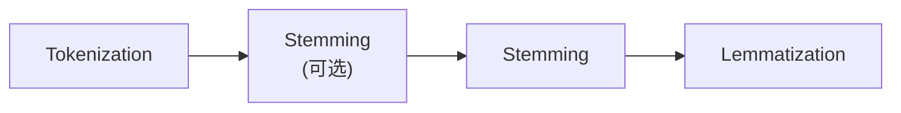

# NLP

参考资料：

- [Live NLP Playlist - Krish Naik](https://www.youtube.com/playlist?list=PLZoTAELRMXVNNrHSKv36Lr3_156yCo6Nn)

NLP(自然语言处理，Natural Language Process)的架构层级自底向上可以描述为：

- 第一层——预处理层：Tokenization、Lemmatization、Stemming、StopWords
- 第二层——预处理层：BOW(Bag Of Words)、TFIDF、Unigrams/Bigrams
- 第三层——预处理层：Word2Vec、AvgWord2Vec
- 第四层——机器学习层：
- 第五层——深度学习层：RNN、LSTM、GRU、RNN
- 第六层——预处理层：Word Embedding
- 第七层：Bidirectional LSTM、Encoder/Decoder、Attention
- 第八层：Transformer
- 第九层：BERT

# §1 第一层——预处理层

第一层的任务是清洗原始文本，我们对原始文本的预处理流程如下图所示：



## §1.1 Tokenization

将文本分割成单词。

## §1.2 StopWords(停止词)

我们将英语中的无实际意义单词视为StopWords，例如`to`、`but`。这一步操作会删除Tokenization结果中的无意义单词。

## §1.3 Stemming(词干)

Stemming用于提取单词中的词根。例如`history`和`historical`拥有相同的词根`histori`。这种操作速度很快，但是丢失了原文中的一部分信息，而且词根不一定是真实存在的单词。

## §1.4 Lemmatization(语法还原)

Lemmatization用于将词根还原成基本单词。例如`history`和`historical`的基本单词都是`history`。这种操作能保证输出结果一定是真实存在的单词，但是查表效率很低。

# §2 第二层——预处理层

第二层的任务是将Token用向量表示。

## §2.1 ONE(One-Hot Embedding)

统计语料库中的词汇个数$V$和单词总数$W$，将其作为每个单词对应的向量的长度，于是一段文本就是$W$个$V$维向量构成的矩阵。

这种方式的优点是直观、易于实现；缺点是向量非常稀疏、词汇表无法扩充、而且编码长度随语料变化，无法输入到规模固定的神经网络、无法捕获单词之间的关系。

## §2.2 BOW(Bag Of Words，词袋)

BOW的核心思想是词频统计。假设语料库中的词汇个数为$V$，我们将原始语料拆分成$D$个片段（称为文档），统计这些片段中每个单词出现的次数，从而得到一个代表整个语料库的$D\times V$矩阵。

这种方式的优点是直观、易于实现；缺点同样是非常稀疏、词汇表无法扩充、无法捕获单词之间的关系、丢失了单词的排列顺序信息。其中一种改进方式是：将相邻的$n$个单词合起来形成一个$n$元组，作为一个新的单词，也是BOW向量中的新维度。

## §2.3 TF-IDF(Term Frequency and Inverse Document Frequency)

BOW统计的是频次，这意味着它为每个单词的出现赋予了相同的权重。TF-IDF的核心思想是：给出现频率较少的但赐福于较高的权重。
$$
\begin{cases}
	\text{Term Frequency} = \frac{单个句子中指定单词的出现次数}{单个句子中所有单词的出现总数}  \\
	\text{Inverse Document Frequency} = \log\left(\frac{句子总数}{包含指定单词的句子总数}\right) \\
	\text{TF-IDF} = \text{Term Frequency} \times \text{Inverse Document Frequency}
\end{cases}
$$
例如给定下面3句话，请计算其TF-IDF：

- `Boy is good.`
- `Girl is good.`
- `Boy and Girl are good.`

| TF-IDF | `good`                               | `boy`                                | `girl`                               |
| ------ | ------------------------------------ | ------------------------------------ | ------------------------------------ |
| 句子1  | $\frac{1}{2}\times\log(\frac{3}{3})$ | $\frac{1}{2}\times\log(\frac{3}{2})$ | $0\times\log(\frac{3}{2})$           |
| 句子2  | $\frac{1}{2}\times\log(\frac{3}{3})$ | $0\times\log(\frac{3}{2})$           | $\frac{1}{2}\times\log(\frac{3}{2})$ |
| 句子3  | $\frac{1}{3}\times\log(\frac{3}{3})$ | $\frac{1}{3}\times\log(\frac{3}{2})$ | $\frac{1}{3}\times\log(\frac{3}{2})$ |

这种方式的优点是直观、能保留单词重要性；缺点是向量稀疏、词汇表无法扩充。

## §2.4 Unigrams


# §3 第三层——预处理层

## §3.1 Word2Vec

Word2Vec将词汇表中的每一个单词都转化成一个向量。不同的单词向量可以通过加减法拼出新的有意义的单词向量。单词与单词之间的相似度用单词向量的夹角余弦值表示。

### §3.1.1 CBOW(Contious Bag Of Words)

CBOW是Word2Vec的一种实现。对于给定的一段长度为$W$、词汇量为$V$的文本，我们先给其中的所有词汇使用ONE编码，得到$W$个$V$维向量，然后用长度为$n$的滑动窗口扫过整段文本。我们把滑动窗口中的单词排成一行，从中抽出处于中间位置的单词作为神经网络的输出（神经元个数为$V$），剩下的单词作为神经网络的输入（神经元个数为$(n-1)\times V$），中间的隐藏层有$n$个神经元，而ONE编码即为神经网络的期望输出。滑动窗口会产生$W-n+1$个训练样本，我们用这些样本训练神经网络即可。

### §3.1.2 Skip Gram

Skip Gram与CBOW的策略恰好相反。CBOW用周围的$n-1$个单词来预测中间的单词，而Skip Gram用中间的单词来预测周围的$n-1$单词。

```python
%pip install gensim

import gensim
import gensim.models
import gensim.models.word2vec
import gensim.models.keyedvectors
import gensim.downloader

word2vec = gensim.downloader.load('word2vec-google-news-300')

# 单词king的word2vec编码
word2vec["king"]

# 余弦相似度
[
    word2vec.similarity("king", "queen"),
    word2vec.similarity("apple", "sofa"),
    word2vec.similarity("man", "woman")
]

word2vec.most_similar("laugh")

# 单词向量的加减
word2vec.most_similar(
    word2vec["king"] - word2vec["man"] + word2vec["woman"]
)
```

