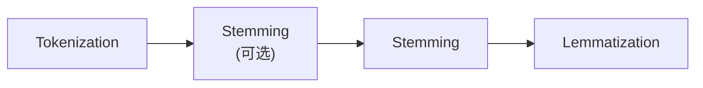

# NLP

参考资料：

- [Live NLP Playlist - Krish Naik](https://www.youtube.com/playlist?list=PLZoTAELRMXVNNrHSKv36Lr3_156yCo6Nn)

NLP(自然语言处理，Natural Language Process)的架构层级自底向上可以描述为：

- 第一层——预处理层：Tokenization、Lemmatization、Stemming、StopWords
- 第二层——预处理层：BOW(Bag Of Words)、TFIDF、Unigrams/Bigrams
- 第三层——预处理层：Word2Vec、AvgWord2Vec
- 第四层——机器学习层：
- 第五层——深度学习层：RNN、LSTM、GRU、RNN
- 第六层——预处理层：Word Embedding
- 第七层：Bidirectional LSTM、Encoder/Decoder、Attention
- 第八层：Transformer
- 第九层：BERT

# §1 第一层——预处理层

第一层的任务是清洗原始文本，我们对原始文本的预处理流程如下图所示：

## §1.1 Tokenization

将文本分割成单词。

## §1.2 StopWords(停止词)

我们将英语中的无实际意义单词视为StopWords，例如`to`、`but`。这一步操作会删除Tokenization结果中的无意义单词。

## §1.3 Stemming(词干)

Stemming用于提取单词中的词根。例如`history`和`historical`拥有相同的词根`histori`。这种操作速度很快，但是丢失了原文中的一部分信息，而且词根不一定是真实存在的单词。

## §1.4 Lemmatization(语法还原)

Lemmatization用于将词根还原成基本单词。例如`history`和`historical`的基本单词都是`history`。这种操作能保证输出结果一定是真实存在的单词，但是查表效率很低。

# §2 第二层——预处理层

第二层的任务是将Token用向量表示。

## §2.1 ONE(One-Hot Embedding)

统计语料库中的词汇个数$V$和单词总数$W$，将其作为每个单词对应的向量的长度，于是一段文本就是$W$个$V$维向量构成的矩阵。

这种方式的优点是直观、易于实现；缺点是向量非常稀疏、词汇表无法扩充、而且编码长度随语料变化，无法输入到规模固定的神经网络、无法捕获单词之间的关系。

## §2.2 BOW(Bag Of Words，词袋)

BOW的核心思想是词频统计。假设语料库中的词汇个数为$V$，我们将原始语料拆分成$D$个片段（称为文档），统计这些片段中每个单词出现的次数，从而得到一个代表整个语料库的$D\times V$矩阵。

这种方式的优点是直观、易于实现；缺点同样是非常稀疏、词汇表无法扩充、无法捕获单词之间的关系、丢失了单词的排列顺序信息。

## §2.3 TF-IDF(Term Frequency and Inverse Document Frequency)

## §2.4