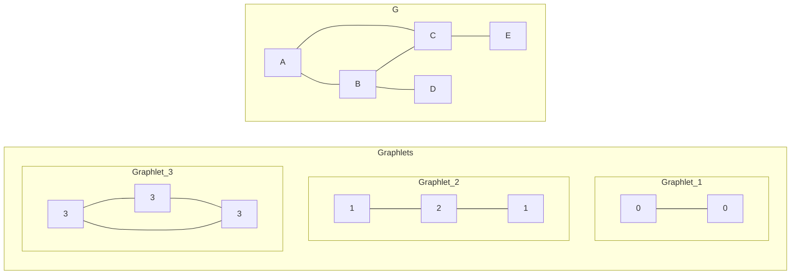
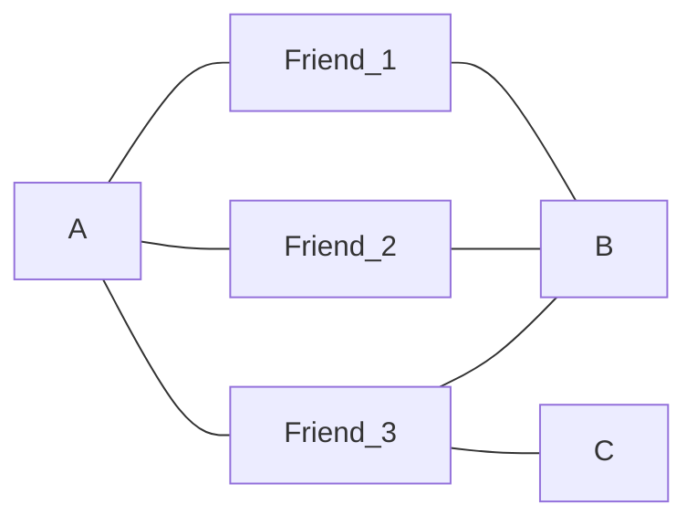
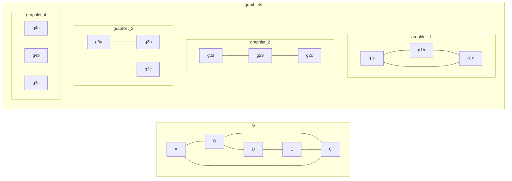
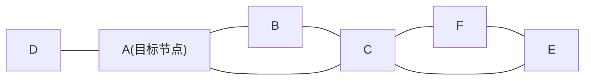
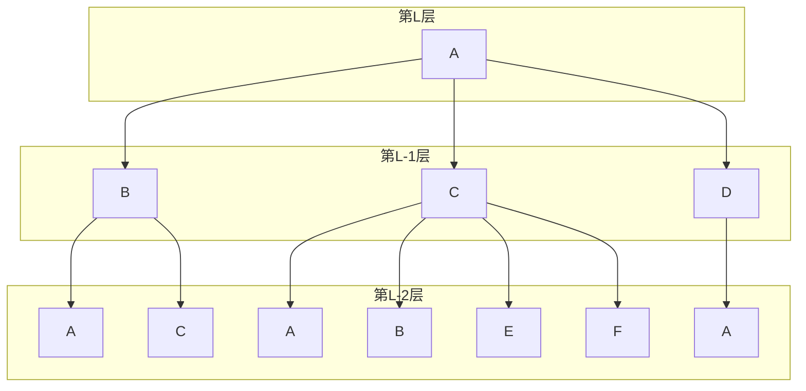
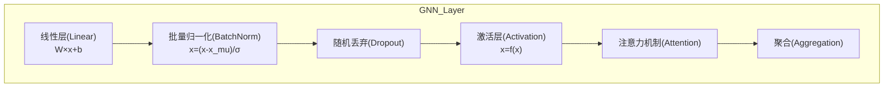
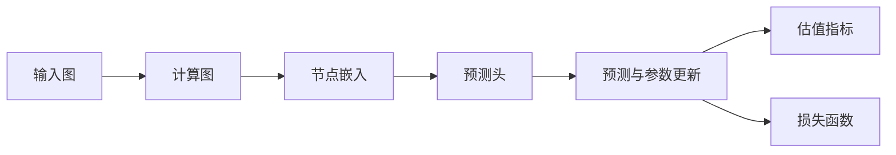

# 图神经网络

参考资料：

- 《深入浅出图神经网络(GNN原理解析)》 [豆瓣](https://book.douban.com/subject/34927262/)
- Stanford CS224W: Machine Learning with Graphs [YouTube](https://www.youtube.com/watch?v=JAB_plj2rbA&list=PLoROMvodv4rPLKxIpqhjhPgdQy7imNkDn)

# §1 表征工程

我们知道，数据集有可能缺少重要信息、存在冗余信息，甚至包含不正确的信息，从而干扰算法的性能。为了解决这一问题，特征工程应运而生，通过数据预处理和数据转换，从数据中提取机器学习所需的信息。然而，特征工程存在以下两个缺点：

- 依赖领域专家的密集劳动，需要领域专家与模型开发者密切配合
- 受限于领域专家的能力，导致数据不完整、分布存在偏见，限制了提取特征的数量
- 在开放的领域中，无法判定提取什么特征会产生最好的效果

为解决以上问题，表征学习应运而生。表征学习的目标是从数据中提取足够且尽可能少的信息。传统的表征学习负责学习数据转换，例如主成分分析(PCA, 1987)、高斯马尔科夫随机场(GMRF, 2005)、局部保持投影(LPP, 20044)。

表征学习可以分为以下几类：需要利用先验知识的监督学习、可以训练深度网络的无监督学习、增强泛化能力的迁移学习，以及强化学习、小样本学习、解耦表征学习。

| 领域名称\表征学习类别 | 监督学习                                                     | 无监督学习                                                   | 迁移学习 | 强化学习                           |
| --------------------- | ------------------------------------------------------------ | ------------------------------------------------------------ | -------- | ---------------------------------- |
| 图像处理              | 卷积神经网络(CNN)<br />深度信念网络(DBN)<br />AlexNet、VGG、GoogLeNet、ResNet、DenseNet | 代理任务：<br />灰度图像着色(2016)<br />图像修复(2016)       |          | 图像描述(2018)<br />图像编辑(2020) |
| 语音识别              | 受限玻尔兹曼机(RBM, 2011)<br />深度信念网络(2016)<br />MAVIS(2012)<br />CNN<br />LSTM/GRU | 变分自编码器(VAE)<br />降噪自编码器(DAE)<br />生成对抗网络(GAN, 2017)<br />对抗性自编码器(AAE, 2017) | MTL      |                                    |
| 自然语言处理          | CNN<br />RNN                                                 | word2vec(2013)<br />GloVe(2014)<br />BERT(2019)<br />循环自编码器<br />SENNA(2011) |          |                                    |
| 网络分析              | 网络表征学习(NRL)                                            |                                                              |          |                                    |

## §1.1 图

我们在离散数学中学过，图（Graph）$G$由顶点(Vertex)$V=\{v_1,v_2,...\}$和边(Edge)$E=\{e_1,e_2,...\}$构成。边分为有向边$\langle v_i,v_j \rangle$和无向边$(v_i,v_j)$，记为$e_{ij}$。

## §1.2 节点特征

### §1.2.1 节点度(Node Degree)

节点的出度(Out-Degree)和入度(In-Degree)，分别表示该节点引出和接纳了多少“箭头”。

### §1.2.2 节点中心度(Node Centrality)

要描述图中节点的特征，一个容易想到的方法是把节点的度数(Node Degree)作为特征。这样做有一个明显的缺陷——如果两个节点度数相同，那么这两个节点将永远无法区分，即使它们在所处的拓扑结构中并不同构（不能互相代替对方的位置）。例如同样是度数相同，显然二分图边缘的节点比子图分量内的节点更重要。因此，我们迫切需要一种更复杂、更有代表性的节点特征，用于更好地表示节点在图中的重要性。这种特征称为节点中心度(Node Centrality)。我们将节点$v$的中心度记为$c_v$。

节点中心度的定义和计算方法并不唯一。著名的节点中心度包括：

- 特征向量中心度(Engienvector Centrality)

  特征向量中心度的核心思想是：如果某个节点周围的节点都很重要，那么这个节点本身就很重要。我们求解邻接矩阵$\mathbf{A}$的特征值$\lambda_1,\lambda_2,...,\lambda_N$和特征向量$\mathbf{c}_1,\mathbf{c}_2,...,\mathbf{c}_N$，记$\lambda_{\text{max}}=\max\{\lambda_1,\lambda_2,...,\lambda_N\}$。由Perron-Frobenius Theorem知，$\lambda_{\text{max}}$恒为正。记特征值$\lambda_{\text{max}}$对应的特征向量为$\mathbf{c}_{\text{max}}$，$\mathbf{c}_{\text{max}}=[c_1,c_2,...,c_N]^T$中的分量即为各顶点所求的特征向量中心度。

  除此以外，我们可以将周围节点的特征向量中心度相加，通过正则化，也能得到本节点的特征向量中心度：
  $$
  c_v=\frac{1}{\lambda_{\text{max}}}\sum_{v'\in N(v)}c_{v'}
  $$

- 中介中心度(Betweenness Centrality)

  中介中心度的核心思想是：考察任意两个节点间的最短路径构成的集合，如果某个节点频繁地出现在最短路径上，那么这个节点很重要。据此，我们可以得出中介中心度的计算公式：
  $$
  c_v=\sum_{\genfrac{}{}{0}{}{v',v''\in V}{v\neq v'\neq v''}}\frac{v'与v''的最短路径中包含v的数量}{v'与v''的最短路径的数量}
  $$

- 紧密度(Closeness Centrality)

  紧密度的核心思想是：如果考察某个节点到其它所有节点的最短距离总和，对所有节点进行这种总和计算工作，如果某个节点的总和值很小，说明它与其它节点都很近，因此这个节点很重要。
  $$
  c_v=\frac{1}{\displaystyle\sum_{\genfrac{}{}{0}{}{v'\in V}{v\neq v'}}v到v'的最短距离}
  $$

### §1.2.3 聚集系数(Clustering Coefficient)

聚集系数$e_v$用于衡量某个节点的相邻节点之间的连接程度。我们记节点$v$的相邻节点数量为$k_v=\#(N(v))$，于是有：
$$
e_v=\frac{N(v)之间形成的边总数}{C_{k_v}^{2}}
$$
### §1.2.4 GDV(Graphlet Degree Vector)

回想高中有机化学的烷烃，即使碳原子数量相同，也可以构成不同的通分异构体。其中每个碳原子的数量相同。例如要写出所有戊烷的同分异构体，我们就必须谨慎地处理等价碳原子，防止写出重复的/同构的烷烃。现在我们知道，戊烷只有三种：正戊烷、异戊烷、新戊烷。

Graphlet本质上就是各类烷烃的同分异构体集合。在数学上，Graphlet的定义是一堆有根的（选定一个节点为根节点）、连通的、相互之间非同构的、顶点数至少为2的子图构成的集合。

GDV(Graphlet Degree Vector)是通过GDV定义的节点特征向量。按照图中的顶点总数（$\ge2$），我们将整个Graphlets集合划分为一系列子集，并给其中的不等价顶点标明自增的序号。

>注意：这里的“序号”并不唯一。这体现在三方面：一是**Graphlets的内容不唯一，上文我们将所有的Graphlet都列举了出来，实际上我们可以按需任意挑选其中的几个，构成一个子集，将这个子集作为参与计算的Graphlets**；二是Graphlets的顺序不唯一，我们可以任意打乱Graphlet的顺序；三是单个Graphlet内取点的顺序也可以不同。

GDV的计算方法如下所示：
$$
\begin{aligned}
	& \text{function} \ \text{getGDV}(\text{Vertex }v, \text{Graph }G, \text{Collection[Graph] }Graphlets): \\
	& \quad \text{initialize } GDV = [0,0,...,0]^T_{(Graphlets中的非等价顶点数\times 1)} \\
	& \quad \text{for}\ i, graphlet \in \text{enumarate}(Graphlets): \\
	& \qquad GDV[i]=\text{count}\{G'|
		\textcolor{red}{G'\in G} \wedge 
		\textcolor{red}{E(G')=\{(v_{i},v_{j})|\forall v_{i},v_{j}\in V(G') \wedge (v_{i},v_{j})\in E(G)\}} \wedge
		\textcolor{red}{v\in G' } \wedge 
		\textcolor{red}{\exists Graphlet \in Graphlets \rightarrow v_{j}\in V(Graphlet) \wedge G'与Graphlet同构}
	\}
\end{aligned}
$$
以下图为例，求解点$A$的GDV。我们先看$0$号非等价顶点，容易发现`A-B`、`A-C`两个子图都符合要求，因此第$1$个分量为$2$；再看$1$号非等价顶点，子图`A-B-D`和`A-C-E`符合要求，因此第$2$个分量为$2$；再看$2$号非等价顶点，没有符合条件的子图（你可能会问`B-A-C`为什么不满足，这是因为按照GDV的定义，符合条件的子图在拿到顶点的子集后，必须找到所有原有的边，所以`B-A-C`不能单独存在，必须加上`B-C`这条边），因此第$3$个分量为$0$；最后看第$3$号非等价顶点，子图`A-B-C-A`符合要求，所以第$4$个分量为$1$。综上所述，$\vec{\text{GDV}}_A=[2,2,0,1]$

## §1.3 边特征

边特征用于描述两个节点之间关系的紧密程度。

>注意：即使$(v_{i},v_{j})\notin E(G)$，任意两个节点都可以构建这种边特征。
### §1.3.1 基于距离的特征(Distance-based Feature)

一种容易想到的方法是：把两个节点之间的最短距离定义为边特征。

然而该特征不能捕捉到邻接节点的重合。例如给定下面的“朋友圈”，注意到`A-B`、`A-C`的最短距离都是$3$。然而`A`和`B`虽然互不相识，但是认识大量的相同朋友，比`A-C`认识的朋友更多，因此我们有理由相信`A-B`的关系更紧密。这是基于距离的特征无法表明的。

### §1.3.2 局部邻居节点重合(Local Neighborhood Overlap)

我们记节点$v$的邻居节点集合为$N(v)$，于是我们可以定义以下局部邻居节点的特征：

- Jaccard's Coefficient：$\displaystyle\frac{|N(v_{1})\cap N(v_{2})|}{|N(v_{1})\cup N(v_{2})|}$
- Adamic-Adar Index：$\displaystyle \sum_{v\in N(v_{1})\cap N(v_2)}{\frac{1}{|N(v)|}}$
局部邻居节点重合的问题在于，如果两个节点没有公共的邻居节点，那么就无法区分这两个节点了。
### §1.3.3 全局邻居节点重合(Global Neighborhood Overlap)

回顾数据结构与算法中的知识，我们知道：假设一个图的邻接矩阵为$\mathbf{A}$，则$\mathbf{A}^{l}_{ij}$表示从$v_{i}$到$v_{j}$一共有多少条长度恰好为$l$的路径。

Katz Index的定义如下：（其中$\beta\in[0,1]$为距离系数）
$$
\begin{cases}
\displaystyle S_{v_{i},v_{j}}=\sum_{l=1}^{\infty}{\beta^l}\mathbf{A}^{l}_{ij} \\
\displaystyle \mathbf{S}=\sum_{l=1}^{\infty}{\beta^l}\mathbf{A}^{l}=(\mathbf{I}-\beta \mathbf{A})^{-1}-\mathbf{I}
\end{cases}
$$
## §1.4 图特征/图核

图核是一种用于描述两个图的相似程度的函数$k:(G,G')\rightarrow \mathbb{R}$，图核矩阵$\mathbf{K}_{G\times G'}$是一种半正定矩阵，存在对应的核函数$\phi(\cdot)$，使得图核矩阵可以被分解为$\mathbf{K}_{G\times G'}=\phi(G)^{T}\phi(G')$。

BoW(Bag-of-Words)是一种统计纯文本文档的策略。例如我们打开某篇文档，按下Ctrl+F快捷键，就可以搜索到单词`"my"`出现的次数。我们把词典中的所有词汇都搜索一遍，就能得到所有词汇出现的次数。把这些次数合并成一个向量，就是这篇文档的特征，称为BoW。

受此启发，我们也可以用Bag-of-Node-Degree来描述一个图的特征。我们分别统计度数为$1$、$2$、$3$、...的点的数量，合成一个向量即可。

在这之后，各种基于此的改良方法被提出：
- Graphlet Kernel
- Weisfeiler-Lehman Kernel
- Random-walk Kernel
- Shortest-path Graph Kernel

### §1.4.1 Graphlet Kernel

这里我们使用的Graphlet不同于[§1.2.4 GDV(Graphlet Degree Vector)](###§1.2.4 GDV(Graphlet Degree Vector))中提到的Graphlet：

| Graphlet Kernel中的Graphlet | GDV中的Graphlet      |
|:--------------------------- | --------------- |
| 有根图                      | 无根图          |
| 连通图                      | 连通图/非连通图 |
| 非同构图                            |   非同构图              |


Graphlet Kernel的计算方式如下：
$$
\begin{aligned}
	& \text{function} \ \text{getGraphletKernel}(\text{Vertex }v, \text{Graph }G, \text{Collection[Graph] }Graphlets): \\
	& \quad \text{initialize } graphletKernel = [0,0,...,0]^T_{(Graphlets中的子图数量\times 1)} \\
	& \quad \text{for}\ i, graphlet \in \text{enumarate}(Graphlets): \\
	& \qquad graphletKernel[i]=\text{count}\{G'|
		\textcolor{red}{G'\in G} \wedge 
		\textcolor{red}{v\in G' } \wedge 
		\textcolor{red}{G'与Graphlet同构}
	\} \\
	& \quad graphletKernel=\frac{graphletKernel}{\text{sum}(graphletKernel)}
\end{aligned}
$$

例如给定下图$G$，求$A$点的Graphlet Kernel。与给出的四个Graphlet一一对照，可得Graphlet为$\displaystyle[\frac{1}{10},\frac{3}{10},\frac{6}{10},\frac{0}{10}]^T$。



Graphlet Kernel的问题在于计算复杂度太高，令图$G$中的点数量为$n$，Graphlets中的子图数量为$k$，则时间复杂度为$O(n^k)$。

### §1.4.2 Weisfeiler-Lehman Kernel

为了提高Graphlet Kernel的性能，一种基于Color Refinement的Weisfeiler-Lehman Kernel被提出，将时间复杂度压缩到了线性级。我们将点$v$在$t$时刻的颜色记为$c^{(t)}(v)$。一开始($t=0$)每个点的颜色都是相同的，然后按照下列公式更新每个点的颜色：
$$
c^{(t+1)}(v)=\text{Hash}(\{c^{(t)}(v)\}+\{c^{(t)}(v')|v'\in N(v)\})
$$
其中$\text{Hash}$是一个输出颜色的哈希函数：$\text{Hash}:\{\text{Color},\text{Color},...\}\rightarrow \text{Color}$。经过$T$次迭代后，我们得到了一系列时间维度上的颜色向量$\vec{c^{(1)}},\vec{c^{(2)}},...,\vec{c^{(T)}}$。统计不同颜色的出现次数，拼成一个向量，即为所求的Weisfeiler-Lehman Kernel向量。
## §1.5 节点嵌入

嵌入(Embedding)的目标是：找到一种函数$\text{ENC}:v\in V\rightarrow \mathbb{R}^d$，使得图中两个相邻的顶点映射后，在嵌入空间中依然保持相邻。具体来说，$\text{ENC}()$的具体表达式为$\text{ENC}(v)=\mathbf{z}_v=\mathbf{Z}\mathbf{v}$，其中$\mathbf{Z}\in \mathbb{R}^{d\times|\mathbf{v}|}$为要优化的参数矩阵，$v\in \mathbb{I}^{|\mathbf{v}|}$为One-Hot向量，表示当前顶点在所有顶点中的位置。

我们的目标是优化矩阵$\mathbf{Z}$，使得：
$$
\max\left({\mathbf{z}_{v_{i}}^{T}\cdot \mathbf{z}_{v_{j}}}\right), \text{if } \text{Similarity}(v_i,v_j)>>\text{Constants}
$$
### §1.5.1 Random Walk

Random Walk的核心思想是：假设从顶点$v$出发，随机行走（可以走回路、可以沿原路返回），走的一段路程称为策略$R$，则$P(v'|\mathbf{z}_v)$表示从$v$点出发，恰好能行走到$v'$点的概率。我们把这个概率作为两个点的邻近程度，即$\text{Similarity}(v_i,v_j):=P(v_j|\mathbf{z}_{v_i})$。

令$N_R(v)$为从$v$点出发，按照策略$R$经过的所有点。于是优化问题转化为最大化对数似然函数：
$$
\mathop{\arg\max}\limits_{\text{ENC}}\sum\limits_{v\in V}{\log P(N_R(v)|\mathbf{z}_v)}
$$
损失函数为：
$$
\begin{cases}
P(v'|\mathbf{z}_v)=\displaystyle\frac{\exp(\mathbf{z}_{v}^{T}\mathbf{z}_{v'})}{\displaystyle\sum_{u\in V}\exp(\mathbf{z}_{v}^{T}\mathbf{z}_{u})} \\
\displaystyle\mathcal{L}=\sum\limits_{v\in V}\sum\limits_{v'\in N_{R}(v)} -\log(P(v'|\mathbf{z}_v))
\end{cases}
$$
在大规模的图中，使用上面的损失函数是不现实的，因为计算$\mathcal{L}$的时间复杂度是$O(|V|^{2})$。为了绕开$\sum\limits_{u\in V}\exp(\mathbf{z}_{v}^{T}\mathbf{z}_{u})$，我们采用一种名为[负采样](https://arxiv.org/abs/1402.3722)（Negative Sampling）的策略：
$$
\begin{cases}
\textcolor{red}{n_{i}}\sim P_v=\{本质上是多项分布.从|V|个样本中随机选\textcolor{red}{k}个样本,计算其\mathbf{z}_{v}^{T}\mathbf{z}_{v_{\textcolor{red}{n_i}}},并按结果值归一化作为对应数字的概率\}
\\
\displaystyle\log\left(
	\frac
		{\exp(\mathbf{z}_{v}^{T}\mathbf{z}_{v'})}
		{\displaystyle\sum_{u\in V}\exp(\mathbf{z}_{v}^{T}\mathbf{z}_{u})}
\right)\approx\
	\log\left(\text{sigmoid}(\mathbf{z}_{v}^{T}\mathbf{z}_{v'})\right) + 
	\sum\limits_{i=1}^{\textcolor{red}{k}}{
		\log\left(\text{sigmoid}(
			\mathbf{z}_{v}^{T}\mathbf{z}_{v_{\textcolor{red}{n_i}}}) \\
        \right)
	}
\end{cases}
$$

Random Walk的优点在于：
- 表达能力强，对于任意图都很灵活。
- 高效，无需遍历所有边。
### §1.5.2 node2vec

相比于Random Walk的完全随机行走，node2vec调整了行走的策略，变为二阶有偏随机行走。二阶代表着能够记忆上次抵达的节点，知道原路返回应该选择哪条路；有偏代表不对不同路径有不同的选择偏见，从而改变了$N_{R}{(v)}$的取值倾向。

对于原路返回，设置概率权重为$\displaystyle\frac{1}{p}$；对于通往相同距离的顶点的路径，设置概率权重为$1$；对于通往更远距离的顶点的路径，设置概率权重为$\displaystyle\frac{1}{q}$。然后将这些概率权重归一化，得到真实的概率，随后进行选择。这里的$p$和$q$是超参数，决定了策略$R$探索的方向。
## §1.6 图嵌入
### §1.6.1 所有顶点嵌入的总和或平均

一种容易想到的图嵌入方法是将所有顶点嵌入得到的特征相加或取平均：
$$
\mathbf{z}_{G}=\sum\limits_{v\in V(G)}{\mathbf{z}_v}
$$
该方法于2016年提出，并取得了不错的效果。
### §1.6.2 虚拟节点

我们将整个图（或其子图）聚集起来，用一个虚拟节点表示，对这些虚拟节点使用上面介绍的图嵌入方法。该方法于2016年提出。
### §1.6.3 Anonymous Walk Embedding

我们记一次随机行走的路径$P$为$\{v_{a_1},v_{a_2},...,v_{a_l}\}$，其中$a_l$是表示经过顶点的序号的数列。则这次随机行走的路径对应的Anonymous Walk按下文规则定义：路径中的每一个顶点都对应着Anonymous Walk向量的一个分量。沿路径出发，遇到之前没有经过的顶点时，给Anonymous Walk对应位置的分量标记一个从$1$开始递增的序号，也就是遇到一个陌生顶点就加$1$。在这一过程中，我们完成了对顶点序号的重命名。遇到已经经过的顶点时，不再使用递增的序号，而是用之前赋予的序号。以上规则可以表示为：
$$
\begin{align}
	& 
	\text{def }\text{getAnonymousWalk}(\text{Path }P,\text{Graph }G): 
	\\ &
	\quad \text{initialize }anonymousWalk=[0,0,...,0]^{T}_{(|p|\times 1)}
	\\ &
	\quad \text{for } i, v_{a_i} \text{ in } \text{enumerate}(P):
	\\ &
	\qquad \text{if } \exists v_{a_{j}}\in\{v_{a_{1}}, v_{a_{2}}, ..., v_{a_{i-1}}\},s.t.a_{i}=a_j:
	\\ &
	\qquad \quad position= \text{getIndex}(v_{a_{j}},P)
	\\ &
	\qquad \quad anonymousWalk[i]=anonymousWalk[position]
	\\ &
	\qquad \text{else}:
	\\ &
	\qquad \quad anonymousWalk[i]=|\{a_{1}, a_{2}, ..., a_{i-1}\}_{集合自动去重}|+1
	\\ &
	\quad \text{return } anonymousWalk
\end{align}
$$
根据以上定义，我们可以制成一张Anonymous Walk的长度与种类的关系表：

| Anonymous Walk长度$l$ | Anonymous Walk种类总数$\eta$      | Anonymous Walk种类  |
| ------------------ | --------------------------- | ------------------- |
| 2                  | 2,记为$w_1,w_2$             | 11,12               |
| 3                  | 5,记为$w_1,w_2,...,w_5$     | 111,112,121,122,123 |
| 4                  | 15,记为$w_1,w_2,...,w_{15}$ | ......              |

现在任意取一个数$l\in \mathbb{N}^+$，作为Anonymous Walk的步长，遍历图$G$中的所有点$v\in V$，进行上述的匿名随机行走过程，则$\mathbf{z}_{G}[i]$为这次匿名随机行走过程恰好为$w_i$的概率。令长度为$l$的Anonymous Walk种类一共有$\eta$个，则这$\eta$个概率拼接在一起，就形成了Anonymous Walk规定的图嵌入特征$\mathbf{z}_{G}$。

在实际工程中，我们无法对每个点都穷尽所有的随机行走路径。为了保证最终的误差小于$\epsilon$有$1-\delta$的概率成立，我们至少需要采样的次数$m$由下式给出：
$$
m = \lceil \frac{2}{\epsilon^{2}}\left( 
	\log(2^{\eta}-2)-\log(\delta)
\right) \rceil
$$
图嵌入的最优化问题可以描述为：在长度为$T$的路径序列$w_0,w_1,...,w_T$中选中长度为$2\Delta t$的窗口，尝试最大化
$$
\max\sum_{t=\Delta t}^{T-\Delta t}\log P(w_t|w_{t-\Delta t},...,w_{t+\Delta t},\mathbf{z}_{G})
=
\max\sum_{t=\Delta t}^{T-\Delta t} \log \left( \frac
	{\exp(y(w_t))}
	{\sum_{i=1}^{\eta}\exp(y(w_t))}
\right)
$$
其中：
$$
y(w_t)=b+U\left(\text{cat}\left(\frac{1}{2\Delta t}\sum_{i=-\Delta t}^{\Delta t}\mathbf{z}_i,\mathbf{z}_G\right)\right)
$$
## §1.7 节点排序

节点排序是一类通过分析边关系，从而计算节点重要程度的算法统称。

### §1.7.1 PageRank

如何描述某个节点的重要程度呢？我们把这个问题放到互联网的背景下，每个网页都是一个顶点。网页中含有超链接，可以指向其它网页，这对应着图中的有向边。直觉告诉我们，如果一个网页有很多超链接引用，那么它应该是很重要的；同理，如果一个很重要的网页引用到了另一个网页，那么另一个网页同样重要。基于此，Google的研究人员提出了PageRank。

让我们建立一个$|V|$维向量（记为$\mathbf{r}$），每个分量代表着一个顶点的重要程度。令每个节点的出度为$d_i$，那么$\mathbf{r}$的计算方法为：自己的重要程度取决于其它节点通过入度分享的重要程度的综合，又会把自己的重要程度均分成出度份，均匀地通过出度分享给其它节点。上述过程用公式可表示为：
$$
\begin{cases}
	\displaystyle r_i = \sum_{
		\langle v_j, v_i \rangle \in E(G)
	}{\frac{r_{j}}{d_{j}}}
	\\
	\mathbf{r}=\mathbf{M}\mathbf{r},\text{where } M_{ij}=\begin{cases}
		0 & , \langle v_{j}, v_{i} \rangle \notin E(G) \\
		\displaystyle\frac{1}{d_{j}} & , \langle v_{j}, v_{i} \rangle \in E(G)
	\end{cases}
\end{cases}
$$
其中$\mathbf{M}_{|V|\times|V|}$称为随机邻接矩阵。至此，你会发现“重要性”是守恒的，它既不会凭空产生，也不会凭空消失，而是会从一个节点转移到另一个节点。

这是一个关于$\mathbf{r}=[r_1,r_2,...,r_{|V|}]^{T}$的、$|V|$维的、秩为$|V-1|$的线性方程组，我们当然可以加一个普通的约束条件，然后使用正常的线性方程组求解方法。但是随着$|V|$的增大，目前的准确求解方法没有可扩展性。现在工程上常用两种方法：

- 特征向量求解（精确值）
  注意到$\mathbf{r}=\mathbf{Mr}$，表示$\mathbf{r}$是$\mathbf{M}$特征值为$1$的特征向量。
- 幂次迭代（估计值）
  注意到$\mathbf{r}=\mathbf{Mr}$，从形式上类似于函数的不动点，因此我们考虑通过迭代来逼近精确值。这种工程方法的缺陷是无法证明一定收敛、无法证明所求的估计值一定是稳定不动点、无法证明结果的合理性。
  $$
  \begin{cases}
  \mathbf{r}^{(0)}=\displaystyle\left[\frac{1}{|V|},\frac{1}{|V|},...,\frac{1}{|V|}\right]^{T}_{|V|\times 1}
  \\
  \mathbf{r}^{(t+1)}=\mathbf{M}\mathbf{r}^{(t)}
  \\
  \text{until } \left|\mathbf{r}^{(T)}-\mathbf{r}^{(T-1)}\right|_{1}<\epsilon
  \end{cases}
  $$
  这种方法有两个问题：
1. Dead Ends
   当图中的某些节点出度为$0$时，所有的随机行走路径最终都会走到这个死胡同，并且在下一时刻携带着“重要性”凭空消失。这破坏了“重要性”的守恒性质，导致其逐渐“泄漏”，最终每个节点的重要性都会收敛到$0$。
2. Spider Traps
   当图中存在至少一个连通真子图，使得该真子图整体没有出度时，这个真子图就会像蜘蛛网一样，将所有的“重要性”都聚集在该真子图内，导致该真子图之外的其它节点的“重要性”全部收敛到$0$。

谷歌的研究人员对此提出的解决方法是：不再让随机路径每次都按照边集合$E$前进，而是在每次移动做出决策时，以$1-\beta$的概率均匀的跳转到$V$中的任意一个节点。实践中$\beta$常取$0.8\sim0.9$。这就是最终的PageRank算法：
$$
  \begin{cases}
	\displaystyle r_i = \sum_{
		\langle v_j, v_i \rangle \in E(G)
	}{\beta\cdot\frac{r_{j}}{d_{j}}+(1-\beta)\cdot\frac{1}{|V|}}
	\\
	\mathbf{r}=\textcolor{red}{\left(\beta\mathbf{M}+(1-\beta)\left[\begin{matrix}
		\frac{1}{|V|} & \cdots & \frac{1}{|V|} \\
		\vdots        & \ddots & \vdots        \\
		\frac{1}{|V|} & \cdots & \frac{1}{|V|}
	\end{matrix}\right]_{|V|\times |V|}\right)}\cdot\mathbf{r},\text{where } M_{ij}=\begin{cases}
		0 & , \langle v_{j}, v_{i} \rangle \notin E(G) \\
		\displaystyle\frac{1}{d_{j}} & , \langle v_{j}, v_{i} \rangle \in E(G)
	\end{cases}
  \end{cases}
$$
令全一矩阵表示为$\mathbb{J}_{(维度)}$，我们将上式的红色部分记为矩阵$\mathbf{G}$，于是PageRank可以简记为：
$$
  \begin{cases}
	\displaystyle r_i = \sum_{
		\langle v_j, v_i \rangle \in E(G)
	}{\beta\cdot\frac{r_{j}}{d_{j}}+(1-\beta)\cdot\frac{1}{|V|}}
	\\
	\displaystyle\mathbf{r}=\left(\beta\mathbf{M}+(1-\beta)\frac{\mathbb{J}_{|V|\times |V|}}{|V|}\right)\cdot\mathbf{r}=\mathbf{Gr}
  \end{cases}
$$
### §1.7.2 PPR(Personalized PageRank)

在PageRank的基础上，PPR(Personalized PageRank)不再以$1-\beta$的概率均匀的跳转到$V$中的任意一个节点，而是跳转到某个预先指定好的，概率有偏的顶点子集中的某个点。

例如开发者特别想推荐$v_1$和$v_2$两个顶点/页面，完全不推荐其它页面，并且让两者的概率分别为$\displaystyle\frac{1}{3}$和$\displaystyle\frac{2}{3}$，那么我们只需把PageRank中的$\displaystyle\frac{\mathbb{J}_{|V|\times|V|}}{|V|}$变成第一行全为$\displaystyle \frac{1}{3}$、第二行全为$\displaystyle \frac{2}{3}$，其余元素全为$0$的$|V|\times|V|$维方阵即可。
### §1.7.3 Random Walk with Restarts

在PPR的基础上，Random Walk with Restarts更进一步，限制跳转的取值范围仅有一个点，也就是事先选定好的起点$v_{\text{start}}$：
$$
\begin{align}
& \forall v \in V, v.\text{count}=0 \\
& \text{item} = v_{\text{start}} \\
& \text{for } \_ \text{ in } \text{range}(steps): \\
& \quad \text{item} = \text{item}.\text{get\_random\_neighborhood}().\text{get\_random\_neighborhood}() \\
	& \quad \text{item.count} = \text{item.count} + 1 \\
& \quad \text{if}(\text{random()}) < 1-\beta : \\
& \qquad \text{item} = v_{\text{start}} \\
\end{align}
$$
最后将所有的$v.\text{count}$集合起来，拼接成一个向量，可以视为$v_\text{start}$节点的节点嵌入特征。

## §1.8 节点分类/预测

考虑这样一个任务：给定一个图$G=(V,E)$，有部分节点的代表类别的标签（One-Hot向量）已经给出。请问如何预测其它未给定标签向量的顶点所属的类别？

为解决这个问题，我们有以下三种方法：
1. 训练一个关系分类器。关系分类器是一个从节点特征向量映射到标签向量的函数，给定当前节点的特征向量，可以输出该节点的预测标签向量。
2. 训练两个迭代分类器。迭代分类器用于捕捉某个节点与周围节点的关系，它接受图的拓扑信息，输出当前节点的特征向量。
3. 通过循环信念传播。这是一种正向传播机制，将当前节点的信息传播到其它节点。

### §1.8.1 关系分类器(Relational Classifier)

令$Y_v$为关系分类器对结点$v$的真实标签$e$的预测。我们从最简单的二分类问题开始，把标签不再记为向量$\vec{\mathbf{e}}\in \{0\sim 1\}^{n}$，而是使用标量$e=\{0\sim 1\}$。令$\mathbf{A}_{ij}$为边$(v_i,v_j)$对应的权重。于是$v_i$的真实标签$e$恰好为$c\in\mathbb{N}^{+}$的概率$Y_{v_i}$由下式给出：
$$
P(Y_{v_i}=c)=\frac
    {\displaystyle\sum_{(v_j,v_i)\in E}\mathbf{A}_{ji} \times P(Y_{v_j}=c)}
    {\displaystyle\sum_{(v_j,v_i)\in E}\mathbf{A}_{ji}}
$$
给定初始条件：
$$
P(Y_{v_i}=c)=\begin{cases}
	0   & , v_i的真实标签为0 \\
	1   & , v_i的真实标签为1\\
	0.5 & , v_i的缺失真实标签\\
\end{cases}
$$
与前文介绍的递推公式计算方法不同，我们不再更新全部节点，而是只更新没有真实标签的节点；我们不再同时更新下一时刻的递推值（对应的递推公式$P(t+1)=f\left(P(t)\right)$会出现$t$之类的东西），而是按事先指定的节点更新顺序来完成一轮更新，这会导致前面节点的更新会影响后面节点的更新。

当上式收敛后，我们就能根据节点的标签是否大于$0.5$进行分类。这样我们就仅哦你干过关系分类器完成了分类任务。

### §1.8.2 迭代分类器(Iterative Classfication)

迭代分类器的核心思想是：第一步在测试集上训练两个分类器，分别是$\phi_1():\mathbf{f}_v \in \mathbb{R}^{n}\rightarrow Y_v\in \mathbb{R}$和$\phi_{2}():(\mathbf{f}_v \in \mathbb{R}^{n},\mathbf{z_v} \in \mathbb{R}^{n})\rightarrow Y_v \in \mathbb{R}$，其中$\mathbf{z}_v:=\displaystyle\sum_{v'\in N(v)}{\mathbf{f}_{v'}}$。第二步在测试集上，先调用$\phi_1()$，通过某个顶点的特征$\mathbf{f}_v$预测标签$Y_v$；第三步让该节点的邻接节点将它们的信息正向传播，汇总到该节点形成$\mathbf{z}_v$，再调用$\phi_2()$更新$Y_v$。最后，重复第二步和第三步，直到收敛或达到最大步长为止。

### §1.8.3 循环信念传播(Loopy Belief Propagation)

令Label-label Potentional Matrix（记为$\mathbf{\psi}$）表示两个相邻节点的依赖程度，$\mathbf{\psi}(Y_i,Y_j)$表示如果节点$v_i$属于类别$Y_i$，则节点$v_j$属于类别$Y_j$的概率。令Prior Belief（记为$\phi(Y_i)$）表示节点$v_i$属于类别$Y_i$的概率。令所有类别/对应的标签的全体构成集合$\mathcal{L}$。

$v_i$传递出的信息有可能会让$v_j$相信自己属于$Y_j$，$v_i$对自己的标签越信任，传递出的信息就越容易被$v_j$信任，从而增强$v_j$对自己属于$Y_j$的信任程度$b_j(Y_j)$。这一过程记为：
$$
\begin{cases}
初始化:\forall v_i,v_j \in V,m_{i\rightarrow j}(Y_j)=1
\\ \displaystyle
m_{i\rightarrow j}(Y_j) = \sum_{Y_i\in\mathcal{L}} \left(
    \mathbf{\psi}(Y_i,Y_j) \cdot 
    \phi_i(Y_i) \cdot 
    \prod_{\langle v_k,v_i \rangle\in  E}m_{k\rightarrow i}(Y_i)
\right)
\\ \displaystyle
b_i(Y_i) = \phi_i(Y_i) \cdot \prod_{\langle v_k,v_i \rangle\in  E}m_{k\rightarrow i}(Y_i)
\end{cases}
$$
这种方式的优点在于：
- 算法简单，易于并行化
- 适用于任意形式的图

# §2 图神经网络(GNN)

如何将图转换为深度网络能识别的、尺寸稳定的输入呢？一种容易想到的方法是：将图的邻接矩阵每一行与该点的特征向量拼在一起，构成一行更长的向量，作为神经网络的输入。这样做的问题有三个：一是输入向量的长度为$|V|+|\mathbf{f}|$，这对于大规模网络来说开销太大；二是不适用于节点数不同的网络，没有通用性；三是对节点序号顺序很敏感。

## §2.1 图卷积网络(GCN)

前面我们学过的各种顶点嵌入方案，都只考虑到图的拓扑结构，生成一个新的顶点特征向量，而忽略了节点原先自带的特征向量。这里我们提出一种图卷积网络（GCN），视图聚合节点周围的特征。

假如要求顶点$v$的嵌入向量，我们希望这个顶点能吸收到相邻节点的自带特征向量信息。于是我们把$v$放在一个树的根节点位置，并为其所处的位置命名为第$L$层。接着，我们找到这个顶点的所有邻接节点，这些邻接节点构成顶点集合$N(v)$，并且把这些邻接节点都挂在根节点的子节点位置，将此位置命名为第$L-1$层。依次类推，直到第$0$层，我们不再为第$0$层的节点挂上子节点，我们就得到了一个深度为$L$的图卷积神经网络。




设$f$为非线性激活函数（Sigmoid、ReLU等），$\mathbf{X}\in \mathbb{R}^{m\times|V|}$为$|V|$个顶点的$m$维特征构成的矩阵，$\mathbf{f}_{v}^{l}$为顶点$v$在第$l$的特征向量，则图神经网络的正向传播过程可以描述为：
$$
\mathbf{f}_v^{(l+1)}=f\left(
	\mathbf{W}^{(l)}\sum_{v'\in N(v)}\frac{\mathbf{f}_{v'}^{(l)}}{|N(v)|}
\right),\forall l\in\{0,1,2,...,L-1\}
$$
这就是原始的图卷积网络。其中$\mathbf{W}^{(l)}\in \mathbb{R}^{|V|\times|V|}$$为可以学习的参数。

### §2.1.1 GraphSAGE

然而，这样做的话有一个问题，就是某个节点$v$的子节点极有可能并不包含$v$本身，这样$v$就会丢失自己原本的信息。为了解决这一问题，我们可以在$N(v)$中的节点信息聚合完成后，在加上自己原本的信息，进行二次聚合。
$$
\mathbf{f}_v^{(l+1)}=f\left(
	\mathbf{W}^{(l)}\sum_{v'\in N(v)}\frac{\mathbf{f}_{v'}^{(l)}}{|N(v)|} + \mathbf{B}^{(l)}\mathbf{f}_v^{(l)}
\right),\forall l\in\{0,1,2,...,L-1\}
$$
其中$\mathbf{W}^{(l)}\in \mathbb{R}^{|V|\times|V|}$和$\mathbf{B}^{(l)}\in\mathbb{R}^{|V|\times|V|}$为可以学习的参数。

令$\mathbf{F}^{(l)}=\left[ \mathbf{f}_{v_1}^{(l)},\mathbf{f}_{v_2}^{(l)},...,\mathbf{f}_{v_{|V|}}^{(l)} \right]^{T}\in \mathbb{R}^{|V|\times m}$，于是$\displaystyle\sum_{v'\in N(v)}\frac{\mathbf{f}_{v'}^{(l)}}{|N(v)|}$的矩阵形式为$\displaystyle\frac{\mathbf{A}_{v,:} \times \mathbf{F}^{(l)}}{N(|V|)}$。令$\mathbf{D}$满足$D_{v,v}=\text{Deg}(v)=\text{diag}(|N(v)|)$，则易证$\text{diag}(|N(v)|)=\mathbf{D}_{v,v}^{-1}$。因此$\displaystyle\frac{\mathbf{A}_{v,:} \times \mathbf{F}^{(l)}}{N(|V|)}$可以简写为$\mathbf{D}^{-1}\mathbf{A}\mathbf{F}^{(l)}$。令$\mathbf{D}^{-1}\mathbf{A}$记为$\widetilde{\mathbf{A}}$，通常为稀疏矩阵。综上所述，图神经网络的正向传播过程的矩阵形式为：
$$
\mathbf{F}^{(l+1)}=f\left(
	\mathbf{\widetilde{A}}\mathbf{F}^{(l)} (\mathbf{W}^{(l)})^T 
	+ \mathbf{H}^{(l)}(\mathbf{B}^{(l)})^T
\right),\forall l\in\{0,1,2,...,L-1\}
$$
图神经网络的损失函数为：
$$
\mathcal{L}=\begin{cases}
	\mathbf{y}_{v} 与 f(\mathbf{f}_v^{(L)})的二范数 & ,有监督学习 \\
	\mathbf{y}_{v} 与 f(\mathbf{f}_v^{(L)})的交叉熵 & ,无监督学习
\end{cases}
$$
将以上过程抽象化，就是GraphSAGE的改良结构：
$$
\mathbf{f}_v^{(l+1)}=f\left(
	\mathbf{W}^{(l)}
	\text{Concat}(
		\textcolor{red}{\mathbf{f}_v^{(l)}},
		\textcolor{red}{\text{Aggregate}\left(\{ \mathbf{f}_{v'}^{(l)} | v' \in N(v) \}\right)}
\right),\forall l\in\{0,1,2,...,L-1\}
$$

### §2.1.2 Graph Attention Network(GAT)

GAT在GCN的基础上，提出了注意力机制。回顾GCN，$\frac{1}{|V|}$的作用不只是归一化，同时也是注意力机制的体现。
$$
\mathbf{f}_v^{(l+1)}=f\left(
	\mathbf{W}^{(l)}\sum_{v'\in N(v)}\frac{\mathbf{f}_{v'}^{(l)}}{\textcolor{red}{|N(v)|}}
\right)=f\left(
	\sum_{v'\in N(v)} \mathbf{W}^{(l)} \textcolor{red}{\alpha_{vv'}} \mathbf{f}_{v}^{(l)}
\right)
,\forall l\in\{0,1,2,...,L-1\}
$$
在GCN中，我们取$\displaystyle\alpha_{vv'}=\frac{1}{|N(v)|}$。在真实的GAT中，令两个节点之间的注意力系数为$e_{vv'}$，则$\alpha_{vv'}$由$e_{vv'}$的Softmax决定：
$$
\alpha_{vv'}=\frac{\exp(e_{vv'})}{\displaystyle\sum_{k\in N(v)}{\exp(e_{vk})}}
$$

再加上深度网络使用的一些数据处理技巧，我们终于得到了GNN网络的单层结构：



### §2.1.3 过渡平滑问题

我们直到神经网络堆叠许多层后，会出现过拟合的问题。同样的道理，如果把图神经网络堆叠许多层，也会出现过渡平滑问题(The Over-Smoothing Problem)——所有节点的嵌入向量都会收敛至同一个值。

这是因为：如果两个节点的感受野(Receptive Field)重叠程度很高，那么它们就理应在嵌入空间中相邻。深度图神经网络使得两个节点的感受野成指数级扩张，从而加重了感受野的重叠程度。

为了解决过渡平滑问题，我们可以从以下角度考虑：

1. 谨慎选择GNN的堆叠层数。
   手工判断完成给定任务需要多大的感受野，避免感受野远远大于整个网络，而是略大于整个网络即可。
2. 添加不涉及消息传递的神经网络层。
   给定多个连续的GNN单层堆叠而成的GNN模块，我们在模块的首尾插入一些不涉及消息传递的神经网络层（分别称为预处理层和后处理层），例如多层感知机，从而增强深度图神经网络的表达能力。
   预处理层常用于图像、文本等编码器得到的嵌入特征非常重要的情景；后处理层常用于分类、知识图谱等对推理、特征转换要求较高的情景。
3. Shortcut策略
   深度神经网络的训练策略常见一种[Shortcut策略](https://arxiv.org/abs/2004.07780)，即方式梯度消失，导致底层神经元无法获取及时更新，我们可以“短接”一部分层，使得短接后的邻近层收到的输入为$f(\mathbf{x})+\mathbf{x}$。图深度网络同理。这是因为Shortcut策略等价于多个深层DNN和前层DNN的混合模型，有$n$个短接就会产生$2^n$个新的子模型。
   常用的Shortcut策略有两种：一是每层都会短接自己，而是为每层到最后一层中间的所有层创建短接。

### §2.1.4 图增强(Graph Augmentation)

我们将原始的图称为原始图/输入图(Raw Graph/Input Graph)，用于计算的图称为计算图(Computational Graph)。到目前为止，我们的计算图都是原始图。虽然这样做符合直觉，而且操作方便，但是会有三个缺点：输入图不一定适合计算图的要求、输入图的拓扑结构本身只包含边特征而没有节点特征、GNN的消息传递在解决问题方面并不通用。因此，我们需要一种策略来解决以上三个问题，这这种策略称为图增强(Graph Augmentation)。

1. 输入图不一定适合计算图的要求。我们的训练过程会受制于算力大小，在有限的训练次数内，输入图的拓扑结构会对GNN的训练过程产生很大的影响。也就是说，输入图不一定适合计算图的要求：

   - 输入图如果过于稀疏，那么就无法充分地进行消息传递。

     一种解决方法是：将邻接矩阵$\mathbf{A}$换成$\mathbf{A}+\mathbf{A}^2$。这相当于在原先图的基础上，引入了连接距离为$2$的两个顶点的虚拟边，让图变得更加稠密。另一方面也相当于在一次训练中进行原来的两次训练，加快了信息传播的速度。

     另一种解决方法是：引入一个虚拟节点，该虚拟节点是全局的，连接每个已有的顶点。这样做一方面引入了$|V|$条虚拟边，让图变得更加稠密。另一方面也让任意两个节点的距离小于$2$，从而加快了信息传播的速度。

   - 输入图如果过于稠密，那么消息传递就会对算力要求特别高。

     一种显然的解决方法是：每次消息传播时，在树的各个节点上对邻居节点$N(v)$进行随机采样（Neighborhood Sampling）。

   - 输入图如果尺寸过大，那么GPU的显存就无法一次性装载整个图。

2. 输入图的拓扑结构本身只包含边特征而没有节点特征。如何用矩阵描述一个图呢？一种显然的方法是表示成邻接矩阵，邻接矩阵的每个元素$\in\mathbb{R}$，既可以存储布尔量，也可以存储边特征。然而节点特征就被忽略了。针对此问题，现在常用的图增强策略有：

   | 图增强策略      | 表达能力                            | 泛化能力                           | 计算开销    | 适用图类型             |
   | --------------- | ----------------------------------- | ---------------------------------- | ----------- | ---------------------- |
   | 常数节点特征    | 中，GNN仍然能区分特征起初相同的节点 | 高，只需赋常量值再用GNN            | 低，仅一维  | 任意规模、动态增加节点 |
   | One-hot节点特征 | 高，每个节点都有自己独特的信息      | 低，GNN训练时没见过新的One-hot向量 | 高，\|V\|维 | 规模小、静态           |

3. GNN的消息传递在解决问题方面并不通用。例如要让GNN/GCN解决这个问题：给定一个图，图中的节点特征均为相同的常数，已知这个图是一个环，求环的长度。现在我们考虑以下两个图在的$v_A$节点消息传播时形成的树：在根节点（即第$L$层），都只有一个节点，拓扑结构一致；在第$L-1$层，会产生两个新节点，拓扑结构一致；......容易发现，这两个树都是二叉树，拓扑结构完全一致，且每个节点的值相同，所以根节点收到的信息完全相同，导致GNN无法区分。

   该问题的解决方法也很简单：图增强策略使用[One-hot节点特征](###§2.1.4 图增强(Graph Augmentation))、[聚集系数](###§1.2.3 聚集系数(Clustering Coefficient))、[PageRank](§1.7.1 PageRank)、[节点中心度](§1.2.2 节点中心度(Node Centrality))，让根节点收到不同的信息。

   ```mermaid
   graph TB
   	subgraph v2 ["长度为4的环"]
   		A2["A"] --- B2["B"] --- C2["C"] --- D2["D"] --- A2["A"]
   	end
   	subgraph v1 ["长度为3的环"]
   		A1["A"] --- B1["B"] --- C1["C"] --- A1["A"]
   	end
   ```

## §2.2 预测头(Prediction Head)

GNN的训练过程大致如下图所示。



其中预测头指的是：将一个或多个节点嵌入向量$\hat{\mathbf{f}}_v^{(L)}\in\mathbb{R}^m$转化为后续负责预测的神经网络层的输入向量$\hat{\mathbf{y}}\in\mathbb{R}^n$的函数。

### §2.2.1 节点级别的任务

我们知道，GNN中每个节点的输出即为最终的特征向量$\mathbf{f}_v^{(L)}\in\mathbb{R}^{m}$。如果用于预测的神经网络需要的输入为$\hat{\mathbf{y}} \in \mathbb{R}^{n}$，则可以进行线性变换$\hat{\mathbf{y}}=\mathbf{W}_{(n\times m)}(\mathbf{f}_v^{(L)})^T$。

### §2.2.2 边级别的任务

假设现在我们需要构造一个神经网络，其输入是两个节点$v_1,v_2$的特征向量$\mathbf{f}_{v_1}^{(L)},\mathbf{f}_{v_2}^{(L)}$，输出是两个顶点有隐藏边的概率。现在的问题是：如何把这两个向量拼接成一个向量？

- 直接拼接：$\hat{\mathbf{y}}=\text{Concat}(\mathbf{f}_{v_1}^{(L)},\mathbf{f}_{v_2}^{(L)})$。
- 点乘：$\hat{y}=(\mathbf{f}_{v_1}^{(L)})^T\cdot\mathbf{f}_{v_2}^{(L)}$
- 多头注意力：$\begin{cases} \hat{y}_i = w_i (\mathbf{f}_{v_1}^{(L)})^T \mathbf{f}_{v_2}^{(L)} ,\forall i \in \{1,2,...,n\} \\	\hat{\mathbf{y}} = \text{Concat}(\hat{y}_1,\hat{y}_2,...,\hat{y}_n) \end{cases}$，其中$w_i$为可训练参数

### §2.2.3 图级别的任务

我们将图中的每个节点的特征向量聚合起来，就得到了图的特征向量。

一种方案是联想到该过程类似于消息传递中的$\text{Aggregate}()$，直接使用信息传递中的策略：

- 全局平均值池化：$\hat{\mathbf{y}}=\text{Mean}(\{\mathbf{f}_v^{(L)}|\forall v\in V\})$
- 全局最大值池化：$\hat{\mathbf{y}}=\text{Max}(\{\mathbf{f}_v^{(L)}|\forall v\in V\})$
- 全局总和池化：$\hat{\mathbf{y}}=\text{Sum}(\{\mathbf{f}_v^{(L)}|\forall v\in V\})$

以上策略仅适用于规模较小的图。当图的规模较大时，以上过程会损失较多信息。为了避免这一问题，我们使用有层级的聚合方案（DiffPool, Ying et al. NeruIPS 2018）：对图中的节点进行聚类，然后对每个类别内进行单独的聚合（例如$\text{ReLU}(\text{Sum}(v_1,v_2,...))$），得到数个聚合后的节点及其特征向量。再对其进行聚类，在对每个类别进行信息聚合，再得到一堆更少的特征向量。依次类推，直到得到最后一个节点及其特征向量，作为后续分类用的神经网络的输入。

## §2.3 图同构网络(GIN)

在[§2.1 图卷积网络(GCN)](##§2.1 图卷积网络(GCN))中，我们接触过许多不同的信息聚合方法（最大值、总和、平均值等等）。但是这些聚合方法都存在一个问题：就是总存在两组在拓扑关系上、或在数值上不同构的样本，经过同一个聚合方法处理后，形成完全相同的信息聚合值，使得原先的两个样本无法区分，导致信息丢失。

从数学上来说，信息丢失的原因是信息聚合函数不是单射函数。为了增强图神经网络的表达能力，我们迫切需要一种尽可能逼近单射函数的信息聚合函数。

2018年，[Xu et.al](https://arxiv.org/abs/1810.00826)给出了如下证明：如果节点的特征向量为One-hot向量，则对于任意非线性函数$\Phi()$，$\Phi(\sum_{v'\in N(v)}\mathbf{f}_{v'}^{(l)})$一定是所有符合条件的单射函数中的其中一种。基于此，他们提出了图同构网络（Graph Isomorphism Network, GIN）。它们在每相邻的两层GNN之间，插入了一层多层感知机。根据万能逼近定理，MLP也是单射函数的一种。GIN使用的多层感知机（MLP）可以表示为如下形式：
$$
\mathbf{f}_v^{(l+1)} = \text{MLP}_{\Phi}\left(
	\sum_{v'\in N(v)}\text{MLP}_f(\mathbf{f}_{v'}^{(l)})
	+
	(1+\epsilon)\text{MLP}_{f}(\mathbf{f}_v^{(l)})
\right)
$$
其中$\epsilon\in[0,1]$为可以学习的缩放倍数。

## §2.4 关系图卷积网络(RGCN)

为了将图神经网络应用到知识图谱领域，人们提出了“异构图”的概念。异构图(Heterogeneous Graph)指的是同时包含有向边和无向边的图，记为$G=(V,E,R,T)$，其中$R$表示边的关系集合，$T(v)$表示节点$v$的种类，$E\in\{(v_i,r,v_j)\}$表示带有关系的边。

由于关系的介入，所有边可以按照关系进行分类。对于关系$r\in R$，我们记$\mathbf{W}_r^{(l)}\in \mathbb{R}^{\text{size}(l+1)\times\text{size}(l)}$为针对关系$r$使用的可训练参数，$N^r(v)$表示$N(v)$中关系为$r$的邻居节点集合。于是RGCN的信息聚合过程可描述为：
$$
\mathbf{f}_{v}^{(l+1)} = f\left(
	\sum_{r\in R} \sum_{v'\in N^r(v)} {
		\frac{1}{|N^r(v)|} \mathbf{W}_r^{(l)} \mathbf{f}_{v'}^{(l)} + \mathbf{W}_0^{(l)} \mathbf{f}_v^{(l)}
	}
\right)
$$
目标是训练一个打分函数，判断两个节点$v_i,v_j$之间存在关系为$r$的边的概率：
$$
P_{r}(\mathbf{f}_{v_i}^{(L)}, \mathbf{f}_{v_j}^{(L)})=
	(\mathbf{f}_{v_i}^{(L)})^T \mathbf{W}_r \mathbf{f}_{v_j}^{(L)} \in \mathbb{R}
$$
其中$\mathbf{W}_r\in \mathbb{R}^{m\times m}$为可学习参数。在每个训练的Epoch中，我们每次训练一个关系$r\in R$时，都把$E$随机地划分为四个集合，分别用于训练该关系的消息传递边、训练该关系的有监督边、验证该关系的边、测试该关系的边。就这样对每个关系都重复上述过程，训练完所有的关系。

## §2.5 知识图谱(KG)

知识图谱（Knowledge Graph, KG）中的一类常见任务是预测有向边。即：给定$(v_i,r)$二元组，求出最有可能构成有向边的$(v_i,r,v_j)$的节点$v_j$。为了实现这个任务，我们需要让$(v_i,r)$二元组的嵌入向量与$v_j$的嵌入向量尽可能地相近。函数$f$用于打分，判断$(v_i,r,v_j)$的成立概率。在后面的讨论中，我们把$v_i$记为head(缩写为$\mathbf{h}$)，$r$记为relation(缩写为$\mathbf{r}$)，$v_j$记为tail($\mathbf{t}$)。

知识图谱中常见的关系有：

- 对称关系：$r(\mathbf{h},\mathbf{t})\Rightarrow r(\mathbf{t},\mathbf{h})$
- 反向关系：$r_1(\mathbf{h},\mathbf{t})\Rightarrow r_2(\mathbf{t},\mathbf{h})$
- 组合关系：$r_1(\mathbf{x},\mathbf{y})\and r_2(\mathbf{y},\mathbf{z})\Rightarrow r_3(\mathbf{x},\mathbf{z})$
- 一对多关系：$r(\mathbf{h},\mathbf{t}_1)\Leftrightarrow r(\mathbf{h},\mathbf{t}_2)\Leftrightarrow ...\Leftrightarrow r(\mathbf{h},\mathbf{t}_n)$
- 反对称关系：$r(\mathbf{h},\mathbf{t})\Rightarrow \neg r(\mathbf{t},\mathbf{h})$

### §2.5.1 TransE

[TransE](https://hal.archives-ouvertes.fr/file/index/docid/920777/filename/bordes13nips.pdf)的核心思想是：令$\mathbf{t}=f(\mathbf{h},\mathbf{r})=\mathbf{h}+\mathbf{r}$。

```python
def train_TransE(S: list[tuple[h, l, t]],):
    # 初始化
    l_vec = [uniform(-6/sqrt(k), 6/sqrt(k)) for l in L]
    l_vec = [l / ||l|| for l in l_vec]
    e_vec = [uniform(-6/sqrt(k), 6/sqrt(k)) for e in E]
    
    # 训练
    while True:
        e_vec = e_vec / ||e_vec||
        S_batch = S.sample(count = b)
        T_batch = []
        for (h, r, t) in S_batch:
            h_new, r_new, t_new = S
            T.batch = T.batch ∪ {(h, l, t), (h_new, r_new, t_new)｝
		# 更新参数()
```

该策略满足知识图谱五大关系中的反对称关系、反向关系、组合关系，但是无法满足对称关系、一对多关系。

### §2.5.2 TransR

[TransR](https://www.aaai.org/ocs/index.php/AAAI/AAAI15/paper/viewFile/9571/9523/)的核心思想是：令关系向量$r\in\mathbb{R}^{k}$，节点向量$\mathbf{h}/\mathbf{t}\in\mathbb{R}^{d}$，则
$$
\begin{cases}
	\mathbf{h}_{\perp} = \mathbf{M}_r\mathbf{h} \\
	\mathbf{t}_{\perp} = \mathbf{M}_r\mathbf{t} \\
	f_r(\mathbf{h},\mathbf{t}) = - ||\mathbf{h}_{\perp} + \mathbf{r} - \mathbf{t}_{\perp}||
\end{cases}
$$
其中投影矩阵$\mathbf{M}_r\in\mathbb{R}^{k\times d}$为可以学习的参数。

该策略满足知识图谱五大关系中的对称关系、反对称关系、一对多关系、反向关系，但是无法满足组合关系。

### §2.5.3 DistMult

[DistMult](https://arxiv.org/pdf/1412.6575)的核心思想是：令关系向量、节点向量均为属于$\mathbb{R}^k$，则打分函数定义为：
$$
f_{\mathbf{r}}(\mathbf{h},\mathbf{t})=\sum_{i=1}^{k}\mathbf{h}_i\mathbf{r}_i\mathbf{t}_i
$$
该策略满足知识图谱五大关系中的对称关系、一对多关系，但是无法满足反对称关系、反向关系、组合关系。

### §2.5.4 ComplEx

在DistMult的基础上，[ComplEx](http://proceedings.mlr.press/v48/trouillon16.pdf)的核心思想是：将关系向量、节点向量嵌入到$k$维复空间$\mathbb{C}^{k}$，则：
$$
f_{\mathbf{r}}(\mathbf{h},\mathbf{t}) = 
	\Re \left( \sum_{i=1}^{k}\mathbf{h}_i\mathbf{r}_i\overline{\mathbf{t}_i} \right)
$$
该策略满足知识图谱五大关系中的对称关系、反对称关系、一对多关系、反向关系，但是无法满足组合关系。


> [!error] Hello
> 你好


> **note**
>
> 


> [!NOTE]
>
> S


表征学习包含图表征学习。图表征学习使用到的图嵌入方法包含图神经网络。
## §2.1 表征学习


## §2.2 图表征学习

图表征学习面临着以下问题：

- 高计算复杂性：例如为了计算两点之间的距离，我们必须遍历很多路径。
- 低可并行性：每个计算节点都必须得到节点之间的关系$E$，提高了通信成本，限制于通信瓶颈
- 机器学习方法不适用：机器学习假设各神经元相互独立，而图中的节点相互依赖

图表征学习分为三类：传统图嵌入方法、现代图嵌入方法、图神经网络。

- 传统图嵌入方法针对已有数据集构成的图，其目标是进行图的重建(也就是降维)。Tenenbaum等人于2000年从KNN构建的邻接图中提取出图距离矩阵，然后经过多维尺度变换(MDS)得到特征向量。Roweis等人于2000年提出了局部线性嵌入(LLE)。Belkin等人于2002年提出了拉普拉斯特征映射(LE)，通过热核选择图中两个节点的权重，经过拉普拉斯矩阵正则化得到特征向量。Berline等人于2003年提出局部保持投影(LPP)，作为非线性LE的线性近似算法。
- 现代图嵌入方法针对自然形成的网络，其目标是支持图推理。Perozzi等人于2014年提出了DeepWalk。node2vec定义了灵活的节点图邻域，通过二阶随机行走策略对邻域节点进行抽样。Tang等人与2015年提出了LINE，用于保留一阶和二阶的接近度（两个节点之间成对节点的接近程度）。Wang等人于2016年提出了SDNE，同样用于保留一阶和二阶的接近度。Wang等人于2017年提出了非负矩阵因子化模型(M-NMF)，用于同时保留一阶和二阶的接近度与中观群落结构。


TODO

回想传统的神经网络，我们从样本中提取一个一维特征向量，送到大小不一的神经网络层。这些层可能是全连接层、池化层等等，因此各层之间的尺寸有可能不同。输入向量中的任意一个标量，都会在前向传播的过程中扩散开来。一个神经元收到多个输入值时，采取的策略是相加。

图神经网络有所不同。第一：各层的尺寸、拓扑结构完全相同。第二：输入的不再是一维特征向量，而是包含顶点信息、边信息的图。第三：前向传播不再使用全连接层，也就是说前一层的神经元不会影响到后一层的所有神经元，只会影响在图的拓扑结构中相邻的神经元。第四：一个神经元收到多个输入值时，可以取最大值、平均值或直接相加。

基于此，我们可以用数学符号描述图神经网络：

| 符号                                               | 符号含义                                                     |
| -------------------------------------------------- | ------------------------------------------------------------ |
| $\mathscr{G}=\left(\mathscr{V},\mathscr{E}\right)$ | 图由顶点集合与边集合构成。                                   |
| $\mathscr{V}=\{v_1,v_2,...,v_N\}$                  | 顶点总数为$N$。                                              |
| $\mathbf{X}\in\R^{N\times C}$                      | 输入信息中顶点携带的向量信息构成的矩阵，向量维度为$C$。      |
| $\mathbf{h}_i^{k}\in\R^{C}$                        | 第$k$层中第$i$个顶点携带的向量信息，维度为$C$。              |
| $\mathbf{H}^{k}\in\R^{N\times F},1\le k\le K$      | 第$k$层中顶点携带的向量信息构成的矩阵，总层数为$K$。         |
| $\mathbf{A}\in\R^{N\times N}$                      | 邻接矩阵。由于图神经网络各层拓扑结构完全相同，所以只用一个矩阵就能表示所有层的邻接矩阵。数据类型为实数，表示连接程度，类似于权重，其中$0$表示完全不相邻。 |
| $N(v_i)=\{v_j|\mathbf{A}_{ij}>0\}$                 | 在邻接矩阵中，与顶点$v_i$相邻的其它顶点构成的集合。          |
| $\mathbf{\hat{y}}_i\in\R^{L},1\le i\le N$          | 图神经网络的分类结果向量，预期的分类类别有$L$种。            |

给定初始条件：
$$
\mathbf{H}^0=\mathbf{X}
$$
进行图神经网络的前向传播：
$$
\begin{cases}
	\mathbf{H}^0=\mathbf{X} \\
	\mathbf{h}_{i}^{k}=\text{sigmoid}(\text{Combine}(\mathbf{h}_{i}^{k-1},N(v_i))) & ,1\le i\le N,1\le k\le K
\end{cases}
$$
 最后接上全连接层，用于输出每个节点的类别预测向量：
$$
\mathbf{\hat{y}}_i = \text{softmax}(\mathbf{W}(\mathbf{h}^{K}_i)^T)\in\mathbb{R}^{L\times 1}
\\
\mathbf{\hat{Y}} = \text{softmax}(\mathbf{W}(\mathbf{H}^K)^T)\in\mathbb{R}^{L\times N}
$$
问题转换为最优化损失函数：
$$
\underset{\mathbf{A}}{\text{argmin}}\ \mathcal{L} 
= \underset{\mathbf{A}}{\text{argmin}}\ \sum_{i=1}^{N}||\mathbf{\hat{y}}_i-\mathbf{y}_i||_2^2
= \underset{\mathbf{A}}{\text{argmin}}\ ||\mathbf{\hat{Y}}-\mathbf{Y}||_2^2
$$

# §3 PyG

TODO：

## §3.1 基础语法

`torch_geometric.data.Data`用于描述一个二维的图。

```python
def torch_geometric.data.Data.__init__(
	x: Optional[torch.Tensor[(nodes_count, node_features_count)]], # 每个节点的特征
	edge_index: Optional[torch.LongTensor[(2, edges_count)]], # 存储边的两侧顶点，等价于邻接矩阵的稀疏形式
    pos: Optional[torch.Tensor[(nodes_count, dimension_count)]]节点坐标
)
```


​    

