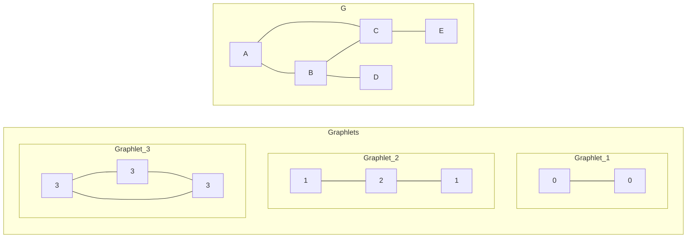
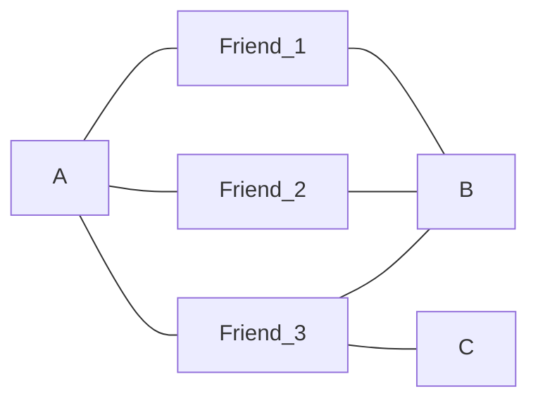
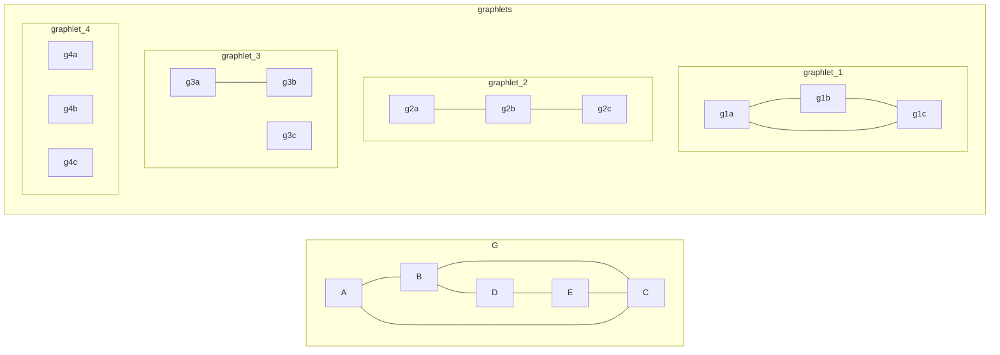

# 图神经网络

参考资料：

- 《深入浅出图神经网络(GNN原理解析)》 [豆瓣](https://book.douban.com/subject/34927262/)
- Stanford CS224W: Machine Learning with Graphs [YouTube](https://www.youtube.com/watch?v=JAB_plj2rbA&list=PLoROMvodv4rPLKxIpqhjhPgdQy7imNkDn)

# §1 基础概念

## §1.1 图

我们在离散数学中学过，图（Graph）$G$由顶点(Vertex)$V=\{v_1,v_2,...\}$和边(Edge)$E=\{e_1,e_2,...\}$构成。边分为有向边$\langle v_i,v_j \rangle$和无向边$(v_i,v_j)$，记为$e_{ij}$。

## §1.2 节点特征

### §1.2.1 节点度(Node Degree)

节点的出度(Out-Degree)和入度(In-Degree)，分别表示该节点引出和接纳了多少“箭头”。
### §1.2.2 节点中心度(Node Centrality)

要描述图中节点的特征，一个容易想到的方法是把节点的度数(Node Degree)作为特征。这样做有一个明显的缺陷——如果两个节点度数相同，那么这两个节点将永远无法区分，即使它们在所处的拓扑结构中并不同构（不能互相代替对方的位置）。例如同样是度数相同，显然二分图边缘的节点比子图分量内的节点更重要。因此，我们迫切需要一种更复杂、更有代表性的节点特征，用于更好地表示节点在图中的重要性。这种特征称为节点中心度(Node Centrality)。我们将节点$v$的中心度记为$c_v$。

节点中心度的定义和计算方法并不唯一。著名的节点中心度包括：

- 特征向量中心度(Engienvector Centrality)

  特征向量中心度的核心思想是：如果某个节点周围的节点都很重要，那么这个节点本身就很重要。我们求解邻接矩阵$\mathbf{A}$的特征值$\lambda_1,\lambda_2,...,\lambda_N$和特征向量$\mathbf{c}_1,\mathbf{c}_2,...,\mathbf{c}_N$，记$\lambda_{\text{max}}=\max\{\lambda_1,\lambda_2,...,\lambda_N\}$。由Perron-Frobenius Theorem知，$\lambda_{\text{max}}$恒为正。记特征值$\lambda_{\text{max}}$对应的特征向量为$\mathbf{c}_{\text{max}}$，$\mathbf{c}_{\text{max}}=[c_1,c_2,...,c_N]^T$中的分量即为各顶点所求的特征向量中心度。

  除此以外，我们可以将周围节点的特征向量中心度相加，通过正则化，也能得到本节点的特征向量中心度：
  $$
  c_v=\frac{1}{\lambda_{\text{max}}}\sum_{v'\in N(v)}c_{v'}
  $$

- 中介中心度(Betweenness Centrality)

  中介中心度的核心思想是：考察任意两个节点间的最短路径构成的集合，如果某个节点频繁地出现在最短路径上，那么这个节点很重要。据此，我们可以得出中介中心度的计算公式：
  $$
  c_v=\sum_{\genfrac{}{}{0}{}{v',v''\in V}{v\neq v'\neq v''}}\frac{v'与v''的最短路径中包含v的数量}{v'与v''的最短路径的数量}
  $$

- 紧密度(Closeness Centrality)

  紧密度的核心思想是：如果考察某个节点到其它所有节点的最短距离总和，对所有节点进行这种总和计算工作，如果某个节点的总和值很小，说明它与其它节点都很近，因此这个节点很重要。
  $$
  c_v=\frac{1}{\displaystyle\sum_{\genfrac{}{}{0}{}{v'\in V}{v\neq v'}}v到v'的最短距离}
  $$
### §1.2.3 聚集系数(Clustering Coefficient)

聚集系数$e_v$用于衡量某个节点的相邻节点之间的连接程度。我们记节点$v$的相邻节点数量为$k_v=\#(N(v))$，于是有：
$$
e_v=\frac{N(v)之间形成的边总数}{C_{k_v}^{2}}
$$
### §1.2.4 GDV(Graphlet Degree Vector)

回想高中有机化学的烷烃，即使碳原子数量相同，也可以构成不同的通分异构体。其中每个碳原子的数量相同。例如要写出所有戊烷的同分异构体，我们就必须谨慎地处理等价碳原子，防止写出重复的/同构的烷烃。现在我们知道，戊烷只有三种：正戊烷、异戊烷、新戊烷。

Graphlet本质上就是各类烷烃的同分异构体集合。在数学上，Graphlet的定义是一堆有根的（选定一个节点为根节点）、连通的、相互之间非同构的、顶点数至少为2的子图构成的集合。

GDV(Graphlet Degree Vector)是通过GDV定义的节点特征向量。按照图中的顶点总数（$\ge2$），我们将整个Graphlets集合划分为一系列子集，并给其中的不等价顶点标明自增的序号。

>注意：这里的“序号”并不唯一。这体现在三方面：一是**Graphlets的内容不唯一，上文我们将所有的Graphlet都列举了出来，实际上我们可以按需任意挑选其中的几个，构成一个子集，将这个子集作为参与计算的Graphlets**；二是Graphlets的顺序不唯一，我们可以任意打乱Graphlet的顺序；三是单个Graphlet内取点的顺序也可以不同。

GDV的计算方法如下所示：
$$
\begin{aligned}
	& \text{function} \ \text{getGDV}(\text{Vertex }v, \text{Graph }G, \text{Collection[Graph] }Graphlets): \\
	& \quad \text{initialize } GDV = [0,0,...,0]^T_{(Graphlets中的非等价顶点数\times 1)} \\
	& \quad \text{for}\ i, graphlet \in \text{enumarate}(Graphlets): \\
	& \qquad GDV[i]=\text{count}\{G'|
		\textcolor{red}{G'\in G} \wedge 
		\textcolor{red}{E(G')=\{(v_{i},v_{j})|\forall v_{i},v_{j}\in V(G') \wedge (v_{i},v_{j})\in E(G)\}} \wedge
		\textcolor{red}{v\in G' } \wedge 
		\textcolor{red}{\exists Graphlet \in Graphlets \rightarrow v_{j}\in V(Graphlet) \wedge G'与Graphlet同构}
	\} \\
\end{aligned}
$$
以下图为例，求解点$A$的GDV。我们先看$0$号非等价顶点，容易发现`A-B`、`A-C`两个子图都符合要求，因此第$1$个分量为$2$；再看$1$号非等价顶点，子图`A-B-D`和`A-C-E`符合要求，因此第$2$个分量为$2$；再看$2$号非等价顶点，没有符合条件的子图（你可能会问`B-A-C`为什么不满足，这是因为按照GDV的定义，符合条件的子图在拿到顶点的子集后，必须找到所有原有的边，所以`B-A-C`不能单独存在，必须加上`B-C`这条边），因此第$3$个分量为$0$；最后看第$3$号非等价顶点，子图`A-B-C-A`符合要求，所以第$4$个分量为$1$。综上所述，$\vec{\text{GDV}}_A=[2,2,0,1]$

## §1.3 边特征

边特征用于描述两个节点之间关系的紧密程度。

>注意：即使$(v_{i},v_{j})\notin E(G)$，任意两个节点都可以构建这种边特征。
### §1.3.1 基于距离的特征(Distance-based Feature)

一种容易想到的方法是：把两个节点之间的最短距离定义为边特征。

然而该特征不能捕捉到邻接节点的重合。例如给定下面的“朋友圈”，注意到`A-B`、`A-C`的最短距离都是$3$。然而`A`和`B`虽然互不相识，但是认识大量的相同朋友，比`A-C`认识的朋友更多，因此我们有理由相信`A-B`的关系更紧密。这是基于距离的特征无法表明的。

### §1.3.2 局部邻居节点重合(Local Neighborhood Overlap)

我们记节点$v$的邻居节点集合为$N(v)$，于是我们可以定义以下局部邻居节点的特征：

- Jaccard's Coefficient：$\displaystyle\frac{|N(v_{1})\cap N(v_{2})|}{|N(v_{1})\cup N(v_{2})|}$
- Adamic-Adar Index：$\displaystyle \sum_{v\in N(v_{1})\cap N(v_2)}{\frac{1}{|N(v)|}}$
局部邻居节点重合的问题在于，如果两个节点没有公共的邻居节点，那么就无法区分这两个节点了。
### §1.3.3 全局邻居节点重合(Global Neighborhood Overlap)

回顾数据结构与算法中的知识，我们知道：假设一个图的邻接矩阵为$\mathbf{A}$，则$\mathbf{A}^{l}_{ij}$表示从$v_{i}$到$v_{j}$一共有多少条长度恰好为$l$的路径。

Katz Index的定义如下：（其中$\beta\in[0,1]$为距离系数）
$$
\begin{cases}
\displaystyle S_{v_{i},v_{j}}=\sum_{l=1}^{\infty}{\beta^l}\mathbf{A}^{l}_{ij} \\
\displaystyle \mathbf{S}=\sum_{l=1}^{\infty}{\beta^l}\mathbf{A}^{l}=(\mathbf{I}-\beta \mathbf{A})^{-1}-\mathbf{I}
\end{cases}
$$
## §1.4 图特征/图核

图核是一种用于描述两个图的相似程度的函数$k:(G,G')\rightarrow \mathbb{R}$，图核矩阵$\mathbf{K}_{G\times G'}$是一种半正定矩阵，存在对应的核函数$\phi(\cdot)$，使得图核矩阵可以被分解为$\mathbf{K}_{G\times G'}=\phi(G)^{T}\phi(G')$。

BoW(Bag-of-Words)是一种统计纯文本文档的策略。例如我们打开某篇文档，按下Ctrl+F快捷键，就可以搜索到单词`"my"`出现的次数。我们把词典中的所有词汇都搜索一遍，就能得到所有词汇出现的次数。把这些次数合并成一个向量，就是这篇文档的特征，称为BoW。

受此启发，我们也可以用Bag-of-Node-Degree来描述一个图的特征。我们分别统计度数为$1$、$2$、$3$、...的点的数量，合成一个向量即可。

在这之后，各种基于此的改良方法被提出：
- Graphlet Kernel
- Weisfeiler-Lehman Kernel
- Random-walk Kernel
- Shortest-path Graph Kernel

### §1.4.1 Graphlet Kernel

这里我们使用的Graphlet不同于[§1.2.4 GDV(Graphlet Degree Vector)](###§1.2.4 GDV(Graphlet Degree Vector))中提到的Graphlet：

| Graphlet Kernel中的Graphlet | GDV中的Graphlet      |
|:--------------------------- | --------------- |
| 有根图                      | 无根图          |
| 连通图                      | 连通图/非连通图 |
| 非同构图                            |   非同构图              |


Graphlet Kernel的计算方式如下：
$$
\begin{aligned}
	& \text{function} \ \text{getGraphletKernel}(\text{Vertex }v, \text{Graph }G, \text{Collection[Graph] }Graphlets): \\
	& \quad \text{initialize } graphletKernel = [0,0,...,0]^T_{(Graphlets中的子图数量\times 1)} \\
	& \quad \text{for}\ i, graphlet \in \text{enumarate}(Graphlets): \\
	& \qquad graphletKernel[i]=\text{count}\{G'|
		\textcolor{red}{G'\in G} \wedge 
		\textcolor{red}{v\in G' } \wedge 
		\textcolor{red}{G'与Graphlet同构}
	\} \\
	& \quad graphletKernel=\frac{graphletKernel}{\text{sum}(graphletKernel)}
\end{aligned}
$$

例如给定下图$G$，求$A$点的Graphlet Kernel。与给出的四个Graphlet一一对照，可得Graphlet为$\displaystyle[\frac{1}{10},\frac{3}{10},\frac{6}{10},\frac{0}{10}]^T$。



Graphlet Kernel的问题在于计算复杂度太高，令图$G$中的点数量为$n$，Graphlets中的子图数量为$k$，则时间复杂度为$O(n^k)$。

### §1.4.2 Weisfeiler-Lehman Kernel

为了提高Graphlet Kernel的性能，一种基于Color Refinement的Weisfeiler-Lehman Kernel被提出，将时间复杂度压缩到了线性级。我们将点$v$在$t$时刻的颜色记为$c^{(t)}(v)$。一开始($t=0$)每个点的颜色都是相同的，然后按照下列公式更新每个点的颜色：
$$
c^{(t+1)}(v)=\text{Hash}(\{c^{(t)}(v)\}+\{c^{(t)}(v')|v'\in N(v)\})
$$
其中$\text{Hash}$是一个输出颜色的哈希函数：$\text{Hash}:\{\text{Color},\text{Color},...\}\rightarrow \text{Color}$。经过$T$次迭代后，我们得到了一系列时间维度上的颜色向量$\vec{c^{(1)}},\vec{c^{(2)}},...,\vec{c^{(T)}}$。统计不同颜色的出现次数，拼成一个向量，即为所求的Weisfeiler-Lehman Kernel向量。
## §1.5 节点嵌入(Node Embedding)

嵌入(Embedding)的目标是：找到一种函数$\text{ENC}:v\in V\rightarrow \mathbb{R}^d$，使得图中两个相邻的顶点映射后，在嵌入空间中依然保持相邻。具体来说，$\text{ENC}()$的具体表达式为$\text{ENC}(v)=\mathbf{z}_v=\mathbf{Z}\mathbf{v}$，其中$\mathbf{Z}\in \mathbb{R}^{d\times|\mathbf{v}|}$为要优化的参数矩阵，$v\in \mathbb{I}^{|\mathbf{v}|}$为One-Hot向量，表示当前顶点在所有顶点中的位置。

我们的目标是优化矩阵$\mathbf{Z}$，使得：
$$
\max\left({\mathbf{z}_{v_{i}}^{T}\cdot \mathbf{z}_{v_{j}}}\right), \text{if } \text{Similarity}(v_i,v_j)>>\text{Constants}
$$
### §1.5.1 Random Walk

Random Walk的核心思想是：假设从顶点$v$出发，随机行走（可以走回路、可以沿原路返回），走的一段路程称为策略$R$，则$P(v'|\mathbf{z}_v)$表示从$v$点出发，恰好能行走到$v'$点的概率。我们把这个概率作为两个点的邻近程度，即$\text{Similarity}(v_i,v_j):=P(v_j|\mathbf{z}_{v_i})$。

令$N_R(v)$为从$v$点出发，按照策略$R$经过的所有点。于是优化问题转化为最大化对数似然函数：
$$
\mathop{\arg\max}\limits_{\text{ENC}}\sum\limits_{v\in V}{\log P(N_R(v)|\mathbf{z}_v)}
$$
损失函数为：
$$
\begin{cases}
P(v'|\mathbf{z}_v)=\displaystyle\frac{\exp(\mathbf{z}_{v}^{T}\mathbf{z}_{v'})}{\displaystyle\sum_{u\in V}\exp(\mathbf{z}_{v}^{T}\mathbf{z}_{u})} \\
\displaystyle\mathcal{L}=\sum\limits_{v\in V}\sum\limits_{v'\in N_{R}(v)} -\log(P(v'|\mathbf{z}_v))
\end{cases}
$$
在大规模的图中，使用上面的损失函数是不现实的，因为计算$\mathcal{L}$的时间复杂度是$O(|V|^{2})$。为了绕开$\sum\limits_{u\in V}\exp(\mathbf{z}_{v}^{T}\mathbf{z}_{u})$，我们采用一种名为[负采样](https://arxiv.org/abs/1402.3722)（Negative Sampling）的策略：
$$
\begin{cases}
\textcolor{red}{n_{i}}\sim P_v=\{本质上是多项分布.从|V|个样本中随机选\textcolor{red}{k}个样本,计算其\mathbf{z}_{v}^{T}\mathbf{z}_{v_{\textcolor{red}{n_i}}},并按结果值归一化作为对应数字的概率\}
\\
\displaystyle\log\left(
	\frac
		{\exp(\mathbf{z}_{v}^{T}\mathbf{z}_{v'})}
		{\displaystyle\sum_{u\in V}\exp(\mathbf{z}_{v}^{T}\mathbf{z}_{u})}
\right)\approx\
	\log\left(\text{sigmoid}(\mathbf{z}_{v}^{T}\mathbf{z}_{v'})\right) + 
	\sum\limits_{i=1}^{\textcolor{red}{k}}{
		\log\left(\text{sigmoid}(
			\mathbf{z}_{v}^{T}\mathbf{z}_{v_{\textcolor{red}{n_i}}}) \\
        \right)
	}
\end{cases}
$$

Random Walk的优点在于：
- 表达能力强，对于任意图都很灵活。
- 高效，无需遍历所有边。
### §1.5.2 node2vec

相比于Random Walk的完全随机行走，node2vec调整了行走的策略，变为二阶有偏随机行走。二阶代表着能够记忆上次抵达的节点，知道原路返回应该选择哪条路；有偏代表不对不同路径有不同的选择偏见，从而改变了$N_{R}{(v)}$的取值倾向。

对于原路返回，设置概率权重为$\displaystyle\frac{1}{p}$；对于通往相同距离的顶点的路径，设置概率权重为$1$；对于通往更远距离的顶点的路径，设置概率权重为$\displaystyle\frac{1}{q}$。然后将这些概率权重归一化，得到真实的概率，随后进行选择。这里的$p$和$q$是超参数，决定了策略$R$探索的方向。


# §2 图神经网络

表征学习包含图表征学习。图表征学习使用到的图嵌入方法包含图神经网络。

## §2.1 表征学习

我们知道，数据集有可能缺少重要信息、存在冗余信息，甚至包含不正确的信息，从而干扰算法的性能。为了解决这一问题，特征工程应运而生，通过数据预处理和数据转换，从数据中提取机器学习所需的信息。然而，特征工程存在以下两个缺点：

- 依赖领域专家的密集劳动，需要领域专家与模型开发者密切配合
- 受限于领域专家的能力，导致数据不完整、分布存在偏见，限制了提取特征的数量
- 在开放的领域中，无法判定提取什么特征会产生最好的效果

为解决以上问题，表征学习应运而生。表征学习的目标是从数据中提取足够且尽可能少的信息。传统的表征学习负责学习数据转换，例如主成分分析(PCA, 1987)、高斯马尔科夫随机场(GMRF, 2005)、局部保持投影(LPP, 20044)。

表征学习可以分为以下几类：需要利用先验知识的监督学习、可以训练深度网络的无监督学习、增强泛化能力的迁移学习，以及强化学习、小样本学习、解耦表征学习。

| 领域名称\表征学习类别 | 监督学习                                                     | 无监督学习                                                   | 迁移学习 | 强化学习                           |
| --------------------- | ------------------------------------------------------------ | ------------------------------------------------------------ | -------- | ---------------------------------- |
| 图像处理              | 卷积神经网络(CNN)<br />深度信念网络(DBN)<br />AlexNet、VGG、GoogLeNet、ResNet、DenseNet | 代理任务：<br />灰度图像着色(2016)<br />图像修复(2016)       |          | 图像描述(2018)<br />图像编辑(2020) |
| 语音识别              | 受限玻尔兹曼机(RBM, 2011)<br />深度信念网络(2016)<br />MAVIS(2012)<br />CNN<br />LSTM/GRU | 变分自编码器(VAE)<br />降噪自编码器(DAE)<br />生成对抗网络(GAN, 2017)<br />对抗性自编码器(AAE, 2017) | MTL      |                                    |
| 自然语言处理          | CNN<br />RNN                                                 | word2vec(2013)<br />GloVe(2014)<br />BERT(2019)<br />循环自编码器<br />SENNA(2011) |          |                                    |
| 网络分析              | 网络表征学习(NRL)                                            |                                                              |          |                                    |

## §2.2 图表征学习

图表征学习面临着以下问题：

- 高计算复杂性：例如为了计算两点之间的距离，我们必须遍历很多路径。
- 低可并行性：每个计算节点都必须得到节点之间的关系$E$，提高了通信成本，限制于通信瓶颈
- 机器学习方法不适用：机器学习假设各神经元相互独立，而图中的节点相互依赖

图表征学习分为三类：传统图嵌入方法、现代图嵌入方法、图神经网络。

- 传统图嵌入方法针对已有数据集构成的图，其目标是进行图的重建(也就是降维)。Tenenbaum等人于2000年从KNN构建的邻接图中提取出图距离矩阵，然后经过多维尺度变换(MDS)得到特征向量。Roweis等人于2000年提出了局部线性嵌入(LLE)。Belkin等人于2002年提出了拉普拉斯特征映射(LE)，通过热核选择图中两个节点的权重，经过拉普拉斯矩阵正则化得到特征向量。Berline等人于2003年提出局部保持投影(LPP)，作为非线性LE的线性近似算法。
- 现代图嵌入方法针对自然形成的网络，其目标是支持图推理。Perozzi等人于2014年提出了DeepWalk。node2vec定义了灵活的节点图邻域，通过二阶随机行走策略对邻域节点进行抽样。Tang等人与2015年提出了LINE，用于保留一阶和二阶的接近度（两个节点之间成对节点的接近程度）。Wang等人于2016年提出了SDNE，同样用于保留一阶和二阶的接近度。Wang等人于2017年提出了非负矩阵因子化模型(M-NMF)，用于同时保留一阶和二阶的接近度与中观群落结构。


TODO

回想传统的神经网络，我们从样本中提取一个一维特征向量，送到大小不一的神经网络层。这些层可能是全连接层、池化层等等，因此各层之间的尺寸有可能不同。输入向量中的任意一个标量，都会在前向传播的过程中扩散开来。一个神经元收到多个输入值时，采取的策略是相加。

图神经网络有所不同。第一：各层的尺寸、拓扑结构完全相同。第二：输入的不再是一维特征向量，而是包含顶点信息、边信息的图。第三：前向传播不再使用全连接层，也就是说前一层的神经元不会影响到后一层的所有神经元，只会影响在图的拓扑结构中相邻的神经元。第四：一个神经元收到多个输入值时，可以取最大值、平均值或直接相加。

基于此，我们可以用数学符号描述图神经网络：

| 符号                                               | 符号含义                                                     |
| -------------------------------------------------- | ------------------------------------------------------------ |
| $\mathscr{G}=\left(\mathscr{V},\mathscr{E}\right)$ | 图由顶点集合与边集合构成。                                   |
| $\mathscr{V}=\{v_1,v_2,...,v_N\}$                  | 顶点总数为$N$。                                              |
| $\mathbf{X}\in\R^{N\times C}$                      | 输入信息中顶点携带的向量信息构成的矩阵，向量维度为$C$。      |
| $\mathbf{h}_i^{k}\in\R^{C}$                        | 第$k$层中第$i$个顶点携带的向量信息，维度为$C$。              |
| $\mathbf{H}^{k}\in\R^{N\times F},1\le k\le K$      | 第$k$层中顶点携带的向量信息构成的矩阵，总层数为$K$。         |
| $\mathbf{A}\in\R^{N\times N}$                      | 邻接矩阵。由于图神经网络各层拓扑结构完全相同，所以只用一个矩阵就能表示所有层的邻接矩阵。数据类型为实数，表示连接程度，类似于权重，其中$0$表示完全不相邻。 |
| $N(v_i)=\{v_j|\mathbf{A}_{ij}>0\}$                 | 在邻接矩阵中，与顶点$v_i$相邻的其它顶点构成的集合。          |
| $\mathbf{\hat{y}}_i\in\R^{L},1\le i\le N$          | 图神经网络的分类结果向量，预期的分类类别有$L$种。            |

给定初始条件：
$$
\mathbf{H}^0=\mathbf{X}
$$
进行图神经网络的前向传播：
$$
\begin{cases}
	\mathbf{H}^0=\mathbf{X} \\
	\mathbf{h}_{i}^{k}=\text{sigmoid}(\text{Combine}(\mathbf{h}_{i}^{k-1},N(v_i))) & ,1\le i\le N,1\le k\le K
\end{cases}
$$
 最后接上全连接层，用于输出每个节点的类别预测向量：
$$
\mathbf{\hat{y}}_i = \text{softmax}(\mathbf{W}(\mathbf{h}^{K}_i)^T)\in\mathbb{R}^{L\times 1}
\\
\mathbf{\hat{Y}} = \text{softmax}(\mathbf{W}(\mathbf{H}^K)^T)\in\mathbb{R}^{L\times N}
$$
问题转换为最优化损失函数：
$$
\underset{\mathbf{A}}{\text{argmin}}\ \mathcal{L} 
= \underset{\mathbf{A}}{\text{argmin}}\ \sum_{i=1}^{N}||\mathbf{\hat{y}}_i-\mathbf{y}_i||_2^2
= \underset{\mathbf{A}}{\text{argmin}}\ ||\mathbf{\hat{Y}}-\mathbf{Y}||_2^2
$$

# §3 PyG

TODO：

## §3.1 基础语法

`torch_geometric.data.Data`用于描述一个二维的图。

```python
def torch_geometric.data.Data.__init__(
	x: Optional[torch.Tensor[(nodes_count, node_features_count)]], # 每个节点的特征
	edge_index: Optional[torch.LongTensor[(2, edges_count)]], # 存储边的两侧顶点，等价于邻接矩阵的稀疏形式
    pos: Optional[torch.Tensor[(nodes_count, dimension_count)]]节点坐标
)
```


​    

