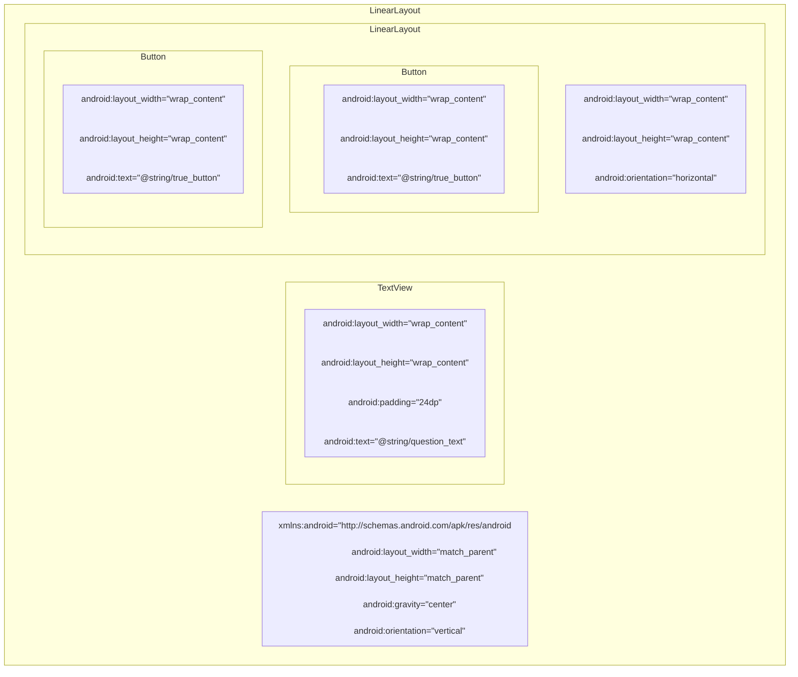
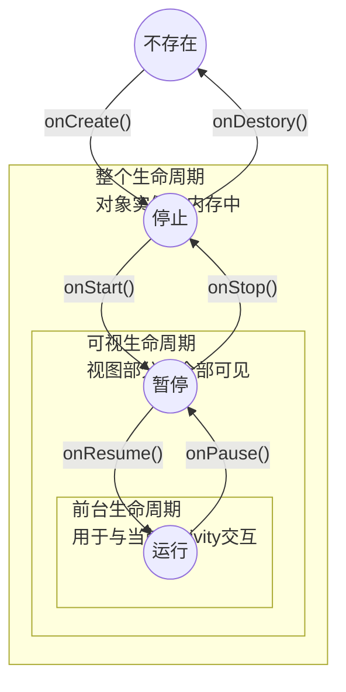

# §0 速查表

| 安卓父版本 | 安卓子版本            | API级别 | 系统代号               |
| ---------- | --------------------- | ------- | ---------------------- |
| Android 1  | Android 1.0           | 1       | Base                   |
|            | Android 1.1           | 2       | Base_1_1               |
|            | Android 1.5           | 3       | Cupcake                |
|            | Android 1.6           | 4       | Donut                  |
| Android 2  | Android 2.0.0         | 5       | Eclair                 |
|            | Android 2.0.1         | 6       | Eclair_0_1             |
|            | Android 2.1           | 7       | Eclair_MR1             |
|            | Android 2.2           | 8       | Froyo                  |
|            | Android 2.3 ~ 2.3.2   | 9       | Gingerbread            |
|            | Android 2.3.3 ~ 2.4.4 | 10      | Gingerbread_MR1        |
| Android 3  | Android 3.0           | 11      | Honeycomb              |
|            | Android 3.1           | 12      | Honeycomb_MR1          |
|            | Android 3.2           | 13      | Honeycomb_MR2          |
| Android 4  | Android 4.0 ~ 4.0.2   | 14      | Ice_Cream_Sandwich     |
|            | Android 4.0.3 ~ 4.0.4 | 15      | Ice_Cream_Sandwich_MR1 |
|            | Android 4.1           | 16      | Jelly_Bean             |
|            | Android 4.2           | 17      | Jelly_Bean_MR1         |
|            | Android 4.3           | 18      | Jelly_Bean_MR2         |
|            | Android 4.4           | 19      | Kitkat                 |
|            | Android 4.4W          | 20      | Kitkat_Watch           |
| Android 5  | Android 5.0           | 21      | Lollipop               |
|            | Android 5.1           | 22      | Lollipop_MR1           |
| Android 6  | Android 6.0           | 23      | M (Marshmallow)        |
| Android 7  | Android 7.0           | 24      | N (Nougat)             |
|            | Android 7.1           | 25      | N_MR1                  |
| Android 8  | Android 8.0           | 26      | O (Oreo)               |
|            | Android 8.1           | 27      | O_MR1                  |
| Android 9  | Android 9.0           | 28      | P (Pie)                |
| Android 10 | Android 10            | 29      | Q (Quince Tart)        |
| Android 11 | Android 11            | 30      | R (Red Velvet Cake)    |
| Android 12 | Android 12            | 31      | S (Snow Cone)          |
| Android 13 | Android 13            | 32      | T (Tiramisu)           |

# §1 Android开发初体验

## §1.1 用户界面设计

应用的界面由以下两点组成：

- `activity`是Android SDK中`Activity`类的一个实例，负责管理用户与界面的交互。应用的功能通过编写`Activity`的子类来实现。
- 布局(`layout`)定义了一系列界面对象，并规定了他们在屏幕上的显示位置，储存在`.xml`文件中。

## §1.2 视图层级结构

组建包含在视图(View)对象的层级结构中，这种结构称为视图层级结构(View Hierarchy)。

例如对于下列xml文档：

```xml
<LinearLayout xmlns:android="http://schemas.android.com/apk/res/android" 
              android:layout_width="match_parent"
              android:layout_height="match_parent"
              android:gravity="center" 
              android:orientation="vertical" >
	<TextView 
		android:layout_width="wrap_content" 
        android:layout_height="wrap_content" 
        android:padding="24dp" 
        android:text="@string/question_text" />
	<LinearLayout 
        android:layout_width="wrap_content" 
        android:layout_height="wrap_content" 
        android:orientation="horizontal" >
		<Button 
        	android:layout_width="wrap_content" 
            android:layout_height="wrap_content" 
            android:text="@string/true_button" />
		<Button 
            android:layout_width="wrap_content" 
            android:layout_height="wrap_content" 
            android:text="@string/false_button" />
	</LinearLayout>
</LinearLayout>
```

其视图层级结构可表示为：



### §1.2.1 根元素

XML文件只能有一个根元素，且必须指定`Android XML`资源文件的命名空间属性。

### §1.2.2 组件属性

#### §1.2.2.1 `android:layout_width`和`android:layout_height`

`android:layout_width`和`android:layout_height`分别用于规定组件的宽度和高度，几乎所有组件都需要`android:layout_width`和`android:layout_height`。这种属性有以下取值：

- `match_parent`：视图与父视图大小相同
- `wrap_content`：视图根据其显示的内容自动调整大小
- ~~`fill_parent`~~：视图与父视图大小相同，与`match_parent`作用完全一致，在API 8被弃用。

根组件的这两个属性均被强制设定为`match_parent`。虽然根组件不从属于任何一个组件，但是永远从属于Android提供的父视图。其他组件的这两个属性默认设置为`wrap_content`。

#### §1.2.2.2 `android:orientation`

 `android:orientation`属性决定`LinearLayout`组件如何排列其内部包含的组件。该属性有以下两种取值：

- `vertical`：垂直放置子组件
- `horizontal`：水平放置子组件

#### §1.2.2.3 `android:text`

`TextView`和`Button`组件均具有`android:text`，用于指定该组件要显示的文字内容。其属性值可以是字符串本身（硬编码，例如`android:text="ABC123"`），也可以是对字符串资源的引用（例如`android:text="@string/strName"`）。

字符串资源存储于一个独立的`strings.xml`中，位于`app/res/values`目录内。该文件默认包含一个`<resources>`根元素，内含众多`<string>`子元素。

```xml
<resources>
    <string name="app_name">GeoQuiz</string>
    <string name="question_text">Canberra is the capital of Australia</string>
    <string name="true_button">True</string>
    <string name="false_button">False</string>
</resources>
```

## §1.3 视图类

在创建Activity文件时，IDE会在`app/java/com.xxx.xxx`目录下创建一个同名`.java`文件，默认如下所示：

```java
//确定包所属位置
package com.example.geoquiz;

//androidx.appcompat.app.AppcompatActivity是Activity类的一个子类,能为旧版Android提供兼容支持
import androidx.appcompat.app.AppCompatActivity;
import android.os.Bundle;

public class MainActivity extends AppCompatActivity {
    @Override
    protected void onCreate(Bundle savedInstanceState) {
        super.onCreate(savedInstanceState);
        setContentView(R.layout.activity_main);
    }
}
```

按照§1.4创建按钮的资源ID后，就可以编写代码了：

```java
package com.example.geoquiz;
import androidx.appcompat.app.AppCompatActivity;
import android.os.Bundle;
import android.widget.Button; // 导入Button类
import android.view.View; // 导入View类
import android.widget.Toast; // 导入Toast类,用于弹出消息
public class MainActivity extends AppCompatActivity{
    private Button mTrueButton; // 按照Android变成规范,在变量名前加m
    private Button mFalseButton;
    @Override protected void onCreate(Bundle savedInstanceStata){
        // ...
        mTrueButton = (Button) findViewById(R.id.true_button); // 必须将View类型校正为Button
        mFalseButton = (Button) findViewById(R.id.false_button);
        mTrueButton.setOnClickListener(new View.OnClickListener(){ // 设置监听器
            @Override public void onClick(View v){
                Toast.makeText(
                        MainActivity.this,
                        R.string.correct_toast,
                        Toast.LENGTH_SHORT
                ).show();
            }
        });
        mFalseButton.setOnClickListener(new View.OnClickListener(){
            @Override public void onClick(View v){
                Toast.makeText(
                        MainActivity.this,
                        R.string.incorrect_toast,
                        Toast.LENGTH_SHORT
                ).show();
            }
        });
    }
}
```

## §1.4 资源

资源是APP中以非代码形式储存的内容，例如多媒体文件、XML文件等，一律存储于`app/res`目录中。为调用资源，我们既可以像`android:text`属性那样使用`@string/strName`，也可以使用资源ID。

在旧版本Android Studio中，资源ID存储在`app/build/generated/source/r/debug/R.java`中；在新版本Android Studio中，资源ID储存在`app/build/intermediates/runtime_symbol_list/debug/R.txt`中。每次编译时，IDE都会自动生成或更新一份存储资源ID的文件。所以修改资源后，`R.txt`不会立刻时时刷新，直到下一次编译才会重新生成。同时因为这些资源ID由系统自动生成，所以不能对它们进行手动修改。

```java
int anim abc_fade_in 0x7f010000
int anim abc_fade_out 0x7f010001
int anim abc_grow_fade_in_from_bottom 0x7f010002
int anim abc_popup_enter 0x7f010003
int anim abc_popup_exit 0x7f010004
// ...
int string false_button 0x7f0e0027 // line 1892
// ...
int string question_text 0x7f0e0051 // line 1889
int string search_menu_title 0x7f0e0052
int string status_bar_notification_info_overflow 0x7f0e0053
int string true_button 0x7f0e0054 // line 1892
// ...
int styleable ViewStubCompat_android_inflatedId 2
int xml standalone_badge 0x7f110000
int xml standalone_badge_gravity_bottom_end 0x7f110001
int xml standalone_badge_gravity_bottom_start 0x7f110002
int xml standalone_badge_gravity_top_start 0x7f110003
```

资源ID的出现，使得除了在XML中利用相对路径引用资源之外，在Java中利用面向对象的语法来引用资源成为可能。

```java
// XML
android:text="@string/app_name"
// Java
setTitle(R.string.app_name); // R即为上文介绍的R.java或R.txt
```

为了给XML文件中的组件生成资源ID，需要在定义组建时添加`android:id`属性。之所以给该属性设置的值为`@+id/elementID`而非`@id/elementID`，是因为我们是在创建资源ID，而非引用资源ID。

```xml
<Button
    android:id="@+id/true_button"
    android:layout_width="wrap_content"
    android:layout_height="wrap_content"
    android:text="@string/true_button"/>
<Button
    android:id="@+id/false_button"
    android:layout_width="wrap_content"
    android:layout_height="wrap_content"
    android:text="@string/false_button"/>
```

## §1.5 添加问题

创建一个`Question`类，用于表示对每一道习题的抽象形式。

```java
package com.example.geoquiz;
public class Question {
    private int mTextResId;
    private boolean mAnswerTrue;
    public int getTextResId() {
        return mTextResId;
    }
    public void setTextResId(int textResId) {
        mTextResId = textResId;
    }
    public boolean isAnswerTrue() {
        return mAnswerTrue;
    }
    public void setAnswerTrue(boolean answerTrue) {
        mAnswerTrue = answerTrue;
    }
    public Question(int textResId, boolean answerTrue){
        mTextResId = textResId;
        mAnswerTrue = answerTrue;
    }
}
```

使用`Question`类更新`Activity`类：

```java
// ...
public class MainActivity extends AppCompatActivity {
    private Button mTrueButton;
    private Button mFalseButton;
    private Button mNextButton; // 添加下一个按钮
    private TextView mQuesitonTextView;

    private Question[] mQuestionBank = new Question[]{ // 提前硬编码习题
            new Question(R.string.question_australia,true),
            new Question(R.string.question_oceans,true),
            new Question(R.string.question_mideast,false),
            new Question(R.string.question_africa,false),
            new Question(R.string.question_americas,true),
            new Question(R.string.question_asia,true),
    };
    private int mCurrentIndex = 0; // 记录当前习题序号

    @Override
    protected void onCreate(Bundle savedInstanceState) {
		//...
        mQuesitonTextView = (TextView) findViewById(R.id.question_text_view);
        updateQuestion();
        mTrueButton = (Button) findViewById(R.id.true_button);
        mFalseButton = (Button) findViewById(R.id.false_button);
        mNextButton = (Button) findViewById(R.id.next_button);
        mTrueButton.setOnClickListener(new View.OnClickListener(){
            @Override public void onClick(View v){ // 使用封装函数checkAnswer()
                checkAnswer(true);
            }
        });
        mFalseButton.setOnClickListener(new View.OnClickListener(){
            @Override public void onClick(View v){ // 使用封装函数checkAnswer()
                checkAnswer(false);
            }
        });
        mNextButton.setOnClickListener(new View.OnClickListener(){
            @Override public void onClick(View v){ // 当前问题序号+1并更新问题
                mCurrentIndex = (mCurrentIndex + 1) % mQuestionBank.length;
                updateQuestion();
            }
        });
    }
    private void updateQuestion(){ // 按照当前序号更新习题
        int question = mQuestionBank[mCurrentIndex].getTextResId();
        mQuesitonTextView.setText(question);
    }
    private void checkAnswer(boolean userPressedTrue){ // 检测userPressedTrue和isAnswerTrue是否一致
        boolean answerIsTrue = mQuestionBank[mCurrentIndex].isAnswerTrue();
        int messageResId = 0;
        if(userPressedTrue == answerIsTrue){
            messageResId = R.string.correct_toast;
        }else{
            messageResId = R.string.incorrect_toast;
        }
        Toast.makeText(MainActivity.this,messageResId,Toast.LENGTH_SHORT).show();
    }
}
```

在`String.xml`中添加对应的字符串资源：

```xml
<resources>
    <string name="app_name">GeoQuiz</string>
    <string name="question_australia">Canberra is the capital of Australia</string>
    <string name="question_oceans">The Pacific Ocean is larger than the Atlantic Ocean</string>
    <string name="question_mideast">The Suez Canal connects the Red Sea and the Indian Ocean</string>
    <string name="question_africa">The source of the Nile River is in Egypt</string>
    <string name="question_americas">The Amazon River is the longest river in the Americas</string>
    <string name="question_asia">Lake Baikal is the world\'s oldest and deepest freshwater lake.</string>
    <string name="true_button">True</string>
    <string name="false_button">False</string>
    <string name="next_button">Next</string>
    <string name="correct_toast">Correct!</string>
    <string name="incorrect_toast">Incorrect!</string>
</resources>
```

## §1.6 修复旋转屏幕导致Activity销毁的BUG

由§2 生命周期的内容可知，旋转屏幕时会将当前`Activity`实例销毁，从而自动跳转到第一个问题。因此，我们需要对宽屏进行适配。

首先，创建一个给宽屏使用的XML布局文件，存放在目录`app/src/main/res/layout-land`目录下：

```xml
<?xml version="1.0" encoding="utf-8"?>
<FrameLayout xmlns:android="http://schemas.android.com/apk/res/android"
    android:layout_width="match_parent"
    android:layout_height="match_parent">
    <TextView
        android:id="@+id/question_text_view"
        android:layout_width="wrap_content"
        android:layout_height="wrap_content"
        android:layout_gravity="center_horizontal"
        android:padding="24dp" />
    <LinearLayout
        android:layout_width="wrap_content"
        android:layout_height="wrap_content"
        android:layout_gravity="center_vertical|center_horizontal"
        android:orientation="horizontal">
        <Button
            android:id="@+id/true_button"
            android:layout_width="wrap_content"
            android:layout_height="wrap_content"
            android:text="@string/true_button"
            style="?android:attr/buttonBarButtonStyle" />
        <Button
            android:id="@+id/false_button"
            android:layout_width="wrap_content"
            android:layout_height="wrap_content"
            android:text="@string/false_button"
            style="?android:attr/buttonBarButtonStyle" />
    </LinearLayout>
    <FrameLayout
        android:layout_width="wrap_content"
        android:layout_height="wrap_content"
        android:orientation="horizontal"
        android:layout_gravity="bottom|right">
        <LinearLayout
            android:layout_width="wrap_content"
            android:layout_height="wrap_content"
            android:orientation="horizontal">
            <Button
                android:layout_width="wrap_content"
                android:layout_height="wrap_content"
                android:id="@+id/previous_button"
                android:text="@string/previous_button"
                android:drawableStart="@drawable/arrow_left"
                android:drawablePadding="4sp"/>
            <Button
                android:layout_width="wrap_content"
                android:layout_height="wrap_content"
                android:id="@+id/next_button"
                android:text="@string/next_button"
                android:drawableEnd="@drawable/arrow_right"
                android:drawablePadding="4dp"/>
        </LinearLayout>
    </FrameLayout>
</FrameLayout>
```

> 注意：这里我们使用了`<FrameLayout>`标签，设置其`android:layout_gravity`属性，将跳转按钮放置在屏幕的最右下角，而这是`<LinearLayout>`做不到的。

接着，我们需要创建一个可以被多个`Activity`实例共享的变量，用于存储当前的问题序号。`Bundle`数据类型存储着字符串值与限定类型之间的映射关系，在`@Override protected void onCreate(Bundle savedInstanceState)`中我们就使用过这种数据类型。可以覆盖`onSaveInstanceState(Bundle)`方法，将所需变量保存到`Bundle`中：

```java
public class MainActivity extends AppCompatActivity{
    // ...
    private static final String KEY_INDEX = "index";
	// ...
    @Override protected void onCreate(Bundle savedInstanceState){
        // ...
        if(savedInstanceState != null){
            mCurrentIndex = savedInstanceState.getInt(KET_INDEX,0);
        }
        // ...
    }
    @Override public void onSaveInstanceState(Bundle savedInstanceState){
        super.onSaveInstanceState(savedInstanceState);
        Log.i(TAG,"onSaveInstanceState");
        savedInstanceState.putInt(KEY_INDEX,mCurrentIndex);
    }
    // ...
}
```

## §1.7 创建新`Activity`

首先准备字符串资源：

```xml
<resource>
	<!-- ... -->
    <string name="warning_text">Are you sure you want to do this?</string>
    <string name="show_answer_button">Show Answer</string>
    <string name="cheat_button">Cheat!</string>
    <string name="judgment_toast">Cheating is wrong.</string>
</resource>
```

创建新`Activity`的过程至少涉及三个文件的更新：Java类文件、XML布局文件和APP本身的manifest文件。这三个文件关联密切，一旦出错就会导致难以撤回的灾难。Android Studio提供了新建`Activity`向导的功能，免去了出错的风险。

`AndroidManifest.xml`文件位于`app/manifests`目录内，记录了该APP内包含的所有资源，包括刚才新建的Activity：

```xml
<manifest xmlns:android="http://schemas.android.com/apk/res/android"
    package="com.example.geoquiz">
    <application
        android:allowBackup="true"
        android:icon="@mipmap/ic_launcher"
        android:label="@string/app_name"
        android:roundIcon="@mipmap/ic_launcher_round"
        android:supportsRtl="true"
        android:theme="@style/Theme.GeoQuiz">
        <!-- 新建的Activity -->
        <activity
            android:name=".CheatActivity"
            android:exported="false" />
        <!-- 原有的的Activity -->
        <activity android:name=".MainActivity">
            <intent-filter>
                <action android:name="android.intent.action.MAIN" />
                <category android:name="android.intent.category.LAUNCHER" />
            </intent-filter>
        </activity>
    </application>
</manifest>
```

`Intent`是`component`用于与操作系统通信的媒介工具。`component`包括`Activity`、`Service`、`Broadcast`、`ContentReciver`、`ContentProvider`等一系列安卓自带的组件。`Intent`类的构造函数`Intent(Context packageContext,class<?> cls)`接受两个形参，`packageContext`接受当前`Activity`类的实例，`cls`接受要打开的`Activity`对应的类对象：

```java
Intent intent = new Intent(MainActivity.this,CheatActivity.class);
```

为了在多个`Activity`之间传递数据，我们可以使用`Intent.putExtra(String name,boolean value)`的方法将数据写入`Intent`实例中。该方法返回`Intent`实例自身，因此可以实现链式调用：

```java
intent.putExtra("data1",true)
    .putExtra("data2",false)
    .putExtra("data3",true);
```

在多个`Activity`之间最简单的切换方式是调用`startActivity(Intent)`方法。

```java
public class CheatActivity extends AppCompatActivity {
	// ...
    public static Intent newIntent(Context packageContext, boolean answerIsTrue){
        Intent intent = new Intent(packageContext,CheatActivity.class);
        intent.putExtra("com.example.geoquiz.answer_is_true",answerIsTrue);
        return intent;
    }
}
```


```java
public class MainActivity extends AppCompatActivity{
    // ...
    private Button mCheatButton;
    // ...
    @Override protected void onCreate(Bundle savedInstanceState){
        // ...
        mCheatButton = (Button) findViewById(R.id.cheat_button);
    	mCheatButton.setOnClickListener(new View.OnClickListener(){
            boolean answerIsTrue = mQuestionBank[mCurrentIndex].isAnswerTrue();
            Intent intent = CheatActivity.newIntent(MainActivity.this,answerIsTrue);
            startActivity(intent);
        });
    }
}
```


# §2 生命周期

每个`Activity`实例都有生命周期，在其生命周期内按照以下关系在运行、暂停、停止、不存在这四种状态间转换。



| `Activity`状态 | 是否有内存实例 | 用户是否可见 | 是否处于前台 |
| -------------- | -------------- | ------------ | ------------ |
| 不存在         | ×              | ×            | ×            |
| 停止           | √              | ×            | ×            |
| 暂停           | √              | √或⍻         | ×            |
| 运行           | √              | √            | √            |

`OnCreate()`负责：

- 将组件实例化，并调用`setContentView(int)`将组件放置在屏幕上
- 引用已经实例化的组件
- 为组建设置监听器
- 访问外部模型数据

# §3 日志与调试

## §3.1 启用日志

Android的`android.util.Log`用于向系统及共享日志中心发送日志信息，内含多种方法，分别代表不同的等级：

| 方法                           | 日志级别 | 说明                   |
| ------------------------------ | -------- | ---------------------- |
| `Log.e(String tag,String msg)` | ERROR    | 错误                   |
| `Log.w(String tag,String msg)` | WARNING  | 警告                   |
| `Log.i(String tag,String msg)` | INFO     | 信息型消息             |
| `Log.d(String tag,String msg)` | DEBUG    | 调试输出(可能被过滤掉) |
| `Log.v(String tag,String msg)` | VERBOSE  | 仅用于开发             |

常用其中的`Log.d(String tag, String msg)`方法，其中`tag`是日志的来源，第二个是日志的具体内容。

```java
public class MainActivity extends AppCompatActivity {
	// ...
	private static final String TAG = "MainActivity";
    @Override protected void onCreate(Bundle savedInstanceState) {
    	super.onCreate(savedInstanceState);
        Log.d(TAG,"onCreate(Bundle) called");
        //...
    }
    @Override public void onStart(){
        super.onStart();
        Log.d(TAG,"onStart() called");
    }
    @Override public void onResume(){
        super.onResume();
        Log.d(TAG,"onResume() called");
    }
    @Override public void onPause(){
        super.onPause();
        Log.d(TAG,"onPause() called");
    }
    @Override public void onStop(){
        super.onStop();
        Log.d(TAG,"onStop() called");
    }
    @Override public void onDestroy(){
        super.onDestroy();
        Log.d(TAG,"onDestroy() called");
    }
    // ...
}
```

在Logcat中可以看到如下信息：

```Logcat
// 应用被创建时,从不存在状态变为存在状态
2022-01-20 14:01:32.591 6937-6937/com.example.geoquiz I/art:     at void com.example.geoquiz.MainActivity.onCreate(android.os.Bundle) (MainActivity.java:32)
2022-01-20 14:01:32.623 6937-6937/com.example.geoquiz D/MainActivity: onStart() called
2022-01-20 14:01:32.624 6937-6937/com.example.geoquiz D/MainActivity: onResume() called
// 单击返回键时,从运行状态变为不存在状态
2022-01-20 14:02:12.239 6937-6937/com.example.geoquiz D/MainActivity: onPause() called
2022-01-20 14:02:12.394 6937-6937/com.example.geoquiz D/MainActivity: onStop() called
2022-01-20 14:02:12.394 6937-6937/com.example.geoquiz D/MainActivity: onDestroy() called
// 单击Home键时,从运行状态变为停止状态
2022-01-20 14:05:32.196 7076-7076/com.example.geoquiz D/MainActivity: onPause() called
2022-01-20 14:05:32.360 7076-7076/com.example.geoquiz D/MainActivity: onStop() called
// 旋转屏幕时
2022-01-20 14:08:54.998 7183-7183/com.example.geoquiz D/MainActivity: onPause() called
2022-01-20 14:08:55.000 7183-7183/com.example.geoquiz D/MainActivity: onStop() called
2022-01-20 14:08:55.001 7183-7183/com.example.geoquiz D/MainActivity: onDestroy() called
2022-01-20 14:08:55.058 7183-7183/com.example.geoquiz D/MainActivity: onCreate(Bundle) called
2022-01-20 14:08:55.067 7183-7183/com.example.geoquiz D/MainActivity: onStart() called
2022-01-20 14:08:55.068 7183-7183/com.example.geoquiz D/MainActivity: onResume() called
```

## §3.2 审查异常

假设删去了`.java`文件中的某一行，发现APP闪退,如何根据日志判断出问题在哪？

```log
E/AndroidRuntime: FATAL EXCEPTION: main
    Process: com.example.geoquiz, PID: 3296
    java.lang.RuntimeException: Unable to start activity ComponentInfo{com.example.geoquiz/com.example.geoquiz.MainActivity}: java.lang.NullPointerException: Attempt to invoke virtual method 'void android.widget.TextView.setText(int)' on a null object reference
        at android.app.ActivityThread.performLaunchActivity(ActivityThread.java:2670)
        at android.app.ActivityThread.handleLaunchActivity(ActivityThread.java:2731)
        at android.app.ActivityThread.-wrap12(ActivityThread.java)
        at android.app.ActivityThread$H.handleMessage(ActivityThread.java:1482)
        at android.os.Handler.dispatchMessage(Handler.java:102)
        at android.os.Looper.loop(Looper.java:154)
        at android.app.ActivityThread.main(ActivityThread.java:6161)
        at java.lang.reflect.Method.invoke(Native Method)
        at com.android.internal.os.ZygoteInit$MethodAndArgsCaller.run(ZygoteInit.java:892)
        at com.android.internal.os.ZygoteInit.main(ZygoteInit.java:782)
     Caused by: java.lang.NullPointerException: Attempt to invoke virtual method 'void android.widget.TextView.setText(int)' on a null object reference
        at com.example.geoquiz.MainActivity.updateQuestion(MainActivity.java:97)
        at com.example.geoquiz.MainActivity.onCreate(MainActivity.java:40)
        at android.app.Activity.performCreate(Activity.java:6698)
        at android.app.Instrumentation.callActivityOnCreate(Instrumentation.java:1118)
        at android.app.ActivityThread.performLaunchActivity(ActivityThread.java:2623)
        at android.app.ActivityThread.handleLaunchActivity(ActivityThread.java:2731) 
        at android.app.ActivityThread.-wrap12(ActivityThread.java) 
        at android.app.ActivityThread$H.handleMessage(ActivityThread.java:1482) 
        at android.os.Handler.dispatchMessage(Handler.java:102) 
        at android.os.Looper.loop(Looper.java:154) 
        at android.app.ActivityThread.main(ActivityThread.java:6161) 
        at java.lang.reflect.Method.invoke(Native Method) 
        at com.android.internal.os.ZygoteInit$MethodAndArgsCaller.run(ZygoteInit.java:892) 
        at com.android.internal.os.ZygoteInit.main(ZygoteInit.java:782) 
```

- `Attempt to invoke virtual method 'void android.widget.TextView.setText(int)' on a null object reference`

  某个函数在调用`TextView.setText()`方法时，该`TextView`实例不存在。

- `at android.app.ActivityThread.performLaunchActivity(ActivityThread.java:2670)`

  这是一个运行时错误，在编译过程中无法发现。

- `at com.example.geoquiz.MainActivity.updateQuestion(MainActivity.java:97)`

  我们定位到出错的这个函数体：

  ```java
  private void updateQuestion(){
  	int question = mQuestionBank[mCurrentIndex].getTextResId();
  	mQuestionTextView.setText(question);
  }
  ```

  发现是`mQuestionTextView`是空指针。我们再定位到该变量被定义的地方：

  ```java
  private TextView mQuestionTextView;
  ```

  于是我们找到了问题：只定义了`mQuestionTextView`，而没有给它赋值，因此缺的那一行就是：

  ```java
  mQuestionTextView = (TextView) findViewById(R.id.question_text_view);
  ```

## §3.3 栈跟踪日志

假设删去了`.java`文件中的某一行，发现程序虽然能运行，但是点击Next按钮无法跳转到下一个Quiz，如何根据日志判断出问题在哪？

我们先看Logcat，但是发现除了预先设定的`Log.d()`输出的日志外，没有报错信息：

```log
2022-01-21 11:38:37.655 3578-3578/com.example.geoquiz D/MainActivity: onCreate(Bundle) called
2022-01-21 11:38:37.663 3578-3578/com.example.geoquiz I/art:     at void com.example.geoquiz.MainActivity.onCreate(android.os.Bundle) (MainActivity.java:33)
2022-01-21 11:38:37.663 3578-3578/com.example.geoquiz I/art:     at void com.example.geoquiz.MainActivity.onCreate(android.os.Bundle) (MainActivity.java:33)
2022-01-21 11:38:37.697 3578-3578/com.example.geoquiz D/MainActivity: onStart() called
2022-01-21 11:38:37.698 3578-3578/com.example.geoquiz D/MainActivity: onResume() called
```

这意味着该BUG不是在编译时和运行时产生的低级BUG，而是高层逻辑上的BUG，这时我们在§3.2中使用的日志不足以满足我们的调试需求。因此我们还需要使用更多的`Log.d()`来记录栈跟踪日志，观察每次点击Next按钮后，`mCurrentIndex`变量的变化情况：

```java
public class MainActivity extends AppCompatActivity{
    // ...
    private void updateQuestion(){
        Log.d(TAG,"Updating question text ",new Exception());
        //...
    }
}
```

这里我们给`Log.d()`将一个新建的`Exception`对象传入了新形参`Throwable tr`当中，用于作为不抛出的`Exception`实例传入`updateQuestion()`方法中，从而输出该`Exception`的栈跟踪记录：

```log
2022-01-21 11:49:56.739 3805-3805/com.example.geoquiz D/MainActivity: Updating question text 
    java.lang.Exception
        at com.example.geoquiz.MainActivity.updateQuestion(MainActivity.java:96)
        at com.example.geoquiz.MainActivity.access$300(MainActivity.java:11)
        at com.example.geoquiz.MainActivity$3.onClick(MainActivity.java:60)
        // ...
2022-01-21 11:49:57.730 3805-3805/com.example.geoquiz D/MainActivity: Updating question text 
    java.lang.Exception
        at com.example.geoquiz.MainActivity.updateQuestion(MainActivity.java:96)
        at com.example.geoquiz.MainActivity.access$300(MainActivity.java:11)
        at com.example.geoquiz.MainActivity$3.onClick(MainActivity.java:60)
        // ...
```

可以看到，程序的确调用了`MainActivity.updateQuestion()`方法，刷新了Quiz，所以只可能是因为`mCurrentIndex`的值没有改变。向上跟踪到`MainActivity.onClick()`，果然没有该变量的更新语句，于是只需增添上即可：

```java
mCurrentIndex = (mCurrentIndex + 1) % mQuestionBank.length;
```

## §3.4 设置断点

虽然日志可以方便的追踪栈，但是每次输出的文本太长了，会让Logcat不清晰，并且黑客可以通过输出的调试信息来绕过类文件，直接得到程序内部的结构。基于此，利用断点进行调试更加灵活和安全。

Android Studio支持的断点有六种类型：

- Exception Breakpoints
- Symbolic Breakpoints
- Java Method Breakpoints
- Java Field Watchpoints
- Java Exception Breakpoints
- Kotlin Filed Watchpoints

## §3.5 Android Lint

Android Lint是Android应用代码的静态分析器，能在不运行代码的情况下检查代码错误。在Android Studio的菜单栏`Analyse/Inspect Code...`可以使用，然后在底边的`Inspection Results`查看结果。
