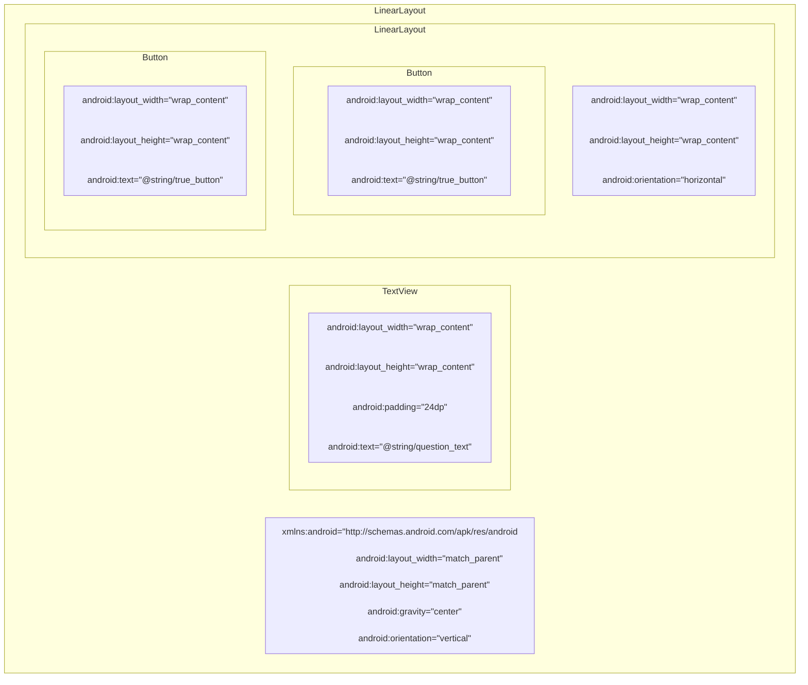

# §0 速查表

| 安卓父版本 | 安卓子版本            | API级别 | 系统代号               |
| ---------- | --------------------- | ------- | ---------------------- |
| Android 1  | Android 1.0           | 1       | Base                   |
|            | Android 1.1           | 2       | Base_1_1               |
|            | Android 1.5           | 3       | Cupcake                |
|            | Android 1.6           | 4       | Donut                  |
| Android 2  | Android 2.0.0         | 5       | Eclair                 |
|            | Android 2.0.1         | 6       | Eclair_0_1             |
|            | Android 2.1           | 7       | Eclair_MR1             |
|            | Android 2.2           | 8       | Froyo                  |
|            | Android 2.3 ~ 2.3.2   | 9       | Gingerbread            |
|            | Android 2.3.3 ~ 2.4.4 | 10      | Gingerbread_MR1        |
| Android 3  | Android 3.0           | 11      | Honeycomb              |
|            | Android 3.1           | 12      | Honeycomb_MR1          |
|            | Android 3.2           | 13      | Honeycomb_MR2          |
| Android 4  | Android 4.0 ~ 4.0.2   | 14      | Ice_Cream_Sandwich     |
|            | Android 4.0.3 ~ 4.0.4 | 15      | Ice_Cream_Sandwich_MR1 |
|            | Android 4.1           | 16      | Jelly_Bean             |
|            | Android 4.2           | 17      | Jelly_Bean_MR1         |
|            | Android 4.3           | 18      | Jelly_Bean_MR2         |
|            | Android 4.4           | 19      | Kitkat                 |
|            | Android 4.4W          | 20      | Kitkat_Watch           |
| Android 5  | Android 5.0           | 21      | Lollipop               |
|            | Android 5.1           | 22      | Lollipop_MR1           |
| Android 6  | Android 6.0           | 23      | M (Marshmallow)        |
| Android 7  | Android 7.0           | 24      | N (Nougat)             |
|            | Android 7.1           | 25      | N_MR1                  |
| Android 8  | Android 8.0           | 26      | O (Oreo)               |
|            | Android 8.1           | 27      | O_MR1                  |
| Android 9  | Android 9.0           | 28      | P (Pie)                |
| Android 10 | Android 10            | 29      | Q (Quince Tart)        |
| Android 11 | Android 11            | 30      | R (Red Velvet Cake)    |
| Android 12 | Android 12            | 31      | S (Snow Cone)          |
| Android 13 | Android 13            | 32      | T (Tiramisu)           |

# §1 Android开发初体验

## §1.1 用户界面设计

应用的界面由以下两点组成：

- `activity`是Android SDK中`Activity`类的一个实例，负责管理用户与界面的交互。应用的功能通过编写`Activity`的子类来实现。
- 布局(`layout`)定义了一系列界面对象，并规定了他们在屏幕上的显示位置，储存在`.xml`文件中。

## §1.2 视图层级结构

组建包含在视图(View)对象的层级结构中，这种结构称为视图层级结构(View Hierarchy)。

例如对于下列xml文档：

```xml
<LinearLayout xmlns:android="http://schemas.android.com/apk/res/android" 
              android:layout_width="match_parent"
              android:layout_height="match_parent"
              android:gravity="center" 
              android:orientation="vertical" >
	<TextView 
		android:layout_width="wrap_content" 
        android:layout_height="wrap_content" 
        android:padding="24dp" 
        android:text="@string/question_text" />
	<LinearLayout 
        android:layout_width="wrap_content" 
        android:layout_height="wrap_content" 
        android:orientation="horizontal" >
		<Button 
        	android:layout_width="wrap_content" 
            android:layout_height="wrap_content" 
            android:text="@string/true_button" />
		<Button 
            android:layout_width="wrap_content" 
            android:layout_height="wrap_content" 
            android:text="@string/false_button" />
	</LinearLayout>
</LinearLayout>
```

其视图层级结构可表示为：



### §1.2.1 根元素

XML文件只能有一个根元素，且必须指定`Android XML`资源文件的命名空间属性。

### §1.2.2 组件属性

#### §1.2.2.1 `android:layout_width`和`android:layout_height`

`android:layout_width`和`android:layout_height`分别用于规定组件的宽度和高度，几乎所有组件都需要`android:layout_width`和`android:layout_height`。这种属性有以下取值：

- `match_parent`：视图与父视图大小相同
- `wrap_content`：视图根据其显示的内容自动调整大小
- ~~`fill_parent`~~：视图与父视图大小相同，与`match_parent`作用完全一致，在API 8被弃用。

根组件的这两个属性均被强制设定为`match_parent`。虽然根组件不从属于任何一个组件，但是永远从属于Android提供的父视图。其他组件的这两个属性默认设置为`wrap_content`。

#### §1.2.2.2 `android:orientation`

 `android:orientation`属性决定`LinearLayout`组件如何排列其内部包含的组件。该属性有以下两种取值：

- `vertical`：垂直放置子组件
- `horizontal`：水平放置子组件

#### §1.2.2.3 `android:text`

`TextView`和`Button`组件均具有`android:text`，用于指定该组件要显示的文字内容。其属性值可以是字符串本身（硬编码，例如`android:text="ABC123"`），也可以是对字符串资源的引用（例如`android:text="@string/strName"`）。

字符串资源存储于一个独立的`strings.xml`中，位于`app/res/values`目录内。该文件默认包含一个`<resources>`根元素，内含众多`<string>`子元素。

```xml
<resources>
    <string name="app_name">GeoQuiz</string>
    <string name="question_text">Canberra is the capital of Australia</string>
    <string name="true_button">True</string>
    <string name="false_button">False</string>
</resources>
```

## §1.3 视图类

在创建Activity文件时，IDE会在`app/java/com.xxx.xxx`目录下创建一个同名`.java`文件，默认如下所示：

```java
//确定包所属位置
package com.example.geoquiz;

//androidx.appcompat.app.AppcompatActivity是Activity类的一个子类,能为旧版Android提供兼容支持
import androidx.appcompat.app.AppCompatActivity;
import android.os.Bundle;

public class MainActivity extends AppCompatActivity {
    @Override
    protected void onCreate(Bundle savedInstanceState) {
        super.onCreate(savedInstanceState);
        setContentView(R.layout.activity_main);
    }
}
```

按照§1.4创建按钮的资源ID后，就可以编写代码了：

```java
package com.example.geoquiz;
import androidx.appcompat.app.AppCompatActivity;
import android.os.Bundle;
import android.widget.Button; // 导入Button类
import android.view.View; // 导入View类
import android.widget.Toast; // 导入Toast类,用于弹出消息
public class MainActivity extends AppCompatActivity{
    private Button mTrueButton; // 按照Android变成规范,在变量名前加m
    private Button mFalseButton;
    @Override protected void onCreate(Bundle savedInstanceStata){
        // ...
        mTrueButton = (Button) findViewById(R.id.true_button); // 必须将View类型校正为Button
        mFalseButton = (Button) findViewById(R.id.false_button);
        mTrueButton.setOnClickListener(new View.OnClickListener(){ // 设置监听器
            @Override public void onClick(View v){
                Toast.makeText(
                        MainActivity.this,
                        R.string.correct_toast,
                        Toast.LENGTH_SHORT
                ).show();
            }
        });
        mFalseButton.setOnClickListener(new View.OnClickListener(){
            @Override public void onClick(View v){
                Toast.makeText(
                        MainActivity.this,
                        R.string.incorrect_toast,
                        Toast.LENGTH_SHORT
                ).show();
            }
        });
    }
}
```

## §1.4 资源

资源是APP中以非代码形式储存的内容，例如多媒体文件、XML文件等，一律存储于`app/res`目录中。为调用资源，我们既可以像`android:text`属性那样使用`@string/strName`，也可以使用资源ID。

在旧版本Android Studio中，资源ID存储在`app/build/generated/source/r/debug/R.java`中；在新版本Android Studio中，资源ID储存在`app/build/intermediates/runtime_symbol_list/debug/R.txt`中。每次编译时，IDE都会自动生成或更新一份存储资源ID的文件。所以修改资源后，`R.txt`不会立刻时时刷新，直到下一次编译才会重新生成。同时因为这些资源ID由系统自动生成，所以不能对它们进行手动修改。

```java
int anim abc_fade_in 0x7f010000
int anim abc_fade_out 0x7f010001
int anim abc_grow_fade_in_from_bottom 0x7f010002
int anim abc_popup_enter 0x7f010003
int anim abc_popup_exit 0x7f010004
// ...
int string false_button 0x7f0e0027 // line 1892
// ...
int string question_text 0x7f0e0051 // line 1889
int string search_menu_title 0x7f0e0052
int string status_bar_notification_info_overflow 0x7f0e0053
int string true_button 0x7f0e0054 // line 1892
// ...
int styleable ViewStubCompat_android_inflatedId 2
int xml standalone_badge 0x7f110000
int xml standalone_badge_gravity_bottom_end 0x7f110001
int xml standalone_badge_gravity_bottom_start 0x7f110002
int xml standalone_badge_gravity_top_start 0x7f110003
```

资源ID的出现，使得除了在XML中利用相对路径引用资源之外，在Java中利用面向对象的语法来引用资源成为可能。

```java
// XML
android:text="@string/app_name"
// Java
setTitle(R.string.app_name); // R即为上文介绍的R.java或R.txt
```

为了给XML文件中的组件生成资源ID，需要在定义组建时添加`android:id`属性。之所以给该属性设置的值为`@+id/elementID`而非`@id/elementID`，是因为我们是在创建资源ID，而非引用资源ID。

```xml
<Button
    android:id="@+id/true_button"
    android:layout_width="wrap_content"
    android:layout_height="wrap_content"
    android:text="@string/true_button"/>
<Button
    android:id="@+id/false_button"
    android:layout_width="wrap_content"
    android:layout_height="wrap_content"
    android:text="@string/false_button"/>
```

