# §0 速查表

| 安卓父版本 | 安卓子版本            | API级别 | 系统代号               |
| ---------- | --------------------- | ------- | ---------------------- |
| Android 1  | Android 1.0           | 1       | Base                   |
|            | Android 1.1           | 2       | Base_1_1               |
|            | Android 1.5           | 3       | Cupcake                |
|            | Android 1.6           | 4       | Donut                  |
| Android 2  | Android 2.0.0         | 5       | Eclair                 |
|            | Android 2.0.1         | 6       | Eclair_0_1             |
|            | Android 2.1           | 7       | Eclair_MR1             |
|            | Android 2.2           | 8       | Froyo                  |
|            | Android 2.3 ~ 2.3.2   | 9       | Gingerbread            |
|            | Android 2.3.3 ~ 2.4.4 | 10      | Gingerbread_MR1        |
| Android 3  | Android 3.0           | 11      | Honeycomb              |
|            | Android 3.1           | 12      | Honeycomb_MR1          |
|            | Android 3.2           | 13      | Honeycomb_MR2          |
| Android 4  | Android 4.0 ~ 4.0.2   | 14      | Ice_Cream_Sandwich     |
|            | Android 4.0.3 ~ 4.0.4 | 15      | Ice_Cream_Sandwich_MR1 |
|            | Android 4.1           | 16      | Jelly_Bean             |
|            | Android 4.2           | 17      | Jelly_Bean_MR1         |
|            | Android 4.3           | 18      | Jelly_Bean_MR2         |
|            | Android 4.4           | 19      | Kitkat                 |
|            | Android 4.4W          | 20      | Kitkat_Watch           |
| Android 5  | Android 5.0           | 21      | Lollipop               |
|            | Android 5.1           | 22      | Lollipop_MR1           |
| Android 6  | Android 6.0           | 23      | M (Marshmallow)        |
| Android 7  | Android 7.0           | 24      | N (Nougat)             |
|            | Android 7.1           | 25      | N_MR1                  |
| Android 8  | Android 8.0           | 26      | O (Oreo)               |
|            | Android 8.1           | 27      | O_MR1                  |
| Android 9  | Android 9.0           | 28      | P (Pie)                |
| Android 10 | Android 10            | 29      | Q (Quince Tart)        |
| Android 11 | Android 11            | 30      | R (Red Velvet Cake)    |
| Android 12 | Android 12            | 31      | S (Snow Cone)          |
| Android 13 | Android 13            | 32      | T (Tiramisu)           |

# §1 实战项目

## §1.1 GeoQuiz

### §1.1.1 用户界面设计

应用的界面由以下两点组成：

- `activity`是Android SDK中`Activity`类的一个实例，负责管理用户与界面的交互。应用的功能通过编写`Activity`的子类来实现。
- 布局(`layout`)定义了一系列界面对象，并规定了他们在屏幕上的显示位置，储存在`.xml`文件中。

### §1.1.2 视图层级结构

组建包含在视图(View)对象的层级结构中，这种结构称为视图层级结构(View Hierarchy)。

例如对于下列xml文档：

```xml
<LinearLayout xmlns:android="http://schemas.android.com/apk/res/android" 
              android:layout_width="match_parent"
              android:layout_height="match_parent"
              android:gravity="center" 
              android:orientation="vertical" >
	<TextView 
		android:layout_width="wrap_content" 
        android:layout_height="wrap_content" 
        android:padding="24dp" 
        android:text="@string/question_text" />
	<LinearLayout 
        android:layout_width="wrap_content" 
        android:layout_height="wrap_content" 
        android:orientation="horizontal" >
		<Button 
        	android:layout_width="wrap_content" 
            android:layout_height="wrap_content" 
            android:text="@string/true_button" />
		<Button 
            android:layout_width="wrap_content" 
            android:layout_height="wrap_content" 
            android:text="@string/false_button" />
	</LinearLayout>
</LinearLayout>
```

其视图层级结构可表示为：

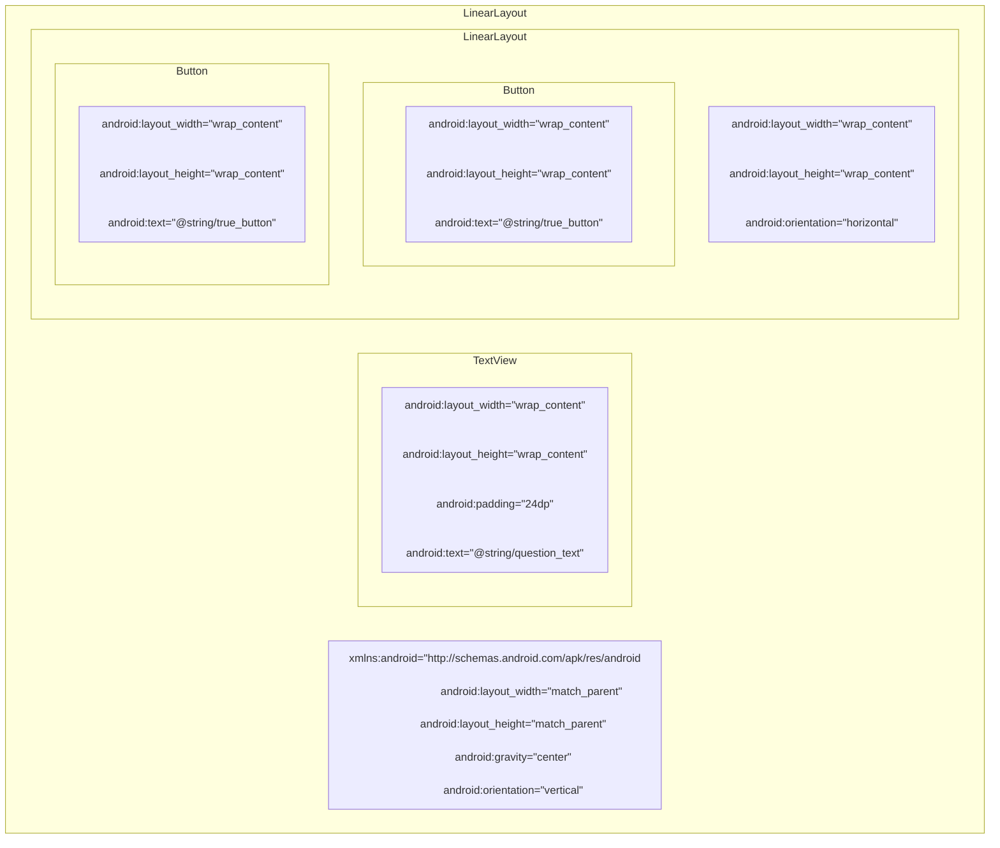

### §1.1.3 根元素

XML文件只能有一个根元素，且必须指定`Android XML`资源文件的命名空间属性。

### §1.1.4 组件属性

#### §1.1.4.1 `android:layout_width`和`android:layout_height`

`android:layout_width`和`android:layout_height`分别用于规定组件的宽度和高度，几乎所有组件都需要`android:layout_width`和`android:layout_height`。这种属性有以下取值：

- `match_parent`：视图与父视图大小相同
- `wrap_content`：视图根据其显示的内容自动调整大小
- ~~`fill_parent`~~：视图与父视图大小相同，与`match_parent`作用完全一致，在API 8被弃用。

根组件的这两个属性均被强制设定为`match_parent`。虽然根组件不从属于任何一个组件，但是永远从属于Android提供的父视图。其他组件的这两个属性默认设置为`wrap_content`。

#### §1.1.4.2 `android:orientation`

 `android:orientation`属性决定`LinearLayout`组件如何排列其内部包含的组件。该属性有以下两种取值：

- `vertical`：垂直放置子组件
- `horizontal`：水平放置子组件

#### §1.1.4.3 `android:text`

`TextView`和`Button`组件均具有`android:text`，用于指定该组件要显示的文字内容。其属性值可以是字符串本身（硬编码，例如`android:text="ABC123"`），也可以是对字符串资源的引用（例如`android:text="@string/strName"`）。

字符串资源存储于一个独立的`strings.xml`中，位于`app/res/values`目录内。该文件默认包含一个`<resources>`根元素，内含众多`<string>`子元素。

```xml
<resources>
    <string name="app_name">GeoQuiz</string>
    <string name="question_text">Canberra is the capital of Australia</string>
    <string name="true_button">True</string>
    <string name="false_button">False</string>
</resources>
```

### §1.1.5 视图类

在创建Activity文件时，IDE会在`app/java/com.xxx.xxx`目录下创建一个同名`.java`文件，默认如下所示：

```java
//确定包所属位置
package com.example.geoquiz;

//androidx.appcompat.app.AppcompatActivity是Activity类的一个子类,能为旧版Android提供兼容支持
import androidx.appcompat.app.AppCompatActivity;
import android.os.Bundle;

public class MainActivity extends AppCompatActivity {
    @Override
    protected void onCreate(Bundle savedInstanceState) {
        super.onCreate(savedInstanceState);
        setContentView(R.layout.activity_main);
    }
}
```

按照§1.4创建按钮的资源ID后，就可以编写代码了：

```java
package com.example.geoquiz;
import androidx.appcompat.app.AppCompatActivity;
import android.os.Bundle;
import android.widget.Button; // 导入Button类
import android.view.View; // 导入View类
import android.widget.Toast; // 导入Toast类,用于弹出消息
public class MainActivity extends AppCompatActivity{
    private Button mTrueButton; // 按照Android变成规范,在变量名前加m
    private Button mFalseButton;
    @Override protected void onCreate(Bundle savedInstanceStata){
        // ...
        mTrueButton = (Button) findViewById(R.id.true_button); // 必须将View类型校正为Button
        mFalseButton = (Button) findViewById(R.id.false_button);
        mTrueButton.setOnClickListener(new View.OnClickListener(){ // 设置监听器
            @Override public void onClick(View v){
                Toast.makeText(
                        MainActivity.this,
                        R.string.correct_toast,
                        Toast.LENGTH_SHORT
                ).show();
            }
        });
        mFalseButton.setOnClickListener(new View.OnClickListener(){
            @Override public void onClick(View v){
                Toast.makeText(
                        MainActivity.this,
                        R.string.incorrect_toast,
                        Toast.LENGTH_SHORT
                ).show();
            }
        });
    }
}
```

### §1.1.6 资源

资源是APP中以非代码形式储存的内容，例如多媒体文件、XML文件等，一律存储于`app/res`目录中。为调用资源，我们既可以像`android:text`属性那样使用`@string/strName`，也可以使用资源ID。

在旧版本Android Studio中，资源ID存储在`app/build/generated/source/r/debug/R.java`中；在新版本Android Studio中，资源ID储存在`app/build/intermediates/runtime_symbol_list/debug/R.txt`中。每次编译时，IDE都会自动生成或更新一份存储资源ID的文件。所以修改资源后，`R.txt`不会立刻时时刷新，直到下一次编译才会重新生成。同时因为这些资源ID由系统自动生成，所以不能对它们进行手动修改。

```java
int anim abc_fade_in 0x7f010000
int anim abc_fade_out 0x7f010001
int anim abc_grow_fade_in_from_bottom 0x7f010002
int anim abc_popup_enter 0x7f010003
int anim abc_popup_exit 0x7f010004
// ...
int string false_button 0x7f0e0027 // line 1892
// ...
int string question_text 0x7f0e0051 // line 1889
int string search_menu_title 0x7f0e0052
int string status_bar_notification_info_overflow 0x7f0e0053
int string true_button 0x7f0e0054 // line 1892
// ...
int styleable ViewStubCompat_android_inflatedId 2
int xml standalone_badge 0x7f110000
int xml standalone_badge_gravity_bottom_end 0x7f110001
int xml standalone_badge_gravity_bottom_start 0x7f110002
int xml standalone_badge_gravity_top_start 0x7f110003
```

资源ID的出现，使得除了在XML中利用相对路径引用资源之外，在Java中利用面向对象的语法来引用资源成为可能。

```java
// XML
android:text="@string/app_name"
// Java
setTitle(R.string.app_name); // R即为上文介绍的R.java或R.txt
```

为了给XML文件中的组件生成资源ID，需要在定义组建时添加`android:id`属性。之所以给该属性设置的值为`@+id/elementID`而非`@id/elementID`，是因为我们是在创建资源ID，而非引用资源ID。

```xml
<Button
    android:id="@+id/true_button"
    android:layout_width="wrap_content"
    android:layout_height="wrap_content"
    android:text="@string/true_button"/>
<Button
    android:id="@+id/false_button"
    android:layout_width="wrap_content"
    android:layout_height="wrap_content"
    android:text="@string/false_button"/>
```

### §1.1.7 添加问题

创建一个`Question`类，用于表示对每一道习题的抽象形式。

```java
package com.example.geoquiz;
public class Question {
    private int mTextResId;
    private boolean mAnswerTrue;
    public int getTextResId() {
        return mTextResId;
    }
    public void setTextResId(int textResId) {
        mTextResId = textResId;
    }
    public boolean isAnswerTrue() {
        return mAnswerTrue;
    }
    public void setAnswerTrue(boolean answerTrue) {
        mAnswerTrue = answerTrue;
    }
    public Question(int textResId, boolean answerTrue){
        mTextResId = textResId;
        mAnswerTrue = answerTrue;
    }
}
```

使用`Question`类更新`Activity`类：

```java
// ...
public class MainActivity extends AppCompatActivity {
    private Button mTrueButton;
    private Button mFalseButton;
    private Button mNextButton; // 添加下一个按钮
    private TextView mQuesitonTextView;

    private Question[] mQuestionBank = new Question[]{ // 提前硬编码习题
            new Question(R.string.question_australia,true),
            new Question(R.string.question_oceans,true),
            new Question(R.string.question_mideast,false),
            new Question(R.string.question_africa,false),
            new Question(R.string.question_americas,true),
            new Question(R.string.question_asia,true),
    };
    private int mCurrentIndex = 0; // 记录当前习题序号

    @Override
    protected void onCreate(Bundle savedInstanceState) {
		//...
        mQuesitonTextView = (TextView) findViewById(R.id.question_text_view);
        updateQuestion();
        mTrueButton = (Button) findViewById(R.id.true_button);
        mFalseButton = (Button) findViewById(R.id.false_button);
        mNextButton = (Button) findViewById(R.id.next_button);
        mTrueButton.setOnClickListener(new View.OnClickListener(){
            @Override public void onClick(View v){ // 使用封装函数checkAnswer()
                checkAnswer(true);
            }
        });
        mFalseButton.setOnClickListener(new View.OnClickListener(){
            @Override public void onClick(View v){ // 使用封装函数checkAnswer()
                checkAnswer(false);
            }
        });
        mNextButton.setOnClickListener(new View.OnClickListener(){
            @Override public void onClick(View v){ // 当前问题序号+1并更新问题
                mCurrentIndex = (mCurrentIndex + 1) % mQuestionBank.length;
                updateQuestion();
            }
        });
    }
    private void updateQuestion(){ // 按照当前序号更新习题
        int question = mQuestionBank[mCurrentIndex].getTextResId();
        mQuesitonTextView.setText(question);
    }
    private void checkAnswer(boolean userPressedTrue){ // 检测userPressedTrue和isAnswerTrue是否一致
        boolean answerIsTrue = mQuestionBank[mCurrentIndex].isAnswerTrue();
        int messageResId = 0;
        if(userPressedTrue == answerIsTrue){
            messageResId = R.string.correct_toast;
        }else{
            messageResId = R.string.incorrect_toast;
        }
        Toast.makeText(MainActivity.this,messageResId,Toast.LENGTH_SHORT).show();
    }
}
```

在`String.xml`中添加对应的字符串资源：

```xml
<resources>
    <string name="app_name">GeoQuiz</string>
    <string name="question_australia">Canberra is the capital of Australia</string>
    <string name="question_oceans">The Pacific Ocean is larger than the Atlantic Ocean</string>
    <string name="question_mideast">The Suez Canal connects the Red Sea and the Indian Ocean</string>
    <string name="question_africa">The source of the Nile River is in Egypt</string>
    <string name="question_americas">The Amazon River is the longest river in the Americas</string>
    <string name="question_asia">Lake Baikal is the world\'s oldest and deepest freshwater lake.</string>
    <string name="true_button">True</string>
    <string name="false_button">False</string>
    <string name="next_button">Next</string>
    <string name="correct_toast">Correct!</string>
    <string name="incorrect_toast">Incorrect!</string>
</resources>
```

### §1.1.8 `Activity`的生命周期

每个`Activity`实例都有生命周期，在其生命周期内按照以下关系在运行、暂停、停止、不存在这四种状态间转换。


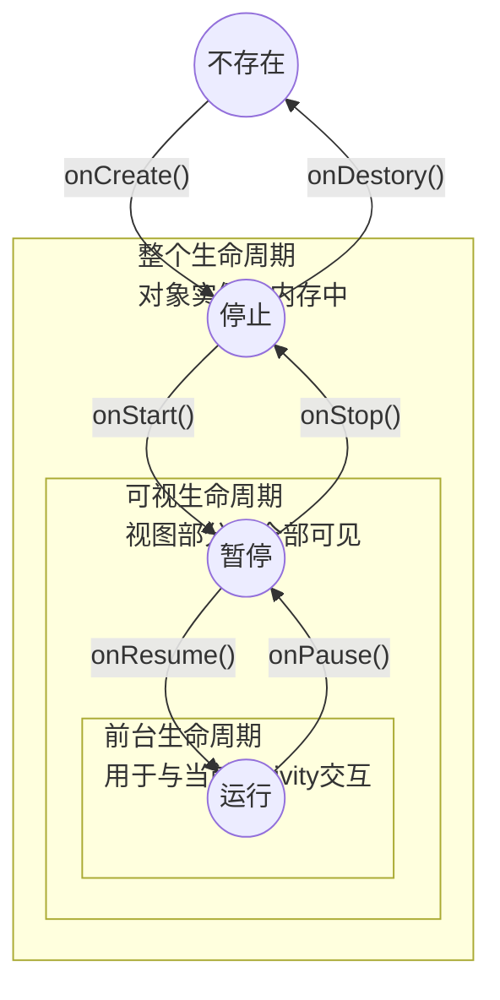

| `Activity`状态 | 是否有内存实例 | 用户是否可见 | 是否处于前台 |
| -------------- | -------------- | ------------ | ------------ |
| 不存在         | ×              | ×            | ×            |
| 停止           | √              | ×            | ×            |
| 暂停           | √              | √或⍻         | ×            |
| 运行           | √              | √            | √            |

`OnCreate()`负责：

- 将组件实例化，并调用`setContentView(int)`将组件放置在屏幕上
- 引用已经实例化的组件
- 为组建设置监听器
- 访问外部模型数据

### §1.1.9 修复旋转屏幕导致Activity销毁的BUG

由生命周期的内容可知，旋转屏幕时会将当前`Activity`实例销毁，从而自动跳转到第一个问题。因此，我们需要对宽屏进行适配。

首先，创建一个给宽屏使用的XML布局文件，存放在目录`app/src/main/res/layout-land`目录下：

```xml
<?xml version="1.0" encoding="utf-8"?>
<FrameLayout xmlns:android="http://schemas.android.com/apk/res/android"
    android:layout_width="match_parent"
    android:layout_height="match_parent">
    <TextView
        android:id="@+id/question_text_view"
        android:layout_width="wrap_content"
        android:layout_height="wrap_content"
        android:layout_gravity="center_horizontal"
        android:padding="24dp" />
    <LinearLayout
        android:layout_width="wrap_content"
        android:layout_height="wrap_content"
        android:layout_gravity="center_vertical|center_horizontal"
        android:orientation="horizontal">
        <Button
            android:id="@+id/true_button"
            android:layout_width="wrap_content"
            android:layout_height="wrap_content"
            android:text="@string/true_button"
            style="?android:attr/buttonBarButtonStyle" />
        <Button
            android:id="@+id/false_button"
            android:layout_width="wrap_content"
            android:layout_height="wrap_content"
            android:text="@string/false_button"
            style="?android:attr/buttonBarButtonStyle" />
    </LinearLayout>
    <FrameLayout
        android:layout_width="wrap_content"
        android:layout_height="wrap_content"
        android:orientation="horizontal"
        android:layout_gravity="bottom|right">
        <LinearLayout
            android:layout_width="wrap_content"
            android:layout_height="wrap_content"
            android:orientation="horizontal">
            <Button
                android:layout_width="wrap_content"
                android:layout_height="wrap_content"
                android:id="@+id/previous_button"
                android:text="@string/previous_button"
                android:drawableStart="@drawable/arrow_left"
                android:drawablePadding="4sp"/>
            <Button
                android:layout_width="wrap_content"
                android:layout_height="wrap_content"
                android:id="@+id/next_button"
                android:text="@string/next_button"
                android:drawableEnd="@drawable/arrow_right"
                android:drawablePadding="4dp"/>
        </LinearLayout>
    </FrameLayout>
</FrameLayout>
```

> 注意：这里我们使用了`<FrameLayout>`标签，设置其`android:layout_gravity`属性，将跳转按钮放置在屏幕的最右下角，而这是`<LinearLayout>`做不到的。

接着，我们需要创建一个可以被多个`Activity`实例共享的变量，用于存储当前的问题序号。`Bundle`数据类型存储着字符串值与限定类型之间的映射关系，在`@Override protected void onCreate(Bundle savedInstanceState)`中我们就使用过这种数据类型。可以覆盖`onSaveInstanceState(Bundle)`方法，将所需变量保存到`Bundle`中：

```java
public class MainActivity extends AppCompatActivity{
    // ...
    private static final String KEY_INDEX = "index";
	// ...
    @Override protected void onCreate(Bundle savedInstanceState){
        // ...
        if(savedInstanceState != null){
            mCurrentIndex = savedInstanceState.getInt(KET_INDEX,0);
        }
        // ...
    }
    @Override public void onSaveInstanceState(Bundle savedInstanceState){
        super.onSaveInstanceState(savedInstanceState);
        Log.i(TAG,"onSaveInstanceState");
        savedInstanceState.putInt(KEY_INDEX,mCurrentIndex);
    }
    // ...
}
```

### §1.1.10 创建新`Activity`

首先准备字符串资源：

```xml
<resource>
	<!-- ... -->
    <string name="warning_text">Are you sure you want to do this?</string>
    <string name="show_answer_button">Show Answer</string>
    <string name="cheat_button">Cheat!</string>
    <string name="judgment_toast">Cheating is wrong.</string>
</resource>
```

创建新`Activity`的过程至少涉及三个文件的更新：Java类文件、XML布局文件和APP本身的manifest文件。这三个文件关联密切，一旦出错就会导致难以撤回的灾难。Android Studio提供了新建`Activity`向导的功能，免去了出错的风险。

`AndroidManifest.xml`文件位于`app/manifests`目录内，记录了该APP内包含的所有资源，包括刚才新建的Activity：

```xml
<manifest xmlns:android="http://schemas.android.com/apk/res/android"
    package="com.example.geoquiz">
    <application
        android:allowBackup="true"
        android:icon="@mipmap/ic_launcher"
        android:label="@string/app_name"
        android:roundIcon="@mipmap/ic_launcher_round"
        android:supportsRtl="true"
        android:theme="@style/Theme.GeoQuiz">
        <!-- 新建的Activity -->
        <activity
            android:name=".CheatActivity"
            android:exported="false" />
        <!-- 原有的的Activity -->
        <activity android:name=".MainActivity">
            <intent-filter>
                <action android:name="android.intent.action.MAIN" />
                <category android:name="android.intent.category.LAUNCHER" />
            </intent-filter>
        </activity>
    </application>
</manifest>
```

`Intent`是`component`用于与操作系统通信的媒介工具。`component`包括`Activity`、`Service`、`Broadcast`、`ContentReciver`、`ContentProvider`等一系列安卓自带的组件。`Intent`类的构造函数`Intent(Context packageContext,class<?> cls)`接受两个形参，`packageContext`接受当前`Activity`类的实例，`cls`接受要打开的`Activity`对应的类对象：

```java
Intent intent = new Intent(MainActivity.this,CheatActivity.class);
```

为了在多个`Activity`之间传递数据，我们可以使用`Intent.putExtra(String name,boolean value)`的方法将数据写入`Intent`实例中。该方法返回`Intent`实例自身，因此可以实现链式调用：

```java
intent.putExtra("data1",true)
    .putExtra("data2",false)
    .putExtra("data3",true);
```

新建的`Activity`可以使用`getIntent()`方法获得传递的`Intent`实例，然后再调用`Intent.getBooleanExtra(String name,boolean defaultValue)`来获得对应的变量：

```java
private boolean mAnswerIsTrue;
mAnswerIsTrue = getIntent().getBooleanExtra(EXTRA_ANSWER_IS_TRUE,false);
```

在多个`Activity`之间最简单的切换方式是调用`startActivity(Intent)`方法。

```java
package com.example.geoquiz;

import androidx.appcompat.app.AppCompatActivity;

import android.content.Context;
import android.content.Intent;
import android.os.Bundle;
import android.view.View;
import android.widget.Button;
import android.widget.TextView;

import java.awt.font.TextAttribute;

public class CheatActivity extends AppCompatActivity {
    private boolean mAnswerIsTrue;
    private TextView mAnswerTextView;
    private Button mShowAnswerButton;
    private static final String EXTRA_ANSWER_IS_TRUE = "com.example.geoquiz.answer_is_true";
    @Override
    protected void onCreate(Bundle savedInstanceState) {
        super.onCreate(savedInstanceState);
        setContentView(R.layout.activity_cheat);

        mAnswerIsTrue = getIntent().getBooleanExtra(EXTRA_ANSWER_IS_TRUE,false);
        mAnswerTextView = (TextView) findViewById(R.id.answer_text_view);
        mShowAnswerButton = (Button) findViewById(R.id.show_answer_button);
        mShowAnswerButton.setOnClickListener(new View.OnClickListener() {
            @Override
            public void onClick(View v) {
                if(mAnswerIsTrue){
                    mAnswerTextView.setText(R.string.true_button);
                }else{
                    mAnswerTextView.setText(R.string.false_button);
                }
            }
        });
    }
    public static Intent newIntent(Context packageContext, boolean answerIsTrue){
        Intent intent = new Intent(packageContext,CheatActivity.class);
        intent.putExtra(A"com.example.geoquiz.answer_is_true",answerIsTrue);
        return intent;
    }
}
```

```java
public class MainActivity extends AppCompatActivity{
    // ...
    private Button mCheatButton;
    // ...
    @Override protected void onCreate(Bundle savedInstanceState){
        // ...
        mCheatButton = (Button) findViewById(R.id.cheat_button);
    	mCheatButton.setOnClickListener(new View.OnClickListener(){
            boolean answerIsTrue = mQuestionBank[mCurrentIndex].isAnswerTrue();
            Intent intent = CheatActivity.newIntent(MainActivity.this,answerIsTrue);
            startActivity(intent);
        });
    }
}
```

作弊功能已完成，现在添加判断是否作弊的功能。

除了`startActivity(Intent)`方法外，`startActivityForResult(Intent intent,int requestCode)`也能实现`Activity`间的切换，并且开发者可以自行设置请求代码`requestCode`，先传给子`Activity`再传给父`Activity`，以此来实现`Activity`间的交互。为此，修改`mCheatButton`监听器：

```java
mCheatButton.setOnClickListener(new View.OnClickListener() {
    @Override
    public void onClick(View v) {
        boolean answerIsTrue = mQuestionBank[mCurrentIndex].isAnswerTrue();
        Intent intent = CheatActivity.newIntent(MainActivity.this,answerIsTrue);
        startActivityForResult(intent,REQUEST_CODE_CHEAT);
    }
});
```

子`Activity`向父`Activity`发送返回信息有以下两种方法：

```java
public final void setResult(int resultCode)
public final void setResult(int resultCode,Intent intent)
/** resultCode常量既可以使用自定义的常量,也可以使用自带的常量:
 *  Activity.RESULT_OK
 *  Activity.RESULT_CANCELED
 **/
```

最终代码如下：

```java
package com.example.geoquiz;
import androidx.appcompat.app.AppCompatActivity;
import android.content.Context;
import android.content.Intent;
import android.os.Bundle;
import android.view.View;
import android.widget.Button;
import android.widget.TextView;
import java.awt.font.TextAttribute;
public class CheatActivity extends AppCompatActivity {
    private boolean mAnswerIsTrue;
    private TextView mAnswerTextView;
    private Button mShowAnswerButton;
    private static final String EXTRA_ANSWER_IS_TRUE = "com.example.geoquiz.answer_is_true";
    private static final String EXTRA_ANSWER_SHOWN = "com.example.geoquiz.answer_shown";
    @Override
    protected void onCreate(Bundle savedInstanceState) {
        super.onCreate(savedInstanceState);
        setContentView(R.layout.activity_cheat);

        mAnswerIsTrue = getIntent().getBooleanExtra(EXTRA_ANSWER_IS_TRUE,false);
        mAnswerTextView = (TextView) findViewById(R.id.answer_text_view);
        mShowAnswerButton = (Button) findViewById(R.id.show_answer_button);
        mShowAnswerButton.setOnClickListener(new View.OnClickListener() {
            @Override
            public void onClick(View v) {
                if(mAnswerIsTrue){
                    mAnswerTextView.setText(R.string.true_button);
                }else{
                    mAnswerTextView.setText(R.string.false_button);
                }
                setAnswerShowResult(true);
            }
        });
    }
    public static Intent newIntent(Context packageContext, boolean answerIsTrue){
        Intent intent = new Intent(packageContext,CheatActivity.class);
        intent.putExtra(EXTRA_ANSWER_IS_TRUE,answerIsTrue);
        return intent;
    }
    public static boolean wasAnswerShown(Intent result){
        return result.getBooleanExtra(EXTRA_ANSWER_SHOWN,false);
    }
    private void setAnswerShowResult(boolean isAnswerShown){
        Intent intent = new Intent();
        intent.putExtra(EXTRA_ANSWER_SHOWN,isAnswerShown);
        setResult(RESULT_OK,intent);
    }
}
```

```java
public class MainActivity extends AppCompatActivity{
    // ...
    @Override public void onActivityResult(int requestCode, int resultCode, Intent intent) {
        super.onActivityResult(requestCode, resultCode, intent);
        if (resultCode != Activity.RESULT_OK) {
            return;
        }
        if (intent == null) {
            return;
        } else {
            mIsCheater = CheatActivity.wasAnswerShown(intent);
        }
    }
    // ...
}
```

## §1.2 CriminalIntent

### §1.2.1 `Fragment`的创建和托管

在GeoQuiz项目中，我们使用`Activity`完成了整个项目的开发。但是`Activity`有一个致命的缺陷：同屏只能有一个`Activity`运行。如果我们想设计一个QQ HD类似的界面，左侧较窄，排列着当前的联系人，右侧较宽，为聊天界面，`Activity`就无法实现这种效果。该项目将使用`Fragment`来实现上述效果。

`Fragment`在API 11被引入，有原生版本和支持库版本之分。原生版本为系统自带的，定义于`android.app`，在不同系统上的实现过程略有差别，界面也会有所差异。为了保证界面统一，我们使用支持库版本。支持库版本的`Fragment`定义在`AppCompat`库的`android.support.v4.app`或`androidx.fragment.app.Fragment`类中，必须在`build.bundle`中添加该库的依赖：

```json
// ...
dependencies {
    implementation 'androidx.appcompat:appcompat:1.2.0'
    // ...
}
```

`Activity`托管`Fragment`有两种方式：

- 在`Activity`的布局中添加`Fragment`：简单但不够灵活，在`Activity`的生命周期内无法替换`Fragment`视图
- 在`Activity`的代码中添加`Fragment`：复杂但能动态控制`Fragment`视图

这里我们对组件的灵活性要求特别高，因此我们选择在`Activity`的代码中添加`Fragment`。

定义用于存储犯罪时间的`Crime.java`类：

```java
package com.example.criminalintent;
import java.util.Date;
import java.util.UUID;
public class Crime {
    private UUID mId;
    private String mTitle;
    private Date mDate;
    private boolean mSolved;

    public Crime(){
        mId = UUID.randomUUID();
        mDate = new Date();
    }

    public UUID getId(){
        return mId;
    }
    public String getTitle(){
        return mTitle;
    }
    public void setTitle(String title){
        mTitle = title;
    }
    public Date getDate(){
        return mDate;
    }
    public void setDate(Date date){
        mDate = date;
    }
    public boolean isSolved(){
        return mSolved;
    }
    public void setSolved(boolean solved){
        mSolved = solved;
    }
}
```

添加用于创建罪行的`fragment_crime.xml`：

```xml
<?xml version="1.0" encoding="utf-8"?>
<LinearLayout xmlns:android="http://schemas.android.com/apk/res/android"
    android:orientation="vertical"
    android:layout_width="match_parent"
    android:layout_height="match_parent"
    android:layout_margin="16dp">
    <TextView
        android:layout_width="match_parent"
        android:layout_height="wrap_content"
        style="?android:listSeparatorTextViewStyle"
        android:text="@string/crime_title_label"/>
    <EditText
        android:layout_width="match_parent"
        android:layout_height="wrap_content"
        android:id="@+id/crime_title"
        android:hint="@string/crime_title_hint"/>
    <TextView
        android:layout_width="match_parent"
        android:layout_height="wrap_content"
        android:id="@+id/crime_date"
        android:text="@string/crime_details_label"/>
    <Button
        android:layout_width="match_parent"
        android:layout_height="wrap_content"
        android:id="@id/crime_date"/>
    <CheckBox
        android:layout_width="match_parent"
        android:layout_height="wrap_content"
        android:id="@+id/crime_solved"
        android:text="@string/crime_solved_label"/>
</LinearLayout>
```

创建用于容纳整个界面的总`Activity`：

```xml
<?xml version="1.0" encoding="utf-8"?>
<FrameLayout xmlns:android="http://schemas.android.com/apk/res/android"
    android:layout_width="match_parent"
    android:layout_height="match_parent"
    android:id="@+id/fragment_container">
</FrameLayout>
```

与`Activity`不同，`Fragment`布局的创建不像`public void Activity.onCreate(Bundle)`一样由`Fragment.onCreate(Bundle savedInstanceState)`创建，而是由`public View onCreateView(LayoutInflater infalter,ViewGroup container,Bundle savedInstanceState)`创建的：

```java
package com.example.criminalintent;

import android.os.Bundle;
import androidx.annotation.Nullable;
import androidx.fragment.app.Fragment;

public class CrimeFragment extends Fragment {
    private Crime mCrime;
    @Override public void onCreate(Bundle savedInstanceState) {
        super.onCreate(savedInstanceState);
        mCrime = new Crime();
    }
    @Override public View onCreateView(LayoutInflater inflater, ViewGroup container,Bundle savedInstanceState){
        View v = inflater.inflate(R.layout.fragment_crime,container,false);
        return v;
    }
}

```

此处`onCreateView(LayoutInflater,ViewGroup,Bundle)`方法实例化`Fragment`视图的布局`View`，并将其作为返回值托管给`Activity`。

接下来，我们给文本框添加一个监视器，一旦检测到文本有变化，就将新文本同步到`Crime`对象的`mTitle`字段中：

```java
// ...
private EditText mTitleField;
// ...
@Override public View onCreateView(LayoutInflater inflater, ViewGroup container,Bundle savedInstanceState){
    // ...
    mTitleField = (EditText) v.findViewById(R.id.crime_title);
    mTitleField.addTextChangedListener(new TextWatcher() {
        @Override public void beforeTextChanged(CharSequence charSequence, int start, int count, int after) {
        
        }
        @Override public void onTextChanged(CharSequence charSequence, int start, int before, int count) {
            mCrime.setTitle(charSequence.toString());
        }
        @Override public void afterTextChanged(Editable editable) {
        
        }
    });
    // ...
}
```

同理，使用代码的方式设置`Button`。

```java
// ...
private Button mDateButton;
// ...
@Override public View onCreateView(LayoutInflater inflater, ViewGroup container,Bundle savedInstanceState){
    // ...
	mDateButton = (Button) v.findViewById(R.id.crime_date);
	mDateButton.setText(mCrime.getDate().toString());
	mDateButton.setEnabled(false);
    // ...
}
```

最后，给`CheckBox`组件设置监听器，实时更新`mSolved`变量：

```java
// ...
private CheckBox mSolvedCheckBox;
// ...
@Override public View onCreateView(LayoutInflater inflater, ViewGroup container,Bundle savedInstanceState){
    // ...
    mSolvedCheckBox = (CheckBox) v.findViewById(R.id.crime_solved);
    mSolvedCheckBox.setOnCheckedChangeListener(new CompoundButton.OnCheckedChangeListener() {
        @Override public void onCheckedChanged(CompoundButton compoundButton, boolean isChecked) {
            mCrime.setSolved(isChecked);
        }
    });
    // ...
}
```

`Fragment`已经配置完毕了，现在要将其添加给`Activity`。

`Activity`类中定义了`FragmentManager`类，负责管理`Fragment`并将其对应的视图添加到`Activity`实例中：

```java
public class CrimeActivity extends AppCompatActivity {
    @Override protected void onCreate(Bundle savedInstanceState) {
        // ...
        FragmentManager fm = getSupportFragmentManager();
        Fragment fragment = fm.findFragmentById(R.id.fragment_container);
        if(fragment == null){
            fragment = new CrimeFragment();
            fm.beginTransaction() // 创建并返回FragmentTransaction实例
                .add(R.id.fragment_container,fragment) // 创建事务
                .commit(); // 提交事务
        }
    }
}
```

`Fragment.beginTransction().add().commit`作用如下：

- `Fragment.beginTransaction()`创建并返回`FragmentTransaction`实例。
- `FragmentTransction.add(int containerViewId,Fragment fragment)`负责按照`containerViewId`在`FragmentManager`队列中唯一标识`fragment`，并且查找哪个XML布局文件中定义了相同的`android:id="@+id/containerViewId"`，从而在该`ContainerView`中加载`fragment`。
- `FragmentTransction.commit()`提交事务。

### §1.2.2 `Fragment`的生命周期

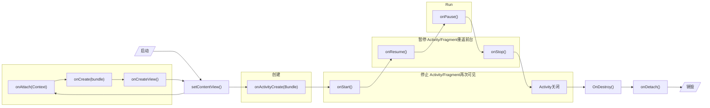

### §1.2.3 添加列表

创建`CrimeLab`类，添加静态变量`sCrimeLab`（`s`表示`static`）用于存储`Crime`对象：

```java
package com.example.criminalintent;

import android.content.Context;
import android.widget.LinearLayout;

import java.util.ArrayList;
import java.util.List;
import java.util.UUID;

public class CrimeLab {
    private static CrimeLab sCrimeLab;
    private List<Crime> mCrimes;
    public static CrimeLab get(Context context){
        if(sCrimeLab == null){
            sCrimeLab = new CrimeLab(context);
        }
        return sCrimeLab;
    }
    private CrimeLab(Context context){
        mCrimes = new ArrayList<>();
    }
    public List<Crime> getCrimes(){
        return mCrimes;
    }
    public Crime getCrime(UUID id){
        for(Crime crime : mCrimes){
            if (crime.getId().equals(id)){
                return crime;
            }
        }
        return null;
    }
    public void testCrimeLab(){
        for(int i = 0;i < 100;i++){
            Crime crime = new Crime();
            crime.setTitle("Crime #" + i);
            crime.setSolved(i % 2 == 0);
            mCrimes.add(crime);
        }
    }
}
```

这个类的特殊之处在于，`CrimeLab`的构造方法是被`private`修饰的，也就是说在其他类中无法直接创建该类的实例，必须通过该类定义的`public`方法`CrimeLab.get(Context)`才能将其实例化。

我们可以重复使用`CrimeActivity`类的代码才创建多个`CrimeListActivity`类。每次新建`Activity`时都需要重复这段代码，于是考虑将其封装成抽象类`SingleFragmentActivity`。

```java
package com.example.criminalintent;

import android.os.Bundle;
import androidx.appcompat.app.AppCompatActivity;
import androidx.fragment.app.Fragment;
import androidx.fragment.app.FragmentManager;

public abstract class SingleFragmentActivity extends AppCompatActivity {
    protected abstract Fragment createFragment();
    @Override protected void onCreate(Bundle savedInstanceState){
        super.onCreate(savedInstanceState);
        setContentView(R.layout.activity_fragment);
        FragmentManager fm = getSupportFragmentManager();
        Fragment fragment = fm.findFragmentById(R.id.fragment_container);
        if(fragment == null){
            fragment = createFragment();
            fm.beginTransaction()
                    .add(R.id.fragment_container,fragment)
                    .commit();
        }
    }
}

```

这样`CrimeActivity.java`就可以进行简化了。

```java
package com.example.criminalintent;

import androidx.appcompat.app.AppCompatActivity;
import androidx.fragment.app.Fragment;
import androidx.fragment.app.FragmentManager;

import android.os.Bundle;

public class CrimeActivity extends SingleFragmentActivity {
    @Override protected Fragment createFragment(){
        return new CrimeFragment();
    }
}
```

现在运行程序，Android会解析`AndroidManifest.xml`中的`Launcher Activity`，即`CrimeListActivity`。该类内部本身没有定义`onCreate()`，于是向上追踪至其超类`SingleFragmentActivity`，执行该超类中的初始方法`SingleFragmentActivity.onCreate()`，进行了以下步骤：

- 使用`setContentView()`方法，查找项目内`id`为`activity_fragment`的XML布局文件，即`activity_fragment.xml`。该布局文件内只有一个`<FrameLayout>`标签。

- 创建一个`FragmentManager`实例，将`id`为`fragment_container`的XML布局文件（`activity_fragment.xml`）实例化，成为一个新的`Fragment`实例。

- 检测该`Fragment`实例是否为`null`（一般情况下都为是），则舍弃该实例，转而用子类中的`createFragment()`方法创建一个新`Fragment`。该方法返回一个`Fragment`的子类`CrimeListFragment`，并将其托管给`FragmentManager`。

- `CrimeListFragment`内含`onCreateView()`，每次尝试新建一个`View`实例时就会执行该方法。

  - 该方法通过`LayoutInflator.inflate(int resource,ViewGroup root,boolean attachToRoot)`将`resource`指向的`fragment_crime_list.xml`XML布局文件实例化成为一个`View`对象，然后将该`View`对象对应的XML布局文件中的`<Android.recyclerview.widget.RecyclerView>`根标签通过`(RecyclerView) view.findViewById()`方法转换成了`RecyclerView`实例，并给该实例的`setLayoutManager()`方法绑定一个即时生成的`LinearLayoutManager`实例。最后`onCreateView()`返回修改过的`View`实例。

  - 该方法会调用自定义的`updateUI()`方法，获得一个带有测试数据的`CrimeLab`实例，该实例通过内部的`List<Crime>`对象来存储多个`Crime`。该对象会被传入`CrimeAdapter`类的构造方法中产生一个实例。`CrimeAdapter`继承于`RecyclerView.Adapter<CrimeHolder>`超类，内有三个需要覆盖的方法：

    - `public CrimeHolder onCreateViewHolder()`

      将当前`Activity`的`LayoutInflator`和`ViewGroup`实例，传给`CrimeHolder`实例。这样的话在后续的代码中，每个`CrimeHolder`调用`findViewById()`时，都能用相同的`id`获得自己所包含的`View`的`TextView`实例。

    - `public void onBindViewHolder()`

      按照传入的`position`，在`List<Crime>`中查找对应的`Crime`，然后调用传来的`CrimeHolder`实例中的`bind()`方法进行绑定。

    - `public int getItemCount()`

      返回当前`CrimeApdator`中`List<Crime>`的元素个数。

    前面提到`onCreateViewHolder()`返回的是自定义类`CrimeHolder`的实例。该类继承于`RecyclerView.ViewHolder`，内部定义的`bind(Crime)`方法可将传入的`Crime`实例中的字段输出至`CrimeHolder`内`View`实例`itemView`的`<TextView>`标签中。

现在开始开发列表的界面，将`AndroidManifest.xml`中声明`CrimeListActivity`为`Launcher Activity`：

```xml
<manifest>
	<!-- ... -->
    <activity android:name=".CrimeListActivity">
        <!-- ... -->
    </activity>
    <activity android:name=".CrimeActivity">
    </activity>
    <!-- ... -->
</manifest>
```

接下来给`CrimeListFragment`做铺垫。创建`CrimeListActivity`和`CrimeListFragment`两个类：

```java
package com.example.criminalintent;

import androidx.fragment.app.Fragment;

public class CrimeListActivity extends SingleFragmentActivity {
    @Override protected Fragment createFragment(){
        return new CrimeListFragment();
    }
}
```

```java
package com.example.criminalintent;

import androidx.fragment.app.Fragment;

public class CrimeListFragment extends Fragment {

}
```

`RecyclerView`是`ViewGruop`的子类，其中每一个列表项都是由一个`View`子对象显示的。而且在加载列表项时选择分批加载，用户滑动屏幕切图时，上一个视图会被回收利用。

`ViewHolder`是`View`的子类，唯一的用途就是容纳`View`视图。

事实上，`RecyclerView`本身不能创建`ViewHolder`，这个操作是由`Adapter`完成的，负责创建`ViewHolder`并将其绑定至模型层数据。

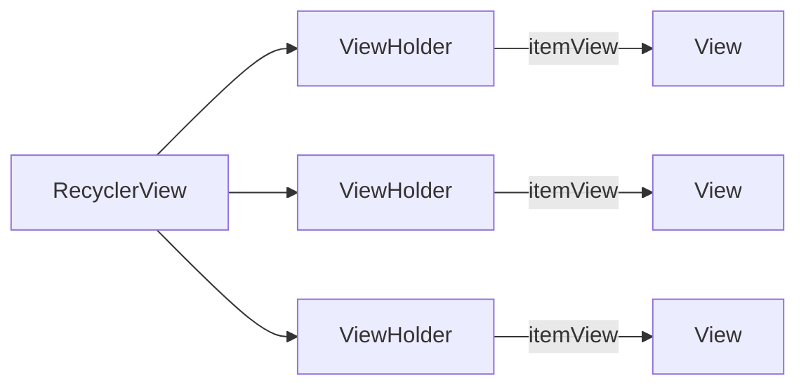

`RecyclerView`创建视图对象时，要经历以下流程：

1. 寻找`RecyclerView`的`Adapter`。
2. `RecyclerView`调用`Adapter`的`getItemCount()`方法，询问数组列表包含多少对象。
3. `RecyclerView`调用`Adapter`的`onCreateViewHolder(ViewGroup,int)`方法创建`ViewHolder`及其要显示的`View`。
4. `RecyclerHolder`将得到的`ViewHolder`传入`onBindViewHolder(ViewHolder,int)`方法中，`ViewHolder`将视图绑定在自己身上。
5. 一旦`ViewHolder`填充满了屏幕，`RecyclerView`就会停止调用`onCreateViewHolder()`方法，同时将未被渲染的`ViewHolder`回收利用以节省内存。

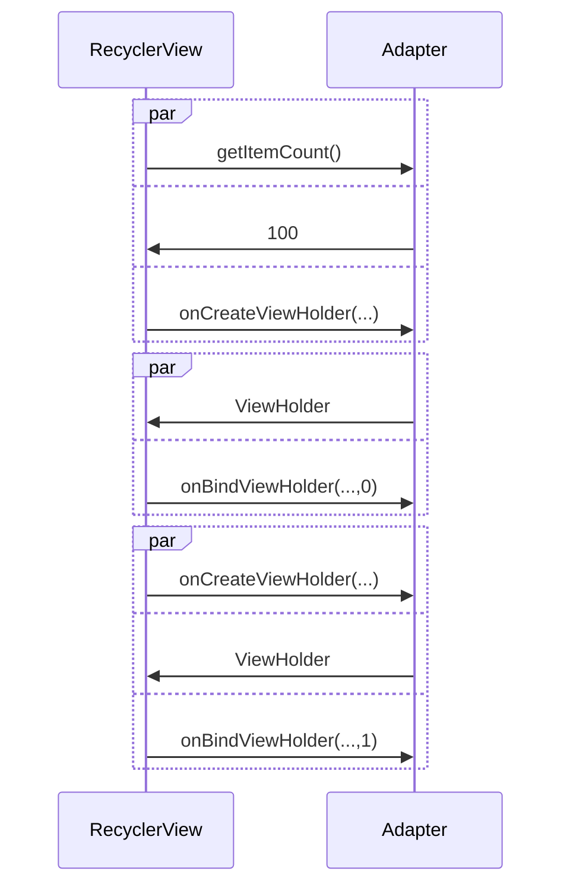

继续完善`CrimeListFragment`及其XML布局文件`fragment_crime_list.xml`：

```xml
<?xml version="1.0" encoding="utf-8"?>
<androidx.recyclerview.widget.RecyclerView
    xmlns:android="http://schemas.android.com/apk/res/android"
    android:layout_width="match_parent"
    android:layout_height="match_parent"
    android:id="@+id/crime_recycler_view">
</androidx.recyclerview.widget.RecyclerView>
```

```java
package com.example.criminalintent;
import android.os.Bundle;
import android.view.LayoutInflater;
import android.view.View;
import android.view.ViewGroup;
import android.widget.TextView;
import androidx.fragment.app.Fragment;
import androidx.recyclerview.widget.LinearLayoutManager;
import androidx.recyclerview.widget.RecyclerView;
import java.util.List;

public class CrimeListFragment extends Fragment {
    private RecyclerView mCrimeRecyclerView;
    private CrimeAdapter mAdapter;

    @Override public View onCreateView(LayoutInflater inflater, ViewGroup container, Bundle savedInstanceState){
        View view = inflater.inflate(R.layout.fragment_crime_list,container,false);
        mCrimeRecyclerView = (RecyclerView) view.findViewById(R.id.crime_recycler_view);
        mCrimeRecyclerView.setLayoutManager(new LinearLayoutManager(getActivity()));
        updateUI();
        return view;
    }
    private class CrimeHolder extends RecyclerView.ViewHolder{
        private TextView mTitleTextView;
        private TextView mDateTextView;
        private Crime mCrime;
        public CrimeHolder(LayoutInflater inflater,ViewGroup parent){
            super(inflater.inflate(R.layout.list_item_crime,parent,false));
            mTitleTextView = (TextView) itemView.findViewById(R.id.crime_title);
            mDateTextView = (TextView) itemView.findViewById(R.id.crime_title);
        }
        public void bind(Crime crime){
            mCrime = crime;
            mTitleTextView.setText(mCrime.getTitle());
            mDateTextView.setText(mCrime.getDate().toString());
        }
    }
    private class CrimeAdapter extends RecyclerView.Adapter<CrimeHolder>{
        private List<Crime> mCrimes;
        public CrimeAdapter(List<Crime> crimes){
            this.mCrimes = crimes;
        }
        @Override public CrimeHolder onCreateViewHolder(ViewGroup parent, int viewType) {
            LayoutInflater layoutInflater = LayoutInflater.from(getActivity());
            return new CrimeHolder(layoutInflater,parent);
        }

        @Override public void onBindViewHolder(CrimeHolder holder, int position) {
            Crime crime = mCrimes.get(position);
            holder.bind(crime);
        }

        @Override public int getItemCount() {
            return mCrimes.size();
        }
    }
    private void updateUI(){
        CrimeLab crimeLab = CrimeLab.get(getActivity());
        List<Crime> crimes = crimeLab.getCrimes();
        mAdapter = new CrimeAdapter(crimes);
        mCrimeRecyclerView.setAdapter(mAdapter);
    }
}
```

现在，只要获取到一个`Crime`实例，`CrimeHolder`就能刷新`TextView`。

接下来给每个`itemView`都添加一个点击监听器：

```java
public class CrimeListFragment extends Fragment {
    // ...
    private class CrimeHolder extends RecyclerView.ViewHolder implements View.OnClickListener{
        // ...
        public CrimeHolder(LayoutInflator inflater,ViewGroup parent){
            // ...
            itemView.setOnclickListener(this);
        }
        @Override public void onClick(View view){
            Toast.makeText(
            	getActivity(),
                mCrime.getTitle()+" clicked!",
                Toast.LENGTH_SHORT
            ).show();
        }
    }
}
```

### §1.2.4 图形布局工具

- `Autoconnection to Parent`：在预览界面拖拽视图时，约束会自动配置，Android Studio会推断开发者的视图布置意图，实现自动连接
- `Clear All Constraints`：清除全部约束
- `Infer Constraints`：手动配置约束。

视图尺寸支持三种类型：

| 设置类型 | 设置值         | 含义                           |
| -------- | -------------- | ------------------------------ |
| 固定大小 | `[num]dp`      | 以dp为单位，为视图指定固定值   |
| 包裹内容 | `wrap_content` | 使得尺寸刚好能容纳下包含的内容 |
| 动态适应 | `0dp`          | 允许视图缩放以满足指定约束     |

为了在右侧容纳图片，我们先点击"Convert LinearLayout to ConstraintLayout"按钮，把`<LinearLayout>`标签换成`<androidx.constraintlayout.widget.ConstraintLayout>`标签，接着把`crime_date`和`crime_title`的`layout_width`属性统一摄者为`wrap_content`，然后创建一个`ImageView`组件，将这些组件的边紧贴在边框四周，再根据自己的喜好排版，得到的XML布局文件如下：

```xml
<?xml version="1.0" encoding="utf-8"?>
<androidx.constraintlayout.widget.ConstraintLayout xmlns:android="http://schemas.android.com/apk/res/android"
    xmlns:app="http://schemas.android.com/apk/res-auto"
    xmlns:tools="http://schemas.android.com/tools"
    android:id="@+id/linearLayout"
    android:layout_width="match_parent"
    android:layout_height="wrap_content">

    <TextView
        android:id="@+id/crime_title"
        android:layout_width="0dp"
        android:layout_height="wrap_content"
        android:layout_marginStart="16dp"
        android:layout_marginTop="16dp"
        android:text="Crime Title"
        android:textColor="@color/black"
        android:textSize="18sp"
        app:layout_constraintStart_toStartOf="parent"
        app:layout_constraintTop_toTopOf="parent" />

    <TextView
        android:id="@+id/crime_date"
        android:layout_width="0dp"
        android:layout_height="wrap_content"
        android:layout_marginStart="16dp"
        android:layout_marginTop="8dp"
        android:layout_marginEnd="8dp"
        android:text="Crime Date"
        app:layout_constraintStart_toStartOf="parent"
        app:layout_constraintTop_toBottomOf="@+id/crime_title" />

    <ImageView
        android:id="@+id/crime_solved"
        android:layout_width="39dp"
        android:layout_height="wrap_content"
        android:visibility="visible"
        app:layout_constraintBottom_toBottomOf="parent"
        app:layout_constraintEnd_toEndOf="parent"
        app:layout_constraintTop_toTopOf="parent"
        app:srcCompat="@drawable/ic_solved" />

</androidx.constraintlayout.widget.ConstraintLayout>
```

现在列表中的每一项都有手铐图片，这与我们的期望不符合。首先给该`<ImageView>`标签添加一个`Id`：

```xml
<androidx.constraintlayout.widget.ConstraintLayout>
	<!-- ... -->
    <ImageView
   		android:id="@+id/crime_solved"/>
</androidx.constraintlayout.widget.ConstraintLayout>
```

然后在`CrimeListFragment.java`中添加逻辑：

```java
public class CrimeListFragment extends Fragment {
	// ...
    private class CrimeHolder extends RecyclerView.ViewHolder implements View.OnClickListener{
		// ...
        private ImageView mSolvedImageView;
        public CrimeHolder(Layout inflater,ViewGroup parent){
            // ...-`
            mSolvedImageView = (ImageView) itemView.findViewById(R.id.crime_solved);
        }
        public void bind(Crime crime){
            // ...
            mSolvedImageView.setVisibility(crime.isSolved()?View.VISIBLE:View.GONE);
        }
    }
}
```

Android SDK提供了多种像素单位：

| 像素类型   | 全称                                    | 含义                                               | 是否受DPI影响 | 是否受字体(无障碍使用)影响 |
| ---------- | --------------------------------------- | -------------------------------------------------- | ------------- | -------------------------- |
| `px`       | 像素(Pixel)                             | 一个像素单位恒对应一个屏幕像素单位                 | √             | ×                          |
| `dp`/`dip` | 密度无关像素(Density-Independent Pixel) | 指定显示在屏幕上的真实尺寸                         | ×             | ×                          |
|            | `pt`                                    | 类似于`dp`，真实尺寸以点($\frac{1}{72}$英寸)为单位 |               |                            |
|            | `mm`                                    | 类似于`dp`，真实尺寸以毫米为单位                   |               |                            |
|            | `in`                                    | 类似于`dp`，真实尺寸以英寸为单位                   |               |                            |
| `sp`       | 缩放无关像素(Scale-Independent Pixel)   | 字体大小与真实尺寸一一对应                         | ×             | √                          |

Android应用设计规范采用的是[Material Design原则](developer.android.com/design/index.html)，

接下来我们要建立列表中的项目与详情页的关系：

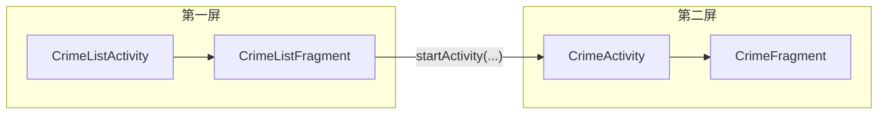

我们先在`CrimeListFragment.java`中建立一个跳转的逻辑：

```java
public class CrimeListFragment extends Fragment {
	// ...
	@Override public void onClick(View view){
        Intent intent = new Intent(getActivity(),CrimeActivity.class);
        startActivity(intent);
    }
}
```

接着将当前`Crime`对象传给`Activity`：

```java
/* CrimeListFragment.java */
package com.example.criminalintent;
import androidx.appcompat.app.AppCompatActivity;
import androidx.fragment.app.Fragment;
import androidx.fragment.app.FragmentManager;
import android.content.Context;
import android.content.Intent;
import android.os.Bundle;
import java.util.UUID;

public class CrimeActivity extends SingleFragmentActivity {
    public static final String EXTRA_CRIME_ID = "com.example.criminalintent.crime_id";
    public static Intent newIntent(Context packageContext, UUID crimeId){
        Intent intent = new Intent(packageContext,CrimeActivity.class);
        intent.putExtra(EXTRA_CRIME_ID,crimeId);
        return intent;
    }
    @Override protected Fragment createFragment(){
        return new CrimeFragment();
    }
}
```

```java
/* CrimeListFragment.java */
public class CrimeListFragment extends Fragment {
    // ...
    private class CrimeHolder extends RecyclerView.ViewHolder implements View.OnClickListener{
        Intent intent = CrimeActivity.newIntent(getActivity(),mCrime.getId());
        startActivity(intent);
    }
}
```

现在`crimeId`已经从`CrimeListFragment`传输到了`CrimeActivity`的`intent`中，为了在`CrimeFragment`调用该字段，我们有两种方式：

- 直接调用：

  ```java
  /* CrimeFragment.java */
  public class CrimeFragment extends Fragment {
  	@Override public void onCreate(Bundle savedInstanceState){
          super.onCreate(savedInstanceState);
          UUID crimeId = (UUID) getActivity()
              .getIntent()
              .getSerializableExtra(CrimeActivity.EXTRA_CRIME_ID);
          mCrime = CrimeLab.get(getActivity()).getCrime(crimeId);
      }
  }
  ```

  这种方法的缺点是破坏了`CrimeFragment`的封装性，因为`crimeID`是保存在`CrimeActivity.EXTRA_CRIME_ID`中的，这意味着`CrimeFragment`必须由某个特定的`Activity`托管。如果后续针对平板提出右侧显示两个`CrimeFragment`以供人工对比的需求，那么这两个`CrimeFragment`必会显示相同的内容。

- Fragment Argument

  如果能把`crimeId`存储在`CrimeArgument`中，而不是`CrimeActivity`中，就能摆脱对`Activity`的依赖了。

  ```java
  public class CrimeFragment extends Fragment {
  	// ...
      private static final String ARG_CRIME_ID = "crime_id";
      public static CrimeFragment newInstance(UUID crimeId){
          Bundle args = new Bundle();
          args.putSerializable(ARG_CRIME_ID,crimeId);
          CrimeFragment fragment = new CrimeFragment();
          fragment.setArguments(args);
          return fragment;
      }
  }
  ```

  现在其他类不会用到`EXTRA_CRIME_ID`，可以将其设为私有字段：

  ```java
  public class CrimeActivity extends SingleFragmentActivity {
      private static final String EXTRA_CRIME_ID = "com.example.criminalintent.crime_id";
  	// ...
      @Override protected Fragment createFragment(){
          UUID crimeId = (UUID) getIntent().getSerializableExtra(EXTRA_CRIME_ID);
          return CrimeFragment.newInstance(crimeId);
          // 原return new CrimeFragment();
      }
  }
  ```

  ```java
  public class CrimeFragment extends Fragment {
      @Override public void onCreate(Bundle savedInstanceState) {
          super.onCreate(savedInstanceState);
          //原UUID crimeId = (UUID) getActivity().getIntent().getSerializableExtra(CrimeActivity.EXTRA_CRIME_ID);
          UUID crimeId = (UUID) getArguments().getSerializable(ARG_CRIME_ID);
          mCrime = CrimeLab.get(getActivity()).getCrime(crimeId);
      }
  }
  ```

- 直接在`CrimeFragment`创建一个实例字段

  极其不推荐这种方法。系统会在很多情况下重建`Fragment`，其频率比重建`Activity`还频繁。回想第一个项目，光是转屏就已经够麻烦的了，现在按下Home键也会重建`Fragment`。一旦重建，储存的实例变量将不复存在，而`Fragment Argument`就是为了解决该问题而生的。

获取到`Crime`后就能调用里面的字段了：

```java
public class CrimeFragment extends Fragment {
    // ...
    @Override public View onCreateView(LayoutInflater inflater, ViewGroup container,Bundle savedInstanceState){
        // ...
        mTitleField.setText(mCrime.getTitle());
    	// ...
        mSolvedCheckBox.setChecked(mCrime.isSolved());
        // ...
    }
}
```

### §1.2.5 刷新列表项

现在按下返回键，我们发现手铐图标并没有刷新。在`CrimeListFragment`启动`CrimeActivity`实例后按下返回键时，用于托管`CrimeListFragment`的`FragmentManager`会使其重新恢复运行状态，这期间会调用其`onResume()`方法，于是我们就可以在这个方法中实现更新：

```java
public class CrimeListFragment extends Fragment {
    // ...
    @Override public void onResume(){
        super.onResume();
        updateUI();
    }
    private void updateUI(){
        CrimeLab crimeLab = CrimeLab.get(getActivity());
        List<Crime> crimes = crimeLab.getCrimes();
        if(mAdapter==null){
            mAdapter = new CrimeAdapter(crimes);
            mCrimeRecyclerView.setAdapter(mAdapter);
        }else{
            mAdapter.notifyDataSetChanged();
        }
    }
    // ...
}
```

### §1.2.6 `ViewPager`

接下来在`CrimeFragment`界面添加一个功能，向左滑或向右滑能切换到逻辑上相邻的`CrimeFragment`。

新建`CrimePagerActivity`类，让`CrimeFragment.startActivity()`方法不再新建`CrimeFragment`，而是新建`CrimePagerActivity`类，让其新建`CrimeFragment`：

```java
package com.example.criminalintent;
import android.os.Bundle;
import androidx.appcompat.app.AppCompatActivity;

public class CrimePagerActivity extends AppCompatActivity {
    @Override protected void onCreate(Bundle savedInstanceState){
        super.onCreate(savedInstanceState);
        setContentView(R.layout.activity_crime_pager);
    }
}
```

```xml
<?xml version="1.0" encoding="utf-8"?>
<androidx.viewpager.widget.ViewPager xmlns="http://schemas.android.com/apk/res/android"
    layout_width="match_parent"
    layout_height="match_parent"
    id="@+id/activity_crime_pager_view_pager">
</androidx.viewpager.widget.ViewPager>
```

类似于`RecyclerView`需要借助`Adapter`提供的视图，`ViewPager`也需要`PagerAdapter`的支持：

```java
package com.example.criminalintent;
import android.os.Bundle;
import androidx.annotation.NonNull;
import androidx.appcompat.app.AppCompatActivity;
import androidx.fragment.app.Fragment;
import androidx.fragment.app.FragmentManager;
import androidx.fragment.app.FragmentStatePagerAdapter;
import androidx.viewpager.widget.ViewPager;
import java.util.List;

public class CrimePagerActivity extends AppCompatActivity {
    private ViewPager mViewPager;
    private List<Crime> mCrimes;
    @Override protected void onCreate(Bundle savedInstanceState){
        super.onCreate(savedInstanceState);
        // 设置CrimePagerActivity的XML布局
        setContentView(R.layout.activity_crime_pager);
        // 将XML布局中的根标签<ViewPager>绑定在mViewPager变量上
        mViewPager = (ViewPager) findViewById(R.id.activity_crime_view_pager);
        // 获取当前Fragment的托管容器的管理器(FragmentManager)
        FragmentManager fragmentManager = getSupportFragmentManager();
        // 将mViewPager绑定一个FragmentStatePagerAdapter实例
        mViewPager.setAdapter(new FragmentStatePagerAdapter() {
            @Override public Fragment getItem(int position) {
                Crime crime = mCrimes.get(position);
                return CrimeFragment.newInstance(crime.getId());
            }
            @Override public int getCount() {
                return mCrimes.size();
            }
        });
    }
}
```

现在弃用`CrimeActivity`，转而使用`CrimePagerActivity`：

```java
public class CrimePagerActivity extends AppCompatActivity{
    // ...
    public static final String EXTRA_CRIME_ID = "com.example.criminalintent.crime_id";
    public static Intent newIntent(Context packageContext, UUID crimeId){
        Intent intent = new Intent(packageContext,CrimePagerActivity.class);
        intent.putExtra(EXTRA_CRIME_ID);
        return intent;
    }
    // ...
    @Override protected void onCreate(Bundle savedInstanceState){
        // ...
        UUID crimeId = (UUID) getIntent().getSerializableExtra(EXTRA_CRIME_ID);
    	// ...
    }
}
```

```java
public class CrimeListFragment extends Fragment {
    // ...
    private class CrimeHolder extends RecyclerView.ViewHolder implements View.OnClickListener{
        // ...
        @Override public void onClick(View view){
            Intent intent = CrimePagerActivity.newIntent(getActivity(),mCime.getId());
        }
        // ...
    }
	// ...
}
```

要让APP启动`CrimePagerActivity`，还要在`AndroidManifest.xml`中声明它：

```xml
<manifest>
	<!-- ... -->
    <application>
    	<!-- ... -->
        <activity android:name=".CrimePagerActivity" />
        <!-- ... -->
    </application>
    <!-- ... -->
</manifest>
```

再删除`CrimeP`


## §1.5 Locatr

Android原生提供了一些列基本地理位置的API，定义于`android.location`库中。过去，为获得定位数据，必须严格手动调用GPS、基站、Wifi、加速感应器、陀螺仪等一系列API。为解决上述问题，Google Play Service提供了Fused Location Provider的定位服务。

### §1.5.1 搭建框架

建立模版XML文件`activity_fragment.xml`和抽象类`SingleFragmentActivity`：

```xml
<!-- 用于容纳Fragment -->
<FrameLayout android:id="@+id/fragment_container"
    xmlns:android="http://schemas.android.com/apk/res/android"
    android:layout_width="match_parent"
    android:layout_height="match_parent">
</FrameLayout>
```

```java
package com.example.photogallery;
import android.os.Bundle;
import androidx.appcompat.app.AppCompatActivity;
import androidx.fragment.app.Fragment;
import androidx.fragment.app.FragmentManager;

public abstract class SingleFragmentActivity extends AppCompatActivity {
    protected abstract Fragment createFragment();
    @Override protected void onCreate(Bundle savedInstanceState) {
        super.onCreate(savedInstanceState);
        // 将SingleFragmentActivity的子类的视图设置为activity_fragment.xml(只有一个<FrameLayout>根节点)
        setContentView(R.layout.activity_fragment);
		// 获取fragment所在父容器的管理器(FragmentManager)
        FragmentManager fm = getSupportFragmentManager();
        // 将id为fragment_container的根标签<FrameLayout>赋给fragment变量
        Fragment fragment = fm.findFragmentById(R.id.fragment_container);
		// 如果<FrameLayout>内没有任何内容
        if (fragment == null) {
            // 则刷新fragment为子类定义的createFragment()返回的Fragment,并将新fragment托给FragmentManager管理
            fragment = createFragment();
            fm.beginTransaction()
                    .add(R.id.fragment_container, fragment)
                    .commit();
        }
    }
}
```

创建`PhotoGalleryActivity`类，将其设定为`SingleFragmentActivity`的子类：

```java
package com.example.photogallery;
import androidx.appcompat.app.AppCompatActivity;

public class PhotoGalleryActivity extends SingleFragmentActivity {
    @Override Fragment createFragment(){
        return PhotoGalleryFragment.newInstance();
    }
}
```

新建`fragment_photo_gallery.xml`：

```xml
<?xml version="1.0" encoding="utf-8"?>
<androidx.recyclerview.widget.RecyclerView
    xmlns:android="http://schemas.android.com/apk/res/android"
    xmlns:tools="http://schemas.android.com/tools"
    android:layout_width="match_parent"
    android:layout_height="match_parent"
    android:id="@+id/photo_recycler_view"
    tools:context="com.example.photogallery.PhotoGalleryActivity">

</androidx.recyclerview.widget.RecyclerView>
```

新建`PhotoGalleryFragment.java`：

```java
package com.example.photogallery;

import android.os.Bundle;
import android.view.LayoutInflater;
import android.view.View;
import android.view.ViewGroup;
import androidx.fragment.app.Fragment;
import androidx.recyclerview.widget.GridLayoutManager;
import androidx.recyclerview.widget.RecyclerView;

public class PhotoGalleryFragment extends Fragment {
    private RecyclerView mPhotoRecyclerView;
    public static PhotoGalleryFragment newInstance(){
        return new PhotoGalleryFragment();
    }
    @Override public void onCreate(Bundle savedInstanceState){
        super.onCreate(savedInstanceState);
        setRetainInstance(true);
    }
    @Override public View onCreateView(LayoutInflater inflater, ViewGroup container, Bundle savedInstanceState){
        View v = inflater.inflate(R.layout.fragment_photo_gallery,container,false);
        mPhotoRecyclerView = (RecyclerView) v.findViewById(R.id.photo_recycler_view);
        mPhotoRecyclerView.setLayoutManager(new GridLayoutManager(getActivity(),3));
        return v;
    }
}
```

此时的业务逻辑整体如下：

```mermaid
flowchart TB
	subgraph activity_fragment.xml [activity_fragment.xml]
		FrameLayout1["&lt;FrameLayout&gt<br>android:id=&quot;fragment_container&quot;"]
	end
	subgraph SingleFragmentActivity [SingleFragmentActivity]
		subgraph onCreateFuncOfSingleFragmentActivity ["onCreate()"]
            setContentView1["setContentView(R.layout.activity_fragment)"]
            setContentView1.->FrameLayout1
            FragmentManager1["FragmentManager fm = getSupportFragmentManager()"]
            FragmentManager1.->FrameLayout1
            setContentView1-->FragmentManager1
            FragmentManager1-->If1("fm.findFragmentById<br>(R.id.fragment_container)")
            If1--"不为Null"-->FragmentOfSingleFragmentActivity1["Fragment fragment = fm.findFragmentById<br/>(R.id.fragment_container)"]
            If1--"为Null"-->FragmentOfSingleFragmentActivity2["Fragment fragment = createFragment()"]
            FragmentOfSingleFragmentActivity2-->FragmentOfSingleFragmentActivity3["fm.beginTransction()<br>.add(R.id.fragment_container,fragment)<br>.commit()"]
            FragmentOfSingleFragmentActivity4[得到了fragment]
            FragmentOfSingleFragmentActivity1-->FragmentOfSingleFragmentActivity4
            FragmentOfSingleFragmentActivity3-->FragmentOfSingleFragmentActivity4
            FragmentOfSingleFragmentActivity3.->FrameLayout1
        end
	end
    subgraph PhotoGalleryActivity [PhotoGalleryActivity]
        subgraph createFragmentOfPhotoGalleryActivity [createFragment]
            createFragmentOfPhotoGalleryActivity1["返回PhotoGalleryFragment.newInstance()"]
        end
    end
	subgraph fragment_photo_gallery.xml [fragment_photo_gallery.xml]
        ViewPager1["androidx.recyclerview.widget.RecyclerView<br/>android:id=&quot;photo_recycler_view&quot;"]
    end
    subgraph PhotoGalleryFragment [PhotoGalleryFragment]
        subgraph newInstanceOfPhotoGalleryFragment ["newInstance()"]
            newInstanceOfPhotoGalleryFragment1["返回一个PhotoGalleryFragment实例"]
        end
        subgraph onCreateOfPhotoGalleryFragment ["onCreate()"]
            onCreateOfPhotoGalleryFragment1["setRetainInstance(true)<br>在Activity销毁后保留Fragment"]
        end
        subgraph onCreateViewOfPhotoGalleryFragment ["onCreateView()"]
            onCreateViewOfPhotoGalleryFragment1["View v = inflater.inflate(R.layout.fragment_photo_gallery,container,false)"]
            onCreateViewOfPhotoGalleryFragment2["mPhotoRecyclerView = (RecyclerView) v.findViewById(R.id.photo_recycler_view)"]
            onCreateViewOfPhotoGalleryFragment3["mPhotoRecyclerView.setLayoutManager(new GridLayoutManager(getActivity(),3))"]
            onCreateViewOfPhotoGalleryFragment4["返回View实例v"]
            onCreateViewOfPhotoGalleryFragment1-->onCreateViewOfPhotoGalleryFragment2
            onCreateViewOfPhotoGalleryFragment2-->onCreateViewOfPhotoGalleryFragment3
            onCreateViewOfPhotoGalleryFragment3-->onCreateViewOfPhotoGalleryFragment4
        end
        onCreateViewOfPhotoGalleryFragment1.->ViewPager1
        onCreateViewOfPhotoGalleryFragment2.->ViewPager1
        createFragmentOfPhotoGalleryActivity1-->newInstanceOfPhotoGalleryFragment1
    end
    SingleFragmentActivity--"延伸出子类"-->PhotoGalleryFragment
```

`SingleFramentActivity`作为超类，起到了模版的作用：

```mermaid
flowchart TB
	subgraph activity_fragment.xml [activity_fragment.xml]
		FrameLayout1["&lt;FrameLayout&gt<br>android:id=&quot;fragment_container&quot;"]
	end
	subgraph SingleFragmentActivity [SingleFragmentActivity]
		subgraph onCreateFuncOfSingleFragmentActivity ["onCreate()"]
            setContentView1["setContentView(R.layout.activity_fragment)"]
            setContentView1.->FrameLayout1
            FragmentManager1["FragmentManager fm = getSupportFragmentManager()"]
            FragmentManager1.->FrameLayout1
            setContentView1-->FragmentManager1
            FragmentManager1-->If1("fm.findFragmentById<br>(R.id.fragment_container)")
            If1--"不为Null"-->FragmentOfSingleFragmentActivity1["Fragment fragment = fm.findFragmentById<br/>(R.id.fragment_container)"]
            If1--"为Null"-->FragmentOfSingleFragmentActivity2["Fragment fragment = createFragment()"]
            FragmentOfSingleFragmentActivity2-->FragmentOfSingleFragmentActivity3["fm.beginTransction()<br>.add(R.id.fragment_container,fragment)<br>.commit()"]
            FragmentOfSingleFragmentActivity4[得到了fragment]
            FragmentOfSingleFragmentActivity1-->FragmentOfSingleFragmentActivity4
            FragmentOfSingleFragmentActivity3-->FragmentOfSingleFragmentActivity4
            FragmentOfSingleFragmentActivity3.->FrameLayout1
        end
	end
```

在`SingleFramentActivity`类的基础上延伸出了`PhotoGalleryActivity`类，其唯一作用就是通过`createFragment()`方法返回一个`PhotoGalleryFragment`实例：

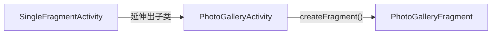

`PhotoGalleryActivity`的结构如下：

```mermaid
graph TB
    subgraph fragment_photo_gallery.xml [fragment_photo_gallery.xml]
        ViewPager1["androidx.recyclerview.widget.RecyclerView<br/>android:id=&quot;photo_recycler_view&quot;"]
    end
    subgraph PhotoGalleryFragment [PhotoGalleryFragment]
        subgraph newInstanceOfPhotoGalleryFragment ["newInstance()"]
            newInstanceOfPhotoGalleryFragment1["返回一个PhotoGalleryFragment实例"]
        end
        subgraph onCreateOfPhotoGalleryFragment ["onCreate()"]
            onCreateOfPhotoGalleryFragment1["setRetainInstance(true)<br>在Activity销毁后保留Fragment"]
        end
        subgraph onCreateViewOfPhotoGalleryFragment ["onCreateView()"]
            onCreateViewOfPhotoGalleryFragment1["View v =<br>inflater.inflate(R.layout.fragment_photo_gallery,container,false)"]
            onCreateViewOfPhotoGalleryFragment2["mPhotoRecyclerView = <br>(RecyclerView) v.findViewById(R.id.photo_recycler_view)"]
            onCreateViewOfPhotoGalleryFragment3["mPhotoRecyclerView.setLayoutManager<br>(new GridLayoutManager(getActivity(),3))"]
            onCreateViewOfPhotoGalleryFragment4["返回View实例v"]
            onCreateViewOfPhotoGalleryFragment1-->onCreateViewOfPhotoGalleryFragment2
            onCreateViewOfPhotoGalleryFragment2-->onCreateViewOfPhotoGalleryFragment3
            onCreateViewOfPhotoGalleryFragment3-->onCreateViewOfPhotoGalleryFragment4
        end
        onCreateViewOfPhotoGalleryFragment1.->ViewPager1
        onCreateViewOfPhotoGalleryFragment2.->ViewPager1
    end
```

创建`FlickrFetchr`类，用于获得Flickr网站上的图片：

```java
package com.example.photogallery;
import java.io.ByteArrayOutputStream;
import java.io.IOException;
import java.io.InputStream;
import java.net.HttpURLConnection;
import java.net.URL;

public class FlickrFetchr {
    public byte[] getUrlBytes(String urlSpec) throws IOException{
        URL url = new URL(urlSpec);
        HttpURLConnection connection = (HttpURLConnection) url.openConnection();
        try {
            //OutputStream--延伸出-->ByteArrayOutputStream
            ByteArrayOutputStream out = new ByteArrayOutputStream();
            InputStream in = connection.getInputStream();
            if(connection.getResponseCode() != HttpURLConnection.HTTP_OK){
                throw new IOException(connection.getResponseMessage()+": with "+urlSpec);
            }
            int bytesRead = 0;
            byte[] buffer = new byte[1024];
            while((bytesRead=in.read(buffer))>0){
                out.write(buffer,0,bytesRead);
            }
            out.close();
            return out.toByteArray();
        }finally {
            connection.disconnect();
        }
    }
    public String getUrlString(String urlSpec) throws IOException{
        return new String(getUrlBytes(urlSpec));
    }
}
```

然后在后台线程上调用该网络类：

```java
public class PhotoGalleryFragment extends Fragment {
    private static final String TAG = "PhotoGalleryFragment";
    // ...
    @Override public void onCreate(Bundle savedInstanceState){
        // ...
        new FetchItemsTask().execute();
    }
    private class FetchItemsTask extends AsyncTask<Void,Void,Void>{
        @Override protected void doInBackground(Void... params){
            try{
                String result = new FilckrFetchr().getUrlString("https://bignerdranch")
            	Log.i(TAG,"Fetched contents of URL:" + result);
            }catch(IOException ioe){
                Log.e(TAG,"Failed to fetch URL:"+ioe);
            }
            return null;
        }
    }
}
```

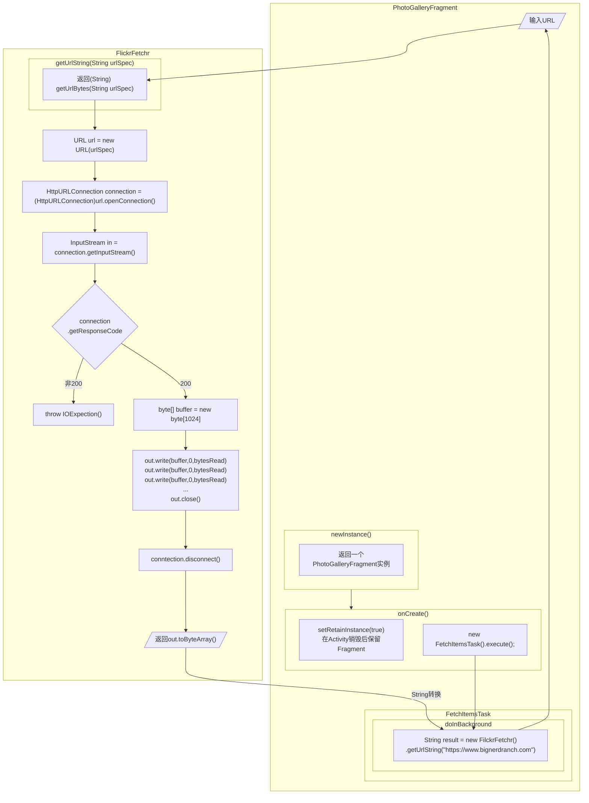

### §1.5.2 API

申请API_KEY并添加API调用代码：

```java
public class FlickrFetchr {
    private static final String API_KEY = "xxxxx";
    private static final String API_PASSWORD = "xxxxx";
    private static final String TAG = "FlickrFetchr";
    public void fetchItems(){
        try {
            String url = Uri.parse("https://api.flickr.com/services/rest/")
                    .buildUpon()
                    .appendQueryParameter("method","flickr.photos.getRecent")
                    .appendQueryParameter("api_key",API_KEY)
                    .appendQueryParameter("format","json")
                    .appendQueryParameter("nojsoncallback","1")
                    .appendQueryParameter("extras","url_s")
                    .build().toString();
            String jsonString = getUrlString(url);
            Log.i(TAG,"Received JSON: " + jsonString);
        }catch (IOException ioException){
            Log.e(TAG,"Failed to fetch items",ioException);
        }
    }
    // ...
}
```

```java
public class PhotoGalleryFragment extends Fragment{
    // ...
    private class FetchItemsTask extends AsyncTask<Void,Void,Void>{
        @Override protected Void doInBackground(Void... params){
			new FlickrFetchr().fetchItems();
            return null;
        }
    }
    // ...
}
```


### §1.5.3 线程与主线程

一般线程中的代码会逐步执行，而Android主线程的代码处于一个无限循环中，不停的等待系统和用户触发APP监听的事件：

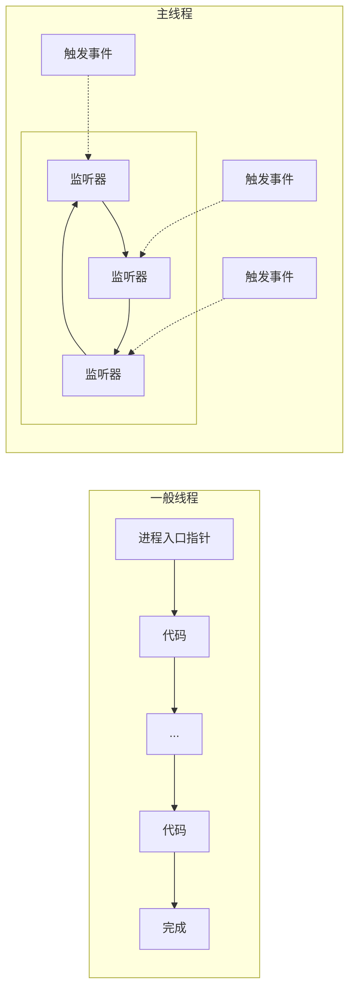

Android禁止任何主线程的网络连接行为，如果强行连接则会抛出`NetworkOnMainThreadException`异常。这是因为网络连接需要时间做出相应或下载文件。

### §1.5.4 解析JSON

创建一个模版类`GalleryItem`：

```java
public class GalleryItem {
    private String mCaption;
    private String mId;
    private String mUrl;
    @NonNull @Override public String toString(){
        return mCaption;
    }
    public String getCaption() {
        return mCaption;
    }
    public void setCaption(String caption) {
        mCaption = caption;
    }
    public String getUrl() {
        return mUrl;
    }
    public void setUrl(String url) {
        mUrl = url;
    }
    public String getId() {
        return mId;
    }
    public void setId(String id) {
        mId = id;
    }
}
```

我们使用的Flickr API返回的JSON格式如下：

```json
{
    "photos": {
        "page": 1,
        "pages": 10,
        "perpage": 100,
        "total": 1000,
        "photo": [
            {
                "id": "51844480537",
                "owner": "170905058@N08",
                "secret": "235c7ed69c",
                "server": "65535",
                "farm": 66,
                "title": "NZG_6053.jpg",
                "ispublic": 1,
                "isfriend": 0,
                "isfamily": 0
            },
            {
                "id": "51844480987",
                "owner": "10583065@N06",
                "secret": "e3d6ed8de4",
                "server": "65535",
                "farm": 66,
                "title": "Doorway to the Soul",
                "ispublic": 1,
                "isfriend": 0,
                "isfamily": 0
            }
        ]
    },
    "stat": "ok"
}
```

其层级树如下：

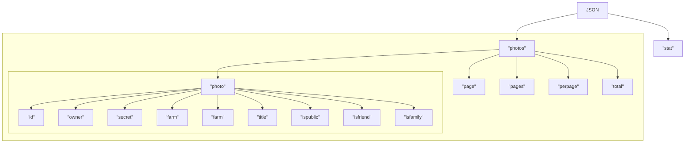

我们的解析思路如下：

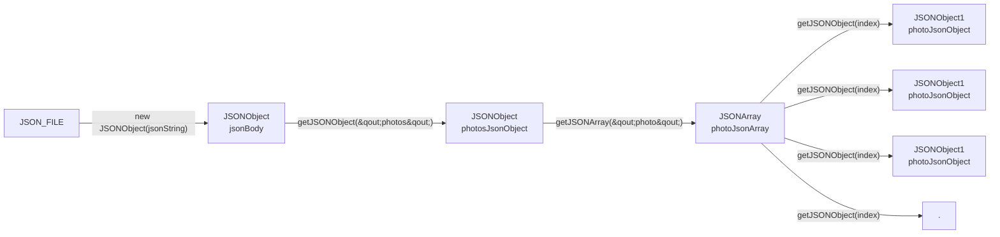


`json.org`库提供了一系列用于解析JSON的API，下面在`FlickrFetchr.java`中添加解析：

```java
public class FlickrFetchr{
    // ...
    public void fetchItems(){
        try{
            // ...
            JSONObject jsonBody = new JSONObject(jsonString);
        }catch (IOException ioException){
            Log.e(TAG,"Failed to fetch items",ioException);
        }catch (JSONExcpetion jsonException){
            Log.e(TAG,"Failed to parse JSON");
        }
    }
    private void parseItems(List<GalleryItem> items, JSONObject jsonBody) throws IOException,JSONException{
        JSONObject photosJsonObject = jsonBody.getJSONObject("photos");
        JSONArray photoJsonArray = photosJsonObject.getJSONArray("photo");
        for (int i=0;i<photoJsonArray.length();i++){
            JSONObject photoJsonObject = photoJsonArray.getJSONObject(i);
            GalleryItem item = new GalleryItem();
            item.setId(photoJsonObject.getString("id"));
            item.setCaption(photoJsonObject.getString("title"));
            if(!photoJsonObject.has("url_s")){
                continue;
            }else{
                item.setUrl(photoJsonObject.getString("url_s"));
            }
            items.add(item);
        }
    }
    // ...
}
```


# §3 日志与调试

## §3.1 启用日志

Android的`android.util.Log`用于向系统及共享日志中心发送日志信息，内含多种方法，分别代表不同的等级：

| 方法                           | 日志级别 | 说明                   |
| ------------------------------ | -------- | ---------------------- |
| `Log.e(String tag,String msg)` | ERROR    | 错误                   |
| `Log.w(String tag,String msg)` | WARNING  | 警告                   |
| `Log.i(String tag,String msg)` | INFO     | 信息型消息             |
| `Log.d(String tag,String msg)` | DEBUG    | 调试输出(可能被过滤掉) |
| `Log.v(String tag,String msg)` | VERBOSE  | 仅用于开发             |

常用其中的`Log.d(String tag, String msg)`方法，其中`tag`是日志的来源，第二个是日志的具体内容。

```java
public class MainActivity extends AppCompatActivity {
	// ...
	private static final String TAG = "MainActivity";
    @Override protected void onCreate(Bundle savedInstanceState) {
    	super.onCreate(savedInstanceState);
        Log.d(TAG,"onCreate(Bundle) called");
        //...
    }
    @Override public void onStart(){
        super.onStart();
        Log.d(TAG,"onStart() called");
    }
    @Override public void onResume(){
        super.onResume();
        Log.d(TAG,"onResume() called");
    }
    @Override public void onPause(){
        super.onPause();
        Log.d(TAG,"onPause() called");
    }
    @Override public void onStop(){
        super.onStop();
        Log.d(TAG,"onStop() called");
    }
    @Override public void onDestroy(){
        super.onDestroy();
        Log.d(TAG,"onDestroy() called");
    }
    // ...
}
```

在Logcat中可以看到如下信息：

```Logcat
// 应用被创建时,从不存在状态变为存在状态
2022-01-20 14:01:32.591 6937-6937/com.example.geoquiz I/art:     at void com.example.geoquiz.MainActivity.onCreate(android.os.Bundle) (MainActivity.java:32)
2022-01-20 14:01:32.623 6937-6937/com.example.geoquiz D/MainActivity: onStart() called
2022-01-20 14:01:32.624 6937-6937/com.example.geoquiz D/MainActivity: onResume() called
// 单击返回键时,从运行状态变为不存在状态
2022-01-20 14:02:12.239 6937-6937/com.example.geoquiz D/MainActivity: onPause() called
2022-01-20 14:02:12.394 6937-6937/com.example.geoquiz D/MainActivity: onStop() called
2022-01-20 14:02:12.394 6937-6937/com.example.geoquiz D/MainActivity: onDestroy() called
// 单击Home键时,从运行状态变为停止状态
2022-01-20 14:05:32.196 7076-7076/com.example.geoquiz D/MainActivity: onPause() called
2022-01-20 14:05:32.360 7076-7076/com.example.geoquiz D/MainActivity: onStop() called
// 旋转屏幕时
2022-01-20 14:08:54.998 7183-7183/com.example.geoquiz D/MainActivity: onPause() called
2022-01-20 14:08:55.000 7183-7183/com.example.geoquiz D/MainActivity: onStop() called
2022-01-20 14:08:55.001 7183-7183/com.example.geoquiz D/MainActivity: onDestroy() called
2022-01-20 14:08:55.058 7183-7183/com.example.geoquiz D/MainActivity: onCreate(Bundle) called
2022-01-20 14:08:55.067 7183-7183/com.example.geoquiz D/MainActivity: onStart() called
2022-01-20 14:08:55.068 7183-7183/com.example.geoquiz D/MainActivity: onResume() called
```

## §3.2 审查异常

假设删去了`.java`文件中的某一行，发现APP闪退,如何根据日志判断出问题在哪？

```log
E/AndroidRuntime: FATAL EXCEPTION: main
    Process: com.example.geoquiz, PID: 3296
    java.lang.RuntimeException: Unable to start activity ComponentInfo{com.example.geoquiz/com.example.geoquiz.MainActivity}: java.lang.NullPointerException: Attempt to invoke virtual method 'void android.widget.TextView.setText(int)' on a null object reference
        at android.app.ActivityThread.performLaunchActivity(ActivityThread.java:2670)
        at android.app.ActivityThread.handleLaunchActivity(ActivityThread.java:2731)
        at android.app.ActivityThread.-wrap12(ActivityThread.java)
        at android.app.ActivityThread$H.handleMessage(ActivityThread.java:1482)
        at android.os.Handler.dispatchMessage(Handler.java:102)
        at android.os.Looper.loop(Looper.java:154)
        at android.app.ActivityThread.main(ActivityThread.java:6161)
        at java.lang.reflect.Method.invoke(Native Method)
        at com.android.internal.os.ZygoteInit$MethodAndArgsCaller.run(ZygoteInit.java:892)
        at com.android.internal.os.ZygoteInit.main(ZygoteInit.java:782)
     Caused by: java.lang.NullPointerException: Attempt to invoke virtual method 'void android.widget.TextView.setText(int)' on a null object reference
        at com.example.geoquiz.MainActivity.updateQuestion(MainActivity.java:97)
        at com.example.geoquiz.MainActivity.onCreate(MainActivity.java:40)
        at android.app.Activity.performCreate(Activity.java:6698)
        at android.app.Instrumentation.callActivityOnCreate(Instrumentation.java:1118)
        at android.app.ActivityThread.performLaunchActivity(ActivityThread.java:2623)
        at android.app.ActivityThread.handleLaunchActivity(ActivityThread.java:2731) 
        at android.app.ActivityThread.-wrap12(ActivityThread.java) 
        at android.app.ActivityThread$H.handleMessage(ActivityThread.java:1482) 
        at android.os.Handler.dispatchMessage(Handler.java:102) 
        at android.os.Looper.loop(Looper.java:154) 
        at android.app.ActivityThread.main(ActivityThread.java:6161) 
        at java.lang.reflect.Method.invoke(Native Method) 
        at com.android.internal.os.ZygoteInit$MethodAndArgsCaller.run(ZygoteInit.java:892) 
        at com.android.internal.os.ZygoteInit.main(ZygoteInit.java:782) 
```

- `Attempt to invoke virtual method 'void android.widget.TextView.setText(int)' on a null object reference`

  某个函数在调用`TextView.setText()`方法时，该`TextView`实例不存在。

- `at android.app.ActivityThread.performLaunchActivity(ActivityThread.java:2670)`

  这是一个运行时错误，在编译过程中无法发现。

- `at com.example.geoquiz.MainActivity.updateQuestion(MainActivity.java:97)`

  我们定位到出错的这个函数体：

  ```java
  private void updateQuestion(){
  	int question = mQuestionBank[mCurrentIndex].getTextResId();
  	mQuestionTextView.setText(question);
  }
  ```

  发现是`mQuestionTextView`是空指针。我们再定位到该变量被定义的地方：

  ```java
  private TextView mQuestionTextView;
  ```

  于是我们找到了问题：只定义了`mQuestionTextView`，而没有给它赋值，因此缺的那一行就是：

  ```java
  mQuestionTextView = (TextView) findViewById(R.id.question_text_view);
  ```

## §3.3 栈跟踪日志

假设删去了`.java`文件中的某一行，发现程序虽然能运行，但是点击Next按钮无法跳转到下一个Quiz，如何根据日志判断出问题在哪？

我们先看Logcat，但是发现除了预先设定的`Log.d()`输出的日志外，没有报错信息：

```log
2022-01-21 11:38:37.655 3578-3578/com.example.geoquiz D/MainActivity: onCreate(Bundle) called
2022-01-21 11:38:37.663 3578-3578/com.example.geoquiz I/art:     at void com.example.geoquiz.MainActivity.onCreate(android.os.Bundle) (MainActivity.java:33)
2022-01-21 11:38:37.663 3578-3578/com.example.geoquiz I/art:     at void com.example.geoquiz.MainActivity.onCreate(android.os.Bundle) (MainActivity.java:33)
2022-01-21 11:38:37.697 3578-3578/com.example.geoquiz D/MainActivity: onStart() called
2022-01-21 11:38:37.698 3578-3578/com.example.geoquiz D/MainActivity: onResume() called
```

这意味着该BUG不是在编译时和运行时产生的低级BUG，而是高层逻辑上的BUG，这时我们在§3.2中使用的日志不足以满足我们的调试需求。因此我们还需要使用更多的`Log.d()`来记录栈跟踪日志，观察每次点击Next按钮后，`mCurrentIndex`变量的变化情况：

```java
public class MainActivity extends AppCompatActivity{
    // ...
    private void updateQuestion(){
        Log.d(TAG,"Updating question text ",new Exception());
        //...
    }
}
```

这里我们给`Log.d()`将一个新建的`Exception`对象传入了新形参`Throwable tr`当中，用于作为不抛出的`Exception`实例传入`updateQuestion()`方法中，从而输出该`Exception`的栈跟踪记录：

```log
2022-01-21 11:49:56.739 3805-3805/com.example.geoquiz D/MainActivity: Updating question text 
    java.lang.Exception
        at com.example.geoquiz.MainActivity.updateQuestion(MainActivity.java:96)
        at com.example.geoquiz.MainActivity.access$300(MainActivity.java:11)
        at com.example.geoquiz.MainActivity$3.onClick(MainActivity.java:60)
        // ...
2022-01-21 11:49:57.730 3805-3805/com.example.geoquiz D/MainActivity: Updating question text 
    java.lang.Exception
        at com.example.geoquiz.MainActivity.updateQuestion(MainActivity.java:96)
        at com.example.geoquiz.MainActivity.access$300(MainActivity.java:11)
        at com.example.geoquiz.MainActivity$3.onClick(MainActivity.java:60)
        // ...
```

可以看到，程序的确调用了`MainActivity.updateQuestion()`方法，刷新了Quiz，所以只可能是因为`mCurrentIndex`的值没有改变。向上跟踪到`MainActivity.onClick()`，果然没有该变量的更新语句，于是只需增添上即可：

```java
mCurrentIndex = (mCurrentIndex + 1) % mQuestionBank.length;
```

## §3.4 设置断点

虽然日志可以方便的追踪栈，但是每次输出的文本太长了，会让Logcat不清晰，并且黑客可以通过输出的调试信息来绕过类文件，直接得到程序内部的结构。基于此，利用断点进行调试更加灵活和安全。

Android Studio支持的断点有六种类型：

- Exception Breakpoints
- Symbolic Breakpoints
- Java Method Breakpoints
- Java Field Watchpoints
- Java Exception Breakpoints
- Kotlin Filed Watchpoints

## §3.5 Android Lint

Android Lint是Android应用代码的静态分析器，能在不运行代码的情况下检查代码错误。在Android Studio的菜单栏`Analyse/Inspect Code...`可以使用，然后在底边的`Inspection Results`查看结果。

项目如果在低版本SDK中引用了高版本SDK才引入的方法，那么在低版本SDK上运行时就会崩溃，一般会抛出空指针错误，在测试过程中非常耗时。得益于Android Lint的改进，现在开发者可以使用该工具，自动检查API和`build.gradle`中的配置是否发生冲突。

# §4 `Activity`

## §4.1 `Launcher Activity`

`Launcher Activity`是指应用被创建时第一个运行的`Activity`，`AndroidManifest.xml`中，不仅涵盖了整个项目中所有使用的`Activity`，并且使用`<action>`和`<category>`标签指定了谁是`Launcher Activity`：

```xml
<?xml version="1.0" encoding="utf-8"?>
<manifest xmlns:android="http://schemas.android.com/apk/res/android"
    package="com.example.geoquiz">
    <application
        android:allowBackup="true"
        android:icon="@mipmap/ic_launcher"
        android:label="@string/app_name"
        android:roundIcon="@mipmap/ic_launcher_round"
        android:supportsRtl="true"
        android:theme="@style/Theme.GeoQuiz">
        
        <activity
            android:name=".CheatActivity"
            android:exported="false" />
        <!-- Launcher Activity -->
        <activity android:name=".MainActivity">
            <!-- 定义Launcher Activity的代码 -->
            <intent-filter>
                <action android:name="android.intent.action.MAIN" />
                <category android:name="android.intent.category.LAUNCHER" />
            </intent-filter>
        </activity>
    </application>
</manifest>
```

## §4.2 切换`Activity`

入栈：

- `startActivity(Intent intent)`
- `startActivityForResult(Intent intent,int requestCode)`

出栈：

- 用户按下返回键
- `Activity.finish()`

# §5 兼容性

## §5.1 编译配置

在项目的`./app/`目录下有一个`build.gradle`文件，记录着当前项目的编译配置：

```gradle
plugins {
    id 'com.android.application'
}

android {
    compileSdkVersion 30
    buildToolsVersion '30.0.3'

    defaultConfig {
        applicationId "com.example.geoquiz"
        minSdkVersion 30
        targetSdkVersion 30
        versionCode 1
        versionName "1.0"

        testInstrumentationRunner "androidx.test.runner.AndroidJUnitRunner"
    }

    buildTypes {
        release {
            minifyEnabled false
            proguardFiles getDefaultProguardFile('proguard-android-optimize.txt'), 'proguard-rules.pro'
        }
    }
    compileOptions {
        sourceCompatibility JavaVersion.VERSION_1_8
        targetCompatibility JavaVersion.VERSION_1_8
    }
}

dependencies {

    implementation 'androidx.appcompat:appcompat:1.1.0'
    implementation 'com.google.android.material:material:1.1.0'
    implementation 'androidx.constraintlayout:constraintlayout:1.1.3'
    testImplementation 'junit:junit:4.+'
    androidTestImplementation 'androidx.test.ext:junit:1.1.1'
    androidTestImplementation 'androidx.test.espresso:espresso-core:3.2.0'
}
```

其中有一些特别重要的参数：

- `compileSdkVersion`：编译版本，开发者和编译器内的共享信息，不会传给Android系统。IDE和编译器根据`compileSdkVersion`查找所需的类和包
- `minSdkVersion`：最低支持版本，该APP会拒绝安装在比`minSdkVersion`更低的版本上。
- `targetSdkVersion`：目标版本，告知Android该APP是为`targetSdkVersion`版本的API设计的。

手动修改`build.gradle`后，必须要点击Android Studio的菜单栏`Tools/Android/Sync Project with Gradle Files`，实现项目和Gradle的同步，项目随即会重新编译。

## §5.2 检查编译版本

前面我们提到过，可以更改`build.gradle`来限制API版本，也可以用Android Lint提前发现兼容性问题。然而这些方法只是回避了兼容性问题，都没有真正的解决。我们的目标是让这个项目在哪个API版本的Android系统上都能跑，只不过高版本系统可以使用更多的功能，而低版本系统在牺牲部分功能的情况下仍然能进行基本的使用。为此，我们可以利用`Build.VERSION.SDK_INT`获取当前系统的API等级，利用`Build.VERSION_CODES.xxx`获取某安卓代号对应的API等级，将高级别API代码放在判断系统版本的条件语句中：

```java
// 给mShowAnswerButton增加圆形收缩消失动画
import android.animation.Animator;
import android.animation.AnimatorListenerAdapter;
// ...
public class CheatActivity extends AppCompatActivity{
    @Override protected void onCreate(Bundle savedInstanceState){
        // ...
        mShowAnswerButton.setOnClickListener(new View.OnClickListener{
            @Override public void onClick(View v){
                // ...
                if(Build.VERSION.SDK_INT >= Build.VERSION_CODES.LOLLIPOP){
                    int cx = mShowAnswerButton.getWidth() / 2;
                    int cy = mShowAnswerButton.getHeight() / 2;
                    float radius = mShowAnswerButton.getWidth();
                    Animator anim = ViewAnimationUtils.createCircularReveal(
                            mShowAnswerButton, cx, cy, radius, 0);
                    anim.addListener(new AnimatorListenerAdapter() {
                        @Override public void onAnimationEnd(Animator animation) {
                            super.onAnimationEnd(animation);
                            mShowAnswerButton.setVisibility(View.INVISIBLE);
                        }
                    });
                    anim.start();
                }else{
                    mShowAnswerButton.setVisibility(View.INVISIBLE);
                }
            }
        });
    }
}
```

## §5.3 Android开发者文档

[Android开发者文档](http://developer.android.com/)分为三大部分：设计，开发和发布，可以根据API版本进行筛选。

