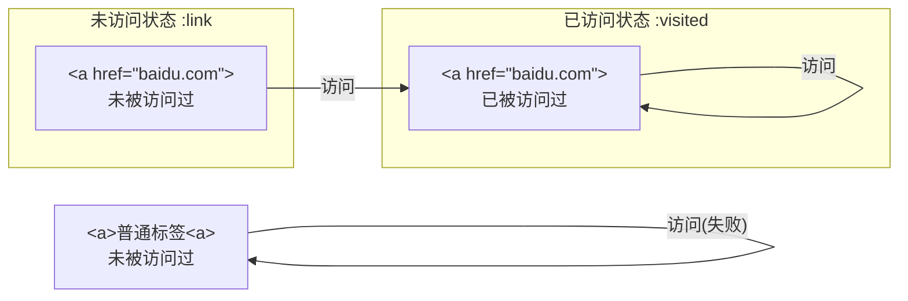

# CSS

# §0 前置知识

## §0.1 在HTML引入CSS

### §0.1.1 `<link>`标签

`<link>`标签必须放在`<head>`元素中。

```htaccess
<link rel="stylesheet" type="text/css" href="./index.css" media="all">
```

其中`<link>`标签涉及的属性有：

- `rel`：资源与文档的关系(Relation)
- `type`：资源的MIME类型
- `href`：资源的路径，可以是绝对URL或相对URL
- `media`：资源的应用场景。

### §0.1.2 `@import`语句

`@import`声明必须放在`<style>`的开头。

```html
<style>
    @import url(index.css)
</style>
```

### §0.1.3 `HTTP Header`

HTTP协议允许在响应头指定加载的CSS文件。

- `Apache`的分布式配置文件`.htaccess`：

  ```htaccess
  Header add Link "</index.css>;rel=stylesheet;type=text/css"
  ```

- `Apache`的全局配置文件`httpd.conf`：

  ```htaccess
  <Directory /var/www/html/site>
  	Header add Link "</index.css>;rel=stylesheet;type=text/css"
  </Directory>
  ```

### §0.1.4 行内样式

```html
<span style="color: red">Hello</span>
```


# §1 CSS语法

样式表由一个或多个规则组成。一个规则由前面选择符(`selector`)和后面的声明块(`declaration block`)组成。声明块之中的声明用分号`;`隔开。

```css
h1 {color: red; background: yellow}
```

## §1.1 注释

CSS支持`/* */`类型的注释，不允许注释嵌套：

```css
/*
	这是多行注释
*/
```

注释不能算作空白字符，因此下面的写法是合法的：

```css
h1 {color: red}
h1 {co/*我是突然闯入的注释*/lor: red}
```

由于历史原因，CSS注释可以使用HTML中的注释标记：

```css
h1 {color: red <!-- 让标题为红色 --> }
```

## §1.2 选择符

### §1.2.1 元素选择符

元素选择符用于选择HTML或XML文档中的元素。

```css
h1 {color: red}
```

### §1.2.2 群组选择符

群组选择符允许将一个样式应用到一组元素上，各个元素之间用`,`分隔：

```css
h1, h2, h3, h4, h5, h6 {color: red}
```

特殊地，使用`*`表示匹配所有元素，称为通用选择符。

```css
* {color: red; font: 18px}
```

> 注意：虽然一组声明的最后一处声明后不必加引号，但是工程中还是推荐加上。否则在其后面添加样式时容易忘记补上，导致新增的一行声明被解析成上一层声明的关键词。

### §1.2.3 类选择符

类选择符`.`用于匹配文档元素中的`class`属性。其之前的字符串指定匹配的元素(通配则置为`*`或空)，之后的字符串指定匹配的`class`属性。在其之后继续加类选择符进行串联，表示同时匹配到多个`class`属性，区分大小写。

```html
<h1 class="warning urgent">Notice</h1>
<h2 class="info">Idea</h2>
<style>
    .warning {font-weight: bold;}
    h2.info {font-style: italic;}
    .warning.urgent{color: red}
</style>
```

### §1.2.4 ID选择符

ID选择符`*`用于匹配文档中唯一出现的`id`属性。其语法与类选择符类似，但是不能串联，区分大小写。

```html
<div id="navbar">
    <a id="title">Welcome</a>
    <span id="currentTime">2023-08-08</span>
</div>
<style>
    #navbar {width: 100%;}
    a#title {font-weight: bold;}
    *#currentTime {color: green;}
</style>
```

### §1.2.5 属性选择符

属性选择符`[]`用于匹配函数某种属性的元素。支持串联。

```html
<div id="loginFrame">
    <input type="checkbox" checked/>
</div>
<style>
    input[checked] {color: red;} /* 筛选所有预先勾选的多选框 */
    *[id] {border: 2px solid red;} /* 筛选所有具有ID属性的元素 */
    input[type][checked] { font-weight: bold; }
</style>
```

属性选择符不仅可以匹配属性名，还可以匹配属性值。如果属性值可能会引起歧义，可以用双引号`"`或单引号`'`包裹：

```html
<a href="https://www.baidu.com">Baidu</a>
<a class="warning-1 urgent">Pending...</a>
<style>
    a[href="https://www.baidu.com"] {...} /* 精准匹配 */
	a[class|="warning"] /* 模糊匹配，匹配以warning或以warning-开头的 */
	a[class~="warning-1"] /* 精准匹配，匹配属性值被空格分割后的单词 */
    a[class*="ing urg"] /* 模糊匹配，匹配子串 */
    a[href^="https://"] /* 模糊匹配，匹配开头 */
    a[href$=".com"] /* 模糊匹配，匹配结尾 */
</style>
```

上面的语法和正则表达式比较相似。实际上，属性选择符也支持正则表达式里的“大小写敏感”模式`i`：

```html
<div id="NavBar"></div>
<style>
    div[id="navbar" i] {color: red;}
</style>
```

属性选择符本身是大小写敏感的，除非属性值本身是HTML/XML规定的关键字：

```html
<input type="checkbox"/>
<style>
    input[type="ChEcKbOx"] {color: red;} /* 匹配成功 */
</style>
```

### §1.2.6 后代选择符

后代选择符` `用于筛选目标元素的所有子元素和子元素的子元素。

```html
<div class="list"><ul>
    <li>Item 1</li>
</ul></div>
<style>
    .list ul li {color: red;}
</style>
```

### §1.2.7 子代联结符

子代联结符`>`与后代选择符` `配合使用，用于筛选目标元素的所有子元素。

```html
<div class="list"><ul>
    <li>Item 1</li>
</ul></div>
<style>
    .list > ul > li {color: red;}
</style>
```

### §1.2.8 紧邻同胞联结符

紧邻同胞联结符`+`与后代选择符` `配合使用，用于筛选目标元素的所有兄弟元素。

```html
<div class="list"><ul>
    <li type="title">Item:</li>
    <li>Item 1</li>
    <li>Item 2</li>
</ul></div>
<style>
    li[type="title"] + li {color: gray;} /* 只为非title设置样式 */
</style>
```

### §1.2.9 一般同胞联结符

一般同胞联结符`~`与后代选择符` `配合使用，用于匹配与目标元素后面的所有兄弟元素，也就是选择后续元素。

```html
<div>
    <h1>Title</h1>
    <a>Item 1</a> <!-- 变成红色 -->
    <a>Item 2</a> <!-- 变成红色 -->
</div>
<style>
    div h1 ~a {color: red;}
</style>
```

### §1.2.10 伪类选择符

伪类选择符`:`用于选择伪类。可以串联使用。关于伪类的具体内容详见[§1.3 伪类](#§1.3 伪类)。

> 注意：伪类的"串联"不同于传统意义上的链式调用。在链式调用中，每个选择符接受到的实参都是上一个选择符的输出结果，而伪类选择符的"串联"表示每一个伪类选择符的实参都是初始传入的。
>
> 例如，`div:first-child:last-child:`表示在所选中的`div`元素中，只有既是`fisrt-child`也是`last-child`的元素才能匹配成功，因此其效果等价于`:only-child`。

## §1.3 伪类

伪类指的是文档中不一定真实存在的结构，或者某些元素的特定状态，它必须依赖于已有的元素。

### §1.3.1 结构伪类

#### §1.3.1.1 `:root`

`:root`表示文档的根元素。在HTML文档中，它指的就是`<html>`元素。

```html
<html>
	<style>
        :root {border: 1px solid red;}
        html {border: 1px solid red;}
    </style>
</html>

```

#### §1.3.1.2 `:empty`

`:empty`表示没有任何子元素（包括文本元素）的元素。

```html
<div>Hello world</div>
<div> </div>
<div>
</div>
<div><!----></div> <!-- 这个元素会被屏蔽 -->
<div></div> <!-- 这个元素会被屏蔽 -->
<style>
    div:empty {display: none;}
</style>
```

> 注意：`:empty`很容易被滥用成`*:empty`，从而会匹配`<input>`、``、`<br>`、`<textarea>`这类本身没有子元素的标签。

#### §1.3.1.3 `:only-child`

`:only-child`的作用是：当选定的元素只有一个子元素时，且子元素类型恰好为`:only-child`指定的类型时，选中该子元素。

```html
<html>
    <head>
        <style>
            a[href] img:only-child {border: 2px solid black;}
        </style>
    </head>
    <body>
        <a href="baidu.com"><br/></a> <!-- 未选中 -->
        <a href="baidu.com">Baidu</a> <!-- 已选中 -->
    </body>
</html>
```

#### §1.3.1.4 `:only-of-type`

`:only-child`的作用是：当选定的元素只有一个`:only-child`指定类型的子元素时，选中该子元素。它与`:only-child`的区别是：`:only-of-type`可以允许选定的元素有多个子元素，只要其中符合指定类型的子元素只有一个就可以；而`:only-child`只允许选定的元素只有一个子元素，且其类型恰好为`:only-child`指定的类型。

```html
<html>
    <head>
        <style>
            a[href] img:only-of-type {border: 2px solid black;}
        </style>
    </head>
    <body>
        <a href="baidu.com"><br/></a><!-- 已选中 -->
        <a href="baidu.com">Baidu</a><!-- 已选中 -->
    </body>
</html>
```

> 注意：`:only-of-type`牵扯到了父元素和子元素的概念。例如在`div a:only-of-type`中，到底谁是父元素呢？答案是`div`。因此在下面的例子中，两个子元素都不会被选中：
>
> ```html
> <style>
>     p.unique:only-of-type {color: red;}
> </style>
> <div>
>     <p class="unique">Hello</p>
>     <p class="common">World</p>
> </div>
> ```

#### §1.3.1.5 `:first-child`和`:last-child`

`:first-child`用于表示在众多同级的兄弟节点中，排在第一个的，且恰为指定类型的子元素。

`:last-child`用于表示在众多同级的兄弟节点中，排在最后一个的，且恰为指定类型的子元素。

```html
<style>
    p:first-child {color:red;}
    p:last-child {color:green;}
</style>
<p>First</p> <!-- 红色 -->
<p>Second</p>
<p>Third</p> <!-- 绿色 -->
```

#### §1.3.1.6 `:first-of-type`和`:last-of-type`

`:first-of-type`用于表示与指定类型相同的众多兄弟元素中，其中的第一个子元素。

`:last-of-type`用于表示与指定类型相同的众多兄弟元素中，其中的最后一个子元素。

```html
<style>
    p:first-of-type {color:red;}
    p:last-of-type {color:green;}
</style>
<p>First</p> <!-- 红色 -->
<p>Second</p>
<p>Third</p> <!-- 绿色 -->
```

#### §1.3.1.7 `:nth-child()`和`:nth-last-child`

`:nth-child()`用于表示在众多同级的兄弟节点中，排在第$n$个的，且恰为指定类型的子元素。此处$n$从$1$开始计数。

```html
<html>
    <head>
        <style>
            body > div:nth-child(2) {color: red;}
        </style>
    </head>
    <body>
        <div>Hello</div>
        <div>Hello</div> <!-- 红色 -->
        <div>Hello</div>
    </body>
</html>
```

`:nth-child()`还可以接收由自然数$n$构成形如`an+b`的表达式：

```html
<html>
    <head>
        <style>
            body > div:nth-child(2n+1) {color: red;}
        </style>
        <title>让奇数项全都为红色</title>
    </head>
    <body>
        <div>我是奇数</div><div>我是偶数</div>
        <div>我是奇数</div><div>我是偶数</div>
        <div>我是奇数</div><div>我是偶数</div>
    </body>
</html>
```

`:nth-child()`还可以接收`even`、`odd`这两个关键字，分别表示筛选红偶数项和奇数项：

```html
<html>
    <head>
        <style>
            body > div:nth-child(odd) {color: green;}
            body > div:nth-child(even) {color: red;}
        </style>
        <title>让奇数项全都为绿色,偶数项为红色</title>
    </head>
    <body>
        <div>我是奇数</div><div>我是偶数</div>
        <div>我是奇数</div><div>我是偶数</div>
        <div>我是奇数</div><div>我是偶数</div>
    </body>
</html>
```

`:nth-last-child()`作用是类似的，只不过是从尾到头计数。用于表示在众多同级的兄弟节点中，排在第$n$个的，且恰为指定类型的子元素。此处$n$从$1$开始计数。

> 注意：`:nth-child()`和`:nth-last-child()`本质上的区别是计数起点。灵活地选择计数起点，可以实现更灵活的功能。
>
> 例题：现在有如下由众多`<div>`组成的HTML文档，现在需要让最后一个元素的颜色为灰色，而且相邻元素要灰白交替显示。请编写CSS。
>
> ```html
> <html>
>     <body>
>         <div>好多元素</div>
>         <div>好多元素</div>
>         <div>......</div>
>         <div>好多元素</div>
>         <div>这一行必须是灰色</div>
>     </body>
> </html>
> ```
>
> 答：使用`:nth-last-child()`即可。
>
> ```css
> /* 两种方法均可 */
> div:nth-last-child(2n+1) {color: gray}
> div:nth-last-child(odd) {color: gray}
> ```

#### §1.3.1.8 `:nth-of-type`和`:nth-last-of-type()`

用法与[§1.3.1.7 `:nth-child()`和`:nth-last-child`](§1.3.1.7 `:nth-child()`和`:nth-last-child`)类似。

### §1.3.2 动态伪类

我们之前讲过，所有伪类都必须依赖于已有的元素。当HTML文档给定的一瞬间，结构伪类就一定能从HTML文档中找到已有的元素。然而对于动态伪类来说，依赖的元素可能并不存在与原生HTML文档中，必须经过浏览器渲染后才有可能产生。

#### §1.3.2.1 超链接伪类

在HTML中，我们常用`<a href="google.com">`等方法做一个超链接，而不会认为一个普通的`<a></a>`是超链接。

"未被访问过"和"未访问状态"是两个完全不同的概念。我们以这两个`<a>`标签为例，这两个概念的关系如下图所示：

```html
<a>普通标签</a>
<a href="baidu.com">百度</a>
```



`:link`用于指示被标记为超链接（即具有`href`属性）的，且未被访问过的元素，也就是处于未访问状态的元素。

`:visited`用于指示已被访问过的超链接。

# §A 附录

## §A.1 厂商前缀

有些CSS属性名会带有一个前缀（例如`-o-border-image`），用于让浏览器厂商标记实验用途或专属的CSS功能。

| 前缀       | 厂商                                          |
| ---------- | --------------------------------------------- |
| `-epub-`   | 国际数字出版论坛指定的`ePub`格式              |
| `-moz-`    | 基于`Mozilla`的浏览器（例如`Firefox`）        |
| `-ms-`     | `Internet Explorer`                           |
| `-o-`      | 基于`Opera`的浏览器                           |
| `-webkit-` | 基于`Webkit`的浏览器（例如`Safari`,`Chrome`） |

## §A.2 媒体类型

CSS2引入了媒体类型，表示当前文档展示时所处的环境。

可以用以下方法声明媒体类型：

```html
1.
<link ... media="{{media}}">
<link ... media="{{media}}, {{media}}, ...">

2.
<style media="{{media}}"></style>
<style media="{{media}}, {{media}}, ..."></style>

3.
<style> @import url(index.css) {{media}}</style>
<style> @import url(index.css) {{media}}, {{media}}, ...</style> /*引入多种媒体类型的样式*/
<style> @import url(index.css) {{media}} and {{media}} and ...</style> /**/

<style> @media {{media}} {color: red;}</style>
<style> @media {{media}}, {{media}} {color: red;}</style>
```

常见的媒体类型有：

| 媒体类型     | 作用         |
| ------------ | ------------ |
| `all`        | 全部         |
| `print`      | 打印文档     |
| `screen`     | 桌面显示器   |
| `projection` | 幻灯片或投影 |
| `handheld`   | 移动端浏览器 |

