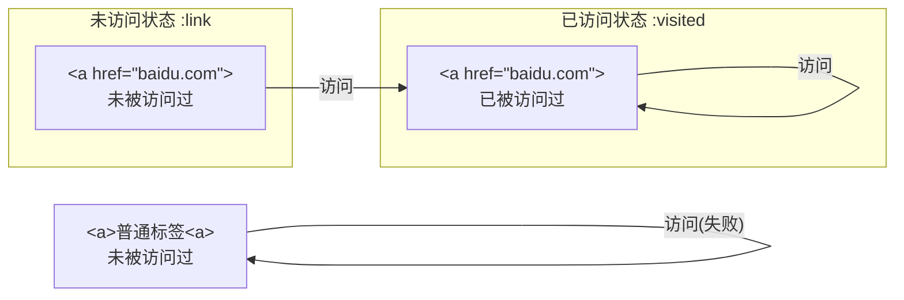
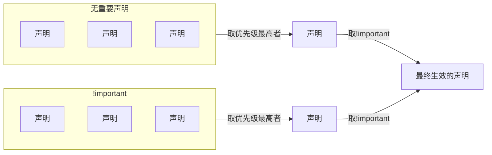
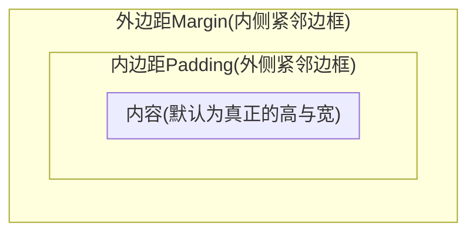
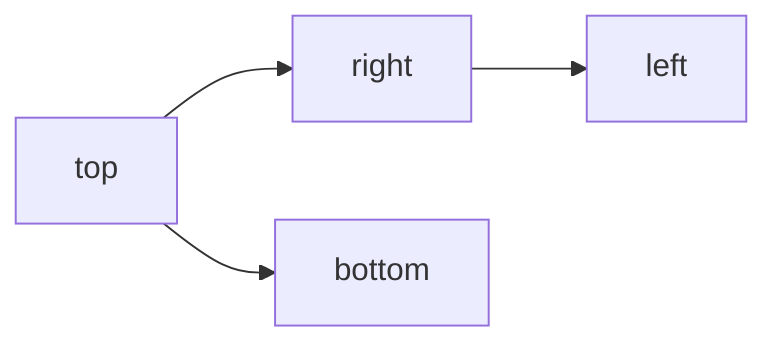

# tCSS

# §0 前置知识

## §0.1 在HTML引入CSS

### §0.1.1 `<link>`标签

`<link>`标签必须放在`<head>`元素中。

```htaccess
<link rel="stylesheet" type="text/css" href="./index.css" media="all">
```

其中`<link>`标签涉及的属性有：

- `rel`：资源与文档的关系(Relation)
- `type`：资源的MIME类型
- `href`：资源的路径，可以是绝对URL或相对URL
- `media`：资源的应用场景。

### §0.1.2 `@import`语句

`@import`声明必须放在`<style>`的开头。

```html
<style>
    @import url(index.css)
</style>
```

### §0.1.3 `HTTP Header`

HTTP协议允许在响应头指定加载的CSS文件。

- `Apache`的分布式配置文件`.htaccess`：

  ```htaccess
  Header add Link "</index.css>;rel=stylesheet;type=text/css"
  ```

- `Apache`的全局配置文件`httpd.conf`：

  ```htaccess
  <Directory /var/www/html/site>
  	Header add Link "</index.css>;rel=stylesheet;type=text/css"
  </Directory>
  ```

### §0.1.4 行内样式

```html
<span style="color: red">Hello</span>
```


# §1 CSS语法

样式表由一个或多个规则组成。一个规则由前面选择符(`selector`)和后面的声明块(`declaration block`)组成。声明块之中的声明用分号`;`隔开。

```css
h1 {color: red; background: yellow}
```

## §1.1 注释

CSS支持`/* */`类型的注释，不允许注释嵌套：

```css
/*
	这是多行注释
*/
```

注释不能算作空白字符，因此下面的写法是合法的：

```css
h1 {color: red}
h1 {co/*我是突然闯入的注释*/lor: red}
```

由于历史原因，CSS注释可以使用HTML中的注释标记：

```css
h1 {color: red <!-- 让标题为红色 --> }
```

## §1.2 选择符

### §1.2.1 元素选择符

元素选择符用于选择HTML或XML文档中的元素。

```css
h1 {color: red}
```

### §1.2.2 群组选择符

群组选择符允许将一个样式应用到一组元素上，各个元素之间用`,`分隔：

```css
h1, h2, h3, h4, h5, h6 {color: red}
```

特殊地，使用`*`表示匹配所有元素，称为通用选择符。

```css
* {color: red; font: 18px}
```

> 注意：虽然一组声明的最后一处声明后不必加引号，但是工程中还是推荐加上。否则在其后面添加样式时容易忘记补上，导致新增的一行声明被解析成上一层声明的关键词。

### §1.2.3 类选择符

类选择符`.`用于匹配文档元素中的`class`属性。其之前的字符串指定匹配的元素(通配则置为`*`或空)，之后的字符串指定匹配的`class`属性。在其之后继续加类选择符进行串联，表示同时匹配到多个`class`属性，区分大小写。

```html
<h1 class="warning urgent">Notice</h1>
<h2 class="info">Idea</h2>
<style>
    .warning {font-weight: bold;}
    h2.info {font-style: italic;}
    .warning.urgent{color: red}
</style>
```

### §1.2.4 ID选择符

ID选择符`*`用于匹配文档中唯一出现的`id`属性。其语法与类选择符类似，但是不能串联，区分大小写。

```html
<div id="navbar">
    <a id="title">Welcome</a>
    <span id="currentTime">2023-08-08</span>
</div>
<style>
    #navbar {width: 100%;}
    a#title {font-weight: bold;}
    *#currentTime {color: green;}
</style>
```

### §1.2.5 属性选择符

属性选择符`[]`用于匹配函数某种属性的元素。支持串联。

```html
<div id="loginFrame">
    <input type="checkbox" checked/>
</div>
<style>
    input[checked] {color: red;} /* 筛选所有预先勾选的多选框 */
    *[id] {border: 2px solid red;} /* 筛选所有具有ID属性的元素 */
    input[type][checked] { font-weight: bold; }
</style>
```

属性选择符不仅可以匹配属性名，还可以匹配属性值。如果属性值可能会引起歧义，可以用双引号`"`或单引号`'`包裹：

```html
<a href="https://www.baidu.com">Baidu</a>
<a class="warning-1 urgent">Pending...</a>
<style>
    a[href="https://www.baidu.com"] {...} /* 精准匹配 */
	a[class|="warning"] /* 模糊匹配，匹配以warning或以warning-开头的 */
	a[class~="warning-1"] /* 精准匹配，匹配属性值被空格分割后的单词 */
    a[class*="ing urg"] /* 模糊匹配，匹配子串 */
    a[href^="https://"] /* 模糊匹配，匹配开头 */
    a[href$=".com"] /* 模糊匹配，匹配结尾 */
</style>
```

上面的语法和正则表达式比较相似。实际上，属性选择符也支持正则表达式里的“大小写敏感”模式`i`：

```html
<div id="NavBar"></div>
<style>
    div[id="navbar" i] {color: red;}
</style>
```

属性选择符本身是大小写敏感的，除非属性值本身是HTML/XML规定的关键字：

```html
<input type="checkbox"/>
<style>
    input[type="ChEcKbOx"] {color: red;} /* 匹配成功 */
</style>
```

### §1.2.6 后代选择符

后代选择符` `用于筛选目标元素的所有子元素和子元素的子元素。

```html
<div class="list"><ul>
    <li>Item 1</li>
</ul></div>
<style>
    .list ul li {color: red;}
</style>
```

### §1.2.7 子代联结符

子代联结符`>`与后代选择符` `配合使用，用于筛选目标元素的所有子元素。

```html
<div class="list"><ul>
    <li>Item 1</li>
</ul></div>
<style>
    .list > ul > li {color: red;}
</style>
```

### §1.2.8 紧邻同胞联结符

紧邻同胞联结符`+`与后代选择符` `配合使用，用于筛选目标元素的所有兄弟元素。

```html
<div class="list"><ul>
    <li type="title">Item:</li>
    <li>Item 1</li>
    <li>Item 2</li>
</ul></div>
<style>
    li[type="title"] + li {color: gray;} /* 只为非title设置样式 */
</style>
```

### §1.2.9 一般同胞联结符

一般同胞联结符`~`与后代选择符` `配合使用，用于匹配与目标元素后面的所有兄弟元素，也就是选择后续元素。

```html
<div>
    <h1>Title</h1>
    <a>Item 1</a> <!-- 变成红色 -->
    <a>Item 2</a> <!-- 变成红色 -->
</div>
<style>
    div h1 ~a {color: red;}
</style>
```

### §1.2.10 伪类选择符

伪类选择符`:`用于选择伪类。可以串联使用。关于伪类的具体内容详见[§1.3 伪类](#§1.3 伪类)。

> 注意：伪类的"串联"不同于传统意义上的链式调用。在链式调用中，每个选择符接受到的实参都是上一个选择符的输出结果，而伪类选择符的"串联"表示每一个伪类选择符的实参都是初始传入的。
>
> 例如，`div:first-child:last-child:`表示在所选中的`div`元素中，只有既是`fisrt-child`也是`last-child`的元素才能匹配成功，因此其效果等价于`:only-child`。

### §1.2.11 伪元素选择符

为实现特定的效果，伪元素和伪类都能向文档中插入虚构的元素。伪元素选择符为`::`。

## §1.3 伪类

伪类指的是文档中不一定真实存在的结构，或者某些元素的特定状态，它必须依赖于已有的元素。

### §1.3.1 结构伪类

#### §1.3.1.1 `:root`

`:root`表示文档的根元素。在HTML文档中，它指的就是`<html>`元素。

```html
<html>
	<style>
        :root {border: 1px solid red;}
        html {border: 1px solid red;}
    </style>
</html>

```

#### §1.3.1.2 `:empty`

`:empty`表示没有任何子元素（包括文本元素）的元素。

```html
<div>Hello world</div>
<div> </div>
<div>
</div>
<div><!----></div> <!-- 这个元素会被屏蔽 -->
<div></div> <!-- 这个元素会被屏蔽 -->
<style>
    div:empty {display: none;}
</style>
```

> 注意：`:empty`很容易被滥用成`*:empty`，从而会匹配`<input>`、``、`<br>`、`<textarea>`这类本身没有子元素的标签。

#### §1.3.1.3 `:only-child`

`:only-child`的作用是：当选定的元素只有一个子元素时，且子元素类型恰好为`:only-child`指定的类型时，选中该子元素。

```html
<html>
    <head>
        <style>
            a[href] img:only-child {border: 2px solid black;}
        </style>
    </head>
    <body>
        <a href="baidu.com"><br/></a> <!-- 未选中 -->
        <a href="baidu.com">Baidu</a> <!-- 已选中 -->
    </body>
</html>
```

#### §1.3.1.4 `:only-of-type`

`:only-child`的作用是：当选定的元素只有一个`:only-child`指定类型的子元素时，选中该子元素。它与`:only-child`的区别是：`:only-of-type`可以允许选定的元素有多个子元素，只要其中符合指定类型的子元素只有一个就可以；而`:only-child`只允许选定的元素只有一个子元素，且其类型恰好为`:only-child`指定的类型。

```html
<html>
    <head>
        <style>
            a[href] img:only-of-type {border: 2px solid black;}
        </style>
    </head>
    <body>
        <a href="baidu.com"><br/></a><!-- 已选中 -->
        <a href="baidu.com">Baidu</a><!-- 已选中 -->
    </body>
</html>
```

> 注意：`:only-of-type`牵扯到了父元素和子元素的概念。例如在`div a:only-of-type`中，到底谁是父元素呢？答案是`div`。因此在下面的例子中，两个子元素都不会被选中：
>
> ```html
> <style>
>     p.unique:only-of-type {color: red;}
> </style>
> <div>
>     <p class="unique">Hello</p>
>     <p class="common">World</p>
> </div>
> ```

#### §1.3.1.5 `:first-child`和`:last-child`

`:first-child`用于表示在众多同级的兄弟节点中，排在第一个的，且恰为指定类型的子元素。

`:last-child`用于表示在众多同级的兄弟节点中，排在最后一个的，且恰为指定类型的子元素。

```html
<style>
    p:first-child {color:red;}
    p:last-child {color:green;}
</style>
<p>First</p> <!-- 红色 -->
<p>Second</p>
<p>Third</p> <!-- 绿色 -->
```

#### §1.3.1.6 `:first-of-type`和`:last-of-type`

`:first-of-type`用于表示与指定类型相同的众多兄弟元素中，其中的第一个子元素。

`:last-of-type`用于表示与指定类型相同的众多兄弟元素中，其中的最后一个子元素。

```html
<style>
    p:first-of-type {color:red;}
    p:last-of-type {color:green;}
</style>
<p>First</p> <!-- 红色 -->
<p>Second</p>
<p>Third</p> <!-- 绿色 -->
```

#### §1.3.1.7 `:nth-child()`和`:nth-last-child`

`:nth-child()`用于表示在众多同级的兄弟节点中，排在第$n$个的，且恰为指定类型的子元素。此处$n$从$1$开始计数。

```html
<html>
    <head>
        <style>
            body > div:nth-child(2) {color: red;}
        </style>
    </head>
    <body>
        <div>Hello</div>
        <div>Hello</div> <!-- 红色 -->
        <div>Hello</div>
    </body>
</html>
```

`:nth-child()`还可以接收由自然数$n$构成形如`an+b`的表达式：

```html
<html>
    <head>
        <style>
            body > div:nth-child(2n+1) {color: red;}
        </style>
        <title>让奇数项全都为红色</title>
    </head>
    <body>
        <div>我是奇数</div><div>我是偶数</div>
        <div>我是奇数</div><div>我是偶数</div>
        <div>我是奇数</div><div>我是偶数</div>
    </body>
</html>
```

`:nth-child()`还可以接收`even`、`odd`这两个关键字，分别表示筛选红偶数项和奇数项：

```html
<html>
    <head>
        <style>
            body > div:nth-child(odd) {color: green;}
            body > div:nth-child(even) {color: red;}
        </style>
        <title>让奇数项全都为绿色,偶数项为红色</title>
    </head>
    <body>
        <div>我是奇数</div><div>我是偶数</div>
        <div>我是奇数</div><div>我是偶数</div>
        <div>我是奇数</div><div>我是偶数</div>
    </body>
</html>
```

`:nth-last-child()`作用是类似的，只不过是从尾到头计数。用于表示在众多同级的兄弟节点中，排在第$n$个的，且恰为指定类型的子元素。此处$n$从$1$开始计数。

> 注意：`:nth-child()`和`:nth-last-child()`本质上的区别是计数起点。灵活地选择计数起点，可以实现更灵活的功能。
>
> 例题：现在有如下由众多`<div>`组成的HTML文档，现在需要让最后一个元素的颜色为灰色，而且相邻元素要灰白交替显示。请编写CSS。
>
> ```html
> <html>
>     <body>
>         <div>好多元素</div>
>         <div>好多元素</div>
>         <div>......</div>
>         <div>好多元素</div>
>         <div>这一行必须是灰色</div>
>     </body>
> </html>
> ```
>
> 答：使用`:nth-last-child()`即可。
>
> ```css
> /* 两种方法均可 */
> div:nth-last-child(2n+1) {color: gray}
> div:nth-last-child(odd) {color: gray}
> ```

#### §1.3.1.8 `:nth-of-type`和`:nth-last-of-type()`

用法与[§1.3.1.7 `:nth-child()`和`:nth-last-child`](§1.3.1.7 `:nth-child()`和`:nth-last-child`)类似。

### §1.3.2 动态伪类

我们之前讲过，所有伪类都必须依赖于已有的元素。当HTML文档给定的一瞬间，结构伪类就一定能从HTML文档中找到已有的元素。然而对于动态伪类来说，依赖的元素可能并不存在与原生HTML文档中，必须经过浏览器渲染后才有可能产生。

#### §1.3.2.1 超链接伪类

在HTML中，我们常用`<a href="google.com">`等方法做一个超链接，而不会认为一个普通的`<a></a>`是超链接。

"未被访问过"和"未访问状态"是两个完全不同的概念。我们以这两个`<a>`标签为例，这两个概念的关系如下图所示：

```html
<a>普通标签</a>
<a href="baidu.com">百度</a>
```



`:link`用于指示被标记为超链接（即具有`href`属性）的，且未被访问过的元素，也就是处于未访问状态的元素。

`:visited`用于指示已被访问过的超链接。

> 注意：超链接伪类可以被用于泄露用户隐私。理论上，JS脚本可以探测与`:visited`相同样式的所有DOM节点，从而推断出用户访问过哪些网站。鉴于此，从2017年开始，几乎所有主流浏览器厂商都支持下列补救措施：
>
> 1. `:visited`伪类能操纵的CSS属性仅限于颜色，例如`color`、`background-color`、`column-rule-color`、`outline-color`、`border-color`、`border-top/bottom/left/right-color`。
> 2. `:link`伪类不再只选择未访问状态的超链接，而是选择所有超链接。除非`:visited`覆盖了已访问状态的超链接。
> 3. 浏览器的JavaScript Runtime规定，无论超链接状态如何，返回的值始终都是未访问状态的值。

#### §1.3.2.2 用户操作伪类

`:focus`用于指示当前获得输入焦点的元素，可以通过`TAB`键和鼠标获得。

`:hover`用于指示当前被鼠标指针悬停的元素。

`:active`用于指示由用户输入激活的元素，例如对超链接按下鼠标到松开鼠标的一段时间。

```html
<html>
    <head>
        <style>
            input:focus{background-color:lightgray;}
            input:hover{background-color:lightblue;}
            input:active{background-color:lightgreen;}
        </style>
    </head>
    <body>
        <input type="text" tabindex="1"/>
        <input type="text" tabindex="2"/>
        <input type="text" tabindex="3"/>
    </body>
</html>
```

> 注意：受制于特定性，伪类的顺序不可随意设置。在实际工程中，通常推荐的顺序从`:link/:visited/:hover/:active`变成了`:link/:visited/:focus/:hover/:active`。

#### §1.3.2.3 UI状态伪类

`:enabled`用于指示接受输入的元素。

`:disabled`用于指示不接受输入的元素。

`:checked`用于指示由用户或文档默认选中的单选按钮或复选框。

`:indeterminate`用于指示"既没有选中，也没有未选中"的单选按钮和复选框。（该状态只能由DOM脚本设定，不能由用户设定）

`:default`用于指示默认选中的元素，且仅特指单选按钮、复选框、选项。

`:valid`用于指示满足数据有效性语义的元素，且仅特指输入框。

`:invalid`用于指示不满足数据有效性语义的元素，且仅特指输入框。

`:in-range`用于指示当前输入的值在控件允许的最小值和最大值之间的元素，且仅特指输入框。

`:out-range`用于指示当前输入的值小于控件允许最小值或大于控件允许最大值的元素，且仅特指输入框。

`:required`用于指示用户必须输入的元素，且仅特指输入框。

`:optional`用于指示用户非必要输入的元素，且仅特指输入框。

`:read-write`用于指示用户可以编辑的元素，且仅特指输入框。

`:read-only`用于指示用户不能编辑的元素，且仅特指输入框。

```html
<html>
<head>
    <style>
        input:disabled {opacity: 0.5;}
        input:enabled {border-color: black;}
        input:checked + label {font-weight: bold;}
        input:not(:checked) + label {color: #555;}
        input:indeterminate + label {font-style: italic;}
        input:default + label {color: darkred;}
        input:required {border-style: double;}
        input:optional {border-style: dotted;}
        input:invalid {border: 2px solid red;}
        input:valid {border: 2px solid green;}
        input:in-range {border: 5px solid green;}
        input:out-of-range {border: 5px solid red;}
        textarea:read-only {border-color: aqua;}
        textarea:read-write {border-color: greenyellow;}
    </style>
</head>
<body>
    <form>
        <div>
            <span>Username:</span><input type="text" tabindex="1" required/>
        </div>
        <div>
            <span>Password:</span>
            <input disabled type="text" tabindex="2">
        </div>
        <div>
            <span>Email:</span>
            <input type="email"/>
        </div>
        <div>
            <span>Gender:</span>
            <input type="radio" name="gender" id="male" value="male"><label for="male">Male</label>
            <input type="radio" name="gender" id="female" value="female"><label for="female">Female</label>
        </div>
        <div>
            <span>Preference:</span>
            <input type="checkbox" name="preference" id="sports" checked value="sports"/><label for="sports">Sports</label>
            <input type="checkbox" name="preference" id="music" value="music"/><label for="music">Music</label>
            <input type="checkbox" name="preference" id="cooking" value="cooking"/><label for="cooking">Cooking</label>
        </div>
        <div>
            <span>Budget:</span>
            <input type="number" min="100" max="100000" step="10000"/>
        </div>
        <div>
            <span>Matio:</span><textarea></textarea>
        </div>
        <div>
            <span>Info:</span><textarea disabled></textarea>
        </div>
    </form>
</body>
</html>
```

> 注意：`:in-range`并不意味着`:valid`。HTML5为`<input type="number" min="..." max="...">`引入了`step`属性，作为右侧加减按钮的步进长度。其`value`即使位于`[min, max]`内，只要不能被`step`整除，它就是`:invalid`。

#### §1.3.2.4 `:target`

在形如`http://...#...`的URL中，井号`#`后面的字符串被称为片段标识符，用于定位HTML文档中具有相同`id`的标签。`:target`伪类用于标记`id`与片段标识符相等的目标元素。

```html
<html>
<head>
    <style>
        #catalog > a {display: block;}
        :target {border-left: 5px solid gray; background-color: lightblue; font-weight: bold;}
    </style>
</head>
<body>
    <div id="catalog">
        <h1>目录</h1>
        <a href="./#chapter1">1.摘要</a>
        <a href="./#chapter2">2.过程</a>
        <a href="./#chapter3">3.结语</a>
    </div>
    <div id="text">
        <h1>正文</h1>
        <div id="chapter1">1.摘要 这是摘要</div>
        <div id="chapter2">2.过程 这是过程</div>
        <div id="chapter3">3.结语 这是结语</div>
    </div>
</body>
</html>
```

#### §1.3.2.5 `:lang()`

浏览器可以通过[`lang`属性](https://developer.mozilla.org/zh-CN/docs/Web/HTML/Global_attributes/lang)、[`<meta>`标签](https://developer.mozilla.org/en-US/docs/Web/HTTP/Headers/Content-Language)和HTML响应头这三个途径推断语言来源：

```html
<p lang="fr">这是法语</p>
<meta http-equiv="Content-Language" content="de, en">
```

```http
Content-Language: de-DE
```

`:lang()`选中具有指定语言属性的元素。

```html
<html lang="zh">
<head>
    <style>
        :lang(zh) {color: red;}
        :lang(en) {color: blue;}
        :lang(fr) {color: green;}
    </style>
</head>
<body>
    <p lang="en">这是英语</p>
    <p lang="fr">这是法语</p>
    <p>这是全局的中文</p>
</body>
</html>
```

#### §1.3.2.6 `:not()`

一个很经典的例子是：在重大公祭日时，网站的所有元素都必须转为灰白，除非存在某些元素必须设为彩色。在`:not()`出现之前，普遍的做法是：先把所有元素设为灰白，然后单独给特殊元素加`!important`覆盖掉：

```html
<html lang="zh">
<head>
    <style>
        p {filter: grayscale(1);}
        .red{color: red;}
        .blue{color: blue;}
        .green{color: green;}
        .keep-colorful {filter: grayscale(0) !important;}
    </style>
</head>
<body>
    <p class="red">网站标题</p>
    <p class="blue">网站信息</p>
    <p class="green keep-colorful">特殊元素</p>
</body>
</html>
```

有了`:not()`以后就方便多了：

```html
<html lang="zh">
<head>
    <style>
        .red{color: red;}
        .blue{color: blue;}
        .green{color: green;}
        body > *:not(.keep-colorful) {filter: grayscale(1);}
    </style>
</head>
<body>
    <p class="red">网站标题</p>
    <p class="blue">网站信息</p>
    <p class="green keep-colorful">特殊元素</p>
</body>
</html>
```

## §1.4 伪元素

### §1.4.1 装饰首字母

`::first-letter`用于装饰非行内元素的首字母。

例如给定以下需求：给英文报纸排版，每篇文章`<div>`由数个`<h1>`、`<h2>`和若干个`<p>`构成，要求给第一个出现的`<p>`的首字母调成粗体大字号：

```html
<html lang="zh">
<head>
    <style>
        p, h1 {
            font-family: 'Times New Roman', Times, serif;
        }
        .article > p:first-of-type::first-letter {
            font-weight: bold;
            font-size: 200%;
        }
    </style>
</head>
<body>
    <div class="article">
        <h1>Population Arising Comes To An End In China</h1>
        <p>This is first paragragh.</p>
        <p>This is second paragragh.</p>
        <p>This is third paragragh.</p>
    </div>
</body>
</html>
```

### §1.4.2 装饰首行

`::first-line`用于装饰元素的首行文本。

> 注意：目前`::first-letter`和`::first-line`都只能应用到块级元素上，而不能应用到行内元素上。并且这两者允许使用的CSS属性也有限制：
>
> - `::first-line`允许使用的CSS属性：所有字体属性、所有背景属性、所有文本装饰属性、所有行内排版属性、所有行内布局属性、所有边框属性，`box-shadow`、`color`、`opacity`。
> - `::first-line`允许使用的CSS属性：所有字体属性、所有背景属性、所有外边距属性、所有内边距属性、所有边框属性、所有文本装饰属性、所有行内排版属性、`color`、`opacity`。

### §1.4.3 装饰前置与后置元素

CSS可以自己生成并插入内容，从而影响HTML文档建立的DOM。

例如继续完善[§1.4.1 装饰首字母](§1.4.1 装饰首字母)一节的任务：每篇文章由一个`<h1>`、多个`<h2>`和`<p>`交叉构成，要求给每个`<h2>`的标题前插入两个灰色的左方括号：

```css
<html lang="en">
<head>
    <style>
        p, h1, h2 {
            font-family: 'Times New Roman', Times, serif;
        }
        .article > h2 + p::first-letter {
            font-weight: bold;
            font-size: 150%;
        }
        .article > h2::before {
            content: "[[";
        }
    </style>
</head>
<body>
    <div class="article">
        <h1>Population Arising Ended In China</h1>
        <h2>Data analyse</h2>
        <p>Here is the population statistic released from China Constitution of Statistics, ...</p>
        <p>From the graph, we can see that ...</p>
        <h2>The reason</h2>
        <p>The first reason is that ...</p>
        <p>The second reason is that ...</p>
        <h2>Dangerous consequence</h2>
        <p>Military circuiting is more difficult ...</p>
        <p>Finacial marketing's pulse will be slower ...</p>
    </div>
</body>
</html>
```

## §1.5 属性值

CSS中的一切都是文本，我们之前已经见识过了部分CSS属性及其可能的属性值，例如`margin: 2px`、`display: none`、`color: red`等等。属性值可以大致分为关键字、字符串和其他文本值这三类。

### §1.5.1 关键字

CSS定义的关键字有很多，几乎每个CSS属性都有自己支持的一套关键字。比较常见的有`red`、`none`之类的。

CSS3定义了以下全局关键字，每个CSS属性都能用：

- `inherit`：强制继承父元素的该属性
- `initial`：把属性值设置为预定义的初始值
- `unset`：对于可继承的属性，其效果等价于`inherit`；对于不可继承的属性，其效果等价于`initial`

> 注意：`all`属性非常特殊，它表示除`direction`和`unicode-bidi`之外的所有属性，它的属性值只能取这三个全局关键字。例如可以通过该属性，让子元素继承父元素的几乎所有属性：
>
> ```css
> ... {all: inherit;}
> ```

### §1.5.2 字符串

CSS中的字符串与其他编程语言的字符串有很多相似之处：

```css
content: "这是一个字符串";
content: "这是一个带引号'的字符串";
content: "可以给引号\"转义";
```

当字符串过长，需要换行时，可以使用下列方法：

```css
content: "这是换行 \
的字符串";
```

如果真的要在字符串中插入换行符，可以使用Unicode字符`\A`：

```css
content: "这是换行\A的字符串"
```

### §1.5.3 URL

URL的格式为`url(...)`。其中的URL链接既可以是绝对路径`url(protocol://server/pathname)`，也可以是相对路径`url(./...)`。

> 注意：包含URL的CSS文航会作用到HTML文档上。相对路径所参照的根目录取决于该URL所在的文档路径，而不是作用到的HTML文档的路径。

### §1.5.4 绝对长度单位

| 绝对长度单位      | 作用                          |
| ----------------- | ----------------------------- |
| 英寸(`in`)        | 美制单位，$1$英寸=$2.54$厘米  |
| 厘米(`cm`)        | 公制单位                      |
| 毫米(`mm`)        | 公制单位                      |
| 四分之一毫米(`q`) | 公制单位                      |
| 点(`pt`)          | 印刷度量单位，$1$英寸=$72$点  |
| 派卡(`pc`)        | 印刷度量单位，$1$英寸=$6$派卡 |
| 像素(`px`)        | CSS规定$1$英寸=$96$像素       |

### §1.5.5 分辨率单位

为适应媒体查询和响应式设计，CSS增加了三个描述显示器分辨率的单位：

| 分辨率单位       | 作用                        |
| ---------------- | --------------------------- |
| 点每英寸(`dpi`)  | 在$1$英寸范围内能显示的点数 |
| 点每厘米(`dpcm`) | 在$1$厘米范围内能显示的点数 |
| 点每像素(`dppx`) | 在$1$像素范围内能显示的点数 |

分辨率单位只能应用于媒体查询：

```css
@media (min-resolution: 500dpi){
	/* 分辨率大于等于500dpi时生效 */   
}
```

### §1.5.6 相对长度单位

相对长度单位是参考其它长度而言的，例如屏幕分辨率、视区宽度、用于偏好设置等。

| 相对长度单位 | 作用                                                         |
| ------------ | ------------------------------------------------------------ |
| `em`         | 参考该元素小写字母`m`的宽度，即该元素的`font-size`值，$1$`em`=$1$`font-size` |
| `ex`         | 参考该元素小写字母`x`的高度，$1$`ex`=$1$小写字母`x`的高度    |
| `rem`        | 参考根元素小写字母`m`的宽度，即该元素的`font-size`值，$1$`em`=$1$根元素的`font-size` |

```html
<html lang="en">
<head>
    <style>
        h1 {font-size: 24px;}
        h2 {font-size: 18px;}
        p {font-size: 12px;}
        h1, h2, p {margin-left: 1em;}
        small {margin-left: 0.8em;}

    </style>
</head>
<body>
    <h1>Left margin = <small>24</small></h1>
    <h1>Left margin = <small>18</small></h1>
    <p>Left margin = <small>24</small></p>
</body>
</html>
```

| 相对长度单位 | 作用                        |
| ------------ | --------------------------- |
| `ch`         | 参考该元素字符`0`字形的进距 |

进距指的是一个字形的起点到下一个紧邻字形的起点之间的距离，等价于字形本身的宽度加上侧边的间距。除非是等宽字体，否则对于大多数西文字体而言，字体与字体间距并不一致，而且任意一个字符的进距也不一定等于字体字形的进距。

```html
<html lang="en">
<head>
    <style>
        .section > div {
            height: 1ch;
            width: 3ch;
            background-color: red;
        }
    </style>
</head>
<body>
    <div class="section" style="font-family: Impact, Haettenschweiler, 'Arial Narrow Bold', sans-serif;">
        <span>123</span>
        <div></div>
    </div>
    <div class="section" style="font-family: 'Courier New', Courier, monospace;">
        <span>123</span>
        <div></div>
    </div>
    <div class="section" style="font-family: Verdana, Geneva, Tahoma, sans-serif;">
        <span>123</span>
        <div></div>
    </div>
</body>
</html>
```

| 相对长度单位       | 作用                                                |
| ------------------ | --------------------------------------------------- |
| 视区宽度(`vw`)     | $\displaystyle\frac{当前视区的宽度除以}{100}$       |
| 视区高度(`vh`)     | $\displaystyle\frac{当前视区的高度}{100}$           |
| 视区尺寸最小值(``) | $\displaystyle\min\left(\text{vw},\text{vh}\right)$ |
| 视区尺寸最大值(``) | $\displaystyle\max\left(\text{vw},\text{vh}\right)$ |

```html
<html lang="en">
<head>
    <style>
        body {
            padding: 0;
            margin: 0;
        }
        .container {
            height: 100vh;
            display: flex;
            align-items: center;
            justify-content: center;
        }
        .item {
            border: 2px solid rgb(128, 128, 128);
            border-radius: 0.5em;
            padding: 20px;
            width: 60vw;
        }
    </style>
</head>
<body>
    <div class="container">
        <div class="item">我的宽度可以随浏览器窗口的宽度自动改变!</div>
    </div>
</body>
</html>
```

### §1.5.7 `calc()`

CSS允许用户使用一些简单的表达式作为属性值，让浏览器动态计算属性值。这些表达式需要用`calc()`包裹，且仅支持加减乘除与括号`+-*/()`。

```css
p {width: calc(90% - 2em)}
```

> 注意：`calc()`计算的表达式，既是数学意义上的表达式，又是编程意义上的表达式。
>
> 1. 从数学层面来说，必须保证运算符两侧的单位一致。例如`2 + 1.1`是合法的，`7em - 20%`是合法的，但是`7em - 0.2`是非法的。
> 2. 从数学层面来说，必须保证运算符两侧的值至少有一个为无量纲数。例如`2 * 2em`是合法的，`2 * 2`是合法的，但是`2em * 2em`是非法的。
> 3. 从数学层面来说，必须保证出发运算符`/`的除数为无量纲数。例如`2em /3`是合法的，但是`2 / 3em`是非法的。
> 4. 从编程层面来说，加减运算符`+-`的两侧必要有空格，乘除运算符`*/`没有这一限制。
> 5. 从编程层面来说，`calc()`支持的表达式中最多只能包含20个算子（数字、百分数等）。超过20个算子的表达式无效。

### §1.5.8 `attr()`

我们知道，HTML文档的内容是固定的，后来有了SHTML作为HTML模版，允许服务器端渲染。同理，CSS文档的内容是固定的，但是有了`attr()`，我们就能根据HTML动态决定CSS的属性值。

例如可以配合伪元素，根据AJAX返回的内容添加序号：

```html
<html lang="en">
<head>
    <style>
        .item::before {content: "[" attr(id) "]";}
    </style>
</head>
<body>
    <div class="item" id="1">参考文献</div>
    <div class="item" id="2">参考文献</div>
    <div class="item" id="3">参考文献</div>
</body>
</html>
```

### §1.5.9 颜色

#### §1.5.9.1 具名颜色

HTML规定了16个[基本颜色关键字](https://zh.wikipedia.org/wiki/%E7%BD%91%E9%A1%B5%E9%A2%9C%E8%89%B2)：

| 基本颜色关键字 | 颜色代码  | 基本颜色关键字 | 颜色代码  |
| -------------- | --------- | -------------- | --------- |
| `aqua`         | `#00ffff` | `blue`         | `#0000ff` |
| `gray`         | `#808080` | `lime`         | `#00ff00` |
| `navy`         | `#000080` | `purple`       | `#800080` |
| `silver`       | `#c0c0c0` | `white`        | `#ffffff` |
| `black`        | `#000000` | `fuchsia`      | `#ff00ff` |
| `green`        | `#008000` | `maroon`       | `#800000` |
| `olive`        | `#808000` | `red`          | `#ff0000` |
| `teal`         | `#008080` | `yellow`       | `#ffff00` |

CSS4还规定了148个额外的具名颜色。

#### §1.5.9.2 RGB颜色和RGBa颜色

RGB认为所有颜色都可以分解成三个0-255之间的红色、绿色、蓝色的分量。RGBa增加一个维度`alpha`，表示颜色的不透明度，取值范围是`[0,1]`之间的任意浮点数。CSS支持以下四种方法指定RGB颜色和RGBa颜色：

1. 函数式RGB颜色

   ```css
   p {
   	color: rgb(128,128,128); /* 要么只能用整数 */
       color: rgb(50%,50%,50%); /* 要么只能用百分数 */
       color: rgb(50%,50%,128); /* 不能混用整数和百分数 */
   }
   ```

   虽然CSS名义上支持浮点数的分量，但是实际上用户代理会自动对其四舍五入，让其变为整数。如果分量为小于0，则约为0；如果大于255，则约为255。综上，函数式RGB颜色最终的输出可以表示为：
   $$
   \text{RGB}(r,g,b)=\left[\begin{matrix}
   	R\\G\\B
   \end{matrix}\right]
   =
   \left[\begin{matrix}
   	\text{round}(\min(\max(0,r),255))\\
   	\text{round}(\min(\max(0,g),255))\\
   	\text{round}(\min(\max(0,b),255))\\
   \end{matrix}\right]
   $$

2. 函数式RGBa颜色

   ```css
   p {
   	color: rgba(128,128,128,0.8);
   }
   ```

   舍入规则与函数式RGB颜色相同。

3. 十六进制RGB颜色

   可以使用两位十六进制数字表示分量，共计六位。如果只有三位，浏览器会自动将每个数字向后紧邻复制一次，扩充到六位。

   ```css
   p {
   	color: #ff0000; /* 小写字母都行 */
       color: #FF0000; /* 大写字母都行 */
       color: #123 /* 等价于#112233 */
   }
   ```

4. 十六进制RGBa颜色

   2017年，一种新的RGBa表示方法被提出了。它沿用了十六进制RGB颜色表示方法，将`alpha`分量离散化成0-255之间的离散值。

   ```css
   p {
   	color: #66ccff88;
       color: #6cf8; /* 简写 *?
   }
   ```

#### §1.5.9.3 HSL颜色和HSLa颜色

HSL颜色是由色相（Hue）、饱和度（Saturation）、明度（Lightness）构成的简称。其中$H\in[0\degree,360\degree)$，$S,L\in[0,1]$。

$RGB\rightarrow HLS$：

- $$
  H=\begin{align}\begin{cases}
  		0&,\max(R,G,B)=\min(R,G,B)\\
  		\displaystyle\frac{60\degree\times(G-B)}{\max(R,G,B)-\min(R,G,B)}\mod{360\degree}&,\max(R,G,B)=R\\
  		\displaystyle\frac{60\degree\times(B-R)}{\max(R,G,B)-\min(R,G,B)}+120\degree&,\max(R,G,B)=G\\
  		\displaystyle\frac{60\degree\times(R-G)}{\max(R,G,B)-\min(R,G,B)}+240\degree&,\max(R,G,B)=B\\
  	\end{cases}\end{align}
  $$

- $$
  L=\displaystyle\frac{\max(R,G,B)+\min(R,G,B)}{2}
  $$

- $$
  S=\begin{align}\begin{cases}
  	0&,\left|\max(R,G,B)\right|=\left|\min(R,G,B)\right|\\
  	\displaystyle\frac{\max(R,G,B)-\min(R,G,B)}{\max(R,G,B)+\min(R,G,B)}&,L\in(0,\displaystyle\frac{1}{2}]\\
  	\displaystyle\frac{\max(R,G,B)-\min(R,G,B)}{2-(\max(R,G,B)+\min(R,G,B))}&,L>\displaystyle\frac{1}{2}
  \end{cases}\end{align}
  $$

$HLS\rightarrow RGB$：

- 定义中间变量$q,p$为：
  $$
  \begin{cases}
  	q=\begin{align}\begin{cases}
  		L+LS&,L\in[0,\displaystyle\frac{1}{2})\\
  		L+S-LS&,L\in[\displaystyle\frac{1}{2},1]
  	\end{cases}\end{align}\\
  	p=2L-q\\
  \end{cases}
  $$

- 定义$t_R,t_G,t_B$分别为：
  $$
  \begin{cases}
  	t_R=\displaystyle\frac{h}{360}+\displaystyle\frac{1}{3}\mod1\\
  	t_G=\displaystyle\frac{h}{360}\mod1\\
  	t_B=\displaystyle\frac{h}{360}-\displaystyle\frac{1}{3}\mod1
  \end{cases}
  $$

- 最终结果为：
  $$
  RGB_{i(i\in\{R,G,B\})}=
  \begin{align}\begin{cases}
  	p+6(q-p)t_i&,t_i<\in[0,\displaystyle{\frac{1}{6}})\\
  	q&,t_i\in\displaystyle[\frac{1}{6},\frac{1}{2})\\
  	p+6(q-p)(\displaystyle\frac{2}{3}-t_i)&,t_i\in[\displaystyle\frac{1}{2},\displaystyle\frac{2}{3})\\
  	p&,t_i\in[\displaystyle\frac{2}{3},1]
  	
  \end{cases}\end{align}
  $$

#### §1.5.9.4 `currentColor`

该关键字表示当前元素的`color`属性值。

```html
<html>
<head>
    <style>
        .red {color: red;}
        .showBorder {
            border: 2px solid currentColor;
        }
    </style>
</head>
<body>
    <div class="showBorder red">
        这是一段文本
    </div>
</body>
</html>
```

### §1.5.10 角度

| 角度单位       | 作用              |
| -------------- | ----------------- |
| 角度(`deg`)    | 一圈为$360$度     |
| 百分度(`grad`) | 一圈为$100$百分度 |
| 弧度(`rad`)    | 一圈为$2\pi$弧度  |
| 圈数(`turn`)   |                   |

### §1.5.11 时间

| 时间单位   | 作用             |
| ---------- | ---------------- |
| 秒(`s`)    |                  |
| 毫秒(`ms`) | $1$秒=$1000$毫秒 |

### §1.5.12 频率

| 频率单位             | 作用                 |
| -------------------- | -------------------- |
| 赫兹(`hz`或`Hz`)     |                      |
| 千赫兹(`khz`或`hHz`) | $1$千赫兹=$1000$赫兹 |

### §1.5.13 自定义值

2017年，CSS引入了自定义属性。自定义属性以两个连字符开头`--`，可以在CSS中创建默认继承的属性，作为变量配合`var()`调用。从本质上来说，自定义属性就是宏。

```html
<html lang="en">
<head>
    <style>
        html {
            --base-color: #66ccff
        }
        h1 {
            color: var(--base-color);
        }
    </style>
</head>
<body>
    <h1>标题</h1>
</body>
</html>
```

众所周知，宏的使用方式是没有上限的。这里举一个例子：为不同缩进程度的无序列表设置不同的左边距长度。一般情况下，我们会考虑这样实现：

```css
ul li {margin-left: 2ch;}
ul ul li {margin-left: 4ch;}
ul ul ul li {margin-left: 6ch;}
ul ul ul ul li {margin-left: 8ch;}
```

现在使用自定义属性和`calc()`，就可以实现等价效果：

```css
html {
    --custom: 2;
}
@supports (color: var(--custom)){
    @supports (--custom: value){
        ul li {margin-left: calc(1 * var(--custom));}
        ul ul li {margin-left: calc(2 * var(--custom));}
        ul ul ul li {margin-left: calc(3 * var(--custom));}
        ul ul ul ul li {margin-left: calc(4 * var(--custom));}
    }
}

```

# §2 优先级、继承、层叠

优先级是规则的属性，可以表示为初值为`(0,0,0,0)`的四维向量`(x,y,z,t)`。如果多个规则针对同一个元素设置了冲突的样式，那么最终应该听谁的呢？答案是计算这些规则的优先级，比较时从前往后比较分量大小，率先能判断出分量高者胜出。

优先级计算规则如下所示：

1. 选择符中的每个`id`属性会让优先级增加`(0,1,0,0)`。
2. 选择符中的每个`class`属性、属性选择符`[]`、伪类会让优先级增加`(0,0,1,0)`。
3. 选择符中的每个元素和伪元素会让优先级增加`(0,0,0,1)`。
4. 连结符和通用选择符不增加优先级。

例如`html > body #answer table tr[id="total"] *.link`中出现了$1$个`id`属性，总共出现了$2$个`class`属性和属性选择符，出现了$4$个元素，因此该CSS规则的优先级为`(0,1,2,4)`。

现在我们已经知道了第二、三、四位分量的计算规则。其实第一位分量是为声明行内样式`<... style="...">`而设计的。它的第一位分量恒为`1`，有着最高的优先级。

## §2.1 重要声明



可以使用`!important`表示该声明重要程度超过其它所有声明。`!important`本身并不会影响规则的优先级。所有规则会根据是否被`!important`声明分成两组，各自内部取优先级最高者，最后优先取`!important`声明的规则。

> 注意：从以上事实来看，我们知道，优先级并不是唯一一个决定最终效果的因素。优先级最高的规则，也可能不生效。

```css
p {
	color: red !important;
    background: white;
    font-weight: bold;
}
```

## §2.2 继承

某些样式不仅会应用到CSS所指的元素上，而且还会应用到其子元素上。这种现象被称为继承。将DOM树想象成一个从上向下生长的树，那么继承的方向为向下传播，也就是父元素传给子元素，直到子元素没有子元素为止。

> 注意：我们说继承是向下传播的，然而CSS规范中只有一处例外：当`<html>`标有规定背景，而`<body>`规定背景时，`background`属性会从`<body>`传播到`<html>`上。

真正能被允许继承的CSS属性只占一小部分。例如盒模型相关的、边框相关的属性肯定不能继承，但是`color`之类的属性可以继承。

继承的CSS属性没有优先级这一说。注意，不是零优先级，而是无优先级，可以理解为比零优先级还要低。

## §2.3 层叠

如果由两个发生冲突的规则，而且它们的优先级完全一样，那么到底选谁生效呢？这种情况下的抉择过程称为层叠。

CSS规定的层叠规则如下：

1. 按照显式权重（行内样式`important`>`!important`>无重要标记）进行排序，尝试选取最高者。
2. 按照来源（读者`!important`>创作人员>读者>用户代理）进行排序，尝试选取最高者。
   - 创作人员：引入的CSS文件或`<style>`标签内容
   - 读者：用户自行设计的CSS文件（浏览器脚本、审查元素）
   - 用户代理：浏览器预置样式（超链接样式、`<input>`样式、自带的阅读模式）
3. 按照优先级进行排序，尝试选取最高者。
4. 按照声明的先后顺序（越靠后权重越高）进行排序，选择最高者。

> 注意：在[§1.3.2.2 用户操作伪类](§1.3.2.2 用户操作伪类)一节中，我们知道实际工程中常常按照`LVFHA`顺序（`link-visited-focus-hover-active`）编写连接的样式。
>
> 经过本章的学习，我们已经知道了下列规则的优先级都是`(0,0,1,0)`：
>
> ```css
> a:link {color: red;}
> a:visited {color: red;}
> a:focus {color: red;}
> a:hover {color: red;}
> a:active {color: red;}
> ```
>
> 为了让这五个伪类实现预期的效果，`:link`和`:visited`必须放在`:hover`、`:focus`、`:active`的前面，否则后三者会被前两者覆盖，永远无法匹配。
>
> 除此之外，把伪类穿在一起，也能解决这一问题：
>
> ```css
> a:link {color: red;}
> a:visited {color: red;}
> a:link:hover {color: red;}
> a:visited:hover{color: red;}
> a:link:active {color: red;}
> a:visited:active {color: red;}
> ```

# §3 字体

## §3.1 字体族

我们知道，字体通常包含多个变体，例如粗体、斜体等等。例如`Times`字体，它的变体包括`TimesRegular`、`TimesBold`、`TimesItalic`、`TimesBoldItalic`等等。严格来说，`Times`不是一个字体，而是一个包含多个字形的字体族。

字体族使用`font-family`属性声明：

```css
body {
    font-family: sans-serif, Times;
}
```

浏览器从前向后查找计算机中是否包含声明的字体。如果不存在，则依次向后查找匹配。

CSS定义了五种通用字体族：

1. 衬线字体：有衬线，宽度不同。
2. 无衬线字体：无衬线，宽度不同。
3. 等宽字体：有衬线或无衬线，宽度相同。
4. 草书字体/手写体：有书法风格，比衬线字体更华丽。
5. 奇幻字体/装饰字体/展示字体：用于展示符号的字体。

## §3.2 `@font-face`

`@font-face`允许开发使用使用自定义的字体。通常情况下，浏览器只会从浏览器本地查找已安装的字体。现在有了`@font-face`，即使本地没有安装，浏览器也能使用服务器端的字体，而无需将其安装在本地。

```html
<html>
<head>
    <style>
        @font-face {
            font-family: CascadiaCodeRegular;
            src: url(./static/font/CascadiaCode/CascadiaCode-Regular.otf);
        }
        h1 {
            font-family: CascadiaCodeRegular;
        }
    </style>
</head>
<body>
    <h1>font-size()</h1>
</body>
</html>
```

在CSS规范中，浏览器应该采用懒加载机制——只有需要渲染指定字体的文本时才向服务器请求下载字体文件。2017年时，各大浏览器都未能实现这一机制。实测2023年Chrome已经能实现这一机制。

`@font-face`的`src`支持提供多个下载源，下载链接之间用逗号隔开。一些版本较旧的浏览器可能不支持新式字体标准，只有下载完字体文件后才能发现。为了解决这一问题，开发人员可以在CSS中用`format()`预先声明该字体使用的标准：

```css
@font-face {
	font-family: "SwitzeraADF",
    src: url("SwitzeraADF-Regular.otf") format("opentype"),
         url("SwitzeraADF-Regular.true") format("truetype");
}
```


目前CSS支持的字体格式如下所示：

| 格式                          | `format()`值        |
| ----------------------------- | ------------------- |
| EOT(Embedded OpenType)        | `embedded-opentype` |
| OTF(OpenType)                 | `opentype`          |
| SVG(Scalable Vector Graphics) | `svg`               |
| TTF(TrueType)                 | `truetype`          |
| WOFF(Web Open Font Format)    | `woff`              |

> 注意：一些旧的浏览器对`@font-face`的支持存在BUG。例如对于IE6，在`src`属性中填入多个备选`url()`，会导致只有第一个`url()`生效，其余`url()`一概返回404。
>
> 为了解决这一问题，研究人员使用IE6的另一个解析器BUG来绕过这个`url()`BUG——IE6遇到`?#iefix`会出发一个解析器BUG，从而认为该`url()`无效，转而向后寻找`url()`。
>
> ```css
> @font-face {
> 	font-family: "SwitzeraADF";
>     src: url("SwitzeraADF-Regular.eot");
>     src: url("SwitzeraADF-Regular.eot#iefix") format("embedded-opentype"),
>          url("SwitzeraADF-Regular.woff") format("woff"),
>          url("SwitzeraADF-Regular.ttf") format("truetype"),
>          url("SwitzeraADF-Regular.svg#switzera_adf_regular") format("svg");
> }
> ```

除了`font-family`和`src`这两个必需的属性外，CSS也为`@font-face`提供了额外的可选属性：

| 属性                    | 默认值       | 作用                                                         |
| ----------------------- | ------------ | ------------------------------------------------------------ |
| `font-style`            | `normal`     | 声明字形（常规、斜体、斜体                                   |
| `font-weight`           | `normal`     | 声明字重（粗体）                                             |
| `font-stretch`          | `normal`     | 声明字符宽度（紧缩、加宽）                                   |
| `font-variant`          | `normal`     | 声明字形变体（大小写字母）                                   |
| `font-feature-settings` | `normal`     | 声明OpenType底层特性（连字）                                 |
| `unicode-range`         | `U+0-10FFFF` | 声明可用字符范围。只有当前页面包含范围之内的Unicode字符时才加载。语法较灵活，支持属性值与通配符：`U+4E00-9FFFF, U+30??,U+A5` |

使用以上可选属性，我们终于可以用`@font-face`引入整个字体族，而不是单个字体了：

```html
<html>
<head>
    <style>
        @font-face {
            font-family: CascadiaCode;
            font-weight: normal;
            font-style: normal;
            font-stretch: normal;
            src: url(./static/font/CascadiaCode/CascadiaCode-Regular.otf) format("opentype");
        }
        @font-face {
            font-family: CascadiaCode;
            font-weight: bold;
            font-style: normal;
            font-stretch: normal;
            src: url(./static/font/CascadiaCode/CascadiaCode-Bold.otf) format("opentype");
        }
        @font-face {
            font-family: CascadiaCode;
            font-weight: normal;
            font-style: italic;
            font-stretch: normal;
            src: url(./static/font/CascadiaCode/CascadiaCode-Italic.otf) format("opentype");
        }
        @font-face {
            font-family: CascadiaCode;
            font-weight: bold;
            font-style: italic;
            font-stretch: normal;
            src: url(./static/font/CascadiaCode/CascadiaCode-BoldItalic.otf) format("opentype");
        }
        h1 {
            font-family: CascadiaCode;
        }
    </style>
</head>
<body>
    <h1 style="font-weight: normal; font-style: normal;">font-size()</h1>
    <h1 style="font-weight: bold; font-style: normal;">font-size()</h1>
    <h1 style="font-weight: normal; font-style: italic;">font-size()</h1>
    <h1 style="font-weight: bold; font-style: italic;">font-size()</h1>
</body>
</html>
```

## §3.3 字体属性

### §3.3.1 字重(`font-weight`)

CSS的`font-weight`属性用于控制自重，其可能的取值有：`normal`（等价于`400`）、`bold`（等价于`700`）、`bolder`、`lighter`、`100`、`200`、`300`、`400`、`500`、`600`、`700`、`800`、`900`。默认值为`normal`。

如果字体族中的字重等价少于规定的九个，则浏览器按照以下规则处理：

1. 如果`500`未定义，则将`500`定义为`400`。
2. 如果`300`未定义，则将`300`定义小于等于`200`的第一个变体
3. 如果`600`未定义，则将那个`600`定义为大于等于`700`的第一个变体。如果不存在，则将`600`定义为`500`
4. 如果`700`、`800`、`900`未定义，规则同第三条。
5. 如果`bolder`为定义，则将`bolder`定义为从`bold`向上查找遇到的第一个已定义的字形。

使用特性字重的字形有以下几种方法：

```html
<!-- 使用<strong>和标签 -->
<strong>123</strong>
<strong>粗<strong>更粗</strong></strong>

<!-- 使用CSS的font-weight属性 -->
<div style="font-weight: bold;">
    <div>粗</div>
    <div style="font-weight: bolder">
		更粗
    </div>
</div>
```

### §3.3.2 字号(`font-size`)

字号用于控制字体显示的大小。英文练习本中，一行有四条参考线，其中从上往下数的第一条线和第三条线称为基线，这个大小指的是两条基线之间的距离，所以一个字符的高度完全有可能超过字。它的默认值为`normal`，取值范围有：

1. `xx-small`、`x-small`、`small`、`medium`、`large`、`x-large`、`xx-large`、`smaller`、`larger`
2. `<length>`
3. `<percentage>`

#### §3.3.2.1 绝对大小

`font-size`支持的绝对大小关键字有：`xx-small`、`x-small`、`small`、`medium`、`large`、`x-large`、`xx-large`。

| 关键字     | CSS1       | CSS2       | CSS3       |
| ---------- | ---------- | ---------- | ---------- |
| `xx-small` | `5px`      | `9px`      | `10px`     |
| `x-small`  | `7px`      | `11px`     | `12px`     |
| `small`    | `11px`     | `13px`     | `14px`     |
| `medium`   | **`16px`** | **`16px`** | **`16px`** |
| `large`    | `24px`     | `19px`     | `19px`     |
| `x-large`  | `36px`     | `23px`     | `24px`     |
| `xx-large` | `54px`     | `28px`     | `32px`     |

需要注意的是，`medium`的值并不恒为`16px`。不同的浏览器，不同的HTML标签，甚至不同类型的字体都可能会认为`medium`不为`16px`：

```html
<html>
<head>
    <style>
        p {font-size: medium;}
        span {font-family: monospace;font-size: 1em;}
    </style>
</head>
<body>
    <p>123<span>123</span></p>
</body>
</html>
```

这是因为字号向下传递时，传递的永远是关键字。在普通字体中，`medium`默认是`16px`，而对于等宽字体来说，默认字号`medium`是`13px`。为解决这一问题，一种通用的方法是在`monospace`之后补充`,serif`。

#### §3.3.2.2 相对大小

`font-size`支持的相对大小关键字有：`larger`和`smaller`，相邻两级的字号相差`1.2`倍。

```html
<html>
<head>
    <style>
        bigger {
            font-size: larger;
        }
    </style>
</head>
<body>
    <div>
        <span>123</span>
        <bigger>
            <span>123</span>
            <bigger>
                <span>123</span>
            </bigger>
        </bigger>
    </div>
</body>
</html>
```

#### §3.3.2.3 百分数与`em`

百分数和`em`参考的对象是父元素的字号。

```html
<html>
<head>
    <style>
        bigger {
            font-size: 200%;
            font-size: 2em; /* 两种方式等价 */
        }
    </style>
</head>
<body>
    <div>
        <span>123</span>
        <bigger>
            <span>123</span>
            <bigger>
                <span>123</span>
            </bigger>
        </bigger>
    </div>
</body>
</html>
```

#### §3.3.2.4 自动调整字号(`font-size-adjust`)

给定一款字形，我们定义这个字形的高宽比值为小写字母`x`的高度除以字号。在旧版本浏览器中，当其已加载完HTML，但未加载完CSS时，就会使用默认样式来渲染。因此存在一瞬间，用户看到的是未经CSS修饰的文本。`font-size-adjust`可以用于更改字形的高宽比值，使文字更容易阅读；也可以减轻默认样式渲染差异带来的影响。

例如给定`Verdana`和`Times`两种同字号`10px`字体，我们很明显就能看出这两种字形的实际显示大小不一致。这是因为它们的高宽比值分别为`0.58`和`0.46`，值越大就说明在字号相等的前提下，字体实际显示大小越大。

`font-size-adjust`对`font-size`的影响如下所示：
$$
\text{font-size}_{\color{red}{\text{new}}}=\text{font-size}_{\color{red}{\text{raw}}}\times\frac{\text{font-size-adjust}}{高宽比值}
$$
只要我们把`Times`字体的`font-size-adjust`设置成`Verdana`的高宽比值，就能弥补高宽比值差异造成的影响：

```html
<html>
<head>
    <style>
        p {font-size: 10px;}
        p.font1 {
            font-family: Verdana, sans-serif; 
        }
        p.font2 {
            font-family: Times, serif;
            font-size-adjust: 0.58;
        }
    </style>
</head>
<body>
    <p class="font1">abc123</p>
    <p class="font2">abc123</p>
</body>
</html>
```

实际上，我们不需要知道字体的高宽比值，仅仅使用`auto`关键字，浏览器就会自动计算。

> 注意：在2017年，唯一支持`font-size-adjust`属性的浏览器只有Firefox。经2023年Chrome实测，`font-size-adjust`产生的效果近乎可以忽略不计。

### §3.3.3 字形(`font-style`)

`font-style`负责控制字形，只有常规(`normal`)、斜体(`italic`)、倾斜体(`oblique`)这三种取值。

斜体和倾斜体虽然都能让字体倾斜，但是斜体注重手写的程序，而倾斜体只是单纯的印刷体。现在字体设计界对字形的支持较差，一般将斜体和倾斜体混为一谈。

```html
<html>
<head>
    <style>
        p {font-family:'Gill Sans', 'Gill Sans MT', Calibri, 'Trebuchet MS', sans-serif;}
        .type1 {font-style: italic;}
        .type2 {font-style: oblique;}
    </style>
</head>
<body>
    <p class="type1">abc123</p>
    <p class="type2">abc123</p>
</body>
</html>
```

### §3.3.4 字体拉伸(`font-stretch`)

有些字体族提供了较宽或较窄的字符形式，这些变体通常被命名为`Condensed`、`Wide`、`Ultra Expanded`等标识。它的取值范围有：`normal`、`ultra-condensed`、`extra-condensed`、`condensed`、`semi-condensed`、`expanded`、`extra-expanded`、`ultra-expanded`。

```html
<html>
<head>
    <style>
        @font-face {
            font-family: "Inconsolata";
            src: url("https://fonts.gstatic.com/s/inconsolata/v31/QlddNThLqRwH-OJ1UHjlKENVzlm-WkL3GZQmAwPyya15.woff2") format("woff2");
            font-stretch: 50% 200%;
        }

        p {
            font-family: Inconsolata;
        }

        p.type1 {
            font-stretch: extra-condensed;
        }

        p.type2 {
            font-stretch: extra-expanded;
        }
    </style>
</head>
<body>
    <p class="type1">abc123</p>
    <p class="type2">abc123</p>
</body>
</html>
```

### §3.3.5 字距(`font-kerning`)

字符之间相对位置的长度称为字距。它和`letter-spacing`最大的差别在于：`font-kerning`允许字符之间真正地按照规律紧凑起来。例如我们手写`To`这个单词时，会将`o`写到`T`的右下角，而`letter-spacing`就有可能让`o`碰到`T`的横杠。

截止2023年，只有Firefox支持该特性。

### §3.3.6 字体特性(`font-feature-settings`)

`font-feature-settings`属性可以从底层控制OpenType字体(`.otf`)支持的特性，因此不能应用于其它字体格式中。

OpenType字体支持特性参见[微软帮助文档](https://learn.microsoft.com/en-us/typography/opentype/spec/featurelist)。在这些特性中，默认开启的有以下特性：

| OpenType特性 | 作用           |
| ------------ | -------------- |
| `calt`       | 根据上下文替换 |
| `ccmp`       | 组合字符       |
| `clig`       | 根据上下文连字 |
| `liga`       | 标准连字       |
| `locl`       | 本地化形式     |
| `mark`       | 基本定位标记   |
| `mkmk`       | 标记定位标记   |
| `rlig`       | 必要的连字     |

```html
<html>
<head>
    <style>
        @font-face {
            font-family: CascadiaCode;
            src: url(./static/font/CascadiaCode/CascadiaCode-Regular.otf);
        }
        p {font-family: CascadiaCode;}
        .style1 { font-feature-settings: "liga" off, "calt" off, "clig" off, "rlig" off; }
        .style2 { font-feature-settings: "liga" on , "calt" on , "clig" on , "rlig" on; }

    </style>
</head>
<body>
    <p class="style1">(()=>{1===0})();</p>
    <p class="style2">(()=>{1===0})();</p>
</body>
</html>
```

### §3.3.7 字体变形(`font-variant`)

CSS3提供了字体变形`font-variant`属性及其附属的多个子属性。字体变形包括连写、大小写、小数、`z`和`0`的贯穿线等特征。该属性需要字体本身支持。

例如使用小号大写字母，每个单词都以大写字母展示，且首字母字号稍大。

```html
<html>
<head>
    <style>
        h1 {
            font-variant: small-caps;
        }
    </style>
</head>
<body>
    <h1>Every Letter Is In Captial!</h1>
</body>
</html>
```

#### §3.3.7.1 `font-variant-ligatures`

决定英文字母（例如`fi`）是否连字。

#### §3.3.7.2 `font-variant-caps`

决定英文字母是否以小号大写方式呈现。

```html
<html>
<head>
    <style>
        .style1 {font-variant: normal;}
        .style2 {font-variant: small-caps;}
        .style3 {font-variant: all-small-caps;}
    </style>
</head>
<body>
    <h1 class="style1">Hello</h1>
    <h1 class="style2">Hello</h1>
    <h1 class="style3">Hello</h1>
</body>
</html>
```

#### §3.3.7.3 `font-variant-numeric`

决定数字显示方式。例如`0`是否有贯穿线，数字是否上下交错排布。

## §3.4 总属性`font`

总属性`font`决定着五个子属性，分为两组，第一组是`font-style`、`font-weight`、`font-variant`，第二组是`font-size[/line-height]`、`font-family`。

第一组的三个属性非常宽松，声明顺序没有限制，而且都可以缺省为`normal`。第二组的两个属性较为严格，声明顺序不能打乱，而且都不能缺省。虽然`line-height`本身不属于字体的属性，但是也可以在`font`属性中跟随`font-size`共同指定，写成类似于`24px/1.5`的格式。

```css
font: bold italic 24px Verdana, Helvetica, Arial, sans-serif;
```

除此之外，开发人员也可以不使用以上五个子属性，而是使用操作系统设置的默认值。操作系统提供的配置往往更能与系统本身达成一致性设计的效果，这些配置称为系统字体。可用的系统字体有：

| 系统字体        | 作用                       |
| --------------- | -------------------------- |
| `caption`       | 用于说明文字的控件（按钮） |
| `icon`          | 图表                       |
| `menu`          | 菜单（下拉菜单、菜单列表） |
| `message-box`   | 对话框                     |
| `small-caption` | 标注小型控件               |
| `status-bar`    | 窗口状态栏                 |

```html
<h1 style="font: caption;">text</h1>
<h1 style="font: icon;">text</h1>
<h1 style="font: menu;">text</h1>
<h1 style="font: message-box;">text</h1>
<h1 style="font: small-caption;">text</h1>
<h1 style="font: status-bar;">text</h1>
```

# §4 文本

## §4.1 行内与块级

块级方向指的是当前书写模式放置块级元素的方向。在英语中，块级方向是从上到下，也就是说一个自然段放在另一个自然段的下面。

行内元素指的是块级元素中行内元素的书写方向。在英语中，行内方向从左向右。

## §4.2 行内属性

### §4.2.1 缩进(`text-indent`)

`text-indent`用于设置第一行文本的缩进长度，可以是负值，默认向子元素继承。

```html
<div style="width: 100px; background-color: coral;">
    <p style="text-indent: 1ch;">这是第一段:</p>
    <p style="text-indent: 2ch;">这是第二段：</p>
    <p style="text-indent: 4ch;">这是第三段：</p>
</div>
```

```html
<div style="width: 100px; background-color: coral; padding-left: 4em;">
    <p style="text-indent: -1ch;">悬挂缩进Demo:</p>
    <p style="text-indent: -2ch;">悬挂缩进Demo:</p>
    <p style="text-indent: -4ch;">悬挂缩进Demo:</p>
</div>
```

### §4.2.2 横向对齐(`text-align`/`text-align-last`)

`text-align`用于设置文本各行的对齐方式。

| `text-align`属性值 | 作用                         |
| ------------------ | ---------------------------- |
| `start`            | 靠当前语言的书写起点向其对齐 |
| `end`              | 靠当前语言的书写起点向其对齐 |
| `left`             | 无论语言，一概向左对齐       |
| `right`            | 无论语言，一概向右对齐       |
| `center`           | 除最后一行以外，居中对齐     |
| `justify`          | 首行两端对齐                 |

```html
<div style="width: 80px; background-color: coral;;">
    <p style="text-align: start;">Hello world, this is a text-align demo.</p>
    <p style="text-align: end;">Hello world, this is a text-align demo.</p>
    <p style="text-align: left;">Hello world, this is a text-align demo.</p>
    <p style="text-align: right;">Hello world, this is a text-align demo.</p>
    <p style="text-align: center;">Hello world, this is a text-align demo.</p>
    <p style="text-align: justify;">Hello world, this is a text-align demo.</p>
</div>
```

`text-align-last`用于设置最后一行的对齐方式，其取值与`text-align`常用属性值相同。当文本只有一行时，`text-align-last`的优先级高于`text-align`的优先级。

## §4.3 块级属性

### §4.3.1 行高(`line-height`)

`line-height`属性指定行与行之间的基线距离。从这一点来说，行距等于行高减去字体高度。当`line-height`的属性值为距离单位时，属性值代表的是绝对距离；当属性值为无量纲数时，代表的时从父元素继承`line-height`属性值时使用的换算比例。

```html
<html>
<head>
    <style>
        p {background-color: wheat;}
    </style>
</head>
<body>
    <div style="width: 80px;">
        <p style="line-height: 5px;">123123</p>
        <p style="line-height: 10px;">123123</p>
        <p style="line-height: 15px;">123123</p>
        <p style="line-height: 20px;">123123</p>
        <p style="line-height: 25px;">123123</p>
    </div>
</body>
</html>
```

### §4.3.2 纵向对齐(`vertical-align`)

| `vertical-align`属性值 | 作用                                                         |
| ---------------------- | ------------------------------------------------------------ |
| `baseline`(默认值)     | 让元素的基线与父元素该行的基线对齐                           |
| `sub`                  | 让元素的基线低于父元素该行的基线，即放在下标处。CSS没有规定下降的距离，显示效果受限于浏览器， |
| `super`                | 让元素的基线高于父元素该行的基线，即放在上标处。CSS没有规定上升的距离，显示效果受限于浏览器， |
| `top`                  | 让元素的顶边与父元素该行的顶边对齐                           |
| `text-top`             | 让元素的基线与父元素该行的顶边对齐                           |
| `middle`               | 让元素的中线与父元素该行的中线对齐                           |
| `bottom`               | 让元素的底边与父元素该行的底边对齐                           |
| `text-bottom`          | 让元素的基线与父元素该行的底边对齐                           |

```html
<html>
<head>
    <style>
        p {
            background-color: lightgreen;
            line-height: 40px;
        }
        p > img {height: 10px; width: 10px; background-color: gold;}
    </style>
</head>
<body>
    <div style="width: 300px;">
        <p>
            <span style="vertical-align: super;">忐</span>
            <span style="vertical-align: sub;">忑</span>
            <span>不安 :)</span>
        </p>
        <p>vertical-align: baseline</p>
        <p>vertical-align: sub</p>
        <p>vertical-align: super</p>
        <p>vertical-align: top</p>
        <p>vertical-align: text-top</p>
        <p>vertical-align: middle</p>
        <p>vertical-align: bottom</p>
        <p>vertical-align: text-bottom</p>
    </div>
</body>
</html>
```

| `vertical-align`属性值 | 作用                                                         |
| ---------------------- | ------------------------------------------------------------ |
| 百分数                 | 相对于父元素的`line-height`，将元素的基线从父元素的基线抬升或下沉的百分比。负数为下降，正数为上升 |
| 绝对长度               | 从CSS2引入，指定上升或下沉的距离                             |

```html
<html>
<head>
    <style>
        p {
            background-color: lightgreen;
            line-height: 40px;
        }
        p > img {height: 10px; width: 10px; background-color: gold;}
    </style>
</head>
<body>
    <div style="width: 300px;">
        <p>vertical-align: -100%</p>
        <p>vertical-align: -50%</p>
        <p>vertical-align: 0%</p>
        <p>vertical-align: 50%</p>
        <p>vertical-align: 100%</p>
    </div>
</body>
</html>
```

## §4.4 间距

### §4.4.1 单词间距(`word-spacing`)

`word-spacing`决定了单词之间的距离。这里的“单词”指的是两侧有空白字符的仅包含非空白字符的字符串。该属性默认为`normal`，等价于绝对长度`0`。正值时加大间距，负值时缩短间距。受制于CSS对于单词的定义，该属性不适用于象形文字等非罗马文字。

```html
<p style="word-spacing: -1.0em;">Hello World!</p>
<p style="word-spacing: -0.5em;">Hello World!</p>
<p style="word-spacing: 0.0em;">Hello World!</p>
<p style="word-spacing: normal;">Hello World!</p>
<p style="word-spacing: 0.5em;">Hello World!</p>
<p style="word-spacing: 1.0em;">Hello World!</p>
```

该属性会受到`text-align: justify`的影响。

### §4.4.2 字符间距(`letter-spacing`)

`letter-spacing`决定了字符之间的距离。该属性默认为`normal`，等价于绝对长度`0`。正值时加大间距，负值时缩短间距。

```html
<p style="letter-spacing: 0.1em;">Hello, 世界!</p>
<p style="letter-spacing: 0em;">Hello, 世界!</p>
<p style="letter-spacing: normal;">Hello, 世界!</p>
<p style="letter-spacing: -0.1em;">Hello, 世界!</p>
```

## §4.5 文本转换(`text-transform`)

`text-transform`专门用于转变文本的大小写。

| `text-transform`属性值 | 作用                 |
| ---------------------- | -------------------- |
| `uppercase`            | 全大写               |
| `lowercase`            | 全小写               |
| `captialize`           | 每个单词的首字母大写 |
| `none`(缺省)           | 无转换               |

```html
<p>hello, ABC</p>
<p style="text-transform: none;">hello, ABC</p>
<p style="text-transform: uppercase;">hello, ABC</p>
<p style="text-transform: lowercase;">hello, ABC</p>
<p style="text-transform: capitalize;">hello, ABC</p>
```

## §4.6 文本装饰(`text-decoration`)

`text-decoration`属性决定文本的装饰形式。

| `text-decoration`属性值 | 作用                                         |
| ----------------------- | -------------------------------------------- |
| `none`(缺省)            | 无效果                                       |
| `underline`             | 下划线，等价于`<u></u>`                      |
| `overline`              | 上划线                                       |
| `line-through`          | 删除线，等价于`<strike></strike>`或`<S></S>` |

```html
<a href="google.com">Google</a>
<a href="google.com" style="text-decoration: none;">Google</a>
<p style="text-decoration: none;">hello, ABC.</p>
<p style="text-decoration: underline;">hello, ABC.</p>
<p style="text-decoration: overline;">hello, ABC.</p>
<p style="text-decoration: underline overline;">hello, ABC.</p>
<p style="text-decoration: line-through;">hello, ABC.</p>
```

`text-decoration`属性不参与继承，但是父元素产生的装饰线属性会覆盖在子元素上面，导致子元素无法通过声明`text-decoration: none`来去除自己身上的装饰线。但是子元素可以声明自己的装饰线，且其图层在父元素装饰线之上，起到覆盖的作用。

## §4.7 文本渲染效果(`text-rendering`)

`text-rendering`本质上不是CSS属性，而是一个SVG属性，决定了浏览器在显示文本时应该优先考虑什么方面。

| `text-rendering`属性值 | 作用                                         |
| ---------------------- | -------------------------------------------- |
| `auto`(缺省)           | 无标准，由浏览器自行决定                     |
| `optimizeSpeed`        | 优先考虑绘制速度，而不是清晰性（紧排和连字） |
| `optimizeLegibility`   | 优先考虑清晰性（紧排和连字），而不是绘制速度 |
| `geometricPrecision`   | 优先考虑SVG矢量精确性，以SVG绘制字形         |

## §4.8 文本阴影(`text-shadow`)

`text-shadow`属性可以给文本设置多个阴影，每组阴影值用逗号分隔。每个阴影由四个值定义：

1. 第一个属性值：颜色。可以为颜色关键字或函数式RGB颜色。实际上该属性可以放在首部或尾部。

   ```html
   <h1 style="text-shadow: black 0 0 4px;">123</h1> <!-- 生效 -->
   <h1 style="text-shadow: 0 black 0 4px;">123</h1> <!-- 无效 -->
   <h1 style="text-shadow: 0 0 black 4px;">123</h1> <!-- 无效 -->
   <h1 style="text-shadow: 0 0 4px black;">123</h1> <!-- 生效 -->
   ```

2. 第二个属性值：横向位置偏移距离。正数为右，负数为左。

3. 第三个属性值：纵向位置偏移距离。正数为下，负数为上。

4. 第四个属性值：模糊半径。可选。具体的模糊算法由浏览器决定。

```html
<html>
<head>
    <style>
        h1 { color: red; }
        .type1 { 
            text-shadow: 1em 0 5px black, -1em 0 5px blue; 
        }
    </style>
</head>
<body>
    <h1 class="type1">Hello</h1>
</body>
</html>
```

> 注意：大量阴影或模糊半径较大的阴影会消耗大量CPU性能。

## §4.9 空白(`white-space`)

`white-space`属性用于指定浏览器对空格、换行符、制表符的处理方式。

根据[MDN文档](https://developer.mozilla.org/zh-CN/docs/Web/CSS/white-space)，`white-space`有以下取值：

| `white-space`属性值 | 换行符 | 空格和制表符 | 文本换行 | 行末空格 | 行末的其他空白分隔符 |
| :------------------ | :----- | :----------- | :------- | :------- | -------------------- |
| `normal`            | 合并   | 合并         | 换行     | 移除     | 挂起                 |
| `nowrap`            | 合并   | 合并         | 不换行   | 移除     | 挂起                 |
| `pre`               | 保留   | 保留         | 不换行   | 保留     | 不换行               |
| `pre-wrap`          | 保留   | 保留         | 换行     | 挂起     | 挂起                 |
| `pre-line`          | 保留   | 合并         | 换行     | 移除     | 挂起                 |
| `break-spaces`      | 保留   | 保留         | 换行     | 换行     | 换行                 |

```html
<html>
<body>
    <div style="width: 200px; background-color: gray;">
        <select>
            <option>normal</option>
            <option>nowrap</option>
            <option>pre</option>
            <option>pre-wrap</option>
            <option>pre-line</option>
            <option>break-spaces</option>
            <option>preserve nowrap</option>
        </select>
        <p>
            This is a very very very long sentence whose length is far longer than container's width.
            This is another very very very long sentence.
        </p>
    </div>
    <script>
        const selectDOM = document.querySelector("select");
        const paragraphDOM = document.querySelector("p");
        selectDOM.addEventListener("change", (e)=>{
            paragraphDOM.setAttribute("style", `white-space: ${e.target.value}`);
        });
    </script>
</body>
</html>
```

## §4.10 制表符宽度(`tab-size`)

`tab-size`用于指定制表符字符的宽度。该属性仅当`white-space`保留空格和制表符时才生效。

| `tab-size`属性值           | 作用                   |
| -------------------------- | ---------------------- |
| 整数值                     | 表示几个连续空格的长度 |
| 单位长度(例如`2px`,`1rem`) | 表示绝对长度           |

```html
<html>
<head>
    <style>
        p {white-space: pre;}
    </style>
</head>
<body>
    <div>
        <p style="white-space: normal;">&#09;This sentence start with a tab character.</p>
        <p style="tab-size: 1;">&#09;This sentence start with a tab character.</p>
        <p style="tab-size: 2;">&#09;This sentence start with a tab character.</p>
        <p style="tab-size: 4;">&#09;This sentence start with a tab character.</p>
        <p style="tab-size: 8;">&#09;This sentence start with a tab character.</p>
        <p>&#09;This sentence start with a tab character.</p>
    </div>
</body>
</html>
```

## §4.11 换行和断字

如果行宽较短，但是单词很长时，通常使用连字符。HTML提供了`&shy;`实体，Unicode也提供了`\u00ad`，两者都能供浏览器显示连字符时进行参考。`hyphens`属性决定连字符在何种情况下显示：

| `hyphens`属性值 | 作用                                     |
| --------------- | ---------------------------------------- |
| `manual`(缺省)  | 只根据手动生命的连字符显示连字符         |
| `auto`          | 自动根据语法和手动声明的连字符显示连字符 |
| `none`          | 不显示任何连字符                         |

```html
<!DOCTYPE html>
<html>

<head>
    <meta http-equiv="Content-Type" content="text/html; charset=utf-8" />
    <style type="text/css">
        * {
            padding: 0;
            margin: 0;
        }

        #app-wrapper {
            position: absolute;
            cursor: move;
        }
        code {
            font-family:'Franklin Gothic Medium', 'Arial Narrow', Arial, sans-serif;
            font-weight: bold;
        }
    </style>
</head>

<body>
    <div>
        <div>
            是否携带<code>&amp;shy;</code>实体:
            <select id="shy-entity">
                <option>是</option>
                <option>否</option>
            </select>
        </div>
        <div>
            <code>hyphens</code>属性值:
            <select id="hyphens">
                <option>manual</option>
                <option>auto</option>
                <option>none</option>
            </select>
        </div>
    </div>
    <div id="app-wrapper">
        <p id="paragraph" style="width: 100%;">Super&shy;cali&shy;fragi&shy;listic&shy;expi&shy;ali&shy;docious anti&shy;dis&shy;establish&shy;ment&shy;arian&shy;ism.</p>
    </div>
    <script>
        const shyDOM = document.querySelector("#shy-entity");
        const hyphensDOM = document.querySelector("#hyphens");
        const paragraphDOM = document.querySelector("#paragraph");
        shyDOM.addEventListener("change", (e)=>{
            if(e.target.value === "是"){
                paragraphDOM.innerHTML = "Super&shy;cali&shy;fragi&shy;listic&shy;expi&shy;ali&shy;docious anti&shy;dis&shy;establish&shy;ment&shy;arian&shy;ism."
            }else if(e.target.value === "否"){
                paragraphDOM.innerHTML = "Supercalifragilisticexpialidocious antidisestablishmentarianism."
            }
        });
        hyphensDOM.addEventListener("change", (e)=>{
            paragraphDOM.setAttribute("style", `width: 100%; hyphens:${e.target.value};`);
        })
    </script>
</body>
<script>
    /**
     * 创建一个可拖拽的矩形
     */
    function CreateDragRect(elm, options = {}) {
        if (!elm) throw new Error('el 必须是一个document对象');
        this.rect = elm;
        this.isLeftMove = true;
        this.isTopMove = true;
        this.rectDefaultPosition = options.position || 'fixed';
        this.rectDefaultLeft = options.x || 0;
        this.rectDefaultTop = options.y || 0;
        this.rectWidth = options.width || 100;
        this.rectHeight = options.height || 100;
        this.rectMinWidth = options.rectMinWidth || 5;  //最小宽度(超过之后不允许再缩放)
        this.rectMinHeight = options.rectMinHeight || 5;  //最小高度(超过之后不允许再缩放)
        this.rectBackgroundColor = options.background || '#ccc';
        this.dragIconSize = options.dragIconSize || '4px';
        this.dragIconColor = options.dragIconColor || '#f00';
        //主矩形是否可以移动
        this.isMove = false;
        this.initStyle();
        this.bindDragEvent(this.rect);
    }

    /**
     * 主矩形绑定move事件
     */
    CreateDragRect.prototype.bindDragEvent = function (dom, position) {
        const _this = this;
        dom.onmousedown = function (event) {
            event.stopPropagation();
            //按下矩形的时候可以移动，否则不可移动
            _this.isMove = !position;
            // 获取鼠标在wrapper中的位置
            let boxX = event.clientX - dom.offsetLeft;
            let boxY = event.clientY - dom.offsetTop;
            //鼠标移动事件(如果计算太高,有拖影)
            document.onmousemove = _this.throttle(function (moveEv) {
                let ev = moveEv || window.event;
                ev.stopPropagation();
                let moveX = ev.clientX - boxX;
                let moveY = ev.clientY - boxY;
                switch (position) {
                    case 'top-left':    //左上: 需计算top left width
                        _this.nwRectSize(moveX, moveY);
                        break;
                    case 'top-right':   //右上 计算top 和 height
                        _this.neRectSize(moveX, moveY);
                        break;
                    case 'right-bottom':  //只需计算当前鼠标位置
                        _this.seRectSize(moveX, moveY);
                        break;
                    case 'left-bottom': //计算left偏移量，计算w
                        _this.swRectSize(moveX, moveY);
                        break;
                    default:    //拖拽矩形
                        if (!_this.isMove) return null;
                        _this.moveRect(ev.clientX - boxX, ev.clientY - boxY);
                }
            }, 15);

            //鼠标松开，移除事件
            document.onmouseup = function (event) {
                document.onmousemove = null;
                document.onmouseup = null;
                // 存储当前的rect的宽高
                _this.rectWidth = _this.rect.offsetWidth;
                _this.rectHeight = _this.rect.offsetHeight;
                // 获得当前矩形的offsetLeft 和 offsetTop
                _this.rectOffsetLeft = _this.rect.offsetLeft;
                _this.rectOffsetTop = _this.rect.offsetTop;
            }
        }
    }

    /**
     * 初始化样式
     */
    CreateDragRect.prototype.initStyle = function () {
        this.rect.style.position = this.rectDefaultPosition;
        this.rect.style.width = this.rectWidth + 'px';
        this.rect.style.height = this.rectHeight + 'px';
        this.rect.style.left = this.rectDefaultLeft + 'px';
        this.rect.style.top = this.rectDefaultTop + 'px';
        this.rect.style.background = this.rectBackgroundColor;
        //依次为上 右 下 左
        let dragIcons = [
            {
                cursor: 'nw-resize',
                x: 'top',
                y: 'left'
            },
            {
                cursor: 'ne-resize',
                x: 'top',
                y: 'right'
            },
            {
                cursor: 'se-resize',
                x: 'right',
                y: 'bottom'
            },
            {
                cursor: 'sw-resize',
                x: 'left',
                y: 'bottom'
            }
        ];
        for (let i = 0, l = dragIcons.length; i < l; i++) {
            let icon = document.createElement('i');
            icon.id = Math.random().toString(36).substring(7);
            icon.style.display = 'inline-block';
            icon.style.width = this.dragIconSize;
            icon.style.height = this.dragIconSize;
            icon.style.position = 'absolute';
            icon.style.zIndex = 10;
            icon.style.cursor = dragIcons[i].cursor;
            icon.style.backgroundColor = this.dragIconColor;
            icon.style[dragIcons[i].x] = -parseInt(icon.style.width) / 2 + 'px';
            icon.style[dragIcons[i].y] = -parseInt(icon.style.height) / 2 + 'px';
            //绑定四个角的拖拽事件
            this.bindDragEvent(icon, `${dragIcons[i].x}-${dragIcons[i].y}`);
            //插入到矩形
            this.rect.appendChild(icon);
        }
    };

    /**
     * 移动主矩形
     */
    CreateDragRect.prototype.moveRect = function (x, y) {
        if (this.isTopMove && this.isLeftMove) {
            this.rect.style.left = x + 'px';
            this.rect.style.top = y + 'px';
        }
    };

    /**
     * 移动主矩形缩放 - 左上
     */
    CreateDragRect.prototype.nwRectSize = function (x, y) {
        //计算是否是最小宽度
        const { width, height, isLeftMove, isTopMove } = this.getMinSize(this.rectWidth - x, this.rectHeight - y);
        if (isTopMove) {
            this.rect.style.top = this.rectOffsetTop + y + 'px';
            this.rect.style.height = height + 'px';
        }
        if (isLeftMove) {
            this.rect.style.left = this.rectOffsetLeft + x + 'px';
            this.rect.style.width = width + 'px';
        }
    };

    /**
     * 移动主矩形缩放 - 左下
     */
    CreateDragRect.prototype.swRectSize = function (x, y) {
        //计算是否是最小宽度
        const { width, height, isLeftMove, isTopMove } = this.getMinSize(this.rectWidth - x, y);
        if (isLeftMove) {
            this.rect.style.left = this.rectOffsetLeft + x + 'px';
            this.rect.style.width = width + 'px';
        }
        if (isTopMove) {
            this.rect.style.height = height + 'px';
        }
    };

    /**
     * 移动主矩形缩放 - 右上
     */
    CreateDragRect.prototype.neRectSize = function (x, y) {
        //计算是否是最小宽度
        const { width, height, isTopMove, isLeftMove } = this.getMinSize(x, this.rectHeight - y);
        if (isTopMove) {
            this.rect.style.height = height + 'px';
            this.rect.style.top = this.rectOffsetTop + y + 'px';
        }
        if (isLeftMove) {
            this.rect.style.width = width + 'px';
        }
    };

    /**
     * 移动主矩形缩放 - 右下
     */
    CreateDragRect.prototype.seRectSize = function (x, y) {
        //计算是否是最小宽度
        const { width, height } = this.getMinSize(x, y);
        this.rect.style.width = width + 'px';
        this.rect.style.height = height + 'px';
    };

    /**
    * 节流函数
    * @param {*} fn 
    * @param {*} delay 
    */
    CreateDragRect.prototype.throttle = function (fn, delay) {
        let last = 0;
        return function () {
            let curr = Date.now();
            if (curr - last > delay) {
                fn.apply(this, arguments);
                last = curr;
            }
        }
    }

    /**
     * 获取宽高
     * @param {*} w 
     * @param {*} h 
     * @return { Object }
     */
    CreateDragRect.prototype.getMinSize = function (w, h) {
        let rectMinWidth = this.rectMinWidth;
        let rectMinHeight = this.rectMinHeight;
        //x拖拽
        this.isLeftMove = w >= this.rectMinWidth;
        //y拖拽
        this.isTopMove = h >= this.rectMinHeight;
        if (this.isLeftMove) rectMinWidth = w;
        if (this.isTopMove) rectMinHeight = h;
        return { width: rectMinWidth, height: rectMinHeight, isLeftMove: this.isLeftMove, isTopMove: this.isTopMove };
    }
    const dr = new CreateDragRect(document.getElementById('app-wrapper'), {
        x: 50,
        y: 100,
        width: 300,
        height: 100,
    });
</script>

</html>
```

我们知道，`<br>`与`\n`都是硬换行。当一个文本太长时，浏览器会自动为其换行，这种换行称为软换行。`work-brak`属性决定了软换行的行为。

| `word-break`属性值 | 作用                                   | 非CJK行为    | CJK行为      | 断字 |
| ------------------ | -------------------------------------- | ------------ | ------------ | ---- |
| `normal`(默认)     | 只在单词之间换行                       | 照常         | 照常         | 有   |
| `break-all`        | 可以在任何字符之间软换行               | 任何字符之间 | 任何字符之间 | 无   |
| `keep-all`         | 只在单词之间换行，除非单词只有一个字符 | 照常         | 序列两侧     | 有   |

`line-break`属性用于更精细地控制CJK的断字行为。

| `line-break` 属性值 | 作用                               |
| ------------------- | ---------------------------------- |
| `auto`(缺省)        | 让浏览器自主决定                   |
| `loose`             | 宽松的换行规则，用于文本较短的情况 |
| `normal`            | 常规的换行规则                     |
| `strict`            | 严格的换行规则                     |

## §4.12 书写模式(``writing-mode`)

不同的语言有着不同的书写方向。例如英语从左到右从上到下，阿拉伯语从右到左从上到下，汉语和日语从上到下，也可以从左到右，蒙古语从右到左。`writing-mode`用于控制书写模式：

| `writing-mode`属性值  | 作用               |
| --------------------- | ------------------ |
| `horizontal-tb`(缺省) | 从左到右，从上到下 |
| `vertical-rl`         | 从上到下，从右到左 |
| `vertical-lr`         | 从上到下，从左到右 |

```html
<html>
<head>
    <title>Figure</title>
    <style type="text/css">
    </style>
    <style type="text/css">
        p {
            border: 1px dotted;
            width: 15em;
            height: 6em;
        }
    </style>
</head>
<body>
    writing-mode:
    <select id="writing-mode">
        <option>horizontal-tb</option>
        <option>vertical-rl</option>
        <option>vertical-lr</option>
    </select>
    <div>
        <p>This is a paragraph of English text, largely unstyled.</p>
    </div>
    <script>
        const selectDOM = document.querySelector("#writing-mode");
        const paragraphDOM = document.querySelector("p");
        selectDOM.addEventListener("change", (e)=>{
            paragraphDOM.setAttribute("style", `writing-mode: ${e.target.value};`);
        });
    </script>
</body>
</html>
```

### §4.12.1 字符朝向(`text-orientation`)

当多语言字符混杂时，可以使用`text-orientation`属性控制字符的方向。

| `text-orientation`属性值 | 作用                           |
| ------------------------ | ------------------------------ |
| `mixed`                  | CJK字符头朝上，非CJK字符头朝右 |
| `upright`                | 字符全部头朝上                 |
| `sideways`               | 字符全部头朝右                 |

```html
<html>
<head>
    <title>Figure</title>
    <style type="text/css">
    </style>
    <style type="text/css">
        p {
            border: 1px dotted;
            width: 15em;
            height: 6em;
        }
    </style>
</head>
<body>
    writing-mode:
    <select id="text-orientation">
        <option>mixed</option>
        <option>upright</option>
        <option>sideways</option>
    </select>
    <div style="writing-mode: vertical-lr;">
        <p>この部分の日本語には英語と数字が混じっています。This section of Japanese is mixed with English and numbers.</p>
    </div>
    <script>
        const selectDOM = document.querySelector("#text-orientation");
        const paragraphDOM = document.querySelector("p");
        selectDOM.addEventListener("change", (e)=>{
            paragraphDOM.setAttribute("style", `text-orientation: ${e.target.value};`);
        });
    </script>
</body>
</html>
```

# §5 盒模型

## §5.1 元素的显示方式(`display`)

例如给定下列`<a>`超链接，使其从行内元素转变为块级元素，这样用户即使不点击文字，只需点击块级元素范围内，就能跳转。

```html
<html>
<head>
    <style>
        .navbar {
            width: 10rem;
        }
        .navbar a {
            display: block;
        }
        .navbar a:hover {
            background-color: lightgray;
        }
    </style>
</head>
<body>
    <div class="navbar">
        <a href="/home">Home</a>
        <a href="/news">News</a>
        <a href="/about">About</a>
    </div>
</body>
</html>
```

或者给定下列无序列表，使得列表中的每一项元素`<li>`都以行内方式显示：

```html
<html>
<head>
    <style>
        ul li {
            display: inline;
            border-right: 1px black solid;
            padding: 0 0.33em;
        }
        ul li:first-child {
            border-left: 1px black solid;
        }
    </style>
</head>
<body>
    <ul>
        <li>Alice.</li>
        <li>Bob.</li>
        <li>Carol.</li>
    </ul>
</body>
</html>
```

块级元素的后代可以是行内元素，但是行内元素的后代不能是块级元素。



## §5.2 盒模型尺寸模式(`box-sizing`)

任何盒模型都有自己的尺寸。然而盒模型包含了外边距、边框、内边距、内容这些组成部分，而`box-sizing`属性决定了盒模型的宽度和高度从哪个组成部分开始算起。

| `box-sizing`属性      | 作用                                      |
| --------------------- | ----------------------------------------- |
| `content-box`(缺省)   | `width`和`height`用于约束内容区域的尺寸   |
| `padding-box`(已弃用) | `width`和`height`用于约束内边距区域的尺寸 |
| `border-box`          | `width`和`height`用于约束边框区域的尺寸   |

```html
<html>
<head>
    <style>
        p {
            height: 150px; 
            width: 200px;
            background-color: lightgray; 
            border: 20px lightblue solid;
            padding: 10px 30px;
        }
        .box-sizing-content-box { box-sizing: content-box; }
        .box-sizing-padding-box { box-sizing: padding-box; }
        .box-sizing-border-box { box-sizing: border-box; }
    </style>
</head>
<body>
    box-sizing:
    <select>
        <option>content-box</option>
        <option>padding-box</option>
        <option>border-box</option>
    </select>
    <p>
        This is a simple sentence for showing box-sizing property.
    </p>
    <script>
        const paragraphDOM = document.querySelector("p");
        const boxsizingDOM = document.querySelector("select");
        boxsizingDOM.addEventListener("change", (e)=>{
            paragraphDOM.setAttribute("class", "box-sizing-" + e.target.value);
            console.log(paragraphDOM.attributes["class"]);
        });
    </script>
</body>
</html>
```

## §5.3 横向格式化属性

横向格式化属性指的是能影响元素在水平方向布局的属性，一共有以下七个：`margin-left`、`margin-right`、`border-left`、`border-right`、`padding-left`、`padding-right`、`width`。

这七个属性的值加在一起，必须等于父元素(容纳块)的宽度。其中`margin-left`、`margin-right`、`width`有且仅有一个的属性值设为`auto`，则浏览器会自动调整设为`auto`的属性，使得元素在水平方向上填满容纳块。

在机械制图中，我们学习过"过约束"的概念。同理，如果`margin-left`、`margin-right`、`width`都是具体的值，没有一个是`auto`时，这就是过约束状态，七个属性值相加不一定等于容纳块宽度。因此浏览器会自动将`margin-right`设为`auto`。

```html
<html>
<head>
    <style>
        body {
            padding: 0 0 0 0;
            background-color: aliceblue;
        }
        div {
            background-color: lightgray;
            margin-left: 10px;
            border-left: 10px solid lightblue;
            width: 50px;
            border-right: 10px solid lightblue;
            padding-left: 10px;
            margin-right: 10px;

            margin-bottom: 5px;
        }
        div:hover { background-color: gray; }
    </style>
</head>
<body>
    <div>Hello</div>
    <div style="width: auto;">Hello</div>
    <div style="margin-left: auto;">Hello</div>
    <div style="margin-right: auto;">Hello</div>
    <div style="width: auto; margin-left: auto;margin-right: auto;">Hello</div>
</body>
</html>
```

对于不同的`auto`属性值组合，CSS规定的处理策略如下：

| `margin-left` | `width` | `margin-right` | 作用                                    |
| ------------- | ------- | -------------- | --------------------------------------- |
| 具体值        | 具体值  | 具体值         | 过约束，右外边距设为`0`                 |
| `auto`        | 具体值  | `auto`         | 左右外边距长度相等，扩充至填满容纳块    |
| 具体值        | `auto`  | `auto`         | 右外边距设为`0`                         |
| `auto`        | `auto`  | 具体值         | 左外边距设为`0`                         |
| `auto`        | `auto`  | `auto`         | 左右外边距设为`0`，宽度扩充至填满容纳块 |

> 注意：CSS规定可以设置负外边距。此时`auto`的计算规则仍然遵从上表，只是形式上要求七个属性值相加为容纳块的宽度，实际上子元素完全有可能超出容纳块的显示范围。

## §5.4 纵向格式化属性

纵向格式化属性决定了元素在垂直方向的排版样式，包括`margin-top`、`border-top`、`padding-top`、`height`、`padding-bottom`、`border-bottom`、`margin-bottom`。

与横向格式化属性相似，这七个属性值相加的结构必须等于容纳块的高度。且其中只有三个属性可以设置为`auto`：`margin-top`、`height`、`margin-bottom`。

| `margin-top` | `height` | `margin-bottom` | 作用                                                         |
| ------------ | -------- | --------------- | ------------------------------------------------------------ |
| 具体值       | 具体值   | 具体值          | 若七个属性值相加小于等于容纳块高度，则自动扩充内容区域高度；如大于容纳块高度，则自动缩减内容区高度；若内容区高度缩减至`0`，则突破相加为定值的限制。 |
| `auto`       | 任意     | 任意            | 上外边距设为`0`                                              |
| 任意         | 任意     | `auto`          | 下外边距设为`0`                                              |
| 任意         | `auto`   | 任意            | 自动扩充内容区高度至填满容纳块                               |

```html
<html>
<head>
    <style>
        body {
            padding: 0 0 0 0;
            background-color: aliceblue;
        }
        .content {
            width: 20em;
            background-color: lightgray;
            box-sizing: border-box;
            margin-top: 10px;
            border-top: 10px solid lightblue;
            padding-top: 0.5em;
            height: 6em;
            padding-bottom:10em;
            border-bottom: 10px solid lightblue;
        }
        .content:hover { background-color: gray; }
    </style>
</head>
<body>
    <div style="height: 10rem;">
        <div class="content">This is a long sentence for testing vertical alignment properties.</div>
    </div>
</body>
</html>
```

只有相邻的纵向外边距会自动折叠，而内边距和边框不会。可以这么理解：准备两个白色卡片，每个卡片周围有一圈矩形的透明塑料。现在将这两个卡片重叠，只要白色部分之间不重叠、白色部分与透明塑料不重叠即可，透明塑料之间的重叠是允许的。

```html
<html>
<head>
    <style>
        ul li {
            margin-bottom: 15px;
            margin-top: 10px; /* 该属性似乎无效 */
        }
    </style>
</head>
<body>
    <div style="display: inline;">
        <ul> <!-- 貌似间隔25px，实际间隔max(15px,10px)=15px -->
            <li>Alice</li>
            <li>Bob</li>
            <li>Carol</li>
        </ul>
    </div>
</body>
</html>
```

同理，`margin-top`与`margin-bottom`也能设置负边距：

```html
<html>
<head>
</head>
<body>
    <div style="margin-bottom: 1em;">This is the first sentence.</div>
    <div style="margin-top: -1em;">This is the second sentence.</div>
    <br/>
    <div style="margin-bottom: 1em;">This is the first sentence.</div>
    <div style="margin-top: -1.5em;">This is the second sentence.</div>
	<div style="width: 420px; margin-right: 10px; margin-left: 10px; margin-bottom: 0; border: 3px solid black;">
    	<p style="margin-top: -10px; margin-right: 10px; margin-left: 10px; margin-bottom: 0; border: 3px solid gray;">
        	A paragraph
    	</p>
    	A  div
	</div>
</body>
</html>
```

## §5.5 宽度和高度(`width`/`height`)

在`box-sizing`属性缺省的情况下，元素的宽度`width`指的是从左内边界到右内边界的距离，元素的高度`height`指的是从上内边界到下内边界的距离。

这两个属性不能应用到行内非置换元素上，比如`<a>`。如果非要使用这两种属性，可以考虑将这种元素变为非行内元素，例如`display: block`或`display: inline-clock`。

```html
<html>
<head>
    <style>
        a:link {
            background-color: lightgray;
            height: 10px;
            width: 10px;
        }
    </style>
</head>
<body>
    <a href="/" style="display: initial;">Baidu</a>
    <br/>
    <a href="/" style="display: block;">Baidu</a>
    <br/>
    <a href="/" style="display: inline-block;" >Baidu</a>
</body>
</html>
```

## §5.6 内边距(`padding`)

`padding`的属性值可以为以下类型：

| 第一个参数 | 第二个参数 | 第三个参数 | 第四个参数 | 作用                                             |
| ---------- | ---------- | ---------- | ---------- | ------------------------------------------------ |
| 顶内边距   | 右内边距   | 下内边距   | 左内边距   |                                                  |
| 顶内边距   | 右内边距   | 下内边距   |            | 令左内边距等于右内边距                           |
| 顶内边距   | 右内边距   |            |            | 令左内边距等于右内边距，下内边距等于顶内边距     |
| 顶内边距   |            |            |            | 令左内边距等、下内边距。右内边距全部等于顶内边距 |

这幅图总结了以上表格的内容：当箭头指向的某一侧属性未指定时，CSS就会默认尝试继承源头的已存在的属性值。



当属性值为百分数时，该属性参考的是父元素内容区的宽度：

```html
<html>
<head>
    <style>
        div {
            margin-top: 20%;
            margin-left: 30%;
            margin-right: 30%;
            background-color: lightgray;
            border: 1px solid black;
        }
    </style>
</head>
<body>
    <div>Hello World!</div>
</body>
</html>
```

对于行内非置换元素而言，`padding`属性在垂直方向上(`padding-top`和`padding-bottom`)不影响实际显示的效果，没有视觉效果。除非该元素有背景色，会导致背景色沿元素上下延伸。在水平方向时，则会有实际的视觉效果：

```html
<html>
<head>
    <style>
        strong { background-color: lightgray; }
        .style1 { padding-top: 0; }
        .style2 { padding-top: 0.5em; }
        .style3 {padding-left: 1em;}
    </style>
</head>
<body>
    <p>Hello <strong class="style1">World!</strong></p>
    <p>Hello <strong class="style2">World!</strong></p>
    <p>Hello <strong class="style3">World!</strong></p>
</body>
</html>
```

对于行内置换元素而言，`padding`属性在垂直和水平方向上都会产生视觉效果，甚至会影响行高：

```html
<html>
<head>
    <style>
        img {
            width: 30px;
            padding-top: 1.5rem;
            padding-bottom: 0.5rem;
            background-color: lightblue;
        }
    </style>
</head>
<body>
    <div style="width: 200px; background-color: lightgray;">
        This is a picture which has a huge padding-top: 
    </div>
</body>
</html>
```

## §5.7 边框(`border`)

边框时元素的内容区或内边距外部周围的一条或多条线段，由三要素组成：宽度、式样和颜色。

- 宽度(`border-width`)：缺省为`2px`
- 式样(`border-style`)：缺省为`none`
- 颜色(`border-color`)：缺省为元素自身的前景色(`color`)，如果没有则从父元素继承

### §5.7.1 边框式样(`border-style`)

`border-style`属性用于指定边框的式样。当其属性值有四个、三个、两个、一个值时，参考[§5.2.5 内边距(`padding`)](###§5.2.5 内边距(`padding`))一节的规则。当然，也可以分别使用`border-top-style`、`border-right-style`、`border-bottom-style`、`border-left-style`。

| `border-style`属性值 | 作用                             |
| -------------------- | -------------------------------- |
| `none`               | 不显示边框                       |
| `hidden`             | 除表格样式冲突之外，等价于`none` |
| `solid`              | 实线边框                         |
| `dotted`             | 点线边框                         |
| `dashed`             | 短划线边框                       |
| `double`             | 双实线边框                       |
| `groove`             | 雕刻效果，与`ridge`相对          |
| `ridge`              | 浮雕效果，与`groove`相对         |
| `inset`              | 陷入效果，与`outset`相对         |
| `outset`             | 突出效果，与`inset`相对          |

```html
<html>
<head>
    <style>
        div {
            width: 20rem;
            margin-bottom: 0.5rem;
            border-width: 3px;
        }
    </style>
</head>
<body>
    <div style="border-style: none;">border-style: none</div>
    <div style="border-style: hidden;">border-style: hidden</div>
    <div style="border-style: solid;">border-style: solid</div>
    <div style="border-style: dotted;">border-style: dotted</div>
    <div style="border-style: dashed;">border-style: dashed</div>
    <div style="border-style: double;">border-style: double</div>
    <div style="border-style: groove;">border-style: groove</div>
    <div style="border-style: ridge;">border-style: ridge</div>
    <div style="border-style: inset;">border-style: inset</div>
    <div style="border-style: outset;">border-style: outset</div>
    <div style="border-style: none;">border-style: none</div>
    <div style="border-style: solid dotted double inset;">border-style: solid dotted double inset</div>
</body>
</html>
```

### §5.7.2 边框宽度(`border-width`)

`border-width`用于指定边框的宽度。该属性只能设置一个属性值，而且应用于各个方向。如果向分别设置各个方向的边框宽度，只能使用`border-top-width`、`border-right-width`、`border-bottom-width`、`border-left-width`分别指定。

| `border-width`属性值 | 作用                                              |
| -------------------- | ------------------------------------------------- |
| 长度                 | 当`border-style`为`none`或`hidden`时，强制设为`0` |
| `thin`               |                                                   |
| `medium`(缺省)       |                                                   |
| `thick`              |                                                   |

```html
<html>
<head>
    <style>
        div {
            width: 20rem;
            margin-bottom: 0.5rem;
            border-style: outset;
        }
        .style1 {
            border-top-width: 2px;
            border-right-width: 5px;
            border-bottom-width: 10px;
            border-left-width: 20px;
            border-style: solid dashed double inset;
        }
    </style>
</head>
<body>
    <div style="border-width: 1px;">border-width: 1px</div>
    <div style="border-width: thin;">border-width: thin</div>
    <div style="border-width: 2px;">border-width: 2px</div>
    <div style="border-width: medium;">border-width: medium</div>
    <div style="border-width: 5px;">border-width: 5px</div>
    <div style="border-width: thick;">border-width: thick</div>
    <div style="border-width: 10px;">border-width: 10px</div>
    <div style="border-width: 20px;">border-width: 20px</div>
    <div style="border-width: 40px;">border-width: 40px</div>
    <div class="style1">Mixed border-width</div>
</body>
</html>
```

### §5.7.3 边框颜色(`border-color`)

`border-color`属性用于指定边框的颜色。当其属性值有四个、三个、两个、一个值时，参考[§5.2.5 内边距(`padding`)](###§5.2.5 内边距(`padding`))一节的规则。当然，也可以分别使用`border-top-color`、`border-right-color`、`border-bottom-color`、`border-color`。

```html
<html>
<head>
    <style>
        div {
            width: 10rem;
            border-style: solid;
            border-width: 10px;
            border-color: black blue red green;
        }
    </style>
</head>
<body>
    <div>Hello World!</div>
</body>
</html>
```

> 注意：之前我们说过，当`border-style`为`none`或`hidden`时，那么就算强制声明`border-width`，CSS也会将其视为`0`。如果我们就是想让边框的宽度占着位，同时不想让边框本体显示，也就是设置透明边框，可以考虑将`border-color`设为`transparent`。

对于行内非置换元素而言，垂直方向的边框并不会影响`line-height`，而水平方向的边框会推开文本。而对于行内置换元素而言，任何方向的边框都会推开文本：

```html
<html>
<head>
    <style>
        strong {
            border-top: 5px solid lightgray;
            border-bottom: 20px solid lightcoral;
            border-left: 1rem solid lightblue;
            border-right: 1rem solid lightgreen;
        }
    </style>
</head>
<body>
    <div style="width: 150px;">
        This is a long sentence which takes up <strong>many</strong> lines.
    </div>
</body>
</html>
```

### §5.7.4 圆角边框(`border-radius`)

`border-radius`属性用于设置边框的圆角半径。当其属性值有四个、三个、两个、一个值时，参考[§5.2.5 内边距(`padding`)](###§5.2.5 内边距(`padding`))一节的规则。当然，也可以分别使用`border-top-left-radius`、`border-top-right-radius`、`border-bottom-left-radius`、`border-bottom-right-radius`。

圆角的绘制过程如下所述：

1. 找到该圆角半径所描述的角落顶点
2. 以该顶点为圆心，圆角半径为半径绘制圆
3. 每个顶点重复以上步骤，得到四个圆，取其圆弧与公切线线段。

> 注意：如果某个圆的半径过大，使得公切线线段难以判断，则强制令其半径缩小到刚好不发生冲突的长度。
>
> 例如`border-radius: 9999em`的作用是：让元素边框中长度最短的两侧变成半圆形：
>
> ```html
> <html>
> <head>
>     <style>
>         div {
>             background-color: lightgray;
>             border-radius: 9999em;
>             margin-bottom: 1rem;
>         }
>     </style>
> </head>
> <body>
>     <div style="width: 100px; height: 50px;"></div>
>     <div style="width: 75px; height: 50px;"></div>
>     <div style="width: 50px; height: 50px;"></div>
>     <div style="width: 25px; height: 50px;"></div>
> </body>
> </html>
> ```

如果圆角半径为百分数，则百分数的计算参照物为相邻一边的变长。例如某矩形的尺寸为`10px*5px`，圆角半径为`20%`，则圆角的长半径为`2px`，短半径为`1px`，即为椭圆的一部分。

我们还可以分别指定圆角的横向半径和纵向半径，只需用斜线隔开即可。斜线两侧仍然可以填1~4个属性值：

```html
<html>
<head>
    <style>
        div {
            width: 200px; 
            height: 100px;
            background-color: lightgray;
            margin-bottom: 1rem;
        }
    </style>
</head>
<body>
    <div style="border-radius: 2em / 1em;"></div>
    <div style="border-radius: 1em 1.5em 2em 2.5em / 2.5em 2em 1.5em 1em;"></div>
</body>
</html>
```

### §5.7.5 图像边框

到此为止，我们介绍的边框都是由浏览器根据规则绘制的矢量图，样式不够丰富。`border-image`系列属性允许我们加载外部图像作为边框。

`border-image-source`用于指示图像边框的资源地址。在以下例子中，边框的四个角都有一个圆点图片：

```
<html>
<head>
    <style>
        div {
            width: 200px; 
            height: 100px;
            background-color: lightgray;
            border-width: 25px;
            border-style: solid;
            border-image-source: url("https://meyerweb.github.io/csstdg4figs/08-padding-borders-outlines-and-margins/i/circle.png");
        }
    </style>
</head>
<body>
    <div></div>
</body>
</html>
```

> 注意：`border-image`系列属性生效的前提是`border-style`不为`none`和`hidden`。

`border-image-slice`属性在图像上放置4条裁剪线，这4条裁剪线将整个图像边框分为了九宫格，其中包括四个角、四条边和一个中心。CSS将四个角作为边框四个角使用的图像，四条边作为边框四边使用的图像，至于一个中心则废弃不用。`border-image-slice`的属性值依然可以接受1~4个值，分别指示上、右、下、左四边的偏移量，这里推荐使用百分数进行划分：

```html

```


# §A 附录

## §A.1 厂商前缀

有些CSS属性名会带有一个前缀（例如`-o-border-image`），用于让浏览器厂商标记实验用途或专属的CSS功能。

| 前缀       | 厂商                                          |
| ---------- | --------------------------------------------- |
| `-epub-`   | 国际数字出版论坛指定的`ePub`格式              |
| `-moz-`    | 基于`Mozilla`的浏览器（例如`Firefox`）        |
| `-ms-`     | `Internet Explorer`                           |
| `-o-`      | 基于`Opera`的浏览器                           |
| `-webkit-` | 基于`Webkit`的浏览器（例如`Safari`,`Chrome`） |

## §A.2 媒体类型

CSS2引入了媒体类型，表示当前文档展示时所处的环境。

可以用以下方法声明媒体类型：

```html
1.
<link ... media="{{media}}">
<link ... media="{{media}}, {{media}}, ...">

2.
<style media="{{media}}"></style>
<style media="{{media}}, {{media}}, ..."></style>

3.
<style> @import url(index.css) {{media}}</style>
<style> @import url(index.css) {{media}}, {{media}}, ...</style> /*引入多种媒体类型的样式*/
<style> @import url(index.css) {{media}} and {{media}} and ...</style> /**/

<style> @media {{media}} {color: red;}</style>
<style> @media {{media}}, {{media}} {color: red;}</style>
```

常见的媒体类型有：

| 媒体类型     | 作用         |
| ------------ | ------------ |
| `all`        | 全部         |
| `print`      | 打印文档     |
| `screen`     | 桌面显示器   |
| `projection` | 幻灯片或投影 |
| `handheld`   | 移动端浏览器 |

