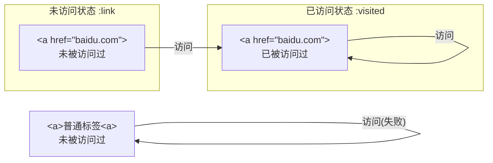

# CSS

# §0 前置知识

## §0.1 在HTML引入CSS

### §0.1.1 `<link>`标签

`<link>`标签必须放在`<head>`元素中。

```htaccess
<link rel="stylesheet" type="text/css" href="./index.css" media="all">
```

其中`<link>`标签涉及的属性有：

- `rel`：资源与文档的关系(Relation)
- `type`：资源的MIME类型
- `href`：资源的路径，可以是绝对URL或相对URL
- `media`：资源的应用场景。

### §0.1.2 `@import`语句

`@import`声明必须放在`<style>`的开头。

```html
<style>
    @import url(index.css)
</style>
```

### §0.1.3 `HTTP Header`

HTTP协议允许在响应头指定加载的CSS文件。

- `Apache`的分布式配置文件`.htaccess`：

  ```htaccess
  Header add Link "</index.css>;rel=stylesheet;type=text/css"
  ```

- `Apache`的全局配置文件`httpd.conf`：

  ```htaccess
  <Directory /var/www/html/site>
  	Header add Link "</index.css>;rel=stylesheet;type=text/css"
  </Directory>
  ```

### §0.1.4 行内样式

```html
<span style="color: red">Hello</span>
```


# §1 CSS语法

样式表由一个或多个规则组成。一个规则由前面选择符(`selector`)和后面的声明块(`declaration block`)组成。声明块之中的声明用分号`;`隔开。

```css
h1 {color: red; background: yellow}
```

## §1.1 注释

CSS支持`/* */`类型的注释，不允许注释嵌套：

```css
/*
	这是多行注释
*/
```

注释不能算作空白字符，因此下面的写法是合法的：

```css
h1 {color: red}
h1 {co/*我是突然闯入的注释*/lor: red}
```

由于历史原因，CSS注释可以使用HTML中的注释标记：

```css
h1 {color: red <!-- 让标题为红色 --> }
```

## §1.2 选择符

### §1.2.1 元素选择符

元素选择符用于选择HTML或XML文档中的元素。

```css
h1 {color: red}
```

### §1.2.2 群组选择符

群组选择符允许将一个样式应用到一组元素上，各个元素之间用`,`分隔：

```css
h1, h2, h3, h4, h5, h6 {color: red}
```

特殊地，使用`*`表示匹配所有元素，称为通用选择符。

```css
* {color: red; font: 18px}
```

> 注意：虽然一组声明的最后一处声明后不必加引号，但是工程中还是推荐加上。否则在其后面添加样式时容易忘记补上，导致新增的一行声明被解析成上一层声明的关键词。

### §1.2.3 类选择符

类选择符`.`用于匹配文档元素中的`class`属性。其之前的字符串指定匹配的元素(通配则置为`*`或空)，之后的字符串指定匹配的`class`属性。在其之后继续加类选择符进行串联，表示同时匹配到多个`class`属性，区分大小写。

```html
<h1 class="warning urgent">Notice</h1>
<h2 class="info">Idea</h2>
<style>
    .warning {font-weight: bold;}
    h2.info {font-style: italic;}
    .warning.urgent{color: red}
</style>
```

### §1.2.4 ID选择符

ID选择符`*`用于匹配文档中唯一出现的`id`属性。其语法与类选择符类似，但是不能串联，区分大小写。

```html
<div id="navbar">
    <a id="title">Welcome</a>
    <span id="currentTime">2023-08-08</span>
</div>
<style>
    #navbar {width: 100%;}
    a#title {font-weight: bold;}
    *#currentTime {color: green;}
</style>
```

### §1.2.5 属性选择符

属性选择符`[]`用于匹配函数某种属性的元素。支持串联。

```html
<div id="loginFrame">
    <input type="checkbox" checked/>
</div>
<style>
    input[checked] {color: red;} /* 筛选所有预先勾选的多选框 */
    *[id] {border: 2px solid red;} /* 筛选所有具有ID属性的元素 */
    input[type][checked] { font-weight: bold; }
</style>
```

属性选择符不仅可以匹配属性名，还可以匹配属性值。如果属性值可能会引起歧义，可以用双引号`"`或单引号`'`包裹：

```html
<a href="https://www.baidu.com">Baidu</a>
<a class="warning-1 urgent">Pending...</a>
<style>
    a[href="https://www.baidu.com"] {...} /* 精准匹配 */
	a[class|="warning"] /* 模糊匹配，匹配以warning或以warning-开头的 */
	a[class~="warning-1"] /* 精准匹配，匹配属性值被空格分割后的单词 */
    a[class*="ing urg"] /* 模糊匹配，匹配子串 */
    a[href^="https://"] /* 模糊匹配，匹配开头 */
    a[href$=".com"] /* 模糊匹配，匹配结尾 */
</style>
```

上面的语法和正则表达式比较相似。实际上，属性选择符也支持正则表达式里的“大小写敏感”模式`i`：

```html
<div id="NavBar"></div>
<style>
    div[id="navbar" i] {color: red;}
</style>
```

属性选择符本身是大小写敏感的，除非属性值本身是HTML/XML规定的关键字：

```html
<input type="checkbox"/>
<style>
    input[type="ChEcKbOx"] {color: red;} /* 匹配成功 */
</style>
```

### §1.2.6 后代选择符

后代选择符` `用于筛选目标元素的所有子元素和子元素的子元素。

```html
<div class="list"><ul>
    <li>Item 1</li>
</ul></div>
<style>
    .list ul li {color: red;}
</style>
```

### §1.2.7 子代联结符

子代联结符`>`与后代选择符` `配合使用，用于筛选目标元素的所有子元素。

```html
<div class="list"><ul>
    <li>Item 1</li>
</ul></div>
<style>
    .list > ul > li {color: red;}
</style>
```

### §1.2.8 紧邻同胞联结符

紧邻同胞联结符`+`与后代选择符` `配合使用，用于筛选目标元素的所有兄弟元素。

```html
<div class="list"><ul>
    <li type="title">Item:</li>
    <li>Item 1</li>
    <li>Item 2</li>
</ul></div>
<style>
    li[type="title"] + li {color: gray;} /* 只为非title设置样式 */
</style>
```

### §1.2.9 一般同胞联结符

一般同胞联结符`~`与后代选择符` `配合使用，用于匹配与目标元素后面的所有兄弟元素，也就是选择后续元素。

```html
<div>
    <h1>Title</h1>
    <a>Item 1</a> <!-- 变成红色 -->
    <a>Item 2</a> <!-- 变成红色 -->
</div>
<style>
    div h1 ~a {color: red;}
</style>
```

### §1.2.10 伪类选择符

伪类选择符`:`用于选择伪类。可以串联使用。关于伪类的具体内容详见[§1.3 伪类](#§1.3 伪类)。

> 注意：伪类的"串联"不同于传统意义上的链式调用。在链式调用中，每个选择符接受到的实参都是上一个选择符的输出结果，而伪类选择符的"串联"表示每一个伪类选择符的实参都是初始传入的。
>
> 例如，`div:first-child:last-child:`表示在所选中的`div`元素中，只有既是`fisrt-child`也是`last-child`的元素才能匹配成功，因此其效果等价于`:only-child`。

### §1.2.11 伪元素选择符

为实现特定的效果，伪元素和伪类都能向文档中插入虚构的元素。伪元素选择符为`::`。

## §1.3 伪类

伪类指的是文档中不一定真实存在的结构，或者某些元素的特定状态，它必须依赖于已有的元素。

### §1.3.1 结构伪类

#### §1.3.1.1 `:root`

`:root`表示文档的根元素。在HTML文档中，它指的就是`<html>`元素。

```html
<html>
	<style>
        :root {border: 1px solid red;}
        html {border: 1px solid red;}
    </style>
</html>

```

#### §1.3.1.2 `:empty`

`:empty`表示没有任何子元素（包括文本元素）的元素。

```html
<div>Hello world</div>
<div> </div>
<div>
</div>
<div><!----></div> <!-- 这个元素会被屏蔽 -->
<div></div> <!-- 这个元素会被屏蔽 -->
<style>
    div:empty {display: none;}
</style>
```

> 注意：`:empty`很容易被滥用成`*:empty`，从而会匹配`<input>`、``、`<br>`、`<textarea>`这类本身没有子元素的标签。

#### §1.3.1.3 `:only-child`

`:only-child`的作用是：当选定的元素只有一个子元素时，且子元素类型恰好为`:only-child`指定的类型时，选中该子元素。

```html
<html>
    <head>
        <style>
            a[href] img:only-child {border: 2px solid black;}
        </style>
    </head>
    <body>
        <a href="baidu.com"><br/></a> <!-- 未选中 -->
        <a href="baidu.com">Baidu</a> <!-- 已选中 -->
    </body>
</html>
```

#### §1.3.1.4 `:only-of-type`

`:only-child`的作用是：当选定的元素只有一个`:only-child`指定类型的子元素时，选中该子元素。它与`:only-child`的区别是：`:only-of-type`可以允许选定的元素有多个子元素，只要其中符合指定类型的子元素只有一个就可以；而`:only-child`只允许选定的元素只有一个子元素，且其类型恰好为`:only-child`指定的类型。

```html
<html>
    <head>
        <style>
            a[href] img:only-of-type {border: 2px solid black;}
        </style>
    </head>
    <body>
        <a href="baidu.com"><br/></a><!-- 已选中 -->
        <a href="baidu.com">Baidu</a><!-- 已选中 -->
    </body>
</html>
```

> 注意：`:only-of-type`牵扯到了父元素和子元素的概念。例如在`div a:only-of-type`中，到底谁是父元素呢？答案是`div`。因此在下面的例子中，两个子元素都不会被选中：
>
> ```html
> <style>
>     p.unique:only-of-type {color: red;}
> </style>
> <div>
>     <p class="unique">Hello</p>
>     <p class="common">World</p>
> </div>
> ```

#### §1.3.1.5 `:first-child`和`:last-child`

`:first-child`用于表示在众多同级的兄弟节点中，排在第一个的，且恰为指定类型的子元素。

`:last-child`用于表示在众多同级的兄弟节点中，排在最后一个的，且恰为指定类型的子元素。

```html
<style>
    p:first-child {color:red;}
    p:last-child {color:green;}
</style>
<p>First</p> <!-- 红色 -->
<p>Second</p>
<p>Third</p> <!-- 绿色 -->
```

#### §1.3.1.6 `:first-of-type`和`:last-of-type`

`:first-of-type`用于表示与指定类型相同的众多兄弟元素中，其中的第一个子元素。

`:last-of-type`用于表示与指定类型相同的众多兄弟元素中，其中的最后一个子元素。

```html
<style>
    p:first-of-type {color:red;}
    p:last-of-type {color:green;}
</style>
<p>First</p> <!-- 红色 -->
<p>Second</p>
<p>Third</p> <!-- 绿色 -->
```

#### §1.3.1.7 `:nth-child()`和`:nth-last-child`

`:nth-child()`用于表示在众多同级的兄弟节点中，排在第$n$个的，且恰为指定类型的子元素。此处$n$从$1$开始计数。

```html
<html>
    <head>
        <style>
            body > div:nth-child(2) {color: red;}
        </style>
    </head>
    <body>
        <div>Hello</div>
        <div>Hello</div> <!-- 红色 -->
        <div>Hello</div>
    </body>
</html>
```

`:nth-child()`还可以接收由自然数$n$构成形如`an+b`的表达式：

```html
<html>
    <head>
        <style>
            body > div:nth-child(2n+1) {color: red;}
        </style>
        <title>让奇数项全都为红色</title>
    </head>
    <body>
        <div>我是奇数</div><div>我是偶数</div>
        <div>我是奇数</div><div>我是偶数</div>
        <div>我是奇数</div><div>我是偶数</div>
    </body>
</html>
```

`:nth-child()`还可以接收`even`、`odd`这两个关键字，分别表示筛选红偶数项和奇数项：

```html
<html>
    <head>
        <style>
            body > div:nth-child(odd) {color: green;}
            body > div:nth-child(even) {color: red;}
        </style>
        <title>让奇数项全都为绿色,偶数项为红色</title>
    </head>
    <body>
        <div>我是奇数</div><div>我是偶数</div>
        <div>我是奇数</div><div>我是偶数</div>
        <div>我是奇数</div><div>我是偶数</div>
    </body>
</html>
```

`:nth-last-child()`作用是类似的，只不过是从尾到头计数。用于表示在众多同级的兄弟节点中，排在第$n$个的，且恰为指定类型的子元素。此处$n$从$1$开始计数。

> 注意：`:nth-child()`和`:nth-last-child()`本质上的区别是计数起点。灵活地选择计数起点，可以实现更灵活的功能。
>
> 例题：现在有如下由众多`<div>`组成的HTML文档，现在需要让最后一个元素的颜色为灰色，而且相邻元素要灰白交替显示。请编写CSS。
>
> ```html
> <html>
>     <body>
>         <div>好多元素</div>
>         <div>好多元素</div>
>         <div>......</div>
>         <div>好多元素</div>
>         <div>这一行必须是灰色</div>
>     </body>
> </html>
> ```
>
> 答：使用`:nth-last-child()`即可。
>
> ```css
> /* 两种方法均可 */
> div:nth-last-child(2n+1) {color: gray}
> div:nth-last-child(odd) {color: gray}
> ```

#### §1.3.1.8 `:nth-of-type`和`:nth-last-of-type()`

用法与[§1.3.1.7 `:nth-child()`和`:nth-last-child`](§1.3.1.7 `:nth-child()`和`:nth-last-child`)类似。

### §1.3.2 动态伪类

我们之前讲过，所有伪类都必须依赖于已有的元素。当HTML文档给定的一瞬间，结构伪类就一定能从HTML文档中找到已有的元素。然而对于动态伪类来说，依赖的元素可能并不存在与原生HTML文档中，必须经过浏览器渲染后才有可能产生。

#### §1.3.2.1 超链接伪类

在HTML中，我们常用`<a href="google.com">`等方法做一个超链接，而不会认为一个普通的`<a></a>`是超链接。

"未被访问过"和"未访问状态"是两个完全不同的概念。我们以这两个`<a>`标签为例，这两个概念的关系如下图所示：

```html
<a>普通标签</a>
<a href="baidu.com">百度</a>
```



`:link`用于指示被标记为超链接（即具有`href`属性）的，且未被访问过的元素，也就是处于未访问状态的元素。

`:visited`用于指示已被访问过的超链接。

> 注意：超链接伪类可以被用于泄露用户隐私。理论上，JS脚本可以探测与`:visited`相同样式的所有DOM节点，从而推断出用户访问过哪些网站。鉴于此，从2017年开始，几乎所有主流浏览器厂商都支持下列补救措施：
>
> 1. `:visited`伪类能操纵的CSS属性仅限于颜色，例如`color`、`background-color`、`column-rule-color`、`outline-color`、`border-color`、`border-top/bottom/left/right-color`。
> 2. `:link`伪类不再只选择未访问状态的超链接，而是选择所有超链接。除非`:visited`覆盖了已访问状态的超链接。
> 3. 浏览器的JavaScript Runtime规定，无论超链接状态如何，返回的值始终都是未访问状态的值。

#### §1.3.2.2 用户操作伪类

`:focus`用于指示当前获得输入焦点的元素，可以通过`TAB`键和鼠标获得。

`:hover`用于指示当前被鼠标指针悬停的元素。

`:active`用于指示由用户输入激活的元素，例如对超链接按下鼠标到松开鼠标的一段时间。

```html
<html>
    <head>
        <style>
            input:focus{background-color:lightgray;}
            input:hover{background-color:lightblue;}
            input:active{background-color:lightgreen;}
        </style>
    </head>
    <body>
        <input type="text" tabindex="1"/>
        <input type="text" tabindex="2"/>
        <input type="text" tabindex="3"/>
    </body>
</html>
```

> 注意：受制于特定性，伪类的顺序不可随意设置。在实际工程中，通常推荐的顺序从`:link/:visited/:hover/:active`变成了`:link/:visited/:focus/:hover/:active`。

#### §1.3.2.3 UI状态伪类

`:enabled`用于指示接受输入的元素。

`:disabled`用于指示不接受输入的元素。

`:checked`用于指示由用户或文档默认选中的单选按钮或复选框。

`:indeterminate`用于指示"既没有选中，也没有未选中"的单选按钮和复选框。（该状态只能由DOM脚本设定，不能由用户设定）

`:default`用于指示默认选中的元素，且仅特指单选按钮、复选框、选项。

`:valid`用于指示满足数据有效性语义的元素，且仅特指输入框。

`:invalid`用于指示不满足数据有效性语义的元素，且仅特指输入框。

`:in-range`用于指示当前输入的值在控件允许的最小值和最大值之间的元素，且仅特指输入框。

`:out-range`用于指示当前输入的值小于控件允许最小值或大于控件允许最大值的元素，且仅特指输入框。

`:required`用于指示用户必须输入的元素，且仅特指输入框。

`:optional`用于指示用户非必要输入的元素，且仅特指输入框。

`:read-write`用于指示用户可以编辑的元素，且仅特指输入框。

`:read-only`用于指示用户不能编辑的元素，且仅特指输入框。

```html
<html>
<head>
    <style>
        input:disabled {opacity: 0.5;}
        input:enabled {border-color: black;}
        input:checked + label {font-weight: bold;}
        input:not(:checked) + label {color: #555;}
        input:indeterminate + label {font-style: italic;}
        input:default + label {color: darkred;}
        input:required {border-style: double;}
        input:optional {border-style: dotted;}
        input:invalid {border: 2px solid red;}
        input:valid {border: 2px solid green;}
        input:in-range {border: 5px solid green;}
        input:out-of-range {border: 5px solid red;}
        textarea:read-only {border-color: aqua;}
        textarea:read-write {border-color: greenyellow;}
    </style>
</head>
<body>
    <form>
        <div>
            <span>Username:</span><input type="text" tabindex="1" required/>
        </div>
        <div>
            <span>Password:</span>
            <input disabled type="text" tabindex="2">
        </div>
        <div>
            <span>Email:</span>
            <input type="email"/>
        </div>
        <div>
            <span>Gender:</span>
            <input type="radio" name="gender" id="male" value="male"><label for="male">Male</label>
            <input type="radio" name="gender" id="female" value="female"><label for="female">Female</label>
        </div>
        <div>
            <span>Preference:</span>
            <input type="checkbox" name="preference" id="sports" checked value="sports"/><label for="sports">Sports</label>
            <input type="checkbox" name="preference" id="music" value="music"/><label for="music">Music</label>
            <input type="checkbox" name="preference" id="cooking" value="cooking"/><label for="cooking">Cooking</label>
        </div>
        <div>
            <span>Budget:</span>
            <input type="number" min="100" max="100000" step="10000"/>
        </div>
        <div>
            <span>Matio:</span><textarea></textarea>
        </div>
        <div>
            <span>Info:</span><textarea disabled></textarea>
        </div>
    </form>
</body>
</html>
```

> 注意：`:in-range`并不意味着`:valid`。HTML5为`<input type="number" min="..." max="...">`引入了`step`属性，作为右侧加减按钮的步进长度。其`value`即使位于`[min, max]`内，只要不能被`step`整除，它就是`:invalid`。

#### §1.3.2.4 `:target`

在形如`http://...#...`的URL中，井号`#`后面的字符串被称为片段标识符，用于定位HTML文档中具有相同`id`的标签。`:target`伪类用于标记`id`与片段标识符相等的目标元素。

```html
<html>
<head>
    <style>
        #catalog > a {display: block;}
        :target {border-left: 5px solid gray; background-color: lightblue; font-weight: bold;}
    </style>
</head>
<body>
    <div id="catalog">
        <h1>目录</h1>
        <a href="./#chapter1">1.摘要</a>
        <a href="./#chapter2">2.过程</a>
        <a href="./#chapter3">3.结语</a>
    </div>
    <div id="text">
        <h1>正文</h1>
        <div id="chapter1">1.摘要 这是摘要</div>
        <div id="chapter2">2.过程 这是过程</div>
        <div id="chapter3">3.结语 这是结语</div>
    </div>
</body>
</html>
```

#### §1.3.2.5 `:lang()`

浏览器可以通过[`lang`属性](https://developer.mozilla.org/zh-CN/docs/Web/HTML/Global_attributes/lang)、[`<meta>`标签](https://developer.mozilla.org/en-US/docs/Web/HTTP/Headers/Content-Language)和HTML响应头这三个途径推断语言来源：

```html
<p lang="fr">这是法语</p>
<meta http-equiv="Content-Language" content="de, en">
```

```http
Content-Language: de-DE
```

`:lang()`选中具有指定语言属性的元素。

```html
<html lang="zh">
<head>
    <style>
        :lang(zh) {color: red;}
        :lang(en) {color: blue;}
        :lang(fr) {color: green;}
    </style>
</head>
<body>
    <p lang="en">这是英语</p>
    <p lang="fr">这是法语</p>
    <p>这是全局的中文</p>
</body>
</html>
```

#### §1.3.2.6 `:not()`

一个很经典的例子是：在重大公祭日时，网站的所有元素都必须转为灰白，除非存在某些元素必须设为彩色。在`:not()`出现之前，普遍的做法是：先把所有元素设为灰白，然后单独给特殊元素加`!important`覆盖掉：

```html
<html lang="zh">
<head>
    <style>
        p {filter: grayscale(1);}
        .red{color: red;}
        .blue{color: blue;}
        .green{color: green;}
        .keep-colorful {filter: grayscale(0) !important;}
    </style>
</head>
<body>
    <p class="red">网站标题</p>
    <p class="blue">网站信息</p>
    <p class="green keep-colorful">特殊元素</p>
</body>
</html>
```

有了`:not()`以后就方便多了：

```html
<html lang="zh">
<head>
    <style>
        .red{color: red;}
        .blue{color: blue;}
        .green{color: green;}
        body > *:not(.keep-colorful) {filter: grayscale(1);}
    </style>
</head>
<body>
    <p class="red">网站标题</p>
    <p class="blue">网站信息</p>
    <p class="green keep-colorful">特殊元素</p>
</body>
</html>
```

## §1.4 伪元素

### §1.4.1 装饰首字母

`::first-letter`用于装饰非行内元素的首字母。

例如给定以下需求：给英文报纸排版，每篇文章`<div>`由数个`<h1>`、`<h2>`和若干个`<p>`构成，要求给第一个出现的`<p>`的首字母调成粗体大字号：

```html
<html lang="zh">
<head>
    <style>
        p, h1 {
            font-family: 'Times New Roman', Times, serif;
        }
        .article > p:first-of-type::first-letter {
            font-weight: bold;
            font-size: 200%;
        }
    </style>
</head>
<body>
    <div class="article">
        <h1>Population Arising Comes To An End In China</h1>
        <p>This is first paragragh.</p>
        <p>This is second paragragh.</p>
        <p>This is third paragragh.</p>
    </div>
</body>
</html>
```

### §1.4.2 装饰首行

`::first-line`用于装饰元素的首行文本。

> 注意：目前`::first-letter`和`::first-line`都只能应用到块级元素上，而不能应用到行内元素上。并且这两者允许使用的CSS属性也有限制：
>
> - `::first-line`允许使用的CSS属性：所有字体属性、所有背景属性、所有文本装饰属性、所有行内排版属性、所有行内布局属性、所有边框属性，`box-shadow`、`color`、`opacity`。
> - `::first-line`允许使用的CSS属性：所有字体属性、所有背景属性、所有外边距属性、所有内边距属性、所有边框属性、所有文本装饰属性、所有行内排版属性、`color`、`opacity`。

### §1.4.3 装饰前置与后置元素

CSS可以自己生成并插入内容，从而影响HTML文档建立的DOM。

例如继续完善[§1.4.1 装饰首字母](§1.4.1 装饰首字母)一节的任务：每篇文章由一个`<h1>`、多个`<h2>`和`<p>`交叉构成，要求给每个`<h2>`的标题前插入两个灰色的左方括号：

```css
<html lang="en">
<head>
    <style>
        p, h1, h2 {
            font-family: 'Times New Roman', Times, serif;
        }
        .article > h2 + p::first-letter {
            font-weight: bold;
            font-size: 150%;
        }
        .article > h2::before {
            content: "[[";
        }
    </style>
</head>
<body>
    <div class="article">
        <h1>Population Arising Ended In China</h1>
        <h2>Data analyse</h2>
        <p>Here is the population statistic released from China Constitution of Statistics, ...</p>
        <p>From the graph, we can see that ...</p>
        <h2>The reason</h2>
        <p>The first reason is that ...</p>
        <p>The second reason is that ...</p>
        <h2>Dangerous consequence</h2>
        <p>Military circuiting is more difficult ...</p>
        <p>Finacial marketing's pulse will be slower ...</p>
    </div>
</body>
</html>
```

# §2 优先级

优先级是规则的属性，可以表示为初值为`(0,0,0,0)`的四维向量`(x,y,z,t)`。如果多个规则针对同一个元素设置了冲突的样式，那么最终应该听谁的呢？答案是计算这些规则的优先级，比较时从前往后比较分量大小，率先能判断出分量高者胜出。

优先级计算规则如下所示：

1. 选择符中的每个`id`属性会让优先级增加`(0,1,0,0)`。
2. 选择符中的每个`class`属性、属性选择符`[]`、伪类会让优先级增加`(0,0,1,0)`。
3. 选择符中的每个元素和伪元素会让优先级增加`(0,0,0,1)`。
4. 连结符和通用选择符不增加优先级。

例如`html > body #answer table tr[id="total"] *.link`中出现了$1$个`id`属性，总共出现了$2$个`class`属性和属性选择符，出现了$4$个元素，因此该CSS规则的优先级为`(0,1,2,4)`。

现在我们已经知道了第二、三、四位分量的计算规则。其实第一位分量是为声明行内样式`<... style="...">`而设计的。它的第一位分量恒为`1`，有着最高的优先级。

## §2.1 重要声明


# §A 附录

## §A.1 厂商前缀

有些CSS属性名会带有一个前缀（例如`-o-border-image`），用于让浏览器厂商标记实验用途或专属的CSS功能。

| 前缀       | 厂商                                          |
| ---------- | --------------------------------------------- |
| `-epub-`   | 国际数字出版论坛指定的`ePub`格式              |
| `-moz-`    | 基于`Mozilla`的浏览器（例如`Firefox`）        |
| `-ms-`     | `Internet Explorer`                           |
| `-o-`      | 基于`Opera`的浏览器                           |
| `-webkit-` | 基于`Webkit`的浏览器（例如`Safari`,`Chrome`） |

## §A.2 媒体类型

CSS2引入了媒体类型，表示当前文档展示时所处的环境。

可以用以下方法声明媒体类型：

```html
1.
<link ... media="{{media}}">
<link ... media="{{media}}, {{media}}, ...">

2.
<style media="{{media}}"></style>
<style media="{{media}}, {{media}}, ..."></style>

3.
<style> @import url(index.css) {{media}}</style>
<style> @import url(index.css) {{media}}, {{media}}, ...</style> /*引入多种媒体类型的样式*/
<style> @import url(index.css) {{media}} and {{media}} and ...</style> /**/

<style> @media {{media}} {color: red;}</style>
<style> @media {{media}}, {{media}} {color: red;}</style>
```

常见的媒体类型有：

| 媒体类型     | 作用         |
| ------------ | ------------ |
| `all`        | 全部         |
| `print`      | 打印文档     |
| `screen`     | 桌面显示器   |
| `projection` | 幻灯片或投影 |
| `handheld`   | 移动端浏览器 |

