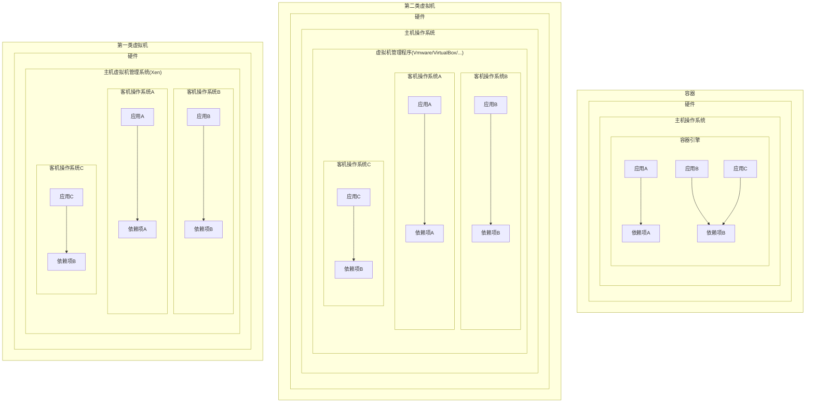

# Docker
# §1 基础知识
## §1.1 容器和虚拟机的区别


## §1.2 安装与配置

- Linux x64

  ```shell
  $ curl https://get.docker.com > /tmp/install.sh # 下载官方安装脚本
  $ cat /tmp/install.sh # 浏览脚本内容
  $ chmod +x /tmp/install.sh # 赋予执行权限
  $ /tmp/install.sh # 执行安装脚本
  ```

  > 注意：对于RHEL、CentOS、Fedora等基于RedHat的Linux发行版，需要注意将系统自带的SELinux安全模块从限制(Enforcing)模式设置为宽容(Permissive)模式，否则Docker运行时会遇到各种权限不足的问题：
  >
  > ```shell
  > $ sestatus # 查看SELinux当前模式,se是SELinux的简写
  > SELinux status:                enable
  > SELinuxfs mount:               /sys/fs/selinux
  > SElinux root directory:        /etc/selinux
  > Loaded policy name:            targeted
  > Current mode:                  enforcing # 当前为强制模式
  > Mode from config file:         error (Success)
  > Policy MLS status:             enable
  > Policy deny_unknown status:    allowed
  > Max Kernel policy version:     28
  > $ sudo setenforce 0 # 设置SELinux为宽容模式
  > ```

- Windows 10+ x64

  从官网下载并运行Docker Desktop即可，必要时到微软官网更新WSL2 Package。

在终端中执行`docker version`检查环境变量是否配置成功：

```sh
C:\> docker version
Client:
 Cloud integration: v1.0.22
 Version:           20.10.12
 API version:       1.41
 Go version:        go1.16.12
 Git commit:        e91ed57
 Built:             Mon Dec 13 11:44:07 2021
 OS/Arch:           windows/amd64
 Context:           default
 Experimental:      true

Server: Docker Engine - Community
 Engine:
  Version:          20.10.12
  API version:      1.41 (minimum version 1.12)
  Go version:       go1.16.12
  Git commit:       459d0df
  Built:            Mon Dec 13 11:43:56 2021
  OS/Arch:          linux/amd64
  Experimental:     false
 containerd:
  Version:          1.4.12
  GitCommit:        7b11cfaabd73bb80907dd23182b9347b4245eb5d runc:
  Version:          1.0.2
  GitCommit:        v1.0.2-0-g52b36a2
 docker-init:
  Version:          0.19.0
  GitCommit:        de40ad0
```

# §2 基本操作

## §2.1 安装和运行镜像

Docker官方在云端提供了一个精简版Debian镜像，可以使用下列命令进行安装：

```shell
C:/> docker run debian echo "Hello World"
Unable to find image 'debian:latest' locally
latest: Pulling from library/debian
0c6b8ff8c37e: Pull complete
Digest: sha256:fb45fd4e25abe55a656ca69a7bef70e62099b8bb42a279a5e0ea4ae1ab410e0d
Status: Downloaded newer image for debian:latest
Hello World
```

此时Docker Desktop的Containers/Apps一栏出现了刚才安装的镜像，下面我们逐行分析Docker输出的日志：

- `C:/> docker run debian echo "Hello World"`

  `docker run`的功能是启动容器，`debian`是我们想启动的镜像的名称。`docker help`对该指令的作用和使用方法进行了详细的说明：

  ```shell
  C:/> docker help
  
  Usage:  docker [OPTIONS] COMMAND
  # ...
    run         Run a command in a new container
  # ...
  
  C:/> docker help run
  
  Usage:  docker run [OPTIONS] IMAGE [COMMAND] [ARG...]
  Run a command in a new container
  Options:
        --add-host list                  Add a custom host-to-IP mapping
                                         (host:ip)
  # ...
  ```

- `Unable to find image 'debian:latest' locally`

  Docker发现本地没有名为Debian的镜像，转而到Docker Hub进行联网在线搜索，并默认下载最新版本。

- `0c6b8ff8c37e: Pull complete`

  Docker找到了所需镜像并尝试下载和解压，并为其容器分配一个随机生成的id。

- `Digest: sha256:fb45fd4e25abe55a656ca69a7bef70e62099b8bb42a279a5e0ea4ae1ab410e0d`

  返回下载镜像的SHA256哈希值用于校验。

- `Status: Downloaded newer image for debian:latest`

  告知用户镜像下载完成这一事件。

- `Hello World`

  Debian镜像执行`echo "Hello World"`输出的结果。

Docker的一个伟大之处就在于其惊人的执行效率。当再次尝试执行该程序时，Docker会发现本地已经有现成的Debian镜像，然后迅速启动该容器，在容器内执行该指令，最后关闭容器。如果使用传统的虚拟机，可想而知虚拟机要执行BIOS自检、MBR引导、加载GRUB引导菜单、加载Kernel、启动`init`进程、挂载sda分区、运行各项Service和Hook等一系列操作，即使是物理机也要至少花费1分钟才能开机，而Docker不到1秒钟就可以完成：

```shell
C:/ docker run -h CONTAINER -i -t debian /bin/bash
root@CONTAINER:/# whoami
root
```

## §2.2 查看镜像

在终端内运行`docker ps`指令，可以查看所有由Docker管理的镜像及其状态：

```shell
C:\> docker ps
CONTAINER ID   IMAGE     COMMAND       CREATED              STATUS              PORTS     NAMES
f3a8c675a965   debian    "/bin/bash"   About a minute ago   Up About a minute             infallible_spence
```

值得注意的是，`NAMES`虽然是Docker自动生成的，但是该名称也和ID一样可以唯一定位到该容器。如果要查看某个镜像的详细信息，需要执行`docker inspect [NAME]`命令。该命令会返回一个列表，该列表内只有一个字典，存储着该镜像的所有信息：

```shell
C:/> docker inspect infallible_spence
[
    {
        "Id": "f3a8c675a965fff6eea6f5eadd20235a0588bce5a824b8c7e534caae42c84e2c",
        "Created": "2022-02-10T11:44:22.4646013Z",
        "Path": "/bin/bash",
        "Args": [],
        "State": {
            # 运行状态、是否运行/停止/重启中/未响应、进行PID、运行和终止的时刻、错误代码、是否因OOM而被杀死
        },
        "Image": "sha256:04fbdaf87a6a632f3f2e8d9f53f97b2813d9e4111c62e21d56454460f477075b",
        "ResolvConfPath": "/var/lib/docker/containers/f3a8c675a965fff6eea6f5eadd20235a0588bce5a824b8c7e534caae42c84e2c/resolv.conf",
        "HostnamePath": "/var/lib/docker/containers/f3a8c675a965fff6eea6f5eadd20235a0588bce5a824b8c7e534caae42c84e2c/hostname",
        "HostsPath": "/var/lib/docker/containers/f3a8c675a965fff6eea6f5eadd20235a0588bce5a824b8c7e534caae42c84e2c/hosts",
        "LogPath": "/var/lib/docker/containers/f3a8c675a965fff6eea6f5eadd20235a0588bce5a824b8c7e534caae42c84e2c/f3a8c675a965fff6eea6f5eadd20235a0588bce5a824b8c7e534caae42c84e2c-json.log",
        "Name": "/infallible_spence",
        "RestartCount": 0,
        "Driver": "overlay2",
        "Platform": "linux",
        "MountLabel": "",
        "ProcessLabel": "",
        "AppArmorProfile": "",
        "ExecIDs": null,
        "HostConfig": {
            "Binds": null,
            "ContainerIDFile": "",
            "LogConfig": {
                "Type": "json-file",
                "Config": {}
            },
            "NetworkMode": "default",
            "PortBindings": {},
            "RestartPolicy": {
                "Name": "no",
                "MaximumRetryCount": 0
            },
            "AutoRemove": false,
            "VolumeDriver": "",
            "VolumesFrom": null,
            "CapAdd": null,
            "CapDrop": null,
            "CgroupnsMode": "host",
            "Dns": [],
            "DnsOptions": [],
            "DnsSearch": [],
            "ExtraHosts": null,
            "GroupAdd": null,
            "IpcMode": "private",
            "Cgroup": "",
            "Links": null,
            "OomScoreAdj": 0,
            "PidMode": "",
            "Privileged": false,
            "PublishAllPorts": false,
            "ReadonlyRootfs": false,
            "SecurityOpt": null,
            "UTSMode": "",
            "UsernsMode": "",
            "ShmSize": 67108864,
            "Runtime": "runc",
            "ConsoleSize": [
                23,
                97
            ],
            "Isolation": "",
            "CpuShares": 0,
            "Memory": 0,
            "NanoCpus": 0,
            "CgroupParent": "",
            "BlkioWeight": 0,
            "BlkioWeightDevice": [],
            "BlkioDeviceReadBps": null,
            "BlkioDeviceWriteBps": null,
            "BlkioDeviceReadIOps": null,
            "BlkioDeviceWriteIOps": null,
            "CpuPeriod": 0,
            "CpuQuota": 0,
            "CpuRealtimePeriod": 0,
            "CpuRealtimeRuntime": 0,
            "CpusetCpus": "",
            "CpusetMems": "",
            "Devices": [],
            "DeviceCgroupRules": null,
            "DeviceRequests": null,
            "KernelMemory": 0,
            "KernelMemoryTCP": 0,
            "MemoryReservation": 0,
            "MemorySwap": 0,
            "MemorySwappiness": null,
            "OomKillDisable": false,
            "PidsLimit": null,
            "Ulimits": null,
            "CpuCount": 0,
            "CpuPercent": 0,
            "IOMaximumIOps": 0,
            "IOMaximumBandwidth": 0,
            "MaskedPaths": [
                "/proc/asound",
                "/proc/acpi",
                "/proc/kcore",
                "/proc/keys",
                "/proc/latency_stats",
                "/proc/timer_list",
                "/proc/timer_stats",
                "/proc/sched_debug",
                "/proc/scsi",
                "/sys/firmware"
            ],
            "ReadonlyPaths": [
                "/proc/bus",
                "/proc/fs",
                "/proc/irq",
                "/proc/sys",
                "/proc/sysrq-trigger"
            ]
        },
        "GraphDriver": {
            "Data": {
                # 与显卡驱动相关的各类目录,例LowerDir、MergedDir、UpperDir、WorkDir
            },
            "Name": "overlay2"
        },
        "Mounts": [],
        "Config": {
            "Hostname": "CONTAINER",
            "Domainname": "",
            "User": "",
            "AttachStdin": true,
            "AttachStdout": true,
            "AttachStderr": true,
            "Tty": true,
            "OpenStdin": true,
            "StdinOnce": true,
            "Env": [
                "PATH=/usr/local/sbin:/usr/local/bin:/usr/sbin:/usr/bin:/sbin:/bin"
            ],
            "Cmd": [
                "/bin/bash"
            ],
            "Image": "debian",
            "Volumes": null,
            "WorkingDir": "",
            "Entrypoint": null,
            "OnBuild": null,
            "Labels": {}
        },
        "NetworkSettings": {
            # 占用的端口、IP地址、默认网关、MAC地址、IPv6兼容性、子网掩码、各网络适配器信息等
        }
    }
]
```

