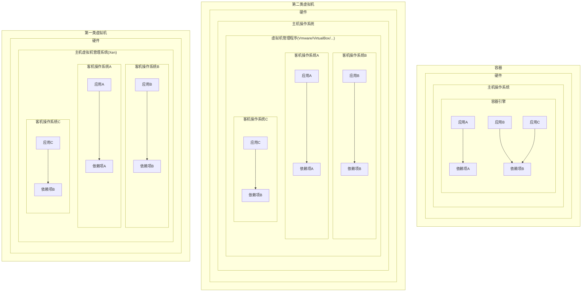

# Docker
# §1 基础知识
## §1.1 容器和虚拟机的区别


## §1.2 联合文件系统

相比于传统的文件系统而言，联合文件系统/联合挂载允许多个文件系统叠加，并表现为一个单一的文件系统，Docker支持的联合文件系统包括`AUFS`、`Overlay`/`Overlay2`(Windows+Ubuntu默认)、`devicemapper`、`BTRFS`、`ZFS`等，具体取决于主机操作系统，可以通过`docker info | grep "Storage Driver"`查看。

Docker的镜像由多个只读的层(`layer`)组成，DockerFile里的每一个指令都会在前面层的基础之上创建一个新层。当镜像被用于创建容器时，Docker会在这些层之上创建一个最高级别的可读写层，同时对网络、资源配额、ID与名称分配进行初始化。

> 注意：不必要的层会使镜像的体积显著增加，并且某些联合文件系统对层数有限制（例`AUX`最多只有127个层），因此在编写DockerFile时经常将多个指令合并为一行。

容器的状态有以下五种：

- 已创建(created)：容器已通过`docker craete`命令初始化，但未曾启动过。
- 重启中(restarting)：上一次该容器启动失败，现在重新尝试启动中。
- 运行中(running)
- 已暂停(paused)
- 已退出/已停止(exited)：容器内没有运行的进程。

## §1.3 安装与配置

- Linux x64

  ```shell
  $ curl https://get.docker.com > /tmp/install.sh # 下载官方安装脚本
  $ cat /tmp/install.sh # 浏览脚本内容
  $ chmod +x /tmp/install.sh # 赋予执行权限
  $ /tmp/install.sh # 执行安装脚本
  ```

  > 注意：对于RHEL、CentOS、Fedora等基于RedHat的Linux发行版，需要注意将系统自带的SELinux安全模块从限制(Enforcing)模式设置为宽容(Permissive)模式，否则Docker运行时会遇到各种权限不足的问题：
  >
  > ```shell
  > $ sestatus # 查看SELinux当前模式,se是SELinux的简写
  > SELinux status:                enable
  > SELinuxfs mount:               /sys/fs/selinux
  > SElinux root directory:        /etc/selinux
  > Loaded policy name:            targeted
  > Current mode:                  enforcing # 当前为强制模式
  > Mode from config file:         error (Success)
  > Policy MLS status:             enable
  > Policy deny_unknown status:    allowed
  > Max Kernel policy version:     28
  > $ sudo setenforce 0 # 设置SELinux为宽容模式
  > ```

- Windows 10+ x64

  从官网下载并运行Docker Desktop即可，必要时到微软官网更新WSL2 Package。

在终端中执行`docker version`检查环境变量是否配置成功：

```sh
C:\> docker version
Client:
 Cloud integration: v1.0.22
 Version:           20.10.12
 API version:       1.41
 Go version:        go1.16.12
 Git commit:        e91ed57
 Built:             Mon Dec 13 11:44:07 2021
 OS/Arch:           windows/amd64
 Context:           default
 Experimental:      true

Server: Docker Engine - Community
 Engine:
  Version:          20.10.12
  API version:      1.41 (minimum version 1.12)
  Go version:       go1.16.12
  Git commit:       459d0df
  Built:            Mon Dec 13 11:43:56 2021
  OS/Arch:          linux/amd64
  Experimental:     false
 containerd:
  Version:          1.4.12
  GitCommit:        7b11cfaabd73bb80907dd23182b9347b4245eb5d runc:
  Version:          1.0.2
  GitCommit:        v1.0.2-0-g52b36a2
 docker-init:
  Version:          0.19.0
  GitCommit:        de40ad0
```

# §2 基本操作

## §2.1 `docker run`

Docker官方在云端提供了一个精简版Debian镜像，可以使用下列命令进行安装：

```shell
C:/> docker run debian echo "Hello World"
Unable to find image 'debian:latest' locally
latest: Pulling from library/debian
0c6b8ff8c37e: Pull complete
Digest: sha256:fb45fd4e25abe55a656ca69a7bef70e62099b8bb42a279a5e0ea4ae1ab410e0d
Status: Downloaded newer image for debian:latest
Hello World
```

此时Docker Desktop的Containers/Apps一栏出现了刚才安装的镜像，下面我们逐行分析Docker输出的日志：

- `C:/> docker run debian echo "Hello World"`

  `docker run`的功能是启动容器，`debian`是我们想启动的镜像的名称。`docker help`对该指令的作用和使用方法进行了详细的说明：

  ```shell
  C:/> docker help
  
  Usage:  docker [OPTIONS] COMMAND
  # ...
    run         Run a command in a new container
  # ...
  
  C:/> docker help run
  
  Usage:  docker run [OPTIONS] IMAGE [COMMAND] [ARG...]
  Run a command in a new container
  Options:
        --add-host list                  Add a custom host-to-IP mapping
                                         (host:ip)
  # ...
  ```

- `Unable to find image 'debian:latest' locally`

  Docker发现本地没有名为Debian的镜像，转而到Docker Hub进行联网在线搜索，并默认下载最新版本。

- `0c6b8ff8c37e: Pull complete`

  Docker找到了所需镜像并尝试下载和解压，并为其容器分配一个随机生成的id。

- `Digest: sha256:fb45fd4e25abe55a656ca69a7bef70e62099b8bb42a279a5e0ea4ae1ab410e0d`

  返回下载镜像的SHA256哈希值用于校验。

- `Status: Downloaded newer image for debian:latest`

  告知用户镜像下载完成这一事件。

- `Hello World`

  Debian镜像执行`echo "Hello World"`输出的结果。

Docker的一个伟大之处就在于其惊人的执行效率。当再次尝试执行该程序时，Docker会发现本地已经有现成的Debian镜像，然后迅速启动该容器，在容器内执行该指令，最后关闭容器。如果使用传统的虚拟机，可想而知虚拟机要执行BIOS自检、MBR引导、加载GRUB引导菜单、加载Kernel、启动`init`进程、挂载sda分区、运行各项Service和Hook等一系列操作，即使是物理机也要至少花费1分钟才能开机，而Docker不到1秒钟就可以完成：

```shell
C:/ docker run -h CONTAINER -i -t debian /bin/bash
root@CONTAINER:/# whoami
root
```

## §2.2 `docker ps`

在终端内运行`docker ps`指令，可以查看所有由Docker管理的正在运行的容器及其状态：

```shell
C:\> docker ps
CONTAINER ID   IMAGE     COMMAND       CREATED              STATUS              PORTS     NAMES
f3a8c675a965   debian    "/bin/bash"   About a minute ago   Up About a minute             infallible_spence
```

如果要查看所有容器，包括停止运行的容器，需要使用`docker ps -a`。

## §2.3 `docker inspect`

值得注意的是，`NAMES`虽然是Docker动生成的，但是该名称也和ID一样可以唯一定位到该容器。如果要查看某个镜像的详细信息，需要执行`docker inspect [NAME]`命令。该命令会返回一个列表，该列表内只有一个字典，存储着该镜像的所有信息：

```shell
C:/> docker inspect infallible_spence
[
    {
        "Id": "f3a8c675a965fff6eea6f5eadd20235a0588bce5a824b8c7e534caae42c84e2c",
        "Created": "2022-02-10T11:44:22.4646013Z",
        "Path": "/bin/bash",
        "Args": [],
        "State": {
            # 运行状态、是否运行/停止/重启中/未响应、进行PID、运行和终止的时刻、错误代码、是否因OOM而被杀死
        },
        "Image": "sha256:04fbdaf87a6a632f3f2e8d9f53f97b2813d9e4111c62e21d56454460f477075b",
        "ResolvConfPath": "/var/lib/docker/containers/f3a8c675a965fff6eea6f5eadd20235a0588bce5a824b8c7e534caae42c84e2c/resolv.conf",
        "HostnamePath": "/var/lib/docker/containers/f3a8c675a965fff6eea6f5eadd20235a0588bce5a824b8c7e534caae42c84e2c/hostname",
        "HostsPath": "/var/lib/docker/containers/f3a8c675a965fff6eea6f5eadd20235a0588bce5a824b8c7e534caae42c84e2c/hosts",
        "LogPath": "/var/lib/docker/containers/f3a8c675a965fff6eea6f5eadd20235a0588bce5a824b8c7e534caae42c84e2c/f3a8c675a965fff6eea6f5eadd20235a0588bce5a824b8c7e534caae42c84e2c-json.log",
        "Name": "/infallible_spence",
        "RestartCount": 0,
        "Driver": "overlay2",
        "Platform": "linux",
        "MountLabel": "",
        "ProcessLabel": "",
        "AppArmorProfile": "",
        "ExecIDs": null,
        "HostConfig": {
            "Binds": null,
            "ContainerIDFile": "",
            "LogConfig": {
                "Type": "json-file",
                "Config": {}
            },
            "NetworkMode": "default",
            "PortBindings": {},
            "RestartPolicy": {
                "Name": "no",
                "MaximumRetryCount": 0
            },
            "AutoRemove": false,
            "VolumeDriver": "",
            "VolumesFrom": null,
            "CapAdd": null,
            "CapDrop": null,
            "CgroupnsMode": "host",
            "Dns": [],
            "DnsOptions": [],
            "DnsSearch": [],
            "ExtraHosts": null,
            "GroupAdd": null,
            "IpcMode": "private",
            "Cgroup": "",
            "Links": null,
            "OomScoreAdj": 0,
            "PidMode": "",
            "Privileged": false,
            "PublishAllPorts": false,
            "ReadonlyRootfs": false,
            "SecurityOpt": null,
            "UTSMode": "",
            "UsernsMode": "",
            "ShmSize": 67108864,
            "Runtime": "runc",
            "ConsoleSize": [
                23,
                97
            ],
            "Isolation": "",
            "CpuShares": 0,
            "Memory": 0,
            "NanoCpus": 0,
            "CgroupParent": "",
            "BlkioWeight": 0,
            "BlkioWeightDevice": [],
            "BlkioDeviceReadBps": null,
            "BlkioDeviceWriteBps": null,
            "BlkioDeviceReadIOps": null,
            "BlkioDeviceWriteIOps": null,
            "CpuPeriod": 0,
            "CpuQuota": 0,
            "CpuRealtimePeriod": 0,
            "CpuRealtimeRuntime": 0,
            "CpusetCpus": "",
            "CpusetMems": "",
            "Devices": [],
            "DeviceCgroupRules": null,
            "DeviceRequests": null,
            "KernelMemory": 0,
            "KernelMemoryTCP": 0,
            "MemoryReservation": 0,
            "MemorySwap": 0,
            "MemorySwappiness": null,
            "OomKillDisable": false,
            "PidsLimit": null,
            "Ulimits": null,
            "CpuCount": 0,
            "CpuPercent": 0,
            "IOMaximumIOps": 0,
            "IOMaximumBandwidth": 0,
            "MaskedPaths": [
                "/proc/asound",
                "/proc/acpi",
                "/proc/kcore",
                "/proc/keys",
                "/proc/latency_stats",
                "/proc/timer_list",
                "/proc/timer_stats",
                "/proc/sched_debug",
                "/proc/scsi",
                "/sys/firmware"
            ],
            "ReadonlyPaths": [
                # 只读路径
            ]
        },
        "GraphDriver": {
            "Data": {
                # 与显卡驱动相关的各类目录,例LowerDir、MergedDir、UpperDir、WorkDir
            },
            "Name": "overlay2"
        },
        "Mounts": [],
        "Config": {
            "Hostname": "CONTAINER",
            "Domainname": "",
            "User": "",
            "AttachStdin": true,
            "AttachStdout": true,
            "AttachStderr": true,
            "Tty": true,
            "OpenStdin": true,
            "StdinOnce": true,
            "Env": [
                "PATH=/usr/local/sbin:/usr/local/bin:/usr/sbin:/usr/bin:/sbin:/bin"
            ],
            "Cmd": [
                "/bin/bash"
            ],
            "Image": "debian",
            "Volumes": null,
            "WorkingDir": "",
            "Entrypoint": null,
            "OnBuild": null,
            "Labels": {}
        },
        "NetworkSettings": {
            # 占用的端口、IP地址、默认网关、MAC地址、IPv6兼容性、子网掩码、各网络适配器信息等
        }
    }
]
```

> 注意：Docker为容器生成的名称并非毫无规律，都是由一个随机的形容词加上一个著名的科学家/工程师/黑客的名字构成的。当然，用户也可指定`--name`参数来自定义名称：
>
> ```shell
> C:/> docker run --name customize_name debian echo "Hello World"
> ```

## §2.4 `docker diff`

在终端内执行`docker diff [NAME]`指令，可以得到相较于刚开始运行时哪些目录和文件发生了变化：

```shell
C:/> docker diff infallible_spence
C /var # C代表Change
C /var/lib
C /var/lib/apt
C /var/lib/apt/lists
A /var/lib/apt/lists/lock # A代表Add
D /var/lib/apt/lists/partial # D代表Delete
C /root
A /root/.bash_history
```

## §2.5 `docker logs`

执行`docker logs [NAME]`，就能得到该容器中一切发生过的事件的日志：

```shell
C:/> docker logs infallible_spence
root@CONTAINER:/# whoami
root
root@CONTAINER:/# ls
bin   dev  home  lib64  mnt  proc  run   srv  tmp  var
boot  etc  lib   media  opt  root  sbin  sys  usr
```

## §2.6 `docker rm`

执行`docker rm [NAME]`，可以删除指定名称的容器。

```shell
C:/> docker rm infallible_spence
infallible_spence
```

该指令经常与`docker ps`和管道符搭配使用，用于删除符合制定条件的容器：

```shell
# 删除停止运行的容器
$ docker rm -v $(docker ps -ap -f status=exited)
```


## §2.7 `docker commit`

镜像可以创建多个容器，每个容器可以进行更改，而`docker commit`能将修改后的容器打包成镜像。

[cowsay](https://github.com/piuccio/cowsay)是[Tony Monroe](https://github.com/tnalpgge)撰写的，由[Tony Monroe](https://github.com/piuccio)进行移植和发布到`apt-get`/`yum`平台上的Ascii Art风格的Demo。下面我们利用已经下载的Debian镜像创建一个容器，在安装`cowsay`后打包成新的镜像：

```shell
C:\> docker run -it --name cowsay --hostname cowsay debian bash
root@cowsay:/# apt-get update
Get:1 http://deb.debian.org/debian bullseye InRelease [116 kB]
# ...
Fetched 8501 kB in 6s (1408 kB/s)
Reading package lists... Done

root@cowsay:/# apt-get install -y cowsay fortune
Reading package lists... Done
Building dependency tree... Done
Reading state information... Done
Note, selecting 'fortune-mod' instead of 'fortune'
The following additional packages will be installed:
  fortunes-min libgdbm-compat4 libgdbm6 libperl5.32 librecode0 libtext-charwidth-perl netbase
  perl perl-modules-5.32
Suggested packages:
  filters cowsay-off fortunes x11-utils bsdmainutils gdbm-l10n sensible-utils perl-doc
  libterm-readline-gnu-perl | libterm-readline-perl-perl make libtap-harness-archive-perl
The following NEW packages will be installed:
  cowsay fortune-mod fortunes-min libgdbm-compat4 libgdbm6 libperl5.32 librecode0
  libtext-charwidth-perl netbase perl perl-modules-5.32
0 upgraded, 11 newly installed, 0 to remove and 0 not upgraded.
Need to get 8032 kB of archives.
After this operation, 49.7 MB of additional disk space will be used.
Get:1 http://deb.debian.org/debian bullseye/main amd64 perl-modules-5.32 all 5.32.1-4+deb11u2 [2823 kB]
# ...
Fetched 8032 kB in 1min 34s (85.7 kB/s)
debconf: delaying package configuration, since apt-utils is not installed
Selecting previously unselected package perl-modules-5.32.
(Reading database ... 6653 files and directories currently installed.)
Preparing to unpack .../00-perl-modules-5.32_5.32.1-4+deb11u2_all.deb ...
Unpacking perl-modules-5.32 (5.32.1-4+deb11u2) ...
Selecting previously unselected package libgdbm6:amd64.
# ...
Processing triggers for libc-bin (2.31-13+deb11u2) ...

root@cowsay:/# /usr/games/fortune | /usr/games/cowsay
 ________________________________________
/ No violence, gentlemen -- no violence, \
| I beg of you! Consider the furniture!  |
|                                        |
\ -- Sherlock Holmes                     /
 ----------------------------------------
        \   ^__^
         \  (oo)\_______
            (__)\       )\/\
                ||----w |
                ||     ||
```

`docker commit`命令需要用户提供容器的名称、新镜像的名称、用于存放镜像的仓库：

```shell
$ docker commit cowsay test_repository/cowsay_image
sha256:ee03ff6c9ef9e97a89340732a1f2256b28f7574e815d447211e13e7122618fb5
```

现在我们可以使用刚才打包好的镜像创建新的容器了：

```shell
$ docker run test_repository/cowsay_image /usr/games/cowsay "I am in a cloned container!"
 _____________________________
< I am in a cloned container! >
 -----------------------------
        \   ^__^
         \  (oo)\_______
            (__)\       )\/\
                ||----w |
                ||     ||
```

## §2.8 `docker build`和`Dockerfile`

`Dockerfile`是一类用于描述创建Docker镜像所需步骤的文本文件，大致如下所示：

```dockerfile
FROM debian:wheezy
RUN apt-get update && apt-get install -y cowsay fortune
```

在该文件所在目录内执行`docker build`命令，Docker就会根据`Dockerfile`中的步骤创建镜像：

```shell
$ ls
dockerfile
$ docker build -t test_repository/cowsay-dockerfile .
Sending build context to Docker daemon 2.048 kB 
Step 0 : FROM debian:wheezy
Step 1 : RUN apt-get update && apt-get install -y cowsay fortune
...
Removing intermediate container 29c7bd4b0adc
Successfully built dd66dc5a99bd
$ docker run test/cowsay-dockerfile /usr/games/cowsay "Moo"
```

> 注意：该书[英文原版](https://www.goodreads.com/book/show/25484101-using-docker)于2015年出版，引入国内汉化时为2017年。实测在2022年的今天，该`DockerFile`已经失效，运行时会出现网络连接错误（即使挂了全局代理）：
>
> ```shell
> $ docker build -t test_repository/cowsay-dockerfile .
> # ...
> ------
>  > [2/2] RUN apt-get update && apt-get install -y cowsay fortune:
> #5 0.381 E: Method http has died unexpectedly!
> #5 0.381 E: Sub-process http received a segmentation fault.
> #5 0.381 E: Method http has died unexpectedly!
> ------
> executor failed running [/bin/sh -c apt-get update && apt-get install -y cowsay fortune]: exit code: 100
> ```
>
> 出现该错误有以下原因，总之很难绷得住😅：
>
> - 根据[CSDN博客](https://bbs.csdn.net/topics/395826457?ivk_sa=1024320u)，`wheezy`早已于2018年停止安全更新，官方不再提供任何服务和维护。该说法可以解释为什么2015年出版的书出现该错误，但不能解释为何只安装镜像后在Shell内可以正常连接。
> - 根据[StacksOverflow](https://stackoverflow.com/questions/41680990/docker-from-debianwheezy-cannot-build)，安装Debian时使用的内核级配置文件默认关闭了一系列选项。但该帖子于2017年发布，无法解释2018年才停止维护的时间差。

DockerFile支持众多参数：

- `COPY [LOCAL_DIRECTORY] [CONTAINER_DIRECTORY]`：将主机操作系统的某个文件或目录`[LOCAL_DIRECTORY]`复制到容器内操作系统的`[CONTAINER_DIRECTORY]`目录下。

  ```shell
  COPY ./somefiles /usr/temp/documents
  ```

- `ENDPOINT [COMMAND]`：执行`docker run`时自动为命令补充`ENDPOINT`指定的前缀。

  ```shell
  # 未在DockerFile中指定ENDPOINT
  $ docker run -it --name cowsay debian /usr/games/cowsay "Hello World"
  
  # vim dockerfile
  # ...
  # ENTRYPOINT ["/usr/games/cowsay"]
  $ docker run -it --name cowsay debian "Hello World"
  ```

  这里的`[COMMAND]`也可以配合`COPY`参数设为脚本，从而实现更复杂和灵活的前缀：

  ```dockerfile
  # dockerfile
  FROM debian
  COPY entrypoint.sh /
  ENTRYPOINT ["/entrypoint.sh"]
  ```

  ```sh
  # entrypoint.sh
  # !/bin/bash
  if [ $# -eq 0 ]; then
  	/usr/games/fortune | /usr/games/cowsay # 未指定字符串时输出随机语句
  else
  	/usr/games/cowsay "$@" # 指定字符串时输出指定语句
  fi
  ```

  ```shell
  $ chmod +x entrypoint.sh # 赋予执行权限
  $ docker build -t test_repository/cowsay-dockerfile .
  ```

## §2.9 `DockerHub`

`DockerHub`是一个Docker镜像托管网站，用户可以在该平台上分享自己打包好的镜像。

### §2.9.1 `docker search`

`DockerHub`允许用户通过命令行或网页端搜索别人已经上传的镜像：

- 命令行:`docker search [IMAGE_NAME]`

  ```shell
  $ docker search mysql
  NAME                              DESCRIPTION                                     STARS     OFFICIAL   AUTOMATED
  mysql                             MySQL is a widely used, open-source relation…   12096     [OK]
  mariadb                           MariaDB Server is a high performing open sou…   4634      [OK]
  mysql/mysql-server                Optimized MySQL Server Docker images. Create…   905                  [OK]
  phpmyadmin                        phpMyAdmin - A web interface for MySQL and M…   447       [OK]
  mysql/mysql-cluster               Experimental MySQL Cluster Docker images. Cr…   92
  centos/mysql-57-centos7           MySQL 5.7 SQL database server                   92
  centurylink/mysql                 Image containing mysql. Optimized to be link…   59                   [OK]
  databack/mysql-backup             Back up mysql databases to... anywhere!         54
  prom/mysqld-exporter                                                              46                   [OK]
  deitch/mysql-backup               REPLACED! Please use http://hub.docker.com/r…   40                   [OK]
  tutum/mysql                       Base docker image to run a MySQL database se…   35
  linuxserver/mysql                 A Mysql container, brought to you by LinuxSe…   35
  schickling/mysql-backup-s3        Backup MySQL to S3 (supports periodic backup…   31                   [OK]
  mysql/mysql-router                MySQL Router provides transparent routing be…   23
  centos/mysql-56-centos7           MySQL 5.6 SQL database server                   21
  arey/mysql-client                 Run a MySQL client from a docker container      20                   [OK]
  fradelg/mysql-cron-backup         MySQL/MariaDB database backup using cron tas…   18                   [OK]
  genschsa/mysql-employees          MySQL Employee Sample Database                  9                    [OK]
  yloeffler/mysql-backup            This image runs mysqldump to backup data usi…   7                    [OK]
  openshift/mysql-55-centos7        DEPRECATED: A Centos7 based MySQL v5.5 image…   6
  idoall/mysql                      MySQL is a widely used, open-source relation…   3                    [OK]
  devilbox/mysql                    Retagged MySQL, MariaDB and PerconaDB offici…   3
  ansibleplaybookbundle/mysql-apb   An APB which deploys RHSCL MySQL                3                    [OK]
  jelastic/mysql                    An image of the MySQL database server mainta…   2
  widdpim/mysql-client              Dockerized MySQL Client (5.7) including Curl…   1                    [OK]
  ```

  
