```mermaid
graph LR
    subgraph Host ["主机"]
        subgraph Docker ["Docker"]
            subgraph myredis ["myredis(Redis服务器端)"]
                OriginalFile["/data/dump.rdb"]
            end
            subgraph newContainer ["新容器"]
                MountPoint1["/data/dump.rdb"]
                MountPoint2["/backup"]
            end
        end
        subgraph HostFileSystem ["主机文件系统"]
            NewFile["C:\backup"]
        end
    end
OriginalFile--"--volumes-from<br/>myredis"-->MountPoint1
MountPoint1--"cp<br/>/data/dump.rdb<br/>/backup/"-->MountPoint2
MountPoint2--"-v<br/>C:/backup:/backup"-->NewFile
```

# Docker
# §1 基础知识
## §1.1 容器和虚拟机的区别

```mermaid
graph TB
    subgraph Container ["容器"]
        subgraph ContainerHardware ["硬件"]
            subgraph ContainerSystem ["主机操作系统"]
                subgraph ContainerEngine ["容器引擎"]
                    ContainerApplication1["应用A"]
                    ContainerApplication2["应用B"]
                    ContainerApplication3["应用C"]
                    ContainerDependency1["依赖项A"]
                    ContainerDependency2["依赖项B"]
                    ContainerApplication1-->ContainerDependency1
                    ContainerApplication2-->ContainerDependency2
                    ContainerApplication3-->ContainerDependency2
                end
            end
        end
    end
    subgraph VirtualMachine2 ["第二类虚拟机"]
        subgraph VirtualMachine2Hardware ["硬件"]
            subgraph VirtualMachine2System ["主机操作系统"]
                subgraph VirtualMachine2Manager ["虚拟机管理程序(Vmware/VirtualBox/...)"]
                    subgraph VirtualMachine2SubSystem1 ["客机操作系统A"]
                        VirtualMachine2Application1["应用A"]-->VirtualMachine2Dependency1["依赖项A"]
                    end
                    subgraph VirtualMachine2SubSystem2 ["客机操作系统B"]
                        VirtualMachine2Application2["应用B"]-->VirtualMachine2Dependency2["依赖项B"]
                    end
                    subgraph VirtualMachine2SubSystem3 ["客机操作系统C"]
                        VirtualMachine2Application3["应用C"]-->VirtualMachine2Dependency3["依赖项B"]
                    end
                end
            end
        end
    end
subgraph VirtualMachine1 ["第一类虚拟机"]
        subgraph VirtualMachine1Hardware ["硬件"]
            subgraph VirtualMachine1System ["主机虚拟机管理系统(Xen)"]
                subgraph VirtualMachine1SubSystem1 ["客机操作系统A"]
                    VirtualMachine1Application1["应用A"]-->VirtualMachine1Dependency1["依赖项A"]
                end
                subgraph VirtualMachine1SubSystem2 ["客机操作系统B"]
                    VirtualMachine1Application2["应用B"]-->VirtualMachine1Dependency2["依赖项B"]
                end
                subgraph VirtualMachine1SubSystem3 ["客机操作系统C"]
                    VirtualMachine1Application3["应用C"]-->VirtualMachine1Dependency3["依赖项B"]
                end
            end
        end
    end
```


## §1.2 联合文件系统

相比于传统的文件系统而言，联合文件系统/联合挂载允许多个文件系统叠加，并表现为一个单一的文件系统，`Docker`支持的联合文件系统包括`AUFS`、`Overlay`/`Overlay2`(Windows+Ubuntu默认)、`devicemapper`、`BTRFS`、`ZFS`等，具体取决于主机操作系统，可以通过`docker info | grep "Storage Driver"`查看。

`Docker`的镜像由多个只读的层(`layer`)组成，DockerFile里的每一个指令都会在前面层的基础之上创建一个新层。当镜像被用于创建容器时，`Docker`会在这些层之上创建一个最高级别的可读写层，同时对网络、资源配额、ID与名称分配进行初始化。

> 注意：不必要的层会使镜像的体积显著增加，并且某些联合文件系统对层数有限制（例`AUX`最多只有127个层），因此在编写DockerFile时经常将多个指令合并为一行。

容器的状态有以下五种：

- 已创建(created)：容器已通过`docker craete`命令初始化，但未曾启动过。
- 重启中(restarting)：上一次该容器启动失败，现在重新尝试启动中。
- 运行中(running)
- 已暂停(paused)
- 已退出/已停止(exited)：容器内没有运行的进程。

## §1.3 `Docker`系统架构

```mermaid
graph TB
    Client["客户端"]
    Register["寄存服务"]
    subgraph Host ["服务器(主机)"]
        ProtectDaemon["Docker守护进程"]
        subgraph Container["容器"]
            ContainerA["容器A"]
            ContainerB["容器B"]
            ContainerOther["..."]
        end
        subgraph Image ["镜像"]
            ImageA["镜像A"]
            ImageB["镜像B"]
            ImageOther["..."]
        end
        ProtectDaemon-->ContainerA
        ProtectDaemon-->ContainerB
        ProtectDaemon-->ContainerOther
        ProtectDaemon-->ImageA
        ProtectDaemon-->ImageB
        ProtectDaemon-->ImageOther
    end
    Client--"Http/Socket"-->ProtectDaemon
    Register-->ProtectDaemon
```



- `Docker`守护进程：`Docker`最关键的部分，负责镜像的构建、储存和容器的创建、运行、监控，可以通过`docker daemon`命令手动启动。
- 客户端：通过`HTTP`与`Docker`守护进程进行通信，默认使用Unix域套接字(Unix domain socket)实现，与远程客户端通信时也可使用`TCP socket`。
- 寄存服务：负责储存和发布镜像，默认为DockerHub，详见[§2.10 DockerHub](#§2.10 DockerHub)一节。

## §1.4 镜像生成

`docker build`指令需要提供`dockerfile`和构建环境的上下文(Build Context，一组可被`ADD`/`COPY`指令引用的目录或文件，可能为空)构成。例如`docker build -t test/cowsay_dockerfile .`的上下文就是`.`，代表当前目录下的所有文件和目录。

`dockerfile`的位置可以用`docker build -f PATH`指定，该参数缺省默认为上下文的根目录。

> 注意：除了`dockerfile`文件，`Docker`还可以使用`.dockerignore`文件，从构建环境的上下中排除出不必要的文件。该文件需要包含排除的文件名，以换行符进行分隔，而且允许使用`*`和`?`这两个通配符，如下所示：
>
> ```dockerignore
> .git #		排除根目录的.git文件夹
> */file.*	排除第一层子目录的以file为主文件名的文件
> */*/.git	排除第二层子目录的.git文件夹
> file_?.txt	排除根目录下以file_开头的txt文件
> ```
>
> 该书与2015年出版，直到2022年的今天，[官方文档](https://docs.docker.com/engine/reference/builder/#dockerignore-file)显示依然不支持完整的正则表达式语法.

`dockerfile`中的每个指令在执行后，都会在上一层镜像启动容器的基础上产生一个新的镜像层，而这些镜像层都可以用来启动容器，最后所有指令执行完毕后就得到了最终的镜像，中间的生成和使用过的所有容器都会被删除（除非指定了`docker build --rm-false`参数）。

> 注意：该特性决定了某些原本可以持续运行的服务或进程，在执行完相应的启动命令后就会马上被停止，无法持续到下一行命令执行时。例如，我们开启了SSH服务，并且使用SSH工具尝试自己连接自己，以测试SSH服务是否正常工作，那么如下的`dockerfile`就无效了：
>
> ```dockerfile
> RUN apt-get -y install ssh # 安装ssh服务器端
> RUN /etc/init.d/ssh start # 开启ssh服务器端服务
> RUN ssh 127.0.0.1:22 # Ubuntu自带ssh客户端,尝试连接自己
> ```
>
> 这是因为执行完第二句命令时会产生一个新的镜像，而我们知道镜像不是快照，不能保存进程信息，所以SSH服务端进程一定被杀死了，等到开始执行第三条命令时，SSH客户端自然发现本地的22端口没有SSH服务端进程驻守，因此一定会抛出连接错误。
>
> 为了启动容器时，保证这些进程和服务可以持续运行，我们可以另辟蹊径使用`ENTRYPOINT`脚本，详见`dockerfile`的<a href="#ENTRYPOINT">`ENTRYPOINT`脚本</a>。

这里我们以`MongoDB`为例，使用`docker history IMAGE`命令来查看该镜像的镜像层：

```shell
C:\> docker pull mongo
# ...
C:\> docker history mongo:latest
IMAGE          CREATED       CREATED BY                                      SIZE      COMMENT
5285cb69ea55   10 days ago   /bin/sh -c #(nop)  CMD ["mongod"]               0B
<missing>      10 days ago   /bin/sh -c #(nop)  EXPOSE 27017                 0B
<missing>      10 days ago   /bin/sh -c #(nop)  ENTRYPOINT ["docker-entry…   0B
<missing>      10 days ago   /bin/sh -c #(nop) COPY file:ff519c7454e20e6f…   14.1kB
<missing>      10 days ago   /bin/sh -c #(nop)  VOLUME [/data/db /data/co…   0B
<missing>      10 days ago   /bin/sh -c mkdir -p /data/db /data/configdb …   0B
<missing>      10 days ago   /bin/sh -c set -x  && export DEBIAN_FRONTEND…   602MB
<missing>      10 days ago   /bin/sh -c #(nop)  ENV MONGO_VERSION=5.0.6      0B
<missing>      10 days ago   /bin/sh -c echo "deb http://$MONGO_REPO/apt/…   72B
<missing>      10 days ago   /bin/sh -c #(nop)  ENV MONGO_MAJOR=5.0          0B
<missing>      10 days ago   /bin/sh -c #(nop)  ENV MONGO_PACKAGE=mongodb…   0B
<missing>      10 days ago   /bin/sh -c #(nop)  ARG MONGO_REPO=repo.mongo…   0B
<missing>      10 days ago   /bin/sh -c #(nop)  ARG MONGO_PACKAGE=mongodb…   0B
<missing>      10 days ago   /bin/sh -c set -ex;  export GNUPGHOME="$(mkt…   1.16kB
<missing>      10 days ago   /bin/sh -c mkdir /docker-entrypoint-initdb.d    0B
<missing>      10 days ago   /bin/sh -c set -ex;   savedAptMark="$(apt-ma…   15.1MB
<missing>      10 days ago   /bin/sh -c #(nop)  ENV JSYAML_VERSION=3.13.1    0B
<missing>      10 days ago   /bin/sh -c #(nop)  ENV GOSU_VERSION=1.12        0B
<missing>      10 days ago   /bin/sh -c set -eux;  apt-get update;  apt-g…   7.77MB
<missing>      10 days ago   /bin/sh -c groupadd -r mongodb && useradd -r…   329kB
<missing>      10 days ago   /bin/sh -c #(nop)  CMD ["bash"]                 0B
<missing>      10 days ago   /bin/sh -c #(nop) ADD file:3ccf747d646089ed7…   72.8MB
```

如果构建失败，用户可以启动失败时的镜像层以供调试：

```dockerfile
# dockerfile
FROM busybox:latest
RUN /bin/sh -c echo "Could find default linux sh shell."
RUN /bin/bash -c echo "Can't find bash shell so far."
RUN /bin/fish -c echo "Can't find fish shell so far"
```

```shell
$ docker build -t .
	Sending build context to Docker daemon 2.048 kB
	Step 0 : FROM busybox:latest
    	--> 4986bf8c1536
    Step 1 : RUN /bin/sh -c echo "Could find default linux sh shell."
    	--> Running in f63045cc086b # 临时容器的ID
    	Could find default linux sh shell.
    	--> 85b49a851fcc # 该容器建立的镜像的ID
    	Removing intermediate container f63045cc086b # 删除临时容器
    Step 2 : RUN /bin/bash -c echo "Can't find bash shell so far"
    	--> Running in e4b31d0550cd
    	/bin/sh: /bin/bash: not found
    	The command '/bin/sh -c /bin/bash -c echo "Can't find bash shell so far"' returned a non-zero
    	code: 127
$ docker run -it 85b49a851fcc # 最后一层镜像的ID
/# /bin/bash -c "echo hmm"
/bin/sh: /bin/bash: not found
/# ls /bin
root@7fff8796b58f:/# ls /bin # busybox真的没有安装bash shell
bash   df             findmnt   lsblk          pidof      sleep     uname         zfgrep
cat    dir            grep      mkdir          pwd        stty      uncompress    zforce
chgrp  dmesg          gunzip    mknod          rbash      su        vdir          zgrep
chmod  dnsdomainname  gzexe     mktemp         readlink   sync      wdctl         zless
chown  domainname     gzip      more           rm         tar       ypdomainname  zmore
cp     echo           hostname  mount          rmdir      tempfile  zcat          znew
dash   egrep          ln        mountpoint     run-parts  touch     zcmp
date   false          login     mv             sed        true      zdiff
dd     fgrep          ls        nisdomainname  sh         umount    zegrep
```

> 注意：实测Docker Desktop默认情况下不会显示最后一次的镜像层(Immediate Container)的ID，而是如下所示：
>
> ```shell
> C:\> docker build -t echotest .
> [+] Building 13.6s (6/7)
>  => [internal] load build definition from Dockerfile                                        0.0s
>  => => transferring dockerfile: 239B                                                        0.0s
>  => [internal] load .dockerignore                                                           0.0s
>  => => transferring context: 2B                                                             0.0s
>  => [internal] load metadata for docker.io/library/busybox:latest                          12.6s
>  => CACHED [1/4] FROM docker.io/library/busybox:latest@sha256:afcc7f1ac1b49db317a7196c902e  0.0s
>  => [2/4] RUN /bin/sh -c echo "Could find default linux sh shell."                          0.4s
>  => ERROR [3/4] RUN /bin/bash -c echo "Can't find bash shell so far."                       0.5s
> ------
>  > [3/4] RUN /bin/bash -c echo "Can't find bash shell so far.":
> #5 0.489 /bin/sh: /bin/bash: not found
> ------
> executor failed running [/bin/sh -c /bin/bash -c echo "Can't find bash shell so far."]: exit code: 127
> ```
>
> 根据[StackOverflow](https://stackoverflow.com/questions/65614378/getting-docker-build-to-show-ids-of-intermediate-containers)上的解释，要显示容器ID有以下两种方法：
>
> - 永久更改：更改`~/.docker/daemon.json`配置文件中的`buildkit`项为`false`。
>
>   ```json
>   {
>       "experimental": true
>       "features": {
>       	"buildkit": false
>   	}
>   }
>   ```
>
> - 临时更改：
>
>   ```shell
>   # powershell
>   (base) PS C:\> $env:DOCKER_BUILDKIT=0; docker build .
>           
>   # linux
>   $ DOCKER_BUILDKIT=0 docker build .
>           
>   # command prompt
>   C:\> set DOCKER_BUILDKIT=0& docker build .
>   ```

为了提高构建镜像的速度，`Docker`可以缓存每一个镜像层，但是缓存对`dockerfile`中的指令的要求非常苛刻：

1. 上一个指令能在缓存中找到
2. 存在一个缓存镜像层，用户输入的指令与其储存的指令一模一样，两者输出也一模一样，且用户之前输入的指令与其之前储存的指令一模一样，两者输出也一模一样（即使多了空格也会被判定为不一样）

这些苛刻的条件使得缓存的加速效果不仅非常有限，而且会占用大量的储存空间，**尤其是对于那些相同指令可能会输出不同结果的指令**：

- `date`每次输出的当前时间不同
- `apt-get install`使用的镜像源和网络状况可能不同（例2.2 MB/S）
- `/usr/games/fortune`输出随机的名人名言
- ......

如果要禁止`Docker`生成缓存镜像层，可以使用`docker build --no-cache`参数。

如果只是要禁止`Docker`使用缓存镜像层，可以故意向`dockerfile`中插入无实际用途的变量：

```dockerfile
# 基于时间的干扰变量
ENV UPDATED_ON "2022 February 13th 10:48:13"
```

# §2 基本操作

## §2.0 安装与配置

- Linux x64

  ```shell
  $ curl https://get.docker.com > /tmp/install.sh # 下载官方安装脚本
  $ cat /tmp/install.sh # 浏览脚本内容
  $ chmod +x /tmp/install.sh # 赋予执行权限
  $ /tmp/install.sh # 执行安装脚本
  ```

  > 注意：对于RHEL、CentOS、Fedora等基于RedHat的Linux发行版，需要注意将系统自带的SELinux安全模块从限制(Enforcing)模式设置为宽容(Permissive)模式，否则`Docker`运行时会遇到各种权限不足的问题：
  >
  > ```shell
  > $ sestatus # 查看SELinux当前模式,se是SELinux的简写
  > SELinux status:                enable
  > SELinuxfs mount:               /sys/fs/selinux
  > SElinux root directory:        /etc/selinux
  > Loaded policy name:            targeted
  > Current mode:                  enforcing # 当前为强制模式
  > Mode from config file:         error (Success)
  > Policy MLS status:             enable
  > Policy deny_unknown status:    allowed
  > Max Kernel policy version:     28
  > $ sudo setenforce 0 # 设置SELinux为宽容模式
  > ```

- Windows 10+ x64

  从官网下载并运行Docker Desktop即可，必要时到微软官网更新WSL2 Package。

在终端中执行`docker version`检查环境变量是否配置成功：

```sh
C:\> docker version
Client:
 Cloud integration: v1.0.22
 Version:           20.10.12
 API version:       1.41
 Go version:        go1.16.12
 Git commit:        e91ed57
 Built:             Mon Dec 13 11:44:07 2021
 OS/Arch:           windows/amd64
 Context:           default
 Experimental:      true

Server: Docker Engine - Community
 Engine:
  Version:          20.10.12
  API version:      1.41 (minimum version 1.12)
  Go version:       go1.16.12
  Git commit:       459d0df
  Built:            Mon Dec 13 11:43:56 2021
  OS/Arch:          linux/amd64
  Experimental:     false
 containerd:
  Version:          1.4.12
  GitCommit:        7b11cfaabd73bb80907dd23182b9347b4245eb5d runc:
  Version:          1.0.2
  GitCommit:        v1.0.2-0-g52b36a2
 docker-init:
  Version:          0.19.0
  GitCommit:        de40ad0
```

`Docker`所有的网络访问都默认不走系统代理，而是尝试直连。为了提高国内的访问速度，可以在Windows平台下向`~\.docker\daemon.json`添加镜像源：

```json
{
	// ...
	"registry-mirrors": [
        "https://9cpn8tt6.mirror.aliyuncs.com" // 阿里云镜像源
    ]
}
```

## §2.1 `docker run`

`Docker`官方在云端提供了一个精简版Debian镜像，可以使用下列命令进行安装：

```shell
C:\> docker run debian echo "Hello World"
Unable to find image 'debian:latest' locally
latest: Pulling from library/debian
0c6b8ff8c37e: Pull complete
Digest: sha256:fb45fd4e25abe55a656ca69a7bef70e62099b8bb42a279a5e0ea4ae1ab410e0d
Status: Downloaded newer image for debian:latest
Hello World
```

此时Docker Desktop的Containers/Apps一栏出现了刚才安装的镜像，下面我们逐行分析`Docker`输出的日志：

- `C:\> docker run debian echo "Hello World"`

  `docker run`的功能是启动容器，`debian`是我们想启动的镜像的名称。`docker help`对该指令的作用和使用方法进行了详细的说明：

  ```shell
  C:\> docker help
  
  Usage:  docker [OPTIONS] COMMAND
  # ...
    run         Run a command in a new container
  # ...
  
  C:\> docker help run
  
  Usage:  docker run [OPTIONS] IMAGE [COMMAND] [ARG...]
  Run a command in a new container
  Options:
        --add-host list                  Add a custom host-to-IP mapping
                                         (host:ip)
  # ...
  ```

- `Unable to find image 'debian:latest' locally`

  `Docker`发现本地没有名为Debian的镜像，转而到Docker Hub进行联网在线搜索，并默认下载最新版本。

- `0c6b8ff8c37e: Pull complete`

  `Docker`找到了所需镜像并尝试下载和解压，并为其容器分配一个随机生成的id。

- `Digest: sha256:fb45fd4e25abe55a656ca69a7bef70e62099b8bb42a279a5e0ea4ae1ab410e0d`

  返回下载镜像的SHA256哈希值用于校验。

- `Status: Downloaded newer image for debian:latest`

  告知用户镜像下载完成这一事件。

- `Hello World`

  Debian镜像执行`echo "Hello World"`输出的结果。

`Docker`的一个伟大之处就在于其惊人的执行效率。当再次尝试执行该程序时，`Docker`会发现本地已经有现成的Debian镜像，然后迅速启动该容器，在容器内执行该指令，最后关闭容器。如果使用传统的虚拟机，可想而知虚拟机要执行BIOS自检、MBR引导、加载GRUB引导菜单、加载Kernel、启动`init`进程、挂载sda分区、运行各项Service和Hook等一系列操作，即使是物理机也要至少花费1分钟才能开机，而`Docker`不到1秒钟就可以完成：

```shell
C:/ docker run -h CONTAINER -i -t debian /bin/bash
root@CONTAINER:/# whoami
root
```

`docker run`附带了多种参数：

| 参数                                             | 作用                                                         | 补充说明                                                     |
| ------------------------------------------------ | ------------------------------------------------------------ | ------------------------------------------------------------ |
| `-a`/`--attach`                                  | 将指定的数据流(例`STDOUT`)连接至终端(缺省为`stdout`和`stderr`) | 不指定该选项时，默认以`-i`启动                               |
| `-d`/`--detach`                                  | 使得容器不占用当前主机的Shell，(如果指定)而是在后台运行容器，并输出容器ID | 要保持其持续在后台运行，需要同时指定`-t`参数<br />可用[`docker logs`](#§2.5 `docker logs`)查看CLI输出的内容<br />不能和`-rm`共用 |
| `--entrypoint`                                   | 覆盖`dockerfile`中的`ENTRYPOINT`指令                         |                                                              |
| `-e`/`--env`+`VARIABLE=VALUE`                    | 设置容器内的环境变量                                         | 其参数不能为列表形式，如需批量设置环境变量可以多用几个`-e`，例`docker run -e var1=1 -e var2=2` |
| `--expose`                                       | 与`dockerfile`中的`EXPOSE`指令一样，向主机申请端口或端口范围 | 单纯使用该命令只是占用端口而非开放端口，需要与`-P`共同使用   |
| `-h`/`--hostname`+`NAME`                         | 设置容器内`Linux`系统的主机名为`NAME`                        |                                                              |
| `-i`/`--interactive`                             | 保持`stdin`始终打开，即使没有任何终端向`stdin`写入数据流     | 常与`-t`搭配使用，或直接使用`-it`，用于与容器内的shell进行交互 |
| `--link LIST(CONTAINER:DOMAIN)`                  | 将容器与旧容器`CONTAINER`相关联，并在新容器中更改`/etc/hosts`使得`DOMAIN`指向`CONTAINER`的IP地址 |                                                              |
| `--name NAME`                                    | 指定容器的名称                                               |                                                              |
| `-p`/`--publish`+ `HOST_PORT:CONTAINER_PORT`     | 将容器内的`CONTAINER_PORT`端口转发至主机`localhost`的`HOST_PORT`端口上 | 可使用`docker port CONTAINER`查看主机为容器分配了哪些端口    |
| ``--publish-all``                                | 发布所有已经被指定为开放状态的容器端口(`dockerfile`中的`EXPOSE`或`docker run --expose`)，主机会挨个分配主机端口用于转发 |                                                              |
| `-P`                                             | 发布容器制定的端口，使主机能够访问                           | 可以在Linux内执行`$ ID=$(docker run -d -P nginx:latest)`和`docker port $ID 80`让Linux自动分配主机上的一个空闲端口 |
| `--restart STRING`                               | 设置容器停止运行时的重启策略：<br />`always`：无论退出代码是什么，永远尝试重新启动<br />`no`：永远不尝试重新启动<br />`on-failure[:MAX_TRY]`：当退出代码不为0时才尝试重启，最多尝试`MAX_TRY`次 |                                                              |
| `--rm`                                           | 退出容器时自动将其销毁                                       | 不能与`-d`同时使用                                           |
| `-t`/`--tty`                                     | 分配一个虚拟的终端设备，从而连接到容器的shell                | 常与`-i`搭配使用，或直接使用`-it`，用于与容器内的shell进行交互 |
| `-u`/`--user`                                    | 指定容器内`Linux`系统的用户名或UID，这将会覆盖掉`dockerfile`中的`USER`指令 |                                                              |
| `-v`/`--volume LIST([HOST_PATH:]CONTAINER_PATH)` | 在容器的`CONTAINER_PATH`目录下挂载数据卷，并使数据卷存储在主机的`HOST_PATH`目录下 | `HOST_PATH`缺省时为`/var/lib/docker`                         |
| `--volume-from LIST(CONTAINER)`                  | 从指定的`CONTAINER`进行挂载数据卷                            |                                                              |
| `-w`/`--workdir`+`FILE_PATH`                     | 切换到容器内的`FILE_PATH`作为工作目录，这将会覆盖`dockerfile`中的`WORKDIR`指令 |                                                              |


## §2.2 `docker ps`

在终端内运行`docker ps`指令，可以查看所有由`Docker`管理的正在运行的容器及其状态：

```shell
C:\> docker ps
CONTAINER ID   IMAGE     COMMAND       CREATED              STATUS              PORTS     NAMES
f3a8c675a965   debian    "/bin/bash"   About a minute ago   Up About a minute             infallible_spence
```

如果要查看所有容器，包括停止运行的容器，需要使用`docker ps -a`。

## §2.3 `docker inspect`

值得注意的是，`NAMES`虽然是`Docker`动生成的，但是该名称也和ID一样可以唯一定位到该容器。如果要查看某个镜像的详细信息，需要执行`docker inspect [NAME]`命令。该命令会返回一个列表，该列表内只有一个字典，存储着该镜像的所有信息：

```shell
C:\> docker inspect infallible_spence
[
    {
        "Id": "f3a8c675a965fff6eea6f5eadd20235a0588bce5a824b8c7e534caae42c84e2c",
        "Created": "2022-02-10T11:44:22.4646013Z",
        "Path": "/bin/bash",
        "Args": [],
        "State": {
            # 运行状态、是否运行/停止/重启中/未响应、进行PID、运行和终止的时刻、错误代码、是否因OOM而被杀死
        },
        "Image": "sha256:04fbdaf87a6a632f3f2e8d9f53f97b2813d9e4111c62e21d56454460f477075b",
        "ResolvConfPath": "/var/lib/docker/containers/f3a8c675a965fff6eea6f5eadd20235a0588bce5a824b8c7e534caae42c84e2c/resolv.conf",
        "HostnamePath": "/var/lib/docker/containers/f3a8c675a965fff6eea6f5eadd20235a0588bce5a824b8c7e534caae42c84e2c/hostname",
        "HostsPath": "/var/lib/docker/containers/f3a8c675a965fff6eea6f5eadd20235a0588bce5a824b8c7e534caae42c84e2c/hosts",
        "LogPath": "/var/lib/docker/containers/f3a8c675a965fff6eea6f5eadd20235a0588bce5a824b8c7e534caae42c84e2c/f3a8c675a965fff6eea6f5eadd20235a0588bce5a824b8c7e534caae42c84e2c-json.log",
        "Name": "/infallible_spence",
        "RestartCount": 0,
        "Driver": "overlay2",
        "Platform": "linux",
        "MountLabel": "",
        "ProcessLabel": "",
        "AppArmorProfile": "",
        "ExecIDs": null,
        "HostConfig": {
            "Binds": null,
            "ContainerIDFile": "",
            "LogConfig": {
                "Type": "json-file",
                "Config": {}
            },
            "NetworkMode": "default",
            "PortBindings": {},
            "RestartPolicy": {
                "Name": "no",
                "MaximumRetryCount": 0
            },
            "AutoRemove": false,
            "VolumeDriver": "",
            "VolumesFrom": null,
            "CapAdd": null,
            "CapDrop": null,
            "CgroupnsMode": "host",
            "Dns": [],
            "DnsOptions": [],
            "DnsSearch": [],
            "ExtraHosts": null,
            "GroupAdd": null,
            "IpcMode": "private",
            "Cgroup": "",
            "Links": null,
            "OomScoreAdj": 0,
            "PidMode": "",
            "Privileged": false,
            "PublishAllPorts": false,
            "ReadonlyRootfs": false,
            "SecurityOpt": null,
            "UTSMode": "",
            "UsernsMode": "",
            "ShmSize": 67108864,
            "Runtime": "runc",
            "ConsoleSize": [
                23,
                97
            ],
            "Isolation": "",
            "CpuShares": 0,
            "Memory": 0,
            "NanoCpus": 0,
            "CgroupParent": "",
            "BlkioWeight": 0,
            "BlkioWeightDevice": [],
            "BlkioDeviceReadBps": null,
            "BlkioDeviceWriteBps": null,
            "BlkioDeviceReadIOps": null,
            "BlkioDeviceWriteIOps": null,
            "CpuPeriod": 0,
            "CpuQuota": 0,
            "CpuRealtimePeriod": 0,
            "CpuRealtimeRuntime": 0,
            "CpusetCpus": "",
            "CpusetMems": "",
            "Devices": [],
            "DeviceCgroupRules": null,
            "DeviceRequests": null,
            "KernelMemory": 0,
            "KernelMemoryTCP": 0,
            "MemoryReservation": 0,
            "MemorySwap": 0,
            "MemorySwappiness": null,
            "OomKillDisable": false,
            "PidsLimit": null,
            "Ulimits": null,
            "CpuCount": 0,
            "CpuPercent": 0,
            "IOMaximumIOps": 0,
            "IOMaximumBandwidth": 0,
            "MaskedPaths": [
                "/proc/asound",
                "/proc/acpi",
                "/proc/kcore",
                "/proc/keys",
                "/proc/latency_stats",
                "/proc/timer_list",
                "/proc/timer_stats",
                "/proc/sched_debug",
                "/proc/scsi",
                "/sys/firmware"
            ],
            "ReadonlyPaths": [
                # 只读路径
            ]
        },
        "GraphDriver": {
            "Data": {
                # 与显卡驱动相关的各类目录,例LowerDir、MergedDir、UpperDir、WorkDir
            },
            "Name": "overlay2"
        },
        "Mounts": [],
        "Config": {
            "Hostname": "CONTAINER",
            "Domainname": "",
            "User": "",
            "AttachStdin": true,
            "AttachStdout": true,
            "AttachStderr": true,
            "Tty": true,
            "OpenStdin": true,
            "StdinOnce": true,
            "Env": [
                "PATH=/usr/local/sbin:/usr/local/bin:/usr/sbin:/usr/bin:/sbin:/bin"
            ],
            "Cmd": [
                "/bin/bash"
            ],
            "Image": "debian",
            "Volumes": null,
            "WorkingDir": "",
            "Entrypoint": null,
            "OnBuild": null,
            "Labels": {}
        },
        "NetworkSettings": {
            # 占用的端口、IP地址、默认网关、MAC地址、IPv6兼容性、子网掩码、各网络适配器信息等
        }
    }
]
```

> 注意：`Docker`为容器生成的名称并非毫无规律，都是由一个随机的形容词加上一个著名的科学家/工程师/黑客的名字构成的。当然，用户也可指定`--name`参数来自定义名称：
>
> ```shell
> C:\> docker run --name customize_name debian echo "Hello World"
> ```

## §2.4 `docker diff`

在终端内执行`docker diff [NAME]`指令，可以得到相较于刚开始运行时哪些目录和文件发生了变化：

```shell
C:\> docker diff infallible_spence
C /var # C代表Change
C /var/lib
C /var/lib/apt
C /var/lib/apt/lists
A /var/lib/apt/lists/lock # A代表Add
D /var/lib/apt/lists/partial # D代表Delete
C /root
A /root/.bash_history
```

## §2.5 `docker logs`

执行`docker logs [NAME]`，就能得到该容器中一切发生过的事件的日志：

```shell
C:\> docker logs infallible_spence
root@CONTAINER:/# whoami
root
root@CONTAINER:/# ls
bin   dev  home  lib64  mnt  proc  run   srv  tmp  var
boot  etc  lib   media  opt  root  sbin  sys  usr
```

## §2.6 `docker stop`

`docker stop CONTAINER`用于停止正在运行的容器。

## §2.7 `docker rm`

执行`docker rm [NAME]`，可以删除指定名称的容器。

```shell
C:\> docker rm infallible_spence
infallible_spence
```

该指令经常与`docker ps`和管道符搭配使用，用于删除符合制定条件的容器：

```shell
# 删除停止运行的容器
$ docker rm -v $(docker ps -ap -f status=exited)
```

## §2.8 `docker commit`

镜像可以创建多个容器，每个容器可以进行更改，而`docker commit`能将修改后的容器打包成镜像。

[cowsay](https://github.com/piuccio/cowsay)是[Tony Monroe](https://github.com/tnalpgge)撰写的，由[Tony Monroe](https://github.com/piuccio)进行移植和发布到`apt-get`/`yum`平台上的Ascii Art风格的Demo。下面我们利用已经下载的Debian镜像创建一个容器，在安装`cowsay`后打包成新的镜像：

```shell
C:\> docker run -it --name cowsay --hostname cowsay debian bash
root@cowsay:/# apt-get update
Get:1 http://deb.debian.org/debian bullseye InRelease [116 kB]
# ...
Fetched 8501 kB in 6s (1408 kB/s)
Reading package lists... Done

root@cowsay:/# apt-get install -y cowsay fortune
Reading package lists... Done
Building dependency tree... Done
Reading state information... Done
Note, selecting 'fortune-mod' instead of 'fortune'
The following additional packages will be installed:
  fortunes-min libgdbm-compat4 libgdbm6 libperl5.32 librecode0 libtext-charwidth-perl netbase
  perl perl-modules-5.32
Suggested packages:
  filters cowsay-off fortunes x11-utils bsdmainutils gdbm-l10n sensible-utils perl-doc
  libterm-readline-gnu-perl | libterm-readline-perl-perl make libtap-harness-archive-perl
The following NEW packages will be installed:
  cowsay fortune-mod fortunes-min libgdbm-compat4 libgdbm6 libperl5.32 librecode0
  libtext-charwidth-perl netbase perl perl-modules-5.32
0 upgraded, 11 newly installed, 0 to remove and 0 not upgraded.
Need to get 8032 kB of archives.
After this operation, 49.7 MB of additional disk space will be used.
Get:1 http://deb.debian.org/debian bullseye/main amd64 perl-modules-5.32 all 5.32.1-4+deb11u2 [2823 kB]
# ...
Fetched 8032 kB in 1min 34s (85.7 kB/s)
debconf: delaying package configuration, since apt-utils is not installed
Selecting previously unselected package perl-modules-5.32.
(Reading database ... 6653 files and directories currently installed.)
Preparing to unpack .../00-perl-modules-5.32_5.32.1-4+deb11u2_all.deb ...
Unpacking perl-modules-5.32 (5.32.1-4+deb11u2) ...
Selecting previously unselected package libgdbm6:amd64.
# ...
Processing triggers for libc-bin (2.31-13+deb11u2) ...

root@cowsay:/# /usr/games/fortune | /usr/games/cowsay
 ________________________________________
/ No violence, gentlemen -- no violence, \
| I beg of you! Consider the furniture!  |
|                                        |
\ -- Sherlock Holmes                     /
 ----------------------------------------
        \   ^__^
         \  (oo)\_______
            (__)\       )\/\
                ||----w |
                ||     ||
```

`docker commit`命令需要用户提供容器的名称、新镜像的名称、用于存放镜像的仓库：

```shell
$ docker commit cowsay test_repository/cowsay_image
sha256:ee03ff6c9ef9e97a89340732a1f2256b28f7574e815d447211e13e7122618fb5
```

现在我们可以使用刚才打包好的镜像创建新的容器了：

```shell
$ docker run test_repository/cowsay_image /usr/games/cowsay "I am in a cloned container!"
 _____________________________
< I am in a cloned container! >
 -----------------------------
        \   ^__^
         \  (oo)\_______
            (__)\       )\/\
                ||----w |
                ||     ||
```

## §2.9 `docker build`和`Dockerfile`

`Dockerfile`是一类用于描述创建`Docker`镜像所需步骤的文本文件，大致如下所示：

```dockerfile
FROM debian:wheezy
RUN apt-get update && apt-get install -y cowsay fortune
```

在该文件所在目录内执行`docker build`命令，`Docker`就会根据`Dockerfile`中的步骤创建镜像：

```shell
$ ls
dockerfile
$ docker build -t test_repository/cowsay_dockerfile .
Sending build context to Docker daemon 2.048 kB 
Step 0 : FROM debian:wheezy
Step 1 : RUN apt-get update && apt-get install -y cowsay fortune
...
Removing intermediate container 29c7bd4b0adc
Successfully built dd66dc5a99bd
$ docker run test/cowsay-dockerfile /usr/games/cowsay "Moo"
```

> 注意：该书[英文原版](https://www.goodreads.com/book/show/25484101-using-docker)于2015年出版，引入国内汉化时为2017年。实测在2022年的今天，该`DockerFile`已经失效，运行时会出现网络连接错误（即使挂了全局代理）：
>
> ```shell
> $ docker build -t test_repository/cowsay-dockerfile .
> # ...
> ------
>  > [2/2] RUN apt-get update && apt-get install -y cowsay fortune:
> #5 0.381 E: Method http has died unexpectedly!
> #5 0.381 E: Sub-process http received a segmentation fault.
> #5 0.381 E: Method http has died unexpectedly!
> ------
> executor failed running [/bin/sh -c apt-get update && apt-get install -y cowsay fortune]: exit code: 100
> ```
>
> 出现该错误有以下原因，总之很难绷得住😅：
>
> - 根据[CSDN博客](https://bbs.csdn.net/topics/395826457?ivk_sa=1024320u)，`wheezy`早已于2018年停止安全更新，官方不再提供任何服务和维护。该说法可以解释为什么2015年出版的书出现该错误，但不能解释为何只安装镜像后在Shell内可以正常连接。
> - 根据[StacksOverflow](https://stackoverflow.com/questions/41680990/docker-from-debianwheezy-cannot-build)，安装Debian时使用的内核级配置文件默认关闭了一系列选项。但该帖子于2017年发布，无法解释2018年才停止维护的时间差。

DockerFile支持众多指令：

- `ADD`：从构建环境的上下文或远程URL复制文件只容器内。特殊的，如果该文件是本地路径下的压缩包，那么`Docker`会自动尝试将其解压。实际应用时，由于该指令功能过多，不易记忆，所以最好使用`COPY`指令对本地文件进行复制，利用`RUN`搭配`wget`或`curl`下载远程文件。

- `CMD`：当容器启动时执行指定的指令。如果还定义了`ENTRYPOINT`，则该指令将被解释为`ENTRYPOINT`的参数。

- `COPY [LOCAL_DIRECTORY] [CONTAINER_DIRECTORY]`：将主机操作系统的某个文件或目录`[LOCAL_DIRECTORY]`复制到容器内操作系统的`[CONTAINER_DIRECTORY]`目录下。

  ```shell
  COPY ./somefiles /usr/temp/documents
  ```

  > 注意：
  >
  > - 当文件路径内含有空格时，必须使用`COPY ["Program Files","/usr/temp"]`这种JSON格式。
  > - 不能指定上下文以外的路径，例如`../bin/`。
  > - 文件路径允许使用通配符同时指定多个文件或目录

- <span name="ENTRYPOINT">`ENDPOINT [COMMAND]`</span>：执行`docker run`时自动为命令补充`ENDPOINT`指定的前缀。

  ```shell
  # 未在DockerFile中指定ENDPOINT
  $ docker run -it --name cowsay debian /usr/games/cowsay "Hello World"
  
  # vim dockerfile
  # ...
  # ENTRYPOINT ["/usr/games/cowsay"]
  $ docker run -it --name cowsay debian "Hello World"
  ```

  这里的`[COMMAND]`也可以配合`COPY`参数设为脚本，从而实现更复杂和灵活的前缀：

  ```dockerfile
  # dockerfile
  FROM debian
  COPY entrypoint.sh /
  ENTRYPOINT ["/entrypoint.sh"]
  ```

  ```sh
  # entrypoint.sh
  # !/bin/bash
  if [ $# -eq 0 ]; then
  	/usr/games/fortune | /usr/games/cowsay # 未指定字符串时输出随机语句
  else
  	/usr/games/cowsay "$@" # 指定字符串时输出指定语句
  fi
  ```

  ```shell
  $ chmod +x entrypoint.sh # 赋予执行权限
  $ docker build -t test_repository/cowsay-dockerfile .
  ```
  
- `ENV`：设置镜像内的环境变量，可以被随后的指令引入。

  ```dockerfile
  ENV MIN_VERSION 1.1
  RUN apt-get install -y you-get=$MIN_VERSION
  ```

- `EXPOSE`：申请一个容器内进行可以监听的端口，常用于连接容器。也可以使用`docker run -p PORT`来在运行时指定端口。

- `FROM`：设置`dockerfile`使用的基础镜像，随后的指令都执行于该景象之上，如果使用的话必须将该命令放在`dockerfile`的第一行。

- `MAINTAINER`：在镜像的元数据内设置“作者”的值。也可使用`docker inspect -f {{.Author}} IMAGE`查看作者信息。

- `ONBUILD`：当前镜像被用作为另一个镜像的基础镜像时执行的命令。

- `RUN`：在容器内执行命令，并将输出结果保存到镜像中。

- `USER`：设置后续的`RUN`、`CMD`、`ENTRYPOINT`执行指令时的用户身份

- `VOLUME`：指定数据卷进行挂载，详见[§3.2 数据卷与备份](#§3.2 数据卷与备份)一节。

- `WORKDIR`：设置后续的`RUN`、`CMD`、`ENTRYPOINT`、`ADD`、`COPY`的工作目录，可以反复多次使用，支持相对路径。

## §2.10 `DockerHub`

`DockerHub`是一个`Docker`镜像托管网站，用户可以在该平台上分享自己打包好的镜像。

> 注意：与`GitHub`类似，`DockerHub`也有自己的景象托管设计：
>
> ```mermaid
> graph TB
> 	subgraph GitProjectHosting ["Git项目托管"]
> 		subgraph GitRegistry ["寄存服务(即托管平台)"]
> 			GitHub["GitHub"]
> 			GitLab["GitLab"]
> 			Gitee["Gitee"]
> 			GitOther["..."]
> 		end
> 		subgraph GitRepository ["仓库"]
> 			subgraph GitRepositoryVersonA ["某Git项目的版本A"]
> 				GitTagA["标签A"]
> 				GitTagB["标签B"]
> 			end
> 			subgraph GitRepositoryVersonB ["某Git项目的版本B"]
> 				GitTagC["标签C"]
> 			end
> 			subgraph GitRepositoryVersonOther ["..."]
> 				GitTagOther["..."]
> 			end
> 		end
> 	end
> ```
>
> ```mermaid
> graph TB
> 	subgraph DockerImageHosting ["Docker镜像托管"]
> 		subgraph DockerRegistry ["寄存服务(即托管平台)"]
> 			DockerHub["DockerHub"]
> 			GoogleContainerRegistry["Google<br>Container"]
> 			GitHubContainerRegistry["GitHub<br>Container"]
> 			DockerOther["..."]
> 		end
> 		subgraph DockerRepository ["仓库(一组不同版本/相关的镜像)"]
> 			subgraph DockerImageVersionA ["某Docker镜像的版本A"]
> 				DockerTagA["标签A"]
> 			end
> 			subgraph DockerImageVersionB ["某Docker镜像的版本B"]
> 				DockerTagB["标签B"]
> 				DockerTagC["标签C"]
> 			end
> 			subgraph DockerImageVersionOther ["..."]
> 				DockerTagOther["..."]
> 			end
> 		end
> 	end
> ```
>
> 例如：`docker pull amount/revealjs:latest`代表从`DockerHub`中用户`amount`旗下的`revealjs`仓库中下载标签为`latest`的镜像。

### §2.10.1 `docker search`

`DockerHub`允许用户通过命令行或网页端搜索别人已经上传的镜像：

- 命令行：docker search [IMAGE_NAME]`

  ```shell
  $ docker search mysql
  NAME                              DESCRIPTION                                     STARS     OFFICIAL   AUTOMATED
  mysql                             MySQL is a widely used, open-source relation…   12096     [OK]
  mariadb                           MariaDB Server is a high performing open sou…   4634      [OK]
  mysql/mysql-server                Optimized MySQL Server Docker images. Create…   905                  [OK]
  phpmyadmin                        phpMyAdmin - A web interface for MySQL and M…   447       [OK]
  mysql/mysql-cluster               Experimental MySQL Cluster Docker images. Cr…   92
  centos/mysql-57-centos7           MySQL 5.7 SQL database server                   92
  centurylink/mysql                 Image containing mysql. Optimized to be link…   59                   [OK]
  databack/mysql-backup             Back up mysql databases to... anywhere!         54
  prom/mysqld-exporter                                                              46                   [OK]
  deitch/mysql-backup               REPLACED! Please use http://hub.docker.com/r…   40                   [OK]
  tutum/mysql                       Base docker image to run a MySQL database se…   35
  linuxserver/mysql                 A Mysql container, brought to you by LinuxSe…   35
  schickling/mysql-backup-s3        Backup MySQL to S3 (supports periodic backup…   31                   [OK]
  mysql/mysql-router                MySQL Router provides transparent routing be…   23
  centos/mysql-56-centos7           MySQL 5.6 SQL database server                   21
  arey/mysql-client                 Run a MySQL client from a docker container      20                   [OK]
  fradelg/mysql-cron-backup         MySQL/MariaDB database backup using cron tas…   18                   [OK]
  genschsa/mysql-employees          MySQL Employee Sample Database                  9                    [OK]
  yloeffler/mysql-backup            This image runs mysqldump to backup data usi…   7                    [OK]
  openshift/mysql-55-centos7        DEPRECATED: A Centos7 based MySQL v5.5 image…   6
  idoall/mysql                      MySQL is a widely used, open-source relation…   3                    [OK]
  devilbox/mysql                    Retagged MySQL, MariaDB and PerconaDB offici…   3
  ansibleplaybookbundle/mysql-apb   An APB which deploys RHSCL MySQL                3                    [OK]
  jelastic/mysql                    An image of the MySQL database server mainta…   2
  widdpim/mysql-client              Dockerized MySQL Client (5.7) including Curl…   1                    [OK]
  ```

- 浏览器：[Docker Hub 官网](https://hub.docker.com/)

### §2.10.2 `docker login`

输入账户及密码以登录`DockerHub`。

```shell
(base) root@iZ2vc9lbf9c4ac8quabtc6Z:~# docker login
Login with your Docker ID to push and pull images from Docker Hub. If you don't have a Docker ID, h                                                                                 ead over to https://hub.docker.com to create one.
Username: *USERNAME*
Password:
WARNING! Your password will be stored unencrypted in /root/.docker/config.json.
Configure a credential helper to remove this warning. See
https://docs.docker.com/engine/reference/commandline/login/#credentials-store
```

> 注意：实测Windows平台下Docker Desktop配置的Proxy无法应用于命令行，无论是在其设置界面的`Proxy`只填写Http服务器，还是手动编辑`~\.docker\config.json`，命令行均抛出超时错误：
>
> ```shell
> C:\> docker login
> Login with your Docker ID to push and pull images from Docker Hub. If you don't have a Docker ID, head over to https://hub.docker.com to create one.
> Username: *USERNAME*
> Password:
> Error response from daemon: Get "https://registry-1.docker.io/v2/": net/http: request canceled while waiting for connection (Client.Timeout exceeded while awaiting headers)
> ```
>
> 实测该链接不挂代理也能访问，并且分析该流量时，发现Docker发送的包根本没走代理。迷惑的是，阿里云服务器可以直连，如本节一开始提到的shell所示。
>
> Docker Desktop你代理你马呢😅

### §2.10.3 私有仓库TODO:😅


### §2.10.4 `docker pull`

`docker pull [USERNAME/]IMAGENAME`能从`DockerHub`搜索指定用户上传的镜像，并将其下载到本地。对于一些非常有名的软件打包而成的镜像，例如`MySQL`、`Redis`等，`DockerHub`提供了官方仓库以保证镜像的质量和来源的可靠性。下载官方仓库的镜像时可以不指定`[USERNAME]`参数，`Docker`会自动将其补全为`library`，并尝试下载带有`latest`标签的镜像：

```shell
C:\> docker pull redis
Using default tag: latest # 默认指定latest标签的镜像
latest: Pulling from library/redis # [USERNAME]参数缺省为library
5eb5b503b376: Pull complete
6530a7ea3479: Pull complete
91f5202c6d9b: Pull complete
9f1ac212e389: Pull complete
82c311187b72: Pull complete
da84aa65ce64: Pull complete
Digest: sha256:0d9c9aed1eb385336db0bc9b976b6b49774aee3d2b9c2788a0d0d9e239986cb3
Status: Downloaded newer image for redis:latest
docker.io/library/redis:latest
```

## §2.11 `docker attach`

`docker attach CONTAINER`允许用户与指定的容器进行交互或查看主进程的输出：

- 当容器主进程空闲时，可以与容器进行交互

  ```shell
  C:\> docker run -d --name IdleContainer alpine:latest
  	e7da963632251ba35d6369445bdcf4cdf58022c08a71f53916afced0a0bd31ea
  C:\> docker attach IdleContainer
  	/ # echo "This is a container with an idle main thread."
  		This is a container with an idle main thread.
  ```

- 当容器主进程繁忙时，可以查看主线程的输出：

  ```shell
  # cmd使用^实现换行输入命令
  # powershell使用`实现换行输入命令
  # linux使用\实现换行输入命令
  C:\> docker run -d --name BusyContainer alpine:latest `
  sh -c "`
  	while true;`
  		do echo 'This is a container with a busy main thread.';`
  		sleep 1;`
  	done;"
  	fefdd05b948fa1c8f6eb8c91a4408b704e4a52d79d644c02adb546d3cff9bc07
  C:\> docker attach BusyContainer
  	This is a container with a busy main thread.
  	This is a container with a busy main thread.
  	This is a container with a busy main thread.
  	# ...
  ```

## §2.12 `docker create`

`docker create`从镜像创建容器，但不启动它。其用法和参数与`docker run`大致相同。可以用`docker start`命令来启动容器。

```shell
C:\> docker create --name test alpine:latest
	48c6b5549a7d8dcf708da74c72b35d4222e9d46a053d0e1a83082add8e0c5b57
C:\> docker ps
	CONTAINER ID   IMAGE     COMMAND   CREATED   STATUS    PORTS     NAMES
C:\> docker ps -a
	CONTAINER ID   IMAGE           COMMAND     CREATED          STATUS    PORTS     NAMES
	48c6b5549a7d   alpine:latest   "/bin/sh"   43 seconds ago   Created             test
```

## §2.13 `docker cp`

`docker cp CONTAINER:SOURCE_PATH DEST_PATH`在主机和容器之间复制文件和目录。

```shell
# Terminal A
C:\> docker run -it--name TestContainer alpine:latest
# Terminal B
C:\> tree C:\MountFolder /F
	Folder PATH listing for volume OS
	Volume serial number is 7ACC-FF86
	C:\MOUNTFOLDER
	│   Document.txt
	│   Picture.psd
	└───SubFolder
    	└───Sheet.xlsx
C:\> docker cp C:\MountFolder\ TestContainer:/MountFolder
# Terminal A
	/ # ls /
		MountFolder  etc   media  proc  sbin  tmp
		bin          home  mnt    oot   srv   usr
		dev          lib   opt    run   sys   var
	/ # apk add tree
		fetch https://dl-cdn.alpinelinux.org/alpine/v3.15/main/x86_64/APKINDEX.tar.gz
		fetch https://dl-cdn.alpinelinux.org/alpine/v3.15/community/x86_64/APKINDEX.tar.gz
		(1/1) Installing tree (1.8.0-r0)
		Executing busybox-1.34.1-r3.trigger
		OK: 6 MiB in 15 packages
	/ # tree /MountFolder/
		/MountFolder/
		├── Document.txt
		├── Picture.psd
		└── SubFolder
		    └── Sheet.xlsx
		1 directory, 3 files
```

## §2.14 `docker exec`

`docker exec CONTAINER COMMAND`在运行的容器内运行一个命令。

```shell
C:\> docker run -d --name test alpine:latest
	58d869f2faa930dd8523cb2c31d0a28f7def447fc455e822e9ca6c54fba50b9c
C:\> docker exec test echo "Hello world"
	Hello world
```

## §2.15 `docker start`

`docker start [-i] CONTAINER [CONTAINER...]`可以启动当前停止运行的容器。

```shell
C:\> docker run -it --name TestContainer alpine
	/ # exit
C:\> docker ps
	CONTAINER ID   IMAGE     COMMAND   CREATED   STATUS    PORTS     NAMES
C:\> docker ps -a
	CONTAINER ID   IMAGE     COMMAND     CREATED          STATUS                      PORTS     NAMES
	f106c6704b01   alpine    "/bin/sh"   14 seconds ago   Exited (0) 11 seconds ago             TestContainer
C:\> docker start -i TestContainer
	/ #
```

## §2.16 `docker kill`

`docker kill [-s/--signal STRING] CONTAINER [CONTAINER...]`用于向容器内的主进程(`PID`=1)发送`SIGKILL`信号(可由`-s/--signal STRING`指定，默认为`KILL`)，使得容器立刻停止运行，并返回容器的ID。

```shell
# Terminal A
C:\> docker run -it --name TestContainer alpine
	/ #
# Terminal B
C:\> docker kill TestContainer
	TestContainer
```

## §2.17 `docker pause`

`docker pause CONTAINER [CONTAINER...]`将正在运行的`CONTAINER`变为暂停状态，可以再用`docker unpause`恢复运行状态。

```shell

```

## §2.18 `docker restart`

`docker restart [-t/--time INTEGER] CONTAINER [CONTAINER...]`使指定的`CONTAINER`在`INTEGER`秒(缺省为0秒)后重启。

```shell

```

## §2.19 `docker unpause`

`docker unpause CONTAINER [CONTAINER...]`能将暂停状态的`CONTAINER`恢复至运行状态。

```shell

```

## §2.20 `docker info`


## §2.21 `docker help`


## §2.22 `docker help`


## §2.23 `docker version`


## §2.24 `docker events`


## §2.25 `docker port`


## §2.26 `docker top`

# §3 进阶

## §3.1 `Redis`互联

我们将创建一个`Redis`容器和`Redis-cli`容器，并实现这两者之间的网络访问：

```shell
C:\> docker run --name myredis -d redis
	f854769ddecdb632ef309c40bf9135f81e01e2e6ac58cfabf103b1ea922b086c
C:\> docker run --rm -it --link myredis:redis redis /bin/bash
	root@9bf7cb6945fe:/data# redis-cli -h redis -p 6379
		redis:6379> ping # 检测连通性
			PONG
		redis:6379> set "Message" "Hello World!" # 向数据库写入键值对
			OK
		redis:6379> get "Message" # 从数据库读取键值对
			"Hello World!"
		redis:6379> get Message # 从数据库读取键值对
			"Hello World!"
		redis:6379> exit # 退出redis-cli
	root@9bf7cb6945fe:/data# exit # 退出容器
	exit
```

我们先在后台启用了一个`Redis`容器。终点在于第二条命令的`--link myredis:redis`：这条命令告知``Docker``，把将要创建的`Redis`容器与现存的`myredis`容器关联起来，并且在新容器的`/etc/hosts`文件里让字符串`redis`指向旧容器的IP地址，这样就能在新容器中直接以`redis`为主机名。

## §3.2 数据卷

在[联合文件系统](#§1.2 联合文件系统)一节中，我们知道``Docker``支持一系列的联合文件系统格式，然而这些格式不能让容器与主机和其它容器之间自由地共享数据，只能通过TCP/IP等高级协议实现共享。为此`Docker`提供了数据卷（Volume）这一方式。

数据卷是直接挂载于主机的文件或目录，不属于联合文件系统的一部分，对其进行任何修改都会直接发生在主机的文件系统里。创建数据卷有以下两种方法：

- 在`DockerFile`中声明

  ```dockerfile
  # 为安全起见
  VOLUME FILE_PATH # 在容器的FILE_PATH目录下挂载数据卷
  ```

- 命令行

  ```shell
  $ docker run -v FILE_PATH REPO/CONTAINER # 运行REPO仓库内CONTAINER时在其FILE_PATH目录下挂载数据卷
  ```

接下来我们用数据卷对`Redis`进行备份：

```shell
C:\> docker run --rm -it --link myredis:redis redis /bin/bash
	root@6fb385af206b:/data# redis-cli -h redis -p 6379
		redis:6379> get Message
			"Hello World!"
		redis:6379> save
			OK
		redis:6379> exit
	root@6fb385af206b:/data# exit
C:\> docker run --rm --volumes-from myredis -v C:/backup:/backup debian cp /data/dump.rdb /backup/
C:\> ls backup
	Mode                LastWriteTime         Length Name
	----                -------------         ------ ----
	-a----        2022/2/12     14:00            119 dump.rdb
```



挂载数据卷一共有三种方法：

- 在启动`Docker`容器时，指定`-v`选项初始化数据卷

  ```shell
  $ docker run -it -v /mountFolder alpine:latest
  / # ls /
  bin      home     mnt          proc     sbin     tmp
  dev      lib      mountFolder  root     srv      usr
  etc      media    opt          run      sys      var
  / # ls /mountFolder/
  ```

  这时数据卷被挂载到了容器内的`/mountFolder`路径下。此时在主机上另开一个终端，使用`docker inspect`命令查看该数据卷在WSL下的位置：

  ```shell
  C:\> docker inspect awesome_chebyshev
  [
      {
      	# ...
          "Mounts": [
              {
                  "Type": "volume",
                  "Name": "0807ce48a09b9a1a9fa44ad189a4c45d7c442390344eaf3deeaf25be2151de70",
                  "Source": "/var/lib/docker/volumes/0807ce48a09b9a1a9fa44ad189a4c45d7c442390344eaf3deeaf25be2151de70/_data",
                  "Destination": "/mountFolder",
                  "Driver": "local",
                  "Mode": "",
                  "RW": true,
                  "Propagation": ""
              }
          ],
          # ...
      }
  ]
  ```

  我们知道，WSL是Windows的一个子系统。`docker inspect`返回的只是WSL下的路径，不是Windows下的真实路径。其真实路径由Windows的默认变量`wsl$`给定，可以在Windows资源管理器的地址栏中通过`\\wsl$`进行访问，根据[StackOverflow](https://stackoverflow.com/questions/61083772/where-are-docker-volumes-located-when-running-wsl-using-docker-desktop)的说法，一般位于`\\wsl$\docker-desktop-data\version-pack-data\community\docker\volumes`和`C:\Users\[USERNAME]\AppData\Local\Docker\wsl\data`。如果将该网络位置映射为驱动器并分配盘符，则资源管理器会将C盘和新盘视为两个属性(例总空间、剩余空间等)完全相同的盘。

  在Windows下访问`\\wsl$\docker-desktop-data\version-pack-data\community\docker\volumes\[VOLUME_ID]\_data`，在里面创建一个新文件，然后返回到之前的终端，再次查看挂载目录，就能看到在主机创建的文件：

  ```
  root@5bbf85d0da43 /# ls /mountFolder/
  HelloWorld.txt
  ```

  ```mermaid
  graph TB
      subgraph Hosting ["主机(Windows)"]
          subgraph HostingFileSystem ["文件系统"]
              subgraph HostingDisk ["主机硬盘"]
                  VirtualDisk["虚拟磁盘/数据卷<br/>C:\Users\[USERNAME]\AppData\Local\Docker\wsl\data"]
                  HostingDiskC["C盘"]
                  HostingDiskD["D盘"]
                  HostingDiskOther["..."]
              end
              VirtualNetworkDisk["虚拟网络位置<br/>\\wsl$\docker-desktop-data<br/>\version-pack-data\community<br/>\docker\volumes\[VOLUME_ID]\_data"]
              VirtualDisk--"WSL"-->VirtualNetworkDisk
              VirtualNetworkDisk--"WSL Shell<br/>/tmp/docker-desktop-root<br/>/mnt/host/c"-->HostingDiskC
              VirtualNetworkDisk--"WSL Shell<br/>/tmp/docker-desktop-root<br/>/mnt/host/d"-->HostingDiskD
              VirtualNetworkDisk--"WSL Shell<br/>/tmp/docker-desktop-root<br/>/mnt/host/..."-->HostingDiskOther
              HostingDiskC-->VirtualDisk
          end
          subgraph Docker
              subgraph Container["容器"]
                  subgraph ContainerFileSystem ["文件系统"]
                      ContainerMountFolder["/MountPoint"]
                  end
                  ContainerApp["程序"]--"交互"-->ContainerMountFolder
              end
          end
          VirtualNetworkDisk--"挂载"-->ContainerMountFolder
      end
  ```

- 在`dockerfile`内使用`VOLUME`指令初始化数据卷

  ```dockerfile
  FROM alpine:latest
  VOLUME /MountFolder
  ```
  
  ```shell
  C:\> docker build -t alpint:customize
  C:\> docker run -it alpine:customize
  	/ # ls /
  		MountFolder etc     media   proc    sbin    tmp
  		bin         home    mnt     root    srv     usr
  		dev         lib     opt     run     sys     var
  ```
  
- 在启动`Docker`容器时，指定`-v HOST_PATH:CONTAINER:PATH`选项挂载现存目录作为数据卷，这种方法一般被称为绑定挂载(Bind Mounting)

  ```shell
  C:\> tree C:\MountFolder /F
  	Folder PATH listing for volume OS
  	Volume serial number is 7ACC-FF86
  	C:\MOUNTFOLDER
  	│   Document.txt
  	│   Picture.psd
  	└───SubFolder
      	└───Sheet.xlsx
  C:\> docker run -it -v C:\MountFolder:/MountFolder alpine:latest
  	/ # ls /
  		MountFolder  etc    media  proc   sbin   tmp
  		bin          home   mnt    root   srv    usr
  		dev          lib    opt    run    sys    var
  	/ # apk add tree
  		fetch https://dl-cdn.alpinelinux.org/alpine/v3.15/main/x86_64/APKINDEX.tar.gz
  		fetch https://dl-cdn.alpinelinux.org/alpine/v3.15/community/x86_64/APKINDEX.tar.gz
  		(1/1) Installing tree (1.8.0-r0)
  		Executing busybox-1.34.1-r3.trigger
  		OK: 6 MiB in 15 packages
  	/ # tree /MountFolder/
  		/MountFolder/
  		├── Document.txt
  		├── Picture.psd
  		└── SubFolder
      		└── Sheet.xlsx
  		1 directory, 3 files
  ```

> 注意：很多情况下我们需要设置数据卷的所有者及其权限。在进行配置时，要尤其警惕`dockerfile`中的**`VOLUME`指令后不能再对数据卷进行操作**(原因见[§1.4 镜像生成](#§1.4 镜像生成))，如下例所示：
>
> ```dockerfile
> FROM alpine:latest
> RUN useradd customizeUser # 添加用户
> VOLUME /MountFolder # 先自行挂载文件夹
> RUN mkdir /MountFolder/CustomizeFolder # 尝试更改数据卷,提示该路径不存在
> RUN chown -R customizeUser:customizeUser /MountFolder/Customize
> ```
>
> 既然不能在`VOLUME`指令后对数据卷进行操作，那么我们可以把操作移至前面，如下所示：
>
> ```dockerfile
> FROM alpine:latest
> RUN useradd customizeUser # 添加用户
> RUN mkdir /MountFolder # 先自行创建文件夹
> RUN chown -R customizeUser:customizeUser /data
> VOLUME /MountFolder # 最后再挂载文件夹,旗下文件和目录继承权限属性
> ```

## §3.3 数据容器

顾名思义，数据容器就是只用于提供和分享数据的容器。得益于`docker run --volumes-from CONTAINER`，现在任何容器都可以与数据容器`CONTAINER`共享同一个虚拟磁盘：

```shell
C:\> docker run -it --name Database -v /MountFolder alpine:latest
	/ # ls /
		MountFolder  etc   media  proc  sbin  tmp
		bin          home  mnt    root  srv   usr
		dev          lib   opt    run   sys   var
	/ # cd /MountFolder/
	/MountFolder # mkdir HelloWorld
	/MountFolder # ls
		HelloWorld
	/MountFolder # exit
C:\> docker run -it --name Application --volumes-from Database alpine:latest
	/ # ls /
		MountFolder  etc   media  proc  sbin  tmp
		bin          home  mnt    root  srv   usr
		dev          lib   opt    run   sys   var
	/ # ls /MountFolder/
		HelloWorld
```

数据卷在满足下列条件之一时会被删除：

- 使用`docker rm -v VOLUME`删除指定数据卷
- 使用`docker run --rm`在容器停止运行时实现数据卷的自毁
- 该数据卷没有被指定主机目录(即`docker run -v HOST_PATH:CONTAINER:PATH`)，类似于自毁命令
- **当前没有任何容器与该数据卷关联**

