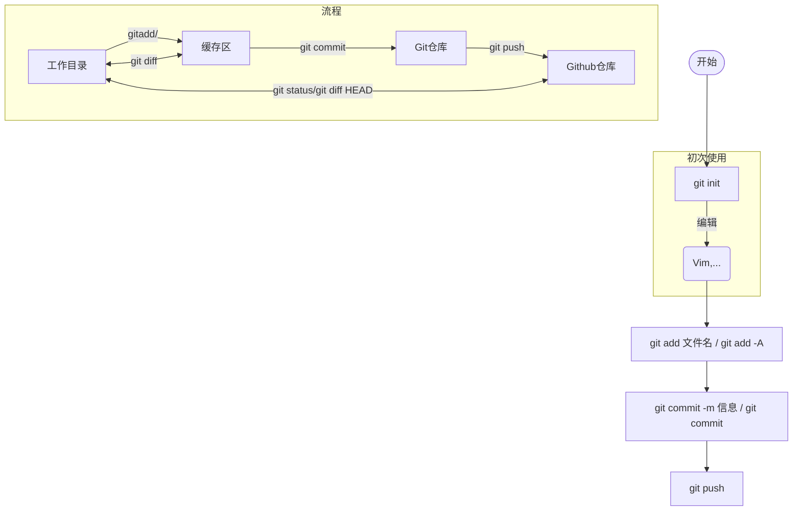

```mermaid
flowchart TB
    Start([开始])-->Init[git init]
    subgraph "初次使用"
    Init--"编辑"-->Edit(Vim,...)
    end
    Edit-->Add[git add 文件名 / git add -A]-->Commit[git commit -m 信息 / git commit]-->Push[git push]

    subgraph 流程
        WorkingSpace[工作目录]
        CacheArea[缓存区]
        Repository[Git仓库]
        Github[Github仓库]
        WorkingSpace--gitadd/-->CacheArea
        CacheArea--git commit-->Repository--git push-->Github
    end

    WorkingSpace<--git diff-->CacheArea
    Github<--git status/git diff HEAD-->WorkingSpace
```

```mermaid
CacheArea[缓存区]
Repository[Git仓库]
       Github[Github仓库]
        WorkingSpace--gitadd/-->CacheArea
        CacheArea--git commit-->Repository--git push-->Github
```
