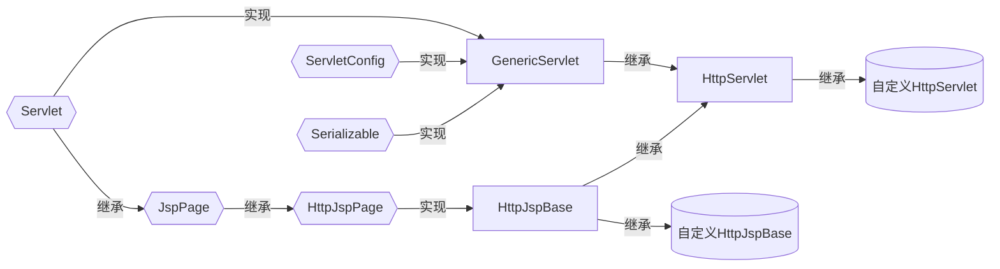
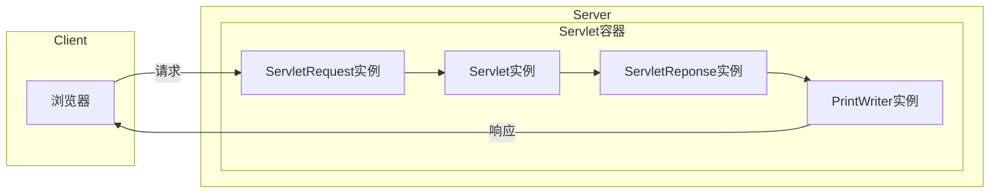
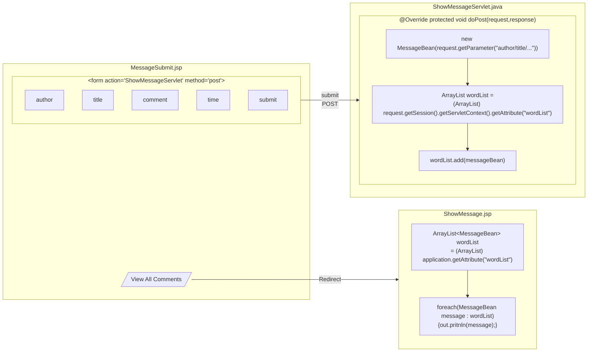

# JSP

# §1 JSP基本语法

## §1.1 脚本元素

JSP的脚本元素包括声明、脚本段和表达式。

### §1.1.1 注释（Comment）

JSP包含两种注释：

- HTML注释

  面向前端，用户可以看到，格式为`<!-- -->`

- JSP注释

  面向后端，只有后端才能看到，格式为`<%-- --%>`。内部可以嵌套Java注释，例如`<%-- // --%>`或`<%-- /* */ --%>`

### §1.1.2 声明（Declearation）

声明语句用于在JSP中声明变量和定义方法，格式为`<%! %>`，不能向当前输出流进行操作。

```jsp
<html>
    <body>
        <%! 
            int a = 1;
            int GetSquare(int data){
                return data*data;
            }
        %>
        <% out.println(a + GetSquare(2)); %>
    </body>
</html>
```

### §1.1.3 脚本段（Scriptlets）

脚本段是在处理请求时执行的Java代码段，格式为`<% %>`，可以对当前输出流进行操作。

```jsp
<html>
    <body>
        <% if(Math.random() > 0.5){ %>
            You are lucky! :)
        <% }else{ %>
            You are unlucky! :(
        <% } %>
    </body>
</html>
```


### §1.1.4 表达式（Expression）

表达式指的是Java中完整的表达式，格式为`<%= %>`计算后会被转换为字符串，输出到当前的输出流中。

```jsp
<%@ page import="java.util.Date" %>
<html>
    <body>
        <%= new Date() %>
    </body>
</html>
```

## §1.2 指令元素

JSP的指令元素包括`page`指令、`include`指令、`taglib`指令，格式为`<%@ 指令名属性="属性值" %>`，**只在编译时运行一次**。

### §1.2.1 `page`

`page`指令用于定义JSP页面内的属性和属性值，格式为`<%@ page key1=value1 key2=value2 ... %>`。该指令可以修改的属性和属性值有：

- `language`：使用的脚本语言，缺省为`java`

- `import`：导入的Java软件包

- `extends`：编译时需要使用的Java类

- `session`：设置此网页是否加入到`session`中，缺省为`true`

- `buffer`：输出网页时使用的缓冲区的长度，可取`none`或数字，缺省为`8KB`

- `autoFlush`：缓冲区已满时是否自动输出缓冲区。若设为`false`，则缓冲区满时抛出异常，缺省为`true`

- `info`：指定网页的说明信息，可由`Servlet.getServletInfo()`获取

  ```jsp
  <%@ page info="This is info!" %>
  <html>
      <body>
          <% out.print(getServletInfo()); %>
      </body>
  </html>
  ```

- `isThreadSafe`：设置能否多线程访问，缺省为`true`

- `isErrorPage`：指定此网页是否为另一个JSP页面的错误提示页面，决定能否调用`Exception`类

- `errorPage`：指定此网页的错误提示页面

- `contentType`：指定该网页使用的字符集、JSP响应的MIME类型，缺省为`text/html;charset=ISO-8859-1 `

### §1.2.2 `include`

`include`指令在当前文件中包含一个静态文件，格式为`<%@ include file="<path>" %>`。

> 注意：包含的文件不能有`<html>`/`<body>`等标签，否则将破坏当前文件的DOM结构。

```jsp
<!-- nowTime.jsp -->
<%@ page import="java.util.Date" %>
<% out.print(new Date()); %>
```

```jsp
<!-- index.jsp -->
<html>
    <body>
        <%@ include file="nowTime.jsp" %>
    </body>
</html>
```

### §1.2.3 `taglib`

？？？？？？？？？？？？？？TODO：

`taglib`指令用于指定JSP自定义的标签，格式为`<%@ taglib uri="<TagLibrary>" prefix="<Prefix>">`，其中各参数的含义为：

- `uri`：根据标签前缀，对自定义标签进行的唯一命名
- `prefix`：在自定义标签之前的前缀

> 注意：`jsp`/`jspx`/`java`/`javax`/`servlet`/`sun`/`sunw`等保留字不允许作为自定义标签的前缀。

## §1.3 动作元素

动作元素用于控制JSP容器的动作，**每次请求时都被执行一次**。

### §1.3.1 `<jsp:include>`

`<jsp:include>`用于在该文件中包含其它文件，并将结果输出到页面中，格式为`<jsp:include page="URL<%=expression>" flush="true" />`。

```jsp
<html>
    <body>
        <jsp:include page="nowtime.jsp" />
    </body>
</html>
```

### §1.3.2 `<jsp:forward>`

`<jsp:forward>`用于在不改变地址栏地址的情况下，实现重定向页面，格式为`<jsp:forward page="URL">`。

### §1.3.3 `<jsp:param>`

`<jsp:param>`用于传参，通常与`<jsp:include>`、`<jsp:forward>`、`<jsp:plugin>`搭配使用，格式为`<jsp:param name="name" value="value">`。

```jsp
<!-- sendMessage.jsp -->
<jsp:forward page="showMessage.jsp">
    <jsp:param name="message" value="This is a message"/>
</jsp:forward>
```

```jsp
<!-- showMessage.jsp -->
<%= request.getParameter("message") %>
```

### §1.3.4 `<jsp:useBean>`

`<jsp:useBean>`允许JSP使用JavaBean，格式为`<jsp:useBean id="<InstanceName>" scope="<ScopeName>" <typeSpec> />`，其中各参数的含义如下所示：

- `id`：在当前`scope`内调用或新建名为`<InstanceName>`的实例

- `scope`：指定Bean类的作用域，取值范围为`page`、`request`、`session`、`application`

- `<typeSpec>`：指定Bean类的种类属性。

  | 组合情况 | `class` | `beanName` | `type` |
  | :------: | :-----: | :--------: | :----: |
  |          |    √    |            |        |
  |          |    √    |     √      |        |
  |          |         |     √      |   √    |
  |          |         |            |   √    |

  - `class`：指定Bean类的完整路径
  - `beanName`：指定Bean实例的名称
  - `type`：指定Bean类的名称/超类的名称/实现的任意接口之一。

```java
public class Person {
	private String name;
	public void setName(String name){
        this.name = name;
    }
    public String getName(String name){
        return this.name;
    }
}
```

```jsp
<html>
    <head>
        <jsp:useBean id="LiHua" scope="page" class="Person" />
        <%
        	LiHua.setName("LiHua");
        	out.println(LiHua.getName());
        %>
    </head>
</html>
```

将编译得到的`.class`文件放到`/src/WebApp/WEB-INF/classes/com/example`目录下即可。

```shell
C:\workspace> javac Person.java
C:\workspace> mv Person.class ...
```

## §1.4 内置对象

JavaBean要求必须先手动初始化实例，才能调用改实例。然而JSP页面初始化时会自动声明某些对象，因此在JSP中可以直接使用。这些对象被称为内置对象（Implicit Object）。

|   实例名称    |           内容            |      生存周期      | 对应类                                   |
| :-----------: | :-----------------------: | :----------------: | ---------------------------------------- |
| `application` |      整个WebApp对象       | 整个WebApp运行期间 | `javax.servlet.ServletContext`           |
|   `config`    | JSP页面初始化时使用的容器 |    页面执行期间    | `javax.servlet.ServletConfig`            |
|  `exception`  | 发生错误时产生的异常对象  |    页面执行期间    | `java.lang.Throwable`                    |
|     `out`     |  服务器的`OutputStream`   |    页面执行期间    | `javax.servlet.jsp.JspWriter`            |
|    `page`     |      当前网页的对象       |    页面执行期间    | `javax.lang.Object`，也就是`this`        |
| `pageContext` | 提供其他对象和方法的对象  |    页面执行期间    | `javax.servlet.jsp.PageContext`          |
|   `request`   |   客户端发送请求的信息    |    用户请求时间    | `javax.servlet.http.HttpServletRequest`  |
|  `response`   |   服务器发送响应的信息    |    页面响应期间    | `javax.servlet.http.HttpServletResponse` |
|   `session`   |      当前会话的信息       |      会话期间      | `javax.servlet.http.HttpSession`         |

### §1.4.1 `request`

`request`实例代表客户端的请求，包含客户端所有基于HTTP协议传递的信息，例如`GET`/`POST`传递的表单信息、COOKIE等。

| 方法名                            |                        作用                        |                          返回示例                          |
| --------------------------------- | :------------------------------------------------: | :--------------------------------------------------------: |
| `getAttribute(String)`            |          获取Server内`name`属性对应的对象          |                                                            |
| `setAttribute(String,Object)`     |          设置Server内`name`属性对应的对象          |                                                            |
| `removeAttribute(String)`         |          删除Server内`name`属性对应的对象          |                                                            |
| `getAttributeNames()`             |               获取Server内所有属性名               |                                                            |
| `getParameter(String name)`       |    获取Client内**第一个**`name`属性对应的字符串    |                                                            |
| `getParameterValues(String name)` | 获取Client内**所有**`name`属性对应的字符串**数组** |                                                            |
| `getServerName()`                 |             获取Client访问的Domain或IP             |                  `127.0.0.1`或`localhost`                  |
| `getServerPort()`                 |                获取Client访问的Port                |                   `80`或`10809`（代理）                    |
| `getServletPath()`                |              获取Client请求的资源路径              |                        `/index.jsp`                        |
| `getRemoteAddr()`                 |                 获取Client看到的IP                 | `127.0.0.1`或`0.0.0.0.0.0.0.1`（hosts定义`::1 localhost`） |
| `getRemotePort()`                 |             获取`Client`监听本机的Port             |                          `64651`                           |
| `getLocalPort()`                  |              获取Server当前监听的端口              |                            `80`                            |
| `getContextPath()`                |          获取Client请求的资源所在的文件夹          |                        `/myWebApp`                         |
| `getCharacterEncoding()`          |        获取Server解析Request时使用的字符集         |                     缺省为`iso-8859-1`                     |
| `setCharacterEncoding(String)`    |        设置Server解析Request时使用的字符集         |                                                            |
| `getCookies()`                    |          获取Client发送的`Cookie`实例数组          |                                                            |
| `getSession()`                    |         获取当前Session的`HttpSession`实例         |                                                            |
| `getContentType()`                |            获取Client请求数据的MIME类型            |                        `text/html`                         |
| `getProtocol()`                   |                获取Client使用的协议                |                         `HTTP/1.1`                         |
| `getContentLength()`              |    获取Client发送Request时指明的`ContentLength`    |                        `-1`（缺省）                        |

> 这里的Server和Client是相对而言的。`Attribute`是自己可以控制和修改的，而`Parameter`只能受对方控制，自己无权更改。
>
> 例如Client经过Proxy向Server发包，那么Client的`Attribute`就是Proxy的`Parameter`，Proxy再设置自己的`Parameter`，那么Server受到的`Attribute`包含了Server的`Parameter`和`Parameter`。

```jsp
<!-- index.jsp -->
<%@ page contentType="text/html;UTF-8" %>
<html>
    <body>
        <form name="MessageBoard" method="post" action="showOrder.jsp">
            <label><input type="text" name="username" placeholder="Your Name Here"></label>
            <label>
                <input type="checkbox" name="order" id="Apple" value="Apple"><label for="Apple">Apple</label>
                <input type="checkbox" name="order" id="Banana" value="Banana"><label for="Banana">Banana</label>
                <input type="checkbox" name="order" id="Cheery" value="Cheery"><label for="Cheery">Cheery</label>
            </label>
            <label><input type="submit" value="Buy"></label>
            <label><input type="reset" value="Reset"></label>
        </form>
    </body>
</html>
```

```jsp
<!-- showOrder.jsp -->
<%@ page import="java.util.Arrays" %>
<%@ page contentType="text/html;charset=UTF-8" language="java" %>
<% request.setCharacterEncoding("UTF-8"); %>
<html>
    <body>
        Your name is: <%= request.getParameter("username") %><br>
        Your order is: <%= Arrays.toString(request.getParameterValues("order")) %>
    </body>
</html>
```

### §1.4.2 `response`

`response`用于生成Response并发送到Client。

| 方法名                                    | 作用                             |
| ----------------------------------------- | -------------------------------- |
| `void sendRedirect(String)`               | 让Client重定向到指定的URL        |
| `void setContentType(String)`             | 设置Response的MIME类型           |
| `void setContentLength(int)`              | 设置Response的内容长度           |
| `void setHeader(String key,String value)` | 设置Response报文首部的字段       |
| `void setStatus(int)`                     | 设置HTTP状态码                   |
| `ServletOutputStream getOutputStream()`   | 获取`ServletOutputStream`实例    |
| `PrintWriter getWriter()`                 | 获取`PrintWriter`实例            |
| `int getBufferSize()`                     | 获取缓冲区长度                   |
| `void setBufferSize()`                    | 设置缓冲区长度                   |
| `void flushBuffer()`                      | 强制将缓冲区内的数据发送到Client |
| `void addCookie(Cookie)`                  | 向Client添加Cookie               |
| `void addHeader(String key,String value)` | 添加HTTP的头文件                 |
| `boolean isCommited()`                    | 判断服务器是否已经发送Response   |

例如使用`response.setHeader()`设置`refresh`头，实现页面自动刷新：

```jsp
<!-- LiveTime.jsp 实时刷新页面，显示当前时间 -->
<%@ page import="java.util.Date" %>
<% request.setCharacterEncoding("UTF-8"); %>
<html>
	<body>
        <%
            out.println(new Date());
            response.setHeader("refresh", "1"); // 单位为秒
        	// 或response.setHeader("refresh","1；URL=baidu.com")
        %>
	</body>
</html>
```

例如跟踪用户的访问记录：

```jsp
<html>
	<body>
    <%
        Cookie cookieResponse = null;
        Cookie[] cookies = request.getCookies();
        if (cookies == null) {
            out.println("No cookie available.");
        } else {
            if (cookies.length == 0) {
                out.println("Writing Cookie is forbidden on client.");
            } else {
                for (Cookie cookie : cookies) {
                    if(cookie.getName().equals("isVisited")){
                        cookieResponse = cookie;
                        break;
                    }
                }
            }
        }
        if(cookieResponse == null){
            out.println("You visit the page for the first time.");
            cookieResponse = new Cookie("isVisited",new Date().toString().replaceAll(" ","."));
        }else{
            out.println("You visited the page in " + cookieResponse.getValue());
            cookieResponse.setValue(new Date().toString().replaceAll(" ","."));
        }
        response.addCookie(cookieResponse);
        response.flushBuffer();
    %>
    </body>
</html>
```

### §1.4.3 `out`

`out`对象能结合JSP代码，将数据发送到Client。

| 方法名            | 作用                                            |
| ----------------- | ----------------------------------------------- |
| `clear()`         | 清空缓冲区，若缓冲区本身为空则引起`IOException` |
| `clearBuffer()`   | 清空缓冲区                                      |
| `flush()`         | 强制输出缓冲区全部数据                          |
| `getBufferSize()` | 返回缓冲区长度，默认为`8192`                    |
| `getRemaining()`  | 返回缓冲区剩余长度                              |
| `isAutoFlush()`   | 是否自动输出缓冲区的数据                        |
| `newline()`       | 换行                                            |
| `print()`         | 输出                                            |
| `println()`       | 输出后换行                                      |
| `close()`         | 强制输出缓冲区全部数据，然后关闭输出流          |

```jsp
<!-- OutBuffer.jsp -->
<html>
<body>
    <%
        out.println("This line won't be displayed.");
        out.clearBuffer();
        out.println("Current buffer size: " + out.getBufferSize() + "<br>");
        out.println("Current buffer available size: " + out.getRemaining() + "<br>");
        out.flush();
        out.println("This line will be forced to be displayed.");
        out.close();
        out.println("This line won't be displayed.");
    %>
</body>
</html>
```

### §1.4.4 `session`

`session`对象用于保存当前Session的信息，生命周期从Server与Client建立连接开始，到两者断开连接为止。每个用户分别凭自己收到的Session ID与服务器交互，服务器根据Session ID匹配字段。

“断开连接”指的是以下四种情形之一：

- Client关闭浏览器
- Server宕机
- Server端JSP执行`session.invalidate()`
- Server收到的两次请求的时间间隔超出预设值，Tomcat默认为30分钟

| 方法名                                | 作用                                                         |
| ------------------------------------- | ------------------------------------------------------------ |
| `void setAttribute(String,Object<E>)` | 向Session添加键值对                                          |
| `Object<E> getAttribute(String)`      | 从Session获得值                                              |
| `Enumeration<E> getAttributeNames()`  | 获取包含所有变量的名称的`Enumeration`实例                    |
| `void removeAttribute(String)`        | 从Seesion删除键值对                                          |
| `void invalidate()`                   | 结束Session                                                  |
| `long getCreationTime()`              | 返回Session建立的时间（单位为毫秒）                          |
| `long getLastAccessedTime()`          | 返回Session最近一次被调用的时间，新建的Session为`-1`         |
| `long getMaxInactiveInternal()`       | 返回两次请求的时间间隔的最大值，Tomcat默认为30分钟（单位为秒） |
| `boolean isNew()`                     | 返回当前Session是否为第一次创建                              |
| `setMaxInactiveInterval(int)`         | 设置两次请求的时间间隔的最大值（单位为秒）                   |

利用`session`可以做一个简单的登录系统：

```jsp
<!-- SessionLogin.jsp -->
<html>
<body>
<%
    String username = request.getParameter("username");
    if (username != null) {
        session.setAttribute("username", username);
        out.print("Login Success!");
    }
%>
<form action="SessionLogin.jsp">
    <label><input type="text" name="username"></label>
    <label><input type="submit"></label>
</form>
</body>
</html>
```

```jsp
<!-- SessionWelcome.jsp -->
<html>
<body>
<%
    String username = (String) session.getAttribute("username");
    if (username != null) {
        out.print("Hello, " + username + "!");
    } else {
        out.print("Sorry, you havn't login.");
        out.print("<a href=\"SessionLogin.jsp\">Go to login</a>");
    }
%>
</body>
</html>
```

### §1.4.5 `application`

`application`对象代表着整个Web应用，除了保存全局变量外，还可以获取网站本身的信息。多个用户共享同一个`application`实例。其生命周期从Server运行开始，到Server宕机结束，不能被JSP手动创建或清除。

| 方法名                                | 作用                                               |
| ------------------------------------- | -------------------------------------------------- |
| `void setAttribute(String,Object<E>)` | 设置`application`变量                              |
| `Object<E> getAttribute(String)`      | 获取`application`变量                              |
| `void removeAttribute(String)`        | 删除`application`变量                              |
| `Enumeration getAttributeNames() `    | 获得包含所有`application`变量名的`Enumeration`实例 |
| `int getMajorVersion()`               | 获得Server支持的最新ServletAPI版本                 |
| `int getMinorVersion()`               | 获得Server支持的最旧ServletAPI版本                 |
| `String getMimeType(String)`          | 返回路径为`String`的文件的格式和编码               |
| `String getReadPath(String)`          | 返回相对路径的绝对滤镜                             |
| `String getServerInfo()`              | 返回Server解释引擎的信息                           |

例如统计当前页面被访问的次数：

```jsp
<!-- ApplicationVisitedPlayerCounter.jsp -->
<%@ page contentType="text/html;charset=UTF-8" %>
<html>
<body>
<%
    Integer visitedNumber = (Integer) application.getAttribute("VisitedPlayerNumber");
    if (visitedNumber == null) {
        visitedNumber = Integer.valueOf(0);
        application.setAttribute("VisitedPlayerNumber", visitedNumber);
    }
    visitedNumber = visitedNumber + 1;
    application.setAttribute("VisitedPlayerNumber", visitedNumber);
%>
The page have been visited for <%= application.getAttribute("VisitedPlayerNumber").toString() %> times!
</body>
</html>
```

### §1.4.6 `pageContext`

`pageContext`允许当前JSP访问所有作用域的`request`、`response`、`session`、`application`等对象。

- 当前JSP作用域内的任意内置对象

  | 方法名                                                  | 作用                                                         |
  | ------------------------------------------------------- | ------------------------------------------------------------ |
  | `Object getAttribute(String name,int scope)`            | 获取当前JSP的`scope`作用域的`name`属性                       |
  | `Enumeration getAttributeNamesInScope(int scope)`       | 获取包含当前JSP的`scope`作用域的所有属性的`Enumeration`实例  |
  | `void removeAttribute(String name,int scope)`           | 移除当前JSP的`scope`作用域的`name`属性                       |
  | `void removeAttribute(String)`                          | 移除当前JSP第一个找到的`name`属性                            |
  | `void setAttribute(String name,Object value,int scope)` | 设置当前JSP的`scope`作用域的`name`属性，`scope`缺省时指定为`page`作用域 |

- 当前JSP作用域内的特殊内置对象

  | 方法名                               | 作用                                                  |
  | ------------------------------------ | ----------------------------------------------------- |
  | `Exception getException()`           | 当前网页被声明为`ErrorPage`时，回传目前抛出的异常实例 |
  | `JspWriter getOut()`                 | 回传目前网页的输出流实例（例如`out`）                 |
  | `Object getPage()`                   | 回传目前网页的`Servlet`实例（例如`page`）             |
  | `ServletRequest getRequest()`        | 回传目前网页的请求实例（例如`request`）               |
  | `ServletResponse getResponse()`      | 回传目前网页的响应实例（例如`response`）              |
  | `ServletConfig getServletConfig()`   | 回传目前网页的`ServletConfig`实例（例如`config`）     |
  | `ServletContext getServletContext()` | 回传目前网页的执行环境（例如`application`）           |
  | `HttpSession getSession()`           | 回传与当前网页有关系的会话（例如`session`）           |

- 内置对象的各类属性

  | 方法名                                | 作用                           |
  | ------------------------------------- | ------------------------------ |
  | `int getAttributesScope(String name)` | 返回`name`属性所处的作用域范围 |
  | `Object findAttribute(String name)`   | 在所有作用域中查找`name`属性   |

> 注意：`int scope`使用的常量定义于`javax.servlet.jsp.PageContext`中，取值范围如下所示：
>
> - `PAGE_SCOPE = 1`
> - `REQUEST_SCOPE = 2`
> - `SESSION_SCOPE = 3`
> - `APPLICATION_SCOPE = 4`

```jsp
<%
	// 以下语句效果完全相同
	page.setAttribute("username");
	pageContext.setAttribute("username","admin"); // 默认为page
	pageContext.getPage().setAttribute("username","admin");
	pageContext.getServletContext().getPage().setAttribute("username","admin");
%>
```

### §1.4.7 `config`

`config`对象用于表示Servlet的配置。

| 方法                                   | 作用                                    |
| -------------------------------------- | --------------------------------------- |
| `String getInitParameter(String name)` | 获取`name`所指定的初始参数              |
| `Enumeration getInitParameterNames()`  | 获取包含所有初始参数的`Enumeration`实例 |
| `ServletContext getServletContext()`   | 获取Servlet的`pageContext`实例          |
| `String getServletName()`              | 获取Servlet名称                         |

### §1.4.8 `page`

`page`对象代表的是当前JSP页面本身，与`this`关键字等价。

| 方法名                             | 作用                       |
| ---------------------------------- | -------------------------- |
| `void hashCode()`                  | 返回当前`page`对象的哈希值 |
| `void getClass()`                  | 返回网页的类信息           |
| `void toString()`                  | 返回当前网页的字符串       |
| `ServletConfig getServletConfig()` | 获得`config`实例           |
| `String getServletInfo()`          | 返回服务器程序的信息       |

# §2 Servlet

JSP基于Servlet开发。Servlet是用Java Servlet API开发的一种类，所有API定义于`javax.Servlet`中。





## §2.1 创建实例

每个自定义Servlet类都必须继承于抽象类`HttpServlet`，实现其定义的`doGet()`和`doPost()`方法。

```java
package com.example;

import javax.servlet.ServletException;
import javax.servlet.http.HttpServlet;
import javax.servlet.http.HttpServletRequest;
import javax.servlet.http.HttpServletResponse;
import java.io.IOException;
import java.io.PrintWriter;

public class UserInfoManagement extends HttpServlet {

    public UserInfoManagement(){

    }

    @Override protected void doGet(HttpServletRequest req, HttpServletResponse resp) throws ServletException, IOException {
        resp.setContentType("text/html");
        PrintWriter out = resp.getWriter();
        out.println("<html><body>Welcome to the User Info Management!</body></html>");
        out.flush();
        out.close();
    }

    @Override protected void doPost(HttpServletRequest req, HttpServletResponse resp) throws ServletException, IOException {
        
    }
}
```

## §2.2 `web.xml`配置文件

在配置文件`web.xml`中声明新建的Servlet时，需要在其中声明该Servlet的各项信息：

- `<web-app>`（根标签）

  - `<servlet>`（必须在最前出现）

    | 标签名              | 父标签名    | 含义                                                         | 注意事项                                                     |
    | ------------------- | ----------- | ------------------------------------------------------------ | ------------------------------------------------------------ |
    | `<servlet-name>`    | `<servlet>` | Servlet的名称                                                | 必填项，必须与`<servlet-mapping>`内的`<servlet-name>`相同    |
    | `<servlet-class>`   | `<servlet>` | Servlet类的路径                                              | 必填项                                                       |
    | `<display-name>`    | `<servlet>` | Servlet发布时的名称                                          |                                                              |
    | `<description>`     | `<servlet>` | Servlet的功能描述                                            |                                                              |
    | `<load-on-startup>` | `<servlet>` | 当`<web-app>`内包含许多`<servlet>`时，设置不同`Servlet`的启动顺序 | 接受整数值时，值越小越先启动；值为`AnyTime`时，启动顺序不固定 |
    | `<init-param>`      | `<servlet>` | Servlet的初始化参数                                          | 内部必须只包含一个`<param-name>`和`<param-value>`            |

    - `<init-param>`

      | 标签名          | 父标签名       | 含义                             | 注意事项                                                   |
      | --------------- | -------------- | -------------------------------- | ---------------------------------------------------------- |
      | `<param-name>`  | `<init-param>` | Servlet的初始化参数的键（Key）   | 在`Servlet.init()`内通过`getInitParameter()`方法获取键值对 |
      | `<param-value>` | `<init-param>` | Servlet的初始化参数的值（Value） | 在`Servlet.init()`内通过`getInitParameter()`方法获取键值对 |

  - `<servlet-mapping>`（必须在最后出现）

    | 标签名           | 父标签名            | 含义                        | 注意事项                                  |
    | ---------------- | ------------------- | --------------------------- | ----------------------------------------- |
    | `<servlet-name>` | `<servlet-mapping>` | 要进行路径映射的Servlet名称 | 必须与`<servlet>`内的`<servlet-name>`相同 |
    | `<url-pattern>`  | `<servlet-mapping>` | Servlet的映射路径           | 必须以`/`开头                             |

```xml
<!-- web.xml -->
<?xml version="1.0" encoding="UTF-8"?>
<web-app xmlns="http://xmlns.jcp.org/xml/ns/javaee"
         xmlns:xsi="http://www.w3.org/2001/XMLSchema-instance"
         xsi:schemaLocation="http://xmlns.jcp.org/xml/ns/javaee
                             http://xmlns.jcp.org/xml/ns/javaee/web-app_4_0.xsd"
         version="4.0">
    <servlet>
        <description>User Info Management System</description>
        <display-name>UserInfoManagement</display-name>
        <servlet-name>UserInfoManagement</servlet-name>
        <servlet-class>com.example.UserInfoManagement</servlet-class>
        <init-param>
        	<param-name>version</param-name>
            <param-value>0.1</param-value>
        </init-param>
    </servlet>
    
    <servlet-mapping>
        <servlet-name>UserInfoManagement</servlet-name>
        <url-pattern>/test</url-pattern>
    </servlet-mapping>
    
</web-app>
```

## §2.3 `GenericServlet`类

`GenericServlet`类的声明为`public abstract class GenericServlet implements Servlet, ServletConfig, java.io.Serializable`。该类定义了下列方法：

- `void init([ServletConfig])`：初始化Servlet实例
- `void destory()`：销毁Servlet实例
- `String getServletInfo()`：获取Servlet信息
- `ServletConfig getServletConfig()`：获得包含Servlet配置的`ServletConfig`实例
- `void service(ServletRequest,ServletResponse)`：运行Servlet的逻辑入口

## §2.4 `HttpServlet`类

`HttpServlet`类的声明为`public abstract class HttpServlet extends GenericServlet`，用于提供HTTP的基本功能：

- `void doGet(ServletRequest,ServletResponse)`：处理HTTP的GET请求
- `void doPost(ServletRequest,ServletResponse)`：处理HTTP的POST请求
- `void doPut(ServletRequest,ServletResponse)`：处理HTTP的PUT请求
- `void doDelete(ServletRequest,ServletResponse)`：处理HTTP的Delete请求
- `String getServletInfo()`：获取Servlet信息
- `ServletConfig getServletConfig()`：获取Servlet的初始化参数和`ServletContext`
- `void init()`：Server创建Servlet实例时默认执行，只在被创建时执行一次，用于管理服务器资源
- `void service(ServletRequest,ServletResponse)`：用户访问时默认执行，只在新用户访问时被执行一次
- `void destory()`：Serverl销毁Servlet实例时默认执行

## §2.5 `HttpServletRequest`接口

`HttpServletRequest`接口的声明为`public interface HttpServletRequest extends ServletRequest`。当Servlet容器受到请求时，就将该接口实例化，封装成一个实例，然后将该实例传给`GenericServlet.service()`方法。该接口定义的主要方法有：

| 方法名                                           | 作用                                                         |
| ------------------------------------------------ | ------------------------------------------------------------ |
| `String getAuthType()`                           | 返回Request的身份验证模式                                    |
| `Cookie[] getCookies()`                          | 返回Client发送的Cookie                                       |
| `long getDateHeader(String)`                     | 返回Request中表示时间的字段转化而成的`Date.to`，从1970年1约1日以来的毫秒数 |
| `String getHeader(String)`                       | 返回Request中表示时间的字段转化而成的`Date.getTime()`（从1970年1约1日以来的毫秒数） |
| `Enumeration<String> getHeaderNames()`           | 返回Request中包含所有字段的键（Key）的`Enumeration`实例      |
| `Enumeration<String> getHeader(String)`          | 返回Request中只包含指定键（Key）的`Enumeration`实例          |
| `int getIntHeader(String)`                       | 返回Request中表示整数的字段转化而成的`int`                   |
| `String getMethod()`                             | 返回Request使用的HTTP方法                                    |
| `String getPathInfo()`                           | 返回URL去除Servlet路径后的路径，路径为空是返回`null`，是`getPathTranslated()`的反函数 |
| `String getPathTranslated()`                     | 返回URL的在操作系统内的绝对路径，若`getPathInfo()==null`则返回`null`，时`getPathInfo()`的反函数 |
| `String getQueryString()`                        | 返回URL中用于GET传参的查义字符串                             |
| `String getRemoteUser()`                         | 返回发送Request的用户名，用于HTTP身份鉴权                    |
| `String getRequestedSessionId()`                 | 返回Request的Session ID                                      |
| `String getRequestURI()`                         | 返回URL中去除GET传参的差异字符串，只保留请求资源路径的部分   |
| `String getServletPath()`                        | 返回Request请求的Servlet路径                                 |
| `HttpSession getSession([boolean])`              | 返回Request对应的`Session`实例                               |
| `int getContentLength()`                         | 返回Request请求头中`Content-Length`字段的值                  |
| `String getContentType`                          | 返回Request请求头中`Content-Type`字段的值                    |
| `ServletInputStream getInputStream()`            | 返回Request请求正文的`InputStream`实例                       |
| `String getLocalAddr()`                          | 返回Request请求头中指示的Client地址                          |
| `Locale getLocale()`                             | 返回Request请求头中指示的地区对应的`Locale`实例              |
| `String getLocalName()`                          | 返回Server用于接受Request的主机名                            |
| `int getLocalPort()`                             | 返回Server用于接受Request的端口                              |
| `String getParameter(String)`                    | 返回Request请求参数中指定名称的字段的值                      |
| `Map<String,String[]> getParameterMap()`         | 返回Request所有请求参数对应的`Map`实例                       |
| `Enumeration<String> getParameterNames()`        | 返回Request所有请求参数名称对应的`Enumeration`实例           |
| `String[] getParameterValues(String)`            | 返回Request特定名称的请求参数的所有值                        |
| `String getProtocol()`                           | 返回Request使用的协议                                        |
| `BufferedReader getReader()`                     | 返回Request请求正文的`BufferedReader`实例                    |
| `String getRemoteAddr()`                         | 返回Proxy或Client的IP地址                                    |
| `String getRemoteHost()`                         | 返回Proxy或Client的主机名                                    |
| `int getRemotePort()`                            | 返回Proxy或Client的端口                                      |
| `RequestDispatcher getRequestDispatcher(String)` | 返回`RequestDispatcher`接口的一个实例                        |
| `String getServerName()`                         | 返回Client请求的Server的主机名                               |
| `int getServerPort()`                            | 返回Client请求的Server的端口                                 |
| `ServletContext getServletContext()`             | 返回最近一次Reques对应的`ServletResquest.getServletContext()` |
| `boolean isSecure()`                             | 判断协议是HTTP还是HTTPS                                      |
| `void removeAttribute(String name)`              | 删除Request请求头中特定名称的请求参数                        |
| `void setAttribute(String,Object)`               | 向Request请求头添加请求参数                                  |
| `void setCharacterEncoding(String)`              | 设置解析Request使用的编码                                    |

## §2.6 `HttpServletResponse`接口

`HttpServletResponse`接口的声明为`public interface HttpServletResponse extends ServletResponse`。该接口定义的主要方法有：

| 方法名                               | 作用                                   |
| ------------------------------------ | -------------------------------------- |
| `addHeader(String,String)`           | 向Response添加响应参数                 |
| `sendError(int sc,[String message])` | 向Client发送HTTP状态错误代码和错误信息 |
| `sendHeader(String,String)`          | 向Response添加响应参数（覆盖原参数）   |
| `setStatus(int sc)`                  | 向Client发送HTTP状态代码               |
| `addCookie(Cookie)`                  | 给Client设置Cookie                     |

## §2.7 `ServletConfig`接口

`ServletConfig`接口的声明为`public interface ServletConfig`。`Servlet`通过调用`init(ServletConfig)`配置`Servlet`的名称 、初始化参数和上下文。该接口定义的方法有：

| 方法名                                        | 作用                                                         |
| --------------------------------------------- | ------------------------------------------------------------ |
| `String getInitParameter(String)`             | 获取特定名称的初始化参数                                     |
| `Enumeration<String> getInitParameterNames()` | 获取包含所有初始化参数键（Key）的`Enumeration`实例           |
| `ServletContext getServletContext()`          | 获取当前Servlet的`ServletContext`实例                        |
| `String getServletName()`                     | 获取`web.xml`中当前Servlet的`<servlet-name>`，若未定义该标签则返回`<servlet-class>` |

```xml
<!-- web.xml -->
<?xml version="1.0" encoding="UTF-8"?>
<web-app xmlns="http://xmlns.jcp.org/xml/ns/javaee"
         xmlns:xsi="http://www.w3.org/2001/XMLSchema-instance"
         xsi:schemaLocation="http://xmlns.jcp.org/xml/ns/javaee http://xmlns.jcp.org/xml/ns/javaee/web-app_4_0.xsd"
         version="4.0">
    <servlet>
        <servlet-name>UserInfoManagement</servlet-name>
        <servlet-class>com.example.UserInfoManagement</servlet-class>
        <init-param>
            <param-name>version</param-name>
            <param-value>0.1</param-value>
        </init-param>
    </servlet>
    <servlet-mapping>
        <servlet-name>UserInfoManagement</servlet-name>
        <url-pattern>/test</url-pattern>
    </servlet-mapping>
</web-app>
```

```java
/* UserInfoManagement.java */
package com.example;

import javax.servlet.*;
import java.io.IOException;
import java.io.PrintWriter;
import java.util.*;

public class UserInfoManagement extends GenericServlet {

    private final Map initParams = new LinkedHashMap();
    private String servletName;

    @Override
    public void init(ServletConfig config) throws ServletException {
        super.init(config);
        Enumeration paramNames = getInitParameterNames();
        while(paramNames.hasMoreElements()){
            String paramName = (String) paramNames.nextElement();
            String paramValue = getInitParameter(paramName);
            initParams.put(paramName,paramValue);
        }
        servletName = getServletName();
    }

    @Override
    public void service(ServletRequest req, ServletResponse res) throws ServletException, IOException {
        res.setContentType("text/html;charset=UTF-8");
        PrintWriter out = res.getWriter();
        
        out.println("servletName: " + servletName + "<br>");

        out.println("initParams: <table>");
        out.println("<td>paramName</td>");
        out.println("<td>paramName</td>");
        Set paramNames = initParams.keySet();
        Iterator iterator = paramNames.iterator();
        while(iterator.hasNext()){
            String paramName = (String) iterator.next();
            String paramvalue = (String) initParams.get(paramName);
            out.println("<tr><td>" + paramName + "</td>");
            out.println("<td>" + paramvalue + "</td>");
            out.println("<tr>");
        }
        out.println("</table>");
        
    }
}
```

## §2.8 `HttpSession`接口

`HttpSession`接口的声明为`public interface HttpSession`，封装了一系列`Session`相关的概念。`HttpServletResquest`类实现了该接口，常用的方法有：

| 方法名                                    | 作用                                                 |
| ----------------------------------------- | ---------------------------------------------------- |
| `Object getAttribute(String)`             | 获取Session作用域中特定名称的参数                    |
| `Enumeration<String> getAttributeNames()` | 获取包含Session作用域中所有参数的`Enumeration`实例   |
| `void removeAttribute(String)`            | 删除Session作用域中特定米in过程的参数                |
| `void setAttribute(String,Object)`        | 向Session作用域中添加参数                            |
| `long getCreationTime()`                  | 返回Session被创建时的时间（GMT毫秒格式）             |
| `String getId()`                          | 返回Session ID                                       |
| `long getLastAccessedTime()`              | 返回Session最后一次Request的时间（GMT毫秒格式）      |
| `int getMaxInactiveInternal()`            | 返回Session两次Request之间的最长时间间隔             |
| `boolean isNew()`                         | 判断Session是新建的还是已有的                        |
| `void setMaxInactiveInterval()`           | 设置Session两次Request之间的最长间隔时间（单位为秒） |
| `void invalidate()`                       | 删除Session和与之相关联的对象                        |

```java
/* UserInfoManagement.java */
public class UserInfoManagement extends HttpServlet {

    @Override
    protected void doGet(HttpServletRequest req, HttpServletResponse resp) throws ServletException, IOException {
        resp.setContentType("text/html;charset=UTF-8");
        PrintWriter out = resp.getWriter();
        HttpSession session = req.getSession();
        Boolean isLogin = (Boolean) session.getAttribute("isLogin");
        if(isLogin == null){
            isLogin = Boolean.FALSE;
        }
        String username = req.getParameter("username");
        String password = req.getParameter("password");
        if(isLogin){ // 已登录
            username = (String) session.getAttribute("username");
            Date loginTime = new Date(session.getCreationTime());
            out.println("<a>Welcome to User Info Management System, " + username + "!</a>");
            out.println("<a>You logged in " + loginTime + " last time.</a>");
            session.setAttribute("username",username);
            session.setAttribute("isLogin",Boolean.TRUE);
        }else if(username != null && password != null){ // 未登录,但已输入用户名和密码
            Date loginTime = new Date();
            out.println("<a>Welcome to User Info Management System, " + username + "!</a>");
            out.println("<a>You logged in " + loginTime + " last time.</a>");
            session.setAttribute("username",username);
            session.setAttribute("isLogin",Boolean.TRUE);
            session.setAttribute("loginTime",loginTime);
        }else{ // 未登录
            out.println("<a>Please input your username and password by GET!");
        }
    }

}
```

## §2.9 `ServletContext`接口

`ServletContext`接口模拟了Servlet实例与引擎的交互，其实例代表着当前Servlet引擎运行的一个独立WebApp（虚拟机），可以通过`ServletConfig.getServletContext()`或`GenericServlet.getServletContext()`获得。

| 方法名                                        | 作用                                                  |
| --------------------------------------------- | ----------------------------------------------------- |
| `getAttriibute()`                             | 略                                                    |
| `getAttributeNames()`                         | 略                                                    |
| `removeAttriibute()`                          | 略                                                    |
| `setAttribute()`                              | 略                                                    |
| `getInitParameter()`                          | 略                                                    |
| `getInitParameterNames()`                     | 略                                                    |
| `getServletInfo()`                            | 返回Servlet引擎的信息                                 |
| `getMajorVersion()`                           | 返回支持的Servlet API最高版本                         |
| `getMinorVersion()`                           | 返回支持的Servlet API最低版本                         |
| `void log(String)`                            | 将指定的信息写入Servlet日志文件中                     |
| `ServletContext getContext()`                 | 返回`ServletContext`实例                              |
| `String getResource(String)`                  | 根据给定的相对路径，返回URL                           |
| `InputStream getResourceAsStream(String)`     | 根据给定的相对路径，返回表示该文件的`InputStream`实例 |
| `getRealPath(String)`                         | 根据给定的相对路径，返回带有主机名和端口的完整URL     |
| `getMimeType(String)`                         | 根据给定的相对路径，返回该文件的MIME类型              |
| `RequestDispatcher getNameDispatcher(String)` | 用于向其它Servlet或JSP转发请求                        |
| `RequestDispatcher getRequestDispatcher()`    | 用于向其它Servlet或JSP转发请求                        |

## §2.10 `RequestDispatcher`接口

`RequestDispatcher`接口的定义为`public interface RequestDispatcher`，用于转发Client的Request到Server上的其他组件。

获得`RequestDispatcher`实例的方法有：

- 使用`ServletContext`接口中的`getRequestDispatcher(String path)`方法

  ```java
  public class CustomizeHttpServlet extends ... {
      @Override ... doGet(...) throws ... {
          String path = "...";
          ServletConfig config = getServletConfig();
          ServletContext context = config.getServletContext();
          RequestDispatcher dispatcher = context.getRequestDispatcher(path);
      }
  }
  ```

- 使用`ServletContext`接口中的`getNameDispatcher(String path)`方法

  ```java
  public class CustomizeHttpServlet extends ... {
      @Override ... doGet(...) throws ... {
          // ...
          RequestDispatcher dispatcher = context.getNameDispatcher(path);
      }
  }
  ```

- 使用`ServletRequest`接口中的`getRequestDispatcher(String path)`方法

  ```java
  public class CustomizeHttpServlet extends ... {
      @Override ... doGet(...) throws ... {
          // ...
          RequestDispatcher dispatcher = request.getRequestDispatcher(path);
      }
  }
  ```

`RequestDispathcer.forward(ServletRequest,ServletResponse)`用于控制页面跳转：

```java
public class CustomizeHttpServlet extends ... {
    @Override ... doGet(...) throws ... {
        // ...
        ServletConfig config = getServletConfig();
        ServletContext context = config.getServletContext();
        RequestDispatcher dispatcher = context.getRequestDispatcher("/forward.html"); // 这里的相对路径的根目录由context决定
        dispatcher.forward(request,response); // 转发
    }
}
```

`RequestDispatcher.include(ServletRequest,ServletResponse)`用于转发请求的同时，继续保持对Response的控制权，转发到的Servlet的输出会被合并到当前Servlet。

## §2.11 声明式异常处理

```java
public class UserInfoManagement extends HttpServlet {
    try {
        int a = 1/0;
    } catch (ArithmeticException e) {
        req.setAttribute("javax.servlet.error.exception",e);
        req.setAttribute("javax.servlet.error.request_uri",req.getRequestURI());
        RequestDispatcher requestDispatcher = req.getRequestDispatcher("ExceptionHandler");
        requestDispatcher.forward(req,resp);
    }
}

public class CustomizeHttpErrorHandlerServlet extends HttpServlet {
    @Override protected void service(HttpServletRequest req,Http ServletResponse resp) throws ServletException,IOException {
        int statusCode = req.getAttribute("javax.servlet.error.status_code");
		switch(statusCode){
            case 401:
                out.println("404");
                break;
            case 404:
                out.println("404");
                break;
        }
    }
}
```

```xml
<web-app>
	
</web-app>
```

????????？？？？？？？？？？？？？？？？？？？？TODO：

## §2.12 程序式异常处理


## §2.13 实战：留言板

定义每条留言抽象化JavaBean类`MessageBean.java`，包含`author`/`title`/`comment`/`time`四个字段。



```java
/* MessageBean.java */
package com.example;
public class MessageBean {

    private String author;
    private String title;
    private String comment;
    private Date time;

    public String getAuthor() { return author; }
    public void setAuthor(String author) { this.author = author; }
    public String getTitle() { return title; }
    public void setTitle(String title) { this.title = title; }
    public String getComment() { return comment; }
    public void setComment(String comment) { this.comment = comment; }
    public Date getTime() { return time; }
    public void setTime(Date time) { this.time = time; }

}
```

```jsp
<!-- MessageSubmit.jsp -->
<%@ page contentType="text/html;charset=UTF-8" language="java" %>
<html>
<head>
    <title>Title</title>
</head>
<body>
    <form action="SaveMessageServlet" method="post">
        <input type="text" name="author" placeholder="Author"><br>
        <input type="text" name="title" placeholder="Title"><br>
        <input type="text" name="content" placeholder="Content"><br>
        <input type="submit" name="submit" value="Submit"><br>
        <a href="${pageContext.request.contextPath}/ShowMessage.jsp">View All Comments</a>
    </form>
</body>
</html>
```

```jsp
<!-- ShowMessage.jsp -->
<%@ page import="java.util.ArrayList" %>
<%@ page import="com.example.MessageBean" %><
<%@ page contentType="text/html;charset=UTF-8" language="java" %>
<html>
<head>
    <title>All Comments</title>
</head>
<body>
<%
    ArrayList<MessageBean> wordList = (ArrayList) application.getAttribute("wordList");
    if(wordList == null || wordList.size() == 0){
        out.println("No comments now!");
    }else{
        for(MessageBean messageBean : wordList) {
            out.println("Author: " + messageBean.getAuthor() +"<br>");
            out.println("Title: " + messageBean.getTitle() +"<br>");
            out.println("Comment: " + messageBean.getComment() +"<br>");
            out.println("Time: " + messageBean.getTime() +"<br><br>");
        }
    }
%>
<a href="MessageSubmit.jsp">Leave a comment</a>
</body>
</html>
```

```java
/* SaveMessageServlet.java */
package com.example;

import javax.servlet.*;
import javax.servlet.http.*;
import java.io.IOException;
import java.util.ArrayList;
import java.util.Date;

public class SaveMessageServlet extends HttpServlet {
    
    @Override protected void doPost(HttpServletRequest request, HttpServletResponse response) throws ServletException, IOException {
        MessageBean messageBean = new MessageBean();
        messageBean.setAuthor(request.getParameter("author"));
        messageBean.setTitle(request.getParameter("title"));
        messageBean.setComment(request.getParameter("content"));
        messageBean.setTime(new Date());
        ServletContext servletContext = request.getSession().getServletContext();
        ArrayList wordList = (ArrayList) servletContext.getAttribute("wordList");
        if(wordList == null){
            wordList = new ArrayList();
        }
        wordList.add(messageBean);
        servletContext.setAttribute("wordList",wordList);
        response.sendRedirect("ShowMessage.jsp");
    }

}
```

```jsp
<!-- web.xml -->
<web-app>
    <servlet>
        <servlet-name>SaveMessageServlet</servlet-name>
        <servlet-class>com.example.SaveMessageServlet</servlet-class>
    </servlet>
    <servlet-mapping>
        <servlet-name>SaveMessageServlet</servlet-name>
        <url-pattern>/SaveMessageServlet</url-pattern>
    </servlet-mapping>
</web-app>
```

