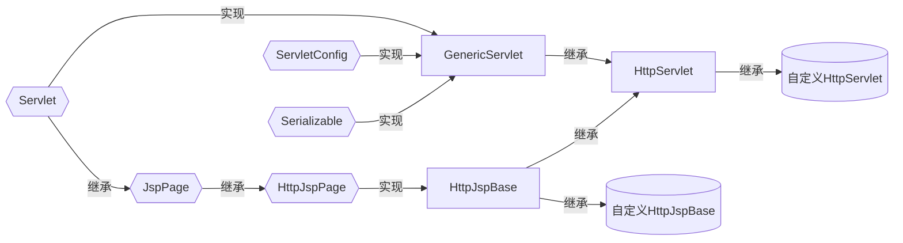
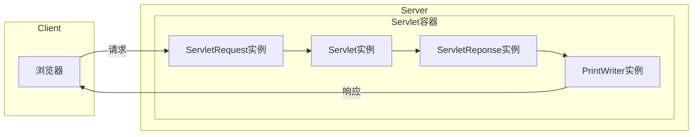
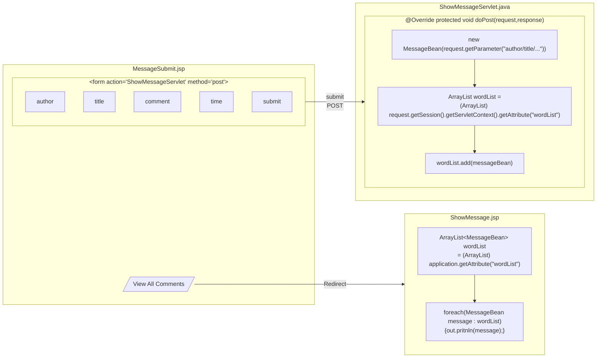
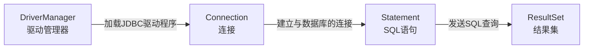
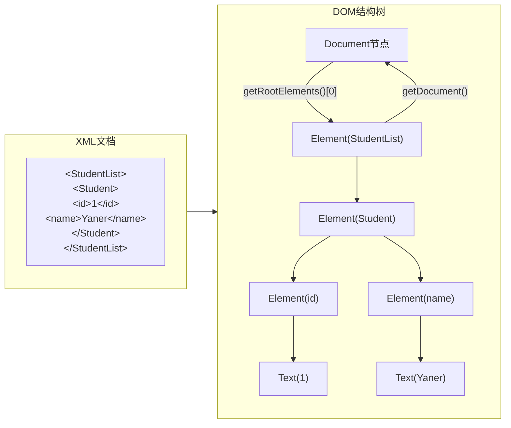
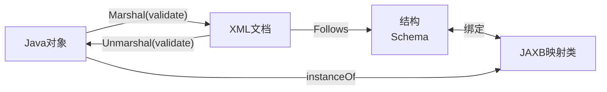
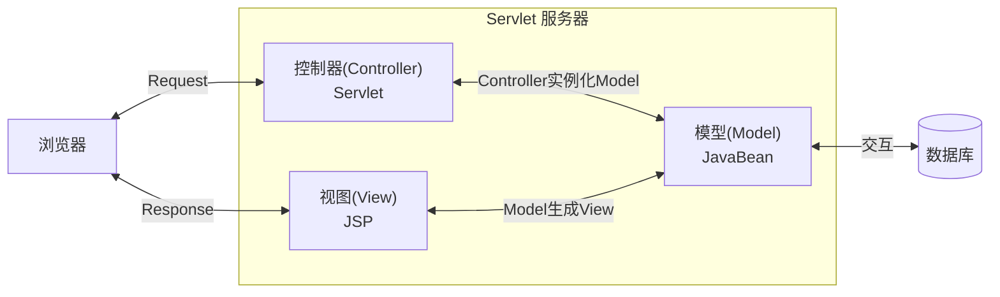
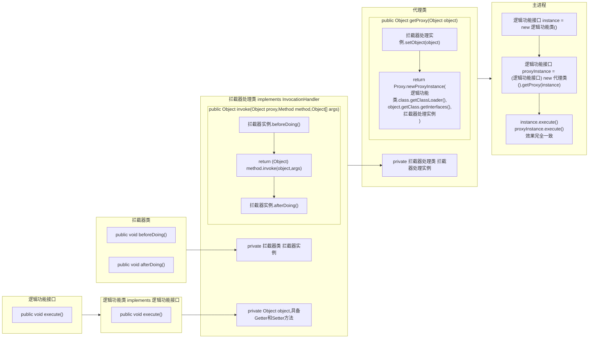

# JSP

# §1 JSP基本语法

## §1.1 脚本元素

JSP的脚本元素包括声明、脚本段和表达式。

### §1.1.1 注释（Comment）

JSP包含两种注释：

- HTML注释

  面向前端，用户可以看到，格式为`<!-- -->`

- JSP注释

  面向后端，只有后端才能看到，格式为`<%-- --%>`。内部可以嵌套Java注释，例如`<%-- // --%>`或`<%-- /* */ --%>`

### §1.1.2 声明（Declearation）

声明语句用于在JSP中声明变量和定义方法，格式为`<%! %>`，不能向当前输出流进行操作。

```jsp
<html>
    <body>
        <%! 
            int a = 1;
            int GetSquare(int data){
                return data*data;
            }
        %>
        <% out.println(a + GetSquare(2)); %>
    </body>
</html>
```

### §1.1.3 脚本段（Scriptlets）

脚本段是在处理请求时执行的Java代码段，格式为`<% %>`，可以对当前输出流进行操作。

```jsp
<html>
    <body>
        <% if(Math.random() > 0.5){ %>
            You are lucky! :)
        <% }else{ %>
            You are unlucky! :(
        <% } %>
    </body>
</html>
```

### §1.1.4 表达式（Expression）

表达式指的是Java中完整的表达式，格式为`<%= %>`计算后会被转换为字符串，输出到当前的输出流中。

```jsp
<%@ page import="java.util.Date" %>
<html>
    <body>
        <%= new Date() %>
    </body>
</html>
```

## §1.2 指令元素

JSP的指令元素包括`page`指令、`include`指令、`taglib`指令，格式为`<%@ 指令名属性="属性值" %>`，**只在编译时运行一次**。

### §1.2.1 `page`

`page`指令用于定义JSP页面内的属性和属性值，格式为`<%@ page key1=value1 key2=value2 ... %>`。该指令可以修改的属性和属性值有：

- `language`：使用的脚本语言，缺省为`java`

- `import`：导入的Java软件包

- `extends`：编译时需要使用的Java类

- `session`：设置此网页是否加入到`session`中，缺省为`true`

- `buffer`：输出网页时使用的缓冲区的长度，可取`none`或数字，缺省为`8KB`

- `autoFlush`：缓冲区已满时是否自动输出缓冲区。若设为`false`，则缓冲区满时抛出异常，缺省为`true`

- `info`：指定网页的说明信息，可由`Servlet.getServletInfo()`获取

  ```jsp
  <%@ page info="This is info!" %>
  <html>
      <body>
          <% out.print(getServletInfo()); %>
      </body>
  </html>
  ```

- `isThreadSafe`：设置能否多线程访问，缺省为`true`

- `isErrorPage`：指定此网页是否为另一个JSP页面的错误提示页面，决定能否调用`Exception`类

- `errorPage`：指定此网页的错误提示页面

- `contentType`：指定该网页使用的字符集、JSP响应的MIME类型，缺省为`text/html;charset=ISO-8859-1 `

### §1.2.2 `include`

`include`指令在当前文件中包含一个静态文件，格式为`<%@ include file="<path>" %>`。

> 注意：包含的文件不能有`<html>`/`<body>`等标签，否则将破坏当前文件的DOM结构。

```jsp
<!-- nowTime.jsp -->
<%@ page import="java.util.Date" %>
<% out.print(new Date()); %>
```

```jsp
<!-- index.jsp -->
<html>
    <body>
        <%@ include file="nowTime.jsp" %>
    </body>
</html>
```

### §1.2.3 `taglib`

`taglib`指令用于指定JSP自定义的标签，供其他JSP文档引用。其格式为`<%@ taglib uri="<TagLibrary>" prefix="<Prefix>">`，其中各参数的含义为：

- `uri`：根据标签前缀，对自定义标签进行的唯一命名
- `prefix`：在自定义标签之前的前缀

```jsp
<%@ taglib uri= %>
```

> 注意：`jsp`/`jspx`/`java`/`javax`/`servlet`/`sun`/`sunw`等保留字不允许作为自定义标签的前缀。

## §1.3 动作元素

动作元素用于控制JSP容器的动作，**每次请求时都被执行一次**。

### §1.3.1 `<jsp:include>`

`<jsp:include>`用于在该文件中包含其它文件，并将结果输出到页面中，格式为`<jsp:include page="URL<%=expression>" flush="true" />`。

```jsp
<html>
    <body>
        <jsp:include page="nowtime.jsp" />
    </body>
</html>
```

### §1.3.2 `<jsp:forward>`

`<jsp:forward>`用于在不改变地址栏地址的情况下，实现重定向页面，格式为`<jsp:forward page="URL">`。

### §1.3.3 `<jsp:param>`

`<jsp:param>`用于传参，通常与`<jsp:include>`、`<jsp:forward>`、`<jsp:plugin>`搭配使用，格式为`<jsp:param name="name" value="value">`。

```jsp
<!-- sendMessage.jsp -->
<jsp:forward page="showMessage.jsp">
    <jsp:param name="message" value="This is a message"/>
</jsp:forward>
```

```jsp
<!-- showMessage.jsp -->
<%= request.getParameter("message") %>
```

### §1.3.4 `<jsp:useBean>`

`<jsp:useBean>`允许JSP使用JavaBean，格式为`<jsp:useBean id="<InstanceName>" scope="<ScopeName>" <typeSpec> />`，其中各参数的含义如下所示：

- `id`：在当前`scope`内调用或新建名为`<InstanceName>`的实例

- `scope`：指定Bean类的作用域，取值范围为`page`、`request`、`session`、`application`

- `<typeSpec>`：指定Bean类的种类属性。

  | 组合情况 | `class` | `beanName` | `type` |
  | :------: | :-----: | :--------: | :----: |
  |          |    √    |            |        |
  |          |    √    |     √      |        |
  |          |         |     √      |   √    |
  |          |         |            |   √    |

  - `class`：指定Bean类的完整路径
  - `beanName`：指定Bean实例的名称
  - `type`：指定Bean类的名称/超类的名称/实现的任意接口之一。

```java
public class Person {
	private String name;
	public void setName(String name){
        this.name = name;
    }
    public String getName(String name){
        return this.name;
    }
}
```

```jsp
<html>
    <head>
        <jsp:useBean id="LiHua" scope="page" class="Person" />
        <%
        	LiHua.setName("LiHua");
        	out.println(LiHua.getName());
        %>
    </head>
</html>
```

将编译得到的`.class`文件放到`/src/WebApp/WEB-INF/classes/com/example`目录下即可。

```shell
C:\workspace> javac Person.java
C:\workspace> mv Person.class ...
```

## §1.4 内置对象

JavaBean要求必须先手动初始化实例，才能调用改实例。然而JSP页面初始化时会自动声明某些对象，因此在JSP中可以直接使用。这些对象被称为内置对象（Implicit Object）。

|   实例名称    |           内容            |      生存周期      | 对应类                                   |
| :-----------: | :-----------------------: | :----------------: | ---------------------------------------- |
| `application` |      整个WebApp对象       | 整个WebApp运行期间 | `javax.servlet.ServletContext`           |
|   `config`    | JSP页面初始化时使用的容器 |    页面执行期间    | `javax.servlet.ServletConfig`            |
|  `exception`  | 发生错误时产生的异常对象  |    页面执行期间    | `java.lang.Throwable`                    |
|     `out`     |  服务器的`OutputStream`   |    页面执行期间    | `javax.servlet.jsp.JspWriter`            |
|    `page`     |      当前网页的对象       |    页面执行期间    | `javax.lang.Object`，也就是`this`        |
| `pageContext` | 提供其他对象和方法的对象  |    页面执行期间    | `javax.servlet.jsp.PageContext`          |
|   `request`   |   客户端发送请求的信息    |    用户请求时间    | `javax.servlet.http.HttpServletRequest`  |
|  `response`   |   服务器发送响应的信息    |    页面响应期间    | `javax.servlet.http.HttpServletResponse` |
|   `session`   |      当前会话的信息       |      会话期间      | `javax.servlet.http.HttpSession`         |

### §1.4.1 `request`

`request`实例代表客户端的请求，包含客户端所有基于HTTP协议传递的信息，例如`GET`/`POST`传递的表单信息、COOKIE等。

| 方法名                            |                        作用                        |                          返回示例                          |
| --------------------------------- | :------------------------------------------------: | :--------------------------------------------------------: |
| `getAttribute(String)`            |          获取Server内`name`属性对应的对象          |                                                            |
| `setAttribute(String,Object)`     |          设置Server内`name`属性对应的对象          |                                                            |
| `removeAttribute(String)`         |          删除Server内`name`属性对应的对象          |                                                            |
| `getAttributeNames()`             |               获取Server内所有属性名               |                                                            |
| `getParameter(String name)`       |    获取Client内**第一个**`name`属性对应的字符串    |                                                            |
| `getParameterValues(String name)` | 获取Client内**所有**`name`属性对应的字符串**数组** |                                                            |
| `getServerName()`                 |             获取Client访问的Domain或IP             |                  `127.0.0.1`或`localhost`                  |
| `getServerPort()`                 |                获取Client访问的Port                |                   `80`或`10809`（代理）                    |
| `getServletPath()`                |              获取Client请求的资源路径              |                        `/index.jsp`                        |
| `getRemoteAddr()`                 |                 获取Client看到的IP                 | `127.0.0.1`或`0.0.0.0.0.0.0.1`（hosts定义`::1 localhost`） |
| `getRemotePort()`                 |             获取`Client`监听本机的Port             |                          `64651`                           |
| `getLocalPort()`                  |              获取Server当前监听的端口              |                            `80`                            |
| `getContextPath()`                |          获取Client请求的资源所在的文件夹          |                        `/myWebApp`                         |
| `getCharacterEncoding()`          |        获取Server解析Request时使用的字符集         |                     缺省为`iso-8859-1`                     |
| `setCharacterEncoding(String)`    |        设置Server解析Request时使用的字符集         |                                                            |
| `getCookies()`                    |          获取Client发送的`Cookie`实例数组          |                                                            |
| `getSession()`                    |         获取当前Session的`HttpSession`实例         |                                                            |
| `getContentType()`                |            获取Client请求数据的MIME类型            |                        `text/html`                         |
| `getProtocol()`                   |                获取Client使用的协议                |                         `HTTP/1.1`                         |
| `getContentLength()`              |    获取Client发送Request时指明的`ContentLength`    |                        `-1`（缺省）                        |

> 这里的Server和Client是相对而言的。`Attribute`是自己可以控制和修改的，而`Parameter`只能受对方控制，自己无权更改。
>
> 例如Client经过Proxy向Server发包，那么Client的`Attribute`就是Proxy的`Parameter`，Proxy再设置自己的`Parameter`，那么Server受到的`Attribute`包含了Server的`Parameter`和`Parameter`。

```jsp
<!-- index.jsp -->
<%@ page contentType="text/html;UTF-8" %>
<html>
    <body>
        <form name="MessageBoard" method="post" action="showOrder.jsp">
            <label><input type="text" name="username" placeholder="Your Name Here"></label>
            <label>
                <input type="checkbox" name="order" id="Apple" value="Apple"><label for="Apple">Apple</label>
                <input type="checkbox" name="order" id="Banana" value="Banana"><label for="Banana">Banana</label>
                <input type="checkbox" name="order" id="Cheery" value="Cheery"><label for="Cheery">Cheery</label>
            </label>
            <label><input type="submit" value="Buy"></label>
            <label><input type="reset" value="Reset"></label>
        </form>
    </body>
</html>
```

```jsp
<!-- showOrder.jsp -->
<%@ page import="java.util.Arrays" %>
<%@ page contentType="text/html;charset=UTF-8" language="java" %>
<% request.setCharacterEncoding("UTF-8"); %>
<html>
    <body>
        Your name is: <%= request.getParameter("username") %><br>
        Your order is: <%= Arrays.toString(request.getParameterValues("order")) %>
    </body>
</html>
```

### §1.4.2 `response`

`response`用于生成Response并发送到Client。

| 方法名                                    | 作用                             |
| ----------------------------------------- | -------------------------------- |
| `void sendRedirect(String)`               | 让Client重定向到指定的URL        |
| `void setContentType(String)`             | 设置Response的MIME类型           |
| `void setContentLength(int)`              | 设置Response的内容长度           |
| `void setHeader(String key,String value)` | 设置Response报文首部的字段       |
| `void setStatus(int)`                     | 设置HTTP状态码                   |
| `ServletOutputStream getOutputStream()`   | 获取`ServletOutputStream`实例    |
| `PrintWriter getWriter()`                 | 获取`PrintWriter`实例            |
| `int getBufferSize()`                     | 获取缓冲区长度                   |
| `void setBufferSize()`                    | 设置缓冲区长度                   |
| `void flushBuffer()`                      | 强制将缓冲区内的数据发送到Client |
| `void addCookie(Cookie)`                  | 向Client添加Cookie               |
| `void addHeader(String key,String value)` | 添加HTTP的头文件                 |
| `boolean isCommited()`                    | 判断服务器是否已经发送Response   |

例如使用`response.setHeader()`设置`refresh`头，实现页面自动刷新：

```jsp
<!-- LiveTime.jsp 实时刷新页面，显示当前时间 -->
<%@ page import="java.util.Date" %>
<% request.setCharacterEncoding("UTF-8"); %>
<html>
	<body>
        <%
            out.println(new Date());
            response.setHeader("refresh", "1"); // 单位为秒
        	// 或response.setHeader("refresh","1；URL=baidu.com")
        %>
	</body>
</html>
```

例如跟踪用户的访问记录：

```jsp
<html>
	<body>
    <%
        Cookie cookieResponse = null;
        Cookie[] cookies = request.getCookies();
        if (cookies == null) {
            out.println("No cookie available.");
        } else {
            if (cookies.length == 0) {
                out.println("Writing Cookie is forbidden on client.");
            } else {
                for (Cookie cookie : cookies) {
                    if(cookie.getName().equals("isVisited")){
                        cookieResponse = cookie;
                        break;
                    }
                }
            }
        }
        if(cookieResponse == null){
            out.println("You visit the page for the first time.");
            cookieResponse = new Cookie("isVisited",new Date().toString().replaceAll(" ","."));
        }else{
            out.println("You visited the page in " + cookieResponse.getValue());
            cookieResponse.setValue(new Date().toString().replaceAll(" ","."));
        }
        response.addCookie(cookieResponse);
        response.flushBuffer();
    %>
    </body>
</html>
```

### §1.4.3 `out`

`out`对象能结合JSP代码，将数据发送到Client。

| 方法名            | 作用                                            |
| ----------------- | ----------------------------------------------- |
| `clear()`         | 清空缓冲区，若缓冲区本身为空则引起`IOException` |
| `clearBuffer()`   | 清空缓冲区                                      |
| `flush()`         | 强制输出缓冲区全部数据                          |
| `getBufferSize()` | 返回缓冲区长度，默认为`8192`                    |
| `getRemaining()`  | 返回缓冲区剩余长度                              |
| `isAutoFlush()`   | 是否自动输出缓冲区的数据                        |
| `newline()`       | 换行                                            |
| `print()`         | 输出                                            |
| `println()`       | 输出后换行                                      |
| `close()`         | 强制输出缓冲区全部数据，然后关闭输出流          |

```jsp
<!-- OutBuffer.jsp -->
<html>
<body>
    <%
        out.println("This line won't be displayed.");
        out.clearBuffer();
        out.println("Current buffer size: " + out.getBufferSize() + "<br>");
        out.println("Current buffer available size: " + out.getRemaining() + "<br>");
        out.flush();
        out.println("This line will be forced to be displayed.");
        out.close();
        out.println("This line won't be displayed.");
    %>
</body>
</html>
```

### §1.4.4 `session`

`session`对象用于保存当前Session的信息，生命周期从Server与Client建立连接开始，到两者断开连接为止。每个用户分别凭自己收到的Session ID与服务器交互，服务器根据Session ID匹配字段。

“断开连接”指的是以下四种情形之一：

- Client关闭浏览器
- Server宕机
- Server端JSP执行`session.invalidate()`
- Server收到的两次请求的时间间隔超出预设值，Tomcat默认为30分钟

| 方法名                                | 作用                                                         |
| ------------------------------------- | ------------------------------------------------------------ |
| `void setAttribute(String,Object<E>)` | 向Session添加键值对                                          |
| `Object<E> getAttribute(String)`      | 从Session获得值                                              |
| `Enumeration<E> getAttributeNames()`  | 获取包含所有变量的名称的`Enumeration`实例                    |
| `void removeAttribute(String)`        | 从Seesion删除键值对                                          |
| `void invalidate()`                   | 结束Session                                                  |
| `long getCreationTime()`              | 返回Session建立的时间（单位为毫秒）                          |
| `long getLastAccessedTime()`          | 返回Session最近一次被调用的时间，新建的Session为`-1`         |
| `long getMaxInactiveInternal()`       | 返回两次请求的时间间隔的最大值，Tomcat默认为30分钟（单位为秒） |
| `boolean isNew()`                     | 返回当前Session是否为第一次创建                              |
| `setMaxInactiveInterval(int)`         | 设置两次请求的时间间隔的最大值（单位为秒）                   |

利用`session`可以做一个简单的登录系统：

```jsp
<!-- SessionLogin.jsp -->
<html>
<body>
<%
    String username = request.getParameter("username");
    if (username != null) {
        session.setAttribute("username", username);
        out.print("Login Success!");
    }
%>
<form action="SessionLogin.jsp">
    <label><input type="text" name="username"></label>
    <label><input type="submit"></label>
</form>
</body>
</html>
```

```jsp
<!-- SessionWelcome.jsp -->
<html>
<body>
<%
    String username = (String) session.getAttribute("username");
    if (username != null) {
        out.print("Hello, " + username + "!");
    } else {
        out.print("Sorry, you havn't login.");
        out.print("<a href=\"SessionLogin.jsp\">Go to login</a>");
    }
%>
</body>
</html>
```

### §1.4.5 `application`

`application`对象代表着整个Web应用，除了保存全局变量外，还可以获取网站本身的信息。多个用户共享同一个`application`实例。其生命周期从Server运行开始，到Server宕机结束，不能被JSP手动创建或清除。

| 方法名                                | 作用                                               |
| ------------------------------------- | -------------------------------------------------- |
| `void setAttribute(String,Object<E>)` | 设置`application`变量                              |
| `Object<E> getAttribute(String)`      | 获取`application`变量                              |
| `void removeAttribute(String)`        | 删除`application`变量                              |
| `Enumeration getAttributeNames() `    | 获得包含所有`application`变量名的`Enumeration`实例 |
| `int getMajorVersion()`               | 获得Server支持的最新ServletAPI版本                 |
| `int getMinorVersion()`               | 获得Server支持的最旧ServletAPI版本                 |
| `String getMimeType(String)`          | 返回路径为`String`的文件的格式和编码               |
| `String getReadPath(String)`          | 返回相对路径的绝对滤镜                             |
| `String getServerInfo()`              | 返回Server解释引擎的信息                           |

例如统计当前页面被访问的次数：

```jsp
<!-- ApplicationVisitedPlayerCounter.jsp -->
<%@ page contentType="text/html;charset=UTF-8" %>
<html>
<body>
<%
    Integer visitedNumber = (Integer) application.getAttribute("VisitedPlayerNumber");
    if (visitedNumber == null) {
        visitedNumber = Integer.valueOf(0);
        application.setAttribute("VisitedPlayerNumber", visitedNumber);
    }
    visitedNumber = visitedNumber + 1;
    application.setAttribute("VisitedPlayerNumber", visitedNumber);
%>
The page have been visited for <%= application.getAttribute("VisitedPlayerNumber").toString() %> times!
</body>
</html>
```

### §1.4.6 `pageContext`

`pageContext`允许当前JSP访问所有作用域的`request`、`response`、`session`、`application`等对象。

- 当前JSP作用域内的任意内置对象

  | 方法名                                                  | 作用                                                         |
  | ------------------------------------------------------- | ------------------------------------------------------------ |
  | `Object getAttribute(String name,int scope)`            | 获取当前JSP的`scope`作用域的`name`属性                       |
  | `Enumeration getAttributeNamesInScope(int scope)`       | 获取包含当前JSP的`scope`作用域的所有属性的`Enumeration`实例  |
  | `void removeAttribute(String name,int scope)`           | 移除当前JSP的`scope`作用域的`name`属性                       |
  | `void removeAttribute(String)`                          | 移除当前JSP第一个找到的`name`属性                            |
  | `void setAttribute(String name,Object value,int scope)` | 设置当前JSP的`scope`作用域的`name`属性，`scope`缺省时指定为`page`作用域 |

- 当前JSP作用域内的特殊内置对象

  | 方法名                               | 作用                                                  |
  | ------------------------------------ | ----------------------------------------------------- |
  | `Exception getException()`           | 当前网页被声明为`ErrorPage`时，回传目前抛出的异常实例 |
  | `JspWriter getOut()`                 | 回传目前网页的输出流实例（例如`out`）                 |
  | `Object getPage()`                   | 回传目前网页的`Servlet`实例（例如`page`）             |
  | `ServletRequest getRequest()`        | 回传目前网页的请求实例（例如`request`）               |
  | `ServletResponse getResponse()`      | 回传目前网页的响应实例（例如`response`）              |
  | `ServletConfig getServletConfig()`   | 回传目前网页的`ServletConfig`实例（例如`config`）     |
  | `ServletContext getServletContext()` | 回传目前网页的执行环境（例如`application`）           |
  | `HttpSession getSession()`           | 回传与当前网页有关系的会话（例如`session`）           |

- 内置对象的各类属性

  | 方法名                                | 作用                           |
  | ------------------------------------- | ------------------------------ |
  | `int getAttributesScope(String name)` | 返回`name`属性所处的作用域范围 |
  | `Object findAttribute(String name)`   | 在所有作用域中查找`name`属性   |

> 注意：`int scope`使用的常量定义于`javax.servlet.jsp.PageContext`中，取值范围如下所示：
>
> - `PAGE_SCOPE = 1`
> - `REQUEST_SCOPE = 2`
> - `SESSION_SCOPE = 3`
> - `APPLICATION_SCOPE = 4`

```jsp
<%
	// 以下语句效果完全相同
	page.setAttribute("username");
	pageContext.setAttribute("username","admin"); // 默认为page
	pageContext.getPage().setAttribute("username","admin");
	pageContext.getServletContext().getPage().setAttribute("username","admin");
%>
```

### §1.4.7 `config`

`config`对象用于表示Servlet的配置。

| 方法                                   | 作用                                    |
| -------------------------------------- | --------------------------------------- |
| `String getInitParameter(String name)` | 获取`name`所指定的初始参数              |
| `Enumeration getInitParameterNames()`  | 获取包含所有初始参数的`Enumeration`实例 |
| `ServletContext getServletContext()`   | 获取Servlet的`pageContext`实例          |
| `String getServletName()`              | 获取Servlet名称                         |

### §1.4.8 `page`

`page`对象代表的是当前JSP页面本身，与`this`关键字等价。

| 方法名                             | 作用                       |
| ---------------------------------- | -------------------------- |
| `void hashCode()`                  | 返回当前`page`对象的哈希值 |
| `void getClass()`                  | 返回网页的类信息           |
| `void toString()`                  | 返回当前网页的字符串       |
| `ServletConfig getServletConfig()` | 获得`config`实例           |
| `String getServletInfo()`          | 返回服务器程序的信息       |

# §2 Servlet

JSP基于Servlet开发。Servlet是用Java Servlet API开发的一种类，所有API定义于`javax.Servlet`中。





## §2.1 创建实例

每个自定义Servlet类都必须继承于抽象类`HttpServlet`，实现其定义的`doGet()`和`doPost()`方法。

```java
package com.example;

import javax.servlet.ServletException;
import javax.servlet.http.HttpServlet;
import javax.servlet.http.HttpServletRequest;
import javax.servlet.http.HttpServletResponse;
import java.io.IOException;
import java.io.PrintWriter;

public class UserInfoManagement extends HttpServlet {

    public UserInfoManagement(){

    }

    @Override protected void doGet(HttpServletRequest req, HttpServletResponse resp) throws ServletException, IOException {
        resp.setContentType("text/html");
        PrintWriter out = resp.getWriter();
        out.println("<html><body>Welcome to the User Info Management!</body></html>");
        out.flush();
        out.close();
    }

    @Override protected void doPost(HttpServletRequest req, HttpServletResponse resp) throws ServletException, IOException {
        
    }
}
```

## §2.2 `web.xml`配置文件

在配置文件`web.xml`中声明新建的Servlet时，需要在其中声明该Servlet的各项信息：

- `<web-app>`（根标签）

  - `<servlet>`（必须在最前出现）

    | 标签名              | 父标签名    | 含义                                                         | 注意事项                                                     |
    | ------------------- | ----------- | ------------------------------------------------------------ | ------------------------------------------------------------ |
    | `<servlet-name>`    | `<servlet>` | Servlet的名称                                                | 必填项，必须与`<servlet-mapping>`内的`<servlet-name>`相同    |
    | `<servlet-class>`   | `<servlet>` | Servlet类的路径                                              | 必填项                                                       |
    | `<display-name>`    | `<servlet>` | Servlet发布时的名称                                          |                                                              |
    | `<description>`     | `<servlet>` | Servlet的功能描述                                            |                                                              |
    | `<load-on-startup>` | `<servlet>` | 当`<web-app>`内包含许多`<servlet>`时，设置不同`Servlet`的启动顺序 | 接受整数值时，值越小越先启动；值为`AnyTime`时，启动顺序不固定 |
    | `<init-param>`      | `<servlet>` | Servlet的初始化参数                                          | 内部必须只包含一个`<param-name>`和`<param-value>`            |

    - `<init-param>`

      | 标签名          | 父标签名       | 含义                             | 注意事项                                                   |
      | --------------- | -------------- | -------------------------------- | ---------------------------------------------------------- |
      | `<param-name>`  | `<init-param>` | Servlet的初始化参数的键（Key）   | 在`Servlet.init()`内通过`getInitParameter()`方法获取键值对 |
      | `<param-value>` | `<init-param>` | Servlet的初始化参数的值（Value） | 在`Servlet.init()`内通过`getInitParameter()`方法获取键值对 |

  - `<servlet-mapping>`（必须在最后出现）

    | 标签名           | 父标签名            | 含义                        | 注意事项                                  |
    | ---------------- | ------------------- | --------------------------- | ----------------------------------------- |
    | `<servlet-name>` | `<servlet-mapping>` | 要进行路径映射的Servlet名称 | 必须与`<servlet>`内的`<servlet-name>`相同 |
    | `<url-pattern>`  | `<servlet-mapping>` | Servlet的映射路径           | 必须以`/`开头                             |

```xml
<!-- web.xml -->
<?xml version="1.0" encoding="UTF-8"?>
<web-app xmlns="http://xmlns.jcp.org/xml/ns/javaee"
         xmlns:xsi="http://www.w3.org/2001/XMLSchema-instance"
         xsi:schemaLocation="http://xmlns.jcp.org/xml/ns/javaee
                             http://xmlns.jcp.org/xml/ns/javaee/web-app_4_0.xsd"
         version="4.0">
    <servlet>
        <description>User Info Management System</description>
        <display-name>UserInfoManagement</display-name>
        <servlet-name>UserInfoManagement</servlet-name>
        <servlet-class>com.example.UserInfoManagement</servlet-class>
        <init-param>
        	<param-name>version</param-name>
            <param-value>0.1</param-value>
        </init-param>
    </servlet>
    
    <servlet-mapping>
        <servlet-name>UserInfoManagement</servlet-name>
        <url-pattern>/test</url-pattern>
    </servlet-mapping>
    
</web-app>
```

## §2.3 `GenericServlet`类

`GenericServlet`类的声明为`public abstract class GenericServlet implements Servlet, ServletConfig, java.io.Serializable`。该类定义了下列方法：

- `void init([ServletConfig])`：初始化Servlet实例
- `void destory()`：销毁Servlet实例
- `String getServletInfo()`：获取Servlet信息
- `ServletConfig getServletConfig()`：获得包含Servlet配置的`ServletConfig`实例
- `void service(ServletRequest,ServletResponse)`：运行Servlet的逻辑入口

## §2.4 `HttpServlet`类

`HttpServlet`类的声明为`public abstract class HttpServlet extends GenericServlet`，用于提供HTTP的基本功能：

- `void doGet(ServletRequest,ServletResponse)`：处理HTTP的GET请求
- `void doPost(ServletRequest,ServletResponse)`：处理HTTP的POST请求
- `void doPut(ServletRequest,ServletResponse)`：处理HTTP的PUT请求
- `void doDelete(ServletRequest,ServletResponse)`：处理HTTP的Delete请求
- `String getServletInfo()`：获取Servlet信息
- `ServletConfig getServletConfig()`：获取Servlet的初始化参数和`ServletContext`
- `void init()`：Server创建Servlet实例时默认执行，只在被创建时执行一次，用于管理服务器资源
- `void service(ServletRequest,ServletResponse)`：用户访问时默认执行，只在新用户访问时被执行一次
- `void destory()`：Serverl销毁Servlet实例时默认执行

## §2.5 `HttpServletRequest`接口

`HttpServletRequest`接口的声明为`public interface HttpServletRequest extends ServletRequest`。当Servlet容器受到请求时，就将该接口实例化，封装成一个实例，然后将该实例传给`GenericServlet.service()`方法。该接口定义的主要方法有：

| 方法名                                           | 作用                                                         |
| ------------------------------------------------ | ------------------------------------------------------------ |
| `String getAuthType()`                           | 返回Request的身份验证模式                                    |
| `Cookie[] getCookies()`                          | 返回Client发送的Cookie                                       |
| `long getDateHeader(String)`                     | 返回Request中表示时间的字段转化而成的`Date.to`，从1970年1约1日以来的毫秒数 |
| `String getHeader(String)`                       | 返回Request中表示时间的字段转化而成的`Date.getTime()`（从1970年1约1日以来的毫秒数） |
| `Enumeration<String> getHeaderNames()`           | 返回Request中包含所有字段的键（Key）的`Enumeration`实例      |
| `Enumeration<String> getHeader(String)`          | 返回Request中只包含指定键（Key）的`Enumeration`实例          |
| `int getIntHeader(String)`                       | 返回Request中表示整数的字段转化而成的`int`                   |
| `String getMethod()`                             | 返回Request使用的HTTP方法                                    |
| `String getPathInfo()`                           | 返回URL去除Servlet路径后的路径，路径为空是返回`null`，是`getPathTranslated()`的反函数 |
| `String getPathTranslated()`                     | 返回URL的在操作系统内的绝对路径，若`getPathInfo()==null`则返回`null`，时`getPathInfo()`的反函数 |
| `String getQueryString()`                        | 返回URL中用于GET传参的查义字符串                             |
| `String getRemoteUser()`                         | 返回发送Request的用户名，用于HTTP身份鉴权                    |
| `String getRequestedSessionId()`                 | 返回Request的Session ID                                      |
| `String getRequestURI()`                         | 返回URL中去除GET传参的差异字符串，只保留请求资源路径的部分   |
| `String getServletPath()`                        | 返回Request请求的Servlet路径                                 |
| `HttpSession getSession([boolean])`              | 返回Request对应的`Session`实例                               |
| `int getContentLength()`                         | 返回Request请求头中`Content-Length`字段的值                  |
| `String getContentType`                          | 返回Request请求头中`Content-Type`字段的值                    |
| `ServletInputStream getInputStream()`            | 返回Request请求正文的`InputStream`实例                       |
| `String getLocalAddr()`                          | 返回Request请求头中指示的Client地址                          |
| `Locale getLocale()`                             | 返回Request请求头中指示的地区对应的`Locale`实例              |
| `String getLocalName()`                          | 返回Server用于接受Request的主机名                            |
| `int getLocalPort()`                             | 返回Server用于接受Request的端口                              |
| `String getParameter(String)`                    | 返回Request请求参数中指定名称的字段的值                      |
| `Map<String,String[]> getParameterMap()`         | 返回Request所有请求参数对应的`Map`实例                       |
| `Enumeration<String> getParameterNames()`        | 返回Request所有请求参数名称对应的`Enumeration`实例           |
| `String[] getParameterValues(String)`            | 返回Request特定名称的请求参数的所有值                        |
| `String getProtocol()`                           | 返回Request使用的协议                                        |
| `BufferedReader getReader()`                     | 返回Request请求正文的`BufferedReader`实例                    |
| `String getRemoteAddr()`                         | 返回Proxy或Client的IP地址                                    |
| `String getRemoteHost()`                         | 返回Proxy或Client的主机名                                    |
| `int getRemotePort()`                            | 返回Proxy或Client的端口                                      |
| `RequestDispatcher getRequestDispatcher(String)` | 返回`RequestDispatcher`接口的一个实例                        |
| `String getServerName()`                         | 返回Client请求的Server的主机名                               |
| `int getServerPort()`                            | 返回Client请求的Server的端口                                 |
| `ServletContext getServletContext()`             | 返回最近一次Reques对应的`ServletResquest.getServletContext()` |
| `boolean isSecure()`                             | 判断协议是HTTP还是HTTPS                                      |
| `void removeAttribute(String name)`              | 删除Request请求头中特定名称的请求参数                        |
| `void setAttribute(String,Object)`               | 向Request请求头添加请求参数                                  |
| `void setCharacterEncoding(String)`              | 设置解析Request使用的编码                                    |

## §2.6 `HttpServletResponse`接口

`HttpServletResponse`接口的声明为`public interface HttpServletResponse extends ServletResponse`。该接口定义的主要方法有：

| 方法名                               | 作用                                   |
| ------------------------------------ | -------------------------------------- |
| `addHeader(String,String)`           | 向Response添加响应参数                 |
| `sendError(int sc,[String message])` | 向Client发送HTTP状态错误代码和错误信息 |
| `sendHeader(String,String)`          | 向Response添加响应参数（覆盖原参数）   |
| `setStatus(int sc)`                  | 向Client发送HTTP状态代码               |
| `addCookie(Cookie)`                  | 给Client设置Cookie                     |

## §2.7 `ServletConfig`接口

`ServletConfig`接口的声明为`public interface ServletConfig`。`Servlet`通过调用`init(ServletConfig)`配置`Servlet`的名称 、初始化参数和上下文。该接口定义的方法有：

| 方法名                                        | 作用                                                         |
| --------------------------------------------- | ------------------------------------------------------------ |
| `String getInitParameter(String)`             | 获取特定名称的初始化参数                                     |
| `Enumeration<String> getInitParameterNames()` | 获取包含所有初始化参数键（Key）的`Enumeration`实例           |
| `ServletContext getServletContext()`          | 获取当前Servlet的`ServletContext`实例                        |
| `String getServletName()`                     | 获取`web.xml`中当前Servlet的`<servlet-name>`，若未定义该标签则返回`<servlet-class>` |

```xml
<!-- web.xml -->
<?xml version="1.0" encoding="UTF-8"?>
<web-app xmlns="http://xmlns.jcp.org/xml/ns/javaee"
         xmlns:xsi="http://www.w3.org/2001/XMLSchema-instance"
         xsi:schemaLocation="http://xmlns.jcp.org/xml/ns/javaee http://xmlns.jcp.org/xml/ns/javaee/web-app_4_0.xsd"
         version="4.0">
    <servlet>
        <servlet-name>UserInfoManagement</servlet-name>
        <servlet-class>com.example.UserInfoManagement</servlet-class>
        <init-param>
            <param-name>version</param-name>
            <param-value>0.1</param-value>
        </init-param>
    </servlet>
    <servlet-mapping>
        <servlet-name>UserInfoManagement</servlet-name>
        <url-pattern>/test</url-pattern>
    </servlet-mapping>
</web-app>
```

```java
/* UserInfoManagement.java */
package com.example;

import javax.servlet.*;
import java.io.IOException;
import java.io.PrintWriter;
import java.util.*;

public class UserInfoManagement extends GenericServlet {

    private final Map initParams = new LinkedHashMap();
    private String servletName;

    @Override
    public void init(ServletConfig config) throws ServletException {
        super.init(config);
        Enumeration paramNames = getInitParameterNames();
        while(paramNames.hasMoreElements()){
            String paramName = (String) paramNames.nextElement();
            String paramValue = getInitParameter(paramName);
            initParams.put(paramName,paramValue);
        }
        servletName = getServletName();
    }

    @Override
    public void service(ServletRequest req, ServletResponse res) throws ServletException, IOException {
        res.setContentType("text/html;charset=UTF-8");
        PrintWriter out = res.getWriter();
        
        out.println("servletName: " + servletName + "<br>");

        out.println("initParams: <table>");
        out.println("<td>paramName</td>");
        out.println("<td>paramName</td>");
        Set paramNames = initParams.keySet();
        Iterator iterator = paramNames.iterator();
        while(iterator.hasNext()){
            String paramName = (String) iterator.next();
            String paramvalue = (String) initParams.get(paramName);
            out.println("<tr><td>" + paramName + "</td>");
            out.println("<td>" + paramvalue + "</td>");
            out.println("<tr>");
        }
        out.println("</table>");
        
    }
}
```

## §2.8 `HttpSession`接口

`HttpSession`接口的声明为`public interface HttpSession`，封装了一系列`Session`相关的概念。`HttpServletResquest`类实现了该接口，常用的方法有：

| 方法名                                    | 作用                                                 |
| ----------------------------------------- | ---------------------------------------------------- |
| `Object getAttribute(String)`             | 获取Session作用域中特定名称的参数                    |
| `Enumeration<String> getAttributeNames()` | 获取包含Session作用域中所有参数的`Enumeration`实例   |
| `void removeAttribute(String)`            | 删除Session作用域中特定米in过程的参数                |
| `void setAttribute(String,Object)`        | 向Session作用域中添加参数                            |
| `long getCreationTime()`                  | 返回Session被创建时的时间（GMT毫秒格式）             |
| `String getId()`                          | 返回Session ID                                       |
| `long getLastAccessedTime()`              | 返回Session最后一次Request的时间（GMT毫秒格式）      |
| `int getMaxInactiveInternal()`            | 返回Session两次Request之间的最长时间间隔             |
| `boolean isNew()`                         | 判断Session是新建的还是已有的                        |
| `void setMaxInactiveInterval()`           | 设置Session两次Request之间的最长间隔时间（单位为秒） |
| `void invalidate()`                       | 删除Session和与之相关联的对象                        |

```java
/* UserInfoManagement.java */
public class UserInfoManagement extends HttpServlet {

    @Override
    protected void doGet(HttpServletRequest req, HttpServletResponse resp) throws ServletException, IOException {
        resp.setContentType("text/html;charset=UTF-8");
        PrintWriter out = resp.getWriter();
        HttpSession session = req.getSession();
        Boolean isLogin = (Boolean) session.getAttribute("isLogin");
        if(isLogin == null){
            isLogin = Boolean.FALSE;
        }
        String username = req.getParameter("username");
        String password = req.getParameter("password");
        if(isLogin){ // 已登录
            username = (String) session.getAttribute("username");
            Date loginTime = new Date(session.getCreationTime());
            out.println("<a>Welcome to User Info Management System, " + username + "!</a>");
            out.println("<a>You logged in " + loginTime + " last time.</a>");
            session.setAttribute("username",username);
            session.setAttribute("isLogin",Boolean.TRUE);
        }else if(username != null && password != null){ // 未登录,但已输入用户名和密码
            Date loginTime = new Date();
            out.println("<a>Welcome to User Info Management System, " + username + "!</a>");
            out.println("<a>You logged in " + loginTime + " last time.</a>");
            session.setAttribute("username",username);
            session.setAttribute("isLogin",Boolean.TRUE);
            session.setAttribute("loginTime",loginTime);
        }else{ // 未登录
            out.println("<a>Please input your username and password by GET!");
        }
    }

}
```

## §2.9 `ServletContext`接口

`ServletContext`接口模拟了Servlet实例与引擎的交互，其实例代表着当前Servlet引擎运行的一个独立WebApp（虚拟机），可以通过`ServletConfig.getServletContext()`或`GenericServlet.getServletContext()`获得。

| 方法名                                        | 作用                                                  |
| --------------------------------------------- | ----------------------------------------------------- |
| `getAttriibute()`                             | 略                                                    |
| `getAttributeNames()`                         | 略                                                    |
| `removeAttriibute()`                          | 略                                                    |
| `setAttribute()`                              | 略                                                    |
| `getInitParameter()`                          | 略                                                    |
| `getInitParameterNames()`                     | 略                                                    |
| `getServletInfo()`                            | 返回Servlet引擎的信息                                 |
| `getMajorVersion()`                           | 返回支持的Servlet API最高版本                         |
| `getMinorVersion()`                           | 返回支持的Servlet API最低版本                         |
| `void log(String)`                            | 将指定的信息写入Servlet日志文件中                     |
| `ServletContext getContext()`                 | 返回`ServletContext`实例                              |
| `String getResource(String)`                  | 根据给定的相对路径，返回URL                           |
| `InputStream getResourceAsStream(String)`     | 根据给定的相对路径，返回表示该文件的`InputStream`实例 |
| `getRealPath(String)`                         | 根据给定的相对路径，返回带有主机名和端口的完整URL     |
| `getMimeType(String)`                         | 根据给定的相对路径，返回该文件的MIME类型              |
| `RequestDispatcher getNameDispatcher(String)` | 用于向其它Servlet或JSP转发请求                        |
| `RequestDispatcher getRequestDispatcher()`    | 用于向其它Servlet或JSP转发请求                        |

## §2.10 `RequestDispatcher`接口

`RequestDispatcher`接口的定义为`public interface RequestDispatcher`，用于转发Client的Request到Server上的其他组件。

获得`RequestDispatcher`实例的方法有：

- 使用`ServletContext`接口中的`getRequestDispatcher(String path)`方法

  ```java
  public class CustomizeHttpServlet extends ... {
      @Override ... doGet(...) throws ... {
          String path = "...";
          ServletConfig config = getServletConfig();
          ServletContext context = config.getServletContext();
          RequestDispatcher dispatcher = context.getRequestDispatcher(path);
      }
  }
  ```

- 使用`ServletContext`接口中的`getNameDispatcher(String path)`方法

  ```java
  public class CustomizeHttpServlet extends ... {
      @Override ... doGet(...) throws ... {
          // ...
          RequestDispatcher dispatcher = context.getNameDispatcher(path);
      }
  }
  ```

- 使用`ServletRequest`接口中的`getRequestDispatcher(String path)`方法

  ```java
  public class CustomizeHttpServlet extends ... {
      @Override ... doGet(...) throws ... {
          // ...
          RequestDispatcher dispatcher = request.getRequestDispatcher(path);
      }
  }
  ```

`RequestDispathcer.forward(ServletRequest,ServletResponse)`用于控制页面跳转：

```java
public class CustomizeHttpServlet extends ... {
    @Override ... doGet(...) throws ... {
        // ...
        ServletConfig config = getServletConfig();
        ServletContext context = config.getServletContext();
        RequestDispatcher dispatcher = context.getRequestDispatcher("/forward.html"); // 这里的相对路径的根目录由context决定
        dispatcher.forward(request,response); // 转发
    }
}
```

`RequestDispatcher.include(ServletRequest,ServletResponse)`用于转发请求的同时，继续保持对Response的控制权，转发到的Servlet的输出会被合并到当前Servlet。

## §2.11 声明式异常处理

```java
public class CustomizeHttpErrorHandlerServlet extends HttpServlet {
    @Override protected void service(HttpServletRequest req,Http ServletResponse resp) throws ServletException,IOException {
        int statusCode = req.getAttribute("javax.servlet.error.status_code");
		switch(statusCode){
            case 401:
                out.println("401 You are not authorized!");
                out.println("<a href=\"...\">Log in Now!</a>") // 自定义提示
                break;
            case 404:
                out.println("404 You are lost!");
                out.println("<a href=\"...\">Go to Home Page</a>") // 自定义提示
                break;
        }
    }
}
```

```xml
<web-app>
	// ...
    
    <servlet>
    	<servlet-name>HttpErrorHandler</servlet-name>
        <servlet-class>CustomizeHttpErrorHandlerServlet</servlet-class>
    </servlet>
    <servlet-mapping>
    	<servlet-name>HttpErrorHandler</servlet-name>
        <url-pattern>/HttpErrorHandler</url-pattern>
    </servlet-mapping>
    
    <error-page> <!-- 在此声明HTTP错误代码 -->
    	<error-code>401</error-code>
        <location>/HttpErrorHandler</location>
    </error-page>
    <error-page>
    	<error-code>404</error-code>
        <location>/HttpErrorHandler</location>
    </error-page>
    
    // ...
</web-app>
```

## §2.12 程序式异常处理

```java
public class UserInfoManagement {
    @Override 
    public void doGet(HttpServletRequest request,HttpServletResponse response) throws ServletException, IOException {
        try {
            int a = 1/0;
        } catch (ArithmeticException e) {
            req.setAttribute("javax.servlet.error.exception",e);
        	req.setAttribute(
                "javax.servlet.error.request_uri",
                req.getRequestURI()
            );
            RequestDispatcher requestDispatcher =
                req.getRequestDispatcher("ExceptionHandler");
            requestDispatcher.forward(req,resp); // 在程序内设置转发
        }
    }
}

public class CustomizeExceptHandlerServlet extends HttpServlet {
    @Override 
    protected void service(HttpServletRequest request,HttpServletResponse response) throws ServletException, IOException {
        PrintWriter out = response.getWriter();
        String uri = 
            (String) reqeust.getAttribute("javax.servlet.error.request_uri");
        Exception exception = 
            (Exception) request.getAttribute("javax.servlet.error.exception");
        out.printf(
        	"错误链接：%s\n错误原因：%s",
            uri,
            exception.toString()
        )
    }
}
```

## §2.13 实战：留言板

定义每条留言抽象化JavaBean类`MessageBean.java`，包含`author`/`title`/`comment`/`time`四个字段。



```java
/* MessageBean.java */
package com.example;
public class MessageBean {

    private String author;
    private String title;
    private String comment;
    private Date time;

    public String getAuthor() { return author; }
    public void setAuthor(String author) { this.author = author; }
    public String getTitle() { return title; }
    public void setTitle(String title) { this.title = title; }
    public String getComment() { return comment; }
    public void setComment(String comment) { this.comment = comment; }
    public Date getTime() { return time; }
    public void setTime(Date time) { this.time = time; }

}
```

```jsp
<!-- MessageSubmit.jsp -->
<%@ page contentType="text/html;charset=UTF-8" language="java" %>
<html>
<head>
    <title>Title</title>
</head>
<body>
    <form action="SaveMessageServlet" method="post">
        <input type="text" name="author" placeholder="Author"><br>
        <input type="text" name="title" placeholder="Title"><br>
        <input type="text" name="content" placeholder="Content"><br>
        <input type="submit" name="submit" value="Submit"><br>
        <a href="${pageContext.request.contextPath}/ShowMessage.jsp">View All Comments</a>
    </form>
</body>
</html>
```

```jsp
<!-- ShowMessage.jsp -->
<%@ page import="java.util.ArrayList" %>
<%@ page import="com.example.MessageBean" %><
<%@ page contentType="text/html;charset=UTF-8" language="java" %>
<html>
<head>
    <title>All Comments</title>
</head>
<body>
<%
    ArrayList<MessageBean> wordList = (ArrayList) application.getAttribute("wordList");
    if(wordList == null || wordList.size() == 0){
        out.println("No comments now!");
    }else{
        for(MessageBean messageBean : wordList) {
            out.println("Author: " + messageBean.getAuthor() +"<br>");
            out.println("Title: " + messageBean.getTitle() +"<br>");
            out.println("Comment: " + messageBean.getComment() +"<br>");
            out.println("Time: " + messageBean.getTime() +"<br><br>");
        }
    }
%>
<a href="MessageSubmit.jsp">Leave a comment</a>
</body>
</html>
```

```java
/* SaveMessageServlet.java */
package com.example;

import javax.servlet.*;
import javax.servlet.http.*;
import java.io.IOException;
import java.util.ArrayList;
import java.util.Date;

public class SaveMessageServlet extends HttpServlet {
    
    @Override protected void doPost(HttpServletRequest request, HttpServletResponse response) throws ServletException, IOException {
        MessageBean messageBean = new MessageBean();
        messageBean.setAuthor(request.getParameter("author"));
        messageBean.setTitle(request.getParameter("title"));
        messageBean.setComment(request.getParameter("content"));
        messageBean.setTime(new Date());
        ServletContext servletContext = request.getSession().getServletContext();
        ArrayList wordList = (ArrayList) servletContext.getAttribute("wordList");
        if(wordList == null){
            wordList = new ArrayList();
        }
        wordList.add(messageBean);
        servletContext.setAttribute("wordList",wordList);
        response.sendRedirect("ShowMessage.jsp");
    }

}
```

```jsp
<!-- web.xml -->
<web-app>
    <servlet>
        <servlet-name>SaveMessageServlet</servlet-name>
        <servlet-class>com.example.SaveMessageServlet</servlet-class>
    </servlet>
    <servlet-mapping>
        <servlet-name>SaveMessageServlet</servlet-name>
        <url-pattern>/SaveMessageServlet</url-pattern>
    </servlet-mapping>
</web-app>
```

## §2.14 JavaBean

JavaBean是一种技术的泛称，本质上就是一个Java类，用于封装内部动作并与其它控件通信。

标准的JavaBean类必须同时满足以下条件：

- 不能包括带有参数的构造函数
- 实现`Serializable`接口（一般不需要特别声明）
- 每个实例字段都必须有对应的属性接口（`get()`和`set()`方法）

常用的JSP标签有：

- `<jsp:userBean>`用于定义一个具有一定生存范围和唯一ID的JavaBean实例，格式为`<jsp:userBean id="name" class="className" scope="page|request|session|application">`。若目标`scope`和`id`均相同，则取消新建行为。
- `<jsp:getProperty>`用于获取JavaBean实例的属性值，格式为`<jsp:getProperty name="name" property="propertyName" />`
- `<jsp:setProperty>`用于设置JavBean实例的属性值，格式为以下其一：
  - `<jsp:setProperty name="name">`
  - `<jsp:setProperty name="name" property="propertyName">`
  - `<jsp:setProperty name="name" property="propertyName" param="paramName">`
  - `<jsp:setProperty name="name" property="propertyName" value="paramValue">`

# §3 JDBC

JSP脚本使用JDC（Java Data Connectivity）技术与数据库交互，这一技术使用的是JDBC（Java Data Base Connectivity）提供的各类接口。

如今的大多数数据库都为Java提供了相应的JDBC驱动程序。对于少数没有提供的，JSP脚本也可以通过ODBC（Open Data Base Connectivity）实现交互。

JDBC相关的API定义于`java.sql.*`库中：

| 接口名                       | 作用                             |
| ---------------------------- | -------------------------------- |
| `java.sql.DriverManager`     | 调用驱动程序，为后续交互提供支持 |
| `java.sql.Connection`        | 处理与数据库的连接               |
| `java.sql.Statement`         | 单条SQL语句的封装                |
| `java.sql.PreparedStatement` | 单条编译SQL语句的封装            |
| `java.sql.CallableStatement` | 单条内嵌过程SQL语句的封装        |
| `java.sql.ResultSet`         | 控制`Statement`的执行状态        |



Java和SQL各自有一套完整的数据类型，其转换关系如下：

| Java数据类型           | SQL数据类型   | Java数据类型         | SQL数据类型     |
| ---------------------- | ------------- | -------------------- | --------------- |
| `String`               | `CHAR`        | `float`              | `REAL`          |
| `String`               | `VARCHAR`     | `double`             | `FLOAT`         |
| `String`               | `LONGVARCHAR` | `double`             | `DOUBLE`        |
| `java.math.BigDecimal` | `NUMERIC`     | `byte[]`             | `BINARY`        |
| `java.math.BigDecimal` | `DECIMAL`     | `byte[]`             | `VARBINARY`     |
| `boolean`              | `BIT`         | `byte[]`             | `LONGVARBINARY` |
| `byte`                 | `TINYINT`     | `java.sql.Date`      | `DATE`          |
| `short`                | `SMALLINT`    | `java.sql.Time`      | `TIME`          |
| `int`                  | `INTEGER`     | `java.sql.TimeStamp` | `TIMESTAMP`     |
| `long`                 | `BIGINT`      |                      |                 |

## §3.1 `Connection`

以下列举常见数据库提供的JDBC驱动中用于连接的语句：

- `Oracle SQL`（thin模式）

  ```java
  Class.forName("oracle.jdbc.driver.OracleDriver").newInstance();
  Connection conn = DriverManager.getConnection("url","username","password");
  ```

- `IBM Db2`

  ```java
  Class.forName("com.ibm.db2.jdbe.app.DB2Driver").newInstance();
  Connection conn = DriverManager.getConnection("url","username","password");
  ```

- `Microsoft SQL Server`

  ```java
  Class.forName("com.microsoft.jdbc.sqlserver.SQLServerDriver").newInstance();
  Connection conn = DriverManager.getConnection("url","username","password");
  ```

- `Sybase`

  ```java
  Class.forName("com.sybase.jdbc.SybDriver").newInstance();
  PropertiessysProps = System.getProperties();
  SysProps.put("user","user");
  SysProps.put("password","password");
  Connection conn = DriverManager.getConnection("url",SysProps);
  ```

- `IBM Informix`

  ```java
  Class.forName("com.informix.jdbc.IfxDriver").newInstance();
  Connection conn = DriverManager.getConnection(url);
  ```

- `MySQL`

  ```java
  Class.forName("org.git.mm.mysql.Driver").newInstance();
  Connection conn = DriverManager.getConnection("url");
  ```

- `Postgre SQL`

  ```java
  Class.forName("org.postgresql.Driver").newInstance();
  Connection conn = DriverManager.getConnection("url","username","password");
  ```

```jsp
<%@ page import="java.sql.Connection" %>
<%@ page import="java.sql.DriverManager" %>
<%@ page import="java.sql.SQLException" %>
<%@ page import="java.io.StringWriter" %>
<%@ page import="java.io.PrintWriter" %>
<%@ page import="org.mariadb.jdbc.Driver" %> <!-- 这个必须加上! -->
<%@ page contentType="text/html;charset=UTF-8" language="java" %>
<html>
<body>
    <%
        String databaseUrl = "jdbc:mariadb://localhost:3306";
        String username = "admin";
        String password = "admin";
        try {
            Class.forName("org.mariadb.jdbc.Driver");
            Connection connection = DriverManager.getConnection(databaseUrl,username,password);
            if (connection == null){
                out.println("连接失败");
            } else {
                out.println("连接成功");
                connection.close();
            }
        } catch (ClassNotFoundException | SQLException e) {
            StringWriter stringWriter = new StringWriter();
            PrintWriter printWriter = new PrintWriter(stringWriter);
            e.printStackTrace(printWriter);
            out.println(stringWriter.toString());
        }
    %>
</body>
</html>
```

## §3.2 `Statement`/`PreparedStatement`/`CallableStatement`

### §3.2.1 `Statement`

`Statement`接口主要提供执行SQL命令的一系列方法，**只能调用一次`.execute()`方法**，并且设置返回的`ResultSet`实例。

| 方法名                           | 作用                                                         |
| -------------------------------- | ------------------------------------------------------------ |
| `close()`                        | 销毁实例，释放占用的资源                                     |
| `addBatch(String)`               | 将SQL命令添加到SQL批处理命令中（要求SQL命令的返回值不能为`ResultSet`，符合条件的有`INSERT`/`DELETE`/`UPDATE`/`CREATE`/`DROP`/`USE`/...） |
| `clearBatch()`                   | 删除所有的批处理命令                                         |
| `ResultSet execute(String)`      | 执行SQL命令，返回对应的`ResultSet`实例                       |
| `ResultSet executeQuery(String)` | 执行SQL查询命令（`SELECT`），返回对应的`ResultSet`实例       |
| `int executeUpdate(String)`      | 执行SQL更新指令（`INSERT`/`DELETE`/`UPDATE`），返回受影响的记录数 |
| `int[] executeBatch()`           | 执行SQL批处理命令，返回每条语句影响的记录数                  |
| `getConnection()`                | 返回生成该实例的`Connection`实例                             |
| `setMaxRows(int)`                | 设置`ResultSet`中的最大记录数                                |
| `getMaxRows()`                   | 返回`ResultSet`中的最大记录数                                |

### §3.2.2 `PreparedStatement`

`PreparedStatement`接口继承自`Statement`。其第一次调用`.execute()`方法的开销远大于`Statement`，**但是可以重复调用该方法**。实例化时`connection.preparedStatement(String sqlCommand)`用到的字符串可以用`?`作为占位符，后续通过`preparedStatement.setInt/setLong/setString/setNull/...(int index,int/long/String/...)`替换指定位置的占位符，或者用`preparedStatement.clearParameter()`恢复初始状态。

```java
String sqlCommand = "INSERT INTO users VALUES (?,?,?)"
PreparedStatement preparedStatement = connection.prepareStatement(sqlCommand);
for(int i = 0 ; i < 100 ; i++) {
    preparedStatement.setInt(i);
    preparedStatement.setString("user_" + String.valueOf(i));
    preparedStatement.setString(String.valueOf(Math.random());
    preparedStatement.executeUpdate();
}
```

上述过程涉及1次`Statement`预储和100次迭代，共计101次网络往返。为了减少网络开支，我们可以使用命令批处理的方法，将100次迭代压缩至1次执行，共计2次网络往返：

```java
String sqlCommand = "INSERT INTO users VALUES (?,?,?)";
PreparedStatement preparedStatement = connection.prepareStatement(sqlCommand);
for(int i = 0 ; i < 100 ; i++) {
    preparedStatement.setInt(i);
    preparedStatement.setString("user_" + String.valueOf(i));
    preparedStatement.setString(String.valueOf(Math.random());
    preparedStatement.addBatch();
}
preparedStatement.executeBatch();
```

### §3.2.3 `CallableStatement`

`CallableStatement`接口继承自`PreparedStatement`接口，为所有DBMS提供了一套标准化的数据库转码语言，用于调用存储在数据库中的**存储过程**。这种语言一般如下所示：

```java
CallableStatement callableStatement = connection.prepareCall("{Call getTestData(?,?)}")
```

转码语言完整的语法为`{ [? =] call <FunctionName>[(?,?,...)] }`。它的外部被`{}`括起来，内部是`call`和方法名。

```java
CallableStatement callableStatement = connection.prepareCall("{Call getTestData(?,?)}");
callableStatement.registerOutParameter(1,java.sql.types.tinyint);
callableStatement.registerOutParameter(2,java.sql.types.decimal,3);
callableStatement.setByte(1,99);
callableStatement.setBigDecimal(2,new BigDecimal(3.1415926));
callableStatement.executeQuery();
byte data_tinyint = callableStatement.getByte(1);
BigDecimal data_decimal = callableStatement.getBigDecimal(2,3);
```

## §3.3 `ResultSet`

- 执行静态SQL查询（写死的SQL语句）：

  ```java
  // Class.forName("...");
  // Connection connection = ...;
  // Statement statement = ...;
  ResultSet resultSet = statement.executeQuery(sqlCommand);
  ```

- 执行动态SQL查询（可使用`?`占位符的SQL语句）：

  ```java
  // Class.forName("...");
  // Connection connection = ...;
  // Statement statement = ...;
  // PreparedStatement preparedStatement = ...;
  ResultSet resultSet = preparedStatement.executeQuery();
  ```

| 方法名                          | 作用                                                         |
| ------------------------------- | ------------------------------------------------------------ |
| `boolean absolute(int rows)`    | 将指针移动到第`rows`行的行首                                 |
| `boolean first()`               | 将指针移动到第1行的行首                                      |
| `boolean last()`                | 将指针移动到最后一行的行首                                   |
| `void afterLast()`              | 将指针移动到最后一行的行尾                                   |
| `void beforeFirst()`            | 将指针移动到第-1行的行首                                     |
| `boolean next()`                | 将指针移动到下一行的行首                                     |
| `boolean previous()`            | 将指针移动到上一行的行首                                     |
| `boolean relative(int rows)`    | 将指针移动到下`rows`行的行首（支持负数）                     |
| `boolean isAfterLast()`         | 判断指针是否位于最后一行的行尾                               |
| `boolean isBeforeFirst()`       | 判断指针是否位于第-1行的行首                                 |
| `boolean isFirst()`             | 判断指针是否位于第1行的行首                                  |
| `boolean isLast()`              | 判断指针是否位于最后一行的行尾                               |
| `int getRow()`                  | 返回当前指针位于第几行行首                                   |
| `String getString(int index)`   | 返回当前行第`index`列的数据的字符串形式                      |
| `String getString(String name)` | 返回当前行列名为`name`的列的数据的字符串形式                 |
| `int getInt(int index)`         | 返回当前行第`index`列的数据的`int`形式                       |
| `void deleteRow()`              | 返回当前行列名为`name`的列的数据的`int`形式                  |
| `void cancelrowUpdates()`       | 撤销产生该`ResultSet`实例的`statement.executeUpdate()`方法造成的改动 |
| `void moveToInsertRow()`        | 将指针移动到一个用于插入的缓冲行，填充参数后可以调用`insertRow()`方法插入 |
| `void moveToCurrentRow()`       | 将指针移动到调用`moveToInsertRow()`之前的位置                |
| `void refreshRow()`             | 再次访问数据库，刷新指针所指行的数据                         |
| `int getFetchSize()`            | 返回`ResultSet`实例包含的行数                                |
| `void close()`                  | 销毁`ResultSet`实例，释放占用的资源                          |

```java
while(resultSet.next()){
    out.println("id: " + getString(1) + "<br>");
    out.println("username: " + getString(2) + "<br>");
}
```

JDBC不仅要求及时销毁以上创建的对象，还对销毁的顺序做出了严格的要求：

```java
resultSet.close();
statement.close();
preparedStatement.close();
connection.close();
```

## §3.4 连接池

在访问量巨大的情景下，传统的JDBC即使不执行查询操作，只是尝试连接，也会造成大量的资源开销。连接池（Connection Pool）是一种自定义的Java类，负责分配、管理和释放数据库连接。连接池类必须满足以下要求：

- 实现创建和存储`Connection`实例的引用，留待备用
- 程序发起连接时，从连接池中取出`Connection`实例
- 程序关闭连接时，将`Connection`实例放回连接池，不释放
- 对链接进行管理、计数和监控

创建步骤为：

1. 添加JDBC驱动

   将JDBC驱动的Jar包放到`/tomcat/lib`目录中。

2. 编辑`/tomcat/webapps/<ProjectName>/WEB-INF/context.xml`资源配置文件

   ```xml
   <? xml version="1.0" encoding="UTF-8" ?>
   <!-- path即tomcat/webapps/ProjectName -->
   <!-- docBase即应用程序根路径 -->
   <!-- docBase即网页更新时是否重新办医 -->
   <Context path="/ProjectName" 
       	 docBase="/ProjectName"
   		 reloadable="true">
   	<Resource name="jdbc/my_db" // 资源名称
                 auth="Container"
                 type="javax.sql.DataSource"
                 driverClassName="org.mariadb.jdbc.Driver"
                 url="jdbc:mariadb://localhost:3306"
                 username="admin"
                 password="admin"
                 maxActive="20"
                 maxIdle="5"
                 maxWait="-1" />
   </Context>
   ```

3. 编辑`web.xml`

   ```xml
   <web-app>
       <!-- ... -->
       <resource-ref>
   		<description>DB Connection</description>
           <res-ref-name>jdbc/my_db</res-ref-name> // 引用的资源名称
           <res-type>java.sql.DataSource</res-type> // 引用的资源类型
           <res-auth>Container</res-auth>
       </resource-ref>
       <!-- ... -->
   </web-app>
   ```

4. 编写程序调用连接池

   ```jsp
   <%
   	try {
           Context context = new InitialContext();
           DataSource dataSource = (DataSource) context.getConnection();
           Connection connection = (Connection) dataSource.getConnection();
           Statement statement = connection.createStatement();
           ResultSet resultSet = statement.executeQuery("select * from student");
           ResultSetMetaData resultSetMetaData = resultSet.getMetaData();
           out.println(resultSetMetaData.getColumnLabel(1)); // 获取第一列的列名
           while(resultSet.next()){
               out.println(resultSet.getInt(1));
               out.println(resultSet.getString(2));
               out.println(resultSet.getString(3));
           }
       } catch(Exception e) {
           e.printStackTrace();
       }
   %>
   ```

## §3.5 文件存储

创建SQL数据库：

```sql
create table table_name (
    id       int auto_increment,
    filename char     not null,
    content  longblob null,
    constraint table_name_pk
        primary key (id)
);

create unique index table_name_id_uindex on table_name (id);
```

用于选择文件的JSP：

```jsp
<%@ page contentType="text/html;charset=UTF-8" language="java" %>
<html>
<head>
    <title>Title</title>
</head>
<body>
  <form name="form1" method="post" action="SaveFile.jsp">
      <input type="file" name="file">
      <input type="submit" name="submit" value="Upload File To Server">
  </form>
</body>
</html>
```

用于上传文件的JSP：

```jsp
<!-- SaveFile.jsp -->
<%@ page contentType="text/html;charset=UTF-8" language="java" %>
<%@ page import="org.mariadb.jdbc.Driver" %>
<%@ page import="java.io.File" %>
<%@ page import="java.io.FileInputStream" %>
<%@ page import="java.nio.ByteBuffer" %>
<%@ page import="java.sql.Connection" %>
<%@ page import="java.sql.DriverManager" %>
<%@ page import="java.sql.Statement" %>
<%@ page import="java.sql.ResultSet" %>
<html>
<head>
    <title>Title</title>
</head>
<body>
<%
    Class.forName("org.mariadb.jdbc.Driver");
    String databaseUrl = "jdbc:mariadb://localhost:3306";
    String username = "admin";
    String password = "admin";
    String filename = request.getParameter("image");
    File file = new File(filename);
    try {
        FileInputStream fileInputStream = new FileInputStream(file);
        ByteBuffer byteBuffer = ByteBuffer.allocate((int)file.length());
        byte[] array = new byte[1024];
        int offset = 0;
        int length = 0;
        while((length = fileInputStream.read(array)) > 0){
            if(length == 1024){
                byteBuffer.put(array);
            }else{
                byteBuffer.put(array,0,length);
            }
            offset += length;
        }
        byte[] content = byteBuffer.array();
        Connection connection = DriverManager.getConnection(databaseUrl,username,password);
        Statement statement = connection.createStatement(
                ResultSet.TYPE_SCROLL_INSENSITIVE,
                ResultSet.CONCUR_UPDATABLE
        );
        String sqlCommand = "select * from file where filename = " + filename;
        ResultSet resultSet = statement.executeQuery(sqlCommand);
        if(resultSet.next()){
            resultSet.updateBytes(2,content);
            resultSet.updateRow();
        }else{
            resultSet.moveToInsertRow();
            resultSet.updateString(1,"01");
            resultSet.updateBytes(2,content);
            resultSet.insertRow();
        }
        resultSet.close();
        fileInputStream.close();;
        out.println("添加成功");
    } catch (Exception e) {
        e.printStackTrace();
    }
%>
</body>
</html>
```

用于下载文件的JSP：

```jsp
<!--  -->
<%@ page contentType="text/html;charset=UTF-8" language="java" %>
<%@ page import="org.mariadb.jdbc.Driver" %>
<%@ page import="java.sql.Connection" %>
<%@ page import="java.sql.DriverManager" %>
<%@ page import="java.sql.Statement" %>
<%@ page import="java.sql.ResultSet" %>
<%@ page import="java.io.InputStream" %>
<html>
<head>
    <title>Title</title>
</head>
<body>
<%
    try {
        Class.forName("org.mariadb.jdbc.Driver");
        String databaseUrl = "jdbc:mariadb://localhost:3306";
        String username = "admin";
        String password = "admin";
        Connection connection = DriverManager.getConnection(databaseUrl);
        String sqlCommand = "select * from file where filename = " + request.getParameter("file");
        Statement statement = connection.createStatement();
        ResultSet resultSet = statement.executeQuery(sqlCommand);
        while (resultSet.next()){
            response.setContentType("image/jpeg");
            ServletOutputStream servletOutputStream = response.getOutputStream();
            InputStream inputStream = resultSet.getBinaryStream(2);
            byte data[] = new byte[0x7a120];
            for (int i = inputStream.read(data) ; i != -1 ; ){
                servletOutputStream.write(data);
                inputStream.read(data);
            }
            servletOutputStream.flush();
            servletOutputStream.close();
        }
    } catch (Exception e) {
        e.printStackTrace();
    }
%>
</body>
</html>
```

# §4 XML

XML（eXtensible Markup Language，可扩展标记语言）语言不是编程语言，而是一种数据的载体，它的地位与JSON相似。

## §4.1 基本语法

W3C组织指定并推荐一套标准化XML语法：

- XML文件只能包含一个根元素
- 所有的标签必须带有结束标记（`</...>`或`/>`）
- 标签的所有属性之必须由单引号或双引号括起来

XML文档包含七个主要部分：

- 序言码

  序言码包含XML声明、处理指令、架构声明，必须放在第一行。

  ```xml
  <? xmlversion="1.0" encoding="utf-8" ?>
  ```

  | 属性名     | 含义              | 可选值                                                      |
  | ---------- | ----------------- | ----------------------------------------------------------- |
  | `version`  | XML文档的版本     | `1.0`是最常用的版本，兼容性最好。2004年W3C组织推出了`1.1`。 |
  | `encoding` | XML文档使用的编码 | `gb2312`/`big5`/`utf-8`/...                                 |

- 处理指令（Processing Instructions）

  处理指令为XML应用程序提供指示方法。

  ```xml
  <!-- CSS Stylesheet Association -->
  <? xml-stylesheet href="file.css" type="text/css" ?>
  
  <!-- DTD Association -->
  <? xml-model href="file.dtd" type="application/xml-dtd" ?>
  
  <!-- XML Schema Association -->
  <? xml-model href="file.xsd" type="application/xml" schematypens="http://www.w3.org/2001/XMLSchema" ?>
  
  <!-- XSL Stylesheet Association -->
  <? xml-stylesheet href="file.xsl" type="text/xsl" ?>
  ```

- 根元素

  ```xml
  <document xsi="http://www.w3.org/2001/XMLSchema-instance">
      ...
  </document>
  ```

- 元素

  元素是XML文档的基本单元，由开始标记、内容、结束标记构成。

- 属性

  属性是XML元素在开始标记中额外添加的字段。

  ```xml
  <data id="1"></data>
  ```

- CDATA节

  XML文档中的特殊字符必须进行转义：

  |   字符   |   `&`   |  `>`   |  `<`   |   `'`    |   `"`    |
  | :------: | :-----: | :----: | :----: | :------: | :------: |
  | 实体引用 | `&amp;` | `&gt;` | `&lt;` | `&apos;` | `&quot;` |

  对于特殊字符较多的数据，可以将其放在CDATA节内。CDATA节不可嵌套。

  ```xml
  <![CDATA[ ... ]]>
  ```

- 注释

  ```xml
  <!-- ... -->
  ```

标记语法分为空标记和非空标记。非空标记用于结构化组织数据，由起始标记和结束标记构成，语法为`<标签名></标签名>`；空标记用于对文档的显示方式进行排版，语法为`<标签名 />`。

标记的命名必须符合以下要求：

- 标记名必须以字母或下划线为开头（若`encoding="gb2312"`也可以用中文字符作为开头）
- 标记名必须只包含字母、数字、下划线`_`、连接线`-`、小数点`.`（若`encoding="gb2312"`也可以包含中文字符）`
- 标记名不能为保留字`XML`

## §4.2 Java XML API

Java提供了一系列用于解析XML文档的API，主要包含两类API：

- JAXP（Java API for XML Processing），负责解析XML
- JAXB（Java Architecture for XML Binding），负责将XML映射为Java对象



### §4.2.1 DOM解析

DOM是一种由文件对象所组成的模型。它将XML解析成树状结构，可以将XML文件转化成一个对象化的数据接口，通过DOM节点数来访问XML文档中的数据，与平台和语言无关。

```java
import java.io.*;
import javax.xml.parsers.DocumentBuilderFactory;
import javax.xml.parsers.DocumentBuilder;
import javax.swing.text.Document; // 或 org.w3c.dom.Document
import javax.swing.text.Element;

File xmlFile = new File(...);
DocumentBuilderFactory factory = DocumentBuilderFactory.newInstance();
DocumentBuilder builder = factory.newDocumentBuilder();
Document document = builder.parse(xmlFile);
Element element = document.getRootElements()[0];
```

`Element`接口提供以下方法：

| 方法名                            | 作用                                                         |
| --------------------------------- | ------------------------------------------------------------ |
| `Element getElement(int index)`   | 返回第`index`个子标签（从0开始数）                           |
| `Element getParentElement()`      | 返回其父标签                                                 |
| `int getElementCount()`           | 返回该标签的出度                                             |
| `int getElementIndex(int offset)` | 返回距离指定`offset`最近的标签                               |
| `AttributeSet getAttributes()`    | 返回该标签定义的一系列属性，可以使用`Object AttributeSet.getAttribute(Object key)`获得指定属性的值 |
| `Document getDocument()`          | 返回该标签所处的`Document`实例                               |
| `int getEndOffset()`              | 返回该标签末尾所处的偏移量                                   |
| `String getName()`                | 返回该标签的标签名                                           |
| `int getStartOffset()`            | 返回该标签头部所处的                                         |
| `boolean isLeaf()`                | 判断该标签是否不含有子标签                                   |

### §4.2.2 SAX解析

SAX是解析XML的一种规范，其使用的包定义于`org.xml.sax`内。虽然也是开源的，但是不被W3C推荐。SAX将XML解析成一个个相互关联的事件源和事件处理器，其中事件源定义为可以产生事件的对象，针对事件产生的相应的对象称为事件处理器。

```java
import javax.xml.parsers.SAXParserFactory;
import javax.xml.parsers.SAXParser;

File xmlFile = new File(...);
SAXParserFactory factory = SAXParserFactory.newInstance();
@Deprecated SAXParser parser = factory.newSAXParser(); // 已被XMLReader取代
parser.parse(xmlFile);
```

## §4.3 JAXB映射

传统开发中，我们常常需要把一个实例中的字段逐一映射到一个标签的各种属性，这一过程十分的繁琐。如果说Hibernate是一种将Java对象映射到SQL的框架，那么JAXB就是一种将Java对象映射到XML的框架。

JAXB映射由四部分组成：Schema、JAXB、XML文档、Java对象。



> 根据[StackOverflow](https://stackoverflow.com/a/52502208/16366622)，Java在JDK9和JDK10宣布`java.xml.bind`软件包被弃用，在JDK 11及之后的版本彻底将其移除。Java决定将其删除的原因是现在大多数企业不再将XML作为主要数据源进行读写操作。为了保持Java标准库的精炼性，Java决定将其彻底删除：
>
> "Java’s standard library isn’t exactly small and lightweight. In the course of the past 20+ years, many features have been added to it, mostly because at the time it was thought that it would be a good idea if Java supported a particular technology out-of-the-box."——[Jesper de Jong的博客](https://www.jesperdj.com/2018/09/30/jaxb-on-java-9-10-11-and-beyond/)

下面我们以博客为例，介绍JAXB的使用。首先定义博客文章的类：

```java
import javax.xml.bind.annotation.XmlRootElement;
// @XmlRootElement // 根标签为Article，一个XML只储存一篇博客文章
public class Article {
    private String title,author,content,date;
    public void/String set/get...(){...}
}
```

```java
import javax.xml.bind.annotation.XmlRootElement;
// @XmlRootElement // 根标签为ArticleList，一个XML储存 博客文章
public class Articles { // 根标签
    public List<Article> article;
}
```

### §4.3.1 Java对象映射为XML（Marshal）

创建测试类：

```java
import java.io.File;
import javax.xml.bind.JAXBContext;
import javax.xml.bind.JAXBException;
import javax.xml.bind.Marshaller;

public class JAXBDemo {
    
    public static void main(String[] args){
        File xmlFile = new File("/test.xml");
        try {
            JAXBContext context = JAXBContext.newInstance(Article.class);
            Marshaller marshaller = context.createMarshaller();
            Article article = new Article();
            article.setAuthor("Alice");
            article.setTitle("Hello World");
            article.setContext("I'm learning JSP!");
            article.setDate("2022.6.14");
            marshaller.marshal(article,xmlFile);
        } catch(JAXBException e) {
            e.printStackTrace();
        }
    }
}
```

发现根目录下`/test.xml`的内容为：

```xml
<? xml version="1.0" encoding="utf-8" standalone="yes" ?>
<article>
	<author>Alice</author>
    <title>Hello World</title>
    <content>I&apos;m learning JSP!</content>
    <date>2022.6.14</date>
</article>
```

### §4.3.2 XML映射为Java对象（Unmarshal）

当根标签为`<article>`时，创建测试类：

```java
import java.io.File;
import javax.xml.bind.JAXBContext;
import javax.xml.bind.JAXBException;
import javax.xml.bind.Unmarshaller;

public class JAXBDemo_un {
    public static void print(Article article){
        System.out.println("Author: " + article.getAuthor());
        System.out.println("Title: " + article.getTitle());
        System.out.println("Content: " + article.getContent());
        System.out.println("Date: " + article.getDate());
    }
    public static void main(String[] args){
        File xmlFile = newFile("/test.xml");
        try {
            JAXBContex context = JAXBContext.newInstance(Article.class);
            UnMarshaller unmarshaller = context.createUnmarshaller();
            Article article = (Article) unmarshaller.unmarshal(xmlFile);
			print(article);
        } catch(JAXBException e) {
            e.printStackTrace();
        }
    }
}
```

当根标签是`<articles>`时，创建测试类：

```java
import ...;
@XmlRootElement(name"articles");
public void JAXBDemo_un {
    // ...
    public static void main(String[] args){
        try {
            // ...
            Articles articles = (Articles) unmarshaller.unmarshal(xmlFile);
            List<Article> articleList = articles.getAtricles();
        }
    }
}
```

# §5 MVC

MVC（Model-View-Controller）是一种流行的软件设计模式。大多数面向过程的编程语言开发Web应用时，很容易将数据库层、服务器层、前端层混合起来，可维护性很差，而MVC采用分层的思想解决了这一问题。

MVC将一个应用分成以下三层：

- 模型层

  模型（Model）指的是业务流程的抽象化类，用于接受视图请求的数据，与控制器交互后返回相应的数据。

- 视图层

  视图（View）代表用户交互界面。

- 控制层

  控制器（Controller）用于将模型与视图匹配在一起，本身并不对数据进行处理。

在Java中，这三层分别对应着JavaBean、JSP、Servlet：



# §6 JSP组件

正如Python有众多第三方库，Java有众多第三方包，JSP本身也有各种实用的组件。本节将简要介绍各种第三方库的功能与使用方法，具体的更多细节应参考对应组件官网提供的技术文档。

## §6.1 Apache Commons FileUpload

Apache Commons Project维护的[FileUpload](https://commons.apache.org/proper/commons-fileupload/)组件用于实现文件的上传与下载。该组件可以将`multipart/form-data`的MIME类型请求中的表单域进行解析。

```jsp
<input name="file" type="file" size="<size>">
```

```java
import org.apache.commons.fileupload.disk.DiskFileItemFactory;
import org.apache.commons.fileupload.servlet.ServletFileUpload;

DiskFileItemFactory factory = new DiskFileItemFactory();
ServletFileUpload upload = new ServletFileUpload(factory);
List<FileItem> fileItems = upload.parseRequest(request); // HttpServletRequest request
for(FileItem fileItem : fileItems){
    if (fileItem.isFormField()){
		// 表单域
    } else {
		// 文件域
        String fileName = fileItem.getName(); // 文件名
        long fileSize = fileItem.getSize(); // 文件大小
        String fileMIME = fileItem.getContentType(); // 文件MIME类型
    }
}
```

## §6.2 JavaMail

美国Sum公司发布的[JavaMail](https://javaee.github.io/javamail/)提供了一系列处理EMail的API，可以方便的创建邮件用户代理（Mail User Agent，MUA）程序，其地位约等于桌面端的Microsoft Outlook。

以下是一个发送邮件的Demo：

```java
import java.util.Properties;
import javax.mail.Address;
import javax.mail.Authenticator;
import javax.mail.Message;
import javax.mail.PasswordAuthentication;
import javax.mail.Session;
import javax.mail.Transport;
import javax.mail.internet.InternetAddress;
import javax.mail.internet.MimeMessage;

class EmailAuthenticator extends Authenticator{
    private String username,password;
    public EmailAuthenticator(){
        super();
    }
    public EmailAuthenticator(String username,String password){
        super();
        this.username = username;
        this.password = password;
    }
    public PasswordAuthentication getPasswordAuthentication(){
        return new PasswordAuthentication(username,password);
    }
}

public class Mail_TestBench{
    private String host = "smtp.qq.com";
    private String username = "123456";
    private String password = "123456";
    private String mailHeadName = "";
    private String mailHeadValue = "";
    private String mailTo = "Receiver@qq.com";
    private String mailFrom = "Sender@qq.com";
    private String mailSubject = "Subject";
    private String mailBody = "Content";
    private String personalName = "test mail";
    public void send(){
        try {
            Properties properties = new Properties();
            Authenticator authticator = new EmailAuthenticator();
            properties.put("mail.smtp.host",host);
            properties.put("mail.smtp.auth","true");
            Session session = Session.getDefaultInstance(properties,auth);
            MimeMessage message = new MimeMessage(session);
            message.setSubject(mailSubject);
            message.setText(mailBody);
            message.setHeader(mailHeadName,mailHeadValue); // 设置邮件标题 
            message.setSentDate(new Date());
            Address address  = new InternetAddress(mailFrom,personalName);
            message.setFrom(address);
            Address toAddress = new InternetAddress(mailTo);
            message.setRecipient(Message.RecipientType.TO,toAddress);
            Transport.send(message);
        } catch(Exception e) {
            e.printStackTrace
        }
    }
    public static void main(String[] args){
        Mail_TestBench mail= new Mail_TestBench();
        try {
            mail.send();
        } catch(Exception e) {
            e.printStackTrace();
        }
    }
}
```

JavaMail提供的类包括：`Session`、`Message`、`Address`、`Authenticator`、`Transport`、`Store`、`Folder`等。

### §6.2.1 `Session`

`Session`用于表示邮件协议（例如SMTP）中包含认证信息的会话。

```java
import java.util.Properties;
import java.net.Authenticator;

public void customizeGetSession(Properties properties,Authenticator authenticator){
    Session session = Session.getInstance(properties,authenticator);
    Session defaultSession = Session.getDefaultInstance(properties,authenticator);
    return session或defaultSession;
}
```

### §6.2.2 `Message`

`Message`用于表示实际发送的电子邮件信息。这是一个抽象类，一般情况下使用其子类`MimeMessage`。

```java
import javax.mail.internet.MimeMessage;

public void customizeMimeMessage_TestBench(Session session){
    MimeMessage message = new MimeMessage(session);
    message.setText("这是正文");
    message.setContent("这是正文","text/plain");
    message.setSubject("这是主题");
    message.saveChanges(); // 保证报头域与session保持一致
    message.setFrom("发件人地址@gmail.com");
    InternetAderess address = InternetAddress.parse("收件人地址@gmail.com",false);
    message.setRecipients(RecipientType type,InternetAderess(可以是[]) address);
    	// RecipientType是Message的内部类:
    	//		Message.RecipientType.TO	发送	
    	//		Message.RecipientType.CC	抄送
    	//		Message.RecipientType.BCC	暗送
    message.setSentDate(new Date()); //设置发送时间
    String content = message.getContent(); // 获取消息内容
    OutputStream outputStream = new OutputStream();
    message.writeTo(outputStream); // 获取消息内容，并设置对应输出流实例
}
```

### §6.2.3 `Address`

`Address`用于设置电子邮件的响应地址。它是一个抽象类，一般情况下使用其子类`InternetAddress`。

```java
import javax.mail.internet.InternetAddress;
import java.net.Authenticator;

// 只含有电子邮件地址
InternetAddress address = new InternetAddress("用户名@gmail.com");

// 含有电子邮件地址和其他标识信息
InternetAddress address = new InternetAddress("用户名@gmail.com","Alice");
```

### §6.2.4 `Authenticator`

`Authenticator`类通过用户名和密码来访问受保护的资源。它是一个抽象类，一般情况下自定义子类并重载其`getPasswordAuthentication()`方法：

```java
import java.net.PasswordAuthentication;
import java.net.Authenticator;
import javax.mail.Transport;

class CustomizeAuthenticator extends Authenticator {
    
    @Override public CustomizeAuthenticator getPasswordAuthentication(){
        String username = "admin";
        String password = "admin";
        return new PasswordAuthentication(username,password);
    }
    
    public static void main(String[] args){
        // Session session = ...;
        Transport transport = session.getTransport("smtp");
        transport.connect("服务器地址","发件人","密码");
        transport.sendMessage(message,message.getAllRecipents());
        transport.close();
    }
    
}
```

### §6.2.5 `Transport`

`Transport`类用于使用指定的协议（通常是SMTP）。

```java
transport.send(message);
```

### §6.2.6 `Store`

`Store`类表示保存文件夹层级关系的数据库。获取`Session`实例后，就能用`Authenticator`实例连接`Store`实例。

```java
Store store = session.getStore("pop3"或"imap");
store.connect("host","username","password");
store.close();
```

### §6.2.7 `Folder`

`Folder`类用于存储文件夹内部的数据。

```java
Folder folder = store.getFolder("INBOX");
folder.open(Folder.READ_ONLY);
Message message[] = folder.getMessages();
folder.close(Boolean isSyncDeletion);
```

## §6.3 JFreeChart

[JFreeChart](https://www.jfree.org/jfreechart/)是一个开源源目，可以生成各式各样的图表，包括柱形图、饼形图、折线图、区域图、时序图、多周图等。

下面是一个柱状图例子：

```jsp
<!-- index.jsp -->
<%@ page import="org.jfree.chart.ChartFactory" %>
<%@ page import="org.jfree.chart.JFreeChart" %>
<%@ page import="org.jfree.data.category.DefaultCategoryDataset" %>
<%@ page import="org.jfree.chart.plot.PlotOrientation" %>
<%@ page import="org.jfree.chart.entity.StandardEntityCollection" %>
<%@ page import="org.jfree.chart.ChartRenderingInfo" %>
<%@ page import="org.jfree.chart.servlet.ServletUtilities" %>
<%@ page import="org.jfree.data.category.DefaultCategoryDataset" %>
<%@ page import="org.jfree.chart.StandardChartTheme" %>
<%@ page import="java.awt.Font" %>

<%
	StandardChartTheme standardChartTheme = new StandardChartTheme("CN");
	standardChartTheme.setExtraLargeFont("微软雅黑",Font.BOLD,20);
	standardChartTheme.setRegularFont("宋体",Font.PLAIN,12);
	standardChartTheme.setLargeFont("隶书",Font.PLAIN,15);
	ChartFactory.setChartTheme(standardChartTheme);

	DefaultCategoryDataset dataset = new DefaultCategoryDataset();
	dataset.addValue(200,"China","Apple");
	dataset.addValue(50,"China","Banana");
	dataset.addValue(100,"Japan","Apple");
	dataset.addValue(150,"Japan","Banana");
	
	JFreeChart chart = ChartFactory.createBarChart3D(
    	"Fruit Production", // 图表标题
        "Fruit", // X轴标题
        "Production", // Y轴标题
        dataset, // 数据集
        PlotOriientation.VERTIACL, // 图表方向
        true, // 是否包含图例
        false, // 是否包含提示
        false // 是否包含URL
    );
	ChartRenderingInfo info = new ChartRenderingInfo(new StandardEntityCollection());
	String fileName = ServletUtilities.saveChartAsPNG(chart,400,270,info,session);
	String url = request.getContextPath() + "/servlet/DisplayChart?filename=" + fileName;
%>
<html>
    <body>
        <table width="100%" border="0" cellspacing="0" cellpadding="0">
            <tr>
            	<td>"></td>
            </tr>
        </table>
    </body>
</html>
```

## §6.4 iText

[iText](https://itextpdf.com/en)可以方便的新建PDF，或者将XML、HTML文件转化为PDF。为了兼容中文、日文、韩文字符，需要下载`iTextAsian.jar`包。

```java
import com.lowagie.text.Document;
import com.lowagie.text.PDF.PDFWriter;
import com.lowagie.text.html.HTMLWriter;
import com.lowagie.text.Table;
import com.lowagie.text.PDF.PDFPTable;
import com.lowagie.text.Image;
    
public class CustomizePDFGenerator {
    public static void main(String[] args){
        
        Rectangle pageSize = new Rectangle(PageSize.A4); // 设置页面大小为纵向A4
        // pageSize.rotate(); // 旋转为横向A4
        
        Document document = new Document(pageSize,50,50,50,50);
        	/*	Document的构造方法有三种：
        	 *		public Document();
        	 *		public Document(Rectangle pageSize)
        	 *		public Document(Rectangle,
        	 *			int marginLeft,marginRight,marginTop,marginBottom
        	 *		);
        	*/
        document.addTitle("标题");
        docuemnt.addSubject("主题");
        docuemnt.addKeywords("关机子");
        docuemnt.addAuthor("作者");
        docuemnt.addCreator("创建者");
        docuemnt.addProducer("生产者");
        docuemnt.addCreationDate(new Date()); // 创建日期
        docuemnt.addHeader(String name,String content); // 对PDF无效，仅对XML/HTML有效
        
        BaseFont baseFontChinese = BaseFont.createFont(
            "STSong-Light", // 华文宋体
            "UniGB-UCS2-H",
            BaseFont.NOT_EMBEDDED
        );
        Font fontChinese = new Font(baseFontChinese,12,Font.NORMAL);
        Paragraph paragraph = new Paragraph("测试文本",fontChinese);
        document.add(paragraph);
        
        //创建简单表格
        Table simpleTable = new Table(5,9); // 5列9行 
        
        Image gifImage = Image.getInstance("test.gif");
        Image jpegImage = Image.getInstance("test.jpg");
        Image pngImage = Image.getInstance("test.png");
        pngImage.setAlignment(
            Image.RIGHT/Image.MIDDLE/Image.LEFT/Image.TEXTWARP/Image.UNDERLYING
        ); // 对齐方式
        pngImage.sacleAbsolute(int width,int height); // 按像素缩放
        pngImage.saclePercent(int percent); // 按比例缩放
        pngImage.saclePercent(int widthPercent,int heightPercent); // 分别按比例缩放
        pngImage.setRatation(Math.PI/6); // 逆时针旋转30°
        
    }
}
```

## §6.5 JExcel

JXL（Java Excel API）是一套成熟开源的API，而[JExcel](https://www.teamdev.com/jexcel)就是其中一种。它用于对Excel文档进行读取、写入和修改，并且可以将其写入任何`OutputStream`实例，这意味这JXL可以与磁盘I/O、HTTP、SQL、Socket实现无缝接轨。

> 2020年5月31日，[TeamDev](https://www.teamdev.com/jexcel)宣布正式放弃对jExcel的支持，最后一个版本停留在了`v1.8`。现在更新的JXL第三方重置库被托管在[SourceForge](https://sourceforge.net/projects/jexcelapi/files/)上，并且提供[API文档](http://jexcelapi.sourceforge.net/)。

```java
import jxl.write.WritableWorkbook;
import jxl.write.WritableSheet;
import jxl.write.WritableFont;
import jxl.write.WritableCellFormat;
import jxl.write.Workbook;
import jxl.write.Sheet;
import jxl.write.Cell;
import jxl.write.Lable;
import jxl.write.Number;
import jxl.format.Alignment;
import jxl.format.VerticalAlignment;

WritableWorkbook book = Workbook.createWorkbook(new File("C:\\test.xls"));
WritableSheet sheet = book.createSheet("Sheet_1",0); // 在第1个为止创建名为Sheet_1的工作表

// 读取
WorkBook book = Workbook.getWorkbook(new File("C:\\test.xls"));
Sheet sheet = book.getSheet(0);
Cell cell = sheet.getCell(0,0);
String data = cell.getContents();

// 覆盖写入
Label label = new Label(int row,int col,String data); //在(row,col)写入字符串（从0开始数）
sheet.addCell(label);
Number number = new Number(1,0,123.456); // 在(1.0)写入数字（从0开始数）
sheet.addCell(number);
book.write();

// 设置字体与对齐方式
WritableFont font_1 = new WritableFont(
    WritableFont.createFont("宋体"), // 加载外部字体
    12,
    WritableFont.NO_BOLD
);
WritableFont font_2 = new WritableFont(
	WritableFont.TIMES, // 加载自带字体
    12,
    WritableFont.NO_BOLD
);
WritableCellFormat format = new WritableCelLFormat(font_1);
format.setAlignment(Alignment.CENTRE); // 水平居中对齐
format.setVerticalAlignment(VerticalAlignment.CENTRE); // 垂直居中对齐
format.setWrap(true); // 自动换行
Label label = new Label(0,0,"test data",format);

// 合并单元格
sheet.mergeCells(int x1,int y1,int x2,int y2);

// 行高和行宽
sheet.setRowView(int row,int height);
sheet.setColumnView(int col,int width);

// 插入图片
File file = new File("C:\\test.jpg")
WritableImage image = new WritableImage(
    double x, double y, double width, double height
	File image
);
sheet.write();

//  
book.close();
```

# §7 Struts 2

Struts 2是Apache维护的一套实现MVC模式的Java Web框架，其架构图如下所示：

```mermaid
flowchart LR
    HttpServletRequest["HttpServletRequest"]
    ActionMapper["ActionMapper"]
    subgraph IsContextExistedSubgraph [" "]
        direction TB
        IsContextExisted[/"是否已存在Context实例"/]
        ActionContextCleanUp["ActionContextCleanUp"]
    end
    subgraph IsSiteMeshFrameUsedSubgraph [" "]
    IsSiteMeshFrameUsed[/"是否使用SiteMesh框架"/]
    FilterDispatcher["FilterDispatcher"]
    end
    ActionProxy["ActionProxy"]
    StrutsXML1(("struts.xml"))
    StrutsXML2(("struts.xml"))
    ActionInvocation["ActionInvocation"]
    subgraph PreInterceptor ["Interceptor"]
        direction TB
        PreInterceptor1["拦截器1"]
            -->PreInterceptor2["拦截器2"]
            -->PreInterceptor3["拦截器3"]
    end
    Action["Action"]
    Result["Result"]
    Model["Model<br>(JSP/FreeMarker/Velocity/...)"]
    subgraph PostInterceptor ["Interceptor"]
        direction TB
        PostInterceptor1["拦截器1"]
            -->PostInterceptor2["拦截器2"]
            -->PostInterceptor3["拦截器3"]
    end
    HttpServletResponse["HttpServletResponse"]

    HttpServletRequest-->ActionMapper-->IsContextExisted
    IsContextExisted--"是"-->ActionContextCleanUp-->IsSiteMeshFrameUsed
    IsContextExisted--"否"-->IsSiteMeshFrameUsed
    IsSiteMeshFrameUsed--"是"-->FilterDispatcher-->ActionProxy
    IsSiteMeshFrameUsed--"否"-->ActionProxy
    StrutsXML1--"配置文件"-->ActionProxy
    ActionProxy-->ActionInvocation
    ActionInvocation-->PreInterceptor
    PreInterceptor-->Action
    Action-->Result
    Result-->Model
    StrutsXML2--"配置文件"-->Model
    Model-->PostInterceptor
    PostInterceptor-->HttpServletResponse
```



## §7.1 开发包结构

从[Struts官网](https://struts.apache.org/download.cgi)下载相应的Jar包，这里我们下载[struts-2.3.37-all.zip](https://archive.apache.org/dist/struts/2.3.37/struts-2.3.37-all.zip)。解压后其文件结构大致如下：

```
yaner@DESKTOP-UVBN0SD:/mnt/c/struts-2.3.37$ tree -L 2
.
├── ANTLR-LICENSE.txt
├── apps // 官方示例War包
│   ├── struts2-blank.war
│   ├── struts2-mailreader.war
│   ├── struts2-portlet.war
│   ├── struts2-rest-showcase.war
│   └── struts2-showcase.war
├── docs // 官方文档
│   ├── struts2-bundles
│   ├── struts2-core
│   ├── struts2-core-apidocs
│   ├── struts2-plugins
│   └── xwork-apidocs
├── lib // Struts的Jar包
│   ├── antlr-2.7.2.jar
│   ├── aopalliance-1.0.jar
│   ├── asm-3.3.jar
│   ├── asm-commons-3.3.jar
│   ├── asm-tree-3.3.jar
│   ├── builder-0.6.2.jar
│   ├── classworlds-1.1.jar
│   ├── commons-beanutils-1.8.0.jar
│   ├── commons-chain-1.2.jar
│   ├── commons-collections-3.2.2.jar
│   ├── commons-digester-2.0.jar
│   ├── commons-fileupload-1.4.jar
│   ├── commons-io-2.2.jar
│   ├── commons-lang-2.4.jar
│   ├── commons-lang3-3.2.jar
│   ├── commons-logging-1.1.3.jar
│   ├── commons-validator-1.3.1.jar
│   ├── core-0.6.2.jar
│   ├── dwr-1.1.1.jar
│   ├── ezmorph-1.0.6.jar
│   ├── freemarker-2.3.28.jar
│   ├── google-collections-1.0.jar
│   ├── google-gxp-0.2.4-beta.jar
│   ├── guava-r09.jar
│   ├── jackson-core-asl-1.9.2.jar
│   ├── jackson-mapper-asl-1.9.2.jar
│   ├── javassist-3.11.0.GA.jar
│   ├── jcl-over-slf4j-1.5.8.jar
│   ├── json-lib-2.3-jdk15.jar
│   ├── juli-6.0.18.jar
│   ├── mvel2-2.0.11.jar
│   ├── ognl-3.0.21.jar
│   ├── org.apache.felix.framework-4.0.3.jar
│   ├── org.apache.felix.main-4.0.3.jar
│   ├── org.apache.felix.shell-1.4.3.jar
│   ├── org.apache.felix.shell.tui-1.4.1.jar
│   ├── org.osgi.compendium-4.0.0.jar
│   ├── org.osgi.core-4.1.0.jar
│   ├── oro-2.0.8.jar
│   ├── oval-1.31.jar
│   ├── plexus-container-default-1.0-alpha-10.jar
│   ├── plexus-utils-1.2.jar
│   ├── sitemesh-2.4.2.jar
│   ├── slf4j-api-1.7.12.jar
│   ├── spring-aop-3.0.5.RELEASE.jar
│   ├── spring-asm-3.0.5.RELEASE.jar
│   ├── spring-beans-3.0.5.RELEASE.jar
│   ├── spring-context-3.0.5.RELEASE.jar
│   ├── spring-core-3.0.5.RELEASE.jar
│   ├── spring-expression-3.0.5.RELEASE.jar
│   ├── spring-test-3.0.5.RELEASE.jar
│   ├── spring-web-3.0.5.RELEASE.jar
│   ├── struts2-cdi-plugin-2.3.37.jar
│   ├── struts2-codebehind-plugin-2.3.37.jar
│   ├── struts2-config-browser-plugin-2.3.37.jar
│   ├── struts2-convention-plugin-2.3.37.jar
│   ├── struts2-core-2.3.37.jar
│   ├── struts2-dojo-plugin-2.3.37.jar
│   ├── struts2-dwr-plugin-2.3.37.jar
│   ├── struts2-embeddedjsp-plugin-2.3.37.jar
│   ├── struts2-gxp-plugin-2.3.37.jar
│   ├── struts2-jasperreports-plugin-2.3.37.jar
│   ├── struts2-javatemplates-plugin-2.3.37.jar
│   ├── struts2-jfreechart-plugin-2.3.37.jar
│   ├── struts2-jsf-plugin-2.3.37.jar
│   ├── struts2-json-plugin-2.3.37.jar
│   ├── struts2-junit-plugin-2.3.37.jar
│   ├── struts2-osgi-admin-bundle-2.3.37.jar
│   ├── struts2-osgi-demo-bundle-2.3.37.jar
│   ├── struts2-osgi-plugin-2.3.37.jar
│   ├── struts2-oval-plugin-2.3.37.jar
│   ├── struts2-pell-multipart-plugin-2.3.37.jar
│   ├── struts2-plexus-plugin-2.3.37.jar
│   ├── struts2-portlet-plugin-2.3.37.jar
│   ├── struts2-rest-plugin-2.3.37.jar
│   ├── struts2-sitegraph-plugin-2.3.37.jar
│   ├── struts2-sitemesh-plugin-2.3.37.jar
│   ├── struts2-spring-plugin-2.3.37.jar
│   ├── struts2-struts1-plugin-2.3.37.jar
│   ├── struts2-testng-plugin-2.3.37.jar
│   ├── struts2-tiles3-plugin-2.3.37.jar
│   ├── struts2-tiles-plugin-2.3.37.jar
│   ├── struts-core-1.3.10.jar
│   ├── tiles-api-2.2.2.jar
│   ├── tiles-compat-3.0.1.jar
│   ├── tiles-core-2.2.2.jar
│   ├── tiles-el-2.2.2.jar
│   ├── tiles-extras-3.0.1.jar
│   ├── tiles-freemarker-2.2.2.jar
│   ├── tiles-jsp-2.2.2.jar
│   ├── tiles-mvel-3.0.1.jar
│   ├── tiles-ognl-2.2.2.jar
│   ├── tiles-request-api-1.0.1.jar
│   ├── tiles-request-mustache-1.0.1.jar
│   ├── tiles-request-servlet-1.0.1.jar
│   ├── tiles-request-servlet-wildcard-1.0.1.jar
│   ├── tiles-request-velocity-1.0.1.jar
│   ├── tiles-servlet-2.2.2.jar
│   ├── tiles-template-2.2.2.jar
│   ├── tiles-velocity-3.0.1.jar
│   ├── velocity-1.6.4.jar
│   ├── velocity-tools-1.3.jar
│   ├── xmlpull-1.1.3.1.jar
│   ├── xpp3_min-1.1.4c.jar
│   ├── xstream-1.4.10.jar
│   └── xwork-core-2.3.37.jar
├── LICENSE.txt
├── NOTICE.txt
├── OGNL-LICENSE.txt
├── OVAL-LICENSE.txt
├── SITEMESH-LICENSE.txt
├── src // Struts源代码
│   ├── apps
│   ├── assembly
│   ├── core
│   ├── plugins
│   ├── pom.xml
│   ├── src
│   └── xwork-core
├── XPP3-LICENSE.txt
└── XSTREAM-LICENSE.tx
```

## §7.2 配置环境

> 捏麻麻滴IDEA导包真是太有意思啦:sweat_smile:，项目结构→平台设置→全局库导入了Tomcat和Struts的Jar包，结果糊一脸404，改了Facet的Web资源目录，结果日志里全是`部署工件时出错，请参阅服务器日志`。尝试改回来，日志变成了`至少有一个JAR被扫描用于TLD但尚未包含TLD`。把`web.xml`从`/META-INF`拖到`/WEB-INF`，这下整个项目全崩了，全是`ClassNotFoundException`。离谱的是外部库清清楚楚地导了JDK 18，结果编辑器里面连`String`类都识别不出来。无奈之下再导一遍局部库，终于正常了，运行Tomcat一看，又回到了全局404。Maven一套配置文件，IDEA一套配置文件，浪费了一个下午都没解决，真把我搞破防了，Java Web MVC框架配环境真是太你马的好玩辣:sweat_smile:，你他妈把多少人的生活，都他妈毁了，，，！！！

在Struts的`./WEB-INF/web.xml`中，我们不再使用传统的`<servlet>`和`<servlet-mapping>`，而是使用Struts定义的`<filter>`和`<filter-mapping>`。

```xml
<!-- web.xml -->
<?xml version="1.0" encoding="UTF-8" ?>
<web-app xmlns="http://java.sun.com/xml/ns/j2ee"
         xmlns:xsi="http://www.w3.org/2001/XMLSchema-instance"
         xsi:schemaLocation="http://java.sun.com/xml/ns/j2ee http://java.sun.com/xml/ns/j2ee/web-app_2_4.xsd"
         version="2.4">
    
    // 配置过滤器
    <filter>
        <filter-name>Struts 2</filter-name>
        <filter-class>org.apache.struts2.dispatcher.FilterDispatcher</filter-class>
    </filter>
    
    // 配置过滤器拦截
    <filter-mapping>
        <filter-name>Struts 2</filter-name>
        <url-pattern>/</url-pattern>
    </filter-mapping>
</web-app>
```

Struts还需要单独设置自己的配置文件——`struts.xml`和`struts.properties`、这两个文件直接放在`/src`目录下：

```xml
<!-- struts.xml -->
<?xml version="1.0" encoding="UTF-8" ?>
<!DOCTYPE struts PUBLIC "//Apache Software Foundation//DTD Struts Configuration 2.1//EN" "http://struts.apache.org/dtds/struts-2.1.dtd">
<struts>
    <!--
        <package>配置控制器的包结构
            name:用于区分<package>
            extends:用于继承某个<package>,其中struts-default是Struts框架的核心
            namespace:注明命名空间，缺省为根目录(/)
    -->
    <package name="" extends="">
        <global-results>
            <result name="">/xxx.jsp</result>
        </global-results>
        <!--
            <action>配置控制器的包结构
                name:访问路径,与JSP的<form action="login.action">保持一致
                class:执行的控制器类
        -->
        <action name="" class="">
            <result name="">/xxx.jsp</result>
            <result name="">/xxx.jsp</result>
        </action>
        <action name="">
            <result>//xxx.jsp</result>
        </action>
    </package>
</struts>
```

```properties
// struts.properties
struts.custom.i18n.resource = messageResource
```

```properties
// messageResource.properties
user.required = 请输入用户名
pass.required = 请输入密码
```

到目前为止，以上介绍的配置方法什么用也没有:innocent:。迫不得已观看了B站的[2020最新Struts2框架教程——SSH系列](https://www.bilibili.com/video/BV1tp4y1v7gc)视频教程，实测有效。其步骤如下：

1. 新建空白项目，然后在项目视图中添加模块，选择Maven Archetype，其中Archetype一行选择`org.apache.maven.archetypes:maven-archetype-webapp`，点击创建。
2. 在项目的`pom.xml`中导入Struts 2的Jar包，在[MVNRepository](https://mvnrepository.com/artifact/org.apache.struts/struts2-core/2.3.37)官网查找相应版本的XML格式的`<dependency>`标签，点击右上角的“同步”按钮下载Jar包。此时Jar包并不会显示在项目视图的外部类一栏中，而是会显示在Maven视图的依赖项一栏中。
3. 在项目视图中选中`./src/main`文件夹，右键创建目录，在弹出的窗口中忽略文本框，直接点击下面的Maven推荐，创建`resources`和`java`两个文件夹，这两个文件夹的图标与其它普通文件夹有显著的区别。
4. 在IDEA的插件市场中，安装Struts 2的[官方插件](https://plugins.jetbrains.com/plugin/1698-struts-2)、[JPA Support](https://plugins.jetbrains.com/plugin/10707-jpa-support)，然后**必须点击右下角的“确定”或“应用”按钮**，才能保存更改。
5. 在项目视图中选中`./src/main/resources`文件夹，右键新建XML配置文件→Struts配置，在弹出的对话框中输入`struts.xml`，即可创建Struts的配置文件。

Struts 2的核心部分是`Action`类，而配置`Action`类行为的正是`struts.xml`。下面是一个简单的例子：

```xml
<!-- struts.xml -->
<?xml version="1.0" encoding="UTF-8" ?>
<!DOCTYPE struts PUBLIC "//Apache Software Foundation//DTD Struts Configuration 2.1//EN" "http://struts.apache.org/dtds/struts-2.1.dtd">
<struts>
    <package name="Demo" extends="strutsdefault">
        <global-results>
            <result name="global">/jsp/login.jsp</result>
        </global-results>
        <action name="Login" class="com.example.struts.action.LoginAction">
            <result name="input">/jsp/login.jsp</result>
            <result name="success">/jsp/success.jsp</result>
        </action>
        <action name="index">
            <result>/jsp/login.jsp</result>
        </action>
    </package>
</struts>
```

- `<struts>`是根标签。
- `<package>`用于定义`Action`类的映射声明，一个`<package>`可以包含多个`Action`类。`name`属性表示开发中的WebApp名称。
- `<action>`就是`Action`类的映射声明。`name`属性代表JSP文档上定义的Action名称，`class`属性代表Java类的软件包路径。
- `<result>`用于设置转发路由。`name`属性代表配置对象`Action`的唯一标识。

下面我们编写`com.example.action.LoginAction`类：

```java
// LoginAction.java
package com.example.action;
import com.opensymphony.xwork2.ActionContext;
public class LoginAction {
    
    private static String FORWARD;
    private String username;
    private String password;

    public String getUsername() {return username;}
    public void setUsername(String username) {this.username = username;}
    public String getPassword() {return password;}
    public void setPassword(String password) {this.password = password;}

    public String execute() {
        if (username != null && !username.equals("") && password != null) {
            Map<String,Object> attributes = 
                ActionContext.getContext().getSession();
            attributes.put("user", username);
            FORWARD = "success";
        } else {
            FORWARD = "input";
        }
        return FORWARD;
    }
}
```

> 注意：传统JSP开发设置参数时调用的类如下所示：
>
> ```mermaid
> flowchart LR
> 	HttpServletRequest["HttpServletRequest<br>request"]
> 	--"request.getSession()"-->HttpSession["HttpSession<br>session"]
> 	--"session.setAttribute(String,Object)"-->Arrtibute["设置Session参数"]
> ```
>
> 而Struts 2设置参数时调用的类如下所示：
>
> ```mermaid
> flowchart LR
> 	ActionContextClass["ActionContext"]
> 		--"ActionContext.getContext()"-->ActionContext["ActionContext<br>context"]
> 		--"context.getSession()"-->Map["Map&lt;String,Object&gt;<br>attributes"]
> 		--"attributes.put(String,String)"-->Attribute["设置Session参数"]
> ```

目前我们没有对用户的输入进行校验。Struts 2提供了`ActionSupport`类用于校验数据，因此我们需要让自定义的`LoginActivity`类继承自`ActionSupport`类：

```java
// LoginAction.java
// ...
import com.opensymphony.xwork2.ActionSupport;
public class LoginAction extends ActionSupport {

    // ...

    public void validate(){
        if(username==null || username.trim().equals("")){
            addFieldError("username",getText("user.required"));
            // user.required资源定义于messageResource.properties
        }
    }
    
}
```

在`struts.properties`和`messageResource.properties`中添加字符串资源：

```properties
// struts.properties
struts.custom.i18n.resource = messageResource
```

```properties
// messageResource.properties
user.required = 请输入用户名
pass.required = 请输入密码
```

定义`login.jsp`和`success.jsp`：

```jsp
<!-- login.jsp -->
<%@ page language="java" pageEncoding="UTF-8" %>
<%@ taglib prefix="s" uri="/struts-tags" %>
<html>
<head>
    <title>登录界面</title>
</head>
    <body>
        <s:form action="Login">
            <table>
                <s:textfield name="username" label="用户名"/>
                <s:password name="password" label="密码"/>
                <s:submit value="登录" align="center"/>
            </table>
        </s:form>
    </body>
</html>
```

```jsp
<!-- success.jsp -->
<%@ page language="java" pageEncoding="UTF-8" %>
<html>
    <head>
        <title>登录成功</title>
    </head>
    <body>
        {sessionScope.user},欢迎您
    </body>
</html>
```

一个简单的登录界面就做好了。下面我们剖析刚才发生的过程：

1. Tomcat首先访问`web.xml`，发现所有的链接（`/*`）都必须经过Struts 2定义的`<filter-class>`，于是将请求交给Struts 2。
2. 由于表单`<form>`的`action`属性为`login`，所以Struts 2就会到自己的配置文件`struts.xml`中查找`name`属性为`login`的`<action>`标签。
3. 找到的`<action>`标签带有`class`和`method`两个属性，Struts会调用相应的类的指定方法，根据该函数返回的`String`作为路由依据。
4. 这里我们输入的用户名或密码均正确，于是该方法返回了字符串`success`。Servlet再根据`<action>`标签下的`<result>`标签，查到哪个`<result>`标签的`name`属性为`success`，并将路由导向该`<result>`标签的值指定的路径。

## §7.3 拦截器（Interceptor）

拦截器本质上是一种Java类，用于控制其它业务逻辑的Java类。它涉及到了Java的反射机制，其大致原理如下：



Struts 2设计了自己的拦截器类，定义于`com.opensymphont.xwork2.interceptor.Interceptor`。

### §7.3.1 拦截器原理

下面我们来写一个自己的拦截器：

```java
package com.example.interceptor;

import com.opensymphony.xwork2.ActionInvocation;
import com.opensymphony.xwork2.interceptor.Interceptor;

public class TestInterceptor implements Interceptor {

    private String parameter;
    public String getParameter() {return parameter;}
    public void setParameter(String parameter) {this.parameter = parameter;}

    @Override
    public void destroy() {
        System.out.println("Destorying...");
    }

    @Override
    public void init() {
        System.out.println("Start initializing...");
        System.out.println("Given parameter is: " + parameter);
    }

    @Override
    public String intercept(ActionInvocation invocation) throws Exception {
        System.out.println("Start invoking...");
        String result = invocation.invoke();
        System.out.println("End invoking...");
        return result;
    }
}

```

配置相应的`web.xml`、`struts.xml`：

```xml
<!-- web.xml -->
<!DOCTYPE web-app PUBLIC
 "-//Sun Microsystems, Inc.//DTD Web Application 2.3//EN"
 "http://java.sun.com/dtd/web-app_2_3.dtd" >
<web-app>
  <display-name>Archetype Created Web Application</display-name>
  <filter>
    <filter-name>Struts2</filter-name>
    <filter-class>org.apache.struts2.dispatcher.ng.filter.StrutsPrepareAndExecuteFilter</filter-class>
  </filter>
  <filter-mapping>
    <filter-name>Struts2</filter-name>
    <url-pattern>/*</url-pattern>
  </filter-mapping>
</web-app>
```
```xml
<!-- struts.xml -->
<?xml version="1.0" encoding="UTF-8"?>
<!DOCTYPE struts PUBLIC
        "-//Apache Software Foundation//DTD Struts Configuration 2.3//EN"
        "http://struts.apache.org/dtds/struts-2.3.dtd">
<struts>
    <package name="default" extends="struts-default" namespace="/">
        <interceptors>
            <interceptor name="example" class="com.example.interceptor.TestInterceptor">
                <param name="parameter">test</param>
            </interceptor>
        </interceptors>
        <action name="Login" class="com.example.action.LoginAction">
            <result name="input">/jsp/login.jsp</result>
            <result name="success">/jsp/login.jsp</result>
            <interceptor-ref name="example">
                <param name="parameter">another test</param>
            </interceptor-ref>
        </action>
    </package>
</struts>
```
### §7.3.2 拦截器栈

Struts 2允许把多个拦截器合并在一起，组合成一个新的拦截器，这种拦截器被称为拦截器栈。相应的`struts.xml`文件如下所示：

```xml
<struts>
	<package name="...">
    	<interceptors>
        	
            <interceptor name="拦截器名称" class="Java类路径"/>
            <interceptor name="拦截器名称" class="Java类路径"/>
            <interceptor name="拦截器名称" class="Java类路径"/>

            <interceptor-stack name="拦截器栈名称">
            	<interceptor-ref name="拦截器名称"/>
                <interceptor-ref name="拦截器名称"/>
                <interceptor-ref name="拦截器名称"/>
            </interceptor-stack>
            
            <action name="..." class="...">
            	<result name="...">...</result>
                <interceptor-ref name="拦截器名称"/> (使用拦截器)
                <interceptor-ref name="defaultStack"/> (使用默认拦截器)
            </action>
            
        </interceptors>
    </package>
</struts>
```


```xml
<struts>
	<!-- ... -->
    <package name="struts-default" abstract="true">
        <!-- ... -->
        <interceptors>
            <interceptor name="alias" class="com.opensymphony.xwork2.interceptor.AliasInterceptor"/>
            <interceptor name="autowiring" class="com.opensymphony.xwork2.spring.interceptor.ActionAutowiringInterceptor"/>
            <interceptor name="chain" class="com.opensymphony.xwork2.interceptor.ChainingInterceptor"/>
            <interceptor name="conversionError" class="org.apache.struts2.interceptor.StrutsConversionErrorInterceptor"/>
            <interceptor name="cookie" class="org.apache.struts2.interceptor.CookieInterceptor"/>
            <interceptor name="cookieProvider" class="org.apache.struts2.interceptor.CookieProviderInterceptor"/>
            <interceptor name="clearSession" class="org.apache.struts2.interceptor.ClearSessionInterceptor" />
            <interceptor name="createSession" class="org.apache.struts2.interceptor.CreateSessionInterceptor" />
            <interceptor name="debugging" class="org.apache.struts2.interceptor.debugging.DebuggingInterceptor" />
            <interceptor name="execAndWait" class="org.apache.struts2.interceptor.ExecuteAndWaitInterceptor"/>
            <interceptor name="exception" class="com.opensymphony.xwork2.interceptor.ExceptionMappingInterceptor"/>
            <interceptor name="fileUpload" class="org.apache.struts2.interceptor.FileUploadInterceptor"/>
            <interceptor name="i18n" class="com.opensymphony.xwork2.interceptor.I18nInterceptor"/>
            <interceptor name="logger" class="com.opensymphony.xwork2.interceptor.LoggingInterceptor"/>
            <interceptor name="modelDriven" class="com.opensymphony.xwork2.interceptor.ModelDrivenInterceptor"/>
            <interceptor name="scopedModelDriven" class="com.opensymphony.xwork2.interceptor.ScopedModelDrivenInterceptor"/>
            <interceptor name="params" class="com.opensymphony.xwork2.interceptor.ParametersInterceptor"/>
            <interceptor name="actionMappingParams" class="org.apache.struts2.interceptor.ActionMappingParametersInteceptor"/>
            <interceptor name="prepare" class="com.opensymphony.xwork2.interceptor.PrepareInterceptor"/>
            <interceptor name="staticParams" class="com.opensymphony.xwork2.interceptor.StaticParametersInterceptor"/>
            <interceptor name="scope" class="org.apache.struts2.interceptor.ScopeInterceptor"/>
            <interceptor name="servletConfig" class="org.apache.struts2.interceptor.ServletConfigInterceptor"/>
            <interceptor name="timer" class="com.opensymphony.xwork2.interceptor.TimerInterceptor"/>
            <interceptor name="token" class="org.apache.struts2.interceptor.TokenInterceptor"/>
            <interceptor name="tokenSession" class="org.apache.struts2.interceptor.TokenSessionStoreInterceptor"/>
            <interceptor name="validation" class="org.apache.struts2.interceptor.validation.AnnotationValidationInterceptor"/>
            <interceptor name="workflow" class="com.opensymphony.xwork2.interceptor.DefaultWorkflowInterceptor"/>
            <interceptor name="store" class="org.apache.struts2.interceptor.MessageStoreInterceptor" />
            <interceptor name="checkbox" class="org.apache.struts2.interceptor.CheckboxInterceptor" />
            <interceptor name="datetime" class="org.apache.struts2.interceptor.DateTextFieldInterceptor" />
            <interceptor name="profiling" class="org.apache.struts2.interceptor.ProfilingActivationInterceptor" />
            <interceptor name="roles" class="org.apache.struts2.interceptor.RolesInterceptor" />
            <interceptor name="annotationWorkflow" class="com.opensymphony.xwork2.interceptor.annotations.AnnotationWorkflowInterceptor" />
            <interceptor name="multiselect" class="org.apache.struts2.interceptor.MultiselectInterceptor" />
            <interceptor name="deprecation" class="org.apache.struts2.interceptor.DeprecationInterceptor" />

            <!-- Basic stack -->
            <interceptor-stack name="basicStack">
                <interceptor-ref name="exception"/>
                <interceptor-ref name="servletConfig"/>
                <interceptor-ref name="prepare"/>
                <interceptor-ref name="checkbox"/>
                <interceptor-ref name="datetime"/>
                <interceptor-ref name="multiselect"/>
                <interceptor-ref name="actionMappingParams"/>
                <interceptor-ref name="params"/>
                <interceptor-ref name="conversionError"/>
                <interceptor-ref name="deprecation"/>
            </interceptor-stack>

            <!-- Sample validation and workflow stack -->
            <interceptor-stack name="validationWorkflowStack">
                <interceptor-ref name="basicStack"/>
                <interceptor-ref name="validation"/>
                <interceptor-ref name="workflow"/>
            </interceptor-stack>

            <!-- Sample file upload stack -->
            <interceptor-stack name="fileUploadStack">
                <interceptor-ref name="fileUpload"/>
                <interceptor-ref name="basicStack"/>
            </interceptor-stack>

            <!-- Sample model-driven stack  -->
            <interceptor-stack name="modelDrivenStack">
                <interceptor-ref name="modelDriven"/>
                <interceptor-ref name="basicStack"/>
            </interceptor-stack>

            <!-- Sample action chaining stack -->
            <interceptor-stack name="chainStack">
                <interceptor-ref name="chain"/>
                <interceptor-ref name="basicStack"/>
            </interceptor-stack>

            <!-- Sample i18n stack -->
            <interceptor-stack name="i18nStack">
                <interceptor-ref name="i18n"/>
                <interceptor-ref name="basicStack"/>
            </interceptor-stack>

            <interceptor-stack name="paramsPrepareParamsStack">
                <interceptor-ref name="exception"/>
                <interceptor-ref name="alias"/>
                <interceptor-ref name="i18n"/>
                <interceptor-ref name="checkbox"/>
                <interceptor-ref name="datetime"/>
                <interceptor-ref name="multiselect"/>
                <interceptor-ref name="params"/>
                <interceptor-ref name="servletConfig"/>
                <interceptor-ref name="prepare"/>
                <interceptor-ref name="chain"/>
                <interceptor-ref name="modelDriven"/>
                <interceptor-ref name="fileUpload"/>
                <interceptor-ref name="staticParams"/>
                <interceptor-ref name="actionMappingParams"/>
                <interceptor-ref name="params"/>
                <interceptor-ref name="conversionError"/>
                <interceptor-ref name="validation">
                    <param name="excludeMethods">input,back,cancel,browse</param>
                </interceptor-ref>
                <interceptor-ref name="workflow">
                    <param name="excludeMethods">input,back,cancel,browse</param>
                </interceptor-ref>
            </interceptor-stack>
            <interceptor-stack name="defaultStack">
                <interceptor-ref name="exception"/>
                <interceptor-ref name="alias"/>
                <interceptor-ref name="servletConfig"/>
                <interceptor-ref name="i18n"/>
                <interceptor-ref name="prepare"/>
                <interceptor-ref name="chain"/>
                <interceptor-ref name="scopedModelDriven"/>
                <interceptor-ref name="modelDriven"/>
                <interceptor-ref name="fileUpload"/>
                <interceptor-ref name="checkbox"/>
                <interceptor-ref name="datetime"/>
                <interceptor-ref name="multiselect"/>
                <interceptor-ref name="staticParams"/>
                <interceptor-ref name="actionMappingParams"/>
                <interceptor-ref name="params"/>
                <interceptor-ref name="conversionError"/>
                <interceptor-ref name="validation">
                    <param name="excludeMethods">input,back,cancel,browse</param>
                </interceptor-ref>
                <interceptor-ref name="workflow">
                    <param name="excludeMethods">input,back,cancel,browse</param>
                </interceptor-ref>
                <interceptor-ref name="debugging"/>
                <interceptor-ref name="deprecation"/>
            </interceptor-stack>
            <interceptor-stack name="completeStack">
                <interceptor-ref name="defaultStack"/>
            </interceptor-stack>
            <interceptor-stack name="executeAndWaitStack">
                <interceptor-ref name="execAndWait">
                    <param name="excludeMethods">input,back,cancel</param>
                </interceptor-ref>
                <interceptor-ref name="defaultStack"/>
                <interceptor-ref name="execAndWait">
                    <param name="excludeMethods">input,back,cancel</param>
                </interceptor-ref>
            </interceptor-stack>
        </interceptors>
        <default-interceptor-ref name="defaultStack"/>
        <default-class-ref class="com.opensymphony.xwork2.ActionSupport" />
    </package>
    <!-- ... -->
</struts>
```


> 注意：自Struts 2.1.3版本之后，`org.apache.struts2.dispatcher.FilterDispatcher`已被弃用，取而代之的是`org.apache2.struts2.dispatcher.ng.filter`包中的`StrutsPrepareAndExecuteFilter`/`StrutsPrepareFilter`/`StrutsExecuteFilter`。如果强行使用，则Tomcat日志会有如下警告：
>
> ```
> ***********************************************************************
> *                               WARNING!!!                            *
> *                                                                     *
> * >>> FilterDispatcher <<< is deprecated! Please use the new filters! *
> *                                                                     *
> *           This can be a source of unpredictable problems!           *
> *                                                                     *
> *              Please refer to the docs for more details!             *
> *            http://struts.apache.org/2.x/docs/webxml.html            *
> *                                                                     *
> ***********************************************************************
> ```


将Jar包解压，会在`/src`目录中发现一个`strutsdefault.xml`的配置文件，里面包含了大量默认预置的拦截器栈应用：


与项目内的`struts.xml`局部配置文件相比，我们可以发现很多相似之处：

- 根标签都是`<struts>`，里面都包含`<package>`

？？？？？？？？？？？？TODO：


## §7.4 业务控制器（Action）

`Action`是Struts 2的核心，所有的HTTP请求都会被直接封装在`Action`实例中。自定义的`Action`类需要满足以下条件：

- 类内的所有与请求参数相关的字段，都必须有对应的Getter和Setter方法
- 类必须实现`Action`接口，尤其是`public String execute() throws Exception`方法

### §7.4.1 ActionSupport

在实际工程中，`Action`需要进行复杂的业务处理，例如鲁棒性、国际化等。为了规范与简化`Action`的开发过程，Struts 2提供了`ActionSupport`类，它也实现了`Action`接口。以下是`ActionSupport`的各方法用途（因为原代码没有给出注释，故列表说明）：

| 方法名                                                       | 作用                                                         |
| ------------------------------------------------------------ | ------------------------------------------------------------ |
| `public void setActionErrors(Collection<String> errorMessages)` | 来源于`ValidationAware`接口，设置Action的校验错误信息        |
| `public Collection<String> getActionErrors()`                | 来源于`ValidationAware`接口，返回Action的校验错误信息        |
| `public setActionMessage(Collection<String> messages)`       | 来源于`ValidationAware`接口，设置Action信息                  |
| `public Collection<String> getActionMessage()`               | 来源于`ValidationAware`接口，返回Action信息                  |
| `public Collection<String> getErrorMessages()`               | 来源于`ValidationAware`接口，返回校验错误信息                |
| `public Map<String,List<String>> getErrors()`                | 返回错误信息                                                 |
| `public void setFiledErrors(Map<String,List<String>>)`       | 在指定的`Filed`内设置错误信息                                |
| `public Map<String,List<String>> getFiledErrors()`           | 在指定的`Filed`内获取错误信息                                |
| `public Locale getLocale()`                                  | 来源于`LocaleProvider`接口返回`Locale`实例                   |
| `public boolean hasKey(String key)`                          | 来源于`TextProvider`接口，检测是否存在指定键名的键值对       |
| `public String getText(...)`                                 | 来源于`TextProvider`接口，根据键名返回相应的值               |
| `public String getFormatted(String key,String expression)`   | 将字符串`key`按照i10n标准提供的表达式`expression`进行转化    |
| public ResourceBundle getTexts([String aBundleName])`        | 来源于`TextProvider`接口，返回包含所有键值对的`ResourceBundle`实例 |
| `public void addActionError(String anErrorMessage)`          | 来源于`ValidationAware`接口，                                |
| `public void addActionMessage(String aMessage)`              | 来源于`ValidationAware`接口，                                |
| `public void addFieldError(String filedName,String errorMessage)` | 来源于`ValidationAware`接口，                                |
| `public String input()`                                      | 返回`Action.INPUT`常量                                       |
| `public String execute()`                                    | 返回`Action.SUCCESS`常量                                     |
| `public boolean hasActionErrors()`                           | 来源于`ValidationAware`接口，检查是否有`Action`层级的错误    |
| `public boolean hasActionMessages()`                         | 来源于`ValidationAware`接口，检查是否有`Action`层级的消息    |
| `public boolean hasErrors()`                                 | 来源于`ValidationAware`接口，返回`hasActionErrors() || hasFiledErros()` |
| `public boolean hasFiledErrors()`                            | 来源于`ValidationAware`接口，检查是否有`Filed`层级的错误     |
| `public void clearFiledErrors()`                             | 清除`Filed`层级的错误                                        |
| `public void clearActionErrors()`                            | 清除`Action`层级的错误                                       |
| `public void clearMessages()`                                | 清除信息                                                     |
| `public void clearErrors()`                                  | 清除错误                                                     |
| `public void clearErrorsAndMessages()`                       | 清除错误和信息                                               |
| `public void validate()`                                     | 用于校验输入合法性的方法，常常在子类中被重载                 |
| `public Object clone()`                                      | 克隆当前实例的方法，常常在子类中被重载                       |
| `public void pause(String result)`                           | 立即终止`Action`实例的运行，并抛出`PauseException`，使得`Action`的其他方法立即返回`Action.SUCCESS`等常量 |
| `private TextProvider getTextProvider()`                     | 返回`TextProvider`实例                                       |
| `public void setContainer(Container container)`              | 设置`Container`实例                                          |

在后续开发中，我们新建自定义`Action`类时，一律让其继承自`ActionSupport`类，而非手动实现`Action`接口。

### §7.4.2 ActionContext

Struts 2将Servlet API全部封装起来了，这意味着用户只需调用Struts 2 API就能完成大部分功能。但是如果遇到特殊情况，必须访问Servlet中的`session`、`request`、`application`时，我们就必须使用Struts 2提供的`ActionContext`类，才能调用Servlet API。

```java
import com.opensymphony.xwork2.ActionContext;

ActionContext actionContext = ActionContext.getContext();
```

以下是`ActionContext`提供的API：

| 方法名                                                | 作用                                                         |
| ----------------------------------------------------- | ------------------------------------------------------------ |
| `Object get(Object key)`                              |                                                              |
| `Map<String,Object> getApplication()`                 | **将`ServletContext`中的参数转化为`Map<String,Object>`实例** |
| `HttpParameters getParameters()`                      | **将`HttpServletRequest`中的参数转化成`HttpParameters`实例** |
| `Map<String,Object> getSession()`                     | **将`HttpSession`中的参数转化成`Map<String,Object>`实例**    |
| `void put(Object key,Object value)`                   | 在当前`ActionContext`实例中添加键值对                        |
| `void setApplication(Map<String,Object> application)` | 设置`application`                                            |
| `void setSession(Map<String,Object> session)`         | 设置`session`                                                |

利用`ActionContext`完善登录类：

```java
public class LoginAction extends ActionSupport {
    // ...
    public String checkLogin(){
        ActionContext actionContext = ActionContext.getContext();
        actionContext.getSession().put("login",this.username);
        actionContext.getApplication().put("login",this.username);
        return SUCCESS;
    }
}
```

### §7.4.3 IoC

IoC（Inversion of Control，控制反转）指的是在Java开发中，将设计好的类交给外部控制，而不是在类内部控制。在Struts 2中，可以使用IoC的方式将Servlet实例注入到Action中，这要求`Action`必须实现以下任何一个接口：

- `ApplicationAware`：将`ServletContext`中的`Attribute`转为`Map`并注入到`Action`
- `SessionAware`：将`HttpSession`中的`Attribute`转为`Map`并注入到`Action`
- `CookiesAware`：将`Cookie`转为`Map`并注入到`Action`
- `ParameterAware`：直接向`Action`注入键值对
- `ServletContextAware`：直接访问`ServletContext`实例，必须实现`void setServletRequest(HttpServletRequest request)`方法
- `ServletRequestAware`：直接访问`HttpServletRequest`实例，必须实现`void setServletRequest(HttpServletRequest request)`方法
- `ServletResponseAware`：直接访问`HttpServletResponse`实例，必须实现`void setServletResponse(HttpServletResponse response)`方法

例如让登录类实现`ServletRequestAware`接口：

```java
public class LoginAction extends ActionSupport implements ServletRequestAware {
    // ...
    private HttpServletRequest request;
    @Override public void setServletRequest(HttpServletRequest request){
        this.request = request;
    }
    public String checkLogin(){
        HttpSession session = request.getSession();
        session.setAttribute("login",this.name);
        return SUCCESS;
    }
}
```

### §7.4.4 ServletActionContext

利用`ServletActionContext`类也是一种直接访问Servlet API的方式，但是这是非IOC的方式。其常用的静态方法有以下几种：

- `getPageContext()`：返回`HttpServletRequest`实例
- `getRequest()`：返回`HttpServletResponse`实例
- `getResponse()`：返回`HttpServletResponse`实例
- `getServletContext()`：返回`ServletContext`实例

到目前为止，我们总共了解了三种调用Servlet API的方法，各自优缺点如下：

- `ActionContext`（间接访问Servlet）：只能获得`HttpServletRequest`实例，不能获得`HttpServletResponse`实例，不推荐使用。
- 一系列`Aware`接口（直接访问Servlet，IoC）：需要手动声明和实现大量的接口，步骤繁琐，大幅度提高代码量，与Servlet API耦合程度高，不推荐使用。
- `ServletActionContext`（直接访问Servlet，非IoC）：实现方式简单，推荐使用。

### §7.4.5 Action配置

众所周知，Action的配置由`struts.xml`中的`<action>`标签决定。

```xml
<action name="..." class="..." method="..." converter="...">
	<result name="error" type="...">/jsp/success.jsp</result>
</action>
```

`<action>`标签定义了四种属性：

- `name`：指定Client发送请求的地址映射名称
- `class`：指定业务逻辑处理的Action类的路径
- `method`：指定业务逻辑处理的Action类调用的方法，缺省为`execute`
- `converter`：？？？？？？？？？？？？？？？TODO：

内部的`<result>`标签用于指定视图。

#### §7.4.5.1 全局视图

当一个视图被多个Action引用时，可以考虑全局视图：

```xml
<global-results>
	<result name="error">/error.jsp</result>
</global-results>
<action name="..." class="..." method="..." converter="...">
	<!-- ... -->
</action>
```

#### §7.4.5.2 动态方法调用

在实际开发中，每个Action都包含多个处理业务逻辑的方法，以满足不同业务的要求。然而`struts.xml`告诉我们，一个Action只能对应Action类中的唯一一个方法（默认为`execute()`），这显然不能满足业务需要。因此，我们需要动态方法调用。

- 不指定`method`属性（减少了`struts.xml`，但是逻辑结构不清晰）

  ```xml
  <!-- struts.xml -->
  <action name="..." class="..."></action>
  ```

  ```jsp
  <s:form action="Action名称!方法名称"/>
  <s:form action="Action名称!方法名称.action"
  ```

- 指定`method`属性（`struts.xml`难以管理，但逻辑结构清晰）

  ```xml
  <!-- struts.xml -->
  <action name="Action名称" class="Action类路径" method="方法名称"></action>
  ```

  ```jsp
  <s:form action="Action名称" method="方法名称"/>
  	<!-- 与struts.xml必须一致 -->
  ```

#### §7.4.5.3 通配符

```xml
<!-- struts.xml -->
<action name="login_*_*" class="com.example.{1}" method="{2}">
	<result>/{1}.jsp</result>
</action>
```

当用于发送形如`login_vip_check.action`的请求时，它将会被解析成名称为`login_vip_check`的Action，其类名取第一个通配符的匹配值，也就是`com.example.vip`，其执行的方法名取第二个通配符的匹配值，也就是`check`，其匹配的路由取第一个通配符的匹配值，也就是`/vip.jsp`。

### §7.4.6 类型转换

在MVC架构中，用户在视图层输入的数据都是字符串类型，而Struts 2提供了一系列方便的类型转换方法，用户不需要手动调用，Struts 2会自动调用类型转换器。

#### §7.4.6.1 基本类型转换

```jsp
<%@ page language="java" pageEncoding="UTF-8" %>
<%@ taglib prefix="s" uri="/struts-tags" %>
<h1>添加商品</h1>
<s:form action="GoodAction" namespace="/good" method="addGood">
	<s:textfiled name="name" label="商品名称"/>
    <s:textfiled name="price" label="商品单价"/>
    <s:textfiled name="inventory" label="库存"/>
    <s:submit value="添加"/>
</s:form>
```

```java
public class GoodAction extends ActionSupport {
    
    // 均配备Getter和Setter方法
    private String name;
    private float price;
    private int inventory;
    
    public addGood(){
        return SUCCESS;
    }
    
}
```

```jsp
<a>添加成功</a>
<a>货物信息如下：</a>
<s:property value="name"/>
<s:property value="value"/>
<s:property value="inventory"/>
```

用户输入的三个字符串参数`name`、`price`、`inventory`将会被依次转换为`String`、`float`、`int`。

我们也可以用JavaBean的思想，将模型类与控制类分离：

```java
class Good {
    // name,price,inventory均配备Getter和Setter
}
public class GoodAction extends ActionSupport {
    private Good good;
    public Good getGood(){
        return this.good;
    }
    public Good setGood(Good good){
        this.good = good;
    }
    public String addBook(){
        return SUCCESS;
    }
}
```

```jsp
<%@ page language="java" pageEncoding="UTF-8" %>
<%@ taglib prefix="s" uri="/struts-tags" %>
<h1>添加商品</h1>
<s:form action="GoodAction" namespace="/good" method="addGood">
	<s:textfiled name="good.name" label="商品名称"/>
    <s:textfiled name="good.price" label="商品单价"/>
    <s:textfiled name="good.inventory" label="库存"/>
    <s:submit value="添加"/>
</s:form>
```

#### §7.4.6.2 集合类型转换

上面的例子中，一次只能添加一种货物。在Action类中使用集合类型可以进行批量数据转换。

```java
public class GoodListAction extends ActionSupport {
    private List<Good> goodList;
    public List<Good> getGoodList(){
        return this.goodList;
    }
    public void setGoodList(List<Good> goodList){
        this.goodList = goodList;
    }
    public void addGoods(){
        return SUCCESS;
    }
}
```

```jsp
<s:form action="addListGood" namespace="/good">
    <s:iterator value="new int[3]" status="stat">
        <s:textfiled name="goodList['+#stat.index+'].name" label="商品名称"/>
        <s:textfiled name="goodList['+#stat.index+'].price" label="商品单价"/>
        <s:textfiled name="goodList['+#stat.index+'].inventory" label="库存"/>
        <s:submit value="添加"/>
    </s:iterator>
</s:form>
```

这里用到了OGNL表达式：
$$
\overset{\text{GoodListAction.goodList}}{\overbrace{\text{goodList}}}
\overset{取数组}{
	\overbrace{\text{.['+\#}
		\underset{\text{<s:textfiled>定义的status=“stat”}}{\underbrace{\text{stat.index}}}
	\text{+']}}
}
$$

#### §7.4.6.3 异常处理

考虑到用户输入的数据类型可能与目标类型不符，Struts 2在`struts-default.xml`中默认提供了`conversionError`拦截器。

```xml
<!-- struts.xml -->
<include file="struts-default.xml"/>
其余部分原封不动。
```

出现异常时，JSP页面的对应位置将会显示`Invalid field value for filed "..."`。也可以新建资源国际化文件实现汉化：

```properties
xwork.default.invalid.filedvalu=数据类型不正确！
```

## §7.5 标签库

传统HTML用到了大量繁琐的标签，再结合JSP的`<%=...%>`表达式，整个视图文件会变得非常大。虽然JSP提供了JSTL（JSP标准标签库，JSP Standard Library），但是仍然逃离不了手动编写`<%...%>`Java脚本的限制。

Struts 2提供了一系列标签库，支持OGNL（对象导航语言，Object Graph Navigating Language）。使用时需要在`web.xml`中加载`FilterDispatcher`类，然后在JSP页面中使用`<%@ taglib prefix="s" uri-"/struts-tags" %>`导入即可。
> 注意：现在的Servlet包已经可以自动导入标签库了。在Servlet 2.3之前的版本，必须要在`web.xml`中显示声明标签库才能使用：
>
> ```xml
> <!-- web.xml -->
> <web-app>
> <taglib>
> <taglib-uri>...</taglib-uri>			(Jar包内部tld文件的相对路径)
> <taglib-location>...</taglib-location>	(Jar包路径)
> </taglib>
> </web-app>
> ```

Struts 1标签库总共提供`html`、`bean`、`logic`、`tiles`、`nested`这五个标签库。从Struts 2开始，官方不再对标签严格分类，而是把所有标签都整合到一个标签库中。为方便初学者理解，这里我们自行对标签库进行分类：
$$
\text{Struts 2}标签
\begin{cases}
	非\text{UI}标签:数据逻辑输出与访问
        \begin{cases}
            数据标签:数据存储和处理\\逻辑控制标签:条件和循环等流程控制
        \end{cases}\\
    \text{Ajax}标签:支持\text{Ajax}技术\\
    \text{UI}标签:生成\text{HTML}标签
        \begin{cases}
    		表单标签:生成\text{HTML}表单\\非表单标签:其它功能(日期显示/树状菜单...)
    	\end{cases}
\end{cases}
$$
将Struts 2的Jar包进行解压，可以在`/META-INF`目录下发现`strutstags.tld`文件。该文件包含了Struts 2中所有自带的标签库定义。该文件的根目录为`<taglib>`，其下属的各个`<tag>`标签用于定义单个标签，`<tlibversion>`表示该标签库的版本，`<jspversion>`表示该标签库支持的JSP版本，`<shortname>`表示标签库的默认名或昵称，`<uri>`表示标签库的URI，用于JSP文件中，`<attribute>`标签用语定义单个标签的各个属性。在各个属性标签内，`<required>`表示该属性是否必须设置，`<rtexprvalue>`表示是否禁止使用表达式。

```xml
<?xml version="1.0" encoding="UTF-8" standalone="no"?>
<taglib xmlns="http://java.sun.com/xml/ns/j2ee" xmlns:xsi="http://www.w3.org/2001/XMLSchema-instance" version="2.0" xsi:schemaLocation="http://java.sun.com/xml/ns/j2ee http://java.sun.com/xml/ns/j2ee/web-jsptaglibrary_2_0.xsd">
    <description>......</description>
    <display-name>Struts Tags</display-name>
    <tlib-version>2.3</tlib-version>
    <short-name>s</short-name>
    <uri>/struts-tags</uri>
    <!-- 很多<tag>标签 -->
    <tag>
        <description>......</description>
        <name>action</name>
        <tag-class>org.apache.struts2.views.jsp.ActionTag</tag-class>
        <body-content>JSP</body-content>
        <!-- 很多<attribute>标签 -->
        <attribute>
            <description>......</description>
            <name>executeResult</name>
            <required>false</required>
            <rtexprvalue>false</rtexprvalue>
        </attribute>
        <attribute>
            <description>......</description>
            <name>flush</name>
            <required>false</required>
            <rtexprvalue>false</rtexprvalue>
        </attribute>
        <!-- 很多<attribute>标签 -->
        <dynamic-attributes>false</dynamic-attributes>
    </tag>
    <!-- 很多<tag>标签 -->
</taglib>
```

### §7.5.1 逻辑控制标签

逻辑控制标签包含以下九种标签：`<s:if>`、`<s:elseif>`、`<s:else>`、`<s:append>`、`<s:generator>`、`<s:iterator>`、`<s:merge>`、`<s:sort>`、`<s:subset>`。

`<s:if>`、`<s:elseif>`、`<s:else>`组合使用可以表示条件控制结构：

```jsp
// 以下三种方式完全等价，其中使用Struts 2标签库的方式最简单

<s:if test="布尔表达式">...</s:if>
<s:elseif test="布尔表达式">...</s:elseif>
<s:else>...</s:else>

<%
	if (布尔表达式) {
        out.println(,,,);
    } else if (布尔表达式) {
        out.println(...);
    } else {
        out.println(...);
    }
%>

<%	if(布尔表达式){
%>	...	<%
	} else if (布尔表达式) {
%>	...	<%
    } else {
%>	... <%
    }
%>

```

`<s:append>`、`<s:generator>`、`<s:iterator>`、`<s:merge>`、`<s:sort>`、`<s:subset>`用于对集合进行操作。

`<s:iterator>`包含三个属性：`value`用于指定进行迭代操作的集合，可以通过OGNL表达式或Action返回值来指定一个集合类型；`id`用于表示集合中的元素名称，供`<s:property>`等标签使用；`status`用于表示当前元素的状态，每个状态都对应着一个`IteratorStatus`实例，包含了`int getCount()`、`int getIndex()`、`boolean inEven()`、`boolean isOdd()`、`boolean isFirst()`、`boolean isLast()`等实用方法。

```jsp
<s:iterator value="{'Alice','Bob','Carol'}" id="username" status="stat">
    <a>你好,<s:property value="username"/>,你是第{#stat.getIndex}名</a><br>
    	// 你好,Alice,你是第0名
    	// 你好,Bob,你是第1名
    	// 你好,Carol,你是第2名
</s:iterator>
```

`<s:append>`和`<s:merge>`都用于将多个集合对象拼接成一个新集，其中属性`id`用于表示新集合的名称，但是两者的顺序有所不同：

```jsp
<s:append id="newList">
	<s:param value="{'Alice'}"/>
    <s:param value="{'Bob'}"/>
    <s:param value="{'Carol'}"/>
</s:append>
<s:iterator value="#newList" id="username" status="stat">
	......
</s:iterator>
```

```
伪代码：
function <s:append> (List[] lists){
	List newList;
	foreach(List list(i) : lists){
		foreach(Item item(j) : list){
			newList.append(第i个List的第j个元素);
		}
	}
}
function <s:merge> (List[] lists){
	List newList;
	for(第i个位置){
		for(第j个List){
			newList.append(第j个List的第i个元素);
		}
	}
}
```

`<s:generator>`用于将字符串按照指定的分隔符分割成多个子串，生成的子串可以用`<s:iterator>`输出。它包含四个属性：`count`表示生成集合中元素的总数，`val`指定要分割的字符串，`separator`制定分隔符，`converter`指定一个将字符串转换为对象的转换器类，`id`表示以其为键，以生成的集合为值，添加到`pageContext`作用域中。

```jsp
<s:generator val="'Alice,Bob,Carol'" separator=",">
	<s:iterator status="stat">
    	<s:property/> // value属性缺省时为栈顶
    </s:iterator>
</s:generator>
```

`<s:subset>`用于截取集合，包含以下属性：`source`指定源集合，`count`指定子集合中元素的个数，缺省为所有元素，`start`指定从第几个元素开始截取（从0开始数，缺省为0），`decider`指定一个`SubsetIteratorFilter.Decider`实例用于进一步筛选：

```jsp
<s:subset source="{'Alice','Bob','Carol'}" start="1" count="1">
	<s:iterator><s:property/></s:iterator>
</s:subset>
```

`<s:sort>`用于对集合进行排序，包含以下属性：`source`指定要进行排序操作的集合，`comparator`指定规定了排序规则的`Comparator`实例：

```java
package com.example.comparator;
import java.util.Comparator;
public class Decresing implements Comparator {
    @Override int compare(Object element1,Object element2){
        return element1.toString().length - element2.toString().length();
    }
}
```

```jsp
<s:bean id="DecresingComparator" name="com.example.Comparator.DecresingComparator"/>
<s:sort source="{'Alice','Bob','Carol'}" comparator="#DecresingComparator">
	<s:property/>
</s:sort>
```

### §7.5.2 数据标签

数据标签包含以下11种标签：`<s:action>`、`<s:bean>`、`<s:debug>`、`<s:i18n>`、`<s:include>`、`<s:param>`、`<s:property>`、`<s:set>`、`<s:text>`、`<s:url>`、`<s:date>`。

`<s:action>`可以在JSP中直接调用Action，包含以下属性：`id`表示引用ID，`name`指定要调用的Action名称，`namespace`指定Action所在的命名空间，`executeResult`指定Action的Result路由返回的结果是否要包含在当前JSP页面之内，`ignoreContextParams`指定是否将当前JSP页面的参数传到Action中：

```java
package com.example.action.TagAction;
public class TagAction extends ActionSupport {
    
    private String name;
    public void setName(String name){this.name=name;}
    public String getName(){return this.name;}
    
    public String login() throws Exception{
        ServletActionContext.getRequest.setAttribute("name",getName());
        return SUCCESS;
    }
    @Override public String execute() throws Exception{
        return SUCCESS;
    }
    
}
```

```xml
<!-- struts.xml -->
<struts>
	<include file="struts-default.xml"/>
    <package name="Struts2Tag" extends="struts-default" namespace="/tags">
    	<action name="tag1" class="com.example.action.TagAction">
        	<result name="success">/jsp/success.jsp</result>
        </action>
        <action name="tag2" class="com.example.action.TagAction" method="login">
        	<result name="success">/jsp/login_success.jsp</result>
        </action>
    </package>
</struts>
```

```xml
<!-- /jsp/success.jsp -->
调用了Action.execute()
```

```jsp
<!-- /jsp/login_success.jsp -->
调用了Action.login()，用户名为<s:property value="#request.name"/>
```

```jsp
<!-- actionTag.jsp，访问时添加GET参数?name=Alice -->
// 调用名为tag1的Action，并将结果包含到本页面中，将本页面参数传入Action
<s:action name="tag1" executeResult="true" namespace="/tags"/>
	// 输出"调用了Action.execute()"

// 调用名为tag2的Action，并将结果包含到本页面中，但是不将本页面参数传入Action
<s:action name="tag2" executeResult="true" namespace="/tags" ignoreContextParams="true"/>
	// 输出"调用了Action.login()，用户名为"
	// 因为指定了ignoreContextParams=true的属性，所以Action收不到参数

// 调用名为tag2的Action，不将结果包含到本页面中，但是将本页面参数传入Action
<s:action name="tag2" executeResult="false" namespace="/tags"/>
	// 什么也不输出，因为指定了executeResult="false"的属性
```

`<s:bean>`标签用于在当前JSP页面中创建JavaBean实例，可以在该标签内部嵌套`<s:param>`为实例指定字段值。该标签包含两个属性：`name`指定将要实例化的JavaBean类的路径，`id`表示该实例的名称，可以在JSP内调用：

```java
package com.example.bean;
public class Person {
    
    //全部配备Getter和Setter方法
    private String name;
    private boolean sex;
    private int age;
    
}
```

```jsp
<s:bean name="com.example.bean.Person" id="p">
	<s:param name="name" value="'Alice'"/>
    <s:param name="sex" value="true"/>
    <s:param name="age" value="20"/>
</s:bean>
姓名：<s:property value="#p.name"/><br>
性别：<s:if test="#p.sex">女</s:if><s:else>男</s:else><br>
年龄：<s:property value="#p.age"/><br>
```

> 注意：使用`<s:param value="...">`给字符串类型赋值时，必须在双引号内部**再嵌套一对单引号**。

`<s:debug>`用于辅助调试，可以在JSP页面上生成一个链接，点击后可以查看当前`ValueStack`和`StackContext`的所有信息。

`<s:include>` 用于预加载JSP和Servlet资源到当前页面，其中`value`属性用于指定资源的路径，`id`属性表示引用ID。

```jsp
<!-- page1.jsp -->
用户名为<% out.println(request.getParameter("username"));
```

```jsp
<!-- page2.jsp -->
<s:include value="page1.jsp">
	<s:param name="username" value="Alice"/>
</s:include>
	// 输出"用户名为Alice"
	// page2.jsp显示了page1的信息
```

`<s:param>`负责为其他标签提供参数，因此不能单独使用。该标签有两种形式：

```jsp
// 两种形式完全等价
<s:param name="..." value="..." />
<s:param name="...">...</s:param>
```

> 注意：`name`属性是可选的。如果声明`name`属性，则要求对应组件必须包含该属性的Setter方法；如果不声明，则要求外层标签必须实现`UnnamedParametric`接口。

`<s:property>`用于输出指定属性的值，其属性有：`default`指定属性值为`null`时输出的值，`escape`表示是否显示标签代码，缺省为`false`，`value`指定属性名称，`id`指定元素的ID：

```jsp
<%
	session.setAttribute("username","Alice");
	session.setAttribute("age",18);
%>

// 完全等价
<s:property value="#session.username"/>
<s:property value="#session['username']"/>

<s:property value="nothing" default="value missing"/> // 输出value missing
```

`<s:set>`用于定义新变量。与`<s:param>`只能配合其它标签使用不同，该标签可以独立使用。其属性有：`name`指定新变量的名称，`scope`指定新变量的作用域，可选值有（`request`、`page`、`session`、`application`、`action`、`response`），`value`指定新变量的值，`id`指定新变量的引用ID。

```jsp
<s:set name="username" value="%{'Alice'}"/>
<s:property value="#username"/>

<s:bean name="com.example.bean.Person" id="p">
	<s:param name="name" value="'Alice'"/>
</s:bean>

<s:set value="#p" name="user" scope="action"/>
<s:property value="#attr.user.name"/>

<s:set value="#p" name="user" scope="session"/>
<s:property value="#session.user.name"/>
```

`<s:url>`标签用于生成URL地址，可以嵌套`<s:param>`为URL设置参数。其属性有：`includePath`指定是否包含请求参数，可选值有`none`、`get`、`all`，`value`指定URL地址，`action`指定一个Action作为URL地址，`namespace`指定命名空间，`method`指定调用的Action方法名，`encode`表示是否对请求参数进行编码，`includeContext`表示是否将当前JSP页面的上下文包含在URL地址中，`id`表示引用ID：

```jsp
<s:url action="showPerson"> // 仅指定action属性
	<s:param name="name" value="'Alice'"/>
</s:url>

<s:url value="/showPerson.jsp" id="showPersonJSP"> // 仅指定value属性
	<s:param name="name" value="'Alice'"/>
</s:url>

<s:url includeParams="get"> // 仅指定includeParams属性，前两个属性缺省时默认访问当前页面
	<s:param name="name" value="%{'Alice'}"/>
</s:url>

<a href="%{showPersonJSP}">点我跳转到/showPerson.jsp</a>
```

`<s:date>`用于按照指定格式输出日期和计算时间差。其属性有：`format`指定日期格式化自字符串，`nice`指定是否输出指定时间与当前时间的时间差，缺省为`false`，`name`指定待转化的日期值，`id`指定引用ID：

```jsp
<a>dd/MM/yyyy</a> <s:date name="currentDate" format="dd/MM/yyyy"/>
<a>MM/dd/yyyy</a> <s:date name="currentDate" format="MM/dd/yyyy"/>
<a>dd/MM/yyyy Hour Minute：</a> <s:date name="currentDate" format="MM/dd/yyyy hh:mm"/>
<a>dd/MM/yyyy Hour Minute Second：</a> <s:date name="currentDate" format="MM/dd/yyyy hh:mm:ss"/>
```

### §7.5.3 主题模版

Struts 2的所有UI标签都有主题和模版。一个UI标签的样式称为模版，一系列样式相同的UI标签共同组成一个主题。

在部署项目时，Struts 2会将JSP源文件中的标签库扩展成标准而繁琐的HTML文档：

```jsp
<!-- 扩展前的JSP源文件 -->
<s:form action="checkLogin" namespace="/user">
	<s:textfiled name="username" label="用户名"/>
    <s:password name="password" label="密码"/>
    <s:submit value="登录"/>
</s:form>
```

```html
<!-- 扩展后的HTML源文件 -->
<form id="checkLogin" name="checkLogin" onsubmit="return true;"
      action="/demo/user/checkLogin.action" method="post">
    <table class="wwFormTable">
        <tr>
        	<td class="tdLabel">
            	<label for="checkLogin_username" class="label">用户名</label>
            </td>
            <td>
            	<input type="text" name="username" value="" id="checkLogin_username"/>
            </td>
        </tr>
        <tr>
        	<td class="tdLabel">
            	<label for="checkLogin_password" class="label">密码</label>
            </td>
            <td>
            	<input type="password" name="password" id="checkLogin_password"/>
            </td>
        </tr>
        <tr>
        	<td colspan="2">
            	<div align="right">
                    <input type="submit" id="checkLogin_0" value="登录"/>
                </div>
            </td>
        </tr>
    </table>
</form>
```

Struts 2默认提供了四种主题，以文件夹的形式存储在Struts的Jar包的`/template`目录中：

- `simple`主题：最简单的主题，每个UI标签只生成一个HTML标签。
- `xhtml`主题：默认主题，为UI标签使用表格布局，每个UI标签可以使用`labelposition`属性调整显示的位置；可以自动生成前端JavaScript校验代码，自动输出错误提示。
- `css_xhtml`主题：对`xhtml`主题的扩展，在其基础上添加了CSS样式。
- `Ajax`主题：对``xhtml`主题的扩展，为UI标签提供了Ajax支持。

每个主题文件夹中都有一个基于`FreeMarkder`实现的`.ftl`模版文件。

标签的`theme`属性值决定着主题。设置主题的方法有以下四种（优先级递减排列）：

- 指定UI标签的`theme`属性
- 指定`<s:form>`标签的`theme`属性
- 指定`page`/`request`/`session`/`application`范围内的`theme`属性
- 在`struts.xml`/`struts.properties`中的`struts.ui.theme`指定`theme`属性

### §7.5.4 表单标签

表单标签是一类UI标签的统称，其种类繁多，使用方法多样。这里我们先介绍表单标签的通用属性：

| 模版相关属性  | 作用             |
| ------------- | ---------------- |
| `templateDir` | 指定模版文件目录 |
| `theme`       | 指定主题         |
| `template`    | 指定模版         |

| JavaScript相关属性                                           | 作用                          |
| ------------------------------------------------------------ | ----------------------------- |
| 事件属性（`onclick`、`ondbclick`、`onmousedown`、`onmouseup`、`onmouseover`、`onmouseout`、`onfocus`、`onblur`、`onkeypress`、`onkeyup`、`onkeydown`、`onselect`、`onchange`等） | JavaScript提供的EventListener |
| `tooltip`相关属性（`tooltip`、`tooltipIcon`、`tooltipBorderColor`、`tooltipFontColor`、`tooltipFontSize`等） | 为表单元素设置提示信息        |

| 表单标签通用属性 | 作用                                           |
| ---------------- | ---------------------------------------------- |
| `title`          | 设置表单元素的标题                             |
| `disabled`       | 设置表单元素是否可用                           |
| `label`          | 设置表单元素的标签内容                         |
| `labelPosition`  | 设置表单元素的标签位置                         |
| `name`           | 设置表单元素的名称，与Action类中的字段名相对应 |
| `value`          | 设置表单元素的值                               |

#### §7.5.4.1 `<s:checkboxlist>`

`<s:checkboxlist>`用于批量生成多选框，效果等价于HTML的`<input type="checkbox">`。其属性如下：

- `list`：多选框的值集合。传入字符串集合时无需指定其他属性，传入Java对象时需要制定`listKey`和`listValue`属性。
- `listKey`：指定复选框的`value`
- `listValue`：指定复选框的`label`

```java
package com.example.com.bean;
public class Book {
    // 均配备Getter和Setter方法
    private String name;
    private float price;
    public Book(){}
    public Book(String name,float price){
        this.name = name;
        this.price = price;
    }   
}
```

```java
package com.example.com.service;
public class BookService {
    public Book[] getBooks(){
        return new Book[]{
            new Book("The Room on The Roof",20.99),
            new Book("...",...),
            ......
        };
    }
}
```

```jsp
<s:form>
    <!-- 三种<s:checkboxlist>的调用方式 -->
	<s:checkboxlist list="{'Romantic','fiction','Technology','History'}"
                    name="kind" label="分类" labelposition="top"/>
    <s:checkboxlist name="price" label="价格区间" labelposition="top"
                    list="#{'0~20':'0','20~40':'1','40~60':'2'}"
                    listKey="key" listValue="value"/>
    <s:bean name="com.example.service.BookService" id="bookService"/>
    <s:checkboxlist name="books" label="选择图书" labelposition="top"
                    list="#bs.books" listKey="name" listValue="name"/>
</s:form>
```

#### §7.5.4.2 `<s:radio>`

`<s:radio>`用于批量生成单选框，效果等价于HTML的`<input type="radio">`，调用方式与`<s:checkboxlist>`完全一致。

#### §7.5.4.3 `<s:combobox>`

`<s:combobox>`用于生成下拉菜单，该菜单由一个单行文本框和一个下拉列表框构成，用户既可以在单行文本框中输入，也可以在下拉列表框中选择推荐值。

```jsp
<s:form>
	<s:combobox label="图书列表" labelposition="left" size="20"
                maxlength="20" name="books"
                list="{'...':'...',......}"/>
    <s:bean name="com.example.service.BookService" id="bookService"/>
    <s:combobox name="book" label="图书列表" labelposition="left"
                list="#bookService.books" listKey="name" listValue="name"/>
</s:form>
```

#### §7.5.4.4 `<s:select>`

`<s:select>`用于创建下拉菜单，与`<s:combobox>`不同的是，`<s:select>`只允许用户选择事先设定好的值，不能自行输入。

#### §7.5.4.5 `<s:doubleselect>`

`<s:doubleselect>`用于创建两个互相关联的下拉列表框。

```jsp
<s:
```


## §7.6 OGNL表达式

OGNL（对象导航语言，Object Graph Navigating Language）是一种可以存取对象任意属性、调用对象方法、遍历对象结构图、实现类型转化的表达式语言。它为访问值栈中的对象设置了统一的方式，是Struts 2的默认表达式语言。

OGNL处理的顶级对象（跟对象）是一个`Map`类型的Context。

OGNL表达式的基本单位是导航链，简称为链，由以下部分构成：
$$
\overset{\color{red}属性名称}{\overbrace{\text{name}}}
\overset{\color{red}方法调用}{\overbrace{\text{.toCharArray()}}}
\overset{\color{red}数组索引}{\overbrace{\text{[0]}}}
\overset{\color{red}属性名称}{\overbrace{\text{.numericValue}}} 
\overset{\color{red}方法调用}{\overbrace{\text{.toString()}}}
$$
以上式为例，OGNL的解析步骤如下：

1. 首先尝试提取`name`，因为没加`#`，所以这是一个作为根对象的字符串，然后将自字符串传给下一个链。
2. 对字符串调用`toCharArray()`函数，得到`char[]`数组，然后将数组传给下一个链。
3. 对数组进行索引，取出第一个`char`字段，然后将字符传给下一个链。
4. 调取`char`字段的`numericValue`的值，将该`int`值传给下一个链。
5. 调用`int`字段的`toString()`方法，返回字符串。

### §7.6.1 常量

- 字符串常量

  字符串常量是**由单引号或双引号进行定界的字符序列（包括转义字符）**。

  ```jsp
  "Hello World"
  "\'Failure is the last test of tenacity\', Otto von Bismarck said."
  ```

- 字符常量

  字符常量是由单引号定界的单个字符（包括转义字符）。

  ```jsp
  'H'
  '\''
  ```

- 数值常量

  除了Java中规定的`int`、`long`、`float`、`double`等类型外，OGNL还允许在数字后面使用`b`/`B`作为后缀，表示`BigDecimals`型常量，或者使用`h`/`H`作为后缀，表示`BigIntegers`型常量。

  ```jsp
  3.14f
  1145141919810H
  ```

- 布尔型常量

  ```jsp
  true
  false
  ```

- `null`常量

  ```jsp
  null
  ```

### §7.6.2 操作符

OGNL的操作符大部分是从Java中直接搬过来的：

- 括号表达式

  一个用小括号包围的表达式被视为一个完整独立的单元进行计算，常用于强行改变OGNL运算符的运算顺序，经常配合逗号表达式一起使用。

- 链接子表达式

  在一个`.`符号之后使用括号表达式，则`.`传过来的值将会被依次传到括号表达式的每个部分中：
  
  ```jsp
  // 以下两种表达式完全等价：
  元素.(函数1(),函数2(),子元素)
  元素.函数1(),元素.函数2(),元素.子元素
  // 对于根元素，可以进一步简化：
  函数1(),函数2(),子元素
  ```
  
- 链接子表达式变种

  如果把链接子表达式中的`.`符号去掉，就得到了链接子表达式的变种。它将返回逗号表达式中**第一个元素**的值。

下面是一小部分OGNL独有的操作符：

- 逗号操作符/序列操作符

  这一运算符类似于C语言中的逗号表达式，也就是从前到后顺序执行函数，最终返回的是最后一个表达式的值。然而Java没有逗号表达式，所以说这是OGNL”独有“的。

  ```xml
  CustomizeFunction(),expression // 先执行函数，再返回表达式的值
  ```

- 大括号操作符

  这一运算符类似于Python中的集合。该运算符用于创建列表，值与值之间用逗号分隔。

  ```jsp
  {null,true,'a',"\'",3.14}
  ```

- `in`、`not in`操作符

  判断一个值是否在一个集合中，返回布尔值。

  ```xml
  name in {null,"Untitled"} ? null : name // 仅当name不为null和"Untitled"时，才输出name本身
  ```

### §7.6.3 访问类方法与类字段

可以使用下列OGNL表达式调用一个类的静态方法：

```jsp
@Class路径@方法名(参数列表)
```

其中Class路径缺省为`java.lang.Math`。实例如下：

```java
@java.lang.Runtime@getRuntime.exec("calc") // 经典RCE
@@min(2,5); // 使用min()或max()可以简化
```

同理，OGNL也能访问类的静态字段：

```jsp
@class路径@字段名
```

### §7.6.4 索引

数组和列表的索引与Java一致，都是使用`[]`运算符并指定一个`index`整型数：

```jsp
array[0]
{null,true,false}[1]
```

OGNL支持JavaBean内数组与列表的索引，前提是这一字段实现了以下方法：

```java
public PropertyType[] getPropertyName();
public void setPropertyType(PropertyType[] array);
public PropertyType getPropertyName(int index);
public void setPropertyName(int index,PropertyType value);
```

```jsp
propertyname[2] // Struts 2将其解析成Java的getPropertyType(2)
```

我们已经知道OGNL内部的`session`对象实质上是一个`Map<String,Object>`实例，`Map`支持按键名索引，这种索引称为OGNL对象索引：

```java
public PropertyType getPropertyName(IndexType index);
public void setPropertyName(IndexType index,PropertyType value);
public Object getAttribute(String name);
public void setAttribute(String name,Object value);
```

```
PropertyType.["username"]
```

### §7.6.5 全局变量

OGNL中的所有变量都是全局变量。访问指定名称的变量时，需要在名称前加上`#`。特殊的，如果该变量恰好为根对象，则可以忽略`#`。

```jsp
#variableName
#variableName = "赋值语句"
```

前面我们提到，OGNL沿导航链依次传递值，此时OGNL会将其赋给临时全局变量`#this`：

```jsp
<!-- ... -->
#variableName.size().(#this > 100 : "大于100" : "不大于100")
```

### §7.6.6 表达式计算


### §7.6.7 Lambda表达式

```jsp
#fact=:[#this<=1?1:#this*#fact(#this-1)],#fact(30H)
```

？？？？？？？？？？？？TODO：


### §7.6.8 集合操作

OGNL支持创建Java中的集合类型（`List`、数组、`Map`）：

```jsp
{"Alice","Bob","Carol"} // 列表
new int[]{1,2,3} // 数组
new int[5] // 数组
#{"username":"admin","password":"admin"} // Map
#@java.util.LinkedHashMap@{"id":"1","username":"admin"} //手动指定HashMap
```

OGNL支持**投影**，也就是遍历集合，调用或访问每个元素的方法或属性，将结果保存在新集合中。这一过程类似于数据库中选择**指定的列**（`select colomns`）得到子集：

```jsp
persons.{name}
objects.{#this instanceof String ? #this : #this.toString()}
```

（6.21的目标：15w字+）

（6.22的目标：16w字+）

（6.23的目标：17w字+）

（6.24的目标：18w字+）

（6.25的目标：19w字+）

（6.26的目标：20w字+）

OGNL支持**选择**，也就是按条件筛选，这一过程类似于数据库中选择**指定的行**（`where ...=...`）得到子集：

```jsp
persons.{? #this.age < 30} // 选择所有符合条件(年龄小于30)的人
persons.{^ #this.age < 30} // 选择第一个符合条件(年龄小于30)的人
persons.{$ #this.age < 30} // 选择最后一个符合条件(年龄小于30)的人
```

### §7.6.9 值栈

我们知道，Struts 2框架将OGNL的Context抽象为`ActionContext`实例，并将其设置为OGNL的根对象，其中保存着**值栈**和`application`、`session`、`request`等`Map`实例。

当获取属性或调用方法时，程序会从栈顶开始向后查找，直到找到第一个拥有此属性或方法的对象为止。如果知道值栈中各元素的相对顺序，那么可以使用索引的方式直接选中该对象对应的`CompoundRoot`实例，该实例与原对象的用法是相同的：

```jsp
[0].name
[1].name
```

也可以使用`top`直接获取原对象，而不是与其对应的`CompoundRoot`实例：

```jsp
[0].top
[1].top
```

### §7.6.10 `vs`前缀

前面我们学过，标准OGNL表达式要访问类的静态成员时，需要使用`@Class路径@方法名(参数列表)`语句。但是在Struts 2框架中，我们可以不给出完整的Class路径，只需使用`vs`前缀就可以。其中`vs`是Value Stack的缩写，后面加数字可以指定其他位置的对象：

```jsp
@vs@属性名称
@vs@方法名称(参数列表)
@vs1@属性名称
@vs2@属性名称
@vs3@属性名称
```

### §7.6.11 命名对象

既然`ActionContext`中保存着值栈与其它`request`、`session`、`application`等`Map`实例，我们也可以用OGNL访问这些`Map`实例中的参数。因为这些`Map`实例不储存在值栈中，所以引用时必须加`#`：

| OGNL表达式                                                   | 等价的Java语句                                               |
| ------------------------------------------------------------ | ------------------------------------------------------------ |
| `#parameters['PropertyName']`<br />`#parameters.PropertyName` | `request.getParameter("PropertyName")`                       |
| `#request['PropertyName']`<br />`#request.PropertyName`      | `request.getAttribute("PropertyName")`                       |
| `#session['PropertyName']`<br />`#session.PropertyName`      | `session.getAttribute("PropertyName")`                       |
| `#application['PropertyName']`<br />`#applicaiton.PropertyName` | `application.getAttribute("PropertyName")`                   |
| `#attr['PropertyName']`<br />`#attr.PropertyName`            | 当`pageContext`有效时搜索`pageContext`，无效时依次搜索`request`、`session`、`application` |

### §7.6.12 访问Action字段

Action的实例通常被压入值栈中，而且值栈时OGNL的根，所以访问Action类中的字段时可以省略`#`：

```jsp
<s:property value="username"/>
```

