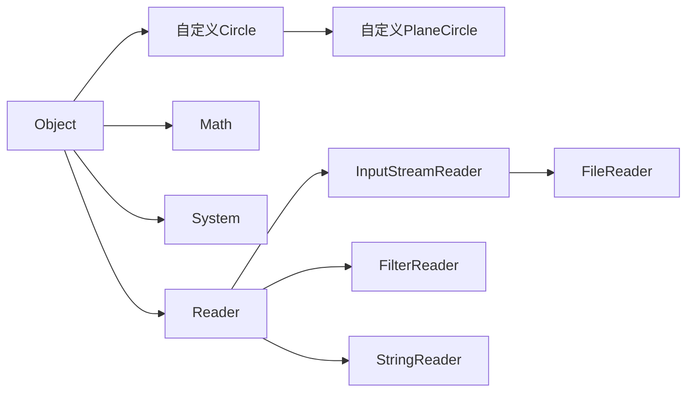
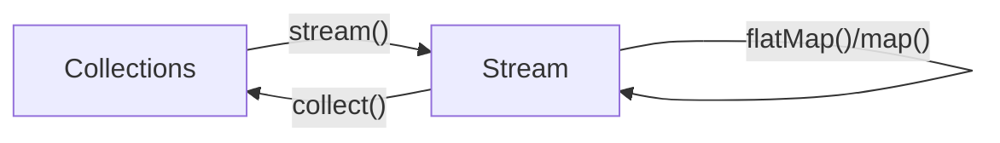
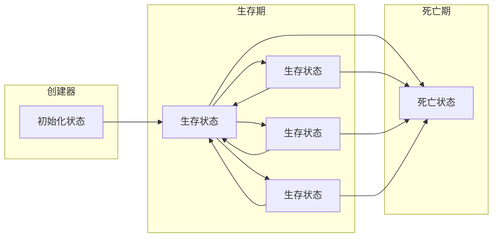
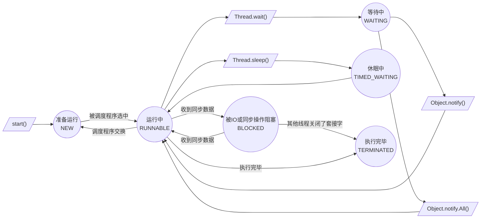

# Java

# §1 基础概念

## §1.1 字符集

Java支持全局Unicode。

## §1.2 注释

- 单行注释`//`
  
  ```java
  int i = 0 // 单行注释
  ```

- 多行注释`/* */`，注释不能嵌套
  
  ```java
  /*
      多行注释
      多行注释
  */
  ```
  
  现实中习惯用`*`突出注释内容
  
  ```java
  /*
   * 多行注释
   * 多行注释
   */
  ```

- 文档注释`/** **/`，用于javadoc生成文档，可包含HTML和javadoc语法
  
  ```java
  /**
   * 返回斐波那契数列的第n项
   * @param <u>指定的项数n</u>
   * @return <strong>斐波那契数列的第n项</strong>
   * @author Yaner
  **/
  ```

## §1.3 语句

Java的语句以分号作为结尾，一行可以书写多个语句，一个语句可以跨多行，**但是字符串、变量名不能跨行**。

## §1.4 标识符

标识符由字母、数字、下划线、美元符号(`$`)组成，但不能以数字开头，不能是Java关键字和保留字（已经定义过但未使用的关键字，只有`goto`和`const`这两个）。

> 注意：`true`/`false`/`null`都不是Java关键字！
>
> Java关键字一览表：
>
> | `abstract`      | `continue` | `for`          | `new`       | `switch`       |
> | --------------- | ---------- | -------------- | ----------- | -------------- |
> | `assert`        | `default`  | `goto`(保留字) | `package`   | `synchronized` |
> | `boolean`       | `do`       | `if`           | `private`   | `this`         |
> | `break`         | `double`   | `implements`   | `protected` | `throw`        |
> | `byte`          | `else`     | `import`       | `public`    | `throws`       |
> | `case`          | `enum`     | `instanceof`   | `return`    | `transient`    |
> | `catch`         | `extends`  | `int`          | `short`     | `try`          |
> | `char`          | `final`    | `interface`    | `static`    | `void`         |
> | `class`         | `finally`  | `long`         | `strictfp`  | `volatile`     |
> | `const`(保留字) | `float`    | `native`       | `super`     | `while`        |

# §2 基础语法

## §2.1 数据类型

| 类型      | 取值            | 默认值   | 比特数 | 范围                                                    |
| --------- | --------------- | -------- | ------ | ------------------------------------------------------- |
| `boolean` | `True`或`false` | `false`  | 1      | `True`或`false`                                         |
| `char`    | Unicode字符     | `\u0000` | 16     | `\u0000~\uffff`                                         |
| `byte`    | 有符号整数      | `0`      | 8      | $-2^{7}\sim2^{7}-1 $                                    |
| `short`   | 有符号整数      | `0`      | 16     | $-2^{15}\sim 2^{15}-1 $                                 |
| `int`     | 有符号整数      | `0`      | 32     | $-2^{31}\sim2^{31}-1 $                                  |
| `long`    | 有符号整数      | `0`      | 64     | $-2^{63}\sim2^{63}-1 $                                  |
| `float`   | IEEE754浮点数   | `0.0`    | 32     | $1.4\times10^{-45}\sim3.4028235\times10^{38}$           |
| `double`  | IEEE754浮点数   | `0.0`    | 64     | $4.9\times10^{-45}\sim1.7976931348623157\times10^{308}$ |

| 转换表    | `boolean` | `byte` | `short` | `char` | `int` | `long` | `float`    | `double`   |
| --------- | --------- | ------ | ------- | ------ | ----- | ------ | ---------- | ---------- |
| `boolean` |           | ×      | ×       | ×      | ×     | ×      | ×          | ×          |
| `byte`    | ×         |        | √~放~   | √~缩~  | √~放~ | √~放~  | √~放~      | √~放~      |
| `short`   | ×         | √~缩~  |         | √~缩~  | √~放~ | √~放~  | √~放~      | √~放~      |
| `char`    | ×         | √~缩~  | √~缩~   |        | √~放~ | √~放~  | √~放~      | √~放~      |
| `int`     | ×         | √~缩~  | √~缩~   | √~缩~  |       | √~放~  | √~放,精度~ | √~放~      |
| `long`    | ×         | √~缩~  | √~缩~   | √~缩~  | √~缩~ |        | √~放,精度~ | √~放,精度~ |
| `float`   | ×         | √~缩~  | √~缩~   | √~缩~  | √~缩~ | √~缩~  |            | √~放~      |
| `double`  | ×         | √~缩~  | √~缩~   | √~缩~  | √~缩~ | √~缩~  | √~缩~      |            |

> 注意：缩小转换必须使用显式校正。
>
> ```java
> int a = 10;
> byte b = a; // 报错
> byte = (byte) a // 可执行
> ```

> 注意：字符串不能直接转换为基本类型，需要使用`XXX.parseXXX(String)`来转换：
>
> ```java
> String string = "100";
> int integer = Integer.parseInt(string);
> ```

### §2.1.1 `boolean`

与JavaScript不同，Java对于语法有很严格的限制。

```java
// 正确示范
boolean bool_variable = true;
// 错误示范
boolean bool_variable = 1 // 不能赋值整数
bool bool_variable = true; // 严格boolean而非bool
boolean bool_variable = True; // True不是Java关键字
```

### §2.1.2 `char`

```java
char char_variable_1 = 'A';
char char_variable_2 = '\t'; // 转义字符
char char_variable_3 = '😅'; // 支持全局Unicode
char char_variable_4 = '\u0023';
char char_variable_5 = '\\';'
```

| 转义字符 | 含义       | 转义字符 | 含义                                |
| -------- | ---------- | -------- | ----------------------------------- |
| `\b`     | 退格符     | `\"`     | 双引号                              |
| `\t`     | 水平制表符 | `\'`     | 单引号                              |
| `\n`     | 换行符     | `\\`     | 反斜杠                              |
| `\f`     | 换页符     | `\xxx`   | Latin-1编码字符,xxx为Oct数(000~377) |
| `\r`     | 回车符     | `\uxxxx` | Unicode编码字符,xxxx为Hex数         |

### §2.1.3 `byte`、`short`、`int`、`long`

```java
int int_variable_1 = 0xff; // Hex 255
int int_variable_2 = 0377; // Oct 255
int int_variable_3 = 0b00101111; // Bin 47
int int_variable_4 = 0b0010_1111; // Bin 47,Java会忽略Bin中的下划线,下划线用于提高可读性
int int_variable_5 = 0xCAFEBABE; // 类文件魔法书
int int_variable_6 = 123; // 整数型字面量默认为int
double double_variable_1 = 123; // 会报错
double double_variable_2 = 123L; // 整数型字面量后
```

> 注意：Java允许溢出而不报错。
>
> ```java
> byte byte_variable_1 = 127;
> byte byte_variable_2 = 1;
> byte byte_variable_3 = byte_variable_1 + byte_variable_2 // -128
> ```

> 注意：Java在计算$0\div0$时会抛出`ArithmeticException`异常。

除了直接指定十进制数，我们也可以使用`0b<binaryDigits>`的方法按位给出二进制数：

```java
byte b = 0b0000_1000;
System.out.println(b); // 8
b = 0b_1000_0001; // -120
System.out.println(b)l //
```

### §2.1.4 `float`、`double`

```java
double double_variable_1 = 1.25; // 浮点数字面量默认为double
double double_variable_2 = 1.2e-5;
double double_variable_3 = 1.2E-5;
float float_variable_1 = 1.25f // 浮点数字面量后加f指定float
```

> 注意：`NaN`为浮点数字面量，因此浮点数运算从不抛出异常。
>
> ```java
> double double_variable_4 = 0.0/0.0; // NaN
> ```

Java与大多数语言都严格执行`IEEE-754`标准来计算浮点数，这样就不能避免该标准运算精度的局限性：

```python
C:/>python
	Python 3.9.5 (default, May 18 2021, 14:42:02) [MSC v.1916 64 bit (AMD64)] :: Anaconda, Inc. on win32
	Type "help", "copyright", "credits" or "license" for more information.
	>>> 0.2-0.3
		-0.09999999999999998
```

```java
System.out.println(0.2-0.3); // -0.09999999999999998
```

`IEEE-754`作为最广泛使用的浮点数计算标准，被各大平台、架构和操作系统支持。如果不考虑兼容性的话，我们可以使用Java提供的`java.math.BigDemical`类，实现任意精度的浮点数运算：

```java
public class Demo {
    public static void main(String[] args) {
        double doubleNum = 0.1234567891145141919810;
        BigDecimal bigDecimalNumByDouble = new BigDecimal(0.1234567891145141919810);
        BigDecimal bigDecimalNumByString = new BigDecimal("0.1234567891145141919810");

        System.out.println(doubleNum); // 0.12345678911451419
        System.out.println(bigDecimalNumByDouble); // 未定义行为,0.12345678911451418713340899557806551456451416015625
        System.out.println(bigDecimalNumByString); // 0.1234567891145141919810

        BigDecimal one = new BigDecimal(BigInteger.ONE);
        one.divide(new BigDecimal("3"));
        System.out.println(one); //抛出java.lang.ArithmeticException异常: Non-terminating decimal expansion; no exact representable decimal result.
    }
}
```

`java.lang.Math`是Java的数学函数标准库，提供了`abs()`、(反)三角/双曲线函数、`max()`/`min()`、`floor()`/`ceil()`、`pow(a,b)`/`exp()`/`log()`/`log10()`等函数：

```java
public class Demo {
    public static void main(String[] args) {
        System.out.println("Math.abs(-1) returns " + Math.abs(-1));
        System.out.println("Math.sin(Math.PI/2) returns " + Math.sin(Math.PI/2));
        System.out.println("Math.cos(0) returns " + Math.cos(0));
        System.out.println("Math.max(-3,2) returns " + Math.max(-3,2));
        System.out.println("Math.min(-3.2) returns " + Math.min(-3,2));
        System.out.println("Math.pow(1.5,2) returns " + Math.pow(1.5,2));
        System.out.println("Math.exp(2) returns " + Math.exp(2));
        System.out.println("Math.log(Math.E) returns " + Math.log(Math.E));
        System.out.println("Math.log10(100_0000) returns " + Math.log10(100_0000));
        System.out.println("Math.random() returns " + Math.random());
    /*
		Math.abs(-1) returns 1
		Math.sin(Math.PI/2) returns 1.0
		Math.cos(0) returns 1.0
		Math.max(-3,2) returns 2
		Math.min(-3.2) returns -3
		Math.pow(1.5,2) returns 2.25
		Math.exp(2) returns 7.38905609893065
		Math.log(Math.E) returns 1.0
		Math.log10(100_0000) returns 6.0
		Math.random() returns 0.013475721977882715
	 */
    }
}

```


## §2.2 运算符

| Priority | Associative | 运算符                                                     | 操作数类型        | 执行的运算                    |
| -------- | ----------- | ---------------------------------------------------------- | ----------------- | ----------------------------- |
| 16       | Left        | `.`                                                        | 对象,成员         | 访问对象成员                  |
|          |             | `[ ]`                                                      | 数组,`int`        | 获取数组中的元素              |
|          |             | `(args)`                                                   | 方法,参数列表     | 调用方法                      |
|          |             | `++`,`--`                                                  | 变量              | 后递增/后递减                 |
| 15       | Right       | `++`,`--`                                                  | 变量              | 前递增/前递减                 |
|          |             | `+`,`-`                                                    | 数字              | 正号/符号                     |
|          |             | `~`(例如$5\overset{\sim}{\rightleftharpoons}-6$)           | 整数              | 按位补码                      |
|          |             | `!`                                                        | 布尔值            | 逻辑囚犯                      |
| 14       | Right       | `new`                                                      | 类,参数列表       | 创建对象                      |
|          |             | `( type )`                                                 | 类型,任何类型     | 显式校正/类型转换             |
| 13       | Left        | `/*`,`/`,`%`                                               | 数字,数字         | 乘法/除法/求余                |
| 12       | Left        | `+`,`-`                                                    | 数字,数字         | 加法/减法                     |
|          |             | `+`(例如`"2"+1="21"`)                                      | 字符串,任何类型   | 字符串连接                    |
| 11       | Left        | `<<`                                                       | 整数,整数         | 左移                          |
|          |             | `>>`                                                       | 整数,整数         | 右移,高位补符号               |
|          |             | `>>>`                                                      | 整数,整数         | 右移,高位补零                 |
| 10       | Left        | `<`,`<=`                                                   | 数字,数字         | 小于/小于等于                 |
|          |             | `>`,`>=`                                                   | 数字,数字         | 大于/大于等于                 |
|          |             | `instanceof`                                               | 引用类型,类型     | 类型比较                      |
| 9        | Left        | `==`                                                       | 基本类型,基本类型 | 值相同                        |
|          |             | `!=`                                                       | 基本类型,基本类型 | 值不同                        |
|          |             | `==`                                                       | 引用类型,引用类型 | 对象相同(∴不能证明字符串相等) |
|          |             | `!=`                                                       | 引用类型,引用类型 | 对象不同                      |
| 8        | Left        | `&`                                                        | 整数,整数         | 按位与                        |
|          |             | `&`                                                        | 布尔值,布尔值     | 逻辑与                        |
| 7        | Left        | `^`                                                        | 整数,整数         | 按位异或                      |
|          |             | `^`                                                        | 布尔值,布尔值     | 逻辑异或                      |
| 6        | Left        | `|`                                                        | 整数,整数         | 按位或                        |
|          |             | `|`                                                        | 布尔值,布尔值     | 逻辑或                        |
| 5        | Left        | `&&`                                                       | 布尔值,布尔值     | 条件与                        |
| 4        | Left        | `||`                                                       | 布尔值,布尔值     | 条件或                        |
| 3        | Right       | `? :`                                                      | 布尔值,任何类型   | 条件运算符                    |
| 2        | Right       | `=`                                                        | 变量,任何类型     | 赋值                          |
|          |             | `*=`,`/=`,`%=`,`+=`,`-=`,`<<=`,`>>=`,`>>>=`,`&=`,`^=`,`!=` | 变量,任何类型     | 计算后赋值                    |
| 1        | Right       | `->`                                                       |                   |                               |

## §2.3 语句

### §2.3.1 表达式语句

在表达式的后面加分号即可变成表达式语句。

```java
a = 1; // 赋值
System.out.println("Hello World!"); // 方法调用
```

### §2.3.2 复合语句

将众多语句放在花括号内，变成一个整体，即复合语句。

```java
for(int i = 0; i < 10; i++){
    a[i]++;// 复合语句
    b[i]--// 复合语句
}
```

### §2.3.3 空语句

```java
for(int i = 0; i < 10; i++){
    
} // 空语句
```

### §2.3.4 标注语句

```java
Loop1: for(int i = 0; i < 5; i++){
    Loop2: for(int j = 0; j < 5; j++){
        Loop3: for(int k = 0; k < 5; k++){
            break Loop2; //跳转至Loop,单个break只能跳出一层
        }
    }
}
```

> 注意：Java保留了关键字`goto`，但是没有保留`goto`的功能。

### §2.3.5 局部变量声明语句

```java
int i,j=2,k;
int l = 0;
```

### §2.3.6 `if`/`else`语句

```java
if (condition){
    command_1;
    command_2;
    ...
} eles if (condition) {
    command;
} else {
    command;
}
```

### §2.3.7 `switch`语句

```java
switch(n){ // n为int/short/char/byte/String/enum及返回以上类型值的表达式
           // n不能为long/float/double
    case 1:
        command;
        break;
    case 2:
        command;
        break;
    default:
        command;
        break;
}
```

### §2.3.8 `while`语句

```java
while(expression){ // 先计算表达式,再执行
    command;
}
```

### §2.3.9 `do`/`while`语句

```java
do{ // 
    command;
}while(expression); // while()末尾必须加分号
```

### §2.3.10 `for`语句

```java
for(initialize;test;update){ // 先执行initialize,然后判断test
    command; // 每执行完一次command,就执行一次update
}
```

> 注意：当`test`为空时，Java将会认为这是`true`，从而造成死循环。

### §2.3.11 遍历语句

```java
char[] greeting = new char[] {'H','E','L','L','O',',','W','O','R','L','D'};
for(char character : greeting){
    System.out.println(character);
}
```

### §2.3.12 `break`语句

`break`语句能跳出其所在的最内层`while`/`do`/`for`/`switch`语句块，或者跳转至某一个标注语句的后一个语句。

```java
boolean isTargetExistInIntegerArray(int target, int[] array){
    boolean isFound = false;
    for(int i = 0; i < array.length(); i++){
        if(array[i] == target){
            isFound = True;
            break;
        }
    }
    return isFound;
}
boolean isIntegerMatrixNull(int[][] array, int row, int column){
    boolean isNull = false
    ISNULL: if(data != null){
        for(int i = 0; i < row; i++){
            for(int j = 0; j < column; j++){
                if(data[i][j] == null){
                    isNull = true;
                    break ISNULL;
                }
            }
        }
    }
    return isNull;
}
```

### §2.3.13 `continue`语句

`continue`语句能终止本次循环并开始下一次循环，或者跳转至标注语句。

```java
void incrementFloatArray(float[] array){
	for(int i=0;i<array.length;i++){
        if(Float.isNaN(array[i])){
            continue;
        }
        array[i]++;
    }
}
```

### §2.3.14 `return`语句

定义函数的返回值。

### §2.3.15 `synchronized`语句

`synchronized`将`expression`指定的数组或对象进行锁定，直到`command`执行完毕。

```java
synchronized(expression){
    command;
}
```

### §2.3.16 `throw`语句

```java
public static int factorial(int x){
    if(x<0)
        throw new IllegalArgumentException("x must be >= 0");
    for(int result=1;x>1;x--){
        fact*=x;
    }
    return fact;
}
```

### §2.3.17 `try`/`catch`/`finally`语句

先尝试执行`try`，若抛出异常则从该作用域开始查找对应的`catch`语句并执行，若找不到，则先执行`finally`，再按照堆栈顺序一级级往上回溯，直到找到对应的`catch`语句或尝试回溯`main()`上一级为止。若找到，则先执行`catch`，再执行`finally`，除非调用`System.exit()`。

```java
public static int factorial(int x){
	try{
        if(x<0)
            throw new IllegalArgumentException("x must be>=0");
    }
    catch(IllegalArgumentException | 另一种异常){
        System.out.println("The result may be not accurate.")
    }
    finally{
        for(int result=1;x>1;x--){
            result*=x;
        }
        return result;
    }
}
```

Java7提供了`Try-With-Resources`(TWR)机制，能自动关闭需要清理的资源。

```java
try(InputStream file = new FileInputStream("/usr/bin/info.txt")){
    // processing
}
```

### §2.3.18 `assert`语句

`assert expression;`或`assert expression:errcode;`能在`expression`为假时抛出`java.lang.AssertionError`异常，并将`errcode`传给`AssertionError()`构造方法。

Java编译时虽然会将`assert`包括在内，但是在执行时为了保铮执行效率，默认情况下禁用了断言。为了开启/禁用断言，需要给命令行指定参数。

```shell
java -ea # 除系统类之外,开启所有类的断言
java -esa # 开启系统类断言
java -ea:com.example.sorters.MergeSort com.example.sorters.Test # 指定具体类启用断言
java -ea:com.example.sorters... # 为包中所有的类和子包启用断言
java -ea:com.example.sorters... -da:com.example.sorters.QuickSort # 禁用具体的包/类
```

## §2.4 方法

### §2.4.1 方法修饰符

#### §2.4.1.1 `abstract`

使用`abstract`修饰的方法没有实现主体。如果类中有其修饰的方法，则该类必须也被其修饰。这种类不完整，不能实例化。

#### §2.4.1.2 `final`

使用`final`修饰的方法不能被子类覆盖或隐藏。所有使用`private`修饰的方法都隐式添加了`final`修饰符。所有使用`final`声明的类中的所有方法也都隐式添加了`final`修饰符。

#### §2.4.1.3 `native`

使用`native`修饰的方法由C语言等"本地语言"编写，并开放给Java，没有主体。

#### §2.4.1.4 `public`/`protected`/`private`

#### §2.4.1.5 `static`

使用`static`修饰的类方法关联在类自己身上，而非类的实例身上。

#### §2.4.1.6 `strictfp`

使用`strictfp`修饰的方法禁用运行平台提供的浮点数可用扩展精度，严格执行Java预置标准，即使计算结果不精确。

#### §2.4.1.7 `synchronized`

使用`synchronized`修饰的方法实现了线程安全，避免两个线程同时调用该方法。

### §2.4.2 变长参数列表

要声明变长参数，需要且**只能**在方法最后一个参数类型的后面加上省略号`...`，指明该参数可以重复零次或多次。Java会将这些参数打包成数组，在函数体内能以数组的形式调用。以下两种方法调用时不能混用，但效果完全一样：

```java
public static boolean isTargetExistInIntegerArray(int target, int... array){
    for(int i:array){
        if(target==i)
            return true;
    }
    return false;
}
public static boolean isTargetExistInIntegerArray(int target, int[] array){
    for(int i:array){
    	if(target==i)
            return true;
    }
    return false;
}
isTargetExistInIntegerArray(1,2,1,3,4) // 只能用于变长参数
isTargetExistInIntegerArray(1,new int[] {2,1,3,4}) // 两种方法通用
```

### §2.4.3 匿名函数/`lambda`表达式

```java
Runnable a = () -> System.out.println("Hello World");
a.run();
```

## §2.5 数组

```java
int array_0d; // 一个整数
int[] array_1d; // 一维数组
int[][] array_2d; // 二维数组
```

### §2.5.1 数组初始化

Java支持`int[] a`和`int a[]`两种静态初始化语法和`int[] a = new int[length]`一种动态初始化语法。与C语言不同的是，Java的静态初始化语法声明数组时不能直接指出数组长度，且声明之后不能立即被访问，因为尚未分配内存空间，需要`array = new int[length]`之后才能使用。动态初始化声明的数组可以立即被访问，Java按以下规则分配初始值：

| 数组元素类型                | 初始值      |
| --------------------------- | ----------- |
| `byte`/`short`/`int`/`long` | `0`         |
| `float`/`double`            | `0.0`       |
| `char`                      | `'0\u0000'` |
| `boolean`                   | `false`     |
| 类/接口/数组                | `null`      |

每个数组都有一个`array.length`属性用于计算数组的长度。

引用类型数组中每个元素存储的都是指针。

> 注意：在C语言中`int[] a = {1,2,3,}`会被判定为`SyntaxError`，但Java会自动忽略末尾多余的逗号。 

> 注意：数组的`array.length`为`int`型整数，这意味着数组的长度不能超过`int`的最大值`Integer.MAX_VALUE`。

### §2.5.2 数组类型放大转换/数组协变

- 数组扩展自`Object`类，而且实现了`Cloneable`和`Serializable`接口，因此数组可以指定给以上这三种类型。

  ```java
  String string_1 = "Hello, Java and Android!";
  String string_2 = "LocationSignUpApp";
  String[] stringArray = {string_1,string_2};  
  Object[] objectArray = stringArray;
  Object object = stringArray;
  Cloneable cloneable_1 = stringArray;
  Comparable[] comparableArray = stringArray;
  ```

- 若数组内部的元素可由一种类型转化为另一种类型，则数组类型即可从这种类型转化为另一种类型。但是有例外：**基本类型的数组不能放大转换**。不可转化时会抛出`ArrayStoreException`异常。

  ```java
  byte[] byteArray = new byte{1,2,3};
  int[] intArray = byteArray; // ArrayStoreException异常
  ```

### §2.5.3 兼容语法

```java
int[][] array_2d; // Java原生语法
int array_2d[][]; // C语言语法int array_2d[5][5](Java向下兼容)
int[] array_2d[]; // C语言语法int* array_ptr[5](Java向下兼容)
```

### §2.5.4 复制数组

#### §2.5.4.1 `array.clone()`

数组实现了`Cloneable`接口，可以调用`.clone()`克隆自己，克隆体与原数组共享同一份内存空间，属于潜复制。

```java
int[] data = {1,2,3};
int[] data_duplicate = data.clone();
```

#### §2.5.4.2 `System.arraycopy()`

`System.arraycopy(originalArray,startActiveIndex,duplicateArray,startPassiveIndex,length)`将`originalArray`从第`startActiveIndex`位元素开始，复制`length`个元素到`duplicateArray`的第`startPassiveIndex`位置。

```java
public static void arrayLeftMove(int[] array){ // 数组元素轮换左移一位
    int first = array[0];
    System.arraycopy(array,1,array,0,array.length-1);
    array[array.length-1] = first;
}
```

## §2.6 引用/指针

### §2.6.1 引用相等和对象相等

对于引用类型而言，有引用相等而对象相等之分。`==`运算符返回的是引用相等，`object.equals()`返回的是对象相等。为了加以区分，我们引入相同(identical)表示引用相等，相等(equal)表示对象相等。

```java
String a = "hello";
String b = "hello";
String c = "hell" + "o";
String d = "o";
String e = "hell"+d;
System.out.println(a==b); // true
System.out.println(a==c); // true
System.out.println(a==e); // false
System.out.println(a.equals(b)); // true
System.out.println(b.equals(a)); // true
```

### §2.6.2 装包和拆包

有时需要把基本值当成对象，Java为8中基本类型提供了对应的包装类，转换关系如下：

| 基本类型  | 包装类      | 基本类型 | 包装类    |
| --------- | ----------- | -------- | --------- |
| `boolean` | `Boolean`   | `int`    | `Integer` |
| `byte`    | `Byte`      | `long`   | `Long`    |
| `short`   | `Short`     | `float`  | `Float`   |
| `char`    | `Character` | `double` | `Double`  |

```java
import java.util.List;
import java.util.ArrayList;
List number = new ArrayList();

//手动装包/拆包
number.add(new Integer(-1)); // 装包
System.out.println((Integer)number.get(0).intValue()); // 拆包

//自动装包/拆包
Integer i = 0; // 装包
int j = i; // 拆包
i = null;
j = i // NullPointerException,空object指针无法转int
```

## §2.7 包和命名空间

包由一些具名的类、接口和其他引用类型组成，并指定对应的命名空间。

| 包          | 作用         |
| ----------- | ------------ |
| `java.lang` | 基本类型     |
| `java.util` | 各种实用类型 |
| `java.io`   | 输入输出类型 |
| `java.net`  | 网络类型     |

### §2.7.1 声明包

关键字`package`必须放在Java文件的第一行，用于表示该文件中定义的所有类和方法属于对应包的一部分。

```java
package com.example;
```

### §2.7.2 导入类型

通常情况下，引用类或接口是必须使用类型的完全限定名称，即包含包名，除非以下例外：

- `java.lang`包中的类型最常用、最重要，可以始终使用简称引用

- 在`package`辖域内调用该辖域内定义的类型，可以使用简称引用

- 已经使用`import`声明导入命名空间的类型，可以使用简称引用

  > 注意：`package`声明在前，`import`声明在后。

`import`声明有两种格式：

- 单个类型导入：把单个类型导入命名空间，例如`import java.io.file;`
- 按需类型导入：批量导入指定包内的所有类，例如`import java.io.*;`

当两个不同的包中含有**名称相同、签名也相同**的类时会发生冲突，同时将其导入会导致编译出错：

```java
import java.util.List;
import java.wat.List;  // 会报错
```

如果使用按需类型导入，虽然不会在编译时报错，但在调用类时会报错：

```java
import java.util.*;
import java.awt.*; // 不报错
List a = new List[]; // 报错
```

为了解决这一冲突，我们可以利用单个类型导入的顺序实现覆盖：

```java
import java.util.*;
import java.awt.*;
import java.util.List; // 覆盖java.awt.List
List a = new List[]; // 不报错,定义的是java.util.List
```

### §2.7.3 导入静态成员

如果需要大量地调用某一个静态成员的方法，重复输入报名会显得很麻烦：

```java
System.out.println("Hello World!");
System.out.println("I'm a noob in Java now.");
System.out.println("I want to make my own APP!");
// ...
double a = Math.sin(Math.toRadians(45));
double b = Math.sqrt(Math.abs(-9));
// ...
enum seasons {'spring','summer','autumn','winter'};
```

此时可以导入静态成员，简化输入：

```java
import static java.lang.System.out;
out.println("Hello World!");
out.println("I'm a noob in Java now.");
out.println("I want to make my own APP!");
// ...
import static java.lang.Math.*;
double a = sin(toRadians(45));
double b = sqrt(abs(-9));
// ...
import static com.example.seasons; // 预先将枚举定义在com.example中
```

当两个不同的包中含有**名称相同、但签名不同**的类时不会发生冲突，而是进行重载，并根据实参的类型选择对应的方法：

```java
import static java.util.Arrays.sort;
import static java.util.Collections.sort; // 不报错
```

## §2.8 类和对象

```java
public class Point2d
{
    public double x,y;
    public Point2d(double x,double y){
        this.x=x;
        this.y=y;
    }
    public double distanceToOrigin(){
        return Math.sqrt(x*x+y*y);
    }
    public static void main(String[] args){
        Point2d a = new Point2d(1,2.6);
        System.out.println(a.distanceToOrigin());
    }
}
```

### §2.8.1 定义类

定义格式如下：访问控制修饰符 + 关键字`class` + 类名称 [ + `extends`关键字 + 父类名称] [ + 关键字`inplemetns`+ 接口_1 , 接口2 , ...]

```java
public class Integer extends Number implements Serializable,Comparable{
    // ...
}
```

### §2.8.2 字段和方法

类中的成员可分为四类：类字段(静态字段)、类方法、实例字段、实例方法。

```java
public class Circle{
    public static final double PI=3.14159265; // 类字段常量
    public static double pi=3.14159265; // 类字段变量
    public static double radToDeg(double radians){ // 类方法
        return radians*180/PI;
    }
    public double radius = 2.0; // 实例字段,同时设置默认值
    public double circumference(){ // 实例方法
        return 2*PI*radius;
    }
}
```

类字段、类方法关联在类身上，实例字段和实例方法关联在对象身上。

```java
double a = Circle.radToDeg(30); // 类方法关联在类身上
Circle b = new Circle();
b.radius = 3.0;
System.out.println(b.circumference()); // 实例方法关联在对象身上
```

在**实例方法**中引用类字段时，既可以显式地使用`this.`对象，也可以将其忽略。但类方法不能使用`this`关键字。

```java
public class Circle{
    // ...
    public double circumference_explicit(){
        return 2 * PI * this.radius;
    }
    public double circumference_implicit(){
        return 2 * PI * radius;
    }
}
```

### §2.8.3 构造方法

#### §2.8.3.1 默认构造方法

之前的例子都没有定义构造方法，创建对象时调用的是`OBJECT object_name = new OBJECT()`，之后可以单独使用赋值语句改变实例字段。

这个默认构造方法实际上就是`super()`，编译时会强制加上：

```java
public class Example{
    // ...
    public static Example(){
        super();
    }
}
```

如果对应的父类没有定义无参数的构造方法，则编译时会出错。

#### §2.8.3.2 自定义构造方法

自定义构造方法允许**定义对象时**对实例变量进行初始化。

```java
public class Circle{
    public static final double PI = 3.14159265;
    protected double radius; // 保证子类无法更改
    public double circumference(){
        return 2 * PI * radius;
    }
    public Circle(double radius){ // 自定义构造方法
        this.radius = radius;
    }
}
```

> 注意：自定义构造方法有以下注意事项：
>
> - 构造方法的函数名与类名应该一致
> - 不能指定构造方法的返回类型，连`void`都不用
> - 构造方法不能带有`return`语句

事实上，同一个类内的自定义构造方法可以不止一个，允许重构。

```java
public Circle{
    // ...
    public Circle(){
        radius = 3;
    }
    public Circle(double radius){
        this.radius = radius;
    }
}
```

这些构造方法之间也可以互相调用，编译器会根据传入`this()`的数据类型自动选择对应的构造方法。`this()`语句只能出现在构造方法的第一行。

```java
public Circle{
    // ...
    public Circle(double radius){
        this.radius = radius;
    }
    public Circle(){
        this(3.0); //利用this对象调用另一个Circle()
    }
}
```

### §2.8.4 静态初始化方法

静态初始化方法允许**编译类**时对类字段进行初始化，由关键字`static`及花括号包含的代码块组成。一个类中可以包含多个静态初始化方法，编译时会将这些代码块整合进一个方法执行。其中不能使用`this`关键字、实例字段和实例方法。

```java
public class SinFunctionGraph(){
    private static final int sample = 100;
    private static double x[] = new double[sample];
    private static double f_x[] = new double[sample];
    static{ // 静态初始化方法
        double initial = 0.0;
        double delta = 0.05;
        for(int i=0;i<sample;i++){
            x[i]=initial+i*delta
            f_x[i]=Math.sin(x[i]);
        }
    }
}
```

### §2.8.5 实例初始化方法

与静态初始化相似，但是针对的是实例字段，且不用带`static`关键字。可以将构造方法中的初始化代码移动至实例初始化方法中，让构造方法更加清晰。

```java
public class Example{
    // ...
    private int[] index = new int[100];
    
    {
        for(int i=0;i<100;i++){
            data[i]=i;
        }
    }
}
```

### §2.8.6 子类和继承

定义子类需要使用`extends`关键字，后接父类名称。在子类的构造方法中，可以使用超类的构造方法`super(parameter)`将参数传给父类的构造方法。

```java
public class PlaneCircle extends Circle{ // 继承了Circle类中的所有字段和方法
    private final double centerX=0,centerY=0;
    public PlaneCircle(double r,double x, double y){
        super(r);
        this.centerX = x;
        this.centery = y;
    }
    public boolean isPointInsideCircle(double point_x, double point_y){
        double distance = Math.pow(this.centerX-point_x,2)+Math.pow(this.centerY-point_y,2)-Math.pow(this.radius,2);
        if(distance<=0){
            return true;
        }else{
            return false;
        }
    }
}
```

每个子类都能完全兼容父类，在兼容的过程中会丢失一些父类没有的字段和方法。

```java
PlaneCircle a = new PlaneCircle(2.5,0,2);
Circle b = a; // 不报错
```

每个父类都可以通过显示校正转换为子类。

```java
Circle a = new Circle(3.0);
PlaneCircle b = (PlaneCircle) a;
```

如果声明类时使用了`final`修饰符，则该类无法被扩展成新的子类。

```java
public final class Circle{
	// ...
}
public class PlaneCircle extends Circle{ // 报错
    // ...
}
```

### §2.8.7 超类

在Java中，子类和父类的关系为$子类\overset{超类}{\underset{子类}{\rightleftharpoons}}父类$。自定义的每个类都有对应的超类，如果没有`extends`关键字，则超类为`java.lang.object`。`java.lang.object`是Java中唯一没有超类的类，所有Java类都从`java.lang.object`中继承字段和方法。这些子类和超类的关系构成了类层次结构。



关键字`super`用于在子类构造方法中调用超类的构造方法，类似于使用`this`调用同一个类中的其他构造方法。`super(parameter)`也可以按照传入参数的类型选择超类对应的构造方法。

> 注意：仅当在子类构造方法中才能使用`super()`，且必须使用`super()`，并将其放在子类构造方法的第一行。

### §2.8.8 构造方法链

创建子类实例时，Java会按顺序执行下列任务：

1. 调用子类的构造方法，入栈。
2. 子类构造方法的第一行必为`super(parameter)`，由此进入父类构造方法，入栈。
3. 如父类为`java.lang.object`直属子类，其构造方法不含`super()`，则其构造方法会隐式调用`super()`，由此进入`java.lang.object`构造方法，入栈。
4. 执行`java.lang.object`的构造方法，将`object`对象传入父类构造方法，出栈。
5. 执行父类的构造方法，将父类对象传入子类构造方法，出栈。
6. 执行子类的构造方法，将子类对象传入执行创建子类代码所在作用域的环境，出栈。

### §2.8.9 覆盖

#### §2.8.9.1 覆盖字段

当父类和子类含有相同名称的实例字段时，在子类的辖域内，子类名称会覆盖父类名称。

```java
public class Circle {
    public double radius;
    public Circle(double radius){
        this.radius = radius;
    }
}
public class PlainCircle extends Circle{
    public double radius;
    public PlainCircle(double radius){
        super(2);
        this.radius = radius;
    }
    public static void main(String[] args){
        PlainCircle a = new PlainCircle();
        System.out.println(a.radius); // 1.0
    }
}
```

为了访问父类的同名字段，可以使用`super`关键字或显式类型转换。

```java
radius; // 子类实例字段
this.radius; // 子类实例字段
super.x; // 父类实例字段
((B) this).x; // 父类实例字段
super.super.x; // 报错
```

#### §2.8.9.2 覆盖方法

与字段不同，父类方法一旦被子类方法覆盖，就永远无法在调用父类方法。

```java
class Father{
    int i = 1; // 父类实例字段
    int f(){ // 父类实例方法
        return i;
    }
    static char g(){ // 父类类方法
        return 'A';
    }
}
class Son extends Father{
    int i = 2; // 子类实例字段
    int f(){ // 子类实例方法
        return -i;
    }
    static char g(){ // 子类类方法
        return 'B';
    }
}
public class OverrideTest{
    public static void main(String args[]){
        Son son = new Son();
        System.out.println(son.i); // 2,子类成员调用子类实例字段
        System.out.println(son.f()); // -2,子类成员调用子类实例方法
        System.out.println(son.g()); // B,子类成员调用子类类方法
        System.out.println(Son.g()); // B,子类直接调用子类类方法
        Father father = (Son) son;
        System.out.println(father.i); // 1,子类转父类,调用父类实例字段
        System.out.println(father.f()); // -2,子类转父类,调用子类实例字段
        System.out.println(father.g()); // A,子类转父类,调用了父类类方法
        System.out.println(Father.g()); // A,父类直接调用了父类类方法
    }
}

```

### §2.8.10 隐藏和封装

#### §2.8.10.1 访问规则

- 对于使用`public`修饰符的成员，只要能访问其所在的类，就能访问该成员。
- 对于使用`private`修饰符的成员，只有在其所在类的内部，才能访问该成员。
- 对于使用`protected`修饰符的成员，只要在其所在类对应的包内部，或者在其子类的内部，都能访问该成员。
- 对于没有任何修饰符的成员，使用默认的访问规则，只有在其所在类对应的包内部，才能访问该成员。

#### §2.8.10.2 访问控制和继承

- 子类继承超类中所有可以访问的实例字段和实例方法。
- 如果子类和超类在同一个包中定义，则子类继承所有未被`private`声明的实例字段和实例方法。
- 如果子类和超类在不同的包中定义，则子类继承所有使用`protected`和`public`修饰的实例字段和实例方法。
- 使用`private`修饰的字段和方法不会被继承。
- 构造方法不会被继承，但是可以通过构造方法链调用。

> 注意：子类创建的每个对象都包含着一个完整的超类实例，即使超类中有些成员被`private`等修饰符修饰。

|                  | `public` | `protected` | `private` | 默认 |
| ---------------- | -------- | ----------- | --------- | ---- |
| 定义成员的类内部 | √        | √           | √         | √    |
| 同一个包中的类   | √        | √           | ×         | √    |
| 不同包中的子类   | √        | √           | ×         | ×    |
| 不同包，非子类   | √        | ×           | ×         | ×    |

#### §2.8.10.3 数据访问器方法

使用`protected`修饰类中的变量，使其他类无法随意更改该类创建的对象中的成员。然后给构造方法加上所需的限制条件，给类添加对应的数据访问器方法，从而保证在创建或修改时都能满足限制条件。

```java
public class Circle{
    public static final double PI = 3.14159265;
    protected double radius; // 半径在子类中可见
    protected void checkRadius(double radius){
        if(radius < 0.0){
            throw new IllegalArgumentException("Radius must be positive!");
        }
    }
    public Circle(double radius){
        checkRadius(radius);
        this.radius = radius;
    }
    public double getRadius(){
        return radius;
    }
    public void setRadius(double radius){
        checkRadius(radius);
        this.radius = radius;
    }
}
```

### §2.8.11 抽象类

Java允许使用`abstract`修饰符声明方法并创建抽象类，用于只定义方法但不实现方法。

- 只要类中有一个`abstract`方法，那么这个类本身就自动成为抽象类，而且必须用`abstract`显式声明为抽象类。
- 抽象类无法实例化。
- 抽象类的子类必须覆盖其声明的所有方法才能实例化。
- 抽象类的子类如果没有覆盖其声明的所有方法，则该子类还是抽象类，而且不需使用`abstruct`显式声明为抽象类。
- 使用`static`、`private`、`final`声明的方法不能是抽象方法，因为其在子类中不能覆盖。
- 使用`final`修饰的类不能是抽象类。

```java
public abstract class Shape {
    public abstract double area();
    public abstract double circumference();
}
class Circle extends Shape{
    public static final double PI = 3.14159265;
    protected double radius;
    public double area() {
        return PI*radius*radius;
    }
    public double circumference(){
        return 2*PI*radius;
    }
    public Circle(double radius){
        if(radius<=0){
            throw new IllegalArgumentException("Radius must be positive.");
        }
        this.radius = radius;
    }
}
class Rectangle extends Shape{
    protected double width,height;
    public Rectangle(double width, double height){
        if(width<=0||height<=0){
            throw new IllegalArgumentException("Width or height must be positive.");
        }
        this.height = height;
        this.width = width;
    }
    public double area(){
        return height * width;
    }
    public double circumference() {
        return 2 * (height + width);
    }
}
abstract class ActualShape extends Shape{
    public static void main(String[] args){
        Shape[] realShape = new Shape[2];
        realShape[0] = new Circle(2.0);
        realShape[1] = new Rectangle(1.5,6);
        double areaSum = 0;
        for(Shape item : realShape){
            areaSum += item.area();
        }
        System.out.println(areaSum); // 21.5663706,计算总面积
    }
}
```

### §2.8.12 转换引用类型

在类层次结构图中，我们引入族谱图中的“直系亲属”和“旁系亲属”概念。

- 旁系类之间不能转换类型，即使使用矫正运算符进行显式转换也不行。
- 在直系类中，从子类转化为超类是放大转换，因此不用显式校正。
- 在直系类中，从超类转化为子类是缩小转换，需要进行显式校正。
- 对于数组而言，如果数组的两种数据类型可以互相转换，则两个数组也可以互相转换，**除非这两种数据类型都属于八种基本类型**。

### §2.8.13 修饰符

| 修饰符         | 用于       | 效果                                                         |
| -------------- | ---------- | ------------------------------------------------------------ |
| `abstract`     | 类         | 该类不能实例化,可能包含只声明未实现的方法                    |
|                | 接口       | 加与不加都一样,因为所有借口默认都是抽象的                    |
|                | 方法       | 该方法没有主体,主题由子类提供                                |
| `default`      | 方法       | 该接口方法的实现是可选的,若未实现,则让接口为该方法所属的类提供默认实现 |
| `final`        | 类         | 不能创建该类的子类                                           |
|                | 方法       | 不能覆盖这个方法                                             |
|                | 字段       | 该字段为常量,`static final`指编译时常量                      |
|                | 变量       | 局部变量/方法参数/异常参数的值不能修改                       |
| `native`       | 方法       | 该方法的实现与平台无关(例如C语言),没有主体                   |
| 无修饰符       | 类         | 未被`public`修饰的类只能在包中访问                           |
|                | 接口       | 未被`public`修饰的接口只能在包中访问                         |
|                | 成员       | 未被`private`、`protected`、`public`修饰的成员具有包可见性,只能在包内访问 |
| `private`      | 成员       | 只能在其所在的包内访问                                       |
| `protected`    | 成员       | 只能在其所在的包和子类中访问                                 |
| `public`       | 类         | 只要能访问其所在的包,就能访问该类                            |
|                | 接口       | 只要能访问其所在的包,就能访问该接口                          |
|                | 成员       | 只要能访问其所在的包,就能访问该成员                          |
| `strictfp`     | 类         | 该类中的所有方法都会被隐式地声明为`strictfp`                 |
|                | 方法       | 该方法严格遵守IEEE 754标准执行浮点运算,中间的计算结果和最终数值都要使用`IEEE float`或`double`表示 |
| `static`       | 类         | 使用`static`声明的内部类是顶层类,而不是所在类的成员          |
|                | 方法       | 该方法是类方法,不隐式传入`this`对象既可引用,也可通过类名调用 |
|                | 字段       | 该字段为类字段,不管创建多少类实例,类字段都只有一个实例,可通过类名调用 |
|                | 初始化程序 | 在加载类时运行,而非创建实例时运行                            |
| `synchronized` | 方法       | 使两个线程不能同时访问该方法                                 |
| `transient`    | 字段       | 使该字段不会随对象一起序列化                                 |
| `volatile`     | 字段       | 该字段能被异步线程访问                                       |

### §2.8.14 嵌套

在`class`内部定义的类称为嵌套类或内部类，通常用于以下两种情况：

- 如果某个类需要特别深入的访问另一个类型，则可以使用嵌套类。
- 如果某个类只在特定的情况下才使用，并且其代码区域特别小，应该封装在一个小范围内，则可以使用嵌套类。

嵌套类的好处有以下几点：

- 访问嵌套类中的字段和方法非常简便，就像是这些字段和方法本来就定义在包含它的类中一样。
- 嵌套类的访问权限管理非常的极端。对于包含它的类而言，嵌套类等价于被`public`修饰的其他类；对于其它类而言，嵌套类甚至比`private`还要极端，永远也无法访问。
- 嵌套类不能被单独实例化，只能随着其所在类一起被实例化，从而实现类和嵌套类一一对应的关系。

事实上，JVM和类文件会将嵌套类与普通类一视同仁，将所有类都视作普通的顶层类。javac为了区分嵌套类和普通类，会在类文件中插入隐藏字段、方法和构造方法参数，统称为合成物(synthetic)，可以由javap反汇编识别。

嵌套类有四种类型，分别是静态成员类型、非静态成员类、局部类和匿名类。

#### §2.8.14.1 静态成员类型

静态成员类型类似于类的静态成员。

静态成员类型具有以下特点：

- 静态成员类型和所在类的任何实例都不关联，也就是说没有`this`对象。
- 静态成员类型只能访问所在类的静态成员，不能访问所在类之外的静态成员，但是能访问所在类内的所有静态成员类型。同理，反过来说，类内的静态成员都能访问静态成员类型内的成员。
- 所有嵌套类都不能被实例化，所以静态成员类型中的字段、接口、枚举、注解全部都被`static`隐式修饰。
- 只有静态成员类型才支持再嵌套内部的静态成员类型，其他三种嵌套类型不支持嵌套静态成员类型。
- 静态成员类型不能和其他的外层类重名。
- 静态成员类型只能在顶层类型，或该顶层类型中的静态成员类型内定义，不能在任何成员类、局部类、匿名类中定义。

```java
public class LinkedStack{ // 用链表实现堆栈
    static interface Linkable{ // 静态成员接口
        public Linkable getNext();
        public void setNext(Linkable node);
    }
    Linkable head;
    public void push(Linkable Node){
        // ...
    }
    public Object pop9){
        // ...
    }
}
public LinkableInteger implements LinkedStack.Linkable{
    int i;
    public LinkableInteger(int i){
        this.i = i;
    }
    LinkableStack.Linkable next;
    public LinkedStack.Linkable getNext{
        return next;
    }
    public void setNext(LinkedStack.Linkable node){
        next = node;
    }
}
```

#### §2.8.14.2 非静态成员类

非静态成员类是外层类或枚举类型的成员，而且不使用`static`修饰。如果把静态成员类型类比成类字段或类方法，那么非静态成员类就是实例字段和实例方法。之所以不叫做“非静态成员类**型**”，是因为非静态成员类型只能是类，所以采用这种简称。

非静态成员类具有以下特点：

- 非静态成员类的实例始终关联另一个外层类型的实例。

- 非静态成员类的内部能访问外层类型的所有字段和方法。

- 非静态成员类同样不能与外界类或外界包重名。

- 非静态成员类不能包含任何被`static`修饰的字段、方法和类，除非是同时被`static`和`final`修饰的常量。

- 与静态成员类型不同，非静态成员类可以使用`this`对象。

  ```java
  import java.util.Iterator;
  public class LinkedStack{ // 用链表实现堆栈,进一步完善,增加迭代器
      // ...
      public Iterator<Linkable> iterator(){
          return new LinkedIterator();
      }
      protected class LinkedIterator implements Iterator<Linkable>{ // 非静态成员类
          Linkable current;
          public LInkedIterator(){
              current = head;
          }
          public boolean hasNext(){
              return current != null;
          }
          public Linkable next(){
              if(current == null){
                  throw new java.util.NoSuchElementException();
              }
              Linkable value = current;
              current = current.getNext();
              return value;
          }
      }
      public void remove(){
          throw new UnsupportedOperationException();
      }
  }
  ```

  在这里我们用隐式调用实现了`public LinkedIterator()`方法。如果用`this`对象显示调用的话，该方法可以进行如下改写，其形式一般为`className.this`，其中`className`是外部类的名称，这种语法常用于外层类成员与嵌套类成员重名时的情况：

  ```java
  //...
  public LinkedIterator(){
      current = head; // 非静态成员类内的类字段 = 其外部类的实例字段
  }
  public LinkedIterator(){
      this.current = LinkedStack.this.head; // this显式调用
  }
  //...
  ```

#### §2.8.14.3 局部类

局部类在方法、类的静态初始化程序、类的实例初始化程序中定义。因为Java所有的代码块都在类中定义，所以局部类也嵌套于类中。

```java
public class LinkedStack{
    // ...
    public Iterator<Linkable> Iterator(){
        class LinkedIterator implements Iterator<Linkable>{ // 局部类,在方法中定义
				// ...
            }
        }
    	return new LInkedIterator();
    }
}
```

局部类有以下特点：

- 局部类和外层实例关联，而且能访问外层类的任何成员。
- 局部类能访问局部方法的作用域中**被`final`修饰**的局部变量、方法参数、异常参数。
- 局部类的作用域不能超出定义它的代码块，但是在该代码块中定义的局部类实例可以在作用域之外使用。
- 局部类不能被`private`、`protected`、`public`、`static`修饰，因此不能定义静态字段、静态方法和静态类。除非是同时被`static`和`final`修饰的常量。
- 除局部类自身之外，局部类所在的代码块中的变量、方法参数、异常参数只有被`final`修饰，才能被局部类调用，被因为局部类实例的生命周期可能比定义它的代码块的生命周期要长。
- 局部类不能定义接口、枚举和注解。
- 局部类不能和外层类重名。

```java
package com.example;
class A{
    protected char a = 'a';
}
class B{
    protected char b = 'b';
}
public class C extends A{
    private char c = 'c';
    public static char d = 'd';
    public void creteLocalObject(final char e){
        final char f = 'f';
        int i = 0;
        class Local extends B{
            char g = 'g';
            public void printVars(){
                System.out.println(a); // 从外层类的父类继承的字段
                System.out.println(b); // 从嵌套类的父类继承的字段
                System.out.println(c); // 外层类的字段,C.this.c
                System.out.println(d); // 外层类的字段,C.this.d
                System.out.println(e); // 局部类所在作用域的final方法参数
                System.out.println(f); // 局部类所在作用域的final字段
                System.out.println(g); // 局部类内部的字段
                System.out.println(i); // 报错,未被final修饰,故嵌套类内部不能访问
            }
        }
        Local l = new Local();
        l.printVars();
    }
}
```

#### §2.8.14.4 匿名类

匿名类是没有名称的局部类，仅用`new`在表达式中同时完成定义和实例化。

```java
public Iterator<Linkable> iterator(){
    return new Iterator<Linkable>(){
        Linkable current;
        {current = head;} // 实例初始化程序
        public boolean hasNext(){
            return current != null;
        }
        public Linkable next(){
            if(current == null){
                throw new java,util.NoSuchElementException();
            }
            Linkable value = current;
            current = current,getNext();
            return value;
        }
        public void remove(){
            throw new UnsupportedOperationException();
        }
    };
}
```

匿名类有以下特点：

- 匿名类不支持`extends`和`implements`。
- 因为匿名类没有名称，所以无法在匿名类内部定义构造方法。因此在创建匿名类实例时，小括号传入的参数实际上传给了所有类的父类——`Object`。而`new Object()`不需要传参，所以匿名类不需要传入参数。
- 匿名类实质上是一种局部类，所以匿名类继承了局部类的所有特点。
- 虽然匿名类不支持构造方法，但是可以用实例初始化方法代替构造方法，而这正是Java引入实例初始化方法的初衷。

#### §2.8.14.5 作用域与继承层次结构

对于嵌套类而言，我们要考虑两套作用域与继承层次结构：一是从超类到子类的**继承层次结构**，二是从外层类到嵌套类的**包含层次结构**。这两种层次结构完全互相独立。如果超类的字段或方法与外层类的字段或方法重名，造成命名冲突，则以继承的字段或方法为准。

## §2.9 接口

与定义类相似，定义接口使用的关键字是`interface`。

```java
interface Centered{
    void setCenter(double center_x,double center_y);
    double getCenterX();
    double getCenterY();
}
```

接口的成员有以下限制：

- **除了默认方法外**，接口中的所有方法都会被`abstract`隐式修饰（也可以手动显式修饰），成为抽象方法，因此不能有方法主体。
- 接口中的所有成员都会被`public`隐式修饰（也可以手动现实修饰），因此成员不能被`protected`、`private`修饰。
- 由于上一点，所以接口不能定义任何实例字段，只能定义同时由`public`和`final`修饰的常量。
- 接口不能实例化，因此不能包含构造方法。但是可以将实现该接口的类进行实例化，然后将得到的对象校正为接口的实例。
- 接口中可以包含嵌套类型，并对其使用`public`和`static`隐式修饰。

### §2.9.1 扩展接口

与扩展类相似，接口也可以被扩展，但是子接口可以有多个父接口。子接口会继承每个父接口中的所有方法和常量，实现这个子接口的类必须实现其自定义的和继承而来的所有方法。

```java
interface Positionanle extends Centered{
    void setUpperRightCorner(double x,double y)；
}
```

### §2.9.2 实现接口

与类实例化成为对象相似，接口也可以使用关键字`implements`实例化成类，表明该类要实现的一系列接口。如果没有全部实现，该类必须用`abstract`显式声明为抽象类。

```java
interface Centered{
    void setCenter(double center_x,double center_y);
    double getCenterX();
    double getCenterY();
}
public abstract class Shape {
    public abstract double area();
    public abstract double circumference();
}
class Rectangle extends Shape{
    protected double width,height;
    public Rectangle(double width, double height){
        if(width<=0||height<=0){
            throw new IllegalArgumentException("Width or height must be positive.");
        }
        this.height = height;
        this.width = width;
    }
    public double area(){
        return height * width;
    }
    public double circumference() {
        return 2 * (height + width);
    }
}
public class CenteredRectangle extends Rectangle implements Centered{
    private double center_x,center_y;
    public CenteredRectangle(double center_x,double center_y,double width,double height){
        super(width,height);
        this.center_x = center_x;
        this.center_y = center_y;
    }
    public void setCenter(double x,double y){center_x=x;center_y=y;}
    public double getCenterX(){return center_x;}
    public double getCenterY(){return center_y;}
}
```

### §2.9.3 默认方法

升级接口后，原来支持该接口的类会因为缺失接口中新增的方法而在编译时抛出`NoClassDefError`异常。为避免升级借口而导致的不向后兼容，Java 8引入了默认方法这一功能，只需给接口中新增的方法使用`default`关键词进行修饰，就可以表明该方法的实现是可选的。默认方法作为一个例外，是可以在接口中编写主体的。

- 实现接口的类可以不实现接口中的默认方法。
- 若接口的类是实现了默认方法，则使用这个类中的实现，而非接口中的实现。
- 若接口的类没有实现默认方法，则使用接口中的实现。

## §2.10 泛型

Java提供了丰富且灵活的数据类型，但是早期版本存在相当大的不足：数据结构完全隐藏了存储于其中的数据类型。对于一个存储不同对象的集合，开发者不知道从集合内选出的元素到底是哪一种对象，从而引发错误。更关键的是，这是一种运行时错误，也就是说javac在编译阶段检测不到这种错误，只有在运行时才能发现。

```java
List shapes = new ArrayList();
shapes.add(new CenteredCircle(1,1,1));
shapes.add(new Circle(2,2,2));
// List::add(index)返回Object,需要显式校正为CenteredCircle
CenteredCircle first_circle = (CenteredCircle)shapes.get(0);
// runtime报错
CenteredCircle second_circle = (CenteredCircle)shapes.get(1);
```

为了解决这个问题，泛型在Java 5

应运而生，可以让javac在编译阶段就发现这个问题。

```java
List<CenteredCircle> shapes = new ArrayList<CenteredCircle>();
shapes.add(new CenteredCircle(1,1,1));
// compiler报错
shapes.add(new Circle(2,2,2));
// List<CenteredCircle>::get()返回CenteredCircle,无需校正
CenteredCircle first_circle = shapes.get(0);
```

综上所述，**容器的类型**定义为泛型(general type)，语法为`List<T>`，其中`T`成为类型参数(type parameter)。`List`类中定义了一种抽象的数据类型`E`，`E`不对类型参数做任何假设，而是代表当前调用`List`中的元素的真实类型，可以在方法的签名和主体中使用。

```java
interface List<E> extends Collection<E>{
    boolean add(E element); // E可以用于方法的签名
    default E get(int index); // E可以用于方法的主体
}
```

在指定泛型时也可以使用菱形语法，只在左侧的`<>`填充数据类型，而不用填充右侧的`<>`，编译器会自动识别。

```java
// 正常语法
List<CenteredCircle> shapes = new ArrayList<CenteredCircle>();
// 菱形语法
List<CenteredCircle> shapes = new ArrayList<>();
```

### §2.10.1 类型擦除

泛型自Java 5引入。为了实现向后兼容，需要未指定泛型的容器能容纳各种数据类型，也需要指定了泛型的容器只能容纳特定的数据类型。

```java
public class Example{
    public static void main(String[] args){
        ArrayList a = new ArrayList();
        a.add("Hello");
        a.add("World");
        ArrayList<String> b = (ArrayList<String>)a; // 并不安全
    }
}
```

在编译形成class文件时，Java会先检查传入的数据类型是否与泛型有冲突。如果没有冲突，则Java会忽视所有泛型信息，将`ArrayList<String>`与`ArrayList`视为同一种数据类型，生成不含泛型信息的class文件。

> 注意：类型擦除使得两个签名看似不同的方法产生冲突。
>
> ```java
> public class OrderCounter{
>     int OrderCounter(Map<String,List<String>> orders){
>         // ...
>     }
>     int OrderCounter(Map<String,Integer> orders){
>         // ...
>     }
> }
> ```
>
> 表面上这两个构造方法可以起到重构的作用，但是编译成class文件时，Java发现类型擦除后，这两个构造方法的签名都是`int OrderCounter(Map)`，也就是把一个签名共同的函数定义了两次，于是不能通过编译。

### §2.10.2 通配符

#### §2.10.2.1 未知类型通配符

泛型的作用是保证容器只能储存某种数据类型的实体。如果我们不知道所谓“某种数据类型”到底是哪种数据类型，可以用`<?>`表示。

```java
ArrayList stringTypeList = new ArrayList();
stringTypeList.add("Hello");
stringTypeList.add("World");
ArrayList normalList = stringTypeList;
ArrayList<?> unknownTypeList = stringTypeList;
Object item_fromUnknownTypeList = unknownTypeList.get(0);
Object item_fromNormalList = unknownTypeList.get(0);
System.out.println(item_fromUnknownTypeList.equals(item_fromNormalList)); // true
```

虽然我们不知道通配符确定的是哪种数据类型，但是不能把位置数据类型随便放入通配符确定的泛型容器中。

```java
ArrayList stringTypeList = new ArrayList();
stringTypeList.add("Hello");
stringTypeList.add("World");
ArrayList normalList = stringTypeList;
ArrayList<?> unknownTypeList = stringTypeList;
normalList.add(new Object()); // 成功
unknownTypeList.add(new Object()); // 报错
```

Java规定，使用通配符的泛型的容器不能实例化。

```java
ArrayList a = new ArrayList(); // 成功
ArrayList b = new ArrayList<?>(); // 失败
ArrayList<?> c = new ArrayList<?>(); // 失败
```

> 注意：虽然子类和超类可以互相转化：
>
> ```java
> Object a = new Object();
> String b = new String();
> Object c = b; // 成功
> String d = (String)a; // 成功
> ```
>
> 但是其对应的泛型不能互相转化，即使显式校正也不行：
>
> ```java
> ArrayList<Object> a = new ArrayList<>();
> ArrayList<String> b = new ArrayList<>();
> ArrayList<Object> c = b; // 失败
> ArrayList<Object> d = (ArrayList<Object>)b; // 失败
> ArrayList<String> e = a; // 失败
> ArrayList<String> f = (ArrayList<String>)a; // 失败
> ```

#### §2.10.2.2 受限通配符

`<? extends interface>`表示保证容器只能储存某种数据类型的实体，其中这种数据类型实现了`interface`接口。

```java
ArrayList<? extends Cloneable> a = new ArrayList();
```

## §2.11 枚举

枚举是一种特殊的类，功能非常有限。因为枚举实例在运行时创建，而且在外部不能实例化，所以把构造方法声明为私有方法。

```java
abstract class Shape {}
class Triangle extends Shape{
    private double length;
    public Triangle(double length){
        this.length = length;
    }
}
class Square extends Shape{
    private double length;
    public Square(double length){
        this.length = length;
    }
}
public enum RegularPolygon{
    Triangle(3),Square(4); // 枚举
    private Shape shape;
    public Shape getShape(){
        return shape;
    }
    private RegularPolygon(int sides){
        switch(sides){
            case 3:
                shape = new Triangle(0.0);
                break;
            case 4:
                shape = new Square(0.0);
                break;
        }
    }
}
```

枚举具有以下特点：

- 枚举都从`java.lang.Enum`隐式扩展而来，是`java.lang.Enum`的子类。
- 枚举不能泛型化。
- 枚举不能再作为超类创建子类了。
- 枚举内只能有一个`private`修饰的构造方法。

## §2.12 注解

注解是一种特殊的接口，对编译过程和运行过程没有任何影响，唯一的作用是提醒IDE一些高级设计层面的信息。

与普通的接口不同，注解还有以下特点：

- 注解都从`java.lang.annotation.Annotation`隐式扩展而来，是`java.lang.annotation.Annotaion`的子接口。
- 注解都不能泛型化。
- 注解不能作为父接口拓展子接口。
- 注解内定义的方法不能含参数，不能抛出异常，返回类型有限制，可以有一个默认返回值。

## §2.13 lambda表达式

Java 8引入了lambda表达式，由一个参数列表和一个方法主体构成。

```java
(p,q) -> {/* 方法主体 */}
```

lambda表达式的出现，让开发者在不使用匿名类的情况下也能实现类似的效果，且字符更少，语法更简洁。

```java
import java.io.File
File dir = new File("/myfolder");
// 匿名类
String[] filelist = dir.list(new FilenameFilter(){
    public boolean accept(File f,String s){
        return s.endsWith(".java");
    }
});
// lambda表达式
String[] filelist = dir.list(
	(f,s)->{return s.endsWith(".java");}
//  (File f,String s)->{return s.endswith(".java");}
);
```

### §2.13.1 方法引用

前面我们已经知道了lambda表达式的使用规则。容易发现，我们使用lambda表达式时，一般是想使用某方法对传入参数进行处理，而且传入参数的类型和要使用的方法非常的明确，没有歧义。也就是说，我们可以从lambda表达式自身出发，推导出期望的传入参数的数据类型和期望使用的方法。这是我们可以使用**方法引用**进一步简化lambda表达式。

```java
// lambda表达式
(MyObject obj) -> {obj.myFunction();}
// 方法引用
MyObject::myFunction
```

### §2.13.2 函数式方式

lambda表达式源于函数式编程语言和风格，在以下情境中被广泛应用：

- 流过滤器

  ```java
  public class Demo {
      public static void main(String[] args) {
          String[] duplicated_pupils_StringArray = {"Mike","Alice","BOB","ALICE","MIKE","mike","bob"};
          List<String> duplicated_pupils_ListString = Arrays.asList(duplicated_pupils_StringArray);
          String search = "mike";
          String mike = duplicated_pupils_ListString.stream()
                  .filter(s -> s.equalsIgnoreCase(search))
                  .collect(Collectors.joining(","));
          System.out.println(mike); // Mike,MIKE,mike
      }
  }
  ```

  在这个例子中，`filter()`接受一个lambda表达式，先将流拆成各个小节，再将小节依次传入`s`，调用`equalsIgnoreCase(search)`方法，将小节与`search`进行忽视大小写的比较，返回一个`Predicate`接口实例作为整个lambda表达式的值，最后将该实例传入`filter()`方法中判断是否留下该小节。

  `Predicate`接口定义于`java.util.function`中，定义了一系列逻辑方法：

  ```
  Predicate<String> orOperation =
  	(s -> s.equalsIgnoreCase(search)).or(s -> s.equals("Bob"));
  ```

- 映射

  Java 8种的映射模式使用`java.util.function`中定义的`Function<T,R>`接口实现。

  ```java
  public class Demo {
      public static void main(String[] args) {
          String[] duplicated_pupils_StringArray = {"Mike","Alice","BOB","ALICE","MIKE","mike","bob"};
          List<String> duplicated_pupils_ListString = Arrays.asList(duplicated_pupils_StringArray);
          List<Integer> namesLength = duplicated_pupils_ListString.stream()
                  .map(String::length) // 映射到String类定义的length()方法
                  .collect(Collectors.toList());
          System.out.println(namesLength); // [4,5,3,5,4,4,3]
      }
  }
  ```

- 遍历

  `forEach()`接受一个`Consumer`接口实例。

  ```java
  public class Demo{
      public static void main(String[] args){
          List<String> list = Arrays.asList("hello","world","!");
          
          // 以下两种方法完全等价
          list.stream().forEach(System.out::println); // hello world !
      	list.stream().forEach(s -> System.out.println(s));
      }
  }
  ```

- 化简

  `reduce`方法有两个参数，分别为初始值/单位值和lambda表达式，能将初始值与传入的第一个值传入lambda表达式进行计算，将得到的结果再与第二个值进行运算，如此往复，实现“累加”的效果，可表示为$f(x_1,x_2,...x_n)=f(x_n,f(x_{n-1,}f(x_{n-2},(...))))$。

  ```java
  public class Demo {
      public static void main(String[] args) {
          double sum = (double) Stream.of(1,2,3,4,5)
                  .reduce(0,(x,y)->{return x+y;});
          System.out.println(sum); // 15.0
      }
  }
  ```

### §2.13.3 流API

在Java 8的lambda表达式诞生之前，`Collections`类内设计的所有方法都没有考虑任何函数式运算的兼容性问题。为了解决这个问题，Java 8引入了`Stream`类，可以直接使用`stream()`方法在`Collections`实例与`Stream`实例之间互相转化，具体过程如下：



### §2.13.4 惰性求值

相比于其他数据结构，`Stream`最特殊的一个地方就是它可以在某些情况下不占用任何空间，就能提供指定的数据，数据数量甚至可以达到无限。这使得我们不能轻易地将`Stream`转化为`Collection`，否则内存很快就会耗尽。例如下面就是一个不断输出平方数的无限流：

```java
class SquareGenerator implements IntSupplier{
    private int current =1;
    @Override public synchronized int getAsInt(){
        int result = current*current;
        current++;
        return result;
    }
}

public class Demo {
    public static void main(String[] args) {
        IntStream squares = IntStream.generate(new SquareGenerator());
        PrimitiveIterator.OfInt stepThrough = squares.iterator();
        for(int i=0;i<10;i++){
            System.out.println(stepThrough.nextInt());
        }
        System.out.println("First iterator done.");
        for(int i=0;i<10;i++){
            System.out.println(stepThrough.nextInt());
        }
        System.out.println("Second iterator done.");
        for(int i=0;i<10;i++){
            System.out.println(stepThrough.nextInt());
        }
        System.out.println("Third iterator done.");
        // ......
    }
}
```

为了处理流，我们必须改变过去的方式，只有当需要时才从流中取出元素，也就是按需读取下一个元素。这种特殊需求对应的的关键技术被称为惰性求值(Eager Evaluation)：

```java
public class Demo {
    public static void main(String[] args) {
        String[] famousQuotesStringArray = {
                "To be or not to be, this is a question.", // 10个词
                "An apple a day keeps doctor away.", // 7个词
                "You jump, I jump", // 4个词
                "What's the price of this T-shirt?" // 6个词
        }; // 总共10+7+4+6=27个词
        List<String> famousQuotesListString = Arrays.asList(famousQuotesStringArray);
        List<String> words = famousQuotesListString.stream() // List实例转化为Stream实例
                /* flatMap()将Stream流拆成单行字符串作为line
                 * 将line导入lanmbda表达式中,由split()方法拆成单词构成的数组
                 * 最终Stream.of()根据单行单词数组生成对应的Stream流
                 * flatMap()将这些Stream流合并到一个总体的Stream流中
                 */
            	.flatMap(line -> Stream.of(line.split(" ")))
                .collect(Collectors.toList());
        int wordCount = words.size();
        System.out.println(wordCount); // 27
    }
}
```


## §2.14 集合

集合是Java支持的基本数据结构之一，本质上是一系列泛型接口，作为很多编程方式的抽象，囊括了绝大多数基本程序包。

Java集合定义了两种基本的数据结构：`Collection`和`Map`。`Collection`表示一组对象的集合，`Map`表示对象间一些列映射与关联的关系。

Java集合的基本架构如图所示：

```mermaid
flowchart LR
	subgraph Java集合
		Map>Map]
		SortedMap>SortedMap]
		Collection>Collection]
		List>List]
		Set>Set]
		SortedSet>SortedSet]
		
		WeakHashMap["WeakHashMap"]
		HashTable["HashTable"]
		HashMap["HashMap"]
		AbstractList["AbstractList"]
		LinkedList["LinkedList"]
		ArrayList["ArrayList"]
		Vector["Vector"]
		HashSet["HashSet"]
		TreeSet["TreeSet"]

		Map-->SortedMap.->TreeMap
		Map.->WeakHashMap
		Map.->HashTable
		Map.->HashMap

		Collection-->List.->AbstractList
		AbstractList-->LinkedList
		AbstractList-->ArrayList
		AbstractList-->Vector
		Collection-->Set
		Set.->HashSet
		Set-->SortedSet.->TreeSet
	end
	subgraph 图例
		SolidLine["——:扩展"]
		DottedLine["······:实现"]
	end
```

### §2.14.1 `Collection`接口

`Collection<E>`是参数化接口，表示由泛型E对象组成的集合。这个接口定义了一些列使用的方法，包括添加对象到集合中、从集合中删除对象、检测对象是否在集合中、遍历集合中的所有对象、返回集合中的对象数量等。`Collection`集合可以允许元素重复，也可以手动设置禁止重复；可以允许无序排列，也可以强制按特定的顺序排列。

```java
public class Demo {
    public static void main(String[] args) {
        // 三种创建Collection实例的方法
        Collection<String> a = new HashSet<>();
        Collection<String> b = Arrays.asList("one","two");
        Collection<String> c = Collections.singleton("three");
		
        a.add("zero"); // 向集合中添加对象,a=["zero"]
        a.addAll(b); // 向集合中批量添加对象,a=["zero","one","two"]

        // 可以将集合直接传入构造方法生成新集合,copy=["zero","one","two"]
        Collection<String> copy = new ArrayList<String>(a);

        a.remove("zero"); // 从集合中删除对象,a=["one","two"]
        a.removeAll(c); // 从集合中批量删除对象,a←a-b,a=["one","two"]
        a.retainAll(b); // 两者取交集,a←a∩b,a=["one","two"]
        a.clear(); // 清空集合,a=[]

        boolean isEmpty = a.isEmpty(); // 判断集合是否为空,isEmpty=true
        int count = a.size(); // 返回集合中的对象数量,count=0

        a.addAll(copy); // a=["zero","one","two"]

        boolean isContain = a.contains("zero"); // 判断元素是否在集合内
        boolean isContainAll = a.containsAll(b); // 批量判断元素是否都在集合内
		System.out.println(c); // Collection自带toString()方法
        
        Object[] elements = a.toArray(); // Collection可转换为Array

        String[] strings = a.toArray(new String[a.size()]); // Collection<String>可转换为Array<String>
        strings = a.toArray(new String[0]); // 或者传入一个长度为0的空String数组,让toArray()自动分配空间
    }
}
```

### §2.14.2 `Set`接口

集(Set)是无重复对象组成的集合，也就是说集内不能存在两个引用指向同一个对象(规定只有一个`null`对象，所以也不能同时指向`null`)。集的`contains()`方法无论是在常数时间还是对数时间方面，运行效率都很高。

`Set`接口扩展于`Collection`接口，因此实现了`Collection`接口的所有方法。但是受制于`Set`元素的不可重复性，`add()`和`addAll()`必须也遵守无重复原则。除此之外，`Set`接口本身并没有再定义自己独有的新方法。

|       类       |      `HashSet`       | `LinkedHashSet` |       `EnumSet`        |                     `TreeSet`                      |       `CopyOnWriteArraySet`        |
| :------------: | :------------------: | :-------------: | :--------------------: | :------------------------------------------------: | :--------------------------------: |
|    内部表示    |        哈希表        |    哈希链表     |          位域          |                       红黑树                       |                数组                |
| 首次出现的版本 |       Java 1.2       |    Java 1.2     |        Java 5.0        |                      Java 1.2                      |              Java 5.0              |
|    元素顺序    |          无          |   插入的顺序    |        枚举声明        |                      升序排列                      |             插入的顺序             |
|    成员限制    |          无          |       无        |      枚举类型的值      |                       可比较                       |                 无                 |
|    基本操作    |        $O(1)$        |     $O(1)$      |         $O(1)$         |                    $O(\log n)$                     |               $O(n)$               |
|    迭代性能    | $O(\text{capacity})$ |     $O(n)$      |         $O(n)$         |                       $O(n)$                       |               $O(n)$               |
|      备注      |     最佳通用实现     | 保留插入的顺序  | 只能保存非`null`枚举值 | 元素数据类型实现`Comparable`接口或`Comparator`接口 | 即使不使用同步方法也能保证线程安全 |

类似于离散数学的偏序集，`TreeSet`类使用红黑树数据结构维护集，其中的元素需要按照`Comparable`对象的自然顺序升序迭代，或者按照`Comparator`对象的顺序迭代。

`SortedSet`接口提供了多个有序的方法：

```java
class Demo{
    public static void main(String[] args){
        // 创建时就自动排序
        SortedSet<String> set = new TreeSet<>(
            Arrays.asList(new String[]{"Banana","Cake","Apple"}))
        );
        for(String word : set){
            System.out.println(word); // Apple,Banana,Cake
        }
        
        String first = set.first(); // 获取第一个元素
        String last = set.last(); // 获取最后一个元素
        
        SortedSet<String> tail = set.tailset(first+'\0'); // 重新设置开头
        System.out.println(tail); // [Banana, Cake]
        
        SortedSet<String> head = set.headSet(last); // 重新设置结尾
        System.out.println(head); // [Apple,Banana]
        
        SortedSet<String> middle = set.subSet(first+'\0',last); // 重新选取子集
        System.out.println(middle); // [Banana]
    }

```

### §2.14.3 `List`接口

`List`是一种有序的对象集合，与数组类似，但是能动态更改长度，允许出现重复的元素。

```java
public class ConstantClass {
    public static void main(String[] args) {
        List<String> list = new ArrayList<String>(
                Arrays.asList("Cake","Apple","Banana")
        );
        List<String> words = Arrays.asList("hello","world");

        String first = list.get(0); // 获取第一个元素,Cake
        String last = list.get(list.size()-1); // 获取最后一个元素,Banana

        list.add(first); // 在末尾添加,list=[Cake,Apple,Banana,Cake]
        list.add(0,first); // 在指定位置添加,list=[Cake,Apple,Banana,Cake]
        list.addAll(words); // 在末尾批量添加,list=[Cake,Apple,Banana,Cake,hello,world]
        list.addAll(1,words); // 在指定位置批量添加,list=[Cake,hello,world,Cake,Apple,Banana,Cake,hello,world]

        List<String> subList = list.subList(1,3); // 截取子集地址,subList=[hello,world]
        subList.set(0,"hi"); // 更改指定位置的元素,subList=[hi,world],list=[Cake,hi,world,Cake,Apple,Banana,Cake,hello,world]
        
        String minStr = Collections.min(list.subList(0,4)); // 按照字符串规则排序,minstr="hi"
        Collections.sort(list.subList(0,4)); // 
        List<String> subCopy = new ArrayList<>(list.subList(1,3)); //局部排序,list=[Cake,Cake,hi,world,Apple,Banana,Cake,hello,world]

        int p = list.indexOf(last); // 正向查找,不存在时返回-1
        p = list.lastIndexOf(last); // 逆向查找,不存在时返回-1

        int n = list.size(); // 获取List元素数量
        
        list.remove("Cake"); // 按照值删除第一次找到的元素,list=[Cake,hi,world,Apple,Banana,Cake,hello,world]
        list.remove(0); // 按照位置删除指定位置的元素,list=[hi,world,Apple,Banana,Cake,hello,world]
        list.subList(0,2).clear(); // 删除指定位置范围内的元素,list=[Apple,Banana,Cake,hello,world]
        list.retainAll(words); // 只保留在words中出现的元素,list=[hello,world]
        list.removeAll(words); // 只删除在words中出现的元素,list=[]
        list.clear(); // 清空List,list=[]
    }
}
```

`List`继承于`Collection`，而`Collection`实现了`Iterable`接口，这意味着我们可以对`List`实例使用`for(value:list)`进行遍历：

```java
public class Demo {
    public static void main(String[] args) {
        List<String> list = new ArrayList<String>(Arrays.asList("Apple", "Banana", "Cake"));
        // 使用for
        for(String word : list){
            System.out.println(word);
        }
        // 手动调用iterator
        for(Iterator<String> iterator = list.iterator();iterator.hasNext();){
            System.out.println(iterator.next());
        }
    }
}
```

在`for(value:list)`中获得的`value`是值传递而非引用传递：

```java
public class Demo {
    public static void main(String[] args){
        List<String> list = new ArrayList<String>(
            Arrays.asList("Apple","Banana","Cake")
            for(String word : list){
                word = "114514";
            }
            System.out.println(list); // [Apple.Banana,Cake]
        );
    }
}
```

为了深入理解遍历循环处理集合的方式，我们先来看一下`java.util.Iterator`和`java.lang.Iterable`这两个接口的定义：

```java
public interface Iterator<E>{
    boolean hasNext();
    E next();
    default void remove(){throw new UnsupportedOperationException("remove");}
    default void forEachRemaining(Consumer<? super E> action){
        Objects.requireNonNull(action);
        while(hasNext()){ // 只要hasNext()告诉我们集合还有下一个元素
            action.accept(next()); // 就使用next()方法获得这下一个元素
        }
    }
}
public interface Iterable<T>{
    Iterator<T> iterator();
    default void forEach(Consumer<? super T> action){
        Objects.requireNonNull(action);
        for(T t : this){
            action.accept(t);
        }
    }
    default Spliterator<T> spliterator(){
        return Spliterators.spliteratorUnknownSize(iterator,0);
    }
}
```

| 类                     | 表示方式 | 首次出现的版本 | 随机访问 | 备注                                                         |
| ---------------------- | -------- | -------------- | -------- | ------------------------------------------------------------ |
| `ArrayList`            | 数组     | Java 1.2       | √        | 最佳全能实现                                                 |
| `LinkedList`           | 双向链表 | Java 1.2       | ×        | 高效插入和删除                                               |
| `CopyOnWriteArrayList` | 数组     | Java 5.0       | √        | 线程安全,遍历快,修改慢                                       |
| `Vector`               | 数组     | Java 1.0       | √        | `synchronized`,已过时                                        |
| `Stack`                | 数组     | Java 1.0       | √        | 扩展自`Vertor`,支持`push()`/`pop()`/`peek()`,已过时,推荐使用新一代的`Deque` |

### §2.14.4 `Map`接口

映射(Map)是一系列键值对，该接口定义了用于增改与查询映射的API。

```java
public class Demo {
    public static void main(String[] args) {
        // 新建空映射
        Map<String,Integer> map = new HashMap();
        // 新建一个不可变的映射
        Map<String,Integer> singleTon = Collections.singletonMap("senpai",114514);
        // 新建一个不可变的空映射
        Map<String,Integer> empty = Collections.<String,Integer>emptyMap();

        String[] words = {"a","b","c"};
        for(int i=0;i<words.length;i++){
            map.put(words[i],i); // 向映射中写入键值对
        }
        for(int i=0;i<words.length;i++){
            map.put(words[i].toUpperCase(),i); // 键区分大小写
        }
        map.putAll(singleTon); // 向映射中批量写入键值对

        map.containsKey(words[0]); // 检测是否含有指定的键
        map.containsValue(words.length); // 精测是否含有指定的值

        Set<String> keys = map.keySet(); // 根据Map的键集新建键Set
        Collection<Integer> values = map.values(); // 根据Map的值集新建Collection
        Set<Map.Entry<String,Integer>> entries = map.entrySet(); // 根据Map中每个键值对的地址新建Set

        for(String key:map.keySet()){
            System.out.println(key); // 遍历键名
        }
        for(Integer value:map.values()){
            System.out.println(value); // 遍历值名
        }

        for(Map.Entry<String,Integer> pair:map.entrySet()){
            System.out.printf(
                    "'%s'==>%d%n",
                    pair.getKey(),pair.getValue()
            );
            pair.setValue(pair.getValue()+1); // 可以直接读取与更改键值对地址的键与值
        }

        map.put("testing",null); // 根据键名指定值
        map.get("testing"); // null
        map.containsKey("testing"); // 检测键名是否存在,此处返回true
        map.remove("testing"); // 真正删除键值对
        map.get("testing"); // null
        map.containsKey("testing"); // 检测键名是否存在,这次返回false

        map.values().remove(2); // 指定值删除键值对
        map.values().removeAll(Collections.singleton(4)); // 指定值删除所有键值对
        map.values().retainAll(Arrays.asList(2,3)); // 按照值,只保留其中的键值对
		
        // 手动调用迭代器
        Iterator<Map.Entry<String,Integer>> iterator = map.entrySet().iterator();
        while(iterator.hasNext()){
            Map.Entry<String,Integer> entry = iterator.next();
            if(entry.getValue() == 2){
                iterator.remove();
            }
        }

        // 对值集取交集
        Set<Integer> v = new HashSet<Integer>(map.values());
        v.retainAll(singleTon.values());
        
        map.size(); // 删除所有键值对
        map.clear(); // 返回键值对数量
        map.isEmpty(); // 检测是否为空
        map.equals(empty); // 检测值传递是否相同
    }
}
```

| 类                      | 表示方式    | 首次出现的版本 | `null`键 | `null`值 | 备注                                                |
| ----------------------- | ----------- | -------------- | -------- | -------- | --------------------------------------------------- |
| `HashMap`               | 哈希表      | Java 1.2       | √        | √        | 通用实现                                            |
| `ConcurrentHashMap`     | 哈希表      | Java 5.0       | ×        | ×        | 通用的线程安全实现,参考`ConcurrentMap`接口          |
| `ConcurrentSkipListMap` | 哈希表      | Java 6.0       | ×        | ×        | 专用的线程安全实现,参考`ConcurrentNavigableMap`接口 |
| `EnumMap`               | 数组        | Java 5.0       | ×        | √        | 键是枚举类型                                        |
| `LinkedHashMap`         | 哈希表+列表 | Java 1.4       | √        | √        | 保留插入或访问顺序                                  |
| `TreeMap`               | 红黑树      | Java 1.2       | ×        | √        | 按照键排序,$O(\log n)$                              |
| `IdentifyHashMap`       | 哈希表      | Java 1.4       | √        | √        | 警惕`==`与`equals()`                                |
| `WeakHashMap`           | 哈希表      | Java 1.2       | √        | √        | 不会阻止垃圾回收键                                  |
| `Hashtable`             | 哈希表      | Java 1.0       | ×        | ×        | `synchronized`,已过时                               |
| `Properties`            | 哈希表      | Java 1.0       | ×        | ×        | 继承自`String`类,实现了`Hashtable`接口              |

### §2.14.5 `Queue`/`BlockingQueue`接口

`queue`是一组有序的元素，提取时按找插入元素的顺序从头读取，根据插入元素的顺序分为两类：先进先出队列(FIFO,First-In,First-Out)和后进先出(LIFO,Last-In,First-Out)队列。

`queue`内允许出现重复的元素，但不能根据索引获取值。

```java
public interface Queue<E> extends Collection<E>{
    boolean add(E e);
    boolean offer(E e);
    E remove();
    E poll();
    E element();
    E peek();
}
```

- 添加方法
  - `add()`：该方法在`Collection`接口中已被定义，只是按照常规的方法添加元素。如果队列有界且已满，则会抛出异常。
  - `offer()`：当队列有界且已满时仅返回`false`而不会抛出异常。`BlockingQueue`重载了该方法，如果队列已满，会在指定的时间内等待空间。
  - `put()`：定义于`BlockingQueue`接口中，如果队列已满，则一直等待空间，该方法会阻塞线程。
- 移除方法
  - `remove()`：定义于`Collection`接口中，将指定的元素从队列中移除。`Queue`接口重载了该方法提供了一个没有参数的方法，用于删除并返回队首的元素。
  - `poll()`：定义于`Queue`接口，与`remove()`功能类似，但是当队列为空时只是返回`null`而非抛出异常。`BlockingQueue`重载了该方法，如果队列为空，会在指定的时间内等待空间。
  - `take()`：定义于`BlockingQueue`接口中，如果队列为空，则一直等待元素，该方法会阻塞线程。
  - `drainTo()`：定义于`BlockingQueue`接口中，将队列中所有的元素添加到`Collection`实例中。
- 查询方法
  - `element()`：定义于`Queue`接口中，返回队首的元素，若列表为空则抛出`NoSuchElementException`异常。
  - `peek()`：定义于`Queue`接口中，与`element()`功能类似，但队列为空时仅返回`null`而不抛出异常。

### §2.14.6 集合的包装方法

`java.util.Collections`类定义了一系列集合的包装方法，支持线程安全、写入保护和运行时类型检查。

#### §2.14.6.1 线程安全性

`java.util`中有大量的集合类型，这其中除了过时的`Vector`和`Hashtable`外，都没有`synchronized`修饰，不能禁止多个线程并发访问。为了达到线程安全的目的，我们可以使用如下方式创建线程安全的集合：

```java
List<String> list = Collections.synchronizedList(new ArrayList<>(Arrays.asList("1","2","3")));
Set<String> strings = Collections.synchronizedSet(new HashSet<>(Arrays.asList("a","b","c")));
Map<Integer,String> map = Collections.synchronizedMap(new HashMap<Integer,String>());
```

#### §2.14.6.2 写入保护

```java
List<Integer> primes = new ArrayList<Integer>();
List<Integer> readOnly = Collections.unmodifiableList(primes);

primes.addAll(Arrays.asList(2,3,5,7,11,13,17)); // 操作成功
readOnly.add(19); // 抛出UnsupportedOperationException异常
```

### §2.14.7 辅助方法

`Collections`类提供了大量用于操作的方法：

```java
public class Demo{
    public static void main(String[] args){
        List<Integer> list = new ArrayList<Integer>(Arrays.asList(1,6,2,5,3,4)); // list=[1,6,2,5,3,4]
        Collections.sort(list); // list=[1,2,3,4,5,6]

        System.out.println(Collections.binarySearch(list,5)); // 根据元素查找索引,4

        List<Integer> list1 = new ArrayList<Integer>(Arrays.asList(6,5,4)); // list1=[6,5,4]
        List<Integer> list2 = new ArrayList<Integer>(Arrays.asList(1,2,3,4)); // list2=[1,2,3,4]

        Collections.copy(list2,list1); // 将list1复制到list2(list2容量必须大于等于list1容量),list2=[6,5,4,4]

        Collections.fill(list,new Integer(7)); // list=[7,7,7,7,7,7]
        System.out.println(Collections.max(list1)); // 返回最大值,6
        System.out.println(Collections.min(list1)); // 返回最小值,4

        Collections.reverse(list1); // list1=[4,5,6]
        Collections.shuffle(list1); // list1=[6,4,5]
    }
}
```

`Collections`类定义了一些返回空集合的方法，通常情况下我们表示空集合时用的是`null`，这种方法存在诸多弊端，最好使用返回空集合的方法：

```java
Set<Integer> set = Collections.emptySet();
List<String> list = Collections.emptyList();
Map<String,Integer> map = Collections.emptyMap();
```

对象数组的操作与之类似：

```java
public class Demo{
    public static void main(String[] args){
        Set<Integer> set = Collections.emptySet();
        List<String> list = Collections.emptyList();
        Map<String,Integer> map = Collections.emptyMap();

        String[] strings = {"hello","world"};
        List<String> fixedList = Arrays.asList(strings); // 生成长度不可变的列表
        fixedList.add("!"); // UnsupportedOperationException
        List<String> variableList = new ArrayList<String>(fixedList); // 生成长度可变的列表
		variableList.add("!"); // 操作成功
        
        Set<String> abc = new HashSet<String>(Arrays.asList("a","b","c"));
        Object[] members = set.toArray();
        Object[] items = list.toArray();
        Object[] keys = map.keySet().toArray();
        Object[] values = map.values().toArray();

        String[] c = list.toArray(new String[0]); // List<String>->String[]
    }
}
```

## §2.15 字符串

### §2.15.1 `+`运算符

`ElemType + String`会自动尝试将`ElemType`转化为`String`，然后再讲两者拼接起来。

`String`不能直接转换为`ElemType`，必须使用对应数据类型的`ElemType.parseElemType(String)`方法。

### §2.15.2 不可变性

字符串的不可变性指的是：选定组成字符串的字符并创建`String`对象后，字符串的内容就不可能改变了，改变的只能是新字符串分配的空间和字符串指针变量指向的位置。

```java
public class Demo {
    public static void main(String[] args) {
        String a = "a";
        String b = "b";
        System.out.println(a + b); // ab
    }
}
```

以上代码使用了`+`运算符，该运算符的实质是使用了中间变量`StringBuilder`类：

```java
public class Demo {
    public static void main(String[] args) {
        String a = "a";
        String b = "b";
        StringBuilder stringBuilder = new StringBuilder(a);
        stringBuilder.append(b);
        String c = stringBuilder.toString();
        System.out.println(c); // ab
    }
}
```

### §2.15.3 正则表达式

Java使用定义在`java.util.regex`包中的`Pattern`类表示正则表达式。该类不能直接调用构造方法，必须使用`.compile()`方法才能创建实例。

```java
public class Demo {
    public static void main(String[] args) {
        Pattern pattern = Pattern.compile("colou?r"); // ?代表前一个字母可选

        String UKStyle = "I like these colours.";
        String USStyle = "I like these colors";
        String misspellingStyle = "I like these clors";
        Matcher UKMatcher = pattern.matcher(UKStyle);
        Matcher USMatcher = pattern.matcher(USStyle);
        Matcher misspellingMatcher = pattern.matcher(misspellingStyle);

        System.out.println("Pattern matches Uk style? : " + UKMatcher.find());
        System.out.println("Pattern matches US style? : " + USMatcher.find());
        System.out.println("Pattern matches misspelling style? : " + misspellingMatcher.find());
        // Pattern matches Uk style? : true
		// Pattern matches US style? : true
		// Pattern matches misspelling style? : false
    }
}
```

| 元字符  | 意义                         | 备注                      |
| ------- | ---------------------------- | ------------------------- |
| `?`     | 前一个字符出现0次或1次       |                           |
| `*`     | 前一个字符出现0次或多次      |                           |
| `+`     | 前一个字符出现1次或多次      |                           |
| `{M,N}` | 前一个字符出现次数$\in[m,n]$ |                           |
| `\d`    | 一个数字字符                 |                           |
| `\D`    | 一个非数字字符               |                           |
| `\w`    | 一个组成单词的字符           | 包括数字、字母、下划线`_` |
| `\W`    | 一个不能组成单词的字符       |                           |
| `\s`    | 一个空白字符                 |                           |
| `\S`    | 一个非空白字符               |                           |
| `\n`    | 一个换行符                   |                           |
| `\t`    | 一个制表符                   |                           |
| `.`     | 一个任意字符                 | Java中不包含换行符        |
| `[]`    | 方括号内的任意一个字符       | 称为字符组                |
| `()`    | 构成一组模式元素             | 成为组/捕获组             |
| `|`     | 定义可选值                   | 实现逻辑或                |
| `^`     | 字符串的开头                 |                           |
| `$`     | 字符串的末尾                 |                           |

```java
public class Demo {
    public static void main(String[] args) {
        String patternString = "\\d"; // patternString=\d
        String text = "Iphone 9";
        Pattern pattern = Pattern.compile(patternString);
        Matcher matcher = pattern.matcher(text);
        System.out.println(patternString + " matches " + text + "? " + matcher.find());
        System.out.println(" ; match: " + matcher.group());
		// \d matches Iphone 9? true ; match: 9
        
        // patternString = "[a..zA..Z]"; "a..z"语法已被废弃,应该使用a-z
        // 或者"[abcdefghijklmnopqrstuvwxyzABCDEFGHIJKLMNOPQRSTUVWXYZ]"全打一遍
        patternString = "[a-zA-Z]";
        pattern = Pattern.compile(patternString);
        matcher = pattern.matcher(text);
        System.out.println(patternString + " matches " + text + "? " + matcher.find());
        System.out.println(" ; match: " + matcher.group());
        // [a-zA-Z] matches Iphone 9? true ; match: I

        patternString = "([a..jA..J]*)";
        pattern = Pattern.compile(patternString);
        matcher = pattern.matcher(text);
        System.out.println(patternString + " matches " + text + "? " + matcher.find());
        System.out.println(" ; match: " + matcher.group());
        // ([a..jA..J]*) matches Iphone 9? true ; match:
        
        text = "abacab";
        patternString = "a....b";
        pattern = Pattern.compile(patternString);
        matcher = pattern.matcher(text);
        System.out.println(patternString + " matches " + text + "? " + matcher.find());
        System.out.println(" ; match: " + matcher.group());
		// a....b matches abacab? true ; match: abacab
    }
}
```

结合之前讲过的过滤器模式和`asPredicate`函数，我们就可以将正则表达式`Pattern`实例转化成`Predicate`接口实例，而lambda表达式也是`Predicate`接口实例，即实现了正则表达式到lambda表达式的转化：

```java
public class Demo {
    public static void main(String[] args) {
        String patternString = "\\d";
        Pattern pattern = Pattern.compile(patternString);
        String[] inputs = {"Ubuntu","Ubuntu 20.04","WSL2"};
        List<String> list = Arrays.asList(inputs);
        List<String> containDigits = list.stream()
                .filter(pattern.asPredicate())
                .collect(Collectors.toList());
        System.out.println(containDigits); // [Ubuntu 20.04, WSL2]
    }
}
```

## §2.16 日期与时间

Java 8引入了一个新包`java.time`，用于处理日期与时间，包含以下四个子包：

- `java.time.chrono`：支持非ISO标准的计时法
- `java.time.format`：将日期对象与字符串互相转换
- `java.time.temporal`：定义日期和时间所需的核心接口
- `java.time.zone`：底层时区规则使用的类

### §2.16.1 时间戳

一个时间戳可以分解为以下部分：

| 时间戳          | 5    | March | 2022 | 11:31 | AM   | GMT  |
| --------------- | ---- | ----- | ---- | ----- | ---- | ---- |
| `ZonedDateTime` | √    | √     | √    | √     | √    | √    |
| `LocalDateTime` | √    | √     | √    | √     | √    |      |
| `LocalDate`     | √    | √     | √    |       |      |      |
| `LocalTime`     |      |       |      | √     | √    |      |
| `Zonedld`       |      |       |      |       |      | √    |

```java
class BirthdayDiary {
    private Map<String, LocalDate> birthdays;
    public BirthdayDiary(){
        birthdays = new HashMap<>();
    }
    public LocalDate addBirthday(String name,int year,int month,int day){
        LocalDate birthday = LocalDate.of(year,month,day);
        birthdays.put(name,birthday);
        return birthday;
    }
    public int getAgeInYear(String name,int year){
        Period period = Period.between(birthdays.get(name),birthdays.get(name).withYear(year));
        return period.getYears();
    }
    public Set<String> getFriendsOfAgeIn(int age,int year){
        return birthdays.keySet().stream()
                .filter(p -> getAgeInYear(p,year) == age)
                .collect(Collectors.toSet());
    }
    public long getDaysUntilBirthday(String name){
        return ChronoUnit.DAYS.between(
                birthdays.get(name),
                LocalDate.now()
        );
    }
    public Set<String> getBirthdaysIn(Month month){
        return birthdays.entrySet().stream()
                .filter(p -> p.getValue().getMonth() == month)
                .map(p -> p.getKey())
                .collect(Collectors.toSet());
    }
    public Set<String> getBirthdaysInNextMonth(){
        return getBirthdaysIn(LocalDate.now().getMonth());
    }
    public int getTotalAgeInYears(){
        return birthdays.keySet().stream()
                .mapToInt(p -> getAgeInYear(p,LocalDate.now().getYear()))
                .sum();
    }
}
public class Demo {
    public static void main(String[] args) {
        BirthdayDiary birthdayDiary = new BirthdayDiary();
        birthdayDiary.addBirthday("Alice",2000,3,9);
        System.out.println(birthdayDiary.getDaysUntilBirthday("Alice"));
    }
}
```

### §2.16.2 `TemporalQuery`接口

Java提供了`TemporalQuery`接口，用于查询时间戳相关的信息：

```java
@FunctionalInterface public interface TemporalQuery<R>{
    R queryFrom(TemporalAccessor temporal);
}
```

例如我们需要得知今天属于哪个季度，原本需要编写以下代码：

```java
public class Demo {
    public static void main(String[] args) {
        LocalDate today = LocalDate.now();
        Month todayMonth = today.getMonth();
        Month firstMonthQuarter = todayMonth.firstMonthOfQuarter();
        switch (firstMonthQuarter.getValue()){
            case 1:
                System.out.println("Now is the first quarter of the year.");
                break;
            case 4:
                System.out.println("Now is the second quarter of the year.");
                break;
            case 7:
                System.out.println("Now is the third quarter of the year.");
                break;
            case 10:
                System.out.println("Now is the fourth quarter of the year.");
                break;
        }
    }
}
```

现在有了`TemporalQuery`接口，就可以大幅简化主函数：

```java
enum YearQuarter{
    first,second,third,fourth;
}

class YearQuarterQuery implements TemporalQuery<YearQuarter>{
    @Override public YearQuarter queryFrom(TemporalAccessor temporal){
        LocalDate now = LocalDate.from(temporal);
        if(now.isBefore(now.with(Month.APRIL).withDayOfMonth(1))){
            return YearQuarter.first;
        }else if(now.isBefore(now.with(Month.JULY).withDayOfMonth(1))){
            return YearQuarter.second;
        }else if(now.isBefore(now.with(Month.NOVEMBER).withDayOfMonth(1))){
            return YearQuarter.third;
        }else{
            return YearQuarter.fourth;
        }
    }
}

public class Demo {
    public static void main(String[] args) {
        YearQuarterQuery yearQuarterQuery = new YearQuarterQuery();
        
        // 直接使用
        YearQuarter yearQuarter = yearQuarterQuery.queryFrom(LocalDate.now());
        System.out.println(yearQuarter);
        
        // 间接使用
        /*
            @SuppressWarnings("unchecked") @Override public <R> R query(TemporalQuery<R> query) {
                if (query == TemporalQueries.localDate()) {
                    return (R) this;
                }
                return ChronoLocalDate.super.query(query);
            }
         */
        yearQuarter = LocalDate.now().query(yearQuarterQuery);
        System.out.println(yearQuarter);
    }
}
```

### §2.16.3 调节器

调节器用于更改日期和时间对象。

```java
class QuarterFirstDay implements TemporalAdjuster{
    @Override public Temporal adjustInto(Temporal temporal){
        final int currentQuarter = YearMonth.from(temporal).get(IsoFields.QUARTER_OF_YEAR);
        switch(currentQuarter){
            case 1:
                return LocalDate.from(temporal)
                        .with(TemporalAdjusters.firstDayOfYear());
            case 2:
                return LocalDate.from(temporal)
                        .withMonth(Month.APRIL.getValue())
                        .with(TemporalAdjusters.firstDayOfMonth());
            case 3:
                return LocalDate.from(temporal)
                        .withMonth(Month.JULY.getValue())
                        .with(TemporalAdjusters.firstDayOfMonth());
            case 4:
                return LocalDate.from(temporal)
                        .withMonth(Month.OCTOBER.getValue())
                        .with(TemporalAdjusters.firstDayOfMonth());
            default:
                return null;
        }
    }
}

public class Demo {
    public static void main(String[] args) {
        LocalDate now = LocalDate.now();
        Temporal quarterFirstDay = now.with(new QuarterFirstDay());
        System.out.println(quarterFirstDay); // 2022-01-01
    }
}
```

### §2.16.4 过时的时间API

前面我们提到，Java 8引入了一个新包`java.time`。在这之前，开发者只能使用`java.util.Date`处理日期与时间，这是旧版本唯一一个能处理日期与时间的包。

## §2.17 文件与I/O

`File`类是旧版本Java处理文件I/O的基础，既能表示文件，也能表示目录：

```java
public class Demo {
    public static void main(String[] args) {
        File homeDir = new File(System.getProperty("user.home"));
        File file = new File(homeDir,"app.conf");
        if(file.exists() && file.isFile() && file.canRead()){
            File configDir = new File(file,".configDir");
            configDir.mkdir();
            file.renameTo(new File(configDir,".config"));
        }
    }
}
```

### §2.17.1 文件

```java
public class Demo{
    public static void main(String[] args){
        File homeDir = new File(System.getProperty("user.name"));
        File file = new File(homeDir,"app.conf");
        
        // 获取权限信息
        boolean canExecute = file.canExecute();
        boolean canRead = file.canRead();
        boolean canWrite = file.canWrite();

        // 设置权限信息
        boolean ok;
        ok = file.setReadOnly(); // 设为只读
        ok = file.setExecutable(true); // 设置是否可执行
        ok = file.setReadable(true); // 设置是否可读
        ok = file.setWritable(false); // 设置是否可写

        // 获取文件名与文件路径
        File absolutePathFile = file.getAbsoluteFile(); // 绝对路径
        File canonicalPathFile = file.getCanonicalFile(); // 相对路径
        String absolutePath = file.getAbsolutePath(); // 绝对路径字符串
        String canonicalPath = file.getCanonicalPath(); // 相对路径字符串
        String fileName = file.getName(); // 文件名
        String parentName = file.getParent(); // 父级目录名
        URI URIPath = file.toURI(); // URI格式的文件路径

        boolean exists = file.exists(); // 文件是否存在
        boolean isAbsolutePath = file.isAbsolute(); // 路径是否为绝对路径
        boolean isDir = file.isDirectory(); // File指向的是否为文件夹
        boolean isFile = file.isFile(); // File指向的是否为文件
        boolean isHidden = file.isHidden(); // 文件是否隐藏
        long modifiedTime = file.lastModified(); // 返回long型的最后修改时间的时间戳
        boolean updateOK = file.setLastModified(updateTime); // 提供一个long型时间戳,设置修改时间
        long fileLength = file.length(); // 文件空间字节数
        
        boolean renamed = file.renameTo(destFile); // 文件重命名
        boolean deleted = file.delete(); // 文件删除
        
        boolean createdOK = file.createNewFile(); // 创建新闻
        
        File tmp = File.createTempFile("my-tmp",".tmp"); // 新建临时文件
        tmp.deleteOnExit(); // 退出时删除临时文件
        
        boolean createDir = homeDir.mkdir(); // 创建目录
        String[] fileNames = homeDir.list(); // 列举该目录下的所有文件名
        File[] files = homeDir.listFiles(); // 列举该目录下的所有文件
        
        long free,total,usable;
        free = file.getFreeSpace();
        total = file.getTotalSpace();
        usable = file.getUsableSpace();
        File[] roots = File.listRoots();
    }
}
```

### §2.17.2 流

这里提到的I/O流于Java 1.0就被引入，不是Java 8种引入的集合API。I/O流用于处理硬盘、网络等数据源发送的连续字节流，其核心是`InputStream`和`OutputStream`这两个抽象类。这两个抽象类经常后继为各式子类，例如`System.out.println()`使用的是`FilterOutputStream`类，文件流使用的是`FileStream`类：

```java
public final class System{
    // ...
    public static final PrintStream out = null;
    // ...
}

public class PrintStream extends FilterOutputStream{
    // ...
    public void println(@Nullable String x){
        // ...
    }
    // ...
}

public class FilterOutputStream extends OutputStream {
    // ...
}
```

```java
public class Demo{
    public static void main(String[] args){
        try(InputStream inputStream = new FileInputStream("C:/Users/Administrator/Desktop/test.txt")){
            byte[] buffer = new byte[4096];
            int length = inputStream.read(buffer);
            int counter = 0;
            while(length > 0){
                for(byte character : buffer){
                    counter = counter + (character == 97 ? 1 : 0);
                }
                length = inputStream.read();
            }
            System.out.printf("该文件共含有%d个小写字母a.",counter);
        } catch (IOException e) {
            e.printStackTrace();
        }
    }
}
```

### §2.17.3 `Reader`类和`Writer`类

在[§2.17.2 流](#§2.17.2 流)一节中我们提到，我们可以使用`FileStream`类来代替`File`类，将文件的字节整体抽象为字符流。在此基础上，我们就可以再进一步，使用更加抽象的`Reader`类和`Writer`类，处理各种字符编码，无需顾及底层I/O流，相关的子类有`FileReader`、`BufferedReader`、`InputStreamReader`、`FileWriter`、`PrintWriter`、`BufferedWriter`。

```java
public class FileReader{ // 按行输出文件内容
    public static void main(String[] args){
        try(BufferedReader bufferedReader = new BufferedReader(new FileReader("C:/test.txt"))){
            String line = bufferedReader.readLine();
            while(line != null){
                System.out.println(line);
                line = bufferedReader.readLine();
            }
        } catch (IOException e) {
            e.printStackTrace();
        }
    }
```

```java
public class ChatroomCommand{ // 识别命令行输入的文本是否为指令
    public static void main(String[] args){
        Pattern SHELL_META_START = Pattern.compile("^#(\\w+)\\s*(\\w+)?");
        try(BufferedReader console = new BufferedReader(new InputStreamReader(System.in))){
            String line = console.readLine();
            READ:while(line != null){
                Matcher matcher = SHELL_META_START.matcher(line);
                if(matcher.find()){
                    String metaName = matcher.group(1);
                    String arg = matcher.group(2);
                    // do something
                    continue READ;
                }
                System.out.println(line);
                line = console.readLine();
            }
        }catch(IOException ioException){

        }
    }
}
```

```java
public class WriteFile{ //  
    public static void main(String[] args){
        File file = new File(System.getProperty("user.home") + File.separator + ".bashrc");
        try(PrintWriter printWriter = new PrintWriter(new BufferedWriter(new FileWriter(file)))){
            System.out.println("## Automatically generated config file. DO NOT EDIT.");
        }catch(IOException ioException){
            System.out.println("File Error");
        }
    }
}
```

### §2.17.4 `nio.file`

`java.io.File`存在着以下缺点：

- 没有覆盖对文件所有的操作
- 在不同的操作系统中不能使用相同规则的文件路径
- 没有统一的文件读写模型
- 难以遍历未知的目录结构
- 线程必堵塞

Java 7引入了全新的`java.nio.File`类，完全解决了上述问题：

```java
import java.io.File;
import java.nio.file.*;
public class WriteFile{
    public static void main(String[] args){
        File inputFile = new File("input.txt");
        try(InputStream inputStream = new FileInputStream(inputFile)){
            Files.copy(inputStream,Paths.get("output.txt"));
        }catch(IOException ioException){
            ioException.printStackTrace();
        }
    }
}
```

## §2.18 网络

Java支持众多标准网络协议，相关API定义于`java.net`与`javax.net`中。

### §2.18.1 HTTP

`java.net.URL`类用于指定`http`/`ftp`/`file`/`https`协议的链接，通过`URL.openStream()`尝试访问：

```java
class HttpFetcher{
    public static void main(String[] args) {
        try {
            URL url = new URL("https://www.baidu.com");
            InputStream inputStream = url.openStream();
            Files.copy(inputStream,Paths.get("C:/1.txt"));
        } catch (IOException ioException) {
            ioException.printStackTrace();
        }
    }
}
```

使用`URLConnection`类及其子类可更精细的控制HTTP协议的底层细节：

```java
class HttpFetcherWithURLConnection{
    public static void main(String[] args) {
        try {
            URL url = new URL("https://www.baidu.com");
            URLConnection connection = url.openConnection();
            System.out.println("This webpage's content type is " + connection.getContentType());
            System.out.println("This webpage's encoding charset is " + connection.getContentEncoding());
            System.out.println("This webpage's date is " + connection.getLastModified());
            System.out.println("This webpage's length is " + connection.getContentLength());
            InputStream inputStream = connection.getInputStream();
        } catch (IOException ioException){
            ioException.printStackTrace();
        }
    }
}
```

```java
class HttpFetcherWithHttpURLConnection{
    public static void main(String[] args) {
        try {
            URL url = new URL("https://www.baidu.com");
            String rawData = "q=java";
            String encodedData = URLEncoder.encode(rawData,"ASCII");
            String contentType = "application/x-www-form=urlencoded";

            HttpURLConnection connection = (HttpURLConnection) url.openConnection();
            connection.setInstanceFollowRedirects(false);
            connection.setRequestMethod("POST");
            connection.setRequestProperty("Content-Type",contentType);
            connection.setRequestProperty("Content-Length",String.valueOf(encodedData.length()));
            connection.setDoOutput(true);
            OutputStream outputStream = connection.getOutputStream();
            outputStream.write(encodedData.getBytes());

            int response = connection.getResponseCode();
            if (response == HttpURLConnection.HTTP_MOVED_PERM || response == HttpURLConnection.HTTP_MOVED_TEMP){
                System.out.println("Moved to: " + connection.getHeaderField("Location"));
            } else {
                try {
                    InputStream inputStream = connection.getInputStream();
                    Files.copy(
                            inputStream,
                            Paths.get("C:/Users/闫刚/Desktop/1.txt"),
                            StandardCopyOption.REPLACE_EXISTING
                    );
                } catch (IOException ioException){
                    ioException.printStackTrace();
                }
            }

            System.out.println("This webpage's content type is " + connection.getContentType());
            System.out.println("This webpage's encoding charset is " + connection.getContentEncoding());
            System.out.println("This webpage's date is " + connection.getLastModified());
            System.out.println("This webpage's length is " + connection.getContentLength());
            InputStream inputStream = connection.getInputStream();
        } catch (IOException ioException){
            ioException.printStackTrace();
        }

    }
}
```

### §2.18.2 TCP

Java使用`Socket`类和`ServerSocket`类实现TCP，分别用于客户端与服务器端。

```java
class HttpFetcher{
    public static void main(String[] args) {
        String hostname = "www.baidu.com";
        String filename = "/index.html";
        int port = 80;
        try {
            Socket socket = new Socket(hostname,port);
            BufferedReader from = new BufferedReader(new InputStreamReader(socket.getInputStream()));
            PrintWriter to = new PrintWriter(new OutputStreamWriter(socket.getOutputStream()));
            to.print("GET " + filename + " HTTP/1.1\r\nHost: " + hostname + "\r\n\r\n");
            to.flush();
            for(String line = null;(line = from.readLine())!=null;){
                System.out.println(line);
            }
        } catch (IOException ioException){
            ioException.printStackTrace();
        }
    }
}
/*
	HTTP/1.1 200 OK
	Accept-Ranges: bytes
	Cache-Control: no-cache
	Connection: keep-alive
	Content-Length: 9508
	Content-Type: text/html
	Date: Tue, 08 Mar 2022 01:53:13 GMT
	P3p: CP=" OTI DSP COR IVA OUR IND COM "
	P3p: CP=" OTI DSP COR IVA OUR IND COM "
	Pragma: no-cache
	Server: BWS/1.1
	Set-Cookie: BAIDUID=......:FG=1; expires=Thu, 31-Dec-37 23:55:55 GMT; max-age=2147483647; path=/; domain=.baidu.com
	Set-Cookie: BIDUPSID=......; expires=Thu, 31-Dec-37 23:55:55 GMT; max-age=2147483647; path=/; domain=.baidu.com
	Set-Cookie: PSTM=......; expires=Thu, 31-Dec-37 23:55:55 GMT; max-age=2147483647; path=/; domain=.baidu.com
	Set-Cookie: BAIDUID=......:FG=1; max-age=31536000; expires=Wed, 08-Mar-23 01:53:13 GMT; domain=.baidu.com; path=/; version=1; comment=bd
	Traceid: ......
	Vary: Accept-Encoding
	X-Frame-Options: sameorigin
	X-Ua-Compatible: IE=Edge,chrome=1
*/
```

```java
class HttpHandler implements Runnable{
    private final Socket socket;
    HttpHandler(Socket client){
        this.socket = client;
    }
    @Override public void run(){
        try {
            BufferedReader in = new BufferedReader(new InputStreamReader(socket.getInputStream()));
            PrintWriter out = new PrintWriter(new OutputStreamWriter(socket.getOutputStream()));
            out.print("HTTP/1.0 200\r\nContent-Type: text/plain\r\n\r\n");
            String line;
            while ((line = in.readLine()) != null){
                if (line.length() == 0){
                    break;
                } else {
                    out.println(line);
                }
            }
        } catch (IOException ioException){
            ioException.printStackTrace();
        }
    }
    public static void main(String[] args) {
        try {
            int port = 12345;
            ServerSocket serverSocket = new ServerSocket(port);
            while (true) {
                Socket client = serverSocket.accept();
                HttpHandler httpHandler = new HttpHandler(client);
                new Thread(httpHandler).start();
            }
        } catch (Exception exception){
            exception.printStackTrace();
        }
    }
}
```

## §2.19 类加载/反射/方法句柄

### §2.19.1 类文件/类对象/元数据

我们知道，Java先将`.java`源码编译成`.class`类文件，然后在JVM上运行。类文件`.class`本质上是一堆字节码，由一系列包含着元数据的类对象进行表示，按顺序包含以下部分：

- 魔法数`CA FE BA BE`，用于向操作系统说明自己是`.class`文件
- 类文件标准版本，向后兼容
- 当前类的常量池
- 访问标志(即修饰符)，例`public`/`private`/`abstract`等
- 当前类的名称
- 继承信息(即超类的名称)
- 当前类实现的接口
- 当前类包含的方法
- 当前类包含的属性

在Java中，获取类对象有多种方法：

```java
class classA { }
class classB {
    public static void main(String[] args){
        Class<?> classC = getClass(); // getClass返回调用该方法的实例对应的类对象,这里是classB
    	Class<?> classD = (new Object()).getClass(); // Object实例有类似的方法,这里返回的是Object的类对象
    	Class<?> intClass = int.class;
        Class<?> byteArrayClass = byte[].class;
        Class<?> stringClass = String.class;
        Class<?> VoidClass = Void.TYPE;
        Class<?> ByteClass = Byte.TYPE;
        Class<?> IntegerClass = Integer.TYPE;
        Class<?> DoubleClass = Double.TYPE;
    }
}
```

类对象中的元数据不止用于告知JVM构造步骤，也便于开发者查询类中的信息：

- 查找废弃方法：

  ```java
  class DeprecatedClass {
      public void functionA(){}
      @Deprecated public void functionB(){}
      public void functionC(){}
  }
  class DeprecatedFunctionDetector{
      public static void main(String[] args) {
          Class<?> targetClass = DeprecatedClass.class;
          for (Method method : targetClass.getMethods()){
              for (Annotation annotation : method.getAnnotations()){
                  if (annotation.annotationType() == Deprecated.class){
                      System.out.println(method.getName());
                      // functionB
                  }
              }
          }
      }
  }
  ```

- 查找共同父类

  ```java
  class GrandFather{ }
  class Father1 extends GrandFather{ }
  class Father2 extends GrandFather{ }
  class Son1 extends Father1{ }
  class Son2 extends Father2{ }
  
  class CommonAncestorDetector{
      public static Class<?> commonAncestor(Class<?> class1,Class<?> class2){
          if (class1 == null || class2 == null){ return null; }
          if (class1.equals(class2)){ return class1; }
          if (class1.isPrimitive() || class2.isPrimitive()){ return null; }
          List<Class<?>> ancestors = new ArrayList<>();
          Class<?> tempClass = class1;
          while (!tempClass.equals(Object.class)){
              if (tempClass.equals(class2)){ return tempClass; }
              ancestors.add(tempClass);
              tempClass = tempClass.getSuperclass();
          }
          tempClass = class2;
          while (!tempClass.equals(Object.class)){
              for (Class<?> i : ancestors){
                  if (tempClass.equals(i)){ return tempClass; }
              }
              tempClass = tempClass.getSuperclass();
          }
          return Object.class;
      }
      public static void main(String[] args) {
          Class<?> Ancestor = commonAncestor(Son1.class,Son2.class);
          System.out.println(Ancestor.getName());
          // com.example.GrandFather
      }
  }
  ```


### §2.19.2 类加载

Java在运行时，会将新类型添加到JVM的进程中，这一过程成为**类加载**，分为以下阶段：

- 加载

  从文件系统/网络位置中读取类文件，并存储在一个字节数组中。`ClassLoader::defineClass()`方法将该字节数组转换为类对象雏形。虽然该方法返回的是`Class<?>`，但是此时返回的类对象不完整，仍然不能使用。

- 链接

  链接阶段会依次经过验证、准备、解析、初始化这四步，将类对象雏形转化为真正可用的类对象。

- 验证

  验证阶段确认生成的类文件与预期相符，没有违背JVM的安全模型，避免类文件中包含致使JVM自身崩溃或引起未定义行为(Undefined Behaviour)的字节码。

- 准备和解析

  验证通过后，JVM为生成的类对象分配内存空间、

  ```mermaid
  flowchart TB
      Object["Object"]
      Class["Class"]
      ClassLoader["ClassLoader"]
      String["String"]
      InterruptedException["InterruptedException"]
      CloneNotSupportedException["CloneNotSupportedException"]
      Throwable["Throwable"]
      Exception["Exception"]
      PrintStream["PrintStream"]
      PrintWriter["PrintWriter"]
      
      Serializable[/"Serializable"/]
      Comparable[/"Comparable"/]
      CharSequence[/"CharSequence"/]
  
      IO(("I/O"))
      Reflection(("Reflection"))
  
      Object-->Class
      Object-->String
      Object-->InterruptedException
      Object-->CloneNotSupportedException
      Object-->Throwable
      Class-->ClassLoader
      Class.->Serializable
      InterruptedException.->Serializable
      CloneNotSupportedException.->Serializable
      CloneNotSupportedException-->Exception
      Exception-->Throwable
      Throwable-->PrintStream
      Throwable-->PrintWriter
      String.->Comparable
      String.->CharSequence
      PrintWriter-->IO-->PrintWriter
      PrintStream-->IO-->PrintStream
      Class-->Reflection-->Class
  ```

  


# §3 面向对象设计

## §3.1 `java.lang.Object`的方法

### §3.1.1 `Object.toString()`

`Object.toString()`返回对象所属类的名称、对象的Hash值~Hex~组合起来的字符串。

```java
public static void main(String[] args){
    Object a = new Object();
    System.out.println(a); // java.lang.Object@119d7047
}
```

`System.out.println(Object)`会先默认执行此方法，再输出对应的字符串。

```java
// PrintStream.java, line 1046
public void println(Object x) {
    String s = String.valueOf(x);
	// ...
}
```

```java
// String.java, line 3364
public static String valueOf(Object obj) {
    return (obj == null) ? "null" : obj.toString();
}
```

原生的`Object.toString()`只起到了标识的作用。真实情况中一般会将其重载，使其能输出一系列所需的信息。

### §3.1.2 `Object.equals(Object)`

`Object.equals(Object)`用于判断两个`object`指针是否指向同一个对象。

```java
public static void main(String[] args){
    Object obj_1 = new Object();
    Object obj_2 = new Object();
    System.out.println(obj_1.equals(obj_2)); // false
    Object obj_3 = obj_1;
    System.out.println(obj_3.equals(obj_1)); // true
}
```

众所周知，`==`运算符的作用就是检测两个指针是否指向同一个`Object`，而Java原生的`Object.equals(Object)`就是直接粗暴地用`==`实现的。

```java
// 	Object.java, line 149
public boolean equals(Object obj) {
    return (this == obj);
}
```

众所又周知，`String`的`String.equals(String)`方法却不是检测指针指向的字符串对象是否是同一个，而是检测两个字符串对象的内容是否相同。这是因为`String`类内部重载了`.equals(String)`方法。

```java
// String.java, line 1020
public boolean equals(Object anObject) {
    if (this == anObject) {
        return true;
    }
    if (anObject instanceof String) {
        String aString = (String)anObject;
        if (!COMPACT_STRINGS || this.coder == aString.coder) {
            return StringLatin1.equals(value, aString.value);
        }
    }
    return false;
}
```

### §3.1.3 `Object.hashCode()`

`Object.hashcode()`基于对象的身份，而非对象的相等性，返回该对象的哈希码。只要覆盖了`Object.equals(Object)`，就必须覆盖`Object.hashcode()`。

### §3.1.4 `Comparable::compareTo(Object)`

 `Comparable::compareTo(Object)`返回一个`int`，当传入的对象大于原来的对象时，应返回一个负数；当传入的对象小于原来的对象时，应返回一个整数；相等时返回0。实现了`Comparable`的接口可以使用排序，其判断大小的标准要和`Object.equals(Object)`一致。

### §3.1.5 `Object.clone()`

由于`Object`有`Cloneable`接口并定义了`.clone()`方法，因此可以使用该方法获得一份原对象的副本。

如果想克隆`Object`衍生出的类的实例，则必须给子类内部添加`implements Cloneable`接口，并在子类顶部重载`.clone()`方法。

```java

public class Example implements Cloneable{
    // ...
    @Override public Object clone(){
        try{
            return super.clone();
        }catch(CloneNotSupportedException e){
            throw new AssertionError(e);
        }
    }
}
```


```java
public class Circle implements Comparable<Circle>{
    private final double x,y,r;
    public Circle(double x,double y,double r){
        if(r < 0){
            throw new IllegalArgumentException("Radius must be positive.");
        }
        this.x = x;
        this.y = y;
        this.r = r;
    }
    public double getX() {return x;}
    public double getY() {return y;}
    public double getR() {return r;}

    @Override public String toString(){
        return String.format("center=(%f,%f),radius=%f",x,y,r);
    }
    @Override public boolean equals(Object o){
        if(o == this) return true; // 引用同一个对象
        if(!(o instanceof Circle)) return false; // 类型是否相同
        Circle o_new = (Circle) o;
        if(this.x==o_new.x&&this.y==o_new.y&&this.r==o_new.r)
            return true;
        else
            return false;
    }
    @Override public int hashCode(){
        double result = 17;
        result = 37 * result + x;
        result = 37 * result + y;
        result = 37 * result + r;
        return (int) result;
    }
    @Override public int compareTo(Circle that){
        double result = this.r - that.r;
        if(result>0) return 1;
        if(result<0) return -1;
        return 0;
    }
}
```

## §3.2 设计规范

### §3.2.1 共享常量的选择

我们知道，使用`final`修饰的字段就是常量，不使用`final`修饰的字段就是变量。共享常量最常用的方法就是直接访问类、访问接口、`import static`这三种方法。

使用继承共享常量是自由度高，可任意使用其他类中定义的公开常量，缺点是造成大量的代码重复：

```java
class ConstantClass{
    public static final String message = "Hello World";
}
public class Design {
    public static void main(String[] args){
        System.out.println(ConstantClass.message); // Hello World
    }
}
```

使用接口共享常量的优势是逻辑性强，特别适用于不同类使用同一常量的场景。只需要实现该接口，就能访问接口中定义的所有常量，使用起来就像是类中直接定义的一样：

```java
interface ConstantInterface{
    public static final String message = "Hello World";
}
public class Design implements ConstantInterface{
    public static void main(String[] args){
        System.out.println(message); // Hello World
    }
}
```

`import static`结合了以上两种方式的优势，可以有选择性的导入其他类中的公开变量，而且不需要再指定类名了：

```java
/* com.example.ConstantClass.java */
package com.example;
public class ConstantClass {
    public static final String message1 = "Hello";
    public static final String message2 = "World";
}
```

```java
/* com.example.DemoClass.java */
package com.example;
import static com.example.ConstantClass.message1;
public class Design {
    public static void main(String[] args){
        System.out.println(message1); // Hello
    }
}
```

### §3.2.2 接口和抽象类的选择

Java 8之前，接口只支持API规范，需要实现该接口的类完成API实现，从而造成了大量的代码重复。为了解决这一问题，Java设计者提供的解决方案是将接口和抽象类结合起来使用，让抽象类完成API实现，从而曲线救国地让接口“支持”API实现：

```java
interface RectangularAPI{
    void setSize(double width,double height);
    void setCenter(double centerX,double centerY);
    double area();
}
abstract class AbstractRectangularShape implements RectangularAPI{
    protected double width,height,centerX,centerY;
    public void setSize(double width,double height){
        this.width = width;
        this.height = height;
    }
    public void setCenter(double centerX,double centerY){
        this.centerX = centerX;
        this.centerY = centerY;
    }
    public double area(){
        return this.width*this.height;
    }
}
class RectangularShape extends AbstractRectangularShape{
    public RectangularShape(double width, double height){
        this.width = width;
        this.height = height;
    }
    public RectangularShape(double width,double height,double centerX,double centerY){
        this.width = width;
        this.height = height;
        this.centerX = centerX;
        this.centerY = centerY;
    }
}
public class Demo{
    public static void main(String[] args){
        RectangularShape a = new RectangularShape(1.0,2.5);
        a.setSize(1.14,5.14);
        System.out.println(a.area());
    }
}
```

Java 8在此基础上给默认方法(`default`修饰的方法，详见[§2.9.3 默认方法](#§2.9.3 默认方法)一节)引入了API实现，从根本上改变了Java体系中的面向对象编程模型：

```java
interface RectangularAPI{
    default double area(double width, double height){
        return width*height;
    }
}
class Rectangular implements RectangularAPI{
    public double width,height;
    public Rectangular(double width,double height){
        this.width = width;
        this.height = height;
    }
    public double getArea(){
        return area(width,height);
    }
}
public class Demo{
    public static void main(String[] args){
        Rectangular i = new Rectangular(1.14,5.14);
        System.out.println(i.getArea());
    }
}
```

接口和抽象类作用相近，但是在兼容性方面有较大区别。如果我们要升级的是接口，在其中新添一些方法，那么实现了该接口的类必须全部实现新添的方法，否则就会产生编译错误`java.lang.UnsupportedOperationException`；如果我们要升级的是抽象类，就可以放心添加非抽象方法，不用顾及该抽象类的子类。

### §3.2.3 实例方法和类方法的选择

实例方法和类方法地位完全相同，具体选择哪个要由项目整体的设计方式决定。

```java
class Circle{
    double radius;
    public Circle(double radius){
        this.radius = radius;
    }
    public static String describeWhichIsBigger(Circle a,Circle b){
        return "The bigger circle is whose radius equals to " +
                String.valueOf((a.radius>b.radius ? a : b).radius);
    }
    public String describeWhichIsBigger(Circle that){
        return "The bigger circle is whose radius equals to " +
                String.valueOf((this.radius>that.radius ? this : that).radius);
    }
}
public class Demo {
    public static void main(String[] args){
        Circle a = new Circle(1);
        Circle b = new Circle(2);
        System.out.println(a.describeWhichIsBigger(b));
        System.out.println(Circle.describeWhichIsBigger(a,b));
    }
}
```

以我们最熟悉的`System.out.println()`为例，`System`是一个类，其中定义了`java.io.PrintStream`类型的`out`类字段，而`java.io.PrintStream`对象中定义了`println()`这一实例方法。

### §3.2.4 合成和继承/委托和修饰模式的选择

合成(Composition)是指一个大型概念单元由已有多个小型组件组成：

```java
class WorkFlow{
    public static void work(Employee staff,String task){
        // Working
    }
}
class Employee{
    public void work(){
        WorkFlow.work(this,"Work");
    }
}
class Manager extends Employee{
    @Override public void work(){
        WorkFlow.work(this,"Manage");
    }
}
```

继承/委托(Delegation)是保存一个特定类型对象的引用，将操作都交给这个对象完成：

```java
interface Employee{
    default void work(){
        // Working
    }
}
class Programmer implements Employee{
    private Employee staff;
    public Programmer(Employee staff){
        this.staff = staff;
    }
    public void work(){
        staff.work();
    }
}
class Manager implements Employee{
    private Employee staff;
    public Manager(Employee staff){
        this.staff = staff;
    }
    public void work(){
        staff.work();
    }
}
```

修饰模式(Decorator Pattern)具有在运行时也能链式扩展对象的能力：

```java
package com.example;

interface Shape{
    void draw();
}
class Circle implements Shape{
    @Override public void draw(){
        System.out.println("Shape:Circle");
    }
}
abstract class ShapeDecorator implements Shape{
    protected Shape decoratedShape;
    public ShapeDecorator(Shape decoratedShape){
        this.decoratedShape = decoratedShape;
    }
    public void draw(){
        decoratedShape.draw();
    }
}
class RedShapeDecorator extends ShapeDecorator{
    public RedShapeDecorator(Shape decoratedShape){
        super(decoratedShape);
    }
    @Override public void draw(){
        decoratedShape.draw();
        setRedBorder(decoratedShape);
    }
    private void setRedBorder(Shape decoratedShape){
        System.out.println("Border Color:Red");
    }
}
public class Demo {
    public static void main(String[] args){
        Shape circle = new Circle();
        Shape redCircle = new RedShapeDecorator(new Circle());
    }
}
```

在本例中的`main()`函数中，新建的`new Circle()`实例作为参数参与了`RedShapeDecorator`类的构造方法中。构造方法接受这个参数后，由`super()`传给了`ShapeDecorator`类的构造方法，将这个圆实例储存在了`Shape decoratedShape`实例字段中。[§2.9 接口](#§2.9 接口)一节中提到。接口不能实例化，但是可以将实现该接口的类进行实例化，然后将得到的对象校正为接口的实例。这一特性使得`RedShapeDecorator`类的实例能转化为`Shape`接口的实例。

### §3.2.5 字段继承和访问器的选择

为了让子类能够访问超类中定义的字段，我们既可以使用字段继承的方法，把超类中的相关字段全部用`protected`修饰，也可以用访问器的方法，在超类中编写类似于`getVariable(...)`的方法，返回相应字段的值：

```java
class Circle{
    protected double radius;
    public Circle(double radius){
        this.radius = radius;
    }
    public double getRedius(){
        return this.radius;
    }
    public void setRedius(double radius){
        this.radius = radius;
    }
}
class PlaneCircle extends Circle{
    private double centerX,centerY;
    public PlaneCircle(double radius,double centerX,double centerY){
        super(radius); // 超类方法
        this.radius = radius; // 字段继承
        this.setRedius(redius); // 访问器
        this.centerX = centerX;
        this.centerY = centerY;
    }
}
```

考虑到安全性，`protected`的作用域范围是子类和同一个包中的类，任何人都可以把自己编写的恶意类添加到指定的包，因此字段继承的方法存在缺陷。因此，子类最好使用超类提供的访问器方法，并将超类的字段用`private`修饰。

### §3.2.6 单例模式

单例模式(Singleton Pattern)可以拜托构造方法的局限性，以更灵活的方式创建类的实例：

```java
class Singleton{
    private final static Singleton instance = new Singleton();
    private static boolean initialized = false;
    private Singleton(){
        super();
    }
    private void init(){
        // Initializing
    }
    public static synchronized Singleton getInstance(){
        if(initialized){
            return instance;
        }else{
            instance.init();
            initialized = true;
            return instance;
        }
    }
}
public class Demo {
    private static void main(String[] args){
        Singleton i = Singleton.getInstance();
    }
}
```

单例模式虽然灵活性强，但是经常被滥用。它难以测试，难以与其他类区分开，多线程极容易出现问题。所以尽量在管理配置时才使用，在其它情况下尽量少使用。

## §3.3 异常和异常处理

在Java中，异常是一种`java.lang.Throwable`对象或其子类对象。`Throwable`类有两个标准子类，用于更具体的描述异常的类型，它们分别是`java.lang.Error`和`java.lang.Exception`。

`java.lang.Error`及其子类侧重于表示发生的异常不可恢复，例如虚拟机内存耗尽、文件系统损坏而无法读取。通常情况下很少处理这种异常，也就是将其列为未检异常。

`java.lang.Exception`机器子类侧重于表示发生的异常没有那么严重，可以捕获并处理，甚至发生的根本不是异常，例如`java.io.EOFException`常用于判断是否到达文件末尾：

```
try{
	// 读下一行
}catch(java.io.EOFException eofException){
	// 处理完毕
}
```

`Throwable`的所有子类都包含一个`String`字段，用于描述发生的异常状况，也可以直接调用访问器方法`Throwable.getMessage()`从异常对象中获取该字符串。

自定义异常对象时应考虑以下几点问题：

- 在异常对象中储存哪些出错时的额外状态
- `Exception`类有四个公开的构造方法，如何在这四个之中做取舍
- 尽可能减少自定义异常的细分程度。`java.io`库初期使用了大量的自定义精细分类的异常，例如`IOException`表示单纯的IO异常，而`InterruptedIOException`表示IO时发生中断的异常，两者涵盖的范围相互重叠，导致处理异常时要写好多`catch()`，饱受诟病。

我们都不希望程序出现异常，但是异常反而也可以为我们所用，例如下面的两种反模式：

- 忽略一切异常

  ```java
  try{
      function(...);
  }catch(Exception e){ // 捕获一切异常
      // 然后什么也不处理,照常运行下面的程序
  }
  ```

- 记录报错日志再抛异常

  ```java
  try{
      function(...);
  }catch(SpecificException e){
      log(e);
      handleError(...);
      throw(e);
  }
  ```

## §3.4 安全性

如果一门编程语言能正确的识别数据的类型，那么我们称这门编程语言是类型安全的。Java的类型系统是静态的，一定程度上能够在编译时就发现数据类型不兼容的问题。然而Java的类型安全并不完美，如果在赋值时强行使用显示校正，那么这种不兼容问题就只有在运行时才能抛出`ClassCastException`异常了。

为了确保程序的安全性，我们需要注意以下事项：

- 所有对象在创建后都必须处于一种合法状态，否则这个对象就不应该被创建，同时抛出异常提醒用户“无法创建合法对象”。
- 暴露在类外部的方法返回的数据类型必须在合法状态之间转换。
- 暴露在类外部的方法绝对不能返回状态不一致的对象。
- 弃用当前对象之前，必须将该对象恢复到合法状态。



# §4 内存管理与并发

## §4.1 内存管理

### §4.1.1 垃圾回收/自动内存管理

在C或C++中，我们必须手动调用`free()`或`delete`才能回收内存，而在Java中，对象占用的内存在不需要使用对象时会自动回收，这一机制通常被成为**垃圾回收**或**自动内存管理**。

`JVM`能精确地知道程序分配了哪些空间，这些对象和数组储存在分配表(Allocation Table)内；还能区分栈帧(Stack Frame)里的局部变量指向堆(Heap)里的哪个对象和数组；还能追踪堆中对象和数组保存的所有引用。在应用线程的堆栈跟踪中，从其中的某一个方法的某个局部变量开始，沿着引用链最终能找到一个对象，我们就称这个对象为可达对象(Reachable Object)/活性对象。

不同的虚拟机使用的垃圾回收方式也不同，况且现在也没有相应的规范来强制要求垃圾回收的标准。`HotSpot JVM`时最常用的`JVM`之一，广泛应用于服务器环境。本节将以`HotSpot JVM`为例介绍内存回收机制。

分配的内存没有回收会导致内存泄露。虽然Java支持垃圾回收，但是如果这个不再使用的对象存在至少一个有效的引用，那么依然会发生内存泄露，如下例所示：

```java
public class Demo{
    public addAll(int[] array){
        int result = 0;
        for(int i : array){
            result = result + i;
        }
        return result;
    }
    public static void main(String[] args){
        int bigArray[] = new int[10000]; // 10000×4Byte≈39.1KB
        int result = addAll(bigArray);
        // ...
    }
}
```

在上例中，我们给`new int[10000]`分配了一块空间，并且使用`addAll()`方法计算各数之和。计算完毕后，我们期望`new int[10000]`能够被自动销毁，从而释放39.1KB的空间。然而，该对象的地址已经被赋给局部变量`bigArray`了，于是`new int[10000]`始终存在着这一合法的引用，于是造成了内存泄漏，我们需要解除这一引用，垃圾回收机制才能生效：

```java
int bigArray[] = new int[10000]; // 10000×4Byte≈39.1KB
int result = addAll(bigArray);
bigArray = null; // 解除引用,这时new int[10000]就会被删除
// ...
```

### §4.1.2 标记清除算法

垃圾回收最常用的、最简单的算法是标记清除(Mark And Sweep)算法:

1. 遍历整个分配表中的对象，把每个对象都标记为“已死亡”。
2. 从指向堆的局部变量开始，跟踪这些变量指向的存储在迭代表中的对象，发现一个就将其重新标记为“存活”。重复该过程，遍历所有指向堆的局部变量。
3. 便利整个分配表中的对象，回收那些标记为“已死亡”对象的内存，然后把这些内存重新放回可用内存列表中，最后在分配表中删除这些对象。

上面的步骤是最理想的情况。现实情况中，所有对象的内存都由分配表指定，因此`JVM`在堆内存耗尽之前就会触发垃圾回收程序。我们知道这一算法要遍历整个分配表，而且直接给所有的对象全都标记为“已死亡”。此时程序仍然在运行，不断地更改分配表，这两者之间互相冲突，最终导致内存表中的数据被破坏，也就是**结果腐化**。

为了避免结果腐化，标记清楚算法会在执行垃圾回收时，让所有应用线程暂停一下，等到垃圾回收完成时再继续执行，这种暂停也被称为STW(Stop-The-World)。对于大多数情况而言，即使没有这个机制，操作系统中的进程也总会因为不断交替进出CPU而产生相同的延迟，因此STW可以看作是正常的进程交替，对执行效率的影响可以忽略不计。

结果腐化只是标记清除算法的例外之一。现实中，各种各样的`JVM`会在此基础上采取更多不同的优化措施来避免标记清楚算法其它的问题。

### §4.1.3 弱代假设和筛选回收

弱代假设(WGH,Weak Generational Hypothesis)指的是假设对象常常处于少数几个预期生命周期之一(这些预期生命周期简称为"代")。在这个假设中，大多数对象的生命周期非常短，称为瞬时对象，不久就会被当作垃圾而回收内存。`HotSpot JVM`中有一个垃圾回收子系统，专门利用弱代假设作用于生命周期较短的对象。

在[§4.2 标记清除算法](#§4.2 标记清除算法)一节中我们讲过，该算法的第三步是把“已死亡”的对象内存进行回收，然后再一次放回可用内存列表中。然而如果弱代假设成立，那么分配表中的大部分对象应该都没有合法的引用而死亡，于是原本的“第三步”会浪费大量的时间用于将内存放回可用内存列表中，严重影响了效率。

为解决这一问题，`HotSpot JVM`把堆内存分成多个独立的内存空间。每次回收垃圾时，只为活性对象分配空间，并把这些对象移动到另一个内存空间。这种方式称作**筛选回收**(Evacuation)。作为比喻，原来的方法相当于删除电脑中多余的垃圾文件，从而腾出空间，而筛选回收相当于先把电脑中重要的文件拷贝出来，然后直接对硬盘格式化，从而腾出空间。在垃圾文件远多于重要文件的情况下，筛选回收的效率要远大于原本的方法。

### §4.1.4 `HotSpot`堆

`HotSpot JVM`由一个解释器、一个即时编译器、一个用户空间内存管理子系统这三者组成。`Java`堆是一块连续的内存，创建于`JVM`启动的时刻。起初`Java`堆只将部分堆分配给各个内存池，在后续程序运行的过程中，垃圾回收子系统负责给内存池按需扩容。

堆分为两代，分别是新生代和老年代。新生代包括一个`Eden`区和两个`Survivor`区，老年代只有一个内存空间。经过多次垃圾回收还能存活的对象最终会退给老年代。

垃圾回收程序有两类：

- 并行回收程序：使用多个线程执行回收操作的垃圾回收程序
- 并发回收程序：可以与应用线程同时运行的垃圾回收程序

目前为止我们见到的都是并行回收程序。`HotSpot`允许植入不同的回收程序,例如`CMS`回收程序既是并行回收程序，又是并发回收程序。回收老年代的回收程序不使用筛选回收，因为这其中有一个整理过程，从而避免产生碎片。

### §4.1.5 并发标记清除(`CMS`)

在[§4.4 `HotSpot`堆](#§4.4 `HotSpot`堆)一节中我们提到，并发标记清除(CMS,Concurrent Mark and Sweep)，只能用于回收老年代。它只适用于能容忍短暂停顿的场景，停止时间为`STW`的几毫秒，对于金融贸易、时区授时、航班通信等场景则完全不适用。

### §4.1.6 `Garbage First`回收程序(`G1`)

`Garbage First`回收程序(`G1`)是另外一种垃圾回收程序，开发于Java 7时代，目的就是为了取代`CMS`。相比于`CMS`，`G1`的停顿时间非常短，甚至可以由用户设置停顿指标，自定义回收垃圾时的停顿时间和停顿频率，因此非常适合高吞吐量的场景。

`G1`使用粗粒度方式管理内存，把内存分成多个区，将大部分算力集中在处理新生代上，因为在弱代假设的前提下，新生代释放的内存最多。

### §4.1.8 终结机制

终结(Finalization)机制指的是自动释放不再使用的资源，包括释放内存、关闭文件、中断临时建立的网络连接、删除临时文件等，比垃圾回收机制涵盖的范围要广得多。如果对象有`finalize()`方法(称为**终结方法**)，那么当不再使用该对象后的某个时间就调用该方法。为了避免垃圾回收机制抢先一步只回收内存而不回收其他资源，我们需要在垃圾回收机制生效之前就调用终结方法。

## §4.2 并发

Java 1就支持多线程编程。创建新线程需要调用`Thread`类：

```java
Thread i = new Thread(
    ()->{
        System.out.println("Hello World");
    }
);
i.start(); // Hello World
```

`Thread`类的构造方法接受一个`Runnable`接口实例，这里的`Lambda`表达式会被转化为`Runnable`实例，最后使用`start()`方法启动线程后自动退出。

### §4.2.1 线程的生命周期

不同的操作系统看待线程的视角有所不同，Java提供了`Thread.State`这一枚举类型，将这些线程状态抽象化为以下几种：

- `NEW`：已经创建线程，但是还没有调用`Thread.start()`方法
- `RUNNABLE`：线程正在运行
- `BLOCKED`：线程终止运行，直到获得一个锁，从而进入由`synchronized`修饰的方法
- `WAITING`：线程终止运行，因为调用了`Object.wait()`或`Thread.join()`
- `TIMED_WAITING`：线程终止运行，因为调用了`Object.wait()`或`Thread.join()`或`Thread.sleep()`，并且传入了超时时间
- `TERMINATED`：线程运行完毕，通过`run()`方法正常退出或抛出异常而退出



Java中的内一个应用线程都有自己的栈和局部变量，这些线程共用一个堆，因此可以方便地在线程之间共享对象。这由此引出**对象默认可见**这一设计原则，即如果某个线程有权限得到一个对象的引用，那么这个线程就有权限无限制地传给其他线程。

在一个程序中，不管调用什么方法、不管操作系统如何调度线程，它能获取到的任何其他对象都禁止处于非法状态或者状态不一致，这样的程序被称为**安全的多线程程序**。

### §4.2.2 互斥和状态保护

前面我们提到，为了避免读取和修改的过程中对象的状态不一致，我们需要对代码进行保护，Java为此提供了一种名为**互斥**的机制。

```java
class SynchronizedDemo implements Runnable {
    private static int count = 0;

    public static void main(String[] args) {
        for (int i = 0; i < 10; i++) {
            Thread thread = new Thread(new SynchronizedDemo());
            thread.start();
        }
        try {
            Thread.sleep(500);
        } catch (InterruptedException e) {
            e.printStackTrace();
        }
        System.out.println("result: " + count);
    }

    @Override public void run() {
        for (int i = 0; i < 1000000; i++)
            count++;
    }
}
```

以上述代码为例，我们的意图是创建10个不同的进程，给`SynchronizedDemo`的类字段`count`不断地累加值，理论上最终count的值应该为$10\times1000000=10000000$。但是实际结果让人大跌眼镜，输出结果总小于理论值，更关键的是每次输出的结果都不一样。

在这个例子中，多个线程同时操作一个字段，造成了线程不安全。为了避免线程之间发生冲突，Java提供了`synchronized`关键字，当代码块或方法被该关键词修饰时，则Java只允许某一时刻最多只有一个线程执行该段代码：

```java
class SynchronizedDemo implements Runnable {
    private static int count = 0;

    public static void main(String[] args) {
        for (int i = 0; i < 10; i++) {
            Thread thread = new Thread(new SynchronizedDemo());
            thread.start();
        }
        try {
            Thread.sleep(500);
        } catch (InterruptedException e) {
            e.printStackTrace();
        }
        System.out.println("result: " + count);
    }

    @Override public void run() {
        synchronized (SynchronizedDemo.class) {
            for (int i = 0; i < 1000000; i++)
                count++;
        }
    }
}
```

Java为创建过的每个对象做一个特殊的标记，这个标记称为**监视器**(Monitor)或**锁**，用于告知线程是否可以执行指定代码。由`synchronized`修饰的代码块或方法会发生如下事件：

1. 线程需要修改对象时，会临时把对象编程不一致的状态
2. 线程获取锁，告知Java它将临时互斥存储这个对象
3. 线程修改对象完成后，恢复对象的合法状态
4. 线程释放锁

在这个过程中，如果其他线程尝试访问对象的话，会被Java阻塞，直到线程释放锁为止。

### §4.2.3 `volatile`关键字

`volatile`关键字表示使用字段或变量前，必须重新从主内存读取值，修改时也必须马上将变量存入住内存。这一特性常用于“关闭前一直运行”的设计理念：

```java
class SynchronizedDemo implements Runnable{
    private volatile boolean shutdown = false;
    public void shutdown(){
        shutdown = true;
    }
    @Override public void run(){
        while(!shutdown){
            // Working
        }
    }
}
```

### §4.2.4 `Thread`类方法

- `getId()`

  `getId()`返回线程的`long`类型ID值，该ID值在线程的整个生命周期中都不变。

- `getPriority()`/`setPriority(int newPriority)`

  这两个方法控制线程的优先级。优先级是一个1~10之间的整数，系统优先运行优先级大的线程。

- `setName()`/`getName(String name)`

  这两个方法控制线程的名称。名称是一个字符串变量，便于`jvisualvm`之类的工具进行调试。

- `getState()`

  返回一个`Thread.State`实例，用于表示进程的状态。

- `isAlive()`

  返回一个布尔值，表示进程是否为`RUNNABLE`状态。

- `start()`

  用于创建一个新线程，然后调用线程实例中的`run()`方法。

- `interrupt()`

  停止当前进程的运行。如果该线程早已被`sleep()`、`wait()`、`join()`方法停止了的话关于抛出`InterruptedException`异常，同时强行唤醒该进程。

- `join()`

  将当前线程切换到等待状态，直到该方法被调用时所在的线程死亡时才恢复运行。

- `setDaemon()`

  用户线程是指当前线程运行时阻止进程停止的线程，守护线程恰恰相反。该方法设置当前线程是守护线程还是用户线程。

- `setUncaughtExceptionHandler()`

  线程因抛出异常而退出前会向控制台输出一系列信息，包括线程名称、异常类型、堆栈跟踪等。`setUncaughtExceptionHandler()`方法允许用户绑定一个检测异常的监听器，从而在监听器内自定义捕获异常的方式和输出的内容，甚至在这个监听器内尝试重启线程，实现自我恢复的效果：

  ```java
  public class Demo {
      public static void main(String[] args){
          Thread handledThread = new Thread(
                  ()->{
                      throw new UnsupportedOperationException();
                  }
          );
          handledThread.setName("BrokenThread");
          handledThread.setUncaughtExceptionHandler(
                  (t,e)->{
                      System.err.printf(
                              "Exception in thread %d '%s':%s at line %d of %s%n",
                              t.getId(),
                              t.getName(),
                              e.toString(),
                              e.getStackTrace()[0].getLineNumber(),
                              e.getStackTrace()[0].getFileName()
                      );
                  }
          );
      }
  }
  ```

`Thread`类同时也有一些弃用的方法。这而方法原本是Java的线程API提供的，但是非常危险，设计时稍有不慎就会导致程序崩溃。但是Java的向后兼容性使其不能删除这些方法。开发者虽然要知道这些方法的用途，但是设计时尽量不要使用。

- `stop()`

  `stop()`方法会立刻杀死线程。这种方法的使用违背了并发安全的要求，因为正常情况下，线程执行`run()`函数后会自动正常退出，如果必须使用`stop()`方法才能退出，那么这个线程的设计一定出了大问题。

- `suspend()`/`resume()`/`countStackFrames()`

  使用`suspend()`挂起线程时，该线程占用的锁并不会释放，这种锁成为**死锁**。

> 注意：内部类只是语法糖，因此内部类的锁对外层类无效，外层类的锁也对内部类无效。

最后，锁是一种“只防君子，不防小人”的机制。线程获取的锁只能避免其他线程再次获取这个锁，而不能完全避免其他线程访问这个线程内的对象。即使对象所在的线程已经加了锁，那些没被`synchronized`关键词修饰的方法或代码块也能更改对象。只有所有类都遵守`synchronized`，锁才能发挥预期的作用。

下面是`Thread`类方法的一个例子：

```java
class WaitingQueue<E>{
    LinkedList<E> queue = new LinkedList<E>(); // 仓库
    public synchronized void push(E object){
        queue.add(object); // 将对象指针添加到链表末端
        this.notifyAll(); // 告诉所有等待的线程可以运行了
    }
    public synchronized E pop(){
        while(queue.size() == 0){
            try{
                this.wait();
            }catch(InterruptedException ignore){

            }
        }
        return queue.remove();
    }
    public static void main(String[] args){
        WaitingQueue waitingQueue = new WaitingQueue();
        Thread addThread = new Thread(
                ()->{
                    for(int count=0;count<2;count++){
                        waitingQueue.push(new Object());
                        try {
                            Thread.sleep(100); // 每隔100毫秒向链表中写入一个节点
                        } catch (InterruptedException e) {
                            e.printStackTrace();
                        }
                    }
                }
        );
        Thread popThread = new Thread(
                ()->{
                    while(true){
                        System.out.println("Detecting whether waitingQueue is blank...");
                        waitingQueue.pop();
                        System.out.println("An Object is popped.\n");
                    }
                }
        );
        addThread.start();
        popThread.start();
    }
}
```

```shell
C:/> java -javaagent:... -Dfile.encoding=UTF-8 -classpath ...
	Detecting whether waitingQueue is blank...
	An Object is popped.

	Detecting whether waitingQueue is blank...
	An Object is popped.

	Detecting whether waitingQueue is blank...
	# 没有exit code，因为进程没有退出，新节点加入之前一直在wait()
```

# §5 注释与文档

## §5.1 文档注释

到目前为止，我们见到的所有注释都是用来说明代码实现细节的。本节我们将使用一种特殊的注释——文档注释(Doc Comment)，用于编写API的文档。

文档注释本质上是将标记语言写在了普通的注释里。文档注释以`/**`开头(不是普通的`/*`)，以`*/`结尾，可以包含简单的HTML标签。正常情况下，编译器会忽略一切注释，但是`javadoc`能提取其中文档注释并自动生成文档。

```java
/**
 * @author Yaner
 * @version 1.0
 * 复数类
 */
class Complex {
    /**
     * 保存复数的实部
     * @see #y
     */
    protected double x;
    
    /**
     * 保存复数的虚部
     * @see #x
     */
    protected double y;

    /**
     * 创建一个形如x+yi的复数实例
     * @param x 复数的实部
     * @param y 复数的虚部
     */
    public Complex(double x,double y){
        this.x = x;
        this.y = y;
    }

    /**
     * 计算两个复数之和
     * @param c1 被加数
     * @param c2 加数
     * @return 一个新的复数对象,表示<code>c1</code>与<code>c2</code>之和
     * @exception java.lang.NullPointerException:其中有一个参数为<code>null</code>
     */
    public static Complex add(Complex c1,Complex c2){
        return new Complex(c1.x+c2.x,c1.y+ c2.y);
    }
}
```

### §5.1.1 HTML标签

- `<i>`：斜体
- `<code>`：行内代码块
- `<pre>`：行间代码块
- `<ul>`+`<li>`：列表
- ...

> 注意：不能使用HTML主结构标签，例如`<h1>`、`<h3>`、`<hr>`等。因为文档注释会被嵌入大型的HTML帮助文档，这样做会影响整个`*.chm`目录的生成。

> 注意：尽量不要使用`<a href="...">`来添加超链接或交叉引用，后文我们会介绍`javadoc`自带的`@link`文档注释标签。

### §5.1.2 文档注释标签

`javadoc`能识别文档注释中的一些特殊标签，这些标签以`@`字符开头，统称为文档注释标签。

- `@author name`

  添加一个`Author:`条目，用于指定作者的名字`name`。

  - 只能为类和接口指定作者，不能给方法和字段指定。
  - 如果有多位作者，可以在相邻的几行同时使用`@author`标签，先列出最先的作者。
  - 如果不知道作者是谁，可以使用单词`unascribed`，意思类似于中文的“佚名”。
  - 只有在`javadoc`中指定`-author`参数才能输出作者信息。

- `@version text`

  添加一个`Version:`条目，用于指定版本号`text`，常与版本控制系统(如`Git`、`SVN`等)配合使用

  - 只能为类和接口指定版本号，不能给方法和字段指定。
  - 只有在`javadoc`中指定`-author`参数才能输出版本号。

- `@param parameter-name description`

  添加一个`Parameters:`条目，用于说明指定参数`parameter-name`的具体作用`description`。

  - 只能为方法指定参数说明。

  - 推荐使用空格手动排版对齐：

    - 没有对齐

      ```java
      /**
       * 创建一个形如x+yi的复数实例
       * @param real 复数的实部
       * @param imagine 复数的虚部
       */
      ```

    - 手动对齐

      ```java
      /**
       * 创建一个形如x+yi的复数实例
       * @param real    复数的实部
       * @param imagine 复数的虚部
       */
      ```

- `@return description`

  添加一个`Returns:`条目，用于说明方法的返回值类型。

  - 推荐分类讨论返回值类型：

    ```java
    /**
     * @return <code>true</code>  :操作成功
     *         <code>false</code> :操作失败
     */
    ```

- `@exception full-classname description`/`@throws full-classname description`

  添加一个`Throws:`条目，用于说明指定异常`full-classname`的出现原因和处理方式`description`。

  ```java
  /**
   * @exception java.io.FileNotFoundException 文件不存在或没有权限访问
   */
  ```

- `@see reference`

  添加一个`See Also:`条目，用于说明引用的材料。

  - 可以出现在任何文档注释中。

- `@deprecated explanation`

  添加一个`Deprecated`条目，用于说明新版本的哪些字段或方法将被弃用，提示其他人应该避免使用。

  ```
  /**
   * @deprecated 该方法将于14.0版本后被抛弃.
   */
  public static Complex add(Complex c1,Complex c2){
      return new Complex(c1.x+c2.x,c1.y+ c2.y);
  }
  ```

- `@since version`

  用于关于说明类型或成员在哪个版本被加入。

  - 类型初始版本之后所有新加入的成员都应该含有此标签。

- `@serial description`

  如果编写的类可以被序列化，那么就需要该标签来说明序列化的格式。

  - 在实现了`Serializable`接口的类中，组成序列化状态的每个字段都应该使用该标签。

- `@serialField name type description`

  实现`Serializable`接口的类可以声明一个`serialPersistentFields`字段，指向一个储存着`ObjectStreamField`对象的数组，用于定义序列化格式。数组中的每一个元素都需要用`@serialField`说明它自己的名称、类型和作用。

- `@serialData description`

  实现`Serializable`接口的类可以定义一个`writeObject()`方法，代替默认的序列化机制写入方式；实现`Externalizable`接口的类可以定义一个`writeExternal()`方法，把对象的完整状态输出为序列化流。这两个方法应该在`@serializable`标签中详细说明。

### §5.1.3 行内文档注释标签

前面我们介绍了[§5.1.1 HTML标签](#§5.1.1 HTML标签)，可以方便地更改文字样式。除了HTML标签以外，`javadoc`还提供了一系列的行内文档注释标签。为了与HTML标签区分开来，行内文档注释标签需要用花括号`{}`括起来。

- `{@link reference}`

  在行内插入超链接，文本使用的是代码字体。

- `{@linkplain reference}`

  在行内插入超链接，文本使用的是普通字体。

- `{@inheritDoc}`

  如何一个方法覆盖了超类的方法或实现了接口中的方法，那么这个方法的文档就可以继承于超类或接口的文档。

- `{@docRoot}`

  一个运行时常量，表示文档的根目录。

  ```java
  /**
   * 效果如图所示:</img>
   */
  ```

- `{@literal text}`

  按照字面形式显示文本`text`，忽略一切HTML标签和文档注释标签，免除了XSS风险。

- `{@code text}`

  与`{@literal}`类似，但是以代码字体显示文本`text`。

- `{@value}`

  常使用于`static final`修饰的字段，会被替换成当前常量字段的值。

- `{@value reference}`

  会被替换成指定的常量字段`reference`的值。

### §5.1.4 交叉引用

我们知道，`@see reference`、`{@link reference}`、`{@linkplain reference}`、`{@value reference}`都能实现超链接跳转。`reference`参数有三种不同的格式：

- 以引号开头：出版物名称，按照字面形式显示`reference`的值。

- 以`<`开头：等价于`<a href="reference"></a>`。

- `feature [label]`：将`label`作为超链接文本，按照索引`feature`链接到指定位置。

  `feature`指向包、类型、类型的成员，可以是以下格式的任意一种：

  - `pkgname`：指向指定的包。

    ```java
    /**
     * @see java.lang.reflect
     */
    ```

  - `pkgname.typename`：根据完整的包名，查找并指向类、接口。枚举类型、注解类型。

    ```java
    /**
     * @see java.lang.List
     */
    ```

  - `typename`：不指定包名，指向指定的类型。

    ```java
    /**
     * @see List
     */
    ```

  - `typename#methodname`：不指定包名，指向指定类型中的指定方法。

    ```java
    /**
     * @see java.io.InputStream#reset
     * @see InputStream#close
     */
    ```

  - `typename#methodname(paramtypes)`：指向某个方法或构造方法，而且明确指定参数的类型，从而区分重构的情况。

    ```java
    /**
     * @see InputStream#read(byte[],int,int)
     */
    ```

  - `#methodname`：指向一个没有重载的、定义于当前类/当前接口及其外层类/超类/超接口的方法或构造方法。

    ```java
    /**
     * @see #setBackgroundColor
     */
    ```

  - `#methodname(paramtypes)`：指向一个定义于当前类/当前接口及其外层类/超类/超接口的方法或构造方法。

    ```java
    /**
     * @see #setBackgroundColor(int,int)
     */
    ```

  - `typename#fieldname`：指向类中的指定字段.

    ```java
    /**
     * @see java.io.BufferedInputStream#buf
     */
    ```

  - `#fieldname`：指向一个定义于当前接口/当前类及其外层类/超类/超接口的指定字段。

    ```java
    /**
     * @see #centerX
     */
    ```
    

### §5.1.5 包的文档注释

到目前为止，我们使用的文档注释全部都定义在`*.java`文件内。许多文件存放在一个文件夹里打包，称为”包“。要给包写文档注释就不能在`*.java`文件内写了，需要在文件夹根目录内添加一个名为`package.html`的文件。文件内不得出现Java类型的注释，而是像真正的HTML一样写，可以使用以上提到的所有注释标签。

除了给单个包撰写文档注释，我们也可以给一组包撰写文档注释。需要在这一组包的根目录内添加一个名为`overview.html`的文件，`javadoc`能根据其中的内容生成最高层概览。


