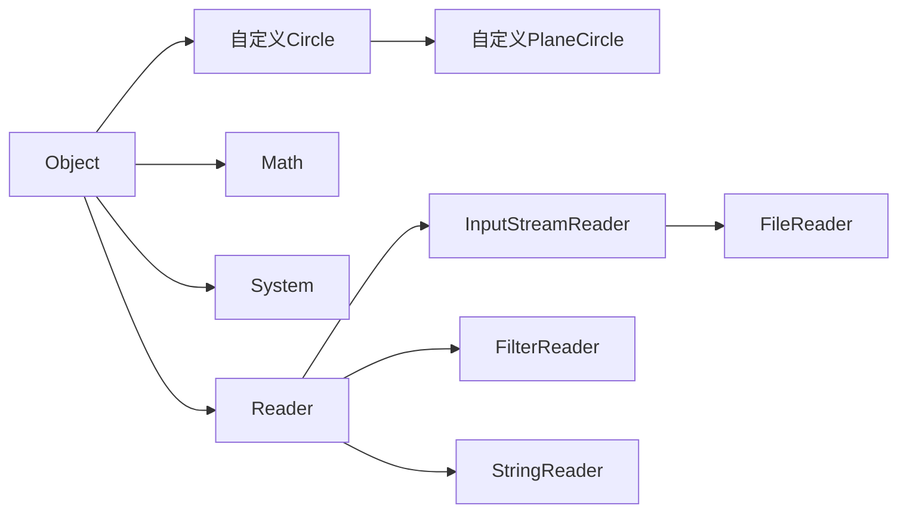
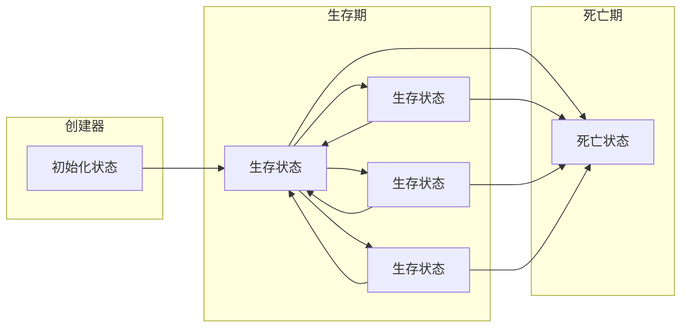

# Java

# §1 基础概念

## §1.1 字符集

Java支持全局Unicode。

## §1.2 注释

- 单行注释`//`
  
  ```java
  int i = 0 // 单行注释
  ```

- 多行注释`/* */`，注释不能嵌套
  
  ```java
  /*
      多行注释
      多行注释
  */
  ```
  
  现实中习惯用`*`突出注释内容
  
  ```java
  /*
   * 多行注释
   * 多行注释
   */
  ```

- 文档注释`/** **/`，用于javadoc生成文档，可包含HTML和javadoc语法
  
  ```java
  /**
   * 返回斐波那契数列的第n项
   * @param <u>指定的项数n</u>
   * @return <strong>斐波那契数列的第n项</strong>
   * @author Yaner
  **/
  ```

# §2 基础语法

## §2.1 数据类型

| 类型      | 取值            | 默认值   | 比特数 | 范围                                                    |
| --------- | --------------- | -------- | ------ | ------------------------------------------------------- |
| `boolean` | `True`或`false` | `false`  | 1      | `True`或`false`                                         |
| `char`    | Unicode字符     | `\u0000` | 16     | `\u0000~\uffff`                                         |
| `byte`    | 有符号整数      | `0`      | 8      | $-2^{7}\sim2^{7}-1 $                                    |
| `short`   | 有符号整数      | `0`      | 16     | $-2^{15}\sim 2^{15}-1 $                                 |
| `int`     | 有符号整数      | `0`      | 32     | $-2^{31}\sim2^{31}-1 $                                  |
| `long`    | 有符号整数      | `0`      | 64     | $-2^{63}\sim2^{63}-1 $                                  |
| `float`   | IEEE754浮点数   | `0.0`    | 32     | $1.4\times10^{-45}\sim3.4028235\times10^{38}$           |
| `double`  | IEEE754浮点数   | `0.0`    | 64     | $4.9\times10^{-45}\sim1.7976931348623157\times10^{308}$ |

| 转换表    | `boolean` | `byte` | `short` | `char` | `int` | `long` | `float`    | `double`   |
| --------- | --------- | ------ | ------- | ------ | ----- | ------ | ---------- | ---------- |
| `boolean` |           | ×      | ×       | ×      | ×     | ×      | ×          | ×          |
| `byte`    | ×         |        | √~放~   | √~缩~  | √~放~ | √~放~  | √~放~      | √~放~      |
| `short`   | ×         | √~缩~  |         | √~缩~  | √~放~ | √~放~  | √~放~      | √~放~      |
| `char`    | ×         | √~缩~  | √~缩~   |        | √~放~ | √~放~  | √~放~      | √~放~      |
| `int`     | ×         | √~缩~  | √~缩~   | √~缩~  |       | √~放~  | √~放,精度~ | √~放~      |
| `long`    | ×         | √~缩~  | √~缩~   | √~缩~  | √~缩~ |        | √~放,精度~ | √~放,精度~ |
| `float`   | ×         | √~缩~  | √~缩~   | √~缩~  | √~缩~ | √~缩~  |            | √~放~      |
| `double`  | ×         | √~缩~  | √~缩~   | √~缩~  | √~缩~ | √~缩~  | √~缩~      |            |

> 注意：缩小转换必须使用显示校正。
>
> ```java
> int a = 10;
> byte b = a; // 报错
> byte = (byte) a // 可执行
> ```

### §2.1.1 `boolean`

与JavaScript不同，Java对于语法有很严格的限制。

```java
// 正确示范
boolean bool_variable = true;
// 错误示范
boolean bool_variable = 1 // 不能赋值整数
bool bool_variable = true; // 严格boolean而非bool
boolean bool_variable = True; // True不是Java关键字
```

### §2.1.2 `char`

```java
char char_variable_1 = 'A';
char char_variable_2 = '\t'; // 转义字符
char char_variable_3 = '😅'; // 支持全局Unicode
char char_variable_4 = '\u0023';
char char_variable_5 = '\\';'
```

| 转义字符 | 含义       | 转义字符 | 含义                                |
| -------- | ---------- | -------- | ----------------------------------- |
| `\b`     | 退格符     | `\"`     | 双引号                              |
| `\t`     | 水平制表符 | `\'`     | 单引号                              |
| `\n`     | 换行符     | `\\`     | 反斜杠                              |
| `\f`     | 换页符     | `\xxx`   | Latin-1编码字符,xxx为Oct数(000~377) |
| `\r`     | 回车符     | `\uxxxx` | Unicode编码字符,xxxx为Hex数         |

### §2.1.3 `byte`、`short`、`int`、`long`

```java
int int_variable_1 = 0xff; // Hex 255
int int_variable_2 = 0377; // Oct 255
int int_variable_3 = 0b00101111; // Bin 47
int int_variable_4 = 0b0010_1111; // Bin 47,Java会忽略Bin中的下划线,下划线用于提高可读性
int int_variable_5 = 0xCAFEBABE; // 类文件魔法书
int int_variable_6 = 123; // 整数型字面量默认为int
double double_variable_1 = 123; // 会报错
double double_variable_2 = 123L; // 整数型字面量后
```

> 注意：Java允许溢出而不报错。
>
> ```java
> byte byte_variable_1 = 127;
> byte byte_variable_2 = 1;
> byte byte_variable_3 = byte_variable_1 + byte_variable_2 // -128
> ```

> 注意：Java在计算$0\div0$时会抛出`ArithmeticException`异常。

### §2.1.4 `float`、`double`

```java
double double_variable_1 = 1.25; // 浮点数字面量默认为double
double double_variable_2 = 1.2e-5;
double double_variable_3 = 1.2E-5;
float float_variable_1 = 1.25f // 浮点数字面量后加f指定float
```

> 注意：`NaN`为浮点数字面量，因此浮点数运算从不抛出异常。
>
> ```java
> double double_variable_4 = 0.0/0.0; // NaN
> ```

## §2.2 运算符

| Priority | Associative | 运算符                                                     | 操作数类型        | 执行的运算                    |
| -------- | ----------- | ---------------------------------------------------------- | ----------------- | ----------------------------- |
| 16       | Left        | `.`                                                        | 对象,成员         | 访问对象成员                  |
|          |             | `[ ]`                                                      | 数组,`int`        | 获取数组中的元素              |
|          |             | `(args)`                                                   | 方法,参数列表     | 调用方法                      |
|          |             | `++`,`--`                                                  | 变量              | 后递增/后递减                 |
| 15       | Right       | `++`,`--`                                                  | 变量              | 前递增/前递减                 |
|          |             | `+`,`-`                                                    | 数字              | 正号/符号                     |
|          |             | `~`(例如$5\overset{\sim}{\rightleftharpoons}-6$)           | 整数              | 按位补码                      |
|          |             | `!`                                                        | 布尔值            | 逻辑囚犯                      |
| 14       | Right       | `new`                                                      | 类,参数列表       | 创建对象                      |
|          |             | `( type )`                                                 | 类型,任何类型     | 显式校正/类型转换             |
| 13       | Left        | `/*`,`/`,`%`                                               | 数字,数字         | 乘法/除法/求余                |
| 12       | Left        | `+`,`-`                                                    | 数字,数字         | 加法/减法                     |
|          |             | `+`(例如`"2"+1="21"`)                                      | 字符串,任何类型   | 字符串连接                    |
| 11       | Left        | `<<`                                                       | 整数,整数         | 左移                          |
|          |             | `>>`                                                       | 整数,整数         | 右移,高位补符号               |
|          |             | `>>>`                                                      | 整数,整数         | 右移,高位补零                 |
| 10       | Left        | `<`,`<=`                                                   | 数字,数字         | 小于/小于等于                 |
|          |             | `>`,`>=`                                                   | 数字,数字         | 大于/大于等于                 |
|          |             | `instanceof`                                               | 引用类型,类型     | 类型比较                      |
| 9        | Left        | `==`                                                       | 基本类型,基本类型 | 值相同                        |
|          |             | `!=`                                                       | 基本类型,基本类型 | 值不同                        |
|          |             | `==`                                                       | 引用类型,引用类型 | 对象相同(∴不能证明字符串相等) |
|          |             | `!=`                                                       | 引用类型,引用类型 | 对象不同                      |
| 8        | Left        | `&`                                                        | 整数,整数         | 按位与                        |
|          |             | `&`                                                        | 布尔值,布尔值     | 逻辑与                        |
| 7        | Left        | `^`                                                        | 整数,整数         | 按位异或                      |
|          |             | `^`                                                        | 布尔值,布尔值     | 逻辑异或                      |
| 6        | Left        | `|`                                                        | 整数,整数         | 按位或                        |
|          |             | `|`                                                        | 布尔值,布尔值     | 逻辑或                        |
| 5        | Left        | `&&`                                                       | 布尔值,布尔值     | 条件与                        |
| 4        | Left        | `||`                                                       | 布尔值,布尔值     | 条件或                        |
| 3        | Right       | `? :`                                                      | 布尔值,任何类型   | 条件运算符                    |
| 2        | Right       | `=`                                                        | 变量,任何类型     | 赋值                          |
|          |             | `*=`,`/=`,`%=`,`+=`,`-=`,`<<=`,`>>=`,`>>>=`,`&=`,`^=`,`!=` | 变量,任何类型     | 计算后赋值                    |
| 1        | Right       | `->`                                                       |                   |                               |

## §2.3 语句

### §2.3.1 表达式语句

在表达式的后面加分号即可变成表达式语句。

```java
a = 1; // 赋值
System.out.println("Hello World!"); // 方法调用
```

### §2.3.2 复合语句

将众多语句放在花括号内，变成一个整体，即复合语句。

```java
for(int i = 0; i < 10; i++){
    a[i]++;// 复合语句
    b[i]--// 复合语句
}
```

### §2.3.3 空语句

```java
for(int i = 0; i < 10; i++){
    
} // 空语句
```

### §2.3.4 标注语句

```java
Loop1: for(int i = 0; i < 5; i++){
    Loop2: for(int j = 0; j < 5; j++){
        Loop3: for(int k = 0; k < 5; k++){
            break Loop2; //跳转至Loop,单个break只能跳出一层
        }
    }
}
```

> 注意：Java保留了关键字`goto`，但是没有保留`goto`的功能。

### §2.3.5 局部变量声明语句

```java
int i,j=2,k;
int l = 0;
```

### §2.3.6 `if`/`else`语句

```java
if (condition){
    command_1;
    command_2;
    ...
} eles if (condition) {
    command;
} else {
    command;
}
```

### §2.3.7 `switch`语句

```java
switch(n){ // n为int/short/char/byte/String/enum及返回以上类型值的表达式
           // n不能为long/float/double
    case 1:
        command;
        break;
    case 2:
        command;
        break;
    default:
        command;
        break;
}
```

### §2.3.8 `while`语句

```java
while(expression){ // 先计算表达式,再执行
    command;
}
```

### §2.3.9 `do`/`while`语句

```java
do{ // 
    command;
}while(expression); // while()末尾必须加分号
```

### §2.3.10 `for`语句

```java
for(initialize;test;update){ // 先执行initialize,然后判断test
    command; // 每执行完一次command,就执行一次update
}
```

### §2.3.11 遍历语句

```java
char[] greeting = new char[] {'H','E','L','L','O',',','W','O','R','L','D'};
for(char character : greeting){
    System.out.println(character);
}
```

### §2.3.12 `break`语句

`break`语句能跳出其所在的最内层`while`/`do`/`for`/`switch`语句块，或者跳转至某一个标注语句的后一个语句。

```java
boolean isTargetExistInIntegerArray(int target, int[] array){
    boolean isFound = false;
    for(int i = 0; i < array.length(); i++){
        if(array[i] == target){
            isFound = True;
            break;
        }
    }
    return isFound;
}
boolean isIntegerMatrixNull(int[][] array, int row, int column){
    boolean isNull = false
    ISNULL: if(data != null){
        for(int i = 0; i < row; i++){
            for(int j = 0; j < column; j++){
                if(data[i][j] == null){
                    isNull = true;
                    break ISNULL;
                }
            }
        }
    }
    return isNull;
}
```

### §2.3.13 `continue`语句

`continue`语句能终止本次循环并开始下一次循环，或者跳转至标注语句。

```java
void incrementFloatArray(float[] array){
	for(int i=0;i<array.length;i++){
        if(Float.isNaN(array[i])){
            continue;
        }
        array[i]++;
    }
}
```

### §2.3.14 `return`语句

定义函数的返回值。

### §2.3.15 `synchronized`语句

`synchronized`将`expression`指定的数组或对象进行锁定，直到`command`执行完毕。

```java
synchronized(expression){
    command;
}
```

### §2.3.16 `throw`语句

```java
public static int factorial(int x){
    if(x<0)
        throw new IllegalArgumentException("x must be >= 0");
    for(int result=1;x>1;x--){
        fact*=x;
    }
    return fact;
}
```

### §2.3.17 `try`/`catch`/`finally`语句

先尝试执行`try`，若抛出异常则从该作用域开始查找对应的`catch`语句并执行，若找不到，则先执行`finally`，再按照堆栈顺序一级级往上回溯，直到找到对应的`catch`语句或尝试回溯`main()`上一级为止。若找到，则先执行`catch`，再执行`finally`，除非调用`System.exit()`。

```java
public static int factorial(int x){
	try{
        if(x<0)
            throw new IllegalArgumentException("x must be>=0");
    }
    catch(IllegalArgumentException | 另一种异常){
        System.out.println("The result may be not accurate.")
    }
    finally{
        for(int result=1;x>1;x--){
            result*=x;
        }
        return result;
    }
}
```

Java7提供了`Try-With-Resources`(TWR)机制，能自动关闭需要清理的资源。

```java
try(InputStream file = new FileInputStream("/usr/bin/info.txt")){
    // processing
}
```

### §2.3.18 `assert`语句

`assert expression;`或`assert expression:errcode;`能在`expression`为假时抛出`java.lang.AssertionError`异常，并将`errcode`传给`AssertionError()`构造方法。

Java编译时虽然会将`assert`包括在内，但是在执行时为了保铮执行效率，默认情况下禁用了断言。为了开启/禁用断言，需要给命令行指定参数。

```shell
java -ea # 除系统类之外,开启所有类的断言
java -esa # 开启系统类断言
java -ea:com.example.sorters.MergeSort com.example.sorters.Test # 指定具体类启用断言
java -ea:com.example.sorters... # 为包中所有的类和子包启用断言
java -ea:com.example.sorters... -da:com.example.sorters.QuickSort # 禁用具体的包/类
```

## §2.4 方法

### §2.4.1 方法修饰符

#### §2.4.1.1 `abstract`

使用`abstract`修饰的方法没有实现主体。如果类中有其修饰的方法，则该类必须也被其修饰。这种类不完整，不能实例化。

#### §2.4.1.2 `final`

使用`final`修饰的方法不能被子类覆盖或隐藏。所有使用`private`修饰的方法都隐式添加了`final`修饰符。所有使用`final`声明的类中的所有方法也都隐式添加了`final`修饰符。

#### §2.4.1.3 `native`

使用`native`修饰的方法由C语言等"本地语言"编写，并开放给Java，没有主体。

#### §2.4.1.4 `public`/`protected`/`private`

#### §2.4.1.5 `static`

使用`static`修饰的类方法关联在类自己身上，而非类的实例身上。

#### §2.4.1.6 `strictfp`

使用`strictfp`修饰的方法禁用运行平台提供的浮点数可用扩展精度，严格执行Java预置标准，即使计算结果不精确。

#### §2.4.1.7 `synchronized`

使用`synchronized`修饰的方法实现了线程安全，避免两个线程同时调用该方法。

### §2.4.2 变长参数列表

要声明变长参数，需要且**只能**在方法最后一个参数类型的后面加上省略号`...`，指明该参数可以重复零次或多次。Java会将这些参数打包成数组，在函数体内能以数组的形式调用。以下两种方法调用时不能混用，但效果完全一样：

```java
public static boolean isTargetExistInIntegerArray(int target, int... array){
    for(int i:array){
        if(target==i)
            return true;
    }
    return false;
}
public static boolean isTargetExistInIntegerArray(int target, int[] array){
    for(int i:array){
    	if(target==i)
            return true;
    }
    return false;
}
isTargetExistInIntegerArray(1,2,1,3,4) // 只能用于变长参数
isTargetExistInIntegerArray(1,new int[] {2,1,3,4}) // 两种方法通用
```

### §2.4.3 匿名函数/`lambda`表达式

```java
Runnable a = () -> System.out.println("Hello World");
a.run();
```

## §2.5 数组

```java
int array_0d; // 一个整数
int[] array_1d; // 一维数组
int[][] array_2d; // 二维数组
```

### §2.5.1 数组初始化

- `int[] a = new int[]{1,2,3}`

- `int[] a = {1,2,3}`

  > 注意：在C语言中`{1,2,3,}`会被判定为`SyntaxError`，但Java会自动忽略末尾多余的逗号。 

- `int[] a = new int[3]`指定元素个数。

  > 注意：数组的`array.length`为`int`型整数，这意味着数组的长度不能超过`int`的最大值`Integer.MAX_VALUE`。

### §2.5.2 数组类型放大转换/数组协变

- 数组扩展自`Object`类，而且实现了`Cloneable`和`Serializable`接口，因此数组可以指定给以上这三种类型。

  ```java
  String string_1 = "Hello, Java and Android!";
  String string_2 = "LocationSignUpApp";
  String[] stringArray = {string_1,string_2};  
  Object[] objectArray = stringArray;
  Object object = stringArray;
  Cloneable cloneable_1 = stringArray;
  Comparable[] comparableArray = stringArray;
  ```

- 若数组内部的元素可由一种类型转化为另一种类型，则数组类型即可从这种类型转化为另一种类型。但是有例外：**基本类型的数组不能放大转换**。不可转化时会抛出`ArrayStoreException`异常。

  ```java
  byte[] byteArray = new byte{1,2,3};
  int[] intArray = byteArray; // ArrayStoreException异常
  ```

### §2.5.3 兼容语法

```java
int[][] array_2d; // Java原生语法
int array_2d[][]; // C语言语法int array_2d[5][5](Java向下兼容)
int[] array_2d[]; // C语言语法int* array_ptr[5](Java向下兼容)
```

### §2.5.4 复制数组

#### §2.5.4.1 `array.clone()`

数组实现了`Cloneable`接口，可以调用`.clone()`克隆自己，克隆体与原数组共享同一份内存空间，属于潜复制。

```java
int[] data = {1,2,3};
int[] data_duplicate = data.clone();
```

#### §2.5.4.2 `System.arraycopy()`

`System.arraycopy(originalArray,startActiveIndex,duplicateArray,startPassiveIndex,length)`将`originalArray`从第`startActiveIndex`位元素开始，复制`length`个元素到`duplicateArray`的第`startPassiveIndex`位置。

```java
public static void arrayLeftMove(int[] array){ // 数组元素轮换左移一位
    int first = array[0];
    System.arraycopy(array,1,array,0,array.length-1);
    array[array.length-1] = first;
}
```

## §2.6 引用/指针

### §2.6.1 引用相等和对象相等

对于引用类型而言，有引用相等而对象相等之分。`==`运算符返回的是引用相等，`object.equals()`返回的是对象相等。为了加以区分，我们引入相同(identical)表示引用相等，相等(equal)表示对象相等。

```java
String a = "hello";
String b = "hello";
String c = "hell" + "o";
String d = "o";
String e = "hell"+d;
System.out.println(a==b); // true
System.out.println(a==c); // true
System.out.println(a==e); // false
System.out.println(a.equals(b)); // true
System.out.println(b.equals(a)); // true
```

### §2.6.2 装包和拆包

有时需要把基本值当成对象，Java为8中基本类型提供了对应的包装类，转换关系如下：

| 基本类型  | 包装类      | 基本类型 | 包装类    |
| --------- | ----------- | -------- | --------- |
| `boolean` | `Boolean`   | `int`    | `Integer` |
| `byte`    | `Byte`      | `long`   | `Long`    |
| `short`   | `Short`     | `float`  | `Float`   |
| `char`    | `Character` | `double` | `Double`  |

```java
import java.util.List;
import java.util.ArrayList;
List number = new ArrayList();

//手动装包/拆包
number.add(new Integer(-1)); // 装包
System.out.println((Integer)number.get(0).intValue()); // 拆包

//自动装包/拆包
Integer i = 0; // 装包
int j = i; // 拆包
i = null;
j = i // NullPointerException,空object指针无法转int
```

## §2.7 包和命名空间

包由一些具名的类、接口和其他引用类型组成，并指定对应的命名空间。

| 包          | 作用         |
| ----------- | ------------ |
| `java.lang` | 基本类型     |
| `java.util` | 各种实用类型 |
| `java.io`   | 输入输出类型 |
| `java.net`  | 网络类型     |

### §2.7.1 声明包

关键字`package`必须放在Java文件的第一行，用于表示该文件中定义的所有类和方法属于对应包的一部分。

```java
package com.example;
```

### §2.7.2 导入类型

通常情况下，引用类或接口是必须使用类型的完全限定名称，即包含包名，除非以下例外：

- `java.lang`包中的类型最常用、最重要，可以始终使用简称引用

- 在`package`辖域内调用该辖域内定义的类型，可以使用简称引用

- 已经使用`import`声明导入命名空间的类型，可以使用简称引用

  > 注意：`package`声明在前，`import`声明在后。

`import`声明有两种格式：

- 单个类型导入：把单个类型导入命名空间，例如`import java.io.file;`
- 按需类型导入：批量导入指定包内的所有类，例如`import java.io.*;`

当两个不同的包中含有**名称相同、签名也相同**的类时会发生冲突，同时将其导入会导致编译出错：

```java
import java.util.List;
import java.wat.List;  // 会报错
```

如果使用按需类型导入，虽然不会在编译时报错，但在调用类时会报错：

```java
import java.util.*;
import java.awt.*; // 不报错
List a = new List[]; // 报错
```

为了解决这一冲突，我们可以利用单个类型导入的顺序实现覆盖：

```java
import java.util.*;
import java.awt.*;
import java.util.List; // 覆盖java.awt.List
List a = new List[]; // 不报错,定义的是java.util.List
```

### §2.7.3 导入静态成员

如果需要大量地调用某一个静态成员的方法，重复输入报名会显得很麻烦：

```java
System.out.println("Hello World!");
System.out.println("I'm a noob in Java now.");
System.out.println("I want to make my own APP!");
// ...
double a = Math.sin(Math.toRadians(45));
double b = Math.sqrt(Math.abs(-9));
// ...
enum seasons {'spring','summer','autumn','winter'};
```

此时可以导入静态成员，简化输入：

```java
import static java.lang.System.out;
out.println("Hello World!");
out.println("I'm a noob in Java now.");
out.println("I want to make my own APP!");
// ...
import static java.lang.Math.*;
double a = sin(toRadians(45));
double b = sqrt(abs(-9));
// ...
import static com.example.seasons; // 预先将枚举定义在com.example中
```

当两个不同的包中含有**名称相同、但签名不同**的类时不会发生冲突，而是进行重载，并根据实参的类型选择对应的方法：

```java
import static java.util.Arrays.sort;
import static java.util.Collections.sort; // 不报错
```

## §2.8 类和对象

```java
public class Point2d
{
    public double x,y;
    public Point2d(double x,double y){
        this.x=x;
        this.y=y;
    }
    public double distanceToOrigin(){
        return Math.sqrt(x*x+y*y);
    }
    public static void main(String[] args){
        Point2d a = new Point2d(1,2.6);
        System.out.println(a.distanceToOrigin());
    }
}
```

### §2.8.1 定义类

定义格式如下：访问控制修饰符 + 关键字`class` + 类名称 [ + `extends`关键字 + 父类名称] [ + 关键字`inplemetns`+ 接口_1 , 接口2 , ...]

```java
public class Integer extends Number implements Serializable,Comparable{
    // ...
}
```

### §2.8.2 字段和方法

类中的成员可分为四类：类字段(静态字段)、类方法、实例字段、实例方法。

```java
public class Circle{
    public static final double PI=3.14159265; // 类字段常量
    public static double pi=3.14159265; // 类字段变量
    public static double radToDeg(double radians){ // 类方法
        return radians*180/PI;
    }
    public double radius = 2.0; // 实例字段,同时设置默认值
    public double circumference(){ // 实例方法
        return 2*PI*radius;
    }
}
```

类字段、类方法关联在类身上，实例字段和实例方法关联在对象身上。

```java
double a = Circle.radToDeg(30); // 类方法关联在类身上
Circle b = new Circle();
b.radius = 3.0;
System.out.println(b.circumference()); // 实例方法关联在对象身上
```

在**实例方法**中引用类字段时，既可以显式地使用`this.`对象，也可以将其忽略。但类方法不能使用`this`关键字。

```java
public class Circle{
    // ...
    public double circumference_explicit(){
        return 2 * PI * this.radius;
    }
    public double circumference_implicit(){
        return 2 * PI * radius;
    }
}
```

### §2.8.3 构造方法

#### §2.8.3.1 默认构造方法

之前的例子都没有定义构造方法，创建对象时调用的是`OBJECT object_name = new OBJECT()`，之后可以单独使用赋值语句改变实例字段。

这个默认构造方法实际上就是`super()`，编译时会强制加上：

```java
public class Example{
    // ...
    public static Example(){
        super();
    }
}
```

如果对应的父类没有定义无参数的构造方法，则编译时会出错。

#### §2.8.3.2 自定义构造方法

自定义构造方法允许**定义对象时**对实例变量进行初始化。

```java
public class Circle{
    public static final double PI = 3.14159265;
    protected double radius; // 保证子类无法更改
    public double circumference(){
        return 2 * PI * radius;
    }
    public Circle(double radius){ // 自定义构造方法
        this.radius = radius;
    }
}
```

> 注意：自定义构造方法有以下注意事项：
>
> - 构造方法的函数名与类名应该一致
> - 不能指定构造方法的返回类型，连`void`都不用
> - 构造方法不能带有`return`语句

事实上，同一个类内的自定义构造方法可以不止一个，允许重构。

```java
public Circle{
    // ...
    public Circle(){
        radius = 3;
    }
    public Circle(double radius){
        this.radius = radius;
    }
}
```

这些构造方法之间也可以互相调用，编译器会根据传入`this()`的数据类型自动选择对应的构造方法。`this()`语句只能出现在构造方法的第一行。

```java
public Circle{
    // ...
    public Circle(double radius){
        this.radius = radius;
    }
    public Circle(){
        this(3.0); //利用this对象调用另一个Circle()
    }
}
```

### §2.8.4 静态初始化方法

静态初始化方法允许**编译类**时对类字段进行初始化，由关键字`static`及花括号包含的代码块组成。一个类中可以包含多个静态初始化方法，编译时会将这些代码块整合进一个方法执行。其中不能使用`this`关键字、实例字段和实例方法。

```java
public class SinFunctionGraph(){
    private static final int sample = 100;
    private static double x[] = new double[sample];
    private static double f_x[] = new double[sample];
    static{ // 静态初始化方法
        double initial = 0.0;
        double delta = 0.05;
        for(int i=0;i<sample;i++){
            x[i]=initial+i*delta
            f_x[i]=Math.sin(x[i]);
        }
    }
}
```

### §2.8.5 实例初始化方法

与静态初始化相似，但是针对的是实例字段，且不用带`static`关键字。可以将构造方法中的初始化代码移动至实例初始化方法中，让构造方法更加清晰。

```java
public class Example{
    // ...
    private int[] index = new int[100];
    
    {
        for(int i=0;i<100;i++){
            data[i]=i;
        }
    }
}
```

### §2.8.6 子类和继承

定义子类需要使用`extends`关键字，后接父类名称。在子类的构造方法中，可以使用超类的构造方法`super(parameter)`将参数传给父类的构造方法。

```java
public class PlaneCircle extends Circle{ // 继承了Circle类中的所有字段和方法
    private final double centerX=0,centerY=0;
    public PlaneCircle(double r,double x, double y){
        super(r);
        this.centerX = x;
        this.centery = y;
    }
    public boolean isPointInsideCircle(double point_x, double point_y){
        double distance = Math.pow(this.centerX-point_x,2)+Math.pow(this.centerY-point_y,2)-Math.pow(this.radius,2);
        if(distance<=0){
            return true;
        }else{
            return false;
        }
    }
}
```

每个子类都能完全兼容父类，在兼容的过程中会丢失一些父类没有的字段和方法。

```java
PlaneCircle a = new PlaneCircle(2.5,0,2);
Circle b = a; // 不报错
```

每个父类都可以通过显示校正转换为子类。

```java
Circle a = new Circle(3.0);
PlaneCircle b = (PlaneCircle) a;
```

如果声明类时使用了`final`修饰符，则该类无法被扩展成新的子类。

```java
public final class Circle{
	// ...
}
public class PlaneCircle extends Circle{ // 报错
    // ...
}
```

### §2.8.7 超类

在Java中，子类和父类的关系为$子类\overset{超类}{\underset{子类}{\rightleftharpoons}}父类$。自定义的每个类都有对应的超类，如果没有`extends`关键字，则超类为`java.lang.object`。`java.lang.object`是Java中唯一没有超类的类，所有Java类都从`java.lang.object`中继承字段和方法。这些子类和超类的关系构成了类层次结构。



关键字`super`用于在子类构造方法中调用超类的构造方法，类似于使用`this`调用同一个类中的其他构造方法。`super(parameter)`也可以按照传入参数的类型选择超类对应的构造方法。

> 注意：仅当在子类构造方法中才能使用`super()`，且必须使用`super()`，并将其放在子类构造方法的第一行。

### §2.8.8 构造方法链

创建子类实例时，Java会按顺序执行下列任务：

1. 调用子类的构造方法，入栈。
2. 子类构造方法的第一行必为`super(parameter)`，由此进入父类构造方法，入栈。
3. 如父类为`java.lang.object`直属子类，其构造方法不含`super()`，则其构造方法会隐式调用`super()`，由此进入`java.lang.object`构造方法，入栈。
4. 执行`java.lang.object`的构造方法，将`object`对象传入父类构造方法，出栈。
5. 执行父类的构造方法，将父类对象传入子类构造方法，出栈。
6. 执行子类的构造方法，将子类对象传入执行创建子类代码所在作用域的环境，出栈。

### §2.8.9 覆盖

#### §2.8.9.1 覆盖字段

当父类和子类含有相同名称的实例字段时，在子类的辖域内，子类名称会覆盖父类名称。

```java
public class Circle {
    public double radius;
    public Circle(double radius){
        this.radius = radius;
    }
}
public class PlainCircle extends Circle{
    public double radius;
    public PlainCircle(double radius){
        super(2);
        this.radius = radius;
    }
    public static void main(String[] args){
        PlainCircle a = new PlainCircle();
        System.out.println(a.radius); // 1.0
    }
}
```

为了访问父类的同名字段，可以使用`super`关键字或显式类型转换。

```java
radius; // 子类实例字段
this.radius; // 子类实例字段
super.x; // 父类实例字段
((B) this).x; // 父类实例字段
super.super.x; // 报错
```

#### §2.8.9.2 覆盖方法

与字段不同，父类方法一旦被子类方法覆盖，就永远无法在调用父类方法。

```java
class Father{
    int i = 1; // 父类实例字段
    int f(){ // 父类实例方法
        return i;
    }
    static char g(){ // 父类类方法
        return 'A';
    }
}
class Son extends Father{
    int i = 2; // 子类实例字段
    int f(){ // 子类实例方法
        return -i;
    }
    static char g(){ // 子类类方法
        return 'B';
    }
}
public class OverrideTest{
    public static void main(String args[]){
        Son son = new Son();
        System.out.println(son.i); // 2,子类成员调用子类实例字段
        System.out.println(son.f()); // -2,子类成员调用子类实例方法
        System.out.println(son.g()); // B,子类成员调用子类类方法
        System.out.println(Son.g()); // B,子类直接调用子类类方法
        Father father = (Son) son;
        System.out.println(father.i); // 1,子类转父类,调用父类实例字段
        System.out.println(father.f()); // -2,子类转父类,调用子类实例字段
        System.out.println(father.g()); // A,子类转父类,调用了父类类方法
        System.out.println(Father.g()); // A,父类直接调用了父类类方法
    }
}

```

### §2.8.10 隐藏和封装

#### §2.8.10.1 访问规则

- 对于使用`public`修饰符的成员，只要能访问其所在的类，就能访问该成员。
- 对于使用`private`修饰符的成员，只有在其所在类的内部，才能访问该成员。
- 对于使用`protected`修饰符的成员，只要在其所在类对应的包内部，或者在其子类的内部，都能访问该成员。
- 对于没有任何修饰符的成员，使用默认的访问规则，只有在其所在类对应的包内部，才能访问该成员。

#### §2.8.10.2 访问控制和继承

- 子类继承超类中所有可以访问的实例字段和实例方法。
- 如果子类和超类在同一个包中定义，则子类继承所有未被`private`声明的实例字段和实例方法。
- 如果子类和超类在不同的包中定义，则子类继承所有使用`protected`和`public`修饰的实例字段和实例方法。
- 使用`private`修饰的字段和方法不会被继承。
- 构造方法不会被继承，但是可以通过构造方法链调用。

> 注意：子类创建的每个对象都包含着一个完整的超类实例，即使超类中有些成员被`private`等修饰符修饰。

|                  | `public` | `protected` | `private` | 默认 |
| ---------------- | -------- | ----------- | --------- | ---- |
| 定义成员的类内部 | √        | √           | √         | √    |
| 同一个包中的类   | √        | √           | ×         | √    |
| 不同包中的子类   | √        | √           | ×         | ×    |
| 不同包，非子类   | √        | ×           | ×         | ×    |

#### §2.8.10.3 数据访问器方法

使用`protected`修饰类中的变量，使其他类无法随意更改该类创建的对象中的成员。然后给构造方法加上所需的限制条件，给类添加对应的数据访问器方法，从而保证在创建或修改时都能满足限制条件。

```java
public class Circle{
    public static final double PI = 3.14159265;
    protected double radius; // 半径在子类中可见
    protected void checkRadius(double radius){
        if(radius < 0.0){
            throw new IllegalArgumentException("Radius must be positive!");
        }
    }
    public Circle(double radius){
        checkRadius(radius);
        this.radius = radius;
    }
    public double getRadius(){
        return radius;
    }
    public void setRadius(double radius){
        checkRadius(radius);
        this.radius = radius;
    }
}
```

### §2.8.11 抽象类

Java允许使用`abstract`修饰符声明方法并创建抽象类，用于只定义方法但不实现方法。

- 只要类中有一个`abstract`方法，那么这个类本身就自动成为抽象类，而且必须用`abstract`显式声明为抽象类。
- 抽象类无法实例化。
- 抽象类的子类必须覆盖其声明的所有方法才能实例化。
- 抽象类的子类如果没有覆盖其声明的所有方法，则该子类还是抽象类，而且不需使用`abstruct`显式声明为抽象类。
- 使用`static`、`private`、`final`声明的方法不能是抽象方法，因为其在子类中不能覆盖。
- 使用`final`修饰的类不能是抽象类。

```java
public abstract class Shape {
    public abstract double area();
    public abstract double circumference();
}
class Circle extends Shape{
    public static final double PI = 3.14159265;
    protected double radius;
    public double area() {
        return PI*radius*radius;
    }
    public double circumference(){
        return 2*PI*radius;
    }
    public Circle(double radius){
        if(radius<=0){
            throw new IllegalArgumentException("Radius must be positive.");
        }
        this.radius = radius;
    }
}
class Rectangle extends Shape{
    protected double width,height;
    public Rectangle(double width, double height){
        if(width<=0||height<=0){
            throw new IllegalArgumentException("Width or height must be positive.");
        }
        this.height = height;
        this.width = width;
    }
    public double area(){
        return height * width;
    }
    public double circumference() {
        return 2 * (height + width);
    }
}
abstract class ActualShape extends Shape{
    public static void main(String[] args){
        Shape[] realShape = new Shape[2];
        realShape[0] = new Circle(2.0);
        realShape[1] = new Rectangle(1.5,6);
        double areaSum = 0;
        for(Shape item : realShape){
            areaSum += item.area();
        }
        System.out.println(areaSum); // 21.5663706,计算总面积
    }
}
```

### §2.8.12 转换引用类型

在类层次结构图中，我们引入族谱图中的“直系亲属”和“旁系亲属”概念。

- 旁系类之间不能转换类型，即使使用矫正运算符进行显式转换也不行。
- 在直系类中，从子类转化为超类是放大转换，因此不用显式校正。
- 在直系类中，从超类转化为子类是缩小转换，需要进行显式校正。
- 对于数组而言，如果数组的两种数据类型可以互相转换，则两个数组也可以互相转换，**除非这两种数据类型都属于八种基本类型**。

### §2.8.13 修饰符

| 修饰符         | 用于       | 效果                                                         |
| -------------- | ---------- | ------------------------------------------------------------ |
| `abstract`     | 类         | 该类不能实例化,可能包含只声明未实现的方法                    |
|                | 接口       | 加与不加都一样,因为所有借口默认都是抽象的                    |
|                | 方法       | 该方法没有主体,主题由子类提供                                |
| `default`      | 方法       | 该接口方法的实现是可选的,若未实现,则让接口为该方法所属的类提供默认实现 |
| `final`        | 类         | 不能创建该类的子类                                           |
|                | 方法       | 不能覆盖这个方法                                             |
|                | 字段       | 该字段为常量,`static final`指编译时常量                      |
|                | 变量       | 局部变量/方法参数/异常参数的值不能修改                       |
| `native`       | 方法       | 该方法的实现与平台无关(例如C语言),没有主体                   |
| 无修饰符       | 类         | 未被`public`修饰的类只能在包中访问                           |
|                | 接口       | 未被`public`修饰的接口只能在包中访问                         |
|                | 成员       | 未被`private`、`protected`、`public`修饰的成员具有包可见性,只能在包内访问 |
| `private`      | 成员       | 只能在其所在的包内访问                                       |
| `protected`    | 成员       | 只能在其所在的包和子类中访问                                 |
| `public`       | 类         | 只要能访问其所在的包,就能访问该类                            |
|                | 接口       | 只要能访问其所在的包,就能访问该接口                          |
|                | 成员       | 只要能访问其所在的包,就能访问该成员                          |
| `strictfp`     | 类         | 该类中的所有方法都会被隐式地声明为`strictfp`                 |
|                | 方法       | 该方法严格遵守IEEE 754标准执行浮点运算,中间的计算结果和最终数值都要使用`IEEE float`或`double`表示 |
| `static`       | 类         | 使用`static`声明的内部类是顶层类,而不是所在类的成员          |
|                | 方法       | 该方法是类方法,不隐式传入`this`对象既可引用,也可通过类名调用 |
|                | 字段       | 该字段为类字段,不管创建多少类实例,类字段都只有一个实例,可通过类名调用 |
|                | 初始化程序 | 在加载类时运行,而非创建实例时运行                            |
| `synchronized` | 方法       | 使两个线程不能同时访问该方法                                 |
| `transient`    | 字段       | 使该字段不会随对象一起序列化                                 |
| `volatile`     | 字段       | 该字段能被异步线程访问                                       |

### §2.8.14 嵌套

在`class`内部定义的类称为嵌套类或内部类，通常用于以下两种情况：

- 如果某个类需要特别深入的访问另一个类型，则可以使用嵌套类。
- 如果某个类只在特定的情况下才使用，并且其代码区域特别小，应该封装在一个小范围内，则可以使用嵌套类。

嵌套类的好处有以下几点：

- 访问嵌套类中的字段和方法非常简便，就像是这些字段和方法本来就定义在包含它的类中一样。
- 嵌套类的访问权限管理非常的极端。对于包含它的类而言，嵌套类等价于被`public`修饰的其他类；对于其它类而言，嵌套类甚至比`private`还要极端，永远也无法访问。
- 嵌套类不能被单独实例化，只能随着其所在类一起被实例化，从而实现类和嵌套类一一对应的关系。

事实上，JVM和类文件会将嵌套类与普通类一视同仁，将所有类都视作普通的顶层类。javac为了区分嵌套类和普通类，会在类文件中插入隐藏字段、方法和构造方法参数，统称为合成物(synthetic)，可以由javap反汇编识别。

嵌套类有四种类型，分别是静态成员类型、非静态成员类、局部类和匿名类。

#### §2.8.14.1 静态成员类型

静态成员类型类似于类的静态成员。

静态成员类型具有以下特点：

- 静态成员类型和所在类的任何实例都不关联，也就是说没有`this`对象。
- 静态成员类型只能访问所在类的静态成员，不能访问所在类之外的静态成员，但是能访问所在类内的所有静态成员类型。同理，反过来说，类内的静态成员都能访问静态成员类型内的成员。
- 所有嵌套类都不能被实例化，所以静态成员类型中的字段、接口、枚举、注解全部都被`static`隐式修饰。
- 只有静态成员类型才支持再嵌套内部的静态成员类型，其他三种嵌套类型不支持嵌套静态成员类型。
- 静态成员类型不能和其他的外层类重名。
- 静态成员类型只能在顶层类型，或该顶层类型中的静态成员类型内定义，不能在任何成员类、局部类、匿名类中定义。

```java
public class LinkedStack{ // 用链表实现堆栈
    static interface Linkable{ // 静态成员接口
        public Linkable getNext();
        public void setNext(Linkable node);
    }
    Linkable head;
    public void push(Linkable Node){
        // ...
    }
    public Object pop9){
        // ...
    }
}
public LinkableInteger implements LinkedStack.Linkable{
    int i;
    public LinkableInteger(int i){
        this.i = i;
    }
    LinkableStack.Linkable next;
    public LinkedStack.Linkable getNext{
        return next;
    }
    public void setNext(LinkedStack.Linkable node){
        next = node;
    }
}
```

#### §2.8.14.2 非静态成员类

非静态成员类是外层类或枚举类型的成员，而且不使用`static`修饰。如果把静态成员类型类比成类字段或类方法，那么非静态成员类就是实例字段和实例方法。之所以不叫做“非静态成员类**型**”，是因为非静态成员类型只能是类，所以采用这种简称。

非静态成员类具有以下特点：

- 非静态成员类的实例始终关联另一个外层类型的实例。

- 非静态成员类的内部能访问外层类型的所有字段和方法。

- 非静态成员类同样不能与外界类或外界包重名。

- 非静态成员类不能包含任何被`static`修饰的字段、方法和类，除非是同时被`static`和`final`修饰的常量。

- 与静态成员类型不同，非静态成员类可以使用`this`对象。

  ```java
  import java.util.Iterator;
  public class LinkedStack{ // 用链表实现堆栈,进一步完善,增加迭代器
      // ...
      public Iterator<Linkable> iterator(){
          return new LinkedIterator();
      }
      protected class LinkedIterator implements Iterator<Linkable>{ // 非静态成员类
          Linkable current;
          public LInkedIterator(){
              current = head;
          }
          public boolean hasNext(){
              return current != null;
          }
          public Linkable next(){
              if(current == null){
                  throw new java.util.NoSuchElementException();
              }
              Linkable value = current;
              current = current.getNext();
              return value;
          }
      }
      public void remove(){
          throw new UnsupportedOperationException();
      }
  }
  ```

  在这里我们用隐式调用实现了`public LinkedIterator()`方法。如果用`this`对象显示调用的话，该方法可以进行如下改写，其形式一般为`className.this`，其中`className`是外部类的名称，这种语法常用于外层类成员与嵌套类成员重名时的情况：

  ```java
  //...
  public LinkedIterator(){
      current = head; // 非静态成员类内的类字段 = 其外部类的实例字段
  }
  public LinkedIterator(){
      this.current = LinkedStack.this.head; // this显式调用
  }
  //...
  ```

#### §2.8.14.3 局部类

局部类在方法、类的静态初始化程序、类的实例初始化程序中定义。因为Java所有的代码块都在类中定义，所以局部类也嵌套于类中。

```java
public class LinkedStack{
    // ...
    public Iterator<Linkable> Iterator(){
        class LinkedIterator implements Iterator<Linkable>{ // 局部类,在方法中定义
				// ...
            }
        }
    	return new LInkedIterator();
    }
}
```

局部类有以下特点：

- 局部类和外层实例关联，而且能访问外层类的任何成员。
- 局部类能访问局部方法的作用域中**被`final`修饰**的局部变量、方法参数、异常参数。
- 局部类的作用域不能超出定义它的代码块，但是在该代码块中定义的局部类实例可以在作用域之外使用。
- 局部类不能被`private`、`protected`、`public`、`static`修饰，因此不能定义静态字段、静态方法和静态类。除非是同时被`static`和`final`修饰的常量。
- 除局部类自身之外，局部类所在的代码块中的变量、方法参数、异常参数只有被`final`修饰，才能被局部类调用，被因为局部类实例的生命周期可能比定义它的代码块的生命周期要长。
- 局部类不能定义接口、枚举和注解。
- 局部类不能和外层类重名。

```java
package com.example;
class A{
    protected char a = 'a';
}
class B{
    protected char b = 'b';
}
public class C extends A{
    private char c = 'c';
    public static char d = 'd';
    public void creteLocalObject(final char e){
        final char f = 'f';
        int i = 0;
        class Local extends B{
            char g = 'g';
            public void printVars(){
                System.out.println(a); // 从外层类的父类继承的字段
                System.out.println(b); // 从嵌套类的父类继承的字段
                System.out.println(c); // 外层类的字段,C.this.c
                System.out.println(d); // 外层类的字段,C.this.d
                System.out.println(e); // 局部类所在作用域的final方法参数
                System.out.println(f); // 局部类所在作用域的final字段
                System.out.println(g); // 局部类内部的字段
                System.out.println(i); // 报错,未被final修饰,故嵌套类内部不能访问
            }
        }
        Local l = new Local();
        l.printVars();
    }
}
```

#### §2.8.14.4 匿名类

匿名类是没有名称的局部类，仅用`new`在表达式中同时完成定义和实例化。

```java
public Iterator<Linkable> iterator(){
    return new Iterator<Linkable>(){
        Linkable current;
        {current = head;} // 实例初始化程序
        public boolean hasNext(){
            return current != null;
        }
        public Linkable next(){
            if(current == null){
                throw new java,util.NoSuchElementException();
            }
            Linkable value = current;
            current = current,getNext();
            return value;
        }
        public void remove(){
            throw new UnsupportedOperationException();
        }
    };
}
```

匿名类有以下特点：

- 匿名类不支持`extends`和`implements`。
- 因为匿名类没有名称，所以无法在匿名类内部定义构造方法。因此在创建匿名类实例时，小括号传入的参数实际上传给了所有类的父类——`Object`。而`new Object()`不需要传参，所以匿名类不需要传入参数。
- 匿名类实质上是一种局部类，所以匿名类继承了局部类的所有特点。
- 虽然匿名类不支持构造方法，但是可以用实例初始化方法代替构造方法，而这正是Java引入实例初始化方法的初衷。

#### §2.8.14.5 作用域与继承层次结构

对于嵌套类而言，我们要考虑两套作用域与继承层次结构：一是从超类到子类的**继承层次结构**，二是从外层类到嵌套类的**包含层次结构**。这两种层次结构完全互相独立。如果超类的字段或方法与外层类的字段或方法重名，造成命名冲突，则以继承的字段或方法为准。

## §2.9 接口

与定义类相似，定义接口使用的关键字是`interface`。

```java
interface Centered{
    void setCenter(double center_x,double center_y);
    double getCenterX();
    double getCenterY();
}
```

接口的成员有以下限制：

- **除了默认方法外**，接口中的所有方法都会被`abstract`隐式修饰（也可以手动显式修饰），成为抽象方法，因此不能有方法主体。
- 接口中的所有成员都会被`public`隐式修饰（也可以手动现实修饰），因此成员不能被`protected`、`private`修饰。
- 由于上一点，所以接口不能定义任何实例字段，只能定义同时由`public`和`final`修饰的常量。
- 接口不能实例化，因此不能包含构造方法。但是可以将实现该接口的类进行实例化，然后将得到的对象校正为接口的实例。
- 接口中可以包含嵌套类型，并对其使用`public`和`static`隐式修饰。

### §2.9.1 扩展接口

与扩展类相似，接口也可以被扩展，但是子接口可以有多个父接口。子接口会继承每个父接口中的所有方法和常量，实现这个子接口的类必须实现其自定义的和继承而来的所有方法。

```java
interface Positionanle extends Centered{
    void setUpperRightCorner(double x,double y)；
}
```

### §2.9.2 实现接口

与类实例化成为对象相似，接口也可以使用关键字`implements`实例化成类，表明该类要实现的一系列接口。如果没有全部实现，该类必须用`abstract`显式声明为抽象类。

```java
interface Centered{
    void setCenter(double center_x,double center_y);
    double getCenterX();
    double getCenterY();
}
public abstract class Shape {
    public abstract double area();
    public abstract double circumference();
}
class Rectangle extends Shape{
    protected double width,height;
    public Rectangle(double width, double height){
        if(width<=0||height<=0){
            throw new IllegalArgumentException("Width or height must be positive.");
        }
        this.height = height;
        this.width = width;
    }
    public double area(){
        return height * width;
    }
    public double circumference() {
        return 2 * (height + width);
    }
}
public class CenteredRectangle extends Rectangle implements Centered{
    private double center_x,center_y;
    public CenteredRectangle(double center_x,double center_y,double width,double height){
        super(width,height);
        this.center_x = center_x;
        this.center_y = center_y;
    }
    public void setCenter(double x,double y){center_x=x;center_y=y;}
    public double getCenterX(){return center_x;}
    public double getCenterY(){return center_y;}
}
```

### §2.9.3 默认方法

升级接口后，原来支持该接口的类会因为缺失接口中新增的方法而在编译时抛出`NoClassDefError`异常。为避免升级借口而导致的不向后兼容，Java 8引入了默认方法这一功能，只需给接口中新增的方法使用`default`关键词进行修饰，就可以表明该方法的实现是可选的。默认方法作为一个例外，是可以在接口中编写主体的。

- 实现接口的类可以不实现接口中的默认方法。
- 若接口的类是实现了默认方法，则使用这个类中的实现，而非接口中的实现。
- 若接口的类没有实现默认方法，则使用接口中的实现。

## §2.10 泛型

Java提供了丰富且灵活的数据类型，但是早期版本存在相当大的不足：数据结构完全隐藏了存储于其中的数据类型。对于一个存储不同对象的集合，开发者不知道从集合内选出的元素到底是哪一种对象，从而引发错误。更关键的是，这是一种运行时错误，也就是说javac在编译阶段检测不到这种错误，只有在运行时才能发现。

```java
List shapes = new ArrayList();
shapes.add(new CenteredCircle(1,1,1));
shapes.add(new Circle(2,2,2));
// List::add(index)返回Object,需要显式校正为CenteredCircle
CenteredCircle first_circle = (CenteredCircle)shapes.get(0);
// runtime报错
CenteredCircle second_circle = (CenteredCircle)shapes.get(1);
```

为了解决这个问题，泛型在Java 5

应运而生，可以让javac在编译阶段就发现这个问题。

```java
List<CenteredCircle> shapes = new ArrayList<CenteredCircle>();
shapes.add(new CenteredCircle(1,1,1));
// compiler报错
shapes.add(new Circle(2,2,2));
// List<CenteredCircle>::get()返回CenteredCircle,无需校正
CenteredCircle first_circle = shapes.get(0);
```

综上所述，**容器的类型**定义为泛型(general type)，语法为`List<T>`，其中`T`成为类型参数(type parameter)。`List`类中定义了一种抽象的数据类型`E`，`E`不对类型参数做任何假设，而是代表当前调用`List`中的元素的真实类型，可以在方法的签名和主体中使用。

```java
interface List<E> extends Collection<E>{
    boolean add(E element); // E可以用于方法的签名
    default E get(int index); // E可以用于方法的主体
}
```

在指定泛型时也可以使用菱形语法，只在左侧的`<>`填充数据类型，而不用填充右侧的`<>`，编译器会自动识别。

```java
// 正常语法
List<CenteredCircle> shapes = new ArrayList<CenteredCircle>();
// 菱形语法
List<CenteredCircle> shapes = new ArrayList<>();
```

### §2.10.1 类型擦除

泛型自Java 5引入。为了实现向后兼容，需要未指定泛型的容器能容纳各种数据类型，也需要指定了泛型的容器只能容纳特定的数据类型。

```java
public class Example{
    public static void main(String[] args){
        ArrayList a = new ArrayList();
        a.add("Hello");
        a.add("World");
        ArrayList<String> b = (ArrayList<String>)a; // 并不安全
    }
}
```

在编译形成class文件时，Java会先检查传入的数据类型是否与泛型有冲突。如果没有冲突，则Java会忽视所有泛型信息，将`ArrayList<String>`与`ArrayList`视为同一种数据类型，生成不含泛型信息的class文件。

> 注意：类型擦除使得两个签名看似不同的方法产生冲突。
>
> ```java
> public class OrderCounter{
>     int OrderCounter(Map<String,List<String>> orders){
>         // ...
>     }
>     int OrderCounter(Map<String,Integer> orders){
>         // ...
>     }
> }
> ```
>
> 表面上这两个构造方法可以起到重构的作用，但是编译成class文件时，Java发现类型擦除后，这两个构造方法的签名都是`int OrderCounter(Map)`，也就是把一个签名共同的函数定义了两次，于是不能通过编译。

### §2.10.2 通配符

#### §2.10.2.1 未知类型通配符

泛型的作用是保证容器只能储存某种数据类型的实体。如果我们不知道所谓“某种数据类型”到底是哪种数据类型，可以用`<?>`表示。

```java
ArrayList stringTypeList = new ArrayList();
stringTypeList.add("Hello");
stringTypeList.add("World");
ArrayList normalList = stringTypeList;
ArrayList<?> unknownTypeList = stringTypeList;
Object item_fromUnknownTypeList = unknownTypeList.get(0);
Object item_fromNormalList = unknownTypeList.get(0);
System.out.println(item_fromUnknownTypeList.equals(item_fromNormalList)); // true
```

虽然我们不知道通配符确定的是哪种数据类型，但是不能把位置数据类型随便放入通配符确定的泛型容器中。

```java
ArrayList stringTypeList = new ArrayList();
stringTypeList.add("Hello");
stringTypeList.add("World");
ArrayList normalList = stringTypeList;
ArrayList<?> unknownTypeList = stringTypeList;
normalList.add(new Object()); // 成功
unknownTypeList.add(new Object()); // 报错
```

Java规定，使用通配符的泛型的容器不能实例化。

```java
ArrayList a = new ArrayList(); // 成功
ArrayList b = new ArrayList<?>(); // 失败
ArrayList<?> c = new ArrayList<?>(); // 失败
```

> 注意：虽然子类和超类可以互相转化：
>
> ```java
> Object a = new Object();
> String b = new String();
> Object c = b; // 成功
> String d = (String)a; // 成功
> ```
>
> 但是其对应的泛型不能互相转化，即使显式校正也不行：
>
> ```java
> ArrayList<Object> a = new ArrayList<>();
> ArrayList<String> b = new ArrayList<>();
> ArrayList<Object> c = b; // 失败
> ArrayList<Object> d = (ArrayList<Object>)b; // 失败
> ArrayList<String> e = a; // 失败
> ArrayList<String> f = (ArrayList<String>)a; // 失败
> ```

#### §2.10.2.2 受限通配符

`<? extends interface>`表示保证容器只能储存某种数据类型的实体，其中这种数据类型实现了`interface`接口。

```java
ArrayList<? extends Cloneable> a = new ArrayList();
```

## §2.11 枚举

枚举是一种特殊的类，功能非常有限。因为枚举实例在运行时创建，而且在外部不能实例化，所以把构造方法声明为私有方法。

```java
abstract class Shape {}
class Triangle extends Shape{
    private double length;
    public Triangle(double length){
        this.length = length;
    }
}
class Square extends Shape{
    private double length;
    public Square(double length){
        this.length = length;
    }
}
public enum RegularPolygon{
    Triangle(3),Square(4); // 枚举
    private Shape shape;
    public Shape getShape(){
        return shape;
    }
    private RegularPolygon(int sides){
        switch(sides){
            case 3:
                shape = new Triangle(0.0);
                break;
            case 4:
                shape = new Square(0.0);
                break;
        }
    }
}
```

枚举具有以下特点：

- 枚举都从`java.lang.Enum`隐式扩展而来，是`java.lang.Enum`的子类。
- 枚举不能泛型化。
- 枚举不能再作为超类创建子类了。
- 枚举内只能有一个`private`修饰的构造方法。

## §2.12 注解

注解是一种特殊的接口，对编译过程和运行过程没有任何影响，唯一的作用是提醒IDE一些高级设计层面的信息。

与普通的接口不同，注解还有以下特点：

- 注解都从`java.lang.annotation.Annotation`隐式扩展而来，是`java.lang.annotation.Annotaion`的子接口。
- 注解都不能泛型化。
- 注解不能作为父接口拓展子接口。
- 注解内定义的方法不能含参数，不能抛出异常，返回类型有限制，可以有一个默认返回值。

## §2.13 lambda表达式

Java 8引入了lambda表达式，由一个参数列表和一个方法主体构成。

```java
(p,q) -> {/* 方法主体 */}
```

lambda表达式的出现，让开发者在不使用匿名类的情况下也能实现类似的效果，且字符更少，语法更简洁。

```java
import java.io.File
File dir = new File("/myfolder");
// 匿名类
String[] filelist = dir.list(new FilenameFilter(){
    public boolean accept(File f,String s){
        return s.endsWith(".java");
    }
});
// lambda表达式
String[] filelist = dir.list(
	(f,s)->{return s.endsWith(".java");}
//  (File f,String s)->{return s.endswith(".java");}
);
```

### §2.13.1 方法引用

前面我们已经知道了lambda表达式的使用规则。容易发现，我们使用lambda表达式时，一般是想使用某方法对传入参数进行处理，而且传入参数的类型和要使用的方法非常的明确，没有歧义。也就是说，我们可以从lambda表达式自身出发，推导出期望的传入参数的数据类型和期望使用的方法。这是我们可以使用**方法引用**进一步简化lambda表达式。

```java
// lambda表达式
(MyObject obj) -> {obj.myFunction();}
// 方法引用
MyObject::myFunction
```

# §3 面向对象设计

## §3.1 `java.lang.Object`的方法

### §3.1.1 `Object.toString()`

`Object.toString()`返回对象所属类的名称、对象的Hash值~Hex~组合起来的字符串。

```java
public static void main(String[] args){
    Object a = new Object();
    System.out.println(a); // java.lang.Object@119d7047
}
```

`System.out.println(Object)`会先默认执行此方法，再输出对应的字符串。

```java
// PrintStream.java, line 1046
public void println(Object x) {
    String s = String.valueOf(x);
	// ...
}
```

```java
// String.java, line 3364
public static String valueOf(Object obj) {
    return (obj == null) ? "null" : obj.toString();
}
```

原生的`Object.toString()`只起到了标识的作用。真实情况中一般会将其重载，使其能输出一系列所需的信息。

### §3.1.2 `Object.equals(Object)`

`Object.equals(Object)`用于判断两个`object`指针是否指向同一个对象。

```java
public static void main(String[] args){
    Object obj_1 = new Object();
    Object obj_2 = new Object();
    System.out.println(obj_1.equals(obj_2)); // false
    Object obj_3 = obj_1;
    System.out.println(obj_3.equals(obj_1)); // true
}
```

众所周知，`==`运算符的作用就是检测两个指针是否指向同一个`Object`，而Java原生的`Object.equals(Object)`就是直接粗暴地用`==`实现的。

```java
// 	Object.java, line 149
public boolean equals(Object obj) {
    return (this == obj);
}
```

众所又周知，`String`的`String.equals(String)`方法却不是检测指针指向的字符串对象是否是同一个，而是检测两个字符串对象的内容是否相同。这是因为`String`类内部重载了`.equals(String)`方法。

```java
// String.java, line 1020
public boolean equals(Object anObject) {
    if (this == anObject) {
        return true;
    }
    if (anObject instanceof String) {
        String aString = (String)anObject;
        if (!COMPACT_STRINGS || this.coder == aString.coder) {
            return StringLatin1.equals(value, aString.value);
        }
    }
    return false;
}
```

### §3.1.3 `Object.hashCode()`

`Object.hashcode()`基于对象的身份，而非对象的相等性，返回该对象的哈希码。只要覆盖了`Object.equals(Object)`，就必须覆盖`Object.hashcode()`。

### §3.1.4 `Comparable::compareTo(Object)`

 `Comparable::compareTo(Object)`返回一个`int`，当传入的对象大于原来的对象时，应返回一个负数；当传入的对象小于原来的对象时，应返回一个整数；相等时返回0。实现了`Comparable`的接口可以使用排序，其判断大小的标准要和`Object.equals(Object)`一致。

### §3.1.5 `Object.clone()`

由于`Object`有`Cloneable`接口并定义了`.clone()`方法，因此可以使用该方法获得一份原对象的副本。

如果想克隆`Object`衍生出的类的实例，则必须给子类内部添加`implements Cloneable`接口，并在子类顶部重载`.clone()`方法。

```java

public class Example implements Cloneable{
    // ...
    @Override public Object clone(){
        try{
            return super.clone();
        }catch(CloneNotSupportedException e){
            throw new AssertionError(e);
        }
    }
}
```


```java
public class Circle implements Comparable<Circle>{
    private final double x,y,r;
    public Circle(double x,double y,double r){
        if(r < 0){
            throw new IllegalArgumentException("Radius must be positive.");
        }
        this.x = x;
        this.y = y;
        this.r = r;
    }
    public double getX() {return x;}
    public double getY() {return y;}
    public double getR() {return r;}

    @Override public String toString(){
        return String.format("center=(%f,%f),radius=%f",x,y,r);
    }
    @Override public boolean equals(Object o){
        if(o == this) return true; // 引用同一个对象
        if(!(o instanceof Circle)) return false; // 类型是否相同
        Circle o_new = (Circle) o;
        if(this.x==o_new.x&&this.y==o_new.y&&this.r==o_new.r)
            return true;
        else
            return false;
    }
    @Override public int hashCode(){
        double result = 17;
        result = 37 * result + x;
        result = 37 * result + y;
        result = 37 * result + r;
        return (int) result;
    }
    @Override public int compareTo(Circle that){
        double result = this.r - that.r;
        if(result>0) return 1;
        if(result<0) return -1;
        return 0;
    }
}
```

## §3.2 设计规范

### §3.2.1 共享常量的选择

我们知道，使用`final`修饰的字段就是常量，不使用`final`修饰的字段就是变量。共享常量最常用的方法就是直接访问类、访问接口、`import static`这三种方法。

使用继承共享常量是自由度高，可任意使用其他类中定义的公开常量，缺点是造成大量的代码重复：

```java
class ConstantClass{
    public static final String message = "Hello World";
}
public class Design {
    public static void main(String[] args){
        System.out.println(ConstantClass.message); // Hello World
    }
}
```

使用接口共享常量的优势是逻辑性强，特别适用于不同类使用同一常量的场景。只需要实现该接口，就能访问接口中定义的所有常量，使用起来就像是类中直接定义的一样：

```java
interface ConstantInterface{
    public static final String message = "Hello World";
}
public class Design implements ConstantInterface{
    public static void main(String[] args){
        System.out.println(message); // Hello World
    }
}
```

`import static`结合了以上两种方式的优势，可以有选择性的导入其他类中的公开变量，而且不需要再指定类名了：

```java
/* com.example.ConstantClass.java */
package com.example;
public class ConstantClass {
    public static final String message1 = "Hello";
    public static final String message2 = "World";
}
```

```java
/* com.example.DemoClass.java */
package com.example;
import static com.example.ConstantClass.message1;
public class Design {
    public static void main(String[] args){
        System.out.println(message1); // Hello
    }
}
```

### §3.2.2 接口和抽象类的选择

Java 8之前，接口只支持API规范，需要实现该接口的类完成API实现，从而造成了大量的代码重复。为了解决这一问题，Java设计者提供的解决方案是将接口和抽象类结合起来使用，让抽象类完成API实现，从而曲线救国地让接口“支持”API实现：

```java
interface RectangularAPI{
    void setSize(double width,double height);
    void setCenter(double centerX,double centerY);
    double area();
}
abstract class AbstractRectangularShape implements RectangularAPI{
    protected double width,height,centerX,centerY;
    public void setSize(double width,double height){
        this.width = width;
        this.height = height;
    }
    public void setCenter(double centerX,double centerY){
        this.centerX = centerX;
        this.centerY = centerY;
    }
    public double area(){
        return this.width*this.height;
    }
}
class RectangularShape extends AbstractRectangularShape{
    public RectangularShape(double width, double height){
        this.width = width;
        this.height = height;
    }
    public RectangularShape(double width,double height,double centerX,double centerY){
        this.width = width;
        this.height = height;
        this.centerX = centerX;
        this.centerY = centerY;
    }
}
public class Demo{
    public static void main(String[] args){
        RectangularShape a = new RectangularShape(1.0,2.5);
        a.setSize(1.14,5.14);
        System.out.println(a.area());
    }
}
```

Java 8在此基础上给默认方法(`default`修饰的方法，详见[§2.9.3 默认方法](#§2.9.3 默认方法)一节)引入了API实现，从根本上改变了Java体系中的面向对象编程模型：

```java
interface RectangularAPI{
    default double area(double width, double height){
        return width*height;
    }
}
class Rectangular implements RectangularAPI{
    public double width,height;
    public Rectangular(double width,double height){
        this.width = width;
        this.height = height;
    }
    public double getArea(){
        return area(width,height);
    }
}
public class Demo{
    public static void main(String[] args){
        Rectangular i = new Rectangular(1.14,5.14);
        System.out.println(i.getArea());
    }
}
```

接口和抽象类作用相近，但是在兼容性方面有较大区别。如果我们要升级的是接口，在其中新添一些方法，那么实现了该接口的类必须全部实现新添的方法，否则就会产生编译错误`java.lang.UnsupportedOperationException`；如果我们要升级的是抽象类，就可以放心添加非抽象方法，不用顾及该抽象类的子类。

### §3.2.3 实例方法和类方法的选择

实例方法和类方法地位完全相同，具体选择哪个要由项目整体的设计方式决定。

```java
class Circle{
    double radius;
    public Circle(double radius){
        this.radius = radius;
    }
    public static String describeWhichIsBigger(Circle a,Circle b){
        return "The bigger circle is whose radius equals to " +
                String.valueOf((a.radius>b.radius ? a : b).radius);
    }
    public String describeWhichIsBigger(Circle that){
        return "The bigger circle is whose radius equals to " +
                String.valueOf((this.radius>that.radius ? this : that).radius);
    }
}
public class Demo {
    public static void main(String[] args){
        Circle a = new Circle(1);
        Circle b = new Circle(2);
        System.out.println(a.describeWhichIsBigger(b));
        System.out.println(Circle.describeWhichIsBigger(a,b));
    }
}
```

以我们最熟悉的`System.out.println()`为例，`System`是一个类，其中定义了`java.io.PrintStream`类型的`out`类字段，而`java.io.PrintStream`对象中定义了`println()`这一实例方法。

### §3.2.4 合成和继承/委托和修饰模式的选择

合成(Composition)是指一个大型概念单元由已有多个小型组件组成：

```java
class WorkFlow{
    public static void work(Employee staff,String task){
        // Working
    }
}
class Employee{
    public void work(){
        WorkFlow.work(this,"Work");
    }
}
class Manager extends Employee{
    @Override public void work(){
        WorkFlow.work(this,"Manage");
    }
}
```

继承/委托(Delegation)是保存一个特定类型对象的引用，将操作都交给这个对象完成：

```java
interface Employee{
    default void work(){
        // Working
    }
}
class Programmer implements Employee{
    private Employee staff;
    public Programmer(Employee staff){
        this.staff = staff;
    }
    public void work(){
        staff.work();
    }
}
class Manager implements Employee{
    private Employee staff;
    public Manager(Employee staff){
        this.staff = staff;
    }
    public void work(){
        staff.work();
    }
}
```

修饰模式(Decorator Pattern)具有在运行时也能链式扩展对象的能力：

```java
package com.example;

interface Shape{
    void draw();
}
class Circle implements Shape{
    @Override public void draw(){
        System.out.println("Shape:Circle");
    }
}
abstract class ShapeDecorator implements Shape{
    protected Shape decoratedShape;
    public ShapeDecorator(Shape decoratedShape){
        this.decoratedShape = decoratedShape;
    }
    public void draw(){
        decoratedShape.draw();
    }
}
class RedShapeDecorator extends ShapeDecorator{
    public RedShapeDecorator(Shape decoratedShape){
        super(decoratedShape);
    }
    @Override public void draw(){
        decoratedShape.draw();
        setRedBorder(decoratedShape);
    }
    private void setRedBorder(Shape decoratedShape){
        System.out.println("Border Color:Red");
    }
}
public class Demo {
    public static void main(String[] args){
        Shape circle = new Circle();
        Shape redCircle = new RedShapeDecorator(new Circle());
    }
}
```

在本例中的`main()`函数中，新建的`new Circle()`实例作为参数参与了`RedShapeDecorator`类的构造方法中。构造方法接受这个参数后，由`super()`传给了`ShapeDecorator`类的构造方法，将这个圆实例储存在了`Shape decoratedShape`实例字段中。[§2.9 接口](#§2.9 接口)一节中提到。接口不能实例化，但是可以将实现该接口的类进行实例化，然后将得到的对象校正为接口的实例。这一特性使得`RedShapeDecorator`类的实例能转化为`Shape`接口的实例。

### §3.2.5 字段继承和访问器的选择

为了让子类能够访问超类中定义的字段，我们既可以使用字段继承的方法，把超类中的相关字段全部用`protected`修饰，也可以用访问器的方法，在超类中编写类似于`getVariable(...)`的方法，返回相应字段的值：

```java
class Circle{
    protected double radius;
    public Circle(double radius){
        this.radius = radius;
    }
    public double getRedius(){
        return this.radius;
    }
    public void setRedius(double radius){
        this.radius = radius;
    }
}
class PlaneCircle extends Circle{
    private double centerX,centerY;
    public PlaneCircle(double radius,double centerX,double centerY){
        super(radius); // 超类方法
        this.radius = radius; // 字段继承
        this.setRedius(redius); // 访问器
        this.centerX = centerX;
        this.centerY = centerY;
    }
}
```

考虑到安全性，`protected`的作用域范围是子类和同一个包中的类，任何人都可以把自己编写的恶意类添加到指定的包，因此字段继承的方法存在缺陷。因此，子类最好使用超类提供的访问器方法，并将超类的字段用`private`修饰。

### §3.2.6 单例模式

单例模式(Singleton Pattern)可以拜托构造方法的局限性，以更灵活的方式创建类的实例：

```java
class Singleton{
    private final static Singleton instance = new Singleton();
    private static boolean initialized = false;
    private Singleton(){
        super();
    }
    private void init(){
        // Initializing
    }
    public static synchronized Singleton getInstance(){
        if(initialized){
            return instance;
        }else{
            instance.init();
            initialized = true;
            return instance;
        }
    }
}
public class Demo {
    private static void main(String[] args){
        Singleton i = Singleton.getInstance();
    }
}
```

单例模式虽然灵活性强，但是经常被滥用。它难以测试，难以与其他类区分开，多线程极容易出现问题。所以尽量在管理配置时才使用，在其它情况下尽量少使用。

## §3.3 异常和异常处理

在Java中，异常是一种`java.lang.Throwable`对象或其子类对象。`Throwable`类有两个标准子类，用于更具体的描述异常的类型，它们分别是`java.lang.Error`和`java.lang.Exception`。

`java.lang.Error`及其子类侧重于表示发生的异常不可恢复，例如虚拟机内存耗尽、文件系统损坏而无法读取。通常情况下很少处理这种异常，也就是将其列为未检异常。

`java.lang.Exception`机器子类侧重于表示发生的异常没有那么严重，可以捕获并处理，甚至发生的根本不是异常，例如`java.io.EOFException`常用于判断是否到达文件末尾：

```
try{
	// 读下一行
}catch(java.io.EOFException eofException){
	// 处理完毕
}
```

`Throwable`的所有子类都包含一个`String`字段，用于描述发生的异常状况，也可以直接调用访问器方法`Throwable.getMessage()`从异常对象中获取该字符串。

自定义异常对象时应考虑以下几点问题：

- 在异常对象中储存哪些出错时的额外状态
- `Exception`类有四个公开的构造方法，如何在这四个之中做取舍
- 尽可能减少自定义异常的细分程度。`java.io`库初期使用了大量的自定义精细分类的异常，例如`IOException`表示单纯的IO异常，而`InterruptedIOException`表示IO时发生中断的异常，两者涵盖的范围相互重叠，导致处理异常时要写好多`catch()`，饱受诟病。

我们都不希望程序出现异常，但是异常反而也可以为我们所用，例如下面的两种反模式：

- 忽略一切异常

  ```java
  try{
      function(...);
  }catch(Exception e){ // 捕获一切异常
      // 然后什么也不处理,照常运行下面的程序
  }
  ```

- 记录报错日志再抛异常

  ```java
  try{
      function(...);
  }catch(SpecificException e){
      log(e);
      handleError(...);
      throw(e);
  }
  ```

## §3.4 安全性

如果一门编程语言能正确的识别数据的类型，那么我们称这门编程语言是类型安全的。Java的类型系统是静态的，一定程度上能够在编译时就发现数据类型不兼容的问题。然而Java的类型安全并不完美，如果在赋值时强行使用显示校正，那么这种不兼容问题就只有在运行时才能抛出`ClassCastException`异常了。

为了确保程序的安全性，我们需要注意以下事项：

- 所有对象在创建后都必须处于一种合法状态，否则这个对象就不应该被创建，同时抛出异常提醒用户“无法创建合法对象”。
- 暴露在类外部的方法返回的数据类型必须在合法状态之间转换。
- 暴露在类外部的方法绝对不能返回状态不一致的对象。
- 弃用当前对象之前，必须将该对象恢复到合法状态。



# §4 内存管理与并发

## §4.1 垃圾回收/自动内存管理

在C或C++中，我们必须手动调用`free()`或`delete`才能回收内存，而在Java中，对象占用的内存在不需要使用对象时会自动回收，这一机制通常被成为**垃圾回收** 或**自动内存管理**。不同的虚拟机使用的垃圾回收方式也不同，况且现在也没有相应的规范来强制要求垃圾回收的标准。`HotSpot JVM`时最常用的`JVM`之一，广泛应用于服务器环境。本节将以`HotSpot JVM`为例介绍内存回收机制。

### §4.1.1 内存泄漏

分配的内存没有回收会导致内存泄露。虽然Java支持垃圾回收，但是如果这个不再使用的对象存在至少一个有效的引用，那么依然会发生内存泄露，如下例所示

```java
public class Demo{
    public addAll(int[] array){
        int result = 0;
        for(int i : array){
            result = result + i;
        }
        return result;
    }
    public static void main(String[] args){
        int bigArray[] = new int[10000]; // 10000×4Byte≈39.1KB
        int result = addAll(bigArray);
        // ...
    }
}
```

在上例中，我们给`new int[10000]`分配了一块空间，并且使用`addAll()`方法计算各数之和。计算完毕后，我们期望`new int[10000]`能够被自动销毁，从而释放39.1KB的空间。然而，该对象的地址已经被赋给局部变量`bigArray`了，于是`new int[10000]`始终存在着这一合法的引用，于是造成了内存泄漏，我们需要解除这一引用，垃圾回收机制才能生效：

```java
int bigArray[] = new int[10000]; // 10000×4Byte≈39.1KB
int result = addAll(bigArray);
bigArray = null; // 解除引用,这时new int[10000]就会 
// ...

```

