# Java

# §1 基础概念

## §1.1 字符集

Java支持全局Unicode。

## §1.2 注释

- 单行注释`//`
  
  ```java
  int i = 0 // 单行注释
  ```

- 多行注释`/* */`，注释不能嵌套
  
  ```java
  /*
      多行注释
      多行注释
  */
  ```
  
  现实中习惯用`*`突出注释内容
  
  ```java
  /*
   * 多行注释
   * 多行注释
   */
  ```

- 文档注释`/** **/`，用于javadoc生成文档，可包含HTML和javadoc语法
  
  ```java
  /**
   * 返回斐波那契数列的第n项
   * @param <u>指定的项数n</u>
   * @return <strong>斐波那契数列的第n项</strong>
   * @author Yaner
  **/
  ```

# §2 基础语法

## §2.1 数据类型

| 类型      | 取值            | 默认值   | 比特数 | 范围                                                    |
| --------- | --------------- | -------- | ------ | ------------------------------------------------------- |
| `boolean` | `True`或`false` | `false`  | 1      | `True`或`false`                                         |
| `char`    | Unicode字符     | `\u0000` | 16     | `\u0000~\uffff`                                         |
| `byte`    | 有符号整数      | `0`      | 8      | $-2^{7}\sim2^{7}-1 $                                    |
| `short`   | 有符号整数      | `0`      | 16     | $-2^{15}\sim 2^{15}-1 $                                 |
| `int`     | 有符号整数      | `0`      | 32     | $-2^{31}\sim2^{31}-1 $                                  |
| `long`    | 有符号整数      | `0`      | 64     | $-2^{63}\sim2^{63}-1 $                                  |
| `float`   | IEEE754浮点数   | `0.0`    | 32     | $1.4\times10^{-45}\sim3.4028235\times10^{38}$           |
| `double`  | IEEE754浮点数   | `0.0`    | 64     | $4.9\times10^{-45}\sim1.7976931348623157\times10^{308}$ |

| 转换表    | `boolean` | `byte` | `short` | `char` | `int` | `long` | `float`    | `double`   |
| --------- | --------- | ------ | ------- | ------ | ----- | ------ | ---------- | ---------- |
| `boolean` |           | ×      | ×       | ×      | ×     | ×      | ×          | ×          |
| `byte`    | ×         |        | √~放~   | √~缩~  | √~放~ | √~放~  | √~放~      | √~放~      |
| `short`   | ×         | √~缩~  |         | √~缩~  | √~放~ | √~放~  | √~放~      | √~放~      |
| `char`    | ×         | √~缩~  | √~缩~   |        | √~放~ | √~放~  | √~放~      | √~放~      |
| `int`     | ×         | √~缩~  | √~缩~   | √~缩~  |       | √~放~  | √~放,精度~ | √~放~      |
| `long`    | ×         | √~缩~  | √~缩~   | √~缩~  | √~缩~ |        | √~放,精度~ | √~放,精度~ |
| `float`   | ×         | √~缩~  | √~缩~   | √~缩~  | √~缩~ | √~缩~  |            | √~放~      |
| `double`  | ×         | √~缩~  | √~缩~   | √~缩~  | √~缩~ | √~缩~  | √~缩~      |            |

> 注意：缩小转换必须使用显示校正。
>
> ```java
> int a = 10;
> byte b = a; // 报错
> byte = (byte) a // 可执行
> ```

### §2.1.1 `boolean`

与JavaScript不同，Java对于语法有很严格的限制。

```java
// 正确示范
boolean bool_variable = true;
// 错误示范
boolean bool_variable = 1 // 不能赋值整数
bool bool_variable = true; // 严格boolean而非bool
boolean bool_variable = True; // True不是Java关键字
```

### §2.1.2 `char`

```java
char char_variable_1 = 'A';
char char_variable_2 = '\t'; // 转义字符
char char_variable_3 = '😅'; // 支持全局Unicode
char char_variable_4 = '\u0023';
char char_variable_5 = '\\';'
```

| 转义字符 | 含义       | 转义字符 | 含义                                |
| -------- | ---------- | -------- | ----------------------------------- |
| `\b`     | 退格符     | `\"`     | 双引号                              |
| `\t`     | 水平制表符 | `\'`     | 单引号                              |
| `\n`     | 换行符     | `\\`     | 反斜杠                              |
| `\f`     | 换页符     | `\xxx`   | Latin-1编码字符,xxx为Oct数(000~377) |
| `\r`     | 回车符     | `\uxxxx` | Unicode编码字符,xxxx为Hex数         |

### §2.1.3 `byte`、`short`、`int`、`long`

```java
int int_variable_1 = 0xff; // Hex 255
int int_variable_2 = 0377; // Oct 255
int int_variable_3 = 0b00101111; // Bin 47
int int_variable_4 = 0b0010_1111; // Bin 47,Java会忽略Bin中的下划线,下划线用于提高可读性
int int_variable_5 = 0xCAFEBABE; // 类文件魔法书
int int_variable_6 = 123; // 整数型字面量默认为int
double double_variable_1 = 123; // 会报错
double double_variable_2 = 123L; // 整数型字面量后
```

> 注意：Java允许溢出而不报错。
>
> ```java
> byte byte_variable_1 = 127;
> byte byte_variable_2 = 1;
> byte byte_variable_3 = byte_variable_1 + byte_variable_2 // -128
> ```

> 注意：Java在计算$0\div0$时会抛出`ArithmeticException`异常。

### §2.1.4 `float`、`double`

```java
double double_variable_1 = 1.25; // 浮点数字面量默认为double
double double_variable_2 = 1.2e-5;
double double_variable_3 = 1.2E-5;
float float_variable_1 = 1.25f // 浮点数字面量后加f指定float
```

> 注意：`NaN`为浮点数字面量，因此浮点数运算从不抛出异常。
>
> ```java
> double double_variable_4 = 0.0/0.0; // NaN
> ```

## §2.2 运算符

| Priority | Associative | 运算符                                                     | 操作数类型        | 执行的运算                    |
| -------- | ----------- | ---------------------------------------------------------- | ----------------- | ----------------------------- |
| 16       | Left        | `.`                                                        | 对象,成员         | 访问对象成员                  |
|          |             | `[ ]`                                                      | 数组,`int`        | 获取数组中的元素              |
|          |             | `(args)`                                                   | 方法,参数列表     | 调用方法                      |
|          |             | `++`,`--`                                                  | 变量              | 后递增/后递减                 |
| 15       | Right       | `++`,`--`                                                  | 变量              | 前递增/前递减                 |
|          |             | `+`,`-`                                                    | 数字              | 正号/符号                     |
|          |             | `~`(例如$5\overset{\sim}{\rightleftharpoons}-6$)           | 整数              | 按位补码                      |
|          |             | `!`                                                        | 布尔值            | 逻辑囚犯                      |
| 14       | Right       | `new`                                                      | 类,参数列表       | 创建对象                      |
|          |             | `( type )`                                                 | 类型,任何类型     | 显式校正/类型转换             |
| 13       | Left        | `/*`,`/`,`%`                                               | 数字,数字         | 乘法/除法/求余                |
| 12       | Left        | `+`,`-`                                                    | 数字,数字         | 加法/减法                     |
|          |             | `+`(例如`"2"+1="21"`)                                      | 字符串,任何类型   | 字符串连接                    |
| 11       | Left        | `<<`                                                       | 整数,整数         | 左移                          |
|          |             | `>>`                                                       | 整数,整数         | 右移,高位补符号               |
|          |             | `>>>`                                                      | 整数,整数         | 右移,高位补零                 |
| 10       | Left        | `<`,`<=`                                                   | 数字,数字         | 小于/小于等于                 |
|          |             | `>`,`>=`                                                   | 数字,数字         | 大于/大于等于                 |
|          |             | `instanceof`                                               | 引用类型,类型     | 类型比较                      |
| 9        | Left        | `==`                                                       | 基本类型,基本类型 | 值相同                        |
|          |             | `!=`                                                       | 基本类型,基本类型 | 值不同                        |
|          |             | `==`                                                       | 引用类型,引用类型 | 对象相同(∴不能证明字符串相等) |
|          |             | `!=`                                                       | 引用类型,引用类型 | 对象不同                      |
| 8        | Left        | `&`                                                        | 整数,整数         | 按位与                        |
|          |             | `&`                                                        | 布尔值,布尔值     | 逻辑与                        |
| 7        | Left        | `^`                                                        | 整数,整数         | 按位异或                      |
|          |             | `^`                                                        | 布尔值,布尔值     | 逻辑异或                      |
| 6        | Left        | `|`                                                        | 整数,整数         | 按位或                        |
|          |             | `|`                                                        | 布尔值,布尔值     | 逻辑或                        |
| 5        | Left        | `&&`                                                       | 布尔值,布尔值     | 条件与                        |
| 4        | Left        | `||`                                                       | 布尔值,布尔值     | 条件或                        |
| 3        | Right       | `? :`                                                      | 布尔值,任何类型   | 条件运算符                    |
| 2        | Right       | `=`                                                        | 变量,任何类型     | 赋值                          |
|          |             | `*=`,`/=`,`%=`,`+=`,`-=`,`<<=`,`>>=`,`>>>=`,`&=`,`^=`,`!=` | 变量,任何类型     | 计算后赋值                    |
| 1        | Right       | `->`                                                       |                   |                               |

## §2.3 语句

### §2.3.1 表达式语句

在表达式的后面加分号即可变成表达式语句。

```java
a = 1; // 赋值
System.out.println("Hello World!"); // 方法调用
```

### §2.3.2 复合语句

将众多语句放在花括号内，变成一个整体，即复合语句。

```java
for(int i = 0; i < 10; i++){
    a[i]++;// 复合语句
    b[i]--// 复合语句
}
```

### §2.3.3 空语句

```java
for(int i = 0; i < 10; i++){
    
} // 空语句
```

### §2.3.4 标注语句

```java
Loop1: for(int i = 0; i < 5; i++){
    Loop2: for(int j = 0; j < 5; j++){
        Loop3: for(int k = 0; k < 5; k++){
            break Loop2; //跳转至Loop,单个break只能跳出一层
        }
    }
}
```

> 注意：Java保留了关键字`goto`，但是没有保留`goto`的功能。

### §2.3.5 局部变量声明语句

```java
int i,j=2,k;
int l = 0;
```

### §2.3.6 `if`/`else`语句

```java
if (condition){
    command_1;
    command_2;
    ...
} eles if (condition) {
    command;
} else {
    command;
}
```

### §2.3.7 `switch`语句

```java
switch(n){ // n为int/short/char/byte/String/enum及返回以上类型值的表达式
           // n不能为long/float/double
    case 1:
        command;
        break;
    case 2:
        command;
        break;
    default:
        command;
        break;
}
```

### §2.3.8 `while`语句

```java
while(expression){ // 先计算表达式,再执行
    command;
}
```

### §2.3.9 `do`/`while`语句

```java
do{ // 
    command;
}while(expression); // while()末尾必须加分号
```

### §2.3.10 `for`语句

```java
for(initialize;test;update){ // 先执行initialize,然后判断test
    command; // 每执行完一次command,就执行一次update
}
```

### §2.3.11 遍历语句

```java
char[] greeting = new char[] {'H','E','L','L','O',',','W','O','R','L','D'};
for(char character : greeting){
    System.out.println(character);
}
```

### §2.3.12 `break`语句

`break`语句能跳出其所在的最内层`while`/`do`/`for`/`switch`语句块，或者跳转至某一个标注语句的后一个语句。

```java
boolean isTargetExistInIntegerArray(int target, int[] array){
    boolean isFound = false;
    for(int i = 0; i < array.length(); i++){
        if(array[i] == target){
            isFound = True;
            break;
        }
    }
    return isFound;
}
boolean isIntegerMatrixNull(int[][] array, int row, int column){
    boolean isNull = false
    ISNULL: if(data != null){
        for(int i = 0; i < row; i++){
            for(int j = 0; j < column; j++){
                if(data[i][j] == null){
                    isNull = true;
                    break ISNULL;
                }
            }
        }
    }
    return isNull;
}
```

### §2.3.13 `continue`语句

`continue`语句能终止本次循环并开始下一次循环，或者跳转至标注语句。

```java
void incrementFloatArray(float[] array){
	for(int i=0;i<array.length;i++){
        if(Float.isNaN(array[i])){
            continue;
        }
        array[i]++;
    }
}
```

### §2.3.14 `return`语句

定义函数的返回值。

### §2.3.15 `synchronized`语句

`synchronized`将`expression`指定的数组或对象进行锁定，直到`command`执行完毕。

```java
synchronized(expression){
    command;
}
```

### §2.3.16 `throw`语句

```java
public static int factorial(int x){
    if(x<0)
        throw new IllegalArgumentException("x must be >= 0");
    for(int result=1;x>1;x--){
        fact*=x;
    }
    return fact;
}
```

### §2.3.17 `try`/`catch`/`finally`语句

先尝试执行`try`，若抛出异常则从该作用域开始查找对应的`catch`语句并执行，若找不到，则先执行`finally`，再按照堆栈顺序一级级往上回溯，直到找到对应的`catch`语句或尝试回溯`main()`上一级为止。若找到，则先执行`catch`，再执行`finally`，除非调用`System.exit()`。

```java
public static int factorial(int x){
	try{
        if(x<0)
            throw new IllegalArgumentException("x must be>=0");
    }
    catch(IllegalArgumentException | 另一种异常){
        System.out.println("The result may be not accurate.")
    }
    finally{
        for(int result=1;x>1;x--){
            result*=x;
        }
        return result;
    }
}
```

Java7提供了`Try-With-Resources`(TWR)机制，能自动关闭需要清理的资源。

```java
try(InputStream file = new FileInputStream("/usr/bin/info.txt")){
    // processing
}
```

### §2.3.18 `assert`语句

`assert expression;`或`assert expression:errcode;`能在`expression`为假时抛出`java.lang.AssertionError`异常，并将`errcode`传给`AssertionError()`构造方法。

Java编译时虽然会将`assert`包括在内，但是在执行时为了保铮执行效率，默认情况下禁用了断言。为了开启/禁用断言，需要给命令行指定参数。

```shell
java -ea # 除系统类之外,开启所有类的断言
java -esa # 开启系统类断言
java -ea:com.example.sorters.MergeSort com.example.sorters.Test # 指定具体类启用断言
java -ea:com.example.sorters... # 为包中所有的类和子包启用断言
java -ea:com.example.sorters... -da:com.example.sorters.QuickSort # 禁用具体的包/类
```

## §2.4 方法

### §2.4.1 方法修饰符

#### §2.4.1.1 `abstract`

使用`abstract`修饰的方法没有实现主体。如果类中有其修饰的方法，则该类必须也被其修饰。这种类不完整，不能实例化。

#### §2.4.1.2 `final`

使用`final`修饰的方法不能被子类覆盖或隐藏。所有使用`private`修饰的方法都隐式添加了`final`修饰符。所有使用`final`声明的类中的所有方法也都隐式添加了`final`修饰符。

#### §2.4.1.3 `native`

使用`native`修饰的方法由C语言等"本地语言"编写，并开放给Java，没有主体。

#### §2.4.1.4 `public`/`protected`/`private`

#### §2.4.1.5 `static`

使用`static`修饰的类方法关联在类自己身上，而非类的实例身上。

#### §2.4.1.6 `strictfp`

使用`strictfp`修饰的方法禁用运行平台提供的浮点数可用扩展精度，严格执行Java预置标准，即使计算结果不精确。

#### §2.4.1.7 `synchronized`

使用`synchronized`修饰的方法实现了线程安全，避免两个线程同时调用该方法。

### §2.4.2 变长参数列表

要声明变长参数，需要且**只能**在方法最后一个参数类型的后面加上省略号`...`，指明该参数可以重复零次或多次。Java会将这些参数打包成数组，在函数体内能以数组的形式调用。以下两种方法调用时不能混用，但效果完全一样：

```java
public static boolean isTargetExistInIntegerArray(int target, int... array){
    for(int i:array){
        if(target==i)
            return true;
    }
    return false;
}
public static boolean isTargetExistInIntegerArray(int target, int[] array){
    for(int i:array){
    	if(target==i)
            return true;
    }
    return false;
}
isTargetExistInIntegerArray(1,2,1,3,4) // 只能用于变长参数
isTargetExistInIntegerArray(1,new int[] {2,1,3,4}) // 两种方法通用
```

### §2.4.3 匿名函数/`lambda`表达式

```java
Runnable a = () -> System.out.println("Hello World");
a.run();
```

## §2.5 数组

```java
int array_0d; // 一个整数
int[] array_1d; // 一维数组
int[][] array_2d; // 二维数组
```

### §2.5.1 数组初始化

- `int[] a = new int[]{1,2,3}`

- `int[] a = {1,2,3}`

  > 注意：在C语言中`{1,2,3,}`会被判定为`SyntaxError`，但Java会自动忽略末尾多余的逗号。 

- `int[] a = new int[3]`指定元素个数。

  > 注意：数组的`array.length`为`int`型整数，这意味着数组的长度不能超过`int`的最大值`Integer.MAX_VALUE`。

### §2.5.2 数组类型放大转换/数组协变

- 数组扩展自`Object`类，而且实现了`Cloneable`和`Serializable`接口，因此数组可以指定给以上这三种类型。

  ```java
  String string_1 = "Hello, Java and Android!";
  String string_2 = "LocationSignUpApp";
  String[] stringArray = {string_1,string_2};  
  Object[] objectArray = stringArray;
  Object object = stringArray;
  Cloneable cloneable_1 = stringArray;
  Comparable[] comparableArray = stringArray;
  ```

- 若数组内部的元素可由一种类型转化为另一种类型，则数组类型即可从这种类型转化为另一种类型。但是有例外：**基本类型的数组不能放大转换**。不可转化时会抛出`ArrayStoreException`异常。

  ```java
  byte[] byteArray = new byte{1,2,3};
  int[] intArray = byteArray; // ArrayStoreException异常
  ```

### §2.5.3 兼容语法

```java
int[][] array_2d; // Java原生语法
int array_2d[][]; // C语言语法int array_2d[5][5](Java向下兼容)
int[] array_2d[]; // C语言语法int* array_ptr[5](Java向下兼容)
```

### §2.5.4 复制数组

#### §2.5.4.1 `array.clone()`

数组实现了`Cloneable`接口，可以调用`.clone()`克隆自己，克隆体与原数组共享同一份内存空间，属于潜复制。

```java
int[] data = {1,2,3};
int[] data_duplicate = data.clone();
```

#### §2.5.4.2 `System.arraycopy()`

`System.arraycopy(originalArray,startActiveIndex,duplicateArray,startPassiveIndex,length)`将`originalArray`从第`startActiveIndex`位元素开始，复制`length`个元素到`duplicateArray`的第`startPassiveIndex`位置。

```java
public static void arrayLeftMove(int[] array){ // 数组元素轮换左移一位
    int first = array[0];
    System.arraycopy(array,1,array,0,array.length-1);
    array[array.length-1] = first;
}
```

## §2.6 引用/指针

### §2.6.1 引用相等和对象相等

对于引用类型而言，有引用相等而对象相等之分。`==`运算符返回的是引用相等，`object.equals()`返回的是对象相等。为了加以区分，我们引入相同(identical)表示引用相等，相等(equal)表示对象相等。

```java
String a = "hello";
String b = "hello";
String c = "hell" + "o";
String d = "o";
String e = "hell"+d;
System.out.println(a==b); // true
System.out.println(a==c); // true
System.out.println(a==e); // false
System.out.println(a.equals(b)); // true
System.out.println(b.equals(a)); // true
```

### §2.6.2 装包和拆包

有时需要把基本值当成对象，Java为8中基本类型提供了对应的包装类，转换关系如下：

| 基本类型  | 包装类      | 基本类型 | 包装类    |
| --------- | ----------- | -------- | --------- |
| `boolean` | `Boolean`   | `int`    | `Integer` |
| `byte`    | `Byte`      | `long`   | `Long`    |
| `short`   | `Short`     | `float`  | `Float`   |
| `char`    | `Character` | `double` | `Double`  |

```java
import java.util.List;
import java.util.ArrayList;
List number = new ArrayList();

//手动装包/拆包
number.add(new Integer(-1)); // 装包
System.out.println((Integer)number.get(0).intValue()); // 拆包

//自动装包/拆包
Integer i = 0; // 装包
int j = i; // 拆包
i = null;
j = i // NullPointerException,空object指针无法转int
```

## §2.7 包和命名空间

包由一些具名的类、接口和其他引用类型组成，并指定对应的命名空间。

| 包          | 作用         |
| ----------- | ------------ |
| `java.lang` | 基本类型     |
| `java.util` | 各种实用类型 |
| `java.io`   | 输入输出类型 |
| `java.net`  | 网络类型     |

### §2.7.1 声明包

关键字`package`必须放在Java文件的第一行，用于表示该文件中定义的所有类和方法属于对应包的一部分。

```java
package com.example;
```

### §2.7.2 导入类型

通常情况下，引用类或接口是必须使用类型的完全限定名称，即包含包名，除非以下例外：

- `java.lang`包中的类型最常用、最重要，可以始终使用简称引用

- 在`package`辖域内调用该辖域内定义的类型，可以使用简称引用

- 已经使用`import`声明导入命名空间的类型，可以使用简称引用

  > 注意：`package`声明在前，`import`声明在后。

`import`声明有两种格式：

- 单个类型导入：把单个类型导入命名空间，例如`import java.io.file;`
- 按需类型导入：批量导入指定包内的所有类，例如`import java.io.*;`

当两个不同的包中含有**名称相同、签名也相同**的类时会发生冲突，同时将其导入会导致编译出错：

```java
import java.util.List;
import java.wat.List;  // 会报错
```

如果使用按需类型导入，虽然不会在编译时报错，但在调用类时会报错：

```java
import java.util.*;
import java.awt.*; // 不报错
List a = new List[]; // 报错
```

为了解决这一冲突，我们可以利用单个类型导入的顺序实现覆盖：

```java
import java.util.*;
import java.awt.*;
import java.util.List; // 覆盖java.awt.List
List a = new List[]; // 不报错,定义的是java.util.List
```

### §2.7.3 导入静态成员

如果需要大量地调用某一个静态成员的方法，重复输入报名会显得很麻烦：

```java
System.out.println("Hello World!");
System.out.println("I'm a noob in Java now.");
System.out.println("I want to make my own APP!");
// ...
double a = Math.sin(Math.toRadians(45));
double b = Math.sqrt(Math.abs(-9));
// ...
enum seasons {'spring','summer','autumn','winter'};
```

此时可以导入静态成员，简化输入：

```java
import static java.lang.System.out;
out.println("Hello World!");
out.println("I'm a noob in Java now.");
out.println("I want to make my own APP!");
// ...
import static java.lang.Math.*;
double a = sin(toRadians(45));
double b = sqrt(abs(-9));
// ...
import static com.example.seasons; // 预先将枚举定义在com.example中
```

当两个不同的包中含有**名称相同、但签名不同**的类时不会发生冲突，而是进行重载，并根据实参的类型选择对应的方法：

```java
import static java.util.Arrays.sort;
import static java.util.Collections.sort; // 不报错
```

## §2.8 类和对象

```java
public class Point2d
{
    public double x,y;
    public Point2d(double x,double y){
        this.x=x;
        this.y=y;
    }
    public double distanceToOrigin(){
        return Math.sqrt(x*x+y*y);
    }
    public static void main(String[] args){
        Point2d a = new Point2d(1,2.6);
        System.out.println(a.distanceToOrigin());
    }
}
```

### §2.8.1 定义类

定义格式如下：访问控制修饰符 + 关键字`class` + 类名称 [ + `extends`关键字 + 父类名称] [ + 关键字`inplemetns`+ 接口_1 , 接口2 , ...]

```java
public class Integer extends Number implements Serializable,Comparable{
    // ...
}
```

### §2.8.2 字段和方法

类中的成员可分为四类：类字段(静态字段)、类方法、实例字段、实例方法。

```java
public class Circle{
    public static final double PI=3.14159265; // 类字段常量
    public static double pi=3.14159265; // 类字段变量
    public static double radToDeg(double radians){ // 类方法
        return radians*180/PI;
    }
    public double radius = 2.0; // 实例字段,同时设置默认值
    public double circumference(){ // 实例方法
        return 2*PI*radius;
    }
}
```

类字段、类方法关联在类身上，实例字段和实例方法关联在对象身上。

```java
double a = Circle.radToDeg(30); // 类方法关联在类身上
Circle b = new Circle();
b.radius = 3.0;
System.out.println(b.circumference()); // 实例方法关联在对象身上
```

在**实例方法**中引用类字段时，既可以显式地使用`this.`对象，也可以将其忽略。但类方法不能使用`this`关键字。

```java
public class Circle{
    // ...
    public double circumference_explicit(){
        return 2 * PI * this.radius;
    }
    public double circumference_implicit(){
        return 2 * PI * radius;
    }
}
```

### §2.8.3 构造方法

#### §2.8.3.1 默认构造方法

之前的例子都没有定义构造方法，创建对象时调用的是`OBJECT object_name = new OBJECT()`，之后可以单独使用赋值语句改变实例字段。

这个默认构造方法实际上就是`super()`，编译时会强制加上：

```java
public class Example{
    // ...
    public static Example(){
        super();
    }
}
```

如果对应的父类没有定义无参数的构造方法，则编译时会出错。

#### §2.8.3.2 自定义构造方法

自定义构造方法允许**定义对象时**对实例变量进行初始化。

```java
public class Circle{
    public static final double PI = 3.14159265;
    protected double radius; // 保证子类无法更改
    public double circumference(){
        return 2 * PI * radius;
    }
    public Circle(double radius){ // 自定义构造方法
        this.radius = radius;
    }
}
```

> 注意：自定义构造方法有以下注意事项：
>
> - 构造方法的函数名与类名应该一致
> - 不能指定构造方法的返回类型，连`void`都不用
> - 构造方法不能带有`return`语句

事实上，同一个类内的自定义构造方法可以不止一个，允许重构。

```java
public Circle{
    // ...
    public Circle(){
        radius = 3;
    }
    public Circle(double radius){
        this.radius = radius;
    }
}
```

这些构造方法之间也可以互相调用，编译器会根据传入`this()`的数据类型自动选择对应的构造方法。`this()`语句只能出现在构造方法的第一行。

```java
public Circle{
    // ...
    public Circle(double radius){
        this.radius = radius;
    }
    public Circle(){
        this(3.0); //利用this对象调用另一个Circle()
    }
}
```

### §2.8.4 静态初始化方法

静态初始化方法允许**编译类**时对类字段进行初始化，由关键字`static`及花括号包含的代码块组成。一个类中可以包含多个静态初始化方法，编译时会将这些代码块整合进一个方法执行。其中不能使用`this`关键字、实例字段和实例方法。

```java
public class SinFunctionGraph(){
    private static final int sample = 100;
    private static double x[] = new double[sample];
    private static double f_x[] = new double[sample];
    static{ // 静态初始化方法
        double initial = 0.0;
        double delta = 0.05;
        for(int i=0;i<sample;i++){
            x[i]=initial+i*delta
            f_x[i]=Math.sin(x[i]);
        }
    }
}
```

### §2.8.5 实例初始化方法

与静态初始化相似，但是针对的是实例字段，且不用带`static`关键字。可以将构造方法中的初始化代码移动至实例初始化方法中，让构造方法更加清晰。

```java
public class Example{
    // ...
    private int[] index = new int[100];
    
    {
        for(int i=0;i<100;i++){
            data[i]=i;
        }
    }
}
```

### §2.8.6 子类和继承

定义子类需要使用`extends`关键字，后接父类名称。在子类的构造方法中，可以使用超类的构造方法`super(parameter)`将参数传给父类的构造方法。

```java
public class PlaneCircle extends Circle{ // 继承了Circle类中的所有字段和方法
    private final double centerX=0,centerY=0;
    public PlaneCircle(double r,double x, double y){
        super(r);
        this.centerX = x;
        this.centery = y;
    }
    public boolean isPointInsideCircle(double point_x, double point_y){
        double distance = Math.pow(this.centerX-point_x,2)+Math.pow(this.centerY-point_y,2)-Math.pow(this.radius,2);
        if(distance<=0){
            return true;
        }else{
            return false;
        }
    }
}
```

每个子类都能完全兼容父类，在兼容的过程中会丢失一些父类没有的字段和方法。

```java
PlaneCircle a = new PlaneCircle(2.5,0,2);
Circle b = a; // 不报错
```

每个父类都可以通过显示校正转换为子类。

```java
Circle a = new Circle(3.0);
PlaneCircle b = (PlaneCircle) a;
```

如果声明类时使用了`final`修饰符，则该类无法被扩展成新的子类。

```java
public final class Circle{
	// ...
}
public class PlaneCircle extends Circle{ // 报错
    // ...
}
```

### §2.8.7 超类

在Java中，子类和父类的关系为$子类\overset{超类}{\underset{子类}{\rightleftharpoons}}父类$。自定义的每个类都有对应的超类，如果没有`extends`关键字，则超类为`java.lang.object`。`java.lang.object`是Java中唯一没有超类的类，所有Java类都从`java.lang.object`中继承字段和方法。这些子类和超类的关系构成了类层次结构。

```mermaid
graph LR
Object[Object] --> Circle[自定义Circle]
Circle --> PlaneCircle[自定义PlaneCircle]
Object --> Math[Math]
Object --> System[System]
Object --> Reader[Reader]
Reader --> InputStreamReader[InputStreamReader]
Reader --> FilterReader[FilterReader]
Reader --> StringReader[StringReader]
InputStreamReader --> FileReader[FileReader]
```



关键字`super`用于在子类构造方法中调用超类的构造方法，类似于使用`this`调用同一个类中的其他构造方法。`super(parameter)`也可以按照传入参数的类型选择超类对应的构造方法。

> 注意：仅当在子类构造方法中才能使用`super()`，且必须使用`super()`，并将其放在子类构造方法的第一行。

### §2.8.8 构造方法链

创建子类实例时，Java会按顺序执行下列任务：

1. 调用子类的构造方法，入栈。
2. 子类构造方法的第一行必为`super(parameter)`，由此进入父类构造方法，入栈。
3. 如父类为`java.lang.object`直属子类，其构造方法不含`super()`，则其构造方法会隐式调用`super()`，由此进入`java.lang.object`构造方法，入栈。
4. 执行`java.lang.object`的构造方法，将`object`对象传入父类构造方法，出栈。
5. 执行父类的构造方法，将父类对象传入子类构造方法，出栈。
6. 执行子类的构造方法，将子类对象传入执行创建子类代码所在作用域的环境，出栈。

### §2.8.9 覆盖

#### §2.8.9.1 覆盖字段

当父类和子类含有相同名称的实例字段时，在子类的辖域内，子类名称会覆盖父类名称。

```java
public class Circle {
    public double radius;
    public Circle(double radius){
        this.radius = radius;
    }
}
public class PlainCircle extends Circle{
    public double radius;
    public PlainCircle(double radius){
        super(2);
        this.radius = radius;
    }
    public static void main(String[] args){
        PlainCircle a = new PlainCircle();
        System.out.println(a.radius); // 1.0
    }
}
```

为了访问父类的同名字段，可以使用`super`关键字或显式类型转换。

```java
radius; // 子类实例字段
this.radius; // 子类实例字段
super.x; // 父类实例字段
((B) this).x; // 父类实例字段
super.super.x; // 报错
```

#### §2.8.9.2 覆盖方法

与字段不同，父类方法一旦被子类方法覆盖，就永远无法在调用父类方法。

```java
class Father{
    int i = 1; // 父类实例字段
    int f(){ // 父类实例方法
        return i;
    }
    static char g(){ // 父类类方法
        return 'A';
    }
}
class Son extends Father{
    int i = 2; // 子类实例字段
    int f(){ // 子类实例方法
        return -i;
    }
    static char g(){ // 子类类方法
        return 'B';
    }
}
public class OverrideTest{
    public static void main(String args[]){
        Son son = new Son();
        System.out.println(son.i); // 2,子类成员调用子类实例字段
        System.out.println(son.f()); // -2,子类成员调用子类实例方法
        System.out.println(son.g()); // B,子类成员调用子类类方法
        System.out.println(Son.g()); // B,子类直接调用子类类方法
        Father father = (Son) son;
        System.out.println(father.i); // 1,子类转父类,调用父类实例字段
        System.out.println(father.f()); // -2,子类转父类,调用子类实例字段
        System.out.println(father.g()); // A,子类转父类,调用了父类类方法
        System.out.println(Father.g()); // A,父类直接调用了父类类方法
    }
}

```

### §2.8.10 隐藏和封装

#### §2.8.10.1 访问规则

- 对于使用`public`修饰符的成员，只要能访问其所在的类，就能访问该成员。
- 对于使用`private`修饰符的成员，只有在其所在类的内部，才能访问该成员。
- 对于使用`protected`修饰符的成员，只要在其所在类对应的包内部，或者在其子类的内部，都能访问该成员。
- 对于没有任何修饰符的成员，使用默认的访问规则，只有在其所在类对应的包内部，才能访问该成员。

#### §2.8.10.2 访问控制和继承

- 子类继承超类中所有可以访问的实例字段和实例方法。
- 如果子类和超类在同一个包中定义，则子类继承所有未被`private`声明的实例字段和实例方法。
- 如果子类和超类在不同的包中定义，则子类继承所有使用`protected`和`public`修饰的实例字段和实例方法。
- 使用`private`修饰的字段和方法不会被继承。
- 构造方法不会被继承，但是可以通过构造方法链调用。

> 注意：子类创建的每个对象都包含着一个完整的超类实例，即使超类中有些成员被`private`等修饰符修饰。

|                  | `public` | `protected` | `private` | 默认 |
| ---------------- | -------- | ----------- | --------- | ---- |
| 定义成员的类内部 | √        | √           | √         | √    |
| 同一个包中的类   | √        | √           | ×         | √    |
| 不同包中的子类   | √        | √           | ×         | ×    |
| 不同包，非子类   | √        | ×           | ×         | ×    |

#### §2.8.10.3 数据访问器方法

使用`protected`修饰类中的变量，使其他类无法随意更改该类创建的对象中的成员。然后给构造方法加上所需的限制条件，给类添加对应的数据访问器方法，从而保证在创建或修改时都能满足限制条件。

```java
public class Circle{
    public static final double PI = 3.14159265;
    protected double radius; // 半径在子类中课件
    protected void checkRadius(double radius){
        if(radius < 0.0){
            throw new IllegalArgumentException("Radius must be positive!");
        }
    }
    public Circle(double radius){
        checkRadius(radius);
        this.radius = radius;
    }
    public double getRadius(){
        return radius;
    }
    public void setRadius(double radius){
        checkRadius(radius);
        this.radius = radius;
    }
}
```

### §2.8.11 抽象类

Java允许使用`abstract`修饰符声明方法并创建抽象类，用于只定义方法但不实现方法。

- 只要类中有一个`abstract`方法，那么这个类本身就自动成为抽象类，而且必须用`abstract`显式声明为抽象类。
- 抽象类无法实例化。
- 抽象类的子类必须覆盖其声明的所有方法才能实例化。
- 抽象类的子类如果没有覆盖其声明的所有方法，则该子类还是抽象类，而且不需使用`abstruct`显式声明为抽象类。
- 使用`static`、`private`、`final`声明的方法不能是抽象方法，因为其在子类中不能覆盖。
- 使用`final`修饰的类不能是抽象类。

```java
public abstract class Shape {
    public abstract double area();
    public abstract double circumference();
}
class Circle extends Shape{
    public static final double PI = 3.14159265;
    protected double radius;
    public double area() {
        return PI*radius*radius;
    }
    public double circumference(){
        return 2*PI*radius;
    }
    public Circle(double radius){
        if(radius<=0){
            throw new IllegalArgumentException("Radius must be positive.");
        }
        this.radius = radius;
    }
}
class Rectangle extends Shape{
    protected double width,height;
    public Rectangle(double width, double height){
        if(width<=0||height<=0){
            throw new IllegalArgumentException("Width or height must be positive.");
        }
        this.height = height;
        this.width = width;
    }
    public double area(){
        return height * width;
    }
    public double circumference() {
        return 2 * (height + width);
    }
}
abstract class ActualShape extends Shape{
    public static void main(String[] args){
        Shape[] realShape = new Shape[2];
        realShape[0] = new Circle(2.0);
        realShape[1] = new Rectangle(1.5,6);
        double areaSum = 0;
        for(Shape item : realShape){
            areaSum += item.area();
        }
        System.out.println(areaSum); // 21.5663706,计算总面积
    }
}
```

### §2.8.12 转换引用类型

在类层次结构图中，我们引入族谱图中的“直系亲属”和“旁系亲属”概念。

- 旁系类之间不能转换类型，即使使用矫正运算符进行显式转换也不行。
- 在直系类中，从子类转化为超类是放大转换，因此不用显式校正。
- 在直系类中，从超类转化为子类是缩小转换，需要进行显式校正。
- 对于数组而言，如果数组的两种数据类型可以互相转换，则两个数组也可以互相转换，**除非这两种数据类型都属于八种基本类型**。

### §2.8.13 修饰符

| 修饰符         | 用于       | 效果                                                         |
| -------------- | ---------- | ------------------------------------------------------------ |
| `abstract`     | 类         | 该类不能实例化,可能包含只声明未实现的方法                    |
|                | 接口       | 加与不加都一样,因为所有借口默认都是抽象的                    |
|                | 方法       | 该方法没有主体,主题由子类提供                                |
| `default`      | 方法       | 该接口方法的实现是可选的,若未实现,则让接口为该方法所属的类提供默认实现 |
| `final`        | 类         | 不能创建该类的子类                                           |
|                | 方法       | 不能覆盖这个方法                                             |
|                | 字段       | 该字段为常量,`static final`指编译时常量                      |
|                | 变量       | 局部变量/方法参数/异常参数的值不能修改                       |
| `native`       | 方法       | 该方法的实现与平台无关(例如C语言),没有主体                   |
| 无修饰符       | 类         | 未被`public`修饰的类只能在包中访问                           |
|                | 接口       | 未被`public`修饰的接口只能在包中访问                         |
|                | 成员       | 未被`private`、`protected`、`public`修饰的成员具有包可见性,只能在包内访问 |
| `private`      | 成员       | 只能在其所在的包内访问                                       |
| `protected`    | 成员       | 只能在其所在的包和子类中访问                                 |
| `public`       | 类         | 只要能访问其所在的包,就能访问该类                            |
|                | 接口       | 只要能访问其所在的包,就能访问该接口                          |
|                | 成员       | 只要能访问其所在的包,就能访问该成员                          |
| `strictfp`     | 类         | 该类中的所有方法都会被隐式地声明为`strictfp`                 |
|                | 方法       | 该方法严格遵守IEEE 754标准执行浮点运算,中间的计算结果和最终数值都要使用`IEEE float`或`double`表示 |
| `static`       | 类         | 使用`static`声明的内部类是顶层类,而不是所在类的成员          |
|                | 方法       | 该方法是类方法,不隐式传入`this`对象既可引用,也可通过类名调用 |
|                | 字段       | 该字段为类字段,不管创建多少类实例,类字段都只有一个实例,可通过类名调用 |
|                | 初始化程序 | 在加载类时运行,而非创建实例时运行                            |
| `synchronized` | 方法       | 使两个线程不能同时访问该方法                                 |
| `transient`    | 字段       | 使该字段不会随对象一起序列化                                 |
| `volatile`     | 字段       | 该字段能被异步线程访问                                       |

## §2.9 接口

与定义类相似，定义接口使用的关键字是`interface`。

```java
interface Centered{
    void setCenter(double center_x,double center_y);
    double getCenterX();
    double getCenterY();
}
```

接口的成员有以下限制：

- **除了默认方法外**，接口中的所有方法都会被`abstract`隐式修饰（也可以手动显式修饰），成为抽象方法，因此不能有方法主体。
- 接口中的所有成员都会被`public`隐式修饰（也可以手动现实修饰），因此成员不能被`protected`、`private`修饰。
- 由于上一点，所以接口不能定义任何实例字段，只能定义同时由`public`和`final`修饰的常量。
- 接口不能实例化，因此不能包含构造方法。但是可以将实现该接口的类进行实例化，然后将得到的对象校正为接口的实例。
- 接口中可以包含嵌套类型，并对其使用`public`和`static`隐式修饰。

### §2.9.1 扩展接口

与扩展类相似，接口也可以被扩展，但是子接口可以有多个父接口。子接口会继承每个父接口中的所有方法和常量，实现这个子接口的类必须实现其自定义的和继承而来的所有方法。

```java
interface Positionanle extends Centered{
    void setUpperRightCorner(double x,double y)；
}
```

### §2.9.2 实现接口

与类实例化成为对象相似，接口也可以使用关键字`implements`实例化成类，表明该类要实现的一系列接口。如果没有全部实现，该类必须用`abstract`显式声明为抽象类。

```java
interface Centered{
    void setCenter(double center_x,double center_y);
    double getCenterX();
    double getCenterY();
}
public abstract class Shape {
    public abstract double area();
    public abstract double circumference();
}
class Rectangle extends Shape{
    protected double width,height;
    public Rectangle(double width, double height){
        if(width<=0||height<=0){
            throw new IllegalArgumentException("Width or height must be positive.");
        }
        this.height = height;
        this.width = width;
    }
    public double area(){
        return height * width;
    }
    public double circumference() {
        return 2 * (height + width);
    }
}
public class CenteredRectangle extends Rectangle implements Centered{
    private double center_x,center_y;
    public CenteredRectangle(double center_x,double center_y,double width,double height){
        super(width,height);
        this.center_x = center_x;
        this.center_y = center_y;
    }
    public void setCenter(double x,double y){center_x=x;center_y=y;}
    public double getCenterX(){return center_x;}
    public double getCenterY(){return center_y;}
}
```

### §2.9.3 默认方法

升级接口后，原来支持该接口的类会因为缺失接口中新增的方法而在编译时抛出`NoClassDefError`异常。为避免升级借口而导致的不向后兼容，Java 8引入了默认方法这一功能，只需给接口中新增的方法使用`default`关键词进行修饰，就可以表明该方法的实现是可选的。默认方法作为一个例外，是可以在接口中编写主体的。

- 实现接口的类可以不实现接口中的默认方法。
- 若接口的类是实现了默认方法，则使用这个类中的实现，而非接口中的实现。
- 若接口的类没有实现默认方法，则使用接口中的实现。

## §2.10 泛型

Java提供了丰富且灵活的数据类型，但是早期版本存在相当大的不足：数据结构顽癣隐藏了存储于其中的数据类型。对于一个存储不同对象的集合，开发者不知道从集合内选出的元素到底是哪一种对象，从而引发错误。更关键的是，这是一种运行时错误，也就是说javac在编译阶段检测不到这种错误，只有在运行时才能发现。

```java
List shapes = new ArrayList();
shapes.add(new CenteredCircle(1,1,1));
shapes.add(new Circle(2,2,2));
// List::add(index)返回Object,需要显式校正为CenteredCircle
CenteredCircle first_circle = (CenteredCircle)shapes.get(0);
// runtime报错
CenteredCircle second_circle = (CenteredCircle)shapes.get(1);
```

为了解决这个问题，泛型在Java 5

应运而生，可以让javac在编译阶段就发现这个问题。

```java
List<CenteredCircle> shapes = new ArrayList<CenteredCircle>();
shapes.add(new CenteredCircle(1,1,1));
// compiler报错
shapes.add(new Circle(2,2,2));
// List<CenteredCircle>::get()返回CenteredCircle,无需校正
CenteredCircle first_circle = shapes.get(0);
```

综上所述，**容器的类型**定义为泛型(general type)，语法为`List<T>`，其中`T`成为类型参数(type parameter)。`List`类中定义了一种抽象的数据类型`E`，`E`不对类型参数做任何假设，而是代表当前调用`List`中的元素的真实类型，可以在方法的签名和主体中使用。

```java
interface List<E> extends Collection<E>{
    boolean add(E element); // E可以用于方法的签名
    default E get(int index); // E可以用于方法的主体
}
```

在指定泛型时也可以使用菱形语法，只在左侧的`<>`填充数据类型，而不用填充右侧的`<>`，编译器会自动识别。

```java
// 正常语法
List<CenteredCircle> shapes = new ArrayList<CenteredCircle>();
// 菱形语法
List<CenteredCircle> shapes = new ArrayList<>();
```

### §2.10.1 类型擦除

泛型自Java 5引入。为了实现向后兼容，需要未指定泛型的容器能容纳各种数据类型，也需要指定了泛型的容器只能容纳特定的数据类型。

```java
public class Example{
    public static void main(String[] args){
        ArrayList a = new ArrayList();
        a.add("Hello");
        a.add("World");
        ArrayList<String> b = (ArrayList<String>)a; // 并不安全
    }
}
```

在编译形成class文件时，Java会先检查传入的数据类型是否与泛型有冲突。如果没有冲突，则Java会忽视所有泛型信息，将`ArrayList<String>`与`ArrayList`视为同一种数据类型，生成不含泛型信息的class文件。

> 注意：类型擦除使得两个签名看似不同的方法产生冲突。
>
> ```java
> public class OrderCounter{
>     int OrderCounter(Map<String,List<String>> orders){
>         // ...
>     }
>     int OrderCounter(Map<String,Integer> orders){
>         // ...
>     }
> }
> ```
>
> 表面上这两个构造方法可以起到重构的作用，但是编译成class文件时，Java发现类型擦除后，这两个构造方法的签名都是`int OrderCounter(Map)`，也就是把一个心啊共同的函数定义了两次，于是不能通过编译。

### §2.10.2 通配符

#### §2.10.2.1 未知类型通配符

泛型的作用是保证容器只能储存某种数据类型的实体。如果我们不知道所谓“某种数据类型”到底是哪种数据类型，可以用`<?>`表示。

```java
ArrayList stringTypeList = new ArrayList();
stringTypeList.add("Hello");
stringTypeList.add("World");
ArrayList normalList = stringTypeList;
ArrayList<?> unknownTypeList = stringTypeList;
Object item_fromUnknownTypeList = unknownTypeList.get(0);
Object item_fromNormalList = unknownTypeList.get(0);
System.out.println(item_fromUnknownTypeList.equals(item_fromNormalList)); // true
```

虽然我们不知道通配符确定的是哪种数据类型，但是不能把位置数据类型随便放入通配符确定的泛型容器中。

```java
ArrayList stringTypeList = new ArrayList();
stringTypeList.add("Hello");
stringTypeList.add("World");
ArrayList normalList = stringTypeList;
ArrayList<?> unknownTypeList = stringTypeList;
normalList.add(new Object()); // 成功
unknownTypeList.add(new Object()); // 报错
```

Java规定，使用通配符的泛型的容器不能实例化。

```java
ArrayList a = new ArrayList(); // 成功
ArrayList b = new ArrayList<?>(); // 失败
ArrayList<?> c = new ArrayList<?>(); // 失败
```

> 注意：虽然子类和超类可以互相转化：
>
> ```java
> Object a = new Object();
> String b = new String();
> Object c = b; // 成功
> String d = (String)a; // 成功
> ```
>
> 但是其对应的泛型不能互相转化，即使显式校正也不行：
>
> ```java
> ArrayList<Object> a = new ArrayList<>();
> ArrayList<String> b = new ArrayList<>();
> ArrayList<Object> c = b; // 失败
> ArrayList<Object> d = (ArrayList<Object>)b; // 失败
> ArrayList<String> e = a; // 失败
> ArrayList<String> f = (ArrayList<String>)a; // 失败
> ```

#### §2.10.2.2 受限通配符

`<? extends interface>`表示保证容器只能储存某种数据类型的实体，其中这种数据类型实现了`interface`接口。

```java
ArrayList<? extends Cloneable> a = new ArrayList();
```

## §2.11 枚举

枚举是一种特殊的类，功能非常有限。因为枚举实例在运行时创建，而且在外部不能实例化，所以把构造方法声明为私有方法。

```java
abstract class Shape {}
class Triangle extends Shape{
    private double length;
    public Triangle(double length){
        this.length = length;
    }
}
class Square extends Shape{
    private double length;
    public Square(double length){
        this.length = length;
    }
}
public enum RegularPolygon{
    Triangle(3),Square(4); // 枚举
    private Shape shape;
    public Shape getShape(){
        return shape;
    }
    private RegularPolygon(int sides){
        switch(sides){
            case 3:
                shape = new Triangle(0.0);
                break;
            case 4:
                shape = new Square(0.0);
                break;
        }
    }
}
```

枚举具有以下特点：

- 枚举都从`java.lang.Enum`隐式扩展而来，是`java.lang.Enum`的子类。
- 枚举不能泛型化。
- 枚举不能再作为超类创建子类了。
- 枚举内只能有一个`private`修饰的构造方法。
