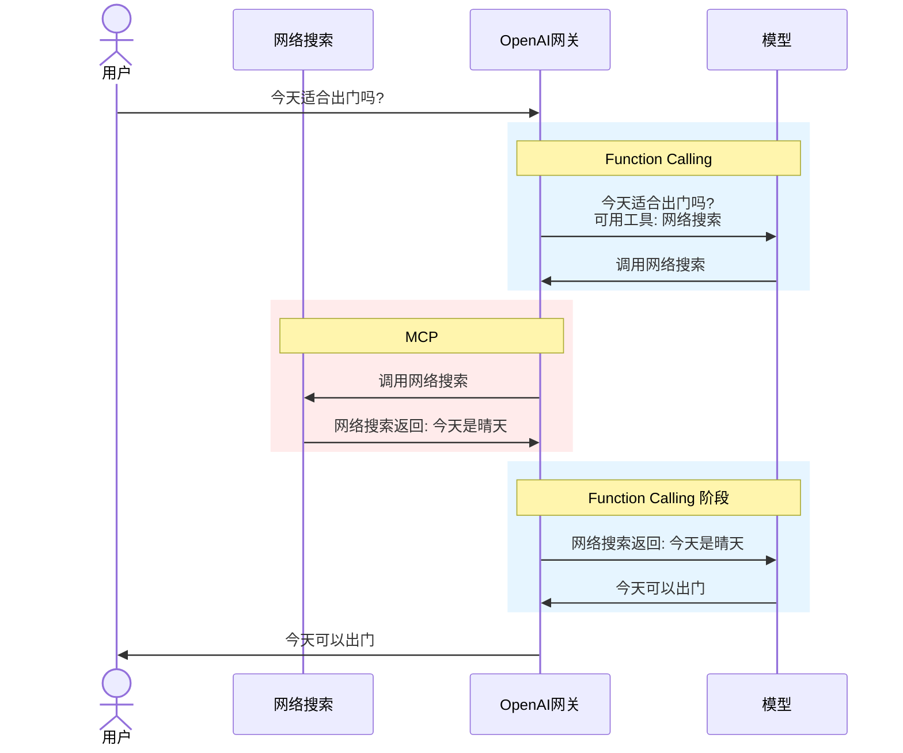

# §1 Java基础

# §2 Java集合

### 哈希冲突的解决方式有哪些?✅

- 拉链法
- 开放地址法：线性探测、二次探测、伪随机探测。
- 再哈希法

### ThreadLocal为什么会导致内存泄漏？✅

每个`Thread`内部维护一个`ThreadLocalMap`实例。`ThreadLocalMap`本质上是`Map<K=ThreadLocal, V=Object>`，内部维护一个`Entry[]`数组，`Entry`继承了`WeakReference<ThreadLocal>`并添加了`Object value`字段，弱引用`ThreadLocal`，强引用`Object value`。每次调用`ThreadLocal.get()/set()`时，程序会查找当前`Thread`对应的`ThreadLocalMap`实例，查找当前`ThreadLocal`对应的键值对`Entry`，然后返回值。

只要线程未销毁，`Thread -> ThreadLocalMap --> Entry[] --> Entry --> V value`这条强引用链就一直存活，导致内存泄漏。所以必须在线程执行完每个任务后，手动调用`threadLocal.remove()`。

`Entry`必须弱引用`ThreadLocal`。因为`ThreadLocalMap`在`get()/set()`时会顺便探测`Entry`的`K = ThreadLocal`是否仍然存在，如果不存在则顺便撤销对`V = Object`的强引用，供GC回收。

## §2.A 编程题

### 手写HashMap

手写HashMap，只要求实现最基本的插入和查找操作。这里我们使用哈希映射到`Entries[]`数组+链表尾插法（即**拉链法**）。

```java
class CustomizedHashMap<K, V> {

    static class Entry<K, V> {
        K key; V value; Entry<K, V> next;
        public Entry(K key, V value) {
            this.key = key; this.value = value; this.next = null;
        }
    }
    private Entry<K, V>[] entries;


    private static final int INITIAL_CAPACITY = 16;
    @SuppressWarnings("unchecked") public CustomizedHashMap(int capacity) {
        entries = (Entry<K, V>[]) new Entry[capacity];
    }
    public CustomizedHashMap() {
        this(INITIAL_CAPACITY);
    }


    private int getIndex(K key) { return key.hashCode() & 0x7FFFFFFF % entries.length; }
    public void put(K key, V value) {
        Entry<K, V> entry = new Entry<>(key, value);
        int index = getIndex(key);
        Entry<K, V> existEntry = entries[index];
        if (existEntry == null) {
            entries[index] = entry;
        } else {
            while(existEntry.next != null) {
                if(!existEntry.key.equals(key)) {
                    existEntry = existEntry.next; continue;
                }
                existEntry.value = value; return;
            }
            if(existEntry.key.equals(key)) {
                existEntry.value = value; return;
            }
            existEntry.next = entry;
        }
    }
    public V get(K key) {
        int index = getIndex(key);
        Entry<K, V> existEntry = entries[index];
        while(existEntry != null) {
            if(existEntry.key.equals(key)) {
                return existEntry.value;
            }
            existEntry = existEntry.next;
        }
        return null;
    }
    public void remove(K key) {
        int index = getIndex(key);
        Entry<K, V> existEntry = entries[index];
        if(existEntry == null) { return; } // 特判空链表
        if(existEntry.key.equals(key)) { entries[index] = existEntry.next; return; } // 特判头结点
        Entry<K, V> prevEntry = existEntry, curEntry = existEntry.next;
        while(curEntry != null) {
            if(curEntry.key.equals(key)) {
                prevEntry.next = curEntry.next;
                return;
            }
            prevEntry = curEntry; curEntry = curEntry.next;
        }
    }
}
```

### 手写LRU

`HashMap` + 模拟双向链表。

```java
class LRUCache {
    static class LinkedNode {
        int key, value;
        LinkedNode prev, next;
        public LinkedNode() { }
        public LinkedNode(int key, int value) { this.key = key; this.value = value; }
    }

    private Map<Integer, LinkedNode> cache = new HashMap<Integer, LinkedNode>();
    private int size = 0, capacity;
    private LinkedNode head = new LinkedNode(), tail = new LinkedNode();

    public LRUCache(int capacity) {
        this.capacity = capacity;
        head.next = tail; tail.prev = head;
    }

    private void pushHeadNode(LinkedNode node) {
        node.prev = head; node.next = head.next;
        head.next.prev = node; head.next = node;
    }
    private void removeNode(LinkedNode node) {
        node.prev.next = node.next; node.next.prev = node.prev;
    }

    public int get(int key) {
        LinkedNode node = cache.get(key);
        if(node == null) { return -1; }
        removeNode(node); pushHeadNode(node);
        return node.value;
    }

    public void put(int key, int value) {
        LinkedNode node = cache.get(key);
        if(node == null) {
            node = new LinkedNode(key, value);
            cache.put(key, node); pushHeadNode(node); ++size;
            while(size > capacity) { cache.remove(tail.prev.key); removeNode(tail.prev); --size; }
        } else {
            node.value = value;
            removeNode(node); pushHeadNode(node);
        }
    }
}
```

Java提供的`LinkedHashMap`直接覆盖了LRU的需求，但是面试大概率不让用。

```java
class LRUCache {
    private LinkedHashMap<Integer, Integer> map;
    
    public LRUCache(int capacity) {
        map = new LinkedHashMap<>(capacity, 0.75F, true) { // accessOrder = true, 否则为行为类似于队列
            @Override protected boolean removeEldestEntry(Map.Entry<Integer, Integer> eldest) {
                return size() > capacity;
            }
        };
    }

    public int get(int key) {
        return map.getOrDefault(key, -1);
    }
    public void put(int key, int value) {
        map.put(key, value);
    }
}
```

# §3 Java并发

## §3.A 编程题

### 两个线程交替打印奇偶数

1. 使用`wait()/notify()`。

```java
public class SingletonDemo {  
    private static int count = 0;  
    public static void main(String[] args) {  
        Object lock = new Object();  
        Thread thread_1 = new Thread(() -> {  
            while(true) {  
                synchronized (lock) {  
                    while(count % 2 == 1) {  
                        try { lock.wait(); } catch (InterruptedException e) { throw new RuntimeException(e); }  
                    }  
                    System.out.println(count++);  
                    lock.notifyAll();  
                }  
            }  
        });  
        Thread thread_2 = new Thread(()->{  
            while(true) {  
                synchronized (lock) {  
                    while(count % 2 == 0) {  
                        try { lock.wait(); } catch (InterruptedException e) { throw new RuntimeException(e); }  
                    }  
                    System.out.println(count++);  
                    lock.notifyAll();  
                }  
            }  
        });  
        thread_1.start();  
        thread_2.start();  
    }  
}
```

2. 使用`Semaphore`。

```java
public class SingletonDemo {
    private static Semaphore semaphore_1 = new Semaphore(1);
    private static Semaphore semaphore_2 = new Semaphore(0);
    private static int count = 0;
    public static void main(String[] args) {
        Thread thread_1 = new Thread(() -> {
            while(true) {
                try { semaphore_1.acquire(); } catch (InterruptedException e) { throw new RuntimeException(e); }
                System.out.println(count++);
                semaphore_2.release();
            }
        });
        Thread thread_2 = new Thread(()->{
            while(true) {
                try { semaphore_2.acquire(); } catch (InterruptedException e) { throw new RuntimeException(e); }
                System.out.println(count++);
                semaphore_1.release();
            }
        });
        thread_1.start();
        thread_2.start();
    }
}
```

### 三个线程交替打印ABC

1. 使用`Semaphore`。

```java
public class Main {
    private static Semaphore semaphore_1 = new Semaphore(1);
    private static Semaphore semaphore_2 = new Semaphore(0);
    private static Semaphore semaphore_3 = new Semaphore(0);
    private static int count = 0;
    public static void main(String[] args) {
        Thread thread_1 = new Thread(()->{
            while(true) {
                try { semaphore_1.acquire(); } catch (InterruptedException e) { throw new RuntimeException(e); }
                System.out.println("A");
                semaphore_2.release();
            }
        });
        Thread thread_2 = new Thread(()->{
            while(true) {
                try { semaphore_2.acquire(); } catch (InterruptedException e) { throw new RuntimeException(e); }
                System.out.println("B");
                semaphore_3.release();
            }
        });
        Thread thread_3 = new Thread(()->{
            while(true) {
                try { semaphore_3.acquire(); } catch (InterruptedException e) { throw new RuntimeException(e); }
                System.out.println("C");
                semaphore_1.release();
            }
        });
        thread_1.start();
        thread_2.start();
        thread_3.start();
    }
}
```

2. 使用`ReentrantLock`与`Condition`。

```java
public class Main {
    private static ReentrantLock reentrantLock = new ReentrantLock();
    private static Condition condition_1 = reentrantLock.newCondition();
    private static Condition condition_2 = reentrantLock.newCondition();
    private static Condition condition_3 = reentrantLock.newCondition();
    private static int state = 0;
    public static void main(String[] args) {
        Thread thread_1 = new Thread(() -> {
            while(true) {
                reentrantLock.lock();
                while(state % 3 != 0) { try { condition_1.await(); } catch (InterruptedException e) { throw new RuntimeException(e); } }
                System.out.println("A"); ++state;
                condition_2.signalAll();
                reentrantLock.unlock();
            }
        });
        Thread thread_2 = new Thread(()->{
            while(true) {
                reentrantLock.lock();
                while(state % 3 != 1) { try { condition_2.await(); } catch (InterruptedException e) { throw new RuntimeException(e); } }
                System.out.println("B"); ++state;
                condition_3.signalAll();
                reentrantLock.unlock();
            }
        });
        Thread thread_3 = new Thread(()->{
            while(true) {
                reentrantLock.lock();
                while(state % 3 != 2) { try { condition_3.await(); } catch (InterruptedException e) { throw new RuntimeException(e); } }
                System.out.println("C"); ++state;
                condition_1.signalAll();
                reentrantLock.unlock();
            }
        });
        thread_1.start();
        thread_2.start();
        thread_3.start();
    }
}
```

### 高性能并发安全自增计数器

1. 原子类`AtomicInteger`：通过乐观锁CAS实现，但是高竞争时CPU空转，缓存失效率高。

```java
public class Main {
    public static AtomicInteger counter = new AtomicInteger();
    public static void main(String[] args) throws InterruptedException {
        ExecutorService executorService = Executors.newFixedThreadPool(100);
        // long start_time = System.currentTimeMillis();
        for(int i = 1; i <= 100; ++i) {
            executorService.submit(()->{
                for(int j = 1; j <= 100; ++j) { counter.getAndIncrement(); }
            });
        }
        executorService.shutdown();
        executorService.awaitTermination(Long.MAX_VALUE, TimeUnit.NANOSECONDS);
        // long end_time = System.currentTimeMillis();
        System.out.println("Counter: " + counter.get());
        // System.out.println("Time cost: " + (end_time - start_time)); // 224ms
    }
}
```

2. 原子类`LongAdder`：拆分成若干`Cell[] { volatile long; }`

```java
public class Main {
    public static LongAdder counter = new LongAdder();
    public static void main(String[] args) throws InterruptedException {
        ExecutorService executorService = Executors.newFixedThreadPool(100);
        // long start_time = System.currentTimeMillis();
        for(int i = 1; i <= 100; ++i) {
            executorService.submit(()->{
                for(int j = 1; j <= 100000; ++j) { counter.add(1); }
            });
        }
        executorService.shutdown();
        executorService.awaitTermination(Long.MAX_VALUE, TimeUnit.NANOSECONDS);
        // long end_time = System.currentTimeMillis();
        System.out.println("Counter: " + counter.sum());
        // System.out.println("Time cost: " + (end_time - start_time)); // 54ms
    }
}
```

### 三个线程指定执行顺序

1. `join()`

```java
public class Main {
    public static void main(String[] args) throws InterruptedException {
        Thread thread_1 = new Thread(()->{
            System.out.printf("%s: Done.\n", Thread.currentThread().getName());
        });
        Thread thread_2 = new Thread(()->{
            try { thread_1.join(); } catch (InterruptedException e) { throw new RuntimeException(e); }
            System.out.printf("%s: Done.\n", Thread.currentThread().getName());
        });
        Thread thread_3 = new Thread(()->{
            try { thread_2.join(); } catch (InterruptedException e) { throw new RuntimeException(e); }
            System.out.printf("%s: Done.\n", Thread.currentThread().getName());
        });
        thread_1.start();
        thread_2.start();
        thread_3.start();
    }
}
```

2. `CountDownLatch`

```java
public class Main {
    public static CountDownLatch countDownLatch_1 = new CountDownLatch(1);
    public static CountDownLatch countDownLatch_2 = new CountDownLatch(1);
    public static void main(String[] args) throws InterruptedException {
        Thread thread_1 = new Thread(()->{
            System.out.printf("%s: Done.\n", Thread.currentThread().getName());
            countDownLatch_1.countDown();
        });
        Thread thread_2 = new Thread(()->{
            try { countDownLatch_1.await(); } catch (InterruptedException e) { throw new RuntimeException(e); }
            System.out.printf("%s: Done.\n", Thread.currentThread().getName());
            countDownLatch_2.countDown();
        });
        Thread thread_3 = new Thread(()->{
            try { countDownLatch_2.await(); } catch (InterruptedException e) { throw new RuntimeException(e); }
            System.out.printf("%s: Done.\n", Thread.currentThread().getName());
        });
        thread_1.start();
        thread_2.start();
        thread_3.start();
    }
}
```

3. `CompletableFuture`

```java
public class Main {
    public static void main(String[] args) {
        CompletableFuture<Void> future_1 = CompletableFuture.runAsync(()->{
            System.out.println("A");
        });
        CompletableFuture<Void> future_2 = future_1.thenRunAsync(()->{
            System.out.println("B");
        });
        CompletableFuture<Void> future_3 = future_2.thenRunAsync(()->{
            System.out.println("C");
        });
    }
}
```

### 生产者与消费者的等待队列模型

使用`BlockingQueue`。

```java
public class SingletonDemo {
    private static final Integer SIZE_MAX = 5;
    private static final BlockingQueue<Integer> queue = new ArrayBlockingQueue<Integer>(SIZE_MAX);
    static class Producer {
        private static void produce(Integer item) throws InterruptedException {
            synchronized (queue) {
                while(queue.size() == SIZE_MAX) { queue.wait(); }
                queue.put(item);
                queue.notifyAll();
            }
        }
    }
    static class Consumer {
        private static void consume() throws InterruptedException {
            synchronized (queue) {
                while(queue.size() == 0) { queue.wait(); }
                Integer item = queue.take(); System.out.println(item);
                queue.notifyAll();
            }
        }
    }
    public static void main(String[] args) {
        Thread producer_thread = new Thread(()->{
            for(int i = 1; i <= 100; ++i) {
                try { Producer.produce(i); } catch (InterruptedException e) { throw new RuntimeException(e); }
            }
        });
        Thread consumer_thread = new Thread(()->{
            for(int i = 1; i <= 100; ++i) {
                try { Consumer.consume(); } catch (InterruptedException e) { throw new RuntimeException(e); }
            }
        });
        producer_thread.start();
        consumer_thread.start();
    }
}
```

### 手写线程池

```java
class YanerThreadPool {

    static class YanerWorkerThread extends Thread {
        private final BlockingQueue<Runnable> taskQueue;
        private final long keepAliveTime;
        private final List<YanerWorkerThread> threads;
        public YanerWorkerThread(BlockingQueue<Runnable> taskQueue, long keepAliveTime, List<YanerWorkerThread> threads) {
            this.taskQueue = taskQueue;
            this.keepAliveTime = keepAliveTime;
            this.threads = threads;
        }
        @Override public void run() {
            long lastActiveTime = System.currentTimeMillis();
            while(!Thread.currentThread().isInterrupted() && !taskQueue.isEmpty()) {
                try {
                    Runnable task = taskQueue.poll(keepAliveTime, TimeUnit.MILLISECONDS);
                    if(task == null && System.currentTimeMillis() - lastActiveTime >= keepAliveTime) {
                        threads.remove(this); break; // 超时终止进程
                    } else if(task != null) {
                        task.run(); continue;
                    }
                } catch (Exception e) {
                    e.printStackTrace();
                    threads.remove(this);
                }
            }
        }
    }

    interface YanerRejectedExecutionHandler {
        void rejectedExecution(Runnable runnable, YanerThreadPool threadPool);
    }
    static class DiscardPolicy implements YanerRejectedExecutionHandler {
        @Override public void rejectedExecution(Runnable runnable, YanerThreadPool threadPool) { ; /* 直接忽略 */ }
    }
    static class AbortPolicy implements YanerRejectedExecutionHandler {
        @Override public void rejectedExecution(Runnable runnable, YanerThreadPool threadPool) { throw new RuntimeException("TaskQueue is full"); }
    }

    private final int initSize;
    private final int maxSize;
    private final int coreSize;
    private final int queueSize;
    private final BlockingQueue<Runnable> taskQueue;
    private final List<YanerWorkerThread> threads;
    private final YanerRejectedExecutionHandler rejectedExecutionHandler;
    private final long keepAliveTime;
    private volatile boolean isShutdown = false;
    public YanerThreadPool(int initSize, int maxSize, int coreSize, int queueSize, YanerRejectedExecutionHandler rejectedExecutionHandler, long keepAliveTime) {
        this.initSize = initSize;
        this.maxSize = maxSize;
        this.coreSize = coreSize;
        this.queueSize = queueSize;
        this.taskQueue = new LinkedBlockingQueue<>(queueSize);
        this.threads = new ArrayList<>(initSize);
        this.rejectedExecutionHandler = rejectedExecutionHandler;
        this.keepAliveTime = keepAliveTime;
        for(int i = 0; i < this.initSize; ++i) {
            YanerWorkerThread workerThread = new YanerWorkerThread(taskQueue, keepAliveTime, threads);
            workerThread.start();
            threads.add(workerThread);
        }
    }
    public YanerThreadPool() {
        this(4, 16, 8, 256, new AbortPolicy(), 3000);
    }

    private void addWorkerThread(Runnable task) throws InterruptedException {
        YanerWorkerThread workerThread = new YanerWorkerThread(taskQueue, keepAliveTime, threads);
        workerThread.start();
        threads.add(workerThread);
        taskQueue.put(task);
    }
    public void execute(Runnable task) throws InterruptedException {
        if(isShutdown) { throw new IllegalStateException("CustomizedThreadPool has been shutdown"); }
        if(threads.size() < coreSize) { addWorkerThread(task); return; } // 如果线程数量<核心线程数, 则创建核心线程
        boolean isSuccess = taskQueue.offer(task);
        if(!isSuccess) {
            if(threads.size() < maxSize) { addWorkerThread(task); return; } // 如果队列添加失败, 且未达线程数上限, 则创建新线程
            rejectedExecutionHandler.rejectedExecution(task, this); // 如果队列添加失败, 且已达线程数上限, 则执行拒绝策略
        }
    }
    public void shutdown() {
        this.isShutdown = true;
        for(int i = 0; i < this.initSize; ++i) {
            this.threads.get(i).interrupt();
        }
    }
    public List<Runnable> shutdownNow() {
        this.isShutdown = true;

        List<Runnable> remainedTasks = new ArrayList<>();
        this.taskQueue.drainTo(remainedTasks);

        for(int i = 0; i < this.initSize; ++i) {
            this.threads.get(i).interrupt();
        }
        return remainedTasks;
    }
}
```

### 手写阻塞队列

```c++
class MyBlockingQueue<T> {
    private final Queue<T> queue = new LinkedList<>();
    private final int capacity;
    private final ReentrantLock lock = new ReentrantLock();
    private final Condition notFull = lock.newCondition();
    private final Condition notEmpty = lock.newCondition();

    public MyBlockingQueue(int capacity) {
        this.capacity = capacity;
    }

    public void put(T element) throws InterruptedException {
        lock.lockInterruptibly(); // 提前加锁,防止多个put()产生竞态条件,同时put()超出容量
        try {
            while(queue.size() == capacity) { notFull.await(); }
            queue.add(element);
            notEmpty.signal();
        } finally {
            lock.unlock();
        }
    }

    public T take() throws InterruptedException {
        lock.lockInterruptibly(); // 提前加锁,防止多个take()产生静态条件,同时take()取空
        try {
            while(queue.size() == 0) { notEmpty.await(); }
            T item = queue.poll();
            notFull.signal();
            return item;
        } finally {
            lock.unlock();
        }
    }
}
```

# §4 JVM

> OOM怎么办？
> 
> 1. JVM启动时使用参数`-XX:+HeapDumpOnOutOfMemoryError -XX:HeapDumpPath=<DUMP路径>`。
> 2. JVM运行中`jmap -dump:format=b,file=<DUMP路径> <PID>`。

> 死锁怎么办？
> 
> `jstack <PID>`会自动检测死锁。

### 频繁Full GC怎么办？ 如何减少Full GC？
 
1. JVM启动时使用参数`-XX:+PrintGCDetails -XX:+PrintGCDateStamps -Xloggc:<GC日志路径>`
2. 使用GCViewer分析各代占用时间图，观察GC频率
3. 生成堆转储文件，查看异常代中的变量空间占用情况，定位变量的具体代码位置。

### 什么是TLAB？（面试鸭）

JVM会为每个线程分配一小块堆内存，称为TLAB（Thread Local Allocation Buffer），用于加速内存分配，避免多线程竞争堆内存的开销。每个线程优先从自己的TLAB中分配内存，当TLAB内存耗尽时，向Eden区申请一个新的TLAB，当分配的内存超过阈值时，直接在Eden区分配。

### 什么是PLAB？（面试鸭）

在G1中，每个GC线程都有一个PLAB（Promotion Local Allocation Buffer），在内部执行对象晋升操作，无需竞争老年代的内存空间，提高对象晋升到老年代的效率。

### 什么是常量池？（面试鸭）

常量池有两种：运行时常量池、字符串常量池。运行时常量池存储每个类或接口的常量信息，放到方法区/元空间；字符串常量池引入自JDK 7，存储字符串字面量，放到堆内存。常量池的优点在于减少创建重复对象，节省内存，提高效率。

### 什么是对外内存/直接内存？它与堆内存的区别是什么？（面试鸭）

堆外内存的特点：
1. 不受JVM堆内存大小的限制，通过`java.nio.ByteBuffer.allocateDirect()`直接向操作系统分配内存。
2. 可以绕过GC，通过手动调用`ByteBuffer.cleaner()`释放。
3. IO操作可以减少一次堆内存与本地内存之间的复制次数。

### 什么是JIT与AOT？（面试鸭）

JIT（即时编译，Just In Time）在运行时，将字节码编译成机器码。它重点优化多次执行和循环执行的代码，称为热点代码（Hotspot Code）。它使用到的技术有：方法内联、逃逸分析、循环展开等等。它有C1与C2两种类型，C1是用于客户端快速启动的轻量级优化，C2是用于服务器长期运行的重量级优化。

AOT（预编译，Ahead Of Time）在运行前的构建阶段，将字节码编译成机器码。优点：（1）减少运行时的编译开销，提高启动速度；（2）不需要JIT，减少JVM内存占用。缺点：（1）机器码依赖于特定平台；（2）无法利用运行时的动态信息进行深度优化，长期来看性能低于JIT。

### 什么是逃逸分析？（面试鸭）

逃逸分析用于分析对象是否会逃逸出当前方法或线程的作用范围。逃逸分析有两种类型——方法逃逸、线程逃逸。方法逃逸指的是一个对象在方法内创建，作为实参或返回值传递给其他方法；线程逃逸指的是一个对象被另一个线程访问，保存为静态变量或共享变量。JVM针对逃逸分析提供了三种优化——栈上分配、同步消除、标量替换。栈上分配指的是没有方法逃逸的对象，可以直接分配到栈上而不是堆上，减少内存分配和垃圾回收的开销；同步消除指的是没有线程逃逸的对象，可以移除不必要的同步锁以提升性能；标量替换指的是没有逃逸的对象，可以拆分为若干个基本类型标量，无需创建一个整体对象。

### 什么是三色标记算法？（面试鸭）

三色标记算法是一种并发的GC算法，用于CMS和G1。它将对象分成三种颜色：白色、灰色、黑色。白色对象指的是尚未被访问的对象，有可能是垃圾；灰色对象指的是已经被访问的，但是它引用的对象尚未被访问的对象；黑色对象指的是已经被访问的，且它引用的对象也已经被访问的对象。初始时所有对象均为白色，然后将GC Roots设置为灰色，遍历所有灰色对象，将它设置为黑色，它引用的对象设置为灰色，重复这个过程，最后清除所有白色对象。

三色标记算法的优点在于它延迟低，可以与主程序并发执行，实现实时GC。缺点是可能会出现漏标和多标的情况。例如给定一个场景：`黑色A->灰色B->白色C`，这时主线程运行，建立`A->C`，删除`A->B`与`B->C`，然后切到GC线程，此时`C`虽然被使用，但是永远为白色对象，因此会被清除，这就是漏标；B应该被清除，但它是灰色对象，所以不会被清除，这就是多标。

为了解决漏标问题，我们有两种方式：增量更新与SATB。增量更新利用写屏障，在黑色对象引用白色对象时将白色对象设置为灰色。SATB（Snapshot At The Beginning）利用写屏障，在灰色对象取消引用白色对象时将白色对象设置为灰色。

### Java对象是如何在JVM中存储的？（面试鸭）

对象存储在堆中，有三个部分：

- 对象头：（1）MarkWord：存储运行时数据，例如HashCode、GC标记、锁状态；（2）类型指针：指向对象的类的元数据，确定对象的类型；（3）数组长度，只有数组才有。
- 实例数据：存储对象的字段。
- 对齐填充：在对象末尾添加填充字节，使内存对齐（默认为8字节）。

### JVM中的哪些部分会导致OOM？（面试鸭）

| JVM部分      | OOM原因                                                                                       |
| ---------- | ------------------------------------------------------------------------------------------- |
| 虚拟机栈/本地方法栈 | 调用层次过深、无限递归                                                                                 |
| 堆          | 对象过多、内存泄漏                                                                                   |
| 方法区        | 在JDK 7中，方法区在永久代，内存大小是固定的，不能动态扩展，可能会OOM。在JDK 8中，方法区在元空间，使用本地内存，默认只受物理内存大小限制，也可以手动指定上限来触发OOM。 |

### 为什么JDK 8要移除永久代，引入元空间？（面试鸭）

1. 永久代的内存大小是固定的；元空间使用堆外内存，可以动态扩容。
2. 永久代的大部分对象寿命很长，GC回收效率低；元空间不受GC管理，避免了STW。

### JVM的Minor GC如何避免全堆扫描？（面试鸭）

JVM将老年代划分成若干个512B的卡片，将其映射为一个BitMap卡表。当老年代对象引用新生代对象时，通过写屏障标记为脏卡。Minor GC只扫描卡表中的脏卡。

### 介绍一下ZGC（面试鸭）

ZGC是Java 11引入的一款垃圾回收器，适用于大内存、低延迟的场景。JDK 17引入了分代ZGC。它有两个核心机制：染色指针和读屏障。
- 染色指针把对象的状态信息直接存放在64位地址的高4bit中，而不是对象头。因此在扫描引用的时候不需要访问对象本身，只需要看指针就行。
- ZGC用的是读屏障。当线程尝试读取一个对象引用时，会触发这个读屏障，检查染色指针的状态。如果发现对象已经被移动了，但是指针还没更新，就会自动修正这个指针指向新的地址，因此无需暂停就可以并发地移动对象。
ZGC流程的绝大部分阶段都是并发的，只有三个极短的阶段需要STW。
1. 初始标记(STW)：使用可达性分析算法标记引用关系。
2. 并发标记：遍历引用关系，使用染色指针进行标记状态信息。
3. 再标记(STW)：处理并发标记遗留的少量对象。
4. 并发转移准备：选择要清理的Region。
5. 初始转移(STW)：转移GC Roots直接关联的对象。
6. 并发转移：使用读屏障解决非GC Roots对象移动时的访问问题，通过并发缩短这个最耗时的阶段。
ZGC的缺点：
- 在并发转移阶段需要预留内存空间，分配给新对象，所以内存利用率较低。
- 每次读操作都会触发读屏障，会产生额外的开销（吞吐量损耗5%），只有在大内存场景才能体现出明显的优势。

# §5 计算机网络

被抛弃的问题：
- HTTP常见字段有哪些

### 介绍一下HTTP缓存

HTTP缓存有两种：强制缓存、协商缓存。前者优于后者。
- 强制缓存：浏览器主动使用缓存，HTTP状态码为`200 OK`。基于过期时间实现——响应头的`Cache-Control`（相对时间）/`Expires`（绝对时间），前者优于后者。
- 协商缓存：服务器要求浏览器使用缓存，HTTP状态码为`304 Not Modified`。基于文件——请求头的`If-None-Match`和响应头的`Etag`。基于过期时间实现——请求头的`If-Modified-Since`与响应头的`Last-Modified`。前者优于后者。

协商缓存基于过期时间实现的缺点：
- 即使`ETag`一致，`Last-Modified`也可能不同。
- `Last-Modified`的粒度是秒，而文件可能在一秒内发生多次更改。
- 有些服务器无法获取`Last-Modified`精确值。

HTTP缓存的步骤：
1. 浏览器第一次请求时，响应头可能携带`ETag`或`Last-Modified`。
2. 浏览器第二次请求时，优先使用强制缓存。
3. 如果强制缓存过期，且响应头携带`ETag`，则请求头携带`If-None-Match`，其值为`ETag`。服务器将其与自己的`ETag`比较，如果相等则返回`304 Not Modified`，不相等则返回`200 OK`，退回到第一次请求。
4. 如果强制缓存活期，且响应头携带`ETag`，则请求头携带`If-Modified-Since`，其值为`Last-Modified`。服务器将其与自己的`Last-Modified`比较，如果相等则返回`304 Not Modified`，不相等则返回`200 OK`，退回到第一次请求。

### 介绍一下HTTP1.1，它的优点是什么？

- 长连接。多个请求复用同一个TCP连接，避免了重复建立和断开连接的开销。解决了请求的队头阻塞问题，但是未解决响应的队头阻塞问题。
- 断点续传：


### 介绍一下HTTP3/QUIC，它的优点是什么？

- 头部压缩。从HTTP2的HPACK升级为HTTP3的QPACK，扩大了静态表的空间，用确认机制更新动态表。
- 简化了帧格式。HTTP2自带流标识符，HTTP3将其放到QUIC中，并且把数据长度改为变长编码。
- 彻底解决了队头阻塞问题。原本HTTP2但凡丢失一个TCP包，就会阻塞后续Stream的传输。HTTP3使用UDP解决了这一问题。
- 更快地建立连接。原本HTTP2至少需要TCP一二次握手+TLS四次握手，共计3个RTT；现在HTTP3仅需QUIC两次握手，共计1个RTT，后续再连接可以做到0个RTT。
- 支持连接迁移。原本HTTP2依赖于TCP的`(源IP, 源端口, 目标IP, 目标端口)`四元组唯一标记一个连接，切换网络时会断开重连；HTTP3通过QUIC的连接ID唯一标记一个连接，切换网络时无需重连。

# §6 操作系统

# §7 MySQL

被抛弃的问题：
- InnoDB页目录结构
- `varchar(n)`中的`n`最大取值
- 行溢出后，MySQL是怎么处理的
- Buffer Pool空间默认值
- Buffer Pool刷盘触发时机，数据库性能频繁抖动需要调大Buffer Pool或RedoLog的空间
- Buffer Pool中的Change Buffer、自适应哈希索引，以及将这两者融入SQL的查询和更新操作步骤
- InnoDB、MyISAM、Memory的区别

### 表空间文件（`*.ibd`）的结构是什么？MySQL是如何存放`NULL`值的？MySQL如何知道`varchar`字段的实际长度？介绍`Compact`行格式

表空间文件（`*.ibd`）的结构——行、页、区、段。
- 行。有四种行格式：`Redundant`（弃用）、`Compact`（旧版本默认）、`Dynamic`（新版本默认）、`Compressed`。
- 页：`16KB`，储存连续的行，对应B+树的节点。InnoDB读写的基本单位。
- 区：`1MB`，储存B+树叶子节点构成的双向链表的相邻节点。
- 段：储存B+树的叶子节点（索引段）、非叶子节点（数据段）、历史版本链（回滚段）。

`Compact`在真实数据之前，额外记录三个信息：
- **变长字段长度列表**：可选，逆序存放。维护变长字段`varchar`的长度。
- **NULL值列表**：可选，逆序存放。给列维护一个`char[]`作为`bitset`，`true`表示字段值为`NULL`。
- **记录头信息**：
	- `delete_mask`：当前行是否已删除。
	- `next_record`：**逆序存放的原因**是记录头信息的`next_record`指向记录头信息和真实数据的分界线，向左读就是记录头信息，向右读就是真实数据，代码编写很方便。
	- `record_type`：B+树的非叶子节点/最小叶子节点/最大叶子节点。

### 深分页问题是怎么产生的？如何解决深分页？

`LIMIT x, y`会从InnoDB中获取`x+y`条数据，Server会抛弃前`x`条数据。

- `SELECT ... LIMIT x, y`减少查找的字段，避免拷贝完整数据
- 使用游标查询，只支持上一页/下一页的瀑布流
- 用ElasticSearch，仍然无法完全解决

### `RedoLog`/`BinLog`什么时候刷盘

`RedoLog`：
1. MySQL正常关闭。
2. InnoDB后台线程每隔`1`秒。
3. `redo log buffer`写入量超过一半的内存空间。
4. 事务提交时，由`innodb_flush_log_at_trx_commit`控制——
	- `innodb_flush_log_at_trx_commit = 0`：不触发刷盘，写入性能高，MySQL崩溃会数据丢失。
	- `innodb_flush_log_at_trx_commit = 1`：每次都触发刷盘，写入性能低，不会数据丢失。
	- `innodb_flush_log_at_trx_commit = 2`：每次都写入内核Page Cache，写入性能适中，OS崩溃会数据丢失。
InnoDB会维护两个`redo log`文件，共同组成一个环形队列，做**循环写**。当队列满时，阻塞一切更新操作。

`BinLog`：
1. 事务提交时，把`BinLog`写入`binlog cache`，由`sync_binlog`控制——
	- `sync_binlog = 0`：每次都写入内核Page Cache。
	- `sync_binlog = n>=1`：积累`n`个事务后才刷盘。

### MySQL主从复制有哪些模型？

- 同步复制：在一个事务提交后，等待所有子节点主从同步成功之后，才返回响应结果。安全性最好，性能差，存在单点故障。
- 异步复制（默认）：在一个事务提交后，立刻返回响应结果。主库崩溃会导致数据丢失。
- 半同步复制：在一个事务提交后，等待一部分子节点主从同步成功之后，才返回相应结果。兼顾安全性和性能。

### 两阶段提交的缺点是什么？什么是组提交？如何降低MySQL的硬盘IO负载？

- 硬盘IO频繁：`RedoLog`和`BinLog`都要刷盘。
- 锁竞争激烈：为了保证多事务的情况下，`RedoLog`与`BinLog`的提交顺序一致，需要让每个事务竞争同一把锁。

MySQL引入了`BinLog`和`RedoLog`的组提交机制，把多个事务打包成一个组批量刷盘，减小了锁的粒度。现在二阶段变成了四阶段——`prepare`阶段、`flush`阶段（写入Page Cache）、`sync`阶段（刷盘）、`commit`阶段。

- `innodb_flush_log_at_trx_commit = 2`：每次都写入内核Page Cache，OS崩溃会数据丢失。
- `sync_binlog = 较大值(>=100)`，OS崩溃会数据丢失。
- `binlog_group_commit_sync_delay = 较大值`、`binlog_group_commit_sync_no_delay_count = 较大值`，让组提交积累更多事务/等待更茶馆时间后才刷盘。

### 如何避免`UPDATE`语句给全表加锁？

当`UPDATE`语句的`WHERE`条件没有命中索引时，它会给全表中的每一行加临键锁，等价于给全表加锁。只有当事务提交后才会释放。

解决方法：
1. 设置`sql_safe_updates = 1`。它会要求`UPDATE`语句满足任意条件：使用`where`且命中索引；使用`limit`；使用`where`和`limit`。会要求`DELETE`语句使用`where`和`limit`。
2. 为了保证`where`一定会命中索引，可以使用`force index`语句。

### 为什么X型间隙锁可以共存？

因为间隙锁是为了阻塞插入和删除，所以能共存。

### MySQL可重复读隔离级别如何彻底解决幻读？

MySQL的可重复读隔离级别可以很大程度上避免幻读：
1. 快照读：通过MVCC避免幻读
2. 当前读：通过临键锁避免幻读

但是有两种例外的幻读情况：
1. 快照读：`A快照读 -> B插入 -> A更新 -> A快照读`，两次`A快照读`的结果不一样。
2. 当前读：`A快照读 -> B插入 -> A当前读`，`A快照读`与`A当前读`的结果不一样。

解决方法：开启事务后，马上执行当前读（`SELECT ... FOR UPDATE`），给二级索引加上临键锁，避免其他事务**插入**记录；给主键索引加上行锁，避免避免其他事务**删除**记录。

### 对于(非)唯一索引等值查询/范围查询，会加哪些行级锁？

`[TODO]: 结合小林Coding具体例子来分析`

都会在主键索引上加临键锁。如果查询的是二级索引，则还要在二级索引上加临键锁（唯一索引）/行锁（非唯一索引）。

唯一索引等值查询：
- 如果查询结果存在，则临键锁退化成行锁。
	因为仅靠行锁就能解决幻读问题，主键唯一性导致不能插入，行锁导致不能删除。
- 如果查询结果不存在，则临键锁退化成间隙锁。
	因为仅靠间隙锁就能解决幻读问题，因为插入/删除行锁对应的行锁不会影响当前查询结果。

唯一索引范围查询：
- 如果`>=`的等值查询结果存在，则临键锁退化成行锁。
- 如果`<=`或`<`的等值查询结果存在，则临键锁退化成间隙锁。
- 如果`<`的等值查询结果不存在，则临键锁退化成间隙锁。

非唯一索引等值查询：
- ？？？？？？？？？？？？？？？

### `INSERT`是怎么加锁的？为什么MySQL能实现高并发`INSERT`？这样做有什么问题？

`INSERT`被阻塞的场景：
1. 插入意向锁与间隙锁互斥，需要避免幻读。
2. `INSERT`的条目已存在，发生唯一索引冲突。

**`INSERT`本身不会生成间隙锁，生成的是隐式锁**：
1. 通过轻量级的`AUTO-INC`锁，获取自增主键，然后立即释放，而不是等到`INSERT`执行完毕后/事务结束后才释放。
	- `innodb_autoinc_lock_mode = 0`：`INSERT / INSERT SELECT`执行完毕才释放
	- `innodb_autoinc_lock_mode = 1`：`INSERT`获取自增主键后立即释放，`INSERT SELECT`执行完毕才释放
	- `innodb_autoinc_lock_mode = 2`：`INSERT / INSERT SELECT`获取自增主键后立即释放
2. 通过插入意向锁（一种特殊的间隙锁，只用于并发插入），只关注自己持有的唯一索引能不能插入。插入意向锁之间互不阻塞。
3. 通过隐式锁，防止两个事务同时插入同一行。
	1. 事务B会检查这个行是否存在，如果存在，则获取它的`trx_id`字段，帮另一个未提交的事务A生成X型行锁，转换成显式锁。
	2. 事务B会尝试获取这个行的S型行锁，如果存在二级索引还要获取二级索引的临键锁。然后被显式锁阻塞。

`innodb_autoinc_lock_mode = 2`，且BinLog格式为`statement`时，会造成主从同步的数据不一致。例如两个事务同时抢占`AUTO-INC`锁，每条记录分配的主键可能不一样，无法保证执行结果一致性。所以需要把BinLog格式设置为`row`。

### 解释MySQL死锁产生的原因，以及如何避免？

事务A与B都执行：
```sql
SELECT ... FROM 表 WHERE id = 2 FOR UPDATE;
INSERT INTO 表 (id) VALUES (3或4);
```
两者可能会同时执行`当前读`，同时加上间隙锁（间隙锁不互斥）。然后同时执行`INSERT`，都在等对方释放间隙锁，才能获取插入意向锁（一种特殊的间隙锁，只用于并发插入），导致死锁。

避免死锁：
- 设置等待锁的超时时间`innodb_lock_wait_timeout`，超时之后自动回滚。
- 开启主动死锁检测`innodb_deadlock_detect = on`，主动回滚任意一个事务。
- 业务中设置幂等键作为唯一索引，避免重复插入时竞争同一个资源导致死锁。

### 如何为`SELECT ... WHERE status = 1 ORDER BY create_time`建索引？

建立`(status, create_time)`联合索引，避免对`create_time`进行文件排序。

### 什么时候不需要创建索引？

- 在`SELECT ... WHERE ... GROUP BY ... ORDER BY ...`语句中未使用的字段
- 区分度太低的字段
- 表行数太少
- 经常更新的字段（例如余额）

### 为什么索引推荐使用`NOT NULL`？

1. `NULL`导致选择索引时难以优化，统计和计算更复杂。
2. `NULL`依然会至少占用`1 byte`用于`NULL`值列表。

### Buffer Pool是如何管理页的？Buffer Pool为什么没使用原始的LRU算法？

Buffer Pool管理页策略：
- 空闲页：未被使用的页，由Free链表串在一起。
- 干净页：已被使用、未经修改的页，由LRU链表串在一起。
- 脏页：已被使用、已被修改的页，由Flush链表串在一起。

Buffer Pool对原始LRU算法的改进：
- 预读失效：对于少数不符合空间局部性原理的情况，相邻页会长期占用Buffer Pool。于是将LRU链表划分成前后的`young`/`old`区域，把所有页插入到`old`区域，让它尽快被淘汰。
- Buffer Pool污染：对于查询结果集特别大的读取语句，大量页会从`old`区域移动到`young`区域，从而淘汰热点数据。于是判断这个页的本次读取与第一次读取的时间间隔，超过阈值才从`old`区域移动到`young`区域。

### MySQL中的数据排序是如何实现的？（面试鸭）

如果排序字段命中索引，就使用索引排序，因为索引有序所以效率最高。如果没有命中，就使用文件排序，按照能否放入`sort_buffer`（也就是是否小于等于`sort_buffer_size`）分为内存排序和磁盘归并排序，按照内存排序的数据长度是否小于等于`max_length_for_sort_data = 4096B`分为内存单路排序和内存双路排序，其中内存双路排序只把主键和排序字段值放入`sort_buffer`后进行回表。

### 介绍MySQL批量数据入库（面试鸭）

在`INSERT INTO ... VALUES (),(),()`后面拼接多条数据，可以手动设置JDBC的`rewriteBatchedStatements = true`来开启。优点：减少网络传输、解析SQL、写入日志的开销。缺点：一条数据插入失败会导致所有数据插入回滚，而且会降低查询缓存的命中率。

### `count(1)/count(*)/count(索引字段)/count(普通字段)`的区别是什么？ 如何提高`count()`效率？

- `count(1)/count(*)`：统计表中有多少行，不会读取任何字段的值。优先选择`key_len`最小的索引（即二级索引）。
- `count(索引字段)`：统计有多少行非`NULL`的索引字段。优先选择`key_len`最小的索引（即二级索引）。
- `count(普通字段)`：统计有多少行非`NULL`的普通字段。全表扫描，效率很慢。

提高`count()`效率：
1. `count(普通字段)`加二级索引。
2. 使用`EXPLAIN`查看扫描行数`rows`，作为近似值。
3. 业务上开一张新表，维护计数值。


### 什么是深分页问题？如何解决？（面试鸭）

深分页指的是`LIMIT X, Y`中的`X`特别大的场景，MySQL只能做到“扫描后丢弃”。如果排序字段有索引，那么会从B+树的双向链表头部向后遍历`X`次；如果排序字段没有索引，那么会进行文件排序。两种情况的开销都很大。

1. 使用子查询或JOIN，利用`WHERE`二级索引数据量小的特点获取主键范围，再根据这个主键范围进行游标查询
2. 改写业务逻辑为连续查询，下一次的主键范围由上一次的主键最大值给定，进行游标查询。优点：保证数据一致性，不受分页期间数据增删影响
3. 搜索引擎，例如ElasticSearch（也有深分页问题，不了解就别说）

### 什么是视图？（面试鸭）

视图是一个虚拟表，它不存储实际数据，而是通过其它表的数据来生成。视图可以简化复杂查询，减少代码冗余，限制访问某些数据以增加安全性。

### 存储金额应该使用什么数据类型？（面试鸭）

1. MySQL的`bigint`→Java的`long`：存储的精度是固定的
2. MySQL的`decimal`→Java的`BigDecimal`：支持高精度定点数运算，时间空间开销大

### `AUTO_INCREMENT`到达最大值时会发生什么？（面试鸭）

下一次申请自增ID得到的值不变，会触发`DUPLICATE ENTRY ... FOR KEY ...`错误。

### 什么是索引下推？（面试鸭）

将命中二级索引的查询条件下推到存储引擎层进行过滤，从而减少读取到的数据行数量，减少回表次数。

### 三层B+树能存储多少行数据？（面试鸭）

InnoDB的数据页大小由`innodb_page_size`决定，默认为`16KB`。
第一层：假设每个指针`6B`+`bigint`索引`8B`，于是能存放`16KB/14B ≈ 1170`个索引。
第二层：同理能存放`1170`个索引。
第三层：假设每条记录占`1KB`，一个数据页能存储`16`条记录。
于是三层`B+`树能存储`1170 × 1170 × 16 ≈ 两千万+`条数据。

### 二级索引有MVCC快照吗？（面试鸭）

没有。二级索引不包含`transction_id`和`roll_pointer`，但是包含最后修改当前索引页的事务ID`page_max_trx_id`。如果当前事务ID大于`page_max_trx_id`则判定可见，如果当前事务ID小于等于`page_max_trx_id`或标记为已删除，则覆盖索引失效，需要回表通过前面的流程来判定是否可见。

### `VARCHAR(10)`和`VARCHAR(100)`的区别是什么？（面试鸭）

存储的字符串长度最大值不一样。存储相同字符串时占用的存储空间一样，但是在查询时分配的内存块大小不一样。

### 什么是存储过程？为什么不推荐使用？（面试鸭）

存储过程是一段预编译的SQL代码，用于封装一组特定的业务操作。
1. 可移植性差，依赖于SQL方言。
2. 调试困难，没有设置端点、逐步调试之类的调试方法。
3. 维护复杂，需要同时维护业务代码和存储过程代码。

### 如何避免MySQL单点故障？（面试鸭）

1. 主备架构：主节点负责读写；备节点负责同步，若主节点宕机则自己成为主节点。
2. 主从架构（**常用**）：主节点负责写，从节点负责读。
3. 主主架构：所有节点均负责读写，会产生条件竞争，所以不常用。

### 如何实现MySQL读写分离？（面试鸭）

使用一个中间的代理层来分离读写请求。可以自行实现，也可以使用现成的中间件（例如MySQL-Proxy、ShardingSphere）。

### 为什么不能用MySQL存储文件？（面试鸭）

MySQL是关系型数据库，设计的初衷是存储结构化数据，而不是存储二进制文件。因为会（1）增加表的大小；（2）降低查询效率。应该使用文件系统（HDFS、S3等）或对象存储服务OSS。

### 如何实现数据库的不停服迁移？（面试鸭）

1. 改造业务代码，设置一个双写开关，用于控制是否同步写入新库。
2. 将新数据库设置为旧数据库的从库，或者使用Flick CDC，先全量同步，再增量同步。
3. 在业务低峰期，保证主从数据一致的时候，同时关闭主从同步、打开双写开关，写一个定时任务抽样核对是否一致。
4. 进行灰度切流，逐步增加抛弃旧数据库的比例。
5. 关闭双写，从此只写入新数据库，完成迁移。

### 为什么要用小表JOIN大表？

1. 按照JOIN的前后顺序，时间复杂度可能为$O(n\log m)$与$O(m\log n)$，肯定希望大表的查询开销被索引降到$O(\log)$。
2. 小表可以一次性加载到内存中。

### 相比于Oracle，MySQL的优势有哪些？（面试鸭）

1. MySQL开源免费，文档资源丰富，社区支持完善。
2. MySQL适用于互联网行业的中小型业务，轻量且占用资源少。Oracle面向传统行业的大型业务，例如运输、制造、金融行业。

# §8 Redis

被抛弃的问题：
- 介绍Redis集群模式使用的通信协议Goosip（小林Coding）
- 为什么Redis集群模式的哈希槽是16384？（小林Coding）

### Memcached与Redis的区别是什么？✅

Memcached只支持最基本的数据存储，而Redis支持更多的高级功能，例如高级数据结构、Lua脚本事务、AOF+RDB持久化、分布式部署。

### 介绍Redis的`String`数据类型✅

`String`使用的数据结构是简单动态字符串（SDS），包含三部分——剩余空间长度`free`、字符串长度`len`、SDS类型`flags`、字符数组`buf[]`，最大可达`512MB`。

相比于C语言的字符串，SDS的优点是——可以保存二进制数据、获取字符串长度的时间复杂度是$O(1)$，避免了拼接字符串的缓冲区溢出问题。

`String`使用三种编码：
- `int`：如果`String`是一个`long`范围内的整数，则直接存到`(long*) buf`。
- `embstr`：如果`String`长度较短，则通过一次`malloc()`同时分配`RedisObject`与`SDS`。缺点是只能作为只读字符串，如果要更改则会先从`embstr`转换为`raw`。
- `raw`：如果`String`长度较长，则通过两次`malloc()`分别分配`RedisObject`与`SDS`。

### 介绍Redis的`List`数据类型

`List`使用的数据结构是`QuickList`。`QuickList`是压缩列表+双向链表的折中版本，每个双向链表的节点存储一个压缩列表，从而控制压缩列表连锁更新的影响范围。;

压缩列表本质上是一个`char[]`，通过编码字段将不同长度的元素排在一起。每个元素包含一个`prevlen`字段表示前一个元素占用的空间，用于实现逆序遍历。但是元素扩容时会可能导致后续的元素都要重新为`prevlen`字段扩容，导致连锁更新。

### 介绍Redis的`Hash`数据类型

`Hash`使用的数据结构是`ListPack`（元素数量`<512`且元素长度`<64byte`）或哈希表。

`ListPack`为了避免`QuickList`的连锁更新问题，不再使用`prevlen`字段表示前一个元素占用的空间，而是使用`len`字段表示当前元素占用的空间。下一个元素只需读取自己指针起点的前一个字节，就依然能实现逆序遍历。

`Hash`使用拉链法解决哈希冲突。如果哈希冲突过多则会通过渐进式Rehash进行扩容。Redis事先准备了两个哈希表指针：
1. 扩容时给第2个哈希表分配两倍的空间
2. 每次针对第1个哈希表的条目做增删改查时，都会移动到第2个哈希表中。
3. 随着处理请求的增多，最终会在某一时刻全部清空第1个哈希表，从而完成Rehash操作
优点：可以把大量的数据移动操作，平摊到多次请求进行处理，避免了阻塞的问题。

令$负载因子=\displaystyle\frac{哈希表保存的键值对数量}{哈希表大小}$，则触发渐进式Rehash的条件有两个：
- 负载因子`>=1`，且没在执行AOF或RDB。
- 负载因子`>=5`。

### 介绍Redis的`Set`数据类型

`Set`使用的数据结构是整数集合（元素数量`<512`）或哈希表（元素数量`>=512`）。

整数集合本质上是一个`char[]`，可以根据存储元素的最大值动态升级成`int8_t`/`int16_t`/`int32_t`/`int64_t`。缺点是只能升级，不能降级。

### 介绍Redis的`Zset`数据类型

`Zset`使用的数据结构是`ListPack`（元素数量`<128`且每个值`<64Byte`）或跳表。

跳表是一种多层的有序链表。每个跳表节点都有一个层级数量，表示含有多少个`next`指针，层级越高的`next`指针跳跃距离越长。增删改查都是从高层指针向低层指针依次做二分查找。最好情况下相邻两层节点的数量比例为`2:1`能达到$O(\log n)$的时间复杂度，最坏情况下退化成链表$O(n)$的时间复杂度。为了保证这个数量比例，我们让新创建的跳表节点层级数量符合$p=0.25$的几何分布且`<=64`。

### Redis是单线程的吗？为什么Redis 6.0之后变成了多线程？

Redis的单线程指的是：`epoll()`接收请求→解析请求→执行读写操作->发送响应的过程，是单线程的。

Redis会默认开启六个子线程：
- `bio_close_file`线程：关闭文件
- `bio_aof_fsync`线程：AOF刷盘
- `bio_lazy_free`线程：异步地执行`unlink`等删除命令
- `io_thd_1/2/3`线程：分担网络IO压力

Redis 6.0以后，网络IO部分改成了多线程，因为随着硬件性能的提升，Redis的性能瓶颈有时会出现在网络IO的处理上。

### 什么是AOF重写机制？✅

为了防止AOF文件过大，Redis会通过AOF重写机制来压缩AOF文件。

1. 主线程调用`fork()`复制一份页表给子线程，并且标记为只读。子线程对每个键值对都只保存一条`SET`命令来压缩AOF文件。
2. 主线程通过CoW实现并发写入，每次写入的时候都会触发写保护中断函数，在这里完成写入操作，并追加写入到AOF缓冲区与AOF重写缓冲区。
3. 子线程完成AOF重写后，主线程会将AOF重写缓冲区的数据追加写入到新AOF文件，保证数据一致性。
4. 主线程用新的AOF文件覆盖原有的AOF文件，而不是直接复用原有的AOF文件，否则如果AOF重写失败就会污染AOF文件。

### RDB是如何做到主线程写入与子线程Dump互不影响的？CoW会存在什么问题？✅

使用了写时复制（Copy on Write，CoW）。初始时子线程复制了主线程的页表，共享同一片内存，只有写入时才会新复制一份。如果写入比较频繁，那么极端情况下内存占用会飙升至原来的两倍，因此需要监控内存占用情况。

### 什么是Redis混合持久化？如何既能实现AOF的不丢数据，又能实现RDB的快速恢复？

使用Redis混合持久化。子线程将RDB写入AOF文件前半部分，主线程将更新命令写入缓冲区，等待子线程执行完毕后追加到AOF文件的后半部分。于是AOF文件的前半部分是RDB的全量数据，后半部分是AOF的增量数据。

### Redis的过期删除策略有哪些？

过期删除策略有三种：定时删除、惰性删除、定期删除。Redis使用的是后两者。

- 定时删除：设置Key的过期时间时，同步创建一个删除Key的定时事件。优点是可以保证Key尽快删除，释放内存。缺点是Key很多时会占用CPU，降低吞吐量。
- 惰性删除：每次访问Key时，先检查Key是否过期，如果过期才删除。优点是可以将删除成本均摊到每次查询中，减少CPU的占用。缺点是会浪费内存空间，如果一直不访问则会造成内存泄漏。
- 定期删除：每隔一段时间随机取出一批Key判断是否过期，如果过期才删除；如果发现抽检的`>=25%`的Key均过期，那么就循环这一过程，直到比例`<25%`或执行总耗时`>25ms`为止。优点是减少CPU的占用、也不会浪费内存空间，在定时删除与惰性删除中取得了平衡点。缺点是难以确定时间间隔，容易偏向之前两种策略的极端。

### Redis如何实现高可用高性能的分布式锁？✅

针对单Redis实例：
- 加锁：使用`SET NX`加锁，Key表示细粒度资源，Value表示客户端ID。需要先比较Value再加锁，用Lua脚本保证原子性。
- 加锁失败的策略：
	- 循环轮询——每隔一段时间就重试一次，缺点是时间不容易确定、CPU空转开销大
	- 监听事件——监听锁的释放事件，必须保证检测锁与监听事件是原子化操作，防止错过释放事件陷入永久等待
- 锁过期：使用`SET EX`加锁，防止客户端宕机导致无法释放锁。
- 锁续约：客户端启动子线程作为看门狗（WatchDog）续约锁。
- 锁续约失败的策略：
	- 每执行一步操作就检查是否仍然持有锁，如果锁续约失败则立即中断业务并回滚事务、抛出异常。
	- 假设锁续约失败是小概率事件，继续执行。缺点是风险更大。
- 释放锁：需要先比较Value再释放锁，用Lua脚本保证原子性。

针对多Redis实例：
- RedLock：依次尝试给$N$个实例加锁/解锁，设置较小的加锁超时阈值，直到超过半数实例加锁成功为止，锁的有效时间要扣除加锁时间。

性能优化：
- Singleflight模式：每个客户端只派出一个线程去竞争Redis分布式锁，减少竞争压力。
- 本地锁交接：将线程持有的分布式所直接交给另一个线程，节省网络开销。引入了本地状态，模糊了一致性边界，极端情况下宕机会导致锁泄漏，只能依靠锁过期自动释放。
- 数据库乐观锁：结合版本号竞争更新，需要控制MySQL并发数量，减少竞争压力。
- 一致性哈希做负载均衡：映射到唯一的Redis实例，问题从分布式退化为单机。

### Redis的缓存更新策略有哪些？✅

旁路缓存策略（Cache Aside）、读穿/写穿策略（Read/Write Through）、写回策略（Write Back）。实际开发中只能使用旁路缓存策略。
- 旁路缓存策略（Cache Aside）：读取时如果缓存未命中则先读取数据库，然后回写缓存；写入时先更新数据库，再删除缓存。
	- 写入时必须先更新数据库，再删除缓存，否则会导致数据不一致——写线程删除缓存，读线程缓存未命中，读线程读取数据库旧值，读线程回写缓存旧值，写线程写入数据库新值，导致缓存与数据库发生数据不一致。有一种玄学的方法是延迟双删，写线程结束后睡眠一段时间再次删除缓存，从而删除读线程写入的缓存旧值，但是睡眠时间无法准确评估。
	- 写入时必须删除缓存，而不是更新缓存，否则会导致数据不一致——写A线程更新数据库，写B线程更新数据库，写B线程更新缓存，写A线程更新缓存，导致缓存与数据库发生数据不一致。
	- 适合读多写少的场景。如果要提高缓存命中率，要么更新缓存前使用分布式锁（1个线程查数据库，n-1个线程命中缓存），要么让缓存尽快过期。
- 读穿/写穿策略（Read/Write Through）：读取时如何缓存未命中则先读取数据库，然后回写缓存；写入时先更新缓存，再更新数据库，如果缓存未命中则直接更新数据库。
	- 应用程序只和缓存交互，缓存只和数据库交互。
	- 无法用于Java开发，因为Redis天生无法直接与数据库交互。
- 写回策略（Write Back）：写入时只更新缓存，打上脏标记，由后台线程异步写入数据库。
	- 不能保证强一致性，可能造成数据丢失。
	- 适合写多的场景，例如CPU缓存。

### Redis与数据库如何保证一致性？✅

使用旁路缓存策略（Cache Aside）。如果第二步的删除缓存失败，则可以：

- 消息队列重试机制：将删除缓存的操作发送到消息队列，由消息队列保证重试。缺点是会入侵业务代码。
- 订阅MySQL binlog：使用Canal订阅第一步的更新数据库事件，发送到消息队列，由消费者删除缓存。缺点是引入更多组件，对团队的运维能力要求较高。

### 介绍一下Redis的主从、哨兵、集群模式的优缺点✅

主从：高可用、读写分离。无法自动故障转移。
哨兵：自动故障转移。
集群：（见小林Coding）

### 在Redis主从模式中，如何判断Redis某个节点是否正常工作？✅

Redis使用Gossip协议的`ping-pong`心跳机制进行检测。主节点向从节点发送`ping`命令确认从节点是否存活，从节点发送`pong`命令返回自己的复制偏移量。

### 在Redis主从模式中，如何淘汰过期的键值对？✅

主节点向从节点模拟发送一条`DEL`命令。

### 在Redis主从模式中，如何保证数据的一致性？✅

主从的数据同步是一个异步的过程，因此只能保证最终一致性。
- 尽量保证网络连接的质量，加快数据同步。
- 监控Redis的数据同步进度，如果小于阈值则禁止读取从节点。

### 在Redis主从模式中，如何避免主从切换导致的数据丢失？✅

主从的数据同步是一个异步的过程，因此无法避免数据丢失。
如果主节点发现同步延迟高于阈值，或从节点短时间内大量下线，则可以牺牲可用性，拒绝一切写入操作，从而减少数据丢失量。这需要程序FailBack降级到本地缓存或MQ。

### 在Redis的主从模式中，如何避免集群脑裂？✅

- `min-slaves-to-write`：主节点必须至少与多少个从节点连接，才允许写入。
- `min-slaves-max-lag`：主从同步的延迟必须小于等于多少秒，才允许写入。

启用`min-slaves-to-write = 1`，让哨兵的`down-after-milliseconds`大于主库的`min_slaves_max_lag`。当主库发生网络波动时，主库首先拒绝写入，然后哨兵执行主从切换。

### 在Redis集群模式中，客户端如何知道自己应该访问哪个切片？如果实例上没有对应的数据会发生什么？✅

客户端计算Key的`crc16()%16384`，向对应的Redis实例发送请求。

Redis实例检查自己是否负责这个哈希槽，如果不负责则返回`MOVED`重定向；如果负责这个哈希槽就检查是否持有这个键值对，如果持有则直接返回，如果未持有则检查该哈希槽是否正在迁出，如果没有则返回`NULL`值，如果正在迁出则返回`ASK`重定向，客户端向另一个实例发送`ASKING`后发送`GET`，重复这个过程。

# §9 消息队列

## Kafka

### Kafka的消费者与分区的关系是什么？分配策略有哪些？

消费者与分区的关系：
- 在同一个消费者组内，一个`Partition`只能由一个消费者处理。
- 在不同的消费者组间，一个`Partition`可以被多个消费者共享。

分配策略：
- `RangeAssignor`：对于单个Topic，每个消费者分配$\displaystyle\frac{\mathrm{\#分区}}{\mathrm{\#消费者}}$个Partition，若不能整除则优先分配到前面的消费者。对于多个Topic容易导致负载不均衡。
- `RoundRobinAssignor`：轮询分配，像发牌一样分配Partition。分配非常均匀，但是要求消费组中的所有消费者必须订阅共同的Topic。
- `StickyAssignor`：分区迁移时，优先均匀分配Partition，然后尽量保证分配方案不发生变动，避免不必要的分区迁移开销。
- `CooperativeStickyAssignor`：在`StickyAssignor`的基础上，减少STW的范围，允许同时消费不发生变动的分区。

### Kafka如何做到分区内有序？

每个Partition都维护了一个`offset`值，按消息的发送顺序单调递增，通过`offset`保证有序性。

### Kafka如何管理副本？

- AR（All Replica）：所有副本
- ISR（In-Sync Replica）：与Leader Replica保持同步的副本
- OSR（Out-of-Sync Replica）：与Leader Replica同步滞后的副本

### Kafka如何实现负载均衡？存在哪些问题？

Kafka通过主写主读的分区实现了负责均衡。每个Broker都有生产者写入消息，都有消费者读取消息，保证每个Broker的读写负载一致。

负载均衡失效场景：
1. Broker分配的Partition数量不平均。
2. Leader Replica发生重分配，导致生产者写入的Partition不平均、消费者读取的Partition不平均。

### Kafka控制器的作用是什么？如何选举？

一个Kafka集群的Broker中，有且仅有一个Broker称为控制器。
作用：
1. 某个Parition的Leader副本宕机时，选举新的Leader副本。
2. 某个Parition的ISR集合发生变化时，通知Broker更新元数据
3. 某个Topic的Partition数量发生变化时，负责Partition重分配。

选举过程：使用ZooKeeper的分布式锁，抢占`brokerid`成为控制器，使用`controller_epoch`作为版本号做CAS乐观锁。

# §10 Spring

### `@Autowired`与`@Resource`的区别是什么？✅

- 来源不同。`@Autowired`是Spring提供的注解，`@Resource`是Java EE提供的注解。
- 注入方式不同：`@Autowired`默认通过类型（`byType`）注入。`@Resource`默认通过名称（`byName`）注入，如果未指定名称才会默认通过类型注入。

# §11 分布式

### 实现分布式事务。例如创建订单与扣减库存，如果创建订单后MQ宕机，无法发送消息来扣减库存，应该怎么办？

> 使用本地消息表。
> 1. 创建订单的事务提交时，订单状态为`NEW`，发送MQ`库存-topic`和本地消息表的`NEW`。这时的MQ可能宕机。
> 2. 扣减库存监听`库存-topic`，事务提交时，发送MQ`库存结果-tpoic`的`SUCCESS`或`FAILED`。
> 3. 消息恢复系统一方面监听MQ`库存结果-topic`，发送更改本地消息表的订单状态为`CONFIRMED`/`FAILED`，另一方面用定时任务取出本地消息表中的`FAILED`订单，然后再发一遍MQ`库存-topic`的`NEW`进行重试，发送成功后更新本地消息表的订单状态为`SENT`。

### Redis/ZooKeeper/Etcd都是分布式KV数据库，它们之间有什么区别？

- Redis满足CAP中的AP，通过异步的数据同步保证最终一致性，主要用于高性能缓存的场景。为分布式锁提供了RedLock的实现，效率很低。
- ZooKeeper满足CAP中的CP，通过ZAB（ZooKeeper原子广播）协议保证强一致性，主要用于类似于文件系统的层级场景。为分布式锁提供了按顺序分配的实现，安全性很高，但是Watcher机制向客户端主动发送心跳信号，网络开销很大。
- Etcd满足CAP中的CP，通过Raft协议保证强一致性，主要用于同步微服务的配置。为分布式锁提供了CAS的租约机制，被动检查客户端是否仍然持有租约，网络开销很小，而且支持MVCC搜索历史快照。

### 你了解哪些RPC协议？知道gRPC/Thrift/JsonRPC协议吗？

- gRPC：HTTP2上的Protobuf。HTTP2携带流`id`、路径名`method`，Protobuf携带`params`/（`result`、`error`）。
- Thrift：Binary Protocol，每个字段表示成`字段类型 + 字段编号 + 字段值`。
- JsonRPC：Json字符串，包含协议版本、`id`、（`method`、`params`）/（`result`、`error`）。

## Nacos

`[TODO]`

# §12 设计模式

## §11.1 单例模式

### 实现单例模式的方法有哪些？

1. 枚举：初始化时线程安全；避免通过反射破坏枚举单例。

```java
enum Singleton {
    INSTANCE;
    public void hello() { System.out.println("Hello world!"); }
}

public class SingletonDemo {
    public static void main(String[] args) {
        Singleton instance = Singleton.INSTANCE;
        instance.hello();
    }
}
```

2. 静态内部类：初始化时线程安全；懒加载。

```java
class Singleton {
	private Singleton() {}
	private static class SingletonInner {
		private final static Singleton INSTANCE = new Singleton();
	}
	public static Singleton getInstance() {
		return SingletonInner.INSTANCE;
	}
	public void hello() { System.out.println("Hello world!"); }
}

public class SingletonDemo {  
    public static void main(String[] args) {  
        Singleton instance = Singleton.getInstance();  
        instance.hello();  
    }  
}
```

3. 双重校验锁：初始化时线程安全；懒加载。

```java
class Singleton {
	private volatile static Singleton INSTANCE;
	private Singleton() {}
	public static Singleton getInstance() {
		if(INSTANCE == null) {
			synchronized(Singleton.class) {
				if(INSTANCE == null) {
					INSTANCE = new Singleton();
				}
			}
		}
		return INSTANCE;
	}
}
```

# §13 Git

> Redis如何统计连续签到天数？
> 
> 两种方式：
> 1. 以日期划分：`YYYY-mm-DD -> BitMap(用户量)`，过期时间为一个月。用户量高，日期范围短❌。
> 2. 以用户划分：`用户ID -> BitMap(日期范围)`，永不过期。用户量低❌，日期范围长。

> Redis如何实现一亿用户的实时分数Top100排行榜？
> 
> 将用户按照分数阈值拆分成多个ZSet，每个ZSet只存储一定范围内的分数，Top100只需要取分数最高ZSet的前100个值就行。


# §A 场景题

> 给定200MB内存，求1GB文件中各个元素的出现次数。
> 
> 1. 使用Buffer分块读取。这是为了防止OOM。
> 2. 读取的每个元素模`p`得到哈希值`h`，存储到以`h`命名的文件中。这是为了防止`Map`的Key太多导致OOM。
> 3. 遍历每个文件，使用`Map`统计频次，直接`std::cout <<`，然后释放`Map`内存。

### 如何设计一个分布式系统？

分布式意味着通过网络调用远程方法，这带来了大量问题：
- 服务在哪里（服务发现）
- 服务有多少个（负载均衡）
- 网络出现分区、超时或者服务出错了怎么办（熔断、隔离、降级）
- 方法的参数与返回结果如何表示（序列化协议）
- 如何传输（传输协议）
- 服务权限如何管理（认证、授权）
- 如何保证通信安全（网络安全层）
- 如何令调用不同机器的服务能返回相同的结果（分布式数据一致性）

### 你们部门是怎么做流量回放的？用什么中间件？

流量回放是由测试他们执行的，我不太清除<u>我们</u>公司的流量回放中间件选型是什么。

但是我自己了解过`GoReplay`和`Keploy`：
- `GoReplay`通过`libpcap`库，拦截网卡驱动的内核态调用。使用起来是`gor --input-raw :80 --output-file ./output.gor`以端口为单位。社区已经很久不维护，不支持HTTPS。
- `Keploy`通过eBPF，拦截Socket`read()/write()`的系统调用。使用起来是`keploy record -c "命令行"`，以进程为单位。支持HTTPS，社区积极更新。

# §B 架构

> 如何设计秒杀系统？
> 
> 1. 将前端资源缓存到CDN上
> 2. 前端：活动开始前禁用按钮，下单时验证码，下单后锁定按钮，展示排队页面
> 3. Nginx集群：上层部署硬件级别的负载均衡器（F5、LVS）
> 4. 网关：Sentinel限流
> 5. 消息队列：削峰填谷

> 如何实现订单超时？
> TODO：？？？（https://www.bilibili.com/video/BV11f3jzTEss?p=6）（https://www.bilibili.com/video/BV11f3jzTEss?p=44）

> 如何防止重复下单？
> 
> Redis：`SET NX <用户Token>_<商品ID>_RECOMMIT EX 3~5秒`。

> 如何防止黑产刷单？
> 
> 手机验证码注册、图片验证码、账号异常风控限制、最低消费门槛。

> 如何保证分布式锁的安全性？
> 
> 基于Redission的实现，保证强一致性：
> 1. 线程A以`SETNX UUID_线程ID EX 一段时间`作为Key添加Red Lock，保证只有自己才能释放锁，也防止Master宕机后不释放锁。
> 2. Red Lock等待超过半数的Redis实例从Master同步成功后，才判定从Redis集群获取了锁。
> 3. 设置Watch Dog，若线程A仍运行则每隔10秒刷新一次过期时间，保证锁不会被提前释放。

> 实现扫码登录。
> 
> 1. 电脑请求服务器，服务器生成二维码ID，返回给电脑，存储到Redis（`二维码ID -> 未使用`）。
> 2. 手机扫描二维码，服务器生成临时Token，返回给手机，绑定到Redis（`二维码ID -> 待登录, 临时Token -> 二维码ID`）。防止二维码被扫两次，电脑轮询或长连接更新二维码状态。
> 3. 手机点击同意，发送临时Token到服务器，服务器查询Redis得到`二维码ID`，生成电脑Token，绑定到Redis（`删除临时Token -> 二维码ID, 新增电脑Token -> 用户信息`）。电脑轮询或长连接更新二维码状态。

> 线上问题的排查思路。
> 
> 明确问题的现象与影响范围，评估严重程度，采取应急措施（服务降级、流量限制、回滚版本）。查看日志与监控表（网络/中间件）、代码分析、性能分析工具与监控工具，复现问题，考虑解决方案，复盘和总结。

# §C 项目八股

## DDD高并发抽奖模块

### 介绍一下你的项目

我用DDD的领域驱动设计思想，构建了一个高并发的抽奖模块。为了保证规则的可维护性，我将抽奖分为前中后三个环节，分别使用责任链和决策树来搭建流程。为了保证高并发，我会提前把抽奖活动的奖池列表、概率信息、流程节点加载到Redis，使用消息队列异步地更新数据库，使用Redis滑块锁进行二次复核，使用订单表状态做兜底。同时使用Redis实现了令牌桶限流算法，防止模块过载。

请问您对哪些方面感兴趣，我会详细介绍。

### 你为什么要做这个抽奖模块，聊一下它的背景

`[TODO]`：

### 什么是DDD？它与MVC的区别是什么？你是如何使用DDD的？

DDD（Domain-Driven Design）的全称是领域驱动设计，它是一种针对复杂业务逻辑的软件设计方法。

我理解的DDD在三方面与MVC有区别，分别是贫血模型/充血模型、`domain`/`infra`层的隔离、`domain`层的隔离。
- 贫血模型/充血模型：在传统的MVC中，我们的项目一般是` DAO --PO--> Service --VO--> Controller`，其中`Service`负责对`PO`进行处理得到`VO`。我们的业务逻辑会全都放在`Service`中，而不是放在PO中，我们称它为贫血模型，随着业务规模的扩大，`Service`会变得越来越臃肿。而在DDD中，我们将一部分业务逻辑下放到`Entity`，我们称它为充血模型。例如我们用户购买了积分，先通过`query用户by订单ID`得到了`用户`的实体，之后不必调用`Service`的`add积分By用户ID()`，而是直接调用`用户.add积分()`即可。
- `domain`/`infra`层的隔离：Domain层定义接口，Infra层实现接口。Infra层可以有很多的实现，但是都需要通过Adapter映射到统一的接口，这样更换实现时就不会影响Domain层，实现了解耦。
- `domain`层的隔离：我们将业务拆分成若干个Domain，每个Domain向外通过API提供DTO，隐藏了自己内部的业务细节，从而天然地防止领域之间混乱的引用关系，实现高内聚低耦合。

我的项目把DDD分成了五个模块：APP、Domain、Infra、API、Trigger。
- App层：应用启动，有`@SpringBootApplication`的启动入口。
- Domain层：定义接口。
- Infra层：实现接口。例如数据库、消息队列、外界API接口，通过Adapter封装成统一的接口。
- API层：定义Controller接口、DTO（也就是Request/Response）。
- Trigger层：实现Controller接口、创建定时任务（例如输出库存剩余量日志）、监听外界事件（例如消息队列）。

### 为什么要把抽奖分成前中后三个阶段？你是如何使用责任链与决策树的？/你项目的难点是什么，如何解决的？

我项目的一个难点是：面对着不同活动的复杂抽奖逻辑，如何构建一个可配置、可复用的抽奖策略决策模块。

`[TODO]`：决策树的节点与边的含义，使用的模版模式。详见简历的项目经历。

我将抽奖分为前中后三个阶段。
- 前阶段：检验用户是否有抽奖资格。例如是否被风控拉入黑名单、是否超出了每天/每月/每年的最大抽奖次数限制、账户是否有足够的积分参与抽奖。但凡不满足以上任意一个条件，用户都不能参与抽奖，这是一个线性的判定逻辑，所以我使用了责任链模式。
- 中阶段：根据用户的等级加载对应的奖池、生成随机数并映射到奖品、扣减奖品的Redis库存、生成Redis滑块锁、发送消息队列到MySQL做异步更新。
- 后阶段：根据奖品类型调用不同的奖品发放接口。

## AI-Agent

```java
OpenAiApi openAiApi = OpenAiApi.builder() // AI端点
	.baseUrl()
	.apiKey()
	.completionsPath()
	.embeddingsPath()
	.build();
	
ChatModel = OpenAiChatModel.builder() // AI模型
	.openAiApi(openAiApi)
	.defaultOptions(
		OpenAiChatOptions.builder()
			.model()
			.toolCallbacks( // AI MCP
				new SyncMcpToolCallbackProvider()
			)
			.build()
	);
	
ChatClient = ChatClient.builder(chatModel) // AI客户端
	.defaultSystem() // AI系统提示词
	.defaultToolCallbacks(
		new SyncMcpToolCallbackProvider()
	)
	.defaultAdvisors( // AI顾问
		PromptChatMemoryAdvisor.builder().build(), 
		new RagAnswerAdvisor(),
		SimpleLoggerAdvisor.builder().build()
	)
	.build();
```

| 表名                        | 作用       | 联系                                           | 字段                                         |
| ------------------------- | -------- | -------------------------------------------- | ------------------------------------------ |
| `ai_client_api`           | AI端点     | -                                            | API端点、API Key                              |
| `ai_client_model`         | AI模型     | 由一个`ai_client_api`定义                         | 模型名称、模型接入商                                 |
| `ai_client`               | AI客户端    | 由一个`ai_client_model`定义                       | 客户端名称                                      |
| `ai_client_advisor`       | AI顾问     | -                                            | 顾问名称、顾问类型、顺序、参数                            |
| `ai_client_system_prompt` | AI提示词    | -                                            | 提示词名称、提示词内容、描述                             |
| `ai_client_tool_mcp`      | MCP      | -                                            | MCP名称、传输类型、参数<br>(STDIO/SSE)               |
| `ai_agent`                | Agent    | -                                            | Agent名称、描述、渠道类型<br>(`agent`/`chat_stream`) |
| `ai_agent_flow_config`    | Agent工作流 | 由一个`ai_agent`定义<br>由一个`client`定义             | 智能体、客户端、顺序                                 |
| `ai_agent_task_schedule`  | 定时任务     | 由一个`ai_agent`定义                              | 智能体、任务名称、cron表达式、配置                        |
| `ai_client_config`        | 配置图边     | 由源头与目标定义<br>`ai_chat_model`/`ai_chat_client` | 源头/目标的类型与ID、配置                             |
| `ai_client_rag_order`     | RAG配置    |                                              |                                            |

# §D Agent

## RAG


## 工作经历 - 审核Prompt Pipeline

### 大模型提取违规判定依据，可能会产生幻觉，如何解决？

我会考虑引入一个参数量更大的模型用于验证。当前一个大模型提取完判定依据后，我会把网站内容和判定依据发送给大模型，让它判断：“给定这个网站内容，你来判断它的判定依据是否准确”，如果不准确的话，就让人工介入来做最终的判断。

### KNN算法的K值是怎么选的？

我有两种思路：

<u>在机器学习的角度</u>：使用机器学习的一些自适应KNN算法，来自动估计K的最佳参数
- 比如DANN，它提出了一个假设，就是某个聚类的边界不一定是标准的球形，它有可能在某些方向上进行拉伸，那么传统的欧几里得距离就不太适用了，我们需要重新选一个新的距离计算方式。比如如果这个聚类在某个方向上进行拉伸，那么我们在计算距离的时候，也要把这个拉伸的效果抵消掉。然后用这个新的距离计算方式做后续的KNN迭代运算。
- 比如VKNN，它认为数据点分布密集的地方，更有可能有更多的类，所以加大这里的K值，反之遇到数据点分布稀疏的地方，就不用分配那么多的K值。

但是这些都是将近10年前的工作了，我试过之后发现效果都不太理想。因为现在的大模型特征维度太高了，之前工作的很多假设都不成立。比如说，现在的聚类几乎不太可能是球形了，反而更像是瑞士卷这种不规则形状，我知道后续有些机器学习研究方向专门研究这种流型，但是感觉模型过于复杂了。再比如数据点密集的地方，其实不一定对应着更多的类，也有可能是数据抽样的时候本身就不均匀，例如网络上合法网站的数量一定远大于非法网站的数量，它有一个长尾分布的趋势，我们需要为那些极端的违法情况做细分，而不是对常见的合法情况做细分。**所以我排除了这种思路**。

回想一下，我们选择K值的最终目的是让机器审核的结果更准确，那么我们直接从审核的业务指标入手。

<u>在业务指标的角度</u>：手动设计实验，按照指标结果来估计最佳值。我可以给`K`设置一个梯度，例如`K=1`,`K=5`,`K=10`,`K=20`,`K=40`，分别执行上面的算法，得到对应的Prompt。然后我从数据库里抽样1000条真实的网站内容样本作为测试集，看看这些Prompt在这个测试集上的召回率和准确率，计算`F1`分数，判断哪个Prompt的效果最好。这样我们就从业务角度得到了最佳的阈值。**最终确定`K=30`的时候能达到最佳效果**。

$$
\mathrm{F1} = 2 \times \frac{准确率\times 召回率}{准确率 + 召回率}
$$

### 什么是Rerank？

RAG在召回阶段返回的结果可能不太精准。这时Rerank模型可以对这些结果进行二次排序，确保把最相关的结果放在前面。但是推理一次的计算成本会很高，而且Context的长度也只有几千Token，所以它只适合精细排序的场景。具体来说，它会接受一个Query和几百个Document，然后计算得到Logits，作为这个查询和这些文档的相关性分数。

### Rerank和Embedding的区别是什么？

Embedding侧重于检索两端文本的语义是否相似，Rerank侧重于判断两者的问答关系是否强烈。比如说给定两句话：`我爱吃苹果`、`我爱吃红苹果`，Embedding和Rerank都会认为这两句话语义很相似。但是给定另外两句话：`你爱吃什么`、`我爱吃苹果`，Embedding就会认为两者的语言相似程度下降了很多，但是Rerank仍然能判断这种问答场景的相关关系。

### 如何选择Reranker模型？

比较知名的Reranker有BGE-Reranker和Qwen3-Reranker两个系列，我的体验是在0.8B这个量级下，BGE-Reranker还是有点按照出现的高频词做匹配，而Qwen3-Reranker效果要更好一些。例如给定一条审核规则：`网站不得出现赌博信息`，现在有个网站的内容是：`警方严厉打击网络赌博犯罪`，BGE-Ranker一看，有`网络赌博`，判定的相似分数会偏高。现在有另外一个网站的内容是：`在线菠菜，首次充值返点50%`，BGE一看，它识别不出`菠菜`是`博彩`谐音，不知道`返点`描述的是线上赌场的代理。所以在中文审核场景下，它的能力是不太理想的。而Qwen3-Reranker就可以更深层次地理解语义信息，这类误判的情况会少很多。

我是用的模型是Qwen3-Reranker-0.8B，占用显存很少(≈1GB)。而且`30`多条审核依据加起来也才2K Token，对于几千Token的Context长度来说也是绰绰有余的。

### 如何选择Reranker的阈值？

我会提取出Rerank结果中最大相似度的值是多少。如果`>0.85`，那么就直接合并；如果`<0.60`，那么就直接判定为新的类别；如果刚好卡在`[0.60, 0.85]`这个区间内，就由人工手动评判。

那么这里有个问题，人工评判的工作量会不会很大呢？其实是不会的。由于我们一开始就拿10000条Bad Case来做聚类，其实已经覆盖了大多数情况，现在的人工评判环节只是查漏补缺。而随着人工评判次数的增加，越来越多的Corner Case都会被覆盖到，留给人工评判的机会就会越来越少。

## Agentic

### 你如何编写Prompt？✅

Prompt格式：
- 角色设定：你是一个专业的`程序员`/`文案策划`/`翻译`。
- 任务描述：介绍任务的背景信息，把任务描述的更清晰、更具体、尽量不要出现歧义。
- 输出格式：指定输出格式是纯文本/JSON/Markdown，以及输出什么字段，每个字段的含义/风格/语气/长度。
- 少样本：给定一些输入输出用于提示大模型。

进阶技巧：
- 手动模拟CoT，`Think step by step`。
- 根据模型输出不断调整Prompt，但是要注意不要过长，否则模型的指令跟随能力会下降。

### Prompt/Context/Agentic/Harness Engineering的区别是什么？

- Prompt工程在单次交互内引入了文本指令模版，用于少样本学习，缺点是每次交互之间互相独立，无法维护任务状态。
- Context工程在长期交互内引入了RAG、MCP、Memory、上下文压缩，用于让模型与外部交互、控制上下文长度。
- Agentic工程引入了一个或多个Agent，将它们编排成循环、树状、层级的结构，例如现在主流的ReAct模式与SDD。
- Harness工程引入了流程约束（`Types -> Config -> Repo -> Service -> Runtime -> UI`）和可观测性MCP（`Chrome Devtools`），所有文档都以Markdown形式渐进式披露给Context，人工只需要构建环境。

### 如何保证Vide Coding的代码质量？✅

1. 制定架构规范，编写`Agents.md`（技术栈、项目结构、模块作用），编写`Rules`（代码风格、API格式），约束Agent的行为。
2. 使用Spec或Plan模式，生成执行计划后由人工介入做细化，然后让Agent生成代码并执行测试，循环这一过程直到验收通过。
3. 把重复的流程沉淀成可复用的Skill。例如开发一个Feature之后，我需要把它涉及的上下游、设计思路写到部门的知识库里面做存档。在开发了很多Feature之后，我意识到我可以写一个Skill来自动化地根据代码变更来生成知识库存档。

### 像Cursor这样的IDE，是如何统计AI生成代码占比的？✅

Cursor首先会记录通过TAB补全或Agent生成的每一**行**代码签名，然后读取Git提交记录来逐行匹配签名，从而统计AI生成的代码量。这里的单位是**行**，因此使用Formatter会干扰Cursor的统计功能。

### 什么是MCP？它与Function Calling有什么区别？✅



MCP是Anthropic提出的标准，服务提供商实现MCP Server，Agent通过MCP Client使用外部服务。MCP底层走的是JSON-RPC协议，可以通过STDIO或SSE进行通信。

MCP与Function Calling的区别：
1. 当用户向网关发送请求时，网关先会把工具列表传给LLM，LLM按照特定的格式返回调用工具的参数，这一过程称为Function Calling；网关会把调用工具的参数发送到工具，工具按照特定的格式返回调用结果，这一过程称为MCP。两者是互相配合的关系，不存在一者替代另一者的说法。
2. Function Calling必须一开始就加载所有工具列表，而MCP可以热更新。
`[TODO]`

### 如何设计一个好的MCP工具？✅

1. **保证功能的原子性，工具的功能之间不要有重叠**。
2. **给工具的名称`name`加上命名空间，详细描述`Description`避免有歧义，传参的时候尽量使用扁平的数据结构（嵌套的JSON容易导致幻觉）。**
3. **错误提示要更明确**。工具出错时，要显示错误原因、改进措施。比如`查询某一天的订单`，日期格式错误的时候，不能只返回一个`HTTP 400 Bad Request`，需要返回明确的错误原因是`输入日期格式错误，格式应该为YYYY-mm-DD`。
4. **延迟加载（`defer_loading`）**：只加载工具的`Name`和`Description`，调用工具时再加载形参的含义和用法。

### 什么是PTC？它与MCP的区别是什么？

程序化工程调用（Programmatic Tool Calling）指的是Agent调用MCP工具时，先编写一段Python代码，发送给远程的沙箱做执行，然后把工具的返回结果进行清洗和汇总，最后返回给Agent。
- 节省Token：在脚本内执行数据清理后才返回给Agent，避免全部注入到Context。
- 降低延迟：传统的多次MCP会经过多次RTT，但是PTC只需要一个RTT。

### 什么是Skills？它与Prompt的区别是什么？✅

传统的Prompt工程由于要覆盖所有边界情况，所以往往会产生上下文腐败的问题。而Skill会把Prompt封装成一个文件夹，可以按需加载。在处理简单任务时控制上下文长度，在处理复杂任务时瞬时加载大量的Prompt。

Skill分为三层：元数据层、指令层、资源层。
- 元数据层（Metadata）：`SKILL.md`的元数据，包括名称、描述、版本号。这一部分占用的Token很少（`<1%`）。LLM会先加载所有Skill的元数据。
- 指令层（Instruction）：`SKILL.md`的正文部分。这一部分占用的Token也很少（`<10%`）。LLM会按需加载指令，这种技术也叫做渐进式披露。
- 资源层（Resource）：提供领域知识和外部数据源。这一部分占用的Token很多。LLM对于Resource的内容用的是“用完即弃”的策略。

### 什么是Plugins？✅

Plugins是一种扩展机制。一方面，它可以把MCP、Skills、Agent打包起来，另一方面，它可以Hook Agent的行为，例如拦截消息、监听事件、更改执行流程。

例如我常用的一个Plugin叫作[`opencode-notify`](https://github.com/kdcokenny/opencode-notify)：有的时候Agent想调用一些高风险的工具，需要我来手动确认，但是我总不能时时刻刻都盯着对话框，所以经常会出现Agent等了很长时间我才意识到需要点个按钮，这个插件可以通过Hook检测到这种情况，直接调用一次系统通知，提示我点这个按钮。

### LangChain/LangGraph/DeepAgents的区别是什么？

LangChain/LangGraph/DeepAgents都是同一个组织开源的项目。

**LangChain**：把大模型编排成一条链，链上可以有分支，运行起来是一个线性的的有向无环图。适合开发面向过程的任务，例如RAG。
- LangChain的问题在于，它的想法是好的：把代码细节通过抽象封装起来，用更少的代码来实现相同的功能，但是经常在抽象之上再使用抽象，导致理解和调试起来难度很大。例如Prompt模版，大多数的Agent都是直接使用`f-string`或者现成的模版引擎（例如`Jinja2`）；但是在LangChain里面，我们有`BaseMessagePromptTemplate`作为基类，继承一个`BaseMessageStringPromptTemplate`专门用于字符串Prompt模版，然后针对`system`、`user`、`model`的回答分别继承了`SystemMessagePromptTemplate`、`HumanMessagePromptTemplate`、`AIMessagePromptTemplate`。
- LangChain社区对`可观测性`、`Flux流式响应`这些功能的支持也很不理想。

**LangGraph**：把大模型编排成一张图，图上可以有分支，可以有循环，运行起来是一个很灵活的状态机。适合开发复杂的Agent工作流，比如多智能体协作。
- LangGraph引入了全局状态的概念，每个节点在触发时都可以进行更改，例如对话历史`messages[]`、对话摘要`summary`、当前Session中的用户信息`userId`/订单编号`orderId`。这同时也是缺点，把所有的信息都塞到全局状态里也不容易管理。
- LangGraph天生支持并行地计算节点。在LangChain中，我们需要手动调用`RunnableParallel`来声明节点才可以并行计算；而LangGraph可以自动检测图中的依赖关系，只要没有依赖关系，就能自动并行地计算节点。
- 但是LangChain依然需要硬编码执行流程。后来的框架（例如`PyDanticAI`、`DeepAgents`）允许LLM自主规划。

**DeepAgents**：让大模型自主规划，把执行流程写入到`TASK`中，然后进入到ReAct循环。开发者要做的是Harness Engineering，多考虑如何给LLM设计MCP工具。

### 什么是Agent？它与LLM有什么区别？✅

Agent的思想是，我们让LLM本身作为一个推理引擎，让它自己决定执行流程，包括调用什么工具、什么时候停止运行。从而让Agent有能力与真实世界交互。

LLM的缺点：
- 自主性差：只能被动的响应用户的输入。
- 互动性差：无法通过Function Call调用工具，与真实世界无法进行互动。
- 连续性差：对话之间是无状态的，无法实现长期记忆。

Agent如何解决：
- 循环机制：例如ReAct架构（`Planner`/`Executor`/`Verifier`），最终由`Verifier`自主决定是否开启下一轮调用。
- Function Call：通过MCP Tools与外界互动。
- Memory：把Memory和之前的Messages合并在一起，作为Prompt输入给LLM。

### Agent是如何处理大量的工具发现的？


### 什么是ReAct框架？✅

ReAct是目前Agent最主流的执行模式，也就是循环做推理和执行（`Planner -> Executor -> Verifier`），直到`Verifier`判定任务结束或超出最大循环次数为止。

ReAct的意思是`Reasoning + Action`，可以与外部环境和MCP工具交互，幻觉风险更低。而CoT只有`Reasoning`，没有执行这一步，只能依赖模型内部知识，幻觉风险更高。

### 介绍一下Agent Loop的流程

Agent Loop包含大小两个循环：
- 大循环是用户输入指令，交给Agent执行，最后返回结果，开启下一次循环。
- 小循环是Agent调用工具，把工具的返回结果添加到消息末尾，开启下一次循环。

### 为什么需要上下文压缩？

- 上下文窗口：LLM的Context窗口长度有限。
- 上下文腐败：Context过长容易导致上下文腐败，降低LLM的指定遵循能力。
- 成本过高：Context越长，进行一次对话的成本就越高。

### 什么是SDD？✅

规范驱动开发（Spec-Driven Development）：在编写代码之前，必须编写一份详细精确的规范。

- Spec Kit：注重严格流程。步骤有：确立原则`constitution`、创建需求`specify`、创建方案`plan`、创建任务`tasks`、执行更改`implement`。
- `kiro`：注重快速迭代。步骤有：需求分析`requirements`、创建方案`design`、创建任务与执行`tasks`。
- OpenSpec：注重变更隔离。步骤有：头脑风暴`explore`、创建工件`proposal`、执行更改`apply-change`、存档更改`archive-change`、

### 什么是OpenSpec？✅

OpenSpec是一种用于管理Agent开发规范的命令行工具。它能生成市面上常见的Agent适配格式，例如Claude Code、Codex、OpenCode、Trae等等。

OpenSpec规定了很多工件（Artifacts），定义了需求的场景、是什么、为什么、怎么做：
- `specs/.../spec.md`：包含若干需求(Requirement)，每个需求包含若干场景(Scenario)
- `proposal.md`：是什么、为什么。
- `design.md`：怎么做。
- `tasks.md`：做的步骤。

```shell
workspace:
├─.opencode
│  ├─command
│  │      opsx-apply.md
│  │      opsx-archive.md
│  │      opsx-explore.md
│  │      opsx-propose.md
│  └─skills
│      ├─openspec-explore # 阅读代码、按需生成工件用于记录发散性想法
│      │      SKILL.md
│      ├─openspec-propose # 创建变更、强制生成工件用于细化开发规范
│      │      SKILL.md
│      ├─openspec-apply-change # 执行变更，编辑tasks.md来更新进度
│      │      SKILL.md
│      └─openspec-archive-change # 存档变更
│             SKILL.md
└─openspec
    │  config.yaml
    ├─changes # 存储所有变更的目录
    │  └─archive
    └─specs
```

### 介绍一下OpenClaw

OpenClaw是一个Agent的运行时环境，支持记忆检索、会话管理、并发控制等功能。Gateway会监听外部的Channel事件（例如飞书、Telegram），把消息发送到队列中。
- 队列有`collect`和`steer`两种模式，前者将所有排队的消息合并到一起，后者将消息立即插入到当前会话中。
- Memory有关键字和RAG两种模式，前者在`memory.md`中做精确检索，后者到向量数据库检索相似片段。
- Context支持上下文压缩和自动归档，一个`SessionKey`可以对应多个Session的`SessionId`。
- 支持MCP和Skills，官方推荐从ClawHub搜索Skill。

与传统AI不同之处：
- 原来是单个Session的交互，现在可以指定一个复杂的任务，自动地拆解任务、执行任务、重试任务。
- 支持设置定时任务自动触发，有了On Call的感觉。
`[TODO]: 具体的原理`

### OpenClaw带来的安全风险有哪些，你如何解决？✅

**总结：扩大了攻击面**。
- **向公网暴露端口`18789`**，容易被`nmap`扫描到，利用CVE攻击。配置主机名为`localhost`，对端口`18789`建立防火墙，设置随机端口号（阿里无影），让网安做巡检告警通知。
- **篡改/删除系统文件**。要做好权限管理，甚至分配一个独立的Runtime沙箱做隔离。
- **读取敏感数据并向外泄漏**，例如API Key、公钥私钥。采取“权限最小化”原则。
- **ClawHub商店包含恶意Skills**，做注入攻击。本质上属于供应链攻击，可以企业自建ClawHub，层层筛选保证Skill的安全性。让LLM做静态分析，让Runtime沙盒做动态分析。
- **成本不可控**，Token消耗量无法事先估计。设定循环执行的最大次数。

### 介绍一下NanoClaw源码

`[TODO]`

### 介绍一下Claude Code源码

1. 基建层：Prompt、Claude网关（支持轮询/WebSocket/SSE）。
2. 服务层：MCP Server&Client、LSP、OAuth认证、OpenTelemetry遥测。
3. 查询层：类似于`@Service`，支持上下文压缩、Token估算等工具。
4. 工具层：文件操作（增删改查）、Shell（`Bash/PowerShell`）、联网搜索、定时任务、加载MCP和SKills。
5. 命令层：解析斜杠命令。
6. UI层：React组件做渲染、缓冲、布局。

`[TODO]: Agent身份，参考语雀文档`

**上下文压缩**：
1. **微压缩**：每次对话前都会执行一次微压缩。执行预先制定的规则来清理陈旧的、大块的工具输出结果，例如`read`、`write`、`bash`、`websearch`等等，只清理白名单的工具输出结果。
2. **自动压缩**：当Context上下文长度触发阈值的时候执行一次自动压缩（大约`90%~95%`），发送到LLM得到压缩结果。
3. **会话记忆压缩**：不通过LLM压缩，而是直接接使用已经积累的会话记忆作为摘要。这种压缩是渐进式的，不会像传统压缩那样一次性替换所有消息。
三层压缩机制渐进式降级，每一级压缩损失的信息越来越高。而且它在压缩时保证不会切断一段连续的`tool_use`和`tool_result`。最大程度地保证了信息的传递。

### 你们部门是如何使用AI来提效的？你觉得AI最终会发展成什么样子，你的展望是什么？

我们部门：
- 辅助开发，提高员工的开发效率。

其它公司：
- **把边缘业务的SOP整理成Skills，员工可以快速上手**。
- 对于繁琐的订单排查工作，我们需要在多个系统、多个页面、多个数据库表之间来回切换。**用Skills把琐碎的原子步骤串联起来**，提升端到端工作的效率。

未来展望：
- **从工具变成数字同事**。“一人公司”——一个Leader带着很多个Agent组成一个团队。
- **多Agent协同**。单个Agent可能会出现幻觉，甚至失控。多个Agent划分成专门用于规划的、执行的、监督的。

### 你在算法岗层面有没有什么成就/学习经历？

`[TODO]: OpenClaw + Claude Code源码 + 自己写的DeepAgents项目`

# §D HR面

### 你觉得你自己的优点和缺点是什么？你实习的同事和Leader是怎么评价你的？你实习期间最大的收获是什么？✅

<u>我的优点是/Leader评价我</u>：**对自己负责的工作有责任心，会严谨细致地对待问题**。比如说我在公司负责机器审核的部分，要让机器审核的结果尽量贴近人工结果。我在分析机器审核的Bad Case时，发现有些样本机器审核地没错，错的是人工审核。我就立即想到，人工审核出现错误的问题是否严重，我们部门之前有没有考虑过这个问题，有没有一种自动化的方式能量化问题的严重性。我与我的Leader沟通后，发现我们部门还没有针对这个问题的SOP，于是我就写了一个Python脚本，发现确实存在某些审核人员，在某些规则上的错误率就是很高的，证明了这个问题是存在的，并且能自动输出相关人员的报表。**我的Leader就表扬了我对机器审核这个模块的责任心，会主动关注业务的上下游数据流是否可靠**。

<u>我的缺点是/我实习期间最大的收获是</u>：**第一次实习的时候，我的视角有时只放在纯粹的技术层面，一开始没有这种关注投入产出比的意识**。比如升级SDK的时候，我觉得原有的库表设计会导致升级SDK的人力成本很大，所以我指定了一份方案，能一劳永逸的解决这个问题。但是我的+1对我说，这个升级SDK的需要在很长一段时间内都不可能再发生了，因为这次升级本来就是从公司内部的AK/SK鉴权机制，向OpenAI通用的API Key鉴权机制过渡，所以产出并不高，反而会浪费我的人力成本。我后来反思了一下，+1说的确实对，这件事也让我**有了要关注投入产出比的意识，要关注更广阔的业务视角，才能让我自己有所成长**。

### 为什么没有在前司继续实习下去？✅

我在前司投递的是日常实习岗位，没有转正机会。那段时间导师又接了个横向，让我尽快回去写本子。

### 你本科参与过实习吗？✅

没有。因为我本科期间一直在忙保研相关的事情，卷GPA，打比赛，做志愿活动，所以没有考虑过实习的事情。

### 你当时为什么选择读研？✅

现在大模型的发展速度非常快，很多公司都在紧跟Agent的潮流，所以我想借读研机会，在提升学历的同时，加深我对大模型的理解，在Agent时代也能保持竞争力。

### 你读研期间在学校里的成果有哪些？你读研期间最有成就感的事情是什么？✅

成果：
1. 受导师委托，参与编辑了机器学习的教材，我是三作。
2. （而且）手里有两篇软著。
3. 现在正在写小论文。

成就感：
1. 我参加了第35届CSP程序设计竞赛，在准备比赛的四个月期间恶补算法知识，最后成功地获得了全国排名前4.02%的成绩。

### 你硕士期间的研究课题是什么？✅

我硕士期间的研究课题是`视频时序定位`（VTG，Video Temporal Grounding）。

这个领域的时序建模部分，经历了YOLO、DETR、VLM的发展。`[TODO]: 我的具体创新点`

### 你为什么不选择算法岗？✅

我觉得AI的竞争已经来到了下半场。上半场大家比拼的是数据、算力、算法；下半场大家开始探索AI的落地应用场景，要落地的话**工程化**是必须走的一步。所以我觉得在Agent时代，开发岗始终是有价值的，这也与我的职业规划相匹配。

### 为什么选择我们公司？

`[TODO]: 应聘游戏部门，被问你平时玩什么游戏，你对游戏的看法是什么？`

因为`XX公司`是很有名的互联网企业之一，我自己也是`XX产品`的用户。周围的师兄师姐也有不少人最后选择了这家公司，他们反馈说这里的技术能力和团队氛围都很好。如果有机会能入职贵公司的话，我希望能在这里得到成长，为部门贡献有价值的产出。

### 你的职业规划是什么样的？你为了你的职业规划，现在付出了哪些努力？✅

后台岗位：
- 了解到这边会涉及到高并发、外部支付的状态处理。大厂在这方面有着充足的技术积累，我想借着这个机会来学习企业级后台开发的实践，**争取转正机会**。

内容审核岗位：
- 我第一段实习参与的就是**网站备案**内容审核，这个岗位与我的实习经历很垂直。我希望能在内容审核的这个领域深耕下去，积累架构设计思维和业务经验，**争取转正机会**。

`[TODO]: Agent，中间件, Infra，架构设计思维`

### 期望Base是哪里？✅

> 需要根据公司的Base灵活应变，不能生搬硬套！

我对Base地没有明确的要求，主要还是追求转正。
### 其它面试进展怎么样？还有其它Offer吗？


### 找实习/工作，你选Offer会关注哪些方面？✅

1. 团队的技术实力。希望能和同事之间互相交流和学习。
2. 团队氛围（凝聚力）。大家能为了一个共同的目标一起工作，我也希望能在这样的氛围中产出有价值的成果。

`[TODO]: Base的生活压力`

### 找实习的目的是什么？

**转正**。

### 什么时候能入职？✅

现在。

# 参考文献

| 来源       | 文章标题                 | 进度  |
| -------- | -------------------- | --- |
| 小林Coding | 图解网络-应用层篇-HTTP/3强势来袭 | √   |
| 小林Coding |                      | √   |
|          |                      |     |

MySQL：
- 小林Coding
	1. 图解MySQL - 前言 - 图解MySQL介绍
	2. 图解MySQL - 基础篇 - 执行一条select语句，期间发生了什么
	3. 图解MySQL - 基础篇 - MySQL一行记录是怎么存储的
	4. 图解MySQL - 索引篇 - 索引常见面试题
	5. 图解MySQL - 索引篇 - 从数据页的角度看 B+ 树
	6. 图解MySQL - 索引篇 - 为什么 MySQL 采用 B+ 树作为索引
	7. 图解MySQL - 索引篇 - MySQL 单表不要超过 2000W 行，靠谱吗
	8. 图解MySQL - 索引篇 - 索引失效有哪些
	9. 图解MySQL - 索引篇 - `count(*)`和`count(1)`有什么区别，哪个性能最好
	10. 图解MySQL - 索引篇 - MySQL 分页有什么性能问题，怎么优化
	11. 图解MySQL - 事务篇 - 事务隔离级别是怎么实现的
	12. 图解MySQL - 事务篇 - MySQL可重复读隔离级别，完全解决幻读了吗
	13. 图解MySQL - 锁篇 - MySQL有哪些锁
	14. 图解MySQL - 锁篇 - MySQL是怎么加锁的
	15. 图解MySQL - 锁篇 - update没加索引会锁全表
	16. 图解MySQL - 锁篇 - MySQL记录锁+间隙锁可以防止删除操作而导致的幻读吗
	17. 图解MySQL - 锁篇 - MySQL 死锁了，怎么办
	18. 图解MySQL - 锁篇 - 字节面试：加了什么锁，导致死锁的
	19. 图解MySQL - 日志篇 - MySQL日志：undo log、redo log、binlog有什么用
	20. 图解MySQL - 内存篇 - 揭开 Buffer Pool 的面纱
	21. 图解MySQL - 架构篇 - MySQL架构是怎样的？

Redis：
- 小林Coding
	1. 图解Redis - 前言 - 图解Redis介绍
	2. 图解Redis - 基础篇 - 什么是Redis
	3. 图解Redis - 数据类型篇 - Redis数据结构
	4. 图解Redis - 数据类型篇 - Redis常见数据类型和应用场景
	5. 图解Redis - 持久化篇 - AOF持久化是怎么实现的
	6. 图解Redis - 持久化篇 - RDB快照是怎么实现的
	7. 图解Redis - 持久化篇 - Redis大Key对持久化有什么影响
	8. 图解Redis - 功能篇 - Redis过期删除策略和内存淘汰策略有什么区别
	9. 图解Redis - 功能篇 - 多节点争抢资源，Redis分布式锁是怎么实现的
	10. 图解Redis - 高可用篇 - 主从复制是怎么实现的
	11. 图解Redis - 高可用篇 - 为什么要有哨兵
	12. 图解Redis - 高可用篇 - 为什么要有cluster集群
	13. 图解Redis - 高可用篇 - 如何保证Redis分布式所的高可用和高性能
	14. 图解Redis - 缓存篇 - 什么是缓存雪崩、击穿、穿透
	15. 图解Redis - 缓存篇 - 数据库和缓存如何保证一致性

消息队列：
- [腾讯云 - 《面试八股文》之Kafka 21卷](https://cloud.tencent.com/developer/article/1853417)

分布式：
- [JsonRPC协议详解（协议介绍、请求示例、响应示例）](https://developer.aliyun.com/article/1387292)

Agent：
- [Agentic - Bilibili: MCP与Function Calling到底什么关系](https://www.bilibili.com/video/BV15YJTzkENC)
- [Agentic - BIlibili: OpenSpec新版本SDD落地实践分享（20261.X版）](https://www.bilibili.com/video/BV1KafcB4Ecn/)
- [Agentic - 知乎: 一张图拆解OpenClaw的Agent核心设计](https://zhuanlan.zhihu.com/p/2004505448938767308)
- [Agentic - 博客: Claude Code v2.1.88 深度技术剖析](https://plain-sun-1ffe.hunshcn429.workers.dev/)
- [Agentic - Github: Claude_Code上下文压缩算法深度分析.md](https://github.com/win4r/cc-notebook/blob/main/Claude_Code%E4%B8%8A%E4%B8%8B%E6%96%87%E5%8E%8B%E7%BC%A9%E7%AE%97%E6%B3%95%E6%B7%B1%E5%BA%A6%E5%88%86%E6%9E%90.md)
- [Agentic - Github: cc-notebook](https://github.com/win4r/cc-notebook)
- [Agentic - 博客: 我们为何不再使用LangChain构建AI智能体](https://octoclaw.ai/blog/why-we-no-longer-use-langchain-for-building-our-ai-agents)
- [Agentic - 知乎: 用LangChain还LangGraph？](https://zhuanlan.zhihu.com/p/28852751523)
- [Agentic - Claude: 程序化工具调用 (PTC)](https://platform.claude.com/cookbook/tool-use-programmatic-tool-calling-ptc)
- [Agentic - 知乎: 面试问Vibe Coding？这才是满分回答](https://zhuanlan.zhihu.com/p/1995647432780959913)
- [Agentic - Bilibili: 安心养虾！从OpenClaw看云上AI安全落地路径](https://www.bilibili.com/video/BV1keXqBuEMD)

TODO：
- Agentic - Claude Code民间复现教程项目`learn-claude-code`
	- 官方Github仓库：[Github: `shareAI-lab/learn-claude-code`](https://github.com/shareAI-lab/learn-claude-code)
	- 官方文档教程：[learn-claude-code](https://learn.shareai.run/zh/)
	- 民间视频教程：[Bilibili: @畅想EidolaAI 降虾十八招](https://space.bilibili.com/3546981949507978/lists/7754236)
- Agentic - OpenClaw民间复现教程项目`claw0`
	- 官方Github仓库：[Github: `shareAI-lab/claw0`](https://github.com/shareAI-lab/claw0)
- Agentic - Agent民间教程项目
	- 官方Github仓库：[Github: `cookjohn/teammcp`](https://github.com/cookjohn/teammcp)
- Agentic - 联网搜索Skill`web-access`
	- 官方Github仓库：[Github: `eze-is/web-access`](https://github.com/eze-is/web-access)
- [大话面试（需解锁付费内容）](https://open8gu.com/message-queue/kafka)
	- 消息队列 - Kafka - Kafka如何做到消息的有序性