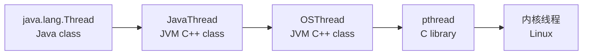
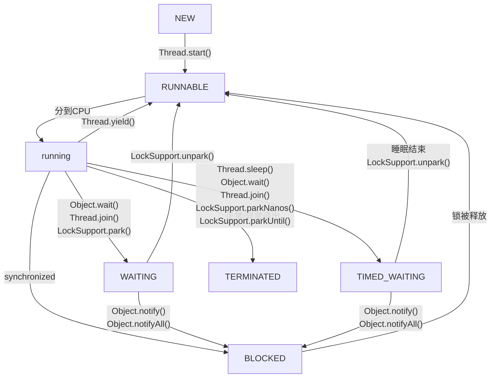
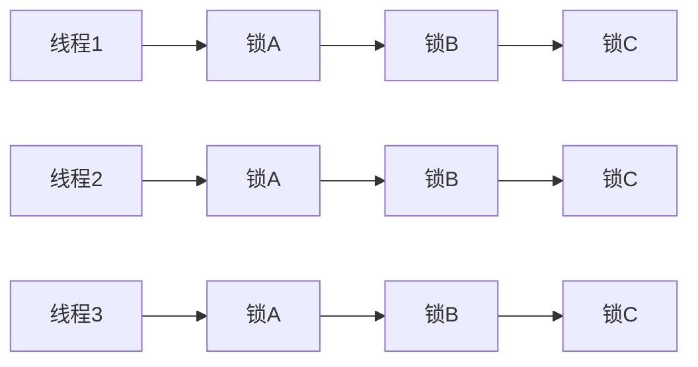
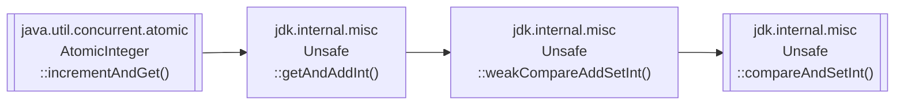
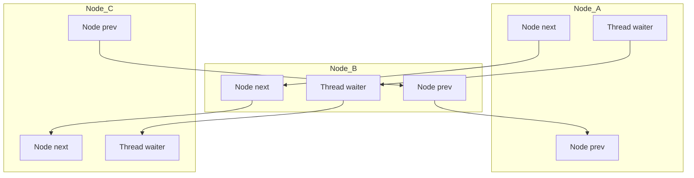
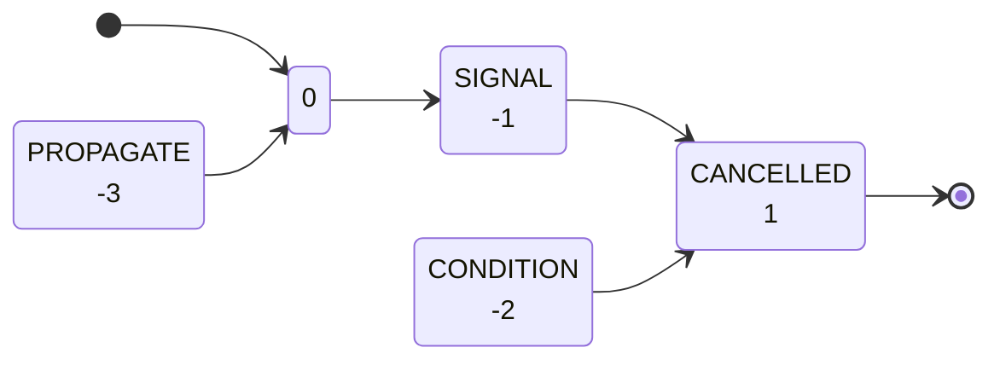
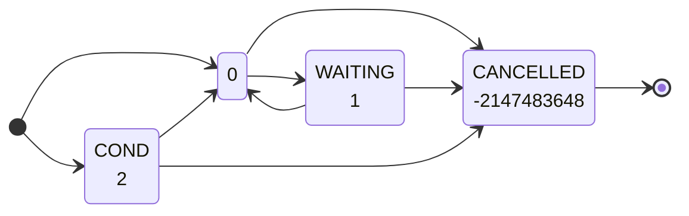

参考文献：

- [《图解Java并发编程》](https://book.douban.com/subject/35634953/)

# §1 线程

Java使用`java.lang.Runnable`接口表示线程的行为，同时提供了该接口的一个实现类`java.lang.Thread`表示线程。因此，我们有两种定义线程的方式：

1. 继承`java.lang.Thread`类，并覆盖`void run()`方法。
2. 实现`java.lang.Runnable`接口，实现`void run()`方法，作为实参传入到`Thread()`的构造函数中。

```java
class MyThread1 extends Thread {  
    @Override  
    public void run() {  
        System.out.printf("[MyThread1] %s is running.\n", Thread.currentThread().getName());  
    }  
}  
  
class MyThread2 implements Runnable {  
    @Override  
    public void run() {  
        System.out.printf("[MyThread2] %s is running.\n", Thread.currentThread().getName());  
    }  
}  
  
public class JucMain {  
    public static void main(String[] args) {  
        System.out.printf("[JucMain] %s is running.\n", Thread.currentThread().getName());  
        new MyThread1().start();  
        new Thread(new MyThread2()).start();  
    }  
}
/*
	[JucMain] main is running.
	[MyThread1] Thread-0 is running.
	[MyThread2] Thread-1 is running.
*/
```

JVM对线程的抽象如下图所示：



## §1.1 线程状态

Java将线程的状态分为以下六种：

```java
public enum java.lang.Thread::State {
	NEW, /* NEW类别 */
	RUNNABLE, /* RUNNABLE类别和RUNNING类别 */
	BLOCKED, WAITING, TIMED_WAITING, /* NOT RUNNABLE类别 */
	TERMINATED; /* TERMINATED类别 */
}
```

1. `NEW`：新建状态。线程被创建但未启动。
2. `RUNNABLE`：可运行状态或运行状态。可运行状态表示线程被放入线程池中，等待CPU执行；运行状态表示线程正在运行。Java将`RUNNABLE`和`RUNNING`统称为`RUNNABLE`，**这是因为Java层无法感知线程处于两种状态的哪一种**。
3. `BLOCKED`：阻塞状态。线程被`synchronized`锁阻塞，放弃分配CPU并进入等待队列。例如I/O、主动睡眠、锁竞争等情况。
4. `WAITING`：等待状态。线程释放对象锁并进入等待队列。
5. `TIMED_WAITING`：计时等待状态。线程释放对象锁并进入等待队列。
6. `TERMINATED`：死亡状态。线程正常结束或异常退出。



## §1.2 线程优先级

Java规定了线程的优先级范围`[1, 10]`，提供了优先级的相关常量。

```java
public class Thread implements Runnable {
	// ...
	public static final int MIN_PRIORITY = 1;  
	public static final int NORM_PRIORITY = 5;  
	public static final int MAX_PRIORITY = 10;
	// ...
}
```

JVM会根据平台规范映射到操作系统对应的优先级区间（例如[Windows的优先级范围](https://learn.microsoft.com/zh-cn/windows/win32/api/processthreadsapi/nf-processthreadsapi-setthreadpriority)是`{-15,-2,-1,0,1,2,15,65536,131072}`，[Linux的优先级范围](https://github.com/torvalds/linux/blob/155a3c003e555a7300d156a5252c004c392ec6b0/include/linux/sched.h#L1897-L1906)是`[-20,19]`）。具体来说，JVM会根据`java_to_os_priority`数组进行映射。以[OpenJDK](https://github.com/openjdk/jdk/blob/bf225c201f00f3a478b51c3cf045759b66899684/src/hotspot/os/linux/os_linux.cpp#L3949)为例：

```cpp
/* /jdk/src/hotspot/os/linux/os_linux.cpp */
int os::java_to_os_priority[CriticalPriority + 1] = {
	19,  // 0 Entry should never be used
	4,   // 1 MinPriority
	3,   // 2
	2,   // 3
	1,   // 4
	0,   // 5 NormPriority
	-1,  // 6
	-2,  // 7
	-3,  // 8
	-4,  // 9 NearMaxPriority
	-5,  // 10 MaxPriority
	-5   // 11 CriticalPriority
};

/* /jdk/src/hotspot/os/windows/os_windows.cpp */
int os::java_to_os_priority[CriticalPriority + 1] = {
    THREAD_PRIORITY_IDLE,          // 0  Entry should never be used
    THREAD_PRIORITY_LOWEST,        // 1  MinPriority
    THREAD_PRIORITY_LOWEST,        // 2
    THREAD_PRIORITY_BELOW_NORMAL,  // 3
    THREAD_PRIORITY_BELOW_NORMAL,  // 4
    THREAD_PRIORITY_NORMAL,        // 5  NormPriority
    THREAD_PRIORITY_NORMAL,        // 6
    THREAD_PRIORITY_ABOVE_NORMAL,  // 7
    THREAD_PRIORITY_ABOVE_NORMAL,  // 8
    THREAD_PRIORITY_HIGHEST,       // 9  NearMaxPriority
    THREAD_PRIORITY_HIGHEST,       // 10 MaxPriority
    THREAD_PRIORITY_HIGHEST        // 11 CriticalPriority
};
```

开发者可以读取和更改`Thread`的优先级：

```java
class MyThread extends Thread {
    @Override
    public void run() {
        int count = 0;
        for (int i = 0 ; i < 100000000; ++i) {
            ++count;
        }
        System.out.printf("[%s] Finished. Priority: %d\n", this.getName(), this.getPriority());
    }
}

public class JucMain {
    public static void main(String[] args) {
        Thread thread1 = new MyThread(); thread1.setPriority(Thread.MIN_PRIORITY);
        Thread thread2 = new MyThread(); // thread2.setPriority(Thread.NORM_PRIORITY);
        Thread thread3 = new MyThread(); thread3.setPriority(Thread.MAX_PRIORITY);
        thread1.start(); thread2.start(); thread3.start();
    }
}
/*
	[Thread-2] Finished. Priority: 10
	[Thread-0] Finished. Priority: 1
	[Thread-1] Finished. Priority: 5
*/
```

## §1.3 线程操作

### §1.3.1 谦让

`Thread.yield()`表示当前线程放弃CPU的使用权，并加入到队列末尾。

```java
public class JucMain {
    public static void main(String[] args) {
        Thread thread = new Thread(() -> {
            while (true) {
                System.out.println("yield cpu time");
                Thread.yield();
            }
        });
        thread.setDaemon(true);
        thread.start();
        
        for (int i = 0; i < 5; i++) {
            System.out.println("main thread");
        }
    }
} /* 可以观察到，当主线程输出时，子线程几乎不输出 */
```

### §1.3.2 睡眠

`Thread.sleep(long)`表示使得当前线程睡眠`long`毫秒时间。特殊地，传入`0`时等价于`Thread.yield()`。`Thread.sleep()`不会释放锁（但是`Object.wait()`会释放）：

```java
public class JucMain {
    public static void main(String[] args) {
        Object lock = new Object();

        Thread thread1 = new Thread(() -> {
            synchronized (lock) {
                System.out.printf("[%s] Get the lock.\n", Thread.currentThread().getName());
                try { Thread.sleep(1000); } catch (InterruptedException e) { e.printStackTrace(); }
                System.out.printf("[%s] Release the lock.\n", Thread.currentThread().getName());
            }
        });
        Thread thread2 = new  Thread(() -> {
            System.out.printf("[%s] Waiting for the lock...\n", Thread.currentThread().getName());
            synchronized (lock) {
                System.out.printf("[%s] Get the lock.\n", Thread.currentThread().getName());
            }
        });

        thread1.start();
        thread2.start();
    }
}
/*
	[Thread-0] Get the lock.
	[Thread-1] Waiting for the lock...
	[Thread-0] Release the lock.
	[Thread-1] Get the lock.
*/
```

### §1.3.3 中断

Java使用中断变量来实现中断机制，若该`bool`型中断变量为`true`，则线程抛出异常后进入异常处理逻辑作为中断入口。

以下是使用自定义中断变量模拟Java中断机制的一个伪代码例子：

```java
class MyThread extends Thread {  
    private volatile  boolean isInterrupted = false;  
    public void interrupt() {  
        isInterrupted = true;  
    }  
    public void run () {  
        while (!isInterrupted) {  
            Thread.yield();  
        }  
        System.out.printf("[%s] is interrupted.\n", Thread.currentThread().getName());  
    }  
}  
  
public class JucMain {  
    public static void main(String[] args) throws InterruptedException {  
        MyThread thread = new MyThread();  
        thread.start();  
  
        Thread.sleep(100);  
        thread.interrupt(); /* 执行后输出 [Thread-0] is interrupted. */
    }  
}
```

事实上，Java已经为我们提供了这个中断变量`interrupted`，以及相关中断触发函数：

```java
public class Thread implements Runnable {
	// ...
	volatile boolean interrupted;
	// ...
	public void interrupt() { /* Setter(设置为true)，并根据子线程进行后续操作 */
        interrupted = true;
        interrupt0();
        if (this != Thread.currentThread()) {
            Interruptible blocker;
            synchronized (interruptLock) {
                blocker = nioBlocker;
                if (blocker != null) {
                    blocker.interrupt(this);
                }
            }
            if (blocker != null) {
                blocker.postInterrupt();
            }
        }
    }
	public static boolean interrupted() { /* 先Getter再Setter(设置为false) */
	    return currentThread().getAndClearInterrupt();
	}
	public boolean isInterrupted() { /* Getter */
	    return interrupted;
	}
	final void setInterrupt() { /* Setter(设置为true) */
	    if (!interrupted) {
	        interrupted = true;
	        interrupt0();
	    }
	}
	final void clearInterrupt() { /* Setter(设置为false) */
	    if (interrupted) {
	        interrupted = false;
	        clearInterruptEvent();
	    }
	}
	boolean getAndClearInterrupt() { /* 先Getter再Setter(设置为false) */
	    boolean oldValue = interrupted;
	    if (oldValue) {
	        interrupted = false;
	        clearInterruptEvent();
	    }
	    return oldValue;
	}
}
```

#### §1.3.3.1 手工实现

对于`RUNNABLE`状态的线程，我们可以使用`while(!Thread.currentThread().isInterrupted())`循环监测是否触发中断：

```java
public class JucMain {
    public static void main(String[] args) throws InterruptedException {
        Thread thread = new Thread(() -> {
            while(!Thread.currentThread().isInterrupted()) {
                Thread.yield();
            }
            System.out.printf("[%s] is interrupted.\n", Thread.currentThread().getName());
        });
        thread.start();

        Thread.sleep(100);
        thread.interrupt(); /* 执行后输出 [Thread-0] is interrupted. */
    }
}
```

对于`BLOCKED`/`WAITING`/`TIMED_WAITING`状态的线程，我们可以捕获中断异常`java.lang.InterruptedException`来监测是否触发中断：

```java
public class JucMain {
    public static void main(String[] args) throws InterruptedException {
        Thread thread_join = new Thread(() -> {
            try {
                Thread.currentThread().join();
            } catch (InterruptedException e) {
                System.out.printf("[%s] is interrupted.\n", Thread.currentThread().getName());
            }
        });
        Thread thread_synchronized = new Thread(() -> {
            try {
                Object lock = new Object();
                synchronized (lock) {
                    lock.wait();
                }
            } catch (InterruptedException e) {
                System.out.printf("[%s] is interrupted.\n", Thread.currentThread().getName());
            }
        });

        thread_join.start(); thread_join.interrupt(); /* [Thread-0] is interrupted. */
        thread_synchronized.start(); thread_synchronized.interrupt(); /* [Thread-1] is interrupted. */
    }
}
```

综合以上两种情况，就是Java中的经典的手工中断实现方式：

```java
public class JucMain {
    public static void main(String[] args) throws InterruptedException {
        Thread thread = new Thread(() -> {
            while(!Thread.currentThread().isInterrupted()) {
                try {
                    Thread.sleep(100);
                } catch (InterruptedException e) {
                    System.out.printf("[%s] is interrupted during TIMED_WAITING state.\n", Thread.currentThread().getName());
                }
            }
            System.out.printf("[%s] is interrupted during RUNNING state.\n", Thread.currentThread().getName());
        });
        thread.start();
        // Thread.sleep(10); // 增加/不增加这一行，提高输出TIMED_WAITING/RUNNING的概率
        thread.interrupt();
    }
}
/*
	输出以下两种情况的某一种：
	[Thread-0] is interrupted during RUNNING state.
	[Thread-0] is interrupted during TIMED_WAITING state.
*/
```

#### §1.3.3.2 `LockSuppor.park()`实现

`java.util.concurrent.locks.LockSupport.park()`会让当前线程进入一种特殊的阻塞状态。在这种状态下，当前线程已经设置了中断变量，但是之后外界调用其`Thread.interrupt()`时不会触发`InterruptedException`异常，并使得当前线程切换回`RUNNABLE`状态，之后执行后续命令作为中断入口：

```java
public class JucMain {
    public static void main(String[] args) throws InterruptedException {
        Thread thread = new Thread(() -> {
            System.out.printf("[%s] is running\n", Thread.currentThread().getName());
            System.out.printf("[%s] is waiting by LockSupport.pork()\n", Thread.currentThread().getName());
            LockSupport.park();
            System.out.printf("[%s] is interrupted\n", Thread.currentThread().getName());
        });
        thread.start();
        Thread.sleep(10);
        thread.interrupt();
    }
}
/*
	[Thread-0] is running
	[Thread-0] is waiting by LockSupport.pork()
	[Thread-0] is interrupted
*/
```

### §1.3.4 阻塞与唤醒

阻塞与唤醒用于控制并发编程中的时序逻辑。考虑一种情景：我们使用`String message = null`变量在线程A和线程B之间共享数据，线程A负责写入，线程B负责读取。然而两个线程同时启动时，有可能出现线程B未写入的情况，这导致线程A读取到`null`值，引发预期外行为：

```java
public class JucMain {
    private static String message;
    public static void main(String[] args) throws InterruptedException {
        Thread thread_write = new Thread(() -> {
            message = "Hello World";
        });
        Thread thread_read = new Thread(() -> {
            System.out.printf("[%s] Read the message: %s\n", Thread.currentThread().getName(), message);
        });

        thread_read.start(); thread_write.start();
    }
}
```

这使得我们需要审慎地考虑时序逻辑。Java为此提供了多种阻塞与唤醒的机制。

#### §1.3.4.1 `Thread.suspend()/resume()`

`thread.suspend()`用于使线程陷入阻塞状态，`thread.resume()`用于使线程恢复运行状态。**这意味着一个线程调用自己的`resume()`陷入阻塞后，永远不能唤醒自己，必须由其他线程唤醒**。

针对上例，对于`Thread.suspend()`与`Thread.resume()`，我们可以对读线程加入非`null`判断，如果读到`null`，就用`Thread.suspend()`阻塞读线程自己；让写线程写入后调用读线程的`Thread.resume()`使其恢复运行：

```java
public class JucMain {
    private static volatile String message;
    private static Thread thread_write = new WriteThread();
    private static Thread thread_read = new ReadThread();
    static class WriteThread extends Thread {
        @Override
        public void run () {
            message = "Hello World";
            thread_read.resume();
        }
    }
    static class ReadThread extends Thread {
        @Override
        public void run () {
            if (message == null) {
                suspend();
            }
            System.out.printf("[%s] Read the message: %s\n", Thread.currentThread().getName(), message);
        }
    }
    public static void main(String[] args) throws InterruptedException {
        thread_read.start(); thread_write.start();
    }
}
```

该方法于Java 1.0被引入，于Java 1.2被移除。经实际工程证明，这种方案极易引发死锁问题。例如下面的伪代码——

```java
Thread thread = new Thread(() -> {
	while(true) {
		System.out.println("..."); /* 获取System.out同步锁 */
	}
});
thread.start();
thread.suspend(); /* 阻塞子线程，但是不释放子线程的锁 */
System.out.println("..."); /* 尝试获取System.out同步锁，从而永远在这里阻塞 */
thread.resume(); /* 无法执行这一步，主线程和子线程均陷入死锁 */
```

#### §1.3.4.1 `Object.wait()/notify()`

容易发现，`Thread.suspend()/resume()`之所以会产生死锁问题，是因为`Thread.suspend()`不释放任何锁。基于此，Java提出了一种新的阻塞与唤醒范式，旨在使得线程阻塞时释放锁。为此，该**方案要求与`synchronized`配合使用，且`synchronized`获取的对象锁与`Object.wait()/notify()`调用的是同一个对象**。

```java
synchronized (对象A) { // 获取对象A的对象锁
	// ...
	对象A.wait(); // 及时释放对象A的对象锁，从而缓解死锁问题
}
```

Java给每个`Object`对象锁维护一个等待队列。`Object.wait()`会尝试释放当前线程早已在`synchronized`获取的对象锁，并加入到该对象锁`Object`的等待队列中，将当前线程设置为`WAITING`状态。`Object.notify()`会从其等待队列中随机选择一个线程，使其从`WAITING`状态转变为`BLOCKED`状态，从而使其一直尝试抢占锁，抢占成功后继续往下执行。`Object.notifyAll()`有略微的区别，它会选择等列队列中的所有线程。

```java
public class JucMain {
    private static String message;
    public static void main(String[] args) {
        Object lock = new Object();
        Thread thread_read = new Thread(() -> {
            synchronized (lock) {
                if (message == null) {
                    try { lock.wait(); } catch (InterruptedException e) { throw new RuntimeException(e); }
                }
            }
            System.out.printf("[%s] Read the message: %s\n", Thread.currentThread().getName(), message);
        });
        Thread thread_write = new Thread(() -> {
            synchronized (lock) {
                message = "Hello World";
                lock.notify();
            }
        });
        thread_read.start(); thread_write.start(); /* [Thread-0] Read the message: Hello World */
    }
}
```

这种方案有一个缺点：就是必须保证`Object.wait()`比`Object.notify()`先执行，否则会导致调用`Object.wait()`的线程用于阻塞。

#### §1.3.4.1 `LockSupport.park()/unpark()`

`LockSupport.park()/unpark()`使用了许可机制，完全不需要考虑对象锁和等待队列，从而彻底解决了`Object.wait()/notify()`的死锁和竞态条件问题。具体来说，即使`LockSupport.unpark()`先执行，那么`LockSupport.park()`也不会阻塞。授予许可的过程具有幂等性，而收回许可会导师许可撤销。

```java
public class JucMain {
    private static String message;
    public static void main(String[] args) {
        Thread thread_read = new Thread(() -> {
            if (message == null) {
                LockSupport.park();
            }
            System.out.printf("[%s] Read the message: %s\n", Thread.currentThread().getName(), message);
        });
        Thread thread_write = new Thread(() -> {
            message = "Hello World";
            LockSupport.unpark(thread_read);
        });
        thread_read.start(); thread_write.start(); /* [Thread-0] Read the message: Hello World */
    }
}
```

#### §1.3.4.1 `Thread.join()`

`Thread.join()`本质上是对`Object.wait()/notify()`的封装。A线程调用B线程的`Thread.join()`方法后，会陷入`WAITING`状态，直到B线程执行完毕为止。具体来说，`Thread.join()`创建了一个B线程的对象锁，并调用其`Object.wait()`，从而让A线程陷入阻塞。B线程结束后（`!thread.isAlive()`），调用B线程自己的`this.notifyAll()`，让A线程恢复`BLOCKED`状态，从而尝试抢占锁并向下执行。

```java
public class JucMain {
    private static String message;
    public static void main(String[] args) {
        Thread thread_write = new Thread(() -> {
            message = "Hello World";
        });
        Thread thread_read = new Thread(() -> {
            if (message == null) {
                try { thread_write.join(); } catch (InterruptedException e) { throw new RuntimeException(e); }
            }
            System.out.printf("[%s] Read the message: %s\n", Thread.currentThread().getName(), message);
        });
        thread_read.start(); thread_write.start(); /* [Thread-0] Read the message: Hello World */
    }
}
```

`Thread.join(long)`也允许设置超时时间，这是因为`Object.wait()`也支持设置超时时间。

## 1.4 一致性问题

Java内存模型（JMM）规定，每个线程都有自己的内存空间。`volatile`关键字保证变量在公共内存空间被修改后，立即对所有私有内存空间可见。

例如下面的程序：在不使用`volatile`修饰公共变量`String message`时，读线程不会向公共内存空间读取最新的`message`值，从而一直陷入死循环。使用`volatile`修饰后，写线程对`message`的修改对读线程立即可见，因此可以使得读线程正常退出。

```java
public class JucMain {
	// private static String message; /* 会导致读线程死循环 */
    private static volatile String message;
    public static void main(String[] args) {
        Thread thread_write = new Thread(() -> {
            message = "Hello World";
        });
        Thread thread_read = new Thread(() -> {
            while (true) {
                if (message != null) {
                    System.out.printf("[%s] Read the message: %s\n", Thread.currentThread().getName(), message);
                    break;
                }
            }
        });
        thread_read.start();
        try { Thread.sleep(100); } catch (InterruptedException e) { throw new RuntimeException(e); }
        thread_write.start();
    }
}
```

然而，`volatile`只解决了可见性问题。对于非原子操作而言，依然存在着脏读问题。例如下面的程序使用了`++count`这一非原子操作，使得计数值不准确：

```java
public class JucMain {
    private static volatile int count;
    public static void main(String[] args) {
        for (int i = 1; i <= 5; ++i) {
            Thread thread = new Thread(() -> {
                for (int j = 1; j <= 10000; ++j) {
                    ++count;
                }
                System.out.printf("[%s] add 10000 to count\n", Thread.currentThread().getName());
            });
            thread.start();
        }
        try { Thread.sleep(1000); } catch (InterruptedException e) { throw new RuntimeException(e); }
        System.out.printf("[%s] Expect count=50000, but got count=%d\n", Thread.currentThread().getName(), count);
    }
}
/*
	[Thread-0] add 10000 to count
	[Thread-3] add 10000 to count
	[Thread-2] add 10000 to count
	[Thread-4] add 10000 to count
	[Thread-1] add 10000 to count
	[main] Expect count=50000, but got count=23052
*/
```

为了解决这个问题，我们还需要使用锁来实现同步。

## 1.5 死锁问题

死锁的形成需要同时具备以下条件：

- 互斥条件。锁具有排他性，最多只能被一个线程占用。
- 阻塞不释放条件。线程陷入阻塞状态时，不会主动释放之前占用的锁。
- 占有并等待条件。线程并不同时占用所有锁，而是先占用前者，再尝试占用后者。
- 非抢占条件。线程不会主动抢占其它线程占用的锁，只能等待其它线程资源释放。
- 环形条件。所有等待的线程和等待的资源形成环形。

为了解决死锁问题，我们有以下措施：

### §1.5.1 锁的顺序化

锁的顺序化属于**事前的预防措施**，破坏**环形条件**。所有的线程都按照同样的顺序尝试获取锁。



### §1.5.2 资源合并

资源合并属于**事前的预防措施**，破坏**占有并等待条件**。讲若干个锁的顺序获取操作打包成一个原子操作。

### §1.5.3 避免锁嵌套

避免锁嵌套属于**事前的预防措施**，破坏**阻塞不释放条件**。每个线程一次只获取一个锁，不经过阻塞操作就及时释放，从而避免阻塞。

### §1.5.4 锁超时机制

锁超时机制属于**事后的预防措施**，破坏**阻塞不释放条件**。当线程超时获取锁的等待操作超时后，就结束自己，从而释放锁。

### §1.5.5 抢占资源机制

抢占资源机制属于**事后的预防措施**，破坏**非抢占条件**。由于目前已经形成死锁，则当前线程抢夺其它线程的锁，不会导致其它线程恢复运行，于是当前线程就能执行。

### §1.5.6 撤销线程机制

撤销线程机制属于**事后的预防措施**，破坏**阻塞不释放条件**。当发生死锁时，系统随机杀死一个线程。

# §2 锁

## §2.1 互斥锁

Java提供了`synchronized`关键字用于实现互斥锁，即同一时刻只能有一个线程获取这种锁。加锁机制既可以确保可见性又可以确保原子性，而`volatile`变量只能确保可见性。

在下面的例子中，我们使用`synchronized`同步块，把一组非原子操作打包成了原子操作。

```java
public class JucMain {
    private static volatile int count;
    private static synchronized void addCount() {
        ++count;
    }
    public static void main(String[] args) {
        for (int i = 1; i <= 5; ++i) {
            Thread thread = new Thread(() -> {
                for (int j = 1; j <= 10000; ++j) {
                    addCount();
                }
                System.out.printf("[%s] add 10000 to count\n", Thread.currentThread().getName());
            });
            thread.start();
        }
        try { Thread.sleep(1000); } catch (InterruptedException e) { throw new RuntimeException(e); }
        System.out.printf("[%s] Expect count=50000, got count=%d\n", Thread.currentThread().getName(), count);
    }
}
/*
	[Thread-0] add 10000 to count
	[Thread-4] add 10000 to count
	[Thread-1] add 10000 to count
	[Thread-2] add 10000 to count
	[Thread-3] add 10000 to count
	[main] Expect count=50000, got count=50000
*/
```

`synchronized`关键字作用于不同的位置，会创建不同粒度的互斥锁：

- 作用于实例方法上，会创建一个对象级别的互斥锁
- 作用于类静态方法上，会创建一个类级别的互斥锁
- 作用于实例方法内，可以使用任意对象作为互斥锁
- 作用于类静态方法内，可以使用任意对象作为互斥锁

## §2.2 自旋锁

自旋锁是一种非阻塞锁。当线程遇到自旋锁，且暂时获取不到锁时，会一直作为`RUNNING`状态陷入死循环，不断检查锁是否被释放。这会导致自旋锁一直占用CPU，因此适用于占用锁时长较短的情景。

### §2.2.1 原始自旋锁

下面的代码展示了一种自旋锁的原始实现方案。我们使用变量`value`为`0`/`1`表示锁未被/已被占用。为了保证原子性和一致性，我们使用了CAS原语和`volatile`关键字。

```java
class SpinLock {
    private static Unsafe unsafe;
    private static final long valueOffset;
    private volatile int value = 0;
    static {
        try {
            Field unsafeInstanceField = Unsafe.class.getDeclaredField("theUnsafe");
            unsafeInstanceField.setAccessible(true);

            unsafe = (Unsafe) unsafeInstanceField.get(Unsafe.class);
            valueOffset = unsafe.objectFieldOffset(SpinLock.class.getDeclaredField("value"));
        } catch (NoSuchFieldException e) {
            throw new RuntimeException(e);
        }
    }

    public void lock() {
        while(true) {
            int newV = value + 1;
            if (newV == 1 && unsafe.compareAndSwapInt(this, valueOffset, 0, newV)) {
                return;
            }
        }
    }
    public void unlock() {
        unsafe.compareAndSwapInt(this, valueOffset, 1, 0);
    }
}
```

原始自旋锁有以下缺点：

1. 不具有公平性，所有线程同时抢占锁。
2. 为保证`volatile`的一致性，引入大量通信开销，CPU核心越多开销越大。

### §2.2.2 排队自旋锁

排队自旋锁引入了排队机制，给每个尝试抢占锁的线程分配一个排队号码，让它们不断轮训是否轮到了自己。**这种方案保证了公平性**。

```java
class TicketLock {
    private static Unsafe unsafe;
    private static final long ticketNumOffset;
    private static final long processingNumOffset;
    private volatile int ticketNum; /* 当前未被分配的排队序号 */
    private volatile int processingNum; /* 当前叫号 */
    static {
        try {
            Field unsafeInstanceField = Unsafe.class.getDeclaredField("theUnsafe");
            unsafeInstanceField.setAccessible(true);

            unsafe = (Unsafe) unsafeInstanceField.get(Unsafe.class);
            ticketNumOffset = unsafe.objectFieldOffset(TicketLock.class.getDeclaredField("ticketNum"));
            processingNumOffset = unsafe.objectFieldOffset(TicketLock.class.getDeclaredField("processingNum"));
        } catch (NoSuchFieldException e) {
            throw new RuntimeException(e);
        }
    }

    public int lock() {
        int nowNum;
        while (true) { /* 尝试取号，如果其它线程已经取号则尝试下一次取号 */
            nowNum = ticketNum;
            if (unsafe.compareAndSwapInt(this, ticketNumOffset, ticketNum, ticketNum + 1)) {
                break;
            }
        }
        while (processingNum != nowNum) { /* 等待叫号，在此处自旋 */
            ;
        }
        return nowNum;
    }
    public void unlock(int ticket) {
        unsafe.compareAndSwapInt(this, processingNumOffset, ticket, ticket + 1); /* 更新叫号 */
    }
}
```

然而，排队自旋锁依然没有减少通信开销。这是因为线程不停地访问`volatile`变量，来判定自己是否有资格获得锁。

### §2.2.3 CLH锁

CLH锁的核心思想是：为了判定当前线程是否有资格获得锁，我们不访问`volatile`变量，而是访问预先保存的`volatile`变量的本地副本。我们不再依赖`volatile`保证线程节点插入和删除的原子性，而是通过更高效的自旋+CAS操作。

```java
class CLHLock {
    private class CLHNode {
        private volatile boolean isLocked = true;
    }

    private static Unsafe unsafe;
    private static final long valueOffset;
    private volatile CLHNode tail; /* 等待队列队尾节点 */

    static {
        try {
            Field unsafeInstanceField = Unsafe.class.getDeclaredField("theUnsafe");
            unsafeInstanceField.setAccessible(true);

            unsafe = (Unsafe) unsafeInstanceField.get(Unsafe.class);
            valueOffset = unsafe.objectFieldOffset(CLHLock.class.getDeclaredField("tail"));
        } catch (NoSuchFieldException e) {
            throw new RuntimeException(e);
        }
    }

    public int lock(CLHNode currentThreadNode) {
        CLHNode preNode = null;
        while (true) {
            preNode = tail; /* 保存队列队尾节点的本地副本 */
            /* 更新当前线程为队列队尾的节点 */
            /* 形成preNode -> this.tail=currentThreadNode的链表队列 */
            if (unsafe.compareAndSwapObject(this, valueOffset, preNode, currentThreadNode)) {
                break;
            }
        }
        while (preNode != null && preNode.isLocked) {
            ; /* 自旋等待，直到preNode执行完毕 */
        }
    }
    public void unlock(CLHNode currentThreadNode) {
	    /* 当前 */
        if (!unsafe.compareAndSwapObject(this, valueOffset, currentThreadNode, null)) {
            currentThreadNode.isLocked = false;
        }
    }
}
```

我们通过一个例子解释这个过程。给定`Thread`线程A、线程B、线程C及其对应的`CLHNode`节点A、节点B、节点C：

1. 线程A尝试获取锁。线程A调用`CLHLock.lock(node_A)`，使得本地局部变量`preNode_A`为`null`，全局同步变量`tail`为`node_A`。于是线程A成功地获取了锁。**产生先后关系`null -> node_A`**。
2. 线程B尝试获取锁。线程B调用`CLHLock.lock(node_B)`，使得本地局部变量`preNode_B`为`node_A`，全局同步变量`tail`为`node_B`。**产生先后关系`node_A -> node_B`**。
3. 线程C尝试获取锁。线程C调用`CLHLock.locl(node_C)`，使得本地局部变量`preNode_C`为`node_B`，此时CPU切换线程。
4. 线程D尝试获取锁。线程D调用`CLHLock.locl(node_D)`，使得本地局部变量`preNode_D`为`node_B`，全局同步变量`tail`为`node_D`。**产生先后关系`node_B -> node_D`**。
5. 线程C恢复运行，发现CAS原子操作失败，于是重新执行CAS操作，使得本地局部变量`preNode_C`为`node_D`，全局同步变量`tail`为`node_C`。**产生先后关系`node_D -> node_C`**。
6. 至此，根据每个线程的`preNode_?`和自己持有的节点，显然存在先后关系：`preNode_A(null) -> preNode_B(node_A) -> preNode_D(node_B) -> preNode_C(node_D) -> (node_C)`。要推进这个先后关系，**显然要么`preNode == null`，要么`preNode`对应的线程已经执行完毕**。
7. 线程C恢复运行，发现自己的`preNode_C`非空（等于`node_D`），且`node_D`未完成，因此继续自旋等待。
8. 线程D恢复运行，发现自己的`preNode_D`非空（等于`node_B`），且`node_B`未完成，因此继续自旋等待。
9. 线程B恢复运行，发现自己的`preNode_B`非空（等于`node_A`），且`node_A`未完成，因此继续自旋等待。
10. 线程A恢复运行，发现自己的`preNode_A`为空，因此获得锁，执行下一步运行逻辑。
11. 剩余步骤同理。

CLH锁节省了大量的`volatile`同步变量读取操作，只留下了CAS的重试开销，因此效率较高。但是CLH锁的公平性严重依赖于UMA（统一内存访问，Uniform Memory Access），需要保证每个线程对同一个公共变量的CAS的耗时几乎相等。然而这对于NUMA架构而言是不可能的，如果公共变量不在某个线程的本地主存储中，则CAS耗时较长，从而降低性能。

### §2.2.4 MCS锁

在CLH锁中，显然每个等待锁的变量都在自旋。MCS锁在此基础上，为每个节点维护一个`spin`变量，表示是否需要自旋。当前一个线程释放锁时，会修改后一个线程的`spin`变量，告知后一个线程现在就可以获取锁，不必继续自旋。

```java
class MCSLock {
    private class MCSNode {
        public MCSNode next;
        private volatile boolean spin = true;
    }

    private static Unsafe unsafe;
    private static final long valueOffset;
    private volatile MCSNode tail;

    static {
        try {
            Field unsafeInstanceField = Unsafe.class.getDeclaredField("theUnsafe");
            unsafeInstanceField.setAccessible(true);

            unsafe = (Unsafe) unsafeInstanceField.get(Unsafe.class);
            valueOffset = unsafe.objectFieldOffset(MCSLock.class.getDeclaredField("tail"));
        } catch (NoSuchFieldException e) {
            throw new RuntimeException(e);
        }
    }

    public int lock(MCSNode currentThreadNode) {
        MCSNode preNode = null;
        while (true) {
            preNode = tail;
            if (unsafe.compareAndSwapObject(this, valueOffset, tail, currentThreadNode)) {
                break;
            }
        }
        /* 如果preNode为null，则说明该线程在队列的队首，因此可以直接获取锁 */
        if (preNode != null) { /* 如果preNode不为null，则需要维护preNode的后继next */
            preNode.next = currentThreadNode; /* 反之设立preNode的后继节点为自己，也就是在链表队列末尾追加自己 */
            while (currentThreadNode.spin) { /* 等待preNode结束后更改自己的spin变量为false，即通知自己退出自旋 */
                ;
            }
        }
    }
    public void unlock(MCSNode currentThreadNode) {
        if (tail != currentThreadNode) { /* 如果当前线程节点后面还有其它线程节点 */
            /* 如果当前节点还没有被后续节点设置next，则需要等待 */
            if (currentThreadNode.next == null) {
                if (unsafe.compareAndSwapObject(this, valueOffset, currentThreadNode, null)) {
                    return; /* 证明当前线程是最后一个入队的线程，且一直在队列的队尾，且一直没有新的线程入队，因此没有要通知的后继节点，直接返回即可 */
                } else {
                    while (currentThreadNode.next == null) { /* 等待新入队的节点维护当前节点的next */
                        ;
                    }
                }
            }
            /* 如果当前节点已经被后续节点设置了next，则通知后续节点停止自旋，开始执行 */
            currentThreadNode.next.spin = false;
        }
    }
}
```

## §2.3 重入锁

Java提供了`java.util.concurrent.locks.ReentrantLock`重入锁。其构造函数接受一个`boolean`值，表示是否创建一个公平锁。在下面的例子中，我们使用GUI来可视化非公平锁和公平锁的线程调度策略。

```java
public class JucMain {

	// private static ReentrantLock lock = new ReentrantLock(false); /* 非公平锁 */
	private static ReentrantLock lock = new ReentrantLock(true); /* 公平锁 */

    public static void main(String[] args) {
        JFrame frame = new JFrame();
        frame.setDefaultCloseOperation(JFrame.EXIT_ON_CLOSE);
        frame.setLayout(new FlowLayout(FlowLayout.LEFT));
        frame.setSize(new Dimension(350, 200));

        for (int i = 1; i <= 10; ++i) {
            JProgressBar progressBar = new JProgressBar();
            progressBar.setStringPainted(true);
            progressBar.setMinimum(0);
            progressBar.setMaximum(1000);
            frame.add(progressBar);

            Thread thread = new Thread(() -> {
                progressBar.setString(Thread.currentThread().getName());
                int count = 0;
                while (count <= 1000) {
                    lock.lock();
                    progressBar.setValue(++count);
                    try { Thread.sleep(1); } catch (InterruptedException e) { throw new RuntimeException(e); }
                    lock.unlock();
                }
            });
            thread.start();
        }

        frame.setVisible(true);
    }
}
```

## §2.A CAS

CAS（比较并交换，Compare And Swap）是CPU级别的一种原子操作，当且仅当内存值等于预期值时，说明此时其他线程没有更改内存值，不存在数据冲突问题，才用新值写入到内存值；如果内存值不等于预期值，则一直重试该操作，直到成功为止。

```java
public final clas Unsafe {
    public final native boolean compareAndSetInt(
	    Object o,     /* 对象基址 */
	    long offset,  /* 对象int成员的基址偏移量 */
		int expected, /* 预期值 */
		int x         /* 新值 */
	);
}
```

以`java.util.concurrent.atomic.AtomicInteger::incrementAndGet()`源码为例：



在JDK 8及之前，Java使用`sun.misc.Unsafe`类调用CAS操作。具体来说，我们需要通过反射机制，使用类对象的`class.getDeclaredField(变量名)`获取字段实例`Field`，再调用`Unsafe`的实例`unsafe`提供的`unsafe.objectFieldOffset(Field)`方法获取`long`型的基址偏移量，最后调用`unsafe.compareAndSwapObject(obj, valueOffset, ...)`直接操作内存。

在JDK 9及之后，Java使用`java.lang.invoke.VarHandle`类作为替代，将`obj`基址及其偏移量`valueOffset`封装成一个可操作的`VarHandle`实例。具体来说，我们直接调用`java.lang.invoke.MethodHandles`提供的`MethodHandles.lookup().findVarHandle(类对象, 字段名, 字段数据类型类对象)`获取`VarHandle`实例，再调用其自带泛型的实例方法`varHandle.compareAndSet(obj, ...)`即可。

CAS存在以下问题：

- CAS的原子操作只能针对一个变量，不能保证多个变量的原子操作。
- CAS的重试机制造成较大开销。如果一直不成功，就会一直重试。
- ABA问题。甲线程的预期值为A，乙丙线程依次将内存值修改为B和A，这会导致甲线程认为其他线程没有更改过内存值。解决方法是增加一个自增的版本号。

# §3 AQS

AQS（Abstract Queued Synchronized）是Java并发的核心机制，它作为一个同步器，可以在多个线程之间同步共享变量的值。

## §3.1 AQS组成部分

AQS是一个抽象类，为后续的实现类定义了五个成分：

- 同步状态：实现锁机制。
- 等待队列：存放等待锁的线程节点
- 独占模式：实现独占锁。
- 共享模式：实现共享锁。
- 条件队列：实现条件队列模式。

### §3.1.1 等待队列

对于等待队列，AQS采用CLH锁的实现，也就是用物理上的双向链表维护一个逻辑上的队列。我们令队尾进，队头出。

```java
public abstract class AbstractQueuedSynchronizer extends AbstractOwnableSynchronizer implements Serializable {
	// ...
    private transient volatile Node head; /* CLH锁等待队列头结点 */
    private transient volatile Node tail; /* CLH锁等待队列尾结点 */
	// ...
	/* 获取volatile变量的偏移量 */
    private static final Unsafe U = Unsafe.getUnsafe();
    private static final long STATE = U.objectFieldOffset(AbstractQueuedSynchronizer.class, "state");
    private static final long HEAD = U.objectFieldOffset(AbstractQueuedSynchronizer.class, "head");
    private static final long TAIL = U.objectFieldOffset(AbstractQueuedSynchronizer.class, "tail");
    // ...
}
```

类似的，AQS使用`AbstractQueuedSynchronized::Node`节点，以链表方式实现队列，提供了配套的CASSetter方法：

```java
public abstract class AbstractQueuedSynchronizer extends AbstractOwnableSynchronizer implements Serializable {
    abstract static class Node {
        volatile Node prev;
        volatile Node next;
        Thread waiter; /* 表示独占锁/共享锁 */
        volatile int status;

        private static final long STATUS = U.objectFieldOffset(Node.class, "status");
        private static final long NEXT = U.objectFieldOffset(Node.class, "next");
        private static final long PREV = U.objectFieldOffset(Node.class, "prev");

		final boolean casPrev(Node c, Node v) {
		    return U.weakCompareAndSetReference(this, PREV, c, v);
		}
		final boolean casNext(Node c, Node v) {
		    return U.weakCompareAndSetReference(this, NEXT, c, v);
		}
		final int getAndUnsetStatus(int v) {
		    return U.getAndBitwiseAndInt(this, STATUS, ~v);
		}
		final void setPrevRelaxed(Node p) {
		    U.putReference(this, PREV, p);
		}
    }
}
```



### §3.1.2 同步状态

对于同步状态，AQS提供了以下状态（不同JDK的源码实现可能不同）：

```java
public abstract class AbstractQueuedSynchronizer extends AbstractOwnableSynchronizer implements Serializable {
	// ...
    static final int WAITING   = 1;
    static final int CANCELLED = 0x80000000; // INT32_MIN (-2147483648)
    static final int COND      = 2;
    private volatile int state; /* 同步状态 */
    // ...
    abstract static class Node {
	    // ...
        volatile int status;
    }
    // ...
}
```

| 状态     | 旧版JDK          | 新版JDK                 | 含义                                    |
| ------ | -------------- | --------------------- | ------------------------------------- |
| 无状态    | `0`            | `0`                   | 初始状态                                  |
| 等待唤醒状态 | `SIGNAL=-1`    | `WAITING=1`           | 当前节点的后继节点通过`LockSupport.park()`进入等待状态 |
| 已取消状态  | `CANCELLED=1`  | `CANCELLED=INT32_MIN` | 当前节点因为超时或中断而被取消                       |
| 条件等待状态 | `CONDITION=-2` | `COND=2`              | 当前节点在条件队列中                            |
| 共享传播状态 | `PROPAGATE=-3` | 无                     | 当前节点无条件向下传播，用于共享模式                    |





AQS针对同步状态变量提供了一系列辅助方法，例如Getter和基于CAS的Setter：

```java
public abstract class AbstractQueuedSynchronizer extends AbstractOwnableSynchronizer implements Serializable {
	// ...
	private volatile int state; /* 同步状态 */
	protected final int getState() {
        return state;
    }
    protected final void setState(int newState) {
        state = newState;
    }
    protected final boolean compareAndSetState(int expect, int update) {
        return U.compareAndSetInt(this, STATE, expect, update);
    }
    // ...
    abstract static class Node {
	    volatile int state;
	    // ...
		final void setStatusRelaxed(int s) {
		    U.putInt(this, STATUS, s);
		}
		final void clearStatus() {
            U.putIntOpaque(this, STATUS, 0);
        }
    }
    // ...
}
```

### §3.1.3 条件队列

```java
public abstract class AbstractQueuedSynchronizer extends AbstractOwnableSynchronizer implements Serializable {
	public class ConditionObject implements Condition, java.io.Serializable {
        // ...
        private transient ConditionNode firstWaiter;
        private transient ConditionNode lastWaiter;
		
        static final long OOME_COND_WAIT_DELAY = 10L * 1000L * 1000L; // 10 ms
		
        public ConditionObject() { }
		
        private void doSignal(ConditionNode first, boolean all) {
            while (first != null) {
                ConditionNode next = first.nextWaiter;
				
                if ((firstWaiter = next) == null)
                    lastWaiter = null;
                else
                    first.nextWaiter = null; // GC assistance

                if ((first.getAndUnsetStatus(COND) & COND) != 0) {
                    enqueue(first);
                    if (!all)
                        break;
                }

                first = next;
            }
        }

        /**
         * Moves the longest-waiting thread, if one exists, from the
         * wait queue for this condition to the wait queue for the
         * owning lock.
         *
         * @throws IllegalMonitorStateException if {@link #isHeldExclusively}
         *         returns {@code false}
         */
        public final void signal() {
            ConditionNode first = firstWaiter;
            if (!isHeldExclusively())
                throw new IllegalMonitorStateException();
            else if (first != null)
                doSignal(first, false);
        }

        /**
         * Moves all threads from the wait queue for this condition to
         * the wait queue for the owning lock.
         *
         * @throws IllegalMonitorStateException if {@link #isHeldExclusively}
         *         returns {@code false}
         */
        public final void signalAll() {
            ConditionNode first = firstWaiter;
            if (!isHeldExclusively())
                throw new IllegalMonitorStateException();
            else if (first != null)
                doSignal(first, true);
        }

        // Waiting methods

        /**
         * Adds node to condition list and releases lock.
         *
         * @param node the node
         * @return savedState to reacquire after wait
         */
        private int enableWait(ConditionNode node) {
            if (isHeldExclusively()) {
                node.waiter = Thread.currentThread();
                node.setStatusRelaxed(COND | WAITING);
                ConditionNode last = lastWaiter;
                if (last == null)
                    firstWaiter = node;
                else
                    last.nextWaiter = node;
                lastWaiter = node;
                int savedState = getState();
                if (release(savedState))
                    return savedState;
            }
            node.status = CANCELLED; // lock not held or inconsistent
            throw new IllegalMonitorStateException();
        }

        /**
         * Returns true if a node that was initially placed on a condition
         * queue is now ready to reacquire on sync queue.
         * @param node the node
         * @return true if is reacquiring
         */
        private boolean canReacquire(ConditionNode node) {
            // check links, not status to avoid enqueue race
            Node p; // traverse unless known to be bidirectionally linked
            return node != null && (p = node.prev) != null &&
                (p.next == node || isEnqueued(node));
        }

        /**
         * Unlinks the given node and other non-waiting nodes from
         * condition queue unless already unlinked.
         */
        private void unlinkCancelledWaiters(ConditionNode node) {
            if (node == null || node.nextWaiter != null || node == lastWaiter) {
                ConditionNode w = firstWaiter, trail = null;
                while (w != null) {
                    ConditionNode next = w.nextWaiter;
                    if ((w.status & COND) == 0) {
                        w.nextWaiter = null;
                        if (trail == null)
                            firstWaiter = next;
                        else
                            trail.nextWaiter = next;
                        if (next == null)
                            lastWaiter = trail;
                    } else
                        trail = w;
                    w = next;
                }
            }
        }

        /**
         * Constructs objects needed for condition wait. On OOME,
         * releases lock, sleeps, reacquires, and returns null.
         */
        private ConditionNode newConditionNode() {
            int savedState;
            if (tryInitializeHead() != null) {
                try {
                    return new ConditionNode();
                } catch (OutOfMemoryError oome) {
                }
            }
            // fall through if encountered OutOfMemoryError
            if (!isHeldExclusively() || !release(savedState = getState()))
                throw new IllegalMonitorStateException();
            U.park(false, OOME_COND_WAIT_DELAY);
            acquireOnOOME(false, savedState);
            return null;
        }

        /**
         * Implements uninterruptible condition wait.
         * <ol>
         * <li>Save lock state returned by {@link #getState}.
         * <li>Invoke {@link #release} with saved state as argument,
         *     throwing IllegalMonitorStateException if it fails.
         * <li>Block until signalled.
         * <li>Reacquire by invoking specialized version of
         *     {@link #acquire} with saved state as argument.
         * </ol>
         */
        public final void awaitUninterruptibly() {
            ConditionNode node = newConditionNode();
            if (node == null)
                return;
            int savedState = enableWait(node);
            LockSupport.setCurrentBlocker(this); // for back-compatibility
            boolean interrupted = false, rejected = false;
            while (!canReacquire(node)) {
                if (Thread.interrupted())
                    interrupted = true;
                else if ((node.status & COND) != 0) {
                    try {
                        if (rejected)
                            node.block();
                        else
                            ForkJoinPool.managedBlock(node);
                    } catch (RejectedExecutionException ex) {
                        rejected = true;
                    } catch (InterruptedException ie) {
                        interrupted = true;
                    }
                } else
                    Thread.onSpinWait();    // awoke while enqueuing
            }
            LockSupport.setCurrentBlocker(null);
            node.clearStatus();
            reacquire(node, savedState);
            if (interrupted)
                Thread.currentThread().interrupt();
        }

        /**
         * Implements interruptible condition wait.
         * <ol>
         * <li>If current thread is interrupted, throw InterruptedException.
         * <li>Save lock state returned by {@link #getState}.
         * <li>Invoke {@link #release} with saved state as argument,
         *     throwing IllegalMonitorStateException if it fails.
         * <li>Block until signalled or interrupted.
         * <li>Reacquire by invoking specialized version of
         *     {@link #acquire} with saved state as argument.
         * <li>If interrupted while blocked in step 4, throw InterruptedException.
         * </ol>
         */
        public final void await() throws InterruptedException {
            if (Thread.interrupted())
                throw new InterruptedException();
            ConditionNode node = newConditionNode();
            if (node == null)
                return;
            int savedState = enableWait(node);
            LockSupport.setCurrentBlocker(this); // for back-compatibility
            boolean interrupted = false, cancelled = false, rejected = false;
            while (!canReacquire(node)) {
                if (interrupted |= Thread.interrupted()) {
                    if (cancelled = (node.getAndUnsetStatus(COND) & COND) != 0)
                        break;              // else interrupted after signal
                } else if ((node.status & COND) != 0) {
                    try {
                        if (rejected)
                            node.block();
                        else
                            ForkJoinPool.managedBlock(node);
                    } catch (RejectedExecutionException ex) {
                        rejected = true;
                    } catch (InterruptedException ie) {
                        interrupted = true;
                    }
                } else
                    Thread.onSpinWait();    // awoke while enqueuing
            }
            LockSupport.setCurrentBlocker(null);
            node.clearStatus();
            reacquire(node, savedState);
            if (interrupted) {
                if (cancelled) {
                    unlinkCancelledWaiters(node);
                    throw new InterruptedException();
                }
                Thread.currentThread().interrupt();
            }
        }

        /**
         * Implements timed condition wait.
         * <ol>
         * <li>If current thread is interrupted, throw InterruptedException.
         * <li>Save lock state returned by {@link #getState}.
         * <li>Invoke {@link #release} with saved state as argument,
         *     throwing IllegalMonitorStateException if it fails.
         * <li>Block until signalled, interrupted, or timed out.
         * <li>Reacquire by invoking specialized version of
         *     {@link #acquire} with saved state as argument.
         * <li>If interrupted while blocked in step 4, throw InterruptedException.
         * </ol>
         */
        public final long awaitNanos(long nanosTimeout)
                throws InterruptedException {
            if (Thread.interrupted())
                throw new InterruptedException();
            ConditionNode node = newConditionNode();
            if (node == null)
                return nanosTimeout - OOME_COND_WAIT_DELAY;
            int savedState = enableWait(node);
            long nanos = (nanosTimeout < 0L) ? 0L : nanosTimeout;
            long deadline = System.nanoTime() + nanos;
            boolean cancelled = false, interrupted = false;
            while (!canReacquire(node)) {
                if ((interrupted |= Thread.interrupted()) ||
                    (nanos = deadline - System.nanoTime()) <= 0L) {
                    if (cancelled = (node.getAndUnsetStatus(COND) & COND) != 0)
                        break;
                } else
                    LockSupport.parkNanos(this, nanos);
            }
            node.clearStatus();
            reacquire(node, savedState);
            if (cancelled) {
                unlinkCancelledWaiters(node);
                if (interrupted)
                    throw new InterruptedException();
            } else if (interrupted)
                Thread.currentThread().interrupt();
            long remaining = deadline - System.nanoTime(); // avoid overflow
            return (remaining <= nanosTimeout) ? remaining : Long.MIN_VALUE;
        }

        /**
         * Implements absolute timed condition wait.
         * <ol>
         * <li>If current thread is interrupted, throw InterruptedException.
         * <li>Save lock state returned by {@link #getState}.
         * <li>Invoke {@link #release} with saved state as argument,
         *     throwing IllegalMonitorStateException if it fails.
         * <li>Block until signalled, interrupted, or timed out.
         * <li>Reacquire by invoking specialized version of
         *     {@link #acquire} with saved state as argument.
         * <li>If interrupted while blocked in step 4, throw InterruptedException.
         * <li>If timed out while blocked in step 4, return false, else true.
         * </ol>
         */
        public final boolean awaitUntil(Date deadline)
                throws InterruptedException {
            long abstime = deadline.getTime();
            if (Thread.interrupted())
                throw new InterruptedException();
            ConditionNode node = newConditionNode();
            if (node == null)
                return false;
            int savedState = enableWait(node);
            boolean cancelled = false, interrupted = false;
            while (!canReacquire(node)) {
                if ((interrupted |= Thread.interrupted()) ||
                    System.currentTimeMillis() >= abstime) {
                    if (cancelled = (node.getAndUnsetStatus(COND) & COND) != 0)
                        break;
                } else
                    LockSupport.parkUntil(this, abstime);
            }
            node.clearStatus();
            reacquire(node, savedState);
            if (cancelled) {
                unlinkCancelledWaiters(node);
                if (interrupted)
                    throw new InterruptedException();
            } else if (interrupted)
                Thread.currentThread().interrupt();
            return !cancelled;
        }

        /**
         * Implements timed condition wait.
         * <ol>
         * <li>If current thread is interrupted, throw InterruptedException.
         * <li>Save lock state returned by {@link #getState}.
         * <li>Invoke {@link #release} with saved state as argument,
         *     throwing IllegalMonitorStateException if it fails.
         * <li>Block until signalled, interrupted, or timed out.
         * <li>Reacquire by invoking specialized version of
         *     {@link #acquire} with saved state as argument.
         * <li>If interrupted while blocked in step 4, throw InterruptedException.
         * <li>If timed out while blocked in step 4, return false, else true.
         * </ol>
         */
        public final boolean await(long time, TimeUnit unit)
                throws InterruptedException {
            long nanosTimeout = unit.toNanos(time);
            if (Thread.interrupted())
                throw new InterruptedException();
            ConditionNode node = newConditionNode();
            if (node == null)
                return false;
            int savedState = enableWait(node);
            long nanos = (nanosTimeout < 0L) ? 0L : nanosTimeout;
            long deadline = System.nanoTime() + nanos;
            boolean cancelled = false, interrupted = false;
            while (!canReacquire(node)) {
                if ((interrupted |= Thread.interrupted()) ||
                    (nanos = deadline - System.nanoTime()) <= 0L) {
                    if (cancelled = (node.getAndUnsetStatus(COND) & COND) != 0)
                        break;
                } else
                    LockSupport.parkNanos(this, nanos);
            }
            node.clearStatus();
            reacquire(node, savedState);
            if (cancelled) {
                unlinkCancelledWaiters(node);
                if (interrupted)
                    throw new InterruptedException();
            } else if (interrupted)
                Thread.currentThread().interrupt();
            return !cancelled;
        }

        final boolean isOwnedBy(AbstractQueuedSynchronizer sync) {
            return sync == AbstractQueuedSynchronizer.this;
        }

        protected final boolean hasWaiters() {
            if (!isHeldExclusively())
                throw new IllegalMonitorStateException();
            for (ConditionNode w = firstWaiter; w != null; w = w.nextWaiter) {
                if ((w.status & COND) != 0)
                    return true;
            }
            return false;
        }

        protected final int getWaitQueueLength() {
            if (!isHeldExclusively())
                throw new IllegalMonitorStateException();
            int n = 0;
            for (ConditionNode w = firstWaiter; w != null; w = w.nextWaiter) {
                if ((w.status & COND) != 0)
                    ++n;
            }
            return n;
        }

        protected final Collection<Thread> getWaitingThreads() {
            if (!isHeldExclusively())
                throw new IllegalMonitorStateException();
            ArrayList<Thread> list = new ArrayList<>();
            for (ConditionNode w = firstWaiter; w != null; w = w.nextWaiter) {
                if ((w.status & COND) != 0) {
                    Thread t = w.waiter;
                    if (t != null)
                        list.add(t);
                }
            }
            return list;
        }
    }
}
```

### §3.1.A `signalNext()`

`AbstractQueuedSynchronized.signalNext()`用于AQS独占锁，从当前节点`h`出发，向队尾查找一个深度。将后继节点设置为`WAITING`状态并唤醒线。`AbstractQueuedSynchronized.signalNextIfShared()`逻辑类似，用于AQS共享锁，但是使用了`instanceof`判定是否是AQS共享锁节点。

```java
public abstract class AbstractQueuedSynchronizer extends AbstractOwnableSynchronizer implements Serializable {
	// ...
    private static void signalNext(Node h) {
        Node s;
        if (h != null && (s = h.next) != null && s.status != 0) { // 获取后继节点s
            s.getAndUnsetStatus(WAITING); // 设置后继节点s为WAITING
            LockSupport.unpark(s.waiter); // 唤醒后继节点s的线程
        }
    }
    private static void signalNextIfShared(Node h) {
        Node s;
        if (h != null && (s = h.next) != null && (s instanceof SharedNode) && s.status != 0) {
            s.getAndUnsetStatus(WAITING);
            LockSupport.unpark(s.waiter);
        }
    }
}
```

### §3.1.B `cleanQueue()`

`AbstractQueuedSynchronized.cleanQueue()`用于清除队列中的所有`CANCELLED`状态的节点：

```java
public abstract class AbstractQueuedSynchronizer extends AbstractOwnableSynchronizer implements Serializable {
	// ...
    private void cleanQueue() {
        while (true) {
	        // p -> q(当前) -> s
	        Node q = tail; /* 当前正在检查的节点，从队尾向队头遍历 */
	        Node s = null; /* q的后继节点(successor) */
	        Node p = null; /* q的前驱节点(prev) */
	        Node n = null;
            while (true) {
	            /* 如果队列中只有<=1个节点，则判定删除完毕 */
                if (q == null || (p = q.prev) == null) { return; }
	            
	            /* 初始时q在队尾，所以s一定为null，因此s==null用于判定q是不是队尾 */
	            /* 保证一致性，这段时间没有新节点竞争加入队列(tail==q) */
	            /* 保证双向链表关系q->s依然成立(s.prev==q)，并且后继节点未CANCELLED */
	            /* 若不能保证，则放弃本次针对当前节点q的尝试，开启下一次尝试 */
                if (s == null ? tail != q : (s.prev != q || s.status < 0))
                    break;
		        
                if (q.status < 0) { /* 如果当前节点为CANCELLED，则需要清除当前节点 */
                    if (
	                    /* 如果当前节点q在队尾tail，则需要把tail从q换成前驱节点p */
	                    /* 如果当前节点q在队中，则需要把后继节点s的s.prev从q换成前驱节点p */
	                    (s == null ? casTail(q, p) : s.casPrev(q, p)) &&
                        q.prev == p /* 防止另一个线程在前驱节点p上也同时执行cleanQueue()，破坏了p->q关系 */
                    ) {
                        p.casNext(q, s); /* 让前驱节点p的p.next指向后继节点s。这一步不要求必须成功，。 */
                        if (p.prev == null) /* 如果p是队头，则q的移除可能让p是队列中的唯一节点，需要尝试唤醒 */
                            signalNext(p); /* 取消后继节点s(即p.next)的WAITING状态，并用LockSupport.unpark(s)唤醒 */
                    }
                    break; /* 删除了当前CANCELLED节点q，然后再次从队尾重新扫描 */
                }
	            
	            /* 如果p->q断开，说明有其它线程竞争执行cleanQueue()，刚才删除了p和q之间的节点。我们需要修复p->q的关系 */
                if ((n = p.next) != q) {
                    if (n != null && q.prev == p) {
                        p.casNext(n, q); /* 让p.next修改为q，做了其它线程的任务，助人为乐 */
                        if (p.prev == null) /* 如果p是队头，则q的移除可能让p是队列中的唯一节点，需要尝试唤醒 */
                            signalNext(p); /* 取消后继节点s(即p.next)的WAITING状态，并用LockSupport.unpark(s)唤醒 */
                    }
                    break;
                }
                
                /* 当前节点向队头移动 */
                s = q;
                q = q.prev;
            }
        }
    }
}
```

### §3.1.C `()`

```java

```


## §3.2 独占锁与共享锁

AQS本身只是一个抽象类，它的实现类才能称之为锁。无论是独占锁还是共享锁，AQS都保留了对应的接口。独占锁只有一个资源，由若干线程竞争抢占；共享锁可以指定资源的数量，由若干线程抢占。

### §3.2.1 `acquire()`

```java
public abstract class AbstractQueuedSynchronizer extends AbstractOwnableSynchronizer implements Serializable {

	/* 尝试获取独占锁，返回值表示获取是否成功。若获取失败则不阻塞，而是及时退出 */
    protected boolean tryAcquire(int arg) {
        throw new UnsupportedOperationException();
    }

	/* 尝试获取共享锁，返回值表示获取是否成功。若获取失败则不阻塞，而是及时退出 */
    protected int tryAcquireShared(int arg) {
        throw new UnsupportedOperationException();
    }

	/* 首先尝试插队获取独占锁，若插队失败则排队 */
    public final void acquire(int arg) {
        if (!tryAcquire(arg))
            acquire(null, arg, false, false, false, 0L);
    }

	/* 首先尝试插队获取共享锁，若插队失败则排队 */
    public final void acquireShared(int arg) {
        if (tryAcquireShared(arg) < 0)
            acquire(null, arg, true, false, false, 0L);
    }

	/*
		AQS独占锁与AQS共享锁的共用的获取锁的方法
		@param bool timed 是否启用等待超时机制
		@param long time 设置等待超时的判定时刻
	*/
    final int acquire(Node node, int arg, boolean shared, boolean interruptible, boolean timed, long time) {
    
        Thread current = Thread.currentThread();
        byte spins = 0, postSpins = 0;
        boolean interrupted = false;
        boolean first = false; /* 当前节点node是否为队首，设置标志位避免重复检查 */
        Node pred = null; /* 当前节点的前驱节点 */

        while (true) { /* 一直尝试获取锁，直到获取成功/中断/超时 */
	        /* 开始尝试直接抢占锁，不排队 */
            if (
	            /* 当前节点不在等待队列队首位置(记忆化，如果不在就一直刷新first，直到在为止就剪枝跳过) */
	            !first &&
	            /* 当前节点及其前驱节点必须非null，记前驱节点为prev */
	            (pred = (node == null) ? null : node.prev) != null &&
	            /* 当前节点不在等待队列队首位置(head为隐节点，head.next才是队首位置) */
                !(first = (head == pred))
            ) {
                if (pred.status < 0) { /* 如果前驱节点为CANCELLED，则清理队列 */
                    cleanQueue();
                    continue;
                } else if (pred.prev == null) { /* pred是隐节点 */
                    Thread.onSpinWait(); /* 在JVM层优化自旋等待的CPU占用，不会阻塞线程 */
                    continue;
                }
            }
            if (first || pred == null) { /* 如果当前节点在队首或尚未入队，则有资格抢占锁 */
                boolean acquired; /* 是否成功获取锁 */
                try { /* 尝试获取锁 */
                    if (shared)
                        acquired = (tryAcquireShared(arg) >= 0);
                    else
                        acquired = tryAcquire(arg);
                } catch (Throwable ex) {
                    cancelAcquire(node, interrupted, false);
                    throw ex;
                }
                if (acquired) { /* 如果抢占锁成功 */
                    if (first) { /* 如果当前节点在队首，那么还需要出队 */
                        node.prev = null; /* 切断前驱节点与当前节点的关系 */
                        head = node; /* 自己成为新的隐节点 */
                        pred.next = null; /* 切断前驱节点与当前节点的关系 */
                        node.waiter = null; /* 撤销线程引用，防止内存泄露 */
                        if (shared)
                            signalNextIfShared(node);
                        if (interrupted)
                            current.interrupt();
                    }
                    return 1;
                }
            }
            
            /* 尝试入队 */
            Node t;
            if ((t = tail) == null) { /* 如果队列为空，则创建虚节点来初始化队列 */
                if (tryInitializeHead() == null)
                    return acquireOnOOME(shared, arg);
            } else if (node == null) { /* 如果外界调用了acquire()，则其传入node=null，需要自动新建 */
                try {
                    node = (shared) ? new SharedNode() : new ExclusiveNode();
                } catch (OutOfMemoryError oome) {
                    return acquireOnOOME(shared, arg);
                }
            } else if (pred == null) { /* 如果当前节点node尚未入队，则在此处入队 */
                node.waiter = current; /* 设置当前节点对应的线程实例 */
                node.setPrevRelaxed(t); /* 乐观地设置node.prev = 原队尾节点tail */
                if (!casTail(t, node)) /* 尝试把队尾节点tail替换为node */
	                /* 如果替换失败，说明有线程竞争进入队尾，则乐观失败，需要撤回之前的乐观操作 */
                    node.setPrevRelaxed(null); /* 使得下一次循环仍然进入这个pred == null的if分支 */
                else
	                /* 如果替换成功，维护原队尾节点的next指向真正队尾节点node */
                    t.next = node;
            } else if (first && spins != 0) { /* 当前节点在队头 */
                --spins;
                Thread.onSpinWait(); /* 这说明队头之前的节点已经结束，已经释放锁，可以尝试抢占 */
            } else if (node.status == 0) { /* 当前节点不在队头，又是初始状态 */
                node.status = WAITING; /* 只能切换到WAITING状态 */
            } else { /* 万事俱备，可以阻塞Thread了 */
                spins = postSpins = (byte)((postSpins << 1) | 1); /* 更新自旋次数 */
                try { /* 阻塞线程 */
                    long nanos;
                    if (!timed)
                        LockSupport.park(this);
                    else if ((nanos = time - System.nanoTime()) > 0L)
                        LockSupport.parkNanos(this, nanos);
                    else
                        break;
                } catch (Error | RuntimeException ex) {
                    cancelAcquire(node, interrupted, interruptible);
                    throw ex;
                }
                node.clearStatus(); /* 线程被唤醒后，恢复当前节点的状态为初始状态 */
                if ((interrupted |= Thread.interrupted()) && interruptible)
                    break;
            }
        }
        return cancelAcquire(node, interrupted, interruptible);
    }
}
```

### §3.1.B `cancelAcquire()`

`AbstractQueuedSynchronizer.cancelAcquire()`用于取消获取锁，调用时需要传入待取消节点。

考虑队列`线程A(虚节点,head) -> 线程B -> 线程C -> 线程D(tail)`，我们取消节点时需要考虑四种情况：

1. 取消队尾节点（即D节点）。更新C节点的`next`为`null`，更新全局`tail`为C节点，最后直接删除D节点。
2. 取消队中节点（例C节点）。更新B节点的`next`为D节点，更新D节点的`prev`为B节点，最后直接删除C节点。
3. 取消虚节点的后继节点（即B节点）。更新A节点的`next`为C节点，更新C节点的`prev`为A节点，最后直接删除C节点，并唤醒C节点。
4. 取消被取消节点的后继节点（例B节点已取消，再取消C节点）。同第3条情况，都需要唤醒后继节点。

```java
public abstract class AbstractQueuedSynchronizer extends AbstractOwnableSynchronizer implements Serializable {
	// ...
	private int cancelAcquire(Node node, boolean interrupted, boolean interruptible) {
        if (node != null) {
            node.waiter = null; /* 解除线程实例引用关系，防止内存泄露 */
            node.status = CANCELLED; /* 设置当前节点状态为CANCELLED */
            if (node.prev != null)
                cleanQueue(); /* 清空队列中的CANCELLED节点 */
        }
        if (interrupted) {
            if (interruptible)
                return CANCELLED;
            else
                Thread.currentThread().interrupt();
        }
        return 0;
    }
}
```

### §3.1.C `release()`

`AbstractQueuedSynchronizer.release()`用于释放锁。释放后允许下一个节点执行。

```java
public abstract class AbstractQueuedSynchronizer extends AbstractOwnableSynchronizer implements Serializable {
	// ...
    protected boolean tryRelease(int arg) {
        throw new UnsupportedOperationException();
    }
    public final boolean release(int arg) {
        if (tryRelease(arg)) {
            signalNext(head);
            return true;
        }
        return false;
    }
}
```