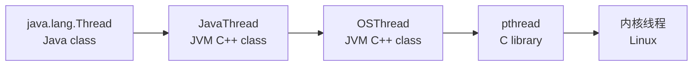
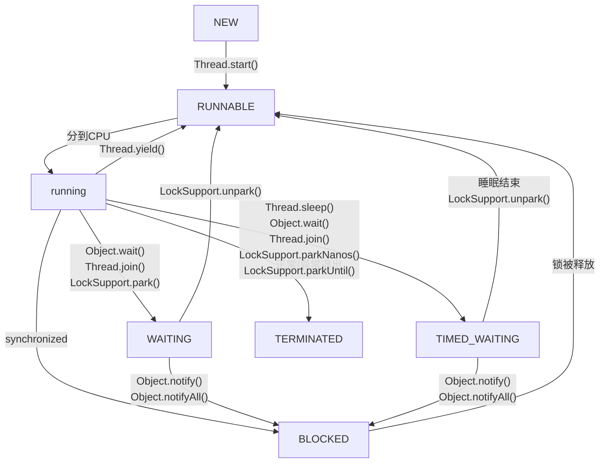

参考文献：

- [《Java并发编程实战》](https://book.douban.com/subject/10484692/)

# §1 线程

Java使用`java.lang.Runnable`接口表示线程的行为，同时提供了该接口的一个实现类`java.lang.Thread`表示线程。因此，我们有两种定义线程的方式：

1. 继承`java.lang.Thread`类，并覆盖`void run()`方法。
2. 实现`java.lang.Runnable`接口，实现`void run()`方法，作为实参传入到`Thread()`的构造函数中。

```java
class MyThread1 extends Thread {  
    @Override  
    public void run() {  
        System.out.printf("[MyThread1] %s is running.\n", Thread.currentThread().getName());  
    }  
}  
  
class MyThread2 implements Runnable {  
    @Override  
    public void run() {  
        System.out.printf("[MyThread2] %s is running.\n", Thread.currentThread().getName());  
    }  
}  
  
public class JucMain {  
    public static void main(String[] args) {  
        System.out.printf("[JucMain] %s is running.\n", Thread.currentThread().getName());  
        new MyThread1().start();  
        new Thread(new MyThread2()).start();  
    }  
}
/*
	[JucMain] main is running.
	[MyThread1] Thread-0 is running.
	[MyThread2] Thread-1 is running.
*/
```

JVM对线程的抽象如下图所示：



## §1.1 线程状态

Java将线程的状态分为以下六种：

```java
public enum java.lang.Thread::State {
	NEW, /* NEW类别 */
	RUNNABLE, /* RUNNABLE类别和RUNNING类别 */
	BLOCKED, WAITING, TIMED_WAITING, /* NOT RUNNABLE类别 */
	TERMINATED; /* TERMINATED类别 */
}
```

1. `NEW`：新建状态。线程被创建但未启动。
2. `RUNNABLE`：可运行状态或运行状态。可运行状态表示线程被放入线程池中，等待CPU执行；运行状态表示线程正在运行。Java将`RUNNABLE`和`RUNNING`统称为`RUNNABLE`，**这是因为Java层无法感知线程处于两种状态的哪一种**。
3. `BLOCKED`：阻塞状态。线程被`synchronized`锁阻塞，放弃分配CPU并进入等待队列。例如I/O、主动睡眠、锁竞争等情况。
4. `WAITING`：等待状态。线程释放对象锁并进入等待队列。
5. `TIMED_WAITING`：计时等待状态。线程释放对象锁并进入等待队列。
6. `TERMINATED`：死亡状态。线程正常结束或异常退出。



## §1.2 线程优先级

Java规定了线程的优先级范围`[1, 10]`，提供了优先级的相关常量。

```java
public class Thread implements Runnable {
	// ...
	public static final int MIN_PRIORITY = 1;  
	public static final int NORM_PRIORITY = 5;  
	public static final int MAX_PRIORITY = 10;
	// ...
}
```

JVM会根据平台规范映射到操作系统对应的优先级区间（例如[Windows的优先级范围](https://learn.microsoft.com/zh-cn/windows/win32/api/processthreadsapi/nf-processthreadsapi-setthreadpriority)是`{-15,-2,-1,0,1,2,15,65536,131072}`，[Linux的优先级范围](https://github.com/torvalds/linux/blob/155a3c003e555a7300d156a5252c004c392ec6b0/include/linux/sched.h#L1897-L1906)是`[-20,19]`）。具体来说，JVM会根据`java_to_os_priority`数组进行映射。以[OpenJDK](https://github.com/openjdk/jdk/blob/bf225c201f00f3a478b51c3cf045759b66899684/src/hotspot/os/linux/os_linux.cpp#L3949)为例：

```cpp
/* /jdk/src/hotspot/os/linux/os_linux.cpp */
int os::java_to_os_priority[CriticalPriority + 1] = {
	19,  // 0 Entry should never be used
	4,   // 1 MinPriority
	3,   // 2
	2,   // 3
	1,   // 4
	0,   // 5 NormPriority
	-1,  // 6
	-2,  // 7
	-3,  // 8
	-4,  // 9 NearMaxPriority
	-5,  // 10 MaxPriority
	-5   // 11 CriticalPriority
};

/* /jdk/src/hotspot/os/windows/os_windows.cpp */
int os::java_to_os_priority[CriticalPriority + 1] = {
    THREAD_PRIORITY_IDLE,          // 0  Entry should never be used
    THREAD_PRIORITY_LOWEST,        // 1  MinPriority
    THREAD_PRIORITY_LOWEST,        // 2
    THREAD_PRIORITY_BELOW_NORMAL,  // 3
    THREAD_PRIORITY_BELOW_NORMAL,  // 4
    THREAD_PRIORITY_NORMAL,        // 5  NormPriority
    THREAD_PRIORITY_NORMAL,        // 6
    THREAD_PRIORITY_ABOVE_NORMAL,  // 7
    THREAD_PRIORITY_ABOVE_NORMAL,  // 8
    THREAD_PRIORITY_HIGHEST,       // 9  NearMaxPriority
    THREAD_PRIORITY_HIGHEST,       // 10 MaxPriority
    THREAD_PRIORITY_HIGHEST        // 11 CriticalPriority
};
```

开发者可以读取和更改`Thread`的优先级：

```java
class MyThread extends Thread {
    @Override
    public void run() {
        int count = 0;
        for (int i = 0 ; i < 100000000; ++i) {
            ++count;
        }
        System.out.printf("[%s] Finished. Priority: %d\n", this.getName(), this.getPriority());
    }
}

public class JucMain {
    public static void main(String[] args) {
        Thread thread1 = new MyThread(); thread1.setPriority(Thread.MIN_PRIORITY);
        Thread thread2 = new MyThread(); // thread2.setPriority(Thread.NORM_PRIORITY);
        Thread thread3 = new MyThread(); thread3.setPriority(Thread.MAX_PRIORITY);
        thread1.start(); thread2.start(); thread3.start();
    }
}
/*
	[Thread-2] Finished. Priority: 10
	[Thread-0] Finished. Priority: 1
	[Thread-1] Finished. Priority: 5
*/
```

## §1.3 线程操作

### §1.3.1 谦让

`Thread.yield()`表示当前线程放弃CPU的使用权，并加入到队列末尾。

```java
public class JucMain {
    public static void main(String[] args) {
        Thread thread = new Thread(() -> {
            while (true) {
                System.out.println("yield cpu time");
                Thread.yield();
            }
        });
        thread.setDaemon(true);
        thread.start();
        
        for (int i = 0; i < 5; i++) {
            System.out.println("main thread");
        }
    }
} /* 可以观察到，当主线程输出时，子线程几乎不输出 */
```

### §1.3.2 睡眠

`Thread.sleep(long)`表示使得当前线程睡眠`long`毫秒时间。特殊地，传入`0`时等价于`Thread.yield()`。`Thread.sleep()`不会释放锁（但是`Object.wait()`会释放）：

```java
public class JucMain {
    public static void main(String[] args) {
        Object lock = new Object();

        Thread thread1 = new Thread(() -> {
            synchronized (lock) {
                System.out.printf("[%s] Get the lock.\n", Thread.currentThread().getName());
                try { Thread.sleep(1000); } catch (InterruptedException e) { e.printStackTrace(); }
                System.out.printf("[%s] Release the lock.\n", Thread.currentThread().getName());
            }
        });
        Thread thread2 = new  Thread(() -> {
            System.out.printf("[%s] Waiting for the lock...\n", Thread.currentThread().getName());
            synchronized (lock) {
                System.out.printf("[%s] Get the lock.\n", Thread.currentThread().getName());
            }
        });

        thread1.start();
        thread2.start();
    }
}
/*
	[Thread-0] Get the lock.
	[Thread-1] Waiting for the lock...
	[Thread-0] Release the lock.
	[Thread-1] Get the lock.
*/
```

### §1.3.3 中断

Java使用中断变量来实现中断机制，若该`bool`型中断变量为`true`，则线程抛出异常后进入异常处理逻辑作为中断入口。

以下是使用自定义中断变量模拟Java中断机制的一个伪代码例子：

```java
class MyThread extends Thread {  
    private volatile  boolean isInterrupted = false;  
    public void interrupt() {  
        isInterrupted = true;  
    }  
    public void run () {  
        while (!isInterrupted) {  
            Thread.yield();  
        }  
        System.out.printf("[%s] is interrupted.\n", Thread.currentThread().getName());  
    }  
}  
  
public class JucMain {  
    public static void main(String[] args) throws InterruptedException {  
        MyThread thread = new MyThread();  
        thread.start();  
  
        Thread.sleep(100);  
        thread.interrupt(); /* 执行后输出 [Thread-0] is interrupted. */
    }  
}
```

事实上，Java已经为我们提供了这个中断变量`interrupted`，以及相关中断触发函数：

```java
public class Thread implements Runnable {
	// ...
	volatile boolean interrupted;
	// ...
	public void interrupt() { /* Setter(设置为true)，并根据子线程进行后续操作 */
        interrupted = true;
        interrupt0();
        if (this != Thread.currentThread()) {
            Interruptible blocker;
            synchronized (interruptLock) {
                blocker = nioBlocker;
                if (blocker != null) {
                    blocker.interrupt(this);
                }
            }
            if (blocker != null) {
                blocker.postInterrupt();
            }
        }
    }
	public static boolean interrupted() { /* 先Getter再Setter(设置为false) */
	    return currentThread().getAndClearInterrupt();
	}
	public boolean isInterrupted() { /* Getter */
	    return interrupted;
	}
	final void setInterrupt() { /* Setter(设置为true) */
	    if (!interrupted) {
	        interrupted = true;
	        interrupt0();
	    }
	}
	final void clearInterrupt() { /* Setter(设置为false) */
	    if (interrupted) {
	        interrupted = false;
	        clearInterruptEvent();
	    }
	}
	boolean getAndClearInterrupt() { /* 先Getter再Setter(设置为false) */
	    boolean oldValue = interrupted;
	    if (oldValue) {
	        interrupted = false;
	        clearInterruptEvent();
	    }
	    return oldValue;
	}
}
```

#### §1.3.3.1 手工实现

对于`RUNNABLE`状态的线程，我们可以使用`while(!Thread.currentThread().isInterrupted())`循环监测是否触发中断：

```java
public class JucMain {
    public static void main(String[] args) throws InterruptedException {
        Thread thread = new Thread(() -> {
            while(!Thread.currentThread().isInterrupted()) {
                Thread.yield();
            }
            System.out.printf("[%s] is interrupted.\n", Thread.currentThread().getName());
        });
        thread.start();

        Thread.sleep(100);
        thread.interrupt(); /* 执行后输出 [Thread-0] is interrupted. */
    }
}
```

对于`BLOCKED`/`WAITING`/`TIMED_WAITING`状态的线程，我们可以捕获中断异常`java.lang.InterruptedException`来监测是否触发中断：

```java
public class JucMain {
    public static void main(String[] args) throws InterruptedException {
        Thread thread_join = new Thread(() -> {
            try {
                Thread.currentThread().join();
            } catch (InterruptedException e) {
                System.out.printf("[%s] is interrupted.\n", Thread.currentThread().getName());
            }
        });
        Thread thread_synchronized = new Thread(() -> {
            try {
                Object lock = new Object();
                synchronized (lock) {
                    lock.wait();
                }
            } catch (InterruptedException e) {
                System.out.printf("[%s] is interrupted.\n", Thread.currentThread().getName());
            }
        });

        thread_join.start(); thread_join.interrupt(); /* [Thread-0] is interrupted. */
        thread_synchronized.start(); thread_synchronized.interrupt(); /* [Thread-1] is interrupted. */
    }
}
```

综合以上两种情况，就是Java中的经典的手工中断实现方式：

```java
public class JucMain {
    public static void main(String[] args) throws InterruptedException {
        Thread thread = new Thread(() -> {
            while(!Thread.currentThread().isInterrupted()) {
                try {
                    Thread.sleep(100);
                } catch (InterruptedException e) {
                    System.out.printf("[%s] is interrupted during TIMED_WAITING state.\n", Thread.currentThread().getName());
                }
            }
            System.out.printf("[%s] is interrupted during RUNNING state.\n", Thread.currentThread().getName());
        });
        thread.start();
        // Thread.sleep(10); // 增加/不增加这一行，提高输出TIMED_WAITING/RUNNING的概率
        thread.interrupt();
    }
}
/*
	输出以下两种情况的某一种：
	[Thread-0] is interrupted during RUNNING state.
	[Thread-0] is interrupted during TIMED_WAITING state.
*/
```

#### §1.3.3.2 `LockSuppor.park()`实现

`java.util.concurrent.locks.LockSupport.park()`会让当前线程进入一种特殊的阻塞状态。在这种状态下，当前线程已经设置了中断变量，但是之后外界调用其`Thread.interrupt()`时不会触发`InterruptedException`异常，并使得当前线程切换回`RUNNABLE`状态，之后执行后续命令作为中断入口：

```java
public class JucMain {
    public static void main(String[] args) throws InterruptedException {
        Thread thread = new Thread(() -> {
            System.out.printf("[%s] is running\n", Thread.currentThread().getName());
            System.out.printf("[%s] is waiting by LockSupport.pork()\n", Thread.currentThread().getName());
            LockSupport.park();
            System.out.printf("[%s] is interrupted\n", Thread.currentThread().getName());
        });
        thread.start();
        Thread.sleep(10);
        thread.interrupt();
    }
}
/*
	[Thread-0] is running
	[Thread-0] is waiting by LockSupport.pork()
	[Thread-0] is interrupted
*/
```

### §1.3.4 阻塞与唤醒

阻塞与唤醒用于控制并发编程中的时序逻辑。考虑一种情景：我们使用`String message = null`变量在线程A和线程B之间共享数据，线程A负责写入，线程B负责读取。然而两个线程同时启动时，有可能出现线程B未写入的情况，这导致线程A读取到`null`值，引发预期外行为：

```java
public class JucMain {
    private static String message;
    public static void main(String[] args) throws InterruptedException {
        Thread thread_write = new Thread(() -> {
            message = "Hello World";
        });
        Thread thread_read = new Thread(() -> {
            System.out.printf("[%s] Read the message: %s\n", Thread.currentThread().getName(), message);
        });

        thread_read.start(); thread_write.start();
    }
}
```

这使得我们需要审慎地考虑时序逻辑。Java为此提供了多种阻塞与唤醒的机制。

#### §1.3.4.1 `Thread.suspend()/resume()`

`thread.suspend()`用于使线程陷入阻塞状态，`thread.resume()`用于使线程恢复运行状态。**这意味着一个线程调用自己的`resume()`陷入阻塞后，永远不能唤醒自己，必须由其他线程唤醒**。

针对上例，对于`Thread.suspend()`与`Thread.resume()`，我们可以对读线程加入非`null`判断，如果读到`null`，就用`Thread.suspend()`阻塞读线程自己；让写线程写入后调用读线程的`Thread.resume()`使其恢复运行：

```java
public class JucMain {
    private static volatile String message;
    private static Thread thread_write = new WriteThread();
    private static Thread thread_read = new ReadThread();
    static class WriteThread extends Thread {
        @Override
        public void run () {
            message = "Hello World";
            thread_read.resume();
        }
    }
    static class ReadThread extends Thread {
        @Override
        public void run () {
            if (message == null) {
                suspend();
            }
            System.out.printf("[%s] Read the message: %s\n", Thread.currentThread().getName(), message);
        }
    }
    public static void main(String[] args) throws InterruptedException {
        thread_read.start(); thread_write.start();
    }
}
```

该方法于Java 1.0被引入，于Java 1.2被移除。经实际工程证明，这种方案极易引发死锁问题。例如下面的伪代码——

```java
Thread thread = new Thread(() -> {
	while(true) {
		System.out.println("..."); /* 获取System.out同步锁 */
	}
});
thread.start();
thread.suspend(); /* 阻塞子线程，但是不释放子线程的锁 */
System.out.println("..."); /* 尝试获取System.out同步锁，从而永远在这里阻塞 */
thread.resume(); /* 无法执行这一步，主线程和子线程均陷入死锁 */
```

#### §1.3.4.1 `Object.wait()/notify()`

容易发现，`Thread.suspend()/resume()`之所以会产生死锁问题，是因为`Thread.suspend()`不释放任何锁。基于此，Java提出了一种新的阻塞与唤醒范式，旨在使得线程阻塞时释放锁。为此，该**方案要求与`synchronized`配合使用，且`synchronized`获取的对象锁与`Object.wait()/notify()`调用的是同一个对象**。

```java
synchronized (对象A) { // 获取对象A的对象锁
	// ...
	对象A.wait(); // 及时释放对象A的对象锁，从而缓解死锁问题
}
```

Java给每个`Object`对象锁维护一个等待队列。`Object.wait()`会尝试释放当前线程早已在`synchronized`获取的对象锁，并加入到该对象锁`Object`的等待队列中，将当前线程设置为`WAITING`状态。`Object.notify()`会从其等待队列中随机选择一个线程，使其从`WAITING`状态转变为`BLOCKED`状态，从而使其一直尝试抢占锁。


- `wait()`与`notify()`
- `park()`与`unpark()`


加锁机制既可以确保可见性又可以确保原子性,而 volatile 变量只能确保可见性。