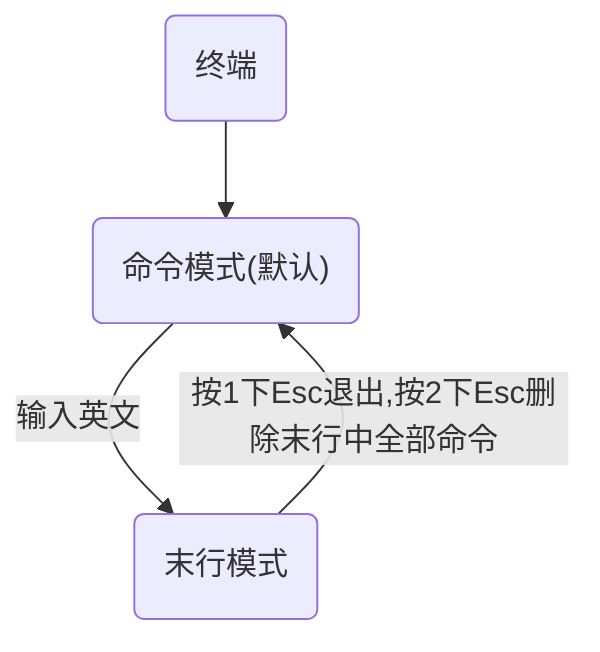

# Linux

# §1 文件系统

- /bin 全称binary，存储二进制文件
- /dev 存放外接设备，例如硬盘、光盘等，但不能直接使用，需要先挂载（Windows需要先分配盘符）
- /etc 存放配置文件
- /home 存放除root以外的账户个人文件（相当于Windows中的C:\Users）
- /proc 全称process，存储Linux运行时的进程
- /root 存放root账户的个人文件
- /sbin 全称super binary，存放二进制文件，但是必须得有super权限的账户才能执行
- /temp 全称temporary，存放临时文件（相当于Windows中的C:\WINDOWS\temp）
- /usr 存放用户安装的软件（相当于Windows中的C:\Program files）
- /var 存放日志文件

# §2 指令

## §2.1 基础指令

### §2.1.1 ls

列出当前目录下所有文件和文件夹的名称。

> 相对路径：“./”表示当前目录（可省略），"../"表示上一级目录
>
> 绝对路径：以“/”开头，表示从根目录开始找

```shell
ls			 //当前路径
			 //蓝色→文件夹，黑色→文件，绿色→其权限为所有权限
ls [路径]		//指定路径
ls -a		 //同时显示隐藏文件和文件夹
ls -l		 //以列表形式详细展示，第一列表示权限
			 //第一列第一个字符表示文档类型，"-"→文件，"d"→文件夹，"l"→快捷方式
			 //第三列、第四列标注文件/文件夹分别属于哪个用户和用户组
			 //第五列表示文件字节
			 //第六七八表示修改时间
			 //第九列表示文件名/文件夹名
ls -lh       //-l且显示文件大小时优化显示单位（-h单独用无效，因为没有-l，不显示大小）
ls -[a][l][h]//效果叠加，顺序随意
```

### §2.1.2 pwd

全名：print working directory，打印当前工作目录。

```shell
pwd			 //没有参数
```

### §2.1.3 cd

切换当前工作目录的路径。

```shell
cd 路径	    //切换路径
cd ~		 //切换到当前用户的家目录
cd			 //切换到当前用户的家目录
```

### §2.1.4 mkdir

全称：make directory，创建目录。

```shell
mkdir 路径    			//创建文件夹
mkdir -p 路径				//创建多层文件夹目录树，例如mkdir -p test/a/b/c
mkdir 路径1 路径2 路径3 ...//创建多个文件夹
```

### §2.1.5 touch

创建文件。

```shell
touch 路径				//创建文件，其中路径的上层路径必须存在
touch 路径1 路径2 路径3 ...//创建多个文件
```

### §2.1.6 cp

全称：copy，复制文件/文件夹。

```shell
cp 被复制路径 复制到路径 	   //复制文件，例如cp 1.txt 2.csv，例如
cp -r 被复制路径 复制到路径  //复制文件夹，例如cp folder1/ folder2/，亲测也可以不带"/"
```

### §2.1.7 mv

全称：move，移动文件/文件夹，也可重命名。

```shell
mv 被移动路径 移动到路径	   //移动文件
mv 被移动路径 移动到路径     //移动文件夹，不需要加"-r"
```

### §2.1.8 rm

全称：remove，删除文件/文件夹。

```shell
rm 路径					//删除文件
rm 路径1 路径2 路径3 ...	 //删除多个文件
rm -f 路径    		    //"-f"表示force，强制删除且不提示
rm -r 路径	    		//删除文件夹
rm -r 路径/*				//只删除文件夹下的所有文件， 
rm -rf 路径				//“-r”+"-f"效果叠加，可以批量删除文件和文件夹
rm -f linux*			 //删除所有以"linux"为开头的文件
```

### §2.1.9 vim

vim是一款文本编辑器。

```shell
vim 文件路径			  //打开一个文件，无论是否存在
```

### §2.1.10 输出重定向

将终端的输出结果保存到文件中。

```shell
ls -la > 路径			    //">"表示覆盖输出
ls -la >> 路径			//">>"表示追加输出
```

### §2.1.11 cat

直接打开文件，或对多个文件进行合并输出。（经常配合输出重定向使用）

```shell
cat 文件路径			   //直接打开文件，不受terminal端的字符行列数限制，一次性全部输出
cat 文件路径1 文件路径2...  //对多个文件进行合并输出
```

## §2.2 进阶指令

### §2.2.1 df

查看磁盘的空间。

```shell
df						  //显示磁盘空间，单位为b
df -h					  //显示磁盘大小时优化显示单位
```

### §2.2.2 free

查看内存使用情况。

```shell
free					  //显示内存空间，单位为b
free -m					  //显示内存空间时以Mb为单位
free -g					  //显示内存空间时以Gb为单位
```

### §2.2.3 head

查看一个文件的前n行，n缺省值为10。

```shell
head 文件路径			    //输出文件的前10行
head -n 文件路径			//输出文件的前n行
```

### §2.2.4 tail

查看一个文件的后n行，n缺省值为10，或查看一个文件的动态变化，但是**变化的内容不能是用户手动编辑的。**

```shell
tail 文件路径				//输出文件的后10行
tail -n 文件路径			//输出文件的后n行
tail -f 文件路径			//实时输出文件在tail打开后被追加写入的数据
```

### §2.2.5 less

查看文件，以较少的内容进行输出，并能通过数字+回车 空格键 上下 以翻页，通过q键退出。

```shell
less 文件路径				//查看文件
```

### §2.2.6 wc

统计文件信息，包括行数，单词数，字节数。

```shell
wc -l 文件路径				//统计line（行数）
wc -w 文件路径				//统计word（单词数），依据空格来统计
wc -c 文件路径				//统计字节数
```

### §2.2.7 date

操作时间和日期。

```shell
date					   //输出当前时间，例如2021年6月27日 星期日 12:55:40
date +%F				   //只输出年月日，例如2021-06-27
date "%Y-%m-%d"			   //只输出年月日，例如2021-06-27
date "%y-%m-%d"			   //只输出年月日，例如21-06-27
date "+%F %T"			   //输出年月日和时间，例如2021-06-27 12:55:40
date "+%Y-%m-%d %H:%M:%S"  //输出年月日和时间，例如2021-06-27 12:55:40
date -d "-1 day" "+%F %T"  //输出一天前的时间
date -d "+1 year" "+%F %T" //输出一年后的时间
						   //包括day，month，year
```

### §2.2.8 cal

操作日历。

```shell
cal						   //在命令行中画出当前月份的日历
cal -3					   //在命令行中画出上个月、当前月、下个月的日历
cal -y 2021				   //在命令行中画出2021年的日历
cal -m					   //以星期一作为第一列
```

### §2.2.9 clear/Ctrl+L

清屏。（把之间的输出顶到了屏幕的最上边）

```shell
clear						//清屏
```

### §2.2.10 管道符“|”

用于过滤、扩展处理、和特殊用途。

```shell
ls | grep y					//筛选当前目录下包含"y"字符的文件/文件夹
cat 文件路径 | less			 //等价于less 文件路径
ls | wc -l					//查看当前目录下的文件/文件夹个数
```

## §2.3 高级指令

### §2.3.1 hostname

操作服务器主机名。

```shell
hostname					//输出完整的主机名
hostname -f 				//输出主机名中的FQDN（全限定域名）
```

### §2.3.2 id

查看一个用户的基本信息，例如用户id、用户组id、附加组id等，缺省值为当前帐户。

```shell
id							//显示该用户基本信息
id 用户名					  //显示制定用户的基本信息
							//信息存放在/etc/passwd中
```

### §2.3.3 whoami

显示当前登录的用户。

```shell
whoami						//显示当前登录的用户
```

### §2.3.4  ps

查看进程信息。

```shell
ps							//查看服务器进程信息（Windows中的任务管理器）
ps -A						//列出全部的进程（增加行）
ps -e						//列出全部的进程（增加行）
ps -f						//列出全部的信息（增加列）
							//UID:用户id
							//PID:进程id
							//PPID:父级进程id（谁调用的该进程）
							//C:CPU占用率，单位为%
							//STIME:进程启动时间
							//TTY:终端设备（哪个终端发起的）
							//TIME:进程的执行时间
							//CMD:进程的名称或对应的路径
```

### §2.3.5 top

查看进程所占的资源。

```shell
top							 //动态显示，按下q退出
							 //PR:优先级
							 //VIRT:虚拟内存
							 //RES:常驻内存
							 //SHR:共享内存
							 //实际占用内存=RES-SHR
							 //S:表示运行的状态，S→sleeping→睡眠，R→running→运行
							 //COMMMAND:进程的名称或对应的路径
快捷键:M→按内存占用进行降序排列
	  P→按CPU占用进行降序排列
	  1→显示多个CPU的占用情况
```

### §2.3.6 du

统计文件夹大小。

```shell
du [文件夹路径]					//查看目录树中所有文件/文件夹的大小
du -s						   //只显示下一层文件/文件夹汇总的大小
du -sh						   //"-s"与调整单位效果叠加
```

### §2.3.7 find

寻找文件。

```shell
find 文件路径 -name 文件名称	  //“文件路径”可以包含通配符
find 文件路径 -type 文件类型	  //“文件类型”包括："f"→文件，“d”→文件夹
```

### §2.3.8 service

控制软件服务的启动、停止和重启。

```shell
service 服务名 start			 //启动服务
service 服务名 stop 			 //停止服务
service 服务名 restart			 //重启服务
```

### §2.3.9 kill/killall

关闭进程。

```shell
kill 进程PID					  //关闭指定PID的进程
killall 进程名称				 //关闭指定名称的进程
```

### §2.3.10 ifconfig

查看网卡信息。

```shell
ifconfig					    //查看网卡信息
```

### §2.3.11 reboot

重启系统。

```shell
reboot							//重启系统
reboot -w						//模拟重启，仅向系统写日志，但是实际不重启
```

### §2.3.12 shutdown

关闭系统。

```shell
shutdown -h now					//立即关机
shutdown -h 12:25				//12:25时定时关机
shutdown -h 12:35 ["关机提示"]   //设置关机提示
shutdown -c						//取消关机
```

### §2.3.13 uptime

输出计算机从开机的正常运行时间。

```shell
uptime							//输出计算机从开机的正常运行时间
```

### §2.3.14 uname

获取系统信息。

```shell
uname							//输出系统名称
uname -a						//输出详细的系统信息，包括系统版本，发行时间，内部build版本号
```

### §2.3.15 netstat

查看网络的连接状态。

```shell
netstat -tnlp					//"-t"只列出tcp协议的连接
								//"-n"将环境变量转化成IP地址，协议转化成端口号来显示
								//"-l"过滤出state中值为LISTEN的连接
								//"-p"显示发起连接的进程pid和名称
								//"-a"全部
```

### §2.3.16 man

全称为manual，包含了linux中全部命令。

```shell
man 命令						   //查询命令的用法
```

### §2.3.17 ln

创建快捷方式/软链接。

```shell
ln -s 文件原位置 快捷方式保存位置	//创建快捷方式
```

### §2.3.18 lsblk

查看块状设备的挂载情况，包括光盘、硬盘。

```shell
lsblk
```

### §2.3.19 mount/umount

挂载/取消挂载。

```shell
umount 文件夹路径				 //取消挂载
mount 设备原始地址 挂载路径		  //挂载设备
								//设备原始地址在/dev中，名称为lsblk显示的名称，以文件形式存在
								//挂载路径按习惯为/mnt/SomeFolder
```

### §2.3.20 tar

解压压缩包。

```shell
tar -zxvf *.tar.gz				//"-z"→--gzip或--ungzip
tar -zxvf *.tar.bz2				//"-j"→bzip2
								//"-x"→--extract或--get
								//"-v"→显示操作过程
								//"-f"→指定一个文件
```


## §2.4 练习题

### §2.4.1 在命令行书快速删除光标前/后的内容

光标前：Ctrl+U

光标后：Ctrl+K

### §2.4.2 查看系统最后创建的3个用户

```shell
tail -3 /etc/passwd
```

# §3 Vim

## §3.1 打开文件

```shell
vim 文件路径					   //打开文件
vim +数字 文件路径				  //打开文件，同时将光标移动到指定行
vim +/字符串 文件路径				 //打开文件，并且高亮显示关键词
vim 文件路径1 文件路径2 文件路径3...  //同时打开多个文件
```

## §3.2 三种模式




### §3.2.1 命令模式

打开Vim后默认进入的模式。

- Shift+6：将光标移动到行首
- Shift+4：将光标移动到行尾
- gg：将光标移动到首行
- G / Shift+g：将光标移动到尾行
- PgUp / Ctrl+B：向上翻屏
- PgDown / Ctrl+F：向下翻屏
- yy：复制光标所在行
- 数字 yy：复制光标所在行的下n行，包括本行
- Ctrl+v：选中区块
- p：在光标所在行的下一行粘贴
- dd：剪切/删除光标所在行，然后下一行上移
- 数字 dd：剪切/删除光标所在行的下n行，包括本行，然后下一行上移
- D：剪切/删除光标所在行，下一行不上移
- :u / u：撤销
- Ctrl+r：恢复
- 数字 G：将光标移动到指定的行
- 数字 ↑：将光标向上移动n行
- 数字 ↓：将光标向下移动n行
- （末行模式）:数字：移动到指定的行
- 数字 ←：光标向左移动n个字符
- 数字 →：光标向右移动n个字符

### §3.2.2 末行模式/尾行模式

在命令模式按下``:``进入，按下``Esc``，``Esc Esc``或删除``:``退出。

- `:w`：保存文件
- `:w` 路径：另存为
- `:q`：退出
- `:wq`：保存并退出
- `:q!`：强制退出，但不保存
- `:!外部命令`：调用外部命令
- `/关键词 `：搜索关键词，按`N`或`n`切换至上一个/下一个搜索结果
- `:nohl`：取消高亮
- `:s/搜索的关键词/新的内容`：替换光标所在行的第一处符合条件的字符串
- `:s/搜索的关键词/新的内容/g`：替换光标所在行的所有符合条件的字符串
- `:%s/搜索的关键词/新的内容`：替换整个文件中所有行的第一处符合条件的字符串
- `:%s/搜索的关键词/新的内容/g`：替换整个文件中的所有符合条件的字符串
- `:set nu`：显示行号
- `:set nonu`：不显示行号
- `:files`：显示Vim当前打开的文件，`%a`→当前正在查看的文件，`#`→上一个打开的文件
- `:open 文件名`：在当前打开的文件中切换至指定的文件
- `:bn / :bp`：在当前打开的文件中切换至上一个/下一个文件

### §3.2.3 编辑模式/输入模式

在命令模式下按下`a`或`i`进入编辑模式，按`Esc`退出。

## §3.3 实用功能

### §3.3.1 代码着色

```shell
:syntax	on						//开启代码着色
:syntax off						//关闭代码着色
```

### §3.3.2 计算器

先按下`Ctrl+R`，再输入`=要计算的表达式`，然后按下`Enter`。

### §3.3.3 配置文件

#### §3.3.3.1 个人配置文件(~/.vimrc，如果没有则自行创建)

```shell
set nu 							//设置行号
//......
```

#### §3.3.3.2 全局配置文件(/etc/vim/vimrc)

两个配置文件冲突时，以个人配置文件为准。

### §3.3.4 异常退出

terminal强制关闭时，`.swp`（交换文件）会导致Vim输出错误提示，删除即可。

### §3.3.5 别名机制

依靠一个别名映射文件(~/.bashrc，创建自定义命令，创建后需要重新登录当前用户才能生效。

```shell
alias cls="clear"				//添加"cls"命令，等效于"clear"
```

### §3.3.6 退出方式

`:x`：文件未修改时等价于`:q`，文件已修改时等价于`:wq`

> `:wq`会使文件修改时间被更改。
>
> `:W`会加密文件，解密时只需设置空密码即可。

# §4 自有服务

## §4.1 运行模式/运行级别

系统的`init`进程的配置文件存放路径为`/etc/inittab`（仅`Red-Hat`系有，`Ubuntu`没有）

- `0`：关机级别
- `1`：单用户模式
- `2`：多用户模式，不带NFS（Network File System），不能联网
- `3`：多用户模式
- `4`：没有使用的模式（保留模式）
- `5`：X11，完整的图形界面模式
- `6`：重启级别

```shell
sudo init 0							//关机
sudo init 3							//切换到纯命令行模式
sudo init 5							//切换到图形界面
sudo init 6							//重启
```

更改默认启动模式：

```shell
/etc/inittab
============================
id:数字:initdefault				   //数字含义与上述7种模式对应
```

## §4.2 用户和用户组管理

`/etc/passwd`：存储用户的信息

> `someusers:x:500:500::/home/someusers:/bin/bash`
>
> 用户名:密码(x仅表示占位):用户ID:用户主组ID:注释:家目录:解释器shell

`/etc/group存储`：存储用户组的信息

> `someuser:x:68:childuser`
>
> 用户组名:密码:用户组ID:组内用户

`/etc/shadow`：存储用户的密码

### §4.2.1 用户管理

添加用户：

```shell
useradd 选项 用户名					 //添加用户
									//"-g"→指定用户主组（id或组名）
									//"-G"→指定用户附加组（id或组名）
									//"-u"→用户的标识符UID，默认从500之后分配
									//"-c"→添加注释
```

修改用户：

```shell
usermod 选项 用户名					 //"-g"→修改用户主组（id或组名）
									//"-G"→修改用户附加组（id或组名）
									//"-u"→修改的标识符UID，默认从500之后分配
									//"-l"→修改用户名，如usermod -l newstr oldstr
									//"-s 路径"→修改默认Shell
```

设置密码：

```shell
passwd [用户名]					  //进入修改密码的流程中，用户名缺省值为当前账户
```

切换当前登陆用户：

```shell
su [用户名]						  //切换至指定用户，用户名缺省值为root
```

删除用户：

```shell
userdel 选项 用户名					 //删除指定用户
									//"-r"→同时删除其家目录
ps -ef|grep 用户名
kill 用户名对应进程的父级进程的id		//强制关闭正在运行的用户
```

### §4.2.2 用户组管理

添加用户组：

```shell
groupadd 选项 用户组名				//"-g"→设置用户组id，默认从500开始排
```

编辑用户组：

```shell
groupmod 选项 用户组名				//"-g"→修改用户组id
									//"-n"→修改用户组名称
```

删除用户组：

```shell
groupdel 用户组名					 //删除指定名称的用户组
								    //当这个组是某个用户的主组时，则不允许删除
```

## §4.3 网络设置

网络配置信息保存在`/etc/sysconfig/net`(Red-hat)或`/etc/network/interfaces`(Ubuntu)，以`if-c`

`fg-网卡名称`命名。

- ONBOOT：开启开机启动
- BOOTPROTO：IP地址分配方式
- HWADDR：MAC地址

```shell
service network start				//重启网络服务
/etc/init.d/network restart			//重启网络服务
ifdown 网卡名						  //关闭指定的网卡
ifup 网卡名						  //启用指定的网卡
```

## §4.4 SSH服务

全称Service shell（安全外壳协议），用于做远程连接和远程传输，默认使用22端口，配置文件存储在`/etc/ssh/ssh_config`。

```shell
service sshd start/stop/restart		//注意是sshd！
/etc/init.d/sshd start/stop/restart //
```

### §4.4.1 远程终端

Xshell、SecureCRT、Putty等软件。

### §4.4.2 filezilla

可视化文件传输工具filezilla，最好使用SFTP协议。

> 瞧不起Xftp？瞧不起Xftp？瞧不起Xftp？瞧不起Xftp？瞧不起Xftp？:sweat_smile:

### §4.4.3 pscp

命令行文件传输工具pscp。

```shell
//windows shell
C:\>pscp 选项 用户名@linux 主机地址:资源路径 windows本地地址		//下载到win
C:\>pscp 选项 资源路径 用户名@linux 主机地址:远程路径			//上传到linux
C:\>pscp 选项 -ls 用户名@linux 主机地址						 //列出远程路径目录树
```

> 瞧不起wget？瞧不起wget？瞧不起wget？瞧不起wget？瞧不起wget？:sweat_smile:

## §4.5 设置主机名

```shell
hostname 主机名						//临时设置主机名，重启后恢复原状
su									  //刷新终端，显示新设置的主机名
vim /etc/sysconfig/network			  //永久设置主机名，修改HOSTNAME字段即可，不加引号
vim /etc/hosts						  //更新FQDN，将新主机名绑定到回环口127.0.0.1
									  //在对应行后面+空格+新主机名，重启后生效
```

## §4.6 chkconfig

编辑开机启动项。（Red-Hat限定）

```shell
chkconfig --list					  //显示在对应的启动级别下，各项服务的自启动情况
chkconfig --del 服务名					//删除该服务所有启动级别下的的启动项，并从列表移出
chkconfig --add 服务名					//将服务移入列表，但所有级别下均不能运行
chkconfig --level 连续的数字 服务名 on   //设置该服务在连续数字对应的启动级别下运行
chkconfig --level 连续的数字 服务名 off  //设置该服务在连续数字对应的启动级别下关闭
```

## §4.7 ntp

对计算机的时间进行同步管理操作。

### §4.7.1 手动同步

```shell
ntpdate 时间服务器的ip或域名 
```

### §4.7.2 自动同步

```shell
service ntpd start
/etc/init.d/ntpd start
```

## §4.8 防火墙服务

防范网络攻击。

- ipatables（Centos 6.x）
- firewalld（Centos 7.x）

```
service iptables start/stop/restart	   //开启/停止/重启iptables服务
/etc/init.d/iptables start/stop/restart//开启/停止/重启iptables服务
service iptables status				   //查看当前iptables的运行状态
									   //第一列num：序号
									   //第二列target：允许/拒绝
									   //第三列prot：协议
									   //第四列opt：选项
									   //第五列source：来源，0.0.0.0表示任何ip
									   //第六列destination：目标
iptables -L							   //以环境变量方式显示iptables运行状态
iptables -L -n						   //以点分十六进制形式显示iptables运行状态
									   //"-A"→add添加到最后，"-l"→添加到最前
									   //"-p"→协议，"--dport"→端口
									   //"-j"→指定行为结果
iptables -A INPUT -s 127.0.0.1 -d 127.0.0.1 -j ACCEPT			//允许本机连本机
iptables -A INPUT -m state --state ESTABLISHED,RELATED -j ACCEPT//允许已建立连接通行
iptables -A OUTPUT -j ACCEPT									//允许本机出站的所有请求
iptables -A INPUT -p tcp --dport 80 j ACCEPT					//允许连接80端口
iptables -A INPUT -j REJECT										//禁止其他未允许规则的访问
iptables -A FORWARD -j REJECT									//禁止其他未允许规则的访问
/etc/init.d/iptables save			   //保存当前规则，重启httpd后生效
```

## §4.9 rpm

查看、安装、卸载linux服务器上的软件包。

```shell
rpm -qa									//"-q"→查询，"-a"→全部
rpm -e 软件名							  //卸载软件包
rpm -e 软件名 --nodeps					  //强行卸载软件包，无视依赖项阻止
rpm -ivh 软件包路径						 //安装软件包，"-i"→安装，"-v"→显示进度条，"-h"以#显示进度条
```

## §4.10 cron/crontab 计划任务

按照预先设定好的时间执行任务。

```shell
crontab 选项							   //"-l"→展示计划列表，"-e"→编辑
										//"-u"→指定用户名，"-r"→删除
=============================================
crontab会打开一个/tmp/*/crontab文件，在该文件中编辑即可
分(0-59) 时(0-23) 日(1-31) 月(1-12) 周(0-7,0和7均为Sun.) 命令
"*"→取值范围中的每一个数字
"-"→表示闭区间
"/"→例如：在分的位置写"*/10"表示每10分钟执行一次
","→表示多个离散的取值
=============================================
0 0 * * * reboot						//每个月、每个周、每天的0时0分重启
10 1 * * 6,0 reboot						//每周六、周日1:10分重启
*/30 12-23 * * * reboot					//每天18:00-23:00之间每隔30分钟重启一次
```

root账户可以通过更改配置文件`/etc/cron.d`来限制用户的计划任务权限。在里面一行一个地写入不允许设置计划任务的用户名即可（黑名单）。也可更改配置文件`/etc/cron.allow`设置白名单（需要自己创建）。当白名单喝白名单冲突时，白名单优先级高。

# §5 权限

用户身份有三类：owner，group（同在一个用户组），others，root。

权限有三种：读（文件夹→目录树，文件→内容）、写、执行。

## §5.1 查看权限

使用`ls -la`或者`ll`查看文档权限属性信息。

**如果只有w而没有r，则只能用`echo "" >>`输入，无法用Vim编辑，因此尽量避免-w-或-wx。**
$$
\bold{\underbrace{\textcolor{red}{d}}\underbrace{\textcolor{blue}{rwx}}\underbrace{\textcolor{green}{r-x}}\underbrace{\textcolor{brown}{---}}}=
\begin{cases}
\bold{\textcolor{red}{d}}&文件类型
	\begin{cases}
		d→文件夹\\
		-→文件\\
		l→快捷方式\\
		s→套接字\\
	\end{cases}

\\
\bold{\textcolor{blue}{rwx}}&Owner权限\\
\bold{\textcolor{green}{r-x}}&Group权限\\
\bold{\textcolor{brown}{---}}&Others权限\\
字符含义：
	\begin{cases}
		r&read&可读\\
		w&write&可写\\
		x&exucute&可执行\\
		-&&没有对应权限\\
	\end{cases}\\
\end{cases}
$$

## §5.2 设置权限

```shell
chmod 选项 权限模式 文件/文件夹路径				//例如 chmod -R
											 //"-R"→递归操作，专用于文件夹
```

### §5.2.1 字母形式

|  选项  | 字母 |   含义   |
| :----: | :--: | :------: |
|   谁   |  u   |  Owner   |
| 哪个组 |  g   |  Group   |
| 其他人 |  o   |  Other   |
| 所有人 |  a   |   All    |
|  作用  |  +   | 增加权限 |
|  作用  |  -   | 减少权限 |
|  作用  |  =   | 确定权限 |
|  权限  |  r   |   可读   |
|  权限  |  w   |   可写   |
|  权限  |  x   |   执行   |

```
chmod u+rwx,g+rx,o+r a.txt
chmod o-r a.txt
chmod u=rwx,g=rw-,o=xr a.txt
//当三个身份中有一个有全部权限时，ls结果中的文件名会变成不同的颜色
chmod +rwx a.txt
//如果不指定`ugoa`中的任意一个，则默认为`a`
```

### §5.2.2 数字形式

| 数值 | 权限(读、写、执行) | 对应的字母形式 |
| :--: | :----------------: | :------------: |
|  0   |        000         |      ---       |
|  1   |        001         |      --x       |
|  2   |        010         |      -w-       |
|  3   |        011         |      -wx       |
|  4   |        100         |      r--       |
|  5   |        101         |      r-x       |
|  6   |        110         |      rw-       |
|  7   |        111         |      rwx       |

```
chmod 777 文件路径							//给文件赋予777(rwxrwxrwx)权限信息
```

### §5.2.3 注意事项

root用户创建的文件的默认权限信息为`rwxr-xr-x`。

`chmod 777`并不代表Other一定可以删除该文件，因为Other可能没有该文件所在文件夹的`w`权限。

### §5.2.4 属主与属组设置

属主即Owner，属组即Group。

```shell
chown [-R] user 文件/文件夹路径		  //将文件/文件夹的owner改为名为user的用户
chgrp [-R] group 文件/文件夹路径		  //将文件/文件夹的group改为名为group的用户组
chown [-R] user:group 文件/文件夹路径	  //同时更改owner和group
```

## §5.3 sudo

全程为Switch User Do，root事先允许某些用户执行哪些指令，配置文件在`/etc/sudoers`。

Vim只有`r`权限，如果要编辑，则应该用`visudo`命令打开。

```shell
visudo /etc/sudoers
=============================================
//用户名或%组名 允许登录的主机=(以谁的身份执行，all→root，该括号缺省时为all) 当前用户可以执行的命令，多个命令用","分割
root ALL=(ALL) ALL					   //root账户能执行所有命令
user1 ALL= /usr/sbin/useradd		   //允许user1使用useradd指令
									   //查看指令路径用 which 命令
user1 ALL= !/usr/bin/passwd			   //不允许user1修改其他账户的密码
user1 ALL= /usr/bin/passwd			   //允许user1修改其他账户的密码，包括root账户
user1 ALL= !/usr/bin/passwd root	   //不允许user1执行passwd root命令
```

使用`sudo`指令时需要输入的密码时当前用户的，不是root用户的。

查看普通用户所拥有的特殊权限：`sudo -l`

# §6 网络基础

## §6.1 相关命令

### §6.1.1 ping

检测当前主机与目标主机之间的连通性。

```shell
ping 主机地址(ip地址/主机名/域名)			//测试本机与主机是否联通
```

### §6.1.2 [netstat](#§2.3.15 netstat)

### §6.1.3 traceroute

查找当前主机与目标主机之间所有的网关（即路由器）。

```shell
traceroute 主机地址(ip地址/主机名/域名)	//查看沿途路由器
									   //"* * *"表示路由器未响应
```

### §6.1.4 arp

根据IP地址获取MAC地址（即物理地址）。

```
arp -a								   //查看本地arp缓存表
arp -d 主机地址							//删除主机地址对应的本地arp缓存记录
```

### §6.1.5 tcpdump

用于抓包。

```
tcpdump port 端口 [host 地址]
tcpdump -l 设备网卡名
```

# §7 Shell

- bash：默认Shell，存放于`/bin/bash`
- sh：bash的最原始版本，功能少
- zsh：最庞大的Shell，较复杂
- nologin：用户不允许登陆操作系统，存放于`/sbin/nologin`

## §7.1 脚本编写

### §7.1.1 执行脚本

```shell
test.sh
=======================================
#!/bin/bash								//必须放在第一行，指定脚本使用的Shell
										//"#"代表注释
echo "hello world!"						//分号可加可不加，单双引号均可
										//双引号支持变量引用和转义字符，但是单引号不支持
```

```shell
Terminal
=======================================
(base)root@localhost# chmod u+x test.sh 
(base)root@localhost# ./tesh.sh			//方法一
hello world!

(base)root@localhost# /bin/bash test.sh //方法二
hello world!
```

### §7.1.2 变量

与terminal中命令语法一致。

```shell
test.sh
=======================================
#!/bin/bash
name="string"							 //"="左右不能有空格，不然bash会报错找不到name指令
echo $name
time=`date +'%F %T'`				 	 //执行命令并将结果赋给变量时需要用反引号
										 //不然会将命令本身当作字符串
str1 = "123" "456"						 //字符串的连接，中间不加任何符号
echo $time
readonly fixed=10						 //创建只读变量，强行修改时会报Warning
read -p "input something" info			 //接受用户输入，将输入赋给变量，变量不需要提前定义
echo $info
unset info								 //删除变量，如果删除后强行调用变量，则返回空字符串
```

### §7.1.3 判断

```shell
test.sh
=======================================
if [condition1] 
then
	command1
elif [condition2]
then
	command2
else
	command3
fi
```

### §7.1.4 运算符

原生bash脚本不支持数学运算，但是可以通过其他的命令来实现，例如`expr`或`awk`。

**表达式和运算符中间必须有空格！**

除了变量的赋值不需要空格，其他都需要空格。

注意：*会被识别成通配符，因此乘法应该写为`\*`。

```shell
val=`expr $num1 + $num2`
val=$num
[ $a -eq $b ]								//判断两个数是否相等
[ $a -ne $b ]								//判断两个数是否不相等
[ $a -gt $b ]								//判断左边的数是否大于右边的数
[ $a -lt $b ]								//判断右边的数是否大于左边的数
[ $a -ge $b ]								//判断左边的数是否大于等于右边的数
[ $a -le $b ]								//判断右边的数是否大于等于左边的数
[ ! false ]									//返回true
[ $a -o $b ]								//或运算
[ $a -a $b ]								//与运算
[ $a = $b ]									//判断字符串a,b是否相等
[ $a != $b ]								//判断字符串a,b是否不相等
[ -z $a ]									//判断字符串a是否为空
[ -n $a ]									//判断字符串a是否不为空
[ $a ]										//判断字符串a是否不为空
[ -b $file ]								//判断文件路径a对应的文件是否为块设备文件
[ -c $file ]								//判断文件路径a对应的文件是否为字符设备文件
[ -d $file ]								//判断文件路径a对应的文件是否为目录
[ -f $file ]								//判断文件路径a对应的文件是否为普通文件
[ -g $file ]								//判断文件路径a对应的文件是否设置SGID位
[ -k $file ]								//判断文件路径a对应的文件是否设置粘着位
[ -p $file ]								//判断文件路径a对应的文件是否有名管道
[ -u $file ]								//判断文件路径a对应的文件是否设置SUID位
[ -r $file ]								//判断文件路径a对应的文件是否可读
[ -w $file ]								//判断文件路径a对应的文件是否可写
[ -x $file ]								//判断文件路径a对应的文件是否可执行
[ -s $file ]								//判断文件路径a对应的文件是否不为空文件
[ -e $file ]								//判断文件路径a对应的文件或目录是否存在
```

### §7.1.5 附带选项

```shell
test.sh a b c d ....
其中的a,b,c,d,....分别对应着脚本中可以使用的$1,$2,$3,$4,....
```

# §8 MySql

默认端口号3306。

## §8.1 lynx

一款纯命令行浏览器，需要先安装。

> 互联网真奇妙，梦回千禧年网上冲浪，捏麻麻滴太潮辣:sweat_smile:

## §8.2 MySql安装

```shell
(base)root@localhost# mysql
Enter current password for root(enter for none):		//初次登陆时root密码为空，按回车
Set root password?(Y/N)Y								//是否设置root密码，选择是
设置密码:
```

## §8.3 MySql启动控制

```shell
(base)root@localhost# service mysqld start/stop/restart

//进入MySql
(base)root@localhost# mysql -uroot -p
Enter password:
Welcome to Mysql Shell!

mysql>exit
(base)root@localhost# 
```

数据库存储目录为`/var/lib/mysql`，配置文件存放在`/etc/my.cnf`。

### §8.4 MySql基本操作

### §8.4.1 基本概念

- 数据库：整个数据库文件，等价于Excel的*.xls文件
- 数据表：等价于Excel中的worksheet
- 记录：等价于Excel中的行
- 表头：等价于Excel中的列

### §8.4.2 库操作

```mysql
mysql> show databases;							//展示所有数据库名称
mysql> create database 库名;					   //创建数据库
mysql> drop database 库名;					   //删除数据库
mysql> use 库名;								   //切换数据库
```

### §8.4.3 表操作

```mysql
mysql> use 库名;								   //选择数据库
mysql> show tables;								//显示当前数据库中的所有表名			
mysql> create table 表名称(					  //创建数据表
-> 列名称1 数据类型 [NOT NULL AUTO_INCREMENT],
-> 列名称2 数据类型,
-> 列名称3 数据类型,
-> private key（主键字段名）
-> );
mysql> desc 表名;								   //查看数据表
mysql> drop table [IF_EXISTS] 表名;			   //删除数据表

//实战操作
mysql> use test;								//选择MySql安装自带的演示数据库test
mysql> create table table1{
-> id int(11) not null auto_increment,
-> username varchar(20),
-> password char(32),
-> primary key(id)
-> );
Query OK, 0 rows affected (0.38sec)
mysql> desc table1;
mysql> drop table if exists table1;
```

数据类型：

- int：整形数字
- char：定长字符
- varchar：不定长字符串

### §8.4.4 记录/字段操作

```mysql
//增加记录
mysql> insert into 表名称 values (值1,值2,值3,...);
mysql> insert into 表名称 (列1,列2,列3,...) values (值1,值2,值3,...);
//实战操作,`string`表示这是字段，如果能确定这是字段则不用加反引号
mysql> insert into table1 (`username`,password) values ('刘运昊','123456');

//查询记录
mysql> select 列名称1,列名称2 from 表名称 where 条件;
mysql> select * from 表名称 where 条件;				//"*"是通配符，在此表示所有的列
//实战操作
select username,password from table1 where id=2;
select * from table1							   //查询全部字段

//更新记录
mysql> update 表名称 set 列名称1=新值1,列名称2=新值2,.... where 列表值=新值
//一定要写where！否则更新所有行的值！
//实战操作
update table1 set password='111111' where id >=2;

//删除记录
mysql> delete from 表名称 where 列名称=值;
//一定要写where！否则直接删除整个表！
//实战操作
mysql> delete from test where id=2;
```

### §8.4.5 备份与还原

```shell
//备份文件可以取.tar.gz或.spl等，其中.spl文件可以直接用vim打开
//备份所有数据库，包括表头和数据
(base)root@localhost# mysqldump -uroot -p123456 -A > 备份文件路径

//备份所有数据库，只包括数据
(base)root@localhost# mysqldump -uroot -p123456 -A -t > 备份文件路径

//备份指定库，包括表头和数据
(base)root@localhost# mysqldump -uroot -p123456 库名 > 备份文件路径

//备份多个库，包括表头和数据
(base)root@localhost# mysqldump -uroot -p123456 --databases db1 db2 > 备份路径
(base)root@localhost# mysqldump -uroot -p123456 -B db1 db2 > 备份路径

//用mysql命令行的source方法还原全部数据库
mysql> source 备份文件路径

//用系统命令行还原全部数据库，警惕大于号小于号的方向
(base)root@localhost# mysql -uroot -p123456 库名 < 备份文件路径

//用mysql命令行的source方法还原单个数据库（先指定数据库）
mysql> use 库名
mysql> source 备份文件路径

//用系统命令行还原单个数据库
(base)root@localhost# mysql -uroot -p123456 库名 < 备份文件路径

//用mysql命令行的source方法还原多个数据库（备份文件有多个数据库的备份，此时不需要指定数据库）
mysql> source 备份文件路径

//用系统命令行还原多个数据库（备份文件有多个数据库的备份，此时不需要指定数据库）
(base)root@localhost# mysql -uroot -p123456 < 备份文件路径
```

设置MySql连接字符集（只能临时设置，前提是保证数据库、远程连接终端、服务器三者的字符集一样）：

```mysql
mysql> set names utf8;
```

### §8.4.6 远程登录

常用的MySql管理工具有B/S架构、C/S架构两类。（B→browser，C→client，S→service）

- B/S：phpMyAdmin
- C/S：navicat、mysql workbrach（体积过大）

允许MySql远程登录：

```mysql
mysql> use mysql;						//选择mysql数据库
mysql> select host,user from user		//显示允许登录的ip和用户
//由于这个table中的表头太多，直接添加一行的话很麻烦，因此最好直接修改已有的行
//将其中一个记录的host值更改为"%"，表示允许任何ip登录
mysql> update user set host = '%' where host = 'yunwei';
//最后刷新权限表或重启mysql
mysql> flush privileges;				//刷新权限表
```


