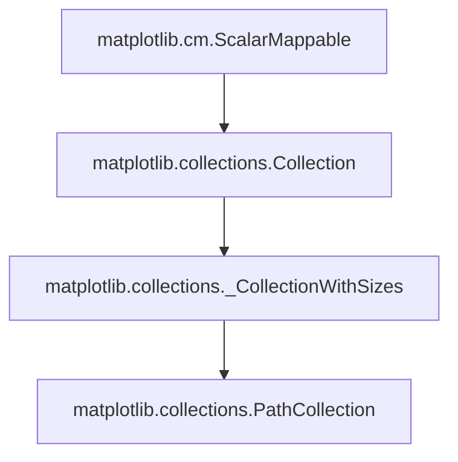
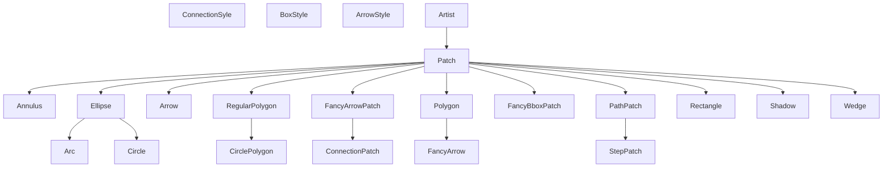

# Matplotlib

参考书籍：

- 《matplotlib数据可视化实战》 [豆瓣](https://book.douban.com/subject/36418771/) [清华大学出版社](http://www.tup.tsinghua.edu.cn/booksCenter/book_09904501.html)

Matplotlib是一款Python开源绘图模块，用于生成静态或动态、可交互的图表。

# §1 基础语法

## §1.1 `plt.rcParams`

`plt.rcParams`是Matplotlib提供的全局性字典`collections.abc.KeysView`，加载了绘图的所有全局属性。

```python
import matplotlib.pyplot as plt
print(plt.rcParams.keys())
"""
KeysView(RcParams({'_internal.classic_mode': False,
          'agg.path.chunksize': 0,
          'animation.bitrate': -1,
          'animation.codec': 'h264',
          'animation.convert_args': ['-layers', 'OptimizePlus'],
          'animation.convert_path': 'convert',
          'animation.embed_limit': 20.0,
          'animation.ffmpeg_args': [],
          'animation.ffmpeg_path': 'ffmpeg',
          'animation.frame_format': 'png',
          'animation.html': 'none',
          'animation.writer': 'ffmpeg',
          'axes.autolimit_mode': 'data',
          'axes.axisbelow': 'line',
          'axes.edgecolor': 'black',
          'axes.facecolor': 'white',
          'axes.formatter.limits': [-5, 6],
          'axes.formatter.min_exponent': 0,
          'axes.formatter.offset_threshold': 4,
          'axes.formatter.use_locale': False,
          'axes.formatter.use_mathtext': False,
          'axes.formatter.useoffset': True,
          'axes.grid': False,
          'axes.grid.axis': 'both',
          'axes.grid.which': 'major',
          'axes.labelcolor': 'black',
          'axes.labelpad': 4.0,
          'axes.labelsize': 'medium',
          'axes.labelweight': 'normal',
          'axes.linewidth': 0.8,
          'axes.prop_cycle': cycler('color', ['#1f77b4', '#ff7f0e', '#2ca02c', '#d62728', '#9467bd', '#8c564b', '#e377c2', '#7f7f7f', '#bcbd22', '#17becf']),
          'axes.spines.bottom': True,
          'axes.spines.left': True,
          'axes.spines.right': True,
          'axes.spines.top': True,
          'axes.titlecolor': 'auto',
          'axes.titlelocation': 'center',
          'axes.titlepad': 6.0,
          'axes.titlesize': 'large',
          'axes.titleweight': 'normal',
          'axes.titley': None,
          'axes.unicode_minus': True,
          'axes.xmargin': 0.05,
          'axes.ymargin': 0.05,
          'axes.zmargin': 0.05,
          'axes3d.grid': True,
          'axes3d.xaxis.panecolor': (0.95, 0.95, 0.95, 0.5),          'axes3d.yaxis.panecolor': (0.9, 0.9, 0.9, 0.5),   
          'axes3d.zaxis.panecolor': (0.925, 0.925, 0.925, 0.5),
          'backend': 'TkAgg',
          'backend_fallback': True,
          'boxplot.bootstrap': None,
          'boxplot.boxprops.color': 'black',
          'boxplot.boxprops.linestyle': '-',
          'boxplot.boxprops.linewidth': 1.0,
          'boxplot.capprops.color': 'black',
          'boxplot.capprops.linestyle': '-',
          'boxplot.capprops.linewidth': 1.0,
          'boxplot.flierprops.color': 'black',
          'boxplot.flierprops.linestyle': 'none',
          'boxplot.flierprops.linewidth': 1.0,
          'boxplot.flierprops.marker': 'o',
          'boxplot.flierprops.markeredgecolor': 'black',    
          'boxplot.flierprops.markeredgewidth': 1.0,        
          'boxplot.flierprops.markerfacecolor': 'none',     
          'boxplot.flierprops.markersize': 6.0,
          'boxplot.meanline': False,
          'boxplot.meanprops.color': 'C2',
          'boxplot.meanprops.linestyle': '--',
          'boxplot.meanprops.linewidth': 1.0,
          'boxplot.meanprops.marker': '^',
          'boxplot.meanprops.markeredgecolor': 'C2',        
          'boxplot.meanprops.markerfacecolor': 'C2',        
          'boxplot.meanprops.markersize': 6.0,
          'boxplot.medianprops.color': 'C1',
          'boxplot.medianprops.linestyle': '-',
          'boxplot.medianprops.linewidth': 1.0,
          'boxplot.notch': False,
          'boxplot.patchartist': False,
          'boxplot.showbox': True,
          'boxplot.showcaps': True,
          'boxplot.showfliers': True,
          'boxplot.showmeans': False,
          'boxplot.vertical': True,
          'boxplot.whiskerprops.color': 'black',
          'boxplot.whiskerprops.linestyle': '-',
          'boxplot.whiskerprops.linewidth': 1.0,
          'boxplot.whiskers': 1.5,
          'contour.algorithm': 'mpl2014',
          'contour.corner_mask': True,
          'contour.linewidth': None,
          'contour.negative_linestyle': 'dashed',
          'date.autoformatter.day': '%Y-%m-%d',
          'date.autoformatter.hour': '%m-%d %H',
          'date.autoformatter.microsecond': '%M:%S.%f',     
          'date.autoformatter.minute': '%d %H:%M',
          'date.autoformatter.month': '%Y-%m',
          'date.autoformatter.second': '%H:%M:%S',
          'date.autoformatter.year': '%Y',
          'date.converter': 'auto',
          'date.epoch': '1970-01-01T00:00:00',
          'date.interval_multiples': True,
          'docstring.hardcopy': False,
          'errorbar.capsize': 0.0,
          'figure.autolayout': False,
          'figure.constrained_layout.h_pad': 0.04167,       
          'figure.constrained_layout.hspace': 0.02,
          'figure.constrained_layout.use': False,
          'figure.constrained_layout.w_pad': 0.04167,       
          'figure.constrained_layout.wspace': 0.02,
          'figure.dpi': 100.0,
          'figure.edgecolor': 'white',
          'figure.facecolor': 'white',
          'figure.figsize': [6.4, 4.8],
          'figure.frameon': True,
          'figure.hooks': [],
          'figure.labelsize': 'large',
          'figure.labelweight': 'normal',
          'figure.max_open_warning': 20,
          'figure.raise_window': True,
          'figure.subplot.bottom': 0.11,
          'figure.subplot.hspace': 0.2,
          'figure.subplot.left': 0.125,
          'figure.subplot.right': 0.9,
          'figure.subplot.top': 0.88,
          'figure.subplot.wspace': 0.2,
          'figure.titlesize': 'large',
          'figure.titleweight': 'normal',
          'font.cursive': ['Apple Chancery',
                           'Textile',
                           'Zapf Chancery',
                           'Sand',
                           'Script MT',
                           'Felipa',
                           'Comic Neue',
                           'Comic Sans MS',
                           'cursive'],
          'font.family': ['sans-serif'],
          'font.fantasy': ['Chicago',
                           'Charcoal',
                           'Impact',
                           'Western',
                           'Humor Sans',
                           'xkcd',
                           'fantasy'],
          'font.monospace': ['DejaVu Sans Mono',
                             'Bitstream Vera Sans Mono',    
                             'Computer Modern Typewriter',  
                             'Andale Mono',
                             'Nimbus Mono L',
                             'Courier New',
                             'Courier',
                             'Fixed',
                             'Terminal',
                             'monospace'],
          'font.sans-serif': ['DejaVu Sans',
                              'Bitstream Vera Sans',        
                              'Computer Modern Sans Serif', 
                              'Lucida Grande',
                              'Verdana',
                              'Geneva',
                              'Lucid',
                              'Arial',
                              'Helvetica',
                              'Avant Garde',
                              'sans-serif'],
          'font.serif': ['DejaVu Serif',
                         'Bitstream Vera Serif',
                         'Computer Modern Roman',
                         'New Century Schoolbook',
                         'Century Schoolbook L',
                         'Utopia',
                         'ITC Bookman',
                         'Bookman',
                         'Nimbus Roman No9 L',
                         'Times New Roman',
                         'Times',
                         'Palatino',
                         'Charter',
                         'serif'],
          'font.size': 10.0,
          'font.stretch': 'normal',
          'font.style': 'normal',
          'font.variant': 'normal',
          'font.weight': 'normal',
          'grid.alpha': 1.0,
          'grid.color': '#b0b0b0',
          'grid.linestyle': '-',
          'grid.linewidth': 0.8,
          'hatch.color': 'black',
          'hatch.linewidth': 1.0,
          'hist.bins': 10,
          'image.aspect': 'equal',
          'image.cmap': 'viridis',
          'image.composite_image': True,
          'image.interpolation': 'antialiased',
          'image.lut': 256,
          'image.origin': 'upper',
          'image.resample': True,
          'interactive': False,
          'keymap.back': ['left', 'c', 'backspace', 'MouseButton.BACK'],
          'keymap.copy': ['ctrl+c', 'cmd+c'],
          'keymap.forward': ['right', 'v', 'MouseButton.FORWARD'],
          'keymap.fullscreen': ['f', 'ctrl+f'],
          'keymap.grid': ['g'],
          'keymap.grid_minor': ['G'],
          'keymap.help': ['f1'],
          'keymap.home': ['h', 'r', 'home'],
          'keymap.pan': ['p'],
          'keymap.quit': ['ctrl+w', 'cmd+w', 'q'],
          'keymap.quit_all': [],
          'keymap.save': ['s', 'ctrl+s'],
          'keymap.xscale': ['k', 'L'],
          'keymap.yscale': ['l'],
          'keymap.zoom': ['o'],
          'legend.borderaxespad': 0.5,
          'legend.borderpad': 0.4,
          'legend.columnspacing': 2.0,
          'legend.edgecolor': '0.8',
          'legend.facecolor': 'inherit',
          'legend.fancybox': True,
          'legend.fontsize': 'medium',
          'legend.framealpha': 0.8,
          'legend.frameon': True,
          'legend.handleheight': 0.7,
          'legend.handlelength': 2.0,
          'legend.handletextpad': 0.8,
          'legend.labelcolor': 'None',
          'legend.labelspacing': 0.5,
          'legend.loc': 'best',
          'legend.markerscale': 1.0,
          'legend.numpoints': 1,
          'legend.scatterpoints': 1,
          'legend.shadow': False,
          'legend.title_fontsize': None,
          'lines.antialiased': True,
          'lines.color': 'C0',
          'lines.dash_capstyle': <CapStyle.butt: 'butt'>,   
          'lines.dash_joinstyle': <JoinStyle.round: 'round'>,
          'lines.dashdot_pattern': [6.4, 1.6, 1.0, 1.6],    
          'lines.dashed_pattern': [3.7, 1.6],
          'lines.dotted_pattern': [1.0, 1.65],
          'lines.linestyle': '-',
          'lines.linewidth': 1.5,
          'lines.marker': 'None',
          'lines.markeredgecolor': 'auto',
          'lines.markeredgewidth': 1.0,
          'lines.markerfacecolor': 'auto',
          'lines.markersize': 6.0,
          'lines.scale_dashes': True,
          'lines.solid_capstyle': <CapStyle.projecting: 'projecting'>,
          'lines.solid_joinstyle': <JoinStyle.round: 'round'>,
          'macosx.window_mode': 'system',
          'markers.fillstyle': 'full',
          'mathtext.bf': 'sans:bold',
          'mathtext.bfit': 'sans:italic:bold',
          'mathtext.cal': 'cursive',
          'mathtext.default': 'it',
          'mathtext.fallback': 'cm',
          'mathtext.fontset': 'dejavusans',
          'mathtext.it': 'sans:italic',
          'mathtext.rm': 'sans',
          'mathtext.sf': 'sans',
          'mathtext.tt': 'monospace',
          'patch.antialiased': True,
          'patch.edgecolor': 'black',
          'patch.facecolor': 'C0',
          'patch.force_edgecolor': False,
          'patch.linewidth': 1.0,
          'path.effects': [],
          'path.simplify': True,
          'path.simplify_threshold': 0.111111111111,        
          'path.sketch': None,
          'path.snap': True,
          'pcolor.shading': 'auto',
          'pcolormesh.snap': True,
          'pdf.compression': 6,
          'pdf.fonttype': 3,
          'pdf.inheritcolor': False,
          'pdf.use14corefonts': False,
          'pgf.preamble': '',
          'pgf.rcfonts': True,
          'pgf.texsystem': 'xelatex',
          'polaraxes.grid': True,
          'ps.distiller.res': 6000,
          'ps.fonttype': 3,
          'ps.papersize': 'letter',
          'ps.useafm': False,
          'ps.usedistiller': None,
          'savefig.bbox': None,
          'savefig.directory': '~',
          'savefig.dpi': 'figure',
          'savefig.edgecolor': 'auto',
          'savefig.facecolor': 'auto',
          'savefig.format': 'png',
          'savefig.orientation': 'portrait',
          'savefig.pad_inches': 0.1,
          'savefig.transparent': False,
          'scatter.edgecolors': 'face',
          'scatter.marker': 'o',
          'svg.fonttype': 'path',
          'svg.hashsalt': None,
          'svg.image_inline': True,
          'text.antialiased': True,
          'text.color': 'black',
          'text.hinting': 'force_autohint',
          'text.hinting_factor': 8,
          'text.kerning_factor': 0,
          'text.latex.preamble': '',
          'text.parse_math': True,
          'text.usetex': False,
          'timezone': 'UTC',
          'tk.window_focus': False,
          'toolbar': 'toolbar2',
          'webagg.address': '127.0.0.1',
          'webagg.open_in_browser': True,
          'webagg.port': 8988,
          'webagg.port_retries': 50,
          'xaxis.labellocation': 'center',
          'xtick.alignment': 'center',
          'xtick.bottom': True,
          'xtick.color': 'black',
          'xtick.direction': 'out',
          'xtick.labelbottom': True,
          'xtick.labelcolor': 'inherit',
          'xtick.labelsize': 'medium',
          'xtick.labeltop': False,
          'xtick.major.bottom': True,
          'xtick.major.pad': 3.5,
          'xtick.major.size': 3.5,
          'xtick.major.top': True,
          'xtick.major.width': 0.8,
          'xtick.minor.bottom': True,
          'xtick.minor.ndivs': 'auto',
          'xtick.minor.pad': 3.4,
          'xtick.minor.size': 2.0,
          'xtick.minor.top': True,
          'xtick.minor.visible': False,
          'xtick.minor.width': 0.6,
          'xtick.top': False,
          'yaxis.labellocation': 'center',
          'ytick.alignment': 'center_baseline',
          'ytick.color': 'black',
          'ytick.direction': 'out',
          'ytick.labelcolor': 'inherit',
          'ytick.labelleft': True,
          'ytick.labelright': False,
          'ytick.labelsize': 'medium',
          'ytick.left': True,
          'ytick.major.left': True,
          'ytick.major.pad': 3.5,
          'ytick.major.right': True,
          'ytick.major.size': 3.5,
          'ytick.major.width': 0.8,
          'ytick.minor.left': True,
          'ytick.minor.ndivs': 'auto',
          'ytick.minor.pad': 3.4,
          'ytick.minor.right': True,
          'ytick.minor.size': 2.0,
          'ytick.minor.visible': False,
          'ytick.minor.width': 0.6,
          'ytick.right': False}))
"""
```

## §1.2 坐标轴

### §1.2.1 `plt.plot()`

Matplotlib使用`plt.plot()`来配置坐标轴。

```python
plt.plot(
    arg: 
    	list[xmin: float, xmax: float, ymin: float, ymax: float] |
    	Literal["off", "on", "equal", "scaled", "tight", "auto", "image", "square"] | 
    	bool
) -> tuple[float, float, float, float]
```

向`plt.plot()`传入一个`list[float, float, float, float]`，用于限制坐标范围：

```python
import numpy as np
import matplotlib.pyplot as plt

plt.axis([1, 9, -5, 100])
plt.plot(np.arange(10) ** 2)
plt.show()
```

`plt.axis()`返回一个四元组，表示图像的坐标范围：

```python
import numpy as np
import matplotlib.pyplot as plt

plt.plot(np.arange(10) ** 2)
print(plt.axis()) # (-0.45, 9.45, -4.05, 85.05)
```

### §1.2.2 `plt.axis()`

`plt.axis()`用于设置坐标轴的范围。

```python
plt.axis(
	[xmin, xmax, ymin, ymax]
) -> tuple[float, float, float, float]
```

### §1.2.3 `plt.xlim()`/`plt.ylim()`

 `plt.xlim()`/`plt.ylim()`用于单独设置X轴和Y轴的范围，用法与`plt.axis()`类似。

```python
plt.xlim/ylim(tuple[min: float, max: float]) -> tuple[float, float]
plt.xlim(left: float, right: float) -> tuple[float, float]
plt.ylim(bottom: float, top: float) -> tuple[float, float]
```

```python
import numpy as np
import matplotlib.pyplot as plt

plt.xlim([1, 9])
plt.ylim(-5, 100)
plt.plot(np.arange(10) ** 2)
plt.show()
print(plt.axis()) # (-0.45, 9.45, -4.05, 85.05)
```

### §1.2.4 `plt.xticks()`/``plt.yticks()``

`plt.xticks()`/`plt.yticks()`用于改变X轴/Y轴的刻度标签的**内容和一部分样式**。

```python
plt.xticks(
	ticks: Optional[ARRAY_LIKE] = None,
    labels: Optional[ARRAY_LIKE] = None,
    minor: bool = False
    **kwargs: {
    	rotation: float | "vertical" | "horizontal",
        color: COLOR_LIKE,
        fontsize: float | Literal["xx-small", "x-small", "small", "medium", "large", "x-large", "xx-large"],
        # ......
    }
) -> (locs: numpy.ndarray, labels: list[matplotlib.text.Text])
```

`plt.xticks()`/`plt.yticks()`同时传入`ticks`和`labels`时，要求`len(ticks)==len(labels)`，从而将`ticks`中的刻度全替换为`labels`。

```python
import numpy as np
import matplotlib.pyplot as plt

x_data = [2021, 2022, 2023]
x_label = ["二零二一年", "二零二二年", "二零二三年"]
y_data = np.random.rand(3, 3)

plt.rcParams["font.family"] = ["Microsoft JhengHei"]
plt.xticks(x_data, x_label, rotation=15.5, color="red")
plt.plot(x_data, y_data[0], x_data, y_data[1], x_data, y_data[2])
plt.show()
```

从上面的描述中，我们也可以意识到，`len(labels)`用于控制刻度的数量，`labels[i+1]-labels[i]`用于控制刻度之间代表的实际间隔。

```python
import numpy as np
import matplotlib.pyplot as plt

x = np.linspace(0, 2 * np.pi, 1000)
y = np.sin(x)
x_label = np.arange(0, 10, 1)
y_label = np.linspace(-2, 2, 21)

plt.plot(x, y)
plt.xticks(x_label) # 10个刻度,间隔为1
plt.yticks(y_label) # 20个刻度,间隔为0.2
plt.show()
```

> 注意：`plt.xticks()`/`plt.yticks()`中的`fontsize`参数，对应着`plt.rcParams["xtick.labelsize"]`/`plt.rcParams["ytick.labelsize"]`。

### §1.2.5 `plt.tick_params()`

`plt.tick_params()`用于设定坐标轴的**所有样式**，包括刻度字体大小、颜色、方向等。

```python
plt.tick_params(
	axis: Literal["both", "x", "y"] = "both",
    **kwargs: {
    	which: Literal["major", "minor", "both"] = "major", # 设置的刻度线类别
        direction: Literal["in", "out", "inout"] = "out", # 刻度线位置
		reset: bool = False, # 应用样式之后是否要重置刻度
        length: float, # 刻度线长度(单位为点数)
        width: float, # 刻度线宽度(单位为点数)
        color: COLOR_LIKE, # 刻度线颜色
        pad: float, # 刻度线与标签之间的距离(单位为点数)
        labelsize: float | str, # 标签字体大小
        labelcolor: COLOR_LIKE, # 标签文字颜色
        labelfontfamily: str, # 标签文字字体
        colors: COLOR_LIKE, # 刻度线颜色和标签文字颜色
        zorder: float, # 刻度线颜色和标签文字的图层位置
        bottom/top/left/right: bool, # 是否绘制指定位置的刻度线
        labelbottom/labeltop/labelleft/labelright: bool, # 是否绘制指定位置的标签
        labelrotation: float, # 标签旋转角度
        grid_color: COLOR_LIKE, # 网格线颜色
        grid_alpha: float, # 网格线透明度
        grid_linewidth: float, # 网格线宽度(单位为点数)
        grid_linestyle: str # 网格线样式
    }
)
```

```python
import numpy as np
import matplotlib.pyplot as plt

x = np.linspace(0, 2 * np.pi, 100)
y = np.sin(x)

plt.plot(x, y)
plt.tick_params(axis='x', direction="in", length=8, width=3, color="red")
plt.tick_params(axis='y', direction="out", pad=3, labelsize="20", labelcolor="red")
plt.show()
```

## §1.3 图例(`plt.legend()`)

`plt.legend()`用于设定图例。

```python
plt.legend(
	*args: {
    	handles: Optional[typing.Iterable[matplotlib.lines.Line2D]],
        labels: Optional[typing.Iterable[typing.Iterable[str]]]
    },
    **kwargs
)
```

| `plt.legend()`形参 | 作用                                                         | 数据类型                                                     | `plt.rcParams`对应属性                  |
| ------------------ | ------------------------------------------------------------ | ------------------------------------------------------------ | --------------------------------------- |
| `loc`              | 图例的位置                                                   | `str | int`<br />其中`"best" => 0`(缺省)<br />`"upper right" => 1`<br />`"upper left" => 2` <br />`"lower left" => 3`<br />`"lower right" => 4`<br />`"right"/"center right" => 5`<br />`"center left" => 6`<br />`"center right" => 7`<br />`"lower center" => 8`<br />`"upper center" => 9`<br />`"center" => 10`<br /> | `plt.rcParams["legend.loc"]`            |
| `prop`             | 图例字体属性                                                 | `None | dict | matplotlib.font_manager.FontProperties = None` |                                         |
| `title_fontsize`   | 图例字体大小                                                 | `= None`                                                     | `plt.rcParams["legend.title_fontsize"]` |
| `markerscale`      | 图例标记大小缩放比例                                         | `float = 1.0`                                                | `plt.rcParams["legend.markerscale"]`    |
| `markerfirst`      | 图例标记是否位于文字左边                                     | `bool = True`                                                |                                         |
| `numpoints`        | 线条图例标记点数                                             | `int = 1`                                                    | `plt.rcParams["legend.numpoints"]`      |
| `scatterpoints`    | 散点图图例标记点数                                           | `int = 1`                                                    | `plt.rcParams["legend.scatterpoints"]`  |
| `frameon`          | 图例是否含有边框                                             | `bool: True`                                                 | `plt.rcParams["legend.frameon"]`        |
| `framealpha`       | 图例边框透明度                                               | `float: 0.8`                                                 | `plt.rcParams["legend.framealpha"]`     |
| `edgecolor`        | 图例边框颜色                                                 | `Literal["inherit"] | COLOR_LIKE = 0.8`                      |                                         |
| `facecolor`        | 图例边框内的背景颜色                                         | `Literal["inherit"] | COLOR_LIKE = "interit"`                | `plt.rcParams["legend.facecolor"]`      |
| `shadow`           | 图例是否有阴影                                               | `None | bool | dict = False`                                 | `plt.rcParams["legend.shadow"]`         |
| `borderpad`        | 图例边框内边距                                               | `float = 0.4`                                                | `plt.rcParams["legend.borderpad"]`      |
| `labelspacing`     | 图例项目之间的间距                                           | `float = 0.5`                                                | `plt.rcParams["legend.labelspacing"]`   |
| `handleheight`     | 图例句柄高度                                                 | `float = 0.7`                                                | `plt.rcParams["legend.handleheight"]`   |
| `handlelength`     | 图例句柄长度                                                 | `float = 2.0`                                                | `plt.rcParams["legend.handlelength"]`   |
| `handletextpad`    | 图例句柄和文本之间的间距                                     | `float = 0.8`                                                | `plt.rcParams["legend.handletextpad"]`  |
| `handleaxespad`    | 轴和图例边框之间的间距                                       | `float = 0.5`                                                | `plt.rcParams["legend.handleaxespad"]`  |
| `ncol`             | 图例的字段数                                                 | `int = 1`                                                    |                                         |
| `columnspacing`    | 字段之间的间距                                               | `float = 2.0`                                                | `plt.rcParams["legend.columnspacing"]`  |
| `bbox_to_anchor`   | 以图例左下角为`(0,0)`，右上角为`(1,1)`,建立相对坐标系。`bbox_to_anchor`使用该相对坐标，决定图例矩形框左上角的位置。(与`loc`不能同时用)第三、四个参数分别表式子图的新的宽高缩放比例。 | `tuple[float, float] | tuple[float, float, float, float]`    |                                         |
| `title`            | 图例标题                                                     | `str | None`                                                 |                                         |

调用`plt.legend()`用于创建所有曲线的图例，`plt.plot(label="...")`用于指定图例的标签文字，里面传入的参数用于控制图例样式：

```python
import numpy as np
import matplotlib.pyplot as plt

x = np.linspace(0, 2 * np.pi, 20)
y = [np.sin(x), np.cos(x), np.square(x)]

plt.plot(x, y[0], marker="o", label="sin(x)")
plt.plot(x, y[1], marker="v", label="cos(x)")
plt.plot(x, y[2], marker="x", label="x^2")

plt.legend(
    loc = 6, edgecolor = "black", facecolor = "#66ccff", numpoints = 2, frameon = True,
    shadow = True, title = "Legend Title"
)
plt.show()
```

使用`plt.legend(*args)`中的`handles`和`labels`，可以指定需要图例的曲线，并为其指定标签文字：

```python
import numpy as np
import matplotlib.pyplot as plt
import matplotlib.lines

x = np.linspace(0, 2 * np.pi, 20)
y = [np.sin(x), np.cos(x), np.square(x)]

line: list[matplotlib.lines.Line2D] = [
    plt.plot(x, y[0], marker="o", label="sin(x)")[0],
    plt.plot(x, y[1], marker="v", label="cos(x)")[0],
    plt.plot(x, y[2], marker="x", label="x^2")[0]
]

plt.rcParams["font.family"] = ["Microsoft JhengHei"]
plt.legend([line[0], line[1]], ["正弦", "余弦"])
plt.show()
```

一个图表默认只有一个图例。如果要显示两个图例，我们需要使用`plt.gca()`获取子图，然后对子图使用`.add_artist()`添加子图的图例，最后在主图中添加图例：

```python
import numpy as np
import matplotlib.pyplot as plt

x = np.linspace(0, 2 * np.pi, 20)
y = [np.sin(x), np.cos(x)]
line = [
    plt.plot(x, y[0], marker="o", label="sin(x)")[0],
    plt.plot(x, y[1], marker="v", label="cos(x)")[0],
]

plt.gca().add_artist(plt.legend(handles=[line[0]], loc=1))
plt.legend(handles=[line[1]], loc=4)

plt.show()
```

## §1.4 网格（`plt.grid()`）

`plt,plot()`用于绘制网格。网格可以是十字正交、十字斜交、维度曲线网格等。

```python
plt.plot(
	visible: Optional[bool | None] = None,
    which: Optional["major", "minor", "both"] = "both",
    axis: Optional[Literal["both", "x", "y"]] = "both",
    **kwargs: {
        matplotlib.lines.Line2D
    }
)
```

```python
import numpy as np
import matplotlib.pyplot as plt

x = np.linspace(0, 2 * np.pi, 20)
plt.plot(x, np.sin(x), marker="o", label="sin(x)")[0],
plt.plot(x, np.cos(x), marker="v", label="cos(x)")[0],

plt.grid(True, "major", "both", color="#dddddd", linestyle="--", linewidth="1")

plt.show()
```

## §1.5 参考线

### §1.5.1 水平/垂直参考线(`plt.axhline()`/`plt.axvline()`)

`plt.axhline()`/`plt.axvline()`用于绘制水平/垂直参考线。其实从本质来说，网格就是按照一定规则自动生成的参考线。这里我们用`plt.axhline()`/`plt.axvline()`创建的参考线需要手动指定。

```python
plt.axhline(
	y: float = 0,
    xmin: float = 0, # 绝对坐标
    xmax: float = 1, # 绝对坐标
    **kwargs: {
    	matplotlib.lines.Line2D
    }
) -> matplotlib.lines.Line2D

plt.avhline(
	x: float = 0,
    ymin: float = 0, # 绝对坐标
    ymax: float = 1, # 绝对坐标
    **kwargs: {
    	matplotlib.lines.Line2D
    }
) -> matplotlib.lines.Line2D
```

```python
import numpy as np
import matplotlib.pyplot as plt

x = np.linspace(0, 2 * np.pi, 20)
plt.plot(x, np.sin(x), marker="o", label="sin(x)")
plt.plot(x, np.cos(x), marker="v", label="cos(x)")

plt.axhline(0, 0, 1, color="#aaaaaa", linewidth=0.5, linestyle="--")
plt.axhline(-1, 0.5, 1, color="#999999", linewidth=0.5, linestyle="--")
plt.axhline(1, 0, 0.5, color="#888888", linewidth=0.5, linestyle="--")
plt.axvline(np.pi * 0, 0, 1, color="#aaaaaa", linewidth=0.5, linestyle="--")
plt.axvline(np.pi * 1, 0.5, 1, color="#999999", linewidth=0.5, linestyle="--")
plt.axvline(np.pi * 2, 0, 0.5, color="#888888", linewidth=0.5, linestyle="--")

plt.show()
```

### §1.5.2 无限长参考线(`plt.axline()`)

`plt.axline()`用于绘制斜的参考线，在确定直线的方式中，支持两点式和点斜式。

```python
plt.axline(
	xy1: tuple[float, float],
    xy2: tuple[float, float] | None, *,
    slope: float | None,
    **kwargs
)
```

```python
import typing, typing_extensionsc
import matplotlib.lines

import numpy as np
import matplotlib.pyplot as plt

x = np.linspace(-5, 5, 100)
y = 1 / (1 + np.exp(-x))

plt.plot(x, y)
plt.axhline(0.5, ls="-.", lw=0.5, c="gray")
plt.axvline(0, ls="-.", lw=0.5, c="gray")
plt.axline((0, 0.5), slope=0.25, lw=1, ls="--", c="black")
plt.show()
```

## §1.6 参考区域

### §1.6.1 水平/垂直参考区域(`plt.axhspan()`/`plt.axvspan()`)

`plt.axhspan()`/`plt.axvspan()`用于绘制水平/垂直参考区域。

```python
plt.axhspan(
	ymin: float, # 绝对坐标
    ymax: float, # 绝对坐标
    xmin: float = 0, 
    xmax: float = 1,
    **kwargs: { <matplotlib.patches.Polygon>
		alpha: float(0, 1) | None = None,
		color: COLOR_LIKE, # 没有简写"c"!
		edgecolor/ec: COLOR_LIKE,
		facecolor/fc: COLOR_LIKE,
		linestyle/ls: str = "-",
		linewidth/lw: float | None = None,
		zorder: float = 0
    }
) -> matplotlib.patches.Polygon

plt.axvspan(
	xmin: float,
    xmax: float,
    ymin: float = 0,
    ymax: float = 1,
    **kwargs: { <matplotlib.patches.Polygon>:
		alpha: float(0, 1) | None = None,
		color: COLOR_LIKE,
		edgecolor/ec: COLOR_LIKE,
		facecolor/fc: COLOR_LIKE,
		linestyle: str = "-",
		linewidth/lw: float | None = None,
		zorder: float = 0
    }
) -> matplotlib.patches.Polygon
```

```python
import numpy as np
import matplotlib.pyplot as plt

x = np.linspace(-5, 5, 100)
y = np.sin(x)

plt.plot(x, y)
plt.axhspan(-0.5, 0.5, color="#66ccff", ls="--", alpha=0.8)
plt.axvspan(-0.5, 0.5, color="#ff8899", ls="--", alpha=0.5)
plt.show()
```

### §1.6.2 不规则填充区域(`plt.fill()`)

在[§1.6.1 水平/垂直参考区域(`plt.axhspan()`/`plt.axvspan()`)](###§1.6.1 水平/垂直参考区域(`plt.axhspan()`/`plt.axvspan()`))一节中，我们接触到了`matplotlib.patches.Polygon`。本节我们将学习使用`plt.fill()`填充不规则多边形。

```python
plt.fill(
    *args: [
        x: typing.Sequence[float],
	    y: typing.Sequence[float],
    	color: Optional[str]
    ]+ | [
    	x: str,
        y: str,
        data: dict{[str: typing.Sequence[float]]+}
    ],
    **kwargs: { <matplotlib.patches.Polygon>:
        color / c: COLOR_LIKE,
        edgecolor/ ec: COLOR_LIKE,
        fill: bool = True,
        linestyle: str,
        linewidth / lw: float | None = None,
        zorder: float
    }
) -> list[matplotlib.patches.Polygon]
```

```python
import numpy as np
import matplotlib.pyplot as plt

x = [[0, 1, 3, 3], [3, 4, 4]]
y = [[0, 7, 6, 2], [0, 7, 1]]

plt.fill(x[0], y[0], "g", x[1], y[1], "r")
plt.show()
```

`plt.fill()`也可以从`data: dict`中取值：

```python
import numpy as np
import matplotlib.pyplot as plt

data = {
    "x": [0, 1, 3, 3],
    "y": [0, 7, 6, 2]
}

plt.fill("x", "y", data=data)
plt.show()
```

### §1.6.3 填充积分区域(`plt.fill_between()`)

`plt.fill_between()`用于绘制沿$x$轴的定积分$\displaystyle{\int_{x_{min}}^{x_{max}}y_2(i)-y_1(i)\ di}$围成的区域。

```python
plt.fill_between(
	x: array[number], # 长度一律为N
	y1: array[number] | float[0, 1], # 长度一律为N
    y2: array[number] | float[0, 1] = 0, # 长度一律为N
    where: Optional[array[bool]] = None,
    **kwargs: { <matplotlib.collections.PolyCollection>:
        color / c: COLOR_LIKE,
        cmap: matplotlib.colors.ColorMap | str | None,
        edgecolor / ec: COLOR_LIKE,
        facecolor / fc: COLOR_LIKE,
        fill: bool = True,
        linestyle: str,
        linewidth/lw: float,
        zorder: float,
    }
) -> matplotlib.collections.PolyCollection
```

```python
import numpy as np
import matplotlib.pyplot as plt

x = np.linspace(0, np.pi * 2, 100)
y = np.sin(x)

plt.plot(x, y)
plt.fill_between(x, 0, y, color="#66ccff")
plt.show()
```

`plt.fill_between()`中的`where`用于接受`bool`值，该值可以通过预设的布尔表达式计算而来，作为定积分区域的附加条件：
$$
\begin{align}
	S & =\{(x,y)\ |\ \min\left({y_1(x),y_2(x)}\right)\le y\le \max\left({y_1(x),y_2(x)}\right)\and\text{where}(x,y)=\text{True}\} \\
	  & \subset\R^2
\end{align}
$$
基于此，我们可以用其求解线性规划区域：

```python
import numpy as np
import matplotlib.pyplot as plt

x = np.linspace(-5, 10, 500)
y = [-5*x+17, -x+8]
y_min = np.minimum(y[0], y[1])

plt.plot(x, y[0], x, y[1])
plt.fill_between(
    x, -6*x-5, y_min,
    where=((x>=0)&(x<=6)), 
    color="#66ccff"
)
plt.show()
```

## §1.7 图表文字(`plt.text()`)

```py
plt.text(
	x: float, # 文字左下角的横坐标
	y: float, # 文字左下角的横坐标
	s: str,
	fontdict: Dict | None = None,
	**kwargs: { <matplotlib.text.Text>:
        alpha: float[0, 1] | None ,
        backgroundcolor: COLOR_LIKE ,
        bbox: dict{ <matplotlib.patches.FancyBboxPatch>:
			boxstyle: str | matplotlib.patches.BoxStyle,
			edgecolor / ec: COLOR_LIKE | None,
			facecolor / fc: COLOR_LIKE | None,
			# ......
		},
        color / c: COLOR_LIKE,
        fontfamily: str,
        fontsize / size: float | Literal["xx-small", "x-small", "small", "medium", "large", "x-large", "xx-large"],
        fontstretch / stretch: number[0, 1000] | Literal["ultra-condensed", "extra-condensed", "condensed", "semi-condensed", "normal", "semi-expanded", "expanded", "extra-expanded", "ultra-expanded"],
		fontweight / weight: number[0, 1000] | Literal["ultralight", "light", "normal", "regular", "book", "medium", "roman", "semibold", "demibold", "demi", "bold", "heavy", "extra bold", "black"],
        horizontalalignment / ha: Literal["left", "center", "right"],
        rotation: float | Literal["vertical", "horizontal"], # 绕矩形左下角旋转
        transform: matplotlib.transforms.Transform,
        verticalalignment / va: Literal["bottom", "baseline", "center", "center_baseline", "top"],
        wrap: bool, # 是否自动换行
        zorder: float,
    }
) -> matplotlib.text.Text
```

`horizontalalignment`/`ha`决定了矩形中用于和`(x,y)`对齐的点位于边框的哪个角落的水平方向：

```python
import numpy as np
import matplotlib.pyplot as plt

plt.axis([0, 10, 0, 10])
plt.text(5, 2, "horizontalalignment=left", c="r", backgroundcolor="#66ccff", horizontalalignment="left")
plt.text(5, 5, "horizontalalignment=right", c="g", backgroundcolor="#66ccff", horizontalalignment="right")
plt.text(5, 8, "horizontalalignment=center", c="b", backgroundcolor="#66ccff", horizontalalignment="center")
plt.plot([5, 5, 5], [2, 5, 8], '.', markersize=15, zorder=4)
plt.show()
```

`rotation`会将文本框沿左下角旋转：

```python
import numpy as np
import matplotlib.pyplot as plt

plt.axis([0, 10, 0, 10])
plt.text(5, 2, "horizontalalignment=left", c="r", backgroundcolor="#66ccff", horizontalalignment="left", rotation=15)
plt.text(5, 5, "horizontalalignment=right", c="g", backgroundcolor="#66ccff", horizontalalignment="right", rotation=15)
plt.text(5, 8, "horizontalalignment=center", c="b", backgroundcolor="#66ccff", horizontalalignment="center", rotation=15)
plt.plot([5, 5, 5], [2, 5, 8], '.', markersize=15, zorder=4)
plt.show()

```

`verticalalignment`/`va`决定了矩形中用于和`(x,y)`对齐的点位于边框的哪个角落的垂直方向：

```python
import numpy as np
import matplotlib.pyplot as plt

plt.axis([0, 10, 0, 10])
plt.text(5, 2, "verticalalignment=top", c="r", backgroundcolor="#66ccff", verticalalignment="top")
plt.text(5, 5, "verticalalignment=center", c="g", backgroundcolor="#66ccff", verticalalignment="center")
plt.text(5, 8, "verticalalignment=bottom", c="b", backgroundcolor="#66ccff", verticalalignment="bottom")
plt.plot([5, 5, 5], [2, 5, 8], '.', markersize=15, zorder=4)
plt.show()

```

`bbox: dict{<matplotlib.patches.FancyBboxPatch>}`用于规定本文框的样式。其中的`boxstyle`键用于指定文本框的外形：

| `boxstyle`属性值(`str`) | `boxstyle`属性值(`matplotlib.patches.BoxStyle`) | 形状     | 默认值                        |
| ----------------------- | ----------------------------------------------- | -------- | ----------------------------- |
| `square`                | `matplotlib.patches.BoxStyle.Square`            | 矩形     | `pad=0.3`                     |
| `circle`                | `matplotlib.patches.BoxStyle.Circle`            | 圆形     | `pad=0.3`                     |
| `ellipse`               | `matplotlib.patches.BoxStyle.Ellipse`           | 椭圆     | `pad=0.3`                     |
| `larrow`                | `matplotlib.patches.BoxStyle.LArrow`            | 左箭头   | `pad=0.3`                     |
| `rarrow`                | `matplotlib.patches.BoxStyle.RArrow`            | 右箭头   | `pad=0.3`                     |
| `darrow`                | `matplotlib.patches.BoxStyle.DArrow`            | 双向箭头 | `pad=0.3`                     |
| `round`                 | `matplotlib.patches.BoxStyle.Round`             | 圆角矩形 | `pad=0.3, rounding_size=None` |
| `round4`                | `matplotlib.patches.BoxStyle.Round4`            | 圆角矩形 | `pad=0.3, rounding_size=None` |
| `sawtooth`              | `matplotlib.patches.BoxStyle.Sawtooth`          | 锯齿形   | `pad=0.3, toothsize=None`     |
| `roundtooth`            | `matplotlib.patches.BoxStyle.Roundtooth`        | 波浪线形 | `pad=0.3, toothsize=None`     |

```python
import numpy as np
import matplotlib.pyplot as plt

boxstyles = ["square", "circle", "ellipse", "larrow", "rarrow", "darrow", "round", "round4", "sawtooth", "roundtooth"]

plt.axis([0, 10, 0, 10])
for index, boxstyle in enumerate(boxstyles):
    plt.text(2, index, f"boxstyle:{boxstyle}", bbox={
        "boxstyle": boxstyle,
        "facecolor": "#66ccff"
    })
plt.show()
```

## §1.8 子图

### §1.8.1 多窗口(`plt.figure()`)

`plt.figure()`用于管理窗口及其样式。

```python
plt.figure(
	num: Optional[int | str | matplotlib.figure.Figure | matplotlib.figure.SubFigure] = None, # int表示图表编号，str表示图表名称
	figsize: tuple[float, float] = (6.4, 4.8), # 图表的宽高(英寸)
	dpi: float = 100,
	facecolor: COLOR_LIKE = "white", # 窗口背景颜色
	edgecolor: COLOR_LIKE = "white", # 窗口边框颜色
	frameon: bool = True, # 是否显示边框
	FigureClass: matplotlib.figure.Figure,
	clear: bool = False,
    layout: Literal["constrained", "compressed", "tight", "none"] | matplotlib.layout_engine.LayoutEngine | None = None,
	**kwargs: {
        <matplotlib.figure.Figure>
    }
)
```

回想CSS中的盒子模型，我们可以调整父标签的尺寸和内边距，但是不会影响内容区的实质内容。这里`plt.figure()`控制的窗口就相当于父元素，里面包含的图表就相当于内容区。因此`plt.figure()`控制的是窗口，而不是图表。

```python
import numpy as np
import matplotlib.pyplot as plt

x = np.linspace(0, np.pi * 2, 100)
y = np.sin(x)

plt.figure(figsize=(7, 3), facecolor="#66ccff", edgecolor="r")
plt.plot(x, y)

plt.show()
```

`plt.figure()`中的`num`表示从这行代码开始处理哪个窗口，表示设置对象的切换。

```python
import numpy as np
import matplotlib.pyplot as plt

x = np.linspace(0, np.pi * 2, 100)
y = np.sin(x)

plt.figure(1, figsize=(7, 3), facecolor="#66ccff")
plt.plot(x, y)
plt.figure(2, figsize=(5, 5), facecolor="#bbbbbb")
plt.plot(x, y)
plt.figure(1) # 切换回来
plt.plot(x, y + 1)

plt.show()
```

### §1.8.2 多子图`plt.subplot()`

`plt.subplot()`用于在窗口（Figure）中创建子图表/轴对象（Axes）。

```python
plt.subplot(
	*args: int | tuple[int, int, int] | matplotlib.gridspec.SubplotSpec = (1, 1, 1),
    projection: Optional[Literal["aitoff", "hammer", "lambert", "mollweide", "polar", "rectilinear"]] = None,
    polor: bool = False, # 等价于projection = "polor" if polor else None
    sharex: Optional[matplotlib.axes.Axes], # 共享X轴的大小和标记
    sharey: Optional[matplotlib.axes.Axes], # 共享Y轴的大小和标记
    **kwargs
) -> matplotlib.axes.Axes
```

`*args`有以下几种写法：

- `tuple[int, int, int]`：`(nrows, ncols, index)`分别表示子图行数、子图列数、子图序号（从左往右，从上到下递增，从`1`开始）。
- `*args: float, float, float`：等价于`tuple[int, int, int]`，也就是对其使用`*`解构赋值。
- `int[111, 999]`：给定一个三位数，会自动拆成三个一位数，对应着`nrows`、`ncols`、`index`。

与`plt.figure()`相似，`plt.subplot()`中的`nrows`、`ncols`、`index`表示从这行代码开始处理哪个子图，表示设置对象的切换。

```python
import numpy as np
import matplotlib.pyplot as plt

x = np.linspace(0, np.pi * 10, 100)
y = np.sin(x)

plt.subplot(2, 1, 1)
plt.title("oscillation")
plt.plot(x, y)
plt.ylabel("position")

plt.subplot(2, 1, 2)
plt.plot(x, y * np.exp(-0.1 * x))
plt.xlabel("time")
plt.ylabel("position")

plt.show()
```

`plt.subplot()`还能实现网格布局中的`colspan`/`rowspan`合并单元格效果，但是实现逻辑有点绕。考虑下列情形：在$2\times2$的网格中，包含左上角$(1,1)$、右上角$(1,2)$和最底一行$(2,1)+(2,2)$三幅子图。要实现最低一行子图横跨所有列，我们需要给`plt.subplot()`传递`(2,1,2)`三组参数，让Matplotlib绘制第三幅子图时，认为整个网格只有一列，所以就会占据整个横向空间：

```python
import numpy as np
import matplotlib.pyplot as plt

x = np.linspace(0, np.pi * 10, 100)
y = np.sin(x)

plt.subplot(2, 2, 1)
plt.plot(x, y)

plt.subplot(2, 2, 2)
plt.plot(x, y * np.exp(-0.1 * x))

plt.subplot(2, 1, 2) # 虚晃一枪，骗过Matplotlib
plt.plot(x, y * np.exp(0.1 * x))

plt.show()
```

`projection`形参支持绘制多种投影：

```python
import numpy as np
import matplotlib.pyplot as plt

plt.figure(figsize=(15, 8),layout="tight")
plt.suptitle("Projection")

for i, projection in enumerate(["aitoff", "hammer", "lambert", "mollweide", "polar", "rectilinear"]):
    plt.subplot(2, 3, i+1, projection=projection)
    plt.plot(np.linspace(-1, 1, 100), np.linspace(-2, 2, 100))
    plt.title(f"projection={projection}")
    plt.grid(True)
    
plt.show()
```

`sharex/sharey`形参接受一个`matplotlib.axes.Axes`实例，表示当前子图使用的X轴/Y轴与传入的子图的X轴/Y轴共享。

```python
import numpy as np
import matplotlib.pyplot as plt

x = (np.linspace(-5, 5, 200), np.linspace(-2, 2, 100))
y = np.sin(5*x[0]) * np.exp(-np.abs(x[0])), np.sin(5*x[1]) * np.exp(-np.abs(x[1]))

plt.rcParams["font.family"] = ["Microsoft JhengHei"]
plt.rcParams["axes.unicode_minus"] = False

plt.figure(1)
plt.suptitle("未同步X轴")
ax1 = plt.subplot(211)
ax1.plot(x[0], y[0])
ax2 = plt.subplot(212)
ax2.plot(x[1], y[1])

plt.figure(2)
plt.suptitle("已同步X轴")
ax1 = plt.subplot(211)
ax1.plot(x[0], y[0])
ax2 = plt.subplot(212, sharex=ax1)
ax2.plot(x[1], y[1])

plt.show()
```

```python
import numpy as np
import matplotlib.pyplot as plt

x = np.linspace(-5, 5, 200)
y = np.sin(x), np.sin(x) + 5

plt.rcParams["font.family"] = ["Microsoft JhengHei"]
plt.rcParams["axes.unicode_minus"] = False

plt.figure(1)
plt.suptitle("未同步Y轴")
ax1 = plt.subplot(121)
ax1.plot(x, y[0])
ax2 = plt.subplot(122)
ax2.plot(x, y[1])

plt.figure(2)
plt.suptitle("已同步Y轴")
ax1 = plt.subplot(121)
ax1.plot(x, y[0])
ax2 = plt.subplot(122, sharey=ax1)
ax2.plot(x, y[1])

plt.show()
```

### §1.8.3 子图总标题(`plt.suptitle()`)

在介绍子图之前，我们一直使用`plt.title()`设置整个图表的总标题。然而引入子图之后，`plt.title()`表示的是子图的标题。如果要设置整个图表的总标题，我们需要用到`plt.suptitle()`。

```python
import numpy as np
import matplotlib.pyplot as plt

x = np.linspace(0, np.pi * 10, 100)
y = np.sin(x)

plt.figure(layout="tight")
plt.suptitle("Total subplots")

plt.subplot(2, 2, 1)
plt.title("subplot 1")
plt.plot(x, y)

plt.subplot(2, 2, 2)
plt.title("subplot 2")
plt.plot(x, y * np.exp(-0.1 * x))

plt.subplot(2, 1, 2)
plt.title("subplot 3")
plt.plot(x, y * np.exp(0.1 * x))

plt.show()
```

### §1.8.4 多子图布局(`plt.tight_layout()`)

`plt.tight_layout()`用于指定多子图的布局。

```python
plt.tight_layout(
    pad: float = 1.08 # fontsize的倍数
    h_pad: float = <pad>,
    w_pad: float = <pad>,
    rect: tuple[left, bottom, right, top] = (0, 0, 1, 1)
)
```

```python
import numpy as np
import matplotlib.pyplot as plt

plt.rcParams["font.family"] = ["Microsoft JhengHei"]
plt.rcParams["axes.unicode_minus"] = False

def subplot(nrows: int, ncols: int, index: int):
    ax = plt.subplot(nrows, ncols, index)
    ax.plot([0, 1], [0, 3])
    ax.set_xlabel("X坐标", fontsize=20)
    ax.set_ylabel("Y坐标", fontsize=20)
    ax.set_ylabel("子图标题", fontsize=20)

for i in range(4):
    subplot(2, 2, i+1)

plt.tight_layout() # 开启紧凑布局，防止重叠
plt.show()
```

> 注意：开启紧凑布局，除了使用`plt.tight_layout()`手动开启外，也可以让全局变量`plt.rcParams["figure.autolayout"]`为`True`。
>
> ```python
> import numpy as np
> import matplotlib.pyplot as plt
> 
> plt.rcParams["font.family"] = ["Microsoft JhengHei"]
> plt.rcParams["axes.unicode_minus"] = False
> plt.rcParams["figure.autolayout"] = True # 开启紧凑布局，防止重叠
> 
> def subplot(nrows: int, ncols: int, index: int):
>     ax = plt.subplot(nrows, ncols, index)
>     ax.plot([0, 1], [0, 3])
>     ax.set_xlabel("X坐标", fontsize=20)
>     ax.set_ylabel("Y坐标", fontsize=20)
>     ax.set_ylabel("子图标题", fontsize=20)
> 
> for i in range(4):
>     subplot(2, 2, i+1)
> 
> plt.show()
> ```

### §1.8.5 多子图(`plt.subplots()`)

`plt.subplots()`同样用于设置子图，但是功能比`plt.subplot()`更多。

```python
plt.subplots(
	nrows: int = 1,
    ncols: int = 1, *,
    sharex: bool | Literal["none", "all", "row", "col"] = False,
    sharey: bool | Literal["none", "all", "row", "col"] = False,
    squeeze: bool = True,
    width_ratios: Optional[typing.Iterable[float]] = None,
    height_ratios: Optional[typing.Iterable[float]] = None,
    subplot_kw: Optional[<matplotlib.figure.Figure.add_subplot(...)>:] = None,
    grid_spec_kw: Optional[<matplotlib.gridspec.GridSpec(...)>:]= None,
    **fig_kw: **plt.figure(...)
) -> tuple[
    matplotlib.figure.Figure, 
    typing.Union[
        matplotlib.axes.Axes,
        numpy.ndarray[matplotlib.axes.Axes]
    ]
]
```

`nrows`和`ncols`用于指定子图的行列数量：

```python
import numpy as np
import matplotlib.pyplot as plt

plt.rcParams["font.family"] = ["Microsoft JhengHei"]
plt.rcParams["axes.unicode_minus"] = False
plt.rcParams["figure.autolayout"] = True

fig, axes = plt.subplots(nrows=1, ncols=2, figsize=(6, 3))
ax[0].plot([0, 3])
ax[1].plot([0, 2])

plt.show()
```

由于`axes`也可能是`numpy.ndarray`，所以我们可以使用NumPy数组提供的高级索引功能：

```python
import numpy as np
import matplotlib.pyplot as plt

plt.rcParams["font.family"] = ["Microsoft JhengHei"]
plt.rcParams["axes.unicode_minus"] = False
plt.rcParams["figure.autolayout"] = True

fig, ax = plt.subplots(nrows=2, ncols=2, figsize=(6, 3))
ax[0, 0].plot([0, 1]) # 高级索引
ax[0, 1].plot([0, 2])
ax[1, 0].plot([0, 3])
ax[1, 1].plot([0, 4])

plt.show()
```

> 注意：由于`axes`也可能是`numpy.ndarray`，这使得我们可以使用Numpy中的方法遍历每个`matplotlib.axes.Axes`：
>
> - `numpy.ndarray.flat: typing.Iterable`
>
>   ```python
>   import numpy as np
>   import matplotlib.pyplot as plt
>   
>   plt.rcParams["font.family"] = ["Microsoft JhengHei"]
>   plt.rcParams["axes.unicode_minus"] = False
>   plt.rcParams["figure.autolayout"] = True
>   
>   fig, axes = plt.subplots(nrows=2, ncols=2, figsize=(6, 3))
>   for ax in axes.flat:
>       ax.set_title("子图")
>       ax.set_xlabel("时间")
>       ax.set_ylabel("位置")
>       ax.label_outer()
>   plt.show()
>   ```
>
> - `numpy.nditer(numpy.ndarray, flags=["refs_ok"]) -> typing.Iterable`
>
>   因为该Numpy数组存储的数据类型是`Object`，所以会触发`TypeError: Iterator operand or requested dtype holds references, but the NPY_ITER_REFS_OK flag was not enabled`。这使得我们必须添加`"refs_ok"`的`FLAG`。
>
>   ```python
>   import numpy as np
>   import matplotlib.pyplot as plt
>                                                     
>   plt.rcParams["font.family"] = ["Microsoft JhengHei"]
>   plt.rcParams["axes.unicode_minus"] = False
>   plt.rcParams["figure.autolayout"] = True
>                                                     
>   fig, axes = plt.subplots(nrows=2, ncols=2, figsize=(6, 3))
>   for ax in np.nditer(axes, flags=["refs_ok"]):
>       ax = ax.item()
>       ax.set_title("子图")
>       ax.set_xlabel("时间")
>       ax.set_ylabel("位置")
>       ax.label_outer()
>   plt.show()
>   ```

`shareX`和`shareY`用于设置是否共享X轴和Y轴。如果共享，则会自动给每个`plt`执行`plt.label_out()`，从而删除里面的X轴和Y轴标签：

```python
import numpy as np
import matplotlib.pyplot as plt

plt.rcParams["font.family"] = ["Microsoft JhengHei"]
plt.rcParams["axes.unicode_minus"] = False
plt.rcParams["figure.autolayout"] = True

fig, axes = plt.subplots(nrows=2, ncols=2, figsize=(6, 3))
fig.suptitle("关闭shareX和shareY")
for ax in axes.flat:
    x = np.arange(np.random.randint(2, 30))
    y = np.random.randint(0, 30, len(x))
    ax.plot(x, y)

fig, axes = plt.subplots(nrows=2, ncols=2, figsize=(6, 3), sharex=True, sharey=True)
fig.suptitle("启用shareX和shareY")
for ax in axes.flat:
    x = np.arange(np.random.randint(2, 30))
    y = np.random.randint(0, 30, len(x))
    ax.plot(x, y)

plt.show()
```

### §1.8.6 多子图(`fig.add_subplot()`)

之前我们介绍了一系列`plt.xxx()`开头的函数，它们都是Matplotlib提供的函数式API。本节我们将使用Matplotlib的OOAPI。关于OO API的更多细节，参考[§1.9 OO API](##§1.9 OO API)。

这里我们调用`plt.figure()`返回的`fig`实例的`.adds_subplot()`方法：

```python
fig.add_subplot(
	*args: int[111, 999] | tuple[int, int, int] | matplotlib.SubplotSpec = (1, 1, 1),
    projection: Optional[None | Literal["aitoff", "hammer", "lambert", "mollweide", "polar", "rectilinear"]],
    polar: bool = False,
    axes_class: Optional[matplotlib.axes.Axes],
    sharex: Optional[matplotlib.axes.Axes],
    sharey: Optional[matplotlib.axes.Axes],
    label: str,
    **kwargs: {<matplotlib.axes.Axes>:}
)
```

```python
import numpy as np
import matplotlib.pyplot as plt

plt.rcParams["font.family"] = ["Microsoft JhengHei"]
plt.rcParams["axes.unicode_minus"] = False
plt.rcParams["figure.autolayout"] = True

fig = plt.figure(1)
fig.add_subplot(1, 2, 1).plot(np.random.rand(20))
fig.add_subplot(2, 2, 2).plot(np.random.rand(20))
fig.add_subplot(2, 2, 4).plot(np.random.rand(20))

plt.show()
```

### §1.8.7 多子图布局(`fig.add_gridspec()`)

`fig.add_gridspec()`用于创建网格布局，可以通过网格布局创建子图。

```python
fig.add_gridspec(
	nrows: int = 1,
    ncols: int = 1,
    **kwargs: { <matplotlib.gridspec.GridSpec>:
    	left / right / top / bottom: Optional[float[0, 1]], # 决定了图表四个方向的边界
    	hspace / wspace: Optional[float], # 各图表间的间隔长度
		width_ratios / height_ratios: Optional[typing.Sequence[number]], # 各行/各列的高度/宽度之比
        # ......
    }
) -> matplotlib.gridspec.GridSpec
```

`matplotlib.gridspec.GridSpec(GridSpecBase).__getitem__`沿用了NumPy数组的高级索引，既可以将多级索引合并到一个元组中，也可以使用`:`选中完整的一行或一列：

```python
import numpy as np
import matplotlib.pyplot as plt

plt.rcParams["font.family"] = ["Microsoft JhengHei"]
plt.rcParams["axes.unicode_minus"] = False
plt.rcParams["figure.autolayout"] = True

fig = plt.figure(1)
gs = fig.add_gridspec(2, 2) # 或者gs = matplotlib.gridspec.GridSpec(2, 2)
axes = [ # 如果无colspan/rowspan需求，可以直接axes = gs.subplots().flat
    fig.add_subplot(gs[0, 0]),
    fig.add_subplot(gs[0, 1]),
    fig.add_subplot(gs[1, :])
]
for index, ax in enumerate(axes):
    ax.set_title(f"subplot: {index}")
    ax.plot(np.random.random(10))

plt.show()
```

`hspace`/`wspace`用于设置图表之间的间距：

```python
import numpy as np
import matplotlib.pyplot as plt

plt.rcParams["font.family"] = ["Microsoft JhengHei"]
plt.rcParams["axes.unicode_minus"] = False
plt.rcParams["figure.autolayout"] = True

fig = plt.figure(1)
gs = fig.add_gridspec(2, 2, hspace=0.1, wspace=0.1)
axes = gs.subplots(sharex=True, sharey=True).flat

for index, ax in enumerate(axes):
    ax.plot(np.random.random(10))

plt.show()
```

`width_ratios`/`height_ratios`用于指定网格布局的各行/各列的高度/宽度之比：

```python
import numpy as np
import matplotlib.pyplot as plt

plt.rcParams["font.family"] = ["Microsoft JhengHei"]
plt.rcParams["axes.unicode_minus"] = False
plt.rcParams["figure.autolayout"] = True

fig = plt.figure(1)
gs = fig.add_gridspec(2, 2, width_ratios=[1.5, 1], height_ratios=[1, 2])
axes = gs.subplots().flat

for index, ax in enumerate(axes):
    ax.plot(np.random.random(10))

plt.show()
```

### §1.8.8 多子图(`plt.axes()`/`fig.add_axes()`)

`plt.axes()`/`fig.add_axes`用于创建更灵活的子图，可以摆脱网格布局的限制，自由地安排子图的位置。

```python
plt.axes / fig.add_axes(
	arg: None | tuple[float, float, float, float], # 相对坐标，分别表示left, bottom, width, height
    projection: Optional[None | Literal["aitoff", "hammer", "lambert", "mollweide", "polar", "rectilinear"]],
    polar: bool = False,
    sharex: optional[matplotlib.axes.Axes],
    sharey: optional[matplotlib.axes.Axes],
    xlim: tuple[float, float], # 指定left和right
    ylim: tuple[float, float], # 指定bottom和top
    xlabel / ylabel: str,
    # ......
) -> matplotlib.axes.Axes
```

```python
import numpy as np
import matplotlib.pyplot as plt

plt.rcParams["font.family"] = ["Microsoft JhengHei"]
plt.rcParams["axes.unicode_minus"] = False
plt.rcParams["figure.autolayout"] = True

fig = plt.figure(1)
ax = plt.axes([0.2, 0.4, 0.4, 0.4]) 
# left, bottom, width, height = 0.2, 0.4, 0.4, 0.4

ax.plot(np.random.random(10))

plt.show()
```

```python
import numpy as np
import matplotlib.pyplot as plt

plt.rcParams["font.family"] = ["Microsoft JhengHei"]
plt.rcParams["axes.unicode_minus"] = False
plt.rcParams["figure.autolayout"] = True

x = np.linspace(-np.pi, np.pi, 100)
y_sin = np.sin(x)
y_line = x

fig = plt.figure(1)
ax1 = plt.axes()
ax1.plot(x, y_sin)
ax1.plot(x, y_line)
ax1.set_title("y=sin(x)")

ax2 = fig.add_axes([0.2, 0.6, 0.2, 0.2])
ax2.set_xlim(-1, 1)
ax2.set_ylim(-1, 1)
ax2.set_title("切线")
ax2.plot(x, y_sin)
ax2.plot(x, y_line)

plt.show()
```

### §1.8.9 子图位置(`plt.subplots_adjust()`)

`plt.subplots_adjust()`用于调整子图的位置，包括子图之间的间距和窗口的间距。

```python
plt.subplots_adjust(
	left: Optional[float] = None, # 子图与窗口左部的距离,单位为百分比
    bottom: Optional[float] = None, # 子图与窗口底部的距离,单位为百分比
    right: Optional[float] = None, # 子图与窗口右部的距离,单位为百分比
    top: Optional[float] = None, # 子图与窗口顶部的距离,单位为百分比
    wspace: Optional[float] = None, # 横向间距,单位为百分比
    hspace: Optionalp[float] = None # 纵向间距,单位为百分比
)
```

以上的六个形参分别对应`plt.rcParams[]`中的六个参数：

| `plt.subplots_adjust()`形参 | `plt.rcParams[]`键      |
| --------------------------- | ----------------------- |
| `left`                      | `figure.subplot.left`   |
| `bottom`                    | `figure.subplot.bottom` |
| `right`                     | `figure.subplot.right`  |
| `top`                       | `figure.subplot.top`    |
| `wspace`                    | `figure.subplot.wspace` |
| `hspace`                    | `figure.subplot.hspace` |

## §1.9 OO API

我们使用的形如`plt.xxx()`的API，都是Matplotlib提供的函数式API。在通过`ax=plt.subplot()`拿到`matplotlib.axes.Axes`实例后，我们可以使用Matlotlib提供的面向对象的API（Object Oriented API, OOAPI）。

OO API的方法名与函数式API略有不同：

| `pyplot` API        | OO API                   | 作用                       |
| ------------------- | ------------------------ | -------------------------- |
| `plt.text()`        | `ax.text()`              | 添加文字(以绝对坐标为单位) |
| `plt.annotate()`    | `ax.annotate()`          | 添加文字和箭头             |
| `plt.xlabel()`      | `ax.set_xlabel()`        | 设置X轴标签                |
| `plt.ylabel()`      | `ax.set_ylabel()`        | 设置Y轴标签                |
| `plt.xlim()`        | `ax.set_xlim()`          | 设置X轴范围                |
| `plt.ylim()`        | `ax.set_ylim()`          | 设置Y轴范围                |
| `plt.title()`       | `ax.set_title()`         | 设置图表/子图标题          |
| `plt.figtext()`     | `ax.text()`              | 添加文字(以相对坐标为单位) |
| `plt.suptitle()`    | `ax.suptitle()`          | 设置子图总标题             |
| `plt.axis("off")`   | `ax.set_axis_off()`      | 关闭图表标记               |
| `plt.axis("equal")` | `ax.set_aspect("equal")` | 让X轴和Y轴单位长度相同     |
| `plt.xticks()`      | `xaxis.set_ticks()`      | 设置X轴刻度                |
| `plt.yticks()`      | `xaxis.set_ticks()`      | 设置Y轴刻度                |

```python
import numpy as np
import matplotlib.pyplot as plt

ax = plt.subplot()
ax.set_xlabel("time")
ax.set_ylabel("position")
ax.grid(True)
ax.plot(np.arange(5, -10, -1))
ax.plot(np.arange(-5, 5))

plt.show()
```

一个`fig`实例可以通过`fig.gca()`方法获取对应的`axes`对象。

```python
import numpy as np
import matplotlib.pyplot as plt

plt.rcParams["font.family"] = ["Microsoft JhengHei"]
plt.rcParams["axes.unicode_minus"] = False
plt.rcParams["figure.autolayout"] = True

x = np.random.randn(100)

fig = plt.figure()
axes = fig.gca()
axes.plot(x)
plt.show()
```

## §1.10 多Y轴(`ax.twinx()`)

`ax.twinx()`用于返回一个共享X轴、不共享Y轴的子图对象。

```python
ax.twin() -> matplotlib.axes.Axes
```

```python
import numpy as np
import matplotlib.pyplot as plt

plt.rcParams["font.family"] = ["Microsoft JhengHei"]
plt.rcParams["axes.unicode_minus"] = False
plt.rcParams["figure.autolayout"] = True

fig, ax_1 = plt.subplots(1, 1)
ax_2 = ax_1.twinx()

ax_1.plot(np.random.randint(0, 100, 10), "ro-")
ax_2.plot(np.random.randint(0, 10, 10), "bo-")
fig.legend(labels=["randint(0, 100)", "randint(0, 10)"])

plt.show()
```

## §1.11 注释(`plt.annotate()`)

注释由注释文字和带箭头的线条构成，用于指向某个点/某条线并配上文字说明。

```python
plt.annotate(
	text: sr,
    xy: tuple[float, float],
    xytext: tuple[float, float] = <xy>,
    xycoords: str |
    		  tuple[str, str] | 
    		  matplotlib.artist.Artist | 
    		  matplotlib.transforms.Transform | 
    		  callable[matplotlib.backend_bases.RendererBase 
                       -> matplotlib.artist.Artist | matplotlib.transforms.Transform
              ] = "data",
    textcoords: str |
    		  	tuple[str, str] | 
    		  	matplotlib.artist.Artist | 
    		  	matplotlib.transforms.Transform | 
    		  	callable[matplotlib.backend_bases.RendererBase 
                         -> matplotlib.artist.Artist | matplotlib.transforms.Transform
              	] = <xycoords>,
    arrowprops: Optional[dict{
        "edgecolor" / "ec": COLOR_LIKE,
        "facecolor" / "fc": COLOR_LIKE,
    	"width": float, # 箭头宽度(以点为单位)
        "headwidth": float, # 箭头宽度(以点为单位)
        "headlength": float, # 箭头宽度(以点为单位)
        "shrink": float, # 箭头宽度(以点为单位)
        "?": dict[<matplotlib.patches.FancyArrowPatch>:]
    }],
    annotation_clip: bool | None = None, # 注释超出Axes范围时，是否不显示溢出范围
    **kwargs: {<matplotlib.text.Text>:}
) -> matplotlib.text.Annotation
```

`text`参数表示注释文本，`xy`和`xytext`分别表示箭头指向的坐标和注释文本的坐标：

```python
import numpy as np
import matplotlib.pyplot as plt

plt.rcParams["font.family"] = ["Microsoft JhengHei"]
plt.rcParams["axes.unicode_minus"] = False
plt.rcParams["figure.autolayout"] = True

x = np.linspace(-np.pi, np.pi, 100)
y = np.sin(x)

plt.plot(x, y)
plt.annotate("极大值", (np.pi/2, 1), (2, 1.5), arrowprops={
    "facecolor": "#66ccff",
    "shrink": 0
})
plt.ylim(-2, 2)
plt.show()
```

`xycoords`用于指定`xy`所使用的坐标系统。`textcoords`用于指定`xytext`所使用的坐标系统，并且在`xycoords`的基础上，增加了三个新的坐标系统以供选择，缺省值与`xycoords`相同。

| `xycoords: str`属性值 | 作用                                      |
| --------------------- | ----------------------------------------- |
| `figure points`       | 以`Figure`左下角为原点，以点为单位        |
| `figure pixels`       | 以`Figure`左下角为原点，以像素为单位      |
| `figure fraction`     | 以`Figure`左下角为原点，以百分比为单位    |
| `subfigure points`    | 以`SubFigure`左下角为原点，以点为单位     |
| `subfigure pixels`    | 以`SubFigure`左下角为原点，以像素为单位   |
| `subfigure fraction`  | 以`SubFigure`左下角为原点，以百分比为单位 |
| `axes points`         | 以`Axes`左下角为原点，以点为单位          |
| `axes pixels`         | 以`Axes`左下角为原点，以像素为单位        |
| `axes fraction`       | 以`Axes`左下角为原点，以百分比为单位      |
| `data`(缺省)          | 以正交坐标$(0,0)$为原点                   |
| `polar`               | 以极坐标$(0,0)$为原点                     |

| `textcoords: str`多的属性值 | 作用                                       |
| --------------------------- | ------------------------------------------ |
| `offset points`             | 相对于`xycoords`的偏移量，以点为单位       |
| `offset pixels`             | 相对于`xycoords`的偏移量，以像素为单位     |
| `offset fontsize`           | 相对于`xycoords`的偏移量，以字体大小为单位 |

```python
import numpy as np
import matplotlib.pyplot as plt

plt.rcParams["font.family"] = ["Microsoft JhengHei"]
plt.rcParams["axes.unicode_minus"] = False
plt.rcParams["figure.autolayout"] = True

x = np.linspace(-np.pi, np.pi, 100)
y = np.sin(x)

plt.plot(x, y)
plt.annotate("极大值", (np.pi/2, 1), (0.5, 0.5), "data", "axes fraction",
    arrowprops={
        "facecolor": "#66ccff",
        "shrink": 0
    }
)
plt.ylim(-2, 2)
plt.show() # 在GUI中拖动视图，查看axes fraction效果
```

`arrowprops`指定了箭头的样式。

```python
arrowprops: Optional[
    dict{ # 不包含"arrowstyle"键
    	"width": float, # 箭头宽度(以点为单位)
        "headwidth": float, # 箭头宽度(以点为单位)
        "headlength": float, # 箭头宽度(以点为单位)
        "shrink": float, # 箭头宽度(以点为单位)
        "?": dict[<matplotlib.patches.FancyArrowPatch>:]
	} | 
    dict{ # 包含"arrowstyle"键
    	"arrowstyle": Literal["-", "<-", "->", "<->", "<|-", "-|>", "<|-|>", "]-", "-[", "]-[", "|-|", "]->", "<-[", "simple", "fancy", "wedge"] | matplotlib.patches.ArrowStyle = "simple", # 箭头样式
    	"connectionstyle": Optional[Literal["arc3", "angle3", "angle", "arc", "bar"] | matplotlib.patches.ConnectionStyle] = "arc3", # 连接样式
    	"relpos": , # 箭头起点相对于注释文字的位置
        "patchA": matplotlib.patches.Patch = None, # 箭头头部形状
        "patchB": matplotlib.patches.Patch = None, # 箭头尾部形状
        "shrinkA": float = 2, # 箭头头部尺寸缩放系数
        "shrinkB": float = 2, # 箭头尾部尺寸缩放系数
        "mutation_scale": float = 1, # 缩放arrowstyle相关属性(文字大小,headlength等等)
        "mutation_aspect": None | float = None,
        "?": dict[<matplotlib.patches.FancyArrowPatch>:]
    }
]
```

| `arrowstyle: str`参数值 | 对应的`matplotlib.patches.ArrowStyle`子类 | 默认属性                                                     |
| ----------------------- | ----------------------------------------- | ------------------------------------------------------------ |
| `"-"`                   | `Curve`                                   | `None`                                                       |
| `"<-"`                  | `CurveA`                                  | `head_length=0.4, head_width=0/2`                            |
| `"->"`                  | `CurveB`                                  | `head_length=0.4, head_width=0/2`                            |
| `"<->"`                 | `CurveAB`                                 | `head_length=0.4, head_width=0/2`                            |
| `"<|-"`                 | `CurveFilledA`                            | `head_length=0.4, head_width=0/2`                            |
| `"-|>"`                 | `CurveFilledB`                            | `head_length=0.4, head_width=0/2`                            |
| `"<|-|>"`               | `CurveFilledAB`                           | `head_length=0.4, head_width=0/2`                            |
| `"]-"`                  | `BrackedA`                                | `widthA=1.0, lengthA=0.2, angleA=0`                          |
| `"-["`                  | `BrackedB`                                | `widthB=1.0, lengthB=0.2, angleB=0`                          |
| `]-[`                   | `BrackedAB`                               | `widthA=1.0, lengthA=0.2, angleA=0, widthB=1.0, lengthB=0.2, angleB=0` |
| `"|-|"`                 | `BarAB`                                   | `widthA=1.0, lengthA=0.2, widthB=0, angleB=0`                |
| `"]->"`                 | `BrackedCurve`                            | `widthA=1.0, lengthA=0.2 angleA=None`                        |
| `"<-["`                 | `CurveBracked`                            | `widthB=1.0, lengthB=0.2, angleB=None`                       |
| `"simple"`              | `Simple`                                  | `head_length=0.5, head_width=0.5, tail_width=0.2`            |
| `"fancy"`               | `Fancy`                                   | `head_length=0.4, head_width=0.4, tail_width=0.4`            |
| `"wedge"`               | `Wedge`                                   | `tail_width=0.3, shrink_factor=0.5`                          |

| `connectionstyle: str`参数值 | 对应`matplotlib.patches.ConnectionStyle`子类 | 默认属性                                             |
| ---------------------------- | -------------------------------------------- | ---------------------------------------------------- |
| `"arc3"`                     | `Arc3`                                       | `rad=0.0`                                            |
| `"angle3"`                   | `Angle3`                                     | `angleA=90, angleB=0`                                |
| `"angle"`                    | `Angle`                                      | `angleA=90, angleB=0, rad=0.0`                       |
| `"arc"`                      | `Arc`                                        | `angleA=90, angleB=0, armA=None, armB=None, rad=0.0` |
| `"bar"`                      | `Bar`                                        | `armA=0.0, armB=0.0, fraction=0.3, angle=None`       |

```python
import numpy as np
import matplotlib.pyplot as plt

plt.rcParams["font.family"] = ["Microsoft JhengHei"]
plt.rcParams["axes.unicode_minus"] = False
plt.rcParams["figure.autolayout"] = True

plt.figure(figsize=(20,5))
arrowstyles = ["-", "<-", "->", "<->", "<|-", "-|>", "<|-|>", "]-", "-[", "]-[", "|-|", "]->", "<-["]
connectionstyles = ["arc3", "angle3", "angle", "arc", "bar"]
for i, arrowstyle in enumerate(arrowstyles):
    for j, connectionstyle in enumerate(connectionstyles):
        plt.annotate(
            text = f"{arrowstyle, connectionstyle}", xy = (i * 5 + 4, j * 2), xytext = (i * 5, j * 2),
            arrowprops={
                "arrowstyle": arrowstyle,
                "connectionstyle": connectionstyle
            }
        )
plt.ylim(-1, 9)
plt.xlim(-1, 65)
plt.show()
```

`connectionstyle: str`除了预设值以外，还支持在五个预设参数的基础上自设一些样式。其中各形参出现的组合，必须在五个预设参数的默认值组合的子集中。

- `matplotlib.patches.ConnectionStyle.Angle3`/`"angle3,angleA={},angleB={}"`

  `Angle3`在两点之间创建一条简单的二次贝塞尔曲线，中间控制点位于首尾两个角度构成射线的交点。

  ```python
  import numpy as np
  import matplotlib.pyplot as plt
  import itertools
  
  plt.rcParams["font.family"] = ["Microsoft JhengHei"]
  plt.rcParams["axes.unicode_minus"] = False
  plt.rcParams["figure.autolayout"] = True
  
  angle3_examples = [
      f"angle3,angleA={i},angleB={j}" for i, j in 
          itertools.product(
              np.linspace(0, 135, 4).astype(np.int32), 
              np.linspace(0, 135, 4).astype(np.int32)
          )
  ]
  
  fig, axes = plt.subplots(4, 4, figsize=(6, 6))
  connectionstyles = angle3_examples
  
  for index, ax in enumerate(axes.flat):
      ax.set_xlim(0, 1)
      ax.set_ylim(0, 1.25)
      ax.set_xticks([])
      ax.set_yticks([])
      arrow_head = (0.3, 0.2)
      arrow_tail = (0.8, 0.6)
      if index in [0, 5, 10, 15]:
          ax.text(x = 0.05, y = 0.7, s = "angleA-angleB\n≠can't be kπ/2", wrap=True)
          continue
  
      ax.plot(
          [arrow_head[0], arrow_tail[0]], 
          [arrow_head[1], arrow_tail[1]],
          "g."
      )
      ax.annotate(
          text="", xy=arrow_head, xytext=arrow_tail,
          arrowprops={
              "arrowstyle": "->",
              "connectionstyle": connectionstyles[index]
          }
      )
      ax.text(
          x = 0.05, y = 1.2, s=connectionstyles[index].replace(",", ",\n"),
          horizontalalignment="left",
          verticalalignment="top"
      )
  
  plt.show()
  ```

- `matplotlib.patches.ConnectionStyle.Angle`/`"angle,angleA={},angleB={},rad={}"`

  `Angle`类在两点之间创建一条分段连续的贝塞尔曲线，通过点位于首尾角度构成射线的交点，连接边缘使用`rad`倒圆角。

  ```python
  import numpy as np
  import matplotlib.pyplot as plt
  import itertools
  
  plt.rcParams["font.family"] = ["Microsoft JhengHei"]
  plt.rcParams["axes.unicode_minus"] = False
  plt.rcParams["figure.autolayout"] = True
  
  angle3_examples = [
      f"angle,angleA=-190,angleB={i},rad={j}" for i, j in 
          itertools.product(
              np.linspace(0, 90, 5).astype(np.int32), 
              np.linspace(0, 90, 10).astype(np.int32)
          )
  ]
  
  fig, axes = plt.subplots(5, 10, figsize=(15, 8))
  connectionstyles = angle3_examples
  
  for index, ax in enumerate(axes.flat):
      ax.set_xlim(0, 1)
      ax.set_ylim(0, 1.25)
      ax.set_xticks([])
      ax.set_yticks([])
      arrow_head = (0.3, 0.2)
      arrow_tail = (0.8, 0.6)
  
      ax.plot(
          [arrow_head[0], arrow_tail[0]], 
          [arrow_head[1], arrow_tail[1]],
          "g."
      )
      ax.annotate(
          text="", xy=arrow_head, xytext=arrow_tail,
          arrowprops={
              "arrowstyle": "->",
              "connectionstyle": connectionstyles[index]
          }
      )
      ax.text(
          x = 0.05, y = 1.2, s=connectionstyles[index].replace(",", ",\n"),
          horizontalalignment="left",
          verticalalignment="top"
      )
      
  fig.subplots_adjust(left=0.01, bottom=0.01, top=0.99, right=0.99)
  plt.tight_layout()
  plt.show()
  ```

- `matplotlib.patches.ConnectionStyle.Arc`/`"arc,angleA={},angleB={},armA={},armB={},rad={}"`

  `Arc`类用于在两点之间创建一条分段连续的二次贝塞尔曲线，该曲线有两个经过点，一个点在与A点相距`armA`且角度为`angleA`的位置，另一个点在与B点相距`armB`且角度为`angleB`的位置，且边缘处均以`rad`为倒角。

- `matplotlib.patches.ConnectionStyle.Arc3`/`"arc3,rad={}"`

  `Arc3`类用于在两点之间创建一条简单的二次贝塞尔曲线。创建曲线时，中间控制点 (C) 与起点`A`和终点`B`的距离相同，并且`C`到连接`A`和`B`的直线距离是`rad`乘以`A`与`B`之间的距离。

  ```python
  import numpy as np
  import matplotlib.pyplot as plt
  
  plt.rcParams["font.family"] = ["Microsoft JhengHei"]
  plt.rcParams["axes.unicode_minus"] = False
  plt.rcParams["figure.autolayout"] = True
  
  angle3_examples = [
      f"arc3,rad={i}" for i in np.linspace(-2, 2, 26).round(3)
  ]
  
  fig, axes = plt.subplots(5, 5, figsize=(9, 8))
  connectionstyles = angle3_examples
  
  for index, ax in enumerate(axes.flat):
      ax.set_xlim(0, 1)
      ax.set_ylim(0, 1.25)
      ax.set_xticks([])
      ax.set_yticks([])
      arrow_head = (0.3, 0.2)
      arrow_tail = (0.8, 0.6)
  
      ax.plot(
          [arrow_head[0], arrow_tail[0]], 
          [arrow_head[1], arrow_tail[1]],
          "g."
      )
      ax.annotate(
          text="", xy=arrow_head, xytext=arrow_tail,
          arrowprops={
              "arrowstyle": "->",
              "connectionstyle": connectionstyles[index]
          }
      )
      ax.text(
          x = 0.05, y = 1.2, s=connectionstyles[index].replace(",", ",\n"),
          horizontalalignment="left",
          verticalalignment="top"
      )
  
  fig.subplots_adjust(left=0.01, bottom=0.01, top=0.99, right=0.99)
  plt.tight_layout()
  plt.show()
  
  ```

- `matplotlib.patches.ConnectionStyle.Bar`/`"bar,armA={},armB={},fraction={},angle={}"`

  `Bar`类用于绘制一条由三条线段构成的折线，交点均为$90\degree$，其中头部臂的长度为$\text{armA}+\text{fraction}\times|A-B|$，尾部臂的长度为$\text{armB}+\text{fraction}\times|A-B|$，`angle`决定了连接线的角度，默认为`None`时连接线平行于`A`和`B`。

  ```python
  import numpy as np
  import matplotlib.pyplot as plt
  import itertools
  
  plt.rcParams["font.family"] = ["Microsoft JhengHei"]
  plt.rcParams["axes.unicode_minus"] = False
  plt.rcParams["figure.autolayout"] = True
  
  angle3_examples = [
      f"bar,armA={i},armB={j}" for i, j in 
          itertools.product(
              np.linspace(-50, 50, 6).round(3),
              np.linspace(-50, 50, 6).round(3)
          )
  ]
  
  fig, axes = plt.subplots(6, 6, figsize=(9, 8))
  connectionstyles = angle3_examples
  
  for index, ax in enumerate(axes.flat):
      ax.set_xlim(0, 1)
      ax.set_ylim(0, 1.25)
      ax.set_xticks([])
      ax.set_yticks([])
      arrow_head = (0.3, 0.2)
      arrow_tail = (0.8, 0.6)
  
      ax.plot(
          [arrow_head[0], arrow_tail[0]], 
          [arrow_head[1], arrow_tail[1]],
          "g."
      )
      ax.annotate(
          text="", xy=arrow_head, xytext=arrow_tail,
          arrowprops={
              "arrowstyle": "->",
              "connectionstyle": connectionstyles[index]
          }
      )
      ax.text(
          x = 0.05, y = 1.2, s=connectionstyles[index].replace(",", ",\n"),
          horizontalalignment="left",
          verticalalignment="top"
      )
  
  fig.subplots_adjust(left=0.01, bottom=0.01, top=0.99, right=0.99)
  plt.tight_layout()
  plt.show()
  ```

- 五种预设类的自定义参数演示：

  ```python
  import numpy as np
  import matplotlib.pyplot as plt
  import itertools
  
  angle3_examples = [
      f"angle3,angleA={i},angleB={j}"
      for i, j
      in itertools.product(np.linspace(0, 180, 8), np.linspace(0, 180, 8))
  ]
  
  fig, axes = plt.subplots(3, 5, figsize=(7, 6.2))
  connectionstyles = [
      "angle3,angleA=90,angleB=0",
      "angle3,angleA=0,angleB=90",
      "angle,angleA=-90,angleB=180,rad=0",
      "angle,angleA=-90,angleB=180,rad=5",
      "angle,angleA=-90,angleB=10,rad=5",
      "arc3,rad=0.",
      "arc3,rad=0.3",
      "arc3,rad=-0.3",
      "arc,angleA=-90,angleB=0,armA=30,armB=30,rad=0",
      "arc,angleA=-90,angleB=0,armA=30,armB=30,rad=5",
      "arc,angleA=-90,angleB=0,armA=0,armB=40,rad=0",
      "bar,fraction=0.3",
      "bar,fraction=-0.3",
      "bar,angle=180,fraction=-0.3",
      "bar,angle=180,fraction=-0.3"
  ]
  
  for index, ax in enumerate(axes.flat):
      ax: matplotlib.axes.Axes = ax
      ax.set_xlim(0, 1)
      ax.set_ylim(0, 1.25)
      ax.set_xticks([])
      ax.set_yticks([])
      arrow_head = (0.3, 0.2)
      arrow_tail = (0.8, 0.6)
      ax.plot([arrow_head[0], arrow_tail[0]], [
              arrow_head[1], arrow_tail[1]], "g.")
      ax.annotate(
          text="", xy=arrow_head, xytext=arrow_tail,
          arrowprops = {
              "arrowstyle": "->",
              "connectionstyle": connectionstyles[index]
          }
      )
      ax.text(
          x=0.05, y=1.2, s=connectionstyles[index].replace(",", ",\n"),
          horizontalalignment="left",
          verticalalignment="top"
      )
  
  plt.tight_layout()
  plt.show()
  ```

`arrowstyle`除了上面给出的数种通用种类，还有`simple`、`fancy`、`wedge`三种：

- `simple`：实心三角箭头

  ```python
  import numpy as np
  import matplotlib.pyplot as plt
  
  plt.rcParams["font.family"] = ["Microsoft JhengHei"]
  plt.rcParams["axes.unicode_minus"] = False
  plt.rcParams["figure.autolayout"] = True
  
  plt.annotate(
      text = "arrowstyle: simple", xy = (0.2, 0.2), xytext = (0.7, 0.8),
      arrowprops = {
          "arrowstyle": "simple",
          "connectionstyle": "arc3,rad=0.2"
      }
  )
  plt.show()
  ```

- `fancy`：头窄尾宽的三角箭头

  ```python
  import numpy as np
  import matplotlib.pyplot as plt
  
  plt.rcParams["font.family"] = ["Microsoft JhengHei"]
  plt.rcParams["axes.unicode_minus"] = False
  plt.rcParams["figure.autolayout"] = True
  
  plt.annotate(
      text = "arrowstyle: fancy", xy = (0.2, 0.2), xytext = (0.7, 0.8),
      arrowprops = {
          "arrowstyle": "fancy",
          "connectionstyle": "arc3,rad=0.2"
      }
  )
  plt.show()
  ```

- `wedge`：头窄尾宽的曲线，没有三角

  ```python
  import numpy as np
  import matplotlib.pyplot as plt
  
  plt.rcParams["font.family"] = ["Microsoft JhengHei"]
  plt.rcParams["axes.unicode_minus"] = False
  plt.rcParams["figure.autolayout"] = True
  
  plt.annotate(
      text = "arrowstyle: wedge", xy = (0.2, 0.2), xytext = (0.7, 0.8),
      arrowprops = {
          "arrowstyle": "wedge",
          "connectionstyle": "arc3,rad=0.2"
      }
  )
  plt.show()
  ```

`plt.annotate(**kwargs: matplotlib.text.Text)`中的`bbox: dict[<matplotlib.patches.FancyBboxPatch>]`参数用于设置注释文字所在的文本框样式：

```python
import numpy as np
import matplotlib.pyplot as plt

plt.rcParams["font.family"] = ["Microsoft JhengHei"]
plt.rcParams["axes.unicode_minus"] = False
plt.rcParams["figure.autolayout"] = True

plt.annotate(
    text = "arrowstyle: fancy", xy = (0.2, 0.2), xytext = (0.7, 0.8),
    bbox = {
    	"boxstyle": "round4",
        "facecolor": "#66ccff"
    },
    arrowprops = {
        "arrowstyle": "fancy",
        "connectionstyle": "arc3,rad=0.2"
    }
)
plt.show()
```

## §1.12 刻度

TODO：

```python
import numpy as np
import matplotlib.pyplot as plt

plt.rcParams["font.family"] = ["Microsoft JhengHei"]
plt.rcParams["axes.unicode_minus"] = False
plt.rcParams["figure.autolayout"] = True

x = np.linspace(0, np.pi * 2, 100)
y = np.sin(x)

fig = plt.figure(1)
ax = fig.add_subplot()
ax.plot(x, y)
ax.xaxis.set_major_locator(matplotlib.ticker.MultipleLocator(np.pi / 4))
ax.xaxis.set_major_formatter(matplotlib.ticker.FuncFormatter(
    lambda x, pos: f"$\\frac{{{int(np.round(x/(np.pi/4)))}\pi}}{{{4}}}$"
))

plt.show()
```

## §1.13 色彩映射图

色彩映射图是从数值到颜色的映射。在Matplotlib中，我们需要指定`c`表示自变量、`cmap`表示映射关系，从而得到映射的颜色$\text{cmap}(c)$。Matplotlib预置了许多色彩映射图，具体名单详见[§A.3 预置颜色映射图](##§A.3 预置颜色映射图)。

```python
import numpy as np
import matplotlib.pyplot as plt

plt.rcParams["font.family"] = ["Microsoft JhengHei"]
plt.rcParams["axes.unicode_minus"] = False
plt.rcParams["figure.autolayout"] = True

x = np.linspace(0, np.pi * 2, 50)
y = np.sin(x)

plt.scatter(x, y, c=x, cmap="hsv")
plt.show()
```

### §1.13.1 色彩映射图标准化

`matplotlib.colors.Normalize`（别名`plt.Normalize`）是Matplotlib提供的一个工具类，用于将数据归一化到区间$[0, 1]$中。其中`clip`缺省值为`False`，表示是否保留超出区间的值。如果保留，会导致数据超出$[0, 1]$。

```python
matplotlib.colors.Normalize.__init__(
    vmin: float | None = None,
    vmax: float | None = None,
    clip: bool = False
) -> matplotlib.colors.Normalize

matplotlib.colors.Normalize.__call__(self,
	value: number | typing.Sequence[number],
    clip: bool = self.clip
) -> numpy.ma.core.MaskedArray
```

当`vmin == vmax`时，返回的值恒为0。

```python
import numpy as np
import matplotlib
import matplotlib.pyplot as plt

data = np.linspace(-1, 1, 20)
"""
array([-1.        , -0.89473684, -0.78947368, -0.68421053, 
       -0.57894737, -0.47368421, -0.36842105, -0.26315789,
       -0.15789474, -0.05263158,  0.05263158,  0.15789474,  
        0.26315789,  0.36842105,  0.47368421,  0.57894737,  
        0.68421053,  0.78947368,  0.89473684,  1.        ])
"""

normalizers: list[matplotlib.colors.Normalize] = [
    plt.Normalize(-0.5, 0.5, False),
    plt.Normalize(-0.5, 0.5, True),
    plt.Normalize(0, 0, False)
]
for normalizer in normalizers:
    pprint.pprint(normalizer(data))
"""
masked_array(data=[-0.5       , -0.39473684, -0.28947368, -0.18421053,
                   -0.07894737,  0.02631579,  0.13157895,  0.23684211,
                    0.34210526,  0.44736842,  0.55263158,  0.65789474,
                    0.76315789,  0.86842105,  0.97368421,  1.07894737,
                    1.18421053,  1.28947368,  1.39473684,  1.5       ],
             mask=False,
       fill_value=1e+20)
masked_array(data=[0.        , 0.        , 0.        , 0.        ,
                   0.        , 0.02631579, 0.13157895, 0.23684211,
                   0.34210526, 0.44736842, 0.55263158, 0.65789474,
                   0.76315789, 0.86842105, 0.97368421, 1.        ,
                   1.        , 1.        , 1.        , 1.        ],
             mask=False,
       fill_value=1e+20)
masked_array(data=[0., 0., 0., 0., 0., 0., 0., 0., 0., 0., 0., 0., 0., 0.,
                   0., 0., 0., 0., 0., 0.],
             mask=False,
       fill_value=1e+20)
"""
```

利用这一特性，我们就能将颜色标准化：

```python
import numpy as np
import matplotlib.pyplot as plt

plt.rcParams["font.family"] = ["Microsoft JhengHei"]
plt.rcParams["axes.unicode_minus"] = False
plt.rcParams["figure.autolayout"] = True

x = np.linspace(0, 1, 100)
y = x

plt.scatter(x, y, s=30, c=x, cmap='Greens')
plt.scatter(x, y+1, s=30, c=x, cmap='Greens', norm=plt.Normalize(vmin=0.3, vmax=0.7, clip=True))
plt.scatter(x, y+2, s=30, c=x, cmap='Greens', norm=plt.Normalize(vmin=0.3, vmax=0.7, clip=False))
plt.show()
```

`matplotlib.colors.Normalize`只是众多归一化方式中的一种。Matplotlib提供的标准化方式有很多，如下表所示：

| 颜色映射图标准化工具类                                       | 作用                  |
| ------------------------------------------------------------ | --------------------- |
| `matplotlib.colors.Normalize(vmin, vmax, clip)`              | 线性归一化            |
| `matplotlib.colors.LogNorm(vmin, vmax, clip)`                | 对数归一化            |
| `matplotlib.colors.CenteredNorm(vcenter, halfrange, clip)`   | 线性归一化(均值为`0`) |
| `matplotlib.colors.SymLogNorm(linthresh, linscale, vmin, vmax, clip, base)` | 对数归一化(均值为`0`) |
| `matplotlib.colors.TwoSlopeNorm(vcenter, vmin, vmax)`        | 双线性归一化          |
| `matplotlib.colors.PowerNorm(gamma, vmin, vmax, clip)`       | 幂级归一化            |
| `matplotlib.colors.BoundaryNorm(boundaries, ncolors, clip, extend)` | 离散归一化            |
| `matplotlib.colors.FuncNorm((forward, inverse), vmin, vmax)` | 自定义归一化          |

### §1.13.2 自定义色彩映射图

`matplotlib.colors.ListedColormap`用于定义自定义色彩映射图。

```python
matplotlib.colors.ListedColormap(
	colors: typing.Sequence[COLOR_LIKE], # 自定义的色彩列表
    name: Optional[str] = "from_list", # 标记色彩映射图的字符串
    N: Optional[int] = None # (colors * ∞)[:N]
) -> matplotlib.colors.ListedColormap
```

我们可以使用`matplotlib.colors.ListedColormap`创建色彩映射图，然后用`matplotlib.colors.BoundaryNorm`定义色彩边界序列。

```python
import matplotlib.pyplot as plt

plt.rcParams["font.family"] = ["Microsoft JhengHei"]
plt.rcParams["axes.unicode_minus"] = False
plt.rcParams["figure.autolayout"] = True

fig, ax = plt.subplots(1, 1, figsize=(3,1))

fig.colorbar(
    mappable=matplotlib.cm.ScalarMappable(
        norm=matplotlib.colors.BoundaryNorm([2, 4, 6, 8], 3),
        cmap=matplotlib.colors.ListedColormap(["#66ccff", "#ee0000", "#00ffcc"])
    ),
    cax=ax,
    orientation="horizontal",
    label="自定义色彩映射图"
)
plt.show()
```

也可以使用已有的色彩映射图进行拼接：

```python
matplotlib.cm.get_cmap(
	name: str | matplotlib.colors.Colormap | None = None, # 要获取的色彩映射图
    lut: int = None # 采样数量
) -> matplotlib.colors.Colormap
```

```python
import numpy as np
import matplotlib.pyplot as plt

plt.rcParams["font.family"] = ["Microsoft JhengHei"]
plt.rcParams["axes.unicode_minus"] = False
plt.rcParams["figure.autolayout"] = True

fig, ax = plt.subplots(1, 1, figsize=(3,1))
fig.colorbar(
    mappable=matplotlib.cm.ScalarMappable(
        cmap=matplotlib.colors.ListedColormap(np.vstack(
            (
                matplotlib.cm.get_cmap("Oranges_r", 128)(np.linspace(0, 1, 128)), 
                matplotlib.cm.get_cmap("Greens", 128)(np.linspace(0, 1, 128))
            )
        ))
    ),
    cax=ax,
    orientation="horizontal",
    label="自定义色彩映射图"
)
plt.show()
```

> 注意：在[§1.13.1 色彩映射图标准化](###§1.13.1 色彩映射图标准化)一节中我们介绍过离散归一化`matplotlib.colors.BoundaryNorm(boundaries, ncolors, clip, extend)`。其中的`extend`形参指的是扩展参数，超出边界的颜色与边界内的颜色不同。从样式上来说，色彩条的超出边界的颜色以三角形状表示。
>
> ```python
> import matplotlib.pyplot as plt
> 
> plt.rcParams["font.family"] = ["Microsoft JhengHei"]
> plt.rcParams["axes.unicode_minus"] = False
> plt.rcParams["figure.autolayout"] = True
> 
> fig, axes = plt.subplots(4, 1, figsize=(3,4))
> for ax, extend in zip(axes, ["both", "min", "max", "neither"]):
>     fig.colorbar(
>         mappable=matplotlib.cm.ScalarMappable(
>             norm=matplotlib.colors.BoundaryNorm(
>                 boundaries=[-1, 3, 5, 7, 11, 15],
>                 ncolors=matplotlib.cm.hsv.N,
>                 extend=extend
>             ),
>             cmap=matplotlib.cm.hsv,
>         ),
>         cax=ax,
>         orientation="horizontal",
>         label=f"extend: {extend}"
>     )
> plt.show()
> ```

详见[Matplotlib官方文档](https://matplotlib.org/stable/users/explain/colors/colormap-manipulation.html#colormap-manipulation)。TODO：

> 注意：散点图`scatter()`需要同时指定`c`和`cmap`两个参数，而折线图`plot()`只需要指定`c: matplotlib.colors.LinearSegmentedColormap`。
>
> ```python
> import numpy as np
> import matplotlib.pyplot as plt
> 
> plt.rcParams["font.family"] = ["Microsoft JhengHei"]
> plt.rcParams["axes.unicode_minus"] = False
> plt.rcParams["figure.autolayout"] = True
> 
> x = np.linspace(0, 1, 100)
> y = np.zeros(100)
> 
> for i in np.linspace(0, 1, 30):
>  plt.plot(x, y+i, c=plt.cm.hsv(i))
> plt.show()
> ```

## §1.14 色彩条

`plt.colormap()`用于指定色彩条的样式。

```python
plt.colorbar(
	mappable: matplotlib.cm.ScalarMappable = None,
    cax: Optional[matplotlib.axes.Axes]= None, # 色彩条单独绘制在哪个ax子图，与cax形参互斥
    ax: Optional[ # 色彩条与哪个ax子图共用空间，与cax形参互斥
        matplotlib.axes.Axes, 
        typing.Iterable[matplotlib.axes.Axes], 
        numpy.ndarray[matplotlib.axes.Axes]
    ] = None,
    **kwargs: {
    	use_gridspec: Optional[bool],
        location: Literal["left", "right", "top", "bottom"] | None,
        orientation: Literal["vertical", "horizontal"] | None = "vertical",
        fraction: float = 0.15,
        shrink: float = 1.0,
        aspect: float = 20,
        pad: float = 0.05 if orientation == "vertical" else 0.15,
        anchor: Optional[tuple[float, float]] = (0, 0.5) if orientation == "vertical" else (0.5, 1),
        panchor: Optional[tuple[float, float] | False] = (1, 0.5) if orientation == "vertical" else (0.5, 0),
        extend: Literal["neither", "both", "min", "max"],
        extendfrac: Literal["auto"] | None | number | typing.Sequence[number],
        extendrect: bool,
        spacing: Literal["uniform", "proportional"],
        ticks: None | list,
        format: None | str | matplotlib.ticker.Formatter = matplotlib.ticker.ScalarFormatter,
        drawedges: bool,
        label: str,
        boundaries: typing.Sequence | None,
        values: typing.Sequence | None
    }
) -> matplotlib.colorbar.Colorbar
```

```python
import numpy as np
import matplotlib.pyplot as plt

plt.rcParams["font.family"] = ["Microsoft JhengHei"]
plt.rcParams["axes.unicode_minus"] = False
plt.rcParams["figure.autolayout"] = True

x = np.random.normal(size=500)
y = np.random.normal(size=500)

plt.scatter(x, y, 30, x+y , "o", "jet", alpha=0.8)
plt.colorbar()
plt.show()
```

`orientation`形参用于指定色彩条的位置，缺省值为`vertical`。这里我们改为`horizontal`：

```python
import numpy as np
import matplotlib.pyplot as plt

plt.rcParams["font.family"] = ["Microsoft JhengHei"]
plt.rcParams["axes.unicode_minus"] = False
plt.rcParams["figure.autolayout"] = True

x = np.random.normal(size=500)
y = np.random.normal(size=500)

plt.scatter(x, y, 30, x+y , "o", "jet", alpha=0.8)
plt.colorbar(orientation="horizontal")
plt.show()
```

我们知道，`plt.scatter()`返回一个`matplotlib.collections.PathCollection`实例。追踪这个类的父类，我们发现它是`matplotlib.c,.ScalarMappable`的子类，恰为`mappable`形参声明的类型。在编辑子图时，我们可以使用`mappable`形参指定`plt.scatter()`的返回值，令`ax: matplotlib.axes.Axes`为对应的子图对象。



```python
import numpy as np
import matplotlib.pyplot as plt

plt.rcParams["font.family"] = ["Microsoft JhengHei"]
plt.rcParams["axes.unicode_minus"] = False
plt.rcParams["figure.autolayout"] = True

x = np.random.normal(size=500)
y = np.random.normal(size=500)

fig, axes = plt.subplots(3, 1)
colormaps: list[str] = ["hsv", "brg", "rainbow"]
for _, (ax, colormap) in enumerate(zip(axes, colormaps)):
    path_collection: matplotlib.collections.PathCollection = ax.scatter(x, y, 30, x+y , "o", colormap, alpha=0.8)
    fig.colorbar(mappable=path_collection, ax=ax)
plt.show()
```

> 注意：[Matplotlib官方文档](https://matplotlib.org/stable/users/explain/axes/tight_layout_guide.html#tight-layout-guide)中，关于紧密布局的解释是这样的：
>
> ```
> This is an experimental feature and may not work for 
> some cases. It only checks the extents of ticklabels, 
> axis labels, and titles.
> 
> 这是一个实验性的功能，可能在某些情况下不起作用。它只检查刻度标签、
> 轴标签和标题的范围。
> ```
>
> 经实测，色彩条使用紧密布局时，子图会忽略色彩条，直接占据整个横向和纵向空间，导致颜色条覆盖在子图的上面，发生重叠。因此绘制色彩条时应避免使用紧密布局，包括`plt.rcParams["figure.autolayout"] = True`。

除了`ax: matplotlib.ax.Axes`之外，`ax`还可以是`typing.Sequence[matplotlib.ax.Axes]`，表示这几个子图共享同一个色彩条：

```python
import numpy as np
import matplotlib.pyplot as plt

plt.rcParams["font.family"] = ["Microsoft JhengHei"]
plt.rcParams["axes.unicode_minus"] = False

x = np.random.normal(size=500)
y = np.random.normal(size=500)

fig, axes = plt.subplots(3, 1)
path = [None, None, None]
path[0] = axes[0].scatter(x, y, 30, x+y , "o", "hsv", alpha=0.8)
path[1] = axes[1].scatter(x, y, 30, x+y , "o", "hsv", alpha=0.8)
path[2] = axes[2].scatter(x, y, 30, x+y , "o", "hsv", alpha=0.8)
fig.colorbar(mappable=path[0], ax=[axes[0], axes[1]])
fig.colorbar(mappable=path[2], ax=axes[2])
plt.show()
```

我们知道`ax`形参会将指定的子图分裂（stole）成两部分，一部分用于绘制原本的图，另一部分绘制色彩条。如果我们不想分裂，而是直接指定色彩条在哪个子图上绘制，可以使用`cmax`。`cmax`常用于展示颜色条而不产生新的空白"原本图"。

```python
import numpy as np
import matplotlib.pyplot as plt

plt.rcParams["font.family"] = ["Microsoft JhengHei"]
plt.rcParams["axes.unicode_minus"] = False

x = np.random.normal(size=500)
y = np.random.normal(size=500)

fig, ax = plt.subplots(figsize=(5, 0.5))
ax.set_axis_off()
fig.colorbar( # 自定义色彩条
    mappable=plt.scatter(x, y, c=x+y, cmap="spring"),
    cax=ax,
    orientation="horizontal"
)
plt.show()
```

### §1.14.1 自定义色彩条

在上面的例子中，我们使用`plt.scatter()`返回的`matplotlib.collections.PathCollection`，赋给形参`mappable: matplotlib.cm.ScalarMappable`。其实我们也可以自行创建一个`ScalarMappable`的实例：

```python
matplotlib.cm.ScalaerMappable.__init__(
	norm: matplotlib.colors.Normalize | str | None = None,
    cmap: str | matplotlib.colors.Colormap = None
)
```

```python
import numpy as np
import matplotlib.pyplot as plt

plt.rcParams["font.family"] = ["Microsoft JhengHei"]
plt.rcParams["axes.unicode_minus"] = False

x = np.random.normal(size=500)
y = np.random.normal(size=500)

fig, ax = plt.subplots(figsize=(5, 0.5))
ax.set_axis_off()
fig.colorbar( # 自定义色彩条
    mappable=matplotlib.cm.ScalarMappable(
        norm=matplotlib.colors.Normalize(2, 3), cmap="spring"
    ),
    cax=ax,
    orientation="horizontal"
)
plt.show()
```

## §1.15 线条

### §1.15.1 横线(`plt.hlines()`)

`plt.hlines()`用于绘制横线。

```python
plt.hlines(
	y: float | typing.Sequence[float],
    xmin: float | typing.Sequence[float],
    xmax: float | typing.Sequence[float],
    colors: COLOR_LIKE | list[COLOR_LIKE] = "C0", # 缺省值为plt.rcParams["lines.color"]
    linestyles: Literal["solid", "dashed", "dashdot", "dotted"] = "solid",
    label: str = "",
    *,
    data: Optional[typing.SupportIndex],
    **kwargs: {<matplotlib.collections.LineCollection>:}
) -> matplotlib.collections.LineCollection
```

形参`y`指定了横线的高度，`xmin`和`xmax`指定了横向的起点和终点。

```python
import matplotlib.pyplot as plt

plt.rcParams["font.family"] = ["Microsoft JhengHei"]
plt.rcParams["axes.unicode_minus"] = False
plt.rcParams["figure.autolayout"] = True

plt.hlines(1, 0.5, 1.5, colors="r", linewidth=2)
plt.show()
```

### §1.15.2 竖线(`plt.vlines()`)

`plt.vlines()`用于绘制竖线。

```python
plt.vlines(
	x: float | typing.Sequence[float],
    ymin: float | typing.Sequence[float],
    ymax: float | typing.Sequence[float],
    colors: COLOR_LIKE | list[COLOR_LIKE] = "C0", # 缺省值为plt.rcParams["lines.color"]
    linestyles: Literal["solid", "dashed", "dashdot", "dotted"] = "solid",
    label: str = "",
    *,
    data: Optional[typing.SupportIndex],
    **kwargs: {<matplotlib.collections.LineCollection>:}
) -> matplotlib.collections.LineCollection
```

形参`x`指定了横线的高度，`ymin`和`ymax`指定了横向的起点和终点。

```python
import matplotlib.pyplot as plt

plt.rcParams["font.family"] = ["Microsoft JhengHei"]
plt.rcParams["axes.unicode_minus"] = False
plt.rcParams["figure.autolayout"] = True

plt.vlines(1, 0.5, 1.5, colors="r", linewidth=2)
plt.show()
```

## §1.16 几何图形(`matplotlib.patches`)

`matplotlib.patches`模块预置了一系列几何图形可供绘制。




使用`matplotlib.patches.Patch`的方法有以下几种：

- `ax.add_artist()`

  ```python
  import matplotlib.pyplot as plt
  
  plt.rcParams["font.family"] = ["Microsoft JhengHei"]
  plt.rcParams["axes.unicode_minus"] = False
  plt.rcParams["figure.autolayout"] = True
  
  fig, ax = plt.subplots()
  ax.set_aspect("equal")
  ax.set_xlim([-2, 2])
  ax.set_ylim([-2, 2])
  ax.add_artist(
      matplotlib.patches.Circle((0, 0), 0.4, fill=True, facecolor="g", edgecolor="b")
  )
  plt.show()
  ```

- `ax.add_patch()`

  ```python
  import numpy as np
  import matplotlib.pyplot as plt
  
  plt.rcParams["font.family"] = ["Microsoft JhengHei"]
  plt.rcParams["axes.unicode_minus"] = False
  plt.rcParams["figure.autolayout"] = True
  
  fig, ax = plt.subplots()
  ax.set_aspect("equal")
  ax.set_xlim([-2, 2])
  ax.set_ylim([-2, 2])
  ax.add_patch(
      matplotlib.patches.Circle((0, 0), 0.4, fill=True, facecolor="g", edgecolor="b")
  )
  plt.show()
  ```

- `ax.patch`获取该子图的视野`matplotlib.patches.Rectangle`实例

  ```python
  import numpy as np
  import matplotlib.pyplot as plt
  
  plt.rcParams["font.family"] = ["Microsoft JhengHei"]
  plt.rcParams["axes.unicode_minus"] = False
  plt.rcParams["figure.autolayout"] = True
  
  fig, ax = plt.subplots() # 或ax = plt.gcf().gca()
  ax.set_aspect("equal")
  ax.set_xlim([-2, 2])
  ax.set_ylim([-2, 2])
  ax.patch.set_facecolor("b")
  ax.add_artist(
      matplotlib.patches.Circle((0, 0), 0.4, fill=True, facecolor="g", edgecolor="b")
  )
  plt.show()
  ```

### §1.16.1 圆形(`matplotlib.patches.Circle`)

```python
matplotlib.patches.Circle.__init__(
	xy: tuple[float, float], # 圆心坐标
    radius: float, # 半径
    **kwargs: {<matplotlib.patches.Patch>:}
) -> matplotlib.patches.Circle
```

### §1.16.2 椭圆(`matplotlib.patches.Ellipse`)

```python
matplotlib.patches.Ellipse.__init__(
	xy: tuple[float, float], # 圆心坐标
    width: float, # 横轴长度
    height: float, # 纵轴长度
    angle: float = 0, # 旋转角度
    **kwargs: {<matplotlib.patches.Patch>:}
) -> matplotlib.patches.Ellipse
```

### §1.16.3 矩形(`matplotlib.patches.Rectangle`)

```python
matplotlib.patches.Rectangle.__init__(
	xy: tuple[float, float], # 矩形左下角坐标
    width: float, # 矩形的宽度
    height: float, # 矩形的高度
    angle: float = 0, # 旋转角度
    **kwargs: {<matplotlib.patches.Patch>:}
) -> matplotlib.patches.Rectangle
```

### §1.16.4 圆弧(`matplotlib.patches.Arc`)

```python
matplotlib.patches.Arc.__init__(
	xy: tuple[float, float], # 圆心坐标
    width: float, # 椭圆的宽度
    height: float, # 椭圆的高度
    angle: float = 0, # 旋转角度
    theta1: float = 0, # 未经旋转的起始角度
    theta2: float = 0, # 未经旋转的终止角度
    **kwargs: {<matplotlib.patches.Patch>:}
) -> matplotlib.patches.Arc
```

### §1.16.5 楔形/扇形(`matplotlib.patches.Wedge`)

```python
matplotlib.patches.Wedge.__init__(
	center: tuple[float, float], # 圆心坐标
    radius: float, # 扇形半径
    theta1: float = 0, # 扇形起始角度
    theta2: float = 0, # 扇形终止角度
    width: float = None, # 若非None，则绘制radius - width区域的环扇形
    **kwargs: {<matplotlib.patches.Patch>:}
) -> matplotlib.patches.Wedge
```

### §1.16.6 箭头(`matplotlib.patches.Arrow`)

```python
matplotlib.patches.Arrow.__init__(
	x: float, # 箭头起点X坐标
    y: float, # 箭头起点Y坐标
    dx: float, # 箭头终点X轴偏移量
    dy: float, # 箭头终点Y轴偏移量
    width: float[0, 1], # 箭头与箭柄宽度大小的缩放系数
    **kwargs: {<matplotlib.patches.Patch>:}
) -> matplotlib.patches.Arrow
```

### §1.16.7 多边形(`matplotlib.patches.Polygon`)

```python
matplotlib.patches.Polygon.__init__(
	xy: list[list[float, float]],
    closed: bool = True, # 多边形是否闭合，即是否在起点与终点之间添加一条闭合线
    **kwargs: {<matplotlib.patches.Patch>:}
) -> matplotlib.patches.Polygon
```

# §2 常用图表绘制

## §2.1 折线图

```python
plt.plot(
    [x: Optional, y, **kwargs]+
) -> list[matplotlib.lines.Line2D]
```

| `**kwargs`参数   | 含义                     | 取值范围 |
| ---------------- | ------------------------ | -------- |
| `linewidth`/`lw` | 折线图线条宽度           | `float`  |
| `linestyle`/`ls` | 折线图线条样式           |          |
| `label`          | 图表标题                 |          |
| `color`/`c`      | 颜色                     |          |
| `marker`         | 数据点样式               |          |
| `zorder`         | 绘制顺序，决定了图层位置 |          |

当`x=[0,1,2,...]`时,则可以忽略x参数：

```python
import numpy as np
import matplotlib.pyplot as plt
plt.plot(
	np.arange(10),
    np.sqrt(np.arange(10))
)
plt.plot(
    # np.arange(10), # 若x=[0,1,2,...],则可以忽略x参数
    np.arange(10) ** 2
)
plt.show()19 1plt.plot(2    np.arange(10),3    np.arange(10).sqrt()4)5plt.plot(6    # np.arange(10), // 若x=[0,1,2,...],则可以忽略x参数7    np.arange(10) ** 28)9plt.show()import numpy as np10import matplotlib.pyplot as plt11plt.plot(12    np.arange(10),13    np.sqrt(np.arange(10))14)15plt.plot(16    # np.arange(10), // 若x=[0,1,2,...],则可以忽略x参数17    np.arange(10) ** 218)19plt.show()
```

也可以让`plt.plot()`一次性绘制多个X/Y数组对：

```python
import numpy as np
import matplotlib.pyplot as plt
plt.plot(
	np.arange(10),
    np.sqrt(np.arange(10)),
    np.arange(10),
    np.arange(10) ** 2
)
plt.show()
```

### §2.1.1 设置线条宽度

#### §2.1.1.1 `linewidth`/`lw`

给`plt.plot()`的`**kwargs`传入`linewidth`/`lw`参数，可以改变线条宽度。

```python
import numpy as np
import matplotlib.pyplot as plt
plt.plot(np.arange(10) ** 2, linewidth=2)
plt.plot(np.arange(10) ** 2.5, linewidth=4)
plt.show()
```

#### §2.1.1.2 `plt.rcParams["lines.linewidth"]`

更改全局变量`plt.rcParams["lines.linewidth"]`，可以全局影响后面绘制的所有的线条宽度。

```
import numpy as np
import matplotlib.pyplot as plt

plt.plot(np.arange(10) ** 2)
plt.rcParams["lines.linewidth"] = 5
plt.plot(np.arange(10) ** 2.5)
plt.show()
```

### §2.1.2 设置线条颜色

给`plt.plot()`的`**kwargs`传入`color`/`c`参数，可以改变线条颜色。

`color`支持很多种颜色格式：

| 颜色格式                         | 含义                                                     | 示例                                |
| -------------------------------- | -------------------------------------------------------- | ----------------------------------- |
| `[a-z]`                          | 色彩字符，详见[§A.1 RGB颜色名称表](##§A.1 RGB颜色名称表) | `plt.plot(color="w")`               |
| `[a-z]+`                         | 色彩全名，详见[§A.1 RGB颜色名称表](##§A.1 RGB颜色名称表) | `plt.plot(color="red")`             |
| `#[a-f0-9]`                      | RGB十六进制                                              | `plt.plot(color="#ff0000")`         |
| `tuple[float,float,float]`       | RGB向量                                                  | `plt.plot(color=(0.2,0.3,0.4))`     |
| `tuple[float,float,float,float]` | RGBA向量                                                 | `plt.plot(color=(0.2,0.3,0.4,0.5))` |
| `tab:[a-z]+`                     | 色彩调色板(Tableau Palette)                              | `plt.plot(color="tab:blue")`        |
| `[a-z]+`                         | CSS预置颜色                                              | `plt.plot(color="lightblue")`       |
| `String(float)`                  | 黑白阶的灰度                                             | `plt.plot(color="0.5")`             |

在不引起歧义的情况下，我们可以省略`color`/`c`，直接向`*args`传入颜色：

```python
import numpy as np
import matplotlib.pyplot as plt

plt.plot(np.arange(10), 'r')
plt.plot(np.arange(10), 'blue')
plt.show()
```

`plt.plot()`支持设置多个`color`，给多个线条设置不同的颜色（此时必须向`*args`传值）：

```python
import numpy as np
import matplotlib.pyplot as plt

plt.plot(
    np.arange(10), np.arange(10) ** 1.5, "0.9", 
    np.arange(10) ,np.arange(10) ** 2, "0.9",
)
plt.show()
```

### §2.1.3 设置线条样式

给`plt.plot()`的`**kwargs`传入`linestyle`/`ls`参数，可以改变线条样式。

| 样式名称      | 样式名称字符 | 含义   |
| ------------- | ------------ | ------ |
| `solid`(缺省) | `-`          | 实线   |
| `dashed`      | `--`         | 短划线 |
| `dashdot`     | `-.`         | 点划线 |
| `dotted`      | `:`          | 点线   |

```python
import numpy as np
import matplotlib.pyplot as plt
plt.plot(np.arange(10), np.arange(10) ** 0.5, linestyle="-")
plt.plot(np.arange(10), np.arange(10) ** 1.0, linestyle="--")
plt.plot(np.arange(10), np.arange(10) ** 1.5, linestyle="-.")
plt.plot(np.arange(10), np.arange(10) ** 2.0, linestyle=":")
plt.show()
```

同样地，`linestyle`也可以省略，从而把所有线条的绘制压缩至一个`plt.plot()`函数内：

```python
import numpy as np
import matplotlib.pyplot as plt
plt.plot(
    np.arange(10), np.arange(10) ** 0.5, "-",
    np.arange(10), np.arange(10) ** 1.0, "--",
    np.arange(10), np.arange(10) ** 1.5, "-.",
    np.arange(10), np.arange(10) ** 2.0, ":"
)
plt.show()
```

### §2.1.4 设置节点样式

给`plt.plot()`的`**kwargs`传入`marker`参数，可以改变线条样式。

| 节点样式名称 | 含义   | 节点样式名称  | 含义      | 节点样式名称   | 含义      |
| ------------ | ------ | ------------- | --------- | -------------- | --------- |
| `-`/`solid`  | 实线   | `--`/`dashed` | 虚线      | `-.`/`dashdot` | 虚点线    |
| `:`/`dotted` | 虚点   | `.`           | 点        | `,`            | 像素      |
| `o`          | 圆     | `v`           | 下三角    | `^`            | 上三角    |
| `<`          | 左三角 | `>`           | 右三角    | `1`            | 正Y型     |
| `2`          | 倒Y型  | `3`           | 右斜Y型   | `4`            | 左斜Y型   |
| `s`          | 正方形 | `p`           | 正五边形  | `*`            | 五角星    |
| `+`          | 加号   | `D`           | 斜正方形  | `d`            | 窄菱形    |
| `x`          | 叉号   | `H`           | 正六边形⬣ | `h`            | 正六边形⬢ |

```python
import numpy as np
import matplotlib.pyplot as plt

plt.plot(np.arange(10), np.arange(10) ** 0.5, marker="D")
plt.plot(np.arange(10), np.arange(10) ** 1.0, marker="d")
plt.plot(np.arange(10), np.arange(10) ** 1.5, marker="H")
plt.plot(np.arange(10), np.arange(10) ** 2.0, marker="h")
plt.show()
```

同样地，`marker`也可以省略，从而把所有线条的绘制压缩至一个`plt.plot()`函数内：

```python
import numpy as np
import matplotlib.pyplot as plt
plt.plot(
    np.arange(10), np.arange(10) ** 0.5, "D",
    np.arange(10), np.arange(10) ** 1.0, "d",
    np.arange(10), np.arange(10) ** 1.5, "H",
    np.arange(10), np.arange(10) ** 2.0, "h"
)
plt.show()
```

根据官方函数声明，`marker`应改为`matplotlib.marker.MarkerStyle`。前面我们介绍了`marker: str`，其实查阅[官方文档](https://matplotlib.org/stable/api/_as_gen/matplotlib.markers.MarkerStyle.html#matplotlib.markers.MarkerStyle)，我们发现`marker`还有以下几种取值：

- `marker: tuple[numsides: int, shape: Literal[1, 2, 3], [rotation: float]]`

  `numsides`表示图形中边的数量，`shape`表示图形种类，`rotation`表示旋转角度。其中`shape`只能取三个值，分别是`0`、`1`、`2`，对应正多边形、星形和星号。`rotation`参数可以忽略，缺省为`0`。

  ```python
  import numpy as np
  import matplotlib.pyplot as plt
  
  plt.rcParams["font.family"] = ["Microsoft JhengHei"]
  plt.rcParams["axes.unicode_minus"] = False
  plt.rcParams["figure.autolayout"] = True
  
  x = np.linspace(0, np.pi * 2, 20)
  y = np.sin(x)
  
  plt.plot(x, y + 0, marker=(6, 0, 30), markersize=12, label="正六边形")
  plt.plot(x, y + 1, marker=(4, 1, 30), markersize=12, label="原石外形")
  plt.plot(x, y + 2, marker=(5, 1, 30), markersize=12, label="五角星")
  plt.plot(x, y + 3, marker=(6, 1, 30), markersize=12, label="六芒星")
  plt.plot(x, y + 4, marker=(5, 2, 30), markersize=12, label="五瓣星号")
  plt.plot(x, y + 5, marker=(6, 2, 30), markersize=12, label="六瓣星号")
  plt.legend()
  plt.show()
  ```

- `marker: Regex["$LaTeX字符串$"]`

  `marker`允许使用LaTeX中的数学符号，需要用`$`包裹在LaTeX代码的两侧。

  ```python
  import numpy as np
  import matplotlib.pyplot as plt
  
  plt.rcParams["font.family"] = ["Microsoft JhengHei"]
  plt.rcParams["axes.unicode_minus"] = False
  plt.rcParams["figure.autolayout"] = True
  
  x = np.linspace(0, np.pi * 2, 20)
  y = np.sin(x)
  
  plt.plot(x, y + 0, marker=r"$\alpha$", markersize=12)
  plt.plot(x, y + 1, marker=r"$\sum$", markersize=12)
  plt.plot(x, y + 2, marker=r"$\heartsuit$", markersize=12)
  plt.show()
  ```

> 注意：Matplotlib对NumPy的支持较为完善，其中包括掩码数组。掩码数组是由NumPy定义的包含丢失或无效条目的数组。原本数组中的值均为`numpy.int32`之类的数值，而`numpy.ma`模块提供了`numpy.ma.core.MaskedConstant`数据类型，不表示任何实际意义。Matplotlib在处理无意义值的时候，会自动略过，从而完成筛选。
>
> ```python
> import numpy as np
> import matplotlib.pyplot as plt
> 
> plt.rcParams["font.family"] = ["Microsoft JhengHei"]
> plt.rcParams["axes.unicode_minus"] = False
> plt.rcParams["figure.autolayout"] = True
> 
> x = np.linspace(0, np.pi * 2, 50)
> x_masked = np.ma.masked_where(x > np.pi*3/2, x)
> y = np.sin(x)
> 
> plt.plot(x, y)
> plt.plot(x_masked, y + 1)
> plt.show()
> ```

### §2.1.5 设置标题

#### §2.1.5.1 设置图表标题

`plt.title()`用于设置图表标题。

```python
plt.title(
	label: str,
    fontdict: dict{
    	"fontsize": plt.rcParams["axes.titlesize"],
        "fontweight": plt.rcParams["axes.titleweight"],
        "color": COLOR_LIKE,
        "werticalalignment" = "baseline",
        "horizontalalignment": Literal["center", "left", "right"] = "center",
    }
    **kwargs: {
    	fontsize: int | Literal["xx-small" | "x-small" | "small" | "medium" | "large" | "x-large" | "xx-large"],
        fontweight: int | Literal["extra bold" | "heavy" | "bold" | "normal" | "light" | "ultralight"],
        fontstyle: Literal["normal" | "italic" | "oblique"],
        loc: Literal["center" | "left" | "right"],
        color: str | tuple[float]
    }
)
```

```python
import numpy as np
import matplotlib.pyplot as plt
plt.title(
    "Graph 1", 
    fontsize="x-large", 
    fontweight="bold", 
    fontstyle="italic", 
    loc="left", 
    color="#66ccff"
)
plt.plot(np.arange(10), np.arange(10) ** 0.5, "Dr-.")
plt.show()
```

#### §2.1.5.2 设置轴标题

```python
plt.xlabel/ylabel(
	label: str
    **kwargs: {
    	fontsize: int | Literal["xx-small" | "x-small" | "small" | "medium" | "large" | "x-large" | "xx-large"],
        labelpad: float = 4.0 # 标题与图表的间距(包括箭头和刻度标签)
        loc: # 对齐方式
        	Literal["center" | "left" | "right"] | # 对于xlabel()
            Literal["center" | "top" | "bottom"] # 对于ylabel()
        color: str | tuple[float]
    }
)
```

其中的部分`**kwargs`参数可以在`plt.rcParams`中全局更改：

- `labelpad`：对应`plt.rcParams["axes.labelpad"]`
- `loc`(对于`plt.xlabel()`)：对应`plt.rcParams["xaxis.labellocation"]`
- `loc`(对于`plt.ylabel()`)：对应`plt.rcParams["yaxis.labellocation"]`

```python
import numpy as np
import matplotlib.pyplot as plt
plt.xlabel("X", fontsize="20", labelpad=2, loc="right", color="red")
plt.ylabel("Y", fontsize="10", labelpad=6, loc="top", color="blue")
plt.plot(np.arange(10), np.arange(10) ** 0.5, "Dr-.")
plt.show()
```

> 注意：Matplotlib的默认字体不支持中文。如果要显示中文，需要手动更改`plt.rcParams["font.family"]: list[str]`。例如使用微软雅黑：
>
> ```python
> import numpy as np
> import matplotlib.pyplot as plt
> plt.rcParams["font.family"] = ["Microsoft JhengHei"]
> plt.xlabel("X轴", fontsize="20", labelpad=2, loc="right", color="red")
> plt.ylabel("Y轴", fontsize="10", labelpad=6, loc="top", color="blue")
> plt.plot(np.arange(10), np.arange(10) ** 0.5, "Dr-.")
> plt.show()
> ```

> 注意：Matplotlib输出负号时，默认使用`U+2212`(`−`)字符。然而，更常用的负号字符是`U+002D`(`-`)。有些字体没有实现`U+2212`，我们可以设置`plt.rcParams["axes.unicode_minus"]`为`False`，从而使用ASCII提供的负号。
>
> ```python
> import numpy as np
> import matplotlib.pyplot as plt
> plt.rcParams["font.family"] = ["Microsoft JhengHei"]
> plt.rcParams["axes.unicode_minus"] = False
> plt.xlabel("X轴", fontsize="20", labelpad=2, loc="right", color="red")
> plt.ylabel("Y轴", fontsize="10", labelpad=6, loc="top", color="blue")
> plt.plot(np.arange(-5, 5), np.arange(-5, 5), "Dr-.")
> plt.show()
> ```

### §2.1.6 保存图表

#### §2.1.6.1 图形界面

在图形窗口中，选择最下方的最右侧按钮（`Save the figure`）即可。

#### §2.1.6.2 `plt.savefig()`

`plt.savefig()`用于保存图表为图片。

```python
matplotlib.savefig(
	fname: str | PATH_LIKE | FILE_LIKE, *,
    transparent: bool = None, # 背景是否透明
    dpi: float | "figure" = "figure",
    format: Literal["jpg", "png", "pdf", ...] = None, 
    metadata: Optional[dict] = None,
    bbox_inches: str | matplotlib.transforms.Bbox = None, # 边界框
    pad_inches: float | Literal["layout"] = 0.1, # 周围填充量
    facecolor: COLOR_LIKE | Literal["auto"] = "auto", # 图表表面颜色
    edgecolor: COLOR_LIKE | Literal["auto"] = "auto", # 图表边缘颜色
    backend: Optional[str[Literal["AGG" | "PDF" | "PS" | "SVG" | "PGF" | "Cairo" | "module://"+re.compile(".*")]]] = None, # 渲染器
    **kwargs
)
```

### §2.1.7 加载图表

Matplotlib使用`matplotlib.image`子模块加载已保存的图表：

```python
import numpy as np
import matplotlib.pyplot as plt
import matplotlib.image as img

plt.plot(np.arange(-5, 5), np.arange(-5, 5), "Dr-.")
plt.savefig("./demo.png")

plt.imshow(img.imread('./demo.png'))
plt.axis("off")
plt.show()
```

`img.imshow()`支持多种加载多种文件：

```python
img.imshow(
	X: List[int, int] | List[int, int, int, int, int] | List[int, int, int, int, int, int] |
       List[int, int] | List[int, int, float, float, float] | List[int, int, float, float, float, float]
    cmap: str | matplotlib.colors.Colormap, # 色彩映射图
    aspect: Literal["auto" | "equal"]
)
```

## §2.2 极坐标图

在[§1.8.2 多子图`plt.subplot()`](###§1.8.2 多子图`plt.subplot()`)一节中，我们提到过`projection`形参为`"polar"`时，可以绘制极坐标图$(\theta,r)$。当然，`plt.sublots(**subplot_kw)`已经包含了`plt.subplot()`中的形参列表，所以用这个函数也能创建极坐标图。

```python
import numpy as np
import matplotlib.pyplot as plt

plt.rcParams["font.family"] = ["Microsoft JhengHei"]
plt.rcParams["axes.unicode_minus"] = False
plt.rcParams["figure.autolayout"] = True

# 绘制极坐标方程 r = θ/3 + sin(2θ)
theta = np.linspace(0, 10 * np.pi, 500)
r = theta / 3 + np.sin(2 * theta)

ax = plt.subplot(projection="polar")
ax.plot(theta, r, color="purple", linewidth=2)
ax.set_title("极坐标方程 r = θ/3 + sin(2θ)")
plt.show()
```

## §2.3 散点图(`plt.scatter()`)

`plt.scatter()`用于绘制散点图。

```python
plt.scatter(
	x / y: float | typing.Sequence[float],
    s: Optional[float | typing.Sequence[float]] = None, # 散点尺寸
    c: Optional[typing.Sequence[COLOR_LIKE], COLOR_LIKE] = None, # 散点颜色
    marker: matplotlib.markers.MakerStyle | str = "o", # 散点形状
    cmap: str | matplotlib.colors.Colormap = "viridis",
    norm: Optional[str | matplotlib.colors.Normalize] = None,
    vmin: Optional[float] = None,
    vmax: Optional[float] = None,
    alpha: float = None,
    linewidths: float | typing.Sequence[float] = None, *,
    edgecolors: Literal["face", "none"] | COLOR_LIKE | typing.Sequence[COLOR_LIKE] | None = None,
    plotnonfinite: bool = False,
    data: typing.Optional[INDEXABLE_OBJECT] = None,
    **kwargs: {<matplotlib.collections.Collection>:}
)
```

这里我们重点介绍`c: typing.Sequence[COLOR_LIKE]`的用法。给颜色形参`c`传递一个颜色数组时，Matplotlib会依次使用其中的颜色绘制散点，要求颜色数组的长度与`x`/`y`一致。

```python
import numpy as np
import matplotlib.pyplot as plt

plt.rcParams["font.family"] = ["Microsoft JhengHei"]
plt.rcParams["axes.unicode_minus"] = False
plt.rcParams["figure.autolayout"] = True

x = np.linspace(0, np.pi * 2, 100)
y = np.sin(x)
colors = ["red", "orange", "yellow", "green", "blue", "purple"]

plt.scatter(x, y, c=(colors*17)[:100])
plt.show()
```

## §2.4 矩阵图(`plt.imshow()`)

`plt.imshow()`用于绘制矩阵图，矩阵中的基本单元是正方形格子。

```python
plt.imshow(
	X: typing.Sequence | PIL_IMAGE,
    cmap = str | matplotlib.colors.Colormap = "viridis", # 缺省为plt.rcParams["image.cmap"]
    norm: Optional[str | matplotlib.colors.Normalize], *
    vmin: Optional[float],
    vmax: Optional[float],
    aspect: Literal["equal", "auto"] | float | None = None,
    interpolation: str = "antialiased", # 缺省为plt.rcParams["image.aspect"]
    interpolation_stage: Literal["data", "equal"],
    alpha: Optional[float | typing.Sequence],
    origin: Literal["upper", "lower"] = "upper",
    extent: Optional[tuple[float, float, float, float]], # left, right, bottom, top
    filternorm: bool = True,
    filterrad: float[>0] = 4.0,
    resample = bool = True, # 缺省值为plt.rcParams["image.resample"]
    url: Optional[str],
    data: Optional[typing.SupportsIndex],
    **kwargs: {<matplotlib.artist.Artist>}
)
```

形参`X`代表绘制矩阵图所需的数据，根据其形状可分为以下几类：

- `shape=(M, N)`表示每个二维像素点只有一个标量，类似于灰度。具体的颜色要经过`cmap`映射才能得到。

  ```python
  import numpy as np
  import matplotlib.pyplot as plt
  
  plt.rcParams["font.family"] = ["Microsoft JhengHei"]
  plt.rcParams["axes.unicode_minus"] = False
  plt.rcParams["figure.autolayout"] = True
  
  image = np.arange(25).reshape(5, 5)
  
  plt.imshow(image, cmap="Greens")
  plt.show()
  ```

- `shape=(M, N, 3)`表示一幅RGB图片，要求数据类型为`int[0, 255]`或`float[0, 1]`。

- `shape=(M, N, 4)`表示一幅RGBA图片，要求数据类型为`int[0, 255]`或`float[0, 1]`。

  ```python
  import matplotlib.image
  import matplotlib.pyplot as plt
  
  plt.rcParams["font.family"] = ["Microsoft JhengHei"]
  plt.rcParams["axes.unicode_minus"] = False
  plt.rcParams["figure.autolayout"] = True
  
  data = matplotlib.image.imread('./favicon.ico')
  
  fig, axes = plt.subplots(1, 4)
  axes[0].imshow(data)
  for i, (ax, mask) in enumerate(zip(axes.flat[1:], ["red", "green", "blue"])):
      channels = [0, 1, 2] # 去除某一通道后，剩下的三个通道叠加
      channels.remove(i)
      data_mask = data.copy()
      data_mask[:,:,[*channels]] = 0
      ax.set_title(mask)
      ax.imshow(data_mask)
  
  plt.show()
  ```

`interpolation`用于指定色彩的插值方法。

```python
import numpy as np
import matplotlib.pyplot as plt

plt.rcParams["font.family"] = ["Microsoft JhengHei"]
plt.rcParams["axes.unicode_minus"] = False
plt.rcParams["figure.autolayout"] = True

data = np.arange(25).reshape(5, 5)

fig, axes = plt.subplots(4, 5, figsize=(6, 6))
axes = axes.flat
interpolations = ['none', 'antialiased', 'nearest', 'bilinear', 'bicubic', 'spline16', 'spline36', 'hanning', 'hamming', 'hermite', 'kaiser', 'quadric', 'catrom', 'gaussian', 'bessel', 'mitchell', 'sinc', 'lanczos', 'blackman']
for ax in axes:
    ax.set_xticks([])
    ax.set_yticks([])
for index, interpolation in enumerate(interpolations):
    axes[index].imshow(data, interpolation=interpolation)
    axes[index].set_title(f"{interpolation}")
plt.show()
```

`extent`用于规定矩阵图的边界框，常用于绘制多幅图像：

```python
import numpy as np
import matplotlib.pyplot as plt

plt.rcParams["font.family"] = ["Microsoft JhengHei"]
plt.rcParams["axes.unicode_minus"] = False
plt.rcParams["figure.autolayout"] = True

x = np.linspace(0, 8, 100)
y = np.linspace(0, 8, 100)
xx, yy = np.meshgrid(x, y)
extent = (np.min(x), np.max(x), np.min(y), np.max(y))

z1 = np.add.outer(range(8), range(8)) % 2
plt.imshow(z1, alpha=0.5, cmap="gray")

z2 = np.sin(xx) + np.cos(yy)
plt.imshow(z2, alpha=0.6, extent=extent)

plt.show()
```

形参`origin`和`extent`的用法，参考[Matplotlib官方文档](https://matplotlib.org/stable/users/explain/artists/imshow_extent.html#imshow-extent)。TODO：

## §2.5 柱状图(`plt.bar()`/`plt.barh()`)

`plt.bar()`用于绘制纵向柱状图，`plt.barh()`用于绘制横向柱状图。

```python
plt.bar(
	x: float | typing.Sequence, # 柱子的横坐标列表
    height: float | typing.Sequence,
    width: float | typing.Sequence = 0.8,
    bottom: float | typing.Sequence = 0,
    *,
    align: Optional[Literal["center", "edge"]] = "center", # 柱子之间的对齐方式
    color: Optional[COLOR_LIKE | list[COLOR_LIKE]],
    edgecolor: Optional[COLOR_LIKE | list[COLOR_LIKE]],
    linewidth: Optional[float | typing.Sequence],
    tick_label: Optional[str | list[str]],
    xerr / yerr: Optional[float | typing.Sequence[(N)] | typing.Sequence[(2,N)]],
    ecolor: COLOR_LIKE | list[COLOR_LIKE] = "black",
    capsize: float = 0.0, # 缺省为plt.rcParams["errorbar.capsize"]
    error_kw: Optional[dict<matplotlib.axes.Axes.errorbar>:],
    log: bool = False,
    data: Optional[typing.SupportIndex],
    **kwargs: { #<matplotlib.patches.Rectangle>
    	agg_filter: callable,
        alpha: float[0, 1] | None,
        angle,
        animated：bool,
        antialiased / aa: bool | None,
        bounds: tuple[float, float, float, float], # left, bottom, weight, height
        capstyle: matplotlib._enums.CapStyle | Literal["butt", "projecting", "round"],
        clip_box: matplotlib.transforms.BboxBase | None,
        clip_on: bool,
        clip_path: matplotlib.patches.Patch | tuple[PATH_LIKE, matplotlib.transforms.Transform] | None,
        color: COLOR_LIKE,
        edgecolor / ec: COLOR_LIKE | None,
        facecolor / fc: COLOR_LIKE | None,
        figure: matplotlib.figure.Figure,
        fill: bool,
        gid: str,
        hatch: Literal["/", r"\", "|", "-", "+", "x", "o", "O", ".", "*"],
        height,
        in_layout: bool,
        joinstyle: matplotlib._enums.JoinStyle | Literal["miter", "round", "bevel"],
        label: Object,
        linestyle / ls: LINESTYLE_LIKE,
        linewidth / lw: float | None,
        mouseover: bool,
        path_effects: list[matplotlib.patheffects.AbstractPathEffect],
        picker: None | bool | float | callable,
        rasterized: bool,
        sketch_params: tuple[float, float, float], # scale, length, randomness
        snap: bool | None,
        transform: matplotlib.transforms.Transform,
        url: str,
        visible: bool,
        width,
        x,
        xy: tuple[float, float],
        y,
        zorder: float
    }
)
```

形参`x`可以是`typing.Sequence[float]`，用于指定每个柱子的横坐标位置；也可以是`typing.Sequence[str]`，用于指明每个柱子的标签。形参`height`表示每个柱子的高度。

```python
import matplotlib.pyplot as plt

plt.rcParams["font.family"] = ["Microsoft JhengHei"]
plt.rcParams["axes.unicode_minus"] = False
plt.rcParams["figure.autolayout"] = True

plt.bar(["C", "C++", "Java", "Python"], [1, 2, 3, 4])
plt.show()
```

形参`align`用于指定柱子与横坐标位置之间的排列方式。`align="center"`表示横坐标在柱子的中间；`align="edge"`表示横坐标在柱子的最左边。

```python
import matplotlib.pyplot as plt

plt.rcParams["font.family"] = ["Microsoft JhengHei"]
plt.rcParams["axes.unicode_minus"] = False
plt.rcParams["figure.autolayout"] = True

fig, axes = plt.subplots(1, 2)
for ax, align in zip(axes, ["center", "edge"]):
    ax.bar(["C", "C++", "Java", "Python"], [1, 2, 3, 4], align=align)
plt.show()
```

形参`color`、`facecolor`、`edgecolor`分别控制柱子的总体颜色、背景颜色、边界颜色。

```python
import matplotlib.pyplot as plt

plt.rcParams["font.family"] = ["Microsoft JhengHei"]
plt.rcParams["axes.unicode_minus"] = False
plt.rcParams["figure.autolayout"] = True

fig, axes = plt.subplots(4, 1)
colors = ["black", "green", "blue", "red", "grey", "magenta", "orange", "pink", "salmon"]
for ax in axes:
    facecolor = random.choice(colors)
    edgecolor = random.choice(colors)
    ax.bar(
        ["C", "C++", "Java", "Python"], [1, 2, 3, 4],
        facecolor=facecolor, edgecolor=edgecolor,
    )
plt.show()
```

形参`width`用于指示柱子的宽度，以百分比为单位。如果设为`1`，则柱子之间没有空隙。缺省为`0.8`。

```python
import numpy as np
import matplotlib.pyplot as plt

plt.rcParams["font.family"] = ["Microsoft JhengHei"]
plt.rcParams["axes.unicode_minus"] = False
plt.rcParams["figure.autolayout"] = True

fig, axes = plt.subplots(5, 1)
for ax, width in zip(axes, np.linspace(0, 1, 5)):
    ax.bar(
        ["C", "C++", "Java", "Python"], [1, 2, 3, 4],
        width=width
    )
plt.show()
```

形参`hatch`用于指定填充柱子内部的图案，支持的图案有`/`、`\`、`|`、`-`、`+`、`x`、`o 、O `、`.`、`*`。

```python
import matplotlib.pyplot as plt

plt.rcParams["font.family"] = ["Microsoft JhengHei"]
plt.rcParams["axes.unicode_minus"] = False
plt.rcParams["figure.autolayout"] = True

hatches = ['/', r'\\', '|', '-', '+', 'x', 'o', 'O', '.', '*']

fig, axes = plt.subplots(5, 2)
for ax, hatch in zip(axes.flat, hatches):
    ax.bar(
        ["C", "C++", "Java", "Python"], [1, 2, 3, 4],
        hatch=hatch
    )
plt.show()
```

形参`label`用于指定在单个位置绘制多个柱子时，`plt.bar()`在多个位置绘制的同一类柱子的标签。

```python
import numpy as np
import matplotlib.pyplot as plt

plt.rcParams["font.family"] = ["Microsoft JhengHei"]
plt.rcParams["axes.unicode_minus"] = False
plt.rcParams["figure.autolayout"] = True

x = np.array([0, 1, 2])
width = 0.25

plt.bar(x + width * 0, [1, 2, 3], width=width, label="部门1")
plt.bar(x + width * 1, [2, 3, 4], width=width, label="部门2")
plt.bar(x + width * 2, [4, 5, 6], width=width, label="部门3")
plt.legend()
plt.xticks(x + width * 1, ["2021", "2022", "2023"])
plt.xlabel("年份")
plt.ylabel("营业额")
plt.show()
```

`bottom`属性用于规定柱子底部的绘制起点，常用于将多个柱子堆叠在一个位置上：

```python
import numpy as np
import matplotlib.pyplot as plt

plt.rcParams["font.family"] = ["Microsoft JhengHei"]
plt.rcParams["axes.unicode_minus"] = False
plt.rcParams["figure.autolayout"] = True

x = np.array([0, 1, 2])
width = 0.25

def draw_stacked_chart(data: list[tuple[str, np.ndarray]], xticks: list[str], xlabel: str, ylabel: str, width: float = 0.25):
    bottom = np.zeros(len(data))
    for index, (label, item) in enumerate(data):
        plt.bar(
            x, item, width=width, label=label,
            bottom=bottom
        )
        bottom += item
    plt.legend()
    plt.xticks(x, xticks)
    plt.xlabel(xlabel)
    plt.ylabel(ylabel)
    plt.show()

draw_stacked_chart(
    data=[
        ("部门1", np.array([1, 2, 3])),
        ("部门2", np.array([3, 2, 1])),
        ("部门3", np.array([2, 1, 3])),
    ],
    xticks=["2021", "2022", "2023"],
    xlabel="年份",
    ylabel="销售总额"
)
```

`plt.barh()`与`plt.bar()`在语法上有以下区别：

- 形参`x`改为形参`y`
- 形参`width`改为形参`height`
- 形参`bottom`改为形参`left`

```python
import matplotlib.pyplot as plt

plt.rcParams["font.family"] = ["Microsoft JhengHei"]
plt.rcParams["axes.unicode_minus"] = False
plt.rcParams["figure.autolayout"] = True

plt.barh(["C", "C++", "Java", "Python"], [1, 2, 3, 4])
plt.show()
```

### §2.5.1 双向柱状图

双向柱状图是指两个柱子从相同的位置两相反的两侧延伸。虽然Matplotlib没有直接提供绘制双向柱状图的方法，但是可以利用`bottom`/`left`间接绘制。

```python
# 纵向双向柱状图
import numpy as np
import matplotlib.pyplot as plt

plt.rcParams["font.family"] = ["Microsoft JhengHei"]
plt.rcParams["axes.unicode_minus"] = False
plt.rcParams["figure.autolayout"] = True

xticks = ["2021", "2022", "2023"]
data = [
    np.array([1, 2, 3]),
    np.array([2, 3, 1])
]
plt.bar(xticks, data[0], width=0.5, bottom=0, label="部门1")
plt.bar(xticks, data[1], width=0.5, bottom=-data[1], label="部门2")
plt.xlabel("年份")
plt.ylabel("营业额")
plt.legend()
plt.show()
```

```python
# 横向双向柱状图
import numpy as np
import matplotlib.pyplot as plt

plt.rcParams["font.family"] = ["Microsoft JhengHei"]
plt.rcParams["axes.unicode_minus"] = False
plt.rcParams["figure.autolayout"] = True

yticks = ["2021", "2022", "2023"]
data = [
    np.array([1, 2, 3]),
    np.array([2, 3, 1])
]
plt.barh(yticks, data[0], height=0.5, left=0, label="部门1")
plt.barh(yticks, data[1], height=0.5, left=-data[1], label="部门2")
plt.xlabel("营业额")
plt.ylabel("年份")
plt.legend()
plt.show()
```

### §2.5.2 极坐标柱状图

在前面正交坐标柱状图的基础上，让`projection=polar`，其它参数不变，即可创建极坐标柱状图。

```python
import numpy as np
import matplotlib.pyplot as plt

plt.rcParams["font.family"] = ["Microsoft JhengHei"]
plt.rcParams["axes.unicode_minus"] = False
plt.rcParams["figure.autolayout"] = True

yticks = ["2021", "2022", "2023"]
data = [
    np.array([1, 2, 3]),
    np.array([2, 3, 1])
]
ax = plt.subplot(projection="polar")
ax.bar(
    x=np.linspace(0, np.pi * 3 / 2, 10),
    height=np.linspace(0, 2, 10),
    width=0.5,
    color=plt.cm.hsv(np.linspace(0, 1, 10))
)
plt.show()
```

## §2.6 直方图(`plt.hist()`)

`plt.hist()`用于绘制直方图。

```python
plt.hist(
	x: typing.Sequence[(n)],
    bins: int | typing.Sequence| str = 10, # 缺省为plt.rcParams["hist.bins"]
    range: tuple | None = None,
    density: bool = False,
    weights: typing.Sequence[(n)] | None = None,
    cumulative: bool | -1 = False,
    bottom: typing.Sequence | float[0, 1] | None = None,
    histtype: Literal["bar", "barstacked", "step", "stepfilled"] = "bar",
    align: Literal["left", "mid", "right"] = "mid",
    orientation: Literal["vertical", "horizontal"] = "vertical",
    rwidth: float | None = None,
    log: bool = False,
    color: COLOR_LIKE | typing.Sequence[COLOR_LIKE] | None = None,
    label: str | None = None,
    stacked: bool = False,
    data: Optional[typing.SupportIndex],
    **kwargs: {<matplotlib.patches.Patch>:}
) -> tuple[
    n: typing.Sequence | list[typing.Sequence],
    bins: typing.Sequence,
    patches: matplotlib.container.BarContainer | list[matplotlib.patches.Polygon]
]
```

```python
import numpy as np
import matplotlib.pyplot as plt

plt.rcParams["font.family"] = ["Microsoft JhengHei"]
plt.rcParams["axes.unicode_minus"] = False
plt.rcParams["figure.autolayout"] = True

x = np.random.randint(0, 10, 100)

plt.hist(x)
plt.show()
```

形参`color`用于设置直方图的颜色：

```python
import numpy as np
import matplotlib.pyplot as plt

plt.rcParams["font.family"] = ["Microsoft JhengHei"]
plt.rcParams["axes.unicode_minus"] = False
plt.rcParams["figure.autolayout"] = True

x = np.random.randint(0, 10, 100)

plt.hist(x, color="g")
plt.show()
```

`plt.hist()`返回三个值，分别是频次统计数据、X轴各个箱子分隔点的坐标、包含所有`Artist`的列表。

```python
import numpy as np
import matplotlib.pyplot as plt

plt.rcParams["font.family"] = ["Microsoft JhengHei"]
plt.rcParams["axes.unicode_minus"] = False
plt.rcParams["figure.autolayout"] = True

np.random.seed(42)
x = np.random.randint(0, 10, 100)

result = plt.hist(x)
print(result[0], result[1])
"""
[ 7. 10.  9.  9. 10.  6. 11. 15. 12. 11.]
[0.  0.9 1.8 2.7 3.6 4.5 5.4 6.3 7.2 8.1 9. ]
"""
plt.show()
```

形参`rwidth`用于指定直方图的宽度，以百分比为单位，缺省为`1`。如果小于`1`，则等价于柱状图。

```python
import numpy as np
import matplotlib.pyplot as plt

plt.rcParams["font.family"] = ["Microsoft JhengHei"]
plt.rcParams["axes.unicode_minus"] = False
plt.rcParams["figure.autolayout"] = True

np.random.seed(42)
x = np.random.randint(0, 10, 100)

plt.hist(x, rwidth=0.5)
plt.show()
```

形参`cumulative`为`True`时，纵轴的含义不再是频次，而是之前所有频次之和。类似于从$y$变为$\int ydx$。

```python
import numpy as np
import matplotlib.pyplot as plt

plt.rcParams["font.family"] = ["Microsoft JhengHei"]
plt.rcParams["axes.unicode_minus"] = False
plt.rcParams["figure.autolayout"] = True

np.random.seed(42)
x = np.random.randint(0, 10, 100)

plt.hist(x, cumulative=True)
plt.show()
```

形参`bins`用于指定直方图的细粒度。当`bins`为`int`时，直方图会绘制给定数量个梯度，梯度之间的间隔相等。当`bins`为`list[float]`时，相当于人为指定了各个梯度的区间，此时各个直方图中的柱子宽度不一定相等。

```python
import numpy as np
import matplotlib.pyplot as plt

plt.rcParams["font.family"] = ["Microsoft JhengHei"]
plt.rcParams["axes.unicode_minus"] = False
plt.rcParams["figure.autolayout"] = True

np.random.seed(42)
x = np.random.randn(2000)

fig, axes = plt.subplots(2, 5, figsize=(10, 5))
for ax, bins, cumulative in zip(axes.flat, [10, 20, 30, 40, 50] * 2, [False] * 5 + [True] * 5):
    ax.set_title(f"bins: {bins}")
    ax.hist(x, bins=bins, cumulative=cumulative)
plt.show()
```

形参`range`表示参与频次统计数据的数值上下限，超出该范围的值将会被忽略。缺省为`None`，表示`range`为`(x.min(), x.max())`。

```python
import numpy as np
import matplotlib.pyplot as plt

plt.rcParams["font.family"] = ["Microsoft JhengHei"]
plt.rcParams["axes.unicode_minus"] = False
plt.rcParams["figure.autolayout"] = True

np.random.seed(42)
x = np.random.randn(2000)

fig, axes = plt.subplots(1, 4, figsize=(7, 3))
ranges = [(-5, i) for i in range(-2, 5, 2)]
for ax, range_tuple in zip(axes, ranges):
    ax.set_title(f"range: {range_tuple}")
    ax.hist(x, 30, range=range_tuple)
plt.show()
```

形参`density`用于将统计数据归一化。假设样本数有$N$个，则`density=True`会将$[0, N]$中的数字映射到$[0, 1]$，这类似于概率密度函数。

```python
import numpy as np
import matplotlib.pyplot as plt

plt.rcParams["font.family"] = ["Microsoft JhengHei"]
plt.rcParams["axes.unicode_minus"] = False
plt.rcParams["figure.autolayout"] = True

np.random.seed(42)
x = np.random.normal(2, 1, 1000)
y = np.random.normal(-1, 1, 4000)
fig, axes = plt.subplots(1, 2)
for ax, density in zip(axes, [False, True]):
    ax.set_title(f"density: {density}")
    ax.hist(x, 50, density=density)
    ax.hist(y, 50, density=density)
plt.show()
```

形参`weights`表示统计数据时，每个数据计数时的权重。

```python
import numpy as np
import matplotlib.pyplot as plt

plt.rcParams["font.family"] = ["Microsoft JhengHei"]
plt.rcParams["axes.unicode_minus"] = False
plt.rcParams["figure.autolayout"] = True

x = [i for i in range(1, 11, 1)] + [8] * 10
weights = [20] + [1] * 19

fig, axes = plt.subplots(1, 2)
axes[0].hist(x)
axes[0].set_title("无权重")
axes[1].hist(x, weights=weights)
axes[1].set_title("给1添加额外权重")
plt.show()
```

形参`x`除了`typing.Sequence`以外，也可以是`list[typing.Sequence]`，表示多个数据来源。数据来源可以通过形参`label: list[str]`区分。

```python
import numpy as np
import matplotlib.pyplot as plt

plt.rcParams["font.family"] = ["Microsoft JhengHei"]
plt.rcParams["axes.unicode_minus"] = False
plt.rcParams["figure.autolayout"] = True

np.random.seed(42)
x = np.random.randint(0, 10, 100)
y = np.random.randint(0, 10, 100)

plt.hist([x, y], 10, label=["语文", "数学"])
plt.xlabel("分数")
plt.ylabel("人数")
plt.legend()
plt.show()
```

形参`histtype`用于设定直方图的样式。

```python
import numpy as np
import matplotlib.pyplot as plt

plt.rcParams["font.family"] = ["Microsoft JhengHei"]
plt.rcParams["axes.unicode_minus"] = False
plt.rcParams["figure.autolayout"] = True

np.random.seed(42)
x = np.random.randn(2000)
y = np.random.randn(1000)

fig, axes = plt.subplots(2, 2, figsize=(6, 5))
histtypes = ['bar', 'barstacked', 'step', 'stepfilled']
for ax, histtype in zip(axes.flat, histtypes):
    ax.set_title(f"histtype: {histtype}")
    ax.hist([x, y], histtype=histtype)
plt.show()
```

形参`align`规定直方图位于`bin`的哪一侧。

```python
import numpy as np
import matplotlib.pyplot as plt

plt.rcParams["font.family"] = ["Microsoft JhengHei"]
plt.rcParams["axes.unicode_minus"] = False
plt.rcParams["figure.autolayout"] = True

np.random.seed(42)
x = np.random.randint(0, 10, 100)

fig, axes = plt.subplots(1, 3, figsize=(7, 3))
for ax, align in zip(axes, ["left", "mid", "right"]):
    ax.set_title(f"align: {align}")
    ax.hist(x, align=align, ec="black")
plt.show()
```

形参`log`用于决定Y轴是否使用对数坐标。

形参`stacked`控制多个数据集是否堆叠，如果为`False`则数据并列，常配合`bottom`属性引用。

## §2.7 圆饼图/环形图(`plt.pie()`)

`plt.pie()`用于绘制圆饼图。

```python
plt.pie(
	x: typing.Sequence[(N)],
    explode: typing.Sequence = None,
    labels: list[str] = None,
    colors: COLOR_LIKE | typing.Sequence[COLOR_LIKE] = None,
    hatch: str | list = None,
    autopct: None | str | callable = None,
    pctdistance: float = 0.6,
    labeldistance: float | None = 1.1,
    shadow: bool | dict = False,
    startangle: float = 0,
    radius: float = 1,
    counterclock: bool = True,
    wedgeprops: dict[<matplotlib.patches.Wedge>],
    textprops: dict[<matplotlib.text.text>] = None,
    center: tuple[float, float] = (0, 0),
    frame: bool = False,
    rotatelabels: bool = False,
    normalize: bool = True,
    data: Optional[typing.SupportIndex]
) -> tuple[
	patches: list[matplotlib.patches.Wedge],
    texts: list[maplotlib.text.Text],
    autotexts: list[matplotlib.text.Text] if autopct is not None
]
```

形参`x`和`labels`用于指定数据及其标签。

```python
import matplotlib.pyplot as plt

plt.rcParams["font.family"] = ["Microsoft JhengHei"]
plt.rcParams["axes.unicode_minus"] = False
plt.rcParams["figure.autolayout"] = True

x = [1000, 2000, 3000, 4000]
labels = ["C", "C++", "Java", "Python"]

plt.pie(x=x, labels=labels)
plt.show()
```

形参`autopct`用于将计算得到的百分比浮点数进行字符串上的格式化。当`autopct`为`None`时，圆饼图不显示百分比数字。当`autopct`为`str`时，表示格式化字符串，其中`%`作为转义符，`%%`表示一个百分符号。当`autopct`为`callable[float] -> str`时，可以调用自定义函数灵活处理。

```python
import matplotlib.pyplot as plt

plt.rcParams["font.family"] = ["Microsoft JhengHei"]
plt.rcParams["axes.unicode_minus"] = False
plt.rcParams["figure.autolayout"] = True

x = [1000, 2500, 3000, 4000]
labels = ["C", "C++", "Java", "Python"]
autopcts = [
    None, 
    "%2.2f%%",
    lambda x: format(x, ".4f") + "%"
]

fig, axes = plt.subplots(2, 2, figsize=(6, 6))
for ax, autopct in zip(axes.flat[0:4], autopcts):
    ax.set_title(f"autopct: {type(autopct)}")
    ax.pie(x=x, labels=labels, autopct=autopct)
axes.flat[3].pie(x=x, labels=labels)
axes.flat[3].set_title(f"autopct: {'缺省'}", fontsize=12)
plt.show()
```

形参`explode`用于指定扇形中心与圆饼图圆心的距离，缺省为`0`。

```python
import numpy as np
import matplotlib.pyplot as plt

plt.rcParams["font.family"] = ["Microsoft JhengHei"]
plt.rcParams["axes.unicode_minus"] = False
plt.rcParams["figure.autolayout"] = True

x = np.array([1000, 2500, 3000, 4000])
labels = ["C", "C++", "Java", "Python"]
explode = [0.05, 0, 0, 0.1]

plt.pie(x, labels=labels, explode=explode)
plt.show()
```

形参`startangle`用于指定第一个扇形绘制的起始角度，以角度制为单位，缺省为`0`。

```python
import numpy as np
import matplotlib.pyplot as plt

plt.rcParams["font.family"] = ["Microsoft JhengHei"]
plt.rcParams["axes.unicode_minus"] = False
plt.rcParams["figure.autolayout"] = True

x = np.array([1000, 2500, 3000, 4000])
labels = ["C", "C++", "Java", "Python"]

plt.pie(x, labels=labels, startangle=45)
plt.show()
```

形参`colors`用于指定填充扇形区域的颜色。

```python
import numpy as np
import matplotlib.pyplot as plt

plt.rcParams["font.family"] = ["Microsoft JhengHei"]
plt.rcParams["axes.unicode_minus"] = False
plt.rcParams["figure.autolayout"] = True

x = np.array([1000, 2500, 3000, 4000])
labels = ["C", "C++", "Java", "Python"]

plt.pie(x, labels=labels, colors=[plt.cm.Blues_r(i/len(x)) for i in range(len(x))])
plt.show()
```

`plt.pie()`返回三个值，分别是包含所有扇形实例的列表、包含所有标签文本的列表、包含所有百分比数字文本的列表。

- `patches`包含了所有扇形实例，可用于更改形状的颜色、边框等属性。

  ```python
  import numpy as np
  import matplotlib.pyplot as plt
  
  plt.rcParams["font.family"] = ["Microsoft JhengHei"]
  plt.rcParams["axes.unicode_minus"] = False
  plt.rcParams["figure.autolayout"] = True
  
  x = np.array([1000, 2500, 3000, 4000])
  labels = ["C", "C++", "Java", "Python"]
  np.random.seed(42)
  
  patches, texts, autotexts = plt.pie(x, labels=labels, autopct="%.2f%%")
  for patch in patches:
      patch.set_linewidth(3)
      patch.set_edgecolor(matplotlib.cm.get_cmap("hsv")(np.random.rand()))
  plt.show()
  ```

- `texts`、`autotexts`包含了文本实例，可用于调整文字的字体、大小、颜色等属性。

  ```python
  import numpy as np
  import matplotlib.pyplot as plt
  import itertools
  
  plt.rcParams["font.family"] = ["Microsoft JhengHei"]
  plt.rcParams["axes.unicode_minus"] = False
  plt.rcParams["figure.autolayout"] = True
  
  x = np.array([1000, 2500, 3000, 4000])
  labels = ["C", "C++", "Java", "Python"]
  np.random.seed(42)
  
  patches, texts, autotexts = plt.pie(x, labels=labels, autopct="%.2f%%")
  for text in itertools.chain(texts, autotexts):
      text.set_color(matplotlib.cm.get_cmap("hsv")(np.random.rand()))
      text.set_fontsize(np.random.randint(8, 18))
  plt.show()
  ```

除了获取到扇形或文本实例之外，要控制实例的属性，也可以通过`plt.pie()`提供的`wedgeprops`和`textprops`属性。这种方法的缺点是只能对实例全体进行批量控制，无法细化到单个实例。

```python
import numpy as np
import matplotlib.pyplot as plt

plt.rcParams["font.family"] = ["Microsoft JhengHei"]
plt.rcParams["axes.unicode_minus"] = False
plt.rcParams["figure.autolayout"] = True

x = np.array([1000, 2500, 3000, 4000])
labels = ["C", "C++", "Java", "Python"]
np.random.seed(42)

plt.pie(
    x, labels=labels, autopct="%.2f%%",
    wedgeprops={
        "edgecolor": matplotlib.cm.get_cmap("hsv")(np.random.rand()),
        "linewidth": 3
    },
    textprops={
        "color": matplotlib.cm.get_cmap("hsv")(np.random.rand())
    }
)
plt.show()
```

与直方图中的`hatch`参数类似，各个扇形也可以填充不同的图案：

```python
import numpy as np
import matplotlib.pyplot as plt

plt.rcParams["font.family"] = ["Microsoft JhengHei"]
plt.rcParams["axes.unicode_minus"] = False
plt.rcParams["figure.autolayout"] = True

x = np.array([1000, 2500, 3000, 4000])
labels = ["C", "C++", "Java", "Python"]
np.random.seed(42)

x = np.array([1000, 2500, 3000, 4000])
labels = ["C", "C++", "Java", "Python"]
np.random.seed(42)

patches, texts, autotexts = plt.pie(x, labels=labels, autopct="%.2f%%")
for patch in patches:
    patch.set_hatch(random.choice(['/', '\\', '|', '-', '+', 'x', 'o', 'O', '.', '*']))
plt.show()
```

Matplotlib并没有直接提供绘制圆环图的方法。一种投机取巧的方法是：在绘制完圆饼图后，再在其土层之上绘制一幅半径稍小的白色圆形。基于此，我们可能需要增大`pctinstance`：

```python
import numpy as np
import matplotlib.pyplot as plt

plt.rcParams["font.family"] = ["Microsoft JhengHei"]
plt.rcParams["axes.unicode_minus"] = False
plt.rcParams["figure.autolayout"] = True

x = np.array([1000, 2500, 3000, 4000])
labels = ["C", "C++", "Java", "Python"]
np.random.seed(42)

x = np.array([1000, 2500, 3000, 4000])
labels = ["C", "C++", "Java", "Python"]
np.random.seed(42)

plt.pie(x, labels=labels, autopct="%.2f%%", pctdistance=0.8)
plt.pie([1, 0, 0, 0], colors="w", radius=0.6)

plt.show()
```

同理，也可以绘制多层圆饼图：

```python
import numpy as np
import matplotlib.pyplot as plt

plt.rcParams["font.family"] = ["Microsoft JhengHei"]
plt.rcParams["axes.unicode_minus"] = False
plt.rcParams["figure.autolayout"] = True

x = np.array([1000, 2500, 3000, 4000])
labels = ["C", "C++", "Java", "Python"]
np.random.seed(42)

x = np.array([1000, 2500, 3000, 4000])
labels = ["C", "C++", "Java", "Python"]
np.random.seed(42)

plt.pie(x, labels=labels, autopct="%.2f%%", pctdistance=0.8)
plt.pie([60, 40], labels=["男", "女"], autopct="%.2f%%", pctdistance=0.6, radius=0.6, labeldistance=0.45)
plt.pie([1, 0, 0, 0], colors="w", radius=0.2)

plt.show()
```

配合注释箭头：

```python
import numpy as np
import matplotlib.pyplot as plt

plt.rcParams["font.family"] = ["Microsoft JhengHei"]
plt.rcParams["axes.unicode_minus"] = False
plt.rcParams["figure.autolayout"] = True

x = np.array([1000, 2500, 3000, 4000])
labels = ["C", "C++", "Java", "Python"]
patches, texts = plt.pie(x,wedgeprops=dict(width=0.5),startangle=15)

for index, patch in enumerate(patches):
    angle = patch.theta1 + (patch.theta2 - patch.theta1) / 2
    point = collections.namedtuple('Point', ["x", "y"])(
        x = np.cos(np.deg2rad(angle)), y = np.sin(np.deg2rad(angle))
    )
    plt.annotate(
        text = labels[index],
        xy = point,
        xytext = (1.3 * np.sign(point.x), 1.3 * point.y),                               
        horizontalalignment = "left" if np.sign([point.x]) >= 0 else "right",
        arrowprops = {"arrowstyle": "->", "color": "black", "connectionstyle": f"angle,angleA=0,angleB={angle}"},
        bbox = {"boxstyle": "square", "edgecolor": "black", "facecolor": "#66ccff"},
        verticalalignment = "center",
    )
plt.show()
```

## §2.8 箱线图(`plt.boxplot()`)

`plt.boxplot()`用于绘制箱线图。箱线图的各项元素如下所示。

![image](data:image/svg+xml;base64,PD94bWwgdmVyc2lvbj0iMS4wIiBlbmNvZGluZz0iVVRGLTgiPz4KPCFET0NUWVBFIHN2ZyBQVUJMSUMgIi0vL1czQy8vRFREIFNWRyAxLjEvL0VOIiAiaHR0cDovL3d3dy53My5vcmcvR3JhcGhpY3MvU1ZHLzEuMS9EVEQvc3ZnMTEuZHRkIj4KPHN2ZyB4bWxucz0iaHR0cDovL3d3dy53My5vcmcvMjAwMC9zdmciIHhtbG5zOnhsaW5rPSJodHRwOi8vd3d3LnczLm9yZy8xOTk5L3hsaW5rIiB2ZXJzaW9uPSIxLjEiIHdpZHRoPSIxNzFweCIgaGVpZ2h0PSIxOTVweCIgdmlld0JveD0iLTAuNSAtMC41IDE3MSAxOTUiPjxkZWZzLz48Zz48cmVjdCB4PSIwIiB5PSI1MCIgd2lkdGg9IjQwIiBoZWlnaHQ9IjEwMCIgZmlsbD0icmdiKDI1NSwgMjU1LCAyNTUpIiBzdHJva2U9InJnYigwLCAwLCAwKSIgcG9pbnRlci1ldmVudHM9ImFsbCIvPjxwYXRoIGQ9Ik0gMjAgMTcwIEwgMjAgMTUwIiBmaWxsPSJub25lIiBzdHJva2U9InJnYigwLCAwLCAwKSIgc3Ryb2tlLW1pdGVybGltaXQ9IjEwIiBwb2ludGVyLWV2ZW50cz0ic3Ryb2tlIi8+PHBhdGggZD0iTSAxMCAxNzAgTCAzMCAxNzAiIGZpbGw9Im5vbmUiIHN0cm9rZT0icmdiKDAsIDAsIDApIiBzdHJva2UtbWl0ZXJsaW1pdD0iMTAiIHBvaW50ZXItZXZlbnRzPSJzdHJva2UiLz48cGF0aCBkPSJNIDEwIDEwIEwgMzAgMTAiIGZpbGw9Im5vbmUiIHN0cm9rZT0icmdiKDAsIDAsIDApIiBzdHJva2UtbWl0ZXJsaW1pdD0iMTAiIHBvaW50ZXItZXZlbnRzPSJzdHJva2UiLz48cGF0aCBkPSJNIDIwIDUwIEwgMjAgMTAiIGZpbGw9Im5vbmUiIHN0cm9rZT0icmdiKDAsIDAsIDApIiBzdHJva2UtbWl0ZXJsaW1pdD0iMTAiIHBvaW50ZXItZXZlbnRzPSJzdHJva2UiLz48ZWxsaXBzZSBjeD0iMjAiIGN5PSIxODUiIHJ4PSI1IiByeT0iNSIgZmlsbD0icmdiKDI1NSwgMjU1LCAyNTUpIiBzdHJva2U9InJnYigwLCAwLCAwKSIgcG9pbnRlci1ldmVudHM9ImFsbCIvPjxwYXRoIGQ9Ik0gNTMuNjMgMzAgTCAyMCAzMCIgZmlsbD0ibm9uZSIgc3Ryb2tlPSJyZ2IoMCwgMCwgMCkiIHN0cm9rZS1taXRlcmxpbWl0PSIxMCIgc3Ryb2tlLWRhc2hhcnJheT0iMSAzIiBwb2ludGVyLWV2ZW50cz0ic3Ryb2tlIi8+PHBhdGggZD0iTSA1OC44OCAzMCBMIDUxLjg4IDMzLjUgTCA1My42MyAzMCBMIDUxLjg4IDI2LjUgWiIgZmlsbD0icmdiKDAsIDAsIDApIiBzdHJva2U9InJnYigwLCAwLCAwKSIgc3Ryb2tlLW1pdGVybGltaXQ9IjEwIiBwb2ludGVyLWV2ZW50cz0iYWxsIi8+PHJlY3QgeD0iNjAiIHk9IjIwIiB3aWR0aD0iODAiIGhlaWdodD0iMjAiIGZpbGw9Im5vbmUiIHN0cm9rZT0ibm9uZSIgcG9pbnRlci1ldmVudHM9ImFsbCIvPjxnIHRyYW5zZm9ybT0idHJhbnNsYXRlKC0wLjUgLTAuNSkiPjxzd2l0Y2g+PGZvcmVpZ25PYmplY3QgcG9pbnRlci1ldmVudHM9Im5vbmUiIHdpZHRoPSIxMDAlIiBoZWlnaHQ9IjEwMCUiIHJlcXVpcmVkRmVhdHVyZXM9Imh0dHA6Ly93d3cudzMub3JnL1RSL1NWRzExL2ZlYXR1cmUjRXh0ZW5zaWJpbGl0eSIgc3R5bGU9Im92ZXJmbG93OiB2aXNpYmxlOyB0ZXh0LWFsaWduOiBsZWZ0OyI+PGRpdiB4bWxucz0iaHR0cDovL3d3dy53My5vcmcvMTk5OS94aHRtbCIgc3R5bGU9ImRpc3BsYXk6IGZsZXg7IGFsaWduLWl0ZW1zOiB1bnNhZmUgY2VudGVyOyBqdXN0aWZ5LWNvbnRlbnQ6IHVuc2FmZSBmbGV4LXN0YXJ0OyB3aWR0aDogMXB4OyBoZWlnaHQ6IDFweDsgcGFkZGluZy10b3A6IDMwcHg7IG1hcmdpbi1sZWZ0OiA2MnB4OyI+PGRpdiBkYXRhLWRyYXdpby1jb2xvcnM9ImNvbG9yOiByZ2IoMCwgMCwgMCk7ICIgc3R5bGU9ImJveC1zaXppbmc6IGJvcmRlci1ib3g7IGZvbnQtc2l6ZTogMHB4OyB0ZXh0LWFsaWduOiBsZWZ0OyI+PGRpdiBzdHlsZT0iZGlzcGxheTogaW5saW5lLWJsb2NrOyBmb250LXNpemU6IDlweDsgZm9udC1mYW1pbHk6IEhlbHZldGljYTsgY29sb3I6IHJnYigwLCAwLCAwKTsgbGluZS1oZWlnaHQ6IDEuMjsgcG9pbnRlci1ldmVudHM6IGFsbDsgd2hpdGUtc3BhY2U6IG5vd3JhcDsiPjxmb250IHN0eWxlPSJmb250LXNpemU6IDlweDsiPuaZtumhuyh3aGlza2Vycyk8L2ZvbnQ+PC9kaXY+PC9kaXY+PC9kaXY+PC9mb3JlaWduT2JqZWN0Pjx0ZXh0IHg9IjYyIiB5PSIzMyIgZmlsbD0icmdiKDAsIDAsIDApIiBmb250LWZhbWlseT0iSGVsdmV0aWNhIiBmb250LXNpemU9IjlweCI+5pm26aG7KHdoaXNrZXJzKTwvdGV4dD48L3N3aXRjaD48L2c+PHBhdGggZD0iTSA1My42MyAxODUgTCAyMCAxODUiIGZpbGw9Im5vbmUiIHN0cm9rZT0icmdiKDAsIDAsIDApIiBzdHJva2UtbWl0ZXJsaW1pdD0iMTAiIHN0cm9rZS1kYXNoYXJyYXk9IjEgMyIgcG9pbnRlci1ldmVudHM9InN0cm9rZSIvPjxwYXRoIGQ9Ik0gNTguODggMTg1IEwgNTEuODggMTg4LjUgTCA1My42MyAxODUgTCA1MS44OCAxODEuNSBaIiBmaWxsPSJyZ2IoMCwgMCwgMCkiIHN0cm9rZT0icmdiKDAsIDAsIDApIiBzdHJva2UtbWl0ZXJsaW1pdD0iMTAiIHBvaW50ZXItZXZlbnRzPSJhbGwiLz48cmVjdCB4PSI2MCIgeT0iMTc1IiB3aWR0aD0iOTAiIGhlaWdodD0iMjAiIGZpbGw9Im5vbmUiIHN0cm9rZT0ibm9uZSIgcG9pbnRlci1ldmVudHM9ImFsbCIvPjxnIHRyYW5zZm9ybT0idHJhbnNsYXRlKC0wLjUgLTAuNSkiPjxzd2l0Y2g+PGZvcmVpZ25PYmplY3QgcG9pbnRlci1ldmVudHM9Im5vbmUiIHdpZHRoPSIxMDAlIiBoZWlnaHQ9IjEwMCUiIHJlcXVpcmVkRmVhdHVyZXM9Imh0dHA6Ly93d3cudzMub3JnL1RSL1NWRzExL2ZlYXR1cmUjRXh0ZW5zaWJpbGl0eSIgc3R5bGU9Im92ZXJmbG93OiB2aXNpYmxlOyB0ZXh0LWFsaWduOiBsZWZ0OyI+PGRpdiB4bWxucz0iaHR0cDovL3d3dy53My5vcmcvMTk5OS94aHRtbCIgc3R5bGU9ImRpc3BsYXk6IGZsZXg7IGFsaWduLWl0ZW1zOiB1bnNhZmUgY2VudGVyOyBqdXN0aWZ5LWNvbnRlbnQ6IHVuc2FmZSBmbGV4LXN0YXJ0OyB3aWR0aDogMXB4OyBoZWlnaHQ6IDFweDsgcGFkZGluZy10b3A6IDE4NXB4OyBtYXJnaW4tbGVmdDogNjJweDsiPjxkaXYgZGF0YS1kcmF3aW8tY29sb3JzPSJjb2xvcjogcmdiKDAsIDAsIDApOyAiIHN0eWxlPSJib3gtc2l6aW5nOiBib3JkZXItYm94OyBmb250LXNpemU6IDBweDsgdGV4dC1hbGlnbjogbGVmdDsiPjxkaXYgc3R5bGU9ImRpc3BsYXk6IGlubGluZS1ibG9jazsgZm9udC1zaXplOiA5cHg7IGZvbnQtZmFtaWx5OiBIZWx2ZXRpY2E7IGNvbG9yOiByZ2IoMCwgMCwgMCk7IGxpbmUtaGVpZ2h0OiAxLjI7IHBvaW50ZXItZXZlbnRzOiBhbGw7IHdoaXRlLXNwYWNlOiBub3dyYXA7Ij7lvILluLjlgLwob3V0bGllcnMpPC9kaXY+PC9kaXY+PC9kaXY+PC9mb3JlaWduT2JqZWN0Pjx0ZXh0IHg9IjYyIiB5PSIxODgiIGZpbGw9InJnYigwLCAwLCAwKSIgZm9udC1mYW1pbHk9IkhlbHZldGljYSIgZm9udC1zaXplPSI5cHgiPuW8guW4uOWAvChvdXRsaWVycyk8L3RleHQ+PC9zd2l0Y2g+PC9nPjxwYXRoIGQ9Ik0gNTMuNjMgMTcwIEwgMjAgMTcwIiBmaWxsPSJub25lIiBzdHJva2U9InJnYigwLCAwLCAwKSIgc3Ryb2tlLW1pdGVybGltaXQ9IjEwIiBzdHJva2UtZGFzaGFycmF5PSIxIDMiIHBvaW50ZXItZXZlbnRzPSJzdHJva2UiLz48cGF0aCBkPSJNIDU4Ljg4IDE3MCBMIDUxLjg4IDE3My41IEwgNTMuNjMgMTcwIEwgNTEuODggMTY2LjUgWiIgZmlsbD0icmdiKDAsIDAsIDApIiBzdHJva2U9InJnYigwLCAwLCAwKSIgc3Ryb2tlLW1pdGVybGltaXQ9IjEwIiBwb2ludGVyLWV2ZW50cz0iYWxsIi8+PHJlY3QgeD0iNjAiIHk9IjE2MCIgd2lkdGg9IjUwIiBoZWlnaHQ9IjIwIiBmaWxsPSJub25lIiBzdHJva2U9Im5vbmUiIHBvaW50ZXItZXZlbnRzPSJhbGwiLz48ZyB0cmFuc2Zvcm09InRyYW5zbGF0ZSgtMC41IC0wLjUpIj48c3dpdGNoPjxmb3JlaWduT2JqZWN0IHBvaW50ZXItZXZlbnRzPSJub25lIiB3aWR0aD0iMTAwJSIgaGVpZ2h0PSIxMDAlIiByZXF1aXJlZEZlYXR1cmVzPSJodHRwOi8vd3d3LnczLm9yZy9UUi9TVkcxMS9mZWF0dXJlI0V4dGVuc2liaWxpdHkiIHN0eWxlPSJvdmVyZmxvdzogdmlzaWJsZTsgdGV4dC1hbGlnbjogbGVmdDsiPjxkaXYgeG1sbnM9Imh0dHA6Ly93d3cudzMub3JnLzE5OTkveGh0bWwiIHN0eWxlPSJkaXNwbGF5OiBmbGV4OyBhbGlnbi1pdGVtczogdW5zYWZlIGNlbnRlcjsganVzdGlmeS1jb250ZW50OiB1bnNhZmUgZmxleC1zdGFydDsgd2lkdGg6IDFweDsgaGVpZ2h0OiAxcHg7IHBhZGRpbmctdG9wOiAxNzBweDsgbWFyZ2luLWxlZnQ6IDYycHg7Ij48ZGl2IGRhdGEtZHJhd2lvLWNvbG9ycz0iY29sb3I6IHJnYigwLCAwLCAwKTsgIiBzdHlsZT0iYm94LXNpemluZzogYm9yZGVyLWJveDsgZm9udC1zaXplOiAwcHg7IHRleHQtYWxpZ246IGxlZnQ7Ij48ZGl2IHN0eWxlPSJkaXNwbGF5OiBpbmxpbmUtYmxvY2s7IGZvbnQtc2l6ZTogOXB4OyBmb250LWZhbWlseTogSGVsdmV0aWNhOyBjb2xvcjogcmdiKDAsIDAsIDApOyBsaW5lLWhlaWdodDogMS4yOyBwb2ludGVyLWV2ZW50czogYWxsOyB3aGl0ZS1zcGFjZTogbm93cmFwOyI+5pyA5bCP5YC8PC9kaXY+PC9kaXY+PC9kaXY+PC9mb3JlaWduT2JqZWN0Pjx0ZXh0IHg9IjYyIiB5PSIxNzMiIGZpbGw9InJnYigwLCAwLCAwKSIgZm9udC1mYW1pbHk9IkhlbHZldGljYSIgZm9udC1zaXplPSI5cHgiPuacgOWwj+WAvDwvdGV4dD48L3N3aXRjaD48L2c+PHBhdGggZD0iTSA1My42MyAxNTAgTCA0MCAxNTAiIGZpbGw9Im5vbmUiIHN0cm9rZT0icmdiKDAsIDAsIDApIiBzdHJva2UtbWl0ZXJsaW1pdD0iMTAiIHN0cm9rZS1kYXNoYXJyYXk9IjEgMyIgcG9pbnRlci1ldmVudHM9InN0cm9rZSIvPjxwYXRoIGQ9Ik0gNTguODggMTUwIEwgNTEuODggMTUzLjUgTCA1My42MyAxNTAgTCA1MS44OCAxNDYuNSBaIiBmaWxsPSJyZ2IoMCwgMCwgMCkiIHN0cm9rZT0icmdiKDAsIDAsIDApIiBzdHJva2UtbWl0ZXJsaW1pdD0iMTAiIHBvaW50ZXItZXZlbnRzPSJhbGwiLz48cmVjdCB4PSI2MCIgeT0iMTQwIiB3aWR0aD0iMTAwIiBoZWlnaHQ9IjIwIiBmaWxsPSJub25lIiBzdHJva2U9Im5vbmUiIHBvaW50ZXItZXZlbnRzPSJhbGwiLz48ZyB0cmFuc2Zvcm09InRyYW5zbGF0ZSgtMC41IC0wLjUpIj48c3dpdGNoPjxmb3JlaWduT2JqZWN0IHBvaW50ZXItZXZlbnRzPSJub25lIiB3aWR0aD0iMTAwJSIgaGVpZ2h0PSIxMDAlIiByZXF1aXJlZEZlYXR1cmVzPSJodHRwOi8vd3d3LnczLm9yZy9UUi9TVkcxMS9mZWF0dXJlI0V4dGVuc2liaWxpdHkiIHN0eWxlPSJvdmVyZmxvdzogdmlzaWJsZTsgdGV4dC1hbGlnbjogbGVmdDsiPjxkaXYgeG1sbnM9Imh0dHA6Ly93d3cudzMub3JnLzE5OTkveGh0bWwiIHN0eWxlPSJkaXNwbGF5OiBmbGV4OyBhbGlnbi1pdGVtczogdW5zYWZlIGNlbnRlcjsganVzdGlmeS1jb250ZW50OiB1bnNhZmUgZmxleC1zdGFydDsgd2lkdGg6IDFweDsgaGVpZ2h0OiAxcHg7IHBhZGRpbmctdG9wOiAxNTBweDsgbWFyZ2luLWxlZnQ6IDYycHg7Ij48ZGl2IGRhdGEtZHJhd2lvLWNvbG9ycz0iY29sb3I6IHJnYigwLCAwLCAwKTsgIiBzdHlsZT0iYm94LXNpemluZzogYm9yZGVyLWJveDsgZm9udC1zaXplOiAwcHg7IHRleHQtYWxpZ246IGxlZnQ7Ij48ZGl2IHN0eWxlPSJkaXNwbGF5OiBpbmxpbmUtYmxvY2s7IGZvbnQtc2l6ZTogOXB4OyBmb250LWZhbWlseTogSGVsdmV0aWNhOyBjb2xvcjogcmdiKDAsIDAsIDApOyBsaW5lLWhlaWdodDogMS4yOyBwb2ludGVyLWV2ZW50czogYWxsOyB3aGl0ZS1zcGFjZTogbm93cmFwOyI+56ys5LiA5Liq5Zub5YiG5L2N5pWwKFExKTwvZGl2PjwvZGl2PjwvZGl2PjwvZm9yZWlnbk9iamVjdD48dGV4dCB4PSI2MiIgeT0iMTUzIiBmaWxsPSJyZ2IoMCwgMCwgMCkiIGZvbnQtZmFtaWx5PSJIZWx2ZXRpY2EiIGZvbnQtc2l6ZT0iOXB4Ij7nrKzkuIDkuKrlm5vliIbkvY3mlbAoUTEpPC90ZXh0Pjwvc3dpdGNoPjwvZz48cGF0aCBkPSJNIDUzLjYzIDEwMCBMIDQwIDEwMCIgZmlsbD0ibm9uZSIgc3Ryb2tlPSJyZ2IoMCwgMCwgMCkiIHN0cm9rZS1taXRlcmxpbWl0PSIxMCIgc3Ryb2tlLWRhc2hhcnJheT0iMSAzIiBwb2ludGVyLWV2ZW50cz0ic3Ryb2tlIi8+PHBhdGggZD0iTSA1OC44OCAxMDAgTCA1MS44OCAxMDMuNSBMIDUzLjYzIDEwMCBMIDUxLjg4IDk2LjUgWiIgZmlsbD0icmdiKDAsIDAsIDApIiBzdHJva2U9InJnYigwLCAwLCAwKSIgc3Ryb2tlLW1pdGVybGltaXQ9IjEwIiBwb2ludGVyLWV2ZW50cz0iYWxsIi8+PHJlY3QgeD0iNjAiIHk9IjkwIiB3aWR0aD0iNTAiIGhlaWdodD0iMjAiIGZpbGw9Im5vbmUiIHN0cm9rZT0ibm9uZSIgcG9pbnRlci1ldmVudHM9ImFsbCIvPjxnIHRyYW5zZm9ybT0idHJhbnNsYXRlKC0wLjUgLTAuNSkiPjxzd2l0Y2g+PGZvcmVpZ25PYmplY3QgcG9pbnRlci1ldmVudHM9Im5vbmUiIHdpZHRoPSIxMDAlIiBoZWlnaHQ9IjEwMCUiIHJlcXVpcmVkRmVhdHVyZXM9Imh0dHA6Ly93d3cudzMub3JnL1RSL1NWRzExL2ZlYXR1cmUjRXh0ZW5zaWJpbGl0eSIgc3R5bGU9Im92ZXJmbG93OiB2aXNpYmxlOyB0ZXh0LWFsaWduOiBsZWZ0OyI+PGRpdiB4bWxucz0iaHR0cDovL3d3dy53My5vcmcvMTk5OS94aHRtbCIgc3R5bGU9ImRpc3BsYXk6IGZsZXg7IGFsaWduLWl0ZW1zOiB1bnNhZmUgY2VudGVyOyBqdXN0aWZ5LWNvbnRlbnQ6IHVuc2FmZSBmbGV4LXN0YXJ0OyB3aWR0aDogMXB4OyBoZWlnaHQ6IDFweDsgcGFkZGluZy10b3A6IDEwMHB4OyBtYXJnaW4tbGVmdDogNjJweDsiPjxkaXYgZGF0YS1kcmF3aW8tY29sb3JzPSJjb2xvcjogcmdiKDAsIDAsIDApOyAiIHN0eWxlPSJib3gtc2l6aW5nOiBib3JkZXItYm94OyBmb250LXNpemU6IDBweDsgdGV4dC1hbGlnbjogbGVmdDsiPjxkaXYgc3R5bGU9ImRpc3BsYXk6IGlubGluZS1ibG9jazsgZm9udC1zaXplOiA5cHg7IGZvbnQtZmFtaWx5OiBIZWx2ZXRpY2E7IGNvbG9yOiByZ2IoMCwgMCwgMCk7IGxpbmUtaGVpZ2h0OiAxLjI7IHBvaW50ZXItZXZlbnRzOiBhbGw7IHdoaXRlLXNwYWNlOiBub3dyYXA7Ij7kuK3kvY3mlbA8L2Rpdj48L2Rpdj48L2Rpdj48L2ZvcmVpZ25PYmplY3Q+PHRleHQgeD0iNjIiIHk9IjEwMyIgZmlsbD0icmdiKDAsIDAsIDApIiBmb250LWZhbWlseT0iSGVsdmV0aWNhIiBmb250LXNpemU9IjlweCI+5Lit5L2N5pWwPC90ZXh0Pjwvc3dpdGNoPjwvZz48cGF0aCBkPSJNIDUzLjYzIDUwIEwgNDAgNTAiIGZpbGw9Im5vbmUiIHN0cm9rZT0icmdiKDAsIDAsIDApIiBzdHJva2UtbWl0ZXJsaW1pdD0iMTAiIHN0cm9rZS1kYXNoYXJyYXk9IjEgMyIgcG9pbnRlci1ldmVudHM9InN0cm9rZSIvPjxwYXRoIGQ9Ik0gNTguODggNTAgTCA1MS44OCA1My41IEwgNTMuNjMgNTAgTCA1MS44OCA0Ni41IFoiIGZpbGw9InJnYigwLCAwLCAwKSIgc3Ryb2tlPSJyZ2IoMCwgMCwgMCkiIHN0cm9rZS1taXRlcmxpbWl0PSIxMCIgcG9pbnRlci1ldmVudHM9ImFsbCIvPjxyZWN0IHg9IjYwIiB5PSI0MCIgd2lkdGg9IjEwMCIgaGVpZ2h0PSIyMCIgZmlsbD0ibm9uZSIgc3Ryb2tlPSJub25lIiBwb2ludGVyLWV2ZW50cz0iYWxsIi8+PGcgdHJhbnNmb3JtPSJ0cmFuc2xhdGUoLTAuNSAtMC41KSI+PHN3aXRjaD48Zm9yZWlnbk9iamVjdCBwb2ludGVyLWV2ZW50cz0ibm9uZSIgd2lkdGg9IjEwMCUiIGhlaWdodD0iMTAwJSIgcmVxdWlyZWRGZWF0dXJlcz0iaHR0cDovL3d3dy53My5vcmcvVFIvU1ZHMTEvZmVhdHVyZSNFeHRlbnNpYmlsaXR5IiBzdHlsZT0ib3ZlcmZsb3c6IHZpc2libGU7IHRleHQtYWxpZ246IGxlZnQ7Ij48ZGl2IHhtbG5zPSJodHRwOi8vd3d3LnczLm9yZy8xOTk5L3hodG1sIiBzdHlsZT0iZGlzcGxheTogZmxleDsgYWxpZ24taXRlbXM6IHVuc2FmZSBjZW50ZXI7IGp1c3RpZnktY29udGVudDogdW5zYWZlIGZsZXgtc3RhcnQ7IHdpZHRoOiAxcHg7IGhlaWdodDogMXB4OyBwYWRkaW5nLXRvcDogNTBweDsgbWFyZ2luLWxlZnQ6IDYycHg7Ij48ZGl2IGRhdGEtZHJhd2lvLWNvbG9ycz0iY29sb3I6IHJnYigwLCAwLCAwKTsgIiBzdHlsZT0iYm94LXNpemluZzogYm9yZGVyLWJveDsgZm9udC1zaXplOiAwcHg7IHRleHQtYWxpZ246IGxlZnQ7Ij48ZGl2IHN0eWxlPSJkaXNwbGF5OiBpbmxpbmUtYmxvY2s7IGZvbnQtc2l6ZTogOXB4OyBmb250LWZhbWlseTogSGVsdmV0aWNhOyBjb2xvcjogcmdiKDAsIDAsIDApOyBsaW5lLWhlaWdodDogMS4yOyBwb2ludGVyLWV2ZW50czogYWxsOyB3aGl0ZS1zcGFjZTogbm93cmFwOyI+56ys5LiJ5Liq5Zub5YiG5L2N5pWwKFEzKTwvZGl2PjwvZGl2PjwvZGl2PjwvZm9yZWlnbk9iamVjdD48dGV4dCB4PSI2MiIgeT0iNTMiIGZpbGw9InJnYigwLCAwLCAwKSIgZm9udC1mYW1pbHk9IkhlbHZldGljYSIgZm9udC1zaXplPSI5cHgiPuesrOS4ieS4quWbm+WIhuS9jeaVsChRMyk8L3RleHQ+PC9zd2l0Y2g+PC9nPjxwYXRoIGQ9Ik0gNTMuNjMgMTAgTCAyMCAxMCIgZmlsbD0ibm9uZSIgc3Ryb2tlPSJyZ2IoMCwgMCwgMCkiIHN0cm9rZS1taXRlcmxpbWl0PSIxMCIgc3Ryb2tlLWRhc2hhcnJheT0iMSAzIiBwb2ludGVyLWV2ZW50cz0ic3Ryb2tlIi8+PHBhdGggZD0iTSA1OC44OCAxMCBMIDUxLjg4IDEzLjUgTCA1My42MyAxMCBMIDUxLjg4IDYuNSBaIiBmaWxsPSJyZ2IoMCwgMCwgMCkiIHN0cm9rZT0icmdiKDAsIDAsIDApIiBzdHJva2UtbWl0ZXJsaW1pdD0iMTAiIHBvaW50ZXItZXZlbnRzPSJhbGwiLz48cmVjdCB4PSI2MCIgeT0iMCIgd2lkdGg9IjUwIiBoZWlnaHQ9IjIwIiBmaWxsPSJub25lIiBzdHJva2U9Im5vbmUiIHBvaW50ZXItZXZlbnRzPSJhbGwiLz48ZyB0cmFuc2Zvcm09InRyYW5zbGF0ZSgtMC41IC0wLjUpIj48c3dpdGNoPjxmb3JlaWduT2JqZWN0IHBvaW50ZXItZXZlbnRzPSJub25lIiB3aWR0aD0iMTAwJSIgaGVpZ2h0PSIxMDAlIiByZXF1aXJlZEZlYXR1cmVzPSJodHRwOi8vd3d3LnczLm9yZy9UUi9TVkcxMS9mZWF0dXJlI0V4dGVuc2liaWxpdHkiIHN0eWxlPSJvdmVyZmxvdzogdmlzaWJsZTsgdGV4dC1hbGlnbjogbGVmdDsiPjxkaXYgeG1sbnM9Imh0dHA6Ly93d3cudzMub3JnLzE5OTkveGh0bWwiIHN0eWxlPSJkaXNwbGF5OiBmbGV4OyBhbGlnbi1pdGVtczogdW5zYWZlIGNlbnRlcjsganVzdGlmeS1jb250ZW50OiB1bnNhZmUgZmxleC1zdGFydDsgd2lkdGg6IDFweDsgaGVpZ2h0OiAxcHg7IHBhZGRpbmctdG9wOiAxMHB4OyBtYXJnaW4tbGVmdDogNjJweDsiPjxkaXYgZGF0YS1kcmF3aW8tY29sb3JzPSJjb2xvcjogcmdiKDAsIDAsIDApOyAiIHN0eWxlPSJib3gtc2l6aW5nOiBib3JkZXItYm94OyBmb250LXNpemU6IDBweDsgdGV4dC1hbGlnbjogbGVmdDsiPjxkaXYgc3R5bGU9ImRpc3BsYXk6IGlubGluZS1ibG9jazsgZm9udC1zaXplOiA5cHg7IGZvbnQtZmFtaWx5OiBIZWx2ZXRpY2E7IGNvbG9yOiByZ2IoMCwgMCwgMCk7IGxpbmUtaGVpZ2h0OiAxLjI7IHBvaW50ZXItZXZlbnRzOiBhbGw7IHdoaXRlLXNwYWNlOiBub3dyYXA7Ij7mnIDlpKflgLw8L2Rpdj48L2Rpdj48L2Rpdj48L2ZvcmVpZ25PYmplY3Q+PHRleHQgeD0iNjIiIHk9IjEzIiBmaWxsPSJyZ2IoMCwgMCwgMCkiIGZvbnQtZmFtaWx5PSJIZWx2ZXRpY2EiIGZvbnQtc2l6ZT0iOXB4Ij7mnIDlpKflgLw8L3RleHQ+PC9zd2l0Y2g+PC9nPjxlbGxpcHNlIGN4PSIxMjUiIGN5PSI5NSIgcng9IjUiIHJ5PSI1IiBmaWxsPSJub25lIiBzdHJva2U9Im5vbmUiIHBvaW50ZXItZXZlbnRzPSJhbGwiLz48cGF0aCBkPSJNIDQwIDUwIFEgMTAwIDUwIDEwMCAxMDAgUSAxMDAgMTUwIDQwIDE1MCIgZmlsbD0ibm9uZSIgc3Ryb2tlPSJyZ2IoMCwgMCwgMCkiIHN0cm9rZS13aWR0aD0iMC41IiBzdHJva2UtbWl0ZXJsaW1pdD0iMTAiIHN0cm9rZS1kYXNoYXJyYXk9IjEuNSAxLjUiIHBvaW50ZXItZXZlbnRzPSJhbGwiLz48cGF0aCBkPSJNIDExMy42MyA5OS44NSBMIDEwMCA5OS41MiIgZmlsbD0ibm9uZSIgc3Ryb2tlPSJyZ2IoMCwgMCwgMCkiIHN0cm9rZS1taXRlcmxpbWl0PSIxMCIgc3Ryb2tlLWRhc2hhcnJheT0iMSAzIiBwb2ludGVyLWV2ZW50cz0ic3Ryb2tlIi8+PHBhdGggZD0iTSAxMTguODggOTkuOTcgTCAxMTEuOCAxMDMuMyBMIDExMy42MyA5OS44NSBMIDExMS45NyA5Ni4zMSBaIiBmaWxsPSJyZ2IoMCwgMCwgMCkiIHN0cm9rZT0icmdiKDAsIDAsIDApIiBzdHJva2UtbWl0ZXJsaW1pdD0iMTAiIHBvaW50ZXItZXZlbnRzPSJhbGwiLz48cmVjdCB4PSIxMTAiIHk9IjgwIiB3aWR0aD0iNjAiIGhlaWdodD0iNDAiIGZpbGw9Im5vbmUiIHN0cm9rZT0ibm9uZSIgcG9pbnRlci1ldmVudHM9ImFsbCIvPjxnIHRyYW5zZm9ybT0idHJhbnNsYXRlKC0wLjUgLTAuNSkiPjxzd2l0Y2g+PGZvcmVpZ25PYmplY3QgcG9pbnRlci1ldmVudHM9Im5vbmUiIHdpZHRoPSIxMDAlIiBoZWlnaHQ9IjEwMCUiIHJlcXVpcmVkRmVhdHVyZXM9Imh0dHA6Ly93d3cudzMub3JnL1RSL1NWRzExL2ZlYXR1cmUjRXh0ZW5zaWJpbGl0eSIgc3R5bGU9Im92ZXJmbG93OiB2aXNpYmxlOyB0ZXh0LWFsaWduOiBsZWZ0OyI+PGRpdiB4bWxucz0iaHR0cDovL3d3dy53My5vcmcvMTk5OS94aHRtbCIgc3R5bGU9ImRpc3BsYXk6IGZsZXg7IGFsaWduLWl0ZW1zOiB1bnNhZmUgY2VudGVyOyBqdXN0aWZ5LWNvbnRlbnQ6IHVuc2FmZSBjZW50ZXI7IHdpZHRoOiAxcHg7IGhlaWdodDogMXB4OyBwYWRkaW5nLXRvcDogMTAwcHg7IG1hcmdpbi1sZWZ0OiAxNDBweDsiPjxkaXYgZGF0YS1kcmF3aW8tY29sb3JzPSJjb2xvcjogcmdiKDAsIDAsIDApOyAiIHN0eWxlPSJib3gtc2l6aW5nOiBib3JkZXItYm94OyBmb250LXNpemU6IDBweDsgdGV4dC1hbGlnbjogY2VudGVyOyI+PGRpdiBzdHlsZT0iZGlzcGxheTogaW5saW5lLWJsb2NrOyBmb250LXNpemU6IDlweDsgZm9udC1mYW1pbHk6IEhlbHZldGljYTsgY29sb3I6IHJnYigwLCAwLCAwKTsgbGluZS1oZWlnaHQ6IDEuMjsgcG9pbnRlci1ldmVudHM6IGFsbDsgd2hpdGUtc3BhY2U6IG5vd3JhcDsiPuWbm+WIhuS9jei3nTxiciAvPihJUVIpPC9kaXY+PC9kaXY+PC9kaXY+PC9mb3JlaWduT2JqZWN0Pjx0ZXh0IHg9IjE0MCIgeT0iMTAzIiBmaWxsPSJyZ2IoMCwgMCwgMCkiIGZvbnQtZmFtaWx5PSJIZWx2ZXRpY2EiIGZvbnQtc2l6ZT0iOXB4IiB0ZXh0LWFuY2hvcj0ibWlkZGxlIj7lm5vliIbkvY3ot50mI3hhOyhJUVIpPC90ZXh0Pjwvc3dpdGNoPjwvZz48L2c+PHN3aXRjaD48ZyByZXF1aXJlZEZlYXR1cmVzPSJodHRwOi8vd3d3LnczLm9yZy9UUi9TVkcxMS9mZWF0dXJlI0V4dGVuc2liaWxpdHkiLz48YSB0cmFuc2Zvcm09InRyYW5zbGF0ZSgwLC01KSIgeGxpbms6aHJlZj0iaHR0cHM6Ly93d3cuZHJhd2lvLmNvbS9kb2MvZmFxL3N2Zy1leHBvcnQtdGV4dC1wcm9ibGVtcyIgdGFyZ2V0PSJfYmxhbmsiPjx0ZXh0IHRleHQtYW5jaG9yPSJtaWRkbGUiIGZvbnQtc2l6ZT0iMTBweCIgeD0iNTAlIiB5PSIxMDAlIj5UZXh0IGlzIG5vdCBTVkcgLSBjYW5ub3QgZGlzcGxheTwvdGV4dD48L2E+PC9zd2l0Y2g+PC9zdmc+)

```python
plt.boxplot(
	x: typing.Sequence[(N)] | typing.Sequence[(M, N)],
    notch: bool = False,
    sym: Optional[str],
    vert: bool = True,
    whis: float | tuple[float, float] = 1.5,
    bootstrap: Optional[str],
    usermedians: typing.Sequence[(N)],
    conf_intervals: Optional[typing.Sequence],
    positions: Optional[typing.Sequence],
    widths: float | typing.Sequence,
    patch_artist: bool = False,
    labels: Optional[typing.Sequence],
    manage_ticks: bool = True,
    autorange: bool = False,
    meanline: bool = False,
    zorder: float = 2, # 缺省为Line2D.zorder
    showcaps: bool = True,
    showbox: bool = True,
    showfliers: bool = True,
    showmeans: bool = False,
    capprops: dict = None,
    boxpross: dict = None,
    whiskerprops: dict = None,
    flierprops: dict[<matplotlib.lines.Line2D>:] = None,
    medianprops: dict = None,
    meanprops: dict = None,
    data: Optional[typing.SupportIndex]
) -> dict{
    boxes: list[matplotlib.patches.PathPatch] if patch_artist else list[matplotlib.lines.Line2D],
    medians: list[matplotlib.lines.Line2D] if showmeans else list[None],
    whiskers: list[matplotlib.lines.Line2D],
    caps: list[matplotlib.lines.Line2D],
    fliers: list[matplotlib.lines.Line2D],
    means: list[matplotlib.lines.Line2D]
}
```

```python
import numpy as np
import matplotlib.pyplot as plt

plt.rcParams["font.family"] = ["Microsoft JhengHei"]
plt.rcParams["axes.unicode_minus"] = False
plt.rcParams["figure.autolayout"] = True

x = np.random.randn(100)

plt.boxplot(x)
plt.show()
```

NumPy自带`numpy.percentile(a: list, q: list)`方法，用于计算一组数据`x`的任意位置的“中”位数。

```python
import numpy
x = np.random.randn(100)

min, q1, mean, q3, max = np.percentile(x, [0, 25, 50, 75, 100])
print(min, q1, mean, q3, max)
# -2.5379993146301425 -0.7328734630755299 -0.06230977551564852 0.689984011130644 2.8657253134013816
```

形参`whis`决定了最大值和最小值，从而影响晶须的长度以及异常值的数量。

```python
import numpy as np
import matplotlib.pyplot as plt

plt.rcParams["font.family"] = ["Microsoft JhengHei"]
plt.rcParams["axes.unicode_minus"] = False
plt.rcParams["figure.autolayout"] = True

x = np.random.randn(1000)

fig, axes = plt.subplots(3, 3, figsize=(8, 8))
for ax, whis in zip(axes.flat, np.linspace(0, 2, axes.size)):
    ax.boxplot(x, whis=whis)
    ax.set_title(f"whis: {whis}")
plt.show()
```

给`x`传递`list[numpy.ndarray]`，可以创建多个箱线。

```python
import numpy as np
import matplotlib.pyplot as plt

plt.rcParams["font.family"] = ["Microsoft JhengHei"]
plt.rcParams["axes.unicode_minus"] = False
plt.rcParams["figure.autolayout"] = True

x = [
    np.random.randn(1000),
    np.random.randn(1000),
    np.random.randn(1000),
    np.random.randn(1000),
    np.random.randn(1000)
]

plt.boxplot(x, labels=["A", "B", "C", "D", "E"])
plt.show()
```

形参`sym: str`粗略的规定了异常值的点形状，样式字符串语法与`plt.plot()`使用的类似，详见[§2.1.4 设置节点样式](###§2.1.4 设置节点样式)一节。

```python
import numpy as np
import matplotlib.pyplot as plt

plt.rcParams["font.family"] = ["Microsoft JhengHei"]
plt.rcParams["axes.unicode_minus"] = False
plt.rcParams["figure.autolayout"] = True

x = np.random.randn(1000)

fig, axes = plt.subplots(3, 3, figsize=(7, 7))
colors = itertools.cycle("rgb")
styles = "...+++ooo"
for ax, color, style in zip(axes.flat, colors, styles):
    ax.boxplot(x, sym=color+style)
plt.show()
```

形参`flierprops: dict[<matplotlib.lines.Line2D>:]`详细地规定了异常值的点样式。

```python
import numpy as np
import matplotlib.pyplot as plt

plt.rcParams["font.family"] = ["Microsoft JhengHei"]
plt.rcParams["axes.unicode_minus"] = False
plt.rcParams["figure.autolayout"] = True

x = np.random.randn(1000)

plt.boxplot(x, flierprops={
    "color": "r",
    "marker": "o",
    "markerfacecolor": "g",
    "markeredgecolor": "b",
    "markersize": 12
})
plt.show()
```

形参`medianprops`决定了平均线的样式。

```python
import numpy as np
import matplotlib.pyplot as plt

plt.rcParams["font.family"] = ["Microsoft JhengHei"]
plt.rcParams["axes.unicode_minus"] = False
plt.rcParams["figure.autolayout"] = True

x = np.random.randn(1000)

plt.boxplot(x, medianprops={
    "linestyle": "--",
    "linewidth": 3,
    "color": "green"
})
plt.show()
```

形参`vert: bool`决定了箱线图是垂直排列还是水平排列。

```python
import numpy as np
import matplotlib.pyplot as plt

plt.rcParams["font.family"] = ["Microsoft JhengHei"]
plt.rcParams["axes.unicode_minus"] = False
plt.rcParams["figure.autolayout"] = True

x = np.random.randn(1000)

plt.boxplot(x, vert=False)
plt.show()
```

要表示平均数，可以通过两种方式表示——直线和点。是否表示平均数，由形参`showmeans: bool`K控制。用哪一种方式表示，受形参`meanline: bool`控制。

```python
import numpy as np
import matplotlib.pyplot as plt

plt.rcParams["font.family"] = ["Microsoft JhengHei"]
plt.rcParams["axes.unicode_minus"] = False
plt.rcParams["figure.autolayout"] = True

x = np.random.randn(1000)

fig, axes = plt.subplots(2, 2, figsize=(7, 7))
for ax, meanline, showmeans in zip(axes.flat, np.meshgrid([True, False], [True, False])[0].flat, np.meshgrid([True, False], [True, False])[1].flat):
    ax.set_title(f"meanline:{meanline}, showmeans:{showmeans}")
    ax.boxplot(x, meanline=meanline, showmeans=showmeans)
plt.show()
```

形参`whiskerprops`用于控制晶须的样式。

```python
import numpy as np
import matplotlib.pyplot as plt

plt.rcParams["font.family"] = ["Microsoft JhengHei"]
plt.rcParams["axes.unicode_minus"] = False
plt.rcParams["figure.autolayout"] = True

x = np.random.randn(1000)

plt.boxplot(x, whiskerprops={
    "linestyle": "--",
    "linewidth": 3,
    "color": "green"
})
plt.show()
```

形参`showfliers: bool`决定是否显示异常值。

```python
import numpy as np
import matplotlib.pyplot as plt

plt.rcParams["font.family"] = ["Microsoft JhengHei"]
plt.rcParams["axes.unicode_minus"] = False
plt.rcParams["figure.autolayout"] = True

x = np.random.randn(1000)

plt.boxplot(x, showfliers=False)
plt.show()
```

形参`capprops`用于控制最大值和最小值两处线条的样式。

```python
import numpy as np
import matplotlib.pyplot as plt

plt.rcParams["font.family"] = ["Microsoft JhengHei"]
plt.rcParams["axes.unicode_minus"] = False
plt.rcParams["figure.autolayout"] = True

x = np.random.randn(1000)

plt.boxplot(x, capprops={
    "linestyle": "--",
    "linewidth": 3,
    "color": "green"
})
plt.show()
```

形参`notch: bool`用于控制箱子中间是否绘制两个小的楔形缺口。

```python
import numpy as np
import matplotlib.pyplot as plt

plt.rcParams["font.family"] = ["Microsoft JhengHei"]
plt.rcParams["axes.unicode_minus"] = False
plt.rcParams["figure.autolayout"] = True

x = np.random.randn(1000)

plt.boxplot(x, notch=True)
plt.show()
```

形参`patch_artist`用于决定绘制箱体是使用`matplotlib.lines.Line2D`还是`matplotlib.patches.PathPatch`，`plt.boxplot()`的第一个返回值也会从`list[matplotlib.lines.Line2D]`变为`list[matplotlib.patches.PathPatches]`。这样我们就能给箱子设定不同的背景颜色。

```python
import numpy as np
import matplotlib.pyplot as plt

plt.rcParams["font.family"] = ["Microsoft JhengHei"]
plt.rcParams["axes.unicode_minus"] = False
plt.rcParams["figure.autolayout"] = True

x = np.random.randn(1000)

result = plt.boxplot([x]*4, patch_artist=True)
for patch, facecolor in zip(result["boxes"], ["r", "g", "b"]):
    patch.set_facecolor(facecolor)
plt.grid(True, axis="y")
plt.show()
```

`plt.boxplot()`返回一个包含六个键值对的字典。利用其中`matplotlib.lines.Line2D`实例的`.get_ydata()`方法，我们可以获得具体的四分位统计数据。

```python
import numpy as np
import matplotlib.pyplot as plt

plt.rcParams["font.family"] = ["Microsoft JhengHei"]
plt.rcParams["axes.unicode_minus"] = False
plt.rcParams["figure.autolayout"] = True

x = np.random.randn(1000)

result = plt.boxplot(x, showmeans=True)
for key, value in result.items():
    print(f"{key}.get_ydata(): {[i.get_ydata() for i in value]}")
"""
whiskers.get_ydata(): [array([-0.68585186, -2.67129371]), array([0.72389456, 2.83843178])]
caps.get_ydata(): [array([-2.67129371, -2.67129371]), array([2.83843178, 2.83843178])]
boxes.get_ydata(): [array([-0.68585186, -0.68585186,  0.72389456,  0.72389456, -0.68585186])]
medians.get_ydata(): [array([0.07507537, 0.07507537])]
fliers.get_ydata(): [array([-3.19212147,  2.8957767 ,  2.88796309,  3.28505078])]
means.get_ydata(): [array([0.02084253])]
"""
plt.grid(True, axis="y")
plt.show()
```

## §2.9 极坐标图(`plt.polar()`)

`plt.polar()`用于绘制极坐标图，格式字符串的语法与`plt.plot()`一致。

```python
plt.polar(
	theta: typing.Sequence[number],
	r: typing.Sequence[number],
	*args
)
```

```python
import numpy as np
import matplotlib.pyplot as plt

plt.rcParams["font.family"] = ["Microsoft JhengHei"]
plt.rcParams["axes.unicode_minus"] = False
plt.rcParams["figure.autolayout"] = True

theta = np.linspace(0, np.pi * 2, 20)
r = 1 + np.cos(theta)

plt.polar(theta, r, 'g--.', markersize=10)
plt.show()
```

## §2.10 堆叠折线图(`plt.stackplot()`)

`plt.stackplot()`用于绘制堆叠折线图。堆叠折线图相比于普通折线图的区别在于，第$i$条折线的高度不是$\vec{a}_i$，而是$\sum_{j=1}^{i}\vec{a}_j$。堆叠折叠图自动地实现了数据的累加。

```python
plt.stackplot(
	x: typing.Sequence[(N)],
	y: typing.Sequence[(M, N)],
	baseline: Literal["zero", "sym", "wiggle", "weighted_wiggle"],
	labels: Optional[list[str]],
    colors: Optional[list[COLOR_LIKE]],
    data: Optional[typing.SupoortIndex],
    **kwargs: {<matplotlib.axes.Axes.fill_between>:}
) -> list[matplotlib.collections.PolyCollection]
```

```python
import numpy as np
import matplotlib.pyplot as plt

plt.rcParams["font.family"] = ["Microsoft JhengHei"]
plt.rcParams["axes.unicode_minus"] = False
plt.rcParams["figure.autolayout"] = True

x = np.arange(20)
y = [
    np.random.randint(0, 10, 20),
    np.random.randint(0, 10, 20),
    np.random.randint(0, 10, 20),
    np.random.randint(0, 10, 20)
]

plt.stackplot(x, y, labels=[i for i in "ABCD"])
plt.legend()
plt.show()
```

形参`baseline`用于控制堆叠的样式。

- `zero`：以零为基准，向上方叠加。
- `sym`：以所有数据集在每一列的平均值为零基准，向上方和下方叠加，使得图像沿`X`轴对称。
- `wiggle`：最小化各段斜率平方和$\min\sum_{i=1}^{n}\sum_{t=1}^{T}k_i(t)^2$。
- `weighted_wiggle`：最小化各段按数值加权的斜率平方和$\min\sum_{i=1}^{n}\sum_{t=1}^{T}x_i[t]k_i(t)^2$。

```python
import numpy as np
import matplotlib.pyplot as plt

plt.rcParams["font.family"] = ["Microsoft JhengHei"]
plt.rcParams["axes.unicode_minus"] = False
plt.rcParams["figure.autolayout"] = True

x = np.arange(20)
y = [np.arange(20) + np.random.randint(-3, 3, 20) for _ in range(4)]

fig, axes = plt.subplots(1, 4, figsize=(10, 3))
for index, (ax, baseline) in enumerate(zip(axes, ["zero", "sym", "wiggle", "weighted_wiggle"])):
    ax.stackplot(x, y, baseline=baseline)
    ax.set_title(f"baseline: {baseline}")
plt.show()
```

## §2.11 阶梯图(`plt.step()`)

`plt.step()`用于绘制阶梯图。阶梯图与折线图的区别在于，阶梯图中的线不是斜着折的，而是水平或垂直地折。

```python
plt.step(
	x: typing.Sequence,
    y: typing.Sequence,
    fmt: Optional[str],
    where: Literal["pre", "post", "mid"] = "pre",
    data: Optional[typing.SupportIndex],
    **kwargs: {<matplotlib.pyplot.plot>:}
) -> list[matplotlib.lines.Line2D]
```

```python
import numpy as np
import matplotlib.pyplot as plt

plt.rcParams["font.family"] = ["Microsoft JhengHei"]
plt.rcParams["axes.unicode_minus"] = False
plt.rcParams["figure.autolayout"] = True

x = np.arange(20)
y = np.random.randint(0, 10, 20)

plt.step(x, y, '--o')
plt.show()
```

阶梯图看起来就像楼梯一样，而形参`where`负责控制数据点位于阶梯平面的哪一侧。

- `pre`：阶梯平面右边缘
- `mid`：阶梯平面中点
- `post`：阶梯平面左边缘

```python
import numpy as np
import matplotlib.pyplot as plt

plt.rcParams["font.family"] = ["Microsoft JhengHei"]
plt.rcParams["axes.unicode_minus"] = False
plt.rcParams["figure.autolayout"] = True

x = np.arange(10)
y = np.random.randint(0, 10, 10)

fig, axes = plt.subplots(1, 3, figsize=(10, 3))
for ax, where in zip(axes, ["pre", "mid", "post"]):
    ax.step(x, y, '--o', where=where)
    ax.set_title(f"where: {where}")
plt.show()
```

其实，阶梯图本质上就是折线图的封装。`plt.plot()`提供了`drawstyle`形参，支持与`where`相似的三种取值——`"steps"`、`"steps-mid"`、`"steps-post"`。

```python
import numpy as np
import matplotlib.pyplot as plt

plt.rcParams["font.family"] = ["Microsoft JhengHei"]
plt.rcParams["axes.unicode_minus"] = False
plt.rcParams["figure.autolayout"] = True

x = np.arange(10)
y = np.random.randint(0, 10, 10)

fig, axes = plt.subplots(1, 3, figsize=(10, 3))
for ax, drawstyle in zip(axes, ["steps", "steps-mid", "steps-post"]):
    ax.plot(x, y, '--o', drawstyle=drawstyle)
    ax.set_title(f"drawstyle: {drawstyle}")
plt.show()
```

## §2.12 棉棒图(`plt.stem()`)

`plt.stem()`用于绘制棉棒图。

```python
plt.stem(
	locs: typing.Sequence = range(len(heads)),
    heads: typing.Sequence,
    linefmt: Optional[Literal["-", "--", "-.", ":"]],
    markerfmt: Optional[str],
    basefmt: str = "C3-" if "Matplotlib为新版本" else "C2-",
    orientation: Literal["vertical", "horizontal"],
    bottom: float = 0,
    label: str = None,
    data: Optional[typing.SupportIndex]
) -> matplotlib.container.StemContainer
```

形参`locs`和`heads`分别表示`X`轴坐标和`Y`轴坐标。其中`locs`可以省略，其缺省值由`heads`的长度决定。

```python
import numpy as np
import matplotlib.pyplot as plt

plt.rcParams["font.family"] = ["Microsoft JhengHei"]
plt.rcParams["axes.unicode_minus"] = False
plt.rcParams["figure.autolayout"] = True

y = np.random.randint(-5, 5, 20)

plt.stem(y)
plt.show()
```

形参`linefmt: str`用于指定线条的样式。

```python
import numpy as np
import matplotlib.pyplot as plt

plt.rcParams["font.family"] = ["Microsoft JhengHei"]
plt.rcParams["axes.unicode_minus"] = False
plt.rcParams["figure.autolayout"] = True

y = np.random.randint(-5, 5, 20)

fig, axes = plt.subplots(1, 4, figsize=(9,3))
for ax, linefmt in zip(axes, ["-.", "--", "-", ":"]):
    ax.stem(y, linefmt=linefmt)
    ax.set_title(f"linefmt: {linefmt}")
plt.show()
```

形参`markerfmt: str`用于指定数据点的样式。

```python
import numpy as np
import matplotlib.pyplot as plt

plt.rcParams["font.family"] = ["Microsoft JhengHei"]
plt.rcParams["axes.unicode_minus"] = False
plt.rcParams["figure.autolayout"] = True

y = np.random.randint(-5, 5, 20)

fig, axes = plt.subplots(1, 4, figsize=(9,3))
for ax, markerfmt in zip(axes, ["o", ".", "d", "1"]):
    ax.stem(y, markerfmt=markerfmt)
    ax.set_title(f"linefmt: {markerfmt}")
plt.show()
```

形参`basefmt`用于定义基线的样式。

```python
import numpy as np
import matplotlib.pyplot as plt

plt.rcParams["font.family"] = ["Microsoft JhengHei"]
plt.rcParams["axes.unicode_minus"] = False
plt.rcParams["figure.autolayout"] = True

y = np.random.randint(-5, 5, 20)

fig, axes = plt.subplots(1, 4, figsize=(9,3))
for ax, basefmt in zip(axes, ["r-", "g:", "b--", "m-."]):
    ax.stem(y, basefmt=basefmt)
    ax.set_title(f"basefmt: {basefmt}")
plt.show()
```

形参`bottom`用于定义基线的位置。

```python
import numpy as np
import matplotlib.pyplot as plt

plt.rcParams["font.family"] = ["Microsoft JhengHei"]
plt.rcParams["axes.unicode_minus"] = False
plt.rcParams["figure.autolayout"] = True

y = np.random.randint(-5, 5, 20)

fig, axes = plt.subplots(1, 4, figsize=(9,3))
for ax, bottom in zip(axes, [-2, -1, 0, 1]):
    ax.stem(y, bottom=bottom)
    ax.set_title(f"bottom: {bottom}")
plt.show()
```

## §2.13 间断长条图(`plt.broken_barh()`)

`plt.broken_barh()`用于绘制间断长条图。

```python
plt.broken(
	xrange: typing.Sequence[tuple[float, float]], # [(xmin, xwidth), ...]
    yrange: tuple[float, float], # (ymin, yheight)
	*,
    data: Optional[typing.SupportIndex],
    **kwargs: { #<matplotlib.collections.PolyCollection>:
        agg_filter: callable[typing.Sequence[(M, N, 3)], float],
        alpha: typing.Sequence[float[0, 1]] | float[0, 1] | None,
        animated: bool,
        antialiased / aa / antialiaseds: bool | list[bool],
        array: typing.Sequence | None,
        capstyle: matplotlib._enums.CapStyle | Literal["butt", "projecting", "round"],
        clim: tuple[float, float], # (vmin, vmax)
        clip_box: matplotlib.transforms.BboxBase | None,
        clip_on: bool,
        clip_path: matplotlib.patches.Patch | tuple[matplotlib.patches.Patch, matplotlib.transforms.Transform] | None,
        cmap: matplotlib.colors.Colormap | str | None,
        color: COLOR_LIKE | list[COLOR_LIKE],
        edgecolor / ec / edgecolors: COLOR_LIKE | list[COLOR_LIKE],
        facecolor / fc / facecolors: COLOR_LIKE | list[COLOR_LIKE],
        figure: matplotlib.figure.Figure,
        gid: str,
        hatch: Literal['/', '\\', '|', '-', '+', 'x', 'o', 'O', '.', '*'],
        in_layout: bool,
        joinstyle: matplotlib._enums.JoinStyle | Literal["miter", "round", "bevel"],
        label: object,
        linestyle / dashes / linestyles / ls: str | tuple[str] | list[str],
        linewidth / linewidths / lw: float,
        mouseover: bool,
        norm: matplotlib.colors.Normalize | str | None,
        offset_transform: matplotlib.transforms.Transform,
        offsets: typing.Sequence[(N, 2)] | typing.Sequence[(2)],
        path_effects: list[matplotlib.patheffects.AbstractPathEffect],
        paths: typing.Sequence,
        picker: None | bool | float | callable,
        pickradius: float,
        rasterized: bool,
        sizes: numpy.ndarray | None,
        sketch_params: tuple[float, float, float], # (scale, length, randomness)
        snap: bool | None,
        transform: matplotlib.transforms.Transform,
        url: str, 
        urls: list[str] | None,
        verts: list[typing.Sequence],
        verts_and_codes,
        visiable: bool,
        zorder: float
    }
) -> matplotlib.collections.PolyCollection
```

```python
import matplotlib.pyplot as plt

plt.rcParams["font.family"] = ["Microsoft JhengHei"]
plt.rcParams["axes.unicode_minus"] = False
plt.rcParams["figure.autolayout"] = True

x: list[tuple[float, float]] = [(0, 2), (3, 2), (6, 1)]
y_1: tuple[float, float] = (1, 3)
y_2: tuple[float, float] = (-1, 1)
plt.broken_barh(x, y_1)
plt.broken_barh(x, y_2)
plt.show()
```

## §2.14 小提琴图(`plt.violinplot()`)

`plt.violinplot()`用于绘制小提琴图。小提琴图与箱线图类似，只需让箱子的宽度随数据分布而变化即可。因为小提琴图不绘制异常值，所以上下界分别为数据中的极大值和极小值。

```python
plt.violinplot(
	dataset: typing.Sequence[number] | typing.Sequence[typing.Sequence[number]],
    positions: typing.Sequence[number] = range(1, n+1),
    vert: bool,
    widths: float[0, 1] | typing.Sequence["widths"] = 0.5,
    showmeans: bool = False,
    showextrema: bool = True,
    showmedians: bool = False,
    quantiles: typing.Sequence[float] = None,
    points: int = 100,
    bw_method: Optional[str | float[0, 1] | callable],
    data: Optional[typing.Sequence]
) -> dict[
	bodies: list[matplotlib.collections.PolyCollection],
    cmeans: list[matplotlib.collections.LineCollection],
    cmins: list[matplotlib.collections.LineCollection],
    cmaxes: list[matplotlib.collections.LineCollection],
    cbars: list[matplotlib.collections.LineCollection],
    cmedians: list[matplotlib.collections.LineCollection],
    cquantiles: list[matplotlib.collections.LineCollection]
]
```

形参`dataset`表示`Y`轴数据；形参`positions`表示`X`轴数据，缺省值为`[1, 2,...,len(dataset)-1]`。

```python
import numpy as np
import matplotlib.pyplot as plt

plt.rcParams["font.family"] = ["Microsoft JhengHei"]
plt.rcParams["axes.unicode_minus"] = False
plt.rcParams["figure.autolayout"] = True

x = np.random.randn(100)

plt.violinplot(x, [3.14])
plt.show()
```

形参`showmedians`用于控制是否绘制中位数线；形参`showmeans`用于控制是否绘制平均数线；形参`showextrema`用于控制是否绘制极值线：

```python
import numpy as np
import matplotlib.pyplot as plt

plt.rcParams["font.family"] = ["Microsoft JhengHei"]
plt.rcParams["axes.unicode_minus"] = False
plt.rcParams["figure.autolayout"] = True

x = np.random.randn(100)

fig, axes = plt.subplots(3, 2)
axes[0][0].violinplot(x, showmedians=True)
axes[0][1].violinplot(x, showmedians=False)
axes[1][0].violinplot(x, showmeans=True)
axes[1][1].violinplot(x, showmeans=False)
axes[2][0].violinplot(x, showextrema=True)
axes[2][1].violinplot(x, showextrema=False)
plt.show()
```

形参`widths`决定了小提琴图的横向最大宽度，缺省为`0.5`。

```python
import numpy as np
import matplotlib.pyplot as plt

plt.rcParams["font.family"] = ["Microsoft JhengHei"]
plt.rcParams["axes.unicode_minus"] = False
plt.rcParams["figure.autolayout"] = True

x = np.random.randn(100)

fig, axes = plt.subplots(1, 3)
axes[0].violinplot(x, widths=0.2)
axes[1].violinplot(x, widths=[0.5]) # 可以控制datasets中的多个数据集
axes[2].violinplot(x, widths=0.8)
plt.show()
```

形参`vert: bool`用于控制小提琴图是垂直绘制还是水平绘制：

```python
import numpy as np
import matplotlib.pyplot as plt

plt.rcParams["font.family"] = ["Microsoft JhengHei"]
plt.rcParams["axes.unicode_minus"] = False
plt.rcParams["figure.autolayout"] = True

x = np.random.randn(100)

fig, axes = plt.subplots(1, 2)
axes[0].violinplot(x, vert=True)
axes[1].violinplot(x, vert=False)
plt.show()
```

形参`quantiles: typing.Sequence[float]`负责指定需要绘制的其它位置的“四分线”：

```python
import numpy as np
import matplotlib.pyplot as plt

plt.rcParams["font.family"] = ["Microsoft JhengHei"]
plt.rcParams["axes.unicode_minus"] = False
plt.rcParams["figure.autolayout"] = True

x = np.random.randn(100)

plt.violinplot(x, quantiles=[0.25, 0.5, 0.75])
plt.show()
```

综上所述，我们可以绘制出这样较为精美的小提琴图：

```python
import numpy as np
import matplotlib.pyplot as plt

plt.rcParams["font.family"] = ["Microsoft JhengHei"]
plt.rcParams["axes.unicode_minus"] = False
plt.rcParams["figure.autolayout"] = True

N = 4
x = [i for i in range(1, N + 1)]
y = [np.random.randn(100) for _ in range(N)]

resultRaw = plt.violinplot(y, showmeans=False, showmedians=False)
resultDict = {}
# resultRaw['cmaxes'].get_segments() -> list
# list存了N个尺寸为2×2的numpy.ndarray实例
# 每个numpy.ndarray实例存储了最大值线段的两个端点坐标
resultDict["cmaxes"] = [max_array[0][1] for max_array in resultRaw['cmaxes'].get_segments()]
# resultRaw['cmins'].get_segments() -> list
# list存了N个尺寸为2×2的numpy.ndarray实例
# 每个numpy.ndarray实例存储了最小值线段的两个端点坐标
resultDict["cmins"] = [min_array[0][1] for min_array in resultRaw['cmins'].get_segments()]
resultDict["q1"], resultDict["median"], resultDict["q3"] = np.percentile(y, [25, 50, 75], axis=1)

plt.scatter(x, resultDict["median"], marker='d', color='white', s=30, zorder=3)
plt.vlines(x, resultDict["q1"], resultDict["q3"], color='green', lw=8)
plt.vlines(x, resultDict["cmins"], resultDict["cmaxes"], color='green', lw=1)
for body in resultRaw['bodies']:
    body.set_facecolor('#66ccff')
    body.set_edgecolor('black')
    body.set_alpha(1)
plt.xticks(np.arange(1, len(x) + 1, 1))
plt.xlim(0, len(x) + 1)
plt.show()
```

## §2.15 误差条图(`plt.errorbar()`)

`plt.errorbar()`用于绘制误差条图。误差条图在折线图的基础上，在每个数据点都引入了一个竖直绘制的误差条。

```python
plt.errorbar(
	x: float | typing.Sequence[float],
	y: float | typing.Sequence[float],
	xerr: Optional[float | typing.Sequence[(N)] | typing.Sequence[(2, N)]],
	yerr: Optional[float | typing.Sequence[(N)] | typing.Sequence[(2, N)]],
	fmt: str = "",
	ecolor: COLOR_LIKE = None,
	elinewidth: float = None,
	capsize: float = 0.0, # 缺省值为plt.rcParams["errorbar.capsize"],
	capthick: float = None,
	barsabove: bool = False,
	lolims, uplims, xlolims, xuplims: bool | typing.Sequence[bool] = False,
	errorevery: int | tuple[int, int] = 1,
	*,
	data: typing.SupportIndex,
	**kwargs: {#<matplotlib.pyplot.plot()>
        agg_filter: callable[typing.Sequence[(M, N, 3)], float],
        alpha: float[0, 1] | None,
        animated: bool,
        antialiased / aa: bool,
        clip_box: matplotlib.transforms.BboxBase | None,
        clip_on: bool,
        clip_path: matplotlib.patches.Patch | tuple[matplotlib.patches.Patch, matplotlib.transforms.Transform],
        color / c: COLOR_LIKE,
        dash_capstyle: matplotlib._enums.CapStyle | Literal["butt", "projecting", "round"],
        dash_joinstyle: matplotlib._enums.JoinStyle | Literal["miter", "round", "bevel"],
        dashes: typing.Sequence[float] | (None, None),
        data: typing.Sequence[(2, N)] | (typing.Sequence[(N)], typing.Sequence[(N)])
        drawstyle / ds: Literal["default", "steps", "steps-pre", "steps-min", "steps-post"] = "default",
        figure: matplotlib.figure.Figure,
        fillstyle: Literal["full", "left", "right", "bottom", "top", "none"],
        gapcolor: COLOR_LIKE | None,
        gid: str,
        in_layout: bool,
        label: object,
        linestyle / ls: Literal["-", "--", "-.", ":", ""],
        linewidth / lw: float,
        marker: MARKER_LIKE | matplotlib.path.Path, matplotlib.markers.MarkerStyle,
        markeredgecolor / mfc: COLOR_LIKE,
        markerfacecoloralt / mfcalt: COLOR_LIKE,
        markersize / ms: float,
        markevery: None | int | tuple[int | float, int | float] | list[int | bool],
        mouseover: bool,
        path_effects: list[matplotlib.patheffects.AbstractPathEffect],
        picker: float | callable[list[Artist, Event], tuple[bool, dict]],
        pickradius: float,
        rasterized: bool,
        sketch_params: tuple[float, float, float], # (scale, length, randomness)
        snap: bool | None,
        solid_capstyle: matplotlib._enums.CapStyle | Literal["butt", "projecting", "round"],
        solid_joinstyle: matplotlib._enums.JoinStyle | Literal["milter", "round", "bevel"],
        transform,
        url: str,
        visible: bool,
        xdata: typing.Sequence[(N)],
        ydata: typing.Sequence[(N)],
        zorder: float
	}
) -> matplotlib.container.ErrorbarContainer
```

形参`yerr`和`xerr`可以是`typing.Sequence[float]`或`float`，分别表示`Y`轴和`X`轴的误差。

```python
import numpy as np
import matplotlib.pyplot as plt

plt.rcParams["font.family"] = ["Microsoft JhengHei"]
plt.rcParams["axes.unicode_minus"] = False
plt.rcParams["figure.autolayout"] = True

x = np.linspace(0, np.pi * 2, 100)
y = np.sin(x)
yerr = np.random.rand(100) * 0.3

plt.errorbar(x, y, yerr)
plt.show()
```

形参`fmt: str`用于规定折线和点的样式，作用与折线图`plt.plot()`相同。`color`用于指定点、折线和误差棒的颜色。`ecolor`用于指定误差棒的颜色。

```python
import numpy as np
import matplotlib.pyplot as plt

plt.rcParams["font.family"] = ["Microsoft JhengHei"]
plt.rcParams["axes.unicode_minus"] = False
plt.rcParams["figure.autolayout"] = True

x = np.linspace(0, np.pi * 2, 30)
y = np.sin(x)
yerr = np.random.rand(30) * 0.3

plt.errorbar(x, y, yerr, fmt="o--", color="r", ecolor="g")
plt.show()
```

形参`capsize`指定了误差棒两端的横线长度。

```python
import numpy as np
import matplotlib.pyplot as plt

plt.rcParams["font.family"] = ["Microsoft JhengHei"]
plt.rcParams["axes.unicode_minus"] = False
plt.rcParams["figure.autolayout"] = True

x = np.linspace(0, np.pi * 2, 40)
y = np.sin(x)
yerr = np.random.rand(40) * 0.3

plt.errorbar(x, y, yerr, capsize=8)
plt.show()
```

形参`uplims`和`lolims`分别用于控制`yerr`是否隐藏上误差和下误差；`xuplims`和`xlolims`分别用于控制`xerr`是否隐藏左误差和右误差。它们既可以是`bool`，也可是是`list[bool]`，用于实现细粒度的控制。

```python
import numpy as np
import matplotlib.pyplot as plt

plt.rcParams["font.family"] = ["Microsoft JhengHei"]
plt.rcParams["axes.unicode_minus"] = False
plt.rcParams["figure.autolayout"] = True

x = np.linspace(0, np.pi * 2, 30)
y = np.sin(x)
xerr = 0.5
yerr = np.random.rand(30) * 0.3

fig, axes = plt.subplots(2, 4, figsize=(10, 5))
values = [i.flat for i in np.meshgrid([False, True], [False, True])]

for ax, uplims, lolims in zip(axes[0], *[i.flat for i in np.meshgrid([False, True], [False, True])]):
    ax.errorbar(x, y, yerr=yerr, uplims=uplims, lolims=lolims)
    ax.set_title(f"uplims:{uplims}, lolims:{lolims}")
for ax, xuplims, xlolims in zip(axes[1], *[i.flat for i in np.meshgrid([False, True], [False, True])]):
    ax.errorbar(x, y, xerr=xerr, xuplims=xuplims, xlolims=xlolims)
    ax.set_title(f"xuplims:{xuplims}, xlolims:{xlolims}")
plt.show()
```

`xerr`和`yerr`还可以是`list[float]`或`list[list[float], list[float]]`，表示给两个相反方向设置不同的误差。

```python
import numpy as np
import matplotlib.pyplot as plt

plt.rcParams["font.family"] = ["Microsoft JhengHei"]
plt.rcParams["axes.unicode_minus"] = False
plt.rcParams["figure.autolayout"] = True

x = np.linspace(0, np.pi * 2, 30)
y = np.sin(x)
yerr = [np.random.rand(30) * 0.3 for _ in range(2)]

plt.errorbar(x, y, yerr)
plt.show()
```

## §2.16 轮廓图/等高线图(`plt.contourf()`/`plt.contour()`)

轮廓图是指填充不规则区域的图表，而等高线图不是填充所有区域，而是只绘制轮廓。它们使用的函数分别为`plt.contourf()`和`plt.contour()`。这两个函数的语法几乎一致：

```python
plt.countourf/plt.contour(
	*args: {
    	X: Optional[typing.Sequence[number * <M>]],
    	Y: Optional[typing.Sequence[number * <N>]],
        Z: typing.Sequence[number * (<M>, <N>)],
        levels: Optional[int | typing.Sequence[int]]
    },
    data: Optional[typing.SupportsIndex] = None,
    **kwargs: {
    	corner_mask: bool = True, # 缺省值为plt.rcParams["contour.corner_mask"]
        colors: Optional[COLOR_LIKE | typing.Sequence[COLOR_LIKE]],
        alpha: float = 1,
        cmap: str | matplotlib.colors.Colormap = "viridis", # 缺省值为plt.rcParams["image.cmap"]
    	norm: Optional[str | matplotlib.colors.Normalize],
        vmin: Optional[float],
        vmax: Optional[float],
        origin: Literal["upper", "lower", "image"] | None = None,
        extent: Optional[tuple[float, float, float, float]], # (x0, x1, y0, y1)
        locator: Optional[matplotlib.ticker.Locator],
        extend: Literal["neither", "both", "min", "max"] = "neither",
        xunits: Optional[matplotlib.units.ConversionInterface],
        yunits: Optional[matplotlib.units.ConversionInterface],
        antialiased: Optional[bool],
        nchunk: Optional[int >= 0],
        """限于contour()""" linewidths: float | typing.Sequence[float] = None, # 缺省值为plt.rcParams["contour.linewidth"]
        """限于contour()""" lienstyles: Optional[Literal["solid", "dashed", "dashdot", "dotted"] | None],
        """限于contour()""" negative_linestyles: Optional[Literal["solid", "dashed", "dashdot", "dotted"] | None],
        """限于contour()""" hatches: Optional[list[str]],
        """限于contourf())""" algorithm: Optional[Literal["mpl2005", "mpl2014", "serial", "threaded"]],
        clip_path: matplotlib.patches.Patch | matplotlib.path.Path | matplotlib.transforms.TranformedPath
    }
) -> matplotlib.contour.QuadContourSet
```

如果`X`和`Y`都是一维数组，那么`Z`必须是形状为`len(X) * len(Y)`的二维数组；如果`X`和`Y`都是二维数组，则`X`、`Y`、`Z`的形状必须一样。其中`Z`指的是绘制轮廓的高度。

这里我们只讨论果`X`和`Y`都是二维数组的情形。此时该函数的作用是：$\forall i\in[1,m],j\in[1,n]$，`Z`的作用是$\text{height}(\mathbf{X}[i][j],\mathbf{Y}[i][j])=\mathbf{Z}[\mathbf{X}[i][j],\mathbf{Y}[i][j]]$。如果`X`和`Y`是通过`numpy.meshgrid()`生成的，则`Z`与`X`和`Y`的关系是左右相同，上下相反。

```python
import numpy as np
import matplotlib.pyplot as plt

plt.rcParams["font.family"] = ["Microsoft JhengHei"]
plt.rcParams["axes.unicode_minus"] = False
plt.rcParams["figure.autolayout"] = True

X, Y = np.meshgrid(range(5), range(5))
Z = np.array([
    [0, 0, 0, 0, 0],
    [0, 1, 1, 1, 0],
    [0, 1, 2, 2, 0],
    [0, 1, 2, 1, 0],
    [0, 0, 0, 0, 0]
])
fig, axes = plt.subplots(1, 2)
fig.set_size_inches(8, 4)
axes[0].contour(X, Y, Z)
axes[0].set_title("contour()")
axes[1].contourf(X, Y, Z)
axes[1].set_title("contourf()")
plt.show()
```

`plt.contour()`和`plt.contourf()`同样支持`cmap`：

```python
import numpy as np
import matplotlib.pyplot as plt

plt.rcParams["font.family"] = ["Microsoft JhengHei"]
plt.rcParams["axes.unicode_minus"] = False
plt.rcParams["figure.autolayout"] = True

X, Y = np.meshgrid(range(5), range(5))
Z = np.array([
    [0, 0, 0, 0, 0],
    [0, 1, 1, 1, 0],
    [0, 1, 2, 2, 0],
    [0, 1, 2, 1, 0],
    [0, 0, 0, 0, 0]
])
fig, axes = plt.subplots(1, 3)
fig.set_size_inches(8, 4)
for index, cmap in enumerate(["viridis", "PuRd", "YlOrBr"]):
    axes[index].contourf(X, Y, Z, cmap=cmap)
    axes[index].set_title(f"cmap: {cmap}")
plt.show()
```

在轮廓图/等高线图中，色彩条图上的刻度表示`Z`的数值。

```python
import numpy as np
import matplotlib.pyplot as plt

plt.rcParams["font.family"] = ["Microsoft JhengHei"]
plt.rcParams["axes.unicode_minus"] = False
plt.rcParams["figure.autolayout"] = True

X, Y = np.meshgrid(
    np.linspace(0, np.pi * 3, 100),    
    np.linspace(0, np.pi * 3, 100)    
)
Z = np.sin(X) + np.sin(Y) ** 2
plt.contourf(X, Y, Z)
plt.colorbar() # 创建色彩条
plt.show()
```

`plt.clabel()`用于为轮廓图/等高线图绘制数值标记，指明等高线所处的高度。

```python
plt.clabel(
	CS: matplotlib.contour.ContourSet, # 轮廓图/等高线图实例
    levels: typing.Sequence = None, # 需要绘制等高线的高度列表
    **kwargs: { <inspect.signature(matplotlib.contour.clabel).parameters>
		fontsize: str | float = 10.0 # 缺省值为plt.rcParams["font.size"],
        colors: COLOR_LIKE | tuple[COLOR_LIKE] | None = None,
        inline: bool = True,
        inline_spacing: bool = True,
        fmt: Optional[matplotlib.ticker.Formatter | str | callable | dict],
        manual: bool | typing.iterable = False,
        rightside_up: bool = True,
        use_clabeltext: bool = False,
        zorder: float | None = 2 + contour.get_zorder()
	}
) ->list[matplotlib.text.Text]
```

```python
import numpy as np
import matplotlib.pyplot as plt

plt.rcParams["font.family"] = ["Microsoft JhengHei"]
plt.rcParams["axes.unicode_minus"] = False
plt.rcParams["figure.autolayout"] = True

X, Y = np.meshgrid(
    np.linspace(0, np.pi * 3, 100),    
    np.linspace(0, np.pi * 3, 100)    
)
Z = np.sin(X) + np.sin(Y)
contour_obj = plt.contour(X, Y, Z)
plt.clabel(contour_obj, colors="black", fontsize=10)
plt.show()
```

`levels`表示绘制的等高线数量，决定了等高线的稠密程度。

```python
import numpy as np
import matplotlib.pyplot as plt

plt.rcParams["font.family"] = ["Microsoft JhengHei"]
plt.rcParams["axes.unicode_minus"] = False
plt.rcParams["figure.autolayout"] = True

X, Y = np.meshgrid(
    np.linspace(0, np.pi * 3, 100),    
    np.linspace(0, np.pi * 3, 100)    
)
Z = np.sin(X) + np.sin(Y)

fig, axes = plt.subplots(1, 3)
fig.set_size_inches(8, 4)
for index, level in enumerate([5, 10, 15]):
    axes[index].contourf(X, Y, Z, levels=level)
    axes[index].set_title(f"levels: {level}")
plt.show()
```

## §2.17 箭头图(`plt.quiver()`)

`plt.quiver()`用于绘制箭头图。

![image](data:image/svg+xml;base64,PD94bWwgdmVyc2lvbj0iMS4wIiBlbmNvZGluZz0iVVRGLTgiIHN0YW5kYWxvbmU9Im5vIj8+PHN2ZyB4bWxuczpkYz0iaHR0cDovL3B1cmwub3JnL2RjL2VsZW1lbnRzLzEuMS8iIHhtbG5zOmNjPSJodHRwOi8vY3JlYXRpdmVjb21tb25zLm9yZy9ucyMiIHhtbG5zOnJkZj0iaHR0cDovL3d3dy53My5vcmcvMTk5OS8wMi8yMi1yZGYtc3ludGF4LW5zIyIgeG1sbnM6c3ZnPSJodHRwOi8vd3d3LnczLm9yZy8yMDAwL3N2ZyIgeG1sbnM9Imh0dHA6Ly93d3cudzMub3JnLzIwMDAvc3ZnIiB4bWxuczpzb2RpcG9kaT0iaHR0cDovL3NvZGlwb2RpLnNvdXJjZWZvcmdlLm5ldC9EVEQvc29kaXBvZGktMC5kdGQiIHhtbG5zOmlua3NjYXBlPSJodHRwOi8vd3d3Lmlua3NjYXBlLm9yZy9uYW1lc3BhY2VzL2lua3NjYXBlIgogICB3aWR0aD0iMTI0LjYwOTgzbW0iCiAgIGhlaWdodD0iNjYuNjQ5NzQybW0iCiAgIHZpZXdCb3g9IjAgMCAxMjQuNjA5ODQgNjYuNjQ5NzQyIgogICB2ZXJzaW9uPSIxLjEiCiAgIGlkPSJzdmc4IgogICBpbmtzY2FwZTp2ZXJzaW9uPSIwLjkyLjQgKDVkYTY4OWMzMTMsIDIwMTktMDEtMTQpIgogICBzb2RpcG9kaTpkb2NuYW1lPSJxdWl2ZXJfc2l6ZXMuc3ZnIj48ZGVmcwogICAgIGlkPSJkZWZzMiIgLz48c29kaXBvZGk6bmFtZWR2aWV3CiAgICAgaWQ9ImJhc2UiCiAgICAgcGFnZWNvbG9yPSIjZmZmZmZmIgogICAgIGJvcmRlcmNvbG9yPSIjNjY2NjY2IgogICAgIGJvcmRlcm9wYWNpdHk9IjEuMCIKICAgICBpbmtzY2FwZTpwYWdlb3BhY2l0eT0iMC4wIgogICAgIGlua3NjYXBlOnBhZ2VzaGFkb3c9IjIiCiAgICAgaW5rc2NhcGU6em9vbT0iMi44IgogICAgIGlua3NjYXBlOmN4PSIyMDYuNjIxOTgiCiAgICAgaW5rc2NhcGU6Y3k9IjE4Mi41MzQ4MiIKICAgICBpbmtzY2FwZTpkb2N1bWVudC11bml0cz0ibW0iCiAgICAgaW5rc2NhcGU6Y3VycmVudC1sYXllcj0ibGF5ZXIxIgogICAgIHNob3dncmlkPSJmYWxzZSIKICAgICBmaXQtbWFyZ2luLXRvcD0iNCIKICAgICBmaXQtbWFyZ2luLWJvdHRvbT0iNCIKICAgICBmaXQtbWFyZ2luLXJpZ2h0PSIxIgogICAgIGZpdC1tYXJnaW4tbGVmdD0iMSIKICAgICBpbmtzY2FwZTp3aW5kb3ctd2lkdGg9IjI4NDIiCiAgICAgaW5rc2NhcGU6d2luZG93LWhlaWdodD0iMTMwNyIKICAgICBpbmtzY2FwZTp3aW5kb3cteD0iMzI2IgogICAgIGlua3NjYXBlOndpbmRvdy15PSI4OCIKICAgICBpbmtzY2FwZTp3aW5kb3ctbWF4aW1pemVkPSIwIiAvPjxtZXRhZGF0YQogICAgIGlkPSJtZXRhZGF0YTUiPjxyZGY6UkRGPjxjYzpXb3JrCiAgICAgICAgIHJkZjphYm91dD0iIj48ZGM6Zm9ybWF0PmltYWdlL3N2Zyt4bWw8L2RjOmZvcm1hdD48ZGM6dHlwZQogICAgICAgICAgIHJkZjpyZXNvdXJjZT0iaHR0cDovL3B1cmwub3JnL2RjL2RjbWl0eXBlL1N0aWxsSW1hZ2UiIC8+PGRjOnRpdGxlPjwvZGM6dGl0bGU+PC9jYzpXb3JrPjwvcmRmOlJERj48L21ldGFkYXRhPjxnCiAgICAgaW5rc2NhcGU6bGFiZWw9IkViZW5lIDEiCiAgICAgaW5rc2NhcGU6Z3JvdXBtb2RlPSJsYXllciIKICAgICBpZD0ibGF5ZXIxIgogICAgIHRyYW5zZm9ybT0idHJhbnNsYXRlKC0yNi40ODk1LC0xNS4xMDAwNDMpIj48cGF0aAogICAgICAgc3R5bGU9ImZpbGw6I2E5YTlhOTtmaWxsLW9wYWNpdHk6MTtzdHJva2U6bm9uZTtzdHJva2Utd2lkdGg6MC4yNjQ1ODMzMnB4O3N0cm9rZS1saW5lY2FwOmJ1dHQ7c3Ryb2tlLWxpbmVqb2luOm1pdGVyO3N0cm9rZS1vcGFjaXR5OjEiCiAgICAgICBkPSJtIDQ5LjI0Nzc2OSwyOS44OTgwNjcgaCA1NS4wMDAwMDEgbCAtNS4wMDAwMDIsLTEwIDUwLjAwMDAwMiwxNSAtNTAuMDAwMDAyLDE1IDUuMDAwMDAyLC0xMCBIIDQ5LjI0Nzc2OSBaIgogICAgICAgaWQ9InBhdGg4MzAiCiAgICAgICBpbmtzY2FwZTpjb25uZWN0b3ItY3VydmF0dXJlPSIwIgogICAgICAgc29kaXBvZGk6bm9kZXR5cGVzPSJjY2NjY2NjYyIgLz48dGV4dAogICAgICAgeG1sOnNwYWNlPSJwcmVzZXJ2ZSIKICAgICAgIHN0eWxlPSJmb250LXN0eWxlOm5vcm1hbDtmb250LXdlaWdodDpub3JtYWw7Zm9udC1zaXplOjUuNjQ0NDQ0NDdweDtsaW5lLWhlaWdodDoxLjI1O2ZvbnQtZmFtaWx5OnNhbnMtc2VyaWY7bGV0dGVyLXNwYWNpbmc6MHB4O3dvcmQtc3BhY2luZzowcHg7ZmlsbDojMDAwMDAwO2ZpbGwtb3BhY2l0eToxO3N0cm9rZTpub25lO3N0cm9rZS13aWR0aDowLjI2NDU4MzMyIgogICAgICAgeD0iMjcuNDk3NzY4IgogICAgICAgeT0iMzYuNzYzMzkzIgogICAgICAgaWQ9InRleHQ4MzQiPjx0c3BhbgogICAgICAgICBzb2RpcG9kaTpyb2xlPSJsaW5lIgogICAgICAgICBpZD0idHNwYW44MzIiCiAgICAgICAgIHg9IjI3LjQ5Nzc2OCIKICAgICAgICAgeT0iMzYuNzYzMzkzIgogICAgICAgICBzdHlsZT0iZm9udC1zaXplOjUuNjQ0NDQ0NDdweDtzdHJva2Utd2lkdGg6MC4yNjQ1ODMzMiI+d2lkdGg8L3RzcGFuPjwvdGV4dD48ZwogICAgICAgaWQ9ImcxMTU3IgogICAgICAgdHJhbnNmb3JtPSJ0cmFuc2xhdGUoLTAuNzg2ODI5MywwLjEzNDQ5MDY4KSI+PHBhdGgKICAgICAgICAgaW5rc2NhcGU6Y29ubmVjdG9yLWN1cnZhdHVyZT0iMCIKICAgICAgICAgaWQ9InBhdGg4MzYiCiAgICAgICAgIGQ9Ik0gNDMuMzk2MzkyLDM4LjAxNjc2NyBWIDMxLjM3ODg5NCIKICAgICAgICAgc3R5bGU9ImZpbGw6bm9uZTtzdHJva2U6IzAwMDAwMDtzdHJva2Utd2lkdGg6MC42MDAwMDAwMjtzdHJva2UtbGluZWNhcDpidXR0O3N0cm9rZS1saW5lam9pbjptaXRlcjtzdHJva2UtbWl0ZXJsaW1pdDo0O3N0cm9rZS1kYXNoYXJyYXk6bm9uZTtzdHJva2Utb3BhY2l0eToxIiAvPjxwYXRoCiAgICAgICAgIHRyYW5zZm9ybT0ibWF0cml4KDEsMCwwLDEuNDc4ODczMSwtMC4zMzA3Mjg4MSwtNTUuNTE1MDc3KSIKICAgICAgICAgaW5rc2NhcGU6dHJhbnNmb3JtLWNlbnRlci15PSItMC4yMjkwOTg2IgogICAgICAgICBkPSJtIDQ0LjUyMDczNiw1OS4wOTIwMyAtMC43OTM2MTcsMCAtMC43OTM2MTYsMCAwLjM5NjgwOCwtMC42ODcyOTMgMC4zOTY4MDgsLTAuNjg3MjkyIDAuMzk2ODA5LDAuNjg3MjkyIHoiCiAgICAgICAgIGlua3NjYXBlOnJhbmRvbWl6ZWQ9IjAiCiAgICAgICAgIGlua3NjYXBlOnJvdW5kZWQ9IjAiCiAgICAgICAgIGlua3NjYXBlOmZsYXRzaWRlZD0iZmFsc2UiCiAgICAgICAgIHNvZGlwb2RpOmFyZzI9IjEuNTcwNzk2MyIKICAgICAgICAgc29kaXBvZGk6YXJnMT0iMC41MjM1OTg3OCIKICAgICAgICAgc29kaXBvZGk6cjI9IjAuNDU4MTk0NzYiCiAgICAgICAgIHNvZGlwb2RpOnIxPSIwLjkxNjM4OTUyIgogICAgICAgICBzb2RpcG9kaTpjeT0iNTguNjMzODM1IgogICAgICAgICBzb2RpcG9kaTpjeD0iNDMuNzI3MTE5IgogICAgICAgICBzb2RpcG9kaTpzaWRlcz0iMyIKICAgICAgICAgaWQ9InBhdGg4MzgiCiAgICAgICAgIHN0eWxlPSJmaWxsOiMwMDAwMDA7ZmlsbC1vcGFjaXR5OjE7c3Ryb2tlOm5vbmU7c3Ryb2tlLXdpZHRoOjAuNDc4Nzc0NTU7c3Ryb2tlLW1pdGVybGltaXQ6NDtzdHJva2UtZGFzaGFycmF5Om5vbmU7c3Ryb2tlLW9wYWNpdHk6MC41ODU4MjA5MyIKICAgICAgICAgc29kaXBvZGk6dHlwZT0ic3RhciIgLz48cGF0aAogICAgICAgICBpbmtzY2FwZTp0cmFuc2Zvcm0tY2VudGVyLXg9IjEuMTg3Njk5ZS0wNiIKICAgICAgICAgdHJhbnNmb3JtPSJtYXRyaXgoMC41LC0xLjI4MDc0MTcsMC44NjYwMjU0LDAuNzM5NDM2NTUsLTI5Ljg0ODk4NCw1MS42Mjk0NzkpIgogICAgICAgICBpbmtzY2FwZTp0cmFuc2Zvcm0tY2VudGVyLXk9IjAuMjI5MDk2OTMiCiAgICAgICAgIGQ9Im0gNDUuMTU4NTczLDU5LjQyMDU1MSAtMC43OTM2MTcsMCAtMC43OTM2MTcsMCAwLjM5NjgwOSwtMC42ODcyOTIgMC4zOTY4MDgsLTAuNjg3MjkyIDAuMzk2ODA4LDAuNjg3MjkyIHoiCiAgICAgICAgIGlua3NjYXBlOnJhbmRvbWl6ZWQ9IjAiCiAgICAgICAgIGlua3NjYXBlOnJvdW5kZWQ9IjAiCiAgICAgICAgIGlua3NjYXBlOmZsYXRzaWRlZD0iZmFsc2UiCiAgICAgICAgIHNvZGlwb2RpOmFyZzI9IjEuNTcwNzk2MyIKICAgICAgICAgc29kaXBvZGk6YXJnMT0iMC41MjM1OTg3OCIKICAgICAgICAgc29kaXBvZGk6cjI9IjAuNDU4MTk0NzkiCiAgICAgICAgIHNvZGlwb2RpOnIxPSIwLjkxNjM4OTUyIgogICAgICAgICBzb2RpcG9kaTpjeT0iNTguOTYyMzU3IgogICAgICAgICBzb2RpcG9kaTpjeD0iNDQuMzY0OTU2IgogICAgICAgICBzb2RpcG9kaTpzaWRlcz0iMyIKICAgICAgICAgaWQ9InBhdGg4MzgtMyIKICAgICAgICAgc3R5bGU9ImZpbGw6IzAwMDAwMDtmaWxsLW9wYWNpdHk6MTtzdHJva2U6bm9uZTtzdHJva2Utd2lkdGg6MC40Nzg3NzQ1NTtzdHJva2UtbWl0ZXJsaW1pdDo0O3N0cm9rZS1kYXNoYXJyYXk6bm9uZTtzdHJva2Utb3BhY2l0eTowLjU4NTgyMDkzIgogICAgICAgICBzb2RpcG9kaTp0eXBlPSJzdGFyIiAvPjwvZz48ZwogICAgICAgaWQ9Imc4NjAtOCIKICAgICAgIHRyYW5zZm9ybT0ibWF0cml4KDAsMSwtMS40Nzg4NzMxLDAsMjM0LjYwNDU1LDExLjkzNTA4MSkiPjxwYXRoCiAgICAgICAgIGlua3NjYXBlOmNvbm5lY3Rvci1jdXJ2YXR1cmU9IjAiCiAgICAgICAgIGlkPSJwYXRoODM2LTciCiAgICAgICAgIGQ9Ik0gNDMuNzI3MTIxLDg2Ljk1OTAzMyBWIDU4Ljc1Njg4MyIKICAgICAgICAgc3R5bGU9ImZpbGw6bm9uZTtzdHJva2U6IzAwMDAwMDtzdHJva2Utd2lkdGg6MC40OTMzODQ4NDtzdHJva2UtbGluZWNhcDpidXR0O3N0cm9rZS1saW5lam9pbjptaXRlcjtzdHJva2UtbWl0ZXJsaW1pdDo0O3N0cm9rZS1kYXNoYXJyYXk6bm9uZTtzdHJva2Utb3BhY2l0eToxIiAvPjxwYXRoCiAgICAgICAgIGlua3NjYXBlOnRyYW5zZm9ybS1jZW50ZXIteT0iLTAuMjI5MDk4NiIKICAgICAgICAgZD0ibSA0NC41MjA3MzYsNTkuMDkyMDMgLTAuNzkzNjE3LDAgLTAuNzkzNjE2LDAgMC4zOTY4MDgsLTAuNjg3MjkzIDAuMzk2ODA4LC0wLjY4NzI5MiAwLjM5NjgwOSwwLjY4NzI5MiB6IgogICAgICAgICBpbmtzY2FwZTpyYW5kb21pemVkPSIwIgogICAgICAgICBpbmtzY2FwZTpyb3VuZGVkPSIwIgogICAgICAgICBpbmtzY2FwZTpmbGF0c2lkZWQ9ImZhbHNlIgogICAgICAgICBzb2RpcG9kaTphcmcyPSIxLjU3MDc5NjMiCiAgICAgICAgIHNvZGlwb2RpOmFyZzE9IjAuNTIzNTk4NzgiCiAgICAgICAgIHNvZGlwb2RpOnIyPSIwLjQ1ODE5NDc2IgogICAgICAgICBzb2RpcG9kaTpyMT0iMC45MTYzODk1MiIKICAgICAgICAgc29kaXBvZGk6Y3k9IjU4LjYzMzgzNSIKICAgICAgICAgc29kaXBvZGk6Y3g9IjQzLjcyNzExOSIKICAgICAgICAgc29kaXBvZGk6c2lkZXM9IjMiCiAgICAgICAgIGlkPSJwYXRoODM4LTkiCiAgICAgICAgIHN0eWxlPSJmaWxsOiMwMDAwMDA7ZmlsbC1vcGFjaXR5OjE7c3Ryb2tlOm5vbmU7c3Ryb2tlLXdpZHRoOjAuNDc4Nzc0NTU7c3Ryb2tlLW1pdGVybGltaXQ6NDtzdHJva2UtZGFzaGFycmF5Om5vbmU7c3Ryb2tlLW9wYWNpdHk6MC41ODU4MjA5MyIKICAgICAgICAgc29kaXBvZGk6dHlwZT0ic3RhciIgLz48cGF0aAogICAgICAgICBpbmtzY2FwZTp0cmFuc2Zvcm0tY2VudGVyLXg9IjEuMTg3Njk5ZS0wNiIKICAgICAgICAgdHJhbnNmb3JtPSJyb3RhdGUoLTYwLDY4LjQ1ODY4MSw3My42MDkzODEpIgogICAgICAgICBpbmtzY2FwZTp0cmFuc2Zvcm0tY2VudGVyLXk9IjAuMjI5MDk2OTMiCiAgICAgICAgIGQ9Im0gNDUuMTU4NTczLDU5LjQyMDU1MSAtMC43OTM2MTcsMCAtMC43OTM2MTcsMCAwLjM5NjgwOSwtMC42ODcyOTIgMC4zOTY4MDgsLTAuNjg3MjkyIDAuMzk2ODA4LDAuNjg3MjkyIHoiCiAgICAgICAgIGlua3NjYXBlOnJhbmRvbWl6ZWQ9IjAiCiAgICAgICAgIGlua3NjYXBlOnJvdW5kZWQ9IjAiCiAgICAgICAgIGlua3NjYXBlOmZsYXRzaWRlZD0iZmFsc2UiCiAgICAgICAgIHNvZGlwb2RpOmFyZzI9IjEuNTcwNzk2MyIKICAgICAgICAgc29kaXBvZGk6YXJnMT0iMC41MjM1OTg3OCIKICAgICAgICAgc29kaXBvZGk6cjI9IjAuNDU4MTk0NzkiCiAgICAgICAgIHNvZGlwb2RpOnIxPSIwLjkxNjM4OTUyIgogICAgICAgICBzb2RpcG9kaTpjeT0iNTguOTYyMzU3IgogICAgICAgICBzb2RpcG9kaTpjeD0iNDQuMzY0OTU2IgogICAgICAgICBzb2RpcG9kaTpzaWRlcz0iMyIKICAgICAgICAgaWQ9InBhdGg4MzgtMy0yIgogICAgICAgICBzdHlsZT0iZmlsbDojMDAwMDAwO2ZpbGwtb3BhY2l0eToxO3N0cm9rZTpub25lO3N0cm9rZS13aWR0aDowLjQ3ODc3NDU1O3N0cm9rZS1taXRlcmxpbWl0OjQ7c3Ryb2tlLWRhc2hhcnJheTpub25lO3N0cm9rZS1vcGFjaXR5OjAuNTg1ODIwOTMiCiAgICAgICAgIHNvZGlwb2RpOnR5cGU9InN0YXIiIC8+PC9nPjxnCiAgICAgICBpZD0iZzg2MC04LTAiCiAgICAgICB0cmFuc2Zvcm09Im1hdHJpeCgwLDEsLTEuNDY3NzMyOCwwLDIzMy43NzgxNSwxNi4yODE4MDgpIgogICAgICAgc3R5bGU9InN0cm9rZS13aWR0aDoxLjAwMzc4Nzg4Ij48cGF0aAogICAgICAgICBpbmtzY2FwZTpjb25uZWN0b3ItY3VydmF0dXJlPSIwIgogICAgICAgICBpZD0icGF0aDgzNi03LTIiCiAgICAgICAgIGQ9Ik0gNDMuNzI3MTIxLDkwLjY4ODE4MiBWIDU4Ljc1Njg4MSIKICAgICAgICAgc3R5bGU9ImZpbGw6bm9uZTtzdHJva2U6IzAwMDAwMDtzdHJva2Utd2lkdGg6MC40OTUyNTM3MTtzdHJva2UtbGluZWNhcDpidXR0O3N0cm9rZS1saW5lam9pbjptaXRlcjtzdHJva2UtbWl0ZXJsaW1pdDo0O3N0cm9rZS1kYXNoYXJyYXk6bm9uZTtzdHJva2Utb3BhY2l0eToxIiAvPjxwYXRoCiAgICAgICAgIGlua3NjYXBlOnRyYW5zZm9ybS1jZW50ZXIteT0iLTAuMjI5MDk4NiIKICAgICAgICAgZD0ibSA0NC41MjA3MzYsNTkuMDkyMDMgLTAuNzkzNjE3LDAgLTAuNzkzNjE2LDAgMC4zOTY4MDgsLTAuNjg3MjkzIDAuMzk2ODA4LC0wLjY4NzI5MiAwLjM5NjgwOSwwLjY4NzI5MiB6IgogICAgICAgICBpbmtzY2FwZTpyYW5kb21pemVkPSIwIgogICAgICAgICBpbmtzY2FwZTpyb3VuZGVkPSIwIgogICAgICAgICBpbmtzY2FwZTpmbGF0c2lkZWQ9ImZhbHNlIgogICAgICAgICBzb2RpcG9kaTphcmcyPSIxLjU3MDc5NjMiCiAgICAgICAgIHNvZGlwb2RpOmFyZzE9IjAuNTIzNTk4NzgiCiAgICAgICAgIHNvZGlwb2RpOnIyPSIwLjQ1ODE5NDc2IgogICAgICAgICBzb2RpcG9kaTpyMT0iMC45MTYzODk1MiIKICAgICAgICAgc29kaXBvZGk6Y3k9IjU4LjYzMzgzNSIKICAgICAgICAgc29kaXBvZGk6Y3g9IjQzLjcyNzExOSIKICAgICAgICAgc29kaXBvZGk6c2lkZXM9IjMiCiAgICAgICAgIGlkPSJwYXRoODM4LTktMyIKICAgICAgICAgc3R5bGU9ImZpbGw6IzAwMDAwMDtmaWxsLW9wYWNpdHk6MTtzdHJva2U6bm9uZTtzdHJva2Utd2lkdGg6MC40ODA1ODgxMTtzdHJva2UtbWl0ZXJsaW1pdDo0O3N0cm9rZS1kYXNoYXJyYXk6bm9uZTtzdHJva2Utb3BhY2l0eTowLjU4NTgyMDkzIgogICAgICAgICBzb2RpcG9kaTp0eXBlPSJzdGFyIiAvPjxwYXRoCiAgICAgICAgIGlua3NjYXBlOnRyYW5zZm9ybS1jZW50ZXIteD0iMS4xODc2OTllLTA2IgogICAgICAgICB0cmFuc2Zvcm09InJvdGF0ZSgtNjAsNzEuNTU3NDcxLDc1LjM5ODQ3MSkiCiAgICAgICAgIGlua3NjYXBlOnRyYW5zZm9ybS1jZW50ZXIteT0iMC4yMjkwOTY5MyIKICAgICAgICAgZD0ibSA0NS4xNTg1NzMsNTkuNDIwNTUxIC0wLjc5MzYxNywwIC0wLjc5MzYxNywwIDAuMzk2ODA5LC0wLjY4NzI5MiAwLjM5NjgwOCwtMC42ODcyOTIgMC4zOTY4MDgsMC42ODcyOTIgeiIKICAgICAgICAgaW5rc2NhcGU6cmFuZG9taXplZD0iMCIKICAgICAgICAgaW5rc2NhcGU6cm91bmRlZD0iMCIKICAgICAgICAgaW5rc2NhcGU6ZmxhdHNpZGVkPSJmYWxzZSIKICAgICAgICAgc29kaXBvZGk6YXJnMj0iMS41NzA3OTYzIgogICAgICAgICBzb2RpcG9kaTphcmcxPSIwLjUyMzU5ODc4IgogICAgICAgICBzb2RpcG9kaTpyMj0iMC40NTgxOTQ3OSIKICAgICAgICAgc29kaXBvZGk6cjE9IjAuOTE2Mzg5NTIiCiAgICAgICAgIHNvZGlwb2RpOmN5PSI1OC45NjIzNTciCiAgICAgICAgIHNvZGlwb2RpOmN4PSI0NC4zNjQ5NTYiCiAgICAgICAgIHNvZGlwb2RpOnNpZGVzPSIzIgogICAgICAgICBpZD0icGF0aDgzOC0zLTItNyIKICAgICAgICAgc3R5bGU9ImZpbGw6IzAwMDAwMDtmaWxsLW9wYWNpdHk6MTtzdHJva2U6bm9uZTtzdHJva2Utd2lkdGg6MC40ODA1ODgxMTtzdHJva2UtbWl0ZXJsaW1pdDo0O3N0cm9rZS1kYXNoYXJyYXk6bm9uZTtzdHJva2Utb3BhY2l0eTowLjU4NTgyMDkzIgogICAgICAgICBzb2RpcG9kaTp0eXBlPSJzdGFyIiAvPjwvZz48cGF0aAogICAgICAgc3R5bGU9ImZpbGw6bm9uZTtzdHJva2U6IzAwMDAwMDtzdHJva2Utd2lkdGg6MC4yNjQ1ODMzMjtzdHJva2UtbGluZWNhcDpidXR0O3N0cm9rZS1saW5lam9pbjptaXRlcjtzdHJva2UtbWl0ZXJsaW1pdDo0O3N0cm9rZS1kYXNoYXJyYXk6MS4wNTgzMzMyNywgMC41MjkxNjY2MztzdHJva2UtZGFzaG9mZnNldDowO3N0cm9rZS1vcGFjaXR5OjEiCiAgICAgICBkPSJNIDk5LjI0Nzc2Niw0OS44OTgwNjcgViA2MS44MDQzMTQiCiAgICAgICBpZD0icGF0aDEwNDEiCiAgICAgICBpbmtzY2FwZTpjb25uZWN0b3ItY3VydmF0dXJlPSIwIiAvPjxwYXRoCiAgICAgICBzdHlsZT0iZmlsbDpub25lO3N0cm9rZTojMDAwMDAwO3N0cm9rZS13aWR0aDowLjI2NDU4MzMyO3N0cm9rZS1saW5lY2FwOmJ1dHQ7c3Ryb2tlLWxpbmVqb2luOm1pdGVyO3N0cm9rZS1taXRlcmxpbWl0OjQ7c3Ryb2tlLWRhc2hhcnJheToxLjA1ODMzMzI3LCAwLjUyOTE2NjYyO3N0cm9rZS1kYXNob2Zmc2V0OjA7c3Ryb2tlLW9wYWNpdHk6MSIKICAgICAgIGQ9Ik0gMTA0LjI0Nzc3LDM5Ljg5ODA2NiBWIDU2LjcxODAwMyIKICAgICAgIGlkPSJwYXRoMTA0MS01IgogICAgICAgaW5rc2NhcGU6Y29ubmVjdG9yLWN1cnZhdHVyZT0iMCIgLz48cGF0aAogICAgICAgc3R5bGU9ImZpbGw6bm9uZTtzdHJva2U6IzAwMDAwMDtzdHJva2Utd2lkdGg6MC4yNjQ1ODMzMjtzdHJva2UtbGluZWNhcDpidXR0O3N0cm9rZS1saW5lam9pbjptaXRlcjtzdHJva2UtbWl0ZXJsaW1pdDo0O3N0cm9rZS1kYXNoYXJyYXk6MS4wNTgzMzMyNiwgMC41MjkxNjY2MjtzdHJva2UtZGFzaG9mZnNldDowO3N0cm9rZS1vcGFjaXR5OjEiCiAgICAgICBkPSJNIDE0OS4yNDc3NywzNC44OTgwNjUgViA3MS45MDU5ODIiCiAgICAgICBpZD0icGF0aDEwNDEtNS05IgogICAgICAgaW5rc2NhcGU6Y29ubmVjdG9yLWN1cnZhdHVyZT0iMCIgLz48dGV4dAogICAgICAgeG1sOnNwYWNlPSJwcmVzZXJ2ZSIKICAgICAgIHN0eWxlPSJmb250LXN0eWxlOm5vcm1hbDtmb250LXdlaWdodDpub3JtYWw7Zm9udC1zaXplOjcuMDU1NTU1MzRweDtsaW5lLWhlaWdodDoxLjI1O2ZvbnQtZmFtaWx5OnNhbnMtc2VyaWY7bGV0dGVyLXNwYWNpbmc6MHB4O3dvcmQtc3BhY2luZzowcHg7ZmlsbDojMDAwMDAwO2ZpbGwtb3BhY2l0eToxO3N0cm9rZTpub25lO3N0cm9rZS13aWR0aDowLjI2NDU4MzMyIgogICAgICAgeD0iMTA4LjAzNDAxIgogICAgICAgeT0iNTIuOTg2ODM1IgogICAgICAgaWQ9InRleHQ4MzQtMiI+PHRzcGFuCiAgICAgICAgIHNvZGlwb2RpOnJvbGU9ImxpbmUiCiAgICAgICAgIGlkPSJ0c3BhbjgzMi0yIgogICAgICAgICB4PSIxMDguMDM0MDEiCiAgICAgICAgIHk9IjUyLjk4NjgzNSIKICAgICAgICAgc3R5bGU9ImZvbnQtc2l6ZTo1LjY0NDQ0NDQ3cHg7c3Ryb2tlLXdpZHRoOjAuMjY0NTgzMzIiPmhlYWRheGlzbGVuZ3RoPC90c3Bhbj48L3RleHQ+PHRleHQKICAgICAgIHhtbDpzcGFjZT0icHJlc2VydmUiCiAgICAgICBzdHlsZT0iZm9udC1zdHlsZTpub3JtYWw7Zm9udC13ZWlnaHQ6bm9ybWFsO2ZvbnQtc2l6ZTo3LjA1NTU1NTM0cHg7bGluZS1oZWlnaHQ6MS4yNTtmb250LWZhbWlseTpzYW5zLXNlcmlmO2xldHRlci1zcGFjaW5nOjBweDt3b3JkLXNwYWNpbmc6MHB4O2ZpbGw6IzAwMDAwMDtmaWxsLW9wYWNpdHk6MTtzdHJva2U6bm9uZTtzdHJva2Utd2lkdGg6MC4yNjQ1ODMzMiIKICAgICAgIHg9IjExMS4zOTAzNyIKICAgICAgIHk9IjY1LjgxNTAwMiIKICAgICAgIGlkPSJ0ZXh0ODM0LTItOCI+PHRzcGFuCiAgICAgICAgIHNvZGlwb2RpOnJvbGU9ImxpbmUiCiAgICAgICAgIGlkPSJ0c3BhbjgzMi0yLTkiCiAgICAgICAgIHg9IjExMS4zOTAzNyIKICAgICAgICAgeT0iNjUuODE1MDAyIgogICAgICAgICBzdHlsZT0iZm9udC1zaXplOjUuNjQ0NDQ0NDdweDtzdHJva2Utd2lkdGg6MC4yNjQ1ODMzMiI+aGVhZGxlbmd0aDwvdHNwYW4+PC90ZXh0PjxwYXRoCiAgICAgICBzdHlsZT0iZmlsbDpub25lO3N0cm9rZTojMDAwMDAwO3N0cm9rZS13aWR0aDowLjI2NDU4MzMyO3N0cm9rZS1saW5lY2FwOmJ1dHQ7c3Ryb2tlLWxpbmVqb2luOm1pdGVyO3N0cm9rZS1taXRlcmxpbWl0OjQ7c3Ryb2tlLWRhc2hhcnJheToxLjA1ODMzMzIzLCAwLjUyOTE2NjYyO3N0cm9rZS1kYXNob2Zmc2V0OjA7c3Ryb2tlLW9wYWNpdHk6MSIKICAgICAgIGQ9Im0gNDkuMjQ3NzY3LDM5Ljg5ODA2NiBoIC03LjAxNjE4IgogICAgICAgaWQ9InBhdGgxMDQxLTciCiAgICAgICBpbmtzY2FwZTpjb25uZWN0b3ItY3VydmF0dXJlPSIwIiAvPjxwYXRoCiAgICAgICBzdHlsZT0iZmlsbDpub25lO3N0cm9rZTojMDAwMDAwO3N0cm9rZS13aWR0aDowLjI2NDU4MzMyO3N0cm9rZS1saW5lY2FwOmJ1dHQ7c3Ryb2tlLWxpbmVqb2luOm1pdGVyO3N0cm9rZS1taXRlcmxpbWl0OjQ7c3Ryb2tlLWRhc2hhcnJheToxLjA1ODMzMzI0LCAwLjUyOTE2NjYzO3N0cm9rZS1kYXNob2Zmc2V0OjA7c3Ryb2tlLW9wYWNpdHk6MSIKICAgICAgIGQ9Im0gNDkuMjQ3NzY5LDI5Ljg5ODA2NyBoIC03LjAxNjE4IgogICAgICAgaWQ9InBhdGgxMDQxLTctNiIKICAgICAgIGlua3NjYXBlOmNvbm5lY3Rvci1jdXJ2YXR1cmU9IjAiIC8+PGcKICAgICAgIGlkPSJnMTE1Ny0xIgogICAgICAgdHJhbnNmb3JtPSJ0cmFuc2xhdGUoNDkuMjEzMTcyLDEwLjEzNDQ5MSkiPjxnCiAgICAgICAgIGlkPSJnMTE5MiI+PHBhdGgKICAgICAgICAgICBzdHlsZT0iZmlsbDpub25lO3N0cm9rZTojMDAwMDAwO3N0cm9rZS13aWR0aDowLjYwMDAwMDAyO3N0cm9rZS1saW5lY2FwOmJ1dHQ7c3Ryb2tlLWxpbmVqb2luOm1pdGVyO3N0cm9rZS1taXRlcmxpbWl0OjQ7c3Ryb2tlLWRhc2hhcnJheTpub25lO3N0cm9rZS1vcGFjaXR5OjEiCiAgICAgICAgICAgZD0iTSA0My4zOTYzOTMsMzguMDE2NzcxIFYgMTEuNTAwNzI2IgogICAgICAgICAgIGlkPSJwYXRoODM2LTIiCiAgICAgICAgICAgaW5rc2NhcGU6Y29ubmVjdG9yLWN1cnZhdHVyZT0iMCIgLz48cGF0aAogICAgICAgICAgIHNvZGlwb2RpOnR5cGU9InN0YXIiCiAgICAgICAgICAgc3R5bGU9ImZpbGw6IzAwMDAwMDtmaWxsLW9wYWNpdHk6MTtzdHJva2U6bm9uZTtzdHJva2Utd2lkdGg6MC40Nzg3NzQ1NTtzdHJva2UtbWl0ZXJsaW1pdDo0O3N0cm9rZS1kYXNoYXJyYXk6bm9uZTtzdHJva2Utb3BhY2l0eTowLjU4NTgyMDkzIgogICAgICAgICAgIGlkPSJwYXRoODM4LTkzIgogICAgICAgICAgIHNvZGlwb2RpOnNpZGVzPSIzIgogICAgICAgICAgIHNvZGlwb2RpOmN4PSI0My43MjcxMTkiCiAgICAgICAgICAgc29kaXBvZGk6Y3k9IjU4LjYzMzgzNSIKICAgICAgICAgICBzb2RpcG9kaTpyMT0iMC45MTYzODk1MiIKICAgICAgICAgICBzb2RpcG9kaTpyMj0iMC40NTgxOTQ3NiIKICAgICAgICAgICBzb2RpcG9kaTphcmcxPSIwLjUyMzU5ODc4IgogICAgICAgICAgIHNvZGlwb2RpOmFyZzI9IjEuNTcwNzk2MyIKICAgICAgICAgICBpbmtzY2FwZTpmbGF0c2lkZWQ9ImZhbHNlIgogICAgICAgICAgIGlua3NjYXBlOnJvdW5kZWQ9IjAiCiAgICAgICAgICAgaW5rc2NhcGU6cmFuZG9taXplZD0iMCIKICAgICAgICAgICBkPSJtIDQ0LjUyMDczNiw1OS4wOTIwMyAtMC43OTM2MTcsMCAtMC43OTM2MTYsMCAwLjM5NjgwOCwtMC42ODcyOTMgMC4zOTY4MDgsLTAuNjg3MjkyIDAuMzk2ODA5LDAuNjg3MjkyIHoiCiAgICAgICAgICAgaW5rc2NhcGU6dHJhbnNmb3JtLWNlbnRlci15PSItMC4yMjkwOTg2IgogICAgICAgICAgIHRyYW5zZm9ybT0ibWF0cml4KDEsMCwwLDEuNDc4ODczMSwtMC4zMzA3Mjg4MSwtNzUuNTQ3ODE1KSIgLz48cGF0aAogICAgICAgICAgIHNvZGlwb2RpOnR5cGU9InN0YXIiCiAgICAgICAgICAgc3R5bGU9ImZpbGw6IzAwMDAwMDtmaWxsLW9wYWNpdHk6MTtzdHJva2U6bm9uZTtzdHJva2Utd2lkdGg6MC40Nzg3NzQ1NTtzdHJva2UtbWl0ZXJsaW1pdDo0O3N0cm9rZS1kYXNoYXJyYXk6bm9uZTtzdHJva2Utb3BhY2l0eTowLjU4NTgyMDkzIgogICAgICAgICAgIGlkPSJwYXRoODM4LTMtMSIKICAgICAgICAgICBzb2RpcG9kaTpzaWRlcz0iMyIKICAgICAgICAgICBzb2RpcG9kaTpjeD0iNDQuMzY0OTU2IgogICAgICAgICAgIHNvZGlwb2RpOmN5PSI1OC45NjIzNTciCiAgICAgICAgICAgc29kaXBvZGk6cjE9IjAuOTE2Mzg5NTIiCiAgICAgICAgICAgc29kaXBvZGk6cjI9IjAuNDU4MTk0NzkiCiAgICAgICAgICAgc29kaXBvZGk6YXJnMT0iMC41MjM1OTg3OCIKICAgICAgICAgICBzb2RpcG9kaTphcmcyPSIxLjU3MDc5NjMiCiAgICAgICAgICAgaW5rc2NhcGU6ZmxhdHNpZGVkPSJmYWxzZSIKICAgICAgICAgICBpbmtzY2FwZTpyb3VuZGVkPSIwIgogICAgICAgICAgIGlua3NjYXBlOnJhbmRvbWl6ZWQ9IjAiCiAgICAgICAgICAgZD0ibSA0NS4xNTg1NzMsNTkuNDIwNTUxIC0wLjc5MzYxNywwIC0wLjc5MzYxNywwIDAuMzk2ODA5LC0wLjY4NzI5MiAwLjM5NjgwOCwtMC42ODcyOTIgMC4zOTY4MDgsMC42ODcyOTIgeiIKICAgICAgICAgICBpbmtzY2FwZTp0cmFuc2Zvcm0tY2VudGVyLXk9IjAuMjI5MDk2OTMiCiAgICAgICAgICAgdHJhbnNmb3JtPSJtYXRyaXgoMC41LC0xLjI4MDc0MTcsMC44NjYwMjU0LDAuNzM5NDM2NTUsLTI5Ljg0ODk4NCw1MS42Mjk0NzkpIgogICAgICAgICAgIGlua3NjYXBlOnRyYW5zZm9ybS1jZW50ZXIteD0iMS4xODc2OTllLTA2IiAvPjwvZz48L2c+PHBhdGgKICAgICAgIHN0eWxlPSJmaWxsOm5vbmU7c3Ryb2tlOiMwMDAwMDA7c3Ryb2tlLXdpZHRoOjAuMjY0NTgzMzI7c3Ryb2tlLWxpbmVjYXA6YnV0dDtzdHJva2UtbGluZWpvaW46bWl0ZXI7c3Ryb2tlLW1pdGVybGltaXQ6NDtzdHJva2UtZGFzaGFycmF5OjEuMDU4MzMzMjQsIDAuNTI5MTY2NjM7c3Ryb2tlLWRhc2hvZmZzZXQ6MDtzdHJva2Utb3BhY2l0eToxIgogICAgICAgZD0iTSA5OS4yNDc3NjgsNDkuODk4MDY3IEggOTIuMjMxNTg5IgogICAgICAgaWQ9InBhdGgxMDQxLTctOSIKICAgICAgIGlua3NjYXBlOmNvbm5lY3Rvci1jdXJ2YXR1cmU9IjAiIC8+PHBhdGgKICAgICAgIHN0eWxlPSJmaWxsOm5vbmU7c3Ryb2tlOiMwMDAwMDA7c3Ryb2tlLXdpZHRoOjAuMjY0NTgzMzI7c3Ryb2tlLWxpbmVjYXA6YnV0dDtzdHJva2UtbGluZWpvaW46bWl0ZXI7c3Ryb2tlLW1pdGVybGltaXQ6NDtzdHJva2UtZGFzaGFycmF5OjEuMDU4MzMzMjUsIDAuNTI5MTY2NjM7c3Ryb2tlLWRhc2hvZmZzZXQ6MDtzdHJva2Utb3BhY2l0eToxIgogICAgICAgZD0ibSA5OS4yNDc3NjgsMTkuODk4MDY3IGggLTcuMDE2MTgiCiAgICAgICBpZD0icGF0aDEwNDEtNy02LTQiCiAgICAgICBpbmtzY2FwZTpjb25uZWN0b3ItY3VydmF0dXJlPSIwIiAvPjx0ZXh0CiAgICAgICB4bWw6c3BhY2U9InByZXNlcnZlIgogICAgICAgc3R5bGU9ImZvbnQtc3R5bGU6bm9ybWFsO2ZvbnQtd2VpZ2h0Om5vcm1hbDtmb250LXNpemU6NS42NDQ0NDQ0N3B4O2xpbmUtaGVpZ2h0OjEuMjU7Zm9udC1mYW1pbHk6c2Fucy1zZXJpZjtsZXR0ZXItc3BhY2luZzowcHg7d29yZC1zcGFjaW5nOjBweDtmaWxsOiMwMDAwMDA7ZmlsbC1vcGFjaXR5OjE7c3Ryb2tlOm5vbmU7c3Ryb2tlLXdpZHRoOjAuMjY0NTgzMzIiCiAgICAgICB4PSI2My44OTk4MjIiCiAgICAgICB5PSIyNi42ODU2IgogICAgICAgaWQ9InRleHQ4MzQtNyI+PHRzcGFuCiAgICAgICAgIHNvZGlwb2RpOnJvbGU9ImxpbmUiCiAgICAgICAgIGlkPSJ0c3BhbjgzMi04IgogICAgICAgICB4PSI2My44OTk4MjIiCiAgICAgICAgIHk9IjI2LjY4NTYiCiAgICAgICAgIHN0eWxlPSJmb250LXNpemU6NS42NDQ0NDQ0N3B4O3N0cm9rZS13aWR0aDowLjI2NDU4MzMyIj5oZWFkd2lkdGg8L3RzcGFuPjwvdGV4dD48ZwogICAgICAgaWQ9Imc4NjAtOC0wLTQiCiAgICAgICB0cmFuc2Zvcm09Im1hdHJpeCgwLDEsLTEuNDY3NzMyOCwwLDIzMy43NzgxNSwyNy4wMjE3MDQpIgogICAgICAgc3R5bGU9InN0cm9rZS13aWR0aDoxLjAwMzc4Nzg4Ij48ZwogICAgICAgICBpZD0iZzEyNTQiPjxwYXRoCiAgICAgICAgICAgc3R5bGU9ImZpbGw6bm9uZTtzdHJva2U6IzAwMDAwMDtzdHJva2Utd2lkdGg6MC40OTUyNTM3MTtzdHJva2UtbGluZWNhcDpidXR0O3N0cm9rZS1saW5lam9pbjptaXRlcjtzdHJva2UtbWl0ZXJsaW1pdDo0O3N0cm9rZS1kYXNoYXJyYXk6bm9uZTtzdHJva2Utb3BhY2l0eToxIgogICAgICAgICAgIGQ9Ik0gNDMuNzI3MTIxLDEyNC41Nzc3NSBWIDU4Ljc1Njg3OSIKICAgICAgICAgICBpZD0icGF0aDgzNi03LTItNSIKICAgICAgICAgICBpbmtzY2FwZTpjb25uZWN0b3ItY3VydmF0dXJlPSIwIiAvPjxwYXRoCiAgICAgICAgICAgc29kaXBvZGk6dHlwZT0ic3RhciIKICAgICAgICAgICBzdHlsZT0iZmlsbDojMDAwMDAwO2ZpbGwtb3BhY2l0eToxO3N0cm9rZTpub25lO3N0cm9rZS13aWR0aDowLjQ4MDU4ODExO3N0cm9rZS1taXRlcmxpbWl0OjQ7c3Ryb2tlLWRhc2hhcnJheTpub25lO3N0cm9rZS1vcGFjaXR5OjAuNTg1ODIwOTMiCiAgICAgICAgICAgaWQ9InBhdGg4MzgtOS0zLTAiCiAgICAgICAgICAgc29kaXBvZGk6c2lkZXM9IjMiCiAgICAgICAgICAgc29kaXBvZGk6Y3g9IjQzLjcyNzExOSIKICAgICAgICAgICBzb2RpcG9kaTpjeT0iNTguNjMzODM1IgogICAgICAgICAgIHNvZGlwb2RpOnIxPSIwLjkxNjM4OTUyIgogICAgICAgICAgIHNvZGlwb2RpOnIyPSIwLjQ1ODE5NDc2IgogICAgICAgICAgIHNvZGlwb2RpOmFyZzE9IjAuNTIzNTk4NzgiCiAgICAgICAgICAgc29kaXBvZGk6YXJnMj0iMS41NzA3OTYzIgogICAgICAgICAgIGlua3NjYXBlOmZsYXRzaWRlZD0iZmFsc2UiCiAgICAgICAgICAgaW5rc2NhcGU6cm91bmRlZD0iMCIKICAgICAgICAgICBpbmtzY2FwZTpyYW5kb21pemVkPSIwIgogICAgICAgICAgIGQ9Im0gNDQuNTIwNzM2LDU5LjA5MjAzIC0wLjc5MzYxNywwIC0wLjc5MzYxNiwwIDAuMzk2ODA4LC0wLjY4NzI5MyAwLjM5NjgwOCwtMC42ODcyOTIgMC4zOTY4MDksMC42ODcyOTIgeiIKICAgICAgICAgICBpbmtzY2FwZTp0cmFuc2Zvcm0tY2VudGVyLXk9Ii0wLjIyOTA5ODYiIC8+PHBhdGgKICAgICAgICAgICBzb2RpcG9kaTp0eXBlPSJzdGFyIgogICAgICAgICAgIHN0eWxlPSJmaWxsOiMwMDAwMDA7ZmlsbC1vcGFjaXR5OjE7c3Ryb2tlOm5vbmU7c3Ryb2tlLXdpZHRoOjAuNDgwNTg4MTE7c3Ryb2tlLW1pdGVybGltaXQ6NDtzdHJva2UtZGFzaGFycmF5Om5vbmU7c3Ryb2tlLW9wYWNpdHk6MC41ODU4MjA5MyIKICAgICAgICAgICBpZD0icGF0aDgzOC0zLTItNy0zIgogICAgICAgICAgIHNvZGlwb2RpOnNpZGVzPSIzIgogICAgICAgICAgIHNvZGlwb2RpOmN4PSI0NC4zNjQ5NTYiCiAgICAgICAgICAgc29kaXBvZGk6Y3k9IjU4Ljk2MjM1NyIKICAgICAgICAgICBzb2RpcG9kaTpyMT0iMC45MTYzODk1MiIKICAgICAgICAgICBzb2RpcG9kaTpyMj0iMC40NTgxOTQ3OSIKICAgICAgICAgICBzb2RpcG9kaTphcmcxPSIwLjUyMzU5ODc4IgogICAgICAgICAgIHNvZGlwb2RpOmFyZzI9IjEuNTcwNzk2MyIKICAgICAgICAgICBpbmtzY2FwZTpmbGF0c2lkZWQ9ImZhbHNlIgogICAgICAgICAgIGlua3NjYXBlOnJvdW5kZWQ9IjAiCiAgICAgICAgICAgaW5rc2NhcGU6cmFuZG9taXplZD0iMCIKICAgICAgICAgICBkPSJtIDQ1LjE1ODU3Myw1OS40MjA1NTEgLTAuNzkzNjE3LDAgLTAuNzkzNjE3LDAgMC4zOTY4MDksLTAuNjg3MjkyIDAuMzk2ODA4LC0wLjY4NzI5MiAwLjM5NjgwOCwwLjY4NzI5MiB6IgogICAgICAgICAgIGlua3NjYXBlOnRyYW5zZm9ybS1jZW50ZXIteT0iMC4yMjkwOTY5MyIKICAgICAgICAgICB0cmFuc2Zvcm09InJvdGF0ZSgtNjAsMTAwLjk5NjQsOTIuMzk1MDQ1KSIKICAgICAgICAgICBpbmtzY2FwZTp0cmFuc2Zvcm0tY2VudGVyLXg9IjEuMTg3Njk5ZS0wNiIgLz48L2c+PC9nPjxwYXRoCiAgICAgICBzdHlsZT0iZmlsbDpub25lO3N0cm9rZTojMDAwMDAwO3N0cm9rZS13aWR0aDowLjI2NDU4MzM1O3N0cm9rZS1saW5lY2FwOmJ1dHQ7c3Ryb2tlLWxpbmVqb2luOm1pdGVyO3N0cm9rZS1taXRlcmxpbWl0OjQ7c3Ryb2tlLWRhc2hhcnJheToxLjA1ODMzMzI5LCAwLjUyOTE2NjYzO3N0cm9rZS1kYXNob2Zmc2V0OjA7c3Ryb2tlLW9wYWNpdHk6MSIKICAgICAgIGQ9Ik0gNDkuMjQ3NzY0LDM5Ljg5ODA2NyBWIDcyLjMwOTUyMyIKICAgICAgIGlkPSJwYXRoMTA0MS02IgogICAgICAgaW5rc2NhcGU6Y29ubmVjdG9yLWN1cnZhdHVyZT0iMCIgLz48dGV4dAogICAgICAgeG1sOnNwYWNlPSJwcmVzZXJ2ZSIKICAgICAgIHN0eWxlPSJmb250LXN0eWxlOm5vcm1hbDtmb250LXdlaWdodDpub3JtYWw7Zm9udC1zaXplOjUuNjQ0NDQ0NDdweDtsaW5lLWhlaWdodDoxLjI1O2ZvbnQtZmFtaWx5OnNhbnMtc2VyaWY7bGV0dGVyLXNwYWNpbmc6MHB4O3dvcmQtc3BhY2luZzowcHg7ZmlsbDojMDAwMDAwO2ZpbGwtb3BhY2l0eToxO3N0cm9rZTpub25lO3N0cm9rZS13aWR0aDowLjI2NDU4MzMyIgogICAgICAgeD0iOTMuMjI5NDA4IgogICAgICAgeT0iNzYuNTc4NDUzIgogICAgICAgaWQ9InRleHQ4MzQtNy0xIj48dHNwYW4KICAgICAgICAgc29kaXBvZGk6cm9sZT0ibGluZSIKICAgICAgICAgaWQ9InRzcGFuODMyLTgtMCIKICAgICAgICAgeD0iOTMuMjI5NDA4IgogICAgICAgICB5PSI3Ni41Nzg0NTMiCiAgICAgICAgIHN0eWxlPSJmb250LXNpemU6NS42NDQ0NDQ0N3B4O3N0cm9rZS13aWR0aDowLjI2NDU4MzMyIj5sZW5ndGg8L3RzcGFuPjwvdGV4dD48Y2lyY2xlCiAgICAgICBzdHlsZT0iZmlsbDojMTE1NTdjO2ZpbGwtb3BhY2l0eToxO3N0cm9rZTpub25lO3N0cm9rZS13aWR0aDowLjI2NDU4MzMyO3N0cm9rZS1taXRlcmxpbWl0OjQ7c3Ryb2tlLWRhc2hhcnJheToxLjA1ODMzMzI2LCAwLjUyOTE2NjYzO3N0cm9rZS1kYXNob2Zmc2V0OjA7c3Ryb2tlLW9wYWNpdHk6MC41ODU4MjA5MyIKICAgICAgIGlkPSJwYXRoMTI3NCIKICAgICAgIGN4PSI0OS4yNjI1NjYiCiAgICAgICBjeT0iMjkuODk2MzYiCiAgICAgICByPSIwLjg1MDQ0NjQiIC8+PGNpcmNsZQogICAgICAgc3R5bGU9ImZpbGw6IzExNTU3YztmaWxsLW9wYWNpdHk6MTtzdHJva2U6bm9uZTtzdHJva2Utd2lkdGg6MC4yNjQ1ODMzMjtzdHJva2UtbWl0ZXJsaW1pdDo0O3N0cm9rZS1kYXNoYXJyYXk6MS4wNTgzMzMyNywgMC41MjkxNjY2MztzdHJva2UtZGFzaG9mZnNldDowO3N0cm9rZS1vcGFjaXR5OjAuNTg1ODIwOTMiCiAgICAgICBpZD0icGF0aDEyNzQtNiIKICAgICAgIGN4PSI0OS4yNjI1NjYiCiAgICAgICBjeT0iMzkuNzQ3MzY0IgogICAgICAgcj0iMC44NTA0NDY0IiAvPjxjaXJjbGUKICAgICAgIHN0eWxlPSJmaWxsOiMxMTU1N2M7ZmlsbC1vcGFjaXR5OjE7c3Ryb2tlOm5vbmU7c3Ryb2tlLXdpZHRoOjAuMjY0NTgzMzI7c3Ryb2tlLW1pdGVybGltaXQ6NDtzdHJva2UtZGFzaGFycmF5OjEuMDU4MzMzMjcsIDAuNTI5MTY2NjM7c3Ryb2tlLWRhc2hvZmZzZXQ6MDtzdHJva2Utb3BhY2l0eTowLjU4NTgyMDkzIgogICAgICAgaWQ9InBhdGgxMjc0LTMiCiAgICAgICBjeD0iOTkuMjUzNjE2IgogICAgICAgY3k9IjE5Ljk1MDQ4OSIKICAgICAgIHI9IjAuODUwNDQ2NCIgLz48Y2lyY2xlCiAgICAgICBzdHlsZT0iZmlsbDojMTE1NTdjO2ZpbGwtb3BhY2l0eToxO3N0cm9rZTpub25lO3N0cm9rZS13aWR0aDowLjI2NDU4MzMyO3N0cm9rZS1taXRlcmxpbWl0OjQ7c3Ryb2tlLWRhc2hhcnJheToxLjA1ODMzMzI4LCAwLjUyOTE2NjYzO3N0cm9rZS1kYXNob2Zmc2V0OjA7c3Ryb2tlLW9wYWNpdHk6MC41ODU4MjA5MyIKICAgICAgIGlkPSJwYXRoMTI3NC0zLTIiCiAgICAgICBjeD0iOTkuMjUzNjMyIgogICAgICAgY3k9IjQ5Ljg4MDk1MSIKICAgICAgIHI9IjAuODUwNDQ2NCIgLz48Y2lyY2xlCiAgICAgICBzdHlsZT0iZmlsbDojMTE1NTdjO2ZpbGwtb3BhY2l0eToxO3N0cm9rZTpub25lO3N0cm9rZS13aWR0aDowLjI2NDU4MzMyO3N0cm9rZS1taXRlcmxpbWl0OjQ7c3Ryb2tlLWRhc2hhcnJheToxLjA1ODMzMzI3LCAwLjUyOTE2NjYzO3N0cm9rZS1kYXNob2Zmc2V0OjA7c3Ryb2tlLW9wYWNpdHk6MC41ODU4MjA5MyIKICAgICAgIGlkPSJwYXRoMTI3NC0wIgogICAgICAgY3g9IjEwNC4xOTgxMSIKICAgICAgIGN5PSIyOS43OTE2MjYiCiAgICAgICByPSIwLjg1MDQ0NjQiIC8+PGNpcmNsZQogICAgICAgc3R5bGU9ImZpbGw6IzExNTU3YztmaWxsLW9wYWNpdHk6MTtzdHJva2U6bm9uZTtzdHJva2Utd2lkdGg6MC4yNjQ1ODMzMjtzdHJva2UtbWl0ZXJsaW1pdDo0O3N0cm9rZS1kYXNoYXJyYXk6MS4wNTgzMzMyOCwgMC41MjkxNjY2MztzdHJva2UtZGFzaG9mZnNldDowO3N0cm9rZS1vcGFjaXR5OjAuNTg1ODIwOTMiCiAgICAgICBpZD0icGF0aDEyNzQtNi02IgogICAgICAgY3g9IjEwNC4xOTgxMSIKICAgICAgIGN5PSIzOS42NDI2MzIiCiAgICAgICByPSIwLjg1MDQ0NjQiIC8+PGNpcmNsZQogICAgICAgc3R5bGU9ImZpbGw6IzExNTU3YztmaWxsLW9wYWNpdHk6MTtzdHJva2U6bm9uZTtzdHJva2Utd2lkdGg6MC4yNjQ1ODMzMjtzdHJva2UtbWl0ZXJsaW1pdDo0O3N0cm9rZS1kYXNoYXJyYXk6MS4wNTgzMzMyOCwgMC41MjkxNjY2MztzdHJva2UtZGFzaG9mZnNldDowO3N0cm9rZS1vcGFjaXR5OjAuNTg1ODIwOTMiCiAgICAgICBpZD0icGF0aDEyNzQtMy0xIgogICAgICAgY3g9IjE0OS4yNDg4OSIKICAgICAgIGN5PSIzNC44Nzg0MjkiCiAgICAgICByPSIwLjg1MDQ0NjQiIC8+PC9nPjwvc3ZnPgo=)

```python
plt.quiver(
	X: Optional[typing.Sequence[(N)] | typing.Sequence[(M, N)]],
    Y: Optional[typing.Sequence[(N)] | typing.Sequence[(M, N)]],
    U: typing.Sequence[(N)] | typing.Sequence[(M, N)],
    V: typing.Sequence[(N)] | typing.Sequence[(M, N)],
    C: Optional[typing.Sequence[(N)] | typing.Sequence[(M, N)]],
    angles: Literal["uv", "xy"] | typing.Sequence = “uv”,
    pivot: Literal["tail", "mid", "middle", "tip"] = "tail",
    scale: Optional[float]
    scale_units: Optional[Literal["width", "height", "dots", "inches", "x", "y", "xy"]]
    units: Literal["width", "height", "dots", "inches", "x", "y", "xy"] = "width",
    width: Optional[float],
    headwidth: float = 3,
    headlength: float = 5,
    headaxislength: float = 4.5,
    minshaft: float = 1,
    minlength: float = 1,
    color: Optional[COLOR_LIKE | typing.Sequence[COLOR_LIKE]],
    data: Optional[typing.SupportIndex],
    **kwargs: {<matplotlib.collections.PolyCollection>:
    	agg_filter: callable[typing.Sequence[(M, N, 3)], float],
        alpha: typing.Sequence[float[0, 1]] | float[0, 1] | None,
        animated: bool,
        antialiased / aa / antialiaseds: bool | list[bool],
        array: typing.Sequence | None,
        capstyle: matplotlib._enums.CapStyle | Literal["butt", "projecting", "round"],
        clim: tuple[float, float], # (vmin, vmax)
        clip_box: matplotlib.transforms.BboxBase | None,
        clip_on: bool,
        clip_path: matplotlib.patches.Patch | tuple[matplotlib.patches.Patch, matplotlib.transforms.Transform] | None,
        cmap: matplotlib.colors.Colormap | str | None,
        color: COLOR_LIKE | list[COLOR_LIKE],
        edgecolor / ec / edgecolors: COLOR_LIKE | list[COLOR_LIKE],
        facecolor / fc / facecolors: COLOR_LIKE | list[COLOR_LIKE],
        figure: matplotlib.figure.Figure,
        gid: str,
        hatch: Literal["/", "\\", "|", "-", "+", "x", "o", "O", ".", "*"],
        in_layout: bool,
        joinstyle: matplotlib._enums.JoinStyle | Literal["miter", "round", "bevel"],
        label: object,
        linestyle / dashes / linestyles / ls: str | tuple[str] | list[str],
        linewidth / linewidths / lw: float | list[float],
        mouseover: bool,
        norm: matplotlib.colors.Normalize | str | None,
        offset_transform / transOffset: matplotlib.transforms.Transform,
        offsets: typing.Sequence[(N, 2)] | typing.Sequence[(2)],
        path_effects: list[matplotlib.patheffects.AbstractPathEffects],
        paths: list[typing.Sequence],
        picker: None | bool | float | callable,
        pickradius: float,
        rasterized: bool,
        sizes: numpy.ndarray | None,
        sketch_params: tuple[float, float, float], # (scale, length, randomness)
        snap: bool | None,
        transform: matplotlib.transforms.Transform,
        url: str,
        urls: list[str] | None,
        verts: list[typing.Sequence],
        verts_and_codes,
        visiable: bool,
        zorder: float
    }
) -> matplotlib.quiver.Quiver
```

`X`、`Y`表示箭头起始位置，`U`、`V`表示箭头指向（如果给定了形参`scale`，则不是箭头终点）。

- `X`/`Y`/`U`/`V`都是`float`，绘制单一箭头：

  ```python
  import matplotlib.pyplot as plt
  
  plt.rcParams["font.family"] = ["Microsoft JhengHei"]
  plt.rcParams["axes.unicode_minus"] = False
  plt.rcParams["figure.autolayout"] = True
  
  plt.quiver(0, 0, 10, 10)
  plt.show()
  ```

- `X`/`Y`/`U`/`V`都是`list[float]`，绘制多个箭头：

  ```python
  import matplotlib.pyplot as plt
  
  plt.rcParams["font.family"] = ["Microsoft JhengHei"]
  plt.rcParams["axes.unicode_minus"] = False
  plt.rcParams["figure.autolayout"] = True
  
  X = [0, 2]
  Y = [0, 0]
  U = [1, 1]
  V = [1, 1]
  
  plt.quiver(X, Y, U, V)
  plt.show()
  ```

形参`angles`指定了确定箭头方向的方法。`"xy"`表示相对于坐标轴，`"uv"`表示相对于屏幕。形参`scale_units`指定了`scale`的单位。

形参`scale`反映了箭头上刻度的稠密程度，间接影响了箭头的长度。该值与箭头长度呈反比例关系。

```python
import matplotlib.pyplot as plt

plt.rcParams["font.family"] = ["Microsoft JhengHei"]
plt.rcParams["axes.unicode_minus"] = False
plt.rcParams["figure.autolayout"] = True

X = [0, 2]
Y = [0, 0]
U = [1, -1]
V = [1, -1]

plt.xlim([-5, 5])
plt.ylim([-5, 5])
plt.quiver(X, Y, U, V, scale_units="xy", scale=1)
plt.show()
```

使用`numpy.meshgrid()`，我们就能快速地创建向量场图像。形参`cmap`的缺省值是``None`。给定形参`C`时，`cmap`会自动设为`"viridis"`。

```python
import numpy as np
import matplotlib.pyplot as plt

plt.rcParams["font.family"] = ["Microsoft JhengHei"]
plt.rcParams["axes.unicode_minus"] = False
plt.rcParams["figure.autolayout"] = True

X, Y = np.meshgrid(range(-10, 11), range(-10, 11))
U, V = np.cos(Y), np.sin(X)
C = U + V
plt.quiver(X, Y, U, V, X)
plt.axis("equal")
plt.show()
```

## §2.18 流线图(`plt.streamplot()`)

`plt.streamplot()`用于绘制流线图。

```python
plt.streamplot(
	x: typing.Sequence[(N)] | typing.Sequence[(M, N)],
    y: typing.Sequence[(N)] | typing.Sequence[(M, N)],,
    u: typing.Sequence[(M, N)],
    v: typing.Sequence[(M, N)],
    density: float | tuple[float, float],
    linewidth: float | typing.Sequence[(M, N)],
    color: COLOR_LIKE | typing.Sequence[(M, N):COLOR_LIKE],
    cmap: matplotlib.colors.Colormap,
    norm: matplotlib.colors.Normalize,
    arrowsize: float,
    arrowstyle: str,
    minlength: float,
    start_points: typing.Sequence[(N, 2)],
    zorder: float,
    maxlength: float,
    integration_direction: Literal["forward", "backward", "both"] = "both",
    data: Optional[typing.SupportIndex],
    broken_streamlines: bool = True
) -> matplotlib.streamplot.StreamplotSet{
	.lines: matplotlib.collections.LineCollection,
    .arrows: matplotlib.collections.PatchCollection
}
```

在场论中，我们记一个二维向量场为$\overrightarrow{\mathbf{F}}(x,y)$，可以$\overrightarrow{\mathbf{F}}$分解为两个正交分量，即$U$和$V$。Matplotlib参考了场论使用的符号。

```python
import numpy as np
import matplotlib.pyplot as plt

plt.rcParams["font.family"] = ["Microsoft JhengHei"]
plt.rcParams["axes.unicode_minus"] = False
plt.rcParams["figure.autolayout"] = True

X, Y = np.meshgrid(np.linspace(-2, 2, 10), np.linspace(-2, 2, 10))
U, V = X**2 - Y - 1, Y**2 - X + 1

plt.streamplot(X, Y, U, V)
plt.xlim([-2, 2])
plt.ylim([-2, 2])
plt.show()
```

形参`density`表示流线的密度，缺省值为`1`。也可以使用`tuple[float, float]`控制不同方向的密度。

```python
import numpy as np
import matplotlib.pyplot as plt

plt.rcParams["font.family"] = ["Microsoft JhengHei"]
plt.rcParams["axes.unicode_minus"] = False
plt.rcParams["figure.autolayout"] = True

X, Y = np.meshgrid(np.linspace(-2, 2, 10), np.linspace(-2, 2, 10))
U, V = X**2 - Y - 1, Y**2 - X + 1

fig, axes = plt.subplots(1, 4, figsize=(10, 3))
for ax, density in zip(axes, [0.25, 0.5, 1, 2]):
    ax.streamplot(X, Y, U, V, density=density)
    ax.set_xlim([-2, 2])
    ax.set_ylim([-2, 2])
    ax.set_title(f"density:{density}")
plt.show()
```

`linewidth: float | typing.Sequence[(M, N):float]`用于控制流线的宽度。配合`color`和`cmap`使用可以实现更绚丽的效果。

```python
import numpy as np
import matplotlib.pyplot as plt

plt.rcParams["font.family"] = ["Microsoft JhengHei"]
plt.rcParams["axes.unicode_minus"] = False
plt.rcParams["figure.autolayout"] = True

X, Y = np.meshgrid(np.linspace(-2, 2, 10), np.linspace(-2, 2, 10))
U, V = X**2 - Y - 1, Y**2 - X + 1
length = U**2 + V**2
length /= length.max()
length *= 10

result = plt.streamplot(X, Y, U, V, color=length, cmap="hsv", linewidth=length)
plt.colorbar() # 或者plt.colorbar(result.lines)
plt.show()
```

## §2.19 表格图(`plt.table()`)

`plt.table()`用于绘制表格。

```python
plt.table(
	cellText: Optional[list[list[str]]], # 数据
    cellColours: Optional[list[list[COLOR_LIKE]]],
    cellLoc: Literal["left", "center", "right"],
    colWidths: Optional[list[float]],
    rowLabels: Optional[list[str]], # 行标签内容
    rowColours: Optional[list[COLOR_LIKE]], # 行标签背景颜色
    rowLoc: Literal["left", "center", "right"],
    colLabels: Optional[list[str]], # 列标签内容
    colColours: Optional[list[COLOR_LIKE]],
    colLoc: Literal["left", "center", "right"],
    bbox: Optional[matplotlib.transforms.Bbox | tuple[float, float, float, float]], # (xmin, ymin, width, height)
    edges: "BRTL".slice() | Literal["open", "closed", "horizontal", "vertical"],
    **kwargs: {<matplotlib.table.Table>:}
) -> matplotlib.table.Table
```

形参`loc`表示单元格的位置，与[§1.3 图例(`plt.legend()`)](##§1.3 图例(`plt.legend()`))中的`loc`效果类似，但是具体的数字有所区别。

| `loc`字符串      | `loc`等价数字 | `loc`字符串      | `loc`等价数字 |
| ---------------- | ------------- | ---------------- | ------------- |
| `"best"`         | `0`           | `"center"`       | `9`           |
| `"upper right1"` | `1`           | `"top right"`    | `10`          |
| `"upper left"`   | `2`           | `"top left"`     | `11`          |
| `"lower left"`   | `3`           | `"upper left"`   | `12`          |
| `"lower right"`  | `4`           | `"bottom right"` | `13`          |
| `"center left"`  | `5`           | `"right"`        | `14`          |
| `"center right"` | `6`           | `"left"`         | `15`          |
| `"lower center"` | `7`           | `"top"`          | `16`          |
| `"upper center"` | `8`           | `"bottom"`       | `17`          |

```python
import matplotlib.pyplot as plt

plt.rcParams["font.family"] = ["Microsoft JhengHei"]
plt.rcParams["axes.unicode_minus"] = False
plt.rcParams["figure.autolayout"] = True

data = [[100, 200], [300, 400], [500, 600]]
plt.table(
    cellText = data,
    colColours = ["#66ccff", "#9999ff"],
    colLabels = ["1", "2"],
    rowLabels = ["A", "B", "C"],
    rowColours = ["lightblue", "lightyellow", "lightgreen"],
    loc = "bottom"
)
plt.plot(data)
plt.xticks([])
plt.show()
```

## §2.20 3D绘图

在使用`subplot()`函数创建子图时，使用形参`projection="3D"`，可以建立3D绘图。

```python
import matplotlib.pyplot as plt

plt.rcParams["font.family"] = ["Microsoft JhengHei"]
plt.rcParams["axes.unicode_minus"] = False
plt.rcParams["figure.autolayout"] = True

ax = plt.subplot(projection="3d")
plt.show()
```

我们可以使用`ax.view_init()`初始化视角。

```python
mpl_toolkits.mplot3d.axes3d.Axes3D.view_init(
	# 单位均为角度
    elev: float = None, # 垂直平面的仰角
    azim: float = None, # 水平面的方位角
    roll: float = None,
    vertical_axis = None, # 垂直对齐的轴，视角围绕该轴旋转
    share: bool = False
)
```

### §2.20.1 3D折线图(`ax.plot3D()`)

在创建3D绘图后，我们可以使用`ax.plot(x, y, z)`或`ax.plot3D(x, y, z)`绘制3D折线图。

```python
import numpy as np
import matplotlib.pyplot as plt

plt.rcParams["font.family"] = ["Microsoft JhengHei"]
plt.rcParams["axes.unicode_minus"] = False
plt.rcParams["figure.autolayout"] = True

z = np.linspace(0, 1, 100)
x = np.sin(10 * z)
y = np.cos(10 * z)

ax = plt.subplot(projection="3d")
ax.plot3D(x, y, z) # 或ax.plot(x, y, z)
plt.show()
```

### §2.20.2 3D散点图(`ax.scatter3D()`)

在创建3D绘图后，我们可以使用`ax.scatter(x, y, z)`或`ax.scatter3D(x, y, z)`绘制3D折线图。

```python
import numpy as np
import matplotlib.pyplot as plt

plt.rcParams["font.family"] = ["Microsoft JhengHei"]
plt.rcParams["axes.unicode_minus"] = False
plt.rcParams["figure.autolayout"] = True

z = np.linspace(0, 1, 100)
x = np.sin(10 * z)
y = np.cos(10 * z)

ax = plt.subplot(projection="3d")
ax.scatter3D(x, y, z) # 或ax.scatter(x, y, z)
plt.show()
```

### §2.20.3 3D曲面(`ax.plot_surface()`)

`ax.plot_surface()`用于绘制3D曲面。

```python
mpl_toolkits.mplot3d.axes3d.Axes3D.plot_surface(
	X, Y, Z: typing.Sequence[(M, N)],
    rcount / ccount: int = 50, # 每个方向的最大样本数，与rstride/cstride不能同时使用
    rstride / cstride: int = 10, # 每个方向的向下采样步幅，与rcount/ccount不能同时使用
    color: COLOR_LIKE,
    cmap: matplotlib.colors.Colormap,
    facecolors: typing.Sequence[COLOR_LIKE],
    norm: matplotlib.colors.Normalize,
    vmin / vmax: float,
    shade: bool = True,
    lightsource: matplotlib.colors.LightSource,
    **kwargs: {<mpl_toolkits.mplot3d.art3d.Poly3DCollection>:}
)
```

这里我们使用Matplotlib提供的测试数据为例：

```python
import matplotlib.pyplot as plt
import mpl_toolkits.mplot3d

plt.rcParams["font.family"] = ["Microsoft JhengHei"]
plt.rcParams["axes.unicode_minus"] = False
plt.rcParams["figure.autolayout"] = True

x, y, z = mpl_toolkits.mplot3d.axes3d.get_test_data(0.05)

ax = plt.subplot(projection="3d")
ax.plot_surface(x, y, z, cmap="hsv")
plt.show()
```

我们通常使用`np.meshgrid()`创建曲面：

```python
import numpy as np
import matplotlib.pyplot as plt
import mpl_toolkits.mplot3d

plt.rcParams["font.family"] = ["Microsoft JhengHei"]
plt.rcParams["axes.unicode_minus"] = False
plt.rcParams["figure.autolayout"] = True

x, y = np.meshgrid(np.linspace(-1, 1, 100), np.linspace(-1, 1, 100))
z = x ** 2 + y ** 2 + 2 * np.exp(-(x ** 2 + y ** 2))

ax = plt.subplot(projection="3d")
result = ax.plot_surface(x, y, z, cmap="hsv")
plt.colorbar(result)
plt.show()
```

### §2.20.4 3D网格(`ax.plot_wireframe()`)

`ax.plot_wireframe()`用于绘制3D网格。

```python
mpl_toolkits.mplot3d.axes3d.Axes3D.plot_surface(
	X, Y, Z: typing.Sequence[(M, N)],
    rcount / ccount: int = 50, # 每个方向的最大样本数，与rstride/cstride不能同时使用
    rstride / cstride: int = 1, # 每个方向的向下采样步幅，与rcount/ccount不能同时使用
    **kwargs: {<mpl_toolkits.mplot3d.art3d.Line3DCollection>:}
)
```

```python
import numpy as np
import matplotlib.pyplot as plt
import mpl_toolkits.mplot3d

plt.rcParams["font.family"] = ["Microsoft JhengHei"]
plt.rcParams["axes.unicode_minus"] = False
plt.rcParams["figure.autolayout"] = True

x, y = np.meshgrid(np.linspace(-1, 1, 100), np.linspace(-1, 1, 100))
z = x ** 2 + y ** 2 + 2 * np.exp(-(x ** 2 + y ** 2))

ax = plt.subplot(projection="3d")
ax.plot_wireframe(x, y, z, colors="blue")
plt.show()
```

### §2.20.5 3D轮廓图/3D等高线图(`ax.contourf3D()`/`ax.contour3D()`)

`ax.contourf(x, y, z)`或`ax.contourf3D(x, y, z)`用于绘制3D轮廓图；`ax.contour3D(x, y, z)`或`ax.contour3D(x, y, z)`用于绘制3D等高线图。

这两个函数有一个非常重要的参数：`zdir: Literal["x", "y", "z"]`。它会将3D轮廓图投影到`zdir`表示的平面上，而`offset: float`表示平面在`zdir`轴上的位置。

```python
import numpy as np
import matplotlib.pyplot as plt
import mpl_toolkits.mplot3d

plt.rcParams["font.family"] = ["Microsoft JhengHei"]
plt.rcParams["axes.unicode_minus"] = False
plt.rcParams["figure.autolayout"] = True

x, y = np.meshgrid(np.linspace(-1, 1, 100), np.linspace(-1, 1, 100))
z = x ** 2 + y ** 2 + 2 * np.exp(-(x ** 2 + y ** 2))

ax = plt.subplot(projection="3d")
ax.plot_surface(x, y, z)
ax.contourf3D(x, y, z, zdir="x", offset=-2)
ax.contourf3D(x, y, z, zdir="y", offset=2)
ax.contourf3D(x, y, z, zdir="z", offset=1)
ax.set_xlim([-3, 2])
ax.set_ylim([-3, 3])
ax.set_zlim([0, 3])
plt.show()
```

### §2.20.6 3D箭头图(`ax.quiver3D()`)

`ax.quiver(x, y, z, u, v, w)`或`ax.quiver3D(x, y, z, u, v, w)`用于绘制3D箭头图。

```python
import numpy as np
import matplotlib.pyplot as plt
import mpl_toolkits.mplot3d

plt.rcParams["font.family"] = ["Microsoft JhengHei"]
plt.rcParams["axes.unicode_minus"] = False
plt.rcParams["figure.autolayout"] = True

x, y, z = np.meshgrid(
    np.linspace(-1, 1, 5),
    np.linspace(-1, 1, 5),
    np.linspace(-1, 1, 5),
)
u, v, w = (
    np.cos(x),
    np.sin(y),
    np.sin(z)
)
ax = plt.subplot(projection="3d")
ax.quiver3D(x, y, z, u, v, w, length=0.1)
ax.set_xlim([-1, 1])
ax.set_ylim([-1, 1])
ax.set_zlim([-1, 1])
plt.show()
```

### §2.20.7 3D柱状图(`ax.bar()`/`ax.bar3d()`)

`ax.bar()`或`ax.bar3d()`用于绘制3D柱状图。（不是`ax.bar3D()`，只能小写）

```python
mpl_toolkits.mplot3d.axes3d.Axes3D.bar(
	left: typing.Sequence[(N)], # 长条的横坐标
    height: typing.Sequence[(N)], # 长条的高度
    zs: float | typing.Sequence[(N)], # 所在平面在zdir轴上的坐标
    zdir: Literal["x", "y", "z"],
    data: Optional[typing.SupportIndex],
    **kwargs:{<matplotlib.axes.Axes.bar>:}
) -> mpl_toolkits.mplot3d.art3d.Patch3DCollection
```

```python
import numpy as np
import matplotlib.pyplot as plt

plt.rcParams["font.family"] = ["Microsoft JhengHei"]
plt.rcParams["axes.unicode_minus"] = False
plt.rcParams["figure.autolayout"] = True

ax = plt.subplot(projection="3d")
for zs in range(5):
    ax.bar(
        left = np.arange(10),
        height = np.random.randint(1, 10, 10),
        zs = zs,
        zdir = "y",
        alpha = 0.7
    )
plt.show()
```

`ax.bar3d()`的特殊之处在于，相比于`ax.bar()`的“纸片”，`ax.bar3d()`可以创建有厚度的柱形，而且可以不沿直线排列。

```python
mpl_toolkits.mplot3d.axes3d.Axes3D.bar3d(
	x, y, z: typing.Sequence,
    dx, dy, dz: typing.Sequence, # 长，宽，高
    color: Optional[typing.Sequence[COLOR_LIKE]],
    zsort: Optional[str],
    shade: bool = True,
    lightsource: matplotlib.colors.LightSource,
    data: Optional[],
    **kwargs: {mpl_toolits.mplot3d.art3d.Poly3DCollection}
)
```

```python
import numpy as np
import matplotlib.pyplot as plt
import mpl_toolkits.mplot3d

plt.rcParams["font.family"] = ["Microsoft JhengHei"]
plt.rcParams["axes.unicode_minus"] = False
plt.rcParams["figure.autolayout"] = True

ax = plt.subplot(projection="3d")
x, y = np.meshgrid(range(10), range(10))
dz = (np.sin(x) + y + 1) * 0.2
ax.bar3d(
    x = x.flat,
    y = y.flat,
    z = 0,
    dx = 0.2,
    dy = 0.2,
    dz = dz.flat
)
plt.show()
```

> 注意：`ax.bar3d()`只能接受一维的数组，因此`np.meshgrid()`返回的二维数组是不能直接使用的，必须经过`.flat`、`.flatten()`、`.ravel()`展开成一维数组。其中`.ravel()`不会创建新副本，而`.flatten()`会占用新的空间。

形参`shade: bool`表示是否添加阴影，即各个面的亮度是否受朝向影响。

```python
import numpy as np
import matplotlib.pyplot as plt

plt.rcParams["font.family"] = ["Microsoft JhengHei"]
plt.rcParams["axes.unicode_minus"] = False
plt.rcParams["figure.autolayout"] = True

ax = plt.subplot(projection="3d")
x, y = np.meshgrid(range(5), range(5))
dz = (np.sin(x) + y + 1) * 0.2
ax.bar3d(
    x = x.flat,
    y = y.flat,
    z = 0,
    dx = 0.8,
    dy = 0.8,
    dz = dz.flat,
    shade = True
)
plt.show()
```

## §2.21 动画

Matplotlib可以通过`animation`模块绘制动图。

### §2.21.1 函数动画(`maplotlib.animation.FuncAnimation`)

```python
matplotlib.animation.FuncAanimation.__init__(
	fig: matplotlib.figure.Figure,
    func: callable,
    frames: Optional[typing.iterable | typing.Generator |int | None] = None,
    init_func: Optional[callable],
    fargs: tuple[None] = None,
    save_count: Optional[int] = None,
    interval: int = 200, # 刷新时间间隔
    repeat_delay: int = 0, # 循环动画之间的毫秒间隔
    repeat: bool = True, # 动画是否循环播换
    blit: bool = False, # 是否使用Blit技术优化
    *,
    cache_frame_data: bool = True
)
```

`init_func: callable`会在动画开始前执行一次。然后每隔`interval`毫秒，就会调用一次`func: callable[int]`，传入一个`int`数字（从`0`开始，一直到`frames-1`）。

这里我们获取`ax.plot()->[matplotlib.lines.Line2D]`返回的线条实例，使用其中的`.set_data([], [])`、`.set_xdata([])`、`.set_ydata([])`方法改变线条，从而实现动画效果。

```python
import numpy as np
import matplotlib.pyplot as plt

plt.rcParams["font.family"] = ["Microsoft JhengHei"]
plt.rcParams["axes.unicode_minus"] = False
plt.rcParams["figure.autolayout"] = True

def init():
    line.set_data([], [])
    # return line,

def animate(i):
    x = np.linspace(0, 2 * np.pi, 80)
    y = np.sin(2 * (x - 0.02 * i))
    line.set_data(x, y)
    # return line,

fig, ax = plt.subplots(1,1)
ax.set_xlim([0, np.pi * 2])
ax.set_ylim([-2, 2])
line = ax.plot([], [], lw=3)[0]

animation = matplotlib.animation.FuncAnimation(
    fig = fig, 
    func = animate, 
    frames = 200, 
    init_func = init, 
    interval = 20
)
plt.show()
```

### §2.21.2 幻灯片动画(`matplotlib.animation.ArtistAnimation`)

`matplotlib.animation.ArtistAnimation`的核心思想是：将所有图像都预先绘制好，用一个`list`套起来，最后像幻灯片一样放映。

```python
matplotlib.animation.ArtistAnimation.__init__(
	fig: matplotlib.figure.Figure,
    artist: list[matplotlib.collections.Collection],
    *,
    interval: int = 200, # 刷新时间间隔
    repeat_delay: int = 0, # 循环动画之间的毫秒间隔
    repeat: bool = True, # 动画是否循环播换
    blit: bool = False, # 是否使用Blit技术优化
)
```

```python
import numpy as np
import matplotlib.pyplot as plt

plt.rcParams["font.family"] = ["Microsoft JhengHei"]
plt.rcParams["axes.unicode_minus"] = False
plt.rcParams["figure.autolayout"] = True

def f(x, y):
    return np.sin(x) + np.cos(y)
x = np.linspace(0, 2 * np.pi, 100)
y = np.linspace(0, 2 * np.pi, 100).reshape(-1, 1)
picts = []
fig, ax = plt.subplots()
for i in range(50):
    x += 2 * np.pi / 50
    y += 2 * np.pi / 50
    pict = ax.imshow(f(x, y), cmap='hsv')
    picts.append([pict]) # 需要再包一个list

animation = matplotlib.animation.ArtistAnimation(
    fig, 
    picts,
    interval=50,
    repeat_delay=0,
    repeat=True
)
# animation.save("1.gif")
plt.axis('off')
plt.show()
```

# §A 附录

## §A.1 RGB颜色名称表

| 颜色名称            | RGB编码                                    | 颜色名称               | RGB编码                                    | 颜色名称          | RGB编码                                    |
| ------------------- | ------------------------------------------ | ---------------------- | ------------------------------------------ | ----------------- | ------------------------------------------ |
| `AliceBlue`         | <span style='color:#F0F8FF'>#F0F8FF</span> | `AntiqueWhite`         | <span style='color:#FAEBD7'>#FAEBD7</span> | `Aqua`            | <span style='color:#00FFFF'>#00FFFF</span> |
| `Aquamarine`        | <span style='color:#7FFFD4'>#7FFFD4</span> | `Azure`                | <span style='color:#F0FFFF'>#F0FFFF</span> | `Beige`           | <span style='color:#F5F5DC'>#F5F5DC</span> |
| `Bisque`            | <span style='color:#FFE4C4'>#FFE4C4</span> | `Black`                | <span style='color:#000000'>#000000</span> | `BlanchedAlmond`  | <span style='color:#FFEBCD'>#FFEBCD</span> |
| `Blue`              | <span style='color:#0000FF'>#0000FF</span> | `BlueViolet`           | <span style='color:#8A2BE2'>#8A2BE2</span> | `Brown`           | <span style='color:#A52A2A'>#A52A2A</span> |
| `BurlyWood`         | <span style='color:#DEB887'>#DEB887</span> | `CadetBlue`            | <span style='color:#5F9EA0'>#5F9EA0</span> | `Chartreuse`      | <span style='color:#7FFF00'>#7FFF00</span> |
| `Chocolate`         | <span style='color:#D2691E'>#D2691E</span> | `Coral`                | <span style='color:#FF7F50'>#FF7F50</span> | `CornflowerBlue`  | <span style='color:#6495ED'>#6495ED</span> |
| `Cornsilk`          | <span style='color:#FFF8DC'>#FFF8DC</span> | `Crimson`              | <span style='color:#DC143C'>#DC143C</span> | `Cyan`            | <span style='color:#00FFFF'>#00FFFF</span> |
| `DarkBlue`          | <span style='color:#00008B'>#00008B</span> | `DarkCyan`             | <span style='color:#008B8B'>#008B8B</span> | `DarkGoldenRod`   | <span style='color:#B8860B'>#B8860B</span> |
| `DarkGray`          | <span style='color:#A9A9A9'>#A9A9A9</span> | `DarkGrey`             | <span style='color:#A9A9A9'>#A9A9A9</span> | `DarkGreen`       | <span style='color:#006400'>#006400</span> |
| `DarkKhaki`         | <span style='color:#BDB76B'>#BDB76B</span> | `DarkMagenta`          | <span style='color:#8B008B'>#8B008B</span> | `DarkOliveGreen`  | <span style='color:#556B2F'>#556B2F</span> |
| `DarkOrange`        | <span style='color:#FF8C00'>#FF8C00</span> | `DarkOrchid`           | <span style='color:#9932CC'>#9932CC</span> | `DarkRed`         | <span style='color:#8B0000'>#8B0000</span> |
| `DarkSalmon`        | <span style='color:#E9967A'>#E9967A</span> | `DarkSeaGreen`         | <span style='color:#8FBC8F'>#8FBC8F</span> | `DarkSlateBlue`   | <span style='color:#483D8B'>#483D8B</span> |
| `DarkSlateGray`     | <span style='color:#2F4F4F'>#2F4F4F</span> | `DarkSlateGrey`        | <span style='color:#2F4F4F'>#2F4F4F</span> | `DarkTurquoise`   | <span style='color:#00CED1'>#00CED1</span> |
| `DarkViolet`        | <span style='color:#9400D3'>#9400D3</span> | `DeepPink`             | <span style='color:#FF1493'>#FF1493</span> | `DeepSkyBlue`     | <span style='color:#00BFFF'>#00BFFF</span> |
| `DimGray`           | <span style='color:#696969'>#696969</span> | `DimGrey`              | <span style='color:#696969'>#696969</span> | `DodgerBlue`      | <span style='color:#1E90FF'>#1E90FF</span> |
| `FireBrick`         | <span style='color:#B22222'>#B22222</span> | `FloralWhite`          | <span style='color:#FFFAF0'>#FFFAF0</span> | `ForestGreen`     | <span style='color:#228B22'>#228B22</span> |
| `Fuchsia`           | <span style='color:#FF00FF'>#FF00FF</span> | `Gainsboro`            | <span style='color:#DCDCDC'>#DCDCDC</span> | `GhostWhite`      | <span style='color:#F8F8FF'>#F8F8FF</span> |
| `Gold`              | <span style='color:#FFD700'>#FFD700</span> | `GoldenRod`            | <span style='color:#DAA520'>#DAA520</span> | `Gray`            | <span style='color:#808080'>#808080</span> |
| `Grey`              | <span style='color:#808080'>#808080</span> | `Green`                | <span style='color:#008000'>#008000</span> | `GreenYellow`     | <span style='color:#ADFF2F'>#ADFF2F</span> |
| `HoneyDew`          | <span style='color:#F0FFF0'>#F0FFF0</span> | `HotPink`              | <span style='color:#FF69B4'>#FF69B4</span> | `IndianRed`       | <span style='color:#CD5C5C'>#CD5C5C</span> |
| `Indigo`            | <span style='color:#4B0082'>#4B0082</span> | `Ivory`                | <span style='color:#FFFFF0'>#FFFFF0</span> | `Khaki`           | <span style='color:#F0E68C'>#F0E68C</span> |
| `Lavender`          | <span style='color:#E6E6FA'>#E6E6FA</span> | `LavenderBlush`        | <span style='color:#FFF0F5'>#FFF0F5</span> | `LawnGreen`       | <span style='color:#7CFC00'>#7CFC00</span> |
| `LemonChiffon`      | <span style='color:#FFFACD'>#FFFACD</span> | `LightBlue`            | <span style='color:#ADD8E6'>#ADD8E6</span> | `LightCoral`      | <span style='color:#F08080'>#F08080</span> |
| `LightCyan`         | <span style='color:#E0FFFF'>#E0FFFF</span> | `LightGoldenRodYellow` | <span style='color:#FAFAD2'>#FAFAD2</span> | `LightGray`       | <span style='color:#D3D3D3'>#D3D3D3</span> |
| `LightGrey`         | <span style='color:#D3D3D3'>#D3D3D3</span> | `LightGreen`           | <span style='color:#90EE90'>#90EE90</span> | `LightPink`       | <span style='color:#FFB6C1'>#FFB6C1</span> |
| `LightSalmon`       | <span style='color:#FFA07A'>#FFA07A</span> | `LightSeaGreen`        | <span style='color:#20B2AA'>#20B2AA</span> | `LightSkyBlue`    | <span style='color:#87CEFA'>#87CEFA</span> |
| `LightSlateGray`    | <span style='color:#778899'>#778899</span> | `LightSlateGrey`       | <span style='color:#778899'>#778899</span> | `LightSteelBlue`  | <span style='color:#B0C4DE'>#B0C4DE</span> |
| `LightYellow`       | <span style='color:#FFFFE0'>#FFFFE0</span> | `Lime`                 | <span style='color:#00FF00'>#00FF00</span> | `LimeGreen`       | <span style='color:#32CD32'>#32CD32</span> |
| `Linen`             | <span style='color:#FAF0E6'>#FAF0E6</span> | `Magenta`              | <span style='color:#FF00FF'>#FF00FF</span> | `Maroon`          | <span style='color:#800000'>#800000</span> |
| `MediumAquaMarine`  | <span style='color:#66CDAA'>#66CDAA</span> | `MediumBlue`           | <span style='color:#0000CD'>#0000CD</span> | `MediumOrchid`    | <span style='color:#BA55D3'>#BA55D3</span> |
| `MediumPurple`      | <span style='color:#9370DB'>#9370DB</span> | `MediumSeaGreen`       | <span style='color:#3CB371'>#3CB371</span> | `MediumSlateBlue` | <span style='color:#7B68EE'>#7B68EE</span> |
| `MediumSpringGreen` | <span style='color:#00FA9A'>#00FA9A</span> | `MediumTurquoise`      | <span style='color:#48D1CC'>#48D1CC</span> | `MediumVioletRed` | <span style='color:#C71585'>#C71585</span> |
| `MidnightBlue`      | <span style='color:#191970'>#191970</span> | `MintCream`            | <span style='color:#F5FFFA'>#F5FFFA</span> | `MistyRose`       | <span style='color:#FFE4E1'>#FFE4E1</span> |
| `Moccasin`          | <span style='color:#FFE4B5'>#FFE4B5</span> | `NavajoWhite`          | <span style='color:#FFDEAD'>#FFDEAD</span> | `Navy`            | <span style='color:#000080'>#000080</span> |
| `OldLace`           | <span style='color:#FDF5E6'>#FDF5E6</span> | `Olive`                | <span style='color:#808000'>#808000</span> | `OliveDrab`       | <span style='color:#6B8E23'>#6B8E23</span> |
| `Orange`            | <span style='color:#FFA500'>#FFA500</span> | `OrangeRed`            | <span style='color:#FF4500'>#FF4500</span> | `Orchid`          | <span style='color:#DA70D6'>#DA70D6</span> |
| `PaleGoldenRod`     | <span style='color:#EEE8AA'>#EEE8AA</span> | `PaleGreen`            | <span style='color:#98FB98'>#98FB98</span> | `PaleTurquoise`   | <span style='color:#AFEEEE'>#AFEEEE</span> |
| `PaleVioletRed`     | <span style='color:#DB7093'>#DB7093</span> | `PapayaWhip`           | <span style='color:#FFEFD5'>#FFEFD5</span> | `PeachPuff`       | <span style='color:#FFDAB9'>#FFDAB9</span> |
| `Peru`              | <span style='color:#CD853F'>#CD853F</span> | `Pink`                 | <span style='color:#FFC0CB'>#FFC0CB</span> | `Plum`            | <span style='color:#DDA0DD'>#DDA0DD</span> |
| `PowderBlue`        | <span style='color:#B0E0E6'>#B0E0E6</span> | `Purple`               | <span style='color:#800080'>#800080</span> | `RebeccaPurple`   | <span style='color:#663399'>#663399</span> |
| `Red`               | <span style='color:#FF0000'>#FF0000</span> | `RosyBrown`            | <span style='color:#BC8F8F'>#BC8F8F</span> | `RoyalBlue`       | <span style='color:#4169E1'>#4169E1</span> |
| `SaddleBrown`       | <span style='color:#8B4513'>#8B4513</span> | `Salmon`               | <span style='color:#FA8072'>#FA8072</span> | `SandyBrown`      | <span style='color:#F4A460'>#F4A460</span> |
| `SeaGreen`          | <span style='color:#2E8B57'>#2E8B57</span> | `SeaShell`             | <span style='color:#FFF5EE'>#FFF5EE</span> | `Sienna`          | <span style='color:#A0522D'>#A0522D</span> |
| `Silver`            | <span style='color:#C0C0C0'>#C0C0C0</span> | `SkyBlue`              | <span style='color:#87CEEB'>#87CEEB</span> | `SlateBlue`       | <span style='color:#6A5ACD'>#6A5ACD</span> |
| `SlateGray`         | <span style='color:#708090'>#708090</span> | `SlateGrey`            | <span style='color:#708090'>#708090</span> | `Snow`            | <span style='color:#FFFAFA'>#FFFAFA</span> |
| `SpringGreen`       | <span style='color:#00FF7F'>#00FF7F</span> | `SteelBlue`            | <span style='color:#4682B4'>#4682B4</span> | `Tan`             | <span style='color:#D2B48C'>#D2B48C</span> |
| `Teal`              | <span style='color:#008080'>#008080</span> | `Thistle`              | <span style='color:#D8BFD8'>#D8BFD8</span> | `Tomato`          | <span style='color:#FF6347'>#FF6347</span> |
| `Turquoise`         | <span style='color:#40E0D0'>#40E0D0</span> | `Violet`               | <span style='color:#EE82EE'>#EE82EE</span> | `Wheat`           | <span style='color:#F5DEB3'>#F5DEB3</span> |
| `White`             | <span style='color:#FFFFFF'>#FFFFFF</span> | `WhiteSmoke`           | <span style='color:#F5F5F5'>#F5F5F5</span> | `Yellow`          | <span style='color:#FFFF00'>#FFFF00</span> |
| `YellowGreen`       | <span style='color:#9ACD32'>#9ACD32</span> |                        |                                            |                   |                                            |

| 颜色简写名称 | 含义  | 颜色简写名称 | 含义    | 颜色简写名称 | 含义  |
| ------------ | ----- | ------------ | ------- | ------------ | ----- |
| `b`          | blue  | `c`          | cyan    | `g`          | green |
| `k`          | black | `m`          | magenta | `r`          | red   |
| `w`          | white | `y`          | yellow  |              |       |

## §A.2 TeX符号子集

Matplotlib提供了一套TeX符号的子集，用于在图表中绘制公式。公式需要用`$$`包裹起来。

```python
import matplotlib.pyplot as plt
plt.title(r"$2\pi$")
plt.show()
```

### §A.2.1 字体

| 字体名称             | 对应`rcParams["mathtext.fontset"]`字符串 |
| -------------------- | ---------------------------------------- |
| DejaVu Sans          | `dejavusans`                             |
| DejaVu Serif         | `dejavuserif`                            |
| Computer Modern(TeX) | `cm`                                     |
| STIX                 | `stix`                                   |
| STIX sans-serif      | `stixsans`                               |

| 字体样式                              | TeX代码                 | 效果演示                 | 对应`rcParams[ "mathtext.fontset" ]`字符串 |
| ------------------------------------- | ----------------------- | ------------------------ | ------------------------------------------ |
| 罗马字体                              | `\mathrm{...}`          | $\mathrm{test}$          | `"mathtext.rm"`                            |
| 意大利斜体                            | `\mathit{...}`          | $\mathit{test}$          | `"mathtext.it"`                            |
| 打字机字体                            | `\mathtt{...}`          | $\mathtt{test}$          | `"mathtext.tt"`                            |
| 花体                                  | `'\mathcal{...}`        | $\mathcal{test}$         | `"mathtext.cal"`                           |
| 空心字体                              | `\mathbb{...}`          | $\mathbb{test}$          |                                            |
| 罗马字体+空心字体(仅STIX字体格式)     | `\mathrm{\mathbb{...}}` | $\mathrm{\mathbb{test}}$ |                                            |
| 哥特字体(仅STIX字体格式)              | `\mathfrak{...}`        | $\mathfrak{test}$        |                                            |
| `sans-serif`字体(仅STIX字体格式)      | `\mathsf{...}`          | $\mathsf{test}$          | `"mathtext.sf"`                            |
| 罗马字体+无衬线印刷体(仅STIX字体格式) | `\mathrm{\mathsf{...}}` | $\mathrm{\mathsf{test}}$ |                                            |
| 罗马字体+粗体                         | `\mathbf{}`             | $\mathbf{test}$          | `"mathtext.bf"`                            |
| 加粗意大利斜体(仅STIX字体格式)        | `\mathbfit{...}`        | $\mathbfit{test}$        | `"mathtext.bfit"`                          |

### §A.2.2 希腊字母

| 小写希腊字母 | 大写希腊字母 | TeX代码    |
| ------------ | ------------ | ---------- |
| α            | Α            | `\alpha`   |
| β            | Β            | `\beta`    |
| γ            | Γ            | `\gamma`   |
| δ            | Δ            | `\delta`   |
| ε            | Ε            | `\epsilon` |
| ζ            | Ζ            | `\zeta`    |
| η            | Η            | `\eta`     |
| θ            | Θ            | `\theta`   |
| ι            | Ι            | `\lota`    |
| κ            | Κ            | `\kappa`   |
| λ            | Λ            | `\lambda`  |
| μ            | Μ            | `\mu`      |
| ν            | Ν            | `\nu`      |
| ξ            | Ξ            | `\xi`      |
| ο            | Ο            | `\omicron` |
| π            | Π            | `\pi`      |
| ρ            | Ρ            | `\rho`     |
| σ            | Σ            | `\sigma`   |
| τ            | Τ            | `\tau`     |
| υ            | Υ            | `\upsilon` |
| φ            | Φ            | `\phi`     |
| χ            | Χ            | `\chi`     |
| ψ            | Ψ            | `\psi`     |
| ω            | Ω            | `\omega`   |

### §A.2.3 分隔符

| 分隔符 | TeX代码 | 分隔符 | TeX代码   | 分隔符 | TeX代码   |
| -------- | ------- | --------- | --------- | --------- | --------- |
| $($    | `(`    | $\leftparen$ | `\leftparen` | $\rightparen$ | `\rightparen` |
| $)$    | `)`    | $.$ | `.` | $/$ | `/` |
| $<$    | `<`    | $>$ | `>` | $[$ | `[` |
| $\lbrack$    | `\lbrack`    | $\backslash$ | `\backslash` | $\vert$ | `\vert` |
| $|$    | `|`    | $\rbrack$ | `\rbrack` | $]$ | `]` |
| $\{$    | `\{`    | $\lbrace$ | `\lbrace` | $\leftbrace$ | `\leftbrace` |
| $\rightbrace$    | `\rightbrace`    | $\}$ | `\}` | $\rbrace$ | `\rbrace` |
| $\|$    | `\|`    | $\Vert$ | `\Vert` | $\uparrow$ | `\uparrow` |
| $\downarrow$    | `\downarrow`    | $\updownarrow$ | `\updownarrow` | $\Uparrow$ | `\Uparrow` |
| $\Downarrow$    | `\Downarrow`    | $\Updownarrow$ | `\Updownarrow` | $\lceil$ | `\lceil` |
| $\rceil$    | `\rceil`    | $\lfloor$ | `\lfloor` | $\rfloor$ | `\rfloor` |
| $\langle$    | `\langle`    | $\rangle$ | `\rangle` | $\lgroup$ | `\lgroup` |
| $\rgroup$    | `\rgroup`    |  |  |||

### §A.2.4 大型运算符

| 大型运算符 | TeX代码 | 大型运算符  | TeX代码   | 大型运算符  | TeX代码   |
| -------- | ------- | --------- | --------- | --------- | --------- |
| $\prod$    | `\prod`    | $\coprod$ | `\coprod` | $\sum$ | `\sum` |
| $\int$    | `\int`    | $\iint$ | `\iint` | $\iiint$ | `\iiint` |
| $\oint$    | `\oint`    | $\oiint$ | `\oiint` | $\oiiint$ | `\oiiint` |
| $\bigwedge$    | `\bigwedge`    | $\bigvee$ | `\bigvee` | $\bigcap$ | `\bigcap` |
| $\bigcup$    | `\bigcup`    | $\bigodot$ | `\bigodot` | $\bigoplus$ | `\bigoplus` |
| $\bigotimes$    | `\bigotimes`    | $\biguplus$ | `\biguplus` | $\bigsqcup$ | `\bigsqcup` |     
| $\iiiint$    | `\iiiint`    |  |  |  |  |

### §A.2.5 二元运算符

| 二元运算符 | TeX代码 | 二元运算符 | TeX代码   | 二元运算符 | TeX代码   |
| -------- | ------- | --------- | --------- | --------- | --------- |
| $*$    | `*`    | $+$ | `+` | $-$ | `-` |
| $\pm$    | `\pm`    | $\times$ | `\times` | $\div$ | `\div` |
| $\dagger$    | `\dagger`    | $\ddagger$ | `\ddagger` | $−$ | `−` |
| $\mp$    | `\mp`    | $\dotplus$ | `\dotplus` | $\slash$ | `\slash` |
| $\setminus$    | `\setminus`    | $\ast$ | `\ast` | $\circ$ | `\circ` |
| $\bullet$    | `\bullet`    | $\wedge$ | `\wedge` | $\vee$ | `\vee` |
| $\cap$    | `\cap`    | $\cup$ | `\cup` | $\dotminus$ | `\dotminus` |
| $\minuscolon$    | `\minuscolon`    | $\dotsminusdots$ | `\dotsminusdots` | $\wr$ | `\wr` |
| $\cupdot$    | `\cupdot`    | $\uplus$ | `\uplus` | $\sqcap$ | `\sqcap` |
| $\sqcup$    | `\sqcup`    | $\oplus$ | `\oplus` | $\ominus$ | `\ominus` |
| $\otimes$    | `\otimes`    | $\oslash$ | `\oslash` | $\odot$ | `\odot` |
| $\circledcirc$    | `\circledcirc`    | $\circledast$ | `\circledast` | $\circleddash$ | `\circleddash` |
| $\boxplus$    | `\boxplus`    | $\boxminus$ | `\boxminus` | $\boxtimes$ | `\boxtimes` |
| $\boxdot$    | `\boxdot`    | $\unlhd$ | `\unlhd` | $\unrhd$ | `\unrhd` |
| $\intercal$    | `\intercal`    | $\veebar$ | `\veebar` | $\barwedge$ | `\barwedge` |
| $\barvee$    | `\barvee`    | $\diamond$ | `\diamond` | $\cdot$ | `\cdot` |
| $\star$    | `\star`    | $\divideontimes$ | `\divideontimes` | $\leftthreetimes$ | `\leftthreetimes` |
| $\rightthreetimes$    | `\rightthreetimes`    | $\curlyvee$ | `\curlyvee` | $\curlywedge$ | `\curlywedge` |
| $\Cap$    | `\Cap`    | $\Cup$ | `\Cup` | $\doublebarwedge$ | `\doublebarwedge` |
| $\obar$    | `\obar`    | $\bigtriangleup$ | `\bigtriangleup` | $\rhd$ | `\rhd` |
| $\triangleright$    | `\triangleright`    | $\bigtriangledown$ | `\bigtriangledown` | $\triangleleft$ | `\triangleleft` |
| $\lhd$    | `\lhd`    | $\bigcirc$ | `\bigcirc` | $\boxbar$ | `\boxbar` |
| $\amalg$    | `\amalg`    | $\merge$ | `\merge` |  |  |

### §A.2.6 关系符号

| 关系符号 | TeX代码 | 关系符号  | TeX代码   | 关系符号  | TeX代码   |
| -------- | ------- | --------- | --------- | --------- | --------- |
| $:$    | `:`    | $<$ | `<` | $=$ | `=` |
| $\equal$    | `\equal`    | $>$ | `>` | $\backepsilon$ | `\backepsilon` |
| $\dots$    | `\dots`    | $\in$ | `\in` | $\notin$ | `\notin` |
| $\smallin$    | `\smallin`    | $\ni$ | `\ni` | $\notsmallowns$ | `\notsmallowns` |
| $\smallowns$    | `\smallowns`    | $\propto$ | `\propto` | $\varpropto$ | `\varpropto` |
| $\rightangle$    | `\rightangle`    | $\mid$ | `\mid` | $\nmid$ | `\nmid` |
| $\parallel$    | `\parallel`    | $\nparallel$ | `\nparallel` | $\therefore$ | `\therefore` |
| $\because$    | `\because`    | $\ratio$ | `\ratio` | $\sim$ | `\sim` |
| $\backsim$    | `\backsim`    | $\nsim$ | `\nsim` | $\eqsim$ | `\eqsim` |
| $\simeq$    | `\simeq`    | $\nsimeq$ | `\nsimeq` | $\cong$ | `\cong` |
| $\simneqq$    | `\simneqq`    | $\ncong$ | `\ncong` | $\approx$ | `\approx` |
| $\napprox$    | `\napprox`    | $\approxeq$ | `\approxeq` | $\approxident$ | `\approxident` |
| $\backcong$    | `\backcong`    | $\asymp$ | `\asymp` | $\Bumpeq$ | `\Bumpeq` |
| $\bumpeq$    | `\bumpeq`    | $\doteq$ | `\doteq` | $\doteqdot$ | `\doteqdot` |
| $\Doteq$    | `\Doteq`    | $\fallingdotseq$ | `\fallingdotseq` | $\risingdotseq$ | `\risingdotseq` |
| $\coloneq$    | `\coloneq`    | $\eqcolon$ | `\eqcolon` | $\eqcirc$ | `\eqcirc` |
| $\circeq$    | `\circeq`    | $\arceq$ | `\arceq` | $\wedgeq$ | `\wedgeq` |
| $\veeeq$    | `\veeeq`    | $\stareq$ | `\stareq` | $\triangleq$ | `\triangleq` |
| $\triangleeq$    | `\triangleeq`    | $\eqdef$ | `\eqdef` | $\measeq$ | `\measeq` |
| $\questeq$    | `\questeq`    | $\neq$ | `\neq` | $\ne$ | `\ne` |
| $\equiv$    | `\equiv`    | $\nequiv$ | `\nequiv` | $\Equiv$ | `\Equiv` |
| $\leq$    | `\leq`    | $\geq$ | `\geq` | $\leqq$ | `\leqq` |
| $\geqq$    | `\geqq`    | $\lneqq$ | `\lneqq` | $\gneqq$ | `\gneqq` |
| $\ll$    | `\ll`    | $\gg$ | `\gg` | $\between$ | `\between` |
| $\nless$    | `\nless`    | $\ngtr$ | `\ngtr` | $\nleq$ | `\nleq` |
| $\ngeq$    | `\ngeq`    | $\lesssim$ | `\lesssim` | $\gtrsim$ | `\gtrsim` |
| $\nlesssim$    | `\nlesssim`    | $\ngtrsim$ | `\ngtrsim` | $\lessgtr$ | `\lessgtr` |
| $\gtrless$    | `\gtrless`    | $\nlessgtr$ | `\nlessgtr` | $\ngtrless$ | `\ngtrless` |
| $\prec$    | `\prec`    | $\succ$ | `\succ` | $\preceq$ | `\preceq` |
| $\preccurlyeq$    | `\preccurlyeq`    | $\succcurlyeq$ | `\succcurlyeq` | $\succeq$ | `\succeq` |
| $\precsim$    | `\precsim`    | $\succsim$ | `\succsim` | $\nprec$ | `\nprec` |
| $\nsucc$    | `\nsucc`    | $\subset$ | `\subset` | $\supset$ | `\supset` |
| $\nsubset$    | `\nsubset`    | $\nsupset$ | `\nsupset` | $\subseteq$ | `\subseteq` |
| $\supseteq$    | `\supseteq`    | $\nsubseteq$ | `\nsubseteq` | $\nsupseteq$ | `\nsupseteq` |
| $\subsetneq$    | `\subsetneq`    | $\supsetneq$ | `\supsetneq` | $\sqsubset$ | `\sqsubset` |
| $\sqsupset$    | `\sqsupset`    | $\sqsubseteq$ | `\sqsubseteq` | $\sqsupseteq$ | `\sqsupseteq` |
| $\oequal$    | `\oequal`    | $\vdash$ | `\vdash` | $\dashv$ | `\dashv` |
| $\top$    | `\top`    | $\bot$ | `\bot` | $\rightassert$ | `\rightassert` |
| $\models$    | `\models`    | $\vDash$ | `\vDash` | $\Vdash$ | `\Vdash` |
| $\Vvdash$    | `\Vvdash`    | $\rightModels$ | `\rightModels` | $\nvdash$ | `\nvdash` |
| $\nvDash$    | `\nvDash`    | $\nVdash$ | `\nVdash` | $\nVDash$ | `\nVDash` |
| $\scurel$    | `\scurel`    | $\trianglelefteq$ | `\trianglelefteq` | $\trianglerighteq$ | `\trianglerighteq` |
| $\measuredrightangle$    | `\measuredrightangle`    | $\varlrtriangle$ | `\varlrtriangle` | $\bowtie$ | `\bowtie` |
| $\ltimes$    | `\ltimes`    | $\rtimes$ | `\rtimes` | $\backsimeq$ | `\backsimeq` |
| $\Subset$    | `\Subset`    | $\Supset$ | `\Supset` | $\pitchfork$ | `\pitchfork` |
| $\equalparallel$    | `\equalparallel`    | $\lessdot$ | `\lessdot` | $\gtrdot$ | `\gtrdot` |
| $\lll$    | `\lll`    | $\ggg$ | `\ggg` | $\lesseqgtr$ | `\lesseqgtr` |
| $\gtreqless$    | `\gtreqless`    | $\eqless$ | `\eqless` | $\eqgtr$ | `\eqgtr` |
| $\curlyeqprec$    | `\curlyeqprec`    | $\curlyeqsucc$ | `\curlyeqsucc` | $\npreccurlyeq$ | `\npreccurlyeq` |
| $\nsucccurlyeq$    | `\nsucccurlyeq`    | $\nsqsubseteq$ | `\nsqsubseteq` | $\nsqsupseteq$ | `\nsqsupseteq` |
| $\sqsubsetneq$    | `\sqsubsetneq`    | $\sqsupsetneq$ | `\sqsupsetneq` | $\lnsim$ | `\lnsim` |
| $\gnsim$    | `\gnsim`    | $\precnsim$ | `\precnsim` | $\succnsim$ | `\succnsim` |
| $\ntriangleleft$    | `\ntriangleleft`    | $\ntriangleright$ | `\ntriangleright` | $\ntrianglelefteq$ | `\ntrianglelefteq` |
| $\ntrianglerighteq$    | `\ntrianglerighteq`    | $\disin$ | `\disin` | $\isins$ | `\isins` |
| $\varisins$    | `\varisins`    | $\isindot$ | `\isindot` | $\isinobar$ | `\isinobar` |
| $\varisinobar$    | `\varisinobar`    | $\isinvb$ | `\isinvb` | $\isinE$ | `\isinE` |
| $\nisd$    | `\nisd`    | $\nis$ | `\nis` | $\varnis$ | `\varnis` |
| $\niobar$    | `\niobar`    | $\varniobar$ | `\varniobar` | $\bagmember$ | `\bagmember` |
| $\frown$    | `\frown`    | $\smile$ | `\smile` | $\triangle$ | `\triangle` |
| $\blacktriangleright$    | `\blacktriangleright`    | $\triangleright$ | `\triangleright` | $\vartriangleright$ | `\vartriangleright` |
| $\blacktriangleleft$    | `\blacktriangleleft`    | $\triangleleft$ | `\triangleleft` | $\vartriangleleft$ | `\vartriangleleft` |
| $\perp$    | `\perp`    | $\Join$ | `\Join` | $\leqslant$ | `\leqslant` |
| $\geqslant$    | `\geqslant`    | $\lessapprox$ | `\lessapprox` | $\gtrapprox$ | `\gtrapprox` |
| $\lnapprox$    | `\lnapprox`    | $\gnapprox$ | `\gnapprox` | $\lesseqqgtr$ | `\lesseqqgtr` |
| $\gtreqqless$    | `\gtreqqless`    | $\eqslantless$ | `\eqslantless` | $\eqslantgtr$ | `\eqslantgtr` |
| $\precapprox$    | `\precapprox`    | $\succapprox$ | `\succapprox` | $\precnapprox$ | `\precnapprox` |
| $\succnapprox$    | `\succnapprox`    | $\subseteqq$ | `\subseteqq` | $\supseteqq$ | `\supseteqq` |
| $\subsetneqq$    | `\subsetneqq`    | $\supsetneqq$ | `\supsetneqq` |  |  |

### §A.2.7 箭头符号

| 箭头符号 | TeX代码 | 箭头符号 | TeX代码   | 箭头符号 | TeX代码   |
| -------- | ------- | --------- | --------- | --------- | --------- |
| $\overleftarrow{}$ | `\overleftarrow`    | $\overleftrightarrow{}$ | `\overleftrightarrow` | $\leftarrow$ | `\leftarrow` |
| $\uparrow$    | `\uparrow`    | $\to$ | `\to` | $\rightarrow$ | `\rightarrow` |
| $\downarrow$    | `\downarrow`    | $\leftrightarrow$ | `\leftrightarrow` | $\updownarrow$ | `\updownarrow` |
| $\nwarrow$    | `\nwarrow`    | $\nearrow$ | `\nearrow` | $\searrow$ | `\searrow` |
| $\swarrow$    | `\swarrow`    | $\nleftarrow$ | `\nleftarrow` | $\nrightarrow$ | `\nrightarrow` |
| $\leftsquigarrow$    | `\leftsquigarrow`    | $\rightsquigarrow$ | `\rightsquigarrow` | $\twoheadleftarrow$ | `\twoheadleftarrow` |
| $\twoheaduparrow$    | `\twoheaduparrow`    | $\twoheadrightarrow$ | `\twoheadrightarrow` | $\twoheaddownarrow$ | `\twoheaddownarrow` |
| $\leftarrowtail$    | `\leftarrowtail`    | $\rightarrowtail$ | `\rightarrowtail` | $\mapsfrom$ | `\mapsfrom` |
| $\mapsup$    | `\mapsup`    | $\mapsto$ | `\mapsto` | $\mapsdown$ | `\mapsdown` |
| $\updownarrowbar$    | `\updownarrowbar`    | $\hookleftarrow$ | `\hookleftarrow` | $\hookrightarrow$ | `\hookrightarrow` |
| $\looparrowleft$    | `\looparrowleft`    | $\looparrowright$ | `\looparrowright` | $\leftrightsquigarrow$ | `\leftrightsquigarrow` |
| $\nleftrightarrow$    | `\nleftrightarrow`    | $\downzigzagarrow$ | `\downzigzagarrow` | $\Lsh$ | `\Lsh` |
| $\Rsh$    | `\Rsh`    | $\Ldsh$ | `\Ldsh` | $\Rdsh$ | `\Rdsh` |
| $\curvearrowleft$    | `\curvearrowleft`    | $\curvearrowright$ | `\curvearrowright` | $\circlearrowleft$ | `\circlearrowleft` |
| $\cwopencirclearrow$    | `\cwopencirclearrow`    | $\circlearrowright$ | `\circlearrowright` | $\leftharpoonup$ | `\leftharpoonup` |
| $\leftharpoondown$    | `\leftharpoondown`    | $\upharpoonright$ | `\upharpoonright` | $\upharpoonleft$ | `\upharpoonleft` |
| $\rightharpoonup$    | `\rightharpoonup`    | $\rightharpoondown$ | `\rightharpoondown` | $\downharpoonright$ | `\downharpoonright` |
| $\downharpoonleft$    | `\downharpoonleft`    | $\rightleftarrows$ | `\rightleftarrows` | $\updownarrows$ | `\updownarrows` |
| $\leftrightarrows$    | `\leftrightarrows`    | $\leftleftarrows$ | `\leftleftarrows` | $\upuparrows$ | `\upuparrows` |
| $\rightrightarrows$    | `\rightrightarrows`    | $\downdownarrows$ | `\downdownarrows` | $\leftrightharpoons$ | `\leftrightharpoons` |
| $\rightleftharpoons$    | `\rightleftharpoons`    | $\nLeftarrow$ | `\nLeftarrow` | $\nLeftrightarrow$ | `\nLeftrightarrow` |
| $\nRightarrow$    | `\nRightarrow`    | $\Leftarrow$ | `\Leftarrow` | $\Uparrow$ | `\Uparrow` |
| $\Rightarrow$    | `\Rightarrow`    | $\Downarrow$ | `\Downarrow` | $\Leftrightarrow$ | `\Leftrightarrow` |
| $\Updownarrow$    | `\Updownarrow`    | $\Nwarrow$ | `\Nwarrow` | $\Nearrow$ | `\Nearrow` |
| $\Searrow$    | `\Searrow`    | $\Swarrow$ | `\Swarrow` | $\Lleftarrow$ | `\Lleftarrow` |
| $\Rrightarrow$    | `\Rrightarrow`    | $\rightzigzagarrow$ | `\rightzigzagarrow` | $\leadsto$ | `\leadsto` |
| $\barleftarrow$    | `\barleftarrow`    | $\rightarrowbar$ | `\rightarrowbar` | $\cupleftarrow$ | `\cupleftarrow` |
| $\multimap$    | `\multimap`    | $\longleftarrow$ | `\longleftarrow` | $\longrightarrow$ | `\longrightarrow` |
| $\longleftrightarrow$    | `\longleftrightarrow`    | $\Longleftarrow$ | `\Longleftarrow` | $\Longrightarrow$ | `\Longrightarrow` |
| $\Longleftrightarrow$    | `\Longleftrightarrow`    | $\longmapsto$ | `\longmapsto` | $\dashleftarrow$ | `\dashleftarrow` |
| $\dashrightarrow$    | `\dashrightarrow`    |  |  |||

### §A.2.8 杂项符号

| 杂项符号 | TeX代码 | 杂项符号 | TeX代码   | 杂项符号 | TeX代码   |
| -------- | ------- | --------- | --------- | --------- | --------- |
| $\$$    | `\$`    | $\cent$¢ | `\cent` | $\sterling$ | `\sterling` |
| $\yen$    | `\yen`    | $\S$ | `\S` | $\copyright$ | `\copyright` |
| $\neg$    | `\neg`    | $\circledR$ | `\circledR` | $\degree$ | `\degree` |
| $\P$    | `\P`    | $\hbar$ | `\hbar` | $\imath$ | `\imath` |
| $\i$ı   | `\i`    | $\L$Ł | `\L` | $\l$ | `\l` |
| $\lambdabar$ƛ   | `\lambdabar`    | $\jmath$ | `\jmath` | $\dag$ | `\dag` |
| $\ddag$‡  | `\ddag`    | $\perthousand$ | `\perthousand` | $\prime$ | `\prime` |
| $\backprime$    | `\backprime`    | $\hslash$ | `\hslash` | $\Im$ | `\Im` |
| $\ell$    | `\ell`    | $\wp$ | `\wp` | $\Re$ | `\Re` |
| $\mho$    | `\mho`    | $\Finv$ | `\Finv` | $\Game$ | `\Game` |
| $\forall$    | `\forall`    | $\complement$ | `\complement` | $\partial$ | `\partial` |
| $\exists$    | `\exists`    | $\nexists$ | `\nexists` | $\emptyset$ | `\emptyset` |
| $\varnothing$    | `\varnothing`    | $\increment$∆ | `\increment` | $\nabla$ | `\nabla` |
| $\QED$∎   | `\QED`    | $\infty$ | `\infty` | $\angle$ | `\angle` |
| $\measuredangle$    | `\measuredangle`    | $\sphericalangle$ | `\sphericalangle` | $\ac$ | `\ac` |
| $\sinewave$∿   | `\sinewave`    | $\hermitmatrix$⊹ | `\hermitmatrix` | $\circledS$ | `\circledS` |
| $\blacksquare$    | `\blacksquare`    | $\triangle$ | `\triangle` | $\vartriangle$ | `\vartriangle` |
| $\blacktriangle$    | `\blacktriangle`    | $\blacktriangledown$ | `\blacktriangledown` | $\triangledown$ | `\triangledown` |
| $\bigstar$    | `\bigstar`    | $\danger$☡ | `\danger` | $\spadesuit$ | `\spadesuit` |
| $\heartsuit$    | `\heartsuit`    | $\diamondsuit$ | `\diamondsuit` | $\clubsuit$ | `\clubsuit` |
| $\clubsuitopen$♧   | `\clubsuitopen`    | $\flat$ | `\flat` | $\natural$ | `\natural` |
| $\sharp$    | `\sharp`    | $\checkmark$ | `\checkmark` | $\maltese$ | `\maltese` |

### §A.2.9 口音字符

| 口音符号 | TeX代码 | 口音符号  | TeX代码   | 口音符号  | TeX代码   |
| -------- | ------- | --------- | --------- | --------- | --------- |
| $\acute a$    | `\acute a`    | $\'a$ | `\'a` | $\bar a$ | `\bar a` |
| $\breve a$    | `\breve a`    | $\dot a$ | `\dot a` | $\.a$ | `\.a` |
| $\ddot a$    | `\ddot a`    | $\''a$ | `\''a` | $\dddot a$ | `\dddot a` |
| $\ddddot a$    | `\ddddot a`    | $\grave a$ | `\grave a` | $\`a$ | `\`a` |
| $\hat a$    | `\hat a`    | $\^a$ | `\^a` | $\tilde a$ | `\tilde a` |
| $\~a$    | `\~a`    | $\vec a$ | `\vec a` | $\overline{abc}$ | `\overline{abc}` |

## §A.3 预置颜色映射图

```python
import numpy as np
import matplotlib.pyplot as plt

plt.rcParams["font.family"] = ["Microsoft JhengHei"]
plt.rcParams["axes.unicode_minus"] = False
plt.rcParams["figure.autolayout"] = True

colormaps: list[tuple[str, list[str]]] = [
    ('Perceptually Uniform Sequential', ['viridis', 'plasma', 'inferno', 'magma', 'cividis']),
    ('Sequential', ['Greys', 'Purples', 'Blues', 'Greens', 'Oranges', 'Reds', 'YlOrBr', 'YlOrRd', 'OrRd', 'PuRd', 'RdPu', 'BuPu','GnBu', 'PuBu', 'YlGnBu', 'PuBuGn', 'BuGn', 'YlGn', 'binary', 'gist_yarg', 'gist_gray', 'gray', 'bone', 'pink', 'spring', 'summer', 'autumn', 'winter', 'cool', 'Wistia', 'hot', 'afmhot', 'gist_heat', 'copper']),
    ('Diverging', ['PiYG', 'PRGn', 'BrBG', 'PuOr', 'RdGy', 'RdBu', 'RdYlBu', 'RdYlGn', 'Spectral', 'coolwarm', 'bwr', 'seismic']),
    ('Cyclic', ['twilight', 'twilight_shifted', 'hsv']),
    ('Qualitative', ['Pastel1', 'Pastel2', 'Paired', 'Accent', 'Dark2', 'Set1', 'Set2', 'Set3', 'tab10', 'tab20', 'tab20b', 'tab20c']),
    ('Miscellaneous', ['flag', 'prism', 'ocean', 'gist_earth', 'terrain', 'gist_stern', 'gnuplot', 'gnuplot2', 'CMRmap', 'cubehelix', 'brg', 'gist_rainbow', 'rainbow', 'jet', 'turbo', 'nipy_spectral', 'gist_ncar'])
]

gradient = [np.linspace(0, 1, 256), np.linspace(0, 1, 256), np.linspace(0, 1, 256)]

for colormap_category, colormap_list in colormaps:
    fig, axes = plt.subplots(
        nrows=len(colormap_list),
        figsize=(6.4, (len(colormap_list) + (len(colormap_list)-1) * 0.1) * 0.22 + 1)
    )
    fig.suptitle(f"{colormap_category} colormaps", fontsize=14)
    for ax, colormap_name in zip(axes, colormap_list):
        ax.imshow(gradient, aspect='auto', cmap=colormap_name)
        ax.text(-0.02, 0.5, colormap_name, va='center', ha='right', fontsize=10, transform=ax.transAxes)
        ax.set_axis_off()
plt.show()
```

### §A.3.1 感性标准序列颜色映射图

感性标准序列指的是生活中常见的主观色系。

| 颜色映射图名称 | 含义 | 颜色映射图名称 | 含义 |
| -------------- | ---- | -------------- | ---- |
|    `viridis`     |  缥缈  |     `plasma`     |  日暮  |
|    `inferno`     |  地狱  |     `magma`     |  岩浆  |
|    `cividis`     |  人文  |          |    |

### §A.3.2 序列颜色映射图

序列颜色指的是一种单色从不透明向完全透明过渡的色系。

| 颜色映射图名称 | 含义 | 颜色映射图名称 | 含义 |
| -------------- | ---- | -------------- | ---- |
|    `Greys`     |  灰度  |     `Purples`     |  紫色系  |
|    `Blues`     |  蓝色系  |     `Greens`     |  绿色系  |
|    `Oranges`     |  橙色系  |     `Reds`     |  红色系  |
|    `YlOrBr`     |  黄橙色系  |     `YlOrRd`     |  黄橙红色系  |
|    `OrRd`     |  橙红色系  |     `PuRd`     |  紫红色系  |
|    `RdPu`     |  红紫色系  |     `BuPu`     |  蓝紫色系  |
|    `GnBu`     |  绿蓝色系  |     `PuBu`     |  紫蓝色系  |
|    `YlGnBu`     |  青蓝色系  |     `PuBuGn`     |  蓝青色系  |
|    `BuGn`     |  青绿色系  |     `YlGn`     |  黄青色系  |
|    `binary`     |  二值  |     `gist_yarg`     |  颜色颠倒  |
|    `gist_gray`     |  灰度  |     `gray`     |  灰度  |
|    `bone`     |  骨骼  |     `pink`     |  粉色  |
|    `spring`     |  春天  |     `summer`     |  夏天  |
|    `autumn`     |  秋天  |     `winter`     |  冬天  |
|    `cool`     |  凉爽  |     `Wistia`     |  韦斯提亚  |
|    `hot`     |  炙热  |     `afmhot`     |  铁炉  |
|    `gist_heat`     |  热铜  |     `copper`     |  铜色  |

### §A.3.3 发散颜色映射图

发散颜色类似于Excel按照条件格式设置色阶。例如成绩高的人由绿色表示，成绩低的人用红色表示，中间是一堆过渡色。发散颜色的两端是两个单色，中间完全透明，然后按照这三个点线性插值。

| 颜色映射图名称 | 含义 | 颜色映射图名称 | 含义 |
| -------------- | ---- | -------------- | ---- |
|    `PiYG`     |  紫绿  |     `PRGn`     |  紫绿  |
|    `BrBG`     |  褐绿  |     `PuOr`     |  紫橙  |
|    `RdGy`     |  红灰  |     `RdBu`     |  红蓝  |
|    `RdYlBu`     |  红蓝黄  |     `RdYlGn`     |  红黄绿  |
|    `Spectral`     |  光谱  |     `coolwarm`     |  冷暖  |
|    `bwr`     |  蓝白红  |     `seismic`     |  地震  |

### §A.3.4 循环颜色映射图

循环颜色的两端颜色完全相同，从而可以首尾衔接，一直循环下去。

| 颜色映射图名称 | 含义 | 颜色映射图名称 | 含义 |
| -------------- | ---- | -------------- | ---- |
|    `twilight`     |  黄昏  |     `twilight_shifted`     |  倒转黄昏  |
|    `hsv`     |  色调饱和度值  |          |    |

### §A.3.5 定量颜色映射图

定量颜色指的是一系列离散的颜色构成的色系。每种单色占据一段连续的区间，颜色在区间的边界上发生突变，没有渐变。

| 颜色映射图名称 | 含义    | 颜色映射图名称 | 含义    |
| -------------- | ------- | -------------- | ------- |
| `Pastel1`      | 柔和1   | `Pastel2`      | 柔和2   |
| `Paired`       | 成对    | `Accent`       | 重点    |
| `Dark2`        | 深色2   | `Set1`         | 套装1   |
| `Set2`         | 套装2   | `Set3`         | 套装3   |
| `tab10`        | 表格10  | `tab20`        | 表格20  |
| `tab20b`       | 表格20b | `tab20c`       | 表格20c |

### §A.3.6 杂项颜色映射图

| 颜色映射图名称 | 含义    | 颜色映射图名称  | 含义     |
| -------------- | ------- | --------------- | -------- |
| `flag`         | 国旗    | `prism`         | 棱镜     |
| `ocean`        | 海洋    | `gist_earth`    | 地球     |
| `terrain`      | 地形    | `gist_stern`    | 灰度     |
| `gnuplot`      | GNU绘图 | `gnuplot2`      | GNU绘图2 |
| `CMRmap`       | CMR映射 | `cubehelix`     | 立方螺旋 |
| `brg`          | 蓝红绿  | `gist_rainbow`  | 彩虹图   |
| `rainbow`      | 彩虹    | `jet`           | 喷射     |
| `turbo`        | 涡轮    | `nipy_spectral` | NIPY光谱 |
| `gist_ncar`    | GNU汽车 |                 |          |

## §B 起手式板子

```python
import typing, typing_extensions
import itertools, random, pprint, collections, pydantic
import matplotlib, matplotlib.artist, matplotlib.axes, matplotlib.cm, matplotlib.collections, matplotlib.colorbar, matplotlib.colors, matplotlib.figure, matplotlib.lines, matplotlib.mathtext, matplotlib.patches, matplotlib.ticker, matplotlib.ticker, matplotlib.typing, matplotlib.image

import numpy as np
import matplotlib.pyplot as plt

plt.rcParams["font.family"] = ["Microsoft JhengHei"]
plt.rcParams["axes.unicode_minus"] = False
plt.rcParams["figure.autolayout"] = True

# Code here ...

plt.show()
```

