# PHP


# §1 语法基础


数据类型

|  基本类型  |        类型检查函数        |                      含义                      |
| :--------: | :------------------------: | :--------------------------------------------: |
| `Boolean`  |        `is_bool()`         |                     布尔值                     |
| `Integer`  | `is_integer()`/`is_Long()` |                      整数                      |
|  `Double`  |       `is_double()`        |                     浮点数                     |
|  `String`  |       `is_string()`        |                     字符串                     |
|  `Object`  |       `is_object()`        |                      对象                      |
|  `Array`   |        `is_array()`        |                      数组                      |
| `Resource` |      `is_resource()`       | 识别和使用外部资源的句柄（例如数据库、文件等） |
|   `Null`   |        `is_null()`         |                 未被赋值时的值                 |


# §3 面向对象

2004年，PHP 5.0正式发布，支持面向对象编程的所有特性。

## §3.1 基本概念

### §3.1.1 类与对象

在PHP中，类的声明和实例化语句与其它语言非常相似：

```php
class Commodity {

}
$obj1 = new Commodity();
$obj2 = new Commodity();
var_dump($obj1);
	// 输出"object(CustomizeClass)[1]"
var_dump($obj2);
	// 输出"object(CustomizeClass)[2]"
```

> 注意：在PHP 5.1之前，`print(Object)`等价于`var_dump(Object)`，两者都会输出一个包含对象实例的字符串。然而从PHP 5.2开始，`print()`只能接受字符串类型的参数，不再支持对象，强行调用`print(Object)`会触发`Catchable fatal error: Object of class ... could not be converted to string`的错误，除非这个类本身定义了`__toString()`方法。

可以给属性添加`public`、`protected`、`private`修饰符（缺省为`public`）：

```php
class Commodity {
	public $name = "default commodity name";
    protected $inventory = 100;
    private $origin = "America";
    public function getOrigin(){
    	return $this->origin;
    }
}
$product = new Commodity();
$product->name = "Apple";
print($product->name);
	// 输出"Apple"
print($product->inventory);
	// 输出"Fatal error: Cannot access protected property Commodity::$inventory"
print($product->origin);
	// 输出"Fatal error: Cannot access private property Commodity::origin"
```

| 修饰词           | 类内部 | 子类内部 | 全局 |
| :--------------- | :----: | :------: | :--: |
| `public`（默认） |   √    |    √     |  √   |
| `protected`      |   √    |    √     |      |
| `private`        |   √    |          |      |

非常奇妙的是，PHP不强制要求事先在类的定义中声明所有属性，而是允许动态地向对象添加属性：

```php
$product->price = 9.9;
print("商品单价：{$product->price}");
	// 输出"商品单价：9.9"
```

### §3.1.2 构造方法

> 注意：在PHP 5之前的版本中，构造方法的名称必须与类名相同，这一点类似于C++和Java。在PHP 7之后的版本中，构造方法的名称只有`__construct()`这一种，这一点类似于Python的`__new__()`。

```php
class Commodity {
	public $name;
    protected $inventory;
    private $origin;
    public function __construct($name,$inventory,$origin){
    	$this->name = $name;
        $this->inventory = $inventory;
        $this->origin = $origin;
    }
}
$product = new Commodity("Apple","100","9.9")
```

### §3.1.3 弱类型检查/强类型检查

我们知道，C++与Java中对参数的类型有明确的限制，而PHP 5也引入了类类型声明，本质上是强类型声明。

```php
function printCommodity(Commodity $product){
    print($product->name);
}
printCommodity("This is a string");
	// 输出"TypeError: Argument 1 passed to printCommodity()" must be an instance of Commodity, String given, called in ......
```

自PHP 7开始，类型检查默认为为弱类型检查。这使得上述代码的确限制了参数类型，但是没有完全限制。因为PHP的默认类型转换功能比其他语言强了太多了：因为字符串可以隐式转换为整数、浮点数和布尔值：

```php
function printScore(int $score){
    print("你的分数为{$score}分");
}
printScore("100");
	// PHP 5输出"Argument 1 passed to printScore() must be an instance of int, string given"
	// PHP 7输出”你的分数为100分“

function printIsCorrect(bool $isCorrect){
	$isCorrect ? print("回答正确！") : print("回答错误！");
}
printIsCorrect("false");
	// PHP 5输出" Argument 1 passed to printIsCorrect() must be an instance of bool, string given"
	// PHP 7输出"回答正确！"
```

PHP 7提供了`declare(strict_types=1)`以启用强类型检查。这个语句必须在PHP程序的第一行，并且在调用它的PHP程序内声明，而不是定义它的地方声明。

PHP支持的类型声明如下所示：

|  类型声明  |       弱类型检查       | 起始支持版本 |
| :--------: | :--------------------: | :----------: |
|  `array`   |          数组          |     5.1      |
|   `int`    |         整数和         |     7.0      |
|  `float`   |      浮点数、整数      |     7.0      |
| `callable` | 可调用代码（匿名函数） |     5.4      |
|   `bool`   |         布尔值         |     7.0      |
|  `string`  |         字符串         |     5.0      |
|   `self`   |     指向自己的引用     |     5.0      |
|  [类类型]  |     类或接口的类型     |     5.0      |
|   `void`   |         `null`         |     7.1      |

### §3.1.4 继承

PHP中的继承使用关键字`extends`。

```php
class Commodity {
	public $name;
    protected $inventory;
    private $origin;
    protected function __construct(string $name,int $inventory,string $origin){
        $this->name = $name;
        $this->inventory = $inventory;
        $this->origin = $origin;
    }
}
class BookCommodity extends Commodity{
    public $totalPage;
    public function __construct(string $name,int $inventory,string $origin,int $totalPage){
        parent::__construct($name,$inventory,$origin);
        $this->totalPage = $totalPage;
    }
    public function printName(){
        print($this->name);
    }
}
$book = new BookCommodity("PHP",100,"",123);
$book->printName();
```

> 注意：在父类中可以直接使用`$param`调用定义在父类中的变量，不必使用`$this->param`的形式，这一点类似于Java。但是不能在子类中直接使用父类的变量`$param`，必须通过`$this->param`或`parent::$param`调用。

### §3.1.5 常量

PHP支持将类内的字段设为常量，而且不需要以`$`开头，习惯全为大写字母：

```php
class ErrorCode {
	static const UNKNOWN = 0;
    static const NETWORK_404 = 1;
    static const NETWORK_403 = 2;
    static const TIME_EXCEEDED = 3;
}
function sendErrorCode(){
	print(ErrorCode::TIME_EXCEEDED);
}
```

### §3.1.6 抽象类

抽象类由关键字`abstract`定义，本身无法被实例化，除非其子类实现了抽象类声明的所有方法，不然其子类也不能被实例化。

当一个类显式地被`abstract`修饰，那么这个类即使不含任何抽象方法，也不能被实例化。

```php
abstract class Person {
    protected $name;
    public function setName(string $name){
        $this->name = $name;
    }
    abstract public function print();
}
class PrintablePerson extends Person{
    public function print(){
        print("姓名:".$this->name);
    }
}
```

### §3.1.7 接口

接口的关键字是`interface`和`implements`与抽象类相比，接口只能声明方法，而不能实现方法。

```php
interface Printable {
    public function print():void;
    public function getPrintString():string;
}
class Person implements Printable{
    protected $name;
    public function setName(string $name){
        $this->name = $name;
    }
    public function print():void{
        print($this->getPrintString());
    }
    public function getPrintString():string{
        return "姓名:".$this->name;
    }
}
$person = new Person();
$person->setName("Alice");
$person->print();
```

### §3.1.8 trait

继承和接口都能复用代码。然而继承限制类与类之间必须存在继承关系，接口只能复用方法的声明，而不能复用方法的定义。

假设遇到下面的情况：在一个电商平台中，买家、卖家和电商部门都需要计算某件商品打折之后的价格。但是这三方使用的折扣不同，卖家折扣减去买家折扣等于电商部门的获利。显然双方调用的这个方法，声明一样，都是`getPrice(折扣，原价)`，定义也一样，都是当前价格乘以折扣百分比。怎么实现呢？

- 如果用继承的思想，那么首先要将买家、卖家和电商部门看成三个子类，然后尝试提取他们的共性，找出父类。把什么当成父类才合适呢？如果是`Person`的话，电商部门是人的集合，并不能当成独立的个人看待。借用法律的概念，这三者应该归纳到“主体”这一概念，其学术翻译为`Entity`。这只是一个普通的电商系统，却引入了一个毫不相关的"主体"父类，于是我们就得到了这么一个别扭的继承关系：

  ```mermaid
  graph TB
  	subgraph Entity
  		EntityGetDiscount["static getPrice(int discountPercentage,float originalPrice)<br>return discountPercentage × originalPrice ÷ 100;"]
  	end
  	EntityGetDiscount-->Buyer
  	EntityGetDiscount-->Seller
  	EntityGetDiscount-->Platform
  ```

- 如果用接口的思想，那么新建一个`PriceCalculatable`接口，声明该方法，然后在三个类中分别定义一遍，造成了代码的重复。

在Java中，我们通用的解决方法是定义一个独立的类，将"接口"中的方法全部搬到这个独立的类中实现，然后所有的类就能全局调用这个类中的方法：

```java
public class PriceCalculator {
	public static float getPrice(int discountPercentage,float originalPrice){
        return discountPercentage * originalPrice / 100;
    }
}
public class Buyer/Seller/Platform{
	public static void main(String[] args){
    	System.out.println(PriceCalculator.getPrice(80,100));
    }
}
```

这种类的特殊之处在于：我们不需要对其实例化。怎么表示这一特性呢？用`abstract`修饰肯定不行，这是对抽象类的滥用。Java对这一问题束手无策，但是PHP在`class`、`interface`的基础上加入了`trait`这一概念，专门用来表示这种“不用实例化”的、能同时声明和定义方法的、可以多重继承的纯功能“接口”。

```php
trait PriceUtilities {
    public function getPrice(int $discountPercentage,float $originalPrice):float{
        return $discountPercentage * $originalPrice / 100;
    }
}
class Buyer/Seller/Platform {
    use PriceUtilities;
}
$product = new Buyer();
print($product->getPrice(80,19.9)); // 输出"15.92"
```

多个trait包含的同名方法会引起命名冲突，在编译时报错：

```php
trait CatAction {
    public function greet(){print("Meow~");}
}
trait DogAction {
    public function greet(){print("Woof!");}
}
class Pet {
    use CatAction,DogAction;
		// 报错输出"Trait method greet has not been applied, because there are collisions with other trait methods on Pet"
}
```

我们可以用`insteadof`关键字强行多选一，然后用`as`关键字给其它方法起别名以供调用：

```php
trait CatAction{...}
trait DogAction{...}
class Pet {
    use CatAction,DogAction{
        CatAction::greet insteadof DogAction;
        DogAction::greet as dog_greet;
    }
}
$pet = new Pet();
$pet->greet();
	// 输出"Meow~"
$pet->dog_greet();
	// 输出"Woof!"
```

`as`关键字还可以强行改变`trait`中的访问权限：

```php
trait SecretTrait { private function secretFunction(){print "secret function";} }
class MyClass {
    use SecretTrait;
}
$obj = new MyClass();
$obj->secretFunction();
	// 输出错误"Call to private method"
```

```php
trait SecretTrait { private function secretFunction(){print "secret function";} }
class MyClass {
    use SecretTrait{
        SecretTrait::secretFunction as public;
    }
}
$obj = new MyClass();
$obj->secretFunction();
	// 输出"secret function"
```

### §3.1.9 延迟静态绑定

下面的这段工厂模式的代码存在着代码重复的问题：

```php
class Animal {
    public $name;
}
class Cat extends Animal {
    private function __construct(string $name){
        $this->name = $name;
    }
    public static function createInstance(string $name):Cat{
        return new Cat($name);
    }
}
class Dog extends Animal {
    private function __construct(string $name){
        $this->name = $name;
    }
    public static function createInstance(string $name):Dog{
        return new Dog($name);
    }
}
```

我们思路是将这些子类中的函数迁移到父类中。但是下面的代码会报错：

```php
class Animal {
    public $name;
    private function __construct(string $name){
        $this->name = $name;
    }
    public static function createInstance(string $name):Animal{
        return new self($name);
    }
}
class Cat extends Animal{}
class Dog extends Animal{
    public function greet(){print("Woof!");}
}
$dog = Dog::createInstance("Hello");
$dog->greet();
    // 输出错误"Uncaught Error: Call to undefined method Animal::greet()"
```

这是因为`self`指向的是引用该关键字的`DomainObject`，而不是对其进行调用的`Document`。PHP 5.3引入了延迟静态绑定，用`static`代替`self`：

```php
class Animal {
    public $name;
    private function __construct(string $name){
        $this->name = $name;
    }
    public static function createInstance(string $name):Animal{
        return new static($name); // 更改了此处
    }
}
class Cat extends Animal{}
class Dog extends Animal{
    public function greet(){print("Woof!");}
}
$dog = Dog::createInstance("Hello");
$dog->greet();
	// 输出"Woof!"
```

再例如下面的代码：

```php
abstract class Book {
    private $group;
    public function __construct(){
        // $this->group = self::getDefaultGroup();
        // $this->group = static::getDefaultGroup();
    }
    public static function getDefaultGroup():string{
        return "Default";
    }
    public function getGroup():string{
        return $this->group;
    }
}
class Fiction extends Book {
    public static function getDefaultGroup():string{
        return "Fiction";
    }
}
$fiction = new Fiction();
print($fiction->getGroup());
    // self->gerDefaultGroup()输出"Default"
	// static::getDefaultGourp()输出"Fiction"
```

### §3.1.10 异常处理

PHP 5引入了异常这一概念，类似于Java中的``Exception`和`Error`。

| `Exception`方法名  | 作用                                   |
| ------------------ | -------------------------------------- |
| `getMessage()`     | 获取Exception消息字符串                |
| `getCode()`        | 获取Exception错误代码                  |
| `getFile()`        | 获取发生异常的文件                     |
| `getLine()`        | 获取发生异常额行号                     |
| `getPrevious()`    | 获取一个嵌套异常对象                   |
| `getTrace()`       | 获取一个包含方法调用跟踪信息的多维数组 |
| `getTraceAsString` | 获取`getTrace()`的字符串版本           |
| `__toString()`     | 将Exception实例转为字符串              |

| `Error`子类           | 作用                   |
| --------------------- | ---------------------- |
| `ArithmeticError`     | 数学运算错误           |
| `AssertionError`      | `assert()`断言失败错误 |
| `DivisionByZeroError` | 除以0错误              |
| `ParseError`          | `eval()`语句解析错误   |
| `TypeError`           | 传参类型不匹配错误     |


```php
function isFileExist(string $filePath){
    try{
        if(!file_exists($file)){
        	throw new Exception("File '{$file}' doesn't exist.");
    	}
    } catch(Exception e) {
        print("文件未找到");
    } finally {
        
    }
}
```

PHP也同样支持创建Exception的子类：

```
class FileNotFoundException extends Exception{
    
}
```

### §3.1.11 final

被`final`修饰的类无法被继承，被`final`修饰的方法无法被重写：

```php
final class A {}
class B extends A {}
	// 输出错误"Class IllegalCheckout may not inherit from final class A"
```

```php
class A{
    public final function func(){}
}
class B extends A {
    public function func(){}
    	// 输出错误"Cannot override final method A::func()"
}
```

### §3.1.12 拦截器

设想一个这样的函数`getParameter(string $parameter)`，当类中存在该变量时就返回变量，不存在时就返回`null`。要在Java做到这一点，必须手写一遍反射和异常处理的轮子。而PHP将其封装成了拦截器：

| 拦截器方法                         | 作用                                  |
| ---------------------------------- | ------------------------------------- |
| `__get($property)`                 | 尝试访问未定义属性时被调用            |
| `__set($property,$value)`          | 尝试对未定义属性赋值时被调用          |
| `__isset($property)`               | 尝试对未定义属性调用`isset()`时被调用 |
| `__unset($property)`               | 尝试对未定义属性调用`unset()`时被调用 |
| `__call($method,$arg_array)`       | 尝试调用未定义实例方法时被调用        |
| `__callStatic($method,$arg_array)` | 尝试调用未定义静态方法时被调用        |

```php
class Person {
    private $name;
    public function __get(string $property){
        $method = "get{$property}";
        if(method_exists($this,$method)){
            return $this->$method();
        }else{
            print("{$property}属性不存在！");
        }
    }
    public function setName(string $name):void{
        $this->name = $name;
    }
    public function getName():string{
        return $this->name;
    }
}
$person = new Person();
$person->setName("Alice");
print($person->__get("name"));
	// 输出"Alice"
print($person->getName());
	// 输出"Alice"
print($person->__get("age"));
	// 输出"age属性不存在！"
print($person->getAge());
	// 输出报错"Uncaught Error: Call to undefined method Person::getAge()"
```

### §3.1.13 析构方法

PHP 5引入了`__destruct()`，当对一个实例被`unset()`调用时就会执行。

```php
class A{
    public function __destruct(){
        print("Destructing instance...");
    }
}
$a = new A();
unset($a);
	// 输出"Destructing instance..."
```

### §3.1.14 `__clone()`

将一个实例赋给另一个变量是很常见的操作。PHP 4时，这一过程会导致对象被复制了一份，两个变量指向两个不同的实例。PHP 5以后，这一过程会导致两个变量指向同一个实例，如果要复制对象的话，必须使用`clone`关键字：

```php
class A{
    public $data = 1;
}
$a = new A();
print($a->data); // 输出"1"
$b = clone $a;
print($b->data); // 输出"1"
```

这一过程调用了类内的`__clone()`方法，我们可以重写该方法：

```php
class A{
    public $data = 1;
    public function __clone(){
        $this->data = 0;
    }
}
$a = new A();
print($a->data); // 输出"1"
$b = clone $a;
print($b->data); // 输出"0"
```

### §3.1.15 `__toString()`

在PHP 5.1之前，`print()`可以直接输出实例的ID：

```php
class A{}
$a = new A();
print($a);
	// Object id #1
```

在PHP 5.2以后，实例不能直接被输出，必须通过显示声明并定义`__toString()`才能转为字符串:

```php
class A{
    public $data = 1;
}
$a = new A();
print($a);
	// Object of class A could not be converted to string 
```

```php
class A{
    public $data = 1;
    public function __toString(){
        return "The data is ".$this->data;
    }
}
$a = new A();
print($a);
	// 输出"The data is 1"
```

### §3.1.16 回调函数

PHP 4引入了Lambda表达式，调用`create_function(string args,string commands)`会返回一个Lambda表达式。该函数功能堪比`eval()`，所以经常被用来攻击。自PHP 7.2开始，该函数被deprecated了，取而代之的是匿名函数：

```php
// create_function()
$function1 = create_function(
	'string $name',
    'print("Hello,{$name}!")'
);

// 匿名函数
$function = function($name){
	print("Hello,{$name}");
}
```

匿名函数是一个`callback`类型的变量，既然这是一个变量，那么它就可以当作函数的实参，也可以当作函数的返回值：

```php
class Student {}
class School{
    private $callbacks;
    public function registerCallback(callable $callback):void{
        if(!is_callable($callback)){
            throw new Exception("callback not callable");
        }
        $this->callbacks[] = $callback;
    }
    public function startNewDay(Student $student){
        foreach ($this->callbacks as $callback){
            call_user_func($callback,$student);
        }
    }
}

// 匿名函数
$gotoSchool = function(){print("已到达学校\n");};
$doExam = function(){print("分数为".random_int(0,100));};
$leaveSchool = function(){print("已离开学校");};

$school = new School();
$school->registerCallback($gotoSchool);
$school->registerCallback($doExam);
$school->registerCallback($leaveSchool);

$student = new Student();
$school->startNewDay($student);
```

```php
function getGreetFunction(string $name):callable{
    return function() use ($name){
        print("Hello,".$name);
    };
}
$AliceGreetFunction = getGreetFunction("Alice");
$AliceGreetFunction();
	// 输出"Hello,Alice"
```

### §3.2.17 匿名类

匿名类常用于简单且特定于局部的上下文，可以看作是某个接口的“实例”。

```php
interface Describable {
    public function getDescription(Person $person):string;
}

class Person {
    public $name;
    public function Person(string $name){
        $this->name = $name;
    }
    public function printDescription(Describable $describable){
        $describable->getDescription($this);
    }
}
$person = new Person("Alice");
$person->printDescription(
        new class implements Describable{
            public function getDescription(Person $person):string{
                return "姓名".$person->name;
            }
        }
);
```

### §3.1.18 命名空间

在Java中，为了区分同名类，我们使用形如`package com.example`的软件包来管理这些类。在C++中，面对同样的问题，我们使用`namespace std`的命名空间，并且允许在一个命名空间中`use`另一个命名空间进行嵌套。

PHP没有原生的“包”的概念，但是PHP 5.3引入了命名空间这一概念，从这一点上来说它像C++。然而要理清C++的命名空间嵌套关系，就只能层层向上地手动跳转到各个命名空间，并且在创建命名空间的时候还要时刻提防循环嵌套。而PHP的命名空间比较奇妙，它可以使用`namespace com\example;`的方式来管理命名空间的嵌套，从这一点上来说它又像Java。更加奇妙的是，PHP的命名空间路径支持绝对路径`\com\example`和相对路径`com\example`，从这一点上来说它比Java还高级。

`use`关键字是从根命名空间开始查找的，因此不需要在路径开头加`\`：

```php
// a.php
namespace view_1;
class MainFrame {
    static function sayHello(){print("Hello World! From view_1.");}
}
```

```php
// b.php
namespace view_@;
class MainFrame {
    static function sayHello(){print("Hello World! From view_2.");}
}
```

```php
// index.php
function sayHello(){ // 分别调用，开头必须加反斜杠
    \view_1\MainFrame::sayHello(); // 输出"Hello World! From view_1."
    \view_2\MainFrame::sayHello(); // 输出"Hello World! From view_2."
}

use view_1\MainFrame; // 使用use关键字，开头不加反斜杠
function sayHello(){
    MainFrame::sayHello();
}

use view_2\MainFrame as View2MainFrame; // 使用use和as关键字起别名
function test(){
    View2MainFrame::sayHello();
}
```

### §3.1.19 文件包含

与C语言的`#include<>`类似，PHP支持以下方法来包含文件：

| 函数                                 | 作用                                              |
| ------------------------------------ | ------------------------------------------------- |
| `include()`或`include ...`           | 包含文件，若文件不存在则抛出`E_WARNING`，继续执行 |
| `include_once()`或`include_once ...` | 对于重复包含的文件，仅包含一次，文件不存在则同上  |
| `require(...)`或`require ...`        | 包含文件，若文件不存在则抛出`E_ERROR`，停止执行   |
| `require_once()`或`require_once ...` | 对于重复包含的文件，仅包含一次，文件不存在则同上  |

PHP 5引入了自动加载功能，只需调用`spl_autoload_register()`即可：

```php
spl_autoload_register();
$object = new CustomizeClass();
```

自动加载将尝试从工作目录中查找`CustomizeClass.php`或`CustomizeClass.inc`的文件。

### §3.1.20 类函数和对象函数

PHP提供了一组用于检查类和对象的函数，用于运行时查看类的信息。

利用字符串动态加载类文件并将其实例化：

```php
// ./a.php
namespace user;
class Greeter {
    public function greet(){
        print("Hello World!");
    }
}
```

```php
// ./index.php
require_once("a.php");
$namespace = "user";
$className = "Greeter";
$classPath = $namespace."\\".$className;
$obj = new $classPath();
$obj->greet();
	// 输出"Hello World!"
```

`class_exists(string)`用于检测在当前上下文中，指定的类是否存在，并返回一个布尔值：

```php
$workspace = __DIR__;
$namespace = "user";
$fileName = "a.php";
$className = "Greeter";
$filePath = $workspace."/".$fileName;
$classPath = $namespace."\\".$className;

class_exists($classPath) ? print("{$className}类存在") : print("{$className}类不存在");
	// 输出"Greeter类存在"
require_once($filePath);
class_exists($classPath) ? print("{$className}类存在") : print("{$className}类不存在");
	// 输出"Greeter类不存在"
```

`get_declared_classes()`以数组的形式返回当前上下文定义的所有类：

```php
print_r(get_declared_classes());
//	Array (
//    	[0] => stdClass 
//    	[1] => Exception 
//    	[2] => ErrorException 
//   	[3] => Error 
//    	[4] => ParseError 
//    	[5] => TypeError 
//    	[6] => ArgumentCountError
//    	[7] => ArithmeticError 
//    	[8] => DivisionByZeroError 
//		...
//    	[139] => mysqli_stmt 
//    	[140] => SQLite3 
//    	[141] => SQLite3Stmt 
//    	[142] => SQLite3Result 
//    	[143] => XSLTProcessor 
//    	[144] => user\Greeter 
//		)
```

`get_class(object)`用于返回对象的类型：

```php
require_once("a.php");
$object = new \user\Greeter();
print(get_class($object));
	// 输出"user\Greeter"
```

为了判断某个类是否为另一个类的子类，PHP 4及以上版本使用的是`is_a()`函数，PHP 5及以上版本使用的是`instanceof`运算符：

```php
class A {}
class B extends A {}

$b = new B();
print($b instanceof B); // 输出"1"
print($b instanceof A); // 输出"1"
```

`instanceof`运算符也可用于判断某个类是否实现了某个接口：

```php
interface A{}
class B implements A{}
$b = new B();
print($b instanceof A ? "true" : "false");
	// 输出"true"
```

类名后添加`::class`可以得到该类的绝对路径：

```php
namespace Index;
class A {}
print(A::class); // 输出“Index\A”
```

`get_class_methods(string|object|class)`返回类中**向外公开**的全部方法名称（不包括形参列表）。这一函数可用于判断某个类方法是否可以被调用，功能类似于`is_callable(array[object|class,string])`：

```php
class A {
    private function func_1(int $a){}
    protected function func_2(float $b){}
    public function func_3(string $c){}
}
print_r(get_class_methods(A::class));
	// 输出"Array([0]=>func_3)"
print(is_callable(array(new A(),"func_1")) ? "true" : "false");
	// 输出"false"
print(in_array("func_1",get_class_methods(A::class)) ? "true" : "false");
	// 输出"false"
```

`method_exists(object|class,string)`只关注类中是否存在制定的方法，而不管这个方法是否被`private`或`protected`修饰而无法被调用：

```php
class A {
    private function func_1(int $a){}
    protected function func_2(float $b){}
    public function func_3(string $c){}
}
print(method_exists(A::class,"func_1") ? "true" : "false");
	// 输出"true"
```

`get_class_vars(class|object)`以数组形式返回这个类中的所有字段：

```php
class A {
    private $a = "private";
    protected $b = "protected";
    public $c = "public";
}
print_r(get_class_vars(A::class));
	// 输出"Array([c]=>public)"
```

`get_parent_class(string)`用于返回某个类的**亲**父类：

```php
namespace Index;
class A {}
class B extends A {}
class C extends B {}
$c = new C();
print(get_parent_class($c)); // 输出"IIndex\B"
```

`is_subclass_of(class|object,class|object|string)`用于判断前者是否继承了后者：

```php
class A {}
class B extends A {}
class C extends B {}
$a = new A();
print(is_subclass_of(C::class,A::class) ? "true" : "false");
	// 输出"true"
```

要判断某个类是否实现了某个接口，除了`instanceof`关键字外，还可以用PHP标准库（Standard PHP Library，SPL）中的`class_implements()`：

```php
interface A{}
class B implements A{}
$b = new B();
print(class_implements($b,A::class) ? "true" : "false");
	// 输出"true"
```

要动态调用方法或函数，除了`$a->$b()`以外，还可以用`call_user_func()`：

```php
class A {
    public function func_A(): string{
        return "This is func_A()";
    }
}
function func_B(): string{
    return "This is func_B()";
}
$a = new A();

// 调用函数时，call_user_func("函数名",参数1,参数2,...)
print(call_user_func("func_B"));

// 调用方法时，call_user_func(array(object|class))
print(call_user_func(array($a,"func_A"),参数1,参数2,...));
```

之前我们介绍过`__call()`方法，但是它有一个弊端，就是无法处理变长形参：

```php
class A {
    public function add(float $num1,float $num2): float{
        return $num1 + $num2;
    }
    public function opposite(float $num): float{
        return -$num;
    }
    public function __call($method,float $args){
        if(method_exists($this,$method)){
            return $this->$method($args); // 传递的只能是列表
        } else {
            return null;
        }
    }
}

$a = new A();
print($a->__call("add",1,2)); // 无法处理两个及以上的形参
```

为了解决这一问题，PHP使用`call_user_func_array()`处理变长参数：

```php
class A {
	// ...
    public function __call($method,array $args){
        if(method_exists($this,$method)){
            return call_user_func_array(
            	[$this,$method],
                $args // 必须为array
            );
        } else {
            return null;
        }
    }
}
```

## §3.2 反射API

> “学PHP不学反射，就像学Python不学`hasattr()`/`getattr()`/`setattr()`/`delattr()`，学Java不学`java.lang.reflect`，相当于没有接触过高级OOP，整个人就卡在C++这个层次上了，只能度过一个相对失败的人生。”

PHP提供了一系列用于反射的类：

| 类名                      | 作用                                     |
| ------------------------- | ---------------------------------------- |
| `Reflection`              | 提供静态方法`export()`，输出类的摘要信息 |
| `ReflectionClass`         | 输出类的信息                             |
| `ReflectionMethod`        | 输出类方法的信息                         |
| `ReflectionParameter`     | 输出类方法参数的信息                     |
| `ReflectionProperty`      | 输出类字段的信息                         |
| `ReflectionFunction`      | 输出函数的信息                           |
| `ReflectionExtension`     | 输出PHP扩展的信息                        |
| `ReflectionException`     | 输出`Exception`实例的信息                |
| `ReflectionZendExtension` | 输出PHP Zend扩展的信息                   |

相比于[§3.1.20 类函数和方法函数](#§3.1.20 类函数和方法函数)和`var_dump(object)`，反射API的功能更强大，能提供的信息更多，甚至被广泛用于生成文档和图表，所以开发时应该优先使用反射API。

```php
namespace index;

class A {
    private function func_1(){}
    protected function func_2(){}
    public function func_3(){}
}
$targetClass = new \ReflectionClass("index\A");
\Reflection::export($targetClass);
/*
Class [ class index\A ] { 
    @@ C:\index.php 5-9
        - Constants [0] { } 
    	- Static properties [0] { } 
    	- Static methods [0] { } 
    	- Properties [0] { } 
    	- Methods [3] { 
            Method [ private method func_1 ] { @@ C:\index.php 6 - 6 } 
            Method [ protected method func_2 ] { @@ C:\index.php 7 - 7 } 
            Method [ public method func_3 ] { @@ C:\index.php 8 - 8 } 
        } 
}
*/
```

### §3.2.1 `ReflectionClass`

`ReflectionClass`类用于检查类，其实例提供下列实例方法：

| 方法名                                                   | 作用                                                         | 方法名                         | 作用                                                         |
| -------------------------------------------------------- | ------------------------------------------------------------ | ------------------------------ | ------------------------------------------------------------ |
| `getAttributes():array`                                  | 返回上下文所有被`#[Attribute]`标记的类                       | `isAbstract():bool`            | 检查该类是否为抽象类                                         |
| `getConstant($string):mixed`                             | 返回类中指定名称的`const`常量，找不到则返回`false`           | `isAnonymous():bool`           | 检查该类是否为匿名类                                         |
| `getConstants():array`                                   | 获取类中所有`const`常量，以数组形式返回                      | `isCloneable():bool`           | 检查该类的`__clone()`是否能克隆类中的全部信息                |
| `getConstructor():ReflectionMethod`                      | 返回类的构造函数                                             | `isEnum():bool`                | 检查是否为枚举类                                             |
| `getDefaultProperties():array`                           | 返回类中的所有字段                                           | `isFinal():bool`               | 检测该类是否被`final`修饰                                    |
| `getDocComment():string`                                 | 返回类的文档注释（由类之前的`/** */`文档注释定义）           | `isInstance(Object):bool`      | 检测该对象是否为这个类的实例                                 |
| `getEndLine():int`                                       | 获取定义该类的文件中，该类定义部分的结束行号                 | `isInstantiable():bool`        | 检测该类是否可以实例化                                       |
| `getExtension():ReflectionExtension`                     | 返回定义该类的扩展的`ReflectionExtension`实例                | `isInterface():bool`           | 检测该类是否为接口                                           |
| `getExtensionName():strng`                               | 返回定义该类的扩展的名称                                     | `isInternal():bool`            | 检测该类是否由扩展括内部核心定义                             |
| `getFileName():string`                                   | 返回定义该类的文件的文件名                                   | `isIterateable():bool`         | 检测该类是否实现`Iterator`接口，是否可以被用在`foreach`语句中 |
| `getInterfaceNames():array[string]`                      | 返回该类实现的所有接口名称构成的数组                         | `isSubclassOf(string):bool`    | 检测该类是否为指定类的子类                                   |
| `getInterfaces(): array[ReflectionClass]`                | 返回该类实现的所有接口构成的数组                             | `isTrait():bool`               | 检测该类是否为`trait`                                        |
| `getMethod(string):ReflectionMethod`                     | 返回该类中指定名称的方法                                     | `isUserDefined():bool`         | 检测该类是否由用户自定义，与`inInternal()`相反               |
| `getMethods():array`                                     | 返回该类中的所有方法构成的数组                               |                                |                                                              |
| `getModifiers():int`                                     | 返回该类占用的内存空间字节数，也就是修饰符常量的位掩码（缺省为`1048576`，即1MB） | `hasConstant(string):bool`     | 检测该类是否定义了指定的`const`常量                          |
| `getName():string`                                       | 返回带有命名空间的类名                                       | `hasMethod(string):bool`       | 检测该类是否声明了指定的方法                                 |
| `getNamespaceName():string`                              | 获取该类所在的命名空间                                       | `hasProperty(string)`          | 检测该类是否定义了指定的字段                                 |
| `getParentClass():ReflectionClass`                       | 获取该类的亲父类                                             |                                |                                                              |
| `getProperties():array`                                  | 获取所有的字段的值组成的数组                                 | `newInstance(mixed,mixed,...)` | 根据给定的参数调用相应的构造方法                             |
| `getProperty(string): ReflectionPerperty`                | 获取指定名称的值                                             | `newInstanceArgs(array)`       | 根据给定的参数数组调用相应的构造方法                         |
| `getReflectionConstant(string): ReflectionClassConstant` | 获取指定名称的`const`常量的值                                | `newInstanceWithoutConst()`    | 调用无参的构造方法                                           |
| `getReflectionConstants():array`                         | 获取所有的字段的`const`常量组成的数组                        |                                |                                                              |
| `getShortName():string`                                  | 忽略命名空间，直接返回该类的类名                             |                                |                                                              |
| `getStartLine():int`                                     | 获取定义该类的文件中，该类定义部分的起始行号                 |                                |                                                              |
| `getStaticProperties():array`                            | 获取所有的静态字段的值                                       |                                |                                                              |
| `getStaticPropertyValue(string) :mixed`                  | 获取指定名称的静态字段的值                                   |                                |                                                              |
| `getTraitAliases():array`                                | 获取该类通过`use`关键字使用的`trait`类在经过关键字`as`改名后的名称数组 |                                |                                                              |
| `getTraitNames():array`                                  | 获取该类通过`use`关键字使用的`trait`类名称数组               |                                |                                                              |
| `getTraits():array`                                      | 获取该类通过`use`关键字使用的`trait`类数组                   |                                |                                                              |

### §3.2.2 `ReflectionMethod`

`ReflectionClass`类继承于`ReflectionFunctionAbstract`类，用于检查方法。其实例有以下三种获取方式：

- `ReflectionClass::getMethods()["方法名"]`
- ``ReflectionClass::getMethods()`
- `new ReflectionMethod(object|string,string|null)`

其实例提供下列实例方法：

| 方法名                                             | 作用                                                         | 方法名                          | 作用                                                         |
| -------------------------------------------------- | ------------------------------------------------------------ | ------------------------------- | ------------------------------------------------------------ |
| `getAttributes(string):array[ReflectionAttribute]` | 返回该类中所有被`#[Attribute]`标记的方法                     | `isClosure():bool`              | 检查该方法是否为匿名函数                                     |
| `getClosureScopeClass():ReflectionClass`           | 返回该匿名函数所在的类                                       | `isDeprecated():bool`           | 检查该方法是否被`#[Deprecated]`修饰                          |
| `getClosureThis():object`                          | 返回该匿名函数内的`$this`变量                                | `isGenerator():bool`            | 检查该方法是否为生成器方法（形参列表形如`$start,$limit,$step=1$`，内含关键字`yield`） |
| `getClosureUsedVariables():array[string,mixed]`    | 返回该匿名函数通过`use`关键字引用的外部变量构成的数组        | `isInternal():bool`             | 检测该方法是否由扩展括内部核心定义                           |
| `getDocComment():string`                           | 获取由`/** */`指定的文档注释                                 | `isUserDefined():bool`          | 检测该方法是否由用户自定义，与`inInternal()`相反             |
| `getEndLine():int`                                 | 获取定义该方法的文件中，该方法定义部分最后一行的行号         | `isVariadic():bool`             | 检测该方法是否包含变长形参列表                               |
| `getExtension():ReflectionExtension`               | 返回定义该方法的扩展的`ReflectionExtension`实例              | `isAbstract():bool`             | 检测该方法是否为抽象方法                                     |
| `getExtensionName():string`                        | 返回定义该方法的扩展的名称                                   | `isConstructor():bool`          | 检测该方法是否为其类的构造器方法                             |
| `getFileName():string`                             | 返回定义该方法的文件名                                       | `isDestructor():bool`           | 检测该方法是否为其类的析构器方法                             |
| `getName():string`                                 | 返回带有命名空间的类名                                       | `isFinal():bool`                | 检测该方法是否被`final`修饰                                  |
| `getNamespaceName():string`                        | 返回命名空间                                                 | `isPrivate():bool`              | 检测该方法是否被`private`修饰                                |
| `getNumberOfParameters():int`                      | 返回该方法需要的形参个数（包括可选参数）                     | `isProtected():bool`            | 检测该方法是否被`protected`修饰                              |
| `getNumberOfRequiredParameters():int`              | 返回该方法必须需要的参数个数（不包括可选参数）               | `isPublic():bool`               | 检测该方法是否被`public`修饰                                 |
| `getParameters():array[ReflectionParameter]`       | 返回该方法的`ReflectionParameter`实例组成的形参列表          | `isStatic():bool`               | 检测该方法是否为静态方法                                     |
| `getReturnType():ReflectionType`                   | 返回该方法的返回值类型，`ReflectionType`自带`__toString()`方法 |                                 |                                                              |
| `getShortName():string`                            | 忽略命名空间，直接返回类名                                   | `hasReturnType():bool`          | 检查该方法是否显示指定了返回类型                             |
| `getStartLine():int`                               | 获取定义该方法的文件中，该方法定义部分第一行的行号           | `hasTentativeReturnType():bool` | 检查该方法是否被`#[TentativeType]`修饰                       |
| `getStaticVariables():array`                       | 返回该方法中定义的所有`static`静态变量                       |                                 |                                                              |
| `getTentativeReturnType():bool`                    | 返回该方法的不确定返回类型（例如`mixed`或`string|null`）     | `invoke(object,mixed,mixed...)` | 为指定的实例提供实参，执行相应的反射方法                     |
| `getClosure(object):Closure`                       | 接受一个定义该方法的类的实例，以匿名函数的形式返回实例中的这个方法，可以由`call_user_func_array($closure,$args)`调用，并且无视`private`和`protected`的限制 | `invoke(object,array)`          | 为指定的实例提供实参列表，执行相应的反射方法                 |
| `getDeclaringClass():ReflectionClass`              | 返回定义方法的类的`ReflectionClass`反射实例                  |                                 |                                                              |
| `getModifiers():int`                               | 返回该方法的[权限修饰符常量](https://www.php.net/manual/zh/class.reflectionmethod.php#reflectionmethod.constants.modifiers) |                                 |                                                              |
| `getPrototype():ReflectionMethod()`                | 返回该方法在亲父类中的同名方法                               |                                 |                                                              |

## §3.3 代码设计

### §3.3.1 UML图

UML（Unified Modeling Language，统一建模语言）是一种用于描述面向对象系统的图形化语法，包含类图、时序图等图形。

类是类图的主要组成部分，用带有类名的方框表示。方框由三部分组成：上部分展示类/接口的名称和修饰符，中部分展示该类定义的字段，下部分展示该类定义的方法

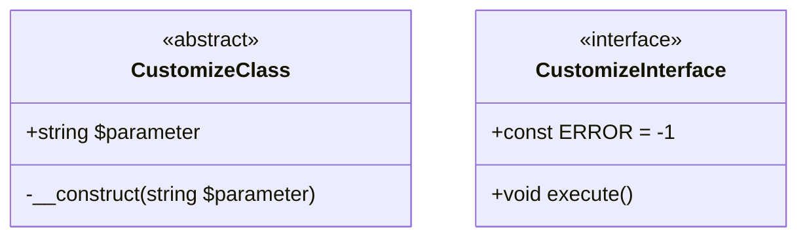

其中`+`表示`public`，`#`表示`protected`，`-`表示`private`。

UML使用实线三角箭头表示超类与子类的继承关系，使用虚线三角箭头表示类与接口的实现关系：

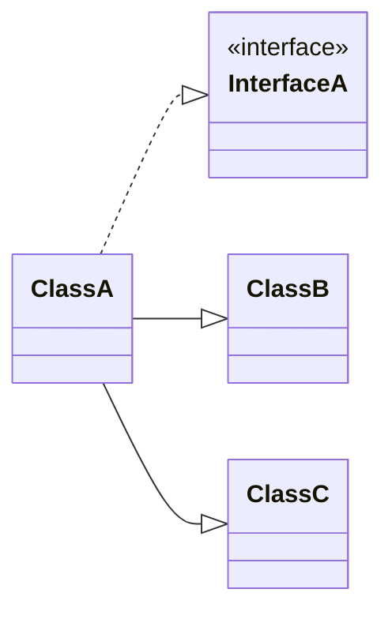

当一个类保存了另一个类的引用时，这两个类就会产生**关联**关系，用实线小于号表示。远离小于号的一侧可以标注数字或`*`，表示关联的对象个数。

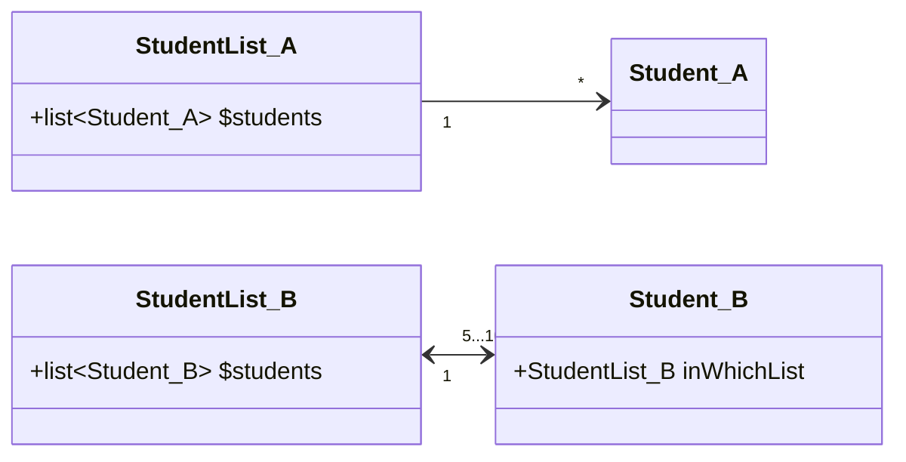

**组合**关系指的是一个类依附于另一个类的存在而存在，用实线实心菱形箭头表示。**聚合**关系指的是一个类可以同时依附于多个类的存在和存在，用实线空心箭头表示：

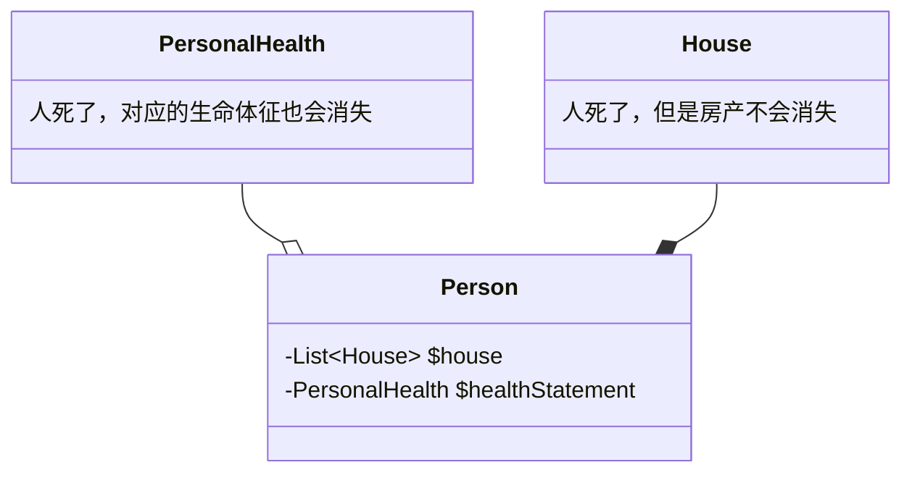


### §3.3.2 工厂模式

以下图为例，`Staff`类既是员工的抽象化概念，又由静态方法`recruit(string $name)`承担实例化员工的任务，借助`fire()`实现多态：

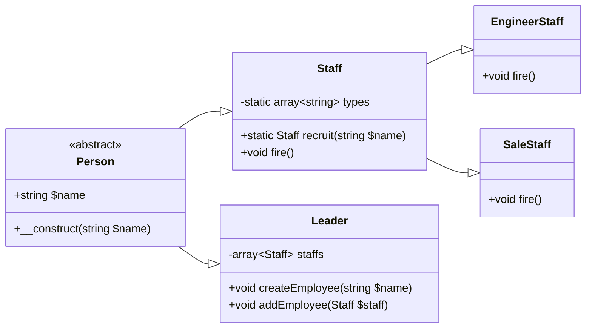

```php
abstract class Person {
    protected $name;
    public function __construct(string $name){
        $this->name = $name;
    }
}

class Staff extends Person {
    public function fire(){print("{$this->name}:I'm fired :(");}
}

class StaffFactory {
    private static $types = ['Staff','EngineerStaff','SaleStaff'];
    public static function recruit(string $name):Staff{
        $className = __NAMESPACE__."\\".self::$types[rand(0,count(self::$types)-1)];
        return new $className($name);
    }
}

class Leader extends Person {
    private $staffs = [];
    public function createStaff(string $name){
        $this->staffs[] = new Staff($name);
    }
    public function addStaff(Staff $staff){
        $this->staffs[] = $staff;
    }
    public function goBankrupt(){
        while(!empty($this->staffs)){
            $staff = array_pop($this->staffs);
            $staff->fire();
        }
    }
}
class EngineerStaff extends Staff {
    public function fire(){print("{$this->name}, as a engineer, is fired :(");}
}
class SaleStaff extends Staff {
    public function fire(){print("{$this->name}, as a salesperson, is fired :(");}
}

$leader = new Leader("Boss");
$leader->addStaff(StaffFactory::recruit("Alice"));
$leader->addStaff(StaffFactory::recruit("Bob"));
$leader->addStaff(StaffFactory::recruit("Carol"));
$leader->goBankrupt();
	// Carol, as a salesperson, is fired :(
	// Bob, as a salesperson, is fired :(
	// Alice, as a salesperson, is fired :(
```

### §3.3.3 单例模式

全局变量非常好用，但是破坏了封装性。有没有一种方法，能够避免命名冲突，同时保留全局变量的下列优点呢？

- 该变量可以被任何类、任何方法、任何函数调用
- 该变量有且仅有一个实例

答案是：将所有功能压缩在一个类中。

```php
class Configuration {
    private $properties = [];
    private static $instance;
    private function __construct(){

    }
    public static function getInstance(){
        if(empty(self::$instance)){
            self::$instance = new Configuration();
        }
        return self::$instance;
    }
    public function setProperty(string $key,string $value){
        $this->properties[$key] = $value;
    }
    public function getProperty(string $key):string{
        return $this->properties[$key];
    }
}

$conf = Configuration::getInstance();
$conf->setProperty("url","127.0.0.1");
print $conf->getProperty("url");
```

### §3.3.4 抽象工厂模式

在Java中，我们已经见识过`InputStream`的各种子类：`ByteArrayInputStream`、`FileInputStream`、`StringBufferInputStream`.......这些子类内部的同名方法肯定存在着茶杯。假如这些子类全都是单例模式，那么一个工厂显然是不够用的，因为同一个工厂产生的实例无法实现方法的多态。基于此，我们把这些`XXXInputFactory`看成是`InputStream`这个抽象类的子类。

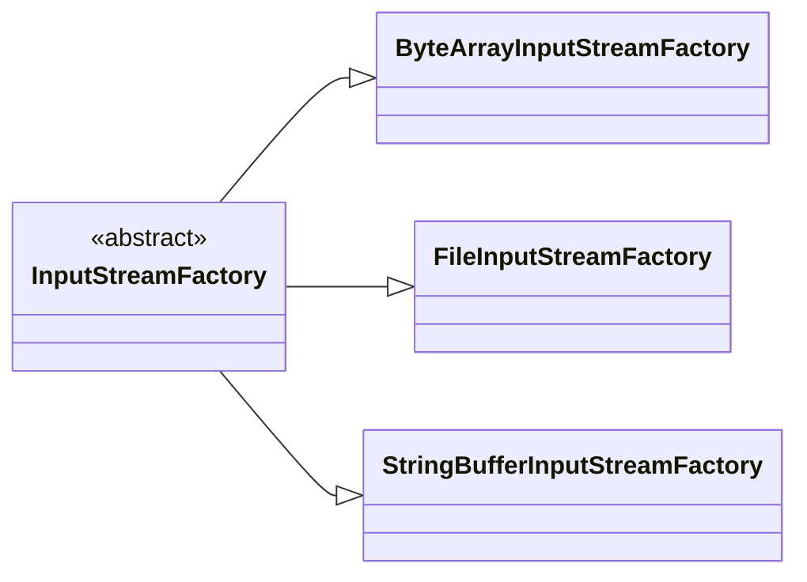

### §3.3.5 原型模式

原型模式与单例模式相比，最大的区别是，返回的实例是一个克隆的对象：

```php
class Sea {}
class WarmSea extends Sea {}
class ColdSea extends Sea {}
class Plain {}
class WarmPlain extends Plain {}
class ColdPlain extends Plain {}
class Forest {}
class WarmForest extends Forest {}
class ColdForest extends Forest {}
class MapFactory {
    private $sea;
    private $forest;
    private $plain;
    public function __construct(Sea $sea,Forest $forest,Plain $plain){
        $this->sea = $sea;
        $this->forest = $forest;
        $this->plain = $plain;
    }
    public function getSea():Sea{
        return clone $this->sea; // 克隆的对象
    }
    public function getPlain():Plain{
        return clone $this->plain; // 克隆的对象
    }
    public function getForest():Forest{
        return clone $this->forest; // 克隆的对象
    }
    public __clone(){
        $this->sea = clone $this->sea;
        $this->forset = clone $this->forest;
        $this->plain = clone $this->plain;
    }
}
$factory = new MapFactory(new Sea(),new WarmPlain(),new ColdForest());
```

### §3.3.6 组合模式

组合模式的核心思想是让所有类都为一个抽象类的子类。

设想下面的战队模型：

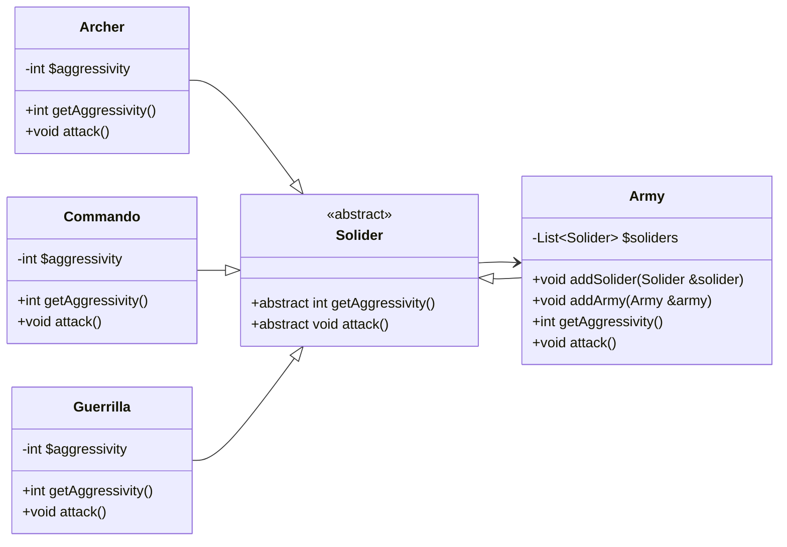

从某种程度上说，客户端其实根本不关心传来的实例到底是什么，只关心它是否实现了`getAggressivity()`和`attack()`。因此，干脆直接把`Army`也看成一个`Solider`。

这种模式有以下优点：

1. 所有类共享同一个抽象类父类，因此添加新的类时，只需要实现抽象类父类的方法即可，对其它类没有任何影响。
2. 客户端无需通过`instanceof`判断操作的示例属于哪个类，只需无脑调用抽象类提供的方法即可。（从这一点上来看，抽象类的作用包含了接口的作用）

### §3.3.7 装饰器模式

装饰器模式的关键在于，实例化一个对象时，将其作为某个修饰器类构造函数的参数。

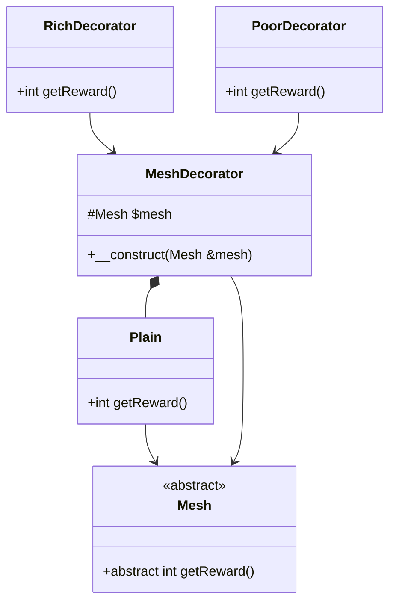

```php
$plain = new Plain();
$plain = new RichDecorator(new Plain());
$plain = new PoorDecorator(new Plain());
```

### §3.3.8 外观模式

我们知道，编写函数时应该遵循“一个函数只执行一种功能”的原则。但是这样的话写出来的函数就会特别多，需要同上到下依次调用一遍。为了简化这个流程，我们还需要编写一个函数。

外观模式将这一流程封装成某个类中的某个方法。

### §3.3.9 解释器模式

PHP语言可以让我们编写自己的编程语言（即迷你语言）。例如很多人不知道正则表达式，我们想将其改写成大家一看就懂的语言。

EBNF（Extended Backus Naur Form，扩展巴斯克范式）是一种用于描述语言语法的符号：

| 数据类型   | EBNF名            | 类名                   | 示例                               |
| ---------- | ----------------- | ---------------------- | ---------------------------------- |
| 变量       | `variable`        | `VariableExpression`   | `$input`                           |
| 字面字符串 | `<stringLiteral>` | `LiteralExpression`    | `"abc"`                            |
| 布尔与     | `andExpr`         | `BooleanAndExpression` | `$a equals '1' and $b equals '2' ` |
| 布尔或     | `orExpr`          | `BooleanOrExpression`  | `$a equals '1' or $a equals '2'`   |
| 相等       | `eqExpr`          | `EqualExpression`      | `$input equals 1$`                 |

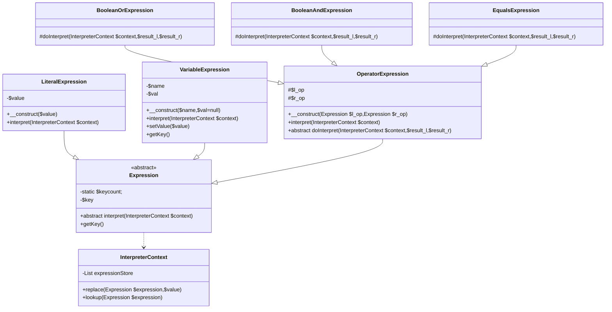

```php
abstract class Expression {
    private static $keycount = 0;
    private $key;
    abstract public function interpret(InterpreterContext $context);
    public function getKey(){
        if(!isset($this->key)){
            self::$keycount++;
            $this->key = self::$keycount;
        }
        return $this->key;
    }
}
class LiteralExpression extends Expression {
    private $value;
    public function __construct($value){
        $this->value = $value;
    }
    public function interpret(InterpreterContext $context){
        $context->replace($this,$this->value);
    }
}
class InterpreterContext {
    private $expressionStore = [];
    public function replace(Expression $expression,$value){
        $this->expressionStore[$expression->getKey()] = $value;
    }
    public function lookup(Expression $expression){
        return $this->expressionStore[$expression->getKey()];
    }
}
class VariableExpression extends Expression {
    private $name;
    private $val;
    public function __construct($name,$val=null){
        $this->name = $name;
        $this->val = $val;
    }
    public function interpret(InterpreterContext $context){
        if(!is_null($this->val)){
            $context->replace($this,$this->val);
            $this->val = null;
        }
    }
    public function setValue($value){
        $this->val = $value;
    }
    public function getKey(){
        return $this->name;
    }
}
abstract class OperatorExpression extends Expression {
    protected $l_op;
    protected $r_op;
    public function __construct(Expression $l_op,Expression $r_op){
        $this->l_op = $l_op;
        $this->r_op = $r_op;
    }
    public function interpret(InterpreterContext $context){
        $this->l_op->interpret($context);
        $this->r_op->interpret($context);
        $this->doInterpret(
            $context,
            $context->lookup($this->l_op),
            $context->lookup($this->r_op)
        );
    }
    abstract protected function doInterpret(InterpreterContext $context,$result_l,$result_r);
}
class EqualsExpression extends OperatorExpression {
    protected function doInterpret(InterpreterContext $context,$result_l,$result_r){
        $context->replace($this,$result_l==$result_r);
    }
}
class BooleanOrExpression extends OperatorExpression {
    protected function doInterpret(InterpreterContext $context,$result_l,$result_r){
        $context->replace($this,$result_l||$result_r);
    }
}
class BooleanAndExpression extends OperatorExpression {
    protected function doInterpret(InterpreterContext $context,$result_l,$result_r){
        $context->replace($this,$result_l&&$result_r);
    }
}
```

编写测试集：

```php
$context = new InterpreterContext();
$input = new VariableExpression("input");
$statement = new BooleanOrExpression(
    new EqualsExpression($input,new LiteralExpression("four")),
    new EqualsExpression($input,new LiteralExpression(4))
); // 等价于$input=="four" || $input == 4
foreach(["four","4"] as $value){
    $input->setValue($value);
    $statement->interpret($context);
    if($context->lookup($statement)){
        print("true");
    }else{
        print("false");
    }
}
```

### §3.3.10 策略模式

设想以下情景：分别为试卷上的选择题、填空题、主观题新建一个类，并且让这三个类都是`Question`的子类。现在要增加需求，有些题目可能包含音频、视频，需要实现`play()`方法。一种朴素的思想是将这三个类按照是否包含多媒体而分裂成六个类。这种方案导致类的数量增加，并且引入了重复代码。

策略模式的核心是将`play()`方法单独提取到`Player`类中，然后在抽象父类`Question`中保存`Player`的一个实例：

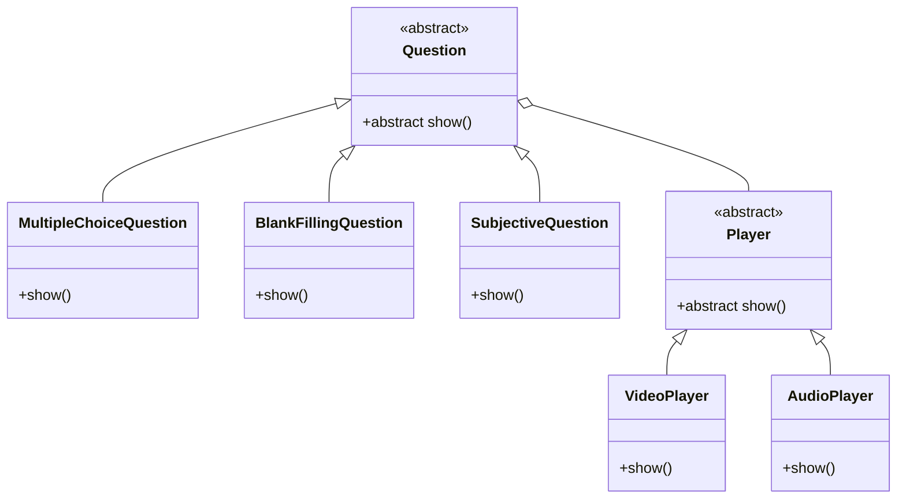

### §3.3.11 观察者模式

设想下面的情景：我们编写了一个很简单的登录类`Login`：

```php
class Login {
    const LOGIN_SUCCESS = 0;
    const LOGIN_WRONG_PASSWORD = 1;
    private $status = [];
    private function setStatus(int $statusCode,string $username,string $ip){
        $this->status = [$statusCode,$username,$ip];
    }
    public function getStatus():array{
        return $this->status;
    }
    private function validate(string $username,string $password):int{
        return rand(0,1);
    }
    public function handleLogin(string $username,string $password,string $ip):bool{
        $isValid = false;
        switch($this->validate($username,$password)){
            case 0:
                $this->setStatus(self::LOGIN_SUCCESS,$username,$ip);
                $isValid = true;
                break;
            case 1:
                this->setStatus(self::LOGIN_WRONG_PASSWORD,$username,$ip);
                $isValid = false;
                break;
        }
        return $isValid;
    }
}
```

随着项目的发展，我们需要与其它类进行交互。例如与办公软件的第三方SDK交互，当账户密码错误时就提醒用户有人尝试登录；与审计部门交互，将本次登录行为交给日志数据库......很快这个`Login`类就会与整个系统耦合起来。

观察者模式的核心就是将其它组件从当前类中分离出来，构成一个观察者类。当登录类发生了某个事件时，观察者类负责捕获并调用其它方法：

```php
interface Observer {
    public function update(Observable $observable);
}
interface Observable {
    public function attach(Observer $observer);
    public function detach(Observer $observer);
    public function notify();
}

class Login implements Observable {
    const LOGIN_SUCCESS = 0;
    const LOGIN_WRONG_PASSWORD = 1;
    private $observers = [];
    private $status;
    public function attach(Observer $observer){
        $this->observers[] = $observer;
    }
    public function detach(Observer $observer){
        $this->observers = array_filter(
            $this->observers,
            function ($i) use ($observer){
                return !($i===$observer);
            }
        );
    }
    public function notify(){
        foreach ($this->observers as $observer){
            $observer->update($this);
        }
    }

    private function setStatus(int $statusCode,string $username,string $ip){
        $this->status = [$statusCode,$username,$ip];
    }
    public function getStatus():array{
        return $this->status;
    }
    private function validate(string $username,string $password):int{
        return rand(0,1);
    }
    public function handleLogin(string $username,string $password,string $ip):bool{
        $isValid = false;
        switch($this->validate($username,$password)){
            case 0:
                $this->setStatus(self::LOGIN_SUCCESS,$username,$ip);
                $isValid = true;
                break;
            case 1:
                $this->setStatus(self::LOGIN_WRONG_PASSWORD,$username,$ip);
                $isValid = false;
                break;
        }
        return $isValid;
    }
}
class LoginAnalyse implements Observer {
    public function update(Observable $observable){
        $status = $observable->getStatus();
        // ...
    }
}
abstract class LoginObserver implements Observer {
    private $login;
    public function __construct(Login $login){
        $this->login = $login;
        $login->attach($this);
    }
    public function update(Observable $observable){
        if($observable === $this->login){
            $this->doUpdate($observable);
        }
    }
    abstract public function doUpdate(Login $login);
}
class SecurityMonitor extends LoginObserver {
    public function doUpdate(Login $login){
        if($login->getStatus()[0] == Login::LOGIN_WRONG_PASSWORD){
            print("有用户尝试登录该系统，且密码输入错误\n");
        }
    }
}
class GeneralLogger extends LoginObserver {
    public function doUpdate(Login $login){
        $status = $login->getStatus()[0];
        printf("(%s,%s,%s)日志已记录\n",$status[0],$status[1],$status[2]);
    }
}

$login = new Login();
new SecurityMonitor($login);
new GeneralLogger($login);
```

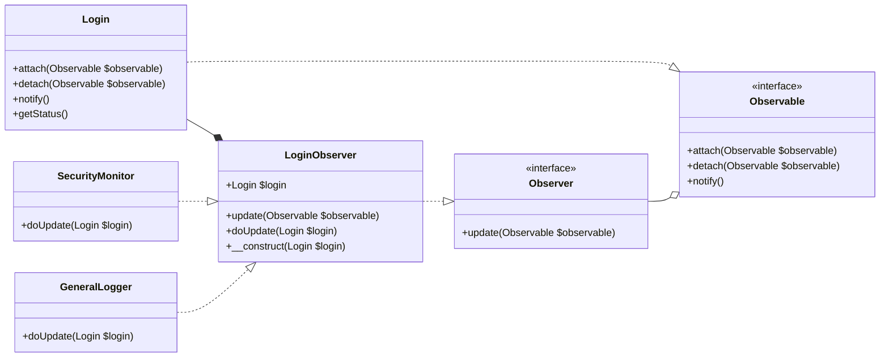

事实上，PHP标准库（Standard PHP Library，SPL）原生支持观察者模式，提供了`SplObserver`、`SqlSubject`接口用于提供观察者模式所需的接口，以及和`SplObjectStorage`类实现了`Countable`、` Iterator`、`Serializable`、`ArrayAccess`接口，负责提供一个从`object`映射到`mixed`的Map：

```php
/* SPL_c1.php */
interface SplObserver{
    public function update(SplSubject $subject): void;
}
interface SplSubject{
    public function attach(SplObserver $observer): void;
    public function detach(SplObserver $observer): void;
    public function notify(): void;
}
```

| `SqlObjectStorage`类方法                | 作用                                                         |
| --------------------------------------- | ------------------------------------------------------------ |
| `addAll(SplObjectStorage):int`          | 将另一个`SplObjectStorage`实例中的所有`object`-`mixed`键值对添加到当前实例中 |
| `attach(object,mixed=null):void`        |                                                              |
| `contains(object):bool`                 |                                                              |
| `count(int=COUNT_NORMAL):int`           |                                                              |
| `detach(object):void`                   |                                                              |
| `getHash(object):void`                  |                                                              |
| `getInfo():mixed`                       |                                                              |
| `key():int`                             |                                                              |
| `next():void`                           |                                                              |
| `offsetExists(object):bool`             |                                                              |
| `offsetGet(object):mixed`               |                                                              |
| `offsetSet(object,mixed=null):void`     |                                                              |
| `offsetUnset(object):void`              |                                                              |
| `removeAll(SplObjectStorage):int`       |                                                              |
| `removeAllExcpet(SqlObjectStorage):int` |                                                              |
| `rewind():void`                         |                                                              |
| `serialize(mixed):string`               |                                                              |
| `unserializable(string):void`           |                                                              |
| `valid():bool`                          |                                                              |

