# PHP

# §1 语法基础


数据类型

|  基本类型  |        类型检查函数        |                      含义                      |
| :--------: | :------------------------: | :--------------------------------------------: |
| `Boolean`  |        `is_bool()`         |                     布尔值                     |
| `Integer`  | `is_integer()`/`is_Long()` |                      整数                      |
|  `Double`  |       `is_double()`        |                     浮点数                     |
|  `String`  |       `is_string()`        |                     字符串                     |
|  `Object`  |       `is_object()`        |                      对象                      |
|  `Array`   |        `is_array()`        |                      数组                      |
| `Resource` |      `is_resource()`       | 识别和使用外部资源的句柄（例如数据库、文件等） |
|   `Null`   |        `is_null()`         |                 未被赋值时的值                 |


# §3 面向对象

2004年，PHP 5.0正式发布，支持面向对象编程的所有特性。

## §3.1 基本概念

### §3.1.1 类与对象

在PHP中，类的声明和实例化语句与其它语言非常相似：

```php
class Commodity {

}
$obj1 = new Commodity();
$obj2 = new Commodity();
var_dump($obj1);
	// 输出"object(CustomizeClass)[1]"
var_dump($obj2);
	// 输出"object(CustomizeClass)[2]"
```

> 注意：在PHP 5.1之前，`print(Object)`等价于`var_dump(Object)`，两者都会输出一个包含对象实例的字符串。然而从PHP 5.2开始，`print()`只能接受字符串类型的参数，不再支持对象，强行调用`print(Object)`会触发`Catchable fatal error: Object of class ... could not be converted to string`的错误，除非这个类本身定义了`__toString()`方法。

可以给属性添加`public`、`protected`、`private`修饰符（缺省为`public`）：

```php
class Commodity {
	public $name = "default commodity name";
    protected $inventory = 100;
    private $origin = "America";
    public function getOrigin(){
    	return $this->origin;
    }
}
$product = new Commodity();
$product->name = "Apple";
print($product->name);
	// 输出"Apple"
print($product->inventory);
	// 输出"Fatal error: Cannot access protected property Commodity::$inventory"
print($product->origin);
	// 输出"Fatal error: Cannot access private property Commodity::origin"
```

| 修饰词           | 类内部 | 子类内部 | 全局 |
| :--------------- | :----: | :------: | :--: |
| `public`（默认） |   √    |    √     |  √   |
| `protected`      |   √    |    √     |      |
| `private`        |   √    |          |      |

非常奇妙的是，PHP不强制要求事先在类的定义中声明所有属性，而是允许动态地向对象添加属性：

```php
$product->price = 9.9;
print("商品单价：{$product->price}");
	// 输出"商品单价：9.9"
```

### §3.1.2 构造方法

> 注意：在PHP 5之前的版本中，构造方法的名称必须与类名相同，这一点类似于C++和Java。在PHP 7之后的版本中，构造方法的名称只有`__construct()`这一种，这一点类似于Python的`__new__()`。

```php
class Commodity {
	public $name;
    protected $inventory;
    private $origin;
    public function __construct($name,$inventory,$origin){
    	$this->name = $name;
        $this->inventory = $inventory;
        $this->origin = $origin;
    }
}
$product = new Commodity("Apple","100","9.9")
```

### §3.1.3 弱类型检查/强类型检查

我们知道，C++与Java中对参数的类型有明确的限制，而PHP 5也引入了类类型声明，本质上是强类型声明。

```php
function printCommodity(Commodity $product){
    print($product->name);
}
printCommodity("This is a string");
	// 输出"TypeError: Argument 1 passed to printCommodity()" must be an instance of Commodity, String given, called in ......
```

自PHP 7开始，类型检查默认为为弱类型检查。这使得上述代码的确限制了参数类型，但是没有完全限制。因为PHP的默认类型转换功能比其他语言强了太多了：因为字符串可以隐式转换为整数、浮点数和布尔值：

```php
function printScore(int $score){
    print("你的分数为{$score}分");
}
printScore("100");
	// PHP 5输出"Argument 1 passed to printScore() must be an instance of int, string given"
	// PHP 7输出”你的分数为100分“

function printIsCorrect(bool $isCorrect){
	$isCorrect ? print("回答正确！") : print("回答错误！");
}
printIsCorrect("false");
	// PHP 5输出" Argument 1 passed to printIsCorrect() must be an instance of bool, string given"
	// PHP 7输出"回答正确！"
```

PHP 7提供了`declare(strict_types=1)`以启用强类型检查。这个语句必须在PHP程序的第一行，并且在调用它的PHP程序内声明，而不是定义它的地方声明。

PHP支持的类型声明如下所示：

|  类型声明  |       弱类型检查       | 起始支持版本 |
| :--------: | :--------------------: | :----------: |
|  `array`   |          数组          |     5.1      |
|   `int`    |         整数和         |     7.0      |
|  `float`   |      浮点数、整数      |     7.0      |
| `callable` | 可调用代码（匿名函数） |     5.4      |
|   `bool`   |         布尔值         |     7.0      |
|  `string`  |         字符串         |     5.0      |
|   `self`   |     指向自己的引用     |     5.0      |
|  [类类型]  |     类或接口的类型     |     5.0      |
|   `void`   |         `null`         |     7.1      |

### §3.1.4 继承

PHP中的继承使用关键字`extends`。

```php
class Commodity {
	public $name;
    protected $inventory;
    private $origin;
    protected function __construct(string $name,int $inventory,string $origin){
        $this->name = $name;
        $this->inventory = $inventory;
        $this->origin = $origin;
    }
}
class BookCommodity extends Commodity{
    public $totalPage;
    public function __construct(string $name,int $inventory,string $origin,int $totalPage){
        parent::__construct($name,$inventory,$origin);
        $this->totalPage = $totalPage;
    }
    public function printName(){
        print($this->name);
    }
}
$book = new BookCommodity("PHP",100,"",123);
$book->printName();
```

> 注意：在父类中可以直接使用`$param`调用定义在父类中的变量，不必使用`$this->param`的形式，这一点类似于Java。但是不能在子类中直接使用父类的变量`$param`，必须通过`$this->param`或`parent::$param`调用。

### §3.1.5 常量

PHP支持将类内的字段设为常量，而且不需要以`$`开头，习惯全为大写字母：

```php
class ErrorCode {
	static const UNKNOWN = 0;
    static const NETWORK_404 = 1;
    static const NETWORK_403 = 2;
    static const TIME_EXCEEDED = 3;
}
function sendErrorCode(){
	print(ErrorCode::TIME_EXCEEDED);
}
```

### §3.1.6 抽象类

抽象类由关键字`abstract`定义，本身无法被实例化，除非其子类实现了抽象类声明的所有方法，不然其子类也不能被实例化。

当一个类显式地被`abstract`修饰，那么这个类即使不含任何抽象方法，也不能被实例化。

```php
abstract class Person {
    protected $name;
    public function setName(string $name){
        $this->name = $name;
    }
    abstract public function print();
}
class PrintablePerson extends Person{
    public function print(){
        print("姓名:".$this->name);
    }
}
```

### §3.1.7 接口

接口的关键字是`interface`和`implements`与抽象类相比，接口只能声明方法，而不能实现方法。

```php
interface Printable {
    public function print():void;
    public function getPrintString():string;
}
class Person implements Printable{
    protected $name;
    public function setName(string $name){
        $this->name = $name;
    }
    public function print():void{
        print($this->getPrintString());
    }
    public function getPrintString():string{
        return "姓名:".$this->name;
    }
}
$person = new Person();
$person->setName("Alice");
$person->print();
```

### §3.1.8 trait

继承和接口都能复用代码。然而继承限制类与类之间必须存在继承关系，接口只能复用方法的声明，而不能复用方法的定义。

假设遇到下面的情况：在一个电商平台中，买家、卖家和电商部门都需要计算某件商品打折之后的价格。但是这三方使用的折扣不同，卖家折扣减去买家折扣等于电商部门的获利。显然双方调用的这个方法，声明一样，都是`getPrice(折扣，原价)`，定义也一样，都是当前价格乘以折扣百分比。怎么实现呢？

- 如果用继承的思想，那么首先要将买家、卖家和电商部门看成三个子类，然后尝试提取他们的共性，找出父类。把什么当成父类才合适呢？如果是`Person`的话，电商部门是人的集合，并不能当成独立的个人看待。借用法律的概念，这三者应该归纳到“主体”这一概念，其学术翻译为`Entity`。这只是一个普通的电商系统，却引入了一个毫不相关的"主体"父类，于是我们就得到了这么一个别扭的继承关系：

  ```mermaid
  graph TB
  	subgraph Entity
  		EntityGetDiscount["static getPrice(int discountPercentage,float originalPrice)<br>return discountPercentage × originalPrice ÷ 100;"]
  	end
  	EntityGetDiscount-->Buyer
  	EntityGetDiscount-->Seller
  	EntityGetDiscount-->Platform
  ```

- 如果用接口的思想，那么新建一个`PriceCalculatable`接口，声明该方法，然后在三个类中分别定义一遍，造成了代码的重复。

在Java中，我们通用的解决方法是定义一个独立的类，将"接口"中的方法全部搬到这个独立的类中实现，然后所有的类就能全局调用这个类中的方法：

```java
public class PriceCalculator {
	public static float getPrice(int discountPercentage,float originalPrice){
        return discountPercentage * originalPrice / 100;
    }
}
public class Buyer/Seller/Platform{
	public static void main(String[] args){
    	System.out.println(PriceCalculator.getPrice(80,100));
    }
}
```

这种类的特殊之处在于：我们不需要对其实例化。怎么表示这一特性呢？用`abstract`修饰肯定不行，这是对抽象类的滥用。Java对这一问题束手无策，但是PHP在`class`、`interface`的基础上加入了`trait`这一概念，专门用来表示这种“不用实例化”的、能同时声明和定义方法的、可以多重继承的纯功能“接口”。

```php
trait PriceUtilities {
    public function getPrice(int $discountPercentage,float $originalPrice):float{
        return $discountPercentage * $originalPrice / 100;
    }
}
class Buyer/Seller/Platform {
    use PriceUtilities;
}
$product = new Buyer();
print($product->getPrice(80,19.9)); // 输出"15.92"
```

多个trait包含的同名方法会引起命名冲突，在编译时报错：

```php
trait CatAction {
    public function greet(){print("Meow~");}
}
trait DogAction {
    public function greet(){print("Woof!");}
}
class Pet {
    use CatAction,DogAction;
		// 报错输出"Trait method greet has not been applied, because there are collisions with other trait methods on Pet"
}
```

我们可以用`insteadof`关键字强行多选一，然后用`as`关键字给其它方法起别名以供调用：

```php
trait CatAction{...}
trait DogAction{...}
class Pet {
    use CatAction,DogAction{
        CatAction::greet insteadof DogAction;
        DogAction::greet as dog_greet;
    }
}
$pet = new Pet();
$pet->greet();
	// 输出"Meow~"
$pet->dog_greet();
	// 输出"Woof!"
```

`as`关键字还可以强行改变`trait`中的访问权限：

```php
trait SecretTrait { private function secretFunction(){print "secret function";} }
class MyClass {
    use SecretTrait;
}
$obj = new MyClass();
$obj->secretFunction();
	// 输出错误"Call to private method"
```

```php
trait SecretTrait { private function secretFunction(){print "secret function";} }
class MyClass {
    use SecretTrait{
        SecretTrait::secretFunction as public;
    }
}
$obj = new MyClass();
$obj->secretFunction();
	// 输出"secret function"
```

### §3.1.9 延迟静态绑定

下面的这段工厂模式的代码存在着代码重复的问题：

```php
class Animal {
    public $name;
}
class Cat extends Animal {
    private function __construct(string $name){
        $this->name = $name;
    }
    public static function createInstance(string $name):Cat{
        return new Cat($name);
    }
}
class Dog extends Animal {
    private function __construct(string $name){
        $this->name = $name;
    }
    public static function createInstance(string $name):Dog{
        return new Dog($name);
    }
}
```

我们思路是将这些子类中的函数迁移到父类中。但是下面的代码会报错：

```php
class Animal {
    public $name;
    private function __construct(string $name){
        $this->name = $name;
    }
    public static function createInstance(string $name):Animal{
        return new self($name);
    }
}
class Cat extends Animal{}
class Dog extends Animal{
    public function greet(){print("Woof!");}
}
$dog = Dog::createInstance("Hello");
$dog->greet();
    // 输出错误"Uncaught Error: Call to undefined method Animal::greet()"
```

这是因为`self`指向的是引用该关键字的`DomainObject`，而不是对其进行调用的`Document`。PHP 5.3引入了延迟静态绑定，用`static`代替`self`：

```php
class Animal {
    public $name;
    private function __construct(string $name){
        $this->name = $name;
    }
    public static function createInstance(string $name):Animal{
        return new static($name); // 更改了此处
    }
}
class Cat extends Animal{}
class Dog extends Animal{
    public function greet(){print("Woof!");}
}
$dog = Dog::createInstance("Hello");
$dog->greet();
	// 输出"Woof!"
```

再例如下面的代码：

```php
abstract class Book {
    private $group;
    public function __construct(){
        // $this->group = self::getDefaultGroup();
        // $this->group = static::getDefaultGroup();
    }
    public static function getDefaultGroup():string{
        return "Default";
    }
    public function getGroup():string{
        return $this->group;
    }
}
class Fiction extends Book {
    public static function getDefaultGroup():string{
        return "Fiction";
    }
}
$fiction = new Fiction();
print($fiction->getGroup());
    // self->gerDefaultGroup()输出"Default"
	// static::getDefaultGourp()输出"Fiction"
```

### §3.1.10 异常处理

PHP 5引入了异常这一概念，类似于Java中的``Exception`和`Error`。

| `Exception`方法名  | 作用                                   |
| ------------------ | -------------------------------------- |
| `getMessage()`     | 获取Exception消息字符串                |
| `getCode()`        | 获取Exception错误代码                  |
| `getFile()`        | 获取发生异常的文件                     |
| `getLine()`        | 获取发生异常额行号                     |
| `getPrevious()`    | 获取一个嵌套异常对象                   |
| `getTrace()`       | 获取一个包含方法调用跟踪信息的多维数组 |
| `getTraceAsString` | 获取`getTrace()`的字符串版本           |
| `__toString()`     | 将Exception实例转为字符串              |

| `Error`子类           | 作用                   |
| --------------------- | ---------------------- |
| `ArithmeticError`     | 数学运算错误           |
| `AssertionError`      | `assert()`断言失败错误 |
| `DivisionByZeroError` | 除以0错误              |
| `ParseError`          | `eval()`语句解析错误   |
| `TypeError`           | 传参类型不匹配错误     |


```php
function isFileExist(string $filePath){
    try{
        if(!file_exists($file)){
        	throw new Exception("File '{$file}' doesn't exist.");
    	}
    } catch(Exception e) {
        print("文件未找到");
    } finally {
        
    }
}
```

PHP也同样支持创建Exception的子类：

```
class FileNotFoundException extends Exception{
    
}
```

### §3.1.11 final

被`final`修饰的类无法被继承，被`final`修饰的方法无法被重写：

```php
final class A {}
class B extends A {}
	// 输出错误"Class IllegalCheckout may not inherit from final class A"
```

```php
class A{
    public final function func(){}
}
class B extends A {
    public function func(){}
    	// 输出错误"Cannot override final method A::func()"
}
```

### §3.1.12 拦截器

设想一个这样的函数`getParameter(string $parameter)`，当类中存在该变量时就返回变量，不存在时就返回`null`。要在Java做到这一点，必须手写一遍反射和异常处理的轮子。而PHP将其封装成了拦截器：

| 拦截器方法                         | 作用                                  |
| ---------------------------------- | ------------------------------------- |
| `__get($property)`                 | 尝试访问未定义属性时被调用            |
| `__set($property,$value)`          | 尝试对未定义属性赋值时被调用          |
| `__isset($property)`               | 尝试对未定义属性调用`isset()`时被调用 |
| `__unset($property)`               | 尝试对未定义属性调用`unset()`时被调用 |
| `__call($method,$arg_array)`       | 尝试调用未定义实例方法时被调用        |
| `__callStatic($method,$arg_array)` | 尝试调用未定义静态方法时被调用        |

```php
class Person {
    private $name;
    public function __get(string $property){
        $method = "get{$property}";
        if(method_exists($this,$method)){
            return $this->$method();
        }else{
            print("{$property}属性不存在！");
        }
    }
    public function setName(string $name):void{
        $this->name = $name;
    }
    public function getName():string{
        return $this->name;
    }
}
$person = new Person();
$person->setName("Alice");
print($person->__get("name"));
	// 输出"Alice"
print($person->getName());
	// 输出"Alice"
print($person->__get("age"));
	// 输出"age属性不存在！"
print($person->getAge());
	// 输出报错"Uncaught Error: Call to undefined method Person::getAge()"
```

### §3.1.13 析构方法

PHP 5引入了`__destruct()`，当对一个实例被`unset()`调用时就会执行。

```php
class A{
    public function __destruct(){
        print("Destructing instance...");
    }
}
$a = new A();
unset($a);
	// 输出"Destructing instance..."
```

### §3.1.14 `__clone()`

将一个实例赋给另一个变量是很常见的操作。PHP 4时，这一过程会导致对象被复制了一份，两个变量指向两个不同的实例。PHP 5以后，这一过程会导致两个变量指向同一个实例，如果要复制对象的话，必须使用`clone`关键字：

```php
class A{
    public $data = 1;
}
$a = new A();
print($a->data); // 输出"1"
$b = clone $a;
print($b->data); // 输出"1"
```

这一过程调用了类内的`__clone()`方法，我们可以重写该方法：

```php
class A{
    public $data = 1;
    public function __clone(){
        $this->data = 0;
    }
}
$a = new A();
print($a->data); // 输出"1"
$b = clone $a;
print($b->data); // 输出"0"
```

### §3.1.15 `__toString()`

在PHP 5.1之前，`print()`可以直接输出实例的ID：

```php
class A{}
$a = new A();
print($a);
	// Object id #1
```

在PHP 5.2以后，实例不能直接被输出，必须通过显示声明并定义`__toString()`才能转为字符串:

```php
class A{
    public $data = 1;
}
$a = new A();
print($a);
	// Object of class A could not be converted to string 
```

```php
class A{
    public $data = 1;
    public function __toString(){
        return "The data is ".$this->data;
    }
}
$a = new A();
print($a);
	// 输出"The data is 1"
```

### §3.1.16 回调函数

PHP 4引入了Lambda表达式，调用`create_function(string args,string commands)`会返回一个Lambda表达式。该函数功能堪比`eval()`，所以经常被用来攻击。自PHP 7.2开始，该函数被deprecated了，取而代之的是匿名函数：

```php
// create_function()
$function1 = create_function(
	'string $name',
    'print("Hello,{$name}!")'
);

// 匿名函数
$function = function($name){
	print("Hello,{$name}");
}
```

匿名函数是一个`callback`类型的变量，既然这是一个变量，那么它就可以当作函数的实参，也可以当作函数的返回值：

```php
class Student {}
class School{
    private $callbacks;
    public function registerCallback(callable $callback):void{
        if(!is_callable($callback)){
            throw new Exception("callback not callable");
        }
        $this->callbacks[] = $callback;
    }
    public function startNewDay(Student $student){
        foreach ($this->callbacks as $callback){
            call_user_func($callback,$student);
        }
    }
}

// 匿名函数
$gotoSchool = function(){print("已到达学校\n");};
$doExam = function(){print("分数为".random_int(0,100));};
$leaveSchool = function(){print("已离开学校");};

$school = new School();
$school->registerCallback($gotoSchool);
$school->registerCallback($doExam);
$school->registerCallback($leaveSchool);

$student = new Student();
$school->startNewDay($student);
```

```php
function getGreetFunction(string $name):callable{
    return function() use ($name){
        print("Hello,".$name);
    };
}
$AliceGreetFunction = getGreetFunction("Alice");
$AliceGreetFunction();
	// 输出"Hello,Alice"
```

### §3.2.17 匿名类

匿名类常用于简单且特定于局部的上下文，可以看作是某个接口的“实例”。

```php
interface Describable {
    public function getDescription(Person $person):string;
}

class Person {
    public $name;
    public function Person(string $name){
        $this->name = $name;
    }
    public function printDescription(Describable $describable){
        $describable->getDescription($this);
    }
}
$person = new Person("Alice");
$person->printDescription(
        new class implements Describable{
            public function getDescription(Person $person):string{
                return "姓名".$person->name;
            }
        }
);
```

### §3.1.18 命名空间

在Java中，为了区分同名类，我们使用形如`package com.example`的软件包来管理这些类。在C++中，面对同样的问题，我们使用`namespace std`的命名空间，并且允许在一个命名空间中`use`另一个命名空间进行嵌套。

PHP没有原生的“包”的概念，但是PHP 5.3引入了命名空间这一概念，从这一点上来说它像C++。然而要理清C++的命名空间嵌套关系，就只能层层向上地手动跳转到各个命名空间，并且在创建命名空间的时候还要时刻提防循环嵌套。而PHP的命名空间比较奇妙，它可以使用`namespace com\example;`的方式来管理命名空间的嵌套，从这一点上来说它又像Java。更加奇妙的是，PHP的命名空间路径支持绝对路径`\com\example`和相对路径`com\example`，从这一点上来说它比Java还高级。

`use`关键字是从根命名空间开始查找的，因此不需要在路径开头加`\`：

```php
// a.php
namespace view_1;
class MainFrame {
    static function sayHello(){print("Hello World! From view_1.");}
}
```

```php
// b.php
namespace view_@;
class MainFrame {
    static function sayHello(){print("Hello World! From view_2.");}
}
```

```php
// index.php
function sayHello(){ // 分别调用，开头必须加反斜杠
    \view_1\MainFrame::sayHello(); // 输出"Hello World! From view_1."
    \view_2\MainFrame::sayHello(); // 输出"Hello World! From view_2."
}

use view_1\MainFrame; // 使用use关键字，开头不加反斜杠
function sayHello(){
    MainFrame::sayHello();
}

use view_2\MainFrame as View2MainFrame; // 使用use和as关键字起别名
function test(){
    View2MainFrame::sayHello();
}
```

### §3.1.19 文件包含

与C语言的`#include<>`类似，PHP支持以下方法来包含文件：

| 函数                                 | 作用                                              |
| ------------------------------------ | ------------------------------------------------- |
| `include()`或`include ...`           | 包含文件，若文件不存在则抛出`E_WARNING`，继续执行 |
| `include_once()`或`include_once ...` | 对于重复包含的文件，仅包含一次，文件不存在则同上  |
| `require(...)`或`require ...`        | 包含文件，若文件不存在则抛出`E_ERROR`，停止执行   |
| `require_once()`或`require_once ...` | 对于重复包含的文件，仅包含一次，文件不存在则同上  |

PHP 5引入了自动加载功能，只需调用`spl_autoload_register()`即可：

```php
spl_autoload_register();
$object = new CustomizeClass();
```

自动加载将尝试从工作目录中查找`CustomizeClass.php`或`CustomizeClass.inc`的文件。

### §3.1.20 类函数和对象函数

PHP提供了一组用于检查类和对象的函数，用于运行时查看类的信息。

利用字符串动态加载类文件并将其实例化：

```php
// ./a.php
namespace user;
class Greeter {
    public function greet(){
        print("Hello World!");
    }
}
```

```php
// ./index.php
require_once("a.php");
$namespace = "user";
$className = "Greeter";
$classPath = $namespace."\\".$className;
$obj = new $classPath();
$obj->greet();
	// 输出"Hello World!"
```

`class_exists(string)`用于检测在当前上下文中，指定的类是否存在，并返回一个布尔值：

```php
$workspace = __DIR__;
$namespace = "user";
$fileName = "a.php";
$className = "Greeter";
$filePath = $workspace."/".$fileName;
$classPath = $namespace."\\".$className;

class_exists($classPath) ? print("{$className}类存在") : print("{$className}类不存在");
	// 输出"Greeter类存在"
require_once($filePath);
class_exists($classPath) ? print("{$className}类存在") : print("{$className}类不存在");
	// 输出"Greeter类不存在"
```

`get_declared_classes()`以数组的形式返回当前上下文定义的所有类：

```php
print_r(get_declared_classes());
//	Array (
//    	[0] => stdClass 
//    	[1] => Exception 
//    	[2] => ErrorException 
//   	[3] => Error 
//    	[4] => ParseError 
//    	[5] => TypeError 
//    	[6] => ArgumentCountError
//    	[7] => ArithmeticError 
//    	[8] => DivisionByZeroError 
//		...
//    	[139] => mysqli_stmt 
//    	[140] => SQLite3 
//    	[141] => SQLite3Stmt 
//    	[142] => SQLite3Result 
//    	[143] => XSLTProcessor 
//    	[144] => user\Greeter 
//		)
```

`get_class(object)`用于返回对象的类型：

```php
require_once("a.php");
$object = new \user\Greeter();
print(get_class($object));
	// 输出"user\Greeter"
```

为了判断某个类是否为另一个类的子类，PHP 4及以上版本使用的是`is_a()`函数，PHP 5及以上版本使用的是`instanceof`运算符：

```php
class A {}
class B extends A {}

$b = new B();
print($b instanceof B); // 输出"1"
print($b instanceof A); // 输出"1"
```

`instanceof`运算符也可用于判断某个类是否实现了某个接口：

```php
interface A{}
class B implements A{}
$b = new B();
print($b instanceof A ? "true" : "false");
	// 输出"true"
```

类名后添加`::class`可以得到该类的绝对路径：

```php
namespace Index;
class A {}
print(A::class); // 输出“Index\A”
```

`get_class_methods(string|object|class)`返回类中**向外公开**的全部方法名称（不包括形参列表）。这一函数可用于判断某个类方法是否可以被调用，功能类似于`is_callable(array[object|class,string])`：

```php
class A {
    private function func_1(int $a){}
    protected function func_2(float $b){}
    public function func_3(string $c){}
}
print_r(get_class_methods(A::class));
	// 输出"Array([0]=>func_3)"
print(is_callable(array(new A(),"func_1")) ? "true" : "false");
	// 输出"false"
print(in_array("func_1",get_class_methods(A::class)) ? "true" : "false");
	// 输出"false"
```

`method_exists(object|class,string)`只关注类中是否存在制定的方法，而不管这个方法是否被`private`或`protected`修饰而无法被调用：

```php
class A {
    private function func_1(int $a){}
    protected function func_2(float $b){}
    public function func_3(string $c){}
}
print(method_exists(A::class,"func_1") ? "true" : "false");
	// 输出"true"
```

`get_class_vars(class|object)`以数组形式返回这个类中的所有字段：

```php
class A {
    private $a = "private";
    protected $b = "protected";
    public $c = "public";
}
print_r(get_class_vars(A::class));
	// 输出"Array([c]=>public)"
```

`get_parent_class(string)`用于返回某个类的**亲**父类：

```php
namespace Index;
class A {}
class B extends A {}
class C extends B {}
$c = new C();
print(get_parent_class($c)); // 输出"IIndex\B"
```

`is_subclass_of(class|object,class|object|string)`用于判断前者是否继承了后者：

```php
class A {}
class B extends A {}
class C extends B {}
$a = new A();
print(is_subclass_of(C::class,A::class) ? "true" : "false");
	// 输出"true"
```

要判断某个类是否实现了某个接口，除了`instanceof`关键字外，还可以用PHP标准库（Standard PHP Library，SPL）中的`class_implements()`：

```php
interface A{}
class B implements A{}
$b = new B();
print(class_implements($b,A::class) ? "true" : "false");
	// 输出"true"
```

要动态调用方法或函数，除了`$a->$b()`以外，还可以用`call_user_func()`：

```php
class A {
    public function func_A(): string{
        return "This is func_A()";
    }
}
function func_B(): string{
    return "This is func_B()";
}
$a = new A();

// 调用函数时，call_user_func("函数名",参数1,参数2,...)
print(call_user_func("func_B"));

// 调用方法时，call_user_func(array(object|class))
print(call_user_func(array($a,"func_A"),参数1,参数2,...));
```

之前我们介绍过`__call()`方法，但是它有一个弊端，就是无法处理变长形参：

```php
class A {
    public function add(float $num1,float $num2): float{
        return $num1 + $num2;
    }
    public function opposite(float $num): float{
        return -$num;
    }
    public function __call($method,float $args){
        if(method_exists($this,$method)){
            return $this->$method($args); // 传递的只能是列表
        } else {
            return null;
        }
    }
}

$a = new A();
print($a->__call("add",1,2)); // 无法处理两个及以上的形参
```

为了解决这一问题，PHP使用`call_user_func_array()`处理变长参数：

```php
class A {
	// ...
    public function __call($method,array $args){
        if(method_exists($this,$method)){
            return call_user_func_array(
            	[$this,$method],
                $args // 必须为array
            );
        } else {
            return null;
        }
    }
}
```

## §3.2 反射API

> “学PHP不学反射，就像学Python不学`hasattr()`/`getattr()`/`setattr()`/`delattr()`，学Java不学`java.lang.reflect`，相当于没有接触过高级OOP，整个人就卡在C++这个层次上了，只能度过一个相对失败的人生。”

PHP提供了一系列用于反射的类：

| 类名                      | 作用                                     |
| ------------------------- | ---------------------------------------- |
| `Reflection`              | 提供静态方法`export()`，输出类的摘要信息 |
| `ReflectionClass`         | 输出类的信息                             |
| `ReflectionMethod`        | 输出类方法的信息                         |
| `ReflectionParameter`     | 输出类方法参数的信息                     |
| `ReflectionProperty`      | 输出类字段的信息                         |
| `ReflectionFunction`      | 输出函数的信息                           |
| `ReflectionExtension`     | 输出PHP扩展的信息                        |
| `ReflectionException`     | 输出`Exception`实例的信息                |
| `ReflectionZendExtension` | 输出PHP Zend扩展的信息                   |

相比于[§3.1.20 类函数和方法函数](#§3.1.20 类函数和方法函数)和`var_dump(object)`，反射API的功能更强大，能提供的信息更多，甚至被广泛用于生成文档和图表，所以开发时应该优先使用反射API。

```php
namespace index;

class A {
    private function func_1(){}
    protected function func_2(){}
    public function func_3(){}
}
$targetClass = new \ReflectionClass("index\A");
\Reflection::export($targetClass);
/*
Class [ class index\A ] { 
    @@ C:\index.php 5-9
        - Constants [0] { } 
    	- Static properties [0] { } 
    	- Static methods [0] { } 
    	- Properties [0] { } 
    	- Methods [3] { 
            Method [ private method func_1 ] { @@ C:\index.php 6 - 6 } 
            Method [ protected method func_2 ] { @@ C:\index.php 7 - 7 } 
            Method [ public method func_3 ] { @@ C:\index.php 8 - 8 } 
        } 
}
*/
```

### §3.2.1 `ReflectionClass`

`ReflectionClass`类用于检查类，其实例提供下列实例方法：

| 方法名                                                   | 作用                                                         | 方法名                         | 作用                                                         |
| -------------------------------------------------------- | ------------------------------------------------------------ | ------------------------------ | ------------------------------------------------------------ |
| `getAttributes():array`                                  | 返回上下文所有被`#[Attribute]`标记的类                       | `isAbstract():bool`            | 检查该类是否为抽象类                                         |
| `getConstant($string):mixed`                             | 返回类中指定名称的`const`常量，找不到则返回`false`           | `isAnonymous():bool`           | 检查该类是否为匿名类                                         |
| `getConstants():array`                                   | 获取类中所有`const`常量，以数组形式返回                      | `isCloneable():bool`           | 检查该类的`__clone()`是否能克隆类中的全部信息                |
| `getConstructor():ReflectionMethod`                      | 返回类的构造函数                                             | `isEnum():bool`                | 检查是否为枚举类                                             |
| `getDefaultProperties():array`                           | 返回类中的所有字段                                           | `isFinal():bool`               | 检测该类是否被`final`修饰                                    |
| `getDocComment():string`                                 | 返回类的文档注释（由类之前的`/** */`文档注释定义）           | `isInstance(Object):bool`      | 检测该对象是否为这个类的实例                                 |
| `getEndLine():int`                                       | 获取定义该类的文件中，该类定义部分的结束行号                 | `isInstantiable():bool`        | 检测该类是否可以实例化                                       |
| `getExtension():ReflectionExtension`                     | 返回定义该类的扩展的`ReflectionExtension`实例                | `isInterface():bool`           | 检测该类是否为接口                                           |
| `getExtensionName():strng`                               | 返回定义该类的扩展的名称                                     | `isInternal():bool`            | 检测该类是否由扩展括内部核心定义                             |
| `getFileName():string`                                   | 返回定义该类的文件的文件名                                   | `isIterateable():bool`         | 检测该类是否实现`Iterator`接口，是否可以被用在`foreach`语句中 |
| `getInterfaceNames():array[string]`                      | 返回该类实现的所有接口名称构成的数组                         | `isSubclassOf(string):bool`    | 检测该类是否为指定类的子类                                   |
| `getInterfaces(): array[ReflectionClass]`                | 返回该类实现的所有接口构成的数组                             | `isTrait():bool`               | 检测该类是否为`trait`                                        |
| `getMethod(string):ReflectionMethod`                     | 返回该类中指定名称的方法                                     | `isUserDefined():bool`         | 检测该类是否由用户自定义，与`inInternal()`相反               |
| `getMethods():array`                                     | 返回该类中的所有方法构成的数组                               |                                |                                                              |
| `getModifiers():int`                                     | 返回该类占用的内存空间字节数，也就是修饰符常量的位掩码（缺省为`1048576`，即1MB） | `hasConstant(string):bool`     | 检测该类是否定义了指定的`const`常量                          |
| `getName():string`                                       | 返回带有命名空间的类名                                       | `hasMethod(string):bool`       | 检测该类是否声明了指定的方法                                 |
| `getNamespaceName():string`                              | 获取该类所在的命名空间                                       | `hasProperty(string)`          | 检测该类是否定义了指定的字段                                 |
| `getParentClass():ReflectionClass`                       | 获取该类的亲父类                                             |                                |                                                              |
| `getProperties():array`                                  | 获取所有的字段的值组成的数组                                 | `newInstance(mixed,mixed,...)` | 根据给定的参数调用相应的构造方法                             |
| `getProperty(string): ReflectionPerperty`                | 获取指定名称的值                                             | `newInstanceArgs(array)`       | 根据给定的参数数组调用相应的构造方法                         |
| `getReflectionConstant(string): ReflectionClassConstant` | 获取指定名称的`const`常量的值                                | `newInstanceWithoutConst()`    | 调用无参的构造方法                                           |
| `getReflectionConstants():array`                         | 获取所有的字段的`const`常量组成的数组                        |                                |                                                              |
| `getShortName():string`                                  | 忽略命名空间，直接返回该类的类名                             |                                |                                                              |
| `getStartLine():int`                                     | 获取定义该类的文件中，该类定义部分的起始行号                 |                                |                                                              |
| `getStaticProperties():array`                            | 获取所有的静态字段的值                                       |                                |                                                              |
| `getStaticPropertyValue(string) :mixed`                  | 获取指定名称的静态字段的值                                   |                                |                                                              |
| `getTraitAliases():array`                                | 获取该类通过`use`关键字使用的`trait`类在经过关键字`as`改名后的名称数组 |                                |                                                              |
| `getTraitNames():array`                                  | 获取该类通过`use`关键字使用的`trait`类名称数组               |                                |                                                              |
| `getTraits():array`                                      | 获取该类通过`use`关键字使用的`trait`类数组                   |                                |                                                              |

### §3.2.2 `ReflectionMethod`

`ReflectionClass`类继承于`ReflectionFunctionAbstract`类，用于检查方法。其实例有以下三种获取方式：

- `ReflectionClass::getMethods()["方法名"]`
- ``ReflectionClass::getMethods()`
- `new ReflectionMethod(object|string,string|null)`

其实例提供下列实例方法：

| 方法名                                             | 作用                                                         | 方法名                          | 作用                                                         |
| -------------------------------------------------- | ------------------------------------------------------------ | ------------------------------- | ------------------------------------------------------------ |
| `getAttributes(string):array[ReflectionAttribute]` | 返回该类中所有被`#[Attribute]`标记的方法                     | `isClosure():bool`              | 检查该方法是否为匿名函数                                     |
| `getClosureScopeClass():ReflectionClass`           | 返回该匿名函数所在的类                                       | `isDeprecated():bool`           | 检查该方法是否被`#[Deprecated]`修饰                          |
| `getClosureThis():object`                          | 返回该匿名函数内的`$this`变量                                | `isGenerator():bool`            | 检查该方法是否为生成器方法（形参列表形如`$start,$limit,$step=1$`，内含关键字`yield`） |
| `getClosureUsedVariables():array[string,mixed]`    | 返回该匿名函数通过`use`关键字引用的外部变量构成的数组        | `isInternal():bool`             | 检测该方法是否由扩展括内部核心定义                           |
| `getDocComment():string`                           | 获取由`/** */`指定的文档注释                                 | `isUserDefined():bool`          | 检测该方法是否由用户自定义，与`inInternal()`相反             |
| `getEndLine():int`                                 | 获取定义该方法的文件中，该方法定义部分最后一行的行号         | `isVariadic():bool`             | 检测该方法是否包含变长形参列表                               |
| `getExtension():ReflectionExtension`               | 返回定义该方法的扩展的`ReflectionExtension`实例              | `isAbstract():bool`             | 检测该方法是否为抽象方法                                     |
| `getExtensionName():string`                        | 返回定义该方法的扩展的名称                                   | `isConstructor():bool`          | 检测该方法是否为其类的构造器方法                             |
| `getFileName():string`                             | 返回定义该方法的文件名                                       | `isDestructor():bool`           | 检测该方法是否为其类的析构器方法                             |
| `getName():string`                                 | 返回带有命名空间的类名                                       | `isFinal():bool`                | 检测该方法是否被`final`修饰                                  |
| `getNamespaceName():string`                        | 返回命名空间                                                 | `isPrivate():bool`              | 检测该方法是否被`private`修饰                                |
| `getNumberOfParameters():int`                      | 返回该方法需要的形参个数（包括可选参数）                     | `isProtected():bool`            | 检测该方法是否被`protected`修饰                              |
| `getNumberOfRequiredParameters():int`              | 返回该方法必须需要的参数个数（不包括可选参数）               | `isPublic():bool`               | 检测该方法是否被`public`修饰                                 |
| `getParameters():array[ReflectionParameter]`       | 返回该方法的`ReflectionParameter`实例组成的形参列表          | `isStatic():bool`               | 检测该方法是否为静态方法                                     |
| `getReturnType():ReflectionType`                   | 返回该方法的返回值类型，`ReflectionType`自带`__toString()`方法 |                                 |                                                              |
| `getShortName():string`                            | 忽略命名空间，直接返回类名                                   | `hasReturnType():bool`          | 检查该方法是否显示指定了返回类型                             |
| `getStartLine():int`                               | 获取定义该方法的文件中，该方法定义部分第一行的行号           | `hasTentativeReturnType():bool` | 检查该方法是否被`#[TentativeType]`修饰                       |
| `getStaticVariables():array`                       | 返回该方法中定义的所有`static`静态变量                       |                                 |                                                              |
| `getTentativeReturnType():bool`                    | 返回该方法的不确定返回类型（例如`mixed`或`string|null`）     | `invoke(object,mixed,mixed...)` | 为指定的实例提供实参，执行相应的反射方法                     |
| `getClosure(object):Closure`                       | 接受一个定义该方法的类的实例，以匿名函数的形式返回实例中的这个方法，可以由`call_user_func_array($closure,$args)`调用，并且无视`private`和`protected`的限制 | `invoke(object,array)`          | 为指定的实例提供实参列表，执行相应的反射方法                 |
| `getDeclaringClass():ReflectionClass`              | 返回定义方法的类的`ReflectionClass`反射实例                  |                                 |                                                              |
| `getModifiers():int`                               | 返回该方法的[权限修饰符常量](https://www.php.net/manual/zh/class.reflectionmethod.php#reflectionmethod.constants.modifiers) |                                 |                                                              |
| `getPrototype():ReflectionMethod()`                | 返回该方法在亲父类中的同名方法                               |                                 |                                                              |

## §3.3 代码设计

### §3.3.1 UML图

UML（Unified Modeling Language，统一建模语言）是一种用于描述面向对象系统的图形化语法，包含类图、时序图等图形。

类是类图的主要组成部分，用带有类名的方框表示。方框由三部分组成：上部分展示类/接口的名称和修饰符，中部分展示该类定义的字段，下部分展示该类定义的方法

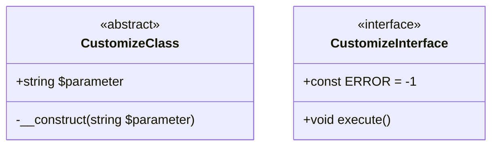

其中`+`表示`public`，`#`表示`protected`，`-`表示`private`。

UML使用实线三角箭头表示超类与子类的继承关系，使用虚线三角箭头表示类与接口的实现关系：

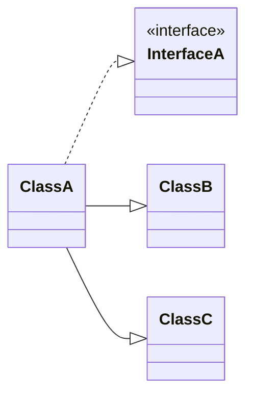

当一个类保存了另一个类的引用时，这两个类就会产生**关联**关系，用实线小于号表示。远离小于号的一侧可以标注数字或`*`，表示关联的对象个数。

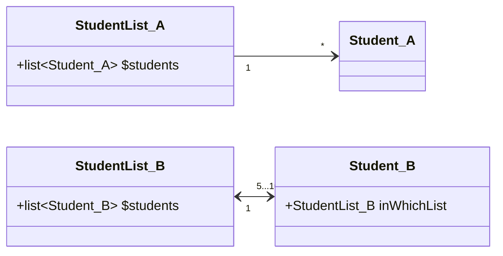

**组合**关系指的是一个类依附于另一个类的存在而存在，用实线实心菱形箭头表示。**聚合**关系指的是一个类可以同时依附于多个类的存在和存在，用实线空心箭头表示：

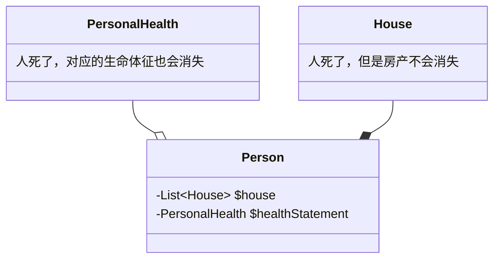


### §3.3.2 工厂模式

以下图为例，`Staff`类既是员工的抽象化概念，又由静态方法`recruit(string $name)`承担实例化员工的任务，借助`fire()`实现多态：

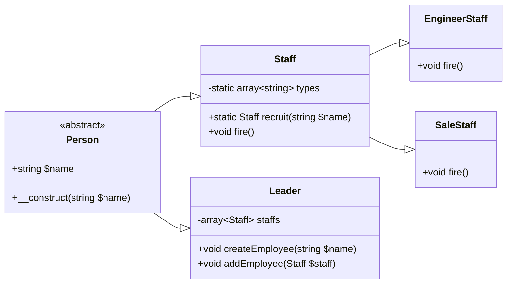

```php
abstract class Person {
    protected $name;
    public function __construct(string $name){
        $this->name = $name;
    }
}

class Staff extends Person {
    public function fire(){print("{$this->name}:I'm fired :(");}
}

class StaffFactory {
    private static $types = ['Staff','EngineerStaff','SaleStaff'];
    public static function recruit(string $name):Staff{
        $className = __NAMESPACE__."\\".self::$types[rand(0,count(self::$types)-1)];
        return new $className($name);
    }
}

class Leader extends Person {
    private $staffs = [];
    public function createStaff(string $name){
        $this->staffs[] = new Staff($name);
    }
    public function addStaff(Staff $staff){
        $this->staffs[] = $staff;
    }
    public function goBankrupt(){
        while(!empty($this->staffs)){
            $staff = array_pop($this->staffs);
            $staff->fire();
        }
    }
}
class EngineerStaff extends Staff {
    public function fire(){print("{$this->name}, as a engineer, is fired :(");}
}
class SaleStaff extends Staff {
    public function fire(){print("{$this->name}, as a salesperson, is fired :(");}
}

$leader = new Leader("Boss");
$leader->addStaff(StaffFactory::recruit("Alice"));
$leader->addStaff(StaffFactory::recruit("Bob"));
$leader->addStaff(StaffFactory::recruit("Carol"));
$leader->goBankrupt();
	// Carol, as a salesperson, is fired :(
	// Bob, as a salesperson, is fired :(
	// Alice, as a salesperson, is fired :(
```

### §3.3.3 单例模式

全局变量非常好用，但是破坏了封装性。有没有一种方法，能够避免命名冲突，同时保留全局变量的下列优点呢？

- 该变量可以被任何类、任何方法、任何函数调用
- 该变量有且仅有一个实例

答案是：将所有功能压缩在一个类中。

```php
class Configuration {
    private $properties = [];
    private static $instance;
    private function __construct(){

    }
    public static function getInstance(){
        if(empty(self::$instance)){
            self::$instance = new Configuration();
        }
        return self::$instance;
    }
    public function setProperty(string $key,string $value){
        $this->properties[$key] = $value;
    }
    public function getProperty(string $key):string{
        return $this->properties[$key];
    }
}

$conf = Configuration::getInstance();
$conf->setProperty("url","127.0.0.1");
print $conf->getProperty("url");
```

### §3.3.4 抽象工厂模式

在Java中，我们已经见识过`InputStream`的各种子类：`ByteArrayInputStream`、`FileInputStream`、`StringBufferInputStream`.......这些子类内部的同名方法肯定存在着茶杯。假如这些子类全都是单例模式，那么一个工厂显然是不够用的，因为同一个工厂产生的实例无法实现方法的多态。基于此，我们把这些`XXXInputFactory`看成是`InputStream`这个抽象类的子类。

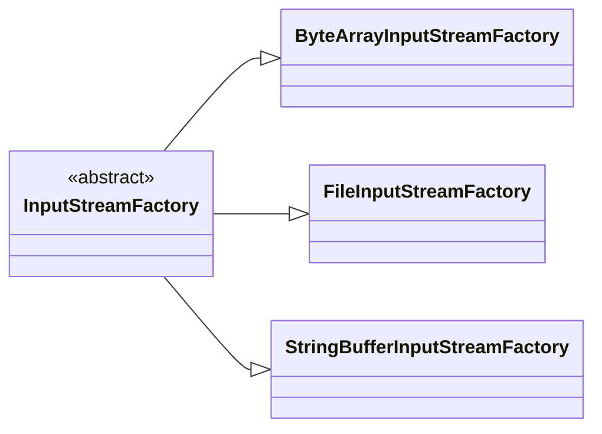

### §3.3.5 原型模式

原型模式与单例模式相比，最大的区别是，返回的实例是一个克隆的对象：

```php
class Sea {}
class WarmSea extends Sea {}
class ColdSea extends Sea {}
class Plain {}
class WarmPlain extends Plain {}
class ColdPlain extends Plain {}
class Forest {}
class WarmForest extends Forest {}
class ColdForest extends Forest {}
class MapFactory {
    private $sea;
    private $forest;
    private $plain;
    public function __construct(Sea $sea,Forest $forest,Plain $plain){
        $this->sea = $sea;
        $this->forest = $forest;
        $this->plain = $plain;
    }
    public function getSea():Sea{
        return clone $this->sea; // 克隆的对象
    }
    public function getPlain():Plain{
        return clone $this->plain; // 克隆的对象
    }
    public function getForest():Forest{
        return clone $this->forest; // 克隆的对象
    }
    public __clone(){
        $this->sea = clone $this->sea;
        $this->forset = clone $this->forest;
        $this->plain = clone $this->plain;
    }
}
$factory = new MapFactory(new Sea(),new WarmPlain(),new ColdForest());
```

### §3.3.6 组合模式

组合模式的核心思想是让所有类都为一个抽象类的子类。

设想下面的战队模型：

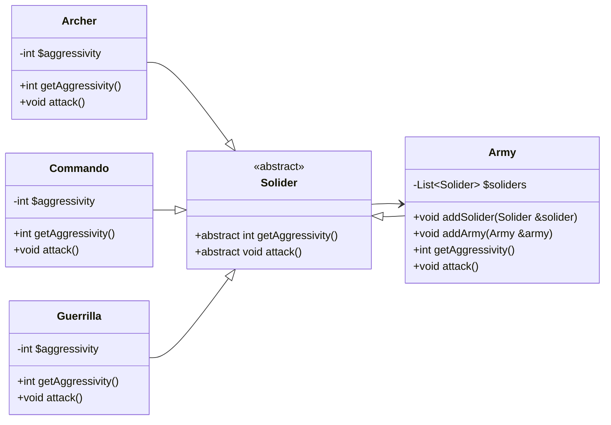

从某种程度上说，客户端其实根本不关心传来的实例到底是什么，只关心它是否实现了`getAggressivity()`和`attack()`。因此，干脆直接把`Army`也看成一个`Solider`。

这种模式有以下优点：

1. 所有类共享同一个抽象类父类，因此添加新的类时，只需要实现抽象类父类的方法即可，对其它类没有任何影响。
2. 客户端无需通过`instanceof`判断操作的示例属于哪个类，只需无脑调用抽象类提供的方法即可。（从这一点上来看，抽象类的作用包含了接口的作用）

### §3.3.7 装饰器模式

装饰器模式的关键在于，实例化一个对象时，将其作为某个修饰器类构造函数的参数。

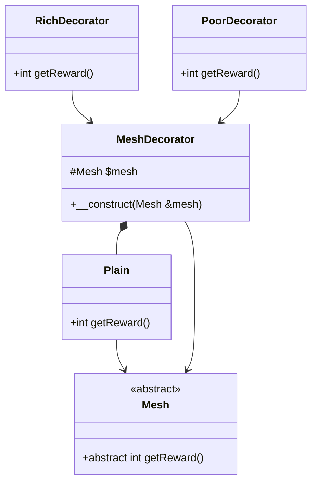

```php
$plain = new Plain();
$plain = new RichDecorator(new Plain());
$plain = new PoorDecorator(new Plain());
```

### §3.3.8 外观模式

我们知道，编写函数时应该遵循“一个函数只执行一种功能”的原则。但是这样的话写出来的函数就会特别多，需要同上到下依次调用一遍。为了简化这个流程，我们还需要编写一个函数。

外观模式将这一流程封装成某个类中的某个方法。

### §3.3.9 解释器模式

PHP语言可以让我们编写自己的编程语言（即迷你语言）。例如很多人不知道正则表达式，我们想将其改写成大家一看就懂的语言。

EBNF（Extended Backus Naur Form，扩展巴斯克范式）是一种用于描述语言语法的符号：

| 数据类型   | EBNF名            | 类名                   | 示例                               |
| ---------- | ----------------- | ---------------------- | ---------------------------------- |
| 变量       | `variable`        | `VariableExpression`   | `$input`                           |
| 字面字符串 | `<stringLiteral>` | `LiteralExpression`    | `"abc"`                            |
| 布尔与     | `andExpr`         | `BooleanAndExpression` | `$a equals '1' and $b equals '2' ` |
| 布尔或     | `orExpr`          | `BooleanOrExpression`  | `$a equals '1' or $a equals '2'`   |
| 相等       | `eqExpr`          | `EqualExpression`      | `$input equals 1$`                 |


```php
abstract class Expression {
    private static $keycount = 0;
    private $key;
    abstract public function interpret(InterpreterContext $context);
    public function getKey(){
        if(!isset($this->key)){
            self::$keycount++;
            $this->key = self::$keycount;
        }
        return $this->key;
    }
}
class LiteralExpression extends Expression {
    private $value;
    public function __construct($value){
        $this->value = $value;
    }
    public function interpret(InterpreterContext $context){
        $context->replace($this,$this->value);
    }
}
class InterpreterContext {
    private $expressionStore = [];
    public function replace(Expression $expression,$value){
        $this->expressionStore[$expression->getKey()] = $value;
    }
    public function lookup(Expression $expression){
        return $this->expressionStore[$expression->getKey()];
    }
}
class VariableExpression extends Expression {
    private $name;
    private $val;
    public function __construct($name,$val=null){
        $this->name = $name;
        $this->val = $val;
    }
    public function interpret(InterpreterContext $context){
        if(!is_null($this->val)){
            $context->replace($this,$this->val);
            $this->val = null;
        }
    }
    public function setValue($value){
        $this->val = $value;
    }
    public function getKey(){
        return $this->name;
    }
}
abstract class OperatorExpression extends Expression {
    protected $l_op;
    protected $r_op;
    public function __construct(Expression $l_op,Expression $r_op){
        $this->l_op = $l_op;
        $this->r_op = $r_op;
    }
    public function interpret(InterpreterContext $context){
        $this->l_op->interpret($context);
        $this->r_op->interpret($context);
        $this->doInterpret(
            $context,
            $context->lookup($this->l_op),
            $context->lookup($this->r_op)
        );
    }
    abstract protected function doInterpret(InterpreterContext $context,$result_l,$result_r);
}
class EqualsExpression extends OperatorExpression {
    protected function doInterpret(InterpreterContext $context,$result_l,$result_r){
        $context->replace($this,$result_l==$result_r);
    }
}
class BooleanOrExpression extends OperatorExpression {
    protected function doInterpret(InterpreterContext $context,$result_l,$result_r){
        $context->replace($this,$result_l||$result_r);
    }
}
class BooleanAndExpression extends OperatorExpression {
    protected function doInterpret(InterpreterContext $context,$result_l,$result_r){
        $context->replace($this,$result_l&&$result_r);
    }
}
```

编写测试集：

```php
$context = new InterpreterContext();
$input = new VariableExpression("input");
$statement = new BooleanOrExpression(
    new EqualsExpression($input,new LiteralExpression("four")),
    new EqualsExpression($input,new LiteralExpression(4))
); // 等价于$input=="four" || $input == 4
foreach(["four","4"] as $value){
    $input->setValue($value);
    $statement->interpret($context);
    if($context->lookup($statement)){
        print("true");
    }else{
        print("false");
    }
}
```

### §3.3.10 策略模式

设想以下情景：分别为试卷上的选择题、填空题、主观题新建一个类，并且让这三个类都是`Question`的子类。现在要增加需求，有些题目可能包含音频、视频，需要实现`play()`方法。一种朴素的思想是将这三个类按照是否包含多媒体而分裂成六个类。这种方案导致类的数量增加，并且引入了重复代码。

策略模式的核心是将`play()`方法单独提取到`Player`类中，然后在抽象父类`Question`中保存`Player`的一个实例：

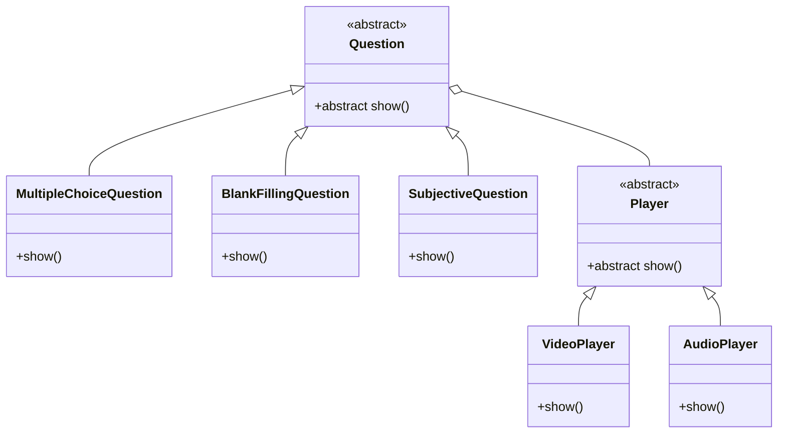

### §3.3.11 观察者模式

设想下面的情景：我们编写了一个很简单的登录类`Login`：

```php
class Login {
    const LOGIN_SUCCESS = 0;
    const LOGIN_WRONG_PASSWORD = 1;
    private $status = [];
    private function setStatus(int $statusCode,string $username,string $ip){
        $this->status = [$statusCode,$username,$ip];
    }
    public function getStatus():array{
        return $this->status;
    }
    private function validate(string $username,string $password):int{
        return rand(0,1);
    }
    public function handleLogin(string $username,string $password,string $ip):bool{
        $isValid = false;
        switch($this->validate($username,$password)){
            case 0:
                $this->setStatus(self::LOGIN_SUCCESS,$username,$ip);
                $isValid = true;
                break;
            case 1:
                this->setStatus(self::LOGIN_WRONG_PASSWORD,$username,$ip);
                $isValid = false;
                break;
        }
        return $isValid;
    }
}
```

随着项目的发展，我们需要与其它类进行交互。例如与办公软件的第三方SDK交互，当账户密码错误时就提醒用户有人尝试登录；与审计部门交互，将本次登录行为交给日志数据库......很快这个`Login`类就会与整个系统耦合起来。

观察者模式的核心就是将其它组件从当前类中分离出来，构成一个观察者类。当登录类发生了某个事件时，观察者类负责捕获并调用其它方法：

```php
interface Observer {
    public function update(Observable $observable);
}
interface Observable {
    public function attach(Observer $observer);
    public function detach(Observer $observer);
    public function notify();
}

class Login implements Observable {
    const LOGIN_SUCCESS = 0;
    const LOGIN_WRONG_PASSWORD = 1;
    private $observers = [];
    private $status;
    public function attach(Observer $observer){
        $this->observers[] = $observer;
    }
    public function detach(Observer $observer){
        $this->observers = array_filter(
            $this->observers,
            function ($i) use ($observer){
                return !($i===$observer);
            }
        );
    }
    public function notify(){
        foreach ($this->observers as $observer){
            $observer->update($this);
        }
    }

    private function setStatus(int $statusCode,string $username,string $ip){
        $this->status = [$statusCode,$username,$ip];
    }
    public function getStatus():array{
        return $this->status;
    }
    private function validate(string $username,string $password):int{
        return rand(0,1);
    }
    public function handleLogin(string $username,string $password,string $ip):bool{
        $isValid = false;
        switch($this->validate($username,$password)){
            case 0:
                $this->setStatus(self::LOGIN_SUCCESS,$username,$ip);
                $isValid = true;
                break;
            case 1:
                $this->setStatus(self::LOGIN_WRONG_PASSWORD,$username,$ip);
                $isValid = false;
                break;
        }
        return $isValid;
    }
}
class LoginAnalyse implements Observer {
    public function update(Observable $observable){
        $status = $observable->getStatus();
        // ...
    }
}
abstract class LoginObserver implements Observer {
    private $login;
    public function __construct(Login $login){
        $this->login = $login;
        $login->attach($this);
    }
    public function update(Observable $observable){
        if($observable === $this->login){
            $this->doUpdate($observable);
        }
    }
    abstract public function doUpdate(Login $login);
}
class SecurityMonitor extends LoginObserver {
    public function doUpdate(Login $login){
        if($login->getStatus()[0] == Login::LOGIN_WRONG_PASSWORD){
            print("有用户尝试登录该系统，且密码输入错误\n");
        }
    }
}
class GeneralLogger extends LoginObserver {
    public function doUpdate(Login $login){
        $status = $login->getStatus()[0];
        printf("(%s,%s,%s)日志已记录\n",$status[0],$status[1],$status[2]);
    }
}

$login = new Login();
new SecurityMonitor($login);
new GeneralLogger($login);
```

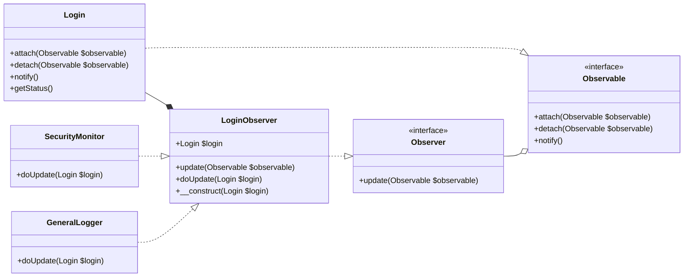

事实上，PHP标准库（Standard PHP Library，SPL）原生支持观察者模式，提供了`SplObserver`、`SqlSubject`接口用于提供观察者模式所需的接口，以及和`SplObjectStorage`类实现了`Countable`、` Iterator`、`Serializable`、`ArrayAccess`接口，负责提供一个从`object`映射到`mixed`的Map：

```php
/* SPL_c1.php */
interface SplObserver{
    public function update(SplSubject $subject): void;
}
interface SplSubject{
    public function attach(SplObserver $observer): void;
    public function detach(SplObserver $observer): void;
    public function notify(): void;
}
```

| `SqlObjectStorage`类方法                | 作用                                                         |
| --------------------------------------- | ------------------------------------------------------------ |
| `addAll(SplObjectStorage):int`          | 将另一个`SplObjectStorage`实例中的所有`object`-`mixed`键值对添加到当前实例中 |
| `attach(object,mixed=null):void`        | 将`object`添加到当前实例中                                   |
| `contains(object):bool`                 | 检查该实例是否包含指定的`object`，完全等价于`SqlObjectStorage::offsetExists()` |
| `count(int=COUNT_NORMAL):int`           | 返回该实例保存的`object`总数                                 |
| `detach(object):void`                   | 删除该实例中指定的`object`，完全等价于`SqlObjectStorage::offsetUnset()` |
| `getHash(object):void`                  | 指定该实例中保存的一个`object`，返回它的哈希值               |
| `getInfo():mixed`                       | 根据迭代器当前的位置，返回相应的`object`-`mixed`键值对的值   |
| `key():int`                             | 返回当前迭代器的位置                                         |
| `next():void`                           | 将迭代器移至下一个位置                                       |
| `offsetExists(object):bool`             | 检查该实例是否包含指定的`object`，完全等价于`SqlObjectStorage::contains()` |
| `offsetGet(object):mixed`               | 根据`object`查找该实例保存的`object`-`mixed`键值对，返回该键值对的值 |
| `offsetSet(object,mixed=null):void`     | 根据`object`查找或创建该实例保存的`object`-`mixed`键值对，以`mixed`为新值 |
| `offsetUnset(object):void`              | 删除该实例中指定的`object`，完全等价于`SqlObjectStorage::detach()` |
| `removeAll(SplObjectStorage):int`       | 根据另一个`SplObjectStorage`实例中的键值对，删除该实例中包含的键值对 |
| `removeAllExcpet(SqlObjectStorage):int` | 根据另一个`SplObjectStorage`实例中的键值对，删除该实例中不包含的键值对 |
| `rewind():void`                         | 重置迭代器到第一个位置                                       |
| `serialize(mixed):string`               | 将该实例序列化成字符串                                       |
| `unserializable(string):void`           | 将字符串反序列化成该实例                                     |
| `valid():bool`                          | 检查当前实例的迭代器实例是否不为空                           |

### §3.3.12 访问者模式

访问者模式的核心是：将访问者请进自己类内部，在类内部调用访问者的`visit()`方法：

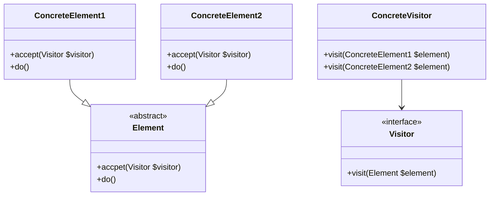

```php
abstract class Element{
    public function accept(Visitor $visitor){
        $visitor->visit($this);
    }
    public abstract function do();
}
class ConcreteElement1 extends Element {
    public function do(){
        print("ConcreteElement1工作中");
    }
}
class ConcreteElement2 extends Element {
    public function do(){
        print("ConcreteElement2工作中");
    }
}
interface Visitor{
    public function visit(Element $element);
}
class ConcreteVisitor implements Visitor {
    public function visit(Element $element){
        $element->do();
    }
}

$elements = [
    new ConcreteElement1(),
    new ConcreteElement2()
];
foreach($elements as $element){
    $element->accept(new ConcreteVisitor());
}
```

### §3.3.13 命令模式

命令模式的核心在于：命令类必须实现命令接口中的`execute()`方法：

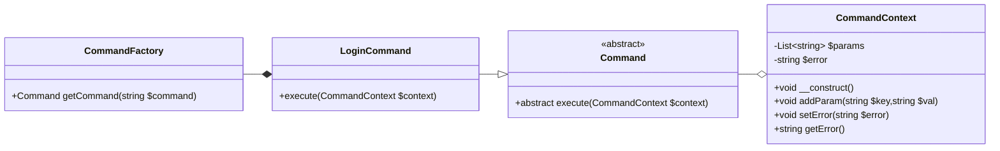

```php
class CommandContext {
    private $params = [];
    private $error = "";
    public function __construct(){
        $this->params = $_REQUEST;
    }
    public function addParam(string $key,string $val){
        $this->params[$key] = $val;
    }
    public function get(string $key):?string{
        if(isset($this->params[$key])){
            return $this->params[$key];
        }else{
            return null;
        }
    }
    public function setError(string $error):void{
        $this->error = $error;
    }
    public function getError():string{
        return $this->error;
    }
}
abstract class Command {
    abstract public function execute(CommandContext $context):bool;
}
class LoginCommand extends Command {
    public function execute(CommandContext $context): bool{
        $username = $context->get("username");
        $password = $context->get("password");
        if($username == "admin" && $password == "admin"){
            $context->addParam("status","success");
            return true;
        }else{
            $context->setError("Wrong password");
            return false;
        }
    }
}
class CommandFactory {
    private static $dir = "commands";
    public static function getCommand(string $action):Command{
        if(preg_match('/\w/',$action)){
            throw new Exception("Illegal Characters in Action");
        }
        $classPath = __NAMESPACE__."\\".$action;
        if(!class_exists($classPath)){
            throw new Exception("Command not found");
        }
        return new $classPath();
    }
}
```

### §3.3.14 空对象模式

空对象模式指的是：如果目标对象不存在，那么不返回`null`空值，而是返回一个专门用于表示“空值”概念的实例：

```php
abstract class Mesh {
    protected $x;
    protected $y;
    public function __construct(int $x,int $y){
        $this->x = $x;
        $this->y = $y;
    }
    abstract public function getTemperature():int;
    abstract public function getHeight():int;
}
class PlainMesh extends Mesh {
    public function getTemperature():int{
        return ($this->x + $this->y) % 10 + 20;
    }
    public function getHeight():int{
        return ($this->x - $this->y) % 10 * 500 + 100;
    }
}
class NullMesh extends Mesh {
    private function printError(){
        print("坐标超出地图范围！");
    }
    public function getTemperature():int{$this->printError();return -1;}
    public function getHeight():int{$this->printError();return -1;}
}
class MeshFactory {
    private $xMin,$xMax,$yMin,$yMax;
    public function __construct(int $xMin,int $xMax,int $yMin,int $yMax){
        $this->xMin = $xMin;
        $this->xMax = $xMax;
        $this->yMin = $yMin;
        $this->yMax = $yMax;
    }
    public function getMesh(int $x,int $y):Mesh{
        if($x>=$this->xMin && $x<=$this->xMax && $y>=$this->yMin && $y<=$this->yMax){
            return new PlainMesh($x,$y);
        }else{
            return new NullMesh($x,$y);
        }
    }
}

$meshes = [];
$meshFactory = new MeshFactory(0,100,0,100);
for($i = 0 ; $i < 120 ; $i = $i + 10){
    $meshes[] = $meshFactory->getMesh($i,$i);
}
foreach ($meshes as $mesh){
    print($mesh->getHeight()."\n");
}
```

# §4 企业级系统架构

企业级Web系统的分层模型大致可以表示如下：


## §4.1 注册表

注册表是一种系统级的全局变量。我们之前介绍过单例模式，它将应用级的全局变量放到一个单例类内。然而这种方式会诱导开发者在每个新增类都使用单例类，从而增强系统的耦合性。

回想一下注册表，它其实就是**一组**位于`C:\Windows\System32\config`目录下的文件。注意不是一个，而是一组。受此启发，我们对单例模式进一步改进：将单例命为抽象类，在此基础上延伸出各组件的“单例类”：

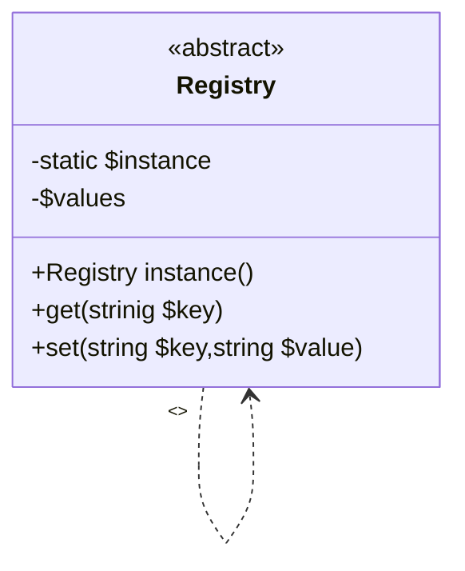

```php
abstract class Registry {
    private static $instance = null;
    private $values = [];
    private function __construct(){}
    public static function instance():Registry{
        if(is_null(self::$instance)){
            self::$instance = new self();
        }
        return self::instance();
    }
    public function get(string $key){
         return $this->values[$key] ?? null; // PHP7.0的合并运算符,完全等价于上列语句
    }
    public function set(string $key,$value){
        $this->values[$key] = $value;
    }
}
```

## §4.2 表示层

### §4.2.1 前端控制器

传统PHP页面的思路是：URL的层级与服务器文件层级相对应，一个WebApp存在多个入口，文件内部的超链接组成整个站点的拓扑结构。

前端控制器的思路是：为所有请求定义一个访问中心点，命令控制层的路由配置文件组成整个站点的拓扑结构。

```php
class Controller{
    private function __construct(){
        // 获取注册表实例
    }
    public static function run(){
        $instance = new Controller();
        $instance->init();
        $instance->handleRequest();
    }
    private function init(){
        // 在注册表中获取ApplicationHelper实例，并调用其init()方法
    }
    private function handleRequest(){
        // 获取注册表中的$request
        // 根据$request解析得到Command实例
        // 调用Command实例的execute($request)方法
    }
}

class ApplicationHelper {
    private $config = __DIR__."/data/woo_options.ini";
    public function __construct(){
        // 获取注册表实例
    }
    private function init(){
        $this->setupOptions();
        if(isset($_SERVER['REQUEST_METHOD'])){
            $request = new HttpRequest();
        }else{
            $request = new CliRequest();
        }
        // 绑定$request到注册表中
    }
    private function setupOptions(){
        if(!file_exists($this->config)){
            throw new Exception("Couldn't find options file");
        }
        $options = parse_ini_file($this->config,true);
        // 添加到注册表中
    }
}
abstract class Command {
    final public function __construct(){}
    public function execute(Request $request){
        $this->doExecute($request);
    }
    abstract public function doExecute(Request $request);
}
class CommandResolver {
    private static $reflectCommand = null;
    public function __construct(){
        self::$referenceCommand = new ReflectionClass(Command::class);
    }
    public function getCommand(Request $request):Command{
        // 从注册表中获取类路径
        // $class = ...
        if(is_null($class)){
            $request->addFeedback("Path Not Found");
        }
        if(!class_exists($class)){
            $request->addFeedback("Class Not Found");
        }
        return new $class();
    }
}
```

### §4.2.2 应用控制器

为了进一步解耦视图类与命令类，我们在这两者中间插入一层应用控制器：

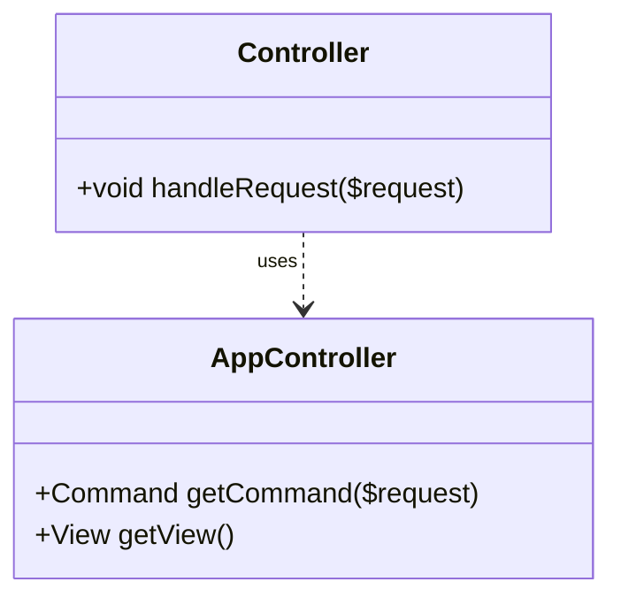

```php
// 伪代码
class Controller {
    public function handleRequest($request){
        $controller = new AppController();
        $command = $controller->getCommand($request);
        $command->execute($request);
        $view = $controller->getView($request);
        $view->render($request);
    }
}
```

### §4.2.3 页面控制器

对于一些需求简单、应用控制器和视图高度耦合的页面，不妨将应用控制器和视图合并到一个类中，我们称之为页面控制器。

```php+HTML
<?php
	try{
        // 调用其它类获取数据
        $list = XXX->XXX();
    }catch(\Exception $e){
        include('./error.php');
        exit(0);
    }
?>
<html>
    <body>
        <?php foreach($list as $element){
    		print($element."<br>");
		}?>
    </body>
</html>
```

## §4.3 业务逻辑层

### §4.3.1 事务脚本

在SQL中，我们接触过事务（Transction）的概念：事务由一条或多条SQL语句构成，并且**只有所有的SQL语句都执行成功，整个事务才算成功，否则应当立即回滚**。我们将这个概念应用到PHP中，就设计出了事务脚本。

```php
class DatabaseTransction {
    public function addUser(){
        $sqlCommand = "......";
        ......
    }
}
```

### §4.3.2 领域模型

领域模型的核心是：将现实中的角色抽象化为类，将参与者与表示层分离。例如：`Person`类不能自己发出动作，而是要将这些方法移动到`PersonInterface`类。

## §4.4 数据库


# §5 PSR

PHP标准规范（PHP Standard Recommandatons，PSR）是由多位PHP框架开发人员组成的民间组织PHP-Fig（PHP Framework Interop Group，PHP互操作性框架制定小组）指定的编码标准。


| PSR编号 | 英文标题                    | 中文标题         |
| :-----: | --------------------------- | ---------------- |
|  PSR-0  | Autoloading Standard        |                  |
|  PSR-1  | Basic Coding Standard       | 基础编码规范     |
|  PSR-2  | Coding Style Guide          | 编码风格规范     |
|  PSR-3  | Logger Interface            | 日志接口规范     |
|  PSR-4  | Autoloading Standard        | 自动加载规范     |
|  PSR-5  | PHPDoc Standard             | PHP文档规范      |
|  PSR-6  | Caching Interface           | 缓存接口规范     |
|  PSR-7  | HTTP Message Interface      | HTTP消息接口规范 |
|  PSR-8  | Huggable Interface          |                  |
|  PSR-9  | Security Advisories         |                  |
| PSR-10  | Security Reporting Process  |                  |
| PSR-11  | Container Interface         |                  |
| PSR-12  | Extended Coding Style Guide |                  |
| PSR-13  | Hypermedia Links            |                  |
| PSR-14  | Event Dispatcher            |                  |
| PSR-15  | HTTP Handlers               |                  |
| PSR-16  | Simple Cache                |                  |
| PSR-17  | Http Factories              |                  |
| PSR-18  | Http Client                 |                  |
| PSR-19  | PHPDoc Tags                 |                  |
| PSR-20  | Clock                       |                  |
| PSR-21  | Internationalization        |                  |
| PSR-22  | Application Tracing         |                  |

## §5.1 PSR-1 基础编码规范

1. 开闭标签

   PHP代码必须以`<?php`或`<?=`开头，可以不设结束标志`?>`。

2. 文件功能

   PHP文件要么用于声明类、接口和函数，要么执行逻辑操作，禁止同时用于两种情景。这意味着我们不能用`require_once()`来包含其他文件。

3. 命名

   类名需要遵循大驼峰命名法，方法名需要遵循驼峰命名法，属性名没有强制要求，但是必须保持一致，类常量必须全部大写，单词之间用`_`分开。

## §5.2 PSR-2 编码风格规范

1. 开闭标签

   在PSR-1的基础上，PSR-2规定纯PHP文件严禁以`?>`结尾。

   `namespace`与`use`声明语句块之后应该紧跟一行空白行。

2. 类的开始与结束

   `class`关键字、类名、`extends`关键字、`implements`关键字必须在同一行中，除非一个类实现了多个接口，每个接口名可以独占一行。

   类的定义部分的`{}`必须各占一行。

   ```php
   class CustomizeGame extends Game implements Executeable,Savable
   {
       // 类体
   }
   class CustomizeGame extends Game implements
       Executeable,
   	Savable
   {
       // 类体
   }
   ```

3. 属性声明

   每个属性必须显示注明访问修饰符，不允许使用`var`(自PHP 5开始，等价于`public`)。

4. 方法声明

   所有方法必须显示注明访问修饰符，且必须放在`abstract`和`final`之后，必须放在`static`之前：

   ```php
   abstract public static func()
   {
   
   }
   ```

   如果方法的形参过多，可以考虑将每个参数放在单独的缩进的一行中，此时允许昨花括号`{`与右小括号`)`在同一行上，但是两者之间必须隔着一个空格：

   ```php
   public function __construct(
   	int $a,
   	string $b,
   	bool $c = false
   ) {
   
   }
   ```

5. 行与缩进

   代码应该使用4个空格来缩进，而不是用制表符`\t`，每行代码不应超过120个字符。

6. 调用方法与函数

   每个参数之后紧跟一个逗号，逗号应该有一个空格。

   ```
   $obj = new A(
   	1,
   	"abc",
   	true
   );
   $obj = new A(1, "abc", true);
   ```

7. 流程控制

   流程控制关键字（`if`、`for`、`while`）后面紧跟一个空格，然后再使用括号：

   ```php
   for ($i = 0; $i < 10; $i++){
       print($i);
   }
   ```

## §5.3 PSR-4 自动加载规范

我们之前介绍过`spl_autoload_register()`函数允许PHP在当前PHP上下文找不到指定的类时，从根目录开始遍历文件系统。可想而知这种机制很容易导致架构混乱。PSR-4对自动加载机制作出了一系列规范。

假设组件供应商使用的命名空间为`Rainbow`，编写`composer.json`用于映射，将`Rainbow\library`中的所有库映射到文件系统的`./mylib`：

```json
{
    "autoload":{
        "psr-4":{
            "Rainbow\\library\\":"mylib"
        }
    }
}
```

接下来就可以在文件系统的工作目录下创建`mylib`文件夹：

```php
/* mylib/Greeter.php */
class Greeter
{
    public static function greet(string $name=null)
    {
        print("Hello,".$name);
    }
}
```

命名空间与文件系统甚至可以是一对多的关系：

```json
{
    "autoload":{
        "psr-4":{
            "Rainbow\\library\\":["mylib","anotherlib"]
        }
    }
}
```

使用Composer生成自动加载文件，并放在`./vendor/autoload.php`中，现在PHP程序就可以调用这些类了：

```php
/* index.php */
require_once("vendor/autoload.php");
use Rainbow\mylib\Greeter;
Greeter::greet();
```

## §5.4 PHP CodeSniffer

[PHP CodeSniffer](https://github.com/squizlabs/PHP_CodeSniffer)是一款用于检测PHP源代码是否符合PSR标准的开源工具。它有两个Release：`phpcs.phar`用于检查代码并输出报告，`phpcbf.phar`用于修改代码。

例如我们先编写一段不符合PSR-2标准的代码：

```php
/* demo.php */
<?php
class demo{ // 类名全小写，没有空格
	function __construct(int $a,int $b){ // 参数分隔时没有空格，花括号没有另起一行
		print("Hello");
	}
}
```

```shell
C:\> php.exe .\phpcs.phar --standard=PSR2 .\demo.php

FILE: C:\demo.php
----------------------------------------------------------------------
FOUND 12 ERRORS AFFECTING 6 LINES
----------------------------------------------------------------------
 1 | ERROR | [x] End of line character is invalid; expected "\n" but
   |       |     found "\r\n"
 2 | ERROR | [ ] Each class must be in a namespace of at least one
   |       |     level (a top-level vendor name)
 2 | ERROR | [ ] Class name "demo" is not in PascalCase format
 2 | ERROR | [x] Opening brace of a class must be on the line after
   |       |     the definition
 3 | ERROR | [x] Spaces must be used to indent lines; tabs are not
   |       |     allowed
 3 | ERROR | [ ] Visibility must be declared on method "__construct"
 3 | ERROR | [x] Expected 1 space between comma and type hint "int";
   |       |     0 found
 3 | ERROR | [x] Opening brace should be on a new line
 3 | ERROR | [x] Opening brace must be the last content on the line
 4 | ERROR | [x] Spaces must be used to indent lines; tabs are not
   |       |     allowed
 5 | ERROR | [x] Spaces must be used to indent lines; tabs are not
   |       |     allowed
 6 | ERROR | [x] Expected 1 newline at end of file; 0 found
----------------------------------------------------------------------
PHPCBF CAN FIX THE 9 MARKED SNIFF VIOLATIONS AUTOMATICALLY
----------------------------------------------------------------------

Time: 61ms; Memory: 6MB
```

接着我们尝试修正该文件：

```shell
C:\> php.exe .\phpcbf.phar --standard=PSR2 .\demo.php

PHPCBF RESULT SUMMARY
----------------------------------------------------------------------
FILE                                                  FIXED  REMAINING
----------------------------------------------------------------------
C:\demo.php                                           9      3
----------------------------------------------------------------------
A TOTAL OF 9 ERRORS WERE FIXED IN 1 FILE
----------------------------------------------------------------------

Time: 72ms; Memory: 6MB
```

重新打开该文件：

```php
class demo
{
    function __construct(int $a, int $b)
    {
        print("Hello");
    }
}
```

# §6 Composer

> 再 放 送：
>
> “学PHP不用Composer，就像学Python不用`pip`，学Java没接触过`Maven`，学Linux不用`apt`/`pkg`，学Node JavaScript不学`npm`，说明这个人理解不了包管理器的强大之处，整个人的层次就卡在这儿了，只能度过一个相对失败的人生。”

Composer是PHP平台上的依赖管理器。之所以不能说它是包管理器，是因为它在本地的工作目录内部管理组建关系，而不是像`apt`那样集中管理组件关系。Composer会将包下载到工作目录的`./vendor`目录下，然后通过自动加载机制加载到项目中。

> 注意：WSL2虽然走的是Windows主系统的网络，但是不会使用Windows配置的全局代理，这导致在WSL2内使用Composer会报错：
>
> ```shell
> $ composer require knplabs/github-api # repo.packagist.org连不上
> 	https://repo.packagist.org could not be fully loaded (curl error 28 while downloading https://repo.packagist.org/packages.json: SSL connection timeout), package information was loaded from the local cache and may be out of date
> 	In CurlDownloader.php line 377:               
> 	curl error 28 while downloading https://repo.packagist.org/p2/knplabs/github-api.json: Failed to connect to repo.packagist.org port 443 after 5205 ms: Connection timed out
> 
> $ curl google.com # Google连不上
>     ^C
> 
> $ curl baidu.com # 百度能连上
>     <html>
>     <meta http-equiv="refresh" content="0;url=http://www.baidu.com/">
>     </html>
> ```
>
> 在WSL1中，Linux子系统与Windows主系统共享网络端口。然而在WSL2中，受制于底层Hyper-V引擎，子系统和主系统注定无法共享同一个`localhost`，但是Linux毕竟还是要通过Windows才能上网，毕竟Windows一旦断网，Linux不可能自己联网。
>
> 
>
> 为了解决Linux的联网需求，WSL2解决方案是将网关指向Windows的Hyper-V内的IP地址，这使得Windows的代理不能再只接受`localhost`的请求，而是还得接受Hyper-V创建的虚拟网卡`Hyper-V Virtual Ethernet Adapter`接收到的局域网请求了。
>
> - 一方面，我们需要在Windows中允许代理软件接受局域网请求：打开V2rayN，点击菜单栏的设置→参数设置，在弹出的窗口中选择`Core:基础设置`，勾选`允许来自局域网的连接`。
>
> - 另一方面，我们还要在Linux配置代理。Composer大量使用了`curl`命令，而该命令可以默认查找并使用`HTTP_PROXY`和`HTTPS_PROXY`环境变量，不用每次都手动调用`-x`参数指定代理，因此我们编辑`~/.bashrc`添加全局变量：
>
>   ```bash
>   # Customize Proxy
>   export ProxyAddress=$(ip route | grep default | awk '{print $3}')
>   export proxyHttpPort=10811
>   export HTTPS_PROXY="http://${ProxyAddress}:${proxyHttpPort}";
>   export HTTP_PROXY="http://${ProxyAddress}:${proxyHttpPort}";
>   export ALL_PROXY="http://${ProxyAddress}:${proxyHttpPort}";
>   ```
>
> 这样我们就能在WSL2中保证Composer的连接了：
>
> ```sh
> $ source ~/.bashrc 
> $ curl google.com
>     <HTML><HEAD><meta http-equiv="content-type" content="text/html;charset=utf-8">
>     <TITLE>301 Moved</TITLE></HEAD><BODY>
>     <H1>301 Moved</H1>
>     The document has moved
>     <A HREF="http://www.google.com/">here</A>.
>     </BODY></HTML>
> ```

## §6.1 安装与初始化

Composer的本体是``composer.phar`，与此同时官方还提供了全自动安装的PHP脚本。该脚本负责检查`php.ini`的正确性，然后下载`composer.phar`到当前目录：

```sh
cd /workspace
php -r "copy('https://getcomposer.org/installer', 'composer-setup.php');"
php -r "if (hash_file('sha384', 'composer-setup.php') === '55ce33d7678c5a611085589f1f3ddf8b3c52d662cd01d4ba75c0ee0459970c2200a51f492d557530c71c15d8dba01eae') { echo 'Installer verified'; } else { echo 'Installer corrupt'; unlink('composer-setup.php'); } echo PHP_EOL;"
php composer-setup.php
php -r "unlink('composer-setup.php');"
```

在装有PHP的Linux环境中，也可以将`composer.phar`移动到`/usr/local/bin/`目录中，使之成为全局命令：

```shell
root:~$ sudo mv composer.phar /usr/local/bin/composer
root:~$ composer
   ______
  / ____/___  ____ ___  ____  ____  ________  _____
 / /   / __ \/ __ `__ \/ __ \/ __ \/ ___/ _ \/ ___/
/ /___/ /_/ / / / / / / /_/ / /_/ (__  )  __/ /
\____/\____/_/ /_/ /_/ .___/\____/____/\___/_/
                    /_/
Composer version 2.3.8 2022-07-01 12:10:47

Usage:
  command [options] [arguments]

Options:
  -h, --help                     Display help for the given command. When no command is given display help for the list command
  -q, --quiet                    Do not output any message
  -V, --version                  Display this application version
      --ansi|--no-ansi           Force (or disable --no-ansi) ANSI output
  -n, --no-interaction           Do not ask any interactive question
      --profile                  Display timing and memory usage information
      --no-plugins               Whether to disable plugins.
      --no-scripts               Skips the execution of all scripts defined in composer.json file.
  -d, --working-dir=WORKING-DIR  If specified, use the given directory as working directory.
      --no-cache                 Prevent use of the cache
  -v|vv|vvv, --verbose           Increase the verbosity of messages: 1 for normal output, 2 for more verbose output and 3 for debug

Available commands:
  about                Shows a short information about Composer.
  archive              Creates an archive of this composer package.
  browse               [home] Opens the package's repository URL or homepage in your browser.
  check-platform-reqs  Check that platform requirements are satisfied.
  clear-cache          [clearcache|cc] Clears composer's internal package cache.
  completion           Dump the shell completion script
  config               Sets config options.
  create-project       Creates new project from a package into given directory.
  depends              [why] Shows which packages cause the given package to be installed.
  diagnose             Diagnoses the system to identify common errors.
  dump-autoload        [dumpautoload] Dumps the autoloader.
  exec                 Executes a vendored binary/script.
  fund                 Discover how to help fund the maintenance of your dependencies.
  global               Allows running commands in the global composer dir ($COMPOSER_HOME).
  help                 Display help for a command
  init                 Creates a basic composer.json file in current directory.
  install              [i] Installs the project dependencies from the composer.lock file if present, or falls back on the composer.json.
  licenses             Shows information about licenses of dependencies.
  list                 List commands
  outdated             Shows a list of installed packages that have updates available, including their latest version.
  prohibits            [why-not] Shows which packages prevent the given package from being installed.
  reinstall            Uninstalls and reinstalls the given package names
  remove               Removes a package from the require or require-dev.
  require              Adds required packages to your composer.json and installs them.
  run-script           [run] Runs the scripts defined in composer.json.
  search               Searches for packages.
  self-update          [selfupdate] Updates composer.phar to the latest version.
  show                 [info] Shows information about packages.
  status               Shows a list of locally modified packages.
  suggests             Shows package suggestions.
  update               [u|upgrade] Updates your dependencies to the latest version according to composer.json, and updates the composer.lock file.
  validate             Validates a composer.json and composer.lock.
```

PHPStorm的菜单栏→工具→Composer自带集成，可以方便地进行配置。

> JetBrains，我真的好喜欢你啊:heart_eyes:，你是我爹，爹你带我走吧爹:sob:
>
> 反转了，靠嫩娘，PHPStorm在Windows平台疑似是直接在终端调用`php.exe`，这一点可以从[有人把`php.ini`放在`C:\Windows`就正常](https://stackoverflow.com/questions/52594477/composer-not-working-on-windows-gives-composer-exception-nosslexception-error#comment110076298_61361052)可以得出。这要求用户必须配置全局变量。然而我用的是XAMPP和PHPStudy啊，配个锤子的全局变量:sweat_smile:
>
> ```shell
> install --no-interaction --no-ansi
>  
> In Factory.php line 644:
>    The openssl extension is required for SSL/TLS protection but is not available. If you can not enable the openssl extension, you can disable this error, at your own risk, by setting the 'disable-tls' option to true.
>    
>  install [--prefer-source] [--prefer-dist] [--prefer-install PREFER-INSTALL] [--dry-run] [--dev] [--no-suggest] [--no-dev] [--no-autoloader] [--no-progress] [--no-install] [-v|vv|vvv|--verbose] [-o|--optimize-autoloader] [-a|--classmap-authoritative] [--apcu-autoloader] [--apcu-autoloader-prefix APCU-AUTOLOADER-PREFIX] [--ignore-platform-req IGNORE-PLATFORM-REQ] [--ignore-platform-reqs] [--] [<packages>...]
>  
>  Failed to install packages for  ./composer.json.
> ```
>
> 反转了，[StackOverflow的另一个回答](https://stackoverflow.com/a/40690510/16366622)说，需要在`~/.composer/config.json`中添加下列配置：
>
> ```json
> {
>     "config": {
>         "disable-tls": true,
>         "secure-http": false
>     }
> }
> ```
>
> 但是毕竟我们用的是PHPStorm配的`composer.phar`，在Windows的用户目录下找不到这个貌似是全局配置文件`config.json`，但是我惊奇的发现把它添加到项目中的`composer.json`也可以起到同样的效果：
>
> ```json
> {
>   "name": "vendor_name/php",
>   "description": "description",
>   "minimum-stability": "stable",
>   "disable-tls": "true",
>   "license": "proprietary",
>   "authors": [
>     {
>       "name": "...",
>       "email": "..."
>     }
>   ],
>   "require": {
>   },
>   "config": {			// 在这个地方添加配置
>     "disable-tls": true,
>     "secure-http": false
>   }
> }
> ```
>
> 这时Composer只会弹出警告，而不会终止运行了：
>
> ```shell
>  install --no-interaction --no-ansi
>  You are running Composer with SSL/TLS protection disabled.
>  Composer is operating significantly slower than normal because you do not have the PHP curl extension enabled.
>  No composer.lock file present. Updating dependencies to latest instead of installing from lock file. See https://getcomposer.org/install for more information.
>  Loading composer repositories with package information
>  Updating dependencies
>  Nothing to modify in lock file
>  Writing lock file
>  Installing dependencies from lock file (including require-dev)
>  Nothing to install, update or remove
>  Generating autoload files
>  All packages for ./composer.json have been installed.
>        
>  Composer 软件包已被更改. PHPUnit 配置已根据 composer.json 更新
>        
>  Composer 软件包已更改，因此更新了 PHP include 路径。
>        
>  Composer 软件包已更改，因此更新了排除的文件夹。
> ```
>
> StackOverflow，我喜欢的原来是你啊:heart_eyes:，你是我爹，爹你带我走吧爹:sob:


## §6.2 安装包

这里我们以推特的`abraham/twitter`库为例：

首先在工作目录初始化：

```shell
$ composer init

                                            
  Welcome to the Composer config generator  
                                            


This command will guide you through creating your composer.json config.

Package name (<vendor>/<name>) [yaner/test]: yaner/TwitterCLI
The package name yaner/TwitterCLI is invalid, it should be lowercase and have a vendor name, a forward slash, and a package name, matching: [a-z0-9_.-]+/[a-z0-9_.-]+
Package name (<vendor>/<name>) [yaner/test]: yaner/twittercli
Description []: 
Author [n to skip]: n
Minimum Stability []: 
Package Type (e.g. library, project, metapackage, composer-plugin) []: library
License []: 

Define your dependencies.

Would you like to define your dependencies (require) interactively [yes]? 
Search for a package: 
Would you like to define your dev dependencies (require-dev) interactively [yes]? 
Search for a package: 
Add PSR-4 autoload mapping? Maps namespace "Yaner\Twittercli" to the entered relative path. [src/, n to skip]: 

{
    "name": "yaner/twittercli",
    "type": "library",
    "autoload": {
        "psr-4": {
            "Yaner\\Twittercli\\": "src/"
        }
    },
    "require": {}
}

Do you confirm generation [yes]? 
Generating autoload files
Generated autoload files
PSR-4 autoloading configured. Use "namespace Yaner\Twittercli;" in src/
Include the Composer autoloader with: require 'vendor/autoload.php';
```

### §6.1.1 编辑`composer.json`

这种方式类似于Python的`pip install -r requirements.txt`——我们可以编辑`composer.json`文件，添加依赖项，这里我们使用[`Packagist.org`提供的`abraham/twitteroauth`的第三方库](https://repo.packagist.org/packages/abraham/twitteroauth)：

```json
{
    "name": "yaner/twittercli",
    "type": "library",
    "autoload": {
        "psr-4": {
            "Yaner\\Twittercli\\": "src/"
        }
    },
    "require": {
        "abraham/twitteroauth": "3.*"
    }
}
```

执行`composer install`：

```shell
$ composer install

No composer.lock file present. Updating dependencies to latest instead of installing from lock file. See https://getcomposer.org/install for more information.
Loading composer repositories with package information
Info from https://repo.packagist.org: #StandWithUkraine
Updating dependencies
Lock file operations: 2 installs, 0 updates, 0 removals
  - Locking abraham/twitteroauth (4.0.0)
  - Locking composer/ca-bundle (1.3.2)
Writing lock file
Installing dependencies from lock file (including require-dev)
Package operations: 2 installs, 0 updates, 0 removals
As there is no 'unzip' nor '7z' command installed zip files are being unpacked using the PHP zip extension.
This may cause invalid reports of corrupted archives. Besides, any UNIX permissions (e.g. executable) defined in the archives will be lost.
Installing 'unzip' or '7z' (21.01+) may remediate them.
  - Downloading composer/ca-bundle (1.3.2)
  - Downloading abraham/twitteroauth (4.0.0)
  - Installing composer/ca-bundle (1.3.2): Extracting archive
  - Installing abraham/twitteroauth (4.0.0): Extracting archive
Generating autoload files
1 package you are using is looking for funding.
Use the `composer fund` command to find out more!
```

此时工作目录的文件如下：

```shell
$ tree
.
├── a
├── a.cpp
├── composer.json
├── composer.lock
├── src
└── vendor
    ├── abraham
    │   └── twitteroauth
    │       ├── autoload.php
    │       ├── composer.json
    │       ├── composer.lock
    │       ├── LICENSE.md
    │       ├── rector.php
    │       └── src
    │           ├── Config.php
    │           ├── Consumer.php
    │           ├── HmacSha1.php
    │           ├── Request.php
    │           ├── Response.php
    │           ├── SignatureMethod.php
    │           ├── Token.php
    │           ├── TwitterOAuthException.php
    │           ├── TwitterOAuth.php
    │           ├── Util
    │           │   └── JsonDecoder.php
    │           └── Util.php
    ├── autoload.php
    └── composer
        ├── autoload_classmap.php
        ├── autoload_namespaces.php
        ├── autoload_psr4.php
        ├── autoload_real.php
        ├── autoload_static.php
        ├── ca-bundle
        │   ├── composer.json
        │   ├── LICENSE
        │   ├── README.md
        │   ├── res
        │   │   └── cacert.pem
        │   └── src
        │       └── CaBundle.php
        ├── ClassLoader.php
        ├── installed.json
        ├── installed.php
        ├── InstalledVersions.php
        ├── LICENSE
        └── platform_check.php
```

Composer下载的所有包都放在`./vendor`目录下。`composer.lock`记录了安装的所有软件包的版本号。

### §6.1.2 `composer require`

这种方法类似于`pip install <包名>`，这里我们以`guzzlegttp/guzzle`为例

```php
$ composer require guzzlehttp/guzzle
    Using version ^7.4 for guzzlehttp/guzzle
    ./composer.json has been updated
    Running composer update guzzlehttp/guzzle
    Loading composer repositories with package information
    Updating dependencies
    Lock file operations: 8 installs, 0 updates, 0 removals
      - Locking guzzlehttp/guzzle (7.4.5)
      - Locking guzzlehttp/promises (1.5.1)
      - Locking guzzlehttp/psr7 (2.4.0)
      - Locking psr/http-client (1.0.1)
      - Locking psr/http-factory (1.0.1)
      - Locking psr/http-message (1.0.1)
      - Locking ralouphie/getallheaders (3.0.3)
      - Locking symfony/deprecation-contracts (v3.1.1)
    Writing lock file
    Installing dependencies from lock file (including require-dev)
    Package operations: 8 installs, 0 updates, 0 removals
      - Downloading symfony/deprecation-contracts (v3.1.1)
      - Downloading psr/http-message (1.0.1)
      - Downloading psr/http-client (1.0.1)
      - Downloading ralouphie/getallheaders (3.0.3)
      - Downloading psr/http-factory (1.0.1)
      - Downloading guzzlehttp/psr7 (2.4.0)
      - Downloading guzzlehttp/promises (1.5.1)
      - Downloading guzzlehttp/guzzle (7.4.5)
      - Installing symfony/deprecation-contracts (v3.1.1): Extracting archive
      - Installing psr/http-message (1.0.1): Extracting archive
      - Installing psr/http-client (1.0.1): Extracting archive
      - Installing ralouphie/getallheaders (3.0.3): Extracting archive
      - Installing psr/http-factory (1.0.1): Extracting archive
      - Installing guzzlehttp/psr7 (2.4.0): Extracting archive
      - Installing guzzlehttp/promises (1.5.1): Extracting archive
      - Installing guzzlehttp/guzzle (7.4.5): Extracting archive
    3 package suggestions were added by new dependencies, use `composer suggest` to see details.
    Generating autoload files
    5 packages you are using are looking for funding.
    Use the `composer fund` command to find out more!
```

此时`composer.json`的`require`值也发生了变化：

```json
{
    "name": "yaner/twittercli",
    "type": "library",
    "autoload": {
        "psr-4": {
            "Yaner\\Twittercli\\": "src/"
        }
    },
    "require": {
        "abraham/twitteroauth": "4.*",
        "guzzlehttp/guzzle": "^7.4" // 新增的一行
    }
}
```

## §6.3 语义化版本

如何给程序的版本号命名呢？现在通用的做法是用主版本号、次版本号、补丁号这三个数字表示，按顺序排成一行，每个数字之间用小数点隔开。

- 主版本号：破坏了向后兼容性
- 次版本号：只添加了新功能，没有破坏向后兼容性
- 补丁号：只修复了Bug，没有添加新功能，没有破坏向后兼容性

Composer使用语义化版本管理第三方库的版本：

- 精确指定：只安装制定的版本，例如`1.2.2`
- 通配符指定：在通配符允许的范围内，安装最新的版本，例如`1.2.*`，`*`
- 范围指定：同时指定可安装的最低版本与最高版本，例如`1.0.0-1.2.5`
- 比较指定：单独指定可安装的最低版本或最高版本，例如`>1.1.0`/`<=1.5.0`
- 波浪号指定：指定可安装的最低版本，但是只允许提供的最后一个数字变化，例如`~1.3`代表`[1.3~2.0)`、`1.3.2~`代表`[1.3.2,1.4)`
- 插入符号指定：指定可安装的最低版本，但是主版本号不能变，例如`^1.3.2`代表`[1.3.2,2.0.0]`

我们已经学会使用`"require":[]`导入第三方包，事实上也可以用`"require-dev":[]`转为开发环境导入包。这里以开发环境常用的第三方单元测试库`phpunit/phpunit`为例：

```json
{
	......
    "require-dev": {
        "phpunit/phpunit": "*"
    }
    ......
}
```

```sh
$ composer install # 开发环境
$ composer install --no-dev # 生产环境
```

## §6.4 自动加载

回想一下Python的pip装好包以后，在`.python`内还是不能直接调用，必须`import`一下才行。PHP也是同样的道理，必须`require_once("./vendor/autoload.php")`才能导入相应的命名空间。

在[§5.3 PSR-4 自动加载规范](#§5.3 PSR-4 自动加载规范)我们讨论过命名空间与文件系统的映射关系与`autoload`值，可以参考该部分。

## §6.5 封装包

当执行`composer init`时，我们其实已经在创建一个包了。包的信息都会汇总到`composer.json`中：

```json
{
    "name": "yaner/twittercli", // 供应商名/包名，其中供应商名会成为./vendor下的目录名
    "type": "library",
    "autoload": {
        "psr-4": {"Yaner\\Twittercli\\": "src/"}
    },
    "require": {}
}
```

并不是所有的包都是第三方包，还有PHP根目录的`./ext/*.dll`扩展等，我们也可以把以下组件打包到Composer的配置文件中的`require`值中：

| 类型                               | 示例                  |
| ---------------------------------- | --------------------- |
| PHP版本                            | `"php":"7.*"`         |
| PHP扩展                            | `"ext-扩展名称":">2"` |
| HHVM（HipHop Virtual Machine）版本 | `"hhvm":"~2"`         |
| PHP系统库                          | `"lib-库名称":"~2"`   |

## §6.6 私有分发

Packagist上的第三方包本质上是一个个Git项目，用户注册账户后可以直接从Github的项目链接中导入，Packagist会自动解析项目中的`composer.json`。

Packagist有一个缺点，就是免费账户无法创建私有仓库。如果我们不想使用默认的Packagist，而是用其它平台的包，就要在`composer.json`中手动指定：

```json
{
    ......
    "repositories": [
        {
            "type": "vcs",
            "url": "git@bitbucket.org:getinstance/api.util.git"
        }
    ],
    "require": {
        "popp5/megaquiz": "*",
        "getinstance/api_util": "v1.0.3"
    }
    ......
}
```

# §7 PHPUnit单元测试

PHPUnit是一个著名的PHP单元测试工具。传统的测试流程都是自己手写一份过程式的测试代码，封装成函数或者类，而PHPUnit提供了这些抽象类模版。

## §7.1 安装

可以用Composer配置：

```json
{
    ......
    "require-dev":{
        "phpunit/phpunit":"*"
    }
    ......
}
```

执行`composer update`后，工作根目录的`./vendor/bin`将会有一个`phpunit`可执行二进制文件。

## §7.2 目录结构

PHPUnit使用`\PHPUnit\Framework\TestCase`类，其命名要求十分严格：

- 使用PHPUnit运行测试类文件时，必须保证`require("./vendor/autoload.php")`查找的`composer.json`中的`autoload`/`autoload-dev`中，包含了待测试类的命名空间。
- 测试类必须在待测试类的文件名之后添加`Test`
- 测试类中的所有方法都必须为以`test`开头的无参方法

```json
{
    "name": "yaner/twittercli",
    "type": "library",
    "autoload": {
        "psr-4": {
            "yaner\\twittercli\\": "./src"
        }
    },
    "require": {
        "abraham/twitteroauth": "4.*",
        "guzzlehttp/guzzle": "^7.4"
    },
    "require-dev": {
        "phpunit/phpunit": "*"
    }
}
```

```php
<?php
namespace yaner\twittercli;
class User {
    public readonly int $id;
    public readonly string $username;
    public readonly string $password;
    private function __construct(int $id,string $username,string $password){
        $this->id = $id;
        $this->username = $username;
        $this->password = $password;
    }
    public static function getInstance(int $id,string $username,string $password):?User{
        if(strlen($password) < 6){
            User::notiifyShortPassword();
            return null;
        }
        return new User($id,$username,$password);
    }
    private static function notiifyShortPassword():void{
        print("密码长度不能少于6位！\n");
    }
}
```

```php
<?php
namespace yaner\twittercli;

class UserList {
    private $users = [];
    public function addUser(User|null $user):void{
        if($user instanceof User){
            $this->users[] = $user;
        }
    }
    public function getUsersCount():int{
        return(count($this->users));
    }
    public function findUser(int $id):?User{
        foreach($this->users as $user){
            if($user->id == $id){
                return $user;
            }
        }
        return null;
    }
}
```

```php
<?php
namespace yaner\twittercli;
require_once("./vendor/autoload.php");
class UserListTest extends \PHPUnit\Framework\TestCase {
    private $userList;
    public function setUp():void{
        $this->userList = new UserList();
    }
    public function tearDown():void{
    }
    public function testAddUser(){
        $this->userList->addUser(User::getInstance(1,"Alice","123456"));
        if($this->userList->getUsersCount() != 1){
            $this->fail("UserList::getUsersCount() failed!");
        }
    }
    public function testFindUser(){
        $this->userList->addUser(User::getInstance(1,"Alice","12345678"));
        $this->userList->addUser(User::getInstance(2,"Bob","12345678"));
        $this->userList->addUser(User::getInstance(3,"Carol","123"));
        $user1 = $this->userList->findUser(1);
        $user2 = $this->userList->findUser(2);
        $user3 = $this->userList->findUser(3);
        assert($user1->id == 1 && $user1->username == "Alice");
        assert($user2->id == 2 && $user2->username == "Bob");
        assert($user3 == null);
    }
}
```

执行单元测试：

```sh
$ ./vendor/bin/phpunit ./src/UserListTest.php
    PHPUnit 9.5.21 #StandWithUkraine
    2 / 2 (100%)密码长度不能少于6位！


    Time: 00:00.004, Memory: 4.00 MB

    There were 2 risky tests:

    1) yaner\twittercli\UserListTest::testAddUser
    This test did not perform any assertions

    /home/yaner/test/src/UserListTest.php:12

    2) yaner\twittercli\UserListTest::testFindUser
    This test did not perform any assertions

    /home/yaner/test/src/UserListTest.php:18

    OK, but incomplete, skipped, or risky tests!
    Tests: 2, Assertions: 0, Risky: 2.
```

## §7.3 断言

`\PHPUnit\Framework\TestCase`定义了一系列静态的断言方法：

| 断言方法名                                                 | 作用                                           |
| ---------------------------------------------------------- | ---------------------------------------------- |
| `assert($val1,$val2,$message,$delta)`                      | $|\text{val1}-\text{val2}|>\text{delta}$时报错 |
| `assertFalse($expression,$message)`                        | 表达式不为`false`时报错                        |
| `assertTrue($expression,$message)`                         | 表达式不为`true`时报错                         |
| `assertNotNull($val,$message)`                             | 表达式为`null`时报错                           |
| `assertNull($val,$message)`                                | 表达式不为`null`时报错                         |
| `assertSame($val1,$val2,$message)`                         | $\text{val1}\ne\text{val2}$时报错              |
| `assertNotSame($val1,$val2,$message)`                      | $\text{val1}=\text{val2}$时报错                |
| `assertRegExp($regexp,$val,$message)`                      | `$val`不满足正则表达式时报错                   |
| `assertAttributeSame($val,$attribute,$classname,$message)` | `$val !== $classname::$attribute`时报错        |
| `fail($message='')`                                        | 直接报错                                       |

## §7.4 约束

PHPUnit自3.0开始，在`PHPUnit/Framework/Constraint`提供众多自定义断言类：

```mermaid
flowchart TB
    Constraint --> 
        IsFalse & IsTrue & Callback & Count & GreaterThan & IsEmpty 
    Constraint -->
        LessThan & IsEqual & IsEqualCanonicalizing & IsEqualIgnoringCase
    Constraint --> 
        IsEqualWithDelta & Exception & Constraint & ExceptionMessage
    Constraint -->
        ExceptionMessageRegularExpression & DirectoryExists & FileExists
    Constraint --> 
        IsReadable & IsWritable & IsAnything & IsIdentical & JsonMatches
    Constraint -->
        IsFinite & IsInfinite & IsNan & ClassHasAttribute & ObjectEquals
    Constraint --> 
        BinaryOperator & LogicalNot & LogicalXor & UnaryOperator & IsJson
    Constraint -->
        RegularExpression & StringContains & StringEndsWith & StringStartsWiith
    Constraint -->
        ArrayHashKey & TraversableContains & IsInstanceOf & IsNull & IsType
    Constraint -->
        MethodNameConstraint

```

相应的，`TestCase`类的父类`Assert`类提供了创建相应自定义断言类的约束方法：

| 方法名                                     | 返回值类型                 | 作用                         |
| ------------------------------------------ | -------------------------- | ---------------------------- |
| `greaterThan($num)`                        | `GreaterThan`              | 是否大于值                   |
| `containsEqual($value)`                    | `TraversableContainsEqual` | 可遍历的集合是否包含指定元素 |
| `identicalTo($value):`                     | `IsIdentical`              | `===`                        |
| `greaterThanOrEqual($num)`                 | `LogicOr`                  | 是否大于等于值               |
| `lessthan($num)`                           | `LessThan`                 | 是否小于值                   |
| `lessThanOrEqual($num)`                    | `LogicOr`                  | 是否小于等于值               |
| `equalTo($value,$delta,$depth=10)`         | `IsEqual`                  | 在误差范围能两个值是否相等   |
| `stringContains($str,$casesensitive=true)` | `StringContains`           | 字符串中是否包含指定的字符串 |
| `matchesRegularExpression($pattern)`       | `RegularExpression`        | 匹配正则表达式               |
| `logicalAnd(Constraint $const,$const,...)` | `LogicalAnd`               | 通过所有的约束               |
| `logicalOr(Constraint $const,$const,...)`  | `LogicalOr`                | 至少匹配一个约束             |
| `logicalNot(Constraint $const,$const,...)` | `LogicNot`                 | 约束没有通过                 |

例如我们自定义一个断言：

```php
class XXXTest extends \PHPUnit\Framework\TestCase {
    public function isArrayContainsOnlyAlice(){
        $customizeAssert = $this->logicalAnd(
            $this->isType("array"),
            $this->containsOnly("Alice")
        );
        self::assertThat($this->names,$customizeAssert);
    }
}
```

## §7.5 Mock与Stub

测试一个类，总是要牵扯到其他类，这样我们编写的单元测试一点也不“单元”。为了测试类与整个系统尽可能的解耦，我们有时不需要调用系统中的其他类，而是自己仿作一个类出来。仿作的这个类根据用途可以分为以下几种：

- Mock：将待测试类关联的其它类提取出来，自己编写一个类，**特指实现其他类的接口，而不关注接口的具体实现？**
- Stub：将待测试类关联的其它类提取出来，自己编写一个类，**特指编写的这个类每次返回的值写死在测试类中**

？？？？？？？？？？？getMock？getStub？TODO：

## §7.6 Web测试

？？？？？？？？？？？TODO：


# §8 Phing自动化构建

Phing是一个用于构建PHP项目的工具，类似于Java的Ant。

## §8.1 安装

一方面，我们可以按照官网的指示，使用`pear`包管理器全局安装：

```sh
$ wget http://pear.php.net/go-pear.phar
$ php go-pear.phar
    PHP Warning:  Private methods cannot be final as they are never overridden by other classes in /home/yaner/test/go-pear.phar on line 339

    Below is a suggested file layout for your new PEAR installation.  To
    change individual locations, type the number in front of the
    directory.  Type 'all' to change all of them or simply press Enter to
    accept these locations.

     1. Installation base ($prefix)                   : /usr
     2. Temporary directory for processing            : /tmp/pear/install
     3. Temporary directory for downloads             : /tmp/pear/install
     4. Binaries directory                            : /usr/bin
     5. PHP code directory ($php_dir)                 : /usr/share/pear
     6. Documentation directory                       : /usr/docs
     7. Data directory                                : /usr/data
     8. User-modifiable configuration files directory : /usr/cfg
     9. Public Web Files directory                    : /usr/www
    10. System manual pages directory                 : /usr/man
    11. Tests directory                               : /usr/tests
    12. Name of configuration file                    : /etc/pear.conf

    1-12, 'all' or Enter to continue: // Enter
    Beginning install...
    Configuration written to /etc/pear.conf...
    Initialized registry...
    Preparing to install...
    installing phar:///home/yaner/test/go-pear.phar/PEAR/go-pear-tarballs/Archive_Tar-1.4.14.tar...
    installing phar:///home/yaner/test/go-pear.phar/PEAR/go-pear-tarballs/Console_Getopt-1.4.3.tar...
    installing phar:///home/yaner/test/go-pear.phar/PEAR/go-pear-tarballs/PEAR-1.10.13.tar...
    installing phar:///home/yaner/test/go-pear.phar/PEAR/go-pear-tarballs/Structures_Graph-1.1.1.tar...
    installing phar:///home/yaner/test/go-pear.phar/PEAR/go-pear-tarballs/XML_Util-1.4.5.tar...
    warning: pear/PEAR dependency package "pear/Archive_Tar" downloaded version 1.4.14 is not the recommended version 1.4.4
    install ok: channel://pear.php.net/Archive_Tar-1.4.14
    install ok: channel://pear.php.net/Console_Getopt-1.4.3
    install ok: channel://pear.php.net/Structures_Graph-1.1.1
    install ok: channel://pear.php.net/XML_Util-1.4.5
    install ok: channel://pear.php.net/PEAR-1.10.13
    PEAR: Optional feature webinstaller available (PEAR's web-based installer)
    PEAR: Optional feature gtkinstaller available (PEAR's PHP-GTK-based installer)
    PEAR: Optional feature gtk2installer available (PEAR's PHP-GTK2-based installer)
    PEAR: To install optional features use "pear install pear/PEAR#featurename"

    ******************************************************************************
    WARNING!  The include_path defined in the currently used php.ini does not
    contain the PEAR PHP directory you just specified:
    </usr/share/pear>
    If the specified directory is also not in the include_path used by
    your scripts, you will have problems getting any PEAR packages working.


    Would you like to alter php.ini </etc/php/8.1/cli/php.ini>? [Y/n] : y

    php.ini </etc/php/8.1/cli/php.ini> include_path updated.

    Current include path           : .:/usr/share/php
    Configured directory           : /usr/share/pear
    Currently used php.ini (guess) : /etc/php/8.1/cli/php.ini
    Press Enter to continue: 

    The 'pear' command is now at your service at /usr/bin/pear
$ pear
    Commands:
    build                  Build an Extension From C Source
    bundle                 Unpacks a Pecl Package
    channel-add            Add a Channel
	......
$ pear channel-discover pear.phing.info 
    Adding Channel "pear.phing.info" succeeded
    Discovery of channel "pear.phing.info" succeeded
$ pear config-get bin_dir
	/home/yaner/pear/bin
$ export PATH=$PATH:/usr/share/php/bin // 添加环境变量
$ pear install phing/phing
    phing/phing can optionally use package "phing/phingdocs" (version >= 2.17.3)
    phing/phing can optionally use package "pear/VersionControl_SVN" (version >= 0.4.0)
    phing/phing can optionally use package "pear/VersionControl_Git" (version >= 0.4.3)
    phing/phing can optionally use package "pecl/Xdebug" (version >= 2.0.5)
    phing/phing can optionally use package "pear/PEAR_PackageFileManager" (version >= 1.5.2)
    phing/phing can optionally use package "pear/Services_Amazon_S3" (version >= 0.3.1)
    phing/phing can optionally use package "pear/HTTP_Request2" (version >= 2.1.1)
    phing/phing can optionally use package "channel://pear.pdepend.org/PHP_Depend" (version >= 0.10.0)
    phing/phing can optionally use package "channel://pear.phpmd.org/PHP_PMD" (version >= 1.1.0)
    phing/phing can optionally use package "channel://pear.phpdoc.org/phpDocumentor" (version >= 2.0.0b7)
    phing/phing can optionally use package "pear/PHP_CodeSniffer" (version >= 1.5.0)
    phing/phing can optionally use package "pear/Net_Growl" (version >= 2.6.0)
    downloading phing-2.17.3.tgz ...
    Starting to download phing-2.17.3.tgz (573,547 bytes)
    ....................................................................................................................done: 573,547 bytes
    install ok: channel://pear.phing.info/phing-2.17.3
```

也可以使用Composer局部安装：

```json
{
    "require-dev": {
        "phing/phing": "*"
    }
}
```

## §8.2 配置文件

在根目录创建`build.xml`配置文件：

```xml
<?xml version="1.0"?>
<project name="test" default="main">
    <target name="main"/>
</project>
```

### §8.2.1 `<project>`

`<project>`标签是整个XML配置文件的根标签。

| `<project>`标签属性 | 作用             | 是否必需 | 默认值           |
| ------------------- | ---------------- | -------- | ---------------- |
| `name`              | 项目名称         | √        |                  |
| `description`       | 项目描述         | ×        | `None`           |
| `dafault`           | 默认执行的目标   | √        |                  |
| `phingVersion`      | Phing的最低版本  | ×        | `None`           |
| `basedir`           | 构建时使用的目录 | ×        | `./`（当前目录） |

### §8.2.2 目标（`<target>`）

`<target>`标签类似于函数，其`name`类似于函数名。在上面的例子中，我们给`<project>`指定了`default`属性`main`，这里的`<target>`的`name`属性也为`main`，那么Phing在执行自动构建的时候就会默认执行这个`<target>`：

```SH
$ ./vendor/bin/phing
    Buildfile: /home/yaner/test/build.xml
    test > main: # 这个地方，默认执行名为main的<target>
    BUILD FINISHED
    Total time: 0.0318 seconds
```

一个函数可以调用另一个函数，类似的，一个`<target>`也可以指定`depends`属性，调用另一个`<target>`：

```xml
<?xml version="1.0"?>
<project name="test" default="main" description="This is a project.">
    <target name="main" depends="sub1" description="This is main target."/>
    <target name="sub1" depends="sub2" description="This is sub1 target."/>
    <target name="sub2" description="This is sub2 target."/>
</project>
```

```sh
$ ./vendor/bin/phing
    Buildfile: /home/yaner/test/build.xml
    test > sub2:
    test > sub1:
    test > main:
    BUILD FINISHED
    Total time: 0.0322 seconds
```

我们也可以单独指定要运行的`<target>`：

```sh
$ ./vendor/bin/phing sub1
    Buildfile: /home/yaner/test/build.xml
    test > sub2:
    test > sub1:
    BUILD FINISHED
    Total time: 0.0305 seconds
```

所有`<description>`都会被Phing的`-projecthelp`输出：

```sh
$ ./vendor/bin/phing -projecthelp
    Buildfile: /home/yaner/test/build.xml
    Warning: target 'sub2' has no tasks or dependencies
    This is a project.
    Default target:
    ---------------------------------------------------------------------------
     main  This is main target.

    Main targets:
    ---------------------------------------------------------------------------
     main  This is main target.
     sub1  This is sub1 target.
     sub2  This is sub2 target.
```

也可以用`hidden`属性让该命令不输出指定的`description`属性：

```xml
......
    <target name="sub1" depends="sub2" description="This is sub1 target."
            hidden="true"/>
......
```

```sh
$ ./vendor/bin/phing -projecthelp
	......
     main  This is main target. # sub1消失了
     sub2  This is sub2 target.
    ......
```

| `<target>`标签属性 | 作用                                                    | 是否必需 | 默认值  |
| ------------------ | ------------------------------------------------------- | -------- | ------- |
| `name`             | 目标名称                                                | √        |         |
| `depends`          | 依赖的目标                                              | ×        | `None`  |
| `logskipped`       | 如果受`if`/`unless`影响而未能执行，则向`stdout`输出信息 | ×        | `false` |
| `hidden`           | 是否允许`phing -projecthelp`输出`description`属性的内容 | ×        | `false` |
| `description`      | 功能描述                                                | ×        | `None`  |
| `if`               | 当指定的属性名被定义时则允许执行                        | ×        | `None`  |
| `unless`           | 当指定的属性名被定义时则允许执行                        | ×        | `None`  |

### §8.2.3 属性（`<property>`）

`<property>`标签类似于全局变量：

```xml
<?xml version="1.0"?>
<project name="test" default="main">
    <property name="DATABASE_IP" value="127.0.0.1"/>
    <property name="DATABASE_PORT" value="3306"/>
    <property name="DATABASE_USERNAME" value="admin"/>
    <property name="DATABASE_PASSWORD" value="admin"/>
    <target name="main">
        <echo>Database Address: ${DATABASE_IP}:${DATABASE_PORT}</echo>
        <echo>Database Username: ${DATABASE_USERNAME}</echo>
        <echo>Database Password: ${DATABASE_PASSWORD}</echo>
    </target>
</project>
```

```sh
$ ./vendor/bin/phing 
    Buildfile: /home/yaner/test/build.xml
    test > main:
         [echo] Database Address: 127.0.0.1:3306
         [echo] Database Username: admin
         [echo] Database Password: admin
    BUILD FINISHED
    Total time: 0.0323 seconds
```

> 注意：`<property>`没有局部变量的概念，所有设置的属性全都是全局变量。

使用`-D`参数可以外部指定"全局变量"，结合`<target>`的`if`和`unless`属性，我们就能实现以下效果：

```xml
<?xml version="1.0"?>
<project name="test" default="main">
    <target name="main" unless="IGNORE" depends="communication">
        <echo>Executing network test...</echo>
    </target>
    <target name="communication" if="NETWORK_ON">
        <echo>Establish communications...</echo>
    </target>
</project>
```

```sh
$ ./vendor/bin/phing 
	# [echo] Executing network test...
$ ./vendor/bin/phing -D IGNORE="abc"
	# 什么也没有
$ ./vendor/bin/phing -D NETWORK_ON="abc"
    # [echo] Establish communications...
    # [echo] Executing network test...
```

如果内部在`<project>`和`<target>`内部同时定义了同名`<property>`，那么到底听谁的呢？为解决这个问题，`<property>`提供`override`属性，设置为`"yes"`时就能以内部参数为先：

```XML
<?xml version="1.0"?>
<project name="test" default="main">
    <property name="PARAM1" value="1"/>
    <property name="PARAM2" value="1" override="yes"/>
    <property name="PARAM3" value="1" override="no"/>
    <target name="main">
        <property name="PARAM1" value="2"/>
        <property name="PARAM2" value="2" override="yes"/>
        <property name="PARAM3" value="2" override="no"/>
        <echo>Ignore Override: ${PARAM1}</echo>
        <echo>Override "yes": ${PARAM2}</echo>
        <echo>Override "no": ${PARAM3}</echo>
    </target>
</project>
```

```SH
$ ./vendor/bin/phing
    # [echo] Ignore Override: 1
    # [echo] Override "yes": 2
    # [echo] Override "no": 1
```

如果外部用`-D`参数和内部用`<property>`参数同时指定同一个名称的“全局变量”，那么到底听谁的呢？答案是无条件听外部的：

```xml
<?xml version="1.0"?>
<project name="test" default="main">
    <property name="PLATFORM" value="old"/>
    <property name="MODE" value="old" override="yes"/>
    <property name="VERSION" value="old" override="no"/>
    <target name="main">
        <echo>Platform: ${PLATFORM}</echo>
        <echo>Mode: ${MODE}</echo>
        <echo>Version: ${VERSION}</echo>
    </target>
</project>
```

```sh
$ ./vendor/bin/phing
    # [echo] Platform: old
    # [echo] Mode: old
    # [echo] Version: old
$ ./vendor/bin/phing -D PLATFORM="new" -D MODE="new" -D VERSION="new"
    # [echo] Platform: new
    # [echo] Mode: new
    # [echo] Version: new
```

实际上，Phing提供了许多预置的变量用于`${...}`中，详见官方文档的[Built-In Properties](https://www.phing.info/guide/hlhtml/#sec.builtinprops)一节。举例如下：

```xml
<?xml version="1.0"?>
<project name="test" default="main">
    <target name="main">
        <echo>项目名称: ${phing.project.name}</echo>
        <echo>项目根目录: ${project.basedir}</echo>
        <echo>运行Phing的Shell所在目录: ${user.home}</echo>
        <echo>Shell的环境变量HTTP_PROXY: ${env.HTTP_PROXY}</echo>
        <echo>Shell的环境变量UNDEFINED_VAR: ${env.UNDEFINED_VAR}</echo>
    </target>
</project>
```

```shell
$ ./vendor/bin/phing
	# [echo] 项目名称: test
    # [echo] 项目根目录: /home/yaner/test
    # [echo] 运行Phing的Shell所在目录: /home/yaner
    # [echo] Shell的环境变量HTTP_PROXY: http://127.0.0.1:10809
    # [echo] Shell的环境变量UNDEFINED_VAR: ${env.UNDEFINED_VAR}
```

我们还可以将`<property>`全部迁移到另一个文件中，然后用`phing -propertyfile`参数指定该文件：

```json
<!-- build.xml -->
<?xml version="1.0"?>
<project name="test" default="main">
    <target name="main">
        <echo>项目名称: ${LANGUAGE}</echo>
    </target>
</project> 
```

```properties
# test.properties
LANGUAGE="zh_CN"
```

```sh
$ ./vendor/bin/phing
	# [echo] 项目名称: ${LANGUAGE}
$ ./vendor/bin/phing -propertyfile test.properties
    # [echo] 项目名称: "zh_CN"
```

### §8.2.4 `<if>`

对于一些复杂的条件控制逻辑，仅仅依靠`<target>`的`if`和`unless`属性就会非常复杂。例如下面的例子，当Shell设置了`HTTP_PROXY`环境变量时，就将其添加到自己的`<property>`中，反之使用自己预设的值：

```xml
<?xml version="1.0"?>
<project name="test" default="main">
    <target name="main" depends="setHttpProxy">
        <echo>Proxy: ${proxy}</echo>
    </target>
    <target name="setHttpProxy" depends="setEnvHttpProxy" unless="proxy">
        <property name="proxy" override="yes" value="127.0.0.1:10808"/>
    </target>
    <target name="setEnvHttpProxy" if="env.HTTP_PROXY" unless="proxy">
        <property name="proxy" override="yes" value="${env.HTTP_PROXY}"/>
    </target>
</project> 
```

```mermaid
flowchart LR
    test["Project test<br>default=&quot;main&quot;"]
    main1["Target main<br>depends=&quot;setHttpProxy&quot;"]
    setHttpProxy1["Target setHttpProxy<br>depends=&quot;setEnvHttpProxy&quot;<br>unless=&quot;proxy&quot;"]
    setEnvHttpProxy1["Target setEnvHttpProxy<br>if=&quot;env.HTTP_PROXY&quot;<br>unless=&quot;proxy&quot;"]
    isEnvHttpProxyDefined[/"是否设置环境变量HTTP_PROXY"/]
    setHttpProxy2["Target setHttpProxy<br>depends=&quot;setEnvHttpProxy&quot;<br>unless=&quot;proxy&quot;"]
    setEnvHttpProxy2["Target setEnvHttpProxy<br>if=&quot;env.HTTP_PROXY&quot;<br>unless=&quot;proxy&quot;"]
    echo["输出内容"]

    test--"查找Target main<br>main压入函A数栈"-->main1
    main1--"执行depends,查找Target setHttpProxy<br>setHttpProxy压入函数栈"-->setHttpProxy1
    setHttpProxy1--"此时Property proxy未定义,符合unless要求<br>执行depends,查找Target setEnvHttpProxy<br>setEnvHttpProxy压入函数栈"-->setEnvHttpProxy1
    setEnvHttpProxy1--"unless=&quot;proxy&quot;一定还未设置"-->isEnvHttpProxyDefined
    isEnvHttpProxyDefined--"是,符合if=&qout;env.HTTP_PROXY&qout;<br>执行Property标签"-->setEnvHttpProxy2
    isEnvHttpProxyDefined--"否,不符合if=&qout;env.HTTP_PROXY&qout;<br>退出函数栈,执行Property标签"-->setHttpProxy2
    setHttpProxy2-->echo
    setEnvHttpProxy2-->echo
```

```sh
$ ./vendor/bin/phing
	# [echo] Proxy: http://172.25.128.1:10811
```

我们可以使用`<if>`简化以上配置文件：

```xml
<?xml version="1.0"?>
<project name="test" default="main">
    <if>
        <not>
            <isset property="env.HTTP_PROXY"/>
        </not>
        <then>
            <property name="proxy" value="127.0.0.1:10808"/>
        </then>
        <else>
            <property name="proxy" value="${env.HTTP_PROXY}"/>
        </else>
    </if>
    <target name="main">
        <echo>Proxy: ${proxy}</echo>
    </target>
</project> 
```

```shell
$ ./vendor/bin/phing
	# [echo] Proxy: http://172.25.128.1:10811
```

### §8.2.5 类型

#### §8.2.5.1 `<fileset>`

不同的平台有着不同的文件系统路径，如果每次都用`<if>`对Linux/Windows分类讨论设置路径。`<fileset>`提供了一种和操作系统平台完全无关的的数据类型：

```xml
<?xml version="1.0"?>
<project name="test" default="main">
    
    <!-- 将属性写到<fileset>属性中 -->
    <fileset id="libPath"
             dir="src/lib"
             excludes="**/*Test.php **/test.php" 
             includes="**/*.php"/><!-- **匹配所有子文件夹和文件,*匹配0或多个字符 -->
    
    <!-- 将属性写到<fileset>属性中 -->
    <fileset id="vendorPath" dir="vendor/">
    	<exclude name="**/*config*/**"/>
        <include name="**"/>
    </fileset>
    
</project> 
```

| `<fileset>`标签属性   | 作用                                                         | 是否必需 |
| --------------------- | ------------------------------------------------------------ | -------- |
| `id`                  | `<fileset>`的名称                                            | ×        |
| `refid`               | 当前`<fileset>`是否是对指定`id`                              | ×        |
| `dir`                 | 起始路径（Linux中`/`开头表示绝对路径，相对路径不需要添加`./`） | ×        |
| `expandsymboliclinks` | 是否解析软链接                                               | ×        |
| `includes`            | 匹配白名单列表，每项之间用空格隔开                           | ×        |
| `excludes`            | 匹配黑名单列表，每项之间用空格隔开                           | ×        |

#### §8.2.5.2 `<patternset>`

随着项目的开发，我们使用的`<fileset>`将会越来越多，其中重复的`includes`和`excludes`也会越来越多。能不能把匹配规则提取出来，做成模版呢？`<patternset>`标签可以通过包含`<include>`和`<exclude>`的方式实现该功能：

```xml
<?xml version="1.0"?>
<project name="test" default="main">
    <fileset id="vendorPath" dir="vendor/">
    	<patternset refid="excludeConfigFile"/>
    </fileset>
    <patternset id="excludeConfigFile">
        <exclude name="**/*.ini"/>
        <exclude name="**/*.conf"/>
        <exclude name="**/*.config"/>
    </patternset>
</project> 
```

| `<patternset>`标签属性 | 作用                                                 | 是否必需 |
| ---------------------- | ---------------------------------------------------- | -------- |
| `id`                   | `<patternset>`的名称                                 | ×        |
| `excludes`             | 匹配黑名单列表，每项之间用空格隔开                   | ×        |
| `includes`             | 匹配黑名单列表，每项之间用空格隔开                   | ×        |
| `refid`                | 指定当前的`<patternset>`是对指定`id`的同类标签的引用 | ×        |

#### §8.2.5.4 `<filterchain>`

`<filterchain>`标签用于转换文件内容，内部可以包含多个过滤器标签，例如`<stripphpcomments>`用于去除PHP注释，`<striplinebreaks>`用于去除换行符：

```php
// ./src/index.php
<?php 
namespace yaner\test;
require_once('./vendor/autoload.php');

$list = new PersonList(); // 创建列表
$list->addPerson(new Person("Alice")); // 创建人物
$list->printPeople(); // 添加到列表中
```

```php
// ./src/Person.php
<?php 
namespace yaner\test;
require_once('./vendor/autoload.php');

class Person {
    public readonly string $name; // 姓名
    public function __construct(string $name){ // 构造函数
        $this->name = $name;
    }
}
```

```php
// ./src/PersonList.php
<?php 
namespace yaner\test;
require_once('./vendor/autoload.php');

class PersonList {
    public $list = []; // 人员列表
    public function addPerson(Person $person){
        $this->list[] = $person;
    }
    public function printPeople(){
        foreach($this->list as $person){
            print($person->name . "\n");
        }
    }
}
```

```xml
<?xml version="1.0"?>
<project name="test" default="main">
    <fileset id="srcPath" dir="src"/>
    <target name="main">
        <copy todir="build/src">
            <fileset refid="srcPath"/>
            <filterchain>
				<stripphpcomments/>
                <striplinebreaks/>
            </filterchain>
        </copy>
    </target>
</project>
```

```shell
$ ./vendor/bin/phing
	Buildfile: /home/yaner/test/build.xml
	test > main:
     [copy] Created 1 empty directory in /home/yaner/test/build/src
     [copy] Copying 3 files to /home/yaner/test/build/src
	BUILD FINISHED
	Total time: 0.0354 seconds
$ ls
	......
	drwxr-xr-x  build
	......
$ tree ./build
    ./build
    └── src
        ├── index.php
        ├── PersonList.php
        └── Person.php
    1 directory, 3 files
$ cat ./build/src/index.php
    <?php namespace yaner\test;require_once('./vendor/autoload.php');$list = new PersonList();$list->addPerson(new Person("Alice"));$list->printPeople();
$ cat ./src/index.php
    <?php 
    namespace yaner\test;
    require_once('./vendor/autoload.php');

    $list = new PersonList(); // 创建列表
    $list->addPerson(new Person("Alice")); // 创建人物
    $list->printPeople(); // 添加到列表中
```

使用`<replacetokens>`过滤器可以实现全局替换：

```php
// ./src/index.php
<?php 
namespace yaner\test;
require_once("./vendor/autoload.php");

class UserDataBase {
    private const DATABASE_HOST = "@DATABASE_HOST@"; // 在要替换的文字两侧加上@
    private const DATABASE_USERNAME = "@DATABASE_USERNAME@"; // xml中指定名称不带@
    private const DATABASE_PASSWORD = "@DATABASE_PASSWORD@";
    private $connection;
    public function connect(){
        $connection = mysqli_connect(
            self::DATABASE_HOST,
            self::DATABASE_USERNAME,
            self::DATABASE_PASSWORD
        );
    }
}
```

```xml
<?xml version="1.0"?>
<project name="test" default="main">
    <property name="DATABASE_HOST" value="127.0.0.1:3306"/>
    <property name="DATABASE_USERNAME" value="admin"/>
    <property name="DATABASE_PASSWORD" value="admin"/>
    <fileset id="srcPath" dir="src"/>
    <target name="main">
        <echo>DATABASE_HOST: ${DATABASE_HOST}</echo>
        <echo>DATABASE_HOST: ${DATABASE_USERNAME}</echo>
        <echo>DATABASE_HOST: ${DATABASE_PASSWORD}</echo>
        <copy todir="build/src">
            <fileset refid="srcPath"/>
            <filterchain>
                <replacetokens>
                    <token key="DATABASE_HOST" value="${DATABASE_HOST}"/>
                    <token key="DATABASE_USERNAME" value="${DATABASE_USERNAME}"/>
                    <token key="DATABASE_PASSWORD" value="${DATABASE_PASSWORD}"/>
                </replacetokens>
            </filterchain>
        </copy>
    </target>
</project>
```

```sh
$ ./vendor/bin/phing
    Buildfile: /home/yaner/test/build.xml
    test > main:
         [echo] DATABASE_HOST: 127.0.0.1:3306
         [echo] DATABASE_HOST: admin
         [echo] DATABASE_HOST: admin
         [copy] Copying 1 file to /home/yaner/test/build/src
    BUILD FINISHED
    Total time: 0.0321 seconds
$ cat ./build/src/index.php
    ......
    class UserDataBase {
        private const DATABASE_HOST = "127.0.0.1:3306";
        private const DATABASE_USERNAME = "admin";
        private const DATABASE_PASSWORD = "admin";
        ......
    }
```

### §8.2.6 任务

#### §8.2.6.1 `<echo>`

`<echo>`用于将信息输出到`stdout`中，有两种方法：

- 将字符串作为`<echo>`的内容：

  ```xml
  <echo>Hello,${NAME}</echo>
  ```

- 将字符串作为`<echo>`的`msg`属性值：

  ```xml
  <echo msg="Hello,${NAME}"/>
  ```

#### §8.2.6.2 `<copy>`

`<copy>`用于复制文件：

```xml
<!-- 将./src/index.php复制到./build/src目录中 -->
<copy file="src/index.php" todir="build/src"/>

<!-- 将./src/index.php复制到./build/src目录中，并改名为main.php -->
<copy file="src/index.php" todir="build/src/main.php"/>

<!-- 将./src/index.php复制到./build/src目录中，并改名为main.php -->
<copy file="src/index.php" toFile="build/src/main.php"/>

<!-- 将fileset的内容作为<copy>的file参数 -->
<copy todir="build/src">
	<fileset refid="..."/>
</copy>
```

`<copy>`只会重复复制那些源PHP文件已经被修改过的PHP文件。为了复制未修改的PHP文件，我们可以设置`overwrite`属性，让Phing再复制一次：

```xml
<copy todir="build/src" overwrite="yes">
	<fileset refid="srcPath"/>
    <filterchain>
    	<stripphpcomments/>
    </filterchain>
</copy>
```

| `<copy>`标签属性     | 作用                                     | 是否必需 | 默认值  |
| -------------------- | ---------------------------------------- | -------- | ------- |
| `todir`              | 把文件复制到哪个目录或文件               | √        |         |
| `tofile`             | 把文件复制到哪个目录                     | √        |         |
| `tstamp`             | 被复制的文件与源文件是否具有相同的时间戳 | ×        | `false` |
| `preservemode`       | 被复制的文件与源文件是否具有相同的权限   | ×        | `false` |
| `includedeemptydirs` | 是否复制空目录                           | ×        | `false` |
| `mode`               | 设置八进制权限                           | ×        | `755`   |
| `haltonerror`        | 如果报错，是否终止构建过程               | ×        | `true`  |
| `overwrite`          | 是否覆盖已存在的目标文件                 | ×        | `no`    |

#### §8.2.6.3 `<input>`

之前我们介绍过用`-D`选项，在运行前为构建过程动态提供参数，这种方法类似于C语言的`void main(int argc,char *argv[])`中的`argv`字符串数组。有没有类似于`getchar()`/`scanf()`的方法，让我们在构建过程运行中输入参数呢？有的，这就是`<input>`标签。

```xml
<?xml version="1.0"?>
<project name="test" default="main">
    <target name="main">
        <input message="Input a string:" 
               propertyName="MESSAGE" 
               defaultValue="You don't input anything." 
               promptChar=">"/>
        <echo>Your input: ${MESSAGE}</echo>        
    </target>
</project> 
```

```shell
$ ./vendor/bin/phing
    Buildfile: /home/yaner/test/build.xml
    test > main:
    Input a string: [You don't input anything.]> Hello World!
         [echo] Your input: Hello World!
    BUILD FINISHED
    Total time: 48.7319 seconds
```


#### §8.2.6.4 `<delete>`

# Phar文件？？？？？？？？TODO：

7月8日目标：12w+字

7月9日目标：13w+字

7月10日目标：14w+字
