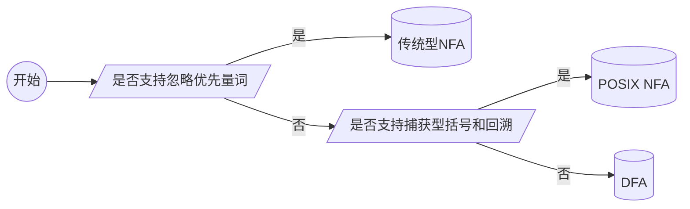

# Regex（正则表达式）

正则表达式（Regex,Regular Expression）是一种文本模式，用于匹配某个句法规则的字符串，实现检索、替换等功能。

# §0 基础知识

## §0.1 背景

在命令行中，我们有时会遇到一些“通配符”，例如`*Test.php`表示所有以`Test.php`结尾的文件：

```shell
$ ls
    File.php  FileTest.php  User.php  UserTest.php
$ rm ./*Test.php
$ ls
    File.php  User.php
```

许多Shell都提供了这种通配符，包含这些通配符的文件名构成了**文件名模式**（Filename Patterns）。但是处理其它文本的话，Shell的这些通配符就很难胜任了。我们需要一种**通用模式语言**（Generalized Pattern Language）处理各类文本，这种模式语言及其模式本身被称为**正则表达式**（Regular Expression，Regex）。

## §0.2 `grep`家族

我们之前使用Linux时已经知道，`grep`命令搭配管道符`|`可以实现按行筛选的操作。事实上Linux包含的远不止`grep`这一种，而是一整个家族：

```shell
$ ls -l /bin/* | grep "grep"
    lrwxrwxrwx 1 root /bin/bzegrep -> bzgrep
    lrwxrwxrwx 1 root /bin/bzfgrep -> bzgrep
    -rwxr-xr-x 1 root /bin/bzgrep
    -rwxr-xr-x 1 root /bin/egrep
    -rwxr-xr-x 1 root /bin/fgrep
    -rwxr-xr-x 1 root /bin/grep
    lrwxrwxrwx 1 root /bin/lzegrep -> /etc/alternatives/lzegrep
    lrwxrwxrwx 1 root /bin/lzfgrep -> /etc/alternatives/lzfgrep
    lrwxrwxrwx 1 root /bin/lzgrep -> /etc/alternatives/lzgrep
    -rwxr-xr-x 1 root /bin/pgrep
    lrwxrwxrwx 1 root /bin/pkill -> pgrep
    -rwxr-xr-x 1 root /bin/ptargrep
    -rwxr-xr-x 1 root /bin/rgrep
    lrwxrwxrwx 1 root /bin/xzegrep -> xzgrep
    lrwxrwxrwx 1 root /bin/xzfgrep -> xzgrep
    -rwxr-xr-x 1 root /bin/xzgrep
    -rwxr-xr-x 1 root /bin/zegrep
    -rwxr-xr-x 1 root /bin/zfgrep
    -rwxr-xr-x 1 root /bin/zgrep
    -rwxr-xr-x 1 root /bin/zipgrep
    -rwxr-xr-x 1 root /bin/zstdgrep
```

每个`grep`家族成员的使用方法大同小异，都类似于`grep [option...] pattern [filepath...]`：

```shell
yaner@DESKTOP-UVBN0SD:~/test$ grep --help
    用法: grep [选项]... 模式 [文件]...
    # ......
yaner@DESKTOP-UVBN0SD:~/test$ egrep --help
    用法: grep [选项]... 模式 [文件]...
    # ......
yaner@DESKTOP-UVBN0SD:~/test$ fgrep --help
    用法: grep [选项]... 模式 [文件]...
    # ......
```

其中`egrep`常用于检索文本文件：

```shell
$ cat info.csv 
    Name,Age,Country
    Alice,18,US
    Bob,19,CN
    Carol,20,EN
    David,19,DE
    Eve,20,CN
$ egrep "^(Alice|Bob)" info.csv 
    Alice,18,US
    Bob,19,CN
```

## §0.3 正则表达式的流派

各流派正则表达式支持情况：

| 元字符           |     `grep`     |   `egrep`   |      `Emacs`       |      `Tcl`       |   `Perl`    |   `.NET`    |   `Java`    |
| ---------------- | :------------: | :---------: | :----------------: | :--------------: | :---------: | :---------: | :---------: |
| `*`/`^`/`$`/`[]` |       √        |      √      |         √          |        √         |      √      |      √      |      √      |
| `?`/`+`/`|`      | `\?`/`\+`/`\|` | `?`/`+`/`|` |    `?`/`+`/`\|`    |   `?`/`+`/`|`    | `?`/`+`/`|` | `?`/`+`/`|` | `?`/`+`/`|` |
| `()`             |     `\(\)`     |    `()`     |       `\(\)`       |       `()`       |    `()`     |    `()`     |    `()`     |
| `(?:)`           |                |             |                    |                  |      √      |      √      |      √      |
| 单词分界符       |                |   `\<\>`    | `\<\>`或`\b`或`\B` | `\n`或`\M`或`\y` | `\b`或`\B`  | `\b`或`\B`  | `\b`或`\B`  |
| `\w`/`\W`        |                |      √      |         √          |        √         |      √      |      √      |      √      |
| 反向引用         |       √        |      √      |         √          |        √         |      √      |      √      |      √      |

## §0.4 正则表达式的处理方式

一般来说，编程语言对正则表达式的处理方式分为集成式处理、程序式处理、面向对象式处理。

### §0.4.1 集成式处理

集成式处理（Integrated Handling）指的是正则表达式直接内建于编程语言中，例如Perl。这种处理方式隐藏了正则表达式的预处理、返回值等细节，降低了程序的繁琐程度。

### §0.4.2 程序式处理

程序式处理（Procedural Handling）指的是正则表达式并不属于编程语言基本元素，只能先接受字符串，然后才能将其作为正则表达式对待，真正负责处理表达式的是编程语言内置的函数或运算符。

以Java为例，Java支持程序式处理：

```java
String input = "......";
if(Pattern.matches("Hello"),input){ // Pattern类提供的matches()方法
    // ......
}
if(input.matches("Hello")){ // String类提供的matches()方法
	// ......
}
```

微软的.NET平台也提供了相关API：

```.net
If Regex.IsMatch(Input,"Hello") Then
	// ......
End if
```

PHP原生内置`preg_match()`等函数：

```php
if(preg_match('/Hello/i',$input,$matches)){
	echo $matches[1];
}
```


### §0.4.3 面向对象式处理

面向对象式处理（Object-Oriented Handling）指的是正则表达式并不属于编程语言基本元素，只能先接受字符串，然后才能将其作为正则表达式对待，真正负责处理表达式的是编程语言内置的对象中的方法，并没有专门用于负责处理正则表达式的运算符。

以Java为例，Java也支持面向对象式处理：

```java
String input = "......";
Pattern regex = Pattern.compile("Hello",Pattern.CASE_INSENSITIVE);
Matcher matcher = regex.matcher(input);
if(matcher.find()){
	// ......
}
```

VB.NET也提供了正则表达式的API：

```vb
Imports System.Text.RegularExpressions
Dim input as string = "......"
Dim regex as Regex = New Regex("^Subject: (.+)",RegexOptions.IgnoreCase)
Dim match as Match = regex.Match(input);
If match.Success
    msgbox(match.Groups(1).Value)
End if
```

Python使用的是`re`库：

```python
import re
input = "......"
regex = re.compile("Hello")
match = regex.search(input)
if match:
    print(match.group(1))

```


# §1 元字符

正则表达式中的各个字符可以分为两类：一类是没有特殊含义的普通字符，称为**文字**（Literal）；另一类是具有特殊含义、代表某种规则的特殊字符，称为**元字符**（Metacharacter）。

## §1.1 `^`/`$` 行的起始与结束

在`egrep`中，`^`代表一行的开始，`$`代表一行的结束。本来正则表达式的匹配结果可能在行中，而`^`只寻找行首的内容，`$`只寻找行末的内容，这种以位置为依据，而非以文本为依据，限定匹配结果的过程称为**锚定**（Anchor）。

在Perl等编程语言中，`^`和`$`通常只表示整个文本的起点和终点，而不是每一行的行首与行尾。如果要匹配，可以使用[`m`修饰符](#§2.4 修饰符)。

## §1.2 `[]` 字符组

### §1.2.1 匹配若干字符之一

`[]`用于表示匹配字符组内的任何一个字符。例如`[Aa]pple`同时匹配`Apple`和`apple`，`<h[123456]>`匹配HTML的标题标签`<h1>`/`<h2>`/....../`<h6>`。

除此之外，`[]`内可以用连字符`-`表示一个范围，例如`[1-6]`与`[123456]`是完全一样的，`[abcdefg]`可以简化成`[a-g]`。甚至我们可以使用多个`-`构成多重范围，例如`[123456abcdefABC?_.!]`可以简写成`[1-6a-fA-C?_.!]`或`[?a-f_A-C.1-6!]`，这些范围的排列顺序没有影响。

> 注意：只有在字符组`[]`内部，**并且不被夹在左右另外两个字符的中间**，连字符`-`才被视为元字符，否则它只是一个文字而已，只能匹配一个普通的连字符`-`。例如要匹配`1-2`、`1.2`、`1/2`，我们不能写`1[.-/]2`，因为会被识别成“从`.`到`/`”的范围，可以写`1[-./]2`和`1[./-]2`。

### §1.2.2 排除所有字符

`[^]`用于匹配所有未在字符组中列出的字符（行首与行尾换行符不算字符），这一过程称为**排除**（Negate），例如`[^1-3]`匹配除了`1`/`2`/`3`之外的任何字符。

## §1.3 `.` 匹配任意字符

小数点`.`用于匹配任意字符和字符组，例如`a.c`可以匹配`abc`/`a c`/`a/c`/`a-c`等等。

> 注意：在字符组`[]`内部，小数点`.`被视为文字而非元字符。

## §1.4 `|` 匹配任意子表达式

`|`的含义是“或”，我们可以把这些子表达式拼成一个正则表达式，这些子表达式称为**多选分支**（Alternative）。例如`123|abc`既可以匹配`123`，也可以匹配`abc`；又例如`[Aa]pple`完全可以改写成`(A|a)pple`。

得益于`|`的引入，从这一节开始，我们要正式接触正则表达式化简这个概念。例如我们要匹配`first`和`1st`，注意到两者都以`st`结尾，我们就能压缩正则表达式的长度，从`first|1st`简化成`(fir|1)st`。

虽然`|`与`[]`都能起到“或”的效果，但是`|`的子表达式可以是一个完整的正则表达式，而`[]`只能匹配或排除一个指定的字符组。

## §1.5 忽略大小写

我们知道，正则表达式是严格区分大小写的，并不原生提供表示忽略大小写的元字符。然而许多支持正则表达式的程序却提供了忽略大小写的选项，例如`egrep`的命令行参数`-i`：

```shell
$ egrep --help
    模式选择与解释：
        # ......
          -i, --ignore-case         在模式和数据中忽略大小写
              --no-ignore-case      不要忽略大小写（默认）
        # ......
t$ cat info.csv
    Flag
    fl0g
    fLaG
    FLaG
    f1og
$ egrep -i "^flag" info.csv
    Flag
    fLaG
    FLaG
```

## §1.6 `\<`/`\>` 单词分界符

如果现在要匹配一个单词，我们最先想到的正则表达式可能是该单词本身。例如尝试匹配下列文本中的版本号`16.04`：

```shell
$ cat info.csv 
    In 2016.04.10, Ubuntu version 16.04 was released.
$ egrep -i "16.04" info.csv
    In 20__16.04__.10, Ubuntu version __16.04__ was released.
```

结果非常尴尬，我们把`2016.04.10`中的`16.04`也匹配上了。更关键的是，如果我们要匹配只有一个字母的单词`a`，可想而知我们误匹配的结果将会更多。这种问题的本质，是一个单词本身包含在另一个单词中。为解决这一问题，正则表达式引入了单词分界符这一概念，分别用`<\`和`\>`表示单词的开头与结尾，类似于用`^`和`$`表示行首与行末，都是代表一个概念，而不是代表一个存在的字符：

```shell
$ egrep -i "\<16.04\>" info.csv
	In 2016.04.10, Ubuntu version __16.04__ was released.
```

## §1.7 `?` 可选项元素

以`color`和`colour`为例，要同时匹配英式和美式英语，同时又不能匹配拼写错误的单词，我们可以使用`?`代表前面的字符可有可无，得到符合要求的正则表达式：`colou?r`;

```shell
$ cat info.csv 
    color
    colour
    coliur
$ egrep -i "colou?r" info.csv
    color
    colour
```

`u?`作为一个整体，对于任意字符串都是能够匹配成功的。因为无论字符`u`是否存在，`?`前面的字符都是可有可无的，符合这个可选项元素的要求。因此，决定整个正则表达式是否能匹配成功，关键在于`u?`之后的元素是否能匹配成功。这就会导致一个问题：开发者有时会忘记在`u?`的后面再加元素，从而跟`u?`完全没加一样。例如我们只想匹配`apple`的单数和复数，稍有不慎就会写出这种`apples?`的正则表达式：

```shell
$ cat info.csv 
    apple
    apples
    applet # n.小程序
$ egrep -i "apples?" info.csv # 错误用法
    apple
    apples
    applet # 竟然也匹配上了
$ egrep -i "apples?$" info.csv # 正确用法
    apple
    apples
```

## §1.8 `*`/`+` 重复出现

`+`表示该元字符前面紧邻的元素至少出现一次，`*`表示该元字符前面紧邻的元素出现任意多次（包括0次）。`+`、`*`、`?`这三种元字符都限制了前面紧邻元素的出现次数，因此统称为**量词**（Quantifier）。

## §1.9 `{}` 区间量词

大多数版本的`egrep`还支持区间量词这一特性。`{min,max}`用于表示该元字符前面紧邻的元素至少出现`min`次，最多出现`max`次；`{times}`表示恰好重复`times`次。

例如匹配一个任意位数的十进制小数，要求匹配`12.34`或`12`，过滤`01.12000`和`12.`：先分析整数部分，要么为单独的0，要么是不以0开头的数字，那么整数部分的正则表达式可以为`(0|[1-9]+[0-9]*)`；然后分析小数点部分，小数点可以不带，于是记为`\.?`小数部分；如果有小数点的话，那么末尾不能为0，其它位就可以为0，于是记为`[0-9]+[1-9]`；如果没有小数点的话，应该直接到行末。综合以上讨论结果，得到完整的正则表达式`^(0|[1-9]+[0-9]*)(\.[0-9]+[1-9])?$`：

```shell
$ cat info.csv 
    0
    0.0
    1
    1.0
    1.234
    1.2340
    1.23400
    1.234005
$ egrep -i "^(0|[1-9]+[0-9]*)(\.[0-9]+[1-9])?$" info.csv
    0
    1
    1.234
    1.234005
```

## §1.10 `\1` 反向引用

假如我们有以下文本，要求匹配所有的前后两个单词拼写相同的行：

```shell
$ cat info.csv
    apple  Apple # 两个空格
    banana    banana # 四个空格
    carrot carrot # 一个空格
```

许多正则表达式软件都支持“记忆”前面括号匹配的文本内容，第一个括号匹配的文本内容可以在后续正则表达式中记为`\1`，第二个括号匹配的文本内容可以在后续正则表达式中记为`\2`，以此类推。这种特性称为**反向引用**（Backreference）。因此我们就可以针对上述任务写出正则表达式`^\<.+\> +\1$`：

```shell
$ egrep "^(\<[a-zA-Z]+\>) +\1" info.csv
    banana    banana
    carrot carrot
```

## §1.11 特殊字符转义

如果我们想使用的文字恰好是当前语境下的元字符，可以在该字符前加上反斜杠`\`进行转义。如果原本的文字明明不需要转义，那么反斜杠将会被忽略。

> 注意；大多数编程语言都支持字符组内部的转义，但是大多说的`egrep`却不支持，它们会把`\`视为一个单独的文字。

# §2 Perl

Perl一种用于Linux系统的脚本语言，可以看作升级版的`shell`。下面是一个简单的示例：

```perl
$i = 1;
while($i <= 9){
    $iSquare = $i * $i;
    print "$i × $i = $iSquare\n";
    $i++;
}
```

```shell
$ perl test.pl
    1 × 1 = 1
    2 × 2 = 4
    3 × 3 = 9
    4 × 4 = 16
    5 × 5 = 25
    6 × 6 = 36
    7 × 7 = 49
    8 × 8 = 64
    9 × 9 = 81
```

Perl原生支持正则表达式，但是其语法与`egrep`有所区别。`=~`表示匹配正则表达式，正则表达式用`/.../`包起来，`m`告知Perl编译器这是一个正则表达式，由`=~`完成进行正则表达式匹配（Regular Expression Match）：

```perl
print "请输入数字：";
$number = <STDIN>;
if($number =~ m/^[0-9]+$/){
    print "输入合法";
}else{
    print "输入非法，只能输入纯数字";
}
```

```shell
$ perl test.pl
    请输入数字：123abc
    输入非法，只能输入纯数字
```

Perl等编程语言及支持正则表达式的其它工具，都在正则表达式的基础上额外引入了自己的语法和元字符。本章重点介绍这些额外的语法。

## §2.1 `(?:)` 非捕获型括号

我们知道，Perl会自动将正则表达式中由括号匹配到的文本赋给`$1`、`$2`等变量。但是有时我们撰写正则表达式时，经常手动加括号以提升可读性。更关键的是，这种Perl程序也不容易维护，因为正则表达式的一个括号变了，脚本中的所有`$1`等变量都要更改序号。有没有什么元字符，既能像`()`一样可以创建子表达式，又不会让匹配的文字被Perl捕获呢？这就是非捕获型括号`(?:...)`：

```perl
print("Input a string: ");
$string = <STDIN>;
chomp($string);
if($string =~ m/^([A-Za-z0-9]+) ([A-Za-z0-9]+)$/){
    print "()() First Parameter: $1\n";
}
if($string =~ m/^(?:[A-Za-z0-9]+) ([A-Za-z0-9]+)$/){
    print "(?:)() First Parameter: $1\n";
}
```

```shell
$ perl -w test.pl
    Input a string: first second
    ()() First Parameter:    first
    (?:)() First Parameter:  second
```

## §2.2 其它转义字符

Perl等编程语言额外提供了一些转义字符：

| 转义字符 | 作用                                               |
| -------- | -------------------------------------------------- |
| `\t`     | 制表符                                             |
| `\n`     | 换行符                                             |
| `\r`     | 回车符                                             |
| `\s`     | 任何空白字符（空格符、制表符、进纸符）             |
| `\S`     | 除空白字符（空格符、制表符、进纸符）之外的任何字符 |
| `\w`     | 等价于`[A-Za-z0-9]`                                |
| `\W`     | 除`[A-Za-z0-9]`之外的任何字符                      |
| `\d`     | 纯数字（`[0-9]`）                                  |
| `\D`     | 除数字之外的任何字符                               |

> 注意：在Perl中，`\b`表示单词分界符，在字符组`[]`中表示退格符。

## §2.4 修饰符

我们知道，原生的正则表达式本身没有忽略大小写的功能。为了忽略大小写，`egrep`提供了`-i`选项。类似的，Perl也提供了这一功能，但是不是基于命令行选项，而是在正则表达式的后面添加一些字符，这类字符称为**修饰符**（Modifier）。

```perl
if(string =~ m/[a-z]+/i){...}
```

上面使用的是`i`修饰符。虽然`/`并不属于修饰符的一部分，但是为了方便，实际中经常记为`/i`。

修饰符有很多种：

| 修饰符 | 英文全称                       | 作用                                    |
| ------ | ------------------------------ | --------------------------------------- |
| `i`    | Case-insenitive                | 忽略大小写                              |
| `g`    | Global Match                   | 全局匹配                                |
| `x`    | Free-form Expression           | 宽松排列（忽略大多数空白字符和`#`注释） |
| `m`    | Multiline/Enhanced Line Anchor | 多行/增强的行锚点                       |

```perl
# 宽松排列
$email = "demo\@example.com";
$email =~ s{
    \b
    # 这是一个注释
    (
        \w+
        \@
        [\w.]+
    )
    \b
}{
    <a href="mailto:$1">$1</a>
}gix;
print "$email";
	# $ perl test.pl
    	<a href="mailto:demo@example.com">demo@example.com</a>
```


## §2.5 `/` 替换

到目前为止，我们学习的正则表达式只有一个功能——查找。而且这个正则表达式在Perl中还得用`/.../`包起来，前面加上`m`表示匹配。Perl提供了替换功能，通过多个`/`组成`/a/b/`结构，并且在前面加上`s`表示查找和替换（Serach and Replace），将第一个匹配`a`表达式的文字替换为`b`。如果要全部替换，应该在末尾加上修饰符`g`：

```perl
print("Input a string: ");
$string = <STDIN>;
chomp($string);
$string =~ s/\bAlice\b/Bob/;
print "$string";
```

```shell
$ perl -w test.pl
    Input a string: Hello, Mike!
    Hello, Mike!
$ perl -w test.pl
    Input a string: Hello, Alice!
    Hello, Bob!
```

> 注意：Perl程序不仅可以写在文件中，也可以作为命令行参数传入：
>
> ```shell
> $ cat info.csv 
>     Hello, Alice!
>     This is Alice.
>     Where is Alice?
> $ perl -p -i -e 's/Alice/Bob/g' info.csv 
> $ cat info.csv 
>     Hello, Bob!
>     This is Bob.
>     Where is Bob?
> ```
>
> 其中`-p`表示逐行检查，`-i`表示将替换后的结果写入原文件，`-e`表示后面传入的是正则表达式。

## §2.6 `(?=)`/`(?<=)`/`(?!)`/`(?<!)` 环视

如果要给一个大数加上数字分隔符，例如把`12345678`变成`12,345,678`，怎么用正则表达式实现呢？我们已经知道了数字分隔符的用法：从最后的个位数开始向前数，每经过三个数字就在左面添加一个逗号。要实现这个功能，我们需要用到**环视**（Lookahead）这一特性。

环视是正则表达式中的一种只匹配位置，不匹配内容的元素。之前介绍的`\b`匹配单词的起始处、`^`和`$`匹配行首与行尾，也是只匹配位置，但是环视的通用性更强，分为四种种情形：

- 肯定顺序环视（Positive Lookahead）：`(?=...)`按照当前位置右边的字符作为是否匹配的依据
- 肯定逆序环视（Positive Lookbehind）：`(?<=...)`按照当前位置左边的字符作为是否匹配的依据
- 否定顺序环视：（Negative Lookahead）`(?!...)`按照当前位置右边的字符作为是否不匹配的依据
- 否定逆序环视：（Negative Lookbehind）`(?<!...)`按照当前位置左边的字符作为是否不匹配的依据

结合环视，我们就能用另一种方式解决从`Alices`到`Alice's`：

```perl
$string = "Alices";
$string =~ s/\bAlices\b/Alice's/; # 简单的替换
print "$string";

$string = "Alices";
$string =~ s/Alice(?=s\b)/Alice'/; # 使用环视进行替换
print "$string";
```

回到数字分隔符的问题，插入的位置必须符合两个要求：左边必须至少有一个数字，右边的数字个数必须是3的倍数（不是右侧存在`(\d\d\d)+`，而是右侧到数字结束位置能匹配`(\d\d\d)+\b`），分别对应着`(?<=\d)`和`(?=(\d\d\d)+\b)`：

```perl
$number = <STDIN>;
$number =~ s/(?<=\d)(?=(\d\d\d)+\b)/,/g;
print "$number";
```

```shell
$ perl -w test.pl
    Input a number: 1234567
    1,234,567
$ perl -w test.pl
    Input a number: 123456789
    123,456,789
```

如果禁用所用的环视元字符，那么思考这个正则表达式：`s/(\d)((\d\d\d)+\b)/$1,$2/g`，能不能实现相同的效果呢？答案是不能。我们知道，修饰符`g`表示全局，是用迭代的方式实现的。以`123456789`为例，首先匹配到了`3`和`456789`，两者之间加上了一个逗号。问题来了，我们知道`456789`已经曾经被匹配过了，于是根据迭代的原理，下一次迭代开始的位置一定是上一次迭代结束的位置，那么`6`和`789`就永远不可能被匹配了，因此得到的结果只能有一个逗号：`123,456789`。而使用环视的意义就在于此：只匹配位置，永远不匹配文字，这样就能不“使用”文字，让这些文字能够参与到下一次迭代中。

难道真的没有办法了吗？既然一次替换解决不了，那我们就多次地替换，直到不能替换为止：

```perl
while($text =~ s/(\d)((\d\d\d)+\b)/$1,$2/g){
	;
}
```

## §2.7 其它分隔符

到目前为止，我们在Perl中见过的所有用于替换的正则表达式，都是形如`s/regex/replacement/modifier`的结构。如果`regex`或`replacement`中出现大量的`/`，那么我们就需要对其进行转义，使用大量的`\/`。这无疑是非常麻烦的——凭什么就因为区区两个分隔符`/`，就需要其它所有文字`/`让路呢？如果能把分隔符换成其它字符，那么我们理论上就没有再对文字`/`转义的必要了。

Perl支持的分隔符有`/`、`{}`和`!`：

```perl
$string = "Hello, Alice";
$string =~ s/Alice/Bob    Look at this {}!/g; # 分隔符为/
print "$string\n";

$string = "Hello, Alice";
$string =~ s{Alice}{Bob    Look at this //!}g; # 分隔符为{}
print "$string\n";

$string = "Hello, Alice";
$string =~ s!Alice!Bob    Look at this {}\!!g; # 分隔符为!
print "$string\n";
```

```shell
$ perl -w test.pl
    Hello, Bob    Look at this {}!
    Hello, Bob    Look at this //!
    Hello, Bob    Look at this {}!
```

## §2.8 正则表达式库

对于一些重复使用的正则表达式，我们可以将其保存起来，并插入到其它正则表达式中：

```perl
$phoneRegex = qr/\b1\d{10}\b/;
$message = "This is my phone number: 12345678901";

$message =~ s/.*$phoneRegex/98765432109/ig;
print "$message";
```

```shell
$ perl -w test.pl
	98765432109
```

要保存正则表达式，我们需要使用`qr`操作符，让Perl生成一个Regex类型的对象并作为变量保存。

> 注意：在Perl中，正常情况下`$`也可以表示行尾，又可以表示变量符，不需要转义。然而在字符组中，它只能用于表示变量符，而且使用时必须转义。

# §3 Java

Java使用`java.util.regex`包处理正则表达式：

```java
import java.util.regex.*;

class Demo {
    public static void main(String[] args) {
        String input = "eMail: test@example.com";
        Pattern regex = Pattern.compile("^Email: (.+)$",Pattern.CASE_INSENSITIVE);
        Matcher matcher = regex.matcher(input);
        if(matcher.find()){
            System.out.println(matcher.group(1)); // 提取邮箱地址
        }
    }
}
```

### §3.1 查找与替换


```java
import java.io.BufferedReader;
import java.io.FileReader;
import java.io.IOException;
import java.util.regex.Pattern;

class Demo {
    public static void main(String[] args) {
        Pattern regex1 = Pattern.compile("\\b([a-z]+)((?:\\s|\\<[^>]+\\>)+)(\\1\\b)", Pattern.CASE_INSENSITIVE);
        Pattern regex2 = Pattern.compile("^(?:[^\\e]*\\n)+", Pattern.MULTILINE);
        Pattern regex3 = Pattern.compile("^([^\\n]+)", Pattern.MULTILINE);
        String replace1 = "\033[7m$1\033[m$2\033[7m$3\033[m";
        for (int i = 0; i < args.length; i++) {
            try{
                BufferedReader in = new BufferedReader(new FileReader(args[i]));
                String text;
                while((text = getPara(in)) != null){
                    text = regex1.matcher(text).replaceAll(replace1);
                    text = regex2.matcher(text).replaceAll("");
                    text = regex3.matcher(text).replaceAll(args[i] + ": $1");
                    System.out.print(text);
                }
            }catch(IOException e){
                System.err.println("Can't read [" + args[i] + "]" + e.getMessage());
            }
        }
    }

    public static String getPara(BufferedReader in) throws IOException {
        StringBuffer buffer = new StringBuffer();
        String line;
        while ((line = in.readLine()) != null && (buffer.length() == 0 || line.length() != 0)) {
            buffer.append(line + '\n');
        }
        return buffer.length() == 0 ? null : buffer.toString();
    }
}
```

```shell
$ cat text.txt 
    This is a weird weird document.
    Because it contains contains too much much repetive words.
$ java Demo.java text.txt
    text.txt: This is a [weird weird] document.
    text.txt: Because it [contains contains] too [much much] repetive words.
```


# §A 例题

## §A.1 是否为时刻

要求匹配形如`20:12:59`、`00:00:00`的时长字符串。

- 小时数：必须是一个0到24的整数
  - 当十位数为0时，个位数可以是任意数
  - 当十位数为1时，个位数可以是任意数
  - 当十位数为2时，个位数只能从0到3
- 分钟数：必须是一个0到59的整数，容易发现十位数从0到5，个位数不受限制
- 秒种数：同分钟数

得到的正则表达式为`^([01][0-9]|[2][0-3]):[0-5][0-9]:[0-5][0-9]$`。

```shell
$ cat info.csv 
    12:30:59
    0:0:0
    25:00:00
    00:61:00
    00:00:61
$ egrep "^([01][0-9]|[2][0-3]):[0-5][0-9]:[0-5][0-9]$" info.csv 
    12:30:59
```

## §A.2 自动中美汇率转换

已知中美汇率为$\frac{1}{6.75}$.要求根据输入的货币类型与数字，自动转换成另一种货币并输出数字（保留两位小数），例如输入`USD 10.5`，输出`CNY 70.89`。

```perl
print("中美汇率计算器\n请输入要转换的货币与面值:");
$string = <STDIN>;
chomp($string); # 删除末尾换行符
if($string =~ m/^(USD|CNY) ([0-9]+(\.[0-9]+)?)$/){
    $usd2cnyRatio = 6.75;
    $type = $1;
    $number = $2;
    if($type eq "USD"){
        $newType = "CNY";
        $newNumber = $number / $usd2cnyRatio;
    }elsif($type eq "CNY"){
        $newType = "USD";
        $newNumber = $number * $usd2cnyRatio;
    }
    printf "$string -> $newType %.2f",$newNumber;
}else{
    print "输入不合法！";
    exit;
}
```

```shell
$ perl -w test.pl
    中美汇率计算器
    请输入要转换的货币与面值:CNY 2000
    CNY 2000 -> USD 296.30
$ perl -w test.pl
    中美汇率计算器
    请输入要转换的货币与面值:USD 1.2.3
    输入不合法！
$ perl -w test.pl
    中美汇率计算器
    请输入要转换的货币与面值:JPY 10000.00
    输入不合法！
```

## §A.3 修正浮点数

受制于浮点数的计算原理，部分小数从十进制转换到二进制时会产生误差，例如经典的`0.1+0.2!=0.3`：

```python
Python 3.10.4 [GCC 11.2.0] on linux
Type "help", "copyright", "credits" or "license" for more information.
>>> 0.1 + 0.2
    0.30000000000000004
```

现在为修正这一问题，我们可以制定一种标准，假如小数点后连续出现8个`0`时，就忽略这之后的所有小数数字。假设所有输入都是需要修正的合法小数（例如不出现`000.123`/`123`/`1.00000000`的情况），试编写这一程序。

```perl
print("Input a string: ");
$string = <STDIN>;
chomp($string);
if($string =~ /^(\d*\.\d*)0{8}\d*$/){
    print "$1";
}else{
    print "$string";
}
```

```shell
$ perl test.pl 
    Input a string: 123.456
    123.456
$ perl test.pl 
    Input a string: 123.45600000000789
    123.456
$ perl test.pl 
    Input a string: 123.456000789
    123.456000789
```

## §A.4 文件逐行读取与写入

现在`mail.txt`中包含以下内容：

```
From: hotel@example.com (Seasonal Hotel)
To: alice@example.com (Alice)
Subject: Hotel is booked successfully

Mrs.Alice,
	We have received your requestion of reservation on July 23th in Seasonal Hotel. Your room id is 1206.
	Wish you a pleasant time in our hotel, and all of our staff are looking forward to your arrival.
```

我们的任务是根据上述内容，生成一份邮件回复的模版，并将内容写入到`reply.txt`：

```
From: alice@example.com (Alice)
To: hotel@example.com (Seasonal Hotel)
Subject: re: Hotel is booked successfully

|> Mrs.Alice,
|>     We have received your requestion of reservation on July 23th in Seasonal Hotel. Your room id is 1206.
|>     Wish you a pleasant time in our hotel, and all of our staff are looking forward to your arrival.
```

Perl提供了`<>`运算符用于逐行读取数据，相当于`getline()`函数：

```perl
$from = ""; # 声明全局变量
$to = ""; # 声明全局变量
$subject = ""; # 声明全局变量
while($line = <>){
    if($line =~ m/^From:\s*(\w.*)$/i){
        $from = $1;
    }elsif($line =~ m/^To:\s*(\w.*)$/i){
        $to = $1;
    }elsif($line =~ m/^Subject:\s*(\w.*)$/i){
        $subject = $1;
    }elsif($line =~ m/^\s*$/){
        last;
    }
}
if(not defined($from) or not defined($to) or not defined($subject)){
    die "Missing required information!";
}
print("From: $to\n");
print("To: $from\n");
print("Subject: re: $subject\n\n");
while($line = <>){
    print "|> $line";
}
```

```shell
$ cat info.csv
    From: hotel@example.com (Seasonal Hotel)
    To: alice@example.com (Alice)
    Subject: Hotel is booked successfully

    Mrs.Alice,
            We have received your requestion of reservation on July 23th in Seasonal Hotel. Your room id is 1206.
            Wish you a pleasant time in our hotel, and all of our staff are looking forward to your arrival.
$ perl -w test.pl info.csv > reply.txt
$ cat reply.txt 
    From: alice@example.com (Alice)
    To: hotel@example.com (Seasonal Hotel)
    Subject: re: Hotel is booked successfully

    |> Mrs.Alice,
    |>      We have received your requestion of reservation on July 23th in Seasonal Hotel. Your room id is 1206.
    |>      Wish you a pleasant time in our hotel, and all of our staff are looking forward to your arrival.
```

## §A.5 HTML空行转换器

HTML渲染时使用`<br>`来表示换行符。我们的目标是将HTML源文件中的一个或多个连续的空行全部换成单个`<br>`标签。

首先让Perl使用文件读取模式（File-slurp），允许一次性读入多行文本，而不是每次只读入一行文本：

```perl
undef $/;
$text = <>; # 一次性读取整个文件
```

为了让`^`和`$`代表行首与行尾，而不是整个文本的起始与末尾，我们使用`m`修饰符。

```perl
undef $/;
$text = <>;
$text =~ s/^\s*$/<br>/mg; # 正则表达式总是尝试匹配最长串
print "$text";
```

```shell
$ cat info.html
    <html>
        <body>
            <h1>Hello!</h1>

            <span>This is a simple webpage.</span>


            <a>But the source file contains too much blank line.</a>
        </body>
    </html>
$ perl -w test.pl info.html
    <html>
        <body>
            <h1>Hello!</h1>
    		<br>
            <span>This is a simple webpage.</span>
    		<br>
            <a>But the source file contains too much blank line.</a>
        </body>
    </html>
```

## §A.6 匹配双引号中的文本

要求设计一个正则表达式，能匹配`"UAC" is the short of "User Account Control"`中的`UAC`。

一开始我们可能想到`"(.*)"`，但是这一表达式中的`.*`会尽可能匹配更长的字符串，导致匹配的结果只有`UAC" is the short of "Use Account Control`这一个：

```perl
$input = "\"UAC\" is the short of \"User Account Control\"";
$input =~ m/"(.*)"/;
print "$1";
```

```shell
$ perl -w test.pl
UAC" is the short of "User Account Control
```

我们现在要解决的问题是，如何让正则表达式的`(.*)`碰到第一个右双引号就立刻退出匹配，换言之，如何让`(.*)`匹配除了双引号之外的字符——我们想到了`[^...]`可以表示否定：`[^"]`：

```perl
$input = "\"UAC\" is the short of \"User Account Control\"";
$input =~ m/"([^"]*)"/;
print "$1";
```

```shell
$ perl -w test.pl
	UAC
```

# §B 正则引擎与原理

## §B.1 正则引擎分类

正则表达式的引擎简称正则引擎，虽然可以细分很多种，但是可以大致分为两大类：文本主导引擎（DFA）和表达式主导引擎（NFA）。为了规范各类引擎，特别是NFA引擎的行为，IEEE发布了POSIX标准（Portable Operating System Interface）。



| 正则引擎类型 |                  使用该引擎的编程语言和程序                  |
| :----------: | :----------------------------------------------------------: |
|     DFA      |      `awk`、`egrep`、`flex`、`lex`、`MySQL`、`Procmail`      |
|  传统型DFA   | `GNU Emacs`、`Java`、`grep`、`less`、`more`、`.NET`、`PCRE library`、`Perl`、`PHP`、`Python`、`Ruby`、`sed`、`vi` |
|  POSIX NFA   | `mawk`、`Mortice Kern Systems' utilities`、`GNU Emacs`（明确指定时） |
| DFA/NFA混合  |          `GNU awk`、`GNU grep`、`GNU egrep`、`Tcl`           |

## §B.2 正则引擎原理

到目前为止，我们学过的所有正则表达式都满足以下两条普适的规则：

1. 优先选择最左端的匹配结果

   举个例子，现在我们使用正则表达式`s/aa/b/`，对字符串`aaa`进行替换。那么正则引擎是先会匹配左侧的`aa`替换成`b`得到`ba`，还是先匹配右侧的`aa`替换成`b`得到`ab`呢？依据这条原则，结果应该是前者：

   ```perl
   $input = "aaa";
   $input =~ s/aa/b/;
   print "$input"
   ```

   ```shell
   $ perl -w test.pl 
   	ba
   ```

   这是因为正则引擎的匹配过程总是从左开始。正则表达式开始匹配时，首先从第一个`a`开始，按照正则表达式尝试匹配，发现能够匹配成功，于是选中第一、二个`a`，将这一整体替换为`b`。

2. 优先匹配量词（`*`、`+`、`?`、`{m,n}`），且尽可能在成功的前提下匹配更长的文字序列

   举个例子，现在我们使用正则表达式`s/a{3}/b/`，对字符串`aaaaaaa`进行替换，那么第一次匹配成功时，对应的文字是`aaa`还是`aa`呢？依据这条原则，结果应该是前者：

   ```perl
   $input = "aaaaaaa";
   $input =~ s/aa/b/;
   print "$input"
   ```

   ```shell
   $ perl -w test.pl
   	bba
   ```

   但是“尽可能匹配更长的文字序列”必须在成功的前提下。而且后面元字符匹配的“最长序列”受制于前一个元字符匹配的最长序列。

   - “尽可能匹配更长的文字序列”必须在成功的前提下

     以`^.*\d\d$`为例，这个正则表达式的作用是提取一串数字的最后两位数字。最前面是`.*`，可以匹配任意长的所有字符，貌似会把最后两位数字也匹配进去，导致我们的`\d\d`无法匹配。这种说法是错误的，因为`\d\d`无法匹配就代表着整个正则表达式匹配失败，这个时候为了匹配成功，`\d\d`会强迫之前的元字符逐个**交还**（Unmatch）某些字符。以字符串`123`为例，首先`.*`匹配`123`，然后`\d\d`匹配失败，于是`.*`会把`3`交还回来，`\d`发现可以匹配成功。接着前进到下一个`\d`，发现匹配又失败了，于是强迫`\d`把`3`交还回来，但是此时前一个`\d`匹配失败，因此前一个`\d`会强迫`.*`交还一个字符`2`，现在前一个`\d`匹配成功，`.*`也匹配成功，于是整个匹配过程顺利结束。

   - 后面元字符匹配的“最长序列”受制于前一个元字符匹配的最长序列

     以`^.*\d+$`为例，尝试用字符串`Copyright 2003`进行匹配，得到的结果是什么呢？首先前一个元字符`.*`会尽可能的匹配最长序列，显然它可以从头一直匹配到尾，但是之后的`\d+`不能匹配了。于是`\d+`强迫`.*`交还一个文字`3`，此时`.*`和`\d`都符合要求，于是`\d+`匹配到的结果只有`3`。这里`\d+`并不能够匹配到它的极限——`2003`，这是因为后一个元字符`\d+`匹配到的最长序列受制于前一个元字符`.*`匹配到的`Copyright 200`影响。

## §B.3 NFA与DFA

思考这个问题：如果用`to(nite|knight|night)`尝试匹配字符串`Shall we go tonight?`，匹配流程是什么样的？NFA和DFA会给出不同的答案。

### §B.3.1 NFA简介

表达式主导引擎/非确定型有穷自动机（NFA）会从正则表达式的第一个字符开始，在字符串中查找匹配的部分，如果符合，那么就尝试用正则表达式的第二个字符，对字符串进行匹配，以此类推，直到正则表达式的所有元字符都匹配成功。

分析上述例子，`to(nite|knight|night)`会先从`t`开始，在字符串中匹配到`t`，然后接着用正则表达式的第二个字符`o`，发现字符串的`t`后面也有`o`，匹配成功，然后进入到正则表达式的`()`元字符。`()`内有三种选项，NFA会一个个的尝试。首先尝试`nite`，发现正则表达式的`t`无法匹配，转而尝试`knight`，发现正则表达式的`k`无法匹配，转而尝试`night`，匹配成功。

在这种匹配方式中，表达式的控制权在不同元素间来回切换，因此被称为表达式优先引擎。

NFA在处理正则表达式的过程中，每一个子表达式都是各自独立的，子表达式之间不存在联系。

### §B.3.2 DFA简介

文本主导引擎/确定性有穷自动机（DFA）会从字符串的第一个字符开始，尝试匹配整个正则表达式，如果出现问题，那么就将当前正则表达式挂起，引入字符串的第二个字符，再让正则表达式进行匹配。以此类推，直到整个正则表达式匹配成功。这种方式在扫描字符串时，会记录当前有效的所有匹配分支。

分析上述例子，DFA首先读取字符串的第一个字符`S`，代入到正则表达式`to(nite|knight|night)`中，发现正则表达式第一个文字`t`都匹配不了，因此DFA抛弃了字符串的第一个字符`S`，然后读取字符串的第二个字符`h`。以此类推，直到DFA读取字符串的`t`，发现可以和正则表达式的第一个字符`t`匹配，再读取后一个字符`o`，也匹配成功，但是后续的元字符是一个选择分支元素`()`。这个时候DFA就会创建分支，将这个正则表达式拆成`to(nite)`、`to(knight)`、`to(night)`，分别进行匹配，发现只有`to(night)`可以匹配成功，于是整体判定为成功。


### §B.3.3 有穷自动机的确定性

根据NFA和DFA的原理，我们可以推理出一般情况下DFA的效率要更高，因为NFA会使用不同的子表达式对相同的文字进行匹配，导致浪费了大量时间。

DFA（确定型有穷自动机）的最大特点就是，在抵达正则表达式的末尾之前，就能直到其是否能够全局匹配给定的字符串。只要字符串中的一个文字被匹配过，那么它所属的子表达式就永远不会改变。

NFA（非确定型有穷自动机）恰恰相反，由于它会将正则表达式衍生出众多分支，所以只要所有分支都没遍历完，我们就不知道某个字符属于哪个子表达式，甚至是第一个字符属于哪个表达式也不知道。

### §B.3.4 回溯

NFA引擎最重要的特性就是**回溯**（Backtracking）：依次处理各个子表达式，当遇到多个可能成功的分支时，暂且选择其中一个，同时记住另外几个并压入栈中（LIFO，后进先出，Last In First Out），以备这一个匹配不成功。

问题来了：NFA引擎会最优先选择哪个子表达式？答案是下面这条很拗口的原则：

> 如果需要在“进行尝试”和“跳过尝试”之间进行选择，那么对于匹配优先量词，NFA引擎会优先“进行尝试”；如果对于忽略优先量词，那么会优先“跳过尝试”。

例如用正则表达式`ab?c`匹配字符串`abc`，NFA引擎的过程如下：

1. 先读正则表达式的第一个元素`a`，发现字符串的第一个字符`a`可以匹配。
2. 再读正则表达式的第二个元素`b?`，根据上述拗口的原则，这-是一个匹配优先量词，因此NFA引擎会优先“进行尝试”，同时将“跳过尝试”的分支压入栈内，发现字符串的第二个字符`b`符合要求。
3. 最后读正则表达式的第三个元素`c`，发现发现字符串的第三个字符`c`可以匹配。

例如用正则表达式`ab?c`匹配字符串`ac`，NFA引擎的过程如下：

1. 先读正则表达式的第一个元素`a`，发现字符串的第一个字符`a`可以匹配。
2. 再读正则表达式的第二个元素`b?`，根据上述拗口的原则，这是一个匹配优先量词，因此NFA引擎会优先“进行尝试”，同时将“跳过尝试”的分支压入栈内，发现字符串的第二个字符`c`不符合符求。于是回溯到“跳过尝试”的状态。
3. 最后读正则表达式的第三个元素，发现字符串的第二个字符`c`可以匹配。

例如用正则表达式`ab??c`匹配字符串`ac`，NFA引擎的过程如下：

1. 先读正则表达式的第一个元素`a`，发现字符串的第一个字符`a`可以匹配。
2. 再读正则表达式的第二个元素`b??`，根据上述拗口的原则，这是一个忽略优先匹配量词，因此NFA引擎会优先“跳过尝试”，同时将“进行尝试”的分支压入栈内。
3. 最后读正则表达式的第三个元素，发现字符串的第二个字符`c`可以匹配。

`+`和`*`可以大致看作`(...(...(...)?)?)?`，因此也是匹配优先量词。

### 章节

