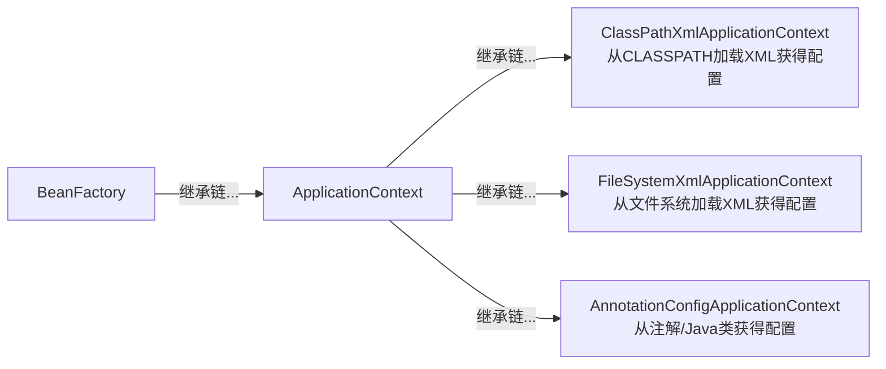
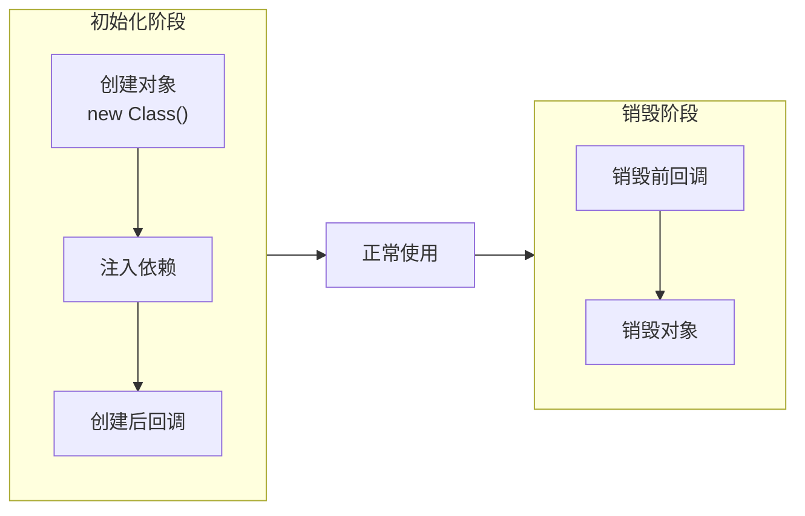

参考文献：

- [《深入浅出Spring Boot 3.x》](https://www.epubit.com/bookDetails?id=UBda9eaf729796)

# §1 基础知识

我们先写一个简单的`Hello, world`程序。使用Spring官方提供的模版生成器[Spring initializer](https://yaclt.cn/sysm.jpg)，我们可以得到以下模版工程：

- `/.gitattributes`：Git的仓库级别配置。
- `/.gitignore`：Git忽略文件列表。
- `/mvnw`：针对Linux平台的Maven Wrapper脚本，用于下载Maven可执行文件。
- `/mvnw.cmd`：针对Windows Powershell平台的Maven Wrapper脚本，用于下载Maven可执行文件。
- `/pom.xml`：Maven项目对象模型（Project Object Model）文件。记录该工程的元数据、使用的依赖项、构建插件、构建配置。
- `/.mvn/wrapper/maven-wrapper.properties`：Maven Wrapper配置文件。记录该工程使用的Maven版本与下载源。
- `/src/main/java/<PACKAGE_PATH>`：存放Java源文件。
- `/src/test/java/<PACKAGE>PATH>`：存放Java测试文件。

创建文件`/src/main/java/top/yaner_here/javasite/JavasiteApplication.java`：

```java
package top.yaner_here.javasite;

import org.springframework.boot.SpringApplication;
import org.springframework.boot.autoconfigure.SpringBootApplication;
import org.springframework.web.bind.annotation.GetMapping;
import org.springframework.web.bind.annotation.RequestParam;
import org.springframework.web.bind.annotation.RestController;

@SpringBootApplication
@RestController
public class JavasiteApplication {
	public static void main(String[] args) {
		SpringApplication.run(JavasiteApplication.class);
	}

	@GetMapping("/hello")
	public String hello(@RequestParam(value = "name", defaultValue = "user") String name) {
		return String.format("Hello, %s", name);
	}
}
```

运行该程序，访问`8080`端口：

```shell
$ curl.exe http://127.0.0.1:8080/hello?name=yaner
	Hello, yaner
```

## §1.1 Spring

### §1.1.1 IoC

控制反转（Inversion of Control，IoC）是Spring中的两个基本概念之一。

控制反转指的是一种容器装配组件的模式。它将本该在组件内部管理的变量，交给容器统一管理，由容器将组件依赖的变量注入到组件中。下面展示了控制反转的优势——我们无需手动新建`Speaker`实例，交给`org.springframework.beans.factory.BeanFactory`即可。

```java
import org.springframework.beans.factory.BeanFactory;  
import org.springframework.beans.factory.support.DefaultListableBeanFactory;

class Speaker {  
    public void hello(String name) {  
        System.out.printf("[%s]: Hello!%n", name);  
    }  
}  
  
class AppWithoutIoC {  
    public void hello() {  
        Speaker speaker = new Speaker();  
        speaker.hello("yaner");  
    }  
}  
  
class AppWithIoC {  
    private BeanFactory beanFactory;  
    public AppWithIoC() {  
	    beanFactory = new DefaultListableBeanFactory();  
	    XmlBeanDefinitionReader reader = new XmlBeanDefinitionReader(beanFactory);  
	    reader.loadBeanDefinitions("beans.xml");  
    }  
    public void hello() {  
	    Speaker speaker = beanFactory.getBean("speaker", Speaker.class);  
        speaker.hello("yaner");  
    }  
}
```

```xml
// beans.xml
<?xml version="1.0" encoding="UTF-8"?>
<beans
	xmlns="http://www.springframework.org/schema/beans"
	xmlns:xsi="http://www.w3.org/2001/XMLSchema-instance"
	xsi:schemaLocation="http://www.springframework.org/schema/beans https://www.springframework.org/schema/beans/spring-beans.xsd">
	<bean id="speaker" class="top.yaner_here.javasite.Speaker" />
</beans>
```

这里我们使用的`org.springframework.beans.factory.BeanFactory`只是一个基类而已。Spring在此基础上提供了功能更丰富的继承类，自带事件传播、资源加载、i18n等企业场景所需的高级功能。



容器之间也是可以继承的，在初始化容器时传入父容器实例即可。它们的继承规则类似于Java类机制——子容器可以看见父容器，父容器看不见子容器，子容器的值同名值可以覆盖父容器。

```xml
<!-- /src/main/resources/parent-beans.xml -->
<?xml version="1.0" encoding="UTF-8"?>
<beans
    xmlns="http://www.springframework.org/schema/beans"
    xmlns:xsi="http://www.w3.org/2001/XMLSchema-instance"
    xsi:schemaLocation="http://www.springframework.org/schema/beans https://www.springframework.org/schema/beans/spring-beans.xsd">
    <bean id="parentInfo" class="top.yaner_here.javasite.Speaker">
        <property name="name" value="parent" />
    </bean>
    <bean id="info" class="top.yaner_here.javasite.Speaker">
        <property name="name" value="parent" />
    </bean>
</beans>
```

```xml
<!-- /src/main/resources/child-beans.xml -->
<?xml version="1.0" encoding="UTF-8"?>  
<beans  
    xmlns="http://www.springframework.org/schema/beans"  
    xmlns:xsi="http://www.w3.org/2001/XMLSchema-instance"  
    xsi:schemaLocation="http://www.springframework.org/schema/beans https://www.springframework.org/schema/beans/spring-beans.xsd">  
    <bean id="childInfo" class="top.yaner_here.javasite.Speaker">  
        <property name="name" value="child" />  
    </bean>    <bean id="info" class="top.yaner_here.javasite.Speaker">  
        <property name="name" value="child" />  
    </bean></beans>
```

```java
// /src/main/java/top/yaner_here/javasite/Application.java
package top.yaner_here.javasite;

import org.springframework.context.support.ClassPathXmlApplicationContext;

class Speaker {
    private String name;
    public void setName(String name) { this.name = name; }
    public String hello() {
        return String.format("[%s]: Hello!", this.name);
    }
}

public class Application {
    private ClassPathXmlApplicationContext parentContext;
    private ClassPathXmlApplicationContext childContext;
    public Application() {
        parentContext = new ClassPathXmlApplicationContext("./parent-beans.xml");
        parentContext.setId("ParentContext");
        childContext = new ClassPathXmlApplicationContext(new String[]{"./child-beans.xml"}, true, parentContext);
        childContext.setId("ChildContext");
    }
    public static void main(String[] args) {
        Application app = new Application();
        System.out.println(app.parentContext.getId() + " see " + "parentInfo" + ": " + app.parentContext.containsBean("parentInfo"));
        System.out.println(app.parentContext.getId() + " see " + "childInfo" + ": " + app.parentContext.containsBean("childInfo"));
        System.out.println(app.childContext.getId() + " see " + "parentInfo" + ": " + app.childContext.containsBean("parentInfo"));
        System.out.println(app.childContext.getId() + " see " + "childInfo" + ": " + app.childContext.containsBean("childInfo"));
        System.out.println(app.parentContext.getId() + " value [info.speak()]: " + app.parentContext.getBean("info", Speaker.class).hello());
        System.out.println(app.childContext.getId() + " value [info.speak()]: " + app.childContext.getBean("info", Speaker.class).hello());
    }
    // ParentContext see parentInfo: true
	// ParentContext see childInfo: false
	// ChildContext see parentInfo: true
	// ChildContext see childInfo: true
	// ParentContext value [info.speak()]: [parent]: Hello!
	// ChildContext value [info.speak()]: [child]: Hello!
}
```

### §1.1.2 配置容器与Bean

Bean特指Java中一种特殊的类，它同时满足这些条件——可序列化和持久化、提供无参构造器、提供Getter和Setter方法以访问实例字段的**可重用组件**。按照这一定义，Spring也将可重用的容器称为Bean，使用Beans的配置元数据来管理容器之间的依赖关系。

#### §1.1.2.1 XML配置

前文提到，Spring可以读取XML文件中的`<beans>`标签来配置Bean。具体来说，一个`<bean>`标签用于配制一个Bean

在XML中，`<beans>`内的`<constructor-arg>`标签用于控制Bean构造方法传入的内容。在下面的例子中，我们在`Application`类内使用容器获得一个`Speaker`实例，并且XML文件已经配置了创建`Speaker`实例时传入的构造函数实参。

```xml
<!-- /src/main/java/resources/beans.xml -->
<?xml version="1.0" encoding="UTF-8"?>
<beans
    xmlns="http://www.springframework.org/schema/beans"
    xmlns:xsi="http://www.w3.org/2001/XMLSchema-instance"
    xsi:schemaLocation="http://www.springframework.org/schema/beans https://www.springframework.org/schema/beans/spring-beans.xsd">
    <bean id="speaker" class="top.yaner_here.javasite.Speaker">
        <constructor-arg value="yaner"/>
    </bean>
</beans>
```

```java
// /src/main/java/top/yaner_here/javasite/Application.java
package top.yaner_here.javasite;

import org.springframework.context.support.ClassPathXmlApplicationContext;

class Speaker {
    private final String name;
    public Speaker(String name) { this.name = name; }
    public String hello() { return String.format("[%s]: Hello!", this.name); }
}

public class Application {
    private ClassPathXmlApplicationContext context;
    public Application() { context = new ClassPathXmlApplicationContext("beans.xml"); }
    public void run() { System.out.println(context.getBean("speaker", Speaker.class).hello()); }
    public static void main(String[] args){
        Application app = new Application();
        app.run(); // [yaner]: Hello!
    }
}
```

`<bean>`支持以下属性字段：

- `id`：Bean的标识符
- `class`：Bean的类名
- `factory-method`：指定使用Bean类的某个静态方法来获取Bean实例，而非默认的构造方法
- `scope`：Bean实例的作用域，可以选`singleton`（在整个容器中只存在一个此Bean实例，缺省值）、`prototype`（每次请求或引用时都创建一个Bean实例）、`request`（每次请求时都创建一个Bean实例）、`session`（每个HTTP Session都创建一个Bean实例）、`application`（每个服务器进程均创建一个Bean实例）。
- `lazy-init`：控制Bean实例初始化的时机。若为`true`则在第一次被`getBean()`请求或被其它Bean依赖时创建，若为`false`则在Spring启动时立即创建。
- `depends-on`：强制在当前Bean初始化之前，先创建该列表中举出的所有Bean。


`<constructor-arg>`支持以下属性字段。下面的代码展示了各项的含义。

| 属性字段    | 含义                |
| ------- | ----------------- |
| `value` | 传给Bean构造方法的实参值    |
| `ref`   | 传给Bean构造方法的BeanID |
| `type`  | 传给Bean构造方法的实参数据类型 |
| `index` | 传给Bean构造方法的形参位置w  |
| `name`  | 传给Bean构造方法的形参名称   |

```xml
<!-- beans.xml -->
<?xml version="1.0" encoding="UTF-8"?>  
<beans  
    xmlns="http://www.springframework.org/schema/beans"  
    xmlns:xsi="http://www.w3.org/2001/XMLSchema-instance"  
    xsi:schemaLocation="http://www.springframework.org/schema/beans https://www.springframework.org/schema/beans/spring-beans.xsd">  
    <bean id="container1" class="top.yaner_here.javasite.Container"> <!-- 使用value对默认形参位置作为实参 -->  
        <constructor-arg value="container1"/>  
        <constructor-arg value="123"/>  
    </bean>    <bean id="container2" class="top.yaner_here.javasite.Container"> <!-- 使用ref引用其它Bean作为实参 -->  
        <constructor-arg value="item2"/>  
        <constructor-arg ref="container1"/>  
        <constructor-arg value="123"/>  
    </bean>    <bean id="container3" class="top.yaner_here.javasite.Container"> <!-- 使用index指定形参位置作为实参 -->  
        <constructor-arg index="1" value="123"/>  
        <constructor-arg index="0" value="container3"/>  
    </bean>    <bean id="container4" class="top.yaner_here.javasite.Container"> <!-- 使用type指定传入实参的数据类型 -->  
        <constructor-arg index="0" type="java.lang.String" value="container4"/>  
        <constructor-arg index="1" type="java.lang.Object" value="123"/>  
    </bean></beans>
```

```java
package top.yaner_here.javasite;
import org.springframework.context.support.ClassPathXmlApplicationContext;
class Container {
    private String name;
    private Object item;
    private int size;
    public Container(String name, int size) {
        this.name = name;
        this.item = null;
        this.size = size;
    }
    public Container(String name, Object item) {
        this.name = name;
        this.item = item;
        this.size = 1;
    }
    public Container(String name, Object item, int size) {
        this.name = name;
        this.item = item;
        this.size = size;
    }
    @Override
    public String toString() {
        return String.format("Container info: [name]=%s, [item]=%s, [size]=%d", this.name, this.item, this.size);
    }
    public static void main(String[] args) {
        ClassPathXmlApplicationContext context = new ClassPathXmlApplicationContext("beans.xml");
        Container container1 = context.getBean("container1", Container.class); System.out.println(container1);
        Container container2 = context.getBean("container2", Container.class); System.out.println(container2);
        Container container3 = context.getBean("container3", Container.class); System.out.println(container3);
        Container container4 = context.getBean("container4", Container.class); System.out.println(container4);
	// Container info: [name]=container1, [item]=123, [size]=1
	// Container info: [name]=item2, [item]=Container info: [name]=container1, [item]=123, [size]=1, [size]=123
	// Container info: [name]=container3, [item]=123, [size]=1
	// Container info: [name]=container4, [item]=123, [size]=1
    }
}
```

#### §1.1.2.2 注解配置

Spring支持通过注解来简化Bean配置。

| 注解（基类）        | Java路径                                                   | 作用                         |
| ------------- | -------------------------------------------------------- | -------------------------- |
| `@Component`  | `org.springframework.stereotype.Component`               | 将类注册为Bean                  |
| `@Service`    | `org.springframework.stereotype.Service`                 | 将类注册为服务                    |
| `@Repository` | `org.springframework.stereotype.Repository`              | 将类注册为DAO                   |
| `@Controller` | `org.springframework.stereotype.Controller`              | 将类注册为控制器                   |
| `@Autowired`  | `org.springframework.beans.factory.annotation.Autowired` | 为构造方法、Setter、成员变量，根据类型注入依赖 |

下面的例子展示了如何使用注解配置Bean。

1. 分别定义两个独立无关的Bean——`BeanA`与`BeanB`，使用`@Component`注解将这两个类注册为Bean，它们的BeanID分别为`beanA`与`beanB`。
2. 定义`BeanC`类，同样使用`@Component`注册为Bean，其BeanID为`beanC`，并且定义两个实例变量时，使用了`@Autowired`声明要通过Spring注入变量，使用`@Qualifier`声明注入变量的类型。
3. 定义`AppConfig`类，使用`@Configuration`声明其为Spring配置类，从而取代XML。使用`@ComponentScan`指定要从哪些类中扫描注解信息。除此以外，我们还使用`@Bean`定义了一个新的`Bean`——它的Java类型仍然是`BeanA`，但是BeanID为`manualBeanA`，并且使用Setter方法做了一些自定义。这使得我们不能直接使用`context.getBean(BeanA.class)`来实例化类，因为这个`BeanA.class`同时绑定了两个BeanID，使得Spring无法确定选择哪一个。

```java
package top.yaner_here.javasite;

import org.springframework.beans.factory.annotation.Autowired;
import org.springframework.beans.factory.annotation.Qualifier;
import org.springframework.context.annotation.*;
import org.springframework.stereotype.Component;

@Component
class BeanA {
    private String name = "BeanA";
    public String getName() { return this.name; }
    public void setName(String name) { this.name = name; }
    public BeanA() { System.out.println("[BeanA] BeanA consturctor is called."); }
    public String info() { return String.format("[BeanA] info: name=%s", this.name); }
}

@Component
class BeanB {
    private String name = "BeanB";
    public String getName() { return this.name; }
    public void setName(String name) { this.name = name; }
    public BeanB() { System.out.println("[BeanB] consturctor is called."); }
    public String info() { return String.format("[BeanB] info: name=%s", this.name); }
}

@Component
class BeanC {
    @Autowired(required = false)
    @Qualifier("beanA")
    private BeanA beanA;

    @Autowired
    @Qualifier("beanB")
    private BeanB beanB;

    public BeanC() { System.out.println("[BeanC] consturctor is called."); }
    public void checkInjectedBeans() {
        if (beanA != null) {
            System.out.println("[BeanC] Injected BeanA: " + beanA.info());
        } else {
            System.out.println("[BeanC] BeanA was not injected.");
        }
        if (beanB != null) {
            System.out.println("[BeanC] Injected BeanB: " + beanB.info());
        } else {
            System.out.println("[BeanC] BeanB was not injected.");
        }
    }
}

@Configuration
@ComponentScan("top.yaner_here.javasite")
class AppConfig {
    public AppConfig() { System.out.println("[AppConfig] constructor is called."); }

    @Bean
    @Lazy
    @Scope("prototype")
    public BeanA manualBeanA() {
        System.out.println("[ManualBeanA] Creating BeanA instance...");
        BeanA beanA = new BeanA();
        beanA.setName("ManualBeanA");
        return beanA;
    }
}

class App {
    public static void main(String[] args) {
        AnnotationConfigApplicationContext context = new AnnotationConfigApplicationContext(AppConfig.class);
        BeanC beanC = context.getBean(BeanC.class);
        beanC.checkInjectedBeans();

        BeanA beanA;
        // beanA = context.getBean(BeanA.class); System.out.println(beanA.info()); // No qualifying bean of type 'top.yaner_here.javasite.BeanA' available: expected single matching bean but found 2: beanA,manualBeanA
        beanA = context.getBean("beanA", BeanA.class); System.out.println(beanA.info());
        beanA = context.getBean("manualBeanA", BeanA.class); System.out.println(beanA.info());

        BeanB beanB;
        beanB = context.getBean("beanB", BeanB.class); System.out.println(beanB.info());
        beanB = context.getBean(BeanB.class); System.out.println(beanB.info());
        
        context.close();
    }
}
/* [AppConfig] constructor is called.
   [BeanA] BeanA consturctor is called.
   [BeanB] consturctor is called.
   [BeanC] consturctor is called.
   [BeanC] Injected BeanA: [BeanA] info: name=BeanA
   [BeanC] Injected BeanB: [BeanB] info: name=BeanB
   [BeanA] info: name=BeanA
   [ManualBeanA] Creating BeanA instance...
   [BeanA] BeanA consturctor is called.
   [BeanA] info: name=ManualBeanA
   [BeanB] info: name=BeanB
   [BeanB] info: name=BeanB */
```

#### §1.1.2.3 Java类配置

前文说过，`@Bean`用于修饰某个方法，该方法的返回值是一个Bean实例。也就是说，`@Bean`的低位有点类似于Python中的修饰器——它不产生新的Class，只产生新的BeanID，它只是对原先的Class做了一点侵入式更改。

`@Bean`提供了以下属性：

| `@Bean`属性名          | 默认值                                   | 作用                                               |
| ------------------- | ------------------------------------- | ------------------------------------------------ |
| `name`              | 被注解的方法名                               | BeanID                                           |
| `value`             | 同上                                    | 同上                                               |
| `autowire`          | `Autowire.NO`                         | 自动注入方式                                           |
| `autowireCandidate` | `true`                                | 是否是自动注入的候选Bean                                   |
| `initMethod`        | `""`                                  | 初始化方法名                                           |
| `destoryMethod`     | `AbstractBeanDefinition.INFER_METHOD` | 销毁方法名，缺省为`public`的、无形参的、名为`close`或`shutdown`的方法。 |

Spring框架对`@Configuration`修饰的配置类中的`@Bean`一律认为是单例模式，即每个`@Bean`只能存在一个实例，即使多次调用`@Bean`修饰的方法，也只会返回同一个实例。

配置类也支持通过`@Import`注解继承自父配置，通过`@ImportResource`注解导入XML配置：

```java
@Configuration
@Import({ConfigA.class, ConfigB.class})
@ImportResource("classpath:/assets/*.xml")
public class Config { }
```

### §1.1.3 Bean生命周期

Spring容器负责管理Bean的整个生命周期。



Spring提供了以下四种方式指定创建后回调函数和销毁前回调函数：

- 实现`org.springframework.beans.factory.InitializingBean`和`org.springframework.beans.factory.DisposableBean`接口。
- 使用`jakarta.annotation.PostConstruct`和`jakarta.annotation.PreDestroy`提供的`@PostConstruct`和`@PreDestroy`注解指定方法。
- 在XML中使用`<bean class="..." init-method="<CLASS方法名>" destory-method="<CLASS方法名>"`，**需要在`<beans>`中添加`<context:annotation-config/>`开启支持**。
- 在Java类配置中使用`@Bean(initMethod="<CLASS>方法名", destoryMethod="<CLASS方法名>")`

这四种方式可以同时存在，Spring会按照以下顺序进行调用：

1. 由`@PostConstruct`或`@PreDestroy`修饰的方法
2. 重载了接口`Initializing`的`.afterPropertiesSet()`方法，或接口`DisposableBean`的`.destroy()`方法
3. 在XML或Java类配置的方法

### §1.1.4 Bean感知容器

在工程中，我们设计的Bean业务逻辑应该是与Spring无耦合的。如果遇到特殊情况需要耦合，Spring提供了两种方式，让Bean能感知到容器的信息：

- 实现`org.springframework.beans.factory.BeanFactoryAware`接口或`org.springframework.context.ApplicationContextAware`接口。**该接口属于Bean生命周期中的注入依赖阶段，因此会在初始化回调函数前执行**。
- 用`@Autowired`注入外界的`BeanFactory`或`ApplicationContextAware`实例

这两种方式在本质上是一样的——都是在函数体内拿到了`BeanFactory`或`ApplicationContextAware`实例，在该实例上进行操作。

### §1.1.5 事件机制

`ApplicationContext`提供了一套事件机制，允许开发者通过`ApplicationEvent`通知所有实现了`ApplicationListener`接口的类。

下面的代码同时监听自定义事件和关闭事件。

- 对于自定义事件：
	1. 继承`ApplicationEvent`父类，创建了`MyEvent`类。在构造方法中接收了一个未知的`Object source`形参，这个`source`是由消息发布者指定的。我们直接把`source`传给父类的构造方法。
	2. 新建`MyEventPublisher`类。它实现了`ApplicationEventPublishAware`接口的`.setApplicationEventPublisher(ApplicationEventPublisher publisher)`方法，将Spring传入的`publisher`实例保存在类内变量中。同时公开一个发送自定义事件的API，它调用这个`publisher`的`.publishEvent()`方法，传入一个`Object source`表示事件内容来实例化`MyEvent`，将该实例传入`.publishEvent()`。
	3. 新建`MyEventListener`类。它自定义了一个由`@EventListener`修饰的回调函数，该函数接受一个`MyEvent`实例，并调用其父类的`.getSource()`拿到`Object source`事件内容。
	4. 在主函数中，我们通过Spring

```java
package top.yaner_here.javasite;

import org.springframework.context.ApplicationEvent;
import org.springframework.context.ApplicationEventPublisher;
import org.springframework.context.ApplicationEventPublisherAware;
import org.springframework.context.ApplicationListener;
import org.springframework.context.annotation.AnnotationConfigApplicationContext;
import org.springframework.context.annotation.ComponentScan;
import org.springframework.context.annotation.Configuration;
import org.springframework.context.event.ContextClosedEvent;
import org.springframework.context.event.EventListener;
import org.springframework.core.annotation.Order;
import org.springframework.stereotype.Component;

@Component
@Order(1)
class ContextClosedEventListener implements ApplicationListener<ContextClosedEvent> {
    @Override
    public void onApplicationEvent(ContextClosedEvent event) { System.out.println("[@ApplicationListener(1)] Closed Event received."); }
}

@Component
class ContextClosedEventAnnotationListener {
    @EventListener
    @Order(2)
    public void onEvent(ContextClosedEvent event) { System.out.println("[@EventListener(2)] Closed Event received."); }
}

class MyEvent extends ApplicationEvent {
    public MyEvent(Object source) { super(source); }
}

@Component
class MyEventPublisher implements ApplicationEventPublisherAware {
    private ApplicationEventPublisher publisher;
    @Override
    public void setApplicationEventPublisher(ApplicationEventPublisher publisher) { this.publisher = publisher; System.out.println("[MyEventPublisher]: Got publisher."); }
    public void sendMyEvent() { publisher.publishEvent(new MyEvent("This is my event!")); }
}

@Component
class MyEventListener {
    @EventListener
    public void onEvent(MyEvent event) { System.out.println("[CustomEventListener]: Get MyEvent -> " + event.getSource()); }
}

@Configuration
@ComponentScan
public class Application {
    public static void main(String[] args) {
        AnnotationConfigApplicationContext context = new AnnotationConfigApplicationContext(Application.class);

        MyEventPublisher publisher = context.getBean("myEventPublisher", MyEventPublisher.class);
        publisher.sendMyEvent();

        context.close();
    }
}
```

## §1.2 AOP

面向切面编程（Aspect Oriented Programming，AOP）是Spring中的两个基本概念之一。