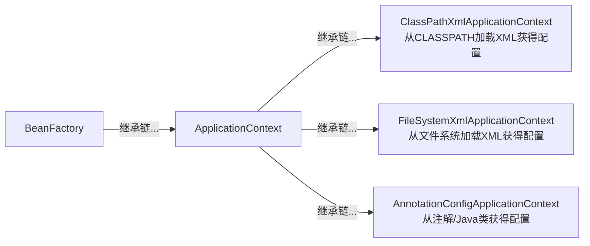

参考文献：

- [《深入浅出Spring Boot 3.x》](https://www.epubit.com/bookDetails?id=UBda9eaf729796)

# §1 基础知识

我们先写一个简单的`Hello, world`程序。使用Spring官方提供的模版生成器[Spring initializer](https://yaclt.cn/sysm.jpg)，我们可以得到以下模版工程：

- `/.gitattributes`：Git的仓库级别配置。
- `/.gitignore`：Git忽略文件列表。
- `/mvnw`：针对Linux平台的Maven Wrapper脚本，用于下载Maven可执行文件。
- `/mvnw.cmd`：针对Windows Powershell平台的Maven Wrapper脚本，用于下载Maven可执行文件。
- `/pom.xml`：Maven项目对象模型（Project Object Model）文件。记录该工程的元数据、使用的依赖项、构建插件、构建配置。
- `/.mvn/wrapper/maven-wrapper.properties`：Maven Wrapper配置文件。记录该工程使用的Maven版本与下载源。
- `/src/main/java/<PACKAGE_PATH>`：存放Java源文件。
- `/src/test/java/<PACKAGE>PATH>`：存放Java测试文件。

创建文件`/src/main/java/top/yaner_here/javasite/JavasiteApplication.java`：

```java
package top.yaner_here.javasite;

import org.springframework.boot.SpringApplication;
import org.springframework.boot.autoconfigure.SpringBootApplication;
import org.springframework.web.bind.annotation.GetMapping;
import org.springframework.web.bind.annotation.RequestParam;
import org.springframework.web.bind.annotation.RestController;

@SpringBootApplication
@RestController
public class JavasiteApplication {
	public static void main(String[] args) {
		SpringApplication.run(JavasiteApplication.class);
	}

	@GetMapping("/hello")
	public String hello(@RequestParam(value = "name", defaultValue = "user") String name) {
		return String.format("Hello, %s", name);
	}
}
```

运行该程序，访问`8080`端口：

```shell
$ curl.exe http://127.0.0.1:8080/hello?name=yaner
	Hello, yaner
```

## §1.1 IoC与容器

控制反转（Inversion of Control，IoC）是Spring中的两个基本概念之一。

控制反转指的是一种容器装配组件的模式。它将本该在组件内部管理的变量，交给容器统一管理，由容器将组件依赖的变量注入到组件中。下面展示了控制反转的优势——我们无需手动新建`Speaker`实例，交给`org.springframework.beans.factory.BeanFactory`即可。

```java
import org.springframework.beans.factory.BeanFactory;  
import org.springframework.beans.factory.support.DefaultListableBeanFactory;

class Speaker {  
    public void hello(String name) {  
        System.out.printf("[%s]: Hello!%n", name);  
    }  
}  
  
class AppWithoutIoC {  
    public void hello() {  
        Speaker speaker = new Speaker();  
        speaker.hello("yaner");  
    }  
}  
  
class AppWithIoC {  
    private BeanFactory beanFactory;  
    public AppWithIoC() {  
	    beanFactory = new DefaultListableBeanFactory();  
	    XmlBeanDefinitionReader reader = new XmlBeanDefinitionReader(beanFactory);  
	    reader.loadBeanDefinitions("beans.xml");  
    }  
    public void hello() {  
	    Speaker speaker = beanFactory.getBean("speaker", Speaker.class);  
        speaker.hello("yaner");  
    }  
}
```

```xml
// beans.xml
<?xml version="1.0" encoding="UTF-8"?>
<beans
	xmlns="http://www.springframework.org/schema/beans"
	xmlns:xsi="http://www.w3.org/2001/XMLSchema-instance"
	xsi:schemaLocation="http://www.springframework.org/schema/beans https://www.springframework.org/schema/beans/spring-beans.xsd">
	<bean id="speaker" class="top.yaner_here.javasite.Speaker" />
</beans>
```

这里我们使用的`org.springframework.beans.factory.BeanFactory`只是一个基类而已。Spring在此基础上提供了功能更丰富的继承类，自带事件传播、资源加载、i18n等企业场景所需的高级功能。



容器之间也是可以继承的，在初始化容器时传入父容器实例即可。它们的继承规则类似于Java类机制——子容器可以看见父容器，父容器看不见子容器，子容器的值同名值可以覆盖父容器。

```xml
<!-- /src/main/resources/parent-beans.xml -->
<?xml version="1.0" encoding="UTF-8"?>
<beans
    xmlns="http://www.springframework.org/schema/beans"
    xmlns:xsi="http://www.w3.org/2001/XMLSchema-instance"
    xsi:schemaLocation="http://www.springframework.org/schema/beans https://www.springframework.org/schema/beans/spring-beans.xsd">
    <bean id="parentInfo" class="top.yaner_here.javasite.Speaker">
        <property name="name" value="parent" />
    </bean>
    <bean id="info" class="top.yaner_here.javasite.Speaker">
        <property name="name" value="parent" />
    </bean>
</beans>
```

```xml
<!-- /src/main/resources/child-beans.xml -->
<?xml version="1.0" encoding="UTF-8"?>  
<beans  
    xmlns="http://www.springframework.org/schema/beans"  
    xmlns:xsi="http://www.w3.org/2001/XMLSchema-instance"  
    xsi:schemaLocation="http://www.springframework.org/schema/beans https://www.springframework.org/schema/beans/spring-beans.xsd">  
    <bean id="childInfo" class="top.yaner_here.javasite.Speaker">  
        <property name="name" value="child" />  
    </bean>    <bean id="info" class="top.yaner_here.javasite.Speaker">  
        <property name="name" value="child" />  
    </bean></beans>
```

```java
// /src/main/java/top/yaner_here/javasite/Application.java
package top.yaner_here.javasite;

import org.springframework.context.support.ClassPathXmlApplicationContext;

class Speaker {
    private String name;
    public void setName(String name) { this.name = name; }
    public String hello() {
        return String.format("[%s]: Hello!", this.name);
    }
}

public class Application {
    private ClassPathXmlApplicationContext parentContext;
    private ClassPathXmlApplicationContext childContext;
    public Application() {
        parentContext = new ClassPathXmlApplicationContext("./parent-beans.xml");
        parentContext.setId("ParentContext");
        childContext = new ClassPathXmlApplicationContext(new String[]{"./child-beans.xml"}, true, parentContext);
        childContext.setId("ChildContext");
    }
    public static void main(String[] args) {
        Application app = new Application();
        System.out.println(app.parentContext.getId() + " see " + "parentInfo" + ": " + app.parentContext.containsBean("parentInfo"));
        System.out.println(app.parentContext.getId() + " see " + "childInfo" + ": " + app.parentContext.containsBean("childInfo"));
        System.out.println(app.childContext.getId() + " see " + "parentInfo" + ": " + app.childContext.containsBean("parentInfo"));
        System.out.println(app.childContext.getId() + " see " + "childInfo" + ": " + app.childContext.containsBean("childInfo"));
        System.out.println(app.parentContext.getId() + " value [info.speak()]: " + app.parentContext.getBean("info", Speaker.class).hello());
        System.out.println(app.childContext.getId() + " value [info.speak()]: " + app.childContext.getBean("info", Speaker.class).hello());
    }
    // ParentContext see parentInfo: true
	// ParentContext see childInfo: false
	// ChildContext see parentInfo: true
	// ChildContext see childInfo: true
	// ParentContext value [info.speak()]: [parent]: Hello!
	// ChildContext value [info.speak()]: [child]: Hello!
}
```

### §1.1.1 Beans

Beans特指Java中一种特殊的类，它同时满足这些条件——可序列化和持久化、提供无参构造器、提供Getter和Setter方法以访问实例字段的**可重用组件**。按照这一定义，Spring也将可重用的容器称为Beans，使用Beans的配置元数据来管理容器之间的依赖关系。

在XML中，`<beans>`内的`<constructor-arg>`标签用于控制Beans构造方法传入的内容，支持以下属性字段：

| 属性字段    | 含义  |
| ------- | --- |
| `value` |     |
| `ref`   |     |
| `type`  |     |
| `index` |     |
| `name`  |     |

```xml
<!-- /src/main/java/resources/beans.xml -->
<?xml version="1.0" encoding="UTF-8"?>
<beans
    xmlns="http://www.springframework.org/schema/beans"
    xmlns:xsi="http://www.w3.org/2001/XMLSchema-instance"
    xsi:schemaLocation="http://www.springframework.org/schema/beans https://www.springframework.org/schema/beans/spring-beans.xsd">
    <bean id="speaker" class="top.yaner_here.javasite.Speaker">
        <constructor-arg value="yaner"/>
    </bean>
</beans>
```

```java
// /src/main/java/top/yaner_here/javasite/Application.java
package top.yaner_here.javasite;

import org.springframework.context.support.ClassPathXmlApplicationContext;

class Speaker {
    private final String name;
    public Speaker(String name) { this.name = name; }
    public String hello() { return String.format("[%s]: Hello!", this.name); }
}

public class Application {
    private ClassPathXmlApplicationContext context;
    public Application() { context = new ClassPathXmlApplicationContext("beans.xml"); }
    public void run() { System.out.println(context.getBean("speaker", Speaker.class).hello()); }
    public static void main(String[] args){
        Application app = new Application();
        app.run();
    }
}
```


## §1.2 AOP

面向切面编程（Aspect Oriented Programming，AOP）是Spring中的两个基本概念之一。