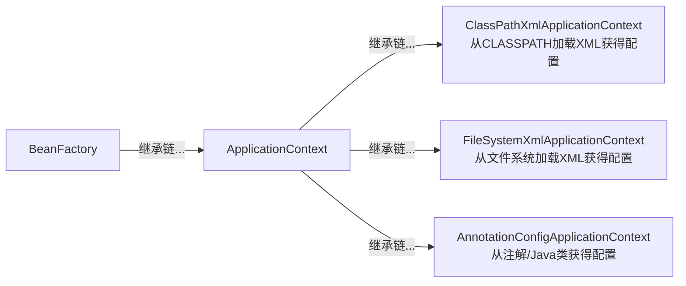
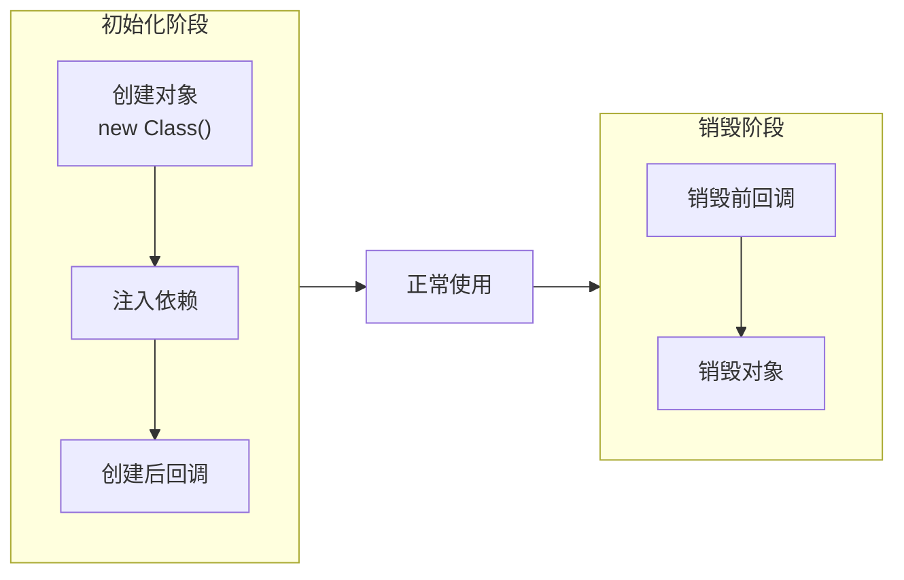
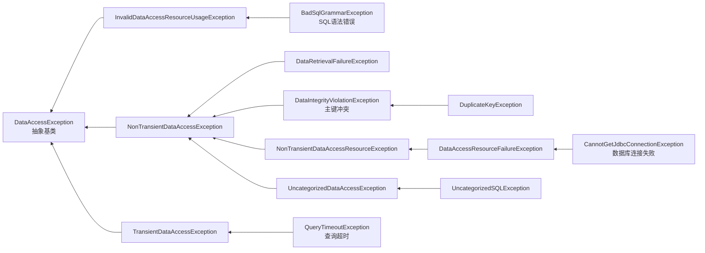
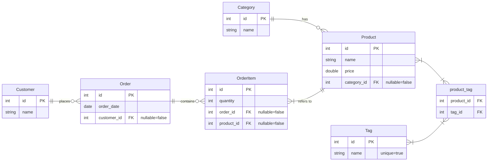

参考文献：

- [《深入浅出Spring Boot 3.x》](https://www.epubit.com/bookDetails?id=UBda9eaf729796)

# §1 Spring

我们先写一个简单的`Hello, world`程序。使用Spring官方提供的模版生成器[Spring initializer](https://yaclt.cn/sysm.jpg)，我们可以得到以下模版工程：

- `/.gitattributes`：Git的仓库级别配置。
- `/.gitignore`：Git忽略文件列表。
- `/mvnw`：针对Linux平台的Maven Wrapper脚本，用于下载Maven可执行文件。
- `/mvnw.cmd`：针对Windows Powershell平台的Maven Wrapper脚本，用于下载Maven可执行文件。
- `/pom.xml`：Maven项目对象模型（Project Object Model）文件。记录该工程的元数据、使用的依赖项、构建插件、构建配置。
- `/.mvn/wrapper/maven-wrapper.properties`：Maven Wrapper配置文件。记录该工程使用的Maven版本与下载源。
- `/src/main/java/<PACKAGE_PATH>`：存放Java源文件。
- `/src/test/java/<PACKAGE>PATH>`：存放Java测试文件。

创建文件`/src/main/java/top/yaner_here/javasite/JavasiteApplication.java`：

```java
package top.yaner_here.javasite;

import org.springframework.boot.SpringApplication;
import org.springframework.boot.autoconfigure.SpringBootApplication;
import org.springframework.web.bind.annotation.GetMapping;
import org.springframework.web.bind.annotation.RequestParam;
import org.springframework.web.bind.annotation.RestController;

@SpringBootApplication
@RestController
public class JavasiteApplication {
	public static void main(String[] args) {
		SpringApplication.run(JavasiteApplication.class);
	}

	@GetMapping("/hello")
	public String hello(@RequestParam(value = "name", defaultValue = "user") String name) {
		return String.format("Hello, %s", name);
	}
}
```

运行该程序，访问`8080`端口：

```shell
$ curl.exe http://127.0.0.1:8080/hello?name=yaner
	Hello, yaner
```

## §1.1 IoC

控制反转（Inversion of Control，IoC）是Spring中的两个基本概念之一。

控制反转指的是一种容器装配组件的模式。它将本该在组件内部管理的变量，交给容器统一管理，由容器将组件依赖的变量注入到组件中。下面展示了控制反转的优势——我们无需手动新建`Speaker`实例，交给`org.springframework.beans.factory.BeanFactory`即可。

```java
import org.springframework.beans.factory.BeanFactory;  
import org.springframework.beans.factory.support.DefaultListableBeanFactory;

class Speaker {  
    public void hello(String name) {  
        System.out.printf("[%s]: Hello!%n", name);  
    }  
}  
  
class AppWithoutIoC {  
    public void hello() {  
        Speaker speaker = new Speaker();  
        speaker.hello("yaner");  
    }  
}  
  
class AppWithIoC {  
    private BeanFactory beanFactory;  
    public AppWithIoC() {  
	    beanFactory = new DefaultListableBeanFactory();  
	    XmlBeanDefinitionReader reader = new XmlBeanDefinitionReader(beanFactory);  
	    reader.loadBeanDefinitions("beans.xml");  
    }  
    public void hello() {  
	    Speaker speaker = beanFactory.getBean("speaker", Speaker.class);  
        speaker.hello("yaner");  
    }  
}
```

```xml
// beans.xml
<?xml version="1.0" encoding="UTF-8"?>
<beans
	xmlns="http://www.springframework.org/schema/beans"
	xmlns:xsi="http://www.w3.org/2001/XMLSchema-instance"
	xsi:schemaLocation="http://www.springframework.org/schema/beans https://www.springframework.org/schema/beans/spring-beans.xsd">
	<bean id="speaker" class="top.yaner_here.javasite.Speaker" />
</beans>
```

这里我们使用的`org.springframework.beans.factory.BeanFactory`只是一个基类而已。Spring在此基础上提供了功能更丰富的继承类，自带事件传播、资源加载、i18n等企业场景所需的高级功能。



容器之间也是可以继承的，在初始化容器时传入父容器实例即可。它们的继承规则类似于Java类机制——子容器可以看见父容器，父容器看不见子容器，子容器的值同名值可以覆盖父容器。

```xml
<!-- /src/main/resources/parent-beans.xml -->
<?xml version="1.0" encoding="UTF-8"?>
<beans
    xmlns="http://www.springframework.org/schema/beans"
    xmlns:xsi="http://www.w3.org/2001/XMLSchema-instance"
    xsi:schemaLocation="http://www.springframework.org/schema/beans https://www.springframework.org/schema/beans/spring-beans.xsd">
    <bean id="parentInfo" class="top.yaner_here.javasite.Speaker">
        <property name="name" value="parent" />
    </bean>
    <bean id="info" class="top.yaner_here.javasite.Speaker">
        <property name="name" value="parent" />
    </bean>
</beans>
```

```xml
<!-- /src/main/resources/child-beans.xml -->
<?xml version="1.0" encoding="UTF-8"?>  
<beans  
    xmlns="http://www.springframework.org/schema/beans"  
    xmlns:xsi="http://www.w3.org/2001/XMLSchema-instance"  
    xsi:schemaLocation="http://www.springframework.org/schema/beans https://www.springframework.org/schema/beans/spring-beans.xsd">  
    <bean id="childInfo" class="top.yaner_here.javasite.Speaker">  
        <property name="name" value="child" />  
    </bean>    <bean id="info" class="top.yaner_here.javasite.Speaker">  
        <property name="name" value="child" />  
    </bean></beans>
```

```java
// /src/main/java/top/yaner_here/javasite/Application.java
package top.yaner_here.javasite;

import org.springframework.context.support.ClassPathXmlApplicationContext;

class Speaker {
    private String name;
    public void setName(String name) { this.name = name; }
    public String hello() {
        return String.format("[%s]: Hello!", this.name);
    }
}

public class Application {
    private ClassPathXmlApplicationContext parentContext;
    private ClassPathXmlApplicationContext childContext;
    public Application() {
        parentContext = new ClassPathXmlApplicationContext("./parent-beans.xml");
        parentContext.setId("ParentContext");
        childContext = new ClassPathXmlApplicationContext(new String[]{"./child-beans.xml"}, true, parentContext);
        childContext.setId("ChildContext");
    }
    public static void main(String[] args) {
        Application app = new Application();
        System.out.println(app.parentContext.getId() + " see " + "parentInfo" + ": " + app.parentContext.containsBean("parentInfo"));
        System.out.println(app.parentContext.getId() + " see " + "childInfo" + ": " + app.parentContext.containsBean("childInfo"));
        System.out.println(app.childContext.getId() + " see " + "parentInfo" + ": " + app.childContext.containsBean("parentInfo"));
        System.out.println(app.childContext.getId() + " see " + "childInfo" + ": " + app.childContext.containsBean("childInfo"));
        System.out.println(app.parentContext.getId() + " value [info.speak()]: " + app.parentContext.getBean("info", Speaker.class).hello());
        System.out.println(app.childContext.getId() + " value [info.speak()]: " + app.childContext.getBean("info", Speaker.class).hello());
    }
    // ParentContext see parentInfo: true
	// ParentContext see childInfo: false
	// ChildContext see parentInfo: true
	// ChildContext see childInfo: true
	// ParentContext value [info.speak()]: [parent]: Hello!
	// ChildContext value [info.speak()]: [child]: Hello!
}
```

## §1.2 配置容器与Bean

Bean特指Java中一种特殊的类，它同时满足这些条件——可序列化和持久化、提供无参构造器、提供Getter和Setter方法以访问实例字段的**可重用组件**。按照这一定义，Spring也将可重用的容器称为Bean，使用Beans的配置元数据来管理容器之间的依赖关系。

### §1.2.1 XML配置

前文提到，Spring可以读取XML文件中的`<beans>`标签来配置Bean。具体来说，一个`<bean>`标签用于配制一个Bean

在XML中，`<beans>`内的`<constructor-arg>`标签用于控制Bean构造方法传入的内容。在下面的例子中，我们在`Application`类内使用容器获得一个`Speaker`实例，并且XML文件已经配置了创建`Speaker`实例时传入的构造函数实参。

```xml
<!-- /src/main/java/resources/beans.xml -->
<?xml version="1.0" encoding="UTF-8"?>
<beans
    xmlns="http://www.springframework.org/schema/beans"
    xmlns:xsi="http://www.w3.org/2001/XMLSchema-instance"
    xsi:schemaLocation="http://www.springframework.org/schema/beans https://www.springframework.org/schema/beans/spring-beans.xsd">
    <bean id="speaker" class="top.yaner_here.javasite.Speaker">
        <constructor-arg value="yaner"/>
    </bean>
</beans>
```

```java
// /src/main/java/top/yaner_here/javasite/Application.java
package top.yaner_here.javasite;

import org.springframework.context.support.ClassPathXmlApplicationContext;

class Speaker {
    private final String name;
    public Speaker(String name) { this.name = name; }
    public String hello() { return String.format("[%s]: Hello!", this.name); }
}

public class Application {
    private ClassPathXmlApplicationContext context;
    public Application() { context = new ClassPathXmlApplicationContext("beans.xml"); }
    public void run() { System.out.println(context.getBean("speaker", Speaker.class).hello()); }
    public static void main(String[] args){
        Application app = new Application();
        app.run(); // [yaner]: Hello!
    }
}
```

`<bean>`支持以下属性字段：

- `id`：Bean的标识符
- `class`：Bean的类名
- `factory-method`：指定使用Bean类的某个静态方法来获取Bean实例，而非默认的构造方法
- `scope`：Bean实例的作用域，可以选`singleton`（在整个容器中只存在一个此Bean实例，缺省值）、`prototype`（每次请求或引用时都创建一个Bean实例）、`request`（每次请求时都创建一个Bean实例）、`session`（每个HTTP Session都创建一个Bean实例）、`application`（每个服务器进程均创建一个Bean实例）。
- `lazy-init`：控制Bean实例初始化的时机。若为`true`则在第一次被`getBean()`请求或被其它Bean依赖时创建，若为`false`则在Spring启动时立即创建。
- `depends-on`：强制在当前Bean初始化之前，先创建该列表中举出的所有Bean。


`<constructor-arg>`支持以下属性字段。下面的代码展示了各项的含义。

| 属性字段    | 含义                |
| ------- | ----------------- |
| `value` | 传给Bean构造方法的实参值    |
| `ref`   | 传给Bean构造方法的BeanID |
| `type`  | 传给Bean构造方法的实参数据类型 |
| `index` | 传给Bean构造方法的形参位置w  |
| `name`  | 传给Bean构造方法的形参名称   |

```xml
<!-- beans.xml -->
<?xml version="1.0" encoding="UTF-8"?>  
<beans  
    xmlns="http://www.springframework.org/schema/beans"  
    xmlns:xsi="http://www.w3.org/2001/XMLSchema-instance"  
    xsi:schemaLocation="http://www.springframework.org/schema/beans https://www.springframework.org/schema/beans/spring-beans.xsd">  
    <bean id="container1" class="top.yaner_here.javasite.Container"> <!-- 使用value对默认形参位置作为实参 -->  
        <constructor-arg value="container1"/>  
        <constructor-arg value="123"/>  
    </bean>    <bean id="container2" class="top.yaner_here.javasite.Container"> <!-- 使用ref引用其它Bean作为实参 -->  
        <constructor-arg value="item2"/>  
        <constructor-arg ref="container1"/>  
        <constructor-arg value="123"/>  
    </bean>    <bean id="container3" class="top.yaner_here.javasite.Container"> <!-- 使用index指定形参位置作为实参 -->  
        <constructor-arg index="1" value="123"/>  
        <constructor-arg index="0" value="container3"/>  
    </bean>    <bean id="container4" class="top.yaner_here.javasite.Container"> <!-- 使用type指定传入实参的数据类型 -->  
        <constructor-arg index="0" type="java.lang.String" value="container4"/>  
        <constructor-arg index="1" type="java.lang.Object" value="123"/>  
    </bean></beans>
```

```java
package top.yaner_here.javasite;
import org.springframework.context.support.ClassPathXmlApplicationContext;
class Container {
    private String name;
    private Object item;
    private int size;
    public Container(String name, int size) {
        this.name = name;
        this.item = null;
        this.size = size;
    }
    public Container(String name, Object item) {
        this.name = name;
        this.item = item;
        this.size = 1;
    }
    public Container(String name, Object item, int size) {
        this.name = name;
        this.item = item;
        this.size = size;
    }
    @Override
    public String toString() {
        return String.format("Container info: [name]=%s, [item]=%s, [size]=%d", this.name, this.item, this.size);
    }
    public static void main(String[] args) {
        ClassPathXmlApplicationContext context = new ClassPathXmlApplicationContext("beans.xml");
        Container container1 = context.getBean("container1", Container.class); System.out.println(container1);
        Container container2 = context.getBean("container2", Container.class); System.out.println(container2);
        Container container3 = context.getBean("container3", Container.class); System.out.println(container3);
        Container container4 = context.getBean("container4", Container.class); System.out.println(container4);
	// Container info: [name]=container1, [item]=123, [size]=1
	// Container info: [name]=item2, [item]=Container info: [name]=container1, [item]=123, [size]=1, [size]=123
	// Container info: [name]=container3, [item]=123, [size]=1
	// Container info: [name]=container4, [item]=123, [size]=1
    }
}
```

### §1.2.2 注解配置

Spring支持通过注解来简化Bean配置。

| 注解（基类）        | Java路径                                                   | 作用                         |
| ------------- | -------------------------------------------------------- | -------------------------- |
| `@Component`  | `org.springframework.stereotype.Component`               | 将类注册为Bean                  |
| `@Service`    | `org.springframework.stereotype.Service`                 | 将类注册为服务                    |
| `@Repository` | `org.springframework.stereotype.Repository`              | 将类注册为DAO                   |
| `@Controller` | `org.springframework.stereotype.Controller`              | 将类注册为控制器                   |
| `@Autowired`  | `org.springframework.beans.factory.annotation.Autowired` | 为构造方法、Setter、成员变量，根据类型注入依赖 |

下面的例子展示了如何使用注解配置Bean。

1. 分别定义两个独立无关的Bean——`BeanA`与`BeanB`，使用`@Component`注解将这两个类注册为Bean，它们的BeanID分别为`beanA`与`beanB`。
2. 定义`BeanC`类，同样使用`@Component`注册为Bean，其BeanID为`beanC`，并且定义两个实例变量时，使用了`@Autowired`声明要通过Spring注入变量，使用`@Qualifier`声明注入变量的类型。
3. 定义`AppConfig`类，使用`@Configuration`声明其为Spring配置类，从而取代XML。使用`@ComponentScan`指定要从哪些类中扫描注解信息。除此以外，我们还使用`@Bean`定义了一个新的`Bean`——它的Java类型仍然是`BeanA`，但是BeanID为`manualBeanA`，并且使用Setter方法做了一些自定义。这使得我们不能直接使用`context.getBean(BeanA.class)`来实例化类，因为这个`BeanA.class`同时绑定了两个BeanID，使得Spring无法确定选择哪一个。

```java
package top.yaner_here.javasite;

import org.springframework.beans.factory.annotation.Autowired;
import org.springframework.beans.factory.annotation.Qualifier;
import org.springframework.context.annotation.*;
import org.springframework.stereotype.Component;

@Component
class BeanA {
    private String name = "BeanA";
    public String getName() { return this.name; }
    public void setName(String name) { this.name = name; }
    public BeanA() { System.out.println("[BeanA] BeanA consturctor is called."); }
    public String info() { return String.format("[BeanA] info: name=%s", this.name); }
}

@Component
class BeanB {
    private String name = "BeanB";
    public String getName() { return this.name; }
    public void setName(String name) { this.name = name; }
    public BeanB() { System.out.println("[BeanB] consturctor is called."); }
    public String info() { return String.format("[BeanB] info: name=%s", this.name); }
}

@Component
class BeanC {
    @Autowired(required = false)
    @Qualifier("beanA")
    private BeanA beanA;

    @Autowired
    @Qualifier("beanB")
    private BeanB beanB;

    public BeanC() { System.out.println("[BeanC] consturctor is called."); }
    public void checkInjectedBeans() {
        if (beanA != null) {
            System.out.println("[BeanC] Injected BeanA: " + beanA.info());
        } else {
            System.out.println("[BeanC] BeanA was not injected.");
        }
        if (beanB != null) {
            System.out.println("[BeanC] Injected BeanB: " + beanB.info());
        } else {
            System.out.println("[BeanC] BeanB was not injected.");
        }
    }
}

@Configuration
@ComponentScan("top.yaner_here.javasite")
class AppConfig {
    public AppConfig() { System.out.println("[AppConfig] constructor is called."); }

    @Bean
    @Lazy
    @Scope("prototype")
    public BeanA manualBeanA() {
        System.out.println("[ManualBeanA] Creating BeanA instance...");
        BeanA beanA = new BeanA();
        beanA.setName("ManualBeanA");
        return beanA;
    }
}

class App {
    public static void main(String[] args) {
        AnnotationConfigApplicationContext context = new AnnotationConfigApplicationContext(AppConfig.class);
        BeanC beanC = context.getBean(BeanC.class);
        beanC.checkInjectedBeans();

        BeanA beanA;
        // beanA = context.getBean(BeanA.class); System.out.println(beanA.info()); // No qualifying bean of type 'top.yaner_here.javasite.BeanA' available: expected single matching bean but found 2: beanA,manualBeanA
        beanA = context.getBean("beanA", BeanA.class); System.out.println(beanA.info());
        beanA = context.getBean("manualBeanA", BeanA.class); System.out.println(beanA.info());

        BeanB beanB;
        beanB = context.getBean("beanB", BeanB.class); System.out.println(beanB.info());
        beanB = context.getBean(BeanB.class); System.out.println(beanB.info());
        
        context.close();
    }
}
/* [AppConfig] constructor is called.
   [BeanA] BeanA consturctor is called.
   [BeanB] consturctor is called.
   [BeanC] consturctor is called.
   [BeanC] Injected BeanA: [BeanA] info: name=BeanA
   [BeanC] Injected BeanB: [BeanB] info: name=BeanB
   [BeanA] info: name=BeanA
   [ManualBeanA] Creating BeanA instance...
   [BeanA] BeanA consturctor is called.
   [BeanA] info: name=ManualBeanA
   [BeanB] info: name=BeanB
   [BeanB] info: name=BeanB */
```

### §1.2.3 Java类配置

前文说过，`@Bean`用于修饰某个方法，该方法的返回值是一个Bean实例。也就是说，`@Bean`的低位有点类似于Python中的修饰器——它不产生新的Class，只产生新的BeanID，它只是对原先的Class做了一点侵入式更改。

`@Bean`提供了以下属性：

| `@Bean`属性名          | 默认值                                   | 作用                                               |
| ------------------- | ------------------------------------- | ------------------------------------------------ |
| `name`              | 被注解的方法名                               | BeanID                                           |
| `value`             | 同上                                    | 同上                                               |
| `autowire`          | `Autowire.NO`                         | 自动注入方式                                           |
| `autowireCandidate` | `true`                                | 是否是自动注入的候选Bean                                   |
| `initMethod`        | `""`                                  | 初始化方法名                                           |
| `destoryMethod`     | `AbstractBeanDefinition.INFER_METHOD` | 销毁方法名，缺省为`public`的、无形参的、名为`close`或`shutdown`的方法。 |

Spring框架对`@Configuration`修饰的配置类中的`@Bean`一律认为是单例模式，即每个`@Bean`只能存在一个实例，即使多次调用`@Bean`修饰的方法，也只会返回同一个实例。

配置类也支持通过`@Import`注解继承自父配置，通过`@ImportResource`注解导入XML配置：

```java
@Configuration
@Import({ConfigA.class, ConfigB.class})
@ImportResource("classpath:/assets/*.xml")
public class Config { }
```

## §1.3 Bean生命周期

Spring容器负责管理Bean的整个生命周期。



Spring提供了以下四种方式指定创建后回调函数和销毁前回调函数：

- 实现`org.springframework.beans.factory.InitializingBean`和`org.springframework.beans.factory.DisposableBean`接口。
- 使用`jakarta.annotation.PostConstruct`和`jakarta.annotation.PreDestroy`提供的`@PostConstruct`和`@PreDestroy`注解指定方法。
- 在XML中使用`<bean class="..." init-method="<CLASS方法名>" destory-method="<CLASS方法名>"`，**需要在`<beans>`中添加`<context:annotation-config/>`开启支持**。
- 在Java类配置中使用`@Bean(initMethod="<CLASS>方法名", destoryMethod="<CLASS方法名>")`

这四种方式可以同时存在，Spring会按照以下顺序进行调用：

1. 由`@PostConstruct`或`@PreDestroy`修饰的方法
2. 重载了接口`Initializing`的`.afterPropertiesSet()`方法，或接口`DisposableBean`的`.destroy()`方法
3. 在XML或Java类配置的方法

Spring将生命周期抽象成了`org.springframework.context.LifeCycle`接口：

- `void .start()`：启动
- `void .stop()`：终止
- `boolean isRunning()`：是否正在运行

其中`.start()`/`.stop()`会在`ApplicationContext`实例调用`.start()`/`.stop()`方法时被调用：

```java
package top.yaner_here.javasite;

import org.springframework.context.Lifecycle;
import org.springframework.context.annotation.AnnotationConfigApplicationContext;
import org.springframework.context.annotation.Bean;
import org.springframework.context.annotation.Configuration;

class Person implements Lifecycle {
    private boolean isAlive = false;
    public void printInfo() { System.out.println("[Person]: isAlive=" + isAlive); }
    @Override public void start() { this.isAlive = true; System.out.println("[Person]: Started."); }
    @Override public void stop() { this.isAlive = false; System.out.println("[Person]: Stopped."); }
    @Override public boolean isRunning() { return this.isAlive; }
}

@Configuration
class ApplicationConfig {
    @Bean
    public Person person() { return new Person(); }
}

public class Application {
    public static void main(String[] args) {
        AnnotationConfigApplicationContext context = new AnnotationConfigApplicationContext(ApplicationConfig.class);

        Person person = context.getBean("person", Person.class);
        person.printInfo();

        context.start();
        person.printInfo();

        context.close();
        person.printInfo();
    }
}
/* [Person]: isAlive=false
   [Person]: Started.
   [Person]: isAlive=true
   [Person]: Stopped.
   [Person]: isAlive=false */
```

## §1.4 Bean感知容器

在工程中，我们设计的Bean业务逻辑应该是与Spring无耦合的。如果遇到特殊情况需要耦合，Spring提供了两种方式，让Bean能感知到容器的信息：

- 实现`org.springframework.beans.factory.BeanFactoryAware`接口或`org.springframework.context.ApplicationContextAware`接口。**该接口属于Bean生命周期中的注入依赖阶段，因此会在初始化回调函数前执行**。
- 用`@Autowired`注入外界的`BeanFactory`或`ApplicationContextAware`实例

这两种方式在本质上是一样的——都是在函数体内拿到了`BeanFactory`或`ApplicationContextAware`实例，在该实例上进行操作。

```java
package top.yaner_here.javasite;

import org.springframework.beans.BeansException;
import org.springframework.beans.factory.BeanFactory;
import org.springframework.beans.factory.BeanFactoryAware;
import org.springframework.context.annotation.AnnotationConfigApplicationContext;
import org.springframework.context.annotation.Bean;
import org.springframework.context.annotation.Configuration;

class BeanA implements BeanFactoryAware {
    private BeanFactory beanFactory;
    @Override
    public void setBeanFactory(BeanFactory beanFactory) throws BeansException { this.beanFactory = beanFactory; }
    public void checkBeanB() { System.out.println("Does BeanB exist? " + beanFactory.containsBean("beanB")); }
}

class BeanB { }

@Configuration
class ApplicationConfig {
    @Bean
    public BeanA beanA() { return new BeanA(); }
    @Bean
    public BeanB beanB() { return new BeanB(); }
}

public class Application {
    public static void main(String[] args) {
        AnnotationConfigApplicationContext context = new AnnotationConfigApplicationContext(ApplicationConfig.class);
        BeanA beanA = context.getBean("beanA", BeanA.class);
        beanA.checkBeanB(); // Does BeanB exist? true
    }
}
```

## §1.5 事件机制

`ApplicationContext`提供了一套事件机制，允许开发者通过`ApplicationEvent`通知所有实现了`ApplicationListener`接口的类。

下面的代码同时监听自定义事件和关闭事件。

- 对于自定义事件：
	1. 继承`ApplicationEvent`父类，创建了`MyEvent`类。在构造方法中接收了一个未知的`Object source`形参，这个`source`是由消息发布者指定的。我们直接把`source`传给父类的构造方法。
	2. 新建`MyEventPublisher`类。它实现了`ApplicationEventPublishAware`接口的`.setApplicationEventPublisher(ApplicationEventPublisher publisher)`方法，将Spring传入的`publisher`实例保存在类内变量中。同时公开一个发送自定义事件的API`.setMyEvent()`，它调用这个`publisher`的`.publishEvent()`方法，传入一个`Object source`表示事件内容来实例化`MyEvent`，将该实例传入`.publishEvent()`。
	3. 新建`MyEventListener`类。它自定义了一个由`@EventListener`修饰的回调函数，该函数接受一个`MyEvent`实例，并调用其父类的`.getSource()`拿到`Object source`事件内容。
	4. 在主函数中，我们通过Spring拿到了一个`MyEventPublisher`实例，调用它的`.sendMyEvent()`方法。这样会触发`MyEventListener`实例的回调函数，即使我们没有显式地创建`MyEventListener`实例。
- 对于其它的预定义事件（以关闭事件为例）：Spring提供了一系列预定义事件。例如`ApplicationContext`在启动、停止、关闭、刷新时分别发出`ContextStartedEvent`、`ContextStoppedEvent`、`ContextClosedEvent`、`ContextRefreshedEvent`事件，它们都导入自`org.framework.context.event.*`。**为了监听预定义事件，Spring提供了两种方法：为监听类实现`org.springframework.context.ApplicationListener<Event>`泛型事件接口，或为形参是`Event`的方法使用`org.springframework.context.event.EventListener`给出的`@EventListener`注解修饰**。
	1. 为监听类实现`ApplicationListener<Event>`泛型事件接口。创建自定义类`ContextClosedEventListener`，并且实现`ApplicationListener<ContextClosedEvent>`接口的`public void onApplicationEvent(ContextClosedEvent)`方法作为回调函数。
	2. 为形参是`Event`的方法使用`@EventListener`注解修饰。创建自定义类`ContextClosedEventAnnotationListener`，自定义其`.onEvent(ContextClosedEvent)`作为回调函数，并使用`@EventListener`注解修饰。
	3. `org.springframework.core.annotation.Order`提供的`@Order`注解可以规定同一事件的不同监听器的触发顺序。

```java
package top.yaner_here.javasite;

import org.springframework.context.ApplicationEvent;
import org.springframework.context.ApplicationEventPublisher;
import org.springframework.context.ApplicationEventPublisherAware;
import org.springframework.context.ApplicationListener;
import org.springframework.context.annotation.AnnotationConfigApplicationContext;
import org.springframework.context.annotation.ComponentScan;
import org.springframework.context.annotation.Configuration;
import org.springframework.context.event.ContextClosedEvent;
import org.springframework.context.event.EventListener;
import org.springframework.core.annotation.Order;
import org.springframework.stereotype.Component;

@Component
@Order(1)
class ContextClosedEventListener implements ApplicationListener<ContextClosedEvent> {
    @Override
    public void onApplicationEvent(ContextClosedEvent event) { System.out.println("[@ApplicationListener(1)] Closed Event received."); }
}

@Component
class ContextClosedEventAnnotationListener {
    @EventListener
    @Order(2)
    public void onEvent(ContextClosedEvent event) { System.out.println("[@EventListener(2)] Closed Event received."); }
}

class MyEvent extends ApplicationEvent {
    public MyEvent(Object source) { super(source); }
}

@Component
class MyEventPublisher implements ApplicationEventPublisherAware {
    private ApplicationEventPublisher publisher;
    @Override
    public void setApplicationEventPublisher(ApplicationEventPublisher publisher) { this.publisher = publisher; System.out.println("[MyEventPublisher]: Got publisher."); }
    public void sendMyEvent() { publisher.publishEvent(new MyEvent("This is my event!")); }
}

@Component
class MyEventListener {
    @EventListener
    public void onEvent(MyEvent event) { System.out.println("[CustomEventListener]: Get MyEvent -> " + event.getSource()); }
}

@Configuration
@ComponentScan
public class Application {
    public static void main(String[] args) {
        AnnotationConfigApplicationContext context = new AnnotationConfigApplicationContext(Application.class);

        MyEventPublisher publisher = context.getBean("myEventPublisher", MyEventPublisher.class);
        publisher.sendMyEvent();

        context.close();
    }
}
/* [MyEventPublisher]: Got publisher.
   [CustomEventListener]: Get MyEvent -> This is my event!
   [@ApplicationListener(1)] Closed Event received.
   [@EventListener(2)] Closed Event received. */
```

## §1.6 后处理

Spring允许开发者定制Bean，封装自己的框架或功能。具体来说，Spring提供了`org.springframework.beans.factory.config.BeanPostProcessor`接口，它包含两个方法：

- `postProcessBeforeInitialization(Object bean, String beanName)`：在Bean初始化前运行。
- `postProcessAfterInitialization(Object bean, String beanName)`：在Bean初始化后运行。

在下面的例子中：

1. 我们不使用`@Component`与`@ComponentScan`导入所有Bean，而是通过`@Bean`只定义了一个Bean——`Speaker`，使用`@PostConstruct`注解注册了一个后处理方法。
2. 定义`SpeakerPostProcessor`类，它实现了`BeanPostProcessor`接口的两个方法。

```java
package top.yaner_here.javasite;

import jakarta.annotation.PostConstruct;
import org.springframework.beans.BeansException;
import org.springframework.beans.factory.config.BeanPostProcessor;
import org.springframework.context.annotation.AnnotationConfigApplicationContext;
import org.springframework.context.annotation.Bean;
import org.springframework.context.annotation.Configuration;

class Speaker {
    @PostConstruct
    public void init() { System.out.println("[Speaker] @PostConstruct is called."); }
    public void hello() { System.out.println("[Speaker] hello() is called."); }
}

class SpeakerPostProcessor implements BeanPostProcessor {
    @Override
    public Object postProcessBeforeInitialization(Object bean, String beanName) throws BeansException {
        System.out.println("[SpeakerPostProcessor] postProcessBeforeInitialization() is called with beanName=" + beanName);
        return bean;
    }
    @Override
    public Object postProcessAfterInitialization(Object bean, String beanName) throws BeansException {
        System.out.println("[SpeakerPostProcessor] postProcessAfterInitialization() is called with beanName=" + beanName);
        return bean;
    }
}

@Configuration
public class Application {
    public static void main(String[] args) {
        AnnotationConfigApplicationContext context = new AnnotationConfigApplicationContext(Application.class);
        context.close();
    }
    @Bean
    public Speaker speaker() { return new Speaker(); }
    @Bean
    public SpeakerPostProcessor speakerPostProcessor() { return new SpeakerPostProcessor(); }
}

/* [SpeakerPostProcessor] postProcessBeforeInitialization() is called with beanName=speaker
   [Speaker] @PostConstruct is called.
   [SpeakerPostProcessor] postProcessAfterInitialization() is called with beanName=speaker */
```

同理，Spring也允许开发者定制Bean配置本身。具体来说，Spring提供了`org.springframework.beans.factory.config.BeanFactoryPostProcessor`接口，它包含了`postProcessBeanFactory(ConfigurableListableBeanFactory)`方法。在该方法内，开发者可以编辑`ConfigurableListableBeanFactory`中的配置信息。

```java
package top.yaner_here.javasite;

import org.springframework.beans.BeansException;
import org.springframework.beans.factory.config.BeanDefinition;
import org.springframework.beans.factory.config.BeanFactoryPostProcessor;
import org.springframework.beans.factory.config.ConfigurableListableBeanFactory;
import org.springframework.context.annotation.AnnotationConfigApplicationContext;
import org.springframework.context.annotation.Bean;
import org.springframework.context.annotation.Configuration;

class BeanA {
    private String name;
    public void setName(String name) { this.name = name; }
    public String getName() { return this.name; }
}

class MyBeanFactoryPostProcessor implements BeanFactoryPostProcessor {
    @Override
    public void postProcessBeanFactory(ConfigurableListableBeanFactory beanFactory) throws BeansException {
        System.out.println("[MyBeanFactoryPostProcessor] postProcessBeanFactory() is called.");
        if(beanFactory.containsBeanDefinition("beanA")) {
            BeanDefinition definition = beanFactory.getBeanDefinition("beanA");
            // 改变Scope
            definition.setScope(BeanDefinition.SCOPE_SINGLETON);
            // 改变Metadata
            definition.getPropertyValues().addPropertyValue("name", "Modified name by MyBeanFactoryPostProcessor");
        }
    }
}

@Configuration
class ApplicationConfig {
    @Bean
    public static MyBeanFactoryPostProcessor myBeanFactoryPostProcessor() { return new MyBeanFactoryPostProcessor(); }
    @Bean
    public BeanA beanA() { return new BeanA(); }
}

public class Application {
    public static void main(String[] args) {
        AnnotationConfigApplicationContext context = new AnnotationConfigApplicationContext(ApplicationConfig.class);
        BeanA beanA = context.getBean("beanA", BeanA.class);
        System.out.println("[beanA] name=" + beanA.getName());
        context.close();
    }
}
```

## §1.7 Spring抽象层

### §1.7.1 Profile

虽然Java宣称自己是“Write Once, Run Anywhere”，但是受制于JVM和宿主机环境的各种差异，我们常常需要在多个配置之间切换。Spring提供了`org.springframework.core.env.Environment`接口表示对环境的抽象。这种对环境的抽象由`org.springframework.context.annotation.Profile`和`org.springframework.context.annotation.PropertySource`两部分描述。

我们先看`Profile`。在前文中，我们初始化`AnnotationConfigApplicationContext`实例的时候，总是给构造函数传入一个配置类的类对象。在本节中，我们先不传入实参，而是先初始化之后，为它的`environment`设置Profile名称，**然后再**注册若干个配置类，最后刷新上下文实例即可。这里的每个配置类都需要使用`@Profile()`注解指定Profile名称。

```java
package top.yaner_here.javasite;

import org.springframework.context.annotation.AnnotationConfigApplicationContext;
import org.springframework.context.annotation.Bean;
import org.springframework.context.annotation.Configuration;
import org.springframework.context.annotation.Profile;
import org.springframework.core.env.ConfigurableEnvironment;

class Person {
    private String name;
    public String getName() { return this.name; }
    public void setName(String name) { this.name = name; }
    public void greet() { System.out.printf("[Person]: %s says hello!\n", this.name); }
}

@Configuration
@Profile("dev")
class ApplicationDevConfig {
    @Bean public Person person() { Person person = new Person(); person.setName("DevEnv"); return person; }
}

@Configuration
@Profile("test")
class ApplicationTestConfig {
    @Bean public Person person() { Person person = new Person(); person.setName("TestEnv"); return person; }
}

public class Application {
    public static void main(String[] args) {
        Person person;

        AnnotationConfigApplicationContext context1 = new AnnotationConfigApplicationContext();
        ConfigurableEnvironment environment1 = context1.getEnvironment();
        environment1.setActiveProfiles("dev");
        context1.register(ApplicationDevConfig.class, ApplicationTestConfig.class);
        context1.refresh();
        Person person1 = context1.getBean("person", Person.class);
        person1.greet();
        context1.close();

        AnnotationConfigApplicationContext context2 = new AnnotationConfigApplicationContext();
        ConfigurableEnvironment environment2 = context2.getEnvironment();
        environment2.setActiveProfiles("test");
        context2.register(ApplicationDevConfig.class, ApplicationTestConfig.class);
        context2.refresh();
        Person person2 = context2.getBean("person", Person.class);
        person2.greet();
        context2.close();
    }
}
```

除了在Java代码中切换Profile，Spring也支持在启动命令行时使用`-Dspring.profiles.active="..."`指定Profile。

Spring默认使用的Profile名称为`default`，可以使用`ConfigurableEnvironment.setDefaultProfiles()`或`-Dspring.profiles.default`修改。

### §1.7.2 PropertySource

在Spring的惯例中，属性通常由小数点分隔的小写单词构成，例如`foo.bar`。如果属性是从环境变量中获取，则Spring会依次检索`foo.bar`、`foo_bar`、`FOO.BAR`、`FOO_BAR`环境变量。

Spring的属性名可以使用`${属性名:默认值}`的占位符语法，表示属性名不存在时的默认值。为了获取属性值，Spring提供了两种方法：

- `org.springframework.core.env.Environment`类提供的`.getProperty(String)`方法，**不支持占位符语法**。
- 给实例变量添加`@Value(String)`注解修饰。**支持占位符**，默认值表示属性名不存在时的属性默认值。

Spring会频繁读取属性值，而属性值的来源多种多样，例如JNDI、`-D`命令行参数、操作系统环境变量等。PropertySource将属性来源抽象成一个统一的类。具体来说，对`@Configuration`增加`@PropertySource("classpath:...")`可以指定属性来源。

```inf
// /src/main/resources/application.properties
spring.application.name=javasite
```

```java
package top.yaner_here.javasite;  
  
import org.springframework.beans.factory.annotation.Value;  
import org.springframework.context.annotation.AnnotationConfigApplicationContext;  
import org.springframework.context.annotation.ComponentScan;  
import org.springframework.context.annotation.Configuration;  
import org.springframework.context.annotation.PropertySource;  
import org.springframework.core.env.Environment;  
import org.springframework.stereotype.Component;  
  
@Component  
class ApplicationInfo {  
    @Value("spring.application.name") public String appName;  
    @Value("${app.version:UnknownVersion}") public String version;  
}  
  
@Configuration  
@PropertySource("classpath:/application.properties")  
@ComponentScan  
class ApplicationConfig { }  
  
public class Application {  
    public static void main(String[] args) {  
        AnnotationConfigApplicationContext context = new AnnotationConfigApplicationContext(ApplicationConfig.class);  
        ApplicationInfo info = context.getBean("applicationInfo", ApplicationInfo.class);  
  
        // 使用Environment.getProperty()方法获取属性值  
        Environment environment = context.getEnvironment();  
        System.out.println("spring.application.name: " + environment.getProperty("spring.application.name"));  
        System.out.println("version: " + environment.getProperty("${spring.application.name:UnknownVersion}"));  
  
        // 使用@Value注解获取属性值  
        System.out.println("spring.application.name: " + info.appName);  
        System.out.println("version: " + info.version);  
    }  
}
/* spring.application.name: javasite
   version: null
   spring.application.name: spring.application.name
   version: UnknownVersion */
```

Spring允许开发者自定义属性来源，只需要定义一个自己的`org.springframework.core.env.PropertySource`子类即可。在下面的例子中，我们将`Map<String, String>`自定义为一种新的属性来源：

1. 新建`MyMapPropertySource`类，继承自`org.springframework.core.envProperty<Map<String, String>>`子类。重载负载的`.getProperty()`和`.containsProperty()`方法，改成从`Map<String, String>`中查找键值对。
2. 新建自定义配置类`ApplicationConfig`，使用`@PostConstruct`注解修饰自定义`.addCustomPropertySource()`方法，对于`Environment.getPropertySources()`返回的`org.springframework.core.env.MutablePropertySources`实例调用它的`.addFirst()`方法，传入自定义的`MyMapPropertySource`实例。
3. 正常调用`Context.getEnvironment()`返回的实例，即可获取键值对。

```java
package top.yaner_here.javasite;  
  
import jakarta.annotation.PostConstruct;  
import org.springframework.beans.factory.annotation.Autowired;  
import org.springframework.context.annotation.AnnotationConfigApplicationContext;  
import org.springframework.context.annotation.ComponentScan;  
import org.springframework.context.annotation.Configuration;  
import org.springframework.core.env.ConfigurableEnvironment;  
import org.springframework.core.env.Environment;  
import org.springframework.core.env.MutablePropertySources;  
import org.springframework.core.env.PropertySource;  
import org.springframework.stereotype.Component;  
  
import java.util.HashMap;  
import java.util.Map;  
  
class MyMapPropertySource extends PropertySource<Map<String, String>> {  
    public MyMapPropertySource(String name, Map<String, String> source) { super(name, source); }  
    @Override public String getProperty(String name) { return this.source.get(name); }  
    @Override public boolean containsProperty(String name) { return this.source.containsKey(name); }  
}  
  
@Configuration  
@ComponentScan  
@org.springframework.context.annotation.PropertySource("classpath:application.properties")  
class ApplicationConfig {  
    @Autowired private ConfigurableEnvironment environment;  
    @PostConstruct public void addCustomPropertySource() {  
        MutablePropertySources sources = environment.getPropertySources();  
  
        HashMap<String, String> map = new HashMap<String, String>();  
        map.put("email", "admin@yaner-here.top");  
        MyMapPropertySource source = new MyMapPropertySource("yaner_propertysource", map);  
  
        sources.addFirst(source);  
    }  
}  
  
public class Application {  
    public static void main(String[] args) {  
        AnnotationConfigApplicationContext context = new AnnotationConfigApplicationContext(ApplicationConfig.class);  
        Environment environment = context.getEnvironment();  
        System.out.println("email: " + environment.getProperty("email")); /* email: admin@yaner-here.top */
    }  
}
```

### §1.7.3 TaskExecutor

我们知道，Java以`java.util.concurrent.Executor`接口的形式提供了对线程池的抽象。Spring在此基础上又进行了一层封装，提供了`org.springframework.core.task.TaskExecutor`接口。

针对该接口，Spring提供了各种类的实现：

| `TaskExecutor`实现类         | 路径                                           | 作用        |
| ------------------------- | -------------------------------------------- | --------- |
| `SimpleAsyncTaskExecutor` | `org.springframework.core.task.`             | 每次创建一个新线程 |
| `SyncTaskExecutor`        | `org.springframework.core.task.`             | 同步线程      |
| `ConcurrentTaskExecutor`  | `org.springframework.scheduling.concurrent.` | 并发线程      |
| `ThreadPoolTaskExecutor`  | `org.springframework.scheduling.concurrent.` | 线程池       |

下面的代码以`ThreadPoolTaskExecutor`为例，创建了一个线程池：

```java
package top.yaner_here.javasite;  
  
import org.springframework.beans.factory.annotation.Autowired;  
import org.springframework.context.annotation.AnnotationConfigApplicationContext;  
import org.springframework.context.annotation.Bean;  
import org.springframework.context.annotation.ComponentScan;  
import org.springframework.context.annotation.Configuration;  
import org.springframework.scheduling.concurrent.ThreadPoolTaskExecutor;  
import org.springframework.stereotype.Component;  
  
import java.util.concurrent.RejectedExecutionException;  
import java.util.concurrent.ThreadPoolExecutor;  
import java.util.concurrent.TimeUnit;  
  
class MyTask implements Runnable {  
    private final int id;  
    public MyTask(int id) { this.id = id; }  
    @Override public void run() {  
        System.out.printf("Executing task %d by %s\n", this.id, Thread.currentThread().getName());  
        try {  
            TimeUnit.MICROSECONDS.sleep(200);  
        } catch (InterruptedException e) {  
            Thread.currentThread().interrupt();  
        }  
    }  
}  
  
@Configuration  
@ComponentScan  
class MyThreadPoolConfig {  
    @Bean public ThreadPoolTaskExecutor threadPoolTaskExecutor() {  
        ThreadPoolTaskExecutor executor = new ThreadPoolTaskExecutor();  
        executor.setCorePoolSize(1);  
        executor.setMaxPoolSize(1);  
        executor.setQueueCapacity(1);  
        executor.setRejectedExecutionHandler(new ThreadPoolExecutor.AbortPolicy());  
        executor.setThreadNamePrefix("MyTask-");  
        executor.initialize();  
        return executor;  
    }  
}  
  
@Component  
class MyTaskSubmitter {  
    @Autowired private ThreadPoolTaskExecutor executor;  
    public void submitTasks(int taskNum) {  
        for(int i = 1; i <= taskNum; ++i) {  
            try {  
                System.out.printf("Submitting Task %d\n", i);  
                executor.execute(new MyTask(i));  
                System.out.printf("Submitted Task %d\n", i);  
            } catch (RejectedExecutionException e) {  
                System.err.printf("Task %d is rejected\n", i);  
            }  
        }  
    }  
}  
  
public class Application {  
    public static void main(String[] args) {  
        AnnotationConfigApplicationContext context = new AnnotationConfigApplicationContext(MyThreadPoolConfig.class);  
        MyTaskSubmitter submitter = context.getBean(MyTaskSubmitter.class);  
        submitter.submitTasks(5);  
        context.close();  
    }  
}
/* Submitting Task 1
   Submitted Task 1
   Submitting Task 2
   Submitted Task 2
   Submitting Task 3
   Executing task 1 by MyTask-1
   Submitting Task 4
   Submitting Task 5
   Executing task 2 by MyTask-1
   Task 3 is rejected
   Task 4 is rejected
   Task 5 is rejected */
```

### §1.7.4 TaskScheduler

Spring提供了`org.springframework.scheduling.TaskScheduler`接口用于实现定时任务，既包含预期时间点执行的任务，也包含重复执行的任务。Spring提供了以下常用的实现：

| `TaskScheduler`实现             | 路径                                           | 作用                           |
| ----------------------------- | -------------------------------------------- | ---------------------------- |
| `ThreadPoolTaskScheduler`     | `org.springframework.scheduling.concurrent.` | 线程池                          |
| `SimpleAsyncTaskScheduler`    | `org.springframework.scheduling.concurrent.` | 同步线程                         |
| `DefaultManagedTaskScheduler` | `org.springframework.scheduling.concurrent.` | 委托Java EE的应用服务器提供的`schedule` |

下面的代码展示了如何使用`ThreadPoolTaskScheduler`。

- 新建`MyTaskScheduleTask`类，实现`Runnable`接口的`.run()`方法，定义自己的任务。
- 新建`MyTaskScheduler`类作为Bean，自动装载Spring提供的`ThreadPoolTaskScheduler`实例，调用该实例的`.schedule()`、`.scheduleAtFixedRate()`、`.scheduleWithFixedDelay()`方法定义定时任务。
- 新建`MyTaskScheduleConfig`配置类，使用`@Configuration`注解修饰，在内部基于`MaskTaskScheduler`定义一个新的`Bean`，设置`ThreadPoolTaskScheduler`实例的线程池参数。

```java
package top.yaner_here.javasite;

import org.springframework.beans.factory.annotation.Autowired;
import org.springframework.context.annotation.AnnotationConfigApplicationContext;
import org.springframework.context.annotation.Bean;
import org.springframework.context.annotation.ComponentScan;
import org.springframework.context.annotation.Configuration;
import org.springframework.scheduling.TaskScheduler;
import org.springframework.scheduling.concurrent.ThreadPoolTaskScheduler;
import org.springframework.stereotype.Component;

import java.util.Date;
import java.util.concurrent.ScheduledFuture;

class MyTaskScheduleTask implements Runnable {
    private final String taskName;
    public MyTaskScheduleTask(String taskName) { this.taskName = taskName; }
    @Override public void run() {
        System.out.printf("Task %s starts executing at %s\n", this.taskName, new Date());
        try {
            Thread.sleep(200);
        } catch (InterruptedException e) {
            System.err.printf("Task %s is interrupted at %s", this.taskName, new Date());
            Thread.currentThread().interrupt();
        }
    }
}

@Configuration @ComponentScan class MyTaskScheduleConfig {
    @Bean public ThreadPoolTaskScheduler myThreadPoolTaskScheduler() {
        ThreadPoolTaskScheduler scheduler = new ThreadPoolTaskScheduler();
        scheduler.setPoolSize(1);
        scheduler.setThreadNamePrefix("MyThreadPoolTaskScheduler-");
        scheduler.setDaemon(true);
        scheduler.initialize();
        return scheduler;
    }
}

@Component
class MyTaskScheduler {
    private final TaskScheduler scheduler;
    @Autowired public MyTaskScheduler(TaskScheduler scheduler) { this.scheduler = scheduler; }
    public void startTask() {
        Date futrueTime = new Date(System.currentTimeMillis() + 2000);
        ScheduledFuture<?> futureTask1 = this.scheduler.schedule(new MyTaskScheduleTask("Task 1"), futrueTime);
        ScheduledFuture<?> futureTask2 = this.scheduler.scheduleAtFixedRate(new MyTaskScheduleTask("Task 2"), 2000);
        ScheduledFuture<?> futureTask3 = this.scheduler.scheduleWithFixedDelay(new MyTaskScheduleTask("Task 3"), 1000);
    }
    public void cancelTask(ScheduledFuture<?> future) {
        if(future == null) { return; }
        future.cancel(false);
    }
}

public class Application {
    public static void main(String[] args) {
        AnnotationConfigApplicationContext context = new AnnotationConfigApplicationContext(MyTaskScheduleConfig.class);
        MyTaskScheduler scheduler = context.getBean(MyTaskScheduler.class);
        scheduler.startTask();
        try {
            Thread.sleep(5000);
        } catch (InterruptedException e) {
            e.printStackTrace();
        }
        context.close();
    }
}
/* Task Task 2 starts executing at Thu Apr 24 20:09:00 SGT 2025
   Task Task 3 starts executing at Thu Apr 24 20:09:00 SGT 2025
   Task Task 3 starts executing at Thu Apr 24 20:09:01 SGT 2025
   Task Task 1 starts executing at Thu Apr 24 20:09:02 SGT 2025
   Task Task 2 starts executing at Thu Apr 24 20:09:02 SGT 2025
   Task Task 3 starts executing at Thu Apr 24 20:09:03 SGT 2025
   Task Task 3 starts executing at Thu Apr 24 20:09:04 SGT 2025
   Task Task 2 starts executing at Thu Apr 24 20:09:04 SGT 2025 */
```
## §1.8 AOP及其代理

面向切面编程（Aspect Oriented Programming，AOP）是Spring中的两个基本概念之一。模块中的各种功能称为**关注点**。在工程中常见一种情况：若干模块都需要调用逻辑相同的功能，我们将这段共用的功能称为**横切关注点**（也叫**切面**）。

AOP对应着设计模式中的代理模式。AOP代理指的是实现切面的对象，有JDK动态代理和CGLIB代理两种实现。

|                   | JDK动态代理 | CGLIB代理 | AspectJ代理 |
| ----------------- | ------- | ------- | --------- |
| 必须实现接口            | ✔       | ❌       | ❌         |
| 支持拦截`public`方法    | ✔       | ✔       | ✔         |
| 支持拦截`protected`方法 | ❌       | ✔       | ✔         |
| 支持拦截默认作用域方法       | ❌       | ✔       | ✔         |
| 支持拦截`private`方法   | ❌       | ❌       | ✔         |

### §1.8.1 JDK动态代理

下面的代码使用了JDK动态代理：

- 创建一个接口`PersonInterface`，以及一个实现了该接口的类`Person`。
- 创建一个实现了`java.lang.reflect.InvocationHandler`接口的`.invoke(Object proxy,Method method, Object[] args)`方法的自定义类`LogHandler`。其中`proxy`为实现了接口的实例，`method`为接口中的方法，`args`为调用代理对象传入的其它实参列表。
- 在主函数中，我们用`Person`类初始化一个接口`PersonInterface`接口实例`origin`，可以正常地调用`origin.greet()`方法。随后，我们使用`java.lang.reflect.Proxy()`方法分别传入接口类的ClassLoader、接口实例的类对象的接口列表，以及自己初始化的一个`LogHandler`实例，得到了一个代理对象`target`，它也能调用`target.greet()`方法。

```java
package top.yaner_here.javasite;  
  
import java.lang.reflect.InvocationHandler;  
import java.lang.reflect.Method;  
import java.lang.reflect.Proxy;  
  
interface PersonInterface {  
    public void greet();  
}  
  
class Person implements PersonInterface {  
    @Override public void greet() { System.out.println("Hello!"); }  
}  
  
class LogHandler implements InvocationHandler {  
    private PersonInterface source;  
    public LogHandler(PersonInterface source) { this.source = source; }  
    @Override public Object invoke(Object proxy, Method method, Object[] args) throws Throwable {  
        System.out.printf("[LogHandler] Start: proxy called by method.\n");  
        try {  
            return method.invoke(source, args);  
        } finally {  
            System.out.printf("[LogHandler] Finished: proxy is called successfully.\n");  
        }  
    }  
}  
  
public class Application {  
    public static void main(String[] args) {  
        PersonInterface origin = new Person();  
        origin.greet();  
  
        PersonInterface target = (PersonInterface) Proxy.newProxyInstance(  
            PersonInterface.class.getClassLoader(),  
            origin.getClass().getInterfaces(),  
            new LogHandler(origin)  
        );  
        target.greet();  
    }  
}
/* Hello!
   [LogHandler] Start: proxy called by method.
   Hello!
   [LogHandler] Finished: proxy is called successfully. */
```

### §1.8.2 `@Aspect`配置代理

AspectJ是Eclipse开发的一款代理库。不同于其它代理库创建代理对象，AspectJ直接修改Java字节码，因此理论上能做到其它代理库的一切操作。

为了安装AspectJ，我们需要引入`aspectjrt`和`aspectjweaver`依赖：

```xml
<dependency>  
    <groupId>org.aspectj</groupId>  
    <artifactId>aspectjrt</artifactId>  
    <version>1.9.19</version>  
</dependency>  
  
<dependency>  
    <groupId>org.aspectj</groupId>  
    <artifactId>aspectjweaver</artifactId>  
    <version>1.9.19</version>  
</dependency>
```

AspectJ要求使用`@Aspect`注解将某个类声明为AspectJ配置类。AspectJ使用的语法中，有着一系列**切入点标识符**（PCD，Pointcut Designator），这已经超出了Spring的范围。

下面是一段示例代码：

- 自定义`SayHelloInterface`接口及其实现类`SayHello`。
- 自定义`SayHelloAspect`类，使用`@Aspect`注解声明为AspectJ的代理类，使用`@Order()`注解声明代理顺序。其中定义一个回调方法，使用`@Before()`或`@After()`注解，传入AspectJ表达式来声明该回调方法的触发条件。

```java
package top.yaner_here.javasite;

import org.aspectj.lang.annotation.Aspect;
import org.aspectj.lang.annotation.Before;
import org.springframework.context.annotation.AnnotationConfigApplicationContext;
import org.springframework.context.annotation.ComponentScan;
import org.springframework.context.annotation.Configuration;
import org.springframework.context.annotation.EnableAspectJAutoProxy;
import org.springframework.core.annotation.Order;
import org.springframework.stereotype.Component;

interface SayHelloInterface {
    String sayHello(StringBuffer words);
}

@Component class SayHello implements SayHelloInterface {
    @Override public String sayHello(StringBuffer words) { return "Hello! " + words; }
}

@Aspect @Component @Order(1) class SayHelloAspect {
    @Before("target(top.yaner_here.javasite.SayHelloInterface) && args(words)")
    public void addWords(StringBuffer words) {
        words.append(" SayHelloAspect add a word.");
    }
}

@Configuration
@EnableAspectJAutoProxy
@ComponentScan("top.yaner_here.javasite")
class ApplicationConfig { }

public class Application {
    public static void main(String[] args) {
        AnnotationConfigApplicationContext context = new AnnotationConfigApplicationContext(ApplicationConfig.class);
        SayHelloInterface sayHello = context.getBean("sayHello", SayHelloInterface.class);
        System.out.println(sayHello.sayHello(new StringBuffer("test1."))); // Hello! test1. SayHelloAspect add a word.
    }
}
```

### §1.8.3 Spring AOP配置代理

Spring AOP对AspectJ框架提供了大部分支持。

以下面的代码为例：

- 创建自定义类`OrderService`模拟业务，提供`placeOrder()`和`cancelOrder()`方法。
- 创建`@Aspect`类，并且用Spring的`@Component`注册为Bean。在其中先使用`@Pointcut(AspectJ表达式)`将被修饰的空方法定义为切入点，再使用`@Before(空方法名)`或`@After(空方法名)`注册切入点的监听函数。

```java
package top.yaner_here.javasite;

import org.aspectj.lang.JoinPoint;
import org.aspectj.lang.annotation.Aspect;
import org.aspectj.lang.annotation.Before;
import org.aspectj.lang.annotation.Pointcut;
import org.springframework.context.annotation.AnnotationConfigApplicationContext;
import org.springframework.context.annotation.ComponentScan;
import org.springframework.context.annotation.Configuration;
import org.springframework.stereotype.Component;
import org.springframework.stereotype.Service;

@Service class OrderService {
    public void placeOrder() { System.out.println("[OrderService] 提交订单"); }
    public void cancelOrder() { System.out.println("[OrderService] 取消订单"); }
}

@Aspect @Component class LoggerAspect {
    @Pointcut("execution(public * top.yaner_here.javasite.OrderService.*(..))")
    public void loggerTrigger() { }

    @Before("loggerTrigger()")
    public void createLog(JoinPoint joinPoint) {
        System.out.printf("[LoggerAspect] 监听到OrderService.%s()被调用了\n", joinPoint.getSignature().getName());
    }
}

@Configuration @ComponentScan class ApplicationConfig { }

public class Application {
    public static void main(String[] args) {
        AnnotationConfigApplicationContext context = new AnnotationConfigApplicationContext(ApplicationConfig.class);
        OrderService service = context.getBean("orderService", OrderService.class);
        service.placeOrder();
        service.cancelOrder();
    }
}
/* [LoggerAspect] 监听到OrderService.placeOrder()被调用了
   [OrderService] 提交订单
   [LoggerAspect] 监听到OrderService.cancelOrder()被调用了
   [OrderService] 取消订单 */
```

> 注意：虽然Spring AOP和AspectJ都使用了AspectJ语法，但是它们之间并不完全互通。由于Spring AOP的实现依赖于动态代理，因此它无法拦截静态初始化方法、构造方法、属性赋值等操作。而且Spring AOP并不完全支持AspectJ的所有PCD。

Spring的通知类型十分灵活，支持在方法的各个执行阶段进行拦截，例如执行前、执行后、抛出异常后，甚至可以完全替代方法的实现，或给某个类添加原先没有的接口实现。Spring的通知类型及其注解如下所示：

- 前置通知`@Before()`：引用事先定义的切入点或切入点表达式，在切入点执行前抢先一步执行。
- 后置通知`@AfterReturning()`：若切入点正常返回，则在返回前调用该回调方法。
- 环绕通知`@Around()`：用于在执行点前后插入逻辑、替换切入点本身的逻辑、替换掉用参数，**效果等价于Python的装饰器**。被该注解修饰的方法的第一个形参必须是`ProceedingJoinPoint`，返回类型就是被拦截方法的返回类型或其父类。
- 引入通知`@DeclareParents()`：为Bean添加新的接口。

### §1.8.4 XML配置代理

XML提供了上文提到的所有通知类型：

```xml
<beans ...>
	<aop:config>
		<aop:aspect id="Bean名" ref="Aspect_Bean名">
			<aop:pointcut id="切入点方法名" expression="AspectJ表达式"/> 
			<aop:before pointcut="切入点方法名" method="before"/> <!-- 前置通知 -->
			<aop:after-returning pointcut="AspectJ表达式" returning="返回值变量名" method="printWords"/> <!-- 后置通知-正常返回 -->
			<aop:after-throwing pointcut="AspectJ表达式" throwing="异常类名" method="printException"/> <!-- 后置通知-抛出异常 -->
			<aop:after pointcut="AspectJ表达式" method="printWords"/> <!-- 后置通知-正常返回或抛出异常 -->
			<aop:around pointcut="AspectJ表达式" method="方法名"/> <!-- 环绕通知 -->
			<aop:declare-parents types-matching="匹配类表达式" implement-interface="接口类名" default-impl="接口类名"/> <!-- 引入通知 -->
		</aop:aspect>
	</aop:config>
</beans>
```

除此之外，Spring还提供了更简单的`<aop:advisor>`通知器：

```xml
<beans>
	<aop:config>
		<aop:pointcut id="切入点方法名" expression="AspectJ表达式"/>
		<aop:advisor pointcut-ref="方法名" advice-ref="方法名"/>
	</app:config>
</beans>
```

## §1.8 JDBC

在Java时代，开发者使用JDBC（`java.sql`）提供的相关API来操作数据库。后来`javax.sql.DataSource`接口为不同的数据库提供了统一的抽象层。但是这样做需要手动维护数据库连接，并且创建一个JDBC连接的成本非常高，因此后续Java社区出现了一些连接池库，例如HirariCP、Druid、DBCP2、Tomcat等持久化数据源，以及HSQL、H2、Derby等嵌入数据源。

SpringBoot在此基础上做了大量的封装工作，简化了`DataSource`的配置步骤，默认使用HirariCP作为连接池。

```java
package top.yaner_here.javasite;

import com.zaxxer.hikari.HikariDataSource;
import com.zaxxer.hikari.pool.HikariProxyConnection;
import org.junit.jupiter.api.Test;
import org.springframework.beans.factory.annotation.Autowired;
import org.springframework.boot.test.context.SpringBootTest;
import org.springframework.context.ApplicationContext;

import javax.sql.DataSource;
import java.sql.Connection;
import java.sql.SQLException;

import static org.junit.jupiter.api.Assertions.assertEquals;
import static org.junit.jupiter.api.Assertions.assertTrue;

@SpringBootTest
public class DatasourceDemoApplicationTests {
    @Autowired ApplicationContext context;
    @Test void testDatasource() throws SQLException {
        assertTrue(context.containsBean("dataSource"));
        DataSource dataSource = context.getBean("dataSource", DataSource.class);
        assertTrue(dataSource instanceof HikariDataSource);
        Connection connection = dataSource.getConnection();
        assertTrue(connection instanceof HikariProxyConnection);
        connection.close();
        assertEquals(10, ((HikariDataSource) dataSource).getMaximumPoolSize());
    }
}
```

### §1.8.1 连接池

- HikariCP是迄今为止速度最快的连接池库，它使用了大量的底层优化（字节码注入、使用FastList代替`ArrayList`等）。
- Druid是阿里巴巴开源的连接池库，功能最全（例如SQL注入防火墙、数据库密码加密等）。

```xml
<dependency> <!-- HikariCP -->
	<groupId>org.springframework.boot</groupId>
	<artifactId>spring-boot-starter-jdbc</artifactId>
</dependency>

<dependency> <!-- Druid -->
	<groupId>com.alibaba</groupId>
	<artifactId>druid-spring-boot-starter</artifactId>
</dependency>
```

SpringBoot为HikariCP和Druid提供了以下配置项：

| 构造方法形参              | SpringBoot配置属性                                | 含义                     |
| ------------------- | --------------------------------------------- | ---------------------- |
| `jdbcUrl`           | `spring.datasource.url`                       | JDBC URL               |
| `username`          | `spring.datasource.username`                  | 数据库用户名                 |
| `password`          | `spring.datasource.password`                  | 数据库密码                  |
| -                   | `spring.datasource.name`                      | 数据源名称，内嵌数据库缺省为`testdb` |
| -                   | `spring.datasource.jndi-name`                 | 数据源的JNDI名称             |
| -                   | `spring.datasource.type`                      | 连接池实现的全限定类名            |
| -                   | `spring.datasource.driver-class-name`         | JDBC驱动类的全限定类名          |
| -                   | `spring.datasource.generate-unique-name`      | 是否羧基生成数据源名称，缺省为`true`  |
| `maximumPoolSize`   | `spring.datasource.hikari.maximum-pool-size`  | 连接池的最大连接数              |
| `minimumIdle`       | `spring.datasource.hikari.minumum-idle`       | 连接池的最小空闲连接数            |
| `connectionTimeout` | `spring.datasource.hikari.connection-timeout` | 建立连接的超时时间，单位为秒         |
| `idleTimeout`       | `spring.datasource.hikari.idle-timeout`       | 清理连接的空闲时间，单位为秒         |
| `maxLifetime`       | `spring.datasource.hikari.max-lifetime`       | 连接的最大存活时间，单位为秒         |
| `initialSize`       | `spring.datasource.druid.initial-size`        | 连接池初始连接数               |
| `maxActive`         | `spring.datasource.druid.max-active`          | 连接池最大连接数               |
| `minIdle`           | `spring.datasource.druid.min-idle`            | 连接池最小空闲连接数             |
| `maxWait`           | `spring.datasource.druid.max-wait`            | 连接池最大获取连接等待时间          |
| `testOnBorrow`      | `spring.datasource.druid.test-on-borrow`      | 获取连接前检查连接              |
| `testOnReturn`      | `spring.datasource.druid.test-on-return`      | 归还连接后检查连接              |
| `testWhileIdle`     | `spring.datasource.druid.test-while-idle`     | 检查空闲连接                 |
| `filters`           | `spring.datasource.druid.filters`             | 配置的过滤器插件列表             |

SpringBoot为提供了以下配置项：

| 构造方法形参     | SpringBoot配置属性               | 含义       |
| ---------- | ---------------------------- | -------- |
| `url`      | `spring.datasource.url`      | JDBC URL |
| `username` | `spring.datasource.username` | 数据库用户名   |
| `password` | `spring.datasource.password` | 数据库密码    |

### §1.8.2 数据源自动配置

SpringBoot为数据源提供了以下配置项：

| SpringBoot配置项（新）                    | SpringBoot配置项（旧）                        | 作用                                                                    |
| ----------------------------------- | --------------------------------------- | --------------------------------------------------------------------- |
| `spring.sql.init.mode`              | `spring.datasource.initialization-mode` | 使用DDL或DML脚本初始化数据源的触发条件，可选值为`embedded`、`always`、`never`，缺省值为`embedded` |
| `spring.sql.init.platform`          | `spring.datasource.platform`            | 脚本对应的平台名，负责生成SQL脚本文件名`schema-<PLATFORM>.sql`                          |
| `spring.sql.init.seperator`         | `spring.datasource.separator`           | 脚本中的语句分隔符，缺省为`;`                                                      |
| `spring.sql.init.encoding`          | `spring.datasource.sql-script-encoding` | SQL脚本的字符编码                                                            |
| `spring.sql.init.continue-on-error` | `spring.datasource.continue-on-error`   | 初始化过程中遇到报错是否停止，缺省为`false`                                             |
| `spring.sql.init.schema-locations`  | `spring.datasource.schema`              | DDL脚本的文件名，缺省为`schema.sql`                                             |
| `spring.sql.init.data-locations`    | `spring.datasource.data`                | DML脚本的文件名，缺省为`data.sql`                                               |
| `spring.sql.init.username`          | `spring.datasource.schema-username`     | DDL脚本运行时的用户名                                                          |
|                                     | `spring.datasource.data-username`       | DML脚本运行时的用户名                                                          |
| `spring.sql.init.password`          | `spring.datasource.schema-password`     | DDL脚本运行时的密码                                                           |
|                                     | `spring.datasource.data-password`       | DML脚本运行时的密码                                                           |

### §1.8.3 数据库交互

Spring对Java原生的JDBC做了一层封装，作为`org.springframework.jdbc`包发布。

下面的例子展示了Spring提供的JDBC用法：

- 将产品表中的记录抽象成一个`Product`类，带有`id`、`name`、`price`字段及其Getter/Setter方法。
- 将产品表的数据库交互操作封装成一个仓库类`ProductRepository`，使用Spring提供的`@Repository`注解修饰。
	- 在内部设置Spring封装的`JdbcTemplate`实例和`NamedParameterJdbcTemplate`实例，并使用`@Autowired`自动注入。
	- 定义从数据库记录到`Product`实例的逻辑，这需要通过自定义的`RowMapper<Product> productRowMapper`实例实现。初始化该实例时，如要重载其`mapRow()`方法。该方法传入`ResultSet rs`和`int rowNum`形参，可以调用`rs.getInt/getString/getDouble(列名)`来获取结果集`rs`中的字段。
	- `JdbcTemplate`实例支持以下方法：
		- `.execute(SQL字符串)`：直接执行SQL语句。
		- `.update(connection -> {return PreparedStatement}, [KeyHolder])`：传入一个Lambda表达式，它要求传入一个`java.sql.Connection`裸连接作为形参，返回一个经过`.setString/.setDouble(列下标, 列字段值)`注入的`java.sql.PreparedStatement`实例。可选传入一个新初始化的`KeyHolder`实例，执行之后调用其`.getKey()`获取被更新记录对应的主键值。
		- `.batchUpdate(SQL字符串, BatchPreparedStatementSetter)`：传入SQL语句与Spring提供的`BatchPreparedStatementSetter`实例。该实例初始化时需要重载两个方法——`.getBatchSize()`负责返回要更新的记录条数，`.setValues(PreparedStatement ps, int i)`负责将第`i`个要更新的记录信息，通过`.setString/.setDouble()`加载到传入的`PreparedStatement`实例中。
		- `.batchUpdate(SQL字符串, SqlParameterSource[])`：传入SQL语句与Spring提供的` org.springframework.jdbc.core.namedparam.SqlParameterSource`构成的列表。为了得到这个列表，我们需要将`List<Product>`先`.toArray()`变成`Product[]`，然后作为实参传入Spring提供的工具类`org.springframework.jdbc.core.namedparam.SqlParameterSourceUtils.createBatch()`方法，才最终得到`BeanPropertySqlParameterSource[]`列表。
		- `.queryForObject(SQL语句, RowMapper<Product>, id)`：将`id`注入到SQL字符串模版中，然后通过`RowMapper<Product>`实例映射为`Product`实例。
		- `query(SQL语句, RowMapper<Product>)`：根据传入的`SELECT`SQL语句，查询并返回由`RowMapper<Product>`实例映射成的`List<Product>`实例列表。
		- `.update(SQL语句, MapSqlParameterSource)`：自定义一个`MapSqlParameterSource`实例，调用其`.addValue(列名, 列值)`方法填充参数，传入到`.update()`方法中完成`UPDATE`更新或`DELETE`删除。
	- 定义一系列CRUD方法。
- 定义配置类`MySpringJDBCApplicationConfig`，使用`@Configuration`修饰。在其中注册以下三个Bean：
	- `javax.sql.DataSource`：初始化一个`org.springframework.jdbc.datasource.DriverManagerDataSource`实例，调用其`.setDriverClassName(驱动包名)`和`.setUrl(数据源URL)`配置数据源相关信息，最后作为返回值。
	- `org.springframework.jdbc.core.JdbcTemplate`：传入一个`DataSource`实例，作为`JdbcTemplate`的构造方法实参，返回创建的`JdbcTemplate`实例。
	- `org.springframework.jdbc.core.namedparam.NamedParameterJdbcTemplate`：传入一个`DataSource`实例，作为`NamedParameterJdbcTemplate`的构造方法实参，返回创建的`NamedParameterJdbcTemplate`实例。
- 定义主函数，通过Spring拿到一个`ProductRepository`实例，并执行后续的自定义CRUD方法即可。

```java
package top.yaner_here.javasite;

import lombok.Builder;
import lombok.Data;
import lombok.extern.log4j.Log4j2;
import org.springframework.beans.factory.annotation.Autowired;
import org.springframework.context.annotation.AnnotationConfigApplicationContext;
import org.springframework.context.annotation.Bean;
import org.springframework.context.annotation.ComponentScan;
import org.springframework.context.annotation.Configuration;
import org.springframework.dao.EmptyResultDataAccessException;
import org.springframework.jdbc.core.BatchPreparedStatementSetter;
import org.springframework.jdbc.core.JdbcTemplate;
import org.springframework.jdbc.core.RowMapper;
import org.springframework.jdbc.core.namedparam.MapSqlParameterSource;
import org.springframework.jdbc.core.namedparam.NamedParameterJdbcTemplate;
import org.springframework.jdbc.core.namedparam.SqlParameterSource;
import org.springframework.jdbc.core.namedparam.SqlParameterSourceUtils;
import org.springframework.jdbc.datasource.DriverManagerDataSource;
import org.springframework.jdbc.support.GeneratedKeyHolder;
import org.springframework.jdbc.support.KeyHolder;
import org.springframework.stereotype.Repository;

import javax.sql.DataSource;
import java.sql.PreparedStatement;
import java.sql.ResultSet;
import java.sql.SQLException;
import java.util.Arrays;
import java.util.List;
import java.util.Optional;

@Data @Builder class Product {
    private int id;
    private String name;
    private double price;
}

@Repository
class ProductRepository {
    @Autowired private final JdbcTemplate jdbcTemplate;
    @Autowired private final NamedParameterJdbcTemplate namedParameterJdbcTemplate;
    private final RowMapper<Product> productRowMapper = new RowMapper<Product>() {
        @Override public Product mapRow(ResultSet rs, int rowNum) throws SQLException {
            Product product = Product.builder().build();
            product.setId(rs.getInt("id"));
            product.setName(rs.getString("name"));
            product.setPrice(rs.getDouble("price"));
            return product;
        }
    };

    ProductRepository(JdbcTemplate jdbcTemplate, NamedParameterJdbcTemplate namedParameterJdbcTemplate) {
        this.jdbcTemplate = jdbcTemplate;
        this.namedParameterJdbcTemplate = namedParameterJdbcTemplate;
    }

    public void createTable() {
        jdbcTemplate.execute("CREATE TABLE IF NOT EXISTS products (" +
                "id INTEGER PRIMARY KEY AUTOINCREMENT," +
                "name VARCHAR(128) NOT NULL," +
                "price REAL NOT NULL" +
                ")"
        );
    }

    public int insert(Product product) {
        KeyHolder keyHolder = new GeneratedKeyHolder();
        jdbcTemplate.update(connection -> {
            PreparedStatement ps = connection.prepareStatement("INSERT INTO products (name, price) VALUES (?, ?)");
            ps.setString(1, product.getName());
            ps.setDouble(2, product.getPrice());
            return ps;
        }, keyHolder);
        Number generatedId = keyHolder.getKey();
        return generatedId != null ? generatedId.intValue() : null;
    }

    public int[] insertBatch(List<Product> products) {
        return jdbcTemplate.batchUpdate(
                "INSERT INTO products (name, price) VALUES (?, ?)",
                new BatchPreparedStatementSetter() {
                    @Override public void setValues(PreparedStatement ps, int i) throws SQLException {
                        Product product = products.get(i);
                        ps.setString(1, product.getName());
                        ps.setDouble(2, product.getPrice());
                    }
                    @Override public int getBatchSize() {
                        return products.size();
                    }
                }
        );
    }

    public int[] insertBatchNamed(List<Product> products) {
        SqlParameterSource[] batchArgs = SqlParameterSourceUtils.createBatch(products.toArray());
        return namedParameterJdbcTemplate.batchUpdate("INSERT INTO products (name, price) VALUES (:name, :price)", batchArgs);
    }

    public Optional<Product> findById(int id) {
        try {
            Product product = jdbcTemplate.queryForObject(
                    "SELECT id, name, price FROM products WHERE id = ?",
                    productRowMapper,
                    id
            );
            return Optional.ofNullable(product);
        } catch (EmptyResultDataAccessException e) {
            return Optional.empty();
        }
    }

    public List<Product> findAll() {
        return jdbcTemplate.query("SELECT id, name, price FROM products", productRowMapper);
    }

    public int update(Product product) {
        MapSqlParameterSource parameterSource = new MapSqlParameterSource()
                .addValue("name", product.getName())
                .addValue("price", product.getPrice())
                .addValue("id", product.getId());
        return namedParameterJdbcTemplate.update(
                "UPDATE products SET name = :name, price = :price WHERE id = :id",
                parameterSource
        );
    }

    public int deleteById(int id) {
        return jdbcTemplate.update("DELETE FROM products WHERE id = ?", id);
    }
}

@Configuration @ComponentScan class MySpringJDBCApplicationConfig {
    @Bean public DataSource dataSource() {
        DriverManagerDataSource dataSource = new DriverManagerDataSource();
        dataSource.setDriverClassName("org.sqlite.JDBC");
        dataSource.setUrl("jdbc:sqlite:products.db");
        return dataSource;
    }
    @Bean JdbcTemplate jdbcTemplate(DataSource dataSource) {
        return new JdbcTemplate(dataSource);
    }
    @Bean NamedParameterJdbcTemplate namedParameterJdbcTemplate(DataSource dataSource) {
        return new NamedParameterJdbcTemplate(dataSource);
    }
}

@Log4j2
public class MySpringJDBCApplication {
    public static void main(String[] args) {
        try (AnnotationConfigApplicationContext context = new AnnotationConfigApplicationContext(MySpringJDBCApplicationConfig.class)) {
            ProductRepository productRepository = context.getBean(ProductRepository.class);

            // 创建表
            productRepository.createTable();
            log.info("Created table.");

            // 单个插入
            Product product1 = Product.builder().name("Laptop").price(6000.00).build();
            int generatedId = productRepository.insert(product1);
            product1.setId(generatedId);
            log.info("Inserted a entry (id={}).", generatedId);

            // 批量插入
            List<Product> batchProducts1 = Arrays.asList(
                    Product.builder().name("Keyboard").price(75.00).build(),
                    Product.builder().name("Mouse").price(25.00).build()
            );
            int[] batchResult1 = productRepository.insertBatch(batchProducts1);
            log.info("Inserted two entries with affected rows {}.", batchResult1);

            // 批量插入
            List<Product> batchProducts2 = Arrays.asList(
                    Product.builder().name("Monitor").price(300.00).build(),
                    Product.builder().name("Webcam").price(50.00).build()
            );
            int[] batchResult2 = productRepository.insertBatchNamed(batchProducts2);
            log.info("Inserted two entries with affected rows {}.", batchResult2);

            // 查找表
            List<Product> allProducts = productRepository.findAll();

            // 按字段查找表
            Optional<Product> foundProductOpt1 = productRepository.findById(999);
            foundProductOpt1.ifPresentOrElse(
                    product -> { log.info("Found an entry with id={} for the query.", 999); ;},
                    () -> { log.info("Not found an entry with id={}.", 999); }
            );
            Optional<Product> foundProductOpt2 = productRepository.findById(1);
            foundProductOpt2.ifPresentOrElse(
                    product -> { log.info("Found an entry with id={} for the query.", 1); ;},
                    () -> { log.info("Not found an entry."); }
            );

            // 更改表
            if(foundProductOpt2.isPresent()) {
                Product productToUpdate = foundProductOpt2.get();
                productToUpdate.setPrice(1150.00);
                int updatedRows = productRepository.update(productToUpdate);
                log.info("Updated {} rows.", updatedRows);
            }

            // 删除表
            int deletedRows = productRepository.deleteById(2);
            log.info("Deleted {} rows.", deletedRows);
        }
    }
}
/*
21:39:22.734 [main] INFO top.yaner_here.javasite.MySpringJDBCApplication -- Created table.
21:39:22.758 [main] INFO top.yaner_here.javasite.MySpringJDBCApplication -- Inserted a entry (id=11).
21:39:22.775 [main] INFO top.yaner_here.javasite.MySpringJDBCApplication -- Inserted two entries with affected rows [1, 1].
21:39:22.791 [main] INFO top.yaner_here.javasite.MySpringJDBCApplication -- Inserted two entries with affected rows [1, 1].
21:39:22.799 [main] INFO top.yaner_here.javasite.MySpringJDBCApplication -- Not found an entry with id=999.
21:39:22.800 [main] INFO top.yaner_here.javasite.MySpringJDBCApplication -- Found an entry with id=1 for the query.
21:39:22.803 [main] INFO top.yaner_here.javasite.MySpringJDBCApplication -- Updated 1 rows.
21:39:22.804 [main] INFO top.yaner_here.javasite.MySpringJDBCApplication -- Deleted 0 rows.
*/
```

### §1.8.4 事务

#### §1.8.4.1 声明式事务

Spring提供了`@Transactional`注解表示数据库交互层面的事务。该功能通过给配置类`@Configuration`修饰`@EnableTransactionManagement`启用。如果被`@Transctional`修饰的方法在执行过程中发生了错误，那么Spring会自动捕捉到该错误，执行回滚操作，再将错误抛出。

`@Transactional()`注解支持以下参数：

| `@Transactional()`参数     | 默认值                                          | 含义           |
| ------------------------ | -------------------------------------------- | ------------ |
| `transactionManager`     | `context.getBean("transactionManager")`的Bean | 事务管理器实例      |
| `propagation`            | `Propagation.REQUIRED`                       | 事务传播性        |
| `isolation`              | `Isolation.DEFAULT`                          | 事务隔离性        |
| `timeout`                | `-1`，由JDBC驱动决定                               | 事务超时时间       |
| `readOnly`               | `false`                                      | 事务只读性        |
| `rollbackFor`            | 无                                            | 需要回滚事务的异常类型  |
| `rollbackForClassName`   | 无                                            | 需要回滚事务的异常类型名 |
| `noRollbackFor`          | 无                                            | 无需回滚事务的异常类型  |
| `noRollbackForClassName` | 无                                            | 无需回滚事务的异常类型名 |

Spring定义了以下七个级别的事务传播性，表示事务自身的边界：

| 事务传播性常量名                                          | 常量值 | 含义                       |
| ------------------------------------------------- | --- | ------------------------ |
| `TransactionDefinition.PROPAGATION_REQUIRED`      | `0` | 如果当前有事务就用这个，若当前没有事务则新建事务 |
| `TransactionDefinition.PROPAGATION_SUPPORTS`      | `1` | 事务不是必须的，有或没有都可以          |
| `TransactionDefinition.PROPAGATION_MANDATORY`     | `2` | 事务是必须的，如果当前没有就报错         |
| `TransactionDefinition.PROPAGATION_REQUIRES_NEW`  | `3` | 如果当前有事务则挂起，并新建事务         |
| `TransactionDefinition.PROPAGATION_NOT_SUPPORTED` | `4` | 不支持事务                    |
| `TransactionDefinition.PROPAGATION_NEVER`         | `5` | 不支持事务，如果当前有事务就报错         |
| `TransactionDefinition.PROPAGATION_NESTED`        | `6` | 如果当前有事务，则在其内部再创建一个事务     |

Spring定义了以下四个级别的事务隔离级别，表示事务之间的可见性。其中❌表示存在该问题，✔表示不存在该问题：

- 脏读：事务A读取数据后，该数据被事务B回滚了。
- 不可重复读：事务A多次读取数据库的同一条记录，得到的结果字段值不一致。强调数据被修改。
- 幻读：事务A多次读取数据库，得到的记录数量不一致。强调数据被插入或删除。

| 事务隔离级别常量名                                          | 常量值  | 脏读  | 不可重复读 | 幻读  |
| -------------------------------------------------- | ---- | --- | ----- | --- |
| `TransactionDefinition.ISOLATION_READ_UNCOMMITTED` | `1`  | ❌   | ❌     | ❌   |
| `TransactionDefinition.ISOLATION_READ_COMMITTED`   | `2`  | ✔   | ❌     | ❌   |
| `TransactionDefinition.ISOLATION_REPEATABLE_READ`  | `3`  | ✔   | ✔     | ❌   |
| `TransactionDefinition.ISOLATION_SERIALIZABLE`     | `4`  | ✔   | ✔     | ✔   |
| JDBC驱动实现内部配置（缺省值）                                  | `-1` | ❓   | ❓     | ❓   |

```java
@Repository class ProductRepository {
	// ...
	@Transactional public void insertTwoProductsSuccessfully() {  
	    Product product1 = Product.builder().name("Apple").price(2.00).build();  
	    Product product2 = Product.builder().name("Banana").price(3.00).build();  
	    this.insert(product1);  
	    this.insert(product2);  
	}  
	@Transactional public void insertTwoProductsWithFailure() {  
	    Product product1 = Product.builder().name("Cheery").price(5.00).build();  
	    Product product2 = Product.builder().name(null).price(4.00).build(); // 故意违反name的NOT NULL约束
	    this.insert(product1);  
	    this.insert(product2);  
	}
}

@Configuration @ComponentScan @EnableTransactionManagement 
class MySpringJDBCApplicationConfig {
	// ...
}

@Log4j2  
public class MySpringJDBCApplication {  
    public static void main(String[] args) {  
        try (AnnotationConfigApplicationContext context = new AnnotationConfigApplicationContext(MySpringJDBCApplicationConfig.class)) {  
            ProductRepository productRepository = context.getBean(ProductRepository.class);  
            productRepository.insertTwoProductsSuccessfully();  
            productRepository.insertTwoProductsWithFailure();  
        }  
    }  
}
```

#### §1.8.4.2 编程式事务

除了使用注解自动包装事务，开发者也可以选择手动包装事务。

- 在配置类`MySpringJDBCApplicationConfig`中创建两个新的Bean：
	- `PlatformTransactionManager`：由`DataSource`实例作为`DataSourceTransactionManager`类的构造函数实参直接得到。
	- `TransactionTemplate`：由`PlatformTransactionManager`实例作为`Transaction`类的构造函数实参直接得到


继上例，下面的代码展示了变化的部分。

```java
@Repository  
class ProductRepository {  
    @Autowired private final JdbcTemplate jdbcTemplate;  
    @Autowired private final TransactionTemplate transactionTemplate;  
    @Autowired private final NamedParameterJdbcTemplate namedParameterJdbcTemplate;
    ProductRepository(JdbcTemplate jdbcTemplate, TransactionTemplate transactionTemplate, NamedParameterJdbcTemplate namedParameterJdbcTemplate) {  
        this.transactionTemplate = transactionTemplate;  
        // this.jdbcTemplate = jdbcTemplate;  
        this.namedParameterJdbcTemplate = namedParameterJdbcTemplate;  
    }
	// ......
	public void insertTwoProductsSuccessfully() {  
	    Product product1 = Product.builder().name("Apple").price(2.00).build();  
	    Product product2 = Product.builder().name("Banana").price(3.00).build();  
	    transactionTemplate.executeWithoutResult(status -> { // 传入Lambda  
	        this.insert(product1);  
	        this.insert(product2);  
	    });  
	}  
	public void insertTwoProductsWithFailure() {  
	    Product product1 = Product.builder().name("Cheery").price(5.00).build();  
	    Product product2 = Product.builder().name(null).price(4.00).build();  
	    transactionTemplate.execute(new TransactionCallbackWithoutResult() {  
	        @Override protected void doInTransactionWithoutResult(TransactionStatus status) {  
	            insert(product1);  
	            insert(product2);  
	        }  
	    });  
	    transactionTemplate.execute(new TransactionCallback<Double>() {  
	        @Override public Double doInTransaction(TransactionStatus status) {  
	            return jdbcTemplate.queryForObject("SELECT price FROM products WHERE name = 'Cheery'", Double.class);  
	        }  
	    });  
	}
}

@Configuration @ComponentScan @EnableTransactionManagement class MySpringJDBCApplicationConfig {
    @Bean public DataSource dataSource() {
        DriverManagerDataSource dataSource = new DriverManagerDataSource();
        dataSource.setDriverClassName("org.sqlite.JDBC");
        dataSource.setUrl("jdbc:sqlite:products.db");
        return dataSource;
    }
    @Bean public PlatformTransactionManager platformTransactionManager(DataSource dataSource) {
        return new DataSourceTransactionManager(dataSource);
    }
    @Bean public TransactionTemplate transactionTemplate(PlatformTransactionManager transactionManager) {
        return new TransactionTemplate(transactionManager);
    }
}
```

### §1.8.5 异常处理

我们知道，不同数据库的JDBC驱动都用`SQLException`实现了异常处理，然而它们之间的异常类名并不统一。Spring提供了更抽象的`org.springframework.dao.DataAccessException`抽象类基类，并在此基础上提供了更细粒度的异常类。



Spring通过`org.springframework.jdbc.support.SQLExceptionTranslator`接口，将不同的`SQLException`转换为Spring提供的`DataAccessException`。它的转换原理是：先通过`SQLErrorCodeSQLExceptionTranslator`尝试匹配错误返回码，若匹配失败，则通过`SQLExceptionSubclassTranslator`尝试匹配`SQLException`子类，若匹配失败，则通过`SQLStateSQLExceptionTranslator`尝试匹配`SQLState`。

这里提到的错误返回码匹配数据库，位于`org/springframework/jdbc/support/sql-error-codes.xml`。它为各种数据库的错误返回码都打好了表。以MySQL为例：

```xml
<?xml version="1.0" encoding="UTF-8"?>
<beans xmlns="http://www.springframework.org/schema/beans"
	   xmlns:xsi="http://www.w3.org/2001/XMLSchema-instance"
	   xsi:schemaLocation="http://www.springframework.org/schema/beans
	   https://www.springframework.org/schema/beans/spring-beans.xsd">
	<bean id="MySQL" class="org.springframework.jdbc.support.SQLErrorCodes">
		<property name="databaseProductNames">
			<list>
				<value>MySQL</value>
				<value>MariaDB</value>
			</list>
		</property>
		<property name="badSqlGrammarCodes">
			<value>1054,1064,1146</value>
		</property>
		<property name="duplicateKeyCodes">
			<value>1062</value>
		</property>
		<property name="dataIntegrityViolationCodes">
			<value>630,839,840,893,1169,1215,1216,1217,1364,1451,1452,1557</value>
		</property>
		<!-- ... -->
	</bean>
</beans>
```

为了自定义错误返回码到`DataAccessException`的映射关系，我们可以在`CLASSPATH`的根目录创建`sql-error-codes.xml`，参考上面的Schema，为`<bean>`指定`<property name="customTranslation">`属性，填写如下属性值。这会调用Spring预留的`CustomSQLErrorCodesTranslation`类，额外注册映射关系。

```xml
<?xml version="1.0" encoding="UTF-8"?>
<beans ...>
	<bean id="MySQL" class="org.springframework.jdbc.support.SQLErrorCodes">
		<!-- ... -->
		<property>
			<bean class="org.springframework.jdbc.support.CustomSQLErrorCodesTranslation">
				<property name="errorCodes" value="123456" />
				<property name="exceptionClass" value="top.yaner_here.javasite.MyDatabaseException" />
			</bean>
		</property>
	</bean>
</beans>
```

## §1.9 ORM

### §1.9.1 CRUD

下面的代码使用了Hibernate作为ORM框架，与Spring相结合：

- 定义`Product`类，使用Hibernate的`@Entity`声明为实体，`@Table(name="...")`声明表名。在内部如法炮制使用Hibernate注解修饰字段。
- 定义`ProductRepository`接口，继承自Spring提供的`JpaRepository<实体类型T=Product, 主键类型ID=int>`泛型接口。Hibernate会自动生成对应的实现类。该接口提供了以下部分方法：
	- `T .save(T)`：插入或更新
	- `Optional<T> .findById(int)`：按主键查找
	- `List<T> .findAll()`：返回所有记录
	- `void .deleteById(ID)`：删除记录
- 定义配置类`MySpringJDBCApplicationConfig`，它需要被Spring提供的`@EnableJpaRepositories(basePackages="...")`注解修饰，表示查找该路径下的所有`@Repository`。在其中我们定义三个Bean：
	- `DataSource`：源于`javax.sql.DataSource`，配置数据源。
	- `LocalContainerEntityManagerFactoryBean`：源于`org.springframework.orm.jpa.LocalContainerEntityManagerFactoryBean`。它的初始化需要以下步骤：
		- 使用`.setDataSource()`配置数据源实例。
		- 使用`.setPackagesToScan("...")`查找指定路径下的`@Entity`类。
		- 使用`.setJpaVendorAdapter()`传入一个新创建的Hibernate实现的`HibernateJpaVendorAdapter`。
		- 使用`.setJpaProperties(Properties)`传入一个`Properties`实例，需要通过该实例的`.setProperty(key, value)`设置一系列键值对，例如指定`hibernate.dialect`为Hibernate社区维护的SQLite方言类`org.hibernate.community.dialect.SQLiteDialect`。

```xml
<dependency>  
    <groupId>org.hibernate.orm</groupId>  
    <artifactId>hibernate-community-dialects</artifactId>  
</dependency>
<dependency>  
    <groupId>org.springframework.boot</groupId>  
    <artifactId>spring-boot-starter-data-jpa</artifactId>  
</dependency>
```

```java
package top.yaner_here.javasite;

import jakarta.persistence.*;
import lombok.AllArgsConstructor;
import lombok.Builder;
import lombok.Data;
import lombok.NoArgsConstructor;
import lombok.extern.log4j.Log4j2;
import org.springframework.context.annotation.AnnotationConfigApplicationContext;
import org.springframework.context.annotation.Bean;
import org.springframework.context.annotation.ComponentScan;
import org.springframework.context.annotation.Configuration;
import org.springframework.data.jpa.repository.JpaRepository;
import org.springframework.data.jpa.repository.config.EnableJpaRepositories;
import org.springframework.jdbc.datasource.DriverManagerDataSource;
import org.springframework.orm.jpa.JpaTransactionManager;
import org.springframework.orm.jpa.LocalContainerEntityManagerFactoryBean;
import org.springframework.orm.jpa.vendor.HibernateJpaVendorAdapter;
import org.springframework.stereotype.Repository;
import org.springframework.transaction.PlatformTransactionManager;
import org.springframework.transaction.annotation.EnableTransactionManagement;
import org.springframework.transaction.annotation.Transactional;

import javax.sql.DataSource;
import java.util.List;
import java.util.Optional;
import java.util.Properties;

@Data @Builder @NoArgsConstructor @AllArgsConstructor
@Entity @Table(name = "products")
class Product {
    @Id @GeneratedValue(strategy = GenerationType.IDENTITY) private Integer id;
    @Column(name = "name", nullable = false) private String name;
    @Column(name = "price", nullable = false) private Double price;
}

@Repository
interface ProductRepository extends JpaRepository<Product, Integer> {
    @Transactional default void insertTwoProductsSuccessfully() {
        Product product1 = Product.builder().name("Apple").price(2.00).build();
        Product product2 = Product.builder().name("Banana").price(3.00).build();
        save(product1);
        save(product2);
    }
    @Transactional default void insertTwoProductsWithFailure() {
        Product product1 = Product.builder().name("Cheery").price(5.00).build();
        Product product2 = Product.builder().name(null).price(4.00).build();
        save(product1);
        save(product2);
    }
}

@Configuration
@ComponentScan
@EnableTransactionManagement
@EnableJpaRepositories(basePackages = "top.yaner_here.javasite")
class MySpringJDBCApplicationConfig {
    @Bean public DataSource dataSource() {
        DriverManagerDataSource dataSource = new DriverManagerDataSource();
        dataSource.setDriverClassName("org.sqlite.JDBC");
        dataSource.setUrl("jdbc:sqlite:products.db");
        return dataSource;
    }
    @Bean public LocalContainerEntityManagerFactoryBean entityManagerFactory(DataSource dataSource) {
        LocalContainerEntityManagerFactoryBean entityManager =new LocalContainerEntityManagerFactoryBean();
        entityManager.setDataSource(dataSource);
        entityManager.setPackagesToScan("top.yaner_here.javasite");
        HibernateJpaVendorAdapter vendorAdapter = new HibernateJpaVendorAdapter();
        entityManager.setJpaVendorAdapter(vendorAdapter);
        Properties jpaProperties = new Properties();
        jpaProperties.setProperty("hibernate.hbm2ddl.auto", "update");
        jpaProperties.setProperty("hibernate.dialect", "org.hibernate.community.dialect.SQLiteDialect");
        jpaProperties.setProperty("hibernate.show_sql", "true");
        jpaProperties.setProperty("hibernate.format_sql", "true");
        entityManager.setJpaProperties(jpaProperties);
        return entityManager;
    }
    @Bean public PlatformTransactionManager transactionManager(EntityManagerFactory entityManagerFactory) {
        JpaTransactionManager transactionManager = new JpaTransactionManager();
        transactionManager.setEntityManagerFactory(entityManagerFactory);
        return transactionManager;
    }
}

@Log4j2
public class MySpringJDBCApplication {
    public static void main(String[] args) {
        try (AnnotationConfigApplicationContext context = new AnnotationConfigApplicationContext(MySpringJDBCApplicationConfig.class)) {
            ProductRepository productRepository = context.getBean(ProductRepository.class);

            // 插入(.save())
            Product product1 = Product.builder().name("Laptop").price(1200.00).build();
            Product product2 = Product.builder().name("Phone").price(3000.00).build();
            Product savedProduct1 = productRepository.save(product1);
            Product savedProduct2 = productRepository.save(product2);

            log.info("Saved product: {}", savedProduct1);

            // 查找(.findById())
            Optional<Product> foundProduct1 = productRepository.findById(savedProduct1.getId());
            foundProduct1.ifPresent(p -> log.info("Found product: {}", p));

            // 查找所有(.findAll())
            List<Product> allProducts = productRepository.findAll();
            log.info("All products: {}", allProducts);

            // 更新(.save())
            if(savedProduct1.getId() != null){
                savedProduct1.setPrice(30.00);
                Product updatedProduct = productRepository.save(savedProduct1);
                log.info("Updated product: {}", updatedProduct);
            }

            // 删除(.deleteById())
            if(savedProduct1.getId() != null){
                productRepository.deleteById(savedProduct1.getId());
                log.info("Deleted product with id={}", savedProduct1.getId());
            }

            // 事务
            try {
                productRepository.insertTwoProductsSuccessfully();
                productRepository.insertTwoProductsWithFailure();
            } catch (Exception e) {
                log.info("Transaction rollbacked.");
            }
        }
    }
}
/*
21:56:04.579 [main] INFO top.yaner_here.javasite.MySpringJDBCApplication -- Saved product: Product(id=63, name=Laptop, price=1200.0)
21:56:04.623 [main] INFO top.yaner_here.javasite.MySpringJDBCApplication -- Found product: Product(id=63, name=Laptop, price=1200.0)
21:56:04.756 [main] INFO top.yaner_here.javasite.MySpringJDBCApplication -- All products: [Product(id=57, name=Apple, price=2.0), Product(id=58, name=Banana, price=3.0), Product(id=60, name=Phone, price=3000.0), Product(id=61, name=Apple, price=2.0), Product(id=62, name=Banana, price=3.0), Product(id=63, name=Laptop, price=1200.0), Product(id=64, name=Phone, price=3000.0)]
21:56:04.787 [main] INFO top.yaner_here.javasite.MySpringJDBCApplication -- Updated product: Product(id=63, name=Laptop, price=30.0)
21:56:04.807 [main] INFO top.yaner_here.javasite.MySpringJDBCApplication -- Deleted product with id=63
21:56:04.832 [main] INFO top.yaner_here.javasite.MySpringJDBCApplication -- Transaction rollbacked.
*/
```

### §1.9.2 表映射关系

下面展示了一个更复杂的多表例子：

- 一个`Category`对应多个`Product`。
- 一个`Customer`对应多个`Order`。
- 一个`Order`对应多个`OrderItem`。
- 一个`OrderItem`对应一个`Product`。
- 多个`Tag`对应多个`Product`。

Hibernete提供了以下关系注解，用于表示上面的对应关系：

| 表关系 | 关系注解                                  | 数据库实现方式 |
| --- | ------------------------------------- | ------- |
| 一对一 | `@OneToOne`                           | 外键      |
| 一对多 | `@OneToMany`+`@JoinColumn`+`@OrderBy` | 外键      |
| 多对一 | `@ManyToOne`+`@JoinColumn`            | 外键      |
| 多对多 | `@ManyToMany`+`@JoinTable`+`@OrderBy` | 内联表     |

如果A字段对B字段是多对一的关系，那么B字段对A字段就是一对多的关系。这两个关系都需要在Hibernete关系注解中体现出来。

```java
class Product {
	@ManyToOne(fetch = FetchType.LAZY, optional = false)
	@JoinColumn(nanme)
}

class Category {
	// ......
	@OneToMany(mappedBy = "category", cascade = CascadeType.PERSIST, orphanRemoval = true)
	@Builder.Default
	private List<Product> products = new ArrayList<>();
}
```




```java
package top.yaner_here.javasite;  
  
import jakarta.persistence.*;  
import lombok.*;  
import lombok.extern.log4j.Log4j2;  
import org.springframework.beans.factory.annotation.Autowired;  
import org.springframework.context.annotation.AnnotationConfigApplicationContext;  
import org.springframework.context.annotation.Bean;  
import org.springframework.context.annotation.ComponentScan;  
import org.springframework.context.annotation.Configuration;  
import org.springframework.data.jpa.repository.JpaRepository;  
import org.springframework.data.jpa.repository.config.EnableJpaRepositories;  
import org.springframework.jdbc.datasource.DriverManagerDataSource;  
import org.springframework.orm.jpa.JpaTransactionManager;  
import org.springframework.orm.jpa.LocalContainerEntityManagerFactoryBean;  
import org.springframework.orm.jpa.vendor.HibernateJpaVendorAdapter;  
import org.springframework.stereotype.Repository;  
import org.springframework.stereotype.Service;  
import org.springframework.transaction.PlatformTransactionManager;  
import org.springframework.transaction.annotation.EnableTransactionManagement;  
import org.springframework.transaction.annotation.Transactional;  
  
import javax.sql.DataSource;  
import java.io.File;  
import java.util.*;  
  
@Data @Builder @NoArgsConstructor @AllArgsConstructor @Entity @Table(name = "products")  
class Product {  
    @Id @GeneratedValue(strategy = GenerationType.IDENTITY)  
    private Integer id;  
  
    @Column(name = "name", nullable = false)  
    private String name;  
  
    @Column(name = "price", nullable = false)  
    private Double price;  
  
    @ManyToOne(fetch = FetchType.LAZY, optional = false)  
    @JoinColumn(name = "category_id", nullable = false, foreignKey = @ForeignKey(name = "FK_PRODUCT_CATEGORY"))  
    @ToString.Exclude  
    private Category category;  
  
    @ManyToMany(cascade = {CascadeType.PERSIST, CascadeType.MERGE})  
    @JoinTable(name = "product_tag", joinColumns = @JoinColumn(name = "product_id", referencedColumnName = "id"), inverseJoinColumns = @JoinColumn(name = "tag_id", referencedColumnName = "id"))  
    @ToString.Exclude  
    @Builder.Default    private List<Tag> tags = new ArrayList<>();  
  
    public void addTag(Tag tag) {  
        tags.add(tag);  
        tag.getProducts().add(this);  
    }  
  
    public void removeTag(Tag tag) {  
        tags.remove(tag);  
        tag.getProducts().remove(this);  
    }  
}  
  
@Data @Builder @NoArgsConstructor @AllArgsConstructor  
@Entity @Table(name = "customers")  
class Customer {  
    @Id @GeneratedValue(strategy = GenerationType.IDENTITY)  
    private Integer id;  
  
    @Column(name = "name", nullable = false)  
    private String name;  
  
    @OneToMany(mappedBy = "customer", cascade = CascadeType.ALL, orphanRemoval = true)  
    @ToString.Exclude  
    @Builder.Default    private List<Order> orders = new ArrayList<>();  
  
    public void addOrder(Order order) {  
        orders.add(order);  
        order.setCustomer(this);  
    }  
  
    public void removeOrder(Order order) {  
        orders.remove(order);  
        order.setCustomer(null);  
    }  
}  
  
@Data @Builder @NoArgsConstructor @AllArgsConstructor  
@Entity @Table(name = "orders")  
class Order {  
    @Id @GeneratedValue(strategy = GenerationType.IDENTITY)  
    private Integer id;  
  
    @Column(name = "order_date", nullable = false)  
    private Date orderDate;  
  
    @ManyToOne(fetch = FetchType.LAZY)  
    @JoinColumn(name = "customer_id", nullable = false, foreignKey = @ForeignKey(name = "FK_ORDER_CUSTOMER"))  
    @ToString.Exclude  
    private Customer customer;  
  
    @OneToMany(mappedBy = "order", cascade = CascadeType.ALL, orphanRemoval = true)  
    @ToString.Exclude  
    @Builder.Default    private List<OrderItem> items = new ArrayList<>();  
  
    public void addItem(OrderItem item) {  
        items.add(item);  
        item.setOrder(this);  
    }  
  
    public void removeItem(OrderItem item) {  
        items.remove(item);  
        item.setOrder(null);  
    }  
}  
  
@Data @Builder @NoArgsConstructor @AllArgsConstructor  
@Entity @Table(name = "order_items")  
class OrderItem {  
    @Id @GeneratedValue(strategy = GenerationType.IDENTITY)  
    private Integer id;  
  
    @Column(name = "quantity", nullable = false)  
    private Integer quantity;  
  
    @ManyToOne(fetch = FetchType.LAZY)  
    @JoinColumn(name = "order_id", nullable = false, foreignKey = @ForeignKey(name = "FK_ORDERITEM_ORDER"))  
    @ToString.Exclude  
    private Order order;  
  
    @ManyToOne(fetch = FetchType.LAZY)  
    @JoinColumn(name = "product_id", nullable = false, foreignKey = @ForeignKey(name = "FK_ORDERITEM_PRODUCT"))  
    @ToString.Exclude  
    private Product product;  
}  
  
@Data @Builder @NoArgsConstructor @AllArgsConstructor  
@Entity @Table(name = "tags")  
class Tag {  
    @Id @GeneratedValue(strategy = GenerationType.IDENTITY)  
    private Integer id;  
  
    @Column(name = "name", nullable = false, unique = true)  
    private String name;  
  
    @ManyToMany(mappedBy = "tags")  
    @ToString.Exclude  
    @Builder.Default    private List<Product> products = new ArrayList<>();  
}  
  
@Data @Builder @NoArgsConstructor @AllArgsConstructor  
@Entity @Table(name = "categories")  
class Category {  
    @Id @GeneratedValue(strategy = GenerationType.IDENTITY)  
    private Integer id;  
  
    @Column(name = "name", nullable = false)  
    private String name;  
  
    @OneToMany(mappedBy = "category", cascade = CascadeType.PERSIST, orphanRemoval = true) @ToString.Exclude  
    @Builder.Default    private List<Product> products = new ArrayList<>();  
  
    public void addProduct(Product product) {  
        products.add(product);  
        product.setCategory(this);  
    }  
  
    public void removeProduct(Product product) {  
        products.remove(product);  
        product.setCategory(null);  
    }  
}  
  
@Repository interface ProductRepository extends JpaRepository<Product, Integer> { }  
@Repository interface CategoryRepository extends JpaRepository<Category, Integer> { }  
@Repository interface CustomerRepository extends JpaRepository<Customer, Integer> { }  
@Repository interface OrderRepository extends JpaRepository<Order, Integer> { }  
@Repository interface OrderItemRepository extends JpaRepository<OrderItem, Integer> { }  
@Repository interface TagRepository extends JpaRepository<Tag, Integer> { }  
  
@Configuration @ComponentScan @EnableTransactionManagement  
@EnableJpaRepositories(basePackages = "top.yaner_here.javasite")  
class MySpringHibernateConfig {  
    @Bean public DataSource dataSource() {  
        DriverManagerDataSource dataSource = new DriverManagerDataSource();  
        dataSource.setDriverClassName("org.sqlite.JDBC");  
        dataSource.setUrl("jdbc:sqlite:products.db");  
        return dataSource;  
    }  
    @Bean public LocalContainerEntityManagerFactoryBean entityManagerFactory(DataSource dataSource) {  
        LocalContainerEntityManagerFactoryBean entityManager =new LocalContainerEntityManagerFactoryBean();  
        entityManager.setDataSource(dataSource);  
        entityManager.setPackagesToScan("top.yaner_here.javasite");  
        HibernateJpaVendorAdapter vendorAdapter = new HibernateJpaVendorAdapter();  
        entityManager.setJpaVendorAdapter(vendorAdapter);  
        Properties jpaProperties = new Properties();  
        jpaProperties.setProperty("hibernate.hbm2ddl.auto", "update");  
        jpaProperties.setProperty("hibernate.dialect", "org.hibernate.community.dialect.SQLiteDialect");  
        entityManager.setJpaProperties(jpaProperties);  
        return entityManager;  
    }  
    @Bean public PlatformTransactionManager transactionManager(EntityManagerFactory entityManagerFactory) {  
        JpaTransactionManager transactionManager = new JpaTransactionManager();  
        transactionManager.setEntityManagerFactory(entityManagerFactory);  
        return transactionManager;  
    }  
}  
  
@Service @Log4j2  
class MySpringHibernateService {  
    @Autowired CategoryRepository categoryRepository;  
    @Autowired ProductRepository productRepository;  
    @Autowired CustomerRepository customerRepository;  
    @Autowired OrderRepository orderRepository;  
    @Autowired OrderItemRepository orderItemRepository;  
    @Autowired TagRepository tagRepository;  
    @Transactional public void run() {  
        try (AnnotationConfigApplicationContext context = new AnnotationConfigApplicationContext(MySpringHibernateConfig.class)) {  
            // 插入  
            Category electronicsCategory = Category.builder().name("Laptop").build();  
            Category booksCategory = Category.builder().name("Books").build();  
            Product laptopProduct = Product.builder().name("Laptop").price(500.00).build();  
            Product phoneProduct = Product.builder().name("Phone").price(2000.00).build();  
            Product bookProduct = Product.builder().name("Books").price(40.00).build();  
  
            electronicsCategory.addProduct(laptopProduct);  
            electronicsCategory.addProduct(phoneProduct);  
            booksCategory.addProduct(bookProduct);  
  
            categoryRepository.save(electronicsCategory);  
            categoryRepository.save(booksCategory);  
  
            Tag technologyTag = Tag.builder().name("Technology").build();  
            Tag fictionalTag = Tag.builder().name("Fiction").build();  
            Tag portableTag = Tag.builder().name("Portable").build();  
  
            tagRepository.save(technologyTag);  
            tagRepository.save(fictionalTag);  
            tagRepository.save(portableTag);  
  
            laptopProduct.addTag(fictionalTag);  
            laptopProduct.addTag(portableTag);  
            bookProduct.addTag(portableTag);  
            phoneProduct.addTag(fictionalTag);  
            phoneProduct.addTag(portableTag);  
  
            productRepository.save(laptopProduct);  
            productRepository.save(phoneProduct);  
            productRepository.save(bookProduct);  
  
            Customer aliceCustomer = Customer.builder().name("Alice").build();  
            Customer bobCustomer = Customer.builder().name("Bob").build();  
  
            customerRepository.save(aliceCustomer);  
            customerRepository.save(bobCustomer);  
  
            Order order1 = Order.builder().orderDate(new Date()).build();  
            Order order2 = Order.builder().orderDate(new Date()).build();  
  
            aliceCustomer.addOrder(order1);  
            bobCustomer.addOrder(order2);  
  
            OrderItem orderItem1 = OrderItem.builder().quantity(1).build();  
            OrderItem orderItem2 = OrderItem.builder().quantity(2).build();  
            OrderItem orderItem3 = OrderItem.builder().quantity(3).build();  
  
            orderItem1.setProduct(laptopProduct);  
            orderItem2.setProduct(bookProduct);  
            orderItem3.setProduct(phoneProduct);  
  
            order1.addItem(orderItem1);  
            order1.addItem(orderItem2);  
            order2.addItem(orderItem3);  
  
            orderRepository.save(order1);  
            orderRepository.save(order2);  
  
            // 查询  
            Optional<Category> foundElectronics = categoryRepository.findById(electronicsCategory.getId());  
            foundElectronics.ifPresent(category -> {  
                log.info("Products in category {}: {}", category.getName(), category.getProducts().stream().map(Product::getName).toList());  
            });  
            Optional<Product> foundLaptop = productRepository.findById(laptopProduct.getId());  
            foundLaptop.ifPresent(product -> {  
                log.info("Product {} is in category {} with tags {}", product.getName(), product.getCategory().getName(), product.getTags().stream().map(Tag::getName).toList());  
            });  
            Optional<Order> foundOrder1 = orderRepository.findById(order1.getId());  
            foundOrder1.ifPresent(order -> {  
                log.info("Order {} is created by Customer {} with items {}", order.getId(), order.getCustomer().getName(), order.getItems().stream().map(OrderItem::getProduct).map(Product::getName).toList());  
            });  
            Optional<Tag> foundTechnologyTag = tagRepository.findById(technologyTag.getId());  
            foundTechnologyTag.ifPresent(tag -> {  
                log.info("Products with tag {}: {}", tag.getName(), tag.getProducts().stream().map(Product::getName).toList());  
            });  
  
            // 更新  
            Product laptopProductPendingUpdate = productRepository.findById(laptopProduct.getId()).get();  
            Category oldCategory = foundElectronics.get();  
            oldCategory.removeProduct(laptopProductPendingUpdate);  
            productRepository.save(laptopProductPendingUpdate);  
            log.info("Delete laptop product from category electronics");  
  
            oldCategory.addProduct(laptopProductPendingUpdate);  
            productRepository.save(laptopProductPendingUpdate);  
            log.info("Product {} is in category {}", laptopProductPendingUpdate.getName(), laptopProductPendingUpdate.getCategory().getName());  
  
            // 删除  
            Optional<Product> foundLaptopProduct = productRepository.findById(laptopProduct.getId());  
            foundTechnologyTag = tagRepository.findById(technologyTag.getId());  
            if(foundLaptopProduct.isPresent() && foundTechnologyTag.isPresent()) {  
                laptopProductPendingUpdate = foundLaptopProduct.get();  
                Tag technologyTagPendingRemove = foundTechnologyTag.get();  
                laptopProductPendingUpdate.removeTag(technologyTagPendingRemove);  
                productRepository.save(laptopProductPendingUpdate);  
                log.info("Removed Technology tag <--> Laptop product.");  
            }  
        }  
    }  
}  
  
public class MySpringHibernateApplication {  
    public static void main(String[] args) {  
        File databaseFile = new File("./products.db");  
        if(databaseFile.exists()) {  
            databaseFile.delete();  
        }  
        try(AnnotationConfigApplicationContext context = new AnnotationConfigApplicationContext(MySpringHibernateConfig.class)){  
            MySpringHibernateService service = context.getBean(MySpringHibernateService.class);  
            service.run();  
        }  
    }  
}
/*
10:20:03.792 [main] INFO top.yaner_here.javasite.MySpringHibernateService -- Products in category Laptop: [Laptop, Phone]
10:20:03.794 [main] INFO top.yaner_here.javasite.MySpringHibernateService -- Product Laptop is in category Laptop with tags [Fiction, Portable]
10:20:03.795 [main] INFO top.yaner_here.javasite.MySpringHibernateService -- Order 1 is created by Customer Alice with items [Laptop, Books]
10:20:03.796 [main] INFO top.yaner_here.javasite.MySpringHibernateService -- Products with tag Technology: []
10:20:03.798 [main] INFO top.yaner_here.javasite.MySpringHibernateService -- Delete laptop product from category electronics
10:20:03.798 [main] INFO top.yaner_here.javasite.MySpringHibernateService -- Product Laptop is in category Laptop
10:20:03.799 [main] INFO top.yaner_here.javasite.MySpringHibernateService -- Removed Technology tag <--> Laptop product.
*/
```

# §2 SpringBoot

SpringBoot的意义在于自动生成Spring配置。一个SpringBoot项目的目录结构与Spring完全一致。

## §2.1 起步依赖

在传统Spring开发流程中，我们需要自己指定各种依赖项的版本，难免发生冲突。得益于Maven的传递依赖机制，SpringBoot提供了一系列以功能为单位的[依赖组](https://github.com/spring-projects/spring-boot/blob/main/spring-boot-project/spring-boot-starters/README.adoc)，均经过测试保证无冲突问题。

如果要指定使用特定版本的依赖，可以在`pom.xml`中更改`<properties>`标签：

```xml
<project>
	<properties>
		<jackson-bom.version>2.11.0</jackson-bom.version>
	</properties>
</project>
```

如果想使用其它功能相同的依赖，可以排除依赖组中的某个组件，换用其它组件：

```xml
<project>
	<dependencies>
		<dependency>
			<groupId>org.springframework.boot</groupId>
			<artifactId>spring-boot-starter-web</artifactId>
			<exclusions>
				<exclusion>
					<groupId>prg.springframework.boot</groupId>
					<artifactId>spring-boot-starter-logging</artifactId>
				</exclusion>
			</exclusions>
		</dependency>
		<dependency>
			<groupId>org.springframework.boot</groupId>
			<artifactId>spring-boot-starter-log4j2</artifactId>
		</dependency>
	</dependencies>
</project>
```

## §2.2 自动配置

在Spring时代，我们想要通过环境的属性值动态地加载Bean，需要进行以下步骤：

- 创建一个包含`speak()`方法的`Speaker`接口，及其两个实现类`ChineseSpeaker`与`EnglishSpeaker`。
- 创建一个类`SpeakerBeanFactoryPostProcessor`用于动态地注册Bean。
	- 这个类需要实现`EnvironmentAware`接口的`setEnvironment(Environment)`方法，从而后续调用其`.getProperty()`方法得到配置值。
	- 这个类需要实现`BeanFactoryPostProcessor`接口的`postProcessBeanFactory(ConfigurableListableBeanFactory)`方法。该方法拿到`ConfigurableListableBeanFactory`实例后，调用其`.registerBeanDefinition()`方法传入Bean类的路径来注册Bean。

```properties
spring.application.name=javasite  
spring.speaker.enable=true  
spring.application.language=Chinese
```

```java
package top.yaner_here.javasite;

import org.apache.commons.logging.Log;
import org.apache.commons.logging.LogFactory;
import org.springframework.beans.BeansException;
import org.springframework.beans.factory.config.BeanFactoryPostProcessor;
import org.springframework.beans.factory.config.ConfigurableListableBeanFactory;
import org.springframework.beans.factory.support.BeanDefinitionRegistry;
import org.springframework.beans.factory.support.GenericBeanDefinition;
import org.springframework.context.EnvironmentAware;
import org.springframework.context.annotation.*;
import org.springframework.core.env.Environment;
import org.springframework.util.ClassUtils;

interface Speaker { public void speak(); }

class ChineseSpeaker implements Speaker {
    public void speak() { System.out.println("[ChineseSpeaker] 你好!"); }
}

class EnglishSpeaker implements Speaker {
    public void speak() { System.out.println("[EnglishSpeaker] Hello!"); }
}

class SpeakerBeanFactoryPostProcessor implements BeanFactoryPostProcessor, EnvironmentAware {
    private static final Log log = LogFactory.getLog(SpeakerBeanFactoryPostProcessor.class);
    private Environment environment;
    private void registerBeanDefinition(BeanDefinitionRegistry registry, String className) {
        GenericBeanDefinition beanDefinition = new GenericBeanDefinition();
        beanDefinition.setBeanClassName(className);
        registry.registerBeanDefinition("speaker", beanDefinition);
    }
    private void registerBean(ConfigurableListableBeanFactory beanFactory, String className) {
        try {
            Speaker speaker = (Speaker) ClassUtils.forName(className, SpeakerBeanFactoryPostProcessor.class.getClassLoader()).getDeclaredConstructor().newInstance();
            beanFactory.registerSingleton("speaker", speaker);
        } catch (Exception e) {
            throw new RuntimeException(e);
        }
    }
    @Override public void setEnvironment(Environment environment) { this.environment = environment; }
    @Override public void postProcessBeanFactory(ConfigurableListableBeanFactory beanFactory) throws BeansException {
        String enable = environment.getProperty("spring.speaker.enable");
        String language = environment.getProperty("spring.application.language");
        String className = String.format("top.yaner_here.javasite.%sSpeaker", language);

        if (enable != null && enable.equals("false")) { return; }
        if (!ClassUtils.isPresent(className, SpeakerBeanFactoryPostProcessor.class.getClassLoader())) { return; }
        if(beanFactory instanceof BeanDefinitionRegistry) {
            registerBeanDefinition((BeanDefinitionRegistry) beanFactory, className);
        } else {
            registerBean(beanFactory, className);
        }
    }
}

@Configuration
@ComponentScan
@PropertySource("classpath:/application.properties")
class ApplicationConfig {
    @Bean public static SpeakerBeanFactoryPostProcessor speakerBeanFactoryPostProcessor() {
        return new SpeakerBeanFactoryPostProcessor();
    }
}

public class Application {
    public static void main(String[] args) {
        AnnotationConfigApplicationContext context = new AnnotationConfigApplicationContext(ApplicationConfig.class);
        Speaker speaker = context.getBean("speaker", Speaker.class);
        speaker.speak();
    }
}
```

进入SpringBoot的时代，完成上面的步骤只需要使用**条件注解**（`org.springframework.boot.autoconfigure.*`）就能全部解决，看起来更加简洁。

- 创建一个包含`speak()`方法的`Speaker`接口，及其两个实现类`ChineseSpeaker`与`EnglishSpeaker`。
- 创建一个使用`@Configuration`修饰的配置类`ApplicationConfig`，使用`@Bean`定义上面的两个实现类为Bean。但是在此基础上，我们使用SpringBoot提供的一系列自动配置注解来添加限定条件，决定最终是否注册为Bean。

```java
package top.yaner_here.javasite;

import org.springframework.beans.factory.annotation.Autowired;
import org.springframework.boot.CommandLineRunner;
import org.springframework.boot.SpringApplication;
import org.springframework.boot.autoconfigure.SpringBootApplication;
import org.springframework.boot.autoconfigure.condition.ConditionalOnClass;
import org.springframework.boot.autoconfigure.condition.ConditionalOnMissingBean;
import org.springframework.boot.autoconfigure.condition.ConditionalOnMissingClass;
import org.springframework.context.annotation.*;

interface Speaker { public void speak(); }

class ChineseSpeaker implements Speaker {
    public void speak() { System.out.println("[ChineseSpeaker] 你好!"); }
}

class EnglishSpeaker implements Speaker {
    public void speak() { System.out.println("[EnglishSpeaker] Hello!"); }
}

class EnableChineseSpeaker {}

@Configuration @ComponentScan class ApplicationConfig {
    @Bean
    @ConditionalOnClass(EnableChineseSpeaker.class)
    @ConditionalOnMissingBean(EnableChineseSpeaker.class)
    public Speaker chineseSpeaker() {
        return new ChineseSpeaker();
    }

    @Bean
    @ConditionalOnMissingClass("top.yaner_here.javasite.EnableChineseSpeaker")
    @ConditionalOnMissingBean(EnableChineseSpeaker.class)
    public Speaker englishSpeaker() {
        return new EnglishSpeaker();
    }
}

@SpringBootApplication
public class Application implements CommandLineRunner {
    @Autowired private Speaker speaker;
    @Override public void run(String[] args) { speaker.speak(); } /* [ChineseSpeaker] 你好! */
    public static void main(String[] args) { SpringApplication.run(Application.class, args); }
}
```

SpringBoot支持以下常用的条件注解：

| 条件注解名                               | 条件含义                           |
| ----------------------------------- | ------------------------------ |
| `@ConditionalOnBean()`              | 存在指定名称、类型、泛型参数、特定注解的Bean       |
| `@ConditionalOnMissingBean()`       | 不存在指定名称、类型、泛型参数、特定注解的Bean      |
| `@ConditionalOnClass()`             | 存在指定的类                         |
| `@ConditionalOnMissingClass()`      | 不存在指定路径的类                      |
| `@ConditionalOnCloudPlatform()`     | 运行在特定的云平台上，例如Azure、Kubernetes等 |
| `@ConditionalOnExpression()`        | 指定的SpEL表达式为真                   |
| `@ConditionalOnJava()`              | 运行在特定版本范围内的Java上               |
| `@ConditionalOnJndi()`              | 运行在指定的JNDI上                    |
| `@ConditionalOnProperty()`          | 属性值满足特定条件                      |
| `@ConditionalOnResource()`          | 存在指定资源                         |
| `@ConditionalOnSingleCandidate()`   | 在当前上下文中只存在一个指定Bean类的实例         |
| `@ConditionalOnWarDeployment()`     | 通过War部署，而非内嵌容器                 |
| `@ConditionalOnWebApplication()`    | 是Web应用程序                       |
| `@ConditionalOnNotWebApplication()` | 不是Web应用程序                      |

这还不够，SpringBoot的重磅功能是自动配置。从代码层面，它把配置类的`@Configuration`和`@ComponentScan`全部替换为`@AutoConfiguration`，然后将应用入口类使用`@SpringBootApplication`修饰，该注解自带`@EnableAutoConfiguration`注解，从而允许开发者直接使用`@Autowired`实例化Bean。

```java
/* 上略 */
@AutoConfiguration class ApplicationConfig {
    @Bean
    @ConditionalOnClass(EnableChineseSpeaker.class)
    @ConditionalOnMissingBean(EnableChineseSpeaker.class)
    public Speaker chineseSpeaker() {
        return new ChineseSpeaker();
    }

    @Bean
    @ConditionalOnMissingClass("top.yaner_here.javasite.EnableChineseSpeaker")
    @ConditionalOnMissingBean(EnableChineseSpeaker.class)
    public Speaker englishSpeaker() {
        return new EnglishSpeaker();
    }
}

@SpringBootApplication
public class Application implements CommandLineRunner {
    @Autowired private Speaker speaker;
    @Override public void run(String[] args) { speaker.speak(); }
    public static void main(String[] args) { SpringApplication.run(Application.class, args); }
}
```

## §2.3 属性加载机制

前文提到，Spring提供了`PropertySource`抽象的属性机制。SpringBoot在其基础上进行了进一步的封装。

SpringBoot按以下优先级加载属性：

1. 测试类的`@TestPropertySource`注解
2. 测试类的`@SpringBootTest().properties`字段
3. 命令行参数
4. `java:comp/env`的JNDI属性
5. `System.getProperties()`返回值
6. 操作系统环境变量
7. `RandomValuePropertySource`提供的`${random.*}`属性
8. 应用配置文件
   在以下位置：
	1. `./config/`
	2. `./`
	3. `<CLASSPATH>/config/`
	4. `<CLASSPATH>/`
   尝试依次读取以下文件（`.yml`优先级高于`.properties`）：
	5. Jar包以外的`application-<PROFILE>-.[properties|yml]`
	6. Jar包以外的`application.properties`
	7. Jar包以内的`application-<PROFILE>-.[properties|yml]`
	8. Jar包以内的`application.properties`
9. 配置类的`@PropertySource`注解

> 在Spring 2.4.0之前，Spring会先读取Jar以内的文件。从2.4.0开始，Jar以外的文件优先级更高，可以通过`spring.config.use-legacy-processing=true`来开启兼容逻辑。该配置项在Spring 3.0被废弃并移除。
> 
> 可以使用命令行选项`--spring.config.name=<BASENAME>`指定配置文件的Basename，缺省为`application`。
> 
> 可以使用命令行选项`[classpath:<PATH>,]+`指定查找配置文件的路径，越靠后优先级越高，缺省为`classpath:/,classpath:/config/,file:./config/*,file:./config`。

SpringBoot提供了`org.springframework.boot.context.properties.*`的`@ConfigurationProperties()`注解。它有两种功能：

- 修饰类时，自动加载属性值到实例的同名变量中。
- 修饰`@Bean`方法时，自动加载属性值到返回值Bean的同名变量中。

```java
package top.yaner_here.javasite;

import org.springframework.beans.factory.annotation.Autowired;
import org.springframework.boot.CommandLineRunner;
import org.springframework.boot.SpringApplication;
import org.springframework.boot.autoconfigure.SpringBootApplication;
import org.springframework.boot.context.properties.ConfigurationProperties;
import org.springframework.stereotype.Component;

@Component
@ConfigurationProperties(prefix = "spring.application")
class MyProperties {
    private String name; /* 通过Setter方法被自动绑定name到spring.application.name */
    public void setName(String name) { this.name = name; }
    public String getName() { return this.name; }
}

@SpringBootApplication
public class Application implements CommandLineRunner {
    @Autowired private MyProperties properties;
    @Override public void run(String[] args) { System.out.println("properties.name = " + properties.getName()); }
    public static void main(String[] args) { SpringApplication.run(Application.class, args); }
}
```

SpringBoot绑定属性的规则非常灵活，它支持四种命名匹配方式：

- 短横线分隔：例如`spring.datasource.driver-class-name`
- 小驼峰命名：例如`spring.datasource.driverClassName`
- 下划线分割：例如`spring.datasource.driver_class_name`
- 全大写下划线分割：例如`SPRING_DATASOURCE_DRIVERCLASSNAME`

如果我们只定义一个由`@ConfigurationProperties`注解修饰的类，那么它本身不会发挥作用，要么再使用`@Component`注册为Bean从而实例化，要么在`/src/resources/META-INF/spring.factories`里添加一行`org.springframework.boot.autoconfigure.EnableAutoConfiguration=<配置类路径>`。

下面是一个综合性的代码例子：

- 定义一个描述奶茶店属性的属性类`TeaProperties`，使用`@ConfigurationProperties("tea")`修饰。里面定义了是否开门`boolean ready`和开门时间`String openHours`，并配备了Getter和Setter方法。
- 定义一个自动给`TeaProperties`绑定属性值的配置空类`ShopConfiguration`。该类首先是个配置类，使用`@Configuration`修饰；然后指定要被绑定的属性类，使用`@EnableConfigurationProperties()`修饰；最后添加一个是否绑定的开关，用`@ConditionalOnproperty()`修饰，只有当属性值`tea.ready`为`"true"`时才会自动绑定。
- 创建`/src/main/resources/application.properties`文件，添加`tea.ready`和`tea.open-hours`的属性值。
- 编辑`/src/main/resources/META-INF/spring.factories`，添加一行`org.springframework.boot.autoconfigure.EnableAutoConfiguration=top.yaner_here.javasite.ShopConfiguration`，使得SpringBoot能发现自动配置类`ShopConfiguration`。
- 定义应用运行的主类`TeaApplication`，在主函数中正常启动SpringBoot项目。
- 为了验证变量是否绑定成功，我们撰写了两个单元测试，分别表示`tea.ready`为`"true"`或`"false"`时，`TeaProperties`是否会被注册为Bean，并从该实例中读取属性值。

```properties
# /src/main/java/resources/application.properties
spring.application.name=javasite
tea.ready=true
tea.open-hours=8:30-22:00
```

```ini
# /src/main/java/resources/META-INF/spring.factories
org.springframework.boot.autoconfigure.EnableAutoConfiguration=top.yaner_here.javasite.ShopConfiguration
```

```java
// /src/main/java/top/yaner_here/javasite/TeaApplication.java
package top.yaner_here.javasite;  
  
import org.springframework.boot.SpringApplication;  
import org.springframework.boot.autoconfigure.SpringBootApplication;  
import org.springframework.boot.autoconfigure.condition.ConditionalOnProperty;  
import org.springframework.boot.context.properties.ConfigurationProperties;  
import org.springframework.boot.context.properties.EnableConfigurationProperties;  
import org.springframework.context.annotation.Configuration;  
  
@ConfigurationProperties("tea")  
class TeaProperties {  
    private boolean ready;  
    public boolean isReady() { return ready; }  
    public void setReady(boolean ready) { this.ready = ready; }  
    private String openHours;  
    public String getOpenHours() { return openHours; }  
    public void setOpenHours(String openHours) { this.openHours = openHours; }  
}  
  
@Configuration  
@EnableConfigurationProperties(TeaProperties.class)  
@ConditionalOnProperty(name = "tea.ready", havingValue = "true")  
class ShopConfiguration { }  
  
@SpringBootApplication  
public class TeaApplication {  
    public static void main(String[] args) {  
        SpringApplication.run(TeaApplication.class, args);  
    }  
}
```

```java
// /src/test/java/top/yaner_here/javasite/ShopConfigureTest.java
package top.yaner_here.javasite;  
  
import org.junit.jupiter.api.Test;  
import org.springframework.beans.factory.annotation.Autowired;  
import org.springframework.boot.test.context.SpringBootTest;  
import org.springframework.context.ApplicationContext;  
  
import static org.junit.jupiter.api.Assertions.assertEquals;  
import static org.junit.jupiter.api.Assertions.assertFalse;  
import static org.junit.jupiter.api.Assertions.assertNotNull;  
import static org.junit.jupiter.api.Assertions.assertTrue;  
  
public interface ShopConfigureTest { }  
  
@SpringBootTest(classes = TeaApplication.class, properties = {"tea.ready=false"})  
class ShopConfigurationDisableTest implements ShopConfigureTest {  
    @Autowired private ApplicationContext context;  
    @Test void testPropertiesBeanUnavailable() {  
        assertEquals(context.getEnvironment().getProperty("tea.ready"), "false");  
        assertFalse(context.containsBean("top.yaner_here.javasite.TeaProperties"));  
    }  
}  
  
@SpringBootTest(classes = TeaApplication.class, properties = {"tea.ready=true"})  
class ShopConfigurationEnableTest implements ShopConfigureTest {  
    @Autowired private ApplicationContext context;  
    @Test void testPropertiesBeanAvailable() {  
        assertNotNull(context.getBean(TeaProperties.class));  
        assertTrue(context.containsBean("top.yaner_here.javasite.TeaProperties"));  
    }  
    @Test void testPropertyValues() {  
        TeaProperties properties = context.getBean(TeaProperties.class);  
        assertTrue(properties.isReady());  
        assertEquals("8:30-22:00", properties.getOpenHours());  
    }  
}
```

## §2.4 SpringBoot Actuator

Spring到目前为止的缺点显而易见——它几乎无法维护。拿到一个大工程后，我们无法快速方便地得知上下文中存在哪些Bean，哪些自动配置最终生效等信息。SpringBoot Actuator提供了监控、度量、配置管理等功能，通过HTTP提供了大量的端点——信息类端点、监控类端点、操作类端点、继承类端点。

SpringBoot Actuator提供的HTTP端点URL均为：`http://<HOSTNAME>:<PORT>/actuator/<ENDPOINT>`。

| **信息类**端点ID        | 是否默认启用HTTP | 是否默认即用JMX | 提供的信息                          |
| ------------------ | ---------- | --------- | ------------------------------ |
| `auditevents`      | ❌          | ✔         | 系统审计信息                         |
| `beans`            | ❌          | ✔         | 系统中的Bean列表                     |
| `caches`           | ❌          | ✔         | 系统中的缓存信息                       |
| `conditions`       | ❌          | ✔         | 配置类的匹配情况与条件运算结果                |
| `configprops`      | ❌          | ✔         | `@ConfigurationProperties`列表   |
| `env`              | ❌          | ✔         | `ConfigurableEnvironment`的属性信息 |
| `flyway`           | ❌          | ✔         | 已执行的Flyway数据库迁移信息              |
| `httptrace`        | ❌          | ✔         | HTTP跟踪信息                       |
| `info`             | ✔          | ✔         | 事先设置的系统信息                      |
| `integrationgraph` | ❌          | ✔         | Spring Integration信息           |
| `liquibase`        | ❌          | ✔         | 已执行的Liquibase数据库迁移信息           |
| `logfile`          | ❌          | 不支持JMX    | 日志文件内容                         |
| `mappings`         | ❌          | ✔         | `@RequestMapping`映射列表          |
| `scheduledtasks`   | ❌          | ✔         | 系统的调度任务列表                      |

| **监控类**端点ID  | 是否默认启用HTTP | 是否默认即用JMX | 提供的信息                |
| ------------ | ---------- | --------- | -------------------- |
| `health`     | ✔          | ✔         | 系统运行的健康状态            |
| `metrics`    | ❌          | ✔         | 系统的度量信息              |
| `prometheus` | ❌          | 不支持JMX    | Prometheus系统可解析的度量信息 |

| **操作类**端点ID  | 是否默认启用HTTP | 是否默认即用JMX | 提供的功能                      |
| ------------ | ---------- | --------- | -------------------------- |
| `heapdump`   | ❌          | 不支持JMX    | 执行HeapDump操作               |
| `loggers`    | ❌          | ✔         | 查看并修改日志信息                  |
| `sessions`   | ❌          | ✔         | 获取和删除Spring Session提供的用户信息 |
| `shutdown`   | ❌          | ❌         | 安全地关闭系统                    |
| `threaddump` | ❌          | ✔         | 执行ThreadDump操作             |
|              |            |           |                            |

| **集成类**端点ID | 是否默认启用HTTP | 是否默认即用JMX | 提供的功能      |
| ----------- | ---------- | --------- | ---------- |
| `heapdump`  | ❌          | 不支持JMX    | 发布JMX Bean |

SpringBoot Actuator在`application.properties`中提供了以下配置项：

- `management.endpoints.enabled-by-default`：是否按照默认值启用端点，还是全部关闭。取值范围为`true`/`false`。
- `management.endpoint.<ENDPOINT>.enabled`：是否启用指定的端点。取值范围为`true`/`false`。可以覆盖上一条的全局配置。
- `management.endpoints.exposure.include`：由逗号分隔的若干`<ENDPOINT>`，或者直接一个通配符`*`。表示要启用HTTP的端点。
- `management.endpoints.exposure.include`：由逗号分隔的若干`<ENDPOINT>`，或者直接一个通配符`*`。表示要关闭HTTP的端点。优先级高于上一条。

### §2.4.1 `info`端点

`info`端点的实现依赖于SpringBoot Actuate中的`org.springframework.boot.actuate.info.Info`。为了自定义`info`端点返回的信息，我们使用下面的步骤：

- 新建一个`@Configuration`修饰的配置类，在其中用`@Bean`定义一个基于`InfoContributor`的Bean，重载其`contribute(Info.Builder builder)`方法，调用`builder.withDetail(key, value)`方法添加信息。
- 正常运行一个`@SpringBootApplication`类的主函数即可。访问HTTP URL`/actuator/info`即可。

```java
package top.yaner_here.javasite;

import org.springframework.boot.SpringApplication;
import org.springframework.boot.actuate.info.Info;
import org.springframework.boot.actuate.info.InfoContributor;
import org.springframework.boot.autoconfigure.SpringBootApplication;
import org.springframework.context.annotation.Bean;
import org.springframework.context.annotation.Configuration;

@Configuration
class ApplicationConfiguration {
    @Bean public InfoContributor myInfoContributor() {
        return new InfoContributor() {
            @Override public void contribute(Info.Builder builder) {
                builder.withDetail("version", "0.0.1 alpha");
            }
        };
    }
}

@SpringBootApplication
public class TestApp {
    public static void main(String[] args) {
        SpringApplication.run(TestApp.class, args);
    }
}
```

```shell
$ curl "http://127.0.0.1:8080/actuator/info"
	{"version":"0.0.1 alpha"}
```

除了HTTP以外，SpringBoot Actuator也支持JMX协议。常用的JMX客户端有JVisualVM和JConsole。连接对应的SpringBoot进程后查看MBean信息，找到`org.springframework.boot.Endpoint.Info`一项，即可访问`info`端点。

在实际工程中，我们不推荐让SpringBoot和SpringBoot Actuator共用同一个端口，这样容易暴露系统敏感信息。工程上有两种解决方法：

- 使用服务器中间件或防火墙，屏蔽`/actuator`的URL路由。
- 在`application.properties`中更改`management.server.port=<端口号>`指定一个新的端口号，使用`management.endpoints.web.base-path`更改SpringBoot Actuator的URL的基础路径，使用`management.server.base-path`更改进入端点前的前缀（缺省为空）。

```properties
management.server.port=8081
management.server.base-path=/management
management.endpoints.web.base-path=/my-actuator
# curl "http://127.0.0.1:8081/management/my-actuator/info"
```

在SpringBoot Actuate中，`InfoEndpointAutoConfiguration`是一个`@AutoConfiguration`修饰的类，利用了SpringBoot的自动注入机制，让`InfoEndpoint`注入到Spring的所有`InfoContributor`接口的Bean实例。

| `InfoContributor`实现             | 是否默认启用 | 作用                                                                               |
| ------------------------------- | ------ | -------------------------------------------------------------------------------- |
| `BuildInfoContributor`          | ✔      | 提供`BuildProperties`信息，由`spring.info.build`指定，缺省为`META-INF/build-info.properties` |
| `EnvironmentInfoContributor`    | ✔      | 配置中所有以`info.`开头的属性                                                               |
| `GitInfoContributor`            | ✔      | 提供`GitProperties`信息，由`spring.info.git`指定，缺省为`git.properties`                     |
| `InfoPropertiesInfoContributor` | ❌      | `InfoContributor`接口的一个抽象层实现，常用于作为其它`InfoContributor`的父类                          |
| `MapInfoContributor`            | ❌      | 提供`Map`指定的信息                                                                     |
| `SimpleInfoContributor`         | ❌      | 仅包含一个属性键值对的信息                                                                    |

### §2.4.2 `health`端点

`health`端点依赖于`org.springframework.boot.actuate.health.HealthIndicator`接口的各种实现类。

| `HealthIndicator`实现类            | 是否默认启用 | 作用                           |
| ------------------------------- | ------ | ---------------------------- |
| `DataSourceHealthIndicator`     | ✔      | Spring上下文所有`DataSource`的健康状态 |
| `DiskSpaceHealthIndicator`      | ✔      | 磁盘空间状态                       |
| `LivenessStateHealthIndicator`  | ✔      | Kubernetes存活状态               |
| `ReadinessStateHealthIndicator` | ✔      | Kubernetes就绪状态               |
| `RedisHealthIndicator`          | ✔      | Redis健康状态                    |

SpringBoot Actuator默认启用了所有的`HealthIndicator`，也可以通过`management.health.<ENDPOINT>.enabled`选择性地关闭某个`HealthIndicator`。

SpringBoot Actuator默认不显示`HealthIndicator`的信息，需要通过`management.endpoint.health.show-details`从`never`更改为`always`。

为了自定义一个`HealthIndicator`，可以参考以下步骤：

- 注册一个`@Bean`的自定义`ShopReadyHealthIndicator`类，它继承自`AbstractHealthIndicator`抽象类。重载了`doHealthCheck()`方法，该方法传入了一个`Health.Builder`实例，可以调用其`.up()`或`.down()`方法更改健康状态。

```java
package top.yaner_here.javasite;

import org.springframework.beans.factory.ObjectProvider;
import org.springframework.boot.actuate.health.AbstractHealthIndicator;
import org.springframework.boot.actuate.health.Health;
import org.springframework.stereotype.Component;

@Component
public class ShopReadyHealthIndicator extends AbstractHealthIndicator {
    private TeaProperties teaProperties;
    public ShopReadyHealthIndicator(ObjectProvider<TeaProperties> teaProperties) {
        this.teaProperties = teaProperties.getIfAvailable();
    }
    @Override protected void doHealthCheck(Health.Builder builder) throws Exception {
        if ((teaProperties == null || !teaProperties.isReady())) {
            builder.down();
        } else {
            builder.up();
        }
    }
```

```java
package top.yaner_here.javasite;  
  
import org.junit.jupiter.api.Test;  
import org.springframework.beans.factory.annotation.Autowired;  
import org.springframework.boot.actuate.health.HealthContributorRegistry;  
import org.springframework.boot.test.context.SpringBootTest;  
  
import static org.junit.jupiter.api.Assertions.assertNotNull;  
  
@SpringBootTest  
public class ShopReadyHealthIndicatorTest {  
    @Autowired private HealthContributorRegistry registry;  
    @Test void testRegistryContainsShopReady() {  
        assertNotNull(registry.getContributor("shopReady"));  
    }  
}
```

### §2.4.3 自定义端点

SpringBoot Acutator提供了`@Endpoint()`系列的注解，允许开发者自定义端点。

- `@Endpoint`：既支持HTTP也支持JMX
- `@JmxEndpoint`：只支持JMX
- `@WebEndpoint`：只支持HTTP

被`@Endpoint`系列注解修饰的类，需要在内部定义由`@ReadOperation`等注解修饰的方法：

- `@ReadOperation`：HTTP的GET请求
- `@WriteOperation`：HTTP的POST请求
- `@DeleteOperation`：HTTP的DELETE请求

最后将自定义端点名以Web形式发布：

```properties
management.endpoints.web.exposure.include=health,info,shop
```

```java
package top.yaner_here.javasite;

import org.springframework.beans.factory.ObjectProvider;
import org.springframework.boot.actuate.endpoint.annotation.Endpoint;
import org.springframework.boot.actuate.endpoint.annotation.ReadOperation;
import org.springframework.stereotype.Component;

@Component
@Endpoint(id = "shop") // 自定义端点名
public class ShopEndpoint {
    private TeaProperties teaProperties;
    public ShopEndpoint(ObjectProvider<TeaProperties> teaProperties) {
        this.teaProperties = teaProperties.getIfAvailable();
    }
    @ReadOperation public String state() {
        return (teaProperties == null || !teaProperties.isReady()) ?
                "TeaShop is not ready" :
                "TeaShop is ready.";
    }
}
```

```shell
$ curl http://127.0.0.1:8080/actuator/shop
	TeaShop is ready.
```

### §2.4.4 `metrics`端点

Micrometer是一个著名的第三方库，旨在为不同的监控系统提供一套统一的客户端API。它支持以下监控系统：

| 监控系统            | 是否支持多标签的度量指标 | 数据聚合方式 | 数据获取方式 |
| --------------- | ------------ | ------ | ------ |
| AppOptics       | ✔            | 客户端    | 客户端    |
| Atlas           | ✔            | 客户端    | 客户端    |
| Azure Monitor   | ✔            | 客户端    | 客户端    |
| Cloudwatch      | ✔            | 客户端    | 客户端    |
| Datadog         | ✔            | 客户端    | 客户端    |
| Datadog StatsD  | ✔            | 客户端    | 服务端    |
| Dumatrace       | ✔            | 客户端    | 客户端    |
| Elastic         | ✔            | 客户端    | 客户端    |
| Etsy StatsD     | ❌            | 客户端    | 服务端    |
| Ganglia         | ❌            | 客户端    | 客户端    |
| Graphite        | ❌            | 客户端    | 客户端    |
| Humio           | ✔            | 客户端    | 客户端    |
| Influx          | ✔            | 客户端    | 客户端    |
| JMX             | ❌            | 客户端    | 客户端    |
| KairosDB        | ✔            | 客户端    | 客户端    |
| New Relic       | ✔            | 客户端    | 客户端    |
| Prometheus      | ✔            | 服务端    | 服务端    |
| SignalFx        | ✔            | 客户端    | 客户端    |
| Sysdig StatsD   | ✔            | 客户端    | 服务端    |
| Telegraf StatsD | ✔            | 客户端    | 服务端    |
| Wavefront       | ✔            | 服务端    | 客户端    |

Micrometer使用`Meter`接口获取系统度量数据，使用`MeterRegister`创建并管理`Meter`实例。

以奶茶店为例，我们先重构一下前文中的代码：

```powershell
PS C:\Users\Yaner\javasite> tree ./ /F
├─src
│  ├─main
│  │  ├─java
│  │  │  └─top
│  │  │      └─yaner_here
│  │  │          └─javasite
│  │  │              │  TeaApplication.java
│  │  │              │  TeaProperties.java
│  │  │              │  TestApp.java
│  │  │              ├─actuator
│  │  │              │  SalesMetrics.java
│  │  │              │  ShopEndpoint.java
│  │  │              │  ShopReadyHealthIndicator.java
│  │  │              └─config
│  │  │                 ShopConfiguration.java
│  │  └─resources
│  │      │  application.properties
│  │      └─META-INF
│  │         spring.factories
│  └─test
│      └─java
│          └─top
│              └─yaner_here
│                  └─javasite
│                      ShopConfigureTest.java
│                      ShopReadyHealthIndicatorTest.java
```

- 定义一个新的`SalesMetrics`类作为`@Bean`Bean，负责管理度量指标。
	- 实现`io.micrometer.core.instrument.binder.MeterBinder`接口的`bindTo(MeterRegistry)`，调用该`MeterRegistry`实例注册一系列Micrometer提供的度量指标变量。
	- 提供`.makeNewOrder()`API，供SpringBoot应用调用。
- 在SpringBoot应用类`TeaApplication`中，创建定时任务`periodicallyMakeAnOrder()`，负责调用上面的创建订单API。

```java
// /src/main/java/top/yaner_here/javasite/actuator/SalesMetrics.java
package top.yaner_here.javasite.actuator;

import io.micrometer.core.instrument.Counter;
import io.micrometer.core.instrument.DistributionSummary;
import io.micrometer.core.instrument.MeterRegistry;
import io.micrometer.core.instrument.binder.MeterBinder;
import org.springframework.stereotype.Component;

import java.util.concurrent.atomic.AtomicInteger;

@Component
public class SalesMetrics implements MeterBinder {
    private Counter orderCounter; // 总订单数
    private Counter totalAmount; // 总订单金额
    private DistributionSummary orderSummary;
    private AtomicInteger averageAmount = new AtomicInteger(); // 订单平均单价
    @Override public void bindTo(MeterRegistry registry) {
        this.orderCounter = registry.counter("order.count", "direction", "income");
        this.totalAmount = registry.counter("order.amount.sum", "direction", "income");
        this.orderSummary = registry.summary("order.summary", "direction", "income");
        registry.gauge("order.amount.average", averageAmount);
    }
    public void makeNewOrder(int amount) {
        orderCounter.increment();
        totalAmount.increment(amount);
        orderSummary.record(amount);
        averageAmount.set((int)orderSummary.mean());
    }
}
```

```java
// /src/main/java/top/yaner_here/javasite/TeaApplication.java
package top.yaner_here.javasite;

import top.yaner_here.javasite.actuator.SalesMetrics;
import org.slf4j.Logger;
import org.slf4j.LoggerFactory;
import org.springframework.beans.factory.annotation.Autowired;
import org.springframework.boot.SpringApplication;
import org.springframework.boot.autoconfigure.SpringBootApplication;
import org.springframework.scheduling.annotation.EnableScheduling;
import org.springframework.scheduling.annotation.Scheduled;

import java.util.Random;

@SpringBootApplication
@EnableScheduling
public class TeaApplication {
    private static final Logger logger = LoggerFactory.getLogger(TeaApplication.class);
    private final Random random = new Random();
    @Autowired private SalesMetrics salesMetrics;
    @Scheduled(fixedRate = 2000, initialDelay = 500) public void periodicallyMakeAnOrder() {
        int amount = random.nextInt(100);
        salesMetrics.makeNewOrder(amount);
        logger.info(String.format("Make an order of $%d", amount));
    }
    public static void main(String[] args) {
        SpringApplication.run(TeaApplication.class, args);
    }
}
```

```shell
$ curl "http://127.0.0.1:8080/actuator/metrics"
	{
	  "names": [
		// ......
	    "order.amount.average",
	    "order.amount.sum",
	    "order.count",
	    "order.summary",
	  ]
	}

$ curl "http://127.0.0.1:8080/actuator/metrics/order.amount.average"
	{
	  "name": "order.amount.average",
	  "measurements": [
	    {
	      "statistic": "VALUE",
	      "value": 49
	    }
	  ],
	  "availableTags": []
	}

$ curl "http://127.0.0.1:8080/actuator/metrics/order.amount.sum"
	{
	  "name": "order.amount.sum",
	  "measurements": [
	    {
	      "statistic": "COUNT",
	      "value": 29381
	    }
	  ],
	  "availableTags": [
	    {
	      "tag": "direction",
	      "values": [
	        "income"
	      ]
	    }
	  ]
	}

$ curl "http://127.0.0.1:8080/actuator/metrics/order.count"
	{
	  "name": "order.count",
	  "measurements": [
	    {
	      "statistic": "COUNT",
	      "value": 695
	    }
	  ],
	  "availableTags": [
	    {
	      "tag": "direction",
	      "values": [
	        "income"
	      ]
	    }
	  ]
	}

$ curl "http://127.0.0.1:8080/actuator/metrics/order.summary"
	{
	  "name": "order.summary",
	  "measurements": [
	    {
	      "statistic": "COUNT",
	      "value": 199
	    },
	    {
	      "statistic": "TOTAL",
	      "value": 9880
	    },
	    {
	      "statistic": "MAX",
	      "value": 98
	    }
	  ],
	  "availableTags": [
	    {
	      "tag": "direction",
	      "values": [
	        "income"
	      ]
	    }
	  ]
	}
```

Micrometer提供了`LoggingMeterRegistry`，可以将各个度量指标输出到日志系统中（例如ElasticSearch、Logstash、Kibana等）。还可以使用`CompositeMeterRegsitry`，调用其实例的`.add(MeterRegistry)`方法添加多个`LoggingMeterRegistry`。

## §2.5 编译选项

在命令行中使用`mvn clean package -Dmaven.test.skip=true`构建生产环境的编译产物：

```powershell
PS C:\Users\Yaner\Desktop\Thoughts\javasite> mvn clean package 
	[INFO] Scanning for projects...
	[INFO] 
	[INFO] --------------------------< com.example:demo >--------------------------
	[INFO] Building demo 0.0.1-SNAPSHOT
	[INFO]   from pom.xml
	[INFO] --------------------------------[ jar ]---------------------------------
	[INFO] 
	[INFO] --- clean:3.4.1:clean (default-clean) @ demo ---
	[INFO] Deleting C:\Users\Yaner\Desktop\Thoughts\javasite\target
	[INFO] 
	[INFO] --- resources:3.3.1:resources (default-resources) @ demo ---
	[INFO] Copying 1 resource from src\main\resources to target\classes
	[INFO] Copying 1 resource from src\main\resources to target\classes
	[INFO]
	[INFO] --- compiler:3.13.0:compile (default-compile) @ demo ---
	[INFO] Recompiling the module because of changed source code.
	[INFO] Compiling 7 source files with javac [debug parameters release 21] to target\classes
	[INFO] 
	[INFO] --- resources:3.3.1:testResources (default-testResources) @ demo ---
	[INFO] skip non existing resourceDirectory C:\Users\Yaner\Desktop\Thoughts\javasite\src\test\resources
	[INFO]
	[INFO] --- compiler:3.13.0:testCompile (default-testCompile) @ demo ---
	[INFO] Recompiling the module because of changed dependency.
	[INFO] Compiling 2 source files with javac [debug parameters release 21] to target\test-classes
	[INFO] 
	[INFO] --- surefire:3.5.2:test (default-test) @ demo ---
	[INFO] Using auto detected provider org.apache.maven.surefire.junitplatform.JUnitPlatformProvider
	[INFO] 
	[INFO] -------------------------------------------------------
	[INFO]  T E S T S
	[INFO] -------------------------------------------------------
	[INFO] Running top.yaner_here.javasite.ShopConfigurationDisableTest
	# ......
	[INFO] BUILD SUCCESS
	[INFO] ------------------------------------------------------------------------
	[INFO] Total time:  17.160 s
	[INFO] Finished at: 2025-04-26T16:50:19+08:00
	[INFO] ------------------------------------------------------------------------
```

编译后查看`/target`目录，容易发现两个`.jar`文件：

- `demo-0.0.1-SNAPSHOT.jar.original`：本质上是`*.zip`文件，只包含Maven描述文件与`spring.factories`。
- `demo-0.0.1-SNAPSHOT.jar`：本质上是`*.zip`文件，还包含了SpringBoot用来引导工程启动的相关`Loader`类、工程自身的类与资源文件、依赖的其它Jar文件。

默认情况下，`pom.xml`定义了编译产物实质上是`*.zip`文件的Jar包：

```xml
	<build>
		<plugins>
			<plugin>
				<groupId>org.springframework.boot</groupId>
				<artifactId>spring-boot-maven-plugin</artifactId>
			</plugin>
		</plugins>
	</build>
```

目前为止，Java的编译技术已经形成了丰富的生态：

- `spring-boot-maven-plugin`（`*.jar -> *.zip`）：需要使用`java -jar`运行。
- `spring-boot-maven-plugin`带有`<executable>true</executable>`的`<configuration>`（`*.jar -> *.sh`）：作为Linux Shell脚本直接执行。
- GraalVM（`*.jar -> *.elf`）：作为Linux二进制直接运行。

## §2.6 自定义SpringApplication

在前文中，我们使用SpringBoot提供的`org.springframework.boot.SpringApplication`提供的静态方法`.run()`运行一个SpringBoot应用。在Spring时代，我们当然可以写一个继承自`SpringAppliation`的子类，然后调用其父类的API。但是在SpringBoot时代，我们有`SpringApplicationBuilder`用于自定义一个SpringBoot应用。

```java
public static void main(String[] args) {
	new SpringApplicationBuilder()
		.sources(TeaApplication.class)
		.main(TeaApplication.class)
		.bannerMode(Banner.Mode.OFF)
		.web(WebApplicatoinType.SERVLET)
		.run(args);
}
```

## §2.7 命令行选项与返回值

SpringBoot提供了两种方法来解析命令行参数：

- `org.springframework.boot.CommandLineRunner`接口的`run(String... args)`方法：解析命令行参数为`String[]`，其中`args[-1]`为类名，`args[-2...]`才为类似于`--wait=3`的裸字符串，这与C语言中的`char **argv`的顺序是相反的。
- `org.springframework.boot.ApplicationRunner`接口的`run(ApplicationArguments args)`方法：解析命令行参数为`org.springframework.boot.ApplicationArguments`实例。该实例提供了以下方法：
	- `boolean containsOption(String name)`：命令行选项中是否包含指定选项名的选项
	- `List<String> getOptionValues(String name)`：返回选项名相同的多个选项值构成的字符串列表
	- `List<String> getNonOptionsArgs()`：获取非选项类型的命令行参数

在原生Java中，我们常用`System.exit()`指定程序的退出状态（即返回值）。在SpringBoot中，`ExitCodeGenetor`本质上是一个可以直接调用的实例，我们可以定义一系列`@Bean`的返回值为`ExitCodeGenetor`实例（甚至可以是Lambda实例），就能定义SpringBoot应用退出时的返回值逻辑。当开发者调用`SpringApplication.exit()`时，SpringBoot会自动调用`ExitCodeGenetor`实例，得到其返回值，并将其作为`.exit()`的返回值，自动将其传入`System.exit()`完成退出操作。

```java
package top.yaner_here.javasite.customer;

import lombok.extern.slf4j.Slf4j;
import org.springframework.beans.BeansException;
import org.springframework.boot.*;
import org.springframework.context.ApplicationContext;
import org.springframework.context.ApplicationContextAware;
import org.springframework.context.annotation.Bean;
import org.springframework.context.annotation.Configuration;
import org.springframework.core.annotation.Order;
import org.springframework.stereotype.Component;
import org.springframework.util.NumberUtils;
import org.springframework.util.StringUtils;

import java.util.List;

@Component
@Slf4j
@Order(1)
class ArgsPrinterRunner implements CommandLineRunner {
    @Override public void run(String[] args) {
        log.info("[ArgsPrinterRunner] {} parameters passed in: {}", args.length, StringUtils.arrayToCommaDelimitedString(args));
    }
}

@Component
@Slf4j
@Order(2)
class WaitForOpenRunner implements ApplicationRunner, ApplicationContextAware {
    private ApplicationContext context;
    @Override public void run(ApplicationArguments args) throws Exception {
        boolean needWait = args.containsOption("wait");
        if(needWait) {
            List<String> waitSeconds = args.getOptionValues("wait");
            if(!waitSeconds.isEmpty()) {
                int seconds = NumberUtils.parseNumber(waitSeconds.get(0), Integer.class);
                log.info("[ArgsPrinterRunner] Need to wait for {} seconds.", seconds);
                Thread.sleep(seconds * 1000L);
            }
        } else {
            log.info("[ArgsPrinterRunner] No need to wait for TeaShop.");
        }
        System.exit(SpringApplication.exit(context));
    }
    @Override public void setApplicationContext(ApplicationContext context) throws BeansException {
        this.context = context;
    }
}


@Configuration
class CustomerApplicationConfiguration {
    @Bean ExitCodeGenerator waitExitCodeGenerator(ApplicationArguments args) {
        return () -> (args.containsOption("wait") ? 0 : 1);
    }
}

public class CustomerApplication {
    public static void main(String[] args) {
        SpringApplication.run(CustomerApplication.class);
    }
}
/*
[ArgsPrinterRunner] 2 parameters passed in: --wait=3,CustomerApplication
[ArgsPrinterRunner] Need to wait for 3 seconds.
*/
```

