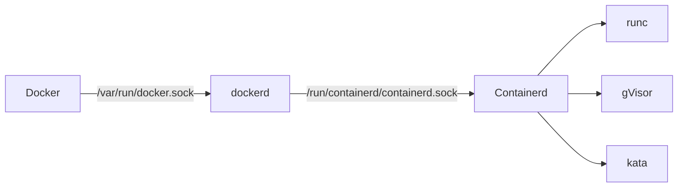

参考资料：

- [CKA/CKAD应试教程：从Docker到Kubernetes完全攻略](https://book.douban.com/subject/37015992/)

# §0 基础概念

我们将操作系统及其应用程序打包成一个镜像，借助运行时来生成和管理容器。

所有运行时均符合OCI（Open Container Initiative）标准，可以分为以下两种：
- 低级别运行时用于管理容器，例如`runc`/`gVisor`/`kata`，进行创建/删除/关闭容器。
- 高级别运行时用于管理容器与镜像，例如`Docker`/`Containerd`/`Podman`，可以配置调用任意的低级别运行时。

