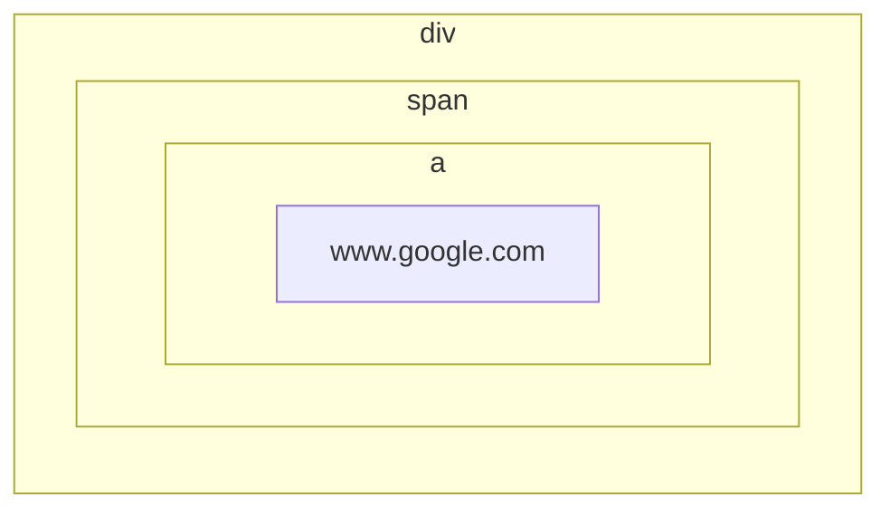

# jQuery

参考书籍：

jQuery基础教程（第四版） [豆瓣](https://book.douban.com/subject/25733582/)

jQuery是一个著名的面向浏览器运行时的JavaScript框架，涵盖了选择元素、处理时间、样式动画、操作DOM、异步请求、插件扩展等内容。

例如：给`div.box`添加`hightlight`Class类名。使用原生JavaScript较为繁琐：

```javascript
window.onload = () => {
	document.querySelectorAll('div.box').foreach((element) => {
    	if(!(new RegExp('highlight')).test(element.className)){
        	element.className += 'highlight';
        }
    });
};
```

但是使用jQuery，代码量能大幅减少：

```javascript
$(document).ready(() => {
    $('div.box').addClass('highlight');
});
```

# §1 jQuery基础语法

## §1.1 选择元素

jQuery的语法与CSS选择符一致，用于从DOM中获取元素或元素集合。将CSS选择符传入构造函数`$()`或`jQuery()`中，就能获得一个jQuery对象，里面包含了一个或多个DOM元素。我们可以对这些元素批量操作。

```javascript
$('div.item:not(.horizontal)');
jQuery('div.item:not(.horizontal)').addClass('red');
```

### §1.1.1 `filter()`

CSS提供的各类选择器丰富多样，可以满足大多数情况的需求。但是如果面对更复杂的需求，就必须由JavaScript介入才能实现。例如，要求筛选同时符合`div.item`和`ul > div.red`两个CSS选择符的元素，纯CSS就无法做到。

基于此，jQuery在CSS选择符的基础上，增加了`filter()`函数以供进行逻辑与运算。

```javascript
$('div.item').filter('ul > div.red')
```

`filter()`还能接受函数作为实参，在函数内构造更复杂的筛选条件。例如下面的代码通过判断超链接是否指向站外，来给外链添加样式。

```javascript
$(document).ready(() => {
	$('a').filter(function(){
	    return this.hostname && this.hostname !== location.hostname;
	}).addClass('external_link');
});
```

### §1.1.2 自定义选择符

除了CSS1~3规定的CSS选择符以外，jQuery还支持自定义选择符。自定义选择符的语法与伪类选择符相同，都以`:`开头。详见[官方文档](https://api.jquery.com/category/selectors/jquery-selector-extensions/)。

#### §1.1.2.1 `:animated`

`:animate`选择符用于选择正在进行动画的元素。

```html
<html>
    <head>
        <script src="./node_modules/jquery/dist/jquery.js"></script>
        <style>
            div {
                width: 100px;
                height: 100px;
                border: 1px solid black;
                background-color: lightblue;
            }
            .red {
                background-color: lightcoral;
            }
        </style>
    </head>
    <body>
        <div class="animate"></div>
        <script>
            function toggle(){
                $("div.animate").slideToggle(1000, toggle);
            }
            toggle();
            $(":animated").addClass("red");
        </script>
    </body>
</html>
```

#### §1.1.2.2 `[name!="value"]`

`[name!="value"]`选择符，是对`[name="value"]`的扩展，等价于`:not([name='value'])`。

```html
<html>
    <head>
        <script src="./node_modules/jquery/dist/jquery.js"></script>
        <style>
            div {
                width: 100px;
                height: 100px;
                border: 1px solid black;
                background-color: lightblue;
            }
            .red { background-color: lightcoral; }
        </style>
    </head>
    <body>
        <div class="a"></div>
        <div class="b"></div>
        <script>
            $("div[class!='a']").addClass("red");
        </script>
    </body>
</html>
```

#### §1.1.2.3 `:button`

`:button`选择符用于选择`<button>`和`<input type="button"/>`元素，等价于`button, input[type='button']`。

#### §1.1.2.4 `:checkbox`

`:checkbox`选择符用于选择`type`属性为`checkbox`的元素，等价于`[type='checkbox']`。

#### §1.1.2.5 `:contains()`

`:contains()`选择符用于检测元素本身及其子元素的`innerText`是否包含指定的子字符串。

```javascript
<html>
    <head>
        <script src="./node_modules/jquery/dist/jquery.js"></script>
        <style>
            .bold {
                font-weight: bold;
            }
        </style>
    </head>
    <body>
        <div class="article">
            <span>2023-11-15</span>
            <a href="./">News: Leaders of China and America stressed cooperation's significance</a>
        </div>
        <div class="article">
            <span>2023-11-16</span>
            <a href="./">Comment: Fickle society leaves people at a loss </a>
        </div>
        <script>
            $("div:contains('Comment')").addClass("bold");
        </script>
    </body>
</html>
```

#### §1.1.2.6 `:eq()`

`:eq()`选择符用于在筛选结果中选择第`index`个元素（从`0`开始）。该自定义选择符从`3.4`版本起被抛弃，推荐使用`.eq()`方法。

```html
<html>
    <head>
        <script src="./node_modules/jquery/dist/jquery.js"></script>
        <style>
            /* div {
                width: 100px;
                height: 100px;
                border: 1px solid black;
                background-color: lightblue;
            } */
            .bold {
                font-weight: bold;
            }
        </style>
    </head>
    <body>
        <div class="article">
            <span>2023-11-15</span>
            <a href="./">News: Leaders of China and America stressed cooperation's significance</a>
        </div>
        <div class="article">
            <span>2023-11-16</span>
            <a href="./">Comment: Fickle society leaves people at a loss </a>
        </div>
        <script>
            $("div:eq(1)").addClass("bold");
        </script>
    </body>
</html>
```

#### §1.1.2.7 `:even`

`:even`选择符在筛选结果中选择所有序号为偶数的元素（从`0`开始）。该自定义选择符从`3.4`版本起被抛弃，推荐使用`.even()`方法。

#### §1.1.2.8 `:file`

`:file`选择符用于筛选`type`属性为`file`的元素，等价于`[type='file']`。

#### §1.1.2.9 `:first`

`:first`选择符用于在筛选结果中选择第`0`个元素（从`0`开始）。该自定义选择符从`3.4`版本起被抛弃。

#### §1.1.2.10 `:gt()`

`gt()`选择符龝选择大于等于指定序号的所有元素（从`0`开始）。该自定义选择符从`3.4`版本起被抛弃，推荐使用`.slice(n+1)`。

#### §1.1.2.11 `:has()`

`:has()`选择符用于选择其子元素和孙辈元素中包含指定标签的元素。

```html
<html>
    <head>
        <script src="./node_modules/jquery/dist/jquery.js"></script>
        <style>
            .border {
                border: 1px solid black;
            }
        </style>
    </head>
    <body>
        <div><p>Hello</p></div>
        <div><span>World</span></div>
        <script>
            $("div:has(p)").addClass("border");
        </script>
    </body>
</html>
```

#### §1.1.2.12 `:header`

`:header`选择符用于选择所有的`<h1>`、`<h2>`、`<h3>`、`<h4>`、`<h5>`、`<h6>`。

#### §1.1.2.13 `:hidden`

`:hidden`选择符用于选择所有的隐藏元素，隐藏元素需满足下列条件之一：

- CSS属性中有`display: none;`
- CSS属性中有`height: 0; width: 0;`
- `<form>`中的`<input type="hidden">`
- 父辈元素是隐藏元素，因此本元素也是隐藏元素

```html
<html>
    <head>
        <script src="./node_modules/jquery/dist/jquery.js"></script>
        <style>
            * { overflow: hidden; }
            .hidden-display { display: none; }
            .hidden-size { width: 0; height: 0; }
            .visible-force {
                display: block;
                width: 8rem;
                height: 1rem;
                
                padding: 0.5rem;
                border: 1px solid black;
            }
        </style>
    </head>
    <body>
        <div class="hidden-display">Hidden</div>
        <div class="hidden-size">Hidden</div>
        <form>
            <input type="hidden">
            <span type="hidden"></span>
        </form>
        <div class="hidden-display">
            <div>Hidden</div>
        </div>
        <script>
            $("*:hidden").addClass("visible-force");
        </script>
    </body>
</html>
```

#### §1.1.2.14 `:image`

`:image`选择符用于选择`type`属性为`image`的元素，等价于`[type="image"]`。

#### §1.1.2.15 `:input`

`:input`选择符用于选择所有允许用户输入的元素，包括所有的`<input>`、`<textarea>`、`<select>`、`<button>`。（不包括`<option>`）

#### §1.1.2.16 `:last`

`:last`选择符用于选择最后一个元素。该自定义选择符从`3.4`版本起被抛弃，推荐使用`.last()`。

#### §1.1.2.17 `:lt`

`:lt`选择符用于选择小于等于指定序号的元素（从`0`开始）。该自定义选择符从`3.4`版本起被抛弃，推荐使用`.slice(0, n)`。

#### §1.1.2.18 `:odd`

`:odd`选择符用于选择序号为奇数的元素（从`0`开始）。该自定义选择符从`3.4`版本起被抛弃，推荐使用`.odd()`。

#### §1.1.2.19 `:parent`

`:parent`选择符用于选择至少有一个子元素/文本的元素。

```html
<html>
    <head>
        <script src="./node_modules/jquery/dist/jquery.js"></script>
        <style>
            div {
                height: 2rem;
                width: 5rem;
                border: 1px solid black;
            }
            .background-lightblue { background-color: lightblue; }
        </style>
    </head>
    <body>
        <div><div></div></div>
        <div></div>
        <script>
            $("div:parent").addClass("background-lightblue");
        </script>
    </body>
</html>
```

#### §1.1.2.20 `:password`

`:password`选择符用于选择`type`属性为`password`的元素，等价于`[type="password"]`。

#### §1.1.2.21 `:radio`

`:radio`选择符用于选择`type`属性为`radio`的元素，等价于`[type="radio"]`。

#### §1.1.2.22 `:reset`

`:reset`选择符用于选择`type`属性为`reset`的元素，等价于`[type="reset"]`。

#### §1.1.2.23 `:selected`

`:selected`选择符用于选择`<option>`元素。

#### §1.1.2.24 `:submit`

`:submit`选择符用于选择`type`属性为`submit`的`<input>`或`<button>`元素，等价于`input[type="submit"], button[type="submit"]`。

#### §1.1.2.25 `:text`

`:text`选择符用于选择`type`属性为`text`的`<input>`元素，等价于`input[type="text"]`。

#### §1.1.2.26 `:visible`

`:visible`选择符用于选择实际长度或宽度大于`0`的元素。

### §1.1.3 DOM遍历

jQuery提供了众多DOM的选择方法，而且每个选择方法返回的都是jQuery对象，这意味着我们可以连缀调用：

```javascript
$('a:contains(Notice)')
	.parent() // 获取父元素
	.find('span') // 获取父元素的<span>标签
	.addClass('red') // 给<span>标签添加red类
	.end() // 返回到上级父元素
	.find('p') // 获取父元素的<p>标签
	.addClass('border') // 给<p>表气啊添加border类
```

#### §1.1.3.1 `.add()`
`.add()`用于在jQuery对象中添加元素。

```javascript
.add(selector: Selector);
.add(elements: Element);
.add(html: htmlString);
.add(selection: jQuery);
.add(selector: Selector, context: Element);
```

```html
<html>
    <head>
        <script src="./node_modules/jquery/dist/jquery.js"></script>
        <style>
            .background-lightblue { background-color: lightblue; }
        </style>
    </head>
    <body>
        <p>abc</p>
        <div>def</div>
        <main>ghi</main>
        <caption>jkl</caption>
        <script>
            $("div")
                .add("p") // selector: Selector
                .add(document.getElementsByTagName('main')) // elements: Element
                .add("<caption>sdf</caption>") // html: HTMLString 注意该元素仍未插入DOM
                .addClass("background-lightblue");
        </script>
    </body>
</html>
```

#### §1.1.3.2 `.addBack()`

`.addBack()`用于将栈上缓存的元素加入到当前jQuery对象中，可以指定选择器进行过滤。

```javascript
.addback([selector: Selector])
```

例如在下面的例子中，`$("ul > li:nth-of-type(2)")`返回一个jQuery对象，并且初始化栈，将第二个`<li>`放入其中。后面的`.nextAll()`返回一个只包含第三个`<li>`的jQuery对象，并将第三个`<li>`压入栈中。最后`.addBack()`返回将栈中的元素全部打包成一个新的jQuery对象并作为函数的返回值。

```html
<html>
    <head>
        <script src="./node_modules/jquery/dist/jquery.js"></script>
        <style>
            .background-lightblue { background-color: lightblue; }
        </style>
    </head>
    <body>
        <ul>
            <li>1</li>
            <li>2</li>
            <li>3</li>
        </ul>
        <script>
            $("ul > li:nth-of-type(2)")
                .nextAll()
                .addBack()
                .addClass("background-lightblue");
        </script>
    </body>
</html>
```

#### §1.1.3.3 `.andSelf()`

`.andSelf()`用于将栈上缓存的元素加入到当前jQuery对象中，不接受任何参数。

> 注意：该方法从jQuery 1.8起被抛弃，jQuery 3.0起被移除，推荐使用功能更强大的`.andBack()`方法。

#### §1.1.3.4 `.children()`
`.children()`用于获取所有的子元素，可以通过选择器进一步筛选。

```javascript
.children([selector: Selector])
```

```html
<html>
    <head>
        <script src="./node_modules/jquery/dist/jquery.js"></script>
        <style>
            .background-lightblue { background-color: lightblue; }
        </style>
    </head>
    <body>
        <ul>
            <li><div>1</div></li>
            <span>2</span>
            <li>3</li>
        </ul>
        <script>
            $("ul").children("li").addClass("background-lightblue");
        </script>
    </body>
</html>
```

#### §1.1.3.5 `.closest()`

`.closest()`用于从jQuery内对象开始，向上查找最近的符合选择符的父辈元素。

```javascript
.closest(selector: Selector, [context: Element])
.closest(selection: jQuery)
.closest(element: Element)
```

```html
<html>
    <head>
        <script src="./node_modules/jquery/dist/jquery.js"></script>
        <style>
            .background-lightblue { background-color: lightblue; }
        </style>
    </head>
    <body>
        <ul id="layer1">
            Layer1:
            <ul id="layer2">
                Layer2:
                <li></li>
            </ul>
        </ul>
        <script>
            $("li").closest("ul").addClass("background-lightblue");
        </script>
    </body>
</html>
```

#### §1.1.3.6 `.contents()`
`.contents()`用于获取元素的所有子元素、文本和注释。

TODO:

#### §1.1.3.7 `.each()`

`.each()`用于。
#### §1.1.3.8 `.end()`
`.end()`用于。
#### §1.1.3.9 `.eq()`
`.eq()`用于。
#### §1.1.3.10 `.even()`
`.even()`用于。
#### §1.1.3.11 `.filter()`
`.filter()`用于。
#### §1.1.3.12 `.find()`
`.find()`用于。
#### §1.1.3.13 `.first()`
`.first()`用于。
#### §1.1.3.14 `.has()`
`.has()`用于。
#### §1.1.3.15 `.is()`
`.is()`用于。
#### §1.1.3.16 `.last()`
`.last()`用于。
#### §1.1.3.17 `.map()`
`.map()`用于。
#### §1.1.3.18 `.next()`
`.next()`用于。
#### §1.1.3.19 `.nextAll()`
`.nextAll()`用于。
#### §1.1.3.20 `.nextUntil()`
`.nextUntil()`用于。
#### §1.1.3.21 `.not()`
`.not()`用于。
#### §1.1.3.22 `.odd()`
`.odd()`用于。
#### §1.1.3.23 `.offsetParent()`
`.offsetParent()`用于。
#### §1.1.3.24 `.parent()`
`.parent()`用于。
#### §1.1.3.25 `.parents()`
`.parents()`用于。
#### §1.1.3.26 `.parentsUntil()`
`.parentsUntil()`用于。
#### §1.1.3.27 `.prev()`
`.prev()`用于。
#### §1.1.3.28 `.prevAll()`
`.prevAll()`用于。
#### §1.1.3.29 `.prevUntil()`
`.prevUntil()`用于。
#### §1.1.3.30 `.siblings()`
`.siblings()`用于。
#### §1.1.3.31 `.slice()`
`.slice()`用于。

### §1.1.4 `next()`/`nextAll()`

```javascript

```

### §1.1.5 访问底层DOM

在大部分jQuery的开发流程中，我们只需要与jQuery对象打交道。但是如果要访问其中的底层DOM元素，jQuery也有对应的方法。

jQuery对象提供了`[]`和`.get()`两种方法：

```javascript
let spanDOM_1 = $("span")[0];
let spanDOM_2 = $("span").get(1);

let spanDOMs = $("span")
```

## §1.2 事件

jQuery扩展了JavaScript的事件处理机制，提供了更优雅的语法。

### §1.2.1 `ready()`

我们经常需要在某组件加载完成后，执行某些初始化操作。原生实现该功能的方法有以下两种：

- 原生JavaScript：`window.onload: function`

  ```javascript
  window.onload = function(){
      // ......
  }
  ```

- 原生HTML：`<element onload="...">`

  ```html
  <body onload="alert('加载完成');">
  	Hello, World!
  </body>
  ```

jQuery在此基础上提供了封装，通过`.ready()`方法添加到启动队列中，从而自动实现多个`window.onload`参数。

特殊地，当元素是`document`时，`document.ready(function)`可以简写成`$(function)`，也就是把函数传入到jQuery的构造函数中。

当多个JavaScript共同争夺同一个`$`的使用权时，我们可以先引入jQuery，然后调用`$.noConflict)`释放`$`的使用权，再引入其它需要`$`的包。`.ready(...)`或`jQuery((...)=>{})`接受一个形参，表示该jQuery库的命名。此时我们再传入`$`，就能在该作用域内继续让jQuery使用`$`：

```html
<script src="jQuery.js"></script>
<script>$.noConflict();</script>

<script src="xxx.js"></script>
......
<script src="xxx.js"></script>

<script>
    $.ready(function($){
    	$. //......
    });
	$(function($){
		$. //......
    });
</script>
```

### §1.2.2 绑定事件

回想原生JavaScript的时代，开发者需要用`document.addEventListener(event: string, function: callback)`来为元素绑定事件。jQuery提供了`.on()`用于缩短函数名：

```html
<html>
    <head>
        <script src="./node_modules/jquery/dist/jquery.js"></script>
        <style>
            div {
                width: 85%;
                height: auto;
                margin-left: auto;
                margin-right: auto;
                padding: 1rem;
                border: 1px solid black;
            }
            .active { font-weight: bold; }
            .width-wide { width: 85%; }
            .width-normal { width: 60%; }
            .width-narrow { width: 40%; }
        </style>
    </head>
    <body>
        <button id="button-width-wide">宽布局</button>
        <button id="button-width-normal">适中布局</button>
        <button id="button-width-narrow">窄布局</button>
        <div></div>
        <script>
            $("#button-width-wide").on('click', function(){
                $("div").removeClass("width-normal");
                $("div").removeClass("width-narrow");
                $("div").addClass("width-wide");
            });
            $("#button-width-normal").on('click', function(){
                $("div").removeClass("width-wide");
                $("div").removeClass("width-narrow");
                $("div").addClass("width-normal");
            });
            $("#button-width-narrow").on('click', function(){
                $("div").removeClass("width-wide");
                $("div").removeClass("width-normal");
                $("div").addClass("width-narrow");
            });
        </script>
    </body>
</html>
```

当事件被触发时，回调函数中的`this`一定指向携带相应行为的DOM元素。而我们之前也讲过，构造函数`$()`可以接收一个DOM对象，因此我们可以使用`$(this)`直接获取当前元素被包装好的jQuery对象，然后调用jQuery提供的各类API。

又已知`.removeClass()`不传入参数时，表示清除所有类。因此上面可以进一步改写：

```javascript
<html>
    <head>
        <script src="./node_modules/jquery/dist/jquery.js"></script>
        <style>
            div {
                height: auto;
                margin-left: auto;
                margin-right: auto;
                padding: 1rem;
                border: 1px solid black;
            }
            .active { font-weight: bold; }
            .width-wide { width: 85%; }
            .width-normal { width: 60%; }
            .width-narrow { width: 40%; }
        </style>
    </head>
    <body>
        <button id="button-width-wide">宽布局</button>
        <button id="button-width-normal">适中布局</button>
        <button id="button-width-narrow">窄布局</button>
        <div class="width-normal"></div>
        <script>
            $("button").on('click', function(){
                $("div").removeClass();
            })
            $("#button-width-wide").on('click', function(){
                $("div").addClass("width-wide");
            });
            $("#button-width-normal").on('click', function(){
                $("div").addClass("width-normal");
            });
            $("#button-width-narrow").on('click', function(){
                $("div").addClass("width-narrow");
            });
        </script>
    </body>
</html>
```

### §1.2.3 事件简写

jQuery针对常用的事件提供了相应的简写函数。

TODO:


### §1.2.4 事件传播

设想以下情景：`<div>`、`<span>`、`<a>`都已注册了自己的`click`事件与回调函数。当用户点击的超链接时，鼠标肯定同时悬浮在这三个元素之上，那么这三个元素的`click`回调函数会如何执行呢？



对于“多个元素响应同一个事件”的情形，JavaScript曾经采取过两种策略——事件捕获和事件冒泡。最终的JavaScript标准的规定是——同时使用这种两种策略，在捕获时从外向内，在执行时从内向外。这类似于函数的迭代：

```javascript
div_click(){
	span_click(){
		a_click(){
			// ......
		}
		// ......
	}
	// ......
}
```

这种做法看似十分合理，但是却藏着一个坑——只要内层触发了事件，那么无论外层是否触发，根据事件冒泡原则，外层都会被触发。为了解决这个问题，我们可以使用以下方法：

- 判断事件目标

  当事件传播到上层时，判断事件触发的对象`event.target`是否为当前元素。

  ```javascript
  $(document.ready(function(){
  	$('子元素').click(function(event){
      	if(event.target !== this){
          	return; // 直接退出
          }
          // 子元素代码
      });
  }));
  ```

- 停止事件传播

  停止事件执行时采取的事件冒泡策略。

  ```javascript
  $(document.ready(function(){
  	$('子元素').click(function(event){
          // 子元素代码
          event.stopPropagation();
      });
  }));
  ```

- 阻止默认操作

  在停止事件传播中，我们停止的是开发者自己注册的事件，不包括浏览器自定义的事件（例如单击`<a>`会进行跳转）。这里我们可以阻止默认操作，从而阻止一切事件。

  ```javascript
  $(document.ready(function(){
  	$('子元素').click(function(event){
          // 子元素代码
          event.preventDefault();
      });
  }));
  ```

  > 注意：事件传播和默认操作是两套相互独立的机制，任何一方发生时都可以终止另一方。如果要同时终止事件传播和默认操作，可以让事件注册的函数返回`false`。

- 事件委托

  在之前的三种处理方式中，我们把子元素应该执行的函数注册到了子元素的事件中，父元素同理。其实也有另一种思路，也就是将两个代码都放到父元素的事件中，让事件传播到父元素，然后进行判断，选择其中的一个函数执行。这种技术称为事件委托。

  ```javascript
  $(document.ready(function(){
  	$('父元素').click(function(event){
          if($(event.target).is('子元素')){
          	// 子元素代码
              event.stopPropagation();
          }else if($(event.taget).is('父元素')){
  			// 父元素代码
          }
      });
  }));
  ```

  jQuery已经提供了内置的事件委托。比如`.on(事件名, 选择器名, 回调函数)`，当回调函数发现自己并不与选择器匹配时，就会停止执行。

### §1.2.5 事件命名空间

我们已经知道，`.on()`的第一个参数接受形如`"click"`之类的事件名。jQuery在此基础上引入了命名空间的概念，以`/`作为路径分隔符，形成`click.form.submit`之类的命名。

```html
<html>
    <head>
        <script src="./node_modules/jquery/dist/jquery.js"></script>
    </head>
    <body>
        <button id="alert">Click me</button>
        <button id="alert_disable">Disable all "click.alert" event</button>
        <script>
            $("#alert").on("click.alert.info", function(event){
                alert("You clicked me! :)");
            });
            $("#alert_disable").on("click", function(event){
                $("#alert").off("click.alert");
            });
        </script>
    </body>
</html>
```

### §1.2.6 解绑事件

jQuery使用`.off()`方法解绑事件，其中事件名支持命名空间：

```javascript
$(...).off(事件名)
```

### §1.2.7 模拟触发事件

在原生JavaScript中，我们可以手动调用DOM元素的`.click()`等方法，模拟触发事件。在jQuery中，我们既可以向原生JavaScript调用jQuery的`.click()`API，也可以使用jQuery对象的`.trigger()`方法：

```html
<html>
    <head>
        <script src="./node_modules/jquery/dist/jquery.js"></script>
    </head>
    <body>
        <button id="alert">Click me</button>
        <button id="trigger">Pretend to click the left button</button>
        <script>
            $("#alert").on("click.alert.info", function(event){
                alert("You clicked the left button! :)");
            });
            $("#trigger").on("click", function(event){
                $("#alert").trigger("click");
            });
        </script>
    </body>
</html>
```

## §1.3 样式与动画

### §1.3.1 `.css()`

`.css()`用于获取与修改元素的内联CSS，是`getter()`与`setter()`的结合体。当它接受两个字符串参数或一个字典时，表示要修改的CSS属性；当它接受一个字符串参数时，表示返回该CSS的属性值。

```typescript
// 获取CSS属性值
.css(propertyName: String)
.css(propertyNames: Array)

// 设置CSS属性值
.css(propertyName: String, value: String | Number)
.css(propertyName: String, function: Function(index: Integer, value: String | Number))
.css(properties: PlainObject)
```

```html
<html>
    <head>
        <script src="./node_modules/jquery/dist/jquery.js"></script>
    </head>
    <body>
        <button id="button-increase-fontsize">增大字体</button>
        <button id="button-decrease-fontsize">减小字体</button>
        <div>Hello World</div>
        <script>
            $('div').css("background-color", "lightblue");
            $('div').css({
                "width": "15rem",
                "height": "1rem",
                "text-align": "center",
                "line-height": "1rem"
            });
            $('#button-increase-fontsize').click(function(event){
                $("div").css({
                    "height": (parseFloat(($("div").css("height"))) + 16).toString() + "px",
                    "line-height": (parseFloat(($("div").css("line-height"))) + 16).toString() + "px",
                    "font-size": (parseFloat(($("div").css("font-size"))) + 2).toString() + "px"
                });
            });
            $('#button-decrease-fontsize').click(function(event){
                $("div").css({
                    "height": (parseFloat(($("div").css("height"))) - 16).toString() + "px",
                    "line-height": (parseFloat(($("div").css("line-height"))) - 16).toString() + "px",
                    "font-size": (parseFloat(($("div").css("font-size"))) - 2).toString() + "px"
                });
            });
        </script>
    </body>
</html>
```

> 注意：对于浏览器厂商引入的实验性CSS属性，原生JavaScript需要判断浏览器的类别，或者检测DOM中是否存在带前缀的指定CSS属性，然后才能按需添加`-webkit-`、`-o-`、`-mox-`、`-ms-`等前缀。jQuery考虑到了这个问题，在`.css()`中会自动识别尚未完全支持CSS属性，并自动添加合适的前缀。

### §1.3.2 `.addClass()`

`.addClass()`接受一个CSS类名，将类名赋给jQuery

```typescript
.addClass(className: String)
.addClass(classNames: Array<string>)
.addClass(function: Function(index: Integer, currentClassName: String) => String)
.addClass(function: Function(index: Integer, currentClassName: String) => String | Array)
```

### §1.3.3 隐藏和显示（`.hide()`/`.show()`/`.toggle()`）

`.hide()`、`.show()`、`.toggle()`控制元素是否可见。

- 当时长为`0`时，它们都会操纵元素的`display`属性。执行`.hide()`时，jQuery会先记住原本的`display`属性值，然后设为`display: none`。执行`.show()`时，负责还原。
- 当时长大于`0`时，它们通过操纵元素的`width`、`height`、`opacity`属性，让这三个属性同时达到`0`或原始值。

```typescript
// .show()语法
.show()
.show([duration: Number | String = 400] [, complete: Function])
.show(options: PlainObject[
	duration: Number | String = 400,
	easing: String = "swing",
	queue: Boolean | String = true,
	specialEasing: PlainObject[<CSSs属性>],
	step: Function(now: Number, tween: Tween),
	progress: Function(animation: Promise, progess: Number, remainingMs: Number),
	complete: Function,
	start: Function(animation: Promise),
	done: Function(animation: Promise, jumpedToEnd: Boolean),
	fail: Function(animation: Promise, jumpedToEnd: Boolean),
	always: Function(animation: Promise, jumpedToEnd: Boolean)
])
.show(duration: Number | String = 400 [,easing: String = "swing"] [,complete: Function])

// .hide()语法
.hide()
.hide([duration: Number | String = 400] [, complete: Function])
.hide(options: PlainObject[
	duration: Number | String = 400,
	easing: String = "swing",
	queue: Boolean | String = true,
	specialEasing: PlainObject[<CSSs属性>],
	step: Function(now: Number, tween: Tween),
	progress: Function(animation: Promise, progess: Number, remainingMs: Number),
	complete: Function,
	start: Function(animation: Promise),
	done: Function(animation: Promise, jumpedToEnd: Boolean),
	fail: Function(animation: Promise, jumpedToEnd: Boolean),
	always: Function(animation: Promise, jumpedToEnd: Boolean)
])
.hide(duration: Number | String = 400 [,easing: String = "swing"] [,complete: Function])

// .toggle()语法
.toggle([duration: Number | String = 400] [, complete: Function])
.toggle(options: PlainObject[
	duration: Number | String = 400,
	easing: String = "swing",
	queue: Boolean | String = true,
	specialEasing: PlainObject[<CSSs属性>],
	step: Function(now: Number, tween: Tween),
	progress: Function(animation: Promise, progess: Number, remainingMs: Number),
	complete: Function,
	start: Function(animation: Promise),
	done: Function(animation: Promise, jumpedToEnd: Boolean),
	fail: Function(animation: Promise, jumpedToEnd: Boolean),
	always: Function(animation: Promise, jumpedToEnd: Boolean)
])
.toggle(duration: Number | String = 400 [,easing: String = "swing"] [,complete: Function])
.toggle(display: Boolean)
```

```html
<html>
    <head>
        <script src="./node_modules/jquery/dist/jquery.js"></script>
        <style>
            .page {
                width: 70%;
                height: 5rem;
                margin-left: auto;
                margin-right: auto;
                text-align: center;
                padding: 1rem;
                margin-top: 1rem;
                border: 1px solid black;
            }
        </style>
    </head>
    <body>
        <button id="button-switch-page-1">Page 1</button>
        <button id="button-switch-page-2">Page 2</button>
        <button id="button-switch-page-3">Page 3</button>
        <div id="div-page-1" class="page">I'm page 1! :)</div>
        <div id="div-page-2" class="page">I'm page 2! :)</div>
        <div id="div-page-3" class="page">I'm page 3! :)</div>
        <script>
            $("button[id^='button-switch-page-']").click(function(event){
                switch (event.target.id) {
                    case "button-switch-page-1":
                        $("div#div-page-1").show(100);
                        $("div#div-page-2").hide();
                        $("div#div-page-3").hide();
                        break;
                    case "button-switch-page-2":
                        $("div#div-page-1").hide();
                        $("div#div-page-2").show(100);
                        $("div#div-page-3").hide();
                        break;
                    case "button-switch-page-3":
                        $("div#div-page-1").hide();
                        $("div#div-page-2").hide();
                        $("div#div-page-3").show(100);
                        break;
                    default:
                        break;
                }
            });
        </script>
    </body>
</html>
```

### §1.3.4 淡入和淡出（`.fadeIn()`/`.fadeOut()`）

`.fadeIn()`与`.fadeOut()`控制元素的`opacity`CSS属性。一旦`opacity`到达目标值，其`display`属性也会设为`none`或复原。

```typescript
// .fadeIn()语法
.fadeIn([duration: Number | String = 400] [,complete: Function])
.fadeIn(options: PlainObject[
	duration: Number | String = 400,
	easing: String = "swing",
	queue: Boolean | String = true,
	specialEasing: PlainObject[<CSS属性>],
	step: Function(now: Number, tween: Tween),
	progress: Function(animation: Promise, progess: Number, remainingMs: Number),
	complete: Function(),
	start: Function(animation: Promise),
	done: Function(animation: Promise, jumpedToEnd: Boolean),
	fail: Function(animation: Promise, jumpedToEnd: Boolean),
	always: Function(animation: Promise, jumpedToEnd: Boolean)
])
.fadeIn([duration: Number | String = 400] [,easing: String = "swing"] [,complete: Function])

// .fadeOut()语法
.fadeOut([duration: Number | String = 400] [,complete: Function])
.fadeOut(options: PlainObject[
	duration: Number | String = 400,
	easing: String = "swing",
	queue: Boolean | String = true,
	specialEasing: PlainObject[<CSS属性>],
	step: Function(now: Number, tween: Tween),
	progress: Function(animation: Promise, progess: Number, remainingMs: Number),
	complete: Function(),
	start: Function(animation: Promise),
	done: Function(animation: Promise, jumpedToEnd: Boolean),
	fail: Function(animation: Promise, jumpedToEnd: Boolean),
	always: Function(animation: Promise, jumpedToEnd: Boolean)
])
.fadeOut([duration: Number | String = 400] [,easing: String = "swing"] [,complete: Function])
```

```html
<html>
    <head>
        <script src="./node_modules/jquery/dist/jquery.js"></script>
        <style>
            .page {
                width: 70%;
                height: 5rem;
                margin-left: auto;
                margin-right: auto;
                text-align: center;
                padding: 1rem;
                margin-top: 1rem;
                border: 1px solid black;
            }
        </style>
    </head>
    <body>
        <button id="button-switch-page-1">Page 1</button>
        <button id="button-switch-page-2">Page 2</button>
        <button id="button-switch-page-3">Page 3</button>
        <div id="div-page-1" class="page">I'm page 1! :)</div>
        <div id="div-page-2" class="page">I'm page 2! :)</div>
        <div id="div-page-3" class="page">I'm page 3! :)</div>
        <script>
            $("button[id^='button-switch-page-']").click(function(event){
                switch (event.target.id) {
                    case "button-switch-page-1":
                        $("div#div-page-1").fadeIn(200);
                        $("div#div-page-2").fadeOut(0);
                        $("div#div-page-3").fadeOut(0);
                        break;
                    case "button-switch-page-2":
                        $("div#div-page-1").fadeOut(0);
                        $("div#div-page-2").fadeIn(200);
                        $("div#div-page-3").fadeOut(0);
                        break;
                    case "button-switch-page-3":
                        $("div#div-page-1").fadeOut(0);
                        $("div#div-page-2").fadeOut(0);
                        $("div#div-page-3").fadeIn(200);
                        break;
                    default:
                        break;
                }
            });
        </script>
    </body>
</html>
```

### §1.3.5 划上和划下（`.slideUp()`/`.slideDown()`/`.slideToggle()`）

`.slideUp()`、`.slideDown()`、`.slideToggle()`用于控制元素的高度，从而实现垂直方向的展开与折叠。

```typescript
// .slideUp()语法
.slideUp([duration: Number | String = 400] [,complete: Function])
.slideUp(options: PlainObject[
	duration: Number | String = 400,
	easing: String = "swing",
	queue: Boolean | String = true,
	specialEasing: PlainObject[<CSS属性>],
	step: Function(now: Number, tween: Tween),
	progress: Function(animation: Promise, progess: Number, remainingMs: Number)
	complete: Function,
	start: Function(animation: Function),
	done: Function(animation: Promise, jumpedToEnd: Boolean),
	fail: Function(animation: Promise, jumpedToEnd: Boolean),
	always: Function(animation: Promise, jumpedToEnd: Boolean)
])
.slideUp([duration: Number | String = 400] [,easing: String = "swing"] [,complete: Function])

// .slideDown()语法
.slideDown([duration: Number | String = 400] [,complete: Function])
.slideDown(options: PlainObject[
	duration: Number | String = 400,
	easing: String = "swing",
	queue: Boolean | String = true,
	specialEasing: PlainObject[<CSS属性>],
	step: Function(now: Number, tween: Tween),
	progress: Function(animation: Promise, progess: Number, remainingMs: Number)
	complete: Function,
	start: Function(animation: Function),
	done: Function(animation: Promise, jumpedToEnd: Boolean),
	fail: Function(animation: Promise, jumpedToEnd: Boolean),
	always: Function(animation: Promise, jumpedToEnd: Boolean)
])
.slideDown([duration: Number | String = 400] [,easing: String = "swing"] [,complete: Function])

// .slideToggle()语法
.slideToggle([duration: Number | String = 400] [,complete: Function])
.slideToggle(options: PlainObject[
	duration: Number | String = 400,
	easing: String = "swing",
	queue: Boolean | String = true,
	specialEasing: PlainObject[<CSS属性>],
	step: Function(now: Number, tween: Tween),
	progress: Function(animation: Promise, progess: Number, remainingMs: Number)
	complete: Function,
	start: Function(animation: Function),
	done: Function(animation: Promise, jumpedToEnd: Boolean),
	fail: Function(animation: Promise, jumpedToEnd: Boolean),
	always: Function(animation: Promise, jumpedToEnd: Boolean)
])
.slideToggle([duration: Number | String = 400] [,easing: String = "swing"] [,complete: Function])
```

```html
<html>
    <head>
        <script src="./node_modules/jquery/dist/jquery.js"></script>
        <style>
            .page {
                width: 70%;
                height: 5rem;
                margin-left: auto;
                margin-right: auto;
                text-align: center;
                padding: 1rem;
                margin-top: 1rem;
                border: 1px solid black;
            }
        </style>
    </head>
    <body>
        <button id="button-switch-page-1">Page 1</button>
        <button id="button-switch-page-2">Page 2</button>
        <button id="button-switch-page-3">Page 3</button>
        <div id="div-page-1" class="page">I'm page 1! :)</div>
        <div id="div-page-2" class="page">I'm page 2! :)</div>
        <div id="div-page-3" class="page">I'm page 3! :)</div>
        <script>
            $("button[id^='button-switch-page-']").click(function(event){
                switch (event.target.id) {
                    case "button-switch-page-1":
                        $("div#div-page-1").slideDown(200);
                        $("div#div-page-2").slideUp(0);
                        $("div#div-page-3").slideUp(0);
                        break;
                    case "button-switch-page-2":
                        $("div#div-page-1").slideUp(0);
                        $("div#div-page-2").slideDown(200);
                        $("div#div-page-3").slideUp(0);
                        break;
                    case "button-switch-page-3":
                        $("div#div-page-1").slideUp(0);
                        $("div#div-page-2").slideUp(0);
                        $("div#div-page-3").slideDown(200);
                        break;
                    default:
                        break;
                }
            });
        </script>
    </body>
</html>
```

### §1.3.6 `.animate()`

除了以上的预制动画外，jQuery还支持使用`.animate()`自定义动画：

```typescript
.animate(
	properties: PlainObject[<CSS属性>],
    duration: Number | String = 400,
	easing: String = "swing",
	complete: Function
)
.animate(
	properties: PlainObject[<CSS属性>],
	options: PlainObject[
		duration: Number | String = 400,
		easing: String = "swing",
		queue: Boolean | String = true,
		specialEasing: PlainObject[<CSS属性>],
		step: Function(now: Number, tween: Tween),
		progress: Function(animation: Promise, progess: Number, remainingMs: Number),
		complete: Function,
		start: Function(animation: Promise),
		done: Function(animation: Promise, jumpedToEnd: Boolean),
		fail: Function(animation: Promise, jumpedToEnd: Boolean),
		always: Function(animation: Promise, jumpedToEnd: Boolean)
	]
)
```

```html
<html>
    <head>
        <script src="./node_modules/jquery/dist/jquery.js"></script>
        <style>
            .page {
                width: 70%;
                height: 5rem;
                margin-left: auto;
                margin-right: auto;
                text-align: center;
                padding: 1rem;
                margin-top: 1rem;
                border: 1px solid black;
            }
        </style>
    </head>
    <body>
        <div>
            <button id="button-toggle-page-1">Toggle with page 1</button>
            <button id="button-toggle-page-2">Toggle with page 2</button>
            <button id="button-toggle-page-3">Toggle with page 3</button>
        </div>
        <div id="div-page-1" class="page">I'm page 1! :)</div>
        <div id="div-page-2" class="page">I'm page 2! :)</div>
        <div id="div-page-3" class="page">I'm page 3! :)</div>
        <script>
            $("button[id^='button-toggle-page-']").click(function(event){
                switch (event.target.id) {
                    case "button-toggle-page-1":
                        $("div#div-page-1").animate(
                            {
                                "height": "toggle",
                                "opacity": "toggle",
                                "margin-top": "toggle",
                                "margin-bottom": "toggle",
                                "padding-top": "toggle",
                                "padding-bottom": "toggle"
                            },
                            400
                        );
                        break;
                    case "button-toggle-page-2":
                        $("div#div-page-2").slideToggle(400);
                        break;
                    case "button-toggle-page-3":
                        $("div#div-page-3").slideToggle(400);
                        break;
                }
            })
        </script>
    </body>
</html>
```

`.animate()`与其他预置的动画函数都可以用级联调用的形式，实现动画队列，从而让动画按照级联顺序一个个的执行。也可以给`.animate()`传一个`{queue: false}`，表示当前动画与上一个级联动画同时启动。

> 注意：级联调用形式的动画队列，只支持动画函数。对于其它函数（例如`.css()`）不会加入到队列，而是立即执行。

### §1.3.7 `.queue()`

在[§1.3.6 `.animate()`](###§1.3.6 `.animate()`)一节中，我们知道级联调用形式的动画队列，只支持动画函数。为了让非动画函数也能进入动画队列，这里我们不再直接使用级联调用，而是将非动画函数包装在`.queue()`中，再让`.queue()`参与级联调用。

```typescript
// 部分用法
.queue([queueName: String = "fx"], callback: Function(next: Function))
```

```javascript
$(...)
	.amimate(...)
	.queue(function(next){
		$(...).css(...);
    	next();
	})
	.animate(...);
```

## §1.4 操作DOM

### §1.4.1 `.addClass()`/`.removeClass()`/`.toggleClass()`

```typescript
// .addClass()语法
.addClass(className: String)
.addClass(classNames: Array)
.addClass(function: Function(index: Interger, currentClassName: String) => String)
.addClass(function: Function(index: Interger, currentClassName: String) => String | Array)

// .removeClass()语法
.removeClass(className: String)
.removeClass(classNames: Array)
.removeClass(function: Function(index: Interger, currentClassName: String) => String)
.removeClass(function: Function(index: Interger, currentClassName: String) => String | Array)

// .toggleClass()语法

```


### §1.4.2 `.attr()`/`.removeAttr()`


### §1.4.3 `.prop()`


### §1.4.4 `.val()`
