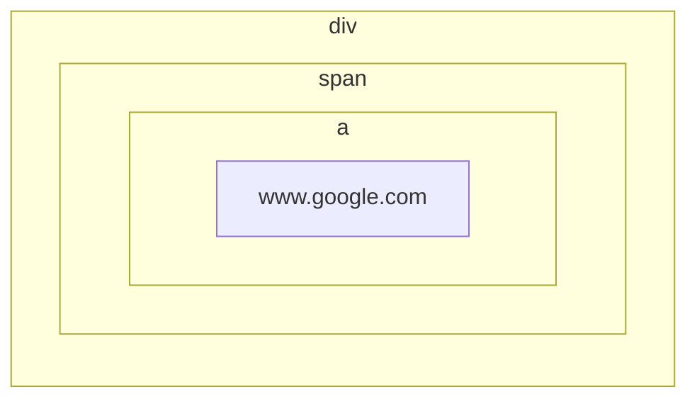

# jQuery

参考书籍：

jQuery基础教程（第四版） [豆瓣](https://book.douban.com/subject/25733582/)

jQuery是一个著名的面向浏览器运行时的JavaScript框架，涵盖了选择元素、处理时间、样式动画、操作DOM、异步请求、插件扩展等内容。

例如：给`div.box`添加`hightlight`Class类名。使用原生JavaScript较为繁琐：

```javascript
window.onload = () => {
	document.querySelectorAll('div.box').foreach((element) => {
    	if(!(new RegExp('highlight')).test(element.className)){
        	element.className += 'highlight';
        }
    });
};
```

但是使用jQuery，代码量能大幅减少：

```javascript
$(document).ready(() => {
    $('div.box').addClass('highlight');
});
```

# §1 jQuery基础语法

## §1.1 选择元素

jQuery的语法与CSS选择符一致，用于从DOM中获取元素或元素集合。将CSS选择符传入构造函数`$()`或`jQuery()`中，就能获得一个jQuery对象，里面包含了一个或多个DOM元素。我们可以对这些元素批量操作。

```javascript
$('div.item:not(.horizontal)');
jQuery('div.item:not(.horizontal)').addClass('red');
```

### §1.1.1 `filter()`

CSS提供的各类选择器丰富多样，可以满足大多数情况的需求。但是如果面对更复杂的需求，就必须由JavaScript介入才能实现。例如，要求筛选同时符合`div.item`和`ul > div.red`两个CSS选择符的元素，纯CSS就无法做到。

基于此，jQuery在CSS选择符的基础上，增加了`filter()`函数以供进行逻辑与运算。

```javascript
$('div.item').filter('ul > div.red')
```

`filter()`还能接受函数作为实参，在函数内构造更复杂的筛选条件。例如下面的代码通过判断超链接是否指向站外，来给外链添加样式。

```javascript
$(document).ready(() => {
	$('a').filter(function(){
	    return this.hostname && this.hostname !== location.hostname;
	}).addClass('external_link');
});
```

### §1.1.2 自定义选择符

除了CSS1~3规定的CSS选择符以外，jQuery还支持自定义选择符。自定义选择符的语法与伪类选择符相同，都以`:`开头。详见[官方文档](https://api.jquery.com/category/selectors/jquery-selector-extensions/)。

#### §1.1.2.1 `:animated`

`:animate`选择符用于选择正在进行动画的元素。

```html
<html>
    <head>
        <script src="./node_modules/jquery/dist/jquery.js"></script>
        <style>
            div {
                width: 100px;
                height: 100px;
                border: 1px solid black;
                background-color: lightblue;
            }
            .red {
                background-color: lightcoral;
            }
        </style>
    </head>
    <body>
        <div class="animate"></div>
        <script>
            function toggle(){
                $("div.animate").slideToggle(1000, toggle);
            }
            toggle();
            $(":animated").addClass("red");
        </script>
    </body>
</html>
```

#### §1.1.2.2 `[name!="value"]`

`[name!="value"]`选择符，是对`[name="value"]`的扩展，等价于`:not([name='value'])`。

```html
<html>
    <head>
        <script src="./node_modules/jquery/dist/jquery.js"></script>
        <style>
            div {
                width: 100px;
                height: 100px;
                border: 1px solid black;
                background-color: lightblue;
            }
            .red { background-color: lightcoral; }
        </style>
    </head>
    <body>
        <div class="a"></div>
        <div class="b"></div>
        <script>
            $("div[class!='a']").addClass("red");
        </script>
    </body>
</html>
```

#### §1.1.2.3 `:button`

`:button`选择符用于选择`<button>`和`<input type="button"/>`元素，等价于`button, input[type='button']`。

#### §1.1.2.4 `:checkbox`

`:checkbox`选择符用于选择`type`属性为`checkbox`的元素，等价于`[type='checkbox']`。

#### §1.1.2.5 `:contains()`

`:contains()`选择符用于检测元素本身及其子元素的`innerText`是否包含指定的子字符串。

```javascript
<html>
    <head>
        <script src="./node_modules/jquery/dist/jquery.js"></script>
        <style>
            .bold {
                font-weight: bold;
            }
        </style>
    </head>
    <body>
        <div class="article">
            <span>2023-11-15</span>
            <a href="./">News: Leaders of China and America stressed cooperation's significance</a>
        </div>
        <div class="article">
            <span>2023-11-16</span>
            <a href="./">Comment: Fickle society leaves people at a loss </a>
        </div>
        <script>
            $("div:contains('Comment')").addClass("bold");
        </script>
    </body>
</html>
```

#### §1.1.2.6 `:eq()`

`:eq()`选择符用于在筛选结果中选择第`index`个元素（从`0`开始）。该自定义选择符从`3.4`版本起被抛弃，推荐使用`.eq()`方法。

```html
<html>
    <head>
        <script src="./node_modules/jquery/dist/jquery.js"></script>
        <style>
            /* div {
                width: 100px;
                height: 100px;
                border: 1px solid black;
                background-color: lightblue;
            } */
            .bold {
                font-weight: bold;
            }
        </style>
    </head>
    <body>
        <div class="article">
            <span>2023-11-15</span>
            <a href="./">News: Leaders of China and America stressed cooperation's significance</a>
        </div>
        <div class="article">
            <span>2023-11-16</span>
            <a href="./">Comment: Fickle society leaves people at a loss </a>
        </div>
        <script>
            $("div:eq(1)").addClass("bold");
        </script>
    </body>
</html>
```

#### §1.1.2.7 `:even`

`:even`选择符在筛选结果中选择所有序号为偶数的元素（从`0`开始）。该自定义选择符从`3.4`版本起被抛弃，推荐使用`.even()`方法。

#### §1.1.2.8 `:file`

`:file`选择符用于筛选`type`属性为`file`的元素，等价于`[type='file']`。

#### §1.1.2.9 `:first`

`:first`选择符用于在筛选结果中选择第`0`个元素（从`0`开始）。该自定义选择符从`3.4`版本起被抛弃。

#### §1.1.2.10 `:gt()`

`gt()`选择符龝选择大于等于指定序号的所有元素（从`0`开始）。该自定义选择符从`3.4`版本起被抛弃，推荐使用`.slice(n+1)`。

#### §1.1.2.11 `:has()`

`:has()`选择符用于选择其子元素和孙辈元素中包含指定标签的元素。

```html
<html>
    <head>
        <script src="./node_modules/jquery/dist/jquery.js"></script>
        <style>
            .border {
                border: 1px solid black;
            }
        </style>
    </head>
    <body>
        <div><p>Hello</p></div>
        <div><span>World</span></div>
        <script>
            $("div:has(p)").addClass("border");
        </script>
    </body>
</html>
```

#### §1.1.2.12 `:header`

`:header`选择符用于选择所有的`<h1>`、`<h2>`、`<h3>`、`<h4>`、`<h5>`、`<h6>`。

#### §1.1.2.13 `:hidden`

`:hidden`选择符用于选择所有的隐藏元素，隐藏元素需满足下列条件之一：

- CSS属性中有`display: none;`
- CSS属性中有`height: 0; width: 0;`
- `<form>`中的`<input type="hidden">`
- 父辈元素是隐藏元素，因此本元素也是隐藏元素

```html
<html>
    <head>
        <script src="./node_modules/jquery/dist/jquery.js"></script>
        <style>
            * { overflow: hidden; }
            .hidden-display { display: none; }
            .hidden-size { width: 0; height: 0; }
            .visible-force {
                display: block;
                width: 8rem;
                height: 1rem;
                
                padding: 0.5rem;
                border: 1px solid black;
            }
        </style>
    </head>
    <body>
        <div class="hidden-display">Hidden</div>
        <div class="hidden-size">Hidden</div>
        <form>
            <input type="hidden">
            <span type="hidden"></span>
        </form>
        <div class="hidden-display">
            <div>Hidden</div>
        </div>
        <script>
            $("*:hidden").addClass("visible-force");
        </script>
    </body>
</html>
```

#### §1.1.2.14 `:image`

`:image`选择符用于选择`type`属性为`image`的元素，等价于`[type="image"]`。

#### §1.1.2.15 `:input`

`:input`选择符用于选择所有允许用户输入的元素，包括所有的`<input>`、`<textarea>`、`<select>`、`<button>`。（不包括`<option>`）

#### §1.1.2.16 `:last`

`:last`选择符用于选择最后一个元素。该自定义选择符从`3.4`版本起被抛弃，推荐使用`.last()`。

#### §1.1.2.17 `:lt`

`:lt`选择符用于选择小于等于指定序号的元素（从`0`开始）。该自定义选择符从`3.4`版本起被抛弃，推荐使用`.slice(0, n)`。

#### §1.1.2.18 `:odd`

`:odd`选择符用于选择序号为奇数的元素（从`0`开始）。该自定义选择符从`3.4`版本起被抛弃，推荐使用`.odd()`。

#### §1.1.2.19 `:parent`

`:parent`选择符用于选择至少有一个子元素/文本的元素。

```html
<html>
    <head>
        <script src="./node_modules/jquery/dist/jquery.js"></script>
        <style>
            div {
                height: 2rem;
                width: 5rem;
                border: 1px solid black;
            }
            .background-lightblue { background-color: lightblue; }
        </style>
    </head>
    <body>
        <div><div></div></div>
        <div></div>
        <script>
            $("div:parent").addClass("background-lightblue");
        </script>
    </body>
</html>
```

#### §1.1.2.20 `:password`

`:password`选择符用于选择`type`属性为`password`的元素，等价于`[type="password"]`。

#### §1.1.2.21 `:radio`

`:radio`选择符用于选择`type`属性为`radio`的元素，等价于`[type="radio"]`。

#### §1.1.2.22 `:reset`

`:reset`选择符用于选择`type`属性为`reset`的元素，等价于`[type="reset"]`。

#### §1.1.2.23 `:selected`

`:selected`选择符用于选择`<option>`元素。

#### §1.1.2.24 `:submit`

`:submit`选择符用于选择`type`属性为`submit`的`<input>`或`<button>`元素，等价于`input[type="submit"], button[type="submit"]`。

#### §1.1.2.25 `:text`

`:text`选择符用于选择`type`属性为`text`的`<input>`元素，等价于`input[type="text"]`。

#### §1.1.2.26 `:visible`

`:visible`选择符用于选择实际长度或宽度大于`0`的元素。

### §1.1.3 DOM遍历

jQuery提供了众多DOM的选择方法，而且每个选择方法返回的都是jQuery对象，这意味着我们可以连缀调用：

```javascript
$('a:contains(Notice)')
	.parent() // 获取父元素
	.find('span') // 获取父元素的<span>标签
	.addClass('red') // 给<span>标签添加red类
	.end() // 返回到上级父元素
	.find('p') // 获取父元素的<p>标签
	.addClass('border') // 给<p>表气啊添加border类
```

#### §1.1.3.1 `.add()`
`.add()`用于在jQuery对象中添加元素。

```javascript
.add(selector: Selector);
.add(elements: Element);
.add(html: htmlString);
.add(selection: jQuery);
.add(selector: Selector, context: Element);
```

```html
<html>
    <head>
        <script src="./node_modules/jquery/dist/jquery.js"></script>
        <style>
            .background-lightblue { background-color: lightblue; }
        </style>
    </head>
    <body>
        <p>abc</p>
        <div>def</div>
        <main>ghi</main>
        <caption>jkl</caption>
        <script>
            $("div")
                .add("p") // selector: Selector
                .add(document.getElementsByTagName('main')) // elements: Element
                .add("<caption>sdf</caption>") // html: HTMLString 注意该元素仍未插入DOM
                .addClass("background-lightblue");
        </script>
    </body>
</html>
```

#### §1.1.3.2 `.addBack()`

`.addBack()`用于将栈上缓存的元素加入到当前jQuery对象中，可以指定选择器进行过滤。

```javascript
.addback([selector: Selector])
```

例如在下面的例子中，`$("ul > li:nth-of-type(2)")`返回一个jQuery对象，并且初始化栈，将第二个`<li>`放入其中。后面的`.nextAll()`返回一个只包含第三个`<li>`的jQuery对象，并将第三个`<li>`压入栈中。最后`.addBack()`返回将栈中的元素全部打包成一个新的jQuery对象并作为函数的返回值。

```html
<html>
    <head>
        <script src="./node_modules/jquery/dist/jquery.js"></script>
        <style>
            .background-lightblue { background-color: lightblue; }
        </style>
    </head>
    <body>
        <ul>
            <li>1</li>
            <li>2</li>
            <li>3</li>
        </ul>
        <script>
            $("ul > li:nth-of-type(2)")
                .nextAll()
                .addBack()
                .addClass("background-lightblue");
        </script>
    </body>
</html>
```

#### §1.1.3.3 `.andSelf()`

`.andSelf()`用于将栈上缓存的元素加入到当前jQuery对象中，不接受任何参数。

> 注意：该方法从jQuery 1.8起被抛弃，jQuery 3.0起被移除，推荐使用功能更强大的`.andBack()`方法。

#### §1.1.3.4 `.children()`
`.children()`用于获取所有的子元素，可以通过选择器进一步筛选。

```javascript
.children([selector: Selector])
```

```html
<html>
    <head>
        <script src="./node_modules/jquery/dist/jquery.js"></script>
        <style>
            .background-lightblue { background-color: lightblue; }
        </style>
    </head>
    <body>
        <ul>
            <li><div>1</div></li>
            <span>2</span>
            <li>3</li>
        </ul>
        <script>
            $("ul").children("li").addClass("background-lightblue");
        </script>
    </body>
</html>
```

#### §1.1.3.5 `.closest()`

`.closest()`用于从jQuery内对象开始，向上查找最近的符合选择符的父辈元素。

```javascript
.closest(selector: Selector, [context: Element])
.closest(selection: jQuery)
.closest(element: Element)
```

```html
<html>
    <head>
        <script src="./node_modules/jquery/dist/jquery.js"></script>
        <style>
            .background-lightblue { background-color: lightblue; }
        </style>
    </head>
    <body>
        <ul id="layer1">
            Layer1:
            <ul id="layer2">
                Layer2:
                <li></li>
            </ul>
        </ul>
        <script>
            $("li").closest("ul").addClass("background-lightblue");
        </script>
    </body>
</html>
```

#### §1.1.3.6 `.contents()`
`.contents()`用于获取元素的所有子元素和文本节点。该方法与`.children()`的区别在于它能获取文本节点。

```typescript
.contents()
```

```html
<html>
    <head>
        <script src="./node_modules/jquery/dist/jquery.js"></script>
    </head>
    <body>
        <ul>
            This is a title.<li>1</li><li>2</li><li>3</li>
        </ul>
        <ul>
            This is a title.<li>1</li><li>2</li><li>3</li>
        </ul>
        <script>
            console.log(
                $("ul:nth-of-type(1)").contents().get().join(' '),
                $("ul:nth-of-type(2)").children().get().join(' ')
            );
        </script>
    </body>
</html>
```

#### §1.1.3.7 `.each()`

`.each()`用于让jQuery对象的所有元素都经过指定函数处理。

```typescript
.each(function: Function(index: Integer, element: Element))
```

#### §1.1.3.8 `.end()`
`.end()`用于终止级联调用链，并返回到经过过滤操作前的上一次状态。

```typescript
.end()
```

```html
<html>
    <head>
        <script src="./node_modules/jquery/dist/jquery.js"></script>
    </head>
    <body>
        <ul>
            <li>1</li>
            <li>2</li>
            <li>3</li>
        </ul>
        <script>
            $("ul")
                .children("li:nth-child(1)").css("color", "red")
                .end()
                .children("li:nth-child(2)").css("color", "blue")
                .end()
                .children("li:nth-child(3)").css("color", "green")
        </script>
    </body>
</html>
```

#### §1.1.3.9 `.eq()`

`.eq()`用于将jQuery对象中指定位置的元素，包装成一个新的jQuery对象并返回，这也是`.eq`与`.get()`和`[]`的不同之处。

```typescript
.eq(index: Integer)
.eq(indexFromEnd: Integer) // 负数表示从后往前索引
```

#### §1.1.3.10 `.even()`

`.even()`用于选择jQuery对象中的偶数元素（从零开始计数）。

```typescript
.even()
```

#### §1.1.3.11 `.filter()`

详见[§1.4.14 `.find()`/`.filter()](###§1.4.14 .find()/.filter())一节。

#### §1.1.3.12 `.find()`

详见[§1.4.14 `.find()`/`.filter()](###§1.4.14 .find()/.filter())一节。

#### §1.1.3.13 `.first()`
`.first()`用于选择jQuery对象中的第一个元素。

```typescript
.first()
```

#### §1.1.3.14 `.has()`
`.has()`用于选择jQuery对象中含有指定条件的子孙元素的所有元素。

```typescript
.has(selector: String)
.has(contained: Element)
```

#### §1.1.3.15 `.is()`

`.is()`用于判断两个对元素的引用是否是同一个元素。

```typescript
.is(selector: Selector) => Boolean
.is(function: Function(index: Integer, element: Element)) => Boolean
.is(selection: jQuery) => Boolean
.is(elements: Element) => Boolean
```

#### §1.1.3.16 `.last()`

`.last()`用于返回jQuery对象中的最后一个元素。

```typescript
.last()
```

#### §1.1.3.17 `.map()`
`.map()`接受一个函数，将jQuery对象中的所有元素放入函数中，将函数返回的结果包装成一个新的jQuery对象。可以通过`.get()`获得数组。

```typescript
.map(callback: Function(index: Integer, domElement: Element) => Object)
```

#### §1.1.3.18 `.next()`

`.next()`用于获取后一个相邻同级元素。如果后一个相邻同级元素不存在，则返回空jQuery对象。

```typescript
.next([selector: Selector])
```

```html
<html>
    <head>
        <script src="./node_modules/jquery/dist/jquery.js"></script>
    </head>
    <body>
        <ul>
            <li>1</li>
            <li>2</li>
            <li>3</li>
        </ul>
        <script>
            $("li:nth-child(2)").next().css("color", "red");
        </script>
    </body>
</html>
```

#### §1.1.3.19 `.nextAll()`
`.nextAll()`用于获取所有后面的相邻同级元素。如果后一个相邻同级元素不存在，则返回空jQuery对象。

```typescript
.nextAll(selector: Selector)
```

```html
<html>
    <head>
        <script src="./node_modules/jquery/dist/jquery.js"></script>
        <style>

        </style>
    </head>
    <body>
        <ul>
            <li>1</li>
            <li>2</li>
            <li>3</li>
        </ul>
        <script>
            $("li:nth-child(1)").nextAll().css("color", "red");
        </script>
    </body>
</html>
```

#### §1.1.3.20 `.nextUntil()`

`.nextUntil()`用于获取后面的相邻同级元素，直到遇到符合条件的元素为止。

```typescript
.nextUntil([selector: Selector], [filter: Selector])
.nextUntil([element: Element | jQuery], [filter: Selector])
```

```html
<html>
    <head>
        <script src="./node_modules/jquery/dist/jquery.js"></script>
    </head>
    <body>
        <ul>
            <li>1</li>
            <li>2</li>
            <li>3</li>
        </ul>
        <script>
            $("li:nth-child(1)").nextUntil("li:nth-child(3)").css("color", "red");
        </script>
    </body>
</html>
```

#### §1.1.3.21 `.not()`

`.not()`用于筛除符合条件的元素。

```typescript
.not(selector: Selector | Element | Array)
.not(function: Function(index: Integer, element: Element) => Boolean)
.not(selection: jQuery)
```

```html
<html>
    <head>
        <script src="./node_modules/jquery/dist/jquery.js"></script>
    </head>
    <body>
        <ul>
            <li>1</li>
            <li>2</li>
            <li>3</li>
        </ul>
        <script>
            $("li").not("*:nth-child(3)").css("color", "red");
        </script>
    </body>
</html>
```

#### §1.1.3.22 `.odd()`

`.odd()`用于选择jQuery对象中的奇数元素（从零开始计数）。

```typescript
.odd()
```

#### §1.1.3.23 `.offsetParent()`
`.offsetParent()`用于获取最近的已定位的祖先元素。这里的“已定位”指的是`position`为`relative`/`absolute`/`fixed`的元素。该元素常用于排版。

```
.offsetParent()
```

#### §1.1.3.24 `.parent()`

`.parent()`用于获取父元素。

```typescript
.parent([selector: Selector])
```

```html
<html>
    <head>
        <script src="./node_modules/jquery/dist/jquery.js"></script>
    </head>
    <body>
        <ul>
            <li>1</li>
            <li>2</li>
            <li>3</li>
        </ul>
        <script>
            $("li:nth-child(2)").parent().css("border", "1px solid black");
        </script>
    </body>
</html>
```

#### §1.1.3.25 `.parents()`
`.parents()`用于递归地获取所有父元素、父元素的父元素等。

```typescript
.parents([selector: Selector])
```

```html
<html>
    <head>
        <script src="./node_modules/jquery/dist/jquery.js"></script>
        <style>

        </style>
    </head>
    <body>
        <ul>
            <li>1</li>
            <li>2</li>
            <li>3</li>
        </ul>
        <script>
            $("li:nth-child(2)").parents().css("border", "1px solid black");
        	// <ul>,<body>,<html>
        </script>
    </body>
</html>
```

#### §1.1.3.26 `.parentsUntil()`
`.parentsUntil()`用于用于递归地获取父元素、父元素的父元素等，直到遇到符合条件的元素为止。

```typescript
.parentsUntil([selector: Selector], [filter: Selector])
.parentsUntil([element: Element | jQuery], [filter: Selector])
```

```html
<html>
    <head>
        <script src="./node_modules/jquery/dist/jquery.js"></script>
    </head>
    <body>
        <ul>
            <li>1</li>
            <li>2</li>
            <li>3</li>
        </ul>
        <script>
            $("li:nth-child(2)").parentsUntil("html").css("border", "1px solid black");
            // <ul>,<body>
        </script>
    </body>
</html>
```

#### §1.1.3.27 `.prev()`

`.prev()`用于获取前一个相邻同级元素。如果前一个相邻同级元素不存在，则返回空jQuery对象。

```typescript
.prev([selector: Selector])
```

```html
<html>
    <head>
        <script src="./node_modules/jquery/dist/jquery.js"></script>
    </head>
    <body>
        <ul>
            <li>1</li>
            <li>2</li>
            <li>3</li>
            <li>4</li>
            <li>5</li>
            <li>6</li>
        </ul>
        <script>
            $("li:nth-child(2)").prev().css("color","red");
        </script>
    </body>
</html>
```

#### §1.1.3.28 `.prevAll()`
`.prevAll()`用于获取所有前面的相邻同级元素。如果前一个相邻同级元素不存在，则返回空jQuery对象。

```typescript
.prevAll([selector: Selector])
```

```html
<html>
    <head>
        <script src="./node_modules/jquery/dist/jquery.js"></script>
    </head>
    <body>
        <ul>
            <li>1</li>
            <li>2</li>
            <li>3</li>
            <li>4</li>
            <li>5</li>
            <li>6</li>
        </ul>
        <script>
            $("li:nth-child(4)").prevAll().css("color","red");
        </script>
    </body>
</html>
```

#### §1.1.3.29 `.prevUntil()`
`.prevUntil()`用于获取前面的相邻同级元素，直到遇到符合条件的元素为止。

```typescript
.prevUntil([selector: Selector], [filter: Selector])
.prevUntil([element: Element | jQuery], [filter: Selector])
```

```html
<html>
    <head>
        <script src="./node_modules/jquery/dist/jquery.js"></script>
    </head>
    <body>
        <ul id="ul-1">
            <li>1</li>
            <li>2</li>
            <li>3</li>
        </ul>
        <ul id="ul-2">
            <li>4</li>
            <li>5</li>
            <li>6</li>
        </ul>
        <ul id="ul-3">
            <li>7</li>
            <li>8</li>
            <li>9</li>
        </ul>
        <script>
            $("#ul-3 > li:nth-child(2)").prevUntil("#ul-1").css("color", "red");
        </script>
    </body>
</html>
```

#### §1.1.3.30 `.siblings()`

`.siblings()`用于获取所有的同级元素。

```typescript
.siblings([selector: Selector])
```

```html
<html>
    <head>
        <script src="./node_modules/jquery/dist/jquery.js"></script>
    </head>
    <body>
        <ul>
            <li>Hello</li>
            <li>World</li>
            <li>:)</li>
        </ul>
        <script>
            $("li:nth-child(2)").siblings().css("color", "red");
        </script>
    </body>
</html>
```

#### §1.1.3.31 `.slice()`

`.slice()`用于截取jQuery对象中的一段位置连续的DOM元素，区间为`[start, end)`，从零开始计数。当数值为负时，表示从后往前数。

```typescript
.slice(start: Integer, [end: Integer])
```

```html
<html>
    <head>
        <script src="./node_modules/jquery/dist/jquery.js"></script>
    </head>
    <body>
        <ul>
            <li>1</li>
            <li>2</li>
            <li>3</li>
            <li>4</li>
            <li>5</li>
            <li>6</li>
        </ul>
        <script>
            $("li").slice(1, 5).css("color", "red");
            $("li").slice(-3).css("font-weight", "bold");
        </script>
    </body>
</html>
```

### §1.1.4 访问底层DOM

在大部分jQuery的开发流程中，我们只需要与jQuery对象打交道。但是如果要访问其中的底层DOM元素，jQuery也有对应的方法。

jQuery对象提供了`[]`和`.get()`两种方法：

```javascript
let spanDOM_1 = $("span")[0];
let spanDOM_2 = $("span").get(1);

let spanDOMs = $("span")
```

## §1.2 事件

jQuery扩展了JavaScript的事件处理机制，提供了更优雅的语法。

### §1.2.1 `ready()`

我们经常需要在某组件加载完成后，执行某些初始化操作。原生实现该功能的方法有以下两种：

- 原生JavaScript：`window.onload: function`

  ```javascript
  window.onload = function(){
      // ......
  }
  ```

- 原生HTML：`<element onload="...">`

  ```html
  <body onload="alert('加载完成');">
  	Hello, World!
  </body>
  ```

jQuery在此基础上提供了封装，通过`.ready()`方法添加到启动队列中，从而自动实现多个`window.onload`参数。

特殊地，当元素是`document`时，`document.ready(function)`可以简写成`$(function)`，也就是把函数传入到jQuery的构造函数中。

当多个JavaScript共同争夺同一个`$`的使用权时，我们可以先引入jQuery，然后调用`$.noConflict)`释放`$`的使用权，再引入其它需要`$`的包。`.ready(...)`或`jQuery((...)=>{})`接受一个形参，表示该jQuery库的命名。此时我们再传入`$`，就能在该作用域内继续让jQuery使用`$`：

```html
<script src="jQuery.js"></script>
<script>$.noConflict();</script>

<script src="xxx.js"></script>
......
<script src="xxx.js"></script>

<script>
    $.ready(function($){
    	$. //......
    });
	$(function($){
		$. //......
    });
</script>
```

### §1.2.2 绑定事件

回想原生JavaScript的时代，开发者需要用`document.addEventListener(event: string, function: callback)`来为元素绑定事件。jQuery提供了`.on()`用于缩短函数名：

```html
<html>
    <head>
        <script src="./node_modules/jquery/dist/jquery.js"></script>
        <style>
            div {
                width: 85%;
                height: auto;
                margin-left: auto;
                margin-right: auto;
                padding: 1rem;
                border: 1px solid black;
            }
            .active { font-weight: bold; }
            .width-wide { width: 85%; }
            .width-normal { width: 60%; }
            .width-narrow { width: 40%; }
        </style>
    </head>
    <body>
        <button id="button-width-wide">宽布局</button>
        <button id="button-width-normal">适中布局</button>
        <button id="button-width-narrow">窄布局</button>
        <div></div>
        <script>
            $("#button-width-wide").on('click', function(){
                $("div").removeClass("width-normal");
                $("div").removeClass("width-narrow");
                $("div").addClass("width-wide");
            });
            $("#button-width-normal").on('click', function(){
                $("div").removeClass("width-wide");
                $("div").removeClass("width-narrow");
                $("div").addClass("width-normal");
            });
            $("#button-width-narrow").on('click', function(){
                $("div").removeClass("width-wide");
                $("div").removeClass("width-normal");
                $("div").addClass("width-narrow");
            });
        </script>
    </body>
</html>
```

当事件被触发时，回调函数中的`this`一定指向携带相应行为的DOM元素。而我们之前也讲过，构造函数`$()`可以接收一个DOM对象，因此我们可以使用`$(this)`直接获取当前元素被包装好的jQuery对象，然后调用jQuery提供的各类API。

又已知`.removeClass()`不传入参数时，表示清除所有类。因此上面可以进一步改写：

```javascript
<html>
    <head>
        <script src="./node_modules/jquery/dist/jquery.js"></script>
        <style>
            div {
                height: auto;
                margin-left: auto;
                margin-right: auto;
                padding: 1rem;
                border: 1px solid black;
            }
            .active { font-weight: bold; }
            .width-wide { width: 85%; }
            .width-normal { width: 60%; }
            .width-narrow { width: 40%; }
        </style>
    </head>
    <body>
        <button id="button-width-wide">宽布局</button>
        <button id="button-width-normal">适中布局</button>
        <button id="button-width-narrow">窄布局</button>
        <div class="width-normal"></div>
        <script>
            $("button").on('click', function(){
                $("div").removeClass();
            })
            $("#button-width-wide").on('click', function(){
                $("div").addClass("width-wide");
            });
            $("#button-width-normal").on('click', function(){
                $("div").addClass("width-normal");
            });
            $("#button-width-narrow").on('click', function(){
                $("div").addClass("width-narrow");
            });
        </script>
    </body>
</html>
```

### §1.2.3 事件简写

jQuery针对常用的事件提供了相应的简写函数。

TODO:


### §1.2.4 事件传播

设想以下情景：`<div>`、`<span>`、`<a>`都已注册了自己的`click`事件与回调函数。当用户点击的超链接时，鼠标肯定同时悬浮在这三个元素之上，那么这三个元素的`click`回调函数会如何执行呢？



对于“多个元素响应同一个事件”的情形，JavaScript曾经采取过两种策略——事件捕获和事件冒泡。最终的JavaScript标准的规定是——同时使用这种两种策略，在捕获时从外向内，在执行时从内向外。这类似于函数的迭代：

```javascript
div_click(){
	span_click(){
		a_click(){
			// ......
		}
		// ......
	}
	// ......
}
```

这种做法看似十分合理，但是却藏着一个坑——只要内层触发了事件，那么无论外层是否触发，根据事件冒泡原则，外层都会被触发。为了解决这个问题，我们可以使用以下方法：

- 判断事件目标

  当事件传播到上层时，判断事件触发的对象`event.target`是否为当前元素。

  ```javascript
  $(document.ready(function(){
  	$('子元素').click(function(event){
      	if(event.target !== this){
          	return; // 直接退出
          }
          // 子元素代码
      });
  }));
  ```

- 停止事件传播

  停止事件执行时采取的事件冒泡策略。

  ```javascript
  $(document.ready(function(){
  	$('子元素').click(function(event){
          // 子元素代码
          event.stopPropagation();
      });
  }));
  ```

- 阻止默认操作

  在停止事件传播中，我们停止的是开发者自己注册的事件，不包括浏览器自定义的事件（例如单击`<a>`会进行跳转）。这里我们可以阻止默认操作，从而阻止一切事件。

  ```javascript
  $(document.ready(function(){
  	$('子元素').click(function(event){
          // 子元素代码
          event.preventDefault();
      });
  }));
  ```

  > 注意：事件传播和默认操作是两套相互独立的机制，任何一方发生时都可以终止另一方。如果要同时终止事件传播和默认操作，可以让事件注册的函数返回`false`。

- 事件委托

  在之前的三种处理方式中，我们把子元素应该执行的函数注册到了子元素的事件中，父元素同理。其实也有另一种思路，也就是将两个代码都放到父元素的事件中，让事件传播到父元素，然后进行判断，选择其中的一个函数执行。这种技术称为事件委托。

  ```javascript
  $(document.ready(function(){
  	$('父元素').click(function(event){
          if($(event.target).is('子元素')){
          	// 子元素代码
              event.stopPropagation();
          }else if($(event.taget).is('父元素')){
  			// 父元素代码
          }
      });
  }));
  ```

  jQuery已经提供了内置的事件委托。比如`.on(事件名, 选择器名, 回调函数)`，当回调函数发现自己并不与选择器匹配时，就会停止执行。

### §1.2.5 事件命名空间

我们已经知道，`.on()`的第一个参数接受形如`"click"`之类的事件名。jQuery在此基础上引入了命名空间的概念，以`/`作为路径分隔符，形成`click.form.submit`之类的命名。

```html
<html>
    <head>
        <script src="./node_modules/jquery/dist/jquery.js"></script>
    </head>
    <body>
        <button id="alert">Click me</button>
        <button id="alert_disable">Disable all "click.alert" event</button>
        <script>
            $("#alert").on("click.alert.info", function(event){
                alert("You clicked me! :)");
            });
            $("#alert_disable").on("click", function(event){
                $("#alert").off("click.alert");
            });
        </script>
    </body>
</html>
```

### §1.2.6 解绑事件

jQuery使用`.off()`方法解绑事件，其中事件名支持命名空间：

```javascript
$(...).off(事件名)
```

### §1.2.7 模拟触发事件

在原生JavaScript中，我们可以手动调用DOM元素的`.click()`等方法，模拟触发事件。在jQuery中，我们既可以向原生JavaScript调用jQuery的`.click()`API，也可以使用jQuery对象的`.trigger()`方法：

```html
<html>
    <head>
        <script src="./node_modules/jquery/dist/jquery.js"></script>
    </head>
    <body>
        <button id="alert">Click me</button>
        <button id="trigger">Pretend to click the left button</button>
        <script>
            $("#alert").on("click.alert.info", function(event){
                alert("You clicked the left button! :)");
            });
            $("#trigger").on("click", function(event){
                $("#alert").trigger("click");
            });
        </script>
    </body>
</html>
```

## §1.3 样式与动画

### §1.3.1 `.css()`

`.css()`用于获取与修改元素的内联CSS，是`getter()`与`setter()`的结合体。当它接受两个字符串参数或一个字典时，表示要修改的CSS属性；当它接受一个字符串参数时，表示返回该CSS的属性值。

```typescript
// 获取CSS属性值
.css(propertyName: String)
.css(propertyNames: Array)

// 设置CSS属性值
.css(propertyName: String, value: String | Number)
.css(propertyName: String, function: Function(index: Integer, value: String | Number))
.css(properties: PlainObject)
```

```html
<html>
    <head>
        <script src="./node_modules/jquery/dist/jquery.js"></script>
    </head>
    <body>
        <button id="button-increase-fontsize">增大字体</button>
        <button id="button-decrease-fontsize">减小字体</button>
        <div>Hello World</div>
        <script>
            $('div').css("background-color", "lightblue");
            $('div').css({
                "width": "15rem",
                "height": "1rem",
                "text-align": "center",
                "line-height": "1rem"
            });
            $('#button-increase-fontsize').click(function(event){
                $("div").css({
                    "height": (parseFloat(($("div").css("height"))) + 16).toString() + "px",
                    "line-height": (parseFloat(($("div").css("line-height"))) + 16).toString() + "px",
                    "font-size": (parseFloat(($("div").css("font-size"))) + 2).toString() + "px"
                });
            });
            $('#button-decrease-fontsize').click(function(event){
                $("div").css({
                    "height": (parseFloat(($("div").css("height"))) - 16).toString() + "px",
                    "line-height": (parseFloat(($("div").css("line-height"))) - 16).toString() + "px",
                    "font-size": (parseFloat(($("div").css("font-size"))) - 2).toString() + "px"
                });
            });
        </script>
    </body>
</html>
```

> 注意：对于浏览器厂商引入的实验性CSS属性，原生JavaScript需要判断浏览器的类别，或者检测DOM中是否存在带前缀的指定CSS属性，然后才能按需添加`-webkit-`、`-o-`、`-mox-`、`-ms-`等前缀。jQuery考虑到了这个问题，在`.css()`中会自动识别尚未完全支持CSS属性，并自动添加合适的前缀。

### §1.3.2 `.addClass()`

`.addClass()`接受一个CSS类名，将类名赋给jQuery

```typescript
.addClass(className: String)
.addClass(classNames: Array<string>)
.addClass(function: Function(index: Integer, currentClassName: String) => String)
.addClass(function: Function(index: Integer, currentClassName: String) => String | Array)
```

### §1.3.3 隐藏和显示（`.hide()`/`.show()`/`.toggle()`）

`.hide()`、`.show()`、`.toggle()`控制元素是否可见。

- 当时长为`0`时，它们都会操纵元素的`display`属性。执行`.hide()`时，jQuery会先记住原本的`display`属性值，然后设为`display: none`。执行`.show()`时，负责还原。
- 当时长大于`0`时，它们通过操纵元素的`width`、`height`、`opacity`属性，让这三个属性同时达到`0`或原始值。

```typescript
// .show()语法
.show()
.show([duration: Number | String = 400] [, complete: Function])
.show(options: PlainObject[
	duration: Number | String = 400,
	easing: String = "swing",
	queue: Boolean | String = true,
	specialEasing: PlainObject[<CSSs属性>],
	step: Function(now: Number, tween: Tween),
	progress: Function(animation: Promise, progess: Number, remainingMs: Number),
	complete: Function,
	start: Function(animation: Promise),
	done: Function(animation: Promise, jumpedToEnd: Boolean),
	fail: Function(animation: Promise, jumpedToEnd: Boolean),
	always: Function(animation: Promise, jumpedToEnd: Boolean)
])
.show(duration: Number | String = 400 [,easing: String = "swing"] [,complete: Function])

// .hide()语法
.hide()
.hide([duration: Number | String = 400] [, complete: Function])
.hide(options: PlainObject[
	duration: Number | String = 400,
	easing: String = "swing",
	queue: Boolean | String = true,
	specialEasing: PlainObject[<CSSs属性>],
	step: Function(now: Number, tween: Tween),
	progress: Function(animation: Promise, progess: Number, remainingMs: Number),
	complete: Function,
	start: Function(animation: Promise),
	done: Function(animation: Promise, jumpedToEnd: Boolean),
	fail: Function(animation: Promise, jumpedToEnd: Boolean),
	always: Function(animation: Promise, jumpedToEnd: Boolean)
])
.hide(duration: Number | String = 400 [,easing: String = "swing"] [,complete: Function])

// .toggle()语法
.toggle([duration: Number | String = 400] [, complete: Function])
.toggle(options: PlainObject[
	duration: Number | String = 400,
	easing: String = "swing",
	queue: Boolean | String = true,
	specialEasing: PlainObject[<CSSs属性>],
	step: Function(now: Number, tween: Tween),
	progress: Function(animation: Promise, progess: Number, remainingMs: Number),
	complete: Function,
	start: Function(animation: Promise),
	done: Function(animation: Promise, jumpedToEnd: Boolean),
	fail: Function(animation: Promise, jumpedToEnd: Boolean),
	always: Function(animation: Promise, jumpedToEnd: Boolean)
])
.toggle(duration: Number | String = 400 [,easing: String = "swing"] [,complete: Function])
.toggle(display: Boolean)
```

```html
<html>
    <head>
        <script src="./node_modules/jquery/dist/jquery.js"></script>
        <style>
            .page {
                width: 70%;
                height: 5rem;
                margin-left: auto;
                margin-right: auto;
                text-align: center;
                padding: 1rem;
                margin-top: 1rem;
                border: 1px solid black;
            }
        </style>
    </head>
    <body>
        <button id="button-switch-page-1">Page 1</button>
        <button id="button-switch-page-2">Page 2</button>
        <button id="button-switch-page-3">Page 3</button>
        <div id="div-page-1" class="page">I'm page 1! :)</div>
        <div id="div-page-2" class="page">I'm page 2! :)</div>
        <div id="div-page-3" class="page">I'm page 3! :)</div>
        <script>
            $("button[id^='button-switch-page-']").click(function(event){
                switch (event.target.id) {
                    case "button-switch-page-1":
                        $("div#div-page-1").show(100);
                        $("div#div-page-2").hide();
                        $("div#div-page-3").hide();
                        break;
                    case "button-switch-page-2":
                        $("div#div-page-1").hide();
                        $("div#div-page-2").show(100);
                        $("div#div-page-3").hide();
                        break;
                    case "button-switch-page-3":
                        $("div#div-page-1").hide();
                        $("div#div-page-2").hide();
                        $("div#div-page-3").show(100);
                        break;
                    default:
                        break;
                }
            });
        </script>
    </body>
</html>
```

### §1.3.4 淡入和淡出（`.fadeIn()`/`.fadeOut()`）

`.fadeIn()`与`.fadeOut()`控制元素的`opacity`CSS属性。一旦`opacity`到达目标值，其`display`属性也会设为`none`或复原。

```typescript
// .fadeIn()语法
.fadeIn([duration: Number | String = 400] [,complete: Function])
.fadeIn(options: PlainObject[
	duration: Number | String = 400,
	easing: String = "swing",
	queue: Boolean | String = true,
	specialEasing: PlainObject[<CSS属性>],
	step: Function(now: Number, tween: Tween),
	progress: Function(animation: Promise, progess: Number, remainingMs: Number),
	complete: Function(),
	start: Function(animation: Promise),
	done: Function(animation: Promise, jumpedToEnd: Boolean),
	fail: Function(animation: Promise, jumpedToEnd: Boolean),
	always: Function(animation: Promise, jumpedToEnd: Boolean)
])
.fadeIn([duration: Number | String = 400] [,easing: String = "swing"] [,complete: Function])

// .fadeOut()语法
.fadeOut([duration: Number | String = 400] [,complete: Function])
.fadeOut(options: PlainObject[
	duration: Number | String = 400,
	easing: String = "swing",
	queue: Boolean | String = true,
	specialEasing: PlainObject[<CSS属性>],
	step: Function(now: Number, tween: Tween),
	progress: Function(animation: Promise, progess: Number, remainingMs: Number),
	complete: Function(),
	start: Function(animation: Promise),
	done: Function(animation: Promise, jumpedToEnd: Boolean),
	fail: Function(animation: Promise, jumpedToEnd: Boolean),
	always: Function(animation: Promise, jumpedToEnd: Boolean)
])
.fadeOut([duration: Number | String = 400] [,easing: String = "swing"] [,complete: Function])
```

```html
<html>
    <head>
        <script src="./node_modules/jquery/dist/jquery.js"></script>
        <style>
            .page {
                width: 70%;
                height: 5rem;
                margin-left: auto;
                margin-right: auto;
                text-align: center;
                padding: 1rem;
                margin-top: 1rem;
                border: 1px solid black;
            }
        </style>
    </head>
    <body>
        <button id="button-switch-page-1">Page 1</button>
        <button id="button-switch-page-2">Page 2</button>
        <button id="button-switch-page-3">Page 3</button>
        <div id="div-page-1" class="page">I'm page 1! :)</div>
        <div id="div-page-2" class="page">I'm page 2! :)</div>
        <div id="div-page-3" class="page">I'm page 3! :)</div>
        <script>
            $("button[id^='button-switch-page-']").click(function(event){
                switch (event.target.id) {
                    case "button-switch-page-1":
                        $("div#div-page-1").fadeIn(200);
                        $("div#div-page-2").fadeOut(0);
                        $("div#div-page-3").fadeOut(0);
                        break;
                    case "button-switch-page-2":
                        $("div#div-page-1").fadeOut(0);
                        $("div#div-page-2").fadeIn(200);
                        $("div#div-page-3").fadeOut(0);
                        break;
                    case "button-switch-page-3":
                        $("div#div-page-1").fadeOut(0);
                        $("div#div-page-2").fadeOut(0);
                        $("div#div-page-3").fadeIn(200);
                        break;
                    default:
                        break;
                }
            });
        </script>
    </body>
</html>
```

### §1.3.5 划上和划下（`.slideUp()`/`.slideDown()`/`.slideToggle()`）

`.slideUp()`、`.slideDown()`、`.slideToggle()`用于控制元素的高度，从而实现垂直方向的展开与折叠。

```typescript
// .slideUp()语法
.slideUp([duration: Number | String = 400] [,complete: Function])
.slideUp(options: PlainObject[
	duration: Number | String = 400,
	easing: String = "swing",
	queue: Boolean | String = true,
	specialEasing: PlainObject[<CSS属性>],
	step: Function(now: Number, tween: Tween),
	progress: Function(animation: Promise, progess: Number, remainingMs: Number)
	complete: Function,
	start: Function(animation: Function),
	done: Function(animation: Promise, jumpedToEnd: Boolean),
	fail: Function(animation: Promise, jumpedToEnd: Boolean),
	always: Function(animation: Promise, jumpedToEnd: Boolean)
])
.slideUp([duration: Number | String = 400] [,easing: String = "swing"] [,complete: Function])

// .slideDown()语法
.slideDown([duration: Number | String = 400] [,complete: Function])
.slideDown(options: PlainObject[
	duration: Number | String = 400,
	easing: String = "swing",
	queue: Boolean | String = true,
	specialEasing: PlainObject[<CSS属性>],
	step: Function(now: Number, tween: Tween),
	progress: Function(animation: Promise, progess: Number, remainingMs: Number)
	complete: Function,
	start: Function(animation: Function),
	done: Function(animation: Promise, jumpedToEnd: Boolean),
	fail: Function(animation: Promise, jumpedToEnd: Boolean),
	always: Function(animation: Promise, jumpedToEnd: Boolean)
])
.slideDown([duration: Number | String = 400] [,easing: String = "swing"] [,complete: Function])

// .slideToggle()语法
.slideToggle([duration: Number | String = 400] [,complete: Function])
.slideToggle(options: PlainObject[
	duration: Number | String = 400,
	easing: String = "swing",
	queue: Boolean | String = true,
	specialEasing: PlainObject[<CSS属性>],
	step: Function(now: Number, tween: Tween),
	progress: Function(animation: Promise, progess: Number, remainingMs: Number)
	complete: Function,
	start: Function(animation: Function),
	done: Function(animation: Promise, jumpedToEnd: Boolean),
	fail: Function(animation: Promise, jumpedToEnd: Boolean),
	always: Function(animation: Promise, jumpedToEnd: Boolean)
])
.slideToggle([duration: Number | String = 400] [,easing: String = "swing"] [,complete: Function])
```

```html
<html>
    <head>
        <script src="./node_modules/jquery/dist/jquery.js"></script>
        <style>
            .page {
                width: 70%;
                height: 5rem;
                margin-left: auto;
                margin-right: auto;
                text-align: center;
                padding: 1rem;
                margin-top: 1rem;
                border: 1px solid black;
            }
        </style>
    </head>
    <body>
        <button id="button-switch-page-1">Page 1</button>
        <button id="button-switch-page-2">Page 2</button>
        <button id="button-switch-page-3">Page 3</button>
        <div id="div-page-1" class="page">I'm page 1! :)</div>
        <div id="div-page-2" class="page">I'm page 2! :)</div>
        <div id="div-page-3" class="page">I'm page 3! :)</div>
        <script>
            $("button[id^='button-switch-page-']").click(function(event){
                switch (event.target.id) {
                    case "button-switch-page-1":
                        $("div#div-page-1").slideDown(200);
                        $("div#div-page-2").slideUp(0);
                        $("div#div-page-3").slideUp(0);
                        break;
                    case "button-switch-page-2":
                        $("div#div-page-1").slideUp(0);
                        $("div#div-page-2").slideDown(200);
                        $("div#div-page-3").slideUp(0);
                        break;
                    case "button-switch-page-3":
                        $("div#div-page-1").slideUp(0);
                        $("div#div-page-2").slideUp(0);
                        $("div#div-page-3").slideDown(200);
                        break;
                    default:
                        break;
                }
            });
        </script>
    </body>
</html>
```

### §1.3.6 `.animate()`

除了以上的预制动画外，jQuery还支持使用`.animate()`自定义动画：

```typescript
.animate(
	properties: PlainObject[<CSS属性>],
    duration: Number | String = 400,
	easing: String = "swing",
	complete: Function
)
.animate(
	properties: PlainObject[<CSS属性>],
	options: PlainObject[
		duration: Number | String = 400,
		easing: String = "swing",
		queue: Boolean | String = true,
		specialEasing: PlainObject[<CSS属性>],
		step: Function(now: Number, tween: Tween),
		progress: Function(animation: Promise, progess: Number, remainingMs: Number),
		complete: Function,
		start: Function(animation: Promise),
		done: Function(animation: Promise, jumpedToEnd: Boolean),
		fail: Function(animation: Promise, jumpedToEnd: Boolean),
		always: Function(animation: Promise, jumpedToEnd: Boolean)
	]
)
```

```html
<html>
    <head>
        <script src="./node_modules/jquery/dist/jquery.js"></script>
        <style>
            .page {
                width: 70%;
                height: 5rem;
                margin-left: auto;
                margin-right: auto;
                text-align: center;
                padding: 1rem;
                margin-top: 1rem;
                border: 1px solid black;
            }
        </style>
    </head>
    <body>
        <div>
            <button id="button-toggle-page-1">Toggle with page 1</button>
            <button id="button-toggle-page-2">Toggle with page 2</button>
            <button id="button-toggle-page-3">Toggle with page 3</button>
        </div>
        <div id="div-page-1" class="page">I'm page 1! :)</div>
        <div id="div-page-2" class="page">I'm page 2! :)</div>
        <div id="div-page-3" class="page">I'm page 3! :)</div>
        <script>
            $("button[id^='button-toggle-page-']").click(function(event){
                switch (event.target.id) {
                    case "button-toggle-page-1":
                        $("div#div-page-1").animate(
                            {
                                "height": "toggle",
                                "opacity": "toggle",
                                "margin-top": "toggle",
                                "margin-bottom": "toggle",
                                "padding-top": "toggle",
                                "padding-bottom": "toggle"
                            },
                            400
                        );
                        break;
                    case "button-toggle-page-2":
                        $("div#div-page-2").slideToggle(400);
                        break;
                    case "button-toggle-page-3":
                        $("div#div-page-3").slideToggle(400);
                        break;
                }
            })
        </script>
    </body>
</html>
```

`.animate()`与其他预置的动画函数都可以用级联调用的形式，实现动画队列，从而让动画按照级联顺序一个个的执行。也可以给`.animate()`传一个`{queue: false}`，表示当前动画与上一个级联动画同时启动。

> 注意：级联调用形式的动画队列，只支持动画函数。对于其它函数（例如`.css()`）不会加入到队列，而是立即执行。

### §1.3.7 `.queue()`

在[§1.3.6 `.animate()`](###§1.3.6 `.animate()`)一节中，我们知道级联调用形式的动画队列，只支持动画函数。为了让非动画函数也能进入动画队列，这里我们不再直接使用级联调用，而是将非动画函数包装在`.queue()`中，再让`.queue()`参与级联调用。

```typescript
// 部分用法
.queue([queueName: String = "fx"], callback: Function(next: Function))
```

```javascript
$(...)
	.amimate(...)
	.queue(function(next){
		$(...).css(...);
    	next();
	})
	.animate(...);
```

## §1.4 操作DOM

### §1.4.1 `.addClass()`/`.removeClass()`/`.toggleClass()`

`.addClass()`、`.removeClass()`、`.toggleClass()`用于控制元素的`class`属性。

```typescript
// .addClass()语法
.addClass(className: String)
.addClass(classNames: Array)
.addClass(function: Function(index: Interger, currentClassName: String) => String)
.addClass(function: Function(index: Interger, currentClassName: String) => String | Array)

// .removeClass()语法
.removeClass(className: String)
.removeClass(classNames: Array)
.removeClass(function: Function(index: Interger, currentClassName: String) => String)
.removeClass(function: Function(index: Interger, currentClassName: String) => String | Array)

// .toggleClass()语法
.toggleClass(className: String)
.toggleClass(className: String, state: Boolean)
.toggleClass(classNames: Array)
.toggleClass(classNames: Array, state: Boolean)
.toggleClass(function: Function(index: Integer, className: String, state: Boolean) => String [,state: Boolean])
.toggleClass(function: Function(index: Integer, className: String, state: Boolean) => String | Array [, state: Boolean])
```

```html
<html>
    <head>
        <script src="./node_modules/jquery/dist/jquery.js"></script>
        <style>
            .page {
                width: 70%;
                height: 5rem;
                margin-left: auto;
                margin-right: auto;
                text-align: center;
                padding: 1rem;
                margin-top: 1rem;
                border: 1px solid black;
            }
            .background { background-color: lightblue; }
        </style>
    </head>
    <body>
        <div>
            <button id="button-addClass">addClass()</button>
            <button id="button-removeClass">removeClass()</button>
            <button id="button-toggleClass">toggleClass()</button>
        </div>
        <div class="page background background"></div>
        <script>
            $(document).ready(function(){
                $(".page").text(
                    $(".page").attr("class")
                );
            })
            $("button[id^='button-']").click(function(event){
                switch (event.target.id) {
                    case "button-addClass":
                        $(".page").addClass("background");
                        break;
                    case "button-removeClass":
                        $(".page").removeClass("background");
                        break;
                    case "button-toggleClass":
                        $(".page").toggleClass("background");
                        break;
                }
                $(".page").text(
                    $(".page").attr("class")
                );
            });
        </script>
    </body>
</html>
```

### §1.4.2 `.attr()`/`.removeAttr()`

`.attr()`和`.removeAttr()`用于获取、添加、移除元素的属性。

```typescript
// .attr()语法
.attr(attributeName: String)
.attr(attributeName: String, value: String | Number | Null)
.attr(attributes: PlainObject)
.attr(attributeName: String, function: Function(index: Integer, attr: String))

// .removeAttr()语法
.removeAttr(attributeName: String)
```

```html
<html>
    <head>
        <script src="./node_modules/jquery/dist/jquery.js"></script>
        <style>
            .page {
                width: 70%;
                height: 5rem;
                margin-left: auto;
                margin-right: auto;
                text-align: center;
                padding: 1rem;
                margin-top: 1rem;
                border: 1px solid black;
            }
            input { margin: 1rem; }
        </style>
    </head>
    <body>
        <div>
            <button id="button-switch-to-text">text()</button>
            <button id="button-switch-to-radio">radio()</button>
            <button id="button-switch-to-checkbox">checkbox()</button>
        </div>
        <input id="input" type="button"/>
        <div id="page"></div>
        <script>
            $(document).ready(function(){
                $("#page").text(
                    $("#input").attr("type")
                );
            })
            $("button").click(function(event){
                switch (event.target.id) {
                    case "button-switch-to-text":
                        $("#input").attr("type", "text");
                        break;
                    case "button-switch-to-radio":
                        $("#input").attr("type", "radio");
                        break;
                    case "button-switch-to-checkbox":
                        $("#input").attr("type", "checkbox");
                        break;
                }
                $("#page").text(
                    $("#input").attr("type")
                );
            });
        </script>
    </body>
</html>
```

### §1.4.3 `.prop()`

`.prop()`用于获取或更改jQuery对象中的**第一个元素**的属性值。

```typescript
.prop(propertyName: String)
.prop(propertyName: String, value: Any)
.prop(properties: PlainObject)
.prop(propertyName: String, function: Function(index: Integer, oldPropertyValue: Any) => Any)
```

> 注意：`.prop()`和`.attr()`分别对应Attribute和Property这两个概念。
>
> - Attribute指的是HTML标签中声明的属性值，例如`<input type="text">`中的`type`、``中的`src`。
> - Property指的是在JavaScript运行时中，DOM元素的实例属性。例如`selectedIndex`、`tagName`、`nodeName`、`nodeType`、`ownerDocument`、`defaultChecked`、`defaultSelected`。
>
> 在jQuery 1.6之前，这两个概念经常被混淆。直到jQuery 1.7及以后，`.prop()`和`.attr()`才真正地各司其职。
>
> 下表以`<input type="checkbox" checked="checked">`元素为例：
>
> | jQuery代码                           | 返回值      | 是否改变属性值 |
> | ------------------------------------ | ----------- | -------------- |
> | `element.checked`                    | `true`      | 是             |
> | `$(element).prop("checked")`         | `true`      | 是             |
> | `$(element).getAttribute("checked")` | `"checked"` | 否             |
> | `$(element).attr("checked")`(~1.6)   | `"checked"` | 否             |
> | `$(element).attr("checked")`(1.7+)   | `true`      | 是             |

### §1.4.4 `.val()`

`.val()`用于获取或修改表单元素的值。

```typescript
.val() => String | Number | Array
.val(value: String | Number | Array)
.val(setter: Function(index: Integer, value: String) => String)
```

我们知道，在原生JavaScript，各个表单元素获取值的方式并不一致，例如`.value`、`selectedIndex`等：

```html
<html>
    <head>
        <script src="./node_modules/jquery/dist/jquery.js"></script>
        <style>
            .page {
                width: 70%;
                height: 5rem;
                margin-left: auto;
                margin-right: auto;
                text-align: center;
                padding: 1rem;
                margin-top: 1rem;
                border: 1px solid black;
            }
            input { margin: 1rem; }
        </style>
    </head>
    <body>
        <div>
            <input id="input-text" type="text"/>
            <input id="input-checkbox" type="checkbox"/><label for="input-checkbox">Enable me</label>
            <select id="select">
                <option value="">Choose an option ......</option>
                <option value="">America</option>
                <option value="">British</option>
                <option value="">China</option>
            </select>
        </div>
        <div>
            <div id="div-input-text-result"></div>
            <div id="div-input-checkbox-result"></div>
            <div id="div-select-result"></div>
        </div>
        <script>
            $(document).ready(function(){
                $("#page").text(
                    $("#input").attr("type")
                );
            })
            $("input, select").on("click keyup", function(event){
                switch (event.target.id) {
                    case "input-text":
                        $("#div-input-text-result").text(this.value);
                        break;
                    case "input-checkbox":
                        $("#div-input-checkbox-result").text(this.value);
                        break;
                    case "select":
                        $("#div-select-result").text(this.selectedIndex);
                        break;
                }
            });
        </script>
    </body>
</html>
```

jQuery在此基础上提供了`.val()`用于统一接口：

```html
<html>
    <head>
        <script src="./node_modules/jquery/dist/jquery.js"></script>
        <style>
            .page {
                width: 70%;
                height: 5rem;
                margin-left: auto;
                margin-right: auto;
                text-align: center;
                padding: 1rem;
                margin-top: 1rem;
                border: 1px solid black;
            }
            input { margin: 1rem; }
        </style>
    </head>
    <body>
        <div>
            <input id="input-text" type="text"/>
            <input id="input-checkbox" type="checkbox"/><label for="input-checkbox">Enable me</label>
            <select id="select">
                <option value="">Choose an option ......</option>
                <option value="America">America</option>
                <option value="British">British</option>
                <option value="China">China</option>
            </select>
        </div>
        <div>
            <div id="div-input-text-result"></div>
            <div id="div-input-checkbox-result"></div>
            <div id="div-select-result"></div>
        </div>
        <script>
            $(document).ready(function(){
                $("#page").text(
                    $("#input").attr("type")
                );
            })
            $("input, select").on("click keyup", function(event){
                switch (event.target.id) {
                    case "input-text":
                        $("#div-input-text-result").text($(this).val());
                        break;
                    case "input-checkbox":
                        $("#div-input-checkbox-result").text($(this).val());
                        break;
                    case "select":
                        $("#div-select-result").text($(this).val());
                        break;
                }
            });
        </script>
    </body>
</html>
```

### §1.4.5 `.insertAfter()`/`.insertBefore()`

`.insertAfter()`、`insertBefore()`用于在指定元素**外部**之前/之后插入或移动新元素。当该方法所属主体是DOM中已存在的元素，则为移动；反之则为插入。

```typescript
// .insertAfter()语法
.insertAfter(targer: Selector | htmlString | Element | Array | jQuery)

// .insertBefore()语法
.insertBefore(targer: Selector | htmlString | Element | Array | jQuery)
```

```html
<html>
    <head>
        <script src="./node_modules/jquery/dist/jquery.js"></script>
        <style>
            .page {
                width: 70%;
                height: 5rem;
                margin-left: auto;
                margin-right: auto;
                text-align: center;
                padding: 1rem;
                margin-top: 1rem;
                border: 1px solid black;
            }
            .red { color: red; }
            .blue { color: blue; }
        </style>
    </head>
    <body>
        <div>
            <button id="button-insertAfter-blue">insertAfter()</button>
            <button id="button-insertBefore-blue">insertBefore()</button>
        </div>
        <div>
            <span class="red">红色</span>
        </div>
        <script>
            $("button").click(function(event){
                switch (event.target.id) {
                    case "button-insertAfter-blue":
                        $("<span class='blue'>蓝色</span>").insertAfter("span.red")
                        break;
                    case "button-insertBefore-blue":
                        $("<span class='blue'>蓝色</span>").insertBefore("span.red")
                        break;
                }
            });
        </script>
    </body>
</html>
```

### §1.4.6 `.prependTo()`/`.appendTo()`

`.prependTo()`、`.appendTo()`用于在指定元素**内部**之前/之后插入新元素。

```typescript
// .prependTo()语法
.prependTo(targer: Selector | htmlString | Element | Array | jQuery)

// .appendTo()语法
.appendTo(targer: Selector | htmlString | Element | Array | jQuery)
```

```html
<html>
    <head>
        <script src="./node_modules/jquery/dist/jquery.js"></script>
        <style>
            .red { color: red; }
            .blue { color: blue; }
        </style>
    </head>
    <body>
        <div>
            <button id="button-insertAfter-blue">insertAfter()</button>
            <button id="button-insertBefore-blue">insertBefore()</button>
        </div>
        <div>
            <span class="red">红色</span>
        </div>
        <script>
            $("button").click(function(event){
                switch (event.target.id) {
                    case "button-insertAfter-blue":
                        $("<em>斜体</em>").prependTo("span.red")
                        break;
                    case "button-insertBefore-blue":
                        $("<em>斜体</em>").appendTo("span.red")
                        break;
                }
            });
        </script>
    </body>
</html>
```

### §1.4.7 `.prepend()`/`.append()`

`.prepend()`、`.append()`用于在指定元素**内部**之前/之后插入新元素。它们与`prependTo()`、`.appendTo()`的区别是参数顺序不同。

```typescript
// .prepend()语法
.prepend(content...: htmlString | Element | Text | Array | jQuery)
.prepend(function(elementOfArray: Integer, html: String) => htmlSring | Element | Text | jQuery)

// .append()语法
.append(content...: htmlString | Element | Text | Array | jQuery)
.append(function(elementOfArray: Integer, html: String) => htmlSring | Element | Text | jQuery)
```

```html
<html>
    <head>
        <script src="./node_modules/jquery/dist/jquery.js"></script>
        <style>
            .red { color: red; }
            .blue { color: blue; }
        </style>
    </head>
    <body>
        <div>
            <button id="button-insertAfter-blue">insertAfter()</button>
            <button id="button-insertBefore-blue">insertBefore()</button>
        </div>
        <div>
            <span class="red">红色</span>
        </div>
        <script>
            $("button").click(function(event){
                switch (event.target.id) {
                    case "button-insertAfter-blue":
                        $("span.red").prepend("<em>斜体</em>");
                        break;
                    case "button-insertBefore-blue":
                        $("span.red").append("<em>斜体</em>");
                        break;
                }
            });
        </script>
    </body>
</html>
```

### §1.4.8 `.wrap()`/`.wrapAll()`/`.wrapInner()`

`.wrap()`、`.wrapAll()`、`.wrapInner()`用于将元素包裹起来。

- `.wrap()`等价于对每个jQuery中的元素，都在外包裹一层实参表示的元素。
- `.wrapAll()`的作用对象不再是所有多个元素，而是从头开始，找出所有与上一个元素同级且相邻的元素集合，将它们视为一个整体，统一包裹起来。
- `.wrapInner()`的作用正好反过来：用jQuery对象包裹实参，而非用实参包裹jQuery对象。

```typescript
// .wrap()语法
.wrap(wrappingElement: Selector | htmlString | Element | jQuery)
.wrap(function: Function(index: Integer) => String | jQeury)

// .warpAll()语法
.wrapAll(wrappingElement: Selector | htmlString | Element | jQuery)
.wrapAll(function: Function(index: Integer) => String | jQeury)

// .warpInner()语法
.wrapInner(wrappingElement: htmlString | Selector | jQuery | Element)
.wrapInner(funciton: Function(index: Integer) => String)
```

```html
<html>
    <head>
        <script src="./node_modules/jquery/dist/jquery.js"></script>
        <script src="./node_modules/js-beautify/js/lib/beautify-html.js"></script>
        <style>
            li {
                border: 1px solid black;
                margin-bottom: 1rem;
                background-color: lightblue;
            }
            .red { color: red; }
            .blue { color: blue; }
        </style>
    </head>
    <body>
        <div id="page">
            <p id="para-1">Para. 1</p>
            <p id="para-2">Para. 2</p>
        </div>
        <textarea id="result" style="width: 20rem; height: 10rem;"></textarea>
        <script>
            $("p")
                .wrapAll("<ul></ul>")
                .wrap("<li></li>")
            $("#result").text(
                html_beautify($("#page")[0].innerHTML)
            );
        </script>
    </body>
</html>
```

### §1.4.9 `.before()`/`.after()`

`.before()`、`after()`用于在指定元素**外部**之前/之后插入或移动新元素。它们与`.insertBefore()`、`.insertAfter()`的区别在于参数位置倒置。

```typescript
// .before()语法
.before(content...: htmlString | Element | Text | Array | jQuery)
.before(function: Function(index: Integer) => htmlString | Element | Text | jQuery)
.before(function: Function(index: Integer, html: String) => htmlString | Element | Text | jQuery)

// .after()语法
.after(content...: htmlString | Element | Text | Array | jQuery)
.after(function: Function(index: Integer) => htmlString | Element | Text | jQuery)
.after(function: Function(index: Integer, html: String) => htmlString | Element | Text | jQuery)
```

### §1.4.10 `.clone()`

`.clone()`用于复制元素。

```typescript
.clone(
    withDataAndEvents: Boolean = false, 
    [deepWithDataAndEvents: Boolean = <withDataAndEvents>]
)
```

```html
<html>
    <head>
        <script src="./node_modules/jquery/dist/jquery.js"></script>
        <style>
            li {
                border: 1px solid black;
                margin-bottom: 1rem;
                background-color: lightblue;
            }
            .red { color: red; }
            .blue { color: blue; }
        </style>
    </head>
    <body>
        <button>Copy</button>
        <p>Paragraph</p>
        <script>
            $("button").click(function(event){
                $("p:nth-of-type(1)").clone().insertAfter("button");
            })
        </script>
    </body>
</html>
```

### §1.4.11 `.html()`/`.text()`

`.html()`、`.text()`用于获取或设置DOM元素的`innerHTML`和`innerText`。

```typescript
// .html()语法
.html()
.html(htmlString: htmlString)
.html(function: Function(index: Integer, oldhtml: htmlString) => htmlString)

// .text()语法
.text()
.text(text: String | Number | Boolean)
.text(function: Function(index: Integer, text: String) => String)
```

```html
<html>
    <head>
        <script src="./node_modules/jquery/dist/jquery.js"></script>
    </head>
    <body>
        <div class="page"></div>
        <div class="page"></div>
        <script>
            $(".page:nth-child(1)").html("<code>Hello, World!</code>")
            $(".page:nth-child(2)").text("<code>Hello, World!</code>")
        </script>
    </body>
</html>
```

### §1.4.12 `.replaceAll()`/`.replaceWith()`

`.replaceAll()`、`replaceWith()`用于替换元素，它们的本质都是移动。两者的区别是参数位置倒置。

```typescript
// .replaceAll()语法
.replaceAll(target: Selector | jQuery | Array | Element)

// .replaceWith()语法
.replaceWith(newContent: htmlString | Element | Array | jQuery)
.replaceWith(function: Function)
```

```html
<html>
    <head>
        <script src="./node_modules/jquery/dist/jquery.js"></script>
        <style>
            .red { color: red; }
        </style>
    </head>
    <body>
        <button id="button-1">replaceAll()</button>
        <button id="button-2">replaceWith()</button>
        <div style="display: flex;">
            <ul>
                <li><h1>Hello</h1></li>
                <li><h2>World</h2></li>
                <li><h3>:)</h3></li>
            </ul>
            <ul>
                <li><h4>Hello</h4></li>
                <li><h5>World</h5></li>
                <li><h6>:)</h6></li>
            </ul>
        </div>
        <script>
            $("button").click(function(event){
                switch (event.target.id) {
                    case "button-1":
                        $("<h2 class='red'>I'm replaced</h2>").replaceAll("h2");
                        break;
                    case "button-2":
                        $("h5").replaceWith("<h5 class='red'>I'm replaced</h5>");
                        break;
                    default:
                        break;
                }
            })
        </script>
    </body>
</html>
```

### §1.4.13 `.empty()`/`.remove()`/`.detach()`

`.empty()`、`.remove()`、`.detach()`都用于清空元素中的内容。

- `.empty()`用于清空子元素和所有内容。
- `.remove()`用于删除选定的父元素及其所有子元素和内容。
- `.detach()`用于删除清空子元素和所有内容，同时保留一份副本以供恢复。

```typescript
// .empty()语法
.empty()

// .remove()语法
.remove(selector: String)

// .detach()语法
.detach(selector: Selector)
```

### §1.4.14 `.find()`/`.filter()`

`.find()`、`.filter()`可以根据选择符筛选元素。

- `.find()`用于找出jQuery对象中符合条件的子孙元素。
- `.filter()`用于找出jQuery对象中符合条件的元素。

```typescript
// .find()语法
.find(selector: Selector)
.find(element: Element | jQuery)

// .filter()语法
.filter(selector: Selector)
.filter(function: Function(index: Integer, element: Element) => Boolean)
.filter(elements: Element)
.filter(selection: jQuery)
```

```html
<html>
    <head>
        <script src="./node_modules/jquery/dist/jquery.js"></script>
        <style>
        </style>
    </head>
    <body>
        <div class="page">
            <b>This</b> is a <b>bold</b> word.
        </div>
        <script>
            $(".page").find("b").css("color", "red");
        </script>
    </body>
</html>
```

## §1.5 Ajax

本节介绍jQuery对Ajax的封装。这里我们使用`soul-cli`这个第三方SQLite->API工具：

```shell
$ npm install -g soul-cli
$ touch ./sqlite.db
# CREATE TABLE User (
#    uid INTEGER PRIMARY KEY AUTOINCREMENT UNIQUE NOT NULL,
#    username TEXT NOT NULL UNIQUE,
#    passwordHash BLOB NOT NULL,
#    passwordSalt BLOB NOT NULL
# );
$ npx soul -d sqlite.db -p 8000 -S
```

### §1.5.1 `.load()`

`.load()`用于将Ajax请求的内容作为HTML填充到jQuery对象的内容中。

```typescript
.load(
    url: String, 
    [data: PlainObject | String,]
    [complete: Functino(responseText: String, textStatus: String, jqXHR: jqXHR)]
)
```

```html
<html>
    <head>
        <script src="./node_modules/jquery/dist/jquery.js"></script>
        <style>
        </style>
    </head>
    <body>
        <div class="page"></div>
        <script>
            $(".page").load("./a.html");
            // a.html => "<div>This is a html snippet</div>"
        </script>
    </body>
</html>
```

`load()`也支持加载请求内容中的部分内容，只需在`url`的后面加上`<空格><选择符>`即可。这样即使后端返回的是完整的HTML文档，前端也可以有选择性地加载。

```html
<html>
    <head>
        <script src="./node_modules/jquery/dist/jquery.js"></script>
        <style>
        </style>
    </head>
    <body>
        <div class="page"></div>
        <script>
            $(".page").load("./a.html span");
            /* a.html => 
	            <html>
				    <body>
				        <div>This is a div</div>
				        <span>This is a span</span>
				    </body>
				</html>
			*/
        </script>
    </body>
</html>
```

### §1.5.2 `$.getJSON()`

`jQuery.getJSON()`是一个静态方法，用于获取URL指定的JSON文档，并通过回调函数完成赋值。

```typescript
jQuery.getJSON(
	url: String,
    data: PlainObject | String,
    success: Function(data: PlainObject, textStatus: String, jqXHR: jqXHR)
)
```

```html
<html>
    <head>
        <script src="./node_modules/jquery/dist/jquery.js"></script>
        <style>
        </style>
    </head>
    <body>
        <div class="page"></div>
        <script>
            $.getJSON("./a.json", (data)=>{
                // a.json -> {"username": "yaner", "password": "123456"}
                $(".page").text(data["username"] + data["password"]);
            });
        </script>
    </body>
</html>
```

### §1.5.3 `$.getScript()`

`jQuery.getScript()`用于动态地从外界加载JavaScript脚本。

```typescript
jQuery.getScript(
	url: String,
    success: Function(script: String, textStatus: String, jqXHR: jrXHR)
)
```

> 注意：该静态方法没有提供`fail`等回调参数，需要手动级联调用`.fail()`方法。
>
> ```typescript
> $.getScript(url, () => {
> 	// ...... success
> }).done(() => {
> 	// ...... done
> }).fail(() => {
> 	// ...... fail
> });
> ```

```html
<html>
    <head>
        <script src="./node_modules/jquery/dist/jquery.js"></script>
        <style>
        </style>
    </head>
    <body>
        <div class="page"></div>
        <script>
            $.getScript("./a.js", function(script, textStatus, jqXHR){
                // a.js -> alert("External script has loaded!")
                console.log(script); // JavaScript代码
                console.log(textStatus); // HTTP状态字符串
                console.log(jqXHR.status); // HTTP状态码
            });
        </script>
    </body>
</html>
```

### §1.5.4 `$.get()`/`$.post()`

`jQuery.get()`、`jQuery.post()`可以通过GET/POST请求获取XML文档。

```typescript
// $.get()语法
jQuery.get(
	url: String,
    [data: PlainObject | String,]
    [success: Function(data: PlainObject, textStatus: String, jqXHR: jqXHR),]
    [dataType: String]
)
jQuery.get(settings: PlainObject)

// $.post()语法
jQuery.post(
	url: String,
    [data: PlainObject | String,]
    [success: Function(data: PlainObject, textStatus: String, jqXHR: jqXHR),]
	[dataType: String]
)
jQuery.post(settings: PlainObject)
```

```html
<html>
    <head>
        <script src="./node_modules/jquery/dist/jquery.js"></script>
        <style>
        </style>
    </head>
    <body>
        <div class="page"></div>
        <script>
            $.get('./a.xml', function(data, textStatus, jqXHR){
                /* a.xml ->
                <?xml version="1.0" encoding="UTF-8"?>
					<user>
					    <username>yaner</username>
					    <password>123456</password>
					</user>
                */
                $(".page").text(data.getElementsByTagName('username')[0].innerHTML);
            })
        </script>
    </body>
</html>
```

### §1.5.5 `.ajaxStart()`/`.ajaxStop()`/`.ajaxError()`

`.ajaxStart`、`.ajaxStop()`、`.ajaxError()`只能用于`$(document)`这个jQuery对象上，表示在全局注册两个钩子函数，分别在Ajax请求开始、成功、失败的时候执行。常用于展示加载界面。

```typescript
// .ajaxStart()U语法
.ajaxStart(handler: Function)

// .ajaxStop()语法
.ajaxStop(handler: Function)

// .ajaxError()语法
.ajaxError(handler: Function)
```

> 注意：关于Ajax的`.ajaxComplete()`、`.ajaxError()`、`.ajaxSend()`、`.ajaxStart()`、`.ajaxStop()`和`.ajaxSuccess()`已被jQuery 3.3+抛弃，建议使用`.on()`，通过`"ajaxComplete"`、`"ajaxError"`、`"ajaxSend"`、`"ajaxStart"`、`"ajaxStop"`、`"ajaxSuccess"`事件名注册事件。

```html
<html>
    <head>
        <script src="./node_modules/jquery/dist/jquery.js"></script>
        <style>
            input { width: 20rem; }
            textarea { width: 90%; height: 80%; }
            .loading-box {
                --width: 15rem;
                --height: 8rem;
                width: var(--width);
                height: var(--height);
                border: 1px solid black;
                background-color: lightblue;

                position: absolute;
                top: calc(50% - 4rem);
                left: calc(50% - 7.5rem);

                text-align: center;
                line-height: var(--height);
            }
        </style>
    </head>
    <body>
        <div>
            <input type="text" id="input-url">
            <button id="button-ajax-send">发送Ajax请求</button>
        </div>
        <div id="div-loading" class="loading-box" style="display: none;">Loading...</div>
        <textarea id="result"></textarea>
        <script>
            $(document).ready(function(){
                $("#input-url").attr("value", window.location);
                $(document)
                    .ajaxStart(()=>{$("#div-loading").fadeIn();})
                    .ajaxStop(()=>{$("#div-loading").fadeOut();});
            });
            $("#button-ajax-send").click(function(event){
                $.get($("#input-url").val(), function(data, textStatus, jqXHR){
                    $("#result").text(data)
                })
            });
        </script>
    </body>
</html>
```

### §1.5.6 `.done()`/`.fali()`/`.always()`

`.done()`、`.fail()`、`.always()`是jQuery延迟对象提供的一类级联调用方法，同样可以指定回调函数。

```typescript
// .done()语法
.done(fallCallbacks...: Function) => Deferred

// .fail()语法
.fail(fallCallbacks...: Function) => Deferred

// .always()语法
.always(fallCallbacks...: Function) => Deferred
```

### §1.5.7 `$.ajax()`

`jQuery.ajax()`提供了底层的Ajax方法。

```typescript
jQuery.ajax(url: String, [settings: PlainObject])
jQuery.ajax([settings: PlainObject[
	accepts: PlainObject = <dataType>,
	async: Boolean = true,
	beforeSend: Function(jqXHR: jqXHR, settings: PlainObject),
    cache: Boolean = dataType !== ("script" || "jsonp"),
	complete: Function(jqXHR: jqXHR, textStatus: String),
	contents: PlainObject,
	contentType: String | Boolean = "application/x-www-form-urlencoded;charset=UTF-8",
	context: PlainObject,
	converters: PlainObject = {"* text": window.String, "text html": true, "text json": jQuery.parseJSON, "text xml": jQuery.parseXML},
	crossDomain: Boolean = <CROSS_DOMAIN> => true, <SAME_DOMAIN> => false,
	data: PlainObject | String | Array,
	dataFilter: Function(data: String, type: String) => Any,
	dataType: String = <Intelligent Guess> => ("xml", "json", "script", "html", "jsonp", "text"),
	error: Function(jqXHR: jqXHR, textStatus: String, errorThrown: String)m
    global: Boolean = true,
	headers: PlainObject = {},
	ifModified: Boolean = false,
	isLocal: Boolean = <CURRENT_LOCATION_PROTOCOL>,
	jsonp: String | Boolean,
	jsonpCallback: String | Function,
	method: String = "GET",
	mimeType: String,
	password: String,
	processData: Boolean = true,
	scriptAttrs: PlainObject,
	scriptCharset: String,
	statusCode: PlainObject = {},
	success: Function(data: Any, textStatus: String, jqXHR: jqXHR),
	timeout: Number,
	traditional: Boolean,
	type: String = "GET",
	url: String = <CURRENT_PAGE>,
	username: String,
	xhr: Function = <INTERNET_EXPLORER> ? ActiveXObject : XMLHttpRequest;
	xhrFields: PlainObject
]])
```

```html
<html>
    <head>
        <script src="./node_modules/jquery/dist/jquery.js"></script>
    </head>
    <body>
        <textarea cols="30" rows="10"></textarea>
        <script>
            jQuery.ajax({
                "url": "./a.html",
                "method": "POST",
                "success": function(data){$("textarea").text(data);},
                "error": function(){$("textarea").text("Not Found");}
            })
        </script>
    </body>
</html>
```

# §2 插件

jQuery在设计之初，就为插件开发者提供了大量底层的API。时至今日，jQuery插件社区已经非常繁荣，小到选择器，大到UI组件。

## §2.1 使用插件

### §2.1.1 样式插件——以`Cycle2`为例

jQuery官方提供了[第三方插件库索引站](https://plugins.jquery.com/)。

这里我们以其中的[`Cycle2`](https://plugins.jquery.com/cycle2)库为例，这是一个幻灯片插件，常用于生成轮播图。

```html
<html>
    <head>
        <script src="./node_modules/jquery/dist/jquery.js"></script>
        <script src="https://malsup.github.io/jquery.cycle2.js"></script>
        <style>
            .panel {
                height: 3rem;
                border: 1px solid black;
                padding: 0.5rem;
                display: flex;
            }
            button {
                width: fit-content;
                height: 2rem;
                margin-right: 1rem;
            }
        </style>
    </head>
    <body>
        <div class="panel">
            <div style="margin-right: 1rem;">
                <div>
                    <label for="cycle-speed">动画时长</label>
                    <input type="text" id="input-cycle-speed">
                </div>
                <div>
                    <label for="cycle-timeout">展示延时</label>
                    <input type="text" id="input-cycle-timeout">
                </div>
            </div>
            <div>
                <button id="button-set">设置</button>
                <button id="button-pause">暂停动画</button>
                <button id="button-resume">恢复动画</button>
            </div>
        </div>
        <ul id="slides" data-cycle-slides="li" data-cycle-speed="600" data-cycle-timeout="100">
            <li>
                
                <div>jQuery</div>
            </li>
            <li>
                
                <div>Baidu</div>
            </li>
        </ul>
        <script>
            $(document).ready(function(){
                $("#input-cycle-speed").val($("#slides").attr("data-cycle-speed"))
                $("#input-cycle-timeout").val($("#slides").attr("data-cycle-timeout"))
            })
            $("#button-set").click(function(){
                $("#slides").attr("data-cycle-speed", $("#input-cycle-speed").val());
                $("#slides").attr("data-cycle-timeout", $("#input-cycle-timeout").val());
                $("#slides").cycle();
                $(this).attr("disabled", "true");
            });
            $("#button-pause").click(function(){
                $("#slides").cycle("pause");
            });
            $("#button-resume").click(function(){
                $("#slides").cycle("resume");
            });
        </script>
    </body>
</html>
```

### §2.1.2 功能插件——以`jQuery-cookie`为例

`jQuery-cookie`用于直接控制浏览器的Cookie。

```javascript
// 写入Cookie
$.cookie('key', 'value')
$.cookie('key', 'value', {expires: 365, path: "/"})

// 读取Cookie
$.cookie('key') => Any | Undefined
$.cookie() => Object // 所有Cookie

// 删除Cookie
$.removeCookie('key')
$.removeCookie('key', {path: '/'})
```

### §2.1.3 UI插件——以`jQueryUI`为例

`jQueryUI`是jQuery官方开发的一款UI插件。其实我们之前已经接触过这款插件了，例如`.addClass()`、`.animate()`函数等。

除此之外，`jQueryUI`也提供了预置的组件。

```html
<html>
    <head>
        <script src="./node_modules/jquery/dist/jquery.js"></script>
        <link rel="stylesheet" href="./node_modules/jquery-ui/dist/themes/black-tie/theme.css">
        <link rel="stylesheet" href="./node_modules/jquery-ui/dist/themes/black-tie/jquery-ui.css">
        <script src="./node_modules/jquery-ui/dist/jquery-ui.js"></script>
        <style>
        </style>
    </head>
    <body>
        <div class="panel"><button>Button</button></div>
        <div class="panel"><button>Button</button></div>
        <script>
            $(".panel:nth-of-type(2) > button").button();
        </script>
    </body>
</html>
```

## §2.2 开发插件

### §2.3.1 添加静态方法

受益于JavaScript的动态特性，我们可以随时更改一个对象的某个实例属性。这就允许我们对`$`进行拓展：

```javascript
(function($){
    $.自定义函数 = ()=>{...};
})(jQuery);
```

或者使用jQuery提供的`$.extend()`方法定义新函数：

```javascript
(function($){
    $.extend(
    	"自定义函数": ()=>{...},
    	"自定义函数": ()=>{...},
    	...
    );
})(jQuery);
```

或者在jQuery命名空间中自定义一个对象，将所有函数放在这个函数里：

```javascript
(function($){
    $.自定义类 = {
    	"自定义函数": ()=>{...},
    	"自定义函数": ()=>{...},
    	...
    };
})(jQuery);
```

例如我们做一个`$.average()`，用于计算平均数：

```javascript
(function($){
	$.average = function(array){
    	return array.length !== 0 ? array.reduce(
        	(accumulator, currentValue) => { return accumulator + currentValue; },
        	0
        ) / array.length : 0;
    }
})();
```

### §2.3.2 添加实例方法

jQuery对象的实例方法定义在`jQuery.fn`命名空间中，在函数内通过`this`引用调用该方法的jQuery对象。

```javascript
(function($){
    $.fn.自定义函数名 = function(){this....};
})(jQuery);
```

为处理零个和多个元素的情景，还要保证级联调用，我们在`this`外面包一层`.each()`，并返回:

```javascript
(function($){
    $.fn.自定义函数名 = function(){
    	return this.each(function(){ // this引用jQuery对象
        	this.... // this已解构,引用DOM元素
        });
    };
})(jQuery);
```

jQuery提供了`jQuery.extend()`方法，可以用传入参数替换默认参数：

```typescript
(function($){
    $.fn.自定义函数名 = function(options: Object){
    	defaultOptions: Object = {
    		"key": "value",
        	// ...
    	};
	    $.extend(defaultOptions, options);
        // ...
    };
})(jQuery);
```

### §2.3.3 创建UI组件

之前我们已经知道`jQueryUI`提供了大量的组件。其实`jQueryUI`也提供了一个底层的`$.widget()`方法用于自定义组件。

？？？？？？？？？？？？？？？？？？？？？？？？？？？？？？？？？？？？？？？？？

？？？？？？？？？？？？？？？？？？？？？？？？？？？？？？？？？？？？？？？？？

？？？？？？？？？？？？？？？？？？？？？？？？？？？？？？？？？？？？？？？？？


```javascript
(function($){
	$.widget(
        'yaner.tooltip',
        {
            options: {
            	offsetX: 10,
                offsetY: 10,
                content: function(){return $(this).data('tooltip-text');}
            },
        	_create: function(){
            	this._tooltipDiv = $("<div></div>")
                    .addClass("yaner-tooltip-text ui-widget ui-state-highlight ui-corner-all")
                	.hide()
                	.appendTo("body");
                this.element
                	.addClass("yaner-tooltip-trigger")
                	.on("mouseenter.yaner-tooltip", $.proxy(this._open, this))
	                .on("mouseleave.yaner-tooltip", $.proxy(this._close, this));
            },
            _open: function(){
				if(this.options.disabled){
                	return;
                }
                var elementOffset = this.element.offset();
                this._tooltipDiv.css({
                	"position": "absolute",
                    "left": elementOffset.left + this.options.offsetX,
                    "top": elementOffset.top + this.element.height + this.options.offsetY
                }).text(this.options.content.call(this.element[0]));
                this._tooltipDiv.show();
            },
            _close: function(){
            	this._tooltipDiv.hide();
            },
            destroy: function(){
            	this._tooltipDiv.remove();
                this.element
                	.removeClass('yaner-tooltip-trigger')
                	.off('yaner-tooltip');
                $.Widget.prototype.destroy.apply(this, arguments);
            }
        }
    )
})(jQuery);
```

其中`$.proxy()`用于改变函数中的`this`，效果等价于`Function.prototype.bind()`。该函数于jQuery 3.3+被抛弃，推荐使用原生JavaScript方法。：

```javascript
let person1 = {
    "name": "person1",
    "hello": function(){alert(this.name);}
};
let person2 = {
    "name": "person2",
    "hello": function(){alert(this.name);}
};
person1.hello()
$.proxy(person1.hello, person2)();
```


11.24 9w+

