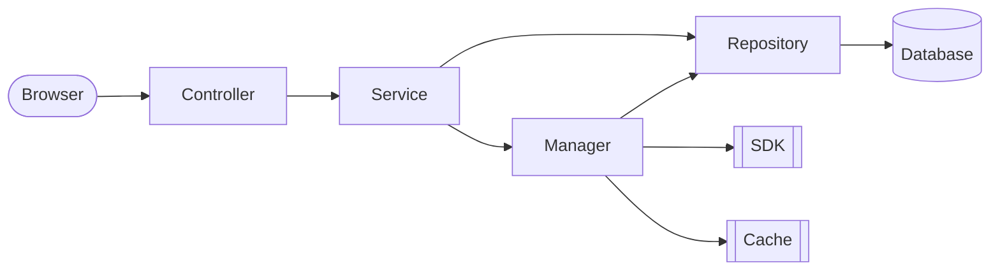

参考文献：
- [Java架构师笔记 - 高并发系统设计40问](https://zq99299.github.io/note-architect/hc/)

# §0 基础概念

高并发系统的目的无外乎三个：高性能、高可用、可扩展。
高并发的优化思路无外乎三种：横向扩展(`Scale-out`)、缓存、异步。

## §0.1 高性能

高性能原则：
1. 必须是问题导向的，拒绝盲目的提前优化。
2. 优先集中精力优化**最大**的瓶颈。
3. 性能优化的效果必须有数据来支撑。
4. 性能优化是一个持续的过程，解决了最大的瓶颈之后，其它瓶颈就又成为了最大的瓶颈。

高性能的性能度量指标一般选择**接口响应时间**，计算它的某分位值。

高性能优化方法：
- 提高并行能力：增加单机CPU核数、增加集群的节点数量。缺点是该方案无法处理只能串行执行的任务，有明显的边界效应；多个线程会更激烈地竞争系统资源，多台机器也会更激烈的竞争分布式锁，导致性能下降。
- 减少CPU密集任务的响应时间：使用Profiler工具（例如`perf`或`eBPF`）来定位到CPU的瓶颈，换用更高效的算法。
- 减少IO密集任务的响应时间：使用可观测性监控工具（例如`OpenTelemetry`）来定位到IO的瓶颈，优化瓶颈所涉及到的组件。

## §0.2 高可用

高可用的性能度量指标一般选择**MTBF**、**MTTR**：
- MTBF（平均故障间隔，Mean Time Between Failure）：系统正常运转平均时间，体现系统的稳定性。
- MTTR（平均恢复时间，Mean Time To Repair）：故障持续的平均时间，体现故障的影响程度。
- Availability（可用性）：$\displaystyle\frac{\mathrm{MTBF}}{\mathrm{MTBF}+\mathrm{MTTR}}$。
- SLI（服务水平指标，Service Level Indicator）：Availability的实际值
- SLO（服务水平目标，Service Level Objective）：Availability的目标值
- SLA（服务等级协议，Service Level Agreement）：如果未达成SLO，需要向用户给出的补偿措施。

高可用的优化方法：
- 开发角度：故障发生之后如何处理
	- 故障转移：如果节点之间地位相等，就请求另一个节点；如果节点之间有主从之分，则执行主从切换。
	- 超时控制：如果下游服务接口超时，那么调用方很容易阻塞在这一步，快速耗尽资源（锁、线程池）。因此需要收集接口响应时间的99%分位值，作为超时时间。
	- 服务降级：为了保证核心服务运行，可以牺牲非核心服务。
	- 服务限流：超出速率的请求直接FailFast。
- 运维角度：如何避免故障
	- 灰度发布：在少量机器上执行变更，观察系统性能指标和错误日志，如果运行正常则全量变更。
	- 故障演练：在系统中随即关闭某些节点，了解故障的影响范围。

## §0.3 扩展性

限制扩展性的因素：缓存、数据库、第三方SDK/API、负载均衡、交换机贷款

扩展性的优化方法：
- 拆分。
	- 数据库层面：横向扩展和纵向扩展。对于关系型数据库而言，最好不要使用跨节点事务。
	- 业务层面：将核心业务/非核心业务打包成业务池，优先把资源分配给核心业务池。

## §0.4 分层

分层：将系统拆分成若干层，每个层都有自己独立的职责。

优点：
- 代码扩展性好。各层可以相互独立地开发，不需要关注其它层的实现细节，避免牵一发而动全身的问题。
- 复用性好。如果发现某个功能具有一定的通用性，则可以单独提取出来作为新的一层，提高开发效率。
- 更容易做横向扩展。如果系统发生了瓶颈，只需定位瓶颈在哪一层，然后针对性地做横向扩展即可。

缺点：
- 增加了代码的复杂度。一个简单的需求有可能会更改所有层的代码，过度的分层会增加开发成本。
- 性能损耗。各层之间都有数据传递，浪费计算资源。

例如：
- MVC：Model、View、Controller。
- OSI七层网络模型；物理层、数据链路层、网络层、传输层、会话层、表示层、应用层。
- Linux文件系统：虚拟文件系统VFS、ext4/btrfs/...具体实现、通用块设备、设备驱动、物理硬盘。

依据[阿里巴巴Java开发手册 v1.4.0](https://developer.aliyun.com/article/69327)，Java Web开发推荐使用以下分层策略：

- Controller层：风控、限流、校验参数格式合法、封装Service层的接口。
- Service层：校验参数业务合法、封装业务逻辑。
- Manager层：处理通用业务，提供原子的业务接口、封装SDK、封装Cache。
- DAO：与数据库JDBC Driver交互。

# §1 数据库

对于MySQL，我们估计在16核CPU+32GB内存的环境中，QPS≈20000，TPS≈2000，并发修改同一行的TPS≈1000。

## §1.1 池化

池化技术：如果一个资源的创建开销很大，则可以预先批量创建，把它们放在一个池子中统一管理。
- 优点：核心思想是空间换时间，减少频繁创建和销毁对象的性能开销，进行统一的管理，提升性能，复用资源。
- 缺点：会占用额外的内存，增加了系统启动时间。

以MySQL连接池为例，创建一个连接，需要TCP三次握手 + TLS四次握手 + MySQL身份验证五次握手，创建开销非常大。

## §1.2 读写分离

主从同步的延迟需要控制在毫秒级别。

设想一种读写分离的延迟情况：生产者写入主数据库，发送消息队列；消费者从消息队列中取出消息，读取从数据库。有可能因为主从延迟而无法读取。该情况的解决方法有：
- 发送消息队列时，携带数据库的内容，避免消费者读取从数据库。导致单条消息长度过大，增加网络IO的时间和带宽开销。
- 写入主数据库时，同时写入缓存，避免消费者读取从数据库。适合`INSERT`，不适合`UPDATE`，否则会导致数据不一致。
- 消费者直接查询主库。

为了向开发者提供透明的读写分离方案，就像访问单个数据库一样，我们需要对传入的SQL做路由。业界提供了以下解决方案：
- 嵌入到Java代码的数据源代理。例如淘宝的TDDL、网易DDB、Sharding-JDBC。缺点是只支持Java，中间件版本与MySQL版本强依赖。
- 单独部署的数据源代理。例如阿里巴巴的Cobar和MyCat、奇虎的Atlas、美团的DBProxy。优点是使用标准的MySQL协议，可以支持多语言，独立部署也方便升级。缺点是SQL会跨两次网络，延迟会变大。

## §1.3 分库分表

垂直拆分：按业务拆。
水平拆分：对于实体表，按字段的Hash值拆；对于日志表，按创建时间的区间拆。

缺点：
- 引入了分区键，为了查询非主键字段，还需要维护一张完整的、从字段到分区键的映射表。
- 无法完成某些数据操作，例如`JOIN`、聚合函数。需要维护一张额外的表，或者使用缓存来暂存数据。
- 要么一开始就单机，要么一开始就分库分表，中途切换到分库分表的开销很大，不如NoSQL的自动Sharding功能。

## §1.4 分布式ID

[[Java八股#解释分布式ID及其相关实现的优缺点（UUID、SnowFlake）]]

## §1.5 NoSQL

使用MongoDB，处理非结构化数据，也具有高扩展性。
使用ElasticSearch，获取极致的倒排索引性能。

## §1.6 缓存高可用方案

- 客户端方案：使用带有虚拟节点的一致性哈希，每次上线或下线一个节点，都会导致很少的缓存发生Miss。
- 中间层方案：使用一个代理缓存层。例如Facebook的Mcrouter，Twitter的Twemproxy，豌豆荚的Codis。
- 服务器方案：主从模式保证子节点FailOver + 哨兵模式保证主节点自动选主

# §2 微服务

## §2.1 监控指标

RED指标体系：请求量（`Request`）、错误（`Error`）、响应时间（`Duration`）。

日志采集工具：Apache Flume、Fluentd、Filebeat
日志处理工具：ElasticSearch + 可视化Kibana、流式处理Spack/Storm + 时序数据库InfluxDB/OpenTSDB/Graphite + Grafana可视化

应用性能监控（APM）平台：Sentry。从客户端到服务器的全链路监控。

## §2.2 压力测试

压力测试原则：
- 使用线上环境、线上数据，防止线上环境和测试环境有差异。
- 使用线上流量，做流量回放，防止过多的命中缓存。
- 使用多机客户端请求，防止单机QPS瓶颈，使用更丰富的CDN环境。

## §2.3 配置中心

Spring Cloud Config。

通过Hash判定是否需要配置更新，通过轮询/长连接推送配置更新，通过本地缓存的FailBack保证高可用。