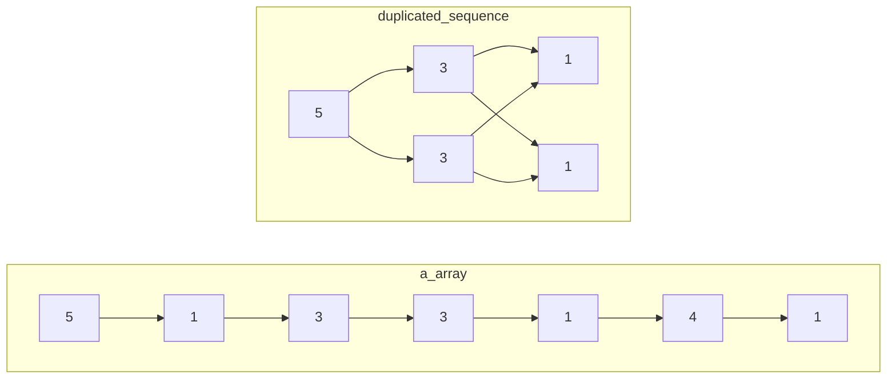

# ACM

# §1 STL

## §1.1 `<iomainip>`

众所周知，在 `algorithm` 库中有一个 `max` 函数，但你不知道的是 `ISO c++11` 中 `max` 可以接受多个参数，前提是要用中括号括起来，如：

```cpp
int a = max({9, 9, 12, 97301, 937});
```

还有，`printf` 支持输出保留小数点位数的数，但是很多人不知道 `cout` 也可以，但是需要包含头文件 `iomanip`，代码：

```cpp
cout << fixed << setprecision(位数) << 值;
```

## §1.2 `<algorithm>`

### §1.2.1 `std::sort()`

`std::sort(Iterator begin, Iterator end)`默认从小到大排序。

### §1.2.2 `std::lower_bound()`/`std::upper_bound()`

> [CppReference](https://zh.cppreference.com/w/cpp/algorithm/lower_bound)：`std::lower_bound(Iterator begin, Iterator end, T value)`返回非严格单调递增容器从`begin`到`end`遍历，找到第一个大于等于`value`的位置，并返回这个位置的迭代器。
>
> [CppReference](https://zh.cppreference.com/w/cpp/algorithm/upper_bound)：`std::upper_bound(Iterator begin, Itertor end, T value)`返回非严格单调递增容器从`begin`到`end`遍历，找到第一个大于`value`的位置，并返回这个位置的迭代器。

这个最简单的定义没有涉及到STL实现这两个二分查找函数的本质。我们给出它们的完整签名：

```c++
template<class ForwardIt, class T, class Compare>
std::lower_bound(
    class ForwardIt first, 
    class ForwardIt last, 
    const T& value, 
    [](const T& iter_value, const T& value)->bool{};
);

template<Class ForwardIt, class T, class Compare>
std::upper_bound(
	class ForwardIt first,
    class ForwardIt last,
    const T& value,
    [](const T& value, const T& iter_value)->bool{};
)
```

`std::lower_bound`的完整作用是：给定一段容器的首尾指针或迭代器`first`、`last`，这段容器靠近头部的元素值`forth_value`使得给函数或Lambda表达式传递的实参列表为`(forth_value, value)`时返回`true`，靠近尾部的元素值`back_value`使得给函数或Lambda表达式传递的形参列表为`(back_value, value)`时返回`false`，则返回从`first`到`last`的第一个使得函数或Lambda表达式返回`false`的指针或迭代器。若函数或Lambda表达式没有指定，则缺省等价地视为`std::less<T>()`。

`std::upper_bound`的完整作用是：给定一段容器的首尾指针或迭代器`first`、`last`，这段容器靠近头部的元素值`forth_value`使得给函数或Lambda表达式传递的实参列表为`(value, forth_value)`时返回`false`，靠近尾部的元素值`back_value`使得给函数或Lambda表达式传递的形参列表为`(value, back_value)`时返回`true`，则返回从`first`到`last`的最第一个使得函数或Lambda表达式返回`true`的指针或迭代器。若函数或Lambda表达式没有指定，则缺省等价地视为`std::less<T>()`。

STL提供了以下预置的比较函数：

- `std::less<T>`：`return a < b`
- `std::greater<T>`：`return a > b`
- `std::less_equal<T>`：`return a <= b`
- `std::greater_equal<T>`：`return a >= b`

根据以上定义，我们来分析以下实例：

- 给定递增容器`int a[5] = {0, 1, 2, 3, 4}`，使用`std::lower_bound(a, a + 5, 2)`的效果。首先函数或Lambda表达式没有指定，因此缺省为`std::less<int>()`。序列的首部元素值能满足`iter_value < 2`，末尾元素值不能满足`iter_value < 2`，因此符合`std::lower_bound()`对容器的元素排序要求。容易发现，第一个能让`iter_value < 2`为`false`的元素就是`a[2]`本身，因此返回`(int*)(a+2)`。
- 给定递减容器`int a[5] = {4, 3, 2, 1, 0}`，使用`std::upper_bound(a, a + 5, 2, std::greater<int>())`的效果。序列的首部元素`iter_value`较大，能使得`2 > iter_value`返回`false`；末尾元素的`2 > iter_value`为`true`，因此符合`std::upper_bound()`对容器的元素排序要求。容易发现，最后一个能让`iter_value > 2`为`true`的元素是`a[3]`，因此返回`(int*)(a+3)`。

# §2 动态规划

## §2.1 背包DP

- 同时用到先后两次的`dp[n][]`和`dp[n-1][]`，且背包容量`j`与体积代价`cost[i]`满足严格偏序关系，才能使用一行滚动数组`dp[j]=...dp[j-cost[i]]`
- 只用到`dp[n][]`单层的递推式，使用一行滚动数组存储完毕后必须再次初始化，防止干扰下一层。
- 不满足严格偏序关系，必须使用两行滚动数组`dp[(n++)&1][j]`，且使用新行之前必须初始化为新值，否则本次在该行未经更新的数值就是两轮之前 的`dp[n-2][j]`

### §2.1.1 0/1背包

> [洛谷P1048](https://www.luogu.com.cn/problem/P1048)：给定容量为`capacity`的背包，`n`个体积和价值分别为`volume[i]`和`value[i]`的物品，使得背包容纳的物品总价值最大化。其中所有物品的体积和价值均大于0。

令`dp[i][j]`表示当背包容量为`j`时，在前`i`种物品中，能取得的最大物品总价值。其中`dp[0][j]`恒为0，表示什么都不选的情况。易得状态方程：
$$
\text{dp}[i][j]=\max\left(
	\text{dp}[i-1][j],
	\text{dp}[i-1][j-\text{volume}[i]]+\text{value}[i]
\right)
$$

```c++
long long int dp[101][1001];
long long int volume[101], value[101];
long long int capacity, n;
int main(){
    std::cin >> capacity >> n;
    for(long long int i = 1 ; i <= n ; ++i){
        std::cin >> volume[i] >> value[i];
    }

    for(long long int i = 1 ; i <= n ; ++i){
        for(long long int j = 0 ; j <= capacity ; ++j){
            dp[i][j] = dp[i - 1][j]; // 不选第i个物品
            if(j >= volume[i]){
                dp[i][j] = std::max(dp[i][j], dp[i - 1][j - volume[i]] + value[i]); // 选第i个物品
            }
        }
    }
    std::cout << dp[n][capacity];
    return 0;
}
```

该算法的空间复杂度显然为$O(\text{capacity}\cdot n)$，每个空间都要进行一次运算，因此时间复杂度也为$O(\text{capacity}\cdot n)$。

接下来考虑滚动数组优化。当我们把`dp`从二维数组变为一维数组时，受影响的地方有两处：

1. `dp[i][j] = dp[i - 1][j]`

   给`dp`直接砍掉一个维度，变成`dp[j] = dp[j]`，是否与原式等价呢？显然等价，因为`dp[j]`在赋值前的值是上一轮循环算出来的，因此就是`dp[i - 1][j]`本身，在赋值后的值是这一轮循环更新的，因此就是`dp[i][j]`本身。

2. `dp[i][j] = std::max(dp[i][j], dp[i - 1][j - volume[i]] + value[i])`

   给`dp`直接砍掉一个维度，变成`dp[j] = std::max(dp[j], dp[j - volume[i]] + value[i])`，是否与原式等价呢？在本次循环中，`dp[j - volume[i]`一定在`dp[j]`之前先被计算了出来，早就在本轮循环中被更新过，因此等价于`dp[i][j - volume[i]`，这与原式中的`dp[i - 1][j - volume[i]]`不等价。

   导致这一切的罪魁祸首是`dp[j - volume[i]`被抢先一步覆盖掉，只要不覆盖即可解决问题。于是我们想到改变第二层循环的循环顺序，将原来的从小到大变成从大到小即可。

```c++
long long int dp[1001]; // long long int dp[101][1001];
long long int volume[101], value[101];
long long int capacity, n;
int main(){
    std::cin >> capacity >> n;
    for(long long int i = 1 ; i <= n ; ++i){
        std::cin >> volume[i] >> value[i];
    }

    for(long long int i = 1 ; i <= n ; ++i){
        for(long long int j = capacity ; j >= 0 ; --j){ // for(long long int j = 0 ; j <= capacity ; ++j){
            ; // dp[i][j] = dp[i - 1][j] 简化为了 dp[j] = dp[j]
            if(j >= volume[i]){
                dp[j] = std::max(dp[j], dp[j - volume[i]] + value[i]); // dp[i][j] = std::max(dp[i][j], dp[i - 1][j - volume[i]] + value[i]);
            }
        }
    }
    std::cout << dp[capacity];
    return 0;
}
```

该算法的空间复杂度显然为$O(\text{capacity})$，每个空间都要进行$n$次运算，因此时间复杂度也为$O(\text{capacity}\cdot n)$。

各OJ通常还考察一处常数优化。在动态规划中，我们把一个问题拆成了几个子问题分别计算。现在有个问题：我们总共计算了这么多的子问题，真的都能用在后续的计算中吗？回想未经滚动数组优化的递推式，我们注意到：

1. 要求解第$N$层的$\text{dp}[N][\text{capacity}]$，我们只需要知道$\text{dp}[N-1][\text{capacity}]$和$\text{dp}[N-1][\text{capacity}-\text{volume}[N]]$这两个值即可，对应的第二维度的区间为$[\text{capacity}-\text{volume}[N],\text{capacity}]$。
2. 要求解第$N-1$层的$\text{dp}[N-1][\text{capacity}-\text{volumn}[N]]$，我们只需要知道$\text{dp}[N-2][\text{capacity}-\text{volume}[N]]$和$\text{dp}[N-1][\text{capacity}-\text{volume}[N]-\text{volume}[N-1]]$这两个值即可，对应的第二维度的区间为$[\text{capacity}-\text{volume}[N]-\text{volume}[N-1],\text{capacity}]$。
3. ......数学归纳法
4. 要求解第$p$层的值，对应的第二维度区间的左端点为$\text{capacity}-\sum_{j=p}^{n}\text{volume}[j]$。

从另一个角度来看，当我们已经确定前$p$组物品的$\text{dp}$情况后，至少要保证后面的其它物品都有可能被选取，甚至全部被选取的情况，才能保证不遗漏任何一种情况。这提示我们可以缩短第二层循环的枚举范围，也就是从原先的$[0,\text{capacity}]$缩短为$\left[\max\Big(\text{capacity}-\sum_{j=p}^{n}\text{volume}[j],\text{volume}[p]\Big),\text{capacity}\right]$。

```c++
long long int dp[1001];
long long int volume[101], value[101];
long long int capacity, n;
long long int volume_sum; // 计算sum(volume[i, n])
int main(){
    std::cin >> capacity >> n;
    for(long long int i = 1 ; i <= n ; ++i){
        std::cin >> volume[i] >> value[i];
        volume_sum += volume[i];
    }
    for(long long int i = 1 ; i <= n ; ++i){
        for(long long int j = capacity ; j >= std::max(capacity - volume_sum, volume[i]) ; --j){ // 收缩枚举范围
            if(j >= volume[i]){
                dp[j] = std::max(dp[j], dp[j - volume[i]] + value[i]);
            }
        }
        volume_sum -= volume[i]; // 维护sum(volumu[i, n])
    }
    std::cout << dp[capacity];
    return 0;
}
```

该优化在$\text{capacity}$特别大时非常有效。

#### §2.1.1.1 时间最优做法

为了进一步优化时间，我们考虑上述常数优化的枚举范围。其左端点极度依赖于$\sum_{j=p}^{n}\text{volume}[j]$，我们希望这个值越大越好，这依赖于`volumn`数组的顺序。于是，当$\text{volume}[i]$非常大时，先处理代价（本题为体积）较大的物品能更缩小枚举范围。只需付出一点很小的排序时间开销，就能抵消大$\text{volume}[i]$造成的劣势。

```c++
long long int dp[100001];
std::vector<std::pair<long long int, long long int>> data(101); // volume, value
long long int capacity, n;
long long int volume_sum;
int main(){
    std::cin >> capacity >> n;
    for(long long int i = 1 ; i <= n ; ++i){
        std::cin >> data[i].first >> data[i].second;
        volume_sum += data[i].first;
    }
    std::sort(data.begin() + 1, data.begin() + 1 + n, [](const auto &lhs, const auto &rhs){
        return lhs.first > rhs.first;
    }); // 排序，让大的volumn物品在前，先被处理
    for(long long int i = 1 ; i <= n ; ++i){
        for(long long int j = capacity ; j >= std::max(capacity - volume_sum, data[i].first) ; --j){
            // 没有必要使用if(j >= data[i].first)，该条件以合并到上一行的边界中
            dp[j] = std::max(dp[j], dp[j - data[i].first] + data[i].second);
        }
        volume_sum -= data[i].first;
    }
    std::cout << dp[capacity];
    return 0;
}
```

#### §2.1.1.2 空间最优做法

注意到在最外层循环中，遍历到第`p`个物品时，只有该物品的代价和价值参与了计算。因此我们可以不用一次性保存所有石子的全部数据，而是按需读入，即用即扔。空间复杂度$O(\text{capacity}\cdot n)$仍未改变，只是缩小了$O(n)$的常数而已。

该做法与常数优化冲突，因为遍历到第`p`个物品时，我们只知道$\sum_{j=1}^{p}\text{volume}[j]$，而常数优化要求的是$\sum_{j=p}^{n}\text{volume}[j]$，我们无法提前“预知”后面物品的`volume`属性。

```c++
long long int dp[1001];
// long long int volume[101], value[101];
long long int capacity, n;
int main(){
    std::cin >> capacity >> n;
    // for(long long int i = 1 ; i <= n ; ++i){
    //     std::cin >> volume[i] >> value[i];
    // }
    for(long long int i = 1 ; i <= n ; ++i){
        long long int volume, value; std::cin >> volume >> value; // 在此处即时O(1)读入
        for(long long int j = capacity ; j >= 0 ; --j){
            if(j >= volume){
                dp[j] = std::max(dp[j], dp[j - volume] + value);
            }
        }
    }
    std::cout << dp[capacity];
    return 0;
}
```

### §2.1.2 完全背包

> 给定容量为`capacity`的背包，`n`种供应量无穷大的，体积和价值分别为`volume[i]`和`value[i]`的物品，使得背包容纳的物品总价值最大化。其中所有物品的体积和价值均大于0。

令`dp[i][j]`表示当背包容量为`j`时，在前`i`种物品中，能取得的最大物品总价值。其中`dp[0][j]`恒为0，表示什么都不选的情况。与0/1背包不同，选中了第`i`个物品后还可以接着再选一次，因此状态转移方程为：
$$
\text{dp}[i][j]=\max\left(
	\text{dp}[i-1][j],
	\text{dp}[\textcolor{red}{i}][j-\text{volume}[i]]+\text{value}[i]
\right)
$$
这里我们直接考虑滚动数组优化。模仿上一节的分析，当砍掉`dp`数组的一个维度后，得到的代码与原式完全等价。

```c++
long long int dp[1001]; // long long int dp[101][1001];
long long int volume[101], value[101];
long long int capacity, n;
int main(){
    std::cin >> capacity >> n;
    for(long long int i = 1 ; i <= n ; ++i){
        std::cin >> volume[i] >> value[i];
    }

    for(long long int i = 1 ; i <= n ; ++i){
        for(long long int j = 0 ; j <= capacity ; ++j){    
            if(j >= volume[i]){
                dp[j] = std::max(dp[j], dp[j - volume[i]] + value[i]);
            }
        }
    }
    std::cout << dp[capacity];
    return 0;
}
```

该算法的空间复杂度显然为$O(\text{capacity})$，每个空间都要进行$n$次运算，因此时间复杂度也为$O(\text{capacity}\cdot n)$。

TODO？？？？？？？？？？？完全背包也有类似的常数优化

```
    for (int i = 0; i < n; ++i) { // 遍历每种物品
        int itemCost = cost[i];
        int itemValue = value[i];

        // 更新当前选择的最小和最大代价范围
        minCost = max(0, min(minCost, minCost + itemCost));
        maxCost = min(maxCapacity, max(maxCost, maxCost + itemCost));

        for (int j = minCost; j <= maxCost; ++j) {
            if (j >= itemCost && dp[j - itemCost] != INF) {
                dp[j] = max(dp[j], dp[j - itemCost] + itemValue);
            }
        }
    }
```


### §2.1.3 分组背包

> [洛谷P1757](https://www.luogu.com.cn/problem/P1757)：给定容量为`capacity`的背包，`n`个供应量无穷大的，体积、价值、类别分别为`volume[i]`、`value[i]`和`type[i]`的物品，每个类别中最多只能挑出一个物品装入背包，使得背包容纳的物品总价值最大化。其中所有物品的体积和价值均大于0。

本题在0/1背包的基础上引入了分组问题，显然`dp[i][j]`中的`i`指的不再是第`i`个物品，而是第`i`种类别。状态转移方程为：
$$
\text{dp}[i][j]=\max\bigg(
	\text{dp}[i-1][j],
	\max\big(
		\text{dp}[i][j-\text{volume}[i][k]]+\text{value}[i][k]
	\big)
\bigg)
$$

```c++
const long long int N_MAX = 1000, TYPE_MAX = 100, CAPACITY_MAX = 1000;
long long int n, capacity;
std::map<long long int, std::vector<std::tuple<long long int, long long int>>> data;
long long int dp[CAPACITY_MAX + 1];
int main(){
    std::cin >> capacity >> n;
    for(long long int i = 0 ; i < n ; ++i){
        long long int volume, value, type; std::cin >> volume >> value >> type;
        data[type].emplace_back(volume, value);
    }
    for(auto &group : data){
        for(long long int j = capacity ; j >= 0 ; --j){
            for(auto &item : group.second){
                if(j >= std::get<0>(item)){
                    dp[j] = std::max(
                        dp[j],
                        dp[j - std::get<0>(item)] + std::get<1>(item)
                    );
                }
            }
        }
    }
    std::cout << dp[capacity];
}
```

该算法的空间复杂度显然为$O(\text{capacity})$，每个空间都要进行$n$次运算，因此时间复杂度也为$O(\text{capacity}\cdot n)$。

### §2.1.4 多重背包

> [洛谷P1776](https://www.luogu.com.cn/problem/P1776)：给定容量为`capacity`的背包，`n`种数量为`count[i]`的，体积和价值分别为`volume[i]`和`value[i]`的物品，使得背包容纳的物品总价值最大化。其中所有物品的体积和价值均大于0。

一种显然的做法是将`count[i]`个相同的物品视作不同的物品，或者将状态转移方程中的$\max(\cdot)$参数列表填充为不选、仅选1个、仅选2个、...、仅选$\text{count}[i]$个，从而转化为01背包问题。但这会导致种类数$n$膨胀为$n\cdot\text{count}[i]$，导致超时。

这里我们引入二进制拆分优化。对于任意正整数`count[i]`，我们都可以将其拆分为二进制形式。因此我们只需要给$\max(\cdot)$的参数列表中填充为仅选$2^0$个、仅选$2^1$个、...、仅选$2^a$个，仅选$\text{count}[i]-\sum_{j=0}^{a}2^j$个。这些数字构成了一个集合，它的所有子集中的元素之和必定覆盖且仅覆盖$[0,\text{count}[i]]$中的每个正整数。例如正整数`25`可以拆分为`(1+2+4+8)+10`。种类数仅膨胀到$n\cdot\log_2(\text{count}[i])$。

```c++
const long long int N_MAX = 1e2, CAPACITY_MAX = 4e4, BINARY_N_MAX = 1e5;
long long int n, capacity, binary_n;
long long int volume[BINARY_N_MAX + 5], value[BINARY_N_MAX + 5];
long long int dp[CAPACITY_MAX + 1];
int main(){
    std::cin >> n >> capacity;
    for(long long int i = 1 ; i <= n ; ++i){
        long long int value_temp, volume_temp, count_temp; std::cin >> value_temp >> volume_temp >> count_temp;
        for(long long int j = 1 ; j <= count_temp ; j <<= 1){
            binary_n++;
            value[binary_n] = value_temp * j;
            volume[binary_n] = volume_temp * j;
            count_temp -= j;
        }
        if(count_temp > 0){
            binary_n++;
            value[binary_n] = value_temp * count_temp;
            volume[binary_n] = volume_temp * count_temp;
        }
    }
    for(long long int i = 1 ; i <= binary_n ; ++i){
        for(long long int j = capacity ; j >= 0 ; --j){
            if(j - volume[i] >= 0){
                dp[j] = std::max(dp[j], dp[j - volume[i]] + value[i]);
            }
        }
    }
    std::cout << dp[capacity];
}
```

该算法的空间复杂度显然为$O(\text{capacity})$，每个空间都要进行$n\cdot\log_2(\text{count}[i])$次运算，因此时间复杂度也为$O(\text{capacity}\cdot n\cdot\log_2(\text{count}[i]))$。

### §2.1.5 费用背包

> [洛谷P1510](https://www.luogu.com.cn/problem/P1510)：给定一个体积为`v`的坑洞，需要用石子填满（允许体积溢出）。石子的体积和代价（附属值）分别为`v[i]`和`c[i]`，求完成该任务的代价最小值。

本题有两种状态定义的方式，为`dp`数组分别填充了不同的初值。

- `dp[i][j]`：用前`i`个石子填满**体积**为`j`的坑洞，所付出的代价最小值。

  考虑滚动数组优化，`dp[j]`的初值（也就是`dp[0][j]`）如何确定？首先`dp[0][0]`肯定是0，此时坑洞已满，无需花费任何代价。而当`j`大于1时，因为此时没有石子可以使用，所以无论花费多少代价都无法满足条件，也就是说初值均为无穷大。

  再考虑转移方程，分两种情况——新的第$i$个石子能恰好补上临门一脚，或者使用这个石子后依然不能填满坑洞：
  $$
  \text{dp}[j]=\begin{cases}
  	\min\left(\text{dp}[j],\text{dp}[j-v[i]] + c[i]\right) &,j\ge v[i],\text{新加的石子还是不能填满} \\
  	\textcolor{red}{\min\left(\text{dp}[j],c[i]\right)} &,j<v[i],\text{仅这一个石子就能填满}
  \end{cases}
  $$

  ```c++
  const long long int N_MAX = 1e4, V_MAX = 1e4;
  long long int v, n, c;
  long long int dp[V_MAX + 1];
  int main(){
      std::cin >> v >> n >> c;
      std::fill(dp + 1, dp + 1 + V_MAX, 1e9);
      for(long long int i = 1 ; i <= n ; ++i){
          long long int volume, effort; std::cin >> volume >> effort;
          for(long long int j = v ; j >= 0 ; --j){
              if(j >= volume){
                  dp[j] = std::min(dp[j], dp[j - volume] + effort);
              }else{
                  dp[j] = std::min(dp[j], effort);
              }
          }
      }
      if(c - dp[v] >= 0){
          std::cout << c - dp[v];
      }else{
          std::cout << "Impossible";
      }
  }
  ```

- `dp[i][j]`：用前`i`个石子，且其代价之和小于等于预算`j`时，能填满的坑洞体积最大值。**该方法的局限性在于题目必须给出预算的最大值，或者预算的最大值大的不那么离谱，否则每次二层循环遍历的状态过多，导致超时。**

  考虑数组滚动优化，`dp[j]`的初值（也就是`dp[0][j]`）如何确定？因为没有石子可以使用，所以即使给再多的代价预算，也无处可花，更别说填满坑洞了，因此能填满的坑洞提及最大值全部为0。

  再考虑转移方程，分两种情况——如果代价此时仍有预算，能使用该石子，那么就取最小值；如果无法支付该石子所需的代价，那么就没有办法使用该石子，直接跳过此情况：
  $$
  \text{dp}[j]=\begin{cases}
  	\max\left(\text{dp}[j],\text{dp}[j-c[i]]+v[i]\right) &,j\ge v[i] \\
  	\text{dp}[j] &,j<v[i]
  \end{cases}
  $$

  ```c++
  const long long int N_MAX = 1e4, V_MAX = 1e4, C_MAX = 1e4;
  long long int v, n, c;
  long long int dp[C_MAX + 1];
  int main(){
      std::cin >> v >> n >> c;
      for(long long int i = 1 ; i <= n ; ++i){
          long long int volume, effort; std::cin >> volume >> effort;
          for(long long int j = c ; j >= 0 ; --j){
              if(j >= effort){
                  dp[j] = std::max(dp[j], dp[j - effort] + volume);
              }
          }
      }
      if(dp[c] >= v){
          long long int min_c = std::lower_bound(dp, dp + c + 1, v) - dp; // 因为dp非严格递增，所以能用二分优化
          std::cout << c - min_c;
      }else{
          std::cout << "Impossible";
      }
  }
  ```

> [洛谷P2340](https://www.luogu.com.cn/problem/P2340)：给定`n`个物品，每种物品都有两种代价`cost_1[i]`、`cost_2[i]`，代价可正可负。在物品的两种总代价均大于等于0的情况下，求这两种总代价之和的最大值。

令`dp[i][j]`表示前`i`个物品的第一种代价之和恰好为`j`时，第二种代价之和的最大值。于是有状态转移方程：
$$
\text{dp}[i][j] = \max(
	\text{dp}[i-1][j],
	\text{dp}[i-1][j-\text{cost\_1}[i]] + \text{cost\_2}[i]
)
$$
由于`cost_1[i]`可正可负，所以第二层遍历的顺序要随着其正负号而变化。

```c++
const long long int N_MAX = 400, COST_MAX = 1000, OFFSET = N_MAX * COST_MAX;
long long int n, dp[2 * OFFSET + 1];
int main(){
    std::cin >> n;
    std::fill(dp, dp + 2 * OFFSET + 1, INT32_MIN); dp[OFFSET] = 0;
    long long int left_bound = 0, right_bound = 0;
    for(int i = 1 ; i <= n ; ++i){
        long long int cost_1, cost_2; std::cin >> cost_1 >> cost_2;
        if(cost_1 < 0){
            left_bound += cost_1;
        }
        if(cost_1 > 0){
            right_bound += cost_1;
        }
        if(cost_1 >= 0){
            for(long long int j = right_bound ; j >= left_bound ; --j){
                dp[j + OFFSET] = std::max(dp[j + OFFSET], dp[j - cost_1 + OFFSET] + cost_2);
            }
        }else{
            for(long long int j = left_bound ; j <= right_bound ; ++j){
                dp[j + OFFSET] = std::max(dp[j + OFFSET], dp[j - cost_1 + OFFSET] + cost_2);
            }
        }
    }
    long long int result = INT32_MIN;
    for(long long int i = 0 ; i <= right_bound ; ++i){
        if(dp[i + OFFSET] < 0){
            continue;
        }
        result = std::max(result, dp[i + OFFSET] + i);
    }
    std::cout << result;
}
```

### §2.1.6 恰满背包

之前我们接触的背包题型往往带有$\sum\text{volume}_i\le \text{capacity}$的约束条件。本节讨论的是$\sum\text{volume}_i= \text{capacity}$。

- 以价值最大化问题为例，我们希望不合法的状态全为负无穷大，这样在$\max(\cdot)$的各参数大小竞争中，非法状态就会不起作用，等价于不存在。于是`dp[0][0]`为0，而`dp[0][1->n]`均为负无穷大。
- 以统计方案数问题为例，我们希望不合法的状态不对应任何方案，也就是0。于是`dp[0][0]`反而是一种合法的方案，因为什么都不选也能填满容量为0的背包，而`dp[0][1->n]`均为0。

### §2.1.7 依赖背包

> [洛谷P1064](https://www.luogu.com.cn/problem/P1064)：给定`m`个物品的价值`value[i]`和代价`cost[i]`。现将其分成若干组，每组物品均包含1个主物品和0~2个次物品。如果选择了某个子物品，则必须同时选择其组内的主物品。在各物品代价之和小于等于$n$的约束条件下，求物品价值之和的最大值。

？？？？？？？？？？？？？？？？？？？TODO

### §2.1.8 混合背包

混合背包指的是上述背包问题中提到的物品特性混合起来。针对此类问题，我们只需对不同问题的物品分别套用不同的转移方程即可。

```
for i=1..N
    if 第i件物品属于01背包
        // ...
    else if 第i件物品属于完全背包
        // ...
    else if 第i件物品属于多重背包
        // ...
```

### §2.1.9 多维代价背包

> [洛谷P1855](https://www.luogu.com.cn/problem/P1855)：在0/1背包的基础上，总共引入了两个约束条件。

额外给`dp`引入一个新维度即可。状态转移方程为：
$$
\text{dp}[i][v][u]=\max\left(
	f[i-1][v][u],f[i-1][v-a[i]][u-b[i]]+w[i]
\right)
$$
滚动数组优化规则与前文相似，都要注意循环内的枚举顺序。

```c++
const long long int N_MAX = 1e2, MONEY_MAX = 2e2, TIME_MAX = 2e2;
long long int n, money_capacity, time_capacity;
long long int times[N_MAX + 1], moneys[N_MAX + 1], values[N_MAX + 1];
long long int dp[MONEY_MAX + 1][TIME_MAX + 1];
int main(){
    std::cin >> n >> money_capacity >> time_capacity;
    for(long long int i = 1 ; i <= n ; ++i){
        std::cin >> moneys[i] >> times[i];
        values[i] = 1;
    }
    for(long long int i = 1 ; i <= n ; ++i){
        for(long long int j = money_capacity ; j >= 0 ; --j){
            for(long long int k = time_capacity ; k >= 0 ; --k){
                if(j >= moneys[i] && k >= times[i]){
                    dp[j][k] = std::max(
                        dp[j][k],
                        dp[j - moneys[i]][k - times[i]] + values[i]
                    );
                }
            }
        }
    }
    std::cout << dp[money_capacity][time_capacity];
}
```

> [洛谷P1541](https://www.luogu.com.cn/problem/P1541)：给定一个`1×n`的棋盘，起点和终点在棋盘两侧。每个格子都有分数，每回合选择一个前进1步、2步、3步、4步的机会，这四种机会的上线分别为`card[1]`、`card[2]`、`card[3]`、`card[4]`。求分数最大值。

令`dp[a][b][c][d]`表示这四种机会分别使用了`a`、`b`、`c`、`d`次，达到第`1+1×a+2×b+3×c+4×d`个格子时，能达到的最大值。

```c++
const long long int N_MAX = 350, M_MAX = 120, CARD_MAX = 40;
long long int n, m, card[5], score[N_MAX + 1], dp[CARD_MAX + 1][CARD_MAX + 1][CARD_MAX + 1][CARD_MAX + 1];
int main(){
    std::cin >> n >> m;
    for(long long int i = 1 ; i <= n ; ++i){
        std::cin >> score[i];
    }
    for(long long int i = 1 ; i <= m ; ++i){
        long long int temp; std::cin >> temp;
        card[temp]++;
    }
    dp[0][0][0][0] = score[1];
    for(long long int a = 0 ; a <= card[1] ; ++a){
        for(long long int b = 0 ; b <= card[2] ; ++b){
            for(long long int c = 0 ; c <= card[3] ; ++c){
                for(long long int d = 0 ; d <= card[4] ; ++d){
                    long long int distance = a + 2 * b + 3 * c + 4 * d;
                    if(a >= 1){
                        dp[a][b][c][d] = std::max(dp[a][b][c][d], dp[a - 1][b][c][d] + score[1 + distance]);
                    }
                    if(b >= 1){
                        dp[a][b][c][d] = std::max(dp[a][b][c][d], dp[a][b - 1][c][d] + score[1 + distance]);
                    }
                    if(c >= 1){
                        dp[a][b][c][d] = std::max(dp[a][b][c][d], dp[a][b][c - 1][d] + score[1 + distance]);
                    }
                    if(d >= 1){
                        dp[a][b][c][d] = std::max(dp[a][b][c][d], dp[a][b][c][d - 1] + score[1 + distance]);
                    }
                    ;
                }
            }
        }
    }
    std::cout << dp[card[1]][card[2]][card[3]][card[4]];
}
```

> [洛谷P2732](https://www.luogu.com.cn/problem/P2732)：商店中售卖`n`种物品（$n\le 5$），原本单价为`price[i]`。现在商店提供`s`种无限使用的捆绑销售优惠策略，第`i`种策略将这`n`种物品分别取`s_product[i][j]`个打包，总计的优惠价格为`s_price[i]`。现在要求每种物品`i`分别恰好买`buy[i]`（$\text{buy}[i]\le 5$）个，求费用最小值。

令`dp[a][b][c][d][e]`表示5种商品恰好购买`a`、`b`、`c`、`d`、`e`个的费用最小值，既可以使用优惠策略，也可以单价购买。

```c++
const long long int S_MAX = 99, N_MAX = 5;
long long int product_count;
long long int s_product[S_MAX + 1][N_MAX + 1], s_price[S_MAX + 1], buy[N_MAX + 1], price[N_MAX + 1];
long long int dp[N_MAX + 1][N_MAX + 1][N_MAX + 1][N_MAX + 1][N_MAX + 1];
std::map<long long int , long long int> product_id_map;
int main(){
    long long int s; std::cin >> s;
    for(long long int i = 1 ; i <= s ; ++i){
        long long int s_product_type_count; std::cin >> s_product_type_count;
        for(long long int j = 1 ; j <= s_product_type_count ; ++j){
            long long int product_id, sale_product_count; std::cin >> product_id >> sale_product_count;
            if(product_id_map.count(product_id) == 0){
                product_id_map[product_id] = ++product_count;
            }
            product_id = product_id_map[product_id];
            s_product[i][product_id] = sale_product_count;
        }
        std::cin >> s_price[i];
    }
    long long int buy_count; std::cin >> buy_count;
    for(long long int i = 1 ; i <= buy_count ; ++i){
        long long int buy_product_id, buy_product_count, buy_price; std::cin >> buy_product_id >> buy_product_count >> buy_price;
        if(product_id_map.count(buy_product_id) == 0){
            product_id_map[buy_product_id] = ++product_count;
        }
        buy_product_id = product_id_map[buy_product_id];
        buy[buy_product_id] = buy_product_count;
        price[buy_product_id] = buy_price;
    }
    std::fill_n(dp[0][0][0][0], (N_MAX + 1) * (N_MAX + 1) * (N_MAX + 1) * (N_MAX + 1) * (N_MAX + 1), INT32_MAX);
    dp[0][0][0][0][0] = 0;
    for(long long int a = 0 ; a <= buy[1] ; ++a){
        for(long long int b = 0 ; b <= buy[2] ; ++b){
            for(long long int c = 0 ; c <= buy[3] ; ++c){
                for(long long int d = 0 ; d <= buy[4] ; ++d){
                    for(long long int e = 0 ; e <= buy[5] ; ++e){
                        if(a >= 1){dp[a][b][c][d][e] = std::min(dp[a][b][c][d][e], dp[a - 1][b][c][d][e] + price[1]);}
                        if(b >= 1){dp[a][b][c][d][e] = std::min(dp[a][b][c][d][e], dp[a][b - 1][c][d][e] + price[2]);}
                        if(c >= 1){dp[a][b][c][d][e] = std::min(dp[a][b][c][d][e], dp[a][b][c - 1][d][e] + price[3]);}
                        if(d >= 1){dp[a][b][c][d][e] = std::min(dp[a][b][c][d][e], dp[a][b][c][d - 1][e] + price[4]);}
                        if(e >= 1){dp[a][b][c][d][e] = std::min(dp[a][b][c][d][e], dp[a][b][c][d][e - 1] + price[5]);}
                        for(long long int i = 1 ; i <= s; ++i){
                            if(a >= s_product[i][1] && b >= s_product[i][2] && c >= s_product[i][3] && d >= s_product[i][4] && e >= s_product[i][5]){
                                dp[a][b][c][d][e] = std::min(
                                    dp[a][b][c][d][e],
                                    dp[a - s_product[i][1]][b - s_product[i][2]][c - s_product[i][3]][d - s_product[i][4]][e - s_product[i][5]] + s_price[i]
                                );
                            }
                        }
                    }
                }
            }
        }
    }
    std::cout << dp[buy[1]][buy[2]][buy[3]][buy[4]][buy[5]];
}
```

### §2.1.10 二维费用背包

> [洛谷P1509](https://www.luogu.com.cn/problem/P1509)：给定`n`个物品，第`i`个物品含有金钱代价`money[i]`、幸运代价`luck[i]`、时间代价`time[i]`和价值`value[i]`（本题恒为1）。现在金钱预算只有`money_budget`，幸运运算只有`luck_budget`。请求出一种方案，使得物品总价值最大化。如果有多种方式均能使得物品总价值到达最大值，则选取时间总代价最小的方案，并输出该方案所需的时间总代价。

本题涉及到的最优化变量有两个，因此要设置两个`dp`数组——`dp_value`表示前`i`个物品在预算约束内能达到的价值最大值；`dp_time`表示第`i`个物品在预算约束内达到价值最大值时，能达到的时间总代价最小值。

```c++
const long long int N_MAX = 100, MONEY_MAX = 1e2, LUCK_MAX = 1e2, TIME_MAX = 1e3;
long long int dp_value[MONEY_MAX + 1][LUCK_MAX + 1], dp_time[MONEY_MAX + 1][LUCK_MAX + 1];
long long int n, money_budget, luck_budget, money[N_MAX + 1], luck[N_MAX + 1], period[N_MAX + 1];
int main(){
    std::cin >> n;
    for(long long int i = 1 ; i <= n ; ++i){
        std::cin >> money[i] >> luck[i] >> period[i];
    }
    std::cin >> money_budget >> luck_budget;
    for(long long int i = 1 ; i <= n ; ++i){
        for(long long int j = money_budget ; j >= 0 ; --j){
            for(long long int k = luck_budget ; k >= 0 ; --k){
                if(j < money[i] || k < luck[i]){
                    continue; // 预算不足，无法选择
                }
                if(dp_value[j][k] < dp_value[j - money[i]][k - luck[i]] + 1){
                    // 总value可以增加，强制更新时间总代价（即使会升高）
                    dp_value[j][k] = dp_value[j - money[i]][k - luck[i]] + 1;
                    dp_time[j][k] = dp_time[j - money[i]][k - luck[i]] + period[i];
                }else if(dp_value[j][k] == dp_value[j - money[i]][k - luck[i]] + 1){
                    // 总value持平，时间总代价尝试降低
                    dp_time[j][k] = std::min(dp_time[j][k], dp_time[j - money[i]][k - luck[i]] + period[i]);
                }
            }
        }
    }
    std::cout << dp_time[money_budget][luck_budget];
}
```

### §2.1.11 泛化物品背包

在泛化物品背包问题中，物品的价值不再是一个定值，而是关于物品代价的函数。

> [洛谷P1336](https://www.luogu.com.cn/problem/P1336)：给定`n`种不限量供应的物品，某种物品选择`i`个时，这`i`个同类物品加起来的价值是`a[i]×i^b[i]`。在恰好选择`m`个物品的情况下，求总价值的最小值。

令`dp[i][j]`表示给定前`i`种物品，要求恰好选`j`个物品时的价值最小值，于是有状态转移方程：
$$
\text{dp}[i][j] = \min\begin{cases}
	\text{dp}[i-1][j] \\
	\text{dp}[i-1][j-1] + a[i]\times 1^{b[i]} \\
	\cdots \\
	\text{dp}[i-1][j-j] + a[i]\times j^{b[i]} \\
\end{cases}
$$
本题的陷阱在于：在第二层循环中，遍历顺序是从小到大还是从大到小。乍看本题，我们可能会认为每种物品无限供应，所以是完全背包，遍历顺序从小到大。但是观察上面的状态转移方程，我们发现得使用从大到小的顺序。

```c++
const long long int N_MAX = 20, PAPER_BUDGET_MAX = 200;
long long int n, paper_budget, a[N_MAX + 1], b[N_MAX + 1];
long long int dp[PAPER_BUDGET_MAX + 1]; // dp[i][j] 前i种物品分配j个指标
int main(){
    std::cin >> paper_budget >> n;
    std::fill(dp + 1, dp + 1 + paper_budget, 1e9);
    for(long long int i = 1 ; i <= n ; ++i){
        std::cin >> a[i] >> b[i];
    }
    for(long long int i = 1 ; i <= n ; ++i){
        for(long long int j = paper_budget ; j >= 0 ; --j){
            for(long long int k = 0 ; k <= j ; ++k){
                dp[j] = std::min(dp[j], dp[j - k] + a[i] * fast_power(k, b[i]));
            }
        }
    }
    std::cout << dp[paper_budget];
}
```

> [洛谷P1417](https://www.luogu.com.cn/problem/P1417)：给定`n`个物品，每个物品需要时间代价`c[i]`才能装入背包。当该物品装入背包时，记背包中的物品时间代价之和记为`t`（即已经过去了`t`个时间单位），则这个物品的价值为`a[i]-t×b[i]`。已知背包的时间预算为`t_budget`，求背包价值最大值。

在传统的背包问题中，物品的顺序不会影响最终答案。然而在本题中不是这样。考虑最简单的情况——只有两种物品，则两者的先后选择顺序对应的背包总价值分别为：
$$
\text{value}_{1,2} = (a[1] - c[1] \times b[1]) + (a[2] - (c[1] + c[2]) \times b[2]) \\
\text{value}_{2,1} = (a[2] - c[2] \times b[2]) + (a[1] - (c[1] + c[2]) \times b[1]) \\
$$
我们不禁思考——到底哪种排列方式才是最优的呢？解不等式$\text{value}_{1,2}>\text{value}_{2,1}$可知$c[1]b[2]<c[2]b[1]$，即$\frac{c[1]}{b[1]}<\frac{c[2]}{b[2]}$。更进一步，给定含有`n`个物品的序列，对于其中任意的两个物品，将$\frac{c[i]}{b[i]}$更小的放在前面，总是能获得更大的价值。这提示我们尽可能将$\frac{c[i]}{b[i]}$更小的物品放在前面进行挑选，使用一轮排序即可。

```c++
const long long int N_MAX = 50, T_MAX = 1e5;
long long int t, n, dp[T_MAX + 1];
struct Object{
    long long int a, b, c;
};
Object object[N_MAX + 1];

int main(){
    std::cin >> t >> n;
    for(long long int i = 1 ; i <= n ; ++i){
        std::cin >> object[i].a;
    }
    for(long long int i = 1 ; i <= n ; ++i){
        std::cin >> object[i].b;
    }
    for(long long int i = 1 ; i <= n ; ++i){
        std::cin >> object[i].c;
    }
    std::sort(object + 1, object + n + 1, [](const auto &lhs, const auto &rhs){
        return lhs.c * rhs.b  < rhs.c * lhs.b;
    });
    for(long long int i = 1; i <= n ; ++i){
        for(long long int j = t ; j >= object[i].c ; --j){
            dp[j] = std::max(dp[j], dp[j - object[i].c] + object[i].a - object[i].b * j);
        }
    }
    std::cout << *(std::max_element(dp + 1, dp + t + 1));
}
```

### §2.1.12 剔除物品背包

剔除物品背包在普通背包已经求解完毕的前提下，在可选择的物品列表中剔除某些物品，随后提问最优值。

> [洛谷P4141](https://www.luogu.com.cn/problem/P4141)：给定`n`个代价分别为`cost[i]`的物品和一个代价容量为`budget`的背包。要求现在从中抽离出第$i\in[1,n]$个物品，在剩下的`n-1`个物体中，能恰好填满容量为$j\in[1,\text{budget}]$背包的方案数`answer[i][j]`矩阵。（模`10`输出）

令`dp[i][j]`表示使用前`i`个物品能得到的代价之和恰好为`j`的方案数，`dp_unique[i][j]`表示在`n`个物品中抽离第`i`个物品后，代价之和恰好为`j`的方案数。那么显然`dp[n][j]`由两部分组成：

1. 不包含第`i`个物品的方案数。由定义可知等于`dp_unique[i][j]`。
2. 包含第`i`个物品的方案数。由假设可知，这些方案肯定都包含第`i`个物品。因此对于每种方案，我们将第`i`个物品剔除，对应背包容量缩小至`j-cost[i]`，都能对应到一种符合新条件的方案，这个新条件就是"在`n`个物品中剔除第`i`个物品，背包容量恰好为`j-cost[i]`"，由定义可知这部分方案数等于`dp_unique[i][j-cost[i]]`。当然，如果`j<cost[i]`，那么当前背包容量`j`不可能放下第`i`个物品，这部分方案数退化为0。

基于此，我们可以写出状态转移方程：
$$
\text{dp\_unique}[i][j] = \begin{cases}
	\text{dp}[n][j] - \text{dp\_unique}[i][j-\text{cost}[i]] & ,j\ge\text{cost}[i] \\
	\text{dp}[n][j] & ,j<\text{cost}[i] \\
\end{cases}
$$
然后考虑滚动数组优化。在推导`dp_unique`数组时，用到的都是`dp[n][j]`一行，因此可以直接退化为`dp[j]`。对于`dp_unique[i][j]`，我们只用到了`dp_unique[i][]`当前层的数值，与上一层无关，因此可以直接退化成`dp[]`。因为`j-cost[i]<=j`，用到了`dp_unique`已经在本层计算出的值，所以第二层循环的顺序为从左到右。**尤其要警惕第二层循环的左边界必须为`1`，不能为`cost[i]`，否则`dp_unique[j]`可能不是`dp[n][j]`这个预期的常数，而是上一层计算的值`dp[n][j]-dp_unique[i-1][cost[i-1]]`。**

```c++
const long long int N_MAX = 2000, BUDGET_MAX = 2000, MOD = 10;
long long int n, budget, dp[BUDGET_MAX + 1], dp_unique[BUDGET_MAX + 1], cost[N_MAX + 1];
int main(){
    std::cin >> n >> budget;
    for(long long int i = 1 ; i <= n ; ++i){
        std::cin >> cost[i];
    }
    dp[0] = 1 % MOD;
    for(long long int i = 1 ; i <= n ; ++i){
        for(long long int j = budget ; j >= cost[i] ; --j){
            dp[j] = (dp[j] + dp[j - cost[i]]) % MOD;
        }
    }
    dp_unique[0] = 1;
    for(long long int i = 1 ; i <= n ; ++i){
        for(long long int j = 1 ; j <= budget ; ++j){
            if(j >= cost[i]){
                dp_unique[j] = (dp[j] - dp_unique[j - cost[i]] + MOD) % MOD;
            }else{
                dp_unique[j] = dp[j];
            }
            std::cout << dp_unique[j];
        }
        std::cout << '\n';
    }
}
```

另一种思路是从撤销角度理解。背包的一个重要特点是物品顺序不影响最终结果，而这就是本题的关键。先讨论`n`个物品全部参与运算的情况：既然顺序不影响，我们可以认为`n-1`个物品先参与运算，而抽离的第`i`个物品最后参与运算。只要能根据`dp[n][]`将最后物品的第`n`次计算撤销掉，那么`dp[n-1][]`对应的第`n-1`次计算就是我们所求的值。

令`dp[i][j]`表示使用前`i`个物品能得到的代价之和恰好为`j`的方案数，`dp_unique[i][j]`表示将第`k`个物品放在最后，其余`n-1`个物品放在前面排序后，前`i`个物品代价之和恰好为`j`的方案数。那么根据上一段的结论可以得到这`dp[n][*]==dp_unique[n][*]`，我们要求的是`k`个`dp_unique[n-1][*]`。

`dp_unique[n][j]`（即`dp[n][j]`）由两部分组成：

1. 不包含第`i`个物品的方案数。因为不包含第`i`个物品，所以物品选择范围从`1->n`退化到`1->n-1`不会对这部分方案数造成影响。由定义可知这部分方案数等于`dp_unique[n-1][j]`。
2. 包含第`i`个物品的方案数。由假设可知，这些方案肯定都包含第`i`个物品。因此对于每种方案，我们将第`i`个物品剔除，对应背包容量缩小至`j-cost[i]`，都能对应到一种符合新条件的方案，这个新条件就是"在`n`个物品中剔除第`i`个物品，背包容量恰好为`j-cost[i]`"，由定义可知这部分方案数等于`dp_unique[n-1][j-cost[i]]`。当然，如果`j<cost[i]`，那么当前背包容量`j`不可能放下第`i`个物品，这部分方案数退化为0。

$$
\text{dp\_unique}[n-1][j] = \text{dp}[n][j] - \text{dp\_unique}[n-1][j-\text{cost}[k]]
$$

剩余步骤完全相同。

### §2.1.13 次优解/第`k`优解

> [洛谷P1858](https://www.luogu.com.cn/problem/P1858)：求0/1背包的前`k`个最优解之和。不同的解法之间的选择的物品组合禁止相同。

原先`dp[i][j]`表示背包容量为`j`时，给定前`i`种物品时的代价最大值。本题的思路是扩充`dp[i][j]`的含义，使其指向一个长度为`k`的数组，分别存储最优解、次优解、...、第k优解。显然`dp[i][j]`是递减的。为了得到`dp[i][j]`，我们将`dp[i-1][j]`和`dp[i-1][j-cost]+value`这两个长度均为`k`的数组合并起来，并维持递减的排序。

编程要注意细节：由于使用滚动数组优化，所以`dp[i][j]`和`dp[i-1][j]`共同使用了同一块空间，因此必须借助外部数组`merge_temp`暂时储存合并结果，然后复制到`dp[i][j]`的空间中。否则`dp[i-1][j]`一边读取同一块内存空间，`dp[i][j]`一边写入同一块内存空间，会覆盖掉`dp[i-1][j]`的内容，导致输出错误。

```c++
const long long int K_MAX = 50, V_MAX = 5000, N_MAX = 200;
long long int dp[V_MAX + 1][K_MAX + 1], merge_temp[K_MAX + 1];
long long int k, v, n;
int main(){
    std::cin >> k >> v >> n;
    for(long long int i = 0 ; i <= v ; ++i){
        for(long long int j = 0 ; j <= k ; ++j){
            dp[i][j] = INT32_MIN;
        }
    }
    dp[0][1] = 0;
    for(long long int i = 1 ; i <= n ; ++i){
        long long int cost, value; std::cin >> cost >> value;
        for(long long int j = v ; j >= cost ; --j){
            // 给定两个队列dp[j][*]和dp[j - cost][*], 从前向后遍历并合并
            long long int queue_head_index_1 = 1, queue_head_index_2 = 1;
            for(long long int a = 1 ; a <= k ; ++a){
                if(dp[j][queue_head_index_1] <= dp[j - cost][queue_head_index_2] + value){
                    merge_temp[a] = dp[j - cost][queue_head_index_2] + value;
                    queue_head_index_2++;
                }else{
                    merge_temp[a] = dp[j][queue_head_index_1];
                    queue_head_index_1++;
                }
            }
            std::copy(merge_temp + 1, merge_temp + k + 1, dp[j] + 1);
        }
    }
    std::cout << std::accumulate(dp[v] + 1, dp[v] + k + 1, 0ll);
}
```

### §2.1.14 面值背包

> [洛谷P2725](https://www.luogu.com.cn/problem/solution/P2725)：给定`n`种无限供应的、面值`value[i]`不同的硬币。从中最多选择`k`枚硬币，要求输出不能组合出的正整数面值的最小值。

令`dp[i][j]`表示给定前`i`种硬币，能组合出面值恰好为`j`所需的最少硬币数。

```c++
const long long int N_MAX = 50, BUDGET_MAX = 200, VALUE_MAX = 1e4;
long long int n, budget, value, value_sum;
int dp[2000000]; // 本题空间成谜，出的不好
int main(){
    std::cin >> budget >> n;
    std::fill(dp, dp + 2000000, BUDGET_MAX + 1);
    dp[0] = 0;
    for(long long int i = 1 ; i <= n ; ++i){
        std::cin >> value; value_sum += value; 
        long long int right_bound = value_sum * budget;
        for(long long int j = value ; j <= 2000000 ; ++j){
             dp[j] = std::min(dp[j], (dp[j - value] + 1));
        }
    }
    for(long long int i = 1 ; i <= BUDGET_MAX * VALUE_MAX; ++i){
        if(dp[i] > budget){
            std::cout << i - 1;
            return 0;
        }
    }
}
```

> [洛谷P2851](https://www.luogu.com.cn/problem/P2851)：现在有`n`种面额分别为`value[i]`的硬币，给定要购买的商品价格`t`。买方对于每种硬币只有`buyer_count[i]`枚，而卖方有无穷多硬币。定义找零金额`k`等于支付金额`k+t`减商品价格`t`。令`dp_buyer[i]`和`dp_sellor[i]`分别表示买方和卖方恰好凑出`i`元所需硬币的最少数量，求$\forall k\in[0,+\infin)$，`dp_buyer[k+t]+dp_seller[k]`的最小值。如果无解则输出-1。

本题的买方`dp_buyer`数组是二进制优化的多重背包，卖方`dp_sellor`数组是完全背包。分别求出即可。

本题的难点在于$\forall k\in[0,+\infin)$，我们肯定无法真正的求出$k\rightarrow+\infin$的情况，这样的话数组空间和计算耗时都撑不住，所以我们要给`k`的遍历指定一个上界。问题是：上界怎么求？

在求解之前，我们先介绍以下引理：

1. 如果支付方案和找零方案都包含某个面值相同的硬币，那么这个支付方案和找零方案一定都不是最优方案。因为此时这两个方案都可以移除这枚重复的硬币，从而减少硬币数。

2. 在最优的找零方案中，所有面值非最大面值的硬币总数一定小于等于最大面值`value_max`。

   使用反证法：假设大于`value_max`，那么此时找零金额大于$\text{value\_max}^2$。将这些面值严格小于`value_max`的、总数量大于`value_max`的硬币随意排成一行，第`i`枚硬币的面值记为`v'[i]`，我们可以为其生成一个长度大于`value_max`的面值前缀和`value_prefixsum[*]`数组。我们知道，一组整数对`value_max`取模至多会产生`value_max`个不同的结果，然而前缀和数组的长度大于`value_max`，因此根据抽屉原理，必定存在两个前缀和`value_prefixsum[i]`和`value_prefixsum[j]`对`value_max`同余。这两个数相减，可以得到$\sum_{k=i+1}^{j}v'[i]=k\cdot\text{value\_max}$，其中$k\ge 1$。将这$j-i$枚面值小于`value_max`的硬币换成`k`枚面值为`value_max`的硬币，可以进一步减少硬币数量。于是原找零方案不是最优的策略，与假设矛盾，证毕。

3. 在找零方案中，$\text{dp\_seller}[\text{value\_max}^2+k]$一定严格大于$\text{dp\_seller}[\text{value\_max}^2]$。首先，显然$\text{dp\_seller}[\text{value\_max}^2]=\text{value\_max}$本身，即所有硬币都是面值最大的硬币。使用反证法，假设两者之间是小于等于的关系，那么数量较少或持平的硬币显然无法凑出比$\text{value\_max}^2$还大`k`元的总金额，证毕。

接下来我们介绍几种上界及其证明方法：

- `k`的上界为$2\cdot\displaystyle\max_{1\le i\le n}(\text{value}[i])^2$（无法取等）

  这里我们对面值最大的硬币进行分类讨论。
  
  如果最优找零方案中含有面值最大的硬币，那么根据引理1，最优支付方案中不能含有面值最大的硬币。此时最优支付方案的硬币数量一定小于等于$\text{value\_max}$，这是因为如果最优支付方案的硬币数大于`value_max`，那么参照引理2的证明，这堆硬币中一定存在一小组硬币，它们的值相加等于$k\cdot\text{value\_max}$（$k\ge 1$），从而能抵消最优找零方案中的面值最大的硬币，因此这种情况不存在。因此硬币数量小于等于`value_max`，能取等；硬币最大面值小于`value_max`，不能取等，于是最优支付金额等于两者相乘，必定小于$\text{value\_max}^2$。设想找零方案中的面值最大硬币无限增加，这会导致支付价格增加，导致支付方案中的面值较小的硬币数量增加。而我们直到支付方案中的硬币数量是有上界的，这个上界就是我们之前推算得到的`value_max`。设找零方案中的面值最大的硬币数为$x$，则根据支付金额大于找零金额的不等式，我们有$\text{value\_max}^2>最优支付金额> 最优找零金额\ge x\cdot\text{value\_max}$，其中最右边的等号当且仅当最优找零金额只有最大面值硬币的参与，没有较小面值硬币参与时取得等号。解该不等式，我们得到$x<\text{value\_max}$。
  
  如果最优找零方案中没有面值最大的硬币，那么最优找零金额全部由面值较小的硬币贡献，而面值较小的硬币数量最大为`value_max`，每枚硬币的面值小于`value_max`，于是最优找零金额小于$\text{value\_max}^2$。
  
  综上所述，考虑最优找零方案：由引理2可知面值非最大的硬币数量小于等于`value_max`，面值非最大的硬币面值小于`value_max`，面值最大的硬币数量小于`value_max`，面值最大的硬币面额等于`value_max`，于是面额一定小于$2\cdot\text{value\_max}^2$，证毕。
  
- `k`的上界为$\displaystyle\max_{1\le i\le n}(\text{value}[i])^2$（可以取等）

  当找零金额小于$\text{value\_max}^2$时，结论成立。

  当找零金额等于$\text{value\_max}^2$时，显然最优找零方案的硬币数量恰好等于`value_max`，即只用最大面额的硬币。结论成立。

  当找零金额大于$\text{value\_max}^2$时，根据引理3，显然最优找零方案的硬币数量$x$一定大于`value_max`。那么最优支付金额只会更多，再根据引理3：最优支付方案所需的硬币也会大于`value_max`。于是根据抽屉原理，最优追回方案和最优支付方案都会存在一段连续的硬币，使得它们的面值之和为`value_max`的倍数，可以直接抵消掉，因此这不是最优方案，产生矛盾，这种情况不存在。

  综上所述，证毕。

本题的另一个陷阱在于：满足什么条件才能判定无解？

1. 买方的总金额买不起商品。
2. 可用的硬币面值十分刁钻，以至于不可能恰好凑出所需的面额。例如只有面值为2的硬币，商品价格为3，买卖双方都有充足多的硬币，显然不存在一个找零金额`k`，使得`k`和`k+3`同时被2整除，总有一个金额不能恰好找零。为了解决这一问题，我们利用`dp`初始化时指定的无穷大作为判断依据。

```c++
const long long int N_MAX = 100, PRICE_MAX = 10000, VALUE_MAX = 120, COIN_COUNT_MAX = 1e4;
long long int n, price, value[N_MAX + 1], coin_count[N_MAX + 1], coin_sum;
long long int dp_buyer[PRICE_MAX + 1 + VALUE_MAX * VALUE_MAX], dp_seller[VALUE_MAX * VALUE_MAX + 1];
int main(){
    std::cin >> n >> price;
    for(long long int i = 1; i <= n; ++i){
        std::cin >> value[i];
    }
    for(long long int i = 1; i <= n ; ++i){
        std::cin >> coin_count[i];
        coin_sum += coin_count[i] * value[i];
    }

    if(coin_sum < price){
        std::cout << -1;
        return 0;
    }

    long long int value_max = *std::max_element(value + 1, value + n + 1);
    std::fill(dp_seller + 1, dp_seller + value_max * value_max + 1, INT32_MAX);
    std::fill(dp_buyer + 1, dp_buyer + 1 + price + value_max * value_max, INT32_MAX);
    
    for(long long int i = 1 ; i <= n ; ++i){ // 计算dp_buyer
        if(coin_count[i] == 0){
            continue;
        }
        for(long long int j = value_max * value_max + price ; j >= 0 ; --j){
            long long k_bound = std::min(coin_count[i], j / value[i]);
            for(long long int k = 0 ; k <= k_bound ; ++k){
                dp_buyer[j] = std::min(dp_buyer[j], dp_buyer[j - k * value[i]] + k);
            }
        }
    }

    for(long long int i = 1 ; i <= n ; ++i){ // 计算dp_seller
        for(long long int j = value[i] ; j <= value_max * value_max ; ++j){
            dp_seller[j] = std::min(dp_seller[j], dp_seller[j - value[i]] + 1);
        }
    }

    long long int result = INT32_MAX;
    for(long long int i = 0 ; i <= value_max * value_max ; ++i){
        result = std::min(result, dp_buyer[price + i] + dp_seller[i]);
    }
    if(result == INT32_MAX){
        std::cout << -1;
    }else{
        std::cout << result;
    }
}
```

> [洛谷P5020](https://www.luogu.com.cn/problem/P5020)：规定一种货币系统由`n`种不同面值的硬币构成，硬币的面值分别为`a[i]`，该货币系统记为$(n, \mathbf{a})$。如果对于任意非负金额`x`，货币系统$(n,\mathbf{a})$和$(m,\mathbf{b})$要么都同时都能表示，要么都不能表示，则认为这两种货币系统等价。给定货币系统$(n,\mathbf{a})$，求所有与其等价的货币系统$(m,\mathbf{b})$中的`m`最小值。

不妨设想$(m,\mathbf{b})$已经给定，我们思考所有符合条件的$(n,\mathbf{a})$。当$m=n$时，这种情况过于平凡，直接输出`n`即可；当$m< n$时，根据抽屉原理，数组`a`中一定存在一种面额`x`，它在数组`b`中不存在。由于两种货币系统等价，而`x`一定能在$(n,\mathbf{a})$中表示出来，所以也一定能在$(m,\mathbf{b})$中表示。这说明`x`不是构成该货币系统的“基本面额”。

基于此，如果在$(n,\mathbf{a})$中存在面额`x`，能被数组`a`中的其它的面额表示出来，那么就删除这种面额。统计有多少面额符合以上删除的条件即可。

```c++
const long long int T_MAX = 20, N_MAX = 100, A_MAX = 25000;
long long int t, n, a[N_MAX + 1], dp[A_MAX + 1];

int main() {
    std::cin >> t;
    while(t--) {
        memset(a, 0, sizeof(a));
        memset(dp, 0, sizeof(dp));
        std::cin >> n;
        for(long long int i = 1; i <= n; ++i) {
            std::cin >> a[i];
            dp[a[i]] = 2; // 能被单个面额表示
        }
        std::sort(a + 1, a + n + 1);
        for(long long int i = 1; i <= a[n]; ++i) {
            if(dp[i] == 0) { // 不能被任何面额表示
                continue;
            }
            for(long long int j = 1; j <= n; ++j) { // 类似于素数筛与完全背包
                if(i + a[j] > a[n]) { // 防止越界
                    break;
                }
                dp[i + a[j]] = 1; // 能被其它面额表示，覆盖掉原来的2
            }
        }
        std::cout << std::count_if(a + 1, a + n + 1, [&](const long long int &x) { return dp[x] == 2; }) << '\n';
    }
}
```

### §2.1.15 树上背包

树上背包本质上完全等价于依赖背包，因为任何依赖关系都可以用树来表示。

> [洛谷P2014](https://www.luogu.com.cn/problem/P2014)/[洛谷U53204](https://www.luogu.com.cn/problem/U53204)：给定`n`门有依赖顺序的课程，每门课程只有一个先修课，第`i`门课程的价值为`value[i]`，其先修课序号为`master[i]`（无祖先则置为0）。如果要学一门课程，则需要先学完它的先修课、先修课的先修课、...，即学完所有祖先。从中最多选择`m`门课程学习，求价值最大值。

一种显然的暴力解法是：将每门课程对应的节点视为泛化物品，`dp[i][j]`表示将第`i`门课程所在的节点视为其子树的根，将`j`门课程的选择名额分给这个根节点能获得的最大价值。一次背包的时间复杂度为$O(m^2)$，每个物品都要进行一次背包运算，因此暴力解法的时间复杂度是$O(nm^2)$。这里我们使用DFS与记忆化搜索（其实树形结构不需要记忆化，因为其拓扑图不成环，不会出现重复操作）。令`son_count[i]`表示第`i`个节点的子节点总数，`son_index[i]`表示序号。

- 由于可能存在多门基础课程，这些基础课程的先修课序号为0，所以我们以虚拟的0号节点作为根节点，**由于也要选择根节点，因此课程数量限额`m`要加1**。
- 考虑每个根节点`i`的`dp[i]`初始值。初始时没有选择任何一门子课程，因此需要给`dp[i][>=cost=1]`的部分置为`value[i]`，表示只选择根节点时的价值。

```c++
const long long int N_MAX = 300, M_MAX = 300;
long long int n, m, visited[N_MAX + 1], value[N_MAX + 1], son_count[N_MAX + 1], son_index[N_MAX + 1][N_MAX + 1];
long long int dp[N_MAX + 1][M_MAX + 1];
void dfs(long long int root){
    std::fill(dp[root] + 1, dp[root] + m + 1, value[root]); // 只选择root的价值
    for(long long int i = 1 ; i <= son_count[root] ; ++i){
        long long int son = son_index[root][i];
        if(!visited[son]){ 
            dfs(son); 
        }
        visited[son] = true;
        for(long long int j = m ; j >= 1 ; --j){
            for(long long int k = 0 ; k <= j - 1 ; ++k){ // 必须给dp[root][至少为1]
                dp[root][j] = std::max(dp[root][j], dp[root][j - k] + dp[son][k]);
            }
        }
    }
}
int main(){
    std::cin >> n >> m; m += 1;
    for(long long int i = 1; i <= n; i++){
        long long int father; std::cin >> father >> value[i];
        son_count[father]++;
        son_index[father][son_count[father]] = i;
    }
    dfs(0);
    std::cout << dp[0][m] << '\n';
}
```

#### §2.1.15.1 伪常数优化

接下来介绍一种的伪常数优化方案。之所以将其称为伪常数，是因为它实际上将时间复杂度从$O(nm^2)$降低到了$O(nm)$。令`dp[x][i][j]`表示将第`x`个节点视为根节点，只考虑根节点与前`i-1`个子节点构成的泛化物品组，**恰好**分配`j`个单位的限额所能达到的最大价值。令`f[i][j]`表示给第`i`个节点及其子树分配`j`个单位的限额能达到的最大价值。于是显然有状态转移方程：
$$
\text{dp}[x][i][j] = \max\begin{cases}
	\text{dp}[x][i-1][j-0] + f[i][0] \\
	\text{dp}[x][i-1][j-1] + f[i][1] \\
	\text{dp}[x][i-1][j-2] + f[i][2] \\
	\cdots \\
	\text{dp}[x][i-1][1] + f[i][j-1] \\
	\text{dp}[x][i-1][0] + f[i][j]
\end{cases} = \max_{0\le k\le j}\text{dp}[x][i-1][j-k] + f[i][k]
$$
由于新的`dp`表示**恰好**消耗完代价限额，所以分配代价太多并不是一件好事，即使选择全部节点也容纳不下，导致`dp`的值仍然为0，相当于没有计算过一样。在上面的公式中，我们每次给根节点与前`i-1`棵子树分配`j-k`个代价限额，给第`i`棵子树分配`k`个代价限额。基于此分析各变量的遍历边界，我们可以得出一些优化条件：

1. 在单次状态转移时，总共分配的代价`k`最多不能超过总代价`m`，即$k\le m+1$恒成立。**这里的`m`加一是因为要选择0号虚拟节点**。
2. 在单次状态转移时，总共分配的代价`k`最多不能超过第`x`个节点本身、与其所属的前`j`棵子树的节点代价之和，否则分配的太多，即使全部选择也容纳不下。令`cost_part[x][i]`表示第`x`个节点形成的子树中，根节点与前`i-1`个子节点构成的子树中的所有节点代价之和。令`cost[i]`表示第`i`个节点及其子树的所有节点代价之和。即$k\le \text{cost\_part}[x][i]+\text{cost}[i]$。
3. 在单次状态转移时，我们每次给根节点与前`i-1`棵子树分配`j-k`个代价限额，这个数必须大于等于0（其实不能取等，参照第6条优化条件），小于等于`cost_part[x][i]`；给第`i`棵子树分配`k`个代价限额，这个数必须大于等于0，小于等于`cost[i]`。
4. 注意到`j==0`时没有任何代价限额可用，因此`dp`值必定为零，计算后不改变`dp`原先的值，因此遍历时可以忽略这种情况。
5. 注意到`k==0`时不会产生任何影响，所以可以遍历时可以忽略这种情况。
6. 注意到`k==j`时，每次给根节点与前`i-1`棵子树分配`0`个代价限额，而这是不可能的，**因为我们已知根节点的代价不为0**，又选了根节点`x`的第`i`棵子树，所以根节点`x`是必选的，这种情况把根节点也忽略了。因此需要排除这种情况。

解以上不等式组，我们得到了`j`和`k`的遍历边界：
$$
\begin{cases}
	j\in[
		1 ,
		\max(m+1, \text{cost\_part}[x][i]+\text{cost}[i])
	]\\
	k\in[
		\max(1,j-\text{cost\_part}[x][i]) ,
		\min(\text{cost}[i], j-1)
	]
\end{cases}
$$
现在考虑滚滚动数组优化。

- 注意到`cost_part[x][i]`就是`cost[x]`的一部分，于是我们可以将左边的`cost_part[x][i]`视为还没计算完毕的`cost[x]`，随着`i`逐渐增加而趋近于`cost[x]`，这样就干掉了`cost_part`数组。
- 注意到`dp[x][x的子树数量+1][j]`就是`f[x][j]`本身，也就是说`f[x][j]`本身就是由众多`f[i][j]`转移而来的，于是我们可以认为`dp[x][i][j]`通过`i`的遍历而更新，逐渐趋近于`f[x][j]`。我们用``f[x][j]`这块空间暂存计算中的`dp[x][i][j]`，这就干掉了`dp`数组。

```c++
const long long int N_MAX = 1000, M_MAX = 1000 + 1; // 因为有虚拟节点，所以要+1
long long int edge_count, edge_first[N_MAX + 1], edge_next[N_MAX + 1], edge_to[N_MAX + 1], cost_subtree[N_MAX + 1];

void add_edge(long long int root, long long int child){ // 用前向链表给树建图
    edge_count++; // 分配新的边序号
    edge_next[edge_count] = edge_first[root]; // 这条新的边的下一条边指向原先root邻接边列表的第一条边
    edge_first[root] = edge_count; // 这条新的边称为root的第一条邻接边
    edge_to[edge_count] = child; // 这条边指向的节点
}

long long int n, m, value[N_MAX + 1];
long long int f[N_MAX + 1][M_MAX + 1];
void dfs(long long int root){
    cost_subtree[root] = 1; // 根节点本身占用一个名额，代价为1
    f[root][1] = value[root]; // 什么子树也不选时，初始化f[root][0]=0, f[root][1]=value[root]，表示只能选根节点
    for(long long int i = edge_first[root] ; i != 0 ; i = edge_next[i]){ // 遍历所有与子节点相邻的边
        long long int child = edge_to[i];
        dfs(child); // 更新child的f[child]和cost_subtree[child]
        for(long long int j = std::min(m, cost_subtree[root] + cost_subtree[child]) ; j >= 1 ; --j){ // 这里不是m+1，因为main()已经加1了
            for(long long int k = std::max(1ll, j - cost_subtree[root]) ; k <= std::min(cost_subtree[child], j - 1) ; ++k){
                f[root][j] = std::max(f[root][j], f[root][j - k] + f[child][k]);
            }
        }
        cost_subtree[root] += cost_subtree[child];
    }
}
int main(){
    #ifndef _DISABLE_IOSTREAM_SYNC
    std::cin.tie(0);
    std::cout.tie(0);
    std::ios::sync_with_stdio(false);
    #endif

    fast_read(n); fast_read(m); m++; // m提前加1，表示还要选择虚拟零点
    for(long long int i = 1 ; i <= n ; ++i){
        long long int root; fast_read(root); fast_read(value[i]);
        add_edge(root, i);
    }

    dfs(0);
    std::cout << f[0][m];

    return 0;
}
```

在本题的[数据加强版](https://www.luogu.com.cn/problem/U53204)中，由于空间的严格限制，我们需要使用一些压空间的技巧，详见[§A.2.1 二维数组转一维数组](###§A.2.1 二维数组转一维数组)和[§A.2.2 把`long long`换成`int`](###§A.2.2 把`long long`换成`int`)两节，代码在[§A.2.2 把`long long`换成`int`](###§A.2.2 把`long long`换成`int`)末尾。

表面上单层`dfs()`函数仍然涉及三重循环，看似这是减小了常数的$O(nm^2)$。其实不然，实际上这种伪常数优化的时间复杂度是$O(nm)$。由于各个节点的内层遍历范围被`cost[x]`数组所钳制，因此单个节点的遍历复杂度至多为$O(m)$，一共有`n`个节点，于是总的时间复杂度为$O(nm)$。

#### §2.1.15.2 二重循环优化

令`dp[x][i][j]`表示对于根节点`x`的第`i`个子节点，在必须选择根节点`x`及其所有祖先节点、可以选择根节点`x`的前`i`个子节点及其子树的前提下，分配`j`个单位的代价限额（不必全部花完）能获得的最大价值。令`f[i][j]`表示`dp[x][i-1][j]`的基础上，在选择节点`i`及其所有祖先节点的情况下（可以不选择`i`节点下属的子树），分配`j`个代价限额能取得的价值最大值。

本节的优化用到了一个小技巧。假设`dp[x][i][j]`已经求出，则计算`dp[x][i+1][j]`时，我们注意到`f[i][*]`的初始值就是`dp[x][i][*]+cost[i]`本身，此时第`i`个节点及其子树节点什么都没选，但是已经选了其父节点`x`等所有祖先节点。

根据以上定义，我们可以迅速地给出状态转移方程：
$$
\begin{cases}
	\text{dp}[x][i][j] = \max\begin{cases}
		\text{dp}[x][i-1][j] \\
		f[i][j]
	\end{cases} 
	\\
	f[x][j] = \text{dp}[x][节点x的子节点数][j]
\end{cases}
$$
现在考虑滚动数组优化与边界常数优化。注意到随着`i`的增加，`dp[x][i][j]`会主键趋向于`f[i][j]`，于是可以用`f[i][j]`暂存`dp[x][i][j]`的运算结果，通过逐步更新半成品的`f[i][j]`使其趋近于真正的`f[i][j]`。对于`f[i][j]`而言，令`depth[i]`表示如果要选择第`i`个节点，则需要选择多少个祖先节点。如果`j<=depth[i]`的话，说明只能刚刚好选到第`i`个节点的父节点`x`，无法选中第`i`个节点本身。而根据`f[]`数组的定义，必须选中第`i`个节点，因此此时的价值就是0，不用参与计算。同理，当`j<=depth[i]`时，第`i`个节点及其子树不能被选中，所以不会对结果产生任何影响，所以状态更新之前的`f[x][j]`（即`dp[x][i-1][j]`）就能直接复制到状态更新之后的`f[x][j]`（即`dp[x][i][j]`），等价于不更新。这导致对于任意节点`x`，`dp[x][j<=depth[x]]`必定为0。

按照定义，虚拟根节点`0`的`depth[0]`为0。你可能会认为`dp[0][0]`原先由全零填充，但是这是错误的，因为确切的说，应该是`dp[0][-1]`全为0，我们为这个虚拟节点提供一个虚拟的代价份额，于是`dp[0][0][0]`仍为0，其它`dp[0][0][j>=1]`全为`value[0]`，本质还是0。就这样，我们通过调整`dp[0][0]`的初始值，隐形地增加了一个代价份额，然后将其立刻消耗掉，于是虚拟根节点占用的代价份额等价于0。因此`f[0][m+1]`就不必加1了，直接访问`f[0][m]`即可；输入的`m`也不必加1。

```c++
const long long int N_MAX = 1e4, M_MAX = 1e4 + 1; // 因为有虚拟节点，所以要+1
long long int edge_count, edge_first[N_MAX + 1], edge_next[N_MAX + 1], edge_to[N_MAX + 1], cost_subtree[N_MAX + 1];

void add_edge(long long int root, long long int child){ // 用前向链表给树建图
    edge_count++; // 分配新的边序号
    edge_next[edge_count] = edge_first[root]; // 这条新的边的下一条边指向原先root邻接边列表的第一条边
    edge_first[root] = edge_count; // 这条新的边称为root的第一条邻接边
    edge_to[edge_count] = child; // 这条边指向的节点
}

long long int n, m, value[N_MAX + 1], f[N_MAX + 1][M_MAX + 1];
void dfs(long long int root, long long int depth){
    for(long long int i = edge_first[root] ; i != 0 ; i = edge_next[i]){
        long long int child = edge_to[i];
        for(long long int j = depth + 1 ; j <= m ; ++j){ // 这个depth是root的，而不是子节点child的，因此要+1
            f[child][j] = f[root][j - 1] + value[child];
        }
        dfs(child, depth + 1);
        for(long long int j = depth + 1 ; j <= m ; ++j){ // 这个depth是root的，而不是子节点child的，因此要+1
            f[root][j] = std::max(f[root][j], f[child][j]);
        }
    }
}
int main(){
    #ifndef _DISABLE_IOSTREAM_SYNC
    std::cin.tie(0);
    std::cout.tie(0);
    std::ios::sync_with_stdio(false);
    #endif
    fast_read(n); fast_read(m); 
    for(long long int i = 1 ; i <= n ; ++i){
        long long int root; fast_read(root); fast_read(value[i]);
        add_edge(root, i);
    }
    dfs(0, 0);
    std::cout << f[0][m];
    return 0;
}
```

在这种优化方案中，单层`dfs()`函数只有二重循环，因此我们可以自信地断言总的时间复杂度是$O(nm)$。

> [洛谷P1273](https://www.luogu.com.cn/problem/P1273)：给定`n`个节点构成的二叉树，每个点都有价值`node_value[i]`、每条边都有代价`edge_cost[i]`。如果要选中某个节点，则必须同时选择其所有祖先节点。在总价值大于等于总代价的前提下，求选择的叶子节点的数量最大值。（本题中只有叶子节点才是正价值，其余节点价值为0）

令`dp[i][j]`表示第i个节点恰好服务j个用户的最大收益（即总价值减去总代价）。使用`node_leaf_sum()`数组统计当前节点线序遍历搜集到的叶子节点个数，进行常数优化即可。`dp[i][*]`初始时没有选择任何叶子节点，因此`dp[i][0]`就是0；`dp[i][1]`表示只选择本节点，于是`dp[i][1]`就是`node_value[i]`本身；由于状态转移方程涉及最大值，因此`dp[i][j>=2]`全部设为负无穷大。

```c++
const long long int N_MAX = 3000;
long long int edge_count, edge_first[N_MAX + 1], edge_next[N_MAX + 1], edge_to[N_MAX + 1], edge_cost[N_MAX + 1];
long long int n, m;
long long int node_value[N_MAX + 1], node_leaf_sum[N_MAX + 1], dp[N_MAX + 1][N_MAX + 1];
void add_edge(long long int root, long long int child, long long int cost){
    ++edge_count;
    edge_next[edge_count] = edge_first[root];
    edge_first[root] = edge_count;
    edge_to[edge_count] = child;
    edge_cost[edge_count] = cost;
}
void dfs(long long int root){
    if(node_value[root] > 0){ // 是叶子节点
        ++node_leaf_sum[root];
        dp[root][1] = node_value[root];
    }
    for(long long int i = edge_first[root]; i != 0; i = edge_next[i]){
        long long int child = edge_to[i];
        dfs(child);
        node_leaf_sum[root] += node_leaf_sum[child];
        for(long long int j = std::min(m, node_leaf_sum[root]); j >= 0 ; --j){
            for(long long int k = 1 ; k <= std::min(j, node_leaf_sum[child]); ++k){
                dp[root][j] = std::max(dp[root][j], dp[root][j - k] + dp[child][k] - edge_cost[i] + node_value[root]);
            }
        }
    }
}
int main(){
    std::cin >> n >> m;
    for(long long int i = 1 ; i <= n ; ++i){
        std::fill_n(&(dp[i][0]) + 1, m, INT32_MIN);
    }
    for(long long int i = 1 ; i <= n - m; ++i){
        long long int subnode_count; std::cin >> subnode_count;
        while(subnode_count--){
            long long int child, cost; std::cin >> child >> cost;
            add_edge(i, child, cost);
        }
    }
    for(long long int i = n - m + 1; i <= n; ++i){
        std::cin >> node_value[i];
    }
    dfs(1);
    for(long long int i = m ; i >= 0 ; --i){
        if(dp[1][i] >= 0){
            std::cout << i;
            return 0;
        }
    }
}
```

#### §2.1.15.3 空间最优做法

> [洛谷P2967](https://www.luogu.com.cn/problem/P2967)：给定`n`组物品，第`i`组物品中含有一个主物品和`game_count[i]`个副物品，它们的代价和价值分别为`host_cost[i]`和`0`、`game_cost[i][j]`和`game_value[i][j]`。如果选择副物品，则必须选择该组中的主物品。已给定代价预算`budget`，求价值最大值。

令`dp[i][j]`表示给定前`i-1`组物品与第`i`组主物品及其前`k`个子物品，且必须选择第`i`组主物品的情况下，给第`i`组的前`k`个子物品分配代价预算`j`时，能获得的价值最大值（这里的`dp[i][j]`已经经过了一次滚动数组压缩，即不显式声明地选取第`i`组的主物品与前`k`个子物品）；令`dp_final[i][j]`表示给定前`i`组物品与代价预算`j`的情况下，能获得的价值最大值。先看`dp_final[i]`数组，它从`dp_final[i-1]`转移过来时只有两种选择：要么不选择第`i`组物品（即直接继承），要么选择第`i`组物品（即必须先承受`host_cost[i]`的代价，然后考虑最大收益）。而`dp[i]`就是一个普通的0/1背包问题。于是得出状态转移方程：

$$
\begin{cases}
    \text{dp}[i][j] = \displaystyle\max_{1\le k\le \text{game\_count}[i]}(
        \text{dp}[i-1][j],
        \text{dp}[i-1][j-\text{game\_cost}[i][k]] + \text{game\_value}[i][k]
    ) \\
    \text{dp\_final}[i][j] = \max(
        \text{dp\_final}[i-1][j],
        \text{dp}[i][j-\text{host\_cost}[i]] + \text{host\_value}[i]
    )
\end{cases}
$$

考虑滚动数组优化。注意到`dp[i]`与`dp_final[i-1]`合并成`dp_final[i]`后，就再也没有使用过`dp[i-1]`，因此可以砍掉`dp[i][j]`的第一维。同理，注意到`dp_final[i-1]`与`dp[i]`合并成`dp_final[i]`后，就再也没有使用过`dp_final[i-1]`，因此也可以砍掉`dp_final[i][j]`的第一维。

考虑数组的初始值。先考察`dp_final[i][j]`的初始值，此时`dp_final[i-1][*]`已知，而`dp[i][j]`初始时在其基础上没有选择第`i`组中的任何子物品。如果初始时`dp[i][j]`达到最优，那么它一定不包括只有代价，价值为0的第`i`组主节点。因此`dp_final[i-1][j]`与初始化的`dp[i][j]`表示的是相同的物品选择情况，都是将j个代价预算全部用于前`i-1`组物品。这提示我们需要把`dp_final[i-1]`复制一份到`dp[i]`作为初始值。

考虑循环边界的常数优化。
- 如果`dp[i][j]`有意义，那么留给第`i`组子物品的代价预算为`j`，留给第`i`组物品的代价预算为`j+host_cost[i]`，这个值必须小于等于`budget`。于是我们得到了`j`的一个上界`budget-host_cost[i]`。
- 给定第`i`组的第`k`个新的子物品，根据状态转移方程`dp[i][j]=max(dp[i][j], dp[i][j-game_cost[i][k]]+game_value[i][k])`，显然当`j>=game_cost[i][k]`时才能有代价预算来选择此子物品，同时防止数组越界。

```c++
const long long int N_MAX = 50, BUDGET_MAX = 100000, GAME_MAX = 10;
long long int n, budget;
long long int dp[BUDGET_MAX + 1], dp_final[BUDGET_MAX + 1];
int main() {
    std::cin >> n >> budget;
    while(n--) {
        long long int host_cost, game_count;
        std::cin >> host_cost >> game_count;
        std::copy(dp_final, dp_final + budget - host_cost, dp);
        while(game_count--) {
            long long int game_cost, game_value;
            std::cin >> game_cost >> game_value;
            for(long long int j = budget - host_cost; j >= game_cost; --j) {
                dp[j] = std::max(dp[j], dp[j - game_cost] + game_value);
            }
        }
        for(long long int j = budget; j >= host_cost; --j) {
            dp_final[j] = std::max(dp_final[j], dp[j - host_cost]);
        }
    }
    std::cout << dp_final[budget];
}
```

> [洛谷P4516](https://www.luogu.com.cn/problem/P4516)：

### §2.1.x 转化为背包问题

> [洛谷P1853](https://www.luogu.com.cn/problem/P1853)：给定`n`种无限供应的定期理财方案，每种定期理财方案的单位投入和单位纯收益分别为`price[i]`和`benefit[i]`，均耗时1个单位时间。现在总时间预算有`time_budget`个单位时间，初始资金为`money`，要求选择一种投资策略，使得最终资金最大化。（额外给定数据约束条件：`price[i]`必为1000的倍数，且`benefit[i]`不大于`price[i]`的10%，便于压缩状态。）

本题的物品是谁呢？仍然是`n`个理财方案。但本题的特殊之处在于，这是一道重复了`time_budget`次的完全背包问题。这是因为在前`i-1`个单位时间耗尽后，我们就得到了新的“初始资金”，此时抛开前`i-1`个单位时间不看，为了求解第`i`个单位时间的决策，我们可以认为问题转化为`time_bugdet`为1的情景。这类似于《概率论与数理统计》中的指数分布，都具有无记忆性。

基于此`dp[i][j]`指的是前`i`个理财方案内，初始资金为`j`的最大**总纯收益**，为了计算最终资金，可以将总纯收益与初始本金相加就能得到。基于此可以写出状态方程：
$$
\text{dp}[i][j] = \max\Big(
	\text{dp}[i-1][j], 
	\text{dp}[i-1][j-\text{price}[i]] + \text{benefit}[i]
\Big)
$$

```c++
const long long int MONEY_MAX = 1e6 / 1e3 * 100, TIME_MAX = 40, N_MAX = 10; // 最终money可能会很大，所以dp要多开空间(×100)，否则会RE
long long int money, time_budget, n;
long long int dp[MONEY_MAX + 1], price[N_MAX + 1], benefit[N_MAX + 1];
int main(){
    std::cin >> money >> time_budget >> n;
    for(long long int i = 1 ; i <= n ; ++i){
        std::cin >> price[i] >> benefit[i];
    }
    for(long long int tim = 1 ; tim <= time_budget ; ++tim){ // 重复计算time_budget次完全背包问题
        for(long long int i = 1 ; i <= n ; ++i){
            for(long long int j = 0 ; j <= money / 1000 ; ++j){ // 每种理财方案的价格均大于等于1000，因此舍去1000以下的余数并无大碍
                if(j >= price[i] / 1000){
                    dp[j] = std::max(dp[j], dp[j - price[i] / 1000] + benefit[i]);
                }
            }
        }
        money += dp[money / 1000]; // 下一轮的初始资金 = 这一轮的初始资金 + 这一轮的纯收益
        std::fill(dp, dp + 1 + MONEY_MAX, 0ll); // 每次计算背包问题前都要重置dp数组
    }
    std::cout << money;
}
```

> [洛谷P5662](https://www.luogu.com.cn/problem/P5662)：给定`n`种无限供应的纪念品，及其`t`天内每一天的价格`price[i][j]`（$1\le i\le t, 1\le j\le n$）。给定初始资金`money_budget`，通过倒卖纪念品赚取差价，求最终的本息之和最大值。

一开始容易想到令`dp[n_1][n_2]...[n_n]`分别表示手头持有纪念品的数量，但是这样做会导致状态空间爆炸。不妨这样想：由于可以瞬间买入和卖出，所以可以将手里的纪念品全部抛出，认为只有一种状态，也就是手头的资金数量。

```c++
const long long int TIME_MAX = 100, N_MAX = 100, MONEY_BUDGET_MAX = 10000;
long long int t, n, money_budget, price[TIME_MAX + 1][N_MAX + 1];
long long int dp[MONEY_BUDGET_MAX + 1];
// dp[i][j][k] = 第i时刻选择前j件物品，预算为k时的最大纯利润
// dp[i][j][k] = dp[i][j][k-cost[j]] + value[i+1][j] - value[i][j]
int main() {
    std::cin >> t >> n >> money_budget;
    for(long long int i = 1; i <= t; ++i) {
        for(long long int j = 1; j <= n; ++j) {
            std::cin >> price[i][j];
        }
    }
    for(long long int i = 1; i <= t - 1; ++i) { // 给定t个时刻的价格，只有中间的t-1个间隔才有赚取差价的机会
        for(long long int j = 1; j <= n; ++j) {
            if(price[i + 1][j] <= price[i][j]) { // 根据贪心思想，亏本交易不能做
                continue;
            }
            for(long long int k = price[i][j]; k <= money_budget; ++k) {
                dp[k] = std::max(
                    dp[k],
                    dp[k - price[i][j]] + price[i + 1][j] - price[i][j]
                );
            }
        }
        money_budget += dp[money_budget]; // 最终资金=原始资金+纯利润
        std::fill_n(dp, money_budget + 1, 0);
    }
    std::cout << money_budget;
}
```

> [洛谷P4832](https://www.luogu.com.cn/problem/solution/P4832)：给定`n`组物品，每组物品均包含`a[i]`个A物品和`b[i]`个B物品。有一些特殊的物品组选择方案，使得这几组物品中的A物品数量之和等于B物品数量之和，在此基础上求A物品数量之和的最大值。

本题的关键在于将`a[i]-b[i]`视为代价`cost[i]`，`a[i]`视为价值`value[i]`，`dp[i][j]`定义为前`i`组物品恰好花费`j`的物品A数量最大值，于是`dp[n][0]`即为本题所求。对应的状态转移方程为：
$$
\text{dp}[i][j] = \max\Big(
	\text{dp}[i-1][j],
	\text{dp}[i-1][j-\text{cost}[i]] + \text{value}[i]
\Big)
$$
本题相比于传统模板题的区别有以下三点：

1. 由于`cost[i]`可以为负值，取值范围为$[-\text{capacity\_max},+\text{capacity\_max}]$，所以在索引`dp`数组时需要手动增加偏移量`offset`，其值就是`CAPACITY_MAX`。这类似于《计算机组成原理》中的移码逻辑，将左右对称的正负区间映射到全为零或正数的区间。

2. 滚动数组的优化有所区别。在0/1背包和完全背包中，我们将`dp`数组的第一维从`n`压缩为1，是秉承着防止变量覆盖的原则的。然而在本题中，由于`cost[i]`可以为正，也可以为负，因此`j-cost[i]`即可能索引前面的值，也可能索引后面的值。在第二轮循环中，无论选择从小到大，还是从大到小的顺序，都有可能违背上述原则。因此本题只能将`dp`数组的第一维从`n`压缩为**2**。

   **注意`std::copy()`的复制源指针右边界，需要额外加一。**

   除了手动设置`dp[]`和`dp_old[]`数组外，也可以批量开辟`dp[2][]`，调用时使用模运算动态决定谁新谁旧：`dp[(n++)%2][]`。

3. 常数优化的边界需要重新考虑。在0/1背包中，`dp[i][-1]`是没有意义的，一律判为$-\infin$，因此第二层循环的左边界为`0`（当然可以进一步常数优化为$\max\Big(\text{capacity}-\sum_{j=p}^{n}\text{volume}[j],\text{volume}[p]\Big)$），右边界为`capacity`。但是在本题中，负数索引有了意义。在下面的代码中，我们动态地扩充枚举范围，从$[0,0]$起步，以极限思维分别扩充左右边界——当代价为负时扩充左边界，当代价为正时扩充右边界。

```c++
const long long int N_MAX = 50, CAPACITY_MAX = 1e6, OFFSET = CAPACITY_MAX;
long long int n;
long long int dp[2 * OFFSET + 1], dp_old[2 * OFFSET + 1]; // 虚拟的dp[0]对应的是物理的dp[CAPACITY]
int main(){
    std::cin >> n;
    long long int left_bound = 0, right_bound = 0; // 第二层循环的遍历区间，初始为[0, 0]
    std::fill(dp, dp + 2 * OFFSET + 1, INT64_MIN); dp[OFFSET] = 0;
    std::fill(dp_old, dp_old + 2 * OFFSET + 1, INT64_MIN); dp_old[OFFSET] = 0;
    for(long long int i = 1 ; i <= n ; ++i){
        std::string temp; std::cin >> temp;
        long long int 
            a_count = std::count(temp.begin(), temp.end(), 's'),
            b_count = std::count(temp.begin(), temp.end(), 'c'),
            value = a_count,
            cost = a_count - b_count;
        if(cost < 0){ left_bound += cost; } // 动态扩充左边界
        if(cost > 0){ right_bound += cost; } // 动态扩充右边界
        for(long long int j = left_bound ; j <= right_bound ; ++j){
            dp[j + OFFSET] = std::max(dp[j + OFFSET], dp_old[j + OFFSET - cost] + value);
        }
        std::copy(dp + left_bound + OFFSET, dp + right_bound + OFFSET + 1, dp_old + left_bound + OFFSET); // 暂存dp数组，以供下一轮使用
    }
    std::cout << dp[0 + OFFSET];
}
```

> [洛谷P2946](https://www.luogu.com.cn/problem/P2946)：给定`n`个物品，每种物品的价值为`value[i]`。现要求选择的物品价值总和恰好为`f`的倍数（不包括`0`），求有多少种不同的选法（输出结果对`1e8`取模）。

`dp[i][j]`表示在前`i`组物品中总价值模`f`恰为`j`的选择方法数量，初值`dp[0][0]`为1。由于`j-value`可正可负，所以也不能用一行滚动数组优化。

```c++
const long long int N_MAX = 2000, F_MAX = 1000, MOD = 1e8;
long long int n, f, mod, dp[2][F_MAX], flag;
int main(){
    std::cin >> n >> f;
    dp[flag % 2][0] = 1;
    for(long long int i = 1 ; i <= n ; ++i){
        long long int value; std::cin >> value; value %= f;
        for(long long int j = 0 ; j < f ; ++j){
            dp[(flag + 1) % 2][j] = (
                dp[flag % 2][j] + 
                dp[flag % 2][(j - value + f) % f]
            ) % MOD;
        }
        flag++;
    }
    std::cout << dp[flag % 2][0] - 1;
}
```

> [洛谷P3983](https://www.luogu.com.cn/problem/P3983)：在生产地给定`n`个物品，重量`weight[i]`均为1。多个小物品可以打包成一个大物品，大物品无法拆分成小物品，大物品的重量是各个小物品重量之和。在生产地融合之后，要通过船舶运输到售卖地。现有10种无限供应的船舶，最大运载量分别为1到10，运价分别为`price[i]`。在售卖地，重量为`j`的物品的售价为`benefit[j]`。求一种融合方案，使得总收益最大化，并输出其最大值。

这道题的本质是两道背包题融合在一起。

首先考虑船舶，我们希望船舶尽可能装满，因为单艘船舶的价格是固定的，那么依据贪心思想，给未装满的船舶再塞上一点额外的物品，这点额外的物品也能盈利。于是最大运载量为`i`的船舶一定存在理论收益最大值。这就转化为了一个子问题：给定重量从1到10全覆盖的、无限量供应的物品，船舶容量为`i`，求售卖额的最大值`dp_boat[i]`。该最大值减去船舶价格即为净收益`dp_boat[i]-price[i]`。

然后考虑生产地的物品。船舶不关心运载的物品是否经过打包，只要装满就能获得最多的利润。因此我们不必考虑物品合并了。问题转化为：给定10种无限量供应的船只，其代价分别为`i`，价值为`dp_boat-price[i]`，背包容量为`n`，请选择合适的船只组合方案，使得船只的代价之和小于等于为`n`（不是恰好为`n`，因为石头可以不卖出去，避免卖了还亏本），并让总价值最大化。

```c++
const long long int n = 10, COUNT_MAX = 1e5;
long long int count, boat_cost[n + 1] = {0, 1, 3, 5, 7, 9, 10, 11, 14, 15, 17}, benefit[n + 1];
long long int dp_boat[n + 1], dp[COUNT_MAX + 1];
int main(){
    std::cin >> count;
    for(long long int i = 1 ; i <= n ; ++i){
        std::cin >> benefit[i];
    }
    for(long long int i = 1 ; i <= n ; ++i){
        for(long long int j = 0 ; j <= n ; ++j){
            if(j >= i){
                dp_boat[j] = std::max(dp_boat[j], dp_boat[j - i] + benefit[i]);
            }
        }
    }
    for(long long int i = 1 ; i <= n ; ++i){
        dp_boat[i] -= boat_cost[i];
    }
    for(long long int i = 1 ; i <= n ; ++i){
        for(long long int j = i ; j <= count ; ++j){
            dp[j] = std::max(dp[j], dp[j - i] + dp_boat[i]);
        }
    }
    std::cout << dp[count];
}
```

> [洛谷P4158](https://www.luogu.com.cn/problem/P4158)：现有`n`条木板需要粉刷，每条木板含有`m`个格子。第`i`条木板的第`j`个格子原先含有颜色`color[i][j]`（本题中只有`0`和`1`两种颜色）。现允许`t`次粉刷操作，每次操作都选取某条木板`i`上的$[l,r]$区间覆盖成同一种颜色。若格子原来的颜色与覆盖后的颜色一致，则该格子粉刷正确。求粉刷正确的格子数的最大值。

令`dp[i][j][k][l]`表示将`k`次粉刷机会全部用于第`i`条木板的$[1,j]$区间中，且第`j`个格子的粉刷颜色为`l`，能正确粉刷的格子数最大值。针对`dp[i][j][k][l]`分成如下情况讨论：

- 直接从前一个格子刷过来，节省一次粉刷机会。对于前`j-1`个格子而言，它们能使用的粉刷次数仍然为`k`。
  $$
  \begin{align}
      &\text{dp}[i][j][k][\text{color}[i][j]] = \max\left(
          \text{dp}[i][j][k][\text{color}[i][j]], \text{dp}[i][j-1][k][\text{color}[i][j]] + \textcolor{red}{1}
      \right)
      \\
      &\text{dp}[i][j][k][\text{其它颜色}] = \max\left(
          \text{dp}[i][j][k][\text{其它颜色}], \text{dp}[i][j-1][k][\text{其它颜色}]
      \right)
  \end{align}
  $$

- 从本格开始使用一次新的粉刷机会。对于前`j-1`个格子而言，它们能使用的粉刷次数被第`j`个格子占用了一次，因此变为`j-1`。
  $$
  \begin{align}
  	& \text{dp}[i][j][k][\text{color}[i][j]] = \max\left(\begin{cases}
  		\text{dp}[i][j][k][\text{color}[i][j]]\\
  		\text{dp}[i][j-1][k-1][\text{任意颜色}]+1
  	\end{cases}\right) \\
  	& \text{dp}[i][j][k][\text{其它颜色}] = \max\left(\begin{cases}
  		\text{dp}[i][j][k][\text{其它颜色}]\\
  		\text{dp}[i][j-1][k-1][\text{任意颜色}]
  	\end{cases}\right) \\
  \end{align}
  $$

两种方案取最大值即可。

接下来讨论将`t`次机会分配给全部木板的情况。令`dp_final[i][j]`表示给前`i`个木板分配`j 		`次粉刷机会，能正确粉刷的格子数最大值。于是有状态转移方程：
$$
\text{dp\_final}[i][j] = \max\left(\begin{cases}
	\text{dp\_final}[i-1][j] + 0 \\
	\text{dp\_final}[i-1][j-1] + \text{dp}[i][m][1][任意颜色] \\
	\text{dp\_final}[i-1][j-2] + \text{dp}[i][m][2][任意颜色] \\
	\cdots \\
	\text{dp\_final}[i-1][j-j] + \text{dp}[i][m][j][任意颜色] \\
\end{cases}\right)
$$

```c++
const long long int N_MAX = 50, M_MAX = 50, T_MAX = 2500, COLOR_MAX = 2;
long long int n, m, t, color_count = 2, dp[M_MAX + 1][T_MAX + 1][COLOR_MAX], dp_final[T_MAX + 1];
int main(){
    std::cin >> n >> m >> t;
    for(long long int i = 1 ; i <= n ; ++i){ // 木板数量
        memset(dp, 0, sizeof(dp)); // 常数较大，可以只memset本题中需要的空间
        for(long long int j = 1 ; j <= m ; ++j){ // 格子数量
            long long int color;
            while((color = getchar()) < '0' || color > '9'){;}
            color -= '0';
            for(long long int k = 1 ; k <= t ; ++k){ // 粉刷次数
                dp[j][k][color] = std::max(dp[j][k][color], dp[j - 1][k][color] + 1);
                dp[j][k][!color] = std::max(dp[j][k][!color], dp[j - 1][k][!color]);
                dp[j][k][color] = std::max(dp[j][k][color], std::max(dp[j - 1][k - 1][color] + 1, dp[j - 1][k - 1][!color] + 1));
                dp[j][k][!color] = std::max(dp[j][k][!color], std::max(dp[j - 1][k - 1][color], dp[j - 1][k - 1][!color]));
            }
        }
        for(long long int j = t ; j >= 0 ; --j){
            for(long long int k = 0 ; k <= j ; ++k){
                dp_final[j] = std::max(dp_final[j], dp_final[j - k] + std::max(dp[m][k][0], dp[m][k][1]));
            }
        }
    }
    std::cout << dp_final[t];
}
```

## §2.2 子序列DP

给定一个数字序列，从中抽出一部分元素后，剩下的元素构成了一个新的子序列。

### §2.2.1 最长子序列长度

> [洛谷P1020](https://www.luogu.com.cn/problem/P1020)：给定一个长度为`n`的数字序列`a[i]`，求：（1）最长单调不升子序列的长度。

令`dp[i]`表示在前`i`个数中，在选择第`i`个数的前提下，最长单调不升子序列的长度。于是对于`dp[i]`进行分类讨论：

- `a[i]`与`dp[i-1]`指示的序列相接。至于和谁相接，需要进行枚举。此时$\text{dp}[i]=\max(\text{dp}[i], \displaystyle\max_{j<i,a[j]\ge a[i]}(\text{dp}[j] +1))$。
- `a[i]`独成一派。此时$\text{dp}[i]=1$。

最后求出`dp`数组中的最大值即可。这种做法的时间复杂度是$O(n^2)$。

之所以该解法的时间复杂度这么大，是因为要找出所有满足$j<i$和$a[j]\ge a[i]$的`j`，还要找到符合最优化目标的解`j_max`，只能对`j`按照区间$[1,i]$的范围穷举。我们的最终目标是找到`dp[j_max]`，而不是`j_max`本身。

基于这种想法，我们可以进一步优化，不再将`a[*]`排成一列待查找符合条件$j<i$和$a[j]\ge a[i]$的`j`集合，而是将这些`dp[j]`直接排成一行待查找。这使得我们需要重新考虑`dp`的含义。我们重新令`dp[i][j]`表示在前`i`个数中，长度恰好为`j`的单调不升子序列的最后一个元素的最大值。之所以是最大值，是因为我们希望末尾元素越大越好，从而在后续的`i+1`层中提供更多的选择余地。

注意到`dp[i][*]`非严格单调递减。这是显然的，因为给定的元素固定，那么序列长度`j`越大，越有可能使得`dp[i][j]`变小。这使得我们可以使用二分查找的技巧。

现在考虑状态转移方程。由于第`i`个元素`a[i]`在`dp[i][]`指示的序列中排在最后，所以它有希望成为某个`dp[i][*]`的新的最大值，但到底是哪个`dp[i][*]`呢？

- 当`j`比较小，使得`dp[i-1][j]>a[i]`时，由于子序列长度`j`是固定的，所以对于`dp[i-1][j]`对应的序列来说，为`dp[i][j]`保留更大的`dp[i-1][j]`能留下更多空间，因此使用滚动数组时无需计算，直接继承自上一轮的值即可。
- 当`j`比较大，使得`dp[i][j]<=a[i]`首次成立时（记此时的`j`为`j_max`），我们希望`dp[i][j]`越大越好，于是完全可以抛弃`dp[i-1][j]`指向的那个元素（记为第`k`个元素，且`k<i`），而是替换为更大的第`i`个元素`a[i]`。这个过程舍弃了原本的`a[k]`，换上了现在的`a[i]`，因此子序列长度仍然为`j`，保证不变。
- 当`j`非常大，使得`dp[i-1][j]<=a[i]`第二次及以上成立时，由于`j_max`的存在，如果要换上现在的`a[i]`，则一定会导致舍弃至少两个及以上的`a[k]`，不能保证子序列长度不变。因此不会从`dp[i-1][j]`转移到`dp[i][j]`，`a[i]`的存在不会对从`dp[i-1][j]`到`dp[i][j]`的决策造成任何影响，第`i`个元素`a[i]`一定不会出现在`dp[i][j]`对应的子序列中。于是`dp[i][j]`保持不变，使用滚动数组时无需计算，直接继承自上一轮的值即可。

综上所述，列出状态转移方程。该方法的时间复杂度是$O(n\log n)$：
$$
\text{dp}[i][j] = \begin{cases}
	a[i] & ,j=j\_max\\
	\text{dp}[i-1][j] & ,j\ne j\_max\\
\end{cases}
$$
以这组样例输入`5 8 6 3 7 1 4 1 6 2`为例，下表展示了动态规划的计算过程：

|            | `[1]`    | `[2]`    | `[3]`    | `[4]`    | `[5]`    | `[6]` | `[7]` | `[8]` | `[9]` | `[10]` |
| ---------- | -------- | -------- | -------- | -------- | -------- | ----- | ----- | ----- | ----- | ------ |
| `dp[1][]`  | <u>5</u> |          |          |          |          |       |       |       |       |        |
| `dp[2][]`  | <u>8</u> |          |          |          |          |       |       |       |       |        |
| `dp[3][]`  | 8        | <u>6</u> |          |          |          |       |       |       |       |        |
| `dp[4][]`  | 8        | 6        | <u>3</u> |          |          |       |       |       |       |        |
| `dp[5][]`  | 8        | <u>7</u> | 3        |          |          |       |       |       |       |        |
| `dp[6][]`  | 8        | 7        | 3        | <u>1</u> |          |       |       |       |       |        |
| `dp[7][]`  | 8        | 7        | <u>4</u> | 1        |          |       |       |       |       |        |
| `dp[8][]`  | 8        | 7        | 4        | 1        | <u>1</u> |       |       |       |       |        |
| `dp[9][]`  | 8        | 7        | <u>6</u> | 1        | 1        |       |       |       |       |        |
| `dp[10][]` | 8        | 7        | 6        | <u>2</u> | 1        |       |       |       |       |        |

```c++
const long long int N_MAX = 1e5;
long long int n, a[N_MAX + 1], dp[N_MAX + 1];
int main(){
    while(std::cin >> a[++n]); --n;
    long long int right_bound = 1; // dp的闭区间右端点，初始为1，表示此时的递减子序列只有一个元素，为负无穷大
    for(long long int i = 1 ; i <= n ; ++i){
        if(a[i] <= dp[right_bound]){
            right_bound++;
            dp[right_bound] = a[i];
        }else{
            long long int j_max = std::upper_bound(dp + 1, dp + 1 + right_bound, a[i], std::greater<long long int>()) - dp;
            dp[j_max] = a[i];
        }
    }
    std::cout << right_bound << '\n';
}
```

### §2.2.2 最少子序列划分

> [洛谷P1020](https://www.luogu.com.cn/problem/P1020)：给定一个长度为`n`的数字序列`a[i]`，求：（2）将`n`个元素按前后顺序划分成`k`个单调不升子序列，求`k`的最小值。

令`dp[i][j]`表示前`i`个数的最少不升子序列划分中第`j`个不升子序列的末尾元素的最大值。

考虑贪心。以这组样例输入`5 8 6 3 7 1 4 1 6 2`为例，下表展示了动态规划的计算过程：

|            | `[1]` | `[2]` | `[3]` | `[4]` | `[5]` | `[6]` | `[7]` | `[8]` | `[9]` | `[10]` |
| ---------- | ----- | ----- | ----- | ----- | ----- | ----- | ----- | ----- | ----- | ------ |
| `dp[1][]`  | 5     |       |       |       |       |       |       |       |       |        |
| `dp[2][]`  | 5     | 8     |       |       |       |       |       |       |       |        |
| `dp[3][]`  | 5     | 6     |       |       |       |       |       |       |       |        |
| `dp[4][]`  | 3     | 6     |       |       |       |       |       |       |       |        |
| `dp[5][]`  | 3     | 6     | 7     |       |       |       |       |       |       |        |
| `dp[6][]`  | 1     | 6     | 7     |       |       |       |       |       |       |        |
| `dp[7][]`  | 1     | 4     | 7     |       |       |       |       |       |       |        |
| `dp[8][]`  | 1     | 4     | 7     |       |       |       |       |       |       |        |
| `dp[9][]`  | 1     | 4     | 6     |       |       |       |       |       |       |        |
| `dp[10][]` | 1     | 2     | 6     |       |       |       |       |       |       |        |

```c++
const long long int N_MAX = 1e5;
long long int n, a[N_MAX + 1], dp_1[N_MAX + 1], dp_2[N_MAX + 1];
int main(){
    while(std::cin >> a[++n]); --n;
    long long int right_bound = 1; // dp的闭区间右端点，初始为1，表示此时的递减子序列只有一个元素，为负无穷大
    for(long long int i = 1 ; i <= n ; ++i){
        if(a[i] <= dp_1[right_bound]){
            right_bound++;
            dp_1[right_bound] = a[i];
        }else{
            long long int j_max = std::upper_bound(dp_1 + 1, dp_1 + 1 + right_bound, a[i], std::greater<long long int>()) - dp_1;
            dp_1[j_max] = a[i];
        }
    }
    std::cout << right_bound << '\n';
    right_bound = 0; // dp的闭区间右端点，初始为0，表示此时不需要构建递增子序列，数量为0
    for(long long int i = 1 ; i <= n ; ++i){
        if(a[i] > dp_2[right_bound]){
            right_bound++;
            dp_2[right_bound] = a[i];
        }else{
            long long int j_max = std::lower_bound(dp_2 + 1, dp_2 + 1 + right_bound, a[i]) - dp_2;
            dp_2[j_max] = a[i];
        }
    }
    std::cout << right_bound;
}
```

### §2.2.3 最长子序列方案数

> [洛谷P1108](https://www.luogu.com.cn/problem/P1108)：给定一个长度为`n`的数字序列`a[i]`。
>
> （1）求最长严格递减子序列的长度。
> （2）求符合第一小问条件的所有选法的数量。
> （3）如果两个序列选择元素不同，但是元素的值相同，导致序列的值相同，则认为是同一种序列，不参与重复计数。求符合第一小问条件的所有选法的数量。

本题的第一问在[§2.2.1 最长子序列长度](###§2.2.1 最长子序列长度)一节中有所介绍。难点在于第二问，它需要用到往轮的计算信息。如果在第一问中使用$O(n\log n)$算法，就会发现这种算法的`dp`信息根本不能用于第二问的计算。因此我们退而求其次，使用$O(n^2)$算法。

考虑第二问。令`dp_n2[i]`表示在选择第`i`个数的前提下，前`i`个数能形成的最长子序列长度。该数组的求解过程详见[§2.2.1 最长子序列长度](###§2.2.1 最长子序列长度)。接下来我们令`f[i]`表示在选择第`i`个数的前提下，前`i`个数形成的最长子序列的选法总数。在动态规划中，我们已知`f[1]`、`f[2]`、`f[i-1]`的答案，那么新添的这个`a[i]`如果接在前文中`i-1`个数构成的最长子序列后面，导致形成的新序列长度恰好为`dp_n2[n]`，那么`f[i]`就能加上`f[j]`($j<i$)。具体来说，`f[i]`的状态转移方程为：
$$
f[i]=\begin{cases}
	1 & ,\text{dp}[i] = 1 \\
	\sum_{j=1}^{i-1}\left(
		\begin{cases}
			f[j] &, \text{dp}[j] + 1 =dp[i] \and a[j] > a[i]\\
			0      &, \text{otherwise}
		\end{cases}
	\right) & ,\text{dp}[i] \ge 2
\end{cases}
$$

```c++
for(int i = 1 ; i <= n; i++) {
    if(dp_n2[i] == 1){  // 选中了第i个数，导致最长子序列长度为1，因此只有1种方案（即只选第i个数）
        f[i] = 1;
    }else{
        for(int j = 1; j < i; j++){
            if(dp_n2[i] == dp_n2[j] + 1 && a[i] < a[j]){
                f[i] += f[j];
            }else if(dp_n2[i] == dp_n2[j] && a[i] == a[j]){
                f[i] = 0;
            }
        }
    }
}
```



考虑第三问。以上图中给出的`a[7]={5,1,3,3,1,4,1}`为例，考虑两个重复的子序列，假设这个子序列的前`i=1`个值只映射到唯一一个元素，而`a[j=2]`和`a[k=3]`发生了值重复（$i<j<k$且$j\neq k$），也即是说同样的值对应着两个不同位置的元素，那么这种情况一定满足：
$$
\begin{cases}
	\text{dp}[i]+1 = \text{dp}[j] \\
	\text{dp}[i]+1 = \text{dp}[k] \\
	a[j] = a[k]
\end{cases}
\Rightarrow
\begin{cases}
	\text{dp}[j] = \text{dp}[k] \\
	a[j] = a[k]
\end{cases}
$$
第三问的坑就在于如何设计重置规则。假如这种情况真的发生了，那么在第二问中`f[j]`和`f[k]`蕴含的方案一定有所重复。由于要去重，所以要把后面的`f[k]`重置为0。问题是：**`f[k]`难道就永远是0了吗？`f[j]`和`f[k]`的方案完全重合吗？**答案是否定的。以`a[4]={3,1,4,1}`为例，虽然`a[2]=1`的出现断绝了`a[4]=1`与`a[1]=3`的拼接，但是并不妨碍与`a[3]=4`拼接。

一种错误的想法是：能不能对原始数组`a[n]`去除相邻重复值，然后套用第二问的代码。以`a[4]={3,1,4,1}`为例，这四个数没有任何的相邻重复值，但是依然会出现重复序列`(a[1],a[2])->(3,1)`和`(a[1],a[4])->(3,1)`。

下面是第三问的核心代码：

```c++
for(int i = 1 ; i <= n; i++) {
    if(dp_n2[i] == 1){
        f[i] = 1; // ①
    }
    for(int j = 1; j < i; j++){
        if(dp_n2[i] == dp_n2[j] + 1 && a[i] < a[j]){
            f[i] += f[j]; // ②
        }else if(dp_n2[i] == dp_n2[j] && a[i] == a[j]){
            f[i] = 0; // ③
        }
    }
}
```

在上面的逻辑中，①和②是互斥的。当`dp[i]==1`时，只会执行①③；当`dp[i]>=2`时，只会执行①③。

```c++
const long long int N_MAX = 5000;
long long int n, a[N_MAX + 1], dp_n2[N_MAX + 1], f[N_MAX + 1];
int main(){
    std::cin >> n;
    for(long long int i = 1 ; i <= n ; ++i){
        std::cin >> a[i];
    }
    for(long long int i = 1 ; i <= n ; ++i){
        dp_n2[i] = std::max(dp_n2[i], 1ll);
        for(long long int j = i - 1 ; j >= 1 ; --j){
            if(a[j] > a[i]){
                dp_n2[i] = std::max(dp_n2[i], dp_n2[j] + 1);
            }
        }
    }
    long long int longest_length = *std::max_element(dp_n2 + 1, dp_n2 + n + 1);
    for(int i = 1 ; i <= n; i++) {
        if(dp_n2[i] == 1) {
            f[i] = 1; // 选中了第i个数，导致最长子序列长度为1，因此只有1种方案（即只选第i个数）
        }
        for(int j = 1; j < i; j++){
            if(dp_n2[i] == dp_n2[j] + 1 && a[i] < a[j]){
                f[i] += f[j];
            }else if(dp_n2[i] == dp_n2[j] && a[i] == a[j]){
                f[i] = 0;
            }
        }
    }
    long long int count = 0;
    for(int i = 1 ; i <= n ; ++i){
        if(dp_n2[i] == longest_length){
            count += f[i];
        }
    }
    std::cout << longest_length << ' ' << count;
}
```

## §2.3 棋盘DP

> [洛谷P1004](https://www.luogu.com.cn/problem/P1004)：给定一个$n\times n$的二维棋盘，每个格子都有`bonus[i][j]`个食物。每次从左上角出发，到右下角结束，总共允许走两次，同一格的食物不能重复领取，求能够最多食物数量。

令`dp[i][j][k][l]`表示第一遍从$(1,1)$走到$(i,j)$、第二遍从$(1,1)$走到$(k,l)$能得到的最多食物数量。因为食物不能重复领取，所以两个右下角重叠时（即`i==k&&j==l`），应该只加一份`bonus[i][j]`（即`bonus[k][l]`）。于是有状态转移方程：
$$
\text{dp}[i][j][k][l]=\begin{cases}
	\textcolor{red}{\text{bonus}[i][j] + \text{bonus}[k][l]} + \max\Big(
		\text{dp}[i][j][k][l],
		\text{dp}[i - 1][j][k - 1][l],
		\text{dp}[i - 1][j][k][l - 1],
		\text{dp}[i][j - 1][k - 1][l],
		\text{dp}[i][j - 1][k][l - 1]
	\Big) & ,(i,j)\neq(k,l) \\
	\textcolor{red}{\text{bonus}[i][j]} + \max\Big(
		\text{dp}[i][j][k][l],
		\text{dp}[i - 1][j][k - 1][l],
		\text{dp}[i - 1][j][k][l - 1],
		\text{dp}[i][j - 1][k - 1][l],
		\text{dp}[i][j - 1][k][l - 1]
	\Big) & ,(i,j)=(k,l)
\end{cases}
$$

```c++
template<typename T>
T multi_max(std::initializer_list<T> list){
    return *std::max_element(list.begin(), list.end());
}

const long long int N_MAX = 9;
long long int n, bonus[N_MAX + 1][N_MAX + 1], dp[N_MAX + 1][N_MAX + 1][N_MAX + 1][N_MAX + 1];
int main(){
    std::cin >> n;
    while(true){
        long long int x, y, value; std::cin >> x >> y >> value;
        if(x == 0 & y == 0){
            break;
        }
        bonus[x][y] = value;
    }
    for(long long int i = 1 ; i <= n ; ++i){
        for(long long int j = 1 ; j <= n ; ++j){
            for(long long int k = 1 ; k <= n ; ++k){
                for(long long int l = 1 ; l <= n ; ++l){
                    dp[i][j][k][l] = multi_max({
                        dp[i][j][k][l],
                        dp[i - 1][j][k - 1][l],
                        dp[i - 1][j][k][l - 1],
                        dp[i][j - 1][k - 1][l],
                        dp[i][j - 1][k][l - 1]
                    }) + bonus[i][j] + bonus[k][l];
                    if(i == k && j == l){ // 如果路径重复就要减去重叠部分
                        dp[i][j][k][l] -= bonus[i][j];
                    }
                }
            }
        }
    }
    std::cout << dp[n][n][n][n];
}
```

为了压缩把时间和空间复杂度从四维压缩到三维，我们可以认为第一遍和第二遍同时进行，用`dp[i][j][k]`表示走了`i`步时（初始值为`2`），第一遍从$(1,1)$走到$(j,i-j)$，第二遍从$(1,1)$走到$(k,i-k)$能得到的最多食物数量。于是有状态转移方程：
$$
\text{dp}[i][j][k]=\begin{cases}
	\textcolor{red}{\text{bonus}[j][i-j] + \text{bonus}[k][i-k]} + \max\Big(
		\text{dp}[i][j][k],
		\text{dp}[i - 1][j][k],
		\text{dp}[i - 1][j][k - 1],
		\text{dp}[i - 1][j - 1][k],
		\text{dp}[i - 1][j - 1][k - 1]
	\Big) & ,(j,i-j)\neq(k,i-k),即j\neq k \\
	\textcolor{red}{\text{bonus}[j][i-j]} + \max\Big(
		\text{dp}[i][j][k],
		\text{dp}[i - 1][j][k],
		\text{dp}[i - 1][j][k - 1],
		\text{dp}[i - 1][j - 1][k],
		\text{dp}[i - 1][j - 1][k - 1]
	\Big) & ,(j,i-j)=(k,i-k),即j=k
\end{cases}
$$

- 对于`dp[i][][]`的第一维，显然要从左上角的`1+1=2`遍历到右下角的`n+n=2n`，一共计算`2n-1`条副对角线。因此第一维的遍历范围为$[2, 2n]$。
- 对于`dp[][j][k]`的第二维和第三维，首先要确保`j`和`k`在$[1,n]$范围之内，其次要保证$(j,i-j)$、$(k,i-k)$这两个点的四个坐标都落在区间$[1,n]$内。解不等式组可得第二维要满足$j\le n$和$j<i$，可以简写为$j\le\min(n, i+1)$，第三维同理。

```c++
const long long int N_MAX = 9;
long long int n, bonus[N_MAX + 1][N_MAX + 1], dp[2 * N_MAX + 1][N_MAX + 1][N_MAX + 1];
int main(){
    std::cin >> n;
    while(true){
        long long int x, y, value; std::cin >> x >> y >> value;
        if(x == 0 & y == 0){
            break;
        }
        bonus[x][y] = value;
    }
    for(long long int i = 2 ; i <= 2 * n ; ++i){ // 从(1,1)开始，因此路径长度初始值为1+1=2
        // 两条路线的终点坐标分别为(j, i-j)和(k, i-k)，要保证四个数都大于等于1，小于等于n
        for(long long int j = 1 ; j <= n && j < i ; ++j){
            for(long long int k = 1 ; k <= n && k < i ; ++k){
                dp[i][j][k] = multi_max({
                    dp[i][j][k],
                    (dp[i - 1][j][k]         >= 0 ? dp[i - 1][j][k]         : 0),
                    (dp[i - 1][j][k - 1]     >= 0 ? dp[i - 1][j][k - 1]     : 0),
                    (dp[i - 1][j - 1][k]     >= 0 ? dp[i - 1][j - 1][k]     : 0),
                    (dp[i - 1][j - 1][k - 1] >= 0 ? dp[i - 1][j - 1][k - 1] : 0),
                }) + bonus[j][i - j] + bonus[k][i - k];
                if(j == k){ // 如果路径重复就要减去重叠部分
                    dp[i][j][k] -= bonus[j][i - j];
                }
            }
        }
    }
    std::cout << dp[2 * n][n][n];
}
```

> [洛谷P1373](https://www.luogu.com.cn/problem/P1373)：给定`n×m`个格子，每个格子上都有价值为`map[i][j]`的物品。现在允许从任意一个格子出发，每个回合只能向下或向右，经过偶数个格子($\ge 2$)后在任意格子结束。在行进的过程中，依次把物品交替放入甲背包和乙背包中（在起点把物品装入甲背包）。若两个背包中的总价值对`k+1`取模后恰好相同，求满足该条件的路径个数。

本题的第一个难点在于设计状态。本题的方案是令`dp[i][j][l][t]`表示走到`(i,j)`处，A背包减B背包为`l`，当前格子轮到`A/B`背包时的方法数。基于此容易推出状态转移方程：

$$
\text{dp}[i][j][l][0] = \text{dp}[i-1][j][(l-map[i][j])\%(k + 1)][1] + \text{dp}[i][j-1][(l-map[i][j])\%(k + 1)][1] \\
\text{dp}[i][j][l][1] = \text{dp}[i-1][j][(l-map[i][j])\%(k + 1)][0] + \text{dp}[i][j-1][(l-map[i][j])\%(k + 1)][0]
$$

本题的第二个难点在于确定`dp`数组的初始值。这里的初始指的是只选中了格子，但没有移动过。因此`dp[i][j][map[i][j]][0]=1`。

```c++
const long long int N_MAX = 800, M_MAX = 800, K_MAX = 15, MOD = 1000000007;
int n, m, k, map[N_MAX + 2][M_MAX + 2], dp[N_MAX + 2][M_MAX + 2][K_MAX + 1][2];
int main(){
    std::cin >> n >> m >> k;
    for(long long int i = 1; i <= n; i++){
        for(long long int j = 1; j <= m; j++){
            std::cin >> map[i][j];
            dp[i][j][map[i][j] % (k + 1)][0] = 1;
        }
    }
    for(long long int i = 1; i <= n; i++){
        for(long long int j = 1; j <= m; j++){
            for(long long int l = 0; l <= k; l++){
                // 从上侧走来，向下到达该格子
                dp[i][j][l][0] += dp[i - 1][j][(l - map[i][j] + k + 1) % (k + 1)][1]; dp[i][j][l][0] %= MOD; // 本格子轮到A背包
                dp[i][j][l][1] += dp[i - 1][j][(l + map[i][j] + k + 1) % (k + 1)][0]; dp[i][j][l][1] %= MOD; // 本格子轮到B背包
                // 从左侧走来，向右到达该格子
                dp[i][j][l][0] += dp[i][j - 1][(l - map[i][j] + k + 1) % (k + 1)][1]; dp[i][j][l][0] %= MOD; // 本格子轮到A背包
                dp[i][j][l][1] += dp[i][j - 1][(l + map[i][j] + k + 1) % (k + 1)][0]; dp[i][j][l][1] %= MOD; // 本格子轮到B背包
            }
        }
    }
    long long int result = 0;
    for(long long int i = 1 ; i <= n; i++){
        for(long long int j = 1; j <= m; j++){
            result += dp[i][j][0][1];
            result %= MOD;
        }
    }
    std::cout << result << std::endl;
    return 0;
}
```

## §2.4 数位DP

> ？？？？？？？？？？

令`dp[i]`表示所有长度为`i`、带有前导零填充的十进制数$\displaystyle[\underset{i个}{\underbrace{00\cdots0}},\underset{i个}{\underbrace{99\cdots9}}]$的这$10^i$个数中，各个数位出现的次数。由于每个数位出现的次数相等，所以我们只需记任意一个即可。接下来考虑`dp[i]`的递推式，我们将数位分成以下两类：

- 在`1`位出现的数位。固定好第`1`位的数位后，剩余的后`i-1`个位可以随意变化，总共能创造出$10^{i-1}$个不同的数字，因此这部分的出现次数为$10^{i-1}$。
- 在后`i-1`个位中出现的数位。由于第`1`个数位有10种可能，因此由`dp`数组定义知，这部分的出现次数为`10×dp[i-1]`。

综上所述，`dp[i]`的状态转移方程如下：
$$
\begin{cases}
	\text{dp}[1] = 1 \\
	\text{dp}[i] = 10 \times \text{dp}[i-1] + 10^{i-1}
\end{cases}
\Rightarrow\begin{cases}
\text{dp}[i] = i \times 10^{i-1}
\end{cases}
$$

给定任意无前导零填充的十进制数字`x`，假设它的长度为`l`，各位的数位为`x[i]`。

**以下是一种错误的做法：**

1. 在`l`个数位的后`l-1`个数位中的情况
   - 能填满$\displaystyle[\underset{l-1个}{\underbrace{00\cdots0}},\underset{l-1个}{\underbrace{99\cdots9}}]$区间的`l-1`个数位,对应着第`1`个数位的数值一定小于`x[1]`。之前我们已经能推出$\displaystyle[\underset{l-1个}{\underbrace{00\cdots0}},\underset{l-1个}{\underbrace{99\cdots9}}]$对应的`dp[l-1]`的值，而`x`一共能凑出`x[1]`个完整的`dp[l-1]`对应的区间，分别是第`1`位恰好是`0`、`1`、...、`x[1]-1`的情况。这一部分的出现次数为`x[1]×dp[l-1]`。
   - 不能填满$\displaystyle[\underset{l-1个}{\underbrace{00\cdots0}},\underset{l-1个}{\underbrace{99\cdots9}}]$区间的`l-1`个数位,对应着第`1`个数位的数值一定等于`x[1]`。问题转化为后`l-1`个数字构成的**含有前导0**的十进制数。<u>这导致求解受阻。</u>
2. 在`l`个数位的在第`1`位出现的情况
   - 对于数字`0`，由于不能有前导零，所以这一部分的出现次数为0。除非`x`就是个位数，导致`dp[1]==0`不能被视为前导零，对应的出现次数为1，这里需要做特判。
   - 对于小于`x[1]`且不为0的数字，`dp[i-1]`的每个情况都会让这个数字出现一次，因此这一部分的出现次数为`dp[i-1]`次。
   - 对于等于`x[1]`的数字，我们将`x`第一位砍去，记为`y`，它只对应着$\displaystyle[\underset{l-1个}{\underbrace{00\cdots0}},y]$的区间，因此这一部分的出现次数为`y+1`次。

下面给出正确的做法：

1. #TODO:？？？？？？？？

## §2.5 计数DP

> [洛谷P1077](https://www.luogu.com.cn/problem/P1077)：给定`n`种编号从`1`到`n`数量分别为`a[i]`的物品，要用这些物品的其中`m`个物品排成一队，要求队列中物品的编号非严格单调递增。求有多少种互异的排队方式？（若两个元素属于同种物品则视为完全相同）

本题需要抽象建模。由于给定了各个物品选择的数量后，就能确定唯一的队列，因此问题转化为：给定一个长度为`n`的数列$a[i]$，求满足$b_i\ge0,\sum{b_i}=m$的数列$b[i]$的所有选法。

记`dp[i][j]`表示前`i`种物品凑出长度为`j`的符合要求的队列数量，于是易得状态转移方程：
$$
\text{dp}[i][j] = \sum_{k=1}^{\min(j,a[i])}\text{dp}[i-1][j-k]
$$
经滚动数组压缩后，容易发现可维护一个前缀和来快速计算求和，本题略。

```c++
const long long int N_MAX = 100, M_MAX = 100, MOD = 1e6 + 7;
long long int n, m, a[N_MAX + 1], dp[M_MAX + 1];
int main(){
    std::cin >> n >> m;
    for(long long int i = 1; i <= n; i++){
        std::cin >> a[i];
    }
    dp[0] = 1;
    for(long long int i = 1; i <= n; ++i){
        for(long long int j = m ; j >= 0 ; --j){
            for(long long int k = 1 ; k <= std::min(j, a[i]) ; ++k){
                dp[j] += dp[j - k];
                dp[j] %= MOD;
            }
        }
    }
    std::cout << dp[m];
}
```

## §2.6 状压DP

状压DP的核心是用`bitset`描述表示一个用整数表示的集合状态。

> [洛谷P1433（旅行商问题）](https://www.luogu.com.cn/problem/P1433)：给定`n`个点的坐标，其中第一个点坐标必为`(0,0)`。要求从`(0,0)`出发，节点不重复地遍历其它`n-1`个节点，使得路径的欧氏距离最小。输出该最小距离。

用`dp[s][i]`表示遍历完集合`s`中的所有节点，最终停在节点`i`所需的最小距离，其中集合`s`中包含哪些元素用二进制表示。令节点序号从0开始数，则`s >> i & 1`表示集合`s`中是否存在第`i`个节点。易得出状态转移方程：

$$
\begin{cases}
    数学描述：\text{dp}[s][j] = \displaystyle\min_{\forall k\in (s-\{j\})}(
        \text{dp}[s][j], dp[s-\{j\}][k] + \text{distance}[k][j]
    )
    \\
    位运算描述：\text{dp}[s][j] = \displaystyle\min_{\forall k, s\oplus(1 \ll j) \gg k \& 1}(
        \text{dp}[s][j], \text{dp}[s\oplus (1 \ll j)][k] + \text{distance}[k][j]
    )
\end{cases}
$$

对于初始值，`dp[1][0]`表示从原点出发，只经过原点，又回到原点，因此路径长度为0。其它距离初始时均设为无穷大。

因为要遍历集合`s`的总共$2^n$中状态，每种状态都需要遍历两层的$n$，因此总的时间复杂度为$O(2^nn^2)$。

```c++
const long long int N_MAX = 16;
std::pair<double, double> point[N_MAX];
double distance[N_MAX][N_MAX], dp[1 << N_MAX][N_MAX];
int n;
int main() {
    std::cin >> n; ++n;
    for(int i = 1; i < n; ++i) {
        std::cin >> point[i].first >> point[i].second;
    }
    for(int i = 0; i < n; ++i) {
        for(int j = 0; j <= i; ++j) {
            distance[i][j] = std::sqrt(
                (point[i].first - point[j].first) * (point[i].first - point[j].first) +
                (point[i].second - point[j].second) * (point[i].second - point[j].second)
            );
            distance[j][i] = distance[i][j];
        }
    }
    std::fill(dp[0], dp[0] + (1 << N_MAX) * N_MAX, 1e18);
    dp[1][0] = 0; // 设定初始值
    for(int s = 1; s < (1 << n); ++s) {
        for(int j = 0; j < n; ++j) {
            if((s >> j) & 1) { // 从0开始数，第j个点是否在集合s中
                for(int k = 0; k < n; ++k) {
                    if(s ^ (1 << j) >> k & 1) { // 从0开始数，第k个点是否在集合s-{j}中
                        dp[s][j] = std::min(dp[s][j], dp[s ^ (1 << j)][k] + distance[k][j]);
                    }
                }
            }
        }
    }
    double ans = 1e18;
    for(int i = 1; i < n; ++i) { ans = std::min(ans, dp[(1 << n) - 1][i]); }
    std::cout << std::fixed << std::setprecision(2) << ans;
}
```

> [洛谷P2704](https://www.luogu.com.cn/problem/P2704)：给定`n`行`m`列的布尔矩阵`map`，只有`map[i][j] == true`时才能占用这个格子，同时会导致它的上下左右四个方向、向外延伸两格之内的区域都无法选中。求最多能占用多少格子（不计入波及周围而无法选中的格子）。

考虑沿行从上到下遍历。显然第`i`行会收到第`i-1`、`i-2`行的波及，因此我们令状态`d[i][s1][s2]`表示遍历到第`i`行时，本行状态为`s1`，上一行状态为`s2`时能占用的最多格子。显然状态转移方程为：

$$
\forall s1, s2, \text{满足}\begin{cases}
    s1本身不横向重叠 \\
    s2本身不横向重叠 \\
    s1与s2不纵向重叠
\end{cases},
\text{dp}[i][s1][s2] = \max_{\forall s3, \text{满足}s3与s1,s2不纵向重叠}(
    \text{dp}[i-1][s2][s3] + \text{line\_count}(s1)
)
$$

```c++
const long long int N_MAX = 100, M_MAX = 10;
const long long int LINE_VALID_COUNT_MAX = 60; // 预处理得到
char map[N_MAX][M_MAX + 1]; // 存储\0
int n, m, line[N_MAX], line_valid[LINE_VALID_COUNT_MAX], line_valid_count;
int dp[N_MAX][LINE_VALID_COUNT_MAX][LINE_VALID_COUNT_MAX];

inline int line_count(int i, int s1) { // 统计考虑map时，第i行处于s1状态时有多少选中的格子
    int sum = 0;
    for(int j = 0; j < m; ++j) {
        if(s1 & (1 << j) && map[i][j] == 'P') { sum++; }
    }
    return sum;
}

int main() {
    std::cin >> n >> m;
    for(int i = 0; i < n; ++i) {
        std::cin >> map[i];
        for(int j = 0; j < m; ++j) { line[i] = (line[i] << 1) + (map[i][j] == 'P'); }
    }

    for(int i = 0; i < 1 << m; ++i) { // 在不考虑地形、只考虑单行内格子影响范围是否重叠的情况下，一行有多少合法状态
        if((i & (i << 1)) || (i & (i >> 1)) || (i & (i << 2)) || (i & (i >> 2))) { continue; }
        line_valid[line_valid_count++] = i;
    }

    for(int i = 0; i < n; ++i) {
        for(int j = 0; j < line_valid_count; ++j) { // 枚举第i行合法状态
            const int &s1 = line_valid[j];
            for(int k = 0; k < line_valid_count; ++k) { // 枚举第i-1行合法状态
                const int &s2 = line_valid[k];
                if(i == 0) {
                    dp[i][j][k] = line_count(i, s1);
                } else {
                    if(s1 & s2) { continue; } // 第i行与第i-1行同一列发生重叠
                    for(int l = 0; l < line_valid_count; ++l) { // 枚举第i-2行合法状态
                        const int &s3 = line_valid[l];
                        if((s1 & s3) || (s2 & s3)) { continue; } // 第i-2行与第i行/第i-1行在同一列发生重叠
                        dp[i][j][k] = std::max(dp[i][j][k], dp[i - 1][k][l] + line_count(i, s1));
                    }
                }
            }
        }
    }

    int max = 0;
    for(int s1 = 0; s1 < line_valid_count; ++s1) {
        for(int s2 = 0; s2 < line_valid_count; ++s2) {
            max = std::max(max, dp[n - 1][s1][s2]);
        }
    }
    std::cout << max;

    return 0;
}
```

> [洛谷P1879](https://www.luogu.com.cn/problem/P1879)：给定一个`m`行`n`列的地图`map`，只有当`map[i][j]==true`时才能选择`(i,j)`处的格子。某格子一旦选中，会导致上下左右四个相邻的格子也不能选择。求选择格子的方案总数，输出结果对`1e8`取模。

思路与上题一致。由于本题的格子影响范围都在上下相邻一行之内，所以令`dp[i][s1]`表示第`i`行的状态为`s1`时的选择格子方案总数。易得状态转移方程：

$$
\forall s1, \text{满足}\begin{cases}
    s1本身不横向重叠 \\
    s1与地形不冲突
\end{cases},
\text{dp}[i][s1] = \sum_{\forall s2, \begin{cases}s2本身不横向重叠 \\ s2与s1不纵向重叠 \\ s2与地形不冲突\end{cases}}{}(
    \text{dp}[i-1][s2]
)
$$

```c++
const long long int M_MAX = 12, N_MAX = 12, MOD = 100000000;
const long long int LINE_VALID_COUNT_MAX = 377; // 预处理得到
unsigned int map[M_MAX], line_valid[LINE_VALID_COUNT_MAX], line_valid_count;
int dp[M_MAX][LINE_VALID_COUNT_MAX];
int m, n;

int main() {
    std::cin >> m >> n;
    for(int i = 0; i < m; ++i) {
        for(int j = 0; j < n; ++j) {
            int temp; std::cin >> temp;
            map[i] = (map[i] << 1) + temp;
        }
    }

    for(int s1 = 0; s1 < (1 << n); ++s1) {
        if((s1 & (s1 << 1)) || (s1 & (s1 >> 1))) { continue; }
        line_valid[line_valid_count++] = s1;
    }

    for(int i = 0; i < m; ++i) {
        for(int j = 0; j < line_valid_count; ++j) { // 遍历第i行的行内合法状态
            const unsigned int &s1 = line_valid[j];
            if(s1 & (~map[i])) { continue; } // 禁止第i行与地形冲突
            if(i == 0) {
                dp[i][j] = 1;
            } else {
                for(int k = 0; k < line_valid_count; ++k) { // 遍历第i-1行的行内合法状态
                    const unsigned int &s2 = line_valid[k];
                    if(s1 & s2) { // 禁止第i行和第i-1行存在列交集
                        continue;
                    }
                    if(i == 0) {
                        dp[i][j] = 1;
                    } else {
                        if(s2 & (~map[i - 1])) { continue; } // 禁止第i-1行与地形冲突
                        dp[i][j] = (dp[i][j] + dp[i - 1][k]) % MOD;
                    }
                }
            }
        }
    }
    int result = 0;
    for(int i = 0; i < line_valid_count; ++i) {
        result = (result + dp[m - 1][i]) % MOD;
    }
    std::cout << result;
    return 0;
}
```

## §2.7 插头DP/轮廓线DP

轮廓线DP是对于二维网格上状压DP问题的一种优化方法。在未经优化的二维网格状压DP中，每一行要遍历$(2^m)^2$个状态，因此时间复杂度为$O(n4^{m})$。在前面的二维网格状压DP中，我们通常从`1<<m`种状态中筛选符合条件的状态进行优化，从数学上易证合法状态数量$N$就是服从$a_1=2,a_2=3$的斐波纳挈数列，通项公式为$N(m)=\frac{1}{\sqrt{5}}\left(\left(\frac{1+\sqrt{5}}{2}\right)^m-\left(\frac{1-\sqrt{5}}{2}\right)^m\right)$，于是经过优化后的状压DP的时间复杂度约为$O(\frac{1}{5}n\cdot2.618^m)$。本节介绍的轮廓线DP能将时间复杂度压缩至$O(nm2^m)$，当$m\ge17$时明显优于预处理优化的状压DP，即使数据规模较小，也不会造成太大差距——最坏情况为$m=16$，会多出大约$70000$次运算，但是当$m=17$时能节省$320000$次运算。时间复杂度比较详见[Desmos图表](https://www.desmos.com/calculator/dlzytwpzu8)。


# §3 搜索

## §3.1 DFS

深度优先搜索板子：

```c++
char map[150][150];
bool visited[150][150];
long long int count = 0;
void dfs(char map[150][150], bool visited[150][150], long long int x, long long int y, long long int n, long long int m, bool is_new){
    if(!isInRange(x, y, n, m)){
        return;
    }
    if(visited[x][y]){
        return;
    }
    visited[x][y] = true;
    if(map[x][y] == '.'){
        return;
    }
    if(map[x][y] == 'W' && is_new){
        count++;
    }
    dfs(map, visited, x + 1, y, n, m, false);
    dfs(map, visited, x - 1, y, n, m, false);
    dfs(map, visited, x, y + 1, n, m, false);
    dfs(map, visited, x, y - 1, n, m, false);
    dfs(map, visited, x + 1, y + 1, n, m, false);
    dfs(map, visited, x - 1, y - 1, n, m, false);
    dfs(map, visited, x - 1, y + 1, n, m, false);
    dfs(map, visited, x + 1, y - 1, n, m, false);
}
int main(){    
    long long int n, m; std::cin >> n >> m;
    for(long long int i = 0 ; i < n ; ++i){
        for(long long int j = 0 ; j < m ; ++j){
            std::cin >> map[i][j];
        }
    }
    for(long long int i = 0 ; i < n ; ++i){
        for(long long int j = 0 ; j < m ; ++j){
            if(map[i][j] == 'W'){
                dfs(map, visited, i, j, n, m, true);
            }
        }
    }
    std::cout << count << std::endl;
    std::cout << std::flush;
    return 0;
}
```

## §3.2 BFS

广度优先搜素板子：

```c++
const long long int N_MAX = 1e3, M_MAX = 1e5;
char map[N_MAX][N_MAX];
long long int n, m;
bool visited[N_MAX][N_MAX];
const long long int direction[4][2] = {
    {1, 0}, {-1, 0}, {0, 1}, {0, -1}
};

void bfs_floodfill(long long int i, long long int j){
    if(visited[i][j]){
        return;
    }
    std::queue<std::pair<long long int, long long int>> queue;
    queue.push({i, j});
    while(!queue.empty()){
        const auto point = queue.front(); queue.pop();
        if(visited[point.first][point.second]){
            continue;
        }
        visited[point.first][point.second] = true;
        for(long long int k = 0 ; k < 4 ; ++k){
            if(!isInRange(point.first + direction[k][0], point.second + direction[k][1], n, n)){
                continue;
            }
            queue.emplace(point.first + direction[k][0], point.second + direction[k][1]);
        }      
    }
}
```

## §3.3 剪枝

剪枝是DFS中常用的一种技术。当DFS进入到一种不可能触及目标的状态时，就可以舍弃掉该状态下的子树代表的状态空间。

> [洛谷2383](https://www.luogu.com.cn/problem/P2383)：给定`n`个长度分别为`l[i]`的木棍，要求全部利用完这些木棍，拼成四个长度相同的长木棍。请判断这`n`个木棍能否实现该目标。

本题适用DFS来保存中间状态。容易写出以下代码：

```c++
/* 伪代码 */
int l[N];
bool dfs(int i, int l1, int l2, int l3, int l4){
    if(i >= n){
        return l1 == l2 && l2 == l3 && l3 == l4;
    }else{
        dfs(i + 1, l1 + l[i], l2, l3, l4);
        dfs(i + 1, l1, l2 + l[i], l3, l4);
        dfs(i + 1, l1, l2, l3 + l[i], l4);
        dfs(i + 1, l1, l2, l3, l4 + l[i]);
    }
}
```

这样做的时间复杂度是$O(4^n)$，显然是无法接受的。为此，我们可以根据以下原则进行剪枝：

1. 将所有木棍的长度加起来，记为`sum`。如果`sum % 4 != 0`，那么从一开始就不可能构成四个长度相同的长木棍，不必启动搜索过程。
2. 如果某个长木棍（`l1`、`l2`、`l1`、`l4`）的长度大于`sum / 4`，则该木棍的长度不可能与其它木棍长度相同，即“一山不容二虎”。
3. 为了让第二条更快地触及“一山不容二虎”，我们想一开始就让各个长木棍的长度冲破`sum / 4`这个上线。为此可以将`n`个木棍长度降序排序。

## §3.4 棋盘搜索

> [洛谷P1123](https://www.luogu.com.cn/problem/P1123)：给定`n×m`个数字，要求上下左右斜向不相邻地选出若干个数字，使其之和最大。

本题我们按照从左到右、从上到下的顺序遍历每一个格子。若选择当前格子，就要给周围`3×3`范围内的所有`visited[i][j]`加一，作为是否能被选择的依据。

```c++
const long long int N_MAX = 6, M_MAX = 6;
const long long int direction[8][2] = {{1, 0}, {1, 1}, {0, 1}, {-1, 1}, {-1, 0}, {-1, -1}, {0, -1}, {1, -1}};
long long int t, n, m, sum, answer, map[N_MAX + 2][M_MAX + 2], visited[N_MAX + 2][M_MAX + 2];
void dfs(long long int i, long long int j) {
    if(i > n){ // 数组越界，说明本轮DFS已搜索完毕
        answer = std::max(answer, sum);
        return;
    }
    long long int next_i = i, next_j = j + 1;
    if(next_j > m){
        ++next_i;
        next_j = 1;
    } // 获取从左往右、从上到下要搜索的下一个格子
    if(visited[i][j] == 0){ // 可以尝试取这个格子的值
        ++visited[i][j]; for(long long int k = 0; k < 8; k++) { ++visited[i + direction[k][0]][j + direction[k][1]]; } sum += map[i][j];
        dfs(next_i, next_j);
        --visited[i][j]; for(long long int k = 0; k < 8; k++) { --visited[i + direction[k][0]][j + direction[k][1]]; } sum -= map[i][j];
    }
    dfs(next_i, next_j); // 不选这个格子
}
int main() {
    std::cin >> t;
    while(t--){
        memset(map, 0, sizeof(map));
        memset(visited, 0, sizeof(visited));
        sum = 0; answer = 0;
        std::cin >> n >> m;
        for(long long int i = 1; i <= n; i++) {
            for(long long int j = 1; j <= m; j++) {
                std::cin >> map[i][j];
            }
        }
        dfs(1, 1);
        std::cout << answer << '\n';
    }
    return 0;
}
```

除了上面给出的通用做法以外，注意到本题的各项条件都较为优良，例如格子的遍历顺序具有明显的顺序性。因此我们可以简化`visited`状态。要判断一个新格子是否能被选中，我们只需要判断左、左上、上、右上这四个方向是否有格子存在即可，于是`visited[i][j]`可以从`long long int`渐弱为`bool`，可以省空间；也可以在更新状态时只检查上述四个方向、只更新所在的一个格子，可以省常数时间。本题略。

## §3.5 表达式插入运算符

> [洛谷P1874]()：给定一个十进制数字字符串`s`，可以在任意字符之间添加`+`号，使最后的表达式计算结果恰好为`n`。请输出需要添加`+`号的最少数量，如果不存在这样的添加方法，则输出`-1`。本题中的所有数字均可以携带任意个前导零。


> [洛谷P1473](https://www.luogu.com.cn/problem/P1473)：给定一个从首字符`1`起向后数字逐渐递增至`n`的字符串（即`"1234...n"`），其中$3\le n\le 9$。每两个数字之间可以添加`+`或`-`号，添加空格表示相邻两个数字构成一个更大的十进制数。按字典序输出最后构造的所有表达式，使其运算结果恰为0。


# §4 字符串

## §4.1 KMP算法

> [洛谷P3375](https://www.luogu.com.cn/problem/P3375)：给定字符串`a`和`b`，找出所有`b`在`a`中出现的位置（输出以`a`中从1开始数的下标）。

一种显然的暴力做法是二重循环，第一层循环枚举`a`中的每个字符作为开始，第二层循环枚举`b`中的每个字符是否匹配。该算法最坏情况下的时间复杂度为$O(ab)$。

KMP算法是一种高效的字符串匹配算法。该算法预处理待查找字符串`b`的时间复杂度为$O(2b)$（具体的范围是`[b, 2*b]`），推理时的时间复杂度为$O(a+b)$（具体的范围是`[a, a+b]`）。

这里引入最长公共前后缀的概念。如果某个子串同时是原字符串的前缀和后缀，则称其为公共前后缀。特殊的，我们规定公共前后缀禁止是原字符串本身，但长度可以为0。我们维护一个表示字符串`b.substr(a, i)`最长公共前后缀的长度数组`next[i]`。设想这样一个匹配过程：如果`b`的长度为`j-1`的前缀`b.substr(0, j-1)`内的字符全部匹配成功，但是在`b[j]`处匹配失败，那么我们将`b.substr(0, j)`拆成四部分：`(b1 b2 b1) b[j]`，将`a`中匹配失败字符及其之间的字符串表示为`a0 (b1 b2 b1) a[i+j]`，其中`b[j] != a[i+j]`表示匹配失败，括号内表示之前匹配成功的字符。注意到前面重叠的`b1`部分一定相同，因此问题转化为判断`b2[0]`是否等于`a[i+j]`。如果是的话，我们直接从`b2[0]`（也就是`b[next[j-1]]`）开始往后判断即可；如果不是，问题转化为`b.substr(0, next[j-1]-1)`匹配成功，但是在`b[next[j-1]]`处匹配失败，重复上述操作即可。

现在讨论如何求解`next[i]`数组。我们将`b.substr(0, i-1)`拆分为`b1 b2 b1`三部分，其中首尾的两个`b1`表示`b.substr(0, i-1)`的最长公共前后缀。由`next[]`数组定义可知`b1`的长度为`next[i-1]`。现在考虑向后推导，在此基础上将`b.substr(0, i)`拆分为`b1 b2 b1 b[i]`四部分，其中`b[i]`只表示单个字符。

- 如果`b2[0] == b[i]`，那么我们就有了一个更长的公共前后缀。于是最长公共前后缀的长度顺利加1，即`next[i] = next[i-1] + 1`。
- 如果`b2[0] != b[i]`，那么`next[i]`只有变小，才有可能找到新的公共前后缀。注意到根据下标关系，有`b2[0] == b[next[i-1]]`。我们继续细分`b1`为`b11 b12 b11`，其中`b11`为`b1`的最长公共前后缀长度（也就是`next[next[i-1]-1]`），将`b1 b2 b1 b[i]`变成`b11 b12 b11 b2 b11 b12 b11 b[i]`。这时开头的`b11 b12[0]`和末尾的`b11 b[i]`有希望构成公共前后缀，这全由`b12[0]`和`b[i]`是否相等所决定。于是又回到了以上两种分类讨论情况的开头。

```c++
const long long int STRING_LENGTH_MAX = 1e6;
char a[STRING_LENGTH_MAX + 1], b[STRING_LENGTH_MAX + 1];
int next[STRING_LENGTH_MAX + 1];
void kmp_next_init(const char *str, const int length, int *next) {
    int j = 0; // 存储最长公共前后缀的长度
    next[0] = 0;
    for(int i = 1; i < length; ++i) {
        // 此时j未经处理，表示上一轮的next[i-1]
        while(j > 0 && str[i] != str[j]) { // j==0时说明公共前后缀根本不可能存在，直接退出
            j = next[j - 1];
        }
        if(str[i] == str[j]) {
            ++j;
        }
        next[i] = j; // 此时j已经处理，表示这一轮的next[i]
    }
}
int main() {
    std::ios::sync_with_stdio(false);
    std::cin.tie(nullptr);
    std::cout.tie(nullptr);
    std::cin >> a >> b;

    int a_length = std::strlen(a), b_length = std::strlen(b);
    kmp_next_init(b, std::strlen(b), next);
    int i = 0, j = 0;
    while(i < a_length) {
        if(a[i] == b[j]) { // 当前字符匹配成功
            ++i; ++j;
            if(j == b_length) { // 全部匹配成功
                std::cout << i - j + 1 << '\n'; // 输出从1开始数的字符下标
            }
        } else if(j > 0) { // 当前字符匹配失败，但是之前已经有匹配成功的字符
            j = next[j - 1];
        } else { // 从第一个字符开始就匹配失败了
            ++i;
        }
    }
    for(int i = 0; i < b_length; ++i) {
        std::cout << next[i] << ' ';
    }
}
```

### §4.1.1 最短循环节

> [洛谷P4391](https://www.luogu.com.cn/problem/P4391)：字符串`b`重复自己至少两次后构成了新的字符串，已知其前缀`a`，求`b`的最短长度（即`a`的最短循环节）。例如`abcab`是由`abc`重复自己产生的前缀，可以证明不可能更短。

令`a_len`、`b_len`分别表示字符串`a`、`b`的长度。

- 如果`a`由`k`个完整的`b`复制而成，则显然`a`的最后一个字符`a[a_len - 1]`对应的`next[a_len - 1] == (k-1) * b_len`。于是`a_len - next[(a_len - 1)]`即为所求的`b_len`。
- 如果`a`由`k`个完整的`b`和一个不完整的`b`复制而成，设不完整部分的长度为`x`，则可以认为是在`k`个完整的`b`上多拼接了一部分字符。由上文知`next[k * b_len - 1] = (k-1) * b_len`。于是多拼接的字符自然能继续构成最长相同前后缀，于是`a`的最后一个字符`str[a_len - 1]`的`next[a_len - 1] = next[k * b_len - 1] + x == (k-1) * b_len + x`。于是`a_len - next[a_len - 1]`即为所求的`b_len`。

综上所述：`b_len`可以由`a_len - next[a_len - 1]`算出。有些资料中提及`a_len - next[a_len]`（或简记为`n - next[n]`），是因为它们将`next[]`数组整体后移了一位，让下标从1开始数。

```c++
const long long int STRING_LENGTH_MAX = 1e6;
char str[STRING_LENGTH_MAX + 1];
int next[STRING_LENGTH_MAX + 1];
void kmp_next_init(const char *str, const int len, int *next) {
    int j = 0;
    next[0] = 0;
    for(int i = 1; i < len; ++i) {
        while(j > 0 && str[i] != str[j]) {
            j = next[j - 1];
        }
        if(str[i] == str[j]) {
            ++j;
        }
        next[i] = j;
    }
}
int main() {
    std::ios::sync_with_stdio(false);
    std::cin.tie(nullptr);
    std::cout.tie(nullptr);

    int length; std::cin >> length >> str;
    kmp_next_init(str, std::strlen(str), next);
    std::cout << length - next[length - 1];
}
```

### §4.1.2 二维最短循环节

> [洛谷P10475](https://www.luogu.com.cn/problem/solution/P10475)：给定一个由字母拼成的`R`行`C`列字符矩阵`map[i][j]`，从中取出一小片连续的矩形，使其能沿X轴和Y轴密铺后，能覆盖该字符矩阵。求这片小矩形的最小面积。例如$\left[\begin{matrix}a&b&a\\b&a&b\\a&b&a\end{matrix}\right]$最小可由$\left[\begin{matrix}a&b\\b&a\end{matrix}\right]$密铺而成。

注意到对于符合条件的最小连续矩形，如果它在`map`中的主对角线顶点坐标分别是`(x1, y1)`和`(x2, y2)`，将其在X轴或Y轴上选一个方向拉伸到最大，直到该方向两侧都撑到顶，这依然是符合条件的矩形，只不过不是最小。这提示我们：只要分别求出X轴和Y轴的最短循环节，然后分别作为矩形在两条边上的边长，那么无论位置如何，这一定是符合条件的二维最短循环节。我们将每一行、每一列都用字符串哈希指代，分别计算其最短循环节，然后将两个长度相乘即可。

```c++
class StringHash {
    public:
    static const unsigned long long int BASE = 131;
    static unsigned long long int get_hash(const char *str, int stride = 1) {
        unsigned long long int hash = 0;
        while(*str != '\0') {
            hash = hash * BASE + *str;
            str += stride;
        }
        return hash;
    }
    static unsigned long long int get_hash(const std::string &str) {
        unsigned long long int hash = 0;
        for(const char &c: str) {
            hash = hash * BASE + c;
        }
        return hash;
    }
    long long int length;
    std::vector<unsigned long long int> hash;
};

const long long int ROW_MAX = 10000, COLUMN_MAX = 75;
char matrix[ROW_MAX + 1][COLUMN_MAX + 1]; // 保留\0，让行列都能单独称为字符串
int row_count, column_count;
unsigned long long int row_hash[ROW_MAX], column_hash[COLUMN_MAX];
int row_next[ROW_MAX], column_next[COLUMN_MAX];
template<typename CharType> void kmp_next_init(const CharType *str, int len, int *next) {
    int j = 0;
    next[0] = 0;
    for(int i = 1; i < len; ++i) {
        while(j > 0 && str[i] != str[j]) {
            j = next[j - 1];
        }
        if(str[i] == str[j]) { ++j; }
        next[i] = j;
    }
}
int main() {
    std::ios::sync_with_stdio(false);
    std::cin.tie(nullptr);
    std::cout.tie(nullptr);

    std::cin >> row_count >> column_count;
    for(int i = 0; i < row_count; ++i) {
        std::cin >> matrix[i];
        row_hash[i] = StringHash::get_hash(matrix[i]);
    }
    for(int i = 0; i < column_count; ++i) {
        column_hash[i] = StringHash::get_hash(matrix[0] + i, COLUMN_MAX + 1);
    }
    kmp_next_init<unsigned long long int>(row_hash, row_count, row_next);
    kmp_next_init<unsigned long long int>(column_hash, column_count, column_next);
    std::cout << (row_count - row_next[row_count - 1]) * (column_count - column_next[column_count - 1]);
}
```

### §4.1.3 最长循环节

> [洛谷P3435](https://www.luogu.com.cn/problem/P3435)：给定字符串`a`，如果其真子集前缀`p`（即`p!=a`）重复两次后，形成的`p+p`能让`a`成为其前缀，则将`a`称为`s`的周期。给定`a`的所有非空前缀，求这些前缀各自的最长周期长度之和。

令`s1`为`s`的某个公共前后缀，将`s`拆分成`s1 s2 s1`。显然`s1+s2`是一个循环节。我们想让这个循环节`s1+s2`最长，而`s=s1+s2+s1`的长度是固定的，因此我们想让`s1`最短。然而KMP算法是用来求`s1`的最长长度，而非最短，这该怎么办？

将`s1`进一步拆分成`s11 s12 s11`，于是原字符串变成了`s11 s12 s11 s2 s11 s12 s11`，显然`s11`是一个更短的公共前后缀，它形成的循环节`s11 s12 s11 s2 s11 s12`长度比之前的`s1+s2`更长。按这种方法，我们不断地取`next[j-1]`、`next[next[j-1]-1]`、...，直到长度最后一次大于等于1为止，得到的就是最短公共前后缀长度，即使用递推公式`j=next[j-1]`。

$$
\begin{cases}
    j_1 = i + 1 \\
    j_n = \begin{cases}
        j_{n-1} &, \text{next}[j_{n-1}-1] = 0 \\
        \text{next}[j_{n-1}-1] &, \text{next}[j_{n-1}-1] \ge 1
    \end{cases}
\end{cases}\Rightarrow\begin{cases}
    \text{next\_short}[i]=\displaystyle\lim_{j\rightarrow+\infin}\{j_n\}
\end{cases}
$$

将最后得到的最短公共前后缀长度`j`记为`next_short[i]`，则用前缀的长度`i+1`减去`next_short[i]`即为答案。

最后的问题是：对于前缀`a[0~i]`而言，起初的公共前后缀长度`j`是什么？有了这个条件，我们才能代入到上述的递推公式中。这里很容易错认为是`next[i]`，也就是起手就求出KMP计算的最长公共前后缀，其实正确答案是`j=i+1`，也就是`a[0~i]`这个前缀本身的长度。这是因为本题限制了“周期”只能是真子集前缀，也就是说周期不能等同于原始字符串。以求解字符串`abc`在`i=2`处的周期为例，显然它不存在任何周期，因此它的周期长度应该被等价地视为0。

- 如果`j`的初值是`i + 1`，那么`next_short[i]`就是`i + 1 = 3`，代入到上面的公式`i + 1 - next_short[i] = 2 + 1 - 3 == 0`，周期长度确实为0。
- 如果`j`的初值是`next[i] = 0`，那么`next_short[i]`就是0，代入到上面的公式计算出周期长度为3，而这显然是荒谬的。

由此看出，在本题中我们认为最短公共前后缀可以是字符串本身，这样算出的最长循环节长度才有可能是0。然而KMP算法得到的公共前后缀一定比原字符串短，因此我们直接一开始就认为最短公共前后缀就是字符串本身，如果有比它更小的，再使用递推公式进行更新。

```c++
const long long int STRING_LENGTH_MAX = 1e6;
char str[STRING_LENGTH_MAX + 1]; // 存储\0;
int next[STRING_LENGTH_MAX], next_short[STRING_LENGTH_MAX];
template<typename CharType> void kmp_next_init(const CharType *str, int len, int *next) {
    int j = 0;
    next[0] = 0;
    for(int i = 1; i < len; ++i) {
        while(j > 0 && str[i] != str[j]) {
            j = next[j - 1];
        }
        if(str[i] == str[j]) { ++j; }
        next[i] = j;
    }
}
int main() {
    std::ios::sync_with_stdio(false);
    std::cin.tie(nullptr);
    std::cout.tie(nullptr);

    int length;
    std::cin >> length >> str;
    kmp_next_init(str, length, next);

    next_short[0] = 0;
    for(int i = 0; i < length; ++i) {
        int j = i + 1;
        while(next[j - 1] > 0) {
            j = next[j - 1];
        }
        next_short[i] = j;
    }

    long long int result = 0;
    for(int i = 0; i < length; ++i) {
        result += i + 1 - next_short[i];
    }
    std::cout << result;
}
```

至此仍然无法通过本题，还可以使用以下两种优化：

- 时间优化：记忆化搜索
  
  由于对原字符串中的每个下标`i`（$0\le i<n$）都要遍历，代入上述的递推公式中。统计`j`在遍历过程中的所有取值出现情况，容易发现：如果某个数曾经出现过，记为$j_t$，那么随后的$j_{\infin}$必为同样地值。这提示我们可以保留为每个$j_t$建立起一张映射到其$j_\infin$的关系表`next_visited[]`。
  ```c++
  const long long int STRING_LENGTH_MAX = 1e6;
  char str[STRING_LENGTH_MAX + 1]; // 存储\0;
  int next[STRING_LENGTH_MAX], next_short[STRING_LENGTH_MAX];
  int next_visited[STRING_LENGTH_MAX];
  template<typename CharType> void kmp_next_init(const CharType *str, int len, int *next) {
      int j = 0;
      next[0] = 0;
      for(int i = 1; i < len; ++i) {
          while(j > 0 && str[i] != str[j]) {
              j = next[j - 1];
          }
          if(str[i] == str[j]) { ++j; }
          next[i] = j;
      }
  }
  int main() {
      std::ios::sync_with_stdio(false);
      std::cin.tie(nullptr);
      std::cout.tie(nullptr);
      int length;
      std::cin >> length >> str;
      kmp_next_init(str, length, next);
      next_short[0] = 0;
      for(int i = 0; i < length; ++i) {
          int j = i + 1;
          while(true) {
              if(next_visited[j - 1] != 0) { // 有缓存，直接用
                  j = next_visited[j - 1];
                  break;
              }
              if(next[j - 1] > 0) { // 没缓存，就索引原数组
                  j = next[j - 1];
              } else { // 直到触到下界1
                  break;
              }
          }
          next_visited[i] = j; // 写入缓存
          next_short[i] = j;
      }
      long long int result = 0;
      for(int i = 0; i < length; ++i) {
          result += i + 1 - next_short[i];
      }
      std::cout << result;
  }
  ```
- 空间优化（可选）：三个数组合并成一个
  
  注意到在上面的代码中，`next_short[]`和`next_visited[]`存储的值完全一样，所以我们可以合并这两个数组为一个。另外，注意到`next[]`就是没有经过任何优化的`next_visited[]`，所以我们可以将这两个数组合并成一起，让`next[]`数组本身成为不断更新的缓存数组`next_visited[]`。
  
  之前我们在程序最后使用`next_short[i]`对`result`进行累加。然而`next_short[]`和`next_visited[]`合并后，缓存更新会破坏原`next_short[]`的完整性。因此我们需要在更新`next[i]`缓存后立刻对`result`进行累加。

  ```c++
  const long long int STRING_LENGTH_MAX = 1e6;
  char str[STRING_LENGTH_MAX + 1]; // 存储\0;
  int next[STRING_LENGTH_MAX];
  template<typename CharType> void kmp_next_init(const CharType *str, int len, int *next) {
      int j = 0;
      next[0] = 0;
      for(int i = 1; i < len; ++i) {
          while(j > 0 && str[i] != str[j]) {
              j = next[j - 1];
          }
          if(str[i] == str[j]) { ++j; }
          next[i] = j;
      }
  }
  int main() {
      std::ios::sync_with_stdio(false);
      std::cin.tie(nullptr);
      std::cout.tie(nullptr);
      int length;
      std::cin >> length >> str;
      kmp_next_init(str, length, next);
      long long int result = 0;
      for(int i = 0; i < length; ++i) {
          int j = i + 1;
          while(next[j - 1] > 0) {
              j = next[j - 1];
          }
          if(next[i] != 0) { next[i] = j; }
          result += i + 1 - j;
      }
      std::cout << result;
  }
  ```

### §4.1.4 最长不重叠公共前后缀

> [洛谷P2375](https://www.luogu.com.cn/problem/P2375)：给定一个长度为`l`的字符串`s`，如果存在一个长度为`l_p`的公共前后缀`p`，则显然当$2\times l_p \ge l$时，会导致前后缀发生重叠。令`next_nonoverlap[i]`表示`s`的长度为`i+1`的前缀的不重叠公共前后缀的数量，求$\left(\displaystyle\prod_{i=0}^{l-1}{\text{(next\_nonoverlap}[i]+1)}\right) \% (10^9+7)$。

在上一节中，我们已经知道了长度为`i+1`字符串`s`前缀`s[0~i]`的各个公共前后缀长度构成的有穷数列$J_i=\{j_1,j_2,...j_k\}$满足如下递推关系，该数列严格递减：

$$
\begin{cases}
    j_1 = i + 1 \\
    j_n = \begin{cases}
        不存在，终止递推 &, \text{next}[j_{n-1}-1] = 0 \\
        \text{next}[j_{n-1}-1] &, \text{next}[j_{n-1}-1] \ge 1
    \end{cases}
\end{cases}
$$

显然`next_nonoverlap[i]`就是数列$J_i$中满足$2j\le i+1$的元素个数（首项除外，因为狭义上的公共前后缀不能是原字符串本身）。显然暴力算法对`i`遍历的时间复杂度为$O(n^2)$，因此我们还需要找到`next_nonoverlap[i]`的递推关系，或使用记忆化搜索。

先尝试记忆化搜索：我们模拟查找数列$J_i$的过程：假设先使用暴力方法从$j_1$跳转至首个满足$2j\le i+1$的元素，记为$j_t$，现在只需记录从$j_t$跳到末尾$j_k$之间还有多少元素，不妨记为$\text{next\_count}[j_t]$，这就是我们要找的`next_nonoverlap[i]`，该步骤实现了记忆化查找。将第一阶段和暴力跳转次数和第二阶段的记忆化查找值相加，就是从开始$j_1$跳转至末尾$j_k$的元素数量（不包括$j_1$本身，因为公共前后缀不能等于原字符串），写入到$\text{next\_count}[j_1]$的缓存中，该步骤实现了记忆化存储。但是该方法在第一阶段仍然是$O(n)$的复杂度，所以总体而言仍然是常数较小的$O(n^2)$，依然会超时。压缩`next[]`路径是行不通的，因为每个$J_i$对应的$j_t$受$i+1$影响，因此路径并不统一。

```c++
const long long int STRING_LENGTH_MAX = 1e6, MOD = 1e9 + 7;
char str[STRING_LENGTH_MAX + 1]; // 存储\0;
int next[STRING_LENGTH_MAX], next_count[STRING_LENGTH_MAX];
template<typename CharType> void kmp_next_init(const CharType *str, int len, int *next) {
    int j = 0;
    next[0] = 0;
    for(int i = 1; i < len; ++i) {
        while(j > 0 && str[i] != str[j]) {
            j = next[j - 1];
        }
        if(str[i] == str[j]) { ++j; }
        next[i] = j;
    }
}
int main() {
    std::ios::sync_with_stdio(false);
    std::cin.tie(nullptr);
    std::cout.tie(nullptr);
    int n;
    std::cin >> n;
    while(n--) {
        std::cin >> str;
        int length = std::strlen(str);
        kmp_next_init<char>(str, std::strlen(str), next);
        long long int result = 1;
        for(int i = 0; i < length; ++i) {
            int fail_count = 0, j = i + 1;
            while(j > 0 && j * 2 > (i + 1)) {
                j = next[j - 1];
                ++fail_count;
            }
            next_count[i + 1] = fail_count + next_count[j];
            result = result * (next_count[j] + 1) % MOD;
        }
        std::cout << result << '\n';
    }
}
```

令$J_i$的分界点$j_k$的下标为$k_i$（在代码中记为`j`）。既然问题出在第一阶段的暴力跳转上，我们不妨思考$k_i$与$k_{i-1}$的递推关系：

```c++
/* 伪代码 */
int j = 上一轮的j; ++i; // 此时j是上一轮的$k_{i-1}$

// i+1之后查找最长公共前后缀
while(j > 0 && str[i] != str[j + 1]){ j = next[j - 1]; }
if(s[i] == s[j + 1]) { ++j; }

// 当场向前查找非重叠公共前后缀
while(j * 2 > i) { j = next[j - 1]; }

goto 程序开头; // 此时j为这一轮的$k_i$
```

由于$k_i$动态更新，因此我们无法获取到真实的`fail_count`，因此需要找到另一种方法维护`next_count[]`数组。注意到在初始化`next[]`数组时，从原字符串跳转到最长公共前后缀需要付出一次代价，于是存在以下递推关系：

$$
\begin{cases}
    j = \text{next}[i] \\
    \text{next\_count}[i + 1] = \text{next\_count}[j] + 1
\end{cases}
$$

注意：禁止将上面的递推式放在下面的常数优化`kmp_next_init()`中，否则会导致该递推式缺少`i==0`的情况！
```c++
template<typename CharType> void kmp_next_init(const CharType *str, int len, int *next) {
    // ......
    for(int i = 1; i < len; ++i) { // 常数优化，没有从0开始枚举！
        // ......
        next_count[i + 1] = next_count[j] + 1; // 所以这里确实i==0的情况，是错误写法！
    }
}
```

综上，得到最终代码：

```c++
const long long int STRING_LENGTH_MAX = 1e6, MOD = 1e9 + 7;
char str[STRING_LENGTH_MAX + 1]; // 存储\0;
int next[STRING_LENGTH_MAX], next_count[STRING_LENGTH_MAX + 1]; // 防止next_count[i + 1]越界
template<typename CharType> void kmp_next_init(const CharType *str, int len, int *next) {
    int j = 0;
    next[0] = 0;
    for(int i = 1; i < len; ++i) {
        while(j > 0 && str[i] != str[j]) {
            j = next[j - 1];
        }
        if(str[i] == str[j]) { ++j; }
        next[i] = j;
    }
}
int main() {
    int n;
    std::cin >> n;
    while(n--) {
        std::cin >> str;
        int length = std::strlen(str);
        kmp_next_init(str, length, next);
        long long int result = 1;
        for(int i = 0; i < length; ++i) {
            next_count[i + 1] = next_count[next[i]] + 1;
        }
        for(int i = 0, j = 0; i < length; ++i) {
            while(j && str[i] != str[j])
                j = next[j - 1];
            if(str[i] == str[j]) { ++j; }
            while((j << 1) > i + 1)
                j = next[j - 1];
            result = (result * (long long) (next_count[j] + 1)) % MOD;
        }
        std::cout << result << '\n';
    }
}
```

### §4.1.5 等价偏序关系字符串

> [洛谷P8085](https://www.luogu.com.cn/problem/P8085)：给定两个字符串`uint64_t a[a_len], b[b_len];`，原本的单个字符类型`char`被它的单字符哈希`uint64_t`代替。两个字符串用的是不同的哈希函数，求`b_len`可能在`a_len`中第一次出现的位置。例如`xyy`就可能第一次出现在`abbc`的前三个字母中，将该位置记为`3`。再例如`111,1231`可以认为是`教教教,教你妈教`的子串。

本题不能像KMP算法那样直接使用`a[i+j]==b[j]`直接判断字符是否相等，因此我们需要找到一个新的评判依据。这个评判依据必须与具体的哈希映射规则无关，只与自身的偏序关系有关。

注意到`next[]`数组恰好满足以上要求——例如`abca`和`xyzx`生成的`next[]`数组完全一致。于是容易想到当`next_a[i+j]==next_b[j]`对于所有`j`全部成立时，肯定能断定两者存在等价的偏序关系。然而`next[]`具有记忆性，前面的`str_a[i]`之前的字符会干扰`next_a[i+j]`的具体值。例如`abc`同时对`dabc`和`aabc`的子串在偏序关系上等价，但是`next[]`数组会将两者最后一个`a`映射到不同的`next`值，从而无法判断。因此，为了排除前面字符串`str_a[0~i]`的干扰，如果`str_a[next[i]-1]`对应的字符在`str[i]`之前，超出了`str_a`比对的范围，且该字符在`str_b[j]`中第一次出现，则也可以认为等价。于是我们分类讨论得出了两条判断规则，满足其一即可。

```c++
if(
    (last_index_a[i] != -1 && last_index_b[j] != -1 && i - last_index_a[i] == j - last_index_b[j]) || // 正常情况
   (last_index_b[j] == -1 && last_index_a[i] < i - j)) { // a前面字符干扰
    // ......
}
```

然后考虑跳转的问题。你可能会认为直接像KMP算法那样，直接用`j=next_b[j-1]`即可。然而细想就会发现，我们要找的是在偏序关系中等价的字符。所以你可能又会认为直接用`j=last_index_b[i]`即可，其中`last_index_b[i]`表示字符`str_b[i]`上一次在`str_b`中出现的下标。然而这也不对，我们真正要找的其实是`str_b`中与`str_a[i+j]`字符等价的上一个字符。以`aaabc`与`aabc`为例，到了`str_a[2]`和`str_b[2]`时未匹配，我们肯定希望`str_b`的指针`j`向前跳一格到`str_b[1]`上，这时`str_b[2]`才会与`str_a[3]`等价。如果使用`j=last_index_b[i]`，则会跳到`str_b[0]`上，导致后续找不到等价偏序关系子串。

经过以上的例子，我们发现这个`j=?[j-1]`的跳转表很难看出来规律。我们维护一个真正的跳转表`next_b[]`数组。计算这个数组也需要用到Next数组的递推思想。考虑将`i-1`向后移动一位，想要计算`next_b[i]`应该怎么办。如果`next_b[i-1]`反映的公共前后缀后接一个字符，能与`str_b[i]`继续保持一致，那么公共前后缀的长度就会加1；如果不一致，那么就不断`j=next_b[j]`缩小公共前后缀长度。此处使用的取等判定条件不是`str_b[j]==str_b[i]`，因为这样只能保证字符的相等，而不能保证字符偏序关系也相同。因此我们使用上述的判定指标，只不过从两个字符串`str_a`、`str_b`之间的偏序等价转换成了自己和自己`str_b`之间的偏序等价。具体实现时，我们为`str_b`分别指定两个错开的双指针`i=1, j=0`。如果`i=j=0`，则等价于对空串求偏序等价关系。

```c++
if(
    (last_index_b[i] != -1 && last_index_b[j] != -1 && i - last_index_b[i] == j - last_index_b[j]) ||
    (last_index_b[j] == -1 && last_index_b[i] < i - j)
) {
    // ......
}
```

最终代码如下所示：
```c++
template<typename CharType> class StringHash {
  public:
    static const unsigned long long int BASE = 131;
    static unsigned long long int get_hash(const CharType *str, int stride = 1) {
        unsigned long long int hash = 0;
        while(*str != '\0') {
            hash = hash * BASE + *str;
            str += stride;
        }
        return hash;
    }
    static unsigned long long int get_hash(const std::string &str) {
        unsigned long long int hash = 0;
        for(const char &c: str) { hash = hash * BASE + c; }
        return hash;
    }
    long long int length;
    std::vector<unsigned long long int> hash;
};

const long long int STRING_LENGTH_MAX = 1e6 + 10;
char word_temp[STRING_LENGTH_MAX + 1];
unsigned long long int str_a[STRING_LENGTH_MAX + 1], str_b[STRING_LENGTH_MAX + 1];
int next_b[STRING_LENGTH_MAX], last_index_a[STRING_LENGTH_MAX], last_index_b[STRING_LENGTH_MAX];

std::unordered_map<unsigned long long int, int> last_index_map_a, last_index_map_b;
template<typename CharType> void kmp_next_init(const CharType *str, int len, int *next) {
    int j = 0;
    next[0] = 0;
    for(int i = 1; i < len; ++i) {
        while(j > 0 && str[i] != str[j]) { j = next[j - 1]; }
        if(str[i] == str[j]) { ++j; }
        next[i] = j;
    }
}
int main() {
    std::ios::sync_with_stdio(false);
    std::cin.tie(nullptr);
    std::cout.tie(nullptr);

    int str_a_length = 0, str_b_length = 0;
    while(true) {
        std::cin >> word_temp;
        if(word_temp[0] == '$') { break; }
        str_a[str_a_length++] = StringHash<char>::get_hash(word_temp);
    }
    while(true) {
        std::cin >> word_temp;
        if(word_temp[0] == '$') { break; }
        str_b[str_b_length++] = StringHash<char>::get_hash(word_temp);
    }
    for(int i = 0; i < str_a_length; ++i) {
        if(last_index_map_a.count(str_a[i]) == 1) {
            last_index_a[i] = last_index_map_a[str_a[i]];
        } else {
            last_index_a[i] = -1;
        }
        last_index_map_a[str_a[i]] = i;
    }
    for(int i = 0; i < str_b_length; ++i) {
        if(last_index_map_b.count(str_b[i]) == 1) {
            last_index_b[i] = last_index_map_b[str_b[i]];
        } else {
            last_index_b[i] = -1;
        }
        last_index_map_b[str_b[i]] = i;
    }

    int i = 1, j = 0;
    while(i < str_b_length) { // 维护next_b当作真正使用的跳转表
        if((last_index_b[i] != -1 && last_index_b[j] != -1 && i - last_index_b[i] == j - last_index_b[j]) ||
           (last_index_b[j] == -1 && last_index_b[i] < i - j)) {
            ++i;
            ++j;
            next_b[i] = j;
        } else if(j > 0) {
            j = next_b[j];
        } else {
            ++i;
        }
    }
    i = 0, j = 0;
    while(i < str_a_length) {
        if((last_index_a[i] != -1 && last_index_b[j] != -1 && i - last_index_a[i] == j - last_index_b[j]) ||
           (last_index_b[j] == -1 && last_index_a[i] < i - j)) {
            ++i;
            ++j;
            if(j + 1 > str_b_length) {
                std::cout << i + 1 - str_b_length;
                return 0;
            }
        } else if(j > 0) {
            j = next_b[j];
        } else {
            ++i;
        }
    }
    return 0;
}
```

经过本题的折磨，我们意识到读入字符串时，保留首尾用作终止符，可以极大地简化程序的编写。因此大多数题解使用的都是如下的代码：

```c++
std::cin >> str; // 不推荐
std::cin >> str + 1; // 非常推荐

void kmp_init_next(..., int *next){} // 写入至next[0~n-1]，不推荐
void kmp_init_next(..., int *next){} // 写入至next[1~n]，非常推荐
```

### §4.1.6 分段公共前后缀

> [洛谷P3426](https://www.luogu.com.cn/problem/P3426)：给定一个纸上的目标字符串`s`，要求用印章将其按印出来。只要每次在纸上的同一位置按印的字符相同，就可以用印章多次按印到纸上的每个位置。求印章上的字符串长度最小值，使得印章恰好印出目标字符串`s`，不能漏印、错印和多印。

显然对于任意字符串，这样的印章都存在，因为最坏情况就是把`s`原封不动地复制到印章上。注意到：对于任意符合条件的印章，印章上的字符串`t`一定是`s`的某个前缀，也是`s`的某个后缀。因为对于任意给定的印章`t`，假设其长度为`len_t`，则考虑`s`的长度为`len_t`的前缀，这部分必须用印章印上。由于`s`的首字母附近不能漏印和多印，因此`s[1]`一定等于`t[1]`，根据几何关系约束可知`s[2]==t[2]`、`s[3]==t[3]`、...、`s[len_t]=t[len_t]`；后缀同理可证。综上，符合条件的印章一定是`s`的某个广义非空公共前后缀（即`s`本身也可以视为公共前后缀）。

令`dp[i]`表示要绘制`s`的长度为`i`的前缀，所需印章的最短长度。令其最长公共前后缀`s[1~next[i]]`记为`t`。显然`s`的所有广义公共前后缀集合包含了`t`的所有广义公共前后缀集合，且多出来的唯一元素就是`s`本身。而前面我们提到，印章一定是某个公共前后缀。于是，`s`的最短印章要么是`s`本身，要么在`t`的所有广义公共前后缀集合中。于是`dp[i]`要么等于`i`，表示印章无法通过重叠缩小长度；要么等于`dp[next[i]]`，表示之前的短印章可以生成这个更长的字符串`s`。

接下来讨论`dp`的转移方程。如果`dp[i]`等于`dp_next[i]`，那么说明`s`恰好由印章在多次印刷恰好形成。由于在`s`的末尾处不能漏印和多印，因此不是每种公共前后缀都能作为印章印刷，它们虽然不会造成错印，但是会造成多印和漏印。如何保证一定长度为`next[i]`的前缀一定能填满字符串`s[0~i]`？不妨将`s[1~i]`拆成两部分：前几次盖章涉及的字符串`s1`和最后一次盖章涉及的字符串`s2`（即`s[i-next[i]~i]`）。

`s1`和`s2`可能在位置上紧贴，这说明最后一次印章没有与前一次盖章发生重叠；`s1`和`s2`也可能重叠，这说明最后一次盖章与前一次盖章发生重叠。但是，`s1`和`s2`绝对不能被隔开，即出现`s1 s3 s2`的情况，这说明无论前几次如何盖章，都会导致中间出现断档，导致`s2`这部分续不上。

由于`dp[i]`同时是`s[1~i]`的后缀，所以`s2`肯定没有问题。真正有问题的是`s1`，确切的说是印章`next[i]`在不错印的情况下，最多能从第一个字符起往后印多远，使得`s1`能与`s2`发生紧贴或重叠。我们假设在给定`next[i]`印章的情况下，`s1`的最远长度为`j`，即`s1`为`s[1~j]`，则根据`dp[]`定义可知，`dp[j]`一定等于`next[i]`。因此上述条件可以翻译为“存在一个`j`，使得`s1`和`s2`紧贴或重叠”，而`s1`的末尾字符下标为`j`，`s2`开头字符下标为`i-next[i]`，因此该条件翻译成代码为`j >= i - next[i]`。

现在问题落在了如何查找`j`上。最容易想到的暴力方法是：从`i - next[i]`的下标起，向后逐个枚举`j`，直到`s[1~i]`的末尾`i`，检查是否有`dp[j] == dp[i]`。如果有，那就说明`s1`可以延伸至`s2`的地界，从而能用更短的印章来印刷`s[1~i]`。这种时间复杂度显然是不可接受的。注意到`j`越大越好，越有希望满足`j >= i = next[i]`，因此我们只需关注最后一个满足`dp[j] == dp[i]`的`j`即可。为了实现这一点，我们实时维护一个`map`，将印章长度映射到下标，表示给定印章长度，查询其最后一次在`dp[]`中出现的下标，于是这个下标就是我们要求的`j`最大值。

综上所述，我们终于得到了最终的`dp`状态转移方程。现在考虑`dp`的初值。显然`dp[1]=1`，且`dp[next[i]] == 0`时，对应的`next_map[dp[next[i]]]`查询到的`j`最大值恒为`0`，等价于无穷小，所以给`dp[0]`赋任意小于1的值即可。**还要考虑`next_map`的初值！现在出现的`s1`长度只有两个，分别是0和1。于是`next_map[0]=0`（在栈上初始化默认为0）、`next_map[1]=1`。**

```c++
const long long int STRING_LENGTH_MAX = 5e5;
char str[STRING_LENGTH_MAX + 2];
int next[STRING_LENGTH_MAX + 1], dp[STRING_LENGTH_MAX + 1], next_map[STRING_LENGTH_MAX + 1];
template<typename CharType> void kmp_next_init(const CharType *str, int len, int *next) {
    assert(str[0] == '\0'); // 确保str从str[1]开始记录
    next[0] = -1;
    next[1] = 0;
    for(int i = 2, j = next[1]; i <= len; ++i) {
        while(j != -1 && str[i] != str[j + 1]) { j = next[j]; }
        next[i] = ++j;
    }
}
int main() {
    std::ios::sync_with_stdio(false);
    std::cin.tie(nullptr);
    std::cout.tie(nullptr);

    std::cin >> (str + 1);
    int str_len = std::strlen(str + 1);
    kmp_next_init(str, str_len, next);

    dp[1] = 1;
    next_map[1] = 1;
    for(int i = 2; i <= str_len; ++i) {
        if(next_map[dp[next[i]]] >= i - next[i]) {
            dp[i] = dp[next[i]];
        } else {
            dp[i] = i;
        }
        next_map[dp[i]] = i;
    }
    std::cout << dp[str_len];
    return 0;
}
```

### §4.1.7 祖玛式匹配

祖玛是一款经典的Flash小游戏。在游戏中，多种颜色各异的球排成一串，当存在连续子串满足预设的`pattern`时（一般是几个颜色相同的球相邻），就可以消除这个子串。子串消失后，前后的小球又会被捏合在一起，如果又能匹配`pattern`，则可以继续消除，从而打出连击。

> [洛谷P4824](https://www.luogu.com.cn/problem/P4824)：给定字符串`str`和`pattern`，要求从`str`中删除`pattern`第一次出现的字符区间，删除后从`str`的开始扫描，继续删除`pattern`第一次出现的字符区间，重复上述步骤，直到删无可删为止。例如对于字符串`str="ababccd"`和`pattern="abc"`，第一次删除后变为`str="abcd"`，第二次删除后变成`str="d"`，删无可删，因此输出`"d"`。

相较于传统的KMP算法，本题中的`j`除了要在尝试匹配时进行`j=next[j]`的回溯，还要保证与`pattern`匹配成功时`j`不能直接退为`next[j]`，否则`i`永远在向字符串末尾匹配，不会关注“祖玛消除后”在`i`之前的字符串有可能构成新的`pattern`。因此，我们将两个不同的字符串`s1`、`s2`分别复制两份，变成`s11`/`s12`、`s21`/`s22`，在给定`str="s11 s12 s21 s22"`、`pattern="s1 s2"`的匹配过程中，我们希望在匹配完中间的`s12 s21`后，回到中间的`s12 s21`仿佛从来没存在过的情况，也就是让`j`回到`s11[末尾]`尝试匹配结束时的`j`。于是我们需要一个额外的数组`j_last[]`保存历史的`j`。

接下来的问题是如何获取`s11[末尾]`的位置。你可能会想：既然在`str[i]`处删除了`len_pattern`个字符，那么`s11[末尾]`所在的位置就是`str[i - len_pattern]`。这种想法的错误之处在于：有可能`str[i-len_pattern]`已经被删掉了。例如`str="aaabbbc"`和`pattern="ab"`，遍历到第三个`b`时，按照错误的`str[i-len_pattern]`会访问`str[4]`，然而这个位置对应的第一个`b`已经被删掉了，应该访问的是第一个`a`。因此，我们使用一个栈`str_trim[]`保存当前字符串中的各字符序号，当`pattern`完全匹配时从栈顶移出`len_pattern`个字符，移出之后的栈顶表示的序号就是我们要找的位置。这个栈之所以要保存序号下标，而不是字符本身，是因为我们要根据序号，到`last_j[]`中查询历史的`j`。

```c++
const long long int STRING_LENGTH_MAX = 1e6;
char str[STRING_LENGTH_MAX + 2], pattern[STRING_LENGTH_MAX + 2];
int next[STRING_LENGTH_MAX + 1];
int str_trim_pointer, last_j[STRING_LENGTH_MAX + 1];
int str_trim[STRING_LENGTH_MAX + 2];
template<typename CharType> void kmp_next_init(const CharType *str, int len, int *next) {
    assert(str[0] == '\0'); // 确保str从str[1]开始记录
    next[0] = -1;
    next[1] = 0;
    for(int i = 2, j = next[1]; i <= len; ++i) {
        while(j != -1 && str[i] != str[j + 1]) { j = next[j]; }
        next[i] = ++j;
    }
}
int main() {
    std::ios::sync_with_stdio(false);
    std::cin.tie(nullptr);
    std::cout.tie(nullptr);

    std::cin >> (str + 1) >> (pattern + 1);
    int str_len = std::strlen(str + 1), pattern_len = std::strlen(pattern + 1);
    kmp_next_init(pattern, pattern_len, next);

    for(int i = 1, j = 0; i <= str_len; ++i) {
        str_trim[++str_trim_pointer] = i; // 栈位第0个空间用于保留空串的情况，j直接跳转到0。也就是这个for循环中j的初始值
        while(j > 0 && str[i] != pattern[j + 1]) { j = next[j]; }
        if(str[i] == pattern[j + 1]) { ++j; }
        last_j[i] = j;
        if(j == pattern_len) {
            str_trim_pointer -= j;
            j = last_j[str_trim[str_trim_pointer]];
        }
    }
    std::for_each(str_trim + 1, str_trim + 1 + str_trim_pointer, [](const int &index) {
        std::cout << str[index];
    });
    return 0;
}
```

> [洛谷P3121](https://www.luogu.com.cn/problem/P3121)：给定字符串`str`和**多个**`pattern[i]`，要求对这些`pattern`们都进行祖玛式删除。数据保证不存在一个`pattern`是另一个`pattern`的子串。

#TODO:？？？？？？？？？

## §4.2 Manacher算法

> [洛谷P3805](https://www.luogu.com.cn/problem/P3805)：给定一个字符串`s`，求其回文子串的长度最大值。

一种容易想到的暴力解法是“中心扩展法”：从左到右遍历每个字符，将其暂时视为最长回文子串的中心，然后向两边扩展，直到两侧遇到不相等的字符，导致回文中断，此时记录其长度。由于回文子串的长度有奇数和偶数两种情况，因此回文子串的中心位置不一定对应一个实际存在的字符，这使得我们在遍历字符串时需要分类讨论。该暴力算法的时间复杂度为$O(n^2)$。

Manacher算法使用了动态规划的思想，将时间复杂度压到$O(n)$。首先为了解决奇偶长度回文子串的分类讨论情况，我们为字符串`s`中的每个字符的两侧都添加一个少见的占位字符，例如`#`、`$`等。例如字符串`aba`转化成了`#a#b#a#`，在之后的算法中我们都使用这个处理后的新字符串`s`。然后使用数组`r[i]`维护以`s[i]`为中心的回文子串最大半径（最小为1，即`s[i]`这个字符本身就是一个回文子串）。于是，以`s[i]`为中心的最长回文子串区间可表示为$\big[s[i-(r[i]-1)], s[i+(r[i]-1)]\big]$。令`m`、`l_min[i]`和`r_max[i]`分别表示在前`i-1`个字符中，形成的最长回文子串区间的中心字符下标、左闭断点最小值和右闭端点最大值。显然以上数组存在恒等关系：$\text{l\_min}[i]+\text{r\_max}[i]=2\cdot m$。

接下来讨论状态转移方程：

- 如果`i<=r_max[i]`，那么`s[i]`一定已经在之前扫描出的某个最长回文子串中，这个最长回文子串的中心是`s[m]`，其区间为$\big[s[m-(r[m]-1)], s[m+(r[m]-1)]\big]$，也就是$\big[\text{l\_min}[i], \text{r\_max}[i]\big]$。我们考虑`s[i]`关于`s[m]`的对称位置，即`s[2m-i]`。`s[2m-i]`对应半径为`r[2m-i]`的最长回文子串。
  - 如果`s[2m-i]`对应的回文区间在$\big(s[m-(r[m]-1)], s[m+(r[m]-1)]\big)$之内（不包括边界），解如下不等式：
    $$
        \begin{cases}
            左端点不等式：m-r[m]+1 < 2m-i-r[2m-i]+1 \\
            右端点不等式：2m-i+r[2m-i]-1 < m+r[m]-1 \\
            i与m的关系：i>m
        \end{cases}\Rightarrow\begin{cases}
            r[m]-r[2m-i] > i-m
        \end{cases}
    $$
    则根据`s[i]`最长回文子串的对称性，一定有$r[i]=r[2m-i]$。
  - 如果`s[2m-i]`对应的回文区间不在$\big(s[m-(r[m]-1)], s[m+(r[m]-1)]\big)$之内（即包括边界甚至边界之外的值），那么同理可解得不等式$r[m]-r[2m-i] \le i-m$。满足该条件时出现了越界现象，因此只能先将`r[i]`暂且为$\text{r\_max}[i]-i+1$，然后再对边界之外的字符两侧扩展。
- 如果`i>r_max[i]`，那么此时的`s[i]`尚未被探索过，只能暴力向两侧扩展。

综上所述，为了简化程序的逻辑，我们可以使用如下算法：
- 当`i>r_max[i]`时，令`p[i]=1`并向两侧扩展。
- 当`i<=r_max[i]`时，令`p[i]=min(p[2*m-i], r_max[i]-i+1)`，并向两侧扩展。为了简化程序逻辑，不能保证上面的直接赋值情况，而是要至少向外扩展一个字符。这会引入额外的常数，但是总体是用时间换编码简便的。
- 我们实际上并不关心转化后的字符串的首尾字符，因为两者都是没有实际意义的占位符。

该算法得出的`r[i]`需要减1后，才是真正的原字符串的回文子串长度。证明如下：如果原字符串的回文子串长度为偶数，那么除去处理后字符串的中心占位符，一个字符对应一个占位符，所以处理后回文子串的半径恰好等于处理前回文子串的直径，即`r[i]-1`；如果是奇数，那么处理后回文子串中心及其左侧的占位符，都对应着原字符串的回文子串中心及其右侧的一个真实字符，证毕。

```c++
/**
 * @brief Manacher算法
 * @param *str 需要处理的字符串首指针，至少预留2×length+2的空间
 * @param result 长度数组
 * @return 处理后的字符串长度
 */
unsigned long long int manacher(char *str, long long int *result) {
    unsigned long long int length = std::strlen(str);
    str[2 * length] = '#';
    for(long long int i = length - 1; i >= 0; --i) {
        str[2 * i + 1] = str[i];
        str[2 * i] = '#';
    }
    length = 2 * length + 1;
    long long int m = 0;
    for(long long int i = 0; i < length; ++i) {
        if(result[m] - result[2 * m - i] > i - m) { // i > r_max[i]
            result[i] = 1;
        } else {
            result[i] = std::min(result[2 * m - i], m - i + result[m]);
        }
        while(i >= result[i] &&                           // s[i]左边界还能往左扩张, i - (r[i] - 1) >= 1
              i + result[i] <= length &&                  // s[i]右边界还能往右扩张, i + (r[i] - 1) < length - 1
              str[i - result[i]] == str[i + result[i]]) { // 两侧字符相同
            ++result[i];                                  // 向外扩张
        }
        if(i + result[i] > m + result[m]) {
            m = i;
        }
        result[i]--;
    }
    return length;
}
char str[100000];
long long int r[100000];
int main() {
    std::cin >> str;
    unsigned long long int length = manacher(str, r);
    std::cout << *std::max_element(r, r + length) << std::endl;
    return 0;
}
```

在上述算法中，我们为了节省`r_max`这一中间变量，将`i > r_max`其替换成了关于`r[i]`的表达式`r[m] - r[2 * m - i] > i - m`。但是实际上这种操作引入了数倍的运算量，常数非常大（实测约为3倍），因此我们还是保留`r_max`变量。

```c++
/**
 * @brief Manacher算法
 * @param *str 需要处理的字符串首指针，至少预留2×length+2的空间
 * @param result 长度数组
 * @return 处理后的字符串长度
 */
unsigned long long int manacher(char *str, long long int *result) {
    unsigned long long int length = std::strlen(str);
    str[2 * length] = '#';
    for(long long int i = length - 1; i >= 0; --i) {
        str[2 * i + 1] = str[i];
        str[2 * i] = '#';
    }
    length = 2 * length + 1;
    long long int m = 0, r_max = 0;
    for(long long int i = 0; i < length; ++i) {
        if(i > r_max) {
            result[i] = 1;
        } else {
            result[i] = std::min(result[2 * m - i], m - i + result[m]);
        }
        while(i >= result[i] &&                           // s[i]左边界还能往左扩张, i - (r[i] - 1) >= 1
              i + result[i] <= length &&                  // s[i]右边界还能往右扩张, i + (r[i] - 1) < length - 1
              str[i - result[i]] == str[i + result[i]]) { // 两侧字符相同
            ++result[i];                                  // 向外扩张
        }
        if(i + result[i] > m + result[m]) {
            m = i;
            r_max = i + result[i] - 1;
        }
        result[i]--;
    }
    return length;
}
char str[100000];
long long int r[100000];
int main() {
    std::cin >> str;
    unsigned long long int length = manacher(str, r);
    std::cout << *std::max_element(r, r + length) << std::endl;
    return 0;
}
```

在此基础上还有一种常数优化方式。在上面的程序中，我们将`abc\0`变成了`#a#b#c#\0`。我们使用了两个条件分别防止左右两侧越界。然而担心右侧的越界完全是多余的，这是因为右侧本身就有`\0`兜底，字符串中不可能再有第二个`\0`，于是能保证遇到`\0`就一定会停止。为了让左侧也不越界，我们可以在左侧也额外添加一个类似于`\0`作用的新占位符，例如把`abc`转换成`$#a#b#c#`，于是左侧也有兜底的字符。这样我们就可以省去这两个布尔的下标越界判定运算。

```c++
void manacher(char *str, const int l, int *r) {
    str[2 * l + 2] = '\0';
    str[2 * l + 1] = '#';
    for(int i = l - 1; i >= 0; --i) {
        str[2 * i + 2] = str[i];
        str[2 * i + 1] = '#';
    }
    str[0] = '$';
    int m = 0, r_max = 0;
    for(int i = 1; i < 2 * l + 2; ++i) { // 该枚举范围不包含终止符(开头$与末尾\0)
        if(i > r_max) {
            r[i] = 1;
        } else {
            r[i] = std::min(r[2 * m - i], m - i + r[m]);
        }
        while(str[i - r[i]] == str[i + r[i]]) {
            ++r[i]; // 向外扩张
        }
        if(i + r[i] > m + r[m]) {
            m = i;
            r_max = i + r[i] - 1;
        }
        --r[i];
    }
}
char str[20000000 + 2];
int r[20000000 + 2];
int main() {
    std::cin >> str;
    int length = std::strlen(str);
    manacher(str, length, r);
    std::cout << *std::max_element(r + 1, r + 2 * length + 2) << std::endl;
}
```

> [洛谷P1723](https://www.luogu.com.cn/problem/P1723)：计算`n`个字符串的最长回文子串长度。

最后使用以下技巧缩小常数：
- 我们的程序中存在大量的`i + r[i]`/`m + r[m]`操作。如果我们将`r_max = i + r[i] - 1`表达的闭区间含义转化为开区间`r_max = i + r[i]`，就能更充分地利用这个中间变量。实测节省8%的时间。
- 对于新字符串的末尾两个字符`str[2*l+2]='\0\`和`str[2*l+1]='#'`，可以使用已计算得到的`l_new=2*l+2`得到，免去一次多余的乘法。实测节省0.9%的时间。
- 由于输入的字符串可能很长，所以关闭流同步。实测节省49.7%的时间。
- 不事先给`r[i]`做减1修正，而是先求修正前的最大值，输出时再减1。
 
**在这种情况下，假设原字符串长度为`l`（不含`\0`），则至少要开辟`2*l+3`的空间。**其中有`l+1`个占位符`#`、2个终止符（`\0`和`$`）、`l`个原普通字符。

```c++
void manacher(char *str, const int l, int *r) {
    int l_new = 2 * l + 2;
    str[l_new] = '\0';
    str[l_new - 1] = '#';
    for(int i = l - 1; i >= 0; --i) {
        str[2 * i + 2] = str[i];
        str[2 * i + 1] = '#';
    }
    str[0] = '$';
    int m = 0, r_max = 0;
    for(int i = 1; i < l_new; ++i) { // 该枚举范围不包含终止符(开头$与末尾\0)
        if(i >= r_max) {
            r[i] = 1;
        } else {
            r[i] = std::min(r[2 * m - i], r_max - i);
        }
        while(str[i - r[i]] == str[i + r[i]]) {
            ++r[i]; // 向外扩张
        }
        if(i + r[i] > r_max) {
            m = i;
            r_max = i + r[i];
        }
    }
}
char str[20000000 + 2];
int r[20000000 + 2];
int main() {
    std::ios::sync_with_stdio(false);
    std::cin.tie(0);
    std::cout.tie(0);
    int n; std::cin >> n;
    while(n--) {
        std::cin >> str;
        int length = std::strlen(str);
        manacher(str, length, r);
        std::cout << *std::max_element(r + 1, r + 2 * length + 2) - 1 << std::endl;
    }
    return 0;
}
```

> [洛谷P4555](https://www.luogu.com.cn/problem/P4555)：给定一个字符串，若其中存在两个回文子串`a`和`b`，使得`a`的最右字符与`b`的最左字符相邻，则称`a+b`构成的子串为双回文子串。求双回文子串的最大长度。

已知Manacher算法能以$O(n)$计算以各字符为中心构成的回文子串的长度，本题的关键是如何高效地判断两个回文子串是否相邻。暴力解法就是一对对的试，时间复杂度为$O(n^2)$。为了解决这一问题，我们维护两个新数组`l_end[i]`和`l_start[i]`，分别表示以第`i`个字符为结尾/开始的回文子串的最大长度，因此问题转化为求“`l_end[i]+l_start[i+1]`”之类的最大值。（后续我们会讲到实际实现时的改动）为了维护这两个数组，我们很容易的想出一组状态转移方程（这里我们计算出的`r[i]`在最后转移到两个新数组时才减1）：

$$
\begin{cases}
    \text{l\_start}[i - (r[i] - 1)] = \max(\text{l\_start}[i - (r[i] - 1)], r[i] - 1) \\
    \text{l\_end}[i + (r[i] - 1)] = \max(\text{l\_end}[i + (r[i] - 1)], r[i] - 1)
\end{cases}
$$

然而真到编码时，就会发现上述思路有着诸多细节的限制。首先，我们只更新了代表区间两个极限的端点索引下标，而对里面的索引下标没有更新最大值。如果也要更新的话，时间复杂度直逼$O(n^2)$。为了解决这个问题，我们介绍一个引理：`str[i±(r[i]-1)]`指向的字符必为`#`。使用反证法：如果为普通字符，则由回文串的性质可知两端字符均为普通字符，而普通字符在区间之外必被`#`包围，因此还可以再向外推一个字符，从而矛盾；如果为终止符`\0`或`$`，那么由于每种终止符只出现一次，因此不可能首尾配对，从而矛盾；证毕。**这说明我们上面的状态回归方程只会更新`l_start[]`和`l_end[]`中在`str`指向`#`字符的下标。**

设想一个回文子串，我们从两侧各自剥开一个字符，得到的较小的字符串依然是回文串，且长度减小了2。基于此，我们可以通过已有的`l_start`和`l_end`值推出其它下标索引的值。对于`l_start`而言，由于其含义是从左向右的回文子串，所以如果已知`l_start[i]`（`str[i]=='#'`）的值且它足够大，那么`l_start[i+2]`（移动到下一个`#`）就有可能等于`l_start[i]-2`。`l_end`同理。由于只有`str[i]=='#'`的下标得到了更新，所以我们只关注`#`下标的状态转移。于是我们能得出下列修正的状态转移方程：

$$
    (1)\ i=1\overset{+1}{\longrightarrow} 2l+1: \begin{cases}
        \text{l\_start}[i - (r[i] - 1)] = \max(\text{l\_start}[i - (r[i] - 1)], r[i] - 1) \\
        \text{l\_end}[i + (r[i] - 1)] = \max(\text{l\_end}[i + (r[i] - 1)], r[i] - 1)
    \end{cases} \\
    (2)\ :\begin{cases}
        i=3\overset{+2}{\longrightarrow} 2l+1 : \text{l\_start}[i] = \max(\text{l\_start}[i], \text{l\_start}[i - 2] + 2) \\
        i=2l-1\overset{-2}{\longrightarrow} 1 : \text{l\_end}[i] = \max(\text{l\_end}[i], \text{l\_end}[i + 2] - 2)
    \end{cases}
$$

由于此时`l_start[i]`和`l_end[i]`只在`str[i]=='#'`才有意义，因此这两个数组的含义不像我们当初设想的那样指的是原本字符串`str[i]`，而是混杂占位符和终止符的处理后字符串。`l_start[i]`表示在`str[i]`之前的所有普通字符中，包含最近一个普通字符的回文子串最大长度，`r_start[i]`同理。于是，我们只要遍历所有能让`str[i]=='#'`的`i`（即$[i,2i-1]$之内的所有奇数），保证左右两回文串均非空串（即`l_start[i]`和`l_end[i]`都大于0），找到`l_start[i]+l_end[i]`的最大值即可。

```c++
char str[20000000 + 2];
int r[20000000 + 2], l_start[20000000 + 2], l_end[20000000 + 2];
int main() {
    std::ios::sync_with_stdio(false);
    std::cin.tie(0);
    std::cout.tie(0);

    std::cin >> str;
    int l = std::strlen(str);
    int l_new = 2 * l + 2;
    str[l_new] = '\0';
    str[l_new - 1] = '#';
    for(int i = l - 1; i >= 0; --i) {
        str[2 * i + 2] = str[i];
        str[2 * i + 1] = '#';
    }
    str[0] = '$';

    int m = 0, r_max = 0;
    for(int i = 1; i < l_new; ++i) { // 该枚举范围不包含终止符(开头$与末尾\0)
        if(i >= r_max) {
            r[i] = 1;
        } else {
            r[i] = std::min(r[2 * m - i], r_max - i);
        }
        while(str[i - r[i]] == str[i + r[i]]) {
            ++r[i]; // 向外扩张
        }
        if(i + r[i] > r_max) {
            m = i;
            r_max = i + r[i];
        }
        l_start[i - r[i] + 1] = std::max(l_start[i - r[i] + 1], r[i] - 1);
        l_end[i + r[i] - 1] = std::max(l_end[i + r[i] - 1], r[i] - 1);
    }
    for(int i = 3; i <= l_new - 1; i += 2) {
        l_start[i] = std::max(l_start[i], l_start[i - 2] - 2);
    }
    for(int i = l_new - 3; i >= 1; i -= 2) {
        l_end[i] = std::max(l_end[i], l_end[i + 2] - 2);
    }
    int result = 0;
    for(int i = 1; i <= l_new - 3; i += 2) {
        if(l_start[i] != 0 && l_end[i] != 0) {
            result = std::max(result, l_start[i] + l_end[i]);
        }
    }
    std::cout << result << std::endl;
    return 0;
}
```

> [洛谷P5446](https://www.luogu.com.cn/problem/P5446)：将字符串以最后一个字符为中心镜像翻转，原字符串和镜像字符串拼成一个新的字符串，称为翻转操作。例如`abc`经过一次翻转操作后变成`abcba`，`aa`经过两次镜像翻转后变成`aaaaa`。字符串R经过多次镜像翻转后变成字符串S。现在给定S的某个前缀T，求R的所有可能长度（输出小于等于`r.length()`的值即可）。

显然题目所求的R一定也是T的前缀。注意到从愿原字符串到处理后字符串的下标映射关系为$i\rightarrow 2i+2$。如果只经历一次翻转，那么判定条件显然为“字符回文串半径触顶”，即`i+r[i]==l_new`（在处理后的字符串），或等价的`2*i+2+r[2*i+2]==2*l+2`（在原字符串）。容易发现，该情况的R经过一次翻转后的长度一定大于等于T的长度，因此长度至少为T的一半，且一定触及的是字符串右边界的顶。

真正棘手的是多次镜像翻转的R。由于至少经过两次翻转，因此R的长度一定小于T的一半。考虑其最后一次镜像翻转，一定能被上述只经历一次翻转的情况捕获（令其镜像中心下标为`i`）。于是问题转变成：在原字符串的下标体系中，是否存在镜像中心下标$j<i$，使得对`str.substr(0, j)`做镜像操作后能变成`str.substr(0, i)`？容易发现需要满足以下两种情况：

- `str.substr(0, i)`本身就是回文串，而且`j`为对称中心，因此我们希望以`j`为中心、`r[j]`为半径的回文子串能触及字符串最左侧的`str[0]`，即`j==r[i]/2`。
- 要确保其对应的`i`存在。注意到`substr(0, i)`的长度为奇数，而且`j`恰为其对称中心。由对称关系可知`i=2*j`，因此我们希望`str[i]=str[2*j]`是可行的对称中心。

使用`visited[]`数组记录该点是否为可行的对称中心。将以上的原字符串的下标变成处理后字符串的下标，我们就得到了最终的代码：

```c++
const long long int STRING_LENGTH_MAX = 1000005;
char str[STRING_LENGTH_MAX * 2 + 3];
int r[STRING_LENGTH_MAX * 2 + 3];
bool qualified[STRING_LENGTH_MAX * 2 + 1];
int main() {
    std::ios::sync_with_stdio(false);
    std::cin.tie(nullptr);
    std::cout.tie(nullptr);

    long long int n;
    std::cin >> n;
    while(n--) {
        std::cin >> str;
        int l = std::strlen(str);
        int l_new = 2 * l + 2;
        str[l_new] = '\0';
        str[l_new - 1] = '#';
        for(int i = l - 1; i >= 0; --i) {
            str[2 * i + 2] = str[i];
            str[2 * i + 1] = '#';
        }
        str[0] = '$';

        int m = 0, r_max = 0;
        for(int i = 1; i < l_new; ++i) { // 该枚举范围不包含终止符(开头$与末尾\0)
            if(i >= r_max) {
                r[i] = 1;
            } else {
                r[i] = std::min(r[2 * m - i], r_max - i);
            }
            while(str[i - r[i]] == str[i + r[i]]) {
                ++r[i]; // 向外扩张
            }
            if(i + r[i] > r_max) {
                m = i;
                r_max = i + r[i];
            }
        }
        for(int i = l_new - 2; i >= 2; i -= 2) { // 枚举所有普通字符
            // 这两部分不能用逻辑或合成一行，因为第二行的qualified[i+r[i]-2]可能就是qualified[i]本身
            // 如果上一个字符串让qualified[i]==true，本次为false，则本次的qualified[i+r[i]-2]没能及时更新为qualified[i]，导致i==r[i]时多计数
            qualified[i] = (i + r[i] == l_new); // 触及字符串最右侧
            qualified[i] |= (i == r[i] && qualified[i + r[i] - 2]); // 触及字符串最左侧，且存在对应的i
        }
        for(int i = 0; i <= l - 1; ++i) {
            if(qualified[2 * i + 2]) {
                std::cout << i + 1 << ' ';
            }
        }
        std::cout << '\n';
    }
}
```

> [洛谷P4287](https://www.luogu.com.cn/problem/P4287)：给定任意非空字符串S，及其逆序字符串T，称`S+T+S+T`为双倍回文串。给定字符串R，求其最长双倍回文子串的长度。

我们将处理后的字符串R中的最长双倍回文子串表示为`S a T b S c T`，其中`a`、`b`、`c`分别表示三个位置的下标，称为左四分位点、中心点、右四分位点，它们都在处理后的字符串中指向一个`#`占位符。

如果已知S或T的长度`r_temp`，我们就能利用对称关系，从`a`推出`b`和`c`的序号，分别是`b=a+(r_temp-1)`和`c=a+(r_temp-1)*2`。

这里需要我们敏锐地观察到，只需要让`a`的覆盖范围`r[a]`在`b`的覆盖范围`r[b]`中即可。也就是说，由于`a`的存在，我们确定了`ST??`；由于`b`的覆盖范围足够广，就可以放心地再次进行翻转复制，变成`STST`。于是我们枚举每个`#`占位符，加一点越界检测的常数优化、禁止S和T为空字符串的常数优化即可。

注意：不能仅凭`a`的覆盖范围`r[a]`长度小于等于`c`的覆盖范围`r[c]`长度，就判断是`STST`。这只能保证是`ST S'T'`，无法保证左右两侧的`ST`完全相同。例如给定输入`aabb`，程序会错误的判定为这也是双倍回文串。

```c++
const long long int STRING_LENGTH_MAX = 5e5;
char str[STRING_LENGTH_MAX * 2 + 3];
int r[STRING_LENGTH_MAX * 2 + 3];
int main() {
    std::ios::sync_with_stdio(false);
    std::cin.tie(nullptr);
    std::cout.tie(nullptr);

    int n; std::cin >> n;
    std::cin >> str;
    int l = std::strlen(str);
    int l_new = 2 * l + 2;
    str[l_new] = '\0';
    str[l_new - 1] = '#';
    for(int i = l - 1; i >= 0; --i) {
        str[2 * i + 2] = str[i];
        str[2 * i + 1] = '#';
    }
    str[0] = '$';

    int m = 0, r_max = 0;
    for(int i = 1; i < l_new; ++i) {
        if(i >= r_max) {
            r[i] = 1;
        } else {
            r[i] = std::min(r[2 * m - i], r_max - i);
        }
        while(str[i - r[i]] == str[i + r[i]]) {
            ++r[i];
        }
        if(i + r[i] > r_max) {
            m = i;
            r_max = i + r[i];
        }
    }
    int max = 0;
    for(int i = 3; i <= l_new - 3; i += 2) { // 保证STST的最左侧S至少有一个字符
        int r_temp = r[i];
        while(r_temp > (l_new + 2 - i) / 3) { // 此处常数优化防止STST最右侧越界，即i+3*(r[i]-1) <= l_new-1
            r_temp -= 2;
        }
        for(; r_temp >= 3; r_temp -= 2) { // 保证STST的S或T至少有一个字符
            // if(r_temp <= r[i + 2 * r_temp - 2]) {
            //     max = std::max(max, 4 * (r_temp / 2));
            //     break;
            // }
            /* 不以两个四分位点为依据，而是使用左四分位点和中心点为例 */
            if(r[i + r_temp - 1] >= 2 * r_temp - 1) {
                max = std::max(max, 4 * (r_temp / 2));
                break;
            }
        }
    }
    std::cout << max;
}
```

# §5 树

## §5.1 树的重心

给定一颗无根树（即树上的任意节点都可以作为根节点）。任取一个节点作为根节点，可以得到与其相邻的各个子节点及其子树。这些子树有着各自的节点总数。当这些节点总数的最大值达到理论下界时，称所选的这个根节点为数的中心。显然一棵无根树只可能有一个或两个重心。

> [洛谷P6591](https://www.luogu.com.cn/problem/P6591)：给定一颗无根树（即树上的任意节点都可以作为根节点）。任取一个节点作为根节点，它的各个子节点构成的子树的节点数量可能都相等。求这样的根节点数量。

对于静态边权的无根树问题，不需要分别以每个节点为根节点，遍历整棵树。而是随便选一个节点作为根节点遍历整棵树，将统计的结果记忆化。在本题中，我们以1号节点为根节点，统计旗下各个子节点对应子树的节点数量（包括子节点本身），将子树节点总数与其父亲节点下标记录下来。随后遍历每个节点的所有直接相邻节点，如果是子节点，那么对应无根树的子树节点总数就是`subtree_value[子节点]`本身；如果是根节点，则其对应的子树节点总数就是`subtree_value[父亲节点]-subtree_value[根节点]`。判断这些数字是否相等即可。

**警惕Corner Case：当`n==1`时，不存在任何子树，因此这些数字的数量可能为0，导致用`std::set<>`统计数字种类个数时，`set.size()`不仅可能会返回其它条件的1，还有可能返回本例的0。**

```c++
const long long int N_MAX = 1e6;
int edge_count, edge_first[2 * N_MAX], edge_next[2 * N_MAX], edge_to[2 * N_MAX];
int n, subtree_value[N_MAX + 1], node_father[N_MAX + 1];
inline void add_edge(int root, int child) {
    ++edge_count;
    edge_next[edge_count] = edge_first[root];
    edge_first[root] = edge_count;
    edge_to[edge_count] = child;
}
int dfs(int root, int father) {
    node_father[root] = father;
    int sum = 1;
    for(int i = edge_first[root]; i != 0; i = edge_next[i]) {
        int child = edge_to[i];
        if(child == father) {
            continue;
        }
        subtree_value[child] = dfs(child, root);
        sum += subtree_value[child];
    }
    return sum;
}
int main() {
    std::ios::sync_with_stdio(false);
    std::cin.tie(nullptr);
    std::cout.tie(nullptr);
    std::cin >> n;
    for(int i = 1; i < n; ++i) {
        int root, child; std::cin >> root >> child;
        add_edge(root, child);
        add_edge(child, root);
    }
    dfs(1, 0);
    for(int i = 1; i <= n; ++i) {
        std::set<int> set;
        for(int j = edge_first[i]; j != 0; j = edge_next[j]) {
            int child = edge_to[j];
            if(child == node_father[i]) {
                set.insert(n - subtree_value[i]);
            } else {
                set.insert(subtree_value[child]);
            }
        }
        if(set.size() <= 1) {
            std::cout << i << ' ';
        }
    }
    return 0;
}
```

# ？

> [洛谷P1659](https://www.luogu.com.cn/problem/P1659)：请设计满足以下条件的高效数据结构。
> - 给定一个正整数`i`，给区间$[1,2i-1]$之内的奇数索引对应的值全部加1。
> - 给定一个正奇数整数`i`，输出编号为`i`的索引对应的值。

本题的关键在于排除偶数索引的影响。稍加思考就能发现，偶数索引不会对答案造成任何干扰，就算增加$[i,2i-1]$中的所有索引，也只是让偶数索引也增加，而我们的查询操作不涉及任何偶数，因此当成普通的前缀和即可。令`p`为前缀和数组，添加操作让`p[1]`加1，让`p[2*i]`减1。

# §6 位运算

## §6.1 相邻的`1`

> [洛谷P2704](https://www.luogu.com.cn/problem/P2704)：给定一个数字`n`及其二进制字符串`s`，如果`s`中存在两个索引不同的字符`1`，其下标分别记为`s[i]`、`s[j]`，使得`i`和`j`之间的距离（即`std::abs(i-j)`）恰好`k`，则输出`true`；反之输出`false`。

如果对每一位`s[i]`进行遍历，则每一位均需要检查左右两侧下标为`i±k`的字符，时间复杂度为$O(2|s|)$。这里介绍一种$O(1)$的位运算方法：只需计算`n & (n << k)`。对于`n`而言，它的每一位都需要和后面`k`位的数字对比；对于`n << k`而言，它的每一位都需要和前面`k`位的数字对比。????????？？？？？？？？？？？？#TODO：

# §A 警钟长鸣

## §A.1 Segment Fault

### §A.1.1 内联函数返回值

```c++
inline long long int fast_read(){
	// ...
	return x;
}
inline long long int fast_read(long long int &x){
	x = fast_read();
    // 没有返回值！
}
```

若内联函数的声明包含返回值，但是实际的返回值是`void`，则在Linux平台上导致`signal 11: Segmentation fault with invalid memory reference`，然而Windows平台没有这种问题。

## §A.2 压空间

### §A.2.1 二维数组转一维数组

> [洛谷U53204](https://www.luogu.com.cn/problem/U53204)：设计一个数据结构，前端传入长`m`和宽`n`，以及若干下标`i`和`j`二元组，能对第`i`行、第`j`列的数据进行读写。数据范围满足$1\le m,n\le 10^5$，且$i\cdot j\le 10^8$。

这道题如果直接开一个`int a[1e5][1e5]`的二维数组，则会占用`1e10×4byte≈37.25GB`的空间。注意到$i\cdot j\le 10^8$，因此前端理论上只能访问`1e8`个数字，只需要`381.46MB`内存就能存下。

基于此，我们开辟一个长为`1e8`的一维数组`b`，将`a[i][j]`映射到`b[m*i+j]`即可。

### §A.2.2 把`long long`换成`int`

> [洛谷U53204](https://www.luogu.com.cn/problem/U53204)：设计一个数据结构，前端传入长`m`和宽`n`，以及若干下标`i`和`j`二元组，能对第`i`行、第`j`列的数据进行读写。数据范围满足$1\le m,n\le 10^5$，且$i\cdot j\le 10^8$。

继续上一节的分析。如果使用`long long int`储存，则导致内存占用翻一倍，超过`512MB`的限制。

```c++
const long long int N_MAX = 1e6, M_MAX = 1e6 + 1; // 因为有虚拟节点，所以要+1
long long int edge_count, edge_first[N_MAX + 1], edge_next[N_MAX + 1], edge_to[N_MAX + 1], cost_subtree[N_MAX + 1];

void add_edge(long long int root, long long int child){ // 用前向链表给树建图
    edge_count++; // 分配新的边序号
    edge_next[edge_count] = edge_first[root]; // 这条新的边的下一条边指向原先root邻接边列表的第一条边
    edge_first[root] = edge_count; // 这条新的边称为root的第一条邻接边
    edge_to[edge_count] = child; // 这条边指向的节点
}

long long int n, m, value[N_MAX + 1];
int f[100000000 + 10]; // 不用long long int，省空间
#define f(i, j) f[i*(m+1)+j]
void dfs(long long int root){
    cost_subtree[root] = 1; // 根节点本身占用一个名额，代价为1
    f(root, 1) = value[root]; // 什么子树也不选时，初始化f(root, 0)=0, f(root, 1)=value[root]，表示只能选根节点
    for(long long int i = edge_first[root] ; i != 0 ; i = edge_next[i]){ // 遍历所有与子节点相邻的边
        long long int child = edge_to[i];
        dfs(child); // 更新child的f[child]和cost_subtree[child]
        for(long long int j = std::min(m, cost_subtree[root] + cost_subtree[child]) ; j >= 1 ; --j){ // 这里不是m+1，因为main()已经加1了
            for(long long int k = std::max(1ll, j - cost_subtree[root]) ; k <= std::min(cost_subtree[child], j - 1) ; ++k){
                f(root, j) = std::max(f(root, j), f(root, j - k) + f(child, k));
            }
        }
        cost_subtree[root] += cost_subtree[child];
    }
}
int main(){
    #ifndef _DISABLE_IOSTREAM_SYNC
    std::cin.tie(0);
    std::cout.tie(0);
    std::ios::sync_with_stdio(false);
    #endif

    fast_read(n); fast_read(m); m++; // m提前加1，表示还要选择虚拟零点
    for(long long int i = 1 ; i <= n ; ++i){
        long long int root; fast_read(root); fast_read(value[i]);
        add_edge(root, i);
    }

    dfs(0);
    std::cout << f(0, m);

    return 0;
}
```

### §A.2.3 `vector`/`stack`/`queue`/`deque`

下面的实验证明：对于`std::vector<int>`在栈上分配内存远远优于在堆上分配。

```c++
/* 静态分配 */
int array[100000000]; // 392.568MiB
std::vector<int> vector_static(1e8, 114514); // 392.668MiB

int main(){
    /* 动态分配 */
    std::vector<int> vector_dynamic(1e8); // 527.668MiB
    for(int i = 0; i < 1e8; ++i) vector_dynamic.push_back(114514);

    std::stack<int> stack_dynamic; // 429.504MiB
    for(int i = 0; i < 1e8; ++i) stack_dynamic.push(i);

    std::queue<int> queue_dynamic; // 429.512MiB
    for(int i = 0; i < 1e8; ++i) queue_dynamic.push(i);

    std::deque<int> deque_dynamic; // 429.516MiB
    for(int i = 0; i < 1e8; ++i) deque_dynamic.push_back(i);
}
```
