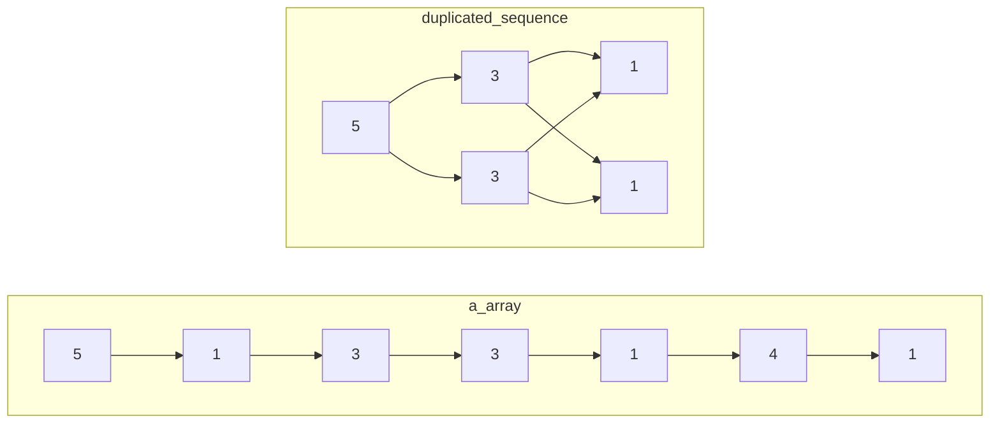

# ACM

# §1 STL

## §1.1 `<iomainip>`

众所周知，在 `algorithm` 库中有一个 `max` 函数，但你不知道的是 `ISO c++11` 中 `max` 可以接受多个参数，前提是要用中括号括起来，如：

```cpp
int a = max({9, 9, 12, 97301, 937});
```

还有，`printf` 支持输出保留小数点位数的数，但是很多人不知道 `cout` 也可以，但是需要包含头文件 `iomanip`，代码：

```cpp
cout << fixed << setprecision(位数) << 值;
```

## §1.2 `<algorithm>`

### §1.2.1 `std::sort()`

`std::sort(Iterator begin, Iterator end)`默认从小到大排序。

### §1.2.2 `std::lower_bound()`/`std::upper_bound()`

> [CppReference](https://zh.cppreference.com/w/cpp/algorithm/lower_bound)：`std::lower_bound(Iterator begin, Iterator end, T value)`返回非严格单调递增容器从`begin`到`end`遍历，找到第一个大于等于`value`的位置，并返回这个位置的迭代器。
>
> [CppReference](https://zh.cppreference.com/w/cpp/algorithm/upper_bound)：`std::upper_bound(Iterator begin, Itertor end, T value)`返回非严格单调递增容器从`begin`到`end`遍历，找到第一个大于`value`的位置，并返回这个位置的迭代器。

这个最简单的定义没有涉及到STL实现这两个二分查找函数的本质。我们给出它们的完整签名：

```c++
template<class ForwardIt, class T, class Compare>
std::lower_bound(
    class ForwardIt first, 
    class ForwardIt last, 
    const T& value, 
    [](const T& iter_value, const T& value)->bool{};
);

template<Class ForwardIt, class T, class Compare>
std::upper_bound(
	class ForwardIt first,
    class ForwardIt last,
    const T& value,
    [](const T& value, const T& iter_value)->bool{};
)
```

`std::lower_bound`的完整作用是：给定一段容器的首尾指针或迭代器`first`、`last`，这段容器靠近头部的元素值`forth_value`使得给函数或Lambda表达式传递的实参列表为`(forth_value, value)`时返回`true`，靠近尾部的元素值`back_value`使得给函数或Lambda表达式传递的形参列表为`(back_value, value)`时返回`false`，则返回从`first`到`last`的第一个使得函数或Lambda表达式返回`false`的指针或迭代器。若函数或Lambda表达式没有指定，则缺省等价地视为`std::less<T>()`。

`std::upper_bound`的完整作用是：给定一段容器的首尾指针或迭代器`first`、`last`，这段容器靠近头部的元素值`forth_value`使得给函数或Lambda表达式传递的实参列表为`(value, forth_value)`时返回`false`，靠近尾部的元素值`back_value`使得给函数或Lambda表达式传递的形参列表为`(value, back_value)`时返回`true`，则返回从`first`到`last`的最第一个使得函数或Lambda表达式返回`true`的指针或迭代器。若函数或Lambda表达式没有指定，则缺省等价地视为`std::less<T>()`。

STL提供了以下预置的比较函数：

- `std::less<T>`：`return a < b`
- `std::greater<T>`：`return a > b`
- `std::less_equal<T>`：`return a <= b`
- `std::greater_equal<T>`：`return a >= b`

根据以上定义，我们来分析以下实例：

- 给定递增容器`int a[5] = {0, 1, 2, 3, 4}`，使用`std::lower_bound(a, a + 5, 2)`的效果。首先函数或Lambda表达式没有指定，因此缺省为`std::less<int>()`。序列的首部元素值能满足`iter_value < 2`，末尾元素值不能满足`iter_value < 2`，因此符合`std::lower_bound()`对容器的元素排序要求。容易发现，第一个能让`iter_value < 2`为`false`的元素就是`a[2]`本身，因此返回`(int*)(a+2)`。
- 给定递减容器`int a[5] = {4, 3, 2, 1, 0}`，使用`std::upper_bound(a, a + 5, 2, std::greater<int>())`的效果。序列的首部元素`iter_value`较大，能使得`2 > iter_value`返回`false`；末尾元素的`2 > iter_value`为`true`，因此符合`std::upper_bound()`对容器的元素排序要求。容易发现，最后一个能让`iter_value > 2`为`true`的元素是`a[3]`，因此返回`(int*)(a+3)`。

# §2 动态规划

## §2.1 背包DP

- 同时用到先后两次的`dp[n][]`和`dp[n-1][]`，且背包容量`j`与体积代价`cost[i]`满足严格偏序关系，才能使用一行滚动数组`dp[j]=...dp[j-cost[i]]`
- 只用到`dp[n][]`单层的递推式，使用一行滚动数组存储完毕后必须再次初始化，防止干扰下一层。
- 不满足严格偏序关系，必须使用两行滚动数组`dp[(n++)&1][j]`，且使用新行之前必须初始化为新值，否则本次在该行未经更新的数值就是两轮之前 的`dp[n-2][j]`

### §2.1.1 0/1背包

> [洛谷P1048](https://www.luogu.com.cn/problem/P1048)：给定容量为`capacity`的背包，`n`个体积和价值分别为`volume[i]`和`value[i]`的物品，使得背包容纳的物品总价值最大化。其中所有物品的体积和价值均大于0。

令`dp[i][j]`表示当背包容量为`j`时，在前`i`种物品中，能取得的最大物品总价值。其中`dp[0][j]`恒为0，表示什么都不选的情况。易得状态方程：
$$
\text{dp}[i][j]=\max\left(
	\text{dp}[i-1][j],
	\text{dp}[i-1][j-\text{volume}[i]]+\text{value}[i]
\right)
$$

```c++
long long int dp[101][1001];
long long int volume[101], value[101];
long long int capacity, n;
int main(){
    std::cin >> capacity >> n;
    for(long long int i = 1 ; i <= n ; ++i){
        std::cin >> volume[i] >> value[i];
    }

    for(long long int i = 1 ; i <= n ; ++i){
        for(long long int j = 0 ; j <= capacity ; ++j){
            dp[i][j] = dp[i - 1][j]; // 不选第i个物品
            if(j >= volume[i]){
                dp[i][j] = std::max(dp[i][j], dp[i - 1][j - volume[i]] + value[i]); // 选第i个物品
            }
        }
    }
    std::cout << dp[n][capacity];
    return 0;
}
```

该算法的空间复杂度显然为$O(\text{capacity}\cdot n)$，每个空间都要进行一次运算，因此时间复杂度也为$O(\text{capacity}\cdot n)$。

接下来考虑滚动数组优化。当我们把`dp`从二维数组变为一维数组时，受影响的地方有两处：

1. `dp[i][j] = dp[i - 1][j]`

   给`dp`直接砍掉一个维度，变成`dp[j] = dp[j]`，是否与原式等价呢？显然等价，因为`dp[j]`在赋值前的值是上一轮循环算出来的，因此就是`dp[i - 1][j]`本身，在赋值后的值是这一轮循环更新的，因此就是`dp[i][j]`本身。

2. `dp[i][j] = std::max(dp[i][j], dp[i - 1][j - volume[i]] + value[i])`

   给`dp`直接砍掉一个维度，变成`dp[j] = std::max(dp[j], dp[j - volume[i]] + value[i])`，是否与原式等价呢？在本次循环中，`dp[j - volume[i]`一定在`dp[j]`之前先被计算了出来，早就在本轮循环中被更新过，因此等价于`dp[i][j - volume[i]`，这与原式中的`dp[i - 1][j - volume[i]]`不等价。

   导致这一切的罪魁祸首是`dp[j - volume[i]`被抢先一步覆盖掉，只要不覆盖即可解决问题。于是我们想到改变第二层循环的循环顺序，将原来的从小到大变成从大到小即可。

```c++
long long int dp[1001]; // long long int dp[101][1001];
long long int volume[101], value[101];
long long int capacity, n;
int main(){
    std::cin >> capacity >> n;
    for(long long int i = 1 ; i <= n ; ++i){
        std::cin >> volume[i] >> value[i];
    }

    for(long long int i = 1 ; i <= n ; ++i){
        for(long long int j = capacity ; j >= 0 ; --j){ // for(long long int j = 0 ; j <= capacity ; ++j){
            ; // dp[i][j] = dp[i - 1][j] 简化为了 dp[j] = dp[j]
            if(j >= volume[i]){
                dp[j] = std::max(dp[j], dp[j - volume[i]] + value[i]); // dp[i][j] = std::max(dp[i][j], dp[i - 1][j - volume[i]] + value[i]);
            }
        }
    }
    std::cout << dp[capacity];
    return 0;
}
```

该算法的空间复杂度显然为$O(\text{capacity})$，每个空间都要进行$n$次运算，因此时间复杂度也为$O(\text{capacity}\cdot n)$。

各OJ通常还考察一处常数优化。在动态规划中，我们把一个问题拆成了几个子问题分别计算。现在有个问题：我们总共计算了这么多的子问题，真的都能用在后续的计算中吗？回想未经滚动数组优化的递推式，我们注意到：

1. 要求解第$N$层的$\text{dp}[N][\text{capacity}]$，我们只需要知道$\text{dp}[N-1][\text{capacity}]$和$\text{dp}[N-1][\text{capacity}-\text{volume}[N]]$这两个值即可，对应的第二维度的区间为$[\text{capacity}-\text{volume}[N],\text{capacity}]$。
2. 要求解第$N-1$层的$\text{dp}[N-1][\text{capacity}-\text{volumn}[N]]$，我们只需要知道$\text{dp}[N-2][\text{capacity}-\text{volume}[N]]$和$\text{dp}[N-1][\text{capacity}-\text{volume}[N]-\text{volume}[N-1]]$这两个值即可，对应的第二维度的区间为$[\text{capacity}-\text{volume}[N]-\text{volume}[N-1],\text{capacity}]$。
3. ......数学归纳法
4. 要求解第$p$层的值，对应的第二维度区间的左端点为$\text{capacity}-\sum_{j=p}^{n}\text{volume}[j]$。

从另一个角度来看，当我们已经确定前$p$组物品的$\text{dp}$情况后，至少要保证后面的其它物品都有可能被选取，甚至全部被选取的情况，才能保证不遗漏任何一种情况。这提示我们可以缩短第二层循环的枚举范围，也就是从原先的$[0,\text{capacity}]$缩短为$\left[\max\Big(\text{capacity}-\sum_{j=p}^{n}\text{volume}[j],\text{volume}[p]\Big),\text{capacity}\right]$。

```c++
long long int dp[1001];
long long int volume[101], value[101];
long long int capacity, n;
long long int volume_sum; // 计算sum(volume[i, n])
int main(){
    std::cin >> capacity >> n;
    for(long long int i = 1 ; i <= n ; ++i){
        std::cin >> volume[i] >> value[i];
        volume_sum += volume[i];
    }
    for(long long int i = 1 ; i <= n ; ++i){
        for(long long int j = capacity ; j >= std::max(capacity - volume_sum, volume[i]) ; --j){ // 收缩枚举范围
            if(j >= volume[i]){
                dp[j] = std::max(dp[j], dp[j - volume[i]] + value[i]);
            }
        }
        volume_sum -= volume[i]; // 维护sum(volumu[i, n])
    }
    std::cout << dp[capacity];
    return 0;
}
```

该优化在$\text{capacity}$特别大时非常有效。

#### §2.1.1.1 时间最优做法

为了进一步优化时间，我们考虑上述常数优化的枚举范围。其左端点极度依赖于$\sum_{j=p}^{n}\text{volume}[j]$，我们希望这个值越大越好，这依赖于`volumn`数组的顺序。于是，当$\text{volume}[i]$非常大时，先处理代价（本题为体积）较大的物品能更缩小枚举范围。只需付出一点很小的排序时间开销，就能抵消大$\text{volume}[i]$造成的劣势。

```c++
long long int dp[100001];
std::vector<std::pair<long long int, long long int>> data(101); // volume, value
long long int capacity, n;
long long int volume_sum;
int main(){
    std::cin >> capacity >> n;
    for(long long int i = 1 ; i <= n ; ++i){
        std::cin >> data[i].first >> data[i].second;
        volume_sum += data[i].first;
    }
    std::sort(data.begin() + 1, data.begin() + 1 + n, [](const auto &lhs, const auto &rhs){
        return lhs.first > rhs.first;
    }); // 排序，让大的volumn物品在前，先被处理
    for(long long int i = 1 ; i <= n ; ++i){
        for(long long int j = capacity ; j >= std::max(capacity - volume_sum, data[i].first) ; --j){
            // 没有必要使用if(j >= data[i].first)，该条件以合并到上一行的边界中
            dp[j] = std::max(dp[j], dp[j - data[i].first] + data[i].second);
        }
        volume_sum -= data[i].first;
    }
    std::cout << dp[capacity];
    return 0;
}
```

#### §2.1.1.2 空间最优做法

注意到在最外层循环中，遍历到第`p`个物品时，只有该物品的代价和价值参与了计算。因此我们可以不用一次性保存所有石子的全部数据，而是按需读入，即用即扔。空间复杂度$O(\text{capacity}\cdot n)$仍未改变，只是缩小了$O(n)$的常数而已。

该做法与常数优化冲突，因为遍历到第`p`个物品时，我们只知道$\sum_{j=1}^{p}\text{volume}[j]$，而常数优化要求的是$\sum_{j=p}^{n}\text{volume}[j]$，我们无法提前“预知”后面物品的`volume`属性。

```c++
long long int dp[1001];
// long long int volume[101], value[101];
long long int capacity, n;
int main(){
    std::cin >> capacity >> n;
    // for(long long int i = 1 ; i <= n ; ++i){
    //     std::cin >> volume[i] >> value[i];
    // }
    for(long long int i = 1 ; i <= n ; ++i){
        long long int volume, value; std::cin >> volume >> value; // 在此处即时O(1)读入
        for(long long int j = capacity ; j >= 0 ; --j){
            if(j >= volume){
                dp[j] = std::max(dp[j], dp[j - volume] + value);
            }
        }
    }
    std::cout << dp[capacity];
    return 0;
}
```

### §2.1.2 完全背包

> 给定容量为`capacity`的背包，`n`种供应量无穷大的，体积和价值分别为`volume[i]`和`value[i]`的物品，使得背包容纳的物品总价值最大化。其中所有物品的体积和价值均大于0。

令`dp[i][j]`表示当背包容量为`j`时，在前`i`种物品中，能取得的最大物品总价值。其中`dp[0][j]`恒为0，表示什么都不选的情况。与0/1背包不同，选中了第`i`个物品后还可以接着再选一次，因此状态转移方程为：
$$
\text{dp}[i][j]=\max\left(
	\text{dp}[i-1][j],
	\text{dp}[\textcolor{red}{i}][j-\text{volume}[i]]+\text{value}[i]
\right)
$$
这里我们直接考虑滚动数组优化。模仿上一节的分析，当砍掉`dp`数组的一个维度后，得到的代码与原式完全等价。

```c++
long long int dp[1001]; // long long int dp[101][1001];
long long int volume[101], value[101];
long long int capacity, n;
int main(){
    std::cin >> capacity >> n;
    for(long long int i = 1 ; i <= n ; ++i){
        std::cin >> volume[i] >> value[i];
    }

    for(long long int i = 1 ; i <= n ; ++i){
        for(long long int j = 0 ; j <= capacity ; ++j){    
            if(j >= volume[i]){
                dp[j] = std::max(dp[j], dp[j - volume[i]] + value[i]);
            }
        }
    }
    std::cout << dp[capacity];
    return 0;
}
```

该算法的空间复杂度显然为$O(\text{capacity})$，每个空间都要进行$n$次运算，因此时间复杂度也为$O(\text{capacity}\cdot n)$。

TODO？？？？？？？？？？？完全背包也有类似的常数优化

```
    for (int i = 0; i < n; ++i) { // 遍历每种物品
        int itemCost = cost[i];
        int itemValue = value[i];

        // 更新当前选择的最小和最大代价范围
        minCost = max(0, min(minCost, minCost + itemCost));
        maxCost = min(maxCapacity, max(maxCost, maxCost + itemCost));

        for (int j = minCost; j <= maxCost; ++j) {
            if (j >= itemCost && dp[j - itemCost] != INF) {
                dp[j] = max(dp[j], dp[j - itemCost] + itemValue);
            }
        }
    }
```


### §2.1.3 分组背包

> [洛谷P1757](https://www.luogu.com.cn/problem/P1757)：给定容量为`capacity`的背包，`n`个供应量无穷大的，体积、价值、类别分别为`volume[i]`、`value[i]`和`type[i]`的物品，每个类别中最多只能挑出一个物品装入背包，使得背包容纳的物品总价值最大化。其中所有物品的体积和价值均大于0。

本题在0/1背包的基础上引入了分组问题，显然`dp[i][j]`中的`i`指的不再是第`i`个物品，而是第`i`种类别。状态转移方程为：
$$
\text{dp}[i][j]=\max\bigg(
	\text{dp}[i-1][j],
	\max\big(
		\text{dp}[i][j-\text{volume}[i][k]]+\text{value}[i][k]
	\big)
\bigg)
$$

```c++
const long long int N_MAX = 1000, TYPE_MAX = 100, CAPACITY_MAX = 1000;
long long int n, capacity;
std::map<long long int, std::vector<std::tuple<long long int, long long int>>> data;
long long int dp[CAPACITY_MAX + 1];
int main(){
    std::cin >> capacity >> n;
    for(long long int i = 0 ; i < n ; ++i){
        long long int volume, value, type; std::cin >> volume >> value >> type;
        data[type].emplace_back(volume, value);
    }
    for(auto &group : data){
        for(long long int j = capacity ; j >= 0 ; --j){
            for(auto &item : group.second){
                if(j >= std::get<0>(item)){
                    dp[j] = std::max(
                        dp[j],
                        dp[j - std::get<0>(item)] + std::get<1>(item)
                    );
                }
            }
        }
    }
    std::cout << dp[capacity];
}
```

该算法的空间复杂度显然为$O(\text{capacity})$，每个空间都要进行$n$次运算，因此时间复杂度也为$O(\text{capacity}\cdot n)$。

### §2.1.4 多重背包

> [洛谷P1776](https://www.luogu.com.cn/problem/P1776)：给定容量为`capacity`的背包，`n`种数量为`count[i]`的，体积和价值分别为`volume[i]`和`value[i]`的物品，使得背包容纳的物品总价值最大化。其中所有物品的体积和价值均大于0。

一种显然的做法是将`count[i]`个相同的物品视作不同的物品，或者将状态转移方程中的$\max(\cdot)$参数列表填充为不选、仅选1个、仅选2个、...、仅选$\text{count}[i]$个，从而转化为01背包问题。但这会导致种类数$n$膨胀为$n\cdot\text{count}[i]$，导致超时。

这里我们引入二进制拆分优化。对于任意正整数`count[i]`，我们都可以将其拆分为二进制形式。因此我们只需要给$\max(\cdot)$的参数列表中填充为仅选$2^0$个、仅选$2^1$个、...、仅选$2^a$个，仅选$\text{count}[i]-\sum_{j=0}^{a}2^j$个。这些数字构成了一个集合，它的所有子集中的元素之和必定覆盖且仅覆盖$[0,\text{count}[i]]$中的每个正整数。例如正整数`25`可以拆分为`(1+2+4+8)+10`。种类数仅膨胀到$n\cdot\log_2(\text{count}[i])$。

```c++
const long long int N_MAX = 1e2, CAPACITY_MAX = 4e4, BINARY_N_MAX = 1e5;
long long int n, capacity, binary_n;
long long int volume[BINARY_N_MAX + 5], value[BINARY_N_MAX + 5];
long long int dp[CAPACITY_MAX + 1];
int main(){
    std::cin >> n >> capacity;
    for(long long int i = 1 ; i <= n ; ++i){
        long long int value_temp, volume_temp, count_temp; std::cin >> value_temp >> volume_temp >> count_temp;
        for(long long int j = 1 ; j <= count_temp ; j <<= 1){
            binary_n++;
            value[binary_n] = value_temp * j;
            volume[binary_n] = volume_temp * j;
            count_temp -= j;
        }
        if(count_temp > 0){
            binary_n++;
            value[binary_n] = value_temp * count_temp;
            volume[binary_n] = volume_temp * count_temp;
        }
    }
    for(long long int i = 1 ; i <= binary_n ; ++i){
        for(long long int j = capacity ; j >= 0 ; --j){
            if(j - volume[i] >= 0){
                dp[j] = std::max(dp[j], dp[j - volume[i]] + value[i]);
            }
        }
    }
    std::cout << dp[capacity];
}
```

该算法的空间复杂度显然为$O(\text{capacity})$，每个空间都要进行$n\cdot\log_2(\text{count}[i])$次运算，因此时间复杂度也为$O(\text{capacity}\cdot n\cdot\log_2(\text{count}[i]))$。

### §2.1.5 费用背包

> [洛谷P1510](https://www.luogu.com.cn/problem/P1510)：给定一个体积为`v`的坑洞，需要用石子填满（允许体积溢出）。石子的体积和代价（附属值）分别为`v[i]`和`c[i]`，求完成该任务的代价最小值。

本题有两种状态定义的方式，为`dp`数组分别填充了不同的初值。

- `dp[i][j]`：用前`i`个石子填满**体积**为`j`的坑洞，所付出的代价最小值。

  考虑滚动数组优化，`dp[j]`的初值（也就是`dp[0][j]`）如何确定？首先`dp[0][0]`肯定是0，此时坑洞已满，无需花费任何代价。而当`j`大于1时，因为此时没有石子可以使用，所以无论花费多少代价都无法满足条件，也就是说初值均为无穷大。

  再考虑转移方程，分两种情况——新的第$i$个石子能恰好补上临门一脚，或者使用这个石子后依然不能填满坑洞：
  $$
  \text{dp}[j]=\begin{cases}
  	\min\left(\text{dp}[j],\text{dp}[j-v[i]] + c[i]\right) &,j\ge v[i],\text{新加的石子还是不能填满} \\
  	\textcolor{red}{\min\left(\text{dp}[j],c[i]\right)} &,j<v[i],\text{仅这一个石子就能填满}
  \end{cases}
  $$

  ```c++
  const long long int N_MAX = 1e4, V_MAX = 1e4;
  long long int v, n, c;
  long long int dp[V_MAX + 1];
  int main(){
      std::cin >> v >> n >> c;
      std::fill(dp + 1, dp + 1 + V_MAX, 1e9);
      for(long long int i = 1 ; i <= n ; ++i){
          long long int volume, effort; std::cin >> volume >> effort;
          for(long long int j = v ; j >= 0 ; --j){
              if(j >= volume){
                  dp[j] = std::min(dp[j], dp[j - volume] + effort);
              }else{
                  dp[j] = std::min(dp[j], effort);
              }
          }
      }
      if(c - dp[v] >= 0){
          std::cout << c - dp[v];
      }else{
          std::cout << "Impossible";
      }
  }
  ```

- `dp[i][j]`：用前`i`个石子，且其代价之和小于等于预算`j`时，能填满的坑洞体积最大值。**该方法的局限性在于题目必须给出预算的最大值，或者预算的最大值大的不那么离谱，否则每次二层循环遍历的状态过多，导致超时。**

  考虑数组滚动优化，`dp[j]`的初值（也就是`dp[0][j]`）如何确定？因为没有石子可以使用，所以即使给再多的代价预算，也无处可花，更别说填满坑洞了，因此能填满的坑洞提及最大值全部为0。

  再考虑转移方程，分两种情况——如果代价此时仍有预算，能使用该石子，那么就取最小值；如果无法支付该石子所需的代价，那么就没有办法使用该石子，直接跳过此情况：
  $$
  \text{dp}[j]=\begin{cases}
  	\max\left(\text{dp}[j],\text{dp}[j-c[i]]+v[i]\right) &,j\ge v[i] \\
  	\text{dp}[j] &,j<v[i]
  \end{cases}
  $$

  ```c++
  const long long int N_MAX = 1e4, V_MAX = 1e4, C_MAX = 1e4;
  long long int v, n, c;
  long long int dp[C_MAX + 1];
  int main(){
      std::cin >> v >> n >> c;
      for(long long int i = 1 ; i <= n ; ++i){
          long long int volume, effort; std::cin >> volume >> effort;
          for(long long int j = c ; j >= 0 ; --j){
              if(j >= effort){
                  dp[j] = std::max(dp[j], dp[j - effort] + volume);
              }
          }
      }
      if(dp[c] >= v){
          long long int min_c = std::lower_bound(dp, dp + c + 1, v) - dp; // 因为dp非严格递增，所以能用二分优化
          std::cout << c - min_c;
      }else{
          std::cout << "Impossible";
      }
  }
  ```

> [洛谷P2340](https://www.luogu.com.cn/problem/P2340)：给定`n`个物品，每种物品都有两种代价`cost_1[i]`、`cost_2[i]`，代价可正可负。在物品的两种总代价均大于等于0的情况下，求这两种总代价之和的最大值。

令`dp[i][j]`表示前`i`个物品的第一种代价之和恰好为`j`时，第二种代价之和的最大值。于是有状态转移方程：
$$
\text{dp}[i][j] = \max(
	\text{dp}[i-1][j],
	\text{dp}[i-1][j-\text{cost\_1}[i]] + \text{cost\_2}[i]
)
$$
由于`cost_1[i]`可正可负，所以第二层遍历的顺序要随着其正负号而变化。

```c++
const long long int N_MAX = 400, COST_MAX = 1000, OFFSET = N_MAX * COST_MAX;
long long int n, dp[2 * OFFSET + 1];
int main(){
    std::cin >> n;
    std::fill(dp, dp + 2 * OFFSET + 1, INT32_MIN); dp[OFFSET] = 0;
    long long int left_bound = 0, right_bound = 0;
    for(int i = 1 ; i <= n ; ++i){
        long long int cost_1, cost_2; std::cin >> cost_1 >> cost_2;
        if(cost_1 < 0){
            left_bound += cost_1;
        }
        if(cost_1 > 0){
            right_bound += cost_1;
        }
        if(cost_1 >= 0){
            for(long long int j = right_bound ; j >= left_bound ; --j){
                dp[j + OFFSET] = std::max(dp[j + OFFSET], dp[j - cost_1 + OFFSET] + cost_2);
            }
        }else{
            for(long long int j = left_bound ; j <= right_bound ; ++j){
                dp[j + OFFSET] = std::max(dp[j + OFFSET], dp[j - cost_1 + OFFSET] + cost_2);
            }
        }
    }
    long long int result = INT32_MIN;
    for(long long int i = 0 ; i <= right_bound ; ++i){
        if(dp[i + OFFSET] < 0){
            continue;
        }
        result = std::max(result, dp[i + OFFSET] + i);
    }
    std::cout << result;
}
```

### §2.1.6 恰满背包

之前我们接触的背包题型往往带有$\sum\text{volume}_i\le \text{capacity}$的约束条件。本节讨论的是$\sum\text{volume}_i= \text{capacity}$。

- 以价值最大化问题为例，我们希望不合法的状态全为负无穷大，这样在$\max(\cdot)$的各参数大小竞争中，非法状态就会不起作用，等价于不存在。于是`dp[0][0]`为0，而`dp[0][1->n]`均为负无穷大。
- 以统计方案数问题为例，我们希望不合法的状态不对应任何方案，也就是0。于是`dp[0][0]`反而是一种合法的方案，因为什么都不选也能填满容量为0的背包，而`dp[0][1->n]`均为0。

### §2.1.7 依赖背包

> [洛谷P1064](https://www.luogu.com.cn/problem/P1064)：给定$n$个物品的价值`value[i]`和代价`cost[i]`。现将其分成若干组，每组物品均包含1个主物品和0~2个次物品。如果选择了某个此物品，则必须同时选择其组内的主物品。在各物品代价之和小于等于$m$的约束条件下，求物品价值之和的最大值。

？？？？？？？？？？？？？？？？？？？TODO

### §2.1.8 混合背包

混合背包指的是上述背包问题中提到的物品特性混合起来。针对此类问题，我们只需对不同问题的物品分别套用不同的转移方程即可。

```
for i=1..N
    if 第i件物品属于01背包
        // ...
    else if 第i件物品属于完全背包
        // ...
    else if 第i件物品属于多重背包
        // ...
```

### §2.1.9 多维代价背包

> [洛谷P1855](https://www.luogu.com.cn/problem/P1855)：在0/1背包的基础上，总共引入了两个约束条件。

额外给`dp`引入一个新维度即可。状态转移方程为：
$$
\text{dp}[i][v][u]=\max\left(
	f[i-1][v][u],f[i-1][v-a[i]][u-b[i]]+w[i]
\right)
$$
滚动数组优化规则与前文相似，都要注意循环内的枚举顺序。

```c++
const long long int N_MAX = 1e2, MONEY_MAX = 2e2, TIME_MAX = 2e2;
long long int n, money_capacity, time_capacity;
long long int times[N_MAX + 1], moneys[N_MAX + 1], values[N_MAX + 1];
long long int dp[MONEY_MAX + 1][TIME_MAX + 1];
int main(){
    std::cin >> n >> money_capacity >> time_capacity;
    for(long long int i = 1 ; i <= n ; ++i){
        std::cin >> moneys[i] >> times[i];
        values[i] = 1;
    }
    for(long long int i = 1 ; i <= n ; ++i){
        for(long long int j = money_capacity ; j >= 0 ; --j){
            for(long long int k = time_capacity ; k >= 0 ; --k){
                if(j >= moneys[i] && k >= times[i]){
                    dp[j][k] = std::max(
                        dp[j][k],
                        dp[j - moneys[i]][k - times[i]] + values[i]
                    );
                }
            }
        }
    }
    std::cout << dp[money_capacity][time_capacity];
}
```

> [洛谷P1541](https://www.luogu.com.cn/problem/P1541)：给定一个`1×n`的棋盘，起点和终点在棋盘两侧。每个格子都有分数，每回合选择一个前进1步、2步、3步、4步的机会，这四种机会的上线分别为`card[1]`、`card[2]`、`card[3]`、`card[4]`。求分数最大值。

令`dp[a][b][c][d]`表示这四种机会分别使用了`a`、`b`、`c`、`d`次，达到第`1+1×a+2×b+3×c+4×d`个格子时，能达到的最大值。

```c++
const long long int N_MAX = 350, M_MAX = 120, CARD_MAX = 40;
long long int n, m, card[5], score[N_MAX + 1], dp[CARD_MAX + 1][CARD_MAX + 1][CARD_MAX + 1][CARD_MAX + 1];
int main(){
    std::cin >> n >> m;
    for(long long int i = 1 ; i <= n ; ++i){
        std::cin >> score[i];
    }
    for(long long int i = 1 ; i <= m ; ++i){
        long long int temp; std::cin >> temp;
        card[temp]++;
    }
    dp[0][0][0][0] = score[1];
    for(long long int a = 0 ; a <= card[1] ; ++a){
        for(long long int b = 0 ; b <= card[2] ; ++b){
            for(long long int c = 0 ; c <= card[3] ; ++c){
                for(long long int d = 0 ; d <= card[4] ; ++d){
                    long long int distance = a + 2 * b + 3 * c + 4 * d;
                    if(a >= 1){
                        dp[a][b][c][d] = std::max(dp[a][b][c][d], dp[a - 1][b][c][d] + score[1 + distance]);
                    }
                    if(b >= 1){
                        dp[a][b][c][d] = std::max(dp[a][b][c][d], dp[a][b - 1][c][d] + score[1 + distance]);
                    }
                    if(c >= 1){
                        dp[a][b][c][d] = std::max(dp[a][b][c][d], dp[a][b][c - 1][d] + score[1 + distance]);
                    }
                    if(d >= 1){
                        dp[a][b][c][d] = std::max(dp[a][b][c][d], dp[a][b][c][d - 1] + score[1 + distance]);
                    }
                    ;
                }
            }
        }
    }
    std::cout << dp[card[1]][card[2]][card[3]][card[4]];
}
```

> [洛谷P2732](https://www.luogu.com.cn/problem/P2732)：商店中售卖`n`种物品（$n\le 5$），原本单价为`price[i]`。现在商店提供`s`种无限使用的捆绑销售优惠策略，第`i`种策略将这`n`种物品分别取`s_product[i][j]`个打包，总计的优惠价格为`s_price[i]`。现在要求每种物品`i`分别恰好买`buy[i]`（$\text{buy}[i]\le 5$）个，求费用最小值。

令`dp[a][b][c][d][e]`表示5种商品恰好购买`a`、`b`、`c`、`d`、`e`个的费用最小值，既可以使用优惠策略，也可以单价购买。

```c++
const long long int S_MAX = 99, N_MAX = 5;
long long int product_count;
long long int s_product[S_MAX + 1][N_MAX + 1], s_price[S_MAX + 1], buy[N_MAX + 1], price[N_MAX + 1];
long long int dp[N_MAX + 1][N_MAX + 1][N_MAX + 1][N_MAX + 1][N_MAX + 1];
std::map<long long int , long long int> product_id_map;
int main(){
    long long int s; std::cin >> s;
    for(long long int i = 1 ; i <= s ; ++i){
        long long int s_product_type_count; std::cin >> s_product_type_count;
        for(long long int j = 1 ; j <= s_product_type_count ; ++j){
            long long int product_id, sale_product_count; std::cin >> product_id >> sale_product_count;
            if(product_id_map.count(product_id) == 0){
                product_id_map[product_id] = ++product_count;
            }
            product_id = product_id_map[product_id];
            s_product[i][product_id] = sale_product_count;
        }
        std::cin >> s_price[i];
    }
    long long int buy_count; std::cin >> buy_count;
    for(long long int i = 1 ; i <= buy_count ; ++i){
        long long int buy_product_id, buy_product_count, buy_price; std::cin >> buy_product_id >> buy_product_count >> buy_price;
        if(product_id_map.count(buy_product_id) == 0){
            product_id_map[buy_product_id] = ++product_count;
        }
        buy_product_id = product_id_map[buy_product_id];
        buy[buy_product_id] = buy_product_count;
        price[buy_product_id] = buy_price;
    }
    std::fill_n(dp[0][0][0][0], (N_MAX + 1) * (N_MAX + 1) * (N_MAX + 1) * (N_MAX + 1) * (N_MAX + 1), INT32_MAX);
    dp[0][0][0][0][0] = 0;
    for(long long int a = 0 ; a <= buy[1] ; ++a){
        for(long long int b = 0 ; b <= buy[2] ; ++b){
            for(long long int c = 0 ; c <= buy[3] ; ++c){
                for(long long int d = 0 ; d <= buy[4] ; ++d){
                    for(long long int e = 0 ; e <= buy[5] ; ++e){
                        if(a >= 1){dp[a][b][c][d][e] = std::min(dp[a][b][c][d][e], dp[a - 1][b][c][d][e] + price[1]);}
                        if(b >= 1){dp[a][b][c][d][e] = std::min(dp[a][b][c][d][e], dp[a][b - 1][c][d][e] + price[2]);}
                        if(c >= 1){dp[a][b][c][d][e] = std::min(dp[a][b][c][d][e], dp[a][b][c - 1][d][e] + price[3]);}
                        if(d >= 1){dp[a][b][c][d][e] = std::min(dp[a][b][c][d][e], dp[a][b][c][d - 1][e] + price[4]);}
                        if(e >= 1){dp[a][b][c][d][e] = std::min(dp[a][b][c][d][e], dp[a][b][c][d][e - 1] + price[5]);}
                        for(long long int i = 1 ; i <= s; ++i){
                            if(a >= s_product[i][1] && b >= s_product[i][2] && c >= s_product[i][3] && d >= s_product[i][4] && e >= s_product[i][5]){
                                dp[a][b][c][d][e] = std::min(
                                    dp[a][b][c][d][e],
                                    dp[a - s_product[i][1]][b - s_product[i][2]][c - s_product[i][3]][d - s_product[i][4]][e - s_product[i][5]] + s_price[i]
                                );
                            }
                        }
                    }
                }
            }
        }
    }
    std::cout << dp[buy[1]][buy[2]][buy[3]][buy[4]][buy[5]];
}
```

### §2.1.10 二维费用背包

> [洛谷P1509](https://www.luogu.com.cn/problem/P1509)：给定`n`个物品，第`i`个物品含有金钱代价`money[i]`、幸运代价`luck[i]`、时间代价`time[i]`和价值`value[i]`（本题恒为1）。现在金钱预算只有`money_budget`，幸运运算只有`luck_budget`。请求出一种方案，使得物品总价值最大化。如果有多种方式均能使得物品总价值到达最大值，则选取时间总代价最小的方案，并输出该方案所需的时间总代价。

本题涉及到的最优化变量有两个，因此要设置两个`dp`数组——`dp_value`表示前`i`个物品在预算约束内能达到的价值最大值；`dp_time`表示第`i`个物品在预算约束内达到价值最大值时，能达到的时间总代价最小值。

```c++
const long long int N_MAX = 100, MONEY_MAX = 1e2, LUCK_MAX = 1e2, TIME_MAX = 1e3;
long long int dp_value[MONEY_MAX + 1][LUCK_MAX + 1], dp_time[MONEY_MAX + 1][LUCK_MAX + 1];
long long int n, money_budget, luck_budget, money[N_MAX + 1], luck[N_MAX + 1], period[N_MAX + 1];
int main(){
    std::cin >> n;
    for(long long int i = 1 ; i <= n ; ++i){
        std::cin >> money[i] >> luck[i] >> period[i];
    }
    std::cin >> money_budget >> luck_budget;
    for(long long int i = 1 ; i <= n ; ++i){
        for(long long int j = money_budget ; j >= 0 ; --j){
            for(long long int k = luck_budget ; k >= 0 ; --k){
                if(j < money[i] || k < luck[i]){
                    continue; // 预算不足，无法选择
                }
                if(dp_value[j][k] < dp_value[j - money[i]][k - luck[i]] + 1){
                    // 总value可以增加，强制更新时间总代价（即使会升高）
                    dp_value[j][k] = dp_value[j - money[i]][k - luck[i]] + 1;
                    dp_time[j][k] = dp_time[j - money[i]][k - luck[i]] + period[i];
                }else if(dp_value[j][k] == dp_value[j - money[i]][k - luck[i]] + 1){
                    // 总value持平，时间总代价尝试降低
                    dp_time[j][k] = std::min(dp_time[j][k], dp_time[j - money[i]][k - luck[i]] + period[i]);
                }
            }
        }
    }
    std::cout << dp_time[money_budget][luck_budget];
}
```

### §2.1.11 泛化物品背包

在泛化物品背包问题中，物品的价值不再是一个定值，而是关于物品代价的函数。

> [洛谷P1336](https://www.luogu.com.cn/problem/P1336)：给定`n`种不限量供应的物品，某种物品选择`i`个时，这`i`个同类物品加起来的价值是`a[i]×i^b[i]`。在恰好选择`m`个物品的情况下，求总价值的最小值。

令`dp[i][j]`表示给定前`i`种物品，要求恰好选`j`个物品时的价值最小值，于是有状态转移方程：
$$
\text{dp}[i][j] = \min\begin{cases}
	\text{dp}[i-1][j] \\
	\text{dp}[i-1][j-1] + a[i]\times 1^{b[i]} \\
	\cdots \\
	\text{dp}[i-1][j-j] + a[i]\times j^{b[i]} \\
\end{cases}
$$
本题的陷阱在于：在第二层循环中，遍历顺序是从小到大还是从大到小。乍看本题，我们可能会认为每种物品无限供应，所以是完全背包，遍历顺序从小到大。但是观察上面的状态转移方程，我们发现得使用从大到小的顺序。

```c++
const long long int N_MAX = 20, PAPER_BUDGET_MAX = 200;
long long int n, paper_budget, a[N_MAX + 1], b[N_MAX + 1];
long long int dp[PAPER_BUDGET_MAX + 1]; // dp[i][j] 前i种物品分配j个指标
int main(){
    std::cin >> paper_budget >> n;
    std::fill(dp + 1, dp + 1 + paper_budget, 1e9);
    for(long long int i = 1 ; i <= n ; ++i){
        std::cin >> a[i] >> b[i];
    }
    for(long long int i = 1 ; i <= n ; ++i){
        for(long long int j = paper_budget ; j >= 0 ; --j){
            for(long long int k = 0 ; k <= j ; ++k){
                dp[j] = std::min(dp[j], dp[j - k] + a[i] * fast_power(k, b[i]));
            }
        }
    }
    std::cout << dp[paper_budget];
}
```

> [洛谷P1417](https://www.luogu.com.cn/problem/P1417)：给定`n`个物品，每个物品需要时间代价`c[i]`才能装入背包。当该物品装入背包时，记背包中的物品时间代价之和记为`t`（即已经过去了`t`个时间单位），则这个物品的价值为`a[i]-t×b[i]`。已知背包的时间预算为`t_budget`，求背包价值最大值。

在传统的背包问题中，物品的顺序不会影响最终答案。然而在本题中不是这样。考虑最简单的情况——只有两种物品，则两者的先后选择顺序对应的背包总价值分别为：
$$
\text{value}_{1,2} = (a[1] - c[1] \times b[1]) + (a[2] - (c[1] + c[2]) \times b[2]) \\
\text{value}_{2,1} = (a[2] - c[2] \times b[2]) + (a[1] - (c[1] + c[2]) \times b[1]) \\
$$
我们不禁思考——到底哪种排列方式才是最优的呢？解不等式$\text{value}_{1,2}>\text{value}_{2,1}$可知$c[1]b[2]<c[2]b[1]$，即$\frac{c[1]}{b[1]}<\frac{c[2]}{b[2]}$。更进一步，给定含有`n`个物品的序列，对于其中任意的两个物品，将$\frac{c[i]}{b[i]}$更小的放在前面，总是能获得更大的价值。这提示我们尽可能将$\frac{c[i]}{b[i]}$更小的物品放在前面进行挑选，使用一轮排序即可。

```c++
const long long int N_MAX = 50, T_MAX = 1e5;
long long int t, n, dp[T_MAX + 1];
struct Object{
    long long int a, b, c;
};
Object object[N_MAX + 1];

int main(){
    std::cin >> t >> n;
    for(long long int i = 1 ; i <= n ; ++i){
        std::cin >> object[i].a;
    }
    for(long long int i = 1 ; i <= n ; ++i){
        std::cin >> object[i].b;
    }
    for(long long int i = 1 ; i <= n ; ++i){
        std::cin >> object[i].c;
    }
    std::sort(object + 1, object + n + 1, [](const auto &lhs, const auto &rhs){
        return lhs.c * rhs.b  < rhs.c * lhs.b;
    });
    for(long long int i = 1; i <= n ; ++i){
        for(long long int j = t ; j >= object[i].c ; --j){
            dp[j] = std::max(dp[j], dp[j - object[i].c] + object[i].a - object[i].b * j);
        }
    }
    std::cout << *(std::max_element(dp + 1, dp + t + 1));
}
```

### §2.1.12 剔除物品背包

剔除物品背包在普通背包已经求解完毕的前提下，在可选择的物品列表中剔除某些物品，随后提问最优值。

> [洛谷P4141](https://www.luogu.com.cn/problem/P4141)：给定`n`个代价分别为`cost[i]`的物品和一个代价容量为`budget`的背包。要求现在从中抽离出第$i\in[1,n]$个物品，在剩下的`n-1`个物体中，能恰好填满容量为$j\in[1,\text{budget}]$背包的方案数`answer[i][j]`矩阵。（模`10`输出）

令`dp[i][j]`表示使用前`i`个物品能得到的代价之和恰好为`j`的方案数，`dp_unique[i][j]`表示在`n`个物品中抽离第`i`个物品后，代价之和恰好为`j`的方案数。那么显然`dp[n][j]`由两部分组成：

1. 不包含第`i`个物品的方案数。由定义可知等于`dp_unique[i][j]`。
2. 包含第`i`个物品的方案数。由假设可知，这些方案肯定都包含第`i`个物品。因此对于每种方案，我们将第`i`个物品剔除，对应背包容量缩小至`j-cost[i]`，都能对应到一种符合新条件的方案，这个新条件就是"在`n`个物品中剔除第`i`个物品，背包容量恰好为`j-cost[i]`"，由定义可知这部分方案数等于`dp_unique[i][j-cost[i]]`。当然，如果`j<cost[i]`，那么当前背包容量`j`不可能放下第`i`个物品，这部分方案数退化为0。

基于此，我们可以写出状态转移方程：
$$
\text{dp\_unique}[i][j] = \begin{cases}
	\text{dp}[n][j] - \text{dp\_unique}[i][j-\text{cost}[i]] & ,j\ge\text{cost}[i] \\
	\text{dp}[n][j] & ,j<\text{cost}[i] \\
\end{cases}
$$
然后考虑滚动数组优化。在推导`dp_unique`数组时，用到的都是`dp[n][j]`一行，因此可以直接退化为`dp[j]`。对于`dp_unique[i][j]`，我们只用到了`dp_unique[i][]`当前层的数值，与上一层无关，因此可以直接退化成`dp[]`。因为`j-cost[i]<=j`，用到了`dp_unique`已经在本层计算出的值，所以第二层循环的顺序为从左到右。**尤其要警惕第二层循环的左边界必须为`1`，不能为`cost[i]`，否则`dp_unique[j]`可能不是`dp[n][j]`这个预期的常数，而是上一层计算的值`dp[n][j]-dp_unique[i-1][cost[i-1]]`。**

```c++
const long long int N_MAX = 2000, BUDGET_MAX = 2000, MOD = 10;
long long int n, budget, dp[BUDGET_MAX + 1], dp_unique[BUDGET_MAX + 1], cost[N_MAX + 1];
int main(){
    std::cin >> n >> budget;
    for(long long int i = 1 ; i <= n ; ++i){
        std::cin >> cost[i];
    }
    dp[0] = 1 % MOD;
    for(long long int i = 1 ; i <= n ; ++i){
        for(long long int j = budget ; j >= cost[i] ; --j){
            dp[j] = (dp[j] + dp[j - cost[i]]) % MOD;
        }
    }
    dp_unique[0] = 1;
    for(long long int i = 1 ; i <= n ; ++i){
        for(long long int j = 1 ; j <= budget ; ++j){
            if(j >= cost[i]){
                dp_unique[j] = (dp[j] - dp_unique[j - cost[i]] + MOD) % MOD;
            }else{
                dp_unique[j] = dp[j];
            }
            std::cout << dp_unique[j];
        }
        std::cout << '\n';
    }
}
```

另一种思路是从撤销角度理解。背包的一个重要特点是物品顺序不影响最终结果，而这就是本题的关键。先讨论`n`个物品全部参与运算的情况：既然顺序不影响，我们可以认为`n-1`个物品先参与运算，而抽离的第`i`个物品最后参与运算。只要能根据`dp[n][]`将最后物品的第`n`次计算撤销掉，那么`dp[n-1][]`对应的第`n-1`次计算就是我们所求的值。

令`dp[i][j]`表示使用前`i`个物品能得到的代价之和恰好为`j`的方案数，`dp_unique[i][j]`表示将第`k`个物品放在最后，其余`n-1`个物品放在前面排序后，前`i`个物品代价之和恰好为`j`的方案数。那么根据上一段的结论可以得到这`dp[n][*]==dp_unique[n][*]`，我们要求的是`k`个`dp_unique[n-1][*]`。

`dp_unique[n][j]`（即`dp[n][j]`）由两部分组成：

1. 不包含第`i`个物品的方案数。因为不包含第`i`个物品，所以物品选择范围从`1->n`退化到`1->n-1`不会对这部分方案数造成影响。由定义可知这部分方案数等于`dp_unique[n-1][j]`。
2. 包含第`i`个物品的方案数。由假设可知，这些方案肯定都包含第`i`个物品。因此对于每种方案，我们将第`i`个物品剔除，对应背包容量缩小至`j-cost[i]`，都能对应到一种符合新条件的方案，这个新条件就是"在`n`个物品中剔除第`i`个物品，背包容量恰好为`j-cost[i]`"，由定义可知这部分方案数等于`dp_unique[n-1][j-cost[i]]`。当然，如果`j<cost[i]`，那么当前背包容量`j`不可能放下第`i`个物品，这部分方案数退化为0。

$$
\text{dp\_unique}[n-1][j] = \text{dp}[n][j] - \text{dp\_unique}[n-1][j-\text{cost}[k]]
$$

剩余步骤完全相同。

### §2.1.13 次优解/第`k`优解

> [洛谷P1858](https://www.luogu.com.cn/problem/P1858)：求0/1背包的前`k`个最优解之和。不同的解法之间的选择的物品组合禁止相同。

原先`dp[i][j]`表示背包容量为`j`时，给定前`i`种物品时的代价最大值。本题的思路是扩充`dp[i][j]`的含义，使其指向一个长度为`k`的数组，分别存储最优解、次优解、...、第k优解。显然`dp[i][j]`是递减的。为了得到`dp[i][j]`，我们将`dp[i-1][j]`和`dp[i-1][j-cost]+value`这两个长度均为`k`的数组合并起来，并维持递减的排序。

编程要注意细节：由于使用滚动数组优化，所以`dp[i][j]`和`dp[i-1][j]`共同使用了同一块空间，因此必须借助外部数组`merge_temp`暂时储存合并结果，然后复制到`dp[i][j]`的空间中。否则`dp[i-1][j]`一边读取同一块内存空间，`dp[i][j]`一边写入同一块内存空间，会覆盖掉`dp[i-1][j]`的内容，导致输出错误。

```c++
const long long int K_MAX = 50, V_MAX = 5000, N_MAX = 200;
long long int dp[V_MAX + 1][K_MAX + 1], merge_temp[K_MAX + 1];
long long int k, v, n;
int main(){
    std::cin >> k >> v >> n;
    for(long long int i = 0 ; i <= v ; ++i){
        for(long long int j = 0 ; j <= k ; ++j){
            dp[i][j] = INT32_MIN;
        }
    }
    dp[0][1] = 0;
    for(long long int i = 1 ; i <= n ; ++i){
        long long int cost, value; std::cin >> cost >> value;
        for(long long int j = v ; j >= cost ; --j){
            // 给定两个队列dp[j][*]和dp[j - cost][*], 从前向后遍历并合并
            long long int queue_head_index_1 = 1, queue_head_index_2 = 1;
            for(long long int a = 1 ; a <= k ; ++a){
                if(dp[j][queue_head_index_1] <= dp[j - cost][queue_head_index_2] + value){
                    merge_temp[a] = dp[j - cost][queue_head_index_2] + value;
                    queue_head_index_2++;
                }else{
                    merge_temp[a] = dp[j][queue_head_index_1];
                    queue_head_index_1++;
                }
            }
            std::copy(merge_temp + 1, merge_temp + k + 1, dp[j] + 1);
        }
    }
    std::cout << std::accumulate(dp[v] + 1, dp[v] + k + 1, 0ll);
}
```

### §2.1.14 面值背包

> [洛谷P2725](https://www.luogu.com.cn/problem/solution/P2725)：给定`n`种无限供应的、面值`value[i]`不同的硬币。从中最多选择`k`枚硬币，要求输出不能组合出的正整数面值的最小值。

令`dp[i][j]`表示给定前`i`种硬币，能组合出面值恰好为`j`所需的最少硬币数。

```c++
const long long int N_MAX = 50, BUDGET_MAX = 200, VALUE_MAX = 1e4;
long long int n, budget, value, value_sum;
int dp[2000000]; // 本题空间成谜，出的不好
int main(){
    std::cin >> budget >> n;
    std::fill(dp, dp + 2000000, BUDGET_MAX + 1);
    dp[0] = 0;
    for(long long int i = 1 ; i <= n ; ++i){
        std::cin >> value; value_sum += value; 
        long long int right_bound = value_sum * budget;
        for(long long int j = value ; j <= 2000000 ; ++j){
             dp[j] = std::min(dp[j], (dp[j - value] + 1));
        }
    }
    for(long long int i = 1 ; i <= BUDGET_MAX * VALUE_MAX; ++i){
        if(dp[i] > budget){
            std::cout << i - 1;
            return 0;
        }
    }
}
```

> [洛谷P2851](https://www.luogu.com.cn/problem/P2851)：现在有`n`种面额分别为`value[i]`的硬币，给定要购买的商品价格`t`。买方对于每种硬币只有`buyer_count[i]`枚，而卖方有无穷多硬币。定义找零金额`k`等于支付金额`k+t`减商品价格`t`。令`dp_buyer[i]`和`dp_sellor[i]`分别表示买方和卖方恰好凑出`i`元所需硬币的最少数量，求$\forall k\in[0,+\infin)$，`dp_buyer[k+t]+dp_seller[k]`的最小值。如果无解则输出-1。

本题的买方`dp_buyer`数组是二进制优化的多重背包，卖方`dp_sellor`数组是完全背包。分别求出即可。

本题的难点在于$\forall k\in[0,+\infin)$，我们肯定无法真正的求出$k\rightarrow+\infin$的情况，这样的话数组空间和计算耗时都撑不住，所以我们要给`k`的遍历指定一个上界。问题是：上界怎么求？

在求解之前，我们先介绍以下引理：

1. 如果支付方案和找零方案都包含某个面值相同的硬币，那么这个支付方案和找零方案一定都不是最优方案。因为此时这两个方案都可以移除这枚重复的硬币，从而减少硬币数。

2. 在最优的找零方案中，所有面值非最大面值的硬币总数一定小于等于最大面值`value_max`。

   使用反证法：假设大于`value_max`，那么此时找零金额大于$\text{value\_max}^2$。将这些面值严格小于`value_max`的、总数量大于`value_max`的硬币随意排成一行，第`i`枚硬币的面值记为`v'[i]`，我们可以为其生成一个长度大于`value_max`的面值前缀和`value_prefixsum[*]`数组。我们知道，一组整数对`value_max`取模至多会产生`value_max`个不同的结果，然而前缀和数组的长度大于`value_max`，因此根据抽屉原理，必定存在两个前缀和`value_prefixsum[i]`和`value_prefixsum[j]`对`value_max`同余。这两个数相减，可以得到$\sum_{k=i+1}^{j}v'[i]=k\cdot\text{value\_max}$，其中$k\ge 1$。将这$j-i$枚面值小于`value_max`的硬币换成`k`枚面值为`value_max`的硬币，可以进一步减少硬币数量。于是原找零方案不是最优的策略，与假设矛盾，证毕。

3. 在找零方案中，$\text{dp\_seller}[\text{value\_max}^2+k]$一定严格大于$\text{dp\_seller}[\text{value\_max}^2]$。首先，显然$\text{dp\_seller}[\text{value\_max}^2]=\text{value\_max}$本身，即所有硬币都是面值最大的硬币。使用反证法，假设两者之间是小于等于的关系，那么数量较少或持平的硬币显然无法凑出比$\text{value\_max}^2$还大`k`元的总金额，证毕。

接下来我们介绍几种上界及其证明方法：

- `k`的上界为$2\cdot\displaystyle\max_{1\le i\le n}(\text{value}[i])^2$（无法取等）

  这里我们对面值最大的硬币进行分类讨论。
  
  如果最优找零方案中含有面值最大的硬币，那么根据引理1，最优支付方案中不能含有面值最大的硬币。此时最优支付方案的硬币数量一定小于等于$\text{value\_max}$，这是因为如果最优支付方案的硬币数大于`value_max`，那么参照引理2的证明，这堆硬币中一定存在一小组硬币，它们的值相加等于$k\cdot\text{value\_max}$（$k\ge 1$），从而能抵消最优找零方案中的面值最大的硬币，因此这种情况不存在。因此硬币数量小于等于`value_max`，能取等；硬币最大面值小于`value_max`，不能取等，于是最优支付金额等于两者相乘，必定小于$\text{value\_max}^2$。设想找零方案中的面值最大硬币无限增加，这会导致支付价格增加，导致支付方案中的面值较小的硬币数量增加。而我们直到支付方案中的硬币数量是有上界的，这个上界就是我们之前推算得到的`value_max`。设找零方案中的面值最大的硬币数为$x$，则根据支付金额大于找零金额的不等式，我们有$\text{value\_max}^2>最优支付金额> 最优找零金额\ge x\cdot\text{value\_max}$，其中最右边的等号当且仅当最优找零金额只有最大面值硬币的参与，没有较小面值硬币参与时取得等号。解该不等式，我们得到$x<\text{value\_max}$。
  
  如果最优找零方案中没有面值最大的硬币，那么最优找零金额全部由面值较小的硬币贡献，而面值较小的硬币数量最大为`value_max`，每枚硬币的面值小于`value_max`，于是最优找零金额小于$\text{value\_max}^2$。
  
  综上所述，考虑最优找零方案：由引理2可知面值非最大的硬币数量小于等于`value_max`，面值非最大的硬币面值小于`value_max`，面值最大的硬币数量小于`value_max`，面值最大的硬币面额等于`value_max`，于是面额一定小于$2\cdot\text{value\_max}^2$，证毕。
  
- `k`的上界为$\displaystyle\max_{1\le i\le n}(\text{value}[i])^2$（可以取等）

  当找零金额小于$\text{value\_max}^2$时，结论成立。

  当找零金额等于$\text{value\_max}^2$时，显然最优找零方案的硬币数量恰好等于`value_max`，即只用最大面额的硬币。结论成立。

  当找零金额大于$\text{value\_max}^2$时，根据引理3，显然最优找零方案的硬币数量$x$一定大于`value_max`。那么最优支付金额只会更多，再根据引理3：最优支付方案所需的硬币也会大于`value_max`。于是根据抽屉原理，最优追回方案和最优支付方案都会存在一段连续的硬币，使得它们的面值之和为`value_max`的倍数，可以直接抵消掉，因此这不是最优方案，产生矛盾，这种情况不存在。

  综上所述，证毕。

本题的另一个陷阱在于：满足什么条件才能判定无解？

1. 买方的总金额买不起商品。
2. 可用的硬币面值十分刁钻，以至于不可能恰好凑出所需的面额。例如只有面值为2的硬币，商品价格为3，买卖双方都有充足多的硬币，显然不存在一个找零金额`k`，使得`k`和`k+3`同时被2整除，总有一个金额不能恰好找零。为了解决这一问题，我们利用`dp`初始化时指定的无穷大作为判断依据。

```c++
const long long int N_MAX = 100, PRICE_MAX = 10000, VALUE_MAX = 120, COIN_COUNT_MAX = 1e4;
long long int n, price, value[N_MAX + 1], coin_count[N_MAX + 1], coin_sum;
long long int dp_buyer[PRICE_MAX + 1 + VALUE_MAX * VALUE_MAX], dp_seller[VALUE_MAX * VALUE_MAX + 1];
int main(){
    std::cin >> n >> price;
    for(long long int i = 1; i <= n; ++i){
        std::cin >> value[i];
    }
    for(long long int i = 1; i <= n ; ++i){
        std::cin >> coin_count[i];
        coin_sum += coin_count[i] * value[i];
    }

    if(coin_sum < price){
        std::cout << -1;
        return 0;
    }

    long long int value_max = *std::max_element(value + 1, value + n + 1);
    std::fill(dp_seller + 1, dp_seller + value_max * value_max + 1, INT32_MAX);
    std::fill(dp_buyer + 1, dp_buyer + 1 + price + value_max * value_max, INT32_MAX);
    
    for(long long int i = 1 ; i <= n ; ++i){ // 计算dp_buyer
        if(coin_count[i] == 0){
            continue;
        }
        for(long long int j = value_max * value_max + price ; j >= 0 ; --j){
            long long k_bound = std::min(coin_count[i], j / value[i]);
            for(long long int k = 0 ; k <= k_bound ; ++k){
                dp_buyer[j] = std::min(dp_buyer[j], dp_buyer[j - k * value[i]] + k);
            }
        }
    }

    for(long long int i = 1 ; i <= n ; ++i){ // 计算dp_seller
        for(long long int j = value[i] ; j <= value_max * value_max ; ++j){
            dp_seller[j] = std::min(dp_seller[j], dp_seller[j - value[i]] + 1);
        }
    }

    long long int result = INT32_MAX;
    for(long long int i = 0 ; i <= value_max * value_max ; ++i){
        result = std::min(result, dp_buyer[price + i] + dp_seller[i]);
    }
    if(result == INT32_MAX){
        std::cout << -1;
    }else{
        std::cout << result;
    }
}
```


### §2.1.15 树上背包

> [洛谷P2014](https://www.luogu.com.cn/problem/P2014)：给定`n`门有依赖顺序的课程，每门课程只有一个先修课，第`i`门课程的价值为`value[i]`，其先修课序号为`master[i]`（无祖先则置为0）。如果要学一门课程，则需要先学完它的先修课、先修课的先修课、...，即学完所有祖先。从中最多选择`m`门课程学习，求价值最大值。

一种显然的暴力解法是：将每门课程对应的节点视为泛化物品，`dp[i][j]`表示将第`i`门课程所在的节点视为其子树的根，将`j`门课程的选择名额分给这个根节点能获得的最大价值。一次背包的时间复杂度为$O(m^2)$，每个物品都要进行一次背包运算，因此暴力解法的时间复杂度是$O(nm^2)$。这里我们使用DFS与记忆化搜索。令`son_count[i]`表示第`i`个节点的子节点总数，`son_index[i]`表示序号。

- 由于可能存在多门基础课程，这些基础课程的先修课序号为0，所以我们以虚拟的0号节点作为根节点，**由于也要选择根节点，因此课程数量限额`m`要加1**。
- 考虑每个根节点`i`的`dp[i]`初始值。初始时没有选择任何一门子课程，因此需要给`dp[i][>=cost=1]`的部分置为`value[i]`，表示只选择根节点时的价值。

```c++
const long long int N_MAX = 300, M_MAX = 300;
long long int n, m, visited[N_MAX + 1], value[N_MAX + 1], son_count[N_MAX + 1], son_index[N_MAX + 1][N_MAX + 1];
long long int dp[N_MAX + 1][M_MAX + 1];
void dfs(long long int root){
    std::fill(dp[root] + 1, dp[root] + m + 1, value[root]); // 只选择root的价值
    for(long long int i = 1 ; i <= son_count[root] ; ++i){
        long long int son = son_index[root][i];
        if(!visited[son]){ 
            dfs(son); 
        }
        visited[son] = true;
        for(long long int j = m ; j >= 1 ; --j){
            for(long long int k = 0 ; k <= j - 1 ; ++k){ // 必须给dp[root][至少为1]
                dp[root][j] = std::max(dp[root][j], dp[root][j - k] + dp[son][k]);
            }
        }
    }
}
int main(){
    std::cin >> n >> m; m += 1;
    for(long long int i = 1; i <= n; i++){
        long long int father; std::cin >> father >> value[i];
        son_count[father]++;
        son_index[father][son_count[father]] = i;
    }
    dfs(0);
    std::cout << dp[0][m] << '\n';
}
```

接下来介绍一种优化方案。令`dp[i][j][k]`表示将第`i`个节点视为根节点，只考虑前`j-1`个子节点构成的泛化物品组，分配`k`个单位的限额（包括根节点的代价）所能达到的最大价值，令`dp'[i][j][k]`表示将第`i`个节点视为根节点，只考虑前`j`个子节点构成的泛化物品组，且必选第`j`个子节点，分配`k`个单位的限额（包括根节点的代价）所能达到的最大价值。由于第`j`个子节点只有选和不选两种情况，所以`dp[i][j][k]`与`dp'[i][j][k]`实际上

### §2.1.x 转化为背包问题

> [洛谷P1853](https://www.luogu.com.cn/problem/P1853)：给定`n`种无限供应的定期理财方案，每种定期理财方案的单位投入和单位纯收益分别为`price[i]`和`benefit[i]`，均耗时1个单位时间。现在总时间预算有`time_budget`个单位时间，初始资金为`money`，要求选择一种投资策略，使得最终资金最大化。（额外给定数据约束条件：`price[i]`必为1000的倍数，且`benefit[i]`不大于`price[i]`的10%，便于压缩状态。）

本题的物品是谁呢？仍然是`n`个理财方案。但本题的特殊之处在于，这是一道重复了`time_budget`次的完全背包问题。这是因为在前`i-1`个单位时间耗尽后，我们就得到了新的“初始资金”，此时抛开前`i-1`个单位时间不看，为了求解第`i`个单位时间的决策，我们可以认为问题转化为`time_bugdet`为1的情景。这类似于《概率论与数理统计》中的指数分布，都具有无记忆性。

基于此`dp[i][j]`指的是前`i`个理财方案内，初始资金为`j`的最大**总纯收益**，为了计算最终资金，可以将总纯收益与初始本金相加就能得到。基于此可以写出状态方程：
$$
\text{dp}[i][j] = \max\Big(
	\text{dp}[i-1][j], 
	\text{dp}[i-1][j-\text{price}[i]] + \text{benefit}[i]
\Big)
$$

```c++
const long long int MONEY_MAX = 1e6 / 1e3 * 100, TIME_MAX = 40, N_MAX = 10; // 最终money可能会很大，所以dp要多开空间(×100)，否则会RE
long long int money, time_budget, n;
long long int dp[MONEY_MAX + 1], price[N_MAX + 1], benefit[N_MAX + 1];
int main(){
    std::cin >> money >> time_budget >> n;
    for(long long int i = 1 ; i <= n ; ++i){
        std::cin >> price[i] >> benefit[i];
    }
    for(long long int tim = 1 ; tim <= time_budget ; ++tim){ // 重复计算time_budget次完全背包问题
        for(long long int i = 1 ; i <= n ; ++i){
            for(long long int j = 0 ; j <= money / 1000 ; ++j){ // 每种理财方案的价格均大于等于1000，因此舍去1000以下的余数并无大碍
                if(j >= price[i] / 1000){
                    dp[j] = std::max(dp[j], dp[j - price[i] / 1000] + benefit[i]);
                }
            }
        }
        money += dp[money / 1000]; // 下一轮的初始资金 = 这一轮的初始资金 + 这一轮的纯收益
        std::fill(dp, dp + 1 + MONEY_MAX, 0ll); // 每次计算背包问题前都要重置dp数组
    }
    std::cout << money;
}
```

> [洛谷P4832](https://www.luogu.com.cn/problem/solution/P4832)：给定`n`组物品，每组物品均包含`a[i]`个A物品和`b[i]`个B物品。有一些特殊的物品组选择方案，使得这几组物品中的A物品数量之和等于B物品数量之和，在此基础上求A物品数量之和的最大值。

本题的关键在于将`a[i]-b[i]`视为代价`cost[i]`，`a[i]`视为价值`value[i]`，`dp[i][j]`定义为前`i`组物品恰好花费`j`的物品A数量最大值，于是`dp[n][0]`即为本题所求。对应的状态转移方程为：
$$
\text{dp}[i][j] = \max\Big(
	\text{dp}[i-1][j],
	\text{dp}[i-1][j-\text{cost}[i]] + \text{value}[i]
\Big)
$$
本题相比于传统模板题的区别有以下三点：

1. 由于`cost[i]`可以为负值，取值范围为$[-\text{capacity\_max},+\text{capacity\_max}]$，所以在索引`dp`数组时需要手动增加偏移量`offset`，其值就是`CAPACITY_MAX`。这类似于《计算机组成原理》中的补码逻辑，将左右对称的正负区间映射到全为正数的区间。

2. 滚动数组的优化有所区别。在0/1背包和完全背包中，我们将`dp`数组的第一维从`n`压缩为1，是秉承着防止变量覆盖的原则的。然而在本题中，由于`cost[i]`可以为正，也可以为负，因此`j-cost[i]`即可能索引前面的值，也可能索引后面的值。在第二轮循环中，无论选择从小到大，还是从大到小的顺序，都有可能违背上述原则。因此本题只能将`dp`数组的第一维从`n`压缩为**2**。

   **注意`std::copy()`的复制源指针右边界，需要额外加一。**

   除了手动设置`dp[]`和`dp_old[]`数组外，也可以批量开辟`dp[2][]`，调用时使用模运算动态决定谁新谁旧：`dp[(n++)%2][]`。

3. 常数优化的边界需要重新考虑。在0/1背包中，`dp[i][-1]`是没有意义的，一律判为$-\infin$，因此第二层循环的左边界为`0`（当然可以进一步常数优化为$\max\Big(\text{capacity}-\sum_{j=p}^{n}\text{volume}[j],\text{volume}[p]\Big)$），右边界为`capacity`。但是在本题中，负数索引有了意义。在下面的代码中，我们动态地扩充枚举范围，从$[0,0]$起步，以极限思维分别扩充左右边界——当代价为负时扩充左边界，当代价为正时扩充右边界。

```c++
const long long int N_MAX = 50, CAPACITY_MAX = 1e6, OFFSET = CAPACITY_MAX;
long long int n;
long long int dp[2 * OFFSET + 1], dp_old[2 * OFFSET + 1]; // 虚拟的dp[0]对应的是物理的dp[CAPACITY]
int main(){
    std::cin >> n;
    long long int left_bound = 0, right_bound = 0; // 第二层循环的遍历区间，初始为[0, 0]
    std::fill(dp, dp + 2 * OFFSET + 1, INT64_MIN); dp[OFFSET] = 0;
    std::fill(dp_old, dp_old + 2 * OFFSET + 1, INT64_MIN); dp_old[OFFSET] = 0;
    for(long long int i = 1 ; i <= n ; ++i){
        std::string temp; std::cin >> temp;
        long long int 
            a_count = std::count(temp.begin(), temp.end(), 's'),
            b_count = std::count(temp.begin(), temp.end(), 'c'),
            value = a_count,
            cost = a_count - b_count;
        if(cost < 0){ left_bound += cost; } // 动态扩充左边界
        if(cost > 0){ right_bound += cost; } // 动态扩充右边界
        for(long long int j = left_bound ; j <= right_bound ; ++j){
            dp[j + OFFSET] = std::max(dp[j + OFFSET], dp_old[j + OFFSET - cost] + value);
        }
        std::copy(dp + left_bound + OFFSET, dp + right_bound + OFFSET + 1, dp_old + left_bound + OFFSET); // 暂存dp数组，以供下一轮使用
    }
    std::cout << dp[0 + OFFSET];
}
```

> [洛谷P2946](https://www.luogu.com.cn/problem/P2946)：给定`n`个物品，每种物品的价值为`value[i]`。现要求选择的物品价值总和恰好为`f`的倍数（不包括`0`），求有多少种不同的选法（输出结果对`1e8`取模）。

`dp[i][j]`表示在前`i`组物品中总价值模`f`恰为`j`的选择方法数量，初值`dp[0][0]`为1。由于`j-value`可正可负，所以也不能用滚动数组优化。

```c++
const long long int N_MAX = 2000, F_MAX = 1000, MOD = 1e8;
long long int n, f, mod, dp[2][F_MAX], flag;
int main(){
    std::cin >> n >> f;
    dp[flag % 2][0] = 1;
    for(long long int i = 1 ; i <= n ; ++i){
        long long int value; std::cin >> value; value %= f;
        for(long long int j = 0 ; j < f ; ++j){
            dp[(flag + 1) % 2][j] = (
                dp[flag % 2][j] + 
                dp[flag % 2][(j - value + f) % f]
            ) % MOD;
        }
        flag++;
    }
    std::cout << dp[flag % 2][0] - 1;
}
```

> [洛谷P3983](https://www.luogu.com.cn/problem/P3983)：在生产地给定`n`个物品，重量`weight[i]`均为1。多个小物品可以打包成一个大物品，大物品无法拆分成小物品，大物品的重量是各个小物品重量之和。在生产地融合之后，要通过船舶运输到售卖地。现有10种无限供应的船舶，最大运载量分别为1到10，运价分别为`price[i]`。在售卖地，重量为`j`的物品的售价为`benefit[j]`。求一种融合方案，使得总收益最大化，并输出其最大值。

这道题的本质是两道背包题融合在一起。

首先考虑船舶，我们希望船舶尽可能装满，因为单艘船舶的价格是固定的，那么依据贪心思想，给未装满的船舶再塞上一点额外的物品，这点额外的物品也能盈利。于是最大运载量为`i`的船舶一定存在理论收益最大值。这就转化为了一个子问题：给定重量从1到10全覆盖的、无限量供应的物品，船舶容量为`i`，求售卖额的最大值`dp_boat[i]`。该最大值减去船舶价格即为净收益`dp_boat[i]-price[i]`。

然后考虑生产地的物品。船舶不关心运载的物品是否经过打包，只要装满就能获得最多的利润。因此我们不必考虑物品合并了。问题转化为：给定10种无限量供应的船只，其代价分别为`i`，价值为`dp_boat-price[i]`，背包容量为`n`，请选择合适的船只组合方案，使得船只的代价之和小于等于为`n`（不是恰好为`n`，因为石头可以不卖出去，避免卖了还亏本），并让总价值最大化。

```c++
const long long int n = 10, COUNT_MAX = 1e5;
long long int count, boat_cost[n + 1] = {0, 1, 3, 5, 7, 9, 10, 11, 14, 15, 17}, benefit[n + 1];
long long int dp_boat[n + 1], dp[COUNT_MAX + 1];
int main(){
    std::cin >> count;
    for(long long int i = 1 ; i <= n ; ++i){
        std::cin >> benefit[i];
    }
    for(long long int i = 1 ; i <= n ; ++i){
        for(long long int j = 0 ; j <= n ; ++j){
            if(j >= i){
                dp_boat[j] = std::max(dp_boat[j], dp_boat[j - i] + benefit[i]);
            }
        }
    }
    for(long long int i = 1 ; i <= n ; ++i){
        dp_boat[i] -= boat_cost[i];
    }
    for(long long int i = 1 ; i <= n ; ++i){
        for(long long int j = i ; j <= count ; ++j){
            dp[j] = std::max(dp[j], dp[j - i] + dp_boat[i]);
        }
    }
    std::cout << dp[count];
}
```

> [洛谷P4158](https://www.luogu.com.cn/problem/P4158)：现有`n`条木板需要粉刷，每条木板含有`m`个格子。第`i`条木板的第`j`个格子原先含有颜色`color[i][j]`（本题中只有`0`和`1`两种颜色）。现允许`t`次粉刷操作，每次操作都选取某条木板`i`上的$[l,r]$区间覆盖成同一种颜色。若格子原来的颜色与覆盖后的颜色一致，则该格子粉刷正确。求粉刷正确的格子数的最大值。

令`dp[i][j][k][l]`表示将`k`次粉刷机会全部用于第`i`条木板的$[1,j]$区间中，且第`j`个格子的粉刷颜色为`l`，能正确粉刷的格子数最大值。针对`dp[i][j][k][l]`分成如下情况讨论：

- 直接从前一个格子刷过来，节省一次粉刷机会。对于前`j-1`个格子而言，它们能使用的粉刷次数仍然为`k`。
  $$
  \begin{align}
      &\text{dp}[i][j][k][\text{color}[i][j]] = \max\left(
          \text{dp}[i][j][k][\text{color}[i][j]], \text{dp}[i][j-1][k][\text{color}[i][j]] + \textcolor{red}{1}
      \right)
      \\
      &\text{dp}[i][j][k][\text{其它颜色}] = \max\left(
          \text{dp}[i][j][k][\text{其它颜色}], \text{dp}[i][j-1][k][\text{其它颜色}]
      \right)
  \end{align}
  $$

- 从本格开始使用一次新的粉刷机会。对于前`j-1`个格子而言，它们能使用的粉刷次数被第`j`个格子占用了一次，因此变为`j-1`。
  $$
  \begin{align}
  	& \text{dp}[i][j][k][\text{color}[i][j]] = \max\left(\begin{cases}
  		\text{dp}[i][j][k][\text{color}[i][j]]\\
  		\text{dp}[i][j-1][k-1][\text{任意颜色}]+1
  	\end{cases}\right) \\
  	& \text{dp}[i][j][k][\text{其它颜色}] = \max\left(\begin{cases}
  		\text{dp}[i][j][k][\text{其它颜色}]\\
  		\text{dp}[i][j-1][k-1][\text{任意颜色}]
  	\end{cases}\right) \\
  \end{align}
  $$

两种方案取最大值即可。

接下来讨论将`t`次机会分配给全部木板的情况。令`dp_final[i][j]`表示给前`i`个木板分配`j 		`次粉刷机会，能正确粉刷的格子数最大值。于是有状态转移方程：
$$
\text{dp\_final}[i][j] = \max\left(\begin{cases}
	\text{dp\_final}[i-1][j] + 0 \\
	\text{dp\_final}[i-1][j-1] + \text{dp}[i][m][1][任意颜色] \\
	\text{dp\_final}[i-1][j-2] + \text{dp}[i][m][2][任意颜色] \\
	\cdots \\
	\text{dp\_final}[i-1][j-j] + \text{dp}[i][m][j][任意颜色] \\
\end{cases}\right)
$$

```c++
const long long int N_MAX = 50, M_MAX = 50, T_MAX = 2500, COLOR_MAX = 2;
long long int n, m, t, color_count = 2, dp[M_MAX + 1][T_MAX + 1][COLOR_MAX], dp_final[T_MAX + 1];
int main(){
    std::cin >> n >> m >> t;
    for(long long int i = 1 ; i <= n ; ++i){ // 木板数量
        memset(dp, 0, sizeof(dp)); // 常数较大，可以只memset本题中需要的空间
        for(long long int j = 1 ; j <= m ; ++j){ // 格子数量
            long long int color;
            while((color = getchar()) < '0' || color > '9'){;}
            color -= '0';
            for(long long int k = 1 ; k <= t ; ++k){ // 粉刷次数
                dp[j][k][color] = std::max(dp[j][k][color], dp[j - 1][k][color] + 1);
                dp[j][k][!color] = std::max(dp[j][k][!color], dp[j - 1][k][!color]);
                dp[j][k][color] = std::max(dp[j][k][color], std::max(dp[j - 1][k - 1][color] + 1, dp[j - 1][k - 1][!color] + 1));
                dp[j][k][!color] = std::max(dp[j][k][!color], std::max(dp[j - 1][k - 1][color], dp[j - 1][k - 1][!color]));
            }
        }
        for(long long int j = t ; j >= 0 ; --j){
            for(long long int k = 0 ; k <= j ; ++k){
                dp_final[j] = std::max(dp_final[j], dp_final[j - k] + std::max(dp[m][k][0], dp[m][k][1]));
            }
        }
    }
    std::cout << dp_final[t];
}
```

## §2.2 子序列DP

给定一个数字序列，从中抽出一部分元素后，剩下的元素构成了一个新的子序列。

### §2.2.1 最长子序列长度

> [洛谷P1020](https://www.luogu.com.cn/problem/P1020)：给定一个长度为`n`的数字序列`a[i]`，求：（1）最长单调不升子序列的长度。

令`dp[i]`表示在前`i`个数中，在选择第`i`个数的前提下，最长单调不升子序列的长度。于是对于`dp[i]`进行分类讨论：

- `a[i]`与`dp[i-1]`指示的序列相接。至于和谁相接，需要进行枚举。此时$\text{dp}[i]=\max(\text{dp}[i], \displaystyle\max_{j<i,a[j]\ge a[i]}(\text{dp}[j] +1))$。
- `a[i]`独成一派。此时$\text{dp}[i]=1$。

最后求出`dp`数组中的最大值即可。这种做法的时间复杂度是$O(n^2)$。

之所以该解法的时间复杂度这么大，是因为要找出所有满足$j<i$和$a[j]\ge a[i]$的`j`，还要找到符合最优化目标的解`j_max`，只能对`j`按照区间$[1,i]$的范围穷举。我们的最终目标是找到`dp[j_max]`，而不是`j_max`本身。

基于这种想法，我们可以进一步优化，不再将`a[*]`排成一列待查找符合条件$j<i$和$a[j]\ge a[i]$的`j`集合，而是将这些`dp[j]`直接排成一行待查找。这使得我们需要重新考虑`dp`的含义。我们重新令`dp[i][j]`表示在前`i`个数中，长度恰好为`j`的单调不升子序列的最后一个元素的最大值。之所以是最大值，是因为我们希望末尾元素越大越好，从而在后续的`i+1`层中提供更多的选择余地。

注意到`dp[i][*]`非严格单调递减。这是显然的，因为给定的元素固定，那么序列长度`j`越大，越有可能使得`dp[i][j]`变小。这使得我们可以使用二分查找的技巧。

现在考虑状态转移方程。由于第`i`个元素`a[i]`在`dp[i][]`指示的序列中排在最后，所以它有希望成为某个`dp[i][*]`的新的最大值，但到底是哪个`dp[i][*]`呢？

- 当`j`比较小，使得`dp[i-1][j]>a[i]`时，由于子序列长度`j`是固定的，所以对于`dp[i-1][j]`对应的序列来说，为`dp[i][j]`保留更大的`dp[i-1][j]`能留下更多空间，因此使用滚动数组时无需计算，直接继承自上一轮的值即可。
- 当`j`比较大，使得`dp[i][j]<=a[i]`首次成立时（记此时的`j`为`j_max`），我们希望`dp[i][j]`越大越好，于是完全可以抛弃`dp[i-1][j]`指向的那个元素（记为第`k`个元素，且`k<i`），而是替换为更大的第`i`个元素`a[i]`。这个过程舍弃了原本的`a[k]`，换上了现在的`a[i]`，因此子序列长度仍然为`j`，保证不变。
- 当`j`非常大，使得`dp[i-1][j]<=a[i]`第二次及以上成立时，由于`j_max`的存在，如果要换上现在的`a[i]`，则一定会导致舍弃至少两个及以上的`a[k]`，不能保证子序列长度不变。因此不会从`dp[i-1][j]`转移到`dp[i][j]`，`a[i]`的存在不会对从`dp[i-1][j]`到`dp[i][j]`的决策造成任何影响，第`i`个元素`a[i]`一定不会出现在`dp[i][j]`对应的子序列中。于是`dp[i][j]`保持不变，使用滚动数组时无需计算，直接继承自上一轮的值即可。

综上所述，列出状态转移方程。该方法的时间复杂度是$O(n\log n)$：
$$
\text{dp}[i][j] = \begin{cases}
	a[i] & ,j=j\_max\\
	\text{dp}[i-1][j] & ,j\ne j\_max\\
\end{cases}
$$
以这组样例输入`5 8 6 3 7 1 4 1 6 2`为例，下表展示了动态规划的计算过程：

|            | `[1]`    | `[2]`    | `[3]`    | `[4]`    | `[5]`    | `[6]` | `[7]` | `[8]` | `[9]` | `[10]` |
| ---------- | -------- | -------- | -------- | -------- | -------- | ----- | ----- | ----- | ----- | ------ |
| `dp[1][]`  | <u>5</u> |          |          |          |          |       |       |       |       |        |
| `dp[2][]`  | <u>8</u> |          |          |          |          |       |       |       |       |        |
| `dp[3][]`  | 8        | <u>6</u> |          |          |          |       |       |       |       |        |
| `dp[4][]`  | 8        | 6        | <u>3</u> |          |          |       |       |       |       |        |
| `dp[5][]`  | 8        | <u>7</u> | 3        |          |          |       |       |       |       |        |
| `dp[6][]`  | 8        | 7        | 3        | <u>1</u> |          |       |       |       |       |        |
| `dp[7][]`  | 8        | 7        | <u>4</u> | 1        |          |       |       |       |       |        |
| `dp[8][]`  | 8        | 7        | 4        | 1        | <u>1</u> |       |       |       |       |        |
| `dp[9][]`  | 8        | 7        | <u>6</u> | 1        | 1        |       |       |       |       |        |
| `dp[10][]` | 8        | 7        | 6        | <u>2</u> | 1        |       |       |       |       |        |

```c++
const long long int N_MAX = 1e5;
long long int n, a[N_MAX + 1], dp[N_MAX + 1];
int main(){
    while(std::cin >> a[++n]); --n;
    long long int right_bound = 1; // dp的闭区间右端点，初始为1，表示此时的递减子序列只有一个元素，为负无穷大
    for(long long int i = 1 ; i <= n ; ++i){
        if(a[i] <= dp[right_bound]){
            right_bound++;
            dp[right_bound] = a[i];
        }else{
            long long int j_max = std::upper_bound(dp + 1, dp + 1 + right_bound, a[i], std::greater<long long int>()) - dp;
            dp[j_max] = a[i];
        }
    }
    std::cout << right_bound << '\n';
}
```

### §2.2.2 最少子序列划分

> [洛谷P1020](https://www.luogu.com.cn/problem/P1020)：给定一个长度为`n`的数字序列`a[i]`，求：（2）将`n`个元素按前后顺序划分成`k`个单调不升子序列，求`k`的最小值。

令`dp[i][j]`表示前`i`个数的最少不升子序列划分中第`j`个不升子序列的末尾元素的最大值。

考虑贪心。以这组样例输入`5 8 6 3 7 1 4 1 6 2`为例，下表展示了动态规划的计算过程：

|            | `[1]` | `[2]` | `[3]` | `[4]` | `[5]` | `[6]` | `[7]` | `[8]` | `[9]` | `[10]` |
| ---------- | ----- | ----- | ----- | ----- | ----- | ----- | ----- | ----- | ----- | ------ |
| `dp[1][]`  | 5     |       |       |       |       |       |       |       |       |        |
| `dp[2][]`  | 5     | 8     |       |       |       |       |       |       |       |        |
| `dp[3][]`  | 5     | 6     |       |       |       |       |       |       |       |        |
| `dp[4][]`  | 3     | 6     |       |       |       |       |       |       |       |        |
| `dp[5][]`  | 3     | 6     | 7     |       |       |       |       |       |       |        |
| `dp[6][]`  | 1     | 6     | 7     |       |       |       |       |       |       |        |
| `dp[7][]`  | 1     | 4     | 7     |       |       |       |       |       |       |        |
| `dp[8][]`  | 1     | 4     | 7     |       |       |       |       |       |       |        |
| `dp[9][]`  | 1     | 4     | 6     |       |       |       |       |       |       |        |
| `dp[10][]` | 1     | 2     | 6     |       |       |       |       |       |       |        |

```c++
const long long int N_MAX = 1e5;
long long int n, a[N_MAX + 1], dp_1[N_MAX + 1], dp_2[N_MAX + 1];
int main(){
    while(std::cin >> a[++n]); --n;
    long long int right_bound = 1; // dp的闭区间右端点，初始为1，表示此时的递减子序列只有一个元素，为负无穷大
    for(long long int i = 1 ; i <= n ; ++i){
        if(a[i] <= dp_1[right_bound]){
            right_bound++;
            dp_1[right_bound] = a[i];
        }else{
            long long int j_max = std::upper_bound(dp_1 + 1, dp_1 + 1 + right_bound, a[i], std::greater<long long int>()) - dp_1;
            dp_1[j_max] = a[i];
        }
    }
    std::cout << right_bound << '\n';
    right_bound = 0; // dp的闭区间右端点，初始为0，表示此时不需要构建递增子序列，数量为0
    for(long long int i = 1 ; i <= n ; ++i){
        if(a[i] > dp_2[right_bound]){
            right_bound++;
            dp_2[right_bound] = a[i];
        }else{
            long long int j_max = std::lower_bound(dp_2 + 1, dp_2 + 1 + right_bound, a[i]) - dp_2;
            dp_2[j_max] = a[i];
        }
    }
    std::cout << right_bound;
}
```

### §2.2.3 最长子序列方案数

> [洛谷P1108](https://www.luogu.com.cn/problem/P1108)：给定一个长度为`n`的数字序列`a[i]`。
>
> （1）求最长严格递减子序列的长度。
> （2）求符合第一小问条件的所有选法的数量。
> （3）如果两个序列选择元素不同，但是元素的值相同，导致序列的值相同，则认为是同一种序列，不参与重复计数。求符合第一小问条件的所有选法的数量。

本题的第一问在[§2.2.1 最长子序列长度](###§2.2.1 最长子序列长度)一节中有所介绍。难点在于第二问，它需要用到往轮的计算信息。如果在第一问中使用$O(n\log n)$算法，就会发现这种算法的`dp`信息根本不能用于第二问的计算。因此我们退而求其次，使用$O(n^2)$算法。

考虑第二问。令`dp_n2[i]`表示在选择第`i`个数的前提下，前`i`个数能形成的最长子序列长度。该数组的求解过程详见[§2.2.1 最长子序列长度](###§2.2.1 最长子序列长度)。接下来我们令`f[i]`表示在选择第`i`个数的前提下，前`i`个数形成的最长子序列的选法总数。在动态规划中，我们已知`f[1]`、`f[2]`、`f[i-1]`的答案，那么新添的这个`a[i]`如果接在前文中`i-1`个数构成的最长子序列后面，导致形成的新序列长度恰好为`dp_n2[n]`，那么`f[i]`就能加上`f[j]`($j<i$)。具体来说，`f[i]`的状态转移方程为：
$$
f[i]=\begin{cases}
	1 & ,\text{dp}[i] = 1 \\
	\sum_{j=1}^{i-1}\left(
		\begin{cases}
			f[j] &, \text{dp}[j] + 1 =dp[i] \and a[j] > a[i]\\
			0      &, \text{otherwise}
		\end{cases}
	\right) & ,\text{dp}[i] \ge 2
\end{cases}
$$

```c++
for(int i = 1 ; i <= n; i++) {
    if(dp_n2[i] == 1){  // 选中了第i个数，导致最长子序列长度为1，因此只有1种方案（即只选第i个数）
        f[i] = 1;
    }else{
        for(int j = 1; j < i; j++){
            if(dp_n2[i] == dp_n2[j] + 1 && a[i] < a[j]){
                f[i] += f[j];
            }else if(dp_n2[i] == dp_n2[j] && a[i] == a[j]){
                f[i] = 0;
            }
        }
    }
}
```



考虑第三问。以上图中给出的`a[7]={5,1,3,3,1,4,1}`为例，考虑两个重复的子序列，假设这个子序列的前`i=1`个值只映射到唯一一个元素，而`a[j=2]`和`a[k=3]`发生了值重复（$i<j<k$且$j\neq k$），也即是说同样的值对应着两个不同位置的元素，那么这种情况一定满足：
$$
\begin{cases}
	\text{dp}[i]+1 = \text{dp}[j] \\
	\text{dp}[i]+1 = \text{dp}[k] \\
	a[j] = a[k]
\end{cases}
\Rightarrow
\begin{cases}
	\text{dp}[j] = \text{dp}[k] \\
	a[j] = a[k]
\end{cases}
$$
第三问的坑就在于如何设计重置规则。假如这种情况真的发生了，那么在第二问中`f[j]`和`f[k]`蕴含的方案一定有所重复。由于要去重，所以要把后面的`f[k]`重置为0。问题是：**`f[k]`难道就永远是0了吗？`f[j]`和`f[k]`的方案完全重合吗？**答案是否定的。以`a[4]={3,1,4,1}`为例，虽然`a[2]=1`的出现断绝了`a[4]=1`与`a[1]=3`的拼接，但是并不妨碍与`a[3]=4`拼接。

一种错误的想法是：能不能对原始数组`a[n]`去除相邻重复值，然后套用第二问的代码。以`a[4]={3,1,4,1}`为例，这四个数没有任何的相邻重复值，但是依然会出现重复序列`(a[1],a[2])->(3,1)`和`(a[1],a[4])->(3,1)`。

下面是第三问的核心代码：

```c++
for(int i = 1 ; i <= n; i++) {
    if(dp_n2[i] == 1){
        f[i] = 1; // ①
    }
    for(int j = 1; j < i; j++){
        if(dp_n2[i] == dp_n2[j] + 1 && a[i] < a[j]){
            f[i] += f[j]; // ②
        }else if(dp_n2[i] == dp_n2[j] && a[i] == a[j]){
            f[i] = 0; // ③
        }
    }
}
```

在上面的逻辑中，①和②是互斥的。当`dp[i]==1`时，只会执行①③；当`dp[i]>=2`时，只会执行①③。

```c++
const long long int N_MAX = 5000;
long long int n, a[N_MAX + 1], dp_n2[N_MAX + 1], f[N_MAX + 1];
int main(){
    std::cin >> n;
    for(long long int i = 1 ; i <= n ; ++i){
        std::cin >> a[i];
    }
    for(long long int i = 1 ; i <= n ; ++i){
        dp_n2[i] = std::max(dp_n2[i], 1ll);
        for(long long int j = i - 1 ; j >= 1 ; --j){
            if(a[j] > a[i]){
                dp_n2[i] = std::max(dp_n2[i], dp_n2[j] + 1);
            }
        }
    }
    long long int longest_length = *std::max_element(dp_n2 + 1, dp_n2 + n + 1);
    for(int i = 1 ; i <= n; i++) {
        if(dp_n2[i] == 1) {
            f[i] = 1; // 选中了第i个数，导致最长子序列长度为1，因此只有1种方案（即只选第i个数）
        }
        for(int j = 1; j < i; j++){
            if(dp_n2[i] == dp_n2[j] + 1 && a[i] < a[j]){
                f[i] += f[j];
            }else if(dp_n2[i] == dp_n2[j] && a[i] == a[j]){
                f[i] = 0;
            }
        }
    }
    long long int count = 0;
    for(int i = 1 ; i <= n ; ++i){
        if(dp_n2[i] == longest_length){
            count += f[i];
        }
    }
    std::cout << longest_length << ' ' << count;
}
```

## §2.3 棋盘DP

> [洛谷P1004](https://www.luogu.com.cn/problem/P1004)：给定一个$n\times n$的二维棋盘，每个格子都有`bonus[i][j]`个食物。每次从左上角出发，到右下角结束，总共允许走两次，同一格的食物不能重复领取，求能够最多食物数量。

令`dp[i][j][k][l]`表示第一遍从$(1,1)$走到$(i,j)$、第二遍从$(1,1)$走到$(k,l)$能得到的最多食物数量。因为食物不能重复领取，所以两个右下角重叠时（即`i==k&&j==l`），应该只加一份`bonus[i][j]`（即`bonus[k][l]`）。于是有状态转移方程：
$$
\text{dp}[i][j][k][l]=\begin{cases}
	\textcolor{red}{\text{bonus}[i][j] + \text{bonus}[k][l]} + \max\Big(
		\text{dp}[i][j][k][l],
		\text{dp}[i - 1][j][k - 1][l],
		\text{dp}[i - 1][j][k][l - 1],
		\text{dp}[i][j - 1][k - 1][l],
		\text{dp}[i][j - 1][k][l - 1]
	\Big) & ,(i,j)\neq(k,l) \\
	\textcolor{red}{\text{bonus}[i][j]} + \max\Big(
		\text{dp}[i][j][k][l],
		\text{dp}[i - 1][j][k - 1][l],
		\text{dp}[i - 1][j][k][l - 1],
		\text{dp}[i][j - 1][k - 1][l],
		\text{dp}[i][j - 1][k][l - 1]
	\Big) & ,(i,j)=(k,l)
\end{cases}
$$

```c++
template<typename T>
T multi_max(std::initializer_list<T> list){
    return *std::max_element(list.begin(), list.end());
}

const long long int N_MAX = 9;
long long int n, bonus[N_MAX + 1][N_MAX + 1], dp[N_MAX + 1][N_MAX + 1][N_MAX + 1][N_MAX + 1];
int main(){
    std::cin >> n;
    while(true){
        long long int x, y, value; std::cin >> x >> y >> value;
        if(x == 0 & y == 0){
            break;
        }
        bonus[x][y] = value;
    }
    for(long long int i = 1 ; i <= n ; ++i){
        for(long long int j = 1 ; j <= n ; ++j){
            for(long long int k = 1 ; k <= n ; ++k){
                for(long long int l = 1 ; l <= n ; ++l){
                    dp[i][j][k][l] = multi_max({
                        dp[i][j][k][l],
                        dp[i - 1][j][k - 1][l],
                        dp[i - 1][j][k][l - 1],
                        dp[i][j - 1][k - 1][l],
                        dp[i][j - 1][k][l - 1]
                    }) + bonus[i][j] + bonus[k][l];
                    if(i == k && j == l){ // 如果路径重复就要减去重叠部分
                        dp[i][j][k][l] -= bonus[i][j];
                    }
                }
            }
        }
    }
    std::cout << dp[n][n][n][n];
}
```

为了压缩把时间和空间复杂度从四维压缩到三维，我们可以认为第一遍和第二遍同时进行，用`dp[i][j][k]`表示走了`i`步时（初始值为`2`），第一遍从$(1,1)$走到$(j,i-j)$，第二遍从$(1,1)$走到$(k,i-k)$能得到的最多食物数量。于是有状态转移方程：
$$
\text{dp}[i][j][k]=\begin{cases}
	\textcolor{red}{\text{bonus}[j][i-j] + \text{bonus}[k][i-k]} + \max\Big(
		\text{dp}[i][j][k],
		\text{dp}[i - 1][j][k],
		\text{dp}[i - 1][j][k - 1],
		\text{dp}[i - 1][j - 1][k],
		\text{dp}[i - 1][j - 1][k - 1]
	\Big) & ,(j,i-j)\neq(k,i-k),即j\neq k \\
	\textcolor{red}{\text{bonus}[j][i-j]} + \max\Big(
		\text{dp}[i][j][k],
		\text{dp}[i - 1][j][k],
		\text{dp}[i - 1][j][k - 1],
		\text{dp}[i - 1][j - 1][k],
		\text{dp}[i - 1][j - 1][k - 1]
	\Big) & ,(j,i-j)=(k,i-k),即j=k
\end{cases}
$$

- 对于`dp[i][][]`的第一维，显然要从左上角的`1+1=2`遍历到右下角的`n+n=2n`，一共计算`2n-1`条副对角线。因此第一维的遍历范围为$[2, 2n]$。
- 对于`dp[][j][k]`的第二维和第三维，首先要确保`j`和`k`在$[1,n]$范围之内，其次要保证$(j,i-j)$、$(k,i-k)$这两个点的四个坐标都落在区间$[1,n]$内。解不等式组可得第二维要满足$j\le n$和$j<i$，可以简写为$j\le\min(n, i+1)$，第三维同理。

```c++
const long long int N_MAX = 9;
long long int n, bonus[N_MAX + 1][N_MAX + 1], dp[2 * N_MAX + 1][N_MAX + 1][N_MAX + 1];
int main(){
    std::cin >> n;
    while(true){
        long long int x, y, value; std::cin >> x >> y >> value;
        if(x == 0 & y == 0){
            break;
        }
        bonus[x][y] = value;
    }
    for(long long int i = 2 ; i <= 2 * n ; ++i){ // 从(1,1)开始，因此路径长度初始值为1+1=2
        // 两条路线的终点坐标分别为(j, i-j)和(k, i-k)，要保证四个数都大于等于1，小于等于n
        for(long long int j = 1 ; j <= n && j < i ; ++j){
            for(long long int k = 1 ; k <= n && k < i ; ++k){
                dp[i][j][k] = multi_max({
                    dp[i][j][k],
                    (dp[i - 1][j][k]         >= 0 ? dp[i - 1][j][k]         : 0),
                    (dp[i - 1][j][k - 1]     >= 0 ? dp[i - 1][j][k - 1]     : 0),
                    (dp[i - 1][j - 1][k]     >= 0 ? dp[i - 1][j - 1][k]     : 0),
                    (dp[i - 1][j - 1][k - 1] >= 0 ? dp[i - 1][j - 1][k - 1] : 0),
                }) + bonus[j][i - j] + bonus[k][i - k];
                if(j == k){ // 如果路径重复就要减去重叠部分
                    dp[i][j][k] -= bonus[j][i - j];
                }
            }
        }
    }
    std::cout << dp[2 * n][n][n];
}
```

## §2.4 数位DP

> ？？？？？？？？？？

令`dp[i]`表示所有长度为`i`、带有前导零填充的十进制数$\displaystyle[\underset{i个}{\underbrace{00\cdots0}},\underset{i个}{\underbrace{99\cdots9}}]$的这$10^i$个数中，各个数位出现的次数。由于每个数位出现的次数相等，所以我们只需记任意一个即可。接下来考虑`dp[i]`的递推式，我们将数位分成以下两类：

- 在`1`位出现的数位。固定好第`1`位的数位后，剩余的后`i-1`个位可以随意变化，总共能创造出$10^{i-1}$个不同的数字，因此这部分的出现次数为$10^{i-1}$。
- 在后`i-1`个位中出现的数位。由于第`1`个数位有10种可能，因此由`dp`数组定义知，这部分的出现次数为`10×dp[i-1]`。

综上所述，`dp[i]`的状态转移方程如下：
$$
\begin{cases}
	\text{dp}[1] = 1 \\
	\text{dp}[i] = 10 \times \text{dp}[i-1] + 10^{i-1}
\end{cases}
\Rightarrow\begin{cases}
\text{dp}[i] = i \times 10^{i-1}
\end{cases}
$$

给定任意无前导零填充的十进制数字`x`，假设它的长度为`l`，各位的数位为`x[i]`。

**以下是一种错误的做法：**

1. 在`l`个数位的后`l-1`个数位中的情况
   - 能填满$\displaystyle[\underset{l-1个}{\underbrace{00\cdots0}},\underset{l-1个}{\underbrace{99\cdots9}}]$区间的`l-1`个数位,对应着第`1`个数位的数值一定小于`x[1]`。之前我们已经能推出$\displaystyle[\underset{l-1个}{\underbrace{00\cdots0}},\underset{l-1个}{\underbrace{99\cdots9}}]$对应的`dp[l-1]`的值，而`x`一共能凑出`x[1]`个完整的`dp[l-1]`对应的区间，分别是第`1`位恰好是`0`、`1`、...、`x[1]-1`的情况。这一部分的出现次数为`x[1]×dp[l-1]`。
   - 不能填满$\displaystyle[\underset{l-1个}{\underbrace{00\cdots0}},\underset{l-1个}{\underbrace{99\cdots9}}]$区间的`l-1`个数位,对应着第`1`个数位的数值一定等于`x[1]`。问题转化为后`l-1`个数字构成的**含有前导0**的十进制数。<u>这导致求解受阻。</u>
2. 在`l`个数位的在第`1`位出现的情况
   - 对于数字`0`，由于不能有前导零，所以这一部分的出现次数为0。除非`x`就是个位数，导致`dp[1]==0`不能被视为前导零，对应的出现次数为1，这里需要做特判。
   - 对于小于`x[1]`且不为0的数字，`dp[i-1]`的每个情况都会让这个数字出现一次，因此这一部分的出现次数为`dp[i-1]`次。
   - 对于等于`x[1]`的数字，我们将`x`第一位砍去，记为`y`，它只对应着$\displaystyle[\underset{l-1个}{\underbrace{00\cdots0}},y]$的区间，因此这一部分的出现次数为`y+1`次。

下面给出正确的做法：

1. 

## §2.5 计数DP

> [洛谷P1077](https://www.luogu.com.cn/problem/P1077)：给定`n`种编号从`1`到`n`数量分别为`a[i]`的物品，要用这些物品的其中`m`个物品排成一队，要求队列中物品的编号非严格单调递增。求有多少种互异的排队方式？（若两个元素属于同种物品则视为完全相同）

本题需要抽象建模。由于给定了各个物品选择的数量后，就能确定唯一的队列，因此问题转化为：给定一个长度为`n`的数列$a[i]$，求满足$b_i\ge0,\sum{b_i}=m$的数列$b[i]$的所有选法。

记`dp[i][j]`表示前`i`种物品凑出长度为`j`的符合要求的队列数量，于是易得状态转移方程：
$$
\text{dp}[i][j] = \sum_{k=1}^{\min(j,a[i])}\text{dp}[i-1][j-k]
$$
经滚动数组压缩后，容易发现可维护一个前缀和来快速计算求和，本题略。

```c++
const long long int N_MAX = 100, M_MAX = 100, MOD = 1e6 + 7;
long long int n, m, a[N_MAX + 1], dp[M_MAX + 1];
int main(){
    std::cin >> n >> m;
    for(long long int i = 1; i <= n; i++){
        std::cin >> a[i];
    }
    dp[0] = 1;
    for(long long int i = 1; i <= n; ++i){
        for(long long int j = m ; j >= 0 ; --j){
            for(long long int k = 1 ; k <= std::min(j, a[i]) ; ++k){
                dp[j] += dp[j - k];
                dp[j] %= MOD;
            }
        }
    }
    std::cout << dp[m];
}
```


# §3 搜索


## §3.2 BFS

广度优先搜素板子：

```c++
const long long int N_MAX = 1e3, M_MAX = 1e5;
char map[N_MAX][N_MAX];
long long int n, m;
bool visited[N_MAX][N_MAX];
const long long int direction[4][2] = {
    {1, 0}, {-1, 0}, {0, 1}, {0, -1}
};

void bfs_floodfill(long long int i, long long int j){
    if(visited[i][j]){
        return;
    }
    std::queue<std::pair<long long int, long long int>> queue;
    queue.push({i, j});
    while(!queue.empty()){
        const auto point = queue.front(); queue.pop();
        if(visited[point.first][point.second]){
            continue;
        }
        visited[point.first][point.second] = true;
        for(long long int k = 0 ; k < 4 ; ++k){
            if(!isInRange(point.first + direction[k][0], point.second + direction[k][1], n, n)){
                continue;
            }
            queue.emplace(point.first + direction[k][0], point.second + direction[k][1]);
        }      
    }
}
```

## §3.x 剪枝


# §A 警钟长鸣

## §A.1 Segment Fault

### §A.1.1 内联函数返回值

```c++
inline long long int fast_read(){
	// ...
	return x;
}
inline long long int fast_read(long long int &x){
	x = fast_read();
    // 没有返回值！
}
```

若内联函数的声明包含返回值，但是实际的返回值是`void`，则在Linux平台上导致`signal 11: Segmentation fault with invalid memory reference`，但是Windows平台没有这种问题。
