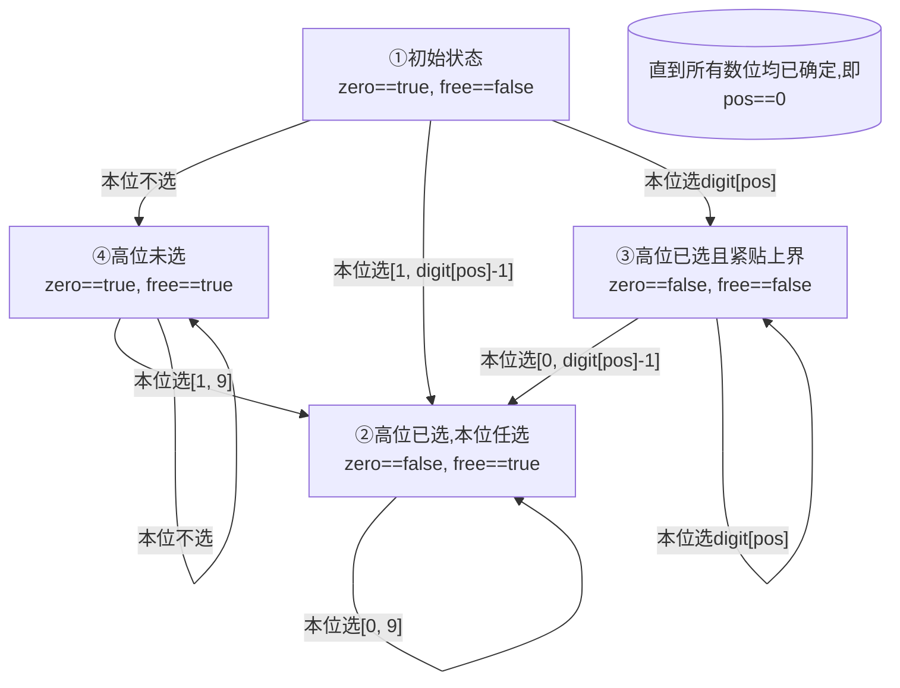

# §1 STL

## §1.1 `<iomainip>`

C++11起，`std::max` 可以接受多个参数，前提是要用花括号括起来，如：

```cpp
int a = max({9, 9, 12, 97301, 937});
```

还有，`printf` 支持输出保留小数点位数的数，其实 `std::cout` 也可以，但是需要包含头文件 `iomanip`，代码：

```cpp
cout << fixed << setprecision(位数) << 值;
```

## §1.2 `<algorithm>`

### §1.2.1 `std::sort()`

`std::sort(Iterator begin, Iterator end)`使用的是内省排序，默认从小到大排序。

该函数的完整签名为：

```c++
void std::sort(
	Iterator begin, 
	Iterator end,
	std::function(bool<const T &pre, const T &post>) comp; // pre是否应该在post的前面
);
```

`comp(pre, post)`接受两个形参，`pre`表示在序列中比较靠前/`begin`的元素，`post`表示在序列中比较靠后/`end`的元素。如果`comp()`返回`true`，则说明`pre`应该排在前面；如果返回`false`，则说明`post`应该排在前面。缺省时为`std::less<T>()`，表示升序输出。

### §1.2.2 `std::lower_bound()`/`std::upper_bound()`

> [CppReference](https://zh.cppreference.com/w/cpp/algorithm/lower_bound)：`std::lower_bound(Iterator begin, Iterator end, T value)`返回非严格单调递增容器从`begin`到`end`遍历，找到第一个大于等于`value`的位置，并返回这个位置的迭代器。

> [CppReference](https://zh.cppreference.com/w/cpp/algorithm/upper_bound)：`std::upper_bound(Iterator begin, Itertor end, T value)`返回非严格单调递增容器从`begin`到`end`遍历，找到第一个大于`value`的位置，并返回这个位置的迭代器。

这个最简单的定义没有涉及到STL实现这两个二分查找函数的本质。我们给出它们的完整签名：

```c++
template<class ForwardIt, class T, class Compare>
std::lower_bound(
    class ForwardIt first, 
    class ForwardIt last, 
    const T& value, 
    [](const T& iter_value, const T& value)->bool{};
);

template<Class ForwardIt, class T, class Compare>
std::upper_bound(
	class ForwardIt first,
    class ForwardIt last,
    const T& value,
    [](const T& value, const T& iter_value)->bool{};
)
```

> [CppReference](https://zh.cppreference.com/w/cpp/algorithm/lower_bound)：`std::lower_bound`的完整作用是：给定一段容器的首尾指针或迭代器`first`、`last`，这段容器靠近头部的元素值`forth_value`使得给函数或Lambda表达式传递的实参列表为`(forth_value, value)`时返回`true`，靠近尾部的元素值`back_value`使得给函数或Lambda表达式传递的形参列表为`(back_value, value)`时返回`false`，则返回从`first`到`last`的第一个使得函数或Lambda表达式返回`false`的指针或迭代器。若函数或Lambda表达式没有指定，则缺省等价地视为`std::less<T>()`。

> [CppReference](https://zh.cppreference.com/w/cpp/algorithm/upper_bound)：`std::upper_bound`的完整作用是：给定一段容器的首尾指针或迭代器`first`、`last`，这段容器靠近头部的元素值`forth_value`使得给函数或Lambda表达式传递的实参列表为`(value, forth_value)`时返回`false`，靠近尾部的元素值`back_value`使得给函数或Lambda表达式传递的形参列表为`(value, back_value)`时返回`true`，则返回从`first`到`last`的第一个使得函数或Lambda表达式返回`true`的指针或迭代器。若函数或Lambda表达式没有指定，则缺省等价地视为`std::less<T>()`。

$$
\begin{align}
\begin{array}{|c|c|c|c|c|c|c|}
	\hline
	\text{true} & \text{true} & \text{true} & \text{true} & \text{false} & \text{false} & \text{false} \\
	\hline
	& & & & \underset{\text{std::lower\_bound}}{\uparrow} & & \\
	\hline
\end{array} \\
\begin{array}{|c|c|c|c|c|c|c|}
	\hline
	\text{false} & \text{false} & \text{false} & \text{true} & \text{true} & \text{true} & \text{true} \\
	\hline
	& & & \underset{\text{std::upper\_bound}}{\uparrow} & & \\
	\hline
\end{array} \\
\end{align}
$$

STL提供了以下预置的比较函数：

- `std::less<T>`：`return a < b`
- `std::greater<T>`：`return a > b`
- `std::less_equal<T>`：`return a <= b`
- `std::greater_equal<T>`：`return a >= b`

根据以上定义，我们来分析以下实例：

- 给定递增容器`int a[5] = {0, 1, 2, 3, 4}`，使用`std::lower_bound(a, a + 5, 2)`的效果。首先函数或Lambda表达式没有指定，因此缺省为`std::less<int>()`。序列的首部元素值能满足`iter_value < 2`，末尾元素值不能满足`iter_value < 2`，因此符合`std::lower_bound()`对容器的元素排序要求。容易发现，第一个能让`iter_value < 2`为`false`的元素就是`a[2]`本身，因此返回`(int*)(a+2)`。
- 给定递减容器`int a[5] = {4, 3, 2, 1, 0}`，使用`std::upper_bound(a, a + 5, 2, std::greater<int>())`的效果。序列的首部元素`iter_value`较大，能使得`2 > iter_value`返回`false`；末尾元素的`2 > iter_value`为`true`，因此符合`std::upper_bound()`对容器的元素排序要求。容易发现，最后一个能让`iter_value > 2`为`true`的元素是`a[3]`，因此返回`(int*)(a+3)`。

如果要在不使用STL的情况下，或者无法使用迭代器时，为了查找二分查找的左指针和右指针，我们给出以下模版：

$$
\begin{array}{c|c|c|c|c|c|c|}
	\hline \text{valid()}返回值 & \text{true} & \text{true} & \text{true} & \text{false} & \text{false} & \text{false} \\
	\hline & & & \underset{\text{左指针}}{\uparrow} & \underset{\text{右指针}}{\uparrow} & & \\
	\hline
\end{array}
$$

```c++
bool valid(int x){
	return ...;
}

int left = 0, right = 9;
int left_pointer = left - 1, right_pointer = right + 1; // 若while()不满足，则直接返回区间外的数，表示查找失败
while(left <= right) {
    int mid = (left + right) / 2;
    if(valid(mid)) {
        left_pointer = mid;
        left = mid + 1;
    } else {
        right_pointer = mid;
        right = mid - 1;
    }
}
std::cout << left_pointer << '\n';
std::cout << right_pointer << '\n';
```

### §1.2.3 `std::*_heap()`

C++11提供了一系列关于二叉堆的算法。传统二叉堆并不使用容器的第一个空间`heap[0]`，因此使用`2*i`和`2*i+1`获取`i`的左右子节点，然而STL提供的算法并不浪费任何空间，使用`2*i+1`和`2*i+2`获取`i`的左右子节点，因此额外引入了一次加法的时间常数。

`std::make_heap()`用于建立二叉堆。**其中`Compare comp`等价于`bool comp(const T &child, const T &root)`，默认为`std::less<T>()`**。

```c++
void std::make_heap(Iter first, Iter last); // 访问范围为[first, last)
void std::make_heap(Iter first, Iter last, Compare comp);
// comp = std::less<>() 生成大顶堆（默认）
// comp = std::greater<>() 生成小顶堆
```

`std::is_heap()`用于判断一个容器是否成堆。时间复杂度为$O(n)$。

```c++
bool std::is_heap(Iter first, Iter last);
bool std::is_heap(Iter first, Iter last, Compare comp);
```

`std::is_heap_until()`用于查找使得容器符合堆条件的最大尾指针。时间复杂度为$O(n)$
。
```c++
Iter std::is_heap_until(Iter first, Iter last);
Iter std::is_heap_until(Iter first, Iter last, Compare comp);
```

`std::push_heap()`用于将`last - 1`处的元素插入到堆`[first, last - 1)`中，形成一个`[first, last)`的堆。时间复杂度为$O(\log_{2}{n})$。

```c++
void std::push_heap(Iter first, Iter last);
void std::push_heap(Iter first, Iter last, Compare comp);
```

`std::pop_heap()`先交换`heap[first]`和`heap[last - 1]`，然后确保`[first, last - 1)`为堆。时间复杂度为$O(2\log_{2}{n})$。

```c++
void std::pop_heap(Iter first, Iter last);
void std::pop_heap(Iter first, Iter last, Compare comp);
```

`std::sort_heap()`对储存堆的容器进行排序，`comp`默认为`std::less<>()`表示升序，**必须与建堆时使用的`comp`保持一致**。时间复杂度为$O(2n\log_{2}{n})$，**甚至不如`std::sort()`的$O(n\log_{2}{n})$**，不推荐使用。

```c++
void std::sort_heap(Iter first, Iter last);
void std::sort_heap(Iter first, Iter last, Compare comp);
```

### §1.2.4 `std::unique()`

`T* std::unique(Iter first, Iter last)`用于将`[first, last)`中的相邻重复元素移动到容器末尾，并返回一个新的`T* unique_last`指针，表示相邻元素去重后的结果存放在`[first, unique_last)`中。**通常配合`std::sort()`预处理后，做整体去重，而非仅仅是相邻重复元素的去重**。

```c++
Iter<T> unique_last = std::unique(Iter first, Iter last);
Iter<T> unique_last = std::unique(Iter first, Iter last, BinaryPred pred(T &lhs, T &rhs));
```

## §1.3 `<iostream>`

### §1.3.1 `std::cin`

#### §1.3.1.1 动态截断输入

设想题目的`STDIN`给定了`n`个数，但是没有给定`n`的具体值。这时我们可以将`std::cin >> a[i++]`放在`while()`中。

```c++
int a[100], i;
while(std::cin >> a[i++]){
	;
}
```

之所以能这么做，是因为我们可以将这个流输入表达式转换成`bool`值。具体来说，在C++中，`std::cin`的继承关系如下图所示：


`std::cin`的数据类型是`std::basic_istream<char, std::char_traits<char>>`，`std::cin >>`操作符返回的还是它自己的引用（`std::basic_istream&`）。沿着泛型实例化与静态类继承关系，一步步向上找，我们找到了这个关键的`bool()`类型转换函数：

```c++
extern "C++" class ios_base : public _Iosb<int> {
	// ...
    explicit operator bool() const noexcept {
        return !fail();
    }
    // ...
}
```

然而这个类型转换函数是被`explicit`修饰的，也就是说我们必须显式调用`(bool)`强制类型转换符才能转成`bool`，为什么我们可以不显式调用呢？这是因为在C++规定了[上下文转换](https://en.cppreference.com/w/cpp/language/implicit_conversion#Contextual_conversions)特性，在下面的六种情况中会自动转换成`bool`。

| 表达式位置                                | 注释       |
| ------------------------------------ | -------- |
| `if(...)`/`while(...)`/`for(;...;)`  |          |
| `!(...)`/`(...)&&(...)`/`...\|\|...` |          |
| `T func() noexcept { ... }`          |          |
| `static_assert([](){...}, str)`      |          |
| `...? :`                             | C++11及以后 |
| `explicit T func() { ... }`          | C++20及以后 |

当`std::cin`读到EOF或不符合格式的数据时，其`fail()`会返回`true`，于是`bool(std::cin)`返回`false`，可以作为终止输入的依据。

## §1.4 `<queue>`

### §1.4.1 `std::priority_queue`

STL将堆进一步封装成优先队列。

```c++
std::queue<class T, class Container = std::vector<T>, std::function<bool(T&, T&)> Compare = std::less<T>> queue(
	T,
	std::vector<T>,
	[](const T &child, const T &root){ return true; } // 返回true时,root在堆顶
);
```

这里的`Compare`是类，而不是实例化的可调用对象，也不是函数指针。

```c++
// 方法一: Lambda表达式变量
auto comp = [](const Stuff &child, const Stuff &root){ return ...; };
std::priority_queue<Stuff, std::vector<Stuff>, decltype(comp)> queue(comp);

// 方法二: Lambda表达式
std::priority_queue<Stuff, std::vector<Stuff>, std::function<bool(Stuff&, Stuff&)>> queue(
	[](const Stuff &child, const Stuff &root){ return ...;}
);

// 方法三：重载仿函数bool Stuff(&lhs, &rhs);
struct Stuff {
	inline bool operator(const Stuff &child, const Stuff &root){
		return ...;
	}
}
std::priority_queue(Stuff, std::vector<Stuff>, Stuff) queue;
```

## §1.5 `<regex>`

> [洛谷P8791](https://www.luogu.com.cn/problem/P8791)：给定两种声明变量的语句：声明`int`/`long`/`String`的`type key1=value1,key2=value2;`；声明`int[]`/`long[]`的`type[] key1[100],key2[200];`。不计`String`的末尾`\0`字符，求定义的变量占用多少字节。

```c++
const int T_MAX = 10;
int t; std::string s, s_var;
int64_t ans; struct { std::string desc; int64_t v; } ans_out[4] = {
    {"B", 0},
    {"KB", 0},
    {"MB", 0},
    {"GB", 0},
};
std::regex type_regex(R"((\w+)((\[\])?)\s+)");
std::regex int_regex(R"((\w+)\s*=\s*(-?\d+)\s*[,;]\s*)");
std::regex int_arr_regex(R"((\w+)\s*=\s*new\s+\w+\[(\d+)\]\s*[,;]\s*)");
std::regex string_regex(R"((\w+)\s*=\s*\"(.*?)\"\s*[,;]\s*)");
int main() {
    std::cin >> t; std::cin.ignore();
    while(t--) {
        std::getline(std::cin, s);
        std::smatch type_smatch, variable_smatch;
        std::regex_search(s, type_smatch, type_regex);
        s_var = type_smatch.suffix();

        if(type_smatch[1] == "int") {
            if(type_smatch[2] != "[]") {
                while(std::regex_search(s_var, variable_smatch, int_regex)) { ans += 4; s_var = variable_smatch.suffix(); }
            } else if(type_smatch[2] == "[]") {
                while(std::regex_search(s_var, variable_smatch, int_arr_regex)) { ans += 4 * std::stoll(variable_smatch[2]); s_var = variable_smatch.suffix(); }
            }
        } else if(type_smatch[1] == "long") {
            if(type_smatch[2] != "[]") {
                while(std::regex_search(s_var, variable_smatch, int_regex)) { ans += 8; s_var = variable_smatch.suffix(); }
            } else if(type_smatch[2] == "[]") {
                while(std::regex_search(s_var, variable_smatch, int_arr_regex)) { ans += 8 * std::stoll(variable_smatch[2]); s_var = variable_smatch.suffix(); }
            }
        } else if(type_smatch[1] == "String") {
            while(std::regex_search(s_var, variable_smatch, string_regex)) { ans += 1 * variable_smatch[2].length(); s_var = variable_smatch.suffix(); }
        }
    }
    for(int i = 0; i < 4; ++i) {
        ans_out[i].v = i < 3 ? ans % 1024 : ans;
        ans /= 1024;
    }
    for(int i = 3; i >= 0; --i) {
        if(ans_out[i].v == 0) { continue; }
        std::cout << ans_out[i].v << ans_out[i].desc;
    }
}
```

# §2 动态规划

## §2.1 背包DP

- 同时用到先后两次的`dp[n][]`和`dp[n-1][]`，且背包容量`j`与体积代价`cost[i]`满足严格偏序关系，才能使用一行滚动数组`dp[j]=...dp[j-cost[i]]`
- 只用到`dp[n][]`单层的递推式，使用一行滚动数组存储完毕后必须再次初始化，防止干扰下一层。
- 不满足严格偏序关系，必须使用两行滚动数组`dp[(n++)&1][j]`，且使用新行之前必须初始化为新值，否则本次在该行未经更新的数值就是两轮之前 的`dp[n-2][j]`

### §2.1.1 0/1背包

> [洛谷P1048](https://www.luogu.com.cn/problem/P1048)：给定容量为`capacity`的背包，`n`个体积和价值分别为`volume[i]`和`value[i]`的物品，使得背包容纳的物品总价值最大化。其中所有物品的体积和价值均大于0。

令`dp[i][j]`表示当背包容量为`j`时，在前`i`种物品中，能取得的最大物品总价值。其中`dp[0][j]`恒为0，表示什么都不选的情况。易得状态方程：
$$
\text{dp}[i][j]=\max\left(
	\text{dp}[i-1][j],
	\text{dp}[i-1][j-\text{volume}[i]]+\text{value}[i]
\right)
$$

```c++
long long int dp[101][1001];
long long int volume[101], value[101];
long long int capacity, n;
int main(){
    std::cin >> capacity >> n;
    for(long long int i = 1 ; i <= n ; ++i){
        std::cin >> volume[i] >> value[i];
    }

    for(long long int i = 1 ; i <= n ; ++i){
        for(long long int j = 0 ; j <= capacity ; ++j){
            dp[i][j] = dp[i - 1][j]; // 不选第i个物品
            if(j >= volume[i]){
                dp[i][j] = std::max(dp[i][j], dp[i - 1][j - volume[i]] + value[i]); // 选第i个物品
            }
        }
    }
    std::cout << dp[n][capacity];
    return 0;
}
```

该算法的空间复杂度显然为$O(\text{capacity}\cdot n)$，每个空间都要进行一次运算，因此时间复杂度也为$O(\text{capacity}\cdot n)$。

接下来考虑滚动数组优化。当我们把`dp`从二维数组变为一维数组时，受影响的地方有两处：

1. `dp[i][j] = dp[i - 1][j]`

   给`dp`直接砍掉一个维度，变成`dp[j] = dp[j]`，是否与原式等价呢？显然等价，因为`dp[j]`在赋值前的值是上一轮循环算出来的，因此就是`dp[i - 1][j]`本身，在赋值后的值是这一轮循环更新的，因此就是`dp[i][j]`本身。

2. `dp[i][j] = std::max(dp[i][j], dp[i - 1][j - volume[i]] + value[i])`

   给`dp`直接砍掉一个维度，变成`dp[j] = std::max(dp[j], dp[j - volume[i]] + value[i])`，是否与原式等价呢？在本次循环中，`dp[j - volume[i]`一定在`dp[j]`之前先被计算了出来，早就在本轮循环中被更新过，因此等价于`dp[i][j - volume[i]`，这与原式中的`dp[i - 1][j - volume[i]]`不等价。

   导致这一切的罪魁祸首是`dp[j - volume[i]`被抢先一步覆盖掉，只要不覆盖即可解决问题。于是我们想到改变第二层循环的循环顺序，将原来的从小到大变成从大到小即可。

```c++
long long int dp[1001]; // long long int dp[101][1001];
long long int volume[101], value[101];
long long int capacity, n;
int main(){
    std::cin >> capacity >> n;
    for(long long int i = 1 ; i <= n ; ++i){
        std::cin >> volume[i] >> value[i];
    }

    for(long long int i = 1 ; i <= n ; ++i){
        for(long long int j = capacity ; j >= 0 ; --j){ // for(long long int j = 0 ; j <= capacity ; ++j){
            ; // dp[i][j] = dp[i - 1][j] 简化为了 dp[j] = dp[j]
            if(j >= volume[i]){
                dp[j] = std::max(dp[j], dp[j - volume[i]] + value[i]); // dp[i][j] = std::max(dp[i][j], dp[i - 1][j - volume[i]] + value[i]);
            }
        }
    }
    std::cout << dp[capacity];
    return 0;
}
```

该算法的空间复杂度显然为$O(\text{capacity})$，每个空间都要进行$n$次运算，因此时间复杂度也为$O(\text{capacity}\cdot n)$。

各OJ通常还考察一处常数优化。在动态规划中，我们把一个问题拆成了几个子问题分别计算。现在有个问题：我们总共计算了这么多的子问题，真的都能用在后续的计算中吗？回想未经滚动数组优化的递推式，我们注意到：

1. 要求解第$N$层的$\text{dp}[N][\text{capacity}]$，我们只需要知道$\text{dp}[N-1][\text{capacity}]$和$\text{dp}[N-1][\text{capacity}-\text{volume}[N]]$这两个值即可，对应的第二维度的区间为$[\text{capacity}-\text{volume}[N],\text{capacity}]$。
2. 要求解第$N-1$层的$\text{dp}[N-1][\text{capacity}-\text{volumn}[N]]$，我们只需要知道$\text{dp}[N-2][\text{capacity}-\text{volume}[N]]$和$\text{dp}[N-1][\text{capacity}-\text{volume}[N]-\text{volume}[N-1]]$这两个值即可，对应的第二维度的区间为$[\text{capacity}-\text{volume}[N]-\text{volume}[N-1],\text{capacity}]$。
3. ......数学归纳法
4. 要求解第$p$层的值，对应的第二维度区间的左端点为$\text{capacity}-\sum_{j=p}^{n}\text{volume}[j]$。

从另一个角度来看，当我们已经确定前$p$组物品的$\text{dp}$情况后，至少要保证后面的其它物品都有可能被选取，甚至全部被选取的情况，才能保证不遗漏任何一种情况。这提示我们可以缩短第二层循环的枚举范围，也就是从原先的$[0,\text{capacity}]$缩短为$\left[\max\Big(\text{capacity}-\sum_{j=p}^{n}\text{volume}[j],\text{volume}[p]\Big),\text{capacity}\right]$。

```c++
long long int dp[1001];
long long int volume[101], value[101];
long long int capacity, n;
long long int volume_sum; // 计算sum(volume[i, n])
int main(){
    std::cin >> capacity >> n;
    for(long long int i = 1 ; i <= n ; ++i){
        std::cin >> volume[i] >> value[i];
        volume_sum += volume[i];
    }
    for(long long int i = 1 ; i <= n ; ++i){
        for(long long int j = capacity ; j >= std::max(capacity - volume_sum, volume[i]) ; --j){ // 收缩枚举范围
            if(j >= volume[i]){
                dp[j] = std::max(dp[j], dp[j - volume[i]] + value[i]);
            }
        }
        volume_sum -= volume[i]; // 维护sum(volumu[i, n])
    }
    std::cout << dp[capacity];
    return 0;
}
```

该优化在$\text{capacity}$特别大时非常有效。

#### §2.1.1.1 时间最优做法

为了进一步优化时间，我们考虑上述常数优化的枚举范围。其左端点极度依赖于$\sum_{j=p}^{n}\text{volume}[j]$，我们希望这个值越大越好，这依赖于`volumn`数组的顺序。于是，当$\text{volume}[i]$非常大时，先处理代价（本题为体积）较大的物品能更缩小枚举范围。只需付出一点很小的排序时间开销，就能抵消大$\text{volume}[i]$造成的劣势。

```c++
long long int dp[100001];
std::vector<std::pair<long long int, long long int>> data(101); // volume, value
long long int capacity, n;
long long int volume_sum;
int main(){
    std::cin >> capacity >> n;
    for(long long int i = 1 ; i <= n ; ++i){
        std::cin >> data[i].first >> data[i].second;
        volume_sum += data[i].first;
    }
    std::sort(data.begin() + 1, data.begin() + 1 + n, [](const auto &lhs, const auto &rhs){
        return lhs.first > rhs.first;
    }); // 排序，让大的volumn物品在前，先被处理
    for(long long int i = 1 ; i <= n ; ++i){
        for(long long int j = capacity ; j >= std::max(capacity - volume_sum, data[i].first) ; --j){
            // 没有必要使用if(j >= data[i].first)，该条件以合并到上一行的边界中
            dp[j] = std::max(dp[j], dp[j - data[i].first] + data[i].second);
        }
        volume_sum -= data[i].first;
    }
    std::cout << dp[capacity];
    return 0;
}
```

#### §2.1.1.2 空间最优做法

注意到在最外层循环中，遍历到第`p`个物品时，只有该物品的代价和价值参与了计算。因此我们可以不用一次性保存所有石子的全部数据，而是按需读入，即用即扔。空间复杂度$O(\text{capacity}\cdot n)$仍未改变，只是缩小了$O(n)$的常数而已。

该做法与常数优化冲突，因为遍历到第`p`个物品时，我们只知道$\sum_{j=1}^{p}\text{volume}[j]$，而常数优化要求的是$\sum_{j=p}^{n}\text{volume}[j]$，我们无法提前“预知”后面物品的`volume`属性。

```c++
long long int dp[1001];
// long long int volume[101], value[101];
long long int capacity, n;
int main(){
    std::cin >> capacity >> n;
    // for(long long int i = 1 ; i <= n ; ++i){
    //     std::cin >> volume[i] >> value[i];
    // }
    for(long long int i = 1 ; i <= n ; ++i){
        long long int volume, value; std::cin >> volume >> value; // 在此处即时O(1)读入
        for(long long int j = capacity ; j >= 0 ; --j){
            if(j >= volume){
                dp[j] = std::max(dp[j], dp[j - volume] + value);
            }
        }
    }
    std::cout << dp[capacity];
    return 0;
}
```

### §2.1.2 完全背包

> 给定容量为`capacity`的背包，`n`种供应量无穷大的，体积和价值分别为`volume[i]`和`value[i]`的物品，使得背包容纳的物品总价值最大化。其中所有物品的体积和价值均大于0。

令`dp[i][j]`表示当背包容量为`j`时，在前`i`种物品中，能取得的最大物品总价值。其中`dp[0][j]`恒为0，表示什么都不选的情况。与0/1背包不同，选中了第`i`个物品后还可以接着再选一次，因此状态转移方程为：
$$
\text{dp}[i][j]=\max\left(
	\text{dp}[i-1][j],
	\text{dp}[\textcolor{red}{i}][j-\text{volume}[i]]+\text{value}[i]
\right)
$$
这里我们直接考虑滚动数组优化。模仿上一节的分析，当砍掉`dp`数组的一个维度后，得到的代码与原式完全等价。

```c++
long long int dp[1001]; // long long int dp[101][1001];
long long int volume[101], value[101];
long long int capacity, n;
int main(){
    std::cin >> capacity >> n;
    for(long long int i = 1 ; i <= n ; ++i){
        std::cin >> volume[i] >> value[i];
    }

    for(long long int i = 1 ; i <= n ; ++i){
        for(long long int j = 0 ; j <= capacity ; ++j){    
            if(j >= volume[i]){
                dp[j] = std::max(dp[j], dp[j - volume[i]] + value[i]);
            }
        }
    }
    std::cout << dp[capacity];
    return 0;
}
```

该算法的空间复杂度显然为$O(\text{capacity})$，每个空间都要进行$n$次运算，因此时间复杂度也为$O(\text{capacity}\cdot n)$。

```
    for (int i = 0; i < n; ++i) { // 遍历每种物品
        int itemCost = cost[i];
        int itemValue = value[i];

        // 更新当前选择的最小和最大代价范围
        minCost = max(0, min(minCost, minCost + itemCost));
        maxCost = min(maxCapacity, max(maxCost, maxCost + itemCost));

        for (int j = minCost; j <= maxCost; ++j) {
            if (j >= itemCost && dp[j - itemCost] != INF) {
                dp[j] = max(dp[j], dp[j - itemCost] + itemValue);
            }
        }
    }
```


### §2.1.3 分组背包

> [洛谷P1757](https://www.luogu.com.cn/problem/P1757)：给定容量为`capacity`的背包，`n`个供应量无穷大的，体积、价值、类别分别为`volume[i]`、`value[i]`和`type[i]`的物品，每个类别中最多只能挑出一个物品装入背包，使得背包容纳的物品总价值最大化。其中所有物品的体积和价值均大于0。

本题在0/1背包的基础上引入了分组问题，显然`dp[i][j]`中的`i`指的不再是第`i`个物品，而是第`i`种类别。状态转移方程为：
$$
\text{dp}[i][j]=\max\bigg(
	\text{dp}[i-1][j],
	\max\big(
		\text{dp}[i][j-\text{volume}[i][k]]+\text{value}[i][k]
	\big)
\bigg)
$$

```c++
const long long int N_MAX = 1000, TYPE_MAX = 100, CAPACITY_MAX = 1000;
long long int n, capacity;
std::map<long long int, std::vector<std::tuple<long long int, long long int>>> data;
long long int dp[CAPACITY_MAX + 1];
int main(){
    std::cin >> capacity >> n;
    for(long long int i = 0 ; i < n ; ++i){
        long long int volume, value, type; std::cin >> volume >> value >> type;
        data[type].emplace_back(volume, value);
    }
    for(auto &group : data){
        for(long long int j = capacity ; j >= 0 ; --j){
            for(auto &item : group.second){
                if(j >= std::get<0>(item)){
                    dp[j] = std::max(
                        dp[j],
                        dp[j - std::get<0>(item)] + std::get<1>(item)
                    );
                }
            }
        }
    }
    std::cout << dp[capacity];
}
```

该算法的空间复杂度显然为$O(\text{capacity})$，每个空间都要进行$n$次运算，因此时间复杂度也为$O(\text{capacity}\cdot n)$。

### §2.1.4 多重背包

> [洛谷P1776](https://www.luogu.com.cn/problem/P1776)：给定容量为`capacity`的背包，`n`种数量为`count[i]`的，体积和价值分别为`volume[i]`和`value[i]`的物品，使得背包容纳的物品总价值最大化。其中所有物品的体积和价值均大于0。

一种显然的做法是将`count[i]`个相同的物品视作不同的物品，或者将状态转移方程中的$\max(\cdot)$参数列表填充为不选、仅选1个、仅选2个、...、仅选$\text{count}[i]$个，从而转化为01背包问题。但这会导致种类数$n$膨胀为$n\cdot\text{count}[i]$，导致超时。

这里我们引入二进制拆分优化。对于任意正整数`count[i]`，我们都可以将其拆分为二进制形式。因此我们只需要给$\max(\cdot)$的参数列表中填充为仅选$2^0$个、仅选$2^1$个、...、仅选$2^a$个，仅选$\text{count}[i]-\sum_{j=0}^{a}2^j$个。这些数字构成了一个集合，它的所有子集中的元素之和必定覆盖且仅覆盖$[0,\text{count}[i]]$中的每个正整数。例如正整数`25`可以拆分为`(1+2+4+8)+10`。种类数仅膨胀到$n\cdot\log_2(\text{count}[i])$。

```c++
const long long int N_MAX = 1e2, CAPACITY_MAX = 4e4, BINARY_N_MAX = 1e5;
long long int n, capacity, binary_n;
long long int volume[BINARY_N_MAX + 5], value[BINARY_N_MAX + 5];
long long int dp[CAPACITY_MAX + 1];
int main(){
    std::cin >> n >> capacity;
    for(long long int i = 1 ; i <= n ; ++i){
        long long int value_temp, volume_temp, count_temp; std::cin >> value_temp >> volume_temp >> count_temp;
        for(long long int j = 1 ; j <= count_temp ; j <<= 1){
            binary_n++;
            value[binary_n] = value_temp * j;
            volume[binary_n] = volume_temp * j;
            count_temp -= j;
        }
        if(count_temp > 0){
            binary_n++;
            value[binary_n] = value_temp * count_temp;
            volume[binary_n] = volume_temp * count_temp;
        }
    }
    for(long long int i = 1 ; i <= binary_n ; ++i){
        for(long long int j = capacity ; j >= 0 ; --j){
            if(j - volume[i] >= 0){
                dp[j] = std::max(dp[j], dp[j - volume[i]] + value[i]);
            }
        }
    }
    std::cout << dp[capacity];
}
```

该算法的空间复杂度显然为$O(\text{capacity})$，每个空间都要进行$n\cdot\log_2(\text{count}[i])$次运算，因此时间复杂度也为$O(\text{capacity}\cdot n\cdot\log_2(\text{count}[i]))$。

### §2.1.5 费用背包

> [洛谷P1510](https://www.luogu.com.cn/problem/P1510)：给定一个体积为`v`的坑洞，需要用石子填满（允许体积溢出）。石子的体积和代价（附属值）分别为`v[i]`和`c[i]`，求完成该任务的代价最小值。

本题有两种状态定义的方式，为`dp`数组分别填充了不同的初值。

- `dp[i][j]`：用前`i`个石子填满**体积**为`j`的坑洞，所付出的代价最小值。

  考虑滚动数组优化，`dp[j]`的初值（也就是`dp[0][j]`）如何确定？首先`dp[0][0]`肯定是0，此时坑洞已满，无需花费任何代价。而当`j`大于1时，因为此时没有石子可以使用，所以无论花费多少代价都无法满足条件，也就是说初值均为无穷大。

  再考虑转移方程，分两种情况——新的第$i$个石子能恰好补上临门一脚，或者使用这个石子后依然不能填满坑洞：
  $$
  \text{dp}[j]=\begin{cases}
  	\min\left(\text{dp}[j],\text{dp}[j-v[i]] + c[i]\right) &,j\ge v[i],\text{新加的石子还是不能填满} \\
  	\textcolor{red}{\min\left(\text{dp}[j],c[i]\right)} &,j<v[i],\text{仅这一个石子就能填满}
  \end{cases}
  $$

  ```c++
  const long long int N_MAX = 1e4, V_MAX = 1e4;
  long long int v, n, c;
  long long int dp[V_MAX + 1];
  int main(){
      std::cin >> v >> n >> c;
      std::fill(dp + 1, dp + 1 + V_MAX, 1e9);
      for(long long int i = 1 ; i <= n ; ++i){
          long long int volume, effort; std::cin >> volume >> effort;
          for(long long int j = v ; j >= 0 ; --j){
              if(j >= volume){
                  dp[j] = std::min(dp[j], dp[j - volume] + effort);
              }else{
                  dp[j] = std::min(dp[j], effort);
              }
          }
      }
      if(c - dp[v] >= 0){
          std::cout << c - dp[v];
      }else{
          std::cout << "Impossible";
      }
  }
  ```

- `dp[i][j]`：用前`i`个石子，且其代价之和小于等于预算`j`时，能填满的坑洞体积最大值。**该方法的局限性在于题目必须给出预算的最大值，或者预算的最大值大的不那么离谱，否则每次二层循环遍历的状态过多，导致超时。**

  考虑数组滚动优化，`dp[j]`的初值（也就是`dp[0][j]`）如何确定？因为没有石子可以使用，所以即使给再多的代价预算，也无处可花，更别说填满坑洞了，因此能填满的坑洞提及最大值全部为0。

  再考虑转移方程，分两种情况——如果代价此时仍有预算，能使用该石子，那么就取最小值；如果无法支付该石子所需的代价，那么就没有办法使用该石子，直接跳过此情况：
  $$
  \text{dp}[j]=\begin{cases}
  	\max\left(\text{dp}[j],\text{dp}[j-c[i]]+v[i]\right) &,j\ge v[i] \\
  	\text{dp}[j] &,j<v[i]
  \end{cases}
  $$

  ```c++
  const long long int N_MAX = 1e4, V_MAX = 1e4, C_MAX = 1e4;
  long long int v, n, c;
  long long int dp[C_MAX + 1];
  int main(){
      std::cin >> v >> n >> c;
      for(long long int i = 1 ; i <= n ; ++i){
          long long int volume, effort; std::cin >> volume >> effort;
          for(long long int j = c ; j >= 0 ; --j){
              if(j >= effort){
                  dp[j] = std::max(dp[j], dp[j - effort] + volume);
              }
          }
      }
      if(dp[c] >= v){
          long long int min_c = std::lower_bound(dp, dp + c + 1, v) - dp; // 因为dp非严格递增，所以能用二分优化
          std::cout << c - min_c;
      }else{
          std::cout << "Impossible";
      }
  }
  ```

> [洛谷P2340](https://www.luogu.com.cn/problem/P2340)：给定`n`个物品，每种物品都有两种代价`cost_1[i]`、`cost_2[i]`，代价可正可负。在物品的两种总代价均大于等于0的情况下，求这两种总代价之和的最大值。

令`dp[i][j]`表示前`i`个物品的第一种代价之和恰好为`j`时，第二种代价之和的最大值。于是有状态转移方程：
$$
\text{dp}[i][j] = \max(
	\text{dp}[i-1][j],
	\text{dp}[i-1][j-\text{cost\_1}[i]] + \text{cost\_2}[i]
)
$$
由于`cost_1[i]`可正可负，所以第二层遍历的顺序要随着其正负号而变化。

```c++
const long long int N_MAX = 400, COST_MAX = 1000, OFFSET = N_MAX * COST_MAX;
long long int n, dp[2 * OFFSET + 1];
int main(){
    std::cin >> n;
    std::fill(dp, dp + 2 * OFFSET + 1, INT32_MIN); dp[OFFSET] = 0;
    long long int left_bound = 0, right_bound = 0;
    for(int i = 1 ; i <= n ; ++i){
        long long int cost_1, cost_2; std::cin >> cost_1 >> cost_2;
        if(cost_1 < 0){
            left_bound += cost_1;
        }
        if(cost_1 > 0){
            right_bound += cost_1;
        }
        if(cost_1 >= 0){
            for(long long int j = right_bound ; j >= left_bound ; --j){
                dp[j + OFFSET] = std::max(dp[j + OFFSET], dp[j - cost_1 + OFFSET] + cost_2);
            }
        }else{
            for(long long int j = left_bound ; j <= right_bound ; ++j){
                dp[j + OFFSET] = std::max(dp[j + OFFSET], dp[j - cost_1 + OFFSET] + cost_2);
            }
        }
    }
    long long int result = INT32_MIN;
    for(long long int i = 0 ; i <= right_bound ; ++i){
        if(dp[i + OFFSET] < 0){
            continue;
        }
        result = std::max(result, dp[i + OFFSET] + i);
    }
    std::cout << result;
}
```

### §2.1.6 恰满背包

之前我们接触的背包题型往往带有$\sum\text{volume}_i\le \text{capacity}$的约束条件。本节讨论的是$\sum\text{volume}_i= \text{capacity}$。

- 以价值最大化问题为例，我们希望不合法的状态全为负无穷大，这样在$\max(\cdot)$的各参数大小竞争中，非法状态就会不起作用，等价于不存在。于是`dp[0][0]`为0，而`dp[0][1->n]`均为负无穷大。
- 以统计方案数问题为例，我们希望不合法的状态不对应任何方案，也就是0。于是`dp[0][0]`反而是一种合法的方案，因为什么都不选也能填满容量为0的背包，而`dp[0][1->n]`均为0。

### §2.1.7 依赖背包

> [洛谷P1064](https://www.luogu.com.cn/problem/P1064)：给定`m`个物品的价值`value[i]`和代价`cost[i]`。现将其分成若干组，每组物品均包含1个主物品和0~2个次物品。如果选择了某个子物品，则必须同时选择其组内的主物品。在各物品代价之和小于等于$n$的约束条件下，求物品价值之和的最大值。

？？？？？？？？？？？？？？？？？？？TODO：

> [洛谷P1455](https://www.luogu.com.cn/problem/P1455)：给定`n`个物品的价格`cost[i]`和价值`value[i]`，与`m`个捆绑销售关系。如果`i`和`j`是捆绑销售关系，则要么两者都不选，要么都选。给定预算`budget`，求价值最大值。

本题的关键在于意识到多个物品捆绑成了一个大物品。我们用并查集维护大物品的总价格和总价值，然后对`i:1->n`进行遍历，以`dsu_find(i) == i`为大物品的判断依据，对所有大物品使用0/1背包求解即可。

```c++
const int N_MAX = 1e4, M_MAX = 5e3, BUDGET_MAX = 1e4;
int dsu_parent[N_MAX + 1],  dsu_cost[N_MAX + 1], dsu_value[N_MAX + 1];
int n, m, budget, u_temp, v_temp, dp[BUDGET_MAX + 1];
int dsu_find(int x) { return dsu_parent[x] == x ? x : dsu_parent[x] = dsu_find(dsu_parent[x]); }
inline void dsu_unite(int child, int root) {
    int child_parent = dsu_find(child), root_parent = dsu_find(root);
    if(child_parent != root_parent) {
        dsu_cost[root_parent] += dsu_cost[child_parent];
        dsu_value[root_parent] += dsu_value[child_parent];
        dsu_parent[child_parent] = root_parent;
    }
}
int main() {
    std::cin >> n >> m >> budget;
    std::iota(dsu_parent + 1, dsu_parent + 1 + n, 1);
    for(int i = 1; i <= n; ++i) { std::cin >> dsu_cost[i] >> dsu_value[i]; }
    for(int i = 1; i <= m; ++i) {
        std::cin >> u_temp >> v_temp;
        dsu_unite(u_temp, v_temp);
    }
    for(int i = 1; i <= n; ++i) {
        if(dsu_find(i) != i) { continue; }
        for(int j = budget; j >= dsu_cost[i]; --j) {
            dp[j] = std::max(dp[j], dp[j - dsu_cost[i]] + dsu_value[i]);
        }
    }
    std::cout << dp[budget];
}
```

### §2.1.8 混合背包

混合背包指的是上述背包问题中提到的物品特性混合起来。针对此类问题，我们只需对不同问题的物品分别套用不同的转移方程即可。

```
for i=1..N
    if 第i件物品属于01背包
        // ...
    else if 第i件物品属于完全背包
        // ...
    else if 第i件物品属于多重背包
        // ...
```

### §2.1.9 多维代价背包

> [洛谷P1855](https://www.luogu.com.cn/problem/P1855)：在0/1背包的基础上，总共引入了两个约束条件。

额外给`dp`引入一个新维度即可。状态转移方程为：
$$
\text{dp}[i][v][u]=\max\left(
	f[i-1][v][u],f[i-1][v-a[i]][u-b[i]]+w[i]
\right)
$$
滚动数组优化规则与前文相似，都要注意循环内的枚举顺序。

```c++
const long long int N_MAX = 1e2, MONEY_MAX = 2e2, TIME_MAX = 2e2;
long long int n, money_capacity, time_capacity;
long long int times[N_MAX + 1], moneys[N_MAX + 1], values[N_MAX + 1];
long long int dp[MONEY_MAX + 1][TIME_MAX + 1];
int main(){
    std::cin >> n >> money_capacity >> time_capacity;
    for(long long int i = 1 ; i <= n ; ++i){
        std::cin >> moneys[i] >> times[i];
        values[i] = 1;
    }
    for(long long int i = 1 ; i <= n ; ++i){
        for(long long int j = money_capacity ; j >= 0 ; --j){
            for(long long int k = time_capacity ; k >= 0 ; --k){
                if(j >= moneys[i] && k >= times[i]){
                    dp[j][k] = std::max(
                        dp[j][k],
                        dp[j - moneys[i]][k - times[i]] + values[i]
                    );
                }
            }
        }
    }
    std::cout << dp[money_capacity][time_capacity];
}
```

> [洛谷P1541](https://www.luogu.com.cn/problem/P1541)：给定一个`1×n`的棋盘，起点和终点在棋盘两侧。每个格子都有分数，每回合选择一个前进1步、2步、3步、4步的机会，这四种机会的使用次数上限分别为`card[1]`、`card[2]`、`card[3]`、`card[4]`。求分数最大值。

令`dp[a][b][c][d]`表示这四种机会分别使用了`a`、`b`、`c`、`d`次，达到第`1+1×a+2×b+3×c+4×d`个格子时，能达到的最大值。

```c++
const long long int N_MAX = 350, M_MAX = 120, CARD_MAX = 40;
long long int n, m, card[5], score[N_MAX + 1], dp[CARD_MAX + 1][CARD_MAX + 1][CARD_MAX + 1][CARD_MAX + 1];
int main(){
    std::cin >> n >> m;
    for(long long int i = 1 ; i <= n ; ++i){
        std::cin >> score[i];
    }
    for(long long int i = 1 ; i <= m ; ++i){
        long long int temp; std::cin >> temp;
        card[temp]++;
    }
    dp[0][0][0][0] = score[1];
    for(long long int a = 0 ; a <= card[1] ; ++a){
        for(long long int b = 0 ; b <= card[2] ; ++b){
            for(long long int c = 0 ; c <= card[3] ; ++c){
                for(long long int d = 0 ; d <= card[4] ; ++d){
                    long long int distance = a + 2 * b + 3 * c + 4 * d;
                    if(a >= 1){
                        dp[a][b][c][d] = std::max(dp[a][b][c][d], dp[a - 1][b][c][d] + score[1 + distance]);
                    }
                    if(b >= 1){
                        dp[a][b][c][d] = std::max(dp[a][b][c][d], dp[a][b - 1][c][d] + score[1 + distance]);
                    }
                    if(c >= 1){
                        dp[a][b][c][d] = std::max(dp[a][b][c][d], dp[a][b][c - 1][d] + score[1 + distance]);
                    }
                    if(d >= 1){
                        dp[a][b][c][d] = std::max(dp[a][b][c][d], dp[a][b][c][d - 1] + score[1 + distance]);
                    }
                    ;
                }
            }
        }
    }
    std::cout << dp[card[1]][card[2]][card[3]][card[4]];
}
```

> [洛谷P2732](https://www.luogu.com.cn/problem/P2732)：商店中售卖`n`种物品（$n\le 5$），原本单价为`price[i]`。现在商店提供`s`种无限使用的捆绑销售优惠策略，第`i`种策略将这`n`种物品分别取`s_product[i][j]`个打包，总计的优惠价格为`s_price[i]`。现在要求每种物品`i`分别恰好买`buy[i]`（$\text{buy}[i]\le 5$）个，求费用最小值。

令`dp[a][b][c][d][e]`表示5种商品恰好购买`a`、`b`、`c`、`d`、`e`个的费用最小值，既可以使用优惠策略，也可以单价购买。

```c++
const long long int S_MAX = 99, N_MAX = 5;
long long int product_count;
long long int s_product[S_MAX + 1][N_MAX + 1], s_price[S_MAX + 1], buy[N_MAX + 1], price[N_MAX + 1];
long long int dp[N_MAX + 1][N_MAX + 1][N_MAX + 1][N_MAX + 1][N_MAX + 1];
std::map<long long int , long long int> product_id_map;
int main(){
    long long int s; std::cin >> s;
    for(long long int i = 1 ; i <= s ; ++i){
        long long int s_product_type_count; std::cin >> s_product_type_count;
        for(long long int j = 1 ; j <= s_product_type_count ; ++j){
            long long int product_id, sale_product_count; std::cin >> product_id >> sale_product_count;
            if(product_id_map.count(product_id) == 0){
                product_id_map[product_id] = ++product_count;
            }
            product_id = product_id_map[product_id];
            s_product[i][product_id] = sale_product_count;
        }
        std::cin >> s_price[i];
    }
    long long int buy_count; std::cin >> buy_count;
    for(long long int i = 1 ; i <= buy_count ; ++i){
        long long int buy_product_id, buy_product_count, buy_price; std::cin >> buy_product_id >> buy_product_count >> buy_price;
        if(product_id_map.count(buy_product_id) == 0){
            product_id_map[buy_product_id] = ++product_count;
        }
        buy_product_id = product_id_map[buy_product_id];
        buy[buy_product_id] = buy_product_count;
        price[buy_product_id] = buy_price;
    }
    std::fill_n(dp[0][0][0][0], (N_MAX + 1) * (N_MAX + 1) * (N_MAX + 1) * (N_MAX + 1) * (N_MAX + 1), INT32_MAX);
    dp[0][0][0][0][0] = 0;
    for(long long int a = 0 ; a <= buy[1] ; ++a){
        for(long long int b = 0 ; b <= buy[2] ; ++b){
            for(long long int c = 0 ; c <= buy[3] ; ++c){
                for(long long int d = 0 ; d <= buy[4] ; ++d){
                    for(long long int e = 0 ; e <= buy[5] ; ++e){
                        if(a >= 1){dp[a][b][c][d][e] = std::min(dp[a][b][c][d][e], dp[a - 1][b][c][d][e] + price[1]);}
                        if(b >= 1){dp[a][b][c][d][e] = std::min(dp[a][b][c][d][e], dp[a][b - 1][c][d][e] + price[2]);}
                        if(c >= 1){dp[a][b][c][d][e] = std::min(dp[a][b][c][d][e], dp[a][b][c - 1][d][e] + price[3]);}
                        if(d >= 1){dp[a][b][c][d][e] = std::min(dp[a][b][c][d][e], dp[a][b][c][d - 1][e] + price[4]);}
                        if(e >= 1){dp[a][b][c][d][e] = std::min(dp[a][b][c][d][e], dp[a][b][c][d][e - 1] + price[5]);}
                        for(long long int i = 1 ; i <= s; ++i){
                            if(a >= s_product[i][1] && b >= s_product[i][2] && c >= s_product[i][3] && d >= s_product[i][4] && e >= s_product[i][5]){
                                dp[a][b][c][d][e] = std::min(
                                    dp[a][b][c][d][e],
                                    dp[a - s_product[i][1]][b - s_product[i][2]][c - s_product[i][3]][d - s_product[i][4]][e - s_product[i][5]] + s_price[i]
                                );
                            }
                        }
                    }
                }
            }
        }
    }
    std::cout << dp[buy[1]][buy[2]][buy[3]][buy[4]][buy[5]];
}
```

### §2.1.10 二维极值背包

> [洛谷P1509](https://www.luogu.com.cn/problem/P1509)：给定`n`个物品，第`i`个物品含有金钱代价`money[i]`、幸运代价`luck[i]`、时间代价`time[i]`和价值`value[i]`（本题恒为1）。现在金钱预算只有`money_budget`，幸运运算只有`luck_budget`。请求出一种方案，使得物品总价值最大化。如果有多种方式均能使得物品总价值到达最大值，则选取时间总代价最小的方案，并输出该方案所需的时间总代价。

本题涉及到的最优化变量有两个，因此要设置两个`dp`数组——`dp_value`表示前`i`个物品在预算约束内能达到的价值最大值；`dp_time`表示第`i`个物品在预算约束内达到价值最大值时，能达到的时间总代价最小值。

```c++
const long long int N_MAX = 100, MONEY_MAX = 1e2, LUCK_MAX = 1e2, TIME_MAX = 1e3;
long long int dp_value[MONEY_MAX + 1][LUCK_MAX + 1], dp_time[MONEY_MAX + 1][LUCK_MAX + 1];
long long int n, money_budget, luck_budget, money[N_MAX + 1], luck[N_MAX + 1], period[N_MAX + 1];
int main(){
    std::cin >> n;
    for(long long int i = 1 ; i <= n ; ++i){
        std::cin >> money[i] >> luck[i] >> period[i];
    }
    std::cin >> money_budget >> luck_budget;
    for(long long int i = 1 ; i <= n ; ++i){
        for(long long int j = money_budget ; j >= 0 ; --j){
            for(long long int k = luck_budget ; k >= 0 ; --k){
                if(j < money[i] || k < luck[i]){
                    continue; // 预算不足，无法选择
                }
                if(dp_value[j][k] < dp_value[j - money[i]][k - luck[i]] + 1){
                    // 总value可以增加，强制更新时间总代价（即使会升高）
                    dp_value[j][k] = dp_value[j - money[i]][k - luck[i]] + 1;
                    dp_time[j][k] = dp_time[j - money[i]][k - luck[i]] + period[i];
                }else if(dp_value[j][k] == dp_value[j - money[i]][k - luck[i]] + 1){
                    // 总value持平，时间总代价尝试降低
                    dp_time[j][k] = std::min(dp_time[j][k], dp_time[j - money[i]][k - luck[i]] + period[i]);
                }
            }
        }
    }
    std::cout << dp_time[money_budget][luck_budget];
}
```

### §2.1.11 泛化物品背包

在泛化物品背包问题中，物品的价值不再是一个定值，而是关于物品代价的函数。

> [洛谷P1336](https://www.luogu.com.cn/problem/P1336)：给定`n`种不限量供应的物品，某种物品选择`i`个时，这`i`个同类物品加起来的价值是`a[i]×i^b[i]`。在恰好选择`m`个物品的情况下，求总价值的最小值。

令`dp[i][j]`表示给定前`i`种物品，要求恰好选`j`个物品时的价值最小值，于是有状态转移方程：
$$
\text{dp}[i][j] = \min\begin{cases}
	\text{dp}[i-1][j] \\
	\text{dp}[i-1][j-1] + a[i]\times 1^{b[i]} \\
	\cdots \\
	\text{dp}[i-1][j-j] + a[i]\times j^{b[i]} \\
\end{cases}
$$
本题的陷阱在于：在第二层循环中，遍历顺序是从小到大还是从大到小。乍看本题，我们可能会认为每种物品无限供应，所以是完全背包，遍历顺序从小到大。但是观察上面的状态转移方程，我们发现得使用从大到小的顺序。

```c++
const long long int N_MAX = 20, PAPER_BUDGET_MAX = 200;
long long int n, paper_budget, a[N_MAX + 1], b[N_MAX + 1];
long long int dp[PAPER_BUDGET_MAX + 1]; // dp[i][j] 前i种物品分配j个指标
int main(){
    std::cin >> paper_budget >> n;
    std::fill(dp + 1, dp + 1 + paper_budget, 1e9);
    for(long long int i = 1 ; i <= n ; ++i){
        std::cin >> a[i] >> b[i];
    }
    for(long long int i = 1 ; i <= n ; ++i){
        for(long long int j = paper_budget ; j >= 0 ; --j){
            for(long long int k = 0 ; k <= j ; ++k){
                dp[j] = std::min(dp[j], dp[j - k] + a[i] * fast_power(k, b[i]));
            }
        }
    }
    std::cout << dp[paper_budget];
}
```

> [洛谷P1417](https://www.luogu.com.cn/problem/P1417)：给定`n`个物品，每个物品需要时间代价`c[i]`才能装入背包。当该物品装入背包时，记背包中的物品时间代价之和记为`t`（即已经过去了`t`个时间单位），则这个物品的价值为`a[i]-t×b[i]`。已知背包的时间预算为`t_budget`，求背包价值最大值。

在传统的背包问题中，物品的顺序不会影响最终答案。然而在本题中不是这样。考虑最简单的情况——只有两种物品，则两者的先后选择顺序对应的背包总价值分别为：
$$
\text{value}_{1,2} = (a[1] - c[1] \times b[1]) + (a[2] - (c[1] + c[2]) \times b[2]) \\
\text{value}_{2,1} = (a[2] - c[2] \times b[2]) + (a[1] - (c[1] + c[2]) \times b[1]) \\
$$
我们不禁思考——到底哪种排列方式才是最优的呢？解不等式$\text{value}_{1,2}>\text{value}_{2,1}$可知$c[1]b[2]<c[2]b[1]$，即$\frac{c[1]}{b[1]}<\frac{c[2]}{b[2]}$。更进一步，给定含有`n`个物品的序列，对于其中任意的两个物品，将$\frac{c[i]}{b[i]}$更小的放在前面，总是能获得更大的价值。这提示我们尽可能将$\frac{c[i]}{b[i]}$更小的物品放在前面进行挑选，使用一轮排序即可。

```c++
const long long int N_MAX = 50, T_MAX = 1e5;
long long int t, n, dp[T_MAX + 1];
struct Object{
    long long int a, b, c;
};
Object object[N_MAX + 1];

int main(){
    std::cin >> t >> n;
    for(long long int i = 1 ; i <= n ; ++i){
        std::cin >> object[i].a;
    }
    for(long long int i = 1 ; i <= n ; ++i){
        std::cin >> object[i].b;
    }
    for(long long int i = 1 ; i <= n ; ++i){
        std::cin >> object[i].c;
    }
    std::sort(object + 1, object + n + 1, [](const auto &lhs, const auto &rhs){
        return lhs.c * rhs.b  < rhs.c * lhs.b;
    });
    for(long long int i = 1; i <= n ; ++i){
        for(long long int j = t ; j >= object[i].c ; --j){
            dp[j] = std::max(dp[j], dp[j - object[i].c] + object[i].a - object[i].b * j);
        }
    }
    std::cout << *(std::max_element(dp + 1, dp + t + 1));
}
```

> [洛谷P7381](https://www.luogu.com.cn/problem/P7381)：给定`n`组物品与对应的`n`个背包。单个物品的代价均为1，背包代价容量均为`m`，属于第`i`组的物品只能装到第`i`个背包中。对于任意一种物品，多个同种物品的价值之和与该种物品的总数有关，从数量到总价值的关系由`value[]`数组给出。现在第`i`个背包中已有`count[i]`个第`i`种物品，在此基础上还可以自由选择`budget`个物品。求最终各类物品总价值之和的最大值。

令`dp[i][j]`表示选择前`i`种物品，在`count[]`的基础上自由选择`j`个物品的总价值之和最大值。这里的`j`并不包含原有的`count[i]`。因此状态转移方程为：

$$
\text{dp}[i][j] = \max(
    \text{dp}[i-1][j-k]+\text{value}[\textcolor{red}{\text{count}[i]+k}]
)
$$

然后用滚动数组压缩到一行。注意到不是所有`dp[i][j]`状态的`j`都是合法的，于是解边界不等式进行常数优化即可。

```c++
const int N_MAX = 500, M_MAX = 500, BUDGET_MAX = 500, MOD = 2015;
int n, m, budget;
int count[N_MAX + 1], value[M_MAX + 1], dp[BUDGET_MAX + 1];
int main() {
    std::cin >> n >> m >> budget;
    for(int i = 1; i <= n; ++i) { std::cin >> count[i]; }
    for(int i = 0; i <= m; ++i) { std::cin >> value[i]; }
    int budget_right = 0;
    for(int i = 1; i <= n; ++i) {
        budget_right += (m - count[i]); // 可供使用的剩余背包代价预算
        for(int j = std::min(budget, budget_right); j >= 0; --j) { 
            for(int k = 0; k <= j; ++k) { // 对于第i组物品，在count[i]的基础上再选k个物品
                dp[j] = std::max(dp[j], dp[j - k] + value[count[i] + k]);
            }
        }
    }
    std::cout << dp[budget] << std::endl;
}
```

### §2.1.12 剔除物品背包

剔除物品背包在普通背包已经求解完毕的前提下，在可选择的物品列表中剔除某些物品，随后提问最优值。

> [洛谷P4141](https://www.luogu.com.cn/problem/P4141)：给定`n`个代价分别为`cost[i]`的物品和一个代价容量为`budget`的背包。要求现在从中抽离出第$i\in[1,n]$个物品，在剩下的`n-1`个物体中，能恰好填满容量为$j\in[1,\text{budget}]$背包的方案数`answer[i][j]`矩阵。（模`10`输出）

令`dp[i][j]`表示使用前`i`个物品能得到的代价之和恰好为`j`的方案数，`dp_unique[i][j]`表示在`n`个物品中抽离第`i`个物品后，代价之和恰好为`j`的方案数。那么显然`dp[n][j]`由两部分组成：

1. 不包含第`i`个物品的方案数。由定义可知等于`dp_unique[i][j]`。
2. 包含第`i`个物品的方案数。由假设可知，这些方案肯定都包含第`i`个物品。因此对于每种方案，我们将第`i`个物品剔除，对应背包容量缩小至`j-cost[i]`，都能对应到一种符合新条件的方案，这个新条件就是"在`n`个物品中剔除第`i`个物品，背包容量恰好为`j-cost[i]`"，由定义可知这部分方案数等于`dp_unique[i][j-cost[i]]`。当然，如果`j<cost[i]`，那么当前背包容量`j`不可能放下第`i`个物品，这部分方案数退化为0。

基于此，我们可以写出状态转移方程：
$$
\text{dp\_unique}[i][j] = \begin{cases}
	\text{dp}[n][j] - \text{dp\_unique}[i][j-\text{cost}[i]] & ,j\ge\text{cost}[i] \\
	\text{dp}[n][j] & ,j<\text{cost}[i] \\
\end{cases}
$$
然后考虑滚动数组优化。在推导`dp_unique`数组时，用到的都是`dp[n][j]`一行，因此可以直接退化为`dp[j]`。对于`dp_unique[i][j]`，我们只用到了`dp_unique[i][]`当前层的数值，与上一层无关，因此可以直接退化成`dp[]`。因为`j-cost[i]<=j`，用到了`dp_unique`已经在本层计算出的值，所以第二层循环的顺序为从左到右。**尤其要警惕第二层循环的左边界必须为`1`，不能为`cost[i]`，否则`dp_unique[j]`可能不是`dp[n][j]`这个预期的常数，而是上一层计算的值`dp[n][j]-dp_unique[i-1][cost[i-1]]`。**

```c++
const long long int N_MAX = 2000, BUDGET_MAX = 2000, MOD = 10;
long long int n, budget, dp[BUDGET_MAX + 1], dp_unique[BUDGET_MAX + 1], cost[N_MAX + 1];
int main(){
    std::cin >> n >> budget;
    for(long long int i = 1 ; i <= n ; ++i){
        std::cin >> cost[i];
    }
    dp[0] = 1 % MOD;
    for(long long int i = 1 ; i <= n ; ++i){
        for(long long int j = budget ; j >= cost[i] ; --j){
            dp[j] = (dp[j] + dp[j - cost[i]]) % MOD;
        }
    }
    dp_unique[0] = 1;
    for(long long int i = 1 ; i <= n ; ++i){
        for(long long int j = 1 ; j <= budget ; ++j){
            if(j >= cost[i]){
                dp_unique[j] = (dp[j] - dp_unique[j - cost[i]] + MOD) % MOD;
            }else{
                dp_unique[j] = dp[j];
            }
            std::cout << dp_unique[j];
        }
        std::cout << '\n';
    }
}
```

另一种思路是从撤销角度理解。背包的一个重要特点是物品顺序不影响最终结果，而这就是本题的关键。先讨论`n`个物品全部参与运算的情况：既然顺序不影响，我们可以认为`n-1`个物品先参与运算，而抽离的第`i`个物品最后参与运算。只要能根据`dp[n][]`将最后物品的第`n`次计算撤销掉，那么`dp[n-1][]`对应的第`n-1`次计算就是我们所求的值。

令`dp[i][j]`表示使用前`i`个物品能得到的代价之和恰好为`j`的方案数，`dp_unique[i][j]`表示将第`k`个物品放在最后，其余`n-1`个物品放在前面排序后，前`i`个物品代价之和恰好为`j`的方案数。那么根据上一段的结论可以得到这`dp[n][*]==dp_unique[n][*]`，我们要求的是`k`个`dp_unique[n-1][*]`。

`dp_unique[n][j]`（即`dp[n][j]`）由两部分组成：

1. 不包含第`i`个物品的方案数。因为不包含第`i`个物品，所以物品选择范围从`1->n`退化到`1->n-1`不会对这部分方案数造成影响。由定义可知这部分方案数等于`dp_unique[n-1][j]`。
2. 包含第`i`个物品的方案数。由假设可知，这些方案肯定都包含第`i`个物品。因此对于每种方案，我们将第`i`个物品剔除，对应背包容量缩小至`j-cost[i]`，都能对应到一种符合新条件的方案，这个新条件就是"在`n`个物品中剔除第`i`个物品，背包容量恰好为`j-cost[i]`"，由定义可知这部分方案数等于`dp_unique[n-1][j-cost[i]]`。当然，如果`j<cost[i]`，那么当前背包容量`j`不可能放下第`i`个物品，这部分方案数退化为0。

$$
\text{dp\_unique}[n-1][j] = \text{dp}[n][j] - \text{dp\_unique}[n-1][j-\text{cost}[k]]
$$

剩余步骤完全相同。

### §2.1.13 次优解/第`k`优解

> [洛谷P1858](https://www.luogu.com.cn/problem/P1858)：求0/1背包的前`k`个最优解之和。不同的解法之间的选择的物品组合禁止相同。

原先`dp[i][j]`表示背包容量为`j`时，给定前`i`种物品时的代价最大值。本题的思路是扩充`dp[i][j]`的含义，使其指向一个长度为`k`的数组，分别存储最优解、次优解、...、第k优解。显然`dp[i][j]`是递减的。为了得到`dp[i][j]`，我们将`dp[i-1][j]`和`dp[i-1][j-cost]+value`这两个长度均为`k`的数组合并起来，并维持递减的排序。

编程要注意细节：由于使用滚动数组优化，所以`dp[i][j]`和`dp[i-1][j]`共同使用了同一块空间，因此必须借助外部数组`merge_temp`暂时储存合并结果，然后复制到`dp[i][j]`的空间中。否则`dp[i-1][j]`一边读取同一块内存空间，`dp[i][j]`一边写入同一块内存空间，会覆盖掉`dp[i-1][j]`的内容，导致输出错误。

```c++
const long long int K_MAX = 50, V_MAX = 5000, N_MAX = 200;
long long int dp[V_MAX + 1][K_MAX + 1], merge_temp[K_MAX + 1];
long long int k, v, n;
int main(){
    std::cin >> k >> v >> n;
    for(long long int i = 0 ; i <= v ; ++i){
        for(long long int j = 0 ; j <= k ; ++j){
            dp[i][j] = INT32_MIN;
        }
    }
    dp[0][1] = 0;
    for(long long int i = 1 ; i <= n ; ++i){
        long long int cost, value; std::cin >> cost >> value;
        for(long long int j = v ; j >= cost ; --j){
            // 给定两个队列dp[j][*]和dp[j - cost][*], 从前向后遍历并合并
            long long int queue_head_index_1 = 1, queue_head_index_2 = 1;
            for(long long int a = 1 ; a <= k ; ++a){
                if(dp[j][queue_head_index_1] <= dp[j - cost][queue_head_index_2] + value){
                    merge_temp[a] = dp[j - cost][queue_head_index_2] + value;
                    queue_head_index_2++;
                }else{
                    merge_temp[a] = dp[j][queue_head_index_1];
                    queue_head_index_1++;
                }
            }
            std::copy(merge_temp + 1, merge_temp + k + 1, dp[j] + 1);
        }
    }
    std::cout << std::accumulate(dp[v] + 1, dp[v] + k + 1, 0ll);
}
```

### §2.1.14 面值背包

> [洛谷P2725](https://www.luogu.com.cn/problem/solution/P2725)：给定`n`种无限供应的、面值`value[i]`不同的硬币。从中最多选择`k`枚硬币，要求输出不能组合出的正整数面值的最小值。

令`dp[i][j]`表示给定前`i`种硬币，能组合出面值恰好为`j`所需的最少硬币数。

```c++
const long long int N_MAX = 50, BUDGET_MAX = 200, VALUE_MAX = 1e4;
long long int n, budget, value, value_sum;
int dp[2000000]; // 本题空间成谜，出的不好
int main(){
    std::cin >> budget >> n;
    std::fill(dp, dp + 2000000, BUDGET_MAX + 1);
    dp[0] = 0;
    for(long long int i = 1 ; i <= n ; ++i){
        std::cin >> value; value_sum += value; 
        long long int right_bound = value_sum * budget;
        for(long long int j = value ; j <= 2000000 ; ++j){
             dp[j] = std::min(dp[j], (dp[j - value] + 1));
        }
    }
    for(long long int i = 1 ; i <= BUDGET_MAX * VALUE_MAX; ++i){
        if(dp[i] > budget){
            std::cout << i - 1;
            return 0;
        }
    }
}
```

> [洛谷P2851](https://www.luogu.com.cn/problem/P2851)：现在有`n`种面额分别为`value[i]`的硬币，给定要购买的商品价格`t`。买方对于每种硬币只有`buyer_count[i]`枚，而卖方有无穷多硬币。定义找零金额`k`等于支付金额`k+t`减商品价格`t`。令`dp_buyer[i]`和`dp_sellor[i]`分别表示买方和卖方恰好凑出`i`元所需硬币的最少数量，求$\forall k\in[0,+\infin)$，`dp_buyer[k+t]+dp_seller[k]`的最小值。如果无解则输出-1。

本题的买方`dp_buyer`数组是二进制优化的多重背包，卖方`dp_sellor`数组是完全背包。分别求出即可。

本题的难点在于$\forall k\in[0,+\infin)$，我们肯定无法真正的求出$k\rightarrow+\infin$的情况，这样的话数组空间和计算耗时都撑不住，所以我们要给`k`的遍历指定一个上界。问题是：上界怎么求？

在求解之前，我们先介绍以下引理：

1. 如果支付方案和找零方案都包含某个面值相同的硬币，那么这个支付方案和找零方案一定都不是最优方案。因为此时这两个方案都可以移除这枚重复的硬币，从而减少硬币数。

2. 在最优的找零方案中，所有面值非最大面值的硬币总数一定小于等于最大面值`value_max`。

   使用反证法：假设大于`value_max`，那么此时找零金额大于$\text{value\_max}^2$。将这些面值严格小于`value_max`的、总数量大于`value_max`的硬币随意排成一行，第`i`枚硬币的面值记为`v'[i]`，我们可以为其生成一个长度大于`value_max`的面值前缀和`value_prefixsum[*]`数组。我们知道，一组整数对`value_max`取模至多会产生`value_max`个不同的结果，然而前缀和数组的长度大于`value_max`，因此根据抽屉原理，必定存在两个前缀和`value_prefixsum[i]`和`value_prefixsum[j]`对`value_max`同余。这两个数相减，可以得到$\sum_{k=i+1}^{j}v'[i]=k\cdot\text{value\_max}$，其中$k\ge 1$。将这$j-i$枚面值小于`value_max`的硬币换成`k`枚面值为`value_max`的硬币，可以进一步减少硬币数量。于是原找零方案不是最优的策略，与假设矛盾，证毕。

3. 在找零方案中，$\text{dp\_seller}[\text{value\_max}^2+k]$一定严格大于$\text{dp\_seller}[\text{value\_max}^2]$。首先，显然$\text{dp\_seller}[\text{value\_max}^2]=\text{value\_max}$本身，即所有硬币都是面值最大的硬币。使用反证法，假设两者之间是小于等于的关系，那么数量较少或持平的硬币显然无法凑出比$\text{value\_max}^2$还大`k`元的总金额，证毕。

接下来我们介绍几种上界及其证明方法：

- `k`的上界为$2\cdot\displaystyle\max_{1\le i\le n}(\text{value}[i])^2$（无法取等）

  这里我们对面值最大的硬币进行分类讨论。
  
  如果最优找零方案中含有面值最大的硬币，那么根据引理1，最优支付方案中不能含有面值最大的硬币。此时最优支付方案的硬币数量一定小于等于$\text{value\_max}$，这是因为如果最优支付方案的硬币数大于`value_max`，那么参照引理2的证明，这堆硬币中一定存在一小组硬币，它们的值相加等于$k\cdot\text{value\_max}$（$k\ge 1$），从而能抵消最优找零方案中的面值最大的硬币，因此这种情况不存在。因此硬币数量小于等于`value_max`，能取等；硬币最大面值小于`value_max`，不能取等，于是最优支付金额等于两者相乘，必定小于$\text{value\_max}^2$。设想找零方案中的面值最大硬币无限增加，这会导致支付价格增加，导致支付方案中的面值较小的硬币数量增加。而我们直到支付方案中的硬币数量是有上界的，这个上界就是我们之前推算得到的`value_max`。设找零方案中的面值最大的硬币数为$x$，则根据支付金额大于找零金额的不等式，我们有$\text{value\_max}^2>最优支付金额> 最优找零金额\ge x\cdot\text{value\_max}$，其中最右边的等号当且仅当最优找零金额只有最大面值硬币的参与，没有较小面值硬币参与时取得等号。解该不等式，我们得到$x<\text{value\_max}$。
  
  如果最优找零方案中没有面值最大的硬币，那么最优找零金额全部由面值较小的硬币贡献，而面值较小的硬币数量最大为`value_max`，每枚硬币的面值小于`value_max`，于是最优找零金额小于$\text{value\_max}^2$。
  
  综上所述，考虑最优找零方案：由引理2可知面值非最大的硬币数量小于等于`value_max`，面值非最大的硬币面值小于`value_max`，面值最大的硬币数量小于`value_max`，面值最大的硬币面额等于`value_max`，于是面额一定小于$2\cdot\text{value\_max}^2$，证毕。
  
- `k`的上界为$\displaystyle\max_{1\le i\le n}(\text{value}[i])^2$（可以取等）

  当找零金额小于$\text{value\_max}^2$时，结论成立。

  当找零金额等于$\text{value\_max}^2$时，显然最优找零方案的硬币数量恰好等于`value_max`，即只用最大面额的硬币。结论成立。

  当找零金额大于$\text{value\_max}^2$时，根据引理3，显然最优找零方案的硬币数量$x$一定大于`value_max`。那么最优支付金额只会更多，再根据引理3：最优支付方案所需的硬币也会大于`value_max`。于是根据抽屉原理，最优追回方案和最优支付方案都会存在一段连续的硬币，使得它们的面值之和为`value_max`的倍数，可以直接抵消掉，因此这不是最优方案，产生矛盾，这种情况不存在。

  综上所述，证毕。

本题的另一个陷阱在于：满足什么条件才能判定无解？

1. 买方的总金额买不起商品。
2. 可用的硬币面值十分刁钻，以至于不可能恰好凑出所需的面额。例如只有面值为2的硬币，商品价格为3，买卖双方都有充足多的硬币，显然不存在一个找零金额`k`，使得`k`和`k+3`同时被2整除，总有一个金额不能恰好找零。为了解决这一问题，我们利用`dp`初始化时指定的无穷大作为判断依据。

```c++
const long long int N_MAX = 100, PRICE_MAX = 10000, VALUE_MAX = 120, COIN_COUNT_MAX = 1e4;
long long int n, price, value[N_MAX + 1], coin_count[N_MAX + 1], coin_sum;
long long int dp_buyer[PRICE_MAX + 1 + VALUE_MAX * VALUE_MAX], dp_seller[VALUE_MAX * VALUE_MAX + 1];
int main(){
    std::cin >> n >> price;
    for(long long int i = 1; i <= n; ++i){
        std::cin >> value[i];
    }
    for(long long int i = 1; i <= n ; ++i){
        std::cin >> coin_count[i];
        coin_sum += coin_count[i] * value[i];
    }

    if(coin_sum < price){
        std::cout << -1;
        return 0;
    }

    long long int value_max = *std::max_element(value + 1, value + n + 1);
    std::fill(dp_seller + 1, dp_seller + value_max * value_max + 1, INT32_MAX);
    std::fill(dp_buyer + 1, dp_buyer + 1 + price + value_max * value_max, INT32_MAX);
    
    for(long long int i = 1 ; i <= n ; ++i){ // 计算dp_buyer
        if(coin_count[i] == 0){
            continue;
        }
        for(long long int j = value_max * value_max + price ; j >= 0 ; --j){
            long long k_bound = std::min(coin_count[i], j / value[i]);
            for(long long int k = 0 ; k <= k_bound ; ++k){
                dp_buyer[j] = std::min(dp_buyer[j], dp_buyer[j - k * value[i]] + k);
            }
        }
    }

    for(long long int i = 1 ; i <= n ; ++i){ // 计算dp_seller
        for(long long int j = value[i] ; j <= value_max * value_max ; ++j){
            dp_seller[j] = std::min(dp_seller[j], dp_seller[j - value[i]] + 1);
        }
    }

    long long int result = INT32_MAX;
    for(long long int i = 0 ; i <= value_max * value_max ; ++i){
        result = std::min(result, dp_buyer[price + i] + dp_seller[i]);
    }
    if(result == INT32_MAX){
        std::cout << -1;
    }else{
        std::cout << result;
    }
}
```

> [洛谷P5020](https://www.luogu.com.cn/problem/P5020)：规定一种货币系统由`n`种不同面值的硬币构成，硬币的面值分别为`a[i]`，该货币系统记为$(n, \mathbf{a})$。如果对于任意非负金额`x`，货币系统$(n,\mathbf{a})$和$(m,\mathbf{b})$要么都同时都能表示，要么都不能表示，则认为这两种货币系统等价。给定货币系统$(n,\mathbf{a})$，求所有与其等价的货币系统$(m,\mathbf{b})$中的`m`最小值。

不妨设想$(m,\mathbf{b})$已经给定，我们思考所有符合条件的$(n,\mathbf{a})$。当$m=n$时，这种情况过于平凡，直接输出`n`即可；当$m< n$时，根据抽屉原理，数组`a`中一定存在一种面额`x`，它在数组`b`中不存在。由于两种货币系统等价，而`x`一定能在$(n,\mathbf{a})$中表示出来，所以也一定能在$(m,\mathbf{b})$中表示。这说明`x`不是构成该货币系统的“基本面额”。

基于此，如果在$(n,\mathbf{a})$中存在面额`x`，能被数组`a`中的其它的面额表示出来，那么就删除这种面额。统计有多少面额符合以上删除的条件即可。

```c++
const long long int T_MAX = 20, N_MAX = 100, A_MAX = 25000;
long long int t, n, a[N_MAX + 1], dp[A_MAX + 1];

int main() {
    std::cin >> t;
    while(t--) {
        memset(a, 0, sizeof(a));
        memset(dp, 0, sizeof(dp));
        std::cin >> n;
        for(long long int i = 1; i <= n; ++i) {
            std::cin >> a[i];
            dp[a[i]] = 2; // 能被单个面额表示
        }
        std::sort(a + 1, a + n + 1);
        for(long long int i = 1; i <= a[n]; ++i) {
            if(dp[i] == 0) { // 不能被任何面额表示
                continue;
            }
            for(long long int j = 1; j <= n; ++j) { // 类似于素数筛与完全背包
                if(i + a[j] > a[n]) { // 防止越界
                    break;
                }
                dp[i + a[j]] = 1; // 能被其它面额表示，覆盖掉原来的2
            }
        }
        std::cout << std::count_if(a + 1, a + n + 1, [&](const long long int &x) { return dp[x] == 2; }) << '\n';
    }
}
```

### §2.1.15 树上背包

树上背包本质上完全等价于依赖背包，因为任何依赖关系都可以用树来表示。

> [洛谷P2014](https://www.luogu.com.cn/problem/P2014)/[洛谷U53204](https://www.luogu.com.cn/problem/U53204)：给定`n`门有依赖顺序的课程，每门课程只有一个先修课，第`i`门课程的价值为`value[i]`，其先修课序号为`master[i]`（无祖先则置为0）。如果要学一门课程，则需要先学完它的先修课、先修课的先修课、...，即学完所有祖先。从中最多选择`m`门课程学习，求价值最大值。

一种显然的暴力解法是：将每门课程对应的节点视为泛化物品，`dp[i][j]`表示将第`i`门课程所在的节点视为其子树的根，将`j`门课程的选择名额分给这个根节点能获得的最大价值。一次背包的时间复杂度为$O(m^2)$，每个物品都要进行一次背包运算，因此暴力解法的时间复杂度是$O(nm^2)$。这里我们使用DFS与记忆化搜索（其实树形结构不需要记忆化，因为其拓扑图不成环，不会出现重复操作）。令`son_count[i]`表示第`i`个节点的子节点总数，`son_index[i]`表示序号。

- 由于可能存在多门基础课程，这些基础课程的先修课序号为0，所以我们以虚拟的0号节点作为根节点，**由于也要选择根节点，因此课程数量限额`m`要加1**。
- 考虑每个根节点`i`的`dp[i]`初始值。初始时没有选择任何一门子课程，因此需要给`dp[i][>=cost=1]`的部分置为`value[i]`，表示只选择根节点时的价值。

```c++
const long long int N_MAX = 300, M_MAX = 300;
long long int n, m, visited[N_MAX + 1], value[N_MAX + 1], son_count[N_MAX + 1], son_index[N_MAX + 1][N_MAX + 1];
long long int dp[N_MAX + 1][M_MAX + 1];
void dfs(long long int root){
    std::fill(dp[root] + 1, dp[root] + m + 1, value[root]); // 只选择root的价值
    for(long long int i = 1 ; i <= son_count[root] ; ++i){
        long long int son = son_index[root][i];
        if(!visited[son]){ 
            dfs(son); 
        }
        visited[son] = true;
        for(long long int j = m ; j >= 1 ; --j){
            for(long long int k = 0 ; k <= j - 1 ; ++k){ // 必须给dp[root][至少为1]
                dp[root][j] = std::max(dp[root][j], dp[root][j - k] + dp[son][k]);
            }
        }
    }
}
int main(){
    std::cin >> n >> m; m += 1;
    for(long long int i = 1; i <= n; i++){
        long long int father; std::cin >> father >> value[i];
        son_count[father]++;
        son_index[father][son_count[father]] = i;
    }
    dfs(0);
    std::cout << dp[0][m] << '\n';
}
```

#### §2.1.15.1 伪常数优化

接下来介绍一种的伪常数优化方案。之所以将其称为伪常数，是因为它实际上将时间复杂度从$O(nm^2)$降低到了$O(nm)$。令`dp[x][i][j]`表示将第`x`个节点视为根节点，只考虑根节点与前`i-1`个子节点构成的泛化物品组，**恰好**分配`j`个单位的限额所能达到的最大价值。令`f[i][j]`表示给第`i`个节点及其子树分配`j`个单位的限额能达到的最大价值。于是显然有状态转移方程：

$$
\text{dp}[x][i][j] = \max\begin{cases}
	\text{dp}[x][i-1][j-0] + f[i][0] \\
	\text{dp}[x][i-1][j-1] + f[i][1] \\
	\text{dp}[x][i-1][j-2] + f[i][2] \\
	\cdots \\
	\text{dp}[x][i-1][1] + f[i][j-1] \\
	\text{dp}[x][i-1][0] + f[i][j]
\end{cases} = \max_{0\le k\le j}\text{dp}[x][i-1][j-k] + f[i][k]
$$

由于新的`dp`表示**恰好**消耗完代价限额，所以分配代价太多并不是一件好事，即使选择全部节点也容纳不下，导致`dp`的值仍然为0，相当于没有计算过一样。在上面的公式中，我们每次给根节点与前`i-1`棵子树分配`j-k`个代价限额，给第`i`棵子树分配`k`个代价限额。基于此分析各变量的遍历边界，我们可以得出一些优化条件：

1. 在单次状态转移时，总共分配的代价`k`最多不能超过总代价`m`，即$k\le m+1$恒成立。**这里的`m`加一是因为要选择0号虚拟节点**。
2. 在单次状态转移时，总共分配的代价`k`最多不能超过第`x`个节点本身、与其所属的前`j`棵子树的节点代价之和，否则分配的太多，即使全部选择也容纳不下。令`cost_part[x][i]`表示第`x`个节点形成的子树中，根节点与前`i-1`个子节点构成的子树中的所有节点代价之和。令`cost[i]`表示第`i`个节点及其子树的所有节点代价之和。即$k\le \text{cost\_part}[x][i]+\text{cost}[i]$。
3. 在单次状态转移时，我们每次给根节点与前`i-1`棵子树分配`j-k`个代价限额，这个数必须大于等于0（其实不能取等，参照第6条优化条件），小于等于`cost_part[x][i]`；给第`i`棵子树分配`k`个代价限额，这个数必须大于等于0，小于等于`cost[i]`。
4. 注意到`j==0`时没有任何代价限额可用，因此`dp`值必定为零，计算后不改变`dp`原先的值，因此遍历时可以忽略这种情况。
5. 注意到`k==0`时不会产生任何影响，所以可以遍历时可以忽略这种情况。
6. 注意到`k==j`时，每次给根节点与前`i-1`棵子树分配`0`个代价限额，而这是不可能的，**因为我们已知根节点的代价不为0**，又选了根节点`x`的第`i`棵子树，所以根节点`x`是必选的，这种情况把根节点也忽略了。因此需要排除这种情况。

解以上不等式组，我们得到了`j`和`k`的遍历边界：
$$
\begin{cases}
	j\in[
		1 ,
		\max(m+1, \text{cost\_part}[x][i]+\text{cost}[i])
	]\\
	k\in[
		\max(1,j-\text{cost\_part}[x][i]) ,
		\min(\text{cost}[i], j-1)
	]
\end{cases}
$$
现在考虑滚滚动数组优化。

- 注意到`cost_part[x][i]`就是`cost[x]`的一部分，于是我们可以将左边的`cost_part[x][i]`视为还没计算完毕的`cost[x]`，随着`i`逐渐增加而趋近于`cost[x]`，这样就干掉了`cost_part`数组。
- 注意到`dp[x][x的子树数量+1][j]`就是`f[x][j]`本身，也就是说`f[x][j]`本身就是由众多`f[i][j]`转移而来的，于是我们可以认为`dp[x][i][j]`通过`i`的遍历而更新，逐渐趋近于`f[x][j]`。我们用`f[x][j]`这块空间暂存计算中的`dp[x][i][j]`，这就干掉了`dp`数组。

```c++
const long long int N_MAX = 1000, M_MAX = 1000 + 1; // 因为有虚拟节点，所以要+1
long long int edge_count, edge_first[N_MAX + 1], edge_next[N_MAX + 1], edge_to[N_MAX + 1], cost_subtree[N_MAX + 1];

void add_edge(long long int root, long long int child){ // 用前向链表给树建图
    edge_count++; // 分配新的边序号
    edge_next[edge_count] = edge_first[root]; // 这条新的边的下一条边指向原先root邻接边列表的第一条边
    edge_first[root] = edge_count; // 这条新的边称为root的第一条邻接边
    edge_to[edge_count] = child; // 这条边指向的节点
}

long long int n, m, value[N_MAX + 1];
long long int f[N_MAX + 1][M_MAX + 1];
void dfs(long long int root){
    cost_subtree[root] = 1; // 根节点本身占用一个名额，代价为1
    f[root][1] = value[root]; // 什么子树也不选时，初始化f[root][0]=0, f[root][1]=value[root]，表示只能选根节点
    for(long long int i = edge_first[root] ; i != 0 ; i = edge_next[i]){ // 遍历所有与子节点相邻的边
        long long int child = edge_to[i];
        dfs(child); // 更新child的f[child]和cost_subtree[child]
        for(long long int j = std::min(m, cost_subtree[root] + cost_subtree[child]) ; j >= 1 ; --j){ // 这里不是m+1，因为main()已经加1了
            for(long long int k = std::max(1ll, j - cost_subtree[root]) ; k <= std::min(cost_subtree[child], j - 1) ; ++k){
                f[root][j] = std::max(f[root][j], f[root][j - k] + f[child][k]);
            }
        }
        cost_subtree[root] += cost_subtree[child];
    }
}
int main(){
    #ifndef _DISABLE_IOSTREAM_SYNC
    std::cin.tie(0);
    std::cout.tie(0);
    std::ios::sync_with_stdio(false);
    #endif

    fast_read(n); fast_read(m); m++; // m提前加1，表示还要选择虚拟零点
    for(long long int i = 1 ; i <= n ; ++i){
        long long int root; fast_read(root); fast_read(value[i]);
        add_edge(root, i);
    }

    dfs(0);
    std::cout << f[0][m];

    return 0;
}
```

在本题的[数据加强版](https://www.luogu.com.cn/problem/U53204)中，由于空间的严格限制，我们需要使用一些压空间的技巧，详见[§A.2.1 二维数组转一维数组](###§A.2.1 二维数组转一维数组)和[§A.2.2 把`long long`换成`int`](###§A.2.2 把`long long`换成`int`)两节，代码在[§A.2.2 把`long long`换成`int`](###§A.2.2 把`long long`换成`int`)末尾。

表面上单层`dfs()`函数仍然涉及三重循环，看似这是减小了常数的$O(nm^2)$。其实不然，实际上这种伪常数优化的时间复杂度是$O(nm)$。由于各个节点的内层遍历范围被`cost[x]`数组所钳制，因此单个节点的遍历复杂度至多为$O(m)$，一共有`n`个节点，于是总的时间复杂度为$O(nm)$。

#### §2.1.15.2 二重循环优化

令`dp[x][i][j]`表示对于根节点`x`的第`i`个子节点，在必须选择根节点`x`及其所有祖先节点、可以选择根节点`x`的前`i`个子节点及其子树的前提下，分配`j`个单位的代价限额（不必全部花完）能获得的最大价值。令`f[i][j]`表示`dp[x][i-1][j]`的基础上，在选择节点`i`及其所有祖先节点的情况下（可以不选择`i`节点下属的子树），分配`j`个代价限额能取得的价值最大值。

本节的优化用到了一个小技巧。假设`dp[x][i][j]`已经求出，则计算`dp[x][i+1][j]`时，我们注意到`f[i][*]`的初始值就是`dp[x][i][*]+cost[i]`本身，此时第`i`个节点及其子树节点什么都没选，但是已经选了其父节点`x`等所有祖先节点。

根据以上定义，我们可以迅速地给出状态转移方程：
$$
\begin{cases}
	\text{dp}[x][i][j] = \max\begin{cases}
		\text{dp}[x][i-1][j] \\
		f[i][j]
	\end{cases} 
	\\
	f[x][j] = \text{dp}[x][节点x的子节点数][j]
\end{cases}
$$
现在考虑滚动数组优化与边界常数优化。注意到随着`i`的增加，`dp[x][i][j]`会逐渐趋向于`f[i][j]`，于是可以用`f[i][j]`暂存`dp[x][i][j]`的运算结果，通过逐步更新半成品的`f[i][j]`使其趋近于真正的`f[i][j]`。对于`f[i][j]`而言，令`depth[i]`表示如果要选择第`i`个节点，则需要选择多少个祖先节点。如果`j<=depth[i]`的话，说明只能刚刚好选到第`i`个节点的父节点`x`，无法选中第`i`个节点本身。而根据`f[]`数组的定义，必须选中第`i`个节点，因此此时的价值就是0，不用参与计算。同理，当`j<=depth[i]`时，第`i`个节点及其子树不能被选中，所以不会对结果产生任何影响，所以状态更新之前的`f[x][j]`（即`dp[x][i-1][j]`）就能直接复制到状态更新之后的`f[x][j]`（即`dp[x][i][j]`），等价于不更新。这导致对于任意节点`x`，`dp[x][j<=depth[x]]`必定为0。

按照定义，虚拟根节点`0`的`depth[0]`为0。你可能会认为`dp[0][0]`原先由全零填充，但是这是错误的，因为确切的说，应该是`dp[0][-1]`全为0，我们为这个虚拟节点提供一个虚拟的代价份额，于是`dp[0][0][0]`仍为0，其它`dp[0][0][j>=1]`全为`value[0]`，本质还是0。就这样，我们通过调整`dp[0][0]`的初始值，隐形地增加了一个代价份额，然后将其立刻消耗掉，于是虚拟根节点占用的代价份额等价于0。因此`f[0][m+1]`就不必加1了，直接访问`f[0][m]`即可；输入的`m`也不必加1。

```c++
const long long int N_MAX = 1e4, M_MAX = 1e4 + 1; // 因为有虚拟节点，所以要+1
long long int edge_count, edge_first[N_MAX + 1], edge_next[N_MAX + 1], edge_to[N_MAX + 1], cost_subtree[N_MAX + 1];

void add_edge(long long int root, long long int child){ // 用前向链表给树建图
    edge_count++; // 分配新的边序号
    edge_next[edge_count] = edge_first[root]; // 这条新的边的下一条边指向原先root邻接边列表的第一条边
    edge_first[root] = edge_count; // 这条新的边称为root的第一条邻接边
    edge_to[edge_count] = child; // 这条边指向的节点
}

long long int n, m, value[N_MAX + 1], f[N_MAX + 1][M_MAX + 1];
void dfs(long long int root, long long int depth){
    for(long long int i = edge_first[root] ; i != 0 ; i = edge_next[i]){
        long long int child = edge_to[i];
        for(long long int j = depth + 1 ; j <= m ; ++j){ // 这个depth是root的，而不是子节点child的，因此要+1
            f[child][j] = f[root][j - 1] + value[child];
        }
        dfs(child, depth + 1);
        for(long long int j = depth + 1 ; j <= m ; ++j){ // 这个depth是root的，而不是子节点child的，因此要+1
            f[root][j] = std::max(f[root][j], f[child][j]);
        }
    }
}
int main(){
    #ifndef _DISABLE_IOSTREAM_SYNC
    std::cin.tie(0);
    std::cout.tie(0);
    std::ios::sync_with_stdio(false);
    #endif
    fast_read(n); fast_read(m); 
    for(long long int i = 1 ; i <= n ; ++i){
        long long int root; fast_read(root); fast_read(value[i]);
        add_edge(root, i);
    }
    dfs(0, 0);
    std::cout << f[0][m];
    return 0;
}
```

在这种优化方案中，单层`dfs()`函数只有二重循环，因此我们可以自信地断言总的时间复杂度是$O(nm)$。

> [洛谷P1273](https://www.luogu.com.cn/problem/P1273)：给定`n`个节点构成的二叉树，每个点都有价值`node_value[i]`、每条边都有代价`edge_cost[i]`。如果要选中某个节点，则必须同时选择其所有祖先节点。在总价值大于等于总代价的前提下，求选择的叶子节点的数量最大值。（本题中只有叶子节点才是正价值，其余节点价值为0）

令`dp[i][j]`表示第i个节点恰好服务j个用户的最大收益（即总价值减去总代价）。使用`node_leaf_sum()`数组统计当前节点线序遍历搜集到的叶子节点个数，进行常数优化即可。`dp[i][*]`初始时没有选择任何叶子节点，因此`dp[i][0]`就是0；`dp[i][1]`表示只选择本节点，于是`dp[i][1]`就是`node_value[i]`本身；由于状态转移方程涉及最大值，因此`dp[i][j>=2]`全部设为负无穷大。

```c++
const long long int N_MAX = 3000;
long long int edge_count, edge_first[N_MAX + 1], edge_next[N_MAX + 1], edge_to[N_MAX + 1], edge_cost[N_MAX + 1];
long long int n, m;
long long int node_value[N_MAX + 1], node_leaf_sum[N_MAX + 1], dp[N_MAX + 1][N_MAX + 1];
void add_edge(long long int root, long long int child, long long int cost){
    ++edge_count;
    edge_next[edge_count] = edge_first[root];
    edge_first[root] = edge_count;
    edge_to[edge_count] = child;
    edge_cost[edge_count] = cost;
}
void dfs(long long int root){
    if(node_value[root] > 0){ // 是叶子节点
        ++node_leaf_sum[root];
        dp[root][1] = node_value[root];
    }
    for(long long int i = edge_first[root]; i != 0; i = edge_next[i]){
        long long int child = edge_to[i];
        dfs(child);
        node_leaf_sum[root] += node_leaf_sum[child];
        for(long long int j = std::min(m, node_leaf_sum[root]); j >= 0 ; --j){
            for(long long int k = 1 ; k <= std::min(j, node_leaf_sum[child]); ++k){
                dp[root][j] = std::max(dp[root][j], dp[root][j - k] + dp[child][k] - edge_cost[i] + node_value[root]);
            }
        }
    }
}
int main(){
    std::cin >> n >> m;
    for(long long int i = 1 ; i <= n ; ++i){
        std::fill_n(&(dp[i][0]) + 1, m, INT32_MIN);
    }
    for(long long int i = 1 ; i <= n - m; ++i){
        long long int subnode_count; std::cin >> subnode_count;
        while(subnode_count--){
            long long int child, cost; std::cin >> child >> cost;
            add_edge(i, child, cost);
        }
    }
    for(long long int i = n - m + 1; i <= n; ++i){
        std::cin >> node_value[i];
    }
    dfs(1);
    for(long long int i = m ; i >= 0 ; --i){
        if(dp[1][i] >= 0){
            std::cout << i;
            return 0;
        }
    }
}
```

#### §2.1.15.3 空间最优做法

> [洛谷P2967](https://www.luogu.com.cn/problem/P2967)：给定`n`组物品，第`i`组物品中含有一个主物品和`game_count[i]`个副物品，它们的代价和价值分别为`host_cost[i]`和`0`、`game_cost[i][j]`和`game_value[i][j]`。如果选择副物品，则必须选择该组中的主物品。已给定代价预算`budget`，求价值最大值。

令`dp[i][j]`表示给定前`i-1`组物品与第`i`组主物品及其前`k`个子物品，且必须选择第`i`组主物品的情况下，给第`i`组的前`k`个子物品分配代价预算`j`时，能获得的价值最大值（这里的`dp[i][j]`已经经过了一次滚动数组压缩，即不显式声明地选取第`i`组的主物品与前`k`个子物品）；令`dp_final[i][j]`表示给定前`i`组物品与代价预算`j`的情况下，能获得的价值最大值。先看`dp_final[i]`数组，它从`dp_final[i-1]`转移过来时只有两种选择：要么不选择第`i`组物品（即直接继承），要么选择第`i`组物品（即必须先承受`host_cost[i]`的代价，然后考虑最大收益）。而`dp[i]`就是一个普通的0/1背包问题。于是得出状态转移方程：

$$
\begin{cases}
    \text{dp}[i][j] = \displaystyle\max_{1\le k\le \text{game\_count}[i]}(
        \text{dp}[i-1][j],
        \text{dp}[i-1][j-\text{game\_cost}[i][k]] + \text{game\_value}[i][k]
    ) \\
    \text{dp\_final}[i][j] = \max(
        \text{dp\_final}[i-1][j],
        \text{dp}[i][j-\text{host\_cost}[i]] + \text{host\_value}[i]
    )
\end{cases}
$$

考虑滚动数组优化。注意到`dp[i]`与`dp_final[i-1]`合并成`dp_final[i]`后，就再也没有使用过`dp[i-1]`，因此可以砍掉`dp[i][j]`的第一维。同理，注意到`dp_final[i-1]`与`dp[i]`合并成`dp_final[i]`后，就再也没有使用过`dp_final[i-1]`，因此也可以砍掉`dp_final[i][j]`的第一维。

考虑数组的初始值。先考察`dp_final[i][j]`的初始值，此时`dp_final[i-1][*]`已知，而`dp[i][j]`初始时在其基础上没有选择第`i`组中的任何子物品。如果初始时`dp[i][j]`达到最优，那么它一定不包括只有代价，价值为0的第`i`组主节点。因此`dp_final[i-1][j]`与初始化的`dp[i][j]`表示的是相同的物品选择情况，都是将j个代价预算全部用于前`i-1`组物品。这提示我们需要把`dp_final[i-1]`复制一份到`dp[i]`作为初始值。

考虑循环边界的常数优化。
- 如果`dp[i][j]`有意义，那么留给第`i`组子物品的代价预算为`j`，留给第`i`组物品的代价预算为`j+host_cost[i]`，这个值必须小于等于`budget`。于是我们得到了`j`的一个上界`budget-host_cost[i]`。
- 给定第`i`组的第`k`个新的子物品，根据状态转移方程`dp[i][j]=max(dp[i][j], dp[i][j-game_cost[i][k]]+game_value[i][k])`，显然当`j>=game_cost[i][k]`时才能有代价预算来选择此子物品，同时防止数组越界。

```c++
const long long int N_MAX = 50, BUDGET_MAX = 100000, GAME_MAX = 10;
long long int n, budget;
long long int dp[BUDGET_MAX + 1], dp_final[BUDGET_MAX + 1];
int main() {
    std::cin >> n >> budget;
    while(n--) {
        long long int host_cost, game_count;
        std::cin >> host_cost >> game_count;
        std::copy(dp_final, dp_final + budget - host_cost, dp);
        while(game_count--) {
            long long int game_cost, game_value;
            std::cin >> game_cost >> game_value;
            for(long long int j = budget - host_cost; j >= game_cost; --j) {
                dp[j] = std::max(dp[j], dp[j - game_cost] + game_value);
            }
        }
        for(long long int j = budget; j >= host_cost; --j) {
            dp_final[j] = std::max(dp_final[j], dp[j - host_cost]);
        }
    }
    std::cout << dp_final[budget];
}
```

> [洛谷P1270](https://www.luogu.com.cn/problem/P1270)：给定一棵满二叉树，每个叶子节点都有给定的价值`value[i]`（非叶子节点的价值为0），每条边都有一定的时间代价`cost[i]`。起始时从根节点出发，到达叶子节点时能获得价值，无论进入边还是退出边，都会付出时间代价。给定时间代价预算`budget`，在时间耗尽前回到根节点，求总价值最大值。

显然对于任何策略，经过的每条边都恰好使用了两次，因此视为代价加倍的边权即可。

```

```

> [洛谷P4516](https://www.luogu.com.cn/problem/P4516)：
#TODO：？？？？？

### §2.1.16 数量最少背包

> [洛谷P1687](https://www.luogu.com.cn/problem/P1687)：给定`n`个价值均为`1`、代价分别为`cost[i]`的物品。现有无限供应的背包，单个背包的代价容量最大值为`cost_budget`。要装载总价值恰好为`k`的物品，求至少使用的背包数量。与此同时，选择物品的编号`i`与背包编号`j`严格满足：不存在这样的$i_1,i_2$，使得$i_1$排在$i_2$的左边（即$i_1<i_2$），但是所在的背包编号反而$j_1>j_2$。

本题需要两个DP数组：`dp_count[][]`和`dp_occupy[][]`。其中`dp_count[i][j]`表示给定前`i`个物品、选中总价值恰为`j`的物品所需的背包最少数量；你可能会错误地认为`dp_occupy[i][j]`表示当`dp_count[i][j]`做出最优的物品选择决策时，这`dp_count[i][j]`个背包中的物品总代价的最小值，然而这样的物品选取方法不满足物品的编号`i`与背包编号`j`的关系，因此`dp_occupy[i][j]`应该指的是最右的一个背包（即编号最大的背包）中的物品总代价最小值。

接下来考虑状态转移方程。对于第`i`个物品：

- 选择第`i`个物品：
  
  这个物品会被优先放在剩余代价容量最大的背包中，如果连这个背包也放不下，那么才会拿一个新背包。这个判断条件可以用代码表示：`dp_occupy[i-1][j-value[i]] + cost[i] <= cost_budget`。

- 不选择第`i`个物品

  直接维持原状即可。

综上所述，状态转移方程为：

```c++
if(dp_occupy[i - 1][j - value[i]] + cost[i] > cost_budget) { // 如果要选第i个物品，则只能多用一个新背包
    if(dp_count[i - 1][j - value[i]] + 1 < dp_count[i - 1][j]) { // ①选择第i个物品为最佳方案
        dp_count[i][j] = dp_count[i - 1][j - value[i]] + 1;
        dp_occupy[i][j] = cost[i]; // 第i个物品独占新背包，这个背包成了编号最大的背包
    } else if (dp_count[i - 1][j - value[i]] + 1 == dp_count[i - 1][j]) { // ②无论是否选择第i个物品，都能使得背包最少
        dp_count[i][j] = dp_count[i - 1][j]; // 两个值都相等，填哪个都一样
        dp_occupy[i][j] = std::min(dp_occupy[i - 1][j], cost[i]); // 在第i件物品的选与不选之间，选择使得dp_occupy[i][j]最小的方案
    } else if (dp_count[i - 1][j - value[i]] + 1 > dp_count[i - 1][j]) { // ③不选第i个物品为最佳方案
        dp_count[i][j] = dp_count[i - 1][j];
        dp_occupy[i][j] = dp_occupy[i - 1][j]; // 维持原状，就像第i个物品从未存在过一样
    }
} else { // 可以用已有的背包装下第i个物品
    if(dp_count[i - 1][j - value[i]] < dp_count[i - 1][j]) { // ④选择第i个物品为最佳方案
        dp_count[i][j] = dp_count[i - 1][j - value[i]];
        dp_occupy[i][j] = dp_occupy[i - 1][j - value[i]] + cost[i]; // 由于最后一个背包已经有物品，所以第i个物品不能放在前面的背包里，而是只能放在最后一个背包里
    } else if(dp_count[i - 1][j - value[i]] == dp_count[i - 1][j]) { // ⑤
        dp_count[i][j] = dp_count[i - 1][j]; // 两个值都相等，填哪个都一样
        dp_occupy[i][j] = std::min(dp_occupy[i - 1][j], dp_occupy[i - 1][j - value[i]] + cost[i]); // 在第i件物品的选与不选之间，选择使得dp_occupy[i][j]最小的方案
    } else if(dp_count[i - 1][j - value[i]] > dp_count[i - 1][j]) { // ⑥
        dp_count[i][j] = dp_count[i - 1][j];
        dp_occupy[i][j] = dp_occupy[i - 1][j]; // 维持原状，就像第i个物品从未存在过一样
    }
}
```

需要注意的是，`dp_count[*][0]`虽然不需要选择任何物品就能满足条件，但是仍然需要一个背包，因此初始化的值应该为1，而不是0。

```c++
const long long int N_MAX = 3000, K_MAX = 3000;
int n, k, cost[N_MAX + 1], cost_budget = 119;
int dp_count[N_MAX + 1][K_MAX + 1], dp_occupy[N_MAX + 1][K_MAX + 1];
int main() {
    std::cin >> n >> k;
    for(int i = 1; i <= n; ++i) { std::cin >> cost[i]; }
    // 对于初始状态，dp_count[*][0]不选择任何物品就能实现目标，所以必为1
    //             dp_count[0][1->k]无法实现目标，所以必为+∞，使得在std::min()竞争中失败
    //             dp_occupy[*][0]不选择任何物品就能实现目标，所以必为0，在栈上无需显示初始化
    //             dp_occupy[0][1->k]无法实现目标，所以必为+∞，使得在std::min()竞争中失败
    for(int i = 0; i <= n; ++i) { dp_count[i][0] = 1; }
    std::fill(dp_count[0] + 1, dp_count[0] + k + 1, 1e9);
    std::fill(dp_occupy[0] + 1, dp_occupy[0] + k + 1, 1e9);
    for(int i = 1; i <= n; ++i) {
        for(int j = k; j >= 1; --j) { // j>=1防止j-1下标越界
            if(dp_occupy[i - 1][j - 1] + cost[i] > cost_budget) { // 如果要选第i个物品，则只能多用一个新背包
                if(dp_count[i - 1][j - 1] + 1 < dp_count[i - 1][j]) { // ①选择第i个物品为最佳方案
                    dp_count[i][j] = dp_count[i - 1][j - 1] + 1;
                    dp_occupy[i][j] = cost[i]; // 第i个物品独占新背包，这个背包成了编号最大的背包
                } else if (dp_count[i - 1][j - 1] + 1 == dp_count[i - 1][j]) { // ②无论是否选择第i个物品，都能使得背包最少
                    dp_count[i][j] = dp_count[i - 1][j]; // 两个值都相等，填哪个都一样
                    dp_occupy[i][j] = std::min(dp_occupy[i - 1][j], cost[i]); // 在第i件物品的选与不选之间，选择使得dp_occupy[i][j]最小的方案
                } else if (dp_count[i - 1][j - 1] + 1 > dp_count[i - 1][j]) { // ③不选第i个物品为最佳方案
                    dp_count[i][j] = dp_count[i - 1][j];
                    dp_occupy[i][j] = dp_occupy[i - 1][j]; // 维持原状，就像第i个物品从未存在过一样
                }
            } else { // 可以用已有的背包装下第i个物品
                if(dp_count[i - 1][j - 1] < dp_count[i - 1][j]) { // ④选择第i个物品为最佳方案
                    dp_count[i][j] = dp_count[i - 1][j - 1];
                    dp_occupy[i][j] = dp_occupy[i - 1][j - 1] + cost[i]; // 由于最后一个背包已经有物品，所以第i个物品不能放在前面的背包里，而是只能放在最后一个背包里
                } else if(dp_count[i - 1][j - 1] == dp_count[i - 1][j]) { // ⑤
                    dp_count[i][j] = dp_count[i - 1][j]; // 两个值都相等，填哪个都一样
                    dp_occupy[i][j] = std::min(dp_occupy[i - 1][j], dp_occupy[i - 1][j - 1] + cost[i]); // 在第i件物品的选与不选之间，选择使得dp_occupy[i][j]最小的方案
                } else if(dp_count[i - 1][j - 1] > dp_count[i - 1][j]) { // ⑥
                    dp_count[i][j] = dp_count[i - 1][j];
                    dp_occupy[i][j] = dp_occupy[i - 1][j]; // 维持原状，就像第i个物品从未存在过一样
                }
            }
        }
    }
    if(dp_count[n][k] == 1e9) {
        std::cout << "You can't do it.";
    } else {
        std::cout << dp_count[n][k];
    }
    return 0;
}
```

上面的分类讨论清晰易懂，但是编码较为复杂。注意到③⑥完全相同，因此我们可以等价地将其转化为下列代码：

```c++
// 先计算共同的③和⑥
dp_count[i][j] = dp_count[i - 1][j];
dp_occupy[i][j] = dp_occupy[i - 1][j];
if(dp_occupy[i - 1][j - 1] + cost[i] > cost_budget) {
    if(dp_count[i - 1][j - 1] + 1 < dp_count[i - 1][j]) { // 用①的结果覆盖③⑥
        dp_count[i][j] = dp_count[i - 1][j - 1] + 1;
        dp_occupy[i][j] = cost[i];
    } else if(dp_count[i - 1][j - 1] + 1 == dp_count[i - 1][j]) { // 用②的结果覆盖③⑥
        dp_count[i][j] = dp_count[i - 1][j];
        dp_occupy[i][j] = std::min(dp_occupy[i - 1][j], cost[i]);
    }
    // ③⑥已被计算，无需再次计算③
} else {
    if(dp_count[i - 1][j - 1] < dp_count[i - 1][j]) { // 用④的结果覆盖③⑥
        dp_count[i][j] = dp_count[i - 1][j - 1];
        dp_occupy[i][j] = dp_occupy[i - 1][j - 1] + cost[i];
    } else if(dp_count[i - 1][j - 1] == dp_count[i - 1][j]) { // 用⑤的结果覆盖③⑥
        dp_count[i][j] = dp_count[i - 1][j];
        dp_occupy[i][j] = std::min(dp_occupy[i - 1][j], dp_occupy[i - 1][j - 1] + cost[i]);
    }
    // ③⑥已被计算，无需再次计算⑥
}
```

最后注意到更新`dp_*[i][*]`时只用到了`dp[i-1][*]`的数据，因此可以用滚动数组压缩成两行，使用`i&1`而非`i%2`来切换滚动数组。再关闭流同步，`3000`内的数据范围把`int`改`short`。

```c++
const long long int N_MAX = 3000, K_MAX = 3000;
int n, k, cost, cost_budget = 119;
int dp_count[2][K_MAX + 1], dp_occupy[2][K_MAX + 1];
int main() {
    std::ios::sync_with_stdio(false);
    std::cin.tie(nullptr);
    std::cout.tie(nullptr);
    std::cin >> n >> k;
    // 对于初始状态，dp_count[*][0]不选择任何物品就能实现目标，所以必为1
    //             dp_count[0][1->k]无法实现目标，所以必为+∞，使得在std::min()竞争中失败
    //             dp_occupy[*][0]不选择任何物品就能实现目标，所以必为0，在栈上无需显示初始化
    //             dp_occupy[0][1->k]无法实现目标，所以必为+∞，使得在std::min()竞争中失败
    dp_count[0][0] = 1; dp_count[1][0] = 1; // 两个值都必须初始化!
    std::fill(dp_count[0] + 1, dp_count[0] + k + 1, 1e9);
    std::fill(dp_occupy[0] + 1, dp_occupy[0] + k + 1, 1e9);
    for(int i = 1; i <= n; ++i) {
        /*  由于本题中的value[i]=1，因此能保证每一层i的更新都能覆盖所有的j，于是不会出现dp[i][j]是dp[i-2][j]的情况
            可以省下下面两行的清空初始化 */
        // std::fill(dp_count[i % 2] + 1, dp_count[i % 2] + k + 1, 0);
        // std::fill(dp_occupy[i % 2] + 1, dp_occupy[i % 2] + k + 1, 0);

        /*  由于j>=1，所以dp_count[i][0]和dp_occupy[i][0]经过初始化后都不会被覆盖
            可以省下下面两行的初始化 */
        // dp_count[i % 2][0] = 1;
        // dp_occupy[i % 2][0] = 0;
        std::cin >> cost;
        for(int j = k; j >= 1; --j) { // j>=1防止j-1下标越界
            // 先计算共同的③和⑥
            dp_count[i % 2][j] = dp_count[(i - 1) % 2][j];
            dp_occupy[i % 2][j] = dp_occupy[(i - 1) % 2][j];
            if(dp_occupy[(i - 1) % 2][j - 1] + cost > cost_budget) { // 用①的结果覆盖③⑥
                if(dp_count[(i - 1) % 2][j - 1] + 1 < dp_count[(i - 1) % 2][j]) {
                    dp_count[i % 2][j] = dp_count[(i - 1) % 2][j - 1] + 1;
                    dp_occupy[i % 2][j] = cost;
                } else if(dp_count[(i - 1) % 2][j - 1] + 1 == dp_count[(i - 1) % 2][j]) { // 用②的结果覆盖③⑥
                    dp_count[i % 2][j] = dp_count[(i - 1) % 2][j];
                    dp_occupy[i % 2][j] = std::min(dp_occupy[(i - 1) % 2][j], cost);
                }
                // ③⑥已被计算，无需再次计算③
            } else {
                if(dp_count[(i - 1) % 2][j - 1] < dp_count[(i - 1) % 2][j]) { // 用④的结果覆盖③⑥
                    dp_count[i % 2][j] = dp_count[(i - 1) % 2][j - 1];
                    dp_occupy[i % 2][j] = dp_occupy[(i - 1) % 2][j - 1] + cost;
                } else if(dp_count[(i - 1) % 2][j - 1] == dp_count[(i - 1) % 2][j]) { // 用⑤的结果覆盖③⑥
                    dp_count[i % 2][j] = dp_count[(i - 1) % 2][j];
                    dp_occupy[i % 2][j] = std::min(dp_occupy[(i - 1) % 2][j], dp_occupy[(i - 1) % 2][j - 1] + cost);
                }
                // ③⑥已被计算，无需再次计算⑥
            }
        }
    }
    if(dp_count[n % 2][k] == 1e9) {
        std::cout << "You can't do it.";
    } else {
        std::cout << dp_count[n % 2][k];
    }
    return 0;
}
```

最后甚至像背包一样令`j`的便利顺序改成从大到小后，直接把滚动数组压成一行。开`-O2`能能在时间和内存上与洛谷前第一名持平，关`-O2`顺利拿下内存占用第一名。

```c++
const long long int N_MAX = 3000, K_MAX = 3000;
short n, k, cost, cost_budget = 119;
short dp_count[K_MAX + 1], dp_occupy[K_MAX + 1];
int main() {
    std::ios::sync_with_stdio(false);
    std::cin.tie(nullptr);
    std::cout.tie(nullptr);
    std::cin >> n >> k;
    // 对于初始状态，dp_count[*][0]不选择任何物品就能实现目标，所以必为1
    //             dp_count[0][1->k]无法实现目标，所以必为+∞，使得在std::min()竞争中失败
    //             dp_occupy[*][0]不选择任何物品就能实现目标，所以必为0，在栈上无需显示初始化
    //             dp_occupy[0][1->k]无法实现目标，所以必为+∞，使得在std::min()竞争中失败
    dp_count[0] = 1;
    memset(dp_count + 1, 0x3f, sizeof(dp_count) - 1 * sizeof(short));
    memset(dp_occupy + 1, 0x3f, sizeof(dp_occupy) - 1 * sizeof(short));
    for(int i = 1; i <= n; ++i) {
        std::cin >> cost;
        for(int j = k; j >= 1; --j) { // j>=1防止j-1下标越界
            // 先计算共同的③和⑥
            dp_count[j] = dp_count[j];
            dp_occupy[j] = dp_occupy[j];
            if(dp_occupy[j - 1] + cost > cost_budget) { // 用①的结果覆盖③⑥
                if(dp_count[j - 1] + 1 < dp_count[j]) {
                    dp_count[j] = dp_count[j - 1] + 1;
                    dp_occupy[j] = cost;
                } else if(dp_count[j - 1] + 1 == dp_count[j]) { // 用②的结果覆盖③⑥
                    dp_count[j] = dp_count[j];
                    dp_occupy[j] = std::min(dp_occupy[j], cost);
                }
                // ③⑥已被计算，无需再次计算③
            } else {
                if(dp_count[j - 1] < dp_count[j]) { // 用④的结果覆盖③⑥
                    dp_count[j] = dp_count[j - 1];
                    dp_occupy[j] = dp_occupy[j - 1] + cost;
                } else if(dp_count[j - 1] == dp_count[j]) { // 用⑤的结果覆盖③⑥
                    dp_count[j] = dp_count[j];
                    dp_occupy[j] = std::min(dp_occupy[j], static_cast<short>(dp_occupy[j - 1] + cost));
                }
                // ③⑥已被计算，无需再次计算⑥
            }
        }
    }
    if(dp_count[k] == 1e9) {
        std::cout << "You can't do it.";
    } else {
        std::cout << dp_count[k];
    }
    return 0;
}
```

### §2.1.17 物品选择策略

要输出最优策略下的物品选择策略，我们只需定义一个新的布尔数组`is_selected[i][j]`，表示给定前`i`个物品、代价预算为`j`的最优决策是否会选择第`i`个物品，在状态转移的时候更新这个数组，最后在输出方案时依照下列逻辑读取：

```c++
/* 伪代码 */
int budget_temp = budget;
for(int i = n; i >= 1; --i){
    if(is_selected[i][budget_temp]){
        std::cout << i << ' '; // 从大到小依次输出选择物品的序号
        budget_temp -= cost[i];
    }
}
```

#### §2.1.17.1 字典序物品选择策略

> [洛谷P1759](https://www.luogu.com.cn/problem/P1759)：给定一个二维费用背包问题。给定`n`个物品，其重力代价、阻力代价、价值分别为`weight[i]`、`friction[i]`、`value[i]`。背包的重力预算和阻力预算分别为`weight_budget`和`friction_budget`。求一种物品选择方案，使得总价值最大。**如果存在多个使得总价值达到最大值的方案，则输出字典序最小的一种。**

令`is_selected[i][j][k]`表示重力预算和阻力预算分别为`j`和`k`的情况下，给定前`i`种物品可供选择时，总价值最大且字典序最小的方案是否包含第`i`种物品。首先当`i=1`时，只有一种物品可选，字典里只有一个“单词”，所以`is_selcted[1][j][k]`一定能反映出总价值最大、字典序最小的方案。接下来我们需要找到`is_selected`的状态转移方程，使得`i>=2`时也是总价值最大、字典序最小的方案。

这里我们要介绍一些关于字典序的引理：

1. 如果已知`dp[i-1][j-weight[i]][k-friction[i]]`对应的最佳方案，且`dp[i][j][k] == dp[i-1][j-weight[i]][k-friction[i]]`，则`dp[i][j][k]`的最佳方案一定是保持`dp[i-1][j-weight[i]][k-friction[i]]`的前`i-1`个物品的选择策略不变，再额外选择第`i`个物品。令`dp[i][j][k]`对应的方案为`s1 a[i]`，`dp[i-1][j-weight[i]][k-friction[i]]`对应的方案为`s2`。使用反证法：

   - 如果`dp[i][j][k]`不选择第`i`个物品（即`a[i]==0`），那么最佳方案就变成了`dp[i-1][j][k]`的方案，记为`s3`，于是`dp[s1 a[i]] == dp[s3]`。由于预算更大，所以`dp[s3] >= dp[s2]`。然而由于u引理给出的前提条件`dp[s2] == dp[s1 a[i]]`，所以`dp[s3] >= dp[s1 a[i]]`。因为“预算更多，总价值越大”，所以`dp[s3] > dp[s1 a[i]]`不可能成立，因此只可能是`dp[s3] == dp[s1 a[i]]`。然而明眼人都能看出来，在`dp[s2]`的基础上多给`weight[i]`和`friction[i]`的代价预算，肯定能买得起第`i`个物品，导致`dp[s2] < dp[s1 a[i]]`，导致矛盾。所以必须选择第`i`个物品。
   
   - 如果前`i-1`个物品的选择策略发生改变（即`s1!=s2`），那么同样都是`dp[i-1][j-weight[i]][k-friction[i]]`，`s2`已经是字典序最小的解了，所以`s1 > s2`一定成立，导致`s1 a[i] > s2 a[i]]`，不是字典序最小的解，造成矛盾。于是保持前`i-1`个物品的选择策略不变。
   
2. 如果已知`dp[i-1][j-weight[i]][k-friction[i]]`对应的最佳方案，且`dp[i][j][k] == dp[i-1][j-weight[i]][k-friction[i]]`，`dp[i][j][k]`的前`i-1`种物品的最佳方案的字典序`s1`，必定小于等于`dp[i-1][j][k]`的前`i-1`种物品的字典序`s2`。
   
   证明：如果在`dp[i-1][j][k]`的基础上多选择第`i`个物品，且没有超出`j`和`k`的代价预算，则取到等号；如果超出代价预算，由引理`1`可知`dp[i][j][k]`必须选择第`i`个物品，因此只能从前`i-1`个物品种删除一些。记删除的物品序号最小为`l`。如果不存在需要添加的物品，那么`dp[i][j][k]`的字典序肯定大于`dp[i-1][j][k]`，还不如从一开始就不选第`i`个物品，这既说明`dp[i][j][k]`不是最优方案，也体现了这种情况与引理1冲突。因此肯定存在需要添加的物品。令添加物品序号的最小值为`r`，现在要证明`r<l`。首先`r!=l`，毕竟一个物品不能即选中又丢弃。如果`r>l`，那么字典序的决定权在序号最小的`l`手上，会导致`s1`的字典序大于`s2`，反而还不如从一开始就不选第`i`个物品，起码还能为`s1`保住`s2`这个上限，这既说明`dp[i][j][k]`不是最优方案，也体现了这种情况与引理1冲突。因此`r<l`。一旦`r<l`，就说明字典序的决定权在序号最小的`r`手上，而在`s1`中第`r`个物品是必选的，在`s2`中第`r`个物品是不选的，因此`s1<s2`成立。证毕。
   以下面的输入样例为例：
   ```
   重量预算：2 阻力预算：3 物品数量：3
   重量代价：1 阻力代价：2 价值：1
   重量代价：2 阻力代价：3 价值：2
   重量代价：1 阻力代价：1 价值：1
   ```
   考虑当`i=3`的时候，由于第3个物品不能与`dp[i-1][3][3]`作出的物品选择策略`2`一起选择，否则会超出代价预算上界，因此必须从前`i-1`个物品中删除几项。在本例中的`l==2`，`r==1`，这也证明了`r<l`。

综上所述，状态转移方程如下：
- 当`dp[j][k] < dp[j - weight[i]][k - friction[i]] + value[i]`时，必须选择第`i`个物品。因此要在给定前`i-1`个物品的最佳方案基础上，增加第`i`个物品。状态转移方程为：
  $$
  \begin{cases}
      \forall *\in[1, i), \text{is\_selected}[*][j][k] = \text{is\_selected}[*][j-\text{weight}[i]][k-\text{friction}[i]] \\
      \text{is\_selected}[i][j][k] = \text{true}
  \end{cases}
  $$
- 当`dp[j][k] == dp[j - weight[i]][k - friction[i]] + value[i]`时，有可能选择第`i`个物品。例如下面这组输入样例：
  ```
  重量预算：2 阻力预算：3 物品数量：3
  重量代价：1 阻力代价：2 价值：1
  重量代价：2 阻力代价：3 价值：2
  重量代价：1 阻力代价：1 价值：1
  ```
  容易发现`1 3`和`2`这两种物品选择方案都能让总价值最大化，但是题目要求输出字典序最小的`1 3`。这要求我们在遍历到`i=3`，也就是第3个物品时，注意到存在一个更靠前的已选1号物品。形式化地：
  - 在判断未结束的情况下，如果存在一个已选`l`号物品（即$\exists l\in[1, i$），使得`is_selected[l][j][k] && !is_selected[l][j-weight[i]][k-friction[i]]`成立，那么说明在总价值相同的情况下，选择第`i`个物品会使得第`l`个物品不能被选择，根据引理1可知，这会使得在总价值不变的情况下增大字典序，因此不能选择第`i`个物品，至此判断完成。
  - 在判断未结束的情况下，如果存在一个已选`l`号物品（即$\exists l\in[1, i$），使得`!is_selected[l][j][k] && is_selected[l][j-weight[i]][k-friction[i]]`成立，则选择第`i`个物品会使得第`l`个物品被选中，这符合引理2的情况。因此需要选择第`i`个物品，至此判断完成。
  - 以上两种情况分别总结了前`i-1`个物品中某些“从不选到选”和“从选到不选”的过程。对于另外两种情况“一直选”和“一直不选”的情况，直接忽略即可。注意枚举顺序必须是从1到`i-1`，方向不能相反，因为我们的重心放在寻找最小字典序身上，而字典序由序号最小的物品决定。根据引理2可证：在这段枚举范围中，一定存在某个物品满足以上两种情况之一。

```c++
const int WEIGHT_BUDGET_MAX = 200, FRICTION_BUDGET_MAX = 200, N_MAX = 100;
int weight_budget, friction_budget, n;
int dp[WEIGHT_BUDGET_MAX + 1][FRICTION_BUDGET_MAX + 1];
int weight[N_MAX + 1], friction[N_MAX + 1], value[N_MAX + 1];
bool is_selected[N_MAX + 1][WEIGHT_BUDGET_MAX + 1][FRICTION_BUDGET_MAX + 1];
int main() {
    std::cin >> weight_budget >> friction_budget >> n;
    for(int i = 1; i <= n; ++i) {
        std::cin >> weight[i] >> friction[i] >> value[i];
        for(int j = weight_budget; j >= weight[i]; --j) {
            for(int k = friction_budget; k >= friction[i]; --k) {
                if(dp[j][k] < dp[j - weight[i]][k - friction[i]] + value[i]) {
                    dp[j][k] = dp[j - weight[i]][k - friction[i]] + value[i];
                    for(int l = 1; l < i; ++l) { is_selected[l][j][k] = is_selected[l][j - weight[i]][k - friction[i]]; }
                    is_selected[i][j][k] = true;
                } else if(dp[j][k] == dp[j - weight[i]][k - friction[i]] + value[i]) {
                    for(int l = 1; l < i; ++l) {
                        if(is_selected[l][j][k] && !is_selected[l][j - weight[i]][k - friction[i]]) {
                            break;
                        }else if(!is_selected[l][j][k] && is_selected[l][j - weight[i]][k - friction[i]]) {
                            for(int m = 1; m < i; ++m) { is_selected[m][j][k] = is_selected[m][j - weight[i]][k - friction[i]]; }
                            is_selected[i][j][k] = true;
                            break;
                        }
                    }
                }
            }
        }
    }
    std::cout << dp[weight_budget][friction_budget] << '\n';
    for(int i = 1; i <= n; ++i) {
        if(is_selected[i][weight_budget][friction_budget]) {
            std::cout << i << ' ';
        }
    }
}
```

### §2.1.18 顺序物品背包

在一般的背包问题中，物品序列可以视为乱序，即无论如何排列选择物品的次序都不会影响最终答案。但在时间背包中，物品选择次序是固定的。即使背包容量充足，能否选择后面的物品也会取决于前面的物品的选择策略。

> [洛谷P8803](https://www.luogu.com.cn/problem/P8803)：给定`n`个物品，它们的价值和日期分别为`.v`和`.t`。现要求选出若干个物品，在总价值不超过`m`的情况下，且要求选择的**任意两个物品的时间满足$|t_i-t_j|\ge k$**，求总价值的最大值。

不妨将物品按时间升序排序，则选择的物品会构成一个子序列，于是题目条件翻译为子序列中的相邻两项时间之差大于等于`k`。令`dp[i][j]`表示给定前`i`个物品，背包容量为`j`的情况下，能选择的物品最大总价值。

现考虑`dp[i][j]`的状态转移：

- 如果不选择第`i`个物品，直接可以从`dp[i-1][j]`转移而来。
- 如果选择了第`i`个物品，则令**在它左边第一个不会发生时间冲突的物品编号为`pre_stuff[i]`，可以从`dp[pre_stuff[i]][j - stuff[i].v] + stuff[i].v`转移而来**。

于是易得状态转移方程——取两种情况的最大值即可。

```c++
const int N_MAX = 1e3, M_MAX = 5e3, K_MAX = 50;
int day_map[13] = {0, 31, 28, 31, 30, 31, 30, 31, 31, 30, 31, 30, 31};
int n, m, k, month_temp, day_temp, pre_stuff_pointer, dp[N_MAX + 1][M_MAX + 1];
struct Stuff { int t, v; } stuff[N_MAX + 1]; int pre_stuff[N_MAX + 1];
int main() {
    for(int i = 1; i <= 12; ++i) { day_map[i] += day_map[i - 1]; }
    std::cin >> n >> m >> k;
    for(int i = 1; i <= n; ++i) {
        std::cin >> month_temp >> day_temp >> stuff[i].v;
        stuff[i].t = day_map[month_temp - 1] + day_temp;
    }
    std::sort(stuff + 1, stuff + 1 + n, [](const Stuff &lhs, const Stuff &rhs) { return lhs.t < rhs.t; });
    stuff[0].t = INT32_MIN;
    for(int i = 1; i <= n; ++i) {
        while(stuff[pre_stuff_pointer + 1].t + k <= stuff[i].t) { ++pre_stuff_pointer; }
        pre_stuff[i] = pre_stuff_pointer;
    }
    for(int i = 1; i <= n; ++i) {
        for(int j = m; j >= stuff[i].v; --j) {
            dp[i][j] = std::max(dp[i - 1][j], dp[pre_stuff[i]][j - stuff[i].v] + stuff[i].v);
        }
    }
    std::cout << dp[n][m];
}
```

> [洛谷P1717](https://www.luogu.com.cn/problem/P1717)：现给定有顺序的、不限量供应的`n`种物品，背包代价限额为`12*h`，每个物品的代价均为`1`。当第`i`种物品选择`k`件时，这种物品的总收益为关于`k`的等差数列$\{f[i]-d[i]\cdot(k-1)\}_{k=1}^{\infty}$的前`k`项和$(2f[i]+(k-1)\cdot d[i])\cdot\displaystyle\frac{k}{2}$，其中`d[i]>=0`。**现在只能从第`1`种物品开始向后移动，每次从第`i-1`个物品移动到第`i`个物品，就要在背包中填充代价为`t[i-1]`、价值为`0`的无用物品。只有当前在第`i`种物品的位置，才有资格选择第`i`种物品**。求背包最终总价值的最大值。

本题的关键出在填充的无用物品上。设想这样一个场景——假设每个`t[]`都非常大，梭哈最后一种物品最划算，以至于前面的物品一概不选。但是要移动到最后一种物品所在的位置，会导致背包早已被无用物品填满。这意味着我们要维护“给定前`i`个物品、背包代价限额为`j`取得最优解时，背包中的代价总和”`cost_sum[i][j]`。以此是否超过背包原始代价限额，作为能否参与状态转移的依据。

TODO：？？？？

### §2.1.x 转化为背包问题

> [洛谷P1853](https://www.luogu.com.cn/problem/P1853)：给定`n`种无限供应的定期理财方案，每种定期理财方案的单位投入和单位纯收益分别为`price[i]`和`benefit[i]`，均耗时1个单位时间。现在总时间预算有`time_budget`个单位时间，初始资金为`money`，要求选择一种投资策略，使得最终资金最大化。（额外给定数据约束条件：`price[i]`必为1000的倍数，且`benefit[i]`不大于`price[i]`的10%，便于压缩状态。）

本题的物品是谁呢？仍然是`n`个理财方案。但本题的特殊之处在于，这是一道重复了`time_budget`次的完全背包问题。这是因为在前`i-1`个单位时间耗尽后，我们就得到了新的“初始资金”，此时抛开前`i-1`个单位时间不看，为了求解第`i`个单位时间的决策，我们可以认为问题转化为`time_bugdet`为1的情景。这类似于《概率论与数理统计》中的指数分布，都具有无记忆性。

基于此`dp[i][j]`指的是前`i`个理财方案内，初始资金为`j`的最大**总纯收益**，为了计算最终资金，可以将总纯收益与初始本金相加就能得到。基于此可以写出状态方程：

$$
\text{dp}[i][j] = \max\Big(
	\text{dp}[i-1][j], 
	\text{dp}[i-1][j-\text{price}[i]] + \text{benefit}[i]
\Big)
$$

```c++
const long long int MONEY_MAX = 1e6 / 1e3 * 100, TIME_MAX = 40, N_MAX = 10; // 最终money可能会很大，所以dp要多开空间(×100)，否则会RE
long long int money, time_budget, n;
long long int dp[MONEY_MAX + 1], price[N_MAX + 1], benefit[N_MAX + 1];
int main(){
    std::cin >> money >> time_budget >> n;
    for(long long int i = 1 ; i <= n ; ++i){
        std::cin >> price[i] >> benefit[i];
    }
    for(long long int tim = 1 ; tim <= time_budget ; ++tim){ // 重复计算time_budget次完全背包问题
        for(long long int i = 1 ; i <= n ; ++i){
            for(long long int j = 0 ; j <= money / 1000 ; ++j){ // 每种理财方案的价格均大于等于1000，因此舍去1000以下的余数并无大碍
                if(j >= price[i] / 1000){
                    dp[j] = std::max(dp[j], dp[j - price[i] / 1000] + benefit[i]);
                }
            }
        }
        money += dp[money / 1000]; // 下一轮的初始资金 = 这一轮的初始资金 + 这一轮的纯收益
        std::fill(dp, dp + 1 + MONEY_MAX, 0ll); // 每次计算背包问题前都要重置dp数组
    }
    std::cout << money;
}
```

> [洛谷P5662](https://www.luogu.com.cn/problem/P5662)：给定`n`种无限供应的纪念品，及其`t`天内每一天的价格`price[i][j]`（$1\le i\le t, 1\le j\le n$）。给定初始资金`money_budget`，通过倒卖纪念品赚取差价，求最终的本息之和最大值。

一开始容易想到令`dp[n_1][n_2]...[n_n]`分别表示手头持有纪念品的数量，但是这样做会导致状态空间爆炸。不妨这样想：由于可以瞬间买入和卖出，所以可以将手里的纪念品全部抛出，认为只有一种状态，也就是手头的资金数量。

```c++
const long long int TIME_MAX = 100, N_MAX = 100, MONEY_BUDGET_MAX = 10000;
long long int t, n, money_budget, price[TIME_MAX + 1][N_MAX + 1];
long long int dp[MONEY_BUDGET_MAX + 1];
// dp[i][j][k] = 第i时刻选择前j件物品，预算为k时的最大纯利润
// dp[i][j][k] = dp[i][j][k-cost[j]] + value[i+1][j] - value[i][j]
int main() {
    std::cin >> t >> n >> money_budget;
    for(long long int i = 1; i <= t; ++i) {
        for(long long int j = 1; j <= n; ++j) {
            std::cin >> price[i][j];
        }
    }
    for(long long int i = 1; i <= t - 1; ++i) { // 给定t个时刻的价格，只有中间的t-1个间隔才有赚取差价的机会
        for(long long int j = 1; j <= n; ++j) {
            if(price[i + 1][j] <= price[i][j]) { // 根据贪心思想，亏本交易不能做
                continue;
            }
            for(long long int k = price[i][j]; k <= money_budget; ++k) {
                dp[k] = std::max(
                    dp[k],
                    dp[k - price[i][j]] + price[i + 1][j] - price[i][j]
                );
            }
        }
        money_budget += dp[money_budget]; // 最终资金=原始资金+纯利润
        std::fill_n(dp, money_budget + 1, 0);
    }
    std::cout << money_budget;
}
```

> [洛谷P4832](https://www.luogu.com.cn/problem/solution/P4832)：给定`n`组物品，每组物品均包含`a[i]`个A物品和`b[i]`个B物品。有一些特殊的物品组选择方案，使得这几组物品中的A物品数量之和等于B物品数量之和，在此基础上求A物品数量之和的最大值。

本题的关键在于将`a[i]-b[i]`视为代价`cost[i]`，`a[i]`视为价值`value[i]`，`dp[i][j]`定义为前`i`组物品恰好花费`j`的物品A数量最大值，于是`dp[n][0]`即为本题所求。对应的状态转移方程为：
$$
\text{dp}[i][j] = \max\Big(
	\text{dp}[i-1][j],
	\text{dp}[i-1][j-\text{cost}[i]] + \text{value}[i]
\Big)
$$
本题相比于传统模板题的区别有以下三点：

1. 由于`cost[i]`可以为负值，取值范围为$[-\text{capacity\_max},+\text{capacity\_max}]$，所以在索引`dp`数组时需要手动增加偏移量`offset`，其值就是`CAPACITY_MAX`。这类似于《计算机组成原理》中的移码逻辑，将左右对称的正负区间映射到全为零或正数的区间。

2. 滚动数组的优化有所区别。在0/1背包和完全背包中，我们将`dp`数组的第一维从`n`压缩为1，是秉承着防止变量覆盖的原则的。然而在本题中，由于`cost[i]`可以为正，也可以为负，因此`j-cost[i]`即可能索引前面的值，也可能索引后面的值。在第二轮循环中，无论选择从小到大，还是从大到小的顺序，都有可能违背上述原则。因此本题只能将`dp`数组的第一维从`n`压缩为**2**。

   **注意`std::copy()`的复制源指针右边界，需要额外加一。**

   除了手动设置`dp[]`和`dp_old[]`数组外，也可以批量开辟`dp[2][]`，调用时使用模运算动态决定谁新谁旧：`dp[(n++)%2][]`。

3. 常数优化的边界需要重新考虑。在0/1背包中，`dp[i][-1]`是没有意义的，一律判为$-\infty$，因此第二层循环的左边界为`0`（当然可以进一步常数优化为$\max\Big(\text{capacity}-\sum_{j=p}^{n}\text{volume}[j],\text{volume}[p]\Big)$），右边界为`capacity`。但是在本题中，负数索引有了意义。在下面的代码中，我们动态地扩充枚举范围，从$[0,0]$起步，以极限思维分别扩充左右边界——当代价为负时扩充左边界，当代价为正时扩充右边界。

```c++
const long long int N_MAX = 50, CAPACITY_MAX = 1e6, OFFSET = CAPACITY_MAX;
long long int n;
long long int dp[2 * OFFSET + 1], dp_old[2 * OFFSET + 1]; // 虚拟的dp[0]对应的是物理的dp[CAPACITY]
int main(){
    std::cin >> n;
    long long int left_bound = 0, right_bound = 0; // 第二层循环的遍历区间，初始为[0, 0]
    std::fill(dp, dp + 2 * OFFSET + 1, INT64_MIN); dp[OFFSET] = 0;
    std::fill(dp_old, dp_old + 2 * OFFSET + 1, INT64_MIN); dp_old[OFFSET] = 0;
    for(long long int i = 1 ; i <= n ; ++i){
        std::string temp; std::cin >> temp;
        long long int 
            a_count = std::count(temp.begin(), temp.end(), 's'),
            b_count = std::count(temp.begin(), temp.end(), 'c'),
            value = a_count,
            cost = a_count - b_count;
        if(cost < 0){ left_bound += cost; } // 动态扩充左边界
        if(cost > 0){ right_bound += cost; } // 动态扩充右边界
        for(long long int j = left_bound ; j <= right_bound ; ++j){
            dp[j + OFFSET] = std::max(dp[j + OFFSET], dp_old[j + OFFSET - cost] + value);
        }
        std::copy(dp + left_bound + OFFSET, dp + right_bound + OFFSET + 1, dp_old + left_bound + OFFSET); // 暂存dp数组，以供下一轮使用
    }
    std::cout << dp[0 + OFFSET];
}
```

> [洛谷P2946](https://www.luogu.com.cn/problem/P2946)：给定`n`个物品，每种物品的价值为`value[i]`。现要求选择的物品价值总和恰好为`f`的倍数（不包括`0`），求有多少种不同的选法（输出结果对`1e8`取模）。

`dp[i][j]`表示在前`i`组物品中总价值模`f`恰为`j`的选择方法数量，初值`dp[0][0]`为1。由于`j-value`可正可负，所以也不能用一行滚动数组优化。

```c++
const long long int N_MAX = 2000, F_MAX = 1000, MOD = 1e8;
long long int n, f, mod, dp[2][F_MAX], flag;
int main(){
    std::cin >> n >> f;
    dp[flag % 2][0] = 1;
    for(long long int i = 1 ; i <= n ; ++i){
        long long int value; std::cin >> value; value %= f;
        for(long long int j = 0 ; j < f ; ++j){
            dp[(flag + 1) % 2][j] = (
                dp[flag % 2][j] + 
                dp[flag % 2][(j - value + f) % f]
            ) % MOD;
        }
        flag++;
    }
    std::cout << dp[flag % 2][0] - 1;
}
```

> [洛谷P3983](https://www.luogu.com.cn/problem/P3983)：在生产地给定`n`个物品，重量`weight[i]`均为1。多个小物品可以打包成一个大物品，大物品无法拆分成小物品，大物品的重量是各个小物品重量之和。在生产地融合之后，要通过船舶运输到售卖地。现有10种无限供应的船舶，最大运载量分别为1到10，运价分别为`price[i]`。在售卖地，重量为`j`的物品的售价为`benefit[j]`。求一种融合方案，使得总收益最大化，并输出其最大值。

这道题的本质是两道背包题融合在一起。

首先考虑船舶，我们希望船舶尽可能装满，因为单艘船舶的价格是固定的，那么依据贪心思想，给未装满的船舶再塞上一点额外的物品，这点额外的物品也能盈利。于是最大运载量为`i`的船舶一定存在理论收益最大值。这就转化为了一个子问题：给定重量从1到10全覆盖的、无限量供应的物品，船舶容量为`i`，求售卖额的最大值`dp_boat[i]`。该最大值减去船舶价格即为净收益`dp_boat[i]-price[i]`。

然后考虑生产地的物品。船舶不关心运载的物品是否经过打包，只要装满就能获得最多的利润。因此我们不必考虑物品合并了。问题转化为：给定10种无限量供应的船只，其代价分别为`i`，价值为`dp_boat-price[i]`，背包容量为`n`，请选择合适的船只组合方案，使得船只的代价之和小于等于为`n`（不是恰好为`n`，因为石头可以不卖出去，避免卖了还亏本），并让总价值最大化。

```c++
const long long int n = 10, COUNT_MAX = 1e5;
long long int count, boat_cost[n + 1] = {0, 1, 3, 5, 7, 9, 10, 11, 14, 15, 17}, benefit[n + 1];
long long int dp_boat[n + 1], dp[COUNT_MAX + 1];
int main(){
    std::cin >> count;
    for(long long int i = 1 ; i <= n ; ++i){
        std::cin >> benefit[i];
    }
    for(long long int i = 1 ; i <= n ; ++i){
        for(long long int j = 0 ; j <= n ; ++j){
            if(j >= i){
                dp_boat[j] = std::max(dp_boat[j], dp_boat[j - i] + benefit[i]);
            }
        }
    }
    for(long long int i = 1 ; i <= n ; ++i){
        dp_boat[i] -= boat_cost[i];
    }
    for(long long int i = 1 ; i <= n ; ++i){
        for(long long int j = i ; j <= count ; ++j){
            dp[j] = std::max(dp[j], dp[j - i] + dp_boat[i]);
        }
    }
    std::cout << dp[count];
}
```

> [洛谷P4158](https://www.luogu.com.cn/problem/P4158)：现有`n`条木板需要粉刷，每条木板含有`m`个格子。第`i`条木板的第`j`个格子原先含有颜色`color[i][j]`（本题中只有`0`和`1`两种颜色）。现允许`t`次粉刷操作，每次操作都选取某条木板`i`上的$[l,r]$区间覆盖成同一种颜色。若格子原来的颜色与覆盖后的颜色一致，则该格子粉刷正确。求粉刷正确的格子数的最大值。

令`dp[i][j][k][l]`表示将`k`次粉刷机会全部用于第`i`条木板的$[1,j]$区间中，且第`j`个格子的粉刷颜色为`l`，能正确粉刷的格子数最大值。针对`dp[i][j][k][l]`分成如下情况讨论：

- 直接从前一个格子刷过来，节省一次粉刷机会。对于前`j-1`个格子而言，它们能使用的粉刷次数仍然为`k`。
  $$
  \begin{align}
      &\text{dp}[i][j][k][\text{color}[i][j]] = \max\left(
          \text{dp}[i][j][k][\text{color}[i][j]], \text{dp}[i][j-1][k][\text{color}[i][j]] + \textcolor{red}{1}
      \right)
      \\
      &\text{dp}[i][j][k][\text{其它颜色}] = \max\left(
          \text{dp}[i][j][k][\text{其它颜色}], \text{dp}[i][j-1][k][\text{其它颜色}]
      \right)
  \end{align}
  $$

- 从本格开始使用一次新的粉刷机会。对于前`j-1`个格子而言，它们能使用的粉刷次数被第`j`个格子占用了一次，因此变为`j-1`。
  $$
  \begin{align}
  	& \text{dp}[i][j][k][\text{color}[i][j]] = \max\left(\begin{cases}
  		\text{dp}[i][j][k][\text{color}[i][j]]\\
  		\text{dp}[i][j-1][k-1][\text{任意颜色}]+1
  	\end{cases}\right) \\
  	& \text{dp}[i][j][k][\text{其它颜色}] = \max\left(\begin{cases}
  		\text{dp}[i][j][k][\text{其它颜色}]\\
  		\text{dp}[i][j-1][k-1][\text{任意颜色}]
  	\end{cases}\right) \\
  \end{align}
  $$

两种方案取最大值即可。

接下来讨论将`t`次机会分配给全部木板的情况。令`dp_final[i][j]`表示给前`i`个木板分配`j 		`次粉刷机会，能正确粉刷的格子数最大值。于是有状态转移方程：
$$
\text{dp\_final}[i][j] = \max\left(\begin{cases}
	\text{dp\_final}[i-1][j] + 0 \\
	\text{dp\_final}[i-1][j-1] + \text{dp}[i][m][1][任意颜色] \\
	\text{dp\_final}[i-1][j-2] + \text{dp}[i][m][2][任意颜色] \\
	\cdots \\
	\text{dp\_final}[i-1][j-j] + \text{dp}[i][m][j][任意颜色] \\
\end{cases}\right)
$$

```c++
const long long int N_MAX = 50, M_MAX = 50, T_MAX = 2500, COLOR_MAX = 2;
long long int n, m, t, color_count = 2, dp[M_MAX + 1][T_MAX + 1][COLOR_MAX], dp_final[T_MAX + 1];
int main(){
    std::cin >> n >> m >> t;
    for(long long int i = 1 ; i <= n ; ++i){ // 木板数量
        memset(dp, 0, sizeof(dp)); // 常数较大，可以只memset本题中需要的空间
        for(long long int j = 1 ; j <= m ; ++j){ // 格子数量
            long long int color;
            while((color = getchar()) < '0' || color > '9'){;}
            color -= '0';
            for(long long int k = 1 ; k <= t ; ++k){ // 粉刷次数
                dp[j][k][color] = std::max(dp[j][k][color], dp[j - 1][k][color] + 1);
                dp[j][k][!color] = std::max(dp[j][k][!color], dp[j - 1][k][!color]);
                dp[j][k][color] = std::max(dp[j][k][color], std::max(dp[j - 1][k - 1][color] + 1, dp[j - 1][k - 1][!color] + 1));
                dp[j][k][!color] = std::max(dp[j][k][!color], std::max(dp[j - 1][k - 1][color], dp[j - 1][k - 1][!color]));
            }
        }
        for(long long int j = t ; j >= 0 ; --j){
            for(long long int k = 0 ; k <= j ; ++k){
                dp_final[j] = std::max(dp_final[j], dp_final[j - k] + std::max(dp[m][k][0], dp[m][k][1]));
            }
        }
    }
    std::cout << dp_final[t];
}
```

> [洛谷P1504](https://www.luogu.com.cn/problem/P1504)：给定`n`组物品，每组物品均由`m[i]`个不同的物品构成，每个物品都有自己的价值`value[i]`。现在为使这`n`组物品的总价值相同，需要从中删除一些物品。求相同的总价值的最大值。

令`dp[i][j]`表示给定某组物品的前`i`个物品，从中删除一些物品，总价值能否恰好为`j`。则针对是否选择第`i`个物品，显然有状态转移方程：

$$
\text{dp}[i][j] = \text{dp}[i-1][j] \vee \text{dp}[i-1][j-\text{value}[i]]
$$

对每一组物品都进行这样的操作，最后从大到小遍历价值，找出能被`n`组物品同时取得的价值即可。具体在代码实现上，我们可以使用一个数组`count[]`，记录有多少组物品可以取得某个价值，则满足`count[j]==n`的最大价值`j`即为所求。

```c++
const int N_MAX = 100, M_MAX = 100, BUDGET_MAX = 10000;
int n, m, value[M_MAX + 2], count[BUDGET_MAX + 1];
bool dp[BUDGET_MAX + 1];
int main() {
    std::cin >> n;
    for(int i = 1; i <= n; ++i) {
        m = 0;
        while(true) {
            std::cin >> value[++m];
            if(value[m] == -1) { --m; break; }
        }
        int value_sum = 0;
        std::fill_n(dp + 1, BUDGET_MAX, false);
        dp[0] = true;
        for(int j = 1; j <= m; ++j) {
            value_sum += value[j]; // 常数优化
            for(int k = value_sum; k >= value[j]; --k) {
                dp[k] |= dp[k - value[j]];
            }
        }
        for(int j = value_sum; j >= 0; --j) {
            if(dp[j]) { ++count[j]; }
        }
    }
    for(int i = BUDGET_MAX; i >= 0; --i) {
        if(count[i] == n) {
            std::cout << i;
            return 0;
        }
    }
}
```

> [洛谷P1586](https://www.luogu.com.cn/problem/P1586)：数学上可以证明：任意一个正整数`n`都可以分解成不超过四个正整数的平方和。给定一个正整数`n`，求满足以上定理的分解方案。

本题可视为恰满计数背包的变体。令`dp[i][j]`表示正整数`n`分解成`j`个平方数的方案总数，则答案为`dp[n][1]+dp[n][2]+dp[n][3]+dp[n][4]`。状态转移方程为：

$$
\text{dp}[i][j] = \sum_{1\le k\le\sqrt{i}} \text{dp}[i - k^2][j - 1]
$$

初始值为`dp[0][0]=1`，其它状态均为`0`。本题的难点在于设计遍历顺序，以保证方案不重复。接下来看一种错误的解法：以`dp[5][2]`为例，对`k`进行遍历，容易发现`k=1`或`k=2`，于是`dp[5][2] = dp[4][1] + dp[1][1] = 1 + 1 = 2`，表面上看起来是两种方案，但是它们分别是`1^2+2^2`和`2^2+1^2`，本质上是完全重复的两种方案。

```c++
// 错误解法
for(int i = 1; i <= N_MAX; ++i) {
    for(int j = 1; j <= 4; ++j) {
        for(int k = 1; k * k <= i; ++k) {
            dp[i][j] += dp[i - k * k][j - 1];
        }
    }
}
```

本题的关键是背包思想：给定若干个无限量供应的物品，代价分别为`1^2`、`2^2`、`3^2`、...。令`dp[i][j][k]`表示选择前`i`种物品中的`k`个物品，恰好装满代价限额为`j`的背包的方案总数。这样，我们就将所有方案划分成“包含物品第`1`种物品”、“包含物品第`2`种物品”、“包含物品第`3`种物品”、...的几种分类。于是有状态转移方程：

$$
\text{dp}[i][j][k] = \max(
	\underset{选第i种物品}{\underbrace{\text{dp}[i][j - l^2][k-1]}},
	\underset{不选第i种物品}{\underbrace{\text{dp}[i-1][j][k]}}
)
$$

状态转移方程决定了：如果转移前的状态没有重复方案，则转移后的状态也没有重复状态。这样就解决了方案重复的问题。用滚动数组干掉`i`即可。

```c++
const int N_MAX = 32768;
int t, n, dp[N_MAX + 1][5];
int main() {
    dp[0][0] = 1;
    for(int i = 1; i * i <= N_MAX; ++i) { // 常数优化，不需要遍历那么多物品
        for(int j = i * i; j <= N_MAX; ++j) { // 防止越界dp[j - i * i]越界
            for(int k = 1; k <= 4; ++k) {
                dp[j][k] += dp[j - i * i][k - 1];
            }
        }
    }
    std::cin >> t;
    while(t--) {
        std::cin >> n;
        std::cout << std::accumulate(dp[n] + 1, dp[n] + 5, 0) << '\n';
    }
}
```

## §2.2 子序列DP

给定一个数字序列，从中抽出一部分元素后，剩下的元素构成了一个新的子序列。

### §2.2.1 子序列极值

> [洛谷P1103](https://www.luogu.com.cn/problem/P1103)：给定一个长度为`n`的子序列，从中删除`k`个元素，形成了长度为`n-k`的新序列`s`。求$\displaystyle\min_{s}\mathcal{L}(s)=\displaystyle\min_{s}\sum_{i=1}^{n-k-1}|s[i+1]-s[i]|$。

令`dp[i][j]`表示给定前`i`个元素，选中其中的`j`个元素，且必定选中第`i`个元素，对应的$\displaystyle\min_{s}\mathcal{L}(s)$。对于第`i`个元素，它既可以另起炉灶，也可以与前面的元素序列拼接。即状态转移方程：

$$
\text{dp}[i][j] = \min_{k<i} \left(
	\text{dp}[k][j-1] + \left|s[i] - s[k]\right|
\right), i\ge j\ge 2
$$

考虑`dp[][]`的初始值。显然`j<=i`，在内层遍历时`j`会越来越小。对于`dp[*][1]`而言，序列中只有一个元素，所以`dp[*][1] = 0`。

```c++
const int N_MAX = 100;
int n, k, dp[N_MAX + 1][N_MAX + 1];
struct Element { int a, b; } s[N_MAX + 1];
int main() {
    std::cin >> n >> k;
    for(int i = 1; i <= n; ++i) { std::cin >> s[i].a >> s[i].b; }
    std::sort(s + 1, s + 1 + n, [](const Element &left, const Element &right)->bool { return left.a < right.a; });
    for(int i = 2; i <= n; ++i) {
        for(int j = 2; j <= i; ++j) {
            dp[i][j] = 1e9;
            for(int k = j - 1; k < i; ++k) { // k从j-1开始递增，避免访问dp[<j-1][j-1]，否则还得全局初始化dp为正无穷大
                dp[i][j] = std::min(dp[i][j], dp[k][j - 1] + std::abs(s[i].b - s[k].b));
            }
        }
    }
    int result = 1e9;
    for(int i = n - k; i <= n; ++i) { result = std::min(result, dp[i][n - k]); }
    std::cout << result;
}
```

### §2.2.2 最长单调子序列

> [洛谷P1020](https://www.luogu.com.cn/problem/P1020)：给定一个长度为`n`的数字序列`a[i]`，求：（1）最长单调不升子序列的长度。

令`dp[i]`表示在前`i`个数中，在选择第`i`个数的前提下，最长单调不升子序列的长度。于是对于`dp[i]`进行分类讨论：

- `a[i]`与`dp[i-1]`指示的序列相接。至于和谁相接，需要进行枚举。此时$\text{dp}[i]=\max(\text{dp}[i], \displaystyle\max_{j<i,a[j]\ge a[i]}(\text{dp}[j] +1))$。
- `a[i]`独成一派。此时$\text{dp}[i]=1$。

最后求出`dp`数组中的最大值即可。这种做法的时间复杂度是$O(n^2)$。

之所以该解法的时间复杂度这么大，是因为要找出所有满足$j<i$和$a[j]\ge a[i]$的`j`，还要找到符合最优化目标的解`j_max`，只能对`j`按照区间$[1,i]$的范围穷举。我们的最终目标是找到`dp[j_max]`，而不是`j_max`本身。

基于这种想法，我们可以进一步优化，不再将`a[*]`排成一列待查找符合条件$j<i$和$a[j]\ge a[i]$的`j`集合，而是将这些`dp[j]`直接排成一行待查找。这使得我们需要重新考虑`dp`的含义。我们重新令`dp[i][j]`表示在前`i`个数中，长度恰好为`j`的单调不升子序列的最后一个元素的最大值。之所以是最大值，是因为我们希望末尾元素越大越好，从而在后续的`i+1`层中提供更多的选择余地。

注意到`dp[i][*]`非严格单调递减。这是显然的，因为给定的元素固定，那么序列长度`j`越大，越有可能使得`dp[i][j]`变小。这使得我们可以使用二分查找的技巧。

现在考虑状态转移方程。由于第`i`个元素`a[i]`在`dp[i][]`指示的序列中排在最后，所以它有希望成为某个`dp[i][*]`的新的最大值，但到底是哪个`dp[i][*]`呢？

- 当`j`比较小，使得`dp[i-1][j]>a[i]`时，由于子序列长度`j`是固定的，所以对于`dp[i-1][j]`对应的序列来说，为`dp[i][j]`保留更大的`dp[i-1][j]`能留下更多空间，因此使用滚动数组时无需计算，直接继承自上一轮的值即可。
- 当`j`比较大，使得`dp[i][j]<=a[i]`首次成立时（记此时的`j`为`j_max`），我们希望`dp[i][j]`越大越好，于是完全可以抛弃`dp[i-1][j]`指向的那个元素（记为第`k`个元素，且`k<i`），而是替换为更大的第`i`个元素`a[i]`。这个过程舍弃了原本的`a[k]`，换上了现在的`a[i]`，因此子序列长度仍然为`j`，保证不变。
- 当`j`非常大，使得`dp[i-1][j]<=a[i]`第二次及以上成立时，由于`j_max`的存在，如果要换上现在的`a[i]`，则一定会导致舍弃至少两个及以上的`a[k]`，不能保证子序列长度不变。因此不会从`dp[i-1][j]`转移到`dp[i][j]`，`a[i]`的存在不会对从`dp[i-1][j]`到`dp[i][j]`的决策造成任何影响，第`i`个元素`a[i]`一定不会出现在`dp[i][j]`对应的子序列中。于是`dp[i][j]`保持不变，使用滚动数组时无需计算，直接继承自上一轮的值即可。

综上所述，列出状态转移方程。该方法的时间复杂度是$O(n\log n)$：
$$
\text{dp}[i][j] = \begin{cases}
	a[i] & ,j=j\_max\\
	\text{dp}[i-1][j] & ,j\ne j\_max\\
\end{cases}
$$
以这组样例输入`5 8 6 3 7 1 4 1 6 2`为例，下表展示了动态规划的计算过程：

|            | `[1]`    | `[2]`    | `[3]`    | `[4]`    | `[5]`    | `[6]` | `[7]` | `[8]` | `[9]` | `[10]` |
| ---------- | -------- | -------- | -------- | -------- | -------- | ----- | ----- | ----- | ----- | ------ |
| `dp[1][]`  | <u>5</u> |          |          |          |          |       |       |       |       |        |
| `dp[2][]`  | <u>8</u> |          |          |          |          |       |       |       |       |        |
| `dp[3][]`  | 8        | <u>6</u> |          |          |          |       |       |       |       |        |
| `dp[4][]`  | 8        | 6        | <u>3</u> |          |          |       |       |       |       |        |
| `dp[5][]`  | 8        | <u>7</u> | 3        |          |          |       |       |       |       |        |
| `dp[6][]`  | 8        | 7        | 3        | <u>1</u> |          |       |       |       |       |        |
| `dp[7][]`  | 8        | 7        | <u>4</u> | 1        |          |       |       |       |       |        |
| `dp[8][]`  | 8        | 7        | 4        | 1        | <u>1</u> |       |       |       |       |        |
| `dp[9][]`  | 8        | 7        | <u>6</u> | 1        | 1        |       |       |       |       |        |
| `dp[10][]` | 8        | 7        | 6        | <u>2</u> | 1        |       |       |       |       |        |

```c++
const long long int N_MAX = 1e5;
long long int n, a[N_MAX + 1], dp[N_MAX + 1];
int main(){
    while(std::cin >> a[++n]); --n;
    long long int right_bound = 1; // dp的闭区间右端点，初始为1，表示此时的递减子序列只有一个元素，为负无穷大
    for(long long int i = 1 ; i <= n ; ++i){
        if(a[i] <= dp[right_bound]){
            right_bound++;
            dp[right_bound] = a[i];
        }else{
            long long int j_max = std::upper_bound(dp + 1, dp + 1 + right_bound, a[i], std::greater<long long int>()) - dp;
            dp[j_max] = a[i];
        }
    }
    std::cout << right_bound << '\n';
}
```

> [洛谷P1108](https://www.luogu.com.cn/problem/P1108)：给定一个长度为`n`的数字序列`a[i]`。
>
> （1）求最长严格递减子序列的长度。
> （2）求符合第一小问条件的所有选法的数量。
> （3）如果两个序列选择元素不同，但是元素的值相同，导致序列的值相同，则认为是同一种序列，不参与重复计数。求符合第一小问条件的所有选法的数量。

本题的第一问在[§2.2.1 最长单调子序列长度](###§2.2.1 最长单调子序列长度)一节中有所介绍。难点在于第二问，它需要用到往轮的计算信息。然而如果第一问中使用$O(n\log n)$算法，则得到的`dp[]`含义有所变动，不能直接用于第二问中。这里我们先退化到$O(n^2)$的解法。更高效的$O(n\log n)$算法将在下题介绍。

考虑第二问。令`dp_n2[i]`表示在选择第`i`个数的前提下，前`i`个数能形成的最长子序列长度。该数组的求解过程详见[§2.2.1 最长单调子序列长度](###§2.2.1 最长单调子序列长度)。接下来我们令`f[i]`表示在选择第`i`个数的前提下，前`i`个数形成的最长子序列的选法总数。在动态规划中，我们已知`f[1]`、`f[2]`、`f[i-1]`的答案，那么新添的这个`a[i]`如果接在前文中`i-1`个数构成的最长子序列后面，导致形成的新序列长度恰好为`dp_n2[n]`，那么`f[i]`就能加上`f[j]`($j<i$)。具体来说，`f[i]`的状态转移方程为：

$$
f[i]=\begin{cases}
	1 & ,\text{dp}[i] = 1 \\
	\sum_{j=1}^{i-1}\left(
		\begin{cases}
			f[j] &, \text{dp}[j] + 1 =dp[i] \text{且} a[j] > a[i]\\
			0      &, \text{otherwise}
		\end{cases}
	\right) & ,\text{dp}[i] \ge 2
\end{cases}
$$

```c++
for(int i = 1 ; i <= n; i++) {
    if(dp_n2[i] == 1){  // 选中了第i个数，导致最长子序列长度为1，因此只有1种方案（即只选第i个数）
        f[i] = 1;
    }else{
        for(int j = 1; j < i; j++){
            if(dp_n2[i] == dp_n2[j] + 1 && a[i] < a[j]){
                f[i] += f[j];
            }
        }
    }
}
```


考虑第三问。以上图中给出的`a[7]={5,1,3,3,1,4,1}`为例，考虑两个重复的子序列，假设这个子序列的前`i=1`个值只映射到唯一一个元素，而`a[j=2]`和`a[k=3]`发生了值重复（$i<j<k$且$j\neq k$），也即是说同样的值对应着两个不同位置的元素，那么这种情况一定满足：

$$
\begin{cases}
	\text{dp}[i]+1 = \text{dp}[j] \\
	\text{dp}[i]+1 = \text{dp}[k] \\
	a[j] = a[k]
\end{cases}
\Rightarrow
\begin{cases}
	\text{dp}[j] = \text{dp}[k] \\
	a[j] = a[k]
\end{cases}
$$

第三问的坑就在于如何设计重置规则。假如这种情况真的发生了，那么在第二问中`f[j]`和`f[k]`蕴含的方案一定有所重复。由于要去重，所以要把后面的`f[k]`重置为0。问题是：**`f[k]`难道就永远是0了吗？`f[j]`和`f[k]`的方案完全重合吗？**答案是否定的。以`a[4]={3,1,4,1}`为例，虽然`a[2]=1`的出现断绝了`a[4]=1`与`a[1]=3`的拼接，但是并不妨碍与`a[3]=4`拼接。

一种错误的想法是：能不能对原始数组`a[n]`去除相邻重复值，然后套用第二问的代码。以`a[4]={3,1,4,1}`为例，这四个数没有任何的相邻重复值，但是依然会出现重复序列`(a[1],a[2])->(3,1)`和`(a[1],a[4])->(3,1)`。

下面是第三问的核心代码：

```c++
for(int i = 1 ; i <= n; i++) {
    if(dp_n2[i] == 1){
        f[i] = 1; // ①
    }
    for(int j = 1; j < i; j++){
        if(dp_n2[i] == dp_n2[j] + 1 && a[i] < a[j]){
            f[i] += f[j]; // ②
        }else if(dp_n2[i] == dp_n2[j] && a[i] == a[j]){
            f[i] = 0; // ③
        }
    }
}
```

在上面的逻辑中，①和②是互斥的。当`dp[i]==1`时，只会执行①③；当`dp[i]>=2`时，只会执行①③。

```c++
const long long int N_MAX = 5000;
long long int n, a[N_MAX + 1], dp_n2[N_MAX + 1], f[N_MAX + 1];
int main(){
    std::cin >> n;
    for(long long int i = 1 ; i <= n ; ++i){
        std::cin >> a[i];
    }
    for(long long int i = 1 ; i <= n ; ++i){
        dp_n2[i] = std::max(dp_n2[i], 1ll);
        for(long long int j = i - 1 ; j >= 1 ; --j){
            if(a[j] > a[i]){
                dp_n2[i] = std::max(dp_n2[i], dp_n2[j] + 1);
            }
        }
    }
    long long int longest_length = *std::max_element(dp_n2 + 1, dp_n2 + n + 1);
    for(int i = 1 ; i <= n; i++) {
        if(dp_n2[i] == 1) {
            f[i] = 1; // 选中了第i个数，导致最长子序列长度为1，因此只有1种方案（即只选第i个数）
        }
        for(int j = 1; j < i; j++){
            if(dp_n2[i] == dp_n2[j] + 1 && a[i] < a[j]){
                f[i] += f[j];
            }else if(dp_n2[i] == dp_n2[j] && a[i] == a[j]){
                f[i] = 0;
            }
        }
    }
    long long int count = 0;
    for(int i = 1 ; i <= n ; ++i){
        if(dp_n2[i] == longest_length){
            count += f[i];
        }
    }
    std::cout << longest_length << ' ' << count;
}
```

同理，仿照上述分析，容易给出严格单调上升子序列的最长长度。

```c++
const long long int N_MAX = 1e5;
int n, a[N_MAX + 1], dp[N_MAX + 1];
int main() {
    while(std::cin >> a[++n]); --n;
    int right_bound = 0; // 不能是1，否则结果普遍高出1。具体原因是a[1]不会被if()第二个分支捕获，而是被第一个捕获，导师right_bound先+1
    for(int i = 1; i <= n; ++i) {
        if(a[i] > dp[right_bound]) {
            ++right_bound;
            dp[right_bound] = a[i];
        } else {
            int j_max = std::upper_bound(dp + 1, dp + 1 + right_bound, a[i], std::less_equal<int>()) - dp;
            dp[j_max] = a[i];
        }
    }
    std::cout << right_bound;
}
```

> [洛谷P2782](https://www.luogu.com.cn/problem/P2782)：在一维数轴上给定`n`条有向线段，起点和终点坐标分别为$a_i$和$b_i$。现在要保证对于任意两条有向线段$(a_i,b_i),(a_j,b_j)$，都满足$(a_i-a_j)(b_i-b_j)\ge0$，所以需要删除一些有向线段。求最后留下的线段数量最大值。

题目给出了$(a_i-a_j)(b_i-b_j)\ge 0$条件，它的等价含义是$a_i,a_j$的大小关系等同于$b_i,b_j$的大小关系，或者起点或终点重合。**于是将这堆线段按$a_i$从小到大排序后，$b_i$也应该非严格单调递增，问题转变为求$b_i$的最长非严格上升子序列的长度。**

```c++
const long long int N_MAX = 2e5;
struct Line {
    int a, b;
} l[N_MAX];
int n, dp[N_MAX + 1];
int main() {
    std::ios::sync_with_stdio(false);
    std::cin.tie(nullptr);
    std::cout.tie(nullptr);
    std::cin >> n;
    for(int i = 0; i < n; ++i) { std::cin >> l[i].a >> l[i].b; }
    std::sort(l, l + n, [](const Line &left, const Line &right) { return left.a < right.a; });
    int right_bound = 0;
    for(int i = 0; i < n; ++i) {
        if(l[i].b >= dp[right_bound]) {
            ++right_bound;
            dp[right_bound] = l[i].b;
        } else {
            int j_max = std::upper_bound(dp + 1, dp + 1 + right_bound, l[i].b, std::less_equal<int>()) - dp;
            dp[j_max] = l[i].b;
        }
    }
    std::cout << right_bound;
}
```

> [洛谷P2362](https://www.luogu.com.cn/problem/P2362)：给定`n`个正整数构成的序列，求其最长严格递增子序列的长度，及其到达该长度的取法。

令`dp_len[i]`表示给定前`i`个数，并且选定第`i`个数时，形成的最长严格递增子序列长度；令`dp[j]`表示给定前`i`个数，则长度恰好为`j`的最长严格递增子序列的最后一个数的最小值。由此可见，`dp_len[]`就是$O(n^2)$解法使用的DP数组，`dp[]`就是$O(n\log n)$解法使用的DP数组。

令`f[i]`表示给定前`i`个数，并且选定第`i`个数时，形成的最长严格递增子序列的选取方法总数。在前文中，我们知道：要求解`f[]`就必须用到`dp[]`，然而直接求解`dp[]`的时间复杂度是$O(n^2)$，因此我们需要一种方法，从$O(n\log n)$的`dp_len[]`推出`dp[]`。根据`dp_len[]`的定义，不难得出转化代码：

```c++
int right_bound = 0;
for(int i = 1; i <= n; ++i) {
    if(a[i] >= dp[right_bound]) {
        ++right_bound;
        dp[right_bound] = a[i];
        dp_len[i] = right_bound; // 核心代码
    } else {
        int j_max = std::upper_bound(dp + 1, dp + right_bound + 1, a[i], std::less<int>()) - dp;
        dp[j_max] = a[i];
        dp_len[i] = j_max; // 核心代码
    }
}
```

于是得到$O(n\log n+n+n^2)$的解法。其中$n\log n$求解`dp[]`，$n$求解`dp_len[]`，$n^2$求解`f[]`，总体而言优于$O(2n^2)$的解法。

```c++
const int N_MAX = 20;
int m, n, a[N_MAX + 1], dp[N_MAX + 1], dp_len[N_MAX + 1], f[N_MAX + 1];
int main() {
    std::cin >> m;
    while(m--) {
        std::cin >> n;
        for(int i = 1; i <= n; ++i) { std::cin >> a[i]; }
        int right_bound = 0;
        for(int i = 1; i <= n; ++i) {
            if(a[i] >= dp[right_bound]) {
                ++right_bound;
                dp[right_bound] = a[i];
                dp_len[i] = right_bound;
            } else {
                int j_max = std::upper_bound(dp + 1, dp + right_bound + 1, a[i], std::less<int>()) - dp;
                dp[j_max] = a[i];
                dp_len[i] = j_max;
            }
        }
        std::cout << right_bound << ' ';
        int count = 0;
        for(int i = 1; i <= n; ++i) {
            if(dp_len[i] == 1) {
                f[i] = 1;
            } else {
                f[i] = 0; // 因为f[]要重复使用，所以初始时不一定总是初始化的0，也可能是上一组数据的值
                for(int j = 1; j < i; ++j) {
                    if(dp_len[j] + 1 == dp_len[i] && a[j] <= a[i]) { f[i] += f[j]; }
                }
            }
            if(dp_len[i] == right_bound) {
                count += f[i];
            }
        }
        std::cout << count << '\n'; 
    }
}
```

> [洛谷P2896](https://www.luogu.com.cn/problem/P2896)：给定一个全序关系的字符集（`int`），及其构成的长度为`n`的字符串`s`。现在要求修改其中的一些字符，使得`s`非严格单调递增或非严格单调递减。求修改字符的最少数量。

显然本题要分成LIS和LDS两种情况讨论。

首先证明一个引理：对于任意序列，可能存在多个等长的LIS/LDS。在修改字符最少数量的方案中，一定不会修改LIS/LDS上的字符。只要该字符位于任意一个LIS/LDS序列中，就认为这是LIS/LDS上的字符。证明如下：

- 给定序列`s_1`，如果最优方案不修改LIS/LDS上的字符，则证毕，也就是说需要修改不在LIS/LDS序列上的字符，个数为`a`。
- 给定序列`s_1`，如果最优方案修改LIS/LDS上的字符，字符数记为`b_1`，则考虑只修改这`b_1`个字符构成的新序列`s_2`。
	- 如果`s_2`的最优方案不修改LIS/LDS上的字符，则修改的字符总数为`a`。也就是说`s1`的最优方案修改的字符总数为`a + b_1`，这大于前文中的`a`，因此不是最优方案，矛盾。
	- 如果`s_2`的最优方案修改LIS/LDS上的字符，字符串记为`b_2`，则依次类推，由于`b_1 + b_2 + ...`存在上界`b = n - a`，所以必定存在`s_n`，它的最优方案不修改LIS/LDS上的字符，导致`a + b_1 + b_2 + ... + b_n > a`，矛盾。故证毕。


令最长不降子序列和最长不升子序列的长度分别为`a`、`b`，显然答案为`std::min(n - a, n - b)`。

```c++
const int N_MAX = 3e4;
int n, lis_len, lds_len, a[N_MAX + 1], dp[N_MAX + 1];
int main() {
    std::cin >> n;
    for(int i = 1; i <= n; ++i) { std::cin >> a[i]; }
    /* LIS(非严格) */
    lis_len = 0;
    for(int i = 1; i <= n; ++i) {
        if(a[i] >= dp[lis_len]) {
            ++lis_len;
            dp[lis_len] = a[i];
        } else {
            int j_max = std::upper_bound(dp + 1, dp + 1 + lis_len, a[i], std::less<int>()) - dp;
            dp[j_max] = a[i];
        }
    }
    memset(dp, 0, sizeof(dp));
    /* LDS(非严格) */
    lds_len = 1;
    for(long long int i = 1 ; i <= n ; ++i){
        if(a[i] <= dp[lds_len]){
            lds_len++;
            dp[lds_len] = a[i];
        }else{
            long long int j_max = std::upper_bound(dp + 1, dp + 1 + lds_len, a[i], std::greater<long long int>()) - dp;
            dp[j_max] = a[i];
        }
    }
    std::cout << std::min(n - lis_len, n - lds_len);
}
```

> [洛谷P1091](https://www.luogu.com.cn/problem/P1091)：给定一个长度为`n`的序列，求其严格单峰子序列的最大长度`k`，即满足$a_1<a_2<\cdots<a_i>a_{i+1}>a_{i+2}>\cdots>a_{k}$的序列。输出`n-k`即可。

对`i:1->n`进行遍历，求出要让`a[i]`作为单峰时的`k`最大值，取出最大的`k`值即可。分别从左到右、从右到左进行LIS的DP，求出$\max_{i\in[1,n]}(\text{dp\_lr\_len}[i] + \text{dp\_rl\_len}[i] - 1)$即可。

```c++
const long long int N_MAX = 100;
int n, a[N_MAX + 1], dp_lr[N_MAX + 1], dp_lr_len[N_MAX + 1], dp_rl[N_MAX + 1], dp_rl_len[N_MAX + 1];
int main() {
    std::cin >> n;
    for(int i = 1; i <= n; ++i) { std::cin >> a[i]; }
    int dp_lr_len_bound = 0;
    for(int i = 1; i <= n; ++i) {
        if(a[i] > dp_lr[dp_lr_len_bound]) {
            ++dp_lr_len_bound;
            dp_lr[dp_lr_len_bound] = a[i];
            dp_lr_len[i] = dp_lr_len_bound;
        } else {
            int j_max = std::upper_bound(dp_lr + 1, dp_lr + 1 + dp_lr_len_bound, a[i], std::less_equal<int>()) - dp_lr;
            dp_lr[j_max] = a[i];
            dp_lr_len[i] = j_max;
        }
    }
    int dp_rl_len_bound = 0;
    for(int i = n; i >= 1; --i) {
        if(a[i] > dp_rl[dp_rl_len_bound]) {
            ++dp_rl_len_bound;
            dp_rl[dp_rl_len_bound] = a[i];
            dp_rl_len[i] = dp_rl_len_bound;
        } else {
            int j_max = std::upper_bound(dp_rl + 1, dp_rl + 1 + dp_rl_len_bound, a[i], std::less_equal<int>()) - dp_rl;
            dp_rl[j_max] = a[i];
            dp_rl_len[i] = j_max;
        }
    }
    int result = 0;
    for(int i = 1; i <= n; ++i) { result = std::max(result, dp_lr_len[i] + dp_rl_len[i] - 1); }
    std::cout << n - result;
}
```

> [洛谷P1970](https://www.luogu.com.cn/problem/P1970)：给定一个长度为`n`的数字序列`a[]`，其子序列`b[]`满足：对于任意偶数$i\in[1,n]$，要么都满足`a[i-1]<a[i]>a[i+1]`，要么都满足`a[i-1]>a[i]<a[i+1]`。求`b[]`的最大长度。

#TODO：？？？？？ 

### §2.2.3 单调子序列划分

> [洛谷P1020](https://www.luogu.com.cn/problem/P1020)：给定一个长度为`n`的数字序列`a[i]`，求：（2）将`n`个元素按前后顺序划分成`k`个单调不升子序列，求`k`的最小值。

令`dp[i][j]`表示前`i`个数的最少不升子序列划分中第`j`个不升子序列的末尾元素的最大值。

考虑贪心。以这组样例输入`5 8 6 3 7 1 4 1 6 2`为例，下表展示了动态规划的计算过程：

|            | `[1]` | `[2]` | `[3]` | `[4]` | `[5]` | `[6]` | `[7]` | `[8]` | `[9]` | `[10]` |
| ---------- | ----- | ----- | ----- | ----- | ----- | ----- | ----- | ----- | ----- | ------ |
| `dp[1][]`  | 5     |       |       |       |       |       |       |       |       |        |
| `dp[2][]`  | 5     | 8     |       |       |       |       |       |       |       |        |
| `dp[3][]`  | 5     | 6     |       |       |       |       |       |       |       |        |
| `dp[4][]`  | 3     | 6     |       |       |       |       |       |       |       |        |
| `dp[5][]`  | 3     | 6     | 7     |       |       |       |       |       |       |        |
| `dp[6][]`  | 1     | 6     | 7     |       |       |       |       |       |       |        |
| `dp[7][]`  | 1     | 4     | 7     |       |       |       |       |       |       |        |
| `dp[8][]`  | 1     | 4     | 7     |       |       |       |       |       |       |        |
| `dp[9][]`  | 1     | 4     | 6     |       |       |       |       |       |       |        |
| `dp[10][]` | 1     | 2     | 6     |       |       |       |       |       |       |        |

```c++
const long long int N_MAX = 1e5;
long long int n, a[N_MAX + 1], dp_1[N_MAX + 1], dp_2[N_MAX + 1];
int main(){
    while(std::cin >> a[++n]); --n;
    long long int right_bound = 1; // dp的闭区间右端点，初始为1，表示此时的递减子序列只有一个元素，为负无穷大
    for(long long int i = 1 ; i <= n ; ++i){
        if(a[i] <= dp_1[right_bound]){
            right_bound++;
            dp_1[right_bound] = a[i];
        }else{
            long long int j_max = std::upper_bound(dp_1 + 1, dp_1 + 1 + right_bound, a[i], std::greater<long long int>()) - dp_1;
            dp_1[j_max] = a[i];
        }
    }
    std::cout << right_bound << '\n';
    right_bound = 0; // dp的闭区间右端点，初始为0，表示此时不需要构建递增子序列，数量为0
    for(long long int i = 1 ; i <= n ; ++i){
        if(a[i] > dp_2[right_bound]){
            right_bound++;
            dp_2[right_bound] = a[i];
        }else{
            long long int j_max = std::lower_bound(dp_2 + 1, dp_2 + 1 + right_bound, a[i]) - dp_2;
            dp_2[j_max] = a[i];
        }
    }
    std::cout << right_bound;
}
```

### §2.2.4 连续子序列划分

> [洛谷P1564](https://www.luogu.com.cn/problem/P1564)：给定一个仅由`0`/`1`构成的、长度为`n`的序列。现在要将其分割成`k`个连续的子序列，使得这些子序列中要么只由`0`或只由`1`组成，要么`0`/`1`出现频次之差小于等于`m`。求`k`的最小值。

显然令`dp[i]`表示给定原始序列中的前`i`个元素，对应的`k`最小值。本题的难点在于设计状态转移方程。考虑包含第`i`个元素的连续子序列，假设该连续子序列是原始序列中的`[j, i]`一段，则可能存在以下情况：

- 该连续子系列只包含`0`，不包含`1`。即$\displaystyle\sum_{k\in[j,i]}\text{count}_{1}[k] = 0$。
- 该连续子序列只包含`1`，不包含`0`。即$\displaystyle\sum_{k\in[j,i]}\text{count}_0[k] = 0$。
- 该连续子序列同时包含`0`和`1`，两者出现频次之差小于等于`m`。即$\left|\displaystyle\sum_{k\in[j,i]}\text{count}_{1}[k] - \displaystyle\sum_{k\in[j,i]}\text{count}_0[k]\right|\le m$。

对于第`i`个元素，我们既可以无条件地另起炉灶，也可以有条件地继承前面的连续子序列。在前文中，我们令`j`为包含第`i`个元素的连续子序列的首元素下标，则第`j`个元素一定是另起炉灶的，于是有状态转移方程：

$$
\begin{align}
	& \text{valid}(j, i) := 
		\left( \sum_{k\in[j,i]}\text{count}_1[k]=0 \right) \vee
		\left( \sum_{k\in[j,i]}\text{count}_0[k]=0 \right) \vee
		\left( \left|\sum_{k\in[j,i]}\text{count}_{1}[k] - \displaystyle\sum_{k\in[j,i]}\text{count}_0[k]\right|\le m \right)
		\\
	& \text{dp}[i] = \min \begin{cases}
		\text{dp}[i-1] + 1 & , \text{valid}(i,i) \\
		\text{dp}[i-2] + 1 & , \text{valid}(i-1,i) \\
		\cdots \\
		\text{dp}[1] + 1 & , \text{valid}(2,i) \\
		\text{dp}[0] + 1 & , \text{valid}(1,i) \\
	\end{cases} = \min_{\forall j\in[1,i], \text{valid}(j,i)}\left(
		\text{dp}[j-1] + 1
	\right), \text{dp}[0] = 0
\end{align}
$$

使用前缀和优化求和查询，最终时间复杂度为$O(n^2)$。

```c++
const int N_MAX = 2500;
int n, m, a[N_MAX + 1], count_0_prefixsum[N_MAX + 1], count_1_prefixsum[N_MAX + 1], dp[N_MAX + 1];
int main() {
    std::cin >> n >> m;
    for(int i = 1; i <= n; ++i) { std::cin >> a[i]; }
    for(int i = 1; i <= n; ++i) {
        count_0_prefixsum[i] = count_0_prefixsum[i - 1] + (a[i] == 1);
        count_1_prefixsum[i] = count_1_prefixsum[i - 1] + (a[i] == 2);
    }
    memset(dp, 0x3f, sizeof(dp)); dp[0] = 0; dp[1] = 1;
    for(int i = 2; i <= n; ++i) {
        for(int j = 1; j <= i; ++j) {
            int sum_0 = count_0_prefixsum[i] - count_0_prefixsum[j - 1];
            int sum_1 = count_1_prefixsum[i] - count_1_prefixsum[j - 1];
            if(sum_0 == 0 || sum_1 == 0 || std::abs(sum_0 - sum_1) <= m) {
                dp[i] = std::min(dp[i], dp[j - 1] + 1);
            }
        }
    }
    std::cout << dp[n];
}
```

> [洛谷P2072](https://www.luogu.com.cn/problem/P2072)：给定字符集（`int`）及其构成的长度为`n`的序列`a`。现在要求将其连续地划分成`m`段$s_1,s_2,\cdots,s_m$，每段连续子序列$s_i$中的元素种类$\text{count}(s_i)$均小于等于`k`，求`m`的最小值与$\min\displaystyle\sum_{i=1}^{m}\text{count}(s_i)$。

令`dp_m[]`和`dp_count[]`分别表示给定前`i`个物品时，两个待求解的最优化变量的值。

$$

$$

#TODO：？？？？？ 

> [洛谷P2642](https://www.luogu.com.cn/problem/P2642)：给定长度为`n`的整数序列，从中选出两段不相邻的连续子序列，求两者元素之和的最大值。

首先回忆一段连续子序列的元素之和最大值。令`dp[i]`表示给定前`i`个数，且选中第`i`个数构成的子序列元素之和最大值，需要使用以下状态转移方程：

$$
\begin{align}
	\text{dp}[i] & = \begin{cases}
		\text{dp}[i-1] + a[i] & , a[i] \ge 0 \\
		\max(\text{dp}[i-1] + a[i], a[i]) & , a[i] < 0
	\end{cases} \\
	& = \max(\text{dp}[i-1] + a[i], a[i])
\end{align}
$$

现在需要求两段不相邻连续子序列，我们不妨枚举两者之间间隔的位置`1<i<n`，以此为界限将原序列切割成`[1, i-1]`和`[i+1, n]`这不相邻的两段，分别求两段的元素之和最大值即可。为了更快地求出$\displaystyle\max_{i\in[1,i]}\text{dp}[i]$和$\displaystyle\max_{i\in[i,n]}\text{dp}[i]$，我们将其预处理为两个数组`summax_lr[i]`和`summax_rl[i]`。

```c++
const int N_MAX = 1e6;
long long int n, a[N_MAX + 1], dp[N_MAX + 1], summax_lr[N_MAX + 2], summax_rl[N_MAX + 2];
long long int max_temp, result;
int main() {
    std::ios::sync_with_stdio(false);
    std::cin.tie(nullptr);
    std::cout.tie(nullptr);
    std::cin >> n;
    for(int i = 1; i <= n; ++i) { std::cin >> a[i]; }
    for(int i = 1; i <= n; ++i) { dp[i] = std::max(a[i], dp[i - 1] + a[i]); }
    max_temp = -1e18;
    for(int i = 1; i <= n; ++i) {
        max_temp = std::max(max_temp, dp[i]);
        summax_lr[i] = max_temp;
    }
    for(int i = n; i >= 1; --i) { dp[i] = std::max(a[i], dp[i + 1] + a[i]); }
    max_temp = -1e18;
    for(int i = n; i >= 1; --i) {
        max_temp = std::max(max_temp, dp[i]);
        summax_rl[i] = max_temp;
    }
    result = -1e18;
    for(int i = 2; i < n; ++i) { result = std::max(result, summax_lr[i - 1] + summax_rl[i + 1]); }
    std::cout << result;
}
```

> [洛谷P9147](https://www.luogu.com.cn/problem/P9147)：给定一个长度为`n`的整数序列`a[]`，只允许修改一个元素，求修改后最长严格递增连续子序列的长度。

一种朴素的想法是：修改一个元素`a[i]`后，能将前后两个相邻的严格递增连续子序列合并在一起，从而增加长度。于是我们需要知道以`a[i-1]`为结尾的、以`a[i+1]`为开头的严格递增连续子序列最长长度，分别记为`dp_end[i-1]`和`dp_start[i+1]`。

显然`dp_end[]`和`dp_start[]`可以通过以下状态转移方程得到：

$$
\begin{align}
	& \text{dp\_end}[i] = \begin{cases}
		\text{dp\_end}[i-1] + 1 & , a[i-1] < a[i] \\
		1 & , a[i-1] \ge a[i] \vee i=1
	\end{cases} \\
	& \text{dp\_start}[i] = \begin{cases}
		\text{dp\_start}[i+1] + 1 & , a[i] < a[i+1] \\
		1 & , a[i] \ge a[i+1] \vee i=n
	\end{cases}
\end{align}
$$

然后枚举要修改的元素`a[i]`，是否能将首尾两个严格递增连续子序列拼在一起，即`a[i-1] < ? < a[i+1]`，`?`可以任意更改。该判断条件等价于`a[i-1]<a[i+1]-1`。

```c++
const int N_MAX = 1e6;
int n, a[N_MAX + 2], dp_start[N_MAX + 2], dp_end[N_MAX + 2]; // a[1->n]存储数据，a[0]=+∞，a[n+1]=-∞
int main() {
    std::ios::sync_with_stdio(false);
    std::cin.tie(nullptr);
    std::cout.tie(nullptr);
    std::cin >> n;
    a[0] = INT32_MAX;
    a[n + 1] = INT32_MIN;
    for(int i = 1; i <= n; ++i) { std::cin >> a[i]; }
    dp_end[1] = 1;
    for(int i = 2; i <= n; ++i) { dp_end[i] = (a[i] > a[i - 1] ? dp_end[i - 1] + 1 : 1); }
    dp_start[n] = 1;
    for(int i = n - 1; i >= 1; --i) { dp_start[i] = (a[i] < a[i + 1] ? dp_start[i + 1] + 1 : 1); }
    int result = 0;
    for(int i = 1; i <= n; ++i) {
        if(a[i - 1] < a[i + 1] - 1) { // 向前后同时拼接
            result = std::max(result, dp_end[i - 1] + dp_start[i + 1] + 1);
        } else {
            result = std::max({
                result,
                dp_end[i - 1] + 1, // 向前拼接
                dp_start[i + 1] + 1, // 向后拼接
            });
        }
    }
    std::cout << result << std::endl;
}
```

> [洛谷P1594](https://www.luogu.com.cn/problem/P1594)：现在有`n`个要过桥的车辆排成一个序列，每个车辆的重量与过桥时间分别为`w[i]`和`t[i]`。现将其划分成若干个连续的子序列，每个子序列的重量之和不得超过桥梁载重上限`W`，其中所有车辆通行时间取子序列中最大的`t[]`，所有车辆过桥后才能轮到下一个子序列。求`n`个车辆的最短过桥时间。

本题使用到了区间DP的思想。令`dp_seg[i][j]`表示闭区间`[i ,j]`内车辆的最短通行时间，`dp[i]`表示闭区间`[1, i]`内车辆的最短通行时间。考虑最后一辆车`i`与前面哪些车辆组队，容易得出状态转移方程：

$$
\begin{cases}
	\text{dp\_seg}[i][j] := \displaystyle\max_{i\le k\le j}(t[k]) = \max(\text{dp\_seg}[i][j-1], t[j]) \\
	\text{dp}[i] = \displaystyle\min_{1\le j<i}(\text{dp}[j] + \text{dp\_seg}[j+1][i])
\end{cases}
$$

```c++
const int N_MAX = 1000;
long long int W, s, n, w[N_MAX + 1], v_temp;
double t[N_MAX + 1], dp_seg[N_MAX + 1][N_MAX + 1], dp[N_MAX + 1];
int main() {
    std::cin >> W >> s >> n;
    for(int i = 1; i <= n; ++i) {
        std::cin >> w[i] >> v_temp;
        t[i] = (double) s / v_temp * 60;
    }
    for(int i = 1; i <= n; ++i) { dp_seg[i][i] = t[i]; }
    for(int len = 2; len <= n; ++len) {
        for(int i = 1, j = len; j <= n; ++i, ++j) {
            dp_seg[i][j] = std::max(dp_seg[i][j - 1], t[j]);
        }
    }
    std::fill_n(dp + 1, n, 1e100);
    dp[1] = t[1];
    for(int i = 2; i <= n; ++i) {
        long long int weight_sum = 0;
        for(int j = i; j >= 1; --j) {
            weight_sum += w[j];
            if(weight_sum > W) { break; }
            dp[i] = std::min(dp[i], dp[j - 1] + dp_seg[j][i]);
        }
    }
    std::cout << std::fixed << std::setprecision(1) << dp[n];
}
```

### §2.2.5 最长公共子序列（LCS）

给定两个序列`a`、`b`，若序列`c`既是`a`的子序列，又是`b`的子序列，则称`c`为`a`和`b`的公共子序列。最长公共子序列（LCS, Longest Common Subsequence）的长度。

令`dp[i][j]`表示`a`的前`i`个元素（即`a[1->i]`）构成的连续子序列、与`b`的前`j`个元素（即`b[1->j]`）构成的连续子序列，两者之间的公共子序列最大长度。根据`a[i]`是否等于`b[j]`，可以分为两种情况分类讨论：

- 当`a[i]==b[j]`时，显然使得最长公共子序列长度加一，即`dp[i][j] = dp[i-1][j-1] + 1`。
- 当`a[i]!=b[j]`时，显然`a[i]`和`b[j]`这两个元素的出现并不能同时结合在一起，使得LCS长度加一。它们可能分别与其它元素起作用。即`dp[i][j] = std::max(dp[i][j-1], dp[i-1][j])`。

综上所述，状态转移方程为：

$$
\text{dp}[i][j] = \begin{cases}
	\text{dp}[i-1][j-1] + 1 & , a[i]=b[j] \\
	\max(\text{dp}[i][j-1], \text{dp}[i-1][j]) & , a[i] \neq b[j]
\end{cases}
$$

需要警惕的是：该状态转移方程无法用滚动数组压成一行。这是因为该方程既可能引用`dp[i][j-1]`，也可能引用`dp[i-1][j-1]`，我们无法让`j`的遍历顺序既为递增，又为递减，因此只能压成两行。

```c++
const int STRING_LENGTH_MAX = 1000;
char a[STRING_LENGTH_MAX + 2], b[STRING_LENGTH_MAX + 2];
int len_a, len_b, dp[2][STRING_LENGTH_MAX + 1];
int main() {
    std::cin >> (a + 1) >> (b + 1);
    len_a = std::strlen(a + 1); len_b = std::strlen(b + 1);
    for(int i = 1; i <= len_a; ++i) {
        for(int j = 1; j <= len_b; ++j) {
            if(a[i] == b[j]) {
                dp[i & 1][j] = dp[(i - 1) & 1][j - 1] + 1;
            } else {
                dp[i & 1][j] = std::max(dp[(i - 1) & 1][j], dp[i & 1][j - 1]);
            }
        }
    }
    std::cout << dp[len_a & 1][len_b] << std::endl;
}

```

除此以外，还存在一种炫技的写法，将上述两种情况合并为一种。我们知道`dp[i][j]`在`i`和`j`上都是单调递增的，所以必定有`dp[i][j-1] >= dp[i-1][j-1]`和`dp[i-1][j] >= dp[i-1][j-1]`恒成立。所以合并后的状态转移方程为：`dp[i][j] = std::max({dp[i-1][j], dp[i][j-1], dp[i-1][j-1] + (a[i]==b[j])})`。**这种方法引入了额外的常数级`std::max()`调用开销，不建议使用。**

> [洛谷P1439](https://www.luogu.com.cn/problem/P1439)：给定一个包含`n<=1e5`种字符、字符数据类型为`int`的字符集。字符串`a`、`b`是这`n`种字符的两种排列，求两者的最长公共子序列长度。

如果仍然使用动态规划，那么$O(n^2)$的时间复杂度无法通过`1e5`的数据范围。**注意到在本题所给的两个序列中，每个字符都在这两个序列中出现过，且均只出现一次**。于是使用离散化与贪心思想优化后，转化成最长上升子序列问题，本题的最佳时间复杂度为$O(n\log n)$。

具体来说，我们令字符`a[i]`的编号为`i`，以此类推可以建立一套字符集编号表`encode[]`（从原始字符类型`int`到编号`int`）。于是字符序列`a[]`对应的编号序列`a_encoded[]`就是一串递增的数字`1,2,3,...,n`。将这套映射规则同样应用于`b[]`，我们就得到了`b_encoded[]`。

显然`a[]`和`b[]`的最长公共子序列长度，就是`a_encoded[]`和`b_encoded[]`的最长公共子序列长度。而`a_encoded[]`是严格递增序列，所以它们的公共子序列一定也是严格递增序列。**于是问题转化为求`b_encoded[]`的最长上升子序列长度。**

```c++
const int N_MAX = 1e5;
int n, temp, encode[N_MAX + 1], b_encoded[N_MAX + 1];
int main() {
    std::cin >> n;
    for(int i = 1; i <= n; ++i) {
        std::cin >> temp;
        encode[temp] = i;
    }
    for(int i = 1; i <= n; ++i) {
        std::cin >> b_encoded[i];
        b_encoded[i] = encode[b_encoded[i]];
    }
    int right_bound = 0;
    for(int i = 1; i <= n; ++i) {
        if(b_encoded[i] > b_encoded[right_bound]) {
            ++right_bound;
            b_encoded[right_bound] = b_encoded[i];
        } else {
            int j_max = std::upper_bound(b_encoded + 1, b_encoded + 1 + right_bound, b_encoded[i], std::less_equal<int>()) - b_encoded;
            b_encoded[j_max] = b_encoded[i];
        }
    }
    std::cout << right_bound;
}
```

> [洛谷P2364](https://www.luogu.com.cn/problem/P2364)：现在有一个未知的字符串`s`，在其中不同的位置插入若干干扰字符，分别形成了字符串`a`、`b`、`c`。给定这三个干扰过的字符串，求原始字符串`s`。

本题实质上是求三个字符串的最长公共子序列。令`dp[i][j][k]`表示分别取字符串`a`、`b`、`c`的前`i`、`j`、`k`个元素构成的子序列，它们能构成的最长公共子序列长度。于是有状态转移方程：

$$
\text{dp}[i][j][k] = \begin{cases}
	\text{dp}[i-1][j-1][k-1] + 1 & , a[i]=b[j]=c[k] \\
	\max\begin{cases}
		\text{dp}[i-1][j][k] \\
		\text{dp}[i][j-1][k] \\
		\text{dp}[i][j][k-1]
	\end{cases} & , a[i],b[j],c[k]不相等
\end{cases}
$$

然而本题要求的并不是长度，而是具体的最长公共子序列。最容易想到的方法是使用`std::string s[i][j][k]`记录最长公共子序列的内容。状态转移方程为：

$$
s[i][j][k] = \begin{cases}
	s[i-1][j-1][k-1] + a[i] & , a[i]=b[j]=c[k] \\
	\begin{cases}
		s[i-1][j][k] & ,\text{dp}[i-1][j][k]>\text{dp}[i][j][k] \\
		s[i][j-1][k] & ,\text{dp}[i][j-1][k]>\text{dp}[i][j][k] \\
		s[i][j][k-1] & ,\text{dp}[i][j][k-1]>\text{dp}[i][j][k]
	\end{cases} & , \underset{如果\text{dp}[i-1][j][k],\text{dp}[i][j-1][k],\text{dp}[i][j][k-1]相等，任选一个}{a[i],b[j],c[k]不相等}
\end{cases}
$$

```c++
if(a[i] == b[j] && b[j] == c[k]) {
	// 初始时dp[i][j][k]=0，一定能进入下面的分支
    if(dp[i - 1][j - 1][k - 1] + 1 > dp[i][j][k]) {
        dp[i][j][k] = dp[i - 1][j - 1][k - 1] + 1;
		s[i][j][k] = s[i - 1][j - 1][k - 1] + a[i];
    }
} else { // 初始时dp[i][j][k]=0，有可能无法进入下面任何一个分支，对应无字符添加
    if(dp[i - 1][j][k] > dp[i][j][k]) {
        dp[i][j][k] = dp[i - 1][j][k];
        s[i][j][k] = s[i - 1][j][k];
    }
    if(dp[i][j - 1][k] > dp[i][j][k]) {
        dp[i][j][k] = dp[i][j - 1][k];
        s[i][j][k] = s[i][j - 1][k];
    }
    if(dp[i][j][k - 1] > dp[i][j][k]) {
        dp[i][j][k] = dp[i][j][k - 1];
        s[i][j][k] = s[i][j][k - 1];
    }
}
```

这种方法存储了$O(n^3)$个状态，每个状态占用$O(n)$的字符串空间，因此会占用$O(n^4)$空间。这是我们无法接受的。

接下来介绍标记法，它只需要$O(n^3)$的空间。其核心思想是记录上述代码进入了四个分支的哪一个，存入`branch[i][j][k]`，最后使用`dfs()`从后向前遍历最长公共子序列的字符，通过控制`dfs()`内部代码执行顺序为“先深搜再输出”，实现逆序字符串的逆序输出。

```c++
const int N_MAX = 100;
char a[N_MAX + 2], b[N_MAX + 2], c[N_MAX + 2];
int len_a, len_b, len_c, dp[N_MAX + 1][N_MAX + 1][N_MAX + 1], branch[N_MAX + 1][N_MAX + 1][N_MAX + 1];
void dfs(int i, int j, int k) {
    if(i < 1 || j < 1 || k < 1) { return; }
    switch(branch[i][j][k]) {
        case 0:
            return;
        case 1:
            dfs(i - 1, j - 1, k - 1);
            std::cout << a[i];
            break;
        case 2:
            dfs(i - 1, j, k);
            break;
        case 3:
            dfs(i, j - 1, k);
            break;
        case 4:
            dfs(i, j, k - 1);
            break;
    }
}
int main() {
    std::cin >> (a + 1) >> (b + 1) >> (c + 1);
    len_a = std::strlen(a + 1), len_b = std::strlen(b + 1), len_c = std::strlen(c + 1);
    for(int i = 1; i <= len_a; ++i) {
        for(int j = 1; j <= len_b; ++j) {
            for(int k = 1; k <= len_c; ++k) {
                if(a[i] == b[j] && b[j] == c[k]) {
                    dp[i][j][k] = dp[i - 1][j - 1][k - 1] + 1;
                    branch[i][j][k] = 1;
                } else { // 若无法进入下面是在哪个分支，则branch[i][j][k]=0，在dfs中表示终止
                    if(dp[i - 1][j][k] > dp[i][j][k]) {
                        dp[i][j][k] = dp[i - 1][j][k];
                        branch[i][j][k] = 2;
                    }
                    if(dp[i][j - 1][k] > dp[i][j][k]) {
                        dp[i][j][k] = dp[i][j - 1][k];
                        branch[i][j][k] = 3;
                    }
                    if(dp[i][j][k - 1] > dp[i][j][k]) {
                        dp[i][j][k] = dp[i][j][k - 1];
                        branch[i][j][k] = 4;
                    }
                }
            }
        }
    }
    dfs(len_a, len_b, len_c);
}
```

> [洛谷P4303](https://www.luogu.com.cn/problem/P4303)：给定一个包含`m<=2e4`种字符、字符数据类型为`int`、字符取值范围为`[1, m]`的字符集。现给定长度均为`n=5×m`的字符串`a`和`b`，保证任意字符都恰好出现`T=5`次。求两者的最长公共子序列长度。

如果仍然使用动态规划，那么$O(n^2)$的时间复杂度无法通过`2e4`的数据范围。**注意到在本题所给的两个序列中，每个字符都在这两个序列中出现过，且均只出现`5`次**。于是转化成最长上升子序列问题，本题的最佳时间复杂度为$O(Tn\log n)$。

具体来说，我们不再让`dp[i][j]`表示`a[1->i]`与`b[1->j]`子串构成的最长公共子序列长度，而是表示`a[1->i]`与`b[1->n]`且**公共子序列以`b[j]`结尾**的最长公共子序列长度。于是我们有状态转移方程：

$$
	\mathrm{dp}[i][j] = \begin{cases}
		\mathrm{dp}[i-1][j] &, a[i]\neq b[j] \\
		\displaystyle\max_{\forall k\in [0, j)}\left(\mathrm{dp}[i-1][k]\right) + 1 &, a[i] = b[j]
	\end{cases}
$$

注意到这个式子可以用滚动数组压缩成一行。考虑DP转移过程，外层`dp[i:1->n][]`产生的$O(n)$是必须的，然而上面的状态转移方程只有在`a[i]==b[j]`时才会**递增地**改变值。于是我们用滚动数组压缩成一行后，只需要考虑给定`i`，有哪些`j`满足`a[i]==b[j]`，然后只对这些`j`使用状态转移方程即可。由题意知，对于任意`i`，一定存在`T=5`个满足条件的`j`，于是内层`dp[][j:{T=5}]`只需要$O(T)$。现在只需要维护$\displaystyle\max_{\forall k \in [1, j)}\left(\mathrm{dp}'[i-1][k]\right)$即可，线段树或树状数组均可以，单次更新和查询的时间复杂度为$O(\log n)$，这里我们使用树状数组。于是总的时间复杂度为$O(Tn\log n)$。

```c++
const int N_MAX = 2e5 * 5;
int n, a[N_MAX + 1], b[N_MAX + 1], dp[N_MAX + 1];
std::map<int, std::vector<int>> b_map; // 元素(a[],b[]的值域相同)->{b下标}集合
int bit_max_dp[N_MAX + 1];
inline int lowbit(const int &x) { return x & -x; }
inline void bit_max_update(int bit[], int x, const int &v) { for(; x <= n; x += lowbit(x)){ bit[x] = std::max(bit[x], v); } }
inline int bit_max_query(int const bit[], int x) { int ans = 0; for(; x > 0; x -= lowbit(x)) { ans = std::max(ans, bit[x]); } return ans; }
int main() { 
    std::cin >> n; n *= 5;
    for(int i = 1; i <= n; ++i) { std::cin >> a[i]; }
    for(int i = 1; i <= n; ++i) { std::cin >> b[i]; }
    for(int i = 1; i <= n; ++i) { b_map[b[i]].push_back(i); }
    for(int i = 1; i <= n; ++i) { 
        for(int iter = b_map[a[i]].size() - 1, j; iter >= 0; --iter) {
            j = b_map[a[i]][iter];
            dp[j] = bit_max_query(bit_max_dp, j - 1) + 1;
            bit_max_update(bit_max_dp, j, dp[j]);
        }
    }
 
    std::cout << bit_max_query(bit_max_dp, n);
    // std::cout << *std::max_element(dp + 1, dp + 1 + n);
}
```

## §2.3 棋盘DP

### §2.3.1 棋盘路径DP

> [洛谷P1004](https://www.luogu.com.cn/problem/P1004)：给定一个$n\times n$的二维棋盘，每个格子都有`bonus[i][j]`个食物。每次从左上角出发，到右下角结束，总共允许走两次，同一格的食物不能重复领取，求能够最多食物数量。

令`dp[i][j][k][l]`表示第一遍从$(1,1)$走到$(i,j)$、第二遍从$(1,1)$走到$(k,l)$能得到的最多食物数量。因为食物不能重复领取，所以两个右下角重叠时（即`i==k&&j==l`），应该只加一份`bonus[i][j]`（即`bonus[k][l]`）。于是有状态转移方程：

$$
\text{dp}[i][j][k][l]=\begin{cases}
	\textcolor{red}{\text{bonus}[i][j] + \text{bonus}[k][l]} + \max\Big(
		\text{dp}[i][j][k][l],
		\text{dp}[i - 1][j][k - 1][l],
		\text{dp}[i - 1][j][k][l - 1],
		\text{dp}[i][j - 1][k - 1][l],
		\text{dp}[i][j - 1][k][l - 1]
	\Big) & ,(i,j)\neq(k,l) \\
	\textcolor{red}{\text{bonus}[i][j]} + \max\Big(
		\text{dp}[i][j][k][l],
		\text{dp}[i - 1][j][k - 1][l],
		\text{dp}[i - 1][j][k][l - 1],
		\text{dp}[i][j - 1][k - 1][l],
		\text{dp}[i][j - 1][k][l - 1]
	\Big) & ,(i,j)=(k,l)
\end{cases}
$$

```c++
template<typename T>
T multi_max(std::initializer_list<T> list){
    return *std::max_element(list.begin(), list.end());
}

const long long int N_MAX = 9;
long long int n, bonus[N_MAX + 1][N_MAX + 1], dp[N_MAX + 1][N_MAX + 1][N_MAX + 1][N_MAX + 1];
int main(){
    std::cin >> n;
    while(true){
        long long int x, y, value; std::cin >> x >> y >> value;
        if(x == 0 & y == 0){
            break;
        }
        bonus[x][y] = value;
    }
    for(long long int i = 1 ; i <= n ; ++i){
        for(long long int j = 1 ; j <= n ; ++j){
            for(long long int k = 1 ; k <= n ; ++k){
                for(long long int l = 1 ; l <= n ; ++l){
                    dp[i][j][k][l] = multi_max({
                        dp[i][j][k][l],
                        dp[i - 1][j][k - 1][l],
                        dp[i - 1][j][k][l - 1],
                        dp[i][j - 1][k - 1][l],
                        dp[i][j - 1][k][l - 1]
                    }) + bonus[i][j] + bonus[k][l];
                    if(i == k && j == l){ // 如果路径重复就要减去重叠部分
                        dp[i][j][k][l] -= bonus[i][j];
                    }
                }
            }
        }
    }
    std::cout << dp[n][n][n][n];
}
```

为了压缩把时间和空间复杂度从四维压缩到三维，我们可以认为第一遍和第二遍同时进行，用`dp[i][j][k]`表示走了`i`步时（初始值为`2`），第一遍从$(1,1)$走到$(j,i-j)$，第二遍从$(1,1)$走到$(k,i-k)$能得到的最多食物数量。于是有状态转移方程：
$$
\text{dp}[i][j][k]=\begin{cases}
	\textcolor{red}{\text{bonus}[j][i-j] + \text{bonus}[k][i-k]} + \max\Big(
		\text{dp}[i][j][k],
		\text{dp}[i - 1][j][k],
		\text{dp}[i - 1][j][k - 1],
		\text{dp}[i - 1][j - 1][k],
		\text{dp}[i - 1][j - 1][k - 1]
	\Big) & ,(j,i-j)\neq(k,i-k),即j\neq k \\
	\textcolor{red}{\text{bonus}[j][i-j]} + \max\Big(
		\text{dp}[i][j][k],
		\text{dp}[i - 1][j][k],
		\text{dp}[i - 1][j][k - 1],
		\text{dp}[i - 1][j - 1][k],
		\text{dp}[i - 1][j - 1][k - 1]
	\Big) & ,(j,i-j)=(k,i-k),即j=k
\end{cases}
$$

- 对于`dp[i][][]`的第一维，显然要从左上角的`1+1=2`遍历到右下角的`n+n=2n`，一共计算`2n-1`条副对角线。因此第一维的遍历范围为$[2, 2n]$。
- 对于`dp[][j][k]`的第二维和第三维，首先要确保`j`和`k`在$[1,n]$范围之内，其次要保证$(j,i-j)$、$(k,i-k)$这两个点的四个坐标都落在区间$[1,n]$内。解不等式组可得第二维要满足$j\le n$和$j<i$，可以简写为$j\le\min(n, i+1)$，第三维同理。

```c++
const long long int N_MAX = 9;
long long int n, bonus[N_MAX + 1][N_MAX + 1], dp[2 * N_MAX + 1][N_MAX + 1][N_MAX + 1];
int main(){
    std::cin >> n;
    while(true){
        long long int x, y, value; std::cin >> x >> y >> value;
        if(x == 0 & y == 0){
            break;
        }
        bonus[x][y] = value;
    }
    for(long long int i = 2 ; i <= 2 * n ; ++i){ // 从(1,1)开始，因此路径长度初始值为1+1=2
        // 两条路线的终点坐标分别为(j, i-j)和(k, i-k)，要保证四个数都大于等于1，小于等于n
        for(long long int j = 1 ; j <= n && j < i ; ++j){
            for(long long int k = 1 ; k <= n && k < i ; ++k){
                dp[i][j][k] = multi_max({
                    dp[i][j][k],
                    (dp[i - 1][j][k]         >= 0 ? dp[i - 1][j][k]         : 0),
                    (dp[i - 1][j][k - 1]     >= 0 ? dp[i - 1][j][k - 1]     : 0),
                    (dp[i - 1][j - 1][k]     >= 0 ? dp[i - 1][j - 1][k]     : 0),
                    (dp[i - 1][j - 1][k - 1] >= 0 ? dp[i - 1][j - 1][k - 1] : 0),
                }) + bonus[j][i - j] + bonus[k][i - k];
                if(j == k){ // 如果路径重复就要减去重叠部分
                    dp[i][j][k] -= bonus[j][i - j];
                }
            }
        }
    }
    std::cout << dp[2 * n][n][n];
}
```

> [洛谷P1373](https://www.luogu.com.cn/problem/P1373)：给定`n×m`个格子，每个格子上都有价值为`map[i][j]`的物品。现在允许从任意一个格子出发，每个回合只能向下或向右，经过偶数个格子($\ge 2$)后在任意格子结束。在行进的过程中，依次把物品交替放入甲背包和乙背包中（在起点把物品装入甲背包）。若两个背包中的总价值对`k+1`取模后恰好相同，求满足该条件的路径个数。

本题的第一个难点在于设计状态。本题的方案是令`dp[i][j][l][t]`表示走到`(i,j)`处，A背包减B背包为`l`，当前格子轮到`A/B`背包时的方法数。基于此容易推出状态转移方程：

$$
\text{dp}[i][j][l][0] = \text{dp}[i-1][j][(l-map[i][j])\%(k + 1)][1] + \text{dp}[i][j-1][(l-map[i][j])\%(k + 1)][1] \\
\text{dp}[i][j][l][1] = \text{dp}[i-1][j][(l-map[i][j])\%(k + 1)][0] + \text{dp}[i][j-1][(l-map[i][j])\%(k + 1)][0]
$$

本题的第二个难点在于确定`dp`数组的初始值。这里的初始指的是只选中了格子，但没有移动过。因此`dp[i][j][map[i][j]][0]=1`。

```c++
const long long int N_MAX = 800, M_MAX = 800, K_MAX = 15, MOD = 1000000007;
int n, m, k, map[N_MAX + 2][M_MAX + 2], dp[N_MAX + 2][M_MAX + 2][K_MAX + 1][2];
int main(){
    std::cin >> n >> m >> k;
    for(long long int i = 1; i <= n; i++){
        for(long long int j = 1; j <= m; j++){
            std::cin >> map[i][j];
            dp[i][j][map[i][j] % (k + 1)][0] = 1;
        }
    }
    for(long long int i = 1; i <= n; i++){
        for(long long int j = 1; j <= m; j++){
            for(long long int l = 0; l <= k; l++){
                // 从上侧走来，向下到达该格子
                dp[i][j][l][0] += dp[i - 1][j][(l - map[i][j] + k + 1) % (k + 1)][1]; dp[i][j][l][0] %= MOD; // 本格子轮到A背包
                dp[i][j][l][1] += dp[i - 1][j][(l + map[i][j] + k + 1) % (k + 1)][0]; dp[i][j][l][1] %= MOD; // 本格子轮到B背包
                // 从左侧走来，向右到达该格子
                dp[i][j][l][0] += dp[i][j - 1][(l - map[i][j] + k + 1) % (k + 1)][1]; dp[i][j][l][0] %= MOD; // 本格子轮到A背包
                dp[i][j][l][1] += dp[i][j - 1][(l + map[i][j] + k + 1) % (k + 1)][0]; dp[i][j][l][1] %= MOD; // 本格子轮到B背包
            }
        }
    }
    long long int result = 0;
    for(long long int i = 1 ; i <= n; i++){
        for(long long int j = 1; j <= m; j++){
            result += dp[i][j][0][1];
            result %= MOD;
        }
    }
    std::cout << result << std::endl;
    return 0;
}
```

> [洛谷P1544](https://www.luogu.com.cn/problem/P1544)：给定一个形状类似于方阵下三角的棋盘（包含对角线），每个格子上都有价值`v[i][j]`（可以为负值）。初始时从左上角`(1,1)`出发，每回合只能向右或向右下角，且不超出棋盘范围，最终到达下方的任意一点`(n,*)`就立即停止。在出发之前，可以任意选择任意`k<=1e18`个格子，使上面的价值变成`3×value[i][j]`。求获得的价值最大值。

令`dp[i][j][p]`表示到达第`(i,j)`个格子后，总共使用了`p`次机会，能达到的最大价值。显然有状态转移方程：

$$
\text{dp}[i][j][p] = \begin{cases}
	\text{dp}[i-1][j][p] + v[i][j] \\ 
	\text{dp}[i-1][j-1][p] + v[i][j] \\ 
	\text{dp}[i-1][j][p-1] + 3\times v[i][j] & , p \ge 1 \\ 
	\text{dp}[i-1][j-1][p-1] + 3\times v[i][j] & , p \ge 1
\end{cases}
$$

由于`v[i][j]`可能为负值，因此初始值为`dp[0][0][0]=0`，其他状态均为负无穷大。使用滚动数组压缩成两行时要注意：我们本意是`dp[0][0][0]=0`、`dp[1->n][0][0]=-∞`。然而压缩之后，`dp[0&1][0][0]`与`dp[2&1][0][0]`被压缩到了同一个位置。所以需要在`dp[0][0][0]`使用完毕之后立即重新赋值。

本题的一个陷阱是：是否需要给`p`开辟`K_MAX`个空间？这里需要我们敏锐地注意到：**就算`k`再多，路径经过的格子数固定0为`n`，所以只给`p`开辟`N_MAX`个空间即可**。

```c++
const int N_MAX = 100, K_MAX = 100;
long long int n, k, v[N_MAX + 1], dp[2][N_MAX + 1][K_MAX + 1];
int main() {
    std::ios::sync_with_stdio(false);
    std::cin.tie(nullptr);
    std::cout.tie(nullptr);
    std::cin >> n >> k;
    k = std::min(k, n);
    std::fill_n(dp[0][0], 2 * (N_MAX + 1) * (K_MAX + 1), -1e18);
    dp[0][0][0] = 0; // 初次赋值
    for(int i = 1; i <= n; ++i) {
        for(int j = 1; j <= i; ++j) { std::cin >> v[j]; }
        for(int j = 1; j <= i; ++j) {
            dp[i & 1][j][0] = std::max(dp[(i - 1) & 1][j][0] + v[j], dp[(i - 1) & 1][j - 1][0] + v[j]);
            for(int p = 1; p <= k; ++p) {
                dp[i & 1][j][p] = std::max({
                    dp[(i - 1) & 1][j][p] + v[j],
                    dp[(i - 1) & 1][j - 1][p] + v[j],
                    dp[(i - 1) & 1][j][p - 1] + v[j] * 3,
                    dp[(i - 1) & 1][j - 1][p - 1] + v[j] * 3
                });
            }
            dp[0][0][0] = -1e18; // 重新赋值
        }
    }
    long long int result = -1e18;
    for(int j = 1; j <= n; ++j) {
        for(int p = 0; p <= k; ++p) {
            result = std::max(result, dp[n & 1][j][p]); }
        }
    std::cout << result;
}
```

> [洛谷P7074](https://www.luogu.com.cn/problem/P7074)：给定一个`a[n<=1e3][m<=1e3]`（值可能为负）的棋盘，要求从左上角`a[1][1]`走到右下角`a[n][m]`，每次只能向右、上、下走一格，且路径不能重复。求路径上的元素之和最大值。

由于路径不能重复，于是当我们向右进入新的一列时，下一步一旦向上就只能永远向上，一旦向下就只能永远向下，直到下一次向右移动。于是令`dp[i][j][0/1]`表示从`a[1][1]`运动到`a[i][j]`、最近一步是向上/向下时形成的众多路径中的最佳路径。特殊地，如果上一步是向右，则`dp[i][j-1][k]`可以转移到`dp[i][j][0/1]`这两个状态。

$$
\begin{align}
	\mathrm{dp}[i][j][0] = a[i][j] + \max \begin{cases}
		\max(\mathrm{dp}[i][j-1][0], \mathrm{dp}[i][j-1][1]) &, 上一步为\rightarrow且j>1 \\
		\mathrm{dp}[i+1][j][0] &, 上一步为\uparrow且i<n
	\end{cases} \\
	\mathrm{dp}[i][j][1] = a[i][j] + \max \begin{cases}
		\max(\mathrm{dp}[i][j-1][0], \mathrm{dp}[i][j-1][1]) &, 上一步为\rightarrow且j>1 \\
		\mathrm{dp}[i-1][j][1] &, 上一步为\downarrow且i>1
	\end{cases}
\end{align}
$$

然后考虑初始状态。令`dp[2->n][0][0/1]=-∞`，表示第`0`列的元素`a[*][0]`不存在，第`0`列`dp[*][0][*]`无法转移至第`1`列`dp[*][1][*]`。同理，令`dp[0][1->m][0/1]=-∞`和`dp[n+1][1->m][0/1]=-∞`，表示第`0`行与第`n+1`行不参与状态转移。这里之所以让`dp[1][0][0/1]=0`，是为了让状态转移方程保持简洁，能够自然地在`for(i, j)`的二重循环的`i==1, j==1`情景下，假设`a[1][1]`的前一步是从`a[1][0]`向右移动得到的。

```c++
const int N_MAX = 1e3, M_MAX = 1e3;
int n, m, a[N_MAX + 1][M_MAX + 1]; int64_t dp[N_MAX + 2][M_MAX + 1][2];
int main() {
    std::cin >> n >> m;
    for(int i = 1; i <= n; ++i) { for(int j = 1; j <= m; ++j) { std::cin >> a[i][j]; } }

    for(int i = 2; i <= n; ++i) { dp[i][0][0] = dp[i][0][1] = -1e9; }
    for(int j = 1; j <= m; ++j) { dp[0][j][0] = dp[0][j][1] = -1e9; }
    for(int j = 1; j <= m; ++j) { dp[n + 1][j][0] = dp[n + 1][j][1] = -1e9; }
    dp[1][1][0] = dp[1][1][1] = a[1][1];
    for(int j = 1; j <= m; ++j) { 
        for(int i = n; i >= 1; --i) {
            dp[i][j][0] = a[i][j] + std::max({dp[i][j - 1][0], dp[i][j - 1][1], dp[i + 1][j][0]});
        } 
        for(int i = 1; i <= n; ++i) {
            dp[i][j][1] = a[i][j] + std::max({dp[i][j - 1][0], dp[i][j - 1][1], dp[i - 1][j][1]});
        }
    }
    std::cout << std::max(dp[n][m][0], dp[n][m][1]);
}
```

### §2.3.2 棋盘区域DP

> [洛谷P1387](https://www.luogu.com.cn/problem/P1387)：给定一个`n`行`m`列的0/1棋盘，棋盘上的数字为`map[i][j]`。试找出其中不包含`0`的最大正方形，并输出正方形的最大边长。

遵从DP的无后效性要求，我们令`dp[i][j]`表示以点`(i,j)`为符合条件的正方形的右下角时，该正方形的最大边长。以该点为基准，将正方形分为以下四份：

```
┏━━━━━━┳━┓
┃      ┃ ┃
┃   ①  ┃③┃
┃      ┃ ┃
┣━━━━━━╋━┫
┃   ②  ┃④┃<- (i,j)
┗━━━━━━┻━┛
```

根据定义，这个`dp[i][j]`对应的正方形中的元素全部为`1`，则其中的四个区域符合以下条件：

1. 对于①区域，根据定义，`dp[i-1][j-1]`必须大于等于`dp[i][j]-1`，这样才能保证`dp[i][j]`对应正方形的①区域全部为`1`。
2. 对于②区域，由于①能保证全部为`1`，所以`dp[i][j-1]`必须大于等于`dp[i][j]-1`，这样才能保证`dp[i][j]`对应正方形的②区域全部为`1`。
3. 对于③区域，由于①能保证全部为`1`，所以`dp[i-1][j]`必须大于`dp[i][j]-1`，这样才能保证`dp[i][j]`对应正方形的③区域全部为`1`。
4. 对于④区域，必须保证`map[i][j]`为`1`，否则该点不能形成正方形，对应的正方形边长为0。

综上所述，`dp[i][j]`的取值收到诸多条件的限制。解以上不等式组，就得到了状态转移方程：

$$
\text{dp}[i][j] = \begin{cases}
	0 & ,\text{map}[i][j] = 0 \\
	1 + \min\begin{cases}
		\text{dp}[i-1][j] \\
		\text{dp}[i][j-1] \\
		\text{dp}[i-1][j-1]
	\end{cases} & , \text{map}[i][j] = 1 \\
\end{cases}
$$

用滚动数组压缩成两行即可。

```c++
const int N_MAX = 100, M_MAX = 100;
int n, m, dp[2][M_MAX + 1], dp_max;
int main() {
    std::cin >> n >> m;
    for(int i = 1; i <= n; ++i) {
        for(int j = 1; j <= m; ++j) {
            char temp; std::cin >> temp;
            if(temp == '0') {
                dp[i & 1][j] = 0;
            } else {
                dp[i & 1][j] = std::min(std::min(dp[(i - 1) & 1][j], dp[i & 1][j - 1]), dp[(i - 1) & 1][j - 1]) + 1;
                dp_max = std::max(dp_max, dp[i & 1][j]);
            }
        }
    }
    std::cout << dp_max;
}
```

> [洛谷P1681](https://www.luogu.com.cn/problem/P1681)：给定一个`n`行`m`列的0/1棋盘，棋盘上的数字为`map[i][j]`。试找出其中`0`/`1`交替排列的最大正方形，也就是不存在两个相邻的`0`，不存在两个相邻的`1`。输出正方形的最大边长。

在[洛谷P1387](https://www.luogu.com.cn/problem/P1387)的基础上，这里我们需要额外引入一个状态，用于表示当前格子上面的数字。这是因为我们需要区分以下两种情况：

```
0 1       | 0 0
1 0 0     | 0 1
    0 1 0 | 
    1 0 1 | 
    0 1 0 | 
```

现在的问题是：当发生冲突时，应该将`dp[][]`置为多少？。如果置为`1`，即自己本身就是一个正方形，那么面对右边第二种情况时，`(2,2)`的左上角、左边、上边的`dp`全部为`1`，因此会导致`dp[2][2]=2`，然而实际上应该为`1`；如果置为`0`，那么在左边的情况中，`dp[3][3]=0`，导致`dp[5][5]=2`，然而实际上应该为`3`。

这两个例子告诉我们，`dp[][]`在不同情况下重置的值是不一样的。因此我们必须多引入一维状态，表示第`(i,j)`个格子上的数字为多少。对应的状态转移方程为：

$$
\begin{cases}
	\text{dp}[i][j][1] = \begin{cases}
		0 & , \text{map}[i][j] = 0\\
		\min(\text{dp}[i][j-1][0], \text{dp}[i-1][j][0], \text{dp}[i-1][j-1][1]) + 1 & , \text{map}[i][j] = 1
	\end{cases} \\
	\text{dp}[i][j][0] = \begin{cases}
	0 & , \text{map}[i][j] = 1 \\
		\min(\text{dp}[i][j-1][1], \text{dp}[i-1][j][1], \text{dp}[i-1][j-1][0]) + 1 & , \text{map}[i][j] = 0
	\end{cases}
\end{cases}
$$

```c++
const int N_MAX = 1500, M_MAX = 1500;
int n, m, dp[2][M_MAX + 1][2], dp_max;
char map[2][M_MAX + 1];
int main() {
    std::cin >> n >> m;
    for(int i = 1; i <= n; ++i) {
        for(int j = 1; j <= m; ++j) {
            std::cin >> map[i & 1][j];
            if(map[i & 1][j] == '0') {
                dp[i & 1][j][0] = std::min(std::min(dp[i & 1][j - 1][1], dp[(i - 1) & 1][j][1]), dp[(i - 1) & 1][j - 1][0]) + 1;
                dp[i & 1][j][1] = 0;
                dp_max = std::max(dp_max, dp[i & 1][j][0]);
            } else if(map[i & 1][j] == '1') {
                dp[i & 1][j][0] = 0;
                dp[i & 1][j][1] = std::min(std::min(dp[i & 1][j - 1][0], dp[(i - 1) & 1][j][0]), dp[(i - 1) & 1][j - 1][1]) + 1;
                dp_max = std::max(dp_max, dp[i & 1][j][1]);
            }
        }
    }
    std::cout << dp_max;
}
```

另一种节省常数空间的做法需要敏锐的注意力。由于要求矩形中的`0`和`1`交替排列，所以我们可以直接让符合`(i+j)%2==0`的格子`(i,j)`保持不变，**对`(i+j)%2==1`的格子上的数字取反**，这样就转化成了[洛谷P1387](https://www.luogu.com.cn/problem/P1387)的情景，相比上述代码能节省一个维度（即常数`2`）的状态空间。具体代码略。

> [洛谷P2733](https://www.luogu.com.cn/problem/P2733)：给定一个`n`行`n`列的0/1棋盘。如果存在边长为`i`的、只包含元素`1`的子正方形，则输出其数量。要求输出所有使得数量大于`0`的`i`及其数量。

在[洛谷P1387](https://www.luogu.com.cn/problem/P1387)的基础上，我们不仅要找到正方形边长最大值，还要找到所有边长的可取值，并且统计其数量。容易发现只需要维护一个前缀和即可。

```c++
const int N_MAX = 250;
int n, dp[N_MAX + 1][N_MAX + 1], count[N_MAX + 1];
char map;
int main() {
    std::ios::sync_with_stdio(false);
    std::cin.tie(nullptr);
    std::cout.tie(nullptr);
    std::cin >> n;
    for(int i = 1; i <= n; ++i) {
        for(int j = 1; j <= n; ++j) {
            std::cin >> map;
            if(map == '0') {
                continue;
            } else {
                dp[i][j] = std::min(std::min(dp[i - 1][j], dp[i][j - 1]), dp[i - 1][j - 1]) + 1;
                ++count[dp[i][j]];
            }
        }
    }
    for(int i = n; i >= 1; --i) { count[i - 1] += count[i]; }
    for(int i = 2; i <= n; ++i) {
        if(count[i] > 0) {
            std::cout << i << ' ' << count[i] << '\n';
        }    
    }
}
```

> [洛谷P2331](https://www.luogu.com.cn/problem/P2331)：给定一个`a[n<=100][m<=2]`（值可能为负数）的矩阵，从中选出`k<=10`个不重叠的子矩阵（**允许为空**），求这个`k`个子矩阵内元素之和的最大值。

一种错误的想法是令`dp[i][j][k]`为`a[1->i][1->j]`区域恰好选出`k`个子矩阵的元素之和最大值，然而这样做根本无法进行状态转移。本题的关键在于`m<=2`，于是令`dp[i][j][k]`表示给定`a[1->i][1]`与`a[1->j][2]`取并集形成的区域，取`k`个子矩阵的所求值。于是根据`a[i][1]`与`a[j][2]`是否参与到`k`个子矩阵中某个相同子矩阵的形成，且在这个子矩阵的底部，则有以下状态转移情况：

1. `a[i][1]`或`a[j][2]`未参与：那么无论有没有`a[i][1]`或`a[j][2]`都一样，即$\mathrm{dp}[i][j][k] = \max(\mathrm{dp}[i-1][j][k], \mathrm{dp}[i][j-1][k])$。
2. `a[i][1]`参与且`a[j][2]`未参与：即$\mathrm{dp}[i][j][k] = \displaystyle\max_{0\le x<i}(\mathrm{dp}[x][j][k-1]+\sum_{y=x+1}^{i}a[y][1])$。
3. `a[i][1]`未参与且`a[j][2]`参与：即$\mathrm{dp}[i][j][k] = \displaystyle\max_{0\le x<j}(\mathrm{dp}[i][x][k-1]+\sum_{y=x+1}^{j}a[y][2])$。
4. `a[i][1]`与`a[j][2]`未参与：这要求`i==j`必须成立，即$\mathrm{dp}[i][j][k] = \displaystyle\max_{0\le x<j}(\mathrm{dp}[x][x][k-1]+\sum_{y=x+1}^{j}(a[y][1]+a[y][2]))$。

其中$\displaystyle\sum{a[i][1/2]}$可以使用前缀和计算。于是总的时间复杂度为$O(kn^3)$。注意到`dp[*][*][k]`至少为`0`，对应选择`k`个空子矩阵的情况，于是`dp[*][*][*]`全部初始化为`0`。

```c++
const int N_MAX = 100, M_MAX = 2, K_MAX = 10;
int n, m, p, a[N_MAX + 1][M_MAX + 1], a_prefixsum[N_MAX + 1][M_MAX + 1], dp[N_MAX + 1][N_MAX + 1][K_MAX + 1];
int main() {
    std::cin >> n >> m >> p;
    for(int i = 1; i <= n; ++i) {
        for(int j = 1; j <= m; ++j) { 
            std::cin >> a[i][j];
            a_prefixsum[i][j] = a_prefixsum[i - 1][j] + a[i][j];
        }
    }

    for(int i = 0; i <= n; ++i) {
        for(int j = 0; j <= n; ++j) {
            for(int k = 1; k <= p; ++k) {
                dp[i][j][k] = std::max({dp[i][j][k], i > 0 ? dp[i - 1][j][k] : INT32_MIN, j > 0 ? dp[i][j - 1][k] : INT32_MIN});
                for(int x = 0; x <= i - 1; ++x) { dp[i][j][k] = std::max(dp[i][j][k], dp[x][j][k - 1] + a_prefixsum[i][1] - a_prefixsum[x][1]); }
                for(int x = 0; x <= j - 1; ++x) { dp[i][j][k] = std::max(dp[i][j][k], dp[i][x][k - 1] + a_prefixsum[j][2] - a_prefixsum[x][2]); }
                if(i == j) { for(int x = 0; x <= i - 1; ++x) { dp[i][j][k] = std::max(dp[i][j][k], dp[x][x][k - 1] + a_prefixsum[i][1] - a_prefixsum[x][1] + a_prefixsum[i][2] - a_prefixsum[x][2]); } }
            }
        }
    }
    std::cout << dp[n][n][p];
}
```

## §2.4 数位DP

对于数位DP问题而言，用DP思路解决反而很麻烦，因此我们首选记忆化搜索。数位DP问题不允许数字中含有前导零。因此在记忆化搜索的`dfs(pos, *, zero, free)`中，`pos`表示当前从高位向低位搜索到的数位，我们**至少**需要`bool zero`和`bool free`这两个状态转移变量，它们分别表示：当前搜索过的数字是否有前导零、当前搜索过的数字是否没有紧贴上界。

| 给定的上界   | 目前`dfs()`的状态        | 目前`dfs()`状态的`zero` | 目前`dfs()`状态的`free` | 状态含义                              |
| ------- | ------------------- | ------------------ | ------------------ | --------------------------------- |
| `30201` | `?????`（确定为`<=5`位数） | `true`             | `false`            | ①在首位，是初始状态                        |
| `30201` | `2????`（确定为`5`位数）   | `false`            | `true`             | ②高位选择的数码小于上界，本位可以在`0~9`中随便选       |
| `30201` | `3????`（确定为`5`位数）   | `false`            | `false`            | ③高位选择的数码均与上界一致，本位不能超过`digit[pos]` |
| `30201` | `0????`（确定为`<=4`位数） | `true`             | `true`             | ④高位均未选，来到了第`pos`位                 |

于是`(zero, free, *)`等**至少两个状态变量**构成的DFA**至少为**：



这样写出来的`dfs()`会产生四种分支。你当然可以把他们压缩成一个复杂的、`zero`和`free`均由复杂的逻辑表达式构成的单分支，但是这样做会降低可阅读性。

对于区间`[l, r]`内的计数查询，我们有两种策略：

1. 前缀和：`f(l,r) = f(1,r) - f(1,l-1)`。**适用于`l`可以减`1`的情况，例如`int64_t`、高精度**。
2. 特判前缀和：`f(l,r) = f(1,r) - f(1,l) + bool_check(l)`。**适用于`l`无法直接操作的情况，例如$10^{\textcolor{red}{\le10^{6}}}$**。

> [洛谷P2602](https://www.luogu.com.cn/problem/P2602)：求`[a, b]`内的所有正整数的十进制形式中，`0`~`9`这十个数码分别出现了多少次。

将问题转化为`[1, b]`内的答案减`[1, a-1]`内的答案即可。接下来我们将介绍两种方法：动态规划与记忆化搜索。

**在动态规划做法中**：令`dp[i]`表示所有**允许带有前导零填充的、长度为`i`的**十进制数$\displaystyle[\underset{i个}{\underbrace{00\cdots0}},\underset{i个}{\underbrace{99\cdots9}}]$的这$10^i$个数中，各个数位出现的次数。由于每个数位出现的次数相等，所以我们只需记任意一个即可。接下来考虑`dp[i]`的递推式，我们将数位分成以下两类：

- 在`1`位出现的数位。固定好第`1`位的数位后，剩余的后`i-1`个位可以随意变化，总共能创造出$10^{i-1}$个不同的数字，因此这部分的出现次数为$10^{i-1}$。
- 在后`i-1`个位中出现的数位。由于第`1`个数位有10种可能，因此由`dp`数组定义知，这部分的出现次数为`10×dp[i-1]`。

综上所述，`dp[i]`的状态转移方程如下：
$$
\begin{cases}
	\text{dp}[1] = 1 \\
	\text{dp}[i] = 10 \times \text{dp}[i-1] + 10^{i-1}
\end{cases}
\Rightarrow\begin{cases}
\text{dp}[i] = i \times 10^{i-1}
\end{cases}
$$

```c++
const int DIGIT_LEN_MAX = 18;
int64_t a, b, pow_10[DIGIT_LEN_MAX + 1], dp[DIGIT_LEN_MAX + 1];
std::array<int64_t, 10> ans_a, ans_b, ans;

void init() {
    pow_10[0] = 1;
    dp[0] = 0;
    for(int i = 1; i <= DIGIT_LEN_MAX; ++i) {
        pow_10[i] = pow_10[i - 1] * 10;
        dp[i] = dp[i - 1] * 10 + pow_10[i - 1]; // [1, i)数位的数码总数 + i数位的数码总数
    }
}
std::array<int64_t, 10> solve(int64_t x) {
    std::array<int64_t, 10> ans = {};
    std::array<int, DIGIT_LEN_MAX + 1> digit = {};
    int digit_cnt = 0;
    while(x > 0) {
        digit[++digit_cnt] = x % 10;
        x /= 10;
    }
    for(int i = digit_cnt; i >= 1; --i) {
        // 处理i位数在第[1, i-1]位出现的数码次数
        for(int j = 0; j <= 9; ++j) { ans[j] += digit[i] * dp[i - 1]; }

        // 处理i位数在第i位出现的数码次数
        if(digit[i] == 0) { ans[0] -= pow_10[i - 1]; } // 特判0数码: 如果digit[i]=0，则第i位(即数码0)与[1, i-1]构成的数字均含前导零而非法
        for(int j = 1; j < digit[i]; ++j) { ans[j] += pow_10[i - 1]; } // 特判[1, digit[i] - 1]数码
        int64_t temp = 0; for(int j = i - 1; j >= 1; --j) { temp = temp * 10 + digit[j]; } ans[digit[i]] += temp + 1; // 特判digit[i]数码，可以在[i, digit_cnt]均与x保持一致的情况下，均为合法情况(包括digit[i]=0)
    }
    return ans;
}
int main() {
    init();
    std::cin >> a >> b;
    ans_b = solve(b); ans_a = solve(a - 1);
    for(int i = 0; i <= 9; ++i) { ans[i] = ans_b[i] - ans_a[i]; }
    for(int i = 0; i <= 9; ++i) { std::cout << ans[i] << ' '; }
}
```

在记忆化搜索做法中，我们从高位至低位不断搜索。`dfs()`中的`target_digit`表示要搜索的数码，`pos`表示目前正在搜索从低到高数的第`pos`位，`is_limit`表示之前搜索确定的`[pos+1, digit_cnt]`是否与原数字保持一致，`has_prefix0`表示目前搜索的`[1, digit_cnt]`构成的数字是否含有前导`0`。

```c++
const int DIGIT_LEN_MAX = 18;
int64_t a, b, pow_10[DIGIT_LEN_MAX + 1], dp[DIGIT_LEN_MAX + 1][DIGIT_LEN_MAX + 1][2][2];
std::array<int, DIGIT_LEN_MAX + 1> digit_a, digit_b; int digit_a_len, digit_b_len;
std::array<int64_t, 10> ans_a, ans_b;

int64_t dfs(const std::array<int, DIGIT_LEN_MAX + 1> &digit, int target_digit, int pos, int sum, bool is_limit, bool has_prefix0) {
    if(pos == 0) { return sum; }
    if(dp[pos][sum][is_limit][has_prefix0] != -1) { return dp[pos][sum][is_limit][has_prefix0]; }
    int64_t ans = 0;
    for(int i = 0; i <= (is_limit ? digit[pos] : 9); ++i) {
        ans += dfs(digit, target_digit,
            pos - 1,
            sum + ((has_prefix0 == false || i > 0) && (i == target_digit)), // 无前导0时可以选，或者从这一位起不再有前导0
            is_limit && (i == digit[pos]),
            has_prefix0 == true && (i == 0)
        );
    }
    dp[pos][sum][is_limit][has_prefix0] = ans;
    return ans;
}
int main() {
    std::cin >> a >> b; --a;

    while(a > 0) { digit_a[++digit_a_len] = a % 10; a /= 10; }
    for(int i = 0; i <= 9; ++i) {
        std::fill(dp[0][0][0], dp[0][0][0] + (DIGIT_LEN_MAX + 1) * (DIGIT_LEN_MAX + 1) * 2 * 2, -1);
        ans_a[i] = dfs(digit_a, i, digit_a_len, 0, true, true);
    }
    
    while(b > 0) { digit_b[++digit_b_len] = b % 10; b /= 10; }
    for(int i = 0; i <= 9; ++i) {
        std::fill(dp[0][0][0], dp[0][0][0] + (DIGIT_LEN_MAX + 1) * (DIGIT_LEN_MAX + 1) * 2 * 2, -1);
        ans_b[i] = dfs(digit_b, i, digit_b_len, 0, true, true);
    }
    
    for(int i = 0; i <= 9; ++i) { std::cout << ans_b[i] - ans_a[i] << ' '; }
}
```

> [洛谷P2657](https://www.luogu.com.cn/problem/P2657)：给定$\mathbb{N}^+$上的闭区间`[a, b]`，求其中不含前导零且相邻两个数字之差至少为`2`的正整数个数。

本题可以使用记忆化搜索。具体来说，我们对`[1, x]`中的数，按照十进制长度`digit_tmp_len`划分成`digit_tmp_len`种情况分类讨论。`dfs()`中的`pos`表示从高位向低位遍历，遍历到了从低位开始数的第`pos`位；`pre`表示上一个数码（特殊地，令`pre==10`表示什么也没选，甚至不是前导`0`）；`is_limit`表示前面的`[pos+1, digit_tmp_len]`数位是否与`x`保持一致；`has_prefix0`表示是否有前导`0`。本题添加了“相邻数字之差”的限制条件。这说明我们在`dfs()`要传递上一位选的数`pre`。

**下面这种做法中，`solve()`内`ans`每次`+=dfs()`时，都表示在十进制长度恰好为`i`的所有数字中的搜索结果**。

```c++
const int DIGIT_LEN_MAX = 18;
int64_t a, b, dp[DIGIT_LEN_MAX + 1][11][2][2];
std::array<int, DIGIT_LEN_MAX + 1> digit_tmp; int digit_tmp_len;

int64_t dfs(const std::array<int, DIGIT_LEN_MAX + 1> &digit, int pos, int pre, bool is_limit, bool has_prefix0) {
    if(dp[pos][pre][is_limit][has_prefix0] != -1) { return dp[pos][pre][is_limit][has_prefix0]; }
    if(pos == 0) { return 1; }
    int64_t ans = 0, i_min = (has_prefix0 ? 1 : 0), i_max = (is_limit ? digit[pos] : 9);
    for(int i = i_min; i <= i_max; ++i) {
        if(pre == 10 || std::abs(i - pre) >= 2) {
            ans += dfs(digit, pos - 1, i, is_limit && (i == i_max), 0);
        }
    }
    dp[pos][pre][is_limit][has_prefix0] = ans;
    return ans;
}
int64_t solve(int64_t x) {
    if(x == 0) { return 0; } // 警惕a-1可能为0，需要特判
    std::fill(dp[0][0][0], dp[0][0][0] + (DIGIT_LEN_MAX + 1) * 11 * 2 * 2, -1);
    int64_t ans = 0;
    digit_tmp_len = 0;
    while(x > 0) {
        digit_tmp[++digit_tmp_len] = x % 10;
        x /= 10;
    }
    for(int i = 1; i <= digit_tmp_len; ++i) {
        ans += dfs(digit_tmp, i, 10, i == digit_tmp_len, true);
    }
    return ans;
}

int main() {
    std::cin >> a >> b;
    int64_t ans_a = solve(a - 1), ans_b = solve(b);
    std::cout << ans_b - ans_a;
}
```

> [洛谷P4124](https://www.luogu.com.cn/problem/P4124)：给定$\mathbb{N}^+$上的闭区间`[l, r]`，求其中的十进制长度恰好为`11`的、至少有`3`个相邻数字相同的、`4`和`8`不能同时出现的正整数数量。数据保证`l, r`的长度均为`11`。

在DFS中额外维护当前位`i`与之前数码构成的连续长度`seq`与历史最大长度`seq_max`、维护`4`和`8`是否出现过的`exist4`和`exist8`。

```c++
const int DIGIT_LEN_MAX = 11;
int digit_tmp[DIGIT_LEN_MAX + 1], digit_tmp_cnt;
int64_t l, r, dp[DIGIT_LEN_MAX + 1][2][2][DIGIT_LEN_MAX + 1][DIGIT_LEN_MAX + 1][11][2];

int64_t dfs(int digit[], int pos, bool exist4, bool exist8, int seq, int seq_max, int pre, bool free) {
    if(dp[pos][exist4][exist8][seq][seq_max][pre][free] != -1) { return dp[pos][exist4][exist8][seq][seq_max][pre][free]; }
    if(exist4 && exist8) { return dp[pos][exist4][exist8][seq][seq_max][pre][free] = 0; }
    if(pos == 0) { return dp[pos][exist4][exist8][seq][seq_max][pre][free] = (!(exist4 && exist8)) && (seq_max >= 3); }
    int64_t ans = 0;
    if(pre == 10 && free == false) { // 首位
        for(int i = 1; i <= digit[pos]; ++i) {
            ans += dfs(digit, pos - 1, exist4 || (i == 4), exist8 || (i == 8), 1, 1, i, i < digit[pos]);
        }
    } else if(pre == 10 && free == true) { // 高位未选
        assert(false);
    } else if(pre != 10 && free == true) { // 高位不贴上界
        for(int i = 0; i <= 9; ++i) {
            ans += dfs(digit, pos - 1, exist4 || (i == 4), exist8 || (i == 8), (i == pre ? seq : 0) + 1, std::max(seq_max, (i == pre ? seq : 0) + 1), i, true);            
        }
    } else if(pre != 10 && free == false) { // 高位贴上界
        for(int i = 0; i <= digit[pos]; ++i) {
            ans += dfs(digit, pos - 1, exist4 || (i == 4), exist8 || (i == 8), (i == pre ? seq : 0) + 1, std::max(seq_max, (i == pre ? seq : 0) + 1), i, i < digit[pos]);
        }
    }
    return dp[pos][exist4][exist8][seq][seq_max][pre][free] = ans;
}
int64_t solve(int64_t x) {
    if(x < 10000000000) { return 0; }
    std::fill(dp[0][0][0][0][0][0], dp[0][0][0][0][0][0] + (DIGIT_LEN_MAX + 1) * 2 * 2 * (DIGIT_LEN_MAX + 1) * (DIGIT_LEN_MAX + 1) * 11 * 2, -1);
    digit_tmp_cnt = 0;
    while(x > 0) {
        digit_tmp[++digit_tmp_cnt] = x % 10;
        x /= 10;
    }
    return dfs(digit_tmp, digit_tmp_cnt, false, false, 0, 0, 10, false);
}
int main() {
    std::cin >> l >> r;
    int64_t ans_r = solve(r), ans_l = solve(l - 1);
    std::cout << ans_r - ans_l;
    return 0;
}
```

> [洛谷P8764]()：求`[1, n]`中的所有二进制正整数中，有多少个恰好有`K>=1`个`1`数码？

板子题，在`dfs()`额外记录`[pos+1, digit_tmp_cnt]`中的`1`数码总数即可。

```c++
const int DIGIT_LEN_MAX = 64, K_MAX = 50;
int digit_tmp[DIGIT_LEN_MAX + 1], digit_tmp_len, k;
int64_t dp[DIGIT_LEN_MAX + 1][K_MAX + 1][2][2], n;

int64_t dfs(int digit[DIGIT_LEN_MAX + 1], int pos, int cnt_1, bool zero, bool free) {
    if(dp[pos][cnt_1][zero][free] != -1) { return dp[pos][cnt_1][zero][free]; }
    if(cnt_1 > k) { return dp[pos][cnt_1][zero][free] = 0; }
    if(pos == 0) { return dp[pos][cnt_1][zero][free] = (cnt_1 == k); }
    int64_t ans = 0;
    if(zero == true && free == true) { // 一直到第pos-1位都没有选过数码
        ans += dfs(digit, pos - 1, cnt_1, true, true);
        ans += dfs(digit, pos - 1, cnt_1 + 1, false, true);
    } else if(zero == true && free == false) { // 首位
        ans += dfs(digit, pos - 1, cnt_1, true, true); // 当前位不选
        ans += dfs(digit, pos - 1, cnt_1 + 1, false, false);
    } else if(zero == false && free == true) { // 前面已经选了更小的数码
        ans += dfs(digit, pos - 1, cnt_1, false, true);
        ans += dfs(digit, pos - 1, cnt_1 + 1, false, true);
    } else if(zero == false && free == false) { // 直到第pos位都是紧贴上界的
        if(digit[pos] == 0) {
            ans += dfs(digit, pos - 1, cnt_1, false, false);
        } else if(digit[pos] == 1) {
            ans += dfs(digit, pos - 1, cnt_1, false, true);
            ans += dfs(digit, pos - 1, cnt_1 + 1, false, false);
        }
    }
    return dp[pos][cnt_1][zero][free] = ans;
}
int64_t solve(int64_t x) {
    std::fill(dp[0][0][0], dp[0][0][0] + (DIGIT_LEN_MAX + 1) * (K_MAX + 1) * 2 * 2, -1);
    while(x > 0) {
        digit_tmp[++digit_tmp_len] = x % 2;
        x /= 2;
    }
    return dfs(digit_tmp, digit_tmp_len, 0, true, false);
}
int main() {
    std::cin >> n >> k;
    std::cout << solve(n);
}
```

> [洛谷P6754(`int64_t`)](https://www.luogu.com.cn/problem/P6754)/[洛谷P3413(数据加强版)](https://www.luogu.com.cn/problem/P3413)：查询闭区间内`[a, b]`有多少个正整数的十进制格式中，至少包含一个长度大于等于`2`的回文子串。答案模`MOD`输出，本题的数据范围为$l<r\le10^{1000}$。

本题范围巨大，只能用字符串存储数字，不方便运算`l-1`，所以直接对`l`用`check()`做特判即可。

**至少包含一个长度大于等于`2`的回文子串，等价于存在合法的`i`满足`digit[i]==digit[i-1] || digit[i]==digit[i-2]`**。所以仅需在`dfs()`传入前两位数字`pre2`和`pre1`作为描述状态的参数即可。

```c++
const int DIGIT_LEN_MAX = 1e3 + 1, MOD = 1e9 + 7;
int digit[DIGIT_LEN_MAX + 1], digit_len;
char s_l[DIGIT_LEN_MAX + 1], s_r[DIGIT_LEN_MAX + 1];
int64_t dp[DIGIT_LEN_MAX + 1][2][11][11][2];

int64_t dfs(int digit[], int pos, bool pre_dup, int pre_2, int pre_1, bool free) {
    if(dp[pos][pre_dup][pre_2][pre_1][free] != -1) { return dp[pos][pre_dup][pre_2][pre_1][free]; }
    if(pos == 0) { return dp[pos][pre_dup][pre_2][pre_1][free] = pre_dup; }
    int64_t ans = 0;
    if(pre_1 == 10 && free == false) { // 首位
        ans += dfs(digit, pos - 1, false, pre_1, 10, true); ans %= MOD;
        for(int i = 1; i <= digit[pos]; ++i) {
            ans += dfs(digit, pos - 1, false, pre_1, i, i < digit[pos]); ans %= MOD;
        }
    } else if(pre_1 == 10 && free == true) { // 高位未选
        ans += dfs(digit, pos - 1, false, pre_1, 10, true); ans %= MOD;
        for(int i = 1; i <= 9; ++i) {
            ans += dfs(digit, pos - 1, false, pre_1, i, true); ans %= MOD;
        }
    } else if(pre_1 != 10 && free == false) { // 高位紧贴上界
        for(int i = 0; i <= digit[pos]; ++i) {
            ans += dfs(digit, pos - 1, pre_dup || (pre_1 != 10 && pre_1 == i) || (pre_2 != 10 && pre_2 == i), pre_1, i, i < digit[pos]);  ans %= MOD;
        }
    } else if(pre_1 != 10 && free == true) { // 高位小于上界
        for(int i = 0; i <= 9; ++i) {
            ans += dfs(digit, pos - 1, pre_dup || (pre_1 != 10 && pre_1 == i) || (pre_2 != 10 && pre_2 == i), pre_1, i, true);  ans %= MOD;
        }
    }
    return dp[pos][pre_dup][pre_2][pre_1][free] = ans;
}
int64_t solve(char s[]) {
    std::fill(dp[0][0][0][0], dp[0][0][0][0] + (DIGIT_LEN_MAX + 1) * 2 * 11 * 11 * 2, -1);
    digit_len = std::strlen(s);
    for(int i = 0; i < digit_len; ++i) { digit[digit_len - i] = s[i] - '0'; }
    return dfs(digit, digit_len, false, 10, 10, false) % MOD;
}
bool check(char s[]) { // 是否包含长度>=2的回文子串
    digit_len = std::strlen(s);
    for(int i = 1; i < digit_len; ++i) {
        if(s[i] == s[i - 1]) { return true; }
    }
    for(int i = 2; i < digit_len; ++i) {
        if(s[i] == s[i - 2]) { return true; }
    }
    return false;
}
int main() {
    std::cin >> s_l >> s_r;
    std::cout << ((solve(s_r) - solve(s_l) + check(s_l)) % MOD + MOD) % MOD;  
}
```

### §2.4.1 有后效性数位DP

在上面的简单例题中，高位的状态参数不会影响低位的状态参数，确定某个数字是否符合条件，仅需判定`pos==0`时的状态参数是否满足$f(状态参数)=0$即可。然而有些例题，它们的判定条件是$h(g(x), f(状态参数))=0$，必须得到最终数字$x$才能判定。为了解决这类问题，我们直接提前遍历$g(x)$值域中的所有元素，分别为每个元素开一个桶。于是`solve()`函数就需要提前确定`g(x)=v`的值，最后让每个桶的结果相加即可。

> [洛谷P1831](https://www.luogu.com.cn/problem/P1831)：对于一个`int64_t`内的十进制数字`char digit[1->digit_len]`，如果$\exists p\in[1, \text{digit\_len}]$，使得$\displaystyle\sum_{i\in[1,\text{digit\_len}]}(i-p)\cdot \text{digit}[i]=0$，则称这个数为杠杆数。求`[l, r]`内的杠杆数的数量。

**注意到如果一个数是杠杆数，那么它只能有一个支点，因为向左或向右都会导致左右两侧力矩失衡**。本题的关键在于，我们事先无法知道哪个$p$能作为支点。于是直接为`p`开`digit_len`个桶，分别枚举即可。令`dp[i][j][zero][free]`表示**以第`p`位为支点时**，从高位向低位枚举到第`i`位时、**以第`p`为支点时的力矩总和（可能为负数，需要加`OFFSET`）为`j`时**、`zero`和`free`均给定时的杠杆数总数，于是答案为$\displaystyle\sum_{p\in[1,\text{digit\_len}]}\text{dp}_p[i][j][1][0]$。

```c++
const int DIGIT_LEN_MAX = 64, DIGIT_SUM_MAX = 9 * ((DIGIT_LEN_MAX + 1) * DIGIT_LEN_MAX / 2 - DIGIT_LEN_MAX), DIGIT_SUM_OFFSET = DIGIT_SUM_MAX;
int digit[DIGIT_LEN_MAX + 1], digit_len;
int64_t l, r, dp[DIGIT_LEN_MAX + 1][DIGIT_SUM_OFFSET * 2 + 1][2][2];

int64_t dfs(int digit[], int pos, int pos_fulcrum, int sum, bool zero, bool free) {
    if(dp[pos][sum + DIGIT_SUM_OFFSET][zero][free] != -1) { return dp[pos][sum + DIGIT_SUM_OFFSET][zero][free]; }
    if(pos == 0) { return dp[pos][sum + DIGIT_SUM_OFFSET][zero][free] = (zero == false) && (sum == 0); } // 0不算杠杆数
    int64_t ans = 0;
    if(zero == true && free == false) { // 首位
        ans += dfs(digit, pos - 1, pos_fulcrum, sum, true, true);
        for(int i = 1; i <= digit[pos]; ++i){
            ans += dfs(digit, pos - 1, pos_fulcrum, sum + (pos - pos_fulcrum) * i, false, i < digit[pos]);
        }
    } else if(zero == true && free == true) { // 高位未选
        ans += dfs(digit, pos - 1, pos_fulcrum, sum, true, true);
        for(int i = 1; i <= 9; ++i){
            ans += dfs(digit, pos - 1, pos_fulcrum, sum + (pos - pos_fulcrum) * i, false, true);
        }
    } else if(zero == false && free == false) { // 高位紧贴上界
        for(int i = 0; i <= digit[pos]; ++i) {
            ans += dfs(digit, pos - 1, pos_fulcrum, sum + (pos - pos_fulcrum) * i, false, i < digit[pos]);
        }
    } else if(zero == false && free == true) { // 高位小于上界
        for(int i = 0; i <= 9; ++i) {
            ans += dfs(digit, pos - 1, pos_fulcrum, sum + (pos - pos_fulcrum) * i, false, true);
        }
    }
    return dp[pos][sum + DIGIT_SUM_OFFSET][zero][free] = ans;
}
int64_t solve(int64_t x) { // 0不算杠杆数
    if(x == 0) { return 0; }
    digit_len = 0;
    while(x > 0) {
        digit[++digit_len] = x % 10;
        x /= 10;
    }
    int64_t ans = 0;
    for(int i = 1; i <= digit_len; ++i) {
        std::fill(dp[0][0][0], dp[0][0][0] + (DIGIT_LEN_MAX + 1) * (DIGIT_SUM_MAX * 2 + 1) * 2 * 2, -1);
        ans += dfs(digit, digit_len, i, 0, true, false);
    }
    return ans;
}
int main() {
    std::cin >> l >> r;
    std::cout << solve(r) - solve(l - 1);
}
```

> [洛谷P3107](https://www.luogu.com.cn/problem/P3107)：给定一个十进制正整数`x`，如果其中有至少一半的数字是同一个数码，则称这个数为"半多数"。求区间`[l, r]`中的半多数数量。

本题的关键在于：不枚举到最后一位，我们根本不知道哪个数码是最多的。而且`dp`数组也不能给`0~9`单独开`10`个长度为`DIGIT_LEN_MAX + 1`的维度。**不妨假设数码$i\in[0, 9]$是符合条件的数码**，我们给`i`开`0~9`这`10`个桶，依次枚举即可。于是`dfs_1()`仅需携带一个表示“数码`i`出现次数、一个表示“非`i`的数码出现次数”/“目前为止的有效数字个数”用于判定即可。

然而这样做会导致重复计数。例如数字`12`，其中的数码`1`和数码`2`均符合要求，因此这个数字会被重复计数两次。我们需要将重复的数字删去。**注意到：如果`x`会导致歧义，那么这个数中导致歧义的两个数码一定占据了相同的数量，且两者的并集就是整个数**。不妨再用一个`dfs_2()`对这两个数码开桶枚举。**由于`dfs_2()`枚举的数字只包含两种数码，因此只需要为当前数位枚举两个数码即可**。

```c++
const int DIGIT_LEN_MAX = 18 + 1;
int digit[DIGIT_LEN_MAX + 1], digit_len;
int64_t l, r, dp[DIGIT_LEN_MAX + 1][DIGIT_LEN_MAX + 1][DIGIT_LEN_MAX + 1][2][2];

int64_t dfs_1(int digit[], int pos, int target, int target_cnt, int non_target_cnt, bool zero, bool free) {
    if(dp[pos][target_cnt][non_target_cnt][zero][free] != -1) { return dp[pos][target_cnt][non_target_cnt][zero][free]; }
    if(pos == 0) { return dp[pos][target_cnt][non_target_cnt][zero][free] = zero == false && target_cnt >= non_target_cnt; }
    int64_t ans = 0;
    if(zero == true) { // 首位 / 高位未选，本位不选
        ans += dfs_1(digit, pos - 1, target, target_cnt, non_target_cnt, true, true);
    }
    for(int i = (zero ? 1 : 0); i <= (free ? 9 : digit[pos]); ++i) { // 本位要选
        ans += dfs_1(digit, pos - 1, target, target_cnt + (i == target), non_target_cnt + (i != target), false, free || i < digit[pos]);
    }
    return dp[pos][target_cnt][non_target_cnt][zero][free] = ans;
}
int64_t dfs_2(int digit[], int pos, int target_1, int target_2, int target_1_cnt, int target_2_cnt, bool zero, bool free) {
    if(dp[pos][target_1_cnt][target_2_cnt][zero][free] != -1) { return dp[pos][target_1_cnt][target_2_cnt][zero][free]; }
    if(pos == 0) { return dp[pos][target_1_cnt][target_2_cnt][zero][free] = zero == false && target_1_cnt == target_2_cnt; }
    int64_t ans = 0;
    if(zero == true) {
        ans += dfs_2(digit, pos - 1, target_1, target_2, target_1_cnt, target_2_cnt, true, true);
    }
    for(int i = (zero ? 1 : 0); i <= (free ? 9 : digit[pos]); ++i) {
        if(i == target_1 || i == target_2) {
            ans += dfs_2(digit, pos - 1, target_1, target_2, target_1_cnt + (i == target_1), target_2_cnt + (i == target_2), false, free || i < digit[pos]);
        }
    }
    return dp[pos][target_1_cnt][target_2_cnt][zero][free] = ans;
}
int64_t solve(int64_t x) {
    if(x <= 0) { return 0; }
    digit_len = 0;
    while(x > 0) {
        digit[++digit_len] = x % 10;
        x /= 10;
    }
    int64_t ans = 0;
    for(int i = 0; i <= 9; ++i) {
        std::fill(dp[0][0][0][0], dp[0][0][0][0] + (DIGIT_LEN_MAX + 1) * (DIGIT_LEN_MAX + 1) * (DIGIT_LEN_MAX + 1) * 2 * 2, -1);
        ans += dfs_1(digit, digit_len, i, 0, 0, true, false);
    }
    for(int i = 0; i <= 9; ++i) {
        for(int j = 0; j < i; ++j) {
            std::fill(dp[0][0][0][0], dp[0][0][0][0] + (DIGIT_LEN_MAX + 1) * (DIGIT_LEN_MAX + 1) * (DIGIT_LEN_MAX + 1) * 2 * 2, -1);
            ans -= dfs_2(digit, digit_len, i, j, 0, 0, true, false);
        }
    }
    return ans;
}
int main() {
    std::cin >> l >> r;
    std::cout << solve(r) - solve(l - 1);
}
```

### §2.4.2 找规律数位DP

> [洛谷P2235](https://www.luogu.com.cn/problem/P2235)：定义函数$f(x)$为：$\begin{cases}f(1)=1,f(3)=3\\f(2n)=f(n)\\f(4n+1)=2f(2n+1)-f(n)\\f(4n+3)=3f(2n+1)-2f(n)\end{cases}$。求闭区间`[1, n]`中有多少正整数满足方程$f(x)=x$？数据范围满足$n\le 10^{100}$。

不妨先打个表：

```c++
int f[128];
int main() {
    f[1] = 1; f[2] = 1; f[3] = 3;
    for(int i = 4; i < 128; ++i) {
        if(i % 4 == 0 || i % 4 == 2) {
            f[i] = f[i / 2];
        } else if(i % 4 == 1) {
            f[i] = 2 * f[i / 4 * 2 + 1] - f[i / 4];
        } else if(i % 4 == 3) {
            f[i] = 3 * f[i / 4 * 2 + 1] - 2 * f[i / 4];
        }
    }
    for(int i = 1; i < 128; ++i) {
		if(f[i] == i) { std::cout << std::setw(4) << std::setfill(' ') << i << ' ' << std::bitset<10>(f[i]).to_string() << '\t'; }
    }
}
```

```
1   0000000001	   3 0000000011	   5 0000000101	   7 0000000111	   
9   0000001001	  15 0000001111	  17 0000010001	  21 0000010101	  
27  0000011011	  31 0000011111	  33 0000100001	  45 0000101101	  
51  0000110011	  63 0000111111	  65 0001000001	  73 0001001001	  
85  0001010101	  93 0001011101	  99 0001100011	 107 0001101011	 
119 0001110111	 127 0001111111
```

注意到满足$f(x)=x$时，$x$的二进制形式均为回文字符串。**事实上，$f(x)$代表着$x$的二进制形式的、经过`std::reverse()`首尾反转的数字**。以下用数学归纳法证明：

- 对于$f(1)=1$和$f(3)=3$，结论显然成立。
- 对于$f(2n)=f(n)$，假设$f(n)$结论成立。令$n$的二进制形式表示为$n=\overline{a_1 a_2 \cdots a_k}_{(2)}$，则$2n=\overline{a_1a_2\cdots a_k 0}_{(2)}$。于是$f(2n)=f(n)=\overline{a_k\cdots a_2 a_1}_{(2)}$，结论成立。
- 对于$f(4n+1)=2f(2n+1)-f(n)$，假设$f(2n+1)$和$f(n)$结论成立。令$n$的二进制形式表示为$n=\overline{a_1 a_2 \cdots a_k}_{(2)}$，$2n+1=\overline{a_1 a_2 \cdots a_k 1}_{(2)}$，$4n+1=\overline{a_1 a_2 \cdots a_k 0 1}_{(2)}$，于是：
  $$
  \begin{align}f(4n+1) & = 2f(2n+1)-f(n) \\ & = \overline{1a_k\cdots a_2a_10}_{(2)}-\overline{a_k\cdots a_2 a_1}_{(2)} \\
  & = \textcolor{red}{\overline{1a_k\cdots a_2a_1}_{(2)}+\overline{1a_k\cdots a_2a_1}_{(2)}}-\overline{a_k\cdots a_2 a_1}_{(2)} \\
  & = \overline{1a_k\cdots a_2a_1}_{(2)} + \textcolor{green}{\overline{10\cdots 00}_{(2)}} \\
  & = \overline{10a_k\cdots a_2a_1}_{(2)}
  \end{align}
  $$
  结论成立。
- 对于$f(4n+3)=3f(2n+1)-2f(n)$，假设$f(2n+1)$和$f(n)$结论成立。令$n$的二进制形式表示为$n=\overline{a_1 a_2 \cdots a_k}_{(2)}$，$2n+1=\overline{a_1 a_2 \cdots a_k 1}_{(2)}$，$4n+3=\overline{a_1 a_2 \cdots a_k 1 1}_{(2)}$，于是：
  $$
    \begin{align}f(4n+3) & = 3f(2n+1)-2f(n) 
    \\ & = \overline{1a_k\cdots a_2a_1}_{(2)} + \textcolor{red}{\overline{1a_k\cdots a_2a_1}_{(2)} + \overline{1a_k\cdots a_2a_1}_{(2)} - \overline{a_k\cdots a_2 a_1}_{(2)} - \overline{a_k\cdots a_2 a_1}_{(2)}} \\
  & = \overline{1a_k\cdots a_2a_1}_{(2)} + \textcolor{red}{\overline{10\cdots 00}_{(2)}+\overline{10\cdots 00}_{(2)}} \\
  & = \overline{1a_k\cdots a_2a_1}_{(2)} + \textcolor{red}{\overline{100\cdots 00}_{(2)}} \\
  & = \overline{11a_k\cdots a_2a_1}_{(2)}
  \end{align}
  $$
  结论成立。

问题转化为如何统计二进制回文数的数量。**本题规律较简单，无需使用记忆化搜索或DP**，只需令所求区间`[1, n]`的右端点十进制形式为$\overline{a_1a_2\cdots a_k}_{(10)}$：

1. 对于十进制位数`k'`小于`k`的数字来说，首先首尾两个数位只能为`1`，剩下中间的`k'-2`个数位可以在构成回文串的前提下自由选择。如果`k'`为偶数，则只有高位的`k'/2`个数位可以自由选择，另一半低位的数位由回文串特性唯一确定；同理可得，如果`k'`为奇数，则只有`(k'+1)/2`位可以自由选择；综上所述，只有`((k'-2)+1)/2`位可以自由选择。这一部分的数量之和为$\displaystyle\sum_{k'\in[1, k)}{2^{\lfloor\frac{k'-1}{2}\rfloor}}$。
2. 对于十进制位数`k'`等于`k`的数字来说，我们仍然只关于左边一半的数位，**不妨以"高位是否小于上界"（`free`）作为分类讨论的依据**。由于最高位和最低位均为`1`，所以`free`的判断仅需考虑中间即可。如果左边一半的数位满足`free==true`，则显然右边一半的数位组合起来符合小于等于`n`的要求；如果满足`free==false`，则需要特判左右数位结合后的回文串数字是否大于`n`，此处的判断，该部分的数量可能为`1`或`0`。

本题没有对答案要求取模，因此只能用高精度运算板子。

```c++
struct Num { /* ... */ }; // 高精度板子略
template<typename T> inline T fast_power(T base, int power) {
    T result = 1;
    while(power > 0) {
        if(power % 2) { result *= base; }
        base = base * base;
        power /= 2;
    }
    return result;
}
std::string num_to_binary_string(Num n) {
    std::string ans;
    if(n == 0) { ans.push_back('0'); }
    while(n > 0) {
        ans.push_back(n % 2 == 1 ? '1' : '0');
        n /= 2;
    }
    std::reverse(ans.begin(), ans.end());
    return ans;
}
Num binary_string_to_num(const std::string &s) {
    Num ans;
    for(int i = 0; i < s.length(); i++) {
        ans = ans * 2 + (s[i] == '1');
    }
    return ans;
}
std::string n_str, n_str_left, n_str_left_wo_highbit, n_str_left_mirrored, n_str_right;
int digit_len;
Num n, n_left, n_left_wo_highbit, n_left_mirrored, n_right, ans;
int main() {
    std::cin >> n_str; n = Num(n_str.c_str()); n_str = num_to_binary_string(n); digit_len = n_str.length();

    n_str_left = n_str.substr(0, (digit_len + 1) / 2);
    n_left = Num(n_str_left.c_str());

    n_str_left_wo_highbit = n_str.substr(1, (digit_len + 1) / 2 - 1);
    n_left_wo_highbit = binary_string_to_num(n_str_left_wo_highbit);

    n_str_left_mirrored = n_str.substr(0, (digit_len + 1) / 2); std::reverse(n_str_left_mirrored.begin(), n_str_left_mirrored.end());
    n_left_mirrored = Num(n_str_left_mirrored.c_str());

    n_str_right = n_str.substr(digit_len / 2, (digit_len + 1) / 2);
    n_right = Num(n_str_right.c_str());

    for(int i = 1; i < digit_len; ++i) { ans += fast_power<Num>(2, (i - 1) / 2); }
    ans += n_left_wo_highbit;
    if(n_left_mirrored <= n_right) { ans += 1; }
    
    std::cout << ans;
}
```

> [洛谷P2518](https://www.luogu.com.cn/problem/P2518)：给定一个无前导零的十进制数`n<=1e50`，现在可以删掉这个数中的任意多个数码`0`（或不删）并将其他的数位任意重新排序，则能产生出多少个互不相同的、比`n`还小的、无前导零的十进制数？

**删除数码`0`等价于把它放到前导零的位置，因此问题转化为：求`n`的各个数码的全排列中，有多少个不同的数严格小于`n`**？令`solve(n)`为**小于等于`n`的**答案。由于本题的`n<=1e50`，所以不方便用`solve(n-1)`求解，于是求出`solve(n)-1`即可。

对长度为`l`的`n`的各个数码（`0~9`）做频次统计，得到`p[0->9]`数组。在不考虑小于等于的限制时，根据排列组合，全排列总数为$C_{l}^{p[0]}C_{l-p[0]}^{p[1]}C_{l-p[0]-p[1]}^{p[2]}\cdots C_{l-p[0]-p[1]-\cdots-p[8]}^{p[9]}$。当考虑小于等于的限制时，我们只需要枚举最高位的可选数字，然后对后面的`l-1`个数码重复上述操作即可。

`solve()`本质上是可重复元素的排列组合问题。假设现在已经从高位向低位枚举到了第`pos`位，根据`free`有两种选择：选择比`digit[pos]`更小的数使得`free==true`；选择恰好等于`digit[pos]`的数使得`free==false`。

```c++
const int N_LEN_MAX = 50;
char digit[N_LEN_MAX + 2]; int digit_len, digit_cnt[10];
int64_t ans, comb[N_LEN_MAX + 1][N_LEN_MAX + 1];

int64_t get_comb(int n, int m) {
    assert(n >= m && m >= 0);
    if(comb[n][m] > 0) { return comb[n][m]; }
    if(m == 0) { return comb[n][m] = 1; }
    if(n == m) { return comb[n][m] = 1; }
    return comb[n][m] = get_comb(n - 1, m) + get_comb(n - 1, m - 1);
}
int64_t solve(char digit[], int digit_cnt[], int digit_avail_cnt) {
    int64_t ans = 1;
    for(int i = 0; i <= 9; ++i) {
        ans *= get_comb(digit_avail_cnt, digit_cnt[i]);
        digit_avail_cnt -= digit_cnt[i];
    }
    return ans;
}
int main() {
    std::cin >> (digit + 1); digit_len = std::strlen(digit + 1);
    for(int i = 1; i <= digit_len; ++i) { ++digit_cnt[digit[i] - '0']; }
    for(int i = 1; i <= digit_len; ++i) { // 枚举位数
        // 还没确定第i位时，前面的高位一定紧贴上界，对应着free=false，zero=true
        
        // 第i位填入[0, digit[i])的数码，free转移到true，zero转移到true或false
        for(int j = 0; j < digit[i] - '0'; ++j) {
            if(digit_cnt[j] == 0) { continue; }
            --digit_cnt[j];
            ans += solve(digit, digit_cnt, digit_len - i); // 保证每次ans+=时free均为true，即严格小于n
            ++digit_cnt[j];
        }

        // 第i位填入digit[i]，对应着free转移到false，zero转移到false（因为首位非零，一旦zero=false则永远是false）
        --digit_cnt[digit[i] - '0'];
    }
    std::cout << ans;
}
```

### §2.4.3 分段数位DP

> [洛谷P3383](https://www.luogu.com.cn/problem/B3883)：求闭区间`[1, n]`中十进制形式为回文串的正整数数量。

假设`n`的十进制长度为`l`，则对`[1, n]`中的某个正整数`i`做分类讨论。

对于所有长度`l'<l`的数字`i`来说，这部分的回文数数量就是`100...001`至`999...999`。尝试打表找规律，容易发现通项。于是这一部分的回文数数量为$\displaystyle\sum_{l'\in[1, l)}9\cdot 10^{\lfloor\frac{l'+1}{2}\rfloor}$。
```
len==1  [1] ~ [9]            9 = 9 * 1
len==2  [1]1 ~ [9]9          9 = 9 * 1
len==3  [10]1 ~ [99]9        90 = 9 * 10
len==4  [10]01 ~ [99]99      90 = 9 * 10
len==5  [100]01 ~ [999]99    900 = 9 * 100
len==6  [100]001 ~ [999]999  900 = 9 * 100
```

对于所有长度`l'==l`且本身小于等于`n`的数字来说，
## §2.5 计数DP

### §2.5.1 环上计数

> [洛谷P2233](https://www.luogu.com.cn/problem/P2233)：环上有`n=8`个节点，起始位置为第0个节点，结束节点为第4个节点，每回合只能传送到当前位置左右两侧的相邻节点。如果经过`k`个回合后，恰好能从起始节点移动到结束节点，并且除了最后一回合，从未路经结束节点，求移动方案总数。（结果模1000后输出）

本题的难点在于除了最后一回合，从未路经结束节点。因此在前`j-1`回合中，我们永远不能到达结束节点，这等价于去除结束节点，将环在此处断开变成一条线。保持节点编号不变，令`dp[i][j]`表示在线上从起始节点出发后恰好经过`i`回合到达第`j`个节点的方案总数，最终答案显然为`dp[i-1][end-1]+dp[i-1][end+1]`（`j`为模意义下的节点编号）。

接下来考虑状态转移方程。注意到每个回合只能传送到相邻的节点，所以一般情况下`dp[i][j]=dp[i-1][j-1]+dp[i-1][j+1]`（`j`保留取模意义）。如果遇到断开处则只能加一项。拿滚动数组压缩成两行即可。

```c++
const int N_MAX = 8, MOD = 1000;
int n = 8, k, start = 0, end = 4, dp[2][N_MAX];
int main() {
    std::cin >> k;
    dp[0][start] = 1;
    for(int i = 1; i <= k - 1; ++i) {
        for(int j = 0; j < n; ++j) {
            if((j + n) % n == (end + n) % n) {
                continue;
            } else if((j + 1 + n) % n == (end + n) % n) { 
                dp[i % 2][j] = dp[(i - 1) % 2][(j - 1 + n) % n];
            } else if((j - 1 + n) % n == (end + n) % n) {
                dp[i % 2][j] = dp[(i - 1) % 2][(j + 1 + n) % n];
            } else {
                dp[i % 2][j] = (dp[(i - 1) % 2][(j - 1 + n) % n] + dp[(i - 1) % 2][(j + 1 + n) % n]) % MOD;
            }
        }
    }
    std::cout << (dp[(k - 1) % 2][(end + 1 + n) % n] + dp[(k - 1) % 2][(end - 1 + n) % n]) % MOD << std::endl;
}
```

本题的正解是对这`n`个节点设立一个邻接矩阵$\mathbf{A}\in\mathbb{R}^{n\times n}$，其中$\mathbf{A}$反映了节点在环上的无向图关系。特殊地，令终止节点的出度为0。最后使用矩阵快速幂计算$\mathbf{A}^k$即可。相比于动态规划的时间复杂度$O(nm)$，本题固定$n=8$较小，因此图论做法能快到$O(n^3\log_2{m})$。

### §2.5.2 表达式计数

> [洛谷P2401](https://www.luogu.com.cn/problem/P2401)：给定$1,2,3,\cdots,n$共计`n`个自然数。对于这`n`个元素的$A_n^n$种全排列方式，任选其中的一种排列方式将数字排成一行，在相邻两个数字中插入符合大小关系的大于号或小于号。请统计小于号个数恰好为`k`的排列方式总数。

令`dp[i][j]`表示上述给出的前`i`个数字的全排列中，小于号个数恰好为`j`的排列方式总数。本题的关键在于：新插入的第`i`个数字总是目前为止最大的数字。于是就有如下分类讨论：

- 第`i`个数字插入到前`i-1`个数字队列的最左边：此时一定会新添一个大于号`i>`，小于号数量不变。
- 第`i`个数字插入到前`i-1`个数字队列的最右边：此时一定会新添一个小于号`<i`，大于号数量不变。
- 第`i`个数字插入到前`i-1`个数字队列的中间：无论原先是`?<?`还是`?>?`，插入后都会变成`?<i>?`。如果原先是小于号，那么小于号数量不变；如果原先是大于号，那么小于号数量加一。

对于`dp[i][j]`而言，第`i`个数字的存在可能让`j`加零或加一。因此状态`dp[i][j]`可以从`dp[i-1][j]`和`dp[i-1][j-1]`转移而来。对于`dp[i-1][j]`而言，已知小于号的数量为`j`，大于号和小于号数量之和为`i-2`，所以大于号数量为`i-j-2`。同理，对于`dp[i-1][j-1]`而言，小于号的数量为`j-1`，大于号的数量为`i-j-1`。

综上所述：当且仅当第`i`个数字插入队首（1种情况）或大于号（`i-j-1`种情况）的位置，小于号数量才会加一；如果第`i`个数字插入队尾（1种情况）或小于号（`j`种情况）的位置，那么小于号的数量不变。因此状态转移方程为：

$$
\text{dp}[i][j] = (i-j)\text{dp}[i-1][j-1] + (1+j)\text{dp}[i-1][j]
$$

用滚动数组压成一行即可。

```c++
const int N_MAX = 1000, K_MAX = 1000, MOD = 2015;
int n, k, dp[K_MAX + 1];
int main() {
    std::cin >> n >> k;
    // i==1或i==0时，dp[i][0]均为1，dp[i][1->k]均为0
    dp[0] = 1;
    for(int i = 2; i <= n; ++i) {
        for(int j = std::min(k, i - 1); j >= 1; --j) {
            dp[j] = ((i - j) * dp[j - 1] + (1 + j) * dp[j]) % MOD;
        }
    }
    std::cout << dp[k];
}
```

### §2.5.3 区间计数

> [洛谷P3205](https://www.luogu.com.cn/problem/P3205)：给定一个长度为`n`、元素互异的数组`a[]`，对其中的元素从`a[0]`到`a[i-1]`，依次通过以下操作转换成数组`b[]`：对于`a[0]`，直接插入到空白的数组`b`中；对于后面的数`a[i]`，如果它小于插入的前一个数`a[i-1]`，就插入到数组`b`的最左边，如果大于就插入到最右边。现在已给定数组`b[]`，求有多少个数组`a[]`经过上述操作后可以转换为数组`b[]`。最终答案模`MOD`后输出。

本题应用到了区间DP的思想——将区间的两个端点视为一种状态。令`dp_left[i][j]`表示在`b[]`对应的区间中，最后一个插入的数`a[?]`从最左边进入的方案数（此时这个最后插入的数必定为`b[i]`）；`dp_right[i][j]`表示在`b[]`对应的区间中，最后一个插入的数`a[?]`从最右边进入的方案数（此时这个最后插入的数必定为`b[j]`）。

- 对于`dp_left[i][j]`而言，既然`b[i]`是从最左边进入的，因此`b[i]`肯定小于前一个数。而前一个数有可能从最左边进入，也有可能从最右边进入。
  - 如果`b[i]<b[i+1]`，那么`b[i+1]`可能就是前一个数，导致`b[i]`只能插在最左侧。因此`dp_left[i][j]`可以从`dp_left[i+1][j]`转移而来。
  - 如果`b[i]<b[j]`，那么同理`b[j]`可能就是前一个数。因此`dp_left[i][j]`可以从`dp_right[i+1][j]`转移而来。
- 对于`dp_right[i][j]`而言，同理可得：
  - 如果`b[j]>b[j-1]`，那么`b[j-1]`可能就是前一个数，因此`dp_right[i][j]`可以从`dp_right[i][j-1]`转移而来。
  - 如果`b[j]>b[i]`，那么`b[i]`可能就是前一个数，因此`dp_right[i][j]`可以从`dp_left[i][j-1]`转移而来。

最后考虑初始值。当`dp[i][j]`对应的区间长度为1时（即`dp[i][i]`），显然属于一开始添加`a[0]`的情况，这时无论向最左边还是最右边添加都是等价的，这里我们认为一律向左添加，于是`dp_left[i][i]`初始为`1`，`dp_right[i][i]`初始为`0`，其余值暂且没有计算方案总数，初始化为0。

考虑最后输出的结果：在区间`b[0,n-1]`中，最后一个插入的数要么插入到最左边，对应的方案数为`dp_left[0][n-1]`；要么插入到最右边，对应的方案数为`dp_right[0][n-1]`。两种情况相加再取模，输出即可。

```c++
const int N_MAX = 1000, MOD = 19650827;
int n, b[N_MAX + 1], dp_left[N_MAX + 1][N_MAX + 1], dp_right[N_MAX + 1][N_MAX + 1];
int main() {
    std::cin >> n;
    for(int i = 0; i < n; ++i) { std::cin >> b[i]; }
    for(int i = 0; i < n; ++i) { dp_left[i][i] = 1; }
    for(int len = 2; len <= n; ++len) {
        for(int i = 0, j = i + len - 1; j < n; ++i, ++j) {
            if(b[i] < b[i + 1]) { dp_left[i][j] = (dp_left[i][j] + dp_left[i + 1][j]) % MOD; }
            if(b[i] < b[j]) { dp_left[i][j] = (dp_left[i][j] + dp_right[i + 1][j]) % MOD; }
            if(b[j] > b[j - 1]) { dp_right[i][j] = (dp_right[i][j] + dp_right[i][j - 1]) % MOD; }
            if(b[j] > b[i]) { dp_right[i][j] = (dp_right[i][j] + dp_left[i][j - 1]) % MOD; }
        }
    }
    std::cout << (dp_left[0][n - 1] + dp_right[0][n - 1]) % MOD << std::endl;
}
```

但这样做使用了两个`dp`数组，并不是最优的空间复杂度解法。注意到`dp_left[i][j]`和`dp_right[i][j]`都对下标有着`i<=j`的限制，因此都只使用了一半空间。我们可以将这两半空间同时挤在`dp[i][j]`中，使得`i>j`时表示`dp_left[i][j]`，`i<j`时表示`dp_right[j][i]`。代码略。

### §2.5.4 染色计数

> [洛谷P4019](https://www.luogu.com.cn/problem/P4019)：给定环上的`n`个节点，与`c`个互不相同的颜色（颜色编号从1到`c`）。现在要给每个节点染色，相邻节点颜色不能相同。染色过程给定以下三种限制条件：（1）第`i`个节点必须为颜色`p`；（2）第`i`个节点禁止使用颜色`p`；（3）相邻两个节点`i`、`i+1`的颜色必须相同。求可行的染色方案数量，模`MOD`输出。**本题的第三种限制不会涉及首尾两个相邻节点**。

令`dp[i][j]`表示给定前`i`个节点，第`i`个节点染色为颜色`j`的方案数。如果没有本题中的三类限制条件，那么状态转移方程显然为：

$$
\text{dp}[i][j] = \sum_{k=1,\textcolor{red}{k\neq j}}^{c}\text{dp}[i-1][k]
$$

接下来分类讨论三种限制条件：

1. 第`i`个节点必须为颜色`p`
   
   只有`dp[i][p]`才是合法状态，使用上述状态转移方程。其它状态`dp[i][*]`均为非法状态，直接忽略。

2. 第`i`个节点禁止为颜色`p`

    `dp[i][p]`是非法状态，不参与状态转移即可。

3. 第`i`个节点与第`i-1`个节点的颜色必须一致

   等价于第`i-1`个节点的颜色随意选，第`i`个节点只能复制上一个颜色。于是只转移`dp[i][j] = dp[i-1][j]`即可。

具体到代码实现上，针对第一、二条规则，使用数组`visitable[i][j]`表示第`i`个节点能否使用第`j`个颜色。针对第三条规则，我们总是认为等价于第`i-1`个节点的颜色随意选，第`i`个节点只能复制上一个颜色，于是使用数组`bound[i]`记录第`i`个节点的颜色是否必须与第`i-1`个节点的颜色一致。

然后考虑`dp`数组的初始化与循环方式。一种错误的想法是：显然对于第一个节点来说，只有第一、二条规则能约束它的颜色，一旦允许则将状态的值置为1，而不是累加。于是在代码实现上，我们直接给`dp[0][*]`置零，同时给第`1`个节点应用第三种限制，这样就能在拷贝的同时筛选出合格的状态。然而这是错误的，如果简单的使用三重循环，则无法保证环上的首尾两个相邻节点颜色不同，此时`dp[n-1][*]`已经掺杂了第`1`个节点颜色的所有情况，无法分离。

因此正确的做法是：需要在最外层再加一层循环，遍历第`1`个节点的`c`种颜色中符合第一、二种限制条件的颜色。于是第二层循环对闭区间`[2,n]`内的节点进行颜色上的枚举。初始化时只给`dp[1][*]`中的一个合法颜色置为1，其余均为零。算出最终的`dp[n][*]`后，将其全部相加暂存，然后清空整个`dp[][]`数组，令`dp[1][*]`的下一个合法颜色为1，重复上述操作。时间复杂度为$O(c^3 n)$。

```c++
const int N_MAX = 5e4, M_MAX = 1000, C_MAX = 10, MOD = 987654321;
int n, m, c;
bool visitable[N_MAX + 1][C_MAX + 1], bound[N_MAX + 1];
int dp[N_MAX + 1][C_MAX + 1];
int main() {
    std::ios::sync_with_stdio(false);
    std::cin.tie(nullptr);
    std::cout.tie(nullptr);
    std::cin >> n >> m >> c;
    std::fill_n(&visitable[0][0], (N_MAX + 1) * (C_MAX + 1), true);
    while(m--) {
        int type, x, y;
        std::cin >> type >> x >> y;
        switch (type) {
            case 1:
                for(int j = 1; j <= c; ++j) {
                    if(j != y) { visitable[x][j] = false; } // 非颜色y肯定不能选，颜色y可能禁止选，这里要避免覆盖
                } // 所以这个循环不能简单地写成std::fill_n(visitable[x] + 1, C_MAX, false); visitable[x][y] = true;
                break;
            case 2:
                visitable[x][y] = false;
                break;
            case 3:
                bound[std::max(x, y)] = std::min(x, y);
                break;
        }
    }

    int result = 0;
    for(int l = 1; l <= c; ++l) {
        if(!visitable[1][l]) {
            continue;
        }
        memset(dp, 0, sizeof(dp));
        dp[1][l] = 1;
        for(int i = 2; i <= n; ++i) {
            for(int j = 1; j <= c; ++j) {
                if(!visitable[i][j]) { continue; }
                if(i == n && j == l) { continue; } // 首尾节点颜色不同
                if(bound[i]) { // 第三条规则生效，限制了可选的颜色范围
                    dp[i][j] = dp[i - 1][j];
                } else { // 只有第一、二条规则生效
                    for(int k = 1; k <= c; ++k) {
                        if(j == k) { continue; }
                        dp[i][j] = (dp[i][j] + dp[i - 1][k]) % MOD;
                    }
                }
            }
        }
        for(int i = 1; i <= c; ++i) { result = (result + dp[n][i]) % MOD; }
    }
    std::cout << result << std::endl;
    return 0;
}
```

本题实际上存在多用$O(n)$空间将时间复杂度降至$O(c^2 n)$的做法。注意到原始状态转移方程有着很多重复计算的加法，于是我们可以维护一个总和数组`sum[]`，将原始状态转移方程优化为：

$$
\begin{cases}
    \text{sum}[i] = \displaystyle\sum_{k=1}^{c}\text{dp}[i][k] \\
    \text{dp}[i][j] = \displaystyle\sum_{k=1,\textcolor{red}{k\neq j}}^{c}\text{dp}[i-1][k] = \text{sum}[i-1] \textcolor{red}{-\text{dp}[i-1][j]}
\end{cases}
$$

```c++
const int N_MAX = 5e4, M_MAX = 1000, C_MAX = 10, MOD = 987654321;
int n, m, c;
bool visitable[N_MAX + 1][C_MAX + 1], bound[N_MAX + 1];
int dp[N_MAX + 1][C_MAX + 1], sum[N_MAX + 1];
int main() {
    std::ios::sync_with_stdio(false);
    std::cin.tie(nullptr);
    std::cout.tie(nullptr);
    std::cin >> n >> m >> c;
    std::fill_n(&visitable[0][0], (N_MAX + 1) * (C_MAX + 1), true);
    while(m--) {
        int type, x, y;
        std::cin >> type >> x >> y;
        switch (type) {
            case 1:
                for(int j = 1; j <= c; ++j) {
                    if(j != y) { visitable[x][j] = false; }
                }
                break;
            case 2:
                visitable[x][y] = false;
                break;
            case 3:
                bound[std::max(x, y)] = std::min(x, y);
                break;
        }
    }

    int result = 0;
    for(int l = 1; l <= c; ++l) {
        if(!visitable[1][l]) {
            continue;
        }
        memset(dp, 0, sizeof(dp));
        memset(sum, 0, sizeof(sum));
        dp[1][l] = 1;
        sum[1] = 1;
        for(int i = 2; i <= n; ++i) {
            for(int j = 1; j <= c; ++j) {
                if(!visitable[i][j]) { continue; }
                if(i == n && j == l) { continue; }
                if(bound[i]) {
                    dp[i][j] = dp[i - 1][j];
                } else {
                    dp[i][j] = (sum[i - 1] - dp[i - 1][j] + MOD) % MOD;
                }
            }
            for(int k = 1; k <= c; ++k) { // 维护sum数组
                sum[i] = (sum[i] + dp[i][k]) % MOD;
            }
        }
        result = (result + sum[n]) % MOD;
    }
    std::cout << result << std::endl;
    return 0;
}
```

本题还可以使用滚动数组压成两行。本题略。

### §2.5.5 序列计数

> [洛谷P1077](https://www.luogu.com.cn/problem/P1077)：给定`n`种编号从`1`到`n`数量分别为`a[i]`的物品，要用这些物品的其中`m`个物品排成一队，要求队列中物品的编号非严格单调递增。求有多少种互异的排队方式？（若两个元素属于同种物品则视为完全相同）

本题需要抽象建模。由于给定了各个物品选择的数量后，就能确定唯一的队列，因此问题转化为：给定一个长度为`n`的数列$a[i]$，求满足$b_i\ge0,\sum{b_i}=m$的数列$b[i]$的所有选法。

记`dp[i][j]`表示前`i`种物品凑出长度为`j`的符合要求的队列数量，于是易得状态转移方程：
$$
\text{dp}[i][j] = \sum_{k=1}^{\min(j,a[i])}\text{dp}[i-1][j-k]
$$
经滚动数组压缩后，容易发现可维护一个前缀和来快速计算求和，本题略。

```c++
const long long int N_MAX = 100, M_MAX = 100, MOD = 1e6 + 7;
long long int n, m, a[N_MAX + 1], dp[M_MAX + 1];
int main(){
    std::cin >> n >> m;
    for(long long int i = 1; i <= n; i++){
        std::cin >> a[i];
    }
    dp[0] = 1;
    for(long long int i = 1; i <= n; ++i){
        for(long long int j = m ; j >= 0 ; --j){
            for(long long int k = 1 ; k <= std::min(j, a[i]) ; ++k){
                dp[j] += dp[j - k];
                dp[j] %= MOD;
            }
        }
    }
    std::cout << dp[m];
}
```

> [洛谷P2193](https://www.luogu.com.cn/problem/P2193)：给定一种长度为`p`的正整数数列，这种数列的后一个数是前一个数的正整数倍，而且所有的数都小于等于`n`。求符合以上条件的数列种类总数，答案对`MOD`取模。

本题的难点在于设计状态。这里我们直接给出答案：`dp[i][j]`表示长度为`i`、**最后一个元素`x[i]==j`**、各个元素均小于等于`n`的数列种类总数。于是立即有状态转移方程：

$$
\forall k, s.t. j\times k \le n,\begin{cases}
    \text{dp}[i][j\times k] \text{+=} \text{dp}[i-1][j] 
\end{cases}
$$

初始值`dp[1][1->n]`全部置为1，然后用滚动数组压缩成两行即可。

```c++
const int N_MAX = 2e3, P_MAX = 2e3, MOD = 1e9 + 7;
int n, p, dp[2][N_MAX + 1];
int main() {
    std::cin >> n >> p;
    std::fill(&(dp[1][0]) + 1, &(dp[1][0]) + 1 + n, 1);
    for(int i = 2; i <= p; ++i) {
        std::fill(&(dp[i & 1][0]) + 1, &(dp[i & 1][0]) + 1 + n, 0);
        for(int j = 1; j <= n; ++j) {
            for(int k = j; k <= n; k += j) {
                dp[i & 1][k] = (dp[i & 1][k] + dp[(i - 1) & 1][j]) % MOD;
            }
        }
    }
    int reuslt = 0;
    for(int i = 1; i <= n; ++i) { reuslt = (reuslt + dp[p & 1][i]) % MOD; }
    std::cout << reuslt;
}
```

> [洛谷P6434](https://www.luogu.com.cn/problem/P6434)：给定`n<=2e6`个价值分别为`a[i]<=1e9`的互异物品，从中挑选出`k`个物品，重新排列后形成长度为`k`的、任意相邻元素满足$\frac{\text{dp}[i+1]}{\text{dp}[i]}\in[l,r]\subseteq[\mathbb{N}^+,\mathbb{N}^+]$的新数组`b[i]`。试求：（1）符合条件的数组`b[i]`的种类总数；（2）数组`b[]`的总价值最大值。答案均对`MOD`取模后输出。

注意到$l\ge 1$，所以数组`b[i]`是递增的。这提醒我们预先对`a[i]`进行升序排序。本题的数据范围十分刁钻。乍一看本题设计状态的思路与[洛谷P2193](https://www.luogu.com.cn/problem/P2193)相同，但是`a[i]<=1e9`，这导致我们不能将价值作为状态的一部分，而是使用物品的下标表示价值。

注意到一旦选定了`k`个物品，则最终的`b[]`数组受递增限制，是唯一确定的。令`dp_count[i][j]`表示已经选了`j`个物品，且最后一个物品的编号恰好为`i`的方案总数。于是显然有状态转移方程：

$$
\text{dp\_count}[i][j] = \sum_{\forall k, \frac{a[i]}{a[k]}\in[l, r]} \text{dp}[k][j - 1]
$$

初始化时，令`dp[1->n][1]`为1。上面的状态转移方程的时间复杂度是$O(n^2k)$，然而`n`取值范围是`n<=2e6`。这迫使我们寻找更高效的状态转移方程。

注意到数组`a[i]`已经经过排序而变得单调递增，所以上式中`k`的取值范围一定是一个连续的闭区间。因此我们只需对每个物品`i`维护其`k`取值范围区间的左右端点`k_min[i]`、`k_max[i]`即可。经过简单的单调性分析，可以证明：`k_max[]`、`k_min[]`同样也是递增的。于是在代码实现上，我们维护两个递增指针，分别表示当前的`k_min[i]`和`k_max[i]`，就能以$O(n)$的时间复杂度建表。注意：这里的`k`区间指的是左开右闭的区间`(k_min[i], k_max[i]]`。

```c++
for(int i = 1; i <= n; ++i) {
    int k_min_temp = 1, r_max_temp = 1;
    while(a[k] * l > a[i]) { k_min_temp++; }
    while(a[k] * r < a[i]) { r_max_temp++; }
    k_min[i] = k_min_temp;
    r_max[i] = r_max_temp;
}
```

其次，原状态转移方程中的求和也是造成时间复杂度暴涨的原因之一，通常的解决方案是前缀和，然而本题无法提前建立能够复用的前缀和数组。这里需要我们敏锐地注意到`dp[][]`本身就是可以使用的前缀和数组。

#TODO:？？？？？？？？？？？？

### §2.5.6 集合映射计数

> [洛谷P3795](https://www.luogu.com.cn/problem/P3795)：给定集合$A=\lbrace 1, 2, 3, ... ,n \rbrace$，则在所有双射$f:A\rightarrow A$中，求满足$\forall a\in A, f(f(a))=a$的双射种类总数。

令`dp[i]`表示`n`为`i`时的答案。本题的难点在于如何设计状态转移方程。

- 如果`f(i)==i`，则`f(i)`的映射规则已定，`f(1->i-1)`的映射规则可以自由调整，因此所有`dp[i-1]`的状态都能直接转移到`dp[i]`。
- 如果`f(i)!=i`，设`f(i)=j`，其中`j`有`i-1`种不同的取值方式。根据`f(f(i))==i`可知`f(j)==i`，导致`f(i)`和`f(j)`的映射规则已经确定，剩余的`i-2`个数可以自由调整。于是这一部分的情况总数为`(i-2)×dp[i-2]`。

综上所述，状态转移方程为：

$$
\begin{cases}
	\text{dp}[0] = 1,\text{dp}[1] = 1\\
	\text{dp}[i] = \text{dp}[i-1] + (i-1)\text{dp}[i-2] \\
\end{cases}
$$

用滚动数组压成三行即可。

```c++
const int N_MAX = 1e7, MOD = 14233333;
long long int n, dp[3];
int main() {
    std::cin >> n;
    dp[0] = dp[1] = 1;
    for(int i = 2; i <= n; ++i) { dp[i % 3] = (dp[(i - 1) % 3] + dp[(i - 2) % 3] * (i - 1)) % MOD; }
    std::cout << dp[n % 3];
}
```

### §2.5.? 卡特兰数

卡特兰数是组合数学里的一种经典数列。它的特点是：每个元素都要在A操作和B操作中只选择一种执行。如果要对某个元素进行B操作，那么必须存在一个已经进行A操作，且未被使用的元素，这个B操作会使用后者。卡特兰数表示上述操作的所有可能序列。

> [洛谷P1044](https://www.luogu.com.cn/problem/P1044)：给定长度为`n`的数字序列`[1,2,3,...,n]`，将其按一定的顺序入栈并出栈，按照出栈的顺序排列可以得到新的一串数字序列。求出栈数字序列的种类总数。

令`f[i]`表示给定`i`个数的方案总数。初始化令`f[0]=1`，`f[1]=1`。设第一个入栈的元素在出栈序列的第`j`个位置，于是我们将出栈序列分成三份：

1. 出栈序列的闭区间`[1,j-1]`：这一部分表示在首个入栈元素出栈之前就已经出栈的元素，且这些元素必定是原数列中位于`[2,j+1]`内的元素，于是该部分共有`f[j-1]`种排列方式。
2. 出栈序列的`[j]`：已经固定，于是该部分共有`1`种排列方式。
3. 出站序列的闭区间`[j+1,n]`：这一部分表示在首个入栈元素出栈之后才出栈的元素，且这些元素必定是原数列中位于`[j+2,n]`内的元素，于是该部分共有`f[n-j]`种排列方式。

综上所述，当给定`j`时，排列方式有`f[j-1]×f[n-j]`种。于是对于所有可能的$j\in[1,n]$，排列方式总数一共为：

$$
f[n] = \sum_{j=1}^{n}f[j-1]f[n-j] = f[0]f[n-1] + f[1]f[n-2] + \cdots + f[n-1]f[0]
$$

或者令`dp[i][j]`表示当有`i`个尚未入栈的元素，栈里已经有`j`个元素，能产生的排列总数。显然答案就是`dp[n][0]`。对于每个给定的状态，进入到下一个状态时，要么出栈，要么入栈，于是有状态转移方程：

$$
\text{dp}[i][j] = \begin{cases}
	\text{dp}[i-1][j+1] + \text{dp}[i][j-1] & , j\ge 1\\
	\text{dp}[i-1][j+1] & , j = 0
\end{cases}
$$

使用生成函数，可以解得通项公式，证明过程详见[OI Wiki](https://oi-wiki.org/math/combinatorics/catalan/#%E5%B0%81%E9%97%AD%E5%BD%A2%E5%BC%8F)。这里我们直接给出通项公式即其常见等价变形：

- 生成函数直接解得：$f[n] = \displaystyle\frac{C_{2n}^{n}}{n+1}$。无法与模意义结合，除非使用高精度除法。
- $O(1)$递推公式：$f[n]=\displaystyle\frac{f[n-1](4n-2)}{n+1}$。但是在模意义下一旦`f[n]%MOD==0`，则后续的`f[n+k]`全部为0，因此对`MOD`的选取有较高的要求。如果题目限死了`MOD`，则该公式可能失效。
- **$O(1)$通项公式：$f[n]=C_{2n}^{n}-C_{2n}^{n-1}$。非常推荐。**

为了计算组合数$C_{n}^m$，我们常用恒等式$C_{n}^{m}=C_{n-1}^{m}+C_{n-1}^{m-1}$递推求得。具体证明详见组合计数章节。恒等式证明如下：

$$
\begin{align}
	C_{n-1}^{m}+C_{n-1}^{m-1} & = 
	\frac{(n-1)!}{(n-m-1)!m!} + \frac{(n-1)!}{(n-m)!(m-1)!} \\
	& = \frac{n-m}{n}\frac{n!}{(n-m)!m!} + \frac{m}{n}\frac{n!}{(n-m)!m!} \\
	& = (1)\cdot\frac{n!}{(n-m)!m!} = C_{n}^{m}
\end{align}
$$

```c++
const int N_MAX = 20;
long long int n, c[N_MAX * 2][N_MAX];
int main(){
    std::cin >> n
    for(int i = 1; i <= 2 * n; ++i) {
    	c[i][0] = c[i][i] = 1;
    	for(int j = 1; j < i; ++j) {
    		c[i][j] = c[i - 1][j] + c[i - 1][j - 1];
		}
	}
	std::cout << c[2 * n][n] - c[2 * n][n - 1];
    return 0;
}
```

> [洛谷P1754](https://www.luogu.com.cn/problem/P1754)：售票窗口只出售50元的门票，且初始时没有任何零钱。给定`n`个携带100元纸币的人、`n`个携带50元纸币的人。对这`2n`个人进行排列，求使得售票窗口永远能找零成功的排列方案总数。

令`dp[i][j]`表示接待完前`i`个人后，售票厅恰好有`j`张50元纸币，则接待完这`i`个人的摆放方案总数。根据第`i`个人是否携带的是50元纸币，可以列出状态转移方程：

$$
\text{dp}[i][j] = \begin{cases}
	\text{dp}[i-1][j-1] + \text{dp}[i-1][j+1] & , j \ge 1 \\
	\text{dp}[i-1][j+1] & , j = 0
\end{cases}
$$

仔细分析本题，我们发现：对于任何携带100元纸币的人，都必须进行“50元纸币找零库存减一”的操作（B操作），该操作能执行的前提是已经存在一个携带50元纸币的人，执行了“50元纸币找零库存加一”的操作（A操作），且这个人没被使用过，于是就在此时使用它。这符合卡特兰数的定义，因此这是一个卡特兰数序列。直接使用通项公式即可。

```c++
const int N_MAX = 20;
int n;
long long int c[N_MAX * 2][N_MAX + 1];
int main() {
    std::cin >> n;
    for(int i = 1; i <= 2 * n; ++i) {
        c[i][0] = c[i][i] = 1;
        for(int j = 1; j < i; ++j) {
            c[i][j] = c[i - 1][j] + c[i - 1][j - 1];
        }
    }
    std::cout << c[2 * n][n] - c[2 * n][n - 1];
}
```

或者用滚动数组压成一行。

```c++
const int N_MAX = 20;
int n;
long long int c[N_MAX + 1];
int main() {
    std::cin >> n;
    for(int i = 1; i <= 2 * n; ++i) {
        c[i] = 1;
        for(int j = i - 1; j >= 1; --j) {
            c[j] = c[j] + c[j - 1];
        }
        c[0] = 1;
    }
    std::cout << c[n] - c[n - 1];
}
```

> [洛谷P1375](https://www.luogu.com.cn/problem/P1375)：圆环上均匀分布着`2n`个点，以这些点为端点，绘制`n`条线段，每个点只能用一次。若线段之间互不相交，求线段绘制方案总数。

TODO\：？？？？需要用到逆元！

### §2.5.? 第二类斯特林数

> [洛谷P2028](https://www.luogu.com.cn/problem/P2028)：将`n`个等价物品放入`k`个不同箱子中，每个箱子至少含有一个物品，求摆放方案总数，答案对`MOD`取模后输出。

TODO\：？？？？

## §2.6 状压DP

状压DP的核心是用`bitset`描述表示一个用整数表示的集合状态。

> [洛谷P1433（旅行商问题）](https://www.luogu.com.cn/problem/P1433)：给定`n`个点的坐标，其中第一个点坐标必为`(0,0)`。要求从`(0,0)`出发，节点不重复地遍历其它`n-1`个节点，使得路径的欧氏距离最小。输出该最小距离。

用`dp[s][i]`表示遍历完集合`s`中的所有节点，最终停在节点`i`所需的最小距离，其中集合`s`中包含哪些元素用二进制表示。令节点序号从0开始数，则`s >> i & 1`表示集合`s`中是否存在第`i`个节点。易得出状态转移方程：

$$
\begin{cases}
    数学描述：\text{dp}[s][j] = \displaystyle\min_{\forall k\in (s-\{j\})}(
        \text{dp}[s][j], dp[s-\{j\}][k] + \text{distance}[k][j]
    )
    \\
    位运算描述：\text{dp}[s][j] = \displaystyle\min_{\forall k, s\oplus(1 \ll j) \gg k \& 1}(
        \text{dp}[s][j], \text{dp}[s\oplus (1 \ll j)][k] + \text{distance}[k][j]
    )
\end{cases}
$$

对于初始值，`dp[1][0]`表示从原点出发，只经过原点，又回到原点，因此路径长度为0。其它距离初始时均设为无穷大。

因为要遍历集合`s`的总共$2^n$中状态，每种状态都需要遍历两层的$n$，因此总的时间复杂度为$O(2^nn^2)$。

```c++
const long long int N_MAX = 16;
std::pair<double, double> point[N_MAX];
double distance[N_MAX][N_MAX], dp[1 << N_MAX][N_MAX];
int n;
int main() {
    std::cin >> n; ++n;
    for(int i = 1; i < n; ++i) {
        std::cin >> point[i].first >> point[i].second;
    }
    for(int i = 0; i < n; ++i) {
        for(int j = 0; j <= i; ++j) {
            distance[i][j] = std::sqrt(
                (point[i].first - point[j].first) * (point[i].first - point[j].first) +
                (point[i].second - point[j].second) * (point[i].second - point[j].second)
            );
            distance[j][i] = distance[i][j];
        }
    }
    std::fill(dp[0], dp[0] + (1 << N_MAX) * N_MAX, 1e18);
    dp[1][0] = 0; // 设定初始值
    for(int s = 1; s < (1 << n); ++s) {
        for(int j = 0; j < n; ++j) {
            if((s >> j) & 1) { // 从0开始数，第j个点是否在集合s中
                for(int k = 0; k < n; ++k) {
                    if(s ^ (1 << j) >> k & 1) { // 从0开始数，第k个点是否在集合s-{j}中
                        dp[s][j] = std::min(dp[s][j], dp[s ^ (1 << j)][k] + distance[k][j]);
                    }
                }
            }
        }
    }
    double ans = 1e18;
    for(int i = 1; i < n; ++i) { ans = std::min(ans, dp[(1 << n) - 1][i]); }
    std::cout << std::fixed << std::setprecision(2) << ans;
}
```

> [洛谷P2704](https://www.luogu.com.cn/problem/P2704)：给定`n`行`m`列的布尔矩阵`map`，只有`map[i][j] == true`时才能占用这个格子，同时会导致它的上下左右四个方向、向外延伸两格之内的区域都无法选中。求最多能占用多少格子（不计入波及周围而无法选中的格子）。

考虑沿行从上到下遍历。显然第`i`行会收到第`i-1`、`i-2`行的波及，因此我们令状态`d[i][s1][s2]`表示遍历到第`i`行时，本行状态为`s1`，上一行状态为`s2`时能占用的最多格子。显然状态转移方程为：

$$
\forall s1, s2, \text{满足}\begin{cases}
    s1本身不横向重叠 \\
    s2本身不横向重叠 \\
    s1与s2不纵向重叠
\end{cases},
\text{dp}[i][s1][s2] = \max_{\forall s3, \text{满足}s3与s1,s2不纵向重叠}(
    \text{dp}[i-1][s2][s3] + \text{line\_count}(s1)
)
$$

```c++
const long long int N_MAX = 100, M_MAX = 10;
const long long int LINE_VALID_COUNT_MAX = 60; // 预处理得到
char map[N_MAX][M_MAX + 1]; // 存储\0
int n, m, line[N_MAX], line_valid[LINE_VALID_COUNT_MAX], line_valid_count;
int dp[N_MAX][LINE_VALID_COUNT_MAX][LINE_VALID_COUNT_MAX];

inline int line_count(int i, int s1) { // 统计考虑map时，第i行处于s1状态时有多少选中的格子
    int sum = 0;
    for(int j = 0; j < m; ++j) {
        if(s1 & (1 << j) && map[i][j] == 'P') { sum++; }
    }
    return sum;
}

int main() {
    std::cin >> n >> m;
    for(int i = 0; i < n; ++i) {
        std::cin >> map[i];
        for(int j = 0; j < m; ++j) { line[i] = (line[i] << 1) + (map[i][j] == 'P'); }
    }

    for(int i = 0; i < 1 << m; ++i) { // 在不考虑地形、只考虑单行内格子影响范围是否重叠的情况下，一行有多少合法状态
        if((i & (i << 1)) || (i & (i >> 1)) || (i & (i << 2)) || (i & (i >> 2))) { continue; }
        line_valid[line_valid_count++] = i;
    }

    for(int i = 0; i < n; ++i) {
        for(int j = 0; j < line_valid_count; ++j) { // 枚举第i行合法状态
            const int &s1 = line_valid[j];
            for(int k = 0; k < line_valid_count; ++k) { // 枚举第i-1行合法状态
                const int &s2 = line_valid[k];
                if(i == 0) {
                    dp[i][j][k] = line_count(i, s1);
                } else {
                    if(s1 & s2) { continue; } // 第i行与第i-1行同一列发生重叠
                    for(int l = 0; l < line_valid_count; ++l) { // 枚举第i-2行合法状态
                        const int &s3 = line_valid[l];
                        if((s1 & s3) || (s2 & s3)) { continue; } // 第i-2行与第i行/第i-1行在同一列发生重叠
                        dp[i][j][k] = std::max(dp[i][j][k], dp[i - 1][k][l] + line_count(i, s1));
                    }
                }
            }
        }
    }

    int max = 0;
    for(int s1 = 0; s1 < line_valid_count; ++s1) {
        for(int s2 = 0; s2 < line_valid_count; ++s2) {
            max = std::max(max, dp[n - 1][s1][s2]);
        }
    }
    std::cout << max;

    return 0;
}
```

> [洛谷P1879](https://www.luogu.com.cn/problem/P1879)：给定一个`m`行`n`列的地图`map`，只有当`map[i][j]==true`时才能选择`(i,j)`处的格子。某格子一旦选中，会导致上下左右四个相邻的格子也不能选择。求选择格子的方案总数，输出结果对`1e8`取模。

思路与上题一致。由于本题的格子影响范围都在上下相邻一行之内，所以令`dp[i][s1]`表示第`i`行的状态为`s1`时的选择格子方案总数。易得状态转移方程：

$$
\forall s1, \text{满足}\begin{cases}
    s1本身不横向重叠 \\
    s1与地形不冲突
\end{cases},
\text{dp}[i][s1] = \sum_{\forall s2, \begin{cases}s2本身不横向重叠 \\ s2与s1不纵向重叠 \\ s2与地形不冲突\end{cases}}{}(
    \text{dp}[i-1][s2]
)
$$

```c++
const long long int M_MAX = 12, N_MAX = 12, MOD = 100000000;
const long long int LINE_VALID_COUNT_MAX = 377; // 预处理得到
unsigned int map[M_MAX], line_valid[LINE_VALID_COUNT_MAX], line_valid_count;
int dp[M_MAX][LINE_VALID_COUNT_MAX];
int m, n;

int main() {
    std::cin >> m >> n;
    for(int i = 0; i < m; ++i) {
        for(int j = 0; j < n; ++j) {
            int temp; std::cin >> temp;
            map[i] = (map[i] << 1) + temp;
        }
    }

    for(int s1 = 0; s1 < (1 << n); ++s1) {
        if((s1 & (s1 << 1)) || (s1 & (s1 >> 1))) { continue; }
        line_valid[line_valid_count++] = s1;
    }

    for(int i = 0; i < m; ++i) {
        for(int j = 0; j < line_valid_count; ++j) { // 遍历第i行的行内合法状态
            const unsigned int &s1 = line_valid[j];
            if(s1 & (~map[i])) { continue; } // 禁止第i行与地形冲突
            if(i == 0) {
                dp[i][j] = 1;
            } else {
                for(int k = 0; k < line_valid_count; ++k) { // 遍历第i-1行的行内合法状态
                    const unsigned int &s2 = line_valid[k];
                    if(s1 & s2) { // 禁止第i行和第i-1行存在列交集
                        continue;
                    }
                    if(i == 0) {
                        dp[i][j] = 1;
                    } else {
                        if(s2 & (~map[i - 1])) { continue; } // 禁止第i-1行与地形冲突
                        dp[i][j] = (dp[i][j] + dp[i - 1][k]) % MOD;
                    }
                }
            }
        }
    }
    int result = 0;
    for(int i = 0; i < line_valid_count; ++i) {
        result = (result + dp[m - 1][i]) % MOD;
    }
    std::cout << result;
    return 0;
}
```

> [洛谷P8687](https://www.luogu.com.cn/problem/P8687)：给定`m<=20`种物品和`n`组物品，每组物品中均包含`k`个物品，物品所属种类为`a[i:1->n][j:1->k]`。要覆盖所有的`m`种物品，至少需要从`n`组物品中选择多少组物品？

令`dp[i]`表示在状态`i`下，选定其表示的物品种类，所需的最少组物品数。直接用状压DP即可。这里我们不记录`a[][]`的值，而是即用即读，用完就抛，从而节省内存。

```c++
const int N_MAX = 100, M_MAX = 20, K_MAX = 20;
int n, m, k, dp[1 << M_MAX], temp, status;
int main() {
    std::cin >> n >> m >> k;
    memset(dp, 0x3f, sizeof(dp));
    dp[0] = 0;
    for(int i = 0; i < n; ++i) {
        status = 0;
        for(int j = 1; j <= k; ++j) {
            std::cin >> temp; --temp; 
            status |= (1 << temp);
        }
        for(int j = 0; j < (1 << m); ++j) { dp[j | status] = std::min(dp[j | status], dp[j] + 1); }
    }
    std::cout << (dp[(1 << m) - 1] == 0x3f3f3f3f ? -1 : dp[(1 << m) - 1]);
}
```

## §2.7 表达式DP

> 洛谷P6509(https://www.luogu.com.cn/problem/P6509)：给定一个只由数字和`=`构成的不成立的恒等式`A=B`，可以通过给`A`添加`+`的方式使等式成立。求使得等式成立需要添加的最少加号。例如`5025=30`可以只添加一个`+`变成`5+025=30`使等式成立。数据范围规定$A\le 10^{1000}, B\le 5000$。

将输入的字符串视为`A=B`两部分。令`dp[i][j]`表示`A`的前`i`位数字经处理后相加之和恰好为`j`至少使用了多少个`+`。考虑第`i`个数字最多与之前多少个数字构成一个完整的十进制数，就能列出状态转移方程：

$$
\text{dp}[i][j] = \min_{k\in[1,i-1]}(\text{dp}[k][j-\text{stoi}(k+1,i)] + 1)
$$

其中`stoi(i,j)`表示从字符串`A`中截取闭区间`[i,j]`的子串转换成整数。在本题中由于受到`B`的取值范围限制，所以计算一次`stoi(i, j)`的时间复杂度不会超过$O(5)$，完全可以现场计算，而不必打表。

这样的时间复杂度是$O(n^3)$，还可以通过下面的方式进行常数优化：

- 如果`stoi(k+1,i)`没有前导零，那么显然`k`每减少一位都会使`stoi(k+1,i)`以十倍的速度增长，很快就能突破`B`的上界，使得状态转移方程中的`j-stoi(k+1,j)`溢出为负数。因此在没有前导零的情况下，对于任意$j\in[0,5000]$，`k`的遍历范围只能是`[i-4,i-1]`。
- 如果`stoi(k+1,j)`存在前导零，那么当$k\in[i-4,i-1]$时，与上面的情况一致。如果`k`更小，那么也可以保证`j-stoi(k+1,j)>=0`。然而就怕`k`继续减小到一定程度后，`stoi(k+1,i)`的开头突然冒出来一个非零数字，不但会破坏`j-stoi(k+1,j)>=0`，甚至可能会干出`long long int`的表示范围。以`100001=2`为例，我们发现当`stoi(k+1,j)`存在前导零时，`stoi(k+1,j)`是完全不变的。于是`1+0000+1`肯定不是最优解，因为中间的`0`不必单独拆成一段。我们将`A`的前`i`位拆成`A1 a 000...000 a[i]`三部分，其中`A1`表示任意数字，`a`为非零数字，`a[i]`表示第`i`位数字。由于`a`的存在，我们还需要保证`a 000...000`构成的数字小于`B`的上界，因此只需要枚举`a`后面的`4`个连续`0`即可。如果`a`不存在，即从`A`开头就有一堆前导零（例如`000123=123`），那么直接忽略即可，将`A`指针移动到前导零的末尾后一位。

综上所述，令`last[i]`表示使得`a.substr(i+1)`全部为0的最小`i`值（即上文中`a`的下标）

#TODO:

## §2.8 体力DP

> [洛谷P1353](https://www.luogu.com.cn/problem/P1353)：给定一段无穷长的直线跑道。选手如果在第`i`分钟选择前进，则这一分钟可以前进`distance[i]`米，同时疲劳值加一；如果在第`i`分钟选择休息，或疲劳值达到上线`fatigure_budget`而必须休息，则每分钟降低一个单位的疲劳值，且必须等到疲劳值恢复至0才能选择前进。给定`n`分钟的时间限制，还需保证时间耗尽时疲劳值恰好为0，求能前进的最大距离。

本题容易想到的一种状态设计方案是：令`dp[i][j]`表示经过前`i`分钟，疲劳值恰好为`j`时能前进的最大距离。在本题所给的数据范围中，这种方案会占用约`1e7`个`int`，相当于`38.1MB`空间，所以在可以接受的范围之内。由题意可知`dp[i][j]`可由三种情况转移而来：

1. 一直休息到疲劳值归零：`dp[i][0] = dp[i-j][j], j=1->i`
2. 即使疲劳值归零也休息：`dp[i][0] = dp[i-1][0]`
3. 提高疲劳值并前进：`dp[i][j] = dp[i-1][j-1]`

```c++
const int N_MAX = 1e4, FATIGURE_BUDGET_MAX = 500;
int n, fatigure_budget, distance[N_MAX + 1];
int dp[N_MAX + 1][FATIGURE_BUDGET_MAX + 1];
int main() {
    std::cin >> n >> fatigure_budget;
    for(int i = 1; i <= n; ++i) { std::cin >> distance[i]; }
    for(int i = 1; i <= n; ++i) {
        for(int j = 1; j <= std::min(i, fatigure_budget); ++j) {
            dp[i][0] = std::max(dp[i][0], dp[i - j][j]);
        }
        dp[i][0] = std::max(dp[i][0], dp[i - 1][0]);
        for(int j = 1; j <= fatigure_budget; ++j) {
            dp[i][j] = std::max(dp[i][j], dp[i - 1][j - 1] + distance[i]);
        }
    }
    std::cout << dp[n][0];
}
```

然而这并不是空间最优解。仔细思考前进的过程，疲劳值的初始值为0，结束值还是0。因此令`dp[i]`表示在经过`i`分钟后且疲劳值为0的情况下，能前进的最长距离。我们只须关注从0疲劳值到0疲劳值的状态转移方程即可：

1. 如果第`i-1`分钟的疲劳值已经归零，那么第`i`分钟可以选择继续休息。即`dp[i]=dp[i-1]`。
2. 如果第`i-1`分钟的疲劳值已经归零，那么从第`i`分钟起，可以选择先跑`j`分钟，然后休息`j`分钟，回到疲劳值恰好为0的状态。即`dp[i+2*j-1]=dp[i-1]+sum(distance+i, distance+i+j-1)`。这段连续求和使用前缀和预处理即可。

```c++
const int N_MAX = 1e4, FATIGURE_BUDGET_MAX = 500;
int n, fatigure_budget, distance_prefixsum[N_MAX + 1];
int dp[N_MAX + 1];
int main() {
    std::cin >> n >> fatigure_budget;
    for(int i = 1; i <= n; ++i) {
        std::cin >> distance_prefixsum[i];
        distance_prefixsum[i] += distance_prefixsum[i - 1];
    }
    for(int i = 1; i <= n; ++i) {
        dp[i] = std::max(dp[i], dp[i - 1]);
        for(int j = 1; j <= std::min(fatigure_budget, (N_MAX + 1 - i) / 2); ++j) { // 防止dp[i + 2 * j - 1]越界
            dp[i + 2 * j - 1] = std::max(dp[i + 2 * j - 1], dp[i - 1] + distance_prefixsum[i + j - 1] - distance_prefixsum[i - 1]);
        }
    }
    std::cout << dp[n];
}
```

> [洛谷P1156](https://www.luogu.com.cn/problem/P1156)：给定`n`个物品，其中第`i`个物品从时间`t[i]`起可以使用：可以用于瞬间增加`f[i]`个体力，或者用于瞬间增加`h[i]`个价值，只能从两种用途中选择其中一种。每个单位时间消耗1个单位体力，当体力变为负数时直接死亡（体力为0时依然可以存活）。初始时体力为10，求总价值到达`d`所需要的最早时间，如果不能到达则输出最长存活时间。

将原始物品按照可以使用的时刻进行从小到大的排序。令`dp[i][j]`表示给定前`i`个物品，第`i`个物品恰好转变为可用的一瞬间，作出最佳决策后，总价值恰好为`j`时的**最长存活时间**。如果`dp`表达的是体力最大值，那么不容易判断选择物品时是否会中途耗尽体力而夭折。易得状态转移方程：

$$
当\text{dp}[i-1][j] \ge t[i]时，体力尚未耗尽，可以转移：\\
\begin{cases}
    \text{dp}[i][j+h[i]] = \max(\text{dp}[i][j+h[i]], \text{dp}[i-1][j])   &, 第i个物品用于增加价值 \\
    \text{dp}[i][j] = \text{dp}[i-1][j] + f[i] &, 第i个物品用于增加体力
\end{cases}
$$

用滚动数组压缩成一维即可：

```c++
const int N_MAX = 1000, D_MAX = 100, H_MAX = 25;
int d, n;
struct Node {
    int t, f, h;
} node[N_MAX + 1];
int dp[D_MAX + 1 + H_MAX];
int main() {
    std::cin >> d >> n;
    for(int i = 1; i <= n; ++i) { std::cin >> node[i].t >> node[i].f >> node[i].h; }
    std::sort(node + 1, node + n + 1, [](const Node &a, const Node b) { return a.t < b.t; });

    dp[0] = 10;
    for(int i = 1; i <= n; ++i) {
        for(int j = d; j >= 0; --j) {
            if(dp[j] < node[i].t) { continue; } // 体力耗尽，不能转移
            if(j + node[i].h >= d) {
                std::cout << node[i].t;
                return 0;
            }
            dp[j + node[i].h] = std::max(dp[j + node[i].h], dp[j]); // 使用第i个物品增加价值后
            dp[j] += node[i].f; // 使用第i个物品增加体力后
        }
    }
    std::cout << dp[0];
}
```

> [洛谷P1095](https://www.luogu.com.cn/problem/P1095)：初始时从`0`出发，向终点`S<=1e8`前进。初始时体力为`10`。每个时间单位可以进行三种操作：（1）走路前进`17`个单位距离；（2）若体力大于等于`10`，则跑步前进`60`个单位距离；（3）原地休息，恢复`4`个体力值。求给定`T<=3e5`个单位时间能前进的最长距离。

本题的难点在于设计状态。注意到`S<=1e8`，所以距离肯定不能用于决定状态。本题令`dp[i][j][0/1]`表示在第`i`个时间单位处，体力值为`j`时，上一个时间单位是否选择不休息，能达到的距离最大值。

现在考虑状态转移方程，能转移到`dp[i][j][0/1]`的状态有以下几种情况：

- 若上一刻仍在休息，则`dp[i][j][0] = std::max(dp[i-1][j-4][0], dp[i-1][j-4][1])`。
- 若上一刻走路而来，则`dp[i][j][1] = std::max(dp[i-1][j][0], dp[i-1][j][1]) + 17`。
- 若上一刻跑步而来，则`dp[i][j][1] = std::max(dp[i-1][j+10][0], dp[i-1][j+10][1]) + 60`。

综上所述，状态状态转移方程为：

$$
\begin{cases}
	\text{dp}[i][j][0] = \max(\text{dp}[i-1][j-4][0], \text{dp}[i-1][j-4][1]) & , j \ge 4 \\
	\text{dp}[i][j][1] = \max\begin{cases}
		\max(\text{dp}[i-1][j][0], \text{dp}[i-1][j][1]) + 17 \\
		\max(\text{dp}[i-1][j+10][0], \text{dp}[i-1][j+10][1]) + 60
	\end{cases} & , 任意情况
\end{cases}
$$

#TODO：？？？？？ 

## §2.9 区间DP

区间DP使用一段区间的左右端点表示一个状态。该题型最常见的状态转移，就是要求一个大区间的`dp`值，只需在该区间内选择一个切分位置，对这个切分位置进行枚举，将大区间切分成两个小区间，从而转换成求解小区间的`dp`值。

在未经任何优化的前提下，区间DP的时间复杂度为$O(n^3)$。

### §2.9.1 相邻合并区间DP

> [洛谷P1775](https://www.luogu.com.cn/problem/P1775)：给定`n`堆沿直线排成一**行**的石子，每堆石子的数字分别为`a[i]`。现在要求任意选择两堆相邻的石子进行合并，合并一次的代价规定为两堆石子数量之和。显然经过`n-1`次合并操作后只剩一堆石子，求总代价最小值。

抛弃`i==0`空间不用，令`dp[i][j]`表示合并第`i`堆至第`j`堆（共`j-i+1`堆）石子的总代价最小值，显然我们最终求的是`dp[1][n]`。考虑最后一次合并的两堆石子，记左边石子对应区间的右端点为`k`，则显然有状态转移方程：

$$
\text{dp}[i][j] = \min_{k\in[i.j)}\left(
    \text{dp}[i][k] + \text{dp}[k+1][j] + \sum_{k=i}^{j}(a[i])
\right)
$$

观察上面的状态转移方程，不难看出需要**先计算小区间的**`dp`值。这对我们的枚举顺序提出了要求：为了枚举区间`[i,j]`，首先令`j`的枚举顺序为从小到大，然后**令`i`的枚举顺序为从大到小**，`k`的枚举顺序随意，这样才能保证枚举的区间范围是逐渐从小到大的。

最后考虑初始化。显然`dp[i][i]=0`表示仅一堆石子不需要任何代价，其余`dp[i][j]`均设为无穷大即可。$\sum_{k=i}^{j}(a[i])$用前缀和计算即可。

```c++
const int N_MAX = 300;
int n, a_prefixsum[N_MAX + 1], dp[N_MAX + 1][N_MAX + 1];
int main() {
    std::cin >> n;
    for(int i = 1; i <= n; ++i) {
        std::cin >> a_prefixsum[i];
        a_prefixsum[i] += a_prefixsum[i - 1];
    }
    memset(dp, 0x3f, sizeof(dp));
    for(int i = 1; i <= n; ++i) { dp[i][i] = 0; }
    for(int j = 2; j <= n; ++j) {
        for(int i = j - 1; i >= 1; --i) {
            for(int k = i; k < j; ++k) {
                dp[i][j] = std::min(dp[i][j], dp[i][k] + dp[k + 1][j] + a_prefixsum[j] - a_prefixsum[i - 1]);
            }
        }
    }
    std::cout << dp[1][n];
}
```

除此以外还有另一种遍历方法。由于状态转移方程是从小区间转移到大区间，因此我们只需先求出所有长度为`len-1`的区间，然后就能自然地转移到所有长度为`len`的区间。基于这种思路，我们令`len`从小到大遍历，区间断点`i`和`j`一起从小到大遍历，`k`的遍历顺序任意选择即可。

```c++
const int N_MAX = 300;
int n, a_prefixsum[N_MAX + 1], dp[N_MAX + 1][N_MAX + 1];
int main() {
    std::cin >> n;
    for(int i = 1; i <= n; ++i) {
        std::cin >> a_prefixsum[i];
        a_prefixsum[i] += a_prefixsum[i - 1];
    }
    memset(dp, 0x3f, sizeof(dp));
    for(int i = 1; i <= n; ++i) { dp[i][i] = 0; }
    for(int len = 2; len <= n; ++len) {
        for(int i = 1, j = i + len - 1; j <= n; ++i, ++j) {
            for(int k = i; k < j; ++k) {
                dp[i][j] = std::min(dp[i][j], dp[i][k] + dp[k + 1][j] + a_prefixsum[j] - a_prefixsum[i - 1]);
            }
        }
    }
    std::cout << dp[1][n];
}
```

> [洛谷P1880](https://www.luogu.com.cn/problem/P1880)：给定`n`堆沿直线排成一**圈**的石子，每堆石子的数字分别为`a[i]`。现在要求任意选择两堆相邻的石子进行合并，合并一次的代价规定为两堆石子数量之和。显然经过`n-1`次合并操作后只剩一堆石子，求总代价最小值和最大值。

本题的场景从直线变成了环，我们不妨思考变成环之后会产生哪些影响。首先最关键的就是首尾两组石头变成了相邻的关系，因此两组石头可以合并。考虑对链上的石头堆进行循环左移或右移的操作，那么环上的最优方案一定对应着链上某次循环左移或右移形成的新的链。于是我们考虑保持链上的最后一个元素`a[n]`不变，将前`n-1`个元素按顺序复制一遍，粘贴到链的最后，形成一个长度为`2*n-1`的新链，则这条新链的所有长度为`n`的连续子序列一定一一对应着原链的某次循环左移或右移操作。于是我们只需要计算哪个长度为`n`的连续子序列能达到最大值$\displaystyle\max_{i\in[1, n)}\text{dp}[i][i+n-1]$即可。

```c++
const int N_MAX = 100 * 2;
int n, a_prefixsum[N_MAX + 1], dp_min[N_MAX + 1][N_MAX + 1], dp_max[N_MAX + 1][N_MAX + 1];
int main() {
    std::cin >> n;
    for(int i = 1; i <= n; ++i) {
        std::cin >> a_prefixsum[i];
        a_prefixsum[i] += a_prefixsum[i - 1];
    }
    for(int i = 1; i <= n; ++i) {
        a_prefixsum[i + n] += a_prefixsum[i + n - 1];
        a_prefixsum[i + n] += a_prefixsum[i] - a_prefixsum[i - 1];
    }
    int n_new = n * 2 - 1;

    // 求最小值
    memset(dp_min, 0x3f, sizeof(dp_min));
    for(int i = 1; i <= n_new; ++i) { dp_min[i][i] = 0; }
    for(int len = 2; len <= n_new; ++len) {
        for(int i = 1, j = i + len - 1; j <= n_new; ++i, ++j) {
            for(int k = i; k < j; ++k) {
                dp_min[i][j] = std::min(dp_min[i][j], dp_min[i][k] + dp_min[k + 1][j] + a_prefixsum[j] - a_prefixsum[i - 1]);
            }
        }
    }
    int result = 0x3f3f3f3f;
    for(int i = 1; i <= n; ++i) { result = std::min(result, dp_min[i][i + n - 1]); }
    std::cout << result << '\n';

    // 求最大值
    for(int len = 2; len <= n_new; ++len) {
        for(int i = 1, j = i + len - 1; j <= n_new; ++i, ++j) {
            for(int k = i; k < j; ++k) {
                dp_max[i][j] = std::max(dp_max[i][j], dp_max[i][k] + dp_max[k + 1][j] + a_prefixsum[j] - a_prefixsum[i - 1]);
            }
        }
    }
    result = 0;
    for(int i = 1; i <= n; ++i) { result = std::max(result, dp_max[i][i + n - 1]); }
    std::cout << result << '\n';
}
```

> [洛谷P1063](https://www.luogu.com.cn/problem/P1063)：给定环上的`n`个物品，每个物品的头标记、尾标记分别为`head[i]`和`tail[i]`。数据保证对于任意`i`，都有`tail[i] == head[i+1]`成立（此处`i`为模`n`意义下的下标）。现允许将任意两个相邻的物品合并成一个头标记为`head[i]`、尾标记为`tail[i+1]`的新物品，并产生`head[i]*tail[i]*tail[i+1]`的价值。现在进行`n-1`这样的合并操作，使得串上只有一个物品，求总价值的最大值。

由于任意两个相邻的物品都能合并，因此这是一道非常套路的区间DP题。

```c++
const int N_MAX = 100;
int n, head[N_MAX * 2], dp[N_MAX * 2][N_MAX * 2];
// 复制前占用空间n，复制后占用空间2n，之所以不是2n-1是因为保证head[j+1]越界时依然访问正确的值
int main() {
    std::cin >> n;
    for(int i = 0; i < n; ++i) {
        std::cin >> head[i];
        head[i + n] = head[i]; // 完全复制了n个元素，但是遍历时的右边界是n-1，多出来的一个用于head[j+1]越界时索引
    }
    int n_new = 2 * n - 1;
    for(int len = 2; len <= n; ++len) {
        for(int i = 0, j = len - 1; j < n_new; ++i, ++j) {
            for(int k = i; k < j; ++k) {
                dp[i][j] = std::max(
                    dp[i][j],
                    dp[i][k] + dp[k + 1][j] + head[i] * head[k + 1] * head[j + 1]
                );
            }
        }
    }
    int result = 0;
    for(int i = 0, j = n - 1; j < n_new; ++i, ++j) { result = std::max(result, dp[i][j]); }
    std::cout << result;
}
```

> [洛谷P3146](https://www.luogu.com.cn/problem/P3146)：给定`n`个排成一串的物品，每个物品都有预置的正整数等级`a[i]`。如果两个物品相邻，且等级相同，则可以合成一个等级加一的新物品。允许无穷多次合成操作，直到无法合成为止，求此时物品的等级最大值。

在前面的例题中，`dp[i][j]`表示将闭区间`[i,j]`中的物品合并后的最大价值。然而本题开始对相邻物品的合成作出了条件限制，因此有些小状态无法转移到大状态。例如`3 3 2 4`，显然`dp[0][2]`不能合并成一个物品，因此转移关系`dp[0][3]=f(dp[0][2], dp[3][3])`不成立。这使得我们重新思考`dp[i][j]`的含义。在本类题型中，`dp[i][j]`的含义多了一层：如果闭区间`[i,j]`中的所有元素不能合并成一个物品，则置为0。

```c++
const int N_MAX = 248;
int n, a[N_MAX], dp[N_MAX][N_MAX];
int main() {
    std::cin >> n;
    for(int i = 0; i < n; ++i) { std::cin >> a[i]; }
    for(int i = 0; i < n; ++i) { dp[i][i] = a[i]; } // 这里可以优化空间，直接把std::cin写入到dp[i][i]，同时完成输入和dp初始化

    int result = 0;
    for(int i = 0; i < n; ++i) { result = std::max(result, dp[i][i]); }
    for(int len = 2; len <= n; ++len) {
        for(int i = 0, j = len - 1; j < n; ++i, ++j) {
            for(int k = i; k < j; ++k) {
                // dp[i][k]、dp[k+1][j]都不能为0，才能保证小区间内的所有物品可以合并成一个物品
                // 若同时满足下面if()的两个条件，则能保证dp[k+1][j]也不为0
                if(dp[i][k] != 0 && dp[i][k] == dp[k + 1][j]) {
                    dp[i][j] = dp[i][k] + 1;
                    result = std::max(result, dp[i][j]);
                }
            }
        }
    }
    std::cout << result;
}
```

事实上本题有时间更优的$O(40n\log{n})$DP做法，使用了倍增的思想，但这种做法太过特殊，不具有普适性。本节略，详见[洛谷题解](https://www.luogu.com.cn/article/3zhrb4e5)。

> [P1622](https://www.luogu.com.cn/problem/P1622)：给定一个长度为`n`的全`true`布尔序列`{true, true, true, ..., true}`与`m`个待重置为`false`的位置`a[1->m]`。每当一个位置被重置为`false`时，以当前位置向两侧扩张至另一个`false`或序列尽头，统计一共能遇到多少个`true`元素，本次重置操作就会产生多少代价。要删除这`m`个位置的数字，求总代价最小值。

为了简化操作，不妨在原始序列两侧同时添加一个`0`，于是越界判定转化为`0`判定。**令`dp[i][j]`表示在闭区间`[a[i], a[j]]`以外的重置操作全部执行完毕、以内的重置操作都没有执行的情况下，进行闭区间以内的重置操作产生的总代价最小值**。

$$
\begin{array}{c|c|c|c}
	\hline \cdots & a[i-1] & \cdots & a[i] & \cdots & a[k] & \cdots & a[j] & \cdots & a[j+1] & \cdots \\
	\hline 1 & 0 & 1 & 1 & 1 & \textcolor{red}{1\rightarrow 0} & 1 & 1 & 1 & 0 & 1 \\
	\hline
\end{array}
$$

如果首先对闭区间内的`a[k]`进行重置操作，则产生的代价为`a[j+1] - a[i-1] - 2`。自此划分成的两个子区间`[a[i], a[k-1]]`和`[a[k+1], a[j]]`互不影响，于是得到状态转移方程：

$$
\text{dp}[i][j] = \max_{k\in(i,j)} \left( \text{dp}[i][k-1] + \text{dp}[k+1][j] \right) + (a[j+1]-a[i-1]-2)
$$

根据定义，`len==1`时的`dp[i][j]`为`0`。然而上式并没有给出`len==2`时的状态转移方程。经过手动校验，我们发现$\displaystyle\max_{k\in(i,j)}$完全可以换成$\displaystyle\max_{k\in[i,j]}$，前提是接受`i>=j`时`dp[i][j]`一律为`0`。

```c++
const int N_MAX = 1e3, M_MAX = 1e2;
int n, m, a[M_MAX + 2], dp[M_MAX + 1][M_MAX + 1];

int main() {
    std::cin >> n >> m;
    for(int i = 1; i <= m; ++i) { std::cin >> a[i]; }
    a[0] = 0; a[m + 1] = n + 1;
    for(int len = 1; len <= m; ++len) {
        for(int i = 1, j = i + len - 1; j <= m; ++i, ++j) {
            dp[i][j] = 1e9;
            for(int k = i; k <= j; ++k) {
                dp[i][j] = std::min(dp[i][j], dp[i][k - 1] + dp[k + 1][j] + (a[j + 1] - a[i - 1] - 2));
            }
        }
    }
    std::cout << dp[1][m];
}
```

### §2.9.2 不重叠区间优化DP

有许多区间DP题满足下面的特征：这类问题需要你找到一种最佳策略，将整个大区间分割成若干**不相交**的小区间，对每个小区间使用一种或多种策略，各个小区间使用的策略产生的局部影响之间是**独立的**，最后求解关于某个变量的最优化问题。

> [洛谷P2426](https://www.luogu.com.cn/problem/P2426)：给定一个长度为`n`的整数数组`x[i]`。现在允许每次操作从最左边或最右边连续地取出$k$个数，记这段连续的区间为`[x[i], x[j]]`，并且会产生`f(x[i], x[j], i, j)`的价值。重复若干遍这样的操作，直到数组中的数字被全部取出，求总价值的最大值。

显然令`dp[i][j]`表示给定`[x[i], x[j]]`中的数为数组`x[]`，将其中的数全部取出能产生的最大价值。易得状态转移方程：

$$
\text{dp}[i][j] = \max\begin{cases}
	f(x[i], x[j], i ,j) \\
	\forall k\in[i,j), \text{dp}[i][k] + \text{dp}[k+1][j]
\end{cases}
$$

```c++
const int N_MAX = 100;
int n, x[N_MAX + 1], dp[N_MAX + 1][N_MAX + 1];
int main() {
    std::cin >> n;
    for(int i = 1; i <= n; ++i) { std::cin >> x[i]; }
    for(int len = 1; len <= n; ++len) {
        for(int i = 0, j = len - 1; j <= n; ++i, ++j) {
            dp[i][j] = (i != j ? std::abs(x[j] - x[i]) * len : x[i]);
            for(int k = i; k < j; ++k) {
                dp[i][j] = std::max(dp[i][j], dp[i][k] + dp[k + 1][j]);
            }
        }
    }
    std::cout << dp[1][n];
}
```

仔细考虑本题的条件，会发现这道区间DP题符合本节指出的条件：每次取出的一段连续数字构成了**不相交**的小区间。每段小区间要么是从数组最左边取出，要么是从数组最右边取出。又因为每段小区间产生的价值`f(x[i], x[j], i, j)`是**独立的**，所以可以认为小区间一律从数组最左边取出，这样也不会影响最终的最优化问题求解。

至此，我们重新令`dp[i]`表示给定数组中位于区间`[x[1], x[i]]`内的数字，取出这段数字能获得的最大价值。状态转移方程为：

$$
\text{dp}[i] = \max_{k\in[0,i)} \left(
    \text{dp}[k] + f(x[k+1], x[i], k+1, x)
\right)
$$

```c++
const int N_MAX = 100;
int n, x[N_MAX + 1], dp[N_MAX + 1];
inline int f(int i, int j) {
    if(i == j) {
        return x[i];
    } else {
        return std::abs(x[i] - x[j]) * (j - i + 1);
    }
}
int main() {
    std::cin >> n;
    for(int i = 1; i <= n; ++i) { std::cin >> x[i]; }
    for(int i = 1; i <= n; ++i) {
        dp[i] = f(1, i);
        for(int j = 0; j < i; ++j) {
            dp[i] = std::max(dp[i], dp[j] + f(j + 1, i));
        }
    }
    std::cout << dp[n];
}
```

经过优化后，空间复杂度从$O(\frac{1}{2}n^2)$下降至$O(n)$，时间复杂度从$O(\frac{1}{2}n^3)$下降至$O(\frac{1}{2}n^2)$。

> [洛谷P4677](https://www.luogu.com.cn/problem/P4677)：现有`n`个村庄排成一线，第`i`个村庄与第`i+1`个村庄的距离记为`d[i]`，显然`n`个村庄会产生`n-1`个距离。现在要选`m`个村庄分别在当地建立一所小学，其它村庄会选择距离最近的小学。求各村庄到其最近的小学距离之和的最小值。

一种最容易想到的状态设计方案是：令`dp[i][j][k]`表示在前`i`个村庄到第`j`个村庄（即闭区间`[i,j]`）设立`k`所小学的总距离最小值，那么状态转移方程显然为：

$$
\text{dp}[i][j][k] = \min_{\forall l\in[0,j),\forall m\in[0,k]}\left(
    \text{dp}[i][l][m] + \text{dp}[l+1][j][k-m]
\right)
$$

这种做法的空间复杂度为$O(n^2m)$，时间复杂度更是达到了$O(n^3m)$，这是完全不能接受的。因此我们需要设计新的状态及其转移方程。

容易发现对小区间内小学数量$m\in[0,k]$的枚举是导致时间复杂度上升的重要原因。因此令`dp[i][j]`表示在闭区间`[1，i]`内建立`j`所小学，前`i`个村庄只能到这`j`所小学的距离之和最小值；`s[i][j]`表示在闭区间`[i, j]`内只建立一所小学，这段小区间的村庄全部都到这一所小学的距离之和最小值。于是有`dp[][]`的状态转移方程：

$$
\text{dp}[i][j] = \min\left(
    \text{dp}[k][j-1] + \text{s}[k+1][i]
\right)
$$

接下来考虑如何计算`s[i][j]`。先从连续的情况开始考虑——假设小学可以建在路上的任意一点，而不必局限于村庄，那么函数`s[i][j]`与小学的建址坐标`x`的最优化问题可表示为：

$$
x = \argmin_{x\in[x_i,x_j]} s(i,j) = \argmin_{x\in[x_i,x_j]} \sum_{a=i}^{j} \left| x - x_a \right|
$$

该最优化问题使用小学奥数知识可解：考虑原求和的`j-i+1`项绝对值，从两侧开始，每次分别剥开两侧的绝对值凑成一对，直到恰好剥完或只剩一个绝对值为止。第一对绝对值$|x-x_i|+|x-x_j|$显然在$x\in[x_i, x_j]$时取得最小值，后面的几对分析同理。于是要让所有绝对值对同时取得最小值，$x$必须满足$x\in[x_{\lfloor\frac{i+j}{2}\rfloor}, x_{\lceil\frac{i+j}{2}\rceil}]$。切换到离散的情况，注意到$x_{\lfloor\frac{i+j}{2}\rfloor}$一定在目标区间中。所以直接索引`x[(i+j)/2]`即可获取小区间内唯一小学的最优位置。

```c++
const int N_MAX = 500;
int n, m, x[N_MAX + 1], dp[N_MAX + 1][N_MAX + 1], s[N_MAX + 1][N_MAX + 1];
int main() {
    std::cin >> n >> m;
    for(int i = 2; i <= n; ++i) {
        std::cin >> x[i];
        x[i] += x[i - 1];
    }
    // 考虑dp初始值，上三角与对角线为0，下三角为正无穷大
    for(int i = 0; i <= n; ++i) {
        for(int j = 0; j < i; ++j) {
            dp[i][j] = 0x3f3f3f3f;
        }
    }
    for(int i = 1; i <= n; ++i){
        for(int j = i + 1; j <= n; ++j) {
            int mid = (i + j) / 2;
            for(int k = i; k <= j; ++k) {
                s[i][j] += std::abs(x[mid] - x[k]);
            }
        }
    }
    for(int i = 2; i <= n; ++i) {
        for(int j = 1; j <= m && j < i; ++j) {
            for(int k = j - 1; k < i; ++k) {
                dp[i][j] = std::min(dp[i][j], dp[k][j - 1] + s[k + 1][i]);
            }
        }
    }
    std::cout << dp[n][m];
}
```

## §2.10 插头DP/轮廓线DP

轮廓线DP是对于二维网格上状压DP问题的一种优化方法。在未经优化的二维网格状压DP中，每一行要遍历$(2^m)^2$个状态，因此时间复杂度为$O(n4^{m})$。在前面的二维网格状压DP中，我们通常从`1<<m`种状态中筛选符合条件的状态进行优化，从数学上易证合法状态数量$N$就是服从$a_1=2,a_2=3$的斐波纳挈数列，通项公式为$N(m)=\frac{1}{\sqrt{5}}\left(\left(\frac{1+\sqrt{5}}{2}\right)^m-\left(\frac{1-\sqrt{5}}{2}\right)^m\right)$，于是经过优化后的状压DP的时间复杂度约为$O(\frac{1}{5}n\cdot2.618^m)$。本节介绍的轮廓线DP能将时间复杂度压缩至$O(nm2^m)$，当$m\ge17$时明显优于预处理优化的状压DP，即使数据规模较小，也不会造成太大差距——最坏情况为$m=16$，会多出大约$70000$次运算，但是当$m=17$时能节省$320000$次运算。时间复杂度比较详见[Desmos图表](https://www.desmos.com/calculator/dlzytwpzu8)。

> [洛谷P1879](https://www.luogu.com.cn/problem/P1879)：给定一个`m`行`n`列的地图`map`，只有当`map[i][j]==true`时才能选择`(i,j)`处的格子。某格子一旦选中，会导致上下左右四个相邻的格子也不能选择。求选择格子的方案总数，输出结果对`1e8`取模。

定义动态规划数组为`dp[i][j][s]`，表示将地图视野从上到下，从左到右地逐个扩张，扩张至第`i`行第`j`列时，轮廓线状态恰好为`s`的方案总数。其中轮廓线状态`s`也是一个`n`比特的二进制数字，它的前`j-1`位表示第`i`行的前`j-1`个格子是否被选择，后`m-j+1`位表示第`i-1`行的后`m-j+1`个格子是否被选择。

```asciiart
            ┏━━━┓        ┏━┓        ┏━┓
Line i-1    ┃0│1┃       0┃1┃       0┃1┃
          ┏━┛─ ─┃ -> ┏━━━┛─┃ or ┏━━━┛─┃
Line  i   ┃0│?│ ┃    ┃0│1│ ┃    ┃0│0│ ┃
          ┗━━━━━┛    ┗━━━━━┛    ┗━━━━━┛
```

以上图为例，我们先考虑忽略地形的影响（即认为所有格子均能选），并观察它的状态转移方程。显然图中的这三个状态分别为`dp[i][1][0b001]`、`dp[i][2][0b011]`、`dp[i][2][0b001]`。显然当`(i,j)`格子可以选择时（地形适宜且无相邻冲突），状态转移方程为：

```c++
if(j < n - 1) { // 防止列坐标j+1撞墙越界
    dp[i][j+1][s] += dp[i][j][s]; // 不选择格子(i,j)
    dp[i][j+1][s|(1<<j)] += dp[i][j][s] // 选择格子(i,j)
}
```

如果当`(i,j)`格子不能被选择时（地形限制或有相邻冲突），那么我们只能走“不选择格子(i,j)”这条路。特殊的，当格子在第一行或第一列时，对应的上侧或左侧格子不构成冲突。

然后考虑滚动数组优化。我们的状态转移方程需要用到 #TODO:

## §2.11 后效性DP

> [洛谷P1412](https://www.luogu.com.cn/problem/P1412)：先有一个耐久度`p`初始为`w`的钻头，然后按顺序给定`n`个物品，物品有两种类型：使用A类物品会得到`a[i]×p`的价值，同时造成`p <- p×(1-0.01×k)`；使用B类物品会消耗`a[i]×p`的价值，同时造成`p <- p×(1+0.01×c)`。价值可以透支，求最终总价值的最大值。

本题的难点在于从前`i-1`个物品开始考虑会破坏无后效性。因为前`i-1`个物品的不同选择策略会导致`dp[i]`的耐久度不一致，因此无法将小问题合并成一个大问题。

注意到钻头耐久度的每一次变化都等价于在原先基础上乘以一个系数，记为$w_i$，于是最终总价值可以表示为：

$$
\begin{align}
    \frac{\mathcal{L}(\mathbf{w})}{w} & = a[1]+w_1a[2]+w_1w_2a[3]+\cdots+\prod_{i=1}^{n-1}w_ia[i] \\
    & = a[1] + w_1(a[2] + w_2(a[3] + w_3(\cdots + w_{n-1}(a[n]))))
\end{align}
$$

注意到最终目标函数有着特殊的递归结构：只要内层括号确定后，外层的系数$w_i$就与括号中的具体子问题无关，至于这一整个括号小整体有关，因此符合无后效性的条件，这使得我们设计`dp[i]`时，不再表示前`i`个物品，而是后`i`个物品。

易得状态转移方程：

$$
\text{dp}[i] = \begin{cases}
    \max(\text{dp}[i+1], (1-0.01k)\text{dp}[i+1] + a[i]) &, A型物品 \\
    \max(\text{dp}[i+1], (1+0.01c)\text{dp}[i+1] - a[i]) &, B型物品
\end{cases}
$$

用滚动数组压缩到$O(2)$空间即可，通过牺牲滚动数组切换所需的模运算时间换取洛谷空间复杂度最优解。本题最终结果的有效数字最多为11位，因此需要用`double`储存。

```c++
const int N_MAX = 100000;
int n, w, a[N_MAX + 1];
bool type[N_MAX + 1];
double k, c, dp[2];
int main() {
    std::cin >> n >> k >> c >> w;
    k = 1 - 0.01 * k;
    c = 1 + 0.01 * c;
    for(int i = 0; i < n; ++i) {
        int temp;
        std::cin >> temp >> a[i];
        if(temp == 1) { type[i] = true; }
    }

    for(int i = n - 1; i >= 0; --i) {
        if(type[i]) {
            dp[i & 1] = std::max(dp[(i + 1) & 1], k * dp[(i + 1) & 1] + a[i]);
        } else {
            dp[i & 1] = std::max(dp[(i + 1) & 1], c * dp[(i + 1) & 1] - a[i]);
        }
    }
    std::cout << std::fixed << std::setprecision(2) << w * dp[0 & 1];
}
```

> [洛谷P1434](https://www.luogu.com.cn/problem/solution/P1434)：给定一个`r`行`c`的数字矩阵。从中任选一个作为起点，每回合都可以从上下左右四个方向中选择一个值更小的格子作为目的地，以此类推，构成一条条严格单调下降路径。求这种路径的最大长度（即最多能经过多少个格子，从`1`开始数）。

令`dp[i][j]`表示以`(i,j)`为路径终点时，严格单调下降路径的最大长度。显然有状态转移方程：

$$
\text{dp}[i][j] = 1 + \max\begin{cases}
	\text{dp}[i][j+1] & , \text{map}[i][j] > \text{map}[i][j+1] \wedge j < n \\
	\text{dp}[i][j-1] & , \text{map}[i][j] > \text{map}[i][j-1] \wedge j > 1 \\
	\text{dp}[i+1][j] & , \text{map}[i][j] > \text{map}[i+1][j] \wedge i < n \\
	\text{dp}[i-1][j] & , \text{map}[i][j] > \text{map}[i-1][j] \wedge i > 1 \\
	缺省为0
\end{cases}
$$

然而这是一个有后效性的状态转移方程，我们无法保证要转移的这些状态都已经被转移过。我们敏锐地察觉到：只有小值的格子才能向大值的格子转移，而反过来不行。这就让我们想到：先转移小值，再转移大值。于是我们对各个格子按值从小到大排序，然后依次调用状态转移方程。

```c++
const int R_MAX = 100, C_MAX = 100;
int r, c, count, map[R_MAX + 2][C_MAX + 2], dp[R_MAX + 2][C_MAX + 2];
struct Point {
    int x, y, value;
} point[R_MAX * C_MAX];
int main() {
    std::cin >> r >> c;
    for(int i = 1; i <= r; ++i) {
        for(int j = 1; j <= c; ++j) {
            std::cin >> map[i][j];
            point[count].x = i;
            point[count].y = j;
            point[count].value = map[i][j];
            ++count;
        }
    }
    std::sort(point, point + count, [](const Point &a, const Point &b) { return a.value < b.value; });
    int max = 0;
    for(int i = 0; i < count; ++i) {
        if(map[point[i].x][point[i].y] > map[point[i].x - 1][point[i].y]) { dp[point[i].x][point[i].y] = std::max(dp[point[i].x][point[i].y], dp[point[i].x - 1][point[i].y]); }
        if(map[point[i].x][point[i].y] > map[point[i].x + 1][point[i].y]) { dp[point[i].x][point[i].y] = std::max(dp[point[i].x][point[i].y], dp[point[i].x + 1][point[i].y]); }
        if(map[point[i].x][point[i].y] > map[point[i].x][point[i].y - 1]) { dp[point[i].x][point[i].y] = std::max(dp[point[i].x][point[i].y], dp[point[i].x][point[i].y - 1]); }
        if(map[point[i].x][point[i].y] > map[point[i].x][point[i].y + 1]) { dp[point[i].x][point[i].y] = std::max(dp[point[i].x][point[i].y], dp[point[i].x][point[i].y + 1]); }
        dp[point[i].x][point[i].y] += 1;
        max = std::max(dp[point[i].x][point[i].y], max);
    }
    std::cout << max;
}
```

> [洛谷P6858](https://www.luogu.com.cn/problem/P6858)：给定状态转移方程$\mathrm{dp}[i][j]=\displaystyle\frac{i}{i+j}\mathrm{dp}[i-1+j][1]+\frac{j}{i+j}\mathrm{dp}[i][j-1]+1$，其中$\mathrm{dp}[0][j]=j$。求解`dp[i<=1e14][j<=1e6]`的值，分数模`998244353`后输出。

本题显然是后效性DP。不妨记$f_j(i)=\mathrm{dp}[i][j]$，尝试带入特殊值：

- `j==0`时，$\mathrm{dp}[i][0]=\mathrm{dp}[i-1][0]+1$。解该等差数列得到$f_0(i)=\mathrm{dp}[i][0]=i$。
- `j==1`时，$\mathrm{dp}[i][1]=\displaystyle\frac{i}{i+1}\mathrm{dp}[i][1]+\frac{1}{i+1}\mathrm{dp}[i][0]+1$。移项整理得到$\mathrm{dp}[i][1]=\mathrm{dp}[n-1][1]+n+2$。移项后使用累加法，解得该数列通项公式为$f_1(n)=\mathrm{dp}[i][1]=\displaystyle\frac{n^2+5n+2}{2}$。
- `j==j`时，$\mathrm{dp}[i][j]=\displaystyle\frac{i}{i+j}\mathrm{dp}[i-1+j][1]+\frac{j}{i+j}\mathrm{dp}[i][j-1]+1$。也就是$f_j(i)=\displaystyle\frac{i}{i+j}f_1(i-1+j)+\frac{j}{i+j}f_{j-1}(i)$。**注意到$f_j(i)$和$f_{j-1}(i)$构成了递推数列关系**，再求出初始值$f_0(i)=\mathrm{dp}[i][0]=i$即可完成递推。

```c++

```

## §2.12 树形DP

> [洛谷P1122](https://www.luogu.com.cn/problem/P1122)/[洛谷P8625](https://www.luogu.com.cn/problem/P8625)：给定一颗由`n`个节点构成的无向无根树，每个节点都有价值`v[i]`。现取其一个**非空**（洛谷P1122）或**可空**（洛谷P8625）的连通分量，求这部分的节点价值之和最大值。

由于是无根树，所以我们可以认为随便选择某个节点，都可以成为根。**任意连通分量总是可以看作以任意节点为根的有根子树**，所以选谁为根不影响最终结果。这里我们令`1`号节点为根即可，问题转化为了有根树。令`dp[i]`表示在有根树中，以第`i`个节点为子树根节点能获得的最大价值。显然有状态转移方程：

$$
\text{dp}[i] = v[i] + \sum_{j\in\text{Child}(i),\text{dp}[j]>0}\text{dp}[j]
$$

```c++
const int N_MAX = 16000; // 洛谷P1122
const int N_MAX = 1e5; // 洛谷P8625
int n, v[N_MAX + 1], edge_first[N_MAX * 2], edge_next[N_MAX * 2], edge_to[N_MAX * 2], edge_count, dp[N_MAX + 1];
int root_temp, child_temp;
inline void add_edge(int root, int child) {
    ++edge_count;
    edge_next[edge_count] = edge_first[root];
    edge_first[root] = edge_count;
    edge_to[edge_count] = child;
}
void dfs(int root, int father) {
    dp[root] = v[root]; // dp[i]一定包含v[i]
    for(int i = edge_first[root]; i; i = edge_next[i]) {
        int child = edge_to[i];
        if(child == father) { continue; }
        dfs(child, root);
        if(dp[child] > 0) { dp[root] += dp[child]; }
    }
}
int main() {
    std::cin >> n;
    for(int i = 1; i <= n; ++i) { std::cin >> v[i]; }
    for(int i = 1; i <= n - 1; ++i) {
        std::cin >> root_temp >> child_temp;
        add_edge(root_temp, child_temp);
        add_edge(child_temp, root_temp);
    }
    dfs(1, 0);

    // 洛谷P1122，连通分量不能为空
    std::cout << *std::max_element(dp + 1, dp + n + 1);

    // 洛谷P8625，连通分量可以为空，空时为0
    std::cout << std::max(*std::max_element(dp + 1, dp + n + 1), 0ll);
}
```

> [洛谷P3183](https://www.luogu.com.cn/problem/P3183)：给定一个无环有向图。求以入度为`0`的节点为起点，以出度为`0`的节点为终点，路径长度至少为`2`的路径有多少条。

本题用到了树形DP的思想，DP的遍历顺序由拓扑排序给定。令`dp[i]`表示以入度为`0`的节点为起点，以第`i`个节点为终点，路径长度至少为`2`的路径有多少条。显然有状态转移方程：

$$
\text{dp}[\text{child}] = \sum_{\forall \text{root},\text{root}\rightarrow\text{child}}\text{dp}[\text{root}]
$$

初始时所有入度为`0`的节点的`dp[i]`均为`1`，没有边相连的孤立点（出度为`0`）除外，我们通过`edge_first[i]`是否为`0`来判断出度是否为`0`。

```c++
const int N_MAX = 1e5, M_MAX = 2e5;
int edge_first[N_MAX + 1], edge_next[M_MAX + 1], edge_to[M_MAX + 1], edge_count;
int n, m, in_degree[N_MAX + 1], dp[N_MAX + 1], root_temp, child_temp;
long long int result;
std::queue<int> queue;
inline void add_edge(int root, int child) {
    ++edge_count;
    edge_next[edge_count] = edge_first[root];
    edge_first[root] = edge_count;
    edge_to[edge_count] = child;
}
int main() {
    std::cin >> n >> m;
    for(int i = 1; i <= m; ++i) {
        std::cin >> root_temp >> child_temp;
        ++in_degree[child_temp];
        add_edge(root_temp, child_temp);
    }
    for(int i = 1; i <= n; ++i) {
        if(in_degree[i] == 0 && edge_first[i] != 0) { // 保证路径长度至少为2
            queue.emplace(i);
            dp[i] = 1;
        }
    }
    while(!queue.empty()) {
        int root = queue.front(); queue.pop();
        if(edge_first[root] == 0) { // 出度为0，说明遇到了终点
            result += dp[root];
            continue;
        }
        for(int i = edge_first[root]; i != 0; i = edge_next[i]) {
            int child = edge_to[i];
            dp[child] += dp[root];
            --in_degree[edge_to[i]];
            if(in_degree[edge_to[i]] == 0) { // 拓扑排序
                queue.emplace(edge_to[i]);
            }
        }
    }
    std::cout << result;
}
```

> [洛谷P1922](https://www.luogu.com.cn/problem/P1922)：给定一颗有根树，所有叶子节点均可以染成红色、蓝色或不染色。如果对于所有非叶子节点，在该节点对应的子树（包括该节点）中，红色节点数量均等于蓝色节点数量，则求这颗有根树的红色节点最大数量。

令`dp[i]`表示以第`i`个节点为根节点的子树（包括第`i`个节点本身）构成的子树满足上述要求时，红色节点的最大数量。显然题目求的是`dp[1]`。

接下来考虑状态转移方程。考虑第`i`个节点旗下的非叶子子节点`j`，子节点的`dp[j]`已经符合了条件，因此肯定能直接叠加到`dp[i]`上，即`dp[i] += dp[j]`。

真正棘手的是如何处理叶子节点，它关系着`dp[]`的初始值从何而来。如果`j`是叶子节点，那么`dp[j]=0`。**注意到叶子子节点与根节点都是可以自由操控的，非叶子子节点的最优策略已经固定了**。因此我们得到了完整的状态转移方程：

$$
\text{dp}[i] = \sum_{\forall j, i \rightarrow j}(\text{dp}[j]) + \left\lfloor\frac{\#(i的叶子子节点) + 1}{2}\right\rfloor
$$

由于我们只需判定`root`的子节点`child`是否为叶子节点，所以可以不用统计入度是否为`1`，占用额外$O(n)$空间，而是确保目标节点`child`只有一条边，且这条边指向根节点`root`即可。

```c++
const int N_MAX = 1e5, M_MAX = (N_MAX - 1) * 2;
int n, x_temp, y_temp, dp[N_MAX + 1];
int edge_first[N_MAX + 1], edge_to[M_MAX + 1], edge_next[M_MAX + 1], edge_count;
inline void add_edge(int root, int child) {
    ++edge_count;
    edge_next[edge_count] = edge_first[root];
    edge_first[root] = edge_count;
    edge_to[edge_count] = child;
}
void dfs(int root, int father) {
    int leaf_child_count = 0;
    for(int i = edge_first[root]; i; i = edge_next[i]) {
        int child = edge_to[i];
        if(child == father) { continue; }
        if(edge_to[edge_first[child]] == root && edge_next[edge_first[child]] == 0) { ++leaf_child_count; }
        dfs(child, root);
        dp[root] += dp[child];
    }
    dp[root] += (leaf_child_count + 1) / 2;
}
int main() {
    std::cin >> n;
    for(int i = 1; i <= n - 1; ++i) {
        std::cin >> x_temp >> y_temp;
        add_edge(x_temp, y_temp);
        add_edge(y_temp, x_temp);
    }
    dfs(1, 0);
    std::cout << dp[1];
}
```

> [洛谷P2700](https://www.luogu.com.cn/problem/P2700)：给定一个带边权的无向图。现在给定了`k`个顶点，要求删除一些边，使得这`k`个顶点互不连通。每条边的删除代价为`cost[i]`，求总代价最小值。

#TODO：？？？？？？虚树DP？感觉应该放在图论里介绍

## §2.13 概率DP

> [洛谷P8229](https://www.luogu.com.cn/problem/P8229)：初始时筐里有`1`枚硬币，每个回合有概率`p<=1e9`让筐里的硬币数量变成`k<=1e9`倍，有`1-p`的概率收获筐里的所有硬币，并重置硬币数量为`1`。给定`n<=1e18`回合操作，求期望收获的硬币总数。给定`T<=1e5`次这样的查询，答案模`998244353`输出。

令`r[i]`表示第`i`回合后的筐内硬币数量期望值，`s[i]`表示第`i`回合后收获的硬币总数，于是显然有递推关系，矩阵快速幂即可。

$$
\begin{align}
	& \begin{cases}
		r_i = (p) \cdot kr_{i-1} + (1-p) \cdot 1 \\
		s_i = s_{i-1} + (1-p) \cdot r_{i-1}
	\end{cases}, \begin{cases}
		r_0 = 1 \\
		s_0 = 0
	\end{cases} \\
	\Rightarrow & \left[\begin{matrix}r_i\\s_i\end{matrix}\right] = \left[ \begin{matrix}
		kp & 0 \\ 1-p & 1
	\end{matrix} \right] \left[\begin{matrix}r_{i-1}\\s_{i-1}\end{matrix}\right] + \left[\begin{matrix}1-p \\ 0\end{matrix}\right] \\
	\Rightarrow & \left[\begin{matrix}r_i\\s_i\\1\end{matrix}\right] = \left[ \begin{matrix}
		kp & 0 & 1-p \\
		1-p & 1 & 0 \\
		0 & 0 & 1
	\end{matrix} \right] \left[\begin{matrix}r_{i-1}\\s_{i-1}\\1\end{matrix}\right] = \mathbf{A}^{i} \left[\begin{matrix}r_{0}\\s_{0}\\1\end{matrix}\right] = \mathbf{A}^{i}\left[\begin{matrix}1\\0\\1\end{matrix}\right]
\end{align}

$$

注意：**`1-p`可能是负值，因此需要预先对负数取模，才能使用取模意义下的快速幂！**

```c++
inline int64_t fast_pow(int64_t a, int64_t b, int64_t p) {
    int64_t result = 1;
    a %= p;
    while(b > 0) {
        if(b % 2) { result = (result * a) % p; }
        a = (a * a) % p;
        b /= 2;
    }
    return result;
}
int64_t frac_mod(int64_t a, int64_t b, int64_t p) { return ((a % p) * fast_pow(b, p - 2, p)) % p; }
int64_t gcd(int64_t a, int64_t b) { return b == 0 ? a : gcd(b, a % b); }
constexpr inline int64_t mod(const int64_t &x, const int64_t &p) { return (x % p + p) % p; }

template<typename T> class Matrix {
  public:
    const static int N_MAX = 3, M_MAX = 3;
    int n, m;
    T data[N_MAX + 1][M_MAX + 1];
    Matrix() {
        n = N_MAX;
        m = M_MAX;
        for(int i = 1; i <= n; ++i) { for(int j = 1; j <= m; ++j) { data[i][j] = 0; } }
    }
    Matrix(int n, int m) {
        assert(n <= N_MAX && n >= 1 && m <= M_MAX && m >= 1);
        this->n = n;
        this->m = m;
        for(int i = 1; i <= n; ++i) { for(int j = 1; j <= m; ++j) { data[i][j] = 0; } }
    }
    static Matrix eye(int n) {
        assert(n <= N_MAX && n <= M_MAX && n >= 1);
        Matrix ans(n, n);
        for(int i = 1; i <= n; ++i) {
            for(int j = 1; j <= n; ++j) { ans[i][j] = 0; }
        }
        for(int i = 1; i <= n; ++i) { ans[i][i] = 1; }
        return ans;
    }
    T (&operator[](int i)) [M_MAX + 1] { return data[i]; } const T (&operator[](int i) const)[M_MAX + 1] { return data[i]; }
    friend Matrix operator+(const Matrix &lhs, const Matrix &rhs) {
        assert(lhs.n == rhs.n && lhs.m == rhs.m);
        Matrix ans(lhs.n, lhs.m);
        for(int i = 1; i <= lhs.n; ++i) {
            for(int j = 1; j <= lhs.m; ++j) { ans[i][j] = lhs[i][j] + rhs[i][j]; }
        }
        return ans;
    }
    Matrix &operator+=(const Matrix &rhs) {
        assert(this->n == rhs.n && this->m == rhs.m);
        for(int i = 1; i <= this->n; ++i) {
            for(int j = 1; j <= this->m; ++j) { this->data[i][j] += rhs[i][j]; }
        }
        return *this;
    }
    friend Matrix operator-(const Matrix &lhs, const Matrix &rhs) {
        assert(lhs.n == rhs.n && lhs.m == rhs.m);
        Matrix ans(lhs.n, lhs.m);
        for(int i = 1; i <= lhs.n; ++i) {
            for(int j = 1; j <= lhs.m; ++j) { ans[i][j] = lhs[i][j] - rhs[i][j]; }
        }
        return ans;
    }
    Matrix &operator-=(const Matrix &rhs) {
        assert(this->n == rhs.n && this->m == rhs.m);
        for(int i = 1; i <= this->n; ++i) {
            for(int j = 1; j <= this->m; ++j) { this->data[i][j] -= rhs[i][j]; }
        }
        return *this;
    }
    Matrix multiply(const Matrix &rhs, const T &mod) {
        assert(this->m == rhs.n);
        Matrix ans(this->n, rhs.m);
        for(int i = 1; i <= this->n; ++i) {
            for(int j = 1; j <= rhs.m; ++j) {
                ans[i][j] = 0;
                for(int k = 1; k <= this->m; ++k) { ans[i][j] = (ans[i][j] + this->data[i][k] * rhs[k][j]) % mod; }
            }
        }
        return ans;
    }
    friend Matrix operator*(const Matrix &lhs, const Matrix &rhs) {
        assert(lhs.m == rhs.n);
        Matrix ans(lhs.n, rhs.m);
        for(int i = 1; i <= lhs.n; ++i) {
            for(int j = 1; j <= rhs.m; ++j) {
                ans[i][j] = 0;
                for(int k = 1; k <= lhs.m; ++k) { ans[i][j] += lhs[i][k] * rhs[k][j]; }
            }
        }
        return ans;
    }
    Matrix &operator*=(const Matrix &rhs) {
        *this = (*this) * rhs;
        return *this;
    }
    friend Matrix operator%(const Matrix &lhs, const T &mod) {
        Matrix ans(lhs.n, lhs.m);
        for(int i = 1; i <= lhs.n; ++i) {
            for(int j = 1; j <= lhs.m; ++j) { ans[i][j] = lhs[i][j] % mod; }
        }
        return ans;
    }
    Matrix &operator%=(const T &mod) {
        for(int i = 1; i <= this->n; ++i) {
            for(int j = 1; j <= this->m; ++j) { this->data[i][j] = this->data[i][j] % mod; }
        }
        return *this;
    }
    inline Matrix fast_pow(int64_t power) {
        assert(this->n == this->m);
        Matrix base(*this), ans = Matrix::eye(this->n);
        while(power > 0) {
            if(power % 2) { ans *= base; }
            base *= base;
            power /= 2;
        }
        return ans;
    }
    inline Matrix fast_pow(int64_t power, const T &mod) {
        assert(this->n == this->m);
        Matrix base(*this), ans = Matrix::eye(this->n);
        base %= mod;
        while(power > 0) {
            if(power % 2) { ans = (ans * base) % mod; }
            base = base.multiply(base, mod);
            power /= 2;
        }
        return ans;
    }
};

const int64_t N_MAX = 1e18, T_MAX = 1e5, MOD = 998244353;
int t; int64_t n, k, p;
int main() {
    std::cin >> t;
    while(t--) {
        std::cin >> n >> k >> p;
        
        Matrix<int64_t> A(3, 3);
        A[1][1] = mod(k * p, MOD); A[1][2] = 0; A[1][3] = mod(1 - p, MOD);
        A[2][1] = mod(1 - p, MOD); A[2][2] = 1; A[2][3] = 0;
        A[3][1] = 0; A[3][2] = 0; A[3][3] = 1;

        Matrix<int64_t> ans(3, 1);
        ans[1][1] = 1; ans[2][1] = 0; ans[3][1] = 1;

        ans = A.fast_pow(n, MOD).multiply(ans, MOD);
        
        std::cout << ans[2][1] << '\n';
    }
}
```

### §2.13.1 图上概率DP

> [洛谷P4316]：给定一个由`n<=1e5`个点和`m<=2e5`条边构成的有向无环边权图。求从起点`1`到终点`n`的所有路径的边权之和的期望值，四舍五入保留两位小数输出。

令`dp_p[i]`表示路径包含第`i`个节点的概率，`dp_e[i]`为从起点`1`到终点`n`的所有路径的边权之和按概率加权的期望值，所以`E[n] = dp_e[n]/dp_p[n]`就是我们所求的结果，又因为`dp_p[n]=1`，所以只需输出`dp_e[n]`。于是我们有：

$$
\begin{cases}
	\mathrm{dp}_{p}[v] = 
		\displaystyle\frac{\displaystyle\sum_{\forall e = \langle u,v \rangle \in \mathcal{E}} \left( \mathrm{dp}_{p}[u] \right)}{\mathrm{outdeg}[u]} 
		= \displaystyle\sum_{\forall e = \langle u,v \rangle \in \mathcal{E}} \left( \frac{\mathrm{dp}_{p}[u]}{\mathrm{outdeg}[u]} \right) \\
	\mathrm{dp}_e[v] 
		= \displaystyle\sum_{\forall e = \langle u,v \rangle \in \mathcal{E}} \left( 
			\frac{\mathrm{dp}_e[u] + \mathrm{dp}_p[u] \cdot \mathrm{weight}[e]}{\mathrm{outdeg}[u]}
		\right) 
\end{cases}
$$

这里的`dp_e[v]`运用到了条件概率的思想，先从起点`1`到`u`，然后再考虑转移的可能。

```c++
const int N_MAX = 1e5, M_MAX = 2 * N_MAX;
int n, m; int u_temp, v_temp; double w_temp;
int edge_first[N_MAX + 1], edge_to[M_MAX + 1], edge_next[M_MAX + 1], edge_count; double edge_weight[M_MAX + 1];
int vertex_indeg[N_MAX + 1], vertex_outdeg[N_MAX + 1];
int root, child; std::queue<int> queue;
double dp_p[N_MAX + 1], dp_e[N_MAX + 1];
inline void add_edge(const int &root, const int &child, const double &edge_weight_temp) {
    ++edge_count;
    edge_next[edge_count] = edge_first[root];
    edge_first[root] = edge_count;
    edge_to[edge_count] = child;
    edge_weight[edge_count] = edge_weight_temp;
    ++vertex_outdeg[root]; ++vertex_indeg[child];
}
int main() {
    std::cin >> n >> m;
    for(int i = 1; i <= m; ++i) {
        std::cin >> u_temp >> v_temp >> w_temp;
        add_edge(u_temp, v_temp, w_temp);
    }
    queue.emplace(1); dp_p[1] = 1;
    while(queue.empty() == false) {
        root = queue.front(); queue.pop();
        for(int j = edge_first[root]; j != 0; j = edge_next[j]) {
            child = edge_to[j];
            dp_p[child] += dp_p[root] / vertex_outdeg[root];
            dp_e[child] += (dp_e[root] + dp_p[root] * edge_weight[j]) / vertex_outdeg[root];
            --vertex_indeg[child]; if(vertex_indeg[child] == 0) { queue.emplace(child); }
        }
    }
    std::cout << std::fixed << std::setprecision(2) << dp_e[n];
}
```

## §2.14 换根DP

> [洛谷P3478](https://www.luogu.com.cn/problem/P3478)：给定含有`n<=1e6`个节点的无向树。定义节点`i`的深度$\mathrm{depth}_{u}(i)$为节点`i`到根节点`u`的简单路径上边的数量。请问以哪个节点`u`为根节点，可以让所有结点的深度之和能取得最大值？请输出`u`的编号，如果有多个`u`能使得所求函数值达到最大值，则输出最小的`u`。形式化地，求$\displaystyle\min_{u}\underset{u}{\mathrm{argmax}}\sum_{\forall i\in[1,n]}\mathrm{depth}_{u}(i)$。

令`dp[i]`表示以`i`为根节点时，所有节点的深度之和。令`subtree_count[i]`表示此时结点`i`的子树内的节点数量。容易通过一次DFS求出`dp[1]`的情景，然后在第二次DFS使用换根DP。具体来说：给定一条边`(u, v)`，当根节点从`u`变为`v`时，在根节点`u`的视角下考虑子树，可以把所有节点分为两部分：

1. 在`v`的子树内的节点：这些节点的数量为`subtree_count[v]`，深度都减少了`1`。因此这些节点为所有节点深度之和贡献了`-subtree_count[v]`的变化量。
2. 不在`v`的子树内的节点：这些节点的数量为`n - subtree_count[v]`，深度都增加了`1`。因此这些节点为所有节点深度之和贡献了`n - subtree_count[v]`的变化量。

于是对于根节点`u`及其任意子节点`v`，有状态转移方程：

$$
\mathrm{dp}[v] = \mathrm{dp}[u] + n - 2 \times \mathrm{subtree\_count}[v]
$$

```c++
const int N_MAX = 1e6, M_MAX = (N_MAX - 1) * 2;
int n, m, u_temp, v_temp, edge_first[N_MAX + 1], edge_to[M_MAX + 1], edge_next[M_MAX + 1], edge_count;
int64_t subtree_count[N_MAX + 1], dp[N_MAX + 1];
int ans_n; int64_t ans_dp = INT64_MIN;
inline void add_edge(int root, int child) {
    ++edge_count;
    edge_next[edge_count] = edge_first[root];
    edge_first[root] = edge_count;
    edge_to[edge_count] = child;
}

void dfs_1(const int &father, const int &u, int depth) {
    subtree_count[u] = 1;
    for(int j = edge_first[u], v; j != 0; j = edge_next[j]) {
        v = edge_to[j]; if(father == v) { continue; }
        dfs_1(u, v, depth + 1);
        subtree_count[u] += subtree_count[v]; dp[1] += depth + 1;
    }
}
void dfs_2(const int &father, const int &u) {
    for(int j = edge_first[u], v; j != 0; j = edge_next[j]) {
        v = edge_to[j]; if(father == v) { continue; }
        dp[v] = dp[u] + n - 2 * subtree_count[v];
        dfs_2(u, v);
    }
}

int main() {
    std::ios::sync_with_stdio(false); std::cin.tie(nullptr); std::cout.tie(nullptr);
    std::cin >> n;
    m = n - 1;
    for(int i = 1; i <= m; ++i) {
        std::cin >> u_temp >> v_temp;
        add_edge(u_temp, v_temp);
        add_edge(v_temp, u_temp);
    }

    dfs_1(0, 1, 0); // 节点u的深度depth为0
    dfs_2(0, 1);

    for(int i = 1; i <= n; ++i) {
        if(dp[i] > ans_dp) { 
            ans_n = i;
            ans_dp = dp[i];
        }
    }
    std::cout << ans_n;
    return 0;
}
```

> [洛谷P2986](https://www.luogu.com.cn/problem/P2986)：题目背景与[洛谷P3478](https://www.luogu.com.cn/problem/P3478)一致，并在此基础上增加了点权`vertex_weight[1->n]`和边权`edge_weight[1->2*(m-1)]`。形式化地，令$P(i, j)$表示从节点`i`到节点`j`的简单路径的集合，求$\displaystyle\underset{u}{\mathrm{min}}\sum_{\forall i\in[1,n]}\left(\mathrm{vertex\_weight}[i]\cdot\sum_{\forall j\in P(u, i)}\mathrm{edge\_weight}[j]\right)$。

照猫画虎即可。

```c++
const int N_MAX = 1e5, M_MAX = (N_MAX - 1) * 2;
int n, m, u_temp, v_temp, edge_weight_temp;
int edge_first[N_MAX + 1], edge_to[M_MAX + 1], edge_next[M_MAX + 1], edge_weight[M_MAX + 1], edge_count;
int64_t vertex_subtree_count[N_MAX + 1], vertex_weight[N_MAX + 1], vertex_path_weight[N_MAX + 1];
int64_t dp[N_MAX + 1];
int ans_n; int64_t ans_dp = INT64_MAX;
inline void add_edge(int root, int child, int edge_weight_temp) {
    ++edge_count;
    edge_next[edge_count] = edge_first[root];
    edge_first[root] = edge_count;
    edge_to[edge_count] = child;
    edge_weight[edge_count] = edge_weight_temp;
}

void dfs_1(const int &father, const int &u, int vertex_path_weight_temp) {
    vertex_subtree_count[u] = vertex_weight[u];
    vertex_path_weight[u] = vertex_path_weight_temp;
    for(int j = edge_first[u], v; j != 0; j = edge_next[j]) {
        v = edge_to[j]; if(father == v) { continue; }
        dfs_1(u, v, vertex_path_weight_temp + edge_weight[j]);
        vertex_subtree_count[u] += vertex_subtree_count[v];
    }
}
void dfs_2(const int &father, const int &u) {
    for(int j = edge_first[u], v; j != 0; j = edge_next[j]) {
        v = edge_to[j]; if(father == v) { continue; }
        dp[v] = dp[u] + (vertex_subtree_count[1] - 2 * vertex_subtree_count[v]) * edge_weight[j];
        dfs_2(u, v);
    }
}

int main() {
    std::ios::sync_with_stdio(false); std::cin.tie(nullptr); std::cout.tie(nullptr);
    std::cin >> n; m = n - 1;
    for(int i = 1; i <= n; ++i) { std::cin >> vertex_weight[i]; }
    for(int i = 1; i <= m; ++i) {
        std::cin >> u_temp >> v_temp >> edge_weight_temp;
        add_edge(u_temp, v_temp, edge_weight_temp);
        add_edge(v_temp, u_temp, edge_weight_temp);
    }

    dfs_1(0, 1, 0);

    for(int i = 1; i <= n; ++i) { dp[1] += vertex_weight[i] * vertex_path_weight[i]; }
    dfs_2(0, 1);

    for(int i = 1; i <= n; ++i) {
        if(dp[i] < ans_dp) { 
            ans_n = i;
            ans_dp = dp[i];
        }
    }
    std::cout << ans_dp;
    return 0;
}
```

## §2.15 刷表DP与填表DP

DP的转移方式可以分为两种，一种是填表法（`dp[i] = f(dp[i - 1])`），另一种是刷表法`dp[i + g(i)] += h(dp[i])`。具体应用哪种，取决于`f()`和`g()`/`h()`两者哪个更容易确定。

> [洛谷P2182](https://www.luogu.com.cn/problem/solution/P2182)：给定`n<=100`个硬币，其中有`diff`个反面朝上，`n - diff`个正面朝上。每次操作选择其中`p`枚硬币翻转，则经过`m<=100`次操作后所有硬币恰好均正面朝上的方案数量是多少？答案模`1e9+7`输出。

令`dp[i][j]`表示经过`i`次操作后恰好有`j`枚硬币朝上的方案总数，显然初始化条件`dp[0][n - diff] = 1`，其余为`0`。使用刷表法容易得出DP递推式：

$$
\mathrm{dp}[i][j] = \sum_{k=\max(0, j - p)}^{n, j + p} \left( \mathrm{dp}[i][k] \cdot C_{k}^{\frac{p+j-k}{2}} C_{n-k}^{\frac{p-j+k}{2}} \right)
$$

然而，并不是所有范围内的`k`都能让`dp[i][k]`转移到`dp[i][j]`。比如`n=10, j=10, p=5`时，`k`的范围是`[5, 10]`，而`dp[][6]`无法转移到`dp[][10]`，这是因为此时$C_{k}^{\frac{p+j-k}{2}}$会得到小数，并且`6/10`枚正面硬币翻转`5`个硬币后只能得到的正面硬币结果有`1/10`、`3/10`、`5/10`、`7/10`、`9/10`等等，不可能得到`10/10`。


## §2.A DP优化

### §2.A.1 状态转移方程简化

在状态转移方程中，一个状态可能由多个状态转移而来，然而有时可以证明：并不是所有状态都可能成为符合条件的最优化解，或者其它状态已经包含在某个状态之中，因此根本不必转移这些状态。

> [洛谷P3399](https://www.luogu.com.cn/problem/P3399)：链上有`n+1`个城市，起始时从第`0`个城市出发。每个回合都允许前进一个城市或原地休息，在第`j`天恰好到达第`i`个城市需要耗费`d[i]×c[j]`的代价。现要求在`m`个回合内到达终点，求总代价最小值。

令`dp[i][j]`为经过第`j`回合的决策后位于第`i`个城市的总代价。如果处于`dp[i][j]`状态，则可能是上一回合赶过来的，也可能是前`k`回合一直在休息，在第`k-1`回合赶过来的。因此状态转移方程为：

$$
\text{dp}[i][j] = \min\begin{cases}
    \text{dp}[i-1][j-1] + d[i]\times c[j] \\
    \text{dp}[i-1][j-2] + d[i]\times c[j-1] \\
    \text{dp}[i-1][j-3] + d[i]\times c[j-2] \\
    \cdots \\
    \text{dp}[i-1][i-1] + d[i]\times c[i]
\end{cases} = \min_{k\in[i,j]} \left( \text{dp}[i-1][k-1] + d[i]\times c[k] \right)
$$

这种做法的时间复杂度是$O(n^3)$。为了进行简化，我们注意到`dp[i][j-1]`已经包含了很多状态：

$$
\text{dp}[i][j-1] = \min\begin{cases}
    \textcolor{red}{\text{dp}[i-1][j-2] + d[i]\times c[j-1]} \\
    \textcolor{red}{\text{dp}[i-1][j-3] + d[i]\times c[j-2]} \\
    \textcolor{red}{\cdots} \\
    \textcolor{red}{\text{dp}[i-1][i-1] + d[i]\times c[i]}
\end{cases}
$$

于是将上式代入到原状态转移方程中：

$$
\text{dp}[i][j] = \min\begin{cases}
    \text{dp}[i-1][j-1] + d[i]\times c[j] \\
    \textcolor{red}{\text{dp}[i-1][j-2] + d[i]\times c[j-1]} \\
    \textcolor{red}{\text{dp}[i-1][j-3] + d[i]\times c[j-2]} \\
    \textcolor{red}{\cdots} \\
    \textcolor{red}{\text{dp}[i-1][i-1] + d[i]\times c[i]} \\
\end{cases} = \min\begin{cases}
    \text{dp}[i-1][j-1] + d[i]\times c[j] \\
    \textcolor{red}{\text{dp}[i][j-1]} \\
\end{cases}
$$

这样的时间复杂度就降到了$O(n^2)$。然后再用滚动数组把`dp[i][j]`中表示城市序号的`i`维度干掉。同时用到了第`i`层和第`i-1`的同一个位置的`j-1`（即`dp[i][j-1]`和`dp[i-1][j-1]`），压缩成一行的`dp[j-1]`不能同时存这两个数，因此只能压缩成两行。

```c++
const int N_MAX = 1000, M_MAX = 1000, D_MAX = 1000, C_MAX = 1000;
int n, m, d[N_MAX + 1], c[M_MAX + 1], dp[2][M_MAX + 1];
int main() {
    std::cin >> n >> m;
    for(int i = 1; i <= n; ++i) { std::cin >> d[i]; }
    for(int i = 1; i <= m; ++i) { std::cin >> c[i]; }
    for(int i = 1; i <= n; ++i) {
        std::fill(dp[i & 1], dp[i & 1] + m + 1, 0x3f3f3f3f);
        for(int j = 1; j <= m; ++j) {
            dp[i & 1][j] = std::min(dp[i & 1][j - 1], dp[(i - 1) & 1][j - 1] + d[i] * c[j]);
        }
    }
    std::cout << dp[n & 1][m];
}
```

### §2.A.2 等价问题转化

> [洛谷P1806](https://www.luogu.com.cn/problem/P1806)：现在有`n`个台阶，初始时在第`0`个台阶。每回合至少前进一次，且这次的前进阶数必须大于上一次的前进阶数。**最终花费了至少两个回合**，且恰好落在第`n`个台阶上，求符合以上条件的前进方案总数。

很容易想到令`dp[i][j]`表示从第`0`个台阶出发，**至少经过一回合**，最终落在第`i`个台阶上，且上一次移动前进了`j`个台阶的方案总数，立即有状态转移方程：

$$
\forall i \ge j \ge 1, 
\text{dp}[i][j] = \sum_{k = 1}^{i - j}\text{dp}[i-j][k]
$$

这样做的时间复杂度为$O(n^3)$，显然会超时。

一种简化方式是将本题视为恰满0/1背包计数DP，将已经登上的台阶视为代价，最终第`n`个台阶的终点视为背包容量。具体来说，给定`n`个物品，每个物品的代价为`i`，背包的代价限额为`n`。现要求背包恰好装满，求可选的方案总数。于是令`dp[i][j]`表示给定第`i`个物品，总代价恰好为`j`的方案数。针对是否选择第`i`个物品进行分类讨论，立即有状态转移方程：

$$
\text{dp}[i][j] = \text{dp}[i-1][j-i] + \text{dp}[i-1][j]
$$

**注意要删除“一步到位”的情况**。用滚动数组压成一行即可。

```c++
const int N_MAX = 500;
long long int n, dp[N_MAX + 1];
int main() {
    std::cin >> n;
    dp[0] = 1; // 即dp[0][0] = 1
    for(int i = 1; i <= n; ++i) {
        for(int j = n; j >= i; --j) {
            dp[j] = dp[j] + dp[j - i];
        }
    }
    std::cout << dp[n] - 1 << std::endl;
}
```

### §2.A.3 单调队列优化

单调队列优化专门用于形如下式的状态转移方程：

$$
\begin{align}
    \text{dp}[i] & = \underset{j\in[L(i), R(i)]}{\min/\max} \left( \text{dp}[i], \text{dp}[j] + a[i] + b[j] \right) \\
    & = \underset{j\in[L(i),R(i)]}{\min/\max}\left(\text{dp}[j]+b[j]\right)+ a[i]
\end{align}
$$

在上面的状态转移方程中，对于任意给定的`i`都存在对应的`j`取值范围区间$[L(i), R(i)]$，而若干这样的区间存在重叠部分，这就给我们的优化创造了前提条件。于是我们将重叠的、只与`j`有关的部分$\text{dp}[j]+b[j]$提取出来，记为`ds[i]`。在计算`ds[i]`的过程中，我们只关心最`min`/`max`的一批`j`，因此使用单调队列就是顺理成章的事情。每个$\forall j\in[1,n]$只会入队并出队一次，因此计算一整批`ds[*]`的时间复杂度是$O(n)$。而每个单调队列转移到`dp[i]`的时间复杂度是$O(1)$，两者相乘，得到整体时间复杂度为$O(n)$。

**由于STL提供的双端队列`std::deque`效率十分低下，所以实际编程时通常使用自己打的板子**。

> [洛谷P1725](https://www.luogu.com.cn/problem/P1725)：给定无穷多个从0开始递增编号的格子，排成一行，每个格子的上都有价值`a[i]`。起始时从第零个格子出发，每回合向前移动的距离必须在闭区间`[l, r]`内，每到达一个格子就会获得对应的价值。如果所在的格子编号大于`n`，则停止拾取当前格子的价值，并结束前进过程。求总价值最大值。

一种思路是对`i`从前往后遍历（`i:1->n`）。令`dp[i]`表示给定前`i+1`个格子，最终恰好落在第`i`个格子并停止前进时，获得的总价值最大值。扩充`dp[]`的下标含义，允许为负数，对应的`dp[<0]`全部为0，则显然状态转移方程为：

$$
\begin{align}
	\text{dp}[i] 
	& = \max_{j\in[i-r,i-l]} \left( \text{dp}[j] + a[i] \right)
	= \max_{j\in[i-r,i-l]} \left( \text{dp}[j] \right) + a[i] \\
	& = \max_{j\in[i-r,i-l]} \left( \text{ds}[j] \right) + a[i]
	= \text{ds\_max}[i] + a[i]
\end{align}
$$

我们使用单调队列来维护所求的最大值。对于一次新的回合`i`，需要把新元素`a[i-l]`放入队列中，将超出范围（即`i-r`）的元素移出队列。

```c++
while(deuqe_head < deque_tail && dp[deque[deque_tail - 1]] < dp[i - l]) { 
    --deque_tail; 
}
deque[deque_tail++] = i - l;  
while(deuqe_head < deque_tail && deque[deuqe_head] < i - r) { 
    ++deuqe_head; 
}
```

然后考虑初始化。当`0<i<l`时，这些格子无法到达，因此不必参与状态转移。这种思路的陷阱在于：并不是每个`i`都有资格进行转移，只有从第`0`的数字出发，能被`[i+l,i+r]`的区间覆盖的`i`才有资格进行转移。如果`dp[]`初始时全都为0，则对于`l=r=2`的输入样例，最优方案可能是从第`1`个数字出发，然而这个数字根本不可能到达，更别提从上面出发了。为了解决这一问题，`dp[0]`初始为`a[0]`，其它的`dp[1->n]`初始为负无穷大，表示都不可到达。由于`dp[0]=0`，所以只有可以转移的状态`i`才有机会摆脱负无穷大的限制，从而在`std::max()`的竞争中脱颖而出。

最后，如果位置已经非常靠近终点，在这一步既可以向前再吃一个格子，也可以直接跳出`>n`结束回合，那么就假设直接跳出终点，记录此时的价值最大值。你可能认为可以再贪一个格子，但是贪完之后仍然符合上述条件，同样能记录最终的价值最大值。

```c++
const int N_MAX = 2e5;
int n, l, r, a[N_MAX + 1], dp[N_MAX + 1];
int deque[N_MAX + 1], deuqe_head = 0, deque_tail = 0;
int main() {
    std::cin >> n >> l >> r;
    for(int i = 0; i <= n; ++i) { std::cin >> a[i]; }
    int result = 0xcfcfcfcf;
    memset(dp, 0xcf, sizeof(dp));
    dp[0] = a[0];
    for(int i = l; i <= n; ++i) {
        while(deuqe_head < deque_tail && dp[deque[deque_tail - 1]] < dp[i - l]) { --deque_tail; }
        deque[deque_tail++] = i - l;   
        while(deuqe_head < deque_tail && deque[deuqe_head] < i - r) { ++deuqe_head; }
        dp[i] = dp[deque[deuqe_head]] + a[i];
        if(i + r > n) {
            result = std::max(result, dp[i]);
        }
    }
    std::cout << result;
}
```

另一种思路是对`i`从后往前遍历（`i:n->1`）。令`dp[i]`表示令第`i`个数为起点，能获得的最大价值。于是有状态转移方程：

$$
\text{dp}[i] = \max_{j\in[i+l, i+r]}\left( \text{dp}[j] \right) + a[i]
$$

我们使用单调队列来维护所求的最大值。对于一次新的回合`i`，需要把新元素`a[i+l]`放入队列中，将超出范围（即`i+r`）的元素移出队列。

```c++
while(deque_head < deque_tail && a[deque[deque_tail - 1]] < a[i + l]){ 
    --deque_tail; 
}
deque[deque_tail++] = i + l;
while(deque_head < deque_tail && deque[deque_head] > i + r) {
    ++deque_head; 
}
```

观察状态转移方程的特点，一种空间压缩方法是让`dp[]`和`a[]`共用同一块空间，让`a[i] += ds_max[i]`，自增后的`a[i]`就实际上表示着`dp[i]`。由于`dp[>n]`时全部为0，所以当`i>n-l`时，`dp[i]`一旦前进就会超出`n`的限制，因此只能获取当前格子的价值，全部为`a[i]`。结合上面的空间压缩方法，无需对这部分`i`进行遍历，只需遍历`dp[i:[0->n-l]]`即可。

初始时，队列中必须包含一个元素`j=n+1`（所以数组`deque[]`需要多开一个空间用于存储，`a[]`需要多开一个空间用于索引），这是为了防止新入队的元素`a[(n-l)+l]==a[n]`为负数，导致`ds_max[n-l]`从队首取元素时取到负数，这表示从`a[n-l]`跳到`a[n]`，然而实际上可以跳到`a[n+1->n+r]`的任意位置，因此`ds_max[n-l]`最小应该为`0`。为了解决这一问题，我们初始时给队列新加一个空元素即可。

```c++
const int N_MAX = 2e5;
int n, l, r, a[N_MAX + 2]; // 多开一个空间，记录队列初始元素
int deque[N_MAX + 2], deque_head = 0, deque_tail = 0; // 多开一个空间，用于a[deque[deque_head]]==a[n+1]进行索引
int main() {
    std::cin >> n >> l >> r;
    for(int i = 0; i <= n; ++i) { std::cin >> a[i]; }
    deque[deque_tail++] = n + 1;
    for(int i = n - l; i >= 0; --i) {
        while(deque_head < deque_tail && a[deque[deque_tail - 1]] < a[i + l]) { --deque_tail; }
        deque[deque_tail++] = i + l;
        while(deque_head < deque_tail && deque[deque_head] > i + r) { ++deque_head; }
        a[i] = a[i] + a[deque[deque_head]];
    }
    std::cout << a[0];
}
```

> [洛谷P3957](https://www.luogu.com.cn/problem/P3957)：给定位于数轴原点的起点，和`n`个排成一行的宝箱。每个宝箱里都有价值`a[i]`，距离起点的距离为`x[i]`。初始时从起点出发，每次都能向右移动$[\max(1,d-g),d+g]$中的任意距离，如果移动后的位置上有宝箱，则获得其中的价值。现要求总价值至少为`k`，求`g`的最小值。

令`dp[i]`表示给定前`i`个宝箱，从起点出发，最终达到第`i`个宝箱，能获得的总价值最大值。易得状态转移方程：

$$
\text{dp}_{g}[i] = \min_{\textcolor{red}{x[j]}\in[i + \max(1,d-g), i + d + g]} \left(
	\text{dp}_{g}[j]
\right) + a[i]
$$

仿照上题，实时维护总价值最大值作为最终答案$\text{result}(g)$，显然这是一个非严格单调自增函数，题目求的是$\underset{g}{\text{argmin}}(\text{result}(g)\ge k)$，显然可用二分查找。`g`的左边界`g_left`最左显然为`0`。随着`g`的增大，区间$[i+\max(1,d-g), i+d+g]\subseteq[0,x[n]]$可能会碰到左边界`0`，也可能碰到右边界`x[n]`，因此`g_right = max(d, x[n]-d)`能保证同时触碰到这两个边界。

本题的一个很大的变动在于宝箱直接不是紧挨的，而是引入了`x[i]`这个距离。于是在某些极端情况下，两个宝箱之间的距离太大，以至于超出了最远移动距离`d+g`，导致后面的宝箱都无法到达，不能参与状态转移。针对这一点，我们维护一个实时宝箱个数`n_valid`，表示从前往后数，第一个不能入队的宝箱序号（详见下图）。值得注意的是在`g`特别大的情况下，`n_valid`可能会大于`i`，这也符合状态转移方程的特点。令`n_valid`初始值为0。这里我们认为原点处有一个价值为`0`的宝箱，不造成干扰。

```
┏━━━━┯━━━━┯━━━━┯━━━━┯━━━━┯━━━━┓┄┄┄┄┄┄┄┏━━━━┓
┃tail│    │    │    │    │head┃不能入队┃ i  ┃
┗━━━━┷━━━━┷━━━━┷━━━━┷━━━━┷━━━━┛┄┄┄┄┄┄┄┗━━━━┛
 出队                      入队 
```

对`i`进行从小到大的遍历（即`dp[i:1->n]`）。考虑使用单调队列优化。令`deque[]`储存`x[j]`在目标区间内的所有`j`：

- 入队元素：入队的元素`j`必须在当前`i`对应的区间中，具体来说是不能超出右边界，即`x[n_valid]`要保证恰好超出边界，也就是说`x[n_valid] + l > x[i]`。在这轮`n_valid`递增更新的过程中，每个`n_valid-1`都是合法的宝箱序号，应该入队。
- 出队元素：如果队头元素对应的宝箱，无法直接转移到现在的第`i`个元素（即`x[deque[deque_head]] + r < x[i]`），则队头已经不能满足要求，应该出队。
- **不可达性判定**：有些宝箱可能根本不能到达。在上题中，我们的方案是给每个`dp[1->n]`都设为负无穷，`dp[0]`初始可达设为`0`。在本题中，我们换一种思路：**如果队列为空，则说明不存在任何一个宝箱`j`能直接转移到当前宝箱`i`，因此这时的`dp[i]`就当成设置成负无穷。**

```c++
const int N_MAX = 5e5;
int n, d, k, x[N_MAX + 1], a[N_MAX + 1], deque[N_MAX + 1];
long long int dp[N_MAX + 1];
int main() {
    std::cin >> n >> d >> k;
    for(int i = 1; i <= n; ++i) { std::cin >> x[i] >> a[i]; }
    int g_left = 1, g_right = std::max(x[n] - k, x[n]), ans = -1;
    while(g_left <= g_right) { // 开始二分
        int g_mid = (g_left + g_right) >> 1;
        int l = std::max(1, d - g_mid), r = d + g_mid, n_valid = 0, deque_head = 0, deque_tail = 0;
        long long int result = 0;
        for(int i = 1; i <= n; ++i) { // 给定g(也就是mid)，进行dp转移
            while(n_valid < n && l + x[n_valid] <= x[i]) {
                while(deque_head < deque_tail && dp[deque[deque_tail - 1]] < dp[n_valid]) { --deque_tail; }
                deque[deque_tail++] = n_valid;
                ++n_valid;
            }
            while(deque_head < deque_tail && x[deque[deque_head]] + r < x[i]) { ++deque_head; }
            dp[i] = (deque_head == deque_tail ? -1e18 : a[i] + dp[deque[deque_head]]);
            result = std::max(result, dp[i]);
        }
        if(result >= k) { // 二分指针移动
            ans = g_mid;
            g_right = g_mid - 1;
        } else {
            g_left = g_mid + 1;
        }
    }
    std::cout << ans;
}
```

> [洛谷P3089](https://www.luogu.com.cn/problem/P3089)：给定`n`个排成一行的宝箱。每个宝箱里都有价值`a[i]`，距离起点的距离为`x[i]`。初始时从任意一个宝箱出发，并且之后只能从左右中选死一个方向进行移动。每次移动时，都必须保证终点恰好落在某个宝箱上，且移动的距离大于等于上一次移动的距离。求总价值最大值。

原始数据不保证宝箱按数轴顺序给出。令`dp[i][j]`表示最后一步从第`j`个宝箱跳到第`i`个宝箱，能获得的总价值最大值。特殊地，当`i==j`时，说明此处是起点。由于要选死一个方向，所以要分类讨论：

$$
\begin{cases}
	\begin{align}
		\text{向右跳}: \forall i>j, \text{dp}[i][j] & = \underset{\forall k\le j, x[i]-x[j]\ge x[j]-x[k]}{\max} \left(\text{dp}[j][k] + a[i] \right) \\
		& = \underset{k\in[\underset{k}{\text{argmin}}(x[k]\ge 2x[j]-x[i]), j]}{\max} \left(\text{dp}[j][k]\right) + a[i] \\
		& = \underset{k\in[\underset{k}{\text{argmin}}(x[k]\ge 2x[j]-x[i]), j]}{\max} \left(\text{ds}_j[k]\right) + a[i] \\
		& = \text{ds\_max}_{j}[i] + a[i] \\
		
	\end{align}\\
	\text{向左跳}: \forall j>i, \text{dp}[i][j] = \underset{\forall k>j, x[j]-x[i]\ge x[k]-x[j]}{\max} \left(
		\text{dp}[j][k] + a[i]
	\right)
\end{cases}
$$

考虑使用单调队列优化。在单轮单调队列中，只有`i`在递增遍历。为了覆盖所有的`j`，我们只能把`j`的遍历放在最外层循环，`i`的遍历放在内层循环。以向右移动为例，在给定`j`的情况下，随着`i`的增大，由状态转移方程可知，$k\in[\underset{k}{\text{argmin}}(x[k]\ge 2x[j]-x[i]), j)$。这个区间十分特殊，它意味着该单调队列只进不出。这个特性决定了我们实际上无需使用双端队列，而是只需维护所有入过队列的元素的最大值即可。

```
┏━━━━┯━━━━┯━━━━┯━━━━┯━━━━┯━━━━┓┄┄┄┄┄┄┄┏━━━━┓┄┄┄┄┄┄┏━━━━┓
┃tail│    │    │    │    │head┃       ┃ j  ┃      ┃ i  ┃
┗━━━━┷━━━━┷━━━━┷━━━━┷━━━━┷━━━━┛┄┄┄┄┄┄┄┗━━━━┛┄┄┄┄┄┄┗━━━━┛
 入队                      出队         j固定       i递增
```

- `i`遍历范围：由于`i>j`，因此内层循环中`i:[j+1->n]`。
- 入队元素：随着`i`的增大，`x[i]-x[j]>=x[j]-x[k]`可以让`k`越来越小。令第一个仍未入队的元素为`n_valid`，初始时为`j`

```c++
const int N_MAX = 1000;
int n, dp[N_MAX + 1][N_MAX + 1], dp_max;
struct Point { int x, a; } p[N_MAX + 1];
#define a(i) p[i].a
#define x(i) p[i].x
int main() {
    std::cin >> n;
    for(int i = 1; i <= n; ++i) { std::cin >> x(i) >> a(i); };
    std::sort(p + 1, p + 1 + n, [](const Point &a, const Point &b) -> bool {
        return a.x < b.x;
    });
    for(int j = 1; j <= n; ++j) {
        dp[j][j] = a(j); // 初始化
        for(int i = j + 1, now = j; i <= n; i++) {
            dp[i][j] = dp[i - 1][j] - a(i - 1); // 此时dp[i][j]实际上存储的是ds[i-1][j]，即ds_max
            while(now > 0 && x(j) - x(now) <= x(i) - x(j)) {
                dp[i][j] = std::max(dp[i][j], dp[j][now]); // 让新元素ds_
                --now;
            }
            dp[i][j] += a(i);
            dp_max = std::max(dp_max, dp[i][j]);
        }
    }
    for(int j = n; j >= 1; --j) {
        dp[j][j] = a(j);
        for(int i = j - 1, now = j; i >= 1; --i) {
            dp[i][j] = dp[i + 1][j] - a(i + 1); // 此时dp[i][j]
            while(now <= n && x(now) - x(j) <= x(j) - x(i)) {
                dp[i][j] = std::max(dp[i][j], dp[j][now]);
                ++now;
            }
            dp[i][j] += a(i);
            dp_max = std::max(dp_max, dp[i][j]);
        }
    }
    std::cout << dp_max;
    return 0;
}
```

> [洛谷P3572](https://www.luogu.com.cn/problem/P3572)：给定`n`个排成一行的格子，每个格子含有属性`a[i]`。初始时从第一个格子出发，到达第`n`个格子结束。若某时刻已在第`i`个格子上，则下一刻可以到$j\in[i+1,i+k]$中的任意一个格子。在移动的过程中，若格子上的属性值大于等于所处前一个格子的属性值，则总代价加`1`。求总代价最小值。

令`dp[i]`表示走到第`i`个格子所需的最小代价。易得状态转移方程：

$$
\text{dp}[i] = \min_{j\in[i-k,i-1]} \left( \text{dp}[\textcolor{red}{j}] + \mathbb{1}_{a[\textcolor{red}{j}]\le a[i]} \right)
$$

本题的难点在于：我们无法干净地分离状态转移方程中的`j`。如果把$\mathbb{1}_{a[j]\le a[i]}$也纳入到单调队列中，则单调队列内部的值会随着`j`的位置而动态变化。归根结底，只有$\text{dp}[j]$宽松递增，而$\mathbb{1}_{a[j]<a[i]}$没有单调性。

如何让$\mathbb{1}_{a[j]<a[i]}$具有相同的单调性呢？我们需要谨慎选择`j`的遍历范围。原先只有遍历下标`j`本身具有单调性，**现在还需要保证`a[j]`也具有单调性，最好是呈递减趋势**。这样就能让$\mathbb{1}_{a[j]<a[i]}$呈上升趋势。为了避免`i`的出现导致单调队列中的值发生变化，我们将其剔除在外。**此时，如果`dp[j]`取到最小值，那么$\mathbb{1}_{a[j]<a[i]}$也必取得最小值，所以整体`dp[i]`也取到最小值**。

不妨设想在上面的状态转移方程中，有多个`j`都能让$\text{dp}[j]+\mathbb{1}_{a[j]<a[i]}$取到最大值，那么应该让谁保留在单调队列里呢？**根据贪心思想，我们不想让后面产生不得不选的上升代价，就必须让当前位置的`a[j]`尽可能高。所以应该保留`a[j]`更大的`j`**。当`dp[j] + (a[j]<a[i])`和`a[j]`均取得最大值时，都取得如此良好的性质时，我们希望`j`越大越好，因为它更新，更晚才被踢出单调队列，尽量延长其利用时间。**这说明如果单调队列中的相邻两项相等，则选择后者，两者不能共存。于是`a[j]`严格递减**。

综上所述，$\{j_1, j_2, \cdots\} \subseteq [i-k,i-1]$，对$j_1, j_2, \cdots$排序，先按`\text{dp}[j]`递减，再按`a[j]`递减。状态转移方程改写为：

$$
\begin{align}
	\text{dp}[i] & = \min_{j\in[i-k,i-1]} \left( \text{dp}[{j}] + \mathbb{1}_{a[{j}]\le a[i]} \right) \\
	& = \min_{j\in[i-k,i-1]} (\text{dp}[j]) + \min_{j\in[i-k,i-1]} (\mathbb{1}_{a[j]\le a[i]}) \\
	& = \min_{i\in[j+1,j+k]}(\text{ds}_j[i]) + \min_{j\in[i-k,i-1]} (\mathbb{1}_{a[j]\le a[i]}) \\
	& = \text{ds\_min}_j[i] + \mathbb{1}_{a[j]\le a[i]}\big{|}_{j=\underset{j\in[i-k,i-1]}{\text{argmin}}\ \text{dp}[j]}
\end{align}
$$

单调队列的更新逻辑如下所示：

```c++
给定第i个物品:
	while(deque_head < deque_tail && deque[deque_head] < i - k) { 
		++deque_head; 
	}
	dp[i] = dp[deque[deque_head]] + (a[deque[deque_head]] <= a[i]);
	while(
		deque_head < deque_tail && (
			dp[deque[deque_tail - 1]] > dp[i] || 
			(dp[deque[deque_tail - 1]] == dp[i] && a[deque[deque_tail - 1]] <= a[i])
		)
	) {
		--deque_tail;
	}
	deque[deque_tail++] = i;
```

当`i==1`时，注意到单调队列中并无元素，却引用了`deque[deque_head]`的值。为避免这一情况，我们手动处理`i==1`时的情况，将该循环拖到`i:2->n`处理。

```c++
const int N_MAX = 1e6;
int n, q, k, a[N_MAX + 1], dp[N_MAX + 1];
int deque[N_MAX + 1], deque_head, deque_tail;

int main(){
    std::cin >> n;
    for(int i = 1; i <= n; ++i) { std::cin >> a[i]; }
    a[0] = INT32_MAX;
    std::cin >> q;
    while(q--) {
        std::cin >> k;
        deque_head = 0; deque_tail = 0;
        deque[deque_tail++] = 1; dp[1] = 0;
        for(int i = 2; i <= n; ++i) {
            while(deque_head < deque_tail && deque[deque_head] < i - k) { ++deque_head; }
            dp[i] = dp[deque[deque_head]] + (a[deque[deque_head]] <= a[i]);
            while(deque_head < deque_tail && (dp[deque[deque_tail - 1]] > dp[i] || (dp[deque[deque_tail - 1]] == dp[i] && a[deque[deque_tail - 1]] <= a[i]))) { --deque_tail; }
            deque[deque_tail++] = i;
        }
        std::cout << dp[n] << '\n';
    }
}
```

> [洛谷P2627](https://www.luogu.com.cn/problem/P2627)：给定一个长度为`n`数组`a[]`，从中选出某个子序列（可以不连续地选），要求子序列中的数字在原数组中连续相同部分的长度最大为`k`。在所有符合条件的子序列中，求子序列各元素之和的最大值。

令`dp[i]`表示给定前`i`个元素时，符合条件的子序列的各元素之和最大值。由于引入了第`i`个元素，所以我们要考虑第`i`个元素是否参与构成了连续相同部分。如果构成了，则构成的连续部分的长度至多为`k`，且与前面的连续部分之间至少要间隔一个元素；如果没构成，则直接从`dp[j-1]`转移而来。因此可以得出状态转移方程：

$$
\begin{align}
	\text{dp}[i] & = \max_{\forall j\in[1,k]} \begin{cases}
		\text{dp}[i - 1] \\
		\text{dp}[i-j-1] + \displaystyle\sum_{k=i-j+1}^{i}a[i]
	\end{cases} \\
	& = \max_{\forall j\in[i-k,i], j\ge 1}\left(
		\text{dp}[j-1] + \text{a\_prefixsum}[i] - \text{a\_prefixsum}[j]
	\right) \\
	& = \textcolor{red}{\max_{\forall j\in[i-k,i], j\ge 1}\left(
		\text{dp}[j-1] - \text{a\_prefixsum}[j]
	\right)} + \text{a\_prefixsum}[i] \\
	& = \textcolor{red}{\max_{\forall j\in[i-k,i], j\ge 1}\left(
		\text{ds}[j]
	\right)} + \text{a\_prefixsum}[i] \\
	& = \textcolor{red}{\text{ds\_max}[i]} + \text{a\_prefixsum}[i]
\end{align}
$$

其中`ds_max[i]`从单调队列头指针直接获得。在具体的代码实现中，双端队列的排列依据虽然是`ds[j]`，但是为了维护`j`的所属区间，队列中实际储存的是下标`j`，而不是`ds[j]`，只有在比较时才根据`j`现场查找`ds[j]`。

`ds[]`的初始值藏着很大的坑。如果初始时队列为空，那么`dp[1]=dp[0]-a_prefixsum[1]+a_prefixsum[1]`，计算得到`dp[i]==0`。然而显然正确答案是`dp[1]==x[i]`。问题出在哪儿呢？观察转移方程最初的形态：

$$
\text{dp}[i] = \max_{\forall j\in[1,k]} \begin{cases}
	\text{dp}[i - 1] \\
	\text{dp}[i-j-1] + \displaystyle\sum_{k=i-j+1}^{i}a[i]
\end{cases} \overset{\text{代入}i=j=1}{\Longrightarrow} 
	\text{dp}[-1] + a[1]
$$

只要我们广义地认为`dp[-1]==0`就没问题，这对应着不选第`i`种物品的情况。在后续的变形中，当$j=0$时也复现了上面的情况。然而为了防止`dp[j-1]->dp[-1]`越界，导致`ds[j]->ds[0]`也发生越界，$j\in[i-k,i], j\ge 1$在无形之中排除了这种情况。因此我们迫切想要让`dp[-1]`（也代表着`ds[0]`）成为一个有意义的概念来参与到决策中。

原先只有`ds[1->i]`有资格进出双端队列，现在`ds[0]`也可以了，扩充定义后显然`ds[0]=dp[-1]-a_prefixsum[0]=0`。于是在对`i:[1->n]`遍历前，我们在初始化阶段就让`ds[0]`入队。

```c++
const int N_MAX = 1e5;
long long int n, k, a_prefixsum[N_MAX + 1], ds[N_MAX + 1], dp[N_MAX + 1];
int deque[N_MAX + 1], deque_head = 0, deque_tail = 1;
int main() {
    std::cin >> n >> k;
    for(int i = 1; i <= n; ++i) {
        std::cin >> a_prefixsum[i];
        a_prefixsum[i] += a_prefixsum[i - 1];
    }
    for(int i = 1; i <= n; ++i) {
        ds[i] = dp[i - 1] - a_prefixsum[i];
        while(deque_head < deque_tail && ds[deque[deque_tail - 1]] < ds[i]) {
            deque_tail--;
        }
        deque[deque_tail++] = i;
        while(deque_head < deque_tail && deque[deque_head] < i - k) {
            deque_head++;
        }
        dp[i] = ds[deque[deque_head]] + a_prefixsum[i];
    }
    std::cout << dp[n];
}
```

> [洛谷P1776](https://www.luogu.com.cn/problem/P1776)：给定容量为`capacity`的背包，`n`种数量为`count[i]`的，体积和价值分别为`volume[i]`和`value[i]`的物品，使得背包容纳的物品总价值最大化。其中所有物品的体积和价值均大于0。

这是一道多重背包问题，我们已经知道了它的二进制拆分解法的时间复杂度为$O(\text{capacity}\times n\times \log(\text{count}[i]))$。接下来我们使用单调队列将其优化到$O(\text{capacity}\times n)$。

未经二进制拆分优化的状态转移方程为：

$$
\text{dp}[j] = \max_{k\in[1,\lfloor\frac{j}{\text{cost}[i]}\rfloor]}\left(
	\text{dp}[j], \text{dp}[j - k\times\text{cost}[i]] + k \times \text{count}[i]
\right)
$$

乍一看该状态转移方程与单调队列优化的通用格式相差甚远。这是因为按照`j`的循环遍历顺序，`dp[j-k×cost[i]]`使用的`j-k×cost[i]`的所有可能取值构成的集合，既不是一个连续的区间，也没有发生重叠。

```
     ┏━━━┳━━━━━━━━━━━┳━━━━━━━━━━━━━┳━━━━━━━━━━━━━┳━━━━━━━━━━━┳━━━┓
j   :┃...┃j-2×cost[i]┃             ┃             ┃j-1×cost[i]┃...┃
     ┣━━━╋━━━━━━━━━━━╋━━━━━━━━━━━━━╋━━━━━━━━━━━━━╋━━━━━━━━━━━╋━━━┫
j+1 :┃...┃           ┃j+1-2×cost[i]┃             ┃           ┃...┃
     ┣━━━╋━━━━━━━━━━━╋━━━━━━━━━━━━━╋━━━━━━━━━━━━━╋━━━━━━━━━━━╋━━━┫
j+2 :┃...┫           ┃             ┃j+2-3×cost[i]┃           ┃...┃
     ┗━━━┻━━━━━━━━━━━┻━━━━━━━━━━━━━┻━━━━━━━━━━━━━┻━━━━━━━━━━━┻━━━┛
```

这是因为我们认为`j:[capacity->1]`每次递减1。如果每次递减`cost[i]`，则又能观察到重叠现象。这提醒我们，只有`j%capacity`相同的一批`j`才能参与到单调队列的优化。具体来说，从最原始的状态转移方程可以看出，在前`i-1`种物品的基础上给定第`i`种物品，那么第`i`种物品最多能买$\text{k\_max}=\min(\text{count}[i],\lfloor\frac{j}{\text{cost}[i]}\rfloor)$个。令$\text{mod}$表示当前预算$j$与价格$\text{cost}[i]$的余数，则`k_max`就是除法结果向下取整（即$j\div\text{cost}[i]=\text{k\_max}\cdots \text{mod}$）。基于这样的思想，对于任意第`i`个物品，我们都可以将`j`拆成`k×cost[i]+mod`两部分相加（其中`k<=k_max`）。于是改写状态转移方程为：

$$
\begin{cases}
\forall j\in[0, \text{capacity}], 即 \forall\text{mod}\in[0,\text{capacity}), \text{k\_max} = \min(\text{count}[i],\lfloor\frac{\text{capacity}}{\text{cost}[i]}\rfloor), \forall k\in[0,\text{k\_max}], \\
\begin{align}
	\text{dp}[j] = \text{dp}[k\times\text{cost}[i]+\text{mod}] & =
		\max_{\forall \textcolor{red}{k'}\in[0, \min(\text{count}[i], k)]}\left(
			\text{dp}[k\times\text{cost}[i] + \text{mod} - \textcolor{red}{k'\times\text{cost}[i]}] + \textcolor{red}{k'\times\text{value}[i]}
		\right) \\
	& = \max_{\forall \textcolor{red}{k'}\in[0, \min(\text{count}[i], k)]}\left(
		\text{dp}[(k\textcolor{red}{-k'}) \times \text{cost}[i] + \text{mod}] + \textcolor{red}{k'\times\text{value}[i]}
	\right) \\
	& \text{令}\textcolor{red}{j'} = k - \textcolor{red}{k'}, \text{使得}\text{dp}[k-\textcolor{red}{k'}]以k-\textcolor{red}{k'}为自变量 \\
	& = \max_{\forall \textcolor{red}{j'}\in[
			k-\min(\text{count}[i],k), k
		]}\left(
		\text{dp}[\textcolor{red}{j'} \times \text{cost}[i] + \text{mod}] + \textcolor{red}{(k - j')\times\text{value}[i]}
	\right) \\
	& = \max_{\forall \textcolor{red}{j'}\in[
			\textcolor{yellow}{k-\min(\text{count}[i],k)}, k
		]}\left(
		\textcolor{green}{\text{dp}[j' \times \text{cost}[i] + \text{mod}] - j' \times \text{value}[i]} + k \times \text{value}[i]
	\right) \\
	& = \max_{\forall \textcolor{red}{j'}\in[
			\textcolor{yellow}{\max(0, k - \text{count}[i])}, k
		]}\left(
		\textcolor{green}{\text{ds}[j']} + k \times \text{value}[i]
	\right) \\
	& = \textcolor{green}{\text{ds\_max}_k[i]} + k \times \text{value}[i] \\
\end{align}
\end{cases}
$$

注意到当`mod`不变时，随着`k`的增加，$[\textcolor{yellow}{\max(0, k - \text{count}[i])}, k]$可被视为滑动窗口，这证明了我们可以使用单调队列来进行优化。在代码实现中，我们对`dp[j]`的遍历顺序从`j:1->capacity`变为**如图所示的对`cost[i]`取模得到同余类、从上到下、从左到右**的遍历顺序：

$$
\begin{align}
	& \\
	&  \begin{array}{c|c|c|c|c|}
		\mod \text{cost}[i] & 0 & 1 & 2 & \cdots\cdots & \text{cost}[i]-2 & \text{cost}[i]-1 \\
		\hline
		k = 0 & \text{dp}[0] & \text{dp}[1] & \text{dp}[2] & \cdots\cdots & \text{dp}[\text{cost}[i]-2] & \text{dp}[\text{cost}[i]-1] \\
		\hline
		k = 1 & \text{dp}[\text{cost}[i]] & \text{dp}[\text{cost}[i]+1] & \text{dp}[\text{cost}[i]+2] & \cdots\cdots & \text{dp}[2\cdot\text{cost}[i]-2] & \text{dp}[2\cdot\text{cost}[i]-1] \\
		\hline
		k = 2 & \text{dp}[2\cdot\text{cost}[i]] & \text{dp}[2\cdot\text{cost}[i]+1] & \text{dp}[2\cdot\text{cost}[i]+2] & \cdots\cdots & \text{dp}[3\cdot\text{cost}[i]-2] & \text{dp}[3\cdot\text{cost}[i]-1] \\
		\hline
		k = \cdots & \cdots & \cdots & \cdots & \cdots\cdots & \cdots & \cdots \\
		\hline
		k=\text{k\_max} & \text{dp}[\text{k\_max}\cdot\text{cost}[i]] & \text{dp}[\text{k\_max}\cdot\text{cost}[i]+1] & \text{dp}[\text{k\_max}\cdot\text{cost}[i]+2] & \cdots\cdots & \text{dp}[\text{budget}] \\
		\hline
	\end{array}
\end{align}
$$

分析这个滑动窗口的区间，随着`k`的增加，队尾不断有$j'=k$进入，对应的进入元素为$\text{ds}[j']=\text{ds}[k]=\text{dp}[k\times\text{cost}[i]+\text{mod}]-k\times\text{value}[i]$；队头不断有$j'<\max(0,k-\text{count}[i])$退出。

需要警惕的是，在实际编程中，由于我们对`k`和`mod`的每种可能都取了一遍，因此给定`k=k_max`时，`mod`的取值范围理应缩小，但是我们仍然让`mod: 0 ~ cost[i] - 1`。因此必定存在一个`mod`，使得`k_max*cost[i] + mod > budget`导致数组`dp[budget + 1]`越界。**因此还需要给`dp`多扩充`COST_MAX`个空间，或者每次给`dp[j]`赋值时都检测是否越界**。

```c++
const int N_MAX = 100000, COST_MAX = 10000; // 题目数据很水，甚至没给COST_MAX，实测改成0都可以过
int n, capacity, dp[N_MAX + 1 + COST_MAX], deque_ds[N_MAX + 1], deque_j[N_MAX + 1];
int main() {
    std::cin >> n >> capacity;
    for(int i = 1; i <= n; ++i) {
        int value, cost, count;
        std::cin >> value >> cost >> count;
        int k_max = capacity / cost; // 之所以不能取std::min(count, capacity/cost)，是因为必须保证k=capacity/cost使得dp[capacity]被更新
        for(int mod = 0; mod < cost; ++mod) {
            int deque_head = 0, deque_tail = 0;
            for(int k = 0; k <= k_max; ++k) {
                int ds_temp = dp[mod + k * cost] - k * value;
                while(deque_head < deque_tail && deque_ds[deque_tail - 1] <= ds_temp) { --deque_tail; }
                deque_ds[deque_tail] = ds_temp;
                deque_j[deque_tail] = k;
                ++deque_tail;
                while(deque_head < deque_tail && deque_j[deque_head] < std::max(0, k - count)) { ++deque_head; }
                dp[mod + k * cost] = deque_ds[deque_head] + k * value;
            }
        }
    }
    std::cout << dp[capacity];
}
```

## §2.B 疑难DP构造收集

神仙才能设计出来的DP状态。

> [洛谷P9173](https://www.luogu.com.cn/problem/solution/P9173)：给定两个长度分别为`len_a`、`len_b`的空白数列`a`、`b`，现要求在每个元素的位置上填入一个正整数，使得两个数列均严格单调递增。每个正整数只能使用一次，并且每个元素位置对填入数字的奇偶性作出了要求（通过`a[]`、`b[]`给出，`1`奇`0`偶）。在所有填入方案中，求使用的最大正整数的最小值。

**我们直接给出`dp`的状态定义**：令`dp[i][j][0/1]`表示给定`a[]`的前`i`个空位、给定`b[]`的前`j`个空位，最后一个填入的数字在`a[]`/`b[]`末尾时，使用的最大正整数的最小值。

接下来考虑状态转移方程：

- 对于`dp[i][j][0]`而言，最后一个数填入了`a[]`的末尾。那么撤销这步操作，容易发现`dp[i-1][j][?]`可以转移到`dp[i][j][?]`。
	- `dp[i-1][j][0]`转移到`dp[i][j][0]`。如果`a[i-1]==a[i]`，则对奇偶性的要求相同，在`a[i]`填入的数字只能比`a[i-1]`还大`2`；如果`a[i-1]!=a[i]`，则对奇偶性要求不同，只需大`1`即可。
	- `dp[i-1][j][1]`转移到`dp[i][j][0]`。同理，`b[j]==a[i]`时加`2`，`b[j]!=a[i]`时加`1`。
- 对于`dp[i][j][1]`而言，最后一个数填入了`b[]`的末尾。同理可得：
	- `dp[i][j-1][0]`转移到`dp[i][j][1]`。如果`a[i]==b[j]`就加`2`，`a[i]!=b[j]`就加`1`。
	- `dp[i][j-1][1]`转移到`dp[i][j][1]`。如果`b[j-1]==b[j]`就加`2`，`a[i]!=b[j]`就加`1`。

```c++
const int N_MAX = 5000;
int a[N_MAX + 1], b[N_MAX + 1], len_a, len_b, dp[N_MAX + 1][N_MAX + 1][2];
int main() {
    std::cin >> len_a;
    for(int i = 1; i <= len_a; ++i) { std::cin >> a[i]; }
    std::cin >> len_b;
    for(int i = 1; i <= len_b; ++i) { std::cin >> b[i]; }

    dp[1][0][0] = (a[1] % 2 ? 1 : 2);
    dp[1][0][1] = 1e9;
    for(int i = 2; i <= len_a; ++i) {
        dp[i][0][0] = dp[i - 1][0][0] + (a[i - 1] == a[i] ? 2 : 1);
        dp[i][0][1] = 1e9;
    }
    dp[0][1][1] = (b[1] % 2 ? 1 : 2);
    dp[0][1][0] = 1e9;
    for(int i = 2; i <= len_b; ++i) {
        dp[0][i][1] = dp[0][i - 1][1] + (b[i - 1] == b[i] ? 2 : 1);
        dp[0][i][0] = 1e9;
    }

    for(int i = 1; i <= len_a; ++i) {
        for(int j = 1; j <= len_b; ++j) {
            dp[i][j][0] = std::min(dp[i - 1][j][0] + (a[i - 1] == a[i] ? 2 : 1), dp[i - 1][j][1] + (b[j] == a[i] ? 2 : 1));
            dp[i][j][1] = std::min(dp[i][j - 1][0] + (a[i] == b[j] ? 2 : 1), dp[i][j - 1][1] + (b[j - 1] == b[j] ? 2 : 1));            
        }
    }
    std::cout << std::min(dp[len_a][len_b][0], dp[len_a][len_b][1]);
}
```

> [洛谷P1651](https://www.luogu.com.cn/problem/P1651)：给定`n>=1`个物品，每个物品的价值为`v[i]`。现从中挑出物品，**允许最终剩余某些物品未使用**，汇成两组，请问能否使其总价值相同？如果能，请输出某组物品总价值最大值，反之输出`-1`。

令`dp[i][j]`表示给定前`i`个物品，从中挑选物品汇成两组，左组与右组的物品总价值之差为`j`时，左组总价值的最大值。问题转化为求解`dp[n][0]`。每次给定新的第`i`个物品，都有三种选择策略：

$$
\text{dp}[i][j] = \text{max}\begin{cases}
	\text{dp}[i-1][j] & , 不使用第i个物品 \\
	\text{dp}[i-1][j-v[i]] + v[i] & , 把第i个物品放在左组 \\
	\text{dp}[i-1][j+v[i]] & , 把第i个物品放在右组 \\
\end{cases}
$$

初始时，除了`dp[0][0] = 0`以外，其余`dp[i][j]`均为负无穷大，表示不可能达到该状态。由于`dp[i][j]`中的`j`可能为负数，所以编程实现时要给这一维度加上`V_OFFSET`的偏移量。为防止状态转移方程中出现`j-v[i]<=-V_SUM_MAX`或`j+v[i]>=V_SUM_MAX`的情形导致数组越界，需要让`dp[i-1][越界]`返回负无穷大。

```c++
const int N_MAX = 50, V_SUM_MAX = 5e5, V_OFFSET = V_SUM_MAX;
int n, v[N_MAX + 1], dp[2][V_SUM_MAX * 2 + 1];

int main() {
    std::cin >> n;
    for(int i = 1; i <= n; ++i) { std::cin >> v[i]; }
    std::fill(dp[0], dp[0] + 2 * (V_SUM_MAX * 2 + 1), INT32_MIN);
    dp[0][V_OFFSET] = 0;
    int v_min = 0, v_max = 0;
    for(int i = 1; i <= n; ++i) {
        v_min -= v[i]; v_max += v[i];
        for(int j = v_min; j <= v_max; ++j) {
            dp[i % 2][V_OFFSET + j] = std::max({
                dp[(i - 1) % 2][V_OFFSET + j],
                j - v[i] >= v_min ? dp[(i - 1) % 2][V_OFFSET + j - v[i]] + v[i] : INT32_MIN, 
                j + v[i] <= v_max ? dp[(i - 1) % 2][V_OFFSET + j + v[i]] : INT32_MIN
            });
        }
    }
    std::cout << (dp[n % 2][V_OFFSET] > 0 ? dp[n % 2][V_OFFSET] : -1) << std::endl;
}
```

## §2.C 经典问题

### §2.C.1 约瑟夫环

> [洛谷P8671](https://www.luogu.com.cn/problem/P8671)：给定编号为`0->n-1`的`n<1e6`个人按顺时针围成一圈，从`0`号人开始顺时针从`0`递增报数，数到`k-1`的人会被淘汰并被移除，不参与以后的报数，并且被淘汰的下一个人又要从`0`开始数。求圈中最后留下的人的序号，加`1`输出。

本题中的`n`个人围成一圈，这提示我们展开成无限循环的链。以`n==5,k==3`为例：

```
[ 0 -> 1 ->[2]-> 3 -> 4 ] -> [ 0 -> 1 -> 2 -> 3 -> 4 ] -> ...
[ 3 -> 4 ->[0]-> 1 ] -> [ 3 -> 4 -> 0-> 1 ] -> ...
[ 1 -> 3 ->[4]] -> [ 1 -> 3 -> 4 ] -> ...
[ 1 -> 3 ] -> [[1]-> 3 ] -> ...
[ 3 ] -> [ 3 ] -> [[3]] -> ...
```

在这里，我们将每轮被移除的编号的后一个编号，作为下一轮循环链的开头。

注意到：如果场上（即环上）还有`i`个人时，展开成链的循环节长度则为`i`。被淘汰的人位于这条链上的第`k-1`处（从`0`开始数），也就是在环上的第`(k-1)%i`处（从`0`开始数）。

假设当前循环链有`i`个元素，形如`a1 -> ... ->[b1]-> b2 -> b3 -> ...`，被删除的元素是`x`，则下一轮的循环链一定以`b2`开头，形如`b2 -> b3 -> ...`。显然，下一轮循环链中的下标`x`对应的元素，在本轮循环链中的下标一定为`k+x`，在本轮环中的下标一定为`(k+x)%i`。

基于此，令`dp[i]`表示给定`n`和`k`时，场上还剩`i`个人时，最后一个被淘汰的人在环上的位置（从`0`开始数）。于是`dp[1] = 0`，`dp[i] = (k + dp[i-1]) % i`。递推即可解决。

```c++
const int N_MAX = 1e6;
int n, k, dp[N_MAX + 1];
int main() {
    std::cin >> n >> k; // dp[0] = 0;
    for(int i = 1; i <= n; ++i) { dp[i] = (k + dp[i - 1]) % i; }
    std::cout << dp[n] + 1;
}
```

# §3 基础算法

## §3.1 搜索

### §3.1.1 搜索算法

#### §3.1.1.1 深度优先搜索（DFS）

深度优先搜索板子：

```c++
char map[150][150];
bool visited[150][150];
long long int count = 0;
void dfs(char map[150][150], bool visited[150][150], long long int x, long long int y, long long int n, long long int m, bool is_new){
    if(!isInRange(x, y, n, m)){
        return;
    }
    if(visited[x][y]){
        return;
    }
    visited[x][y] = true;
    if(map[x][y] == '.'){
        return;
    }
    if(map[x][y] == 'W' && is_new){
        count++;
    }
    dfs(map, visited, x + 1, y, n, m, false);
    dfs(map, visited, x - 1, y, n, m, false);
    dfs(map, visited, x, y + 1, n, m, false);
    dfs(map, visited, x, y - 1, n, m, false);
    dfs(map, visited, x + 1, y + 1, n, m, false);
    dfs(map, visited, x - 1, y - 1, n, m, false);
    dfs(map, visited, x - 1, y + 1, n, m, false);
    dfs(map, visited, x + 1, y - 1, n, m, false);
}
int main(){    
    long long int n, m; std::cin >> n >> m;
    for(long long int i = 0 ; i < n ; ++i){
        for(long long int j = 0 ; j < m ; ++j){
            std::cin >> map[i][j];
        }
    }
    for(long long int i = 0 ; i < n ; ++i){
        for(long long int j = 0 ; j < m ; ++j){
            if(map[i][j] == 'W'){
                dfs(map, visited, i, j, n, m, true);
            }
        }
    }
    std::cout << count << std::endl;
    std::cout << std::flush;
    return 0;
}
```

#### §3.1.1.2 广度优先搜索（BFS）

广度优先搜素板子：

```c++
const long long int N_MAX = 1e3, M_MAX = 1e5;
char map[N_MAX][N_MAX];
long long int n, m;
bool visited[N_MAX][N_MAX];
const long long int direction[4][2] = {
    {1, 0}, {-1, 0}, {0, 1}, {0, -1}
};

void bfs_floodfill(long long int i, long long int j){
    if(visited[i][j]){
        return;
    }
    std::queue<std::pair<long long int, long long int>> queue;
    queue.push({i, j});
    while(!queue.empty()){
        const auto point = queue.front(); queue.pop();
        if(visited[point.first][point.second]){
            continue;
        }
        visited[point.first][point.second] = true;
        for(long long int k = 0 ; k < 4 ; ++k){
            if(!isInRange(point.first + direction[k][0], point.second + direction[k][1], n, n)){
                continue;
            }
            queue.emplace(point.first + direction[k][0], point.second + direction[k][1]);
        }      
    }
}
```

#### §3.1.1.3 双向广度优先搜索（BBFS）

设BFS进行`x`次迭代的时间复杂度为$O(f(x))$，则BBFS的时间复杂度为$O\left(2f\left(\displaystyle\frac{x}{2}\right)\right)$，$f(x)$增长越快，BBFS就优化得越明显。

#### §3.1.1.4 `A*`搜索

给定起始状态$s_1$，则当前状态$x$到目标状态$s_2$的代价可以表示为$f(x)=g(x)+h(x)$，其中$g(x)$表示起始状态到当前状态的代价，$h(x)$表示当前状态到目标状态的代价。在实际的搜索过程中，我们只知道$g(x)$，而不知道$h(x)$的确切表达式，所以我们常用自定义的$h^*(x)$估计。

| 大小关系          | 搜索范围 | 搜索效率 | 能否保证最优解 |
| ------------- | ---- | ---- | ------- |
| $h(x)>h^*(x)$ | 大    | ❌    | ✔       |
| $h(x)=h^*(x)$ | 中    | ✔    | ✔       |
| $h(x)<h^*(x)$ | 小    | ✔    | ❌       |

我们常设计$h^*(x)\le h(x)$，以保证绝对能找到最优解，又让$h^*(x)$尽可能地大，以提高搜索效率。在实际编程中，我们可以给自定义函数乘以一个系数，使得同时满足上面的两点要求。

> [洛谷P5507](https://www.luogu.com.cn/problem/P5507)：给定模`m`意义的序列`int a[1->n]`。现允许执行若干次单点操作，每次针对`a[i]`的单点操作都会让`a[i]`和`a[trans_table[i][a[i]]]`同时自增`1`后对`m`取模。请问至少要经过多少次这样的操作，才能让`a[1->n]`全都是`0`？请输出每次单点操作的元素下标，保证答案存在，且答案长度小于等于`PATH_LEN_MAX == 17`。

考虑如何设计$h^*(x)$函数。在不考虑`++a[trans_table[i][a[i]]]`的情况下，每次让一个元素`a[i]`变成`0`，需要进行`(m - a[i]) % m`次操作。现在考虑`++a[trans_table[i][a[i]]]`的存在，颇有"一虎杀两羊"的效果，一次操作造成两个元素自增。因此，最优情况下，即$h(x)$的下确界为$\displaystyle\frac{1}{2}\displaystyle\sum_{i=1}^{12}(m-a[i])\%m$，令该式为$h^*(x)$即可。

### §3.1.2 剪枝

剪枝是DFS中常用的一种技术。当DFS进入到一种不可能触及目标的状态时，就可以舍弃掉该状态下的子树代表的状态空间。

> [洛谷2383](https://www.luogu.com.cn/problem/P2383)：给定`n`个长度分别为`l[i]`的木棍，要求全部利用完这些木棍，拼成四个长度相同的长木棍。请判断这`n`个木棍能否实现该目标。

本题适用DFS来保存中间状态。容易写出以下代码：

```c++
/* 伪代码 */
int l[N];
bool dfs(int i, int l1, int l2, int l3, int l4){
    if(i >= n){
        return l1 == l2 && l2 == l3 && l3 == l4;
    }else{
        dfs(i + 1, l1 + l[i], l2, l3, l4);
        dfs(i + 1, l1, l2 + l[i], l3, l4);
        dfs(i + 1, l1, l2, l3 + l[i], l4);
        dfs(i + 1, l1, l2, l3, l4 + l[i]);
    }
}
```

这样做的时间复杂度是$O(4^n)$，显然是无法接受的。为此，我们可以根据以下原则进行剪枝：

1. 将所有木棍的长度加起来，记为`sum`。如果`sum % 4 != 0`，那么从一开始就不可能构成四个长度相同的长木棍，不必启动搜索过程。
2. 如果某个长木棍（`l1`、`l2`、`l1`、`l4`）的长度大于`sum / 4`，则该木棍的长度不可能与其它木棍长度相同，即“一山不容二虎”。
3. 为了让第二条更快地触及“一山不容二虎”，我们想一开始就让各个长木棍的长度冲破`sum / 4`这个上线。为此可以将`n`个木棍长度降序排序。

### §3.1.3 棋盘搜索

> [洛谷P1123](https://www.luogu.com.cn/problem/P1123)：给定`n×m`个数字，要求上下左右斜向不相邻地选出若干个数字，使其之和最大。

本题我们按照从左到右、从上到下的顺序遍历每一个格子。若选择当前格子，就要给周围`3×3`范围内的所有`visited[i][j]`加一，作为是否能被选择的依据。

```c++
const long long int N_MAX = 6, M_MAX = 6;
const long long int direction[8][2] = {{1, 0}, {1, 1}, {0, 1}, {-1, 1}, {-1, 0}, {-1, -1}, {0, -1}, {1, -1}};
long long int t, n, m, sum, answer, map[N_MAX + 2][M_MAX + 2], visited[N_MAX + 2][M_MAX + 2];
void dfs(long long int i, long long int j) {
    if(i > n){ // 数组越界，说明本轮DFS已搜索完毕
        answer = std::max(answer, sum);
        return;
    }
    long long int next_i = i, next_j = j + 1;
    if(next_j > m){
        ++next_i;
        next_j = 1;
    } // 获取从左往右、从上到下要搜索的下一个格子
    if(visited[i][j] == 0){ // 可以尝试取这个格子的值
        ++visited[i][j]; for(long long int k = 0; k < 8; k++) { ++visited[i + direction[k][0]][j + direction[k][1]]; } sum += map[i][j];
        dfs(next_i, next_j);
        --visited[i][j]; for(long long int k = 0; k < 8; k++) { --visited[i + direction[k][0]][j + direction[k][1]]; } sum -= map[i][j];
    }
    dfs(next_i, next_j); // 不选这个格子
}
int main() {
    std::cin >> t;
    while(t--){
        memset(map, 0, sizeof(map));
        memset(visited, 0, sizeof(visited));
        sum = 0; answer = 0;
        std::cin >> n >> m;
        for(long long int i = 1; i <= n; i++) {
            for(long long int j = 1; j <= m; j++) {
                std::cin >> map[i][j];
            }
        }
        dfs(1, 1);
        std::cout << answer << '\n';
    }
    return 0;
}
```

除了上面给出的通用做法以外，注意到本题的各项条件都较为优良，例如格子的遍历顺序具有明显的顺序性。因此我们可以简化`visited`状态。要判断一个新格子是否能被选中，我们只需要判断左、左上、上、右上这四个方向是否有格子存在即可，于是`visited[i][j]`可以从`long long int`渐弱为`bool`，可以省空间；也可以在更新状态时只检查上述四个方向、只更新所在的一个格子，可以省常数时间。本题略。

### §3.1.4 表达式插入运算符

> [洛谷P1874]()：给定一个十进制数字字符串`s`，可以在任意字符之间添加`+`号，使最后的表达式计算结果恰好为`n`。请输出需要添加`+`号的最少数量，如果不存在这样的添加方法，则输出`-1`。本题中的所有数字均可以携带任意个前导零。

TODO：？？？？

> [洛谷P1473](https://www.luogu.com.cn/problem/P1473)：给定一个从首字符`1`起向后数字逐渐递增至`n`的字符串（即`"1234...n"`），其中$3\le n\le 9$。每两个数字之间可以添加`+`或`-`号，添加空格表示相邻两个数字构成一个更大的十进制数。按字典序输出最后构造的所有表达式，使其运算结果恰为0。

TODO：？？？？

### §3.1.5 正则匹配

> [洛谷P8650](https://www.luogu.com.cn/problem/solution/P8650)：给定一个只由`x`、`(`、`)`、`|`构成的正则表达式`s`，求其能匹配的最长字符串的长度。例如`x((x|xx)|xxx)`的最长匹配字符串长度为`4`。

假设读取字符串到了`char *c`的位置，令`regex_dfs()`表示当前括号层级内的最长长度`len_max`，我们不妨考虑其DFA：

- 如果`*c == 'x'`，则所求的最长长度可以加`1`，即`++len_max`。
- 如果`*c == '\0'`，则说明当前层级遇到了尽头，应该结束并`return len_max`。

有了以上规则，我们已经能处理不带括号的情形，例如`xxx`。

- 如果`*c == '('`，则说明当前层级需要更深一步才能求解，求解完毕后应该与之前求解的部分叠加长度，也就是说`len_max += regex_dfs()`。
- 如果`*c == ')'`，则说明当前层级遇到了尽头，应该结束并`return len_max`。

有了以上规则，我们已经能括号嵌套的情形，例如`((x)x)x`。

- 如果`*c == '|'`，则说明后面的部分可以单独成一个平行层级，后面的部分计算完毕后，与前面的部分取`max`就可以直接`return std::max(len_max, regex_dfs())`了。**这里千万不能`len_max = std::max(len_max, regex_dfs())`。以输入`(x|)`为例，导致`|`被返回的是`)`，它被用与回溯`|`后，就没有与`(`配对的右括号了，从而导致越界**。

有了以上规则，我们就完成了本题。例如`x|xx|xxx`就会被等价地处理为`max(x, max(xx, xxx))`。

```c++
const int S_LEN_MAX = 100;
char s[S_LEN_MAX + 2]; char const *c = s;
int regex_dfs() {
    int len_max = 0;
    while(true) {
        ++c;
        if(*c == 'x') { ++len_max; continue; }
        if(*c == '\0') { break; }
        if(*c == '(') { len_max += regex_dfs(); continue; }
        if(*c == ')') { break; }
        if(*c == '|') { return std::max(len_max, regex_dfs()); }
    }
    return len_max;
}
int main() {
    std::cin >> (s + 1);
    std::cout << regex_dfs();
}
```

### §3.1.6 回溯

回溯是一种特殊的DFS。普通DFS将当前所有状态全部传给下一层的DFS，**状态转移是单向的**。而回溯会有选择性地转移部分状态，如果没有搜索到，就撤销当前DFS对状态的改动，**状态转义是可以撤销的**。

> [洛谷P11041](https://www.luogu.com.cn/problem/solution/P11041)：给定一个`n×n`（`n<=20`）的棋盘，从左上角`(0, 0)`处出发，每次只能在上下左右任选其中一个方向前进一步，且不能超出棋盘范围，每个格子最多只能访问一次，最终到达右下角`(n-1, n-1)`。已知存在一种路径，使得第`i`行/第`j`列的`n`个格子中，恰好有`x_max[i]`/`y_max[j]`个格子在路径中，求这个路径按顺序经过的各个格子。数据保证答案存在且唯一。

本题我们DFS递归时，如果每个状态均携带`n`个行/列的路径格子信息，与当前坐标`(x, y)`，则每个状态均需要`2n+2`个变量储存。不妨使用递归，每次进入一个格子时，如果合法，则直接编辑`x_max`和`y_max`本身；如果当前DFS分支搜索失败，则撤销对`x_max`和`y_max`的编辑。

```c++
const int N_MAX = 20, directions[4][2] = {{1, 0}, {0, 1}, {-1, 0}, {0, -1}};
int n, x_max[N_MAX], y_max[N_MAX], stack[N_MAX * N_MAX + 1], stack_top = 0;
bool visited[N_MAX][N_MAX];
void dfs(int x, int y){
    if(x < 0 || y < 0 || x >= n || y >= n) { return; }
    if(visited[x][y] == true) { return; }
    if(x_max[x] <= 0 || y_max[y] <= 0) { return; }
    --x_max[x]; --y_max[y]; visited[x][y] = true; stack[++stack_top] = x * n + y;
    if(x == n - 1 && y == n - 1 && std::all_of(x_max, x_max + n, [](int &x){ return x == 0; }) && std::all_of(y_max, y_max + n, [](int &y){ return y == 0; })) {
        for(int i = 1; i <= stack_top; ++i) { std::cout << stack[i] << ' '; }
        exit(0);
    }
    for(int i = 0; i < 4; ++i) { dfs(x + directions[i][0], y + directions[i][1]); }
    ++x_max[x]; ++y_max[y]; visited[x][y] = false; --stack_top;
}
int main(){
    std::cin >> n;
    for(int i = 0; i < n; ++i){ std::cin >> y_max[i]; }
    for(int i = 0; i < n; ++i){ std::cin >> x_max[i]; }
    dfs(0, 0);
}
```

## §3.2 二分

有些题目满足这些特征：要直接求解答案很难，但是验证某个答案是否正确却很简单。**二分的魅力在于：我们不直接求解答案，而是用二分猜答案**。由于二分是对数级别的时间复杂度，因此我们可以猜很大的范围。

> [洛谷P1281](https://www.luogu.com.cn/problem/P1281)：给定序列`int a[1->n<=5e2]`，将其划分成互不相交的、连续的`k`段子序列（允许子序列为空）。将每个子序列中的元素相加，得到`k<=5e2`个总和。求一种划分策略，使得这`k`个总和的最大值取得最小值，并输出对应的区间端点。**如果有多种划分方式均能取得最小值，则选择使得靠前区间的元素总和更小的方案**。

如果使用区间DP，令`dp[1][i][j]`表示区间`[1, i]`内划分`j`段互不相交的连续子序列对应的答案，则需要固定区间左端点为`1`，枚举右端点`i`，枚举`[1, i]`内的分割点`t`，枚举划分区间数`j`，所以时间复杂度为$O(n^2k)$，**虽然本题数据范围非常宽松，但不是时间上最优的解法**。

**注意到答案具有单调性， 不妨尝试对答案进行二分查找**。令答案的取值范围为$[1, s]\subseteq [1, 2^{64})$，则共要查找$\log_2{s}$次，每次查找都按贪心的思路遍历一遍序列，故总时间复杂度为$O(n\log_2{s})\le O(64n)$。

具体来说，每次查找使用的判定函数，使用了贪心的思路——定义双指针`x, y`表示划分子序列`a[x->y-1]`的首尾位置，**不断向后**移动`y`，直到`a[x->y-1]`内的元素之和恰好不大于`mid`为止，将这段区间定义为一个符合要求的子序列，然后将`x`移动到`y`的位置，开始下一轮循环。如果产生的子序列总数小于等于`k`，则说明`mid`符合条件。

下面证明贪心一定能取得最优解：

- 令最优解$S_0$的划分策略为`[l[1], r[1]], [l[2], r[2]],..., [l[k], r[k]]`，其中`l[1]==1`、`r[k]==n`。使用反证法：如果贪心无法得到最优解，则说明最优解中存在一个划分区间`[l[i], r[i]]`，给定贪心起点`l[i]`，得到的贪心终点为`r'[i]`，且两者并不相同。由于`r'[i]`本身就是最大的极限，所以`r[i] < r'[i]`。我们把`a[r'[i]+1 -> r[i]]`内的元素重新分配给第`i`个区间，有贪心可知，第`i`个区间的元素之和并未超出`mid`限制，第`i+1`个区间的元素之和因此减小，也不会超出`mid`限制。所以我们用这种方式构造了一个新的最优解$S_1$。
- 令最优解$S_1$的划分策略为......，如果贪心无法得到最优解，则......，我们用相同的方法干掉这个不符合贪心条件的区间，得到了一个新的最优解$S_2$。
- 依次类推，由于区间数量有限，因此不符合贪心条件的区间总有被干完的一天。令最终的最优解为$S_m$，则$S_m$中的所有区间都符合贪心条件，故与假设矛盾，证毕。

然而本题要求：**如果有多种划分方式均能取得最小值，则选择使得靠前区间的元素总和更小的方案**。上面的贪心做法选择的是**总和更大**的方案。该怎么办呢？**只需要让贪心的搜索方向变为"从后往前"即可，让后面区间的元素总和尽可能大**。

```c++
const int N_MAX = 500, K_MAX = 500;
int n, k, a[N_MAX + 1], l[K_MAX + 1], r[K_MAX + 1];

bool check(int ans) {
    int k_count = 0, x = n, y = n, sum_temp = 0;
    while(x >= 1) { // 开始遍历一个新的连续子区间
        sum_temp = a[y];
        while(x >= 1 && sum_temp <= ans) { sum_temp += a[--x]; }
        if(x == y && sum_temp > ans) { return false; } // 特判单个元素就大于ans的情况
        ++k_count; l[k_count] = x + 1; r[k_count] = y; y = x; // 超过ans,保存当前贪心子区间[x, y),开启下一轮循环
    }
    for(int i = k_count + 1; i <= k; ++i) { l[i] = r[i] = 0; }
    return k_count <= k;
}
int main() {
    std::cin >> n >> k;
    for(int i = 1; i <= n; ++i) { std::cin >> a[i]; }
    int left = 1, right = 1e9, left_pointer = left, right_pointer = right;
    while(left <= right) {
        int mid = (left + right) / 2;
        if(!check(mid)) {
            left_pointer = mid;
            left = mid + 1;
        } else {
            right_pointer = mid;
            right = mid - 1;
        }
    }
    check(right_pointer); // right_pointer即为所求的minmax,现在用check()将区间端点写入l[]/r[]中
    for(int i = k; i >= 1; --i) { std::cout << l[i] << ' ' << r[i] << '\n'; }
}
```

> [洛谷P10389](https://www.luogu.com.cn/problem/P10389)：给定序列`a[1->n]`。从中抽取一个子序列`a[1->m]`，如果这`m`个数中存在`k`个数，使得这`k`个数的方差小于给定的阈值`T`，求`m`的最小值。若不存在这样的`m`，则输出`-1`。

**注意到：如果`k`个数方差最小，则它们彼此之间挨得很近，也就是说排序后它们也连在一起**。将方差展开成$\displaystyle\frac{\sum{X^2} - \frac{(\sum{X})^2}{k}}{k}$，用前缀和求解即可。

显然对`m`在`[k, n]`上二分，要枚举$O(\log_2{(n-k)})$次。设单次枚举的`m`为`i`，则处理两个前缀和`a_prefixsum[1->i]`和`a_square_prefixsum[1->i]`的时间复杂度为$O(2i)$，排序的时间复杂度为$O(i\log_2{i})$，`i-k`次长度为`k`的滑动窗口的时间复杂度为$O(i-k)$。综上所述，二分的总时间复杂度为：

$$
\begin{align}
O(\log_2{(n-k)})\cdot\sum_{i\in\{1,2,4,...,n\}}(i\log_2{i}) & = 
O(\log_2{(n-k)})\cdot\sum_{i\in[1,\log_2{n}]}(2^i\cdot{i}) \\
& = O(\log_2{(n-k)})\cdot\int_{1}^{\log_2{n}}{2^i\cdot i} \text{d}i \\
& = O(\log_2{(n-k)})\cdot O(n\log_2n) \\
& = O(n\log_2^2{n})
\end{align}
$$

```c++
const int N_MAX = 1e5, K_MAX = 1e5;
int n, k, T; double a[N_MAX + 1], a_copy[N_MAX + 1], a_prefixsum[N_MAX + 1], a_square_prefixsum[N_MAX + 1];

bool check(int ans) {
    std::copy(a + 1, a + ans + 1, a_copy + 1);
    std::sort(a_copy + 1, a_copy + ans + 1);
    for(int i = 1; i <= ans; ++i) {
        a_prefixsum[i] = a_prefixsum[i - 1] + a_copy[i];
        a_square_prefixsum[i] = a_square_prefixsum[i - 1] + a_copy[i] * a_copy[i];
    }
    for(int i = 1, j = k; j <= ans; ++i, ++j) {
        if((a_square_prefixsum[j] - a_square_prefixsum[i - 1] - (a_prefixsum[j] - a_prefixsum[i - 1]) * (a_prefixsum[j] - a_prefixsum[i - 1]) / k) / k < T) {
            return true;
        }
    }
    return false;
}
int main() {
    std::cin >> n >> k >> T;
    for(int i = 1; i <= n; ++i) { std::cin >> a[i]; }
    int left = k, right = n, left_pointer = left - 1, right_pointer = right + 1;
    while(left <= right) {
        int mid = (left + right) / 2;
        if(!check(mid)) {
            left_pointer = mid;
            left = mid + 1;
        } else {
            right_pointer = mid;
            right = mid - 1;
        }
    }
    std::cout << (right_pointer == n + 1 ? -1 : right_pointer);
}
```

> [洛谷P8666](https://www.luogu.com.cn/problem/P8666)：给定一个三维数组`a[1->A][1->B][1->C]`（$A,B,C\le 10^6, n=ABC\le 10^6$），现按顺序执行`q<=1e6`次区块编辑，每次区块编辑让区块`a[x1->x2][y1->y2][z1->z2]`中的元素同时自减`h`（`h>=0`）。求至少执行完第几次区块编辑后，`a[][][]`中出现负数元素？输出该次数`q'`。

注意到随着`q'`的增长，`a[][][]`中会突然出现小于`0`的元素。于是考虑对`q'`进行二分。每次二分判断函数`check()`使用三维差分数组维护区块编辑操作，时间复杂度为$O(q'+n)$。于是时间均摊复杂度为$O((q+n)\log_2(q))$。

```c++
const int A_B_C_MAX = 1e6, A_AVG_MAX = 1e2, B_AVG_MAX = 1e2, C_AVG_MAX = 1e2, A_B_C_AVG_MAX = (A_AVG_MAX + 1) * (B_AVG_MAX + 1) * (C_AVG_MAX + 1), Q_MAX = 1e6;
// 即ABC<=1e6,则(A+1)(B+1)(C+1)<=(1e2+1)^3
int a, b, c, q; int64_t map_array[A_B_C_AVG_MAX + 1], map_delta_array[A_B_C_AVG_MAX + 1];
struct Edit { int x1, x2, y1, y2, z1, z2, v; } edit[Q_MAX + 1];
inline int64_t &map(int i, int j, int k) { return map_array[(i * b + j) * c + k]; }
inline int64_t &map_delta(int i, int j, int k) { return map_delta_array[(i * b + j) * c + k]; }
bool check(int q) {
    std::fill(map_delta_array, map_delta_array + A_B_C_AVG_MAX + 1, 0);
    for(int i = 1; i <= q; ++i) {
        map_delta(edit[i].x1, edit[i].y1, edit[i].z1) += edit[i].v;
        map_delta(edit[i].x2 + 1, edit[i].y1, edit[i].z1) -= edit[i].v;
        map_delta(edit[i].x1, edit[i].y2 + 1, edit[i].z1) -= edit[i].v;
        map_delta(edit[i].x1, edit[i].y1, edit[i].z2 + 1) -= edit[i].v;
        map_delta(edit[i].x2 + 1, edit[i].y2 + 1, edit[i].z1) += edit[i].v;
        map_delta(edit[i].x2 + 1, edit[i].y1, edit[i].z2 + 1) += edit[i].v;
        map_delta(edit[i].x1, edit[i].y2 + 1, edit[i].z2 + 1) += edit[i].v;
        map_delta(edit[i].x2 + 1, edit[i].y2 + 1, edit[i].z2 + 1) -= edit[i].v;
    }
    for(int i = 1; i <= a; ++i) {
        for(int j = 1; j <= b; ++j) {
            for(int k = 1; k <= c; ++k) {
                map_delta(i, j, k) = map_delta(i, j, k)
                    + map_delta(i - 1, j, k) + map_delta(i, j - 1, k) + map_delta(i, j, k - 1)
                    - map_delta(i - 1, j - 1, k) - map_delta(i - 1, j, k - 1) - map_delta(i, j - 1, k - 1)
                    + map_delta(i - 1, j - 1, k - 1);
                if(map_delta(i, j, k) > map(i, j, k)) {
                    return false;
                }
            }
        }
    }
    return true;
}
int main() {
    std::cin >> a >> b >> c >> q;
    for(int i = 1; i <= a; ++i) {
        for(int j = 1; j <= b; ++j) {
            for(int k = 1; k <= c; ++k) {
                std::cin >> map_array[(i * b + j) * c + k];
            }
        }
    }
    for(int i = 1; i <= q; ++i) { std::cin >> edit[i].x1 >> edit[i].x2 >> edit[i].y1 >> edit[i].y2 >> edit[i].z1 >> edit[i].z2 >> edit[i].v; }
    int left = 0, right = q, left_pointer = left - 1, right_pointer = right + 1;
    while(left <= right) {
        int mid = (left + right) / 2;
        if(check(mid)) {
            left_pointer = mid;
            left = mid + 1;
        } else {
            right_pointer = mid;
            right = mid - 1;
        }
    }
    std::cout << right_pointer;
}
```

> [洛谷P2898](https://www.luogu.com.cn/problem/P2898)：给定一个未知的序列`a[1->n<=1e6]`，按顺序依次施加`q_total`个限制条件，第`i`个条件要求$\displaystyle\min_{i\in[l_i,r_i]}a[i]=x_i$。请问施加到哪一条条件时，会发生矛盾？如果没有矛盾，则输出`0`。

显然对`q`在`[1, q]`范围内二分。

接下来考虑单次二分的判定函数。令`master_q[i:1->n]`表示`a[i]`已经被哪条规则限制。这些最小值限制条件在什么情况下会产生矛盾呢？**我们敏锐地观察到：如果某个条件规定的`[l[i], r[i]]`内的所有元素，都已经被前面的某条规则限制，且前面的规则都不会出现**

## §3.3 贪心

贪心是一种特殊的动态规划。我们直到动态规划的前提是任务可以拆分成若干个子任务，而贪心的前提是满足**贪心选择性质**——各个子任务的最优解组合起来恰好是任务的最优解。贪心的时间复杂度是线性级别的。

> [洛谷P8719](https://www.luogu.com.cn/problem/P8719)：给定字符集`[a-z]`及其字典序规定的全序关系（字符集规模为$S=26$），请输出逆序对个数恰好为`m`的、长度最短的（记为`n`）、如果有多个长度最短则字典序最小的字符串`s`。

引理一：当长度为`x`的字符串`s`的逆序对数量达到最大值时，`s`一定是宽松递减的。利用反证法易证：如果存在某个严格递增子序列，则在这一段内交换位置，能产生更多的逆序对，因此原字符串的逆序对数量不是最大的，矛盾，证毕。

引理二：记长度为`x`的字符串的逆序对最大数量为$f(x)$，则长度为`x`的字符串的逆序对数量取值范围一定为`[0, f(x)]`，也就是说可以取到该区间中的任意值。证明如下：逆序对本身就等价于冒泡排序的交换次数，消灭一个逆序对就等价于进行了一次冒泡排序的交还。考虑其逆向步骤，于是产生一个逆序对的过程可以视作一步逆向交换，于是逆序对的取值范围一定是连续的，证毕。**依据该引理，所求字符串的最短长度就是$\underset{m\le f(x)}{\text{min}}x$**。

引理三：当$x\ge 26$时，如果字符串$s_{x+1}$、$s_{x}$的逆序对数量分别为$f(x+1)$、$f(x)$，且字典序均取得最小值，则$s_{x}$一定能通过在其自身基础上添加一个字符变为$s_{x+1}$。证明如下：首先易证`s_x`一定可以添加一个字符形成$s'_{x+1}$，使得$s'_{x+1}$的逆序对数量达到$f(x+1)$，现在只需证明$s'_{x+1}$的字典序可以达到最小即可。根据引理一，$s_{x+1}$和$s_{x}$都是宽松递减的。使用数学归纳法。当`x==26`时，显然`f(27)`一定使用完`26`种字符，导致出现重复的字符，而`f(26)`中每种字符恰好出现一次，故成立。当`x>26`时，`f(x)`可以视为在`f(26)`的基础上添加了`x-26`个字符而成，`f(x-1)`同理。假设对于任意`x∈[26,x]`，`f(x)`均可以添加一个字符转移到`f(x+1)`，则`f(x+1)`添加一个字符，等价于`f(x)`添加两个字符，可以转移到`f(x+2)`，这其中每一个字符串的字典序均为最小值，故证毕。

先考虑长度最短。现在考虑`f(x)`的具体表达式。字符集只有`26`个字符。当`x<=26`时，字符串`s`内的每一个字符都可以是不同的，此时能产生最多的逆序对，于是$f(x)=\frac{x(x-1)}{2}, x\le 26$。当`x>26`时，`s`中一定会出现重复的字符。我们将`s`拆为三部分：开头的相同字符`char c1`们、末尾的相同字符`char c2`们、夹在中间的其它字符。现在要在其中某个位置添加一个字符`char c3`，使得逆序对数量最多，容易发现最优的添加位置就是“抱团”，即`s`中`c3`所在的区间，会额外产生$x-\#(\mathrm{c_3})$个逆序对。为了让产生的逆序对数量最大化，我们希望$\#(\mathrm{c_3})$越小越好。**也就是说，我们希望字符串中各字符的数量尽可能相等**。

$$
\underset{字符数量}{字符串}:
\begin{array}
	 & 
		\underset{\text{count}[\mathrm{z}]}{\underbrace{\mathrm{z\cdots z}}} & 
		\underset{\text{count}[\mathrm{y}]}{\underbrace{\mathrm{y\cdots y}}} & 
		\cdots & 
		\underset{\text{count}[\mathrm{c_3}]}{\underbrace{\mathrm{c_3\cdots c_3}}} & 
		\cdots & 
		\underset{\text{count}[\mathrm{b}]}{\underbrace{\mathrm{b\cdots b}}} & 
		\underset{\text{count}[\mathrm{a}]}{\underbrace{\mathrm{a\cdots a}}} \\
\end{array}
$$

综上所述，$f(x)=\begin{cases}f(x-1)+(x-1)或\frac{x(x-1)}{2} &,x\le 26 \\ f(x-1)+\min_{\mathrm{c_3}}\#_{s_{x-1}}(\mathrm{c_3})或f(x-1)+(x-1-(x-1)\%26)&,x>26\end{cases}$。根据$m \le f(n_\text{max})$、$m\le 10000$可解得$n\le 145$。$f(x)$对应的最小字典序$s_x$为：

$$
\begin{align}
	& s_1=\mathrm{\textcolor{red}{a}} & s_{27}=\mathrm{zyx\cdots cb\textcolor{red}{aa}} \\
	& s_2=\mathrm{\textcolor{red}{b}a} & s_{28}=\mathrm{zyx\cdots c\textcolor{red}{bb}aa} \\
	& s_3=\mathrm{\textcolor{red}{c}ba} & s_{29}=\mathrm{zyx\cdots \textcolor{red}{cc}bbaa} \\
	& \cdots & \cdots \\
	& s_{26}=\mathrm{\textcolor{red}{z}yx\cdots cba} & s_{52}=\mathrm{\textcolor{red}{zz}yyxx\cdots ccbbaa} \\
\end{align}
$$

再考虑字典序最小。由于我们已经确定了$n$，且$m\in[0, f(n)]$，所以可以继续使用贪心：我们从前往后确定`n`位字符串`s`的各位字符（即`s[i:1->n]`地遍历）。依据字典序的贪心思想，我们希望`s[i]`尽可能小，但它又不能特别小，否则无法形成足够数量的逆序对。于是我们可以让`s[i]`恰好增长到符合要求的那一刻，**指望调整后面的`s[i+1->n]`部分以取得最多的逆序对**，即$s[i]=\underset{\max(\#_{s[i]确定后,s整体能形成的逆序对})\ge m}{\text{min}}({s[i]})$。当`s[i]`确定后，`s`能形成的逆序对个数取值范围会进一步收窄，但是`m`始终在这个范围内。根据引理一，我们总能保证可以让逆序对个数恰好为`m`，所以贪心一定能找到解。

引理四：**指望调整后面的`s[i+1->n]`部分以取得最多的逆序对**，只需要**忽略未确定字符的存在**，依次引入`s[i+1]`、`s[i+2]`、...、`s[n]`时，保证每一次引入都取得了最多的逆序对即可。证明略。

在编程实践中，为了计算调整后面的`s[i+1->n]`部分以取得的逆序对数量最大值，我们将逆序对分成三部分：构成逆序对的元素中最靠前的那个元素在`s[1->i-1]`内、在`s[i]`上、在`s[i+1->n]`内。第一部分`m_pre`可以从上一状态转移而来；第二部分`m_curr`需要统计`s[1->i-1]`中的字符数量`count_pre['a'->'z']`，由$\displaystyle\sum_{\text{ch\_step}\in[\text{ch+1}, \mathrm{z}]}\text{count\_pre}[\text{ch\_step}]$给出；第三部分`m_post`使用引理四的结论，当`s[i]`确定后，对剩余的长度为`n_pending = n-i`的`s[i+1->n]`部分从前往后逐个遍历即可。容易发现第三部分由`n_pending`个部分组成，每次确定一个字符都要将本次结果叠加到`m_post`上。假设已经确定了前`l-1`个部分，要求解第`l`个部分时，由于**后面的部分均未确定，需要忽略它们的存在**，于是只需要考虑引入第`l`个部分`s[i+l+1] == ch_step`产生的逆序对：在`s[i+1->i+l]`中，自己不能和自己产生逆序对（需要减`1`），与自己是同一个字符的位置不能产生逆序对（需要减`count_post[ch_step]`）；在`s[i]`中，需要手动判断`ch > ch_step`是否成立，实践中合并到第一部分；在`s[1->i-1]`中，需要计算$\displaystyle\sum_{i\in[\text{ch\_step}+1, \mathrm{z}]}\text{count\_pre[i]}$。

本方法的时间复杂度为$O(n^2S^2)\le O(145^2 26^2)$。

```c++
const int M_MAX = 2e5, N_MAX = 500, CHARSET_SIZE = 26; // 本题数据范围有坑,存在输入大于10000的评测点
int n, m, m_pre, count_pre[CHARSET_SIZE + 1], count_post[CHARSET_SIZE + 1], f[N_MAX + 1];

void init_f() {
    for(int i = 1; i <= 26; ++i) { f[i] = f[i - 1] + i - 1; }
    for(int i = 27; i <= N_MAX; ++i) { f[i] = f[i - 1] + (i - 1 - (i - 1) / 26); }
}
bool check(int ch, int n_pending) {
    int m_curr = std::accumulate(count_pre + (ch + 1), count_pre + 1 + CHARSET_SIZE, 0);
    ++count_pre[ch]; // 令s[i] = ch
    std::fill(count_post, count_post + 1 + CHARSET_SIZE, 0);
    int m_post = 0;
    for(int l = 1; l <= n_pending; ++l) {
        int m_post_step = -1, ch_max_step = -1, m_post_part3_step = 0;
        for(int ch_step = 26; ch_step >= 1; --ch_step) {
            if(m_post_step < l - 1 - count_post[ch_step] + m_post_part3_step) {
                m_post_step = l - 1 - count_post[ch_step] + m_post_part3_step;
                ch_max_step = ch_step;
            }
            m_post_part3_step += count_pre[ch_step];
        }
        m_post += m_post_step;
        ++count_post[ch_max_step];
    }
    if(m_pre + m_curr + m_post >= m) {
        m_pre += m_curr;
        return true;
    } else {
        --count_pre[ch]; // 发现s[i]不满足要求，只能撤回
        return false;
    }
}
int main() {
    std::cin >> m;
    init_f(); n = std::upper_bound(f + 1, f + N_MAX + 1, m, std::less_equal<int>()) - f;
    for(int i = 1; i <= n; ++i) {
        for(int j = 1; j <= 26; ++j) {
            if(check(j, n - i)) {
                std::cout << static_cast<char>(j - 1 + 'a');
                break;
            }
        }
    }
}
```

### §3.3.1 逆序贪心

> [洛谷P8769](https://www.luogu.com.cn/problem/P8769)：给定`n`种物品的数量`.count`、单价`.cost`和保质期`.t`，若当前时间`t`大于保质期，则不能选择该物品。现在请为时刻`1~t_total`分别选择一件物品，使得总价格最小。若选不够`t`个物品，则输出`-1`。

本题乍一看，每天只需要选择数量大于`0`、未过保质期、单价最小的物品即可，用堆即可维护。然而这种正序贪心不能保证得到最优解。例如下面这组样例：

```
为时刻1~2分别选择物品
物品1: 数量1, 单价1, 保质期2
物品2: 数量1, 单价2, 保质期1
物品3: 数量+∞, 单价+∞，保质期+∞
```

容易发现，最优解是给`t==1`选择物品`2`，给`t==2`选择物品`1`。然而按照正序贪心`t: 1->t_total`的策略，我们在`t==1`选择物品`1`，会导致`t==2`只能选择物品`3`。因此正序贪心会导致因小失大。

不妨考虑逆序贪心，考虑分别给`t: t_total->1`的`t_total`个时刻分配物品。用堆维护数量大于`0`、"重返"保质期的物品。逆序贪心从时间上杜绝了这种“机不可失，时不再来”的遗憾，因为**我们一直在获得物品选择权，而不是因过期而失去物品选择权**。

```c++
const int N_MAX = 1e5, T_MAX = 1e5;
int t_total, n, heap_size = 0, stuff_tail = 1;
struct Stuff {
    int count, t;
    long long int cost;
    friend bool operator>(const Stuff &lhs, const Stuff &rhs) { return lhs.cost > rhs.cost; }
} stuff[N_MAX + 1], stuff_heap[N_MAX];
long long int cost_sum;

int main() {
    std::cin >> t_total >> n;
    for(int i = 1; i <= n; ++i) { std::cin >> stuff[i].cost >> stuff[i].t >> stuff[i].count; }
    std::sort(stuff + 1, stuff + 1 + n, [](const Stuff &lhs, const Stuff &rhs) { return lhs.t > rhs.t; });
    for(int t = t_total; t >= 1; --t) {
        while(stuff_tail <= n && stuff[stuff_tail].t >= t) { // 在heap中加入"重返保质期"的物品
            stuff_heap[heap_size++] = stuff[stuff_tail++];
            std::push_heap(stuff_heap, stuff_heap + heap_size, std::greater<Stuff>());
        }
        while(heap_size > 0 && stuff_heap[0].count <= 0) { // 防止选择当前类物品的数量为0
            std::pop_heap(stuff_heap, stuff_heap + heap_size--, std::greater<Stuff>());
        }
        if(heap_size == 0) {
            std::cout << -1;
            return 0;
        }
        --stuff_heap[0].count;
        cost_sum += stuff_heap[0].cost;
    }
    std::cout << cost_sum;
}
```

### §3.3.2 证明方法

#### §3.3.2.1 充要条件证明法

> [洛谷P8775](https://www.luogu.com.cn/problem/P8775)：给定`n`个排成一行的格子及其序列`a[1->n]`，其中`a[0]`与`a[n+1]`均为无穷大。每次离开某个格子`i`，都会导致`a[i]--`。当`a[i]<=0`时，该格子不能再踏入。若某时刻在第`i`个格子上，则接下来可以往前进方向跳到`[i+1, i+k]`中的任意位置。现在从起点`a[0]`出发，到`a[n+1]`为止，再调换起点和终点，回到`a[0]`。如果能重复该路程共`x`次往返，则求`k`的最小值。

首先注意到：`x`次双向往返完全等价于`2x`次单向前进。这里我们直接给出本题的答案：$\displaystyle\min_{\forall l \le r \in[1, n], \sum_{i\in[l, r]}{a[i]}\ge 2x}(r-l+1)$，使用双指针即可求解。

证明如下：

- 充分性：对于任意区间`[l, l+k]`，任何情况都不能一次性跨过这个范围，因为它必被经过`2x`次。没被经过一次就会导致整体之和减`1`，所以$\displaystyle\sum_{i\in[l, l+k]}{a[i]}\ge 2x$必成立。
- 必要性：如果一个区间`[l, r]`满足$\displaystyle\sum_{i\in[l, r]}{a[i]}\ge 2x$，则它一定能承受住`2x`次的、初始位置为`a[l-1]`的、终点为`a[r+1]`的路程。同理，如果所有区间都满足上面的条件，那么这些区间的并集形成的全集`[1, n]`也一定能承受住`2x`次的、初始位置为`a[0]`的、终点为`a[n+1]`的路程。

```c++
const int N_MAX = 1e5;
int n, x, a[N_MAX + 1], a_sum_temp;

int main() {
    std::cin >> n >> x; x *= 2; --n;
    for(int i = 1; i <= n; ++i) { std::cin >> a[i]; }
    int ans = 0;
    for(int i = 1, j = 0; j <= n; a_sum_temp -= a[i++]) { // a_sum_temp表示a[i->j]内的元素之和
        while(j <= n && a_sum_temp < x) { a_sum_temp += a[++j]; } // 向右移动j
        ans = std::max(ans, j - i + 1);
        // 在for(<1>;<2>;<3>)的<3>中向右移动i
    }
    std::cout << ans;
}
```

#### §3.3.2.2 反证法

> [洛谷P2431](https://www.luogu.com.cn/problem/P2431)：给定闭区间`[l, r]`，求$\displaystyle\max_{i\in[l, r]}\text{popcount}(i)$。

这里我们直接给出答案：从`l`的末位开始向高位遍历，贪心地将每个遇到的`0`数码变为`1`，直到恰好小于等于`r`为止。

反证法证明如下——假设用上述策略得到的二进制数字`i`拥有`popcount(i)`个数码`1`，且没有达到理论最大值`popcount(i) + k`（`k>=1`），则假设`i'`达到了理论最大值。考虑`i'`和`i`的区别：由于`i`的贪心策略已经使其低位全部变成`1`，所以`i'`多出来的`k`位数码`1`必须放在高位，这会使得`i' > r`超出范围，矛盾，故证毕。

```c++
uint64_t l, r;
int main(){
    std::cin >> l >> r;
    uint64_t ans = l;
    while((ans | (ans + 1)) <= r) {
        ans |= (ans + 1);
    }
    std::cout << popcount(ans);
}
```

#### §3.3.2.3 邻项交换法

邻项交换法使用以下方法确定任意两个选项的交换次序：令先`A`后`B`时可以达到更优，而先`B`后`A`时不能达到更优，这两条规则分别对应着两个约束条件，解不等式即可得到判定更优的依据。

> [洛谷P3619](https://www.luogu.com.cn/problem/P3619)：给定`n`个物品，选择第`i`个物品会获得权值`b[i]`，初始权值为`v`。只有当目前权值之和满足`v > a[i]`时才能选择第`i`个物品，且要求任何时刻必须有`v > 0`。请问是否存在一种物品选择次序，可以选择全部的物品？**数据`b[i]`范围有正有负**。

本题要为物品分成两类：`b[i]>=0`（即`stuff_1[]`）和`b[i]<0`（即`stuff_0[]`）。

- 首先我们希望`v`越大越好，因此需要先处理`b[i] >= 0`的物品。对于`b[i]>=0`的物品而言，显然可以贪心地对`a[i]`升序排序，然后依次选择这些物品。假如选择过程中出现`v <= a[i]`的情况，则说明无法选择所有`b[i] >= 0`的物品。
- 然后需要确定选择`b[i]<=0`的策略。使用邻项交换法——令当前权值之和为`v`，现给定两个不同的物品`i`和`j`。假设先选`i`再选`j`可以选完所有物品，而先选`j`再选`i`不能选完所有物品，则这两条规则分别对应着`v + b[i] > a[j]`和`v + b[j] <= a[i]`，消除`v`解不等式组易得`a[i] + b[i] >= a[j] + b[j]`，这就是我们所求的贪心顺序判定条件。对`b[i]<=0`的物品按`a[i] + b[i]`降序排序，并按该顺序贪心即可。假如选择过程中出现`v <= a[i]`的情况，则说明无法选择所有`b[i] < 0`的物品。

```c++
const int N_MAX = 1e5, Q_MAX = 10;
int n, q, stuff_0_cnt, stuff_1_cnt; int64_t v, a_temp, b_temp;
struct Stuff { int64_t a, b, a_b_sum; } stuff_0[N_MAX + 1], stuff_1[N_MAX + 1];

int main() {
    std::cin >> q;
    while(q--) {
        std::cin >> n >> v;
        stuff_0_cnt = stuff_1_cnt = 0;
        for(int i = 1; i <= n; ++i) {
            std::cin >> a_temp >> b_temp;
            if(b_temp >= 0) { stuff_1[++stuff_1_cnt] = {a_temp, b_temp, a_temp + b_temp}; }
            if(b_temp < 0) { stuff_0[++stuff_0_cnt] = {a_temp, b_temp, a_temp + b_temp}; }
        }
        std::sort(stuff_1 + 1, stuff_1 + 1 + stuff_1_cnt, [](const Stuff &lhs, const Stuff &rhs) { return lhs.a < rhs.a; });
        std::sort(stuff_0 + 1, stuff_0 + 1 + stuff_0_cnt, [](const Stuff &lhs, const Stuff &rhs) { return lhs.a_b_sum > rhs.a_b_sum; });
        bool is_success = true;
        for(int i = 1; i <= stuff_1_cnt; ++i) {
            if(v <= stuff_1[i].a) { is_success = false; break; }
            v += stuff_1[i].b;
        }
        for(int i = 1; i <= stuff_0_cnt; ++i) {
            if(v <= stuff_0[i].a) { is_success = false; break; }
            v += stuff_0[i].b;
            if(v <= 0) { is_success = false; break; }
        }
        std::cout << (is_success ? "+1s" : "-1s") << '\n';
    }
}
```

> [洛谷P7095](https://www.luogu.com.cn/problem/P7095)：给定`n`个物品，选择第`i`个物品`Stuff {int64_t a_limit, b_limit, a_incre, b_incre}`会获得A类权值`a_incre[i]`和B类权值`b_incre[i]`。只有当目前权值之和`a`、`b`同时满足`a>=a_limit[i]`和`b>=b_limit[i]`时才能选择第`i`个物品。请问初始权值`a_init`、`b_init`至少为多少，才能保证存在某种物品选择次序，使得可以选完所有的物品？请输出优先A类权值最小的答案，如果在此基础上有多个答案，则输出B类权值最小的答案。**数据保证`*_incre[*]>=0`**。

本题涉及到两个维度的限制。一种错误的思路是同时考虑这两个维度——分别按`a_limit`、`b_limit`升序排序，然后从头便利一遍物品，缺多少补多少。这种思路是错误的，因为它的排序策略不是正确的贪心策略。以`{0, 2, 0, 0}`、`{2, 0, 0, 0}`、`{1, 1, 9, 9}`这三个物品为例，显然最佳策略是先选第三个物品，获取充足的`a`和`b`，再"零元购"第一个和第二个物品。然而按照错误的排序策略，无论把谁作为优先排序依据，都不会先选第三个物品。

既然同时考虑这两个维度难度很高，我们不妨将两者解耦——**先考虑只有`a`限制时的`a_init`最小值，保证答案的第一条优先级；再以`a = a_init`的前提下考虑只有`b`限制时的`b_init`最小值，保证答案的第二条优先级**。

```c++
const int N_MAX = 1e5;
int q, n; int64_t a_init, b_init, a, b;
struct Stuff { int64_t a_limit, b_limit, a_incre, b_incre; } stuff[N_MAX + 1];

int main() {
    std::cin >> q >> n;
    for(int i = 1; i <= n; ++i) { std::cin >> stuff[i].a_limit >> stuff[i].b_limit >> stuff[i].a_incre >> stuff[i].b_incre; }
    std::sort(stuff + 1, stuff + 1 + n, [](const Stuff &lhs, const Stuff &rhs) {
        if(lhs.a_limit != rhs.a_limit) { return lhs.a_limit < rhs.a_limit; }
        return lhs.b_limit < rhs.b_limit;
    });
    a = 0; // 开始第一轮
    for(int i = 1; i <= n; ++i) {
        if(a < stuff[i].a_limit) {
            a_init += (stuff[i].a_limit - a);
            a = stuff[i].a_limit;
        }
        a += stuff[i].a_incre;
    }
    a = a_init; b = 0; int stuff_pointer = 1; // 开始第二轮，将[1, i)区间中的物品加入到优先队列中
    std::priority_queue<Stuff, std::vector<Stuff>, std::function<bool(Stuff&, Stuff&)>> queue([](const Stuff &child, const Stuff &root) { return child.b_limit > root.b_limit; });
    for(int i = 1; i <= n ; ++i) { // 每个回合消耗一个物品
        while(stuff_pointer <= n && a >= stuff[stuff_pointer].a_limit) {
            queue.push(stuff[stuff_pointer++]);
        }
        Stuff stuff_temp = queue.top(); queue.pop();
        if(b < stuff_temp.b_limit) {
            b_init += (stuff_temp.b_limit - b);
            b = stuff_temp.b_limit;
        }
        a += stuff_temp.a_incre;
        b += stuff_temp.b_incre;
    }
    std::cout << a_init << ' ' << b_init << '\n';
}
```

> [洛谷P1080](https://www.luogu.com.cn/problem/P1080)：给定`n+1`个排成一行的格子，每个格子携带两个正整数权重`a[i:0->n]`和`b[i:0->n]`，定义第`i`个格子的价值为$f(i)=\displaystyle\sum_{i=1}^{n}\left(\frac{\prod_{j=0}^{i-1}a_j}{b_i}\right)$。现在允许任意重新排列后`n`个格子的次序，求$\displaystyle\min_{i\in[1,n]}f(i)$。

假设当前次序交换第`i`个和第`i+1`个格子后，恰好能取到最小值。注意到此时只有$f(i)$和$f(i+1)$的值发生了变化，因此目标函数在交换前等于$\displaystyle\max\left(\frac{\prod_{j=0}^{i-1}a_j}{b_i},\frac{\prod_{j=0}^{i}a_j}{b_{i+1}}\right)$，在交换后等于$\displaystyle\max\left(\frac{\prod_{j=0}^{i-1}a_j}{b_{i+1}},\frac{\prod_{j=0}^{i-1}a_j\cdot a_{i+1}}{b_{i}}\right)$，我们的不等式约束要求后者更小。注意到显然有$\displaystyle\frac{\prod_{j=0}^{i-1}a_j}{b_i}\le \frac{\prod_{j=0}^{i-1}a_j\cdot a_{i+1}}{b_{i}}$和$\displaystyle\frac{\prod_{j=0}^{i}a_j}{b_{i+1}}\ge\frac{\prod_{j=0}^{i-1}a_j}{b_{i+1}}$。如果要使得前者更大，后者更小，我们肯定不希望目标函数在交换前取$\displaystyle\frac{\prod_{j=0}^{i-1}a_j}{b_i}$，否则按照前文的显然结论，必不可能满足不等式约束。因此我们希望目标函数在交换前等于$\displaystyle\frac{\prod_{j=0}^{i}a_j}{b_{i+1}}$，这就引入了第二个不等式约束。

$$
\begin{cases}
	第一个不等式约束:交换取得最优解 \ \displaystyle\frac{\prod_{j=0}^{i}a_j}{b_{i+1}} \ge \frac{\prod_{j=0}^{i-1}a_j\cdot a_{i+1}}{b_{i}} \\
	第二个不等式约束:交换前目标函数值 \ \displaystyle\frac{\prod_{j=0}^{i}a_j}{b_{i+1}} \ge \frac{\prod_{j=0}^{i-1}a_j}{b_i}
\end{cases}
$$

均解得$a_ib_i\ge a_{i+1}b_{i+1}$。反过来就是序列满足$a_ib_i\le a_{i+1}b_{i+1}$时取得最优解。


### §3.3.3 区间调度问题

#### §3.3.3.1 最多区间调度问题

> [洛谷P1803](https://www.luogu.com.cn/problem/P1803)：给定`n<=1e6`个开区间$s_i=(l_i, r_i)$，在保证各个开区间互不重叠的前提下，求最多可以选多少个开区间。

令$W(s)$表示与$s$重叠的开区间构成的集合：

1. 如果各个开区间只能放在闭区间上`[1, R]`，则`R`越大，可以选择的开区间个数越多，呈非严格单调递增趋势。该结论显然成立。
2. 不妨考虑其最优方案的最靠左区间，即右端点最小的区间$s_{\text{min}}=\underset{s_i}{\text{argmin}}(r_i)$。我们希望这个区间尽可能短，即右端点尽可能小，使得剩余空间更多。
3. 由于$s_{\text{min}}$的存在，$W(s_\text{min})$不可能参与最优方案。因此从`n`个集合中删除$\{s_{\text{min}}\}\cup W(s_\text{min})$问题，转换为区间数量更少的子问题。

于是贪心思路呼之欲出：先按$r_i$对开区间升序排序，再按$l_i$对开区间降序排序（为了方便计算$W(s)$），重复上述操作即可。

```c++
const int N_MAX = 1e6;
int n, ans, i_temp;
struct Inteval { int i, l, r; } interval[N_MAX + 1];
int main() {
    std::cin >> n;
    for(int i = 1; i <= n; ++i) {
        interval[i].i = i;
        std::cin >> interval[i].l >> interval[i].r;
    }
    std::sort(interval + 1, interval + n + 1, [](const Inteval &lhs, const Inteval &rhs) {
        return (lhs.r != rhs.r) ? (lhs.r < rhs.r) : (lhs.l > rhs.l);
    });

    int i = 1;
    while(i <= n) {
        // 此时的i(即i_temp)一定属于最优解
        i_temp = i; ++ans; ++i;
        while(i <= n && interval[i].l < interval[i_temp].r) {
            ++i; // 删除与i_temp重叠的区间
        }
    }
    std::cout << ans;
}
```

> [力扣452](https://leetcode.cn/problems/minimum-number-of-arrows-to-burst-balloons/description/)：给定`n`个闭区间$s_i=[l_i, r_i]$构成的集合$S$，显然必定存在集合$X$，使得$\forall s_i\in S, \exists x_j\in X$，使得$x_j\in s_i$。求$\min{\#(X)}$。


#### §3.3.3.2 最少区间覆盖问题

> [力扣1024](https://leetcode.cn/problems/video-stitching/description/)：给定`n`个闭区间$s_i=[l_i, r_i]$，请选择尽可能少的闭区间，使得它们的并集覆盖指定的区间`[0, time]`。

我们将`n`个闭区间**按左端点升序排序**。每次循环时，我们先选择当前的闭区间`interval[i]`，然后向下查找所有左端点小于等于当前`r_cur`的区间的右端点最大值`r_cur_tmp`（这一过程可以通过**其次按右端点降序排序**加速实现），然后将该最大值更新到`r_cur`中。直到`r_cur >= time`为止，表示已经覆盖完毕。或者遍历完`n`个区间后依然无法覆盖，此时`r_cur < time`，判定为无法覆盖。

```c++
class Solution {
public:
    int videoStitching(vector<vector<int>>& clips, int time) {
        std::sort(clips.begin(), clips.end(), [](const std::vector<int> &lhs, const std::vector<int> &rhs){
	        return lhs[0] < rhs[0] || (lhs[0] == rhs[0] && lhs[1] > rhs[1]);
        });
        int ans = 0, n = clips.size();
        for(int i = 0, r_cur = 0, r_cur_tmp = 0; i < n && clips[i][0] <= r_cur; ) {
	        ++ans;
	        while(i < n && clips[i][0] <= r_cur) {
		        r_cur_tmp = std::max(r_cur_tmp, clips[i][1]); ++i;
	        }
	        r_cur = r_cur_tmp;
	        if(r_cur >= time) { return ans; }
        }
        return -1;
    }
};
```

> [洛谷P1514](https://www.luogu.com.cn/problem/P1514)：给定`m`个排成一行的格子，以及`m`个格子范围区间$s_i=[l_i\sim r_i]$，请选择尽可能少的闭区间，使得它们的并集覆盖所有格子。

继承上题思路即可，目标覆盖格子范围区间为`[1, m]`，注意`r_cur = r_cur_tmp + 1`需要加`1`。或者注意到$[l_i\sim r_i]$号格子完全等价于$[l_i - 1, r_i]$闭区间，转化为上例问题。

```c++
const int N_MAX = 500, M_MAX = 500;
int n, m, h[N_MAX + 1][M_MAX + 1], l[N_MAX + 1][M_MAX + 1], r[N_MAX + 1][M_MAX + 1], unreachable_count, ans;
struct Interval { int l, r; } interval[M_MAX + 1];
bool visited[N_MAX + 1][M_MAX + 1];
const int direction[4][2] = {{0, 1}, {0, -1}, {1, 0}, {-1, 0}};
void dfs(int x, int y) {
	if(x <= 0 || x > n || y <= 0 || y > m) return;
	if(visited[x][y]) { return; } visited[x][y] = true;
	for(int i = 0; i < 4; ++i) {
		int nx = x + direction[i][0], ny = y + direction[i][1];
		if(nx <= 0 || nx > n || ny <= 0 || ny > m) { continue; }
		if(h[nx][ny] >= h[x][y]) { continue; }
		dfs(nx, ny);
		l[x][y] = std::min(l[x][y], l[nx][ny]);
		r[x][y] = std::max(r[x][y], r[nx][ny]);
	}
}
int main() {
	std::cin >> n >> m;
	for(int i = 1; i <= n; ++i) { for(int j = 1; j <= m; ++j) { std::cin >> h[i][j]; l[i][j] = INT_MAX; r[i][j] = INT_MIN; } }
	for(int j = 1; j <= m; ++j) { l[n][j] = r[n][j] = j; }
	for(int j = 1; j <= m; ++j) { if(!visited[1][j]) { dfs(1, j); } }
	for(int j = 1; j <= m; ++j) { if(!visited[n][j]) { ++unreachable_count; } }
	if(unreachable_count > 0) {
		std::cout << 0 << '\n' << unreachable_count;
	} else if(unreachable_count == 0) {
		for(int j = 1; j <= m; ++j) { interval[j].l = l[1][j]; interval[j].r = r[1][j]; }
		std::sort(interval + 1, interval + m + 1, [](const Interval &lhs, const Interval &rhs) { return lhs.l < rhs.l; });
		for(int i = 1, r_cur = 1, r_cur_tmp = r_cur; i <= m && interval[i].l <= r_cur; ) { // 找到所有左端点小于等于r_cur的线段，取其端点最大值是否大于等于r_cur
			++ans;
			while(i <= m && interval[i].l <= r_cur) {
				r_cur_tmp = std::max(r_cur_tmp, interval[i].r);
				++i;
			}
			r_cur = r_cur_tmp + 1;
			if(r_cur > m) { break; } // 已经全部覆盖完毕
		}
		std::cout << 1 << '\n' << ans;
	}
}
```

> [洛谷P2434](https://www.luogu.com.cn/problem/P2434)：给定`n`个闭区间$s_i=[l_i, r_i]$，请选择尽可能少的闭区间，使它们的并集恰好等于$\displaystyle\bigcup_{i}s_i$。按升序输出。

1. 选出$\displaystyle\bigcup_{i}s_i$中贡献最左元素的区间，即左端点最小的区间$s_{\text{min}}=\underset{s_i}{\text{argmin}}(l_i)$。我们希望这个区间尽可能长，即右端点尽可能大，使得占用空间尽可能多。
2. 接着删除$s_\text{min}$即可，不断维护当前临时闭区间的左右端点。直到临时区间不得不断裂为止，此时输出原临时区间，并生成新的临时区间。重复以上步骤，直到遍历完所有`n`个闭区间为止。

```c++
const int N_MAX = 1e6;
int n, start_temp, end_temp;
struct Inteval { int i, l, r; } interval[N_MAX + 1];
int main() {
    std::cin >> n;
    for(int i = 1; i <= n; ++i) {
        interval[i].i = i;
        std::cin >> interval[i].l >> interval[i].r;
    }
    std::sort(interval + 1, interval + n + 1, [](const Inteval &lhs, const Inteval &rhs) {
        return (lhs.l != rhs.l) ? (lhs.l < rhs.l) : (lhs.r > rhs.r);
    });

    start_temp = interval[1].l, end_temp = interval[1].r;
    for(int i = 2; i <= n; ++i) {
        if(end_temp < interval[i].l) { // 生成新临时区间
            std::cout << start_temp << ' ' << end_temp << '\n';
            start_temp = interval[i].l; end_temp = interval[i].r;
        } else { // 扩展原临时区间
            // start_temp = std::min(start_temp, interval[i].l); // interval保证.l非严格单调递增
            end_temp = std::max(end_temp, interval[i].r);
        }
    }
    std::cout << start_temp << ' ' << end_temp << '\n';
}
```

#### §3.3.3.3 最大区间重合问题

### §3.3.4 反悔贪心

> [洛谷P4053](https://www.luogu.com.cn/problem/P4053)：给定`n`个任务，第`i`个任务耗时`t_cost[i]`，且必须在截止时间`t_due[i]`之前**结束**才算完成。现在的时间`t_cur`为`0`，求最多能完成多少任务。

考虑贪心序。如果先完成第`j`个任务会导致无法完成第`i`个任务，反之则可以，则显然有不等式组：

$$
\begin{cases}
	t + \text{t\_cost}[i] + \text{t\_cost}[j] \le \text{t\_due}[j] \\
	t + \text{t\_cost}[j] + \text{t\_cost}[i] >   \text{t\_due}[i]
\end{cases} \Rightarrow \begin{cases}
	\text{t\_due}[i] < \text{t\_due}[j]
\end{cases}
$$

于是我们需要先抢救快要过期的任务，排序即可。令`heap`维护已经完成的任务列表，且按照耗时`t_cost[]`排序成大根堆。初始时我们计划完成所有任务，将这些完成的任务加入到`heap`中，直到发现超时，这时我们从`heap`选出最耗时的任务，撤销即可，直到时间又够用为止。这样虽然完成任务的总数一样，但是时间更宽裕了，这也是一种贪心。最坏情况下，`heap`中最耗时的任务就是当前任务自己，所以只需选出一个最耗时的任务即可。

```c++
const int N_MAX = 1.5e5;
int n; int64_t t_cur, ans;
struct Building { int i; int64_t t_cost, t_due; } x[N_MAX + 1];
std::priority_queue<Building, std::vector<Building>, std::function<bool(Building&, Building&)>> heap(
	[](const Building &lhs, const Building &rhs){ return lhs.t_cost < rhs.t_cost; }
);
int main() {
	std::ios::sync_with_stdio(false); std::cin.tie(nullptr); std::cout.tie(nullptr);
	std::cin >> n;
	for(int i = 1; i <= n; ++i) { x[i].i = i; std::cin >> x[i].t_cost >> x[i].t_due; }
	std::sort(x + 1, x + 1 + n, [](const Building &lhs, const Building &rhs){return lhs.t_due < rhs.t_due;});
	for(int i = 1; i <= n; ++i) {
		++ans; t_cur += x[i].t_cost; heap.push(x[i]); // 尝试完成这个任务
		if(t_cur > x[i].t_due) { // 发现超时了
			--ans; t_cur -= heap.top().t_cost; // 反悔，撤销之前最耗时的一个任务, heap.top().t_cost >= x[i].cost恒成立
			heap.pop();
		}
	}
	while(!heap.empty()) { std::cerr << heap.top().i << ' '; heap.pop(); } std::cerr << '\n'; // 输出选中的任务编号
	std::cout << ans;
}
```

> [洛谷P11328](https://www.luogu.com.cn/problem/P11328)：给定`n`个任务，第`i`个任务耗时`t_cost[i]`，且必须在截止时间`t_due[i]`之前**开始做**才算完成。现在的时间`t_cur`为`0`，求最多能完成多少任务。

考虑贪心序。如果先完成第`j`个任务会导致无法完成第`i`个任务，反之则可以，则显然有不等式组：

$$
\begin{cases}
	t + \text{t\_cost}[i] \le \text{t\_due}[j] \\
	t + \text{t\_cost}[j] >   \text{t\_due}[i]
\end{cases} \Rightarrow \begin{cases}
	\text{t\_due}[i] + \text{t\_cost}[i] < \text{t\_due}[j] + \text{t\_cost}[j]
\end{cases}
$$

于是按`t_cost[i]+t_due[i]`排序即可。再使用反悔贪心，撤销已经完成的、`t_cost[]`最大的任务即可。这里需要注意：**反悔任务时，必须检查反悔后是否能选择当前任务**。

```c++
const int N_MAX = 5e5;
int n, ans; int64_t t_cur;
struct Task { int64_t t_cost, t_due; } x[N_MAX + 1];
std::priority_queue<Task, std::vector<Task>, std::function<bool(Task&, Task&)>> heap(
	[](const Task &child, const Task &root){ return child.t_cost < root.t_cost; }
);
int main() {
	std::cin >> n;
	for(int i = 1; i <= n; ++i) { std::cin >> x[i].t_cost;  }
	for(int i = 1; i <= n; ++i) { std::cin >> x[i].t_due;  }
	std::sort(x + 1, x + 1 + n, [](const Task &lhs, const Task &rhs){
		return lhs.t_due + lhs.t_cost < rhs.t_due + rhs.t_cost;
	});
	for(int i = 1; i <= n; ++i) {
		if(t_cur <= x[i].t_due) { // 如果能选第i个任务，直接选
			++ans; t_cur += x[i].t_cost; heap.push(x[i]);
			continue;
		}
		if(!heap.empty() && heap.top().t_cost > x[i].t_cost && t_cur - heap.top().t_cost <= x[i].t_due) { // 如果不能选第i个任务，且能更换任务
			--ans; t_cur -= heap.top().t_cost; heap.pop();
			++ans; t_cur += x[i].t_cost; heap.push(x[i]);
			continue;
		}
	}
	std::cout << ans;
}
```

> [洛谷P2949]()：给定`n`个任务，完成第`i`个的收益为`val[i]`，但是必须在截止时间`t_due[i]`之前才算完成。现在的时间`t_cur`为`0`，求收益最大值。

先确定贪心序，按截止时间对任务进行升序排序，证明略。采用反悔贪心思路：每次都完成前`i`个任务，直到第`i`个任务超时，这时从小根堆中取出之前完成任务中收益最小的那个任务，反悔即可。

```c++
const int N_MAX = 1e5;
int n; int64_t t_cur, ans;
struct Building { int i; int64_t t_due, val; } x[N_MAX + 1];
std::priority_queue<Building, std::vector<Building>, std::function<bool(Building&, Building&)>> heap(
	[](const Building &lhs, const Building &rhs){ return lhs.val > rhs.val; }
);
int main() {
	std::ios::sync_with_stdio(false); std::cin.tie(nullptr); std::cout.tie(nullptr);
	std::cin >> n;
	for(int i = 1; i <= n; ++i) { x[i].i = i; std::cin >> x[i].t_due >> x[i].val; }
	std::sort(x + 1, x + 1 + n, [](const Building &lhs, const Building &rhs){return lhs.t_due < rhs.t_due;});
	for(int i = 1; i <= n; ++i) {
		++t_cur; ans += x[i].val; heap.push(x[i]);
		if(t_cur > x[i].t_due) {
			--t_cur; ans -= heap.top().val;
			heap.pop();
		}
	}
	while(!heap.empty()) { std::cerr << heap.top().i << ' '; heap.pop(); } std::cerr << '\n';
	std::cout << ans;
}
```
#### §3.3.4.1 不相邻格子选择

> [洛谷P3620](https://www.luogu.com.cn/problem/P3620)：给定`n<=1e5`个格子排成一行，每个格子具有代价`x[i].v >= 0`。现在要求在其中选出`k`个互不相邻的格子，求总代价最小值。数据保证一定能选出`k`个格子。

乍一看本题可以使用动态规划——令`dp[i][j]`表示前`i`个格子选出`j`个互不相邻格子的总代价最小值，则容易写出转移方程`dp[i][j] = std::min(dp[i-1][j], dp[i-2][j-1]+x[i].v)`。然而注意到`n<=1e5`，这样的话时间复杂度$O(n^2)$肯定会超时。

一个容易想到的错误贪心做法是：维护一个`x[].v`的小根堆，每次贪心地选出最小值。然而考虑这个样例：`{2, 1, 2, 9}`，最优解是选择`{2, 2}`，但是按上面的思路做会得出`{1, 9}`。这是因为我们的选择是有后效性的，因此我们需要让这个选择操作可以反悔。

本题我们使用反悔贪心策略。我们令“失效区间”定义为：该区间内的所有格子都无法被再次选中。例如选中了第`i`个格子，对应的失效区间为`[i-1, i+1]`；例如选中了第`i-1`和第`i+1`个格子，则失效区间为`[i-2, i+2]`。当我们从小根堆中弹出的是第`i`个格子时，失效区间为`[i-1, i+1]`，对应的三个格子全部失效，需要从小根堆中移除。为了能反悔，我们在小根堆中添加一个新值，其值为`x[i-1].v + x[i+1].v - x[i].v`，这样在小根堆根顶恰好选择该值时，等价于撤销选择`x[i]`，并重新选择`x[i-1]`和`x[i+1]`，对应的失效区间扩充为`[i-2, i+2]`，并向小根堆中添加一个新值，其值为`x[i-2].v + x[i+2].v - x[i].v`。

在代码实现中，我们用双向链表的前后指针维护失效区间，用小根堆维护权值最小值（需要令双向链表头尾节点的值定义为`+∞`）。我们在双向链表中删除`x[i]`、`x[x[i].pre]`、`x[x[i].next]`三个节点时，如何在小根堆中也删除呢？答案是延时删除。维护`visited[]`数组。由于我们要删除三个节点，增加一个反悔节点，所以代码实现中我们只令`x[x[i].pre]`、`x[x[i].next]`在`visited[]`中标记为删除，同时更改`x[i].v`的值。从小根堆取值时，把`visited[]==true`的根节点全部弹出，直到遇到未删除节点。

```c++
const int N_MAX = 1e5, K_MAX = N_MAX / 2, INF_MAX = INT32_MAX;
int n, k; int64_t ans;
struct LinkedNode { int pre, next; int64_t v; bool visited; } x[N_MAX + 1];
struct HeapNode { int i; int64_t v; };
std::priority_queue<HeapNode, std::vector<HeapNode>, std::function<bool(HeapNode&, HeapNode&)>> heap(
	[](const HeapNode &child, const HeapNode &root){
		return child.v > root.v;
	}
);
int main() {
	std::cin >> n >> k;
	for(int i = 0; i < n; ++i) { std::cin >> x[i].v; x[i].pre = i - 1; x[i].next = i + 1; }
	for(int i = n - 1; i > 0; --i) { x[i].v -= x[i - 1].v;; }
	x[0] = {0, 1, INF_MAX}; x[n] = {n - 1, n, INF_MAX}; --n; 

	for(int i = 1; i <= n; ++i) { heap.push({i, x[i].v}); }
	for(int i = 1; i <= k; ++i) {
		while(x[heap.top().i].visited == true) { heap.pop(); }
		HeapNode node = heap.top(); heap.pop();
		x[x[node.i].pre].visited = true; x[x[node.i].next].visited = true;
		
		ans += node.v;
		x[node.i].v = x[x[node.i].pre].v + x[x[node.i].next].v - x[node.i].v; // 在双向链表中更新当前节点的值，作为返回节点
		x[node.i].pre = x[x[node.i].pre].pre; x[node.i].next = x[x[node.i].next].next; x[x[node.i].pre].next = node.i; x[x[node.i].next].pre = node.i; // 在双向链表中删除两侧节点

		heap.push({node.i, x[node.i].v});
	}
	std::cout << ans;
}
```

> [洛谷P1792](https://www.luogu.com.cn/problem/P1792)：给定`n<=2e5`个格子排成一个环，每个格子具有价值`x[i].v >= 0`。现在要求在其中选出`k`个互不相邻的格子（`1`和`n`两个格子也视为相邻），求总价值最大值。若无法选出`k`个格子，则输出`-1`。

思路与上题一样，都是反悔贪心。这里注意要先判断`n / 2 >= k`是否成立，这决定了能否选出`k`个格子。

```c++
const int N_MAX = 2e5, K_MAX = N_MAX / 2, INF_MAX = INT32_MAX;
int n, k; int64_t ans;
struct LinkedNode { int pre, next; int64_t v; bool visited; } x[N_MAX + 1];
struct HeapNode { int i; int64_t v; };
std::priority_queue<HeapNode, std::vector<HeapNode>, std::function<bool(HeapNode&, HeapNode&)>> heap(
	[](const HeapNode &child, const HeapNode &root){
		return child.v < root.v;
	}
);
int main() {
	std::cin >> n >> k;
	for(int i = 1; i <= n; ++i) { std::cin >> x[i].v; x[i].pre = i - 1; x[i].next = i + 1; }
	x[1].pre = n; x[n].next = 1;

	if(n / 2 < k) { std::cout << "Error!"; return 0; }

	for(int i = 1; i <= n; ++i) { heap.push({i, x[i].v}); }
	for(int i = 1; i <= k; ++i) {
		while(!heap.empty() && x[heap.top().i].visited == true) { heap.pop(); }
		HeapNode node = heap.top(); heap.pop();
		x[x[node.i].pre].visited = true; x[x[node.i].next].visited = true;
		
		ans += node.v;
		x[node.i].v = x[x[node.i].pre].v + x[x[node.i].next].v - x[node.i].v; // 在双向链表中更新当前节点的值，作为返回节点
		x[node.i].pre = x[x[node.i].pre].pre; x[node.i].next = x[x[node.i].next].next; x[x[node.i].pre].next = node.i; x[x[node.i].next].pre = node.i; // 在双向链表中删除两侧节点

		heap.push({node.i, x[node.i].v});
	}
	std::cout << ans;
}
```

> [洛谷P1484](https://www.luogu.com.cn/problem/P1484)：给定`n<=3e5`个格子排成一行，每个格子具有价值`x[i].v`（可正可负）。现在要求在其中选出不超过`k`个互不相邻的格子，求总价值最大值。

思路与上题一样，都是反悔贪心。如果`k`太大导致优先队列为空，则直接退出循环。如果优先队列对顶的最大价值也才为`0`，则没必要选，也直接退出循环。

```c++
const int N_MAX = 3e5, K_MAX = N_MAX / 2, INF_MAX = INT32_MAX, INF_MIN = INT32_MIN;
int n, k; int64_t ans;
struct LinkedNode { int pre, next; int64_t v; bool visited; } x[N_MAX + 2];
struct HeapNode { int i; int64_t v; };
std::priority_queue<HeapNode, std::vector<HeapNode>, std::function<bool(HeapNode&, HeapNode&)>> heap(
	[](const HeapNode &child, const HeapNode &root){
		return child.v < root.v;
	}
);
int main() {
	std::cin >> n >> k;
	for(int i = 1; i <= n; ++i) { std::cin >> x[i].v; x[i].pre = i - 1; x[i].next = i + 1; }
	x[0].pre = 0; x[0].v = INF_MIN; x[n + 1].next = n; x[n + 1].v = INF_MIN;

	for(int i = 1; i <= n; ++i) { heap.push({i, x[i].v}); }
	for(int i = 1; i <= k; ++i) {
		while(!heap.empty() && x[heap.top().i].visited == true) { heap.pop(); }
		if(heap.empty()) { break; }
		HeapNode node = heap.top(); heap.pop();
		if(node.v <= 0) { break; }

		x[x[node.i].pre].visited = true; x[x[node.i].next].visited = true;
		ans += node.v;
		x[node.i].v = x[x[node.i].pre].v + x[x[node.i].next].v - x[node.i].v; // 在双向链表中更新当前节点的值，作为返回节点
		x[node.i].pre = x[x[node.i].pre].pre; x[node.i].next = x[x[node.i].next].next; x[x[node.i].pre].next = node.i; x[x[node.i].next].pre = node.i; // 在双向链表中删除两侧节点

		heap.push({node.i, x[node.i].v});
	}
	std::cout << ans;
}
```

### §3.3.A 杂项

> [洛谷P6155](https://www.luogu.com.cn/problem/P6155)：给定`a[1->n]`，如果要给`a[i]`自增加一则需要消耗`b[i]`的代价，直到使得`a[i]`中的元素互不相同。在所有自增操作开始前，允许任意交换`b[]`中的元素。求代价最小值。

需要注意到以下结论：

- 由于`b[]`可以任意交换，我们肯定希望更改的`a[i]`对应的`b[i]`尽可能小。这是显然的，最符合直觉的贪心。
- **修改的`a[]`元素个数尽可能少**。不妨考虑以下输入范例：`a[]={1,1,2}, b[]={1,2,3}`。我们既可以让后两个元素自增成`a'[]={1,2,3}`，也可以只让第一个元素自增成`a'[]={3,1,2}`。然而，自增的元素个数越多，`b[]`的小元素提供的“优惠劵”就用的越多，导致有些元素不得不使用更大的`b[]`。证毕。

不妨给`a[]`增序排序。为了实现第二条结论，我们不难发现，如果有多个相邻的`a[]`相等，我们优先更改靠前的元素，并让它自增非常多次，变成一个较大的值。例如`a[]={1,1,1,1}`会变成`a'[]={4,3,2,1}`。令链表`a_inc[a_inc_point]`表示`a[]`中自增元素的自增次数，再降序排序。令`b[]`升序排序，答案显然为$\displaystyle\sum_{1\le i\le \text{a\_inc\_point}}{\text{a\_inc}[i]\cdot\text{b}[i]}$。例如我们期望上例的`a_inc[]={3,2,1}`，排序后是`{3,2,1}`。

令栈`s`表示当前小于等于`x`的待处理`a[]`元素下标。

```c++
const int N_MAX = 1e6;
uint64_t n, a[N_MAX + 1], b[N_MAX + 1], a_inc[N_MAX + 1], a_inc_ptr, ans;
std::stack<int>s;
int main() {
	std::ios::sync_with_stdio(false); std::cin.tie(nullptr); std::cout.tie(nullptr);
	std::cin >> n;
	for(int i = 1; i <= n; ++i) { std::cin >> a[i]; } std::sort(a + 1, a + n + 1);
	for(int i = 1; i <= n; ++i) { std::cin >> b[i]; } std::sort(b + 1, b + n + 1);
	for(int i = 1, x = a[i]; x <= a[n] || !s.empty(); ) { // 确保x至少遍历到a[]最大值
		while(i <= n && a[i] == x) { // 如果存在a[i]元素与待分配数字x冲突，则记录a[]元素下标
			s.push(i); ++i;
		}
		if(s.empty()) { x = a[i]; continue; } // 栈为空，说明不存在任何待处理的a[]元素，直接让x快进到a[i]
		if(x != a[s.top()]) { // 需要把a[栈顶]更改为x，也就是把x分配给a[栈顶]
			a_inc[++a_inc_ptr] = x - a[s.top()];
		}
		s.pop(); // a[栈顶]处理完毕
		++x; // x已经分配完毕，下一步尝试分配x+1
	}
	std::sort(a_inc + 1, a_inc + a_inc_ptr + 1, std::greater<int>());
	for(int i = 1; i <= a_inc_ptr; ++i) { ans += a_inc[i] * b[i]; }
	std::cout << ans;
}
```

## §3.4 差分

### §3.4.1 高维差分

#### §3.4.1.1 一维差分

考虑关于一维数组`a[1->n]`的差分数组`a_delta[1->n]`。对定义式$a[i] = \displaystyle\sum_{p\in[1, i]}\text{a\_delta}[p]$两侧同时做差分可得：

```c++
for(int i = 1; i <= n; ++i) {
	a_delta[i] = a[i] - a[i-1];
}
```

进行一次`[l, r]`（`l<=r`）上的区间编辑，需要进行以下操作：

```c++
a_delta[l] += C;
a_delta[r+1] -= C
```

在`a_dalta[]`的原空间上重建`a[]`的操作如下所示：

```c++
for(int i = 1; i <= n; ++i) {
	a_delta[i] = a_delta[i] + a_delta[i - 1];
}
```

#### §3.4.1.2 二维差分

考虑关于二维数组`a[1->n][1->m]`的差分数组`a_delta[1->n][1->m]`。对定义式$a[i][j] = \displaystyle\sum_{p\in[1,i]}\sum_{q\in[1,j]}\text{a\_delta}[p][q]$两侧同时做差分可得：

```c++
for(int i = 1; i <= n; ++i) {
	for(int j = 1; j <= m; ++j) {
		a_delta[i][j] = a[i][j] - a[i-1][j] - a[i][j-1] + a[i-1][j-1];
	}
}
```

进行一次`[x1, y1] -> [x2, y2]`（`x1<=x2, y1<=y2`）上的区域编辑，需要执行以下操作：

```c++
a_delta[x1][y1] += C;
a_delta[x1][y2+1] -= C;
a_delta[x2+1][y1] -= C;
a_delta[x2+1][y2+1] += C;
```

在`a_dalta[][]`的原空间上重建`a[][]`的操作如下所示：

```c++
for(int i = 1; i <= n; ++i) {
	for(int j = 1; j <= m; ++j) {
		a_delta[i][j] = a_delta[i][j] 
			+ a_delta[i-1][j] + a_delta[i][j-1]
			- a_delta[i-1][j-1];
	}
}
```

#### §3.4.1.3 三维差分

考虑关于三维数组`a[1->n][1->m][1->o]`的差分数组`a_delta[1->n][1->m][1->o]`。对定义式$a[i][j][k] = \displaystyle\sum_{p\in[1,i]}\sum_{q\in[1,j]}\sum_{r\in[1,k]}\text{a\_delta}[p][q][r]$两侧同时做差分可得：

```c++
for(int i = 1; i <= n; ++i) {
	for(int j = 1; j <= m; ++j) {
		for(int k = 1; k <= o; ++k) {
			a_delta[i][j][k] = a[i][j][k] 
				- a[i-1][j][k] - a[i][j-1][k] - a[i][j][k-1] 
				+ a[i-1][j-1][k] + a[i-1][j][k-1] + a[i][j-1][k-1]
				- a[i-1][j-1];
		}
	}
}
```

进行一次`[x1, y1, z1] -> [x2, y2, z2]`（`x1<=x2, y1<=y2, z1<=z2`）上的区块编辑，需要执行以下操作：

```c++
a_delta[x1][y1][z1] += C;
a_delta[x2+1][y1][z1] -= C;
a_delta[x1][y2+1][z1] -= C;
a_delta[x1][y1][z2+1] -= C;
a_delta[x2+1][y1][z2+1] += C;
a_delta[x2+1][y2+1][z1] += C;
a_delta[x1][y2+1][z2+1] += C;
a_delta[x2+1][y2+1][z2+1] -= C`
```

在`a_dalta[][][]`的原空间上重建`a[][][]`的操作如下所示：

```c++
for(int i = 1; i <= n; ++i) {
	for(int j = 1; j <= m; ++j) {
		for(int k = 1; k <= o; ++k) {
			a_delta[i][j][k] = a_delta[i][j][k] 
				+ a[i-1][j][k] + a[i][j-1][k] + a[i][j][k-1] 
				- a[i-1][j-1][k] - a[i-1][j][k-1] - a[i][j-1][k-1]
				+ a[i-1][j-1][k-1];
		}
	}
}
```

### §3.4.2 高阶差分

> [洛谷P4231](https://www.luogu.com.cn/problem/P4231)：维护一个初始均为`0`的`int64_t a[1->n<=1e7]`的序列，进行`m<=3e5`次区间加等差数列操作（`l, r, s, e`分别表示起始位置、终止位置、首项值、末项值，保证公差`d`为整数）后，输出`a[1->n]`的异或和与最大值。

令`a[]`的一阶差分为`b[i] = b[i - 1] + a[i]`，二阶差分为`c[i] = c[i - 1] + b[i]`。记区间加等差操作之前与之后的数组分别为`a[], b[], c[]`和`a'[], b'[], c'[]`，两者之差记为`Δa[i] = a'[i] - a[i]`、`Δb[i] = b'[i] - b[i]`、`Δc[i] = c'[i] - c[i]`。于是`Δb[i] = Δa[i] - Δa[i-1]`、`Δc[i] = Δb[i] - Δb[i-1]`。如下表所示：

$$
\begin{array}{|c|c|c|c|c|c|c|}
	\hline
	 & \cdots & l & l+1 & l + 2 & \cdots & r-1 & r & r + 1 & r + 2 & \cdots \\
	\hline
	a[] & \cdots & a[l] & a[l+1] & a[l+2] & \cdots & a[r-1] & a[r] & a[r+1] & a[r+2] & \cdots \\
	\hline
	a’[] & \cdots & a[l] + s & a[l+1] + s + d & a[l+2] +s + 2d & \cdots & a[r-1] + s + (r-l-1)d & a[r] + s + (r-l)d & a[r+1] & a[r+2] & \cdots \\
	\hline
	\Delta a[] & \cdots & s & s + d & s+2d & \cdots & s+(r-l-1)d & s + (r-l)d & 0 & 0 & \cdots \\
	\hline
	\Delta b[] & \cdots & s & d & d & \cdots & d & d & -s-(r-l)d & 0 & \cdots \\
	\hline
	\Delta c[] & \cdots & s & d-s & 0 & \cdots & 0 & 0 & -s-(r-l+1)d & s+(r-l)d & \cdots \\
	\hline
\end{array}
$$

可见，每次区间加等差数列操作，只会影响`c[]`中的`c[l], c[l+1], c[r+1], c[r+2]`这四个位置的数。由于`c[r+1]`和`c[r+2]`的存在，因此要给`c[]`多开两个空间。

```c++
const int N_MAX = 1e7, M_MAX = 3e5;
int n, m, l_temp, r_temp; int64_t s_temp, e_temp, d_temp;
int64_t a[N_MAX + 1], b[N_MAX + 1], c[N_MAX + 1 + 2], ans_xor, ans_max;
int main() {
    std::ios::sync_with_stdio(false); std::cin.tie(nullptr); std::cout.tie(nullptr);
    std::cin >> n >> m;
    while(m--) {
        std::cin >> l_temp >> r_temp >> s_temp >> e_temp; d_temp = (e_temp - s_temp) / (r_temp - l_temp);
        c[l_temp] += s_temp;
        c[l_temp + 1] += d_temp - s_temp;
        c[r_temp + 1] += -e_temp - d_temp;
        c[r_temp + 2] += e_temp;
    }
    
    for(int i = 1; i <= n; ++i) { b[i] = b[i - 1] + c[i]; a[i] = a[i - 1] + b[i]; }
    ans_xor = std::accumulate(a + 1, a + n + 1, 0ll, [](const int64_t &a, const int64_t &b) { return a ^ b; });
    ans_max = *std::max_element(a + 1, a + n + 1);
    std::cout << ans_xor << ' ' << ans_max;
}
```

## §3.5 排序

在ACM中，我们只需一个`std::sort()`就行。本节的内容只能用于力扣等面试场景。

### §3.5.1 快速排序

对于数组`a[l->r]`，我们随机选取一个值作为轴（`pivot`），将所有小于等于`pivot`的值放在左边，所有大于等于`pivot`的值放在右边。依次向下递归即可。

- 以下是一种双指针的实现方式，优势在于实现简单，`pivot`可任意选择，缺点在于难以定位`pivot`一轮排序后在`a[]`中的位置，不推荐使用。

```c++
template<typename T> void quick_sort(T a[], int l, int r) {
    if(l >= r) { return; }
    int i = l, j = r;
    T pivot = a[(l + r) / 2];
    while(i < j) {
        while(a[i] < pivot) { ++i; }
        while(a[j] > pivot) { --j; }
        if(i <= j) { std::swap(a[i++], a[j--]); } // <=而不是<，是为了确保r<l
    }
    quick_sort(a, l, j);
    quick_sort(a, i, r);
}

const int N_MAX = 1e5;
int n, a[N_MAX + 1];
int main() {
    std::cin >> n;
    for(int i = 1; i <= n; ++i) { std::cin >> a[i]; }
    quick_sort(a, 1, n);
    for(int i = 1; i <= n; ++i) { std::cout << a[i] << ' '; }
}
```

- 以下是一种快慢指针的实现方式，优势在于方便定位`pivot`一轮排序后在`a[]`中的位置（即指针`i`），缺点在于只能`pivot`只能选`a[r]`，可能会被卡常，推荐使用。

```c++
template<typename T> void quick_sort(T a[], int l, int r) {
    if(l >= r) { return; }
    int i, j; T pivot = a[r];
    for(i = l, j = l; j < r; ++j) { // 让a[l->i] < pivot, a[i+1->j] >= pivot
        if(a[j] < pivot) { 
            std::swap(a[i++], a[j]); 
        }
    }
    std::swap(a[i], a[j]); // 将pivot移动到分界线，从此a[l->i-1] < pivot, a[i] = pivot, a[i+1->r] >= pivot
    quick_sort(a, l, i - 1);
    quick_sort(a, i + 1, r);
}

const int N_MAX = 1e5;
int n, a[N_MAX + 1];
int main() {
    std::cin >> n;
    for(int i = 1; i <= n; ++i) { std::cin >> a[i]; }
    quick_sort(a, 1, n);
    for(int i = 1; i <= n; ++i) { std::cout << a[i] << ' '; }
}
```

> [炼码399]：给定数组`U a[1->n]`和`V a[1->n]`，以及一个用于比较大小的、返回`-1`/`0`/`1`（表示`<`/`=`/`>`）的函数`compare(U u, V v)`。已知每个`u[i]`都有一个唯一的`v[j]`满足`comp(u[i], v[j]) == 0`，每个`v[i]`都有一个唯一的`u[j]`满足`comp(v[i], u[j]) == 0`。求每个`v[i: 1->n]`对应的`u'[]`。

TODO：？？？？

# §4 字符串

## §4.1 KMP算法

> [洛谷P3375](https://www.luogu.com.cn/problem/P3375)：给定字符串`a`和`b`，找出所有`b`在`a`中出现的位置（输出以`a`中从1开始数的下标）。

一种显然的暴力做法是二重循环，第一层循环枚举`a`中的每个字符作为开始，第二层循环枚举`b`中的每个字符是否匹配。该算法最坏情况下的时间复杂度为$O(ab)$。

KMP算法是一种高效的字符串匹配算法。该算法预处理待查找字符串`b`的时间复杂度为$O(2b)$（具体的范围是`[b, 2*b]`），推理时的时间复杂度为$O(a+b)$（具体的范围是`[a, a+b]`）。

这里引入最长公共前后缀的概念。如果某个子串同时是原字符串的前缀和后缀，则称其为公共前后缀。特殊的，我们规定公共前后缀禁止是原字符串本身，但长度可以为0。我们维护一个表示字符串`b.substr(a, i)`最长公共前后缀的长度数组`next[i]`。设想这样一个匹配过程：如果`b`的长度为`j-1`的前缀`b.substr(0, j-1)`内的字符全部匹配成功，但是在`b[j]`处匹配失败，那么我们将`b.substr(0, j)`拆成四部分：`(b1 b2 b1) b[j]`，将`a`中匹配失败字符及其之间的字符串表示为`a0 (b1 b2 b1) a[i+j]`，其中`b[j] != a[i+j]`表示匹配失败，括号内表示之前匹配成功的字符。注意到前面重叠的`b1`部分一定相同，因此问题转化为判断`b2[0]`是否等于`a[i+j]`。如果是的话，我们直接从`b2[0]`（也就是`b[next[j-1]]`）开始往后判断即可；如果不是，问题转化为`b.substr(0, next[j-1]-1)`匹配成功，但是在`b[next[j-1]]`处匹配失败，重复上述操作即可。

现在讨论如何求解`next[i]`数组。我们将`b.substr(0, i-1)`拆分为`b1 b2 b1`三部分，其中首尾的两个`b1`表示`b.substr(0, i-1)`的最长公共前后缀。由`next[]`数组定义可知`b1`的长度为`next[i-1]`。现在考虑向后推导，在此基础上将`b.substr(0, i)`拆分为`b1 b2 b1 b[i]`四部分，其中`b[i]`只表示单个字符。

- 如果`b2[0] == b[i]`，那么我们就有了一个更长的公共前后缀。于是最长公共前后缀的长度顺利加1，即`next[i] = next[i-1] + 1`。
- 如果`b2[0] != b[i]`，那么`next[i]`只有变小，才有可能找到新的公共前后缀。注意到根据下标关系，有`b2[0] == b[next[i-1]]`。我们继续细分`b1`为`b11 b12 b11`，其中`b11`为`b1`的最长公共前后缀长度（也就是`next[next[i-1]-1]`），将`b1 b2 b1 b[i]`变成`b11 b12 b11 b2 b11 b12 b11 b[i]`。这时开头的`b11 b12[0]`和末尾的`b11 b[i]`有希望构成公共前后缀，这全由`b12[0]`和`b[i]`是否相等所决定。于是又回到了以上两种分类讨论情况的开头。

```c++
const long long int STRING_LENGTH_MAX = 1e6;
char a[STRING_LENGTH_MAX + 1], b[STRING_LENGTH_MAX + 1];
int next[STRING_LENGTH_MAX + 1];
void kmp_next_init(const char *str, const int length, int *next) {
    int j = 0; // 存储最长公共前后缀的长度
    next[0] = 0;
    for(int i = 1; i < length; ++i) {
        // 此时j未经处理，表示上一轮的next[i-1]
        while(j > 0 && str[i] != str[j]) { // j==0时说明公共前后缀根本不可能存在，直接退出
            j = next[j - 1];
        }
        if(str[i] == str[j]) {
            ++j;
        }
        next[i] = j; // 此时j已经处理，表示这一轮的next[i]
    }
}
int main() {
    std::ios::sync_with_stdio(false);
    std::cin.tie(nullptr);
    std::cout.tie(nullptr);
    std::cin >> a >> b;

    int a_length = std::strlen(a), b_length = std::strlen(b);
    kmp_next_init(b, std::strlen(b), next);
    int i = 0, j = 0;
    while(i < a_length) {
        if(a[i] == b[j]) { // 当前字符匹配成功
            ++i; ++j;
            if(j == b_length) { // 全部匹配成功
                std::cout << i - j + 1 << '\n'; // 输出从1开始数的字符下标
            }
        } else if(j > 0) { // 当前字符匹配失败，但是之前已经有匹配成功的字符
            j = next[j - 1];
        } else { // 从第一个字符开始就匹配失败了
            ++i;
        }
    }
    for(int i = 0; i < b_length; ++i) {
        std::cout << next[i] << ' ';
    }
}
```

### §4.1.1 最短循环节

> [洛谷P4391](https://www.luogu.com.cn/problem/P4391)：字符串`b`重复自己至少两次后构成了新的字符串，已知其前缀`a`，求`b`的最短长度（即`a`的最短循环节）。例如`abcab`是由`abc`重复自己产生的前缀，可以证明不可能更短。

令`a_len`、`b_len`分别表示字符串`a`、`b`的长度。

- 如果`a`由`k`个完整的`b`复制而成，则显然`a`的最后一个字符`a[a_len - 1]`对应的`next[a_len - 1] == (k-1) * b_len`。于是`a_len - next[(a_len - 1)]`即为所求的`b_len`。
- 如果`a`由`k`个完整的`b`和一个不完整的`b`复制而成，设不完整部分的长度为`x`，则可以认为是在`k`个完整的`b`上多拼接了一部分字符。由上文知`next[k * b_len - 1] = (k-1) * b_len`。于是多拼接的字符自然能继续构成最长相同前后缀，于是`a`的最后一个字符`str[a_len - 1]`的`next[a_len - 1] = next[k * b_len - 1] + x == (k-1) * b_len + x`。于是`a_len - next[a_len - 1]`即为所求的`b_len`。

综上所述：`b_len`可以由`a_len - next[a_len - 1]`算出。有些资料中提及`a_len - next[a_len]`（或简记为`n - next[n]`），是因为它们将`next[]`数组整体后移了一位，让下标从1开始数。

```c++
const long long int STRING_LENGTH_MAX = 1e6;
char str[STRING_LENGTH_MAX + 1];
int next[STRING_LENGTH_MAX + 1];
void kmp_next_init(const char *str, const int len, int *next) {
    int j = 0;
    next[0] = 0;
    for(int i = 1; i < len; ++i) {
        while(j > 0 && str[i] != str[j]) {
            j = next[j - 1];
        }
        if(str[i] == str[j]) {
            ++j;
        }
        next[i] = j;
    }
}
int main() {
    std::ios::sync_with_stdio(false);
    std::cin.tie(nullptr);
    std::cout.tie(nullptr);

    int length; std::cin >> length >> str;
    kmp_next_init(str, std::strlen(str), next);
    std::cout << length - next[length - 1];
}
```

### §4.1.2 二维最短循环节

> [洛谷P10475](https://www.luogu.com.cn/problem/solution/P10475)：给定一个由字母拼成的`R`行`C`列字符矩阵`map[i][j]`，从中取出一小片连续的矩形，使其能沿X轴和Y轴密铺后，能覆盖该字符矩阵。求这片小矩形的最小面积。例如$\left[\begin{matrix}a&b&a\\b&a&b\\a&b&a\end{matrix}\right]$最小可由$\left[\begin{matrix}a&b\\b&a\end{matrix}\right]$密铺而成。

注意到对于符合条件的最小连续矩形，如果它在`map`中的主对角线顶点坐标分别是`(x1, y1)`和`(x2, y2)`，将其在X轴或Y轴上选一个方向拉伸到最大，直到该方向两侧都撑到顶，这依然是符合条件的矩形，只不过不是最小。这提示我们：只要分别求出X轴和Y轴的最短循环节，然后分别作为矩形在两条边上的边长，那么无论位置如何，这一定是符合条件的二维最短循环节。我们将每一行、每一列都用字符串哈希指代，分别计算其最短循环节，然后将两个长度相乘即可。

```c++
class StringHash {
    public:
    static const unsigned long long int BASE = 131;
    static unsigned long long int get_hash(const char *str, int stride = 1) {
        unsigned long long int hash = 0;
        while(*str != '\0') {
            hash = hash * BASE + *str;
            str += stride;
        }
        return hash;
    }
    static unsigned long long int get_hash(const std::string &str) {
        unsigned long long int hash = 0;
        for(const char &c: str) {
            hash = hash * BASE + c;
        }
        return hash;
    }
    long long int length;
    std::vector<unsigned long long int> hash;
};

const long long int ROW_MAX = 10000, COLUMN_MAX = 75;
char matrix[ROW_MAX + 1][COLUMN_MAX + 1]; // 保留\0，让行列都能单独称为字符串
int row_count, column_count;
unsigned long long int row_hash[ROW_MAX], column_hash[COLUMN_MAX];
int row_next[ROW_MAX], column_next[COLUMN_MAX];
template<typename CharType> void kmp_next_init(const CharType *str, int len, int *next) {
    int j = 0;
    next[0] = 0;
    for(int i = 1; i < len; ++i) {
        while(j > 0 && str[i] != str[j]) {
            j = next[j - 1];
        }
        if(str[i] == str[j]) { ++j; }
        next[i] = j;
    }
}
int main() {
    std::ios::sync_with_stdio(false);
    std::cin.tie(nullptr);
    std::cout.tie(nullptr);

    std::cin >> row_count >> column_count;
    for(int i = 0; i < row_count; ++i) {
        std::cin >> matrix[i];
        row_hash[i] = StringHash::get_hash(matrix[i]);
    }
    for(int i = 0; i < column_count; ++i) {
        column_hash[i] = StringHash::get_hash(matrix[0] + i, COLUMN_MAX + 1);
    }
    kmp_next_init<unsigned long long int>(row_hash, row_count, row_next);
    kmp_next_init<unsigned long long int>(column_hash, column_count, column_next);
    std::cout << (row_count - row_next[row_count - 1]) * (column_count - column_next[column_count - 1]);
}
```

### §4.1.3 最长循环节

> [洛谷P3435](https://www.luogu.com.cn/problem/P3435)：给定字符串`a`，如果其真子集前缀`p`（即`p!=a`）重复两次后，形成的`p+p`能让`a`成为其前缀，则将`a`称为`s`的周期。给定`a`的所有非空前缀，求这些前缀各自的最长周期长度之和。

令`s1`为`s`的某个公共前后缀，将`s`拆分成`s1 s2 s1`。显然`s1+s2`是一个循环节。我们想让这个循环节`s1+s2`最长，而`s=s1+s2+s1`的长度是固定的，因此我们想让`s1`最短。然而KMP算法是用来求`s1`的最长长度，而非最短，这该怎么办？

将`s1`进一步拆分成`s11 s12 s11`，于是原字符串变成了`s11 s12 s11 s2 s11 s12 s11`，显然`s11`是一个更短的公共前后缀，它形成的循环节`s11 s12 s11 s2 s11 s12`长度比之前的`s1+s2`更长。按这种方法，我们不断地取`next[j-1]`、`next[next[j-1]-1]`、...，直到长度最后一次大于等于1为止，得到的就是最短公共前后缀长度，即使用递推公式`j=next[j-1]`。

$$
\begin{cases}
    j_1 = i + 1 \\
    j_n = \begin{cases}
        j_{n-1} &, \text{next}[j_{n-1}-1] = 0 \\
        \text{next}[j_{n-1}-1] &, \text{next}[j_{n-1}-1] \ge 1
    \end{cases}
\end{cases}\Rightarrow\begin{cases}
    \text{next\_short}[i]=\displaystyle\lim_{j\rightarrow+\infin}\{j_n\}
\end{cases}
$$

将最后得到的最短公共前后缀长度`j`记为`next_short[i]`，则用前缀的长度`i+1`减去`next_short[i]`即为答案。

最后的问题是：对于前缀`a[0~i]`而言，起初的公共前后缀长度`j`是什么？有了这个条件，我们才能代入到上述的递推公式中。这里很容易错认为是`next[i]`，也就是起手就求出KMP计算的最长公共前后缀，其实正确答案是`j=i+1`，也就是`a[0~i]`这个前缀本身的长度。这是因为本题限制了“周期”只能是真子集前缀，也就是说周期不能等同于原始字符串。以求解字符串`abc`在`i=2`处的周期为例，显然它不存在任何周期，因此它的周期长度应该被等价地视为0。

- 如果`j`的初值是`i + 1`，那么`next_short[i]`就是`i + 1 = 3`，代入到上面的公式`i + 1 - next_short[i] = 2 + 1 - 3 == 0`，周期长度确实为0。
- 如果`j`的初值是`next[i] = 0`，那么`next_short[i]`就是0，代入到上面的公式计算出周期长度为3，而这显然是荒谬的。

由此看出，在本题中我们认为最短公共前后缀可以是字符串本身，这样算出的最长循环节长度才有可能是0。然而KMP算法得到的公共前后缀一定比原字符串短，因此我们直接一开始就认为最短公共前后缀就是字符串本身，如果有比它更小的，再使用递推公式进行更新。

```c++
const long long int STRING_LENGTH_MAX = 1e6;
char str[STRING_LENGTH_MAX + 1]; // 存储\0;
int next[STRING_LENGTH_MAX], next_short[STRING_LENGTH_MAX];
template<typename CharType> void kmp_next_init(const CharType *str, int len, int *next) {
    int j = 0;
    next[0] = 0;
    for(int i = 1; i < len; ++i) {
        while(j > 0 && str[i] != str[j]) {
            j = next[j - 1];
        }
        if(str[i] == str[j]) { ++j; }
        next[i] = j;
    }
}
int main() {
    std::ios::sync_with_stdio(false);
    std::cin.tie(nullptr);
    std::cout.tie(nullptr);

    int length;
    std::cin >> length >> str;
    kmp_next_init(str, length, next);

    next_short[0] = 0;
    for(int i = 0; i < length; ++i) {
        int j = i + 1;
        while(next[j - 1] > 0) {
            j = next[j - 1];
        }
        next_short[i] = j;
    }

    long long int result = 0;
    for(int i = 0; i < length; ++i) {
        result += i + 1 - next_short[i];
    }
    std::cout << result;
}
```

至此仍然无法通过本题，还可以使用以下两种优化：

- 时间优化：记忆化搜索
  
  由于对原字符串中的每个下标`i`（$0\le i<n$）都要遍历，代入上述的递推公式中。统计`j`在遍历过程中的所有取值出现情况，容易发现：如果某个数曾经出现过，记为$j_t$，那么随后的$j_{\infin}$必为同样地值。这提示我们可以保留为每个$j_t$建立起一张映射到其$j_\infin$的关系表`next_visited[]`。
  ```c++
  const long long int STRING_LENGTH_MAX = 1e6;
  char str[STRING_LENGTH_MAX + 1]; // 存储\0;
  int next[STRING_LENGTH_MAX], next_short[STRING_LENGTH_MAX];
  int next_visited[STRING_LENGTH_MAX];
  template<typename CharType> void kmp_next_init(const CharType *str, int len, int *next) {
      int j = 0;
      next[0] = 0;
      for(int i = 1; i < len; ++i) {
          while(j > 0 && str[i] != str[j]) {
              j = next[j - 1];
          }
          if(str[i] == str[j]) { ++j; }
          next[i] = j;
      }
  }
  int main() {
      std::ios::sync_with_stdio(false);
      std::cin.tie(nullptr);
      std::cout.tie(nullptr);
      int length;
      std::cin >> length >> str;
      kmp_next_init(str, length, next);
      next_short[0] = 0;
      for(int i = 0; i < length; ++i) {
          int j = i + 1;
          while(true) {
              if(next_visited[j - 1] != 0) { // 有缓存，直接用
                  j = next_visited[j - 1];
                  break;
              }
              if(next[j - 1] > 0) { // 没缓存，就索引原数组
                  j = next[j - 1];
              } else { // 直到触到下界1
                  break;
              }
          }
          next_visited[i] = j; // 写入缓存
          next_short[i] = j;
      }
      long long int result = 0;
      for(int i = 0; i < length; ++i) {
          result += i + 1 - next_short[i];
      }
      std::cout << result;
  }
  ```
- 空间优化（可选）：三个数组合并成一个
  
  注意到在上面的代码中，`next_short[]`和`next_visited[]`存储的值完全一样，所以我们可以合并这两个数组为一个。另外，注意到`next[]`就是没有经过任何优化的`next_visited[]`，所以我们可以将这两个数组合并成一起，让`next[]`数组本身成为不断更新的缓存数组`next_visited[]`。
  
  之前我们在程序最后使用`next_short[i]`对`result`进行累加。然而`next_short[]`和`next_visited[]`合并后，缓存更新会破坏原`next_short[]`的完整性。因此我们需要在更新`next[i]`缓存后立刻对`result`进行累加。

  ```c++
  const long long int STRING_LENGTH_MAX = 1e6;
  char str[STRING_LENGTH_MAX + 1]; // 存储\0;
  int next[STRING_LENGTH_MAX];
  template<typename CharType> void kmp_next_init(const CharType *str, int len, int *next) {
      int j = 0;
      next[0] = 0;
      for(int i = 1; i < len; ++i) {
          while(j > 0 && str[i] != str[j]) {
              j = next[j - 1];
          }
          if(str[i] == str[j]) { ++j; }
          next[i] = j;
      }
  }
  int main() {
      std::ios::sync_with_stdio(false);
      std::cin.tie(nullptr);
      std::cout.tie(nullptr);
      int length;
      std::cin >> length >> str;
      kmp_next_init(str, length, next);
      long long int result = 0;
      for(int i = 0; i < length; ++i) {
          int j = i + 1;
          while(next[j - 1] > 0) {
              j = next[j - 1];
          }
          if(next[i] != 0) { next[i] = j; }
          result += i + 1 - j;
      }
      std::cout << result;
  }
  ```

### §4.1.4 最长不重叠公共前后缀

> [洛谷P2375](https://www.luogu.com.cn/problem/P2375)：给定一个长度为`l`的字符串`s`，如果存在一个长度为`l_p`的公共前后缀`p`，则显然当$2\times l_p \ge l$时，会导致前后缀发生重叠。令`next_nonoverlap[i]`表示`s`的长度为`i+1`的前缀的不重叠公共前后缀的数量，求$\left(\displaystyle\prod_{i=0}^{l-1}{\text{(next\_nonoverlap}[i]+1)}\right) \% (10^9+7)$。

在上一节中，我们已经知道了长度为`i+1`字符串`s`前缀`s[0~i]`的各个公共前后缀长度构成的有穷数列$J_i=\{j_1,j_2,...j_k\}$满足如下递推关系，该数列严格递减：

$$
\begin{cases}
    j_1 = i + 1 \\
    j_n = \begin{cases}
        不存在，终止递推 &, \text{next}[j_{n-1}-1] = 0 \\
        \text{next}[j_{n-1}-1] &, \text{next}[j_{n-1}-1] \ge 1
    \end{cases}
\end{cases}
$$

显然`next_nonoverlap[i]`就是数列$J_i$中满足$2j\le i+1$的元素个数（首项除外，因为狭义上的公共前后缀不能是原字符串本身）。显然暴力算法对`i`遍历的时间复杂度为$O(n^2)$，因此我们还需要找到`next_nonoverlap[i]`的递推关系，或使用记忆化搜索。

先尝试记忆化搜索：我们模拟查找数列$J_i$的过程：假设先使用暴力方法从$j_1$跳转至首个满足$2j\le i+1$的元素，记为$j_t$，现在只需记录从$j_t$跳到末尾$j_k$之间还有多少元素，不妨记为$\text{next\_count}[j_t]$，这就是我们要找的`next_nonoverlap[i]`，该步骤实现了记忆化查找。将第一阶段和暴力跳转次数和第二阶段的记忆化查找值相加，就是从开始$j_1$跳转至末尾$j_k$的元素数量（不包括$j_1$本身，因为公共前后缀不能等于原字符串），写入到$\text{next\_count}[j_1]$的缓存中，该步骤实现了记忆化存储。但是该方法在第一阶段仍然是$O(n)$的复杂度，所以总体而言仍然是常数较小的$O(n^2)$，依然会超时。压缩`next[]`路径是行不通的，因为每个$J_i$对应的$j_t$受$i+1$影响，因此路径并不统一。

```c++
const long long int STRING_LENGTH_MAX = 1e6, MOD = 1e9 + 7;
char str[STRING_LENGTH_MAX + 1]; // 存储\0;
int next[STRING_LENGTH_MAX], next_count[STRING_LENGTH_MAX];
template<typename CharType> void kmp_next_init(const CharType *str, int len, int *next) {
    int j = 0;
    next[0] = 0;
    for(int i = 1; i < len; ++i) {
        while(j > 0 && str[i] != str[j]) {
            j = next[j - 1];
        }
        if(str[i] == str[j]) { ++j; }
        next[i] = j;
    }
}
int main() {
    std::ios::sync_with_stdio(false);
    std::cin.tie(nullptr);
    std::cout.tie(nullptr);
    int n;
    std::cin >> n;
    while(n--) {
        std::cin >> str;
        int length = std::strlen(str);
        kmp_next_init<char>(str, std::strlen(str), next);
        long long int result = 1;
        for(int i = 0; i < length; ++i) {
            int fail_count = 0, j = i + 1;
            while(j > 0 && j * 2 > (i + 1)) {
                j = next[j - 1];
                ++fail_count;
            }
            next_count[i + 1] = fail_count + next_count[j];
            result = result * (next_count[j] + 1) % MOD;
        }
        std::cout << result << '\n';
    }
}
```

令$J_i$的分界点$j_k$的下标为$k_i$（在代码中记为`j`）。既然问题出在第一阶段的暴力跳转上，我们不妨思考$k_i$与$k_{i-1}$的递推关系：

```c++
/* 伪代码 */
int j = 上一轮的j; ++i; // 此时j是上一轮的$k_{i-1}$

// i+1之后查找最长公共前后缀
while(j > 0 && str[i] != str[j + 1]){ j = next[j - 1]; }
if(s[i] == s[j + 1]) { ++j; }

// 当场向前查找非重叠公共前后缀
while(j * 2 > i) { j = next[j - 1]; }

goto 程序开头; // 此时j为这一轮的$k_i$
```

由于$k_i$动态更新，因此我们无法获取到真实的`fail_count`，因此需要找到另一种方法维护`next_count[]`数组。注意到在初始化`next[]`数组时，从原字符串跳转到最长公共前后缀需要付出一次代价，于是存在以下递推关系：

$$
\begin{cases}
    j = \text{next}[i] \\
    \text{next\_count}[i + 1] = \text{next\_count}[j] + 1
\end{cases}
$$

注意：禁止将上面的递推式放在下面的常数优化`kmp_next_init()`中，否则会导致该递推式缺少`i==0`的情况！
```c++
template<typename CharType> void kmp_next_init(const CharType *str, int len, int *next) {
    // ......
    for(int i = 1; i < len; ++i) { // 常数优化，没有从0开始枚举！
        // ......
        next_count[i + 1] = next_count[j] + 1; // 所以这里确实i==0的情况，是错误写法！
    }
}
```

综上，得到最终代码：

```c++
const long long int STRING_LENGTH_MAX = 1e6, MOD = 1e9 + 7;
char str[STRING_LENGTH_MAX + 1]; // 存储\0;
int next[STRING_LENGTH_MAX], next_count[STRING_LENGTH_MAX + 1]; // 防止next_count[i + 1]越界
template<typename CharType> void kmp_next_init(const CharType *str, int len, int *next) {
    int j = 0;
    next[0] = 0;
    for(int i = 1; i < len; ++i) {
        while(j > 0 && str[i] != str[j]) {
            j = next[j - 1];
        }
        if(str[i] == str[j]) { ++j; }
        next[i] = j;
    }
}
int main() {
    int n;
    std::cin >> n;
    while(n--) {
        std::cin >> str;
        int length = std::strlen(str);
        kmp_next_init(str, length, next);
        long long int result = 1;
        for(int i = 0; i < length; ++i) {
            next_count[i + 1] = next_count[next[i]] + 1;
        }
        for(int i = 0, j = 0; i < length; ++i) {
            while(j && str[i] != str[j])
                j = next[j - 1];
            if(str[i] == str[j]) { ++j; }
            while((j << 1) > i + 1)
                j = next[j - 1];
            result = (result * (long long) (next_count[j] + 1)) % MOD;
        }
        std::cout << result << '\n';
    }
}
```

### §4.1.5 等价偏序关系字符串

> [洛谷P8085](https://www.luogu.com.cn/problem/P8085)：给定两个字符串`uint64_t a[a_len], b[b_len];`，原本的单个字符类型`char`被它的单字符哈希`uint64_t`代替。两个字符串用的是不同的哈希函数，求`b_len`可能在`a_len`中第一次出现的位置。例如`xyy`就可能第一次出现在`abbc`的前三个字母中，将该位置记为`3`。再例如`111,1231`可以认为是`教教教,教你妈教`的子串。

本题不能像KMP算法那样直接使用`a[i+j]==b[j]`直接判断字符是否相等，因此我们需要找到一个新的评判依据。这个评判依据必须与具体的哈希映射规则无关，只与自身的偏序关系有关。

注意到`next[]`数组恰好满足以上要求——例如`abca`和`xyzx`生成的`next[]`数组完全一致。于是容易想到当`next_a[i+j]==next_b[j]`对于所有`j`全部成立时，肯定能断定两者存在等价的偏序关系。然而`next[]`具有记忆性，前面的`str_a[i]`之前的字符会干扰`next_a[i+j]`的具体值。例如`abc`同时对`dabc`和`aabc`的子串在偏序关系上等价，但是`next[]`数组会将两者最后一个`a`映射到不同的`next`值，从而无法判断。因此，为了排除前面字符串`str_a[0~i]`的干扰，如果`str_a[next[i]-1]`对应的字符在`str[i]`之前，超出了`str_a`比对的范围，且该字符在`str_b[j]`中第一次出现，则也可以认为等价。于是我们分类讨论得出了两条判断规则，满足其一即可。

```c++
if(
    (last_index_a[i] != -1 && last_index_b[j] != -1 && i - last_index_a[i] == j - last_index_b[j]) || // 正常情况
   (last_index_b[j] == -1 && last_index_a[i] < i - j)) { // a前面字符干扰
    // ......
}
```

然后考虑跳转的问题。你可能会认为直接像KMP算法那样，直接用`j=next_b[j-1]`即可。然而细想就会发现，我们要找的是在偏序关系中等价的字符。所以你可能又会认为直接用`j=last_index_b[i]`即可，其中`last_index_b[i]`表示字符`str_b[i]`上一次在`str_b`中出现的下标。然而这也不对，我们真正要找的其实是`str_b`中与`str_a[i+j]`字符等价的上一个字符。以`aaabc`与`aabc`为例，到了`str_a[2]`和`str_b[2]`时未匹配，我们肯定希望`str_b`的指针`j`向前跳一格到`str_b[1]`上，这时`str_b[2]`才会与`str_a[3]`等价。如果使用`j=last_index_b[i]`，则会跳到`str_b[0]`上，导致后续找不到等价偏序关系子串。

经过以上的例子，我们发现这个`j=?[j-1]`的跳转表很难看出来规律。我们维护一个真正的跳转表`next_b[]`数组。计算这个数组也需要用到Next数组的递推思想。考虑将`i-1`向后移动一位，想要计算`next_b[i]`应该怎么办。如果`next_b[i-1]`反映的公共前后缀后接一个字符，能与`str_b[i]`继续保持一致，那么公共前后缀的长度就会加1；如果不一致，那么就不断`j=next_b[j]`缩小公共前后缀长度。此处使用的取等判定条件不是`str_b[j]==str_b[i]`，因为这样只能保证字符的相等，而不能保证字符偏序关系也相同。因此我们使用上述的判定指标，只不过从两个字符串`str_a`、`str_b`之间的偏序等价转换成了自己和自己`str_b`之间的偏序等价。具体实现时，我们为`str_b`分别指定两个错开的双指针`i=1, j=0`。如果`i=j=0`，则等价于对空串求偏序等价关系。

```c++
if(
    (last_index_b[i] != -1 && last_index_b[j] != -1 && i - last_index_b[i] == j - last_index_b[j]) ||
    (last_index_b[j] == -1 && last_index_b[i] < i - j)
) {
    // ......
}
```

最终代码如下所示：
```c++
template<typename CharType> class StringHash {
  public:
    static const unsigned long long int BASE = 131;
    static unsigned long long int get_hash(const CharType *str, int stride = 1) {
        unsigned long long int hash = 0;
        while(*str != '\0') {
            hash = hash * BASE + *str;
            str += stride;
        }
        return hash;
    }
    static unsigned long long int get_hash(const std::string &str) {
        unsigned long long int hash = 0;
        for(const char &c: str) { hash = hash * BASE + c; }
        return hash;
    }
    long long int length;
    std::vector<unsigned long long int> hash;
};

const long long int STRING_LENGTH_MAX = 1e6 + 10;
char word_temp[STRING_LENGTH_MAX + 1];
unsigned long long int str_a[STRING_LENGTH_MAX + 1], str_b[STRING_LENGTH_MAX + 1];
int next_b[STRING_LENGTH_MAX], last_index_a[STRING_LENGTH_MAX], last_index_b[STRING_LENGTH_MAX];

std::unordered_map<unsigned long long int, int> last_index_map_a, last_index_map_b;
template<typename CharType> void kmp_next_init(const CharType *str, int len, int *next) {
    int j = 0;
    next[0] = 0;
    for(int i = 1; i < len; ++i) {
        while(j > 0 && str[i] != str[j]) { j = next[j - 1]; }
        if(str[i] == str[j]) { ++j; }
        next[i] = j;
    }
}
int main() {
    std::ios::sync_with_stdio(false);
    std::cin.tie(nullptr);
    std::cout.tie(nullptr);

    int str_a_length = 0, str_b_length = 0;
    while(true) {
        std::cin >> word_temp;
        if(word_temp[0] == '$') { break; }
        str_a[str_a_length++] = StringHash<char>::get_hash(word_temp);
    }
    while(true) {
        std::cin >> word_temp;
        if(word_temp[0] == '$') { break; }
        str_b[str_b_length++] = StringHash<char>::get_hash(word_temp);
    }
    for(int i = 0; i < str_a_length; ++i) {
        if(last_index_map_a.count(str_a[i]) == 1) {
            last_index_a[i] = last_index_map_a[str_a[i]];
        } else {
            last_index_a[i] = -1;
        }
        last_index_map_a[str_a[i]] = i;
    }
    for(int i = 0; i < str_b_length; ++i) {
        if(last_index_map_b.count(str_b[i]) == 1) {
            last_index_b[i] = last_index_map_b[str_b[i]];
        } else {
            last_index_b[i] = -1;
        }
        last_index_map_b[str_b[i]] = i;
    }

    int i = 1, j = 0;
    while(i < str_b_length) { // 维护next_b当作真正使用的跳转表
        if((last_index_b[i] != -1 && last_index_b[j] != -1 && i - last_index_b[i] == j - last_index_b[j]) ||
           (last_index_b[j] == -1 && last_index_b[i] < i - j)) {
            ++i;
            ++j;
            next_b[i] = j;
        } else if(j > 0) {
            j = next_b[j];
        } else {
            ++i;
        }
    }
    i = 0, j = 0;
    while(i < str_a_length) {
        if((last_index_a[i] != -1 && last_index_b[j] != -1 && i - last_index_a[i] == j - last_index_b[j]) ||
           (last_index_b[j] == -1 && last_index_a[i] < i - j)) {
            ++i;
            ++j;
            if(j + 1 > str_b_length) {
                std::cout << i + 1 - str_b_length;
                return 0;
            }
        } else if(j > 0) {
            j = next_b[j];
        } else {
            ++i;
        }
    }
    return 0;
}
```

经过本题的折磨，我们意识到读入字符串时，保留首尾用作终止符，可以极大地简化程序的编写。因此大多数题解使用的都是如下的代码：

```c++
std::cin >> str; // 不推荐
std::cin >> str + 1; // 非常推荐

void kmp_init_next(..., int *next){} // 写入至next[0~n-1]，不推荐
void kmp_init_next(..., int *next){} // 写入至next[1~n]，非常推荐
```

### §4.1.6 分段公共前后缀

> [洛谷P3426](https://www.luogu.com.cn/problem/P3426)：给定一个纸上的目标字符串`s`，要求用印章将其按印出来。只要每次在纸上的同一位置按印的字符相同，就可以用印章多次按印到纸上的每个位置。求印章上的字符串长度最小值，使得印章恰好印出目标字符串`s`，不能漏印、错印和多印。

显然对于任意字符串，这样的印章都存在，因为最坏情况就是把`s`原封不动地复制到印章上。注意到：对于任意符合条件的印章，印章上的字符串`t`一定是`s`的某个前缀，也是`s`的某个后缀。因为对于任意给定的印章`t`，假设其长度为`len_t`，则考虑`s`的长度为`len_t`的前缀，这部分必须用印章印上。由于`s`的首字母附近不能漏印和多印，因此`s[1]`一定等于`t[1]`，根据几何关系约束可知`s[2]==t[2]`、`s[3]==t[3]`、...、`s[len_t]=t[len_t]`；后缀同理可证。综上，符合条件的印章一定是`s`的某个广义非空公共前后缀（即`s`本身也可以视为公共前后缀）。

令`dp[i]`表示要绘制`s`的长度为`i`的前缀，所需印章的最短长度。令其最长公共前后缀`s[1~next[i]]`记为`t`。显然`s`的所有广义公共前后缀集合包含了`t`的所有广义公共前后缀集合，且多出来的唯一元素就是`s`本身。而前面我们提到，印章一定是某个公共前后缀。于是，`s`的最短印章要么是`s`本身，要么在`t`的所有广义公共前后缀集合中。于是`dp[i]`要么等于`i`，表示印章无法通过重叠缩小长度；要么等于`dp[next[i]]`，表示之前的短印章可以生成这个更长的字符串`s`。

接下来讨论`dp`的转移方程。如果`dp[i]`等于`dp_next[i]`，那么说明`s`恰好由印章在多次印刷恰好形成。由于在`s`的末尾处不能漏印和多印，因此不是每种公共前后缀都能作为印章印刷，它们虽然不会造成错印，但是会造成多印和漏印。如何保证一定长度为`next[i]`的前缀一定能填满字符串`s[0~i]`？不妨将`s[1~i]`拆成两部分：前几次盖章涉及的字符串`s1`和最后一次盖章涉及的字符串`s2`（即`s[i-next[i]~i]`）。

`s1`和`s2`可能在位置上紧贴，这说明最后一次印章没有与前一次盖章发生重叠；`s1`和`s2`也可能重叠，这说明最后一次盖章与前一次盖章发生重叠。但是，`s1`和`s2`绝对不能被隔开，即出现`s1 s3 s2`的情况，这说明无论前几次如何盖章，都会导致中间出现断档，导致`s2`这部分续不上。

由于`dp[i]`同时是`s[1~i]`的后缀，所以`s2`肯定没有问题。真正有问题的是`s1`，确切的说是印章`next[i]`在不错印的情况下，最多能从第一个字符起往后印多远，使得`s1`能与`s2`发生紧贴或重叠。我们假设在给定`next[i]`印章的情况下，`s1`的最远长度为`j`，即`s1`为`s[1~j]`，则根据`dp[]`定义可知，`dp[j]`一定等于`next[i]`。因此上述条件可以翻译为“存在一个`j`，使得`s1`和`s2`紧贴或重叠”，而`s1`的末尾字符下标为`j`，`s2`开头字符下标为`i-next[i]`，因此该条件翻译成代码为`j >= i - next[i]`。

现在问题落在了如何查找`j`上。最容易想到的暴力方法是：从`i - next[i]`的下标起，向后逐个枚举`j`，直到`s[1~i]`的末尾`i`，检查是否有`dp[j] == dp[i]`。如果有，那就说明`s1`可以延伸至`s2`的地界，从而能用更短的印章来印刷`s[1~i]`。这种时间复杂度显然是不可接受的。注意到`j`越大越好，越有希望满足`j >= i = next[i]`，因此我们只需关注最后一个满足`dp[j] == dp[i]`的`j`即可。为了实现这一点，我们实时维护一个`map`，将印章长度映射到下标，表示给定印章长度，查询其最后一次在`dp[]`中出现的下标，于是这个下标就是我们要求的`j`最大值。

综上所述，我们终于得到了最终的`dp`状态转移方程。现在考虑`dp`的初值。显然`dp[1]=1`，且`dp[next[i]] == 0`时，对应的`next_map[dp[next[i]]]`查询到的`j`最大值恒为`0`，等价于无穷小，所以给`dp[0]`赋任意小于1的值即可。**还要考虑`next_map`的初值！现在出现的`s1`长度只有两个，分别是0和1。于是`next_map[0]=0`（在栈上初始化默认为0）、`next_map[1]=1`。**

```c++
const long long int STRING_LENGTH_MAX = 5e5;
char str[STRING_LENGTH_MAX + 2];
int next[STRING_LENGTH_MAX + 1], dp[STRING_LENGTH_MAX + 1], next_map[STRING_LENGTH_MAX + 1];
template<typename CharType> void kmp_next_init(const CharType *str, int len, int *next) {
    assert(str[0] == '\0'); // 确保str从str[1]开始记录
    next[0] = -1;
    next[1] = 0;
    for(int i = 2, j = next[1]; i <= len; ++i) {
        while(j != -1 && str[i] != str[j + 1]) { j = next[j]; }
        next[i] = ++j;
    }
}
int main() {
    std::ios::sync_with_stdio(false);
    std::cin.tie(nullptr);
    std::cout.tie(nullptr);

    std::cin >> (str + 1);
    int str_len = std::strlen(str + 1);
    kmp_next_init(str, str_len, next);

    dp[1] = 1;
    next_map[1] = 1;
    for(int i = 2; i <= str_len; ++i) {
        if(next_map[dp[next[i]]] >= i - next[i]) {
            dp[i] = dp[next[i]];
        } else {
            dp[i] = i;
        }
        next_map[dp[i]] = i;
    }
    std::cout << dp[str_len];
    return 0;
}
```

### §4.1.7 祖玛式匹配

祖玛是一款经典的Flash小游戏。在游戏中，多种颜色各异的球排成一串，当存在连续子串满足预设的`pattern`时（一般是几个颜色相同的球相邻），就可以消除这个子串。子串消失后，前后的小球又会被捏合在一起，如果又能匹配`pattern`，则可以继续消除，从而打出连击。

> [洛谷P4824](https://www.luogu.com.cn/problem/P4824)：给定字符串`str`和`pattern`，要求从`str`中删除`pattern`第一次出现的字符区间，删除后从`str`的开始扫描，继续删除`pattern`第一次出现的字符区间，重复上述步骤，直到删无可删为止。例如对于字符串`str="ababccd"`和`pattern="abc"`，第一次删除后变为`str="abcd"`，第二次删除后变成`str="d"`，删无可删，因此输出`"d"`。

相较于传统的KMP算法，本题中的`j`除了要在尝试匹配时进行`j=next[j]`的回溯，还要保证与`pattern`匹配成功时`j`不能直接退为`next[j]`，否则`i`永远在向字符串末尾匹配，不会关注“祖玛消除后”在`i`之前的字符串有可能构成新的`pattern`。因此，我们将两个不同的字符串`s1`、`s2`分别复制两份，变成`s11`/`s12`、`s21`/`s22`，在给定`str="s11 s12 s21 s22"`、`pattern="s1 s2"`的匹配过程中，我们希望在匹配完中间的`s12 s21`后，回到中间的`s12 s21`仿佛从来没存在过的情况，也就是让`j`回到`s11[末尾]`尝试匹配结束时的`j`。于是我们需要一个额外的数组`j_last[]`保存历史的`j`。

接下来的问题是如何获取`s11[末尾]`的位置。你可能会想：既然在`str[i]`处删除了`len_pattern`个字符，那么`s11[末尾]`所在的位置就是`str[i - len_pattern]`。这种想法的错误之处在于：有可能`str[i-len_pattern]`已经被删掉了。例如`str="aaabbbc"`和`pattern="ab"`，遍历到第三个`b`时，按照错误的`str[i-len_pattern]`会访问`str[4]`，然而这个位置对应的第一个`b`已经被删掉了，应该访问的是第一个`a`。因此，我们使用一个栈`str_trim[]`保存当前字符串中的各字符序号，当`pattern`完全匹配时从栈顶移出`len_pattern`个字符，移出之后的栈顶表示的序号就是我们要找的位置。这个栈之所以要保存序号下标，而不是字符本身，是因为我们要根据序号，到`last_j[]`中查询历史的`j`。

```c++
const long long int STRING_LENGTH_MAX = 1e6;
char str[STRING_LENGTH_MAX + 2], pattern[STRING_LENGTH_MAX + 2];
int next[STRING_LENGTH_MAX + 1];
int str_trim_pointer, last_j[STRING_LENGTH_MAX + 1];
int str_trim[STRING_LENGTH_MAX + 2];
template<typename CharType> void kmp_next_init(const CharType *str, int len, int *next) {
    assert(str[0] == '\0'); // 确保str从str[1]开始记录
    next[0] = -1;
    next[1] = 0;
    for(int i = 2, j = next[1]; i <= len; ++i) {
        while(j != -1 && str[i] != str[j + 1]) { j = next[j]; }
        next[i] = ++j;
    }
}
int main() {
    std::ios::sync_with_stdio(false);
    std::cin.tie(nullptr);
    std::cout.tie(nullptr);

    std::cin >> (str + 1) >> (pattern + 1);
    int str_len = std::strlen(str + 1), pattern_len = std::strlen(pattern + 1);
    kmp_next_init(pattern, pattern_len, next);

    for(int i = 1, j = 0; i <= str_len; ++i) {
        str_trim[++str_trim_pointer] = i; // 栈位第0个空间用于保留空串的情况，j直接跳转到0。也就是这个for循环中j的初始值
        while(j > 0 && str[i] != pattern[j + 1]) { j = next[j]; }
        if(str[i] == pattern[j + 1]) { ++j; }
        last_j[i] = j;
        if(j == pattern_len) {
            str_trim_pointer -= j;
            j = last_j[str_trim[str_trim_pointer]];
        }
    }
    std::for_each(str_trim + 1, str_trim + 1 + str_trim_pointer, [](const int &index) {
        std::cout << str[index];
    });
    return 0;
}
```

> [洛谷P3121](https://www.luogu.com.cn/problem/P3121)：给定字符串`str`和**多个**`pattern[i]`，要求对这些`pattern`们都进行祖玛式删除。数据保证不存在一个`pattern`是另一个`pattern`的子串。

#TODO:？？？？？？？？？

## §4.2 Manacher算法

> [洛谷P3805](https://www.luogu.com.cn/problem/P3805)：给定一个字符串`s`，求其回文子串的长度最大值。

一种容易想到的暴力解法是“中心扩展法”：从左到右遍历每个字符，将其暂时视为最长回文子串的中心，然后向两边扩展，直到两侧遇到不相等的字符，导致回文中断，此时记录其长度。由于回文子串的长度有奇数和偶数两种情况，因此回文子串的中心位置不一定对应一个实际存在的字符，这使得我们在遍历字符串时需要分类讨论。该暴力算法的时间复杂度为$O(n^2)$。

Manacher算法使用了动态规划的思想，将时间复杂度压到$O(n)$。首先为了解决奇偶长度回文子串的分类讨论情况，我们为字符串`s`中的每个字符的两侧都添加一个少见的占位字符，例如`#`、`$`等。例如字符串`aba`转化成了`#a#b#a#`，在之后的算法中我们都使用这个处理后的新字符串`s`。然后使用数组`r[i]`维护以`s[i]`为中心的回文子串最大半径（最小为1，即`s[i]`这个字符本身就是一个回文子串）。于是，以`s[i]`为中心的最长回文子串区间可表示为$\big[s[i-(r[i]-1)], s[i+(r[i]-1)]\big]$。令`m`、`l_min[i]`和`r_max[i]`分别表示在前`i-1`个字符中，形成的最长回文子串区间的中心字符下标、左闭断点最小值和右闭端点最大值。显然以上数组存在恒等关系：$\text{l\_min}[i]+\text{r\_max}[i]=2\cdot m$。

接下来讨论状态转移方程：

- 如果`i<=r_max[i]`，那么`s[i]`一定已经在之前扫描出的某个最长回文子串中，这个最长回文子串的中心是`s[m]`，其区间为$\big[s[m-(r[m]-1)], s[m+(r[m]-1)]\big]$，也就是$\big[\text{l\_min}[i], \text{r\_max}[i]\big]$。我们考虑`s[i]`关于`s[m]`的对称位置，即`s[2m-i]`。`s[2m-i]`对应半径为`r[2m-i]`的最长回文子串。
  - 如果`s[2m-i]`对应的回文区间在$\big(s[m-(r[m]-1)], s[m+(r[m]-1)]\big)$之内（不包括边界），解如下不等式：
    $$
        \begin{cases}
            左端点不等式：m-r[m]+1 < 2m-i-r[2m-i]+1 \\
            右端点不等式：2m-i+r[2m-i]-1 < m+r[m]-1 \\
            i与m的关系：i>m
        \end{cases}\Rightarrow\begin{cases}
            r[m]-r[2m-i] > i-m
        \end{cases}
    $$
    则根据`s[i]`最长回文子串的对称性，一定有$r[i]=r[2m-i]$。
  - 如果`s[2m-i]`对应的回文区间不在$\big(s[m-(r[m]-1)], s[m+(r[m]-1)]\big)$之内（即包括边界甚至边界之外的值），那么同理可解得不等式$r[m]-r[2m-i] \le i-m$。满足该条件时出现了越界现象，因此只能先将`r[i]`暂且为$\text{r\_max}[i]-i+1$，然后再对边界之外的字符两侧扩展。
- 如果`i>r_max[i]`，那么此时的`s[i]`尚未被探索过，只能暴力向两侧扩展。

综上所述，为了简化程序的逻辑，我们可以使用如下算法：
- 当`i>r_max[i]`时，令`p[i]=1`并向两侧扩展。
- 当`i<=r_max[i]`时，令`p[i]=min(p[2*m-i], r_max[i]-i+1)`，并向两侧扩展。为了简化程序逻辑，不能保证上面的直接赋值情况，而是要至少向外扩展一个字符。这会引入额外的常数，但是总体是用时间换编码简便的。
- 我们实际上并不关心转化后的字符串的首尾字符，因为两者都是没有实际意义的占位符。

该算法得出的`r[i]`需要减1后，才是真正的原字符串的回文子串长度。证明如下：如果原字符串的回文子串长度为偶数，那么除去处理后字符串的中心占位符，一个字符对应一个占位符，所以处理后回文子串的半径恰好等于处理前回文子串的直径，即`r[i]-1`；如果是奇数，那么处理后回文子串中心及其左侧的占位符，都对应着原字符串的回文子串中心及其右侧的一个真实字符，证毕。

```c++
/**
 * @brief Manacher算法
 * @param *str 需要处理的字符串首指针，至少预留2×length+2的空间
 * @param result 长度数组
 * @return 处理后的字符串长度
 */
unsigned long long int manacher(char *str, long long int *result) {
    unsigned long long int length = std::strlen(str);
    str[2 * length] = '#';
    for(long long int i = length - 1; i >= 0; --i) {
        str[2 * i + 1] = str[i];
        str[2 * i] = '#';
    }
    length = 2 * length + 1;
    long long int m = 0;
    for(long long int i = 0; i < length; ++i) {
        if(result[m] - result[2 * m - i] > i - m) { // i > r_max[i]
            result[i] = 1;
        } else {
            result[i] = std::min(result[2 * m - i], m - i + result[m]);
        }
        while(i >= result[i] &&                           // s[i]左边界还能往左扩张, i - (r[i] - 1) >= 1
              i + result[i] <= length &&                  // s[i]右边界还能往右扩张, i + (r[i] - 1) < length - 1
              str[i - result[i]] == str[i + result[i]]) { // 两侧字符相同
            ++result[i];                                  // 向外扩张
        }
        if(i + result[i] > m + result[m]) {
            m = i;
        }
        result[i]--;
    }
    return length;
}
char str[100000];
long long int r[100000];
int main() {
    std::cin >> str;
    unsigned long long int length = manacher(str, r);
    std::cout << *std::max_element(r, r + length) << std::endl;
    return 0;
}
```

在上述算法中，我们为了节省`r_max`这一中间变量，将`i > r_max`其替换成了关于`r[i]`的表达式`r[m] - r[2 * m - i] > i - m`。但是实际上这种操作引入了数倍的运算量，常数非常大（实测约为3倍），因此我们还是保留`r_max`变量。

```c++
/**
 * @brief Manacher算法
 * @param *str 需要处理的字符串首指针，至少预留2×length+2的空间
 * @param result 长度数组
 * @return 处理后的字符串长度
 */
unsigned long long int manacher(char *str, long long int *result) {
    unsigned long long int length = std::strlen(str);
    str[2 * length] = '#';
    for(long long int i = length - 1; i >= 0; --i) {
        str[2 * i + 1] = str[i];
        str[2 * i] = '#';
    }
    length = 2 * length + 1;
    long long int m = 0, r_max = 0;
    for(long long int i = 0; i < length; ++i) {
        if(i > r_max) {
            result[i] = 1;
        } else {
            result[i] = std::min(result[2 * m - i], m - i + result[m]);
        }
        while(i >= result[i] &&                           // s[i]左边界还能往左扩张, i - (r[i] - 1) >= 1
              i + result[i] <= length &&                  // s[i]右边界还能往右扩张, i + (r[i] - 1) < length - 1
              str[i - result[i]] == str[i + result[i]]) { // 两侧字符相同
            ++result[i];                                  // 向外扩张
        }
        if(i + result[i] > m + result[m]) {
            m = i;
            r_max = i + result[i] - 1;
        }
        result[i]--;
    }
    return length;
}
char str[100000];
long long int r[100000];
int main() {
    std::cin >> str;
    unsigned long long int length = manacher(str, r);
    std::cout << *std::max_element(r, r + length) << std::endl;
    return 0;
}
```

在此基础上还有一种常数优化方式。在上面的程序中，我们将`abc\0`变成了`#a#b#c#\0`。我们使用了两个条件分别防止左右两侧越界。然而担心右侧的越界完全是多余的，这是因为右侧本身就有`\0`兜底，字符串中不可能再有第二个`\0`，于是能保证遇到`\0`就一定会停止。为了让左侧也不越界，我们可以在左侧也额外添加一个类似于`\0`作用的新占位符，例如把`abc`转换成`$#a#b#c#`，于是左侧也有兜底的字符。这样我们就可以省去这两个布尔的下标越界判定运算。

```c++
void manacher(char *str, const int l, int *r) {
    str[2 * l + 2] = '\0';
    str[2 * l + 1] = '#';
    for(int i = l - 1; i >= 0; --i) {
        str[2 * i + 2] = str[i];
        str[2 * i + 1] = '#';
    }
    str[0] = '$';
    int m = 0, r_max = 0;
    for(int i = 1; i < 2 * l + 2; ++i) { // 该枚举范围不包含终止符(开头$与末尾\0)
        if(i > r_max) {
            r[i] = 1;
        } else {
            r[i] = std::min(r[2 * m - i], m - i + r[m]);
        }
        while(str[i - r[i]] == str[i + r[i]]) {
            ++r[i]; // 向外扩张
        }
        if(i + r[i] > m + r[m]) {
            m = i;
            r_max = i + r[i] - 1;
        }
        --r[i];
    }
}
char str[20000000 + 2];
int r[20000000 + 2];
int main() {
    std::cin >> str;
    int length = std::strlen(str);
    manacher(str, length, r);
    std::cout << *std::max_element(r + 1, r + 2 * length + 2) << std::endl;
}
```

> [洛谷P1723](https://www.luogu.com.cn/problem/P1723)：计算`n`个字符串的最长回文子串长度。

最后使用以下技巧缩小常数：
- 我们的程序中存在大量的`i + r[i]`/`m + r[m]`操作。如果我们将`r_max = i + r[i] - 1`表达的闭区间含义转化为开区间`r_max = i + r[i]`，就能更充分地利用这个中间变量。实测节省8%的时间。
- 对于新字符串的末尾两个字符`str[2*l+2]='\0\`和`str[2*l+1]='#'`，可以使用已计算得到的`l_new=2*l+2`得到，免去一次多余的乘法。实测节省0.9%的时间。
- 由于输入的字符串可能很长，所以关闭流同步。实测节省49.7%的时间。
- 不事先给`r[i]`做减1修正，而是先求修正前的最大值，输出时再减1。

**在这种情况下，假设原字符串长度为`l`（不含`\0`），则至少要开辟`2*l+3`的空间。**其中有`l+1`个占位符`#`、2个终止符（`\0`和`$`）、`l`个原普通字符。

```c++
void manacher(char *str, const int l, int *r) {
    int l_new = 2 * l + 2;
    str[l_new] = '\0';
    str[l_new - 1] = '#';
    for(int i = l - 1; i >= 0; --i) {
        str[2 * i + 2] = str[i];
        str[2 * i + 1] = '#';
    }
    str[0] = '$';
    int m = 0, r_max = 0;
    for(int i = 1; i < l_new; ++i) { // 该枚举范围不包含终止符(开头$与末尾\0)
        if(i >= r_max) {
            r[i] = 1;
        } else {
            r[i] = std::min(r[2 * m - i], r_max - i);
        }
        while(str[i - r[i]] == str[i + r[i]]) {
            ++r[i]; // 向外扩张
        }
        if(i + r[i] > r_max) {
            m = i;
            r_max = i + r[i];
        }
    }
}
char str[20000000 + 2];
int r[20000000 + 2];
int main() {
    std::ios::sync_with_stdio(false);
    std::cin.tie(0);
    std::cout.tie(0);
    int n; std::cin >> n;
    while(n--) {
        std::cin >> str;
        int length = std::strlen(str);
        manacher(str, length, r);
        std::cout << *std::max_element(r + 1, r + 2 * length + 2) - 1 << std::endl;
    }
    return 0;
}
```

### §4.2.1 双回文子串

> [洛谷P4555](https://www.luogu.com.cn/problem/P4555)：给定一个字符串，若其中存在两个回文子串`a`和`b`，使得`a`的最右字符与`b`的最左字符相邻，则称`a+b`构成的子串为双回文子串。求双回文子串的最大长度。

已知Manacher算法能以$O(n)$计算以各字符为中心构成的回文子串的长度，本题的关键是如何高效地判断两个回文子串是否相邻。暴力解法就是一对对的试，时间复杂度为$O(n^2)$。为了解决这一问题，我们维护两个新数组`l_end[i]`和`l_start[i]`，分别表示以第`i`个字符为结尾/开始的回文子串的最大长度，因此问题转化为求“`l_end[i]+l_start[i+1]`”之类的最大值。（后续我们会讲到实际实现时的改动）为了维护这两个数组，我们很容易的想出一组状态转移方程（这里我们计算出的`r[i]`在最后转移到两个新数组时才减1）：

$$
\begin{cases}
    \text{l\_start}[i - (r[i] - 1)] = \max(\text{l\_start}[i - (r[i] - 1)], r[i] - 1) \\
    \text{l\_end}[i + (r[i] - 1)] = \max(\text{l\_end}[i + (r[i] - 1)], r[i] - 1)
\end{cases}
$$

然而真到编码时，就会发现上述思路有着诸多细节的限制。首先，我们只更新了代表区间两个极限的端点索引下标，而对里面的索引下标没有更新最大值。如果也要更新的话，时间复杂度直逼$O(n^2)$。为了解决这个问题，我们介绍一个引理：`str[i±(r[i]-1)]`指向的字符必为`#`。使用反证法：如果为普通字符，则由回文串的性质可知两端字符均为普通字符，而普通字符在区间之外必被`#`包围，因此还可以再向外推一个字符，从而矛盾；如果为终止符`\0`或`$`，那么由于每种终止符只出现一次，因此不可能首尾配对，从而矛盾；证毕。**这说明我们上面的状态回归方程只会更新`l_start[]`和`l_end[]`中在`str`指向`#`字符的下标。**

设想一个回文子串，我们从两侧各自剥开一个字符，得到的较小的字符串依然是回文串，且长度减小了2。基于此，我们可以通过已有的`l_start`和`l_end`值推出其它下标索引的值。对于`l_start`而言，由于其含义是从左向右的回文子串，所以如果已知`l_start[i]`（`str[i]=='#'`）的值且它足够大，那么`l_start[i+2]`（移动到下一个`#`）就有可能等于`l_start[i]-2`。`l_end`同理。由于只有`str[i]=='#'`的下标得到了更新，所以我们只关注`#`下标的状态转移。于是我们能得出下列修正的状态转移方程：

$$
    (1)\ i=1\overset{+1}{\longrightarrow} 2l+1: \begin{cases}
        \text{l\_start}[i - (r[i] - 1)] = \max(\text{l\_start}[i - (r[i] - 1)], r[i] - 1) \\
        \text{l\_end}[i + (r[i] - 1)] = \max(\text{l\_end}[i + (r[i] - 1)], r[i] - 1)
    \end{cases} \\
    (2)\ :\begin{cases}
        i=3\overset{+2}{\longrightarrow} 2l+1 : \text{l\_start}[i] = \max(\text{l\_start}[i], \text{l\_start}[i - 2] + 2) \\
        i=2l-1\overset{-2}{\longrightarrow} 1 : \text{l\_end}[i] = \max(\text{l\_end}[i], \text{l\_end}[i + 2] - 2)
    \end{cases}
$$

由于此时`l_start[i]`和`l_end[i]`只在`str[i]=='#'`才有意义，因此这两个数组的含义不像我们当初设想的那样指的是原本字符串`str[i]`，而是混杂占位符和终止符的处理后字符串。`l_start[i]`表示在`str[i]`之前的所有普通字符中，包含最近一个普通字符的回文子串最大长度，`r_start[i]`同理。于是，我们只要遍历所有能让`str[i]=='#'`的`i`（即$[i,2i-1]$之内的所有奇数），保证左右两回文串均非空串（即`l_start[i]`和`l_end[i]`都大于0），找到`l_start[i]+l_end[i]`的最大值即可。

```c++
char str[20000000 + 2];
int r[20000000 + 2], l_start[20000000 + 2], l_end[20000000 + 2];
int main() {
    std::ios::sync_with_stdio(false);
    std::cin.tie(0);
    std::cout.tie(0);

    std::cin >> str;
    int l = std::strlen(str);
    int l_new = 2 * l + 2;
    str[l_new] = '\0';
    str[l_new - 1] = '#';
    for(int i = l - 1; i >= 0; --i) {
        str[2 * i + 2] = str[i];
        str[2 * i + 1] = '#';
    }
    str[0] = '$';

    int m = 0, r_max = 0;
    for(int i = 1; i < l_new; ++i) { // 该枚举范围不包含终止符(开头$与末尾\0)
        if(i >= r_max) {
            r[i] = 1;
        } else {
            r[i] = std::min(r[2 * m - i], r_max - i);
        }
        while(str[i - r[i]] == str[i + r[i]]) {
            ++r[i]; // 向外扩张
        }
        if(i + r[i] > r_max) {
            m = i;
            r_max = i + r[i];
        }
        l_start[i - r[i] + 1] = std::max(l_start[i - r[i] + 1], r[i] - 1);
        l_end[i + r[i] - 1] = std::max(l_end[i + r[i] - 1], r[i] - 1);
    }
    for(int i = 3; i <= l_new - 1; i += 2) {
        l_start[i] = std::max(l_start[i], l_start[i - 2] - 2);
    }
    for(int i = l_new - 3; i >= 1; i -= 2) {
        l_end[i] = std::max(l_end[i], l_end[i + 2] - 2);
    }
    int result = 0;
    for(int i = 1; i <= l_new - 3; i += 2) {
        if(l_start[i] != 0 && l_end[i] != 0) {
            result = std::max(result, l_start[i] + l_end[i]);
        }
    }
    std::cout << result << std::endl;
    return 0;
}
```

### §4.2.2 最少回文次数前缀

> [洛谷P5446](https://www.luogu.com.cn/problem/P5446)：将字符串以最后一个字符为中心镜像翻转，原字符串和镜像字符串拼成一个新的字符串，称为翻转操作。例如`abc`经过一次翻转操作后变成`abcba`，`aa`经过两次镜像翻转后变成`aaaaa`。字符串R经过多次镜像翻转后变成字符串S。现在给定S的某个前缀T，求R的所有可能长度（输出小于等于`r.length()`的值即可）。

显然题目所求的R一定也是T的前缀。注意到从愿原字符串到处理后字符串的下标映射关系为$i\rightarrow 2i+2$。如果只经历一次翻转，那么判定条件显然为“字符回文串半径触顶”，即`i+r[i]==l_new`（在处理后的字符串），或等价的`2*i+2+r[2*i+2]==2*l+2`（在原字符串）。容易发现，该情况的R经过一次翻转后的长度一定大于等于T的长度，因此长度至少为T的一半，且一定触及的是字符串右边界的顶。

真正棘手的是多次镜像翻转的R。由于至少经过两次翻转，因此R的长度一定小于T的一半。考虑其最后一次镜像翻转，一定能被上述只经历一次翻转的情况捕获（令其镜像中心下标为`i`）。于是问题转变成：在原字符串的下标体系中，是否存在镜像中心下标$j<i$，使得对`str.substr(0, j)`做镜像操作后能变成`str.substr(0, i)`？容易发现需要满足以下两种情况：

- `str.substr(0, i)`本身就是回文串，而且`j`为对称中心，因此我们希望以`j`为中心、`r[j]`为半径的回文子串能触及字符串最左侧的`str[0]`，即`j==r[i]/2`。
- 要确保其对应的`i`存在。注意到`substr(0, i)`的长度为奇数，而且`j`恰为其对称中心。由对称关系可知`i=2*j`，因此我们希望`str[i]=str[2*j]`是可行的对称中心。

使用`visited[]`数组记录该点是否为可行的对称中心。将以上的原字符串的下标变成处理后字符串的下标，我们就得到了最终的代码：

```c++
const long long int STRING_LENGTH_MAX = 1000005;
char str[STRING_LENGTH_MAX * 2 + 3];
int r[STRING_LENGTH_MAX * 2 + 3];
bool qualified[STRING_LENGTH_MAX * 2 + 1];
int main() {
    std::ios::sync_with_stdio(false);
    std::cin.tie(nullptr);
    std::cout.tie(nullptr);

    long long int n;
    std::cin >> n;
    while(n--) {
        std::cin >> str;
        int l = std::strlen(str);
        int l_new = 2 * l + 2;
        str[l_new] = '\0';
        str[l_new - 1] = '#';
        for(int i = l - 1; i >= 0; --i) {
            str[2 * i + 2] = str[i];
            str[2 * i + 1] = '#';
        }
        str[0] = '$';

        int m = 0, r_max = 0;
        for(int i = 1; i < l_new; ++i) { // 该枚举范围不包含终止符(开头$与末尾\0)
            if(i >= r_max) {
                r[i] = 1;
            } else {
                r[i] = std::min(r[2 * m - i], r_max - i);
            }
            while(str[i - r[i]] == str[i + r[i]]) {
                ++r[i]; // 向外扩张
            }
            if(i + r[i] > r_max) {
                m = i;
                r_max = i + r[i];
            }
        }
        for(int i = l_new - 2; i >= 2; i -= 2) { // 枚举所有普通字符
            // 这两部分不能用逻辑或合成一行，因为第二行的qualified[i+r[i]-2]可能就是qualified[i]本身
            // 如果上一个字符串让qualified[i]==true，本次为false，则本次的qualified[i+r[i]-2]没能及时更新为qualified[i]，导致i==r[i]时多计数
            qualified[i] = (i + r[i] == l_new); // 触及字符串最右侧
            qualified[i] |= (i == r[i] && qualified[i + r[i] - 2]); // 触及字符串最左侧，且存在对应的i
        }
        for(int i = 0; i <= l - 1; ++i) {
            if(qualified[2 * i + 2]) {
                std::cout << i + 1 << ' ';
            }
        }
        std::cout << '\n';
    }
}
```

### §4.2.3 交错双回文子串

> [洛谷P4287](https://www.luogu.com.cn/problem/P4287)：给定任意非空字符串S，及其逆序字符串T，称`S+T+S+T`为双倍回文串。给定字符串R，求其最长双倍回文子串的长度。

我们将处理后的字符串R中的最长双倍回文子串表示为`S a T b S c T`，其中`a`、`b`、`c`分别表示三个位置的下标，称为左四分位点、中心点、右四分位点，它们都在处理后的字符串中指向一个`#`占位符。

如果已知S或T的长度`r_temp`，我们就能利用对称关系，从`a`推出`b`和`c`的序号，分别是`b=a+(r_temp-1)`和`c=a+(r_temp-1)*2`。

这里需要我们敏锐地观察到，只需要让`a`的覆盖范围`r[a]`在`b`的覆盖范围`r[b]`中即可。也就是说，由于`a`的存在，我们确定了`ST??`；由于`b`的覆盖范围足够广，就可以放心地再次进行翻转复制，变成`STST`。于是我们枚举每个`#`占位符，加一点越界检测的常数优化、禁止S和T为空字符串的常数优化即可。

注意：不能仅凭`a`的覆盖范围`r[a]`长度小于等于`c`的覆盖范围`r[c]`长度，就判断是`STST`。这只能保证是`ST S'T'`，无法保证左右两侧的`ST`完全相同。例如给定输入`aabb`，程序会错误的判定为这也是双倍回文串。

```c++
const long long int STRING_LENGTH_MAX = 5e5;
char str[STRING_LENGTH_MAX * 2 + 3];
int r[STRING_LENGTH_MAX * 2 + 3];
	int main() {
    std::ios::sync_with_stdio(false);
    std::cin.tie(nullptr);
    std::cout.tie(nullptr);

    int n; std::cin >> n;
    std::cin >> str;
    int l = std::strlen(str);
    int l_new = 2 * l + 2;
    str[l_new] = '\0';
    str[l_new - 1] = '#';
    for(int i = l - 1; i >= 0; --i) {
        str[2 * i + 2] = str[i];
        str[2 * i + 1] = '#';
    }
    str[0] = '$';

    int m = 0, r_max = 0;
    for(int i = 1; i < l_new; ++i) {
        if(i >= r_max) {
            r[i] = 1;
        } else {
            r[i] = std::min(r[2 * m - i], r_max - i);
        }
        while(str[i - r[i]] == str[i + r[i]]) {
            ++r[i];
        }
        if(i + r[i] > r_max) {
            m = i;
            r_max = i + r[i];
        }
    }
    int max = 0;
    for(int i = 3; i <= l_new - 3; i += 2) { // 保证STST的最左侧S至少有一个字符
        int r_temp = r[i];
        while(r_temp > (l_new + 2 - i) / 3) { // 此处常数优化防止STST最右侧越界，即i+3*(r[i]-1) <= l_new-1
            r_temp -= 2;
        }
        for(; r_temp >= 3; r_temp -= 2) { // 保证STST的S或T至少有一个字符
            // if(r_temp <= r[i + 2 * r_temp - 2]) {
            //     max = std::max(max, 4 * (r_temp / 2));
            //     break;
            // }
            /* 不以两个四分位点为依据，而是使用左四分位点和中心点为例 */
            if(r[i + r_temp - 1] >= 2 * r_temp - 1) {
                max = std::max(max, 4 * (r_temp / 2));
                break;
            }
        }
    }
    std::cout << max;
}
```

## §4.3 相似度匹配

> [洛谷P2758](https://www.luogu.com.cn/problem/P2758)：给定两个字符串`a`和`b`，每回合只能对`a`进行以下三种操作之一：删除一个字符，插入一个字符、更改一个字符。要让字符串`a`变成`b`，求至少需要的回合数。

本题的难点在于定义DP的状态，这里我们直接给出答案：令`dp[i][j]`给定`a`的前`i`个字符、给定`b`的前`j`个字符，进行变换所需的最少回合数。

考虑`dp[i][j]`对应的策略中的最后一步操作，可以分为三种情况：

- 最后一步操作是`a`添加字符。如果没有这最后一步操作，则`a`的长度为`i-1`，`b`的长度为`j`。因此`dp[i-1][j] + 1`可以转移到`dp[i][j]`。
- 最后一步操作是`a`删除字符。**注意到这种操作等价于`b`添加字符**。如果没有这最后一步操作，则`a`的长度为`i`，`b`的长度为`j-1`。因此`dp[i][j-1] + 1`可以转移到`dp[i][j]`。
- 最后一步操作是`a`编辑字符。**注意到这种操作等价于对`a`先删除再添加，但是只需支付一个回合的代价**。**如果`a[i]==b[i]`，则无需多支付任何代价**。因此`dp[i-1][j-1] + (a[i]!=b[i])`可以转移到`dp[i][j]`。

综上所述，状态转移方程为：

$$
\text{dp}[i][j] = \min \begin{cases}
	\text{dp}[i-1][j] + 1 \\
	\text{dp}[i][j-1] + 1 \\
	\text{dp}[i-1][j-1] + (a[i]\neq b[i])
\end{cases}
$$

然后考虑初始值。在上述状态转移过程中，随着`i`和`j`的减小，显然它们都会碰到下界`0`。对于`dp[0][j]`来说，显然最优的方法是给`a`添加`j`个字符，即`dp[0][j] = j`；对于`dp[i][0]`来说，显然最优的方法是删除`i`个字符，即`dp[i][0] = i`。

```c++
const int STRING_LENGTH_MAX = 2000;
char a[STRING_LENGTH_MAX + 2], b[STRING_LENGTH_MAX + 2];
int len_a, len_b, dp[2][STRING_LENGTH_MAX + 1];
int main() {
    std::ios::sync_with_stdio(false);
    std::cin.tie(nullptr);
    std::cout.tie(nullptr);
    std::cin >> (a + 1); len_a = std::strlen(a + 1);
    std::cin >> (b + 1); len_b = std::strlen(b + 1);
    for(int j = 0; j <= len_b; ++j) { dp[0][j] = j; }
    for(int i = 1; i <= len_a; ++i) {
        dp[i & 1][0] = i;
        for(int j = 1; j <= len_b; ++j) {
            dp[i & 1][j] = std::min(std::min(
                dp[(i - 1) & 1][j] + 1, dp[i & 1][j - 1] + 1
            ), dp[(i - 1) & 1][j - 1] + (a[i] != b[j]));
        }
    }
    std::cout << dp[len_a & 1][len_b];
}
```

> [洛谷P1140](https://www.luogu.com.cn/problem/P1140)：给定两个仅由`A`、`T`、`G`、`C`四种字符构成的字符串`a[]`和`b[]`。现在可以在两个字符串中插入空格，使得两个字符串长度相等，且插入空格后的字符串不存在一个位置`i`，使得`a[i]`和`b[i]`同时为空格。定义两个等长字符串的相似度为$\sum_{i=1}^{\text{strlen}(a)}\text{map}(a[i],b[i])$，其中`map(a[i],b[i])`的映射关系由二维数组给出。求插入空格的策略，使得相似度取得最大值。

本题的难点在于定义DP的状态，这里我们直接给出答案：令`dp[i][j]`表示原始字符串`a[]`和`b[]`分别给定前`i`个字符和前`j`个字符时，能获得的最大相似度。

考虑填充空格后的、长度为`n`的两个字符串。最后一组`a[n]`和`b[n]`可能为以下情况：

- `a[n]`和`b[n]`都是字母，不是填充的空格。则`dp[i][j]`可从`dp[i-1][j-1] + map[a[i],b[j]]`转移而来。
- `a[n]`是字母，`b[n]`是空格。则`dp[i][j]`可从`dp[i-1][j] + map[a[i],' ']`转移而来。
- `a[n]`是空格，`b[n]`是字母。则`dp[i][j]`可从`dp[i][j-1] + map[' ',b[j]]`转移而来。
- `a[n]`和`b[n]`都是空格。由于题干的限制，这种情况不存在。

综上所述，状态转移方程为：

$$
\text{dp}[i][j] = \max\begin{cases}
	\text{dp}[i-1][j-1] + \text{map}(a[i],b[j]) & , i\ge 1, j\ge 1\\
	\text{dp}[i-1][j] + \text{map}(a[i],\sqcup) &, i\ge 1\\
	\text{dp}[i][j-1] + \text{map}(\sqcup,b[j]) &, j\ge 1 \\
	若以上三项均没有，则缺省为0
\end{cases}
$$

初始值`dp[0][0]`定义为`0`。由于`dp[i][j]`可能为负数，因此要将`dp[*][*]`初始化为负无穷大。

```c++
const int STRING_LENGTH_MAX = 100;
const int similarity[5][5] = {
    {5,  -1, -2, -1, -3},
    {-1, 5,  -3, -2, -4},
    {-2, -3, 5,  -2, -2},
    {-1, -2, -2, 5,  -1},
    {-3, -4, -2, -1, 0}
};
int len_a, len_b, map[128], dp[STRING_LENGTH_MAX + 1][STRING_LENGTH_MAX + 1];
char a[STRING_LENGTH_MAX + 2], b[STRING_LENGTH_MAX + 2];
int main() {
    std::cin >> len_a >> (a + 1) >> len_b >> (b + 1);
    map['A'] = 0; map['C'] = 1; map['G'] = 2; map['T'] = 3; map[' '] = 4;
    memset(dp, 0xcf, sizeof(dp));
    dp[0][0] = 0;
    for(int i = 0; i <= len_a; ++i) {
        for(int j = 0; j <= len_b; ++j) {
            if(i >= 1 && j >= 1) { dp[i][j] = std::max(dp[i][j], dp[i - 1][j - 1] + similarity[map[a[i]]][map[b[j]]]); }
            if(i >= 1) { dp[i][j] = std::max(dp[i][j], dp[i - 1][j] + similarity[map[a[i]]][map[' ']]); }
            if(j >= 1) { dp[i][j] = std::max(dp[i][j], dp[i][j - 1] + similarity[map[' ']][map[b[j]]]); }
        }
    }
    std::cout << dp[len_a][len_b];
}
```

> [洛谷P2138](https://www.luogu.com.cn/problem/solution/P2138)：两个字符串`a,b`（`strlen(a)>=strlen(b)`）之间的距离定义如下：（1）如果从`a`中删除数量小于等于`strlen(a)/2`个字符后，能变成`b`，则`a,b`之间的距离为`1`。（2）如果`a,b`之间的距离为`n`，`b,c`之间的距离为`m`，则`a,c`之间的距离为`n+m`。现给定两个字符串`a,b`，求其距离。

**本题需要我们敏锐地注意到：删除字符实质上是在考察最长公共子序列**。令`a`和`b`的最长公共子序列的长度为`lcs_len`，则显然`a,b`距离为`1`的充要条件是`lcs_len>=strlen(a)/2`。

接下来考虑距离的叠加。如果`a`和`c`之间的距离为`s`，我们总能根据以下方法找到一个`b`，使得`b`与`c`之间的距离为`s-1`。具体构造如下：我们在字符串`a`中增加`strlen(a)`个字符，这些字符使得LCS长度增加`strlen(a)`，同时字符长度变为原来的两倍，就能得到`b`。重复若干次这样的操作，直到`b`的长度恰好满足`strlen(b)*2>=strlen(a)`，使得`b`和`c`之间的距离缩短为`1`。

使用以上方法，我们最终找到了字符串`c`，使得`a`和`c`之间的距离为若干次重复操作次数，`c`和`b`的距离为`1`。答案为两者相加。

```c++
const int STRING_LENGTH_MAX = 100;
char a[STRING_LENGTH_MAX + 2], b[STRING_LENGTH_MAX + 2];
int len_a, len_b, lcs_len, dp[2][STRING_LENGTH_MAX + 1];
int main() {
    std::cin >> (a + 1) >> (b + 1);
    len_a = std::strlen(a + 1); len_b = std::strlen(b + 1);
    if(len_a < len_b) { std::swap(a, b); std::swap(len_a, len_b); }
    for(int i = 1; i <= len_a; ++i) {
        for(int j = 1; j <= len_b; ++j) {
            if(a[i] == b[j]) {
                dp[i & 1][j] = dp[(i - 1) & 1][j - 1] + 1;
            } else {
                dp[i & 1][j] = std::max(dp[(i - 1) & 1][j], dp[i & 1][j - 1]);
            }
        }
    }
    lcs_len = dp[len_a & 1][len_b];
    int distance = 0;
    while(lcs_len * 2 < len_a) {
        ++distance;
        lcs_len += len_b;
        len_b *= 2;
    }
    ++distance;
    std::cout << distance << std::endl;
}
```

## §4.4 字符串最优修改

### §4.4.1 修改为回文串

> [洛谷P1435](https://www.luogu.com.cn/problem/P1435)：给定一个长度为`n`的字符串`s`，至少需要插入多少字符，才能让`s`变成回文串？

为DP设计状态方便起见，这里我们从`1`开始对字符串下标计数。什么情况使得字符串不是回文串？显然是存在前后两处不相等的字符`s[i]!=s[n-i+1]`。为了解决这个矛盾，我们不得不在前面多引入一个`s[n-i+1]`字符，在后面多引入一个`s[i]`字符。也就是说，两个不相等的字符，需要总计引入两个字符才能弥补。

根据回文串的特性可知，回文串等于它自己的逆序串。令原串为`a`，逆序串为`b`。**我们敏锐地注意到：不在`a`和`b`的最长公共子序列的字符，就是导致`s[i]!=s[n-i+1]`的字符**。于是答案就是`s`的长度减去`a`与`b`最长公共子序列的长度。

使用滚动数组压成两行即可。其实我们完全可以只用`s`这一块空间同时表示`a`和`b`，从而节省空间，本题略。这样做的时间复杂度为$O(mn)$。

```c++
const int STRING_LENGTH_MAX = 1000;
char s[STRING_LENGTH_MAX + 2];
int n, dp[2][STRING_LENGTH_MAX + 1];
int main() {
    std::cin >> (s + 1);
    n = std::strlen(s + 1);
    char a[STRING_LENGTH_MAX + 2], b[STRING_LENGTH_MAX + 2];
    std::copy(s + 1, s + n + 1, a + 1);
    std::copy(s + 1, s + n + 1, b + 1);
    std::reverse(b + 1, b + n + 1);
    for(int i = 1; i <= n; ++i) {
        for(int j = 1; j <= n; ++j) {
            if(a[i] == b[j]) {
                dp[i & 1][j] = dp[(i - 1) & 1][j - 1] + 1;
            } else {
                dp[i & 1][j] = std::max(dp[(i - 1) & 1][j], dp[i & 1][j - 1]);
            }
        }
    }
    std::cout << n - dp[n & 1][n] << std::endl;
}
```

> [洛谷P2890](https://www.luogu.com.cn/problem/P2890)：给定一个包含`n`种字符（`char`）的字符集，及其构成的长度为`m`的字符串`s`。现允许从中添加和删除一些字符，使其变成回文串。但是对于每种不同的字符`i`而言，添加和删除一个该字符要付出不同的代价`cost[i][0/1]`。求总代价最小值。

本题在[洛谷P1435](https://www.luogu.com.cn/problem/P1435) 的基础上引入了不同操作的代价，它的解法是转换为最长公共子序列问题，使用区间DP的思想求解。这提示我们求解这道题也需要使用区间DP。

令`dp[i][j]`表示给定`s`在闭区间`[i,j]`内的子串，使其变成回文串的最小总代价。按以下情况分类讨论：

- 如果`s[i]==s[j]`，则按照贪心思想，直接剥去外边一层字符，即`dp[i][j] = dp[i+1][j-1]`。注意到当`i>=j`时，`dp[i][j]==0`，因此不必再对`i<j`和`i==j`进行分类讨论。
- 如果`s[i]!=s[j]`，则可以通过`dp[i+1][j]`和`dp[i][j-1]`两种状态转移而来。
  - 从`dp[i+1][j]`转移而来：由于`s[i]`的出现破坏了回文特性，所以要么在左边删除`s[i]`，要么在右边添加`s[i]`。
  - 从`dp[i][j-1]`转移而来：由于`s[j]`的出现破坏了回文特性，所以要么在右边删除`s[j]`，要么在左边添加`s[j]`。

综上所述，状态转移方程为：

$$
\text{dp}[i][j] = \begin{cases}
	\text{dp}[i+1][j-1] & , s[i]=s[j] \\
	\min\begin{cases}
		f[i+1][j] + \min(\text{cost}[s[i]][0], \text{cost}[s[i]][1]) \\
		f[i][j-1] + \min(\text{cost}[s[j]][0], \text{cost}[s[j]][1])
	\end{cases} & , s[i] \neq s[j]
\end{cases}
$$

注意到状态转移方程中只用到了`min(cost[char][0], cost[char][1])`，因此我们可以将其预处理为`cost_min[char]`，节省常数级别的时间。

```c++
const int N_MAX = 128, M_MAX = 2e3;
int n, m, cost_add_temp, cost_minus_temp, cost_min[N_MAX], dp[M_MAX + 1][M_MAX + 1];
char temp, s[M_MAX + 2];
int main() {
    std::ios::sync_with_stdio(false);
    std::cin.tie(nullptr);
    std::cout.tie(nullptr);
    std::cin >> n >> m >> (s + 1);
    for(int i = 1; i <= n; ++i) {
        std::cin >> temp;
        std::cin >> cost_add_temp >> cost_minus_temp;
        cost_min[temp] = std::min(cost_add_temp, cost_minus_temp);
    }
    for(int len = 2; len <= m; ++len) {
        for(int i = 1, j = len; j <= m; ++i, ++j) {
            if(s[i] == s[j]) {
                dp[i][j] = dp[i + 1][j - 1];
            } else {
                dp[i][j] = std::min(
                    dp[i + 1][j] + cost_min[s[i]],
                    dp[i][j - 1] + cost_min[s[j]]
                );
            }
        }
    }
    std::cout << dp[1][m];
}
```

### §4.4.2 修改为子序列

> [洛谷P8703](https://www.luogu.com.cn/problem/P8703)：给定两个字符串`a`、`b`（`a`的长度大于等于`b`）。请问至少要更改`a`中的多少个字符，才能让`b`是`a`的子串？

令`dp[i][j]`表示给定字符串`a[1->i]`、`b[1->j]`时的字符最少更改数。考虑其状态转移：

- 如果`a[i]==b[j]`，那么不需要额外更改任何字符，直接从`dp[i-1][j-1]`转移过来即可。
- 如果`a[i]!=b[j]`：取下列两种
	- 如果`b[1->j]`已经是`a[1->i-1]`的子序列，那么`a[i]`也没有必要存在了，直接从`dp[i-1][j]`转移过来即可。
	- 如果`b[1->j]`不是`a[1->i-1]`的子序列，那么只能更改`a[i]`了，需要从`dp[i-1][j-1] + 1`转移过来。

根据以上分析，我们希望：如果`b[1->j]`不是`a[1->j]`的子序列，则`dp[i][j]`应该记为无穷大。**反之，如果`dp[i][j]`为无穷大，则`b[1->j]`不是`a[1->j]`的子序列。借助这个特性，我们就可以在状态转移方程中判断是否早已出现子序列包含了，无穷大的`dp[][]`值会自动被`min()`干掉**。因此初始化时，`dp[0->len_a][1->len_b]`均为无穷大，`dp[0->len_a][0]`初始化为`0`。

$$
\underset{\forall i \le j}{\text{dp}[i][j]} = \begin{cases}
	\text{dp}[i-1][j-1] & , a[i]=b[j] \\
	\min(\text{dp}[i-1][j], \text{dp}[i-1][j-1]+1) & , a[i]\neq b[j]
\end{cases}
$$

```c++
const int STR_LEN_MAX = 1e3;
char a[STR_LEN_MAX + 2], b[STR_LEN_MAX + 2];
int len_a, len_b, dp[STR_LEN_MAX + 1][STR_LEN_MAX + 1];

int main() {
    std::cin >> (a + 1) >> (b + 1);
    len_a = std::strlen(a + 1); len_b = std::strlen(b + 1);
    std::fill(*dp, *dp + (STR_LEN_MAX + 1) * (STR_LEN_MAX + 1), 1e9);
    for(int i = 0; i <= len_a; ++i) { dp[i][0] = 0; }
    for(int i = 1; i <= len_a; ++i) {
        for(int j = 1; j <= i && j <= len_b; ++j) {
            if(a[i] == b[j]) {
                dp[i][j] = dp[i - 1][j - 1];
            } else if (a[i] != b[j]) {
                dp[i][j] = std::min(dp[i - 1][j], dp[i - 1][j - 1] + 1);
            }
        }
    }
    std::cout << dp[len_a][len_b];
}
```

## §4.5 括号匹配

> [洛谷P1944](https://www.luogu.com.cn/problem/P1944)/[力扣32](https://leetcode.cn/problems/longest-valid-parentheses/description/)：给定仅包含`()`/`()[]`的字符串`s[1->n<=1e6]`，求最长有效括号子串的子串本身/子串长度。

令`dp[i]`表示以`s[i]`为结尾的最长有效括号子串的长度。如果当前字符`s[i]`为`(`或`[`，显然不可能构成有效括号子串，即`dp[i] = 0`；如果当前字符`s[i]`为`)`或`]`，则我们可以复用前一个字符`s[i-1]`为末尾构成的有效括号子串进行拼接，对应的长度为`dp[i-1]`，然后检测`s[i-dp[i-1]-1]`是否能与`s[i]`构成合法括号对，对应的长度为`2`，最后检测`s[i-dp[i-1]-1]`的前一个字符`s[i-dp[i-1]-2]`为末尾构成的有效括号子串进行拼接，对应的长度为`dp[i-dp[i-1]-2]`，三者相加即可。

例如下例：

```
s[1->8]: ( ) [ ( ( ) ) ]，考虑dp[8]
第一部分: dp[7]对应的`(())`
第二部分: s[8]与s[3]
第三部分: dp[2]对应的`()`
```

```c++
const int N_MAX = 1e6;
char s[N_MAX + 1 + 1]; int n, dp[N_MAX + 1], ans_index, ans;
int main() {
    std::cin >> (s + 1); n = std::strlen(s + 1);
    for(int i = 1; i <= n; ++i) {
        if(s[i] == '(' || s[i] == '[') {
            dp[i] = 0;
        } else if(s[i] == ')' && s[i - dp[i - 1] - 1] == '(') {
            dp[i] = dp[i - 1] + 2 + dp[i - dp[i - 1] - 2];
        } else if(s[i] == ']' && s[i - dp[i - 1] - 1] == '[') {
            dp[i] = dp[i - 1] + 2 + dp[i - dp[i - 1] - 2];
        }
    }
    ans_index = std::max_element(dp + 1, dp + 1 + n) - dp;
    ans = dp[ans_index];
    for(int i = ans_index - ans + 1; i <= ans_index; ++i) { std::cout << s[i]; }
}
```

# §5 树

## §5.1 树的遍历

> [洛谷P1229](https://www.luogu.com.cn/problem/P1229)：我们直到，前序遍历和后续遍历不能唯一确定一颗二叉树。给定前序遍历`std::string a`和后续遍历`std::string b`，求满足这两种遍历顺序的二叉树数量。

之所以前序遍历和后续遍历不能确定唯一一个数，是因为两者分别展示了“根左右”和“左右根”的便利顺序，无法将“左”和“右”区分开来，从而无法确定一个元素在左右哪颗子树上，造成歧义。歧义只发生在左右子树，而不会发生在根部。

```
先序遍历均为abc；后序遍历均为cba
      a  a       a       a
     /    \       \     /
    b      b       b   b
   /        \     /     \
  c          c   c       c
```

注意到并不是所有的前序遍历和后续遍历都无法确定唯一一棵树。例如前序遍历为`abc`，后续遍历为`bca`，则能唯一确定下面的情况：

```
  a
 / \
b   c
```

于是我们敏锐地给出结论：

1. **如果以某节点为根的子树，只有一个叶子节点，则根节点的左右子树一定会发生歧义**。
2. **进一步推理，如果先序遍历和后序遍历存在一段长度为`2`，但互为逆序的连续子序列，则说明存在一个引起歧义的根节点**。

有`k`个歧义之处，就会有`2^k`个不同的子树。

```c++
std::string a, b;
int count;
int main() {
    std::cin >> a >> b;
    for(int i = 0; i < a.length() - 1; ++i) {
        for(int j = 0; j < b.length(); ++j) {
            if(a[i + 1] == b[j] && a[i] == b[j + 1]) {
                ++count;
            }
        }
    }
    std::cout << (1 << count);
}
```

## §5.2 树的重心

给定一颗无根树（即树上的任意节点都可以作为根节点）。任取一个节点作为根节点，可以得到与其相邻的各个子节点及其子树。这些子树有着各自的节点总数。当这些节点总数的最大值达到理论下界时，称所选的这个根节点为数的中心。显然一棵无根树只可能有一个或两个重心。

> [洛谷P6591](https://www.luogu.com.cn/problem/P6591)：给定一颗无根树（即树上的任意节点都可以作为根节点）。任取一个节点作为根节点，它的各个子节点构成的子树的节点数量可能都相等。求这样的根节点数量。

对于静态边权的无根树问题，不需要分别以每个节点为根节点，遍历整棵树。而是随便选一个节点作为根节点遍历整棵树，将统计的结果记忆化。在本题中，我们以1号节点为根节点，统计旗下各个子节点对应子树的节点数量（包括子节点本身），将子树节点总数与其父亲节点下标记录下来。随后遍历每个节点的所有直接相邻节点，如果是子节点，那么对应无根树的子树节点总数就是`subtree_value[子节点]`本身；如果是根节点，则其对应的子树节点总数就是`subtree_value[父亲节点]-subtree_value[根节点]`。判断这些数字是否相等即可。

**警惕Corner Case：当`n==1`时，不存在任何子树，因此这些数字的数量可能为0，导致用`std::set<>`统计数字种类个数时，`set.size()`不仅可能会返回其它条件的1，还有可能返回本例的0。**

```c++
const long long int N_MAX = 1e6;
int edge_count, edge_first[2 * N_MAX], edge_next[2 * N_MAX], edge_to[2 * N_MAX];
int n, subtree_value[N_MAX + 1], node_father[N_MAX + 1];
inline void add_edge(int root, int child) {
    ++edge_count;
    edge_next[edge_count] = edge_first[root];
    edge_first[root] = edge_count;
    edge_to[edge_count] = child;
}
int dfs(int root, int father) {
    node_father[root] = father;
    int sum = 1;
    for(int i = edge_first[root]; i != 0; i = edge_next[i]) {
        int child = edge_to[i];
        if(child == father) {
            continue;
        }
        subtree_value[child] = dfs(child, root);
        sum += subtree_value[child];
    }
    return sum;
}
int main() {
    std::ios::sync_with_stdio(false);
    std::cin.tie(nullptr);
    std::cout.tie(nullptr);
    std::cin >> n;
    for(int i = 1; i < n; ++i) {
        int root, child; std::cin >> root >> child;
        add_edge(root, child);
        add_edge(child, root);
    }
    dfs(1, 0);
    for(int i = 1; i <= n; ++i) {
        std::set<int> set;
        for(int j = edge_first[i]; j != 0; j = edge_next[j]) {
            int child = edge_to[j];
            if(child == node_father[i]) {
                set.insert(n - subtree_value[i]);
            } else {
                set.insert(subtree_value[child]);
            }
        }
        if(set.size() <= 1) {
            std::cout << i << ' ';
        }
    }
    return 0;
}
```

## §5.3 树的直径

树的直径指的是树上两点之间路径的最大长度，这两个点称为树的最远点对。我们介绍两种方式来求解，时间复杂度均为$O(n)$。

第一种方法是基于贪心思想做两次DFS/BFS，能得到完整路径，**但不能用于负边权，因为贪心思想只能得到局部最优解**。具体做法是：从树上任意节点出发，搜索与其距离最远的节点`a`，再从`a`出发搜索与其距离最远的节点`b`，则`a`和`b`即为所求的最远点对。

第二种方法是树形DP，可以用于负边权，**但不能得到完整路径**。令`dp_sub[i]`表示以`i`为根节点的子树上，从`i`出发能经历的最远长度。令`dp_diameter[i]`表示给定以`i`为根节点的子树中，经过`i`的路径的最长长度。`dp_diameter[i]`本质上是对子节点`j`的`dp_sub[j]`进行排序，挑出最大的两个`dp_sub[j_1] + w[i,j_1]`、`dp_sub[j_2] + w[i,j_2]`，然后将两者相加，作为`dp_diameter[i]`的值。最后输出`dp_diameter[]`的最大值，即为树的直径。

在实际编程中，我们使用以下技巧：

1. 可以不必计算所有`dp_sub[j]`后再排序。注意到在遍历子节点时，`dp_sub[i]`一直在维护最大的`dp_sub[j] + w[i,j]`。利用这一特性，我们令`dp_sub[i]`维护当前已遍历完成的`dp_sub[j] + w[i,j]`的两个最大之和。在遍历子节点`j`之前，`dp_sub[i]`已经表示最大的`dp_sub[j] + w[i,j]`。而新的子节点`j`的出现，可能会使`dp_sub[j_1] + w[i,j_1] + dp_sub[j_2] + w[i,j_2]`变大，于是我们尝试用这个值更新`dp_diameter[i]`。
2. 可以不必开辟`dp_diameter[]`数组。由于我们要求的是`dp_diameter[]`的最大值，于是完全可以只用一个`dp_diameter`变量维护这个最大值。

综上所述，状态转移方程为：

$$
\begin{align}
	& 注意:更新顺序不能改变 \\
	& \begin{cases}
		\text{dp\_diameter} = \displaystyle\max_{\forall j, i\rightarrow j}(\text{dp\_diameter}, \text{dp\_sub}[i] + \text{dp\_sub}[j] + w_{i,j}) \\
		\text{dp\_sub}[i] = \displaystyle\max_{\forall j, i \rightarrow j}(\text{dp}[j] + w_{i,j})
	\end{cases}
\end{align}
$$

```cpp
// 伪代码
void dfs(int root){
	for(child : root的子节点){
		dfs(child);
		dp_diameter = max(dp_diameter, dp_sub[root] + dp_sub[child] + edge_cost[root][child]);
		dp[root] = max(dp[root], dp[child] + edge_cost[root][child]);
	}
}
```

> [洛谷P4016](https://www.luogu.com.cn/problem/B4016)：给定一颗树，边权均为`1`，求树的直径。

这是模板题，这里使用树形DP做法。

```c++
const int N_MAX = 1e5, M_MAX = (N_MAX - 1) * 2;
int n, node_u_temp, node_v_temp, dp_sub[N_MAX + 1], dp_diameter;
int edge_first[N_MAX + 1], edge_to[M_MAX + 1], edge_next[M_MAX + 1], edge_count;
inline void add_edge(int root, int child) {
    ++edge_count;
    edge_next[edge_count] = edge_first[root];
    edge_first[root] = edge_count;
    edge_to[edge_count] = child;
}
void dfs(int root, int father) {
    for(int i = edge_first[root]; i; i = edge_next[i]) {
        int child = edge_to[i];
        if(child == father) { continue; }
        dfs(child, root);
        dp_diameter = std::max(dp_diameter, dp_sub[root] + dp_sub[child] + 1);
        dp_sub[root] = std::max(dp_sub[root], dp_sub[child] + 1);
    }
}
int main() {
    std::cin >> n;
    for(int i = 1; i <= n - 1; ++i) {
        std::cin >> node_u_temp >> node_v_temp;
        add_edge(node_u_temp, node_v_temp);
        add_edge(node_v_temp, node_u_temp);
    }
    dfs(1, 0);
    std::cout << dp_diameter;
}
```

# §6 图

## §6.1 图的存储

| 图的存储方式 | 实现原理   | 实现难度 | 删边难度                         |
| ------ | ------ | ---- | ---------------------------- |
| 链式前向星  | 链表版邻接表 | ⭐    | 有向边：⭐⭐（涉及链表节点的删除）<br>无向边：⭐⭐⭐ |

### §6.1.1 链式前向星

链式前向星本是上是用链表实现的邻接表，其中链表用数组模拟实现。一条无向边用两条单向边储存。

```c++
const int N_MAX = 1e5, M_MAX = 1e5;
int edge_first[N_MAX + 1], edge_to[M_MAX + 1], edge_next[M_MAX + 1], edge_count;
inline void add_edge(const int &root, const int &child) {
    ++edge_count;
    edge_next[edge_count] = edge_first[root];
    edge_first[root] = edge_count;
    edge_to[edge_count] = child;
}
for(int i = 1; i <= n; ++i){
	for(int j = edge_first[i]; j; j = edge_next[j]){
		// foo(i, edge_to[j]);
	}
}
```

在此基础上，我们还可以为第`i`条边指定起点`edge_from[i]`。

## §6.2 Tarjan算法

### §6.2.1 强连通分量

Tarjan算法使用一遍DFS和单调栈，来求解有向图的强连通分量。各变量定义如下，其中`N_MAX`表示顶点最大数量：

| 变量名                           | 含义                                                             | 初始值                                     |
| ----------------------------- | -------------------------------------------------------------- | --------------------------------------- |
| `int tarjan_time`             | 当前经过了几次DFS，遍历了多少节点                                             | `0`，每次DFS加`1`                           |
| `int tarjan_dfn[N_MAX + 1]`   | 当前节点是在第几次DFS被遍历到的                                              | `0`，表示从未访问过。如果访问过则应该`>=1`               |
| `int tarjan_low[N_MAX + 1]`   | $\displaystyle\min_{<i,j>\in\mathcal{V}}\text{tarjan\_low}[j]$ | 从未被访问过时为`0`，刚被访问而仍未遍历子节点时为`tarjan_time` |
| `int tarjan_stack[N_MAX + 1]` | 栈。栈底指针恒为`0`取不到，栈顶指针能取到                                         | 栈为全空                                    |
| `int tarjan_stack_size`       | 栈顶指针                                                           | `0`，元素入栈时先加`1`再写入，始终不使用栈内的`0`号空间        |
| `bool tarjan_in_stack[N_MAX]` | 节点`i`是否在栈中                                                     | 全为`false`，表示初始时全都不在栈中                   |

Tarjan算法步骤如下：

1. 每个顶点`i`的`tarjan_dfn[i]`和`tarjan_low[i]`**初始均为`0`，表示尚未访问**，从而节省开辟`visited[]`所需的额外空间。
   
2. 从任意节点`i`出发，作为根节点进行DFS。
   
3. 在单次DFS中，给定节点`i`为根节点。
	1. 记录当前DFS的时间戳，代码为`tarjan_dfn[i] = ++tarjan_time`。**这一步也标记了当前节点已被访问过**。
	2. 初始化`tarjan_low[i]`。目前没有遍历任何相邻的顶点，所以初始值同样为当前DFS的时间戳，代码为`tarjan_low[i] = tarjan_dfn[i]`。**这一步也标记了当前节点已被访问过**。
	3. 让当前节点入栈`tarjan_stack[]`。为了快速查找元素是否在栈中，我们还需额外维护`tarjan_in_stack[i]`。这里有个卡常的细节：为了避免获取栈顶元素`tarjan_stack[tarjan_stack_size - 1]`时引入一次额外的“减一运算”，我们转而放弃使用栈的`0`号空间，并且让`tarjan_stack_size`表示**闭区间**的端点。**也就是说，栈的范围从`[0, tarjan_stack_size)`变为`[1, tarjan_stack_size]`**。代码为`tarjan_stack[++tarjan_stack_size] = i`，并且`tarjan_in_stack[i] = true`。
	4. 遍历所有以`i`为起点的有向边`<i,j>`，本步骤的目的是依据`j`来更新`tarjan_low[i]`。（1）如果`j`未被访问过（`tarjan_dfn[j] == 0`），则先对其`dfs(j)`，然后更新`tarjan_low[i] = std::min(tarjan_low[i], tarjan_low[j])`。（2）如果`j`在栈内（`tarjan_in_stack[i] == true`），则它一定被访问过，直接更新`tarjan_low[i] = std::min(tarjan_low[i], tarjan_low[j])`。
	5. 我们知道，`i`一定属于某个强连通分量。更新完毕后，如果`tarjan_dfn[i] == tarjan_low[i]`，则说明`i`所在的强连通分量中，找不到比`tarjan_low[i]`还小的`tarjan_low[j]`，**所以`i`是所属强连通分量中第一个被DFS访问的节点**。于是不停地出栈顶点元素，直到连`i`也出栈为止，这些出栈的元素就构成了一个强连通分量，**用并查集表示它们属于同一个强连通分量即可**。

4. 遍历图中的每个节点。如果该节点`i`尚未被访问，则`dfs(i)`。否则就略过。

综上所述，Tarjan算法的时间复杂度为$O(n+m)$。伪代码如下所示：

```c++
const int N_MAX = 点的数量, M_MAX = 有向边的数量;
int tarjan_time, tarjan_dfn[N_MAX + 1], tarjan_low[N_MAX + 1], tarjan_stack[N_MAX + 1], tarjan_stack_size, tarjan_count;
bool tarjan_in_stack[N_MAX + 1]
void tarjan_dfs(int u) {
    tarjan_dfn[u] = tarjan_low[u] = ++tarjan_time;
    tarjan_stack[++tarjan_stack_size] = u;
    tarjan_in_stack[u] = true;
    for(int i = edge_first[u]; i; i = edge_next[i]) {
        int v = edge_to[i];
        if(tarjan_dfn[v] == 0) {
            tarjan_dfs(v);
            tarjan_low[u] = std::min(tarjan_low[u], tarjan_low[v]);
        } else if(tarjan_in_stack[v]) {
            tarjan_low[u] = std::min(tarjan_low[u], tarjan_low[v]);
            // 有些文献使用的不是tarjan_low[v]，而是``tarjan_dfn[v]，这是因为当v在栈内时，v的DFS仍然在遍历子节点这一步，没有进行tarjan_low[v]的更新，所以此时tarjan_low[v] == tarjan_dfn[v]，两者可以互换。从原理上来说，tarjan_low[v]才是绝对正确的，而tarjan_dfn[n]纯属巧合
        }
    }
    if(tarjan_dfn[u] == tarjan_low[u]) {
        ++tarjan_count;
        int v;
        do {
            v = tarjan_stack[tarjan_stack_size--];
            tarjan_in_stack[v] = false;
			/* 此处可对出栈的v进行记录等操作 */
        } while(v != u); // 如果当前的子节点v就是u本身，那么v(即u)已经出栈，退出循环，不再继续出栈
    }
}
int main() {
    std::cin >> n >> m;
    for(int i = 1; i <= m; ++i) {
        std::cin >> u_temp >> v_temp;
        add_edge(u_temp, v_temp);
    }
    for(int i = 1; i <= n; ++i) {
        if(tarjan_dfn[i] == 0) {
            tarjan_dfs(i);
        }
    }
}
```

> [洛谷B3609](https://www.luogu.com.cn/problem/B3609)：强连通分量模版题。给定`n`个点（编号从`1`到`n`）和`m`条边构成的有向图，求`1`号节点、`2`号节点、...、`n`号节点所属的强连通分量中的节点编号集合，节点编号按升序输出。如果某个节点`j`在之前的节点`i`（`i<j`）中已被输出，则不必输出节点`j`的强连通分量。

在Tarjan模版的基础上，我们引入了`dsu_parent[i]`表示第`i`个节点所属强连通分量的节点最小编号，`dsu_queue[dsu_find(i)]`记录第`i`个节点所属强连通分量的编号集合。这里我们推迟到输出时，才对该集合进行排序。输出的元素标记为`output_visited[j] = true`。

```c++
const int N_MAX = 1e4, M_MAX = 1e5;
int n, m, u_temp, v_temp;

int edge_count, edge_first[N_MAX + 1], edge_next[M_MAX + 1], edge_to[M_MAX + 1];
inline void add_edge(int u, int v) {
    ++edge_count;
    edge_next[edge_count] = edge_first[u];
    edge_first[u] = edge_count;
    edge_to[edge_count] = v;
}

int tarjan_time, tarjan_dfn[N_MAX + 1], tarjan_low[N_MAX + 1], tarjan_stack[N_MAX + 1], tarjan_stack_size, tarjan_count;
bool tarjan_in_stack[N_MAX + 1], output_visited[N_MAX + 1];
std::vector<int> dsu_queue[N_MAX + 1];
int dsu_parent[N_MAX + 1];
int dsu_find(int u) { return u == dsu_parent[u] ? u : dsu_parent[u] = dsu_find(dsu_parent[u]); }
void tarjan_dfs(int u) {
    tarjan_dfn[u] = tarjan_low[u] = ++tarjan_time;
    tarjan_stack[++tarjan_stack_size] = u;
    tarjan_in_stack[u] = true;
    for(int i = edge_first[u]; i; i = edge_next[i]) {
        int v = edge_to[i];
        if(tarjan_dfn[v] == 0) { 
            tarjan_dfs(v);
            tarjan_low[u] = std::min(tarjan_low[u], tarjan_low[v]);
        } else if(tarjan_in_stack[v]) {
            tarjan_low[u] = std::min(tarjan_low[u], tarjan_low[v]);
        }
    }
    if(tarjan_dfn[u] == tarjan_low[u]) {
        ++tarjan_count;
        int v;
        do {
            v = tarjan_stack[tarjan_stack_size--];
            tarjan_in_stack[v] = false;
            dsu_parent[v] = u; // dsu_unite(u, v)
            dsu_queue[u].push_back(v); // 记录出栈的元素v
        } while(v != u); // 如果当前的子节点v就是u本身，那么v(即u)已经出栈，退出循环，不再继续出栈
    }
}

int main() {
    std::cin >> n >> m;
    for(int i = 1; i <= m; ++i) {
        std::cin >> u_temp >> v_temp;
        add_edge(u_temp, v_temp);
    }
    for(int i = 1; i <= n; ++i) {
        if(tarjan_dfn[i] == 0) {
            tarjan_dfs(i);
        }
    }
    std::cout << tarjan_count << '\n';
    for(int i = 1; i <= n; ++i) {
        int i_ancestor = dsu_find(i);
        if(output_visited[i] == false) {
            output_visited[i] = true;
            std::sort(dsu_queue[i_ancestor].begin(), dsu_queue[i_ancestor].end());
            for(const int &v: dsu_queue[i_ancestor]) {
                output_visited[v] = true;
                std::cout << v << ' ';
            }
            std::cout << '\n';
        }
    }
}
```

### §6.2.2 割点

Tarjan算法使用一遍DFS（**不需要单调栈**），来求解无向图的割点。给定一个弱连通图（或无向图），如果删除图中的某个节点`i`以及与其相邻的所有有向边，能让原图不再是弱连通图，则称这个点为割点。

在实际编程中，我们认为给定的有向图都要转化成无向图，所以有向边要正反添加两次。各变量定义如下，其中`N_MAX`表示顶点最大数量：

| 变量名                            | 含义                                                                                                                   | 初始值                                     |
| ------------------------------ | -------------------------------------------------------------------------------------------------------------------- | --------------------------------------- |
| `int tarjan_time`              | 当前经过了几次DFS，遍历了多少节点                                                                                                   | `0`，每次DFS加`1`                           |
| `int tarjan_dfn[N_MAX + 1]`    | 当前节点是在第几次DFS被遍历到的                                                                                                    | `0`，表示从未访问过。如果访问过则应该`>=1`               |
| `int tarjan_low[N_MAX + 1]`    | $\displaystyle\min_{\begin{align}&i\le j\text{符合DFS搜索序},i先j后\\&<j,k>\in\mathcal{V}\end{align}}\text{tarjan\_dfn}[k]$ | 从未被访问过时为`0`，刚被访问而仍未遍历子节点时为`tarjan_time` |
| `int tarjan_dfs_root`          | 当前DFS生成树的根节点                                                                                                         | 由`main()`调用`tarjan_dfs()`时指定            |
| `int cutvertex_count`          | 目前检测到的割点数量                                                                                                           | `0`                                     |
| `bool is_cutvertex[N_MAX + 1]` | 当前节点是否为割点                                                                                                            | 全为`false`                               |

需要注意的是：**`tarjan_low[]`的含义发生了改变**。在强连通分量中，`tarjan_low[i]`表示`i`所在强连通分量中被DFS搜索树第一个搜索到的节点`j`的`tarjan_dfn[j]`；**而在割点中，`tarjan_low[i]`表示在DFS搜索树遍历到节点`i`时，给定节点`i`本身及其DFS搜索树的所有子树节点`j`，它们的所有反祖边指向的已访问过的节点中，最早被访问的节点`k`的`tarjan_dfn[k]`，也就是`k`何时被访问**。

在求强连通分量时，我们介绍过在下面的代码中`tarjan_low[v]`（旧）和`tarjan_dfn[v]`可以互换，但是在求割点时，由于`tarjan_low[]`的含义发生了改变，只能使用`tarjan_dfn[v]`。否则这就相当于在更新`tarjan_low[u]`（新）时，让其指向`tarjan_low[u]`（旧），也就是`tarjan_low[tarjan_low[...tarjan_low[u]]]`（新），导致`tarjan_low[u]`指向的最早被访问的节点，不属于`i`的反祖边，违反定义。用[张一帆](https://yfzhang114.github.io/)在[CSDN博客](https://blog.csdn.net/csyifanZhang/article/details/105370924)中的话来说，这导致`tarjan_low[u]`回翻过头，翻到了其它的环中。

```c++
/* 强连通分量 */
void tarjan_dfs(int u){
	for(遍历v: u -> v){
		if(v未访问过){
			tarjan_dfs(v);
			tarjan_low[u] = std::min(tarjan_low[u], tarjan_low[v]);
		} else if (v在栈中) {
			/* 下面两种方法均可 */
			tarjan_low[u] = std::min(tarjan_low[u], tarjan_low[v]);
			tarjan_low[u] = std::min(tarjan_low[u], tarjan_dfn[v]);
		}
	}
}
/* 割点 */
void tarjan_dfs(int u){
	for(遍历v: u -> v){
		if(v未访问过){
			tarjan_dfs(v);
			tarjan_low[u] = std::min(tarjan_low[u], tarjan_low[v]);
		} else { // 这一步不用判断是否在栈中!
		// 也可以替换成else if(v != father)，不影响正确性，其中father为DFS生成树中u的父节点
			/* 只能用tarjan_dfn[v]，不能用tarjan_low[v]，即下面这行是错误的
			tarjan_low[u] = std::min(tarjan_low[u], tarjan_low[v]);
			*/
			tarjan_low[u] = std::min(tarjan_low[u], tarjan_dfn[v]);
		}
	}
}
```

上面的代码还有一个细节：**取消了`else if()`分支的判断条件**。首先证明`else if(v在栈内)`替换为`else`的正确性。分两种情况分类讨论：

1. `v`已被访问过，且`v`在栈内
   此时当前边是反向边，即在DFS生成树中，`v`先访问，`u`后访问。则根据`tarjan_dfs()`中的定义，`v`一定会把`u`的`tarjan_low[u]`抢过来，进行`tarjan_low[v] = std::min(tarjan_low[v], tarjan_low[u])`的尝试，这一步符合`tarjan_low[]`的定义，因此成立。
2. `v`已被访问过，且`v`早已出栈
   **这种情况不可能存在**。如果这种情况存在，那么`u`和`v`之间存在一条无向边。已知`v`被访问过，`v`与`u`相连，那么在`tarjan_dfs(v)`时也会连`u`一并访问，从而退化到一种情况。

关于如何判定节点是否为当前DFS生成树的根节点，我们有以下实现方案：

1. `tarjan_dfs_root`全局变量
   ```c++
   int tarjan_dfs_root;
   void tarjan_dfs(int u){
	   if(u == tarjan_dfs_root){
		   u是当前DFS生成树的节点
	   }
   }
   int main(){
	   // ...
	   for(int i = 1; i <= n; ++i){
		   if(tarjan_dfn[i] == 0){
			   tarjan_dfs_root = i;
			   tarjan_dfs(i);
		   }
	   }
   }
   ```
2. 并查集`dsu_father[]`
   ```c++
   int dsu_father[N_MAX + 1];
   void tarjan_dfs(int u){
	   for(int i = edge_first[i]; i; i = edge_next[i]){
		   v = edge_to[i];
		   if(tarjan_dfn[v] == 0){
			   dsu_father[v] = u;
		   }
	   }
	   if(dsu_father[u] == 0){
		   u是当前DFS生成树的节点
	   }
   }
   ```

然后考虑割点的判定条件。我们不加证明地给出以下判定依据，二者满足其一即可。直观的证明过程参考[Bilibili @邋遢大哥233](https://www.bilibili.com/video/BV1Q7411e7bM/)的视频讲解：

- 节点`u`是DFS搜索树根节点，且其子树数量大于等于`2`
- 节点`u`不是DFS搜索树根节点，且存在一条有向边`<u, v>`满足`tarjan_low[v] >= tarjan_dfn[u]`

在Tarjan算法中，一个点可能会被多次判定为割点。以下面的输入为例：


在DFS生成树中，遍历到`A->B->C/D`回溯时，容易发现`v=C`和`v=D`两个节点对于`u=A`而言，都满足`tarjan_low[v] >= tarjan_dfn[u]`。于是就会进入两次“标记`u`为割点”的分支。因此我们必须防止Tarjan算法因为重复标记割点，而导致`curvertex_count`重复自增。为了在分支中设计恰当的`cutvertex_count++`机制，编程中常用以下实现方法：

1. 为`cutvertex_count++`分支引入额外判定，防止重复标记割点
   ```c++
   if(tarjan_low[v] >= tarjan_dfn[u] && u != tarjan_dfs_root) {
	    if(is_cutvertex[u] == false) { // 额外的判定，使得该分支只能进入一次
	        ++cutvertex_count; is_cutvertex[u] = true;
	    }
   }
   if(u == tarjan_dfs_root && child_count >= 2) {
        if(is_cutvertex[u] == false) { // 额外的判定，使得该分支只能进入一次
            ++cutvertex_count; is_cutvertex[u] = true;
		}
   }
   ```
2. 控制`cutvertex_count`的自增值
   ```c++
    if(tarjan_low[v] >= tarjan_dfn[u] && u != tarjan_dfs_root) {
	    cutvertex_count += !is_curvertex[u]; 
	    is_cutvertex[u] = true;
   }
   if(u == tarjan_dfs_root && child_count >= 2) {
        cutvertex_count += !is_curvertex[u]; 
        is_cutvertex[u] = true;
   }
   ```

综上所述，时间复杂为$O(n+m)$。

> [洛谷P3388](https://www.luogu.com.cn/problem/P3388)：有向图割点的模板题。要求先输出割点个数，然后升序输出割点编号。

```c++
const int N_MAX = 2e4, M_MAX = 1e5 * 2;
int n, m, u_temp, v_temp;

int edge_count, edge_first[N_MAX + 1], edge_next[M_MAX + 1], edge_to[M_MAX + 1];
inline void add_edge(int u, int v) {
    ++edge_count;
    edge_next[edge_count] = edge_first[u];
    edge_first[u] = edge_count;
    edge_to[edge_count] = v;
}

int tarjan_time, tarjan_dfn[N_MAX + 1], tarjan_low[N_MAX + 1];
int tarjan_dfs_root, cutvertex_count; // 求解割点所额外定义的变量
bool is_cutvertex[N_MAX + 1];
void tarjan_dfs(int u) {
    tarjan_dfn[u] = tarjan_low[u] = ++tarjan_time;
    int child_count = 0;
    for(int i = edge_first[u]; i; i = edge_next[i]) {
        int v = edge_to[i];
        if(tarjan_dfn[v] == 0) {
            ++child_count;
            tarjan_dfs(v);
            tarjan_low[u] = std::min(tarjan_low[u], tarjan_low[v]);
            if(tarjan_low[v] >= tarjan_dfn[u] && u != tarjan_dfs_root) {
                if(is_cutvertex[u] == false) {
                    ++cutvertex_count; is_cutvertex[u] = true;
                }
            }
        } else {
            tarjan_low[u] = std::min(tarjan_low[u], tarjan_dfn[v]);
        }
    }
    if(u == tarjan_dfs_root && child_count >= 2) {
        if(is_cutvertex[u] == false) { // 这一层if防止cutvertex_count在回溯时，同一顶点重复累加
            ++cutvertex_count; is_cutvertex[u] = true;
        }
    }
}

int main() {
    std::cin >> n >> m;
    for(int i = 1; i <= m; ++i) {
        std::cin >> u_temp >> v_temp;
        add_edge(u_temp, v_temp);
        add_edge(v_temp, u_temp);
    }
    for(int i = 1; i <= n; ++i) {
        if(tarjan_dfn[i] == 0) {
            tarjan_dfs_root = i;
            tarjan_dfs(i);
        }
    }
    std::cout << cutvertex_count << '\n';
    for(int i = 1; i <= n; ++i) {
        if(is_cutvertex[i]) {
            std::cout << i << ' ';
        }
    }
}
```

### §6.2.3 割边

Tarjan算法使用一遍DFS（**不需要单调栈，需要DFS生成树支持查询某个节点的父节点**），来求解无向图的割边。给定一个弱连通图（或无向图），如果删除图中的某个无向边，能让原图不再是弱连通图，则称这个点为割边。

在实际编程中，我们认为给定的有向图都要转化成无向图，所以有向边要正反添加两次。各变量定义如下，其中`N_MAX`表示顶点最大数量：

| 必选  | 变量名                                      | 含义                                                                                                                                              | 初始值                                     |
| --- | ---------------------------------------- | ----------------------------------------------------------------------------------------------------------------------------------------------- | --------------------------------------- |
| ✅   | `int tarjan_time`                        | 同割点                                                                                                                                             | 同割点                                     |
| ✅   | `int tarjan_dfn[N_MAX + 1]`              | 同割点                                                                                                                                             | 同割点                                     |
| ✅   | `int tarjan_low[N_MAX + 1]`              | $\displaystyle\min_{\begin{align}&i\le j\text{符合DFS搜索序},i先j后\\&<j,k>\in\mathcal{V}-\textcolor{red}{\{<j,i>\}}\end{align}}\text{tarjan\_dfn}[k]$ | 从未被访问过时为`0`，刚被访问而仍未遍历子节点时为`tarjan_time` |
| ❌   | `int tarjan_father`                      | 在DFS搜索树中，某个节点的父节点编号                                                                                                                             | 全为`0`                                   |
| ❓   | `int cutedge_count`                      | 目前检测到的割边数量                                                                                                                                      | `0`                                     |
| ❓   | `bool is_cutedge[M_MAX + 1]`             | 当前边是否为割边（无需定义`cutedge_count`，但不能参与排序）                                                                                                           | 全为`false`                               |
| ❓   | `std::pair<int, int> cutedge[M_MAX + 1]` | 检测到的第`i`条割边的首尾节点（可以排序，但需要配合`cutedge_count`使用）                                                                                                   | 全为`0`                                   |

需要注意的是：**`tarjan_low[]`的含义发生了改变**。在割点中，`tarjan_low[i]`表示在DFS搜索树遍历到节点`i`时，**给定节点`i`本身及其DFS搜索树的所有子树节点`j`**，它们的所有反祖边指向的已访问过的节点中，最早被访问的节点`k`的`tarjan_dfn[k]`。而在割边中，`tarjan_low[i]`表示**只有DFS搜索树的所有字数节点`j`**，它们的所有反祖边指向的最早访问节点k的`tarjan_dfn[k]`。

因为`tarjan_low[]`的含义发生了改变，所以我们要更改`tarjan_dfs()`的逻辑：

```c++
/* 割点 */
void tarjan_dfs(int u){
	for(遍历v: u -> v){
		if(v未访问过){
			tarjan_dfs(v);
			tarjan_low[u] = std::min(tarjan_low[u], tarjan_low[v]);
		} else { 
		// 也可以替换成else if(v != father[u])，不影响正确性
		// 其中father[u]为DFS生成树中u的父节点
			tarjan_low[u] = std::min(tarjan_low[u], tarjan_dfn[v]);
		}
	}
}
/* 割边 */
void tarjan_dfs(int u){
	for(遍历v: u -> v){
		if(v未访问过){
			tarjan_dfs(v);
			tarjan_low[u] = std::min(tarjan_low[u], tarjan_low[v]);
		else if(v != father) { // 只能这么写
			tarjan_low[u] = std::min(tarjan_low[u], tarjan_dfn[v]);
		}
	}
}
```

在割点中，我们之所以使用`} else {`而不出错，是因为求割点只关心`tarjan_dfn[u] >= tarjan_low[v]`，即使从DFS搜索树上的子节点回到了父节点，也只是会让两者相等，依然符合判定条件，所以我们为了节省常数空间和时间而“将错就错”。而割点使用的`tarjan_dfn[u] > tarjan_low[v]`则不同，取等之后会不满足判定条件，所以需要严格区分。

为了获取这个`father[u]`，编程实践中有两种实现方式：

1. 使用`tarjan_dfs_father[]`记录每个节点的父节点
   这种方法使用了额外的$O(n)$空间，在`tarjan_dfs()`中实时维护。
   ```c++
   int tarjan_dfs_father[N_MAX + 1];
   void tarjan_dfs(int u){
	   for(遍历v: u -> v){
		   if(v未被访问){
			   tarjan_dfs_father[v] = u;
			   tarjan_dfs(v);
			   // ,,,
		   }else if(v != tarjan_dfs_father[u]){
			   // ,,,
		   }
	   }
   }
   ```
2. 在`tarjan_dfs()`中携带父节点信息
   ```c++
   void tarjan_dfs(int u, int father){ // father是u的父节点
	   for(遍历v: u -> v){
		   if(v未被访问){
			   tarjan_dfs(v, u);
			   // ,,,
		   }else if(v != father){
			   // ,,,
		   }
	   }
   }
   int main(){
		// ...
		tarjan_dfs(i, 0);
		// ...
   }
   ```

然后考虑割点的判定条件。我们不加证明地给出以下判定依据。直观的证明过程参考[Bilibili @邋遢大哥233](https://www.bilibili.com/video/BV1Q7411e7bM/)的视频讲解：

- 节点`u`存在一条有向边`<u, v>`满足`tarjan_dfn[u] < tarjan_low[v]`。

然后考虑割边的存储方式、编程实践中有以下两种方法：

1. 使用`bool is_cutedge[]`标记边是否为割边（不能参与排序）
   ```c++
   bool is_cutedge[M_MAX + 1];
   for(int i = edge_first[u]; i; i = edge_next[i]){
	   // ...
	   if(tarjan_dfn[u] < tarjan_low[v]){
		   is_cutedge[i] = true;
	   }
	   // ...
   }
   ```
2. 复制一份割边信息为`std::pair<int,int>`，用数组或`std::vector`存储（可以排序）
   ```c++
   std::pair<int, int> cutedge[M_MAX + 1];
   int cutedge_count;
   for(int i = edge_first[u]; i; i = edge_next[i]){
	   // ...
	   if(tarjan_dfn[u] < tarjan_low[v]){
		   ++cutedge_count;
		   cutedge[cutedge_count].first = u;
		   cutedge[cutedge_count].second = v;
		   /* 如果对顺序有要求，也可以：
		   cutedge[cutedge_count].first = std::min(u, v);
		   cutedge[cutedge_count].second = std::max(u, v);
		   */
	   }
	   // ...
   }
   ```

> [洛谷P1656](https://www.luogu.com.cn/problem/P1656)：割边模版题。给定一个有向图，请输出它的所有割边。每条割边内的两个节点按升序输出，多条割边整体按照起点和终点做字典序升序输出。

代码如下：

```c++
const int N_MAX = 150, M_MAX = 5000;
int n, m, u_temp, v_temp;

int edge_count, edge_first[N_MAX + 1], edge_next[M_MAX + 1], edge_to[M_MAX + 1];
inline void edge_add(int u, int v) {
    ++edge_count;
    edge_next[edge_count] = edge_first[u];
    edge_first[u] = edge_count;
    edge_to[edge_count] = v;
}

int tarjan_time, tarjan_dfn[N_MAX + 1], tarjan_low[N_MAX + 1], tarjan_dfs_root;
std::pair<int, int> cutedge[M_MAX + 1]; int cutedge_count;
inline void tarjan_dfs(int u, int father) {
    tarjan_dfn[u] = tarjan_low[u] = ++tarjan_time;
    for(int i = edge_first[u]; i; i = edge_next[i]) {
        int v = edge_to[i];
        if(tarjan_dfn[v] == 0) {
            tarjan_dfs(v, u);
            tarjan_low[u] = std::min(tarjan_low[u], tarjan_low[v]);          
            if(tarjan_dfn[u] < tarjan_low[v]) {
                ++cutedge_count;
                cutedge[cutedge_count].first = std::min(u, v);
                cutedge[cutedge_count].second = std::max(u, v);
            }
        } else if(v != father) {
            tarjan_low[u] = std::min(tarjan_low[u], tarjan_dfn[v]);
        }
    }
}

int main() {
    std::cin >> n >> m;
    for(int i = 1; i <= m; ++i) {
        std::cin >> u_temp >> v_temp;
        edge_add(u_temp, v_temp);
        edge_add(v_temp, u_temp);
    }
    for(int u = 1; u <= n; ++u) {
        if(tarjan_dfn[u] == 0) {
            tarjan_dfs_root = u;
            tarjan_dfs(u, 0);
        }
    }
    std::sort(cutedge + 1, cutedge + cutedge_count + 1, [](const auto &lhs, const auto &rhs) -> bool {
        if(lhs.first != rhs.first) {
            return lhs.first < rhs.first;
        } else {
            return lhs.second < rhs.second;
        }
    });
    for(int i = 1; i <= cutedge_count; ++i) {
        std::cout << cutedge[i].first << ' ' << cutedge[i].second << '\n';
    }
}
```

### §6.2.4 缩点

给定一个有向图，将其中所有的强连通分量做离散化，分别使用一个总结点代替。这一过程称为缩点。

缩点构成的图一定是有向无环图（DAG），因为缩点表示的强连通分量本身就是最大的极大强连通子图，如果存在环，则检测到的强连通子图并不是极大，从而矛盾，证毕。

由于缩点图一定是DAG，于是我们可以在上面进行拓扑排序。

- BFS的做法是先让各个入度为`0`的缩点入队，同时初始化其`dp[]`，然后就是正常的拓扑排序，**这里的`dp[i]`通常是将`i`作为终点**。
- DFS的做法是**让`dp[i]`表示以`i`为起点，同时`dp[i]`的初始值也充当`visited[]`的作用**。在`main()`函数遍历所有`dp[i] == 初始值(0)`的缩点，然后沿有向图依次更新。

在强连通分量的基础上，Tarjan算法进行缩点所需的变量有：

| 必选  | 变量名                             | 含义                     | 初始值                                          |
| --- | ------------------------------- | ---------------------- | -------------------------------------------- |
| ✅   | `int scc_map[N_MAX + 1]`        | 原始有向图中的节点对应着第几个缩点      | `0`                                          |
| ✅   | `int scc_count`                 | 目前为止发现了几个强连通分量，创建了几个缩点 | `0`，每次出栈导出一个强连通分量就加`1`                       |
| ❌   | `int scc_indegree[N_MAX + 1]`   | 统计第`i`个强连通分量作为一个缩点的总入度 | `0`                                          |
| ❌   | `int scc_outdegree[N_MAX + 1]`  | 统计第`i`个强连通分量作为一个缩点的总出度 | `0`                                          |
| ❌   | `int scc_source_count`          | 统计入度为`0`的缩点数           | `0`，遍历所有缩点`i`，如果`scc_indegree[i] == 0`则加`1`  |
| ❌   | `int scc_sink_count`            | 统计出度为`0`的缩点数           | `0`，遍历所有缩点`i`，如果`scc_outdegree[i] == 0`则加`1` |
| ❌   | `int scc_edge_count`            | 在缩点后的图中有多少条缩点之间的边      | `0`                                          |
| ❌   | `int scc_edge_first[N_MAX + 1]` | 链式前向星存储缩点图             | `0`                                          |
| ❌   | `int scc_edge_next[M_MAX + 1]`  | 链式前向星存储缩点图             | `0`                                          |
| ❌   | `int scc_edge_to[M_MAX + 1]`    | 链式前向星存储缩点图             | `0`                                          |

模板如下所示，按需选择并使用上表中的变量：

```c++
int scc_map[N_MAX + 1], scc_count, scc_indegree[N_MAX + 1], scc_outdegree[N_MAX + 1], scc_sink_count, scc_source_count;
int scc_edge_count, scc_edge_first[N_MAX + 1], scc_edge_next[M_MAX + 1], scc_edge_to[M_MAX + 1];
inline void scc_add_edge(int u, int v) {
	++scc_edge_count;
	scc_edge_next[scc_edge_count] = scc_edge_first[u];
	scc_edge_first[u] = scc_edge_count;
	scc_edge_to[scc_edge_count] = v;
}

// ...tarjan变量定义
void tarjan_dfs(int u) {
    // ...
    for(int i = edge_first[u]; i; i = edge_next[i]) {
		// ...
    }
    if(tarjan_dfn[u] == tarjan_low[u]) {
        int v; ++scc_count;
        do {
	        // ...
            scc_map[v] = scc_count;
        } while(u != v);
    }
}

int main() {
    std::cin >> n;
    for(int u = 1; u <= n; ++u) {
		// ...输入并添加有向边
    }
    for(int u = 1; u <= n; ++u) {
        if(tarjan_dfn[u] == 0) { tarjan_dfs(u); }
    }
    for(int u = 1; u <= n; ++u) { // 维护scc_indegree和scc_outdegree
        for(int i = edge_first[u]; i; i = edge_next[i]) {
            int v = edge_to[i];
            if(scc_map[u] != scc_map[v]) {
                scc_indegree[scc_map[v]]++;
                scc_outdegree[scc_map[u]]++;
            }
        }
    }
    for(int i = 1; i <= scc_count; ++i) { // 维护scc_sink_count和scc_source_count
        if(scc_indegree[i] == 0) { ++scc_sink_count; }
        if(scc_outdegree[i] == 0) { ++scc_source_count; }
    }
}
```

> [洛谷P2746](https://www.luogu.com.cn/problem/P2746)/[洛谷P2812](https://www.luogu.com.cn/problem/P2812)（数据加强）：给定一个有向图$\mathcal{G}$，求（1）至少要选中多少点作为起点，才能保证图中的任意节点均可达；（2）至少还要添加多少条有向边，才能使$\mathcal{G}$变成强连通图。

考虑$\mathcal{G}$在缩点之后形成的缩点有向无环图。显然我们可以引入一条边，加在入度为`0`的缩点上，就能消灭一个不弱连通的、入度为`0`的子图，于是（1）的答案即为`scc_source_count`。更进一步，这条边可以顺带消灭一个不强连通的、出度为`0`的子图，于是（2）的答案即为`std::max(scc_source_count, scc_sink_count)`。

**特判极端情况：$\mathcal{G}$本身就是一个强连通图，只有一个缩点**。（1）的答案应为`1`，恰好`acc_source_count`也是`1`，所以成立。**（2）的答案应为`0`，然而`std::max(...) = std::max(1, 1) = 1`，不成立，因此要做特判输出`0`**。

```c++
const int N_MAX = 1e4, M_MAX = 5e4;
int n, v_temp;

int edge_count, edge_first[N_MAX + 1], edge_next[M_MAX + 1], edge_to[M_MAX + 1];
inline void add_edge(int u, int v) {
    ++edge_count;
    edge_next[edge_count] = edge_first[u];
    edge_first[u] = edge_count;
    edge_to[edge_count] = v;
}

int scc_map[N_MAX + 1], scc_count, scc_indegree[N_MAX + 1], scc_outdegree[N_MAX + 1], scc_sink_count, scc_source_count; // 强连通分量相关的变量

int tarjan_time, tarjan_dfn[N_MAX + 1], tarjan_low[N_MAX + 1], tarjan_stack[N_MAX + 1], tarjan_stack_size;
bool tarjan_in_stack[N_MAX + 1];
void tarjan_dfs(int u) {
    tarjan_dfn[u] = tarjan_low[u] = ++tarjan_time;
    tarjan_stack[++tarjan_stack_size] = u;
    tarjan_in_stack[u] = true;
    for(int i = edge_first[u]; i; i = edge_next[i]) {
        int v = edge_to[i];
        if(tarjan_dfn[v] == 0) {
            tarjan_dfs(v);
            tarjan_low[u] = std::min(tarjan_low[u], tarjan_low[v]);
        } else if(tarjan_in_stack[v]) {
            tarjan_low[u] = std::min(tarjan_low[u], tarjan_dfn[v]);
        }
    }
    if(tarjan_dfn[u] == tarjan_low[u]) {
        int v; ++scc_count;
        do {
            v = tarjan_stack[tarjan_stack_size--];
            tarjan_in_stack[v] = false;
            scc_map[v] = scc_count;
        } while(u != v);
    }
}

int main() {
    std::cin >> n;
    for(int u = 1; u <= n; ++u) {
        while(std::cin >> v_temp, v_temp != 0) { add_edge(u, v_temp); }
    }
    for(int u = 1; u <= n; ++u) {
        if(tarjan_dfn[u] == 0) { tarjan_dfs(u); }
    }
    for(int u = 1; u <= n; ++u) {
        for(int i = edge_first[u]; i; i = edge_next[i]) {
            int v = edge_to[i];
            if(scc_map[u] != scc_map[v]) {
                scc_indegree[scc_map[v]]++;
                scc_outdegree[scc_map[u]]++;
            }
        }
    }
    for(int i = 1; i <= scc_count; ++i) {
        if(scc_indegree[i] == 0) { ++scc_sink_count; }
        if(scc_outdegree[i] == 0) { ++scc_source_count; }
    }
    std::cout << scc_sink_count << '\n';
    std::cout << (scc_count == 1 ? 0 : std::max(scc_sink_count, scc_source_count));
}
```

> [洛谷P2341](https://www.luogu.com.cn/problem/P2341)：给定一个有向图$\mathcal{G}$，求有多少个顶点`i`满足任意节点均能到达`i`？

本题的答案是“**唯一**入度为`0`的缩点中的节点总数”。顶点`i`所在的缩点的入度为`0`，保证了所在的弱连通分量中的有些节点可以到达`i`。入度为`0`的缩点数只有一个，保证了$\mathcal{G}$是连通图（排除图2可能性），也保证了只有一个终点，从终点出发一定可以到达终点（排除图3可能性）。


```c++
const int N_MAX = 1e4, M_MAX = 5e4;
int n, m, u_temp, v_temp;

int edge_count, edge_first[N_MAX + 1], edge_next[M_MAX + 1], edge_to[M_MAX + 1];
inline void add_edge(int u, int v) {
    ++edge_count;
    edge_next[edge_count] = edge_first[u];
    edge_first[u] = edge_count;
    edge_to[edge_count] = v;
}

int scc_map[N_MAX + 1], scc_count, scc_size[N_MAX + 1];
int scc_indegree[N_MAX + 1], scc_outdegree[N_MAX + 1], scc_sink_count, scc_source_count;

int tarjan_time, tarjan_dfn[N_MAX + 1], tarjan_low[N_MAX + 1], tarjan_stack[N_MAX + 1], tarjan_stack_size;
bool tarjan_in_stack[N_MAX + 1];
void tarjan_dfs(int u) {
    tarjan_dfn[u] = tarjan_low[u] = ++tarjan_time;
    tarjan_stack[++tarjan_stack_size] = u;
    tarjan_in_stack[u] = true;
    for(int i = edge_first[u]; i; i = edge_next[i]) {
        int v = edge_to[i];
        if(tarjan_dfn[v] == 0) {
            tarjan_dfs(v);
            tarjan_low[u] = std::min(tarjan_low[u], tarjan_low[v]);
        } else if(tarjan_in_stack[v]) {
            tarjan_low[u] = std::min(tarjan_low[u], tarjan_dfn[v]);
        }
    }
    if(tarjan_dfn[u] == tarjan_low[u]) {
        int v; ++scc_count;
        do {
            v = tarjan_stack[tarjan_stack_size--];
            tarjan_in_stack[v] = false;
            scc_map[v] = scc_count;
            ++scc_size[scc_count];
        } while(u != v);
    }
}

int main() {
    std::cin >> n >> m;
    for(int i = 1; i <= m; ++i) {
        std::cin >> u_temp >> v_temp;
        add_edge(u_temp, v_temp);
    }
    for(int u = 1; u <= n; ++u) {
        if(tarjan_dfn[u] == 0) { tarjan_dfs(u); }
    }
    for(int u = 1; u <= n; ++u) {
        for(int i = edge_first[u]; i; i = edge_next[i]) {
            int v = edge_to[i];
            if(scc_map[u] != scc_map[v]) {
                scc_indegree[scc_map[v]]++;
                scc_outdegree[scc_map[u]]++;
            }
        }
    }
    for(int i = 1; i <= scc_count; ++i) {
        if(scc_indegree[i] == 0) { ++scc_source_count; }
        if(scc_outdegree[i] == 0) { ++scc_sink_count; }
    }
    int result = 0;
    for(int i = 1; i <= scc_count; ++i) {
        if(scc_outdegree[i] == 0) {
            result += scc_size[i];
        }
    }
    std::cout << (scc_sink_count == 1 ? result : 0);
}
```

> [洛谷P3387](https://www.luogu.com.cn/problem/P3387)：给定一个有向点权图，每个点的价值为`value[i]`。初始时从任意节点出发，可以重复地经过同一节点，最终停下形成一条路径。求路径上各点的价值之和最大值。

本题显然是求缩点图后，转化为不能重复经过统一节点的情况。对缩点图使用DFS或BFS求最值即可，这里我们从根节点开始使用BFS，其中`dp_value[i]`表示以第`i`个缩点为终点能达到的最大价值。

```c++
const int N_MAX = 1e4, M_MAX = 1e5;
int n, m, u_temp, v_temp, value[N_MAX + 1];

int edge_count, edge_first[N_MAX + 1], edge_next[M_MAX + 1], edge_to[M_MAX + 1];
inline void edge_add(int u, int v) {
    ++edge_count;
    edge_next[edge_count] = edge_first[u];
    edge_first[u] = edge_count;
    edge_to[edge_count] = v;
}

int tarjan_time, tarjan_dfn[N_MAX + 1], tarjan_low[N_MAX + 1], tarjan_stack[N_MAX + 1], tarjan_stack_size;
bool tarjan_in_stack[N_MAX + 1];
int scc_map[N_MAX + 1], scc_count, scc_value[N_MAX + 1];
void tarjan_dfs(int u) {
    tarjan_dfn[u] = tarjan_low[u] = ++tarjan_time;
    tarjan_stack[++tarjan_stack_size] = u;
    tarjan_in_stack[u] = true;
    for(int i = edge_first[u]; i; i = edge_next[i]) {
        int v = edge_to[i];
        if(tarjan_dfn[v] == 0) {
            tarjan_dfs(v);
            tarjan_low[u] = std::min(tarjan_low[u], tarjan_low[v]);
        } else if(tarjan_in_stack[v]) {
            tarjan_low[u] = std::min(tarjan_low[u], tarjan_dfn[v]);
        }
    }
    if(tarjan_dfn[u] == tarjan_low[u]) {
        int v; ++scc_count;
        do {
            v = tarjan_stack[tarjan_stack_size--];
            tarjan_in_stack[v] = false;
            scc_map[v] = scc_count;
            scc_value[scc_count] += value[v];
        } while(u != v);
    }
}

int scc_indegree[N_MAX + 1];
int scc_edge_count, scc_edge_first[N_MAX + 1], scc_edge_next[M_MAX + 1], scc_edge_to[M_MAX + 1];
int dp_value[N_MAX + 1];
inline void scc_edge_add(int u, int v) {
    ++scc_edge_count;
    scc_edge_next[scc_edge_count] = scc_edge_first[u];
    scc_edge_first[u] = scc_edge_count;
    scc_edge_to[scc_edge_count] = v;
}

int main() {
    std::cin >> n >> m;
    for(int u = 1; u <= n; ++u) { std::cin >> value[u]; }
    for(int i = 1; i <= m; ++i) {
        std::cin >> u_temp >> v_temp;
        edge_add(u_temp, v_temp);
    }
    for(int u = 1; u <= n; ++u){
        if(tarjan_dfn[u] == 0) { tarjan_dfs(u); }
    }
    for(int u = 1; u <= n; ++u) {
        for(int i = edge_first[u]; i; i = edge_next[i]) {
            int v = edge_to[i];
            if(scc_map[u] != scc_map[v]) {
                scc_edge_add(scc_map[u], scc_map[v]);
                ++scc_indegree[scc_map[v]];
            }
        }
    }
    std::queue<int> queue; // 拓扑排序
    for(int u = 1; u <= scc_count; ++u) {
        if(scc_indegree[u] == 0) {
            queue.push(u);
            dp_value[u] = scc_value[u];
        }
    }
    while(!queue.empty()) {
        int u = queue.front(); queue.pop();
        for(int i = scc_edge_first[u]; i; i = scc_edge_next[i]) {
            int v = scc_edge_to[i];
            --scc_indegree[v];
            if(scc_indegree[v] == 0) { queue.push(v); }
            dp_value[v] = std::max(dp_value[v], dp_value[u] + scc_value[v]);
        }
    }
    std::cout << *std::max_element(dp_value + 1, dp_value + scc_count + 1);
}
```

> [洛谷P3627](https://www.luogu.com.cn/problem/P3627)：给定一个含有`n<=5e5`个点、`m<=5e5`条边的正点权有向图。初始时从第`start`个点出发，允许重复地经过各个点，最终到达`end[1->end_count]`中的任意一个终点，求路径上各点权之和的最大值。

缩点成DAG，注意到给定一条边`u->v`，我们有`dp[v] = std::max(dp[v], dp[u] + w[v])`，于是从`scc_map[u]`作为起点开始DP即可。注意**使用队列维护DP转移顺序时，只有当`dp[v]`被刷新到新的最大值时，才能把`v`加入到DP队列，从而避免不必要的转移，浪费时间和空间以至于TLE和MLE**。

```c++
const int N_MAX = 5e5, M_MAX = 5e5;
int n, m, u_temp, v_temp;
int value[N_MAX + 1], start, end[N_MAX + 1], end_count;

int edge_count, edge_first[M_MAX + 1], edge_to[M_MAX + 1], edge_next[M_MAX + 1];
inline void edge_add(const int &u, const int &v) {
	++edge_count;
	edge_next[edge_count] = edge_first[u];
	edge_first[u] = edge_count;
	edge_to[edge_count] = v;
}

int tarjan_time, tarjan_dfn[N_MAX + 1], tarjan_low[N_MAX + 1], tarjan_stack[N_MAX + 1], tarjan_stack_size;
bool tarjan_in_stack[N_MAX + 1];
int scc_map[N_MAX + 1], scc_count, scc_value[N_MAX + 1];
void tarjan_dfs(int u) {
	tarjan_dfn[u] = tarjan_low[u] = ++tarjan_time;
	tarjan_stack[++tarjan_stack_size] = u;
	tarjan_in_stack[u] = true;
	for(int i = edge_first[u]; i != 0; i = edge_next[i]) {
		int v = edge_to[i];
		if(tarjan_dfn[v] == 0) {
			tarjan_dfs(v);
			tarjan_low[u] = std::min(tarjan_low[u], tarjan_low[v]);
		} else if(tarjan_in_stack[v]) {
			tarjan_low[u] = std::min(tarjan_low[u], tarjan_dfn[v]);
		}
	}
	if(tarjan_dfn[u] == tarjan_low[u]) {
		int v; ++scc_count;
		do {
			v = tarjan_stack[tarjan_stack_size--];
			tarjan_in_stack[v] = false;
			scc_map[v] = scc_count;
			scc_value[scc_count] += value[v];
		} while(u != v);
	}
}

int scc_edge_count, scc_edge_first[N_MAX + 1], scc_edge_next[M_MAX + 1], scc_edge_to[M_MAX + 1];
inline void scc_edge_add(int u, int v) {
	++scc_edge_count;
	scc_edge_next[scc_edge_count] = scc_edge_first[u];
	scc_edge_first[u] = scc_edge_count;
	scc_edge_to[scc_edge_count] = v;
}

int64_t dp[N_MAX + 1], ans;
std::queue<int> queue; 

int main() {
	std::ios::sync_with_stdio(false); std::cin.tie(nullptr); std::cout.tie(nullptr);
	std::cin >> n >> m;
	for(int i = 1; i <= m; ++i) { std::cin >> u_temp >> v_temp; edge_add(u_temp, v_temp); }
	for(int i = 1; i <= n; ++i) { std::cin >> value[i]; }
	std::cin >> start >> end_count;
	for(int i = 1; i <= end_count; ++i) { std::cin >> end[i]; }
	
	for(int u = 1; u <= n; ++u) {
		if(tarjan_dfn[u] == 0) { tarjan_dfs(u); } 
	}
	for(int u = 1; u <= n; ++u) {
		for(int i = edge_first[u]; i != 0; i = edge_next[i]) {
			int v = edge_to[i];
			if(scc_map[u] != scc_map[v]) {
				scc_edge_add(scc_map[u], scc_map[v]);
			}
		}
	}
	
	start = scc_map[start];
	for(int i = 1; i <= end_count; ++i) { end[i] = scc_map[end[i]]; }
	
	dp[start] = scc_value[start];
	queue.push(start);
	while(queue.empty() == false) {
		int u = queue.front(); queue.pop();
		for(int i = scc_edge_first[u]; i != 0; i = scc_edge_next[i]) {
			int v = scc_edge_to[i];
			if(dp[v] >= dp[u] + scc_value[v]) { continue; }
			dp[v] = std::max(dp[v], dp[u] + scc_value[v]);
			queue.emplace(v); // 只有当dp[v]被刷新时才入队,否则会MLE
		}
	}
	for(int i = 1; i <= end_count; ++i) {
		ans = std::max(ans, dp[end[i]]);
	}
	std::cout << ans;
	
	return 0;
}
```

## §6.3 最小生成树

最小生成树（MST, Minimum Spanning Tree）是无向图中的概念，指的是边权之和最小的生成树。

**在稠密图中，Prim算法更优；在稀疏图中，Kruskal算法更优**。

### §6.3.1 Kruskal算法

Kruskal算法使用贪心思想，**每次添加权值最小的边**，使用并查集判定是否成环。在不成环的前提下，先尝试将边权较小的边添加到生成树中，直到形成一颗生成树，此时再引入任何边都会导致成环。我们还可以维护`kruskal_count`表示当前已加入的边，Kruskal算法的时间复杂度由排序和并查集构成，总共为$O(m\log m + m\alpha(n, m))$。

```c++
/* 伪代码 */
int kruskal_count = 0;
std::sort(edge + 1, edge + 1 + m, [](const Edge &lhs, const Edge &rhs){
	return lhs.w < rhs.w;
});
for(int i = 1; i <= m; ++i){
	if(dsu_find(edge[i].u) != dsu_find(edge[i].v){
		dsu_unite(edge[i].u, edge[i].v);
		++kruskal_count;
	}
	// 这行代码可选，在稠密图中能节省时间
	// if(kruskal_count == n - 1) { break; }
}
```

> [洛谷P3366](https://www.luogu.com.cn/problem/P3366)：最小生成树的模板题。求最小生成树的边权之和最小值。

```c++
const int N_MAX = 5000, M_MAX = 2e5;

int n, m, dsu_parent[N_MAX + 1], kruskal_count, kruskal_sum;
struct Edge { int u, v, w; } edge[M_MAX + 1];
int dsu_find(int x) { return dsu_parent[x] == x ? x : dsu_parent[x] = dsu_find(dsu_parent[x]); }
inline void dsu_unite(int child, int root) {
    child = dsu_find(child); root = dsu_find(root);
    if(child != root) { dsu_parent[child] = root; }
}
int main() {
    std::cin >> n >> m;
    std::iota(dsu_parent + 1, dsu_parent + n + 1, 1);
    for(int i = 1; i <= m; ++i) { std::cin >> edge[i].u >> edge[i].v >> edge[i].w; }
    std::sort(edge + 1, edge + m + 1, [](const Edge &a, const Edge &b) { return a.w < b.w; });
    for(int i = 1; i <= m; ++i) {
        if(dsu_find(edge[i].u) != dsu_find(edge[i].v)) {
            dsu_unite(edge[i].u, edge[i].v);            
            kruskal_count++;
            kruskal_sum += edge[i].w;
        }
        if(kruskal_count == n - 1) { break; }
    }
    if(kruskal_count == n - 1) {
        std::cout << kruskal_sum;
    } else {
        std::cout << "orz";
    }
    return 0;
}
```

> [洛谷P1991](https://www.luogu.com.cn/problem/P1991)：给定一个由`n`个节点构成的、带边权`cost[i][j]`的无向完全图。现允许在此基础上任意选择`s`个点，在其中的每两个节点之间添加一条边权为`0`的无向边。求其生成树的最大边权的最小值。

本题的关键是如何利用这`s`个点。**这里我们需要先生成`s`棵最小生成子树，然后在每棵子树中分别取一个节点，添加边权为`0`的无向边即可**。

由于我们求的是最大边权的最小值，所以我们在生成子树时更偏向于选择边权较小的边。Kruskal算法在选择边时恰好遵循这个原则，所以我们可以放心地用Kruskal算法生成`s`棵最小生成子树。判定条件不再是`kruskal_count == n - 1`，而是`kruskal_count == n - s`。看到`n - s`很容易注意到需要特判。

```c++
const int N_MAX = 500, M_MAX = N_MAX * N_MAX - N_MAX;
int s, n, m, x[N_MAX + 1], y[N_MAX + 1];

int edge_count;
struct Edge { int u, v; float distance; } edge[M_MAX + 1];

int dsu_parent[N_MAX + 1];
int dsu_find(int x) { return dsu_parent[x] == x ? x : dsu_parent[x] = dsu_find(dsu_parent[x]); }
inline void dsu_unite(int child, int root) {
    child = dsu_find(child); root = dsu_find(root);
    dsu_parent[child] = root;
}

int kruskal_count;
float kruskal_distance;

int main() {
    std::cin >> s >> n;
    if(s >= n) {
        std::cout << "0.00\n";
        return 0;
    }
    std::iota(dsu_parent, dsu_parent + 1 + n, 0);
    for(int i = 1; i <= n; ++i) { std::cin >> x[i] >> y[i]; }
    for(int i = 1; i <= n; ++i) {
        for(int j = i + 1; j <= n; ++j) {
            float d = std::sqrt((x[i] - x[j]) * (x[i] - x[j]) + (y[i] - y[j]) * (y[i] - y[j]));
            edge[++edge_count] = {i, j, d};
            edge[++edge_count] = {j, i, d};
        }
    }
    m = edge_count;
    std::sort(edge + 1, edge + m + 1, [](const Edge &a, const Edge &b) { return a.distance < b.distance; });
    for(int i = 1; i <= m; ++i) {
        if(dsu_find(edge[i].u) != dsu_find(edge[i].v)) {
            dsu_unite(edge[i].u, edge[i].v);
            ++kruskal_count;
            kruskal_distance = edge[i].distance;
            if(kruskal_count == n - s) { break; }
        }
    }
    std::cout << std::fixed << std::setprecision(2) << kruskal_distance << "\n";
}
```

> [洛谷P1340](https://www.luogu.com.cn/problem/P1340)：已知`n`个点和`m`条带权边构成的无向图。每次询问给定一个`1<=i<=m`，表示如果只给定第`1~i`条边，求其最小生成树的边权；如果无法形成生成树，则输出`-1`。

本题显然是要多次求最小生成树。如果对`i`按`1->m`进行升序遍历，则每次判断新增的第`i`条边是否在新的最小生成树内，都必须重跑一次最小生成树，时间开销过大。

不妨对`i`按`m->1`进行降序遍历，如果第`i+1`条边原先在最小生成树中，且在当前回合中被删除，才需要重跑一次最小生成树。


### §6.3.2 Prim算法

Prim算法使用贪心思想，**每次添加邻边权值最小的相邻顶点**，使用`visited[]`防止成环。

对于稀疏图，使用二叉堆（$O(n\log_2{n}+m\log_2{n})$）或斐波那契堆（$O(n\log_2{n}+m)$）：

```c++
/* 伪代码 */
struct PrimEdge {
	int u, cost;
	PrimEdge(const int &u, const int &cost) : u(u), cost(cost) {}
	friend bool operator>(const PrimEdge &child, const PrimEdge &root) {
		return child.cost > root.cost;
	}
}
bool prim_visited[N_MAX + 1];
int prim_distance[N_MAX + 1], prim_count, cost_sum;
std::priority<PrimEdge, std::vector<PrimEdge>, std::greater<PrimEdge>> prim_heap;

std::fill(prim_distance + 1, prim_distance + n + 1, INT32_MAX);
prim_prim_heap.emplace(1, 0); // 从1号节点开始待添加，虚构一条代价为0的边
while(!prim_heap.empty()){
	if(生成树已完毕，即prim_count >= n){
		break;
	}
	auto [u, cost] = prim_heap.top(); prim_heap.pop();
	if(u已被访问过，即prim_visited[u]){
		continue;
	}
	prim_visited[u] = true; // 标记访问
	添加这条边，更新总代价(result += cost)和点的个数(++prim_count);
	foreach(有向边i及其终点v: u->v){
		if(存在一条通向v的、代价更小的边){
			prim_distance[v] = edge_cost[i];
			把PrimEdge(v, edge_cost[i])添加到待选边列表prim_heap中;
		}
	}
}
if(prim_count == n){ 所有的点都添加到了连通的生成树中; }
else{ 无法得到连通的生成树; }
```

对于稠密图，例如完全图（$m=n^2$）而言，直接暴力遍历搜索（$O(2n^2)$）会更快。

```c++
const int N_MAX = 5000;
int n;
double prim_distance[N_MAX + 1], prim_visited[N_MAX + 1], ans;
struct Point { double x, y; } point[N_MAX + 1];

int main() {
    std::cin >> n;
    for(int i = 1; i <= n; ++i) { std::cin >> point[i].x >> point[i].y; }
    std::fill(prim_distance + 1, prim_distance + 1 + n, 1e18);
    prim_distance[1] = 0; // 保证下面的循环会先把第1个点(起点)加入到Prim点集中
    for(int i = 1; i <= n; ++i) {
        double min_distance = 1e18; int min_point = 1;
        for(int j = 1; j <= n; ++j) {
            if(prim_visited[j] == false && prim_distance[j] < min_distance) {
                min_point = j;
                min_distance = prim_distance[j];
            }
        }
        prim_visited[min_point] = true;
        ans += min_distance;
        for(int j = 1; j <= n; ++j) {
            prim_distance[j] = std::min(prim_distance[j], std::hypot(point[j].x - point[min_point].x, point[j].y - point[min_point].y)); // 此处现算边代价
		}
    }
    std::cout << std::fixed << std::setprecision(2) << ans;
}
```

> [洛谷P3366](https://www.luogu.com.cn/problem/P3366)：最小生成树的模板题。求最小生成树的边权之和最小值。

```c++
const int N_MAX = 5e3, M_MAX = 2e5 * 2;
int n, m, u_temp, v_temp, cost_temp;
int edge_count, edge_first[N_MAX + 1], edge_next[M_MAX + 1], edge_to[M_MAX + 1], edge_cost[M_MAX + 1], edge_from[M_MAX + 1];
void edge_add(const int &u, const int &v, const int &cost) {
    ++edge_count;
    edge_from[edge_count] = u;
    edge_to[edge_count] = v;
    edge_cost[edge_count] = cost;
    edge_next[edge_count] = edge_first[u];
    edge_first[u] = edge_count;
}
struct PrimEdge {
    int u, cost;
    PrimEdge(const int &u, const int &cost) : u(u), cost(cost) {}
    friend bool operator>(const PrimEdge &child, const PrimEdge &root) { return child.cost > root.cost; }
}; // 添加节点u所需的代价

std::priority_queue<PrimEdge, std::vector<PrimEdge>, std::greater<PrimEdge>> prim_heap;
bool prim_visited[N_MAX + 1];
int prim_distance[N_MAX + 1], prim_count, result;
int main() {
    std::cin >> n >> m;
    for(int i = 1; i <= m; ++i) {
        std::cin >> u_temp >> v_temp >> cost_temp;
        edge_add(u_temp, v_temp, cost_temp);
        edge_add(v_temp, u_temp, cost_temp);
    }
    std::fill(prim_distance + 1, prim_distance + n + 1, INT32_MAX);
    prim_distance[1] = 0; prim_heap.emplace(1, 0);
    while(!prim_heap.empty()) {
        if(prim_count >= n) { break; }
        const int u = prim_heap.top().u, cost = prim_heap.top().cost; prim_heap.pop();
        if(prim_visited[u]) { continue; } prim_visited[u] = true;
        ++prim_count; result += cost;
        for(int i = edge_first[u]; i; i = edge_next[i]) {
            const int v = edge_to[i];
            if(prim_distance[v] > edge_cost[i]) {
                prim_distance[v] = edge_cost[i]; prim_heap.emplace(v, edge_cost[i]);
            }
        }
    }
    if(prim_count == n) {
        std::cout << result;
    } else {
        std::cout << "orz";
    }
}
```

> [洛谷P1991](https://www.luogu.com.cn/problem/P1991)：给定一个由`n`个节点构成的、带边权`cost[i][j]`的无向完全图。现允许在此基础上任意选择`s`个点，在其中的每两个节点之间添加一条边权为`0`的无向边。求其生成树的最大边权的最小值。

Prim算法的做法需要敏锐的注意力。在Kruskal算法一节中，我们提到了预先生成`s`棵最小生成子树的做法。然而这一思路在Prim算法行不通。考虑下面的输入样例：

```
n = 3, s = 2
cost[1][2] = cost[2][1] = 5
cost[1][3] = cost[3][1] = 5
cost[2][3] = cost[3][2] = 1
最优解：连接2和3，分配s个节点和1和2
```

从第`1`个节点出发，使用Prim算法，必定会在两条较大的边中选择一个，导致无法获得最优解。因此Prim算法无法生成最小生成森林，只能生成一个大的子树与若干个孤立的节点。

从另一种角度来想，引入的零权重边与原先的边互相重复，且必将取代原来的边。一条无向边的归宿只有两种：**要么参与`std::max(...cost...)`的最大值竞争，要么被引入的零权重边替代，因此本题求的是原始无向图中的第`std::max(1, p)`大的边权**。因为`p`可能等于`0`，所以要特判。

由于题目给定的完全图是稠密图，所以我们直接使用暴力遍历查找，时间复杂度为$O(2n^2)$。

```c++
const int N_MAX = 500, M_MAX = N_MAX * N_MAX - N_MAX;
int s, n, m, x[N_MAX + 1], y[N_MAX + 1];
float distance[N_MAX + 1][N_MAX + 1], prim_distance[N_MAX + 1], result[N_MAX + 1];
int result_count;
bool prim_visited[N_MAX + 1];
int main() {
    std::cin >> s >> n;
    if(s >= n) {
        std::cout << "0.00\n";
        return 0;
    }
    for(int i = 1; i <= n; ++i) { std::cin >> x[i] >> y[i]; }
    for(int i = 1; i <= n; ++i) {
        for(int j = i + 1; j <= n; ++j) {
            distance[i][j] = distance[j][i] = std::sqrt((x[i] - x[j]) * (x[i] - x[j]) + (y[i] - y[j]) * (y[i] - y[j]));
        }
    }
    std::fill(prim_distance + 1, prim_distance + n + 1, INT32_MAX);
    prim_distance[1] = 0;
    for(int i = 1; i <= n; ++i) {
        float min_distance = INT32_MAX;
        int j_min;
        for(int j = 1; j <= n; ++j) {
            if(!prim_visited[j] && min_distance > prim_distance[j]) { // !prim_visited[j]保证j_min的引入不会成环
                min_distance = prim_distance[j];
                j_min = j;
            }
        }
        prim_visited[j_min] = true; // 上面的代码保证至少prim_visited[j]==false, 完全图保证prim_distance[j]一定变得更小，因此j_min一定会被赋值
        result[++result_count] = min_distance;
        for(int j = 1; j <= n; ++j) { // 给未访问节点更新prim_distance[]
            if(!prim_visited[j] && distance[j_min][j] < prim_distance[j]) {
                prim_distance[j] = distance[j_min][j];
            }
        }
    }
    std::nth_element(result + 1, result + (s - 1) + 1, result + result_count + 1, std::greater<int>());
    std::cout << std::fixed << std::setprecision(2) << result[(s - 1) + 1] << std::endl;
    // 或者使用下面的O(nlogn)排序
    // std::sort(result + 1, result + result_count + 1, std::greater<float>());
    // std::cout << std::fixed << std::setprecision(2) << result[s];
}
```

### §6.3.3 Sollin算法

https://www.luogu.com.cn/article/h041rvt9

## §6.4 DFS生成树

> [洛谷P3465](https://www.luogu.com.cn/problem/P3465)：给定一个无向图$\mathcal{G}$，询问是否存在一个**无向生成子图$\mathcal{G'}$**，使得将$\mathcal{G'}$中的无向边一一替换为有向边（任选方向），得到的有向图$\mathcal{G''}$中的所有顶点入度均为`1`？如果存在，则输出各个顶点入度边的起点编号。

本题的关键是判定条件是什么。我们先考虑$\mathcal{G}$为连通图的简单情形。随意选择一个顶点$v_i$并考虑其DFS生成树，容易发现：**树上的所有非根节点入度均为`1`，所以只需要存在一条指向根节点的反祖边即可。进一步考虑，任意节点都可以作为DFS生成树的根节点，因此只需要存在一条反祖边即可，它指向哪个节点$v_j$，哪个节点$v_j$就能成为新的生成树根节点**。然后将靠近根节点的有向边全部翻转即可。


在代码实现中，我们用`vertex_dfs_father[]`记录以$v_i$为根节点的DFS生成树中，是哪个节点指向了当前节点；用`vertex_ans_father[]`记录以$v_j$为根节点的DFS生成树中，对`vertex_dfs_father[]`中的有向边进行反转修正后的最终答案。

```c++
const int N_MAX = 1e5, M_MAX = 2e5 * 2;
int n, m, u_temp, v_temp, vertex_visited[N_MAX + 1], vertex_dfs_father[N_MAX + 1], vertex_ans_father[N_MAX + 1];

int edge_count, edge_first[N_MAX + 1], edge_next[M_MAX + 1], edge_to[M_MAX + 1];
void edge_add(const int &u, const int &v) {
    ++edge_count;
    edge_next[edge_count] = edge_first[u];
    edge_first[u] = edge_count;
    edge_to[edge_count] = v;
}

bool is_dfs_valid; // 本次DFS生成树是否遇到了反祖边
void dfs(const int &root) {
    vertex_visited[root] = true;
    for(int i = edge_first[root]; i != 0; i = edge_next[i]) {
        int child = edge_to[i];
        if(child == vertex_dfs_father[root]) { continue; }
        if(vertex_visited[child] == false) { // 树边
            vertex_dfs_father[child] = root;
            vertex_ans_father[child] = root;
            dfs(child);
        } else if(vertex_visited[child] == true && is_dfs_valid == false) {
            is_dfs_valid = true;
            vertex_ans_father[child] = root; // 修正返祖边终点child的入度边
            while(child != 0) { // 逆转沿DFS向上的有向边
                vertex_ans_father[vertex_dfs_father[child]] = child;
                child = vertex_dfs_father[child];
            }
        }
    }
}
int main() {
    std::cin >> n >> m;
    for(int i = 1; i <= m; ++i) {
        std::cin >> u_temp >> v_temp;
        edge_add(u_temp, v_temp);
        edge_add(v_temp, u_temp);
    }
    for(int i = 1; i <= n; ++i) {
        if(vertex_visited[i] == true) { continue; }
        is_dfs_valid = false;
        dfs(i);
        if(is_dfs_valid == false) {
            std::cout << "NIE";
            return 0;
        }
    }
    std::cout << "TAK\n";
    for(int i = 1; i <= n; ++i) { std::cout << vertex_ans_father[i] << '\n'; }
}
```

## §6.5 最短路/最长路

| 最短路算法名称      | 最短路类型  | 适用图  | 检测负环 | 时间复杂度            |
| :----------- | :----- | :--- | :--- | ---------------- |
| Dijkstra     | 单源最短路  | 非负权图 | ❌    | $O(n\log n + m)$ |
| Floyd        | 任意源最短路 | 所有图  | ✅    | $O(n^3)$         |
| Johnson      | 任意源最短路 | 所有图  | ✅    | $O(nm\log m)$    |
| Bellman–Ford | 单源最短路  | 所有图  | ✅    | $O(nm)$          |
| SPFA         | 单源最短路  | 所有图  | ✅    | $O(nm)$          |

### §6.5.1 Dijkstra算法

Dijkstra算法用于求解单源最短路，也可以转化成单源最长路问题。形式化地，给定一个有向图$\mathcal{G}=(\mathcal{V}, \mathcal{E})$，时间复杂度为$O(m\log n)$，算法如下：

1. 初始化：令尚未确定最短路的点集$\mathcal{V}_T=\mathcal{V}$，已经确定最短路的点集$\mathcal{V}_S=\varnothing$，从起点到点`i`的最短路长度`dp[i:1->n]`均为正无穷，`dp[起点]=0`除外。
2. 将$\mathcal{V}_T$中的`dp[]`最小值点`u`取出，放到$\mathcal{V}_S$，并更新`u`构成的所有`e: u -> v`：`dp[v] = std::min(dp[v], dp[u])`。这个最小值可以用堆维护
3. 重复第2步，直到$\mathcal{V}_T$为空。

> [洛谷P4779](https://www.luogu.com.cn/problem/P4779)：给定一个含有`n<=1e5`个点、`m<=2e5`条边的有向边权图，求从起点`start`到其它点的最短路径长度。

```c++
const int N_MAX = 1e5, M_MAX = 2e5;
int n, m, u_temp, v_temp, start; int64_t w_temp;
int64_t dp[N_MAX + 1]; bool vis[N_MAX + 1];
using Point = std::pair<int, int64_t>;
std::priority_queue<Point, std::vector<Point>, std::function<bool(const Point&, const Point&)>> queue([](const Point &child, const Point &root){ return root.second < child.second; });

int edge_count, edge_first[M_MAX + 1], edge_to[M_MAX + 1], edge_next[M_MAX + 1], edge_weight[M_MAX + 1];
inline void edge_add(const int &u, const int &v, const int64_t &w) {
	++edge_count;
	edge_next[edge_count] = edge_first[u];
	edge_first[u] = edge_count;
	edge_to[edge_count] = v;
	edge_weight[edge_count] = w;
}

int main() {
	std::ios::sync_with_stdio(false); std::cin.tie(nullptr); std::cout.tie(nullptr);
	std::cin >> n >> m >> start;
	for(int i = 1; i <= m; ++i) { std::cin >> u_temp >> v_temp >> w_temp; edge_add(u_temp, v_temp, w_temp); }

	std::fill(dp + 1, dp + 1 + n, 1e18); dp[start] = 0;
	queue.push({start, dp[start]});
	while(queue.empty() == false) {
		Point point = queue.top(); queue.pop(); int u = point.first;
		if(vis[u] == true) { continue; } vis[u] = true;
		for(int i = edge_first[u]; i != 0; i = edge_next[i]) {
			int v = edge_to[i];
			dp[v] = std::min(dp[v], dp[u] + edge_weight[i]);
			if(vis[v] == false) { queue.emplace(v, dp[v]); }
		}
	}
	
	for(int i = 1; i <= n; ++i) { std::cout << dp[i] << ' '; }
	return 0;
}
```

> [洛谷P1807](https://www.luogu.com.cn/problem/P1807)：给定一个含有`n<=1.5e3`个点、`m<=5e4`条边的有向无环边权图，边权可正可负，求从起点`1`到终点`n`的最长路径长度，若不存在这样的路径则输出`-1`。

本题有两种解法——第一种是拓扑排序+DP，第二种是Dijkstra算法。令`dp[i]`表示从起点`1`到终点`i`的最长距离，初始值为负无穷大。

第一种解法是拓扑排序+DP。由于从起点`1`开始不一定能到其它所有点，因此不能到达的那些点构成的边不能参与`dp[]`的更新，**这意味着我们在`dp[]`更新时要排除不能到达点的影响**。例如给定图`2->1->3, 4->3`，显然从`1`出发不能到达`2`和`4`，这提醒我们递归地删除不能到达点构成的边造成的入度。初始时，对于一切入度为`0`且不为起点`1`的点，需要递归地删除不能到达点构成的边造成的入度。随后正常拓扑排序+DP即可。

```c++
const int N_MAX = 1.5e3, M_MAX = 5e4;
int n, m, u_temp, v_temp; int64_t w_temp;

int vertex_indeg[N_MAX + 1];
int edge_count, edge_first[M_MAX + 1], edge_to[M_MAX + 1], edge_next[M_MAX + 1]; int64_t edge_weight[M_MAX + 1];
inline void edge_add(const int &u, const int &v, const int64_t &w) {
    ++edge_count;
    edge_next[edge_count] = edge_first[u];
    edge_first[u] = edge_count;
    edge_to[edge_count] = v;
    edge_weight[edge_count] = w;
    ++vertex_indeg[v];
}

int64_t dp[N_MAX + 1];
std::queue<int> queue;
int main() {
    std::cin >> n >> m;
    for(int i = 1; i <= m; ++i) {
        std::cin >> u_temp >> v_temp >> w_temp;
        edge_add(u_temp, v_temp, w_temp);
    }

    for(int i = 1; i <= n; ++i) { if(vertex_indeg[i] == 0 && i != 1) { queue.push(i); } }
    while(queue.empty() == false) {
        int u = queue.front(); queue.pop();
        for(int i = edge_first[u]; i != 0; i = edge_next[i]) {
            int v = edge_to[i];
            if(--vertex_indeg[v] == 0 && v != 1) { queue.push(v); }
        }
    }

    std::fill(dp + 1, dp + 1 + n, -1e18); dp[1] = 0;
    queue.push(1);
    while(queue.empty() == false) {
        int u = queue.front(); queue.pop();
        for(int i = edge_first[u]; i != 0; i = edge_next[i]) {
            int v = edge_to[i];
            dp[v] = std::max(dp[v], dp[u] + edge_weight[i]);
            if(--vertex_indeg[v] == 0) { queue.push(v); }
        }
    }

    std::cout << (dp[n] == -1e18 ? -1 : dp[n]);
}
```

第二种是Dijkstra算法，它原本是求最短路的。为了求最长路，我们在建图的时候给边权取相反数，使用Dijkstra算法输出`dp[n]`的相反数即可。

```c++
int64_t dp[N_MAX + 1];
struct Point { int u; int64_t w; };
std::priority_queue<Point, std::vector<Point>, std::function<bool(const Point&, const Point&)>> queue([](const Point &child, const Point &root){ return child.w < root.w; });
int main() {
    std::cin >> n >> m;
    for(int i = 1; i <= m; ++i) {
        std::cin >> u_temp >> v_temp >> w_temp;
        edge_add(u_temp, v_temp, -w_temp);
    }

    std::fill(dp + 1, dp + 1 + n, 1e18); dp[1] = 0;
    queue.push({1, 0});
    while(queue.empty() == false) {
        Point point = queue.top(); queue.pop();
        int u = point.u;
        for(int i = edge_first[u]; i != 0; i = edge_next[i]) {
            int v = edge_to[i];
            if(dp[v] > dp[u] + edge_weight[i]) {
                dp[v] = dp[u] + edge_weight[i];
                queue.push({v, dp[v]});
            }
        }
    }

    std::cout << (dp[n] == 1e18 ? -1 : -dp[n]);
}
```


> [洛谷P1144](https://www.luogu.com.cn/problem/P1144)：给定一个含有`n<=1e6`个点、`m<=2e6`条边的无向图，求从起点`1`到其它点的最短路径长度对应的路径有多少条。

简单的DP。`dp_d[i]`表示起点`1`到点`i`的最短路径长度，`dp_ans[i]`表示最短路径长度对应的路径有多少条。如果`u->v`刷新了`dp_d[i]`，则重置`dp_ans[v] = dp_ans[u]`；如果`u->v`恰好等于`dp_d[v]`，则`dp_ans[v] += dp_ans[u]`。注意给`dp_ans[]`取模即可。

```c++
const int N_MAX = 1e6, M_MAX = 2e6 * 2, MOD = 100003;
int n, m, u_temp, v_temp, start;
int dp_d[N_MAX + 1], dp_ans[N_MAX + 1];
bool vis[N_MAX + 1];
using Point = std::pair<int, int64_t>;
std::priority_queue<Point, std::vector<Point>, std::function<bool(const Point &, const Point &)>> queue([](const Point &child, const Point &root) { return root.second < child.second; });

int edge_count, edge_first[M_MAX + 1], edge_to[M_MAX + 1], edge_next[M_MAX + 1], edge_weight[M_MAX + 1];
inline void edge_add(const int &u, const int &v) {
    ++edge_count;
    edge_next[edge_count] = edge_first[u];
    edge_first[u] = edge_count;
    edge_to[edge_count] = v;
    edge_weight[edge_count] = 1;
}

int main() {
    std::ios::sync_with_stdio(false); std::cin.tie(nullptr); std::cout.tie(nullptr);
    std::cin >> n >> m;
    for(int i = 1; i <= m; ++i) { std::cin >> u_temp >> v_temp; edge_add(u_temp, v_temp); edge_add(v_temp, u_temp); }

    std::fill(dp_d + 1, dp_d + 1 + n, 1e18); dp_d[1] = 0; dp_ans[1] = 1;
    queue.push({1, dp_d[1]});
    while(queue.empty() == false) {
        Point point = queue.top(); queue.pop();
        int u = point.first;
        if(vis[u] == true) { continue; } vis[u] = true;
        for(int i = edge_first[u]; i != 0; i = edge_next[i]) {
            int v = edge_to[i];
            if(dp_d[v] > dp_d[u] + edge_weight[i]) { 
                dp_d[v] = dp_d[u] + edge_weight[i]; dp_ans[v] = dp_ans[u]; 
            } else if(dp_d[v] == dp_d[u] + edge_weight[i]) {
                dp_ans[v] = (dp_ans[v] + dp_ans[u]) % MOD;
            }
            if(vis[v] == false) { queue.emplace(v, dp_d[v]); }
        }
    }

    for(int i = 1; i <= n; ++i) { std::cout << dp_ans[i] << '\n'; }
    return 0;
}
```

> [洛谷P1462](https://www.luogu.com.cn/problem/P1462)：给定一个由`n<=1e4`个点、`m<=5e4`条边构成的无向点权边权图。令起点为`1`，终点为`n`，在路径中的所有边权之和小于等于`k`的前提下，求路径上各点的点权最大值的最小值。

核心思路：Dijkstra算法与二分。二分的`mid`表示图中点权超过`mid`的点都不能用，判定条件为在这种情况下由Dijkstra算法得到的路径边权之和最小值是否小于等于`k`。

```c++
const int N_MAX = 1e4, M_MAX = 5e4 * 2;
int n, m, u_temp, v_temp; int64_t w_temp, dp[M_MAX + 1], edge_weight_sum_max; bool vis[N_MAX + 1];

int edge_count, edge_first[M_MAX + 1], edge_to[M_MAX + 1], edge_next[M_MAX + 1], edge_weight[M_MAX + 1];
inline void edge_add(const int &u, const int &v, const int64_t &w) {
    ++edge_count;
    edge_next[edge_count] = edge_first[u];
    edge_first[u] = edge_count;
    edge_to[edge_count] = v;
    edge_weight[edge_count] = w;
}

int64_t vertex_weight[N_MAX + 1];
struct Point { int u; int64_t w; };
std::priority_queue<Point, std::vector<Point>, std::function<bool(const Point &, const Point &)>> queue([](const Point &child, const Point &root) { return root.w < child.w; });
void dijkstra(int64_t vertex_weight_max) {
    std::fill(vis + 1, vis + 1 + n, false);
    std::fill(dp + 1, dp + 1 + n, 1e18); dp[1] = 0;
    queue.push({1, 0});
    if(vertex_weight[1] > vertex_weight_max) { return; } // 起点的点权不能超过上限
    while(queue.empty() == false) {
        Point point = queue.top(); queue.pop();
        int u = point.u;
        if(vis[u] == true) { continue; } vis[u] = true;
        for(int i = edge_first[u]; i != 0; i = edge_next[i]) {
            int v = edge_to[i];
            if(vertex_weight[v] > vertex_weight_max) { continue; } // v的点权不能超过上限，如果超过则不能参与dp更新
            dp[v] = std::min(dp[v], dp[u] + edge_weight[i]);
            if(vis[v] == false) { queue.push({v, dp[v]}); }
        }
    }
}

int main() {
    std::ios::sync_with_stdio(false); std::cin.tie(nullptr); std::cout.tie(nullptr);

    std::cin >> n >> m >> edge_weight_sum_max;
    for(int i = 1; i <= n; ++i) { std::cin >> vertex_weight[i]; }
    for(int i = 1; i <= m; ++i) {
        std::cin >> u_temp >> v_temp >> w_temp;
        edge_add(u_temp, v_temp, w_temp);
        edge_add(v_temp, u_temp, w_temp);
    }

    int64_t left = 0, right = *std::max_element(vertex_weight + 1, vertex_weight + 1 + n), right_border = right + 1, left_ptr = left - 1, right_ptr = right + 1;
    while(left <= right) {
        int mid = (left + right) / 2;
        dijkstra(mid);
        if(dp[n] > edge_weight_sum_max) {
            left_ptr = mid;
            left = mid + 1;
        } else {
            right_ptr = mid;
            right = mid - 1;
        }
    }
    if(right_ptr == right_border) {
        std::cout << "AFK";
    } else {
        std::cout << right_ptr;
    }
}
```

> [洛谷P1875](https://www.luogu.com.cn/problem/P1875)：给定`n<=1e3`种物品及其售价`dp_cost[]`。现在给定`m<=1e5`条合成关系，每条合成关系表示一个第`u1`种物品加一个第`u2`种物品可以合成一个第`v`种物品。现在要得到第`1`种物品，求得到第`1`种物品的最低成本，以及对应的合成方式数量。

令第`dp_cost[i]`表示得到第`i`种物品的最低成本、`dp_cnt[i]`表示得到第`i`种物品的最低成本对应的合成方式数量、`dp_vis[i]`表示`dp_cost[i]`是否更新完毕。很容易写出DP状态转移方程：对于一个合成关系`(u1+u2 -> v)`，存在`dp_cost[v] = std::min(dp_cost[v], dp_cost[u1] + dp_cost[u2])`。然而，这要求`dp_vis[u1] == dp_vis[u2] == true`，如何保证这个要求呢？

我们的对策是：使用一个小根堆优先队列`queue`，初始时存储所有的`{i, dp_cost[i]}`。我们先取出其中的两个值，它们一定是最便宜的获取方式，因为其它的合成方式都需要用到更贵的物品。在代码实现上，我们将合成关系`(u1+u2 -> v)`拆分成两条有向边`(u1 -> v): u2`、`(u2 -> v): u1`。如果`point.w > dp_cost[u1]`，则说明存在比`point = {u1, w}`对应的方案更便宜的方案`dp_cost[u1]`。

为了统计`dp_cost[]`，我们不认为自己与自己合成自己存在两条有向边，而是只计入一条有向边。

```c++
const int N_MAX = 1e3, M_MAX = 1e5 * 2; const int64_t INF = 1e18;
int n, m, u1, u2, v; int64_t dp_cost[N_MAX + 1], dp_cnt[N_MAX + 1]; bool dp_vis[N_MAX + 1];
struct Point { int u; int64_t w; };
std::priority_queue<Point, std::vector<Point>, std::function<bool(const Point&, const Point&)>> queue([](const Point &child, const Point &root){ return child.w > root.w; });

int edge_count, edge_first[M_MAX + 1], edge_to[M_MAX + 1], edge_next[M_MAX + 1]; int64_t edge_craft[M_MAX + 1];
inline void edge_add(const int &u1, const int &u2, const int &v) {
    ++edge_count;
    edge_next[edge_count] = edge_first[u1];
    edge_first[u1] = edge_count;
    edge_to[edge_count] = u2;
    edge_craft[edge_count] = v;
}

int main() {
    std::cin >> n;
    for(int i = 1; i <= n; ++i) { std::cin >> dp_cost[i]; }
    while(std::cin >> u1 >> u2 >> v) { ++u1; ++u2; ++v; edge_add(u1, u2, v); if(u1 != u2) { edge_add(u2, u1, v); } }

    for(int i = 1; i <= n; ++i) { queue.push({i, dp_cost[i]}); dp_cnt[i] = 1; }
    while(!queue.empty()) {
        Point point = queue.top(); queue.pop();
        u1 = point.u;
        if(point.w > dp_cost[u1]) { continue; } // 之所以不在==的时候也continue，是因为要统计dp_cnt[]
        dp_vis[u1] = true;
        for(int i = edge_first[u1]; i != 0; i = edge_next[i]) {
            u2 = edge_to[i]; v = edge_craft[i];
            if(dp_vis[u2] == false) { continue; }
            if(dp_cost[v] > dp_cost[u1] + dp_cost[u2]) { 
                dp_cost[v] = dp_cost[u1] + dp_cost[u2];
                dp_cnt[v] = dp_cnt[u1] * dp_cnt[u2];
                queue.push({v, dp_cost[v]});
            } else if(dp_cost[v] == dp_cost[u1] + dp_cost[u2]) {
                dp_cnt[v] += dp_cnt[u1] * dp_cnt[u2];
            }
        }
    }
    std::cout << dp_cost[1] << ' ' << dp_cnt[1];
}
```

#### §6.5.1.1 分层图最短路

> [洛谷P4568](https://www.luogu.com.cn/problem/P4568)：给定一个由`n<=1e4`个点、`m<=5e4`条边的无向正边权**重边**图。现允许至多选中`l<=10`条边，将它们的边权重置为`0`。求起点`start`到终点`end`的最短路径长度。

分层图板子题。令`dp[u + i*n]`表示从点`start`出发，选中了`i`条边重置边权为`0`，到达终点`u`的最短路径长度。由`i∈[0, l]`可以划分成`l+1`层图，每一层的点数量均为`n`，边关系如下所示：

1. 层内双向边。`(u + i*n) -> (v + i*n)`与`(v + i*n) -> (u + i*n)`，边权为`w`。
2. 层间单向边。`(u + (i-1)*n) -> (v + i*n)`与`(v + (i-1)*n) -> (u + i*n)`，边权为`0`。

注意：我们不一定需要使用完全部的`l`次边权重置机会，就能找到最短路径。这时最短路径为`i∈[1, l], dp[end + i*n]`的最小值。另一种解决方案是额外建立`(end + (i-1)*n) -> (end + i*n)`的单向边，然后直接输出`dp[end + l*n]`，这种方法需要额外提供`l`条边的存储空间。

```c++
constexpr int N_INIT_MAX = 1e4, M_INIT_MAX = 5e4, L_MAX = 10;
constexpr int N_MAX = N_INIT_MAX * (L_MAX + 1), M_MAX = (M_INIT_MAX * (L_MAX + 1) + M_INIT_MAX * L_MAX) * 2;
int n, m, l, start, end, u_temp, v_temp; int64_t w_temp, dp[M_MAX + 1], ans; bool vis[N_MAX + 1];

int edge_count, edge_first[M_MAX + 1], edge_to[M_MAX + 1], edge_next[M_MAX + 1], edge_weight[M_MAX + 1];
inline void edge_add(const int &u, const int &v, const int64_t &w) {
    ++edge_count;
    edge_next[edge_count] = edge_first[u];
    edge_first[u] = edge_count;
    edge_to[edge_count] = v;
    edge_weight[edge_count] = w;
}

struct Point { int u; int64_t w; };
std::priority_queue<Point, std::vector<Point>, std::function<bool(const Point &, const Point &)>> queue([](const Point &child, const Point &root) { return root.w < child.w; });
int main() {
    std::ios::sync_with_stdio(false); std::cin.tie(nullptr); std::cout.tie(nullptr);

    std::cin >> n >> m >> l >> start >> end; ++start; ++end;
    for(int i = 1; i <= m; ++i) {
        std::cin >> u_temp >> v_temp >> w_temp; ++u_temp; ++v_temp;
        for(int j = 0; j <= l; ++j) { edge_add(u_temp + j * n, v_temp + j * n, w_temp); edge_add(v_temp + j * n, u_temp + j * n, w_temp); }
        for(int j = 1; j <= l; ++j) { edge_add(u_temp + (j - 1) * n, v_temp + j * n, 0); edge_add(v_temp + (j - 1) * n, u_temp + j * n, 0); }
    }

    std::fill(dp + 1, dp + 1 + N_MAX, 1e18); dp[start] = 0;
    queue.push({start, 0});
    while(queue.empty() == false) {
        Point point = queue.top(); queue.pop();
        int u = point.u;
        if(vis[u] == true) { continue; } vis[u] = true;
        for(int i = edge_first[u]; i != 0; i = edge_next[i]) {
            int v = edge_to[i];
            dp[v] = std::min(dp[v], dp[u] + edge_weight[i]);
            if(vis[v] == false) { queue.push({v, dp[v]}); }
        }
    }

    ans = 1e18;
    for(int i = 0; i <= l; ++i) { ans = std::min(ans, dp[end + i * n]); }
    std::cout << ans;
}
```

> [洛谷P1073](https://www.luogu.com.cn/problem/P1073)：给定一个由`n<=1e5`个点、`2m<=1e6`条边构成的有向点权图。从起点`1`出发到终点`n`。`vertex_weight[i]`（即$w[i]$）表示商品在点`i`个价格，允许各进行一次买卖赚取差价，求差价最大值。形式化地，令$P$表示从起点`1`到终点`n`的路径集合，求$\displaystyle\max_{\forall i<j, i,j\in p, \forall p\in P}(w[j]-w[i])$。

我们为分层图定义三个状态：`dp[0][]`表示尚未购买，`dp[1][]`表示已经购买，`dp[2][]`表示已经售出。于是分层图之间的边关系为：

- 层内边：收入没有任何变动，因此`(u + i*n) -> (v + i*n)`的边权为`0`。
- 层外边：收入有变动，`dp[0][u] -> dp[1][u]`点权为`-w[i]`，表示在此处购买。`dp[1][u] -> dp[2][u]`点权为`w[i]`，表示在此处售出。

本题要求这个分层图的最长路。使用Dijkstra算法求最长路即可。

```c++
constexpr int N_INIT_MAX = 1e5, M_INIT_MAX = 5e5, L_MAX = 3, N_MAX = N_INIT_MAX * L_MAX, M_MAX = (M_INIT_MAX * L_MAX + N_INIT_MAX * (L_MAX - 1)) * 2;
int n, m, u_temp, v_temp, w_temp, l = 3, vertex_weight[N_MAX + 1], dp[N_MAX + 1];

int edge_count, edge_first[M_MAX + 1], edge_to[M_MAX + 1], edge_next[M_MAX + 1], edge_weight[M_MAX + 1];
inline void edge_add(const int &u, const int &v, const int &w) {
    ++edge_count;
    edge_next[edge_count] = edge_first[u];
    edge_first[u] = edge_count;
    edge_to[edge_count] = v;
    edge_weight[edge_count] = w;
}

struct Point { int u; int64_t w; };
std::priority_queue<Point, std::vector<Point>, std::function<bool(const Point &, const Point &)>> queue([](const Point &child, const Point &root) { return child.w > root.w; });
int main() {
    std::cin >> n >> m;
    for(int i = 1; i <= n; ++i) { std::cin >> vertex_weight[i]; }
    for(int i = 1; i <= m; ++i) { 
        std::cin >> u_temp >> v_temp >> w_temp;
        if(w_temp == 1) { for(int i = 0; i < l; ++i) { edge_add(u_temp + i * n, v_temp + i * n, 0); } }
        if(w_temp == 2) { for(int i = 0; i < l; ++i) { edge_add(u_temp + i * n, v_temp + i * n, 0); edge_add(v_temp + i * n, u_temp + i * n, 0); } }
    }
    for(int i = 1; i <= n; ++i) {
        edge_add(i, i + n, +vertex_weight[i]);
        edge_add(i + n, i + 2 * n, -vertex_weight[i]);
    }

    std::fill(dp + 1, dp + 1 + N_MAX, 1e9); dp[1] = 0;
    queue.push({1, 0});
    while(queue.empty() == false) {
        Point point = queue.top(); queue.pop();
        int u = point.u;
        for(int i = edge_first[u]; i != 0; i = edge_next[i]) {
            int v = edge_to[i];
            if(dp[v] > dp[u] + edge_weight[i]) {
                dp[v] = dp[u] + edge_weight[i];
                queue.push({v, dp[v]});
            }
        }
    }

    std::cout << std::max(0, -dp[n + (l - 1) * n]);
}
```

#### §6.5.1.2 同余最短路

> [洛谷P3403](https://www.luogu.com.cn/problem/P3403)：给定正系数`a[1->k=3]={x,y,z}<=1e5`以及关于$x_1,x_2,x_3$的`k=3`元一次线性方程$\displaystyle\sum_{i=1}^{k}a_i x_i = b$。求有多少个$b\in[0, t]\subseteq \mathbb{N}$，使得该方程存在自然数解。

注意到：如果`b = i`时有解，那么`b = i+kx`、`b = i+ky`，`b = i+kz`（`k`为自然数）时均有解。将所有自然数`b`按模`x`意义分成`x`组，上面的^r结论可改写成存在对应的带权有向边：`(i -> (i+x)%x): x`、`(i -> (i+y)%x): y`、`(i -> (i+z)%x): z`。令`dp[i]`表示模`x`为`i`的、最小的、能让解存在的`b`值，显然$\{x_i\}_{i=1}^{N}=0$对应着初始值`dp[0] = 0`，其余`dp[1->x-1]`初始时均为正无穷。求解最短路后，对于$\forall i\in[0, x-1]$，如果`dp[i] <= t`，则存在$\displaystyle\lceil\frac{t - \mathrm{dp}[i] + 1}{x}\rceil$个满足$b\equiv i\mod x$的`b`值。**这是因为在`[0, t]`区间中，`b=0`一定有解，而`b=t`不一定有解，因此让区间`[0, t]`的右端点自增`x`一定会导致新产生一个符合条件的`b`值，自减`x`也一定会导致减少一个符合条件的`b`值，因此我们只需用区间中的数字数量，除以`x`后向上取整，就是所求的答案**。

对`i`进行遍历，求出$\displaystyle\sum_{i\in[0, x-1]\wedge t \ge \mathrm{dp}[i]}\lceil\frac{t - \mathrm{dp}[i] + 1}{x}\rceil$即可。

```c++
const int X_MAX = 1e5, N_MAX = X_MAX, M_MAX = 3 * N_MAX;
int x, y, z; int64_t h, dp[N_MAX + 1], ans;
int edge_count, edge_first[M_MAX + 1], edge_to[M_MAX + 1], edge_next[M_MAX + 1], edge_weight[M_MAX + 1];
inline void edge_add(const int &u, const int &v, const int &w) {
    ++edge_count;
    edge_next[edge_count] = edge_first[u];
    edge_first[u] = edge_count;
    edge_to[edge_count] = v;
    edge_weight[edge_count] = w;
}

struct Point { int u; int64_t w; };
std::priority_queue<Point, std::vector<Point>, std::function<bool(const Point &, const Point &)>> queue([](const Point &child, const Point &root) { return child.w > root.w; });
int main() {
    std::cin >> h >> x >> y >> z; --h;
    for(int i = 0; i < x; ++i) {
        edge_add(i, (i + x) % x, x);
        edge_add(i, (i + y) % x, y);
        edge_add(i, (i + z) % x, z);
    }
    
    std::fill(dp, dp + x, 1e18); dp[0] = 0;
    queue.push({0, dp[0]});
    while(queue.empty() == false) {
        Point point = queue.top(); queue.pop();
        int u = point.u;
        for(int i = edge_first[u]; i != 0; i = edge_next[i]) {
            int v = edge_to[i];
            if(dp[v] > dp[u] + edge_weight[i]) {
                dp[v] = dp[u] + edge_weight[i];
                queue.push({v, dp[v]});
            }
        }
    }

    for(int i = 0; i < x; ++i) { ans += (h >= dp[i] ? (h - dp[i]) / x + 1 : 0); }
    std::cout << ans;
}
```

> [洛谷P2371](https://www.luogu.com.cn/problem/P2371)：给定正系数`a[1->k<=12]<=5e5`以及关于$x_1,x_2,\cdots,x_k$的`k`元一次线性方程$\displaystyle\sum_{i=1}^{k}a_i x_i = b$。求有多少个$b\in[l, r]\subseteq \mathbb{N}$，使得该方程存在自然数解。

本题与[洛谷P3403](https://www.luogu.com.cn/problem/P3403)相似。最后只需求$\displaystyle\sum_{i\in[0, r]\wedge r \ge \mathrm{dp}[i]}\lceil\frac{r - \mathrm{dp}[i] + 1}{x}\rceil - \displaystyle\sum_{i\in[0, l-1]\wedge (l-1) \ge \mathrm{dp}[i]}\lceil\frac{(l - 1) - \mathrm{dp}[i] + 1}{x}\rceil$即可。
**注意：这里我们不能写成$\displaystyle\sum_{i\in[0, x-1]\wedge r \ge \max(\mathrm{dp}[i], l)}\lceil\frac{r - \max(\mathrm{dp}[i], l) + 1}{x}\rceil$，这是因为`b=0`一定有解，但是`b=l`和`b=r`不一定有解，所以无法保证区间`[l, r]`的右端点自增`a[1]`一定会导致新产生一个符合条件的`b`值，也无法保证自减`a[1]`也一定会导致减少一个符合条件的`b`值，于是无法通过区间包含的数字数量来直接计算**。

```c++
const int K_MAX = 12, A_MAX = 5e5, N_MAX = A_MAX, M_MAX = K_MAX * N_MAX;
int k, a[K_MAX + 1]; int64_t l, r, dp[N_MAX + 1], ans;

int edge_count, edge_first[M_MAX + 1], edge_to[M_MAX + 1], edge_next[M_MAX + 1], edge_weight[M_MAX + 1];
inline void edge_add(const int &u, const int &v, const int &w) {
    ++edge_count;
    edge_next[edge_count] = edge_first[u];
    edge_first[u] = edge_count;
    edge_to[edge_count] = v;
    edge_weight[edge_count] = w;
}

struct Point { int u; int64_t w; };
std::priority_queue<Point, std::vector<Point>, std::function<bool(const Point &, const Point &)>> queue([](const Point &child, const Point &root) { return child.w > root.w; });
int main() {
    std::cin >> k >> l >> r;
    for(int i = 1; i <= k; ++i) { std::cin >> a[i]; }
    for(int i = 0; i < a[1]; ++i) { for(int j = 1; j <= k; ++j) { edge_add(i, (i + a[j]) % a[1], a[j]); }  }
    
    std::fill(dp, dp + A_MAX, 1e18); dp[0] = 0;
    queue.push({0, dp[0]});
    while(queue.empty() == false) {
        Point point = queue.top(); queue.pop();
        int u = point.u;
        for(int i = edge_first[u]; i != 0; i = edge_next[i]) {
            int v = edge_to[i];
            if(dp[v] > dp[u] + edge_weight[i]) {
                dp[v] = dp[u] + edge_weight[i];
                queue.push({v, dp[v]});
            }
        }
    }

    for(int i = 0; i < a[1]; ++i) { ans += (r >= dp[i] ? (r - dp[i]) / a[1] + 1 : 0); }
    for(int i = 0; i < a[1]; ++i) { ans -= ((l-1) >= dp[i] ? ((l-1) - dp[i]) / a[1] + 1 : 0); }
    std::cout << ans;
}
```

#### §6.5.1.3 次短路/`k`短路

> [洛谷P2865](https://www.luogu.com.cn/problem/P2865)：给定一个由`n<=5e3`个点、`m<=1e5`条无向边构成的无向正边权图。求从起点`1`到终点`n`的**严格**次短路的长度。**路径允许重复地经过同一个点**。

仍然使用Dijkstra算法，但是小根堆优先队列`std::queue<struct Point {int u; int64_t w;}>`存储的值表示一条从`1->point.i`的新路径，它可能是最短或严格次短路径。也就是说，我们的DP状态转移方程不再为`dp[v][0] = std::min(dp[v][0], dp[u][0] + edge_weight[i]`，而是`dp[v][0] = std::min(dp[v][0], point.w + edge_weight[i]`。

具体来说，我们要看这条从`1`到达`v`新路径（`1 -> u -> v`）`point.w + egde_weight[i]`在`(-∞, dp[v][0])`、`(dp[v][0], dp[v][1])`、`[dp[v][1], +∞)`中的哪个区间。用这条新路径的长度来更新`1 -> v`的最短路`dp[v][0]`或严格次短路`dp[v][1]`。如果最短路或严格次短路被更新，那么就把对应的新路径长度添加到优先队列中。

```c++
const int N_MAX = 5e3, M_MAX = 1e5 * 2; const int64_t INF = 1e18;
int n, m, u, v; int64_t w, dp[N_MAX + 1][2];
struct Point { int u; int64_t w; };
std::priority_queue<Point, std::vector<Point>, std::function<bool(const Point&, const Point&)>> queue([](const Point &child, const Point &root){ return child.w > root.w; });

int edge_count, edge_first[M_MAX + 1], edge_to[M_MAX + 1], edge_next[M_MAX + 1]; int64_t edge_weight[M_MAX + 1];
inline void edge_add(const int &u, const int &v, const int64_t &w) {
    ++edge_count;
    edge_next[edge_count] = edge_first[u];
    edge_first[u] = edge_count;
    edge_to[edge_count] = v;
    edge_weight[edge_count] = w;
}

int main() {
    std::cin >> n >> m;
    for(int i = 1; i <= m; ++i) { std::cin >> u >> v >> w; edge_add(u, v, w); edge_add(v, u, w); }

    std::fill(&(dp[0][0]), &(dp[N_MAX][2]) + 1, INF); dp[1][0] = 0;
    queue.push({1, dp[1][0]});
    while(!queue.empty()) {
        Point point = queue.top(); queue.pop();
        u = point.u;
        for(int i = edge_first[u]; i != 0; i = edge_next[i]) {
            v = edge_to[i];
            if(dp[v][0] > point.w + edge_weight[i]) {
                dp[v][1] = dp[v][0];
                dp[v][0] = point.w + edge_weight[i];
                queue.push({v, dp[v][0]});
            } else if(dp[v][1] > point.w + edge_weight[i] && point.w + edge_weight[i] > dp[v][0]) {
                dp[v][1] = point.w + edge_weight[i];
                queue.push({v, dp[v][1]});
            }
        }
    }
    
    std::cout << dp[n][1];
}
```

> [洛谷P2865](https://www.luogu.com.cn/problem/P1491)：给定一个由`n<=2e3`个点、`m<=1e4`条无向边构成的无向正边权图。求从起点`1`到终点`n`的**非严格**次短路的长度。**路径不允许重复地经过同一个点**。

我们先跑一遍Dijkstra最短路，并标记最短路径涉及的边，最坏情况有$O(n)$条。由于非严格次短路必定存在一条不在最短路中的边，因此我们每次均只删除一条最短路上的边，再跑一次Dijkstra算法，取最小值即可。综合时间复杂度为$O(n(n\log{n} + m))$。

```c++
const int N_MAX = 2e2, M_MAX = 1e4 * 2; const int64_t INF = 1e18;
int n, m, u, v, x[N_MAX + 1], y[N_MAX + 1]; double w, dp_dis[N_MAX + 1], dp_ans = INF; int dp_prev[N_MAX +1];
struct Point { int u; double w; };
std::priority_queue<Point, std::vector<Point>, std::function<bool(const Point&, const Point&)>> queue([](const Point &child, const Point &root){ return child.w > root.w; });

int edge_count, edge_first[M_MAX + 1], edge_to[M_MAX + 1], edge_next[M_MAX + 1]; double edge_weight[M_MAX + 1];
inline void edge_add(const int &u, const int &v, const double &w) {
    ++edge_count;
    edge_next[edge_count] = edge_first[u];
    edge_first[u] = edge_count;
    edge_to[edge_count] = v;
    edge_weight[edge_count] = w;
}

int main() {
    std::cin >> n >> m;
    for(int i = 1; i <= n; ++i) { std::cin >> x[i] >> y[i]; }
    for(int i = 1; i <= m; ++i) {
        std::cin >> u >> v;
        w = std::sqrt((x[v] - x[u]) * (x[v] - x[u]) + (y[v] - y[u]) * (y[v] - y[u]));
        edge_add(u, v, w); edge_add(v, u, w);
    }

    std::fill(dp_dis + 1, dp_dis + 1 + n, INF); dp_dis[1] = 0;
    queue.push({1, dp_dis[1]});
    while(!queue.empty()) {
        Point point = queue.top(); queue.pop();
        u = point.u;
        for(int i = edge_first[u]; i != 0; i = edge_next[i]) {
            v = edge_to[i];
            if(dp_dis[v] > dp_dis[u] + edge_weight[i]) {
                dp_dis[v] = dp_dis[u] + edge_weight[i];
                dp_prev[v] = u;
                queue.push({v, dp_dis[v]});
            }
        }
    }

    for(int y = n; y != 1; y = dp_prev[y]) {
        int x = dp_prev[y];
        std::fill(dp_dis + 1, dp_dis + 1 + n, INF); dp_dis[1] = 0;
        queue.push({1, dp_dis[1]});
        while(!queue.empty()) {
            Point point = queue.top(); queue.pop();
            u = point.u;
            for(int i = edge_first[u]; i != 0; i = edge_next[i]) {
                v = edge_to[i];
                if(u == x && v == y) { continue; } // 删边(x -> y)
                if(dp_dis[v] > dp_dis[u] + edge_weight[i]) {
                    dp_dis[v] = dp_dis[u] + edge_weight[i];
                    queue.push({v, dp_dis[v]});
                }
            }
        }
        dp_ans = std::min(dp_ans, dp_dis[n]);
    }

    std::cout << std::fixed << std::setprecision(2) << dp_ans;
}
```

#### §6.5.1.4 缩点最短路

> [洛谷P2169](https://www.luogu.com.cn/problem/P2169)：给定一个由`n<=2e5`个点、`m<=1e4`条有向边构成的有向有环正边权图。我们规定，如果点`i`能到点`j`，点`j`也能到点`i`，那么接着在`i`和`j`之间建立一条边权为`0`的双向边。求点`1`到点`n`的最短路。

本题需要我们敏锐地发现：在`i`和`j`之间建立一条边权为`0`的双向边，等价于点`i`和点`j`属于同一个强联通分量。经过Tarjan缩点得到DAG后，强联通分量内的点天生符合`dp[i][j] == 0`的要求。于是只需在DAG上跑单源最短路即可。

```c++
const int N_MAX = 2e5, M_MAX = 1e6; const int64_t INF = 1e18;
int n, m, u, v; int64_t w;

int edge_count, edge_first[M_MAX + 1], edge_to[M_MAX + 1], edge_next[M_MAX + 1]; int64_t edge_weight[M_MAX + 1];
inline void edge_add(const int &u, const int &v, const int64_t &w) {
    ++edge_count;
    edge_next[edge_count] = edge_first[u];
    edge_first[u] = edge_count;
    edge_to[edge_count] = v;
    edge_weight[edge_count] = w;
}

int scc_map[N_MAX + 1], scc_count, scc_edge_count, scc_edge_first[N_MAX + 1], scc_edge_next[M_MAX + 1], scc_edge_to[M_MAX + 1], scc_edge_weight[M_MAX + 1];
inline void scc_edge_add(const int &u, const int &v, const int64_t &w) {
    ++scc_edge_count;
    scc_edge_next[scc_edge_count] = scc_edge_first[u];
    scc_edge_first[u] = scc_edge_count;
    scc_edge_to[scc_edge_count] = v;
    scc_edge_weight[scc_edge_count] = w;
}

int tarjan_time, tarjan_dfn[N_MAX + 1], tarjan_low[N_MAX + 1], tarjan_stack[N_MAX + 1], tarjan_stack_size; bool tarjan_in_stack[N_MAX + 1];
void tarjan_dfs(int u) {
    tarjan_dfn[u] = tarjan_low[u] = ++tarjan_time;
    tarjan_stack[++tarjan_stack_size] = u;
    tarjan_in_stack[u] = true;
    for(int i = edge_first[u]; i != 0; i = edge_next[i]) {
        int v = edge_to[i];
        if(tarjan_dfn[v] == 0) {
            tarjan_dfs(v);
            tarjan_low[u] = std::min(tarjan_low[u], tarjan_low[v]);
        } else if(tarjan_in_stack[v]) {
            tarjan_low[u] = std::min(tarjan_low[u], tarjan_dfn[v]);
        }
    }
    if(tarjan_dfn[u] == tarjan_low[u]) {
        int v; ++scc_count;
        do {
            v = tarjan_stack[tarjan_stack_size--];
            tarjan_in_stack[v] = false;
            scc_map[v] = scc_count;
        } while(u != v);
    }
}

int64_t scc_dp[N_MAX + 1];
struct Point { int u; int64_t w; };
std::priority_queue<Point, std::vector<Point>, std::function<bool(const Point &, const Point &)>> queue([](const Point &child, const Point &root) { return child.w > root.w; });

int main() {
    std::cin >> n >> m;
    for(int i = 1; i <= m; ++i) { std::cin >> u >> v >> w; edge_add(u, v, w); }

    // Tarjan缩点
    for(int u = 1; u <= n; ++u) { if(tarjan_dfn[u] == 0) { tarjan_dfs(u); } }

    // 建SCC图
    for(int u = 1; u <= n; ++u) {
        for(int i = edge_first[u]; i != 0; i = edge_next[i]) {
            v = edge_to[i];
            if(scc_map[u] == scc_map[v]) { continue; }
            scc_edge_add(scc_map[u], scc_map[v], edge_weight[i]);
        }
    }

    // Dijkstra跑SCC的(scc_map[1] -> scc_map[n])最短路
    std::fill(scc_dp + 1, scc_dp + 1 + scc_count, INF);
    scc_dp[scc_map[1]] = 0; queue.push({scc_map[1], 0});
    while(!queue.empty()) {
        Point point = queue.top(); queue.pop();
        u = point.u;
        for(int i = scc_edge_first[u]; i != 0; i = scc_edge_next[i]) {
            v = scc_edge_to[i];
            if(scc_dp[v] > scc_dp[u] + scc_edge_weight[i]) {
                scc_dp[v] = scc_dp[u] + scc_edge_weight[i];
                queue.push({v, scc_dp[v]});
            }
        }
    }
    std::cout << scc_dp[scc_map[n]];
}
```

### §6.5.2 Floyd算法

> [洛谷B3611](https://www.luogu.com.cn/problem/B3611)：给定一个由`n<=100`个点构成的有向图$\mathcal{G}$的布尔有向边邻接矩阵$\mathbf{A}$，求$\mathcal{G}$的传递闭包（即可达性矩阵）。特殊地：不认为一个节点天生对自己可达。

令`dp[k][][]`表示允许使用`1->k`范围内的点作为中转站进行额外跳转形成的可达性矩阵，显然$\mathrm{dp}[0] = \mathbf{A}$。其状态转移方程为：$\mathrm{dp}[k][i][j] = \mathrm{dp}[k-1][i][j]\cup(\mathrm{dp}[k-1][i][k] \cap \mathrm{dp}[k-1][k][j])$，表示能否通过新加入的点`k`实现`i->j`的连通。然后考虑状态压缩，当我们砍掉`dp[][][]`的第一维时，需要保证`dp[k-1][i][k] == dp[k][i][k]`与`dp[k-1][k][j] == dp[k][k][j]`，带入状态转移方程发现`dp[k-1][k][k] == true`恒成立，于是两个保证条件成立，因此可以放心地砍去第一维。

```c++
const int N_MAX = 100;
int n; bool dp[N_MAX + 1][N_MAX + 1];
int main() {
    std::ios::sync_with_stdio(false); std::cin.tie(nullptr); std::cout.tie(nullptr);
    std::cin >> n;
    for(int i = 1; i <= n; ++i) { for(int j = 1; j <= n; ++j) { std::cin >> dp[i][j]; } }
    for(int k = 1; k <= n; ++k) {
        for(int i = 1; i <= n; ++i) {
            for(int j = 1; j <= n; ++j) {
                dp[i][j] |= dp[i][k] && dp[k][j];
            }
        }
    }
    for(int i = 1; i <= n; ++i) { for(int j = 1; j <= n; ++j) { std::cout << (dp[i][j] ? '1' : '0') << ' '; } std::cout << '\n'; }
}
```

更进一步地，我们可以将`bool A[][]`视为`std::bitset<N_MAX+1> dp[]`。如果`dp[i][k] == true`，则`k`能到达任何位置，`i`也能到达，即`dp[i] |= dp[k]`。这样可以节省常数。

```c++
const int N_MAX = 100;
int n; bool a_temp; std::bitset<N_MAX + 1> dp[N_MAX + 1];
int main() {
    std::ios::sync_with_stdio(false); std::cin.tie(nullptr); std::cout.tie(nullptr);
    std::cin >> n;
    for(int i = 1; i <= n; ++i) { for(int j = 1; j <= n; ++j) { std::cin >> a_temp; dp[i][j] = a_temp; } }
    for(int k = 1; k <= n; ++k) {
        for(int i = 1; i <= n; ++i) {
            for(int j = 1; j <= n; ++j) {
                if(dp[i][k] == true) { dp[i] |= dp[k]; }
            }
        }
    }
    for(int i = 1; i <= n; ++i) { for(int j = 1; j <= n; ++j) { std::cout << (dp[i][j] ? '1' : '0') << ' '; } std::cout << '\n'; }
}
```

> [洛谷P1119]()：给定一个包含`n<=200`个点和`m<=n(n+1)/2`条边的无向正边权图。现在每个点都有限时`t[1->n]`，只有当前时刻`t'>=t[i]`时第`i`个点才能走。给定`q<=50000`个查询`(u, v, t)`，表示第`t`时刻`u, v`两点之间的最短路径长度，若不存在路径则输出`-1`。

本题的棘手点在于点的时间可见性，我们将其拆分成两个条件：`u, v`两点此时刻均可见、`u, v`两点此时刻存在一条路径。

- 讨论后者：注意到这些点是随时间一个个出现的，因此可以视为Floyd算法的外层`for(k:1->n)`循环，问题转化为离线查询。
- **讨论前者：注意到`dp[][]`初始时就已经储存了边，但是边的两侧端点此时不一定可见，因此需要加上这个判定条件**。

```c++
const int N_MAX = 200, M_MAX = N_MAX * (N_MAX + 1) / 2, Q_MAX = 50000;
int n, m, q, t, k, k_ordered_cur = 1, k_ordered_next = 1, u_temp, v_temp; int64_t w_temp;
struct Location { int i, t; } x[N_MAX + 1];
struct Query { int i, t, x, y; int64_t ans; } query[Q_MAX + 1];
int64_t dp[N_MAX + 1][N_MAX + 1];

int main() {
    std::ios::sync_with_stdio(false); std::cin.tie(nullptr); std::cout.tie(nullptr);
    std::cin >> n >> m;
    
    for(int i = 1; i <= n; ++i) { x[i].i = i; std::cin >> x[i].t; } 
    std::sort(x + 1, x + 1 + n, [](const Location &lhs, const Location &rhs){ return lhs.t < rhs.t; });
    
    std::fill(&(dp[0][0]), &(dp[N_MAX][N_MAX]) + 1, 1e18);
    for(int i = 1; i <= n; ++i) { dp[i][i] = 0; }
    for(int i = 1; i <= m; ++i) { std::cin >> u_temp >> v_temp >> w_temp; dp[u_temp + 1][v_temp + 1] = dp[v_temp + 1][u_temp + 1] = std::min(dp[u_temp + 1][v_temp + 1], w_temp); }

    std::cin >> q;
    for(int i = 1; i <= q; ++i) { query[i].i = i; std::cin >> query[i].x >> query[i].y >> query[i].t; ++query[i].x; ++query[i].y; }
    std::sort(query + 1, query + 1 + q, [](const Query &lhs, const Query &rhs){ return lhs.t < rhs.t; });

    for(int q_cur = 1; q_cur <= q; ++q_cur) {
        while(k_ordered_next <= n && x[k_ordered_next].t <= query[q_cur].t) { ++k_ordered_next; } // 通过query[q_ind].t找出对应的k，即argmax_{k} x[k].t <= query[q_ind].t
        for(; k_ordered_cur < k_ordered_next; ++k_ordered_cur) { // 处理[k_cur, k_next)内的地点
            k = x[k_ordered_cur].i;
            for(int i = 1; i <= n; ++i) {
                for(int j = 1; j <= n; ++j) {
                    dp[j][i] = dp[i][j] = std::min(dp[i][j], dp[i][k] + dp[k][j]);
                }
            }
        }
        query[q_cur].ans = dp[query[q_cur].x][query[q_cur].y];
    }

    std::sort(x + 1, x + 1 + n, [](const Location &lhs, const Location &rhs) { return lhs.i < rhs.i; });
    std::sort(query + 1, query + 1 + q, [](const Query &lhs, const Query &rhs) { return lhs.i < rhs.i; });
    for(int i = 1; i <= q; ++i) { std::cout << (x[query[i].x].t > query[i].t || x[query[i].y].t > query[i].t || query[i].ans == 1e18 ? -1 : query[i].ans) << '\n'; }
    return 0;
}
```

> [洛谷P6464](https://www.luogu.com.cn/problem/P6464)：给定一个由`n<=1e2`个点、`m<=n*(n-1)/2`条边构成的无向正边权图。现在允许再添加一条边权为`0`的边`(x -> y)`，令`dp_new[i][j]`表示再添加一条边权为`0`的边后，点`i`到点`j`的最短路径长度。求$\displaystyle\frac{1}{2}\min_{x, y\in\mathcal{V}}\sum_{(i, j)\in\mathcal{V}^2}\mathrm{dp\_new}[i][j]$。

我们对原始图跑一遍完整的Floyd算法。随后暴力枚举新加的边的两侧点`(x,y)`，令`dp[x][y] = dp[y][x] = 0`，再运行一轮Floyd算法，令`dp[i][j] = std::min({dp[i][j], dp[i][x] + dp[y][j], dp[i][y] + dp[x][j]})`来使用这条新加的边。为了保证`dp[][]`下一次还能用，所以我们将上述操作均改为`dp_new[][]`，每轮Floyd之前，都从原始`dp[][]`获得拷贝副本。

```c++
const int N_MAX = 100, M_MAX = N_MAX * (N_MAX - 1);
int n, m, u_temp, v_temp, w_temp, dp[N_MAX + 1][N_MAX + 1], dp_new[N_MAX + 1][N_MAX + 1], ans = INT32_MAX, ans_temp;

int main() {
    std::cin >> n >> m;
    std::fill(&(dp[0][0]), &(dp[N_MAX][N_MAX]) + 1, 1e9);
    for(int i = 1; i <= n; ++i) { dp[i][i] = 0; }
    for(int i = 1; i <= m ; ++i) {
        std::cin >> u_temp >> v_temp >> w_temp;
        dp[u_temp][v_temp] = dp[v_temp][u_temp] = std::min(dp[u_temp][v_temp], w_temp);
    }

    for(int k = 1; k <= n; ++k) {
        for(int i = 1; i <= n; ++i) {
            for(int j = 1; j <= n; ++j) {
                dp[i][j] = std::min(dp[i][j], dp[i][k] + dp[k][j]);
            }
        }
    }
    for(int x = 1; x <= n; ++x) {
        for(int y = 1; y < x; ++y) {
            std::copy(&(dp[0][0]), &(dp[N_MAX][N_MAX]) + 1, &(dp_new[0][0]));
            dp_new[x][y] = dp_new[y][x] = 0;
            for(int i = 1; i <= n; ++i) {
                for(int j = 1; j <= n; ++j) { 
                    dp_new[i][j] = std::min({dp_new[i][j], dp_new[i][x] + dp_new[y][j], dp_new[i][y] + dp_new[x][j]}); 
                }
            }
            ans_temp = 0; for(int i = 1; i <= n; ++i) { for(int j = 1; j < i; ++j) { ans_temp += dp_new[i][j]; } }
            ans = std::min(ans, ans_temp);
        }
    }
    std::cout << ans;
}
```

> [洛谷P2419](https://www.luogu.com.cn/problem/P2419)：给定`n`个点及其`m`条严格偏序关系，请问能确定多少个点在这`n`个点中的具体排名位次？

这道题需要我们敏锐地注意到：确定点`i`在这`n`个点中的具体排名位次，**等价于知道有多少个点小于或大于当且点`i`**。令`u -> v`表示`u < v`，于是使用Floyd算法求出连通性矩阵`bool dp[][]`，若`dp[i][1->n]`均为`true`，则表示知道其余`n-1`个点与当前点`i`的大小关系。

```c++
const int N_MAX = 1e2, M_MAX = 4.5e3;
int n, m, u, v, ans; bool dp[N_MAX + 1][N_MAX + 1], ans_temp;
int main() {
    std::cin >> n >> m;
    for(int i = 1; i <= n; ++i) { dp[i][i] = 1; }
    for(int i = 1; i <= m; ++i) { std::cin >> u >> v; dp[u][v] = 1; }
    for(int k = 1; k <= n; ++k) {
        for(int i = 1; i <= n; ++i) {
            for(int j = 1; j <= n; ++j) {
                dp[i][j] |= dp[i][k] && dp[k][j];
            }
        }
    }
    for(int i = 1; i <= n; ++i) {
        ans_temp = true;
        for(int j = 1; j <= n; ++j) { ans_temp &= (dp[i][j] || dp[j][i]); }
        if(ans_temp) { ans += 1; }
    }
    std::cout << ans;
}
```

> [洛谷P2047](https://www.luogu.com.cn/problem/P2047)：给定一个由`n<=1e2`个点、`m<=4.5e3`条无向边构成的无向正边权**无环**图。令$C_{i, j}$表示从点`i`到点`j`的最短路径有多少条，$C_{i,j}(k)$表示从点`i`到点`j`的最短路径中有多少条经过点`k`。对于所有`k: 1->n`，求$f(k)=\displaystyle\sum_{\forall i, j \neq k}\frac{C_{i,j}(k)}{C_{i,j}}$的值，结果保留三位小数。

先求$C_{i,j}$，我们用`dp_cnt[i][j]`表示。这个值可以在Floyd算法中维护：

- 如果`dp_dis[i][j] > dp_dis[i][k] + dp_dis[k][j]`，则`dp_cnt[i][j]`被重置为`dp_cnt[i][k] * dp_cnt[k][j]`。
- 如果`dp_dis[i][j] == dp_dis[i][k] + dp_dis[k][j]`，则`dp_cnt[i][j]`自增`dp_cnt[i][k] * dp_cnt[k][j]`。
- `dp_dis[i][j] < dp_dis[i][k] + dp_dis[k][j]`，无需更新。

然后求$\sum C_{i,j}(k)$。**如果`dp_dis[i][j] == dp_dis[i][k] + dp_dis[k][j]`，则`k`一定在`i`到`j`的最短路径上**，利用这个结论即可计算$C_{i,j}(k) = \mathrm{dp\_cnt}[i][k] \times \mathrm{dp\_cnt}[k][j]$。

```c++
const int N_MAX = 1e2, M_MAX = 4.5e3; const int64_t INF = 1e18;
int n, m, u, v; int64_t w;
int64_t dp_dis[N_MAX + 1][N_MAX + 1], dp_cnt[N_MAX + 1][N_MAX + 1]; double dp_ans[N_MAX + 1];
int main() {
    std::cin >> n >> m;
    std::fill(&(dp_dis[0][0]), &(dp_dis[N_MAX][N_MAX]), INF);
    for(int i = 1; i <= n; ++i) { dp_dis[i][i] = 0; } // 需要默认保证dp_cnt[i][i] = 0;
    for(int i = 1; i <= m; ++i) { std::cin >> u >> v >> w; dp_dis[u][v] = dp_dis[v][u] = w; dp_cnt[u][v] = dp_cnt[v][u] = 1; }
    
    for(int k = 1; k <= n; ++k) {
        for(int i = 1; i <= n; ++i) {
            for(int j = 1; j <= n; ++j) {
                if(i == k || j == k) { continue; } // 只统计i->j路径中的真正中间节点
                if(dp_dis[i][j] > dp_dis[i][k] + dp_dis[k][j]) {
                    dp_dis[i][j] = dp_dis[i][k] + dp_dis[k][j];
                    dp_cnt[i][j] = dp_cnt[i][k] * dp_cnt[k][j];
                } else if(dp_dis[i][j] == dp_dis[i][k] + dp_dis[k][j]) {
                    dp_cnt[i][j] += dp_cnt[i][k] * dp_cnt[k][j];
                }
            }
        }
    }
    for(int i = 1; i <= n; ++i) {
        for(int j = 1; j <= n; ++j) {
            for(int k = 1; k <= n; ++k) {
                if(i == k || j == k) { continue; } // 只统计i->j路径中的真正中间节点
                if(dp_dis[i][j] == dp_dis[i][k] + dp_dis[k][j]) {
                    dp_ans[k] += (double)(dp_cnt[i][k] * dp_cnt[k][j]) / dp_cnt[i][j];
                }
            }
        }
    }
    for(int i = 1; i <= n; ++i) { std::cout << std::fixed << std::setprecision(3) << dp_ans[i] << '\n'; }
}
```

### §6.5.3 Bellman-Ford算法与SPFA算法

对于一条边`(u -> v): w`，我们可以用这条边来更新`dp[v] = std::min(dp[v], dp[u] + w)`，称为一次松弛（Relaxation）操作。对所有的`m`边都进行一次松弛操作，称为一轮松弛操作，**如果`dp[v]`被更新，则意味着从起点到`v`的最短路的边数量又增加了一个**。显然任意两点之间如果存在最短路，则最短路的路径包含的边数一定小于等于`n-1`。基于这个结论，我们只需进行`n-1`轮松弛操作即可。边遍历的顺序无任何要求。于是，我们要遍历$O(n-1)$轮，每轮要松弛$O(m)$条点，因此时间复杂度为$O(nm)$。

```c++
std::fill(dp + 1, dp + 1 + n, 1e18); dp[1] = 0;
for(int i = 1; i <= n; ++i) {
	is_relaxed = false;
	for(int u = 1; u <= n; ++u) { for(int j = edge_first[u]; j != 0; j = edge_next[j]) { // 遍历所有边
		v = edge_to[j];
		if(dp[u] == 1e18) { continue; } // 防止负边权w造成+∞ > +∞ + w
		if(dp[v] > dp[u] + edge_weight[j]) {
			is_relaxed |= true;
			dp[v] = dp[u] + edge_weight[j];
		}
	} }
}
```

这样的时间复杂度实在太大，下面介绍一种常数优化的SPFA算法。注意到只有`dp[v] = std::min(dp[v], dp[u] + w)`被更新为新的最小值时，`v ->`的出边才有遍历的意义，因此我们可以维护一个队列，当`dp[v]`被更新时就把`v`放到队列中，同时维护`visited[v]`表示`v`当前是否在队列中，防止`v`被重复加入队列。同时维护`path_edge_count[v] = path_edge_count[u] + 1`，表示从起点到点`v`的最短路上的边的数量。当`path_edge_count[u] >= n`时出现负环，直接剪枝即可。**最坏情况下，SPFA的时间复杂度仍然为$O(nm)$**。

```c++
dp[1] = 0; queue.push(1); visited[1] = true;
while(!queue.empty()) {
	u = queue.front(); queue.pop(); visited[u] = false;
	for(int j = edge_first[u]; j != 0; j = edge_next[j]) {   
		v = edge_to[j];
		if(dp[u] == 1e18) { continue; } // 防止负边权w造成+∞ > +∞ + w
		if(dp[v] > dp[u] + edge_weight[j]) {
			dp[v] = dp[u] + edge_weight[j];
			// 这里不能使用path_edge_count[v] = path_edge_count[u] + 1，这是因为SPFA的边遍历不稳定，可能会出现path_ege_count[u]缩小后，导致path_egde_count[v]不同步更新的情况
			if(++vertex_relax_count[v] >= n) { is_negring_exists = true; break; }
			if(!visited[v]) { queue.push(v); visited[v] = true;  }
		}
	}
	if(is_negring_exists) { break; }
}
```

#### §6.5.3.1 负环

负环指的是环上各边权相加为负数的环。

> [洛谷P3385](https://www.luogu.com.cn/problem/P3385)：完成`q<=10`组任务。给定一个由`n<=2e3`个点、和`2m<=6e3`条边的边权有向图，边权可正可负。请问从点`1`出发能否遇到负环？

显然任意两点之间如果存在最短路，则最短路的路径包含的边数一定小于等于`n-1`。基于这个结论，如果在第`n`轮松弛操作中仍有最短路`dp[]`被更新，则一定存在负环。

```c++
const int Q_MAX = 10, N_MAX = 2e3, M_MAX = 3e3 * 2;
int q, n, m, u, v; int64_t w, dp[N_MAX + 1]; bool is_relaxed;

int edge_count, edge_first[M_MAX + 1], edge_to[M_MAX + 1], edge_next[M_MAX + 1]; int64_t edge_weight[M_MAX + 1];
inline void edge_add(const int &u, const int &v, const int64_t &w) {
    ++edge_count;
    edge_next[edge_count] = edge_first[u];
    edge_first[u] = edge_count;
    edge_to[edge_count] = v;
    edge_weight[edge_count] = w;
}

int main() {
    std::cin >> q;
    while(q--) {
        std::cin >> n >> m;
        edge_count = 0; std::fill(edge_first + 1, edge_first + 1 + n, 0);
        for(int i = 1; i <= m; ++i) {
            std::cin >> u >> v >> w;
            edge_add(u, v, w);
            if(w >= 0) { edge_add(v, u, w); }
        }

        std::fill(dp + 1, dp + 1 + n, 1e18); dp[1] = 0;
        for(int i = 1; i <= n; ++i) {
            is_relaxed = false;
            for(int u = 1; u <= n; ++u) { for(int j = edge_first[u]; j != 0; j = edge_next[j]) { // 遍历所有边
                v = edge_to[j];
                if(dp[u] == 1e18) { continue; } // 防止负边权w造成+∞ > +∞ + w
                if(dp[v] > dp[u] + edge_weight[j]) {
                    is_relaxed |= true;
                    dp[v] = dp[u] + edge_weight[j];
                }
            } }
        }
        std::cout << (is_relaxed ? "YES" : "NO") << '\n';
    }
}
```

> 给定一个由`n`个点、和`m`条边的边权有向图，边权可正可负。请问**整个图**是否存在负环？

我们假设一个超级源点`0`，它指向`1->n`的所有节点，额外产生`n`条边权为`0`的有向边。**问题转化为从点`0`出发能否遇到负环**。代码略。

#### §6.5.3.2 差分约束

> [洛谷P5960](https://www.luogu.com.cn/problem/P5960)：给定`m<=5e3`组$(u, v)\in[1, n]^2\subset (\mathbb{N}^+)^2$，构成关于$x_1, x_2, \cdots, x_n$的`n<=5e3`元一次不等式组$\{x_{v_i}-x_{u_i}\le w_i\}_{i=1}^{m}$，其中$|w_i|\le 5000$。求该不等式组的任意一组整数解$(x_1, x_2, \cdots, x_n)$，若不存在则输出`NO`。

$x_{v_i}-x_{u_i}\le w_i$可以转换成$x_{v_i}\le x_{u_i} + w_i$，这正是最短路最终状态`dp[]`满足的不等式`dp[v] <= dp[u] + w[u->v]`，于是这个问题转化为`(u_i -> v_i): w_i`的有向图求解最短路，最后的最短路长度数组`dp[1->n]`即为$(x_1, x_2, \cdots, x_n)$。

由于边权可正可负，所以我们需要使用Bellman-Ford算法或SPFA算法。**我们还要判断这个不等式组是否有解，对应原图是否存在负环**。于是我们设置一个超级源点`0`，它形成了`(0 -> i∈[1,n]): 0`的`n`条有向边，问题转化为从点`0`开始出发能否遇到负环。由于超级源点的存在，图中总共有`n+1`个点，因此负环的判定条件也要改成`++vertex_relax_count[v] >= n + 1`。

```c++
const int N_MAX = 5e3, M_MAX = 5e3 + N_MAX;
int n, m, u, v; int64_t w, dp[N_MAX + 1]; bool visited[N_MAX + 1]; int vertex_relax_count[N_MAX + 1];
std::queue<int> queue; bool is_negring_exist = false;

int edge_count, edge_first[M_MAX + 1], edge_to[M_MAX + 1], edge_next[M_MAX + 1]; int64_t edge_weight[M_MAX + 1];
inline void edge_add(const int &u, const int &v, const int64_t &w) {
    ++edge_count;
    edge_next[edge_count] = edge_first[u];
    edge_first[u] = edge_count;
    edge_to[edge_count] = v;
    edge_weight[edge_count] = w;
}

int main() {
    std::cin >> n >> m;
    for(int i = 1; i <= m; ++i) { std::cin >> v >> u >> w; edge_add(u, v, w); }
    for(int i = 1; i <= n; ++i) { edge_add(0, i, 0); }

    std::fill(dp, dp + 1 + n, 1e18); dp[0] = 0;
    queue.push(0); visited[0] = true;
    while(!queue.empty()) {
        u = queue.front(); queue.pop(); visited[u] = false;
        for(int i = edge_first[u]; i != 0; i = edge_next[i]) {
            v = edge_to[i];
            if(dp[v] > dp[u] + edge_weight[i]) {
                if(++vertex_relax_count[v] >= n + 1) { is_negring_exist = true; break; }
                dp[v] = dp[u] + edge_weight[i];
                if(!visited[v]) { queue.push(v); visited[v] = true; }
            }
        }
        if(is_negring_exist) { break; }
    }

    if(is_negring_exist) {
        std::cout << "NO";
    } else {
        for(int i = 1; i <= n; ++i) { std::cout << dp[i] << ' '; }
    }
}
```

> [洛谷P1993](https://www.luogu.com.cn/problem/P1993)：给定`m<=5e3`组$(u, v)\in[1, n]^2\subset (\mathbb{N}^+)^2$，构成关于$x_1, x_2, \cdots, x_n$的`n<=5e3`元一次不等式组$由\mathrm{edge\_type\_temp决定不等式类型}\begin{cases} x_{v_i}-x_{u_i}\le w_i\\ x_{v_i}-x_{u_i}\ge w_i \\ x_{v_i}-x_{u_i} = w_i\end{cases}$，其中$|w_i|\le 5000$。求该不等式组的任意一组整数解$(x_1, x_2, \cdots, x_n)$，若不存在则输出`NO`。

与[洛谷P5960](https://www.luogu.com.cn/problem/P5960)做法相似。

- $x_{u_i}-x_{v_i}\le m_i$可以转换成$x_{u_i}\le x_{v_i} + w_i$，这正是最短路最终状态`dp[]`满足的不等式`dp[u] <= dp[v] + w[v->u]`，对应着最短路问题中的边`(v_i -> u_i): w_i`。
- $x_{u_i}-x_{v_i}\ge m_i$可以转换成$x_{v_i}\le x_{u_i} - w_i$，这正是最短路最终状态`dp[]`满足的不等式`dp[v] <= dp[u] - w[u->v]`，对应着最短路问题中的边`(u_i -> v_i): -w_i`。
- $x_{u_i}-x_{v_i} = m_i$可以视为`(u_i -> v_i): 0`和`(v_i -> u_i): 0`。

剩余步骤与[洛谷P5960](https://www.luogu.com.cn/problem/P5960)完全一致。

```c++
const int N_MAX = 5e3, M_MAX = 5e3 * 2 + N_MAX;
int n, m, u, v, edge_type_temp; int64_t w, dp[N_MAX + 1]; bool visited[N_MAX + 1]; int vertex_relax_count[N_MAX + 1];
std::queue<int> queue; bool is_negring_exist = false;

int edge_count, edge_first[M_MAX + 1], edge_to[M_MAX + 1], edge_next[M_MAX + 1]; int64_t edge_weight[M_MAX + 1];
inline void edge_add(const int &u, const int &v, const int64_t &w) {
    ++edge_count;
    edge_next[edge_count] = edge_first[u];
    edge_first[u] = edge_count;
    edge_to[edge_count] = v;
    edge_weight[edge_count] = w;
}

int main() {
    std::cin >> n >> m;
    for(int i = 1; i <= m; ++i) { 
        std::cin >> edge_type_temp >> u >> v;
        if(edge_type_temp == 1) {
            std::cin >> w; edge_add(u, v, -w);
        } else if(edge_type_temp == 2) {
            std::cin >> w; edge_add(v, u, w);
        } else if(edge_type_temp == 3) {
            edge_add(u, v, 0); edge_add(v, u, 0);
        }
    }
    for(int i = 1; i <= n; ++i) { edge_add(0, i, 0); }

    std::fill(dp, dp + 1 + n, 1e18); dp[0] = 0;
    queue.push(0); visited[0] = true;
    while(!queue.empty()) {
        u = queue.front(); queue.pop(); visited[u] = false;
        for(int i = edge_first[u]; i != 0; i = edge_next[i]) {
            v = edge_to[i];
            if(dp[v] > dp[u] + edge_weight[i]) {
                if(++vertex_relax_count[v] >= n + 1) { is_negring_exist = true; break; }
                dp[v] = dp[u] + edge_weight[i];
                if(!visited[v]) { queue.push(v); visited[v] = true; }
            }
        }
        if(is_negring_exist) { break; }
    }

    std::cout << (is_negring_exist ? "No" : "Yes");
}
```

> [洛谷P3275](https://www.luogu.com.cn/problem/P3275)：给定`m<=1e5`组$(u, v)\in[1, n]^2\subset (\mathbb{N}^+)^2$，构成关于$x_1, x_2, \cdots, x_n$的`n<=1e5`元一次不等式组$由\mathrm{edge\_type\_temp决定不等式类型}\begin{cases} x_{v_i}-x_{u_i} = 0 \\ x_{v_i}-x_{u_i} < 0 \\ x_{v_i}-x_{u_i} \ge 0 \\ x_{v_i}-x_{u_i} > 0 \\ x_{v_i}-x_{u_i} \le 0 \end{cases}$。求该不等式组的正整数解$(x_1, x_2, \cdots, x_n)$的$\displaystyle\min\sum_{i=1}^{n} x_i$，若不存在则输出`-1`。

如法炮制，我们解读这五种规则：

- `dp[v] - dp[u] = 0`，意味着`dp[v] <= dp[u] + 0`且`dp[u] <= dp[v] + 0`，对应两条有向边`(u -> v): 0`和`(v -> u): 0`。
- `dp[v] - dp[u] < 0`，**意味着`dp[v] - dp[u] <= -1`**，即`dp[v] <= dp[u] - 1`，对应一条有向边`(u -> v): -1`。
- `dp[v] - dp[u] >= 0`，意味着`dp[u] <= dp[v] + 0`，对应一条有向边`(v -> u): 0`。
- `dp[v] - dp[u] > 0`，**意味着`dp[v] - dp[u] >= 1`**，即`dp[u] <= dp[v] - 1`，对应一条有向边`(v -> u): -1`。
- `dp[v] - dp[u] <= 0`，意味着`dp[v] <= dp[u] + 0`，对应一条有向边`(u -> v): 0`。

本题`n<=1e5`，`m<=1e5`，显然SPFA会超时。但是本题有一个特殊的性质：**边权只有两种，即`0`和`1`**。能不能用这个特性优化呢？答案是可以的。

- 我们先只考虑第1、3、5种约束条件，即`==`、`>=`、`<=`。此时它们对应的有向边定义了一种非严格偏序关系。**如果此时形成了环，则说明位于这一个强联通分量的所有点的点权都必须相等**。这提示我们先使用Tarjan算法缩点得到DAG图。时间复杂度为$O(n+m)$
- 然后删除DAG的所有边，再在DAG上添加第2、4种约束条件，即`<`、`>`。此时它们对应的有向边定义了一种严格偏序关系。**如果此时形成了环，则说明答案不存在，因为一个点自己的点权不能小于自己（即自环），也不能小于一个大于等于自己的数字（即一般环）**。为了判断环的存在，我们对DAG图进行拓扑排序即可，如果不能拓扑排序则说明有环。令`dp[i]`表示解存在时、且$\displaystyle\sum_{i=1}^{n} x_i$取到最小值时$x_i$的值，则拓扑序上存在DP转移方程`(u->v): dp[v] = std::max(dp[v], dp[u] + w[u->v])`，在DAG上入度为`0`的节点最小只需分配初始值为`1`。时间复杂度为$O(n+m)$。

写出DP方程后，我们突然注意到，本题要在DAG上求**最长路**。因此这五种规则的解读都要反过来：

- `dp[v] - dp[u] = 0`，意味着`dp[v] + 0 <= dp[u]`且`dp[u] + 0 <= dp[v]`，对应两条有向边`(v -> u): 0`和`(u -> v): 0`。
- `dp[v] - dp[u] < 0`，**意味着`dp[v] - dp[u] <= -1`**，即`dp[v] + 1 <= dp[u]`，对应一条有向边`(v -> u): 1`。
- `dp[v] - dp[u] >= 0`，意味着`dp[u] + 0 <= dp[v]`，对应一条有向边`(u -> v): 0`。
- `dp[v] - dp[u] > 0`，**意味着`dp[v] - dp[u] >= 1`**，即`dp[u] + 1 <= dp[v]`，对应一条有向边`(u -> v): 1`。
- `dp[v] - dp[u] <= 0`，意味着`dp[v] + 0 <= dp[u]`，对应一条有向边`(v -> u): 0`。

```c++
const int N_MAX = 1e5, M_MAX = 1e5 * 2; const int64_t INF = 1e18;
int n, m, u, v, edge_type_temp;

int edge_count, edge_first[M_MAX + 1], edge_to[M_MAX + 1], edge_next[M_MAX + 1]; int64_t edge_weight[M_MAX + 1];
inline void edge_add(const int &u, const int &v, const int64_t &w) {
    ++edge_count;
    edge_next[edge_count] = edge_first[u];
    edge_first[u] = edge_count;
    edge_to[edge_count] = v;
    edge_weight[edge_count] = w;
}

int scc_map[N_MAX + 1], scc_count, scc_edge_count, scc_edge_first[N_MAX + 1], scc_edge_next[M_MAX + 1], scc_edge_to[M_MAX + 1], scc_edge_weight[M_MAX + 1], scc_size[N_MAX + 1], scc_indegree[N_MAX + 1], scc_visited_count;
inline void scc_edge_add(const int &u, const int &v, const int64_t &w) {
    ++scc_edge_count;
    scc_edge_next[scc_edge_count] = scc_edge_first[u];
    scc_edge_first[u] = scc_edge_count;
    scc_edge_to[scc_edge_count] = v;
    scc_edge_weight[scc_edge_count] = w;
}

int tarjan_time, tarjan_dfn[N_MAX + 1], tarjan_low[N_MAX + 1], tarjan_stack[N_MAX + 1], tarjan_stack_size; bool tarjan_in_stack[N_MAX + 1];
void tarjan_dfs(int u) {
    tarjan_dfn[u] = tarjan_low[u] = ++tarjan_time;
    tarjan_stack[++tarjan_stack_size] = u;
    tarjan_in_stack[u] = true;
    for(int i = edge_first[u]; i != 0; i = edge_next[i]) {
        int v = edge_to[i];
        if(tarjan_dfn[v] == 0) {
            tarjan_dfs(v);
            tarjan_low[u] = std::min(tarjan_low[u], tarjan_low[v]);
        } else if(tarjan_in_stack[v]) {
            tarjan_low[u] = std::min(tarjan_low[u], tarjan_dfn[v]);
        }
    }
    if(tarjan_dfn[u] == tarjan_low[u]) {
        int v; ++scc_count;
        do {
            v = tarjan_stack[tarjan_stack_size--];
            tarjan_in_stack[v] = false;
            scc_map[v] = scc_count;
            ++scc_size[scc_count];
        } while(u != v);
    }
}

int64_t scc_dp[N_MAX + 1], ans;
std::queue<int> queue;
struct Edge { int edge_type, v, u; } edge_input[M_MAX + 1];

int main() {
    std::ios::sync_with_stdio(false); std::cin.tie(nullptr); std::cout.tie(nullptr);
    std::cin >> n >> m;
    for(int i = 1; i <= m; ++i) { 
        std::cin >> edge_type_temp >> v >> u; edge_input[i] = {edge_type_temp, v, u};
        if(edge_type_temp == 1) { edge_add(u, v, 0); edge_add(v, u, 0); } 
        if(edge_type_temp == 3) { edge_add(u, v, 0); } 
        if(edge_type_temp == 5) { edge_add(v, u, 0); }
    }

    // Tarjan缩点
    for(int u = 1; u <= n; ++u) { if(tarjan_dfn[u] == 0) { tarjan_dfs(u); } }

    // 建SCC图
    for(int u = 1; u <= n; ++u) { // 添加>=、<=、==对应的边
        for(int i = edge_first[u]; i != 0; i = edge_next[i]) {
            int v = edge_to[i];
            if(scc_map[u] == scc_map[v]) { continue; } // 排除>=、<=、==在SCC产生的自环
            scc_edge_add(scc_map[u], scc_map[v], edge_weight[i]);
        }
    }
    for(int i = 1; i <= m; ++i) { // 添加>、<对应的边
        edge_type_temp = edge_input[i].edge_type; v = edge_input[i].v; u = edge_input[i].u;
        if(edge_type_temp == 2) { scc_edge_add(scc_map[v], scc_map[u], 1); }
        if(edge_type_temp == 4) { scc_edge_add(scc_map[u], scc_map[v], 1); }
    }

    // 维护SCC入度
    for(int u = 1; u <= scc_count; ++u) {
        for(int i = scc_edge_first[u]; i; i = scc_edge_next[i]) {
            int v = scc_edge_to[i];
            ++scc_indegree[v];
        }
    }

    // 拓扑排序+DP
    for(int u = 1; u <= scc_count; ++u) { if(scc_indegree[u] == 0) { scc_dp[u] = 1; queue.push(u); } }
    while(!queue.empty()) {
        u = queue.front(); queue.pop(); ++scc_visited_count;
        for(int i = scc_edge_first[u]; i != 0; i = scc_edge_next[i]) {
            v = scc_edge_to[i];
            scc_dp[v] = std::max(scc_dp[v], scc_dp[u] + scc_edge_weight[i]);
            if(--scc_indegree[v] == 0) { queue.push(v); }
        }
    }

    if(scc_visited_count != scc_count) { std::cout << -1; return 0; }
    for(int u = 1; u <= scc_count; ++u) { ans += scc_dp[u] * scc_size[u]; }
    std::cout << ans;
}
```

# §7 数据结构

## §7.1 前缀和

> [洛谷P1659](https://www.luogu.com.cn/problem/P1659)：请设计满足以下条件的高效数据结构。
> - 给定一个正整数`i`，给区间$[1,2i-1]$之内的奇数索引对应的值全部加1。
> - 给定一个正奇数整数`i`，输出编号为`i`的索引对应的值。

本题的关键在于排除偶数索引的影响。稍加思考就能发现，偶数索引不会对答案造成任何干扰，就算增加$[i,2i-1]$中的所有索引，也只是让偶数索引也增加，而我们的查询操作不涉及任何偶数，因此当成普通的前缀和即可。令`p`为前缀和数组，添加操作让`p[1]`加1，让`p[2*i]`减1。

### §7.1.1 二维前缀和

给定一个编号从`1`到`n`/`m`的二维数组`a[i][j]`，则定义其二维前缀和`s[i][j]`为：

$$
s[i][j] = \displaystyle\sum_{i\in[1,i],j\in[1,j]}{a[i][j]}
$$

考虑建立二维前缀和，我们有两种方法。

1. 使用容斥原理进行DP递推，状态转移方程为$s[i][j]=s[i-1][j]+s[i][j-1]-s[i-1][j-1]+a[i]$。这种方法的时间常数太大，时间复杂度为$O(4nm)$，且拓展到三维前缀和时常数呈指数级增长，因此不推荐使用。
2. 先逐行求一维前缀和，再逐行求二维前缀和。这种方法的时间常数小，时间复杂度为$O(2nm)$，推荐使用。

```c++
/* 第一种方法：使用容斥原理进行DP递推 */
for(int i = 1; i <= n; ++i){
    for(int j = 1; j <= m; ++j){
        s[i][j] = s[i-1][j] + s[i][j-1] - s[i-1][j-1] + a[i][j];
    }
}

/* 第二种方法：多次维护一维前缀和 */
for(int i = 1; i <= n; ++i){
    for(int j = 1; j <= m; ++j){
	    s[i][j] = s[i][j-1] + a[i][j];
    }
}
for(int j = 1; j <= m; ++j){
	for(int i = 1; i <= n; ++i){
		s[i][j] += s[i-1][j];
	}
}

/* 第二种做法，但是复用a[][]数组，节省一半空间 */
for(int i = 1; i <= n; ++i){
    for(int j = 1; j <= m; ++j){
	    std::cin >> a[i][j]; // 移到循环外面也可以
	    s[i][j] += s[i][j-1];
    }
}
for(int j = 1; j <= m; ++j){
	for(int i = 1; i <= n; ++i){
		s[i][j] += s[i-1][j];
	}
}
```

> [洛谷P2280](https://www.luogu.com.cn/problem/P2280)：给定二维平面上的$1\le x,y\le \text{MAX}$的矩形，在该范围内的正整数坐标上分布着`n`个位置各异，坐标分别为`(x[i], y[i])`、价值为`v[i]`的目标。现在给定一个长宽与坐标轴平行的、边长为`m`的正方形（不包含边界），求能覆盖的目标的总价值最大值。

令`s[i][j]`表示在`x<=i`、`y<=j`的区域中所有目标的价值之和。这里我们使用了常数优化：实时维护当前`x`、`y`轴坐标的最大值`x_max`、`y_max`，只需前缀和只需遍历到`(x_max, y_max)`坐标即可。然后使用滑动窗口求得区域内之和的最大值即可。**由于目标的坐标可能为`(0,0)`，这不利于构建前缀和数组，所以我们将每个坐标都加1即可。**

本题虽然强调不包含边界，但是我们可以可以将正方形放在坐标为`0.5`的奇数倍的位置上，这样覆盖点的范围仍然是`m×m`。

最后考虑一种特殊情况：如果所选区域边长`m`过大，使得滑动窗口根本无法移动，那么我们有两种方案：

第一种方案：强行使其滑动。之前我们为了缩小常数，将遍历区域从`(X_MAX,Y_MAX)`缩小至`(x_max, y_max)`。于是我们将`m`缩小至**恰好能覆盖矩形区域`(x_max, y_max)`的程度，即`xy_max = std::max(x_max, y_max)`**（注意必须是`std::max`）。缩小之后的`m`可表示为`m = std::min(m,std::max(x_max,y_max))`。显然覆盖的矩形区域为`(xy_max,xy_max)`。为了保证`s[xy_max][xy_max]`存在，**我们需要在构建二维前缀和时就维护到该坐标。**

```c++
const int X_MAX = 5e3, Y_MAX = 5e3;
int n, m, x_max, y_max, xy_max, s[X_MAX + 2][Y_MAX + 2];
int main() {
    std::ios::sync_with_stdio(false);
    std::cin.tie(nullptr);
    std::cout.tie(nullptr);
    std::cin >> n >> m;
    for(int i = 1; i <= n; ++i) {
        int x, y, v;
        std::cin >> x >> y >> v; ++x; ++y;
        x_max = std::max(x_max, x);
        y_max = std::max(y_max, y);
        s[x][y] += v;
    }
    xy_max = std::max(x_max, y_max);
    m = std::min(m, xy_max);
    for(int i = 1; i <= xy_max; ++i) {
        for(int j = 1; j <= xy_max; ++j) {
            s[i][j] += s[i][j - 1];
        }
    }
    for(int j = 1; j <= xy_max; ++j) {
        for(int i = 1; i <= xy_max; ++i) {
            s[i][j] += s[i - 1][j];
        }
    }
    int max = 0;
    for(int i = m; i <= xy_max; ++i) {
        for(int j = m; j <= xy_max; ++j) {
            max = std::max(max, s[i][j] - s[i - m][j] - s[i][j - m] + s[i - m][j - m]);
        }
    }
    std::cout << max;
}
```

第二种方案：检测到窗口过大而无法滑动时，直接输出答案。根据`x`轴能否滑动、`y`轴能否滑动，我们可以分成以下四种情况进行分类讨论：

```c++
const int X_MAX = 5e3, Y_MAX = 5e3;
int n, m, x_max, y_max, xy_max, s[X_MAX + 2][Y_MAX + 2];
int main() {
    std::ios::sync_with_stdio(false);
    std::cin.tie(nullptr);
    std::cout.tie(nullptr);
    std::cin >> n >> m;
    for(int i = 1; i <= n; ++i) {
        int x, y, v;
        std::cin >> x >> y >> v; ++x; ++y;
        x_max = std::max(x_max, x);
        y_max = std::max(y_max, y);
        s[x][y] += v;
    }
    xy_max = std::max(x_max, y_max);
    for(int i = 1; i <= xy_max; ++i) {
        for(int j = 1; j <= xy_max; ++j) {
            s[i][j] += s[i][j - 1];
        }
    }
    for(int j = 1; j <= xy_max; ++j) {
        for(int i = 1; i <= xy_max; ++i) {
            s[i][j] += s[i - 1][j];
        }
    }
    if(m >= x_max && m >= y_max) { // x轴与y轴都不能滑动
        std::cout << s[x_max][y_max];
    } else if(m >= x_max && m < y_max) { // x轴不能滑动，y轴可以滑动
        int max = 0;
        for(int j = m; j <= y_max; ++j) { max = std::max(max, s[x_max][j] - s[0][j] - s[x_max][j - m] + s[0][j - m]); }
        std::cout << max;
    } else if(m < x_max && m >= y_max) { // x轴可以滑动，y轴不能滑动
        int max = 0;
        for(int i = m; i <= x_max; ++i) { max = std::max(max, s[i][y_max] - s[i - m][y_max] - s[i][0] + s[i - m][0]); }
        std::cout << max;
    } else if(m < x_max && m < y_max) { // x轴与y轴都可以滑动
        int max = 0;
        for(int i = m; i <= x_max; ++i) {
            for(int j = m; j <= y_max; ++j) {
                max = std::max(max, s[i][j] - s[i - m][j] - s[i][j - m] + s[i - m][j - m]);
            }
        }
        std::cout << max;
    }
}
```

## §7.2 并查集

模版代码：

```c++
/* 结构体封装 */
struct DSU {
    int n;
    std::vector<int> parent, size;
    explicit DSU(int n): n(n), parent(n), size(n, 1) { std::iota(parent.begin(), parent.end(), 0); }
    int find(int x) { return parent[x] == x ? x : parent[x] = find(parent[x]); }
    inline void unite(int child, int root) { // 警告:默认x和y未合并
        parent[find(child)] = find(root);
        size[find(root)] += size[find(child)];
    }
    inline void heuristic_unite(int x, int y) {
        x = find(x); y = find(y);
        if(x == y) { return; }
        if(size[x] < size[y]) { std::swap(x, y); }
        parent[y] = x;
        size[x] += size[y];
    }
};

/* 裸封装 */
const int N_MAX = 1e3, M_MAX = 1e5;
int n, m;
int dsu_parent[N_MAX + 1], dsu_size[N_MAX + 1];
int dsu_find(int x) {
    return dsu_parent[x] == x ? x : dsu_parent[x] = dsu_find(dsu_parent[x]);
}
inline void dsu_unite(int x, int y) { // 警告:默认x和y未合并
    x = dsu_find(x); y = dsu_find(y);
    dsu_parent[x] = y;
    dsu_size[y] += dsu_size[x];
}
/* 另一种安全版本
inline void dsu_unite(int child, int root) {
    child = dsu_find(child);
    root = dsu_find(root);
    if(child != root) { dsu_parent[child] = root; }
}
*/
int main() {
    std::cin >> n >> m;
    std::iota(dsu_parent, dsu_parent + n + 1, 0);
    std::fill_n(dsu_size, n + 1, 1);

	int x, y; std::cin >> x >> y;
	if(dsu_find(x) != dsu_find(y)){ // dsu_unite()未检测是否已经合并，需要手动检查，防止dsu_size[]错误
		dsu_unite(x, y);
	}
}
```

> [洛谷P1197](https://www.luogu.com.cn/problem/P1197)：初始时给定一个无向图。接下来依次删除`deleted_index[]`中的点，及其相邻的所有边，求每次删除后的连通分量数量。

从并查集中删除顶点并不容易。这里我们使用逆向思维，时间上正向的删除等价于时间上反向的添加。于是我们先对不用删除的点进行合并，然后依次添加要删除的点即可。

```c++
const int N_MAX = 1e6, M_MAX = 2e5 * 2;
int n, m, k, u_temp, v_temp, connected_count;
int deleted_index[N_MAX + 1], result[N_MAX + 1];
bool is_deleted[N_MAX + 1];

int dsu_parent[N_MAX + 1];
int dsu_find(int root) { return dsu_parent[root] == root ? root : dsu_parent[root] = dsu_find(dsu_parent[root]); }
inline void dsu_unite(int child, int root) {
    child = dsu_find(child);
    root = dsu_find(root);
    if(child != root) { dsu_parent[child] = root; --connected_count; }
}

int edge_count, edge_first[N_MAX + 1], edge_next[M_MAX + 1], edge_to[M_MAX + 1];
inline void add_edge(int u, int v) {
    ++edge_count;
    edge_next[edge_count] = edge_first[u];
    edge_first[u] = edge_count;
    edge_to[edge_count] = v;
}

int main() {
    std::ios::sync_with_stdio(false);
    std::cin.tie(nullptr);
    std::cout.tie(nullptr);
    std::cin >> n >> m;
    std::iota(dsu_parent, dsu_parent + 1 + n, 0);
    for(int i = 1; i <= m; ++i) {
        std::cin >> u_temp >> v_temp; ++u_temp; ++v_temp;
        add_edge(u_temp, v_temp);
        add_edge(v_temp, u_temp);
    }
    std::cin >> k;
    for(int i = 1; i <= k; ++i) {
        std::cin >> deleted_index[i]; ++deleted_index[i];
        is_deleted[deleted_index[i]] = true;
    }
    connected_count = 0;
    for(int i = 1; i <= n; ++i) {
        if(is_deleted[i]) { continue; }
        ++connected_count;
        for(int j = edge_first[i]; j; j = edge_next[j]) {
            if(is_deleted[edge_to[j]]) { continue; }
            dsu_unite(i, edge_to[j]);
        }
    }
    result[k + 1] = connected_count;
    for(int i = k; i >= 1; --i) {
        is_deleted[deleted_index[i]] = false;
        ++connected_count;
        for(int j = edge_first[deleted_index[i]]; j; j = edge_next[j]) {
            if(is_deleted[edge_to[j]]) { continue; }
            dsu_unite(deleted_index[i], edge_to[j]);
        }
        result[i] = connected_count;
    }
    for(int i = 1; i <= k + 1; ++i) { std::cout << result[i] << '\n'; }
}
```

> [洛谷P3420](https://www.luogu.com.cn/problem/P3420)：给定一个有`n`个顶点、**`n`条有向边**的有向图。**每个顶点的入度和出度均为`1`**。求至少要选择多少顶点作为起点，才能保证任意顶点可达？

本题其实是[洛谷P2746](https://www.luogu.com.cn/problem/P2746)/[洛谷P2812](https://www.luogu.com.cn/problem/P2812)的弱化版，直接对强连通分量缩点，输出入度为`0`的强连通分量个数即可，时间复杂度为$O(n+m)=O(2n)$。但是本题给定了众多优良的性质，我们可以用并查集解决，时间复杂度为$O(n)$。

令第`i`个节点对应的并查集集合为：从第`i`个节点出发，能到达的所有节点。如果存在有向边`i->j`，则`dsu_parent[j] = i`；如果还存在有向边`j->k`，则`dsu_parent[k] = i`。基于此，确定好`dsu_unite()`中的`child`和`root`，统计生成的集合个数（满足`dsu_find(x) == x`的个数），输出即可。

```c++
const int N_MAX = 1e6;
int n, u_temp, dsu_parent[N_MAX + 1];
int dsu_find(int x) { return dsu_parent[x] == x ? x : dsu_parent[x] = dsu_find(dsu_parent[x]); }
inline void dsu_unite(int child, int root) {
    child = dsu_find(child); root = dsu_find(root);
    if(child != root) { dsu_parent[child] = root; }
}
int main() {
    std::cin >> n;
    std::iota(dsu_parent, dsu_parent + 1 + n, 0);
    for(int v = 1; v <= n; ++v) {
        std::cin >> u_temp;
        dsu_unite(u_temp, v);
    }
    int result = 0;
    for(int u = 1; u <= n; ++u) {
        if(dsu_find(u) == u) { ++result; }
    }
    std::cout << result << std::endl;
}
```

### §7.2.1 路径压缩记忆化

并查集思想的精妙之处在于：它使用“路径压缩”将各个元素的搜索结果进行记忆化，从而缩短了元素复用时的查询时间。

> [洛谷P8686](https://www.luogu.com.cn/problem/P8686)：给定一个长度为`n`的数组`a[]`，从头到尾依次执行下列操作：如果`a[i]`与`a[1->i-1]`中的数字有所重复，则自增`a[i]`，直到不重复为止。求操作后的数组。

本题乍一看可以使用`std::set`判定是否重复，但是会在自增上浪费大量的时间。例如Hack数据：`1 2 3 ... 99999 1 1 1 ... 1 1`，在判定后面几个连续的`1`时会造成大量的自增。

基于此，我们使用并查集来维护当前`a[i]`自增到什么数字时才符合条件。如果当前`a[i]`符合条件，那么`dsu_parent[a[i]]`最终指向`dsu_find(a[i])`，表示查找到了符合条件的终点，同时让`dsu_parent[dsu_find(a[i])]++`。当后续遇到`j>i,a[j]==a[i]`的元素`a[j]`时，`dsu_parent[a[j]]`就会指向`a[i]+1`，实现“查找下一个自增数字”的效果。

于是，我们使用了并查集，来实现本题中数字增长的“路径压缩”，使数字增长“一步到位”，即记忆化搜索。

```c++
const int N_MAX = 1e6 + 1e5;
int n, a_temp, a_trans;
int dsu_parent[N_MAX + 1];
int dsu_find(int x) {
    return dsu_parent[x] == x ? x : dsu_parent[x] = dsu_find(dsu_parent[x]);
}
inline void dsu_unite(int x, int y) {
    x = dsu_find(x); y = dsu_find(y);
    dsu_parent[x] = y;
}
int main() {
    std::cin >> n;
    std::iota(dsu_parent, dsu_parent + N_MAX + 1, 0);
    for(int i = 1; i <= n; ++i) {
        std::cin >> a_temp;
        a_trans = dsu_find(a_temp); // 对于当前a_temp，满足条件的第一个递增数字
        std::cout << a_trans << ' ';
        ++dsu_parent[a_trans];
    }
}
```

> [洛谷P1840](https://www.luogu.com.cn/problem/P1840)：给定在数轴上的、下标从`1`开始递增的`n`个自然数点。每次操作都将闭区间上`[l[i], r[i]]`部分的点打上标记。求`m`次操作结束后，未被打标记的点的个数。

本题乍一看可以使用线段树，时间复杂度是$O(m\log n )$。然而这并不是时间最优的做法。使用并查集，我们可以将时间复杂度压缩至最佳的$O(n+m)$。

在前文中，我们提到线段树的精髓是使用路径压缩实现记忆化搜索。在本题中，我们**令`dsu_father[i]`表示第`i`个点向右遍历区间，第一个未打标记的点的下标**。对于任意给定的操作闭区间`[l, r]`，只要`dsu_father[l] <= r`，就说明`l`和`r`之间一定存在不连续的标记区间。我们只需要让`l`和`l+1`所在的区间进行合并，然后令`l = dsu_father[l] + 1`，重复上述操作即可。

最后的每个未标记节点都是自成一派的，初始时一共有`n`个派别，每次合并都会导致一个派别消失。于是可以统计合并了多少次，最后用`n`相减即可得到最终剩余多少个派别，即有多少个未标记节点。

```c++
const int N_MAX = 2e5;
int dsu_father[N_MAX + 2]; // 必须额外为N——MAX+1号虚拟元素额外开辟空间，因为dsu_father[]可能会指向这一空间
int n, m, l_temp, r_temp;
int dsu_find(int x) { return dsu_father[x] == x ? x : dsu_father[x] = dsu_find(dsu_father[x]); }
inline void dsu_unite(int child, int root) {
    child = dsu_find(child);
    root = dsu_find(root);
    if(child != root) { dsu_father[child] = root; }
}
int main() {
    std::cin >> n >> m;
    std::iota(dsu_father + 1, dsu_father + 2 + n, 1); // 同理，这里也要多开辟空间
    for(int i = 1; i <= m; ++i) {
        std::cin >> l_temp >> r_temp;
        l_temp = dsu_find(l_temp);
        while(l_temp <= r_temp) {
            dsu_unite(l_temp, l_temp + 1);
            l_temp = dsu_find(l_temp);
            --n; // 因为进行了一次合并，剩余派别数减1
        }
        std::cout << n << '\n';
    }
}
```

> [洛谷P2391](https://www.luogu.com.cn/problem/P2391)：给定长度为`n<=1e6`的序列`a[1->n]`，初始时格子上没有任何颜色，记为`0`。现进行`q<=1e7`次区间操作，第`i`次操作会用第`i`种颜色覆盖`[l_i, r_i]`上原有的颜色。求最终序列的颜色总数（不包括无色）。

如果说上题还能用线段树卡过，这道题的`q<=1e7`则彻底封死了$O(q\log_2{n})$的线段树。本题的正解依然是并查集。

在线维护具有相同颜色的格子集合，需要涉及大量的拆分，因为格子的颜色会被多次覆盖。然而并查集易于合并，但是难以拆分。**不妨逆序涂色，此时颜色不能被覆盖，于是每个格子只会被涂一次颜色**。利用`dsu_next[i]`表示第`i`个格子右边的第一个未被涂色的格子编号，该数组由`dsu_find()`维护。起初，每个格子都未被染色，所以`dsu_next[i]`就是`i`自己。第`i`个格子被染色后，我们需要更新`dsu_next[i]`为`dsu_find(i+1)`。**这样做会导致存在`dsu_next[?]`的值为`n+1`，从而使得`dsu_find()`访问`dsu_next[n+1]`发生数组越界，所以要多开一个空间。**

```c++
const int N_MAX = 1e6, q_MAX = 1e7;
int n, q, k_1, k_2, x_temp, y_temp, current_temp;

int dsu_next[N_MAX + 2], dsu_color[N_MAX + 2];
int dsu_find(const int &x) {
    return dsu_next[x] == x ? x : dsu_next[x] = dsu_find(dsu_next[x]);
}

int main() {
    std::cin >> n >> q >> k_1 >> k_2;
    std::iota(dsu_next + 1, dsu_next + 1 + n + 1, 1);
    for(int i = q; i >= 1; --i) {
        x_temp = ((i * k_1) + k_2) % n + 1;
        y_temp = ((i * k_2) + k_1) % n + 1;
        if(x_temp > y_temp) { std::swap(x_temp, y_temp); }
        while(true) {
            x_temp = dsu_find(x_temp);
            if(x_temp > y_temp) { break; }
            dsu_color[x_temp] = i;
            dsu_next[x_temp] = dsu_find(x_temp + 1);
        }
    }
    for(int i = 1; i <= n; ++i) {
        std::cout << dsu_color[i] << '\n';
    }
}
```

### §7.2.2 带权并查集

在并查集中，如果属于同一种类的元素具有公共的属性，则称为带权并查集。例如统计种类的元素个数`dsu_size[]`就是一种权重。

> [洛谷P2024](https://www.luogu.com.cn/problem/P2024)：给定三种类别（`A`、`B`、`C`）的动物，并且`A`吃`B`，`B`吃`C`，`C`吃`A`。我们给定或真或假的`k`条知识，揭示两个动物之间的关系（吃、被吃、平级）。若某条知识与前面的真知识相悖，则标记该条为假知识。求假知识的个数。

本题的难点在于如何确定带权并查集的属性。一种方法是给所属类别编号为`0`、`1`、`2`，将其作为权重`dsu_relation[]`。然而这样做需要在初始时确定类别，编码上稍微麻烦一些。对于题目中给定的三种关系，我们令`0`表示与根节点是平级的关系，`1`表示该元素吃掉根节点，`2`表示根节点吃掉该元素。于是在模`3`意义上的加法群中，`dsu_relation[i] - dsu_relation[j]`就可以表示`i`和`j`之间的捕食关系。

考虑集合之间的合并，以下运算均在模`3`意义上的加法群：

1. 如果`i->j`，且`j->k`，则根据定义知`k->i`。
2. 如果`i<-j`，且`j<-k`，则根据定义知`i->k`。
3. 如果`i==j`，且`j->k`，则根据定义知`i->k`

综上所述，给定同一类别的`i`、`j`和另一类别的`k`，及其`dsu_relation[]`，则将这两者合并时，`dsu_relation[i,k] = (dsu_relation[i,j] + dsu_relation[j,k]) % 3`。

```c++
const int N_MAX = 5e4;
int dsu_parent[N_MAX + 1], dsu_relation[N_MAX + 1];
int n, m, type_temp, u_temp, v_temp, count;
int dsu_find(int root) {
    if(root != dsu_parent[root]) {
        int fake_parent = dsu_parent[root];
        dsu_parent[root] = dsu_find(fake_parent);
        dsu_relation[root] = (dsu_relation[root] + dsu_relation[fake_parent]) % 3;
    }
    return dsu_parent[root];
}
inline void dsu_unite(int u, int v, int relation) {
    int u_parent = dsu_find(u), v_parent = dsu_find(v);
    if(u_parent == v_parent) {
        if((dsu_relation[u] - dsu_relation[v] + 3) % 3 != relation) { count++; return; }
    } else {
        dsu_parent[u_parent] = v_parent;
        dsu_relation[u_parent] = (dsu_relation[v] - dsu_relation[u] + relation + 3) % 3;
    }
}
int main() {
    std::cin >> n >> m;
    for(int i = 1; i <= n; i++) dsu_parent[i] = i, dsu_relation[i] = 0;
    for(int i = 1; i <= m; i++) {
        std::cin >> type_temp >> u_temp >> v_temp;
        if((u_temp > n || v_temp > n) || (type_temp == 2 && u_temp == v_temp)) {
            count++;
            continue;
        }
        dsu_unite(u_temp, v_temp, type_temp - 1);
    }
    std::cout << count;
    return 0;
}
```

> [洛谷P1525](https://www.luogu.com.cn/problem/P1525)：将无向边权图$\mathcal{G}=(\mathcal{V},\mathcal{E})$按点集划分成两个子图$\mathcal{G}_1=(\mathcal{V}_1,\{\forall v_i,v_j\in\mathcal{V}_1,(v_i,v_j)\in\mathcal{E}\})$，$\mathcal{G}_2=(\mathcal{V}_2,\{\forall v_i,v_j\in\mathcal{V}_1,(v_i,v_j)\in\mathcal{E}\})$，这样做会丢失一些边。这两个子图中的所有边一定会有边权最大值，求其最小值。

注意到所有边的边权最大值一定属于边权集合，所以我们的目标是划分子图时，尽可能抛弃掉边权较大的边，抛不掉的边一定会出现在边权集合中。于是使用贪心思想，对每条边按照边权从大到小排序，检测第一个抛不掉的边即可。我们使用`dsu_enemy[i]`记录与`i`相邻的权值最大的边的另一个点编号。由于我们按照边权递减的顺序遍历，因此`dsu_enemy[i]`第一次填入时就能确保永远是最大值。

然后考虑如何判定一条边能否抛掉。我们不希望这条边的两个断点在同一个子图中。首先用并查集判断是否在同一个子图中：

- 如果不在，说明$(v_i,v_j)$这条边可以抛弃，两个顶点属于不同的集合。如果`enemy[i]`和`enemy[j]`存在，那么接下来考虑`enemy[i]`或`enemy[j]`。加入到两个集合中的哪一个。可以确定的是，`emeny[i]`肯定不能与`i`同属一个集合，因为与`i`相邻的所有边中，$(v_{i},v_{\text{enemy}[i]})$是权值最大的边，在前面的遍历中，我们好不容易让$v_{i}$和$v_{\text{enemy}[i]}$不碰面，要是同属一个集合就前功尽弃了。于是我们只能让$v_{\text{enemy}[i]}$和$v_j$一组，毕竟也没有别的组可以选择了。同理，只能让$v_{\text{enemy}[j]}$和$v_i$一组，然后转而判断下一条边。
- 如果在，那么无法抛掉这条边，这条边的权值就是权值最大值的最小值，输出即可。

```c++
const int N_MAX = 2e4, M_MAX = 1e5;
struct Edge { int from, to, weight; } edge[M_MAX + 1];
int n, m, dsu_parent[N_MAX + 1], dsu_enemy[N_MAX + 1];
int dsu_find(int x) { return dsu_parent[x] == x ? x : dsu_parent[x] = dsu_find(dsu_parent[x]); }
inline void dsu_unite(int child, int root) {
    child = dsu_find(child); root = dsu_find(root);
    if(child != root) { dsu_parent[child] = root; }
}
int main() {
    std::cin >> n >> m;
    std::iota(dsu_parent + 1, dsu_parent + 1 + n, 1);
    for(int i = 1; i <= m; ++i) { std::cin >> edge[i].from >> edge[i].to >> edge[i].weight; }
    std::sort(edge + 1, edge + 1 + m, [](const auto &lhs, const auto &rhs) { return lhs.weight > rhs.weight; });
    for(int i = 1; i <= m; ++i) {
        if(dsu_find(edge[i].from) == dsu_find(edge[i].to)) {
            std::cout << edge[i].weight;
            return 0;
        }
        if(dsu_enemy[edge[i].from] == 0) {
            dsu_enemy[edge[i].from] = edge[i].to;
        } else {
            dsu_unite(dsu_enemy[edge[i].from], edge[i].to);
        }
        if(dsu_enemy[edge[i].to] == 0) {
            dsu_enemy[edge[i].to] = edge[i].from;
        } else {
            dsu_unite(dsu_enemy[edge[i].to], edge[i].from);
        }
    }
    std::cout << 0;
}
```

> [洛谷P6111(降序)](https://www.luogu.com.cn/problem/P6111)/[洛谷P4185(降序+数据加强)](https://www.luogu.com.cn/problem/P4185)/[洛谷CF1213G(升序)](https://www.luogu.com.cn/problem/CF1213G)：给定一棵由`n`个点构成的无根无向边权树。记树上任意两点$v_i,v_j$之间的路径为边集合$\mathcal{E}_{i,j}=\{e_1,e_2,...\}$，则定义这两点之间的相似度为$w[i,j]:=\displaystyle\min_{\forall e\in\mathcal{E}_{i,j}}\left(w[e]\right)$。给定`q`个询问，每个询问给定相似度下界([洛谷P6111(降序)](https://www.luogu.com.cn/problem/P6111)/[洛谷P4185(降序+数据加强)](https://www.luogu.com.cn/problem/P4185))/上界（[洛谷CF1213G(升序)](https://www.luogu.com.cn/problem/CF1213G))`query[i].w`（可以取到），输出其余点与第`query[i].u`个点的相似度满足该下界/上界限制的个数。

由于相似度一旦更新就难以撤回，于是我们考虑将其转化为离线问题。每个询问给定了相似度的下限，而相似度一定就是已有边之一的边权，所以我们不不希望将小边权的边率先加入到树中。因此得出思路：先考虑下界较高的询问，以及边权较大的边。

首先将边按照边权从大到小排序，将询问按下界从大到小排序。然后以下界为标准，依次将边添加到树中。**已经添加到树中的边，都具有较大的边权，因此肯定符合当前询问对下界的要求，这使得本次要入树的节点与已经入树的节点构成了一个集合，可以使用并查集统计点的个数**。注意最后统计时，自己和自己不能组合，因此要对并查集的尺寸结果减1。

```c++
const int N_MAX = 1e5, Q_MAX = 1e5;
int n, q, dsu_parent[N_MAX + 1], dsu_size[N_MAX + 1];
struct Query { int no, w, u, result; } query[Q_MAX + 1];
struct Edge { int u, v, w; } edge[N_MAX - 1 + 1];
int dsu_find(int x) { return dsu_parent[x] == x ? x : dsu_parent[x] = dsu_find(dsu_parent[x]); }
inline void dsu_unite(int child, int root) {
    child = dsu_find(child); root = dsu_find(root);
    if(child != root) {
        dsu_parent[child] = root;
        dsu_size[root] += dsu_size[child];
    }
}
int main() {
    std::cin >> n >> q;
    std::iota(dsu_parent + 1, dsu_parent + 1 + n, 1);
    std::fill_n(dsu_size + 1, n, 1);
    for(int i = 1; i <= n - 1; ++i) { std::cin >> edge[i].u >> edge[i].v >> edge[i].w; }
    for(int i = 1; i <= q; ++i) { std::cin >> query[i].w >> query[i].u; query[i].no = i; }
    std::sort(query + 1, query + q + 1, [](const Query &a, const Query &b) { return a.w > b.w; });
    std::sort(edge + 1, edge + n - 1 + 1, [](const Edge &a, const Edge &b) { return a.w > b.w; });
    int current_edge = 1;
    for(int i = 1; i <= q; ++i) {
        while(current_edge <= n && query[i].w <= edge[current_edge].w) {
            dsu_unite(edge[current_edge].u, edge[current_edge].v);
            ++current_edge;
        }
        query[i].result = dsu_size[dsu_find(query[i].u)] - 1;
    }
    std::sort(query + 1, query + q + 1, [](const Query &a, const Query &b) { return a.no < b.no; });
    for(int i = 1; i <= q; ++i) { std::cout << query[i].result << '\n'; }
}
```

> [洛谷P1196](https://www.luogu.com.cn/problem/P1196)：给定编号从`1`到`n`的`n`张纸牌，初始时分别在数轴上的`1`到`n`的位置。接下来给定`t`条指令：对于`M child root`指令，将`child`纸牌所在的牌堆按照“空当接龙”的方式，接在`root`纸牌所在牌堆的最后；对于`C x y`指令，输出`x`与`y`在队列中相隔多少张牌，如果不在同一队列则输出`-1`。

本题容易想到：除了原始的并查集`dsu_parent[]`，还要维护纸牌在所处队列中的位置`dsu_position[]`，要维护`dsu_position[]`还需要引入`dsu_size[]`作为更新的依据。

我们以这组输入为例，手动模拟一遍步骤：

```
4
M 2 3
C 1 2
M 2 4
C 4 2
```

| 指令      | `dsu_parent[]` | `dsu_size[]` | `dsu_position[]` | 输出  |
| :------ | :------------: | :----------: | :--------------: | --- |
| 初始      |    1 2 3 4     |   1 1 1 1    |     0 0 0 0      |     |
| `M 2 3` |    1 3 3 4     |   1 - 2 1    |     0 1 0 0      |     |
| `C 1 2` |                |              |                  | -1  |
| `M 2 4` |    1 4 4 4     |   1 - - 3    |     0 2 1 0      |     |
| `C 4 2` |                |              |                  | 1   |

本题的难点在于如何使用`dsu_size[]`更新`dsu_position[]`。我们令`child_ancestor = dsu_find(child)`，`root_ancestor = dsu_find(root)`，则执行指令`M child root`需要更新的内容有：

1. 合并之后，`child`的前面凭空多出了`dsu_size[root_ancestor]`张牌，因此`child`在牌堆中的序号增加了`dsu_size[root_ancestor]`，即`dsu_position[child] += dsu_size[root_ancestor]`。**至于为什么不是增加`dsu_size[root]`，下文会有分析**。
   
2. 由于合并时指定了`child`，所以我们将`child`所在集合的牌分成两类：第一类是`child_ancestor := dsu_find(child)`，第二类是牌堆中的其它牌`child_sible`（也包含`child`本身）。对于第一类牌而言，与第二类牌相比，它们的`dsu_position[child_sible]`没有得到更新，它们能变的只有`dsu_parent[child_sible]`从`child_ancestor`变为`root`。我们只能利用这个变化机制来更新`dsu_position[child_sible]`。
   
   能检测到这一变化的只有`dsu_find()`函数，它能发现合并之后`dsu_parent[child_ancestor] != dsu_find(child_sible)`。于是我们让`dsu_parent[child_sible]`更新完毕它自己的`dsu_position[]`后，再让`dsu_position[child_sible] += dsu_positon[dsu_parent[child_sible]]`。这样的话，连续多次合并对`dsu_position`产生的增加影响就能一代代累积下来。
   
   在设计`dsu_find()`时，要注意递归细节：先递归完毕，再更新`dsu_size[]`。

3. 在上面的分析中，我们知道`root_sible`也不能及时更新自己的`dsu_size[]`，**所以如果加`dsu_size[root]`的话，`root`会认为自己所处的集合没有和`child`发生合并，导致提供的`dsu_size`偏小**。

```c++
const int N_MAX = 30000;
int n = N_MAX, t, u_temp, v_temp;
char type_temp;
int dsu_parent[N_MAX + 1], dsu_position[N_MAX + 1], dsu_size[N_MAX + 1];
int dsu_find(int x) {
    if(dsu_parent[x] != x) {
        int x_ancestor = dsu_find(dsu_parent[x]);
        dsu_position[x] += dsu_position[dsu_parent[x]];
        return dsu_parent[x] = x_ancestor;
    }
    return dsu_parent[x];
}
void inline dsu_unite(int child, int root) {
    int child_ancestor = dsu_find(child), root_ancestor = dsu_find(root);
    if(child_ancestor != root_ancestor) {
        dsu_position[child_ancestor] += dsu_size[root_ancestor];
        dsu_parent[child_ancestor] = root_ancestor;
        dsu_size[root_ancestor] += dsu_size[child_ancestor];
        // 可选: dsu_size[child_ancestor] = 0;
    }
}
int main() {
    std::cin >> t;
    std::iota(dsu_parent + 1, dsu_parent + 1 + n, 1);
    std::fill_n(dsu_size + 1, n, 1);
    while(t--) {
        std::cin >> type_temp >> u_temp >> v_temp;
        if(type_temp == 'M') {
            dsu_unite(u_temp, v_temp);
        } else if(type_temp == 'C') {
            if(dsu_find(u_temp) != dsu_find(v_temp)) { // 这里无形之中手动调用了路径更新！
                std::cout << "-1\n";
            } else {
                std::cout << std::abs(dsu_position[u_temp] - dsu_position[v_temp]) - 1 << '\n';
            }
        }
    }
    return 0;
}
```

需要警惕的是：当`type_temp == 'c'`时，`dsu_position[u_temp]`可能没有通过`dsu_find()`更新，所以要手动调用一次更新。在[洛谷P5092](https://www.luogu.com.cn/problem/P5092)中，题目求的是某张牌之上有多少牌。如果不假思索地直接输出`dsu_position[u_temp]`，就会踩这个坑，必须手动调用一次`dsu_find(u_temp)`。

```c++
if(type_temp == 'M') {
	// ,,,
} else if(type_temp == 'C') {
    dsu_find(u_temp); // u_temp此时可能还没有路径压缩，dsu_position[]未更新，要手动更新一次
    std::cout << dsu_position[u_temp] << '\n'; // 输出u_temp之上有多少牌
}
```

### §7.2.3 种类并查集

种类并查集同时牺牲常数倍的时间和空间，换取了容易想到的编码，不必像带权并查集那样苦苦设计权值与转移规则。

> [洛谷P1525](https://www.luogu.com.cn/problem/P1525)：将无向边权图$\mathcal{G}=(\mathcal{V},\mathcal{E})$按点集划分成两个子图$\mathcal{G}_1=(\mathcal{V}_1,\{\forall v_i,v_j\in\mathcal{V}_1,(v_i,v_j)\in\mathcal{E}\})$，$\mathcal{G}_2=(\mathcal{V}_2,\{\forall v_i,v_j\in\mathcal{V}_1,(v_i,v_j)\in\mathcal{E}\})$，这样做会丢失一些边。这两个子图中的所有边一定会有边权最大值，求其最小值。

在前文中，我们已经使用了带权并查集来解决这道题，而种类并查集是使用空间换取较少的码量。由于一个点`i`所属的子图有两种可能性，我们在并查集数组中，为第`i`个点分配`i`和`i+n`这两个空间，分别表示第`i`个点在两个集合的可能性。这需要我们给`dsu_parent[]`开辟双倍的空间。

对边按照边权从大到小排序并遍历，考虑这条边`(i, j)`能否抛弃：

- 如果能抛弃，即`i`和`j`、`i+n`和`j+n`都不在同一个集合，则根据前文的带权并查集思路：如果`i`在$\mathcal{G}_1$（编号为`i`），则`j`必须在$\mathcal{G}_2$（编号为`j+n`），将两者合并；同理，如果`i`在$\mathcal{G}_2$（编号为`i+n`），则`j`必须在$\mathcal{G}_1$（编号为`j`），将两者合并。
- 如果不能抛弃，直接输出当前权值。

```c++
const int N_MAX = 2e4, M_MAX = 1e5;
struct Edge { int from, to, weight; } edge[M_MAX + 1];
int n, m, dsu_parent[N_MAX * 2 + 1], dsu_enemy[N_MAX * 2 + 1];
int dsu_find(int x) { return dsu_parent[x] == x ? x : dsu_parent[x] = dsu_find(dsu_parent[x]); }
inline void dsu_unite(int child, int root) {
    child = dsu_find(child); root = dsu_find(root);
    if(child != root) { dsu_parent[child] = root; }
}
int main() {
    std::cin >> n >> m;
    std::iota(dsu_parent + 1, dsu_parent + 1 + 2 * n, 1);
    for(int i = 1; i <= m; ++i) { std::cin >> edge[i].from >> edge[i].to >> edge[i].weight; }
    std::sort(edge + 1, edge + 1 + m, [](const auto &lhs, const auto &rhs) { return lhs.weight > rhs.weight; });
    for(int i = 1; i <= m; ++i) {
        if(dsu_find(edge[i].from) == dsu_find(edge[i].to) || dsu_find(edge[i].from + n) == dsu_find(edge[i].to + n)) {
            std::cout << edge[i].weight;
            return 0;
        }
        dsu_unite(edge[i].from + n, edge[i].to);
        dsu_unite(edge[i].from, edge[i].to + n);
    }
    std::cout << 0;
}
```

> [洛谷P2024](https://www.luogu.com.cn/problem/P2024)：给定三种类别（`A`、`B`、`C`）的动物，并且`A`吃`B`，`B`吃`C`，`C`吃`A`。我们给定或真或假的`k`条知识，揭示两个动物之间的关系（吃、被吃、平级）。若某条知识与前面的真知识相悖，则标记该条为假知识。求假知识的个数。

在前文中，我们已经使用了带权并查集来解决这道题。本题涉及三种类别，我们为`dsu_parent[]`开辟三倍空间。

对于新的捕食关系，我们进行以下操作加入到种类并查集中：

1. `i`吃`j`：由于`i`和`j`所属的类别可能有三种可能性，所以要经过三次合并，分别是`dsu_unite(i+n, j)`、`dsu_unite(i+n*2, j+n)`、`dsu_unite(i, j+n*2)`。
2. `i`与`j`平级：同样由于三种可能性，也要经过三次合并，分别是`dsu_unite(i, j)`、`dsu_unite(i+n, j+n)`、`dsu_unite(i+n*2, j+n*2)`。

根据种类并查集的定义，捕食关系的判定条件如下：

1. `i`吃`j`：`dsu_find(i+n)==dsu_find(j)`。在之前的加入操作中，我们已经确保了`dsu(i+n)==dsu_find(j)`、`dsu_find(i+n*2)==dsu_find(j+n)`、`dsu_find(i)==dsu_find(j+n*2)`是同时成立的。如果其中一个条件成立，那么三个条件全部成立，因此只需判定其中的一个条件即可。
2. `i`与`j`平级：`dsu_find(i)==dsu_find(j)`。同理，只需判定一个条件即可。
3. `i`被`j`吃：`dsu_find(i)==dsu_find(j+n)`。同理，只需判定一个条件即可。

```c++
const int N_MAX = 5e4;
int n, k, type_temp, u_temp, v_temp, count;
int dsu_parent[N_MAX * 3 + 1];
int dsu_find(int x) { return dsu_parent[x] == x ? x : dsu_parent[x] = dsu_find(dsu_parent[x]); }
inline void dsu_unite(int child, int root) {
    child = dsu_find(child); root = dsu_find(root);
    if(child != root) { dsu_parent[child] = root; }
}
int main() {
    std::cin >> n >> k;
    std::iota(dsu_parent + 1, dsu_parent + 1 + 3 * n, 1);
    for(int i = 1; i <= k; ++i) {
        std::cin >> type_temp >> u_temp >> v_temp;
        if(u_temp > n || v_temp > n) { ++count; continue; }
        if(type_temp == 1) {
            if(dsu_find(u_temp + n) == dsu_find(v_temp) || dsu_find(u_temp) == dsu_find(v_temp + n)) { ++count; continue; }
            dsu_unite(u_temp, v_temp);
            dsu_unite(u_temp + n, v_temp + n);
            dsu_unite(u_temp + n * 2, v_temp + n * 2);
        } else if(type_temp == 2) {
            if(dsu_find(u_temp) == dsu_find(v_temp) || dsu_find(u_temp) == dsu_find(v_temp + n)) { ++count; continue; }
            dsu_unite(u_temp + n, v_temp);
            dsu_unite(u_temp + n * 2, v_temp + n);
            dsu_unite(u_temp, v_temp + n * 2);
        }
    }
    std::cout << count;
}
```

> [洛谷P1955](https://www.luogu.com.cn/problem/P1955)：给定`q`条对`u`和`v`使用`std::unordered_map<int, int>`离散化后的指令，`u v 1`表示$x_u$和$x_v$两个变量相等，`u v 0`表示不相等。请判断这`q`条指令是否冲突。题目给定`t`组这样的询问。

你可能会不假思索的对每条规则使用如下所示的在线种类并查集：

```c++
std::cin >> u_temp >> v_temp >> type_temp;
u_temp = map_find(u_temp); v_temp = map_find(v_temp);
if(type_temp == 1) {
    if(dsu_find(u_temp) == dsu_find(v_temp + n)) { is_valid = false; break; }
    dsu_unite(u_temp, v_temp);
    dsu_unite(u_temp + n, v_temp + n);
} else if(type_temp == 0) {
    if(dsu_find(u_temp) == dsu_find(v_temp)) { is_valid = false; break; }
    dsu_unite(u_temp, v_temp + n);
    dsu_unite(u_temp + n, v_temp);
}
```

本题的陷阱在于：$x_i\neq x_j$和$x_j\neq x_k$不能推导出$x_i=x_k$。于是考虑下面这组输入样例：

```
1 2 0
2 3 0
1 3 0
```

执行到第三条指令时，程序或错误的判断为发生冲突。虽然不等关系没有传递率，但是相等关系有。因此我们可以离线地先处理所有的相等关系，再逐个检查不等关系是否发生冲突。

```c++
const int Q_MAX = 1e6, N_MAX = Q_MAX * 2; // 每条规则可以有两个数
int t, q, n;

int dsu_parent[N_MAX * 2 + 1];
int dsu_find(int x) { return dsu_parent[x] == x ? x : dsu_parent[x] = dsu_find(dsu_parent[x]); }
inline void dsu_unite(int child, int root) {
    child = dsu_find(child); root = dsu_find(root);
    if(child != root) { dsu_parent[child] = root; }
}

struct Rule { int u, v, type; } rule[Q_MAX + 1];
std::unordered_map<int, int> map;
int map_count = 0;
inline int map_find(int key) { return map.find(key) == map.end() ? map[key] = ++map_count : map[key]; }

int main() {
    std::cin >> t;
    while(t--) {
        std::cin >> q; n = q * 2;
        map_count = 0; map.clear();
        std::iota(dsu_parent, dsu_parent + n * 2 + 1, 0);
        for(int i = 1; i <= q; ++i) {
            std::cin >> rule[i].u >> rule[i].v >> rule[i].type;
            rule[i].u = map_find(rule[i].u);
            rule[i].v = map_find(rule[i].v);
        }
        for(int i = 1; i <= q; ++i) {
            if(rule[i].type == 1) {
                dsu_unite(rule[i].u, rule[i].v);
                dsu_unite(rule[i].u + n, rule[i].v + n); // 从未使用过，可以删除
            }
        }
        bool is_valid = true;
        for(int i = 1; i <= q; ++i) {
            if(rule[i].type == 0) {
                if(dsu_find(rule[i].u) == dsu_find(rule[i].v)) {
                    is_valid = false;
                    break;
                }
            }
        }
        std::cout << (is_valid ? "YES\n" : "NO\n");
    }
}
```

观察上述代码，我们根本没用到`dsu_parent[i + n]`的部分，因此这道题可以特殊地视为一倍种类的种类并查集，从而退化成不带权的并查集。

```c++
// ...
int dsu_parent[N_MAX + 1]; // 不必开辟两倍空间
// ...
int main() {
    // ...
    while(t--) {
		// ...
        for(int i = 1; i <= q; ++i) {
            if(rule[i].type == 1) {
                dsu_unite(rule[i].u, rule[i].v); // 只留这一句
            }
        }
		// ...
        std::cout << (is_valid ? "YES\n" : "NO\n");
    }
}
```

> [洛谷P1892](https://www.luogu.com.cn/problem/P1892)：给定`n`个人，两个人之间要么是朋友的关系，要么是敌人的关系。朋友的朋友是朋友，敌人的敌人是朋友。现给定`m`条知识，每条知识指明两个人之间的关系。求这`n`个人最多能形成多少个朋友堆。

注意到朋友关系具有传递性，所以朋友关系的并查集代码为`dsu_unite(u, v)`。这里千万不能同时执行`dsu_unite(u + n, v + n)`，这是因为多个“朋友”可以成为一个类别，但是多个“敌人”不一定能凑成一个朋友堆，这些敌人可能互为敌人或朋友。

对于敌对关系而言，对于`dsu_unite(child, root)`函数而言，并查集代码为`dsu_unite(u_temp + n, v_temp)`和`dsu_unite(v_temp + n, u_temp)`。这里要额外注意`child`和`root`形参的位置，在后面的统计环节中，我们只对`dsu_parent[i: 1->n]`的部分进行遍历，遍历的判定依据为`dsu_parent[i] == i`。所以我们希望`i: 1->n`的部分作为根节点。

```c++
const int N_MAX = 1000;
int n, m, u_temp, v_temp, dsu_parent[N_MAX * 2 + 1];
char type_temp;
int dsu_find(int x) { return dsu_parent[x] == x ? x : dsu_parent[x] = dsu_find(dsu_parent[x]); }
inline void dsu_unite(int child, int root) {
    child = dsu_find(child); root = dsu_find(root);
    if(child != root) { dsu_parent[child] = root; }
}
int main() {
    std::cin >> n >> m;
    std::iota(dsu_parent, dsu_parent + 1 + 2 * n, 0);
    for(int i = 1; i <= m; ++i) {
        std::cin >> type_temp >> u_temp >> v_temp;
        if(type_temp == 'F') {
            dsu_unite(u_temp, v_temp);
        } else if(type_temp == 'E') {
            dsu_unite(v_temp + n, u_temp);
            dsu_unite(u_temp + n, v_temp);
        }
    }
    int result = 0;
    for(int i = 1; i <= n; ++i) {
        dsu_find(i);
        if(dsu_parent[i] == i) { ++result; }
    }
    std::cout << result;
}
```

### §7.2.A 转化为并查集问题

> [洛谷P2127](https://www.luogu.com.cn/problem/P2127)：给定元素不重复的序列`int a[1->n]`，每次可以交换序列中的任意两个数，交换的代价为这两个数之和。求排成升序所需的代价最小值。

首先给`a[]`离散化到值域`[1, n]`中作为序号，问题转化为`1~n`号元素在`1~n`空间内的排序问题。令$f(i)=a[i]$，$f^{(l_i)}(i)=i$一定能形成环，其中环的长度为$l_i$。于是想到并查集，将同在一个环内的元素放到一个集合中。

## §7.3 队列/单调队列

```c++
/**
 * 连续数组空间上的循环双端队列
 */
template<typename T, std::size_t MAX_SIZE> class Deque {
  public:
    static const std::size_t capacity = MAX_SIZE + 1;
    T data[capacity]; // 为保证首尾指针偏序关系,总有一个空间不能用，因此MAX_SIZE+1
    int top, rear;
    inline bool is_empty() const { return top == rear; }
    inline bool is_full() { return (this->rear + 1) % capacity == this->top; }
    inline void unsafe_push_front(T &x) {
        this->top = (this->top - 1 + capacity) % capacity;
        this->data[this->top] = x;
    }
    inline void safe_push_front(T &x) {
        if(is_full()) { throw std::out_of_range("Out of Range"); }
        unsafe_push_front(x);
    }
    inline void safe_push_back(T &x) {
        this->data[this->rear] = x;
        this->rear = (this->rear + 1) % capacity;
    }
    inline void unsafe_pop_front() { this->top = (this->top + 1) % capacity; }
    inline void safe_pop_front() {
        if(is_empty()) { throw std::out_of_range("Out of Range"); }
        unsafe_pop_front();
    }
    inline void unsafe_pop_back() { this->rear = (this->rear - 1 + capacity) % capacity; }
    inline void safe_pop_back() {
        if(is_empty()) { throw std::out_of_range("Out of Range"); }
        unsafe_pop_back();
    }
    inline std::size_t size() const { return (this->rear - this->top + capacity) % capacity; }
    inline T front() { return this->data[this->top]; }
    inline T back() { return this->data[(this->rear - 1 + capacity) % capacity]; }
    inline void clear() { this->top = this->rear = 0; }
};

/**
 * 双向链表上的双端队列，时空常数都较大，不推荐使用
*/
template<typename T> class LinkedDeque {
  private:
    struct LinkedNode {
        T data;
        LinkedNode *prev, *next;
    };
    inline LinkedNode *malloc_node(const T &data) {
        LinkedNode *new_node = (LinkedNode *) malloc(sizeof(LinkedNode));
        new_node->data = data;
        new_node->prev = new_node->next = nullptr;
        return new_node;
    }

  public:
    std::size_t len = 0;
    LinkedNode *head, *rear;
    LinkedDeque() { this->head = this->rear = nullptr; }
    inline bool is_empty() { return this->head == nullptr || this->rear == nullptr; }
    void push_front(const T &x) {
        LinkedNode *new_node = this->malloc_node(x);
        if(is_empty()) {
            this->head = new_node;
            this->rear = new_node;
        } else {
            new_node->next = this->head;
            this->head->prev = new_node;
            this->head = new_node;
        }
        ++len;
    }
    void push_back(const T &x) {
        LinkedNode *new_node = this->malloc_node(x);
        if(is_empty()) {
            this->head = new_node;
            this->rear = new_node;
        } else {
            new_node->prev = this->rear;
            this->rear->next = new_node;
            this->rear = new_node;
        }
        ++len;
    }
    void unsafe_pop_front() {
        if(this->head == this->rear) {
            free(this->head);
            this->head = this->rear = nullptr;
        } else {
            LinkedNode *temp = this->head;
            this->head = this->head->next;
            free(temp);
            this->head->prev = nullptr;
        }
        --len;
    }
    void safe_pop_front() {
        if(is_empty()) { throw std::out_of_range("Out of Range"); }
        unsafe_pop_front();
    }
    void unsafe_pop_back() {
        if(this->head == this->rear) {
            free(this->head);
            this->head = this->rear = nullptr;
        } else {
            LinkedNode *temp = this->rear;
            this->rear = this->rear->prev;
            free(temp);
            this->rear->next = nullptr;
        }
        --len;
    }
    void safe_pop_back() {
        if(is_empty()) { throw std::out_of_range("Out of Range"); }
        unsafe_pop_back();
    }
    inline T unsafe_front() {
        return this->head->data;
    }
    inline T safe_front() {
        if(is_empty()) {
            throw std::out_of_range("Out of Range");
            return 0;
        }
        return unsafe_front();
    }
    inline T unsafe_back() {
        return this->rear->data;
    }
    inline T safe_back() {
        if(is_empty()) {
            throw std::out_of_range("Out of Range");
            return 0;
        }
        return unsafe_back();
    }
    inline std::size_t size() const { return this->len; }
    inline void unsafe_clear() { this->head = this->rear = nullptr; }
    void safe_clear() {
        LinkedNode *current = this->head;
        unsafe_clear();
        while(current != nullptr) {
            LinkedNode *next = current->next;
            free(current);
            current = next;
        }
    }
};
```

> [洛谷P3594](https://www.luogu.com.cn/problem/P3594)：给定自然数序列`a[1->n]`，然后选择其中任意一段长度小于等于`d`的区间，将其中的元素全部置为`0`，形成序列`a'[1->n]`。对于`a'[1->n]`中所有区间，在其中的元素之和小于等于`p`的前提下，求该区间的长度最大值。

首先`a[1->n]`中的元素均大于等于`0`，因此容易想到贪心——尽可能地扩大重置区间。基于此容易想到贪心的双指针解法：设当前区间为`[i, j]`，每回合后`++j`，每回合中不停地`++i`，直到$\displaystyle\sum_{k\in[i,j]}a[k]-\max_{i\le i'\le j'\le j, j'-i'+1\le d}\sum_{k\in[i',j']}a[k]\le p$为止。每经过一回合，就能求出以`j`为右端点的、符合条件的最长区间`[i, j]`。使用`ans`动态维护区间长度`r - l + 1`的最大值即可。

接下来考虑如何计算$\displaystyle\max_{i\le i'\le j'\le j, j'-i'+1\le d}\sum_{k\in[i',j']}a[k]$。注意到`i`和`j`都是递增的，因此可以使用单调队列维护这一最大值。我们用`deque_j[]`/`deque_d_sum[]`维护单调队列中元素`[i', j']`对应的右指针/最大的长度为`d`的区间和。队头`deque_head`的出队条件是不满足`i <= deque_i[deque_head]`，其中`deque_j[deque_head] - deque_i[deque_head] + 1 == d`，整理化简得出队条件为满足`i > deque_j[deque_head] - d + 1`；出队条件为不满足单调递减队列的性质，即满足`deque_d_sum[deque_tail] <= 待入队元素`；每次的待入队元素为以`j`为右端点的、长度为`d`的区间`[i', j']`内的元素之和，用前缀和可求。

$$
\begin{array}{cc|c|c|c|c|c|c|c|cc}
	\hline & \cdots & a_{\cdots} & a_{\cdots} & a_{\cdots} & a_{\cdots} & a_{\cdots} & a_{\cdots} & a_{\cdots} & \cdots & \\
	\hline & & \underset{i}{\uparrow} & & \underset{\text{deque\_i}[\text{deque\_head}]}{\uparrow,临时i'} & & \underset{\text{deque\_j}[\text{deque\_head}]}{\uparrow,临时j'} & & \underset{j}{\uparrow} \\
	\hline
\end{array}
$$

时间复杂度为$O(n)$。

```c++
const int N_MAX = 2e6;
int n, d; long long int p, a[N_MAX + 1];
int deque_j[N_MAX + 1], deque_head = 1, deque_tail = 0; long long int deque_d_sum[N_MAX + 1]; // [ , ]

int main(){
    std::cin >> n >> p >> d;
    for(int i = 1; i <= n; ++i) { std::cin >> a[i]; a[i] += a[i - 1]; }
    int ans = 0;
    for(int i = 1, j = d; j <= n; ++j) {
        while(deque_tail >= deque_head && deque_d_sum[deque_tail] <= a[j] - a[j - d]) { --deque_tail; } // 队尾出队
        ++deque_tail; deque_j[deque_tail] = j; deque_d_sum[deque_tail] = a[j] - a[j - d]; // 队尾入队
        while(a[j] - a[i - 1] - deque_d_sum[deque_head] > p) { // 右移左指针(++i)
            ++i;
            while(deque_tail >= deque_head && i > deque_j[deque_head] - d + 1) { ++deque_head; } // 队头出队,及时更新队头表示的max,作为下一次判断是否需要++i的依据
        }
        ans = std::max(ans, j - i + 1);
    }
    std::cout << ans;
}
```

## §7.4 树状数组

**树状数组是一种维护前缀和的数据结构**。其支持的运算$f(\cdot)$需要满足结合律$f(f(x,y),z)=f(x,f(y,z))$、支持差分$y=f^{-1}(f(x,y),x)$，例如加法、乘法、异或等。然而$\max(\cdot)$、$\gcd(\cdot)$等函数不支持差分，因此无法直接用于树状数组。

树状数组的空间复杂度为$O(n)$。单点修改、区间查询的时间复杂度均为$O(\log_{2}n)$。

### §7.4.1 普通树状数组

我们先定义`lowbit(x)`函数：给定`x`的二进制形式，从从低位开始向高位找到第一个出现的`1`，并忽略掉高位其余的所有`1`，得到的新二进制数字。在编程实现上，常用`lowbit(x)==(x&(~x+1))==(x&(-x))`。

```c++
inline int lowbit(int x) {
	return x & -x;
}
```

`lowbit(x)`函数有以下重要的性质：

- 如果`x<=y`，则区间$A$`[x-lowbit(x)+1, x]`与区间$B$`[y-lowbit(y)+1, y]`要么$A\subset B$，要么$A\cap B=\varnothing$。
- $\forall x\in[1,n]$，区间$A$`[x-lowbit(x)+1, x]`与区间$B$`[(x+lowbit(x)) - lowbit(x+lowbit(x)) + 1, x+lowbit(x)]`必定满足$A\subset B$。
- $\forall y\in(x, x+\text{lowbit}(x))$，区间$A$`[x-lowbit(x)+1, x]`与区间$B$`[y-lowbit(y)+1, y]`必定满足$A\cap B=\varnothing$。

对于原始序列`a[1->n]`，定义其树状数组`t[1->n]`为$\displaystyle \text{bit}[x]=\sum_{i=x-\text{lowbit}(x)+1}^{x}a[i]$。也就是说，`bit[x]`反映了以`x`为求和右边界，向左移动左边界，直到求和区间包含`lowbit(x)`个元素为止时的求和结果。

#### §7.4.1.1 单点修改与区间查询

现在考虑求前缀和操作。对于$\displaystyle\sum_{i=1}^{x}a[i]$而言，我们可以将`x`按二进制拆分成若干个`lowbit()`的值分别相加。例如$\displaystyle\sum_{i=1}^{5} a[i]$中的`x=5`，就可以拆成$5=(101)_2=(100)_2+(1)_2$两部分，于是原式变为$\displaystyle\sum_{i=1}^{4}a[i]+\sum_{i=5}^{5}a[i]=\text{bit}[4]+\text{bit}[5]$。在编程实现中，我们可以对`x`求完`lowbit(x)`后，为其减去这一部分`x -= lowbit(x)`，直到把`x`中的所有二进制`1`全减完为止。

```c++
int bit_prefixsum(int x) { // 查询[1, x]内的元素之和
	int ans = 0;
	while(x >= 1) { // 或x > 0
		ans += bit[x];
		x -= lowbit(x);
	}
	return ans;
}
int bit_query_range_sum(const int &l, const int &r) { // 查询[l, r]内的元素之和
	return bit_prefixsum(r) - bit_prefixsum(l - 1);
}
```

对于单点自增操作，我们注意到更改`a[x]`会导致所有包含`a[x]`的`bit[?]`全部受影响。具体来说，是下标恰好为`lowbit()`形式的，且大于等于`n`的`bit[?]`全部受影响。

```c++
int bit_incre(int x, const int &incre) {
	while(x <= n) {
		bit[x] += incre;
		x += lowbit(x);
	}
}
```

> [洛谷P3374](https://www.luogu.com.cn/problem/P3374)：为原始序列`a[1->n]`维护一个树状数组，支持以下操作：（1）单点自增`y_temp`；（2）查询区间内的元素之和。

```c++
const int N_MAX = 5e5, Q_MAX = 5e5;
int n, q, op_temp, x_temp, y_temp;

int bit[N_MAX + 1];
inline int lowbit(int x) { return x & -x; }
inline void bit_incre(int x, const int &incre) {
    while(x <= n) {
        bit[x] += incre;
        x += lowbit(x);
    }
}
inline int bit_query_prefixsum(int x) {
    int ans = 0;
    while(x >= 1) {
        ans += bit[x];
        x -= lowbit(x);
    }
    return ans;
}

int main() {
    std::cin >> n >> q;
    for(int i = 1; i <= n; ++i) {
        std::cin >> x_temp;
        bit_incre(i, x_temp);
    }
    for(int i = 1; i <= q; ++i) {
        std::cin >> op_temp >> x_temp >> y_temp;
        if(op_temp == 1) {
            bit_incre(x_temp, y_temp);
        } else if(op_temp == 2) {
            std::cout << bit_query_prefixsum(y_temp) - bit_query_prefixsum(x_temp - 1) << '\n';
        }
    }
}
```

#### §7.4.1.2 区间修改与单点查询

树状数组本身并不支持区间修改。我们知道树状数组只能维护前缀和，然而使用差分数组，我们可以将区间修改转化为单点修改。令树状数组`bit[1->n]`维护`a[1->n]`的差分数组`a_delta[1->n]`，于是有：

```c++
void bit_range_incre(const int &l, const int &r) {
	bit_incre(l, incre);
	bit_incre(r + 1, -incre); // 为防止r+1>n越界，要么做特判不执行，要么多开一个空间
}
int bit_query(int x) {
	return bit_range_query_sum(1, x);
}
```

> [洛谷P3368](https://www.luogu.com.cn/problem/P3368)：为`int64_t a[1->n]`维护一个树状数组，支持以下操作：（1）区间自增`z_temp`；（2）单点查询。

```c++
const int N_MAX = 5e5, Q_MAX = 5e5;
int n, q, op_temp, x_temp, y_temp; long long int z_temp, a[N_MAX + 1];

int bit[N_MAX + 1];
inline int lowbit(const int x) { return x & -x; }
inline void bit_incre(int x, const long long int &incre) {
    while(x <= n) {
        bit[x] += incre;
        x += lowbit(x);
    }
}
inline long long int bit_query_prefixsum(int x) {
    long long int ans = 0;
    while(x >= 1) {
        ans += bit[x];
        x -= lowbit(x);
    }
    return ans;
}

int main() {
    std::cin >> n >> q;
    for(int i = 1; i <= n; ++i) {
        std::cin >> a[i];
        bit_incre(i, a[i] - a[i -1 ]);
    }
    for(int i = 1; i <= q; ++i) {
        std::cin >> op_temp;
        if(op_temp == 1) {
            std::cin >> x_temp >> y_temp >> z_temp;
            bit_incre(x_temp, z_temp);
            if(y_temp < n) { bit_incre(y_temp + 1, -z_temp); }
        } else if(op_temp == 2) {
            std::cin >> x_temp;
            std::cout << bit_query_prefixsum(x_temp) << '\n';
        }
    }
}
```

#### §7.4.1.3 区间修改与区间查询

令树状数组`bit[1->n]`维护`a[1->n]`的差分数组`a_delta[1->n]`。考虑如下的区间查询：

$$
\begin{aligned}
	\sum_{i=1}^{x}a[i] & = \sum_{i=1}^{x}\sum_{j=1}^{i}\text{a\_delta}[j] \\
	& 每个\text{a\_delta}[i]被加了x-i+1次 \\
	& = \sum_{i=1}^{x}(x-i+1)\cdot \text{a\_delta}[i] \\
	& = (x+1)\left(\sum_{i=1}^{x}\text{a\_delta}[i]\right) - \left(\sum_{i=1}^{x}i\cdot\text{a\_delta}[i]\right)
\end{aligned}
$$

这启示我们需要同时为`a_delta[i]`和`i*a_delta[i]`维护两个支持区间查询的差分数组。

```c++
int bit_a_delta[N + 1], bit_ia_delta[i][N + 1];
void bit_incre(int x, const int &incre) {
	while(x <= n) {
		bit_a_delta[i] += incre;
		bit_ia_delta[i] += x * incre; // 这里可以暂存x*incre的结果，留以复用，减少时间常数
	}
}
int bit_query_prefixsum(int bit[], int x) {
	int ans = 0;
	while(x > 0) {
		ans += bit[x];
		x -= lowbit(x);
	}
	return ans;
}
void bit_range_incre(const int &l, const int &r, const int &incre) {
	bit_incre(l, incre);
	bit_incre(r + 1, -incre);
}
int bit_query_prefixsum(int x) {
	return (x + 1) * bit_query_prefixsum(bit_a_delta, x) - x * bit_query_prefixsum(bit_ia_delta, x);
}
int bit_query_range_sum(const int &l, const int &r) {
	return bit_query_prefixsum(r) - bit_query_prefixsum(l - 1);
}
```

#### §7.4.1.4 建树

一种显然的建树方法是：遍历`a[1->n]`中的各个元素，依次调用`bit_incre(i, a[i])`，时间复杂度为$O(n\log_{2}{n})$。

```c++
void bit_init(const int &n) {
	for (int i = 1; i <= n; ++i) {
		bit_incre(i, a[i]);
	}
}
```

一种优化方法是：注意到每一个节点的值`bit[x]`，既是由区间`[x-lowbit(x)+1, x]`内的`lowbit(x)`个值相加而来的，又可以是由众多`bit[lowbit()]`凑出来的。这意味着我们可以不必像$O(n\log_2{n})$那样，为`bit[x]`自增`lowbit(x)`次，最多只需自增$\log_2{x}$次即可。考虑树状数组的树状结构，我们只关心每个`bit[x]`的各个直系子节点，于是可以逆序更新。该方法的时间复杂度降为$O(2n-1)$：

```c++
void bit_init(const int &n) {
	for (int i = 1; i <= n; ++i) {
		t[i] += a[i];
		int j = i + lowbit(i);
		if (j <= n) { t[j] += t[i]; }
	}
}
```

另一种优化方法是：注意到`bit[x]`定义为$\displaystyle\sum_{i=x-\text{lowbit}[x]+1}^{x}a[i]$，于是可以使用前缀和预处理。前缀和与原序列可以共用同一个空间，时间复杂度为$O(2n)$。

```c++
void bit_init(const int &n) {
	for(int i = 1; i <= n; ++i) { a[i] += a[i - 1]; }
	for(int i = 1; i <= n; ++i) { bit[i] = a[i] - a[i - lowbit(i)]; }
}
```

### §7.4.A 逆序对计数

给定一个序列`a[1->n]`，若一个二元有序组$(i,j)$满足$i<j, a[i]>a[j]$，则称其为逆序对。

> [洛谷P1908](https://www.luogu.com.cn/problem/P1908)：给定序列`a[1->n<=5e5]`，每个元素`a[i]<=1e9`。求序列`a[1->n]`的逆序对总数。

从条件$i<j$出发，先考虑暴力解法：对`j:1->n`遍历，查找`i:[1, j)`中有多少个`i`满足`a[i]>a[j]`。容易发现，每轮操作都想查询`a[1->j-1]`构成的权值桶中，下标`k`大于`a[j]`的所有计数桶`bit[k]`之和，这就是**权值树状数组+区间求和**。

**注意：`std::sort()`是不稳定排序，必须给`Comp comp(lhs, rhs)`指定明确的排序规则！**

```c++
const int N_MAX = 5e5;
int n, rank[N_MAX + 1]; // 第i次操作涉及的元素值->元素值经过离散化后的升序排名，表示离散化后的新元素值
struct Data { int i, v; } data[N_MAX + 1];

int bit[N_MAX + 1];
inline int lowbit(int x) { return x & -x; }
inline void bit_incre(int x, const int &incre) {
    while(x <= n) {
        bit[x] += incre;
        x += lowbit(x);
    }
}
inline int bit_query_prefixsum(int x) {
    int ans = 0;
    while(x >= 1) {
        ans += bit[x];
        x -= lowbit(x);
    }
    return ans;
}

int main() {
    std::cin >> n;
    for(int i = 1; i <= n; ++i) { data[i].i = i; std::cin >> data[i].v; }
    std::sort(data + 1, data + 1 + n, [](const Data &lhs, const Data &rhs) {
        if(lhs.v == rhs.v) { return lhs.i < rhs.i; }
        return lhs.v < rhs.v;
    });
    for(int i = 1; i <= n; ++i) { rank[data[i].i] = i; }
    long long int ans = 0;
    for(int i = 1; i <= n; ++i) {
        bit_incre(rank[i], 1); // rank[i]为第i次操作的原元素值对应的离散化元素值
        ans += i - bit_query_prefixsum(rank[i]);
    }
    std::cout << ans;
}
```

#### §7.4.A.1 离散化逆序对计数

> [洛谷P2448](https://www.luogu.com.cn/problem/P2448)：给定序列`a[1->n<=2e9]`，其中第`i`个元素初始时为`a[i]=i`。若一个二元有序组$(i,j)$满足$i<j, a[i]>a[j]$，则称其为逆序对。现给定`k<=1e5`次交换`a[x[i]], a[y[i]]`操作，执行完毕后，求序列`a[1->n]`的逆序对总数。

本题中的`n<=2e9`，因此不能简单地开一个长度为`n`的树状数组`bit[1->n]`。这启示我们对查询中出现的`2q<=2e5`个数进行离散化，然后拆分成若干小区间。每个查询值自成一个区间，其它连续区间保持不变。然后让树状数组维护这些小区间。套用逆序对模版即可。

初始时没有逆序对，只有交换时才会产生。令参与交换的最大下标为`k`，**容易发现下标大于`k`的`a[k+]`不可能参与逆序对的形成，因此在上述离散化过程中，我们可以放心地忽略大于`k`的下标**。

例如对于输入`q=1`，交换`a[2]`和`a[5]`：

$$
\begin{aligned}
	& \text{原始序列}: & \begin{array}{|c|c|c|c|c|c|c|}
		\hline a[1] & a[\textcolor{red}{2}] & a[3] & a[4] & a[\textcolor{red}{5}] & a[6] & a[...] \\ \hline
	\end{array} \\
	\Rightarrow & \text{忽略}a[>5]: & \begin{array}{|c|c|c|c|c|}
		\hline a[1] & a[\textcolor{red}{2}] & a[3] & a[4] & a[\textcolor{red}{5}] \\ \hline
	\end{array} \\
	\Rightarrow & \text{按查询值切分区间}: 
		& \begin{array}{|c|}
			\hline a[1] \\ \hline
		\end{array} \  \begin{array}{|c|}
			\hline a[\textcolor{red}{2}] \\ \hline
		\end{array} \  \begin{array}{|c|c|}
			\hline a[3] & a[4] \\ \hline
		\end{array} \  \begin{array}{|c|}
			\hline a[\textcolor{red}{5}] \\ \hline
		\end{array} 
	\\
	\Rightarrow & \text{切分区间离散化}: & \begin{array}{|c|c|c|c|}
		\hline s_1:a[1\rightarrow1] & s_\textcolor{red}{2}:a[2\rightarrow 2] & s_3:a[3\rightarrow 4] & s_\textcolor{red}{4}:a[5\rightarrow 5] \\ \hline
	\end{array} \\
	\Rightarrow & \text{交换}: & \begin{array}{|c|c|c|c|}
		\hline s_1:a[1\rightarrow1] & s_\textcolor{red}{4}:a[5\rightarrow 5] & s_3:a[3\rightarrow 4] & s_\textcolor{red}{2}:a[2\rightarrow 2] \\ \hline
	\end{array} \\
	\Rightarrow & \text{统计逆序对数量}: & \begin{array}{|c|c|c|c|c|}
		\hline s\text{插入树状数组的顺序} & s_1 & s_\textcolor{red}{4} & s_3 & s_\textcolor{red}{2} \\ 
		\hline \text{新产生逆序对}(s_i,s_j)\text{数量} & 0 & 0 & 1\times 2 & 1\times(2+1) \\
		\hline
	\end{array} = 5
\end{aligned}
$$

`2q`个值最多会产生`4q`个区间，因此要为区间开辟`4*Q_MAX`个空间。

```c++
const int Q_MAX = 1e5, N_MAX = 2 * Q_MAX;
int q, a[N_MAX + 1], a_len;
std::pair<int, int> query[Q_MAX + 1];
int s_count; struct Seg { int i, l, len; } s[N_MAX * 2 + 1];

long long int bit[N_MAX * 2 + 1];
inline int lowbit(int x) { return x & -x; }
inline void bit_incre(int x, const int &incre) {
    while(x <= s_count) {
        bit[x] += incre;
        x += lowbit(x);
    }
}
inline long long int bit_query_prefixsum(int x) {
    long long int ans = 0;
    while(x >= 1) {
        ans += bit[x];
        x -= lowbit(x);
    }
    return ans;
}

int main() {
    std::cin >> q;
    for(int i = 1; i <= q; ++i) {
        std::cin >> query[i].first >> query[i].second;
        a[++a_len] = query[i].first;
        a[++a_len] = query[i].second;
    }
    std::sort(a + 1, a + 1 + a_len);
    a_len = std::unique(a + 1, a + 1 + a_len) - (a + 1);

    a[0] = 0; // 检测a[1->a_min-1]是否自成一个区间
    for(int i = 1; i <= a_len; ++i) {
        if(a[i] - a[i - 1] > 1) { ++s_count; s[s_count] = {.i = s_count, .l = a[i - 1] + 1, .len = a[i] - a[i - 1] - 1}; }
        ++s_count; s[s_count] = {.i = s_count, .l = a[i], .len = 1};
    }
    for(int i = 1; i <= q; ++i) {
        query[i].first = std::lower_bound(s + 1, s + 1 + s_count, query[i].first, [](const Seg &lhs, const int &rhs) { return lhs.l < rhs; }) - s;
        query[i].second = std::lower_bound(s + 1, s + 1 + s_count, query[i].second, [](const Seg &lhs, const int &rhs) { return lhs.l < rhs; }) - s;
    }
    for(int i = 1; i <= q; ++i) {
        std::swap(s[query[i].first], s[query[i].second]);
    }
    long long int ans = 0, len_sum = 0;
    for(int i = 1; i <= s_count; ++i) {
        bit_incre(s[i].i, s[i].len);
        len_sum += s[i].len;
        ans += s[i].len * (len_sum - bit_query_prefixsum(s[i].i));
    }
    std::cout << ans;
}
```

> [洛谷P3531](https://www.luogu.com.cn/problem/P3531)：给定两个长度均为`n`的、仅由大写字母构成的字符串`s_a[]`、`s_b[]`。定义一次字符串`s`的相邻交换操作为：交换`s`中相邻位置的两个字符。数据保证`s_a`可以经过若干次相邻交换操作变成`s_b`，求最少相邻交换次数。

注意到`a`和`b`中的各个大写字母总数相同。**显然在次数最小的方案中，各个字符的相对排名不变**。形式化的表述为：令`c[m][k]`表示字符串`s`中字符`char m`在`s`中第`k`次出现的下标，`count[m]`表示字符`char m`在第`s_a`或`s_b`中的出现次数，则**交换次数最小的方案就是：$\forall m\in\{\text{A},\text{B},\cdots,\text{Z}\},\forall k\in [1, \text{count}[m]]$，把字符`s_a[c_sa[m][k]]`移动到`s_b[c_sb[m][k]]`**。

$$
\begin{aligned}
	& c_s[m][k]: 字符m在字符串s中第k次出现的位置 \\ 
	& \text{count}[m]: 字符m在字符串中的出现次数 \\
	& \begin{array}{c|c|c|c|c|c|c|c|}
		\hline 字符串s_a序号 & \cdots & c_{s_a}[A][1] & \cdots & c_{s_a}[A][2] & \cdots & c_{s_a}[A][\text{count}[A]] & \cdots \\
		\hline 字符串s_a内容 & \cdots & \text{A} & \cdots & \text{A} & \cdots & \text{A} & \cdots \\
		\hline
	\end{array} \\
	& \begin{array}{c|c|c|c|c|c|c|c|}
		\hline 字符串s_b序号 & \cdots & c_{s_b}[A][1] & \cdots & c_{s_b}[A][2] & \cdots & c_{s_b}[A][\text{count}[A]] & \cdots \\
		\hline 字符串s_b内容 & \cdots & \text{A} & \cdots & \text{A} & \cdots & \text{A} & \cdots \\
		\hline
	\end{array}
\end{aligned}
$$

对`s_a`的各个字符标上从`1`递增的序号，我们的目标是将这些字符映射到`s_b`的各个字符，让`s_b`中各个字符的序号与`s_a`的含义一致。以`ABCCB`和`CBACB`为例：

$$
\begin{array}{c|c|c|c|c|c|}
	\hline s_a序号 & 1 & 2 & 3 & 4 & 5 \\
	\hline s_a内容 & \text{A}_1 & \text{B}_1 & \text{C}_1 & \text{C}_2 & \text{B}_2 \\
	\hline s_b内容 & \text{C}_1 & \text{B}_1 & \text{A}_1 & \text{C}_2 & \text{B}_2 \\
	\hline s_b序号 & 3 & 2 & 1 & 4 & 5 \\
	\hline
\end{array}
$$

在最优情况下，每次相邻交换操作都会消灭一个逆序对，于是问题转化为求`s_b`序号的逆序对个数即可。

```c++
const int N_MAX = 1e6, CHARSET_SIZE = 26;
int n, c[CHARSET_SIZE][N_MAX + 1], count_a[CHARSET_SIZE], count_b[CHARSET_SIZE], s_b_id[N_MAX + 1]; // 如果要节省c[][]空间，可以使用std::vector
char s_a[N_MAX + 2], s_b[N_MAX + 2];

int bit[N_MAX + 1];
inline int lowbit(const int &x) { return x & -x; }
void bit_incre(const int &x, const int &incre) {
    for(int i = x; i <= n; i += lowbit(i)) { bit[i] += incre; }
}
int bit_query_prefixsum(const int &x) {
    int ans = 0;
    for(int i = x; i >= 1; i -= lowbit(i)) { ans += bit[i]; }
    return ans;
}

int main() {
    std::cin >> n >> (s_a + 1) >> (s_b + 1);
    for(int i = 1; i <= n; ++i) { s_a[i] -= 'A'; s_b[i] -= 'A'; }
    
    for(int i = 1; i <= n; ++i) { c[s_a[i]][++count_a[s_a[i]]] = i; }
    for(int i = 1; i <= n; ++i) { s_b_id[i] = c[s_b[i]][++count_b[s_b[i]]]; }
    
    long long int ans = 0;
    for(int i = 1; i <= n; ++i) {
        bit_incre(s_b_id[i], 1);
        ans += i - bit_query_prefixsum(s_b_id[i]);
    }
    std::cout << ans;
}
```

> [洛谷P1966](https://www.luogu.com.cn/problem/P1966)：给定两个长度均为`n<=1e5`，值域为`int`上恒正的序列`a[]`和`b[]`。定义一次序列`s`的相邻交换操作为：交换`s`中相邻位置的两个元素。对`a[]`和`b[]`进行若干次相邻交换操作，使得$\mathcal{L}(\mathbf{a},\mathbf{b})=\displaystyle\sum_{i=1}^{n}(a[i]-b[i])^2$取得最小值时，求操作次数的最小值，答案模`MOD`输出。

注意到该最优化问题等价于：

$$
\begin{aligned}
	\underset{\mathbf{a},\mathbf{b}}{\text{argmin}} \mathcal{L}(\mathbf{a},\mathbf{b}) & = \underset{\mathbf{a},\mathbf{b}}{\text{argmax}} \sum_{i=1}^{n}(a[i]-b[i])^2 \\
	& = \underset{\mathbf{a},\mathbf{b}}{\text{argmin}} \sum_{i=1}^{n}(a[i]^2 - 2a[i]\cdot b[i] + b[i]^2) \\
	& = \underset{\mathbf{a},\mathbf{b}}{\text{argmax}} \sum_{i=1}^{n}(a[i]\cdot b[i]) \\
	& 引理: \begin{cases} a[2] \ge a[1] \ge 0 \\ b[2] \ge b[1] \ge 0 \end{cases} \overset{两侧分别乘}{\Longrightarrow} a[1] \cdot b[1] + a[2] \cdot b[2] \ge a[1] \cdot b[2] + a[2] \cdot b[1] \\ 
	& 可以推广至n个数,即顺序和大于乱序和,这里的顺序为从小到大 \\
	& = \underset{\mathbf{a},\mathbf{b}}{\text{argmax}} \sum_{i=1}^{n}(a_{\text{sorted}}[i] \cdot b_{\text{sorted}}[i]) = (\mathbf{a}_{\text{sorted}}, \mathbf{b}_{\text{sorted}})
\end{aligned}
$$

在本题中，我们分别对`a[]`和`b[]`进行离散化（从小到大标号），然后分别进行从小到大的排序。

$$
\begin{array}{c|c|c|c|c|c|}
	\hline a[\cdot]序号 & 1 & 2 & 3 & 4 & 5 \\
	\hline a[\cdot]值 & (10^4)_1 & (10^2)_2 & (10^5)_3 & (10^3)_4 & (10^1)_5 \\ 
	\hline 离散化a[\cdot]值 & (4)_1 & (2)_2 & (5)_3 & (3)_4 & (1)_5 \\
	\hline 离散化a[\cdot]序号 & 4 & 2 & 5 & 3 & 1 \\
	\hline 离散化a[\cdot]重编号 & 1 & 2 & 3 & 4 & 5 \\
	\hline
\end{array} \quad
\begin{array}{c|c|c|c|c|c|}
	\hline b[\cdot]序号 & 1 & 2 & 3 & 4 & 5 \\
	\hline b[\cdot]值 & (10^2)_1 & (10^1)_2 & (10^3)_3 & (10^5)_4 & (10^4)_5 \\ 
	\hline 离散化b[\cdot]值 & (2)_1 & (1)_2 & (3)_3 & (5)_4 & (4)_5 \\
	\hline 离散化b[\cdot]序号 & 2 & 1 & 3 & 5 & 4 \\
	\hline 离散化b[\cdot]重编号 & 2 & 5 & 4 & 3 & 1 \\
	\hline
\end{array},
$$

于是问题转化成：**从"离散化$a[\cdot]$序号"转化为"离散化$b[\cdot]$序号"需要几次操作**，也就是**离散化$b[\cdot]$重编号的逆序对个数**。

```c++
const int N_MAX = 1e5, MOD = 1e8 - 3;
int n;
struct Data { int i, v; } a[N_MAX + 1], b[N_MAX + 1];
int id_a_map[N_MAX + 1], id_b_map[N_MAX + 1], id_b[N_MAX + 1];

int bit[N_MAX + 1];
inline int lowbit(const int &x) { return x & -x; }
inline void bit_incre(const int &x, const int &incre) {
    for(int i = x; i <= n; i += lowbit(i)) { bit[i] += incre; }
}
inline int bit_query_prefixsum(const int &x) {
    int ans = 0;
    for(int i = x; i >= 1; i -= lowbit(i)) { ans += bit[i]; }
    return ans;
}

int main() {
    std::cin >> n;
    for(int i = 1; i <= n; ++i) { a[i].i = i; std::cin >> a[i].v; }
    for(int i = 1; i <= n; ++i) { b[i].i = i; std::cin >> b[i].v; }
    std::sort(a + 1, a + 1 + n, [](const Data &lhs, const Data &rhs) {
        if(lhs.v == rhs.v) { return lhs.i < rhs.i; }
        return lhs.v < rhs.v;
    });
    std::sort(b + 1, b + 1 + n, [](const Data &lhs, const Data &rhs) {
        if(lhs.v == rhs.v) { return lhs.i < rhs.i; }
        return lhs.v < rhs.v;
    });
    // a[].i和b[].i已排成离散化序号
    for(int i = 1; i <= n; ++i) { id_a_map[a[i].i] = id_b_map[b[i].i] = i; }
    for(int i = 1; i <= n; ++i) { id_b[b[id_a_map[i]].i] = i; }

    long long int ans = 0;
    for(int i = 1; i <= n; ++i) {
        bit_incre(id_b[i], 1);
        ans = (ans + i - bit_query_prefixsum(id_b[i])) % MOD;
    }
    std::cout << ans;
}
```

#### §7.4.A.2 逆序对计数最优化

> [洛谷P4280](https://www.luogu.com.cn/problem/P4280)：给定长度为`n`的序列`a[]`（`1<=a[i]<=k`或`a[i]==-1`）。当`a[i]==-1`时，说明这个元素是未知的，可以为`[1, k<=100]`中的任意一个正整数。求逆序对数量的最小值。

本题中的逆序对由三部分构成：**第一部分**是已知元素之间构成的逆序对，**第二部分**是已知元素与未知元素构成的逆序对，**第三部分**是位置元素直接构成的逆序对。

我们选取`a[1->n]`中的两个"相邻"的未知元素`a[i]`/`a[j]`（`i<j`），它们之间不包含未知元素，只包含`l_2`个已知元素。**令左侧未知元素的左边`l_1`个元素全部固定下来，右侧未知元素的右边`l_3`个元素全部固定下来**。这里的`l_1`、`l_2`、`l_3`均可以为`0`，取决于具体的输入。

$$
\begin{array}{c|c|c|c|c|c|c|}
	\hline 下标序号 & \cdots & a_i & \cdots & a_j & \cdots \\
	\hline a[]元素 & \cdots & -1 & \cdots & -1 & \cdots \\
	\hline & \underset{l_1个元素}{\underbrace{已知/未知}} & \underset{1个元素}{\underbrace{未知}} & \underset{l_2个元素}{\underbrace{已知}} & \underset{1个元素}{\underbrace{未知}} & \underset{l_3个元素}{\underbrace{已知/未知}}
\end{array}
$$

现在给定两个大小不一的数字$x>y$，一一分配给`a[i]`和`a[j]`，考虑两种不同的分配次序（`a[i]>a[j]`和`a[i]<=a[j]`）来回切换时对逆序对总数的影响：

1. 第一部分逆序对显然不受影响，记为`C_1`。
2. 第二部分逆序对会受到影响。具体来说，`l_1`/`l_3`对应的区间和`a[i]`/`a[j]`形成的逆序对个数不变，记为`C_2`，真正变化的是`l_2`对应的区间与`a[i]`/`a[j]`形成的逆序对个数。假设`l_2`对应的区间`a[i+1->j-1]`中，大于`z`的元素总数为`c_2(z)`，则显然有`c_2(x)<=c_2(y)`。
3. 第三部分逆序对会受到影响。令`a[i]<=a[j]`时的数量记为`C_3`，则`a[i]>a[j]`时的数量为`C_3+1`，这个多出来的`1`个逆序对正是`(a[i], a[j])`自己。

综上所述，`a[i]<=a[j]`和`a[j]>a[i]`的两种情况，对应的逆序对总数分别为$C_1+C_2+c_2(x)+C_3$和$C_1+C_2+c_2(y)+C_3+1$。显然等式左边严格小于右边，仅在$x=y$时取等（此时`C_3`不用`+1`）。

除了`a[i]`和`a[j]`外，上面的证明过程不需要其它任何未知元素的参与。未知元素总有确定下来的一刻，只要确定下来，就能得出上面的结论，因此我们根本不在乎未知元素到底是什么值，结论总是成立。为原`a[]`中的所有未知元素都套用一次`a[i]`和`a[j]`，都能得出`a[i]<=a[j]`结论。**于是得证：给未知元素填入的所有值，必须是（非严格）单调自增的。若满足该条件，则逆序对的第三部分严格为`0`**。

我们早已知道逆序对第一部分的数量是定值。要使得三个部分相加值最小，我们最后只需要研究第二部分如何取到最小值即可。我们随意选择一个未知元素`a[i]`，由于我们现在只研究逆序对第二部分，所以只需关注其它已知元素即可。

$$
\begin{array}{c|c|c|c|}
	\hline 下标序号 & \cdots & a[i] & \cdots \\
	\hline a[]元素 & \cdots & -1 & \cdots \\
	\hline & \underset{l_1-(\#未知)_1个元素}{\underbrace{已知}} & \underset{1个元素}{\underbrace{未知}} & \underset{l_2-(\#未知)_2个元素}{\underbrace{已知}} \\
\end{array}
$$

令`dp[i][j]`表示：当`a[1->i]`中的最后一个未知元素`a[k]`确定为`j`时，前面的未知元素已经取到最优解时，忽略`a[i+1->n]`中的所有未知元素时，逆序对第二部分的总数。

- 若`a[i]`是已知元素，则相比于`dp[i-1][*]`的情况，`a[1->i]`中的最后一个未知元素`a[k]`并未改变，因此`dp[i][*]`就是`dp[i-1][*]`自己。
- 若`a[i]`是未知元素，`a[1->i]`中的最后一个未知元素`a[k]`变成了`a[i]`本身。不妨设`a[i]`的最优解为`j`。由于未知元素是非严格单调递增的，所以`dp[i-1][*]`的第二维被`a[i]==j`限制，只有`dp[i][1->j]`是合法的状态。在`a[i]`被忽略以前，逆序对第二部分的总数最小值为$\displaystyle\min_{k\in[1,j]}\text{dp}[i][k]$；在`a[i]==j`出现以后，逆序对第二部分的数量要加上包含`a[i]`的第二部分逆序对。`a[i]`与`a[1->i-1]`和`a[i+1->n]`都有可能产生第二部分逆序对，数量分别为$\displaystyle\sum_{k\in[1,i),a[k]\neq -1}\mathbb{1}_{a[k]>a[i]}$和$\displaystyle\sum_{k\in(i,n],a[k]\neq -1}\mathbb{1}_{a[i]>a[k]}$。

相应的状态转移方程如下所示：

$$
\text{dp}[i][j] = \begin{cases}
	\text{dp}[i-1][j] & , a[i]\neq -1, 是已知元素 \\
	\left(\displaystyle\min_{k\in[1,j]}\text{dp}[i-1][k]\right) + \left(\displaystyle\sum_{k\in[1,i),a[k]\neq -1}\mathbb{1}_{a[k]>\textcolor{red}{a[i]}}\right) + \left(\displaystyle\sum_{k\in(i,n],a[k]\neq -1}\mathbb{1}_{\textcolor{red}{a[i]}>a[k]}\right) & , a[i]=-1 \textcolor{red}{\rightarrow j}, 是未知元素	
\end{cases}
$$

综上所述：逆序对第一部分由普通的区间查询求得；逆序对第二部分由$\displaystyle\min_{i\in[1,k]}\text{dp}[n][i]$求得；逆序对第三部分严格为`0`。三者相加即为答案。

令未知元素的个数为`n'`。关于区间查询，由于值域`k<=100`较小，所以在区间查询时有两种方法：

- 预处理区间的所有查询结果，存储在两个`bit_ans[i][j]`数组，分别表示从前/后开始延伸`i`个元素形成的区间中，大于/小于值`j`的元素个数。时间复杂度为$O(2nk+n'k)$，空间复杂度为$O(3nk)$。
- 使用两个树状数组查询区间和，`bit_1[]`表示`a[1->i]`区间，`bit_2[]`表示`a[1->n]`的结果，两者相减就是`a[i+1->n]`的结果。时间复杂度为$O(2n'k\log_{2}k+2(n-n')k)$，空间复杂度为$O(nk)$，压缩后可为$O(2k)$。

以下是使用两个树状数组查询区间和的C++代码实现：

```c++
const int N_MAX = 1e4, K_MAX = 1e2;
int n, k, a[N_MAX + 1]; long long int dp[N_MAX + 1][K_MAX + 1], c_1, c_2, c_3;

int bit_1[K_MAX + 1], bit_2[K_MAX + 1];
inline int lowbit(const int &x) { return x & -x; }
void bit_incre(int bit[K_MAX + 1], const int &x, const int &incre) {
    for(int i = x; i <= k; i += lowbit(i)) { bit[i] += incre; }
}
long long int bit_query_prefixsum(const int bit[K_MAX + 1], const int &x) {
    long long int ans = 0;
    for(int i = x; i >= 1; i -= lowbit(i)) { ans += bit[i]; }
    return ans;
}

int main() {
    std::cin >> n >> k;
    for(int i = 1; i <= n; ++i) { std::cin >> a[i]; }
    for(int i = 1; i <= n; ++i) { if(a[i] != -1) { bit_incre(bit_2, a[i], 1); } }
    for(int i = 1; i <= n; ++i) {
        if(a[i] == -1) {
            long long int min_dp = INT64_MAX;
            for(int j = 1; j <= k; ++j) {
                min_dp = std::min(min_dp, dp[i - 1][j]);
                dp[i][j] = min_dp + 
                    (bit_query_prefixsum(bit_1, k) - bit_query_prefixsum(bit_1, j)) +
                    (bit_query_prefixsum(bit_2, j - 1) - bit_query_prefixsum(bit_1, j - 1));
            }
        } else {
            std::copy(dp[i - 1] + 1, dp[i - 1] + 1 + k, dp[i] + 1);
            bit_incre(bit_1, a[i], 1);
            c_1 += bit_query_prefixsum(bit_1, k) - bit_query_prefixsum(bit_1, a[i]);
        }
    }
    c_2 = INT32_MAX;
    for(int i = 1; i <= k; ++i) { c_2 = std::min(c_2, dp[n][i]); }

    std::cout << c_1 + c_2 + c_3 << '\n';
}
```

注意到`dp[i][*]`数组只用到了`dp[i-1][*]`的值，因此可以考虑使用滚动数组压缩成两行。此时`dp[i][j]`的`i`不再表示`a[1->i]`，而是表示遇到的第`i`个未知元素。

```c++
const int N_MAX = 1e4, K_MAX = 1e2;
int n, k, a[N_MAX + 1], unknown_count; long long int dp[2][K_MAX + 1], c_1, c_2, c_3;

int bit_1[K_MAX + 1], bit_2[K_MAX + 1];
inline int lowbit(const int &x) { return x & -x; }
void bit_incre(int bit[K_MAX + 1], const int &x, const int &incre) {
    for(int i = x; i <= k; i += lowbit(i)) { bit[i] += incre; }
}
long long int bit_query_prefixsum(const int bit[K_MAX + 1], const int &x) {
    long long int ans = 0;
    for(int i = x; i >= 1; i -= lowbit(i)) { ans += bit[i]; }
    return ans;
}

int main() {
    std::cin >> n >> k;
    for(int i = 1; i <= n; ++i) { std::cin >> a[i]; }
    for(int i = 1; i <= n; ++i) { if(a[i] != -1) { bit_incre(bit_2, a[i], 1); } }
    for(int i = 1; i <= n; ++i) {
        if(a[i] == -1) {
            ++unknown_count;
            std::copy(dp[(unknown_count - 1) % 2] + 1, dp[(unknown_count - 1) % 2] + 1 + k, dp[unknown_count % 2] + 1);
            long long int min_dp = INT64_MAX;
            for(int j = 1; j <= k; ++j) {
                min_dp = std::min(min_dp, dp[(unknown_count - 1) % 2][j]);
                dp[unknown_count % 2][j] = min_dp + 
                    (bit_query_prefixsum(bit_1, k) - bit_query_prefixsum(bit_1, j)) +
                    (bit_query_prefixsum(bit_2, j - 1) - bit_query_prefixsum(bit_1, j - 1));
            }
        } else {
            bit_incre(bit_1, a[i], 1);
            c_1 += bit_query_prefixsum(bit_1, k) - bit_query_prefixsum(bit_1, a[i]);
        }
    }

    c_2 = INT32_MAX;
    for(int i = 1; i <= k; ++i) { c_2 = std::min(c_2, dp[unknown_count % 2][i]); }

    std::cout << c_1 + c_2 + c_3 << '\n';
}
```

#### §7.4.A.3 在线/离线逆序对

> [洛谷P3157](https://www.luogu.com.cn/problem/P3157)：给定一个`1~n<=1e5`的一个全排列序列`a[1->n]`，然后按顺序依次删除元素`b[1->m<=5e4]`。每删除一个元素之前，输出当前序列的逆序对个数。

在传统的树状数组题目中，我们可以单个树状数组来查询`a[1->n]`这一单个区间内，大于/小于某个值的元素个数，**我们称这个树状数组维护的是值域**。本题的关键是**为多个子区间都维护这样的内部树状数组，每个区间都能方便地查询这一子区间内，大于/小于某个值的元素个数**，至于这些子区间如何安排呢？当然是按照外层树状数组进行划分，**我们称这个外部树状数组维护的是位置**。

例如给定序列`a[1->5] = {1, 5, 3, 4, 2}`。要读入`a[3]=3`时，注意到`a[3]`的位置从属于`[3, 3]`和`[1, 4]`这两个树状数组区间，于是需要分别更新这两个区间的值域统计信息。

本题的数据范围非常严苛。如果使用树状数组套树状数组，每个树状数组需要$O(n)$空间，则总空间复杂度飙升至为$O(n^2)$。注意到内部树状数组的数据非常稀疏。例如对于外部树状数组的`bit_index[7]`对应的区间`[7, 7]`而言，它只维护了一个元素`a[7]`，但是占用了$O(n)$的空间，造成了极大的浪费。**所以内部数据结构不能使用树状数组，而是使用同样支持区间查询的线段树来解决，而且必须是动态开点线段树**。对于上面的情况，维护`bit_index[7]`对应的区间`[7, 7]`只需要$O(\log_2{n})$空间。由于动态开点线段树进行`q`次操作只需要$O(\min(q\log_2{n},2n))$个空间，长度为`n/(2^i)`（进行`q`次建树元操作）的树状区间数量约为$O(2^i)$个，因此总空间复杂度为$O(\displaystyle\sum_{i=0}^{\lfloor\log_{2}{n}\rfloor}2^i\cdot\frac{n}{2^i}\log_{2}{n})=O(n\log_2^2n)$。

除此以外，线段树节点内不存储左右闭区间端点`.l`/`.r`也能节省常数空间。

```c++
const int N_MAX = 1e5, N_LOG2_MAX = 22, M_MAX = 5e4;
int n, m, a[N_MAX + 1], a_map[N_MAX + 1], b[M_MAX + 1];

struct SegTree {
    int lchild, rchild;
    int v_sum;
} segtree[N_MAX * N_LOG2_MAX * N_LOG2_MAX + 1];
int segtree_count;
void segtree_incre(int &root, const int &seg_l, const int &seg_r, const int &target, const int &incre) {
    if(root == 0) { root = ++segtree_count; }
    segtree[root].v_sum += incre; // incre只能为±1，因此v_sum可以这么写
    if(seg_l == seg_r) { return; }
    int seg_m = (seg_l + seg_r) / 2;
    if(target <= seg_m) { segtree_incre(segtree[root].lchild, seg_l, seg_m, target, incre); }
    if(target > seg_m) { segtree_incre(segtree[root].rchild, seg_m + 1, seg_r, target, incre); }
}
int segtree_query_range_sum(const int &root, const int &seg_l, const int &seg_r, const int &l, const int &r) {
    if(root == 0) { ++segtree_count; }
    if(l <= seg_l && r >= seg_r) { return segtree[root].v_sum; }
    int seg_m = (seg_l + seg_r) / 2;
    int query = 0;
    if(l <= seg_m) { query += segtree_query_range_sum(segtree[root].lchild, seg_l, seg_m, l, r); }
    if(r > seg_m) { query += segtree_query_range_sum(segtree[root].rchild, seg_m + 1, seg_r, l, r); }
    return query;
}

int bit_segtree_root[N_MAX + 1]; // 存储a[i-lowbit(i)+1->i]区间对应的线段树根节点
inline int lowbit(const int &x) { return x & -x; }
void bit_incre(const int &x, const int &target, const int &incre) { // 给定x=i与target=a[i]，x决定更新哪些线段树，target决定更新线段树哪个节点的值
    for(int i = x; i <= n; i += lowbit(i)) { segtree_incre(bit_segtree_root[i], 1, n, target, incre); }
}
int bit_query_range_sum(const int &seg_l, const int &seg_r, const int &l, const int &r) { // 查询a[seg_l->seg_r]中值位于`[l, r]`范围内的元素个数
    if(l > r) { return 0; }
    int query = 0;
    for(int i = seg_r; i > 0; i -= lowbit(i)) { query += segtree_query_range_sum(bit_segtree_root[i], 1, n, l, r); }
    for(int i = seg_l - 1; i > 0; i -= lowbit(i)) { query -= segtree_query_range_sum(bit_segtree_root[i], 1, n, l, r); }
    return query;
}

int main() {
    std::cin >> n >> m;
    for(int i = 1; i <= n; ++i) { std::cin >> a[i]; a_map[a[i]] = i; }
    for(int i = 1; i <= m; ++i) { std::cin >> b[i]; }
    
    long long int ans = 0;
    for(int i = 1; i <= n; ++i) {
        bit_incre(i, a[i], 1);
        ans += bit_query_range_sum(1, i, a[i] + 1, n); // 增加a[1->i]中能与a[i]构成逆序对的数量
    }

    for(int i = 1; i <= m; ++i) {
        std::cout << ans << '\n';
        ans -= bit_query_range_sum(1, a_map[b[i]], b[i] + 1, n); // 删除a[1->a_map[b[i]]]中能与a[i]构成逆序对的数量
        ans -= bit_query_range_sum(a_map[b[i]], n, 1, b[i] - 1); // 删除a[a_map[b[i]]->n]中能与a[i]构成逆序对的数量
        bit_incre(a_map[b[i]], b[i], -1);
    }
}
```

本题也有CDQ分治的离线做法，这里略。

> [洛谷P6278](https://www.luogu.com.cn/problem/P6278)：给定序列`a[1->n<=1e5]<=A_MAX=1e5`，进行`q`次独立的查询操作：每次给定一个`0<=j<=A_MAX`，令新序列`a'[1->n]`由`a[i] = std::max(a[i], j)`定义，求`a'[1->n]`的逆序对数量。

在线维护这种区间操作耗时极高，注意到`q`次查询的`j`最多只有`A_MAX+1 == 1e5+1`种情况，故可以考虑离线预处理所有查询结果。

不妨令`j`从`0`开始递增到`A_MAX`。考虑从`j-1`变成`j`时，新产生了哪些逆序对。这里的新逆序对`(x, y)`（`x<y`）指的是：

1. 之前`(x,y)`不是逆序对。从`j-1`变成`j`时，`(x,y)`变成了逆序对。
2. 由于`x`和`y`的相对大小不变，所以两者的值大小`a'[x]`、`a'[y]`的大小关系发生了突变。
3. `j`是递增的。于是只能是`a'[y]`从这一刻起不再"生长"，`a'[x]`照常"生长"，才能造成`a'[x]`、`a'[y]`的大小关系发生突变。因为`a'[y]`从这一刻起不再增长，永远等于`a[y]`本身，所以`a[y] == j`。
4. **在这一刻，能与`a'[y]`形成新逆序对的`a'[x]`，必定满足`a[x] > a[y]`**。问题转化为权值树状数组统计元素数量。

令`bit[x]`表示：序列`a[1->n]`中，其元素值在闭区间`[x-lowbit(x), x]`内的元素数量。我们将`a[1->n]`依次插入到树状数组中，以确保逆序对生成条件中的下标大小关系。当插入第`i`个元素`a[i]`时，我们统计**已插入元素中，元素值大于`a[i]`的元素个数**（即`(i-1) - bit_query_prefixsum(a[i])`），这些元素记为$\{a[j] | j\in S\}$。**这说明$a[i]$和$\{a[j]|j\in S\}$之间一定会形成新逆序对，而且会在`j`增长到`a[i]+1`时形成**。令`count_delta[k]`表示当`j`增长到`k`时，新产生的逆序对数量。于是`a[i]`的贡献`(i-1) - bit_query_prefixsum(a[i])`就要叠加到`count_delta[a[i]+1]`上。

本题中的`a[]`可以取到`0`，导致无法用树状数组维护权值。为避免这一现象，我们统一将其加`1`。

```c++
const int N_MAX = 1e5, A_MAX = N_MAX + 1;
int n, a[N_MAX + 1]; long long int count_delta[A_MAX + 1];

int bit[A_MAX + 1];
inline int lowbit(const int &x) { return x & -x; }
inline void bit_incre(const int &x, const int &incre) {
    for(int i = x; i <= n + 1; i += lowbit(i)) { bit[i] += incre; }
}
inline int bit_query_prefixsum(const int &x) {
    int query = 0;
	for(int i = x; i >= 1; i -= lowbit(i)) { query += bit[i]; }
	return query;
}

int main() {
    std::cin >> n;
    for(int i = 1; i <= n; ++i) { std::cin >> a[i]; ++a[i]; }
    for(int i = 1; i <= n; ++i) {
        count_delta[a[i]] += (i - 1) - bit_query_prefixsum(a[i]); // 当前树状数组中有i-1个元素
        bit_incre(a[i], 1);
    }
    long long int ans = 0;
    for(int i = 0; i < n; ++i) {
        ans += count_delta[i];
    	std::cout << ans << '\n';
	}
}
```

#### §7.4.A.4 逆序对排列方案

> [洛谷P1521](https://www.luogu.com.cn/problem/P1521)/[洛谷P2513](https://www.luogu.com.cn/problem/P2513)：在`1~n`这`n<=1e2`/`n<=1e3`个数字的所有$A_n^n$种全排列中，逆序对数量恰好为`k`的排列方法有多少种？输入数据保证答案存在，且答案模`MOD`输出。

令`dp[i][j]`表示在`1~i`这`i`个数字的所有$A_i^i$种全排列中，逆序对数量恰好为`j`的排列方法数。若已知`dp[i-1][*]`的各类值，我们不禁思考：新增加的`i`在哪个位置？如果在末尾`a[i]`，则`a[i]=i>a[1->i-1]`，不会新构成任何逆序对；如果放在`a[i-1]`处，则`a[i-1]=i>a[i]`，必定会形成`1`个新的逆序对......依次类推，我们可以把`i`放在`a[1],a[2],...,a[i-1]`两侧的任意位置，一共有`i`个位置可供选择，易得状态转移方程：

$$
\text{dp}[i][j] = \sum_{k=0}^{i-1}\text{dp}[i-1][j-k]
$$

对`i`要遍历$O(n)$次，每个`i`要处理$O(\frac{n(n-1)^2}{2})=O(\frac{1}{2}n^2)$个`j`，每组`(i, j)`需要求和`i-1`次，因此总时间复杂度为$O(n^4)$，对于`n<=1e3`的情况显然会超时，实测勉强能过。

```c++
const int N_MAX = 1e3, K_MAX = 1e3, MOD = 10000;
int n, k, dp[N_MAX + 1][K_MAX + 1], prefixsum[K_MAX + 1];

int main() {
    std::cin >> n >> k;
    for(int i = 0; i <= n; ++i) { dp[i][0] = 1; }
    for(int i = 1; i <= n; ++i) {
        for(int j = 1; j <= k; ++j) {
            for(int k = 0; k <= i - 1 && k <= j; ++k) {
                dp[i][j] = (dp[i][j] + dp[i - 1][j - k]) % MOD;
            }
        }
    }
    std::cout << dp[n][k];
}
```

于是使用前缀和优化求和的时间复杂度，将总时间复杂度降为$O(n^3)$。

```c++
const int N_MAX = 1e3, K_MAX = 1e3, MOD = 10000;
int n, k, dp[N_MAX + 1][K_MAX + 1], prefixsum[K_MAX + 1];

int main() {
    std::cin >> n >> k;
    for(int i = 0; i <= n; ++i) { dp[i][0] = 1; }
    for(int i = 1; i <= n; ++i) {
        prefixsum[0] = dp[i - 1][0];
        for(int j = 1; j <= k; ++j) { prefixsum[j] = (prefixsum[j - 1] + dp[i - 1][j]) % MOD; }
        for(int j = 1; j <= k; ++j) {
            if(j - i + 1 - 1 < 0) {
                dp[i][j] = prefixsum[j];
            } else {
                dp[i][j] = ((prefixsum[j] - prefixsum[j - i + 1 - 1]) % MOD + MOD) % MOD;
            }                
        }
    }
    std::cout << dp[n][k];
}
```

本题有[使用生成函数](https://www.luogu.com.cn/discuss/834810)的$O(n^2 \log_2{n})$的做法，这里略。

> [洛谷P10497](https://www.luogu.com.cn/problem/P10497)：给定一个未知的`1~n`的排列`a[1->n]`，令$b[j]=\displaystyle\sum_{i\in[1,j)}\mathbb{1}_{a[j]<a[i]}$。请根据给定的`b[1->n]`还原出原始的`a[1->n]`。

尝试手动模拟，容易发现从前往后复原会产生众多分支，从后往前则不会。于是考虑从后往前。以`b[1->5] = {0, 1, 2, 1, 0}`为例：

1. 考虑`b[5]`。由于在`a[1->5]`中，不存在比`a[5]`更小的数，所以`a[5] == 1`就是最小的数。现在只剩`2, 3, 4`需要填。
2. 考虑`b[4]`。由于在`a[1->4]`中，比`a[4]`还小的数只有一个，所以在剩余可填的数中，`3`符合要求，比它更大的数只有两个，符号要求，故`a[4] == 3`。
3. ......依次类推，考虑`b[i]`。由于在`a[1->i]`中，比`a[i]`更小的数只有`b[i]`个，所以在剩余可填的数中，选择第`b[i]+1`小的数即可作为`a[i]`的值。

使用树状数组维护"剩余可填数"集合，每次对前缀和使用二分查找即可找到第`k`小的数。

```c++
const int N_MAX = 8000;
int n, a[N_MAX + 1], b[N_MAX + 1];

int bit[N_MAX + 1];
inline int lowbit(const int &x) { return x & -x; }
inline void bit_init() {
    for(int i = 1; i <= n; ++i) {
        bit[i] += 1;
        int j = i + lowbit(i);
        if(j <= n) { bit[j] += bit[i]; }
    }
}
inline void bit_incre(const int &x, const int &incre) {
    for(int i = x; i <= n; i += lowbit(i)) { bit[i] += incre; }
}
inline int bit_query_prefixsum(const int &x) {
    int query = 0;
    for(int i = x; i >= 1; i -= lowbit(i)) { query += bit[i]; }
    return query;
}
inline int bit_search_prefixsum(const int &target) {
    int left = 1, right = n, left_pointer = left - 1, right_pointer = right + 1;
    while(left <= right) {
        int mid = (left + right) / 2;
        if(bit_query_prefixsum(mid) < target) {
            left_pointer = mid;
            left = mid + 1;
        } else {
            right_pointer = mid;
            right = mid - 1;
        }
    }
    return right_pointer;
}

int main() {
    std::cin >> n;
    for(int i = 2; i <= n; ++i) { std::cin >> b[i]; }
    bit_init();
    for(int i = n; i >= 1; --i) {
        a[i] = bit_search_prefixsum(b[i] + 1);
        bit_incre(a[i], -1);
    }
    for(int i = 1; i <= n; ++i) {
        std::cout << a[i] << '\n';
    }
}
```

> [洛谷P6035](https://www.luogu.com.cn/problem/P6035)：给定一个未知的`1~n`的排列`a[1->n]`，令$b[i]=\displaystyle\sum_{j\in(i,n]}\mathbb{1}_{a[i]>a[j]}$，**给定的`b[i]`并不完整，若`b[i]==-1`则说明该位置的`b[i]`未知**。请根据给定的残缺的`b[1->n]`还原出原始的`a[1->n]`的字典序最小版本，并输出总共可能的`a[1->n]`版本数（模`1e9+7`后输出）。若不存在满足条件的`a[1->n]`，则输出`0`。

手动模拟输入样例`0 3 -1 0 0`：

- `a[1]`后面不存在比它还小的数，因此`a[1]`本身就是最小的数，即`a[1]=1`。还剩下`2 3 4 5`四个数字可供选择。
- `a[2]`后面存在`3`个比它还小的数，因此`a[2]`本身就是第`3+1=4`大的数，即`a[2]=5`。还剩下`2 3 4`三个数字可供选择。
- `a[3]`信息未知，**这会导致最终的可能性增加，而且无论`a[3]`选择为什么数，总存在一种方案，使得`a[4->n]`的规则自洽**。因此`a[3]`有三种可能性。**题目要求输出字典序最小的，因此我们令`a[3]`为最小的数，即`a[3]==2`**。还剩下`3 4`两个数字可供选择。
- 依次类推。

综上所述，容易总结出规律：**如果`b[i]`已知，则`a[i]`的值为当前可选择数字中第`b[i]+1`小的数字；如果`b[i]`未知，则字典序最小的方案就是可选数字中最小的数字**。总方案数即为各未知`b[i]`产生的新情况数量之积。

```c++
const int N_MAX = 1e6, MOD = 1e9 + 7;
int n, a[N_MAX + 1], b[N_MAX + 1]; long long int kind = 1;

int bit[N_MAX + 1];
inline int lowbit(const int &x) { return x & -x; }
void bit_init(const int &n) {
    for(int i = 1; i <= n; ++i) {
        bit[i] += 1;
        int j = i + lowbit(i);
        if(j <= n) { bit[j] += bit[i]; }
    }
}
void bit_incre(const int &x, const int &incre) {
    for(int i = x; i <= n; i += lowbit(i)) { bit[i] += incre; }
}
int bit_query_prefixsum(const int &x) {
    int query = 0;
    for(int i = x; i >= 1; i -= lowbit(i)) { query += bit[i]; }
    return query;
}
int bit_search_prefixsum(const int &target) {
    int left = 1, right = n, left_pointer = left - 1, right_pointer = right + 1;
    while(left <= right) {
        int mid = (left + right) / 2;
        if(bit_query_prefixsum(mid) < target) {
            left_pointer = mid;
            left = mid + 1;
        } else {
            right_pointer = mid;
            right = mid - 1;
        }
    }
    return right_pointer;
}

int main() {
    std::cin >> n;
    for(int i = 1; i <= n; ++i) { std::cin >> b[i]; }
    bit_init(n);
    for(int i = 1; i <= n; ++i) {
        int k = (b[i] != -1 ? b[i] + 1 : 1); // 查找剩余数字中第k小的数字
        if(k > n - (i - 1)) { std::cout << "0\n"; return 0; }
        a[i] = bit_search_prefixsum(k);
        if(b[i] == -1) { kind = kind * (n - (i - 1)) % MOD; }
        bit_incre(a[i], -1);
    }
    std::cout << kind << '\n';
    for(int i = 1; i <= n; ++i) { std::cout << a[i] << ' '; }
}
```

## §7.5 线段树

给定一段连续区间`a[1->n]`，线段树可以用$O(\log_{2}{n})$的时间维护任意连续子区间的目标函数值，包括单点修改、区间修改、区间查询。**线段树比树状数组更加万能。树状数组能解决的问题，线段树都能解决，然而代价是四倍空间复杂度，和更大的时间复杂度常数**。

### §7.5.1 基础线段树

在实践中，我们开辟一段连续的结构体数组`SegTree[]`来模拟线段树的树上节点，每个`SegTree`结构体对应的节点存储着当前节点维护的子区间`[l, r]`边界与目标函数值`v`。目标函数是一种变长参数的函数，且必须满足可拆分性：即对于任意子区间`s`（包括原区间）的任意连续划分`s1, s2, ...`，`目标函数(s) == 目标函数(目标函数(s1), 目标函数(s2), ...)`恒成立。例如$f(s)=\displaystyle\sum_{\forall i\in s}{a[i]}$、$f(s)=\underset{\forall i \in s}{\text{min/max}}{(a[i])}$都是满足可拆分性的目标函数。

线段树的核心是：要维护节点`root`对应的`[segtree[root].l. segtree[root].r]`的目标函数值，我们使用二分的方式将其拆分为两个子区间，分别使用左节点`root*2`和右节点`root*2+1`储存并维护这两个子区间，依次类推即可。**容易发现线段树一定是完全二叉树**。证明如下：对于任意区间`[l, r]`，无论其长度`r - l + 1`是奇数还是偶数，对应的二分左区间长度一定大于等于二分右区间长度。而区间长度与对应的子树深度形成了非严格单调递增的关系，因此左子树的深度一定大于等于右子树的深度，证毕。

假设要维护的连续区间为`a[1->n]`，则叶子节点的数量一定为$n$。根据完全二叉树的特性，最后一层全满的二叉树层的节点数$n'$必定满足$n'\le n$。显然总结点数的上界，就对应着最后一层全填满的情况，因此总结点数$M$满足$M\le 2^{\lceil\log_{2}{n}\rceil+1}\le 2^{\log_2{n}+1+1}\le 4n$。因此**线段树要开四倍的空间**。经数学严格证明，$M$的严格上界为$4n-5$，当且仅当$n=2^{x}+1, \forall x\in\mathbb{N}^{+}$时取到。为简便起见，编程实践中还是使用$4n$即可。

```c++
template <typename T> struct SegTree { int l, r; T v; } segtree[N_MAX * 4 + 1];
template <typename T> T 目标函数(const T &x, const T &y){ ...... }
template <typename T> T 单点修改函数(T &v, const T &v_delta){ ...... }
```

为了让线段树依据给定的连续区间`a[l->r]`进行初始化，我们使用DFS的方式建树：

```c++
/* 对a[l->r]区间建立线段树 */
void segtree_init(const int root, const int &l, const int &r) {
	// assert(l <= r);
    segtree[root].l = l; segtree[root].r = r;
    if(l == r) {
        segtree[root].sum = a[l];
        return;
    } else {
        int m = (l + r) / 2;
        segtree_init(root * 2, l, m); // 对a[l->m]区间建立线段树
        segtree_init(root * 2 + 1, m + 1, r); // 对a[m+1->r]区间建立线段树
        segtree[root].v = 目标函数(segtree[root * 2].v, segtree[root * 2 + 1].v);
    }
}
```

线段树的区间查询采用DP的思想，将问题拆分成子问题，即`[l, r]`区间查询可以拆分成`[l, mid]`和`[mid + 1, r]`这两段区间查询。

```c++
/* 查询root节点对应的区间[seg.l, seg.r]与[l, r]区间的交集的目标函数值 */
/* 特殊地，当root=1时，root节点对应的区间为全集，该函数退化为[l, r]上的区间查询 */
template <typename T>
T segtree_query(const int root, const int &l, const int &r) { 
    // 如果[l, r]包含了segtree[root]存储的区间范围，则直接返回该节点的值
    if(l <= segtree[root].l && segtree[root].r <= r) { return segtree[root].v; }
    
	// 否则要对segtree[root]的涵盖区间进行进一步拆分，拆成[s.l, s.m]和[s.m + 1, r]左右两个子区间
    int m = (segtree[root].l + segtree[root].r) / 2;

    // 如果r<=s.m，说明左区间[s.l, s.m]就能涵盖查询范围[l, r]，对其进行进一步拆分，留到下一轮dfs
    if(r <= m) { return segtree_query(root * 2, l, r); }

    // 如果l>s.m，说明右区间[s.m + 1, r]就能涵盖查询范围[l, r]，对其进行进一步拆分，留到下一轮dfs
    if(l > m) { return segtree_query(root * 2 + 1, l, r); }

    // 否则两个半区间合并起来才能涵盖查询范围[l, r]，结合上述两个if
    return 目标函数(segtree_query(root * 2, l, m), segtree_query(root * 2 + 1, m + 1, r));
}
```

对于单点修改而言，我们使用DFS先遍历到目标叶子节点，然后在回溯的过程中确保子节点维护完毕之后，才维护本节点。

```c++
// 对a[x]进行单点修改，修改函数使用的参数为v
template <typename T>
void segtree_single_add(const int root, const int &x, const T &v) {
    // 如果是叶子节点，则一定定位到了要修改的x节点
    if(segtree[root].l == segtree[root].r) {
        修改函数(segtree[root].v, v);
        return;
    }
    
    // 如果不是叶子节点，需要接着深入查找
    int mid = (segtree[root].l + segtree[root].r) / 2;
    if(x <= mid) { // 判断x落在左半区间还是右半区间
        segtree_single_add(root * 2, x, v);
    } else {
        segtree_single_add(root * 2 + 1, x, v);
    }

    // 实时更新segtree[root]的值
    segtree[root].v = 目标函数(segtree[root * 2].v, segtree[root * 2 + 1].v);
}
```

> [洛谷P4392](https://www.luogu.com.cn/problem/P4392)：给定一个长度为`n`的数组`a[]`，在所有长度为`m`的滑动窗口中，找出所有满足“区间最大值减区间最小值小于等于`c`”的滑动窗口，升序输出这些滑动窗口的左闭端点。

线段树板子题，需要为每个节点（区间）维护两个值：最大值和最小值。

```c++
const int N_MAX = 1e6;
int n, m, c, a[N_MAX * 4 + 1];

struct SegTree { int l, r, v_min, v_max; } segtree[N_MAX * 4 + 1];
void segtree_init(const int root, const int &l, const int &r) {
    segtree[root].l = l; segtree[root].r = r;
    if(l == r) {
        segtree[root].v_min = segtree[root].v_max = a[l];
    } else {
        int m = (l + r) / 2;
        segtree_init(root * 2, l, m);
        segtree_init(root * 2 + 1, m + 1, r);
        segtree[root].v_min = std::min(segtree[root * 2].v_min, segtree[root * 2 + 1].v_min);
        segtree[root].v_max = std::max(segtree[root * 2].v_max, segtree[root * 2 + 1].v_max);
    }
}
std::pair<int, int> segtree_range_query(const int root, const int &l, const int &r) {
    if(l <= segtree[root].l && r >= segtree[root].r) { return {segtree[root].v_min, segtree[root].v_max}; }
    int m = (segtree[root].l + segtree[root].r) / 2;
    std::pair<int, int> query{1e9, -1e9};
    if(l <= m) {
        std::pair<int, int> query_left = segtree_range_query(root * 2, l, r);
        query.first = std::min(query.first, query_left.first);
        query.second = std::max(query.second, query_left.second);
    }
    if(r > m) {
        std::pair<int, int> query_right = segtree_range_query(root * 2 + 1, l, r);
        query.first = std::min(query.first, query_right.first);
        query.second = std::max(query.second, query_right.second);
    }
    return query;
}

int main() {
    std::cin >> n >> m >> c;
    for(int i = 1; i <= n; ++i) { std::cin >> a[i]; }
    segtree_init(1, 1, n);
    bool is_printed = false;
    for(int l = 1, r = m; r <= n; ++l, ++r) {
        std::pair<int, int> query = segtree_range_query(1, l, r);
        if(query.second - query.first <= c) {
            is_printed = true;
            std::cout << l << '\n';
        }
    }
    if(is_printed == false) {
        std::cout << "NONE";
    }
}
```

注意：本题的线段树做法时间复杂度为$O(n\log_2{n})$，最佳做法是使用单调队列$O(n)$，做法略。

> [洛谷P4588](https://www.luogu.com.cn/problem/P4588)：给定一个初值为`1`的变量`x`，接下来支持两种操作，每次操作执行完成后输出`x`对`mod`的余数。（1）将`x`自乘`m_temp`；（2）保证第`pos_temp`次操作一定是第一种操作，**每种`pos_temp`至多使用一次**，记第`pos_temp`次操作自乘的值为`m_temp`，现在将`x`自除`m_temp`。

本题的难点是**如何使用线段树维护信息**。记录每次操作自乘的数字记为`a[i]`（记第二种操作自乘的数为`1`）。于是第二种操作等价于将`a[pos_temp]`重置为`1`，我们只须维护`a[]`在区间`[1, q]`上模`mod`意义的乘积即可，使用线段树维护。

```c++
const int Q_MAX = 1e5, N_MAX = Q_MAX;
int t, n, q, op_temp, k_temp, pos_temp;
long long int a[N_MAX + 1], mod;

/* 普通线段树，无懒标记，只支持区间查询与单点修改 */
struct SegTree { int l, r; long long int v; } segtree[N_MAX * 4 + 1];
inline void segtree_pushup(const int &root) {
    segtree[root].v = ((segtree[root * 2].v % mod) * (segtree[root * 2 + 1].v % mod)) % mod;
}
void segtree_init(const int root, const int l, const int r){
    segtree[root].l = l; segtree[root].r = r;
    if(l == r) {
        segtree[root].v = 1;
        return;
    }
    int m = (l + r) / 2;
    segtree_init(root * 2, l, m);
    segtree_init(root * 2 + 1, m + 1, r);
    segtree_pushup(root);
}
void segtree_reset(const int root, const int &target, const int &reset) {
    if(segtree[root].l == segtree[root].r) {
        segtree[root].v = reset;
        return;
    }
    int m = (segtree[root].l + segtree[root].r) / 2;
    if(target <= m) { segtree_reset(root * 2, target, reset); }
    if(target > m) { segtree_reset(root * 2 + 1, target, reset); }
    segtree_pushup(root);
}
long long int segtree_range_query_mul(const int root, const int &l, const int &r){
    if(l <= segtree[root].l && r >= segtree[root].r) { return segtree[root].v; }
    int m = (segtree[root].l + segtree[root].r) / 2;
    long long int query = 1;
    if(l <= m) { query = (query * segtree_range_query_mul(root * 2, l, r)) % mod; }
    if(r > m) { query = (query * segtree_range_query_mul(root * 2 + 1, l, r)) % mod; }
    return query;
}

int main() {
    std::cin >> t;
    while(t--) {
        std::cin >> q >> mod; n = q;
        std::fill(a + 1, a + n + 1, 1);
        segtree_init(1, 1, n);
        for(int i = 1; i <= q; ++i) {
            std::cin >> op_temp;
            if(op_temp == 1) {
                std::cin >> k_temp;
                segtree_reset(1, i, k_temp % mod);
                std::cout << segtree_range_query_mul(1, 1, i) << '\n';
            } else if(op_temp == 2) {
                std::cin >> pos_temp;
                segtree_reset(1, pos_temp, 1);
                std::cout << segtree_range_query_mul(1, 1, i) << '\n';
            }
        }
    }
}
```

#### §7.5.1.1 小清新线段树

如果线段树上对区间修改的恒等函数$f(\cdot)$在$k$次迭代的过程中，总存在一个迭代次数上界$k^*$，使得对于任意取值范围$\mathcal{V}$内的$v\in\mathcal{V}$，$f^{(k^*)}(v)$总为定值$v^*$，则这样的线段树称为“小清新线段树”。针对小清新线段树，我们可以实时记录区间内各个元素的最小迭代次数$k'$，如果$k'\ge k^*$，则不必再更新这段区间；也可以维护区间内的元素是否均为$v^*$，如果是，则不必再更新这段区间。因此**小清新线段树的本质是带有剪枝的线段树**。

之所以叫“小清新”线段树，是因为这是相对于zkw线段树来说的。这里的zkw在民间常被戏称为“重口味”。

> [洛谷P4145](https://www.luogu.com.cn/problem/P4145)：为`long long int a[1->n<=1e5]<=1e12`维护一个`long long int`线段树，实现两种操作。（1）对区间内所有元素开平方根后，向下取整；（2）查询区间内各元素之和。

显然$f(v)=\lfloor\sqrt{v}\rfloor$不满足可拆分性。然而注意到$\forall v\in[0, 10^{12}]$，必定存在迭代次数上界$k^*=6$，使得$f^{(k^*)}(v)=1$。于是我们的思路是同时维护区间内的元素之和与元素最大值，进行**单点修改**和区间查询。这样可以保证时间复杂度上限为常数$O(N_{\mathrm{max}}\cdot k^*)=O(6\times {10}^5)$，可以通过本题。

```c++
const int N_MAX = 1e5, Q_MAX = 1e5;
int n, q, op_temp, x_temp, y_temp;
long long int a[N_MAX + 1];

struct SegTree { int l, r; long long int v_sum, v_max; } segtree[N_MAX * 4 + 1];
inline void segtree_pushup(const int &root) {
    segtree[root].v_sum = segtree[root * 2].v_sum + segtree[root * 2 + 1].v_sum;
    segtree[root].v_max = std::max(segtree[root * 2].v_max, segtree[root * 2 + 1].v_max);
}
void segtree_init(const int root, const int l, const int r) {
    segtree[root].l = l; segtree[root].r = r;
    if(l == r) {
        segtree[root].v_sum = a[l];
        segtree[root].v_max = a[l];
        return;
    }
    int m = (l + r) / 2;
    segtree_init(root * 2, l, m);
    segtree_init(root * 2 + 1, m + 1, r);
    segtree_pushup(root);
}
void segtree_range_sqrt(const int root, const int &l, const int &r) {
    if(segtree[root].v_max <= 1) { return; } // 剪枝
    if(segtree[root].l == segtree[root].r) { // 单点修改
        segtree[root].v_sum = std::sqrt(segtree[root].v_sum);
        segtree[root].v_max = segtree[root].v_sum;
        return;
    }
    int m = (segtree[root].l + segtree[root].r) / 2;
    if(l <= m) { segtree_range_sqrt(root * 2, l, r); }
    if(r > m) { segtree_range_sqrt(root * 2 + 1, l, r); }
    segtree_pushup(root);
}
long long int segtree_range_query(const int root, const int &l, const int &r) {
    if(l <= segtree[root].l && r >= segtree[root].r) { return segtree[root].v_sum; }
    int m = (segtree[root].l + segtree[root].r) / 2;
    long long int query = 0;
    if(l <= m) { query += segtree_range_query(root * 2, l, r); }
    if(r > m) { query += segtree_range_query(root * 2 + 1, l, r); }
    return query;
}

int main() {
    std::cin >> n;
    for(int i = 1; i <= n; ++i) { std::cin >> a[i]; }
    segtree_init(1, 1, n);
    std::cin >> q;
    for(int i = 1; i <= q; ++i) {
        std::cin >> op_temp >> x_temp >> y_temp;
        if(x_temp > y_temp) { std::swap(x_temp, y_temp); }
        if(op_temp == 0) {
            segtree_range_sqrt(1, x_temp, y_temp);
        } else if(op_temp == 1) {
            std::cout << segtree_range_query(1, x_temp, y_temp) << '\n'; 
        }
    }
}
```

> [洛谷P4681](https://www.luogu.com.cn/problem/P4681)：为已给定初值的序列`int64_t a[1->n]`维护一个线段树，**其中的每个元素均满足`0<=a[i]<mod`**（`mod<=1e4`），支持如下操作：（1）对区间内的所有元素取其平方后对`mod`取模；（2）查询区间内的各元素之和。数据保证`mod`产生的循环节长度最大公倍数小于等于`LOOP_MAX=60`。

容易想到在`[0, mod)`的伽罗瓦域上，平方运算一定会出现循环节。一种朴素的想法是：处理涉及的循环节，查询时直接查表。然而要实现这个步骤有众多细节，编码较为繁琐。

我们先考察循环节。以`mod==7`为例，伽罗瓦域`[0, 7)`上的七个元素构成了如下的有向图：


直观来看，只有形成自环的强连通分量，才有资格称为循环节。例如数字`6`虽然也是图论中的强连通分量，但是谈不上是循环。形式化地，**只有出度为`0`的强连通分量才是循环节**。

一种朴素的想法是：循环节必然涉及取模。于是我们关心每个循环节的长度。以`mod==7`为例，每个元素的循环节长度为`loop[0->mod-1] = {1, 1, 2, NaN, 2. NaN, NaN}`。下面提供两种方法求解。

暴力解法：注意到`mod<=1e4`，于是可以接受$O(\text{mod}^2)$的暴力解法。以[洛谷 @disposrestfully](https://www.luogu.com.cn/article/z6zw7jd3)的解法为例：遍历`[0, mod)`中的所有元素`i`，对于每个`i`从其自身开始，作为第`1`个被访问的元素，然后不断地平方取模，直到遇到之前遇到过的元素为止，表示发现了循环节。**令`j`表示当前已经探索了多少个元素，`loop_visited[k]`表示数字`k`是第几个被访问的元素**，于是就得到了这个被重复访问元素的所在循环节长度。如果一个元素在循环节中，则这个元素本身作为起点时一定能被更新；如果不在，则一定不会被更新（即循环节长度为`0`）。于是正确性证毕。最坏情况下，每次循环都转一大圈（经过所有的`mod`个元素）才回到自己，故**时间复杂度为$O(\text{mod}^2)$**。**`NaN`用`0`表示**。

```c++
int loop[MOD_MAX], loop_visited[MOD_MAX]; // 每次执行loop_init()时，loop_visited[]必须全为0，表示未曾访问过任何元素
inline void loop_init(const int &x) {
	for(int i = x, j = 1; true; i = i * i % mod, ++j) {
		if(loop_visited[i] == 0) {
			loop_visited[i] = j;
		} else {
			loop[i] = j - loop_visited[i];
			break;
		}
	}
	for(int i = x; loop_visited[i] != 0; i = i * i % mod) { loop_visited[i] = 0; } // 清空涉及到的loop_visited[]，保证loop_visited[]全为0，留给下一次运算。该行代码效果等价于直接全填充0。
}
```

记忆化解法：注意到暴力解法中，如果探测到循环节，则可以一次性更新所有循环节中所有元素的`loop[]`。于是有下列朴素想法：（1）若发现可以形成新循环节，则更新循环节内的元素的`loop[]`为循环节长度，循环节外的元素的`loop[]`为`NaN`；（2）若发现已经探明循环节长度的元素，则说明之前经历的所有元素都不可能属于任何一个循环节，不然早被规则（1）更新了；（3）如果起点元素已探明循环节长度，则跳过。这样保证每个状态转移过程只被执行一次，故**时间复杂度为$O(\text{mod})$**。这里的`loop[]==0`表示循环节长度未探明，**`NaN`用`-1`表示**。

```c++
int loop[MOD_MAX], loop_visited[MOD_MAX]; // 每次执行loop_init()时，loop_visited[]必须全为0，表示未曾访问过任何元素
inline void loop_init(const int &x) {
    // 这层循环用于更新循环节内的元素为循环节长度
    for(int i = x, j = 1; true; i = i * i % mod, ++j) {
        if(loop[i] != 0) { break; } // 遇到了已探明循环节长度的元素，说明x肯定不在任何循环节内
        if(loop_visited[i] != 0) {  // 探测到了新循环节，更新循环节内的元素loop[]为循环节长度
            loop[i] = j - loop_visited[i];
            for(int k = i * i % mod; k != i; k = k * k % mod) { loop[k] = loop[i]; }
            break;
        }
        loop_visited[i] = j; // 不满足以上终止条件，需要继续向下探索
    }
    // 这层循环用于更新循环节外的元素为NaN(-1)
    for(int i = x; loop[i] == 0; i = i * i % mod) { loop[i] = -1; }
}
```

现在来到本题的重点：设计线段树的节点值与更新状态。先设想`[0, mod)`中的所有元素，一开始都落在循环节内。于是对这些叶子节点，我们可以预处理出循环节内的所有可能值，用`.v_sum[]`数组储存起来，其中$\text{v\_sum}[i]=\begin{cases}a[x] & ,i=0 \\ \text{v\_sum}[i-1]^2\%\text{mod} & ,i\ge1 \end{cases}$。

考虑线段树的上推操作。假设两个互为兄弟的叶子节点`segtree[x]`、`segtree[y]`**起初都在循环节中**，循环节长度分别为`loop[a]`和`loop[b]`，则对其父节点进行任意次平方取模处理后，区间求和结果理论上只有$\text{lcm}(\text{loop}[a], \text{loop}[b])$种情况。这意味着我们需要在节点内部维护一个指针`.loop_pos`，用于向上层节点告知：本节点维护区间中的各元素之和，到底是`.v_sum[]`中的哪个值。**然而在`[0, mod)`中，并不是所有元素一开始都能落在循环节内**。若线段树的某个节点维护的区间混进了一个不在循环节内的元素，那么整个区间都会失去平方取模运算的循环性，`.v_sum[]`/`.loop_pos`将失去存在的意义，此时只能退化为单点修改。元素`i`是否在循环节内，判断依据是`loop[i]`是否大于等于`1`。

```c++
inline void segtree_pushup(const int &root) {
    segtree[root].is_looped = segtree[root * 2].is_looped && segtree[root * 2 + 1].is_looped;
    更新父节点循环节长度（可选）;
    segtree[root].loop_pos = 0;
    segtree[root].v_sum[0] = segtree[root * 2].v_sum[segtree[root * 2].loop_pos] + segtree[root * 2 + 1].v_sum[segtree[root * 2 + 1].loop_pos];
    if(segtree[root].is_looped) {
        const int &lchild_loop_pos = segtree[root * 2].loop_pos, &rchild_loop_pos = segtree[root * 2 + 1].loop_pos;
        for(int i = 1; i < 父节点循环节长度; ++i) {
            segtree[root].v_sum[i] = segtree[root * 2].v_sum[(lchild_loop_pos + i) % 左子节点循环节长度] + segtree[root * 2 + 1].v_sum[(rchild_loop_pos + i) % 右子节点循环节长度];
        }
    }
}
```

考虑线段树的下推操作。**更新懒标记`.lazy_squaremod`时，我们必须保证当前节点已经在循环节内**。更新左右子节点的`.lazy_squaremod`和`.loop_pos`即可。

```c++
inline void segtree_pushdown(const int &root) {
    if(segtree[root].lazy_squaremod > 0) {
        segtree[root * 2].lazy_squaremod = (segtree[root * 2].lazy_squaremod + segtree[root].lazy_squaremod) % 左节点循环节长度;
        segtree[root * 2].loop_pos = (segtree[root * 2].loop_pos + segtree[root].lazy_squaremod) % 左节点循环节长度;
        segtree[root * 2 + 1].lazy_squaremod = (segtree[root * 2 + 1].lazy_squaremod + segtree[root].lazy_squaremod) % 右节点循环节长度;
        segtree[root * 2 + 1].loop_pos = (segtree[root * 2 + 1].loop_pos + segtree[root].lazy_squaremod) % 右节点循环节长度;
        segtree[root].lazy_squaremod = 0;
    }
}
```

考虑线段树的区间编辑操作。只有当前节点`segtree[root]`在循环节内，区间懒标记才是有意义的，不然只能退化到单点编辑。于是伪代码实现为：如果线段树节点区间是否被包含，且在循环节内，则打上区间懒标记，否则向下递归，对不在循环节内的节点，退化到单点编辑为止。容易发现，如果一个节点已经有懒标记，则必定满足进入"打上懒标记"分支的前提条件，必在循环节内。否则当前节点懒标记为`0`，下推操作实际上不会编辑子节点。这一机制保证了**更新懒标记`.lazy_squaremod`时，当前节点已经在循环节内**。

对于`.v_sum[]`/`.loop_pos`的实现，这里提供两种方法：

```c++
void segtree_squaremod_range(const int &root, const int &l, const int &r) {
    if(l <= segtree[root].l && r >= segtree[root].r && segtree[root].is_looped) {
        segtree[root].lazy_squaremod = (segtree[root].lazy_squaremod + 1) % loop_lcm;
        segtree[root].loop_pos = (segtree[root].loop_pos + 1) % loop_lcm;
        return;
    }
    if(segtree[root].l == segtree[root].r) { // 对不在循环节内的节点，退化到单点编辑
        segtree[root].v_sum[0] = segtree[root].v_sum[0] * segtree[root].v_sum[0] % mod;
        segtree[root].is_looped = (loop[segtree[root].v_sum[0]] > 0);
        if(segtree[root].is_looped) {
            for(int i = 1; i < loop_lcm; ++i) { segtree[root].v_sum[i] = segtree[root].v_sum[i - 1] * segtree[root].v_sum[i - 1] % mod; }
        }
        segtree[root].loop_pos = 0;
        // segtree[root]不在循环节内，因此懒标记segtree[root].lazysquaremod必为0，更改后也为0，故不用手动更新
        return;
    }
    segtree_pushdown(root);
    int m = (segtree[root].l + segtree[root].r) / 2;
    if(l <= m) { segtree_squaremod_range(root * 2, l, r); }
    if(r > m) { segtree_squaremod_range(root * 2 + 1, l, r); }
    segtree_pushup(root);
}
```

第一种方法是为`.v_sum[]`的长度取所有循环节最小公倍数。以[洛谷 @disposrestfully](https://www.luogu.com.cn/article/z6zw7jd3)的解法为例，前文提到，若两个兄弟节点的循环节长度分别为`loop[a]`和`loop[b]`，则父节点的循环节长度可取$\text{lcm}(\text{loop}[a], \text{loop}[b])$的任意正整数倍。一种无脑的方案是：让所有位于循环节内的节点，其循环节长度均取$\text{lcm}(\text{loop}[a],\text{loop}[b],\text{loop}[c],\cdots)$，不必为所有节点计算其自己独特的循环节长度`.loop`。这种一刀切的思路实现起来代码量少，线段树上的节点只有两种状态：要么不在循环节内，`.is_looped==false`，只用到`.v_sum[0]`；要么在循环节内，`.is_looped==true`，`.v_sum[]`统一用到循环节最小公倍数的位置，即`.v_sum[0 -> loop_lcm - 1]`。

```c++
const int N_MAX = 1e5, M_MAX = 1e5, MOD_MAX = 1e5, LOOP_MAX = 60;
int n, q, mod, a[N_MAX + 1], op_temp, x_temp, y_temp;

int loop_lcm = 1, loop[MOD_MAX + 1], loop_visited[MOD_MAX + 1];
inline void loop_init(const int &x) {
    for(int i = x, j = 1; true; i = i * i % mod, ++j) {
        if(loop[i] != 0) { break; }
        if(loop_visited[i] != 0) {
            loop[i] = j - loop_visited[i];
            for(int k = i * i % mod; k != i; k = k * k % mod) { loop[k] = loop[i]; }
            break;
        }
        loop_visited[i] = j;
    }
    for(int i = x; loop[i] == 0; i = i * i % mod) { loop[i] = -1; }
}

struct SegTree { int l, r; int loop_pos, lazy_squaremod; long long int v_sum[LOOP_MAX]; bool is_looped; } segtree[N_MAX * 4 + 1];
inline void segtree_pushup(const int &root) {
    segtree[root].is_looped = segtree[root * 2].is_looped && segtree[root * 2 + 1].is_looped;
    segtree[root].loop_pos = 0;
    segtree[root].v_sum[0] = segtree[root * 2].v_sum[segtree[root * 2].loop_pos] + segtree[root * 2 + 1].v_sum[segtree[root * 2 + 1].loop_pos];
    if(segtree[root].is_looped) {
        const int &lchild_loop_pos = segtree[root * 2].loop_pos, &rchild_loop_pos = segtree[root * 2 + 1].loop_pos;
        for(int i = 1; i < loop_lcm; ++i) {
            segtree[root].v_sum[i] = segtree[root * 2].v_sum[(lchild_loop_pos + i) % loop_lcm] + segtree[root * 2 + 1].v_sum[(rchild_loop_pos + i) % loop_lcm];
        }
    }
}
inline void segtree_pushdown(const int &root) {
    if(segtree[root].lazy_squaremod > 0) {
        segtree[root * 2].lazy_squaremod = (segtree[root * 2].lazy_squaremod + segtree[root].lazy_squaremod) % loop_lcm;
        segtree[root * 2].loop_pos = (segtree[root * 2].loop_pos + segtree[root].lazy_squaremod) % loop_lcm;
        segtree[root * 2 + 1].lazy_squaremod = (segtree[root * 2 + 1].lazy_squaremod + segtree[root].lazy_squaremod) % loop_lcm;
        segtree[root * 2 + 1].loop_pos = (segtree[root * 2 + 1].loop_pos + segtree[root].lazy_squaremod) % loop_lcm;
        segtree[root].lazy_squaremod = 0;
    }
}
void segtree_init(const int &root, const int &l, const int &r) {
    segtree[root].l = l; segtree[root].r = r;
    if(l == r) {
        segtree[root].v_sum[0] = a[l];
        segtree[root].is_looped = (loop[segtree[root].v_sum[0]] > 0);
        if(segtree[root].is_looped) {
            for(int i = 1; i < loop_lcm; ++i) { segtree[root].v_sum[i] = segtree[root].v_sum[i - 1] * segtree[root].v_sum[i - 1] % mod; }
        }
        return;
    }
    int m = (l + r) / 2;
    segtree_init(root * 2, l, m);
    segtree_init(root * 2 + 1, m + 1, r);
    segtree_pushup(root);
}
void segtree_squaremod_range(const int &root, const int &l, const int &r) {
    if(l <= segtree[root].l && r >= segtree[root].r && segtree[root].is_looped) {
        segtree[root].lazy_squaremod = (segtree[root].lazy_squaremod + 1) % loop_lcm;
        segtree[root].loop_pos = (segtree[root].loop_pos + 1) % loop_lcm;
        return;
    }
    if(segtree[root].l == segtree[root].r) {
        segtree[root].v_sum[0] = segtree[root].v_sum[0] * segtree[root].v_sum[0] % mod;
        segtree[root].is_looped = (loop[segtree[root].v_sum[0]] > 0);
        if(segtree[root].is_looped) {
            for(int i = 1; i < loop_lcm; ++i) { segtree[root].v_sum[i] = segtree[root].v_sum[i - 1] * segtree[root].v_sum[i - 1] % mod; }
        }
        segtree[root].loop_pos = 0;
        return;
    }
    segtree_pushdown(root);
    int m = (segtree[root].l + segtree[root].r) / 2;
    if(l <= m) { segtree_squaremod_range(root * 2, l, r); }
    if(r > m) { segtree_squaremod_range(root * 2 + 1, l, r); }
    segtree_pushup(root);
}
long long int segtree_query_range_sum(const int &root, const int &l, const int &r) {
    if(l <= segtree[root].l && r >= segtree[root].r) { return segtree[root].v_sum[segtree[root].loop_pos]; }
    segtree_pushdown(root);
    long long int query = 0;
    int m = (segtree[root].l + segtree[root].r) / 2;
    if(l <= m) { query += segtree_query_range_sum(root * 2, l, r); }
    if(r > m) { query += segtree_query_range_sum(root * 2 + 1, l, r); }
    return query;
}

int gcd(int a, int b) { return b == 0 ? a : gcd(b, a % b); }
int lcm(int a, int b) { return (a * b) / gcd(a, b); }

int main() {
    std::ios::sync_with_stdio(false);
    std::cin.tie(nullptr);
    std::cout.tie(nullptr);
    std::cin >> n >> q >> mod;
    for(int i = 1; i <= n; ++i) { std::cin >> a[i]; }

    for(int i = 0; i < mod; ++i) { loop_init(i); }
    for(int i = 0; i < mod; ++i) {
        if(loop[i] > 0) { loop_lcm = lcm(loop_lcm, loop[i]); }
    }

    segtree_init(1, 1, n);
    while(q--) {
        std::cin >> op_temp >> x_temp >> y_temp;
        if(op_temp == 1) {
            segtree_squaremod_range(1, x_temp, y_temp);
        } else if(op_temp == 2) {
            std::cout << segtree_query_range_sum(1, x_temp, y_temp) << '\n';
        }
    }
}
```

第二种方法是为所有节点计算其自己独特的循环节长度`.loop`，即`.v_sum[0 -> .loop - 1]`。如果叶子节点已在循环节内，则直接置为`.loop=loop[叶子节点的值]`，若不在循环节，则置为`1`。父节点的`.loop`取两个子节点`.loop`的最小公倍数。这样可以减少更新的`.v_sum[]`次数，节省时间常数，关闭流同步即可干到全站第二，使用`getchar()`快读即可干到全站第一。

```c++
const int N_MAX = 1e5, M_MAX = 1e5, MOD_MAX = 1e5, LOOP_MAX = 60;
int n, q, mod, a[N_MAX + 1], op_temp, x_temp, y_temp;

int loop[MOD_MAX + 1], loop_visited[MOD_MAX + 1];
inline void loop_init(const int &x) {
    for(int i = x, j = 1; true; i = i * i % mod, ++j) {
        if(loop[i] != 0) { break; }
        if(loop_visited[i] != 0) {
            loop[i] = j - loop_visited[i];
            for(int k = i * i % mod; k != i; k = k * k % mod) { loop[k] = loop[i]; }
            break;
        }
        loop_visited[i] = j;
    }
    for(int i = x; loop[i] == 0; i = i * i % mod) { loop[i] = -1; }
}

struct SegTree { int l, r; int loop, loop_pos, lazy_squaremod; long long int v_sum[LOOP_MAX]; bool is_looped; } segtree[N_MAX * 4 + 1];
inline void segtree_pushup(const int &root) {
    segtree[root].is_looped = segtree[root * 2].is_looped && segtree[root * 2 + 1].is_looped;
    segtree[root].loop = lcm(segtree[root * 2].loop, segtree[root * 2 + 1].loop);
    segtree[root].loop_pos = 0;
    segtree[root].v_sum[0] = segtree[root * 2].v_sum[segtree[root * 2].loop_pos] + segtree[root * 2 + 1].v_sum[segtree[root * 2 + 1].loop_pos];
    if(segtree[root].is_looped) {
        const int &lchild_loop_pos = segtree[root * 2].loop_pos, &rchild_loop_pos = segtree[root * 2 + 1].loop_pos;
        for(int i = 1; i < segtree[root].loop; ++i) {
            segtree[root].v_sum[i] = segtree[root * 2].v_sum[(lchild_loop_pos + i) % segtree[root * 2].loop] + segtree[root * 2 + 1].v_sum[(rchild_loop_pos + i) % segtree[root * 2 + 1].loop];
        }
    }
}
inline void segtree_pushdown(const int &root) {
    if(segtree[root].lazy_squaremod > 0) {
        segtree[root * 2].lazy_squaremod = (segtree[root * 2].lazy_squaremod + segtree[root].lazy_squaremod) % segtree[root * 2].loop;
        segtree[root * 2].loop_pos = (segtree[root * 2].loop_pos + segtree[root].lazy_squaremod) % segtree[root * 2].loop;
        segtree[root * 2 + 1].lazy_squaremod = (segtree[root * 2 + 1].lazy_squaremod + segtree[root].lazy_squaremod) % segtree[root * 2 + 1].loop;
        segtree[root * 2 + 1].loop_pos = (segtree[root * 2 + 1].loop_pos + segtree[root].lazy_squaremod) % segtree[root * 2 + 1].loop;
        segtree[root].lazy_squaremod = 0;
    }
}
void segtree_init(const int &root, const int &l, const int &r) {
    segtree[root].l = l; segtree[root].r = r;
    if(l == r) {
        segtree[root].v_sum[0] = a[l];
        segtree[root].is_looped = (loop[segtree[root].v_sum[0]] > 0);
        segtree[root].loop = (segtree[root].is_looped ? loop[segtree[root].v_sum[0]] : 1);
        if(segtree[root].is_looped) {
            for(int i = 1; i < segtree[root].loop; ++i) { segtree[root].v_sum[i] = segtree[root].v_sum[i - 1] * segtree[root].v_sum[i - 1] % mod; }
        }
        return;
    }
    int m = (l + r) / 2;
    segtree_init(root * 2, l, m);
    segtree_init(root * 2 + 1, m + 1, r);
    segtree_pushup(root);
}
void segtree_squaremod_range(const int &root, const int &l, const int &r) {
    if(l <= segtree[root].l && r >= segtree[root].r && segtree[root].is_looped) {
        segtree[root].lazy_squaremod = (segtree[root].lazy_squaremod + 1) % segtree[root].loop;
        segtree[root].loop_pos = (segtree[root].loop_pos + 1) % segtree[root].loop;
        return;
    }
    if(segtree[root].l == segtree[root].r) {
        segtree[root].v_sum[0] = segtree[root].v_sum[0] * segtree[root].v_sum[0] % mod;
        segtree[root].is_looped = (loop[segtree[root].v_sum[0]] > 0);
        if(segtree[root].is_looped) {
            for(int i = 1; i < segtree[root].loop; ++i) { segtree[root].v_sum[i] = segtree[root].v_sum[i - 1] * segtree[root].v_sum[i - 1] % mod; }
        }
        segtree[root].loop_pos = 0;
        return;
    }
    segtree_pushdown(root);
    int m = (segtree[root].l + segtree[root].r) / 2;
    if(l <= m) { segtree_squaremod_range(root * 2, l, r); }
    if(r > m) { segtree_squaremod_range(root * 2 + 1, l, r); }
    segtree_pushup(root);
}
long long int segtree_query_range_sum(const int &root, const int &l, const int &r) {
    if(l <= segtree[root].l && r >= segtree[root].r) { return segtree[root].v_sum[segtree[root].loop_pos]; }
    segtree_pushdown(root);
    long long int query = 0;
    int m = (segtree[root].l + segtree[root].r) / 2;
    if(l <= m) { query += segtree_query_range_sum(root * 2, l, r); }
    if(r > m) { query += segtree_query_range_sum(root * 2 + 1, l, r); }
    return query;
}

int gcd(int a, int b) { return b == 0 ? a : gcd(b, a % b); }
int lcm(int a, int b) { return (a * b) / gcd(a, b); }

int main() {
    std::ios::sync_with_stdio(false);
    std::cin.tie(nullptr);
    std::cout.tie(nullptr);
    std::cin >> n >> q >> mod;
    for(int i = 1; i <= n; ++i) { std::cin >> a[i]; }

    for(int i = 0; i < mod; ++i) { loop_init(i); }

    segtree_init(1, 1, n);
    while(q--) {
        std::cin >> op_temp >> x_temp >> y_temp;
        if(op_temp == 1) {
            segtree_squaremod_range(1, x_temp, y_temp);
        } else if(op_temp == 2) {
            std::cout << segtree_query_range_sum(1, x_temp, y_temp) << '\n';
        }
    }
}
```

#### §7.5.1.2 离散化线段树

我们知道对于长度为`n`的序列`a[1->n]`，传统线段树需要`4*n`个空间。如果$n$超过了$10^6$的数量级，那么空间和时间一定会炸。基于此，我们转而关注`q`次修改和查询中涉及的左右区间，于是只需对至多`Q_MAX * 2`个端点位置进行离散化即可。

对`2*q`个端点位置排序需要$O(2q\log_{2}2q)$时间，去重需要$O(2q)$时间；对于每个区间给定的端点值`x`，都可以用二分查找的方式找到离散化后的编号，时间复杂度为$O(\log_2 2q)$；一共要查询`2*q`次端点的离散化编号；每次区间编辑或查询需要耗费$O(2q\log_2{2q})$的时间。**综上所述，离散化线段树的时间复杂度为$O(6q\log_{2}{q} + 8q)$**。**当`n>=1e7`，而`q<=1e6`时，不妨使用离散化线段树**。

> [洛谷P3740](https://www.luogu.com.cn/problem/P3740)：为初始值均**无颜色**的序列`int a[1->n<=1e7]`维护线段树，支持`q<=1e3`区间重置操作：第`i`条指令将闭区间`[l, r]`中的元素颜色重置为`i`。最后查询`[1, n]`中的不同的颜色数量（不计初始值的无颜色）。

注意到本题只有最后一次操作才是查询，因此可以考虑离线做法。**注意到涂颜色操作执行的时间越晚，涂的颜色的优先级越高，优先级低的颜色无法覆盖优先级高的颜色**。于是按时间逆序刷颜色：先刷时间上最后一个、优先级最高的颜色，再刷时间上倒数第二个、优先级次高的颜色，以此类推。当刷第`i`个颜色时，使用线段树递归查找`[l, r]`内有无未曾刷过颜色的元素，**如果有，则说明颜色`i`可以占据这些元素，并且永远不可能被后续的颜色刷掉。因此颜色`i`能出现在最终的区间内，给统计的颜色总数加`1`**。最后输出颜色总数即可。

在编程实现上，我们令`.has_empty`表示区间内是否有未曾粉刷过的节点。显然`segtree_pushup()`的逻辑是：只要`root`节点的`.has_empty`是两个子节点`.has_empty`的逻辑或。

本题的`n<=1e7`，因此考虑使用离散化线段树。因此`N_MAX`的值变得不再重要。本题的坑点在于**离散化的编号必须要反映出原始的两个相邻区间之间是否还有元素**。例如下面的输入样例：

$$

\begin{aligned} 
	& \text{原始编号}: \\
	& \begin{array}{c|c|c|c|c|c|}
		\text{元素编号} & \textcolor{red}{1} & \textcolor{red}{2} & 3 & \textcolor{red}{4} & \textcolor{red}{5} \\
		\hline \text{初始颜色} & 0 & 0 & 0 & 0 & 0 \\
		\hline \text{第1次刷颜色} & \textcolor{red}{1} & 1 & 1 & 1 & \textcolor{red}{1} \\
		\hline \text{第2次刷颜色} & \textcolor{red}{2} & \textcolor{red}{2} & & & \\
		\hline \text{第3次刷颜色} & & & & \textcolor{red}{3} & \textcolor{red}{3} \\
		\hline \text{最终颜色} & 2 & 2 & 1 & 3 & 3 \\
	\end{array}
\end{aligned} 
\quad
\begin{aligned} 
	& \text{直接离散化的编号}: \\
	& \begin{array}{c|c|c|c|c|}
		\text{元素离散化编号} & \textcolor{red}{1'} & \textcolor{red}{2'} & \textcolor{red}{3'} & \textcolor{red}{4'} \\
		\hline \text{初始颜色} & 0 & 0 & 0 & 0 \\
		\hline \text{第1次刷颜色} & \textcolor{red}{1} & 1 & 1 & \textcolor{red}{1} \\
		\hline \text{第2次刷颜色} & \textcolor{red}{2} & \textcolor{red}{2} & & \\
		\hline \text{第3次刷颜色} & & & \textcolor{red}{3} & \textcolor{red}{3} \\
		\hline \text{最终颜色} & 2 & 2 & 3 & 3 \\
	\end{array} \\
\end{aligned} 
\quad
\begin{aligned} 
	& \text{正确离散化的编号}: \\
	& \begin{array}{c|c|c|c|c|c|}
		\text{元素离散化编号} & \textcolor{red}{1'} & \textcolor{red}{2'} & 3' & \textcolor{red}{4'} & \textcolor{red}{5'} \\
		\hline \text{初始颜色} & 0 & 0 & 0 & 0 & 0 \\
		\hline \text{第1次刷颜色} & \textcolor{red}{1} & 1 & 1 & 1 & \textcolor{red}{1} \\
		\hline \text{第2次刷颜色} & \textcolor{red}{2} & \textcolor{red}{2} & & & \\
		\hline \text{第3次刷颜色} & & & & \textcolor{red}{3} & \textcolor{red}{3} \\
		\hline \text{最终颜色} & 2 & 2 & 1 & 3 & 3 \\
	\end{array}
\end{aligned} 
$$

左图为原始编号，中图为直接离散化编号，右图为我们想要的离散化编号。可以看到，如果直接离散化编号，则无法保留"相邻区间内是否还隔有元素"的信息。为了保留这一信息，在离散化时，**如果在去重后的原始编号列表中，对于当前遍历到的原始编号`i`，不存在恰好大`1`的元素编号`i+1`，则离散化编号要额外加`1`**。

基于此，$q$次区间编辑会产生$2q$个端点值，去重后最多会得到$2q$个待离散化的值。由于要保留"相邻区间内是否还隔有元素"的信息，离散化后的值至多会形成一个首项为`1`、公差为`2`、项数为$2q$的等差数列，最大项至多为$4q-1$，放缩其上界到$4q$。于是线段树要维护一个$[1, 4q]$的区间，**至少要开辟$16q$个线段树节点空间**。

```c++
const int Q_MAX = 1e3, N_MAX = 2 * Q_MAX;
int n, q, l_temp, r_temp, ans;
int q_seg[Q_MAX + 1][2], q_point[Q_MAX * 2 + 1], q_point_count, n_id_count, n_id_max;
std::unordered_map<int, int> q_id_map;

struct SegTree { int l, r; bool has_empty; } segtree[Q_MAX * 16 + 1];
inline void segtree_pushup(const int &root) {
    segtree[root].has_empty = segtree[root * 2].has_empty | segtree[root * 2 + 1].has_empty;
}
void segtree_init(const int root, const int l, const int r) {
    segtree[root].l = l; segtree[root].r = r;
    if(l == r) {
        segtree[root].has_empty = true;
        return;
    }
    int m = (l + r) / 2;
    segtree_init(root * 2, l, m);
    segtree_init(root * 2 + 1, m + 1, r);
    segtree_pushup(root);
}
bool segtree_range_fill_empty(const int root, const int &l, const int &r) {
    if(segtree[root].has_empty == false) { return false; }
    if(l <= segtree[root].l && r >= segtree[root].r) {
        bool has_empty = segtree[root].has_empty;
        segtree[root].has_empty = false;
        return has_empty;
    }
    int m = (segtree[root].l + segtree[root].r) / 2;
    bool query = false;
    if(l <= m) { query |= segtree_range_fill_empty(root * 2, l, r); }
    if(r > m) { query |= segtree_range_fill_empty(root * 2 + 1, l, r); }
    segtree_pushup(root);
    return query;
}

int main() {
    std::cin >> n >> q;
    for(int i = 1; i <= q; ++i) {
        std::cin >> q_seg[i][0] >> q_seg[i][1];
        q_point[++q_point_count] = q_seg[i][0];
        q_point[++q_point_count] = q_seg[i][1];
    }
    std::sort(q_point + 1, q_point + 1 + q_point_count);
    n_id_count = std::unique(q_point + 1, q_point + 1 + q * 2) - (q_point + 1);
    q_point[0] = q_point[1] - 1; // 本来需要储存上一个q_point的值q_point_last，现在令q_point[0]就是上一个q_point的值，使得q_point[1]对应的离散化编号为1
    for(int i = 1; i <= n_id_count; ++i) {
        if(q_point[i - 1] + 1 < q_point[i]) { ++n_id_max; }
        q_id_map[q_point[i]] = ++n_id_max;
    }
    segtree_init(1, 1, n_id_max);
    for(int i = q; i >= 1; --i) {
        l_temp = q_id_map[q_seg[i][0]];
        r_temp = q_id_map[q_seg[i][1]];
        ans += segtree_range_fill_empty(1, l_temp, r_temp);
    }
    std::cout << ans;
}
```

### §7.5.2 懒标记线段树

接下来讨论区间修改。如果将区间`[l, r]`包含的叶子节点全修改一遍，则单次区间修改的时间复杂度为$O(n)$，这是我们无法接受的。这里我们为每个节点引入懒标记`bool lazy`，推迟更改子节点的信息，除非必须访问子节点，从而减小单次区间修改的时间开销。这里的`v_delta`指的是将要更改子节点时使用的值，该节点本身早已被更改。有时`v_delta`本身就可以反映出是否存在懒标记。

以下为伪代码模版：

```c++
const int N_MAX = ...; // 总元素数量

struct SegTree { int l, r; T v, v_delta; bool lazy_delta; } segtree[N_MAX * 4 + 1];
inline void segtree_pushup(const int &root){
	segtree[root].v = ...; // 修改维护的值v
}
inline void segtree_pushdown(const int &root){
	if(segtree[root].lazy_delta == false) { return; }
	更新segtree[root * 2]的v、v_delta，设置懒标记;
	更新segtree[root * 2 + 1]的v、v_delta、设置懒标记;
	清空segtree[root]的懒标记;
}
void segtree_init(const int root, const int l, const int r){
	segtree[root].l = l; segtree[root].r = r;
	if(l == r){ // 找到了线段树上的叶子节点
		要么提前储存a[]，现在赋值segtree[root].v = a[l];
		要么现在读入a[l]，std::cin >> segtree[root].v;
		return;
	}
	int m = (l + r) / 2;
	segtree_init(root * 2, l, m);
	segtree_init(root * 2 + 1, m + 1, r);
	segtree_pushup(root);
}
void segtree_range_change(const int root, const int &l, const int &r, const int &delta){
	if(l <= segtree[root].l && r >= segtree[root].r){
		更新segtree[root].v;
		为segtree[root]打上懒标记lazy_delta、v_delta;
		return;
	}
	segtree_pushdown(root);
	int m = (segtree[root].l + segtree[root].r) / 2;
	if(l <= m) { segtree_range_change(root * 2, l, r, delta); }
	if(r > m) { segtree_range_change(root * 2 + 1, l, r, delta); }
	segtree_pushup(root);
}
T segtree_range_query(const int root, const int &l, const int &r){
	if(l <= segtree[root].l && r >= segtree[root].r){
		return segtre[root].v;
	}
	segtree_pushdown(root);
	int m = (segtree[root].l + segtree[root].r) / 2;
	T query = ...;
	if(l <= m) { query = 更新函数(query, segtree_range_query(root * 2, l, r)); }
	if(r > m) { query = 更新函数(query, segtree_range_query(root * 2 + 1, l, r)); }
	return query;
}
```

> [洛谷P3372](https://www.luogu.com.cn/problem/P3372)：维护一个`int64_t`的线段树，支持两种操作。（1）区间内所有元素都加`z_temp`；（2）查询区间内的元素之和。

```c++
const int N_MAX = 1e5;
int n, q, op_temp, x_temp, y_temp;
long long int a[N_MAX + 1], z_temp;

struct SegTree { int l, r; long long int v_sum, v_delta; } segtree[N_MAX * 4 + 1];
void segtree_init(int root, int l, int r) {
    segtree[root].l = l; segtree[root].r = r;
    if(l == r) {
        segtree[root].v_sum = a[l];
        return;
    }
    int m = (l + r) / 2;
    segtree_init(root * 2, l, m);
    segtree_init(root * 2 + 1, m + 1, r);
    segtree[root].v_sum = segtree[root * 2].v_sum + segtree[root * 2 + 1].v_sum;
}
inline void segtree_push_down(int root, int l, int r) {
    if(segtree[root].v_delta == 0) { return; }
    int m = (l + r) / 2;
    segtree[root * 2].v_sum += segtree[root].v_delta * (m - l + 1);
    segtree[root * 2].v_delta += segtree[root].v_delta; // 使用+=合并懒标记
    segtree[root * 2 + 1].v_sum += segtree[root].v_delta * (r - m);
    segtree[root * 2 + 1].v_delta += segtree[root].v_delta; // 使用+=合并懒标记
    segtree[root].v_delta = 0;
}
void segtree_range_change(int root, int l, int r, long long int delta) {
    if(l <= segtree[root].l && r >= segtree[root].r) {
        segtree[root].v_sum += delta * (segtree[root].r - segtree[root].l + 1);
        segtree[root].v_delta += delta;
        return;
    }
    segtree_push_down(root, segtree[root].l, segtree[root].r);
    int m = (segtree[root].l + segtree[root].r) / 2;
    if(l <= m) { segtree_range_change(root * 2, l, r, delta); }
    if(m < r) { segtree_range_change(root * 2 + 1, l, r, delta); }
    segtree[root].v_sum = segtree[root * 2].v_sum + segtree[root * 2 + 1].v_sum;
}
long long int segtree_range_query(int root, int l, int r) {
    if(l <= segtree[root].l && r >= segtree[root].r) return segtree[root].v_sum;
    long long int query = 0;
    segtree_push_down(root, segtree[root].l, segtree[root].r);
    int m = (segtree[root].l + segtree[root].r) / 2;
    if(l <= m) { query += segtree_range_query(root * 2, l, r); }
    if(m < r) { query += segtree_range_query(root * 2 + 1, l, r); }
    return query;
}

int main() {
    std::cin >> n >> q;
    for(int i = 1; i <= n; ++i) std::cin >> a[i];
    segtree_init(1, 1, n);
    for(int i = 1; i <= q; ++i) {
        std::cin >> op_temp;
        if(op_temp == 1) {
            std::cin >> x_temp >> y_temp >> z_temp;
            segtree_range_change(1, x_temp, y_temp, z_temp);
        } else if(op_temp == 2) {
            std::cin >> x_temp >> y_temp;
            std::cout << segtree_range_query(1, x_temp, y_temp) << '\n';
        }
    }
    return 0;
}
```

#### §7.5.2.1 多重懒标记线段树

给定线段树区间修改内的$k$种操作$f_1(l,r,\Delta v_1),f_2(l,r,\Delta v_2),\cdots, f_k(l,r,\Delta v_k)$（若$l=r$则简记为$f_i(\Delta v_i)$），则需要设置$k$个懒标记，并规定对应的运算优先级。不妨将这些操作按优先级排列，序号越大说明优先级越高，应该先执行。则优先级必须满足：**假设某节点同时有$k$种懒标记，在基础上额外再任意进行一次$f_p(l,r,\textcolor{red}{\Delta v_p})$（$1\le p\le k$）操作，则对于任意$k+1$元组$(\textcolor{red}{\Delta v_p}, \Delta v_1, \Delta v_2, \cdots, \Delta v_k)$，总存在对应的$k$元组**$(\Delta v'_1, \Delta v'_2, \cdots, \Delta v'_k)$，使得：

$$
\textcolor{red}{f_p(\Delta v_p, }
	f_1(\Delta v_1,f_2(\Delta v_2,\cdots f_n(\Delta v_n)))
\textcolor{red}{)} = 
f_1(\Delta v'_1,f_2(\Delta v'_2,\cdots f_n(\Delta v'_n)))
$$

> [洛谷P3373](https://www.luogu.com.cn/problem/P3373)：维护一个`int64_t`的线段树，支持三种操作。（1）区间内所有的元素自乘`z_temp`；（2）区间内所有的元素自增`z_temp`；（3）查询区间内元素在模`mod`意义下的总和。

本题涉及到两种懒标记。对于元素自乘而言，我们可以用`v_mul`同时表示懒标记（`v_mul==1`）与变化值；对于元素自增而言，我们可以用`v_inc`同时表示懒标记（`v_inc==0`）与变化值。

对于题目中的两种区间编辑操作，我们有"先加后乘"和"先乘后加"两种选择。

在"先加后乘"中，$f_1(\Delta v_1, f_2(\Delta v_2)) = (a \cdot \Delta v_2) + \Delta v_1$。现在我们遍历额外的编辑操作$f_p\in\{f_1, f_2\}$。容易发现元组的映射关系。但是映射步骤中出现了除法，不能保证整除，会有精度问题：

$$
f_p(\Delta v_p, f_1(\Delta v_1, f_2(\Delta v_2))) = \begin{cases}
	\begin{aligned} p = 1, 
		& = (a + \Delta v_2) \cdot \Delta v_1 \cdot \Delta v_p \\
		& = (a + \textcolor{red}{\Delta v_2}) \cdot \textcolor{red}{\Delta v_1 \cdot \Delta v_p}
		= f_1(\textcolor{red}{\Delta v'_1}, f_2(\textcolor{red}{\Delta v'_2}))
	\end{aligned} \\
	\begin{aligned} p = 2, 
		& = (a + \Delta v_2) \cdot \Delta v_1 + \Delta v_p \\
		& = (a + \textcolor{red}{\Delta v_2 + \frac{\Delta v_p}{\Delta v_1}}) \cdot \textcolor{red}{\Delta v_1} = f_1(\textcolor{red}{\Delta v'_1}, f_2(\textcolor{red}{\Delta v'_2}))
	\end{aligned}
\end{cases}
$$

在"先乘后加"中，$f_1(\Delta v_1, f_2(\Delta v_2)) = (a \cdot \Delta v_1) + \Delta v_2$。现在我们遍历额外的编辑操作$f_p\in\{f_1, f_2\}$。容易发现元组的映射关系：

$$
f_p(\Delta v_p, f_1(\Delta v_1, f_2(\Delta v_2))) = \begin{cases}
	\begin{aligned} p = 1, 
		& = (a \cdot \Delta v_2) + \Delta v_1 + \Delta v_p \\
		& = (a \cdot \textcolor{red}{\Delta v_2}) + \textcolor{red}{\Delta v_1 + \Delta v_p} = f_1(\textcolor{red}{\Delta v_1}, f_2(\textcolor{red}{\Delta v_2}))
	\end{aligned} \\
	\begin{aligned} p = 2, & = ((a \cdot \Delta v_1) + \Delta v_2) \cdot \Delta v_p \\
		& = (a \cdot \textcolor{red}{\Delta v_1 \Delta v_p}) + \textcolor{red}{\Delta v_2 \Delta v_p} = f_1(\textcolor{red}{\Delta v_1}, f_2(\textcolor{red}{\Delta v_2}))
	\end{aligned}
\end{cases}
$$

于是不妨使用"先乘后加"策略。**本题的难点在于标记下推函数`segtree_pushdown()`函数的逻辑**，对于先乘后加而言，如果节点中同时存在自增懒标记和自乘懒标记，则自乘会作用到自加（即`v_mul*=(+=v_inc)`）。

- 在`segtree_range_mul()`中，对于已经存在自增懒标记的节点，也需要对其自乘`v_mul`；
- 在`segtree_range_inc()`中，对于已经存在自乘懒标记的节点，无需更新自乘懒标记；
- 在`segtree_pushdown()`中，先计算乘法懒标记（子节点`v_sum`自乘当前节点`v_mul`），再计算加法懒标记（子节点`v_sum`自增当前节点`v_inc`乘以子节点的区间长度）。`v_mul`和`v_inc`同理。

```c++
const int N_MAX = 1e5, Q_MAX = 1e4;
int n, q, mod, op_temp, x_temp, y_temp, z_temp, a[N_MAX + 1];

struct SegTree { int l, r; long long int v_sum, v_mul, v_inc; } segtree[N_MAX * 4 + 1];
void segtree_init(const int root, const int l, const int r) {
    segtree[root].l = l; segtree[root].r = r;
    if(l == r) {
        segtree[root].v_sum = (a[l] % mod + mod) % mod;
        segtree[root].v_mul = 1;
        return;
    }
    int m = (l + r) / 2;
    segtree_init(root * 2, l, m);
    segtree_init(root * 2 + 1, m + 1, r);
    segtree[root].v_sum = (segtree[root * 2].v_sum + segtree[root * 2 + 1].v_sum) % mod;
    segtree[root].v_mul = 1;
}
void segtree_pushdown(const int &root) {
    segtree[root * 2].v_sum = (
        segtree[root * 2].v_sum * segtree[root].v_mul +
        segtree[root].v_inc * (segtree[root * 2].r - segtree[root * 2].l + 1)
    ) % mod;
    segtree[root * 2].v_mul = segtree[root * 2].v_mul * segtree[root].v_mul % mod;
    segtree[root * 2].v_inc = (segtree[root * 2].v_inc * segtree[root].v_mul + segtree[root].v_inc) % mod;

    segtree[root * 2 + 1].v_sum = (
        segtree[root * 2 + 1].v_sum * segtree[root].v_mul +
        segtree[root].v_inc * (segtree[root * 2 + 1].r - segtree[root * 2 + 1].l + 1)
    ) % mod;
    segtree[root * 2 + 1].v_mul = segtree[root * 2 + 1].v_mul * segtree[root].v_mul % mod;
    segtree[root * 2 + 1].v_inc = (segtree[root * 2 + 1].v_inc * segtree[root].v_mul + segtree[root].v_inc) % mod;

    segtree[root].v_mul = 1;
    segtree[root].v_inc = 0;
}
void segtree_range_inc(const int root, const int &l, const int &r, const long long int &inc) {
    if(l <= segtree[root].l && r >= segtree[root].r) {
        segtree[root].v_sum = (segtree[root].v_sum + inc * (segtree[root].r - segtree[root].l + 1)) % mod;
        segtree[root].v_inc = (segtree[root].v_inc + inc) % mod;
        return;
    }
    segtree_pushdown(root);
    int m = (segtree[root].l + segtree[root].r) / 2;
    if(l <= m) { segtree_range_inc(root * 2, l, r, inc); }
    if(r > m) { segtree_range_inc(root * 2 + 1, l, r, inc); }
    segtree[root].v_sum = (segtree[root * 2].v_sum + segtree[root * 2 + 1].v_sum) % mod;
}
void segtree_range_mul(const int root, const int &l, const int &r, const long long int &mul) {
    if(l <= segtree[root].l && r >= segtree[root].r) {
        segtree[root].v_sum = (segtree[root].v_sum * mul) % mod;
        segtree[root].v_mul = (segtree[root].v_mul * mul) % mod;
        segtree[root].v_inc = (segtree[root].v_inc * mul) % mod;
        return;
    }
    segtree_pushdown(root);
    int m = (segtree[root].l + segtree[root].r) / 2;
    if(l <= m) { segtree_range_mul(root * 2, l, r, mul); }
    if(r > m) { segtree_range_mul(root * 2 + 1, l, r, mul); }
    segtree[root].v_sum = (segtree[root * 2].v_sum + segtree[root * 2 + 1].v_sum) % mod;
}
long long int segtree_range_query(const int root, const int &l, const int &r) {
    if(l <= segtree[root].l && r >= segtree[root].r) { return segtree[root].v_sum; }
    segtree_pushdown(root);
    int m = (segtree[root].l + segtree[root].r) / 2;
    long long int query = 0;
    if(l <= m) { query = (query + segtree_range_query(root * 2, l, r)) % mod; }
    if(r > m) { query = (query + segtree_range_query(root * 2 + 1, l, r)) % mod; }
    return query;
}

int main() {
    std::cin >> n >> q >> mod;
    for(int i = 1; i <= n; ++i) { std::cin >> a[i]; }
    segtree_init(1, 1, n);
    for(int i = 1; i <= q; ++i) {
        std::cin >> op_temp >> x_temp >> y_temp;
        if(op_temp == 1) {
            std::cin >> z_temp;
            segtree_range_mul(1, x_temp, y_temp, z_temp);
        } else if(op_temp == 2) {
            std::cin >> z_temp;
            segtree_range_inc(1, x_temp, y_temp, z_temp);
        } else {
            std::cout << segtree_range_query(1, x_temp, y_temp) << '\n';
        }
    }
}
```

> [洛谷P1253](https://www.luogu.com.cn/problem/P1253)：维护一个`int64_t`的线段树，支持三种操作。（1）区间内所有元素都重置为`z_temp`；（2）区间内所有元素都加`z_temp`；（3）查询区间内的元素最大值。

本题涉及到两种懒标记。对于元素自增而言，我们可以用`v_incre`同时表示懒标记（`v_incre==0`）与变化值；对于元素重置而言，由于`0`也算一种重置值，所以我们需要同时使用`lazy_reset`和`v_reset`分别表示懒标记与重置值。

**本题的难点在于标记下推函数`segtree_pushdown()`函数的逻辑**。首先，重置的优先级肯定大于自增。然而考虑以下两种情况：

1. 一个节点先打上了自增懒标记，然后打上了重置懒标记，最后一并下推
2. 一个节点先打上了重置懒标记，然后打上了自增懒标记，最后一并下推

如果不做特殊处理，那么在这两种情况中，节点的重置/自增懒标记完全一致，但是应该采取不同的策略，导致无法分辨。因此我们需要确保：**当节点打上重置懒标记时，必须清空自增懒标记**。所以，**如果一个节点同时存在自增懒标记和重置懒标记，则一定是重置懒标记在先，自增懒标记在后**。于是在`segtree_pushdown()`函数的重置分支中，我们要让值`v`先重置为`=v_reset`，然后使用自增懒标记`+=v_incre`。

```c++
const int N_MAX = 1e6, Q_MAX = 1e5;
int n, q, op_temp, x_temp, y_temp, z_temp; long long int a[N_MAX + 1];

struct SegTree { int l, r; long long int v, v_reset, v_incre; bool lazy_reset; } segtree[N_MAX * 4 + 1];
void segtree_init(const int root, const int l, const int r) {
    segtree[root].l = l; segtree[root].r = r;
    if(l == r) {
        segtree[root].v = a[l];
        return;
    }
    int m = (l + r) / 2;
    segtree_init(root * 2, l, m);
    segtree_init(root * 2 + 1, m + 1, r);
    segtree[root].v = std::max(segtree[root * 2].v, segtree[root * 2 + 1].v);
}
inline void segtree_pushdown(const int root) {
    if(segtree[root].lazy_reset == true) {
        segtree[root * 2].v = segtree[root].v_reset + segtree[root].v_incre;
        segtree[root * 2].v_reset = segtree[root].v_reset;
        segtree[root * 2].lazy_reset = true;
        segtree[root * 2].v_incre = segtree[root].v_incre;
        segtree[root * 2 + 1].v = segtree[root].v_reset + segtree[root].v_incre;
        segtree[root * 2 + 1].v_reset = segtree[root].v_reset;
        segtree[root * 2 + 1].lazy_reset = true;
        segtree[root * 2 + 1].v_incre = segtree[root].v_incre;
        segtree[root].v_incre = 0;
        segtree[root].v_reset = 0;
        segtree[root].lazy_reset = false;
        return;
    }
    if(segtree[root].v_incre != 0) {
        segtree[root * 2].v += segtree[root].v_incre;
        segtree[root * 2 + 1].v += segtree[root].v_incre;
        segtree[root * 2].v_incre += segtree[root].v_incre;
        segtree[root * 2 + 1].v_incre += segtree[root].v_incre;
        segtree[root].v_incre = 0;
        return;
    }
}
void segtree_range_incre(const int root, const int l, const int r, const long long int &incre) {
    if(l <= segtree[root].l && r >= segtree[root].r) {
        segtree[root].v += incre;
        segtree[root].v_incre += incre;
        return;
    }
    segtree_pushdown(root);
    int m = (segtree[root].l + segtree[root].r) / 2;
    if(l <= m) { segtree_range_incre(root * 2, l, r, incre); }
    if(r > m) { segtree_range_incre(root * 2 + 1, l, r, incre); }
    segtree[root].v = std::max(segtree[root * 2].v, segtree[root * 2 + 1].v);
}
void segtree_range_reset(const int root, const int l, const int r, const long long int &reset) {
    if(l <= segtree[root].l && r >= segtree[root].r) {
        segtree[root].v = reset;
        segtree[root].v_incre = 0; // reset执行后，清空自增懒标记
        segtree[root].v_reset = reset;
        segtree[root].lazy_reset = true;
        return;
    }
    segtree_pushdown(root);
    int m = (segtree[root].l + segtree[root].r) / 2;
    if(l <= m) { segtree_range_reset(root * 2, l, r, reset); }
    if(r > m) { segtree_range_reset(root * 2 + 1, l, r, reset); }
    // segtree[root].v = reset;
    segtree[root].v = std::max(segtree[root * 2].v, segtree[root * 2 + 1].v);
}
long long int segtree_range_query(const int root, const int l, const int r) {
    if(l <= segtree[root].l && r >= segtree[root].r) { return segtree[root].v; }
    segtree_pushdown(root);
    long long int query = INT64_MIN;
    int m = (segtree[root].l + segtree[root].r) / 2;
    if(l <= m) { query = std::max(query, segtree_range_query(root * 2, l, r)); }
    if(r > m) { query = std::max(query, segtree_range_query(root * 2 + 1, l, r)); }
    return query;
}

int main() {
    std::ios::sync_with_stdio(false);
    std::cin.tie(nullptr);
    std::cout.tie(nullptr);
    std::cin >> n >> q;
    for(int i = 1; i <= n; ++i) { std::cin >> a[i]; }
    segtree_init(1, 1, n);
    for(int i = 1; i <= q; ++i) {
        std::cin >> op_temp >> x_temp >> y_temp;
        if(op_temp == 1) {
            std::cin >> z_temp;
            segtree_range_reset(1, x_temp, y_temp, z_temp);
        } else if(op_temp == 2) {
            std::cin >> z_temp;
            segtree_range_incre(1, x_temp, y_temp, z_temp);
        } else {
            std::cout << segtree_range_query(1, x_temp, y_temp) << '\n';
        }
    }
}
```

> [洛谷P2572](https://www.luogu.com.cn/problem/P2572)：为`bool a[1->n]`维护一个`bool`线段树，要求支持五种操作。（1）区间置为`false`；（2）区间置为`true`；（3）区间取反；（4）查询区间内`true`的数量；（5）查询区间内最长连续`true`的长度。

本题需要维护八个变量与两个懒标记：

- `v_sum0`/`v_sum1`：统计区间内`false`/`true`的个数
- `v_lcont0`/`v_lcont1`：统计从区间左侧开始的最长连续`false`/`true`的长度
- `v_rcont0`/`v_rcont1`：统计从区间右侧开始的最长连续`false`/`true`的长度
- `v_cont0`/`v_cont1`：统计区间内最长连续`false`/`true`的长度
- `v_reset`、`lazy_reset`：重置懒标记
- `lazy_reverse`：反转懒标记

本题的重点是多个懒标记的优先级。不妨认为重置的优先级更高，因为一旦执行重置，反转操作就会失效。于是函数设计如下：

- `segtree_range_reset()`：一旦执行重置，则为当前节点添加重置懒标记，**取消反转懒标记**。
- `segtree_range_reverse()`：执行到这一步时，当前节点已经完成了重置操作。一旦执行反转，则在此基础上直接反转，并**为当前节点打上反转懒标记**。
- `segtree_range_pushdown()`：如果反转懒标记和重置懒标记同时存在，**一定要先重置，再反转**。执行重置后，**取消当前节点的重置懒标记**。执行反转懒标记后，**取消当前节点的反转懒标记**。

```c++
const int N_MAX = 1e5, Q_MAX = 1e5;
int n, q, a[N_MAX + 1], op_temp, x_temp, y_temp;

struct SegTree {
    int l, r;
    int v_sum0, v_sum1, v_lcont0, v_lcont1, v_rcont0, v_rcont1, v_cont0, v_cont1;
    int v_reset;
    bool lazy_reset, lazy_reverse;
} segtree[N_MAX * 4 + 1];
inline void segtree_pushup(const int &root) {
    segtree[root].v_sum0 = segtree[root * 2].v_sum0 + segtree[root * 2 + 1].v_sum0;
    segtree[root].v_sum1 = segtree[root * 2].v_sum1 + segtree[root * 2 + 1].v_sum1;
    segtree[root].v_lcont0 = (segtree[root * 2].v_lcont0 == segtree[root * 2].r - segtree[root * 2].l + 1) ? (segtree[root * 2].v_lcont0 + segtree[root * 2 + 1].v_lcont0) : (segtree[root * 2].v_lcont0);
    segtree[root].v_lcont1 = (segtree[root * 2].v_lcont1 == segtree[root * 2].r - segtree[root * 2].l + 1) ? (segtree[root * 2].v_lcont1 + segtree[root * 2 + 1].v_lcont1) : (segtree[root * 2].v_lcont1);
    segtree[root].v_rcont0 = (segtree[root * 2 + 1].v_rcont0 == segtree[root * 2 + 1].r - segtree[root * 2 + 1].l + 1) ? (segtree[root * 2 + 1].v_rcont0 + segtree[root * 2].v_rcont0) : (segtree[root * 2 + 1].v_rcont0);
    segtree[root].v_rcont1 = (segtree[root * 2 + 1].v_rcont1 == segtree[root * 2 + 1].r - segtree[root * 2 + 1].l + 1) ? (segtree[root * 2 + 1].v_rcont1 + segtree[root * 2].v_rcont1) : (segtree[root * 2 + 1].v_rcont1);
    segtree[root].v_cont0 = std::max({segtree[root * 2].v_cont0, segtree[root * 2 + 1].v_cont0, segtree[root * 2].v_rcont0 + segtree[root * 2 + 1].v_lcont0});
    segtree[root].v_cont1 = std::max({segtree[root * 2].v_cont1, segtree[root * 2 +1].v_cont1, segtree[root * 2].v_rcont1 + segtree[root * 2 + 1].v_lcont1});
}
inline void segtree_pushdown(const int &root) {
    if(segtree[root].lazy_reset == false && segtree[root].lazy_reverse == false) { return; }
    if(segtree[root].lazy_reset == true) {
        if(segtree[root].v_reset == 1) {
            segtree[root * 2].v_sum0 = segtree[root * 2].v_lcont0 = segtree[root * 2].v_rcont0 = segtree[root * 2].v_cont0 = 0;
            segtree[root * 2].v_sum1 = segtree[root * 2].v_lcont1 = segtree[root * 2].v_rcont1 = segtree[root * 2].v_cont1 = segtree[root * 2].r - segtree[root * 2].l + 1;
            segtree[root * 2 + 1].v_sum0 = segtree[root * 2 + 1].v_lcont0 = segtree[root * 2 + 1].v_rcont0 = segtree[root * 2 + 1].v_cont0 = 0;
            segtree[root * 2 + 1].v_sum1 = segtree[root * 2 + 1].v_lcont1 = segtree[root * 2 + 1].v_rcont1 = segtree[root * 2 + 1].v_cont1 = segtree[root * 2 + 1].r - segtree[root * 2 + 1].l + 1;
        } else if(segtree[root].v_reset == 0) {
            segtree[root * 2].v_sum0 = segtree[root * 2].v_lcont0 = segtree[root * 2].v_rcont0 = segtree[root * 2].v_cont0 = segtree[root * 2].r - segtree[root * 2].l + 1;
            segtree[root * 2].v_sum1 = segtree[root * 2].v_lcont1 = segtree[root * 2].v_rcont1 = segtree[root * 2].v_cont1 = 0;
            segtree[root * 2 + 1].v_sum0 = segtree[root * 2 + 1].v_lcont0 = segtree[root * 2 + 1].v_rcont0 = segtree[root * 2 + 1].v_cont0 = segtree[root * 2 + 1].r - segtree[root * 2 + 1].l + 1;
            segtree[root * 2 + 1].v_sum1 = segtree[root * 2 + 1].v_lcont1 = segtree[root * 2 + 1].v_rcont1 = segtree[root * 2 + 1].v_cont1 = 0;
        }
        segtree[root * 2].v_reset = segtree[root].v_reset;
        segtree[root * 2].lazy_reset = true;
        segtree[root * 2].lazy_reverse = false;
        segtree[root * 2 + 1].lazy_reset = true;
        segtree[root * 2 + 1].lazy_reverse = false;
        segtree[root * 2 + 1].v_reset = segtree[root].v_reset;
        segtree[root].lazy_reset = false;
    }
    if(segtree[root].lazy_reverse == true) {
        std::swap(segtree[root * 2].v_sum0, segtree[root * 2].v_sum1);
        std::swap(segtree[root * 2].v_lcont0, segtree[root * 2].v_lcont1);
        std::swap(segtree[root * 2].v_rcont0, segtree[root * 2].v_rcont1);
        std::swap(segtree[root * 2].v_cont0, segtree[root * 2].v_cont1);
        segtree[root * 2].lazy_reverse ^= segtree[root].lazy_reverse;
        std::swap(segtree[root * 2 + 1].v_sum0, segtree[root * 2 + 1].v_sum1);
        std::swap(segtree[root * 2 + 1].v_lcont0, segtree[root * 2 + 1].v_lcont1);
        std::swap(segtree[root * 2 + 1].v_rcont0, segtree[root * 2 + 1].v_rcont1);
        std::swap(segtree[root * 2 + 1].v_cont0, segtree[root * 2 + 1].v_cont1);
        segtree[root * 2 + 1].lazy_reverse ^= segtree[root].lazy_reverse;
        segtree[root].lazy_reverse = false;
    }
}
void segtree_init(const int root, const int l, const int r) {
    segtree[root].l = l; segtree[root].r = r;
    if(l == r) {
        segtree[root].v_sum0 = segtree[root].v_lcont0 = segtree[root].v_rcont0 = segtree[root].v_cont0 = (a[l] == 0);
        segtree[root].v_sum1 = segtree[root].v_lcont1 = segtree[root].v_rcont1 = segtree[root].v_cont1 = 1 - segtree[root].v_sum0;
        return;
    }
    int m = (l + r) / 2;
    segtree_init(root * 2, l, m);
    segtree_init(root * 2 + 1, m + 1, r);
    segtree_pushup(root);
}
void segtree_range_reset(const int root, const int &l, const int &r, const int &reset) {
    if(l <= segtree[root].l && r >= segtree[root].r) {
        if(reset == 1) {
            segtree[root].v_sum0 = segtree[root].v_lcont0 = segtree[root].v_rcont0 = segtree[root].v_cont0 = 0;
            segtree[root].v_sum1 = segtree[root].v_lcont1 = segtree[root].v_rcont1 = segtree[root].v_cont1 = segtree[root].r - segtree[root].l + 1;
        } else if(reset == 0) {
            segtree[root].v_sum0 = segtree[root].v_lcont0 = segtree[root].v_rcont0 = segtree[root].v_cont0 = segtree[root].r - segtree[root].l + 1;
            segtree[root].v_sum1 = segtree[root].v_lcont1 = segtree[root].v_rcont1 = segtree[root].v_cont1 = 0;
        }
        segtree[root].v_reset = reset;
        segtree[root].lazy_reset = true; // reset强于reverse，懒标记同时出现时先reset再reverse
        segtree[root].lazy_reverse = false;
        return;
    }
    segtree_pushdown(root);
    int m = (segtree[root].l + segtree[root].r) / 2;
    if(l <= m) { segtree_range_reset(root * 2, l, r, reset); }
    if(r > m) { segtree_range_reset(root * 2 + 1, l, r, reset); }
    segtree_pushup(root);
}
void segtree_range_reverse(const int root, const int &l, const int &r) {
    if(l <= segtree[root].l && r >= segtree[root].r) {
        std::swap(segtree[root].v_sum0, segtree[root].v_sum1);
        std::swap(segtree[root].v_lcont0, segtree[root].v_lcont1);
        std::swap(segtree[root].v_rcont0, segtree[root].v_rcont1);
        std::swap(segtree[root].v_cont0, segtree[root].v_cont1);
        segtree[root].lazy_reverse = !segtree[root].lazy_reverse;
        return;
    }
    segtree_pushdown(root);
    int m = (segtree[root].l + segtree[root].r) / 2;
    if(l <= m) { segtree_range_reverse(root * 2, l, r); }
    if(r > m) { segtree_range_reverse(root * 2 + 1, l, r); }
    segtree_pushup(root);
}
SegTree segtree_range_query(const int root, const int &l, const int &r) {
    if(l <= segtree[root].l && r >= segtree[root].r) { return segtree[root]; }
    segtree_pushdown(root);
    int m = (segtree[root].l + segtree[root].r) / 2;
    if(r <= m) { return segtree_range_query(root * 2, l, r); }
    if(l > m) { return segtree_range_query(root * 2 + 1, l, r); }
    const SegTree query_l = segtree_range_query(root * 2, l, r);
    const SegTree query_r = segtree_range_query(root * 2 + 1, l, r);
    SegTree query;
    query.v_sum0 = query_l.v_sum0 + query_r.v_sum0;
    query.v_sum1 = query_l.v_sum1 + query_r.v_sum1;
    query.v_lcont0 = (query_l.v_lcont0 == query_l.r - query_l.l + 1) ? (query_l.v_lcont0 + query_r.v_lcont0) : (query_l.v_lcont0);
    query.v_lcont1 = (query_l.v_lcont1 == query_l.r - query_l.l + 1) ? (query_l.v_lcont1 + query_r.v_lcont1) : (query_l.v_lcont1);
    query.v_rcont0 = (query_r.v_rcont0 == query_r.r - query_r.l + 1) ? (query_r.v_rcont0 + query_l.v_rcont0) : (query_r.v_rcont0);
    query.v_rcont1 = (query_r.v_rcont1 == query_r.r - query_r.l + 1) ? (query_r.v_rcont1 + query_l.v_rcont1) : (query_r.v_rcont1);
    query.v_cont0 = std::max({query_l.v_cont0, query_r.v_cont0, query_l.v_rcont0 + query_r.v_lcont0});
    query.v_cont1 = std::max({query_l.v_cont1, query_r.v_cont1, query_l.v_rcont1 + query_r.v_lcont1});
    return query;
}

int main() {
    std::cin >> n >> q;
    for(int i = 1; i <= n; ++i) { std::cin >> a[i]; }
    segtree_init(1, 1, n);
    for(int i = 1; i <= q; ++i) {
        std::cin >> op_temp >> x_temp >> y_temp;
        ++x_temp; ++y_temp;
        if(op_temp == 0) {
            segtree_range_reset(1, x_temp, y_temp, 0);
        } else if(op_temp == 1) {
            segtree_range_reset(1, x_temp, y_temp, 1);
        } else if(op_temp == 2) {
            segtree_range_reverse(1, x_temp, y_temp);
        } else if(op_temp == 3) {
            std::cout << segtree_range_query(1, x_temp, y_temp).v_sum1 << '\n';
        } else if(op_temp == 4) {
            std::cout << segtree_range_query(1, x_temp, y_temp).v_cont1 << '\n';
        }
    }
}
```

### §7.5.3 其它改良线段树

#### §7.5.3.1 动态开点线段树

#### §7.5.3.2 zkw线段树/非递归线段树

相比于传统线段树而言，zkw线段树是一种基于差分思想的、码量较小、空间常数减半（从`N_MAX*4`减为`N_MAX*2`）、时间常数小（从递归改成循环）的改良版线段树，最先由清华姚班的张昆纬提出，故取首字母缩写为zkw线段树。

回想传统线段树的单点修改，我们需要先用$O(\log_2{n})$的时间查找到目标叶子节点，然后用$O(\log_2{n})$时间执行`segtree_pushup()`后向上回溯至根节点。然而在某种情况下，我们可以直接定位到所求的叶子节点，这种情况就是完全二叉树。

在网上鱼目混珠的各类编程实现中，zkw线段树有以下建树方案：


1. 令维护的序列范围为`a[0->n-1]`，长度为`n`。于是开辟一个长度为$2n$的线段树节点数组`segtree[]`。令`segtree[0]`不使用，`segtree[1->n-1]`这`n-1`个节点用于储存区间合并后的节点信息，`segtree[n->2n-1]`这`n`个节点存储原始序列`a[0->n-1]`。**这种建树方案的各个原始序列对应的节点不一定在同一层，但能保证每个非叶子节点都有两个子节点**。[@Blibili 古城算法](https://www.bilibili.com/video/BV1gy4y1D7dx/?t=725)等人使用这种建树方案。**推荐使用**。
2. 令维护的序列范围为`a[1->n]`，长度为`n`，开辟一个长度为$4n$的线段树节点数组。设$m=2^{\lceil\log_{2}n\rceil}$,令`segtree[0]`不使用，`segtree[1->m]`这`m`个节点用于储存区间合并后的节点信息，`segtree[m+1->m+n]`这`n`个节点用于存储原始序列`a[0->n-1]`。**网上的大部分实现都是这一版，但是只开了$2n+K$个空间。`segtree[m]`在`segtree_pushup()`时调用左右节点必然内存越界，必须至少开$1+2^{\lceil\log_{2}{n}\rceil}+n\le 4n$个空间才行**。所以网上大部分实现都额外预留了很多的常数空间$K$，**而且访问的越界节点还要注意初始化，不保证默认值就是正确的初始值，因此不推荐使用**。这里点名批评[@洛谷 Jμdge(uid:38576)](https://www.cnblogs.com/Judge/p/9514862.html)写的博客误人子弟，前文说要开$4n$个空间，后面代码却改开$2n$空间，但是靠着给`N_MAX`多加常数才侥幸避免数组越界。
3. 令维护的序列范围为`a[1->n]`，长度为`n`，开辟一个长度为$4n+4$的线段树节点数组，不使用`segtree[0]`和`segtree[m]`，将最后`segtree[1->m-1]`这`m-1`个节点储存合并后的节点信息，`segtree[m+1->m+n]`这`n`个节点用于存储原始序列`a[1->n]`。[@洛谷 a41881147](https://www.luogu.com.cn/user/18141)等人使用这种做法。

下面是第一种建表方法，维护原始序列`a[0->n-1]`（查询区间和、单点修改、单点自增）：

```c++
int n, a[N_MAX]; // 对应左闭右开区间[0, n)和原始序列a[0->n-1]

struct SegTree { T v_sum; } segtree[N_MAX * 2];
inline void segtree_pushup(const int &root) {
	segtree[root].v_sum = segtree[root * 2].v_sum + segtree[root * 2 + 1].v_sum;
}
void segtree_init(const int &n){
	for(int i = n; i < n * 2; ++i) { segtree[i].v_sum = a[i - n]; } // 输入原始序列
	for(int i = n - 1; i > 0; --i) { segtree_pushup(i); } // 自底向上更新
}
void segtree_incre(int i, T &incre) {
	for(i += n; i > 0; i /= 2) { segtree[i].v_sum += incre; }
}
void segtree_reset(int i, T &reset) {
	int incre = reset - segtree[i + n].v_sum;
	for(i += n; i > 0; i /= 2) { segtree[i].v_sum += incre; }
}
T segtree_range_query_sum(int l, int r) { // [l, r]必须在[0, n)的范围内
	T res = 0;
	for (l += n, r += n; l <= r; l /= 2, r /= 2) {
		if(l % 2 == 1) { res += segtree[l++].v_sum; } // 如果l是右子节点，则直接计入这个孤立的节点，然后l++缩小待统计的左边界
		if(r % 2 == 0) { res += segtree[r--].v_sum; } // 如果r是左子节点，则直接计入这个孤立的节点，然后r--缩小待统计的右边界
	}
	return res;
}
```

> [洛谷P3372](https://www.luogu.com.cn/problem/P3372)：为序列`a[1->n]`维护一个线段树，支持区间自增与查询区间总和。

这里使用第3种建树方案。

```c++
const int N_MAX = 1e5, Q_MAX = 1e5;
int n, q, n_offset, op_temp, x_temp, y_temp; long long int z_temp;

struct SegTree { int len; long long v_sum, v_incre; } segtree[N_MAX * 4 + 4];
void segtree_init() {
    n_offset = 1; while(n_offset <= n) { n_offset *= 2; }
    for(int i = 1; i <= n; ++i) {
        std::cin >> segtree[i + n_offset].v_sum;
        segtree[i + n_offset].len = 1;
    }
    for(int i = n_offset - 1; i >= 1; --i) {
        segtree[i].v_sum = segtree[i * 2].v_sum + segtree[i * 2 + 1].v_sum;
        segtree[i].len = segtree[i * 2].len + segtree[i * 2 + 1].len;
    }
}
void segtree_range_incre(int l, int r, const long long int &incre) { // 编辑开区间(l, r)
    int len_l = 0; // 当l为目前值l_now时，与原始值l_raw形成的(l_raw, l_now.r]区间一共有多少元素。即l的每次变动造成待查询区间缩小，总共排除了多少个已查询元素
    int len_r = 0; // 当r为目前值r_now时，与原始值r_raw形成的[r_now.l, r_raw)区间一共有多少元素。即r的每次变动造成待查询区间缩小，总共排除了多少个已查询元素
    for(l += n_offset, r += n_offset; l ^ r ^ 1; l >>= 1, r >>= 1) { // l和r是兄弟节点时，(l, r)已不含元素，停止遍历
        segtree[l].v_sum += incre * len_l; // 必须先更新自己
        if(l % 2 == 0) { // 如果l是左节点，下一次l/=2后，(l_new, r_new)将不再包含l+1，因此要即使传递懒标记
            segtree[l + 1].v_incre += incre;
            len_l += segtree[l + 1].len;
            segtree[l + 1].v_sum += segtree[l + 1].len * incre;
        } 
        segtree[r].v_sum += incre * len_r;
        if(r % 2 == 1) { // 如果r是右节点，下一次r/=2后，(l_new, r_new)将不再包含r-1，因此要即使传递懒标记
            segtree[r - 1].v_incre += incre;
            len_r += segtree[r - 1].len;
            segtree[r - 1].v_sum += segtree[r - 1].len * incre;
        }
    }
    for(; l >= 1 && r >= 1; l >>= 1, r >>= 1) // 注意这里,标记在上面打完了,但是修改sum要到顶...(显然呢...)
        segtree[l].v_sum += incre * len_l, segtree[r].v_sum += incre * len_r;
}
long long int segtree_range_query_sum(int l, int r) { // 查询开区间(l, r)
    long long ans = 0;
    int len_l = 0; // 当l为目前值l_now时，与原始值l_raw形成的(l_raw, l_now.r]区间一共有多少元素。即l的每次变动造成待查询区间缩小，总共排除了多少个已查询元素
    int len_r = 0; // 当r为目前值r_now时，与原始值r_raw形成的[r_now.l, r_raw)区间一共有多少元素。即r的每次变动造成待查询区间缩小，总共排除了多少个已查询元素
    for(l += n_offset, r += n_offset; l ^ r ^ 1; l >>= 1, r >>= 1) { // l和r是兄弟节点时，(l, r)已不含元素，只需再加完此处懒标记即可
        ans += segtree[l].v_incre * len_l + segtree[r].v_incre * len_r;
        if(l % 2 == 0) { // 如果l是左节点，由于要查询(l, r)不包含l，因此ans直接加segtree[l+1]的值即可
            ans += segtree[l + 1].v_sum;
            len_l += segtree[l + 1].len;
        }
        if(r % 2 == 1) { // 如果r是左节点，由于要查询(l, r)不包含r，因此ans直接加segtree[r-1]的值即可
            ans += segtree[r - 1].v_sum;
            len_r += segtree[r - 1].len;
        }
    }
    for(; l >= 1 && r >= 1; l >>= 1, r >>= 1) { // 当(l, r)不含待查询元素时，只需再加完此处与上层的懒标记即可，不必进行后续的l%2==0和r%2==1缩小带查询区间
        ans += segtree[l].v_incre * len_l + segtree[r].v_incre * len_r;
    }
    return ans;
}
int main() {
    std::cin >> n >> q;
    segtree_init();
    for(int i = 1; i <= q; i++) {
        std::cin >> op_temp >> x_temp >> y_temp;
        if(op_temp == 2) {
            std::cout << segtree_range_query_sum(x_temp - 1, y_temp + 1) << '\n';
        } else {
            std::cin >> z_temp;
            segtree_range_incre(x_temp - 1, y_temp + 1, z_temp);
        }
    }
}
```

#### §7.5.3.3 可持久化线段树/主席树

对于`q`次操作，我们用`segtree_count[0->q]`存储`q+1`个历史版本的线段树头结点。其中`segtree_count[0]`表示刚初始化完毕、刚执行完`segtree_init()`的状态。

在涉及更改的操作中（例如`segtree_init()`、`segtree_reset()`等等），我们都要在函数顶部先开辟一份新空间，拷贝自原有的节点，然后在下一栈层次的函数调用中更改其`l_node`/`r_node`。

> [洛谷P3919](https://www.luogu.com.cn/problem/P3919)：维护一个长度为`n<=1e6`的数组`int64_t a[1->n]`，支持两个操作：（1）修改历史版本`q_temp`的`a[x_temp]`值为`v_temp`；（2）查询历史版本`q_temp`的`a[x_temp]`值。每次操作均对应着一个历史版本，第`i`个历史版本表示第`i`次操作结束后的`a[]`状态。

```c++
constexpr int N_MAX = 1e6, Q_MAX = 1e6, N_LOG2_MAX = 20;
int n, q, a[N_MAX + 1], q_temp, op_temp, x_temp; int64_t v_temp;

int segtree_count = 1, segtree_root[Q_MAX + 1];
struct SegTree { int l, r, l_node, r_node; int64_t v; } segtree[N_MAX * 4 + 2 * N_LOG2_MAX * Q_MAX + 1];

void segtree_init(int &root, const int &l, const int &r) {
    root = ++segtree_count; segtree[root].l = l; segtree[root].r = r;
    if(l == r) { segtree[root].v = a[l]; return; }
    int m = (l + r) / 2;
    segtree_init(segtree[root].l_node, l, m);
    segtree_init(segtree[root].r_node, m + 1, r);
}
void segtree_reset(int &root, const int &source, const int &l, const int &r, const int &x, const int64_t &v) {
    segtree[root = ++segtree_count] = segtree[source];
    if(l == r) { segtree[root].v = v; return; }
    int m = (l + r) / 2;
    if(x <= m) { segtree_reset(segtree[root].l_node, segtree[root].l_node, l, m, x, v); }
    if(x > m) { segtree_reset(segtree[root].r_node, segtree[root].r_node, m + 1, r, x, v); }
}
int64_t segtree_query(const int &root, const int &l, const int &r, const int &x) {
    if(l == r) { return segtree[root].v; }
    int m = (l + r) / 2;
    if(x <= m) { return segtree_query(segtree[root].l_node, l, m, x); }
    if(x > m) { return segtree_query(segtree[root].r_node, m + 1, r, x); }
}

int main() {
    std::ios::sync_with_stdio(false); std::cin.tie(nullptr); std::cout.tie(nullptr);
    std::cin >> n >> q;
    for(int i = 1; i <= n; ++i) { std::cin >> a[i]; }
    segtree_init(segtree_root[0], 1, n);

    for(int i = 1; i <= q; ++i) {
        std::cin >> q_temp >> op_temp >> x_temp;
        if(op_temp == 1) {
            std::cin >> v_temp;
            segtree_reset(segtree_root[i], segtree_root[q_temp], 1, n, x_temp, v_temp);
        } else if(op_temp == 2) {
            std::cout << segtree_query(segtree_root[q_temp], 1, n, x_temp) << '\n';
            segtree_root[i] = segtree_root[q_temp];
        }
    }
}
```

### §7.5.4 权值线段树

相比与传统线段树**按下标位置**维护`a[1->n]`，权值线段树**按值域**维护`a[1->n]`形成的计数桶。

> [洛谷P3369](https://www.luogu.com.cn/problem/P3369)：维护一个权值线段树$S$，支持以下操作：（1）插入一个元素`x`；（2）删除**一个**元素`x`；（3）查询元素`x`从小到大的排名（从`1`开始数）；（4）查询$S$中排名为`k`的元素；（5）给定`x`（`x`不一定在$S$中），查询$\displaystyle\max_{\forall y\in S, y<x}y$；（6）给定`x`（`x`不一定在$S$中），查询$\displaystyle\min_{\forall y\in S, y>x}y$。

本题先进行离散化。遍历所有可能用到的元素`x`（第4种操作除外，其值表示排名而非元素值），对其离散化。

于是区间和`segtree_range_query_sum(1, 1, x-1)`表示元素`x`之前一共有多少个元素，则`x`的排名就是该值再加`1`。

为了查询操作5，`y`这个值肯定符合`y<=x-1`，于是我们查询`segtree_range_query_sum(1, 1, x-1)`得到了最后一个元素的排名`query_index`，再反向查找这个排名对应的是哪个元素即可。

为了查询操作6，`y`的排名肯定大于`x`的任何排名。因此我们查询`x`排名的可达上限`segtree_range_query_sum(1, 1, x)`，然后将其加`1`，得到新的排名，再反向查找这个排名对应的是哪个元素即可。**之所以操作6不能套用操作5的步骤，是因为操作6不能保证$x+1\in S$**。

```c++
const int Q_MAX = 1e5;
int q, a[Q_MAX + 1], a_count;
struct Query { int op, x; } query[Q_MAX + 1];

struct SegTree { int l, r; int v_sum; } segtree[Q_MAX * 4 + 1];
inline void segtree_pushup(const int &root) {
    segtree[root].v_sum = segtree[root * 2].v_sum + segtree[root * 2 + 1].v_sum;
}
void segtree_init(const int root, const int l, const int r) {
    segtree[root].l = l; segtree[root].r = r;
    if(l == r) { return; }
    int m = (l + r) / 2;
    segtree_init(root * 2, l, m);
    segtree_init(root * 2 + 1, m + 1, r);
}
void segtree_incre(const int root, const int &target, const int &incre) {
    if(segtree[root].l == segtree[root].r) {
        segtree[root].v_sum += incre;
        return;
    }
    int m = (segtree[root].l + segtree[root].r) / 2;
    if(target <= m) { segtree_incre(root * 2, target, incre); }
    if(target > m) { segtree_incre(root * 2 + 1, target, incre); }
    segtree_pushup(root);
}
int segtree_range_query_sum(const int root, const int &l, const int &r) {
    if(l <= segtree[root].l && r >= segtree[root].r) { return segtree[root].v_sum; }
    int m = (segtree[root].l + segtree[root].r) / 2;
    int query = 0;
    if(l <= m) { query += segtree_range_query_sum(root * 2, l, r); }
    if(r > m) { query += segtree_range_query_sum(root * 2 + 1, l, r); }
    return query;
}
int segtree_query_sum_index(const int root, const int l, const int r, const int &sum) { // 依据sum，在v_prefixsum[l->r]上对[l, r]二分查找
    if(segtree[root].l == segtree[root].r) { return l; }
    int m = (segtree[root].l + segtree[root].r) / 2;
    if(segtree[root * 2].v_sum >= sum) {
        return segtree_query_sum_index(root * 2, l, m, sum);
    } else {
        return segtree_query_sum_index(root * 2 + 1, m + 1, r, sum - segtree[root * 2].v_sum);
    }
}

int main() {
    std::cin >> q;
    for(int i = 1; i <= q; ++i) {
        std::cin >> query[i].op >> query[i].x;
        if(query[i].op != 4) { a[++a_count] = query[i].x; }
    }
    std::sort(a + 1, a + 1 + a_count, std::less<int>());
    a_count = std::unique(a + 1, a + 1 + a_count) - (a + 1);
    for(int i = 1; i <= q; ++i) {
        if(query[i].op == 4) { continue; }
        query[i].x = std::lower_bound(a + 1, a + 1 + a_count, query[i].x) - a;
    }
    segtree_init(1, 1, a_count);
    for(int i = 1; i <= q; ++i) {
        if(query[i].op == 1) {
            segtree_incre(1, query[i].x, 1);
        } else if(query[i].op == 2) {
            segtree_incre(1, query[i].x, -1);
        } else if(query[i].op == 3) {
            if(query[i].x == 1) {
                std::cout << "1\n";
                continue;
            }
            std::cout << segtree_range_query_sum(1, 1, query[i].x - 1) + 1 << '\n';
        } else if(query[i].op == 4) {
            std::cout << a[segtree_query_sum_index(1, 1, a_count, query[i].x)] << '\n';
        } else if(query[i].op == 5) {
            int query_index = segtree_range_query_sum(1, 1, query[i].x - 1);
            std::cout << a[segtree_query_sum_index(1, 1, a_count, query_index)] << '\n';
        } else if(query[i].op == 6) {
            int query_index = segtree_range_query_sum(1, 1, query[i].x) + 1;
            std::cout << a[segtree_query_sum_index(1, 1, a_count, query_index)] << '\n';
        }
    }
}
```

### §7.5.5 不可拆分性目标函数

如果线段树要查询的区间值使用一个不可拆分的目标函数$f(\cdot)$给出的，那么我们可以构造一个变量数恒定的函数$h(\cdot)$和一系列可拆分的函数$g_1(\cdot),g_2(\cdot),\cdots$，使得$f(\cdot)=h(g_1(\cdot),g_2(\cdot),\cdots)$。我们只须每次`segtree_pushdown()`时维护这些$g_i$变量，在`segtree_pushup()`时现场计算即可。

> [洛谷P1471](https://www.luogu.com.cn/problem/P1471)：维护一个`double`的线段树，实现三种操作。（1）区间内所有元素自增`z_temp`；（2）查询区间内所有元素的平均值；（3）查询区间内所有元素的方差。

本题要查询的方差函数并不满足可拆分性。但是注意到方差$s^2(l,r) := \displaystyle\frac{1}{r-l+1}\sum_{i\in[l,r]}{(x_i-\overline{x})^2} = \frac{1}{r-l+1}\left(\sum_{i\in[l,r]}{x_i^2}-n\overline{x}^2\right)$，可以线性地分成两个满足可拆分性的函数，问题转化为维护$\displaystyle\sum_{i\in[l,r]}x_i$和$\displaystyle\sum_{i\in[l,r]}x_i^2$。

```c++
const int N_MAX = 1e5, Q_MAX = 1e5;
int n, q, op_temp, x_temp, y_temp; double a[N_MAX + 1], z_temp;

struct SegTree { int l, r; double v_sum, v_sum2, v_inc; } segtree[N_MAX * 4 + 1];
void segtree_init(const int root, const int &l, const int &r) {
    segtree[root].l = l; segtree[root].r = r;
    if(l == r) {
        segtree[root].v_sum = a[l];
        segtree[root].v_sum2 = a[l] * a[l];
        return;
    }
    int m = (l + r) / 2;
    segtree_init(root * 2, l, m);
    segtree_init(root * 2 + 1, m + 1, r);
    segtree[root].v_sum = segtree[root * 2].v_sum + segtree[root * 2 + 1].v_sum;
    segtree[root].v_sum2 = segtree[root * 2].v_sum2 + segtree[root * 2 + 1].v_sum2;
}
void segtree_pushdown(const int &root) {
    if(segtree[root].v_inc == 0) { return; }
    segtree[root * 2].v_sum2 += 2 * segtree[root].v_inc * segtree[root * 2].v_sum + (segtree[root * 2].r - segtree[root * 2].l + 1) * segtree[root].v_inc * segtree[root].v_inc;
    segtree[root * 2].v_sum += (segtree[root * 2].r - segtree[root * 2].l + 1) * segtree[root].v_inc;
    segtree[root * 2].v_inc += segtree[root].v_inc;

    segtree[root * 2 + 1].v_sum2 += 2 * segtree[root].v_inc * segtree[root * 2 + 1].v_sum + (segtree[root * 2 + 1].r - segtree[root * 2 + 1].l + 1) * segtree[root].v_inc * segtree[root].v_inc;
    segtree[root * 2 + 1].v_sum += (segtree[root * 2 + 1].r - segtree[root * 2 + 1].l + 1) * segtree[root].v_inc;
    segtree[root * 2 + 1].v_inc += segtree[root].v_inc;

    segtree[root].v_inc = 0;
}
void segtree_range_inc(const int root, const int &l, const int &r, const double &inc) {
    if(l <= segtree[root].l && r >= segtree[root].r) {
        segtree[root].v_sum2 += 2 * inc * segtree[root].v_sum + (segtree[root].r - segtree[root].l + 1) * inc * inc;
        segtree[root].v_sum += (segtree[root].r - segtree[root].l + 1) * inc;
        segtree[root].v_inc += inc;
        return;
    }
    segtree_pushdown(root);
    int m = (segtree[root].l + segtree[root].r) / 2;
    if(l <= m) { segtree_range_inc(root * 2, l, r, inc); }
    if(r > m) { segtree_range_inc(root * 2 + 1, l, r, inc); }
    segtree[root].v_sum = segtree[root * 2].v_sum + segtree[root * 2 + 1].v_sum;
    segtree[root].v_sum2 = segtree[root * 2].v_sum2 + segtree[root * 2 + 1].v_sum2;
}
double segtree_range_query_sum(const int root, const int &l, const int &r) {
    if(l <= segtree[root].l && r >= segtree[root].r) { return segtree[root].v_sum; }
    segtree_pushdown(root);
    int m = (segtree[root].l + segtree[root].r) / 2;
    double query = 0;
    if(l <= m) { query += segtree_range_query_sum(root * 2, l, r); }
    if(r > m) { query += segtree_range_query_sum(root * 2 + 1, l, r); }
    return query;
}
double segtree_range_query_sum2(const int root, const int &l, const int &r) {
    if(l <= segtree[root].l && r >= segtree[root].r) { return segtree[root].v_sum2; }
    segtree_pushdown(root);
    int m = (segtree[root].l + segtree[root].r) / 2;
    double query = 0;
    if(l <= m) { query += segtree_range_query_sum2(root * 2, l, r); }
    if(r > m) { query += segtree_range_query_sum2(root * 2 + 1, l, r); }
    return query;
}

int main() {
    std::cin >> n >> q;
    for(int i = 1; i <= n; ++i) { std::cin >> a[i]; }
    segtree_init(1, 1, n);
    for(int i = 1; i <= q; ++i) {
        std::cin >> op_temp >> x_temp >> y_temp;
        if(op_temp == 1) {
            std::cin >> z_temp;
            segtree_range_inc(1, x_temp, y_temp, z_temp);
        } else if(op_temp == 2) {
            double v_sum = segtree_range_query_sum(1, x_temp, y_temp);
            std::cout << std::fixed << std::setprecision(4) << v_sum / (y_temp - x_temp + 1) << '\n';
        } else if(op_temp == 3) {
            double v_sum = segtree_range_query_sum(1, x_temp, y_temp);
            double v_sum2 = segtree_range_query_sum2(1, x_temp, y_temp);
            double v_variance = (v_sum2 - (v_sum * v_sum) / (y_temp - x_temp + 1)) / (y_temp - x_temp + 1);
            std::cout << std::fixed << std::setprecision(4) << v_variance << '\n';
        }
    }
}
```

> [洛谷P6327](https://www.luogu.com.cn/problem/P6327)：维护一个`int a[1->n]`上的`int`线段树，实现两种操作。（1）区间内所有元素自增`int z_temp`；（2）查询区间内所有元素的$\displaystyle\sum_{i\in[l, r]}\sin(x_i)$，四舍五入精确到小数点后1位。

显然$\displaystyle\sum_{i\in[l, r]}\sin(x_i)$不满足可拆分性。但是注意到$\displaystyle \sum_{i\in[l, r]}\sin(x_i+k)=\cos(k)\sum_{i\in[l, r]}(\sin(x_i))+\sin(k)\sum_{i\in[l, r]}(\cos(x_i))$，于是只需维护$\displaystyle\sum_{i\in[l, r]}\sin(x_i)$和$\displaystyle\sum_{i\in[l, r]}\cos(x_i)$即可。

在常数优化中，我们可以复用`sin(v_incre)`和`cos(v_incre)`，避免重复计算。本题略。

```c++
const int N_MAX = 2e5, Q_MAX = 2e5;
int n, q, op_temp, x_temp, y_temp;
long long int a[N_MAX + 1], z_temp;

struct SegTree { int l, r; double v_sumsin, v_sumcos; long long int v_incre; } segtree[N_MAX * 4 + 1];
inline void segtree_pushup(const int &root) {
    segtree[root].v_sumsin = segtree[root * 2].v_sumsin + segtree[root * 2 + 1].v_sumsin;
    segtree[root].v_sumcos = segtree[root * 2].v_sumcos + segtree[root * 2 + 1].v_sumcos;
}
inline void segtree_pushdown(const int &root) {
    if(segtree[root].v_incre == 0) { return; }
    double new_sumsin, new_sumcos;

    segtree[root * 2].v_incre += segtree[root].v_incre;
    new_sumsin = std::cos(segtree[root].v_incre) * segtree[root * 2].v_sumsin + std::sin(segtree[root].v_incre) * segtree[root * 2].v_sumcos;
    new_sumcos = std::cos(segtree[root].v_incre) * segtree[root * 2].v_sumcos - std::sin(segtree[root].v_incre) * segtree[root * 2].v_sumsin;
    segtree[root * 2].v_sumsin = new_sumsin;
    segtree[root * 2].v_sumcos = new_sumcos;

    segtree[root * 2 + 1].v_incre += segtree[root].v_incre;
    new_sumsin = std::cos(segtree[root].v_incre) * segtree[root * 2 + 1].v_sumsin + std::sin(segtree[root].v_incre) * segtree[root * 2 + 1].v_sumcos;
    new_sumcos = std::cos(segtree[root].v_incre) * segtree[root * 2 + 1].v_sumcos - std::sin(segtree[root].v_incre) * segtree[root * 2 + 1].v_sumsin;
    segtree[root * 2 + 1].v_sumsin = new_sumsin;
    segtree[root * 2 + 1].v_sumcos = new_sumcos;
    
    segtree[root].v_incre = 0;
}
void segtree_init(const int root, const int l, const int r) {
    segtree[root].l = l; segtree[root].r = r;
    if(l == r) {
        segtree[root].v_sumsin = std::sin(a[l]);
        segtree[root].v_sumcos = std::cos(a[l]);
        return;
    }
    int m = (l + r) / 2;
    segtree_init(root * 2, l, m);
    segtree_init(root * 2 + 1, m + 1, r);
    segtree_pushup(root);
}
void segtree_range_incre(const int root, const int &l, const int &r, const long long int &incre) {
    if(l <= segtree[root].l && r >= segtree[root].r) {
        segtree[root].v_incre += incre;
        double new_sumsin = std::cos(incre) * segtree[root].v_sumsin + std::sin(incre) * segtree[root].v_sumcos;
        double new_sumcos = std::cos(incre) * segtree[root].v_sumcos - std::sin(incre) * segtree[root].v_sumsin;
        segtree[root].v_sumsin = new_sumsin;
        segtree[root].v_sumcos = new_sumcos;
        return;
    }
    segtree_pushdown(root);
    int m = (segtree[root].l + segtree[root].r) / 2;
    if(l <= m) { segtree_range_incre(root * 2, l, r, incre); }
    if(r > m) { segtree_range_incre(root * 2 + 1, l, r, incre); }
    segtree_pushup(root);
}
std::pair<double, double> segtree_range_query(const int root, const int &l, const int &r) {
    if(l <= segtree[root].l && r >= segtree[root].r) { return {segtree[root].v_sumsin, segtree[root].v_sumcos}; }
    segtree_pushdown(root);
    int m = (segtree[root].l + segtree[root].r) / 2;
    std::pair<double, double> query = {0, 0};
    if(l <= m) {
        std::pair<double, double> sub_query = segtree_range_query(root * 2, l, r);
        query.first += sub_query.first;
        query.second += sub_query.second;
    }
    if(r > m) {
        std::pair<double, double> sub_query = segtree_range_query(root * 2 + 1, l, r);
        query.first += sub_query.first;
        query.second += sub_query.second;
    }
    return query;
}

int main() {
    std::cin >> n;
    for(int i = 1; i <= n; ++i) { std::cin >> a[i]; }
    segtree_init(1, 1, n);
    std::cin >> q;
    for(int i = 1; i <= q; ++i) {
        std::cin >> op_temp >> x_temp >> y_temp;
        if(op_temp == 1) {
            std::cin >> z_temp;
            segtree_range_incre(1, x_temp, y_temp, z_temp);
        } else {
            std::cout << std::fixed << std::setprecision(1) << segtree_range_query(1, x_temp, y_temp).first << '\n';
        }
    }
}
```

> [洛谷P5094](https://www.luogu.com.cn/problem/P5094)：给定`a[1->n]`和`x[1->n]`两个序列（值域均为`[1, 5e4]`），定义区间查询函数$f(l, r) = \displaystyle\sum_{\forall i,j, l\le i< j\le r}\left({\max(a_i, a_j)\cdot |x_i-x_j|}\right)$。输出$f(1,n)$的值。

本题只涉及到一次区间查询，所以可以考虑离线做法——将这`n`个元素逐个加入到线段树中，第`j`个添加的元素会与之前的`j-1`个已添加元素共同作用，将新增的贡献叠加到$f(l, r)$中。

绝对值的$|x_i-x_j|$的正负号容易分类讨论，只要统计前`j-1`个已添加的元素中，哪些元素的`x`大于/小于第`j`个元素的`x`即可。真正棘手的是$\max(a_i,a_j)$，我们可以调整元素添加的顺序——对原始序列按`a[]`进行升序排序，这样就能保证`j>=i`时，`a[j]>=a[i]`，于是$\max(a_i,a_j)$退化为$a_j$。

在代码实现上，先将`a[]`和`x[]`作为结构体，按`a[]`升序排序。考虑第`j`个元素加入时，设`sum_x_less`表示前`j-1`个元素中满足`i<j`且`x[i]<x[j]`的所有元素的`x`之和，即$\text{sum\_x\_less}_j = \displaystyle\sum_{\forall i \in [1, j), x[i]<x[j]} x[i]$。同理，设$\text{count\_less}_j = \displaystyle\sum_{\forall i\in[1, j)} \mathbb{1}_{x[i]<x[j]}$，$\text{sum\_x\_more}_j = \displaystyle\sum_{\forall i \in [1, j), x[i]>x[j]}x[i]$，$\text{count\_less}_j = \displaystyle\sum_{\forall i \in [1, j)}\mathbb{1}_{x[i]>x[j]}$。这些变量均涉及值域上的区间求和，用树状数组或线段树均可解决。本题值域较小，故不必离散化。

```c++
const int N_MAX = 5e4, X_MAX = 5e4, A_MAX = 5e4;
int n, x_max; struct Point { int a, x; } point[N_MAX + 1];

struct SegTree { int l, r; int v_count; long long int v_sum_x; } segtree[A_MAX * 4 + 1];
inline void segtree_pushup(const int &root) {
    segtree[root].v_count = segtree[root * 2].v_count + segtree[root * 2 + 1].v_count;
    segtree[root].v_sum_x = segtree[root * 2].v_sum_x + segtree[root * 2 + 1].v_sum_x;
}
void segtree_init(const int root, const int l, const int r) {
    segtree[root].l = l; segtree[root].r = r;
    if(l == r) { return; }
    int m = (l + r) / 2;
    segtree_init(root * 2, l, m);
    segtree_init(root * 2 + 1, m + 1, r);
}
void segtree_incre(const int root, const int &target, const int &count_incre, const int &sum_x_incre) {
    if(segtree[root].l == segtree[root].r) {
        segtree[root].v_count += count_incre;
        segtree[root].v_sum_x += sum_x_incre;
        return;
    }
    int m = (segtree[root].l + segtree[root].r) / 2;
    if(target <= m) { segtree_incre(root * 2, target, count_incre, sum_x_incre); }
    if(target > m) { segtree_incre(root * 2 + 1, target, count_incre, sum_x_incre); }
    segtree_pushup(root);
}
SegTree segtree_range_query(const int root, const int &l, const int &r) {
    if(l <= segtree[root].l && r >= segtree[root].r) { return segtree[root]; }
    int m = (segtree[root].l + segtree[root].r) / 2;
    if(r <= m) { return segtree_range_query(root * 2, l, r); }
    if(l > m) { return segtree_range_query(root * 2 + 1, l, r); }
    const SegTree query_l = segtree_range_query(root * 2, l, r), query_r = segtree_range_query(root * 2 + 1, l, r);
    return SegTree{.l = std::max(l, segtree[root].l), .r = std::min(r, segtree[root].r), .v_count = query_l.v_count + query_r.v_count, .v_sum_x = query_l.v_sum_x + query_r.v_sum_x};
};

int main() {
    std::cin >> n;
    for(int i = 1; i <= n; ++i) { std::cin >> point[i].a >> point[i].x; x_max = std::max(x_max, point[i].x); }
    std::sort(point + 1, point + 1 + n, [](const Point &lhs, const Point &rhs) { return lhs.a < rhs.a; });
    segtree_init(1, 1, x_max);

    long long int ans = 0;
    for(int i = 1; i <= n; ++i) {
        segtree_incre(1, point[i].x, 1, point[i].x);
        if(point[i].x - 1 >= 1) {
            const SegTree query_less = segtree_range_query(1, 1, point[i].x - 1);
            ans += point[i].a * (static_cast<long long int>(query_less.v_count) * point[i].x - query_less.v_sum_x);
        }
        if(point[i].x + 1 <= x_max) {
            const SegTree query_more = segtree_range_query(1, point[i].x + 1, x_max);
            ans += point[i].a * (query_more.v_sum_x - static_cast<long long int>(query_more.v_count) * point[i].x);
        }
    }
    std::cout << ans;
}
```

#### §7.5.5.1 区间连续段拼接函数

> [洛谷P2894](https://www.luogu.com.cn/problem/P2894)：给定`n`个排成一行、初始为空的房间，支持以下操作。（1）从左开始查找第一个“连续`y_temp`个房间均为空”的区间，占用这些房间，并输出其左闭端点；（2）重置区间内的所有房间为空。

本题的关键在于设计可以拆分的目标函数。如果只令`v_len`为区间内的最长连续空房间长度，则左右节点的两个`v_len`无法推导出当前节点的`v_len`。**我们还需要维护`v_llen`和`v_rlen`，分别表示在当前区间中，从区间的最左/右侧起，向中间延伸的最长连续空房间长度**。

在下推函数`segtree_pushdown()`中，我们需要处理重置懒标记。首先要给两个子节点打上懒标记`.lazy_reset=true`，传递重置值`.v_reset=reset`。然后更新`.v_len`、`.v_llen`、`.v_rlen`，如果要占用房间（`reset=1`），则全部置为`0`，反之则置为区间长度。

在上推函数`segtree_pushup()`中，我们需要根据两个子节点更新当前节点。当前节点`root`的最长连续空房间有三种情况：全在左子结点对应的区间中、**横跨左右两个子节点**、全在右子节点对应的区间中。所以要考虑这三种情况的最大值，才是`segtree[root].v_len`的最终值。其余的`.v_llen`和`v_rlen`同理，**要警惕横跨左右两个子节点时，当左/右子节点区间全空时，`左节点.v_llen`/`右节点.v_rlen`可能会与另一侧区间续上，因此不能无脑`root.v_llen = 左节点.v_llen`/`root.v_rlen = 右节点.v_rlen`**。

```c++
// 错误代码
inline void segtree_pushup(const int &root) {
    segtree[root].v_len = std::max({三种情况});
    segtree[root].v_llen = segtree[root * 2].v_llen; // 没有考虑与右子区间续上的可能性
    segtree[root].v_rlen = segtree[root * 2 + 1].v_rlen; // 没有考虑与左子区间续上的可能性
}

// 正确代码
inline void segtree_pushup(const int &root) {
    segtree[root].v_len = std::max({三种情况});
    if(segtree[root * 2].v_len == segtree[root * 2].r - segtree[root * 2].l + 1) {
        segtree[root].v_llen = segtree[root * 2].r - segtree[root * 2].l + 1 + segtree[root * 2 + 1].v_llen;
    } else {
        segtree[root].v_llen = segtree[root * 2].v_llen;
    }
    if(segtree[root * 2 + 1].v_len == segtree[root * 2 + 1].r - segtree[root * 2 + 1].l + 1){
        segtree[root].v_rlen = segtree[root * 2 + 1].r - segtree[root * 2 + 1].l + 1 + segtree[root * 2].v_rlen;
    } else {
        segtree[root].v_rlen = segtree[root * 2 + 1].v_rlen;
    }
}
```

在查找函数`segtree_ask()`中，我们在保证答案存在的情况下，按顺序搜索目标区间的三种可能性：全在左子结点对应的区间中、**横跨左右两个子节点**、全在右子节点对应的区间中。按DFS向下搜索，直到目标区间的可以被“**横跨左右两个子节点/与子节点分界线接壤**”捕获到为止。

代码如下所示。

```c++
const int N_MAX = 1e5, Q_MAX = 1e5;
int n, q, op_temp, x_temp, y_temp, x_find;

struct SegTree {
    int l, r;
    int v_len, v_llen, v_rlen;
    bool lazy_reset;
    int v_reset;
} segtree[N_MAX * 4 + 1];
void segtree_init(const int root, const int l, const int r) {
    segtree[root].l = l;
    segtree[root].r = r;
    segtree[root].v_len = segtree[root].v_llen = segtree[root].v_rlen = r - l + 1;
    if(l == r) { return; }
    int m = (l + r) / 2;
    segtree_init(root * 2, l, m);
    segtree_init(root * 2 + 1, m + 1, r);
}
inline void segtree_pushup(const int &root) {
    segtree[root].v_len = std::max({segtree[root * 2].v_len, segtree[root * 2 + 1].v_len, segtree[root * 2].v_rlen + segtree[root * 2 + 1].v_llen});
    if(segtree[root * 2].v_len == segtree[root * 2].r - segtree[root * 2].l + 1) {
        segtree[root].v_llen = segtree[root * 2].r - segtree[root * 2].l + 1 + segtree[root * 2 + 1].v_llen;
    } else {
        segtree[root].v_llen = segtree[root * 2].v_llen;
    }
    if(segtree[root * 2 + 1].v_len == segtree[root * 2 + 1].r - segtree[root * 2 + 1].l + 1){
        segtree[root].v_rlen = segtree[root * 2 + 1].r - segtree[root * 2 + 1].l + 1 + segtree[root * 2].v_rlen;
    } else {
        segtree[root].v_rlen = segtree[root * 2 + 1].v_rlen;
    }
}
inline void segtree_pushdown(const int &root) {
    if(segtree[root].lazy_reset == false) { return; }

    segtree[root * 2].lazy_reset = true;
    segtree[root * 2 + 1].lazy_reset = true;
    segtree[root * 2].v_reset = segtree[root].v_reset;
    segtree[root * 2 + 1].v_reset = segtree[root].v_reset;
    if(segtree[root].v_reset == 0) {
        segtree[root * 2].v_len = segtree[root * 2].v_llen = segtree[root * 2].v_rlen = segtree[root * 2].r - segtree[root * 2].l + 1;
        segtree[root * 2 + 1].v_len = segtree[root * 2 + 1].v_llen = segtree[root * 2 + 1].v_rlen = segtree[root * 2 + 1].r - segtree[root * 2 + 1].l + 1;
    } else if(segtree[root].v_reset == 1) {
        segtree[root * 2].v_len = segtree[root * 2].v_llen = segtree[root * 2].v_rlen = 0;
        segtree[root * 2 + 1].v_len = segtree[root * 2 + 1].v_llen = segtree[root * 2 + 1].v_rlen = 0;
    }
    segtree[root].lazy_reset = false;
}
void segtree_range_reset(const int root, const int &l, const int &r, const int &reset) {
    if(l <= segtree[root].l && r >= segtree[root].r) {
        segtree[root].lazy_reset = true;
        segtree[root].v_reset = reset;
        if(reset == 0) {
            segtree[root].v_len = segtree[root].v_llen = segtree[root].v_rlen = segtree[root].r - segtree[root].l + 1;
        } else if(reset == 1) {
            segtree[root].v_len = segtree[root].v_llen = segtree[root].v_rlen = 0;
        }
        return;
    }
    segtree_pushdown(root);
    int m = (segtree[root].l + segtree[root].r) / 2;
    if(l <= m) { segtree_range_reset(root * 2, l, r, reset); }
    if(r > m) { segtree_range_reset(root * 2 + 1, l, r, reset); }
    segtree_pushup(root);
}
int segtree_range_find_available(const int root, const int &len_min) {
    if(segtree[root].v_len < len_min) { return 0; }
    segtree_pushdown(root);
    // 搜索左子节点
    if(segtree[root * 2].v_len >= len_min) { return segtree_range_find_available(root * 2, len_min); }
    // 搜索横跨左右子节点/与左右子节点分界线接壤
    if(segtree[root * 2].v_rlen + segtree[root * 2 + 1].v_llen >= len_min) { return segtree[root * 2].r - segtree[root * 2].v_rlen + 1; }
    // 搜索右子节点
    return segtree_range_find_available(root * 2 + 1, len_min);
}

int main() {
    std::cin >> n >> q;
    segtree_init(1, 1, n);
    for(int i = 1; i <= q; ++i) {
        std::cin >> op_temp;
        if(op_temp == 1) {
            std::cin >> x_temp;
            x_find = segtree_range_find_available(1, x_temp);
            std::cout << x_find << '\n';
            if(x_find >= 1) { segtree_range_reset(1, x_find, x_find + x_temp - 1, 1); }
        } else if(op_temp == 2) {
            std::cin >> x_temp >> y_temp;
            segtree_range_reset(1, x_temp, x_temp + y_temp - 1, 0);
        }
    }
}
```

> [洛谷P4513](https://www.luogu.com.cn/problem/P4513)：为`int a[1->n]`维护一个`int`线段树，支持两种操作。（1）查询给定的区间`[x_temp, y_temp]`中，任意连续子区间内元素之和的最大值；（2）单点修改`a[x_temp]`的值为`y_temp`。

为了维护任意连续子区间内元素之和的最大值`v_summax`，我们需要额外维护三个变量：

- `v_lsummax`：从区间的最左侧开始，至少选择一个元素，向右扩展而成的连续子区间中，各元素之和的最大值。
- `v_rsummax`：从区间的最右侧开始，至少选择一个元素，向左扩展而成的连续子区间中，各元素之和的最大值。
- `v_sum`：该区间内所有元素之和。

在`segtree_pushup()`中，当`root`的节点的左右子节点合并时，这四个变量的更新规则为：

- `v_sum`：直接相加即可。
- `v_lsummax`：欲求的区间有两种可能，要么只在左半区间，要么横跨两个区间，取最大值即可。
- `v_rsummax`：欲求的区间有两种可能，要么只在右半区间，要么横跨两个区间，取最大值即可。
- `v_summax`：欲求的区间有三种可能，要么只在左半区间，要么只在右半区间，要么横跨两个区间，取最大值即可。

需要注意的是，**`segtree_range_query()`对某个子区间的查询结果必须包括上述四个变量**，才能与其它子区间的结果一起向上推导。

```c++
const int N_MAX = 5e5, Q_MAX = 1e5;
int n, q, a[N_MAX + 1], op_temp, x_temp, y_temp;

struct SegTree {
    int l, r;
    int v_sum, v_lsummax, v_rsummax, v_summax;
    bool lazy_reset;
    int v_reset;
} segtree[N_MAX * 4 + 1];
inline void segtree_pushup(const int &root) {
    segtree[root].v_sum = segtree[root * 2].v_sum + segtree[root * 2 + 1].v_sum;
    segtree[root].v_lsummax = std::max(segtree[root * 2].v_lsummax, segtree[root * 2].v_sum + segtree[root * 2 + 1].v_lsummax);
    segtree[root].v_rsummax = std::max(segtree[root * 2 + 1].v_rsummax, segtree[root * 2 + 1].v_sum + segtree[root * 2].v_rsummax);
    segtree[root].v_summax = std::max({
        segtree[root * 2].v_summax,
        segtree[root * 2 + 1].v_summax, 
        segtree[root * 2].v_rsummax + segtree[root * 2 + 1].v_lsummax
    });
}
inline void segtree_pushdown(const int &root) {
    if(segtree[root].lazy_reset == false) { return; }

    segtree[root * 2].v_sum = segtree[root].v_reset * (segtree[root * 2].r - segtree[root * 2].l + 1);
    segtree[root * 2].v_lsummax = std::max(segtree[root * 2].v_sum, segtree[root].v_reset);
    segtree[root * 2].v_rsummax = segtree[root * 2].v_lsummax;
    segtree[root * 2].v_summax = segtree[root * 2].v_lsummax;
    segtree[root * 2].lazy_reset = segtree[root].lazy_reset;
    segtree[root * 2].v_reset = segtree[root].v_reset;

    segtree[root * 2 + 1].v_sum = segtree[root].v_reset * (segtree[root * 2 + 1].r - segtree[root * 2 + 1].l + 1);
    segtree[root * 2 + 1].v_lsummax = std::max(segtree[root * 2 + 1].v_sum, segtree[root].v_reset);
    segtree[root * 2 + 1].v_rsummax = segtree[root * 2 + 1].v_lsummax;
    segtree[root * 2 + 1].v_summax = segtree[root * 2 + 1].v_lsummax;
    segtree[root * 2 + 1].lazy_reset = segtree[root].lazy_reset;
    segtree[root * 2 + 1].v_reset = segtree[root].v_reset;

    segtree[root].lazy_reset = false;
}
void segtree_init(const int root, const int l, const int r) {
    segtree[root].l = l;
    segtree[root].r = r;
    if(l == r) {
        segtree[root].v_sum = a[l];
        segtree[root].v_lsummax = a[l];
        segtree[root].v_rsummax = a[l];
        segtree[root].v_summax = a[l];
        return;
    }
    int m = (l + r) / 2;
    segtree_init(root * 2, l, m);
    segtree_init(root * 2 + 1, m + 1, r);
    segtree_pushup(root);
}
void segtree_range_reset(const int root, const int &l, const int &r, const int &reset) {
    if(l <= segtree[root].l && r >= segtree[root].r) {
        segtree[root].v_sum = reset * (segtree[root].r - segtree[root].l + 1);
        segtree[root].v_lsummax = std::max(segtree[root].v_sum, reset);
        segtree[root].v_rsummax = segtree[root].v_lsummax;
        segtree[root].v_summax = segtree[root].v_lsummax;
        segtree[root].lazy_reset = true;
        segtree[root].v_reset = reset;
        return;
    }
    segtree_pushdown(root);
    int m = (segtree[root].l + segtree[root].r) / 2;
    if(l <= m) { segtree_range_reset(root * 2, l, r, reset); }
    if(r > m) { segtree_range_reset(root * 2 + 1, l, r, reset); }
    segtree_pushup(root);
}
SegTree segtree_range_query(const int root, const int &l, const int &r) {
    if(l <= segtree[root].l && r >= segtree[root].r) { return segtree[root]; }
    segtree_pushdown(root);
    int m = (segtree[root].l + segtree[root].r) / 2;
    if(r <= m) { return segtree_range_query(root * 2, l, r); }
    if(l > m) { return segtree_range_query(root * 2 + 1, l, r); }
    SegTree query_l = segtree_range_query(root * 2, l, r), query_r = segtree_range_query(root * 2 + 1, l, r);
    SegTree query;
    query.l = l; query.r = r;
    query.v_sum = query_l.v_sum + query_r.v_sum;
    query.v_lsummax = std::max(query_l.v_lsummax, query_l.v_sum + query_r.v_lsummax);
    query.v_rsummax = std::max(query_r.v_rsummax, query_r.v_sum + query_l.v_rsummax);
    query.v_summax = std::max({
        query_l.v_summax, 
        query_r.v_summax, 
        query_l.v_rsummax + query_r.v_lsummax
    });
    return query;
}

int main() {
    std::cin >> n >> q;
    for(int i = 1; i <= n; ++i) { std::cin >> a[i]; }
    segtree_init(1, 1, n);
    for(int i = 1; i <= q; ++i) {
        std::cin >> op_temp >> x_temp >> y_temp;
        if(op_temp == 1) {
            if(x_temp > y_temp) { std::swap(x_temp, y_temp); }
            std::cout << segtree_range_query(1, x_temp, y_temp).v_summax << '\n';
        } else if(op_temp == 2) {
            segtree_range_reset(1, x_temp, x_temp, y_temp);
        }
    }
}
```

> [洛谷P6373](https://www.luogu.com.cn/problem/P6373)：维护一个初始值已给定的`0/1`序列`a[1->n]`，支持以下操作：（1）单点修改为`0/1`；（2）查询区间内有多少个长度为`3`的子序列能凑出`101`。

**本题的难点在于设计状态**，只需统计节点中的`0`、`1`、`01`、`10`、`101`子序列的数量`v_0`、`v_1`、`v_01`、`v_10`、`v_101`分别是多少即可。然后讨论区间合并后形成的子序列，分三种情况分类讨论：全在左半区间、横跨左右区间、全在右半区间。

```c++
const int N_MAX = 5e5, Q_MAX = 5e5;
int n, q, op_temp, l_temp, r_temp; char a_temp, x_temp;

struct SegTree { int l, r; long long int v_0, v_1, v_10, v_01, v_101; } segtree[N_MAX * 4 + 1];
inline void segtree_pushup(const int &root) {
    segtree[root].v_0 = segtree[root * 2].v_0 + segtree[root * 2 + 1].v_0;
    segtree[root].v_1 = segtree[root * 2].v_1 + segtree[root * 2 + 1].v_1;
    segtree[root].v_01 = segtree[root * 2].v_01 + segtree[root * 2 + 1].v_01 + segtree[root * 2].v_0 * segtree[root * 2 + 1].v_1;
    segtree[root].v_10 = segtree[root * 2].v_10 + segtree[root * 2 + 1].v_10 + segtree[root * 2].v_1 * segtree[root * 2 + 1].v_0;
    segtree[root].v_101 = segtree[root * 2].v_101 + segtree[root * 2 + 1].v_101 + segtree[root * 2].v_1 * segtree[root * 2 + 1].v_01 + segtree[root * 2].v_10 * segtree[root * 2 + 1].v_1;
}
void segtree_init(const int root, const int &l, const int &r) {
    segtree[root].l = l; segtree[root].r = r;
    if(l == r) {
        std::cin >> a_temp;
        segtree[root].v_1 = (a_temp == 'I');
        segtree[root].v_0 = (a_temp == 'O');
        return;
    }
    int m = (l + r) / 2;
    segtree_init(root * 2, l, m);
    segtree_init(root * 2 + 1, m + 1, r);
    segtree_pushup(root);
}
void segtree_reset(const int root, const int &target, const int &reset) {
    if(segtree[root].l == segtree[root].r) {
        segtree[root].v_1 = (reset == 1);
        segtree[root].v_0 = (reset == 0);
        return;
    }
    int m = (segtree[root].l + segtree[root].r) / 2;
    if(target <= m) { segtree_reset(root * 2, target, reset); }
    if(target > m) { segtree_reset(root * 2 + 1, target, reset); }
    segtree_pushup(root);
}
SegTree segtree_range_query(const int root, const int &l, const int &r) {
    if(l <= segtree[root].l && r >= segtree[root].r) { return segtree[root]; }
    int m = (segtree[root].l + segtree[root].r) / 2;
    if(r <= m) { return segtree_range_query(root * 2, l, r); }
    if(l > m) { return segtree_range_query(root * 2 + 1, l, r); }
    const SegTree query_l = segtree_range_query(root * 2, l, r), query_r = segtree_range_query(root * 2 + 1, l, r);
    SegTree query;
    query.l = std::max(segtree[root].l, l);
    query.r = std::min(segtree[root].r, r);
    query.v_0 = query_l.v_0 + query_r.v_0;
    query.v_1 = query_l.v_1 + query_r.v_1;
    query.v_01 = query_l.v_01 + query_r.v_01 + query_l.v_0 * query_r.v_1;
    query.v_10 = query_l.v_10 + query_r.v_10 + query_l.v_1 * query_r.v_0;
    query.v_101 = query_l.v_101 + query_r.v_101 + query_l.v_1 * query_r.v_01 + query_l.v_10 * query_r.v_1;
    return query;
}

int main() {
    std::cin >> n >> q;
    segtree_init(1, 1, n);
    for(int i = 1; i <= q; ++i) {
        std::cin >> op_temp;
        if(op_temp == 1) {
            std::cin >> l_temp >> x_temp;
            segtree_reset(1, l_temp, x_temp == 'I' ? 1 : 0);
        } else if(op_temp == 2) {
            std::cin >> l_temp >> r_temp;
            std::cout << segtree_range_query(1, l_temp, r_temp).v_101 << '\n';
        }
    }
}
```

> [洛谷P3097](https://www.luogu.com.cn/problem/P3097)：维护一个`int64_t a[1->n]`上的线段树，支持两种操作。（1）单点修改；（2）在区间内选中任意个不相邻的元素，查询这些元素的求和最大值。

**本题的难点在于设计状态**。考虑左右两个子区间合并时，我们特别关心合并的交界处，要防止这个地方发生元素相邻的情况。按照是否选择交界处左右两侧的元素，可以分为四种情况，这就是线段树节点需要储存的四个状态：`v_00`、`v_01`、`v_10`、`v_11`分别表示区间左右端点都不选、只选右端点、只选左端点、左右端点都选时，挑出的不相邻元素的求和最大值。我们要求的答案即为这四种状态的最大值。

```c++
int n, q, x_temp; long long int y_temp, ans;

struct SegTree { int l, r; long long int v_00, v_01, v_10, v_11; } segtree[N_MAX * 4 + 1];
inline void segtree_pushup(const int &root) {
    segtree[root].v_00 = std::max({segtree[root * 2].v_01 + segtree[root * 2 + 1].v_00, segtree[root * 2].v_00 + segtree[root * 2 + 1].v_00, segtree[root * 2].v_00 + segtree[root * 2 + 1].v_10});
    segtree[root].v_10 = std::max({segtree[root * 2].v_10 + segtree[root * 2 + 1].v_00, segtree[root * 2].v_10 + segtree[root * 2 + 1].v_10, segtree[root * 2].v_11 + segtree[root * 2 + 1].v_00});
    segtree[root].v_01 = std::max({segtree[root * 2].v_00 + segtree[root * 2 + 1].v_01, segtree[root * 2].v_01 + segtree[root * 2 + 1].v_01, segtree[root * 2].v_00 + segtree[root * 2 + 1].v_11});
    segtree[root].v_11 = std::max({segtree[root * 2].v_10 + segtree[root * 2 + 1].v_01, segtree[root * 2].v_11 + segtree[root * 2 + 1].v_01, segtree[root * 2].v_10 + segtree[root * 2 + 1].v_11});
}
void segtree_init(const int root, const int l, const int r) {
    segtree[root].l = l; segtree[root].r = r;
    if(l == r) {
        std::cin >> segtree[root].v_11;
        return;
    }
    int m = (l + r) / 2;
    segtree_init(root * 2, l, m);
    segtree_init(root * 2 + 1, m + 1, r);
    segtree_pushup(root);
}
void segtree_reset(const int root, const int &target, const long long int &reset) {
    if(segtree[root].l == segtree[root].r) {
        segtree[root].v_11 = reset;
        return;
    }
    int m = (segtree[root].l + segtree[root].r) / 2;
    if(target <= m) { segtree_reset(root * 2, target, reset); }
    if(target > m) { segtree_reset(root * 2 + 1, target, reset); }
    segtree_pushup(root);
}
SegTree segtree_range_query(const int root, const int &l, const int &r) {
    if(l <= segtree[root].l && r >= segtree[root].r) { return segtree[root]; }
    int m = (segtree[root].l + segtree[root].r) / 2;
    if(r <= m) { return segtree_range_query(root * 2, l, r); }
    if(l > m) { return segtree_range_query(root * 2 + 1, l, r); }
    const SegTree query_l = segtree_range_query(root * 2, l, r), query_r = segtree_range_query(root * 2 + 1, l, r);
    SegTree query;
    query.l = std::max(segtree[root].l, l);
    query.r = std::min(segtree[root].r, r);
    query.v_00 = std::max({query_l.v_00 + query_r.v_00, query_l.v_00 + query_r.v_10, query_l.v_01 + query_r.v_00});
    query.v_01 = std::max({query_l.v_00 + query_r.v_01, query_l.v_00 + query_r.v_11, query_l.v_01 + query_r.v_01});
    query.v_10 = std::max({query_l.v_10 + query_r.v_00, query_l.v_10 + query_r.v_10, query_l.v_11 + query_r.v_10});
    query.v_11 = std::max({query_l.v_10 + query_r.v_01, query_l.v_10 + query_r.v_11, query_l.v_11 + query_r.v_01});
    return query;
}

int main() {
    std::cin >> n >> q;
    segtree_init(1, 1, n);
    for(int i = 1; i <= q; ++i) {
        std::cin >> x_temp >> y_temp;
        segtree_reset(1, x_temp, y_temp);
        const SegTree query = segtree_range_query(1, 1, n);
        ans += std::max({query.v_00, query.v_01, query.v_10, query.v_11});
    }
    std::cout << ans;
}
```

#### §7.5.5.2 子区间全排列函数

> [洛谷P6225](https://www.luogu.com.cn/problem/P6225)：维护`int a[1->n]`上的`int`线段树，实现以下操作。（1）单点修改；（2）查询区间内所有子区间内所有元素的异或和的异或和$\displaystyle\bigoplus_{\forall [i,j]\subseteq[l, r]}\left(\bigoplus_{\forall k\in[i,j]}a[k]\right)$。

注意到异或的性质$x\oplus x = 0$，显然要找规律，判断某个元素`a[i]`在目标函数中出现次数的奇偶性。我们直接打表找规律：

| `[l, r]` | 异或和目标函数          |
| -------- | ---------------- |
| `[1, 1]` | `a[1]`           |
| `[1, 2]` | `0`              |
| `[1, 3]` | `a[1]^a[3]`      |
| `[1, 4]` | `0`              |
| `[1, 5]` | `a[1]^a[3]^a[5]` |

容易得出结论：若查询区间长度为偶数，而结果为`0`；若查询区间长度为奇数，则隔一个数异或一次。于是容易想到：让线段树维护两种值，分别是位于查询区间内、相对序号（从`1`开始数）分别为奇数/偶数的元素异或和`v_lsum`/`v_rsum`。

本题的易错点在于`segtree_range_query()`中对左右子区间查询结果的合并。合并策略取决于左子区间的长度，而这个长度`query_l.r - query_l.l + 1`并不容易维护。对于总查询区间`[l, r]`而言，如果当前线段树节点表示的范围为`[segtree[root].l, segtree[root].r]`，则`query.l`/`query.r`必须满足以下条件：

- `query.l`/`query.r`必须在总查询区间`[l, r]`中，即`query.l >= l`/`query.r <= r`。
- `query.l`/`query.r`必须在当前线段树节点的表示范围`[segtree[root].l, ]`中，即`query.l >= segtree[root].l`/`query.r <= segtree[root].r`。

综上所述，`query.l`/`query.r`分别由`std::max()`/`std::min()`给出。**这样我们才能准确地得到左子查询区间的长度**。

```c++
SegTree segtree_range_query(const int root, const int &l, const int &r) {
    if(l <= segtree[root].l && r >= segtree[root].r) { return segtree[root]; }
    int m = (segtree[root].l + segtree[root].r) / 2;
    if(r <= m) { return segtree_range_query(root * 2, l, r); }
    if(l > m) { return segtree_range_query(root * 2 + 1, l, r); }
    const SegTree query_l = segtree_range_query(root * 2, l, r), query_r = segtree_range_query(root * 2 + 1, l, r);
    SegTree query;
	query.v_lsum = query_l.v_lsum; query.v_rsum = query_l.v_rsum;
    query.l = std::max(segtree[root].l, l); // 易错点
    query.r = std::min(segtree[root].r, r); // 易错点
    // 错误写法: if((m - segtree[root].l + 1) % 2 == 1) {
    // 错误写法: if((m - l + 1) % 2 == 1) {
    // 正确写法: if((m - std::max(segtree[root].l, l) + 1) % 2 == 1) {
    if((query_l.r - query_l.l + 1) % 2 == 1) { // 正确写法
        query.v_lsum ^= query_r.v_rsum;
        query.v_rsum ^= query_r.v_lsum;
    } else {
        query.v_lsum ^= query_r.v_lsum;
        query.v_rsum ^= query_r.v_rsum;
    }
    return query;
}
```

正确代码如下所示。

```c++
const int N_MAX = 2e5, Q_MAX = 2e5;
int n, q, op_temp, x_temp, y_temp;

struct SegTree { int l, r; int v_lsum, v_rsum; } segtree[N_MAX * 4 + 1];
inline void segtree_pushup(const int &root) {
    segtree[root].v_lsum = segtree[root * 2].v_lsum; segtree[root].v_rsum = segtree[root * 2].v_rsum;
    if((segtree[root * 2].r - segtree[root * 2].l + 1) % 2 == 1) {
        segtree[root].v_lsum ^= segtree[root * 2 + 1].v_rsum;
        segtree[root].v_rsum ^= segtree[root * 2 + 1].v_lsum;
    } else {
        segtree[root].v_lsum ^= segtree[root * 2 + 1].v_lsum;
        segtree[root].v_rsum ^= segtree[root * 2 + 1].v_rsum;
    }
}
void segtree_init(const int root, const int l, const int r) {
    segtree[root].l = l; segtree[root].r = r;
    if(l == r) {
        std::cin >> segtree[root].v_lsum;
        return;
    }
    int m = (l + r) / 2;
    segtree_init(root * 2, l, m);
    segtree_init(root * 2 + 1, m + 1, r);
    segtree_pushup(root);
}
void segtree_reset(const int root, const int &target, const int &reset) {
    if(segtree[root].l == segtree[root].r) {
        segtree[root].v_lsum = reset;
        segtree[root].v_rsum = 0;
        return;
    }
    int m = (segtree[root].l + segtree[root].r) / 2;
    if(target <= m) { segtree_reset(root * 2, target, reset); }
    if(target > m) { segtree_reset(root * 2 + 1, target, reset); }
    segtree_pushup(root);
}
SegTree segtree_range_query(const int root, const int &l, const int &r) {
    if(l <= segtree[root].l && r >= segtree[root].r) { return segtree[root]; }
    int m = (segtree[root].l + segtree[root].r) / 2;
    if(r <= m) { return segtree_range_query(root * 2, l, r); }
    if(l > m) { return segtree_range_query(root * 2 + 1, l, r); }
    const SegTree query_l = segtree_range_query(root * 2, l, r), query_r = segtree_range_query(root * 2 + 1, l, r);
    SegTree query;
    query.l = std::max(segtree[root].l, l);
    query.r = std::min(segtree[root].r, r);
    query.v_lsum = query_l.v_lsum; query.v_rsum = query_l.v_rsum;
    if((query_l.r - query_l.l + 1) % 2 == 1) {
        query.v_lsum ^= query_r.v_rsum;
        query.v_rsum ^= query_r.v_lsum;
    } else {
        query.v_lsum ^= query_r.v_lsum;
        query.v_rsum ^= query_r.v_rsum;
    }
    return query;
}

int main() {
    std::cin >> n >> q;
    segtree_init(1, 1, n);
    for(int i = 1; i <= q; ++i) {
        std::cin >> op_temp >> x_temp >> y_temp;
        if(op_temp == 1) {
            segtree_reset(1, x_temp, y_temp);
        } else if(op_temp == 2) {
            if((y_temp - x_temp + 1) % 2 == 1) {
                std::cout << segtree_range_query(1, x_temp, y_temp).v_lsum << '\n';
            }else{
                std::cout << "0\n";
            }
        }
    }
}
```

> [洛谷P4247](https://www.luogu.com.cn/problem/P4247)：为`int64_t a[1->n]`维护一个`int64_t`线段树，支持以下操作。（1）区间内所有元素加`int z_temp`；（2）区间内所有元素取相反数；（3）在区间内的`r - l + 1`个元素中取出`c<=20`个元素，一共有$C_{r-l+1}^{c}$种选择方法，将每种选择方法选出的`c`个数相乘，查询这$C_{r-l+1}^{c}$个乘积在模`MOD`意义下的和，即查询区间的$f(l, r, c)=\displaystyle\sum_{\forall\{p_1,p_2,\cdots, p_c\}\subseteq[l,r]}\left(\prod_{k=1}^{c}a_{p_k}\right)$。

考虑区间的查询操作。本题结合了组合数学的思想：从`[l, r]`中取出`c`个数，等价于分别从`[l, m]`、`[m+1, r]`中取出`k`、`c-k`个数。于是我们得到了递推式：$f(l,r,c)=\displaystyle\sum_{k=0}^{c}\left(f(l,m,k)\cdot f(m+1,r,c-k)\right)$。**这里我们规定，当$c>r-l+1$时，$f(l,r,c)=0$**，这样就能使得在$k=0$/$k=c$的极端取值时，求和符合可以自动忽略对应的项。

考虑区间的自增操作。假设区间内元素均自增$x$，令$f(l,r,c)$/$f'(l,r,c)$表示自增前/后的区间查询值。**特殊地，定义$f(l,r,0)=1$**，这与$\displaystyle\prod$的元素为空集时为$1$的意义一致。**$f(l,r,c)$必定为关于$a_l,\cdots,a_r$的多项式，其中每个单项式均表示一种选择方案**。**单项式**中的每个元素自增后，**单项式**变为：

$$
\begin{align}
	\prod_{i=1}^{k}(a_{p_i}+x) & = (a_{p_1}+x)(a_{p_2}+x)\cdots(a_{p_n}+x) \\
	& = f(l,r,c) + f(l,r,c-1)x + \cdots + f(l, r, 0)x^n = \sum_{k=0}^cf(l, r, c-k)\cdot x^k
\end{align}
$$

至此，要计算$f'(l,r,c)$，我们需要计算$C_{r-l+1}^{c}$个这样的**单项式**，每个单项式都需要$c$次乘法，这样的时间复杂度依然无法接受，需要进一步优化。注意到$f'(l,r,c)$中涉及的元素有$r-l+1$个形如$(a_i+x)$的括号，**每个括号只能挑出一个元素（$a_i$或$x$）参与形成$x^k$的系数**。为了凑出$x^k$，我们需要在$r-l+1$个括号中选择$c-k$个括号来提取出其中的$a_i$，记为A部分；然后在剩下的$(r-l+1)-(c-k)$个括号中任意选择$k$个括号来提取出其中的$x$，记为B部分。于是B部分就是$x^k$本身，A部分就是$x^k$的系数。当A部分选择的$c-k$个$a_i$固定下来时，它所表示的就是$f(l,r,c-k)$中的一个**单项式/选择方案**。将所有这样的方案对应的A部分加起来，就是$f(l,r,c-k)$本身。

$$
\begin{align}
	f'(l,r,c) & = \displaystyle\sum_{\forall\{p_1,p_2,\cdots, p_c\}\subseteq[l,r]} \left(
		\prod_{k=1}^{c}(a_{p_k}+x)
	\right) \\
	& = \sum_{k=0}^{c}\left(
		C_{(r-l+1)-(c-k)}^{k}\cdot f(l,r,c-k)\cdot x^k
	\right)
\end{align}
$$

至此，$f'(l,r,c)$的计算量降到了$O(c)\le O(20)$，可以接受。这里让$x$的指数为$k\in[0,c]$有两个用处：第一是将式子视为关于$x$的多项式，我们只须关注$x^k$的系数就能重组得到整个式子；第二是便于组织$C_{(r-l+1)-(c-k)}^{k}$的打表空间`C[?][?]`，第一维的取值范围为$[0,\text{N\_MAX}]$，**第二维的取值范围为$[0, \text{C\_MAX}]$，都是从`0`开始的，便于索引**。

考虑区间的取反操作。显然当单项式$a_1a_2\cdots a_n$有偶数个元素时，全部取反不会改变正负号；有奇数个元素时则会改变。令$f(l,r,c)$/$f'(l,r,c)$表示取反前/后的区间查询值，于是显然有：

$$
f'(l,r,c) = \begin{cases}
	+f(l,r,c) & , c为偶数 \\
	-f(l,r,c) & , c为奇数
\end{cases}
$$

当自增懒标记和取反懒标记同时存在时，不妨假设先取反再自增。为了验证是否可行，我们对其进行判定。令取反操作$f_2(\Delta v_2)=-a$的优先级大于自增操作$f_1(\Delta v_1)=(a + \Delta v_1)$，则对$f_p\in\{f_1,f_2\}$遍历可得：

$$
f_p(\Delta v_p, f_1(\Delta v_1, f_2(\Delta v_2))) = \begin{cases}
	\begin{aligned}
		p = 1, & = (a \cdot (-1)) + \Delta v_1 + \Delta v_p \\
		& = (a \cdot \textcolor{red}{(-1)}) + \textcolor{red}{\Delta v_1 + \Delta v_p} = f_1(\textcolor{red}{\Delta v'_1}, f_2(\textcolor{red}{\Delta v'_2}))
	\end{aligned} \\
	\begin{aligned}
		p = 2, & = ((a \cdot (-1)) + \Delta v_1) \cdot (-1) \\
		& = (a \cdot \textcolor{red}{(1)}) + (\textcolor{red}{-\Delta v_1}) = f_1(\textcolor{red}{\Delta v'_1}, f_2(\textcolor{red}{\Delta v'_2}))
	\end{aligned}
\end{cases}
$$

**由于本题的自增值、取反操作均涉及负数，因此为了保证模意义成立，必须时时刻刻都取正数模（`(a % p + p) % p`）**。具体体现在以下容易忽略取模的场景：

- 初始读入`a[1->n]`时就需要取模。
- 每次读入自增操作的`z_temp`后就要取模。
- `v_incre`、`v[]`取反后需要及时取模。
- `v_incre`叠加后需要及时取模。
- 给组合数打表时需要取模。
- 几乎每一次乘法操作后都要取整，尤其是$C_{(r-l+1)-(c-k)}^{k}\cdot f(l,r,c-k)\cdot x^k$。虽然组合数打表后预先取模，`f`已经是取模后的值，`x`每次自乘都取模，但是这三者相乘时还是要取模。这里用到了恒等式$\displaystyle\left(\prod_{i=1}^{n}{a_i}\right) \% \text{MOD}=\left(\prod_{i=1}^{n}\left(a_i \% \text{MOD}\right)\right)\%\text{MOD}$。

```c++
const int N_MAX = 5e4, Q_MAX = 5e4, C_MAX = 20, MOD = 19940417;
int C[N_MAX + 1][C_MAX + 1], n, q, x_temp, y_temp, z_temp;
char op_temp;

struct SegTree {
    int l, r;
    long long int v[C_MAX + 1], v_incre;
    bool lazy_reverse;
} segtree[N_MAX * 4 + 1];
inline void segtree_pushup(const int &root) {
    for(int c = 1; c <= std::min(segtree[root].r - segtree[root].l + 1, C_MAX); ++c) {
        segtree[root].v[c] = 0;
        for(int k = 0; k <= c; ++k) {
            segtree[root].v[c] += (segtree[root * 2].v[k] * segtree[root * 2 + 1].v[c - k]) % MOD;
            segtree[root].v[c] = (segtree[root].v[c] % MOD + MOD) % MOD;
        }
    }
}
inline void segtree_pushdown(const int &root) {
    if(segtree[root].lazy_reverse == true) {
        for(int c = 0; c <= std::min(segtree[root * 2].r - segtree[root * 2].l + 1, C_MAX); ++c) {
            if(c % 2 == 1) { segtree[root * 2].v[c] = (-segtree[root * 2].v[c] % MOD + MOD) % MOD; }
        }
        segtree[root * 2].v_incre = (-segtree[root * 2].v_incre % MOD + MOD) % MOD;
        segtree[root * 2].lazy_reverse = !segtree[root * 2].lazy_reverse;
        for(int c = 0; c <= std::min(segtree[root * 2 + 1].r - segtree[root * 2+ 1].l + 1, C_MAX); ++c){
            if(c % 2 == 1) { segtree[root * 2 + 1].v[c] = (-segtree[root * 2 + 1].v[c] % MOD + MOD) % MOD; }
        }
        segtree[root * 2 + 1].v_incre = (-segtree[root * 2 + 1].v_incre % MOD + MOD) % MOD;
        segtree[root * 2 + 1].lazy_reverse = !segtree[root * 2 + 1].lazy_reverse;

        segtree[root].lazy_reverse = false;
    }
    if(segtree[root].v_incre != 0) {
        for(int c = std::min(segtree[root * 2].r - segtree[root * 2].l + 1, C_MAX); c >= 1; --c) {
            long long int x_pow = segtree[root].v_incre;
            for(int k = 1; k <= c; ++k) {
                segtree[root * 2].v[c] += (C[segtree[root * 2].r - segtree[root * 2].l + 1 - (c - k)][k] * segtree[root * 2].v[c - k] % MOD) * x_pow % MOD;
                segtree[root * 2].v[c] = (segtree[root * 2].v[c] % MOD + MOD) % MOD;
                x_pow = (x_pow * segtree[root].v_incre) % MOD;
            }
        }
        segtree[root * 2].v_incre = (segtree[root * 2].v_incre + segtree[root].v_incre) % MOD;
        for(int c = std::min(segtree[root * 2 + 1].r - segtree[root * 2 + 1].l + 1, C_MAX); c >= 1; --c) {
            long long int x_pow = segtree[root].v_incre;
            for(int k = 1; k <= c; ++k) {
                segtree[root * 2 + 1].v[c] += (C[segtree[root * 2 + 1].r - segtree[root * 2 + 1].l + 1 - (c - k)][k] * segtree[root * 2 + 1].v[c - k] % MOD) * x_pow % MOD;
                segtree[root * 2 + 1].v[c] = (segtree[root * 2 + 1].v[c] % MOD + MOD) % MOD;
                x_pow = x_pow * segtree[root].v_incre % MOD;
            }
        }
        segtree[root * 2 + 1].v_incre = (segtree[root * 2 + 1].v_incre + segtree[root].v_incre) % MOD;
        segtree[root].v_incre = 0;
    }
}
void segtree_init(const int root, const int l, const int r) {
    segtree[root].l = l;
    segtree[root].r = r;
    segtree[root].v[0] = 1;
    if(l == r) {
        std::cin >> segtree[root].v[1];
        segtree[root].v[1] = (segtree[root].v[1] % MOD + MOD) % MOD;
        return;
    }
    int m = (l + r) / 2;
    segtree_init(root * 2, l, m);
    segtree_init(root * 2 + 1, m + 1, r);
    segtree_pushup(root);
}
void segtree_range_incre(const int root, const int &l, const int &r, const long long int &incre) {
    if(l <= segtree[root].l && r >= segtree[root].r) {
        for(int c = std::min(segtree[root].r - segtree[root].l + 1, C_MAX); c >= 1; --c) {
            long long int x_pow = incre;
            for(int k = 1; k <= c; ++k) {
                segtree[root].v[c] += (C[(segtree[root].r - segtree[root].l + 1) - (c - k)][k] * segtree[root].v[c - k] % MOD) * x_pow % MOD;
                segtree[root].v[c] = (segtree[root].v[c] % MOD + MOD) % MOD;
                x_pow = x_pow * incre % MOD;
            }
        }
        segtree[root].v_incre += incre; segtree[root].v_incre = (segtree[root].v_incre % MOD + MOD) % MOD;
        return;
    }
    segtree_pushdown(root);
    int m = (segtree[root].l + segtree[root].r) / 2;
    if(l <= m) { segtree_range_incre(root * 2, l, r, incre); }
    if(r > m) { segtree_range_incre(root * 2 + 1, l, r, incre); }
    segtree_pushup(root);
}
void segtree_range_reverse(const int root, const int &l, const int &r) {
    if(l <= segtree[root].l && r >= segtree[root].r) {
        for(int c = 0; c <= (segtree[root].r - segtree[root].l + 1, C_MAX); ++c) {
            if(c % 2 == 1) { segtree[root].v[c] = (-segtree[root].v[c] % MOD + MOD) % MOD; }
        }
        segtree[root].v_incre = (-segtree[root].v_incre % MOD + MOD) % MOD;
        segtree[root].lazy_reverse = !segtree[root].lazy_reverse;
        return;
    }
    segtree_pushdown(root);
    int m = (segtree[root].l + segtree[root].r) / 2;
    if(l <= m) { segtree_range_reverse(root * 2, l, r); }
    if(r > m) { segtree_range_reverse(root * 2 + 1, l, r); }
    segtree_pushup(root);
}
SegTree segtree_range_query(const int root, const int &l, const int &r) {
    if(l <= segtree[root].l && r >= segtree[root].r) { return segtree[root]; }
    segtree_pushdown(root);
    int m = (segtree[root].l + segtree[root].r) / 2;
    if(r <= m) { return segtree_range_query(root * 2, l, r); }
    if(l > m) { return segtree_range_query(root * 2 + 1, l, r); }
    const SegTree query_l = segtree_range_query(root * 2, l, r), query_r = segtree_range_query(root * 2 + 1, l, r);
    SegTree query;
    query.l = std::max(segtree[root].l, l);
    query.r = std::min(segtree[root].r, r);
    query.v[0] = 1; std::fill(query.v + 1, query.v + 1 + C_MAX, 0ll);
    for(int c = 1; c <= std::min(segtree[root].r - segtree[root].l + 1, C_MAX); ++c) {
        for(int k = 0; k <= c; ++k) {
            query.v[c] += query_l.v[k] * query_r.v[c - k] % MOD;
            query.v[c] = (query.v[c] % MOD + MOD) % MOD;
        }
    }
    query.lazy_reverse = false;
    query.v_incre = 0;
    return query;
}

int main() {
    std::cin >> n >> q;
    for(int i = 0; i <= n; ++i) {
        C[i][0] = 1;
        for(int j = 1; j <= C_MAX && j <= i; ++j) {
            C[i][j] = (C[i - 1][j] + C[i - 1][j - 1]) % MOD;
        }
    }
    segtree_init(1, 1, n);
    for(int i = 1; i <= q; ++i) {
        std::cin >> op_temp;
        if(op_temp == 'I') {
            std::cin >> x_temp >> y_temp >> z_temp;
            z_temp = (z_temp % MOD + MOD) % MOD;
            segtree_range_incre(1, x_temp, y_temp, z_temp);
        } else if(op_temp == 'R') {
            std::cin >> x_temp >> y_temp;
            segtree_range_reverse(1, x_temp, y_temp);
        } else if(op_temp == 'Q') {
            std::cin >> x_temp >> y_temp >> z_temp;
            std::cout << segtree_range_query(1, x_temp, y_temp).v[z_temp] << '\n';
        }
    }
}
```

### §7.5.6 区间染色数问题

#### §7.5.6.1 一次性颜色

一个格子只能有一个颜色，每次涂的颜色均不相同。

> [洛谷P3740](https://www.luogu.com.cn/problem/P3740)（`n<=1e6`弱化版）：为初始值均**无颜色**的序列`int a[1->n]`维护线段树，支持区间重置操作：第`i`条指令将闭区间`[l, r]`中的元素颜色重置为`i`。最后查询`[1, n]`中的不同的颜色数量（不计初始值的无颜色）。

具体解题步骤参见[§7.5.1.2 离散化线段树](####§7.5.1.2 离散化线段树)一节的原始例题。

#### §7.5.6.2 可重复颜色

一个格子只能有一个颜色，每次涂的颜色可以是之前已使用过的颜色。

> [洛谷P1558](https://www.luogu.com.cn/problem/P1558)：给定`T<=30`种编号从`1`开始递增的颜色，和`n`个排成一行的格子。格子初始颜色均为`1`号颜色，现需要支持两种操作。（1）将区间内的所有格子涂成`z_temp`号颜色；（2）查询区间内所有格子的不同颜色数量。

本题的目标函数要统计不同种类的个数，依然符合可拆分性。**注意到`T<=30`范围较小，因此可以用`uint32_t`做状态压缩，或者用`std::bitset`记录状态**。

```c++
const int N_MAX = 1e5, Q_MAX = 1e5;
int n, q, x_temp, y_temp, z_temp;
char op_temp;

struct SegTree { int l, r; std::bitset<32> v, v_reset; bool lazy_reset; } segtree[N_MAX * 4 + 1];
inline void segtree_pushup(const int &p) {
    segtree[p].v = segtree[p * 2].v | segtree[p * 2 + 1].v;
}
inline void segtree_pushdown(const int &p) {
    if(segtree[p].lazy_reset == false) { return; }

    segtree[p * 2].v = segtree[p].v_reset;
    segtree[p * 2].v_reset = segtree[p].v_reset;
    segtree[p * 2].lazy_reset = true;

    segtree[p * 2 + 1].v = segtree[p].v_reset;
    segtree[p * 2 + 1].v_reset = segtree[p].v_reset;
    segtree[p * 2 + 1].lazy_reset = true;

    segtree[p].lazy_reset = false;
}
void segtree_init(const int p, const int l, const int r) {
    segtree[p].l = l; segtree[p].r = r;
    if(l == r) {
        segtree[p].v = 1;
        return;
    }
    int m = (l + r) / 2;
    segtree_init(p * 2, l, m);
    segtree_init(p * 2 + 1, m + 1, r);
    segtree_pushup(p);
}
void segtree_range_reset(const int p, const int l, const int r, std::bitset<32> &reset) {
    if(l <= segtree[p].l && r >= segtree[p].r) {
        segtree[p].v = reset;
        segtree[p].lazy_reset = true;
        segtree[p].v_reset = reset;
        return;
    }
    segtree_pushdown(p);
    int m = (segtree[p].l + segtree[p].r) / 2;
    if(l <= m) { segtree_range_reset(p * 2, l, r, reset); }
    if(r > m) { segtree_range_reset(p * 2 + 1, l, r, reset); }
    segtree_pushup(p);
}
std::bitset<32> segtree_range_query(const int p, const int &l, const int &r) {
    if(l <= segtree[p].l && r >= segtree[p].r) { return segtree[p].v; }
    segtree_pushdown(p);
    int m = (segtree[p].l + segtree[p].r) / 2;
    std::bitset<32> query = 0;
    if(l <= m) { query |= segtree_range_query(p * 2, l, r); }
    if(r > m) { query |= segtree_range_query(p * 2 + 1, l, r); }
    return query;
}

int main() {
    int t_useless;
    std::cin >> n >> t_useless >> q;
    segtree_init(1, 1, n);
    for(int i = 1; i <= q; ++i) {
        std::cin >> op_temp;
        if(op_temp == 'C') {
            std::cin >> x_temp >> y_temp >> z_temp;
            std::bitset<32> reset = std::bitset<32>(1) << (z_temp - 1);
            segtree_range_reset(1, std::min(x_temp, y_temp), std::max(x_temp, y_temp), reset);
        } else if(op_temp == 'P') {
            std::cin >> x_temp >> y_temp;
            std::cout << segtree_range_query(1, std::min(x_temp, y_temp), std::max(x_temp, y_temp)).count() << '\n';
        }
    }
}
```

> [洛谷P1972](https://www.luogu.com.cn/problem/P1972)：给定`T<=1e6`种编号未经离散化的颜色，和`n`个排成一行的格子。格子初始颜色已知且固定。现需要支持查询任意区间内所有格子的不同颜色数量。

???????????????？？？？？？？？？？TODO

> [洛谷P4690](https://www.luogu.com.cn/problem/P4690)（[洛谷P1558](https://www.luogu.com.cn/problem/P1558)数据加强版）：给定`T<=1e9`种编号未经离散化的颜色，和`n`个排成一行的格子。格子初始颜色编号为`a[i]`，现需要支持两种操作。（1）将区间内的所有格子涂成`z_temp`号颜色；（2）查询区间内所有格子的不同颜色数量。

本题的颜色种类数进一步扩充到`1e9`，???????????????？？？？？？？？？？TODO

#### §7.5.6.3 可混合颜色

一个格子可以同时有多个颜色。每次涂色操作不会覆盖掉之前的颜色们。

> [洛谷P2184](https://www.luogu.com.cn/problem/P2184)：为初始时无颜色的序列`a[1->n]`维护一个线段树，支持以下操作。（1）第`i`个操作在区间`[l, r]`内涂上第`i`种颜色，每次涂色不会覆盖掉之前的颜色们，之前的颜色依然在元素上。（2）查询`[l, r]`内总共有多少种颜色。

**本题需要极强的洞察力**。如果颜色`i`存在于区间`[l, r]`上，则第`i`次涂色的区间`[l[i], r[i]]`一定属于下面四种情况：

1. 涂色范围覆盖了查询区间的左子部分，即`l[i] <= l <= r[i] <= r`。
2. 涂色范围覆盖了查询区间的右子部分，即`l <= l[i] <= r <= r[i]`。
3. 涂色范围就在查询区间内部，即`l <= l[i] <= r[i] <= r`。
4. 涂色范围横跨了整个查询区间，即`l[i] <= l <= r <= r[i]`。

现在我们关心哪些变量共同决定了最终的答案。

- 分析第2种和第4种情况，我们发现`l[i]`和`l`的大小关系并不影响最终答案
- 分析第1种和第4种情况，我们发现`r[l]`和`r`的大小关系也不影响最终答案

分析到这一步，容易发现：如果`r[i] < l`或`l[i] > r`，则涂色范围不可能与查询区间有任何交集。更进一步，对于一种颜色`i`来说，要让它出现在查询区间`[l, r]`中，满足`r[i] >= l`只是第一个条件，还要满足第二个条件`l[i] <= r`才行，接下来依次讨论这两个条件。**满足第二个条件颜色种类数，就是`[1, r]`内染色区间左端点的总数。在此基础上不满足第一个条件的颜色种类数，就是`[1, l)`内染色区间右端点的总数**。两者相减即为答案。

```c++
const int N_MAX = 1e5, Q_MAX = 1e5;
int n, q, op_temp, x_temp, y_temp;

struct SegTree { int l, r; int v_sum[2]; } segtree[N_MAX * 4 + 1];
inline void segtree_pushup(const int &root) {
    segtree[root].v_sum[0] = segtree[root * 2].v_sum[0] + segtree[root * 2 + 1].v_sum[0];
    segtree[root].v_sum[1] = segtree[root * 2].v_sum[1] + segtree[root * 2 + 1].v_sum[1];
}
void segtree_init(const int root, const int l, const int r) {
    segtree[root].l = l; segtree[root].r = r;
    if(l == r) { return; }
    int m = (l + r) / 2;
    segtree_init(root * 2, l, m);
    segtree_init(root * 2 + 1, m + 1, r);
    segtree_pushup(root);
}
void segtree_incre(const int root, const int &target, const int &type) {
    if(segtree[root].l == segtree[root].r) {
        ++segtree[root].v_sum[type];
        return;
    }
    int m = (segtree[root].l + segtree[root].r) / 2;
    if(target <= m) { segtree_incre(root * 2, target, type); }
    if(target > m) { segtree_incre(root * 2 + 1, target, type); }
    segtree_pushup(root);
}
int segtree_query(const int root, const int &l, const int &r, const int &type) {
    if(l <= segtree[root].l && r >= segtree[root].r) { return segtree[root].v_sum[type]; }
    int m = (segtree[root].l + segtree[root].r) / 2;
    int query = 0;
    if(l <= m) { query += segtree_query(root * 2, l, r, type); }
    if(r > m) { query += segtree_query(root * 2 + 1, l, r, type); }
    return query;
}

int main() {
    std::cin >> n >> q;
    segtree_init(1, 1, n);
    for(int i = 1; i <= q; ++i) {
        std::cin >> op_temp >> x_temp >> y_temp;
        if(op_temp == 1) {
            segtree_incre(1, x_temp, 0);
            segtree_incre(1, y_temp, 1);
        } else if(op_temp == 2) {
            int a = segtree_query(1, 1, y_temp, 0);
            int b = (x_temp == 1 ? 0 : segtree_query(1, 1, x_temp - 1, 1)); // 防止查询区间为[1,0]导致l>=r
            std::cout << a - b << '\n';
        }
    }
}
```

### §7.5.7 非恒等修改函数

在之前的例题中，我们在进行区间修改时，修改后的值$v'=f(v)$使用的修改函数是一致的。本节将介绍不一致的修改函数。这类题的核心是找到一对函数$g(\cdot),h(\cdot)$满足$v'=h(g(v))$，其中$g(v)$是恒等的修改函数，令线段树维护的值从$v$变为$g(v)$。

> [洛谷P1438](https://www.luogu.com.cn/problem/P1438)：给定数组`a[1->n]`，维护一个`long long int`线段树，支持两种操作。（1）给定一个首项为`k_temp`、公差为`d_temp`的等差数列，将其按顺序叠加到给定的`[l_temp, r_temp]`区间上；（2）单点查询某个元素的值。

本题中的区间编辑操作，对每个元素的修改均不一样。于是考虑让线段树不维护`a[1->n]`，而是维护它的差分数组`a_delta[1->n]`。这样就把原区间上的等差非恒等自增，转换成差分数组上的恒等自增。

在`a[l, r]`上自增首项为`k_temp`、公差为`d_temp`的等差数列，对应的差分数组`a_delta[1->n]`更改如下：

- `a_delta[l]`自增`k_temp`。
- `a_delta[l+1, r]`自增`d_temp`。这一步可能会遇到`l==r`的情况，直接忽略即可，不要漏掉特判。
- `a_delta[r+1]`自减`k_temp + (r-l)*d_temp`。这一步可能会遇到`r=n`的情况，导致`r+1`越界，所以需要初始化时`n++`多开一个空间。

```c++
const int N_MAX = 1e5, Q_MAX = 1e5;
int n, q, op_temp, x_temp, y_temp, a1_temp, d_temp, a[N_MAX + 1];

struct SegTree { int l, r; long long int v_sum, v_incre; } segtree[(N_MAX + 1) * 4 + 1];
inline void segtree_pushup(const int &root) { segtree[root].v_sum = segtree[root * 2].v_sum + segtree[root * 2 + 1].v_sum; }
inline void segtree_pushdown(const int &root) {
    if(segtree[root].v_incre != 0) {
        segtree[root * 2].v_sum += (segtree[root * 2].r - segtree[root * 2].l + 1) * segtree[root].v_incre;
        segtree[root * 2].v_incre += segtree[root].v_incre;
        segtree[root * 2 + 1].v_sum += (segtree[root * 2 + 1].r - segtree[root * 2 + 1].l + 1) * segtree[root].v_incre;
        segtree[root * 2 + 1].v_incre += segtree[root].v_incre;
        segtree[root].v_incre = 0;
    }
}
void segtree_init(const int root, const int l, const int r) {
    segtree[root].l = l; segtree[root].r = r;
    if(l == r) {
        segtree[root].v_sum = a[l];
        return;
    }
    int m = (l + r) / 2;
    segtree_init(root * 2, l, m);
    segtree_init(root * 2 + 1, m + 1, r);
    segtree_pushup(root);
}
void segtree_range_incre(const int root, const int &l, const int &r, const long long int &incre) {
    if(l <= segtree[root].l && r >= segtree[root].r) {
        segtree[root].v_sum += (segtree[root].r - segtree[root].l + 1) * incre;
        segtree[root].v_incre += incre;
        return;
    }
    segtree_pushdown(root);
    int m = (segtree[root].l + segtree[root].r) / 2;
    if(l <= m) { segtree_range_incre(root * 2, l, r, incre); }
    if(r > m) { segtree_range_incre(root * 2 + 1, l, r, incre); }
    segtree_pushup(root);
}
long long int segtree_range_query_sum(const int root, const int &l, const int &r) {
    if(l <= segtree[root].l && r >= segtree[root].r) { return segtree[root].v_sum; }
    segtree_pushdown(root);
    int m = (segtree[root].l + segtree[root].r) / 2;
    long long int query = 0;
    if(l <= m) { query += segtree_range_query_sum(root * 2, l, r); }
    if(r > m) { query += segtree_range_query_sum(root * 2 + 1, l, r); }
    return query;
}

int main() {
    std::cin >> n >> q;
    for(int i = 1; i <= n; ++i) { std::cin >> a[i]; }
    for(int i = n; i >= 1; --i) { a[i] -= a[i - 1]; }
    segtree_init(1, 1, n + 1); // 差分数组要维护[1, n + 1]
    for(int i = 1; i <= q; ++i) {
        std::cin >> op_temp;
        if(op_temp == 1) {
            std::cin >> x_temp >> y_temp >> a1_temp >> d_temp;
            segtree_range_incre(1, x_temp, x_temp, a1_temp);
            if(x_temp < y_temp) { segtree_range_incre(1, x_temp + 1, y_temp, d_temp); }
            segtree_range_incre(1, y_temp + 1, y_temp + 1, -((y_temp - x_temp) * d_temp + a1_temp));
        } else if(op_temp == 2) {
            std::cin >> x_temp;
            std::cout << segtree_range_query_sum(1, 1, x_temp) << '\n';
        }
    }
}
```

### §7.5.8 线段树搜索

> [洛谷P5584](https://www.luogu.com.cn/problem/P5584)：给定一个0/1序列`bool a[1->n]`，当其中的一个元素被删除时，后面的元素会向队头填补，下标也会减`1`。现在只允许删除当前下标为`2`的幂次（`1`、`2`、`4`、...）的元素，如果要删除所有`true`元素，至少要删除多少次？请输出每次删除的元素在`a[]`中的原始下标。

首先需要注意到贪心性质：**删除次数最少的解法，一定是$2^k$位置上有`true`元素，则优先删除这个元素；如果多个$2^k$都有`true`元素，则删除下标最大的那个`true`元素**。该结论等价于：最优解法中的每个`true`（设为`a[i]`）一定在离他左边最近的$2^k$（$k=2^{\lfloor\log_2{i}\rfloor}$）处被删除。使用数学归纳法证明：

- 当`a[1->n]`只有`1`个`true`元素时，结论显然成立，否则会浪费删除次数。
- 设`a[1->n]`只有`k-1`个`true`元素时结论成立，则当`a[1->n]`有`k`个`true`元素时，考虑其最优策略最终按顺序删除的`k`个`true`元素，可以将它们分为两个阶段：删除了第一个`true`元素、删除了其余`k-1`个`true`元素。由假设可知，第二阶段中结论成立。所以在第一阶段中，只删除了一个元素，要想不浪费删除次数，只能选择离他左边最近的$2^k$处删除，结论也成立。**综上所述，当`a[1->n]`有`k`个`true`元素时，删除流程的每个阶段都符合结论，故证毕**。

于是易得伪代码：

```c++
while(还有true元素未删除) {
	if(现在没有true元素在2^k位置上) {
		不断删除队首元素，直到2^k位置上存在true元素，每次删除都要记录原始位置;
	}
	int w_pending_delete_pointer = 存在true元素的最大2^k位置;
	删除w_pending_delete_pointer对应的一个true元素，每次删除都要记录原始位置;
}
```

要判断是否有`true`元素在$2^k$位置上，只需令`w_dis[]`表示所有`true`元素在离他左边最近的$2^k$（$k=2^{\lfloor\log_2{i}\rfloor}$）的距离，用线段树维护`w_dis[]`序列的区间最小值`.v_min`即可。如果`.v_min == 0`，则说明存在。每删除一个`true`元素，就需要让`w_dis[]`置为无穷大。

```c++
const int N_MAX = 3e6, W_COUNT_MAX = 1.5e6;
int n, w, a_temp; bool a[N_MAX + 1];
int w_pos[W_COUNT_MAX + 1], w_count, w_pointer, notw_pos[N_MAX + 1], notw_count, notw_pointer, w_dis[W_COUNT_MAX + 1];
int delete_pos[N_MAX + 1], delete_count;

struct SegTree { int l, r; int v_min; int lazy_incre; } segtree[W_COUNT_MAX * 4 + 1];
inline void segtree_pushup(const int &root) {
    segtree[root].v_min = std::min(segtree[root * 2].v_min, segtree[root * 2 + 1].v_min);
}
inline void segtree_pushdown(const int &root) {
    if(segtree[root].lazy_incre != 0) {
        segtree[root * 2].v_min += segtree[root].lazy_incre;
        segtree[root * 2].lazy_incre += segtree[root].lazy_incre;
        segtree[root * 2 + 1].v_min += segtree[root].lazy_incre;
        segtree[root * 2 + 1].lazy_incre += segtree[root].lazy_incre;
        segtree[root].lazy_incre = 0;
    }
}
void segtree_init(const int root, const int l, const int r) {
    segtree[root].l = l; segtree[root].r = r;
    if(l == r) {
        segtree[root].v_min = w_dis[l];
        return;
    }
    int m = (l + r) / 2;
    segtree_init(root * 2, l, m);
    segtree_init(root * 2 + 1, m + 1, r);
    segtree_pushup(root);
}
void segtree_range_incre(const int root, const int &l, const int &r, const int &incre) {
    if(l <= segtree[root].l && r >= segtree[root].r){
        segtree[root].v_min += incre;
        segtree[root].lazy_incre += incre;
        return;
    }
    segtree_pushdown(root);
    int m = (segtree[root].l + segtree[root].r) / 2;
    if(l <= m) { segtree_range_incre(root * 2, l, r, incre); }
    if(r > m) { segtree_range_incre(root * 2 + 1, l, r, incre); }
    segtree_pushup(root);
}
void segtree_reset(const int root, const int &target, const int &reset) {
    if(segtree[root].l == segtree[root].r) {
        segtree[root].v_min = reset;
        segtree[root].lazy_incre = 0;
        return;
    }
    segtree_pushdown(root);
    int m = (segtree[root].l + segtree[root].r) / 2;
    if(target <= m) { segtree_reset(root * 2, target, reset); }
    if(target > m) { segtree_reset(root * 2 + 1, target, reset); }
    segtree_pushup(root);
}
int segtree_search_min_0(const int root, const int &l, const int &r) {
    if(segtree[root].v_min > 0) { return -1; }
    if(segtree[root].l == segtree[root].r) { return segtree[root].l; }
    segtree_pushdown(root);
    if(segtree[root * 2 + 1].v_min == 0) {
        return segtree_search_min_0(root * 2 + 1, l, r);
    } else {
        return segtree_search_min_0(root * 2, l, r);
    }
}

int main(){
    std::cin >> n >> w;
    for(int i = 1, j = 1; i <= n; ++i) {
        std::cin >> a_temp;
        a[i] = (a_temp == w);
        if(a[i] == true) {
            w_pos[++w_count] = i;
            while(j * 2 <= i) { j *= 2; }
            w_dis[w_count] = i - j;
        } else {
            notw_pos[++notw_count] = i;
        }
    }
    segtree_init(1, 1, w_count);
    for(int i = w_count; i >= 1; --i) {
        if(segtree[1].v_min > 0) {
            for(int j = 1; j <= segtree[1].v_min; ++j) { delete_pos[++delete_count] = notw_pos[++notw_pointer]; }
            segtree_range_incre(1, 1, w_count, -segtree[1].v_min);
        }
        int w_pending_delete_pointer = segtree_search_min_0(1, 1, w_count);
        assert(w_pending_delete_pointer != -1);
        delete_pos[++delete_count] = w_pos[w_pending_delete_pointer];
        segtree_reset(1, w_pending_delete_pointer, INT32_MAX);
        if(w_pending_delete_pointer + 1 <= w_count) { segtree_range_incre(1, w_pending_delete_pointer + 1, w_count, -1); }
    }
    std::cout << delete_count << '\n';
    for(int i = 1; i <= delete_count; ++i) { std::cout << delete_pos[i] << ' '; }
}
```

### §7.5.9 区间最值编辑/区间历史最值问题

本节将介绍吉如一针对区间最值编辑与区间历史最值问题的改良线段树，称为吉司机线段树（Segment Tree Beats）。区间最值编辑问题指的是$\forall i \in [l, r]$，$a[i]\leftarrow \min (a[i], v)$或$a[i]\leftarrow \max(a[i], v)$。区间历史最值问题指的是查询若干次区间编辑后某个元素$a[i]$的历史最大值或最小值。

吉司机线段树的核心思想是：**通过不断的区间最值操作，消灭序列`a[1->n]`中的元素值多样性，直至每次区间最值编辑操作均能剪枝为止**。

> [HDU5306](https://acm.hdu.edu.cn/showproblem.php?pid=5306)：给定序列`a[1->n]`，支持以下操作。（1）将`[l, r]`内的所有元素执行`a[i] = std::min(a[i], z_temp)`；（2）查询`[l, r]`内的元素最大值；（3）查询`[l, r]`内的元素之和。

本题的难点在于区间最值编辑操作无法用懒标记维护，单次区间最值编辑操作只能退化为若干个单点修改。为避免这一问题，吉如一线段树**令区间内的元素最大值为`.v_max1`、严格次大值为`.v_max2`（特殊地，如果没有严格次大值，则记为负无穷大）**，使用了以下两种剪枝策略：

1. 如果`v >= .v_max1`，则经过最小值编辑后，每个元素的值不变，不产生任何影响，因此**可以直接$O(1)$剪枝**。
2. 如果`.v_max1 > v > .v_max2`，则最小值编辑只会影响值恰好为`.v_max1`的元素，且执行编辑后不会破坏`.v_max2`的严格次大属性。**令在区间内的、值恰好为`.v_max1`的元素数量为`.v_max1_count`**，**区间内的元素之和为`.v_sum`**，则`.v_sum`可以更新为`.v_sum += .v_max1_count * (v - .v_max1)`。因此**依然可以$O(1)$剪枝**。
3. 如果`.v_max2 >= v`，则只能在线段树的当前节点向下递归。

如果只使用第一种剪枝，会存在一种`std::min(a[?], v)`中的`v`逐渐减小的最坏情况，每次区间最值编辑都会退化成单点编辑，从而超时。而第二种剪枝的引入则避免了这一问题——当某个区间在某次区间最值编辑操作后，出现了元素值均相等的情况，则该区间的`.v_max2`会被更新为`-∞`，因此后续的最值编辑操作会始终落入第一种或第二种剪枝的情形，避免了向下递归。

现在分析该算法的时间复杂度，这里我们需要用到标签回收模型与势能分析。特别感谢[Bilibili @左程云](https://www.bilibili.com/video/BV1HK421a75t/)的讲解。

- 如果线段树中的某个节点的`.v_max1`不等于它的父节点的`.v_max1`，则给这个节点打上"代价标签"。特殊地，我们认为根节点的父节点的`.v_max`为`+∞`，因此父节点永远有"代价标签"。
- **如果线段树上的某棵子树中的节点都没有"代价标签"，则区间最值编辑操作遍历到这棵子树的根节点时，一定会落入第一种或第二种剪枝中**。证明如下——假设前提成立，则这棵子树中所有节点的`.v_max1`均为根节点的`.v_max1`。而叶子节点的`.v_max2`恒为`-∞`，所以`pushup()`会使得所有节点的`.v_max2`均为`-∞`。于是这颗子树最坏情况下也只会落入到第二种剪枝，而不会沦落到向下递归。
- 考察二叉树中的任意一对兄弟节点，最多只有一个可以有"代价标签"。数学上可以证明，代价标签数量的上确界为$n$。如果线段树中的某个节点沦落到了向下递归的情况，那么按照定义，一定有`.v_max2 >= v`成立。这说明严格次大值`.v_max2`不是`-∞`，所以严格次大值存在，于是`.v_max1 > .v_max2`，**这说明原先两个兄弟节点至少有一个带有"代价标签"**。区间最小值编辑操作会导致该节点的两个兄弟节点的`.v_max1`均变为`.v`，经`pushup()`上推更新后，该节点的`.v_max`也变为`.v`。**因此之后两个兄弟节点都不会带有"代价标签"，也就是说，一次到底的向下递归保证能严格保证干掉一个"代价标签"**。
- 一次到底的向下递归的最坏时间复杂度为树的高度$O(\log_2{n})$，前文提到"代价标签"的数量为$O(n)$个，于是总时间复杂度为$O(n\log_2{n})$。

`segtree_pushup()`的逻辑容易设计：

```c++
inline void segtree_pushup(const int &root) {
    segtree[root].v_sum = segtree[root * 2].v_sum + segtree[root * 2 + 1].v_sum;
    segtree[root].v_max1 = std::max(segtree[root * 2].v_max1, segtree[root * 2 + 1].v_max1);
    if(segtree[root * 2].v_max1 > segtree[root * 2 + 1].v_max1) {
        segtree[root].v_max1_count = segtree[root * 2].v_max1_count;
        segtree[root].v_max2 = std::max(segtree[root * 2].v_max2, segtree[root * 2 + 1].v_max1);
    } else if(segtree[root * 2].v_max1 < segtree[root * 2 + 1].v_max1) {
        segtree[root].v_max1_count = segtree[root * 2 + 1].v_max1_count;
        segtree[root].v_max2 = std::max(segtree[root * 2].v_max1, segtree[root * 2 + 1].v_max2);
    } else {
        segtree[root].v_max1_count = segtree[root * 2].v_max1_count + segtree[root * 2 + 1].v_max1_count;
        segtree[root].v_max2 = std::max(segtree[root * 2].v_max2, segtree[root * 2 + 1].v_max2);
    }
}
```

重点在于如何设计`segtree_pushdown()`。**每当`segtree_update_range_min(max_temp)`执行下推操作时，我们必须确保本次操作只会影响区间内值为`.v_sum1`的元素，也就是说`max_temp > 子节点.v_sum2`，这样才能`子节点.v_sum += (父节点.v_sum1 - 子节点.v_sum) * 子节点.v_sum1_count`实现$O(1)$编辑**。如果不满足这个条件，就向下递归，直到满足为止。

```c++
const int N_MAX = 1e6, Q_MAX = 1e6; const long long int NAGETIVE_MAX = -1e18;
int n, q, a[N_MAX + 1], op_temp, x_temp, y_temp; long long int z_temp;

struct SegTree {
    int l, r, len;
    long long int v_sum, v_max1, v_max2, v_max1_count;
} segtree[N_MAX * 4 + 1];
inline void segtree_pushup(const int &root) {
    segtree[root].v_sum = segtree[root * 2].v_sum + segtree[root * 2 + 1].v_sum;
    segtree[root].v_max1 = std::max(segtree[root * 2].v_max1, segtree[root * 2 + 1].v_max1);
    if(segtree[root * 2].v_max1 > segtree[root * 2 + 1].v_max1) {
        segtree[root].v_max1_count = segtree[root * 2].v_max1_count;
        segtree[root].v_max2 = std::max(segtree[root * 2].v_max2, segtree[root * 2 + 1].v_max1);
    } else if(segtree[root * 2].v_max1 < segtree[root * 2 + 1].v_max1) {
        segtree[root].v_max1_count = segtree[root * 2 + 1].v_max1_count;
        segtree[root].v_max2 = std::max(segtree[root * 2].v_max1, segtree[root * 2 + 1].v_max2);
    } else {
        segtree[root].v_max1_count = segtree[root * 2].v_max1_count + segtree[root * 2 + 1].v_max1_count;
        segtree[root].v_max2 = std::max(segtree[root * 2].v_max2, segtree[root * 2 + 1].v_max2);
    }
}
inline void segtree_update_lazytag(const int &child, const long long int &lazy_max1) {
    if(lazy_max1 < segtree[child].v_max1) {
        segtree[child].v_sum += (lazy_max1 - segtree[child].v_max1) * segtree[child].v_max1_count;
        segtree[child].v_max1 = lazy_max1;
    }
}
inline void segtree_pushdown(const int &root) {
    segtree_update_lazytag(root * 2, segtree[root].v_max1);
    segtree_update_lazytag(root * 2 + 1, segtree[root].v_max1);
    // .v_max1既是值，也是懒标记，不用清空
}
void segtree_init(const int &root, const int l, const int r) {
    segtree[root].l = l; segtree[root].r = r; segtree[root].len = r - l + 1;
    if(l == r) {
        segtree[root].v_sum = a[l];
        segtree[root].v_max1 = a[l];
        segtree[root].v_max2 = NAGETIVE_MAX;
        segtree[root].v_max1_count = 1;
        return;
    }
    int mid = (l + r) / 2;
    segtree_init(root * 2, l, mid);
    segtree_init(root * 2 + 1, mid + 1, r);
    segtree_pushup(root);
}
void segtree_update_range_min(const int &root, const int &l, const int &r, const long long int &max_temp) {
    if(max_temp >= segtree[root].v_max1) { return; }
    if(l <= segtree[root].l && r >= segtree[root].r && max_temp > segtree[root].v_max2) {
        segtree_update_lazytag(root, max_temp);
        return;
    }
    segtree_pushdown(root);
    int mid = (segtree[root].l + segtree[root].r) / 2;
    if(l <= mid) { segtree_update_range_min(root * 2, l, r, max_temp); }
    if(r > mid) { segtree_update_range_min(root * 2 + 1, l, r, max_temp); }
    segtree_pushup(root);
}
long long int segtree_query_range_sum(const int &root, const int &l, const int &r) {
    if(l <= segtree[root].l && r >= segtree[root].r) { return segtree[root].v_sum; }
    segtree_pushdown(root);
    int mid = (segtree[root].l + segtree[root].r) / 2;
    long long int query = 0;
    if(l <= mid) { query += segtree_query_range_sum(root * 2, l, r); }
    if(r > mid) { query += segtree_query_range_sum(root * 2 + 1, l, r); }
    return query;
}
long long int segtree_query_range_max(const int &root, const int &l, const int &r) {
    if(l <= segtree[root].l && r >= segtree[root].r) { return segtree[root].v_max1; }
    segtree_pushdown(root);
    int mid = (segtree[root].l + segtree[root].r) / 2;
    long long int query = NAGETIVE_MAX;
    if(l <= mid) { query = std::max(query, segtree_query_range_max(root * 2, l, r)); }
    if(r > mid) { query = std::max(query, segtree_query_range_max(root * 2 + 1, l, r)); }
    return query;
}

int main() {
    std::cin >> n >> q;
    for(int i = 1; i <= n; ++i) { std::cin >> a[i]; }
    segtree_init(1, 1, n);
    for(int i = 1; i <= q; ++i) {
        std::cin >> op_temp >> x_temp >> y_temp;
        if(op_temp == 1) {
            std::cin >> z_temp;
            segtree_update_range_min(1, x_temp, y_temp, z_temp);
        } else if(op_temp == 2) {
            std::cout << segtree_query_range_max(1, x_temp, y_temp) << '\n';
        } else if(op_temp == 3) {
            std::cout << segtree_query_range_sum(1, x_temp, y_temp) << '\n';
        }
    }
}
```

> [洛谷P6242](https://www.luogu.com.cn/problem/P6242)：给定序列`a[1->n]`，支持以下操作。（1）区间内所有元素自增`z_temp`；（2）将`[l, r]`内的所有元素执行`a[i] = std::min(a[i], z_temp)`；（3）查询`[l, r]`内的元素之和；（4）查询`[l, r]`内的元素最大值；（5）查询`[l, r]`内的各个"元素历史最大值"的最大值。

先介绍本题中用到的各项变量：

| 变量定义域                      | 变量名                               | 作用                                                         |
| -------------------------- | --------------------------------- | ---------------------------------------------------------- |
| `SegTree::`                | `.v_max1`                         | 线段树节点对应区间内的元素最大值                                           |
| `SegTree::`                | `.v_max2`                         | 线段树节点对应区间内的元素严格次大值，缺省为`-∞`                                 |
| `SegTree::`                | `.v_sum`                          | 线段树节点对应区间内的元素总和                                            |
| `SegTree::`                | `.v_max1_count`                   | 线段树节点对应区间内的取得最大值的元素个数                                      |
| `SegTree::`                | `.v_max1_history`                 | 线段树节点对应区间内的元素历史最大值                                         |
| `SegTree::`                | `.lazy_max1_incre`                | 线段树节点懒标记，表示`.v_max1`的增量                                    |
| `SegTree::`                | `.lazy_max1_history_incre`        | 线段树节点懒标记，表示`.v_max1_history`的增量                            |
| `SegTree::`                | `.lazy_nonmax1_incre`             | 线段树节点懒标记，表示`.v_max2`在内的其它元素值的增量                            |
| `SegTree::`                | `.lazy_nonmax1_history_incre`     | 线段树节点懒标记，表示`.v_max2_history`的增量<br>（因为非最大值的元素的最大值，就是次大值本身） |
| `segtree_modify_lazytag()` | `root_lazy_max1_incre`            | 懒标记下推时，子节点`.lazy_max1_incre`的增量                            |
| `segtree_modify_lazytag()` | `root_lazy_max1_hisotry_incre`    | 懒标记下推时，子节点`.lazy_max1_history_incre`的增量                    |
| `segtree_modify_lazytag()` | `root_lazy_nonmax1_incre`         | 懒标记下推时，子节点`.lazy_nonmax1_incre`的增量                         |
| `segtree_modify_lazytag()` | `root_lazy_nonmax1_history_incre` | 懒标记下推时，子节点`.lazy_nonmax1_history_incre`的增量                 |

`segtree_pushup()`容易维护各项`.v_*`信息。重点是如何设计`segtree_pushdown()`。我们知道它肯定包含三部分：下推懒标记到左子节点、下推懒标记到右子节点、清空当前节点懒标记。懒标记一共有四个，因此`segtree_modify_lazytag()`也要传递四个懒标记。至于`segtree_modify_lazytag()`如何按照`.lazy_*`更新`.v_*`，我们先按下不表，我们先考虑应该传入什么样的懒标记。**由于子节点的`.v_max1`不一定是父节点的`.v_max1`，因此父节点的`.lazy_max1_incre`/`.lazy_max1_history_incre`不一定能直接作用到子节点上，因此需要额外判断**。由于父节点的`.v_max1`已经被更新，所以我们只能用未被更新过的子节点的`.v_max1`现推原始最大值`max_temp`，来表示父节点之前的`.v_max1`，并将其作为判断依据。

```c++
inline void segtree_pushdown(const int &root) {
    int64_t max_temp = std::max(segtree[root * 2].v_max1, segtree[root * 2 + 1].v_max1);
    // 下推懒标记到左子节点
    segtree_modify_lazytag(
        root * 2,
        segtree[root * 2].v_max1 == max_temp ? segtree[root].lazy_max1_incre : segtree[root].lazy_nonmax1_incre, 
        segtree[root * 2].v_max1 == max_temp ? segtree[root].lazy_max1_history_incre : segtree[root].lazy_nonmax1_history_incre, 
        segtree[root].lazy_nonmax1_incre,
        segtree[root].lazy_nonmax1_history_incre
    );
    // 下推懒标记到右子节点
    segtree_modify_lazytag(
        root * 2 + 1,
        segtree[root * 2 + 1].v_max1 == max_temp ? segtree[root].lazy_max1_incre : segtree[root].lazy_nonmax1_incre, 
        segtree[root * 2 + 1].v_max1 == max_temp ? segtree[root].lazy_max1_history_incre : segtree[root].lazy_nonmax1_history_incre, 
        segtree[root].lazy_nonmax1_incre,
        segtree[root].lazy_nonmax1_history_incre
    );
	// 清空懒标记，此处略
}
```

现在考虑`segtree_modify_lazytag()`的设计。对于`.v_max1_history`、`.lazy_max1_history_incre`、`.lazy_nonmax1_history_incre`的更新，谨记一句原则：`.?`的历史最大值，有可能被当前情况刷新，当前情况是"原始`.?`值"加上"父节点在当前`.?`原始值的基础上的增量`.lazy_?`"。**除此之外，还要警惕变量的更新顺序**。

```c++
inline void segtree_modify_lazytag(const int &child, const int64_t &root_max1_incre, const int64_t &root_max1_history_incre, const int64_t &root_nonmax1_incre, const int64_t &root_nonmax1_history_incre) {
    segtree[child].v_sum += segtree[child].v_max1_count * root_max1_incre + (segtree[child].len - segtree[child].v_max1_count) * root_nonmax1_incre;
    segtree[child].v_max1_history = std::max(segtree[child].v_max1_history, segtree[child].v_max1 + root_max1_history_incre); // 只有"最大值+最大值提升的历史最大幅度"才有能力冲击历史最佳值
    segtree[child].v_max1 += root_max1_incre;
    if(segtree[child].v_max2 != NAGETIVE_MAX) { segtree[child].v_max2 += root_nonmax1_incre; } // 保证-∞自增任何数还是-∞
    segtree[child].lazy_max1_history_incre = std::max(segtree[child].lazy_max1_history_incre, segtree[child].lazy_max1_incre + root_max1_history_incre); // 
    segtree[child].lazy_max1_incre += root_max1_incre ;
    segtree[child].lazy_nonmax1_history_incre = std::max(segtree[child].lazy_nonmax1_history_incre, segtree[child].lazy_nonmax1_incre + root_nonmax1_history_incre);
    segtree[child].lazy_nonmax1_incre += root_nonmax1_incre;
}
```

最后进行时间复杂度分析。在上一道题的基础上，我们注意到区间自增操作会增加线段树的势能。具体来说，`[l, r]`中间的部分都会因为被剪枝拦截，于是不产生"代价标签"，只有两侧的部分会因为递归而增加子区间内元素值的多样性。最坏情况下，左右两侧的两条递归路径上的节点都会带有"代价标签"，最坏情况下会产生$O(2\log_2{n})$个"代价标签"，每次消灭一个"代价标签"在最坏情况下的时间复杂度为树的高度$O(\log_2{n})$。因此要消灭单次区间自增编辑的势能，需要的时间复杂度为$O(2\log_2^2{n})$。本题中有$q$次这样的操作，因此总时间复杂度为$O(2q\log_2^2{n})$。

```c++
const int N_MAX = 5e5, Q_MAX = 5e5; const int64_t NAGETIVE_MAX = -1e18;
int n, q, a[N_MAX + 1], op_temp, x_temp, y_temp; int64_t z_temp;

struct SegTree {
    int l, r, len;
    int64_t v_max1, v_max2, v_sum, v_max1_count, v_max1_history;
    int64_t lazy_max1_incre, lazy_max1_history_incre, lazy_nonmax1_incre, lazy_nonmax1_history_incre;
} segtree[N_MAX * 4 + 1];
inline void segtree_pushup(const int &root) {
    segtree[root].v_max1 = std::max(segtree[root * 2].v_max1, segtree[root * 2 + 1].v_max1);
    segtree[root].v_sum = segtree[root * 2].v_sum + segtree[root * 2 + 1].v_sum;
    segtree[root].v_max1_history = std::max(segtree[root * 2].v_max1_history, segtree[root * 2 + 1].v_max1_history);
    if(segtree[root * 2].v_max1 == segtree[root * 2 + 1].v_max1) {
        segtree[root].v_max2 = std::max(segtree[root * 2].v_max2, segtree[root * 2 + 1].v_max2);
        segtree[root].v_max1_count = segtree[root * 2].v_max1_count + segtree[root * 2 + 1].v_max1_count;
    } else if(segtree[root * 2].v_max1 > segtree[root * 2 + 1].v_max1) {
        segtree[root].v_max2 = std::max(segtree[root * 2].v_max2, segtree[root * 2 + 1].v_max1);
        segtree[root].v_max1_count = segtree[root * 2].v_max1_count;
    } else if(segtree[root * 2].v_max1 < segtree[root * 2 + 1].v_max1) {
        segtree[root].v_max2 = std::max(segtree[root * 2].v_max1, segtree[root * 2 + 1].v_max2);
        segtree[root].v_max1_count = segtree[root * 2 + 1].v_max1_count;
    }
}
inline void segtree_modify_lazytag(const int &child, const int64_t &root_max1_incre, const int64_t &root_max1_history_incre, const int64_t &root_nonmax1_incre, const int64_t &root_nonmax1_history_incre) {
    segtree[child].v_sum += segtree[child].v_max1_count * root_max1_incre + (segtree[child].len - segtree[child].v_max1_count) * root_nonmax1_incre;
    segtree[child].v_max1_history = std::max(segtree[child].v_max1_history, segtree[child].v_max1 + root_max1_history_incre); // 只有"最大值+最大值提升的历史最大幅度"才有能力冲击历史最佳值
    segtree[child].v_max1 += root_max1_incre;
    if(segtree[child].v_max2 != NAGETIVE_MAX) { segtree[child].v_max2 += root_nonmax1_incre; } // 保证-∞自增任何数还是-∞
    segtree[child].lazy_max1_history_incre = std::max(segtree[child].lazy_max1_history_incre, segtree[child].lazy_max1_incre + root_max1_history_incre); // 
    segtree[child].lazy_max1_incre += root_max1_incre ;
    segtree[child].lazy_nonmax1_history_incre = std::max(segtree[child].lazy_nonmax1_history_incre, segtree[child].lazy_nonmax1_incre + root_nonmax1_history_incre);
    segtree[child].lazy_nonmax1_incre += root_nonmax1_incre;
}
inline void segtree_pushdown(const int &root) {
    int64_t max_temp = std::max(segtree[root * 2].v_max1, segtree[root * 2 + 1].v_max1);
    segtree_modify_lazytag(
        root * 2,
        segtree[root * 2].v_max1 == max_temp ? segtree[root].lazy_max1_incre : segtree[root].lazy_nonmax1_incre, 
        segtree[root * 2].v_max1 == max_temp ? segtree[root].lazy_max1_history_incre : segtree[root].lazy_nonmax1_history_incre, 
        segtree[root].lazy_nonmax1_incre,
        segtree[root].lazy_nonmax1_history_incre
    );
    segtree_modify_lazytag(
        root * 2 + 1,
        segtree[root * 2 + 1].v_max1 == max_temp ? segtree[root].lazy_max1_incre : segtree[root].lazy_nonmax1_incre, 
        segtree[root * 2 + 1].v_max1 == max_temp ? segtree[root].lazy_max1_history_incre : segtree[root].lazy_nonmax1_history_incre, 
        segtree[root].lazy_nonmax1_incre,
        segtree[root].lazy_nonmax1_history_incre
    );
    segtree[root].lazy_max1_incre = 0;
    segtree[root].lazy_max1_history_incre = 0;
    segtree[root].lazy_nonmax1_incre = 0;
    segtree[root].lazy_nonmax1_history_incre = 0;
}
void segtree_init(const int root, const int l, const int r) {
    segtree[root].l = l; segtree[root].r = r; segtree[root].len = r - l + 1;
    if(l == r) {
        segtree[root].v_max1 = a[l];
        segtree[root].v_max2 = NAGETIVE_MAX;
        segtree[root].v_sum = a[l];
        segtree[root].v_max1_count = 1;
        segtree[root].v_max1_history = a[l];
        return;
    }
    int mid = (l + r) / 2;
    segtree_init(root * 2, l, mid);
    segtree_init(root * 2 + 1, mid + 1, r);
    segtree_pushup(root);
}
void segtree_update_range_incre(const int root, const int &l, const int &r, const int64_t &incre) {
    if(l <= segtree[root].l && r >= segtree[root].r) {
        segtree_modify_lazytag(root, incre, incre, incre, incre);
        return;
    }
    segtree_pushdown(root);
    int mid = (segtree[root].l + segtree[root].r) / 2;
    if(l <= mid) { segtree_update_range_incre(root * 2, l, r, incre); }
    if(r > mid) { segtree_update_range_incre(root * 2 + 1, l, r, incre); }
    segtree_pushup(root);
}
void segtree_update_range_min(const int root, const int &l, const int &r, const int64_t &max_temp) {
    if(max_temp >= segtree[root].v_max1) { return; }
    if(l <= segtree[root].l && r >= segtree[root].r && max_temp > segtree[root].v_max2) {
        segtree_modify_lazytag(root, max_temp - segtree[root].v_max1, max_temp - segtree[root].v_max1, 0, 0);
        return;
    }
    segtree_pushdown(root);
    int mid = (segtree[root].l + segtree[root].r) / 2;
    if(l <= mid) { segtree_update_range_min(root * 2, l, r, max_temp); }
    if(r > mid) { segtree_update_range_min(root * 2 + 1, l, r, max_temp); }
    segtree_pushup(root);
}
int64_t segtree_query_range_max(const int root, const int &l, const int &r) {
    if(l <= segtree[root].l && r >= segtree[root].r) { return segtree[root].v_max1; }
    segtree_pushdown(root);
    int mid = (segtree[root].l + segtree[root].r) / 2;
    int64_t query = INT64_MIN;
    if(l <= mid) { query = std::max(query, segtree_query_range_max(root * 2, l, r)); }
    if(r > mid) { query = std::max(query, segtree_query_range_max(root * 2 + 1, l, r)); }
    return query;
}
int64_t segtree_query_range_sum(const int root, const int &l, const int &r) {
    if(l <= segtree[root].l && r >= segtree[root].r) { return segtree[root].v_sum; }
    segtree_pushdown(root);
    int mid = (segtree[root].l + segtree[root].r) / 2;
    int64_t query = 0;
    if(l <= mid) { query += segtree_query_range_sum(root * 2, l, r); }
    if(r > mid) { query += segtree_query_range_sum(root * 2 + 1, l, r); }
    return query;
}
int64_t segtree_query_range_history_max(const int root, const int &l, const int &r) {
    if(l <= segtree[root].l && r >= segtree[root].r) { return segtree[root].v_max1_history; }
    segtree_pushdown(root);
    int mid = (segtree[root].l + segtree[root].r) / 2;
    int64_t query = INT64_MIN;
    if(l <= mid) { query = std::max(query, segtree_query_range_history_max(root * 2, l, r)); }
    if(r > mid) { query = std::max(query, segtree_query_range_history_max(root * 2 + 1, l, r)); }
    return query;
}

int main() {
    std::ios::sync_with_stdio(false);
    std::cin.tie(nullptr);
    std::cout.tie(nullptr);
    std::cin >> n >> q;
    for(int i = 1; i <= n; ++i) { std::cin >> a[i]; }
    segtree_init(1, 1, n);
    while(q--) {
        std::cin >> op_temp >> x_temp >> y_temp;
        if(op_temp == 1) {
            std::cin >> z_temp;
            segtree_update_range_incre(1, x_temp, y_temp, z_temp);
        } else if(op_temp == 2) {
            std::cin >> z_temp;
            segtree_update_range_min(1, x_temp, y_temp, z_temp);
        } else if(op_temp == 3) {
            std::cout << segtree_query_range_sum(1, x_temp, y_temp) << '\n';
        } else if(op_temp == 4) {
            std::cout << segtree_query_range_max(1, x_temp, y_temp) << '\n';
        } else if(op_temp == 5) {
            std::cout << segtree_query_range_history_max(1, x_temp, y_temp) << '\n';
        }
    }
}
```

> [洛谷P10639](https://www.luogu.com.cn/problem/P10639)：给定序列`a[1->n]`，支持以下操作。（1）区间自增`z_temp`；（2）区间最小值推平为`z_temp`；（3）区间最大值推平为`z_temp`；（4）查询区间内的元素之和；（5）查询区间内的最小值；（6）查询区间内的最大值。

根据[洛谷P6242](https://www.luogu.com.cn/problem/P6242)的经验，我们为线段树节点定义`v_sum, v_max1, v_max2, v_min1, v_min2, v_max1_count, v_min1_count`变量。上推函数容易维护这些信息，这里略。

本题我们为三种区间操作定义三种懒标记：`lazy_incre, lazy_max, lazy_min`，现在需要确定它们的运算优先级。**不妨先计算自增，再计算最大值限制，最后计算最小值限制**。根据多重懒标记线段树的定义，需要形式化地证明：给定$f_1(\Delta v_1, a)=a+v_1$、$f_2(\Delta v_2, a)=\max(a,\Delta v_2)$、$f_3(\Delta v_3, a)=\min(a, \Delta v_3)$，求证对于任意$f_i\in\{f_1, f_2, f_3\}$，总存在关于$(\Delta v_i, \Delta v_1, \Delta v_2, \Delta v_3)$的三元组$(\Delta v'_1, \Delta v'_2, \Delta v'_3)$，使得$f_i(\Delta v_i, f_3(\Delta v_3, f_2(\Delta v_2, f_1(\Delta v_1, a))))=f_3(\Delta v'_3, f_2(\Delta v'_2, f_3(\Delta v'_3, a)))$成立。

证明如下：将上式展开得到$f_3(\Delta v_3, f_2(\Delta v_2, f_3(\Delta v_3, a))) = \min(\Delta v_3, \max(\Delta v_2, a + \Delta v_1))$，于是有：

$$
\begin{aligned}
	& \begin{aligned}
		当f_i=f_1时, \text{LHS} & = \Delta v_i + \min(\Delta v_3, \max(\Delta v_2, a + \Delta v_1)) \\
		& = \min(\textcolor{red}{\Delta v_i + \Delta v_3}, \max(\textcolor{red}{\Delta v_i + \Delta v_2}, a + \textcolor{red}{\Delta v_i + \Delta v_1})) \\
		& = f_3(\textcolor{red}{\Delta v'_3}, f_2(\textcolor{red}{\Delta v'_2}, f_3(\textcolor{red}{\Delta v'_1}, a))) = \text{RHS} \\
	\end{aligned} \\
	& \begin{aligned}
		当f_i=f_2时, \text{LHS} & = \max(\Delta v_i , \min(\Delta v_3, \max(\Delta v_2, a + \Delta v_1))) \\
		& = \min(\textcolor{red}{\Delta v_3}, \max(\textcolor{red}{\max(\Delta v_i, \Delta v_2)}, a + \textcolor{red}{\Delta v_1})) \\
		& = f_3(\textcolor{red}{\Delta v'_3}, f_2(\textcolor{red}{\Delta v'_2}, f_3(\textcolor{red}{\Delta v'_1}, a))) = \text{RHS} \\
	\end{aligned} \\
	& \begin{aligned}
		当f_i=f_3时, \text{LHS} & = \min(\Delta v_i , \min(\Delta v_3, \max(\Delta v_2, a + \Delta v_1))) \\
		& = \min(\textcolor{red}{\min(\Delta v_i, \Delta v_3)}, \max(\textcolor{red}{\Delta v_2}, a + \textcolor{red}{\Delta v_1})) \\
		& = f_3(\textcolor{red}{\Delta v'_3}, f_2(\textcolor{red}{\Delta v'_2}, f_3(\textcolor{red}{\Delta v'_1}, a))) = \text{RHS} \\
	\end{aligned}
\end{aligned}
$$

```c++
const int N_MAX = 5e5, Q_MAX = 5e5;
int n, q, a[N_MAX + 1], op_temp, x_temp, y_temp;
int64_t z_temp;

struct SegTree {
    int l, r, len;
    int64_t v_sum, v_max1, v_max2, v_min1, v_min2, v_max1_count, v_min1_count;
    int64_t lazy_incre, lazy_max, lazy_min;
} segtree[N_MAX * 4 + 1];
inline void segtree_pushup(const int &root) {
    segtree[root].v_sum = segtree[root * 2].v_sum + segtree[root * 2 + 1].v_sum;
    segtree[root].v_max1 = std::max(segtree[root * 2].v_max1, segtree[root * 2 + 1].v_max1);
    if(segtree[root * 2].v_max1 == segtree[root * 2 + 1].v_max1) {
        segtree[root].v_max2 = std::max(segtree[root * 2].v_max2, segtree[root * 2 + 1].v_max2);
        segtree[root].v_max1_count = segtree[root * 2].v_max1_count + segtree[root * 2 + 1].v_max1_count;
    } else if(segtree[root * 2].v_max1 > segtree[root * 2 + 1].v_max1) {
        segtree[root].v_max2 = std::max(segtree[root * 2].v_max2, segtree[root * 2 + 1].v_max1);
        segtree[root].v_max1_count = segtree[root * 2].v_max1_count;
    } else if(segtree[root * 2].v_max1 < segtree[root * 2 + 1].v_max1) {
        segtree[root].v_max2 = std::max(segtree[root * 2].v_max1, segtree[root * 2 + 1].v_max2);
        segtree[root].v_max1_count = segtree[root * 2 + 1].v_max1_count;
    }
    segtree[root].v_min1 = std::min(segtree[root * 2].v_min1, segtree[root * 2 + 1].v_min1);
    if(segtree[root * 2].v_min1 == segtree[root * 2 + 1].v_min1) {
        segtree[root].v_min2 = std::min(segtree[root * 2].v_min2, segtree[root * 2 + 1].v_min2);
        segtree[root].v_min1_count = segtree[root * 2].v_min1_count + segtree[root * 2 + 1].v_min1_count;
    } else if(segtree[root * 2].v_min1 < segtree[root * 2 + 1].v_min1) {
        segtree[root].v_min2 = std::min(segtree[root * 2].v_min2, segtree[root * 2 + 1].v_min1);
        segtree[root].v_min1_count = segtree[root * 2].v_min1_count;
    } else if(segtree[root * 2].v_min1 > segtree[root * 2 + 1].v_min1) {
        segtree[root].v_min2 = std::min(segtree[root * 2].v_min1, segtree[root * 2 + 1].v_min2);
        segtree[root].v_min1_count = segtree[root * 2 + 1].v_min1_count;
    }
}
inline void segtree_modify_lazytag(const int &child, const int64_t &root_lazy_incre, const int64_t &root_lazy_min, const int64_t &root_lazy_max) {
    if(root_lazy_incre != 0) {
        segtree[child].v_sum += segtree[child].len * root_lazy_incre;
        segtree[child].v_max1 += root_lazy_incre;
        if(segtree[child].v_max2 != INT64_MIN) { segtree[child].v_max2 += root_lazy_incre; }
        segtree[child].v_min1 += root_lazy_incre;
        if(segtree[child].v_min2 != INT64_MAX) { segtree[child].v_min2 += root_lazy_incre; }
        segtree[child].lazy_incre += root_lazy_incre;
        if(segtree[child].lazy_min != INT64_MIN) { segtree[child].lazy_min += root_lazy_incre; }
        if(segtree[child].lazy_max != INT64_MAX) { segtree[child].lazy_max += root_lazy_incre; }
    }
    if(root_lazy_min > segtree[child].v_min1) {
        segtree[child].v_sum += (root_lazy_min - segtree[child].v_min1) * segtree[child].v_min1_count;
        // 由于.v_min1 != .v_min2，所以以下两个分支只能触发一个
        if(segtree[child].v_min2 == segtree[child].v_max1) { segtree[child].v_max2 = root_lazy_min; } // 如果segtree[child]只有两种数
        if(segtree[child].v_min1 == segtree[child].v_max1) { segtree[child].v_max1 = root_lazy_min; } // 如果segtree[child]只有一种数
        segtree[child].v_min1 = root_lazy_min; // .v_min1必须最后更新，防止影响上两行的分支判断
        segtree[child].lazy_min = root_lazy_min;
        segtree[child].lazy_max = std::max(segtree[child].lazy_max, root_lazy_min);
    }
    if(root_lazy_max < segtree[child].v_max1) {
        segtree[child].v_sum += (root_lazy_max - segtree[child].v_max1) * segtree[child].v_max1_count;
        // 由于.v_min1 != .v_min2，所以以下两个分支只能触发一个
        if(segtree[child].v_min2 == segtree[child].v_max1) { segtree[child].v_min2 = root_lazy_max; } // 如果segtree[child]只有两种数
        if(segtree[child].v_min1 == segtree[child].v_max1) { segtree[child].v_min1 = root_lazy_max; } // 如果segtree[child]只有一种数
        segtree[child].v_max1 = root_lazy_max; // .v_max1必须最后更新，防止影响上两行的分支判断
        segtree[child].lazy_min = std::min(segtree[child].lazy_min, root_lazy_max);
        segtree[child].lazy_max = root_lazy_max;
    }
}
inline void segtree_pushdown(const int &root) {
    segtree_modify_lazytag(root * 2, segtree[root].lazy_incre, segtree[root].lazy_min, segtree[root].lazy_max);
    segtree_modify_lazytag(root * 2 + 1, segtree[root].lazy_incre, segtree[root].lazy_min, segtree[root].lazy_max);
    segtree[root].lazy_incre = 0;
    segtree[root].lazy_max = INT64_MAX;
    segtree[root].lazy_min = INT64_MIN;
}
void segtree_init(const int &root, const int &l, const int &r) {
    segtree[root].l = l;
    segtree[root].r = r;
    segtree[root].len = r - l + 1;
    segtree[root].lazy_max = INT64_MAX;
    segtree[root].lazy_min = INT64_MIN;
    if(l == r) {
        segtree[root].v_sum = a[l];
        segtree[root].v_max1 = a[l];
        segtree[root].v_max2 = INT64_MIN;
        segtree[root].v_min1 = a[l];
        segtree[root].v_min2 = INT64_MAX;
        segtree[root].v_max1_count = 1;
        segtree[root].v_min1_count = 1;
        return;
    }
    int mid = (l + r) / 2;
    segtree_init(root * 2, l, mid);
    segtree_init(root * 2 + 1, mid + 1, r);
    segtree_pushup(root);
}
void segtree_update_range_incre(const int &root, const int &l, const int &r, const int64_t &incre) {
    if(l <= segtree[root].l && segtree[root].r <= r) {
        segtree_modify_lazytag(root, incre, INT64_MIN, INT64_MAX);
        return;
    }
    segtree_pushdown(root);
    int mid = (segtree[root].l + segtree[root].r) / 2;
    if(l <= mid) { segtree_update_range_incre(root * 2, l, r, incre); }
    if(r > mid) { segtree_update_range_incre(root * 2 + 1, l, r, incre); }
    segtree_pushup(root);
}
void segtree_update_range_min(const int &root, const int &l, const int &r, const int64_t &min_temp) {
    if(segtree[root].v_min1 >= min_temp) return;
    if(l <= segtree[root].l && segtree[root].r <= r && segtree[root].v_min2 > min_temp) {
        segtree_modify_lazytag(root, 0, min_temp, INT64_MAX);
        return;
    }
    segtree_pushdown(root);
    int mid = (segtree[root].l + segtree[root].r) / 2;
    if(l <= mid) { segtree_update_range_min(root * 2, l, r, min_temp); }
    if(r > mid) { segtree_update_range_min(root * 2 + 1, l, r, min_temp); }
    segtree_pushup(root);
}
void segtree_update_range_max(const int &root, const int &l, const int &r, const int64_t &max_temp) {
    if(max_temp >= segtree[root].v_max1) { return; }
    if(l <= segtree[root].l && r >= segtree[root].r && max_temp > segtree[root].v_max2) {
        segtree_modify_lazytag(root, 0, INT64_MIN, max_temp);
        return;
    }
    segtree_pushdown(root);
    int mid = (segtree[root].l + segtree[root].r) / 2;
    if(l <= mid) { segtree_update_range_max(root * 2, l, r, max_temp); }
    if(r > mid) { segtree_update_range_max(root * 2 + 1, l, r, max_temp); }
    segtree_pushup(root);
}
int64_t segtree_query_range_sum(const int &root, const int &l, const int &r) {
    if(l <= segtree[root].l && r >= segtree[root].r) { return segtree[root].v_sum; }
    segtree_pushdown(root);
    int mid = (segtree[root].l + segtree[root].r) / 2;
    int64_t query = 0;
    if(l <= mid) { query += segtree_query_range_sum(root * 2, l, r); }
    if(r > mid) { query += segtree_query_range_sum(root * 2 + 1, l, r); }
    return query;
}
int64_t segtree_query_range_max(const int &root, const int &l, const int &r) {
    if(l <= segtree[root].l && r >= segtree[root].r) { return segtree[root].v_max1; }
    segtree_pushdown(root);
    int mid = (segtree[root].l + segtree[root].r) / 2;
    int64_t query = INT64_MIN;
    if(l <= mid) { query = std::max(query, segtree_query_range_max(root * 2, l, r)); }
    if(r > mid) { query = std::max(query, segtree_query_range_max(root * 2 + 1, l, r)); }
    return query;
}
int64_t segtree_query_range_min(const int &root, const int &l, const int &r) {
    if(l <= segtree[root].l && r >= segtree[root].r) { return segtree[root].v_min1; }
    segtree_pushdown(root);
    int mid = (segtree[root].l + segtree[root].r) / 2;
    int64_t query = INT64_MAX;
    if(l <= mid) { query = std::min(query, segtree_query_range_min(root * 2, l, r)); }
    if(r > mid) { query = std::min(query, segtree_query_range_min(root * 2 + 1, l, r)); }
    return query;
}

int main() {
    std::ios::sync_with_stdio(false);
    std::cin.tie(nullptr);
    std::cout.tie(nullptr);
    std::cin >> n;
    for(int i = 1; i <= n; ++i) { std::cin >> a[i]; }
    segtree_init(1, 1, n);
    std::cin >> q;
    for(int i = 1; i <= q; ++i) {
        std::cin >> op_temp >> x_temp >> y_temp;
        if(op_temp == 1) {
            std::cin >> z_temp;
            segtree_update_range_incre(1, x_temp, y_temp, z_temp);
        } else if(op_temp == 2) {
            std::cin >> z_temp;
            segtree_update_range_min(1, x_temp, y_temp, z_temp);
        } else if(op_temp == 3) {
            std::cin >> z_temp;
            segtree_update_range_max(1, x_temp, y_temp, z_temp);
        } else if(op_temp == 4) {
            std::cout << segtree_query_range_sum(1, x_temp, y_temp) << '\n';
        } else if(op_temp == 5) {
            std::cout << segtree_query_range_max(1, x_temp, y_temp) << '\n';
        } else if(op_temp == 6) {
            std::cout << segtree_query_range_min(1, x_temp, y_temp) << '\n';
        }
    }
}
```

> [洛谷P10638](https://www.luogu.com.cn/problem/P10638)：给定序列`a[1->n]>=0`，实现以下操作。（1）区间重置为`z_temp >= 0`；（2）区间取`a[i] = std::max(a[i] + z_temp, 0)`；（3）查询区间内值为`0`的元素数量。

本题中的第二种操作可以视为"先区间自增，再推平最小值"。

针对第三种查询，你可能想维护线段树节点的`.v_0_count`，但是有一个问题：`pushdown()`自增时如何维护`.v_0_count`？，毕竟值为`-incre`的元素可以成为新的`0`。**然而注意到本题中的所有数据和操作，都能保证`a[i]`大于等于`0`**，因此一旦自增直接置`.v_0_count = 0`即可。另一种方法是，区间内值为`0`的元素数量，可以视为`.v_min1 == 0`时的`.v_min1_count`。下面的代码使用第二种方法。

```c++
const int N_MAX = 3e5, Q_MAX = 3e5;
int n, q, op_temp, x_temp, y_temp; int64_t a[N_MAX + 1], z_temp;

struct SegTree {
    int l, r, len;
    int64_t v_min1, v_min2, v_min1_count;
    bool lazy_flag_reset; int64_t lazy_reset, lazy_incre, lazy_min;
} segtree[N_MAX * 4 + 1];
inline void segtree_pushup(const int &root) {
    segtree[root].v_min1 = std::min(segtree[root * 2].v_min1, segtree[root * 2 + 1].v_min1);
    if(segtree[root * 2].v_min1 == segtree[root * 2 + 1].v_min1) {
        segtree[root].v_min2 = std::min(segtree[root * 2].v_min2, segtree[root * 2 + 1].v_min2);
        segtree[root].v_min1_count = segtree[root * 2].v_min1_count + segtree[root * 2 + 1].v_min1_count;
    } else if(segtree[root * 2].v_min1 < segtree[root * 2 + 1].v_min1) {
        segtree[root].v_min2 = std::min(segtree[root * 2].v_min2, segtree[root * 2 + 1].v_min1);
        segtree[root].v_min1_count = segtree[root * 2].v_min1_count;
    } else if(segtree[root * 2].v_min1 > segtree[root * 2 + 1].v_min1) {
        segtree[root].v_min2 = std::min(segtree[root * 2].v_min1, segtree[root * 2 + 1].v_min2);
        segtree[root].v_min1_count = segtree[root * 2 + 1].v_min1_count;
    }
}
inline void segtree_modify_lazytag(const int &child, const bool root_lazy_flag_reset, const int64_t &root_lazy_reset, const int64_t &root_lazy_incre, const int64_t &root_lazy_min) {
    if(root_lazy_flag_reset == true) {
        segtree[child].v_min1 = root_lazy_reset;
        segtree[child].v_min2 = INT64_MAX;
        segtree[child].v_min1_count = segtree[child].len;
        segtree[child].lazy_flag_reset = true;
        segtree[child].lazy_reset = root_lazy_reset;
        segtree[child].lazy_incre = 0;
        segtree[child].lazy_min = INT64_MIN;
    }
    if(root_lazy_incre != 0) {
        segtree[child].v_min1 += root_lazy_incre;
        if(segtree[child].v_min2 != INT64_MAX) { segtree[child].v_min2 += root_lazy_incre; }
        if(segtree[child].lazy_min != INT64_MIN) { segtree[child].lazy_min += root_lazy_incre; }
        segtree[child].lazy_incre += root_lazy_incre;
    }
    if(root_lazy_min > segtree[child].v_min1) {
        segtree[child].v_min1 = root_lazy_min;
        segtree[child].lazy_min = root_lazy_min;
    }
}
inline void segtree_pushdown(const int &root) {
    segtree_modify_lazytag(root * 2, segtree[root].lazy_flag_reset, segtree[root].lazy_reset, segtree[root].lazy_incre, segtree[root].lazy_min);
    segtree_modify_lazytag(root * 2 + 1, segtree[root].lazy_flag_reset, segtree[root].lazy_reset, segtree[root].lazy_incre, segtree[root].lazy_min);
    segtree[root].lazy_flag_reset = false;
    segtree[root].lazy_incre = 0;
    segtree[root].lazy_min = INT64_MIN;
}
void segtree_init(const int &root, const int l, const int r) {
    segtree[root].l = l; segtree[root].r = r; segtree[root].len = r - l + 1;
    if(l == r) {
        segtree[root].v_min1 = a[l];
        segtree[root].v_min2 = INT64_MAX;
        segtree[root].v_min1_count = 1;
        return;
    }
    int mid = (l + r) / 2;
    segtree_init(root * 2, l, mid);
    segtree_init(root * 2 + 1, mid + 1, r);
    segtree_pushup(root);
}
void segtree_update_range_reset(const int &root, const int &l, const int &r, const int64_t &reset) {
    if(l <= segtree[root].l && r >= segtree[root].r) {
        segtree_modify_lazytag(root, true, reset, 0, INT64_MIN);
        return;
    }
    segtree_pushdown(root);
    int mid = (segtree[root].l + segtree[root].r) / 2;
    if(l <= mid) { segtree_update_range_reset(root * 2, l, r, reset); }
    if(r > mid) { segtree_update_range_reset(root * 2 + 1, l, r, reset); }
    segtree_pushup(root);
}
void segtree_update_range_incre(const int &root, const int &l, const int &r, const int64_t &incre) {
    if(l <= segtree[root].l && r >= segtree[root].r){
        segtree_modify_lazytag(root, false, 0, incre, INT64_MIN);
        return;
    }
    segtree_pushdown(root);
    int mid = (segtree[root].l + segtree[root].r) / 2;
    if(l <= mid) { segtree_update_range_incre(root * 2, l, r, incre); }
    if(r > mid) { segtree_update_range_incre(root * 2 + 1, l, r, incre); }
    segtree_pushup(root);
}
void segtree_update_range_min(const int &root, const int &l, const int &r, const int64_t &min_temp) {
    if(min_temp <= segtree[root].v_min1) { return; }
    if(l <= segtree[root].l && r >= segtree[root].r && min_temp < segtree[root].v_min2){
        segtree_modify_lazytag(root, false, 0, 0, min_temp);
        return;
    }
    segtree_pushdown(root);
    int mid = (segtree[root].l + segtree[root].r) / 2;
    if(l <= mid) { segtree_update_range_min(root * 2, l, r, min_temp); }
    if(r > mid) { segtree_update_range_min(root * 2 + 1, l, r, min_temp); }
    segtree_pushup(root);
}
int segtree_query_range_0_count(const int &root, const int &l, const int &r) {
    if(0 < segtree[root].v_min1) { return 0; } // 实际上这一行永远不可能被触发，因为a[i]>=0恒成立
    if(l <= segtree[root].l && r >= segtree[root].r && 0 == segtree[root].v_min1) {
        return segtree[root].v_min1_count;
    }
    segtree_pushdown(root);
    int mid = (segtree[root].l + segtree[root].r) / 2;
    int query = 0;
    if(l <= mid) { query += segtree_query_range_0_count(root * 2, l, r); }
    if(r > mid) { query += segtree_query_range_0_count(root * 2 + 1, l, r); }
    return query;
}

int main() {
    std::ios::sync_with_stdio(false);
    std::cin.tie(nullptr);
    std::cout.tie(nullptr);
    std::cin >> n >> q;
    for(int i = 1; i <= n; ++i) { std::cin >> a[i]; }
    segtree_init(1, 1, n);
    for(int i = 1; i <= q; ++i) {
        std::cin >> op_temp >> x_temp >> y_temp;
        if(op_temp == 1) {
            std::cin >> z_temp;
            segtree_update_range_reset(1, x_temp, y_temp, z_temp);
        } else if(op_temp == 2) {
            std::cin >> z_temp;
            segtree_update_range_incre(1, x_temp, y_temp, z_temp);
            segtree_update_range_min(1, x_temp, y_temp, 0);
        } else if(op_temp == 3) {
            std::cout << segtree_query_range_0_count(1, x_temp, y_temp) << '\n';
        }
    }
}
```

### §7.5.10 扫描线问题

扫描线用到了二维积分或祖暅原理的思路，将所求不规则图形的面积或周长，转化为某条扫描线产生截面的长度或面积，乘以这条扫描线经过的长度。于是问题转化为：如何维护某条扫描线产生截面的长度，也就是维护若干区间并集的总长度。这个信息可以用线段树维护。我们将`x`个不同刻度构成的`x-1`个区间，用线段树上的`x-1`个叶子节点来表示即可。

> [洛谷P5490](https://www.luogu.com.cn/problem/P5490)：在二维平面上，给定`n`个各边均平行于`X/Y`轴的矩形（以`(x1, y1, x2, y2)`四个坐标的形式给出），这些矩形的并集是一个不规则图形，求其面积。

想像一条平行于`Y`轴的扫描线从左到右划过这个不规则图形，于是`n`个矩形一共有`2n`条竖边，对应着`2n`个关于扫描线的事件`Event`。由于面积计算具有后滞性，即必须知道`event[i+1]`对应的`.x`，才能计算这一部分的面积`(event[i+1].x - event[i].x) * (执行event[i]后的长度)`，所以在设计程序时，需要先统计之前扫过的一部分面积（`(event[i].x - event[i-1].x) * (执行event[i-1]后的长度)`），再执行当前事件`event[i]`。

```c++
const int N_MAX = 1e5, N_DISCRETE_MAX = N_MAX * 2;
int n, tick_y_count; int64_t x_1_temp, y_1_temp, x_2_temp, y_2_temp, tick_y[N_DISCRETE_MAX + 1], x_pre, ans;
struct Event { int64_t x, y_min, y_max; int incre; } event[N_MAX * 2 + 1];

struct SegTree {
    int l, r; int64_t v_len, v_cover_len, v_cover_count;
} segtree[(N_DISCRETE_MAX - 1) * 4 + 1];
inline void segtree_pushup(const int &root) {
    segtree[root].v_len = segtree[root * 2].v_len + segtree[root * 2 + 1].v_len;
    segtree[root].v_cover_len = (segtree[root].v_cover_count > 0 ? segtree[root].v_len : segtree[root * 2].v_cover_len + segtree[root * 2 + 1].v_cover_len);
}
inline void segtree_pushdown(const int &root) {}
void segtree_init(const int root, const int l, const int r) {
    segtree[root].l = l; segtree[root].r = r;
    if(l == r) {
        segtree[root].v_len = tick_y[l + 1] - tick_y[l];
        return;
    }
    int mid = (l + r) / 2;
    segtree_init(root * 2, l, mid);
    segtree_init(root * 2 + 1, mid + 1, r);
    segtree_pushup(root);
}
void segtree_update_range_incre(const int root, const int &l, const int &r, const int &incre) {
    if(l <= segtree[root].l && r >= segtree[root].r) {
        segtree[root].v_cover_count += incre;
        if(segtree[root].v_cover_count > 0) {
            segtree[root].v_cover_len = segtree[root].v_len;
        } else if(segtree[root].l < segtree[root].r) {
            segtree[root].v_cover_len = segtree[root * 2].v_cover_len + segtree[root * 2 + 1].v_cover_len;
        } else {
            segtree[root].v_cover_len = 0;
        }
        return;
    }
    segtree_pushdown(root);
    int mid = (segtree[root].l + segtree[root].r) / 2;
    if(l <= mid) { segtree_update_range_incre(root * 2, l, r, incre); }
    if(r > mid) { segtree_update_range_incre(root * 2 + 1, l, r, incre); }
    segtree_pushup(root);
}
int64_t segtree_query_range_cover_len(const int root, const int &l, const int &r) {
    if(l <= segtree[root].l && r >= segtree[root].r) { return segtree[root].v_cover_len; }
    segtree_pushdown(root);
    int mid = (segtree[root].l + segtree[root].r) / 2;
    if(l <= mid) { return segtree_query_range_cover_len(root * 2, l, r); }
    if(r > mid) { return segtree_query_range_cover_len(root * 2 + 1, l, r); }
    return 0;
}

int main() {
    std::cin >> n;
    for(int i = 1; i <= n; ++i) {
        std::cin >> x_1_temp >> y_1_temp >> x_2_temp >> y_2_temp;
        if(x_1_temp > x_2_temp) { std::swap(x_1_temp, x_2_temp); }
        if(y_1_temp > y_2_temp) { std::swap(y_1_temp, y_2_temp); }
        event[i] = {x_1_temp, y_1_temp, y_2_temp, 1};
        event[i + n] = {x_2_temp, y_1_temp, y_2_temp, -1};
        tick_y[i] = y_1_temp;
        tick_y[i + n] = y_2_temp;
    }
    std::sort(event + 1, event + 1 + 2 * n, [](const Event &lhs, const Event &rhs) { return (lhs.x != rhs.x) ? (lhs.x < rhs.x) : (lhs.incre > rhs.incre); });
    std::sort(tick_y + 1, tick_y + 1 + 2 * n);
    tick_y_count = std::unique(tick_y + 1, tick_y + 1 + 2 * n) - (tick_y + 1);
    for(int i = 1; i <= 2 * n; ++i) {
        event[i].y_max = std::lower_bound(tick_y + 1, tick_y + 1 + tick_y_count, event[i].y_max) - tick_y;
        event[i].y_min = std::lower_bound(tick_y + 1, tick_y + 1 + tick_y_count, event[i].y_min) - tick_y;
    }
    segtree_init(1, 1, tick_y_count - 1);
    x_pre = event[1].x;
    for(int i = 1; i <= 2 * n; ++i) {
        ans += (event[i].x - x_pre) * segtree_query_range_cover_len(1, 1, tick_y_count - 1);
        x_pre = event[i].x;
        assert(event[i].y_max > event[i].y_min);
        segtree_update_range_incre(1, event[i].y_min, event[i].y_max - 1, event[i].incre);
    }
    std::cout << ans;
}
```

> [洛谷P1856](https://www.luogu.com.cn/problem/P1856)：在二维平面上，给定`n`个各边均平行于`X/Y`轴的矩形（以`(x1, y1, x2, y2)`四个坐标的形式给出），这些矩形的并集是一个不规则图形，求其周长。

由于周长计算没有后滞性，执行当前事件`event[i]`后，当场就能直到周长的增量，所以在设计程序时，需要先执行当前事件`event[i]`，再统计现在增加的周长（`std::abs(执行完event[i]后的长度 - 执行event[i]之前的长度)`）。

沿着`X`、`Y`轴用扫描线扫两次，分别统计竖边和横边的总长度即可。

```c++
const int N_MAX = 5e3;
int n; int64_t x_1_temp, y_1_temp, x_2_temp, y_2_temp, tick_x[N_MAX * 2 + 1], tick_y[N_MAX * 2 + 1], tick_x_cnt, tick_y_cnt;
int64_t pre_query, ans;
struct EventX { int64_t x, y_min, y_max; int incre; } event_x[N_MAX * 2 + 1];
struct EventY { int64_t y, x_min, x_max; int incre; } event_y[N_MAX * 2 + 1];

struct SegTree { int l, r; int64_t v_len, v_cover_len, v_cover_cnt; } segtree[(N_MAX * 2 - 1) * 4 + 1];
inline void segtree_pushup(const int &root) {
    segtree[root].v_len = segtree[root * 2].v_len + segtree[root * 2 + 1].v_len;
    if(segtree[root].v_cover_cnt > 0) {
        segtree[root].v_cover_len = segtree[root].v_len;
    } else if(segtree[root].l < segtree[root].r) {
        segtree[root].v_cover_len = segtree[root * 2].v_cover_len + segtree[root * 2 + 1].v_cover_len;
    } else {
        segtree[root].v_cover_len = 0;
    }
}
inline void segtree_pushdown(const int &root) {}
void segtree_init(const int root, const int l, const int r, const int64_t a[(N_MAX * 2 - 1) * 4 + 1]) {
    segtree[root].l = l; segtree[root].r = r;
    if(l == r) {
        segtree[root].v_len = a[l + 1] - a[l];
        segtree[root].v_cover_cnt = 0;
        segtree[root].v_cover_len = 0;
        return;
    }
    int mid = (l + r) / 2;
    segtree_init(root * 2, l, mid, a);
    segtree_init(root * 2 + 1, mid + 1, r, a);
    segtree_pushup(root);
}
void segtree_update_range_incre(const int root, const int &l, const int &r, const int &incre) {
    if(l <= segtree[root].l && r >= segtree[root].r) {
        segtree[root].v_cover_cnt += incre;
        if(segtree[root].v_cover_cnt > 0) {
            segtree[root].v_cover_len = segtree[root].v_len;
        } else if(segtree[root].l < segtree[root].r) {
            segtree[root].v_cover_len = segtree[root * 2].v_cover_len + segtree[root * 2 + 1].v_cover_len;
        } else {
            segtree[root].v_cover_len = 0;
        }
        return;
    }
    segtree_pushdown(root);
    int mid = (segtree[root].l + segtree[root].r) / 2;
    if(l <= mid) { segtree_update_range_incre(root * 2, l, r, incre); }
    if(r > mid) { segtree_update_range_incre(root * 2 + 1, l, r, incre); }
    segtree_pushup(root);
}
int64_t segtree_query_range_cover_len(const int root, const int &l, const int &r) {
    if(l <= segtree[root].l && r >= segtree[root].r) {
        return segtree[root].v_cover_len;
    }
    segtree_pushdown(root);
    int mid = (segtree[root].l + segtree[root].r) / 2;
    int64_t query = 0;
    if(l <= mid) { query += segtree_query_range_cover_len(root * 2, l, r); }
    if(r > mid) { query += segtree_query_range_cover_len(root * 2 + 1, l, r); }
    return query;
}

int main() {
    std::cin >> n;
    for(int i = 1; i <= n; ++i) {
        std::cin >> x_1_temp >> y_1_temp >> x_2_temp >> y_2_temp;
        event_x[i] = {x_1_temp, y_1_temp, y_2_temp, 1};
        event_x[i + n] = {x_2_temp, y_1_temp, y_2_temp, -1};
        event_y[i] = {y_1_temp, x_1_temp, x_2_temp, 1};
        event_y[i + n] = {y_2_temp, x_1_temp, x_2_temp, -1};
        tick_x[i] = x_1_temp; tick_x[i + n] = x_2_temp;
        tick_y[i] = y_1_temp; tick_y[i + n] = y_2_temp;
    }
    std::sort(event_x + 1, event_x + 2 * n + 1, [](const EventX &lhs, const EventX &rhs) { return lhs.x < rhs.x; });
    std::sort(event_y + 1, event_y + 2 * n + 1, [](const EventY &lhs, const EventY &rhs) { return lhs.y < rhs.y; });
    std::sort(tick_x + 1, tick_x + n * 2 + 1);
    std::sort(tick_y + 1, tick_y + n * 2 + 1);
    tick_x_cnt = std::unique(tick_x + 1, tick_x + n * 2 + 1) - (tick_x + 1);
    tick_y_cnt = std::unique(tick_y + 1, tick_y + n * 2 + 1) - (tick_y + 1);
    for(int i = 1; i <= 2 * n; ++i) {
        event_x[i].y_min = std::lower_bound(tick_y + 1, tick_y + 1 + tick_y_cnt, event_x[i].y_min) - tick_y;
        event_x[i].y_max = std::lower_bound(tick_y + 1, tick_y + 1 + tick_y_cnt, event_x[i].y_max) - tick_y;
        event_y[i].x_min = std::lower_bound(tick_x + 1, tick_x + 1 + tick_x_cnt, event_y[i].x_min) - tick_x;
        event_y[i].x_max = std::lower_bound(tick_x + 1, tick_x + 1 + tick_x_cnt, event_y[i].x_max) - tick_x;
    }

    // 计算竖边长度
    segtree_init(1, 1, tick_y_cnt - 1, tick_y);
    pre_query = 0;
    for(int i = 1; i <= n * 2; ++i) {
        assert(event_x[i].y_max > event_x[i].y_min);
        segtree_update_range_incre(1, event_x[i].y_min, event_x[i].y_max - 1, event_x[i].incre);
        ans += std::abs(segtree_query_range_cover_len(1, 1, tick_y_cnt - 1) - pre_query);
        pre_query = segtree_query_range_cover_len(1, 1, tick_y_cnt - 1);
    }

    // 计算横边长度
    segtree_init(1, 1, tick_x_cnt - 1, tick_x);
    pre_query = 0;
    for(int i = 1; i <= n * 2; ++i) {
        assert(event_y[i].x_max > event_y[i].x_min);
        segtree_update_range_incre(1, event_y[i].x_min, event_y[i].x_max - 1, event_y[i].incre);
        ans += std::abs(segtree_query_range_cover_len(1, 1, tick_x_cnt - 1) - pre_query);
        pre_query = segtree_query_range_cover_len(1, 1, tick_x_cnt - 1);
    }

    std::cout << ans;
}
```

### §7.5.A 无需线段树的区间操作

> [洛谷P2733](https://www.luogu.com.cn/problem/P2733)：维护一种数据结构。进行如下操作：输入若干个`i`（`i<=n`），对区间`[1, i]`内的元素批量加一。最后给定若干关于`i:2->n`的询问，询问`[i, n]`内的各元素之和。

本题的条件十分优良，以至于我们可以不使用线段树。首先创建一个空数组`int count[]`，在批量加一时，只给`count[i]`加一。最后询问的时候，使用类似于前缀和的方式从`count[n]`开始向后累加（即`count[i-1]+=count[i]`），最终就得到了储存答案的数组。对于每个询问`i`，只需输出`count[i]`即可。

```c++
for(int i = n; i >= 1; --i) { count[i - 1] += count[i]; }
for(int i = 2; i <= n; ++i) {
    if(count[i] > 0) {
        std::cout << i << ' ' << count[i] << '\n';
    }
}
```

## §7.6 分块

### §7.6.1 根号分块

根号分块本质上是分治后的暴力算法，支持单点和区间上的查询和修改，时间复杂度为$O(q\sqrt{n})$，劣于树状数组和线段树，但是**适用范围更广**。它将所有数据分成若干块，然后对每个连续的完整块使用预处理结果，对每次残缺块块使用暴力。具体来说，将`n`个元素拆成$\lfloor\sqrt{n}\rfloor$个块，每个块有$\displaystyle\left\lceil\frac{n}{\lfloor\sqrt{n}\rfloor}\right\rceil$个元素（最后一个块除外，因为可能填不满）。

> [洛谷P3374](https://www.luogu.com.cn/problem/P3374)：为原始序列`a[1->n]`维护一个树状数组，支持以下操作：（1）单点自增`y_temp`；（2）查询区间内的元素之和。

维护每个块内所有元素之和`.v_sum`，维护各个块之间关于`.v_sum`的前缀和`.prefixsum`。令`block_map[i]`表示元素`a[i]`被分配到了哪个块内。

单点自增`+=incre`时，除了`a[i]`本身要自增`+=incre`以外，块内的`.v_sum`也要`+=incre`，该块以及之后所有块的`.prefixsum`也要`+=incre`。最坏情况为$O(\lfloor\sqrt{n}\rfloor)=O(\sqrt{n})$。

区间查询时，如果`[l, r]`在同一个块内，直接暴力相加区间内的元素即可，时间复杂度最坏为$O\left(\displaystyle\left\lceil\frac{n}{\lfloor\sqrt{n}\rfloor}\right\rceil\right)=O(\sqrt{n})$；如果不在同一个块内，则暴力相加两侧的残缺块，并用前缀和求中间的完整块之和，时间复杂度最坏为$O\left(\displaystyle2\left\lceil\frac{n}{\lfloor\sqrt{n}\rfloor}\right\rceil+1\right)=O(2\sqrt{n})=O(\sqrt{n})$。综上所述，无论查询区间是什么，单次区间查询的时间复杂度都为$O(\sqrt{n})$。

```c++
const int N_MAX = 5e5, Q_MAX = 5e5, N_SQRT_MAX = 708;
int n, q, a[N_MAX + 1], op_temp, x_temp, y_temp; long long int k_temp;

int block_count, block_length, block_map[N_MAX + 1];
struct SqrtDecompose { int l, r; long long int v_sum, prefixsum; } block[N_SQRT_MAX + 1];
inline void sqrt_decompose_init() {
    block_length = std::sqrt(n);
    block_count = (n - 1) / block_length + 1;
    for(int i = 1; i <= block_count; ++i) {
        block[i].l = block[i - 1].r + 1;
        block[i].r = block[i].l + block_length - 1;
    }
    block[block_count].r = std::min(block[block_count].r, n); // 或者直接block[block_count] = n;
    for(int i = 1; i <= block_count; ++i) {
        for(int j = block[i].l; j <= block[i].r; ++j) {
            block[i].v_sum += a[j];
            block_map[j] = i;
        }
        block[i].prefixsum = block[i - 1].prefixsum + block[i].v_sum;
    }
}
inline void sqrt_decompose_incre(const int &target, const long long int &incre) {
    a[target] += incre;
    block[block_map[target]].v_sum += incre;
    for(int i = block_map[target]; i <= block_count; ++i) {
        block[i].prefixsum += incre;
    }
}
inline long long int sqrt_decompose_query_range_sum(const int &l, const int &r) {
    if(block_map[l] == block_map[r]) {
        return std::accumulate(a + l, a + r + 1, 0ll);
    } else {
        long long int query = block[block_map[r] - 1].prefixsum - block[block_map[l]].prefixsum;
        query += std::accumulate(a + l, a + block[block_map[l]].r + 1, 0ll);
        query += std::accumulate(a + block[block_map[r]].l, a + r + 1, 0ll);
        return query;
    }
}

int main() {
    std::cin >> n >> q;
    for(int i = 1; i <= n; ++i) { std::cin >> a[i]; }
    sqrt_decompose_init();
    for(int i = 1; i <= q; ++i) {
        std::cin >> op_temp;
        if(op_temp == 1) {
            std::cin >> x_temp >> k_temp;
            sqrt_decompose_incre(x_temp, k_temp);
        } else if(op_temp == 2) {
            std::cin >> x_temp >> y_temp;
            std::cout << sqrt_decompose_query_range_sum(x_temp, y_temp) << '\n';
        }
    }
}
```

与线段树相似：对于区间修改和区间查询，我们也有懒标记分块：

> [洛谷P3372](https://www.luogu.com.cn/problem/P3372)：维护一个`int64_t`的线段树，支持两种操作。（1）区间内所有元素都加`z_temp`；（2）查询区间内的元素之和。

考虑区间编辑的懒区间。如果`a[i]`在区间编辑的完整块内，则懒标记块上的`.lazy_incre`；如果在区间编辑的残缺块内，则退化为单点修改，需要编辑`a[i]+=incre`。经过以上操作后，要及时更新块内的`.v_sum`和`.prefixsum`。

```c++
const int N_MAX = 5e5, Q_MAX = 5e5, N_SQRT_MAX = 708;
int n, q, a[N_MAX + 1], op_temp, x_temp, y_temp;
long long int k_temp;

int block_count, block_length, block_map[N_MAX + 1];
struct SqrtDecompose { int l, r; long long int v_sum, prefixsum, lazy_incre; } block[N_SQRT_MAX + 1];
inline void sqrt_decompose_init() {
    block_length = std::sqrt(n);
    block_count = (n - 1) / block_length + 1;
    for(int i = 1; i <= block_count; ++i) {
        block[i].l = block[i - 1].r + 1;
        block[i].r = block[i].l + block_length - 1;
    }
    block[block_count].r = std::min(block[block_count].r, n);
    for(int i = 1; i <= block_count; ++i) {
        for(int j = block[i].l; j <= block[i].r; ++j) {
            block[i].v_sum += a[j];
            block_map[j] = i;
        }
        block[i].prefixsum = block[i - 1].prefixsum + block[i].v_sum;
    }
}
inline void sqrt_decompose_range_incre(const int &l, const int &r, const long long int &incre) {
    if(block_map[l] == block_map[r]) {
        for(int i = l; i <= r; ++i) { a[i] += incre; }
        block[block_map[l]].v_sum += incre * (r - l + 1);
        for(int i = block_map[l]; i <= block_count; ++i) { block[i].prefixsum = block[i - 1].prefixsum + block[i].v_sum; }
    } else {
        for(int i = l; i <= block[block_map[l]].r; ++i) { a[i] += incre; }
        block[block_map[l]].v_sum += incre * (block[block_map[l]].r - l + 1);
        for(int i = block_map[l] + 1; i <= block_map[r] - 1; ++i) {
            block[i].v_sum += block_length * incre;
            block[i].lazy_incre += incre;
        }
        for(int i = block[block_map[r]].l; i <= r; ++i) { a[i] += incre; }
        block[block_map[r]].v_sum += incre * (r - block[block_map[r]].l + 1);
        for(int i = block_map[l]; i <= block_count; ++i) { block[i].prefixsum = block[i - 1].prefixsum + block[i].v_sum; }
    }
}
inline long long int sqrt_decompose_query_range_sum(const int &l, const int &r) {
    if(block_map[l] == block_map[r]) {
        return std::accumulate(a + l, a + r + 1, 0ll) + block[block_map[l]].lazy_incre * (r - l + 1);
    } else {
        long long int query = block[block_map[r] - 1].prefixsum - block[block_map[l]].prefixsum;
        query += std::accumulate(a + l, a + block[block_map[l]].r + 1, 0ll) + (block[block_map[l]].r - l + 1) * block[block_map[l]].lazy_incre;
        query += std::accumulate(a + block[block_map[r]].l, a + r + 1, 0ll) + (r - block[block_map[r]].l + 1) * block[block_map[r]].lazy_incre;
        return query;
    }
}

int main() {
    std::cin >> n >> q;
    for(int i = 1; i <= n; ++i) { std::cin >> a[i]; }
    sqrt_decompose_init();
    for(int i = 1; i <= q; ++i) {
        std::cin >> op_temp;
        if(op_temp == 1) {
            std::cin >> x_temp >> y_temp >> k_temp;
            sqrt_decompose_range_incre(x_temp, y_temp, k_temp);
        } else if(op_temp == 2) {
            std::cin >> x_temp >> y_temp;
            std::cout << sqrt_decompose_query_range_sum(x_temp, y_temp) << '\n';
        }
    }
}
```

#### §7.6.1.1 时间复杂度折中思想

分块的精髓是折中思想：如果对于给定的数据范围，两种方法均只能通过其中的一部分，则可以取两者交集，根据当前的一组输入判断选择哪种方法。于是最坏情况下的时间复杂度就是两种方法最坏情况下时间复杂度的最小值，可以降低时间复杂度。

> [洛谷P8572](https://www.luogu.com.cn/problem/P8572)：给定二维数组`int64_t a[1->m<=5e5][1->n<=5e5]`，进行`q<=5e5`次区间询问。每次询问给定目标查询区间`[l, r]`，输出$\displaystyle\max_{i\in[1,m]}\left(\sum_{j\in[l,r]}a[i][j]\right)$。**本题数据范围为`n*k=t<=5e5`**。

对于连续区间内的求和操作，我们很容易想到前缀和优化，预处理的时间复杂度为$O(nm)=O(t)\le O(5\cdot 10^5)$，可以接受。

注意到本题的`n`和`k`大小关系不定。本题的关键在于：是否也要花费$O(n^2m)=O(tn)\le O(5\cdot 10^5 n)$的时间预处理所有区间结果？

- 如果预处理区间查询的所有结果，则`q`次区间查询只需要查$O(q)$次表即可。于是总时间复杂度为$O(nm+n^2m+q)=O(t+tn+q)\le O(t^2)$。
- 如果不预处理，则每次区间查询都需要查$O(k)$次表，`q`次区间查询总共需要查$O(qm)$次表。于是总时间复杂度为$O(nm+qm)=O(t+qm)\le O(t^2)$。

容易发现，无论哪种做法都不能单独通过全部的测试点。**基于此，一种见招拆招的思想应运而生：针对这单独一组输入数据，哪个方法的时间复杂度小，就选哪种方法，即时间复杂度取两者最小值$O(\min(t+tn+q, t+qm))$**。

- **当$n\le\sqrt{t},m\ge \sqrt{t}$时，预处理区间查询的所有结果**。此时时间复杂度为$O(t+tn+q)\le O(t+t\sqrt{t}+q)\approx O(t\sqrt{t})$。
- **当$n\ge\sqrt{t},m\le\sqrt{t}$时，不预处理**。此时时间复杂度为$O(t+qm)\le O(t+q\sqrt{t})\approx O(q\sqrt{t})$。

于是时间复杂度为$O(\min(t+tn+q, t+qm))\approx O(\max(q,t)\cdot\sqrt{t})$，可以通过本题。

本题无法用`a[M_MAX][N_MAX]`存下所有数，所以要用一维数组模拟二维数组。这种情况下要在前缀和做差时，对左边界进行特判，从而防止越界。

```c++
const int N_MAX = 5e5, Q_MAX = 5e5, M_MAX = 5e5, N_M_MAX = 5e5, N_M_SQRT_MAX = 708;
int n, m, q, x_temp, y_temp; long long int ans_temp, a[N_M_MAX + 1], ans[N_M_SQRT_MAX + 1][N_M_SQRT_MAX + 1];

int main() {
    std::ios::sync_with_stdio(false);
    std::cin.tie(nullptr);
    std::cout.tie(nullptr);
    std::cin >> n >> m >> q;
    for(int i = 0; i < m; ++i) {
        for(int j = 0; j < n; ++j) { std::cin >> a[i * n + j]; }
        for(int j = 1; j < n; ++j){a[i * n + j] += a[i * n + j - 1];}
    }
    if(n <= N_M_SQRT_MAX) {
        for(int k = 0; k < m; ++k) {
            for(int j = 0; j < n; ++j) { ans[0][j] = std::max(ans[0][j], a[k * n + j]); }
            for(int i = 1; i < n; ++i) {
                for(int j = i; j < n; ++j) {
                    ans[i][j] = std::max(ans[i][j], a[k * n + j] - a[k * n + i - 1]);
                }
            }
        }
        for(int i = 1; i <= q; ++i) {
            std::cin >> x_temp >> y_temp;
            std::cout << ans[x_temp - 1][y_temp - 1] << '\n';
        }
    } else if(n > N_M_SQRT_MAX) {
        for(int i = 1; i <= q; ++i) {
            std::cin >> x_temp >> y_temp; --x_temp; --y_temp;
            ans_temp = 0;
            if(x_temp == 0) {
                for(int k = 0; k < m; ++k) { ans_temp = std::max(ans_temp, a[k * n + y_temp]); }
            } else if(x_temp >= 1) {
                for(int k = 0; k < m; ++k) { ans_temp = std::max(ans_temp, a[k * n + y_temp] - a[k * n + x_temp - 1]); }
            }
            std::cout << ans_temp << '\n';
        }
    }    
}
```

### §7.6.2 数列分块

> [洛谷P4109](https://www.luogu.com.cn/problem/P4109)：给定一个十进制自然数`x`，定义$f(x)$为：从末尾开始去除所有字符`0`，直到末尾字符不是`0`为止，得到数字`x'`，令`x'`的长度为`len_x'`，则$f(x)$为`2 * len_x' - (x' % 10 == 5)`。给定`t`次区间查询`[l, r]`，每次输出$\displaystyle\underset{x\in[l, r]}{\text{argmin}}f(x)$。如果有多个$x\in[l, r]$均能使$f(x)$取得最小值，则输出最小的$x$。

由于末尾的字符`0`会被忽略，所以`1`、`10`、`100`、...的$f(\cdot)$都是一样的。由于目标查询区间`[l, r]`已经固定，所以我们希望`x`尽可能凑整，末尾的`0`越多越好，最后位的非`0`数字为`5`则更好。于是区间分块的依据呼之欲出——以末尾`0`的个数为分界标准。

给定一个区间`[l, r]`，我们希望从起点`x=l`开始，在`x`向后遍历并增长的过程中，给`x`凑出尽可能多的末尾字符`0`。由于`x`只能增长，所以我们可以不断地向上调整最后一个非`0`数字，直到它发生进位，退位后重新变成`0`，从而构造出尽可能多的末尾`0`。以`l=979`为例：

```
x = -0- -9- -7- -9-  [979, 980)内的f(x)最小值均为f(979)，末尾均有0个0
x = -0- -9- -8- [0]  [980, 990)内的f(x)最小值均为f(980)，末尾均有1个0
x = -0- -9- -9- [0]  [990, 1000)内的f(x)最小值均为f(990)，末尾均有2个0
x = -1- [0] [0] [0]  [1000, 2000)内的f(x)最小值均为f(1000)，末尾均有3个0
x = -2- [0] [0] [0]  ......
```

依此类推，我们可以将任意区间`[l, r]`划分成若干个互不相交的区间块`[l', r')`，每个区间块内的$\displaystyle\underset{x\in[l', r')}{\text{argmin}}f(x)$均为$f(l')$。

```c++
int t, x_temp, y_temp;
constexpr int pow_init(int p) { return p == 0 ? 1 : 10 * pow_init(p - 1); }
constexpr int pow_10[10] = {pow_init(0), pow_init(1), pow_init(2), pow_init(3), pow_init(4), pow_init(5), pow_init(6), pow_init(7), pow_init(8), pow_init(9)};

int query(int l, int r) {
    int ans_x = l, ans_f = INT32_MAX;
    while(l <= r) {
        int l_temp = l, suffix_0_count = 0, suffix_non0, prefix_non0_len = 0;
        while(l_temp % 10 == 0) { ++suffix_0_count; l_temp /= 10; }
        suffix_non0 = l_temp % 10;
        while(l_temp > 0) { ++prefix_non0_len; l_temp /= 10; }
        if(prefix_non0_len * 2 - (suffix_non0 == 5) < ans_f) {
            ans_f = prefix_non0_len * 2 - (suffix_non0 == 5);
            ans_x = l;
        }
        l += pow_10[suffix_0_count];
    }
    return ans_x;
}
int main() {
    std::cin >> t;
    while(t--) {
        std::cin >> x_temp >> y_temp;
        std::cout << query(x_temp, y_temp) << '\n';
    }
}
```

## §7.7 堆

堆的本质是一棵树，每个子节点都表示一个值，每个子节点都大于/小于其父亲节的值，称为小根堆/大根堆。小根堆/大根堆能够快速地插入、查询、删除值，支持多个堆之间的合并。

### §7.7.1 数据结构实现

| 均摊时间复杂度 | 插入             | 删除             | 查询     | 修改             | 堆合并            | 可持久化 |
| ------- | -------------- | -------------- | ------ | -------------- | -------------- | ---- |
| 配对堆     | $O(1)$         | $O(\log_2{n})$ | $O(1)$ | $O(\log_2{n})$ | $O(1)$         | ❌    |
| 二叉堆     | $O(\log_2{n})$ | $O(\log_2{n})$ | $O(1)$ | $O(\log_2{n})$ | $O(n)$         | ✔    |
| 左偏树     | $O(\log_2{n})$ | $O(\log_2{n})$ | $O(1)$ | $O(\log_2{n})$ | $O(\log_2{n})$ | ✔    |
| 二项堆     | $O(\log_2{n})$ | $O(\log_2{n})$ | $O(1)$ | $O(\log_2{n})$ | $O(\log_2{n})$ | ✔    |
| 斐波那契堆   | $O(1)$         | $O(\log_2{n})$ | $O(1)$ | $O(1)$         | $O(1)$         | ❌    |

#### §7.7.1.1 二叉堆

二叉堆是最常用的堆，它的本质是一颗完全二叉树，可以使用数组`heap[N_MAX + 1]`模拟。

对于插入操作，我们将要插入的值直接放在深度最大、位置最靠右的叶子节点处（即数组的`head[++n]`），然后自下而上逐层更新，以维护堆的大小关系。时间复杂度为$O(\log_2{n})$。

```c++
int n = 0;
void heap_update_up(int x){ // 要向上更新的节点编号，把最大/小的数往上运
	// 大根堆是heap[x/2]<heap[x]，小根堆是heap[x/2]>heap[x]
	while(x > 1 && heap[x / 2] < heap[x]){
		std::swap(h[x / 2], h[x]);
		x /= 2;
	}
}
void heap_insert_value(const int &x){ // 要插入的值
	heap[++n] = x;
	heap_update_up(n);
}
```

对于删除操作，我们考虑插入的逆操作：将要删除的节点逐层向下交换，直到交换到最后一层，此时根节点在数组的最后一个位置，直接`--n`删除即可。以大根堆为例，向下交换时需要选定与哪个子节点交换，这里我们选择值最大/最小的子节点。

```c++
int n = 0;
void heap_update_down(int x){ // 要向下更新的节点编号，把最大/小的数往下运
	int x_next;
	while(x * 2 <= n){
		x_next = x * 2;
		// 在大根堆中，下面的条件为heap[x_next+1]>heap[x_next]，使得x_next指向值最大的子节点
		// 在小根堆中，下面的条件为heap[x_next+1]<heap[x_next]，使得x_next指向值最小的子节点
		x_next += (x_next + 1 <= n && heap[x_next + 1] > heap[x_next]); 
		// 大根堆是heap[x]>=heap[x_next]
		// 小根堆是heap[x]<=heap[x_next]
		if(heap[x] <= heap[x_next]) { return; }
		std::swap(heap[x], heap[x_next]);
		x = x_next;
	}
}
void heap_delete_index(const int &x){ // 要删除的节点编号
	heap[x] = heap[n--]; // 交换x与最后一个节点，然后删除最后一个节点
	heap_update_down(x);
}
```

对于建堆操作，也就是初始给定一个不满足堆条件的“随机”数组`heap[]`，我们有以下两种建堆方法，**只推荐只用第二种**：

1. 按`heap[i:1->n]`的顺序（即BFS序）向上更新
   ```c++
   for(int i = 1; i <= n; ++i){
	   heap_update_up(i);
   }
   ```
   考虑引入第`i`个元素时，堆中一共有`i`个元素，所以插入第`i`个元素的时间复杂度为$\log i$。于是该方法的时间复杂度为$O\left(\displaystyle\sum_{i=1}^{n}{\log_{2}{i}}\right)=O(\log_{2}{n!})$，由斯特林公式$n!\approx\sqrt{2\pi n}\left(\frac{n}{e}\right)^n$的等价无穷大估计，可进一步变形为$O(n\log_2{n}-n\log_2{e}+\frac{1}{2}\log_2{n}+\frac{1}{2}(\log_{2}{\pi}+1))$。令$\log_{2}{n}\approx \ln{n}(即\log{n})$，立即有$\textcolor{red}{O(n\log{n}-n+\frac{1}{2}\log_2{n})=O(n\log{n})}$，**只是常数略小而已**。
   
2. 按`heap[i:n->1]`的顺序向下更新
   ```c++
   for(int i = n; i >= 1; --i){
	   heap_update_down(i);
   }
   ```
   考虑引入第`i`个元素（即`heap[i]`）时，堆的深度近似于$\log_2{i}$，所以倒序插入第`i`个元素的时间复杂度为$O(\log{n}-\log i)$。于是该方法的时间复杂度为$O\left(\displaystyle\sum_{i=1}^{n}(\log_2{n}-\log_2{i})\right)=O\left(\displaystyle\log_2\frac{n^n}{n!}\right)$，同样由斯特林公式估计，然后将$\log_2(\cdot)$视为$\ln(\cdot)$可得：$\textcolor{red}{O(n-\frac{1}{2}\log{n}-\frac{1}{2}\log{2\pi})=O(n)}$，**运算量下降了将近一阶**。
   **注意到叶子节点单独自成一堆，因此不必对叶子节点向下更新，遍历范围可从`heap[1:n->1]`变为`heap[1:n/2->1]`**。于是优化后的时间复杂度为$\textcolor{red}{O(\frac{1}{2}n-\frac{1}{2}\log{n}-\frac{1}{2}\log{\pi})=O(\frac{1}{2}n)}$，**又缩小了一半常数**。

> [洛谷P3378](https://www.luogu.com.cn/problem/P3378)：堆模版题。实现一个小根堆，完成`q<=1e6`个操作（添加、查询最小值、删除最小值）。

```c++
const int N_MAX = 1e6;
int heap[N_MAX + 1], n, type_temp, u_temp, q;
inline void heap_update_up(int x) {
    while(x > 1 && heap[x / 2] > heap[x]) {
        std::swap(heap[x / 2], heap[x]);
        x /= 2;
    }
}
inline void heap_insert_value(const int &x) {
    heap[++n] = x;
    heap_update_up(n);
}
inline void heap_updated_down(int x) {
    int x_next;
    while(x * 2 <= n) {
        x_next = x * 2;
        x_next += (x_next + 1 <= n && heap[x_next + 1] < heap[x_next]);
        if(heap[x] <= heap[x_next]) { return; }
        std::swap(heap[x], heap[x_next]);
        x = x_next;
    }
}
inline void heap_delete_index(const int &x) {
    std::swap(heap[x], heap[n--]);
    heap_updated_down(x);
}

int main() {
    std::cin >> q;
    while(q--) {
        std::cin >> type_temp;
        if(type_temp == 1) {
            std::cin >> u_temp; heap_insert_value(u_temp);
            // 或std::cin >> heap[++n]; heap_update_up(n);
        } else if(type_temp == 2) {
            std::cout << heap[1] << '\n';
        } else if(type_temp == 3) {
            heap_delete_index(1);
            // 或std::swap(heap[1], heap[n--]); heap_updated_down(1);
        }
    }
}
```

或使用STL提供的堆函数，实测表明耗时可以与手写板子持平，推荐使用。

```c++
const int N_MAX = 1e6;
int heap[N_MAX], n, type_temp, u_temp, q;
int main() {
    std::cin >> q;
    while(q--) {
        std::cin >> type_temp;
        if(type_temp == 1) {
            std::cin >> heap[n++];
            std::push_heap(heap, heap + n, std::greater<int>());
        } else if(type_temp == 2) {
            std::cout << heap[0] << '\n';
        } else if(type_temp == 3) {
            std::pop_heap(heap, heap + (n--), std::greater<int>());
        }
    }
}
```

或使用STL提供的优先队列，实测表明耗时可以与手写板子持平，推荐使用。

```c++
int type_temp, u_temp, q;
std::priority_queue<int, std::vector<int>, std::greater<int>> heap;
int main() {
    std::cin >> q;
    while(q--) {
        std::cin >> type_temp;
        if(type_temp == 1) {
            std::cin >> u_temp;
            heap.push(u_temp);
        } else if(type_temp == 2) {
            std::cout << heap.top() << '\n';
        } else if(type_temp == 3) {
            heap.pop();
        }
    }
}
```

#### §7.7.1.2 左偏树

#### §7.7.1.3 二项堆

#### §7.7.1.4 配对堆

#### §7.7.1.5 斐波纳挈堆

### §7.7.2 对顶堆

> [洛谷P1801]()：给定数组`a[1->n]`，求前`1`、`3`、`5`、`...`等所有奇数个数字的中位数。

使用对顶堆即可。

```c++
std::priority_queue<int, std::vector<int>, std::greater<int>> min_heap;
std::priority_queue<int, std::vector<int>, std::less<int>> max_heap;
int n, a_temp;
int main(){
    std::cin >> n;
    while(true){
        if(n == 0) { break; } // 防止初始n为偶数，导致此处仍需输入
        --n; std::cin >> a_temp; // 对于第奇数个数字，优先放在小根堆中
        if(min_heap.size() == 0 ||a_temp > min_heap.top()) { min_heap.push(a_temp); } else { max_heap.push(a_temp); } // 维护min_heap.top() >= max_heap.top()的约束
        
        while(min_heap.size() - 1 > max_heap.size()){ // 让中位数优先放在小根堆中
            max_heap.push(min_heap.top());
            min_heap.pop();
        }
        while(max_heap.size() > min_heap.size()){
            min_heap.push(max_heap.top());
            max_heap.pop();
        }
        std::cout << min_heap.top() << '\n';
        
        if(n == 0) { break; } // 防止初始n为偶数，导致此处仍需输入
        --n; std::cin >> a_temp;
        if(min_heap.size() == 0 || a_temp > min_heap.top()) { min_heap.push(a_temp); } else { max_heap.push(a_temp); } // 维护min_heap.top() >= max_heap.top()的约束
    }
}
```

## §7.8 栈/单调栈

### §7.8.1 最大子矩形问题

> [洛谷P4147](https://www.luogu.com.cn/problem/P4147)：给定一个`n`行`m`列的布尔矩阵`a[i][j]`，要求从中框选一个仅包含`true`的子矩形，求子矩形的面积最大值。

我们令`f[i][j]`表示从`(i, j)`处开始（包含`(i, j)`本身），向上能有多少个连续的`true`。`f[*][*]`容易通过$O(nm)$预处理得到。然后考虑一维数组`f[i][*]`：

**如果`f[i][*]`宽松递增**，则在所有以第`i`行为底部的子矩形中，最大的符合条件的子矩形面积只有以下情况。以`f[i][1->6] = {1, 2, 2, 3, 3, 3}`为例，下图中未标数字的部分对应`false`，不同数字的本质都是`true`，仅用于标识，无实际意义。

```
      3 3 3      3 3 3      
  2 2 3 3 3  ->  3 3 3  or  2 2 3 3 3  or  
1 2 2 3 3 3      3 3 3      2 2 3 3 3      1 2 2 3 3 3

{1, 2, 2, 3, 3, 3}  
	->  {[1, 1], [2, 2], [3, 3]}  
	->  3×(3)  or  2×(3+2)  or  1×(3+2+1)
```

形式化地，我们将宽松递增数列`f[i][*]`中的相同元素`h`，合并成一体，并用`count`表示个数。于是就得到了若干个`std::pair<h, count>`，将其塞进`std::pair<h, count> stack[1->p]`数组。则在所有以第`i`行为底部的子矩形中，最大的符合条件的子矩形面积为$\displaystyle\max_{k\in[1, p]}\left(\left(\sum_{i\in[k, p]}\text{stack}[i].\text{count}\right)\times\text{stack}[k].\text{h}\right)$。

**如果不能保证`f[i][*]`宽松递增，则使用单调栈保证`std::pair<h, count> stack[1->p]`对`h`单调递增**。以`f[i][1->5] = {1, 3, 3, 3, 2}`为例，每次出栈时，都要在出栈前重复上面`f[i][*]`宽松递增时的步骤，**并且将出栈的元素"压平"到当前值，再压回栈中，与该元素合并**，直到栈重新变得为止。

```
  3 3 3              3 3 3
  3 3 3 (new 2)  ->  3 3 3
1 3 3 3 (new 2)      3 3 3 (没有1 3 3 3,因为已经形成单调栈)

{1, 3, 3, 3, 2, 2}  
	->  {[1, 1], [3, 3], new [2, 1]}  
	->  {[1, 1], [2, 4]} // [3, 3]被压平了,已经形成单调栈
	->  3×(3)
```

```c++
const int N_MAX = 1e3, M_MAX = 1e3;
int n, m;
bool a[N_MAX + 1][M_MAX + 1]; char a_temp; int f[N_MAX + 1][M_MAX + 1];
struct Node { int h, count; } stack[M_MAX + 1]; int stack_top, count_sum;

int main() {
    std::cin >> n >> m;
    for(int i = 1; i <= n; ++i) {
        for(int j = 1; j <= m; ++j) {
            std::cin >> a_temp;
            a[i][j] = (a_temp == 'F');
            f[i][j] = (a[i][j] ? f[i - 1][j] + 1 : 0);
        }
    }
    int ans = 0;
    for(int i = 1; i <= n; ++i) {
        stack_top = 0;
        for(int j = 1; j <= m; ++j) {
            count_sum = 0; // 统计出栈时会被"压平"的元素总数
            while(stack_top > 0 && stack[stack_top].h >= f[i][j]) {
                count_sum += stack[stack_top].count;
                ans = std::max(ans, count_sum * stack[stack_top].h);
                --stack_top;
            }
            stack[++stack_top] = {f[i][j], count_sum + 1};
        }
        count_sum = 0; // 清空栈时的元素总数后缀和
        while(stack_top > 0) {
            count_sum += stack[stack_top].count;
            ans = std::max(ans, count_sum * stack[stack_top].h);
            --stack_top;
        }
    }
    std::cout << ans * 3;
}
```

除了上面的单调栈做法，本题也有更容易理解的悬链线法。同样令`f[i][j]`表示从`(i, j)`处开始（包含`(i, j)`本身），向上能有多少个连续的`true`。**设想竖直方向的连续`true`元素构成一条悬链线，于是`f[i][j]`也可以等价地理解成以`(i, j)`为下端点的悬链线长度**。将这条线左右平移，保证线上的任何一点都不会碰到`false`或越界。令`l_line[i][j]`和`r_line[i][j]`表示左右平移的最大距离，于是`(i, j)`悬链线扫过的子矩形面积为$f[i][j]\cdot(\text{r\_line}[i][j]-\text{l\_line}[i][j]+1)$。枚举每个`(i, j)`点，求其子矩形面积最大值即可。

为了求出悬链线的左右移动范围，我们需要预处理每个点的移动范围`l_point[*][*]`和`r_point[*][*]`。注意到在同一条悬链线上的点，位置越靠下，`l_line[i][j]`会越大，`r_line[i][j]`会越小。根据这个单调性，我们可以使用`l_line[i][j] = std::max(l_line[i-1][j], l_point[i][j])`和`r_line[i][j] = std::min(r_line[i-1][j], r_point[i][j]`。**我们不必在意`false`位置的正确性，反正遍历时也不会参与计算**。为了节省空间，可以将两个数组压在一起。

```c++
const int N_MAX = 1e3, M_MAX = 1e3;
int n, m;
bool a[N_MAX + 1][M_MAX + 2]; char a_temp; int f[N_MAX + 1][M_MAX + 1], l[N_MAX + 1][M_MAX + 1], r[N_MAX + 1][M_MAX + 1];
struct Node { int h, count; } stack[M_MAX + 1]; int stack_top, count_sum;

int main() {
    std::cin >> n >> m;
    for(int i = 1; i <= n; ++i) {
        for(int j = 1; j <= m; ++j) {
            std::cin >> a_temp;
            a[i][j] = (a_temp == 'F');
            f[i][j] = (a[i][j] ? f[i - 1][j] + 1 : 0);
        }
    }
    for(int i = 1; i <= n; ++i) {
        // a[i][0]均初始化为false,因此越界等价于遇到false
        for(int j = 1; j <= m; ++j) { l[i][j] = (a[i][j - 1] == true ? l[i][j - 1] : j); }
        // a[i][m+1]均初始化为false,因此越界等价于遇到false
        for(int j = m; j >= 1; --j) { r[i][j] = (a[i][j + 1] == true ? r[i][j + 1] : j); }
    }
    int ans = 0;
    for(int i = 1; i <= n; ++i) {
        for(int j = 1; j <= m; ++j) {
            if(a[i][j] == true && a[i - 1][j] == true) { // 如果在同一条悬链线上
                l[i][j] = std::max(l[i][j], l[i - 1][j]);
                r[i][j] = std::min(r[i][j], r[i - 1][j]);
            }
            if(a[i][j] == true) {
                ans = std::max(ans, (r[i][j] - l[i][j] + 1) * f[i][j]);
            }
        }
    }
    std::cout << ans * 3;
}
```

> [洛谷P1169](https://www.luogu.com.cn/problem/P1169)：给定一个`n`行`m`列的`0/1`棋盘，求其中`0/1`间隔排布的最大子矩形、最大子正方形的面积。

无脑悬链线法。求正方形的面积，只需取长方形的最短边长再平方即可。

```c++
const int N_MAX = 2e3, M_MAX = 2e3;
int n, m, up[N_MAX + 2][M_MAX + 2], left[N_MAX + 2][M_MAX + 2], right[N_MAX + 2][M_MAX + 2]; bool map[N_MAX + 2][M_MAX + 2];

int main() {
    std::cin >> n >> m;
    for(int i = 1; i <= n; ++i) { for(int j = 1; j <= m; ++j) { std::cin >> map[i][j]; } }
    /*  *为map[1->n][1->m]，其余部分为边缘填充
         ---
        -***-
        -***-
        -***-
         ---
    */
    std::copy(map[1] + 1, map[1] + m + 1, map[0] + 1);
    for(int i = 1; i <= n; ++i) { map[i][0] = map[i][1]; map[i][m + 1] = map[i][m]; }
    std::copy(map[n] + 1, map[n] + m + 1, map[n + 1] + 1);
    for(int i = 1; i <= n; ++i) {
        for(int j = 1; j <= m; ++j) { up[i][j] = (map[i][j] != map[i - 1][j] ? up[i - 1][j] + 1 : 1); }
        for(int j = 1; j <= m; ++j) { left[i][j] = (map[i][j] != map[i][j - 1] ? left[i][j - 1] + 1 : 1); }
        for(int j = m; j >= 1; --j) { right[i][j] = (map[i][j] != map[i][j + 1] ? right[i][j + 1] + 1 : 1); }
    }
    for(int i = 1; i <= n; ++i) {
        for(int j = 1; j <= m; ++j) {
            if(map[i][j] != map[i - 1][j]) {
                left[i][j] = std::min(left[i][j], left[i - 1][j]);
                right[i][j] = std::min(right[i][j], right[i - 1][j]);
            }
        }
    }
    int ans_rectangle = 0, ans_square = 0;
    for(int i = 1; i <= n; ++i) {
        for(int j = 1; j <= m; ++j) {
            const int &width_temp = left[i][j] + right[i][j] - 1;
            const int &height_temp = up[i][j];
            const int &border_min_temp = std::min(width_temp, height_temp);
            ans_square = std::max(ans_square, border_min_temp * border_min_temp);
            ans_rectangle = std::max(ans_rectangle, width_temp * height_temp);
        }
    }
    std::cout << ans_square << '\n' << ans_rectangle;
}
```

## §7.9 哈希

哈希的本质是对状态的非连续离散化编号。

> [洛谷P2843](https://www.luogu.com.cn/problem/P2843)/[洛谷P1360](https://www.luogu.com.cn/problem/P1360)：给定`n`个物品排成的序列`a[1->n<=1e5]`，每个物品`a[i]`包含`k`种属性值`a[i][1->k<=30]`。请找到序列`a[]`中的一段连续闭区间`a[l->r]`，使得这`r-l+1`个物品的各个属性值相加均相同。形式化地，求解$\forall l, r\in[1, n], r-l+1=\text{len}, \text{ Solve: } \displaystyle\underset{\text{len}}{\text{argmax}}\left(\forall j\in[1, k], \sum_{\forall i\in[l,r]}{a[i][j]}均相同\right)$。

定义前缀和数组$\text{a\_prefixsum}[i][j] = \displaystyle\sum_{i'\in[1,i]}a[i'][j]$，表示`a[1->i]`中的所有物品第`j`个属性的属性值之和。如果真的存在符合要求的连续闭区间，那么`a_prefixsum[i]`的各项前缀和必然获得了相等的增量，**也就是说`a_prefixsum[i]`中的`k`项前缀和之差构成的`k-1`项差分值均相同**。对这个`k-1`维的差分值求其哈希值，用`std::map<hash, i>`记录其第一次出现的时候，记为`l+1`。当使用了第`r`个物品后再次出现相同的哈希值，则可以判定`[l + 1, r]`即为所求的闭区间。使用`ans`维护该闭区间的最大长度`r - (l + 1) + 1 == r - l`即可。

特殊地，当什么物品也不使用时（`i==0`），哈希值为`0`，也要将这种情况添加到`std::map`中。

```c++
const int N_MAX = 1e5, K_MAX = 30;
int n, k, a[N_MAX + 1], k_sum[M_MAX + 1]; std::map<int64_t, int> delta_hash_map;

int main() {
    std::cin >> n >> k;
    for(int i = 1; i <= n; ++i) { std::cin >> a[i]; }
    delta_hash_map.insert({0, 0});
    int ans = 0;
    for(int i = 1; i <= n; ++i) {
        for(int j = 1; a[i] != 0; ++j, a[i] >>= 1) { k_sum[j] += a[i] & 1; }
        int64_t delta_hash = 0;
        for(int j = 2; j <= k; ++j) {
            delta_hash = delta_hash * 131 + (k_sum[j] - k_sum[j - 1]);
        }
        if(delta_hash_map.count(delta_hash) == 0) {
            delta_hash_map[delta_hash] = i;
        } else {
            ans = std::max(ans, i - delta_hash_map[delta_hash]);
        }
    }
    std::cout << ans;
}
```

## §7.10 Set/Multiset

> [洛谷P1956]：给定正整数序列`a[1->n]`、模数`p`与阈值`k`，令子序列模意义下的总和集合$B=\left\{\displaystyle\left(\sum_{i\in[l, r]} a[i]\right) \% p | 1\le l\le r\le n  \right\}$，求$\displaystyle\min_{b\in B \land b \ge k} b$。

令`s[i]`为`a[1->i]`的前缀和。当闭区间`[l, r]`的右端点`r`确定时，我们本质上在求一个最大的`s[l-1]`，同时满足`s[l-1] <= s[r]-k`。使用有序Set保存`s[1->r-1]`信息，使用`std::prev(upper_bound())`即可得到要找的`s[l-1]`。由于是模意义下的运算，所以要时刻提防负数取模。**同时为了防止`a[1->r]`的数字都很小，导致未取模的`s[r]`无法大于等于`k`，我们要对`r`的遍历范围做出限制**。

```c++
const int N_MAX = 1e5;
int64_t n, a[N_MAX + 1], s[N_MAX + 1], s_unmod, k, p, ans = INT64_MAX, j_start;
int64_t inline mod(const int64_t &x, const int64_t p) { return (x % p + p) % p; }
std::set<int64_t> set;
int main() {
	std::cin >> n >> k >> p;
	for(int i = 1; i <= n; ++i) { std::cin >> a[i]; s_unmod += a[i]; s[i] = (s[i - 1] + a[i]) % p; if(s_unmod < k) { j_start = i + 1; } }
	
	for(int j = 1; j <= n; ++j) {
		set.insert(s[j - 1]);
		if(j < j_start) { continue; }
		std::set<int64_t>::iterator iter = set.upper_bound(mod(s[j] - k, p));
		ans = std::min(ans, mod(s[j] - *(std::prev(iter, 1)), p));
	}
	std::cout << ans;
}
```

Multiset允许存储多个`value`相同的元素。

> [洛谷P10429](https://www.luogu.com.cn/problem/P10429)：给定序列`a[1->n<=1e3]`，求其中的两个互不相交的非空连续子序列`a[l1->r1], a[l2->r2]`（`l1<=r1<l2<=r2`），使得这两个子序列各自的元素之和，做差的绝对值取得最小值。

对`i:1->n`进行枚举，枚举符合`l1<=i`的左区间`S1: [l1, i]`，在`[i+1, n]`中查找与`S1`元素之和最接近的子序列（包括恰好大于等于、恰好小于）。要完成这个查找操作，我们可以使用`std::multiset.lower_bound()`操作，单次耗时$O(\log_2{n^2})=O(2\log_2{n})$。于是总时间复杂度为$O(2n^2\log_2{n})$。

```c++
const int N_MAX = 1000;
int n, a[N_MAX + 1]; int64_t a_prefixsum[N_MAX + 1];
std::multiset<int64_t> set;

int main() {
    std::cin >> n;
    for(int i = 1; i <= n; ++i) { std::cin >> a[i]; a_prefixsum[i] = a_prefixsum[i - 1] + a[i]; }
    for(int i = 1; i <= n; ++i) {
        for(int j = i; j <= n; ++j) {
            set.insert(a_prefixsum[j] - a_prefixsum[i - 1]);
        }
    }
    int64_t ans = INT32_MAX;
    for(int i = 1; i <= n; ++i) {
        for(int r_2 = i; r_2 <= n; ++r_2) {
            set.erase(set.find(a_prefixsum[r_2] - a_prefixsum[i - 1]));
        }
        for(int l_1 = 1; l_1 <= i; ++l_1) {
            int64_t sum_temp = a_prefixsum[i] - a_prefixsum[l_1 - 1];
            std::multiset<int64_t>::iterator iter = set.lower_bound(sum_temp);
            if(iter != set.end()) { // 如果sum_temp不是最大值
                ans = std::min(ans, std::abs(*iter - sum_temp));
            }
            if(iter != set.begin()) { // 如果sum_temp不是最小值,则找到恰好比它小的值*(iter-1)
                ans = std::min(ans, std::abs(*(std::prev(iter)) - sum_temp));
            }
        }
    }
    std::cout << ans;
}
```

## §7.11 链表

> [洛谷B4324](https://www.luogu.com.cn/problem/B4324)：序列`a[1->n]`初始满足`a[i]=i`。现在执行`q<=5e5`次查询：（1）将`x`移动到`y`的左侧；（2）将`x`移动到`y`的右侧；（3）删除`x`元素。

第一种方案是STL，使用`std::list`与`std::map`模拟Java的`LinkHashMap`即可。这种方案时间常数较大，不推荐使用。本题耗时最长的测试点花费了`1.01s`。

```c++
const int N_MAX = 5e5, Q_MAX = 5e5;
int n, q, op_temp, x_temp, y_temp;
std::list<int> list;
std::map<int, std::list<int>::iterator> map;

int main() {
    std::ios::sync_with_stdio(false); std::cin.tie(nullptr); std::cout.tie(nullptr);
    std::cin >> n >> q;
    for(int i = 1; i <= n; ++i) { list.push_back(i); map.emplace(i, std::prev(list.end())); }

    while(q--) {
        std::cin >> op_temp;
        if(op_temp == 1) {
            std::cin >> x_temp >> y_temp;
            if(x_temp == y_temp) { continue; }
            auto iter_x = map.find(x_temp); if(iter_x != map.end()) { list.erase(iter_x->second); map.erase(iter_x); }
            auto iter_y = map.find(y_temp);
            if(iter_y == map.end()) { throw std::logic_error("Y not found!"); }
            map.emplace(x_temp, list.insert(iter_y->second, x_temp));
        } else if(op_temp == 2) {
            std::cin >> x_temp >> y_temp;
            if(x_temp == y_temp) { continue; }
            auto iter_x = map.find(x_temp); if(iter_x != map.end()) { list.erase(iter_x->second); map.erase(iter_x); }
            auto iter_y = map.find(y_temp); if(iter_y == map.end()) { throw std::logic_error("Y not found!"); }
            map.emplace(x_temp, list.insert(std::next(iter_y->second), x_temp));
        } else if(op_temp == 3) {
            std::cin >> x_temp;
            auto iter_x = map.find(x_temp); if(iter_x == map.end()) { continue; }
            list.erase(iter_x->second); map.erase(iter_x);
        }
    }
    if(list.empty()) {
        std::cout << "Empty!";
    } else {
        for(auto iter = list.begin(); iter != list.end(); ++iter) { std::cout << *iter << ' '; }
    }
}
```

## §7.12 字典树

# §8 数学

## §8.1 位运算

### §8.1.1 相邻的`1`

> [洛谷P2704](https://www.luogu.com.cn/problem/P2704)：给定一个数字`n`及其二进制字符串`s`，如果`s`中存在两个索引不同的字符`1`，其下标分别记为`s[i]`、`s[j]`，使得`i`和`j`之间的距离（即`std::abs(i-j)`）恰好`k`，则输出`true`；反之输出`false`。

如果对每一位`s[i]`进行遍历，则每一位均需要检查左右两侧下标为`i±k`的字符，时间复杂度为$O(2|s|)$。这里介绍一种$O(1)$的位运算方法：只需计算`n & (n << k)`。对于`n`而言，它的每一位都需要和后面`k`位的数字对比；对于`n << k`而言，它的每一位都需要和前面`k`位的数字对比。

### §8.1.2 `2`的幂

`2`的幂在二进制中只有一个`1`数码。利用这一特点，我们可以使用`(x & (x-1)) == 0`判断`x`是否为`2`的幂。

### §8.1.3 `lowbit_1`

要获取二进制数`x`最低位的`1`数码，可以使用`x & (-x)`/`x & (~x + 1)`得到最低位`1`数码的权重。

如果要将`x`最低位的`1`数码置为`0`，可以使用`x - lowbit_1(x)`。

### §8.1.4 `lowbit_0`

要获取二进制数`x`最低位的`0`数码，可以使用`x & (x + 1)`得到最低位`0`数码的权重。

如果要将`x`最低位的`0`数码置为`1`，可以使用`x | (x + 1)`。

### §8.1.5 `popcount`

`popcount(x)`用于统计二进制数字`x`有多少个`1`数码。

$O(\log_2{x})$的循环板子**易于记忆**，如下所示：

```c++
template<typename T> static inline T popcount(T x) {
    T ans = 0;
    while(x > 0) {
        ans += x & 1;
        x >>= 1;
    }
    return ans;
}
```

$O(\log_2{x})$常数优化的循环板子如下所示，能保证每次循环必干掉一个`1`数码：

```c++
template<typename T> static inline T popcount(T x) {
    T ans = 0;
    while(x > 0) {
        ++ans;
        x -= lowbit_1(x); // 即 x -= (x & -x)
    }
    return ans;
}
```

$O(1)$的位运算板子如下所示：

```c++
static inline uint32_t popcount(uint32_t x) {
    x = (x & 0x55555555u) + ((x >> 1) & 0x55555555u);
    x = (x & 0x33333333u) + ((x >> 2) & 0x33333333u);
    x = (x & 0x0F0F0F0Fu) + ((x >> 4) & 0x0F0F0F0Fu);
    x = (x & 0x00FF00FFu) + ((x >> 8) & 0x00FF00FFu);
    x = (x & 0x0000FFFFu) + ((x >> 16) & 0x0000FFFFu);
    return x;
}
static inline uint64_t popcount(uint64_t x) {
    constexpr uint64_t m1 = 0x5555555555555555ull;
    constexpr uint64_t m2 = 0x3333333333333333ull;
    constexpr uint64_t m4 = 0x0F0F0F0F0F0F0F0Full;
    constexpr uint64_t h01 = 0x0101010101010101ull;
    x -= (x >> 1) & m1;
    x = (x & m2) + ((x >> 2) & m2);
    x = (x + (x >> 4)) & m4;
    return (x * h01) >> 56;
}
```

## §8.2 排列组合

### §8.2.1 组合数

为了计算组合数$C_{n}^m$，我们常用恒等式$C_{n}^{m}=C_{n-1}^{m}+C_{n-1}^{m-1}$递推求得。具体证明详见组合计数章节。恒等式证明如下：

$$
\begin{align}
	C_{n-1}^{m}+C_{n-1}^{m-1} & = 
	\frac{(n-1)!}{(n-m-1)!m!} + \frac{(n-1)!}{(n-m)!(m-1)!} \\
	& = \frac{n-m}{n}\frac{n!}{(n-m)!m!} + \frac{m}{n}\frac{n!}{(n-m)!m!} \\
	& = (1)\cdot\frac{n!}{(n-m)!m!} = C_{n}^{m}
\end{align}
$$

纯DP打表做法：

```c++
for(int i = 0; i <= n; ++i) {
    C[i][0] = C[i][i] = 1;
    for(int j = 1; j <= n; ++j) { C[i][j] = C[i - 1][j] + C[i - 1][j - 1]; }
}
```

记忆化搜索方法：

```c++
int64_t comb[N_MAX + 1][N_MAX + 1];
int64_t get_comb(int n, int m) { // $ C_{n}^{m} $
    assert(n >= m && m >= 0);
    if(comb[n][m] > 0) { return comb[n][m]; }
    if(m == 0) { return comb[n][m] = 1; }
    if(n == m) { return comb[n][m] = 1; }
    return comb[n][m] = get_comb(n - 1, m) + get_comb(n - 1, m - 1);
}
```

### §8.2.2 广义组合数

如果使用$C_{n}^{m}=C_{n-1}^{m}+C_{n-1}^{m-1}$来求解$n=m$时的$C_{n}^{n}$，那么就会遇到$C_{n-1}^{n}$的情况，不在组合数的定义域内。在上面的代码中，为了避免这一情况，我们特地直接给出了$C_{n}^{n}=1$，不必使用该递推式求解，从而绕过了定义域的限制。本节将介绍广义组合数的概念，将$C_n^m$从$n\ge m > 0$推广到$n < m$、甚至$n, m < 0$的情况。

下面我们从递推式出发，考虑以$n$为横轴，$m$为纵轴的二维平面定义域。为便于阐述，我们拓展四个象限的概念，用$45\degree$角将平面划分成八个"半"象限，序号命名顺序不变。根据递推式，如果知道$C_{n}^{m}$、$C_{n-1}^{m}$、$C_{n-1}^{m-1}$中的任意两个值，就可以解方程得到第三个值。基于此，令$n=m$，于是$C_{n}^{n}=C_{n-1}^{n-1}=1$，解得$C_{n-1}^{n}=0$。以此类推，易证$(n,m)$在第二"半"象限且不在分界线时，$C_{n}^{m}=0$。

```
 ╲3┃2╱
 4╲┃╱1
━━━╋━━━
 5╱┃╲8
 ╱6┃7╲
```

递推式能做的只有这些了。下面我们从更通用的伽马函数出发。组合数有两种公式：$\displaystyle C_n^m = \frac{n!}{(n-m)!m!}$和$\displaystyle C_n^m = \frac{A_n^m}{m!}=\frac{\displaystyle\prod_{i=n-m+1}^{n}i}{m!}$。于是有下列结论成立：

$$
C_{n}^{m} = \begin{cases}
	n-m\in \mathbb{Z}^{-} & \displaystyle \frac{n!}{(n-m)!m!}=\frac{常数}{\infty\cdot常数} = 0 \\
	n>m, n\in \mathbb{R},m\in\mathbb{N^+} & \displaystyle \frac{\displaystyle\prod_{i=n-m+1}^{n}{i}}{m!},其中\prod对i依次加1即可
\end{cases}
$$

广义组合数的性质让我们不必绕过$C_n^n$，直接用递推公式也能过。在栈上初始化的组合数打表中，$m > n \ge 0$的情景自动初始化$C_n^m$为$0$。

> [洛谷P8667](https://www.luogu.com.cn/problem/P8667)：给定三个长度均为`n`的数组`a[],b[],c[]`，求有多少个不同的三元对`(i,j,k)`，使得`a[i]<b[j]<c[k]`。

显然暴力解法的时间复杂度是$O(n^3)$，需要优化。

对`a[]`和`c[]`排序后，**这里需要我们敏锐地注意到`b[j]`是`a[i]`和`c[k]`的分界线**。于是自然考虑到遍历`j`，对`i`和`k`的范围使用二分查找。时间复杂度为$O(n\cdot 2\log n)$。

```c++
const int N_MAX = 1e5;
int n, a[N_MAX + 1], b[N_MAX + 1], c[N_MAX + 1];
long long int count;
int main() {
    std::cin >> n;
    for(int i = 1; i <= n; ++i) { std::cin >> a[i]; }
    for(int i = 1; i <= n; ++i) { std::cin >> b[i]; }
    for(int i = 1; i <= n; ++i) { std::cin >> c[i]; }
    std::sort(a + 1, a + n + 1);
    std::sort(c + 1, c + n + 1);
    for(int j = 1; j <= n; ++j) {
        long long int a_valid = std::lower_bound(a + 1, a + n + 1, b[j], std::less<int>()) - 1 - a;
        long long int c_valid = (c + n + 1) - std::upper_bound(c + 1, c + n + 1, b[j], std::less<int>());
        count += a_valid * c_valid;
    }
    std::cout << count;
}
```

### §8.2.3 杨氏矩阵

设想现在有`k`张横向排列的一维格子纸条，它们的长度`l[i]`依次宽松递减。现在将第`i`张横向纸条排在第`i`上，各个纸条之间左对齐，形成格子阵列$Y:=\{(i, j)|j\le l[i]\}$。现在给每个格子赋值，如果形成的格子阵列同时满足：

1. $\forall i,j, (i,j)\in Y,(i+1, j)\in Y$，则必有$Y_{i, j} > Y_{i+1, j}$。
2. $\forall i, j, (i, j)\in Y, (i, j + 1)\in Y$，则必有$Y_{i,j} > Y_{i,j+1}$。

则称$Y$为杨氏矩阵。

```
第1张格子纸条长度为5  [9][8][7][6][5]
第2张格子纸条长度为4  [8][3][2][1]
第3张格子纸条长度为1  [4]
```

#### §8.2.3.1 勾长

定义杨氏矩阵中的某个格子$x\in Y$的**勾长**$\text{hook}(x)$为：该格子右边和下边（包含自己）的格子总数。**勾长公式**指出：将$\displaystyle\sum_{i=1}^{k}l[i]$个互异数字填入杨氏矩阵中，总共的方案数为$\displaystyle\frac{n!}{\displaystyle\prod_{\forall x\in Y}\text{hook}(x)}$。

> [洛谷P2132](https://www.luogu.com.cn/problem/P2132)：给定总共包含`k<=5`行的、每行长度为`l[]`的杨氏矩阵$Y$。现要求将数字`1~n`（$n=\displaystyle\sum_{i=1}^{k}l[i]\le 30$）填入$Y$，求方案总数。

本题的通用解法为动态规划。注意到`k<=5`，所以令`dp[a1][a2][a3][a4][a5]`表示总共包含`5`行的、每行长度为$a_i$的杨氏矩阵，填入$n=\displaystyle\sum_{i=1}^{5}a_i$个互异数字的方案总数。设想已经知道某个杨氏矩阵$Y$的答案，现在考虑在不破坏行长宽松递减的前提下，为某一行添加一格，变成$Y'$，**容易发现$Y$的任意状态都能转移到$Y'$**。对每一行都这么操作，于是有**填表法**状态转移方程：

$$
\underset{0\le a_1\le a_2 \le a_3 \le a_4 \le a_5\le n}{\text{dp}[a_1][a_2][a_3][a_4][a_5]} = \sum \begin{cases}
	\text{dp}[a_1-1][a_2][a_3][a_4][a_5] &, \text{only if }a_1>a_2 \\
	\text{dp}[a_1][a_2-1][a_3][a_4][a_5] &, \text{only if }a_2>a_3 \\
	\text{dp}[a_1][a_2][a_3-1][a_4][a_5] &, \text{only if }a_3>a_4 \\
	\text{dp}[a_1][a_2][a_3][a_4-1][a_5] &, \text{only if }a_4>a_5 \\
	\text{dp}[a_1][a_2][a_3][a_4][a_5-1] &, \text{only if }a_5>0
\end{cases}
$$

或者**刷表法**状态转移方程：

$$
 \begin{cases}
	\text{dp}[a_1+1][a_2][a_3][a_4][a_5] &, \text{only if }l_1>a_1\\
	\text{dp}[a_1][a_2+1][a_3][a_4][a_5] &, \text{only if }l_2>a_2, a_1>a_2 \\
	\text{dp}[a_1][a_2][a_3+1][a_4][a_5] &, \text{only if }l_3>a_3, a_2>a_3\\
	\text{dp}[a_1][a_2][a_3][a_4+1][a_5] &, \text{only if }l_4>a_4, a_3>a_4\\
	\text{dp}[a_1][a_2][a_3][a_4][a_5+1] &, \text{only if }l_5>a_5, a_4>a_5
\end{cases} \text{ += } \underset{0\le a_1\le a_2 \le a_3 \le a_4 \le a_5\le n}{\text{dp}[a_1][a_2][a_3][a_4][a_5]}
$$


注意到`dp[][][][][] > 0`恒成立，所以可以令`0`表示状态未更新，进行DFS记忆化搜索。

```c++
const int K_MAX = 5, N_MAX = 30;
int k, n, l[K_MAX + 1]; int64_t dp[N_MAX + 1][N_MAX + 1][N_MAX + 1][N_MAX + 1][N_MAX + 1];
int64_t dp_dfs(const int &a1, const int &a2, const int &a3, const int &a4, const int &a5) {
    if(a1 < 0 || a2 < 0 || a3 < 0 || a4 < 0 || a5 < 0) { return 0; }
    if(dp[a1][a2][a3][a4][a5] == 0) {
        if(a1 > a2) { dp[a1][a2][a3][a4][a5] += dp_dfs(a1 - 1, a2, a3, a4, a5); }
        if(a2 > a3) { dp[a1][a2][a3][a4][a5] += dp_dfs(a1, a2 - 1, a3, a4, a5); }
        if(a3 > a4) { dp[a1][a2][a3][a4][a5] += dp_dfs(a1, a2, a3 - 1, a4, a5); }
        if(a4 > a5) { dp[a1][a2][a3][a4][a5] += dp_dfs(a1, a2, a3, a4 - 1, a5); }
        if(a5 > 0 ) { dp[a1][a2][a3][a4][a5] += dp_dfs(a1, a2, a3, a4, a5 - 1); }
    }
    return dp[a1][a2][a3][a4][a5];
}
int main() {
    std::cin >> k;
    for(int i = 1; i <= k; ++i) { std::cin >> l[i]; }
    n = std::accumulate(l + 1, l + 1 + k, 0);
    dp[0][0][0][0][0] = 1;
    std::cout << dp_dfs(l[1], l[2], l[3], l[4], l[5]);
}
```

本题也可以直接用勾长公式。由于公式中出现了分数，所以需要手动模拟分子和分母，每进行一次运算后就要除以两者的最大公因数，防止溢出。

```c++
const int K_MAX = 5, N_MAX = 30;
int k, n, l[K_MAX + 1], right[K_MAX + 1][N_MAX + 1], down[K_MAX + 1][N_MAX + 1];
int64_t ans_numerator = 1, ans_denominator = 1;

int main() {
    std::cin >> k;
    for(int i = 1; i <= k; ++i) { std::cin >> l[i]; }
    n = std::accumulate(l + 1, l + 1 + k, 0);
    for(int i = 1; i <= k; ++i) { for(int j = l[i]; j >= 1; --j) { right[i][j] = l[i] - j; } }
    for(int i = k - 1; i >= 1; --i) { for(int j = 1; j <= l[i]; ++j) { down[i][j] = (j > l[i + 1] ? 0 : down[i + 1][j] + 1); }     }
    int count = 0;
    for(int i = 5; i >= 1; --i) {
        for(int j = l[i]; j >= 1; --j) {
            ans_numerator *= ++count; ans_denominator *= down[i][j] + right[i][j] + 1;
            int64_t gcd_temp = gcd(ans_numerator, ans_denominator);
            ans_numerator /= gcd_temp; ans_denominator /= gcd_temp;
        }
    }
    std::cout << ans_numerator / ans_denominator;
}
```

## §8.3 数论

### §8.3.1 模

- 模`p`加法分配率：$(a+b)\% p=(a\% p + b\% p)\% p$
- 模`p`减法分配率：$(a-b)\% p=(a\% p - b\% p)\% p$
- **模`p`乘法分配率**：$(a\cdot b)\%\ p = (a \% p \cdot b \% p) \% p$
- 模`p`加法结合律：$(a+b)\% p=((a\% p + b)\% p)$
- **模`p`乘法结合律**：$(a\cdot b)\%\ p = ((a\% p)\cdot b)\% p$

#### §8.3.1.2 负数取模

正整数或负整数`a`模`p`：$(a \% p + p) \% p$。

#### §8.3.1.3 分数取模

给定质数$p$与正整数$a$，且$p\nmid a$，则在费马小定理$a^{p-1}\equiv 1 \pmod p$两侧同时除以$a$，可得$a^{p-2}\equiv a^{-1} \pmod p$。

于是给定互质的两个正整数$a, b$，且$p, b$互质，则其分数$\displaystyle\frac{a}{b}$对$p$取模的结果为：

$$
\begin{align}
	\left(\frac{a}{b}\right) \% p &= (ab^{-1}) \% p \\
		&= (a \% p \times b^{-1} \% p) \% p \\
		&= (a \% p \times b^{p-2} \% p) \% p
\end{align}
$$

```c++
// 带取模的快速幂, a^b % p
inline int64_t fast_pow(int64_t a, int64_t b, int64_t p) {
    int64_t result = 1;
    a %= p;
    while(b > 0) {
        if(b % 2) { result = (result * a) % p; }
        a = (a * a) % p;
        b /= 2;
    }
    return result;
}

// 分数取模, a/b % p
int64_t frac_mod(int64_t a, int64_t b, int64_t p) {
    return ((a % p) * fast_pow(b, p - 2, p)) % p;
}
```

#### §8.3.1.4 大数取模

给定一个十进制整数`a`的字符串形式`char a[1->n]`，求$a\%p$。

```c++
int64_t ans = 0;
for(int i = 1; i <= n; ++i) {
	ans = (ans * 10 + a[i] - '0') % p;
}
std::cout << ans;
```

### §8.3.2 向上/向下取整

若`a`、`b`均为正整数，则$\displaystyle\lceil\frac{a}{b}\rceil$可以用`(a - 1) / b + 1`表示。**该式在`a==0`时不适用**。

## §8.4 快速幂/矩阵快速幂

快速幂$a^b$的核心思想是：将`b`拆成二进制，于是$a^b$等价于$a^1$、$a^2$、$a^4$、...、$a^{2^{k}}$的线性相乘组合。时间复杂度从恒定的$O(b)$降为最坏情况下的$O(2\log_2{b})$。

```c++
// 快速幂
inline long long int fast_power(long long int base, long long int power) {
    long long int result = 1;
    while(power > 0) {
        if(power % 2) { result *= base; }
        base = base * base;
        power /= 2;
    }
    return result;
}

// 带有取模的快速幂
inline long long int fast_power(long long int base, long long int power, long long int mod) {
    long long int result = 1;
    base %= mod;
    while(power > 0) {
        if(power % 2) { result = (result * base) % mod; }
        base = (base * base) % mod;
        power /= 2;
    }
    return result;
}
```

矩阵快速幂的思想与之类似，只不过乘法作用的变量变为了自己封装的矩阵结构体。

```c++
template<typename T> class Matrix {
public:
	const static int N_MAX = 2, M_MAX = 2;
	int n, m;
	T data[N_MAX + 1][M_MAX + 1];
    Matrix() {
        n = N_MAX; m = M_MAX;
        for(int i = 1; i <= n; ++i) { for(int j = 1; j <= m; ++j) { data[i][j] = 0; } }
    }
    Matrix(int n, int m) {
        assert(n <= N_MAX && n >= 1 && m <= M_MAX && m >= 1);
        this->n = n; this->m = m;
        for(int i = 1; i <= n; ++i) { for(int j = 1; j <= m; ++j) { data[i][j] = 0; } }
    }
	static Matrix eye(int n) {
		assert(n <= N_MAX && n <= M_MAX && n >= 1); Matrix ans(n, n);
		for(int i = 1; i <= n; ++i) { for(int j = 1; j <= n; ++j) { ans[i][j] = 0; }}
		for(int i = 1; i <= n; ++i) { ans[i][i] = 1; }
		return ans;
	}
	T (&operator[](int i))[M_MAX + 1] { return data[i]; }
	const T (&operator[](int i) const)[M_MAX + 1] { return data[i]; }
	friend Matrix operator+(const Matrix &lhs, const Matrix &rhs) {
		assert(lhs.n == rhs.n && lhs.m == rhs.m); Matrix ans(lhs.n, lhs.m);
		for(int i = 1; i <= lhs.n; ++i) { for(int j = 1; j <= lhs.m; ++j) { ans[i][j] = lhs[i][j] + rhs[i][j]; }}
		return ans;
	}
	Matrix& operator+=(const Matrix &rhs) {
		assert(this->n == rhs.n && this->m == rhs.m);
		for(int i = 1; i <= this->n; ++i) { for(int j = 1; j <= this->m; ++j) { this->data[i][j] += rhs[i][j]; }}
		return *this;
	}
	friend Matrix operator-(const Matrix &lhs, const Matrix &rhs) {
		assert(lhs.n == rhs.n && lhs.m == rhs.m); Matrix ans(lhs.n, lhs.m);
		for(int i = 1; i <= lhs.n; ++i) { for(int j = 1; j <= lhs.m; ++j) { ans[i][j] = lhs[i][j] - rhs[i][j]; }}
		return ans;
	}
	Matrix& operator-=(const Matrix &rhs) {
		assert(this->n == rhs.n && this->m == rhs.m);
		for(int i = 1; i <= this->n; ++i) { for(int j = 1; j <= this->m; ++j) { this->data[i][j] -= rhs[i][j]; }}
		return *this;
	}
	Matrix multiply(const Matrix &rhs, const T &mod) {
		assert(this->m == rhs.n); Matrix ans(this->n, rhs.m);
		for(int i = 1; i <= this->n; ++i) { for(int j = 1; j <= rhs.m; ++j) { ans[i][j] = 0; for(int k = 1; k <= this->m; ++k) { ans[i][j] = (ans[i][j] + this->data[i][k] * rhs[k][j]) % mod; }}}
		return ans;		
	}
	friend Matrix operator*(const Matrix &lhs, const Matrix &rhs) {
		assert(lhs.m == rhs.n); Matrix ans(lhs.n, rhs.m);
		for(int i = 1; i <= lhs.n; ++i) { for(int j = 1; j <= rhs.m; ++j) { ans[i][j] = 0; for(int k = 1; k <= lhs.m; ++k) { ans[i][j] += lhs[i][k] * rhs[k][j]; }}}
		return ans;
	}
	Matrix& operator*=(const Matrix &rhs) {
		*this = (*this) * rhs;
		return *this;
	}
	friend Matrix operator%(const Matrix &lhs, const T &mod) {
		Matrix ans(lhs.n, lhs.m);
		for(int i = 1; i <= lhs.n; ++i) { for(int j = 1; j <= lhs.m; ++j) { ans[i][j] = lhs[i][j] % mod; }}
		return ans;
	}
	Matrix& operator%=(const T &mod) {
		for(int i = 1; i <= this->n; ++i) { for(int j = 1; j <= this->m; ++j) { this->data[i][j] = this->data[i][j] % mod; }}
		return *this;
	}
	inline Matrix fast_pow(int64_t power) {
		assert(this->n == this->m && power >= 0); Matrix base(*this), ans = Matrix::eye(this->n);
		while(power > 0) {
			if(power % 2) { ans *= base; }
			base *= base;
			power /= 2;
		}
		return ans;
	}
	inline Matrix fast_pow(int64_t power, const T &mod) {
		assert(this->n == this->m && power >= 0); Matrix base(*this), ans = Matrix::eye(this->n); base %= mod;
		while(power > 0) {
			if(power % 2) { ans = (ans * base) % mod; }
			base = base.multiply(base, mod);
			power /= 2;
		}
		return ans;
	}
};
```

> [洛谷P1962](https://www.luogu.com.cn/problem/P1962)：给定斐波那契数列的通项公式$f(n)=f(n-1)+f(n-2)$与初值条件$f(1)=f(2)=1$，求$f(n)$的值，模`MOD`输出。

令矩阵$\mathbf{F}(n)=\left[\begin{matrix}f(n) \\ f(n-1)\end{matrix}\right]$，于是有递推公式$\mathbf{F}(n)=\left[\begin{matrix}1 & 1 \\ 0 & 1\end{matrix}\right]\mathbf{F}(n-1)$，化简得到通式$\mathbf{F}(n)=\left[\begin{matrix}1 & 1 \\ 0 & 1\end{matrix}\right]^n\mathbf{F}(0)$。由斐波那契数列通项公式可得$f(0)=0$，$f(-1)=1$，于是$\mathbf{F}(0)=\left[\begin{matrix} 0 \\ 1 \end{matrix}\right]$。直接套矩阵快速幂的板子，输出$\mathbf{F}(n)[1][1]$即可。

```c++
const int N_MAX = 2, M_MAX = 2, MOD = 1e9 + 7;
long long int p;

struct Matrix {
    int n, m;
    long long int data[N_MAX + 1][M_MAX + 1];
    friend Matrix operator*(const Matrix &lhs, const Matrix &rhs) {
        assert(lhs.m == rhs.n);
        Matrix ans;
        std::fill(*ans.data, *ans.data + (N_MAX + 1) * (M_MAX + 1), 0);
        ans.n = lhs.n, ans.m = rhs.m;
        for(int i = 1; i <= lhs.n; ++i) {
            for(int j = 1; j <= rhs.m; ++j) {
                for(int k = 1; k <= lhs.m; ++k) {
                    ans.data[i][j] = (ans.data[i][j] + lhs.data[i][k] * rhs.data[k][j]) % MOD;
                }
            }
        }
        return ans;
    }
    Matrix operator*=(const Matrix &rhs) { return *this = *this * rhs; }
};
inline Matrix fast_matrix_power(Matrix base, long long int power) {
    assert(base.n == base.m);
    Matrix ans;
    std::fill(*ans.data, *ans.data + (N_MAX + 1) * (M_MAX + 1), 0);
    for(int i = 1; i <= base.n; ++i) { ans.data[i][i] = 1; }
    ans.n = ans.m = base.n;
    while(power > 0) {
        if(power & 1) { ans *= base; }
        base *= base;
        power /= 2;
    }
    return ans;
}

int main() {
    std::cin >> p;
    Matrix a; std::fill(*a.data, *a.data + (N_MAX + 1) * (M_MAX + 1), 0); a.n = a.m = 2; a.data[1][1] = a.data[1][2] = a.data[2][1] = 1;
    Matrix f_0; std::fill(*f_0.data, *f_0.data + (N_MAX + 1) * (M_MAX + 1), 0); f_0.n = 2; f_0.m = 1; f_0.data[2][1] = 1;
    Matrix ans = fast_matrix_power(a, p) * f_0;
    std::cout << ans.data[1][1];
}
```

> [洛谷P2106](https://www.luogu.com.cn/problem/P2106)：求所有`n<=1e6`位的、不含前导`0`的十进制数中，有多少个满足任意两个相邻数码之差小于等于`2`？答案对`MOD`取模后输出。

令`dp[i][j]`表示所有长度恰好为`i`位的、**允许含前导`0`的**、第`i`位（最高位）恰好为`j`的十进制数中，满足任意两个相邻数码之差小于等于`2`的数量。易得状态转移方程：

$$
\left[\begin{matrix}
	\text{dp}[i+1][0] \\ \text{dp}[i+1][1] \\ \text{dp}[i+1][2] \\ \text{dp}[i+1][3] \\ \text{dp}[i+1][4] \\
	\text{dp}[i+1][5] \\ \text{dp}[i+1][6] \\ \text{dp}[i+1][7] \\ \text{dp}[i+1][8] \\ \text{dp}[i+1][9]
\end{matrix}\right] = \left[\begin{matrix}
	1 & 1 & 1 &   &   &   &   &   &   &   \\
	1 & 1 & 1 & 1 &   &   &   &   &   &   \\
	1 & 1 & 1 & 1 & 1 &   &   &   &   &   \\
	  & 1 & 1 & 1 & 1 & 1 &   &   &   &   \\
      &   & 1 & 1 & 1 & 1 & 1 &   &   &   \\
      &   &   & 1 & 1 & 1 & 1 & 1 &   &   \\
      &   &   &   & 1 & 1 & 1 & 1 & 1 &   \\
      &   &   &   &   & 1 & 1 & 1 & 1 & 1 \\
      &   &   &   &   &   & 1 & 1 & 1 & 1 \\
      &   &   &   &   &   &   & 1 & 1 & 1 \\
\end{matrix}\right] \times \left[\begin{matrix}
	\text{dp}[i][0] \\ \text{dp}[i][1] \\ \text{dp}[i][2] \\ \text{dp}[i][3] \\ \text{dp}[i][4] \\
	\text{dp}[i][5] \\ \text{dp}[i][6] \\ \text{dp}[i][7] \\ \text{dp}[i][8] \\ \text{dp}[i][9]
\end{matrix}\right]
$$

将上式简记为$\mathbf{DP}_{i+1}=\mathbf{A}\times\mathbf{DP}_{i}$，于是有通项公式$\mathbf{DP}_{n}=\mathbf{A}^{n-1}\times\mathbf{DP}_{1}$，其中$\mathbf{DP}_1=[1,1,1,1,1,1,1,1,1,1]^\mathrm{T}$。问题转化为求$\displaystyle\sum_{i\in[1,9]}\text{dp}[n][i]$，**特殊地，当`n==1`时，数字`0`虽然有前导`0`，但仍然是合法数字，所以要补加`dp[n][0]`**。

```c++
const int N_MAX = 1e6, MATRIX_N_MAX = 10, MATRIX_M_MAX = 10, MOD = 1e9 + 7;
int64_t n, ans;

struct Matrix {
    int n, m;
    long long int data[MATRIX_N_MAX + 1][MATRIX_M_MAX + 1];
    friend Matrix operator*(const Matrix &lhs, const Matrix &rhs) {
        assert(lhs.m == rhs.n);
        Matrix ans;
        std::fill(*ans.data, *ans.data + (MATRIX_N_MAX + 1) * (MATRIX_M_MAX + 1), 0);
        ans.n = lhs.n, ans.m = rhs.m;
        for(int i = 1; i <= lhs.n; ++i) {
            for(int j = 1; j <= rhs.m; ++j) {
                for(int k = 1; k <= lhs.m; ++k) {
                    ans.data[i][j] = ans.data[i][j] + ((lhs.data[i][k] % MOD) * (rhs.data[k][j] % MOD)) % MOD;
                    ans.data[i][j] = (ans.data[i][j] % MOD + MOD) % MOD;
                }
            }
        }
        return ans;
    }
    Matrix operator*=(const Matrix &rhs) { return *this = *this * rhs; }
} a, dp_init, dp;
inline Matrix fast_matrix_power(Matrix base, long long int power) {
    assert(base.n == base.m);
    Matrix ans;
    std::fill(*ans.data, *ans.data + (MATRIX_N_MAX + 1) * (MATRIX_M_MAX + 1), 0);
    for(int i = 1; i <= base.n; ++i) { ans.data[i][i] = 1; }
    ans.n = ans.m = base.n;
    while(power > 0) {
        if(power & 1) { ans *= base; }
        base *= base;
        power /= 2;
    }
    return ans;
}

int main() {
    std::cin >> n;
    a.n = 10, a.m = 10;
    for(int i = 1; i <= 10; ++i) {
        for(int j = 1; j <= 10; ++j) { a.data[i][j] = (std::abs(j - i) <= 2); }
    }
    dp_init.n = 10; dp_init.m = 1;
    for(int i = 1; i <= 10; ++i) { dp_init.data[i][1] = 1; }
    dp = fast_matrix_power(a, n - 1) * dp_init;
    for(int i = (n == 1 ? 1 : 2); i <= 10; ++i) {
        ans = (ans + dp.data[i][1]) % MOD;
    }
    std::cout << ans;
}
```

## §8.5 数列递推

> [洛谷P2609](https://www.luogu.com.cn/problem/P2609)：给定数列$\{a_n\}$的递推式$\begin{cases}a_0=0 \\ a_1=1 \\ a_{2i}=a_{i} \\ a_{2i+1}=a_{i+1}+a_{i}\end{cases}$，求$a_n$的值（`n<=1e100`）。

注意到对于$f(i,u,v)=u\cdot a_{i+1}+v\cdot a_{i}$，我们有恒等式成立：

$$
	f(i,u,v) = \begin{cases}
		u \cdot (a_{\frac{i}{2}+1} + a_{\frac{i}{2}}) + v \cdot (a_{\frac{i}{2}}) & ,i\%2=0 \\
		u \cdot (a_{\frac{i}{2}+1}) + v \cdot (a_{\frac{i}{2}+1} + a_{\frac{i}{2}}) & ,i\%2=1 \\
	\end{cases} = \begin{cases}
		f(\frac{i}{2},u,u+v) & ,i\%2=0 \\
		f(\frac{i}{2},u+v,v) & ,i\%2=1
	\end{cases}
$$

递推即可，注意要用高精度。

```c++
int t;
std::string n_temp;
Num n, p, q;
int main() {
    std::cin >> t;
    while(t--) {
        std::cin >> n_temp; n = n_temp.c_str(); p = 0; q = 1; 
        while(n >= 1) {
            if (n % 2 == 1) {
                p = p + q;
            } else if (n % 2 == 0) {
                q = p + q;
            }
            n /= 2;
        }
        // n==0, p*a1 + q*a0 = p
        std::cout << p << '\n';
    }
}
```

> [洛谷P6858](https://www.luogu.com.cn/problem/P6858)：初始时A箱中有`n<=1e14`个球，B箱中有`m<=1e6`个球。每回合随机从全体球中等可能的选中一个球，若在A箱，则把B箱所有球放入A箱，将选中球放入B箱；若在B箱，则删除这个球。如果要最终删除所有球，求回合数的期望值，分数模`998244353`输出。

令$f(n, m)$表示所求期望值，由题意易得$f(n, m) = \displaystyle\frac{n}{n+m}f(n+m-1, 1) + \frac{m}{n+m}f(n, m-1) + 1$，显然$\begin{cases}f(0,0)=0\\f(0,1)=1\end{cases}$注意到这个递推式中只有`m`在减小，这就是我们的突破口。

给`m`赋特殊值：

$$
\begin{align}
	m=0时, f(n, 0) & = f(n-1, 1) + 1 \\
	m=1时, f(n, 1) & = \frac{n}{n+1}f(n, 1) + \frac{1}{n+1}f(n, 0) + 1 \\
		& = \frac{n}{n+1}f(n, 1) + \frac{1}{n+1}(f(n-1, 1) + 1) + 1 \\
	整理得到f(n,1) & = f(n-1, 1) + n + 2 \\
	两侧同时求和得到f(n,1) & = \sum_{n=1}^{n}(n+2) + f(0, 1) = \sum_{n=1}^{n}(n+2) + f(0, 1) = \frac{n(n+5)}{2} + 1 \\
	带回m=0情况得f(n,0) & = \frac{(n-1)(n+4)}{2} + 2
\end{align}
$$

综上所述：

$$
f(n, m) = \begin{cases}
	\displaystyle\frac{(n-1)(n+4)}{2} + 2 & , m = 0 \\
	\displaystyle\frac{n(n+5)}{2} + 1 & , m = 1 \\
	\displaystyle\frac{n}{n+m}f(n+m-1, 1) + \frac{m}{n+m}f(n, m-1) + 1 & , m \ge 2
\end{cases}
$$

于是只需对`m`遍历即可。**注意`n<=1e14`，所以在$n^2$时就会溢出，要及时取模**！下面是一个常数较大的递归算法：

```c++
inline int64_t fast_pow(int64_t a, int64_t b, int64_t p) {
    int64_t result = 1;
    a %= p;
    while(b > 0) {
        if(b % 2) { result = (result * a) % p; }
        a = (a * a) % p;
        b /= 2;
    }
    return result;
}
int64_t frac_mod(int64_t a, int64_t b, int64_t p) { return ((a % p) * fast_pow(b, p - 2, p)) % p; }
constexpr inline int64_t mod(const int64_t &x, const int64_t &p) { return (x % p + p) % p; }

const int64_t N_MAX = 1e14, M_MAX = 1e6, MOD = 998244353;
int64_t n, m;
int64_t f(int64_t n, int64_t m) {
    if(m == 0) { return (f(n - 1, 1) + 1) % MOD; }
    if(m == 1) { return ((n % MOD) * ((n + 5) % MOD) / 2 + 1) % MOD; }
    return ((frac_mod(n, n + m, MOD) * f(n + m - 1, 1)) % MOD + (frac_mod(m, n + m, MOD) * f(n, m - 1)) % MOD + (1)) % MOD;
}
int main() {
    std::cin >> n >> m;
    std::cout << f(n, m);
}
```

递归的时间常数较大。我们也可以先算出`f(n, 0)`的值，再使用递推式按顺序求出`f(n, 0->m)`的值。本题略。

## §8.6 组合与期望

> [洛谷P3802]：给定`n=7`种正整数`1, 2, ..., n`，其中数字`i`有`0<=a[i]<=1e9`个。将这`m=∑a[i]`个数字排成一个序列`b[]`。求`b[]`中有期望有多少个连续的、长度为`n`、恰好包含`[1, n]`内所有正整数的区间？答案四舍五入保留三位小数。

容易发现，长度为`m`的序列一共有`m-n+1`个长度为`n`的连续区间。每个区间确定具体值后，其它下标的值也可以随意选择。

$$
E = \begin{cases}
	\underset{区间总数}{\underbrace{(m-n+1)}} \cdot \underset{单个区间恰好包含所需正整数的概率}{\underbrace{(n!) \cdot \left(\frac{a_1}{m}\cdot\frac{a_2}{m-1}\cdot\cdots\cdot\frac{a_n}{m-n+1}\right)}} &, m\ge7 且 \forall i, a[i]\ne0 \\
	0 &, 其它情况
\end{cases}
$$

```c++
const int N_MAX = 7;
int n; int64_t a[N_MAX + 1], m; double ans = 1;
inline double factorial(int n) { return n == 1 ? 1 : n * factorial(n - 1); }
int main() {
    n = 7;
    for(int i = 1; i <= n; ++i) { std::cin >> a[i]; m += a[i]; }
    if(std::any_of(a + 1, a + n + 1, [](const int &x) { return x == 0; }) || m < 7) { std::cout << "0.000"; return 0; }

    ans *= (m - n + 1);
    ans *= factorial(n);
    for(int i = 1; i <= n; ++i) { ans = ans * a[i] / (m - i + 1); }

    std::cout << std::fixed << std::setprecision(3) << ans;
}
```

> [洛谷P5104]：给定`0<w<1e9+7`元的群红包，每个人只能均匀地抢到`[0, 剩余金额]`内的任意值。求第`n<=1e18`个抽奖的人抢到的平均金额。输出分数对`1e9+7`取模。

显然第`1`个人的抢钱金额$X_1$概率分布函数为$f_1(x)=\displaystyle\frac{1}{w}, x\in[0, w]$。于是第`1`个人抢到的金额期望为$\displaystyle\int_{0}^{w}xf_{1}(x)dx=\displaystyle\int_{0}^{w}\frac{x}{w}dx=\frac{x^2}{2w}\big{|}_{0}^{w}=\frac{w}{2}$。剩余步骤同理，容易猜出答案为$\displaystyle\frac{w}{2^n}$。对分数取模即可。

```c++
const int64_t W_MAX = 1e9 + 7, N_MAX = 1e18;
int64_t w, n, mod;
inline int64_t fast_pow(int64_t a, int64_t b, int64_t p) {
    int64_t result = 1;
    a %= p;
    while(b > 0) {
        if(b % 2) { result = (result * a) % p; }
        a = (a * a) % p;
        b /= 2;
    }
    return result;
}
int64_t frac_mod(int64_t a, int64_t b, int64_t p) { return ((a % p) * fast_pow(b, p - 2, p)) % p; }
int main() {
    std::cin >> w >> n >> n; mod = 1e9 + 7;
    std::cout << frac_mod(w, fast_pow(2, n, mod), mod);
}
```

### §8.6.1 顺序统计量

> [洛谷P4562](https://www.luogu.com.cn/problem/P4562)：给定区间`1<=[l, r]<=1e7`内的`n=r-l+1`个正整数，及其交换群$S_n$构成的全排列。给定一个排列$p\in S_n$，按顺序依次读取值。当读到第$i$个值$p_i$时，会将$p_i$的倍数（包括它自己）均标记为已访问。显然存在某个瞬间，当按照前文步骤处理完第$f(p)$个元素时，`[l, r]`中的所有数字恰好均已被访问。求$\displaystyle\sum_{\forall p\in S_n}f(p)$，答案模`1e9+7`输出。

**需要敏锐地注意到**：我们将`[l, r]`中的元素分为两类——关键数和非关键数。如果不存在$x\in[l, r]$和正整数$k$，使得$y=kx$，则$y$就是关键数。关键数意味着它不会被`>=2`的倍数机制触发。关键数的数量$k$可以通过埃拉托斯特尼筛法以$O(n\log_2\log_2 n)$的时间复杂度求出。令这`k`个关键数在序列$p$中的下标位置随机变量分别为$X_1, X_2, \cdots, X_k$，其顺序统计量分别为$X_{(1)}, X_{(1)}, \cdots, X_{(k)}$。**于是，$f(p)$就是$X_{(n)}$。关键数全部被处理完毕的时刻，就是`[l, r]`内所有数字均访问完毕的时刻**。

问题转化为如何求$X_{(n)}$。**令$Y_{(n)}$表示序列末尾的连续非关键数长度，则注意到$E(X_{(n)})=E(n-Y_{(n)})=n-E(Y_{(n)})$**。问题转化为如何求$Y_{(n)}$：使用隔板法，将$k$个关键数视为$k$个隔板，产生$k+1$个间隔，$n-k$个非关键数等可能地选中其中一个间隔填入。于是$E(Y_{(n)})=\displaystyle\frac{n-k}{k+1}$，$E(X_{(n)})=n-\displaystyle\frac{n-k}{k+1}=\frac{k}{k+1}(n+1)$，$\displaystyle\sum_{\forall p\in S_n}f(p)=\mathrm{count}(S_n)\cdot E(X_{(n)})=A_n^n \cdot \frac{k}{k+1}(n+1)=\frac{k}{k+1}(n+1)!$。

```c++
const int L_MAX = 1e7, R_MAX = 1e7;
int l, r, n, k; int64_t ans = 1, mod;
std::bitset<R_MAX + 1> visited;
inline int64_t fast_pow(int64_t a, int64_t b, int64_t p) {
    int64_t result = 1;
    a %= p;
    while(b > 0) {
        if(b % 2) { result = (result * a) % p; }
        a = (a * a) % p;
        b /= 2;
    }
    return result;
}
int64_t frac_mod(int64_t a, int64_t b, int64_t p) { return ((a % p) * fast_pow(b, p - 2, p)) % p; }
int main() {
    std::cin >> l >> r; mod = 1e9 + 7;
    n = r - l + 1;
    for(int i = l; i <= r; ++i) {
        if(visited[i] == true) { continue; }
        visited[i] = true; ++k;
        for(int j = 2 * i; j <= r; j += i) { visited[j] = true; }
    }

    ans = frac_mod(k, k + 1, mod);
    for(int i = 2; i <= n + 1; ++i) { ans = (ans * i) % mod; } // (1e9+7)*(1e7)不会溢出INT64_MAX
    std::cout << ans;
}
```
# §9 模拟

"与成功只差最后一步，卡在这里了"。

## §9.1 建模

> [洛谷P2308](https://www.luogu.com.cn/problem/P2308)：石子合并版本的区间DP问题。给定一个长度为`n<=20`的正整数序列`a[1->n]`，每相邻两个数`x, y`合并会产生`x+y`的代价。经过`n-1`次合并后，如何令产生的总代价最小？请输出对应的添加括号与加号后的表达式，并从里到外、从左到右地输出每次合并单独产生的代价。例如`a[1->4] = {4, 1, 2, 3}`对应的答案为`(4+((1+2)+3))`和`3 6 10`。

区间DP大家都会做，我们有了最优合并解的所有信息。问题是如何输出表达式。我们隐约觉得中序表达式会构成一颗树，其中序遍历的结果就是表达式本身。由于单个数字两侧不需要加括号，所以得出结论：当中序遍历DFS进入`+`节点时需要输出`(`，遍历左子节点后输出`+`，再遍历右子节点，最后退出`+`节点时需要输出`)`。进入数字节点时需要输出对应的数字。


想法很好，但只剩一个问题：如何建树？受制于区间DP的过程，我们无法一次性建出符合最优解的树。**于是我们记录区间DP中的所有信息，包括区间`[i, j]`对应的分割点`k`（存储在`mid[i][j]`）和单次合并代价`dp[i][k] + dp[k+1][j]`（存储在`merge[i][j]`），在DFS过程中现场查表**。

```c++
const int N_MAX = 20;
int n, a[N_MAX + 1], a_prefixsum[N_MAX + 1], dp[N_MAX + 1][N_MAX + 1], mid[N_MAX + 1][N_MAX + 1], merge[N_MAX + 1][N_MAX + 1];

void print_expression_dfs(int i, int j) {
    if(i == j) {
        std::cout << a[i];
    } else {
        std::cout << '(';
        print_expression_dfs(i, mid[i][j]);
        std::cout << '+';
        print_expression_dfs(mid[i][j] + 1, j);
        std::cout << ')';
    }
}
void print_merge_dfs(int i, int j) {
    if(i == j) { return; }
    print_merge_dfs(i, mid[i][j]);
    print_merge_dfs(mid[i][j] + 1, j);
    std::cout << merge[i][j] << ' ';
}
int main() {
    std::cin >> n;
    for(int i = 1; i <= n; ++i) { std::cin >> a[i]; }
    for(int i = 1; i <= n; ++i) { a_prefixsum[i] = a_prefixsum[i - 1] + a[i]; }
    for(int len = 2; len <= n; ++len) {
        for(int i = 1, j = i + len - 1; j <= n; ++i, ++j) {
            dp[i][j] = INT32_MAX;
            for(int k = i; k < j; ++k) {
                if(dp[i][k] + dp[k + 1][j] + a_prefixsum[j] - a_prefixsum[i - 1] < dp[i][j]) {
                    mid[i][j] = k;
                    merge[i][j] = a_prefixsum[j] - a_prefixsum[i - 1];
                    dp[i][j] = dp[i][k] + dp[k + 1][j] + merge[i][j];
                }
            }
        }
    }
    print_expression_dfs(1, n); std::cout << '\n';
    std::cout << dp[1][n] << '\n';
    print_merge_dfs(1, n);       
}
```

> [洛谷P4404](https://www.luogu.com.cn/problem/P4404)：给定容量为`m<=1e5`的LRU缓存，以及一个离线给出的、长度为`n<=1e5`的地址访问队列`a[1->n]<=1e9`，求LRU缓存的最少失效次数。

**注意到：每次LRU已满，需要删除一个元素来容纳新元素`a[i]`时，删除的那个元素`a[j]`在LRU中一定是举例下一次访问相同元素`a[j]`最远的那个**。于是经典离散化，用`last[x]`表示元素`x`在`a[1->i]`中最后一次被访问时所在的`a[]`下标，`next[i]`表示元素`a[i]`在之后最近一次被访问时所在的`a[]`下标，用$O(n)$维护，最后使用大根堆优先队列取出`next[]`值最大的那个元素`a[j]`。

问题出在这个优先队列上。起初，我们自然地想让优先队列存储当前LRU缓存中的`<=m`个元素，及其`next[]`值。访问当前元素`a[i]`时，我们先判断`a[i]`是否在队列中，即`visited[a[i]]`。如果`visited[a[i]] == true`，问题就出现了：队列中已经有了`{j, next[j]}`，而`a[i] == a[j]`，是否需要再`queue.push({i, next[i]})`？如果不`push()`，那么下一次优先队列弹出的值无效；如果`push()`，则队列中就同时存在有效和无效的值。

我们的解决方法是：在使用`queue.top()`前，先`while(visited[queue.top()]) { queue.pop(); }`，使得`queue.top()`拿到的一定是有效的值。其余的无效值由于`next[]`太小，自然不可能由`queue.top()`取得，就算会取得，也会在上面的`while()`中被`pop()`掉。

```c++
const int N_MAX = 1e5, N_UNIQUE_MAX = 1e5, INF = 1e9;
int n, n_unique, m, a[N_MAX + 1], a_unique[N_MAX + 1], ans;
int last[N_UNIQUE_MAX + 1], next[N_MAX + 1]; // last[c]=元素c最近一次出现的位置, next[i]=元素a[i]在i后面的下一次出现的位置
bool visited[N_UNIQUE_MAX + 1]; int counter;
struct Unit { int i, next; };
std::priority_queue<Unit, std::vector<Unit>, std::function<bool(const Unit &, const Unit &)>> queue([](const Unit &child, const Unit &root) { return root.next > child.next; });
int main() {
    std::cin >> n >> m;
    for(int i = 1; i <= n; ++i) { std::cin >> a_unique[i]; }
    std::copy(a_unique + 1, a_unique + 1 + n, a + 1);
    std::sort(a_unique + 1, a_unique + 1 + n);
    n_unique = std::unique(a_unique + 1, a_unique + 1 + n) - a_unique;
    for(int i = 1; i <= n; ++i) { a[i] = std::lower_bound(a_unique + 1, a_unique + 1 + n_unique, a[i]) - a_unique; }

    for(int i = 1; i <= n; ++i) {
        next[i] = INF;
        next[last[a[i]]] = i;
        last[a[i]] = i;
    }

    for(int i = 1; i <= n; ++i) {
        while(!queue.empty() && visited[a[queue.top().i]] == false) { queue.pop(); }
        if(visited[a[i]] == true) {
            ;
        } else if(visited[a[i]] == false) {
            if(!queue.empty() && counter >= m) { visited[a[queue.top().i]] = false; --counter; }
            visited[a[i]] = true;
            ++ans; ++counter;
        }
        queue.push({i, next[i]});
    }
    
    std::cout << ans;
}
```

# §10 思维与经典题型

## §10.1 接雨水

> [洛谷P1318](https://www.luogu.com.cn/problem/P1318)：接雨水。

根据木桶原理，每个柱子的接水量由它两侧边界（即两侧柱子的最大值）的最小值决定，即$v[i] = \displaystyle\min\left( \max_{j\in[1,i]}h[j], \max_{j\in[i,n]}h[j] \right)$。把`n`个柱子的接水量加起来即可。

```c++
const int N_MAX = 1e4, H_MAX = 5e3;
int n, h[N_MAX + 2], left_max[N_MAX + 2], right_max[N_MAX + 2], ans;
int main() { 
    std::cin >> n; 
    for(int i = 1; i <= n; ++i) { std::cin >> h[i]; }
    for(int i = 1; i <= n; ++i) { left_max[i] = std::max(left_max[i - 1], h[i]); }
    for(int i = n; i >= 1; --i) { right_max[i] = std::max(right_max[i + 1], h[i]); }
    for(int i = 1; i <= n; ++i) {
        ans += std::min(left_max[i], right_max[i]) - h[i];
    }
    std::cout << ans;
}
```

### §10.1.1 二维接雨水

> [洛谷P5930](https://www.luogu.com.cn/problem/P5930)：二维接雨水。

根据木桶原理，每个柱子的接水量由它边界（即围成边界的柱子）的最小值决定。然而二维的边界是一个闭合形状，无法简单的向上下左右四个方向探测最高柱子。例如下面的样例：

```
9 9 2 9
9 1 1 9
9 9 9 9
```

观察`h[2][2]`，它的上下左右的最高值虽然都是`9`，但是水显然会从边界`h[1][3]`流出。因此我们需要一种方式来维护这个边界。

假设集合$H$为某个不规则（可以是非矩形）的地图的边界柱子高度集合，我们首先要考虑$\min(H)$的值，这提示我们可以使用优先队列来维护。从这个$h_{\text{min}}=\min(H)$出发，它一定是泄洪口，我们向四周的格子$h[x'][y']$做BFS，四周的柱子蓄水量一定为$\max(0, h_{\text{min}}-h[x'][y'])$，具体取决于泄洪口和四周的柱子谁更高。然后考虑缩小边界，更新$h[x'][y']$的高度为泄洪口和四周柱子的最高值，再作为边界添加到$H$中。处理完四周的柱子后，从$H$中删除$h_{\text{min}}$。使用`visited`数组判定是否计算了某个柱子的蓄水量。

```c++
const int N_MAX = 1e2, M_MAX = 1e2, H_MAX = 1e4;
int n, m, h[N_MAX + 2][M_MAX + 2], ans;
bool visited[N_MAX + 2][M_MAX + 2];
int directions[4][2] = {{-1, 0}, {1, 0}, {0, -1}, {0, 1}};
struct Point { int x, y, h; };
std::priority_queue<Point, std::vector<Point>, std::function<bool(const Point&, const Point&)>> queue([](const Point &child, const Point &root){
    return child.h > root.h;
});
int main() { 
    std::cin >> n >> m; 
    for(int i = 1; i <= n; ++i) { for(int j = 1; j <= m; ++j) { std::cin >> h[i][j]; }}
    for(int j = 1; j <= m; ++j) { queue.push({1, j, h[1][j]}); queue.push({n, j, h[n][j]}); }
    for(int i = 2; i < n; ++i) { queue.push({i, 1, h[i][1]}); queue.push({i, m, h[i][m]}); }
    while(!queue.empty()) {
        Point p = queue.top(); queue.pop();
        if(visited[p.x][p.y]) { continue; }
        visited[p.x][p.y] = true;
        for(int i = 0; i < 4; ++i) {
            int x_temp = p.x + directions[i][0], y_temp = p.y + directions[i][1];
            if(!is_in_closed_range(x_temp, y_temp, n, m)) { continue; }
            if(visited[x_temp][y_temp]) { continue; }
            ans += std::max(0, p.h - h[x_temp][y_temp]);
            h[x_temp][y_temp] = std::max(p.h, h[x_temp][y_temp]);
            queue.push({x_temp, y_temp, h[x_temp][y_temp]});
        }
    }
    std::cout << ans;
}
```

### §10.1.2 全排列接雨水

> [洛谷P6345](https://www.luogu.com.cn/problem/P6345)：接雨水。给定`n`个高度分别为`h[i]`的柱子，有$A_n^n$种排列方式，将所有排列的接水量存入集合去重，升序输出该集合。

我们需要证明一个及其重要的结论：给定`n`个柱子。从中随意取出`n-1`个柱子，它们的高度分别为`h[i:1->n-1]`，记其中高度最大/小的柱子编号为`i_max`/`i_min`（如果有多个最大/小值则任取一个柱子），在$A_{n-1}^{n-1}$种排列方式中随意选择一种。记`x[i:1->n-1]`和`v[1->n-1]`分别表示在该排列方式中，从左往右数第`i`个柱子的编号和节水量分别是什么。记表示在。接水量分别为`h[i:1->n-1]`和。要在其中插入第`n`个柱子时（记高度为`h'`），一定存在一个插入位置，使得插入后，原先的`n-1`个柱子的接水量保持不变，且第`n`个柱子的接水量可以是集合$\{0\}\cup\{h_i-h'|\forall i\in[1,n-1], h[i]>h' \wedge i\ne i_{\text{max}}\}$中的任意一个值。

证明如下：

1. 第`n`个柱子的接水量可以是`0`：
	1. 如果$h'\ge h[i_\text{max}]$，就放在$h[i_\text{max}]$的任意一侧。
	2. 如果$h'\le h[i_\text{min}]$，就放在原$n-1$个柱子序列的任意一端。
	3. 如果$h[i_\text{min}]< h'< h[i_\text{max}]$，考察原$n-1$个柱子序列中不储水的柱子，它们的高度构成的取值范围一定为$[h[i_\text{min}], h[i_\text{max}]]$，记从左到右数第`i`个柱子的高度为$h_{\text{idx}}[i]$。并在$i$的维度上形成若干不相接的区间。必存在一个$i$维度上的区间，使得$h'$落在该高度的取值范围内，放到这个区间并保持高度非严格递增或递减即可。
2. 第`n`个柱子的接水量可以是$h_i-h' (\forall i\in[1,n-1], h[i]>h' \wedge i\ne i_{\text{max}})$：只需把$h'$放在$h_i$和$h[i_\text{max}]$中的任意一个位置即可。

给柱子按高度升序排序，得到`h[i:1->n]`数组。令`dp[i][j]`表示：只允许前`i`个柱子头上接水，后面的柱子即使接水也记为0，在$A_n^n$种排列方式中的接水量能否为`j`。我们只需分开考虑各个柱子即可（除了最高的柱子）。这里的`dp[i]`可以使用`std::bitset`而非`bool[]`，获取常数空间的优化。

```c++
const int N_MAX = 500, H_MAX = 50;
int n, h[N_MAX + 1];
std::bitset<N_MAX * H_MAX + 1> dp, dp_temp;
int main() { 
    std::cin >> n; 
    for(int i = 1; i <= n; ++i) { std::cin >> h[i]; }
    std::sort(h + 1, h + n + 1);
    dp[0] = true;
    for(int i = 1; i < n; ++i) { 
        dp_temp.reset();
        for(int j = i + 1; j <= n; ++j) {
            dp_temp |= (dp << (h[j] - h[i]));
        } 
        dp |= dp_temp;
    }
    for(int i = 0; i <= N_MAX * H_MAX; ++i) {
        if(dp[i] == true) { std::cout << i << ' '; }
    }
}
```

## §10.2 表达式计算

### §10.2.1 计算后缀表达式

后缀表达式的计算尤其简单：遇到操作数就压入栈，遇到操作符则`pop`出两个操作数，计算后再压入栈。

> [洛谷P1449](https://www.luogu.com.cn/problem/P1449)：计算给定的后缀表达式。

```c++
int main() {
    std::stack<int64_t> datas;
    int64_t temp_num = 0, temp_num_1, temp_num_2;
    while (char data = getchar()) {
        switch (data) {
            case '0':
            case '1':
            case '2':
            case '3':
            case '4':
            case '5':
            case '6':
            case '7':
            case '8':
            case '9':
                temp_num = temp_num * 10 + data - '0';
                break;
            case '.':
                datas.push(temp_num);
                temp_num = 0;
                break;
            case '+':
                temp_num_1 = datas.top(); datas.pop();
                temp_num_2 = datas.top(), datas.pop();
                datas.push(temp_num_2 + temp_num_1);
                break;
            case '-':
                temp_num_1 = datas.top(); datas.pop();
                temp_num_2 = datas.top(), datas.pop();
                datas.push(temp_num_2 - temp_num_1);
                break;
            case '*':
                temp_num_1 = datas.top(); datas.pop();
                temp_num_2 = datas.top(), datas.pop();
                datas.push(temp_num_2 * temp_num_1);
                break;
            case '/':
                temp_num_1 = datas.top(); datas.pop();
                temp_num_2 = datas.top(), datas.pop();
                datas.push(temp_num_2 / temp_num_1);
                break;
            case '@':
                std::cout << datas.top();
                return 0;
        }
    }
}
```

### §10.2.2 中缀表达式转后缀表达式

1. 初始化两个栈：运算符栈`op_stack`和操作数栈`num_stack`。
2. 从左到右扫描中缀表达式。
	1. 遇到操作数`num_temp`时，将其压入`num_stack`。
	2. 遇到运算符`*iter`时：
	    1. 如果`op_stack`为空，或则栈顶运算符号为 `(` ，或`*iter`优先级大于`op_stack.top()`，则将其压入符号栈`op_stack`。
	    2. 如果`*iter`优先级小于等于`op_stack.top()`优先级，则令`op_stack.top()`出栈并加入到`num_stack`中，重复该操作直到前提条件不满足为止，将`*iter`压入符号栈`op_stack`。
	3. 遇到`(`时：直接入栈`op_stack`。
	4. 遇到`)`时：一直令`op_stack.top()`出栈并加入到`num_stack`中，直到`op_stack.top() == '('`，并令`(`出栈。
3. 一直令`op_stack.top()`出栈并加入到`num_stack`中，直到`op_stack`为空。
4. 顺序输出`op_stack()`中的所有元素。

在C++中，`num_stack`不能同时储存操作数`int64_t`和操作符`char`，所以我们直接输出到`STDOUT`了。

```c++
std::stack<char> op_stack; std::stack<int64_t> num_stack;
std::map<char, int32_t> op_prior = {
    {'+', 1}, {'-', 1}, {'*', 2}, {'/', 2}, 
    {'(', 0}, {')', 0}
};
std::string buffer;
int64_t num_temp;
int main() {
    std::getline(std::cin, buffer); if(!buffer.empty() && buffer.back() == '\r') { buffer.pop_back(); }
    for(std::string::iterator iter = buffer.begin(); iter != buffer.end(); ++iter) {
        if(*iter >= '0' && *iter <= '9') {
            num_temp = *iter - '0';
            while(++iter != buffer.end() && *iter >= '0' && *iter <= '9') {
                num_temp = num_temp * 10 + (*iter - '0');
            }
            --iter;
            std::cout << num_temp << '\n'; // 伪代码: num_stack.push(num_temp);
        } else if(*iter == '+' || *iter == '-' || *iter == '*' || *iter == '/') {
            while(!op_stack.empty() && op_prior[op_stack.top()] >= op_prior[*iter]) {
                std::cout << op_stack.top() << '\n'; // 伪代码: num_stack.push(op_stack.top());
                op_stack.pop();
            }
            op_stack.push(*iter);
        } else if(*iter == '(') {
            op_stack.push(*iter);
        } else if(*iter == ')') {
            while(!op_stack.empty() && op_stack.top() != '(') {
                std::cout << op_stack.top() << '\n'; // 伪代码: num_stack.push(op_stack.top());
                op_stack.pop();
            }
            assert(!op_stack.empty());
            op_stack.pop();
        }
    }
    while(!op_stack.empty()) {
        std::cout << op_stack.top() << '\n'; // 伪代码: num_stack.push(op_stack.top());
        op_stack.pop();
    }
}
```

### §10.2.3 计算中缀表达式

在“中缀表达式转后缀表达式”中，运算符不入操作数栈，而是直接转化为“计算后缀表达式”的步骤。

```c++
std::stack<char> op_stack; std::stack<int64_t> num_stack;
std::map<char, int32_t> op_prior = {
    {'+', 1}, {'-', 1}, {'*', 2}, {'/', 2}, 
    {'(', 0}, {')', 0}
};
std::string buffer;
int64_t num_temp;
inline void calc(std::stack<int64_t> &num_stack, const char &op) {
    assert(num_stack.size() >= 2); // "Lack of operand!"
    int64_t b = num_stack.top(); num_stack.pop();
    int64_t a = num_stack.top(); num_stack.pop();
    if(op == '+') {
        num_stack.push(a + b); return;
    } else if(op == '-') {
        num_stack.push(a - b); return;
    } else if(op == '*') {
        num_stack.push(a * b); return;
    } else if(op == '/') {
        num_stack.push(a / b); return;
    }
    assert(false); // "Invalid operator!"
}
int main() {
    std::getline(std::cin, buffer); if(!buffer.empty() && buffer.back() == '\r') { buffer.pop_back(); }
    for(std::string::iterator iter = buffer.begin(); iter != buffer.end(); ++iter) {
        if(*iter >= '0' && *iter <= '9') {
            num_temp = *iter - '0';
            while(++iter != buffer.end() && *iter >= '0' && *iter <= '9') {
                num_temp = num_temp * 10 + (*iter - '0');
            }
            --iter;
            num_stack.push(num_temp);
        } else if(*iter == '+' || *iter == '-' || *iter == '*' || *iter == '/') {
            while(!op_stack.empty() && op_prior[*iter] <= op_prior[op_stack.top()]) {
                calc(num_stack, op_stack.top());
                op_stack.pop();
            }
            op_stack.push(*iter);
        } else if(*iter == '(') {
            op_stack.push(*iter);
        } else if(*iter == ')') {
            while(!op_stack.empty() && op_stack.top() != '(') {
                calc(num_stack, op_stack.top());
                op_stack.pop();
            }
            assert(!op_stack.empty());
            op_stack.pop();
        }
    }
    while(!op_stack.empty()) {
        calc(num_stack, op_stack.top());
        op_stack.pop();
    }
    assert(num_stack.size() == 1); // "Excessive operand!"
    std::cout << num_stack.top();
}
```

> [洛谷P1981](https://www.luogu.com.cn/problem/P1981)：给定一个只包含`+`和`*`的中缀表达式，求值模`10000`的输出。

在数字入栈`num_stack`、`calc()`函数中添加取模逻辑即可。

```c++
std::stack<char> op_stack; std::stack<int64_t> num_stack;
std::map<char, int32_t> op_prior = {
    {'+', 1}, {'-', 1}, {'*', 2}, {'/', 2}, 
    {'(', 0}, {')', 0}
};
std::string buffer;
int64_t num_temp;
inline void calc(std::stack<int64_t> &num_stack, const char &op) {
    assert(num_stack.size() >= 2); // "Lack of operand!"
    int64_t b = num_stack.top(); num_stack.pop(); b %= 10000;
    int64_t a = num_stack.top(); num_stack.pop(); a %= 10000;
    if(op == '+') {
        num_stack.push((a + b) % 10000); return;
    } else if(op == '-') {
        num_stack.push((a - b) % 10000); return;
    } else if(op == '*') {
        num_stack.push((a * b) % 10000); return;
    } else if(op == '/') {
        num_stack.push((a / b) % 10000); return;
    }
    assert(false); // "Invalid operator!"
}
int main() {
    std::getline(std::cin, buffer); if(!buffer.empty() && buffer.back() == '\r') { buffer.pop_back(); }
    for(std::string::iterator iter = buffer.begin(); iter != buffer.end(); ++iter) {
        if(*iter >= '0' && *iter <= '9') {
            num_temp = *iter - '0';
            while(++iter != buffer.end() && *iter >= '0' && *iter <= '9') {
                num_temp = num_temp * 10 + (*iter - '0');
            }
            --iter;
            num_stack.push(num_temp % 10000);
        } else if(*iter == '+' || *iter == '-' || *iter == '*' || *iter == '/') {
            while(!op_stack.empty() && op_prior[*iter] <= op_prior[op_stack.top()]) {
                calc(num_stack, op_stack.top());
                op_stack.pop();
            }
            op_stack.push(*iter);
        } else if(*iter == '(') {
            op_stack.push(*iter);
        } else if(*iter == ')') {
            while(!op_stack.empty() && op_stack.top() != '(') {
                calc(num_stack, op_stack.top());
                op_stack.pop();
            }
            assert(!op_stack.empty());
            op_stack.pop();
        }
    }
    while(!op_stack.empty()) {
        calc(num_stack, op_stack.top());
        op_stack.pop();
    }
    assert(num_stack.size() == 1); // "Excessive operand!"
    std::cout << num_stack.top();
}
```
# §A 技巧与警钟长鸣

## §A.1 Segment Fault

### §A.1.1 内联函数返回值

```c++
inline long long int fast_read(){
	// ...
	return x;
}
inline long long int fast_read(long long int &x){
	x = fast_read();
    // 没有返回值！
}
```

若内联函数的声明包含返回值，但是实际的返回值是`void`，则在Linux平台上导致`signal 11: Segmentation fault with invalid memory reference`，然而Windows平台没有这种问题。

## §A.2 压空间

### §A.2.1 二维数组转一维数组

> [洛谷U53204](https://www.luogu.com.cn/problem/U53204)：设计一个数据结构，前端传入长`m`和宽`n`，以及若干下标`i`和`j`二元组，能对第`i`行、第`j`列的数据进行读写。数据范围满足$1\le m,n\le 10^5$，且$i\cdot j\le 10^8$。

这道题如果直接开一个`int a[1e5][1e5]`的二维数组，则会占用`1e10×4byte≈37.25GB`的空间。注意到$i\cdot j\le 10^8$，因此前端理论上只能访问`1e8`个数字，只需要`381.46MB`内存就能存下。

基于此，我们开辟一个长为`1e8`的一维数组`b`，将`a[i][j]`映射到`b[m*i+j]`即可。

### §A.2.2 把`long long`换成`int`

> [洛谷U53204](https://www.luogu.com.cn/problem/U53204)：设计一个数据结构，前端传入长`m`和宽`n`，以及若干下标`i`和`j`二元组，能对第`i`行、第`j`列的数据进行读写。数据范围满足$1\le m,n\le 10^5$，且$i\cdot j\le 10^8$。

继续上一节的分析。如果使用`long long int`储存，则导致内存占用翻一倍，超过`512MB`的限制。

```c++
const long long int N_MAX = 1e6, M_MAX = 1e6 + 1; // 因为有虚拟节点，所以要+1
long long int edge_count, edge_first[N_MAX + 1], edge_next[N_MAX + 1], edge_to[N_MAX + 1], cost_subtree[N_MAX + 1];

void add_edge(long long int root, long long int child){ // 用前向链表给树建图
    edge_count++; // 分配新的边序号
    edge_next[edge_count] = edge_first[root]; // 这条新的边的下一条边指向原先root邻接边列表的第一条边
    edge_first[root] = edge_count; // 这条新的边称为root的第一条邻接边
    edge_to[edge_count] = child; // 这条边指向的节点
}

long long int n, m, value[N_MAX + 1];
int f[100000000 + 10]; // 不用long long int，省空间
#define f(i, j) f[i*(m+1)+j]
void dfs(long long int root){
    cost_subtree[root] = 1; // 根节点本身占用一个名额，代价为1
    f(root, 1) = value[root]; // 什么子树也不选时，初始化f(root, 0)=0, f(root, 1)=value[root]，表示只能选根节点
    for(long long int i = edge_first[root] ; i != 0 ; i = edge_next[i]){ // 遍历所有与子节点相邻的边
        long long int child = edge_to[i];
        dfs(child); // 更新child的f[child]和cost_subtree[child]
        for(long long int j = std::min(m, cost_subtree[root] + cost_subtree[child]) ; j >= 1 ; --j){ // 这里不是m+1，因为main()已经加1了
            for(long long int k = std::max(1ll, j - cost_subtree[root]) ; k <= std::min(cost_subtree[child], j - 1) ; ++k){
                f(root, j) = std::max(f(root, j), f(root, j - k) + f(child, k));
            }
        }
        cost_subtree[root] += cost_subtree[child];
    }
}
int main(){
    #ifndef _DISABLE_IOSTREAM_SYNC
    std::cin.tie(0);
    std::cout.tie(0);
    std::ios::sync_with_stdio(false);
    #endif

    fast_read(n); fast_read(m); m++; // m提前加1，表示还要选择虚拟零点
    for(long long int i = 1 ; i <= n ; ++i){
        long long int root; fast_read(root); fast_read(value[i]);
        add_edge(root, i);
    }

    dfs(0);
    std::cout << f(0, m);

    return 0;
}
```

### §A.2.3 `vector`/`stack`/`queue`/`deque`

下面的实验证明：对于`std::vector<int>`在栈上分配内存远远优于在堆上分配。

```c++
/* 静态分配 */
int array[100000000]; // 392.568MiB
std::vector<int> vector_static(1e8, 114514); // 392.668MiB

int main(){
    /* 动态分配 */
    std::vector<int> vector_dynamic(1e8); // 527.668MiB
    for(int i = 0; i < 1e8; ++i) vector_dynamic.push_back(114514);

    std::stack<int> stack_dynamic; // 429.504MiB
    for(int i = 0; i < 1e8; ++i) stack_dynamic.push(i);

    std::queue<int> queue_dynamic; // 429.512MiB
    for(int i = 0; i < 1e8; ++i) queue_dynamic.push(i);

    std::deque<int> deque_dynamic; // 429.516MiB
    for(int i = 0; i < 1e8; ++i) deque_dynamic.push_back(i);
}
```

## §A.3 压时间

### §A.3.1 顺序与随机读写

> [洛谷P1197](https://www.luogu.com.cn/problem/P1197)：初始时给定一个无向图。接下来依次删除`deleted_index[]`中的点，及其相邻的所有边，求每次删除后的连通分量数量。

为了遍历`n`个点的所有`m`条边，我们可以使用两种链式前向星对应的遍历方式：

```c++
/* 随机访问 */
for(int i = 1; i <= n; ++i){ // 对点进行遍历
	for(int j = edge_first[i]; j; j = edge_next[j]){
		foo(i, j); // 成功获取边的两个端点(i, j)，进行下一步操作
	}
}

/* 顺序访问 */
for(int i = 1; i <= m; ++i){ // 对所有边遍历
	foo(edge_from[i], edge_to[i]);
}
```

这两种方案的时间复杂度都是$O(m)$，但是顺序访问比随机访问能快3.1%。

### §A.3.2 快读

以下基准测试使用的代码出自[洛谷P3378](https://www.luogu.com.cn/problem/P3378)的[提交记录](https://www.luogu.com.cn/record/175296135)，时间取其第11个输入点，输入量约为$10^6\le x\le 2\cdot 10^6$个数字。

| 序号  | 输入输出方式                             | 耗时                                                 | 备注            |
| --- | ---------------------------------- | -------------------------------------------------- | ------------- |
| ①   | `scanf()/printf()`                 | [114ms](https://www.luogu.com.cn/record/175298499) |               |
| ②   | `std::cin/cout`(开流同步)              | [498ms](https://www.luogu.com.cn/record/175296135) |               |
|     | `std::cin/cout`(关流同步)              | [82ms](https://www.luogu.com.cn/record/175298744)  |               |
| ③   | `getchar()/putchar()`快读快写          | [22ms](https://www.luogu.com.cn/record/175308089)  |               |
| ④   | `fread(stdin)/fwrite(stdout)`快读快写  | [14ms](https://www.luogu.com.cn/record/175313044)  |               |
| ⑤   | `mmap(stdin)/mmap(stdout)`快读快写     | [18ms](https://www.luogu.com.cn/record/175314548)  | 仅Linux        |
|     | `mmap(stdin)`快读+`fwrite(stdout)`快写 | [10ms](https://www.luogu.com.cn/record/175314963)  | 仅Linux，仅C++20 |

#### §A.3.2.1 `std::cin/cout`关流同步

默认的`std::cin/cout`为了与C语言兼容，保证与`scanf()/printf()`不乱序，所以默认开启了流同步，以保证线程安全。

除此以外，默认情况下，无形参的`std::cin.tie()`返回当前绑定流的指针`&std::cout`，这会导致每次调用`std::cin`输入时都会执行`std::cout.flush()`。无形参的`std::cout.tie()`同理。为了解决这一问题，我们使用`std::cin.tie(nullptr)`和`std::cout.tie(nullptr)`强制解绑。

关闭流同步后，**不能同时使用`std::cin`和`scanf()`，也不能同时使用`std::cout`和`printf()`。但是可以同时使用`std::cin`和`printf()`，也可以同时使用`std::cout`和`scanf()`**。

```c++
/* std::cin/cout（关流同步） */
int main(){
	std::ios::sync_with_stdio(false);
	std::cin.tie(nullptr);
	std::cout.tie(nullptr);
	
	int a; std::cin >> a; std::cout << a;
}
```

#### §A.3.2.2 `getchar()/putchar()`快读快写

`getchar()`和`putchar()`每次只操作一个`byte`，效率很高，于是我们可以将多个读入的`char`拼成想要的数据类型。

对于动态长度的输入而言，可以在每次调用`fast_read()`前使用`bool feof(stdin)`判断是否读到了EOF，也可以使用`(ch = getchar()) == EOF`判断。

对于`putchar()`输出数字，我通常使用`stack[top++] = x / 10; x /= 10`逆序存储每一位十进制数字，然后使用`putchar(stack[top--] + '0')`逆序输出，得到逆逆为正的数字字符串。

```c++
/* getchar()/putchar()快读快写 */
template <typename T> inline T fast_read() {
    T x = 0;
    bool symbol = true;
    static char character; character = getchar();
    while(character < '0' || character > '9') {
        if(character == '-') { symbol = !symbol; }
        character = getchar();
    }
    while(character >= '0' && character <= '9') {
        x = (x << 3) + (x << 1) + (character - '0');
        character = getchar();
    }
    return symbol ? x : -x;
}
template <typename T> inline void fast_write(T x) {
    if(x < 0) { putchar('-'); x = -x; }
    static char stack[39], stack_top = 0; // 栈的范围为[0, stack_top), log_10(UINT64_MAX) <= 39
    do {
        stack[stack_top++] = x % 10 + '0';
        x /= 10;
    } while(x);
    while(stack_top) { putchar(stack[--stack_top]); }
}
int main(){
	int a;
	a = fast_read<int>();
	fast_write<int>(a);
}
```

#### §A.3.2.3 `fread()/fwrite()`快读快写

`STDIN`和`STDOUT`本质上是文件指针，支持文件操作中的读`fread()`和写`fwrite()`。`getchar()`/`putchar()`一次只能操作单个`byte`，导致对硬盘产生多次读写I/O。与之相比，`fread()`/`fwrite()`一次性将大部分甚至全部数据读入/写出到内存缓冲区，显然速度更快，只不过要在内存中开辟一篇较大的输入输出暂存数组，可按需选择空间大小，这里我们使用`1MB`（即`1<<20`个`byte`）。

```c++
const int FILE_BUFFER_SIZE = 1 << 20;
char file_stdin_buffer[FILE_BUFFER_SIZE], file_stdout_buffer[FILE_BUFFER_SIZE], *file_stdin_p, *file_stdin_end, *file_stdout_p = file_stdout_buffer;
inline char file_getchar() {
    if(file_stdin_p == file_stdin_end) {
        file_stdin_p = file_stdin_buffer;
        file_stdin_end = file_stdin_buffer + fread(file_stdin_buffer, 1, FILE_BUFFER_SIZE, stdin);
    }
    return file_stdin_p == file_stdin_end ? EOF : *(file_stdin_p++);
}
template <typename T> inline int file_read() {
    T x = 0;
    bool symbol = true;
    char character = file_getchar();
    while(character < '0' || character > '9') {
        if(character == '-') { symbol = !symbol; }
        character = file_getchar();
    }
    while(character >= '0' && character <= '9') {
        x = x * 10 + character - '0';
        character = file_getchar();
    }
    return symbol ? x : -x;
}
inline void file_flush(size_t buffer_length) { fwrite(file_stdout_buffer, 1, buffer_length, stdout); }
inline void file_flush() { file_flush(file_stdout_p - file_stdout_buffer); }
inline void file_push(const char &character) {
    if(file_stdout_p - file_stdout_buffer == FILE_BUFFER_SIZE) {
        file_flush(FILE_BUFFER_SIZE);
        file_stdout_p = file_stdout_buffer;
    }
    *(file_stdout_p++) = character;
}
inline void file_push(const char *str) { while(*str) { file_push(*str++); } }
template<typename T> inline void file_write(T x) {
    static char stack[39], stack_top = 0;
    if(x < 0) { file_write('-'); x = -x; }
    do {
        stack[stack_top++] = x % 10 + '0';
        x /= 10;
    } while(x);
    while(stack_top) { file_push(stack[--stack_top]); }   
}

int main() {
    int a = file_read<int>();
    file_write(a);
    file_push('\n');
    file_push("string");
    file_flush(); // 最后必须调用这一步!
}
```

#### §A.3.2.4 `mmap()`快读快写

下面的板子来源于[洛谷@TensorFlow_js](https://www.luogu.com/article/ntedlpuu)，将`STDIN`和`STDOUT`都映射到内存地址中，使用`atexit()`注册程序退出时的`flush`操作。

```c++
#include<bits/stdc++.h>
#include<sys/mman.h>
#include<sys/types.h>
#include<fcntl.h>
#include<unistd.h>
namespace mmapreader {using namespace std; constexpr char Author[]="Suruka",License[]="CC BY-NC-ND 4.0",Copyright[]="C2022 by Suruka",Version[]="Beta 1.2";inline namespace __private__{int len=0,file=-1;char*addr,*nowp,*buff;}inline void prepare(string filename){file=open(filename.c_str(),O_RDONLY);len=(int)lseek(file,0,SEEK_END);addr=(char*)(mmap(0,len,PROT_READ,MAP_PRIVATE,file,0));close(file);buff=(char*)malloc(len*sizeof(char));memcpy(buff,addr,len);munmap(addr,len);nowp=buff;atexit([&buff](){free(buff);});}inline void prepare(FILE* fileptr){file=fileno(fileptr);len=(int)lseek(file,0,SEEK_END);addr=(char*)(mmap(0,len,PROT_READ,MAP_PRIVATE,file,0));buff=(char*)malloc(len*sizeof(char));memcpy(buff,addr,len);munmap(addr,len);nowp=buff;atexit([&buff](){free(buff);});}template<typename T>T checked_read(){if(nowp-buff>=len)throw overflow_error("Read out of range!");static T n,s;n=0,s=1;while((*nowp>'9'||*nowp<'0')&&(nowp-buff<len)){if(*nowp=='-')s=-s;nowp++;}if(nowp-buff>=len)throw overflow_error("Read out of range!");while((*nowp<='9'&&*nowp>='0')&&(nowp-buff<len)){n=10*n+(*nowp-'0');nowp++;}return n*s;}template<typename T>T unchecked_read(){static T n,s;n=0,s=1;while(*nowp>'9'||*nowp<'0'){if(*nowp=='-')s=-s;nowp++;}while(*nowp<='9'&&*nowp>='0'){n=10*n+(*nowp-'0');nowp++;}return n*s;}template<> string checked_read<string>(){if(nowp-buff>=len)throw overflow_error("Read out of range!");static string s;s="";while((*nowp==' '||*nowp==0||*nowp==-1||*nowp=='\n'||*nowp=='\t'||*nowp=='\r')&&(nowp-buff<len))nowp++;if(nowp-buff>=len)throw overflow_error("Read out of range!");while(!(*nowp==' '||*nowp==0||*nowp==-1||*nowp=='\n'||*nowp=='\t'||*nowp=='\r')&&(nowp-buff<len))s+=*(nowp++);return s;}template<> string unchecked_read<string>(){static string s;s="";while((*nowp==' '||*nowp==0||*nowp==-1||*nowp=='\n'||*nowp=='\t'||*nowp=='\r'))nowp++;while(!(*nowp==' '||*nowp==0||*nowp==-1||*nowp=='\n'||*nowp=='\t'||*nowp=='\r'))s+=*(nowp++);return s;}template<> char checked_read<char>(){if(nowp-buff>=len)throw overflow_error("Read out of range!");while((*nowp==' '||*nowp==0||*nowp==-1||*nowp=='\n'||*nowp=='\t'||*nowp=='\r')&&(nowp-buff<len))nowp++;if(nowp-buff>=len)throw overflow_error("Read out of range!");return *(nowp++);}template<> char unchecked_read<char>(){while((*nowp==' '||*nowp==0||*nowp==-1||*nowp=='\n'||*nowp=='\t'||*nowp=='\r'))nowp++;return *(nowp++);}template<>long double checked_read<long double>(){if(nowp-buff>=len)throw overflow_error("Read out of range!");static long double x,s,n,p;static char*oc;oc=nowp,x=0,s=1,n=0,p=1;while((*nowp>'9'||*nowp<'0')&&(nowp-buff<len)){if(*nowp=='-')s=-s;nowp++;}if(nowp-buff>=len)throw overflow_error("Read out of range!");while((*nowp<='9'&&*nowp>='0')&&(nowp-buff<len)){n=10*n+(*nowp-'0');nowp++;}if(nowp-buff>=len||(*nowp!='.'&&*nowp!='e'&&*nowp!='E'))return n*s;if(*nowp=='E'||*nowp=='e'){nowp++;while(*nowp=='-')p=-p,nowp++;if(nowp-buff>=len)return nowp=oc,n*s;while((*nowp<='9'&&*nowp>='0')&&(nowp-buff<len))x=10*x+(*nowp-'0'),nowp++;return n*powl(10.0l,x*p);}nowp++;while((*nowp<='9'&&*nowp>='0')&&(nowp-buff<len))x=10*x+(*nowp-'0'),nowp++;return n+x/powl(10.0l,floorl(log10l(x)+1));}template<>long double unchecked_read<long double>(){static long double x,s,n,p;static char*oc;oc=nowp,x=0,s=1,n=0,p=1;while(*nowp>'9'||*nowp<'0'){if(*nowp=='-')s=-s;nowp++;}while((*nowp<='9'&&*nowp>='0')){n=10*n+(*nowp-'0');nowp++;}if(nowp-buff>=len||(*nowp!='.'&&*nowp!='e'&&*nowp!='E'))return n*s;if(*nowp=='E'||*nowp=='e'){nowp++;while(*nowp=='-')p=-p,nowp++;while(*nowp<='9'&&*nowp>='0')x=10*x+(*nowp-'0'),nowp++;return n*powl(10.0l,x*p);}nowp++;while(*nowp<='9'&&*nowp>='0')x=10*x+(*nowp-'0'),nowp++;return n+x/powl(10.0l,floorl(log10l(x)+1));}template<>float checked_read<float>(){return checked_read<long double>();}template<>float unchecked_read<float>(){return unchecked_read<long double>();}template<>double checked_read<double>(){return checked_read<long double>();}template<>double unchecked_read<double>(){return checked_read<long double>();}template<typename T>T checked_read(T& val){return val=checked_read<T>();}template<typename T>T unchecked_read(T& val){return val=unchecked_read<T>();}template<typename T,typename... args>T checked_read(T& val,args&... ar){return val=checked_read<T>(),checked_read(ar...);}template<typename T,typename... args>T unchecked_read(T& val,args&... ar){return val=unchecked_read<T>(),unchecked_read(ar...);}}
namespace mmapwriter {using namespace std; constexpr char Author[]="Suruka",License[]="CC BY-NC-ND 4.0",Copyright[]="C2022 by Suruka",Version[]="Beta 1.2";int maxsize=50000000,floatpos=11;bool truncate=true;inline namespace __private__{int len=0,file=-1;char*addr,*nowp,*buff;}inline void prepare(string filename){buff=(char*)malloc(maxsize*sizeof(char));nowp=buff;file=open(filename.c_str(),O_RDWR|O_CREAT,00777);atexit([&len,&file,&addr,&buff](){/*write(file,buff,len);*/lseek(file,len-1,SEEK_END);write(file,"",1);addr=(char*)mmap(0,len,PROT_READ|PROT_WRITE,MAP_SHARED,file,0);close(file);memcpy(addr,buff,len);munmap(addr,len);});}inline void prepare(FILE* fileptr){buff=(char*)malloc(maxsize*sizeof(char));nowp=buff;file=fileno(fileptr);atexit([&len,&file,&addr,&buff](){write(file,buff,len);});}template<typename T>bool write(T val){if(val<0)write('-'),val=-val;if(val>9)write<T>(val/10);*nowp='0'+val%10,nowp++,len++;return true;}template<> bool write<char>(char val){*nowp=val,nowp++,len++;return true;}template<> bool write<const char*>(const char*val){for(int i=0;i<strlen(val);i++)*nowp=val[i],nowp++,len++;return true;}template<> bool write<char*>(char*val){for(int i=0;i<strlen(val);i++)*nowp=val[i],nowp++,len++;return true;}template<> bool write<string>(string val){for(int i=0;i<val.size();i++)*nowp=val[i],nowp++,len++;return true;}template<>bool write<long double>(long double x){static int k=1;if(k==1)return k=0,write(x/10.0l),*(nowp++)=floorl(fmodl(x,10.0l))+'0',len++,(~floatpos||x-floorl(x)>1e-20l?len++,*(nowp++)='.',k--,write((floorl(x)-x)):1),k=1;if(truncate&&k==-1&&fabs(x)<=1e-20l)return len-=2;if(truncate&&k<1&&fabs(x)<=1e-20l)return len--;if(-k>floatpos)return true;if(fabs(x)<=1e-20l)return*(nowp++)='0';if(x<=-1.0l)return*(nowp++)='-',len++,write(-x);if(x<0.0l)return*(nowp++)=-x*10.0l+'0',len++,k--,write(fmodl(x,0.1l)*10.0l);if(x<10.0l)return*(nowp++)=x+'0',len++;return write(x/10.0l),*(nowp++)=floorl(fmodl(x,10.0l))+'0',len++;}template<>bool write<float>(float x){return write<long double>(x);}template<>bool write<double>(double x){return write<long double>(x);}template<typename T>bool writeln(T val){return write(val),write('\n');}template<typename T,typename... args>bool write(T val,args... ar){return write(val),write(' '),write(ar...);}template<typename T,typename... args>bool writeln(T val,args... ar){return writeln(val),writeln(ar...);}}
int main() {
    //mmapreader::prepare(FILE*/string file);mmapwriter::prepare(FILE*/string file);
    //使用前的准备。注意：若使用 mmapwriter::prepare() + 文件指针，则由于文件已经被打开，无法使用 mmap 输出，作为替代的是差不多快的 write 函数（比 fwrite 快）。
    
    //mmapreader<type>::read();mmapreader<type>::unchecked_read();mmapreader<type>::checked_read();
    //读入一个 type 型的变量。目前支持整数、浮点数（含科学记数法）、字符与字符串。

    //mmapreader::read(sth);mmapreader::unchecked_read(sth);mmapreader::checked_read(sth);
    //往 sth 内读入。sth 可以是一个变量/一堆变量（下同）。

    //mmapwriter::write(sth);
    //输出 sth，若有多个变量则以空格分隔，目前支持整数、浮点数、字符与字符串。

    //mmapwriter::writeln(sth);
    //输出 sth 与一个换行符 \n，若有多个变量则以换行符 \n 分隔。

    //mmapwriter::maxsize
    //最大输出字符量。若空间不够可尝试减小此值。

    //mmapwriter::floatpos
    //浮点数小数点后保留位数。默认11位。

    //mmapwriter::truncate
    //浮点数小数点后的0是否省略。默认为是。

	mmapreader::prepare(stdin);
	mmapwriter::prepare(stdout);
	int a = mmapreader::read<int>(); mmapreader::read(a);
	mmapwriter(a);
	return 0; // atexit()注册了退出函数，保证在程序结束前flush
}
```

下面的板子来源于[洛谷@oldyan](https://www.luogu.com.cn/record/151634839)，将`STDIN`映射到内存地址，使用`fwrite()`快写，使用析构函数保证执行`flush`操作。要注意每输入输出一个数都要重新获取一个实例，即调用`::get_instance()`方法。本代码必须使用C++20编译，**且不直接支持输出`long long int`，需要手动用`unsigned long long int`转换并输出正负号**。

```c++
#include <bits/stdc++.h>
#include <sys/mman.h>
#include <sys/stat.h>
#ifndef __OY_LINUXIO__
#define __OY_LINUXIO__
#ifdef __unix__
#endif
#ifndef INPUT_FILE
#define INPUT_FILE "in.txt"
#endif
#ifndef OUTPUT_FILE
#define OUTPUT_FILE "out.txt"
#endif
namespace OY {
    namespace LinuxIO {
        static constexpr size_t INPUT_BUFFER_SIZE = 1 << 26, OUTPUT_BUFFER_SIZE = 1 << 20;
#ifdef OY_LOCAL
        static constexpr char input_file[] = INPUT_FILE, output_file[] = OUTPUT_FILE;
#else
        static constexpr char input_file[] = "", output_file[] = "";
#endif
        template<typename U, size_t E> struct TenPow {
            static constexpr U value = TenPow<U, E - 1>::value * 10;
        };
        template<typename U> struct TenPow<U, 0> {
            static constexpr U value = 1;
        };
        template<size_t MMAP_SIZE = 1 << 30> struct InputHelper {
            uint32_t m_pre[0x10000];
            struct stat m_stat;
            char *m_p, *m_c;
            InputHelper(FILE *file = stdin) {
                std::fill(m_pre, m_pre + 0x10000, -1);
                for(size_t i = 0, val = 0; i != 10; i++)
                    for(size_t j = 0; j != 10; j++) m_pre[0x3030 + i + (j << 8)] = val++;
#ifdef __unix__
                auto fd = fileno(file);
                fstat(fd, &m_stat);
                m_c = m_p = (char *) mmap(nullptr, m_stat.st_size, PROT_READ, MAP_PRIVATE, fd, 0);
#else
                fread(m_c = m_p = new char[INPUT_BUFFER_SIZE], 1, INPUT_BUFFER_SIZE, file);
#endif
            }
            static InputHelper<MMAP_SIZE> &get_instance() {
                static InputHelper<MMAP_SIZE> s_obj(*input_file ? fopen(input_file, "rt") : stdin);
                return s_obj;
            }
            template<typename Tp, std::enable_if<std::is_unsigned<Tp>::value & std::is_integral<Tp>::value>::type * = nullptr>
            InputHelper &operator>>(Tp &x) {
                x = 0;
                while(!isdigit(*m_c)) m_c++;
                x = *m_c++ - '0';
                while(~m_pre[*reinterpret_cast<uint16_t *&>(m_c)]) x = x * 100 + m_pre[*reinterpret_cast<uint16_t *&>(m_c)++];
                if(isdigit(*m_c)) x = x * 10 + (*m_c++ - '0');
                return *this;
            }
            template<typename Tp, std::enable_if<std::is_signed<Tp>::value & std::is_integral<Tp>::value>::type * = nullptr>
            InputHelper &operator>>(Tp &x) {
                typename std::make_unsigned<Tp>::type t{};
                bool sign{};
                while(!isdigit(*m_c)) sign = (*m_c++ == '-');
                t = *m_c++ - '0';
                while(~m_pre[*reinterpret_cast<uint16_t *&>(m_c)]) t = t * 100 + m_pre[*reinterpret_cast<uint16_t *&>(m_c)++];
                if(isdigit(*m_c)) t = t * 10 + (*m_c++ - '0');
                x = sign ? -t : t;
                return *this;
            }
            InputHelper &operator>>(char &x) {
                while(*m_c <= ' ') m_c++;
                x = *m_c++;
                return *this;
            }
            InputHelper &operator>>(std::string &x) {
                while(*m_c <= ' ') m_c++;
                char *c = m_c;
                while(*c > ' ') c++;
                x.assign(m_c, c - m_c), m_c = c;
                return *this;
            }
        };
        struct OutputHelper {
            uint32_t m_pre[10000];
            FILE *m_file;
            char m_p[OUTPUT_BUFFER_SIZE], *m_c, *m_end;
            OutputHelper(FILE *file = stdout) {
                m_file = file;
                m_c = m_p, m_end = m_p + OUTPUT_BUFFER_SIZE;
                uint32_t *c = m_pre;
                for(size_t i = 0; i != 10; i++)
                    for(size_t j = 0; j != 10; j++)
                        for(size_t k = 0; k != 10; k++)
                            for(size_t l = 0; l != 10; l++) *c++ = i + (j << 8) + (k << 16) + (l << 24) + 0x30303030;
            }
            ~OutputHelper() { flush(); }
            static OutputHelper &get_instance() {
                static OutputHelper s_obj(*output_file ? fopen(output_file, "wt") : stdout);
                return s_obj;
            }
            void flush() { fwrite(m_p, 1, m_c - m_p, m_file), m_c = m_p; }
            OutputHelper &operator<<(char x) {
                if(m_end - m_c < 20) flush();
                *m_c++ = x;
                return *this;
            }
            OutputHelper &operator<<(const std::string &s) {
                if(m_end - m_c < s.size()) flush();
                memcpy(m_c, s.data(), s.size()), m_c += s.size();
                return *this;
            }
            OutputHelper &operator<<(uint64_t x) {
                if(m_end - m_c < 20) flush();
#define CASEW(w)                                                           \
    case TenPow<uint64_t, w - 1>::value... TenPow<uint64_t, w>::value - 1: \
        *(uint32_t *) m_c = m_pre[x / TenPow<uint64_t, w - 4>::value];     \
        m_c += 4, x %= TenPow<uint64_t, w - 4>::value;
                switch(x) {
                    CASEW(19);
                    CASEW(15);
                    CASEW(11);
                    CASEW(7);
                case 100 ... 999:
                    *(uint32_t *) m_c = m_pre[x * 10];
                    m_c += 3;
                    break;
                    CASEW(18);
                    CASEW(14);
                    CASEW(10);
                    CASEW(6);
                case 10 ... 99:
                    *(uint32_t *) m_c = m_pre[x * 100];
                    m_c += 2;
                    break;
                    CASEW(17);
                    CASEW(13);
                    CASEW(9);
                    CASEW(5);
                case 0 ... 9: *m_c++ = '0' + x; break;
                default:
                    *(uint32_t *) m_c = m_pre[x / TenPow<uint64_t, 16>::value];
                    m_c += 4;
                    x %= TenPow<uint64_t, 16>::value;
                    CASEW(16);
                    CASEW(12);
                    CASEW(8);
                case 1000 ... 9999:
                    *(uint32_t *) m_c = m_pre[x];
                    m_c += 4;
                    break;
                }
#undef CASEW
                return *this;
            }
            OutputHelper &operator<<(uint32_t x) {
                if(m_end - m_c < 20) flush();
#define CASEW(w)                                                           \
    case TenPow<uint32_t, w - 1>::value... TenPow<uint32_t, w>::value - 1: \
        *(uint32_t *) m_c = m_pre[x / TenPow<uint32_t, w - 4>::value];     \
        m_c += 4, x %= TenPow<uint32_t, w - 4>::value;
                switch(x) {
                default:
                    *(uint32_t *) m_c = m_pre[x / TenPow<uint32_t, 6>::value];
                    m_c += 4;
                    x %= TenPow<uint32_t, 6>::value;
                    CASEW(6);
                case 10 ... 99:
                    *(uint32_t *) m_c = m_pre[x * 100];
                    m_c += 2;
                    break;
                    CASEW(9);
                    CASEW(5);
                case 0 ... 9:
                    *m_c++ = '0' + x;
                    break;
                    CASEW(8);
                case 1000 ... 9999:
                    *(uint32_t *) m_c = m_pre[x];
                    m_c += 4;
                    break;
                    CASEW(7);
                case 100 ... 999:
                    *(uint32_t *) m_c = m_pre[x * 10];
                    m_c += 3;
                    break;
                }
#undef CASEW
                return *this;
            }
            OutputHelper &operator<<(int64_t x) {
                if(x >= 0) return (*this) << uint64_t(x);
                else return (*this) << '-' << uint64_t(-x);
            }
            OutputHelper &operator<<(int32_t x) {
                if(x >= 0) return (*this) << uint32_t(x);
                else return (*this) << '-' << uint32_t(-x);
            }
        };
    }
}
#endif
#define mmap_cin OY::LinuxIO::InputHelper<>::get_instance()
#define mmap_cout OY::LinuxIO::OutputHelper::get_instance()
int main(){
	int a;
	mmap_cin >> a;
	mmap_cout << a;
	// 不必手动flush()
}
```

### §A.3.3 `#pragma`开`-O3`优化

在程序开头添加以下头文件：

```c++
#pragma GCC optimize(1)
#pragma GCC optimize(2)
#pragma GCC optimize(3)
#pragma GCC optimize("Ofast", "inline", "-ffast-math")
#pragma GCC target("avx,sse2,sse3,sse4,mmx")
```

### A.3.4 `std::queue`与数组

```c++
#include<bits/stdc++.h>

const int N_MAX = 1e7;
int n; int ans;

int q_arr[N_MAX + 1], q_arr_head = 1, q_arr_tail = 1;
std::queue<int> q_stl;

int main() {
    std::cin >> n;
    
    // for(int i = 1; i <= n; ++i) { q_stl.push(i * i); } // O1: 535ms, O2: 65ms
    // while(q_stl.empty() == false) { ans ^= q_stl.front(); q_stl.pop(); }

    for(int i = 1; i <= n; ++i) { q_arr[q_arr_tail++] = i; } // O1: 69ms, O2: 38ms
    while(q_arr_head < q_arr_tail) { ans ^= q_arr[q_arr_head] * q_arr[q_arr_head]; ++q_arr_head; }
    
    std::cout << ans;
}
```

## §A.4 数据溢出

### §A.4.1 `int×int`上溢

**每次调用两个`int`相乘时，都要警惕是否会爆`int`上限**。

> [洛谷P5094](https://www.luogu.com.cn/problem/P5094)：给定序列`a[1->n<=5e4]`。现取其中的某个元素`a[i]`，将其变为原来的`k<=n`倍，并将结果记为`a_sum`。请输出`a_sum`的值。

我们都知道`k`和`a[i]`都在`int`范围之内，且`a_sum <= K_MAX * N_MAX = 2.5e9`必须用`int64_t`存储。于是一种错误的想法是令`int a[1->n], k;`和`int64_t a_sum`。**这样做会导致两个`int`相乘时就会爆上限，再转为`int64_t`已是无力回天**。

正确的做法是：要么用`int64_t`存`a[]`或`k`，浪费空间；要么相乘前使用`(int64_t)`强制类型转换，浪费时间。

## §A.5 运算符优先级

### §A.5.1 `+`与`&&`

```c++
int ans, a; bool flag_a, flag_b;
ans = a + (flag_a && flag_b); // √
ans = a + flag_a && flag_b; // ×
```