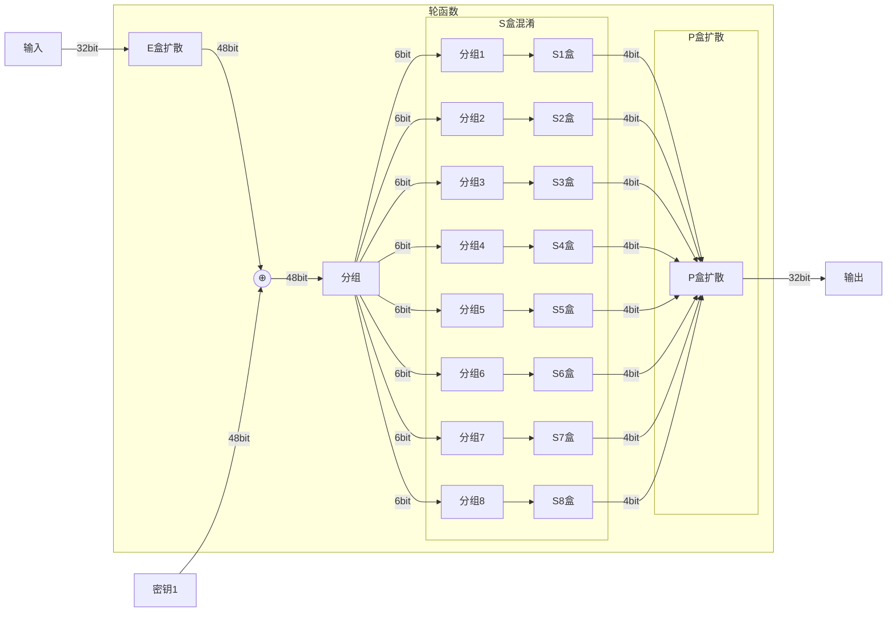
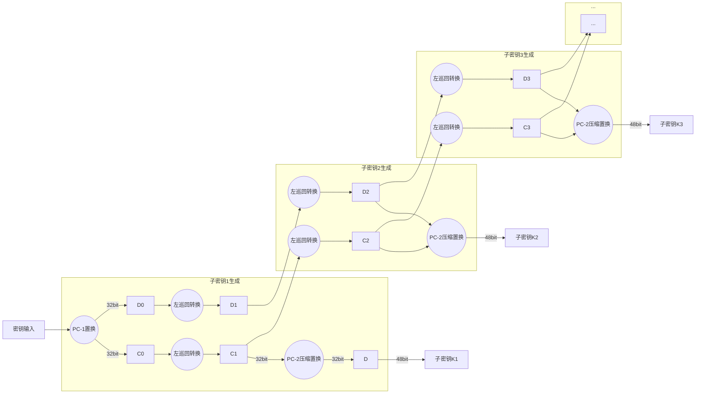

# 密码学

# §1 古典密码

## §1.1 单表替换密码

[全能单表替换密码破译网站 quipqiup](http://quipqiup.com)

### §1.1.1 凯撒密码 Caesar Cipher

$$
\text{encrypted[i]} = (\text{str[i]}+\text{key})\%26
$$

### §1.1.2 栅栏密码

#### §1.1.2.1 传统型

```
原文：flag{123456789}
选取栅栏数(Key):3
重新排列：
	f    g    2    5    8
	 l    {    3    6    9
	  a    1    4    7    }
先从左到右，再从上到下，得到密文：fg258l{369a147}
```

#### §1.1.2.2 W形排列

```
原文：flag{123456789}
选取栅栏数(Key):3
重新排列：
	f       {       4       8
	  l   g   1   3   5   7   9
	    a       2       6       }
先从左到右，再从上到下，得到密文：f{48lg13579a26}
```

### §1.1.3 猪笔密码/共济会密码/猪圈密码/朱高密码/九宫格密码 Pigpen Cipher


<p align="center"> <font size="5" face="Pigpen Cipher"> a </font> </p>

| 字母 |                    猪圈密码                    | 字母 |                    猪圈密码                    | 字母 |                    猪圈密码                    | 字母 |                    猪圈密码                    |
| :--: | :--------------------------------------------: | :--: | :--------------------------------------------: | :--: | :--------------------------------------------: | :--: | :--------------------------------------------: |
|  A   | <font size="5" face="Pigpen Cipher"> a </font> |  H   | <font size="5" face="Pigpen Cipher">H </font>  |  O   | <font size="5" face="Pigpen Cipher"> O </font> |  U   | <font size="5" face="Pigpen Cipher"> U </font> |
|  B   | <font size="5" face="Pigpen Cipher"> B </font> |  I   | <font size="5" face="Pigpen Cipher"> I </font> |  P   | <font size="5" face="Pigpen Cipher"> P </font> |  V   | <font size="5" face="Pigpen Cipher"> V </font> |
|  C   | <font size="5" face="Pigpen Cipher"> C </font> |  J   | <font size="5" face="Pigpen Cipher"> J </font> |  Q   | <font size="5" face="Pigpen Cipher"> Q </font> |  W   | <font size="5" face="Pigpen Cipher"> W </font> |
|  D   | <font size="5" face="Pigpen Cipher"> D </font> |  K   | <font size="5" face="Pigpen Cipher"> K </font> |  R   | <font size="5" face="Pigpen Cipher"> R </font> |  X   | <font size="5" face="Pigpen Cipher"> X </font> |
|  E   | <font size="5" face="Pigpen Cipher"> E </font> |  L   | <font size="5" face="Pigpen Cipher"> L </font> |  S   | <font size="5" face="Pigpen Cipher"> S </font> |  Y   | <font size="5" face="Pigpen Cipher"> Y </font> |
|  F   | <font size="5" face="Pigpen Cipher"> F </font> |  M   | <font size="5" face="Pigpen Cipher"> M </font> |  T   | <font size="5" face="Pigpen Cipher"> T </font> |  Z   | <font size="5" face="Pigpen Cipher"> Z </font> |
|  G   | <font size="5" face="Pigpen Cipher"> G </font> |  N   | <font size="5" face="Pigpen Cipher"> N </font> |      |                                                |      |                                                |

相关字体下载：[PigpenCipher字体 Base64编码](#Pigpen_Cipher_Font) [Fontmeme在线下载](https://fontmeme.com/fonts/pigpen-cipher-font/)

### §1.1.4 埃特巴什密码 Atbash Cipher

```
将明文表的前后顺序进行颠倒，即可得到埃特巴什密码表
明文表:A B C D E F G H I J K L M N O P Q R S T U V W X Y Z
密文表:Z Y X W V U T S R Q P O N M L K J I H G F E D C B A
```


$$
\text{encrypted}[i]=26-\text{message}[i]
$$

### §1.1.5 夏多密码

麦克斯韦·格兰特（Robert Maxwell）的著作[《死亡之链》（Death Chain）](https://www.amazon.com/Death-Chain-Ken-Greenhall/dp/0671694073)中，主人公夏多自创了这种密码。


1. 查找密文中**只包含一个圈和一条直径的符号**（如图最后一行所示），找到其对应的序号`n`，将图片顺时针旋转$90°\times(n-1)$​​
2. 按照旋转后的根据密码表解密，直到遇见下一个**只包含一个圈和一条直径的符号**，将纸张复位后再进行旋转，而不是继承上一次的旋转后接着旋转

### §1.1.6 当铺密码

| 明文 |  0   |  1   |  2   |  3   |  4   |  5   |  6   |  7   |  8   |  9   |
| :--: | :--: | :--: | :--: | :--: | :--: | :--: | :--: | :--: | :--: | :--: |
| 密文 |  口  |  由  |  中  |  人  |  工  |  大  |  王  |  夫  |  井  |  羊  |

$$
\text{encrypted}[i]=\text{笔画出头个数}(\text{汉字[i]})
$$

### §1.1.7 培根密码

| 原文 | 密文  | 原文 | 密文  | 原文 | 密文  | 原文 | 密文  |
| :--: | :---: | :--: | :---: | :--: | :---: | :--: | :---: |
| A/a  | aaaaa | H/h  | aabbb | O/o  | abbba | V/v  | babab |
| B/b  | aaaab | I/i  | abaaa | P/p  | abbbb | W/w  | babba |
| C/c  | aaaba | J/j  | abaab | Q/q  | baaaa | X/x  | babbb |
| D/d  | aaabb | K/k  | ababa | R/r  | baaab | Y/y  | bbaaa |
| E/e  | aabaa | L/l  | ababb | S/s  | baaba | Z/z  | bbaab |
| F/f  | aabab | M/m  | abbaa | T/t  | baabb |      |       |
| G/g  | aabba | N/n  | abbab | U/u  | babaa |      |       |

密文中只会出现两种字符（不一定非要是a和b），且字符数可被5整除。

### §1.1.8 九宫格密码

| 1<br />分词 | 2<br />ABC | 3<br />DEF  |
| :---------: | :--------: | :---------: |
| 4<br />GHI  | 5<br />JKL | 6<br />MNO  |
| 7<br />PQRS | 8<br />TUV | 9<br />WXYZ |

### §1.1.9 Rot13

| 明文 | A    | B    | C    | D    | E    | F    | G    | H    | I    | J    | K    | L    | M    | N    | O    | P    | Q    | R    | S    | T    | U    | V    | W    | X    | Y    | Z    |
| ---- | ---- | ---- | ---- | ---- | ---- | ---- | ---- | ---- | ---- | ---- | ---- | ---- | ---- | ---- | ---- | ---- | ---- | ---- | ---- | ---- | ---- | ---- | ---- | ---- | ---- | ---- |
| 密文 | N    | O    | P    | Q    | R    | S    | T    | U    | V    | W    | X    | Y    | Z    | A    | B    | C    | D    | E    | F    | G    | H    | I    | J    | K    | L    | M    |

$$
\begin{align}
&\text{Rot13(i)}=(i+13)\mod 26 \\
&\text{Rot13}^{-1}\text{(i)}=\text{Rot13}(\text{Rot13(i)})
\end{align}
$$

### §1.1.10 仿射密码

对于密码体制的五元组$(P,C,K,E,D)$​​（分别为Plaintext、Cipher、Key、Encrypt()、Decode()），将26个英文字符构成的集合记作$Z_{26}$​​，在仿射密码中有
$$
\begin{cases}
	P=C=\Z_{26}\\
	K=\{(a,b)|a,b\in\Z_{26},\gcd(a,26)=1\}\\
	E=\{e_k(x)|e_k(x)=ax+b\mod26,k\in P\}\\
	D=\{d_k(y)|d_k(y)=\displaystyle\frac{1}{a}(y-b)\mod26,\}
\end{cases}
$$


$，$$​
$$
\text{encrypted}[i]=(a\cdot\text{message}[i]+b)\mod26,\ a,b\in\Z
$$


<div id="divBase">
<div id="divTitle">字体检测</div>
<div id="divInput"><textarea id="textareaInput"wrap="soft">FZDaHei-B02S,方正大黑简体
HYGothic-Extra
Lucida Sans</textarea></div>
<div id="divOutput"><textarea id="textareaOutput"wrap="soft"readonly=“true”></textarea></div>
<div id="divButton"><input type="button"value="检测"onClick="CheckFont()"/></div>
<div id="divCopyright">Copyright © 心のsky Group</div></div>
<script type="text/javascript"src="CheckFont.js"></script>
<script type="text/javascript">function CheckFont()
{var t=document.getElementById("textareaInput").value;t=IsFontExistBatch(t);document.getElementById("textareaOutput").value=t;}</script>

#### Keyed Caesar Cipher

> 密文：s0a6u3u1s0bv1a
>
> 密钥：guangtou					//从0开始编号
>
> 偏移：6,20,0,13,6,19,14,20
>
> 明文：y0u6u3h1y0uj1u	   //略过数字


[]https://planetcalc.com/1434/

## §1.2 多表替换密码

### §1.2.1 普莱费尔密码 Playfair

加密步骤：

1. 对明文字符串进行处理。

   > 注意：不同文档给出的处理方法不同——
   >
   > - [CTF Wiki](https://ctf-wiki.org/crypto/classical/polyalphabetic/#_2)
   >
   >   将明文字符串分成两个一组的形式。
   >
   >   - 如果其中一个组的两个字母相同，<span style="color:red">则在第一个字母后添加`X`或`Q`</span>，然后重新分组，变成新的明文字符串。
   >   - 如果明文字符串的字母个数为奇数，<span style="color:red">则在字符串最后添加`X`或`Q`</span>，使新的明文字符串的字母个数为偶数。
   >
   > - [《密码学浅谈》 中国工信集团出版社](http://book.ucdrs.superlib.net/views/specific/2929/bookDetail.jsp?dxNumber=000017815088&d=9CA026B66A589FE1DB656FF3B944B792&fenlei=1816100801)
   >
   >   将明文字符串分成两个一组的形式。
   >
   >   - 明文字符串中如果含有字母`W`，则将其替换为`VV`，生成新的明文字符串
   >   
   >   <span style="color:red">该书没有介绍当新的明文字符串的字母个数为奇数时如何处理​。:sweat_smile:</span>
   
2. 初始化加密矩阵。

   > 注意：不同文档给出的处理方法不同——
   >
   > - [CTF Wiki](https://ctf-wiki.org/crypto/classical/polyalphabetic/#_2)
   >
   >   <span style="color:red">任意选取一串英文字符串，从头到尾地，按照先从左到右，再从上到下的顺序，依次填入$5\times5$矩阵中。</span>
   >
   >   - <span style="color:red">将英文字符串中的`Q`去掉，或者将`I`和`J`视为同一个字母</span>，使得26个字母变成25个字母。
   >   - 如果该英文字符串中出现了重复的字母，则只保留一个该字母，至于保留哪一个可任意规定。
   >   - 如果英文字符串太短，不能填完$5\times5$矩阵，则将没有出现在该字符串中的其它字母按照A-Z的顺序填充。
   >
   >   ```
   >   例如：
   >   选取英文字符串：OPQRSTUVWXYZX
   >   第一步：这里我们选择去掉Q，得到新字符串
   >   	OPRSTUVWXYZX
   >   第二步：发现出现了重复的字母"X"，随便删除一个，这里我们删除后面的字母"X"
   >   	OPRSTUVWXYZ
   >   第三步：填入5×5矩阵
   >   	O P R S T
   >   	U V W X Y
   >   	Z
   >   第四步：发现没有填满5×5矩阵，则将没有出现在该字符串中的其它字母按照A-Z的顺序填充
   >   	O P R S T
   >   	U V W X Y
   >   	Z A B C D
   >   	E F G H I
   >   	J K L M N
   >   ```
   >
   > - [《密码学浅谈》 中国工信集团出版社](http://book.ucdrs.superlib.net/views/specific/2929/bookDetail.jsp?dxNumber=000017815088&d=9CA026B66A589FE1DB656FF3B944B792&fenlei=1816100801)
   >
   >   将<span style="color:red">除了`W`之外的其它25个英文字符</span>，按照任意顺序放在$5\times5$矩阵中。

3. 生成密文。

   > 注意：不同文档给出的处理方法不同——
   >
   > - [CTF Wiki](https://ctf-wiki.org/crypto/classical/polyalphabetic/#_2)
   >
   >   在加密矩阵中，找到明文字符串中的每一组的两个字母的位置。
   >
   >   - 如果两个字母在同一行，那么密文对应的两个字母分别时原来两个字母同时向右移动一格之后所对应的字母。（将矩阵区域视为左右互通，例如第6行等价于第1行）
   >   - 如果两个字母在同一列，那么密文对应的两个字母分别时原来两个字母同时向下移动一格之后所对应的字母。（将矩阵区域视为上下互通，例如第6列等价于第1列）
   >   - 如果两个字母既不在同一行，也不在同一列，则选取横向替换/纵向替换中的一种——
   >     - 横向替换：密文第一个字母为第一个字母的横坐标与第二个字母的纵坐标确定的字母，第二个字母为第二个字母的横坐标与第一个字母的纵坐标确定的字母。（即交换纵坐标）
   >     - 纵向替换：密文第一个字母为第一个字母的纵坐标与第二个字母的横坐标确定的字母，第二个字母为第二个字母的纵坐标与第一个字母的横坐标确定的字母。（即交换横坐标）
   >   - <span style="color:red">不可能出现既在同一行，又在同一列的情况</span>，因为对明文预处理时已经强制让两个相同的字母隔开了。
   >
   > - [《密码学浅谈》 中国工信集团出版社](http://book.ucdrs.superlib.net/views/specific/2929/bookDetail.jsp?dxNumber=000017815088&d=9CA026B66A589FE1DB656FF3B944B792&fenlei=1816100801)
   >
   >   默认为横向替换。
   >
   >   - 如果两个字母在同一行，那么密文对应的两个字母分别时原来两个字母同时向右移动一格之后所对应的字母。（将矩阵区域视为左右互通，例如第6行等价于第1行）
   >   - 如果两个字母在同一列，那么密文对应的两个字母分别时原来两个字母同时向下移动一格之后所对应的字母。（将矩阵区域视为上下互通，例如第6列等价于第1列）
   >   - 如果两个字母既不在同一行，也不在同一列，则选取横向替换/纵向替换中的一种——
   >     - 横向替换：密文第一个字母为第一个字母的横坐标与第二个字母的纵坐标确定的字母，第二个字母为第二个字母的横坐标与第一个字母的纵坐标确定的字母。（即交换纵坐标）
   >     - 纵向替换：密文第一个字母为第一个字母的纵坐标与第二个字母的横坐标确定的字母，第二个字母为第二个字母的纵坐标与第一个字母的横坐标确定的字母。（即交换横坐标）
   >   - <span style="color:red">如果两个字母既在同一行，又在同一列</span>，则都用右侧一格的字母替代。

### §1.2.2 棋盘密码 Polybius / 关键字密码 Nihilist

将明文中的每一个加密为两两组合的字符，加密矩阵可以任取。

加密步骤：

1. 初始化加密矩阵。

   | ↓第一个密文 →第二个密文 |  1   |  2   |  3   |  4   |  5   |
   | :---------------------: | :--: | :--: | :--: | :--: | :--: |
   |            a            |  B   |  T   |  S   |  L   |  P   |
   |            b            |  D   |  H   |  O   |  Z   |  K   |
   |            c            |  Q   |  F   |  V   |  S   |  N   |
   |            d            |  G   |  J   |  C   |  U   |  X   |
   |            e            |  M   |  R   |  E   |  W   |  Y   |

2. 生成密文。

   ```
   例如：
   明文：HELLO
   H→b2 E→e3 L→a4 L→a4 O→b3
   合在一起：b2 e3 a4 a4 b3
   去掉空格：b2e3a4a4b3
   ```

因此，<span style="color:red">Polybius密码最多出现$5+5=10$个不同的字符</span>。

- 当第一个密文和第二个密文的取值范围均为**1-5**时，退化为关键字密码/Nihilist。
- 当第一个密文和第二个密文的取值范围均为**A-Z中的五个字母**时，退化为棋盘密码/Polybius

### §1.2.3 维吉尼亚密码 Vigenere

加密步骤：

1. 指定唯一固定的加密矩阵。

   ```
       A B C D E F G H I J K L M N O P Q R S T U V W X Y Z
       — — — — — — — — — — — — — — — — — — — — — — — — — —
   A | A B C D E F G H I J K L M N O P Q R S T U V W X Y Z
   B | B C D E F G H I J K L M N O P Q R S T U V W X Y Z A
   C | C D E F G H I J K L M N O P Q R S T U V W X Y Z A B
   D | D E F G H I J K L M N O P Q R S T U V W X Y Z A B C
   E | E F G H I J K L M N O P Q R S T U V W X Y Z A B C D
   F | F G H I J K L M N O P Q R S T U V W X Y Z A B C D E
   G | G H I J K L M N O P Q R S T U V W X Y Z A B C D E F
   H | H I J K L M N O P Q R S T U V W X Y Z A B C D E F G
   I | I J K L M N O P Q R S T U V W X Y Z A B C D E F G H
   J | J K L M N O P Q R S T U V W X Y Z A B C D E F G H I
   K | K L M N O P Q R S T U V W X Y Z A B C D E F G H I J
   L | L M N O P Q R S T U V W X Y Z A B C D E F G H I J K
   M | M N O P Q R S T U V W X Y Z A B C D E F G H I J K L
   N | N O P Q R S T U V W X Y Z A B C D E F G H I J K L M
   O | O P Q R S T U V W X Y Z A B C D E F G H I J K L M N
   P | P Q R S T U V W X Y Z A B C D E F G H I J K L M N O
   Q | Q R S T U V W X Y Z A B C D E F G H I J K L M N O P
   R | R S T U V W X Y Z A B C D E F G H I J K L M N O P Q
   S | S T U V W X Y Z A B C D E F G H I J K L M N O P Q R
   T | T U V W X Y Z A B C D E F G H I J K L M N O P Q R S
   U | U V W X Y Z A B C D E F G H I J K L M N O P Q R S T
   V | V W X Y Z A B C D E F G H I J K L M N O P Q R S T U
   W | W X Y Z A B C D E F G H I J K L M N O P Q R S T U V
   X | X Y Z A B C D E F G H I J K L M N O P Q R S T U V W
   Y | Y Z A B C D E F G H I J K L M N O P Q R S T U V W X
   Z | Z A B C D E F G H I J K L M N O P Q R S T U V W X Y
   ```

2. 选取一串纯英文字母的密钥。

3. 开始加密。

   ```
   例如：
   明文：ABCDEFG
   密钥：XYZ
   找到对应的密文字符：
   明文：A B C D E F G //在加密矩阵的行中，找到明文字母对应的一列
        | | | | | | |
   密钥：X Y Z X Y Z X //在加密矩阵的列中，找到明文字母对应的一行
   	 | | | | | | | //循环利用密钥
   密文：X Z B A C E D
   ```

4. 一言以蔽之：给A-Z分别编号为0-25
   $$
   \text{encrypted[i]}=(\text{message[i]}+\text{key[i%(period)]})\%25
   $$

破译步骤：

- 卡西斯基试验

  当$\displaystyle\frac{明文字符数}{密钥字符数}\ge2$​时，由于密钥被重复使用，所以对于明文中很有可能会多次出现的字母组合（例如an、the等），相应地密文中也会出现重复的字母组合。因此，密钥的长度就是两个相同字母组合间隔的字母个数的所有公因数。

  ```
  例如：
  密文：DYDUXRMHTVDVNQDQNWDYDUXRMHARTJGWNQD
  注意到存在两种重复的字母组合：两个DYDUXRMH间隔18个字母，两个NQD间隔20个字母
  18的公因数集合={1,2,3,6,9,18}
  20的公因数集合={1,2,4,5,10}
  取交集，得到密钥长度为2
  于是穷举26×26=676种密钥，最终确定密钥为zd
  明文：EVERYONEUSESONENOTEVERYONEBOUGHTONE
  加入空格：EVERYONE USE SONE NOT EVERYONE BOUGHTONE
  ```

- [planetcalc-Vigenère cipher 已知密钥全文进行破译](https://planetcalc.com/2468/)

- [mygeocachingprofile-Vigenère Cipher Codebreaker 未知密钥进行破译](https://www.mygeocachingprofile.com/codebreaker.vigenerecipher.aspx)（耗时很长，约1min，不指定密钥长度时准确率极低）

- [guballa-Vigenere Solver 未知密钥进行破译](https://www.guballa.de/vigenere-solver)（最佳选择）

### §1.2.4 希尔密码 Hill

加密步骤：

1. 选取一段纯字母明文，长度为`n`，根据A-Z到0-25的映射关系，将明文中的字母转化为数字，并依次填入`n`维向量$\overrightarrow{a}$。
2. 随意选取一个`n×n`的纯数字可逆矩阵$P$作为加密矩阵。
3. 计算$\overrightarrow{a}\times P$，得到新的`n`维向量，将每个数字对26取余，最后根据0-25到A-Z的映射关系，得到密文。

### §1.2.5自动密钥密码（Autokey Cipher）

加密步骤：

1. 选取一段纯字母明文。
2. 任意选取一段英文字母字符串作为关键字。
   - 关键词自动密钥：将关键词与明文拼接，得到密钥。
   - 原文自动密钥：？？？
3. 剩余步骤与维吉尼亚密码相同。

# §2 编码/解码

## §2.1 ASCII

|    Bin    | Oct  |                Dec                | Hex  |  字符   |    Bin    | Oct  | Dec  | Hex  |     字符     |
| :-------: | :--: | :-------------------------------: | :--: | :-----: | :-------: | :--: | :--: | :--: | :----------: |
| 0010 0000 | 040  |                32                 | 0x20 | (space) | 0101 0000 | 0120 |  80  | 0x50 |      P       |
| 0010 0001 | 041  |                33                 | 0x21 |    !    | 0101 0001 | 0121 |  81  | 0x51 |      Q       |
| 0010 0010 | 042  |                34                 | 0x22 |    "    | 0101 0010 | 0122 |  82  | 0x52 |      R       |
| 0010 0011 | 043  |                35                 | 0x23 |    #    | 0101 0011 | 0123 |  83  | 0x53 |      S       |
| 0010 0100 | 044  |                36                 | 0x24 |    $    | 0101 0100 | 0124 |  84  | 0x54 |      T       |
| 0010 0101 | 045  |                37                 | 0x25 |    %    | 0101 0101 | 0125 |  85  | 0x55 |      U       |
| 0010 0110 | 046  |                38                 | 0x26 |    &    | 0101 0110 | 0126 |  86  | 0x56 |      V       |
| 0010 0111 | 047  |                39                 | 0x27 |    '    | 0101 0111 | 0127 |  87  | 0x57 |      W       |
| 0010 1000 | 050  |                40                 | 0x28 |    (    | 0101 1000 | 0130 |  88  | 0x58 |      X       |
| 0010 1001 | 051  |                41                 | 0x29 |    )    | 0101 1001 | 0131 |  89  | 0x59 |      Y       |
| 0010 1010 | 052  |                42                 | 0x2A |    *    | 0101 1010 | 0132 |  90  | 0x5A |      Z       |
| 0010 1011 | 053  |                43                 | 0x2B |    +    | 0101 1011 | 0133 |  91  | 0x5B |      [       |
| 0010 1100 | 054  |                44                 | 0x2C |    ,    | 0101 1100 | 0134 |  92  | 0x5C |      \       |
| 0010 1101 | 055  |                45                 | 0x2D |    -    | 0101 1101 | 0135 |  93  | 0x5D |      ]       |
| 0010 1110 | 056  |                46                 | 0x2E |    .    | 0101 1110 | 0136 |  94  | 0x5E |      ^       |
| 0010 1111 | 057  |                47                 | 0x2F |    /    | 0101 1111 | 0137 |  95  | 0x5F |      _       |
| 0011 0000 | 060  |                48                 | 0x30 |    0    | 0110 0000 | 0140 |  96  | 0x60 |      `       |
| 0011 0001 | 061  |                49                 | 0x31 |    1    | 0110 0001 | 0141 |  97  | 0x61 |      a       |
| 0011 0010 | 062  |                50                 | 0x32 |    2    | 0110 0010 | 0142 |  98  | 0x62 |      b       |
| 0011 0011 | 063  |                51                 | 0x33 |    3    | 0110 0011 | 0143 |  99  | 0x63 |      c       |
| 0011 0100 | 064  |                52                 | 0x34 |    4    | 0110 0100 | 0144 | 100  | 0x64 |      d       |
| 0011 0101 | 065  |                53                 | 0x35 |    5    | 0110 0101 | 0145 | 101  | 0x65 |      e       |
| 0011 0110 | 066  |                54                 | 0x36 |    6    | 0110 0110 | 0146 | 102  | 0x66 |      f       |
| 0011 0111 | 067  |                55                 | 0x37 |    7    | 0110 0111 | 0147 | 103  | 0x67 |      g       |
| 0011 1000 | 070  |                56                 | 0x38 |    8    | 0110 1000 | 0150 | 104  | 0x68 |      h       |
| 0011 1001 | 071  |                57                 | 0x39 |    9    | 0110 1001 | 0151 | 105  | 0x69 |      i       |
| 0011 1010 | 072  |                58                 | 0x3A |    :    | 0110 1010 | 0152 | 106  | 0x6A |      j       |
| 0011 1011 | 073  |                59                 | 0x3B |    ;    | 0110 1011 | 0153 | 107  | 0x6B |      k       |
| 0011 1100 | 074  |                60                 | 0x3C |    <    | 0110 1100 | 0154 | 108  | 0x6C |      l       |
| 0011 1101 | 075  |                61                 | 0x3D |    =    | 0110 1101 | 0155 | 109  | 0x6D |      m       |
| 0011 1110 | 076  |                62                 | 0x3E |    >    | 0110 1110 | 0156 | 110  | 0x6E |      n       |
| 0011 1111 | 077  |                63                 | 0x3F |    ?    | 0110 1111 | 0157 | 111  | 0x6F |      o       |
| 0100 0000 | 0100 |                64                 | 0x40 |    @    | 0111 0000 | 0160 | 112  | 0x70 |      p       |
| 0100 0001 | 0101 | <span style="color:red">65</span> | 0x41 |    A    | 0111 0001 | 0161 | 113  | 0x71 |      q       |
| 0100 0010 | 0102 |                66                 | 0x42 |    B    | 0111 0010 | 0162 | 114  | 0x72 |      r       |
| 0100 0011 | 0103 |                67                 | 0x43 |    C    | 0111 0011 | 0163 | 115  | 0x73 |      s       |
| 0100 0100 | 0104 |                68                 | 0x44 |    D    | 0111 0100 | 0164 | 116  | 0x74 |      t       |
| 0100 0101 | 0105 |                69                 | 0x45 |    E    | 0111 0101 | 0165 | 117  | 0x75 |      u       |
| 0100 0110 | 0106 |                70                 | 0x46 |    F    | 0111 0110 | 0166 | 118  | 0x76 |      v       |
| 0100 0111 | 0107 |                71                 | 0x47 |    G    | 0111 0111 | 0167 | 119  | 0x77 |      w       |
| 0100 1000 | 0110 |                72                 | 0x48 |    H    | 0111 1000 | 0170 | 120  | 0x78 |      x       |
| 0100 1001 | 0111 |                73                 | 0x49 |    I    | 0111 1001 | 0171 | 121  | 0x79 |      y       |
| 01001010  | 0112 |                74                 | 0x4A |    J    | 0111 1010 | 0172 | 122  | 0x7A |      z       |
| 0100 1011 | 0113 |                75                 | 0x4B |    K    | 0111 1011 | 0173 | 123  | 0x7B |      {       |
| 0100 1100 | 0114 |                76                 | 0x4C |    L    | 0111 1100 | 0174 | 124  | 0x7C |      \|      |
| 0100 1101 | 0115 |                77                 | 0x4D |    M    | 0111 1101 | 0175 | 125  | 0x7D |      }       |
| 0100 1110 | 0116 |                78                 | 0x4E |    N    | 0111 1110 | 0176 | 126  | 0x7E |      ~       |
| 0100 1111 | 0117 |                79                 | 0x4F |    O    | 0111 1111 | 0177 | 127  | 0x7F | DEL (delete) |

## §2.2 进制转文本 Bin/Oct/Dec/Hex to Text

```
Bin→Text
	   ·1000110100110010000011000111
       →1000110 1001100 1000001 1000111 //每8个二进制数字代表一个ASCII码
	   →70 76 65 71 					//转成十进制
	   →F  L  A  G						//查ASCII表
Oct→Text
	   ·106114101107
	   →106 114 101 107					//每3个八进制数字代表一个ASCII码
	   →70 76 65 71						//转成十进制
	   →F  L  A  G						//查ASCII表
Hex→Text
	   ·464c4147
	   →46 4c 41 47						//每2个十六进制数字代表一个ASCII码
	   →70 76 65 71						//转成十进制
	   →F  L  A  G						//查ASCII表
```

## §2.3 Base

### §2.3.1 Base64

| 数值 | 字符 | 数值 | 字符 | 数值 | 字符 | 数值 | 字符 | 数值 | 字符 | 数值 | 字符 | 数值 | 字符 | 数值 | 字符 |
| ---- | ---- | ---- | ---- | ---- | ---- | ---- | ---- | ---- | ---- | ---- | ---- | ---- | ---- | ---- | ---- |
| 0    | A    | 8    | I    | 16   | Q    | 24   | Y    | 32   | g    | 40   | o    | 48   | w    | 56   | 4    |
| 1    | B    | 9    | J    | 17   | R    | 25   | Z    | 33   | h    | 41   | p    | 49   | x    | 57   | 5    |
| 2    | C    | 10   | K    | 18   | S    | 26   | a    | 34   | i    | 42   | q    | 50   | y    | 58   | 6    |
| 3    | D    | 11   | L    | 19   | T    | 27   | b    | 35   | j    | 43   | r    | 51   | z    | 59   | 7    |
| 4    | E    | 12   | M    | 20   | U    | 28   | c    | 36   | k    | 44   | s    | 52   | 0    | 60   | 8    |
| 5    | F    | 13   | N    | 21   | V    | 29   | d    | 37   | l    | 45   | t    | 53   | 1    | 61   | 9    |
| 6    | G    | 14   | O    | 22   | W    | 30   | e    | 38   | m    | 46   | u    | 54   | 2    | 62   | +    |
| 7    | H    | 15   | P    | 23   | X    | 31   | f    | 39   | n    | 47   | v    | 55   | 3    | 63   | /    |

 ```
 例如：
 Message                   → M        a
 ASCII(Bin)                → 01001101 01100001
 Cut by 6                  → 010011 010110 0001
 Add 0 until length%6==0   → 010011 010110 000100
 Add ? until length%8==0   → 010011 010110 000100 ??????
 Base64(Dec)               → 19     16     4      ?
 Cipher                    → T      W      E      =
 ```

### §2.3.2 Base32

| 数值 | 字符 | 数值 | 字符 | 数值 | 字符 | 数值 | 字符 | 数值 | 字符 | 数值 | 字符 | 数值 | 字符 | 数值 | 字符 |
| :--: | :--: | ---- | ---- | :--: | :--: | ---- | ---- | :--: | :--: | ---- | ---- | :--: | :--: | ---- | ---- |
|  0   |  A   | 4    | E    |  8   |  I   | 12   | M    |  16  |  Q   | 20   | U    |  24  |  Y   | 28   | 4    |
|  1   |  B   | 5    | F    |  9   |  J   | 13   | N    |  17  |  R   | 21   | V    |  25  |  Z   | 29   | 5    |
|  2   |  C   | 6    | G    |  10  |  K   | 14   | O    |  18  |  S   | 22   | W    |  26  |  2   | 30   | 6    |
|  3   |  D   | 7    | H    |  11  |  L   | 15   | P    |  19  |  T   | 23   | X    |  27  |  3   | 31   | 7    |

```
例如：
Message                   → M        a
ASCII(Bin)                → 01001101 01100001
Cut by 5                  → 01001 10101 10000 1
Add 0 until length%5==0   → 01001 10101 10000 10000
Add ? until length%8==0   → 01001 10101 10000 10000 ????? ????? ????? ?????
Base64(Dec)               → 9     21    16    16    ?     ?     ?     ?
Cipher                    → T     W     E     =     =     =     =     =
```

### §2.3.3 Base16

| 数值 | 字符 | 数值 | 字符 | 数值 | 字符 | 数值 | 字符 | 数值 | 字符 | 数值 | 字符 | 数值 | 字符 | 数值 | 字符 |
| :--: | :--: | ---- | ---- | :--: | :--: | ---- | ---- | :--: | :--: | ---- | ---- | :--: | :--: | ---- | ---- |
|  0   |  0   | 2    | 2    |  4   |  4   | 6    | 6    |  8   |  8   | 10   | a    |  12  |  c   | 14   | e    |
|  1   |  1   | 3    | 3    |  5   |  5   | 7    | 7    |  9   |  9   | 11   | b    |  13  |  d   | 15   | f    |

```
例如：
Message                   → M        a
ASCII(Bin)                → 01001101 01100001
Cut by 4                  → 0100 1101 0110 0001
Add 0 until length%4==0   → 0100 1101 0110 0001
Add ? until length%8==0   → 0100 1101 0110 0001
Base64(Dec)               → 4    13   6    1
Cipher                    → 4    d    6    1
```

## §2.4 URL编码/百分号编码

| 字符  | Windows-1252 | 字符 | Windows-1252 | 字符 | Windows-1252 | 字符 | Windows-1252 | 字符 | Windows-1252 | 字符 | Windows-1252 | 字符 | Windows-1252 | 字符 | Windows-1252 | 字符 | Windows-1252 | 字符 | Windows-1252 | 字符 | Windows-1252 | 字符 | Windows-1252 | 字符 | Windows-1252 | 字符 | Windows-1252 |
| :---- | :----------- | ---- | ------------ | ---- | ------------ | ---- | ------------ | ---- | ------------ | ---- | ------------ | ---- | ------------ | ---- | ------------ | ---- | ------------ | ---- | ------------ | ---- | ------------ | ---- | ------------ | ---- | ------------ | ---- | ------------ |
| space | %20          | 0    | %30          | @    | %40          | P    | %50          | `    | %60          | p    | %70          | `    | %80          |      | %90          |      | %A0          | °    | %B0          | À    | %C0          | Ð    | %D0          | à    | %E0          | ð    | %F0          |
| !     | %21          | 1    | %31          | A    | %41          | Q    | %51          | a    | %61          | q    | %71          |      | %81          | ‘    | %91          | ¡    | %A1          | ±    | %B1          | Á    | %C1          | Ñ    | %D1          | á    | %E1          | ñ    | %F1          |
| "     | %22          | 2    | %32          | B    | %42          | R    | %52          | b    | %62          | r    | %72          | ‚    | %82          | ’    | %92          | ¢    | %A2          | ²    | %B2          | Â    | %C2          | Ò    | %D2          | â    | %E2          | ò    | %F2          |
| #     | %23          | 3    | %33          | C    | %43          | S    | %53          | c    | %63          | s    | %73          | ƒ    | %83          | “    | %93          | £    | %A3          | ³    | %B3          | Ã    | %C3          | Ó    | %D3          | ã    | %E3          | ó    | %F3          |
| $     | %24          | 4    | %34          | D    | %44          | T    | %54          | d    | %64          | t    | %74          | „    | %84          | ”    | %94          | ¤    | %A4          | ´    | %B4          | Ä    | %C4          | Ô    | %D4          | ä    | %E4          | ô    | %F4          |
| %     | %25          | 5    | %35          | E    | %45          | U    | %55          | e    | %65          | u    | %75          | …    | %85          | •    | %95          | ¥    | %A5          | µ    | %B5          | Å    | %C5          | Õ    | %D5          | å    | %E5          | õ    | %F5          |
| &     | %26          | 6    | %36          | F    | %46          | V    | %56          | f    | %66          | v    | %76          | †    | %86          | –    | %96          | ¦    | %A6          | ¶    | %B6          | Æ    | %C6          | Ö    | %D6          | æ    | %E6          | ö    | %F6          |
| '     | %27          | 7    | %37          | G    | %47          | W    | %57          | g    | %67          | w    | %77          | ‡    | %87          | —    | %97          | §    | %A7          | ·    | %B7          | Ç    | %C7          | ×    | %D7          | ç    | %E7          | ÷    | %F7          |
| (     | %28          | 8    | %38          | H    | %48          | X    | %58          | h    | %68          | x    | %78          | ˆ    | %88          | ˜    | %98          | ¨    | %A8          | ¸    | %B8          | È    | %C8          | Ø    | %D8          | è    | %E8          | ø    | %F8          |
| )     | %29          | 9    | %39          | I    | %49          | Y    | %59          | i    | %69          | y    | %79          | ‰    | %89          | ™    | %99          | ©    | %A9          | ¹    | %B9          | É    | %C9          | Ù    | %D9          | é    | %E9          | ù    | %F9          |
| *     | %2A          | :    | %3A          | J    | %4A          | Z    | %5A          | j    | %6A          | z    | %7A          | Š    | %8A          | š    | %9A          | ª    | %AA          | º    | %BA          | Ê    | %CA          | Ú    | %DA          | ê    | %EA          | ú    | %FA          |
| +     | %2B          | ;    | %3B          | K    | %4B          | [    | %5B          | k    | %6B          | {    | %7B          | ‹    | %8B          | ›    | %9B          | «    | %AB          | »    | %BB          | Ë    | %CB          | Û    | %DB          | ë    | %EB          | û    | %FB          |
| ,     | %2C          | <    | %3C          | L    | %4C          | \    | %5C          | l    | %6C          | \|   | %7C          | Œ    | %8C          | œ    | %9C          | ¬    | %AC          | ¼    | %BC          | Ì    | %CC          | Ü    | %DC          | ì    | %EC          | ü    | %FC          |
| -     | %2D          | =    | %3D          | M    | %4D          | ]    | %5D          | m    | %6D          | }    | %7D          |      | %8D          |      | %9D          | ­    | %AD          | ½    | %BD          | Í    | %CD          | Ý    | %DD          | í    | %ED          | ý    | %FD          |
| .     | %2E          | >    | %3E          | N    | %4E          | ^    | %5E          | n    | %6E          | ~    | %7E          | Ž    | %8E          | ž    | %9E          | ®    | %AE          | ¾    | %BE          | Î    | %CE          | Þ    | %DE          | î    | %EE          | þ    | %FE          |
| /     | %2F          | ?    | %3F          | O    | %4F          | _    | %5F          | o    | %6F          |      | %7F          |      | %8F          | Ÿ    | %9F          | ¯    | %AF          | ¿    | %BF          | Ï    | %CF          | ß    | %DF          | ï    | %EF          | ÿ    | %FF          |

## §2.5 HTML编码

| 字符   | 描述   | 实体名称                    | 实体编号        | 字符    | 描述     | 实体名称          | 实体编号         |
| ------ | ------ | --------------------------- | --------------- | ------- | -------- | ----------------- | ---------------- |
|        | 空格   | $\text{&nbsp;}$             | $\text{&#160;}$​​ | &#165;  | 元       | $\text{&yen;}$    | $\text{&#165;}$  |
| <      | 小于号 | $\text{&lt;}$               | $\text{&#60;}$  | &#8364; | 欧元     | $\text{&euro;}$   | $\text{&#8364;}$ |
| >      | 大于号 | $\text{&gt;}$               | $\text{&#62;}$  | &#167;  | 小节     | $\text{&sect;}$   | $\text{&#167;}$  |
| &      | 和号   | $\text{&amp;}$              | $\text{&#38;}$  | &#169;  | 版权     | $\text{&copy;}$   | $\text{&#169;}$  |
| "      | 双引号 | $\text{&quot;}$             | $\text{&#34;}$  | &#174;  | 注册商标 | $\text{&reg;}$    | $\text{&#174;}$  |
| '      | 单引号 | $\text{&apos;}$（IE不兼容） | $\text{&#39;}$  | &#8482; | 商标     | $\text{&trade;}$  | $\text{&#8482;}$ |
| &#162; | 分     | $\text{&cent;}$             | $\text{&#162;}$ | &#215;  | 乘号     | $\text{&times;}$  | $\text{&#215;}$  |
| &#163; | 镑     | $\text{&pound;}$            | $\text{&#163;}$ | &#247;  | 除号     | $\text{&devide;}$ | $\text{&#247;}$  |

## §2.6 Unicode编码

[Unicode官网PDF](https://unicode.org/charts/)

## §2.7 敲击码

> 方方格格，不断敲击。——百度杯CTF十一月场

按照字母次序，使手指在键盘上滑动，绘制出的轨迹代表相对应的字母。

```
举例：wdvtdz qsxdr werdzxc esxcfr uygbn
Q W E R T Y U I O P
 A S D F G H J K L
  Z X C V B N M
可得字符串为xvzoc
```

## §2.8 摩尔斯电码

| **字符** | **电码符号** | **字符** | **电码符号** | **字符** | **电码符号** | **字符** | **电码符号** |
| -------- | ------------ | -------- | ------------ | -------- | ------------ | -------- | ------------ |
| A        | .-           | B        | -...         | C        | -.-.         | D        | -..          |
| E        | .            | F        | ..-.         | G        | --.          | H        | ....         |
| I        | ..           | J        | .---         | K        | -.-          | L        | .-..         |
| M        | --           | N        | -.           | O        | ---          | P        | .--.         |
| Q        | --.-         | R        | .-.          | S        | ...          | T        | -            |
| U        | ..-          | V        | ...-         | W        | .--          | X        | -..-         |
| Y        | -.--         | Z        | --..         |          |              |          |              |

## §2.9 JSFuck

将密文对应的ASCII码视为数字，利用复杂的表达式相加得出该数字，则复杂的表达式即为密文。

## §2.10 Quoted-Printable

Quoted-Printable（可打印字符引用编码）是MIME（多用途互联网邮件扩展）的一种实现方式。将一个八位二进制数字的ASCII编码转换成两位十六进制数字后，再在前面加上"="。

## §2.11 BrainFuck

一种图灵完备的编程语言。

## §2.12 Ook编码

一种图灵完备的编程语言，实属BrainFuck套壳。

```php
$output=strtr($output.array(
	'>' => 'Ook. Ook?',
    '<' => 'Ook? Ook.',
    '+' => 'Ook. Ook.',
    '-' => 'Ook! Ook!',
    '.' => 'Ook! Ook.',
    ',' => 'Ook. Ook!',
    '[' => 'Ook! Ook?',
    ']' => 'Ook? Ook!',
));
```

## §2.13 UUEncode

| 可打印的字元  | 十进制ASCII值 | uuencode 二进制表示 | uuencode 十进制表示 |     |                                       可打印的字元                                       | 十进制ASCII值 | uuencode 二进制表示 | uuencode 十进制表示 |
| :-----: | :-------: | :------------: | :------------: | :-: | :--------------------------------------------------------------------------------: | :-------: | :------------: | :------------: |
| (space) |    32     |    000 000     |       0        |     |                                         @                                          |    64     |    100 000     |       32       |
|    !    |    33     |    000 001     |       1        |     |                                         A                                          |    65     |    100 001     |       33       |
|    "    |    34     |    000 010     |       2        |     |                                         B                                          |    66     |    100 010     |       34       |
|    #    |    35     |    000 011     |       3        |     |                                         C                                          |    67     |    100 011     |       35       |
|    $    |    36     |    000 100     |       4        |     |                                         D                                          |    68     |    100 100     |       36       |
|    %    |    37     |    000 101     |       5        |     |                                         E                                          |    69     |    100 101     |       37       |
|    &    |    38     |    000 110     |       6        |     |                                         F                                          |    70     |    100 110     |       38       |
|    '    |    39     |    000 111     |       7        |     |                                         G                                          |    71     |    100 111     |       39       |
|    (    |    40     |    001 000     |       8        |     |                                         H                                          |    72     |    101 000     |       40       |
|    )    |    41     |    001 001     |       9        |     |                                         I                                          |    73     |    101 001     |       41       |
|    *    |    42     |    001 010     |       10       |     |                                         J                                          |    74     |    101 010     |       42       |
|    +    |    43     |    001 011     |       11       |     |                                         K                                          |    75     |    101 011     |       43       |
|    ,    |    44     |    001 100     |       12       |     |                                         L                                          |    76     |    101 100     |       44       |
|    -    |    45     |    001 101     |       13       |     |                                         M                                          |    77     |    101 101     |       45       |
|    .    |    46     |    001 110     |       14       |     |                                         N                                          |    78     |    101 110     |       46       |
|    /    |    47     |    001 111     |       15       |     |                                         O                                          |    79     |    101 111     |       47       |
|    0    |    48     |    010 000     |       16       |     |                                         P                                          |    80     |    110 000     |       48       |
|    1    |    49     |    010 001     |       17       |     |                                         Q                                          |    81     |    110 001     |       49       |
|    2    |    50     |    010 010     |       18       |     |                                         R                                          |    82     |    110 010     |       50       |
|    3    |    51     |    010 011     |       19       |     |                                         S                                          |    83     |    110 011     |       51       |
|    4    |    52     |    010 100     |       20       |     |                                         T                                          |    84     |    110 100     |       52       |
|    5    |    53     |    010 101     |       21       |     |                                         U                                          |    85     |    110 101     |       53       |
|    6    |    54     |    010 110     |       22       |     |                                         V                                          |    86     |    110 110     |       54       |
|    7    |    55     |    010 111     |       23       |     |                                         W                                          |    87     |    110 111     |       55       |
|    8    |    56     |    011 000     |       24       |     |                                         X                                          |    88     |    111 000     |       56       |
|    9    |    57     |    011 001     |       25       |     |                                         Y                                          |    89     |    111 001     |       57       |
|    :    |    58     |    011 010     |       26       |     |                                         Z                                          |    90     |    111 010     |       58       |
|    ;    |    59     |    011 011     |       27       |     |                                         [                                          |    91     |    111 011     |       59       |
|    <    |    60     |    011 100     |       28       |     |                                         \                                          |    92     |    111 100     |       60       |
|    =    |    61     |    011 101     |       29       |     |                                         ]                                          |    93     |    111 101     |       61       |
|    >    |    62     |    011 110     |       30       |     |                                         ^                                          |    94     |    111 110     |       62       |
|    ?    |    63     |    011 111     |       31       |     |                                         _                                          |    95     |    111 111     |       63       |
|         |           |                |                |     | [`](https://zh.wikipedia.org/w/index.php?title=Grave_accent&action=edit&redlink=1) |    96     |  (1) 000 000   |       64       |

```
例如：
Message				    C        a        t
DEC(ASCII)			   →67       97       116
Bin(ASCII)			   →01000011 01100001 01110100
Divide by 6			   →010000 110110 000101 110100
DEC(UUencode)		   →16     54     5      52
+32					   →48     86     37     84
Cipher				   →0      V      %      T
```

## §2.14 XXencode

与Base64类似，字符集如下所示：

```python
char_set="+-0123456789ABCDEFGHIJKLMNOPQRSTUVWXYZabcdefghijklmnopqrstuvwxyz"
# 一共64个字符，分别编号为0-63
```

## §2.15 AAencode

一种图灵完备的编程语言，JavaScript套壳。

# §3 现代密码

## §3.1 对称加密算法

### §3.1.1 DES(Data Encryption Standard,数据加密标准)


#### §3.1.1.1 明文分组

将明文分成一个个64bit的数据块，对每一个数据块分别进行操作，任意两个数据块的操作互不干扰。

#### §3.1.1.2 初期置换

$$
\left[
\begin{matrix}
a_1  & a_2 & a_3 & a_4 & a_5 & a_6 & a_7 & a_8\\
a_9  & a_{10} & a_{11} & a_{12} & a_{13} & a_{14} & a_{15} & a_{16}\\
a_{17} & a_{18} & a_{19} & a_{20} & a_{21} & a_{22} & a_{23} &a_{24} \\
a_{25}  &  a_{26}&  a_{27}&  a_{28}& a_{29} & a_{30} &  a_{31}& a_{32}\\
a_{33} & a_{34} & a_{35} & a_{36} & a_{37} & a_{38} & a_{39} & a_{40}\\
a_{41} & a_{42} & a_{43} & a_{44} & a_{45} & a_{46} & a_{47} & a_{48} \\
a_{49}  & a_{50} & a_{51} & a_{52} & a_{53} & a_{54} & a_{55} & a_{56}\\
a_{57}  & a_{58} & a_{59} & a_{60} & a_{61} & a_{62} & a_{63} & a_{64}
\end{matrix}
\right]
\stackrel{\text{初期置换表}}{\Longrightarrow}
\left[
\begin{matrix}
a_{58}&a_{50}&a_{42}&a_{34}&a_{26}&a_{18}&a_{10}&a_{2}\\
a_{60}&a_{52}&a_{44}&a_{36}&a_{28}&a_{20}&a_{12}&a_{4}\\
a_{62}&a_{54}&a_{46}&a_{38}&a_{30}&a_{22}&a_{14}&a_{6}\\
a_{64}&a_{56}&a_{48}&a_{40}&a_{32}&a_{24}&a_{16}&a_{8}\\
a_{57}&a_{49}&a_{41}&a_{33}&a_{25}&a_{17}&a_{9}&a_{1}\\
a_{59}&a_{51}&a_{43}&a_{35}&a_{27}&a_{19}&a_{11}&a_{3}\\
a_{61}&a_{53}&a_{45}&a_{37}&a_{29}&a_{21}&a_{13}&a_{5}\\
a_{63}&a_{55}&a_{47}&a_{39}&a_{31}&a_{23}&a_{15}&a_{7}\\
\end{matrix}
\right]
$$

然后将64bit的数据块分成两个32bit的数据块L0和R0。

#### §3.1.1.3 轮函数



1. E盒扩散

   

2. 异或运算

   将E盒扩散的结果(48bit)与预先准备的子密钥1(48bit)进行异或运算，得到新的48bit

3. S盒混淆

   将异或运算的结果(48bit)分成8等份，每份6bit，分别输入$S_1$至$S_8$共8个盒子中。例如以$S_i$盒为例，将第$i$组的6bit数据$\overline{a_1a_2a_3a_4a_5a_6}$分成$\overline{a_1a_6}$和$\overline{a_2a_3a_4a_5}$两份，分别作为行数和列数，定位到$S_i$盒的某个具体位置，该位置中的数字转化成二进制即为$S_i$盒的输出结果。

   |S1盒|0|1|2|3|4|5|6|7|8|9|10|11|12|13|14|15|
   |:--:|:--:|:--:|:--:|:--:|:--:|:--:|:--:|----|----|----|:--:|:--:|:--:|:--:|:--:|:--:|
   |0|14|4|13|1|2|15|11|8|3|10|6|12|5|9|0|7|
   |1|0|15|7|4|14|2|13|1|10|6|12|11|9|5|3|8|
   |2|4|1|14|8|13|6|2|11|15|12|9|7|3|10|5|0|
   |3|15|12|8|2|4|9|1|7|5|11|3|14|10|0|6|13|

   |S2盒|0|1|2|3|4|5|6|7|8|9|10|11|12|13|14|15|
   |:--:|----|:--:|:--:|:--:|:--:|:--:|:--:|----|----|----|:--:|:--:|:--:|:--:|:--:|:--:|
   |0|15|1|8|14|6|11|3|4|9|7|2|13|12|0|5|10|
   |1|3|13|4|7|15|2|8|14|12|0|1|10|6|9|11|5|
   |2|0|14|7|11|10|4|13|1|5|8|12|6|9|3|2|15|
   |3|13|8|10|1|3|15|4|2|11|6|7|12|0|5|14|9|

   |S3盒|0|1|2|3|4|5|6|7|8|9|10|11|12|13|14|15|
   |:--:|----|:--:|:--:|:--:|:--:|:--:|:--:|----|----|----|:--:|:--:|:--:|:--:|:--:|:--:|
   |0|10|0|9|14|6|3|15|5|1|13|12|7|11|4|2|8|
   |1|13|7|0|9|3|4|6|10|2|8|5|14|13|11|15|1|
   |2|13|6|4|9|8|15|3|0|11|1|2|12|5|10|14|7|
   |3|1|10|13|0|6|9|8|7|4|15|14|3|11|5|2|12|

   |S4盒|0|1|2|3|4|5|6|7|8|9|10|11|12|13|14|15|
   |:--:|----|:--:|:--:|:--:|:--:|:--:|:--:|----|----|----|:--:|:--:|:--:|:--:|:--:|:--:|
   |0|7|13|14|3|0|6|9|10|1|2|8|5|11|12|4|15|
   |1|13|8|11|5|6|15|0|3|4|7|2|12|1|10|14|9|
   |2|10|6|9|0|12|11|7|13|15|1|3|14|5|2|8|4|
   |3|3|15|0|6|10|1|13|8|9|4|5|11|12|7|2|14|

   |S5盒|0|1|2|3|4|5|6|7|8|9|10|11|12|13|14|15|
   |:--:|----|:--:|:--:|:--:|:--:|:--:|:--:|----|----|----|:--:|:--:|:--:|:--:|:--:|:--:|
   |0|2|12|4|1|7|10|11|6|8|5|3|15|13|0|14|9|
   |1|14|11|2|12|4|7|13|1|5|0|15|10|3|9|8|6|
   |2|4|2|1|11|10|13|7|8|15|9|12|5|6|3|0|14|
   |3|11|8|12|7|1|14|2|13|6|15|0|9|10|4|5|3|

   |S6盒|0|1|2|3|4|5|6|7|8|9|10|11|12|13|14|15|
   |:--:|----|:--:|:--:|:--:|:--:|:--:|:--:|----|----|----|:--:|:--:|:--:|:--:|:--:|:--:|
   |0|12|1|10|15|9|2|6|8|0|13|3|4|14|7|5|11|
   |1|10|15|4|2|7|12|9|5|6|1|13|14|0|11|3|8|
   |2|9|14|15|5|2|8|12|3|7|0|4|10|1|13|11|6|
   |3|4|3|2|12|9|5|15|10|11|14|1|7|6|0|8|13|

   |S7盒|0|1|2|3|4|5|6|7|8|9|10|11|12|13|14|15|
   |:--:|----|:--:|:--:|:--:|:--:|:--:|:--:|----|----|----|:--:|:--:|:--:|:--:|:--:|:--:|
   |0|4|11|2|14|15|0|8|13|3|12|9|7|5|10|6|1|
   |1|13|0|11|7|4|9|1|10|14|3|5|12|2|15|8|6|
   |2|1|4|11|13|12|3|7|14|10|15|6|8|0|5|9|2|
   |3|6|11|12|8|1|4|10|7|9|5|0|15|14|2|3|12|

   |S8盒|0|1|2|3|4|5|6|7|8|9|10|11|12|13|14|15|
   |:--:|----|:--:|:--:|:--:|:--:|:--:|:--:|----|----|----|:--:|:--:|:--:|:--:|:--:|:--:|
   |0|13|2|8|4|6|15|11|1|10|9|3|14|5|0|12|7|
   |1|1|15|13|8|10|3|7|4|12|5|6|11|0|14|9|2|
   |2|7|11|4|1|9|12|14|2|0|6|10|13|15|3|5|8|
   |3|2|1|14|7|4|10|8|13|15|12|9|0|3|5|6|11|

4. P盒扩散
   $$
   \left[
   \begin{matrix}
   a_1  & a_2 & a_3 & a_4 & a_5 & a_6 & a_7 & a_8\\
   a_9  & a_{10} & a_{11} & a_{12} & a_{13} & a_{14} & a_{15} & a_{16}\\
   a_{17} & a_{18} & a_{19} & a_{20} & a_{21} & a_{22} & a_{23} &a_{24} \\
   a_{25}  &  a_{26}&  a_{27}&  a_{28}& a_{29} & a_{30} &  a_{31}& a_{32}\\
   \end{matrix}
   \right]
   \stackrel{\text{P盒扩散表}}{\Longrightarrow}
   \left[
   \begin{matrix}
   a_{16}&a_{7}&a_{20}&a_{21}&a_{29}&a_{12}&a_{28}&a_{17}\\
   a_{1}&a_{15}&a_{23}&a_{26}&a_{5}&a_{18}&a_{31}&a_{10}\\
   a_{2}&a_{8}&a_{24}&a_{14}&a_{32}&a_{27}&a_{3}&a_{9}\\
   a_{19}&a_{13}&a_{30}&a_{6}&a_{22}&a_{11}&a_{4}&a_{25}\\
   \end{matrix}
   \right]
   $$

#### §3.1.1.4 L0和R0异或运算

将$\text{轮函数}(\text{密钥1,R0)}$​与$\text{L0}$进行异或运算，生成的32bit作为$R1$，而原来的$R0$直接作为$L1$​。​

于是，每一轮的递推公式可表示为：
$$
\begin{cases}
L_{i+1}=R_i\\
R_{i+1}=\textcolor{green}{\text{PboxExpand}(}\textcolor{blue}{\text{SboxConfuse}(}\textcolor{red}{\text{EboxExpand}(R_i)\oplus \text{Key}_i}\textcolor{blue}{)}\textcolor{green}{)}\oplus L_i
\end{cases},0\le i\le15
$$

#### §3.1.1.5 密钥生成



1. 将64bit的密文进行PC-1置换。

   将密文中的位数可被8整除（即第8,16,24,32,40,48,56,64位）所对应的数字去掉，称为PC-1置换。去除的8位用于做奇偶校验。

2. 将置换后的56bit分成左右两等分，分别命名为$C_0$​​和$D_0$​​​。将两者拼接在一起后进行PC-2压缩置换，得到48bit的子密钥$K_1$。

3. 将$C_0$​和$D_0$​进行$\text{LeftShift(0)}=1$​次左移位操作，得到$C_1$​和$D_2$​，将两者拼接在一起后进行PC-2压缩置换，得到48bit的子密钥$K_2$​​。
   $$
   \left[
   \begin{matrix}
   a_1  & a_2 & a_3 & a_4 & a_5 & a_6 & a_7 & a_8\\
   a_9  & a_{10} & a_{11} & a_{12} & a_{13} & a_{14} & a_{15} & a_{16}\\
   a_{17} & a_{18} & a_{19} & a_{20} & a_{21} & a_{22} & a_{23} &a_{24} \\
   a_{25}  &  a_{26}&  a_{27}&  a_{28}& a_{29} & a_{30} &  a_{31}& a_{32}\\
   a_{33} & a_{34} & a_{35} & a_{36} & a_{37} & a_{38} & a_{39} & a_{40}\\
   a_{41} & a_{42} & a_{43} & a_{44} & a_{45} & a_{46} & a_{47} & a_{48} \\
   a_{49}  & a_{50} & a_{51} & a_{52} & a_{53} & a_{54} & a_{55} & a_{56}
   \end{matrix}
   \right]
   \stackrel{\text{PC-2表}}{\Longrightarrow}
   \left[
   \begin{matrix}
   a_{14}&a_{17}&a_{11}&a_{24}&a_{1}&a_{5}&a_{3}&a_{28}\\
   a_{15}&a_{6}&a_{21}&a_{10}&a_{23}&a_{19}&a_{12}&a_{4}\\
   a_{26}&a_{8}&a_{16}&a_{7}&a_{27}&a_{20}&a_{13}&a_{2}\\
   a_{41}&a_{52}&a_{31}&a_{37}&a_{47}&a_{55}&a_{30}&a_{40}\\
   a_{51}&a_{45}&a_{33}&a_{48}&a_{44}&a_{49}&a_{39}&a_{56}\\
   a_{34}&a_{53}&a_{46}&a_{42}&a_{50}&a_{36}&a_{29}&a_{32}
   \end{matrix}
   \right]
   $$
   

于是可以得出递推公式：

| 迭代轮数$i$                         | 0    | 1    | 2    | 3    | 4    | 5    | 6    | 7    | 8    | 9    | 10   | 11   | 12   | 13   | 14   | 15   |
| ----------------------------------- | ---- | ---- | ---- | ---- | ---- | ---- | ---- | ---- | ---- | ---- | ---- | ---- | ---- | ---- | ---- | ---- |
| 左移位数<br />$\text{LeftShift}(i)$ | 1    | 1    | 2    | 2    | 2    | 2    | 2    | 2    | 2    | 1    | 2    | 2    | 2    | 2    | 2    | 1    |

$$
\begin{cases} 
C_{i+1}=\text{LeftShift}(i,C_i)\\
D_{i+1}=\text{LeftShift}(i,D_i)\\
\text{Key}_i=\text{PC-2}(\text{Str}( C_{i})+\text{Str}( D_i)) 
\end{cases},\text{其中}
\begin{cases} 
C_0=\text{PC-1}(\text{Key}.\text{split}(1.32))\\
D_0=\text{PC-1}(\text{Key}.\text{split}(33,64))\\
\end{cases}
$$

#### §3.1.1.6 最终置换

将$L_{16}$​和$R_{16}$**交换后**​进行合并，得到64bit的数据块，经过最终置换表得到密文。
$$
\left[
\begin{matrix}
a_1  & a_2 & a_3 & a_4 & a_5 & a_6 & a_7 & a_8\\
a_9  & a_{10} & a_{11} & a_{12} & a_{13} & a_{14} & a_{15} & a_{16}\\
a_{17} & a_{18} & a_{19} & a_{20} & a_{21} & a_{22} & a_{23} &a_{24} \\
a_{25}  &  a_{26}&  a_{27}&  a_{28}& a_{29} & a_{30} &  a_{31}& a_{32}\\
a_{33} & a_{34} & a_{35} & a_{36} & a_{37} & a_{38} & a_{39} & a_{40}\\
a_{41} & a_{42} & a_{43} & a_{44} & a_{45} & a_{46} & a_{47} & a_{48} \\
a_{49}  & a_{50} & a_{51} & a_{52} & a_{53} & a_{54} & a_{55} & a_{56}\\
a_{57}  & a_{58} & a_{59} & a_{60} & a_{61} & a_{62} & a_{63} & a_{64}
\end{matrix}
\right]
\stackrel{\text{最终置换表}}{\Longrightarrow}
\left[
\begin{matrix}
a_{40}&a_{8}&a_{48}&a_{16}&a_{56}&a_{24}&a_{64}&a_{32}\\
a_{39}&a_{7}&a_{47}&a_{15}&a_{55}&a_{23}&a_{63}&a_{31}\\
a_{38}&a_{6}&a_{46}&a_{14}&a_{54}&a_{22}&a_{62}&a_{30}\\
a_{37}&a_{5}&a_{45}&a_{13}&a_{53}&a_{21}&a_{61}&a_{29}\\
a_{36}&a_{4}&a_{44}&a_{12}&a_{52}&a_{20}&a_{60}&a_{28}\\
a_{35}&a_{3}&a_{43}&a_{11}&a_{51}&a_{19}&a_{59}&a_{27}\\
a_{34}&a_{2}&a_{42}&a_{10}&a_{50}&a_{18}&a_{58}&a_{26}\\
a_{33}&a_{1}&a_{41}&a_{9}&a_{49}&a_{17}&a_{57}&a_{25}\\
\end{matrix}
\right]
$$

#### §3.1.1.7分组模式

AES只能加密64bit的数据块。对于大数据，我们必须先将其分块获得明文块$\text{Message}(i)$，分别加密后得到各自的密文块$\text{Encrypted}(i)$，再将密文块重组，而这就涉及到了不同的分组模式。

- ECB（Electronic CodeBook，电子密码本模式）
  $$
  \text{Encrypted}=\text{Encrypted}(1)+\text{Encrypted}(2)+\text{Encrypted}(3)...+\text{Encrypted}(n-1)+\text{Encrypted}(n)
  $$

- CBC（Cipher Block Chaining，密码分组链条模式）
  $$
  \begin{cases}
  	\text{Cipher}(i+1)=\text{Encrypted}(i) \\
  	\text{Encrypted}(i+1)=\text{DES}(\text{Message}(i)\oplus \text{Cipher}[i+1])
  \end{cases}
  ,1\le i\le n-1
  $$
  其中$\text{Cipher}(0)$​是计算机随机生成的布尔型向量。

- CFB（Cipher FeedBack，密文反馈模式）
  $$
  \text{Encrypted}(i+1)=\text{Message}(i)\oplus\text{DES}(\text{Encrypted}(i))
  ,1\le i\le n-1
  $$
  其中$\text{Encrypted}(0)$=$\text{DES}(\text{Cipher}(0))$是计算机随机生成的布尔型向量$\text{Cipher}(0)$经过DES加密得到的密文。

- OFB（Output FeedBack，输出反馈模式）
  $$
  \begin{cases}
  \text{Cipher}(i+1)=\text{DES}(\text{Cipher}(i)) \\
  \text{Encrypted}(i+1)=\text{Message}(i)\oplus\text{Cipher}(i+1)
  \end{cases}
  $$

- CTR（Counter Mode，计数器模式）
  $$
  \begin{cases}
  	\text{Cipher}(i)=\text{DES}(\text{InitializeVector}_{(40\text{bit})}+\text{Counter}_{\text{(8bit)}})\\
  \text{Encrypted}(i)=\text{Cipher}(i)\oplus\text{Message}(i)
  \end{cases}
  $$
  其中$\text{Counter}(i)$是一个值域为00000000-11111111的八位二进制的函数，并且在较长周期内不会出现重复。从简单的角度考虑，可以让$\text{Counter}(i)=i$（Increment-by-one Counter）。

### §3.1.2 AES（Advanced Encryption Standard，高级加密标准）

| AES规格 | 明文分组长度 | 加密轮数 | 密钥长度 |
| ------- | ------------ | -------- | -------- |
| AES-128 | 128bit       | 10       | 128bit   |
| AES-192 | 128bit       | 12       | 192bit   |
| AES-256 | 128bit       | 14       | 256bit   |

这里以AES-128为例。

#### §3.1.2.1 明文分组

将明文分成多个128bit的数据块，并将其中的二进制字符串分为以每16bit为一组的两位十六进制数字$a_i$，按照先从左到右再从上到下的顺序，拼成$4\times4$的矩阵$\text{State}\{a_{i,j}\}$。

例如：
$$
\left[\begin{matrix}
	A&B&C&D&E&F&G&H\\
	I&J&K&L&M&N&O&P\\
	Q&R&S&T&U&V&W&X\\
	Y&Z&a&b&c&d&e&f\\
	g&h&i&j&k&l&m&n\\
	o&p&q&r&s&t&u&v\\
	w&x&y&z&0&1&2&3\\
	4&5&6&7&8&9&+&-\\
\end{matrix}\right]
\stackrel{\text{ASCII}_{64}}{\Longrightarrow}
\left[\begin{matrix}
	41&42&43&44&45&46&47&48\\
	49&4A&4B&4C&4D&4E&4F&50\\
	51&52&53&54&55&56&57&58\\
	59&5A&61&62&63&64&65&66\\
	67&68&69&6a&6b&6c&6d&6e\\
	6f&70&71&72&73&74&75&76\\
	77&78&79&7a&30&31&32&33\\
	34&35&36&37&38&39&2B&2D\\
\end{matrix}\right]
$$

#### §3.1.2.1 轮函数

##### §3.1.2.1.1 乘法逆元

在一个伽罗瓦域$GF(256)$​​中，如果对于$a\in GF(256),\exist a_{inv}\in GF(64),s.t.a\times a_{inv}\mod 256=1$​​，则称$a_{inv}$​​是$a$​​的乘法逆元，记作$a^{-1}$​​。

##### §3.1.2.1.2 


# §4 哈希加密

## §4.1 MD5

1. 补位

   在二进制明文字符串$\text{Message}$​的后面加上一个$1$​，然后补$0$​，记为$\text{Message}_{1}，$​直到$\text{Length(Message}_1) \mod 512=448$​为止。最后将$\text{Length(Message}_{1})$​​转为64位的二进制字符串，并将其添加在$\text{Message}_{1}$结尾得到$\text{Message}_{2}$，从而使$512\mid\text{Length(Message}_2)$​
   
2. 

3. 定义函数

   |     逻辑门     | 计算规则        |    逻辑表达式    |              运算符号               |
   | :------------: | --------------- | :--------------: | :---------------------------------: |
   |  与门（AND）   | 全为1才输出1    |       $AB$       |    $A\and B$或$A\&B$或$A\cdot B$    |
   |   或门（OR）   | 全为0才输出0    |      $A+B$       |       $A\or B$或$A+B$或$A||B$       |
   |  非门（NOT）   | 取相反结果      |  $\overline{A}$  |        $\sim A$​或$!A$或$A'$​​         |
   | 与非门（NAND） | 全为1才输出0    | $\overline{AB}$  |                                     |
   | 或非门（NOR）  | 全为0才输出1    | $\overline{A+B}$ |                                     |
   | 异或门（XOR）  | 输入不同才输出1 |   $A \oplus B$   | $A \oplus B$或$A\textasciicircum B$​ |
   | 同或门（XNOR） | 输入相同才输出1 |   $A \odot B$    |             $A \odot B$             |


$$
   \begin{cases}
   	F(x,y,z) \triangleq ( x \& y ) || ( ( ! x ) \& z )\\
   	G(x,y,z) \triangleq ( x \& z ) || ( ( y \& (!z) )\\
   	H(x,y,z) \triangleq x \oplus y \oplus z\\
   	I(x,y,z) \triangleq y \oplus ( x ||(!z) )
   \end{cases}
$$

   

4. 

# 总结

| 密码类型                                              | 密文特点                                                     | 密文举例                                                     | 解密工具                                                     |
| ----------------------------------------------------- | ------------------------------------------------------------ | ------------------------------------------------------------ | ------------------------------------------------------------ |
| ASCII                                                 | 所有<span style="color:red">数字</span>取值范围均为<span style="color:red">48-126</span><br />（因为要表示数字和字母） | 70 76 65 71 73 83 66 65 66 69<br />\70 \76 \65 \89 \49<br />\0x46 \0x4c \0x41 \0x47 | CaptfEncoder V2                                              |
| 进制转文本                                            | 所有字符均为0-1或0-7或0-9或0-F，<span style="color:red">且没有空格</span> |                                                              |                                                              |
| Base64                                                | 同时含有<span style="color:red">大小写字母+数字0-9+加号和斜杠</span>，末尾带有<span style="color:red">0-2个"="</span> | ZmxhZ3t0aGlzXzFzX2FfZjFhZ30=                                 | CaptfEncoder V2                                              |
| Base32                                                | 同时含有<span style="color:red">小写写字母+数字2-7</span>，末尾带有<span style="color:red">0-6个"="</span> | IZGECR33GEZDGNBVPU=\=\=\=\=\=                                | CaptfEncoder V2                                              |
| Base16                                                | 同时含有<span style="color:red">小写字母a-f+数字0-9</span>，末尾<span style="color:red">没有"="</span>，与Hex一样 | 464c41477b3132337d                                           | CaptfEncoder V2                                              |
| URL编码<br />百分号编码                               | <span style="color:red">"%"</span>后面紧接着<span style="color:red">两位十六进制数字</span> | %66%6c%61%67%7b%7d                                           | <a title="加密时注意：&#10'所有字符'表示将普通字符也变成百分号编码的形式&#10'所有特殊字符'表示只把特殊字符变成百分号编码的形式">CaptfEncoder V2</a> |
| HTML编码                                              | 通用格式为<span style="color:red">&#数字;</span>             | $\text{&#102;&#108;&#97;&#103;}$                             | CaptfEncoder V2                                              |
| Unicode                                               | 以<span style="color:red">"\u"</span>或<span style="color:red">"&#x"</span>开头，后接<span style="color:red">四位十六进制数字</span> | \u0066\u006c\u0061\u0067<br />&#xu0066;&#xu006c;&#xu0061;    | CaptfEncoder V2                                              |
| 敲击码                                                | 只包含<span style="color:red">大写字母</span>或只包含<span style="color:red">小写字母</span>，<span style="color:red">有空格</span>，每段英文长度<span style="color:red">不会过短过长</span>，题干给出<span style="color:red">"键盘"、"敲击"</span>等提示 | wdvtdz qsxdr werdzxc esxcfr                                  | 人工观察轨迹                                                 |
| 摩尔斯电码                                            | 只包含<span style="color:red">两种字符</span>，<span style="color:red">有空格</span>，每段字符<span style="color:red">长度为1-5</span><br />若为0和1，则会出现010这样本应省去前面的0的二进制数字 | 010 1001 0101 1011 0000<br />..- ---- --.- --..              | CaptfEncoder V2                                              |
| JSFuck                                                | 出现大量的<span style="color:red">! [ ] + ( )</span>等字符   | [+!+[]]+[!+[]+!+[]]+[!+[]+!+[]+!+[]]                         | CaptfEncoder V2<br />浏览器控制台                            |
| Quoted-Printable                                      | 以<span style="color:red">"="</span>开头，后接<span style="color:red">两个十六进制数字</span> | =E7=BD=91=E7=BB=9C                                           | [WebMaster](http://www.mxcz.net/tools/quotedprintable.aspx)  |
| BrainFuck                                             | 出现大量的<span style="color:red">+++++ .-> [<-++>>]</span>等字符 | +++++ ++[-> +++++ ++<]> .+.+. <                              | [splitbrain](https://www.splitbrain.org/services/ook)        |
| Ook编码                                               | 出现大量的<span style="color:red">Ook? Ook. Ook!</span>等字符 | Ook. Ook. Ook. Ook. Ook? Ook!                                | [splitbrain](https://www.splitbrain.org/services/ook)        |
| UUencode                                              | 频繁出现<span style="color:red">+ - ; , * ! % $ ] # &</span>等标点符号 | *9FQA9WMF;&%G?0                                              | CaptfEncoder V2                                              |
| XXencode                                              | 仅出现<span style="color:red">大小写字母+数字0-9+加减号</span><br />与Base64类似，唯一不同之处是Base64独有"/"，XXencode独有"-" | 8NalVNrhaP43bTE++                                            | CaptfEncoder V2                                              |
| AAencode                                              | 全是<span style="color:red">(ﾟДﾟ)[ﾟoﾟ]) (ﾟΘﾟ)) ('_');</span>等颜文字 | [ﾟεﾟ]+((o^_^o) +(o^_^o))+ (ﾟΘﾟ);                             | 加密：[utf-8.jp](https://utf-8.jp/public/aaencode.html)<br />解密：CaptfEncoder V2 |
| <span name="Caesar_Cipher_Quote1">凯撒密码</span>     | 密文中<span style="color:red"> { _ } 等标点符号的相对位置不发生改变</span>(即"}"在最后)<br />与<a href="#Atbash_Cipher_Quote1">埃特巴什密码</a>完全一致 | gmbh<span style="color:red">{</span>uijt<span style="color:red"> _</span>jt<span style="color:red"> _</span>b<span style="color:red"> _</span>gmbh<span style="color:red"> }</span> | CaptfEncoder V2                                              |
| 栅栏密码                                              | 密文中不同位置出现 f l a g 等字母                            | <span style="color:red">f</span>{tTl<span style="color:red">g</span>Wa<span style="color:red">I</span>CF<span style="color:red">a</span>hs} | W型：CaptfEncoder V2<br />传统型：[千千秀字](https://www.qqxiuzi.cn/bianma/zhalanmima.php) |
| 猪圈密码                                              | 出现<font size="5" face="Pigpen Cipher" style="color:red">AHLQUZ</font>等特殊字符 | <font size="5" face="Pigpen Cipher">FLAGISHERE </font>       | 手动查表                                                     |
| <span name="Atbash_Cipher_Quote1">埃特巴什密码</span> | 与<a href="#Caesar_Cipher_Quote1">凯撒密码</a>完全一致       | UOZTSZSZXGURHMRXV                                            | CaptfEncoder V2<br />                                        |
| 夏多密码                                              | 出现圆圈和线条组成的特殊符号                                 | 画不出来:sweat_smile:Unicode未收录                           | 手动查表                                                     |
| 当铺密码                                              | 出现<span style="color:red">口由中人工大王夫井羊</span>等字符 | 王夫 井工 夫口 由中人 井中                                   | 手动查表/自己写程序                                          |
| 培根密码                                              | <span style="color:red">只出现两种不同的字符</span>，并且<span style="color:red">字符数可被5整除</span> | ABAABBAABABABABBBBBA<br />cddccdcddccddddddccd               | CaptfEncoder V2（<span style="color:red">先在Alphabet一栏中添加字母"J"！</span>） |
| 九宫格密码                                            | <span style="color:red">只出现数字1-9</span>，数字<span style="color:red">数量能被2整除</span>，从前到后分成两两一组，每个组的<span style="color:red">第一个数字均为2-9</span>，<span style="color:red">第二个数字均为1-4</span> | 335321414374744361715332                                     | 手动查表                                                     |
| Rot13                                                 | 相当于key=13的<a href="#Caesar_Cipher_Quote1">凯撒密码</a>   | syntvfguvffragraprvgfrys                                     | 在线工具：[decode.fr](https://www.dcode.fr/vigenere-cipher)（支持“Knowing a plaintext word”中直接筛选含有"flag"的解密文本） |

# 附录

## <a name="Pigpen_Cipher_Font" style="color:black">Pigpen Cipher字体文件</a>

<details>     
    <summary style="color:blue">PigpenCipher.otf Base64编码</summary>
    data:application/octet-stream;base64,T1RUTwAKAIAAAwAgQ0ZGIGyOhFAAADoEAAANekZGVE10nTyWAABHgAAAABxPUy8yV8v+CwAAARAAAABgY21hcBrKO9EAADgQAAAB0mhlYWQFujVHAAAArAAAADZoaGVhBoIC8gAAAOQAAAAkaG10eByVFA4AAEecAAAA6m1heHAAc1AAAAABCAAAAAZuYW1l9X7r2QAAAXAAADafcG9zdP92AFQAADnkAAAAIAABAAAAAQAAvJwMzV8PPPUACwPoAAAAANGs+NEAAAAA0az40QAt/64DFAMSAAAACAACAAAAAAAAAAEAAAMS/64AWgNBAAAAAAMUAAEAAAAAAAAAAAAAAAAAAAACAABQAABzAAAABANBAZAABQAAAooCuwAAAIwCigK7AAAB3wAxAQIAAAIABQkAAAAAAACAAAADAAAAAAAAAAAAAAAASkVEVQDAACAgGQMg/zgAWgMSAFIAAAABAAAAAALuAu4AIAAgAAEAAAAWAQ4AAQAAAAAAAAAAAAIAAQAAAAAAAQANAB8AAQAAAAAAAgAHAD0AAQAAAAAAAwAlAJEAAQAAAAAABAANANMAAQAAAAAABQAMAPsAAQAAAAAABgAMASIAAQAAAAAACQAOAU0AAQAAAAAADAARAYAAAQAAAAAADRE5JAYAAQAAAAAADgAaNXYAAwABBAkAAAAAAAAAAwABBAkAAQAaAAMAAwABBAkAAgAOAC0AAwABBAkAAwBKAEUAAwABBAkABAAaALcAAwABBAkABQAYAOEAAwABBAkABgAYAQgAAwABBAkACQAcAS8AAwABBAkADAAiAVwAAwABBAkADSJyAZIAAwABBAkADgA0NUAAAAAAUABpAGcAcABlAG4AIABDAGkAcABoAGUAcgAAUGlncGVuIENpcGhlcgAAUgBlAGcAdQBsAGEAcgAAUmVndWxhcgAARgBvAG4AdABGAG8AcgBnAGUAIAA6ACAAUABpAGcAcABlAG4AIABDAGkAcABoAGUAcgAgADoAIAAyADEALQA2AC0AMgAwADEANQAARm9udEZvcmdlIDogUGlncGVuIENpcGhlciA6IDIxLTYtMjAxNQAAUABpAGcAcABlAG4AIABDAGkAcABoAGUAcgAAUGlncGVuIENpcGhlcgAAVgBlAHIAcwBpAG8AbgAgADEALgAwACAAAFZlcnNpb24gMS4wIAAAUABpAGcAcABlAG4AQwBpAHAAaABlAHIAAFBpZ3BlbkNpcGhlcgAASgBlAHIAZQBtAGkAZQAgAEQAdQBwAHUAaQBzAABKZXJlbWllIER1cHVpcwAAagBlAHIAZQBtAGkAZQBkAHUAcAB1AGkAcwAuAGMAbwBtAABqZXJlbWllZHVwdWlzLmNvbQAAQwBvAHAAeQByAGkAZwBoAHQAIAAoAGMAKQAgADIAMAAxADUALAAgACgASgBlAHIAZQBtAGkAZQAgAEQAdQBwAHUAaQBzACkAIAAoAGoAZQByAGUAbQBpAGUALgBkAHUAcAB1AGkAcwAxAEAAaABvAHQAbQBhAGkAbAAuAGMAbwBtACkALAAKAHcAaQB0AGgAIABSAGUAcwBlAHIAdgBlAGQAIABGAG8AbgB0ACAATgBhAG0AZQAgAFAAaQBnAFAAZQBuACAAQwBpAHAAaABlAHIALgAKAAoAVABoAGkAcwAgAEYAbwBuAHQAIABTAG8AZgB0AHcAYQByAGUAIABpAHMAIABsAGkAYwBlAG4AcwBlAGQAIAB1AG4AZABlAHIAIAB0AGgAZQAgAFMASQBMACAATwBwAGUAbgAgAEYAbwBuAHQAIABMAGkAYwBlAG4AcwBlACwAIABWAGUAcgBzAGkAbwBuACAAMQAuADEALgAKAFQAaABpAHMAIABsAGkAYwBlAG4AcwBlACAAaQBzACAAYwBvAHAAaQBlAGQAIABiAGUAbABvAHcALAAgAGEAbgBkACAAaQBzACAAYQBsAHMAbwAgAGEAdgBhAGkAbABhAGIAbABlACAAdwBpAHQAaAAgAGEAIABGAEEAUQAgAGEAdAA6AAoAaAB0AHQAcAA6AC8ALwBzAGMAcgBpAHAAdABzAC4AcwBpAGwALgBvAHIAZwAvAE8ARgBMAAoACgAKAC0ALQAtAC0ALQAtAC0ALQAtAC0ALQAtAC0ALQAtAC0ALQAtAC0ALQAtAC0ALQAtAC0ALQAtAC0ALQAtAC0ALQAtAC0ALQAtAC0ALQAtAC0ALQAtAC0ALQAtAC0ALQAtAC0ALQAtAC0ALQAtAC0ALQAtAC0ALQAKAFMASQBMACAATwBQAEUATgAgAEYATwBOAFQAIABMAEkAQwBFAE4AUwBFACAAVgBlAHIAcwBpAG8AbgAgADEALgAxACAALQAgADIANgAgAEYAZQBiAHIAdQBhAHIAeQAgADIAMAAwADcACgAtAC0ALQAtAC0ALQAtAC0ALQAtAC0ALQAtAC0ALQAtAC0ALQAtAC0ALQAtAC0ALQAtAC0ALQAtAC0ALQAtAC0ALQAtAC0ALQAtAC0ALQAtAC0ALQAtAC0ALQAtAC0ALQAtAC0ALQAtAC0ALQAtAC0ALQAtAC0ACgAKAFAAUgBFAEEATQBCAEwARQAKAFQAaABlACAAZwBvAGEAbABzACAAbwBmACAAdABoAGUAIABPAHAAZQBuACAARgBvAG4AdAAgAEwAaQBjAGUAbgBzAGUAIAAoAE8ARgBMACkAIABhAHIAZQAgAHQAbwAgAHMAdABpAG0AdQBsAGEAdABlACAAdwBvAHIAbABkAHcAaQBkAGUACgBkAGUAdgBlAGwAbwBwAG0AZQBuAHQAIABvAGYAIABjAG8AbABsAGEAYgBvAHIAYQB0AGkAdgBlACAAZgBvAG4AdAAgAHAAcgBvAGoAZQBjAHQAcwAsACAAdABvACAAcwB1AHAAcABvAHIAdAAgAHQAaABlACAAZgBvAG4AdAAgAGMAcgBlAGEAdABpAG8AbgAKAGUAZgBmAG8AcgB0AHMAIABvAGYAIABhAGMAYQBkAGUAbQBpAGMAIABhAG4AZAAgAGwAaQBuAGcAdQBpAHMAdABpAGMAIABjAG8AbQBtAHUAbgBpAHQAaQBlAHMALAAgAGEAbgBkACAAdABvACAAcAByAG8AdgBpAGQAZQAgAGEAIABmAHIAZQBlACAAYQBuAGQACgBvAHAAZQBuACAAZgByAGEAbQBlAHcAbwByAGsAIABpAG4AIAB3AGgAaQBjAGgAIABmAG8AbgB0AHMAIABtAGEAeQAgAGIAZQAgAHMAaABhAHIAZQBkACAAYQBuAGQAIABpAG0AcAByAG8AdgBlAGQAIABpAG4AIABwAGEAcgB0AG4AZQByAHMAaABpAHAACgB3AGkAdABoACAAbwB0AGgAZQByAHMALgAKAAoAVABoAGUAIABPAEYATAAgAGEAbABsAG8AdwBzACAAdABoAGUAIABsAGkAYwBlAG4AcwBlAGQAIABmAG8AbgB0AHMAIAB0AG8AIABiAGUAIAB1AHMAZQBkACwAIABzAHQAdQBkAGkAZQBkACwAIABtAG8AZABpAGYAaQBlAGQAIABhAG4AZAAKAHIAZQBkAGkAcwB0AHIAaQBiAHUAdABlAGQAIABmAHIAZQBlAGwAeQAgAGEAcwAgAGwAbwBuAGcAIABhAHMAIAB0AGgAZQB5ACAAYQByAGUAIABuAG8AdAAgAHMAbwBsAGQAIABiAHkAIAB0AGgAZQBtAHMAZQBsAHYAZQBzAC4AIABUAGgAZQAKAGYAbwBuAHQAcwAsACAAaQBuAGMAbAB1AGQAaQBuAGcAIABhAG4AeQAgAGQAZQByAGkAdgBhAHQAaQB2AGUAIAB3AG8AcgBrAHMALAAgAGMAYQBuACAAYgBlACAAYgB1AG4AZABsAGUAZAAsACAAZQBtAGIAZQBkAGQAZQBkACwAIAAKAHIAZQBkAGkAcwB0AHIAaQBiAHUAdABlAGQAIABhAG4AZAAvAG8AcgAgAHMAbwBsAGQAIAB3AGkAdABoACAAYQBuAHkAIABzAG8AZgB0AHcAYQByAGUAIABwAHIAbwB2AGkAZABlAGQAIAB0AGgAYQB0ACAAYQBuAHkAIAByAGUAcwBlAHIAdgBlAGQACgBuAGEAbQBlAHMAIABhAHIAZQAgAG4AbwB0ACAAdQBzAGUAZAAgAGIAeQAgAGQAZQByAGkAdgBhAHQAaQB2AGUAIAB3AG8AcgBrAHMALgAgAFQAaABlACAAZgBvAG4AdABzACAAYQBuAGQAIABkAGUAcgBpAHYAYQB0AGkAdgBlAHMALAAKAGgAbwB3AGUAdgBlAHIALAAgAGMAYQBuAG4AbwB0ACAAYgBlACAAcgBlAGwAZQBhAHMAZQBkACAAdQBuAGQAZQByACAAYQBuAHkAIABvAHQAaABlAHIAIAB0AHkAcABlACAAbwBmACAAbABpAGMAZQBuAHMAZQAuACAAVABoAGUACgByAGUAcQB1AGkAcgBlAG0AZQBuAHQAIABmAG8AcgAgAGYAbwBuAHQAcwAgAHQAbwAgAHIAZQBtAGEAaQBuACAAdQBuAGQAZQByACAAdABoAGkAcwAgAGwAaQBjAGUAbgBzAGUAIABkAG8AZQBzACAAbgBvAHQAIABhAHAAcABsAHkACgB0AG8AIABhAG4AeQAgAGQAbwBjAHUAbQBlAG4AdAAgAGMAcgBlAGEAdABlAGQAIAB1AHMAaQBuAGcAIAB0AGgAZQAgAGYAbwBuAHQAcwAgAG8AcgAgAHQAaABlAGkAcgAgAGQAZQByAGkAdgBhAHQAaQB2AGUAcwAuAAoACgBEAEUARgBJAE4ASQBUAEkATwBOAFMACgAiAEYAbwBuAHQAIABTAG8AZgB0AHcAYQByAGUAIgAgAHIAZQBmAGUAcgBzACAAdABvACAAdABoAGUAIABzAGUAdAAgAG8AZgAgAGYAaQBsAGUAcwAgAHIAZQBsAGUAYQBzAGUAZAAgAGIAeQAgAHQAaABlACAAQwBvAHAAeQByAGkAZwBoAHQACgBIAG8AbABkAGUAcgAoAHMAKQAgAHUAbgBkAGUAcgAgAHQAaABpAHMAIABsAGkAYwBlAG4AcwBlACAAYQBuAGQAIABjAGwAZQBhAHIAbAB5ACAAbQBhAHIAawBlAGQAIABhAHMAIABzAHUAYwBoAC4AIABUAGgAaQBzACAAbQBhAHkACgBpAG4AYwBsAHUAZABlACAAcwBvAHUAcgBjAGUAIABmAGkAbABlAHMALAAgAGIAdQBpAGwAZAAgAHMAYwByAGkAcAB0AHMAIABhAG4AZAAgAGQAbwBjAHUAbQBlAG4AdABhAHQAaQBvAG4ALgAKAAoAIgBSAGUAcwBlAHIAdgBlAGQAIABGAG8AbgB0ACAATgBhAG0AZQAiACAAcgBlAGYAZQByAHMAIAB0AG8AIABhAG4AeQAgAG4AYQBtAGUAcwAgAHMAcABlAGMAaQBmAGkAZQBkACAAYQBzACAAcwB1AGMAaAAgAGEAZgB0AGUAcgAgAHQAaABlAAoAYwBvAHAAeQByAGkAZwBoAHQAIABzAHQAYQB0AGUAbQBlAG4AdAAoAHMAKQAuAAoACgAiAE8AcgBpAGcAaQBuAGEAbAAgAFYAZQByAHMAaQBvAG4AIgAgAHIAZQBmAGUAcgBzACAAdABvACAAdABoAGUAIABjAG8AbABsAGUAYwB0AGkAbwBuACAAbwBmACAARgBvAG4AdAAgAFMAbwBmAHQAdwBhAHIAZQAgAGMAbwBtAHAAbwBuAGUAbgB0AHMAIABhAHMACgBkAGkAcwB0AHIAaQBiAHUAdABlAGQAIABiAHkAIAB0AGgAZQAgAEMAbwBwAHkAcgBpAGcAaAB0ACAASABvAGwAZABlAHIAKABzACkALgAKAAoAIgBNAG8AZABpAGYAaQBlAGQAIABWAGUAcgBzAGkAbwBuACIAIAByAGUAZgBlAHIAcwAgAHQAbwAgAGEAbgB5ACAAZABlAHIAaQB2AGEAdABpAHYAZQAgAG0AYQBkAGUAIABiAHkAIABhAGQAZABpAG4AZwAgAHQAbwAsACAAZABlAGwAZQB0AGkAbgBnACwACgBvAHIAIABzAHUAYgBzAHQAaQB0AHUAdABpAG4AZwAgAC0ALQAgAGkAbgAgAHAAYQByAHQAIABvAHIAIABpAG4AIAB3AGgAbwBsAGUAIAAtAC0AIABhAG4AeQAgAG8AZgAgAHQAaABlACAAYwBvAG0AcABvAG4AZQBuAHQAcwAgAG8AZgAgAHQAaABlAAoATwByAGkAZwBpAG4AYQBsACAAVgBlAHIAcwBpAG8AbgAsACAAYgB5ACAAYwBoAGEAbgBnAGkAbgBnACAAZgBvAHIAbQBhAHQAcwAgAG8AcgAgAGIAeQAgAHAAbwByAHQAaQBuAGcAIAB0AGgAZQAgAEYAbwBuAHQAIABTAG8AZgB0AHcAYQByAGUAIAB0AG8AIABhAAoAbgBlAHcAIABlAG4AdgBpAHIAbwBuAG0AZQBuAHQALgAKAAoAIgBBAHUAdABoAG8AcgAiACAAcgBlAGYAZQByAHMAIAB0AG8AIABhAG4AeQAgAGQAZQBzAGkAZwBuAGUAcgAsACAAZQBuAGcAaQBuAGUAZQByACwAIABwAHIAbwBnAHIAYQBtAG0AZQByACwAIAB0AGUAYwBoAG4AaQBjAGEAbAAKAHcAcgBpAHQAZQByACAAbwByACAAbwB0AGgAZQByACAAcABlAHIAcwBvAG4AIAB3AGgAbwAgAGMAbwBuAHQAcgBpAGIAdQB0AGUAZAAgAHQAbwAgAHQAaABlACAARgBvAG4AdAAgAFMAbwBmAHQAdwBhAHIAZQAuAAoACgBQAEUAUgBNAEkAUwBTAEkATwBOACAAJgAgAEMATwBOAEQASQBUAEkATwBOAFMACgBQAGUAcgBtAGkAcwBzAGkAbwBuACAAaQBzACAAaABlAHIAZQBiAHkAIABnAHIAYQBuAHQAZQBkACwAIABmAHIAZQBlACAAbwBmACAAYwBoAGEAcgBnAGUALAAgAHQAbwAgAGEAbgB5ACAAcABlAHIAcwBvAG4AIABvAGIAdABhAGkAbgBpAG4AZwAKAGEAIABjAG8AcAB5ACAAbwBmACAAdABoAGUAIABGAG8AbgB0ACAAUwBvAGYAdAB3AGEAcgBlACwAIAB0AG8AIAB1AHMAZQAsACAAcwB0AHUAZAB5ACwAIABjAG8AcAB5ACwAIABtAGUAcgBnAGUALAAgAGUAbQBiAGUAZAAsACAAbQBvAGQAaQBmAHkALAAKAHIAZQBkAGkAcwB0AHIAaQBiAHUAdABlACwAIABhAG4AZAAgAHMAZQBsAGwAIABtAG8AZABpAGYAaQBlAGQAIABhAG4AZAAgAHUAbgBtAG8AZABpAGYAaQBlAGQAIABjAG8AcABpAGUAcwAgAG8AZgAgAHQAaABlACAARgBvAG4AdAAKAFMAbwBmAHQAdwBhAHIAZQAsACAAcwB1AGIAagBlAGMAdAAgAHQAbwAgAHQAaABlACAAZgBvAGwAbABvAHcAaQBuAGcAIABjAG8AbgBkAGkAdABpAG8AbgBzADoACgAKADEAKQAgAE4AZQBpAHQAaABlAHIAIAB0AGgAZQAgAEYAbwBuAHQAIABTAG8AZgB0AHcAYQByAGUAIABuAG8AcgAgAGEAbgB5ACAAbwBmACAAaQB0AHMAIABpAG4AZABpAHYAaQBkAHUAYQBsACAAYwBvAG0AcABvAG4AZQBuAHQAcwAsAAoAaQBuACAATwByAGkAZwBpAG4AYQBsACAAbwByACAATQBvAGQAaQBmAGkAZQBkACAAVgBlAHIAcwBpAG8AbgBzACwAIABtAGEAeQAgAGIAZQAgAHMAbwBsAGQAIABiAHkAIABpAHQAcwBlAGwAZgAuAAoACgAyACkAIABPAHIAaQBnAGkAbgBhAGwAIABvAHIAIABNAG8AZABpAGYAaQBlAGQAIABWAGUAcgBzAGkAbwBuAHMAIABvAGYAIAB0AGgAZQAgAEYAbwBuAHQAIABTAG8AZgB0AHcAYQByAGUAIABtAGEAeQAgAGIAZQAgAGIAdQBuAGQAbABlAGQALAAKAHIAZQBkAGkAcwB0AHIAaQBiAHUAdABlAGQAIABhAG4AZAAvAG8AcgAgAHMAbwBsAGQAIAB3AGkAdABoACAAYQBuAHkAIABzAG8AZgB0AHcAYQByAGUALAAgAHAAcgBvAHYAaQBkAGUAZAAgAHQAaABhAHQAIABlAGEAYwBoACAAYwBvAHAAeQAKAGMAbwBuAHQAYQBpAG4AcwAgAHQAaABlACAAYQBiAG8AdgBlACAAYwBvAHAAeQByAGkAZwBoAHQAIABuAG8AdABpAGMAZQAgAGEAbgBkACAAdABoAGkAcwAgAGwAaQBjAGUAbgBzAGUALgAgAFQAaABlAHMAZQAgAGMAYQBuACAAYgBlAAoAaQBuAGMAbAB1AGQAZQBkACAAZQBpAHQAaABlAHIAIABhAHMAIABzAHQAYQBuAGQALQBhAGwAbwBuAGUAIAB0AGUAeAB0ACAAZgBpAGwAZQBzACwAIABoAHUAbQBhAG4ALQByAGUAYQBkAGEAYgBsAGUAIABoAGUAYQBkAGUAcgBzACAAbwByAAoAaQBuACAAdABoAGUAIABhAHAAcAByAG8AcAByAGkAYQB0AGUAIABtAGEAYwBoAGkAbgBlAC0AcgBlAGEAZABhAGIAbABlACAAbQBlAHQAYQBkAGEAdABhACAAZgBpAGUAbABkAHMAIAB3AGkAdABoAGkAbgAgAHQAZQB4AHQAIABvAHIACgBiAGkAbgBhAHIAeQAgAGYAaQBsAGUAcwAgAGEAcwAgAGwAbwBuAGcAIABhAHMAIAB0AGgAbwBzAGUAIABmAGkAZQBsAGQAcwAgAGMAYQBuACAAYgBlACAAZQBhAHMAaQBsAHkAIAB2AGkAZQB3AGUAZAAgAGIAeQAgAHQAaABlACAAdQBzAGUAcgAuAAoACgAzACkAIABOAG8AIABNAG8AZABpAGYAaQBlAGQAIABWAGUAcgBzAGkAbwBuACAAbwBmACAAdABoAGUAIABGAG8AbgB0ACAAUwBvAGYAdAB3AGEAcgBlACAAbQBhAHkAIAB1AHMAZQAgAHQAaABlACAAUgBlAHMAZQByAHYAZQBkACAARgBvAG4AdAAKAE4AYQBtAGUAKABzACkAIAB1AG4AbABlAHMAcwAgAGUAeABwAGwAaQBjAGkAdAAgAHcAcgBpAHQAdABlAG4AIABwAGUAcgBtAGkAcwBzAGkAbwBuACAAaQBzACAAZwByAGEAbgB0AGUAZAAgAGIAeQAgAHQAaABlACAAYwBvAHIAcgBlAHMAcABvAG4AZABpAG4AZwAKAEMAbwBwAHkAcgBpAGcAaAB0ACAASABvAGwAZABlAHIALgAgAFQAaABpAHMAIAByAGUAcwB0AHIAaQBjAHQAaQBvAG4AIABvAG4AbAB5ACAAYQBwAHAAbABpAGUAcwAgAHQAbwAgAHQAaABlACAAcAByAGkAbQBhAHIAeQAgAGYAbwBuAHQAIABuAGEAbQBlACAAYQBzAAoAcAByAGUAcwBlAG4AdABlAGQAIAB0AG8AIAB0AGgAZQAgAHUAcwBlAHIAcwAuAAoACgA0ACkAIABUAGgAZQAgAG4AYQBtAGUAKABzACkAIABvAGYAIAB0AGgAZQAgAEMAbwBwAHkAcgBpAGcAaAB0ACAASABvAGwAZABlAHIAKABzACkAIABvAHIAIAB0AGgAZQAgAEEAdQB0AGgAbwByACgAcwApACAAbwBmACAAdABoAGUAIABGAG8AbgB0AAoAUwBvAGYAdAB3AGEAcgBlACAAcwBoAGEAbABsACAAbgBvAHQAIABiAGUAIAB1AHMAZQBkACAAdABvACAAcAByAG8AbQBvAHQAZQAsACAAZQBuAGQAbwByAHMAZQAgAG8AcgAgAGEAZAB2AGUAcgB0AGkAcwBlACAAYQBuAHkACgBNAG8AZABpAGYAaQBlAGQAIABWAGUAcgBzAGkAbwBuACwAIABlAHgAYwBlAHAAdAAgAHQAbwAgAGEAYwBrAG4AbwB3AGwAZQBkAGcAZQAgAHQAaABlACAAYwBvAG4AdAByAGkAYgB1AHQAaQBvAG4AKABzACkAIABvAGYAIAB0AGgAZQAKAEMAbwBwAHkAcgBpAGcAaAB0ACAASABvAGwAZABlAHIAKABzACkAIABhAG4AZAAgAHQAaABlACAAQQB1AHQAaABvAHIAKABzACkAIABvAHIAIAB3AGkAdABoACAAdABoAGUAaQByACAAZQB4AHAAbABpAGMAaQB0ACAAdwByAGkAdAB0AGUAbgAKAHAAZQByAG0AaQBzAHMAaQBvAG4ALgAKAAoANQApACAAVABoAGUAIABGAG8AbgB0ACAAUwBvAGYAdAB3AGEAcgBlACwAIABtAG8AZABpAGYAaQBlAGQAIABvAHIAIAB1AG4AbQBvAGQAaQBmAGkAZQBkACwAIABpAG4AIABwAGEAcgB0ACAAbwByACAAaQBuACAAdwBoAG8AbABlACwACgBtAHUAcwB0ACAAYgBlACAAZABpAHMAdAByAGkAYgB1AHQAZQBkACAAZQBuAHQAaQByAGUAbAB5ACAAdQBuAGQAZQByACAAdABoAGkAcwAgAGwAaQBjAGUAbgBzAGUALAAgAGEAbgBkACAAbQB1AHMAdAAgAG4AbwB0ACAAYgBlAAoAZABpAHMAdAByAGkAYgB1AHQAZQBkACAAdQBuAGQAZQByACAAYQBuAHkAIABvAHQAaABlAHIAIABsAGkAYwBlAG4AcwBlAC4AIABUAGgAZQAgAHIAZQBxAHUAaQByAGUAbQBlAG4AdAAgAGYAbwByACAAZgBvAG4AdABzACAAdABvAAoAcgBlAG0AYQBpAG4AIAB1AG4AZABlAHIAIAB0AGgAaQBzACAAbABpAGMAZQBuAHMAZQAgAGQAbwBlAHMAIABuAG8AdAAgAGEAcABwAGwAeQAgAHQAbwAgAGEAbgB5ACAAZABvAGMAdQBtAGUAbgB0ACAAYwByAGUAYQB0AGUAZAAKAHUAcwBpAG4AZwAgAHQAaABlACAARgBvAG4AdAAgAFMAbwBmAHQAdwBhAHIAZQAuAAoACgBUAEUAUgBNAEkATgBBAFQASQBPAE4ACgBUAGgAaQBzACAAbABpAGMAZQBuAHMAZQAgAGIAZQBjAG8AbQBlAHMAIABuAHUAbABsACAAYQBuAGQAIAB2AG8AaQBkACAAaQBmACAAYQBuAHkAIABvAGYAIAB0AGgAZQAgAGEAYgBvAHYAZQAgAGMAbwBuAGQAaQB0AGkAbwBuAHMAIABhAHIAZQAKAG4AbwB0ACAAbQBlAHQALgAKAAoARABJAFMAQwBMAEEASQBNAEUAUgAKAFQASABFACAARgBPAE4AVAAgAFMATwBGAFQAVwBBAFIARQAgAEkAUwAgAFAAUgBPAFYASQBEAEUARAAgACIAQQBTACAASQBTACIALAAgAFcASQBUAEgATwBVAFQAIABXAEEAUgBSAEEATgBUAFkAIABPAEYAIABBAE4AWQAgAEsASQBOAEQALAAKAEUAWABQAFIARQBTAFMAIABPAFIAIABJAE0AUABMAEkARQBEACwAIABJAE4AQwBMAFUARABJAE4ARwAgAEIAVQBUACAATgBPAFQAIABMAEkATQBJAFQARQBEACAAVABPACAAQQBOAFkAIABXAEEAUgBSAEEATgBUAEkARQBTACAATwBGAAoATQBFAFIAQwBIAEEATgBUAEEAQgBJAEwASQBUAFkALAAgAEYASQBUAE4ARQBTAFMAIABGAE8AUgAgAEEAIABQAEEAUgBUAEkAQwBVAEwAQQBSACAAUABVAFIAUABPAFMARQAgAEEATgBEACAATgBPAE4ASQBOAEYAUgBJAE4ARwBFAE0ARQBOAFQACgBPAEYAIABDAE8AUABZAFIASQBHAEgAVAAsACAAUABBAFQARQBOAFQALAAgAFQAUgBBAEQARQBNAEEAUgBLACwAIABPAFIAIABPAFQASABFAFIAIABSAEkARwBIAFQALgAgAEkATgAgAE4ATwAgAEUAVgBFAE4AVAAgAFMASABBAEwATAAgAFQASABFAAoAQwBPAFAAWQBSAEkARwBIAFQAIABIAE8ATABEAEUAUgAgAEIARQAgAEwASQBBAEIATABFACAARgBPAFIAIABBAE4AWQAgAEMATABBAEkATQAsACAARABBAE0AQQBHAEUAUwAgAE8AUgAgAE8AVABIAEUAUgAgAEwASQBBAEIASQBMAEkAVABZACwACgBJAE4AQwBMAFUARABJAE4ARwAgAEEATgBZACAARwBFAE4ARQBSAEEATAAsACAAUwBQAEUAQwBJAEEATAAsACAASQBOAEQASQBSAEUAQwBUACwAIABJAE4AQwBJAEQARQBOAFQAQQBMACwAIABPAFIAIABDAE8ATgBTAEUAUQBVAEUATgBUAEkAQQBMAAoARABBAE0AQQBHAEUAUwAsACAAVwBIAEUAVABIAEUAUgAgAEkATgAgAEEATgAgAEEAQwBUAEkATwBOACAATwBGACAAQwBPAE4AVABSAEEAQwBUACwAIABUAE8AUgBUACAATwBSACAATwBUAEgARQBSAFcASQBTAEUALAAgAEEAUgBJAFMASQBOAEcACgBGAFIATwBNACwAIABPAFUAVAAgAE8ARgAgAFQASABFACAAVQBTAEUAIABPAFIAIABJAE4AQQBCAEkATABJAFQAWQAgAFQATwAgAFUAUwBFACAAVABIAEUAIABGAE8ATgBUACAAUwBPAEYAVABXAEEAUgBFACAATwBSACAARgBSAE8ATQAKAE8AVABIAEUAUgAgAEQARQBBAEwASQBOAEcAUwAgAEkATgAgAFQASABFACAARgBPAE4AVAAgAFMATwBGAFQAVwBBAFIARQAuAABDb3B5cmlnaHQgKGMpIDIwMTUsIChKZXJlbWllIER1cHVpcykgKGplcmVtaWUuZHVwdWlzMUBob3RtYWlsLmNvbSksCndpdGggUmVzZXJ2ZWQgRm9udCBOYW1lIFBpZ1BlbiBDaXBoZXIuCgpUaGlzIEZvbnQgU29mdHdhcmUgaXMgbGljZW5zZWQgdW5kZXIgdGhlIFNJTCBPcGVuIEZvbnQgTGljZW5zZSwgVmVyc2lvbiAxLjEuClRoaXMgbGljZW5zZSBpcyBjb3BpZWQgYmVsb3csIGFuZCBpcyBhbHNvIGF2YWlsYWJsZSB3aXRoIGEgRkFRIGF0OgpodHRwOi8vc2NyaXB0cy5zaWwub3JnL09GTAoKCi0tLS0tLS0tLS0tLS0tLS0tLS0tLS0tLS0tLS0tLS0tLS0tLS0tLS0tLS0tLS0tLS0tLS0tLS0tLS0tClNJTCBPUEVOIEZPTlQgTElDRU5TRSBWZXJzaW9uIDEuMSAtIDI2IEZlYnJ1YXJ5IDIwMDcKLS0tLS0tLS0tLS0tLS0tLS0tLS0tLS0tLS0tLS0tLS0tLS0tLS0tLS0tLS0tLS0tLS0tLS0tLS0tLS0KClBSRUFNQkxFClRoZSBnb2FscyBvZiB0aGUgT3BlbiBGb250IExpY2Vuc2UgKE9GTCkgYXJlIHRvIHN0aW11bGF0ZSB3b3JsZHdpZGUKZGV2ZWxvcG1lbnQgb2YgY29sbGFib3JhdGl2ZSBmb250IHByb2plY3RzLCB0byBzdXBwb3J0IHRoZSBmb250IGNyZWF0aW9uCmVmZm9ydHMgb2YgYWNhZGVtaWMgYW5kIGxpbmd1aXN0aWMgY29tbXVuaXRpZXMsIGFuZCB0byBwcm92aWRlIGEgZnJlZSBhbmQKb3BlbiBmcmFtZXdvcmsgaW4gd2hpY2ggZm9udHMgbWF5IGJlIHNoYXJlZCBhbmQgaW1wcm92ZWQgaW4gcGFydG5lcnNoaXAKd2l0aCBvdGhlcnMuCgpUaGUgT0ZMIGFsbG93cyB0aGUgbGljZW5zZWQgZm9udHMgdG8gYmUgdXNlZCwgc3R1ZGllZCwgbW9kaWZpZWQgYW5kCnJlZGlzdHJpYnV0ZWQgZnJlZWx5IGFzIGxvbmcgYXMgdGhleSBhcmUgbm90IHNvbGQgYnkgdGhlbXNlbHZlcy4gVGhlCmZvbnRzLCBpbmNsdWRpbmcgYW55IGRlcml2YXRpdmUgd29ya3MsIGNhbiBiZSBidW5kbGVkLCBlbWJlZGRlZCwgCnJlZGlzdHJpYnV0ZWQgYW5kL29yIHNvbGQgd2l0aCBhbnkgc29mdHdhcmUgcHJvdmlkZWQgdGhhdCBhbnkgcmVzZXJ2ZWQKbmFtZXMgYXJlIG5vdCB1c2VkIGJ5IGRlcml2YXRpdmUgd29ya3MuIFRoZSBmb250cyBhbmQgZGVyaXZhdGl2ZXMsCmhvd2V2ZXIsIGNhbm5vdCBiZSByZWxlYXNlZCB1bmRlciBhbnkgb3RoZXIgdHlwZSBvZiBsaWNlbnNlLiBUaGUKcmVxdWlyZW1lbnQgZm9yIGZvbnRzIHRvIHJlbWFpbiB1bmRlciB0aGlzIGxpY2Vuc2UgZG9lcyBub3QgYXBwbHkKdG8gYW55IGRvY3VtZW50IGNyZWF0ZWQgdXNpbmcgdGhlIGZvbnRzIG9yIHRoZWlyIGRlcml2YXRpdmVzLgoKREVGSU5JVElPTlMKIkZvbnQgU29mdHdhcmUiIHJlZmVycyB0byB0aGUgc2V0IG9mIGZpbGVzIHJlbGVhc2VkIGJ5IHRoZSBDb3B5cmlnaHQKSG9sZGVyKHMpIHVuZGVyIHRoaXMgbGljZW5zZSBhbmQgY2xlYXJseSBtYXJrZWQgYXMgc3VjaC4gVGhpcyBtYXkKaW5jbHVkZSBzb3VyY2UgZmlsZXMsIGJ1aWxkIHNjcmlwdHMgYW5kIGRvY3VtZW50YXRpb24uCgoiUmVzZXJ2ZWQgRm9udCBOYW1lIiByZWZlcnMgdG8gYW55IG5hbWVzIHNwZWNpZmllZCBhcyBzdWNoIGFmdGVyIHRoZQpjb3B5cmlnaHQgc3RhdGVtZW50KHMpLgoKIk9yaWdpbmFsIFZlcnNpb24iIHJlZmVycyB0byB0aGUgY29sbGVjdGlvbiBvZiBGb250IFNvZnR3YXJlIGNvbXBvbmVudHMgYXMKZGlzdHJpYnV0ZWQgYnkgdGhlIENvcHlyaWdodCBIb2xkZXIocykuCgoiTW9kaWZpZWQgVmVyc2lvbiIgcmVmZXJzIHRvIGFueSBkZXJpdmF0aXZlIG1hZGUgYnkgYWRkaW5nIHRvLCBkZWxldGluZywKb3Igc3Vic3RpdHV0aW5nIC0tIGluIHBhcnQgb3IgaW4gd2hvbGUgLS0gYW55IG9mIHRoZSBjb21wb25lbnRzIG9mIHRoZQpPcmlnaW5hbCBWZXJzaW9uLCBieSBjaGFuZ2luZyBmb3JtYXRzIG9yIGJ5IHBvcnRpbmcgdGhlIEZvbnQgU29mdHdhcmUgdG8gYQpuZXcgZW52aXJvbm1lbnQuCgoiQXV0aG9yIiByZWZlcnMgdG8gYW55IGRlc2lnbmVyLCBlbmdpbmVlciwgcHJvZ3JhbW1lciwgdGVjaG5pY2FsCndyaXRlciBvciBvdGhlciBwZXJzb24gd2hvIGNvbnRyaWJ1dGVkIHRvIHRoZSBGb250IFNvZnR3YXJlLgoKUEVSTUlTU0lPTiAmIENPTkRJVElPTlMKUGVybWlzc2lvbiBpcyBoZXJlYnkgZ3JhbnRlZCwgZnJlZSBvZiBjaGFyZ2UsIHRvIGFueSBwZXJzb24gb2J0YWluaW5nCmEgY29weSBvZiB0aGUgRm9udCBTb2Z0d2FyZSwgdG8gdXNlLCBzdHVkeSwgY29weSwgbWVyZ2UsIGVtYmVkLCBtb2RpZnksCnJlZGlzdHJpYnV0ZSwgYW5kIHNlbGwgbW9kaWZpZWQgYW5kIHVubW9kaWZpZWQgY29waWVzIG9mIHRoZSBGb250ClNvZnR3YXJlLCBzdWJqZWN0IHRvIHRoZSBmb2xsb3dpbmcgY29uZGl0aW9uczoKCjEpIE5laXRoZXIgdGhlIEZvbnQgU29mdHdhcmUgbm9yIGFueSBvZiBpdHMgaW5kaXZpZHVhbCBjb21wb25lbnRzLAppbiBPcmlnaW5hbCBvciBNb2RpZmllZCBWZXJzaW9ucywgbWF5IGJlIHNvbGQgYnkgaXRzZWxmLgoKMikgT3JpZ2luYWwgb3IgTW9kaWZpZWQgVmVyc2lvbnMgb2YgdGhlIEZvbnQgU29mdHdhcmUgbWF5IGJlIGJ1bmRsZWQsCnJlZGlzdHJpYnV0ZWQgYW5kL29yIHNvbGQgd2l0aCBhbnkgc29mdHdhcmUsIHByb3ZpZGVkIHRoYXQgZWFjaCBjb3B5CmNvbnRhaW5zIHRoZSBhYm92ZSBjb3B5cmlnaHQgbm90aWNlIGFuZCB0aGlzIGxpY2Vuc2UuIFRoZXNlIGNhbiBiZQppbmNsdWRlZCBlaXRoZXIgYXMgc3RhbmQtYWxvbmUgdGV4dCBmaWxlcywgaHVtYW4tcmVhZGFibGUgaGVhZGVycyBvcgppbiB0aGUgYXBwcm9wcmlhdGUgbWFjaGluZS1yZWFkYWJsZSBtZXRhZGF0YSBmaWVsZHMgd2l0aGluIHRleHQgb3IKYmluYXJ5IGZpbGVzIGFzIGxvbmcgYXMgdGhvc2UgZmllbGRzIGNhbiBiZSBlYXNpbHkgdmlld2VkIGJ5IHRoZSB1c2VyLgoKMykgTm8gTW9kaWZpZWQgVmVyc2lvbiBvZiB0aGUgRm9udCBTb2Z0d2FyZSBtYXkgdXNlIHRoZSBSZXNlcnZlZCBGb250Ck5hbWUocykgdW5sZXNzIGV4cGxpY2l0IHdyaXR0ZW4gcGVybWlzc2lvbiBpcyBncmFudGVkIGJ5IHRoZSBjb3JyZXNwb25kaW5nCkNvcHlyaWdodCBIb2xkZXIuIFRoaXMgcmVzdHJpY3Rpb24gb25seSBhcHBsaWVzIHRvIHRoZSBwcmltYXJ5IGZvbnQgbmFtZSBhcwpwcmVzZW50ZWQgdG8gdGhlIHVzZXJzLgoKNCkgVGhlIG5hbWUocykgb2YgdGhlIENvcHlyaWdodCBIb2xkZXIocykgb3IgdGhlIEF1dGhvcihzKSBvZiB0aGUgRm9udApTb2Z0d2FyZSBzaGFsbCBub3QgYmUgdXNlZCB0byBwcm9tb3RlLCBlbmRvcnNlIG9yIGFkdmVydGlzZSBhbnkKTW9kaWZpZWQgVmVyc2lvbiwgZXhjZXB0IHRvIGFja25vd2xlZGdlIHRoZSBjb250cmlidXRpb24ocykgb2YgdGhlCkNvcHlyaWdodCBIb2xkZXIocykgYW5kIHRoZSBBdXRob3Iocykgb3Igd2l0aCB0aGVpciBleHBsaWNpdCB3cml0dGVuCnBlcm1pc3Npb24uCgo1KSBUaGUgRm9udCBTb2Z0d2FyZSwgbW9kaWZpZWQgb3IgdW5tb2RpZmllZCwgaW4gcGFydCBvciBpbiB3aG9sZSwKbXVzdCBiZSBkaXN0cmlidXRlZCBlbnRpcmVseSB1bmRlciB0aGlzIGxpY2Vuc2UsIGFuZCBtdXN0IG5vdCBiZQpkaXN0cmlidXRlZCB1bmRlciBhbnkgb3RoZXIgbGljZW5zZS4gVGhlIHJlcXVpcmVtZW50IGZvciBmb250cyB0bwpyZW1haW4gdW5kZXIgdGhpcyBsaWNlbnNlIGRvZXMgbm90IGFwcGx5IHRvIGFueSBkb2N1bWVudCBjcmVhdGVkCnVzaW5nIHRoZSBGb250IFNvZnR3YXJlLgoKVEVSTUlOQVRJT04KVGhpcyBsaWNlbnNlIGJlY29tZXMgbnVsbCBhbmQgdm9pZCBpZiBhbnkgb2YgdGhlIGFib3ZlIGNvbmRpdGlvbnMgYXJlCm5vdCBtZXQuCgpESVNDTEFJTUVSClRIRSBGT05UIFNPRlRXQVJFIElTIFBST1ZJREVEICJBUyBJUyIsIFdJVEhPVVQgV0FSUkFOVFkgT0YgQU5ZIEtJTkQsCkVYUFJFU1MgT1IgSU1QTElFRCwgSU5DTFVESU5HIEJVVCBOT1QgTElNSVRFRCBUTyBBTlkgV0FSUkFOVElFUyBPRgpNRVJDSEFOVEFCSUxJVFksIEZJVE5FU1MgRk9SIEEgUEFSVElDVUxBUiBQVVJQT1NFIEFORCBOT05JTkZSSU5HRU1FTlQKT0YgQ09QWVJJR0hULCBQQVRFTlQsIFRSQURFTUFSSywgT1IgT1RIRVIgUklHSFQuIElOIE5PIEVWRU5UIFNIQUxMIFRIRQpDT1BZUklHSFQgSE9MREVSIEJFIExJQUJMRSBGT1IgQU5ZIENMQUlNLCBEQU1BR0VTIE9SIE9USEVSIExJQUJJTElUWSwKSU5DTFVESU5HIEFOWSBHRU5FUkFMLCBTUEVDSUFMLCBJTkRJUkVDVCwgSU5DSURFTlRBTCwgT1IgQ09OU0VRVUVOVElBTApEQU1BR0VTLCBXSEVUSEVSIElOIEFOIEFDVElPTiBPRiBDT05UUkFDVCwgVE9SVCBPUiBPVEhFUldJU0UsIEFSSVNJTkcKRlJPTSwgT1VUIE9GIFRIRSBVU0UgT1IgSU5BQklMSVRZIFRPIFVTRSBUSEUgRk9OVCBTT0ZUV0FSRSBPUiBGUk9NCk9USEVSIERFQUxJTkdTIElOIFRIRSBGT05UIFNPRlRXQVJFLgAAaAB0AHQAcAA6AC8ALwBzAGMAcgBpAHAAdABzAC4AcwBpAGwALgBvAHIAZwAvAE8ARgBMAABodHRwOi8vc2NyaXB0cy5zaWwub3JnL09GTAAAAAAAAwAAAAMAAAAcAAEAAAAAAMwAAwABAAAAHAAEALAAAAAoACAABAAIACAAIgAnACwALgA7AFoAegC3AMUAzwDWAN0A5QDvAPYA/QD/IBn//wAAACAAIgAnACwALgA6AEEAYQC3AMAAxwDRANkA4ADnAPEA+QD/IBn////h/+D/3P/Y/9f/zP/H/8H/hf99/3z/e/95/3f/dv91/3P/cuBZAAEAAAAAAAAAAAAAAAAAAAAAAAAAAAAAAAAAAAAAAAAAAAAAAAAAAAAAAAABBgAAAQAAAAAAAAAAAAAAAAAAAAAAAAAAAAAAAAAAAAAAAAABAAIAAAAAAwAAAAAEAAUAAAAAAAAAAAAAAAYHAAAAAAAICQoLDA0ODxAREhMUFRYXGBkaGxwdHh8gIQAAAAAAACIjJCUmJygpKissLS4vMDEyMzQ1Njc4OTo7AAAAAABBQkNFTFFVWFdZW1pcXV9eYGFjYmRlZmhnaWtqbWxubwAAAAAAAAAAAAAAAAAAAAAAAAAAAAAAAAAAAAAAAAAAAAAAAAAAAAAAAAA9QFAAAAAAAAAAcgAAcQAAAAAAAAAAPAAAAD9GPkdESUpLSE5PAE1TVFIAAAAAAAAAAAAAAAAAAAMAAAAAAAD/cwBTAAAAAQAAAAAAAAAAAAAAAAAAAAABAAQEAAEBAQ1QaWdwZW5DaXBoZXIAAQIAAQAw+BsA+BwB+B0C+B4D+BgEjAwB3gwEuDn5qPmmBRwAdw8cAAAQHAFcERwAIhwMVxIABAIAAQAEAAQAEQAeMS4wUGlncGVuIENpcGhlclBpZ3BlbiBDaXBoZXIAAAAAAQADAGgADQAPABsAHAAiACMAJAAlACYAJwAoACkAKgArACwALQAuAC8AMAAxADIAMwA0ADUANgA3ADgAOQA6ADsAQgBDAEQARQBGAEcASABJAEoASwBMAE0ATgBPAFAAUQBSAFMAVABVAFYAVwBYAFkAWgBbAHIArgCrAKwAsACtAK8AsQC1ALIAswC0ALkAtgC3ALgAugC+ALsAvAC/AL0AxADBAMIAwwDFAMsAyADJAM0AygDMAM4A0gDPANAA0QDWANMA1ADVANcA2wDYANkA3ADaAOEA3gDfAOAA4gDjAAgAcwIAAQAiACMAQwBYAG8AgQChAM0A4AD3AQoBGwE1AT0BTgFgAXEBkgG3AdcB+AIjAjwCXQKCAqICrgK5AsUC0ALsAwgDJANAA1ADZAN0A4UDnwOnA7gDygPbA/wEIQRBBGIEjQSmBMcE7AUMBRgFIwUvBToFVgVyBY4FqgW8BcwF3AXsBfwGDAYcBiwGRgZgBnoGlAalBrYGxwbYBwMHHAc1B04HZweAB4wHmAekB7AHzAfcB+wH/AgMCBwILAg8CFYIcAiKCKQItQjGCNcI6AkTCSwJRQleCXcJkAmcCagJtAnACdwJ+AoRi734Rb0Bvb35Db0DvRb5cfip/XEGvfx3FfhF+Q38RQcODviB9zkB98Dezt4D+Fb5JhX7Od73OQf7fRb7Od73OQcO+IH3OQH4C94D+Av5JhX7Od73OQcOOfc5Aff+9wAD+BjeFXH7Od+Lo/c5BQ6L3gH37vciA/fu3hU49yLeBw6L3vgD3gH37vciA/fu+KkVOPci3gf7IvxWFTj3It4HDjn3OfgC3hL37vcA+wD3IhNQ9+74qBU49yLeBxOg+wj8VRVx+znfi6P3OQUOi975L3efdxL5L94T0N7eFSAKDove+S93n3cS3t74id4T2Pkv+YIVIQoOi975L3efdxLe3hPQ+YLeFSIKDove+NzeAfkv3gPe+S8VIwoOi9743N4B3t74id4D9zr5LxUkCjj5LxUlCg75gvkvFSYKDqB2+S/eAfkv3gPe+S8VJwoOoHb5L94B3t74id4D+S8WKAoOoHb5L94B3t4D+YL5LxUpCg6L3vdf90D3uHcB9973QPc53gP33vgIFSoK+4v7tRUgCg6L3vdf90D3uHcB3t73OPdA9zneAxQc9974CBUqCvfl+A4VIQoOi973X/dA97h3Ad7e9zj3QAP33vgIFSoK+Dj7tRUiCg6L3vdf90D3Zd4B9973QPc53gP33vgIFSoK+4v3uxUjCg6L3vdf90D3Zd4B3t73OPdA9zneAxQc9974CBUqCvs497sVJAo4+S8VJQoO97L3QAH33vdAA/fe+AgVKgr4OPe7FSYKDqB297L3QPdl3gH33vdA9zneA/fe+AgVKgr7i/e7FScKDqB297L3QPdl3gHe3vc490D3Od4DFBz33vgIFSoK9+X8CBUoCg6gdvey90D3Zd4B3t73OPdAA/fe+AgVKgr4OPe7FSkKDvmTdwH5qPlxFSsKDvmmdwHy+aYVLAoO+aZ3Aflu+aYVLQoO+ZN3AfmonBUuCg73/fdA9353Affe90AD9974UxUqCvhe97IVKwoO97L3QPfcdwH3lPdAA/eU+AgVLwr7LfgyFSwKDvey90D33HcB+Cr3QAP4KvgIFS8K99j4MhUtCg73Z/dA+BR3Affe90AD9973vRUqCvhe+6wVLgoOi975L3cB+S/eA97eFSAKDove+S93Ad7e+IneA/kv+YIVIQoOi975L3cB3t4D+YLeFSIKDove+NzeAfkv3gPe+S8VIwoOi9743N4B3t74id4D9zr5LxUkCjj5LxUlCg75gvkvFSYKDqB2+S/eAfkv3gPe+S8VJwoOoHb5L94B3t74id4D+S8WKAoOoHb5L94B3t4D+YL5LxUpCg6L3vdf90D3uHcB9973QPc53gP33vgIFSoK+4v7tRUgCg6L3vdf90D3uHcB3t73OPdA9zneAxQc9974CBUqCvfl+A4VIQoOi973X/dA97h3Ad7e9zj3QAP33vgIFSoK+Dj7tRUiCg6L3vdf90D3Zd4B9973QPc53gP33vgIFSoK+4v3uxUjCg6L3vdf90D3Zd4B3t73OPdA9zneAxQc9974CBUqCvs497sVJAo4+S8VJQoO97L3QAH33vdAA/fe+AgVKgr4OPe7FSYKDqB297L3QPdl3gH33vdA9zneA/fe+AgVKgr7i/e7FScKDqB297L3QPdl3gHe3vc490D3Od4DFBz33vgIFSoK9+X8CBUoCg6gdvey90D3Zd4B3t73OPdAA/fe+AgVKgr4OPe7FSkKDvmTdwH5qPlxFSsKDvmmdwHy+aYVLAoO+aZ3Aflu+aYVLQoO+ZN3AfmonBUuCg73/fdA9353Affe90AD9974UxUqCvhe97IVKwoO97L3QPfcdwH3lPdAA/eU+AgVLwr7LfgyFSwKDvey90D33HcB+Cr3QAP4KvgIFS8K99j4MhUtCg73Z/dA+BR3Affe90AD9973vRUqCvhe+6wVLgoO97L3QAH33vdAA/fe+AgVKgoOi975L3cB+S/eA97eFSAKDove+S93Afkv3gPe3hUgCg6L3vkvdwH5L94D3t4VIAoOi975L3cB+S/eA97eFSAKDove+S93Afkv3gPe3hUgCg6L3vkvdwH5L94D3t4VIAoOi975L3cB3t4D+YLeFSIKDove+NzeAd7e+IneA/c6+S8VJAo4+S8VJQoOi9743N4B3t74id4D9zr5LxUkCjj5LxUlCg6L3vjc3gHe3viJ3gP3OvkvFSQKOPkvFSUKDove+NzeAd7e+IneA/c6+S8VJAo4+S8VJQoOoHb5L94B3t4D+YL5LxUpCg6gdvkv3gHe3gP5gvkvFSkKDqB2+S/eAd7eA/mC+S8VKQoOoHb5L94B3t4D+YL5LxUpCg6L3vdf90D3Zd4B3t73OPdA9zneAxQc9974CBUqCvs497sVJAo4+S8VJQoO97L3QAH33vdAA/fe+AgVKgr4OPe7FSYKDvey90AB9973QAP33vgIFSoK+Dj3uxUmCg73svdAAffe90AD9974CBUqCvg497sVJgoO97L3QAH33vdAA/fe+AgVKgr4OPe7FSYKDvey90AB9973QAP33vgIFSoK+Dj3uxUmCg75pncB+W75phUtCg75pncB+W75phUtCg75pncB+W75phUtCg75pncB+W75phUtCg73svdA99x3Afgq90AD+Cr4CBUvCvfY+DIVLQoOi975L3cB+S/eA97eFSAKDove+S93Afkv3gPe3hUgCg6L3vkvdwH5L94D3t4VIAoOi975L3cB+S/eA97eFSAKDove+S93Afkv3gPe3hUgCg6L3vkvdwH5L94D3t4VIAoOi975L3cB3t4D+YLeFSIKDove+NzeAd7e+IneA/c6+S8VJAo4+S8VJQoOi9743N4B3t74id4D9zr5LxUkCjj5LxUlCg6L3vjc3gHe3viJ3gP3OvkvFSQKOPkvFSUKDove+NzeAd7e+IneA/c6+S8VJAo4+S8VJQoOoHb5L94B3t4D+YL5LxUpCg6gdvkv3gHe3gP5gvkvFSkKDqB2+S/eAd7eA/mC+S8VKQoOoHb5L94B3t4D+YL5LxUpCg6L3vdf90D3Zd4B3t73OPdA9zneAxQc9974CBUqCvs497sVJAo4+S8VJQoO97L3QAH33vdAA/fe+AgVKgr4OPe7FSYKDvey90AB9973QAP33vgIFSoK+Dj3uxUmCg73svdAAffe90AD9974CBUqCvg497sVJgoO97L3QAH33vdAA/fe+AgVKgr4OPe7FSYKDvey90AB9973QAP33vgIFSoK+Dj3uxUmCg75pncB+W75phUtCg75pncB+W75phUtCg75pncB+W75phUtCg75pncB+W75phUtCg73svdA99x3Afgq90AD+Cr4CBUvCvfY+DIVLQoO97L3QPfcdwH4KvdAA/gq+AgVLwr32PgyFS0KDviB9zkB9/H3GwP4I/kmFVn7OeCLvfc5BQ751RSLFXef+YKcBosMCt4K3t2SDAzeC96kppKpDA0cACITABABAQsaJTQ8RFNebHaInLDG3O44+S/5gjj9LwcL/S/8ifkvOP2C+S/5ggcL/Nz5Lzj9gvkvBgv43Pzc/Nw4+S/5gv0vBgv4ifzc/IkGC/2C+S/5ggcL/Nz83PjcOP0v+YL5LwYL+Nz9L975gv0vBgve+YL9L/2C3vkv+IkGC979L/2C3vkvBwtcs2S5u7GyurplsltdY2RcHgs/rfu8/S37u/ktP2n34v2C1osFC2ND+O775/zu++ezQ/kv+AuL0wUL/S/8C4tD+S/8C7PT/O735/ju9+cFC/vi+YJAi/vi/YLXafe7+S33vP0tBQtcsWS7ubOyurpjsl1bZWRcHgsAAAAAAAEAAAAA0UOh7wAAAADRrKHtAAAAANGs+LkDQQAAA0EAAAEsAXcBagFaAVoBWgBTAFMAUwBTAFMAUwBTAFMAUwBTAFMAUwBTAFMAUwBTAFMAUwAtAD8APwAtAC0APwA/AC0AUwBTAFMAUwBTAFMAUwBTAFMAUwBTAFMAUwBTAFMAUwBTAFMALQA/AD8ALQAtAD8APwAtAUoAUwBTAFMAUwBTAFMAUwBTAFMAUwBTAFMAUwBTAFMAUwBTAFMAUwBTAFMAPwA/AD8APwA/AFMAUwBTAFMAUwBTAFMAUwBTAFMAUwBTAFMAUwBTAFMAUwBTAFMAUwBTAD8APwA/AD8APwA/AV0AAA==
</details>
